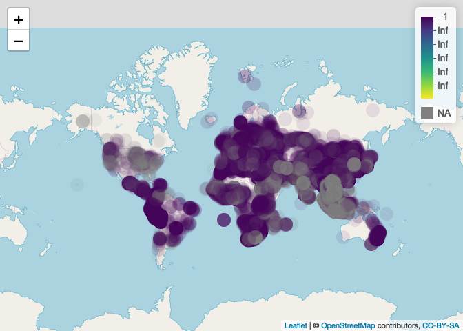
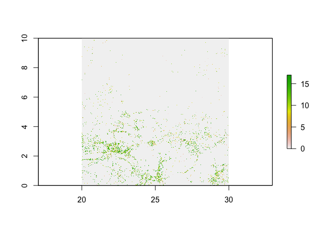

ungulates
================
Ilya
12/7/2018

#### install packages

    ## Loading required package: sp

### summarize EMPRES-i data

#### following directions here to make dataframe: <https://stackoverflow.com/questions/29736577/how-to-convert-data-frame-to-spatial-coordinate>"

``` r
E = read.csv("Outbreak_list4775267628333941320.csv")
dim(E)
```

    ## [1] 80605    24

``` r
summary(E)
```

    ##        Id                                        source     
    ##  Min.   :  3574   OIE                               :45501  
    ##  1st Qu.:162310   National authorities              :30053  
    ##  Median :189755   International reference laboratory: 2138  
    ##  Mean   :186397   Publications                      :  664  
    ##  3rd Qu.:214157   FAO Field Officer                 :  621  
    ##  Max.   :243129   WHO                               :  458  
    ##                   (Other)                           : 1170  
    ##     latitude        longitude            region           country     
    ##  Min.   :-46.40   Min.   :-155.45   Africa  :10341   China    : 6366  
    ##  1st Qu.: 20.81   1st Qu.:  20.25   Americas: 2965   Indonesia: 5675  
    ##  Median : 33.65   Median :  31.00   Asia    :34106   Viet Nam : 5155  
    ##  Mean   : 29.46   Mean   :  50.33   Europe  :32878   France   : 4725  
    ##  3rd Qu.: 45.27   3rd Qu.: 105.28   Oceania :  315   Egypt    : 3988  
    ##  Max.   : 78.33   Max.   : 160.15                    Greece   : 3648  
    ##                                                      (Other)  :51048  
    ##                             admin1             localityName  
    ##  Taiwan Sheng                  : 2055   Riyad        :  658  
    ##  Lubeiskie                     : 1253   Seoul        :  269  
    ##  Jawa Tengah                   :  997   Jeddah       :  229  
    ##  Mazowieckie                   :  997   Warszawa     :  194  
    ##  Dhaka                         :  952   Dongguan City:  163  
    ##  Anatoliki Makedonia Kai Thraki:  892   Anhui        :  160  
    ##  (Other)                       :73459   (Other)      :78932  
    ##           localityQuality    observationDate     reportingDate  
    ##  Centroid Admin1  : 7769             : 8347   21/11/2014:  913  
    ##  Centroid Admin2  : 7590   01/03/2011:  395   03/11/2014:  601  
    ##  Centroid Admin3  : 5065   28/02/2012:  185   03/12/2007:  586  
    ##  Centroid Locality: 2981   31/01/2012:  175   20/10/2014:  557  
    ##  Exact            :19968   18/09/2014:  166   08/09/2014:  475  
    ##  Unknown          :37232   30/06/2010:  137   26/04/2012:  418  
    ##                            (Other)   :71200   (Other)   :77055  
    ##        status                            disease          serotypes    
    ##  Confirmed:80349   Influenza - Avian         :32099            :32098  
    ##  Denied   :  256   Bluetongue                :12406   H5N1 HPAI:20777  
    ##                    African swine fever       : 9800   4        : 8128  
    ##                    Foot and mouth disease    : 3870   H5N8 HPAI: 3516  
    ##                    Schmallenberg             : 3337   8        : 2482  
    ##                    Peste des petits ruminants: 2991   H7N9 LPAI: 2450  
    ##                    (Other)                   :16102   (Other)  :11154  
    ##                   speciesDescription   sumAtRisk          sumCases        
    ##  domestic, chicken         :14139    Min.   :      0   Min.   :      0.0  
    ##  domestic, cattle          :12390    1st Qu.:     17   1st Qu.:      1.0  
    ##  domestic, unspecified bird: 7730    Median :    136   Median :      2.0  
    ##  wild, wild boar           : 7555    Mean   :   6979   Mean   :    621.9  
    ##  domestic, sheep           : 6812    3rd Qu.:   1280   3rd Qu.:     21.0  
    ##                            : 5173    Max.   :6400000   Max.   :2955056.0  
    ##  (Other)                   :26806    NA's   :35095     NA's   :21969      
    ##    sumDeaths          sumDestroyed     sumSlaughtered     humansGenderDesc
    ##  Min.   :      0.0   Min.   :      0   Min.   :     0.0         :80019    
    ##  1st Qu.:      0.0   1st Qu.:      0   1st Qu.:     0.0   Female:  130    
    ##  Median :      1.0   Median :      0   Median :     0.0   Male  :  456    
    ##  Mean   :    306.1   Mean   :   3339   Mean   :   128.4                   
    ##  3rd Qu.:      5.0   3rd Qu.:     33   3rd Qu.:     0.0                   
    ##  Max.   :1200000.0   Max.   :3660000   Max.   :850816.0                   
    ##  NA's   :26460       NA's   :34041     NA's   :43281                      
    ##    humansAge     humansAffected   humansDeaths   
    ##  Min.   : 0.00   Min.   :  0.0   Min.   :  0.00  
    ##  1st Qu.: 0.00   1st Qu.:  1.0   1st Qu.:  0.00  
    ##  Median : 0.00   Median :  1.0   Median :  1.00  
    ##  Mean   : 8.31   Mean   :  3.6   Mean   :  1.19  
    ##  3rd Qu.: 0.00   3rd Qu.:  1.0   3rd Qu.:  1.00  
    ##  Max.   :94.00   Max.   :495.0   Max.   :134.00  
    ##  NA's   :76900   NA's   :75444   NA's   :78586

``` r
df = E
proj  = "+proj=longlat +datum=WGS84 +no_defs +ellps=WGS84 +towgs84=0,0,0"
xy <- cbind(df$longitude,df$latitude)#package sp

df <-SpatialPointsDataFrame(coords = xy, data = df, 
                            proj4string = CRS(proj))

# df <- raster::projection(df, CRS("+proj=longlat +datum=WGS84 +no_defs +ellps=WGS84 +towgs84=0,0,0"))

pal <- colorNumeric("viridis", NULL)
#commenting this out because it does not display well in github_document
M<- leaflet(df) %>%
  addTiles() %>%
  addCircleMarkers(color = ~pal(sumCases),
    stroke = FALSE, fillOpacity = 0.1) %>%
  # setView(lat = 39.5, lng=-98.5, zoom =4) %>%
   #  add(stroke = FALSE, smoothFactor = 0.3, fillOpacity = 1,
   #  fillColor = ~pal(outC$incidence),
   #  #label with county name 
   #  label = ~paste0(county_name, ": ", formatC(outC$incidence, big.mark = ","))) %>%
   addLegend(pal = pal, values = df$sumCases, opacity = 1.0,
     labFormat = labelFormat(transform = function(x) round(10^x)))

mapshot(M, file = "EMPRESi_cases.png")
M
```



#### global forest change: <https://earthenginepartners.appspot.com/science-2013-global-forest/download_v1.5.html>

``` r
#Year of gross forest cover loss event (lossyear)
#Forest loss during the period 2000–2017, defined as a stand-replacement disturbance, or a change from a forest to non-forest state. Encoded as either 0 (no loss) or else a value in the range 1–17, representing loss detected primarily in the year 2001–2017, respectively.
#Granule with top-left corner at 10N, 20E
r = raster("Hansen_GFC-2017-v1.5_lossyear_10N_020E.tif")
plot(r)
```


