ungulates4
================
Ilya
3/4/2019

to change in version on workstation 3/15:
-----------------------------------------

### plot predictions

### sdf = dfPredictors

#### install packages

    ## Loading required package: sp

    ## Loading required package: ggplot2

    ## Loading required package: lattice

    ## Loading required package: latticeExtra

    ## Loading required package: RColorBrewer

    ## 
    ## Attaching package: 'latticeExtra'

    ## The following object is masked from 'package:ggplot2':
    ## 
    ##     layer

    ## 
    ## Attaching package: 'dplyr'

    ## The following objects are masked from 'package:raster':
    ## 
    ##     intersect, select, union

    ## The following objects are masked from 'package:stats':
    ## 
    ##     filter, lag

    ## The following objects are masked from 'package:base':
    ## 
    ##     intersect, setdiff, setequal, union

    ## ### Welcome to rworldmap ###

    ## For a short introduction type :   vignette('rworldmap')

    ## 
    ## Attaching package: 'lubridate'

    ## The following object is masked from 'package:base':
    ## 
    ##     date

    ## 
    ## Attaching package: 'zoo'

    ## The following objects are masked from 'package:base':
    ## 
    ##     as.Date, as.Date.numeric

    ## Loaded gbm 2.1.4

    ## Loading required package: gplots

    ## 
    ## Attaching package: 'gplots'

    ## The following object is masked from 'package:stats':
    ## 
    ##     lowess

### load data on outbreaks and on road density

``` r
load("dfAnimal.Rdata")
df = dfAnimal
out_spdf = SpatialPointsDataFrame(coords = df[,c("longitude", "latitude")], 
                               data = df)

###road density
R = raster("DATA/GRIP4_density_total/grip4_total_dens_m_km2.asc")

#assign projection
projection(R) <-CRS("+proj=longlat +datum=WGS84")
projection(out_spdf) = projection(R)

locs.vals = raster::extract(R, out_spdf,
                            df = TRUE, method = "simple")#specify 
#make into dataframe
locs.vals.df = data.frame(locs.vals)
#create row indices
locs.vals.df$row = seq(1, dim(locs.vals.df)[1])
# names(locs.vals.df)[2]="globcover"
df$row = seq(1, dim(locs.vals.df)[1])

df= merge(df, locs.vals.df, by = "row")
```

    ## Warning in merge.data.frame(df, locs.vals.df, by = "row"): column names
    ## 'ID.x', 'ID.y' are duplicated in the result

``` r
dfRoad = df
save(dfRoad, file = "dfRoad.Rdata")
```

### add log livestock density

``` r
load("dfRoad.Rdata")
df = dfRoad
names(df)[names(df) == "Chickens10km_AD_2010_v2_01"] = "chickens2010"
names(df)[names(df) == "Sheep10km_AD_2010_v2_1"] = "sheep2010"
names(df)[names(df) == "Goats10km_AD_2010_v2_1"] = "goats2010"
names(df)[names(df) == "Pigs10km_AD_2010_GLW2_01"] = "pigs2010"
names(df)[names(df) == "Cattle10km_AD_2010_v2_1"] = "cattle2010"

addSmall = 0.0001
df$log_chickens = log(df$chickens2010+addSmall)
df$log_sheep = log(df$sheep2010+addSmall)
df$log_goats = log(df$goats2010+addSmall)
df$log_cattle = log(df$cattle2010+addSmall)
df$log_pigs = log(df$pigs2010+addSmall)

#add column indicating number of livestock species with nonzero value
for (a in 1:dim(df)[1]){
  animals_tmp = c(df$chickens2010[a],
                  df$pigs2010[a],
                  df$goats2010[a],
                  df$sheep2010[a],
                  df$cattle2010[a])
  df$livestock_non_zero_fraction[a] = length(which(animals_tmp>0))/
    length(animals_tmp)
}
dfAnimalRoad = df
save(dfAnimalRoad, file = "dfAnimalRoad.Rdata")
```

### add data from one year of nightlights

``` r
load("dfAnimalRoad.Rdata")
df = dfAnimalRoad
out_spdf = SpatialPointsDataFrame(coords = df[,c("longitude", "latitude")], 
                               data = df)

###lights
R = raster("DATA/F182013.v4/F182013.v4c_web.stable_lights.avg_vis.tif")

#assign projection
projection(R) <-CRS("+proj=longlat +datum=WGS84")
projection(out_spdf) = projection(R)

locs.vals = raster::extract(R, out_spdf,
                            df = TRUE, method = "simple")#specify 
#make into dataframe
locs.vals.df = data.frame(locs.vals)
#create row indices
locs.vals.df$row = seq(1, dim(locs.vals.df)[1])
# names(locs.vals.df)[2]="globcover"
df$row = seq(1, dim(locs.vals.df)[1])

df= merge(df, locs.vals.df, by = "row")
```

    ## Warning in merge.data.frame(df, locs.vals.df, by = "row"): column names
    ## 'ID.x', 'ID.y', 'ID.x', 'ID.y' are duplicated in the result

``` r
inds255 = which(df$F182013.v4c_web.stable_lights.avg_vis==255)
df$F182013.v4c_web.stable_lights.avg_vis[inds255]=NA#255 is the no-cloudless-sky data value
dfAnimalRoadLight = df
save(dfAnimalRoadLight, file = "dfAnimalRoadLight.Rdata")
```

### get data on outbreaks, background and specific types of road density

``` r
load("dfAnimalRoadLight.Rdata")

df = dfAnimalRoadLight
out_spdf = SpatialPointsDataFrame(coords = df[,c("longitude", "latitude")], 
                               data = df)

#download road density datasets:
#https://www.globio.info/download-grip-dataset
###road density -- type 1, highway
R1 = raster("DATA/GRIP4_density_tp1/grip4_tp1_dens_m_km2.asc")
###road density -- type 2, primary
R2 = raster("DATA/GRIP4_density_tp2/grip4_tp2_dens_m_km2.asc")
roads = addLayer(R1, R2)
###road density -- type 3, secondary
R3 = raster("DATA/GRIP4_density_tp3/grip4_tp3_dens_m_km2.asc")
roads = addLayer(roads, R3)
###road density -- type 4, tertiary
R4 = raster("DATA/GRIP4_density_tp4/grip4_tp4_dens_m_km2.asc")
roads = addLayer(roads, R4)
###road density -- type 5, local
R5 = raster("DATA/GRIP4_density_tp5/grip4_tp5_dens_m_km2.asc")
roads = addLayer(roads, R5)
names(roads)=c("highway", "primary_roads", "secondary_roads",
               "tertiary_roads", "local_roads")
#assign projection
projection(roads) <-CRS("+proj=longlat +datum=WGS84")
projection(out_spdf) = projection(roads)

locs.vals = raster::extract(roads, out_spdf,
                            df = TRUE, method = "simple")#specify 
#make into dataframe
locs.vals.df = data.frame(locs.vals)
#create row indices
locs.vals.df$row = seq(1, dim(locs.vals.df)[1])
# names(locs.vals.df)[2]="globcover"
df$row = seq(1, dim(locs.vals.df)[1])

df= merge(df, locs.vals.df, by = "row")
```

    ## Warning in merge.data.frame(df, locs.vals.df, by = "row"): column names
    ## 'ID.x', 'ID.y', 'ID.x', 'ID.y' are duplicated in the result

``` r
addSmall = 0.0001
df$log_highway_density = log(df$highway+addSmall)
df$log_primary_road_density = log(df$primary_roads+addSmall)
df$log_secondary_road_density = log(df$secondary_roads+addSmall)
df$log_tertiary_road_density = log(df$tertiary_roads+addSmall)
df$log_local_road_density = log(df$local_roads+addSmall)
dfRoads = df

save(dfRoads, file = "dfRoads.Rdata")
```

### assign land cover to outbreak and background points. output:

dfRoads\_LC.Rdata
=================

``` r
Gl = raster("DATA/Globcover2009_V2.3_Global_/GLOBCOVER_L4_200901_200912_V2.3.tif")
projection(Gl) <- CRS("+proj=longlat +datum=WGS84")

# Gl = Gl_resampled
#Gl = raster("Globcover2009_V2.3_Global_/GLOBCOVER_L4_200901_200912_V2.3.tif")

load("dfRoads.Rdata")
df = dfRoads
names_ok = names(df)
names_ok = setdiff(names_ok, c("globcover", "label_short"))
df = df[, names_ok]
out_spdf = SpatialPointsDataFrame(coords = df[,c("longitude", "latitude")], 
                                  data = df)

#tell R that out coordinates are in the same lat/lon reference system
projection(out_spdf) <- projection(Gl)

locs.vals = raster::extract(Gl, out_spdf,
                            df = TRUE, method = "simple")#specify 
#make into dataframe
locs.vals.df = data.frame(locs.vals)
#create row indices
locs.vals.df$row = seq(1, dim(locs.vals.df)[1])
names(locs.vals.df)[2]="globcover"
df$row = seq(1, dim(locs.vals.df)[1])

df= merge(df, locs.vals.df, by = "row")
```

    ## Warning in merge.data.frame(df, locs.vals.df, by = "row"): column names
    ## 'ID.x', 'ID.y' are duplicated in the result

``` r
#G_legend = read.csv("DATA/Globcover2009_V2.3_Global_/Globcover2009_Legend.csv")
G_legend = read_excel("DATA/Globcover2009_V2.3_Global_/Globcover2009_Legend.xls")
names(G_legend)[names(G_legend)=="Value"]="globcover"
G_legend = G_legend[,c("globcover", "label_short")]
dim(df)
```

    ## [1] 82263    69

``` r
#df$globcover=round(df$globcover)
df1 =  merge(df, G_legend, by = "globcover")
```

    ## Warning in merge.data.frame(df, G_legend, by = "globcover"): column names
    ## 'ID.x', 'ID.y' are duplicated in the result

``` r
dim(df1)
```

    ## [1] 82263    70

``` r
df = df1
dfRoads_LC = df
summary(dfRoads_LC$label_short)
```

    ##    Length     Class      Mode 
    ##     82263 character character

``` r
save(dfRoads_LC, file = "dfRoads_LC.Rdata")
```

### hot one encode land cover

``` r
load("dfRoads_LC.Rdata")
df = dfRoads_LC
inds = c(5:6,31,50:57,64:68,70)
df = df[,inds]
#Converting every categorical variable to numerical using dummy variables
dmy <- dummyVars(" ~ .", data = df,fullRank = T, sep=".")
df_transformed <- data.frame(predict(dmy, newdata = df))
dfLC_onehot = df_transformed
save(dfLC_onehot, file = "dfLC_onehot.Rdata")
```

assign worldclim climate variables to outbreak and background points
--------------------------------------------------------------------

``` r
load("dfLC_onehot.Rdata")
df = dfLC_onehot

#http://worldclim.org/version2
path <- "DATA/wc2.0_5m_bio/"

grids <- list.files(path , pattern = "*.tif$")

#create a raster stack from the input raster files 
w <- stack(paste0(path, grids))

w <- subset(w, c("wc2.0_bio_5m_01", "wc2.0_bio_5m_12"))
names(w) = c("annualMeanTemp", "annualPrecip")

out_spdf = SpatialPointsDataFrame(coords = df[,c("longitude", "latitude")], 
#assign projection
                               data = df)
projection(w) <-CRS("+proj=longlat +datum=WGS84")
projection(out_spdf) = projection(w)

locs.vals = raster::extract(w, out_spdf,
                            df = TRUE, method = "simple")#specify 
#make into dataframe
locs.vals.df = data.frame(locs.vals)
#create row indices
locs.vals.df$row = seq(1, dim(locs.vals.df)[1])
# names(locs.vals.df)[2]="globcover"
df$row = seq(1, dim(locs.vals.df)[1])

df= merge(df, locs.vals.df, by = "row")

save(df, file = "df.Rdata")
```

### assign country from shapefile to outbreak and background

``` r
load("df.Rdata")
r = shapefile("DATA/TM_WORLD_BORDERS-0.3/TM_WORLD_BORDERS-0.3.shp")

out_spdf = SpatialPointsDataFrame(coords = df[,c("longitude", "latitude")], 
#assign projection
                               data = df)
projection(r) <-CRS("+proj=longlat +datum=WGS84")
projection(out_spdf) = projection(r)
out_spdf$country <- over(out_spdf, r)$NAME#name of park
#make into dataframe
df= as.data.frame(out_spdf)
keep = names(df)
rm_fields = c("latitude.1", "longitude.1", "ID")
keep = setdiff(keep, rm_fields)
df = df[,keep]

#change to one-hot encoding of country
#Converting every categorical variable to numerical using dummy variables
dmy <- dummyVars(" ~ .", data = df,fullRank = T, sep=".")
df_transformed <- data.frame(predict(dmy, newdata = df))
df = df_transformed

save(df, file = "df.Rdata")
```

### construct interaction features in df: log of the product of roadDensity and livestock density

``` r
load("df.Rdata")
addSmall = 0.0001
df$grip4_total_dens_m_km2=df$grip4_total_dens_m_km2+addSmall
df$log_road_chickens = log(df$grip4_total_dens_m_km2*exp(df$log_chickens))
df$log_road_pigs = log(df$grip4_total_dens_m_km2*exp(df$log_pigs))
df$log_road_cattle = log(df$grip4_total_dens_m_km2*exp(df$log_cattle))
df$log_road_sheep = log(df$grip4_total_dens_m_km2*exp(df$log_sheep))
df$log_road_goats = log(df$grip4_total_dens_m_km2*exp(df$log_goats))
save(df, file = "df.Rdata")
```

### get predictors for outbreak and background for gbm-- log road density w/ one hot land cover, climate, and country

``` r
load("df.Rdata")
names(df)[names(df)== "F182013.v4c_web.stable_lights.avg_vis"]="nightlights2013"
names(df)[names(df)== "grip4_total_dens_m_km2"]="roadDensity"

df$logRoadDensity = log(df$roadDensity+0.0001)

rm_fields = c("roadDensity", "latitude", "longitude", "row")
okay_fields = setdiff(names(df), rm_fields)
df = df[,okay_fields]
dfPredictors = df

###fix column names in dfPredictors to match names in Train
group = c(names(dfPredictors))

group = gsub("[.]","", group)
names(dfPredictors)=group

save(dfPredictors, file = "dfPredictors.Rdata")
df = dfPredictors
model<-as.formula(paste(colnames(df)[1], "~",
                        paste(colnames(df)[c(2:229)],collapse = "+"),
                        sep = ""))
print(model)
```

    ## case ~ log_chickens + log_sheep + log_goats + log_cattle + log_pigs + 
    ##     livestock_non_zero_fraction + nightlights2013 + log_highway_density + 
    ##     log_primary_road_density + log_secondary_road_density + log_tertiary_road_density + 
    ##     log_local_road_density + label_shortbare + label_shortclosedbroadleaveddeciduousforest + 
    ##     label_shortClosedneedleleavedevergreenforest + label_shortClosedtoopen15broadleavedevergreenorsemideciduousforest5m + 
    ##     label_shortforestorshrubgrassland + label_shortforestregularlyflooded + 
    ##     label_shortforestshrubpermanentlyflooded + label_shortgrasslandwoodyregularlyflooded + 
    ##     label_shortherbaceous + label_shortmixedbroadleavedandneedleleavesforest + 
    ##     label_shortmosaiccropgrassshrubforest + label_shortmosaicgrassshrubforestcrop + 
    ##     label_shortmosaicgrasslandforestshrub + label_shortNodataburntareasclouds + 
    ##     label_shortopenbroadleaveddeciduousforest + label_shortOpenneedleleaveddeciduousorevergreenforest + 
    ##     label_shortPostfloodingorirrigatedcroplandsoraquatic + label_shortRainfedcroplands + 
    ##     label_shortshrubland + label_shortsnowice + label_shortsparse + 
    ##     label_shortwater + annualMeanTemp + annualPrecip + countryAlbania + 
    ##     countryAlgeria + countryAndorra + countryAngola + countryAnguilla + 
    ##     countryAntiguaandBarbuda + countryArgentina + countryArmenia + 
    ##     countryAustralia + countryAustria + countryAzerbaijan + countryBahamas + 
    ##     countryBahrain + countryBangladesh + countryBelarus + countryBelgium + 
    ##     countryBelize + countryBenin + countryBhutan + countryBolivia + 
    ##     countryBosniaandHerzegovina + countryBotswana + countryBrazil + 
    ##     countryBulgaria + countryBurkinaFaso + countryBurma + countryBurundi + 
    ##     countryCambodia + countryCameroon + countryCanada + countryCapeVerde + 
    ##     countryCentralAfricanRepublic + countryChad + countryChile + 
    ##     countryChina + countryColombia + countryComoros + countryCongo + 
    ##     countryCostaRica + countryCotedIvoire + countryCroatia + 
    ##     countryCuba + countryCyprus + countryCzechRepublic + countryDemocraticRepublicoftheCongo + 
    ##     countryDenmark + countryDjibouti + countryDominica + countryDominicanRepublic + 
    ##     countryEcuador + countryEgypt + countryElSalvador + countryEquatorialGuinea + 
    ##     countryEritrea + countryEstonia + countryEthiopia + countryFalklandIslandsMalvinas + 
    ##     countryFaroeIslands + countryFiji + countryFinland + countryFrance + 
    ##     countryFrenchGuiana + countryGabon + countryGambia + countryGeorgia + 
    ##     countryGermany + countryGhana + countryGreece + countryGreenland + 
    ##     countryGuatemala + countryGuinea + countryGuineaBissau + 
    ##     countryGuyana + countryHaiti + countryHonduras + countryHongKong + 
    ##     countryHungary + countryIceland + countryIndia + countryIndonesia + 
    ##     countryIranIslamicRepublicof + countryIraq + countryIreland + 
    ##     countryIsrael + countryItaly + countryJamaica + countryJapan + 
    ##     countryJersey + countryJordan + countryKazakhstan + countryKenya + 
    ##     countryKoreaDemocraticPeoplesRepublicof + countryKoreaRepublicof + 
    ##     countryKuwait + countryKyrgyzstan + countryLaoPeoplesDemocraticRepublic + 
    ##     countryLatvia + countryLebanon + countryLesotho + countryLiberia + 
    ##     countryLibyanArabJamahiriya + countryLithuania + countryLuxembourg + 
    ##     countryMadagascar + countryMalawi + countryMalaysia + countryMali + 
    ##     countryMalta + countryMartinique + countryMauritania + countryMauritius + 
    ##     countryMayotte + countryMexico + countryMongolia + countryMontenegro + 
    ##     countryMorocco + countryMozambique + countryNamibia + countryNepal + 
    ##     countryNetherlands + countryNewCaledonia + countryNewZealand + 
    ##     countryNicaragua + countryNiger + countryNigeria + countryNorway + 
    ##     countryOman + countryPakistan + countryPalestine + countryPanama + 
    ##     countryPapuaNewGuinea + countryParaguay + countryPeru + countryPhilippines + 
    ##     countryPoland + countryPortugal + countryPuertoRico + countryQatar + 
    ##     countryRepublicofMoldova + countryReunion + countryRomania + 
    ##     countryRussia + countryRwanda + countrySaintVincentandtheGrenadines + 
    ##     countrySaudiArabia + countrySenegal + countrySerbia + countrySierraLeone + 
    ##     countrySingapore + countrySlovakia + countrySlovenia + countrySolomonIslands + 
    ##     countrySomalia + countrySouthAfrica + countrySpain + countrySriLanka + 
    ##     countrySudan + countrySuriname + countrySvalbard + countrySwaziland + 
    ##     countrySweden + countrySwitzerland + countrySyrianArabRepublic + 
    ##     countryTaiwan + countryTajikistan + countryThailand + countryTheformerYugoslavRepublicofMacedonia + 
    ##     countryTogo + countryTunisia + countryTurkey + countryTurkmenistan + 
    ##     countryUganda + countryUkraine + countryUnitedArabEmirates + 
    ##     countryUnitedKingdom + countryUnitedRepublicofTanzania + 
    ##     countryUnitedStates + countryUruguay + countryUzbekistan + 
    ##     countryVanuatu + countryVenezuela + countryVietNam + countryWesternSahara + 
    ##     countryYemen + countryZambia + countryZimbabwe + log_road_chickens + 
    ##     log_road_pigs + log_road_cattle + log_road_sheep + log_road_goats + 
    ##     logRoadDensity

``` r
save(model, file = "model.Rdata")
```

### partition train and test -- log road density -- multiple road types -- land cover -- climate -- country

``` r
library("caret")
load("dfPredictors.Rdata")
df = dfPredictors
DP =createDataPartition(y = df$case, 
                        p = 0.8,
                        list = FALSE)
Train = df[DP,]
summary(Train$case)
```

    ##    Min. 1st Qu.  Median    Mean 3rd Qu.    Max. 
    ##  0.0000  0.0000  0.0000  0.4992  1.0000  1.0000

``` r
Test = df[-DP,]

save(Train, file = "Train.Rdata")
#save(Test, file = "Test.Rdata")
```

### run GBM -- predictors include roads, livestock, nightlights (2013), land cover, climate, country

``` r
load("Train.Rdata")
# #https://stackoverflow.com/questions/19463137/error-in-evalexpr-envir-enclos-object-not-found
attach(Train)
load("model.Rdata")
#Start the clock
ptm<-proc.time()

n.trees = 10000
shrinkage = 0.001#final version should be 0.001
cv.folds = 10#final version should be 10
gbmtest<- gbm(model,
              data=Train,
              distribution="bernoulli",
              n.trees=n.trees,
              shrinkage=shrinkage,
              interaction.depth=4,
              bag.fraction=0.50,
              train.fraction=1,
              n.minobsinnode=5,
              cv.folds=cv.folds,
              keep.data=TRUE,
              verbose=TRUE,
              n.cores=NULL)
```

    ## Warning in gbm.fit(x = x, y = y, offset = offset, distribution =
    ## distribution, : variable 39: countryAndorra has no variation.

    ## Warning in gbm.fit(x = x, y = y, offset = offset, distribution =
    ## distribution, : variable 176: countryReunion has no variation.

    ## Iter   TrainDeviance   ValidDeviance   StepSize   Improve
    ##      1        1.3854             nan     0.0010    0.0005
    ##      2        1.3845             nan     0.0010    0.0005
    ##      3        1.3836             nan     0.0010    0.0005
    ##      4        1.3826             nan     0.0010    0.0005
    ##      5        1.3817             nan     0.0010    0.0005
    ##      6        1.3808             nan     0.0010    0.0005
    ##      7        1.3799             nan     0.0010    0.0005
    ##      8        1.3790             nan     0.0010    0.0005
    ##      9        1.3781             nan     0.0010    0.0005
    ##     10        1.3772             nan     0.0010    0.0004
    ##     20        1.3683             nan     0.0010    0.0004
    ##     40        1.3509             nan     0.0010    0.0004
    ##     60        1.3342             nan     0.0010    0.0004
    ##     80        1.3180             nan     0.0010    0.0004
    ##    100        1.3023             nan     0.0010    0.0004
    ##    120        1.2872             nan     0.0010    0.0004
    ##    140        1.2725             nan     0.0010    0.0004
    ##    160        1.2584             nan     0.0010    0.0003
    ##    180        1.2445             nan     0.0010    0.0003
    ##    200        1.2313             nan     0.0010    0.0003
    ##    220        1.2184             nan     0.0010    0.0003
    ##    240        1.2058             nan     0.0010    0.0003
    ##    260        1.1936             nan     0.0010    0.0003
    ##    280        1.1818             nan     0.0010    0.0003
    ##    300        1.1701             nan     0.0010    0.0003
    ##    320        1.1589             nan     0.0010    0.0003
    ##    340        1.1480             nan     0.0010    0.0003
    ##    360        1.1374             nan     0.0010    0.0003
    ##    380        1.1271             nan     0.0010    0.0002
    ##    400        1.1171             nan     0.0010    0.0002
    ##    420        1.1073             nan     0.0010    0.0002
    ##    440        1.0978             nan     0.0010    0.0002
    ##    460        1.0886             nan     0.0010    0.0002
    ##    480        1.0796             nan     0.0010    0.0002
    ##    500        1.0709             nan     0.0010    0.0002
    ##    520        1.0625             nan     0.0010    0.0002
    ##    540        1.0543             nan     0.0010    0.0002
    ##    560        1.0462             nan     0.0010    0.0002
    ##    580        1.0384             nan     0.0010    0.0002
    ##    600        1.0307             nan     0.0010    0.0002
    ##    620        1.0233             nan     0.0010    0.0002
    ##    640        1.0161             nan     0.0010    0.0002
    ##    660        1.0091             nan     0.0010    0.0002
    ##    680        1.0022             nan     0.0010    0.0002
    ##    700        0.9954             nan     0.0010    0.0002
    ##    720        0.9888             nan     0.0010    0.0002
    ##    740        0.9823             nan     0.0010    0.0002
    ##    760        0.9760             nan     0.0010    0.0002
    ##    780        0.9697             nan     0.0010    0.0001
    ##    800        0.9636             nan     0.0010    0.0001
    ##    820        0.9575             nan     0.0010    0.0002
    ##    840        0.9517             nan     0.0010    0.0002
    ##    860        0.9460             nan     0.0010    0.0001
    ##    880        0.9403             nan     0.0010    0.0001
    ##    900        0.9349             nan     0.0010    0.0001
    ##    920        0.9295             nan     0.0010    0.0001
    ##    940        0.9243             nan     0.0010    0.0001
    ##    960        0.9193             nan     0.0010    0.0001
    ##    980        0.9144             nan     0.0010    0.0001
    ##   1000        0.9094             nan     0.0010    0.0001
    ##   1020        0.9046             nan     0.0010    0.0001
    ##   1040        0.8999             nan     0.0010    0.0001
    ##   1060        0.8953             nan     0.0010    0.0001
    ##   1080        0.8908             nan     0.0010    0.0001
    ##   1100        0.8863             nan     0.0010    0.0001
    ##   1120        0.8818             nan     0.0010    0.0001
    ##   1140        0.8775             nan     0.0010    0.0001
    ##   1160        0.8731             nan     0.0010    0.0001
    ##   1180        0.8689             nan     0.0010    0.0001
    ##   1200        0.8647             nan     0.0010    0.0001
    ##   1220        0.8607             nan     0.0010    0.0001
    ##   1240        0.8567             nan     0.0010    0.0001
    ##   1260        0.8527             nan     0.0010    0.0001
    ##   1280        0.8488             nan     0.0010    0.0001
    ##   1300        0.8450             nan     0.0010    0.0001
    ##   1320        0.8413             nan     0.0010    0.0001
    ##   1340        0.8376             nan     0.0010    0.0001
    ##   1360        0.8341             nan     0.0010    0.0001
    ##   1380        0.8304             nan     0.0010    0.0001
    ##   1400        0.8269             nan     0.0010    0.0001
    ##   1420        0.8235             nan     0.0010    0.0001
    ##   1440        0.8202             nan     0.0010    0.0001
    ##   1460        0.8169             nan     0.0010    0.0001
    ##   1480        0.8135             nan     0.0010    0.0001
    ##   1500        0.8104             nan     0.0010    0.0001
    ##   1520        0.8073             nan     0.0010    0.0001
    ##   1540        0.8042             nan     0.0010    0.0001
    ##   1560        0.8012             nan     0.0010    0.0001
    ##   1580        0.7982             nan     0.0010    0.0001
    ##   1600        0.7952             nan     0.0010    0.0001
    ##   1620        0.7924             nan     0.0010    0.0001
    ##   1640        0.7897             nan     0.0010    0.0001
    ##   1660        0.7870             nan     0.0010    0.0001
    ##   1680        0.7843             nan     0.0010    0.0001
    ##   1700        0.7817             nan     0.0010    0.0001
    ##   1720        0.7790             nan     0.0010    0.0001
    ##   1740        0.7764             nan     0.0010    0.0001
    ##   1760        0.7739             nan     0.0010    0.0001
    ##   1780        0.7715             nan     0.0010    0.0001
    ##   1800        0.7689             nan     0.0010    0.0001
    ##   1820        0.7664             nan     0.0010    0.0001
    ##   1840        0.7640             nan     0.0010    0.0001
    ##   1860        0.7616             nan     0.0010    0.0001
    ##   1880        0.7593             nan     0.0010    0.0001
    ##   1900        0.7571             nan     0.0010    0.0001
    ##   1920        0.7547             nan     0.0010    0.0001
    ##   1940        0.7524             nan     0.0010    0.0001
    ##   1960        0.7501             nan     0.0010    0.0001
    ##   1980        0.7478             nan     0.0010    0.0000
    ##   2000        0.7458             nan     0.0010    0.0000
    ##   2020        0.7437             nan     0.0010    0.0001
    ##   2040        0.7416             nan     0.0010    0.0000
    ##   2060        0.7395             nan     0.0010    0.0001
    ##   2080        0.7375             nan     0.0010    0.0001
    ##   2100        0.7354             nan     0.0010    0.0000
    ##   2120        0.7335             nan     0.0010    0.0000
    ##   2140        0.7315             nan     0.0010    0.0000
    ##   2160        0.7296             nan     0.0010    0.0001
    ##   2180        0.7277             nan     0.0010    0.0000
    ##   2200        0.7258             nan     0.0010    0.0001
    ##   2220        0.7241             nan     0.0010    0.0000
    ##   2240        0.7222             nan     0.0010    0.0000
    ##   2260        0.7205             nan     0.0010    0.0000
    ##   2280        0.7187             nan     0.0010    0.0000
    ##   2300        0.7170             nan     0.0010    0.0001
    ##   2320        0.7153             nan     0.0010    0.0000
    ##   2340        0.7137             nan     0.0010    0.0000
    ##   2360        0.7121             nan     0.0010    0.0000
    ##   2380        0.7105             nan     0.0010    0.0000
    ##   2400        0.7089             nan     0.0010    0.0000
    ##   2420        0.7072             nan     0.0010    0.0000
    ##   2440        0.7057             nan     0.0010    0.0000
    ##   2460        0.7042             nan     0.0010    0.0000
    ##   2480        0.7026             nan     0.0010    0.0000
    ##   2500        0.7011             nan     0.0010    0.0000
    ##   2520        0.6997             nan     0.0010    0.0000
    ##   2540        0.6983             nan     0.0010    0.0000
    ##   2560        0.6970             nan     0.0010    0.0000
    ##   2580        0.6956             nan     0.0010    0.0000
    ##   2600        0.6942             nan     0.0010    0.0000
    ##   2620        0.6929             nan     0.0010    0.0000
    ##   2640        0.6915             nan     0.0010    0.0000
    ##   2660        0.6902             nan     0.0010    0.0000
    ##   2680        0.6889             nan     0.0010    0.0000
    ##   2700        0.6876             nan     0.0010    0.0000
    ##   2720        0.6863             nan     0.0010    0.0000
    ##   2740        0.6850             nan     0.0010    0.0000
    ##   2760        0.6838             nan     0.0010    0.0000
    ##   2780        0.6826             nan     0.0010    0.0000
    ##   2800        0.6814             nan     0.0010    0.0000
    ##   2820        0.6803             nan     0.0010    0.0000
    ##   2840        0.6792             nan     0.0010    0.0000
    ##   2860        0.6780             nan     0.0010    0.0000
    ##   2880        0.6770             nan     0.0010    0.0000
    ##   2900        0.6759             nan     0.0010    0.0000
    ##   2920        0.6747             nan     0.0010    0.0000
    ##   2940        0.6737             nan     0.0010    0.0000
    ##   2960        0.6725             nan     0.0010    0.0000
    ##   2980        0.6716             nan     0.0010    0.0000
    ##   3000        0.6705             nan     0.0010    0.0000
    ##   3020        0.6694             nan     0.0010    0.0000
    ##   3040        0.6684             nan     0.0010    0.0000
    ##   3060        0.6674             nan     0.0010    0.0000
    ##   3080        0.6665             nan     0.0010    0.0000
    ##   3100        0.6655             nan     0.0010    0.0000
    ##   3120        0.6645             nan     0.0010    0.0000
    ##   3140        0.6636             nan     0.0010    0.0000
    ##   3160        0.6626             nan     0.0010    0.0000
    ##   3180        0.6617             nan     0.0010    0.0000
    ##   3200        0.6608             nan     0.0010    0.0000
    ##   3220        0.6600             nan     0.0010    0.0000
    ##   3240        0.6590             nan     0.0010    0.0000
    ##   3260        0.6581             nan     0.0010    0.0000
    ##   3280        0.6572             nan     0.0010    0.0000
    ##   3300        0.6563             nan     0.0010    0.0000
    ##   3320        0.6554             nan     0.0010    0.0000
    ##   3340        0.6546             nan     0.0010    0.0000
    ##   3360        0.6537             nan     0.0010    0.0000
    ##   3380        0.6529             nan     0.0010    0.0000
    ##   3400        0.6520             nan     0.0010    0.0000
    ##   3420        0.6512             nan     0.0010    0.0000
    ##   3440        0.6503             nan     0.0010    0.0000
    ##   3460        0.6495             nan     0.0010    0.0000
    ##   3480        0.6487             nan     0.0010    0.0000
    ##   3500        0.6478             nan     0.0010    0.0000
    ##   3520        0.6471             nan     0.0010    0.0000
    ##   3540        0.6463             nan     0.0010    0.0000
    ##   3560        0.6455             nan     0.0010    0.0000
    ##   3580        0.6447             nan     0.0010    0.0000
    ##   3600        0.6439             nan     0.0010    0.0000
    ##   3620        0.6432             nan     0.0010    0.0000
    ##   3640        0.6424             nan     0.0010    0.0000
    ##   3660        0.6416             nan     0.0010    0.0000
    ##   3680        0.6408             nan     0.0010    0.0000
    ##   3700        0.6401             nan     0.0010    0.0000
    ##   3720        0.6394             nan     0.0010    0.0000
    ##   3740        0.6387             nan     0.0010    0.0000
    ##   3760        0.6380             nan     0.0010    0.0000
    ##   3780        0.6372             nan     0.0010    0.0000
    ##   3800        0.6365             nan     0.0010    0.0000
    ##   3820        0.6358             nan     0.0010    0.0000
    ##   3840        0.6351             nan     0.0010    0.0000
    ##   3860        0.6345             nan     0.0010    0.0000
    ##   3880        0.6338             nan     0.0010    0.0000
    ##   3900        0.6331             nan     0.0010    0.0000
    ##   3920        0.6325             nan     0.0010    0.0000
    ##   3940        0.6318             nan     0.0010    0.0000
    ##   3960        0.6311             nan     0.0010    0.0000
    ##   3980        0.6305             nan     0.0010    0.0000
    ##   4000        0.6298             nan     0.0010    0.0000
    ##   4020        0.6291             nan     0.0010    0.0000
    ##   4040        0.6284             nan     0.0010    0.0000
    ##   4060        0.6278             nan     0.0010    0.0000
    ##   4080        0.6272             nan     0.0010    0.0000
    ##   4100        0.6265             nan     0.0010    0.0000
    ##   4120        0.6259             nan     0.0010    0.0000
    ##   4140        0.6253             nan     0.0010    0.0000
    ##   4160        0.6247             nan     0.0010    0.0000
    ##   4180        0.6241             nan     0.0010    0.0000
    ##   4200        0.6235             nan     0.0010    0.0000
    ##   4220        0.6229             nan     0.0010    0.0000
    ##   4240        0.6223             nan     0.0010    0.0000
    ##   4260        0.6218             nan     0.0010    0.0000
    ##   4280        0.6212             nan     0.0010    0.0000
    ##   4300        0.6206             nan     0.0010    0.0000
    ##   4320        0.6200             nan     0.0010    0.0000
    ##   4340        0.6194             nan     0.0010    0.0000
    ##   4360        0.6189             nan     0.0010    0.0000
    ##   4380        0.6183             nan     0.0010    0.0000
    ##   4400        0.6178             nan     0.0010    0.0000
    ##   4420        0.6172             nan     0.0010    0.0000
    ##   4440        0.6167             nan     0.0010    0.0000
    ##   4460        0.6162             nan     0.0010    0.0000
    ##   4480        0.6156             nan     0.0010    0.0000
    ##   4500        0.6150             nan     0.0010    0.0000
    ##   4520        0.6145             nan     0.0010    0.0000
    ##   4540        0.6140             nan     0.0010    0.0000
    ##   4560        0.6135             nan     0.0010    0.0000
    ##   4580        0.6130             nan     0.0010    0.0000
    ##   4600        0.6125             nan     0.0010    0.0000
    ##   4620        0.6120             nan     0.0010    0.0000
    ##   4640        0.6114             nan     0.0010    0.0000
    ##   4660        0.6109             nan     0.0010    0.0000
    ##   4680        0.6104             nan     0.0010    0.0000
    ##   4700        0.6099             nan     0.0010    0.0000
    ##   4720        0.6094             nan     0.0010    0.0000
    ##   4740        0.6089             nan     0.0010    0.0000
    ##   4760        0.6084             nan     0.0010    0.0000
    ##   4780        0.6080             nan     0.0010    0.0000
    ##   4800        0.6075             nan     0.0010    0.0000
    ##   4820        0.6070             nan     0.0010    0.0000
    ##   4840        0.6065             nan     0.0010    0.0000
    ##   4860        0.6061             nan     0.0010    0.0000
    ##   4880        0.6056             nan     0.0010    0.0000
    ##   4900        0.6051             nan     0.0010    0.0000
    ##   4920        0.6047             nan     0.0010    0.0000
    ##   4940        0.6042             nan     0.0010    0.0000
    ##   4960        0.6038             nan     0.0010    0.0000
    ##   4980        0.6033             nan     0.0010    0.0000
    ##   5000        0.6028             nan     0.0010    0.0000
    ##   5020        0.6024             nan     0.0010    0.0000
    ##   5040        0.6019             nan     0.0010    0.0000
    ##   5060        0.6015             nan     0.0010    0.0000
    ##   5080        0.6011             nan     0.0010    0.0000
    ##   5100        0.6006             nan     0.0010    0.0000
    ##   5120        0.6002             nan     0.0010    0.0000
    ##   5140        0.5997             nan     0.0010    0.0000
    ##   5160        0.5993             nan     0.0010    0.0000
    ##   5180        0.5989             nan     0.0010    0.0000
    ##   5200        0.5984             nan     0.0010    0.0000
    ##   5220        0.5980             nan     0.0010    0.0000
    ##   5240        0.5976             nan     0.0010    0.0000
    ##   5260        0.5972             nan     0.0010    0.0000
    ##   5280        0.5967             nan     0.0010    0.0000
    ##   5300        0.5963             nan     0.0010    0.0000
    ##   5320        0.5959             nan     0.0010    0.0000
    ##   5340        0.5955             nan     0.0010    0.0000
    ##   5360        0.5951             nan     0.0010    0.0000
    ##   5380        0.5947             nan     0.0010    0.0000
    ##   5400        0.5943             nan     0.0010    0.0000
    ##   5420        0.5939             nan     0.0010    0.0000
    ##   5440        0.5935             nan     0.0010    0.0000
    ##   5460        0.5931             nan     0.0010    0.0000
    ##   5480        0.5927             nan     0.0010    0.0000
    ##   5500        0.5923             nan     0.0010    0.0000
    ##   5520        0.5919             nan     0.0010    0.0000
    ##   5540        0.5915             nan     0.0010    0.0000
    ##   5560        0.5911             nan     0.0010    0.0000
    ##   5580        0.5908             nan     0.0010    0.0000
    ##   5600        0.5904             nan     0.0010    0.0000
    ##   5620        0.5900             nan     0.0010    0.0000
    ##   5640        0.5896             nan     0.0010    0.0000
    ##   5660        0.5893             nan     0.0010    0.0000
    ##   5680        0.5889             nan     0.0010    0.0000
    ##   5700        0.5885             nan     0.0010    0.0000
    ##   5720        0.5881             nan     0.0010    0.0000
    ##   5740        0.5878             nan     0.0010    0.0000
    ##   5760        0.5874             nan     0.0010    0.0000
    ##   5780        0.5870             nan     0.0010    0.0000
    ##   5800        0.5866             nan     0.0010    0.0000
    ##   5820        0.5863             nan     0.0010    0.0000
    ##   5840        0.5859             nan     0.0010    0.0000
    ##   5860        0.5856             nan     0.0010    0.0000
    ##   5880        0.5852             nan     0.0010    0.0000
    ##   5900        0.5849             nan     0.0010    0.0000
    ##   5920        0.5845             nan     0.0010    0.0000
    ##   5940        0.5842             nan     0.0010    0.0000
    ##   5960        0.5838             nan     0.0010    0.0000
    ##   5980        0.5835             nan     0.0010    0.0000
    ##   6000        0.5832             nan     0.0010    0.0000
    ##   6020        0.5828             nan     0.0010    0.0000
    ##   6040        0.5825             nan     0.0010    0.0000
    ##   6060        0.5822             nan     0.0010    0.0000
    ##   6080        0.5818             nan     0.0010    0.0000
    ##   6100        0.5815             nan     0.0010    0.0000
    ##   6120        0.5811             nan     0.0010    0.0000
    ##   6140        0.5808             nan     0.0010    0.0000
    ##   6160        0.5805             nan     0.0010    0.0000
    ##   6180        0.5801             nan     0.0010    0.0000
    ##   6200        0.5798             nan     0.0010    0.0000
    ##   6220        0.5795             nan     0.0010    0.0000
    ##   6240        0.5791             nan     0.0010    0.0000
    ##   6260        0.5788             nan     0.0010    0.0000
    ##   6280        0.5785             nan     0.0010    0.0000
    ##   6300        0.5782             nan     0.0010    0.0000
    ##   6320        0.5779             nan     0.0010    0.0000
    ##   6340        0.5775             nan     0.0010    0.0000
    ##   6360        0.5772             nan     0.0010    0.0000
    ##   6380        0.5769             nan     0.0010    0.0000
    ##   6400        0.5766             nan     0.0010    0.0000
    ##   6420        0.5763             nan     0.0010    0.0000
    ##   6440        0.5759             nan     0.0010    0.0000
    ##   6460        0.5756             nan     0.0010    0.0000
    ##   6480        0.5753             nan     0.0010    0.0000
    ##   6500        0.5750             nan     0.0010    0.0000
    ##   6520        0.5747             nan     0.0010    0.0000
    ##   6540        0.5744             nan     0.0010    0.0000
    ##   6560        0.5741             nan     0.0010    0.0000
    ##   6580        0.5738             nan     0.0010    0.0000
    ##   6600        0.5735             nan     0.0010    0.0000
    ##   6620        0.5732             nan     0.0010    0.0000
    ##   6640        0.5729             nan     0.0010    0.0000
    ##   6660        0.5726             nan     0.0010    0.0000
    ##   6680        0.5723             nan     0.0010    0.0000
    ##   6700        0.5720             nan     0.0010    0.0000
    ##   6720        0.5717             nan     0.0010    0.0000
    ##   6740        0.5714             nan     0.0010    0.0000
    ##   6760        0.5711             nan     0.0010    0.0000
    ##   6780        0.5709             nan     0.0010    0.0000
    ##   6800        0.5706             nan     0.0010    0.0000
    ##   6820        0.5704             nan     0.0010    0.0000
    ##   6840        0.5701             nan     0.0010    0.0000
    ##   6860        0.5698             nan     0.0010    0.0000
    ##   6880        0.5696             nan     0.0010    0.0000
    ##   6900        0.5693             nan     0.0010    0.0000
    ##   6920        0.5690             nan     0.0010    0.0000
    ##   6940        0.5687             nan     0.0010    0.0000
    ##   6960        0.5685             nan     0.0010    0.0000
    ##   6980        0.5682             nan     0.0010    0.0000
    ##   7000        0.5679             nan     0.0010    0.0000
    ##   7020        0.5676             nan     0.0010    0.0000
    ##   7040        0.5674             nan     0.0010    0.0000
    ##   7060        0.5671             nan     0.0010    0.0000
    ##   7080        0.5668             nan     0.0010    0.0000
    ##   7100        0.5665             nan     0.0010    0.0000
    ##   7120        0.5663             nan     0.0010    0.0000
    ##   7140        0.5660             nan     0.0010    0.0000
    ##   7160        0.5657             nan     0.0010    0.0000
    ##   7180        0.5654             nan     0.0010    0.0000
    ##   7200        0.5652             nan     0.0010    0.0000
    ##   7220        0.5649             nan     0.0010    0.0000
    ##   7240        0.5647             nan     0.0010    0.0000
    ##   7260        0.5644             nan     0.0010    0.0000
    ##   7280        0.5641             nan     0.0010    0.0000
    ##   7300        0.5639             nan     0.0010    0.0000
    ##   7320        0.5636             nan     0.0010    0.0000
    ##   7340        0.5634             nan     0.0010    0.0000
    ##   7360        0.5631             nan     0.0010    0.0000
    ##   7380        0.5628             nan     0.0010    0.0000
    ##   7400        0.5626             nan     0.0010    0.0000
    ##   7420        0.5623             nan     0.0010    0.0000
    ##   7440        0.5621             nan     0.0010    0.0000
    ##   7460        0.5618             nan     0.0010    0.0000
    ##   7480        0.5616             nan     0.0010    0.0000
    ##   7500        0.5613             nan     0.0010    0.0000
    ##   7520        0.5610             nan     0.0010    0.0000
    ##   7540        0.5608             nan     0.0010    0.0000
    ##   7560        0.5606             nan     0.0010    0.0000
    ##   7580        0.5603             nan     0.0010    0.0000
    ##   7600        0.5601             nan     0.0010    0.0000
    ##   7620        0.5598             nan     0.0010    0.0000
    ##   7640        0.5596             nan     0.0010    0.0000
    ##   7660        0.5593             nan     0.0010    0.0000
    ##   7680        0.5591             nan     0.0010    0.0000
    ##   7700        0.5588             nan     0.0010    0.0000
    ##   7720        0.5586             nan     0.0010    0.0000
    ##   7740        0.5584             nan     0.0010    0.0000
    ##   7760        0.5581             nan     0.0010    0.0000
    ##   7780        0.5579             nan     0.0010    0.0000
    ##   7800        0.5576             nan     0.0010    0.0000
    ##   7820        0.5574             nan     0.0010    0.0000
    ##   7840        0.5571             nan     0.0010    0.0000
    ##   7860        0.5569             nan     0.0010    0.0000
    ##   7880        0.5567             nan     0.0010    0.0000
    ##   7900        0.5564             nan     0.0010    0.0000
    ##   7920        0.5562             nan     0.0010    0.0000
    ##   7940        0.5560             nan     0.0010    0.0000
    ##   7960        0.5557             nan     0.0010    0.0000
    ##   7980        0.5555             nan     0.0010    0.0000
    ##   8000        0.5553             nan     0.0010    0.0000
    ##   8020        0.5550             nan     0.0010    0.0000
    ##   8040        0.5548             nan     0.0010    0.0000
    ##   8060        0.5546             nan     0.0010    0.0000
    ##   8080        0.5543             nan     0.0010    0.0000
    ##   8100        0.5541             nan     0.0010    0.0000
    ##   8120        0.5539             nan     0.0010    0.0000
    ##   8140        0.5537             nan     0.0010    0.0000
    ##   8160        0.5534             nan     0.0010    0.0000
    ##   8180        0.5532             nan     0.0010    0.0000
    ##   8200        0.5530             nan     0.0010    0.0000
    ##   8220        0.5528             nan     0.0010    0.0000
    ##   8240        0.5526             nan     0.0010    0.0000
    ##   8260        0.5523             nan     0.0010    0.0000
    ##   8280        0.5521             nan     0.0010    0.0000
    ##   8300        0.5519             nan     0.0010    0.0000
    ##   8320        0.5517             nan     0.0010    0.0000
    ##   8340        0.5514             nan     0.0010    0.0000
    ##   8360        0.5512             nan     0.0010    0.0000
    ##   8380        0.5510             nan     0.0010    0.0000
    ##   8400        0.5508             nan     0.0010    0.0000
    ##   8420        0.5505             nan     0.0010    0.0000
    ##   8440        0.5503             nan     0.0010    0.0000
    ##   8460        0.5501             nan     0.0010    0.0000
    ##   8480        0.5499             nan     0.0010    0.0000
    ##   8500        0.5497             nan     0.0010    0.0000
    ##   8520        0.5494             nan     0.0010    0.0000
    ##   8540        0.5492             nan     0.0010    0.0000
    ##   8560        0.5490             nan     0.0010    0.0000
    ##   8580        0.5488             nan     0.0010    0.0000
    ##   8600        0.5486             nan     0.0010    0.0000
    ##   8620        0.5484             nan     0.0010    0.0000
    ##   8640        0.5482             nan     0.0010    0.0000
    ##   8660        0.5480             nan     0.0010    0.0000
    ##   8680        0.5478             nan     0.0010    0.0000
    ##   8700        0.5476             nan     0.0010    0.0000
    ##   8720        0.5474             nan     0.0010    0.0000
    ##   8740        0.5472             nan     0.0010    0.0000
    ##   8760        0.5470             nan     0.0010    0.0000
    ##   8780        0.5468             nan     0.0010    0.0000
    ##   8800        0.5465             nan     0.0010    0.0000
    ##   8820        0.5463             nan     0.0010    0.0000
    ##   8840        0.5461             nan     0.0010    0.0000
    ##   8860        0.5459             nan     0.0010    0.0000
    ##   8880        0.5457             nan     0.0010    0.0000
    ##   8900        0.5455             nan     0.0010    0.0000
    ##   8920        0.5453             nan     0.0010    0.0000
    ##   8940        0.5451             nan     0.0010    0.0000
    ##   8960        0.5449             nan     0.0010    0.0000
    ##   8980        0.5447             nan     0.0010    0.0000
    ##   9000        0.5445             nan     0.0010    0.0000
    ##   9020        0.5443             nan     0.0010    0.0000
    ##   9040        0.5441             nan     0.0010    0.0000
    ##   9060        0.5439             nan     0.0010    0.0000
    ##   9080        0.5437             nan     0.0010    0.0000
    ##   9100        0.5435             nan     0.0010    0.0000
    ##   9120        0.5433             nan     0.0010    0.0000
    ##   9140        0.5431             nan     0.0010    0.0000
    ##   9160        0.5429             nan     0.0010    0.0000
    ##   9180        0.5427             nan     0.0010    0.0000
    ##   9200        0.5425             nan     0.0010    0.0000
    ##   9220        0.5423             nan     0.0010    0.0000
    ##   9240        0.5421             nan     0.0010    0.0000
    ##   9260        0.5419             nan     0.0010    0.0000
    ##   9280        0.5417             nan     0.0010    0.0000
    ##   9300        0.5415             nan     0.0010    0.0000
    ##   9320        0.5413             nan     0.0010    0.0000
    ##   9340        0.5412             nan     0.0010    0.0000
    ##   9360        0.5410             nan     0.0010    0.0000
    ##   9380        0.5408             nan     0.0010    0.0000
    ##   9400        0.5406             nan     0.0010    0.0000
    ##   9420        0.5404             nan     0.0010    0.0000
    ##   9440        0.5402             nan     0.0010    0.0000
    ##   9460        0.5400             nan     0.0010    0.0000
    ##   9480        0.5398             nan     0.0010    0.0000
    ##   9500        0.5396             nan     0.0010    0.0000
    ##   9520        0.5395             nan     0.0010    0.0000
    ##   9540        0.5393             nan     0.0010    0.0000
    ##   9560        0.5391             nan     0.0010    0.0000
    ##   9580        0.5389             nan     0.0010    0.0000
    ##   9600        0.5387             nan     0.0010    0.0000
    ##   9620        0.5385             nan     0.0010    0.0000
    ##   9640        0.5383             nan     0.0010    0.0000
    ##   9660        0.5382             nan     0.0010    0.0000
    ##   9680        0.5380             nan     0.0010    0.0000
    ##   9700        0.5378             nan     0.0010    0.0000
    ##   9720        0.5376             nan     0.0010    0.0000
    ##   9740        0.5374             nan     0.0010    0.0000
    ##   9760        0.5373             nan     0.0010    0.0000
    ##   9780        0.5371             nan     0.0010    0.0000
    ##   9800        0.5369             nan     0.0010    0.0000
    ##   9820        0.5367             nan     0.0010    0.0000
    ##   9840        0.5365             nan     0.0010    0.0000
    ##   9860        0.5363             nan     0.0010    0.0000
    ##   9880        0.5362             nan     0.0010    0.0000
    ##   9900        0.5360             nan     0.0010    0.0000
    ##   9920        0.5358             nan     0.0010    0.0000
    ##   9940        0.5356             nan     0.0010    0.0000
    ##   9960        0.5354             nan     0.0010    0.0000
    ##   9980        0.5352             nan     0.0010    0.0000
    ##  10000        0.5351             nan     0.0010    0.0000

``` r
save(gbmtest, file = "gbmtest.Rdata")
#check performance using 5-fold cross-validation
best.iter <- gbm.perf(gbmtest,method="cv",plot.it=FALSE) #this gives you the optimal number of trees based on cv performance, other methods will over or under predict
```

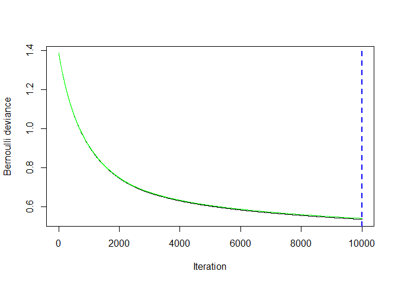

``` r
print(best.iter)
```

    ## [1] 10000

``` r
gbm_error = data.frame(train.error = gbmtest$train.error,
                       trees = seq(1,n.trees))
plot <- ggplot(gbm_error, aes(x = trees, y = train.error))+
  geom_line()
plot
```

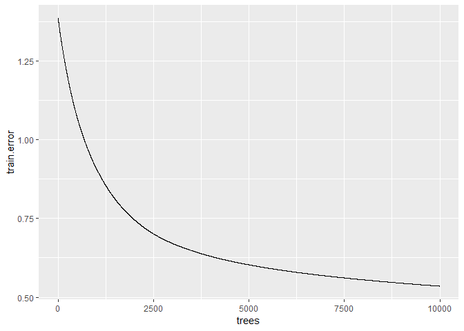

``` r
ggsave(filename = "deviance_RoadAnimalNightLcClimateCountry.jpg",
       plot = plot)
```

    ## Saving 7 x 5 in image

``` r
#Stop the clock
(proc.time()-ptm)/60
```

    ##     user   system  elapsed 
    ## 135.2947   1.5020 268.3000

``` r
# output predictions on the TRAINING SET
output<-predict(gbmtest,
                newdata=Train,
                n.trees=best.iter,
                type="response")

#need to figure out how to interpret this, or change it to be interpretable
output<-cbind(output,Train$case)
colnames(output)<-c("output","data")
rownames(output)<-rownames(Train)
output<-output[order(-output[,1]),]

# # AUC for Bernoulli distributed responses
par(mar = c(1,1,1,1))
auc=colAUC(output[,1],output[,2],
           plotROC = TRUE)
```

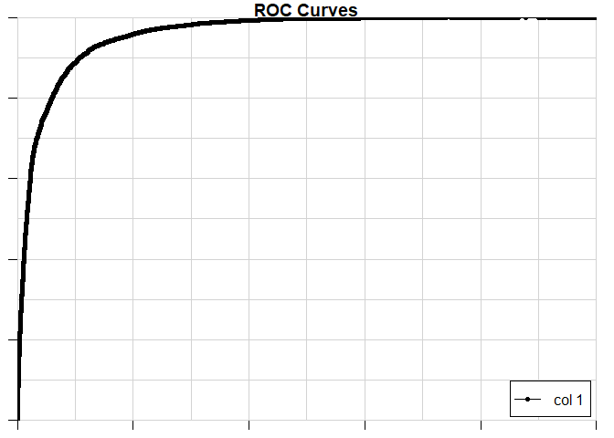

``` r
print(auc)
```

    ##              [,1]
    ## 0 vs. 1 0.9582496

``` r
pred<-prediction(output[,1],output[,2])
perf<-performance(pred,"tpr","fpr")

par(mar = c(1,1,1,1))
plot(perf,colorize=TRUE,main="ROC full model")
abline(a=0, b= 1)
```

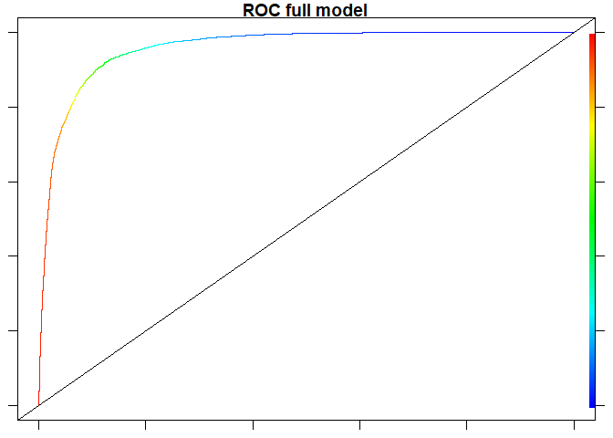

``` r
best.iter = 10000
load("gbmtest.Rdata")
load("Train.Rdata")

#Generate pd plots of vars with high relative importance

#overlay histograms on the marginal plots of top predictor variables

par(mfrow=c(2,3))

# 1. aridity
par(mar=c(4.2,4.2,1,4.5))
histGR<-hist(Train$log_road_goats,xlab="Log road x goats",
             breaks=20,
             main="",axes=FALSE,xaxs="i",border="white",col="light blue")
axis(2,histGR$y)
par(new=TRUE,ann=FALSE,yaxt="n")

margGR<-plot(gbmtest,i.var="log_road_goats",best.iter,lwd=1.5)
par(yaxt="s")
axis(4,margGR$y)
# mtext("Marginal effect on prediction",side=4,line=2.5)#,cex=0.7)
```

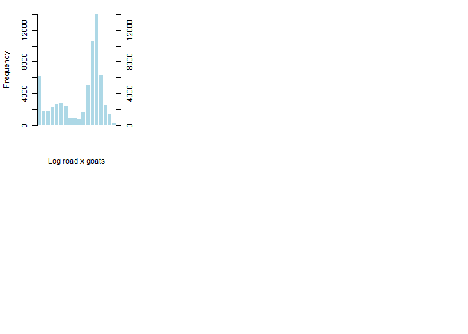

### plot relative influence -- multiple road types

### version with cutoff threshold of minimum interesting influence of 1%

``` r
#format relative influence for figure
load("gbmtest.Rdata")
# gbmtest = gbmtestRoadsAnimalNight
x = summary(gbmtest)
```

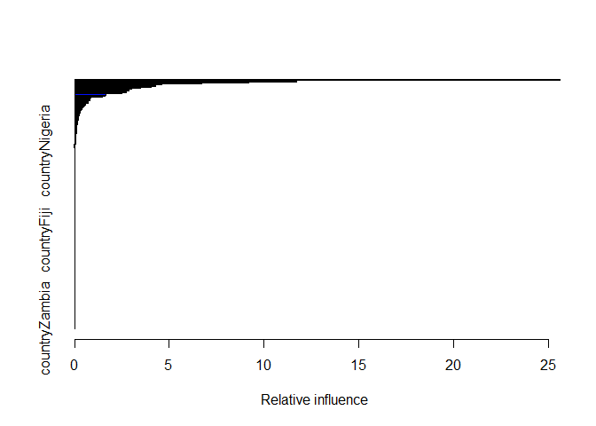

``` r
# 
x.df= data.frame(variable = x$var,
                 relative.influence = x$rel.inf)

x.df = subset(x.df, relative.influence >=1)

x.df$variable = factor(x.df$variable, levels = x.df$variable[order(x.df$relative.influence)])
save(x.df, file = "x.df.Rdata")
ggplot(data = x.df, aes(x = variable, y =relative.influence))+
  ylab("relative influence (%)")+
  xlab("variable")+
  geom_bar(stat="identity")+
  coord_flip()
```

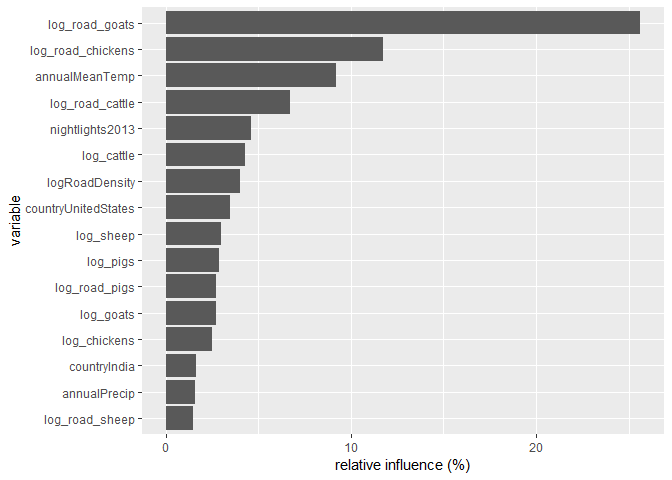

``` r
# 
ggsave("Figure.relative.influence.Animals.Roads.Climate.Nightlights.Country.jpg")
```

    ## Saving 7 x 5 in image

### partial dependency plot

Get data needed for partial dependency plot -- multiple road types. Requires gbmtest and Train. Makes "out\_partial.Rdata"

``` r
load("gbmtest.Rdata")
load("x.df.Rdata")
# gbmtest = gbmtest
#https://stackoverflow.com/questions/26917689/how-to-use-facets-with-a-dual-y-axis-ggplot

# Data
out = NULL
#x = summary(gbmtest)
#varlist = x$var
#get variables from gbmtest
#varlist = gbmtest$var.names
#get only those variables that have relative influence above certain threshold
varlist = x.df$variable
for (i in 1:length(varlist)){#begin for loop
  #print(i)
  i.var = which(gbmtest$var.names==varlist[i])
  plot.out = plot.gbm(gbmtest, i.var = as.character(varlist[i]), return.grid = TRUE)
  names(plot.out)[1]="variable.value"
  names(plot.out)[2]="value"
  plot.out$variable.name=varlist[i]
  plot.out$var = "marginal.effect"#for plotting
  out = rbind(out, plot.out)
}#end for loop

Train1=subset(Train, case == 1)

i =1
i = 3
for (i in 1:length(varlist)){#begin for loop through variables
  print(i)
  i.var = which(names(Train1)==varlist[i])
  h = hist(Train1[,i.var], plot = TRUE)
  tmp = data.frame(variable.value = h$mids,
                   value=h$counts/sum(h$counts),#normalize
                   variable.name=varlist[i],
                   var = "frequency")
  out = rbind(out, tmp)
}#end for loop
```

    ## [1] 1

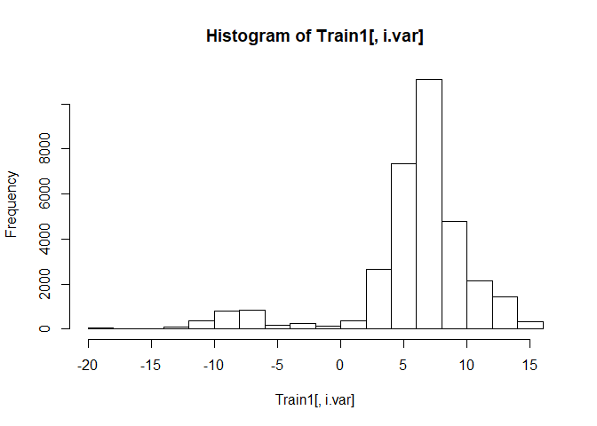

    ## [1] 2

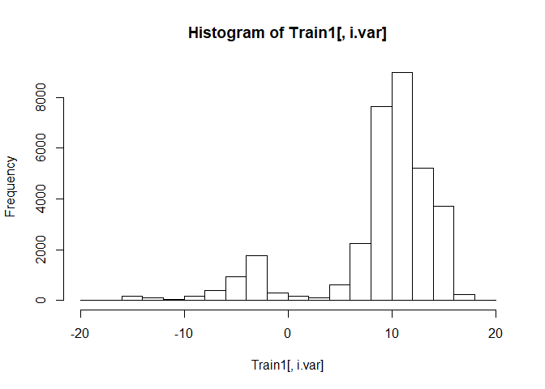

    ## [1] 3

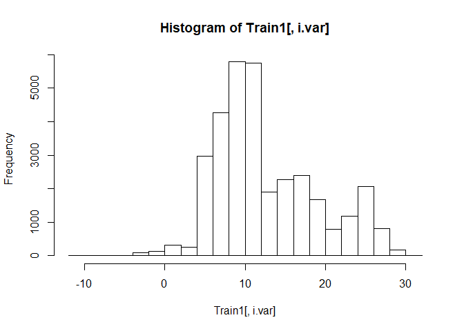

    ## [1] 4

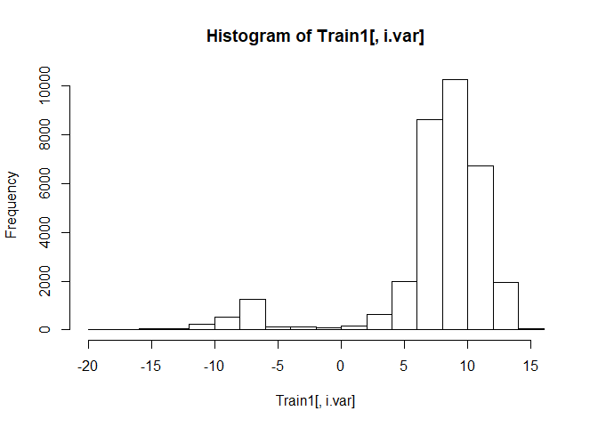

    ## [1] 5

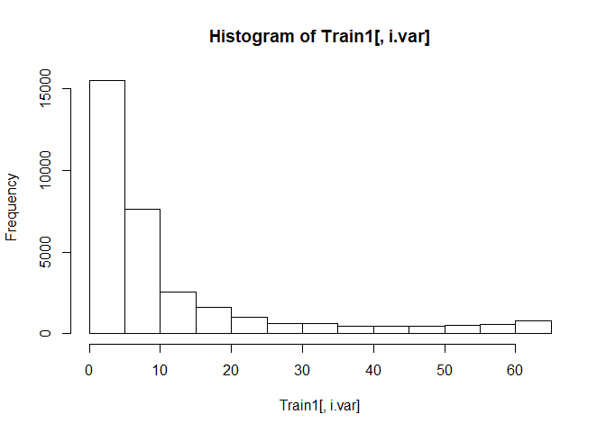

    ## [1] 6

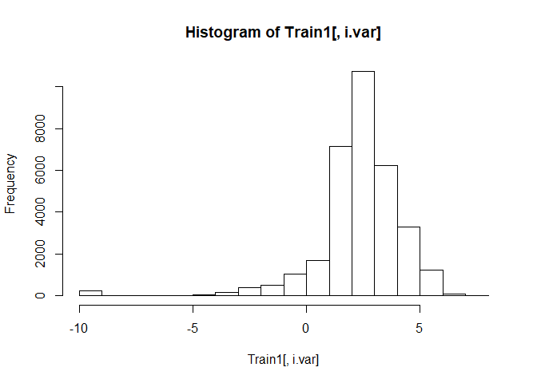

    ## [1] 7

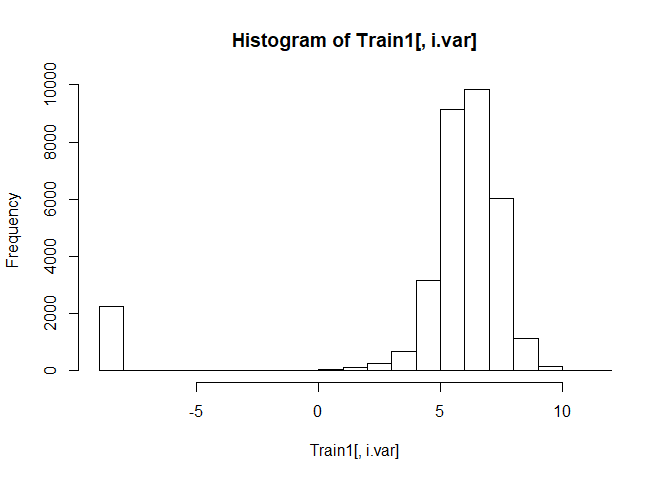

    ## [1] 8

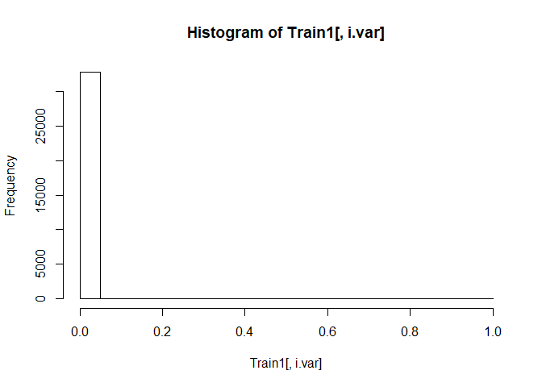

    ## [1] 9

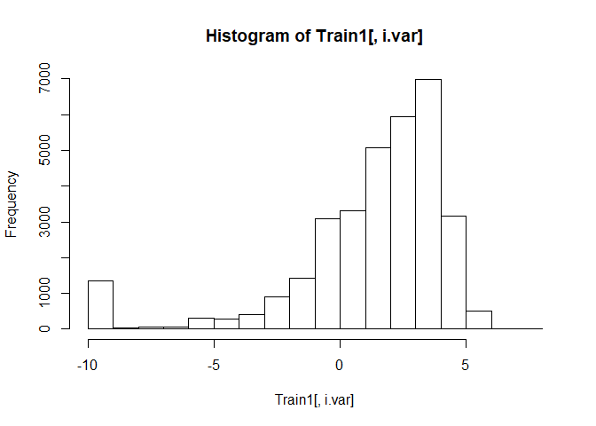

    ## [1] 10

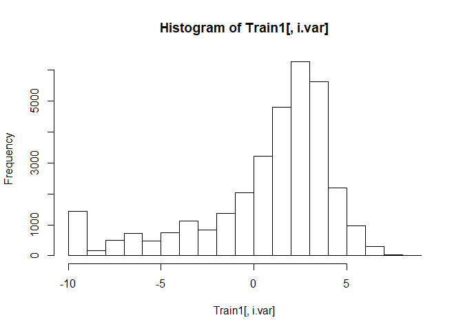

    ## [1] 11

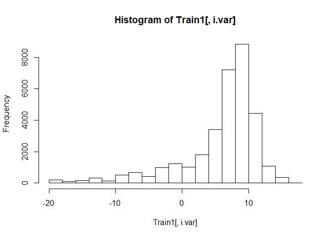

    ## [1] 12

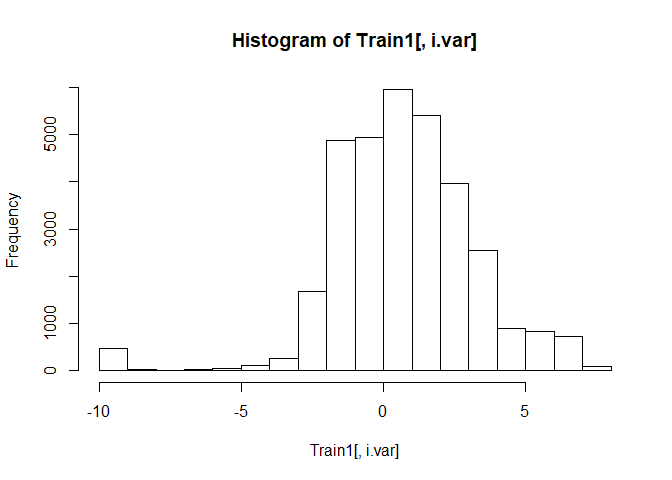

    ## [1] 13

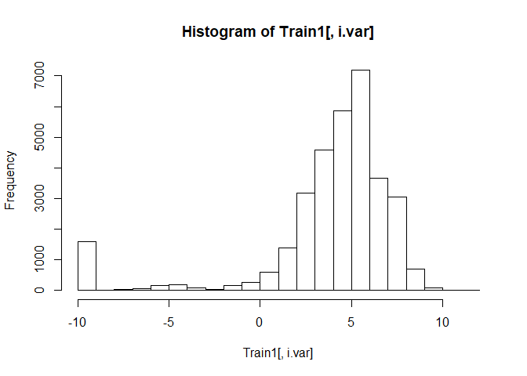

    ## [1] 14


    ## [1] 15

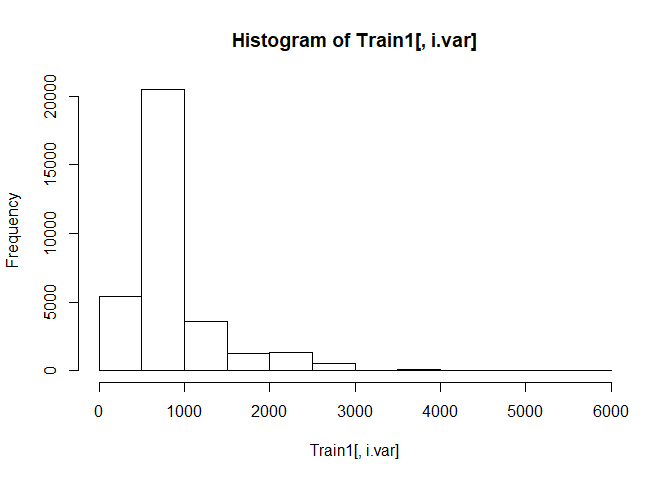

    ## [1] 16

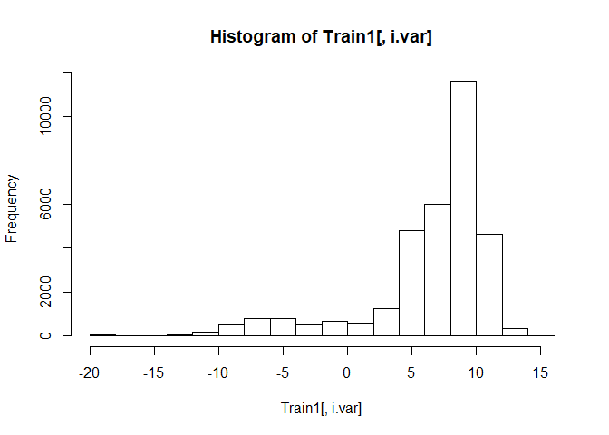

``` r
out_partial = out
save(out_partial, file = "out_partial.Rdata")
```

### Make partial dependency plots

``` r
library(latticeExtra)
#use latticeExtra to make two plots
load("x.df.Rdata")
load("out_partial.Rdata")
#https://stat.ethz.ch/R-manual/R-devel/library/grDevices/html/png.html
jpeg(filename = "Figure.partial.dependency.Night.Animal.Log.Roads.jpeg", width = 960, height = 960, quality = 95)
out = out_partial
x.df.sorted = sort(x.df$relative.influence, decreasing = FALSE, index.return= TRUE)
x.df$sort_index_decreasing = x.df.sorted$ix
x.df = subset(x.df, relative.influence>0)

var.plot = x.df$variable

out$variable.name=as.character(out$variable.name)

neworder <- x.df$variable#var.plot
library(plyr)  ## or dplyr (transform -> mutate)
```

    ## -------------------------------------------------------------------------

    ## You have loaded plyr after dplyr - this is likely to cause problems.
    ## If you need functions from both plyr and dplyr, please load plyr first, then dplyr:
    ## library(plyr); library(dplyr)

    ## -------------------------------------------------------------------------

    ## 
    ## Attaching package: 'plyr'

    ## The following object is masked from 'package:lubridate':
    ## 
    ##     here

    ## The following objects are masked from 'package:dplyr':
    ## 
    ##     arrange, count, desc, failwith, id, mutate, rename, summarise,
    ##     summarize

``` r
dat <- arrange(transform(out,
                         variable.name=factor(variable.name,levels=neworder)),variable.name)
out = dat

## a variant of Figure 5.13 from Sarkar (2008)
## http://lmdvr.r-forge.r-project.org/figures/figures.html?chapter=05;figure=05_1

x_between = 5#not sure what this does, seems to affect size of subplot
x_axis_cex = 1
names(out)
```

    ## [1] "variable.value" "value"          "variable.name"  "var"

``` r
head(out)
```

    ##   variable.value      value  variable.name             var
    ## 1      -18.42068 -0.7390677 log_road_goats marginal.effect
    ## 2      -18.08336 -0.7390677 log_road_goats marginal.effect
    ## 3      -17.74603 -0.7390677 log_road_goats marginal.effect
    ## 4      -17.40871 -0.7390677 log_road_goats marginal.effect
    ## 5      -17.07138 -0.7390677 log_road_goats marginal.effect
    ## 6      -16.73405 -0.7390677 log_road_goats marginal.effect

``` r
out$value = round(out$value, digits = 1)
out_marg_eff = subset(out, var == "marginal.effect")
out_marg_eff$value=round(out_marg_eff$value, digits = 1)
marg_eff <- xyplot(value ~ variable.value | variable.name,
                   data = out_marg_eff, type = "l", 
                   #layout = c(4, 3),
                   scales = list(relation = "free", x=list(cex=x_axis_cex)),
                   between = list(x = x_between),
                   ylab = "Marginal effect",
                   xlab = "Predictor value",
                   auto.key = FALSE,#legend,
                   par.settings = list(strip.background=list(col="lightgrey")),
                   par.strip.text=list(cex=1),
                   as.table = TRUE
)

out_count = subset(out, var == "frequency")
count_plot <- xyplot(value ~ variable.value | variable.name, data = out_count, type = "h",
                     between = list(x = x_between),
                     scales = list(relation = "free", x=list(cex=x_axis_cex)),
                     ylab = "frequency",
                     xlab = "predictor value",
                     #lattice.options = ggplot2like.opts(),
                     #list(superpose.symbol = list(col = c("blue")))
                     # par.settings = ggplot2like(),
                     auto.key=FALSE,
                     as.table = TRUE
                     
)
#count_plot

# doubleYScale(marg_eff, count_plot, style1 = 0, style2 = 3, add.ylab2 = TRUE,
#    text = c("marginal effect", "frequency"), columns = 2)

plot <- doubleYScale(marg_eff, count_plot, style1 = 0, style2 = 3, add.ylab2 = TRUE, columns = 2)
plot
dev.off()
```

    ## png 
    ##   2

### make correlogram

``` r
library(corrplot)
```

    ## corrplot 0.84 loaded

``` r
#load("dfPredictorsRoadsAnimalNight.Rdata")
load("dfPredictors.Rdata")
M = cor(df, use = "complete.obs")
```

    ## Warning in cor(df, use = "complete.obs"): the standard deviation is zero

``` r
corrplot(M, method = "square",
         tl.cex=0.5,
         type = "lower")
```

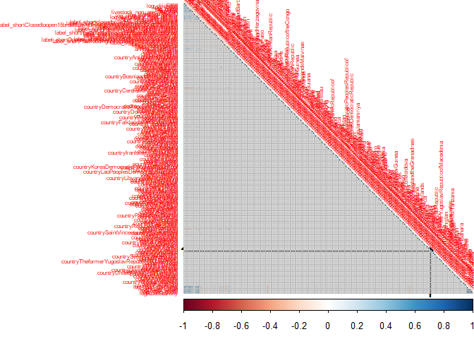

make predictions
================

### get land cover and add to other predictor fields

### test out assembling predictors

``` r
#livestock density from 2010

# pig2010 = raster("Pigs10km_AD_2010_GLW2_01_TIF/Pigs10km_AD_2010_GLW2_01.tif")
# 
# cattle2010 = raster("Cattle10km_AD_2010_GLW2_01/Cattle10km_AD_2010_v2_1.tif")
# 
# animal2010 = addLayer(cattle2010, pig2010)
# 
# #assign a projection
# projection(animal2010) <-CRS("+proj=longlat +datum=WGS84")
# 
# #convert raster to points (package raster)
# predictorPointsCattlePig = rasterToPoints(animal2010, spatial=TRUE)
# 
# summary(predictorPointsCattlePig)
# 
# #now try converting cattle without adding layer
# tmp = rasterToPoints(cattle2010, spatial = TRUE)
# dim(tmp)
# #summary(Cattle)
# 
# out = NULL
# out[[1]]=data.frame(tmp)
# 
# tmp = rasterToPoints(pig2010, spatial = TRUE)
# dim(tmp)
# out[[2]]=data.frame(tmp)
# 
# out2= NULL
# out2 = out[[1]]
# for (a in 2){
#   out2 = cbind(out2, out[[a]])
# }
```

### assemble predictors into one raster brick

``` r
path = "DATA/2_GlobalRuminantLPS_GIS/"
r  = raster(paste0(path,"glps_gleam_61113_10km.tif"))

#livestock density from 2010
pig2010 = raster("DATA/Pigs10km_AD_2010_GLW2_01_TIF/Pigs10km_AD_2010_GLW2_01.tif")

cattle2010 = raster("DATA/Cattle10km_AD_2010_GLW2_01/Cattle10km_AD_2010_v2_1.tif")

animal2010 = addLayer(pig2010, cattle2010)

#add layer of land use
animal2010 = addLayer(animal2010, r)

goats2010 = raster("DATA/Goats10km_AD_2010_v2_1_TIF/Goats10km_AD_2010_v2_1.tif")

animal2010 = addLayer(animal2010, goats2010)

sheep2010 = raster("DATA/Sheep10km_AD_2010_GLW2_1_TIF/Sheep10km_AD_2010_v2_1.tif")

animal2010 = addLayer(animal2010, sheep2010)

chickens2010 = raster("DATA/Chickens10km_AD_2010_v2_01_TIF/Chickens10km_AD_2010_v2_01.tif")

animal2010 = addLayer(animal2010, chickens2010)
names(animal2010)= c("pigs2010", "cattle2010", "livestock_system", "goats2010", "sheep2010", "chickens2010")
R = animal2010
dim(R)
```

    ## [1] 2160 4320    6

``` r
#https://www.globio.info/download-grip-dataset
###road density -- type 1, highway
R1 = raster("DATA/GRIP4_density_tp1/grip4_tp1_dens_m_km2.asc")
###road density -- type 2, primary
R2 = raster("DATA/GRIP4_density_tp2/grip4_tp2_dens_m_km2.asc")
roads = addLayer(R1, R2)
###road density -- type 3, secondary
R3 = raster("DATA/GRIP4_density_tp3/grip4_tp3_dens_m_km2.asc")
roads = addLayer(roads, R3)
###road density -- type 4, tertiary
R4 = raster("DATA/GRIP4_density_tp4/grip4_tp4_dens_m_km2.asc")
roads = addLayer(roads, R4)
###road density -- type 5, local
R5 = raster("DATA/GRIP4_density_tp5/grip4_tp5_dens_m_km2.asc")
roads = addLayer(roads, R5)

###road density -- total
R_road = raster("DATA/GRIP4_density_total/grip4_total_dens_m_km2.asc")
roads = addLayer(roads, R_road)
names(roads)=c("highway", "primary_roads", "secondary_roads",
               "tertiary_roads", "local_roads", "RoadDensity")
dim(roads)
```

    ## [1] 2160 4320    6

``` r
R = addLayer(R, roads)

#assign a projection
projection(R) <-CRS("+proj=longlat +datum=WGS84")

Gl = raster("DATA/Globcover2009_V2.3_Global_/GLOBCOVER_L4_200901_200912_V2.3.tif")
projection(Gl) <- CRS("+proj=longlat +datum=WGS84")

#x = object to be resampled
#y = object to be resampled to
#resample with nearest neighbor for categorical data 
#https://gis.stackexchange.com/questions/314960/resampling-raster-with-categorical-data-in-r
Gl_resampled = resample(x = Gl, y = R, method = "ngb")
save(Gl_resampled, file = "Gl_resampled.Rdata")
R = addLayer(R, Gl_resampled)
R_nightlights = raster("DATA/F182013.v4/F182013.v4c_web.stable_lights.avg_vis.tif")
dim(R_nightlights)
```

    ## [1] 16801 43201     1

``` r
names(R_nightlights)= "nightlights2013"#give it name that matches analysis name
#x = object to be resampled
#y = object to be resampled to
R_nightlights_resampled = resample(x = R_nightlights, y = R)

R = addLayer(R, R_nightlights_resampled)

#################WorldClim
path <- "DATA/wc2.0_5m_bio/"

grids <- list.files(path , pattern = "*.tif$")

#create a raster stack from the input raster files 
w <- stack(paste0(path, grids))

w <- subset(w, c("wc2.0_bio_5m_01", "wc2.0_bio_5m_12"))
names(w) = c("annualMeanTemp", "annualPrecip")
worldclim = w
# save(worldclim, file = "worldclim.Rdata")

w = resample(x = w, y = R)
R = addLayer(R, w)
#################Worldclim

R <- aggregate(R, fact=5)

#convert raster to points (package raster)
predictorPoints = rasterToPoints(R, spatial=TRUE)
save(predictorPoints, file = "predictorPoints.Rdata")
```

assign label\_short describing land cover to predictorPoints
============================================================

``` r
load("predictorPoints.Rdata")
G_legend = read.csv("DATA/Globcover2009_V2.3_Global_/Globcover2009_Legend.csv")
names(G_legend)[1]="globcover"
names(predictorPoints)[names(predictorPoints)=="GLOBCOVER_L4_200901_200912_V2.3"]="globcover"
G_legend = G_legend[,c("globcover", "label_short")]
dim(predictorPoints)
```

    ## [1] 373248     16

``` r
predictorPoints1 =  merge(predictorPoints, G_legend)
dim(predictorPoints1)
```

    ## [1] 373248     17

``` r
predictorPoints = predictorPoints1
save(predictorPoints, file = "predictorPoints.Rdata")
```

one-hot encode label\_short describing land cover for predictorPoints
=====================================================================

``` r
load("predictorPoints.Rdata")
df = predictorPoints
keep = names(df)
keep = setdiff(keep, "globcover")
df = df[,keep]
#Converting every categorical variable to numerical using dummy variables
dmy <- dummyVars(" ~ .", data = df,fullRank = T, sep=".")
df_transformed <- data.frame(predict(dmy, newdata = df))
df = df_transformed
predictorPoints=df

save(predictorPoints, file = "predictorPoints.Rdata")
```

### create log and fractional fields in global predictorPoints

``` r
load("predictorPoints.Rdata")

df = predictorPoints
addSmall = 0.0001
df$log_chickens = log(df$chickens2010+addSmall)
df$log_sheep = log(df$sheep2010+addSmall)
df$log_goats = log(df$goats2010+addSmall)
df$log_cattle = log(df$cattle2010+addSmall)
df$log_pigs = log(df$pigs2010+addSmall)

#assign nonzero fields
df$pigs_nonzero = 1
df$pigs_nonzero[df$pigs2010==0]=0

df$goats_nonzero = 1
df$goats_nonzero[df$goats2010==0]=0

df$sheep_nonzero = 1
df$sheep_nonzero[df$sheep2010==0]=0

df$cattle_nonzero = 1
df$cattle_nonzero[df$cattle2010==0]=0

df$chickens_nonzero = 1
df$chickens_nonzero[df$chickens2010==0]=0

df$livestock_non_zero_fraction = (df$pigs_nonzero+
                                    df$cattle_nonzero+
                                    df$sheep_nonzero+
                                    df$goats_nonzero+
                                    df$chickens_nonzero)/5

remove_fields = c("chickens2010",
                  "sheep2010",
                  "goats2010",
                  "cattle2010",
                  "pigs2010",
                    "pigs_nonzero",
                    "cattle_nonzero",
                  "sheep_nonzero",
                  "goats_nonzero",
                  "chickens_nonzero")

df$log_highway_density = log(df$highway+addSmall)
df$log_primary_road_density = log(df$primary_roads+addSmall)
df$log_secondary_road_density = log(df$secondary_roads+addSmall)
df$log_tertiary_road_density = log(df$tertiary_roads+addSmall)
df$log_local_road_density = log(df$local_roads+addSmall)
df$logRoadDensity = log(df$RoadDensity+addSmall)

remove_fields = c(remove_fields, "highway",
                  "primary_roads",
                  "secondary_roads",
                  "tertiary_roads",
                  "local_roads",
                  "RoadDensity")

names_df = names(df)
keep_fields = setdiff(names_df, remove_fields)

df = df[,keep_fields]

names(df)
```

    ##  [1] "livestock_system"                                                                      
    ##  [2] "nightlights2013"                                                                       
    ##  [3] "annualMeanTemp"                                                                        
    ##  [4] "annualPrecip"                                                                          
    ##  [5] "label_short.bare"                                                                      
    ##  [6] "label_short.closed.broadleaved.deciduous.forest"                                       
    ##  [7] "label_short.Closed.needleleaved.evergreen.forest."                                     
    ##  [8] "label_short.Closed.to.open...15...broadleaved.evergreen.or.semi.deciduous.forest...5m."
    ##  [9] "label_short.forest.or.shrub.grassland"                                                 
    ## [10] "label_short.forest.regularly.flooded"                                                  
    ## [11] "label_short.forest.shrub.permanently.flooded"                                          
    ## [12] "label_short.grassland.woody.regularly.flooded"                                         
    ## [13] "label_short.herbaceous"                                                                
    ## [14] "label_short.mixed.broadleaved.and.needleleaves.forest"                                 
    ## [15] "label_short.mosaic.crop.grass.shrub.forest"                                            
    ## [16] "label_short.mosaic.grass.shrub.forest.crop"                                            
    ## [17] "label_short.mosaic.grassland.forest.shrub"                                             
    ## [18] "label_short.No.data..burnt.areas..clouds.â..."                                         
    ## [19] "label_short.not.found"                                                                 
    ## [20] "label_short.open.broadleaved.deciduous.forest"                                         
    ## [21] "label_short.Open.needleleaved.deciduous.or.evergreen.forest."                          
    ## [22] "label_short.Post.flooding.or.irrigated.croplands..or.aquatic."                         
    ## [23] "label_short.Rainfed.croplands"                                                         
    ## [24] "label_short.shrubland"                                                                 
    ## [25] "label_short.snow.ice"                                                                  
    ## [26] "label_short.sparse"                                                                    
    ## [27] "label_short.water"                                                                     
    ## [28] "x"                                                                                     
    ## [29] "y"                                                                                     
    ## [30] "log_chickens"                                                                          
    ## [31] "log_sheep"                                                                             
    ## [32] "log_goats"                                                                             
    ## [33] "log_cattle"                                                                            
    ## [34] "log_pigs"                                                                              
    ## [35] "livestock_non_zero_fraction"                                                           
    ## [36] "log_highway_density"                                                                   
    ## [37] "log_primary_road_density"                                                              
    ## [38] "log_secondary_road_density"                                                            
    ## [39] "log_tertiary_road_density"                                                             
    ## [40] "log_local_road_density"                                                                
    ## [41] "logRoadDensity"

``` r
predictorPoints = df
save(predictorPoints, file = "predictorPoints.Rdata")
```

### assign country to predictorPoints

``` r
load("predictorPoints.Rdata")

r = shapefile("DATA/TM_WORLD_BORDERS-0.3/TM_WORLD_BORDERS-0.3.shp")

out_spdf = predictorPoints
coordinates(out_spdf) <- ~ x + y

#predictorPoints is already a SpatialPointsDataFrame 
projection(r) <-CRS("+proj=longlat +datum=WGS84")
projection(out_spdf) = projection(r)
out_spdf$country <- over(out_spdf, r)$NAME#name of park
#make into dataframe
df= as.data.frame(out_spdf)
keep = names(df)
rm_fields = c("latitude.1", "longitude.1", "ID")
keep = setdiff(keep, rm_fields)
df = df[,keep]

#change to one-hot encoding of country
#Converting every categorical variable to numerical using dummy variables
dmy <- dummyVars(" ~ .", data = df,fullRank = T, sep=".")
df_transformed <- data.frame(predict(dmy, newdata = df))
df = df_transformed

predictorPoints = df
save(predictorPoints, file = "predictorPoints.Rdata")
```

### construct interaction features: log of the product of roadDensity and livestock density

``` r
load("predictorPoints.Rdata")
df = predictorPoints
df$log_road_chickens = log(exp(df$logRoadDensity)*exp(df$log_chickens))
df$log_road_pigs = log(exp(df$logRoadDensity)*exp(df$log_pigs))
df$log_road_cattle = log(exp(df$logRoadDensity)*exp(df$log_cattle))
df$log_road_sheep = log(exp(df$logRoadDensity)*exp(df$log_sheep))
df$log_road_goats = log(exp(df$logRoadDensity)*exp(df$log_goats))
predictorPoints = df
save(predictorPoints, file = "predictorPoints.Rdata")
```

### fix column names in predictorPoints to match names in Train

``` r
load("predictorPoints.Rdata")
group = c(names(predictorPoints))

group = gsub("[.]","", group)
names(predictorPoints)=group
save(predictorPoints, file = "predictorPoints.Rdata")
#check = "country."
# a = 1
# namesOutput = group
# for (a in 1:length(group)){
#   test = c(as.character(names(dfPredictors)[a]))
#   #test = "aa.bb"
#   test_period = strsplit(test, check)
#     if(unique(test_period[[1]])==""){
#  #   if (test_period[[1]][1]==""){
#     namesOutput[a]=test
#     print("empty")
#   } else {
#      test_out = str_replace(test, check, "")
#     namesOutput[a]=test_out   
#   }
  #splitted_count = length(test_period[[1]])
  #test_out= test
  #print(test_out)
  #if (splitted_count>1){
  #  test_out = str_replace_all(test_out, check, "")
    #test_out = gsub(".", "", test_out)
  #}
  #namesOutput[a]=test_out
  
# }
# 
# namesOutput
# 'e' %in% test[1]
# match('_',test)
# 
# is.element('_', test)
# 
# any("livestock_system"=="e")

# test_period = strsplit(test, "_")
# 
# 
# str_replace_all(names(dfPredictors)[1], ".", "")
# group = gsub(".", "", group)
# names(dfPredictors)=group
# names(dfPredictors)
```

### plot predictions

need to redo this including land cover
--------------------------------------

``` r
load("predictorPoints.Rdata")
load("Train.Rdata")
names(predictorPoints)[names(predictorPoints)=="label_shortNodataburntareascloudsâ"]="label_shortNodataburntareasclouds"
load("gbmtest.Rdata")
names_missing = setdiff(names(Train), names(predictorPoints))
names_missing = setdiff(names_missing, "case")
#for each missing name, add a field set to zero for that field
for (a in 1:length(names_missing)){
  predictorPoints[,names_missing[a]]=0
}
#predictorPoints$countryAndorra = 0
n.trees = 10000

sdf = predictorPoints
sdf = subset(sdf, !is.na(log_cattle))
dim(sdf)[1]
```

    ## [1] 135271

``` r
sdf = subset(sdf, !is.na(logRoadDensity))
sdf = subset(sdf, livestock_system != 15)
dim(sdf)[1]
```

    ## [1] 93906

``` r
sdf_pred = predict.gbm(gbmtest, newdata = sdf, n.trees=n.trees, type = "response")
  sdf$predicted= sdf_pred
  pred_gbm_season = sdf
  pred_gbm_season=data.frame(pred_gbm_season)
  plot <- ggplot()+
   geom_tile(data = pred_gbm_season, aes(x = x, y = y, alpha = predicted))
  ggsave("predicted.jpg", plot = plot)
```

    ## Saving 7 x 5 in image

``` r
pred.xy = pred_gbm_season[,c("x", "y", "predicted")]

out_spdf = SpatialPointsDataFrame(coords = pred.xy[,c("x", "y")], 
                               data = pred.xy)

gridded(out_spdf) <- TRUE
out_spdf$z = out_spdf$predicted
dfPredictors_predicted = out_spdf
save(dfPredictors_predicted, file = "dfPredictors_predicted.Rdata")
dfr = raster(out_spdf)

writeRaster(dfr, "prediction_no_na.tif", format="GTiff", overwrite=TRUE)
```

### load in prediction values and observed locations. Find locations with high predicted probability but no outbreaks yet observed

``` r
#load("dfPredictors_predicted.Rdata")
load("df.Rdata")
obs = df
obs = subset(obs, case == 1)
dfpred = dfPredictors_predicted
dfpred_hi = subset(dfpred, predicted>=0.5)
dim(dfpred_hi)
```

    ## [1] 13059     4

``` r
#https://stackoverflow.com/questions/21977720/r-finding-closest-neighboring-point-and-number-of-neighbors-within-a-given-rad
#coordinates(dfpred_hi) <- ~x+y
coordinates(obs) <- ~longitude+latitude
library(rgeos)
```

    ## rgeos version: 0.3-28, (SVN revision 572)
    ##  GEOS runtime version: 3.6.1-CAPI-1.10.1 r0 
    ##  Linking to sp version: 1.3-1 
    ##  Polygon checking: TRUE

``` r
#convert to data frame
dfpred_hi_df = data.frame(dfpred_hi)

dfpred_hi_pts = SpatialPointsDataFrame(dfpred_hi, dfpred_hi_df)

#dfpred_hi_pts = dfpred_hi_pts[1,]

#Start the clock
ptm<-proc.time()

nrows = dim(dfpred_hi_df)[1]
distances = rep(NA, nrows)
a = 1
a = 2
for (a in 1:nrows){
  tmp = dfpred_hi_pts[a,]
  distances[a] = gDistance(tmp, obs, byid=FALSE)#specify byid=FALSE in order
  # to get the minimum distance
}
 
#Stop the clock
(proc.time()-ptm)/60
```

    ##         user       system      elapsed 
    ## 2512.2565000    0.1063333 2513.1618333

``` r
#save(distances, file = "distances.Rdata")
dfpred_hi_pts$minimum_distance = distances
save(dfpred_hi_pts, file = "dfpred_hi_pts.Rdata")
```

### SCRATCH below here.

### format date for python

``` r
# load("dfRoads.Rdata")
# df = dfRoads
# is.na.date = which(is.na(df$date))
# #fix date that has weird format
# df$date[is.na.date]= as.Date(df$reportingDate[is.na.date], format = "%d/%m/%Y")
# df$month = month(df$date)
# is.na.month = which(is.na(df$month))#should be empty
# 
# #beginning of the year
# df$year_begin = paste0(df$year,"0101")
# #beginning of the previous year
# df$previous_year_begin = paste0(df$year-1,"0101")
# #next year beginning
# df$next_year_begin = paste0(df$year+1,"0101")
# dfDate = df
# save(dfDate, file = "dfDate.Rdata")
```

``` r
#https://trucvietle.me/r/tutorial/2017/01/18/spatial-heat-map-plotting-using-r.html
# m <- ggplot(faithful, aes(x = eruptions, y = waiting)) +
#  geom_point() +
#  xlim(0.5, 6) +
#  ylim(40, 110)
# m + geom_density_2d()
# m+ stat_density_2d(aes(fill = stat(level)), geom = "polygon")
```

### plot density

``` r
# load("dfRoads.Rdata")
# df = dfRoads
# df = df[,c("latitude", "longitude")]
# m <- ggplot(df, aes(x = longitude, y = latitude)) +
#  geom_point() 
#  # xlim(0.5, 6) +
#  # ylim(40, 110)
# m + geom_density_2d()
# m+ stat_density_2d(aes(fill = stat(level)), geom = "polygon")
```

#### interpolation with kriging

### <https://rpubs.com/nabilabd/118172>

``` r
# load("dfRoads.Rdata")
# df = dfRoads
# library(sp)
# library(gstat)
# suppressPackageStartupMessages({
#   library(dplyr) # for "glimpse"
#   library(ggplot2)
#   library(scales) # for "comma"
#   library(magrittr)
# })
# 
# #1) Converting to an SPDF
# coordinates(df) <- ~ longitude + latitude
# #2) Fitting a variogram
# lzn.vgm <- variogram(case~1, df) # calculates sample variogram values 
# lzn.fit <- fit.variogram(lzn.vgm, model=vgm(1, "Sph", 900, 1)) # fit model
```
