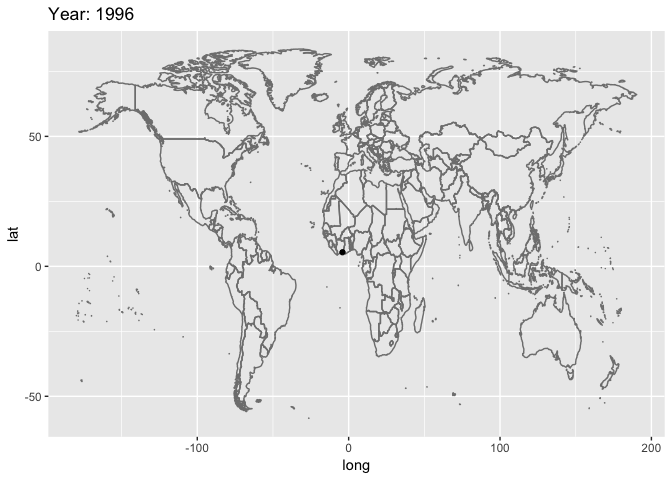

Ungulates5\_20190319
================


#### install packages

    ## Loading required package: sp

    ## Loading required package: ggplot2

    ## Loading required package: lattice

    ## Loading required package: latticeExtra

    ## Loading required package: RColorBrewer

    ## 
    ## Attaching package: 'latticeExtra'

    ## The following object is masked from 'package:ggplot2':
    ## 
    ##     layer

    ## 
    ## Attaching package: 'dplyr'

    ## The following objects are masked from 'package:raster':
    ## 
    ##     intersect, select, union

    ## The following objects are masked from 'package:stats':
    ## 
    ##     filter, lag

    ## The following objects are masked from 'package:base':
    ## 
    ##     intersect, setdiff, setequal, union

    ## ### Welcome to rworldmap ###

    ## For a short introduction type :   vignette('rworldmap')

    ## 
    ## Attaching package: 'lubridate'

    ## The following object is masked from 'package:base':
    ## 
    ##     date

    ## 
    ## Attaching package: 'zoo'

    ## The following objects are masked from 'package:base':
    ## 
    ##     as.Date, as.Date.numeric

    ## Loading required package: survival

    ## Loading required package: splines

    ## Loading required package: parallel

    ## Loaded gbm 2.1.3

    ## 
    ## Attaching package: 'caret'

    ## The following object is masked from 'package:survival':
    ## 
    ##     cluster

    ## Loading required package: gplots

    ## 
    ## Attaching package: 'gplots'

    ## The following object is masked from 'package:stats':
    ## 
    ##     lowess

    ## 
    ## Attaching package: 'hexbin'

    ## The following object is masked from 'package:rasterVis':
    ## 
    ##     hexbinplot

    ## 
    ## Attaching package: 'gganimate'

    ## The following object is masked from 'package:raster':
    ## 
    ##     animate

    ## Skipping install of 'knitr' from a github remote, the SHA1 (f5dd3841) has not changed since last install.
    ##   Use `force = TRUE` to force installation

``` r
# library(gganimate)
# ggplot(airquality, aes(Day, Temp, group = Month)) + 
#   geom_line() + 
#   transition_reveal(Month)
```

get just African swine fever in pigs and make an animation
----------------------------------------------------------

\`\`\`{r anim\_swine, fig.show='animate', interval=1/10}
========================================================

``` r
load("dfAnimal.Rdata")
df =  subset(dfAnimal, animal.species %in% c("swine"))
df = subset(df, case == 1)
df = subset(df, disease == "African swine fever")
df = subset(df, !is.na(year))
df$month = month(df$date)

# p<- ggplot(df, aes(x = longitude, y = latitude, group = month)) +
#   geom_point()+
#   transition_reveal(month)
# p
mapWorld <- borders("world",
                    ylim = c(-60,80)) # create a layer of borders
mp <- ggplot() +   mapWorld

mp<- mp+ geom_point(data = df, aes(x = longitude, y = latitude, frame = year, cumulative = FALSE))+
  transition_states(year, 
                    transition_length = 1,
                    state_length=30)+
  labs(title = 'Year: {closest_state}')+
  enter_fade() +
  exit_fade() +
  ease_aes('linear')
```

    ## Warning: Ignoring unknown aesthetics: frame, cumulative

``` r
mp
```



``` r
# We then display it as an animation with the gg_animate function:
# animate(p)
```

\`\`\`{r anim\_cars, fig.show='animate', interval=1/10}
=======================================================

anim &lt;- ggplot(mtcars, aes(mpg, disp)) +
===========================================

transition\_states(gear, transition\_length = 2, state\_length = 1) +
=====================================================================

enter\_fade() +
===============

exit\_fade()
============

Not run:
--------

Explicitly animate using default (same as just printing the animation)
======================================================================

animate(anim)
=============

anim\_save(animation = anim,
============================

filename = "test.gif")
======================

\`\`\`
======
