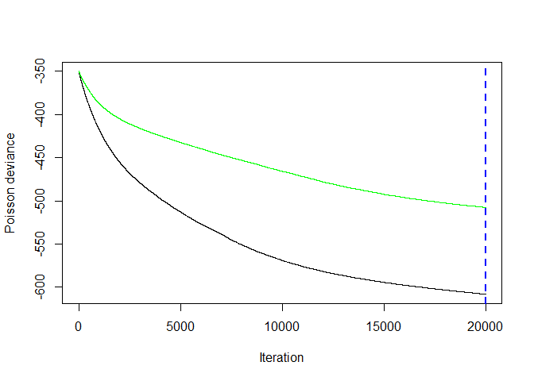
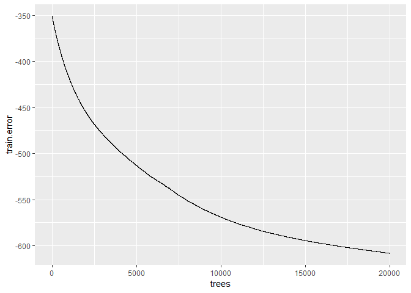
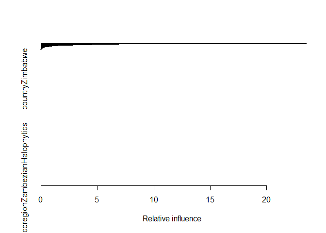

ungulates6\_outbreak\_size\_20190409
================

#### install packages

    ## Warning: package 'colorspace' was built under R version 3.5.3

    ## Loading required package: sp

    ## 
    ## Attaching package: 'raster'

    ## The following object is masked from 'package:colorspace':
    ## 
    ##     RGB

    ## Loading required package: ggplot2

    ## Warning: package 'ggplot2' was built under R version 3.5.3

    ## Loading required package: lattice

    ## Loading required package: latticeExtra

    ## Loading required package: RColorBrewer

    ## 
    ## Attaching package: 'latticeExtra'

    ## The following object is masked from 'package:ggplot2':
    ## 
    ##     layer

    ## 
    ## Attaching package: 'dplyr'

    ## The following objects are masked from 'package:raster':
    ## 
    ##     intersect, select, union

    ## The following objects are masked from 'package:stats':
    ## 
    ##     filter, lag

    ## The following objects are masked from 'package:base':
    ## 
    ##     intersect, setdiff, setequal, union

    ## ### Welcome to rworldmap ###

    ## For a short introduction type :   vignette('rworldmap')

    ## 
    ## Attaching package: 'lubridate'

    ## The following object is masked from 'package:base':
    ## 
    ##     date

    ## 
    ## Attaching package: 'zoo'

    ## The following objects are masked from 'package:base':
    ## 
    ##     as.Date, as.Date.numeric

    ## Loaded gbm 2.1.4

    ## Loading required package: gplots

    ## 
    ## Attaching package: 'gplots'

    ## The following object is masked from 'package:stats':
    ## 
    ##     lowess

### load dfPredictors and dfAnimal. Reassign sumCases from dfAnimal to dfPredictors

``` r
load("dfPredictors.Rdata")
load("dfAnimal.Rdata")
dfPredictors$sumCases = dfAnimal$sumCases
dfPredictors = subset(dfPredictors, !is.na(sumCases))#remove NA cases
dfPredictors = subset(dfPredictors, case == 1)#only interested in outbreak locations
keep = setdiff(names(dfPredictors), "case")#remove case from columns 
dfPredictorsCases = dfPredictors[,keep]#keep only certain columns
save(dfPredictorsCases, file = "dfPredictorsCases.Rdata")
dim(dfPredictorsCases)
```

    ## [1] 39968   960

### make test and train

``` r
load("dfPredictorsCases.Rdata")
df = dfPredictorsCases
DP =createDataPartition(y = df$sumCases, 
                        p = 0.8,
                        list = FALSE)
TrainCases = df[DP,]
TestCases = df[-DP,]

save(TrainCases, file = "TrainCases.Rdata")
save(TestCases, file = "TestCases.Rdata")
```

### make model

``` r
load("dfPredictorsCases.Rdata")
df = dfPredictorsCases

columns = dim(df)[2]
columns_min_1 = columns-1
modelCases<-as.formula(paste(colnames(df)[columns], "~",
                        paste(colnames(df)[c(1:columns_min_1)],collapse = "+"),
                        sep = ""))
print(modelCases)
```

    ## sumCases ~ log_chickens + log_sheep + log_goats + log_cattle + 
    ##     log_pigs + livestock_non_zero_fraction + nightlights2013 + 
    ##     log_highway_density + log_primary_road_density + log_secondary_road_density + 
    ##     log_tertiary_road_density + log_local_road_density + label_shortbare + 
    ##     label_shortclosedbroadleaveddeciduousforest + label_shortClosedneedleleavedevergreenforest + 
    ##     label_shortClosedtoopen15broadleavedevergreenorsemideciduousforest5m + 
    ##     label_shortforestorshrubgrassland + label_shortforestregularlyflooded + 
    ##     label_shortforestshrubpermanentlyflooded + label_shortgrasslandwoodyregularlyflooded + 
    ##     label_shortherbaceous + label_shortmixedbroadleavedandneedleleavesforest + 
    ##     label_shortmosaiccropgrassshrubforest + label_shortmosaicgrassshrubforestcrop + 
    ##     label_shortmosaicgrasslandforestshrub + label_shortNodataburntareasclouds + 
    ##     label_shortopenbroadleaveddeciduousforest + label_shortOpenneedleleaveddeciduousorevergreenforest + 
    ##     label_shortPostfloodingorirrigatedcroplandsoraquatic + label_shortRainfedcroplands + 
    ##     label_shortshrubland + label_shortsnowice + label_shortsparse + 
    ##     label_shortwater + annualMeanTemp + annualPrecip + countryAlbania + 
    ##     countryAlgeria + countryAndorra + countryAngola + countryAnguilla + 
    ##     countryAntiguaandBarbuda + countryArgentina + countryArmenia + 
    ##     countryAustralia + countryAustria + countryAzerbaijan + countryBahamas + 
    ##     countryBahrain + countryBangladesh + countryBelarus + countryBelgium + 
    ##     countryBelize + countryBenin + countryBhutan + countryBolivia + 
    ##     countryBosniaandHerzegovina + countryBotswana + countryBrazil + 
    ##     countryBulgaria + countryBurkinaFaso + countryBurma + countryBurundi + 
    ##     countryCambodia + countryCameroon + countryCanada + countryCapeVerde + 
    ##     countryCentralAfricanRepublic + countryChad + countryChile + 
    ##     countryChina + countryColombia + countryComoros + countryCongo + 
    ##     countryCostaRica + countryCotedIvoire + countryCroatia + 
    ##     countryCuba + countryCyprus + countryCzechRepublic + countryDemocraticRepublicoftheCongo + 
    ##     countryDenmark + countryDjibouti + countryDominica + countryDominicanRepublic + 
    ##     countryEcuador + countryEgypt + countryElSalvador + countryEquatorialGuinea + 
    ##     countryEritrea + countryEstonia + countryEthiopia + countryFalklandIslandsMalvinas + 
    ##     countryFaroeIslands + countryFiji + countryFinland + countryFrance + 
    ##     countryFrenchGuiana + countryGabon + countryGambia + countryGeorgia + 
    ##     countryGermany + countryGhana + countryGreece + countryGreenland + 
    ##     countryGuatemala + countryGuinea + countryGuineaBissau + 
    ##     countryGuyana + countryHaiti + countryHonduras + countryHongKong + 
    ##     countryHungary + countryIceland + countryIndia + countryIndonesia + 
    ##     countryIranIslamicRepublicof + countryIraq + countryIreland + 
    ##     countryIsrael + countryItaly + countryJamaica + countryJapan + 
    ##     countryJersey + countryJordan + countryKazakhstan + countryKenya + 
    ##     countryKoreaDemocraticPeoplesRepublicof + countryKoreaRepublicof + 
    ##     countryKuwait + countryKyrgyzstan + countryLaoPeoplesDemocraticRepublic + 
    ##     countryLatvia + countryLebanon + countryLesotho + countryLiberia + 
    ##     countryLibyanArabJamahiriya + countryLithuania + countryLuxembourg + 
    ##     countryMadagascar + countryMalawi + countryMalaysia + countryMali + 
    ##     countryMalta + countryMartinique + countryMauritania + countryMauritius + 
    ##     countryMayotte + countryMexico + countryMongolia + countryMontenegro + 
    ##     countryMorocco + countryMozambique + countryNamibia + countryNepal + 
    ##     countryNetherlands + countryNewCaledonia + countryNewZealand + 
    ##     countryNicaragua + countryNiger + countryNigeria + countryNorway + 
    ##     countryOman + countryPakistan + countryPalestine + countryPanama + 
    ##     countryPapuaNewGuinea + countryParaguay + countryPeru + countryPhilippines + 
    ##     countryPoland + countryPortugal + countryPuertoRico + countryQatar + 
    ##     countryRepublicofMoldova + countryReunion + countryRomania + 
    ##     countryRussia + countryRwanda + countrySaintVincentandtheGrenadines + 
    ##     countrySaudiArabia + countrySenegal + countrySerbia + countrySierraLeone + 
    ##     countrySingapore + countrySlovakia + countrySlovenia + countrySolomonIslands + 
    ##     countrySomalia + countrySouthAfrica + countrySpain + countrySriLanka + 
    ##     countrySudan + countrySuriname + countrySvalbard + countrySwaziland + 
    ##     countrySweden + countrySwitzerland + countrySyrianArabRepublic + 
    ##     countryTaiwan + countryTajikistan + countryThailand + countryTheformerYugoslavRepublicofMacedonia + 
    ##     countryTogo + countryTunisia + countryTurkey + countryTurkmenistan + 
    ##     countryUganda + countryUkraine + countryUnitedArabEmirates + 
    ##     countryUnitedKingdom + countryUnitedRepublicofTanzania + 
    ##     countryUnitedStates + countryUruguay + countryUzbekistan + 
    ##     countryVanuatu + countryVenezuela + countryVietNam + countryWesternSahara + 
    ##     countryYemen + countryZambia + countryZimbabwe + ecoregionAfghanMountainsSemiDesert + 
    ##     ecoregionAlHajarMontaneWoodlands + ecoregionAlaiWesternTianShanSteppe + 
    ##     ecoregionAlashanPlateauSemiDesert + ecoregionAlaskaYukonArctic + 
    ##     ecoregionAlaskaPeninsula + ecoregionAlaskaRange + ecoregionAlbanyThickets + 
    ##     ecoregionAlbertineRiftMontaneForests + ecoregionAlpsConiferAndMixedForests + 
    ##     ecoregionAltaiAlpineMeadowAndTundra + ecoregionAltaiMontaneForestAndForestSteppe + 
    ##     ecoregionAltaiSteppeAndSemiDesert + ecoregionAltoParanÃAtlanticForests + 
    ##     ecoregionAmazonOrinocoSouthernCaribbeanMangroves + ecoregionAmurMeadowSteppe + 
    ##     ecoregionAnatolianConiferAndDeciduousMixedForests + ecoregionAngolanMiomboWoodlands + 
    ##     ecoregionAngolanMontaneForestGrasslandMosaic + ecoregionAngolanMopaneWoodlands + 
    ##     ecoregionAngolanScarpSavannaAndWoodlands + ecoregionApacheHighlands + 
    ##     ecoregionAppenineDeciduousMontaneForests + ecoregionApureVillavicencioDryForests + 
    ##     ecoregionArabianDesertAndEastSaheroArabianXericShrublands + 
    ##     ecoregionArabianPeninsulaCoastalFogDesert + ecoregionAraucariaMoistForests + 
    ##     ecoregionArayaAndPariaXericScrub + ecoregionArcticCordillera + 
    ##     ecoregionArcticDesert + ecoregionArizonaNewMexicoMountains + 
    ##     ecoregionArnhemLandTropicalSavanna + ecoregionAspenParkland + 
    ##     ecoregionAtacamaDesert + ecoregionAtlanticCoastRestingas + 
    ##     ecoregionAtlanticCoastalDesert + ecoregionAtlanticDryForests + 
    ##     ecoregionAtlanticEquatorialCoastalForests + ecoregionAtlanticMixedForests + 
    ##     ecoregionAustralianAlpsMontaneGrasslands + ecoregionAzerbaijanShrubDesertAndSteppe + 
    ##     ecoregionAzoresTemperateMixedForests + ecoregionBadghyzAndKarabilSemiDesert + 
    ##     ecoregionBahamianAntilleanMangroves + ecoregionBahamianPineMosaic + 
    ##     ecoregionBahiaCoastalForests + ecoregionBahiaInteriorForests + 
    ##     ecoregionBajaCaliforniaDesert + ecoregionBajÃoDryForests + 
    ##     ecoregionBalkanMixedForests + ecoregionBalsasDryForests + 
    ##     ecoregionBalticMixedForests + ecoregionBaluchistanXericWoodlands + 
    ##     ecoregionBandaSeaIslandsMoistDeciduousForests + ecoregionBelizianPineForests + 
    ##     ecoregionBeniSavanna + ecoregionBeringSeaAndAleutianIslands + 
    ##     ecoregionBeringTundra + ecoregionBeringianTundra + ecoregionBlackHills + 
    ##     ecoregionBohaiSeaSalineMeadow + ecoregionBolivianMontaneDryForests + 
    ##     ecoregionBolivianYungas + ecoregionBorealCordillera + ecoregionBorealPlains + 
    ##     ecoregionBorealShield + ecoregionBorneoLowlandRainForests + 
    ##     ecoregionBorneoMontaneRainForests + ecoregionBorneoPeatSwampForests + 
    ##     ecoregionBrahmaputraValleySemiEvergreenForests + ecoregionBrigalowTropicalSavanna + 
    ##     ecoregionBristolBayBasin + ecoregionBuruRainForests + ecoregionCaatinga + 
    ##     ecoregionCaatingaEnclavesMoistForests + ecoregionCaledonConiferForests + 
    ##     ecoregionCaliforniaCentralCoast + ecoregionCaliforniaNorthCoast + 
    ##     ecoregionCaliforniaSouthCoast + ecoregionCameroonianHighlandsForests + 
    ##     ecoregionCamposRupestresMontaneSavanna + ecoregionCanadianRockyMountains + 
    ##     ecoregionCanaryIslandsDryWoodlandsAndForests + ecoregionCantabrianMixedForests + 
    ##     ecoregionCanteburyOtagoTussockGrasslands + ecoregionCapeVerdeIslandsDryForests + 
    ##     ecoregionCapeYorkPeninsulaTropicalSavanna + ecoregionCaquetaMoistForests + 
    ##     ecoregionCardamomMountainsRainForests + ecoregionCaribbeanShrublands + 
    ##     ecoregionCarnarvonXericShrublands + ecoregionCarpathianMontaneForests + 
    ##     ecoregionCarpentariaTropicalSavanna + ecoregionCaspianHyrcanianMixedForests + 
    ##     ecoregionCaspianLowlandDesert + ecoregionCatatumboMoistForests + 
    ##     ecoregionCaucaValleyDryForests + ecoregionCaucaValleyMontaneForests + 
    ##     ecoregionCaucasusMixedForests + ecoregionCelticBroadleafForests + 
    ##     ecoregionCentralAfghanMountainsXericWoodlands + ecoregionCentralAfricanMangroves + 
    ##     ecoregionCentralAmericanAtlanticMoistForests + ecoregionCentralAmericanDryForests + 
    ##     ecoregionCentralAmericanMontaneForests + ecoregionCentralAmericanPineOakForests + 
    ##     ecoregionCentralAnatolianSteppe + ecoregionCentralAnatolianSteppeAndWoodlands + 
    ##     ecoregionCentralAndeanDryPuna + ecoregionCentralAndeanPuna + 
    ##     ecoregionCentralAndeanWetPuna + ecoregionCentralAppalachianForest + 
    ##     ecoregionCentralAsianNorthernDesert + ecoregionCentralAsianRiparianWoodlands + 
    ##     ecoregionCentralAsianSouthernDesert + ecoregionCentralChinaLoessPlateauMixedForests + 
    ##     ecoregionCentralCongolianLowlandForests + ecoregionCentralDeccanPlateauDryDeciduousForests + 
    ##     ecoregionCentralEuropeanMixedForests + ecoregionCentralIndochinaDryForests + 
    ##     ecoregionCentralKoreanDeciduousForests + ecoregionCentralMexicanMatorral + 
    ##     ecoregionCentralMixedGrassPrairie + ecoregionCentralPersianDesertBasins + 
    ##     ecoregionCentralRangeMontaneRainForests + ecoregionCentralRangesXericScrub + 
    ##     ecoregionCentralShortgrassPrairie + ecoregionCentralTallgrassPrairie + 
    ##     ecoregionCentralTibetanPlateauAlpineSteppe + ecoregionCentralZambezianMiomboWoodlands + 
    ##     ecoregionCerrado + ecoregionChangbaiMountainsMixedForests + 
    ##     ecoregionChangjiangPlainEvergreenForests + ecoregionChaoPhrayaFreshwaterSwampForests + 
    ##     ecoregionChaoPhrayaLowlandMoistDeciduousForests + ecoregionCherskiiKolymaMountainTundra + 
    ##     ecoregionChesapeakeBayLowlands + ecoregionChhotaNagpurDryDeciduousForests + 
    ##     ecoregionChiapasDepressionDryForests + ecoregionChihuahuanDesert + 
    ##     ecoregionChileanMatorral + ecoregionChimalapasMontaneForests + 
    ##     ecoregionChinHillsArakanYomaMontaneForests + ecoregionChiquitanoDryForests + 
    ##     ecoregionChocóDariÃnMoistForests + ecoregionChukchiPeninsulaTundra + 
    ##     ecoregionColoradoPlateau + ecoregionColumbiaPlateau + ecoregionComorosForests + 
    ##     ecoregionCookInletBasin + ecoregionCoolgardieWoodlands + 
    ##     ecoregionCordilleraCentralPÃramo + ecoregionCordilleraLaCostaMontaneForests + 
    ##     ecoregionCordilleraOrientalMontaneForests + ecoregionCorsicanMontaneBroadleafAndMixedForests + 
    ##     ecoregionCostaRicanSeasonalMoistForests + ecoregionCreteMediterraneanForests + 
    ##     ecoregionCrimeanSubmediterraneanForestComplex + ecoregionCrossNigerTransitionForests + 
    ##     ecoregionCrossSanagaBiokoCoastalForests + ecoregionCrosstimbersAndSouthernTallgrassPrairie + 
    ##     ecoregionCubanCactusScrub + ecoregionCubanDryForests + ecoregionCubanMoistForests + 
    ##     ecoregionCubanPineForests + ecoregionCumberlandsAndSouthernRidgeAndValley + 
    ##     ecoregionCyprusMediterraneanForests + ecoregionDaHingganDzhagdyMountainsConiferForests + 
    ##     ecoregionDabaMountainsEvergreenForests + ecoregionDakotaMixedGrassPrairie + 
    ##     ecoregionDaurianForestSteppe + ecoregionDeccanThornScrubForests + 
    ##     ecoregionDinaricMountainsMixedForests + ecoregionDrakensbergAltiMontaneGrasslandsAndWoodlands + 
    ##     ecoregionDrakensbergMontaneGrasslandsWoodlandsAndForests + 
    ##     ecoregionDryChaco + ecoregionEastAfghanMontaneConiferForests + 
    ##     ecoregionEastAfricanHalophytics + ecoregionEastAfricanMangroves + 
    ##     ecoregionEastAfricanMontaneForests + ecoregionEastAfricanMontaneMoorlands + 
    ##     ecoregionEastCascadesModocPlateau + ecoregionEastDeccanDryEvergreenForests + 
    ##     ecoregionEastEuropeanForestSteppe + ecoregionEastGulfCoastalPlain + 
    ##     ecoregionEastSaharanMontaneXericWoodlands + ecoregionEastSiberianTaiga + 
    ##     ecoregionEastSudanianSavanna + ecoregionEasternAnatolianDeciduousForests + 
    ##     ecoregionEasternAnatolianMontaneSteppe + ecoregionEasternArcForests + 
    ##     ecoregionEasternAustraliaMulgaShrublands + ecoregionEasternAustralianTemperateForests + 
    ##     ecoregionEasternCongolianSwampForests + ecoregionEasternCordilleraRealMontaneForests + 
    ##     ecoregionEasternGobiDesertSteppe + ecoregionEasternGuineanForests + 
    ##     ecoregionEasternHighlandsMoistDeciduousForests + ecoregionEasternHimalayanAlpineShrubAndMeadows + 
    ##     ecoregionEasternHimalayanBroadleafForests + ecoregionEasternHimalayanSubalpineConiferForests + 
    ##     ecoregionEasternJavaBaliMontaneRainForests + ecoregionEasternJavaBaliRainForests + 
    ##     ecoregionEasternMediterraneanConiferSclerophyllousBroadleafForests + 
    ##     ecoregionEasternMiomboWoodlands + ecoregionEasternTaigaShield + 
    ##     ecoregionEasternZimbabweMontaneForestGrasslandMosaic + ecoregionEcuadorianDryForests + 
    ##     ecoregionEdwardsPlateau + ecoregionEinasleighUplandSavanna + 
    ##     ecoregionElburzRangeForestSteppe + ecoregionEminValleySteppe + 
    ##     ecoregionEnglishLowlandsBeechForests + ecoregionEritreanCoastalDesert + 
    ##     ecoregionEsperanceMallee + ecoregionEspinal + ecoregionEthiopianMontaneForests + 
    ##     ecoregionEthiopianMontaneGrasslandsAndWoodlands + ecoregionEthiopianMontaneMoorlands + 
    ##     ecoregionEthiopianXericGrasslandsAndShrublands + ecoregionEtoshaPanHalophytics + 
    ##     ecoregionEuxineColchicBroadleafForests + ecoregionEyreAndYorkMallee + 
    ##     ecoregionFaroeIslandsBorealGrasslands + ecoregionFescueMixedGrassPrairie + 
    ##     ecoregionFijiTropicalDryForests + ecoregionFijiTropicalMoistForests + 
    ##     ecoregionFiordlandTemperateForests + ecoregionFloridaPeninsula + 
    ##     ecoregionGalÃpagosIslandsScrublandMosaic + ecoregionGhoratHazarajatAlpineMeadow + 
    ##     ecoregionGibsonDesert + ecoregionGissaroAlaiOpenWoodlands + 
    ##     ecoregionGoadavariKrishnaMangroves + ecoregionGobiLakesValleyDesertSteppe + 
    ##     ecoregionGreatBasin + ecoregionGreatCentralValley + ecoregionGreatLakes + 
    ##     ecoregionGreatLakesBasinDesertSteppe + ecoregionGreatSandyTanamiDesert + 
    ##     ecoregionGreatVictoriaDesert + ecoregionGreaterNegrosPanayRainForests + 
    ##     ecoregionGuajiraBarranquillaXericScrub + ecoregionGuiananFreshwaterSwampForests + 
    ##     ecoregionGuiananHighlandsMoistForests + ecoregionGuiananMoistForests + 
    ##     ecoregionGuiananPiedmontAndLowlandMoistForests + ecoregionGuiananSavanna + 
    ##     ecoregionGuineanForestSavannaMosaic + ecoregionGuineanMangroves + 
    ##     ecoregionGuineanMontaneForests + ecoregionGuizhouPlateauBroadleafAndMixedForests + 
    ##     ecoregionGulfCoastPrairiesAndMarshes + ecoregionGulfOfAlaskaMountainsAndFjordlands + 
    ##     ecoregionGulfOfCaliforniaXericScrub + ecoregionGulfOfOmanDesertAndSemiDesert + 
    ##     ecoregionGurupaVarzeà + ecoregionHainanIslandMonsoonRainForests + 
    ##     ecoregionHalmaheraRainForests + ecoregionHawaiianHighIslandsHawaiiTropicalDryForests + 
    ##     ecoregionHawaiianHighIslandsHawaiiTropicalMoistForests + 
    ##     ecoregionHelanshanMontaneConiferForests + ecoregionHengduanMountainsSubalpineConiferForests + 
    ##     ecoregionHighAlleghenyPlateau + ecoregionHighMonte + ecoregionHighveldGrasslands + 
    ##     ecoregionHimalayanSubtropicalBroadleafForests + ecoregionHimalayanSubtropicalPineForests + 
    ##     ecoregionHinduKushAlpineMeadow + ecoregionHispaniolanDryForests + 
    ##     ecoregionHispaniolanMoistForests + ecoregionHispaniolanPineForests + 
    ##     ecoregionHobyoGrasslandsAndShrublands + ecoregionHokkaidoDeciduousForests + 
    ##     ecoregionHokkaidoMontaneConiferForests + ecoregionHonshuAlpineConiferForests + 
    ##     ecoregionHuangHePlainMixedForests + ecoregionHudsonPlains + 
    ##     ecoregionHumidChaco + ecoregionHumidPampas + ecoregionHuonPeninsulaMontaneRainForests + 
    ##     ecoregionIberianConiferForests + ecoregionIberianSclerophyllousAndSemiDeciduousForests + 
    ##     ecoregionIcelandBorealBirchForestsAndAlpineTundra + ecoregionIllyrianDeciduousForests + 
    ##     ecoregionIndochinaMangroves + ecoregionIndusRiverDeltaArabianSeaMangroves + 
    ##     ecoregionIndusValleyDesert + ecoregionInnerNigerDeltaFloodedSavanna + 
    ##     ecoregionInteriorAlaskaTaiga + ecoregionInteriorLowPlateau + 
    ##     ecoregionIquitosVarzeà + ecoregionIrrawaddyDryForests + ecoregionIrrawaddyFreshwaterSwampForests + 
    ##     ecoregionIrrawaddyMoistDeciduousForests + ecoregionIsthmianAtlanticMoistForests + 
    ##     ecoregionIsthmianPacificMoistForests + ecoregionItalianSclerophyllousAndSemiDeciduousForests + 
    ##     ecoregionItigiSumbuThicket + ecoregionJaliscoDryForests + 
    ##     ecoregionJamaicanDryForests + ecoregionJamaicanMoistForests + 
    ##     ecoregionJapurÃSolimoesNegroMoistForests + ecoregionJarrahKarriForestAndShrublands + 
    ##     ecoregionJianNanSubtropicalEvergreenForests + ecoregionJosPlateauForestGrasslandMosaic + 
    ##     ecoregionJunggarBasinSemiDesert + ecoregionJuruÃPurusMoistForests + 
    ##     ecoregionKalaallitNunaatHighArcticTundra + ecoregionKalaallitNunaatLowArcticTundra + 
    ##     ecoregionKalahariAcaciaBaikiaeaWoodlands + ecoregionKalahariXericSavanna + 
    ##     ecoregionKamchatkaKurileMeadowsAndSparseForests + ecoregionKamchatkaKurileTaiga + 
    ##     ecoregionKamchatkaMountainTundraAndForestTundra + ecoregionKaokoveldDesert + 
    ##     ecoregionKarakoramWestTibetanPlateauAlpineSteppe + ecoregionKayahKarenMontaneRainForests + 
    ##     ecoregionKazakhForestSteppe + ecoregionKazakhSemiDesert + 
    ##     ecoregionKazakhSteppe + ecoregionKazakhUpland + ecoregionKhangaiMountainsAlpineMeadow + 
    ##     ecoregionKhangaiMountainsConiferForests + ecoregionKhathiarGirDryDeciduousForests + 
    ##     ecoregionKimberlyTropicalSavanna + ecoregionKlamathMountains + 
    ##     ecoregionKnysnaAmatoleMontaneForests + ecoregionKolaPeninsulaTundra + 
    ##     ecoregionKopetDagSemiDesert + ecoregionKopetDagWoodlandsAndForestSteppe + 
    ##     ecoregionKuhRudAndEasternIranMontaneWoodlands + ecoregionKwazuluCapeCoastalForestMosaic + 
    ##     ecoregionLaCostaXericShrublands + ecoregionLakeChadFloodedSavanna + 
    ##     ecoregionLakeAfrotropic + ecoregionLakeNeotropic + ecoregionLakePalearctic + 
    ##     ecoregionLaraFalcónDryForests + ecoregionLesserAntilleanDryForests + 
    ##     ecoregionLesserSundasDeciduousForests + ecoregionLlanos + 
    ##     ecoregionLowMonte + ecoregionLowerGangeticPlainsMoistDeciduousForests + 
    ##     ecoregionLowerNewEnglandNorthernPiedmont + ecoregionLowlandFynbosAndRenosterveld + 
    ##     ecoregionLuangPrabangMontaneRainForests + ecoregionLuzonRainForests + 
    ##     ecoregionMadagascarDryDeciduousForests + ecoregionMadagascarEricoidThickets + 
    ##     ecoregionMadagascarLowlandForests + ecoregionMadagascarSpinyThickets + 
    ##     ecoregionMadagascarSubhumidForests + ecoregionMadagascarSucculentWoodlands + 
    ##     ecoregionMadeiraTapajósMoistForests + ecoregionMagdalenaUrabÃMoistForests + 
    ##     ecoregionMagdalenaValleyDryForests + ecoregionMagdalenaValleyMontaneForests + 
    ##     ecoregionMagellanicSubpolarForests + ecoregionMalabarCoastMoistForests + 
    ##     ecoregionManchurianMixedForests + ecoregionMandaraPlateauMosaic + 
    ##     ecoregionMaputalandPondolandBushlandAndThickets + ecoregionMaputalandCoastalForestMosaic + 
    ##     ecoregionMaraÃónDryForests + ecoregionMaracaiboDryForests + 
    ##     ecoregionMarajóVarzeà + ecoregionMaranhaoBabaÃuForests + 
    ##     ecoregionMasaiXericGrasslandsAndShrublands + ecoregionMascareneForests + 
    ##     ecoregionMatoGrossoSeasonalForests + ecoregionMediterraneanAcaciaArganiaDryWoodlandsAndSucculentThickets + 
    ##     ecoregionMediterraneanConiferAndMixedForests + ecoregionMediterraneanDryWoodlandsAndSteppe + 
    ##     ecoregionMediterraneanHighAtlasJuniperSteppe + ecoregionMediterraneanWoodlandsAndForests + 
    ##     ecoregionMeghalayaSubtropicalForests + ecoregionMentawaiIslandsRainForests + 
    ##     ecoregionMesetaCentralMatorral + ecoregionMesoamericanGulfCaribbeanMangroves + 
    ##     ecoregionMesopotamianShrubDesert + ecoregionMidAtlanticCoastalPlain + 
    ##     ecoregionMiddleEastSteppe + ecoregionMiddleRockiesBlueMountains + 
    ##     ecoregionMindanaoEasternVisayasRainForests + ecoregionMindanaoMontaneRainForests + 
    ##     ecoregionMindoroRainForests + ecoregionMiskitoPineForests + 
    ##     ecoregionMississippiRiverAlluvialPlain + ecoregionMitchellGrassDowns + 
    ##     ecoregionMizoramManipurKachinRainForests + ecoregionMojaveDesert + 
    ##     ecoregionMongolianManchurianGrassland + ecoregionMontaneCordillera + 
    ##     ecoregionMontaneFynbosAndRenosterveld + ecoregionMonteAlegreVarzeà + 
    ##     ecoregionMotaguaValleyThornscrub + ecoregionMountLoftyWoodlands + 
    ##     ecoregionMurrayDarlingWoodlandsAndMallee + ecoregionMyanmarCoastMangroves + 
    ##     ecoregionMyanmarCoastalRainForests + ecoregionNamaKaroo + 
    ##     ecoregionNamibDesert + ecoregionNamibianSavannaWoodlands + 
    ##     ecoregionNapoMoistForests + ecoregionNaracoorteWoodlands + 
    ##     ecoregionNarmadaValleyDryDeciduousForests + ecoregionNegroBrancoMoistForests + 
    ##     ecoregionNelsonCoastTemperateForests + ecoregionNenjiangRiverGrassland + 
    ##     ecoregionNewBritainNewIrelandLowlandRainForests + ecoregionNewBritainNewIrelandMontaneRainForests + 
    ##     ecoregionNewCaledoniaRainForests + ecoregionNewGuineaMangroves + 
    ##     ecoregionNigerDeltaSwampForests + ecoregionNigerianLowlandForests + 
    ##     ecoregionNihonkaiEvergreenForests + ecoregionNihonkaiMontaneDeciduousForests + 
    ##     ecoregionNileDeltaFloodedSavanna + ecoregionNorthAtlanticCoast + 
    ##     ecoregionNorthAtlanticMoistMixedForests + ecoregionNorthCascades + 
    ##     ecoregionNorthCentralTillplain + ecoregionNorthIslandTemperateForests + 
    ##     ecoregionNorthSaharanSteppeAndWoodlands + ecoregionNorthTibetanPlateauKunlunMountainsAlpineDesert + 
    ##     ecoregionNorthWesternGhatsMoistDeciduousForests + ecoregionNorthWesternGhatsMontaneRainForests + 
    ##     ecoregionNortheastChinaPlainDeciduousForests + ecoregionNortheastIndiaMyanmarPineForests + 
    ##     ecoregionNortheastSiberianCoastalTundra + ecoregionNortheastSiberianTaiga + 
    ##     ecoregionNortheasternCongolianLowlandForests + ecoregionNortheasternHimalayanSubalpineConiferForests + 
    ##     ecoregionNortheasternSpainAndSouthernFranceMediterraneanForests + 
    ##     ecoregionNorthernAcaciaCommiphoraBushlandsAndThickets + ecoregionNorthernAnatolianConiferAndDeciduousForests + 
    ##     ecoregionNorthernAndeanPÃramo + ecoregionNorthernAnnamitesRainForests + 
    ##     ecoregionNorthernAppalachianAcadian + ecoregionNorthernArctic + 
    ##     ecoregionNorthernCongolianForestSavannaMosaic + ecoregionNorthernDryDeciduousForests + 
    ##     ecoregionNorthernGreatPlainsSteppe + ecoregionNorthernIndochinaSubtropicalForests + 
    ##     ecoregionNorthernKhoratPlateauMoistDeciduousForests + ecoregionNorthernMesoamericanPacificMangroves + 
    ##     ecoregionNorthernNewGuineaLowlandRainAndFreshwaterSwampForests + 
    ##     ecoregionNorthernNewGuineaMontaneRainForests + ecoregionNorthernTallgrassPrairie + 
    ##     ecoregionNorthernThailandLaosMoistDeciduousForests + ecoregionNorthernTriangleSubtropicalForests + 
    ##     ecoregionNorthernTriangleTemperateForests + ecoregionNorthernVietnamLowlandRainForests + 
    ##     ecoregionNorthernZanzibarInhambaneCoastalForestMosaic + ecoregionNorthlandTemperateKauriForests + 
    ##     ecoregionNorthwestIberianMontaneForests + ecoregionNorthwestRussianNovayaZemlyaTundra + 
    ##     ecoregionNorthwesternAndeanMontaneForests + ecoregionNorthwesternCongolianLowlandForests + 
    ##     ecoregionNorthwesternHimalayanAlpineShrubAndMeadows + ecoregionNorthwesternThornScrubForests + 
    ##     ecoregionNovosibirskIslandsArcticDesert + ecoregionNujiangLangcangGorgeAlpineConiferAndMixedForests + 
    ##     ecoregionNullarborPlainsXericShrublands + ecoregionOaxacanMontaneForests + 
    ##     ecoregionOkanagan + ecoregionOkhotskManchurianTaiga + ecoregionOrdosPlateauSteppe + 
    ##     ecoregionOrinocoDeltaSwampForests + ecoregionOrinocoWetlands + 
    ##     ecoregionOrissaSemiEvergreenForests + ecoregionOsagePlainsFlintHillsPrairie + 
    ##     ecoregionOuachitaMountains + ecoregionOzarks + ecoregionPacificNorthwestCoast + 
    ##     ecoregionPalawanRainForests + ecoregionPamirAlpineDesertAndTundra + 
    ##     ecoregionPanamanianDryForests + ecoregionPannonianMixedForests + 
    ##     ecoregionPantanal + ecoregionPantanosDeCentla + ecoregionPantepui + 
    ##     ecoregionParaguanaXericScrub + ecoregionParanÃFloodedSavanna + 
    ##     ecoregionParopamisusXericWoodlands + ecoregionPatagonianSteppe + 
    ##     ecoregionPeninsularMalaysianMontaneRainForests + ecoregionPeninsularMalaysianPeatSwampForests + 
    ##     ecoregionPeninsularMalaysianRainForests + ecoregionPernambucoCoastalForests + 
    ##     ecoregionPernambucoInteriorForests + ecoregionPersianGulfDesertAndSemiDesert + 
    ##     ecoregionPeruvianYungas + ecoregionPetÃnVeracruzMoistForests + 
    ##     ecoregionPiedmont + ecoregionPilbaraShrublands + ecoregionPindusMountainsMixedForests + 
    ##     ecoregionPoBasinMixedForests + ecoregionPonticSteppe + ecoregionPrairieForestBorder + 
    ##     ecoregionPuertoRicanDryForests + ecoregionPuertoRicanMoistForests + 
    ##     ecoregionPurusMadeiraMoistForests + ecoregionPurusVarzeà + 
    ##     ecoregionPyreneesConiferAndMixedForests + ecoregionQaidamBasinSemiDesert + 
    ##     ecoregionQilianMountainsConiferForests + ecoregionQilianMountainsSubalpineMeadows + 
    ##     ecoregionQinLingMountainsDeciduousForests + ecoregionQionglaiMinshanConiferForests + 
    ##     ecoregionQueenslandTropicalRainForests + ecoregionRakiuraIslandTemperateForests + 
    ##     ecoregionRannOfKutchSeasonalSaltMarsh + ecoregionRedRiverFreshwaterSwampForests + 
    ##     ecoregionRedSeaCoastalDesert + ecoregionRedSeaNuboSindianTropicalDesertAndSemiDesert + 
    ##     ecoregionRegistanNorthPakistanSandyDesert + ecoregionRichmondTemperateForests + 
    ##     ecoregionRioNegroCampinarana + ecoregionRockAndIceNearctic + 
    ##     ecoregionRockAndIceNeotropic + ecoregionRockAndIcePalearctic + 
    ##     ecoregionRodopeMontaneMixedForests + ecoregionRuwenzoriVirungaMontaneMoorlands + 
    ##     ecoregionSEAlaskaBCCoastalForestAndMountains + ecoregionSaharaDesert + 
    ##     ecoregionSaharanFloodedGrasslands + ecoregionSaharanHalophytics + 
    ##     ecoregionSahelianAcaciaSavanna + ecoregionSakhalinIslandTaiga + 
    ##     ecoregionSantaMartaMontaneForests + ecoregionSarmaticMixedForests + 
    ##     ecoregionSayanAlpineMeadowsAndTundra + ecoregionSayanIntermontaneSteppe + 
    ##     ecoregionSayanMontaneConiferForests + ecoregionScandinavianAndRussianTaiga + 
    ##     ecoregionScandinavianCoastalConiferForests + ecoregionScandinavianMontaneBirchForestAndGrasslands + 
    ##     ecoregionSechuraDesert + ecoregionSelengeOrkhonForestSteppe + 
    ##     ecoregionSeramRainForests + ecoregionSerengetiVolcanicGrasslands + 
    ##     ecoregionSerraDoMarCoastalForests + ecoregionSichuanBasinEvergreenBroadleafForests + 
    ##     ecoregionSierraDeLaLagunaDryForests + ecoregionSierraDeLosTuxtlas + 
    ##     ecoregionSierraMadreDeChiapasMoistForests + ecoregionSierraMadreDeOaxacaPineOakForests + 
    ##     ecoregionSierraMadreDelSurPineOakForests + ecoregionSierraMadreOccidentalPineOakForests + 
    ##     ecoregionSierraMadreOrientalPineOakForests + ecoregionSierraNevada + 
    ##     ecoregionSimpsonDesert + ecoregionSinaloanDryForests + ecoregionSinúValleyDryForests + 
    ##     ecoregionSocotraIslandXericShrublands + ecoregionSolimoesJapurÃMoistForests + 
    ##     ecoregionSolomonIslandsRainForests + ecoregionSomaliAcaciaCommiphoraBushlandsAndThickets + 
    ##     ecoregionSomaliMontaneXericWoodlands + ecoregionSonoranSinaloanTransitionSubtropicalDryForest + 
    ##     ecoregionSonoranDesert + ecoregionSouthAmericanPacificMangroves + 
    ##     ecoregionSouthAppenineMixedMontaneForests + ecoregionSouthAtlanticCoastalPlain + 
    ##     ecoregionSouthChinaVietnamSubtropicalEvergreenForests + ecoregionSouthDeccanPlateauDryDeciduousForests + 
    ##     ecoregionSouthIranNuboSindianDesertAndSemiDesert + ecoregionSouthIslandMontaneGrasslands + 
    ##     ecoregionSouthIslandTemperateForests + ecoregionSouthMalawiMontaneForestGrasslandMosaic + 
    ##     ecoregionSouthSaharanSteppeAndWoodlands + ecoregionSouthSakhalinKurileMixedForests + 
    ##     ecoregionSouthSiberianForestSteppe + ecoregionSouthTaiwanMonsoonRainForests + 
    ##     ecoregionSouthWesternGhatsMoistDeciduousForests + ecoregionSouthWesternGhatsMontaneRainForests + 
    ##     ecoregionSoutheastAustraliaTemperateForests + ecoregionSoutheastAustraliaTemperateSavanna + 
    ##     ecoregionSoutheastTibetShrublandsAndMeadows + ecoregionSoutheasternIberianShrubsAndWoodlands + 
    ##     ecoregionSoutheasternIndochinaDryEvergreenForests + ecoregionSoutheasternPapuanRainForests + 
    ##     ecoregionSouthernAcaciaCommiphoraBushlandsAndThickets + ecoregionSouthernAfricaBushveld + 
    ##     ecoregionSouthernAnatolianMontaneConiferAndDeciduousForests + 
    ##     ecoregionSouthernAndeanSteppe + ecoregionSouthernAndeanYungas + 
    ##     ecoregionSouthernAnnamitesMontaneRainForests + ecoregionSouthernArctic + 
    ##     ecoregionSouthernAtlanticMangroves + ecoregionSouthernBlueRidge + 
    ##     ecoregionSouthernConeMesopotamianSavanna + ecoregionSouthernCongolianForestSavannaMosaic + 
    ##     ecoregionSouthernKoreaEvergreenForests + ecoregionSouthernMesoamericanPacificMangroves + 
    ##     ecoregionSouthernMiomboWoodlands + ecoregionSouthernNewGuineaFreshwaterSwampForests + 
    ##     ecoregionSouthernNewGuineaLowlandRainForests + ecoregionSouthernPacificDryForests + 
    ##     ecoregionSouthernRiftMontaneForestGrasslandMosaic + ecoregionSouthernRockyMountains + 
    ##     ecoregionSouthernShortgrassPrairie + ecoregionSouthernVietnamLowlandDryForests + 
    ##     ecoregionSouthernZanzibarInhambaneCoastalForestMosaic + ecoregionSouthwestAmazonMoistForests + 
    ##     ecoregionSouthwestAustraliaSavanna + ecoregionSouthwestAustraliaWoodlands + 
    ##     ecoregionSouthwestBorneoFreshwaterSwampForests + ecoregionSouthwestIberianMediterraneanSclerophyllousAndMixedForests + 
    ##     ecoregionSouthwesternArabianFoothillsSavanna + ecoregionSouthwesternArabianMontaneWoodlands + 
    ##     ecoregionSriLankaDryZoneDryEvergreenForests + ecoregionSriLankaLowlandRainForests + 
    ##     ecoregionSriLankaMontaneRainForests + ecoregionStLawrenceChamplainValley + 
    ##     ecoregionSucculentKaroo + ecoregionSuiphunKhankaMeadowsAndForestMeadows + 
    ##     ecoregionSulaimanRangeAlpineMeadows + ecoregionSulawesiLowlandRainForests + 
    ##     ecoregionSulawesiMontaneRainForests + ecoregionSumatranFreshwaterSwampForests + 
    ##     ecoregionSumatranLowlandRainForests + ecoregionSumatranMontaneRainForests + 
    ##     ecoregionSumatranPeatSwampForests + ecoregionSumatranTropicalPineForests + 
    ##     ecoregionSumbaDeciduousForests + ecoregionSundaShelfMangroves + 
    ##     ecoregionSundalandHeathForests + ecoregionSundarbansFreshwaterSwampForests + 
    ##     ecoregionSundarbansMangroves + ecoregionSuperiorMixedForest + 
    ##     ecoregionSwanCoastalPlainScrubandWoodlands + ecoregionTaigaCordillera + 
    ##     ecoregionTaigaPlains + ecoregionTaiheiyoEvergreenForests + 
    ##     ecoregionTaiheiyoMontaneDeciduousForests + ecoregionTaimyrCentralSiberianTundra + 
    ##     ecoregionTaiwanSubtropicalEvergreenForests + ecoregionTaklimakanDesert + 
    ##     ecoregionTalamancanMontaneForests + ecoregionTamaulipanThornScrub + 
    ##     ecoregionTapajósXinguMoistForests + ecoregionTarimBasinDeciduousForestsAndSteppe + 
    ##     ecoregionTasmanianCentralHighlandForests + ecoregionTasmanianTemperateForests + 
    ##     ecoregionTasmanianTemperateRainForests + ecoregionTehuacanValleyMatorral + 
    ##     ecoregionTenasserimSouthThailandSemiEvergreenRainForests + 
    ##     ecoregionTeraiDuarSavannaAndGrasslands + ecoregionTharDesert + 
    ##     ecoregionTianShanFoothillAridSteppe + ecoregionTianShanMontaneConiferForests + 
    ##     ecoregionTianShanMontaneSteppeAndMeadows + ecoregionTibestiJebelUweinatMontaneXericWoodlands + 
    ##     ecoregionTibetanPlateauAlpineShrublandsAndMeadows + ecoregionTigrisEuphratesAlluvialSaltMarsh + 
    ##     ecoregionTimorAndWetarDeciduousForests + ecoregionTirariSturtStonyDesert + 
    ##     ecoregionTocantinsPindareMoistForests + ecoregionTonleSapMekongPeatSwampForests + 
    ##     ecoregionTonleSapFreshwaterSwampForests + ecoregionTransBaikalBaldMountainTundra + 
    ##     ecoregionTransBaikalConiferForests + ecoregionTransMexicanVolcanicBeltPineOakForests + 
    ##     ecoregionTransFlySavannaAndGrasslands + ecoregionTrobriandIslandsRainForests + 
    ##     ecoregionTropicalFlorida + ecoregionTumbesPiuraDryForests + 
    ##     ecoregionTyrrhenianAdriaticSclerophyllousAndMixedForests + 
    ##     ecoregionUatumaTrombetasMoistForests + ecoregionUcayaliMoistForests + 
    ##     ecoregionUpperEastGulfCoastalPlain + ecoregionUpperGangeticPlainsMoistDeciduousForests + 
    ##     ecoregionUpperWestGulfCoastalPlain + ecoregionUralMontaneForestsAndTundra + 
    ##     ecoregionUruguayanSavanna + ecoregionUssuriBroadleafAndMixedForests + 
    ##     ecoregionUtahWyomingRockyMountains + ecoregionUtahHighPlateaus + 
    ##     ecoregionValdivianTemperateForests + ecoregionVanuatuRainForests + 
    ##     ecoregionVenezuelanAndesMontaneForests + ecoregionVeracruzMoistForests + 
    ##     ecoregionVeracruzMontaneForests + ecoregionVictoriaBasinForestSavannaMosaic + 
    ##     ecoregionVictoriaPlainsTropicalSavanna + ecoregionVogelkopAruLowlandRainForests + 
    ##     ecoregionVogelkopMontaneRainForests + ecoregionWestCascades + 
    ##     ecoregionWestGulfCoastalPlain + ecoregionWestSaharanMontaneXericWoodlands + 
    ##     ecoregionWestSiberianTaiga + ecoregionWestSudanianSavanna + 
    ##     ecoregionWesternAlleghenyPlateau + ecoregionWesternAustralianMulgaShrublands + 
    ##     ecoregionWesternCongolianForestSavannaMosaic + ecoregionWesternCongolianSwampForests + 
    ##     ecoregionWesternEcuadorMoistForests + ecoregionWesternEuropeanBroadleafForests + 
    ##     ecoregionWesternGuineanLowlandForests + ecoregionWesternHimalayanAlpineShrubAndMeadows + 
    ##     ecoregionWesternHimalayanBroadleafForests + ecoregionWesternHimalayanSubalpineConiferForests + 
    ##     ecoregionWesternJavaMontaneRainForests + ecoregionWesternJavaRainForests + 
    ##     ecoregionWesternSiberianHemiborealForests + ecoregionWesternTaigaShield + 
    ##     ecoregionWesternZambezianGrasslands + ecoregionWestlandTemperateForests + 
    ##     ecoregionWillametteValleyPugetTroughGeorgiaBasinTemperateBroadleafAndMixedForests + 
    ##     ecoregionWillametteValleyPugetTroughGeorgiaBasinTemperateConiferForests + 
    ##     ecoregionWrangelIslandArcticDesert + ecoregionWyomingBasins + 
    ##     ecoregionXinguTocantinsAraguaiaMoistForests + ecoregionYamalGydanTundra + 
    ##     ecoregionYarlungTsangpoAridSteppe + ecoregionYellowSeaSalineMeadow + 
    ##     ecoregionYucatÃnDryForests + ecoregionYucatÃnMoistForests + 
    ##     ecoregionYukonPlateauAndFlats + ecoregionYunnanPlateauSubtropicalEvergreenForests + 
    ##     ecoregionZagrosMountainsForestSteppe + ecoregionZambezianAndMopaneWoodlands + 
    ##     ecoregionZambezianBaikiaeaWoodlands + ecoregionZambezianCoastalFloodedSavanna + 
    ##     ecoregionZambezianCryptosepalumDryForests + ecoregionZambezianFloodedGrasslands + 
    ##     ecoregionZambezianHalophytics + log_road_chickens + log_road_pigs + 
    ##     log_road_cattle + log_road_sheep + log_road_goats + mammalDiversity + 
    ##     logRoadDensity

``` r
save(modelCases, file = "modelCases.Rdata")
```

### run GBM -- predictors include roads, livestock, nightlights (2013), land cover, climate, country

``` r
rm(list = ls())
load("TrainCases.Rdata")
load("TestCases.Rdata")
# #https://stackoverflow.com/questions/19463137/error-in-evalexpr-envir-enclos-object-not-found
Train = TrainCases
attach(Train)
load("modelCases.Rdata")
model =modelCases
#Start the clock
ptm<-proc.time()

n.trees = 10000
shrinkage = 0.001#final version should be 0.001
cv.folds = 10#final version should be 10
gbmtest<- gbm(model,
              data=Train,
              distribution="poisson",
              n.trees=n.trees,
              shrinkage=shrinkage,
              interaction.depth=4,
              bag.fraction=0.50,
              train.fraction=1,
              n.minobsinnode=5,
              cv.folds=cv.folds,
              keep.data=TRUE,
              verbose=TRUE,
              n.cores=NULL)
```

    ## Warning in gbm.fit(x = x, y = y, offset = offset, distribution =
    ## distribution, : variable 26: label_shortNodataburntareasclouds has no
    ## variation.

    ## Warning in gbm.fit(x = x, y = y, offset = offset, distribution =
    ## distribution, : variable 39: countryAndorra has no variation.

    ## Warning in gbm.fit(x = x, y = y, offset = offset, distribution =
    ## distribution, : variable 41: countryAnguilla has no variation.

    ## Warning in gbm.fit(x = x, y = y, offset = offset, distribution =
    ## distribution, : variable 42: countryAntiguaandBarbuda has no variation.

    ## Warning in gbm.fit(x = x, y = y, offset = offset, distribution =
    ## distribution, : variable 48: countryBahamas has no variation.

    ## Warning in gbm.fit(x = x, y = y, offset = offset, distribution =
    ## distribution, : variable 75: countryCostaRica has no variation.

    ## Warning in gbm.fit(x = x, y = y, offset = offset, distribution =
    ## distribution, : variable 78: countryCuba has no variation.

    ## Warning in gbm.fit(x = x, y = y, offset = offset, distribution =
    ## distribution, : variable 83: countryDjibouti has no variation.

    ## Warning in gbm.fit(x = x, y = y, offset = offset, distribution =
    ## distribution, : variable 84: countryDominica has no variation.

    ## Warning in gbm.fit(x = x, y = y, offset = offset, distribution =
    ## distribution, : variable 85: countryDominicanRepublic has no variation.

    ## Warning in gbm.fit(x = x, y = y, offset = offset, distribution =
    ## distribution, : variable 89: countryEquatorialGuinea has no variation.

    ## Warning in gbm.fit(x = x, y = y, offset = offset, distribution =
    ## distribution, : variable 93: countryFalklandIslandsMalvinas has no
    ## variation.

    ## Warning in gbm.fit(x = x, y = y, offset = offset, distribution =
    ## distribution, : variable 94: countryFaroeIslands has no variation.

    ## Warning in gbm.fit(x = x, y = y, offset = offset, distribution =
    ## distribution, : variable 95: countryFiji has no variation.

    ## Warning in gbm.fit(x = x, y = y, offset = offset, distribution =
    ## distribution, : variable 98: countryFrenchGuiana has no variation.

    ## Warning in gbm.fit(x = x, y = y, offset = offset, distribution =
    ## distribution, : variable 105: countryGreenland has no variation.

    ## Warning in gbm.fit(x = x, y = y, offset = offset, distribution =
    ## distribution, : variable 109: countryGuyana has no variation.

    ## Warning in gbm.fit(x = x, y = y, offset = offset, distribution =
    ## distribution, : variable 110: countryHaiti has no variation.

    ## Warning in gbm.fit(x = x, y = y, offset = offset, distribution =
    ## distribution, : variable 116: countryIndonesia has no variation.

    ## Warning in gbm.fit(x = x, y = y, offset = offset, distribution =
    ## distribution, : variable 122: countryJamaica has no variation.

    ## Warning in gbm.fit(x = x, y = y, offset = offset, distribution =
    ## distribution, : variable 145: countryMartinique has no variation.

    ## Warning in gbm.fit(x = x, y = y, offset = offset, distribution =
    ## distribution, : variable 157: countryNewCaledonia has no variation.

    ## Warning in gbm.fit(x = x, y = y, offset = offset, distribution =
    ## distribution, : variable 158: countryNewZealand has no variation.

    ## Warning in gbm.fit(x = x, y = y, offset = offset, distribution =
    ## distribution, : variable 163: countryOman has no variation.

    ## Warning in gbm.fit(x = x, y = y, offset = offset, distribution =
    ## distribution, : variable 167: countryPapuaNewGuinea has no variation.

    ## Warning in gbm.fit(x = x, y = y, offset = offset, distribution =
    ## distribution, : variable 170: countryPhilippines has no variation.

    ## Warning in gbm.fit(x = x, y = y, offset = offset, distribution =
    ## distribution, : variable 173: countryPuertoRico has no variation.

    ## Warning in gbm.fit(x = x, y = y, offset = offset, distribution =
    ## distribution, : variable 176: countryReunion has no variation.

    ## Warning in gbm.fit(x = x, y = y, offset = offset, distribution =
    ## distribution, : variable 180: countrySaintVincentandtheGrenadines has no
    ## variation.

    ## Warning in gbm.fit(x = x, y = y, offset = offset, distribution =
    ## distribution, : variable 185: countrySingapore has no variation.

    ## Warning in gbm.fit(x = x, y = y, offset = offset, distribution =
    ## distribution, : variable 188: countrySolomonIslands has no variation.

    ## Warning in gbm.fit(x = x, y = y, offset = offset, distribution =
    ## distribution, : variable 189: countrySomalia has no variation.

    ## Warning in gbm.fit(x = x, y = y, offset = offset, distribution =
    ## distribution, : variable 194: countrySuriname has no variation.

    ## Warning in gbm.fit(x = x, y = y, offset = offset, distribution =
    ## distribution, : variable 207: countryTurkmenistan has no variation.

    ## Warning in gbm.fit(x = x, y = y, offset = offset, distribution =
    ## distribution, : variable 215: countryUzbekistan has no variation.

    ## Warning in gbm.fit(x = x, y = y, offset = offset, distribution =
    ## distribution, : variable 216: countryVanuatu has no variation.

    ## Warning in gbm.fit(x = x, y = y, offset = offset, distribution =
    ## distribution, : variable 217: countryVenezuela has no variation.

    ## Warning in gbm.fit(x = x, y = y, offset = offset, distribution =
    ## distribution, : variable 223: ecoregionAfghanMountainsSemiDesert has no
    ## variation.

    ## Warning in gbm.fit(x = x, y = y, offset = offset, distribution =
    ## distribution, : variable 224: ecoregionAlHajarMontaneWoodlands has no
    ## variation.

    ## Warning in gbm.fit(x = x, y = y, offset = offset, distribution =
    ## distribution, : variable 227: ecoregionAlaskaYukonArctic has no variation.

    ## Warning in gbm.fit(x = x, y = y, offset = offset, distribution =
    ## distribution, : variable 228: ecoregionAlaskaPeninsula has no variation.

    ## Warning in gbm.fit(x = x, y = y, offset = offset, distribution =
    ## distribution, : variable 229: ecoregionAlaskaRange has no variation.

    ## Warning in gbm.fit(x = x, y = y, offset = offset,
    ## distribution = distribution, : variable 237:
    ## ecoregionAmazonOrinocoSouthernCaribbeanMangroves has no variation.

    ## Warning in gbm.fit(x = x, y = y, offset = offset, distribution =
    ## distribution, : variable 241: ecoregionAngolanMontaneForestGrasslandMosaic
    ## has no variation.

    ## Warning in gbm.fit(x = x, y = y, offset = offset, distribution =
    ## distribution, : variable 244: ecoregionApacheHighlands has no variation.

    ## Warning in gbm.fit(x = x, y = y, offset = offset, distribution =
    ## distribution, : variable 246: ecoregionApureVillavicencioDryForests has no
    ## variation.

    ## Warning in gbm.fit(x = x, y = y, offset = offset, distribution =
    ## distribution, : variable 249: ecoregionAraucariaMoistForests has no
    ## variation.

    ## Warning in gbm.fit(x = x, y = y, offset = offset, distribution =
    ## distribution, : variable 250: ecoregionArayaAndPariaXericScrub has no
    ## variation.

    ## Warning in gbm.fit(x = x, y = y, offset = offset, distribution =
    ## distribution, : variable 251: ecoregionArcticCordillera has no variation.

    ## Warning in gbm.fit(x = x, y = y, offset = offset, distribution =
    ## distribution, : variable 253: ecoregionArizonaNewMexicoMountains has no
    ## variation.

    ## Warning in gbm.fit(x = x, y = y, offset = offset, distribution =
    ## distribution, : variable 256: ecoregionAtacamaDesert has no variation.

    ## Warning in gbm.fit(x = x, y = y, offset = offset, distribution =
    ## distribution, : variable 257: ecoregionAtlanticCoastRestingas has no
    ## variation.

    ## Warning in gbm.fit(x = x, y = y, offset = offset, distribution =
    ## distribution, : variable 258: ecoregionAtlanticCoastalDesert has no
    ## variation.

    ## Warning in gbm.fit(x = x, y = y, offset = offset, distribution =
    ## distribution, : variable 259: ecoregionAtlanticDryForests has no variation.

    ## Warning in gbm.fit(x = x, y = y, offset = offset, distribution =
    ## distribution, : variable 262: ecoregionAustralianAlpsMontaneGrasslands has
    ## no variation.

    ## Warning in gbm.fit(x = x, y = y, offset = offset, distribution =
    ## distribution, : variable 264: ecoregionAzoresTemperateMixedForests has no
    ## variation.

    ## Warning in gbm.fit(x = x, y = y, offset = offset, distribution =
    ## distribution, : variable 265: ecoregionBadghyzAndKarabilSemiDesert has no
    ## variation.

    ## Warning in gbm.fit(x = x, y = y, offset = offset, distribution =
    ## distribution, : variable 266: ecoregionBahamianAntilleanMangroves has no
    ## variation.

    ## Warning in gbm.fit(x = x, y = y, offset = offset, distribution =
    ## distribution, : variable 267: ecoregionBahamianPineMosaic has no variation.

    ## Warning in gbm.fit(x = x, y = y, offset = offset, distribution =
    ## distribution, : variable 268: ecoregionBahiaCoastalForests has no
    ## variation.

    ## Warning in gbm.fit(x = x, y = y, offset = offset, distribution =
    ## distribution, : variable 269: ecoregionBahiaInteriorForests has no
    ## variation.

    ## Warning in gbm.fit(x = x, y = y, offset = offset, distribution =
    ## distribution, : variable 270: ecoregionBajaCaliforniaDesert has no
    ## variation.

    ## Warning in gbm.fit(x = x, y = y, offset = offset, distribution =
    ## distribution, : variable 271: ecoregionBajÃoDryForests has no variation.

    ## Warning in gbm.fit(x = x, y = y, offset = offset, distribution =
    ## distribution, : variable 276: ecoregionBandaSeaIslandsMoistDeciduousForests
    ## has no variation.

    ## Warning in gbm.fit(x = x, y = y, offset = offset, distribution =
    ## distribution, : variable 277: ecoregionBelizianPineForests has no
    ## variation.

    ## Warning in gbm.fit(x = x, y = y, offset = offset, distribution =
    ## distribution, : variable 278: ecoregionBeniSavanna has no variation.

    ## Warning in gbm.fit(x = x, y = y, offset = offset, distribution =
    ## distribution, : variable 279: ecoregionBeringSeaAndAleutianIslands has no
    ## variation.

    ## Warning in gbm.fit(x = x, y = y, offset = offset, distribution =
    ## distribution, : variable 280: ecoregionBeringTundra has no variation.

    ## Warning in gbm.fit(x = x, y = y, offset = offset, distribution =
    ## distribution, : variable 281: ecoregionBeringianTundra has no variation.

    ## Warning in gbm.fit(x = x, y = y, offset = offset, distribution =
    ## distribution, : variable 282: ecoregionBlackHills has no variation.

    ## Warning in gbm.fit(x = x, y = y, offset = offset, distribution =
    ## distribution, : variable 283: ecoregionBohaiSeaSalineMeadow has no
    ## variation.

    ## Warning in gbm.fit(x = x, y = y, offset = offset, distribution =
    ## distribution, : variable 284: ecoregionBolivianMontaneDryForests has no
    ## variation.

    ## Warning in gbm.fit(x = x, y = y, offset = offset, distribution =
    ## distribution, : variable 285: ecoregionBolivianYungas has no variation.

    ## Warning in gbm.fit(x = x, y = y, offset = offset, distribution =
    ## distribution, : variable 286: ecoregionBorealCordillera has no variation.

    ## Warning in gbm.fit(x = x, y = y, offset = offset, distribution =
    ## distribution, : variable 288: ecoregionBorealShield has no variation.

    ## Warning in gbm.fit(x = x, y = y, offset = offset, distribution =
    ## distribution, : variable 289: ecoregionBorneoLowlandRainForests has no
    ## variation.

    ## Warning in gbm.fit(x = x, y = y, offset = offset, distribution =
    ## distribution, : variable 290: ecoregionBorneoMontaneRainForests has no
    ## variation.

    ## Warning in gbm.fit(x = x, y = y, offset = offset, distribution =
    ## distribution, : variable 291: ecoregionBorneoPeatSwampForests has no
    ## variation.

    ## Warning in gbm.fit(x = x, y = y, offset = offset, distribution =
    ## distribution, : variable 294: ecoregionBristolBayBasin has no variation.

    ## Warning in gbm.fit(x = x, y = y, offset = offset, distribution =
    ## distribution, : variable 295: ecoregionBuruRainForests has no variation.

    ## Warning in gbm.fit(x = x, y = y, offset = offset, distribution =
    ## distribution, : variable 299: ecoregionCaliforniaCentralCoast has no
    ## variation.

    ## Warning in gbm.fit(x = x, y = y, offset = offset, distribution =
    ## distribution, : variable 300: ecoregionCaliforniaNorthCoast has no
    ## variation.

    ## Warning in gbm.fit(x = x, y = y, offset = offset, distribution =
    ## distribution, : variable 302: ecoregionCameroonianHighlandsForests has no
    ## variation.

    ## Warning in gbm.fit(x = x, y = y, offset = offset, distribution =
    ## distribution, : variable 303: ecoregionCamposRupestresMontaneSavanna has no
    ## variation.

    ## Warning in gbm.fit(x = x, y = y, offset = offset, distribution =
    ## distribution, : variable 304: ecoregionCanadianRockyMountains has no
    ## variation.

    ## Warning in gbm.fit(x = x, y = y, offset = offset, distribution =
    ## distribution, : variable 305: ecoregionCanaryIslandsDryWoodlandsAndForests
    ## has no variation.

    ## Warning in gbm.fit(x = x, y = y, offset = offset, distribution =
    ## distribution, : variable 307: ecoregionCanteburyOtagoTussockGrasslands has
    ## no variation.

    ## Warning in gbm.fit(x = x, y = y, offset = offset, distribution =
    ## distribution, : variable 309: ecoregionCapeYorkPeninsulaTropicalSavanna has
    ## no variation.

    ## Warning in gbm.fit(x = x, y = y, offset = offset, distribution =
    ## distribution, : variable 310: ecoregionCaquetaMoistForests has no
    ## variation.

    ## Warning in gbm.fit(x = x, y = y, offset = offset, distribution =
    ## distribution, : variable 312: ecoregionCaribbeanShrublands has no
    ## variation.

    ## Warning in gbm.fit(x = x, y = y, offset = offset, distribution =
    ## distribution, : variable 313: ecoregionCarnarvonXericShrublands has no
    ## variation.

    ## Warning in gbm.fit(x = x, y = y, offset = offset, distribution =
    ## distribution, : variable 315: ecoregionCarpentariaTropicalSavanna has no
    ## variation.

    ## Warning in gbm.fit(x = x, y = y, offset = offset, distribution =
    ## distribution, : variable 319: ecoregionCaucaValleyDryForests has no
    ## variation.

    ## Warning in gbm.fit(x = x, y = y, offset = offset, distribution =
    ## distribution, : variable 320: ecoregionCaucaValleyMontaneForests has no
    ## variation.

    ## Warning in gbm.fit(x = x, y = y, offset = offset, distribution =
    ## distribution, : variable 324: ecoregionCentralAfricanMangroves has no
    ## variation.

    ## Warning in gbm.fit(x = x, y = y, offset = offset, distribution =
    ## distribution, : variable 327: ecoregionCentralAmericanMontaneForests has no
    ## variation.

    ## Warning in gbm.fit(x = x, y = y, offset = offset, distribution =
    ## distribution, : variable 331: ecoregionCentralAndeanDryPuna has no
    ## variation.

    ## Warning in gbm.fit(x = x, y = y, offset = offset, distribution =
    ## distribution, : variable 334: ecoregionCentralAppalachianForest has no
    ## variation.

    ## Warning in gbm.fit(x = x, y = y, offset = offset, distribution =
    ## distribution, : variable 339: ecoregionCentralCongolianLowlandForests has
    ## no variation.

    ## Warning in gbm.fit(x = x, y = y, offset = offset,
    ## distribution = distribution, : variable 340:
    ## ecoregionCentralDeccanPlateauDryDeciduousForests has no variation.

    ## Warning in gbm.fit(x = x, y = y, offset = offset, distribution =
    ## distribution, : variable 344: ecoregionCentralMexicanMatorral has no
    ## variation.

    ## Warning in gbm.fit(x = x, y = y, offset = offset, distribution =
    ## distribution, : variable 345: ecoregionCentralMixedGrassPrairie has no
    ## variation.

    ## Warning in gbm.fit(x = x, y = y, offset = offset, distribution =
    ## distribution, : variable 347: ecoregionCentralRangeMontaneRainForests has
    ## no variation.

    ## Warning in gbm.fit(x = x, y = y, offset = offset, distribution =
    ## distribution, : variable 348: ecoregionCentralRangesXericScrub has no
    ## variation.

    ## Warning in gbm.fit(x = x, y = y, offset = offset, distribution =
    ## distribution, : variable 349: ecoregionCentralShortgrassPrairie has no
    ## variation.

    ## Warning in gbm.fit(x = x, y = y, offset = offset, distribution =
    ## distribution, : variable 350: ecoregionCentralTallgrassPrairie has no
    ## variation.

    ## Warning in gbm.fit(x = x, y = y, offset = offset, distribution =
    ## distribution, : variable 358: ecoregionCherskiiKolymaMountainTundra has no
    ## variation.

    ## Warning in gbm.fit(x = x, y = y, offset = offset, distribution =
    ## distribution, : variable 359: ecoregionChesapeakeBayLowlands has no
    ## variation.

    ## Warning in gbm.fit(x = x, y = y, offset = offset, distribution =
    ## distribution, : variable 360: ecoregionChhotaNagpurDryDeciduousForests has
    ## no variation.

    ## Warning in gbm.fit(x = x, y = y, offset = offset, distribution =
    ## distribution, : variable 361: ecoregionChiapasDepressionDryForests has no
    ## variation.

    ## Warning in gbm.fit(x = x, y = y, offset = offset, distribution =
    ## distribution, : variable 362: ecoregionChihuahuanDesert has no variation.

    ## Warning in gbm.fit(x = x, y = y, offset = offset, distribution =
    ## distribution, : variable 364: ecoregionChimalapasMontaneForests has no
    ## variation.

    ## Warning in gbm.fit(x = x, y = y, offset = offset, distribution =
    ## distribution, : variable 365: ecoregionChinHillsArakanYomaMontaneForests
    ## has no variation.

    ## Warning in gbm.fit(x = x, y = y, offset = offset, distribution =
    ## distribution, : variable 368: ecoregionChukchiPeninsulaTundra has no
    ## variation.

    ## Warning in gbm.fit(x = x, y = y, offset = offset, distribution =
    ## distribution, : variable 369: ecoregionColoradoPlateau has no variation.

    ## Warning in gbm.fit(x = x, y = y, offset = offset, distribution =
    ## distribution, : variable 370: ecoregionColumbiaPlateau has no variation.

    ## Warning in gbm.fit(x = x, y = y, offset = offset, distribution =
    ## distribution, : variable 372: ecoregionCookInletBasin has no variation.

    ## Warning in gbm.fit(x = x, y = y, offset = offset, distribution =
    ## distribution, : variable 373: ecoregionCoolgardieWoodlands has no
    ## variation.

    ## Warning in gbm.fit(x = x, y = y, offset = offset, distribution =
    ## distribution, : variable 374: ecoregionCordilleraCentralPÃramo has no
    ## variation.

    ## Warning in gbm.fit(x = x, y = y, offset = offset, distribution =
    ## distribution, : variable 375: ecoregionCordilleraLaCostaMontaneForests has
    ## no variation.

    ## Warning in gbm.fit(x = x, y = y, offset = offset, distribution =
    ## distribution, : variable 381: ecoregionCrossNigerTransitionForests has no
    ## variation.

    ## Warning in gbm.fit(x = x, y = y, offset = offset, distribution =
    ## distribution, : variable 382: ecoregionCrossSanagaBiokoCoastalForests has
    ## no variation.

    ## Warning in gbm.fit(x = x, y = y, offset = offset, distribution =
    ## distribution, : variable 384: ecoregionCubanCactusScrub has no variation.

    ## Warning in gbm.fit(x = x, y = y, offset = offset, distribution =
    ## distribution, : variable 385: ecoregionCubanDryForests has no variation.

    ## Warning in gbm.fit(x = x, y = y, offset = offset, distribution =
    ## distribution, : variable 386: ecoregionCubanMoistForests has no variation.

    ## Warning in gbm.fit(x = x, y = y, offset = offset, distribution =
    ## distribution, : variable 387: ecoregionCubanPineForests has no variation.

    ## Warning in gbm.fit(x = x, y = y, offset = offset, distribution =
    ## distribution, : variable 388: ecoregionCumberlandsAndSouthernRidgeAndValley
    ## has no variation.

    ## Warning in gbm.fit(x = x, y = y, offset = offset,
    ## distribution = distribution, : variable 390:
    ## ecoregionDaHingganDzhagdyMountainsConiferForests has no variation.

    ## Warning in gbm.fit(x = x, y = y, offset = offset, distribution =
    ## distribution, : variable 392: ecoregionDakotaMixedGrassPrairie has no
    ## variation.

    ## Warning in gbm.fit(x = x, y = y, offset = offset, distribution =
    ## distribution, : variable 394: ecoregionDeccanThornScrubForests has no
    ## variation.

    ## Warning in gbm.fit(x = x, y = y, offset = offset,
    ## distribution = distribution, : variable 396:
    ## ecoregionDrakensbergAltiMontaneGrasslandsAndWoodlands has no variation.

    ## Warning in gbm.fit(x = x, y = y, offset = offset, distribution =
    ## distribution, : variable 399: ecoregionEastAfghanMontaneConiferForests has
    ## no variation.

    ## Warning in gbm.fit(x = x, y = y, offset = offset, distribution =
    ## distribution, : variable 400: ecoregionEastAfricanHalophytics has no
    ## variation.

    ## Warning in gbm.fit(x = x, y = y, offset = offset, distribution =
    ## distribution, : variable 403: ecoregionEastAfricanMontaneMoorlands has no
    ## variation.

    ## Warning in gbm.fit(x = x, y = y, offset = offset, distribution =
    ## distribution, : variable 404: ecoregionEastCascadesModocPlateau has no
    ## variation.

    ## Warning in gbm.fit(x = x, y = y, offset = offset, distribution =
    ## distribution, : variable 405: ecoregionEastDeccanDryEvergreenForests has no
    ## variation.

    ## Warning in gbm.fit(x = x, y = y, offset = offset, distribution =
    ## distribution, : variable 407: ecoregionEastGulfCoastalPlain has no
    ## variation.

    ## Warning in gbm.fit(x = x, y = y, offset = offset, distribution =
    ## distribution, : variable 408: ecoregionEastSaharanMontaneXericWoodlands has
    ## no variation.

    ## Warning in gbm.fit(x = x, y = y, offset = offset, distribution =
    ## distribution, : variable 414: ecoregionEasternAustraliaMulgaShrublands has
    ## no variation.

    ## Warning in gbm.fit(x = x, y = y, offset = offset, distribution =
    ## distribution, : variable 415: ecoregionEasternAustralianTemperateForests
    ## has no variation.

    ## Warning in gbm.fit(x = x, y = y, offset = offset, distribution =
    ## distribution, : variable 416: ecoregionEasternCongolianSwampForests has no
    ## variation.

    ## Warning in gbm.fit(x = x, y = y, offset = offset,
    ## distribution = distribution, : variable 420:
    ## ecoregionEasternHighlandsMoistDeciduousForests has no variation.

    ## Warning in gbm.fit(x = x, y = y, offset = offset, distribution =
    ## distribution, : variable 424: ecoregionEasternJavaBaliMontaneRainForests
    ## has no variation.

    ## Warning in gbm.fit(x = x, y = y, offset = offset, distribution =
    ## distribution, : variable 425: ecoregionEasternJavaBaliRainForests has no
    ## variation.

    ## Warning in gbm.fit(x = x, y = y, offset = offset, distribution =
    ## distribution, : variable 428: ecoregionEasternTaigaShield has no variation.

    ## Warning in gbm.fit(x = x, y = y, offset = offset,
    ## distribution = distribution, : variable 429:
    ## ecoregionEasternZimbabweMontaneForestGrasslandMosaic has no variation.

    ## Warning in gbm.fit(x = x, y = y, offset = offset, distribution =
    ## distribution, : variable 430: ecoregionEcuadorianDryForests has no
    ## variation.

    ## Warning in gbm.fit(x = x, y = y, offset = offset, distribution =
    ## distribution, : variable 431: ecoregionEdwardsPlateau has no variation.

    ## Warning in gbm.fit(x = x, y = y, offset = offset, distribution =
    ## distribution, : variable 432: ecoregionEinasleighUplandSavanna has no
    ## variation.

    ## Warning in gbm.fit(x = x, y = y, offset = offset, distribution =
    ## distribution, : variable 436: ecoregionEritreanCoastalDesert has no
    ## variation.

    ## Warning in gbm.fit(x = x, y = y, offset = offset, distribution =
    ## distribution, : variable 437: ecoregionEsperanceMallee has no variation.

    ## Warning in gbm.fit(x = x, y = y, offset = offset, distribution =
    ## distribution, : variable 438: ecoregionEspinal has no variation.

    ## Warning in gbm.fit(x = x, y = y, offset = offset, distribution =
    ## distribution, : variable 441: ecoregionEthiopianMontaneMoorlands has no
    ## variation.

    ## Warning in gbm.fit(x = x, y = y, offset = offset,
    ## distribution = distribution, : variable 442:
    ## ecoregionEthiopianXericGrasslandsAndShrublands has no variation.

    ## Warning in gbm.fit(x = x, y = y, offset = offset, distribution =
    ## distribution, : variable 445: ecoregionEyreAndYorkMallee has no variation.

    ## Warning in gbm.fit(x = x, y = y, offset = offset, distribution =
    ## distribution, : variable 446: ecoregionFaroeIslandsBorealGrasslands has no
    ## variation.

    ## Warning in gbm.fit(x = x, y = y, offset = offset, distribution =
    ## distribution, : variable 447: ecoregionFescueMixedGrassPrairie has no
    ## variation.

    ## Warning in gbm.fit(x = x, y = y, offset = offset, distribution =
    ## distribution, : variable 448: ecoregionFijiTropicalDryForests has no
    ## variation.

    ## Warning in gbm.fit(x = x, y = y, offset = offset, distribution =
    ## distribution, : variable 449: ecoregionFijiTropicalMoistForests has no
    ## variation.

    ## Warning in gbm.fit(x = x, y = y, offset = offset, distribution =
    ## distribution, : variable 450: ecoregionFiordlandTemperateForests has no
    ## variation.

    ## Warning in gbm.fit(x = x, y = y, offset = offset, distribution =
    ## distribution, : variable 452: ecoregionGalÃpagosIslandsScrublandMosaic has
    ## no variation.

    ## Warning in gbm.fit(x = x, y = y, offset = offset, distribution =
    ## distribution, : variable 453: ecoregionGhoratHazarajatAlpineMeadow has no
    ## variation.

    ## Warning in gbm.fit(x = x, y = y, offset = offset, distribution =
    ## distribution, : variable 454: ecoregionGibsonDesert has no variation.

    ## Warning in gbm.fit(x = x, y = y, offset = offset, distribution =
    ## distribution, : variable 456: ecoregionGoadavariKrishnaMangroves has no
    ## variation.

    ## Warning in gbm.fit(x = x, y = y, offset = offset, distribution =
    ## distribution, : variable 457: ecoregionGobiLakesValleyDesertSteppe has no
    ## variation.

    ## Warning in gbm.fit(x = x, y = y, offset = offset, distribution =
    ## distribution, : variable 458: ecoregionGreatBasin has no variation.

    ## Warning in gbm.fit(x = x, y = y, offset = offset, distribution =
    ## distribution, : variable 462: ecoregionGreatSandyTanamiDesert has no
    ## variation.

    ## Warning in gbm.fit(x = x, y = y, offset = offset, distribution =
    ## distribution, : variable 463: ecoregionGreatVictoriaDesert has no
    ## variation.

    ## Warning in gbm.fit(x = x, y = y, offset = offset, distribution =
    ## distribution, : variable 464: ecoregionGreaterNegrosPanayRainForests has no
    ## variation.

    ## Warning in gbm.fit(x = x, y = y, offset = offset, distribution =
    ## distribution, : variable 466: ecoregionGuiananFreshwaterSwampForests has no
    ## variation.

    ## Warning in gbm.fit(x = x, y = y, offset = offset, distribution =
    ## distribution, : variable 467: ecoregionGuiananHighlandsMoistForests has no
    ## variation.

    ## Warning in gbm.fit(x = x, y = y, offset = offset, distribution =
    ## distribution, : variable 468: ecoregionGuiananMoistForests has no
    ## variation.

    ## Warning in gbm.fit(x = x, y = y, offset = offset,
    ## distribution = distribution, : variable 469:
    ## ecoregionGuiananPiedmontAndLowlandMoistForests has no variation.

    ## Warning in gbm.fit(x = x, y = y, offset = offset, distribution =
    ## distribution, : variable 475: ecoregionGulfCoastPrairiesAndMarshes has no
    ## variation.

    ## Warning in gbm.fit(x = x, y = y, offset = offset, distribution =
    ## distribution, : variable 476: ecoregionGulfOfAlaskaMountainsAndFjordlands
    ## has no variation.

    ## Warning in gbm.fit(x = x, y = y, offset = offset, distribution =
    ## distribution, : variable 477: ecoregionGulfOfCaliforniaXericScrub has no
    ## variation.

    ## Warning in gbm.fit(x = x, y = y, offset = offset, distribution =
    ## distribution, : variable 479: ecoregionGurupaVarzeà has no variation.

    ## Warning in gbm.fit(x = x, y = y, offset = offset, distribution =
    ## distribution, : variable 480: ecoregionHainanIslandMonsoonRainForests has
    ## no variation.

    ## Warning in gbm.fit(x = x, y = y, offset = offset, distribution =
    ## distribution, : variable 481: ecoregionHalmaheraRainForests has no
    ## variation.

    ## Warning in gbm.fit(x = x, y = y, offset = offset,
    ## distribution = distribution, : variable 482:
    ## ecoregionHawaiianHighIslandsHawaiiTropicalDryForests has no variation.

    ## Warning in gbm.fit(x = x, y = y, offset = offset,
    ## distribution = distribution, : variable 483:
    ## ecoregionHawaiianHighIslandsHawaiiTropicalMoistForests has no variation.

    ## Warning in gbm.fit(x = x, y = y, offset = offset, distribution =
    ## distribution, : variable 486: ecoregionHighAlleghenyPlateau has no
    ## variation.

    ## Warning in gbm.fit(x = x, y = y, offset = offset, distribution =
    ## distribution, : variable 487: ecoregionHighMonte has no variation.

    ## Warning in gbm.fit(x = x, y = y, offset = offset, distribution =
    ## distribution, : variable 490: ecoregionHimalayanSubtropicalPineForests has
    ## no variation.

    ## Warning in gbm.fit(x = x, y = y, offset = offset, distribution =
    ## distribution, : variable 492: ecoregionHispaniolanDryForests has no
    ## variation.

    ## Warning in gbm.fit(x = x, y = y, offset = offset, distribution =
    ## distribution, : variable 493: ecoregionHispaniolanMoistForests has no
    ## variation.

    ## Warning in gbm.fit(x = x, y = y, offset = offset, distribution =
    ## distribution, : variable 494: ecoregionHispaniolanPineForests has no
    ## variation.

    ## Warning in gbm.fit(x = x, y = y, offset = offset, distribution =
    ## distribution, : variable 495: ecoregionHobyoGrasslandsAndShrublands has no
    ## variation.

    ## Warning in gbm.fit(x = x, y = y, offset = offset, distribution =
    ## distribution, : variable 496: ecoregionHokkaidoDeciduousForests has no
    ## variation.

    ## Warning in gbm.fit(x = x, y = y, offset = offset, distribution =
    ## distribution, : variable 497: ecoregionHokkaidoMontaneConiferForests has no
    ## variation.

    ## Warning in gbm.fit(x = x, y = y, offset = offset, distribution =
    ## distribution, : variable 498: ecoregionHonshuAlpineConiferForests has no
    ## variation.

    ## Warning in gbm.fit(x = x, y = y, offset = offset, distribution =
    ## distribution, : variable 500: ecoregionHudsonPlains has no variation.

    ## Warning in gbm.fit(x = x, y = y, offset = offset, distribution =
    ## distribution, : variable 503: ecoregionHuonPeninsulaMontaneRainForests has
    ## no variation.

    ## Warning in gbm.fit(x = x, y = y, offset = offset, distribution =
    ## distribution, : variable 504: ecoregionIberianConiferForests has no
    ## variation.

    ## Warning in gbm.fit(x = x, y = y, offset = offset, distribution =
    ## distribution, : variable 509: ecoregionIndusRiverDeltaArabianSeaMangroves
    ## has no variation.

    ## Warning in gbm.fit(x = x, y = y, offset = offset, distribution =
    ## distribution, : variable 510: ecoregionIndusValleyDesert has no variation.

    ## Warning in gbm.fit(x = x, y = y, offset = offset, distribution =
    ## distribution, : variable 511: ecoregionInnerNigerDeltaFloodedSavanna has no
    ## variation.

    ## Warning in gbm.fit(x = x, y = y, offset = offset, distribution =
    ## distribution, : variable 512: ecoregionInteriorAlaskaTaiga has no
    ## variation.

    ## Warning in gbm.fit(x = x, y = y, offset = offset, distribution =
    ## distribution, : variable 513: ecoregionInteriorLowPlateau has no variation.

    ## Warning in gbm.fit(x = x, y = y, offset = offset, distribution =
    ## distribution, : variable 519: ecoregionIsthmianPacificMoistForests has no
    ## variation.

    ## Warning in gbm.fit(x = x, y = y, offset = offset, distribution =
    ## distribution, : variable 522: ecoregionJaliscoDryForests has no variation.

    ## Warning in gbm.fit(x = x, y = y, offset = offset, distribution =
    ## distribution, : variable 523: ecoregionJamaicanDryForests has no variation.

    ## Warning in gbm.fit(x = x, y = y, offset = offset, distribution =
    ## distribution, : variable 524: ecoregionJamaicanMoistForests has no
    ## variation.

    ## Warning in gbm.fit(x = x, y = y, offset = offset, distribution =
    ## distribution, : variable 525: ecoregionJapurÃSolimoesNegroMoistForests has
    ## no variation.

    ## Warning in gbm.fit(x = x, y = y, offset = offset, distribution =
    ## distribution, : variable 526: ecoregionJarrahKarriForestAndShrublands has
    ## no variation.

    ## Warning in gbm.fit(x = x, y = y, offset = offset, distribution =
    ## distribution, : variable 528: ecoregionJosPlateauForestGrasslandMosaic has
    ## no variation.

    ## Warning in gbm.fit(x = x, y = y, offset = offset, distribution =
    ## distribution, : variable 530: ecoregionJuruÃPurusMoistForests has no
    ## variation.

    ## Warning in gbm.fit(x = x, y = y, offset = offset, distribution =
    ## distribution, : variable 531: ecoregionKalaallitNunaatHighArcticTundra has
    ## no variation.

    ## Warning in gbm.fit(x = x, y = y, offset = offset, distribution =
    ## distribution, : variable 532: ecoregionKalaallitNunaatLowArcticTundra has
    ## no variation.

    ## Warning in gbm.fit(x = x, y = y, offset = offset,
    ## distribution = distribution, : variable 535:
    ## ecoregionKamchatkaKurileMeadowsAndSparseForests has no variation.

    ## Warning in gbm.fit(x = x, y = y, offset = offset, distribution =
    ## distribution, : variable 536: ecoregionKamchatkaKurileTaiga has no
    ## variation.

    ## Warning in gbm.fit(x = x, y = y, offset = offset,
    ## distribution = distribution, : variable 537:
    ## ecoregionKamchatkaMountainTundraAndForestTundra has no variation.

    ## Warning in gbm.fit(x = x, y = y, offset = offset, distribution =
    ## distribution, : variable 538: ecoregionKaokoveldDesert has no variation.

    ## Warning in gbm.fit(x = x, y = y, offset = offset, distribution =
    ## distribution, : variable 544: ecoregionKazakhUpland has no variation.

    ## Warning in gbm.fit(x = x, y = y, offset = offset, distribution =
    ## distribution, : variable 545: ecoregionKhangaiMountainsAlpineMeadow has no
    ## variation.

    ## Warning in gbm.fit(x = x, y = y, offset = offset, distribution =
    ## distribution, : variable 546: ecoregionKhangaiMountainsConiferForests has
    ## no variation.

    ## Warning in gbm.fit(x = x, y = y, offset = offset, distribution =
    ## distribution, : variable 547: ecoregionKhathiarGirDryDeciduousForests has
    ## no variation.

    ## Warning in gbm.fit(x = x, y = y, offset = offset, distribution =
    ## distribution, : variable 548: ecoregionKimberlyTropicalSavanna has no
    ## variation.

    ## Warning in gbm.fit(x = x, y = y, offset = offset, distribution =
    ## distribution, : variable 549: ecoregionKlamathMountains has no variation.

    ## Warning in gbm.fit(x = x, y = y, offset = offset, distribution =
    ## distribution, : variable 552: ecoregionKopetDagSemiDesert has no variation.

    ## Warning in gbm.fit(x = x, y = y, offset = offset, distribution =
    ## distribution, : variable 553: ecoregionKopetDagWoodlandsAndForestSteppe has
    ## no variation.

    ## Warning in gbm.fit(x = x, y = y, offset = offset, distribution =
    ## distribution, : variable 556: ecoregionLaCostaXericShrublands has no
    ## variation.

    ## Warning in gbm.fit(x = x, y = y, offset = offset, distribution =
    ## distribution, : variable 557: ecoregionLakeChadFloodedSavanna has no
    ## variation.

    ## Warning in gbm.fit(x = x, y = y, offset = offset, distribution =
    ## distribution, : variable 561: ecoregionLaraFalcónDryForests has no
    ## variation.

    ## Warning in gbm.fit(x = x, y = y, offset = offset, distribution =
    ## distribution, : variable 562: ecoregionLesserAntilleanDryForests has no
    ## variation.

    ## Warning in gbm.fit(x = x, y = y, offset = offset, distribution =
    ## distribution, : variable 563: ecoregionLesserSundasDeciduousForests has no
    ## variation.

    ## Warning in gbm.fit(x = x, y = y, offset = offset, distribution =
    ## distribution, : variable 564: ecoregionLlanos has no variation.

    ## Warning in gbm.fit(x = x, y = y, offset = offset, distribution =
    ## distribution, : variable 565: ecoregionLowMonte has no variation.

    ## Warning in gbm.fit(x = x, y = y, offset = offset, distribution =
    ## distribution, : variable 567: ecoregionLowerNewEnglandNorthernPiedmont has
    ## no variation.

    ## Warning in gbm.fit(x = x, y = y, offset = offset, distribution =
    ## distribution, : variable 570: ecoregionLuzonRainForests has no variation.

    ## Warning in gbm.fit(x = x, y = y, offset = offset, distribution =
    ## distribution, : variable 571: ecoregionMadagascarDryDeciduousForests has no
    ## variation.

    ## Warning in gbm.fit(x = x, y = y, offset = offset, distribution =
    ## distribution, : variable 572: ecoregionMadagascarEricoidThickets has no
    ## variation.

    ## Warning in gbm.fit(x = x, y = y, offset = offset, distribution =
    ## distribution, : variable 574: ecoregionMadagascarSpinyThickets has no
    ## variation.

    ## Warning in gbm.fit(x = x, y = y, offset = offset, distribution =
    ## distribution, : variable 576: ecoregionMadagascarSucculentWoodlands has no
    ## variation.

    ## Warning in gbm.fit(x = x, y = y, offset = offset, distribution =
    ## distribution, : variable 577: ecoregionMadeiraTapajósMoistForests has no
    ## variation.

    ## Warning in gbm.fit(x = x, y = y, offset = offset, distribution =
    ## distribution, : variable 579: ecoregionMagdalenaValleyDryForests has no
    ## variation.

    ## Warning in gbm.fit(x = x, y = y, offset = offset, distribution =
    ## distribution, : variable 581: ecoregionMagellanicSubpolarForests has no
    ## variation.

    ## Warning in gbm.fit(x = x, y = y, offset = offset, distribution =
    ## distribution, : variable 582: ecoregionMalabarCoastMoistForests has no
    ## variation.

    ## Warning in gbm.fit(x = x, y = y, offset = offset, distribution =
    ## distribution, : variable 584: ecoregionMandaraPlateauMosaic has no
    ## variation.

    ## Warning in gbm.fit(x = x, y = y, offset = offset, distribution =
    ## distribution, : variable 588: ecoregionMaracaiboDryForests has no
    ## variation.

    ## Warning in gbm.fit(x = x, y = y, offset = offset, distribution =
    ## distribution, : variable 590: ecoregionMaranhaoBabaÃuForests has no
    ## variation.

    ## Warning in gbm.fit(x = x, y = y, offset = offset, distribution =
    ## distribution, : variable 593: ecoregionMatoGrossoSeasonalForests has no
    ## variation.

    ## Warning in gbm.fit(x = x, y = y, offset = offset, distribution =
    ## distribution, : variable 597: ecoregionMediterraneanHighAtlasJuniperSteppe
    ## has no variation.

    ## Warning in gbm.fit(x = x, y = y, offset = offset, distribution =
    ## distribution, : variable 600: ecoregionMentawaiIslandsRainForests has no
    ## variation.

    ## Warning in gbm.fit(x = x, y = y, offset = offset, distribution =
    ## distribution, : variable 601: ecoregionMesetaCentralMatorral has no
    ## variation.

    ## Warning in gbm.fit(x = x, y = y, offset = offset, distribution =
    ## distribution, : variable 602: ecoregionMesoamericanGulfCaribbeanMangroves
    ## has no variation.

    ## Warning in gbm.fit(x = x, y = y, offset = offset, distribution =
    ## distribution, : variable 604: ecoregionMidAtlanticCoastalPlain has no
    ## variation.

    ## Warning in gbm.fit(x = x, y = y, offset = offset, distribution =
    ## distribution, : variable 606: ecoregionMiddleRockiesBlueMountains has no
    ## variation.

    ## Warning in gbm.fit(x = x, y = y, offset = offset, distribution =
    ## distribution, : variable 607: ecoregionMindanaoEasternVisayasRainForests
    ## has no variation.

    ## Warning in gbm.fit(x = x, y = y, offset = offset, distribution =
    ## distribution, : variable 608: ecoregionMindanaoMontaneRainForests has no
    ## variation.

    ## Warning in gbm.fit(x = x, y = y, offset = offset, distribution =
    ## distribution, : variable 609: ecoregionMindoroRainForests has no variation.

    ## Warning in gbm.fit(x = x, y = y, offset = offset, distribution =
    ## distribution, : variable 610: ecoregionMiskitoPineForests has no variation.

    ## Warning in gbm.fit(x = x, y = y, offset = offset, distribution =
    ## distribution, : variable 611: ecoregionMississippiRiverAlluvialPlain has no
    ## variation.

    ## Warning in gbm.fit(x = x, y = y, offset = offset, distribution =
    ## distribution, : variable 612: ecoregionMitchellGrassDowns has no variation.

    ## Warning in gbm.fit(x = x, y = y, offset = offset, distribution =
    ## distribution, : variable 614: ecoregionMojaveDesert has no variation.

    ## Warning in gbm.fit(x = x, y = y, offset = offset, distribution =
    ## distribution, : variable 616: ecoregionMontaneCordillera has no variation.

    ## Warning in gbm.fit(x = x, y = y, offset = offset, distribution =
    ## distribution, : variable 618: ecoregionMonteAlegreVarzeà has no variation.

    ## Warning in gbm.fit(x = x, y = y, offset = offset, distribution =
    ## distribution, : variable 619: ecoregionMotaguaValleyThornscrub has no
    ## variation.

    ## Warning in gbm.fit(x = x, y = y, offset = offset, distribution =
    ## distribution, : variable 620: ecoregionMountLoftyWoodlands has no
    ## variation.

    ## Warning in gbm.fit(x = x, y = y, offset = offset, distribution =
    ## distribution, : variable 621: ecoregionMurrayDarlingWoodlandsAndMallee has
    ## no variation.

    ## Warning in gbm.fit(x = x, y = y, offset = offset, distribution =
    ## distribution, : variable 625: ecoregionNamibDesert has no variation.

    ## Warning in gbm.fit(x = x, y = y, offset = offset, distribution =
    ## distribution, : variable 628: ecoregionNaracoorteWoodlands has no
    ## variation.

    ## Warning in gbm.fit(x = x, y = y, offset = offset, distribution =
    ## distribution, : variable 629: ecoregionNarmadaValleyDryDeciduousForests has
    ## no variation.

    ## Warning in gbm.fit(x = x, y = y, offset = offset, distribution =
    ## distribution, : variable 630: ecoregionNegroBrancoMoistForests has no
    ## variation.

    ## Warning in gbm.fit(x = x, y = y, offset = offset, distribution =
    ## distribution, : variable 631: ecoregionNelsonCoastTemperateForests has no
    ## variation.

    ## Warning in gbm.fit(x = x, y = y, offset = offset,
    ## distribution = distribution, : variable 633:
    ## ecoregionNewBritainNewIrelandLowlandRainForests has no variation.

    ## Warning in gbm.fit(x = x, y = y, offset = offset,
    ## distribution = distribution, : variable 634:
    ## ecoregionNewBritainNewIrelandMontaneRainForests has no variation.

    ## Warning in gbm.fit(x = x, y = y, offset = offset, distribution =
    ## distribution, : variable 635: ecoregionNewCaledoniaRainForests has no
    ## variation.

    ## Warning in gbm.fit(x = x, y = y, offset = offset, distribution =
    ## distribution, : variable 636: ecoregionNewGuineaMangroves has no variation.

    ## Warning in gbm.fit(x = x, y = y, offset = offset, distribution =
    ## distribution, : variable 637: ecoregionNigerDeltaSwampForests has no
    ## variation.

    ## Warning in gbm.fit(x = x, y = y, offset = offset, distribution =
    ## distribution, : variable 640: ecoregionNihonkaiMontaneDeciduousForests has
    ## no variation.

    ## Warning in gbm.fit(x = x, y = y, offset = offset, distribution =
    ## distribution, : variable 642: ecoregionNorthAtlanticCoast has no variation.

    ## Warning in gbm.fit(x = x, y = y, offset = offset, distribution =
    ## distribution, : variable 643: ecoregionNorthAtlanticMoistMixedForests has
    ## no variation.

    ## Warning in gbm.fit(x = x, y = y, offset = offset, distribution =
    ## distribution, : variable 644: ecoregionNorthCascades has no variation.

    ## Warning in gbm.fit(x = x, y = y, offset = offset, distribution =
    ## distribution, : variable 645: ecoregionNorthCentralTillplain has no
    ## variation.

    ## Warning in gbm.fit(x = x, y = y, offset = offset, distribution =
    ## distribution, : variable 646: ecoregionNorthIslandTemperateForests has no
    ## variation.

    ## Warning in gbm.fit(x = x, y = y, offset = offset,
    ## distribution = distribution, : variable 648:
    ## ecoregionNorthTibetanPlateauKunlunMountainsAlpineDesert has no variation.

    ## Warning in gbm.fit(x = x, y = y, offset = offset,
    ## distribution = distribution, : variable 649:
    ## ecoregionNorthWesternGhatsMoistDeciduousForests has no variation.

    ## Warning in gbm.fit(x = x, y = y, offset = offset, distribution =
    ## distribution, : variable 650: ecoregionNorthWesternGhatsMontaneRainForests
    ## has no variation.

    ## Warning in gbm.fit(x = x, y = y, offset = offset, distribution =
    ## distribution, : variable 652: ecoregionNortheastIndiaMyanmarPineForests has
    ## no variation.

    ## Warning in gbm.fit(x = x, y = y, offset = offset, distribution =
    ## distribution, : variable 653: ecoregionNortheastSiberianCoastalTundra has
    ## no variation.

    ## Warning in gbm.fit(x = x, y = y, offset = offset, distribution =
    ## distribution, : variable 654: ecoregionNortheastSiberianTaiga has no
    ## variation.

    ## Warning in gbm.fit(x = x, y = y, offset = offset, distribution =
    ## distribution, : variable 655: ecoregionNortheasternCongolianLowlandForests
    ## has no variation.

    ## Warning in gbm.fit(x = x, y = y, offset = offset, distribution =
    ## distribution, : variable 660: ecoregionNorthernAndeanPÃramo has no
    ## variation.

    ## Warning in gbm.fit(x = x, y = y, offset = offset, distribution =
    ## distribution, : variable 662: ecoregionNorthernAppalachianAcadian has no
    ## variation.

    ## Warning in gbm.fit(x = x, y = y, offset = offset, distribution =
    ## distribution, : variable 663: ecoregionNorthernArctic has no variation.

    ## Warning in gbm.fit(x = x, y = y, offset = offset, distribution =
    ## distribution, : variable 665: ecoregionNorthernDryDeciduousForests has no
    ## variation.

    ## Warning in gbm.fit(x = x, y = y, offset = offset, distribution =
    ## distribution, : variable 666: ecoregionNorthernGreatPlainsSteppe has no
    ## variation.

    ## Warning in gbm.fit(x = x, y = y, offset = offset, distribution =
    ## distribution, : variable 669: ecoregionNorthernMesoamericanPacificMangroves
    ## has no variation.

    ## Warning in gbm.fit(x = x, y = y, offset = offset,
    ## distribution = distribution, : variable 670:
    ## ecoregionNorthernNewGuineaLowlandRainAndFreshwaterSwampForests has no
    ## variation.

    ## Warning in gbm.fit(x = x, y = y, offset = offset, distribution =
    ## distribution, : variable 671: ecoregionNorthernNewGuineaMontaneRainForests
    ## has no variation.

    ## Warning in gbm.fit(x = x, y = y, offset = offset, distribution =
    ## distribution, : variable 672: ecoregionNorthernTallgrassPrairie has no
    ## variation.

    ## Warning in gbm.fit(x = x, y = y, offset = offset, distribution =
    ## distribution, : variable 674: ecoregionNorthernTriangleSubtropicalForests
    ## has no variation.

    ## Warning in gbm.fit(x = x, y = y, offset = offset, distribution =
    ## distribution, : variable 675: ecoregionNorthernTriangleTemperateForests has
    ## no variation.

    ## Warning in gbm.fit(x = x, y = y, offset = offset, distribution =
    ## distribution, : variable 678: ecoregionNorthlandTemperateKauriForests has
    ## no variation.

    ## Warning in gbm.fit(x = x, y = y, offset = offset,
    ## distribution = distribution, : variable 683:
    ## ecoregionNorthwesternHimalayanAlpineShrubAndMeadows has no variation.

    ## Warning in gbm.fit(x = x, y = y, offset = offset, distribution =
    ## distribution, : variable 685: ecoregionNovosibirskIslandsArcticDesert has
    ## no variation.

    ## Warning in gbm.fit(x = x, y = y, offset = offset, distribution =
    ## distribution, : variable 687: ecoregionNullarborPlainsXericShrublands has
    ## no variation.

    ## Warning in gbm.fit(x = x, y = y, offset = offset, distribution =
    ## distribution, : variable 688: ecoregionOaxacanMontaneForests has no
    ## variation.

    ## Warning in gbm.fit(x = x, y = y, offset = offset, distribution =
    ## distribution, : variable 690: ecoregionOkhotskManchurianTaiga has no
    ## variation.

    ## Warning in gbm.fit(x = x, y = y, offset = offset, distribution =
    ## distribution, : variable 692: ecoregionOrinocoDeltaSwampForests has no
    ## variation.

    ## Warning in gbm.fit(x = x, y = y, offset = offset, distribution =
    ## distribution, : variable 693: ecoregionOrinocoWetlands has no variation.

    ## Warning in gbm.fit(x = x, y = y, offset = offset, distribution =
    ## distribution, : variable 694: ecoregionOrissaSemiEvergreenForests has no
    ## variation.

    ## Warning in gbm.fit(x = x, y = y, offset = offset, distribution =
    ## distribution, : variable 695: ecoregionOsagePlainsFlintHillsPrairie has no
    ## variation.

    ## Warning in gbm.fit(x = x, y = y, offset = offset, distribution =
    ## distribution, : variable 696: ecoregionOuachitaMountains has no variation.

    ## Warning in gbm.fit(x = x, y = y, offset = offset, distribution =
    ## distribution, : variable 697: ecoregionOzarks has no variation.

    ## Warning in gbm.fit(x = x, y = y, offset = offset, distribution =
    ## distribution, : variable 698: ecoregionPacificNorthwestCoast has no
    ## variation.

    ## Warning in gbm.fit(x = x, y = y, offset = offset, distribution =
    ## distribution, : variable 699: ecoregionPalawanRainForests has no variation.

    ## Warning in gbm.fit(x = x, y = y, offset = offset, distribution =
    ## distribution, : variable 700: ecoregionPamirAlpineDesertAndTundra has no
    ## variation.

    ## Warning in gbm.fit(x = x, y = y, offset = offset, distribution =
    ## distribution, : variable 701: ecoregionPanamanianDryForests has no
    ## variation.

    ## Warning in gbm.fit(x = x, y = y, offset = offset, distribution =
    ## distribution, : variable 703: ecoregionPantanal has no variation.

    ## Warning in gbm.fit(x = x, y = y, offset = offset, distribution =
    ## distribution, : variable 704: ecoregionPantanosDeCentla has no variation.

    ## Warning in gbm.fit(x = x, y = y, offset = offset, distribution =
    ## distribution, : variable 705: ecoregionPantepui has no variation.

    ## Warning in gbm.fit(x = x, y = y, offset = offset, distribution =
    ## distribution, : variable 706: ecoregionParaguanaXericScrub has no
    ## variation.

    ## Warning in gbm.fit(x = x, y = y, offset = offset, distribution =
    ## distribution, : variable 707: ecoregionParanÃFloodedSavanna has no
    ## variation.

    ## Warning in gbm.fit(x = x, y = y, offset = offset, distribution =
    ## distribution, : variable 709: ecoregionPatagonianSteppe has no variation.

    ## Warning in gbm.fit(x = x, y = y, offset = offset,
    ## distribution = distribution, : variable 710:
    ## ecoregionPeninsularMalaysianMontaneRainForests has no variation.

    ## Warning in gbm.fit(x = x, y = y, offset = offset, distribution =
    ## distribution, : variable 711: ecoregionPeninsularMalaysianPeatSwampForests
    ## has no variation.

    ## Warning in gbm.fit(x = x, y = y, offset = offset, distribution =
    ## distribution, : variable 713: ecoregionPernambucoCoastalForests has no
    ## variation.

    ## Warning in gbm.fit(x = x, y = y, offset = offset, distribution =
    ## distribution, : variable 718: ecoregionPiedmont has no variation.

    ## Warning in gbm.fit(x = x, y = y, offset = offset, distribution =
    ## distribution, : variable 719: ecoregionPilbaraShrublands has no variation.

    ## Warning in gbm.fit(x = x, y = y, offset = offset, distribution =
    ## distribution, : variable 723: ecoregionPrairieForestBorder has no
    ## variation.

    ## Warning in gbm.fit(x = x, y = y, offset = offset, distribution =
    ## distribution, : variable 724: ecoregionPuertoRicanDryForests has no
    ## variation.

    ## Warning in gbm.fit(x = x, y = y, offset = offset, distribution =
    ## distribution, : variable 725: ecoregionPuertoRicanMoistForests has no
    ## variation.

    ## Warning in gbm.fit(x = x, y = y, offset = offset, distribution =
    ## distribution, : variable 726: ecoregionPurusMadeiraMoistForests has no
    ## variation.

    ## Warning in gbm.fit(x = x, y = y, offset = offset, distribution =
    ## distribution, : variable 727: ecoregionPurusVarzeà has no variation.

    ## Warning in gbm.fit(x = x, y = y, offset = offset, distribution =
    ## distribution, : variable 730: ecoregionQilianMountainsConiferForests has no
    ## variation.

    ## Warning in gbm.fit(x = x, y = y, offset = offset, distribution =
    ## distribution, : variable 734: ecoregionQueenslandTropicalRainForests has no
    ## variation.

    ## Warning in gbm.fit(x = x, y = y, offset = offset, distribution =
    ## distribution, : variable 735: ecoregionRakiuraIslandTemperateForests has no
    ## variation.

    ## Warning in gbm.fit(x = x, y = y, offset = offset, distribution =
    ## distribution, : variable 736: ecoregionRannOfKutchSeasonalSaltMarsh has no
    ## variation.

    ## Warning in gbm.fit(x = x, y = y, offset = offset,
    ## distribution = distribution, : variable 739:
    ## ecoregionRedSeaNuboSindianTropicalDesertAndSemiDesert has no variation.

    ## Warning in gbm.fit(x = x, y = y, offset = offset, distribution =
    ## distribution, : variable 740: ecoregionRegistanNorthPakistanSandyDesert has
    ## no variation.

    ## Warning in gbm.fit(x = x, y = y, offset = offset, distribution =
    ## distribution, : variable 741: ecoregionRichmondTemperateForests has no
    ## variation.

    ## Warning in gbm.fit(x = x, y = y, offset = offset, distribution =
    ## distribution, : variable 742: ecoregionRioNegroCampinarana has no
    ## variation.

    ## Warning in gbm.fit(x = x, y = y, offset = offset, distribution =
    ## distribution, : variable 743: ecoregionRockAndIceNearctic has no variation.

    ## Warning in gbm.fit(x = x, y = y, offset = offset, distribution =
    ## distribution, : variable 744: ecoregionRockAndIceNeotropic has no
    ## variation.

    ## Warning in gbm.fit(x = x, y = y, offset = offset, distribution =
    ## distribution, : variable 745: ecoregionRockAndIcePalearctic has no
    ## variation.

    ## Warning in gbm.fit(x = x, y = y, offset = offset, distribution =
    ## distribution, : variable 747: ecoregionRuwenzoriVirungaMontaneMoorlands has
    ## no variation.

    ## Warning in gbm.fit(x = x, y = y, offset = offset, distribution =
    ## distribution, : variable 748: ecoregionSEAlaskaBCCoastalForestAndMountains
    ## has no variation.

    ## Warning in gbm.fit(x = x, y = y, offset = offset, distribution =
    ## distribution, : variable 750: ecoregionSaharanFloodedGrasslands has no
    ## variation.

    ## Warning in gbm.fit(x = x, y = y, offset = offset, distribution =
    ## distribution, : variable 753: ecoregionSakhalinIslandTaiga has no
    ## variation.

    ## Warning in gbm.fit(x = x, y = y, offset = offset, distribution =
    ## distribution, : variable 754: ecoregionSantaMartaMontaneForests has no
    ## variation.

    ## Warning in gbm.fit(x = x, y = y, offset = offset, distribution =
    ## distribution, : variable 756: ecoregionSayanAlpineMeadowsAndTundra has no
    ## variation.

    ## Warning in gbm.fit(x = x, y = y, offset = offset, distribution =
    ## distribution, : variable 757: ecoregionSayanIntermontaneSteppe has no
    ## variation.

    ## Warning in gbm.fit(x = x, y = y, offset = offset, distribution =
    ## distribution, : variable 758: ecoregionSayanMontaneConiferForests has no
    ## variation.

    ## Warning in gbm.fit(x = x, y = y, offset = offset, distribution =
    ## distribution, : variable 764: ecoregionSeramRainForests has no variation.

    ## Warning in gbm.fit(x = x, y = y, offset = offset, distribution =
    ## distribution, : variable 766: ecoregionSerraDoMarCoastalForests has no
    ## variation.

    ## Warning in gbm.fit(x = x, y = y, offset = offset, distribution =
    ## distribution, : variable 768: ecoregionSierraDeLaLagunaDryForests has no
    ## variation.

    ## Warning in gbm.fit(x = x, y = y, offset = offset, distribution =
    ## distribution, : variable 769: ecoregionSierraDeLosTuxtlas has no variation.

    ## Warning in gbm.fit(x = x, y = y, offset = offset, distribution =
    ## distribution, : variable 771: ecoregionSierraMadreDeOaxacaPineOakForests
    ## has no variation.

    ## Warning in gbm.fit(x = x, y = y, offset = offset, distribution =
    ## distribution, : variable 772: ecoregionSierraMadreDelSurPineOakForests has
    ## no variation.

    ## Warning in gbm.fit(x = x, y = y, offset = offset, distribution =
    ## distribution, : variable 773: ecoregionSierraMadreOccidentalPineOakForests
    ## has no variation.

    ## Warning in gbm.fit(x = x, y = y, offset = offset, distribution =
    ## distribution, : variable 774: ecoregionSierraMadreOrientalPineOakForests
    ## has no variation.

    ## Warning in gbm.fit(x = x, y = y, offset = offset, distribution =
    ## distribution, : variable 775: ecoregionSierraNevada has no variation.

    ## Warning in gbm.fit(x = x, y = y, offset = offset, distribution =
    ## distribution, : variable 776: ecoregionSimpsonDesert has no variation.

    ## Warning in gbm.fit(x = x, y = y, offset = offset, distribution =
    ## distribution, : variable 777: ecoregionSinaloanDryForests has no variation.

    ## Warning in gbm.fit(x = x, y = y, offset = offset, distribution =
    ## distribution, : variable 779: ecoregionSocotraIslandXericShrublands has no
    ## variation.

    ## Warning in gbm.fit(x = x, y = y, offset = offset, distribution =
    ## distribution, : variable 780: ecoregionSolimoesJapurÃMoistForests has no
    ## variation.

    ## Warning in gbm.fit(x = x, y = y, offset = offset, distribution =
    ## distribution, : variable 781: ecoregionSolomonIslandsRainForests has no
    ## variation.

    ## Warning in gbm.fit(x = x, y = y, offset = offset, distribution =
    ## distribution, : variable 783: ecoregionSomaliMontaneXericWoodlands has no
    ## variation.

    ## Warning in gbm.fit(x = x, y = y, offset = offset,
    ## distribution = distribution, : variable 784:
    ## ecoregionSonoranSinaloanTransitionSubtropicalDryForest has no variation.

    ## Warning in gbm.fit(x = x, y = y, offset = offset, distribution =
    ## distribution, : variable 785: ecoregionSonoranDesert has no variation.

    ## Warning in gbm.fit(x = x, y = y, offset = offset, distribution =
    ## distribution, : variable 788: ecoregionSouthAtlanticCoastalPlain has no
    ## variation.

    ## Warning in gbm.fit(x = x, y = y, offset = offset,
    ## distribution = distribution, : variable 790:
    ## ecoregionSouthDeccanPlateauDryDeciduousForests has no variation.

    ## Warning in gbm.fit(x = x, y = y, offset = offset, distribution =
    ## distribution, : variable 792: ecoregionSouthIslandMontaneGrasslands has no
    ## variation.

    ## Warning in gbm.fit(x = x, y = y, offset = offset, distribution =
    ## distribution, : variable 793: ecoregionSouthIslandTemperateForests has no
    ## variation.

    ## Warning in gbm.fit(x = x, y = y, offset = offset, distribution =
    ## distribution, : variable 795: ecoregionSouthSaharanSteppeAndWoodlands has
    ## no variation.

    ## Warning in gbm.fit(x = x, y = y, offset = offset, distribution =
    ## distribution, : variable 796: ecoregionSouthSakhalinKurileMixedForests has
    ## no variation.

    ## Warning in gbm.fit(x = x, y = y, offset = offset, distribution =
    ## distribution, : variable 797: ecoregionSouthSiberianForestSteppe has no
    ## variation.

    ## Warning in gbm.fit(x = x, y = y, offset = offset,
    ## distribution = distribution, : variable 799:
    ## ecoregionSouthWesternGhatsMoistDeciduousForests has no variation.

    ## Warning in gbm.fit(x = x, y = y, offset = offset, distribution =
    ## distribution, : variable 800: ecoregionSouthWesternGhatsMontaneRainForests
    ## has no variation.

    ## Warning in gbm.fit(x = x, y = y, offset = offset, distribution =
    ## distribution, : variable 801: ecoregionSoutheastAustraliaTemperateForests
    ## has no variation.

    ## Warning in gbm.fit(x = x, y = y, offset = offset, distribution =
    ## distribution, : variable 802: ecoregionSoutheastAustraliaTemperateSavanna
    ## has no variation.

    ## Warning in gbm.fit(x = x, y = y, offset = offset,
    ## distribution = distribution, : variable 804:
    ## ecoregionSoutheasternIberianShrubsAndWoodlands has no variation.

    ## Warning in gbm.fit(x = x, y = y, offset = offset, distribution =
    ## distribution, : variable 806: ecoregionSoutheasternPapuanRainForests has no
    ## variation.

    ## Warning in gbm.fit(x = x, y = y, offset = offset, distribution =
    ## distribution, : variable 810: ecoregionSouthernAndeanSteppe has no
    ## variation.

    ## Warning in gbm.fit(x = x, y = y, offset = offset, distribution =
    ## distribution, : variable 813: ecoregionSouthernArctic has no variation.

    ## Warning in gbm.fit(x = x, y = y, offset = offset, distribution =
    ## distribution, : variable 814: ecoregionSouthernAtlanticMangroves has no
    ## variation.

    ## Warning in gbm.fit(x = x, y = y, offset = offset, distribution =
    ## distribution, : variable 815: ecoregionSouthernBlueRidge has no variation.

    ## Warning in gbm.fit(x = x, y = y, offset = offset, distribution =
    ## distribution, : variable 816: ecoregionSouthernConeMesopotamianSavanna has
    ## no variation.

    ## Warning in gbm.fit(x = x, y = y, offset = offset, distribution =
    ## distribution, : variable 819: ecoregionSouthernMesoamericanPacificMangroves
    ## has no variation.

    ## Warning in gbm.fit(x = x, y = y, offset = offset,
    ## distribution = distribution, : variable 821:
    ## ecoregionSouthernNewGuineaFreshwaterSwampForests has no variation.

    ## Warning in gbm.fit(x = x, y = y, offset = offset, distribution =
    ## distribution, : variable 822: ecoregionSouthernNewGuineaLowlandRainForests
    ## has no variation.

    ## Warning in gbm.fit(x = x, y = y, offset = offset, distribution =
    ## distribution, : variable 823: ecoregionSouthernPacificDryForests has no
    ## variation.

    ## Warning in gbm.fit(x = x, y = y, offset = offset, distribution =
    ## distribution, : variable 825: ecoregionSouthernRockyMountains has no
    ## variation.

    ## Warning in gbm.fit(x = x, y = y, offset = offset, distribution =
    ## distribution, : variable 826: ecoregionSouthernShortgrassPrairie has no
    ## variation.

    ## Warning in gbm.fit(x = x, y = y, offset = offset, distribution =
    ## distribution, : variable 830: ecoregionSouthwestAustraliaSavanna has no
    ## variation.

    ## Warning in gbm.fit(x = x, y = y, offset = offset, distribution =
    ## distribution, : variable 831: ecoregionSouthwestAustraliaWoodlands has no
    ## variation.

    ## Warning in gbm.fit(x = x, y = y, offset = offset,
    ## distribution = distribution, : variable 832:
    ## ecoregionSouthwestBorneoFreshwaterSwampForests has no variation.

    ## Warning in gbm.fit(x = x, y = y, offset = offset, distribution =
    ## distribution, : variable 837: ecoregionSriLankaLowlandRainForests has no
    ## variation.

    ## Warning in gbm.fit(x = x, y = y, offset = offset, distribution =
    ## distribution, : variable 839: ecoregionStLawrenceChamplainValley has no
    ## variation.

    ## Warning in gbm.fit(x = x, y = y, offset = offset, distribution =
    ## distribution, : variable 842: ecoregionSulaimanRangeAlpineMeadows has no
    ## variation.

    ## Warning in gbm.fit(x = x, y = y, offset = offset, distribution =
    ## distribution, : variable 843: ecoregionSulawesiLowlandRainForests has no
    ## variation.

    ## Warning in gbm.fit(x = x, y = y, offset = offset, distribution =
    ## distribution, : variable 844: ecoregionSulawesiMontaneRainForests has no
    ## variation.

    ## Warning in gbm.fit(x = x, y = y, offset = offset, distribution =
    ## distribution, : variable 845: ecoregionSumatranFreshwaterSwampForests has
    ## no variation.

    ## Warning in gbm.fit(x = x, y = y, offset = offset, distribution =
    ## distribution, : variable 846: ecoregionSumatranLowlandRainForests has no
    ## variation.

    ## Warning in gbm.fit(x = x, y = y, offset = offset, distribution =
    ## distribution, : variable 847: ecoregionSumatranMontaneRainForests has no
    ## variation.

    ## Warning in gbm.fit(x = x, y = y, offset = offset, distribution =
    ## distribution, : variable 848: ecoregionSumatranPeatSwampForests has no
    ## variation.

    ## Warning in gbm.fit(x = x, y = y, offset = offset, distribution =
    ## distribution, : variable 849: ecoregionSumatranTropicalPineForests has no
    ## variation.

    ## Warning in gbm.fit(x = x, y = y, offset = offset, distribution =
    ## distribution, : variable 850: ecoregionSumbaDeciduousForests has no
    ## variation.

    ## Warning in gbm.fit(x = x, y = y, offset = offset, distribution =
    ## distribution, : variable 851: ecoregionSundaShelfMangroves has no
    ## variation.

    ## Warning in gbm.fit(x = x, y = y, offset = offset, distribution =
    ## distribution, : variable 852: ecoregionSundalandHeathForests has no
    ## variation.

    ## Warning in gbm.fit(x = x, y = y, offset = offset, distribution =
    ## distribution, : variable 855: ecoregionSuperiorMixedForest has no
    ## variation.

    ## Warning in gbm.fit(x = x, y = y, offset = offset, distribution =
    ## distribution, : variable 856: ecoregionSwanCoastalPlainScrubandWoodlands
    ## has no variation.

    ## Warning in gbm.fit(x = x, y = y, offset = offset, distribution =
    ## distribution, : variable 857: ecoregionTaigaCordillera has no variation.

    ## Warning in gbm.fit(x = x, y = y, offset = offset, distribution =
    ## distribution, : variable 858: ecoregionTaigaPlains has no variation.

    ## Warning in gbm.fit(x = x, y = y, offset = offset, distribution =
    ## distribution, : variable 861: ecoregionTaimyrCentralSiberianTundra has no
    ## variation.

    ## Warning in gbm.fit(x = x, y = y, offset = offset, distribution =
    ## distribution, : variable 864: ecoregionTalamancanMontaneForests has no
    ## variation.

    ## Warning in gbm.fit(x = x, y = y, offset = offset, distribution =
    ## distribution, : variable 865: ecoregionTamaulipanThornScrub has no
    ## variation.

    ## Warning in gbm.fit(x = x, y = y, offset = offset, distribution =
    ## distribution, : variable 866: ecoregionTapajósXinguMoistForests has no
    ## variation.

    ## Warning in gbm.fit(x = x, y = y, offset = offset, distribution =
    ## distribution, : variable 868: ecoregionTasmanianCentralHighlandForests has
    ## no variation.

    ## Warning in gbm.fit(x = x, y = y, offset = offset, distribution =
    ## distribution, : variable 869: ecoregionTasmanianTemperateForests has no
    ## variation.

    ## Warning in gbm.fit(x = x, y = y, offset = offset, distribution =
    ## distribution, : variable 870: ecoregionTasmanianTemperateRainForests has no
    ## variation.

    ## Warning in gbm.fit(x = x, y = y, offset = offset, distribution =
    ## distribution, : variable 871: ecoregionTehuacanValleyMatorral has no
    ## variation.

    ## Warning in gbm.fit(x = x, y = y, offset = offset, distribution =
    ## distribution, : variable 873: ecoregionTeraiDuarSavannaAndGrasslands has no
    ## variation.

    ## Warning in gbm.fit(x = x, y = y, offset = offset, distribution =
    ## distribution, : variable 874: ecoregionTharDesert has no variation.

    ## Warning in gbm.fit(x = x, y = y, offset = offset,
    ## distribution = distribution, : variable 878:
    ## ecoregionTibestiJebelUweinatMontaneXericWoodlands has no variation.

    ## Warning in gbm.fit(x = x, y = y, offset = offset, distribution =
    ## distribution, : variable 880: ecoregionTigrisEuphratesAlluvialSaltMarsh has
    ## no variation.

    ## Warning in gbm.fit(x = x, y = y, offset = offset, distribution =
    ## distribution, : variable 881: ecoregionTimorAndWetarDeciduousForests has no
    ## variation.

    ## Warning in gbm.fit(x = x, y = y, offset = offset, distribution =
    ## distribution, : variable 882: ecoregionTirariSturtStonyDesert has no
    ## variation.

    ## Warning in gbm.fit(x = x, y = y, offset = offset, distribution =
    ## distribution, : variable 883: ecoregionTocantinsPindareMoistForests has no
    ## variation.

    ## Warning in gbm.fit(x = x, y = y, offset = offset,
    ## distribution = distribution, : variable 888:
    ## ecoregionTransMexicanVolcanicBeltPineOakForests has no variation.

    ## Warning in gbm.fit(x = x, y = y, offset = offset, distribution =
    ## distribution, : variable 889: ecoregionTransFlySavannaAndGrasslands has no
    ## variation.

    ## Warning in gbm.fit(x = x, y = y, offset = offset, distribution =
    ## distribution, : variable 890: ecoregionTrobriandIslandsRainForests has no
    ## variation.

    ## Warning in gbm.fit(x = x, y = y, offset = offset, distribution =
    ## distribution, : variable 891: ecoregionTropicalFlorida has no variation.

    ## Warning in gbm.fit(x = x, y = y, offset = offset, distribution =
    ## distribution, : variable 894: ecoregionUatumaTrombetasMoistForests has no
    ## variation.

    ## Warning in gbm.fit(x = x, y = y, offset = offset,
    ## distribution = distribution, : variable 897:
    ## ecoregionUpperGangeticPlainsMoistDeciduousForests has no variation.

    ## Warning in gbm.fit(x = x, y = y, offset = offset, distribution =
    ## distribution, : variable 898: ecoregionUpperWestGulfCoastalPlain has no
    ## variation.

    ## Warning in gbm.fit(x = x, y = y, offset = offset, distribution =
    ## distribution, : variable 899: ecoregionUralMontaneForestsAndTundra has no
    ## variation.

    ## Warning in gbm.fit(x = x, y = y, offset = offset, distribution =
    ## distribution, : variable 902: ecoregionUtahWyomingRockyMountains has no
    ## variation.

    ## Warning in gbm.fit(x = x, y = y, offset = offset, distribution =
    ## distribution, : variable 903: ecoregionUtahHighPlateaus has no variation.

    ## Warning in gbm.fit(x = x, y = y, offset = offset, distribution =
    ## distribution, : variable 904: ecoregionValdivianTemperateForests has no
    ## variation.

    ## Warning in gbm.fit(x = x, y = y, offset = offset, distribution =
    ## distribution, : variable 905: ecoregionVanuatuRainForests has no variation.

    ## Warning in gbm.fit(x = x, y = y, offset = offset, distribution =
    ## distribution, : variable 906: ecoregionVenezuelanAndesMontaneForests has no
    ## variation.

    ## Warning in gbm.fit(x = x, y = y, offset = offset, distribution =
    ## distribution, : variable 907: ecoregionVeracruzMoistForests has no
    ## variation.

    ## Warning in gbm.fit(x = x, y = y, offset = offset, distribution =
    ## distribution, : variable 908: ecoregionVeracruzMontaneForests has no
    ## variation.

    ## Warning in gbm.fit(x = x, y = y, offset = offset, distribution =
    ## distribution, : variable 910: ecoregionVictoriaPlainsTropicalSavanna has no
    ## variation.

    ## Warning in gbm.fit(x = x, y = y, offset = offset, distribution =
    ## distribution, : variable 911: ecoregionVogelkopAruLowlandRainForests has no
    ## variation.

    ## Warning in gbm.fit(x = x, y = y, offset = offset, distribution =
    ## distribution, : variable 912: ecoregionVogelkopMontaneRainForests has no
    ## variation.

    ## Warning in gbm.fit(x = x, y = y, offset = offset, distribution =
    ## distribution, : variable 913: ecoregionWestCascades has no variation.

    ## Warning in gbm.fit(x = x, y = y, offset = offset, distribution =
    ## distribution, : variable 914: ecoregionWestGulfCoastalPlain has no
    ## variation.

    ## Warning in gbm.fit(x = x, y = y, offset = offset, distribution =
    ## distribution, : variable 915: ecoregionWestSaharanMontaneXericWoodlands has
    ## no variation.

    ## Warning in gbm.fit(x = x, y = y, offset = offset, distribution =
    ## distribution, : variable 918: ecoregionWesternAlleghenyPlateau has no
    ## variation.

    ## Warning in gbm.fit(x = x, y = y, offset = offset, distribution =
    ## distribution, : variable 919: ecoregionWesternAustralianMulgaShrublands has
    ## no variation.

    ## Warning in gbm.fit(x = x, y = y, offset = offset, distribution =
    ## distribution, : variable 921: ecoregionWesternCongolianSwampForests has no
    ## variation.

    ## Warning in gbm.fit(x = x, y = y, offset = offset, distribution =
    ## distribution, : variable 922: ecoregionWesternEcuadorMoistForests has no
    ## variation.

    ## Warning in gbm.fit(x = x, y = y, offset = offset, distribution =
    ## distribution, : variable 926: ecoregionWesternHimalayanBroadleafForests has
    ## no variation.

    ## Warning in gbm.fit(x = x, y = y, offset = offset, distribution =
    ## distribution, : variable 928: ecoregionWesternJavaMontaneRainForests has no
    ## variation.

    ## Warning in gbm.fit(x = x, y = y, offset = offset, distribution =
    ## distribution, : variable 929: ecoregionWesternJavaRainForests has no
    ## variation.

    ## Warning in gbm.fit(x = x, y = y, offset = offset, distribution =
    ## distribution, : variable 931: ecoregionWesternTaigaShield has no variation.

    ## Warning in gbm.fit(x = x, y = y, offset = offset, distribution =
    ## distribution, : variable 933: ecoregionWestlandTemperateForests has no
    ## variation.

    ## Warning in gbm.fit(x = x, y = y, offset = offset,
    ## distribution = distribution, : variable 934:
    ## ecoregionWillametteValleyPugetTroughGeorgiaBasinTemperateBroadleafAndMixedForests
    ## has no variation.

    ## Warning in gbm.fit(x = x, y = y, offset = offset,
    ## distribution = distribution, : variable 935:
    ## ecoregionWillametteValleyPugetTroughGeorgiaBasinTemperateConiferForests has
    ## no variation.

    ## Warning in gbm.fit(x = x, y = y, offset = offset, distribution =
    ## distribution, : variable 936: ecoregionWrangelIslandArcticDesert has no
    ## variation.

    ## Warning in gbm.fit(x = x, y = y, offset = offset, distribution =
    ## distribution, : variable 937: ecoregionWyomingBasins has no variation.

    ## Warning in gbm.fit(x = x, y = y, offset = offset, distribution =
    ## distribution, : variable 938: ecoregionXinguTocantinsAraguaiaMoistForests
    ## has no variation.

    ## Warning in gbm.fit(x = x, y = y, offset = offset, distribution =
    ## distribution, : variable 941: ecoregionYellowSeaSalineMeadow has no
    ## variation.

    ## Warning in gbm.fit(x = x, y = y, offset = offset, distribution =
    ## distribution, : variable 942: ecoregionYucatÃnDryForests has no variation.

    ## Warning in gbm.fit(x = x, y = y, offset = offset, distribution =
    ## distribution, : variable 943: ecoregionYucatÃnMoistForests has no
    ## variation.

    ## Warning in gbm.fit(x = x, y = y, offset = offset, distribution =
    ## distribution, : variable 944: ecoregionYukonPlateauAndFlats has no
    ## variation.

    ## Warning in gbm.fit(x = x, y = y, offset = offset, distribution =
    ## distribution, : variable 952: ecoregionZambezianHalophytics has no
    ## variation.

    ## Iter   TrainDeviance   ValidDeviance   StepSize   Improve
    ##      1     -317.2444             nan     0.0010    0.0333
    ##      2     -317.3127             nan     0.0010    0.0232
    ##      3     -317.3944             nan     0.0010    0.0260
    ##      4     -317.4768             nan     0.0010    0.0314
    ##      5     -317.5452             nan     0.0010    0.0274
    ##      6     -317.6172             nan     0.0010    0.0257
    ##      7     -317.6758             nan     0.0010    0.0261
    ##      8     -317.7614             nan     0.0010    0.0191
    ##      9     -317.8341             nan     0.0010    0.0356
    ##     10     -317.9152             nan     0.0010    0.0283
    ##     20     -318.6550             nan     0.0010    0.0329
    ##     40     -320.0737             nan     0.0010    0.0311
    ##     60     -321.4082             nan     0.0010    0.0084
    ##     80     -322.7429             nan     0.0010    0.0283
    ##    100     -324.1291             nan     0.0010    0.0183
    ##    120     -325.4944             nan     0.0010    0.0160
    ##    140     -326.8257             nan     0.0010    0.0210
    ##    160     -328.0691             nan     0.0010   -0.0018
    ##    180     -329.2941             nan     0.0010    0.0232
    ##    200     -330.5139             nan     0.0010    0.0211
    ##    220     -331.7507             nan     0.0010    0.0151
    ##    240     -332.8650             nan     0.0010    0.0203
    ##    260     -334.0237             nan     0.0010    0.0209
    ##    280     -335.1241             nan     0.0010    0.0284
    ##    300     -336.3168             nan     0.0010    0.0168
    ##    320     -337.5345             nan     0.0010    0.0237
    ##    340     -338.6777             nan     0.0010    0.0229
    ##    360     -339.8042             nan     0.0010    0.0211
    ##    380     -340.8695             nan     0.0010    0.0034
    ##    400     -341.9245             nan     0.0010    0.0220
    ##    420     -343.0421             nan     0.0010    0.0190
    ##    440     -344.0499             nan     0.0010    0.0138
    ##    460     -344.9762             nan     0.0010    0.0048
    ##    480     -345.9444             nan     0.0010    0.0192
    ##    500     -346.8500             nan     0.0010    0.0123
    ##    520     -347.8113             nan     0.0010    0.0277
    ##    540     -348.7512             nan     0.0010    0.0169
    ##    560     -349.6372             nan     0.0010    0.0196
    ##    580     -350.5963             nan     0.0010    0.0123
    ##    600     -351.5523             nan     0.0010    0.0115
    ##    620     -352.4018             nan     0.0010    0.0265
    ##    640     -353.3012             nan     0.0010    0.0058
    ##    660     -354.2391             nan     0.0010    0.0077
    ##    680     -355.0946             nan     0.0010    0.0219
    ##    700     -355.9953             nan     0.0010    0.0114
    ##    720     -356.8230             nan     0.0010    0.0205
    ##    740     -357.6945             nan     0.0010    0.0147
    ##    760     -358.4732             nan     0.0010    0.0145
    ##    780     -359.2653             nan     0.0010    0.0081
    ##    800     -360.0717             nan     0.0010    0.0091
    ##    820     -360.9335             nan     0.0010    0.0087
    ##    840     -361.6583             nan     0.0010    0.0060
    ##    860     -362.4186             nan     0.0010    0.0071
    ##    880     -363.2163             nan     0.0010    0.0135
    ##    900     -363.9388             nan     0.0010    0.0132
    ##    920     -364.7242             nan     0.0010    0.0125
    ##    940     -365.4194             nan     0.0010    0.0083
    ##    960     -366.0876             nan     0.0010    0.0125
    ##    980     -366.8809             nan     0.0010    0.0139
    ##   1000     -367.5581             nan     0.0010    0.0139
    ##   1020     -368.1959             nan     0.0010    0.0071
    ##   1040     -368.9684             nan     0.0010    0.0103
    ##   1060     -369.6341             nan     0.0010    0.0135
    ##   1080     -370.3522             nan     0.0010    0.0115
    ##   1100     -370.9900             nan     0.0010    0.0033
    ##   1120     -371.6824             nan     0.0010    0.0122
    ##   1140     -372.3589             nan     0.0010    0.0120
    ##   1160     -372.9803             nan     0.0010    0.0113
    ##   1180     -373.6246             nan     0.0010    0.0243
    ##   1200     -374.1665             nan     0.0010    0.0064
    ##   1220     -374.8584             nan     0.0010    0.0088
    ##   1240     -375.4397             nan     0.0010    0.0044
    ##   1260     -376.0595             nan     0.0010    0.0108
    ##   1280     -376.5952             nan     0.0010    0.0092
    ##   1300     -377.1706             nan     0.0010    0.0053
    ##   1320     -377.7477             nan     0.0010    0.0063
    ##   1340     -378.2604             nan     0.0010    0.0049
    ##   1360     -378.7637             nan     0.0010    0.0101
    ##   1380     -379.3915             nan     0.0010    0.0023
    ##   1400     -379.8970             nan     0.0010    0.0083
    ##   1420     -380.4283             nan     0.0010    0.0028
    ##   1440     -380.9537             nan     0.0010    0.0080
    ##   1460     -381.4816             nan     0.0010    0.0109
    ##   1480     -382.0698             nan     0.0010   -0.0015
    ##   1500     -382.7002             nan     0.0010    0.0028
    ##   1520     -383.1842             nan     0.0010    0.0077
    ##   1540     -383.6338             nan     0.0010    0.0005
    ##   1560     -384.0901             nan     0.0010    0.0054
    ##   1580     -384.5924             nan     0.0010    0.0076
    ##   1600     -385.2116             nan     0.0010    0.0058
    ##   1620     -385.8081             nan     0.0010    0.0138
    ##   1640     -386.3834             nan     0.0010    0.0030
    ##   1660     -386.9039             nan     0.0010    0.0038
    ##   1680     -387.5344             nan     0.0010    0.0026
    ##   1700     -387.9868             nan     0.0010    0.0068
    ##   1720     -388.4260             nan     0.0010    0.0037
    ##   1740     -388.8931             nan     0.0010    0.0024
    ##   1760     -389.4206             nan     0.0010    0.0069
    ##   1780     -389.8268             nan     0.0010    0.0041
    ##   1800     -390.3368             nan     0.0010    0.0057
    ##   1820     -390.8178             nan     0.0010    0.0054
    ##   1840     -391.1982             nan     0.0010    0.0021
    ##   1860     -391.6281             nan     0.0010    0.0046
    ##   1880     -392.1560             nan     0.0010    0.0035
    ##   1900     -392.6437             nan     0.0010    0.0060
    ##   1920     -393.1535             nan     0.0010    0.0058
    ##   1940     -393.7112             nan     0.0010    0.0017
    ##   1960     -394.1962             nan     0.0010    0.0056
    ##   1980     -394.6538             nan     0.0010    0.0056
    ##   2000     -395.1847             nan     0.0010    0.0085
    ##   2020     -395.6097             nan     0.0010    0.0069
    ##   2040     -396.0237             nan     0.0010    0.0019
    ##   2060     -396.3666             nan     0.0010    0.0041
    ##   2080     -396.7125             nan     0.0010    0.0028
    ##   2100     -397.1227             nan     0.0010    0.0050
    ##   2120     -397.4974             nan     0.0010    0.0041
    ##   2140     -397.9227             nan     0.0010    0.0041
    ##   2160     -398.3498             nan     0.0010    0.0056
    ##   2180     -398.7030             nan     0.0010    0.0042
    ##   2200     -399.1689             nan     0.0010    0.0066
    ##   2220     -399.6194             nan     0.0010    0.0010
    ##   2240     -400.0553             nan     0.0010   -0.0001
    ##   2260     -400.3539             nan     0.0010    0.0087
    ##   2280     -400.7665             nan     0.0010    0.0023
    ##   2300     -401.2117             nan     0.0010    0.0048
    ##   2320     -401.6954             nan     0.0010    0.0078
    ##   2340     -402.0819             nan     0.0010    0.0068
    ##   2360     -402.5435             nan     0.0010    0.0010
    ##   2380     -402.9360             nan     0.0010    0.0017
    ##   2400     -403.3281             nan     0.0010    0.0044
    ##   2420     -403.7657             nan     0.0010    0.0055
    ##   2440     -404.0864             nan     0.0010    0.0016
    ##   2460     -404.3837             nan     0.0010    0.0019
    ##   2480     -404.8512             nan     0.0010    0.0074
    ##   2500     -405.1788             nan     0.0010   -0.0010
    ##   2520     -405.5887             nan     0.0010    0.0026
    ##   2540     -405.8936             nan     0.0010    0.0043
    ##   2560     -406.2601             nan     0.0010    0.0029
    ##   2580     -406.5948             nan     0.0010    0.0016
    ##   2600     -406.8915             nan     0.0010    0.0020
    ##   2620     -407.2704             nan     0.0010    0.0041
    ##   2640     -407.5502             nan     0.0010    0.0019
    ##   2660     -407.9244             nan     0.0010    0.0033
    ##   2680     -408.2816             nan     0.0010    0.0014
    ##   2700     -408.5928             nan     0.0010    0.0029
    ##   2720     -408.9223             nan     0.0010    0.0028
    ##   2740     -409.2966             nan     0.0010   -0.0018
    ##   2760     -409.6741             nan     0.0010    0.0185
    ##   2780     -409.9624             nan     0.0010    0.0014
    ##   2800     -410.3114             nan     0.0010    0.0002
    ##   2820     -410.7192             nan     0.0010    0.0021
    ##   2840     -411.1486             nan     0.0010    0.0117
    ##   2860     -411.5078             nan     0.0010    0.0039
    ##   2880     -411.9983             nan     0.0010    0.0054
    ##   2900     -412.5326             nan     0.0010   -0.0001
    ##   2920     -412.8507             nan     0.0010    0.0000
    ##   2940     -413.3400             nan     0.0010    0.0004
    ##   2960     -413.7158             nan     0.0010    0.0035
    ##   2980     -414.2588             nan     0.0010    0.0127
    ##   3000     -414.5341             nan     0.0010    0.0082
    ##   3020     -414.9064             nan     0.0010    0.0037
    ##   3040     -415.2693             nan     0.0010    0.0021
    ##   3060     -415.5575             nan     0.0010    0.0034
    ##   3080     -415.9664             nan     0.0010    0.0009
    ##   3100     -416.2735             nan     0.0010    0.0032
    ##   3120     -416.5977             nan     0.0010   -0.0004
    ##   3140     -416.8942             nan     0.0010   -0.0014
    ##   3160     -417.4124             nan     0.0010    0.0271
    ##   3180     -417.8280             nan     0.0010    0.0035
    ##   3200     -418.1424             nan     0.0010    0.0007
    ##   3220     -418.5239             nan     0.0010    0.0073
    ##   3240     -418.9024             nan     0.0010    0.0042
    ##   3260     -419.3273             nan     0.0010    0.0012
    ##   3280     -419.7653             nan     0.0010    0.0012
    ##   3300     -420.1062             nan     0.0010    0.0030
    ##   3320     -420.5267             nan     0.0010    0.0036
    ##   3340     -420.9002             nan     0.0010    0.0006
    ##   3360     -421.1938             nan     0.0010    0.0040
    ##   3380     -421.6081             nan     0.0010    0.0143
    ##   3400     -421.9563             nan     0.0010    0.0037
    ##   3420     -422.3477             nan     0.0010    0.0002
    ##   3440     -422.7306             nan     0.0010    0.0027
    ##   3460     -422.9762             nan     0.0010    0.0005
    ##   3480     -423.3282             nan     0.0010   -0.0007
    ##   3500     -423.6604             nan     0.0010    0.0032
    ##   3520     -423.9423             nan     0.0010    0.0036
    ##   3540     -424.1762             nan     0.0010   -0.0002
    ##   3560     -424.4090             nan     0.0010   -0.0052
    ##   3580     -424.6539             nan     0.0010    0.0040
    ##   3600     -424.9521             nan     0.0010    0.0018
    ##   3620     -425.2159             nan     0.0010    0.0015
    ##   3640     -425.5034             nan     0.0010    0.0023
    ##   3660     -425.9268             nan     0.0010    0.0015
    ##   3680     -426.3001             nan     0.0010    0.0195
    ##   3700     -426.6894             nan     0.0010   -0.0002
    ##   3720     -427.1087             nan     0.0010    0.0005
    ##   3740     -427.5007             nan     0.0010    0.0118
    ##   3760     -427.8190             nan     0.0010    0.0005
    ##   3780     -428.1484             nan     0.0010   -0.0031
    ##   3800     -428.4862             nan     0.0010    0.0005
    ##   3820     -428.8133             nan     0.0010    0.0002
    ##   3840     -428.9964             nan     0.0010    0.0006
    ##   3860     -429.3110             nan     0.0010    0.0026
    ##   3880     -429.6150             nan     0.0010    0.0007
    ##   3900     -429.9121             nan     0.0010    0.0068
    ##   3920     -430.2075             nan     0.0010    0.0021
    ##   3940     -430.4639             nan     0.0010   -0.0000
    ##   3960     -430.8224             nan     0.0010    0.0016
    ##   3980     -431.1512             nan     0.0010    0.0012
    ##   4000     -431.4464             nan     0.0010   -0.0011
    ##   4020     -431.7815             nan     0.0010    0.0019
    ##   4040     -432.1124             nan     0.0010   -0.0011
    ##   4060     -432.4353             nan     0.0010   -0.0004
    ##   4080     -432.7518             nan     0.0010    0.0001
    ##   4100     -433.0864             nan     0.0010    0.0018
    ##   4120     -433.5058             nan     0.0010    0.0094
    ##   4140     -433.8249             nan     0.0010    0.0077
    ##   4160     -434.2097             nan     0.0010    0.0047
    ##   4180     -434.4847             nan     0.0010   -0.0073
    ##   4200     -434.7887             nan     0.0010    0.0032
    ##   4220     -435.1687             nan     0.0010    0.0047
    ##   4240     -435.5426             nan     0.0010    0.0000
    ##   4260     -435.8800             nan     0.0010    0.0029
    ##   4280     -436.2948             nan     0.0010    0.0082
    ##   4300     -436.5699             nan     0.0010    0.0083
    ##   4320     -436.8189             nan     0.0010   -0.0005
    ##   4340     -437.2140             nan     0.0010    0.0001
    ##   4360     -437.5352             nan     0.0010    0.0027
    ##   4380     -437.8046             nan     0.0010    0.0102
    ##   4400     -438.0158             nan     0.0010    0.0023
    ##   4420     -438.2384             nan     0.0010   -0.0062
    ##   4440     -438.5147             nan     0.0010    0.0001
    ##   4460     -438.8968             nan     0.0010    0.0003
    ##   4480     -439.3272             nan     0.0010   -0.0001
    ##   4500     -439.5310             nan     0.0010   -0.0009
    ##   4520     -439.7904             nan     0.0010    0.0017
    ##   4540     -440.0195             nan     0.0010    0.0026
    ##   4560     -440.3884             nan     0.0010    0.0177
    ##   4580     -440.7364             nan     0.0010    0.0006
    ##   4600     -441.0031             nan     0.0010    0.0018
    ##   4620     -441.3548             nan     0.0010    0.0013
    ##   4640     -441.5643             nan     0.0010    0.0027
    ##   4660     -441.9710             nan     0.0010   -0.0002
    ##   4680     -442.2892             nan     0.0010   -0.0040
    ##   4700     -442.7229             nan     0.0010    0.0008
    ##   4720     -443.0795             nan     0.0010    0.0034
    ##   4740     -443.3531             nan     0.0010    0.0084
    ##   4760     -443.6519             nan     0.0010    0.0011
    ##   4780     -443.9819             nan     0.0010   -0.0003
    ##   4800     -444.3205             nan     0.0010    0.0014
    ##   4820     -444.6252             nan     0.0010    0.0053
    ##   4840     -444.9619             nan     0.0010   -0.0009
    ##   4860     -445.2929             nan     0.0010   -0.0010
    ##   4880     -445.5961             nan     0.0010    0.0021
    ##   4900     -445.9456             nan     0.0010   -0.0016
    ##   4920     -446.2255             nan     0.0010    0.0008
    ##   4940     -446.5860             nan     0.0010    0.0034
    ##   4960     -446.9778             nan     0.0010    0.0130
    ##   4980     -447.2921             nan     0.0010    0.0001
    ##   5000     -447.7022             nan     0.0010    0.0046
    ##   5020     -448.0783             nan     0.0010    0.0005
    ##   5040     -448.4497             nan     0.0010   -0.0060
    ##   5060     -448.7079             nan     0.0010    0.0008
    ##   5080     -449.0797             nan     0.0010    0.0134
    ##   5100     -449.4034             nan     0.0010   -0.0005
    ##   5120     -449.6930             nan     0.0010    0.0010
    ##   5140     -450.0177             nan     0.0010   -0.0003
    ##   5160     -450.3089             nan     0.0010   -0.0011
    ##   5180     -450.6508             nan     0.0010    0.0057
    ##   5200     -450.9729             nan     0.0010   -0.0001
    ##   5220     -451.1705             nan     0.0010    0.0011
    ##   5240     -451.4844             nan     0.0010   -0.0003
    ##   5260     -451.7091             nan     0.0010   -0.0012
    ##   5280     -452.0259             nan     0.0010    0.0023
    ##   5300     -452.4923             nan     0.0010    0.0116
    ##   5320     -452.7458             nan     0.0010    0.0006
    ##   5340     -453.0851             nan     0.0010   -0.0023
    ##   5360     -453.2948             nan     0.0010   -0.0006
    ##   5380     -453.5898             nan     0.0010    0.0028
    ##   5400     -453.7928             nan     0.0010    0.0022
    ##   5420     -454.0731             nan     0.0010   -0.0015
    ##   5440     -454.2881             nan     0.0010    0.0002
    ##   5460     -454.5287             nan     0.0010   -0.0100
    ##   5480     -454.8392             nan     0.0010    0.0175
    ##   5500     -455.1615             nan     0.0010    0.0120
    ##   5520     -455.4336             nan     0.0010    0.0035
    ##   5540     -455.7377             nan     0.0010   -0.0002
    ##   5560     -455.9517             nan     0.0010   -0.0010
    ##   5580     -456.1769             nan     0.0010    0.0012
    ##   5600     -456.4106             nan     0.0010   -0.0015
    ##   5620     -456.6650             nan     0.0010    0.0009
    ##   5640     -456.9467             nan     0.0010   -0.0010
    ##   5660     -457.0929             nan     0.0010    0.0015
    ##   5680     -457.3635             nan     0.0010    0.0039
    ##   5700     -457.5379             nan     0.0010   -0.0024
    ##   5720     -457.8585             nan     0.0010   -0.0010
    ##   5740     -458.1325             nan     0.0010    0.0087
    ##   5760     -458.4042             nan     0.0010   -0.0093
    ##   5780     -458.5378             nan     0.0010    0.0016
    ##   5800     -458.7590             nan     0.0010    0.0016
    ##   5820     -458.9720             nan     0.0010    0.0011
    ##   5840     -459.2050             nan     0.0010    0.0030
    ##   5860     -459.4418             nan     0.0010    0.0033
    ##   5880     -459.6736             nan     0.0010   -0.0006
    ##   5900     -459.8641             nan     0.0010   -0.0075
    ##   5920     -460.0685             nan     0.0010   -0.0005
    ##   5940     -460.2823             nan     0.0010   -0.0034
    ##   5960     -460.4479             nan     0.0010   -0.0033
    ##   5980     -460.6909             nan     0.0010    0.0032
    ##   6000     -460.8980             nan     0.0010   -0.0012
    ##   6020     -461.0435             nan     0.0010   -0.0003
    ##   6040     -461.2742             nan     0.0010    0.0006
    ##   6060     -461.5554             nan     0.0010    0.0004
    ##   6080     -461.7899             nan     0.0010    0.0008
    ##   6100     -462.0522             nan     0.0010    0.0041
    ##   6120     -462.2620             nan     0.0010    0.0008
    ##   6140     -462.4994             nan     0.0010    0.0032
    ##   6160     -462.7884             nan     0.0010    0.0003
    ##   6180     -463.0079             nan     0.0010   -0.0003
    ##   6200     -463.2453             nan     0.0010   -0.0026
    ##   6220     -463.4852             nan     0.0010    0.0006
    ##   6240     -463.7028             nan     0.0010   -0.0002
    ##   6260     -463.8793             nan     0.0010    0.0014
    ##   6280     -464.0823             nan     0.0010   -0.0008
    ##   6300     -464.3247             nan     0.0010   -0.0045
    ##   6320     -464.5670             nan     0.0010    0.0055
    ##   6340     -464.8065             nan     0.0010   -0.0128
    ##   6360     -465.0245             nan     0.0010    0.0116
    ##   6380     -465.2309             nan     0.0010   -0.0005
    ##   6400     -465.4542             nan     0.0010    0.0026
    ##   6420     -465.6771             nan     0.0010   -0.0001
    ##   6440     -465.9676             nan     0.0010   -0.0001
    ##   6460     -466.2548             nan     0.0010    0.0009
    ##   6480     -466.4632             nan     0.0010   -0.0030
    ##   6500     -466.7266             nan     0.0010   -0.0016
    ##   6520     -466.9873             nan     0.0010    0.0113
    ##   6540     -467.1918             nan     0.0010   -0.0032
    ##   6560     -467.3875             nan     0.0010    0.0022
    ##   6580     -467.6266             nan     0.0010   -0.0002
    ##   6600     -467.8515             nan     0.0010    0.0094
    ##   6620     -468.0353             nan     0.0010    0.0050
    ##   6640     -468.2170             nan     0.0010   -0.0014
    ##   6660     -468.4300             nan     0.0010   -0.0010
    ##   6680     -468.6038             nan     0.0010    0.0023
    ##   6700     -468.7829             nan     0.0010    0.0016
    ##   6720     -469.0360             nan     0.0010    0.0000
    ##   6740     -469.3338             nan     0.0010    0.0081
    ##   6760     -469.4689             nan     0.0010   -0.0140
    ##   6780     -469.7190             nan     0.0010    0.0107
    ##   6800     -469.9226             nan     0.0010    0.0026
    ##   6820     -470.1051             nan     0.0010   -0.0081
    ##   6840     -470.3198             nan     0.0010    0.0003
    ##   6860     -470.5424             nan     0.0010   -0.0001
    ##   6880     -470.7057             nan     0.0010    0.0013
    ##   6900     -470.9033             nan     0.0010   -0.0002
    ##   6920     -471.0646             nan     0.0010   -0.0082
    ##   6940     -471.3002             nan     0.0010    0.0015
    ##   6960     -471.4911             nan     0.0010    0.0011
    ##   6980     -471.6342             nan     0.0010   -0.0030
    ##   7000     -471.8328             nan     0.0010    0.0044
    ##   7020     -472.0138             nan     0.0010    0.0050
    ##   7040     -472.2184             nan     0.0010    0.0048
    ##   7060     -472.3715             nan     0.0010   -0.0010
    ##   7080     -472.5642             nan     0.0010    0.0001
    ##   7100     -472.7384             nan     0.0010    0.0051
    ##   7120     -472.8943             nan     0.0010    0.0012
    ##   7140     -473.1089             nan     0.0010    0.0008
    ##   7160     -473.3161             nan     0.0010    0.0006
    ##   7180     -473.4929             nan     0.0010    0.0094
    ##   7200     -473.6691             nan     0.0010   -0.0010
    ##   7220     -473.8431             nan     0.0010    0.0022
    ##   7240     -474.0094             nan     0.0010    0.0017
    ##   7260     -474.1659             nan     0.0010   -0.0068
    ##   7280     -474.3605             nan     0.0010   -0.0005
    ##   7300     -474.5235             nan     0.0010   -0.0011
    ##   7320     -474.7073             nan     0.0010   -0.0002
    ##   7340     -474.8860             nan     0.0010    0.0008
    ##   7360     -475.1046             nan     0.0010   -0.0006
    ##   7380     -475.3062             nan     0.0010   -0.0009
    ##   7400     -475.4654             nan     0.0010   -0.0006
    ##   7420     -475.6205             nan     0.0010   -0.0011
    ##   7440     -475.8272             nan     0.0010   -0.0022
    ##   7460     -475.9504             nan     0.0010    0.0006
    ##   7480     -476.1486             nan     0.0010    0.0010
    ##   7500     -476.3311             nan     0.0010   -0.0027
    ##   7520     -476.4872             nan     0.0010   -0.0028
    ##   7540     -476.6298             nan     0.0010    0.0050
    ##   7560     -476.7367             nan     0.0010   -0.0006
    ##   7580     -476.9130             nan     0.0010    0.0030
    ##   7600     -477.0781             nan     0.0010    0.0007
    ##   7620     -477.2007             nan     0.0010    0.0012
    ##   7640     -477.4229             nan     0.0010    0.0034
    ##   7660     -477.5611             nan     0.0010    0.0001
    ##   7680     -477.6907             nan     0.0010    0.0001
    ##   7700     -477.8461             nan     0.0010   -0.0013
    ##   7720     -478.0001             nan     0.0010   -0.0062
    ##   7740     -478.1446             nan     0.0010    0.0030
    ##   7760     -478.2853             nan     0.0010   -0.0005
    ##   7780     -478.4617             nan     0.0010    0.0009
    ##   7800     -478.6092             nan     0.0010    0.0042
    ##   7820     -478.8457             nan     0.0010   -0.0023
    ##   7840     -478.9812             nan     0.0010   -0.0014
    ##   7860     -479.1407             nan     0.0010   -0.0065
    ##   7880     -479.3125             nan     0.0010   -0.0018
    ##   7900     -479.4693             nan     0.0010   -0.0041
    ##   7920     -479.6040             nan     0.0010   -0.0016
    ##   7940     -479.7770             nan     0.0010   -0.0006
    ##   7960     -479.9508             nan     0.0010   -0.0057
    ##   7980     -480.1031             nan     0.0010   -0.0037
    ##   8000     -480.2546             nan     0.0010    0.0007
    ##   8020     -480.4439             nan     0.0010    0.0027
    ##   8040     -480.6201             nan     0.0010    0.0017
    ##   8060     -480.7513             nan     0.0010   -0.0011
    ##   8080     -480.9648             nan     0.0010   -0.0024
    ##   8100     -481.1311             nan     0.0010   -0.0008
    ##   8120     -481.2515             nan     0.0010    0.0052
    ##   8140     -481.4401             nan     0.0010    0.0002
    ##   8160     -481.6071             nan     0.0010    0.0083
    ##   8180     -481.7863             nan     0.0010   -0.0016
    ##   8200     -481.9428             nan     0.0010    0.0078
    ##   8220     -482.1232             nan     0.0010   -0.0007
    ##   8240     -482.3225             nan     0.0010   -0.0034
    ##   8260     -482.4935             nan     0.0010    0.0006
    ##   8280     -482.6445             nan     0.0010   -0.0040
    ##   8300     -482.7934             nan     0.0010    0.0004
    ##   8320     -482.9462             nan     0.0010   -0.0004
    ##   8340     -483.0697             nan     0.0010    0.0039
    ##   8360     -483.1942             nan     0.0010    0.0023
    ##   8380     -483.3051             nan     0.0010    0.0004
    ##   8400     -483.4424             nan     0.0010    0.0017
    ##   8420     -483.5539             nan     0.0010    0.0000
    ##   8440     -483.7210             nan     0.0010   -0.0012
    ##   8460     -483.8686             nan     0.0010    0.0114
    ##   8480     -484.0331             nan     0.0010    0.0010
    ##   8500     -484.1565             nan     0.0010   -0.0005
    ##   8520     -484.3173             nan     0.0010    0.0051
    ##   8540     -484.4758             nan     0.0010    0.0009
    ##   8560     -484.6485             nan     0.0010   -0.0013
    ##   8580     -484.7819             nan     0.0010    0.0010
    ##   8600     -484.9674             nan     0.0010    0.0001
    ##   8620     -485.0966             nan     0.0010   -0.0021
    ##   8640     -485.1950             nan     0.0010   -0.0013
    ##   8660     -485.3065             nan     0.0010   -0.0001
    ##   8680     -485.4796             nan     0.0010    0.0025
    ##   8700     -485.5865             nan     0.0010   -0.0036
    ##   8720     -485.7591             nan     0.0010    0.0007
    ##   8740     -485.9006             nan     0.0010   -0.0050
    ##   8760     -485.9808             nan     0.0010   -0.0006
    ##   8780     -486.1289             nan     0.0010    0.0000
    ##   8800     -486.2546             nan     0.0010    0.0003
    ##   8820     -486.4131             nan     0.0010   -0.0113
    ##   8840     -486.5401             nan     0.0010   -0.0073
    ##   8860     -486.7030             nan     0.0010   -0.0003
    ##   8880     -486.8904             nan     0.0010   -0.0010
    ##   8900     -487.0186             nan     0.0010   -0.0076
    ##   8920     -487.1902             nan     0.0010   -0.0006
    ##   8940     -487.2841             nan     0.0010    0.0010
    ##   8960     -487.3823             nan     0.0010   -0.0007
    ##   8980     -487.5124             nan     0.0010    0.0045
    ##   9000     -487.6273             nan     0.0010   -0.0022
    ##   9020     -487.7270             nan     0.0010   -0.0001
    ##   9040     -487.8465             nan     0.0010    0.0001
    ##   9060     -488.0111             nan     0.0010   -0.0013
    ##   9080     -488.1180             nan     0.0010   -0.0038
    ##   9100     -488.2343             nan     0.0010    0.0002
    ##   9120     -488.3231             nan     0.0010   -0.0082
    ##   9140     -488.4523             nan     0.0010    0.0017
    ##   9160     -488.6077             nan     0.0010   -0.0020
    ##   9180     -488.7267             nan     0.0010   -0.0034
    ##   9200     -488.8617             nan     0.0010    0.0059
    ##   9220     -488.9542             nan     0.0010    0.0011
    ##   9240     -489.0653             nan     0.0010    0.0005
    ##   9260     -489.2052             nan     0.0010   -0.0009
    ##   9280     -489.3139             nan     0.0010   -0.0008
    ##   9300     -489.4675             nan     0.0010   -0.0019
    ##   9320     -489.5835             nan     0.0010   -0.0005
    ##   9340     -489.7314             nan     0.0010    0.0030
    ##   9360     -489.8198             nan     0.0010   -0.0019
    ##   9380     -489.9461             nan     0.0010    0.0011
    ##   9400     -490.0575             nan     0.0010   -0.0012
    ##   9420     -490.1905             nan     0.0010   -0.0026
    ##   9440     -490.2964             nan     0.0010    0.0027
    ##   9460     -490.3754             nan     0.0010    0.0049
    ##   9480     -490.4803             nan     0.0010   -0.0005
    ##   9500     -490.5940             nan     0.0010   -0.0009
    ##   9520     -490.6743             nan     0.0010    0.0047
    ##   9540     -490.8355             nan     0.0010    0.0004
    ##   9560     -490.9169             nan     0.0010   -0.0012
    ##   9580     -491.0346             nan     0.0010    0.0034
    ##   9600     -491.1370             nan     0.0010    0.0025
    ##   9620     -491.2849             nan     0.0010   -0.0005
    ##   9640     -491.4080             nan     0.0010   -0.0019
    ##   9660     -491.5009             nan     0.0010   -0.0113
    ##   9680     -491.5790             nan     0.0010   -0.0001
    ##   9700     -491.6732             nan     0.0010    0.0029
    ##   9720     -491.7993             nan     0.0010    0.0041
    ##   9740     -491.8804             nan     0.0010   -0.0065
    ##   9760     -491.9497             nan     0.0010   -0.0016
    ##   9780     -492.0520             nan     0.0010    0.0055
    ##   9800     -492.1438             nan     0.0010    0.0004
    ##   9820     -492.2332             nan     0.0010   -0.0059
    ##   9840     -492.3399             nan     0.0010    0.0017
    ##   9860     -492.4280             nan     0.0010   -0.0008
    ##   9880     -492.5425             nan     0.0010    0.0000
    ##   9900     -492.6374             nan     0.0010   -0.0015
    ##   9920     -492.7528             nan     0.0010    0.0007
    ##   9940     -492.9126             nan     0.0010   -0.0009
    ##   9960     -492.9672             nan     0.0010   -0.0001
    ##   9980     -493.0778             nan     0.0010    0.0001
    ##  10000     -493.1590             nan     0.0010   -0.0052

``` r
gbmtestCases = gbmtest
save(gbmtest, file = "gbmtestCases.Rdata")
#check performance using 5-fold cross-validation
best.iter <- gbm.perf(gbmtest,method="cv",plot.it=FALSE) #this gives you the optimal number of trees based on cv performance, other methods will over or under predict
```



``` r
print(best.iter)
```

    ## [1] 10000

``` r
gbm_error = data.frame(train.error = gbmtest$train.error,
                       trees = seq(1,n.trees))
plot <- ggplot(gbm_error, aes(x = trees, y = train.error))+
  geom_line()
plot
```



``` r
ggsave(filename = "deviance_RoadAnimalNightLcClimateCountry.jpg",
       plot = plot)
```

    ## Saving 7 x 5 in image

``` r
#Stop the clock
(proc.time()-ptm)/60
```

    ##       user     system    elapsed 
    ## 239.399500   2.800833 497.969500

``` r
r2 = 1-sum((TrainCases$sumCases - predict(gbmtest, newdata=TrainCases, n.trees =best.iter,
                                       type="response"))^2)/
       sum((TrainCases$sumCases - mean(TrainCases$sumCases))^2)
  print(r2)
```

    ## [1] 0.259807

``` r
r2.test = 1-sum((TestCases$sumCases - predict(gbmtest, newdata=TestCases, n.trees =best.iter,
                                       type="response"))^2)/
       sum((TestCases$sumCases - mean(TestCases$sumCases))^2)
  print(r2.test)
```

    ## [1] 0.01573985

### plot relative influence

### version with cutoff threshold of minimum interesting influence of 1%

``` r
#format relative influence for figure
load("gbmtestCases.Rdata")
gbmtest = gbmtestCases
x = summary(gbmtest)
```



``` r
# 
x.df= data.frame(variable = x$var,
                 relative.influence = x$rel.inf)

x.df = subset(x.df, relative.influence >=1)

x.df$variable = factor(x.df$variable, levels = x.df$variable[order(x.df$relative.influence)])
x.dfCases = x.df
save(x.dfCases, file = "x.dfCases.Rdata")
ggplot(data = x.df, aes(x = variable, y =relative.influence))+
  ylab("relative influence (%)")+
  xlab("variable")+
  geom_bar(stat="identity")+
  coord_flip()
```


``` r
# 
ggsave("Figure.relative.influence.Cases.jpg")
```

    ## Saving 7 x 5 in image

### partial dependency plot

Get data needed for partial dependency plot -- multiple road types. Requires gbmtest and Train. Makes "out\_partial.Rdata"

``` r
load("gbmtestCases.Rdata")
load("TrainCases.Rdata")
Train = TrainCases
gbmtest = gbmtestCases
x.df = x.dfCases
load("x.dfCases.Rdata")
#https://stackoverflow.com/questions/26917689/how-to-use-facets-with-a-dual-y-axis-ggplot

# Data
out = NULL
varlist = x.df$variable
for (i in 1:length(varlist)){#begin for loop
  #print(i)
  i.var = which(gbmtest$var.names==varlist[i])
  plot.out = plot.gbm(gbmtest, i.var = as.character(varlist[i]), return.grid = TRUE)
  names(plot.out)[1]="variable.value"
  names(plot.out)[2]="value"
  plot.out$variable.name=varlist[i]
  plot.out$var = "marginal.effect"#for plotting
  out = rbind(out, plot.out)
}#end for loop

Train1=Train

i =1
i = 3
for (i in 1:length(varlist)){#begin for loop through variables
  print(i)
  i.var = which(names(Train1)==varlist[i])
  h = hist(Train1[,i.var], plot = TRUE)
  tmp = data.frame(variable.value = h$mids,
                   value=h$counts/sum(h$counts),#normalize
                   variable.name=varlist[i],
                   var = "frequency")
  out = rbind(out, tmp)
}#end for loop
```

    ## [1] 1


    ## [1] 2


    ## [1] 3


    ## [1] 4


    ## [1] 5


    ## [1] 6


    ## [1] 7


    ## [1] 8


    ## [1] 9


    ## [1] 10


    ## [1] 11


    ## [1] 12


    ## [1] 13


    ## [1] 14


    ## [1] 15


    ## [1] 16


    ## [1] 17


``` r
out_partialCases = out
save(out_partialCases, file = "out_partialCases.Rdata")
```

### Make partial dependency plots

``` r
library(latticeExtra)
#use latticeExtra to make two plots
load("x.dfCases.Rdata")
x.df = x.dfCases

load("out_partialCases.Rdata")
out_partial = out_partialCases
#https://stat.ethz.ch/R-manual/R-devel/library/grDevices/html/png.html
jpeg(filename = "Figure.partial.dependency.Cases.jpeg", width = 960, height = 960, quality = 95)
out = out_partial
x.df.sorted = sort(x.df$relative.influence, decreasing = FALSE, index.return= TRUE)
x.df$sort_index_decreasing = x.df.sorted$ix
x.df = subset(x.df, relative.influence>0)

var.plot = x.df$variable

out$variable.name=as.character(out$variable.name)

neworder <- x.df$variable#var.plot
library(plyr)  ## or dplyr (transform -> mutate)
```

    ## -------------------------------------------------------------------------

    ## You have loaded plyr after dplyr - this is likely to cause problems.
    ## If you need functions from both plyr and dplyr, please load plyr first, then dplyr:
    ## library(plyr); library(dplyr)

    ## -------------------------------------------------------------------------

    ## 
    ## Attaching package: 'plyr'

    ## The following object is masked from 'package:lubridate':
    ## 
    ##     here

    ## The following objects are masked from 'package:dplyr':
    ## 
    ##     arrange, count, desc, failwith, id, mutate, rename, summarise,
    ##     summarize

``` r
dat <- arrange(transform(out,
                         variable.name=factor(variable.name,levels=neworder)),variable.name)
out = dat

## a variant of Figure 5.13 from Sarkar (2008)
## http://lmdvr.r-forge.r-project.org/figures/figures.html?chapter=05;figure=05_1

x_between = 5#not sure what this does, seems to affect size of subplot
x_axis_cex = 1
names(out)
```

    ## [1] "variable.value" "value"          "variable.name"  "var"

``` r
head(out)
```

    ##   variable.value    value variable.name             var
    ## 1      -9.210340 3.536829      log_pigs marginal.effect
    ## 2      -9.035412 3.536829      log_pigs marginal.effect
    ## 3      -8.860484 3.536829      log_pigs marginal.effect
    ## 4      -8.685556 3.536813      log_pigs marginal.effect
    ## 5      -8.510628 3.536813      log_pigs marginal.effect
    ## 6      -8.335699 3.536813      log_pigs marginal.effect

``` r
out$value = round(out$value, digits = 1)
out_marg_eff = subset(out, var == "marginal.effect")
out_marg_eff$value=round(out_marg_eff$value, digits = 1)
marg_eff <- xyplot(value ~ variable.value | variable.name,
                   data = out_marg_eff, type = "l", 
                   #layout = c(4, 3),
                   scales = list(relation = "free", x=list(cex=x_axis_cex)),
                   between = list(x = x_between),
                   ylab = "Marginal effect",
                   xlab = "Predictor value",
                   auto.key = FALSE,#legend,
                   par.settings = list(strip.background=list(col="lightgrey")),
                   par.strip.text=list(cex=1),
                   as.table = TRUE
)

out_count = subset(out, var == "frequency")
count_plot <- xyplot(value ~ variable.value | variable.name, data = out_count, type = "h",
                     between = list(x = x_between),
                     scales = list(relation = "free", x=list(cex=x_axis_cex)),
                     ylab = "frequency",
                     xlab = "predictor value",
                     auto.key=FALSE,
                     as.table = TRUE
                     
)
#count_plot

# doubleYScale(marg_eff, count_plot, style1 = 0, style2 = 3, add.ylab2 = TRUE,
#    text = c("marginal effect", "frequency"), columns = 2)

plot <- doubleYScale(marg_eff, count_plot, style1 = 0, style2 = 3, add.ylab2 = TRUE, columns = 2)
plot
dev.off()
```

    ## png 
    ##   2
