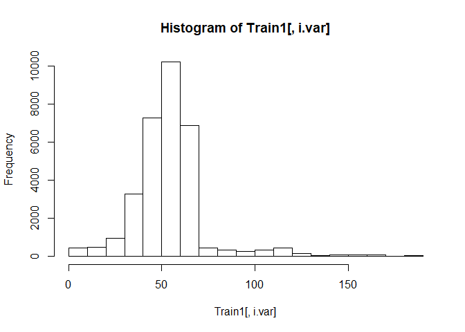

ungulates6\_outbreak\_size\_20190409
================

#### install packages

    ## Warning: package 'colorspace' was built under R version 3.5.3

    ## Loading required package: sp

    ## 
    ## Attaching package: 'raster'

    ## The following object is masked from 'package:colorspace':
    ## 
    ##     RGB

    ## Loading required package: ggplot2

    ## Warning: package 'ggplot2' was built under R version 3.5.3

    ## Loading required package: lattice

    ## Loading required package: latticeExtra

    ## Loading required package: RColorBrewer

    ## 
    ## Attaching package: 'latticeExtra'

    ## The following object is masked from 'package:ggplot2':
    ## 
    ##     layer

    ## 
    ## Attaching package: 'dplyr'

    ## The following objects are masked from 'package:raster':
    ## 
    ##     intersect, select, union

    ## The following objects are masked from 'package:stats':
    ## 
    ##     filter, lag

    ## The following objects are masked from 'package:base':
    ## 
    ##     intersect, setdiff, setequal, union

    ## ### Welcome to rworldmap ###

    ## For a short introduction type :   vignette('rworldmap')

    ## 
    ## Attaching package: 'lubridate'

    ## The following object is masked from 'package:base':
    ## 
    ##     date

    ## 
    ## Attaching package: 'zoo'

    ## The following objects are masked from 'package:base':
    ## 
    ##     as.Date, as.Date.numeric

    ## Loaded gbm 2.1.4

    ## Loading required package: gplots

    ## 
    ## Attaching package: 'gplots'

    ## The following object is masked from 'package:stats':
    ## 
    ##     lowess

### load dfPredictors and dfAnimal. Reassign sumCases from dfAnimal to dfPredictors

``` r
load("dfPredictors.Rdata")
load("dfAnimal.Rdata")
dfPredictors$sumCases = dfAnimal$sumCases
dfPredictors = subset(dfPredictors, !is.na(sumCases))#remove NA cases
dfPredictors = subset(dfPredictors, case == 1)#only interested in outbreak locations
keep = setdiff(names(dfPredictors), "case")#remove case from columns 
dfPredictorsCases = dfPredictors[,keep]#keep only certain columns
save(dfPredictorsCases, file = "dfPredictorsCases.Rdata")
dim(dfPredictorsCases)
```

    ## [1] 39968   960

### make test and train

``` r
load("dfPredictorsCases.Rdata")
df = dfPredictorsCases
DP =createDataPartition(y = df$sumCases, 
                        p = 0.8,
                        list = FALSE)
TrainCases = df[DP,]
TestCases = df[-DP,]

save(TrainCases, file = "TrainCases.Rdata")
save(TestCases, file = "TestCases.Rdata")
```

### make model

``` r
load("dfPredictorsCases.Rdata")
df = dfPredictorsCases

columns = dim(df)[2]
columns_min_1 = columns-1
modelCases<-as.formula(paste(colnames(df)[columns], "~",
                        paste(colnames(df)[c(1:columns_min_1)],collapse = "+"),
                        sep = ""))
print(modelCases)
```

    ## sumCases ~ log_chickens + log_sheep + log_goats + log_cattle + 
    ##     log_pigs + livestock_non_zero_fraction + nightlights2013 + 
    ##     log_highway_density + log_primary_road_density + log_secondary_road_density + 
    ##     log_tertiary_road_density + log_local_road_density + label_shortbare + 
    ##     label_shortclosedbroadleaveddeciduousforest + label_shortClosedneedleleavedevergreenforest + 
    ##     label_shortClosedtoopen15broadleavedevergreenorsemideciduousforest5m + 
    ##     label_shortforestorshrubgrassland + label_shortforestregularlyflooded + 
    ##     label_shortforestshrubpermanentlyflooded + label_shortgrasslandwoodyregularlyflooded + 
    ##     label_shortherbaceous + label_shortmixedbroadleavedandneedleleavesforest + 
    ##     label_shortmosaiccropgrassshrubforest + label_shortmosaicgrassshrubforestcrop + 
    ##     label_shortmosaicgrasslandforestshrub + label_shortNodataburntareasclouds + 
    ##     label_shortopenbroadleaveddeciduousforest + label_shortOpenneedleleaveddeciduousorevergreenforest + 
    ##     label_shortPostfloodingorirrigatedcroplandsoraquatic + label_shortRainfedcroplands + 
    ##     label_shortshrubland + label_shortsnowice + label_shortsparse + 
    ##     label_shortwater + annualMeanTemp + annualPrecip + countryAlbania + 
    ##     countryAlgeria + countryAndorra + countryAngola + countryAnguilla + 
    ##     countryAntiguaandBarbuda + countryArgentina + countryArmenia + 
    ##     countryAustralia + countryAustria + countryAzerbaijan + countryBahamas + 
    ##     countryBahrain + countryBangladesh + countryBelarus + countryBelgium + 
    ##     countryBelize + countryBenin + countryBhutan + countryBolivia + 
    ##     countryBosniaandHerzegovina + countryBotswana + countryBrazil + 
    ##     countryBulgaria + countryBurkinaFaso + countryBurma + countryBurundi + 
    ##     countryCambodia + countryCameroon + countryCanada + countryCapeVerde + 
    ##     countryCentralAfricanRepublic + countryChad + countryChile + 
    ##     countryChina + countryColombia + countryComoros + countryCongo + 
    ##     countryCostaRica + countryCotedIvoire + countryCroatia + 
    ##     countryCuba + countryCyprus + countryCzechRepublic + countryDemocraticRepublicoftheCongo + 
    ##     countryDenmark + countryDjibouti + countryDominica + countryDominicanRepublic + 
    ##     countryEcuador + countryEgypt + countryElSalvador + countryEquatorialGuinea + 
    ##     countryEritrea + countryEstonia + countryEthiopia + countryFalklandIslandsMalvinas + 
    ##     countryFaroeIslands + countryFiji + countryFinland + countryFrance + 
    ##     countryFrenchGuiana + countryGabon + countryGambia + countryGeorgia + 
    ##     countryGermany + countryGhana + countryGreece + countryGreenland + 
    ##     countryGuatemala + countryGuinea + countryGuineaBissau + 
    ##     countryGuyana + countryHaiti + countryHonduras + countryHongKong + 
    ##     countryHungary + countryIceland + countryIndia + countryIndonesia + 
    ##     countryIranIslamicRepublicof + countryIraq + countryIreland + 
    ##     countryIsrael + countryItaly + countryJamaica + countryJapan + 
    ##     countryJersey + countryJordan + countryKazakhstan + countryKenya + 
    ##     countryKoreaDemocraticPeoplesRepublicof + countryKoreaRepublicof + 
    ##     countryKuwait + countryKyrgyzstan + countryLaoPeoplesDemocraticRepublic + 
    ##     countryLatvia + countryLebanon + countryLesotho + countryLiberia + 
    ##     countryLibyanArabJamahiriya + countryLithuania + countryLuxembourg + 
    ##     countryMadagascar + countryMalawi + countryMalaysia + countryMali + 
    ##     countryMalta + countryMartinique + countryMauritania + countryMauritius + 
    ##     countryMayotte + countryMexico + countryMongolia + countryMontenegro + 
    ##     countryMorocco + countryMozambique + countryNamibia + countryNepal + 
    ##     countryNetherlands + countryNewCaledonia + countryNewZealand + 
    ##     countryNicaragua + countryNiger + countryNigeria + countryNorway + 
    ##     countryOman + countryPakistan + countryPalestine + countryPanama + 
    ##     countryPapuaNewGuinea + countryParaguay + countryPeru + countryPhilippines + 
    ##     countryPoland + countryPortugal + countryPuertoRico + countryQatar + 
    ##     countryRepublicofMoldova + countryReunion + countryRomania + 
    ##     countryRussia + countryRwanda + countrySaintVincentandtheGrenadines + 
    ##     countrySaudiArabia + countrySenegal + countrySerbia + countrySierraLeone + 
    ##     countrySingapore + countrySlovakia + countrySlovenia + countrySolomonIslands + 
    ##     countrySomalia + countrySouthAfrica + countrySpain + countrySriLanka + 
    ##     countrySudan + countrySuriname + countrySvalbard + countrySwaziland + 
    ##     countrySweden + countrySwitzerland + countrySyrianArabRepublic + 
    ##     countryTaiwan + countryTajikistan + countryThailand + countryTheformerYugoslavRepublicofMacedonia + 
    ##     countryTogo + countryTunisia + countryTurkey + countryTurkmenistan + 
    ##     countryUganda + countryUkraine + countryUnitedArabEmirates + 
    ##     countryUnitedKingdom + countryUnitedRepublicofTanzania + 
    ##     countryUnitedStates + countryUruguay + countryUzbekistan + 
    ##     countryVanuatu + countryVenezuela + countryVietNam + countryWesternSahara + 
    ##     countryYemen + countryZambia + countryZimbabwe + ecoregionAfghanMountainsSemiDesert + 
    ##     ecoregionAlHajarMontaneWoodlands + ecoregionAlaiWesternTianShanSteppe + 
    ##     ecoregionAlashanPlateauSemiDesert + ecoregionAlaskaYukonArctic + 
    ##     ecoregionAlaskaPeninsula + ecoregionAlaskaRange + ecoregionAlbanyThickets + 
    ##     ecoregionAlbertineRiftMontaneForests + ecoregionAlpsConiferAndMixedForests + 
    ##     ecoregionAltaiAlpineMeadowAndTundra + ecoregionAltaiMontaneForestAndForestSteppe + 
    ##     ecoregionAltaiSteppeAndSemiDesert + ecoregionAltoParanÃAtlanticForests + 
    ##     ecoregionAmazonOrinocoSouthernCaribbeanMangroves + ecoregionAmurMeadowSteppe + 
    ##     ecoregionAnatolianConiferAndDeciduousMixedForests + ecoregionAngolanMiomboWoodlands + 
    ##     ecoregionAngolanMontaneForestGrasslandMosaic + ecoregionAngolanMopaneWoodlands + 
    ##     ecoregionAngolanScarpSavannaAndWoodlands + ecoregionApacheHighlands + 
    ##     ecoregionAppenineDeciduousMontaneForests + ecoregionApureVillavicencioDryForests + 
    ##     ecoregionArabianDesertAndEastSaheroArabianXericShrublands + 
    ##     ecoregionArabianPeninsulaCoastalFogDesert + ecoregionAraucariaMoistForests + 
    ##     ecoregionArayaAndPariaXericScrub + ecoregionArcticCordillera + 
    ##     ecoregionArcticDesert + ecoregionArizonaNewMexicoMountains + 
    ##     ecoregionArnhemLandTropicalSavanna + ecoregionAspenParkland + 
    ##     ecoregionAtacamaDesert + ecoregionAtlanticCoastRestingas + 
    ##     ecoregionAtlanticCoastalDesert + ecoregionAtlanticDryForests + 
    ##     ecoregionAtlanticEquatorialCoastalForests + ecoregionAtlanticMixedForests + 
    ##     ecoregionAustralianAlpsMontaneGrasslands + ecoregionAzerbaijanShrubDesertAndSteppe + 
    ##     ecoregionAzoresTemperateMixedForests + ecoregionBadghyzAndKarabilSemiDesert + 
    ##     ecoregionBahamianAntilleanMangroves + ecoregionBahamianPineMosaic + 
    ##     ecoregionBahiaCoastalForests + ecoregionBahiaInteriorForests + 
    ##     ecoregionBajaCaliforniaDesert + ecoregionBajÃoDryForests + 
    ##     ecoregionBalkanMixedForests + ecoregionBalsasDryForests + 
    ##     ecoregionBalticMixedForests + ecoregionBaluchistanXericWoodlands + 
    ##     ecoregionBandaSeaIslandsMoistDeciduousForests + ecoregionBelizianPineForests + 
    ##     ecoregionBeniSavanna + ecoregionBeringSeaAndAleutianIslands + 
    ##     ecoregionBeringTundra + ecoregionBeringianTundra + ecoregionBlackHills + 
    ##     ecoregionBohaiSeaSalineMeadow + ecoregionBolivianMontaneDryForests + 
    ##     ecoregionBolivianYungas + ecoregionBorealCordillera + ecoregionBorealPlains + 
    ##     ecoregionBorealShield + ecoregionBorneoLowlandRainForests + 
    ##     ecoregionBorneoMontaneRainForests + ecoregionBorneoPeatSwampForests + 
    ##     ecoregionBrahmaputraValleySemiEvergreenForests + ecoregionBrigalowTropicalSavanna + 
    ##     ecoregionBristolBayBasin + ecoregionBuruRainForests + ecoregionCaatinga + 
    ##     ecoregionCaatingaEnclavesMoistForests + ecoregionCaledonConiferForests + 
    ##     ecoregionCaliforniaCentralCoast + ecoregionCaliforniaNorthCoast + 
    ##     ecoregionCaliforniaSouthCoast + ecoregionCameroonianHighlandsForests + 
    ##     ecoregionCamposRupestresMontaneSavanna + ecoregionCanadianRockyMountains + 
    ##     ecoregionCanaryIslandsDryWoodlandsAndForests + ecoregionCantabrianMixedForests + 
    ##     ecoregionCanteburyOtagoTussockGrasslands + ecoregionCapeVerdeIslandsDryForests + 
    ##     ecoregionCapeYorkPeninsulaTropicalSavanna + ecoregionCaquetaMoistForests + 
    ##     ecoregionCardamomMountainsRainForests + ecoregionCaribbeanShrublands + 
    ##     ecoregionCarnarvonXericShrublands + ecoregionCarpathianMontaneForests + 
    ##     ecoregionCarpentariaTropicalSavanna + ecoregionCaspianHyrcanianMixedForests + 
    ##     ecoregionCaspianLowlandDesert + ecoregionCatatumboMoistForests + 
    ##     ecoregionCaucaValleyDryForests + ecoregionCaucaValleyMontaneForests + 
    ##     ecoregionCaucasusMixedForests + ecoregionCelticBroadleafForests + 
    ##     ecoregionCentralAfghanMountainsXericWoodlands + ecoregionCentralAfricanMangroves + 
    ##     ecoregionCentralAmericanAtlanticMoistForests + ecoregionCentralAmericanDryForests + 
    ##     ecoregionCentralAmericanMontaneForests + ecoregionCentralAmericanPineOakForests + 
    ##     ecoregionCentralAnatolianSteppe + ecoregionCentralAnatolianSteppeAndWoodlands + 
    ##     ecoregionCentralAndeanDryPuna + ecoregionCentralAndeanPuna + 
    ##     ecoregionCentralAndeanWetPuna + ecoregionCentralAppalachianForest + 
    ##     ecoregionCentralAsianNorthernDesert + ecoregionCentralAsianRiparianWoodlands + 
    ##     ecoregionCentralAsianSouthernDesert + ecoregionCentralChinaLoessPlateauMixedForests + 
    ##     ecoregionCentralCongolianLowlandForests + ecoregionCentralDeccanPlateauDryDeciduousForests + 
    ##     ecoregionCentralEuropeanMixedForests + ecoregionCentralIndochinaDryForests + 
    ##     ecoregionCentralKoreanDeciduousForests + ecoregionCentralMexicanMatorral + 
    ##     ecoregionCentralMixedGrassPrairie + ecoregionCentralPersianDesertBasins + 
    ##     ecoregionCentralRangeMontaneRainForests + ecoregionCentralRangesXericScrub + 
    ##     ecoregionCentralShortgrassPrairie + ecoregionCentralTallgrassPrairie + 
    ##     ecoregionCentralTibetanPlateauAlpineSteppe + ecoregionCentralZambezianMiomboWoodlands + 
    ##     ecoregionCerrado + ecoregionChangbaiMountainsMixedForests + 
    ##     ecoregionChangjiangPlainEvergreenForests + ecoregionChaoPhrayaFreshwaterSwampForests + 
    ##     ecoregionChaoPhrayaLowlandMoistDeciduousForests + ecoregionCherskiiKolymaMountainTundra + 
    ##     ecoregionChesapeakeBayLowlands + ecoregionChhotaNagpurDryDeciduousForests + 
    ##     ecoregionChiapasDepressionDryForests + ecoregionChihuahuanDesert + 
    ##     ecoregionChileanMatorral + ecoregionChimalapasMontaneForests + 
    ##     ecoregionChinHillsArakanYomaMontaneForests + ecoregionChiquitanoDryForests + 
    ##     ecoregionChocóDariÃnMoistForests + ecoregionChukchiPeninsulaTundra + 
    ##     ecoregionColoradoPlateau + ecoregionColumbiaPlateau + ecoregionComorosForests + 
    ##     ecoregionCookInletBasin + ecoregionCoolgardieWoodlands + 
    ##     ecoregionCordilleraCentralPÃramo + ecoregionCordilleraLaCostaMontaneForests + 
    ##     ecoregionCordilleraOrientalMontaneForests + ecoregionCorsicanMontaneBroadleafAndMixedForests + 
    ##     ecoregionCostaRicanSeasonalMoistForests + ecoregionCreteMediterraneanForests + 
    ##     ecoregionCrimeanSubmediterraneanForestComplex + ecoregionCrossNigerTransitionForests + 
    ##     ecoregionCrossSanagaBiokoCoastalForests + ecoregionCrosstimbersAndSouthernTallgrassPrairie + 
    ##     ecoregionCubanCactusScrub + ecoregionCubanDryForests + ecoregionCubanMoistForests + 
    ##     ecoregionCubanPineForests + ecoregionCumberlandsAndSouthernRidgeAndValley + 
    ##     ecoregionCyprusMediterraneanForests + ecoregionDaHingganDzhagdyMountainsConiferForests + 
    ##     ecoregionDabaMountainsEvergreenForests + ecoregionDakotaMixedGrassPrairie + 
    ##     ecoregionDaurianForestSteppe + ecoregionDeccanThornScrubForests + 
    ##     ecoregionDinaricMountainsMixedForests + ecoregionDrakensbergAltiMontaneGrasslandsAndWoodlands + 
    ##     ecoregionDrakensbergMontaneGrasslandsWoodlandsAndForests + 
    ##     ecoregionDryChaco + ecoregionEastAfghanMontaneConiferForests + 
    ##     ecoregionEastAfricanHalophytics + ecoregionEastAfricanMangroves + 
    ##     ecoregionEastAfricanMontaneForests + ecoregionEastAfricanMontaneMoorlands + 
    ##     ecoregionEastCascadesModocPlateau + ecoregionEastDeccanDryEvergreenForests + 
    ##     ecoregionEastEuropeanForestSteppe + ecoregionEastGulfCoastalPlain + 
    ##     ecoregionEastSaharanMontaneXericWoodlands + ecoregionEastSiberianTaiga + 
    ##     ecoregionEastSudanianSavanna + ecoregionEasternAnatolianDeciduousForests + 
    ##     ecoregionEasternAnatolianMontaneSteppe + ecoregionEasternArcForests + 
    ##     ecoregionEasternAustraliaMulgaShrublands + ecoregionEasternAustralianTemperateForests + 
    ##     ecoregionEasternCongolianSwampForests + ecoregionEasternCordilleraRealMontaneForests + 
    ##     ecoregionEasternGobiDesertSteppe + ecoregionEasternGuineanForests + 
    ##     ecoregionEasternHighlandsMoistDeciduousForests + ecoregionEasternHimalayanAlpineShrubAndMeadows + 
    ##     ecoregionEasternHimalayanBroadleafForests + ecoregionEasternHimalayanSubalpineConiferForests + 
    ##     ecoregionEasternJavaBaliMontaneRainForests + ecoregionEasternJavaBaliRainForests + 
    ##     ecoregionEasternMediterraneanConiferSclerophyllousBroadleafForests + 
    ##     ecoregionEasternMiomboWoodlands + ecoregionEasternTaigaShield + 
    ##     ecoregionEasternZimbabweMontaneForestGrasslandMosaic + ecoregionEcuadorianDryForests + 
    ##     ecoregionEdwardsPlateau + ecoregionEinasleighUplandSavanna + 
    ##     ecoregionElburzRangeForestSteppe + ecoregionEminValleySteppe + 
    ##     ecoregionEnglishLowlandsBeechForests + ecoregionEritreanCoastalDesert + 
    ##     ecoregionEsperanceMallee + ecoregionEspinal + ecoregionEthiopianMontaneForests + 
    ##     ecoregionEthiopianMontaneGrasslandsAndWoodlands + ecoregionEthiopianMontaneMoorlands + 
    ##     ecoregionEthiopianXericGrasslandsAndShrublands + ecoregionEtoshaPanHalophytics + 
    ##     ecoregionEuxineColchicBroadleafForests + ecoregionEyreAndYorkMallee + 
    ##     ecoregionFaroeIslandsBorealGrasslands + ecoregionFescueMixedGrassPrairie + 
    ##     ecoregionFijiTropicalDryForests + ecoregionFijiTropicalMoistForests + 
    ##     ecoregionFiordlandTemperateForests + ecoregionFloridaPeninsula + 
    ##     ecoregionGalÃpagosIslandsScrublandMosaic + ecoregionGhoratHazarajatAlpineMeadow + 
    ##     ecoregionGibsonDesert + ecoregionGissaroAlaiOpenWoodlands + 
    ##     ecoregionGoadavariKrishnaMangroves + ecoregionGobiLakesValleyDesertSteppe + 
    ##     ecoregionGreatBasin + ecoregionGreatCentralValley + ecoregionGreatLakes + 
    ##     ecoregionGreatLakesBasinDesertSteppe + ecoregionGreatSandyTanamiDesert + 
    ##     ecoregionGreatVictoriaDesert + ecoregionGreaterNegrosPanayRainForests + 
    ##     ecoregionGuajiraBarranquillaXericScrub + ecoregionGuiananFreshwaterSwampForests + 
    ##     ecoregionGuiananHighlandsMoistForests + ecoregionGuiananMoistForests + 
    ##     ecoregionGuiananPiedmontAndLowlandMoistForests + ecoregionGuiananSavanna + 
    ##     ecoregionGuineanForestSavannaMosaic + ecoregionGuineanMangroves + 
    ##     ecoregionGuineanMontaneForests + ecoregionGuizhouPlateauBroadleafAndMixedForests + 
    ##     ecoregionGulfCoastPrairiesAndMarshes + ecoregionGulfOfAlaskaMountainsAndFjordlands + 
    ##     ecoregionGulfOfCaliforniaXericScrub + ecoregionGulfOfOmanDesertAndSemiDesert + 
    ##     ecoregionGurupaVarzeà + ecoregionHainanIslandMonsoonRainForests + 
    ##     ecoregionHalmaheraRainForests + ecoregionHawaiianHighIslandsHawaiiTropicalDryForests + 
    ##     ecoregionHawaiianHighIslandsHawaiiTropicalMoistForests + 
    ##     ecoregionHelanshanMontaneConiferForests + ecoregionHengduanMountainsSubalpineConiferForests + 
    ##     ecoregionHighAlleghenyPlateau + ecoregionHighMonte + ecoregionHighveldGrasslands + 
    ##     ecoregionHimalayanSubtropicalBroadleafForests + ecoregionHimalayanSubtropicalPineForests + 
    ##     ecoregionHinduKushAlpineMeadow + ecoregionHispaniolanDryForests + 
    ##     ecoregionHispaniolanMoistForests + ecoregionHispaniolanPineForests + 
    ##     ecoregionHobyoGrasslandsAndShrublands + ecoregionHokkaidoDeciduousForests + 
    ##     ecoregionHokkaidoMontaneConiferForests + ecoregionHonshuAlpineConiferForests + 
    ##     ecoregionHuangHePlainMixedForests + ecoregionHudsonPlains + 
    ##     ecoregionHumidChaco + ecoregionHumidPampas + ecoregionHuonPeninsulaMontaneRainForests + 
    ##     ecoregionIberianConiferForests + ecoregionIberianSclerophyllousAndSemiDeciduousForests + 
    ##     ecoregionIcelandBorealBirchForestsAndAlpineTundra + ecoregionIllyrianDeciduousForests + 
    ##     ecoregionIndochinaMangroves + ecoregionIndusRiverDeltaArabianSeaMangroves + 
    ##     ecoregionIndusValleyDesert + ecoregionInnerNigerDeltaFloodedSavanna + 
    ##     ecoregionInteriorAlaskaTaiga + ecoregionInteriorLowPlateau + 
    ##     ecoregionIquitosVarzeà + ecoregionIrrawaddyDryForests + ecoregionIrrawaddyFreshwaterSwampForests + 
    ##     ecoregionIrrawaddyMoistDeciduousForests + ecoregionIsthmianAtlanticMoistForests + 
    ##     ecoregionIsthmianPacificMoistForests + ecoregionItalianSclerophyllousAndSemiDeciduousForests + 
    ##     ecoregionItigiSumbuThicket + ecoregionJaliscoDryForests + 
    ##     ecoregionJamaicanDryForests + ecoregionJamaicanMoistForests + 
    ##     ecoregionJapurÃSolimoesNegroMoistForests + ecoregionJarrahKarriForestAndShrublands + 
    ##     ecoregionJianNanSubtropicalEvergreenForests + ecoregionJosPlateauForestGrasslandMosaic + 
    ##     ecoregionJunggarBasinSemiDesert + ecoregionJuruÃPurusMoistForests + 
    ##     ecoregionKalaallitNunaatHighArcticTundra + ecoregionKalaallitNunaatLowArcticTundra + 
    ##     ecoregionKalahariAcaciaBaikiaeaWoodlands + ecoregionKalahariXericSavanna + 
    ##     ecoregionKamchatkaKurileMeadowsAndSparseForests + ecoregionKamchatkaKurileTaiga + 
    ##     ecoregionKamchatkaMountainTundraAndForestTundra + ecoregionKaokoveldDesert + 
    ##     ecoregionKarakoramWestTibetanPlateauAlpineSteppe + ecoregionKayahKarenMontaneRainForests + 
    ##     ecoregionKazakhForestSteppe + ecoregionKazakhSemiDesert + 
    ##     ecoregionKazakhSteppe + ecoregionKazakhUpland + ecoregionKhangaiMountainsAlpineMeadow + 
    ##     ecoregionKhangaiMountainsConiferForests + ecoregionKhathiarGirDryDeciduousForests + 
    ##     ecoregionKimberlyTropicalSavanna + ecoregionKlamathMountains + 
    ##     ecoregionKnysnaAmatoleMontaneForests + ecoregionKolaPeninsulaTundra + 
    ##     ecoregionKopetDagSemiDesert + ecoregionKopetDagWoodlandsAndForestSteppe + 
    ##     ecoregionKuhRudAndEasternIranMontaneWoodlands + ecoregionKwazuluCapeCoastalForestMosaic + 
    ##     ecoregionLaCostaXericShrublands + ecoregionLakeChadFloodedSavanna + 
    ##     ecoregionLakeAfrotropic + ecoregionLakeNeotropic + ecoregionLakePalearctic + 
    ##     ecoregionLaraFalcónDryForests + ecoregionLesserAntilleanDryForests + 
    ##     ecoregionLesserSundasDeciduousForests + ecoregionLlanos + 
    ##     ecoregionLowMonte + ecoregionLowerGangeticPlainsMoistDeciduousForests + 
    ##     ecoregionLowerNewEnglandNorthernPiedmont + ecoregionLowlandFynbosAndRenosterveld + 
    ##     ecoregionLuangPrabangMontaneRainForests + ecoregionLuzonRainForests + 
    ##     ecoregionMadagascarDryDeciduousForests + ecoregionMadagascarEricoidThickets + 
    ##     ecoregionMadagascarLowlandForests + ecoregionMadagascarSpinyThickets + 
    ##     ecoregionMadagascarSubhumidForests + ecoregionMadagascarSucculentWoodlands + 
    ##     ecoregionMadeiraTapajósMoistForests + ecoregionMagdalenaUrabÃMoistForests + 
    ##     ecoregionMagdalenaValleyDryForests + ecoregionMagdalenaValleyMontaneForests + 
    ##     ecoregionMagellanicSubpolarForests + ecoregionMalabarCoastMoistForests + 
    ##     ecoregionManchurianMixedForests + ecoregionMandaraPlateauMosaic + 
    ##     ecoregionMaputalandPondolandBushlandAndThickets + ecoregionMaputalandCoastalForestMosaic + 
    ##     ecoregionMaraÃónDryForests + ecoregionMaracaiboDryForests + 
    ##     ecoregionMarajóVarzeà + ecoregionMaranhaoBabaÃuForests + 
    ##     ecoregionMasaiXericGrasslandsAndShrublands + ecoregionMascareneForests + 
    ##     ecoregionMatoGrossoSeasonalForests + ecoregionMediterraneanAcaciaArganiaDryWoodlandsAndSucculentThickets + 
    ##     ecoregionMediterraneanConiferAndMixedForests + ecoregionMediterraneanDryWoodlandsAndSteppe + 
    ##     ecoregionMediterraneanHighAtlasJuniperSteppe + ecoregionMediterraneanWoodlandsAndForests + 
    ##     ecoregionMeghalayaSubtropicalForests + ecoregionMentawaiIslandsRainForests + 
    ##     ecoregionMesetaCentralMatorral + ecoregionMesoamericanGulfCaribbeanMangroves + 
    ##     ecoregionMesopotamianShrubDesert + ecoregionMidAtlanticCoastalPlain + 
    ##     ecoregionMiddleEastSteppe + ecoregionMiddleRockiesBlueMountains + 
    ##     ecoregionMindanaoEasternVisayasRainForests + ecoregionMindanaoMontaneRainForests + 
    ##     ecoregionMindoroRainForests + ecoregionMiskitoPineForests + 
    ##     ecoregionMississippiRiverAlluvialPlain + ecoregionMitchellGrassDowns + 
    ##     ecoregionMizoramManipurKachinRainForests + ecoregionMojaveDesert + 
    ##     ecoregionMongolianManchurianGrassland + ecoregionMontaneCordillera + 
    ##     ecoregionMontaneFynbosAndRenosterveld + ecoregionMonteAlegreVarzeà + 
    ##     ecoregionMotaguaValleyThornscrub + ecoregionMountLoftyWoodlands + 
    ##     ecoregionMurrayDarlingWoodlandsAndMallee + ecoregionMyanmarCoastMangroves + 
    ##     ecoregionMyanmarCoastalRainForests + ecoregionNamaKaroo + 
    ##     ecoregionNamibDesert + ecoregionNamibianSavannaWoodlands + 
    ##     ecoregionNapoMoistForests + ecoregionNaracoorteWoodlands + 
    ##     ecoregionNarmadaValleyDryDeciduousForests + ecoregionNegroBrancoMoistForests + 
    ##     ecoregionNelsonCoastTemperateForests + ecoregionNenjiangRiverGrassland + 
    ##     ecoregionNewBritainNewIrelandLowlandRainForests + ecoregionNewBritainNewIrelandMontaneRainForests + 
    ##     ecoregionNewCaledoniaRainForests + ecoregionNewGuineaMangroves + 
    ##     ecoregionNigerDeltaSwampForests + ecoregionNigerianLowlandForests + 
    ##     ecoregionNihonkaiEvergreenForests + ecoregionNihonkaiMontaneDeciduousForests + 
    ##     ecoregionNileDeltaFloodedSavanna + ecoregionNorthAtlanticCoast + 
    ##     ecoregionNorthAtlanticMoistMixedForests + ecoregionNorthCascades + 
    ##     ecoregionNorthCentralTillplain + ecoregionNorthIslandTemperateForests + 
    ##     ecoregionNorthSaharanSteppeAndWoodlands + ecoregionNorthTibetanPlateauKunlunMountainsAlpineDesert + 
    ##     ecoregionNorthWesternGhatsMoistDeciduousForests + ecoregionNorthWesternGhatsMontaneRainForests + 
    ##     ecoregionNortheastChinaPlainDeciduousForests + ecoregionNortheastIndiaMyanmarPineForests + 
    ##     ecoregionNortheastSiberianCoastalTundra + ecoregionNortheastSiberianTaiga + 
    ##     ecoregionNortheasternCongolianLowlandForests + ecoregionNortheasternHimalayanSubalpineConiferForests + 
    ##     ecoregionNortheasternSpainAndSouthernFranceMediterraneanForests + 
    ##     ecoregionNorthernAcaciaCommiphoraBushlandsAndThickets + ecoregionNorthernAnatolianConiferAndDeciduousForests + 
    ##     ecoregionNorthernAndeanPÃramo + ecoregionNorthernAnnamitesRainForests + 
    ##     ecoregionNorthernAppalachianAcadian + ecoregionNorthernArctic + 
    ##     ecoregionNorthernCongolianForestSavannaMosaic + ecoregionNorthernDryDeciduousForests + 
    ##     ecoregionNorthernGreatPlainsSteppe + ecoregionNorthernIndochinaSubtropicalForests + 
    ##     ecoregionNorthernKhoratPlateauMoistDeciduousForests + ecoregionNorthernMesoamericanPacificMangroves + 
    ##     ecoregionNorthernNewGuineaLowlandRainAndFreshwaterSwampForests + 
    ##     ecoregionNorthernNewGuineaMontaneRainForests + ecoregionNorthernTallgrassPrairie + 
    ##     ecoregionNorthernThailandLaosMoistDeciduousForests + ecoregionNorthernTriangleSubtropicalForests + 
    ##     ecoregionNorthernTriangleTemperateForests + ecoregionNorthernVietnamLowlandRainForests + 
    ##     ecoregionNorthernZanzibarInhambaneCoastalForestMosaic + ecoregionNorthlandTemperateKauriForests + 
    ##     ecoregionNorthwestIberianMontaneForests + ecoregionNorthwestRussianNovayaZemlyaTundra + 
    ##     ecoregionNorthwesternAndeanMontaneForests + ecoregionNorthwesternCongolianLowlandForests + 
    ##     ecoregionNorthwesternHimalayanAlpineShrubAndMeadows + ecoregionNorthwesternThornScrubForests + 
    ##     ecoregionNovosibirskIslandsArcticDesert + ecoregionNujiangLangcangGorgeAlpineConiferAndMixedForests + 
    ##     ecoregionNullarborPlainsXericShrublands + ecoregionOaxacanMontaneForests + 
    ##     ecoregionOkanagan + ecoregionOkhotskManchurianTaiga + ecoregionOrdosPlateauSteppe + 
    ##     ecoregionOrinocoDeltaSwampForests + ecoregionOrinocoWetlands + 
    ##     ecoregionOrissaSemiEvergreenForests + ecoregionOsagePlainsFlintHillsPrairie + 
    ##     ecoregionOuachitaMountains + ecoregionOzarks + ecoregionPacificNorthwestCoast + 
    ##     ecoregionPalawanRainForests + ecoregionPamirAlpineDesertAndTundra + 
    ##     ecoregionPanamanianDryForests + ecoregionPannonianMixedForests + 
    ##     ecoregionPantanal + ecoregionPantanosDeCentla + ecoregionPantepui + 
    ##     ecoregionParaguanaXericScrub + ecoregionParanÃFloodedSavanna + 
    ##     ecoregionParopamisusXericWoodlands + ecoregionPatagonianSteppe + 
    ##     ecoregionPeninsularMalaysianMontaneRainForests + ecoregionPeninsularMalaysianPeatSwampForests + 
    ##     ecoregionPeninsularMalaysianRainForests + ecoregionPernambucoCoastalForests + 
    ##     ecoregionPernambucoInteriorForests + ecoregionPersianGulfDesertAndSemiDesert + 
    ##     ecoregionPeruvianYungas + ecoregionPetÃnVeracruzMoistForests + 
    ##     ecoregionPiedmont + ecoregionPilbaraShrublands + ecoregionPindusMountainsMixedForests + 
    ##     ecoregionPoBasinMixedForests + ecoregionPonticSteppe + ecoregionPrairieForestBorder + 
    ##     ecoregionPuertoRicanDryForests + ecoregionPuertoRicanMoistForests + 
    ##     ecoregionPurusMadeiraMoistForests + ecoregionPurusVarzeà + 
    ##     ecoregionPyreneesConiferAndMixedForests + ecoregionQaidamBasinSemiDesert + 
    ##     ecoregionQilianMountainsConiferForests + ecoregionQilianMountainsSubalpineMeadows + 
    ##     ecoregionQinLingMountainsDeciduousForests + ecoregionQionglaiMinshanConiferForests + 
    ##     ecoregionQueenslandTropicalRainForests + ecoregionRakiuraIslandTemperateForests + 
    ##     ecoregionRannOfKutchSeasonalSaltMarsh + ecoregionRedRiverFreshwaterSwampForests + 
    ##     ecoregionRedSeaCoastalDesert + ecoregionRedSeaNuboSindianTropicalDesertAndSemiDesert + 
    ##     ecoregionRegistanNorthPakistanSandyDesert + ecoregionRichmondTemperateForests + 
    ##     ecoregionRioNegroCampinarana + ecoregionRockAndIceNearctic + 
    ##     ecoregionRockAndIceNeotropic + ecoregionRockAndIcePalearctic + 
    ##     ecoregionRodopeMontaneMixedForests + ecoregionRuwenzoriVirungaMontaneMoorlands + 
    ##     ecoregionSEAlaskaBCCoastalForestAndMountains + ecoregionSaharaDesert + 
    ##     ecoregionSaharanFloodedGrasslands + ecoregionSaharanHalophytics + 
    ##     ecoregionSahelianAcaciaSavanna + ecoregionSakhalinIslandTaiga + 
    ##     ecoregionSantaMartaMontaneForests + ecoregionSarmaticMixedForests + 
    ##     ecoregionSayanAlpineMeadowsAndTundra + ecoregionSayanIntermontaneSteppe + 
    ##     ecoregionSayanMontaneConiferForests + ecoregionScandinavianAndRussianTaiga + 
    ##     ecoregionScandinavianCoastalConiferForests + ecoregionScandinavianMontaneBirchForestAndGrasslands + 
    ##     ecoregionSechuraDesert + ecoregionSelengeOrkhonForestSteppe + 
    ##     ecoregionSeramRainForests + ecoregionSerengetiVolcanicGrasslands + 
    ##     ecoregionSerraDoMarCoastalForests + ecoregionSichuanBasinEvergreenBroadleafForests + 
    ##     ecoregionSierraDeLaLagunaDryForests + ecoregionSierraDeLosTuxtlas + 
    ##     ecoregionSierraMadreDeChiapasMoistForests + ecoregionSierraMadreDeOaxacaPineOakForests + 
    ##     ecoregionSierraMadreDelSurPineOakForests + ecoregionSierraMadreOccidentalPineOakForests + 
    ##     ecoregionSierraMadreOrientalPineOakForests + ecoregionSierraNevada + 
    ##     ecoregionSimpsonDesert + ecoregionSinaloanDryForests + ecoregionSinúValleyDryForests + 
    ##     ecoregionSocotraIslandXericShrublands + ecoregionSolimoesJapurÃMoistForests + 
    ##     ecoregionSolomonIslandsRainForests + ecoregionSomaliAcaciaCommiphoraBushlandsAndThickets + 
    ##     ecoregionSomaliMontaneXericWoodlands + ecoregionSonoranSinaloanTransitionSubtropicalDryForest + 
    ##     ecoregionSonoranDesert + ecoregionSouthAmericanPacificMangroves + 
    ##     ecoregionSouthAppenineMixedMontaneForests + ecoregionSouthAtlanticCoastalPlain + 
    ##     ecoregionSouthChinaVietnamSubtropicalEvergreenForests + ecoregionSouthDeccanPlateauDryDeciduousForests + 
    ##     ecoregionSouthIranNuboSindianDesertAndSemiDesert + ecoregionSouthIslandMontaneGrasslands + 
    ##     ecoregionSouthIslandTemperateForests + ecoregionSouthMalawiMontaneForestGrasslandMosaic + 
    ##     ecoregionSouthSaharanSteppeAndWoodlands + ecoregionSouthSakhalinKurileMixedForests + 
    ##     ecoregionSouthSiberianForestSteppe + ecoregionSouthTaiwanMonsoonRainForests + 
    ##     ecoregionSouthWesternGhatsMoistDeciduousForests + ecoregionSouthWesternGhatsMontaneRainForests + 
    ##     ecoregionSoutheastAustraliaTemperateForests + ecoregionSoutheastAustraliaTemperateSavanna + 
    ##     ecoregionSoutheastTibetShrublandsAndMeadows + ecoregionSoutheasternIberianShrubsAndWoodlands + 
    ##     ecoregionSoutheasternIndochinaDryEvergreenForests + ecoregionSoutheasternPapuanRainForests + 
    ##     ecoregionSouthernAcaciaCommiphoraBushlandsAndThickets + ecoregionSouthernAfricaBushveld + 
    ##     ecoregionSouthernAnatolianMontaneConiferAndDeciduousForests + 
    ##     ecoregionSouthernAndeanSteppe + ecoregionSouthernAndeanYungas + 
    ##     ecoregionSouthernAnnamitesMontaneRainForests + ecoregionSouthernArctic + 
    ##     ecoregionSouthernAtlanticMangroves + ecoregionSouthernBlueRidge + 
    ##     ecoregionSouthernConeMesopotamianSavanna + ecoregionSouthernCongolianForestSavannaMosaic + 
    ##     ecoregionSouthernKoreaEvergreenForests + ecoregionSouthernMesoamericanPacificMangroves + 
    ##     ecoregionSouthernMiomboWoodlands + ecoregionSouthernNewGuineaFreshwaterSwampForests + 
    ##     ecoregionSouthernNewGuineaLowlandRainForests + ecoregionSouthernPacificDryForests + 
    ##     ecoregionSouthernRiftMontaneForestGrasslandMosaic + ecoregionSouthernRockyMountains + 
    ##     ecoregionSouthernShortgrassPrairie + ecoregionSouthernVietnamLowlandDryForests + 
    ##     ecoregionSouthernZanzibarInhambaneCoastalForestMosaic + ecoregionSouthwestAmazonMoistForests + 
    ##     ecoregionSouthwestAustraliaSavanna + ecoregionSouthwestAustraliaWoodlands + 
    ##     ecoregionSouthwestBorneoFreshwaterSwampForests + ecoregionSouthwestIberianMediterraneanSclerophyllousAndMixedForests + 
    ##     ecoregionSouthwesternArabianFoothillsSavanna + ecoregionSouthwesternArabianMontaneWoodlands + 
    ##     ecoregionSriLankaDryZoneDryEvergreenForests + ecoregionSriLankaLowlandRainForests + 
    ##     ecoregionSriLankaMontaneRainForests + ecoregionStLawrenceChamplainValley + 
    ##     ecoregionSucculentKaroo + ecoregionSuiphunKhankaMeadowsAndForestMeadows + 
    ##     ecoregionSulaimanRangeAlpineMeadows + ecoregionSulawesiLowlandRainForests + 
    ##     ecoregionSulawesiMontaneRainForests + ecoregionSumatranFreshwaterSwampForests + 
    ##     ecoregionSumatranLowlandRainForests + ecoregionSumatranMontaneRainForests + 
    ##     ecoregionSumatranPeatSwampForests + ecoregionSumatranTropicalPineForests + 
    ##     ecoregionSumbaDeciduousForests + ecoregionSundaShelfMangroves + 
    ##     ecoregionSundalandHeathForests + ecoregionSundarbansFreshwaterSwampForests + 
    ##     ecoregionSundarbansMangroves + ecoregionSuperiorMixedForest + 
    ##     ecoregionSwanCoastalPlainScrubandWoodlands + ecoregionTaigaCordillera + 
    ##     ecoregionTaigaPlains + ecoregionTaiheiyoEvergreenForests + 
    ##     ecoregionTaiheiyoMontaneDeciduousForests + ecoregionTaimyrCentralSiberianTundra + 
    ##     ecoregionTaiwanSubtropicalEvergreenForests + ecoregionTaklimakanDesert + 
    ##     ecoregionTalamancanMontaneForests + ecoregionTamaulipanThornScrub + 
    ##     ecoregionTapajósXinguMoistForests + ecoregionTarimBasinDeciduousForestsAndSteppe + 
    ##     ecoregionTasmanianCentralHighlandForests + ecoregionTasmanianTemperateForests + 
    ##     ecoregionTasmanianTemperateRainForests + ecoregionTehuacanValleyMatorral + 
    ##     ecoregionTenasserimSouthThailandSemiEvergreenRainForests + 
    ##     ecoregionTeraiDuarSavannaAndGrasslands + ecoregionTharDesert + 
    ##     ecoregionTianShanFoothillAridSteppe + ecoregionTianShanMontaneConiferForests + 
    ##     ecoregionTianShanMontaneSteppeAndMeadows + ecoregionTibestiJebelUweinatMontaneXericWoodlands + 
    ##     ecoregionTibetanPlateauAlpineShrublandsAndMeadows + ecoregionTigrisEuphratesAlluvialSaltMarsh + 
    ##     ecoregionTimorAndWetarDeciduousForests + ecoregionTirariSturtStonyDesert + 
    ##     ecoregionTocantinsPindareMoistForests + ecoregionTonleSapMekongPeatSwampForests + 
    ##     ecoregionTonleSapFreshwaterSwampForests + ecoregionTransBaikalBaldMountainTundra + 
    ##     ecoregionTransBaikalConiferForests + ecoregionTransMexicanVolcanicBeltPineOakForests + 
    ##     ecoregionTransFlySavannaAndGrasslands + ecoregionTrobriandIslandsRainForests + 
    ##     ecoregionTropicalFlorida + ecoregionTumbesPiuraDryForests + 
    ##     ecoregionTyrrhenianAdriaticSclerophyllousAndMixedForests + 
    ##     ecoregionUatumaTrombetasMoistForests + ecoregionUcayaliMoistForests + 
    ##     ecoregionUpperEastGulfCoastalPlain + ecoregionUpperGangeticPlainsMoistDeciduousForests + 
    ##     ecoregionUpperWestGulfCoastalPlain + ecoregionUralMontaneForestsAndTundra + 
    ##     ecoregionUruguayanSavanna + ecoregionUssuriBroadleafAndMixedForests + 
    ##     ecoregionUtahWyomingRockyMountains + ecoregionUtahHighPlateaus + 
    ##     ecoregionValdivianTemperateForests + ecoregionVanuatuRainForests + 
    ##     ecoregionVenezuelanAndesMontaneForests + ecoregionVeracruzMoistForests + 
    ##     ecoregionVeracruzMontaneForests + ecoregionVictoriaBasinForestSavannaMosaic + 
    ##     ecoregionVictoriaPlainsTropicalSavanna + ecoregionVogelkopAruLowlandRainForests + 
    ##     ecoregionVogelkopMontaneRainForests + ecoregionWestCascades + 
    ##     ecoregionWestGulfCoastalPlain + ecoregionWestSaharanMontaneXericWoodlands + 
    ##     ecoregionWestSiberianTaiga + ecoregionWestSudanianSavanna + 
    ##     ecoregionWesternAlleghenyPlateau + ecoregionWesternAustralianMulgaShrublands + 
    ##     ecoregionWesternCongolianForestSavannaMosaic + ecoregionWesternCongolianSwampForests + 
    ##     ecoregionWesternEcuadorMoistForests + ecoregionWesternEuropeanBroadleafForests + 
    ##     ecoregionWesternGuineanLowlandForests + ecoregionWesternHimalayanAlpineShrubAndMeadows + 
    ##     ecoregionWesternHimalayanBroadleafForests + ecoregionWesternHimalayanSubalpineConiferForests + 
    ##     ecoregionWesternJavaMontaneRainForests + ecoregionWesternJavaRainForests + 
    ##     ecoregionWesternSiberianHemiborealForests + ecoregionWesternTaigaShield + 
    ##     ecoregionWesternZambezianGrasslands + ecoregionWestlandTemperateForests + 
    ##     ecoregionWillametteValleyPugetTroughGeorgiaBasinTemperateBroadleafAndMixedForests + 
    ##     ecoregionWillametteValleyPugetTroughGeorgiaBasinTemperateConiferForests + 
    ##     ecoregionWrangelIslandArcticDesert + ecoregionWyomingBasins + 
    ##     ecoregionXinguTocantinsAraguaiaMoistForests + ecoregionYamalGydanTundra + 
    ##     ecoregionYarlungTsangpoAridSteppe + ecoregionYellowSeaSalineMeadow + 
    ##     ecoregionYucatÃnDryForests + ecoregionYucatÃnMoistForests + 
    ##     ecoregionYukonPlateauAndFlats + ecoregionYunnanPlateauSubtropicalEvergreenForests + 
    ##     ecoregionZagrosMountainsForestSteppe + ecoregionZambezianAndMopaneWoodlands + 
    ##     ecoregionZambezianBaikiaeaWoodlands + ecoregionZambezianCoastalFloodedSavanna + 
    ##     ecoregionZambezianCryptosepalumDryForests + ecoregionZambezianFloodedGrasslands + 
    ##     ecoregionZambezianHalophytics + log_road_chickens + log_road_pigs + 
    ##     log_road_cattle + log_road_sheep + log_road_goats + mammalDiversity + 
    ##     logRoadDensity

``` r
save(modelCases, file = "modelCases.Rdata")
```

### run GBM -- predictors include roads, livestock, nightlights (2013), land cover, climate, country

``` r
rm(list = ls())
load("TrainCases.Rdata")
load("TestCases.Rdata")
# #https://stackoverflow.com/questions/19463137/error-in-evalexpr-envir-enclos-object-not-found
Train = TrainCases
attach(Train)
load("modelCases.Rdata")
model =modelCases
#Start the clock
ptm<-proc.time()

n.trees = 20000
shrinkage = 0.001#final version should be 0.001
cv.folds = 10#final version should be 10
gbmtest<- gbm(model,
              data=Train,
              distribution="poisson",
              n.trees=n.trees,
              shrinkage=shrinkage,
              interaction.depth=4,
              bag.fraction=0.50,
              train.fraction=1,
              n.minobsinnode=5,
              cv.folds=cv.folds,
              keep.data=TRUE,
              verbose=TRUE,
              n.cores=NULL)
```

    ## Warning in gbm.fit(x = x, y = y, offset = offset, distribution =
    ## distribution, : variable 26: label_shortNodataburntareasclouds has no
    ## variation.

    ## Warning in gbm.fit(x = x, y = y, offset = offset, distribution =
    ## distribution, : variable 39: countryAndorra has no variation.

    ## Warning in gbm.fit(x = x, y = y, offset = offset, distribution =
    ## distribution, : variable 41: countryAnguilla has no variation.

    ## Warning in gbm.fit(x = x, y = y, offset = offset, distribution =
    ## distribution, : variable 42: countryAntiguaandBarbuda has no variation.

    ## Warning in gbm.fit(x = x, y = y, offset = offset, distribution =
    ## distribution, : variable 48: countryBahamas has no variation.

    ## Warning in gbm.fit(x = x, y = y, offset = offset, distribution =
    ## distribution, : variable 75: countryCostaRica has no variation.

    ## Warning in gbm.fit(x = x, y = y, offset = offset, distribution =
    ## distribution, : variable 78: countryCuba has no variation.

    ## Warning in gbm.fit(x = x, y = y, offset = offset, distribution =
    ## distribution, : variable 83: countryDjibouti has no variation.

    ## Warning in gbm.fit(x = x, y = y, offset = offset, distribution =
    ## distribution, : variable 84: countryDominica has no variation.

    ## Warning in gbm.fit(x = x, y = y, offset = offset, distribution =
    ## distribution, : variable 85: countryDominicanRepublic has no variation.

    ## Warning in gbm.fit(x = x, y = y, offset = offset, distribution =
    ## distribution, : variable 89: countryEquatorialGuinea has no variation.

    ## Warning in gbm.fit(x = x, y = y, offset = offset, distribution =
    ## distribution, : variable 93: countryFalklandIslandsMalvinas has no
    ## variation.

    ## Warning in gbm.fit(x = x, y = y, offset = offset, distribution =
    ## distribution, : variable 94: countryFaroeIslands has no variation.

    ## Warning in gbm.fit(x = x, y = y, offset = offset, distribution =
    ## distribution, : variable 95: countryFiji has no variation.

    ## Warning in gbm.fit(x = x, y = y, offset = offset, distribution =
    ## distribution, : variable 98: countryFrenchGuiana has no variation.

    ## Warning in gbm.fit(x = x, y = y, offset = offset, distribution =
    ## distribution, : variable 105: countryGreenland has no variation.

    ## Warning in gbm.fit(x = x, y = y, offset = offset, distribution =
    ## distribution, : variable 109: countryGuyana has no variation.

    ## Warning in gbm.fit(x = x, y = y, offset = offset, distribution =
    ## distribution, : variable 110: countryHaiti has no variation.

    ## Warning in gbm.fit(x = x, y = y, offset = offset, distribution =
    ## distribution, : variable 116: countryIndonesia has no variation.

    ## Warning in gbm.fit(x = x, y = y, offset = offset, distribution =
    ## distribution, : variable 122: countryJamaica has no variation.

    ## Warning in gbm.fit(x = x, y = y, offset = offset, distribution =
    ## distribution, : variable 145: countryMartinique has no variation.

    ## Warning in gbm.fit(x = x, y = y, offset = offset, distribution =
    ## distribution, : variable 148: countryMayotte has no variation.

    ## Warning in gbm.fit(x = x, y = y, offset = offset, distribution =
    ## distribution, : variable 157: countryNewCaledonia has no variation.

    ## Warning in gbm.fit(x = x, y = y, offset = offset, distribution =
    ## distribution, : variable 158: countryNewZealand has no variation.

    ## Warning in gbm.fit(x = x, y = y, offset = offset, distribution =
    ## distribution, : variable 163: countryOman has no variation.

    ## Warning in gbm.fit(x = x, y = y, offset = offset, distribution =
    ## distribution, : variable 167: countryPapuaNewGuinea has no variation.

    ## Warning in gbm.fit(x = x, y = y, offset = offset, distribution =
    ## distribution, : variable 170: countryPhilippines has no variation.

    ## Warning in gbm.fit(x = x, y = y, offset = offset, distribution =
    ## distribution, : variable 173: countryPuertoRico has no variation.

    ## Warning in gbm.fit(x = x, y = y, offset = offset, distribution =
    ## distribution, : variable 176: countryReunion has no variation.

    ## Warning in gbm.fit(x = x, y = y, offset = offset, distribution =
    ## distribution, : variable 180: countrySaintVincentandtheGrenadines has no
    ## variation.

    ## Warning in gbm.fit(x = x, y = y, offset = offset, distribution =
    ## distribution, : variable 185: countrySingapore has no variation.

    ## Warning in gbm.fit(x = x, y = y, offset = offset, distribution =
    ## distribution, : variable 188: countrySolomonIslands has no variation.

    ## Warning in gbm.fit(x = x, y = y, offset = offset, distribution =
    ## distribution, : variable 189: countrySomalia has no variation.

    ## Warning in gbm.fit(x = x, y = y, offset = offset, distribution =
    ## distribution, : variable 194: countrySuriname has no variation.

    ## Warning in gbm.fit(x = x, y = y, offset = offset, distribution =
    ## distribution, : variable 207: countryTurkmenistan has no variation.

    ## Warning in gbm.fit(x = x, y = y, offset = offset, distribution =
    ## distribution, : variable 215: countryUzbekistan has no variation.

    ## Warning in gbm.fit(x = x, y = y, offset = offset, distribution =
    ## distribution, : variable 216: countryVanuatu has no variation.

    ## Warning in gbm.fit(x = x, y = y, offset = offset, distribution =
    ## distribution, : variable 217: countryVenezuela has no variation.

    ## Warning in gbm.fit(x = x, y = y, offset = offset, distribution =
    ## distribution, : variable 223: ecoregionAfghanMountainsSemiDesert has no
    ## variation.

    ## Warning in gbm.fit(x = x, y = y, offset = offset, distribution =
    ## distribution, : variable 224: ecoregionAlHajarMontaneWoodlands has no
    ## variation.

    ## Warning in gbm.fit(x = x, y = y, offset = offset, distribution =
    ## distribution, : variable 227: ecoregionAlaskaYukonArctic has no variation.

    ## Warning in gbm.fit(x = x, y = y, offset = offset, distribution =
    ## distribution, : variable 228: ecoregionAlaskaPeninsula has no variation.

    ## Warning in gbm.fit(x = x, y = y, offset = offset, distribution =
    ## distribution, : variable 229: ecoregionAlaskaRange has no variation.

    ## Warning in gbm.fit(x = x, y = y, offset = offset,
    ## distribution = distribution, : variable 237:
    ## ecoregionAmazonOrinocoSouthernCaribbeanMangroves has no variation.

    ## Warning in gbm.fit(x = x, y = y, offset = offset, distribution =
    ## distribution, : variable 241: ecoregionAngolanMontaneForestGrasslandMosaic
    ## has no variation.

    ## Warning in gbm.fit(x = x, y = y, offset = offset, distribution =
    ## distribution, : variable 244: ecoregionApacheHighlands has no variation.

    ## Warning in gbm.fit(x = x, y = y, offset = offset, distribution =
    ## distribution, : variable 249: ecoregionAraucariaMoistForests has no
    ## variation.

    ## Warning in gbm.fit(x = x, y = y, offset = offset, distribution =
    ## distribution, : variable 250: ecoregionArayaAndPariaXericScrub has no
    ## variation.

    ## Warning in gbm.fit(x = x, y = y, offset = offset, distribution =
    ## distribution, : variable 251: ecoregionArcticCordillera has no variation.

    ## Warning in gbm.fit(x = x, y = y, offset = offset, distribution =
    ## distribution, : variable 253: ecoregionArizonaNewMexicoMountains has no
    ## variation.

    ## Warning in gbm.fit(x = x, y = y, offset = offset, distribution =
    ## distribution, : variable 256: ecoregionAtacamaDesert has no variation.

    ## Warning in gbm.fit(x = x, y = y, offset = offset, distribution =
    ## distribution, : variable 257: ecoregionAtlanticCoastRestingas has no
    ## variation.

    ## Warning in gbm.fit(x = x, y = y, offset = offset, distribution =
    ## distribution, : variable 258: ecoregionAtlanticCoastalDesert has no
    ## variation.

    ## Warning in gbm.fit(x = x, y = y, offset = offset, distribution =
    ## distribution, : variable 259: ecoregionAtlanticDryForests has no variation.

    ## Warning in gbm.fit(x = x, y = y, offset = offset, distribution =
    ## distribution, : variable 262: ecoregionAustralianAlpsMontaneGrasslands has
    ## no variation.

    ## Warning in gbm.fit(x = x, y = y, offset = offset, distribution =
    ## distribution, : variable 264: ecoregionAzoresTemperateMixedForests has no
    ## variation.

    ## Warning in gbm.fit(x = x, y = y, offset = offset, distribution =
    ## distribution, : variable 265: ecoregionBadghyzAndKarabilSemiDesert has no
    ## variation.

    ## Warning in gbm.fit(x = x, y = y, offset = offset, distribution =
    ## distribution, : variable 266: ecoregionBahamianAntilleanMangroves has no
    ## variation.

    ## Warning in gbm.fit(x = x, y = y, offset = offset, distribution =
    ## distribution, : variable 267: ecoregionBahamianPineMosaic has no variation.

    ## Warning in gbm.fit(x = x, y = y, offset = offset, distribution =
    ## distribution, : variable 268: ecoregionBahiaCoastalForests has no
    ## variation.

    ## Warning in gbm.fit(x = x, y = y, offset = offset, distribution =
    ## distribution, : variable 269: ecoregionBahiaInteriorForests has no
    ## variation.

    ## Warning in gbm.fit(x = x, y = y, offset = offset, distribution =
    ## distribution, : variable 270: ecoregionBajaCaliforniaDesert has no
    ## variation.

    ## Warning in gbm.fit(x = x, y = y, offset = offset, distribution =
    ## distribution, : variable 271: ecoregionBajÃoDryForests has no variation.

    ## Warning in gbm.fit(x = x, y = y, offset = offset, distribution =
    ## distribution, : variable 276: ecoregionBandaSeaIslandsMoistDeciduousForests
    ## has no variation.

    ## Warning in gbm.fit(x = x, y = y, offset = offset, distribution =
    ## distribution, : variable 277: ecoregionBelizianPineForests has no
    ## variation.

    ## Warning in gbm.fit(x = x, y = y, offset = offset, distribution =
    ## distribution, : variable 278: ecoregionBeniSavanna has no variation.

    ## Warning in gbm.fit(x = x, y = y, offset = offset, distribution =
    ## distribution, : variable 279: ecoregionBeringSeaAndAleutianIslands has no
    ## variation.

    ## Warning in gbm.fit(x = x, y = y, offset = offset, distribution =
    ## distribution, : variable 280: ecoregionBeringTundra has no variation.

    ## Warning in gbm.fit(x = x, y = y, offset = offset, distribution =
    ## distribution, : variable 281: ecoregionBeringianTundra has no variation.

    ## Warning in gbm.fit(x = x, y = y, offset = offset, distribution =
    ## distribution, : variable 282: ecoregionBlackHills has no variation.

    ## Warning in gbm.fit(x = x, y = y, offset = offset, distribution =
    ## distribution, : variable 283: ecoregionBohaiSeaSalineMeadow has no
    ## variation.

    ## Warning in gbm.fit(x = x, y = y, offset = offset, distribution =
    ## distribution, : variable 284: ecoregionBolivianMontaneDryForests has no
    ## variation.

    ## Warning in gbm.fit(x = x, y = y, offset = offset, distribution =
    ## distribution, : variable 285: ecoregionBolivianYungas has no variation.

    ## Warning in gbm.fit(x = x, y = y, offset = offset, distribution =
    ## distribution, : variable 286: ecoregionBorealCordillera has no variation.

    ## Warning in gbm.fit(x = x, y = y, offset = offset, distribution =
    ## distribution, : variable 288: ecoregionBorealShield has no variation.

    ## Warning in gbm.fit(x = x, y = y, offset = offset, distribution =
    ## distribution, : variable 289: ecoregionBorneoLowlandRainForests has no
    ## variation.

    ## Warning in gbm.fit(x = x, y = y, offset = offset, distribution =
    ## distribution, : variable 290: ecoregionBorneoMontaneRainForests has no
    ## variation.

    ## Warning in gbm.fit(x = x, y = y, offset = offset, distribution =
    ## distribution, : variable 291: ecoregionBorneoPeatSwampForests has no
    ## variation.

    ## Warning in gbm.fit(x = x, y = y, offset = offset, distribution =
    ## distribution, : variable 294: ecoregionBristolBayBasin has no variation.

    ## Warning in gbm.fit(x = x, y = y, offset = offset, distribution =
    ## distribution, : variable 295: ecoregionBuruRainForests has no variation.

    ## Warning in gbm.fit(x = x, y = y, offset = offset, distribution =
    ## distribution, : variable 298: ecoregionCaledonConiferForests has no
    ## variation.

    ## Warning in gbm.fit(x = x, y = y, offset = offset, distribution =
    ## distribution, : variable 299: ecoregionCaliforniaCentralCoast has no
    ## variation.

    ## Warning in gbm.fit(x = x, y = y, offset = offset, distribution =
    ## distribution, : variable 300: ecoregionCaliforniaNorthCoast has no
    ## variation.

    ## Warning in gbm.fit(x = x, y = y, offset = offset, distribution =
    ## distribution, : variable 302: ecoregionCameroonianHighlandsForests has no
    ## variation.

    ## Warning in gbm.fit(x = x, y = y, offset = offset, distribution =
    ## distribution, : variable 303: ecoregionCamposRupestresMontaneSavanna has no
    ## variation.

    ## Warning in gbm.fit(x = x, y = y, offset = offset, distribution =
    ## distribution, : variable 304: ecoregionCanadianRockyMountains has no
    ## variation.

    ## Warning in gbm.fit(x = x, y = y, offset = offset, distribution =
    ## distribution, : variable 305: ecoregionCanaryIslandsDryWoodlandsAndForests
    ## has no variation.

    ## Warning in gbm.fit(x = x, y = y, offset = offset, distribution =
    ## distribution, : variable 307: ecoregionCanteburyOtagoTussockGrasslands has
    ## no variation.

    ## Warning in gbm.fit(x = x, y = y, offset = offset, distribution =
    ## distribution, : variable 309: ecoregionCapeYorkPeninsulaTropicalSavanna has
    ## no variation.

    ## Warning in gbm.fit(x = x, y = y, offset = offset, distribution =
    ## distribution, : variable 310: ecoregionCaquetaMoistForests has no
    ## variation.

    ## Warning in gbm.fit(x = x, y = y, offset = offset, distribution =
    ## distribution, : variable 311: ecoregionCardamomMountainsRainForests has no
    ## variation.

    ## Warning in gbm.fit(x = x, y = y, offset = offset, distribution =
    ## distribution, : variable 312: ecoregionCaribbeanShrublands has no
    ## variation.

    ## Warning in gbm.fit(x = x, y = y, offset = offset, distribution =
    ## distribution, : variable 313: ecoregionCarnarvonXericShrublands has no
    ## variation.

    ## Warning in gbm.fit(x = x, y = y, offset = offset, distribution =
    ## distribution, : variable 315: ecoregionCarpentariaTropicalSavanna has no
    ## variation.

    ## Warning in gbm.fit(x = x, y = y, offset = offset, distribution =
    ## distribution, : variable 319: ecoregionCaucaValleyDryForests has no
    ## variation.

    ## Warning in gbm.fit(x = x, y = y, offset = offset, distribution =
    ## distribution, : variable 320: ecoregionCaucaValleyMontaneForests has no
    ## variation.

    ## Warning in gbm.fit(x = x, y = y, offset = offset, distribution =
    ## distribution, : variable 324: ecoregionCentralAfricanMangroves has no
    ## variation.

    ## Warning in gbm.fit(x = x, y = y, offset = offset, distribution =
    ## distribution, : variable 331: ecoregionCentralAndeanDryPuna has no
    ## variation.

    ## Warning in gbm.fit(x = x, y = y, offset = offset, distribution =
    ## distribution, : variable 334: ecoregionCentralAppalachianForest has no
    ## variation.

    ## Warning in gbm.fit(x = x, y = y, offset = offset, distribution =
    ## distribution, : variable 339: ecoregionCentralCongolianLowlandForests has
    ## no variation.

    ## Warning in gbm.fit(x = x, y = y, offset = offset,
    ## distribution = distribution, : variable 340:
    ## ecoregionCentralDeccanPlateauDryDeciduousForests has no variation.

    ## Warning in gbm.fit(x = x, y = y, offset = offset, distribution =
    ## distribution, : variable 345: ecoregionCentralMixedGrassPrairie has no
    ## variation.

    ## Warning in gbm.fit(x = x, y = y, offset = offset, distribution =
    ## distribution, : variable 347: ecoregionCentralRangeMontaneRainForests has
    ## no variation.

    ## Warning in gbm.fit(x = x, y = y, offset = offset, distribution =
    ## distribution, : variable 348: ecoregionCentralRangesXericScrub has no
    ## variation.

    ## Warning in gbm.fit(x = x, y = y, offset = offset, distribution =
    ## distribution, : variable 349: ecoregionCentralShortgrassPrairie has no
    ## variation.

    ## Warning in gbm.fit(x = x, y = y, offset = offset, distribution =
    ## distribution, : variable 350: ecoregionCentralTallgrassPrairie has no
    ## variation.

    ## Warning in gbm.fit(x = x, y = y, offset = offset, distribution =
    ## distribution, : variable 358: ecoregionCherskiiKolymaMountainTundra has no
    ## variation.

    ## Warning in gbm.fit(x = x, y = y, offset = offset, distribution =
    ## distribution, : variable 359: ecoregionChesapeakeBayLowlands has no
    ## variation.

    ## Warning in gbm.fit(x = x, y = y, offset = offset, distribution =
    ## distribution, : variable 360: ecoregionChhotaNagpurDryDeciduousForests has
    ## no variation.

    ## Warning in gbm.fit(x = x, y = y, offset = offset, distribution =
    ## distribution, : variable 361: ecoregionChiapasDepressionDryForests has no
    ## variation.

    ## Warning in gbm.fit(x = x, y = y, offset = offset, distribution =
    ## distribution, : variable 362: ecoregionChihuahuanDesert has no variation.

    ## Warning in gbm.fit(x = x, y = y, offset = offset, distribution =
    ## distribution, : variable 364: ecoregionChimalapasMontaneForests has no
    ## variation.

    ## Warning in gbm.fit(x = x, y = y, offset = offset, distribution =
    ## distribution, : variable 365: ecoregionChinHillsArakanYomaMontaneForests
    ## has no variation.

    ## Warning in gbm.fit(x = x, y = y, offset = offset, distribution =
    ## distribution, : variable 368: ecoregionChukchiPeninsulaTundra has no
    ## variation.

    ## Warning in gbm.fit(x = x, y = y, offset = offset, distribution =
    ## distribution, : variable 369: ecoregionColoradoPlateau has no variation.

    ## Warning in gbm.fit(x = x, y = y, offset = offset, distribution =
    ## distribution, : variable 370: ecoregionColumbiaPlateau has no variation.

    ## Warning in gbm.fit(x = x, y = y, offset = offset, distribution =
    ## distribution, : variable 372: ecoregionCookInletBasin has no variation.

    ## Warning in gbm.fit(x = x, y = y, offset = offset, distribution =
    ## distribution, : variable 373: ecoregionCoolgardieWoodlands has no
    ## variation.

    ## Warning in gbm.fit(x = x, y = y, offset = offset, distribution =
    ## distribution, : variable 374: ecoregionCordilleraCentralPÃramo has no
    ## variation.

    ## Warning in gbm.fit(x = x, y = y, offset = offset, distribution =
    ## distribution, : variable 375: ecoregionCordilleraLaCostaMontaneForests has
    ## no variation.

    ## Warning in gbm.fit(x = x, y = y, offset = offset, distribution =
    ## distribution, : variable 378: ecoregionCostaRicanSeasonalMoistForests has
    ## no variation.

    ## Warning in gbm.fit(x = x, y = y, offset = offset, distribution =
    ## distribution, : variable 379: ecoregionCreteMediterraneanForests has no
    ## variation.

    ## Warning in gbm.fit(x = x, y = y, offset = offset, distribution =
    ## distribution, : variable 381: ecoregionCrossNigerTransitionForests has no
    ## variation.

    ## Warning in gbm.fit(x = x, y = y, offset = offset, distribution =
    ## distribution, : variable 384: ecoregionCubanCactusScrub has no variation.

    ## Warning in gbm.fit(x = x, y = y, offset = offset, distribution =
    ## distribution, : variable 385: ecoregionCubanDryForests has no variation.

    ## Warning in gbm.fit(x = x, y = y, offset = offset, distribution =
    ## distribution, : variable 386: ecoregionCubanMoistForests has no variation.

    ## Warning in gbm.fit(x = x, y = y, offset = offset, distribution =
    ## distribution, : variable 387: ecoregionCubanPineForests has no variation.

    ## Warning in gbm.fit(x = x, y = y, offset = offset, distribution =
    ## distribution, : variable 388: ecoregionCumberlandsAndSouthernRidgeAndValley
    ## has no variation.

    ## Warning in gbm.fit(x = x, y = y, offset = offset,
    ## distribution = distribution, : variable 390:
    ## ecoregionDaHingganDzhagdyMountainsConiferForests has no variation.

    ## Warning in gbm.fit(x = x, y = y, offset = offset, distribution =
    ## distribution, : variable 392: ecoregionDakotaMixedGrassPrairie has no
    ## variation.

    ## Warning in gbm.fit(x = x, y = y, offset = offset, distribution =
    ## distribution, : variable 394: ecoregionDeccanThornScrubForests has no
    ## variation.

    ## Warning in gbm.fit(x = x, y = y, offset = offset,
    ## distribution = distribution, : variable 396:
    ## ecoregionDrakensbergAltiMontaneGrasslandsAndWoodlands has no variation.

    ## Warning in gbm.fit(x = x, y = y, offset = offset, distribution =
    ## distribution, : variable 399: ecoregionEastAfghanMontaneConiferForests has
    ## no variation.

    ## Warning in gbm.fit(x = x, y = y, offset = offset, distribution =
    ## distribution, : variable 400: ecoregionEastAfricanHalophytics has no
    ## variation.

    ## Warning in gbm.fit(x = x, y = y, offset = offset, distribution =
    ## distribution, : variable 403: ecoregionEastAfricanMontaneMoorlands has no
    ## variation.

    ## Warning in gbm.fit(x = x, y = y, offset = offset, distribution =
    ## distribution, : variable 404: ecoregionEastCascadesModocPlateau has no
    ## variation.

    ## Warning in gbm.fit(x = x, y = y, offset = offset, distribution =
    ## distribution, : variable 405: ecoregionEastDeccanDryEvergreenForests has no
    ## variation.

    ## Warning in gbm.fit(x = x, y = y, offset = offset, distribution =
    ## distribution, : variable 407: ecoregionEastGulfCoastalPlain has no
    ## variation.

    ## Warning in gbm.fit(x = x, y = y, offset = offset, distribution =
    ## distribution, : variable 408: ecoregionEastSaharanMontaneXericWoodlands has
    ## no variation.

    ## Warning in gbm.fit(x = x, y = y, offset = offset, distribution =
    ## distribution, : variable 414: ecoregionEasternAustraliaMulgaShrublands has
    ## no variation.

    ## Warning in gbm.fit(x = x, y = y, offset = offset, distribution =
    ## distribution, : variable 415: ecoregionEasternAustralianTemperateForests
    ## has no variation.

    ## Warning in gbm.fit(x = x, y = y, offset = offset, distribution =
    ## distribution, : variable 416: ecoregionEasternCongolianSwampForests has no
    ## variation.

    ## Warning in gbm.fit(x = x, y = y, offset = offset,
    ## distribution = distribution, : variable 420:
    ## ecoregionEasternHighlandsMoistDeciduousForests has no variation.

    ## Warning in gbm.fit(x = x, y = y, offset = offset, distribution =
    ## distribution, : variable 424: ecoregionEasternJavaBaliMontaneRainForests
    ## has no variation.

    ## Warning in gbm.fit(x = x, y = y, offset = offset, distribution =
    ## distribution, : variable 425: ecoregionEasternJavaBaliRainForests has no
    ## variation.

    ## Warning in gbm.fit(x = x, y = y, offset = offset, distribution =
    ## distribution, : variable 428: ecoregionEasternTaigaShield has no variation.

    ## Warning in gbm.fit(x = x, y = y, offset = offset,
    ## distribution = distribution, : variable 429:
    ## ecoregionEasternZimbabweMontaneForestGrasslandMosaic has no variation.

    ## Warning in gbm.fit(x = x, y = y, offset = offset, distribution =
    ## distribution, : variable 430: ecoregionEcuadorianDryForests has no
    ## variation.

    ## Warning in gbm.fit(x = x, y = y, offset = offset, distribution =
    ## distribution, : variable 431: ecoregionEdwardsPlateau has no variation.

    ## Warning in gbm.fit(x = x, y = y, offset = offset, distribution =
    ## distribution, : variable 432: ecoregionEinasleighUplandSavanna has no
    ## variation.

    ## Warning in gbm.fit(x = x, y = y, offset = offset, distribution =
    ## distribution, : variable 436: ecoregionEritreanCoastalDesert has no
    ## variation.

    ## Warning in gbm.fit(x = x, y = y, offset = offset, distribution =
    ## distribution, : variable 437: ecoregionEsperanceMallee has no variation.

    ## Warning in gbm.fit(x = x, y = y, offset = offset, distribution =
    ## distribution, : variable 438: ecoregionEspinal has no variation.

    ## Warning in gbm.fit(x = x, y = y, offset = offset, distribution =
    ## distribution, : variable 441: ecoregionEthiopianMontaneMoorlands has no
    ## variation.

    ## Warning in gbm.fit(x = x, y = y, offset = offset,
    ## distribution = distribution, : variable 442:
    ## ecoregionEthiopianXericGrasslandsAndShrublands has no variation.

    ## Warning in gbm.fit(x = x, y = y, offset = offset, distribution =
    ## distribution, : variable 445: ecoregionEyreAndYorkMallee has no variation.

    ## Warning in gbm.fit(x = x, y = y, offset = offset, distribution =
    ## distribution, : variable 446: ecoregionFaroeIslandsBorealGrasslands has no
    ## variation.

    ## Warning in gbm.fit(x = x, y = y, offset = offset, distribution =
    ## distribution, : variable 447: ecoregionFescueMixedGrassPrairie has no
    ## variation.

    ## Warning in gbm.fit(x = x, y = y, offset = offset, distribution =
    ## distribution, : variable 448: ecoregionFijiTropicalDryForests has no
    ## variation.

    ## Warning in gbm.fit(x = x, y = y, offset = offset, distribution =
    ## distribution, : variable 449: ecoregionFijiTropicalMoistForests has no
    ## variation.

    ## Warning in gbm.fit(x = x, y = y, offset = offset, distribution =
    ## distribution, : variable 450: ecoregionFiordlandTemperateForests has no
    ## variation.

    ## Warning in gbm.fit(x = x, y = y, offset = offset, distribution =
    ## distribution, : variable 452: ecoregionGalÃpagosIslandsScrublandMosaic has
    ## no variation.

    ## Warning in gbm.fit(x = x, y = y, offset = offset, distribution =
    ## distribution, : variable 453: ecoregionGhoratHazarajatAlpineMeadow has no
    ## variation.

    ## Warning in gbm.fit(x = x, y = y, offset = offset, distribution =
    ## distribution, : variable 454: ecoregionGibsonDesert has no variation.

    ## Warning in gbm.fit(x = x, y = y, offset = offset, distribution =
    ## distribution, : variable 456: ecoregionGoadavariKrishnaMangroves has no
    ## variation.

    ## Warning in gbm.fit(x = x, y = y, offset = offset, distribution =
    ## distribution, : variable 457: ecoregionGobiLakesValleyDesertSteppe has no
    ## variation.

    ## Warning in gbm.fit(x = x, y = y, offset = offset, distribution =
    ## distribution, : variable 458: ecoregionGreatBasin has no variation.

    ## Warning in gbm.fit(x = x, y = y, offset = offset, distribution =
    ## distribution, : variable 462: ecoregionGreatSandyTanamiDesert has no
    ## variation.

    ## Warning in gbm.fit(x = x, y = y, offset = offset, distribution =
    ## distribution, : variable 463: ecoregionGreatVictoriaDesert has no
    ## variation.

    ## Warning in gbm.fit(x = x, y = y, offset = offset, distribution =
    ## distribution, : variable 464: ecoregionGreaterNegrosPanayRainForests has no
    ## variation.

    ## Warning in gbm.fit(x = x, y = y, offset = offset, distribution =
    ## distribution, : variable 466: ecoregionGuiananFreshwaterSwampForests has no
    ## variation.

    ## Warning in gbm.fit(x = x, y = y, offset = offset, distribution =
    ## distribution, : variable 467: ecoregionGuiananHighlandsMoistForests has no
    ## variation.

    ## Warning in gbm.fit(x = x, y = y, offset = offset, distribution =
    ## distribution, : variable 468: ecoregionGuiananMoistForests has no
    ## variation.

    ## Warning in gbm.fit(x = x, y = y, offset = offset,
    ## distribution = distribution, : variable 469:
    ## ecoregionGuiananPiedmontAndLowlandMoistForests has no variation.

    ## Warning in gbm.fit(x = x, y = y, offset = offset, distribution =
    ## distribution, : variable 475: ecoregionGulfCoastPrairiesAndMarshes has no
    ## variation.

    ## Warning in gbm.fit(x = x, y = y, offset = offset, distribution =
    ## distribution, : variable 476: ecoregionGulfOfAlaskaMountainsAndFjordlands
    ## has no variation.

    ## Warning in gbm.fit(x = x, y = y, offset = offset, distribution =
    ## distribution, : variable 477: ecoregionGulfOfCaliforniaXericScrub has no
    ## variation.

    ## Warning in gbm.fit(x = x, y = y, offset = offset, distribution =
    ## distribution, : variable 479: ecoregionGurupaVarzeà has no variation.

    ## Warning in gbm.fit(x = x, y = y, offset = offset, distribution =
    ## distribution, : variable 480: ecoregionHainanIslandMonsoonRainForests has
    ## no variation.

    ## Warning in gbm.fit(x = x, y = y, offset = offset, distribution =
    ## distribution, : variable 481: ecoregionHalmaheraRainForests has no
    ## variation.

    ## Warning in gbm.fit(x = x, y = y, offset = offset,
    ## distribution = distribution, : variable 482:
    ## ecoregionHawaiianHighIslandsHawaiiTropicalDryForests has no variation.

    ## Warning in gbm.fit(x = x, y = y, offset = offset,
    ## distribution = distribution, : variable 483:
    ## ecoregionHawaiianHighIslandsHawaiiTropicalMoistForests has no variation.

    ## Warning in gbm.fit(x = x, y = y, offset = offset, distribution =
    ## distribution, : variable 486: ecoregionHighAlleghenyPlateau has no
    ## variation.

    ## Warning in gbm.fit(x = x, y = y, offset = offset, distribution =
    ## distribution, : variable 487: ecoregionHighMonte has no variation.

    ## Warning in gbm.fit(x = x, y = y, offset = offset, distribution =
    ## distribution, : variable 490: ecoregionHimalayanSubtropicalPineForests has
    ## no variation.

    ## Warning in gbm.fit(x = x, y = y, offset = offset, distribution =
    ## distribution, : variable 492: ecoregionHispaniolanDryForests has no
    ## variation.

    ## Warning in gbm.fit(x = x, y = y, offset = offset, distribution =
    ## distribution, : variable 493: ecoregionHispaniolanMoistForests has no
    ## variation.

    ## Warning in gbm.fit(x = x, y = y, offset = offset, distribution =
    ## distribution, : variable 494: ecoregionHispaniolanPineForests has no
    ## variation.

    ## Warning in gbm.fit(x = x, y = y, offset = offset, distribution =
    ## distribution, : variable 495: ecoregionHobyoGrasslandsAndShrublands has no
    ## variation.

    ## Warning in gbm.fit(x = x, y = y, offset = offset, distribution =
    ## distribution, : variable 496: ecoregionHokkaidoDeciduousForests has no
    ## variation.

    ## Warning in gbm.fit(x = x, y = y, offset = offset, distribution =
    ## distribution, : variable 497: ecoregionHokkaidoMontaneConiferForests has no
    ## variation.

    ## Warning in gbm.fit(x = x, y = y, offset = offset, distribution =
    ## distribution, : variable 498: ecoregionHonshuAlpineConiferForests has no
    ## variation.

    ## Warning in gbm.fit(x = x, y = y, offset = offset, distribution =
    ## distribution, : variable 500: ecoregionHudsonPlains has no variation.

    ## Warning in gbm.fit(x = x, y = y, offset = offset, distribution =
    ## distribution, : variable 503: ecoregionHuonPeninsulaMontaneRainForests has
    ## no variation.

    ## Warning in gbm.fit(x = x, y = y, offset = offset, distribution =
    ## distribution, : variable 504: ecoregionIberianConiferForests has no
    ## variation.

    ## Warning in gbm.fit(x = x, y = y, offset = offset, distribution =
    ## distribution, : variable 509: ecoregionIndusRiverDeltaArabianSeaMangroves
    ## has no variation.

    ## Warning in gbm.fit(x = x, y = y, offset = offset, distribution =
    ## distribution, : variable 510: ecoregionIndusValleyDesert has no variation.

    ## Warning in gbm.fit(x = x, y = y, offset = offset, distribution =
    ## distribution, : variable 511: ecoregionInnerNigerDeltaFloodedSavanna has no
    ## variation.

    ## Warning in gbm.fit(x = x, y = y, offset = offset, distribution =
    ## distribution, : variable 512: ecoregionInteriorAlaskaTaiga has no
    ## variation.

    ## Warning in gbm.fit(x = x, y = y, offset = offset, distribution =
    ## distribution, : variable 513: ecoregionInteriorLowPlateau has no variation.

    ## Warning in gbm.fit(x = x, y = y, offset = offset, distribution =
    ## distribution, : variable 519: ecoregionIsthmianPacificMoistForests has no
    ## variation.

    ## Warning in gbm.fit(x = x, y = y, offset = offset, distribution =
    ## distribution, : variable 522: ecoregionJaliscoDryForests has no variation.

    ## Warning in gbm.fit(x = x, y = y, offset = offset, distribution =
    ## distribution, : variable 523: ecoregionJamaicanDryForests has no variation.

    ## Warning in gbm.fit(x = x, y = y, offset = offset, distribution =
    ## distribution, : variable 524: ecoregionJamaicanMoistForests has no
    ## variation.

    ## Warning in gbm.fit(x = x, y = y, offset = offset, distribution =
    ## distribution, : variable 525: ecoregionJapurÃSolimoesNegroMoistForests has
    ## no variation.

    ## Warning in gbm.fit(x = x, y = y, offset = offset, distribution =
    ## distribution, : variable 526: ecoregionJarrahKarriForestAndShrublands has
    ## no variation.

    ## Warning in gbm.fit(x = x, y = y, offset = offset, distribution =
    ## distribution, : variable 528: ecoregionJosPlateauForestGrasslandMosaic has
    ## no variation.

    ## Warning in gbm.fit(x = x, y = y, offset = offset, distribution =
    ## distribution, : variable 530: ecoregionJuruÃPurusMoistForests has no
    ## variation.

    ## Warning in gbm.fit(x = x, y = y, offset = offset, distribution =
    ## distribution, : variable 531: ecoregionKalaallitNunaatHighArcticTundra has
    ## no variation.

    ## Warning in gbm.fit(x = x, y = y, offset = offset, distribution =
    ## distribution, : variable 532: ecoregionKalaallitNunaatLowArcticTundra has
    ## no variation.

    ## Warning in gbm.fit(x = x, y = y, offset = offset,
    ## distribution = distribution, : variable 535:
    ## ecoregionKamchatkaKurileMeadowsAndSparseForests has no variation.

    ## Warning in gbm.fit(x = x, y = y, offset = offset, distribution =
    ## distribution, : variable 536: ecoregionKamchatkaKurileTaiga has no
    ## variation.

    ## Warning in gbm.fit(x = x, y = y, offset = offset,
    ## distribution = distribution, : variable 537:
    ## ecoregionKamchatkaMountainTundraAndForestTundra has no variation.

    ## Warning in gbm.fit(x = x, y = y, offset = offset, distribution =
    ## distribution, : variable 538: ecoregionKaokoveldDesert has no variation.

    ## Warning in gbm.fit(x = x, y = y, offset = offset, distribution =
    ## distribution, : variable 544: ecoregionKazakhUpland has no variation.

    ## Warning in gbm.fit(x = x, y = y, offset = offset, distribution =
    ## distribution, : variable 545: ecoregionKhangaiMountainsAlpineMeadow has no
    ## variation.

    ## Warning in gbm.fit(x = x, y = y, offset = offset, distribution =
    ## distribution, : variable 546: ecoregionKhangaiMountainsConiferForests has
    ## no variation.

    ## Warning in gbm.fit(x = x, y = y, offset = offset, distribution =
    ## distribution, : variable 547: ecoregionKhathiarGirDryDeciduousForests has
    ## no variation.

    ## Warning in gbm.fit(x = x, y = y, offset = offset, distribution =
    ## distribution, : variable 548: ecoregionKimberlyTropicalSavanna has no
    ## variation.

    ## Warning in gbm.fit(x = x, y = y, offset = offset, distribution =
    ## distribution, : variable 549: ecoregionKlamathMountains has no variation.

    ## Warning in gbm.fit(x = x, y = y, offset = offset, distribution =
    ## distribution, : variable 552: ecoregionKopetDagSemiDesert has no variation.

    ## Warning in gbm.fit(x = x, y = y, offset = offset, distribution =
    ## distribution, : variable 553: ecoregionKopetDagWoodlandsAndForestSteppe has
    ## no variation.

    ## Warning in gbm.fit(x = x, y = y, offset = offset, distribution =
    ## distribution, : variable 556: ecoregionLaCostaXericShrublands has no
    ## variation.

    ## Warning in gbm.fit(x = x, y = y, offset = offset, distribution =
    ## distribution, : variable 557: ecoregionLakeChadFloodedSavanna has no
    ## variation.

    ## Warning in gbm.fit(x = x, y = y, offset = offset, distribution =
    ## distribution, : variable 561: ecoregionLaraFalcónDryForests has no
    ## variation.

    ## Warning in gbm.fit(x = x, y = y, offset = offset, distribution =
    ## distribution, : variable 562: ecoregionLesserAntilleanDryForests has no
    ## variation.

    ## Warning in gbm.fit(x = x, y = y, offset = offset, distribution =
    ## distribution, : variable 563: ecoregionLesserSundasDeciduousForests has no
    ## variation.

    ## Warning in gbm.fit(x = x, y = y, offset = offset, distribution =
    ## distribution, : variable 564: ecoregionLlanos has no variation.

    ## Warning in gbm.fit(x = x, y = y, offset = offset, distribution =
    ## distribution, : variable 565: ecoregionLowMonte has no variation.

    ## Warning in gbm.fit(x = x, y = y, offset = offset, distribution =
    ## distribution, : variable 567: ecoregionLowerNewEnglandNorthernPiedmont has
    ## no variation.

    ## Warning in gbm.fit(x = x, y = y, offset = offset, distribution =
    ## distribution, : variable 570: ecoregionLuzonRainForests has no variation.

    ## Warning in gbm.fit(x = x, y = y, offset = offset, distribution =
    ## distribution, : variable 571: ecoregionMadagascarDryDeciduousForests has no
    ## variation.

    ## Warning in gbm.fit(x = x, y = y, offset = offset, distribution =
    ## distribution, : variable 572: ecoregionMadagascarEricoidThickets has no
    ## variation.

    ## Warning in gbm.fit(x = x, y = y, offset = offset, distribution =
    ## distribution, : variable 574: ecoregionMadagascarSpinyThickets has no
    ## variation.

    ## Warning in gbm.fit(x = x, y = y, offset = offset, distribution =
    ## distribution, : variable 576: ecoregionMadagascarSucculentWoodlands has no
    ## variation.

    ## Warning in gbm.fit(x = x, y = y, offset = offset, distribution =
    ## distribution, : variable 577: ecoregionMadeiraTapajósMoistForests has no
    ## variation.

    ## Warning in gbm.fit(x = x, y = y, offset = offset, distribution =
    ## distribution, : variable 579: ecoregionMagdalenaValleyDryForests has no
    ## variation.

    ## Warning in gbm.fit(x = x, y = y, offset = offset, distribution =
    ## distribution, : variable 581: ecoregionMagellanicSubpolarForests has no
    ## variation.

    ## Warning in gbm.fit(x = x, y = y, offset = offset, distribution =
    ## distribution, : variable 582: ecoregionMalabarCoastMoistForests has no
    ## variation.

    ## Warning in gbm.fit(x = x, y = y, offset = offset, distribution =
    ## distribution, : variable 584: ecoregionMandaraPlateauMosaic has no
    ## variation.

    ## Warning in gbm.fit(x = x, y = y, offset = offset,
    ## distribution = distribution, : variable 585:
    ## ecoregionMaputalandPondolandBushlandAndThickets has no variation.

    ## Warning in gbm.fit(x = x, y = y, offset = offset, distribution =
    ## distribution, : variable 588: ecoregionMaracaiboDryForests has no
    ## variation.

    ## Warning in gbm.fit(x = x, y = y, offset = offset, distribution =
    ## distribution, : variable 590: ecoregionMaranhaoBabaÃuForests has no
    ## variation.

    ## Warning in gbm.fit(x = x, y = y, offset = offset, distribution =
    ## distribution, : variable 593: ecoregionMatoGrossoSeasonalForests has no
    ## variation.

    ## Warning in gbm.fit(x = x, y = y, offset = offset, distribution =
    ## distribution, : variable 597: ecoregionMediterraneanHighAtlasJuniperSteppe
    ## has no variation.

    ## Warning in gbm.fit(x = x, y = y, offset = offset, distribution =
    ## distribution, : variable 600: ecoregionMentawaiIslandsRainForests has no
    ## variation.

    ## Warning in gbm.fit(x = x, y = y, offset = offset, distribution =
    ## distribution, : variable 601: ecoregionMesetaCentralMatorral has no
    ## variation.

    ## Warning in gbm.fit(x = x, y = y, offset = offset, distribution =
    ## distribution, : variable 602: ecoregionMesoamericanGulfCaribbeanMangroves
    ## has no variation.

    ## Warning in gbm.fit(x = x, y = y, offset = offset, distribution =
    ## distribution, : variable 604: ecoregionMidAtlanticCoastalPlain has no
    ## variation.

    ## Warning in gbm.fit(x = x, y = y, offset = offset, distribution =
    ## distribution, : variable 606: ecoregionMiddleRockiesBlueMountains has no
    ## variation.

    ## Warning in gbm.fit(x = x, y = y, offset = offset, distribution =
    ## distribution, : variable 607: ecoregionMindanaoEasternVisayasRainForests
    ## has no variation.

    ## Warning in gbm.fit(x = x, y = y, offset = offset, distribution =
    ## distribution, : variable 608: ecoregionMindanaoMontaneRainForests has no
    ## variation.

    ## Warning in gbm.fit(x = x, y = y, offset = offset, distribution =
    ## distribution, : variable 609: ecoregionMindoroRainForests has no variation.

    ## Warning in gbm.fit(x = x, y = y, offset = offset, distribution =
    ## distribution, : variable 610: ecoregionMiskitoPineForests has no variation.

    ## Warning in gbm.fit(x = x, y = y, offset = offset, distribution =
    ## distribution, : variable 611: ecoregionMississippiRiverAlluvialPlain has no
    ## variation.

    ## Warning in gbm.fit(x = x, y = y, offset = offset, distribution =
    ## distribution, : variable 612: ecoregionMitchellGrassDowns has no variation.

    ## Warning in gbm.fit(x = x, y = y, offset = offset, distribution =
    ## distribution, : variable 614: ecoregionMojaveDesert has no variation.

    ## Warning in gbm.fit(x = x, y = y, offset = offset, distribution =
    ## distribution, : variable 616: ecoregionMontaneCordillera has no variation.

    ## Warning in gbm.fit(x = x, y = y, offset = offset, distribution =
    ## distribution, : variable 618: ecoregionMonteAlegreVarzeà has no variation.

    ## Warning in gbm.fit(x = x, y = y, offset = offset, distribution =
    ## distribution, : variable 619: ecoregionMotaguaValleyThornscrub has no
    ## variation.

    ## Warning in gbm.fit(x = x, y = y, offset = offset, distribution =
    ## distribution, : variable 620: ecoregionMountLoftyWoodlands has no
    ## variation.

    ## Warning in gbm.fit(x = x, y = y, offset = offset, distribution =
    ## distribution, : variable 621: ecoregionMurrayDarlingWoodlandsAndMallee has
    ## no variation.

    ## Warning in gbm.fit(x = x, y = y, offset = offset, distribution =
    ## distribution, : variable 625: ecoregionNamibDesert has no variation.

    ## Warning in gbm.fit(x = x, y = y, offset = offset, distribution =
    ## distribution, : variable 628: ecoregionNaracoorteWoodlands has no
    ## variation.

    ## Warning in gbm.fit(x = x, y = y, offset = offset, distribution =
    ## distribution, : variable 629: ecoregionNarmadaValleyDryDeciduousForests has
    ## no variation.

    ## Warning in gbm.fit(x = x, y = y, offset = offset, distribution =
    ## distribution, : variable 630: ecoregionNegroBrancoMoistForests has no
    ## variation.

    ## Warning in gbm.fit(x = x, y = y, offset = offset, distribution =
    ## distribution, : variable 631: ecoregionNelsonCoastTemperateForests has no
    ## variation.

    ## Warning in gbm.fit(x = x, y = y, offset = offset,
    ## distribution = distribution, : variable 633:
    ## ecoregionNewBritainNewIrelandLowlandRainForests has no variation.

    ## Warning in gbm.fit(x = x, y = y, offset = offset,
    ## distribution = distribution, : variable 634:
    ## ecoregionNewBritainNewIrelandMontaneRainForests has no variation.

    ## Warning in gbm.fit(x = x, y = y, offset = offset, distribution =
    ## distribution, : variable 635: ecoregionNewCaledoniaRainForests has no
    ## variation.

    ## Warning in gbm.fit(x = x, y = y, offset = offset, distribution =
    ## distribution, : variable 636: ecoregionNewGuineaMangroves has no variation.

    ## Warning in gbm.fit(x = x, y = y, offset = offset, distribution =
    ## distribution, : variable 637: ecoregionNigerDeltaSwampForests has no
    ## variation.

    ## Warning in gbm.fit(x = x, y = y, offset = offset, distribution =
    ## distribution, : variable 640: ecoregionNihonkaiMontaneDeciduousForests has
    ## no variation.

    ## Warning in gbm.fit(x = x, y = y, offset = offset, distribution =
    ## distribution, : variable 642: ecoregionNorthAtlanticCoast has no variation.

    ## Warning in gbm.fit(x = x, y = y, offset = offset, distribution =
    ## distribution, : variable 643: ecoregionNorthAtlanticMoistMixedForests has
    ## no variation.

    ## Warning in gbm.fit(x = x, y = y, offset = offset, distribution =
    ## distribution, : variable 644: ecoregionNorthCascades has no variation.

    ## Warning in gbm.fit(x = x, y = y, offset = offset, distribution =
    ## distribution, : variable 645: ecoregionNorthCentralTillplain has no
    ## variation.

    ## Warning in gbm.fit(x = x, y = y, offset = offset, distribution =
    ## distribution, : variable 646: ecoregionNorthIslandTemperateForests has no
    ## variation.

    ## Warning in gbm.fit(x = x, y = y, offset = offset,
    ## distribution = distribution, : variable 648:
    ## ecoregionNorthTibetanPlateauKunlunMountainsAlpineDesert has no variation.

    ## Warning in gbm.fit(x = x, y = y, offset = offset,
    ## distribution = distribution, : variable 649:
    ## ecoregionNorthWesternGhatsMoistDeciduousForests has no variation.

    ## Warning in gbm.fit(x = x, y = y, offset = offset, distribution =
    ## distribution, : variable 650: ecoregionNorthWesternGhatsMontaneRainForests
    ## has no variation.

    ## Warning in gbm.fit(x = x, y = y, offset = offset, distribution =
    ## distribution, : variable 652: ecoregionNortheastIndiaMyanmarPineForests has
    ## no variation.

    ## Warning in gbm.fit(x = x, y = y, offset = offset, distribution =
    ## distribution, : variable 653: ecoregionNortheastSiberianCoastalTundra has
    ## no variation.

    ## Warning in gbm.fit(x = x, y = y, offset = offset, distribution =
    ## distribution, : variable 654: ecoregionNortheastSiberianTaiga has no
    ## variation.

    ## Warning in gbm.fit(x = x, y = y, offset = offset, distribution =
    ## distribution, : variable 655: ecoregionNortheasternCongolianLowlandForests
    ## has no variation.

    ## Warning in gbm.fit(x = x, y = y, offset = offset, distribution =
    ## distribution, : variable 660: ecoregionNorthernAndeanPÃramo has no
    ## variation.

    ## Warning in gbm.fit(x = x, y = y, offset = offset, distribution =
    ## distribution, : variable 662: ecoregionNorthernAppalachianAcadian has no
    ## variation.

    ## Warning in gbm.fit(x = x, y = y, offset = offset, distribution =
    ## distribution, : variable 663: ecoregionNorthernArctic has no variation.

    ## Warning in gbm.fit(x = x, y = y, offset = offset, distribution =
    ## distribution, : variable 665: ecoregionNorthernDryDeciduousForests has no
    ## variation.

    ## Warning in gbm.fit(x = x, y = y, offset = offset, distribution =
    ## distribution, : variable 666: ecoregionNorthernGreatPlainsSteppe has no
    ## variation.

    ## Warning in gbm.fit(x = x, y = y, offset = offset, distribution =
    ## distribution, : variable 669: ecoregionNorthernMesoamericanPacificMangroves
    ## has no variation.

    ## Warning in gbm.fit(x = x, y = y, offset = offset,
    ## distribution = distribution, : variable 670:
    ## ecoregionNorthernNewGuineaLowlandRainAndFreshwaterSwampForests has no
    ## variation.

    ## Warning in gbm.fit(x = x, y = y, offset = offset, distribution =
    ## distribution, : variable 671: ecoregionNorthernNewGuineaMontaneRainForests
    ## has no variation.

    ## Warning in gbm.fit(x = x, y = y, offset = offset, distribution =
    ## distribution, : variable 672: ecoregionNorthernTallgrassPrairie has no
    ## variation.

    ## Warning in gbm.fit(x = x, y = y, offset = offset, distribution =
    ## distribution, : variable 674: ecoregionNorthernTriangleSubtropicalForests
    ## has no variation.

    ## Warning in gbm.fit(x = x, y = y, offset = offset, distribution =
    ## distribution, : variable 675: ecoregionNorthernTriangleTemperateForests has
    ## no variation.

    ## Warning in gbm.fit(x = x, y = y, offset = offset, distribution =
    ## distribution, : variable 678: ecoregionNorthlandTemperateKauriForests has
    ## no variation.

    ## Warning in gbm.fit(x = x, y = y, offset = offset, distribution =
    ## distribution, : variable 682: ecoregionNorthwesternCongolianLowlandForests
    ## has no variation.

    ## Warning in gbm.fit(x = x, y = y, offset = offset,
    ## distribution = distribution, : variable 683:
    ## ecoregionNorthwesternHimalayanAlpineShrubAndMeadows has no variation.

    ## Warning in gbm.fit(x = x, y = y, offset = offset, distribution =
    ## distribution, : variable 685: ecoregionNovosibirskIslandsArcticDesert has
    ## no variation.

    ## Warning in gbm.fit(x = x, y = y, offset = offset, distribution =
    ## distribution, : variable 687: ecoregionNullarborPlainsXericShrublands has
    ## no variation.

    ## Warning in gbm.fit(x = x, y = y, offset = offset, distribution =
    ## distribution, : variable 688: ecoregionOaxacanMontaneForests has no
    ## variation.

    ## Warning in gbm.fit(x = x, y = y, offset = offset, distribution =
    ## distribution, : variable 690: ecoregionOkhotskManchurianTaiga has no
    ## variation.

    ## Warning in gbm.fit(x = x, y = y, offset = offset, distribution =
    ## distribution, : variable 692: ecoregionOrinocoDeltaSwampForests has no
    ## variation.

    ## Warning in gbm.fit(x = x, y = y, offset = offset, distribution =
    ## distribution, : variable 693: ecoregionOrinocoWetlands has no variation.

    ## Warning in gbm.fit(x = x, y = y, offset = offset, distribution =
    ## distribution, : variable 694: ecoregionOrissaSemiEvergreenForests has no
    ## variation.

    ## Warning in gbm.fit(x = x, y = y, offset = offset, distribution =
    ## distribution, : variable 695: ecoregionOsagePlainsFlintHillsPrairie has no
    ## variation.

    ## Warning in gbm.fit(x = x, y = y, offset = offset, distribution =
    ## distribution, : variable 696: ecoregionOuachitaMountains has no variation.

    ## Warning in gbm.fit(x = x, y = y, offset = offset, distribution =
    ## distribution, : variable 697: ecoregionOzarks has no variation.

    ## Warning in gbm.fit(x = x, y = y, offset = offset, distribution =
    ## distribution, : variable 698: ecoregionPacificNorthwestCoast has no
    ## variation.

    ## Warning in gbm.fit(x = x, y = y, offset = offset, distribution =
    ## distribution, : variable 699: ecoregionPalawanRainForests has no variation.

    ## Warning in gbm.fit(x = x, y = y, offset = offset, distribution =
    ## distribution, : variable 700: ecoregionPamirAlpineDesertAndTundra has no
    ## variation.

    ## Warning in gbm.fit(x = x, y = y, offset = offset, distribution =
    ## distribution, : variable 703: ecoregionPantanal has no variation.

    ## Warning in gbm.fit(x = x, y = y, offset = offset, distribution =
    ## distribution, : variable 704: ecoregionPantanosDeCentla has no variation.

    ## Warning in gbm.fit(x = x, y = y, offset = offset, distribution =
    ## distribution, : variable 705: ecoregionPantepui has no variation.

    ## Warning in gbm.fit(x = x, y = y, offset = offset, distribution =
    ## distribution, : variable 706: ecoregionParaguanaXericScrub has no
    ## variation.

    ## Warning in gbm.fit(x = x, y = y, offset = offset, distribution =
    ## distribution, : variable 707: ecoregionParanÃFloodedSavanna has no
    ## variation.

    ## Warning in gbm.fit(x = x, y = y, offset = offset, distribution =
    ## distribution, : variable 709: ecoregionPatagonianSteppe has no variation.

    ## Warning in gbm.fit(x = x, y = y, offset = offset,
    ## distribution = distribution, : variable 710:
    ## ecoregionPeninsularMalaysianMontaneRainForests has no variation.

    ## Warning in gbm.fit(x = x, y = y, offset = offset, distribution =
    ## distribution, : variable 711: ecoregionPeninsularMalaysianPeatSwampForests
    ## has no variation.

    ## Warning in gbm.fit(x = x, y = y, offset = offset, distribution =
    ## distribution, : variable 713: ecoregionPernambucoCoastalForests has no
    ## variation.

    ## Warning in gbm.fit(x = x, y = y, offset = offset, distribution =
    ## distribution, : variable 718: ecoregionPiedmont has no variation.

    ## Warning in gbm.fit(x = x, y = y, offset = offset, distribution =
    ## distribution, : variable 719: ecoregionPilbaraShrublands has no variation.

    ## Warning in gbm.fit(x = x, y = y, offset = offset, distribution =
    ## distribution, : variable 723: ecoregionPrairieForestBorder has no
    ## variation.

    ## Warning in gbm.fit(x = x, y = y, offset = offset, distribution =
    ## distribution, : variable 724: ecoregionPuertoRicanDryForests has no
    ## variation.

    ## Warning in gbm.fit(x = x, y = y, offset = offset, distribution =
    ## distribution, : variable 725: ecoregionPuertoRicanMoistForests has no
    ## variation.

    ## Warning in gbm.fit(x = x, y = y, offset = offset, distribution =
    ## distribution, : variable 726: ecoregionPurusMadeiraMoistForests has no
    ## variation.

    ## Warning in gbm.fit(x = x, y = y, offset = offset, distribution =
    ## distribution, : variable 727: ecoregionPurusVarzeà has no variation.

    ## Warning in gbm.fit(x = x, y = y, offset = offset, distribution =
    ## distribution, : variable 730: ecoregionQilianMountainsConiferForests has no
    ## variation.

    ## Warning in gbm.fit(x = x, y = y, offset = offset, distribution =
    ## distribution, : variable 734: ecoregionQueenslandTropicalRainForests has no
    ## variation.

    ## Warning in gbm.fit(x = x, y = y, offset = offset, distribution =
    ## distribution, : variable 735: ecoregionRakiuraIslandTemperateForests has no
    ## variation.

    ## Warning in gbm.fit(x = x, y = y, offset = offset, distribution =
    ## distribution, : variable 736: ecoregionRannOfKutchSeasonalSaltMarsh has no
    ## variation.

    ## Warning in gbm.fit(x = x, y = y, offset = offset,
    ## distribution = distribution, : variable 739:
    ## ecoregionRedSeaNuboSindianTropicalDesertAndSemiDesert has no variation.

    ## Warning in gbm.fit(x = x, y = y, offset = offset, distribution =
    ## distribution, : variable 740: ecoregionRegistanNorthPakistanSandyDesert has
    ## no variation.

    ## Warning in gbm.fit(x = x, y = y, offset = offset, distribution =
    ## distribution, : variable 741: ecoregionRichmondTemperateForests has no
    ## variation.

    ## Warning in gbm.fit(x = x, y = y, offset = offset, distribution =
    ## distribution, : variable 742: ecoregionRioNegroCampinarana has no
    ## variation.

    ## Warning in gbm.fit(x = x, y = y, offset = offset, distribution =
    ## distribution, : variable 743: ecoregionRockAndIceNearctic has no variation.

    ## Warning in gbm.fit(x = x, y = y, offset = offset, distribution =
    ## distribution, : variable 744: ecoregionRockAndIceNeotropic has no
    ## variation.

    ## Warning in gbm.fit(x = x, y = y, offset = offset, distribution =
    ## distribution, : variable 745: ecoregionRockAndIcePalearctic has no
    ## variation.

    ## Warning in gbm.fit(x = x, y = y, offset = offset, distribution =
    ## distribution, : variable 747: ecoregionRuwenzoriVirungaMontaneMoorlands has
    ## no variation.

    ## Warning in gbm.fit(x = x, y = y, offset = offset, distribution =
    ## distribution, : variable 748: ecoregionSEAlaskaBCCoastalForestAndMountains
    ## has no variation.

    ## Warning in gbm.fit(x = x, y = y, offset = offset, distribution =
    ## distribution, : variable 750: ecoregionSaharanFloodedGrasslands has no
    ## variation.

    ## Warning in gbm.fit(x = x, y = y, offset = offset, distribution =
    ## distribution, : variable 753: ecoregionSakhalinIslandTaiga has no
    ## variation.

    ## Warning in gbm.fit(x = x, y = y, offset = offset, distribution =
    ## distribution, : variable 754: ecoregionSantaMartaMontaneForests has no
    ## variation.

    ## Warning in gbm.fit(x = x, y = y, offset = offset, distribution =
    ## distribution, : variable 756: ecoregionSayanAlpineMeadowsAndTundra has no
    ## variation.

    ## Warning in gbm.fit(x = x, y = y, offset = offset, distribution =
    ## distribution, : variable 758: ecoregionSayanMontaneConiferForests has no
    ## variation.

    ## Warning in gbm.fit(x = x, y = y, offset = offset, distribution =
    ## distribution, : variable 764: ecoregionSeramRainForests has no variation.

    ## Warning in gbm.fit(x = x, y = y, offset = offset, distribution =
    ## distribution, : variable 766: ecoregionSerraDoMarCoastalForests has no
    ## variation.

    ## Warning in gbm.fit(x = x, y = y, offset = offset, distribution =
    ## distribution, : variable 768: ecoregionSierraDeLaLagunaDryForests has no
    ## variation.

    ## Warning in gbm.fit(x = x, y = y, offset = offset, distribution =
    ## distribution, : variable 769: ecoregionSierraDeLosTuxtlas has no variation.

    ## Warning in gbm.fit(x = x, y = y, offset = offset, distribution =
    ## distribution, : variable 771: ecoregionSierraMadreDeOaxacaPineOakForests
    ## has no variation.

    ## Warning in gbm.fit(x = x, y = y, offset = offset, distribution =
    ## distribution, : variable 772: ecoregionSierraMadreDelSurPineOakForests has
    ## no variation.

    ## Warning in gbm.fit(x = x, y = y, offset = offset, distribution =
    ## distribution, : variable 773: ecoregionSierraMadreOccidentalPineOakForests
    ## has no variation.

    ## Warning in gbm.fit(x = x, y = y, offset = offset, distribution =
    ## distribution, : variable 774: ecoregionSierraMadreOrientalPineOakForests
    ## has no variation.

    ## Warning in gbm.fit(x = x, y = y, offset = offset, distribution =
    ## distribution, : variable 775: ecoregionSierraNevada has no variation.

    ## Warning in gbm.fit(x = x, y = y, offset = offset, distribution =
    ## distribution, : variable 776: ecoregionSimpsonDesert has no variation.

    ## Warning in gbm.fit(x = x, y = y, offset = offset, distribution =
    ## distribution, : variable 777: ecoregionSinaloanDryForests has no variation.

    ## Warning in gbm.fit(x = x, y = y, offset = offset, distribution =
    ## distribution, : variable 779: ecoregionSocotraIslandXericShrublands has no
    ## variation.

    ## Warning in gbm.fit(x = x, y = y, offset = offset, distribution =
    ## distribution, : variable 780: ecoregionSolimoesJapurÃMoistForests has no
    ## variation.

    ## Warning in gbm.fit(x = x, y = y, offset = offset, distribution =
    ## distribution, : variable 781: ecoregionSolomonIslandsRainForests has no
    ## variation.

    ## Warning in gbm.fit(x = x, y = y, offset = offset, distribution =
    ## distribution, : variable 783: ecoregionSomaliMontaneXericWoodlands has no
    ## variation.

    ## Warning in gbm.fit(x = x, y = y, offset = offset,
    ## distribution = distribution, : variable 784:
    ## ecoregionSonoranSinaloanTransitionSubtropicalDryForest has no variation.

    ## Warning in gbm.fit(x = x, y = y, offset = offset, distribution =
    ## distribution, : variable 785: ecoregionSonoranDesert has no variation.

    ## Warning in gbm.fit(x = x, y = y, offset = offset, distribution =
    ## distribution, : variable 788: ecoregionSouthAtlanticCoastalPlain has no
    ## variation.

    ## Warning in gbm.fit(x = x, y = y, offset = offset,
    ## distribution = distribution, : variable 790:
    ## ecoregionSouthDeccanPlateauDryDeciduousForests has no variation.

    ## Warning in gbm.fit(x = x, y = y, offset = offset, distribution =
    ## distribution, : variable 792: ecoregionSouthIslandMontaneGrasslands has no
    ## variation.

    ## Warning in gbm.fit(x = x, y = y, offset = offset, distribution =
    ## distribution, : variable 793: ecoregionSouthIslandTemperateForests has no
    ## variation.

    ## Warning in gbm.fit(x = x, y = y, offset = offset, distribution =
    ## distribution, : variable 795: ecoregionSouthSaharanSteppeAndWoodlands has
    ## no variation.

    ## Warning in gbm.fit(x = x, y = y, offset = offset, distribution =
    ## distribution, : variable 796: ecoregionSouthSakhalinKurileMixedForests has
    ## no variation.

    ## Warning in gbm.fit(x = x, y = y, offset = offset, distribution =
    ## distribution, : variable 797: ecoregionSouthSiberianForestSteppe has no
    ## variation.

    ## Warning in gbm.fit(x = x, y = y, offset = offset,
    ## distribution = distribution, : variable 799:
    ## ecoregionSouthWesternGhatsMoistDeciduousForests has no variation.

    ## Warning in gbm.fit(x = x, y = y, offset = offset, distribution =
    ## distribution, : variable 800: ecoregionSouthWesternGhatsMontaneRainForests
    ## has no variation.

    ## Warning in gbm.fit(x = x, y = y, offset = offset, distribution =
    ## distribution, : variable 801: ecoregionSoutheastAustraliaTemperateForests
    ## has no variation.

    ## Warning in gbm.fit(x = x, y = y, offset = offset, distribution =
    ## distribution, : variable 802: ecoregionSoutheastAustraliaTemperateSavanna
    ## has no variation.

    ## Warning in gbm.fit(x = x, y = y, offset = offset,
    ## distribution = distribution, : variable 804:
    ## ecoregionSoutheasternIberianShrubsAndWoodlands has no variation.

    ## Warning in gbm.fit(x = x, y = y, offset = offset, distribution =
    ## distribution, : variable 806: ecoregionSoutheasternPapuanRainForests has no
    ## variation.

    ## Warning in gbm.fit(x = x, y = y, offset = offset, distribution =
    ## distribution, : variable 810: ecoregionSouthernAndeanSteppe has no
    ## variation.

    ## Warning in gbm.fit(x = x, y = y, offset = offset, distribution =
    ## distribution, : variable 813: ecoregionSouthernArctic has no variation.

    ## Warning in gbm.fit(x = x, y = y, offset = offset, distribution =
    ## distribution, : variable 814: ecoregionSouthernAtlanticMangroves has no
    ## variation.

    ## Warning in gbm.fit(x = x, y = y, offset = offset, distribution =
    ## distribution, : variable 815: ecoregionSouthernBlueRidge has no variation.

    ## Warning in gbm.fit(x = x, y = y, offset = offset, distribution =
    ## distribution, : variable 816: ecoregionSouthernConeMesopotamianSavanna has
    ## no variation.

    ## Warning in gbm.fit(x = x, y = y, offset = offset, distribution =
    ## distribution, : variable 819: ecoregionSouthernMesoamericanPacificMangroves
    ## has no variation.

    ## Warning in gbm.fit(x = x, y = y, offset = offset,
    ## distribution = distribution, : variable 821:
    ## ecoregionSouthernNewGuineaFreshwaterSwampForests has no variation.

    ## Warning in gbm.fit(x = x, y = y, offset = offset, distribution =
    ## distribution, : variable 822: ecoregionSouthernNewGuineaLowlandRainForests
    ## has no variation.

    ## Warning in gbm.fit(x = x, y = y, offset = offset, distribution =
    ## distribution, : variable 823: ecoregionSouthernPacificDryForests has no
    ## variation.

    ## Warning in gbm.fit(x = x, y = y, offset = offset, distribution =
    ## distribution, : variable 825: ecoregionSouthernRockyMountains has no
    ## variation.

    ## Warning in gbm.fit(x = x, y = y, offset = offset, distribution =
    ## distribution, : variable 826: ecoregionSouthernShortgrassPrairie has no
    ## variation.

    ## Warning in gbm.fit(x = x, y = y, offset = offset, distribution =
    ## distribution, : variable 830: ecoregionSouthwestAustraliaSavanna has no
    ## variation.

    ## Warning in gbm.fit(x = x, y = y, offset = offset, distribution =
    ## distribution, : variable 831: ecoregionSouthwestAustraliaWoodlands has no
    ## variation.

    ## Warning in gbm.fit(x = x, y = y, offset = offset,
    ## distribution = distribution, : variable 832:
    ## ecoregionSouthwestBorneoFreshwaterSwampForests has no variation.

    ## Warning in gbm.fit(x = x, y = y, offset = offset, distribution =
    ## distribution, : variable 837: ecoregionSriLankaLowlandRainForests has no
    ## variation.

    ## Warning in gbm.fit(x = x, y = y, offset = offset, distribution =
    ## distribution, : variable 839: ecoregionStLawrenceChamplainValley has no
    ## variation.

    ## Warning in gbm.fit(x = x, y = y, offset = offset, distribution =
    ## distribution, : variable 842: ecoregionSulaimanRangeAlpineMeadows has no
    ## variation.

    ## Warning in gbm.fit(x = x, y = y, offset = offset, distribution =
    ## distribution, : variable 843: ecoregionSulawesiLowlandRainForests has no
    ## variation.

    ## Warning in gbm.fit(x = x, y = y, offset = offset, distribution =
    ## distribution, : variable 844: ecoregionSulawesiMontaneRainForests has no
    ## variation.

    ## Warning in gbm.fit(x = x, y = y, offset = offset, distribution =
    ## distribution, : variable 845: ecoregionSumatranFreshwaterSwampForests has
    ## no variation.

    ## Warning in gbm.fit(x = x, y = y, offset = offset, distribution =
    ## distribution, : variable 846: ecoregionSumatranLowlandRainForests has no
    ## variation.

    ## Warning in gbm.fit(x = x, y = y, offset = offset, distribution =
    ## distribution, : variable 847: ecoregionSumatranMontaneRainForests has no
    ## variation.

    ## Warning in gbm.fit(x = x, y = y, offset = offset, distribution =
    ## distribution, : variable 848: ecoregionSumatranPeatSwampForests has no
    ## variation.

    ## Warning in gbm.fit(x = x, y = y, offset = offset, distribution =
    ## distribution, : variable 849: ecoregionSumatranTropicalPineForests has no
    ## variation.

    ## Warning in gbm.fit(x = x, y = y, offset = offset, distribution =
    ## distribution, : variable 850: ecoregionSumbaDeciduousForests has no
    ## variation.

    ## Warning in gbm.fit(x = x, y = y, offset = offset, distribution =
    ## distribution, : variable 851: ecoregionSundaShelfMangroves has no
    ## variation.

    ## Warning in gbm.fit(x = x, y = y, offset = offset, distribution =
    ## distribution, : variable 852: ecoregionSundalandHeathForests has no
    ## variation.

    ## Warning in gbm.fit(x = x, y = y, offset = offset, distribution =
    ## distribution, : variable 856: ecoregionSwanCoastalPlainScrubandWoodlands
    ## has no variation.

    ## Warning in gbm.fit(x = x, y = y, offset = offset, distribution =
    ## distribution, : variable 857: ecoregionTaigaCordillera has no variation.

    ## Warning in gbm.fit(x = x, y = y, offset = offset, distribution =
    ## distribution, : variable 858: ecoregionTaigaPlains has no variation.

    ## Warning in gbm.fit(x = x, y = y, offset = offset, distribution =
    ## distribution, : variable 861: ecoregionTaimyrCentralSiberianTundra has no
    ## variation.

    ## Warning in gbm.fit(x = x, y = y, offset = offset, distribution =
    ## distribution, : variable 864: ecoregionTalamancanMontaneForests has no
    ## variation.

    ## Warning in gbm.fit(x = x, y = y, offset = offset, distribution =
    ## distribution, : variable 865: ecoregionTamaulipanThornScrub has no
    ## variation.

    ## Warning in gbm.fit(x = x, y = y, offset = offset, distribution =
    ## distribution, : variable 866: ecoregionTapajósXinguMoistForests has no
    ## variation.

    ## Warning in gbm.fit(x = x, y = y, offset = offset, distribution =
    ## distribution, : variable 868: ecoregionTasmanianCentralHighlandForests has
    ## no variation.

    ## Warning in gbm.fit(x = x, y = y, offset = offset, distribution =
    ## distribution, : variable 869: ecoregionTasmanianTemperateForests has no
    ## variation.

    ## Warning in gbm.fit(x = x, y = y, offset = offset, distribution =
    ## distribution, : variable 870: ecoregionTasmanianTemperateRainForests has no
    ## variation.

    ## Warning in gbm.fit(x = x, y = y, offset = offset, distribution =
    ## distribution, : variable 871: ecoregionTehuacanValleyMatorral has no
    ## variation.

    ## Warning in gbm.fit(x = x, y = y, offset = offset, distribution =
    ## distribution, : variable 874: ecoregionTharDesert has no variation.

    ## Warning in gbm.fit(x = x, y = y, offset = offset,
    ## distribution = distribution, : variable 878:
    ## ecoregionTibestiJebelUweinatMontaneXericWoodlands has no variation.

    ## Warning in gbm.fit(x = x, y = y, offset = offset, distribution =
    ## distribution, : variable 880: ecoregionTigrisEuphratesAlluvialSaltMarsh has
    ## no variation.

    ## Warning in gbm.fit(x = x, y = y, offset = offset, distribution =
    ## distribution, : variable 881: ecoregionTimorAndWetarDeciduousForests has no
    ## variation.

    ## Warning in gbm.fit(x = x, y = y, offset = offset, distribution =
    ## distribution, : variable 882: ecoregionTirariSturtStonyDesert has no
    ## variation.

    ## Warning in gbm.fit(x = x, y = y, offset = offset, distribution =
    ## distribution, : variable 883: ecoregionTocantinsPindareMoistForests has no
    ## variation.

    ## Warning in gbm.fit(x = x, y = y, offset = offset,
    ## distribution = distribution, : variable 888:
    ## ecoregionTransMexicanVolcanicBeltPineOakForests has no variation.

    ## Warning in gbm.fit(x = x, y = y, offset = offset, distribution =
    ## distribution, : variable 889: ecoregionTransFlySavannaAndGrasslands has no
    ## variation.

    ## Warning in gbm.fit(x = x, y = y, offset = offset, distribution =
    ## distribution, : variable 890: ecoregionTrobriandIslandsRainForests has no
    ## variation.

    ## Warning in gbm.fit(x = x, y = y, offset = offset, distribution =
    ## distribution, : variable 891: ecoregionTropicalFlorida has no variation.

    ## Warning in gbm.fit(x = x, y = y, offset = offset, distribution =
    ## distribution, : variable 894: ecoregionUatumaTrombetasMoistForests has no
    ## variation.

    ## Warning in gbm.fit(x = x, y = y, offset = offset,
    ## distribution = distribution, : variable 897:
    ## ecoregionUpperGangeticPlainsMoistDeciduousForests has no variation.

    ## Warning in gbm.fit(x = x, y = y, offset = offset, distribution =
    ## distribution, : variable 898: ecoregionUpperWestGulfCoastalPlain has no
    ## variation.

    ## Warning in gbm.fit(x = x, y = y, offset = offset, distribution =
    ## distribution, : variable 899: ecoregionUralMontaneForestsAndTundra has no
    ## variation.

    ## Warning in gbm.fit(x = x, y = y, offset = offset, distribution =
    ## distribution, : variable 902: ecoregionUtahWyomingRockyMountains has no
    ## variation.

    ## Warning in gbm.fit(x = x, y = y, offset = offset, distribution =
    ## distribution, : variable 903: ecoregionUtahHighPlateaus has no variation.

    ## Warning in gbm.fit(x = x, y = y, offset = offset, distribution =
    ## distribution, : variable 905: ecoregionVanuatuRainForests has no variation.

    ## Warning in gbm.fit(x = x, y = y, offset = offset, distribution =
    ## distribution, : variable 906: ecoregionVenezuelanAndesMontaneForests has no
    ## variation.

    ## Warning in gbm.fit(x = x, y = y, offset = offset, distribution =
    ## distribution, : variable 907: ecoregionVeracruzMoistForests has no
    ## variation.

    ## Warning in gbm.fit(x = x, y = y, offset = offset, distribution =
    ## distribution, : variable 908: ecoregionVeracruzMontaneForests has no
    ## variation.

    ## Warning in gbm.fit(x = x, y = y, offset = offset, distribution =
    ## distribution, : variable 910: ecoregionVictoriaPlainsTropicalSavanna has no
    ## variation.

    ## Warning in gbm.fit(x = x, y = y, offset = offset, distribution =
    ## distribution, : variable 911: ecoregionVogelkopAruLowlandRainForests has no
    ## variation.

    ## Warning in gbm.fit(x = x, y = y, offset = offset, distribution =
    ## distribution, : variable 912: ecoregionVogelkopMontaneRainForests has no
    ## variation.

    ## Warning in gbm.fit(x = x, y = y, offset = offset, distribution =
    ## distribution, : variable 913: ecoregionWestCascades has no variation.

    ## Warning in gbm.fit(x = x, y = y, offset = offset, distribution =
    ## distribution, : variable 914: ecoregionWestGulfCoastalPlain has no
    ## variation.

    ## Warning in gbm.fit(x = x, y = y, offset = offset, distribution =
    ## distribution, : variable 915: ecoregionWestSaharanMontaneXericWoodlands has
    ## no variation.

    ## Warning in gbm.fit(x = x, y = y, offset = offset, distribution =
    ## distribution, : variable 918: ecoregionWesternAlleghenyPlateau has no
    ## variation.

    ## Warning in gbm.fit(x = x, y = y, offset = offset, distribution =
    ## distribution, : variable 919: ecoregionWesternAustralianMulgaShrublands has
    ## no variation.

    ## Warning in gbm.fit(x = x, y = y, offset = offset, distribution =
    ## distribution, : variable 921: ecoregionWesternCongolianSwampForests has no
    ## variation.

    ## Warning in gbm.fit(x = x, y = y, offset = offset, distribution =
    ## distribution, : variable 922: ecoregionWesternEcuadorMoistForests has no
    ## variation.

    ## Warning in gbm.fit(x = x, y = y, offset = offset,
    ## distribution = distribution, : variable 925:
    ## ecoregionWesternHimalayanAlpineShrubAndMeadows has no variation.

    ## Warning in gbm.fit(x = x, y = y, offset = offset, distribution =
    ## distribution, : variable 926: ecoregionWesternHimalayanBroadleafForests has
    ## no variation.

    ## Warning in gbm.fit(x = x, y = y, offset = offset, distribution =
    ## distribution, : variable 928: ecoregionWesternJavaMontaneRainForests has no
    ## variation.

    ## Warning in gbm.fit(x = x, y = y, offset = offset, distribution =
    ## distribution, : variable 929: ecoregionWesternJavaRainForests has no
    ## variation.

    ## Warning in gbm.fit(x = x, y = y, offset = offset, distribution =
    ## distribution, : variable 931: ecoregionWesternTaigaShield has no variation.

    ## Warning in gbm.fit(x = x, y = y, offset = offset, distribution =
    ## distribution, : variable 933: ecoregionWestlandTemperateForests has no
    ## variation.

    ## Warning in gbm.fit(x = x, y = y, offset = offset,
    ## distribution = distribution, : variable 934:
    ## ecoregionWillametteValleyPugetTroughGeorgiaBasinTemperateBroadleafAndMixedForests
    ## has no variation.

    ## Warning in gbm.fit(x = x, y = y, offset = offset,
    ## distribution = distribution, : variable 935:
    ## ecoregionWillametteValleyPugetTroughGeorgiaBasinTemperateConiferForests has
    ## no variation.

    ## Warning in gbm.fit(x = x, y = y, offset = offset, distribution =
    ## distribution, : variable 936: ecoregionWrangelIslandArcticDesert has no
    ## variation.

    ## Warning in gbm.fit(x = x, y = y, offset = offset, distribution =
    ## distribution, : variable 937: ecoregionWyomingBasins has no variation.

    ## Warning in gbm.fit(x = x, y = y, offset = offset, distribution =
    ## distribution, : variable 938: ecoregionXinguTocantinsAraguaiaMoistForests
    ## has no variation.

    ## Warning in gbm.fit(x = x, y = y, offset = offset, distribution =
    ## distribution, : variable 941: ecoregionYellowSeaSalineMeadow has no
    ## variation.

    ## Warning in gbm.fit(x = x, y = y, offset = offset, distribution =
    ## distribution, : variable 942: ecoregionYucatÃnDryForests has no variation.

    ## Warning in gbm.fit(x = x, y = y, offset = offset, distribution =
    ## distribution, : variable 943: ecoregionYucatÃnMoistForests has no
    ## variation.

    ## Warning in gbm.fit(x = x, y = y, offset = offset, distribution =
    ## distribution, : variable 944: ecoregionYukonPlateauAndFlats has no
    ## variation.

    ## Iter   TrainDeviance   ValidDeviance   StepSize   Improve
    ##      1     -351.1378             nan     0.0010    0.0393
    ##      2     -351.2225             nan     0.0010    0.0157
    ##      3     -351.2873             nan     0.0010    0.0263
    ##      4     -351.3754             nan     0.0010    0.0102
    ##      5     -351.4606             nan     0.0010    0.0362
    ##      6     -351.5307             nan     0.0010    0.0319
    ##      7     -351.6195             nan     0.0010    0.0041
    ##      8     -351.7053             nan     0.0010    0.0436
    ##      9     -351.8076             nan     0.0010    0.0256
    ##     10     -351.9390             nan     0.0010    0.0309
    ##     20     -352.8500             nan     0.0010    0.0293
    ##     40     -354.5800             nan     0.0010    0.0429
    ##     60     -356.4080             nan     0.0010    0.0243
    ##     80     -358.1655             nan     0.0010    0.0234
    ##    100     -359.8731             nan     0.0010   -0.0000
    ##    120     -361.5062             nan     0.0010    0.0221
    ##    140     -363.2280             nan     0.0010    0.0160
    ##    160     -364.8301             nan     0.0010    0.0318
    ##    180     -366.4948             nan     0.0010    0.0103
    ##    200     -367.9594             nan     0.0010    0.0334
    ##    220     -369.7256             nan     0.0010    0.0179
    ##    240     -371.1865             nan     0.0010    0.0056
    ##    260     -372.6197             nan     0.0010    0.0157
    ##    280     -374.2275             nan     0.0010    0.0218
    ##    300     -375.8334             nan     0.0010    0.0228
    ##    320     -377.2888             nan     0.0010    0.0081
    ##    340     -378.6627             nan     0.0010    0.0329
    ##    360     -380.1200             nan     0.0010    0.0206
    ##    380     -381.5346             nan     0.0010    0.0254
    ##    400     -383.0395             nan     0.0010    0.0139
    ##    420     -384.2006             nan     0.0010    0.0232
    ##    440     -385.5010             nan     0.0010    0.0150
    ##    460     -386.9877             nan     0.0010    0.0193
    ##    480     -388.2461             nan     0.0010    0.0033
    ##    500     -389.5363             nan     0.0010    0.0116
    ##    520     -390.9025             nan     0.0010    0.0222
    ##    540     -392.1497             nan     0.0010    0.0006
    ##    560     -393.4214             nan     0.0010    0.0078
    ##    580     -394.7071             nan     0.0010    0.0182
    ##    600     -395.9594             nan     0.0010    0.0041
    ##    620     -397.1891             nan     0.0010    0.0211
    ##    640     -398.2510             nan     0.0010    0.0125
    ##    660     -399.3273             nan     0.0010    0.0138
    ##    680     -400.5671             nan     0.0010    0.0040
    ##    700     -401.8182             nan     0.0010    0.0112
    ##    720     -402.9642             nan     0.0010    0.0090
    ##    740     -404.1629             nan     0.0010    0.0081
    ##    760     -405.1757             nan     0.0010    0.0139
    ##    780     -406.2800             nan     0.0010    0.0072
    ##    800     -407.4251             nan     0.0010    0.0167
    ##    820     -408.4908             nan     0.0010    0.0103
    ##    840     -409.5679             nan     0.0010    0.0174
    ##    860     -410.6911             nan     0.0010    0.0111
    ##    880     -411.7521             nan     0.0010    0.0165
    ##    900     -412.6285             nan     0.0010    0.0064
    ##    920     -413.5947             nan     0.0010    0.0004
    ##    940     -414.6299             nan     0.0010    0.0078
    ##    960     -415.5607             nan     0.0010    0.0003
    ##    980     -416.5747             nan     0.0010    0.0060
    ##   1000     -417.6044             nan     0.0010    0.0141
    ##   1020     -418.5340             nan     0.0010    0.0047
    ##   1040     -419.5356             nan     0.0010    0.0105
    ##   1060     -420.4606             nan     0.0010    0.0092
    ##   1080     -421.3959             nan     0.0010    0.0115
    ##   1100     -422.2354             nan     0.0010    0.0049
    ##   1120     -423.1641             nan     0.0010    0.0125
    ##   1140     -424.1332             nan     0.0010    0.0003
    ##   1160     -425.0061             nan     0.0010    0.0092
    ##   1180     -425.8721             nan     0.0010    0.0034
    ##   1200     -426.8198             nan     0.0010    0.0103
    ##   1220     -427.6233             nan     0.0010   -0.0003
    ##   1240     -428.5006             nan     0.0010    0.0113
    ##   1260     -429.3209             nan     0.0010    0.0096
    ##   1280     -430.2277             nan     0.0010    0.0115
    ##   1300     -431.0473             nan     0.0010    0.0027
    ##   1320     -431.8381             nan     0.0010    0.0061
    ##   1340     -432.6094             nan     0.0010    0.0112
    ##   1360     -433.3312             nan     0.0010    0.0020
    ##   1380     -434.0981             nan     0.0010    0.0076
    ##   1400     -434.8951             nan     0.0010    0.0029
    ##   1420     -435.6188             nan     0.0010    0.0005
    ##   1440     -436.3052             nan     0.0010    0.0074
    ##   1460     -437.1379             nan     0.0010    0.0040
    ##   1480     -437.9369             nan     0.0010    0.0107
    ##   1500     -438.6098             nan     0.0010    0.0019
    ##   1520     -439.4177             nan     0.0010   -0.0031
    ##   1540     -440.1667             nan     0.0010    0.0079
    ##   1560     -440.8403             nan     0.0010    0.0032
    ##   1580     -441.5027             nan     0.0010    0.0080
    ##   1600     -442.1898             nan     0.0010    0.0027
    ##   1620     -442.8950             nan     0.0010    0.0043
    ##   1640     -443.6483             nan     0.0010    0.0008
    ##   1660     -444.3772             nan     0.0010    0.0042
    ##   1680     -445.0712             nan     0.0010    0.0022
    ##   1700     -445.6546             nan     0.0010    0.0030
    ##   1720     -446.3311             nan     0.0010    0.0035
    ##   1740     -447.0671             nan     0.0010    0.0000
    ##   1760     -447.7387             nan     0.0010    0.0020
    ##   1780     -448.3061             nan     0.0010    0.0050
    ##   1800     -448.9967             nan     0.0010    0.0052
    ##   1820     -449.6637             nan     0.0010    0.0048
    ##   1840     -450.2637             nan     0.0010    0.0009
    ##   1860     -450.8882             nan     0.0010    0.0034
    ##   1880     -451.5049             nan     0.0010   -0.0003
    ##   1900     -452.1255             nan     0.0010    0.0062
    ##   1920     -452.7326             nan     0.0010    0.0086
    ##   1940     -453.3242             nan     0.0010    0.0030
    ##   1960     -453.9101             nan     0.0010    0.0048
    ##   1980     -454.4835             nan     0.0010    0.0087
    ##   2000     -455.0782             nan     0.0010    0.0039
    ##   2020     -455.6487             nan     0.0010    0.0014
    ##   2040     -456.2028             nan     0.0010   -0.0019
    ##   2060     -456.7969             nan     0.0010    0.0004
    ##   2080     -457.3246             nan     0.0010    0.0013
    ##   2100     -457.8751             nan     0.0010    0.0050
    ##   2120     -458.3882             nan     0.0010    0.0017
    ##   2140     -458.9131             nan     0.0010    0.0031
    ##   2160     -459.5363             nan     0.0010    0.0008
    ##   2180     -460.0121             nan     0.0010    0.0029
    ##   2200     -460.5649             nan     0.0010    0.0011
    ##   2220     -461.1921             nan     0.0010    0.0032
    ##   2240     -461.6807             nan     0.0010    0.0010
    ##   2260     -462.1915             nan     0.0010   -0.0001
    ##   2280     -462.6997             nan     0.0010    0.0014
    ##   2300     -463.2329             nan     0.0010    0.0003
    ##   2320     -463.7313             nan     0.0010    0.0045
    ##   2340     -464.2573             nan     0.0010    0.0016
    ##   2360     -464.8142             nan     0.0010    0.0053
    ##   2380     -465.3671             nan     0.0010    0.0016
    ##   2400     -465.8488             nan     0.0010   -0.0002
    ##   2420     -466.2874             nan     0.0010    0.0009
    ##   2440     -466.7459             nan     0.0010   -0.0005
    ##   2460     -467.2151             nan     0.0010    0.0022
    ##   2480     -467.6508             nan     0.0010    0.0039
    ##   2500     -468.1096             nan     0.0010    0.0019
    ##   2520     -468.5509             nan     0.0010    0.0033
    ##   2540     -469.0406             nan     0.0010    0.0005
    ##   2560     -469.4984             nan     0.0010    0.0018
    ##   2580     -470.0337             nan     0.0010    0.0030
    ##   2600     -470.4664             nan     0.0010    0.0032
    ##   2620     -470.9574             nan     0.0010    0.0009
    ##   2640     -471.4241             nan     0.0010    0.0004
    ##   2660     -471.8854             nan     0.0010    0.0024
    ##   2680     -472.2684             nan     0.0010    0.0032
    ##   2700     -472.7296             nan     0.0010    0.0025
    ##   2720     -473.1819             nan     0.0010    0.0066
    ##   2740     -473.5459             nan     0.0010    0.0015
    ##   2760     -474.0063             nan     0.0010    0.0015
    ##   2780     -474.3958             nan     0.0010    0.0036
    ##   2800     -474.7485             nan     0.0010    0.0007
    ##   2820     -475.2790             nan     0.0010    0.0006
    ##   2840     -475.7548             nan     0.0010    0.0007
    ##   2860     -476.1958             nan     0.0010   -0.0013
    ##   2880     -476.5445             nan     0.0010    0.0000
    ##   2900     -476.9805             nan     0.0010    0.0008
    ##   2920     -477.3700             nan     0.0010   -0.0001
    ##   2940     -477.7527             nan     0.0010    0.0019
    ##   2960     -478.1087             nan     0.0010   -0.0017
    ##   2980     -478.4776             nan     0.0010    0.0007
    ##   3000     -478.9437             nan     0.0010    0.0015
    ##   3020     -479.4701             nan     0.0010    0.0034
    ##   3040     -479.8229             nan     0.0010    0.0021
    ##   3060     -480.2497             nan     0.0010   -0.0000
    ##   3080     -480.6371             nan     0.0010   -0.0000
    ##   3100     -481.0617             nan     0.0010    0.0028
    ##   3120     -481.4324             nan     0.0010   -0.0006
    ##   3140     -481.8045             nan     0.0010   -0.0018
    ##   3160     -482.2584             nan     0.0010    0.0037
    ##   3180     -482.7072             nan     0.0010    0.0046
    ##   3200     -483.0353             nan     0.0010   -0.0006
    ##   3220     -483.3998             nan     0.0010    0.0048
    ##   3240     -483.7824             nan     0.0010   -0.0006
    ##   3260     -484.2497             nan     0.0010   -0.0008
    ##   3280     -484.5697             nan     0.0010    0.0054
    ##   3300     -484.9495             nan     0.0010    0.0005
    ##   3320     -485.3073             nan     0.0010    0.0020
    ##   3340     -485.6236             nan     0.0010    0.0033
    ##   3360     -486.0301             nan     0.0010    0.0023
    ##   3380     -486.3865             nan     0.0010   -0.0019
    ##   3400     -486.8393             nan     0.0010    0.0017
    ##   3420     -487.1329             nan     0.0010    0.0026
    ##   3440     -487.5202             nan     0.0010    0.0156
    ##   3460     -487.9011             nan     0.0010   -0.0007
    ##   3480     -488.2340             nan     0.0010   -0.0005
    ##   3500     -488.5528             nan     0.0010   -0.0006
    ##   3520     -488.9127             nan     0.0010   -0.0003
    ##   3540     -489.1511             nan     0.0010   -0.0000
    ##   3560     -489.4535             nan     0.0010    0.0006
    ##   3580     -489.8009             nan     0.0010    0.0019
    ##   3600     -490.1621             nan     0.0010    0.0074
    ##   3620     -490.5372             nan     0.0010   -0.0016
    ##   3640     -490.8424             nan     0.0010   -0.0001
    ##   3660     -491.2364             nan     0.0010    0.0013
    ##   3680     -491.6306             nan     0.0010    0.0011
    ##   3700     -491.9599             nan     0.0010    0.0002
    ##   3720     -492.3128             nan     0.0010    0.0032
    ##   3740     -492.5960             nan     0.0010   -0.0002
    ##   3760     -492.9963             nan     0.0010    0.0025
    ##   3780     -493.3845             nan     0.0010    0.0113
    ##   3800     -493.7158             nan     0.0010   -0.0017
    ##   3820     -494.1176             nan     0.0010    0.0037
    ##   3840     -494.4091             nan     0.0010    0.0029
    ##   3860     -495.0064             nan     0.0010    0.0108
    ##   3880     -495.3189             nan     0.0010    0.0000
    ##   3900     -495.7259             nan     0.0010    0.0003
    ##   3920     -496.0117             nan     0.0010   -0.0094
    ##   3940     -496.4069             nan     0.0010    0.0091
    ##   3960     -496.6929             nan     0.0010    0.0009
    ##   3980     -497.1189             nan     0.0010    0.0022
    ##   4000     -497.4688             nan     0.0010   -0.0004
    ##   4020     -497.8139             nan     0.0010    0.0104
    ##   4040     -498.1240             nan     0.0010    0.0006
    ##   4060     -498.5029             nan     0.0010    0.0110
    ##   4080     -498.8078             nan     0.0010    0.0073
    ##   4100     -499.1569             nan     0.0010   -0.0002
    ##   4120     -499.3788             nan     0.0010   -0.0011
    ##   4140     -499.6500             nan     0.0010    0.0009
    ##   4160     -499.9189             nan     0.0010   -0.0006
    ##   4180     -500.2606             nan     0.0010   -0.0023
    ##   4200     -500.5794             nan     0.0010   -0.0004
    ##   4220     -500.8586             nan     0.0010    0.0022
    ##   4240     -501.2049             nan     0.0010   -0.0003
    ##   4260     -501.4756             nan     0.0010   -0.0018
    ##   4280     -501.7626             nan     0.0010    0.0020
    ##   4300     -502.0391             nan     0.0010    0.0008
    ##   4320     -502.3987             nan     0.0010    0.0072
    ##   4340     -502.7305             nan     0.0010    0.0129
    ##   4360     -503.0334             nan     0.0010   -0.0010
    ##   4380     -503.2883             nan     0.0010   -0.0000
    ##   4400     -503.6606             nan     0.0010   -0.0011
    ##   4420     -503.9805             nan     0.0010    0.0003
    ##   4440     -504.4112             nan     0.0010    0.0026
    ##   4460     -504.7249             nan     0.0010   -0.0010
    ##   4480     -505.0869             nan     0.0010    0.0004
    ##   4500     -505.4263             nan     0.0010    0.0022
    ##   4520     -505.7408             nan     0.0010    0.0140
    ##   4540     -506.0513             nan     0.0010   -0.0011
    ##   4560     -506.3843             nan     0.0010    0.0007
    ##   4580     -506.7924             nan     0.0010   -0.0002
    ##   4600     -507.1401             nan     0.0010    0.0061
    ##   4620     -507.4724             nan     0.0010    0.0079
    ##   4640     -507.7153             nan     0.0010   -0.0001
    ##   4660     -507.9727             nan     0.0010   -0.0009
    ##   4680     -508.2240             nan     0.0010    0.0003
    ##   4700     -508.4122             nan     0.0010   -0.0020
    ##   4720     -508.6264             nan     0.0010   -0.0009
    ##   4740     -508.9196             nan     0.0010    0.0009
    ##   4760     -509.2215             nan     0.0010    0.0022
    ##   4780     -509.5290             nan     0.0010    0.0251
    ##   4800     -509.8522             nan     0.0010   -0.0012
    ##   4820     -510.1509             nan     0.0010    0.0040
    ##   4840     -510.5479             nan     0.0010   -0.0003
    ##   4860     -510.9134             nan     0.0010    0.0007
    ##   4880     -511.2027             nan     0.0010    0.0005
    ##   4900     -511.4787             nan     0.0010   -0.0009
    ##   4920     -511.7221             nan     0.0010    0.0001
    ##   4940     -511.9600             nan     0.0010   -0.0002
    ##   4960     -512.3037             nan     0.0010   -0.0016
    ##   4980     -512.5333             nan     0.0010   -0.0011
    ##   5000     -512.7714             nan     0.0010    0.0022
    ##   5020     -513.1220             nan     0.0010   -0.0014
    ##   5040     -513.4332             nan     0.0010    0.0003
    ##   5060     -513.7650             nan     0.0010    0.0006
    ##   5080     -514.0239             nan     0.0010    0.0109
    ##   5100     -514.2956             nan     0.0010   -0.0004
    ##   5120     -514.6689             nan     0.0010    0.0064
    ##   5140     -515.0294             nan     0.0010   -0.0002
    ##   5160     -515.4061             nan     0.0010   -0.0033
    ##   5180     -515.7061             nan     0.0010    0.0005
    ##   5200     -515.9721             nan     0.0010    0.0033
    ##   5220     -516.2336             nan     0.0010    0.0145
    ##   5240     -516.4620             nan     0.0010    0.0013
    ##   5260     -516.6880             nan     0.0010    0.0065
    ##   5280     -517.0243             nan     0.0010   -0.0010
    ##   5300     -517.2698             nan     0.0010   -0.0009
    ##   5320     -517.6634             nan     0.0010    0.0004
    ##   5340     -517.8692             nan     0.0010    0.0008
    ##   5360     -518.1009             nan     0.0010   -0.0031
    ##   5380     -518.2973             nan     0.0010   -0.0019
    ##   5400     -518.6186             nan     0.0010    0.0048
    ##   5420     -518.8880             nan     0.0010    0.0130
    ##   5440     -519.2050             nan     0.0010   -0.0003
    ##   5460     -519.3793             nan     0.0010    0.0091
    ##   5480     -519.6505             nan     0.0010   -0.0002
    ##   5500     -519.8719             nan     0.0010    0.0011
    ##   5520     -520.1950             nan     0.0010    0.0018
    ##   5540     -520.5447             nan     0.0010    0.0007
    ##   5560     -520.9236             nan     0.0010    0.0080
    ##   5580     -521.2464             nan     0.0010   -0.0002
    ##   5600     -521.4493             nan     0.0010    0.0019
    ##   5620     -521.7309             nan     0.0010    0.0002
    ##   5640     -521.9701             nan     0.0010   -0.0005
    ##   5660     -522.2322             nan     0.0010   -0.0005
    ##   5680     -522.5750             nan     0.0010    0.0013
    ##   5700     -522.8612             nan     0.0010    0.0002
    ##   5720     -523.2145             nan     0.0010   -0.0004
    ##   5740     -523.5043             nan     0.0010    0.0008
    ##   5760     -523.8234             nan     0.0010    0.0119
    ##   5780     -524.0146             nan     0.0010   -0.0011
    ##   5800     -524.2687             nan     0.0010    0.0024
    ##   5820     -524.4341             nan     0.0010   -0.0008
    ##   5840     -524.6245             nan     0.0010    0.0013
    ##   5860     -524.8639             nan     0.0010    0.0001
    ##   5880     -525.0732             nan     0.0010    0.0008
    ##   5900     -525.4157             nan     0.0010   -0.0008
    ##   5920     -525.6548             nan     0.0010    0.0001
    ##   5940     -525.8886             nan     0.0010    0.0009
    ##   5960     -526.0663             nan     0.0010    0.0017
    ##   5980     -526.2441             nan     0.0010   -0.0006
    ##   6000     -526.4694             nan     0.0010    0.0022
    ##   6020     -526.7559             nan     0.0010   -0.0004
    ##   6040     -526.9673             nan     0.0010    0.0009
    ##   6060     -527.1725             nan     0.0010    0.0025
    ##   6080     -527.4332             nan     0.0010    0.0010
    ##   6100     -527.7413             nan     0.0010   -0.0126
    ##   6120     -527.9834             nan     0.0010   -0.0007
    ##   6140     -528.2966             nan     0.0010    0.0045
    ##   6160     -528.5182             nan     0.0010   -0.0017
    ##   6180     -528.8132             nan     0.0010   -0.0016
    ##   6200     -529.0885             nan     0.0010    0.0063
    ##   6220     -529.3373             nan     0.0010    0.0001
    ##   6240     -529.5408             nan     0.0010    0.0008
    ##   6260     -529.7237             nan     0.0010    0.0005
    ##   6280     -529.9811             nan     0.0010    0.0024
    ##   6300     -530.2073             nan     0.0010    0.0011
    ##   6320     -530.4614             nan     0.0010    0.0057
    ##   6340     -530.5783             nan     0.0010   -0.0002
    ##   6360     -530.8853             nan     0.0010   -0.0008
    ##   6380     -531.1149             nan     0.0010    0.0003
    ##   6400     -531.4659             nan     0.0010    0.0007
    ##   6420     -531.6508             nan     0.0010    0.0015
    ##   6440     -531.8461             nan     0.0010   -0.0005
    ##   6460     -532.0649             nan     0.0010    0.0020
    ##   6480     -532.3506             nan     0.0010    0.0005
    ##   6500     -532.4808             nan     0.0010   -0.0043
    ##   6520     -532.6350             nan     0.0010   -0.0001
    ##   6540     -532.8853             nan     0.0010    0.0001
    ##   6560     -533.1999             nan     0.0010    0.0008
    ##   6580     -533.3558             nan     0.0010   -0.0006
    ##   6600     -533.6311             nan     0.0010    0.0009
    ##   6620     -533.7806             nan     0.0010    0.0025
    ##   6640     -534.0258             nan     0.0010   -0.0037
    ##   6660     -534.3859             nan     0.0010    0.0015
    ##   6680     -534.5644             nan     0.0010   -0.0014
    ##   6700     -534.8625             nan     0.0010    0.0059
    ##   6720     -535.1482             nan     0.0010    0.0202
    ##   6740     -535.3468             nan     0.0010    0.0013
    ##   6760     -535.5440             nan     0.0010   -0.0001
    ##   6780     -535.7783             nan     0.0010   -0.0005
    ##   6800     -536.0028             nan     0.0010    0.0020
    ##   6820     -536.2188             nan     0.0010   -0.0006
    ##   6840     -536.4125             nan     0.0010   -0.0004
    ##   6860     -536.6814             nan     0.0010    0.0013
    ##   6880     -536.9122             nan     0.0010   -0.0019
    ##   6900     -537.1324             nan     0.0010   -0.0004
    ##   6920     -537.3419             nan     0.0010   -0.0006
    ##   6940     -537.5746             nan     0.0010   -0.0032
    ##   6960     -537.7644             nan     0.0010   -0.0024
    ##   6980     -538.1026             nan     0.0010   -0.0013
    ##   7000     -538.3956             nan     0.0010   -0.0002
    ##   7020     -538.7125             nan     0.0010    0.0045
    ##   7040     -538.9654             nan     0.0010   -0.0016
    ##   7060     -539.2407             nan     0.0010   -0.0005
    ##   7080     -539.4044             nan     0.0010    0.0011
    ##   7100     -539.6928             nan     0.0010   -0.0010
    ##   7120     -539.9643             nan     0.0010   -0.0007
    ##   7140     -540.1722             nan     0.0010    0.0006
    ##   7160     -540.4726             nan     0.0010    0.0005
    ##   7180     -540.7432             nan     0.0010    0.0028
    ##   7200     -541.0323             nan     0.0010   -0.0013
    ##   7220     -541.3231             nan     0.0010    0.0004
    ##   7240     -541.5953             nan     0.0010   -0.0017
    ##   7260     -541.9850             nan     0.0010    0.0167
    ##   7280     -542.3219             nan     0.0010    0.0021
    ##   7300     -542.5792             nan     0.0010    0.0115
    ##   7320     -542.7667             nan     0.0010    0.0016
    ##   7340     -543.0700             nan     0.0010   -0.0002
    ##   7360     -543.3540             nan     0.0010   -0.0005
    ##   7380     -543.5230             nan     0.0010   -0.0002
    ##   7400     -543.7961             nan     0.0010    0.0000
    ##   7420     -544.1288             nan     0.0010   -0.0008
    ##   7440     -544.4063             nan     0.0010   -0.0004
    ##   7460     -544.6591             nan     0.0010    0.0011
    ##   7480     -544.9245             nan     0.0010   -0.0001
    ##   7500     -545.2362             nan     0.0010    0.0048
    ##   7520     -545.4452             nan     0.0010   -0.0003
    ##   7540     -545.5828             nan     0.0010    0.0013
    ##   7560     -545.7626             nan     0.0010   -0.0005
    ##   7580     -546.0490             nan     0.0010   -0.0047
    ##   7600     -546.2540             nan     0.0010   -0.0028
    ##   7620     -546.4346             nan     0.0010   -0.0015
    ##   7640     -546.7415             nan     0.0010    0.0005
    ##   7660     -546.9347             nan     0.0010   -0.0011
    ##   7680     -547.2014             nan     0.0010    0.0110
    ##   7700     -547.4225             nan     0.0010   -0.0072
    ##   7720     -547.5372             nan     0.0010    0.0003
    ##   7740     -547.7023             nan     0.0010   -0.0004
    ##   7760     -547.9531             nan     0.0010    0.0039
    ##   7780     -548.2270             nan     0.0010    0.0148
    ##   7800     -548.5229             nan     0.0010    0.0000
    ##   7820     -548.7976             nan     0.0010   -0.0019
    ##   7840     -549.0002             nan     0.0010    0.0021
    ##   7860     -549.1595             nan     0.0010    0.0033
    ##   7880     -549.5305             nan     0.0010    0.0057
    ##   7900     -549.7784             nan     0.0010    0.0006
    ##   7920     -550.0126             nan     0.0010    0.0046
    ##   7940     -550.1535             nan     0.0010    0.0006
    ##   7960     -550.2778             nan     0.0010    0.0025
    ##   7980     -550.5038             nan     0.0010    0.0054
    ##   8000     -550.7619             nan     0.0010    0.0022
    ##   8020     -551.0034             nan     0.0010    0.0087
    ##   8040     -551.2483             nan     0.0010    0.0003
    ##   8060     -551.4576             nan     0.0010    0.0000
    ##   8080     -551.6416             nan     0.0010   -0.0031
    ##   8100     -551.8597             nan     0.0010    0.0018
    ##   8120     -552.0644             nan     0.0010    0.0043
    ##   8140     -552.3027             nan     0.0010    0.0005
    ##   8160     -552.5740             nan     0.0010    0.0036
    ##   8180     -552.7298             nan     0.0010   -0.0114
    ##   8200     -552.9061             nan     0.0010    0.0011
    ##   8220     -553.0363             nan     0.0010    0.0002
    ##   8240     -553.2114             nan     0.0010    0.0009
    ##   8260     -553.3834             nan     0.0010   -0.0004
    ##   8280     -553.6526             nan     0.0010   -0.0025
    ##   8300     -553.9153             nan     0.0010    0.0013
    ##   8320     -554.0680             nan     0.0010    0.0009
    ##   8340     -554.2481             nan     0.0010    0.0006
    ##   8360     -554.4443             nan     0.0010    0.0000
    ##   8380     -554.6589             nan     0.0010   -0.0019
    ##   8400     -554.8601             nan     0.0010   -0.0006
    ##   8420     -555.0588             nan     0.0010    0.0003
    ##   8440     -555.1785             nan     0.0010   -0.0001
    ##   8460     -555.3823             nan     0.0010    0.0030
    ##   8480     -555.6314             nan     0.0010   -0.0003
    ##   8500     -555.8525             nan     0.0010    0.0073
    ##   8520     -556.0910             nan     0.0010    0.0007
    ##   8540     -556.3156             nan     0.0010   -0.0012
    ##   8560     -556.4815             nan     0.0010    0.0012
    ##   8580     -556.6525             nan     0.0010   -0.0000
    ##   8600     -556.8631             nan     0.0010   -0.0021
    ##   8620     -557.0718             nan     0.0010    0.0113
    ##   8640     -557.2094             nan     0.0010    0.0010
    ##   8660     -557.4344             nan     0.0010    0.0060
    ##   8680     -557.6243             nan     0.0010   -0.0022
    ##   8700     -557.8357             nan     0.0010    0.0002
    ##   8720     -558.1269             nan     0.0010    0.0003
    ##   8740     -558.3674             nan     0.0010    0.0011
    ##   8760     -558.5158             nan     0.0010    0.0003
    ##   8780     -558.7100             nan     0.0010   -0.0069
    ##   8800     -558.9192             nan     0.0010    0.0016
    ##   8820     -559.0403             nan     0.0010   -0.0015
    ##   8840     -559.2055             nan     0.0010    0.0083
    ##   8860     -559.3897             nan     0.0010    0.0088
    ##   8880     -559.5933             nan     0.0010    0.0044
    ##   8900     -559.8429             nan     0.0010   -0.0025
    ##   8920     -560.0060             nan     0.0010    0.0022
    ##   8940     -560.1606             nan     0.0010    0.0004
    ##   8960     -560.2909             nan     0.0010   -0.0022
    ##   8980     -560.4667             nan     0.0010   -0.0006
    ##   9000     -560.6860             nan     0.0010    0.0013
    ##   9020     -560.8388             nan     0.0010    0.0021
    ##   9040     -561.0300             nan     0.0010    0.0003
    ##   9060     -561.2077             nan     0.0010   -0.0018
    ##   9080     -561.3924             nan     0.0010    0.0013
    ##   9100     -561.4837             nan     0.0010   -0.0090
    ##   9120     -561.7362             nan     0.0010    0.0006
    ##   9140     -561.9181             nan     0.0010   -0.0006
    ##   9160     -562.0655             nan     0.0010   -0.0028
    ##   9180     -562.2273             nan     0.0010   -0.0032
    ##   9200     -562.3626             nan     0.0010   -0.0001
    ##   9220     -562.5477             nan     0.0010   -0.0030
    ##   9240     -562.7219             nan     0.0010   -0.0025
    ##   9260     -562.8928             nan     0.0010    0.0009
    ##   9280     -563.0667             nan     0.0010    0.0039
    ##   9300     -563.2182             nan     0.0010    0.0006
    ##   9320     -563.4080             nan     0.0010    0.0006
    ##   9340     -563.5855             nan     0.0010   -0.0001
    ##   9360     -563.6906             nan     0.0010    0.0009
    ##   9380     -563.8788             nan     0.0010   -0.0000
    ##   9400     -564.0611             nan     0.0010    0.0066
    ##   9420     -564.2316             nan     0.0010   -0.0006
    ##   9440     -564.4048             nan     0.0010   -0.0016
    ##   9460     -564.5716             nan     0.0010    0.0004
    ##   9480     -564.7318             nan     0.0010    0.0004
    ##   9500     -564.8932             nan     0.0010   -0.0013
    ##   9520     -565.0838             nan     0.0010   -0.0032
    ##   9540     -565.2504             nan     0.0010   -0.0022
    ##   9560     -565.4378             nan     0.0010    0.0004
    ##   9580     -565.5985             nan     0.0010   -0.0042
    ##   9600     -565.7118             nan     0.0010    0.0003
    ##   9620     -565.8635             nan     0.0010    0.0087
    ##   9640     -565.9883             nan     0.0010    0.0047
    ##   9660     -566.2090             nan     0.0010   -0.0038
    ##   9680     -566.3605             nan     0.0010    0.0073
    ##   9700     -566.5165             nan     0.0010   -0.0004
    ##   9720     -566.6525             nan     0.0010   -0.0010
    ##   9740     -566.7995             nan     0.0010    0.0001
    ##   9760     -566.9876             nan     0.0010   -0.0016
    ##   9780     -567.1357             nan     0.0010   -0.0020
    ##   9800     -567.3086             nan     0.0010    0.0004
    ##   9820     -567.4356             nan     0.0010   -0.0018
    ##   9840     -567.5736             nan     0.0010   -0.0009
    ##   9860     -567.7482             nan     0.0010    0.0004
    ##   9880     -567.8973             nan     0.0010   -0.0021
    ##   9900     -568.1231             nan     0.0010   -0.0036
    ##   9920     -568.2858             nan     0.0010    0.0008
    ##   9940     -568.4647             nan     0.0010   -0.0005
    ##   9960     -568.5989             nan     0.0010    0.0006
    ##   9980     -568.7269             nan     0.0010   -0.0020
    ##  10000     -568.8697             nan     0.0010   -0.0004
    ##  10020     -569.0418             nan     0.0010    0.0007
    ##  10040     -569.1978             nan     0.0010   -0.0022
    ##  10060     -569.3493             nan     0.0010    0.0028
    ##  10080     -569.4774             nan     0.0010    0.0002
    ##  10100     -569.6528             nan     0.0010    0.0003
    ##  10120     -569.7889             nan     0.0010   -0.0002
    ##  10140     -569.9461             nan     0.0010   -0.0021
    ##  10160     -570.1105             nan     0.0010   -0.0036
    ##  10180     -570.2226             nan     0.0010   -0.0007
    ##  10200     -570.3990             nan     0.0010    0.0079
    ##  10220     -570.5340             nan     0.0010    0.0004
    ##  10240     -570.7085             nan     0.0010   -0.0002
    ##  10260     -570.8922             nan     0.0010   -0.0005
    ##  10280     -571.0342             nan     0.0010   -0.0002
    ##  10300     -571.1555             nan     0.0010   -0.0017
    ##  10320     -571.3018             nan     0.0010   -0.0109
    ##  10340     -571.4287             nan     0.0010   -0.0038
    ##  10360     -571.5370             nan     0.0010   -0.0002
    ##  10380     -571.6957             nan     0.0010   -0.0003
    ##  10400     -571.8686             nan     0.0010   -0.0006
    ##  10420     -571.9935             nan     0.0010   -0.0011
    ##  10440     -572.1409             nan     0.0010    0.0007
    ##  10460     -572.2813             nan     0.0010   -0.0062
    ##  10480     -572.4107             nan     0.0010   -0.0014
    ##  10500     -572.5738             nan     0.0010    0.0048
    ##  10520     -572.6568             nan     0.0010   -0.0014
    ##  10540     -572.7817             nan     0.0010    0.0002
    ##  10560     -572.9356             nan     0.0010    0.0001
    ##  10580     -573.0873             nan     0.0010    0.0007
    ##  10600     -573.2288             nan     0.0010   -0.0005
    ##  10620     -573.3510             nan     0.0010   -0.0007
    ##  10640     -573.4335             nan     0.0010   -0.0068
    ##  10660     -573.5832             nan     0.0010    0.0032
    ##  10680     -573.6935             nan     0.0010   -0.0002
    ##  10700     -573.8313             nan     0.0010    0.0005
    ##  10720     -573.9342             nan     0.0010   -0.0002
    ##  10740     -574.0646             nan     0.0010   -0.0012
    ##  10760     -574.1824             nan     0.0010    0.0011
    ##  10780     -574.3111             nan     0.0010    0.0007
    ##  10800     -574.4652             nan     0.0010    0.0030
    ##  10820     -574.5722             nan     0.0010   -0.0017
    ##  10840     -574.7078             nan     0.0010   -0.0019
    ##  10860     -574.8948             nan     0.0010    0.0056
    ##  10880     -575.0372             nan     0.0010   -0.0016
    ##  10900     -575.1653             nan     0.0010   -0.0002
    ##  10920     -575.3172             nan     0.0010   -0.0002
    ##  10940     -575.4485             nan     0.0010    0.0029
    ##  10960     -575.6325             nan     0.0010   -0.0008
    ##  10980     -575.7378             nan     0.0010   -0.0025
    ##  11000     -575.8877             nan     0.0010   -0.0001
    ##  11020     -576.0399             nan     0.0010    0.0025
    ##  11040     -576.1860             nan     0.0010    0.0012
    ##  11060     -576.3096             nan     0.0010   -0.0010
    ##  11080     -576.4421             nan     0.0010    0.0032
    ##  11100     -576.5499             nan     0.0010    0.0001
    ##  11120     -576.6469             nan     0.0010   -0.0007
    ##  11140     -576.7471             nan     0.0010   -0.0018
    ##  11160     -576.8733             nan     0.0010    0.0005
    ##  11180     -576.9868             nan     0.0010    0.0006
    ##  11200     -577.0979             nan     0.0010   -0.0000
    ##  11220     -577.1836             nan     0.0010   -0.0008
    ##  11240     -577.2803             nan     0.0010   -0.0005
    ##  11260     -577.4361             nan     0.0010   -0.0006
    ##  11280     -577.5577             nan     0.0010   -0.0054
    ##  11300     -577.6668             nan     0.0010   -0.0008
    ##  11320     -577.7845             nan     0.0010   -0.0040
    ##  11340     -577.8899             nan     0.0010   -0.0013
    ##  11360     -578.0066             nan     0.0010   -0.0011
    ##  11380     -578.1007             nan     0.0010    0.0000
    ##  11400     -578.1732             nan     0.0010   -0.0024
    ##  11420     -578.3001             nan     0.0010   -0.0011
    ##  11440     -578.4012             nan     0.0010   -0.0005
    ##  11460     -578.5237             nan     0.0010   -0.0026
    ##  11480     -578.6165             nan     0.0010    0.0004
    ##  11500     -578.7314             nan     0.0010    0.0028
    ##  11520     -578.8664             nan     0.0010   -0.0011
    ##  11540     -578.9913             nan     0.0010   -0.0008
    ##  11560     -579.0842             nan     0.0010   -0.0006
    ##  11580     -579.1896             nan     0.0010   -0.0051
    ##  11600     -579.2889             nan     0.0010    0.0003
    ##  11620     -579.4118             nan     0.0010    0.0012
    ##  11640     -579.5076             nan     0.0010   -0.0043
    ##  11660     -579.6131             nan     0.0010   -0.0006
    ##  11680     -579.6958             nan     0.0010   -0.0007
    ##  11700     -579.7933             nan     0.0010   -0.0070
    ##  11720     -579.9186             nan     0.0010    0.0042
    ##  11740     -580.0159             nan     0.0010   -0.0004
    ##  11760     -580.0976             nan     0.0010   -0.0008
    ##  11780     -580.2524             nan     0.0010   -0.0010
    ##  11800     -580.3466             nan     0.0010    0.0010
    ##  11820     -580.4834             nan     0.0010    0.0002
    ##  11840     -580.6099             nan     0.0010   -0.0010
    ##  11860     -580.7413             nan     0.0010   -0.0098
    ##  11880     -580.8591             nan     0.0010    0.0005
    ##  11900     -580.9719             nan     0.0010    0.0013
    ##  11920     -581.0860             nan     0.0010   -0.0013
    ##  11940     -581.2129             nan     0.0010    0.0010
    ##  11960     -581.3127             nan     0.0010   -0.0013
    ##  11980     -581.4517             nan     0.0010   -0.0006
    ##  12000     -581.5501             nan     0.0010    0.0002
    ##  12020     -581.6534             nan     0.0010    0.0002
    ##  12040     -581.7857             nan     0.0010   -0.0005
    ##  12060     -581.8984             nan     0.0010   -0.0002
    ##  12080     -581.9907             nan     0.0010   -0.0006
    ##  12100     -582.1083             nan     0.0010   -0.0053
    ##  12120     -582.2547             nan     0.0010    0.0034
    ##  12140     -582.3586             nan     0.0010    0.0002
    ##  12160     -582.4927             nan     0.0010    0.0009
    ##  12180     -582.5929             nan     0.0010    0.0016
    ##  12200     -582.6579             nan     0.0010   -0.0010
    ##  12220     -582.7556             nan     0.0010   -0.0021
    ##  12240     -582.8570             nan     0.0010   -0.0005
    ##  12260     -582.9573             nan     0.0010   -0.0034
    ##  12280     -583.0498             nan     0.0010   -0.0009
    ##  12300     -583.1905             nan     0.0010    0.0028
    ##  12320     -583.3076             nan     0.0010    0.0020
    ##  12340     -583.3870             nan     0.0010   -0.0002
    ##  12360     -583.4739             nan     0.0010   -0.0036
    ##  12380     -583.5814             nan     0.0010    0.0035
    ##  12400     -583.6944             nan     0.0010    0.0000
    ##  12420     -583.8011             nan     0.0010   -0.0035
    ##  12440     -583.8780             nan     0.0010   -0.0033
    ##  12460     -583.9460             nan     0.0010   -0.0005
    ##  12480     -584.0391             nan     0.0010   -0.0008
    ##  12500     -584.1488             nan     0.0010   -0.0011
    ##  12520     -584.2364             nan     0.0010   -0.0005
    ##  12540     -584.3370             nan     0.0010    0.0046
    ##  12560     -584.4302             nan     0.0010    0.0000
    ##  12580     -584.5290             nan     0.0010    0.0026
    ##  12600     -584.6152             nan     0.0010   -0.0004
    ##  12620     -584.7047             nan     0.0010    0.0009
    ##  12640     -584.7804             nan     0.0010   -0.0015
    ##  12660     -584.8499             nan     0.0010   -0.0005
    ##  12680     -584.9603             nan     0.0010   -0.0006
    ##  12700     -585.0738             nan     0.0010   -0.0003
    ##  12720     -585.1262             nan     0.0010   -0.0004
    ##  12740     -585.2628             nan     0.0010   -0.0021
    ##  12760     -585.3502             nan     0.0010   -0.0004
    ##  12780     -585.4419             nan     0.0010   -0.0028
    ##  12800     -585.4983             nan     0.0010   -0.0005
    ##  12820     -585.5556             nan     0.0010   -0.0023
    ##  12840     -585.6683             nan     0.0010    0.0006
    ##  12860     -585.7776             nan     0.0010   -0.0014
    ##  12880     -585.8674             nan     0.0010    0.0024
    ##  12900     -585.9462             nan     0.0010   -0.0047
    ##  12920     -586.0201             nan     0.0010   -0.0011
    ##  12940     -586.1247             nan     0.0010    0.0001
    ##  12960     -586.2246             nan     0.0010   -0.0010
    ##  12980     -586.3233             nan     0.0010   -0.0020
    ##  13000     -586.4124             nan     0.0010   -0.0018
    ##  13020     -586.4855             nan     0.0010    0.0013
    ##  13040     -586.5761             nan     0.0010   -0.0007
    ##  13060     -586.6725             nan     0.0010   -0.0008
    ##  13080     -586.7568             nan     0.0010   -0.0015
    ##  13100     -586.8298             nan     0.0010    0.0010
    ##  13120     -586.9294             nan     0.0010   -0.0004
    ##  13140     -587.0096             nan     0.0010   -0.0012
    ##  13160     -587.1517             nan     0.0010    0.0033
    ##  13180     -587.2577             nan     0.0010    0.0006
    ##  13200     -587.3314             nan     0.0010    0.0008
    ##  13220     -587.4376             nan     0.0010   -0.0004
    ##  13240     -587.5153             nan     0.0010    0.0000
    ##  13260     -587.5866             nan     0.0010    0.0004
    ##  13280     -587.6658             nan     0.0010   -0.0010
    ##  13300     -587.7702             nan     0.0010   -0.0005
    ##  13320     -587.8850             nan     0.0010    0.0017
    ##  13340     -587.9830             nan     0.0010    0.0004
    ##  13360     -588.0362             nan     0.0010   -0.0006
    ##  13380     -588.1168             nan     0.0010   -0.0000
    ##  13400     -588.2098             nan     0.0010   -0.0007
    ##  13420     -588.3232             nan     0.0010    0.0049
    ##  13440     -588.3833             nan     0.0010   -0.0014
    ##  13460     -588.4708             nan     0.0010    0.0000
    ##  13480     -588.5512             nan     0.0010    0.0019
    ##  13500     -588.6630             nan     0.0010    0.0022
    ##  13520     -588.7274             nan     0.0010   -0.0011
    ##  13540     -588.7964             nan     0.0010   -0.0008
    ##  13560     -588.8763             nan     0.0010   -0.0005
    ##  13580     -588.9767             nan     0.0010   -0.0007
    ##  13600     -589.0502             nan     0.0010   -0.0022
    ##  13620     -589.1395             nan     0.0010    0.0042
    ##  13640     -589.2017             nan     0.0010    0.0023
    ##  13660     -589.2769             nan     0.0010    0.0009
    ##  13680     -589.3260             nan     0.0010   -0.0055
    ##  13700     -589.3955             nan     0.0010    0.0013
    ##  13720     -589.4565             nan     0.0010   -0.0014
    ##  13740     -589.5251             nan     0.0010   -0.0016
    ##  13760     -589.5822             nan     0.0010   -0.0002
    ##  13780     -589.6992             nan     0.0010   -0.0015
    ##  13800     -589.7608             nan     0.0010   -0.0007
    ##  13820     -589.8489             nan     0.0010   -0.0015
    ##  13840     -589.9548             nan     0.0010   -0.0009
    ##  13860     -590.0289             nan     0.0010   -0.0010
    ##  13880     -590.1484             nan     0.0010   -0.0011
    ##  13900     -590.2422             nan     0.0010    0.0005
    ##  13920     -590.3084             nan     0.0010   -0.0002
    ##  13940     -590.4052             nan     0.0010    0.0017
    ##  13960     -590.4953             nan     0.0010   -0.0006
    ##  13980     -590.5730             nan     0.0010   -0.0000
    ##  14000     -590.6564             nan     0.0010   -0.0001
    ##  14020     -590.7297             nan     0.0010    0.0019
    ##  14040     -590.7793             nan     0.0010   -0.0012
    ##  14060     -590.8561             nan     0.0010    0.0004
    ##  14080     -590.9204             nan     0.0010   -0.0003
    ##  14100     -590.9924             nan     0.0010   -0.0019
    ##  14120     -591.0642             nan     0.0010    0.0008
    ##  14140     -591.1500             nan     0.0010   -0.0000
    ##  14160     -591.2258             nan     0.0010   -0.0045
    ##  14180     -591.2873             nan     0.0010   -0.0019
    ##  14200     -591.3593             nan     0.0010   -0.0002
    ##  14220     -591.4358             nan     0.0010    0.0006
    ##  14240     -591.5044             nan     0.0010   -0.0004
    ##  14260     -591.6022             nan     0.0010    0.0026
    ##  14280     -591.6686             nan     0.0010   -0.0042
    ##  14300     -591.7479             nan     0.0010    0.0001
    ##  14320     -591.8044             nan     0.0010   -0.0002
    ##  14340     -591.8894             nan     0.0010   -0.0059
    ##  14360     -591.9519             nan     0.0010    0.0027
    ##  14380     -592.0314             nan     0.0010   -0.0008
    ##  14400     -592.1302             nan     0.0010   -0.0010
    ##  14420     -592.1924             nan     0.0010    0.0034
    ##  14440     -592.2667             nan     0.0010    0.0006
    ##  14460     -592.3282             nan     0.0010   -0.0024
    ##  14480     -592.4283             nan     0.0010    0.0035
    ##  14500     -592.4911             nan     0.0010   -0.0006
    ##  14520     -592.5704             nan     0.0010   -0.0003
    ##  14540     -592.6443             nan     0.0010   -0.0094
    ##  14560     -592.7107             nan     0.0010    0.0006
    ##  14580     -592.7836             nan     0.0010   -0.0004
    ##  14600     -592.8747             nan     0.0010   -0.0003
    ##  14620     -592.9367             nan     0.0010    0.0011
    ##  14640     -593.0138             nan     0.0010    0.0008
    ##  14660     -593.0875             nan     0.0010   -0.0001
    ##  14680     -593.1337             nan     0.0010    0.0002
    ##  14700     -593.2116             nan     0.0010    0.0005
    ##  14720     -593.2562             nan     0.0010   -0.0047
    ##  14740     -593.3145             nan     0.0010    0.0002
    ##  14760     -593.4048             nan     0.0010    0.0016
    ##  14780     -593.4798             nan     0.0010    0.0018
    ##  14800     -593.5777             nan     0.0010   -0.0010
    ##  14820     -593.6785             nan     0.0010   -0.0002
    ##  14840     -593.7464             nan     0.0010    0.0029
    ##  14860     -593.8105             nan     0.0010   -0.0038
    ##  14880     -593.8931             nan     0.0010   -0.0024
    ##  14900     -593.9562             nan     0.0010   -0.0009
    ##  14920     -594.0221             nan     0.0010    0.0017
    ##  14940     -594.0953             nan     0.0010    0.0009
    ##  14960     -594.1786             nan     0.0010    0.0029
    ##  14980     -594.2389             nan     0.0010    0.0003
    ##  15000     -594.3131             nan     0.0010   -0.0001
    ##  15020     -594.3911             nan     0.0010    0.0012
    ##  15040     -594.4397             nan     0.0010   -0.0013
    ##  15060     -594.5027             nan     0.0010    0.0011
    ##  15080     -594.5658             nan     0.0010   -0.0032
    ##  15100     -594.6299             nan     0.0010   -0.0028
    ##  15120     -594.7136             nan     0.0010   -0.0005
    ##  15140     -594.7634             nan     0.0010   -0.0009
    ##  15160     -594.8350             nan     0.0010   -0.0026
    ##  15180     -594.9117             nan     0.0010   -0.0028
    ##  15200     -594.9882             nan     0.0010   -0.0020
    ##  15220     -595.0527             nan     0.0010    0.0001
    ##  15240     -595.1081             nan     0.0010    0.0011
    ##  15260     -595.1822             nan     0.0010   -0.0015
    ##  15280     -595.2629             nan     0.0010   -0.0006
    ##  15300     -595.3063             nan     0.0010   -0.0002
    ##  15320     -595.3497             nan     0.0010   -0.0002
    ##  15340     -595.4197             nan     0.0010   -0.0013
    ##  15360     -595.4813             nan     0.0010   -0.0005
    ##  15380     -595.5497             nan     0.0010    0.0020
    ##  15400     -595.6387             nan     0.0010   -0.0002
    ##  15420     -595.7041             nan     0.0010    0.0010
    ##  15440     -595.7587             nan     0.0010    0.0003
    ##  15460     -595.8090             nan     0.0010   -0.0003
    ##  15480     -595.8965             nan     0.0010   -0.0027
    ##  15500     -595.9861             nan     0.0010   -0.0007
    ##  15520     -596.0521             nan     0.0010   -0.0007
    ##  15540     -596.1063             nan     0.0010   -0.0000
    ##  15560     -596.1921             nan     0.0010    0.0028
    ##  15580     -596.2483             nan     0.0010    0.0004
    ##  15600     -596.2994             nan     0.0010   -0.0001
    ##  15620     -596.3650             nan     0.0010   -0.0004
    ##  15640     -596.4027             nan     0.0010   -0.0058
    ##  15660     -596.4796             nan     0.0010   -0.0008
    ##  15680     -596.5427             nan     0.0010   -0.0012
    ##  15700     -596.5911             nan     0.0010   -0.0003
    ##  15720     -596.6578             nan     0.0010    0.0026
    ##  15740     -596.7164             nan     0.0010   -0.0003
    ##  15760     -596.7926             nan     0.0010    0.0008
    ##  15780     -596.8483             nan     0.0010   -0.0005
    ##  15800     -596.9184             nan     0.0010    0.0012
    ##  15820     -596.9719             nan     0.0010   -0.0018
    ##  15840     -597.0322             nan     0.0010   -0.0024
    ##  15860     -597.0968             nan     0.0010   -0.0004
    ##  15880     -597.1549             nan     0.0010   -0.0004
    ##  15900     -597.2272             nan     0.0010    0.0007
    ##  15920     -597.3072             nan     0.0010    0.0005
    ##  15940     -597.3551             nan     0.0010   -0.0013
    ##  15960     -597.3973             nan     0.0010   -0.0037
    ##  15980     -597.4829             nan     0.0010    0.0006
    ##  16000     -597.5174             nan     0.0010   -0.0021
    ##  16020     -597.5725             nan     0.0010    0.0019
    ##  16040     -597.6306             nan     0.0010   -0.0001
    ##  16060     -597.6971             nan     0.0010   -0.0004
    ##  16080     -597.7568             nan     0.0010   -0.0009
    ##  16100     -597.8142             nan     0.0010    0.0003
    ##  16120     -597.8795             nan     0.0010   -0.0007
    ##  16140     -597.9348             nan     0.0010   -0.0018
    ##  16160     -597.9754             nan     0.0010   -0.0009
    ##  16180     -598.0419             nan     0.0010   -0.0012
    ##  16200     -598.0767             nan     0.0010   -0.0043
    ##  16220     -598.1562             nan     0.0010    0.0020
    ##  16240     -598.2079             nan     0.0010   -0.0001
    ##  16260     -598.2814             nan     0.0010   -0.0016
    ##  16280     -598.3289             nan     0.0010   -0.0005
    ##  16300     -598.3839             nan     0.0010   -0.0027
    ##  16320     -598.4649             nan     0.0010   -0.0006
    ##  16340     -598.5268             nan     0.0010    0.0033
    ##  16360     -598.5842             nan     0.0010   -0.0027
    ##  16380     -598.6295             nan     0.0010    0.0005
    ##  16400     -598.6817             nan     0.0010   -0.0009
    ##  16420     -598.7606             nan     0.0010   -0.0004
    ##  16440     -598.8236             nan     0.0010   -0.0002
    ##  16460     -598.8771             nan     0.0010    0.0006
    ##  16480     -598.9240             nan     0.0010    0.0003
    ##  16500     -598.9945             nan     0.0010   -0.0004
    ##  16520     -599.0609             nan     0.0010    0.0021
    ##  16540     -599.1134             nan     0.0010    0.0017
    ##  16560     -599.1627             nan     0.0010   -0.0026
    ##  16580     -599.1895             nan     0.0010   -0.0002
    ##  16600     -599.2239             nan     0.0010   -0.0004
    ##  16620     -599.2744             nan     0.0010   -0.0005
    ##  16640     -599.3581             nan     0.0010    0.0003
    ##  16660     -599.4153             nan     0.0010   -0.0003
    ##  16680     -599.4713             nan     0.0010   -0.0028
    ##  16700     -599.5219             nan     0.0010   -0.0006
    ##  16720     -599.5901             nan     0.0010    0.0019
    ##  16740     -599.6273             nan     0.0010   -0.0002
    ##  16760     -599.7081             nan     0.0010   -0.0000
    ##  16780     -599.7714             nan     0.0010   -0.0012
    ##  16800     -599.8341             nan     0.0010   -0.0008
    ##  16820     -599.8856             nan     0.0010   -0.0004
    ##  16840     -599.9386             nan     0.0010   -0.0007
    ##  16860     -599.9949             nan     0.0010    0.0000
    ##  16880     -600.0749             nan     0.0010    0.0003
    ##  16900     -600.1346             nan     0.0010   -0.0009
    ##  16920     -600.1953             nan     0.0010   -0.0005
    ##  16940     -600.2664             nan     0.0010   -0.0001
    ##  16960     -600.3097             nan     0.0010   -0.0004
    ##  16980     -600.3772             nan     0.0010   -0.0037
    ##  17000     -600.4414             nan     0.0010   -0.0002
    ##  17020     -600.4992             nan     0.0010   -0.0021
    ##  17040     -600.5643             nan     0.0010   -0.0018
    ##  17060     -600.6132             nan     0.0010    0.0005
    ##  17080     -600.6690             nan     0.0010   -0.0011
    ##  17100     -600.7294             nan     0.0010   -0.0004
    ##  17120     -600.7981             nan     0.0010    0.0003
    ##  17140     -600.8734             nan     0.0010   -0.0005
    ##  17160     -600.9353             nan     0.0010    0.0004
    ##  17180     -600.9770             nan     0.0010   -0.0012
    ##  17200     -601.0369             nan     0.0010    0.0025
    ##  17220     -601.0781             nan     0.0010   -0.0057
    ##  17240     -601.1369             nan     0.0010   -0.0002
    ##  17260     -601.1668             nan     0.0010   -0.0003
    ##  17280     -601.2363             nan     0.0010    0.0020
    ##  17300     -601.3096             nan     0.0010    0.0000
    ##  17320     -601.3481             nan     0.0010   -0.0002
    ##  17340     -601.4113             nan     0.0010   -0.0006
    ##  17360     -601.4439             nan     0.0010   -0.0007
    ##  17380     -601.5122             nan     0.0010   -0.0003
    ##  17400     -601.5619             nan     0.0010   -0.0153
    ##  17420     -601.6021             nan     0.0010    0.0008
    ##  17440     -601.6537             nan     0.0010   -0.0001
    ##  17460     -601.7155             nan     0.0010    0.0000
    ##  17480     -601.7753             nan     0.0010   -0.0030
    ##  17500     -601.8226             nan     0.0010   -0.0006
    ##  17520     -601.8786             nan     0.0010   -0.0039
    ##  17540     -601.9357             nan     0.0010   -0.0027
    ##  17560     -601.9914             nan     0.0010   -0.0023
    ##  17580     -602.0273             nan     0.0010   -0.0006
    ##  17600     -602.0687             nan     0.0010   -0.0036
    ##  17620     -602.1217             nan     0.0010   -0.0000
    ##  17640     -602.1746             nan     0.0010   -0.0003
    ##  17660     -602.2060             nan     0.0010   -0.0005
    ##  17680     -602.2693             nan     0.0010   -0.0002
    ##  17700     -602.3594             nan     0.0010   -0.0003
    ##  17720     -602.4068             nan     0.0010    0.0002
    ##  17740     -602.4504             nan     0.0010   -0.0005
    ##  17760     -602.5082             nan     0.0010    0.0005
    ##  17780     -602.5566             nan     0.0010    0.0011
    ##  17800     -602.6017             nan     0.0010   -0.0004
    ##  17820     -602.6594             nan     0.0010    0.0009
    ##  17840     -602.7122             nan     0.0010   -0.0002
    ##  17860     -602.7569             nan     0.0010    0.0005
    ##  17880     -602.8142             nan     0.0010   -0.0014
    ##  17900     -602.8698             nan     0.0010   -0.0006
    ##  17920     -602.9215             nan     0.0010   -0.0001
    ##  17940     -602.9948             nan     0.0010   -0.0003
    ##  17960     -603.0246             nan     0.0010   -0.0004
    ##  17980     -603.0817             nan     0.0010   -0.0018
    ##  18000     -603.1302             nan     0.0010   -0.0035
    ##  18020     -603.1803             nan     0.0010   -0.0006
    ##  18040     -603.2431             nan     0.0010    0.0007
    ##  18060     -603.3097             nan     0.0010   -0.0010
    ##  18080     -603.3625             nan     0.0010   -0.0009
    ##  18100     -603.4199             nan     0.0010   -0.0021
    ##  18120     -603.4768             nan     0.0010   -0.0032
    ##  18140     -603.5207             nan     0.0010   -0.0055
    ##  18160     -603.5721             nan     0.0010   -0.0005
    ##  18180     -603.6213             nan     0.0010    0.0006
    ##  18200     -603.6587             nan     0.0010   -0.0030
    ##  18220     -603.7177             nan     0.0010   -0.0000
    ##  18240     -603.7671             nan     0.0010    0.0005
    ##  18260     -603.8187             nan     0.0010   -0.0007
    ##  18280     -603.8710             nan     0.0010   -0.0010
    ##  18300     -603.9504             nan     0.0010    0.0047
    ##  18320     -603.9820             nan     0.0010   -0.0085
    ##  18340     -604.0227             nan     0.0010   -0.0001
    ##  18360     -604.0603             nan     0.0010   -0.0006
    ##  18380     -604.0985             nan     0.0010   -0.0006
    ##  18400     -604.1521             nan     0.0010   -0.0003
    ##  18420     -604.1993             nan     0.0010   -0.0006
    ##  18440     -604.2441             nan     0.0010   -0.0017
    ##  18460     -604.2890             nan     0.0010    0.0021
    ##  18480     -604.3355             nan     0.0010   -0.0027
    ##  18500     -604.4035             nan     0.0010    0.0006
    ##  18520     -604.4694             nan     0.0010    0.0002
    ##  18540     -604.5222             nan     0.0010   -0.0002
    ##  18560     -604.5628             nan     0.0010   -0.0010
    ##  18580     -604.6019             nan     0.0010   -0.0003
    ##  18600     -604.6622             nan     0.0010    0.0003
    ##  18620     -604.6971             nan     0.0010   -0.0032
    ##  18640     -604.7740             nan     0.0010    0.0009
    ##  18660     -604.8236             nan     0.0010    0.0009
    ##  18680     -604.8736             nan     0.0010   -0.0014
    ##  18700     -604.9178             nan     0.0010   -0.0004
    ##  18720     -604.9620             nan     0.0010   -0.0022
    ##  18740     -604.9933             nan     0.0010   -0.0009
    ##  18760     -605.0604             nan     0.0010   -0.0003
    ##  18780     -605.1117             nan     0.0010   -0.0052
    ##  18800     -605.1566             nan     0.0010   -0.0016
    ##  18820     -605.2108             nan     0.0010   -0.0019
    ##  18840     -605.2518             nan     0.0010    0.0002
    ##  18860     -605.2883             nan     0.0010   -0.0039
    ##  18880     -605.3407             nan     0.0010    0.0008
    ##  18900     -605.3963             nan     0.0010    0.0002
    ##  18920     -605.4288             nan     0.0010   -0.0006
    ##  18940     -605.4707             nan     0.0010   -0.0004
    ##  18960     -605.5266             nan     0.0010    0.0006
    ##  18980     -605.5740             nan     0.0010   -0.0032
    ##  19000     -605.6013             nan     0.0010   -0.0006
    ##  19020     -605.6387             nan     0.0010    0.0003
    ##  19040     -605.6976             nan     0.0010   -0.0006
    ##  19060     -605.7645             nan     0.0010   -0.0023
    ##  19080     -605.8091             nan     0.0010    0.0000
    ##  19100     -605.8707             nan     0.0010   -0.0016
    ##  19120     -605.9195             nan     0.0010   -0.0230
    ##  19140     -605.9817             nan     0.0010   -0.0033
    ##  19160     -606.0260             nan     0.0010   -0.0010
    ##  19180     -606.0566             nan     0.0010   -0.0003
    ##  19200     -606.1118             nan     0.0010    0.0001
    ##  19220     -606.1667             nan     0.0010   -0.0013
    ##  19240     -606.2047             nan     0.0010   -0.0015
    ##  19260     -606.2542             nan     0.0010   -0.0008
    ##  19280     -606.2971             nan     0.0010   -0.0033
    ##  19300     -606.3351             nan     0.0010   -0.0032
    ##  19320     -606.3960             nan     0.0010   -0.0004
    ##  19340     -606.4595             nan     0.0010   -0.0001
    ##  19360     -606.5464             nan     0.0010    0.0006
    ##  19380     -606.5891             nan     0.0010   -0.0030
    ##  19400     -606.6419             nan     0.0010    0.0007
    ##  19420     -606.6866             nan     0.0010   -0.0007
    ##  19440     -606.7565             nan     0.0010   -0.0003
    ##  19460     -606.7985             nan     0.0010   -0.0002
    ##  19480     -606.8440             nan     0.0010   -0.0056
    ##  19500     -606.8926             nan     0.0010   -0.0006
    ##  19520     -606.9446             nan     0.0010   -0.0034
    ##  19540     -606.9869             nan     0.0010   -0.0012
    ##  19560     -607.0351             nan     0.0010   -0.0002
    ##  19580     -607.0840             nan     0.0010   -0.0005
    ##  19600     -607.1373             nan     0.0010   -0.0003
    ##  19620     -607.1930             nan     0.0010   -0.0001
    ##  19640     -607.2327             nan     0.0010   -0.0006
    ##  19660     -607.3020             nan     0.0010   -0.0023
    ##  19680     -607.3532             nan     0.0010    0.0006
    ##  19700     -607.3925             nan     0.0010   -0.0051
    ##  19720     -607.4302             nan     0.0010   -0.0004
    ##  19740     -607.4613             nan     0.0010   -0.0193
    ##  19760     -607.4911             nan     0.0010   -0.0016
    ##  19780     -607.5197             nan     0.0010    0.0001
    ##  19800     -607.5608             nan     0.0010    0.0017
    ##  19820     -607.6257             nan     0.0010   -0.0007
    ##  19840     -607.6938             nan     0.0010    0.0001
    ##  19860     -607.7564             nan     0.0010   -0.0006
    ##  19880     -607.8231             nan     0.0010    0.0000
    ##  19900     -607.8625             nan     0.0010   -0.0021
    ##  19920     -607.9120             nan     0.0010   -0.0007
    ##  19940     -607.9672             nan     0.0010   -0.0013
    ##  19960     -608.0474             nan     0.0010   -0.0005
    ##  19980     -608.0920             nan     0.0010   -0.0005
    ##  20000     -608.1381             nan     0.0010    0.0005

``` r
gbmtestCases = gbmtest
save(gbmtest, file = "gbmtestCases.Rdata")
#check performance using 5-fold cross-validation
best.iter <- gbm.perf(gbmtest,method="cv",plot.it=FALSE) #this gives you the optimal number of trees based on cv performance, other methods will over or under predict
```


``` r
print(best.iter)
```

    ## [1] 20000

``` r
gbm_error = data.frame(train.error = gbmtest$train.error,
                       trees = seq(1,n.trees))
plot <- ggplot(gbm_error, aes(x = trees, y = train.error))+
  geom_line()
plot
```


``` r
ggsave(filename = "deviance_RoadAnimalNightLcClimateCountry.jpg",
       plot = plot)
```

    ## Saving 7 x 5 in image

``` r
#Stop the clock
(proc.time()-ptm)/60
```

    ##       user     system    elapsed 
    ## 444.807833   2.952667 948.072833

``` r
r2 = 1-sum((TrainCases$sumCases - predict(gbmtest, newdata=TrainCases, n.trees =best.iter,
                                       type="response"))^2)/
       sum((TrainCases$sumCases - mean(TrainCases$sumCases))^2)
  print(r2)
```

    ## [1] 0.6422992

``` r
r2.test = 1-sum((TestCases$sumCases - predict(gbmtest, newdata=TestCases, n.trees =best.iter,
                                       type="response"))^2)/
       sum((TestCases$sumCases - mean(TestCases$sumCases))^2)
  print(r2.test)
```

    ## [1] -0.360957

### plot relative influence

### version with cutoff threshold of minimum interesting influence of 1%

``` r
#format relative influence for figure
load("gbmtestCases.Rdata")
gbmtest = gbmtestCases
x = summary(gbmtest)
```


``` r
# 
x.df= data.frame(variable = x$var,
                 relative.influence = x$rel.inf)

x.df = subset(x.df, relative.influence >=1)

x.df$variable = factor(x.df$variable, levels = x.df$variable[order(x.df$relative.influence)])
x.dfCases = x.df
save(x.dfCases, file = "x.dfCases.Rdata")
ggplot(data = x.df, aes(x = variable, y =relative.influence))+
  ylab("relative influence (%)")+
  xlab("variable")+
  geom_bar(stat="identity")+
  coord_flip()
```


``` r
# 
ggsave("Figure.relative.influence.Cases.jpg")
```

    ## Saving 7 x 5 in image

### partial dependency plot

Get data needed for partial dependency plot -- multiple road types. Requires gbmtest and Train. Makes "out\_partial.Rdata"

``` r
load("gbmtestCases.Rdata")
load("TrainCases.Rdata")
Train = TrainCases
gbmtest = gbmtestCases
x.df = x.dfCases
load("x.dfCases.Rdata")
#https://stackoverflow.com/questions/26917689/how-to-use-facets-with-a-dual-y-axis-ggplot

# Data
out = NULL
varlist = x.df$variable
for (i in 1:length(varlist)){#begin for loop
  #print(i)
  i.var = which(gbmtest$var.names==varlist[i])
  plot.out = plot.gbm(gbmtest, i.var = as.character(varlist[i]), return.grid = TRUE)
  names(plot.out)[1]="variable.value"
  names(plot.out)[2]="value"
  plot.out$variable.name=varlist[i]
  plot.out$var = "marginal.effect"#for plotting
  out = rbind(out, plot.out)
}#end for loop

Train1=Train

i =1
i = 3
for (i in 1:length(varlist)){#begin for loop through variables
  print(i)
  i.var = which(names(Train1)==varlist[i])
  h = hist(Train1[,i.var], plot = TRUE)
  tmp = data.frame(variable.value = h$mids,
                   value=h$counts/sum(h$counts),#normalize
                   variable.name=varlist[i],
                   var = "frequency")
  out = rbind(out, tmp)
}#end for loop
```

    ## [1] 1


    ## [1] 2


    ## [1] 3


    ## [1] 4


    ## [1] 5


    ## [1] 6


    ## [1] 7


    ## [1] 8


    ## [1] 9


    ## [1] 10



    ## [1] 11


    ## [1] 12


    ## [1] 13


    ## [1] 14


    ## [1] 15


    ## [1] 16


    ## [1] 17


``` r
out_partialCases = out
save(out_partialCases, file = "out_partialCases.Rdata")
```

### Make partial dependency plots

``` r
library(latticeExtra)
#use latticeExtra to make two plots
load("x.dfCases.Rdata")
x.df = x.dfCases

load("out_partialCases.Rdata")
out_partial = out_partialCases
#https://stat.ethz.ch/R-manual/R-devel/library/grDevices/html/png.html
jpeg(filename = "Figure.partial.dependency.Cases.jpeg", width = 960, height = 960, quality = 95)
out = out_partial
x.df.sorted = sort(x.df$relative.influence, decreasing = FALSE, index.return= TRUE)
x.df$sort_index_decreasing = x.df.sorted$ix
x.df = subset(x.df, relative.influence>0)

var.plot = x.df$variable

out$variable.name=as.character(out$variable.name)

neworder <- x.df$variable#var.plot
library(plyr)  ## or dplyr (transform -> mutate)
```

    ## -------------------------------------------------------------------------

    ## You have loaded plyr after dplyr - this is likely to cause problems.
    ## If you need functions from both plyr and dplyr, please load plyr first, then dplyr:
    ## library(plyr); library(dplyr)

    ## -------------------------------------------------------------------------

    ## 
    ## Attaching package: 'plyr'

    ## The following object is masked from 'package:lubridate':
    ## 
    ##     here

    ## The following objects are masked from 'package:dplyr':
    ## 
    ##     arrange, count, desc, failwith, id, mutate, rename, summarise,
    ##     summarize

``` r
dat <- arrange(transform(out,
                         variable.name=factor(variable.name,levels=neworder)),variable.name)
out = dat

## a variant of Figure 5.13 from Sarkar (2008)
## http://lmdvr.r-forge.r-project.org/figures/figures.html?chapter=05;figure=05_1

x_between = 5#not sure what this does, seems to affect size of subplot
x_axis_cex = 1
names(out)
```

    ## [1] "variable.value" "value"          "variable.name"  "var"

``` r
head(out)
```

    ##   variable.value    value variable.name             var
    ## 1      -9.210340 3.373529      log_pigs marginal.effect
    ## 2      -9.035412 3.373540      log_pigs marginal.effect
    ## 3      -8.860484 3.373524      log_pigs marginal.effect
    ## 4      -8.685556 3.373521      log_pigs marginal.effect
    ## 5      -8.510628 3.373521      log_pigs marginal.effect
    ## 6      -8.335699 3.373521      log_pigs marginal.effect

``` r
out$value = round(out$value, digits = 1)
out_marg_eff = subset(out, var == "marginal.effect")
out_marg_eff$value=round(out_marg_eff$value, digits = 1)
marg_eff <- xyplot(value ~ variable.value | variable.name,
                   data = out_marg_eff, type = "l", 
                   #layout = c(4, 3),
                   scales = list(relation = "free", x=list(cex=x_axis_cex)),
                   between = list(x = x_between),
                   ylab = "Marginal effect",
                   xlab = "Predictor value",
                   auto.key = FALSE,#legend,
                   par.settings = list(strip.background=list(col="lightgrey")),
                   par.strip.text=list(cex=1),
                   as.table = TRUE
)

out_count = subset(out, var == "frequency")
count_plot <- xyplot(value ~ variable.value | variable.name, data = out_count, type = "h",
                     between = list(x = x_between),
                     scales = list(relation = "free", x=list(cex=x_axis_cex)),
                     ylab = "frequency",
                     xlab = "predictor value",
                     auto.key=FALSE,
                     as.table = TRUE
                     
)
#count_plot

# doubleYScale(marg_eff, count_plot, style1 = 0, style2 = 3, add.ylab2 = TRUE,
#    text = c("marginal effect", "frequency"), columns = 2)

plot <- doubleYScale(marg_eff, count_plot, style1 = 0, style2 = 3, add.ylab2 = TRUE, columns = 2)
plot
dev.off()
```

    ## png 
    ##   2
