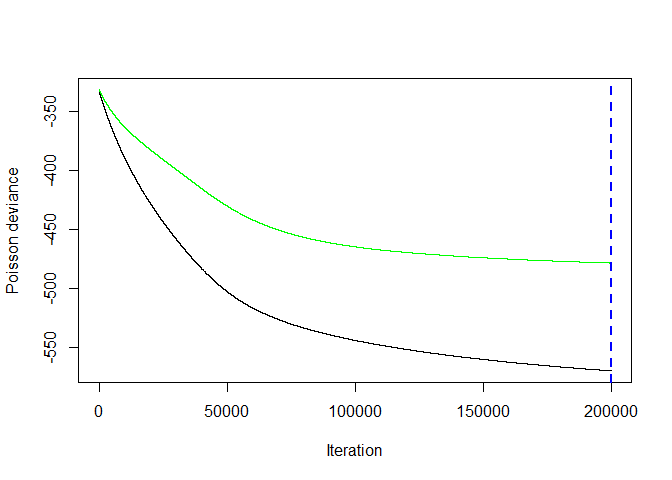
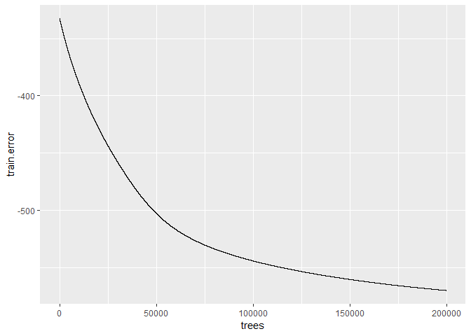

ungulates6\_outbreak\_size\_20190409
================

#### install packages

    ## Loading required package: sp

    ## 
    ## Attaching package: 'raster'

    ## The following object is masked from 'package:colorspace':
    ## 
    ##     RGB

    ## Loading required package: ggplot2

    ## Loading required package: lattice

    ## Loading required package: latticeExtra

    ## Loading required package: RColorBrewer

    ## 
    ## Attaching package: 'latticeExtra'

    ## The following object is masked from 'package:ggplot2':
    ## 
    ##     layer

    ## 
    ## Attaching package: 'dplyr'

    ## The following objects are masked from 'package:raster':
    ## 
    ##     intersect, select, union

    ## The following objects are masked from 'package:stats':
    ## 
    ##     filter, lag

    ## The following objects are masked from 'package:base':
    ## 
    ##     intersect, setdiff, setequal, union

    ## ### Welcome to rworldmap ###

    ## For a short introduction type :   vignette('rworldmap')

    ## 
    ## Attaching package: 'lubridate'

    ## The following object is masked from 'package:base':
    ## 
    ##     date

    ## 
    ## Attaching package: 'zoo'

    ## The following objects are masked from 'package:base':
    ## 
    ##     as.Date, as.Date.numeric

    ## Loaded gbm 2.1.4

    ## Loading required package: gplots

    ## 
    ## Attaching package: 'gplots'

    ## The following object is masked from 'package:stats':
    ## 
    ##     lowess

### load dfPredictors and dfAnimal. Reassign sumCases from dfAnimal to dfPredictors

``` r
load("dfPredictors.Rdata")
load("dfAnimal.Rdata")
dfPredictors$sumCases = dfAnimal$sumCases
dfPredictors = subset(dfPredictors, !is.na(sumCases))#remove NA cases
dfPredictors = subset(dfPredictors, case == 1)#only interested in outbreak locations
keep = setdiff(names(dfPredictors), "case")#remove case from columns 
dfPredictorsCases = dfPredictors[,keep]#keep only certain columns
save(dfPredictorsCases, file = "dfPredictorsCases.Rdata")
dim(dfPredictorsCases)
```

    ## [1] 39968   960

### remove columns with near-zero variation

``` r
load("dfPredictorsCases.Rdata")
df = dfPredictorsCases
# remove columns with near zero variance Global
nzv <- nearZeroVar(df[,c(1:959)],saveMetrics=TRUE) #package caret
nzv <- row.names(nzv[which(nzv$nzv==TRUE),])
dropnzv<-names(df[ , which(names(df) %in% nzv)])
write.csv(dropnzv, file = "dropnzv.csv")
df<-df[ , -which(names(df) %in% nzv)]
dfPredictorsCases = df
save(dfPredictorsCases, file = "dfPredictorsCases.Rdata")
```

### make test and train

``` r
load("dfPredictorsCases.Rdata")
df = dfPredictorsCases
DP =createDataPartition(y = df$sumCases, 
                        p = 0.8,
                        list = FALSE)
TrainCases = df[DP,]
TestCases = df[-DP,]

save(TrainCases, file = "TrainCases.Rdata")
save(TestCases, file = "TestCases.Rdata")
```

### make model

``` r
load("dfPredictorsCases.Rdata")
df = dfPredictorsCases

columns = dim(df)[2]
columns_min_1 = columns-1
modelCases<-as.formula(paste(colnames(df)[columns], "~",
                        paste(colnames(df)[c(1:columns_min_1)],collapse = "+"),
                        sep = ""))
print(modelCases)
```

    ## sumCases ~ log_chickens + log_sheep + log_goats + log_cattle + 
    ##     log_pigs + livestock_non_zero_fraction + nightlights2013 + 
    ##     label_shortclosedbroadleaveddeciduousforest + label_shortmosaiccropgrassshrubforest + 
    ##     label_shortmosaicgrassshrubforestcrop + label_shortPostfloodingorirrigatedcroplandsoraquatic + 
    ##     label_shortRainfedcroplands + annualMeanTemp + annualPrecip + 
    ##     countryBangladesh + countryFrance + countryGreece + countryPoland + 
    ##     countryRomania + ecoregionBalkanMixedForests + ecoregionCentralEuropeanMixedForests + 
    ##     ecoregionSarmaticMixedForests + ecoregionWesternEuropeanBroadleafForests + 
    ##     log_road_chickens + log_road_pigs + log_road_cattle + log_road_sheep + 
    ##     log_road_goats + mammalDiversity + logRoadDensity

``` r
save(modelCases, file = "modelCases.Rdata")
```

### run GBM -- predictors include roads, livestock, nightlights (2013), land cover, climate, country

``` r
rm(list = ls())
load("TrainCases.Rdata")
load("TestCases.Rdata")
# #https://stackoverflow.com/questions/19463137/error-in-evalexpr-envir-enclos-object-not-found
Train = TrainCases
attach(Train)
load("modelCases.Rdata")
model =modelCases
#Start the clock
ptm<-proc.time()

n.trees = 200000
shrinkage = 0.0001#final version should be 0.001
cv.folds = 10#final version should be 10
gbmtest<- gbm(model,
              data=Train,
              distribution="poisson",
              n.trees=n.trees,
              shrinkage=shrinkage,
              interaction.depth=4,
              bag.fraction=0.50,
              train.fraction=1,
              n.minobsinnode=5,
              cv.folds=cv.folds,
              keep.data=TRUE,
              verbose=TRUE,
              n.cores=NULL)
```

    ## Iter   TrainDeviance   ValidDeviance   StepSize   Improve
    ##      1     -332.6224             nan     0.0001    0.0021
    ##      2     -332.6283             nan     0.0001    0.0024
    ##      3     -332.6381             nan     0.0001    0.0027
    ##      4     -332.6451             nan     0.0001    0.0005
    ##      5     -332.6555             nan     0.0001    0.0032
    ##      6     -332.6619             nan     0.0001    0.0019
    ##      7     -332.6715             nan     0.0001    0.0019
    ##      8     -332.6836             nan     0.0001    0.0025
    ##      9     -332.6929             nan     0.0001    0.0021
    ##     10     -332.6995             nan     0.0001    0.0034
    ##     20     -332.7664             nan     0.0001    0.0026
    ##     40     -332.9167             nan     0.0001    0.0024
    ##     60     -333.0544             nan     0.0001    0.0011
    ##     80     -333.2065             nan     0.0001    0.0017
    ##    100     -333.3585             nan     0.0001    0.0022
    ##    120     -333.5100             nan     0.0001    0.0032
    ##    140     -333.6453             nan     0.0001    0.0001
    ##    160     -333.7931             nan     0.0001    0.0026
    ##    180     -333.9363             nan     0.0001    0.0027
    ##    200     -334.0619             nan     0.0001    0.0021
    ##    220     -334.2075             nan     0.0001    0.0031
    ##    240     -334.3486             nan     0.0001    0.0028
    ##    260     -334.4896             nan     0.0001    0.0023
    ##    280     -334.6330             nan     0.0001    0.0019
    ##    300     -334.7733             nan     0.0001    0.0014
    ##    320     -334.9238             nan     0.0001    0.0032
    ##    340     -335.0646             nan     0.0001    0.0000
    ##    360     -335.2109             nan     0.0001    0.0021
    ##    380     -335.3516             nan     0.0001    0.0029
    ##    400     -335.4921             nan     0.0001    0.0034
    ##    420     -335.6351             nan     0.0001    0.0005
    ##    440     -335.7835             nan     0.0001    0.0029
    ##    460     -335.9184             nan     0.0001    0.0017
    ##    480     -336.0586             nan     0.0001    0.0024
    ##    500     -336.2072             nan     0.0001    0.0005
    ##    520     -336.3540             nan     0.0001    0.0014
    ##    540     -336.4964             nan     0.0001    0.0017
    ##    560     -336.6454             nan     0.0001    0.0017
    ##    580     -336.7806             nan     0.0001    0.0033
    ##    600     -336.9189             nan     0.0001    0.0024
    ##    620     -337.0551             nan     0.0001    0.0004
    ##    640     -337.1842             nan     0.0001    0.0017
    ##    660     -337.3173             nan     0.0001    0.0019
    ##    680     -337.4727             nan     0.0001    0.0017
    ##    700     -337.6123             nan     0.0001    0.0032
    ##    720     -337.7605             nan     0.0001    0.0032
    ##    740     -337.9023             nan     0.0001    0.0025
    ##    760     -338.0372             nan     0.0001    0.0016
    ##    780     -338.1627             nan     0.0001    0.0025
    ##    800     -338.2903             nan     0.0001    0.0008
    ##    820     -338.4205             nan     0.0001    0.0020
    ##    840     -338.5569             nan     0.0001    0.0024
    ##    860     -338.6994             nan     0.0001    0.0015
    ##    880     -338.8318             nan     0.0001    0.0015
    ##    900     -338.9720             nan     0.0001    0.0009
    ##    920     -339.1106             nan     0.0001    0.0020
    ##    940     -339.2436             nan     0.0001    0.0020
    ##    960     -339.3868             nan     0.0001    0.0015
    ##    980     -339.5164             nan     0.0001    0.0021
    ##   1000     -339.6570             nan     0.0001    0.0023
    ##   1020     -339.7989             nan     0.0001    0.0009
    ##   1040     -339.9424             nan     0.0001    0.0020
    ##   1060     -340.0825             nan     0.0001    0.0024
    ##   1080     -340.2183             nan     0.0001    0.0018
    ##   1100     -340.3457             nan     0.0001    0.0018
    ##   1120     -340.4666             nan     0.0001    0.0009
    ##   1140     -340.6045             nan     0.0001    0.0016
    ##   1160     -340.7437             nan     0.0001    0.0024
    ##   1180     -340.8832             nan     0.0001    0.0032
    ##   1200     -341.0121             nan     0.0001    0.0023
    ##   1220     -341.1488             nan     0.0001    0.0026
    ##   1240     -341.2780             nan     0.0001    0.0013
    ##   1260     -341.4058             nan     0.0001    0.0008
    ##   1280     -341.5455             nan     0.0001    0.0021
    ##   1300     -341.6801             nan     0.0001    0.0021
    ##   1320     -341.8190             nan     0.0001    0.0017
    ##   1340     -341.9538             nan     0.0001    0.0015
    ##   1360     -342.0888             nan     0.0001    0.0009
    ##   1380     -342.2198             nan     0.0001    0.0032
    ##   1400     -342.3555             nan     0.0001    0.0027
    ##   1420     -342.4892             nan     0.0001    0.0020
    ##   1440     -342.6389             nan     0.0001    0.0043
    ##   1460     -342.7785             nan     0.0001    0.0017
    ##   1480     -342.9084             nan     0.0001    0.0024
    ##   1500     -343.0481             nan     0.0001    0.0019
    ##   1520     -343.1890             nan     0.0001    0.0022
    ##   1540     -343.3251             nan     0.0001    0.0021
    ##   1560     -343.4588             nan     0.0001    0.0028
    ##   1580     -343.5910             nan     0.0001    0.0008
    ##   1600     -343.7228             nan     0.0001    0.0022
    ##   1620     -343.8517             nan     0.0001    0.0019
    ##   1640     -343.9694             nan     0.0001    0.0019
    ##   1660     -344.0993             nan     0.0001    0.0021
    ##   1680     -344.2187             nan     0.0001    0.0005
    ##   1700     -344.3467             nan     0.0001    0.0022
    ##   1720     -344.4934             nan     0.0001    0.0020
    ##   1740     -344.6225             nan     0.0001    0.0015
    ##   1760     -344.7519             nan     0.0001    0.0018
    ##   1780     -344.8804             nan     0.0001    0.0008
    ##   1800     -345.0086             nan     0.0001    0.0025
    ##   1820     -345.1321             nan     0.0001    0.0017
    ##   1840     -345.2723             nan     0.0001    0.0007
    ##   1860     -345.4049             nan     0.0001    0.0026
    ##   1880     -345.5300             nan     0.0001    0.0011
    ##   1900     -345.6840             nan     0.0001    0.0022
    ##   1920     -345.8084             nan     0.0001   -0.0000
    ##   1940     -345.9354             nan     0.0001    0.0019
    ##   1960     -346.0594             nan     0.0001    0.0012
    ##   1980     -346.1844             nan     0.0001    0.0008
    ##   2000     -346.3302             nan     0.0001    0.0018
    ##   2020     -346.4632             nan     0.0001    0.0039
    ##   2040     -346.5953             nan     0.0001    0.0027
    ##   2060     -346.7146             nan     0.0001    0.0007
    ##   2080     -346.8443             nan     0.0001    0.0006
    ##   2100     -346.9751             nan     0.0001    0.0004
    ##   2120     -347.1101             nan     0.0001    0.0024
    ##   2140     -347.2366             nan     0.0001    0.0018
    ##   2160     -347.3780             nan     0.0001    0.0005
    ##   2180     -347.5072             nan     0.0001    0.0005
    ##   2200     -347.6379             nan     0.0001    0.0020
    ##   2220     -347.7581             nan     0.0001    0.0015
    ##   2240     -347.8738             nan     0.0001    0.0027
    ##   2260     -348.0023             nan     0.0001    0.0007
    ##   2280     -348.1347             nan     0.0001    0.0004
    ##   2300     -348.2634             nan     0.0001    0.0021
    ##   2320     -348.3912             nan     0.0001    0.0021
    ##   2340     -348.5210             nan     0.0001    0.0027
    ##   2360     -348.6465             nan     0.0001    0.0009
    ##   2380     -348.7792             nan     0.0001    0.0004
    ##   2400     -348.8947             nan     0.0001    0.0025
    ##   2420     -349.0225             nan     0.0001    0.0020
    ##   2440     -349.1480             nan     0.0001    0.0027
    ##   2460     -349.2745             nan     0.0001    0.0020
    ##   2480     -349.3977             nan     0.0001    0.0020
    ##   2500     -349.5174             nan     0.0001    0.0022
    ##   2520     -349.6532             nan     0.0001    0.0019
    ##   2540     -349.7803             nan     0.0001    0.0005
    ##   2560     -349.8988             nan     0.0001    0.0022
    ##   2580     -350.0279             nan     0.0001    0.0018
    ##   2600     -350.1525             nan     0.0001    0.0012
    ##   2620     -350.2726             nan     0.0001    0.0016
    ##   2640     -350.3849             nan     0.0001    0.0022
    ##   2660     -350.5220             nan     0.0001    0.0009
    ##   2680     -350.6377             nan     0.0001    0.0022
    ##   2700     -350.7793             nan     0.0001    0.0027
    ##   2720     -350.8991             nan     0.0001    0.0013
    ##   2740     -351.0262             nan     0.0001    0.0021
    ##   2760     -351.1533             nan     0.0001    0.0016
    ##   2780     -351.2822             nan     0.0001    0.0007
    ##   2800     -351.4046             nan     0.0001    0.0022
    ##   2820     -351.5338             nan     0.0001    0.0019
    ##   2840     -351.6483             nan     0.0001    0.0018
    ##   2860     -351.7694             nan     0.0001    0.0030
    ##   2880     -351.8983             nan     0.0001    0.0018
    ##   2900     -352.0239             nan     0.0001    0.0014
    ##   2920     -352.1369             nan     0.0001    0.0021
    ##   2940     -352.2806             nan     0.0001    0.0002
    ##   2960     -352.4122             nan     0.0001    0.0019
    ##   2980     -352.5416             nan     0.0001    0.0016
    ##   3000     -352.6669             nan     0.0001    0.0017
    ##   3020     -352.7952             nan     0.0001    0.0020
    ##   3040     -352.9230             nan     0.0001    0.0022
    ##   3060     -353.0498             nan     0.0001    0.0004
    ##   3080     -353.1781             nan     0.0001    0.0018
    ##   3100     -353.3075             nan     0.0001    0.0023
    ##   3120     -353.4285             nan     0.0001    0.0003
    ##   3140     -353.5536             nan     0.0001    0.0020
    ##   3160     -353.6770             nan     0.0001    0.0016
    ##   3180     -353.7862             nan     0.0001   -0.0001
    ##   3200     -353.9163             nan     0.0001    0.0025
    ##   3220     -354.0398             nan     0.0001    0.0017
    ##   3240     -354.1668             nan     0.0001    0.0011
    ##   3260     -354.2822             nan     0.0001    0.0047
    ##   3280     -354.4017             nan     0.0001    0.0018
    ##   3300     -354.5157             nan     0.0001    0.0018
    ##   3320     -354.6323             nan     0.0001    0.0013
    ##   3340     -354.7529             nan     0.0001   -0.0000
    ##   3360     -354.8758             nan     0.0001    0.0011
    ##   3380     -354.9915             nan     0.0001    0.0007
    ##   3400     -355.1054             nan     0.0001    0.0018
    ##   3420     -355.2391             nan     0.0001    0.0016
    ##   3440     -355.3518             nan     0.0001   -0.0000
    ##   3460     -355.4642             nan     0.0001    0.0019
    ##   3480     -355.5952             nan     0.0001    0.0014
    ##   3500     -355.7202             nan     0.0001    0.0014
    ##   3520     -355.8321             nan     0.0001    0.0021
    ##   3540     -355.9567             nan     0.0001    0.0020
    ##   3560     -356.0798             nan     0.0001    0.0019
    ##   3580     -356.1930             nan     0.0001    0.0007
    ##   3600     -356.3044             nan     0.0001    0.0015
    ##   3620     -356.4250             nan     0.0001    0.0010
    ##   3640     -356.5448             nan     0.0001    0.0023
    ##   3660     -356.6665             nan     0.0001    0.0014
    ##   3680     -356.7962             nan     0.0001    0.0019
    ##   3700     -356.9143             nan     0.0001    0.0009
    ##   3720     -357.0267             nan     0.0001    0.0018
    ##   3740     -357.1498             nan     0.0001    0.0013
    ##   3760     -357.2724             nan     0.0001    0.0020
    ##   3780     -357.3917             nan     0.0001    0.0018
    ##   3800     -357.5134             nan     0.0001    0.0029
    ##   3820     -357.6150             nan     0.0001    0.0007
    ##   3840     -357.7358             nan     0.0001    0.0022
    ##   3860     -357.8441             nan     0.0001    0.0008
    ##   3880     -357.9544             nan     0.0001    0.0000
    ##   3900     -358.0705             nan     0.0001    0.0007
    ##   3920     -358.1909             nan     0.0001    0.0022
    ##   3940     -358.3140             nan     0.0001    0.0012
    ##   3960     -358.4510             nan     0.0001    0.0015
    ##   3980     -358.5676             nan     0.0001    0.0016
    ##   4000     -358.7032             nan     0.0001    0.0017
    ##   4020     -358.8240             nan     0.0001    0.0012
    ##   4040     -358.9442             nan     0.0001    0.0012
    ##   4060     -359.0611             nan     0.0001    0.0004
    ##   4080     -359.1707             nan     0.0001    0.0017
    ##   4100     -359.2973             nan     0.0001    0.0020
    ##   4120     -359.4194             nan     0.0001    0.0015
    ##   4140     -359.5492             nan     0.0001    0.0010
    ##   4160     -359.6827             nan     0.0001    0.0013
    ##   4180     -359.8090             nan     0.0001    0.0020
    ##   4200     -359.9269             nan     0.0001    0.0019
    ##   4220     -360.0390             nan     0.0001    0.0024
    ##   4240     -360.1578             nan     0.0001    0.0022
    ##   4260     -360.2699             nan     0.0001   -0.0000
    ##   4280     -360.3815             nan     0.0001    0.0017
    ##   4300     -360.4915             nan     0.0001    0.0014
    ##   4320     -360.6023             nan     0.0001    0.0013
    ##   4340     -360.7085             nan     0.0001    0.0013
    ##   4360     -360.8202             nan     0.0001    0.0023
    ##   4380     -360.9290             nan     0.0001    0.0026
    ##   4400     -361.0290             nan     0.0001    0.0015
    ##   4420     -361.1387             nan     0.0001    0.0008
    ##   4440     -361.2497             nan     0.0001    0.0013
    ##   4460     -361.3585             nan     0.0001    0.0013
    ##   4480     -361.4739             nan     0.0001    0.0009
    ##   4500     -361.5749             nan     0.0001    0.0009
    ##   4520     -361.6924             nan     0.0001    0.0021
    ##   4540     -361.8082             nan     0.0001    0.0003
    ##   4560     -361.9171             nan     0.0001    0.0016
    ##   4580     -362.0312             nan     0.0001    0.0016
    ##   4600     -362.1526             nan     0.0001    0.0019
    ##   4620     -362.2829             nan     0.0001    0.0020
    ##   4640     -362.3849             nan     0.0001    0.0008
    ##   4660     -362.4943             nan     0.0001    0.0019
    ##   4680     -362.5872             nan     0.0001    0.0004
    ##   4700     -362.7056             nan     0.0001    0.0026
    ##   4720     -362.8077             nan     0.0001    0.0010
    ##   4740     -362.9170             nan     0.0001    0.0023
    ##   4760     -363.0358             nan     0.0001    0.0015
    ##   4780     -363.1573             nan     0.0001    0.0011
    ##   4800     -363.2678             nan     0.0001    0.0003
    ##   4820     -363.3695             nan     0.0001    0.0016
    ##   4840     -363.4843             nan     0.0001    0.0014
    ##   4860     -363.5974             nan     0.0001    0.0023
    ##   4880     -363.7183             nan     0.0001    0.0014
    ##   4900     -363.8333             nan     0.0001    0.0015
    ##   4920     -363.9421             nan     0.0001    0.0005
    ##   4940     -364.0638             nan     0.0001    0.0022
    ##   4960     -364.1690             nan     0.0001    0.0009
    ##   4980     -364.2841             nan     0.0001    0.0029
    ##   5000     -364.3869             nan     0.0001    0.0017
    ##   5020     -364.4905             nan     0.0001    0.0011
    ##   5040     -364.6044             nan     0.0001    0.0017
    ##   5060     -364.7041             nan     0.0001    0.0002
    ##   5080     -364.8169             nan     0.0001    0.0016
    ##   5100     -364.9280             nan     0.0001   -0.0000
    ##   5120     -365.0322             nan     0.0001    0.0022
    ##   5140     -365.1465             nan     0.0001    0.0014
    ##   5160     -365.2589             nan     0.0001    0.0000
    ##   5180     -365.3768             nan     0.0001    0.0024
    ##   5200     -365.4858             nan     0.0001    0.0012
    ##   5220     -365.5932             nan     0.0001    0.0022
    ##   5240     -365.7066             nan     0.0001    0.0018
    ##   5260     -365.8236             nan     0.0001   -0.0000
    ##   5280     -365.9440             nan     0.0001    0.0016
    ##   5300     -366.0458             nan     0.0001    0.0007
    ##   5320     -366.1462             nan     0.0001    0.0013
    ##   5340     -366.2548             nan     0.0001    0.0030
    ##   5360     -366.3683             nan     0.0001    0.0020
    ##   5380     -366.4754             nan     0.0001    0.0003
    ##   5400     -366.5918             nan     0.0001    0.0017
    ##   5420     -366.6875             nan     0.0001    0.0010
    ##   5440     -366.7923             nan     0.0001    0.0009
    ##   5460     -366.8952             nan     0.0001    0.0016
    ##   5480     -367.0003             nan     0.0001    0.0011
    ##   5500     -367.0987             nan     0.0001    0.0007
    ##   5520     -367.2082             nan     0.0001    0.0009
    ##   5540     -367.3163             nan     0.0001    0.0029
    ##   5560     -367.4289             nan     0.0001    0.0003
    ##   5580     -367.5316             nan     0.0001    0.0012
    ##   5600     -367.6385             nan     0.0001    0.0007
    ##   5620     -367.7547             nan     0.0001    0.0011
    ##   5640     -367.8519             nan     0.0001    0.0014
    ##   5660     -367.9583             nan     0.0001    0.0005
    ##   5680     -368.0590             nan     0.0001    0.0012
    ##   5700     -368.1677             nan     0.0001    0.0025
    ##   5720     -368.2681             nan     0.0001    0.0014
    ##   5740     -368.3755             nan     0.0001    0.0014
    ##   5760     -368.4767             nan     0.0001    0.0020
    ##   5780     -368.5969             nan     0.0001    0.0019
    ##   5800     -368.6964             nan     0.0001    0.0015
    ##   5820     -368.8125             nan     0.0001    0.0013
    ##   5840     -368.9171             nan     0.0001    0.0015
    ##   5860     -369.0211             nan     0.0001    0.0012
    ##   5880     -369.1459             nan     0.0001    0.0003
    ##   5900     -369.2605             nan     0.0001    0.0014
    ##   5920     -369.3622             nan     0.0001    0.0011
    ##   5940     -369.4692             nan     0.0001    0.0016
    ##   5960     -369.5854             nan     0.0001    0.0013
    ##   5980     -369.6903             nan     0.0001    0.0016
    ##   6000     -369.7986             nan     0.0001    0.0003
    ##   6020     -369.9052             nan     0.0001    0.0002
    ##   6040     -370.0045             nan     0.0001    0.0006
    ##   6060     -370.1021             nan     0.0001    0.0007
    ##   6080     -370.1964             nan     0.0001    0.0011
    ##   6100     -370.2961             nan     0.0001    0.0010
    ##   6120     -370.4044             nan     0.0001    0.0000
    ##   6140     -370.5001             nan     0.0001    0.0002
    ##   6160     -370.5884             nan     0.0001    0.0020
    ##   6180     -370.6985             nan     0.0001    0.0020
    ##   6200     -370.8029             nan     0.0001    0.0015
    ##   6220     -370.9117             nan     0.0001    0.0019
    ##   6240     -371.0146             nan     0.0001    0.0015
    ##   6260     -371.1251             nan     0.0001    0.0019
    ##   6280     -371.2261             nan     0.0001    0.0016
    ##   6300     -371.3179             nan     0.0001    0.0023
    ##   6320     -371.4243             nan     0.0001    0.0011
    ##   6340     -371.5228             nan     0.0001    0.0009
    ##   6360     -371.6257             nan     0.0001    0.0008
    ##   6380     -371.7267             nan     0.0001    0.0011
    ##   6400     -371.8219             nan     0.0001    0.0010
    ##   6420     -371.9230             nan     0.0001    0.0004
    ##   6440     -372.0204             nan     0.0001    0.0008
    ##   6460     -372.1284             nan     0.0001    0.0016
    ##   6480     -372.2354             nan     0.0001    0.0015
    ##   6500     -372.3408             nan     0.0001    0.0011
    ##   6520     -372.4339             nan     0.0001    0.0014
    ##   6540     -372.5491             nan     0.0001    0.0010
    ##   6560     -372.6596             nan     0.0001    0.0011
    ##   6580     -372.7649             nan     0.0001    0.0000
    ##   6600     -372.8668             nan     0.0001    0.0017
    ##   6620     -372.9747             nan     0.0001    0.0003
    ##   6640     -373.0690             nan     0.0001    0.0003
    ##   6660     -373.1833             nan     0.0001    0.0002
    ##   6680     -373.2884             nan     0.0001    0.0014
    ##   6700     -373.3947             nan     0.0001    0.0002
    ##   6720     -373.4899             nan     0.0001    0.0013
    ##   6740     -373.5979             nan     0.0001    0.0025
    ##   6760     -373.6950             nan     0.0001    0.0005
    ##   6780     -373.7886             nan     0.0001    0.0014
    ##   6800     -373.9050             nan     0.0001    0.0007
    ##   6820     -374.0108             nan     0.0001    0.0017
    ##   6840     -374.1044             nan     0.0001    0.0003
    ##   6860     -374.1982             nan     0.0001    0.0014
    ##   6880     -374.2931             nan     0.0001    0.0013
    ##   6900     -374.4017             nan     0.0001    0.0028
    ##   6920     -374.5113             nan     0.0001    0.0014
    ##   6940     -374.6252             nan     0.0001    0.0011
    ##   6960     -374.7280             nan     0.0001    0.0017
    ##   6980     -374.8310             nan     0.0001    0.0016
    ##   7000     -374.9173             nan     0.0001    0.0007
    ##   7020     -375.0175             nan     0.0001    0.0018
    ##   7040     -375.1212             nan     0.0001    0.0016
    ##   7060     -375.2163             nan     0.0001    0.0002
    ##   7080     -375.3230             nan     0.0001    0.0005
    ##   7100     -375.4328             nan     0.0001    0.0013
    ##   7120     -375.5367             nan     0.0001    0.0013
    ##   7140     -375.6414             nan     0.0001    0.0009
    ##   7160     -375.7422             nan     0.0001    0.0012
    ##   7180     -375.8383             nan     0.0001    0.0013
    ##   7200     -375.9340             nan     0.0001    0.0018
    ##   7220     -376.0444             nan     0.0001    0.0015
    ##   7240     -376.1424             nan     0.0001    0.0014
    ##   7260     -376.2471             nan     0.0001    0.0017
    ##   7280     -376.3580             nan     0.0001    0.0011
    ##   7300     -376.4630             nan     0.0001    0.0005
    ##   7320     -376.5641             nan     0.0001    0.0005
    ##   7340     -376.6723             nan     0.0001    0.0009
    ##   7360     -376.7752             nan     0.0001    0.0016
    ##   7380     -376.8640             nan     0.0001    0.0005
    ##   7400     -376.9622             nan     0.0001    0.0017
    ##   7420     -377.0683             nan     0.0001    0.0007
    ##   7440     -377.1850             nan     0.0001    0.0008
    ##   7460     -377.2741             nan     0.0001    0.0015
    ##   7480     -377.3640             nan     0.0001    0.0007
    ##   7500     -377.4610             nan     0.0001    0.0014
    ##   7520     -377.5585             nan     0.0001    0.0002
    ##   7540     -377.6561             nan     0.0001    0.0005
    ##   7560     -377.7552             nan     0.0001    0.0016
    ##   7580     -377.8460             nan     0.0001    0.0017
    ##   7600     -377.9361             nan     0.0001    0.0023
    ##   7620     -378.0373             nan     0.0001    0.0015
    ##   7640     -378.1268             nan     0.0001    0.0010
    ##   7660     -378.2469             nan     0.0001    0.0003
    ##   7680     -378.3562             nan     0.0001    0.0015
    ##   7700     -378.4538             nan     0.0001    0.0004
    ##   7720     -378.5434             nan     0.0001   -0.0000
    ##   7740     -378.6441             nan     0.0001    0.0010
    ##   7760     -378.7378             nan     0.0001    0.0014
    ##   7780     -378.8264             nan     0.0001    0.0015
    ##   7800     -378.9169             nan     0.0001    0.0009
    ##   7820     -379.0172             nan     0.0001    0.0014
    ##   7840     -379.1152             nan     0.0001    0.0005
    ##   7860     -379.2113             nan     0.0001    0.0005
    ##   7880     -379.3055             nan     0.0001    0.0008
    ##   7900     -379.4022             nan     0.0001    0.0015
    ##   7920     -379.4881             nan     0.0001    0.0010
    ##   7940     -379.5880             nan     0.0001    0.0014
    ##   7960     -379.6913             nan     0.0001    0.0012
    ##   7980     -379.8004             nan     0.0001    0.0014
    ##   8000     -379.9010             nan     0.0001    0.0020
    ##   8020     -380.0018             nan     0.0001    0.0013
    ##   8040     -380.0929             nan     0.0001    0.0012
    ##   8060     -380.1850             nan     0.0001    0.0009
    ##   8080     -380.2864             nan     0.0001    0.0003
    ##   8100     -380.3673             nan     0.0001    0.0005
    ##   8120     -380.4734             nan     0.0001    0.0009
    ##   8140     -380.5717             nan     0.0001    0.0003
    ##   8160     -380.6598             nan     0.0001    0.0015
    ##   8180     -380.7640             nan     0.0001    0.0007
    ##   8200     -380.8601             nan     0.0001    0.0008
    ##   8220     -380.9677             nan     0.0001    0.0021
    ##   8240     -381.0568             nan     0.0001    0.0015
    ##   8260     -381.1633             nan     0.0001    0.0003
    ##   8280     -381.2593             nan     0.0001    0.0002
    ##   8300     -381.3700             nan     0.0001    0.0000
    ##   8320     -381.4655             nan     0.0001    0.0012
    ##   8340     -381.5488             nan     0.0001    0.0006
    ##   8360     -381.6512             nan     0.0001    0.0012
    ##   8380     -381.7480             nan     0.0001    0.0014
    ##   8400     -381.8467             nan     0.0001    0.0025
    ##   8420     -381.9288             nan     0.0001    0.0012
    ##   8440     -382.0307             nan     0.0001    0.0008
    ##   8460     -382.1203             nan     0.0001    0.0012
    ##   8480     -382.2146             nan     0.0001    0.0010
    ##   8500     -382.3081             nan     0.0001    0.0013
    ##   8520     -382.4078             nan     0.0001    0.0009
    ##   8540     -382.4883             nan     0.0001    0.0011
    ##   8560     -382.5785             nan     0.0001    0.0012
    ##   8580     -382.6660             nan     0.0001    0.0004
    ##   8600     -382.7619             nan     0.0001    0.0028
    ##   8620     -382.8560             nan     0.0001    0.0017
    ##   8640     -382.9474             nan     0.0001    0.0011
    ##   8660     -383.0468             nan     0.0001    0.0003
    ##   8680     -383.1482             nan     0.0001    0.0013
    ##   8700     -383.2454             nan     0.0001    0.0015
    ##   8720     -383.3393             nan     0.0001    0.0001
    ##   8740     -383.4428             nan     0.0001    0.0012
    ##   8760     -383.5453             nan     0.0001    0.0002
    ##   8780     -383.6408             nan     0.0001   -0.0000
    ##   8800     -383.7343             nan     0.0001    0.0002
    ##   8820     -383.8496             nan     0.0001    0.0008
    ##   8840     -383.9480             nan     0.0001    0.0013
    ##   8860     -384.0412             nan     0.0001    0.0014
    ##   8880     -384.1322             nan     0.0001    0.0014
    ##   8900     -384.2061             nan     0.0001    0.0011
    ##   8920     -384.3086             nan     0.0001    0.0014
    ##   8940     -384.4044             nan     0.0001    0.0007
    ##   8960     -384.5010             nan     0.0001    0.0011
    ##   8980     -384.6101             nan     0.0001    0.0031
    ##   9000     -384.6911             nan     0.0001    0.0022
    ##   9020     -384.7834             nan     0.0001    0.0003
    ##   9040     -384.8994             nan     0.0001    0.0010
    ##   9060     -384.9965             nan     0.0001    0.0011
    ##   9080     -385.0923             nan     0.0001    0.0014
    ##   9100     -385.1922             nan     0.0001    0.0007
    ##   9120     -385.2823             nan     0.0001    0.0019
    ##   9140     -385.3640             nan     0.0001    0.0010
    ##   9160     -385.4625             nan     0.0001    0.0018
    ##   9180     -385.5662             nan     0.0001    0.0003
    ##   9200     -385.6549             nan     0.0001    0.0008
    ##   9220     -385.7434             nan     0.0001    0.0013
    ##   9240     -385.8193             nan     0.0001    0.0014
    ##   9260     -385.9077             nan     0.0001    0.0008
    ##   9280     -386.0028             nan     0.0001    0.0007
    ##   9300     -386.0862             nan     0.0001    0.0012
    ##   9320     -386.1782             nan     0.0001    0.0007
    ##   9340     -386.2614             nan     0.0001    0.0011
    ##   9360     -386.3551             nan     0.0001    0.0013
    ##   9380     -386.4552             nan     0.0001    0.0021
    ##   9400     -386.5628             nan     0.0001    0.0005
    ##   9420     -386.6680             nan     0.0001    0.0010
    ##   9440     -386.7507             nan     0.0001    0.0009
    ##   9460     -386.8351             nan     0.0001    0.0008
    ##   9480     -386.9367             nan     0.0001    0.0012
    ##   9500     -387.0270             nan     0.0001    0.0008
    ##   9520     -387.1158             nan     0.0001    0.0008
    ##   9540     -387.2232             nan     0.0001    0.0026
    ##   9560     -387.3023             nan     0.0001    0.0012
    ##   9580     -387.3974             nan     0.0001    0.0014
    ##   9600     -387.5045             nan     0.0001    0.0000
    ##   9620     -387.5929             nan     0.0001    0.0005
    ##   9640     -387.6841             nan     0.0001    0.0005
    ##   9660     -387.7739             nan     0.0001    0.0009
    ##   9680     -387.8707             nan     0.0001    0.0005
    ##   9700     -387.9692             nan     0.0001    0.0009
    ##   9720     -388.0712             nan     0.0001    0.0013
    ##   9740     -388.1640             nan     0.0001    0.0010
    ##   9760     -388.2573             nan     0.0001    0.0011
    ##   9780     -388.3430             nan     0.0001    0.0015
    ##   9800     -388.4191             nan     0.0001    0.0016
    ##   9820     -388.5035             nan     0.0001    0.0003
    ##   9840     -388.5933             nan     0.0001    0.0007
    ##   9860     -388.6796             nan     0.0001    0.0016
    ##   9880     -388.7598             nan     0.0001    0.0013
    ##   9900     -388.8545             nan     0.0001    0.0011
    ##   9920     -388.9442             nan     0.0001    0.0011
    ##   9940     -389.0280             nan     0.0001    0.0010
    ##   9960     -389.1216             nan     0.0001    0.0006
    ##   9980     -389.2034             nan     0.0001    0.0011
    ##  10000     -389.2867             nan     0.0001    0.0014
    ##  10020     -389.3758             nan     0.0001    0.0014
    ##  10040     -389.4624             nan     0.0001    0.0005
    ##  10060     -389.5624             nan     0.0001    0.0012
    ##  10080     -389.6639             nan     0.0001    0.0006
    ##  10100     -389.7541             nan     0.0001    0.0013
    ##  10120     -389.8388             nan     0.0001    0.0013
    ##  10140     -389.9285             nan     0.0001    0.0007
    ##  10160     -390.0220             nan     0.0001    0.0012
    ##  10180     -390.1105             nan     0.0001    0.0003
    ##  10200     -390.1955             nan     0.0001    0.0002
    ##  10220     -390.2871             nan     0.0001    0.0025
    ##  10240     -390.3715             nan     0.0001    0.0013
    ##  10260     -390.4680             nan     0.0001    0.0011
    ##  10280     -390.5579             nan     0.0001    0.0012
    ##  10300     -390.6467             nan     0.0001    0.0005
    ##  10320     -390.7366             nan     0.0001    0.0001
    ##  10340     -390.8217             nan     0.0001    0.0002
    ##  10360     -390.9028             nan     0.0001    0.0002
    ##  10380     -391.0000             nan     0.0001    0.0006
    ##  10400     -391.0898             nan     0.0001    0.0005
    ##  10420     -391.1768             nan     0.0001    0.0010
    ##  10440     -391.2660             nan     0.0001    0.0010
    ##  10460     -391.3499             nan     0.0001   -0.0000
    ##  10480     -391.4369             nan     0.0001    0.0004
    ##  10500     -391.5375             nan     0.0001    0.0004
    ##  10520     -391.6455             nan     0.0001    0.0006
    ##  10540     -391.7285             nan     0.0001    0.0012
    ##  10560     -391.8128             nan     0.0001    0.0011
    ##  10580     -391.9041             nan     0.0001    0.0010
    ##  10600     -391.9830             nan     0.0001    0.0009
    ##  10620     -392.0733             nan     0.0001    0.0010
    ##  10640     -392.1625             nan     0.0001    0.0005
    ##  10660     -392.2566             nan     0.0001    0.0013
    ##  10680     -392.3565             nan     0.0001    0.0010
    ##  10700     -392.4561             nan     0.0001    0.0008
    ##  10720     -392.5343             nan     0.0001    0.0028
    ##  10740     -392.6221             nan     0.0001    0.0002
    ##  10760     -392.7032             nan     0.0001    0.0012
    ##  10780     -392.7935             nan     0.0001    0.0004
    ##  10800     -392.8799             nan     0.0001    0.0012
    ##  10820     -392.9590             nan     0.0001    0.0013
    ##  10840     -393.0355             nan     0.0001    0.0011
    ##  10860     -393.1142             nan     0.0001    0.0011
    ##  10880     -393.1971             nan     0.0001    0.0009
    ##  10900     -393.2662             nan     0.0001    0.0006
    ##  10920     -393.3452             nan     0.0001    0.0014
    ##  10940     -393.4323             nan     0.0001    0.0002
    ##  10960     -393.5135             nan     0.0001    0.0010
    ##  10980     -393.5927             nan     0.0001    0.0011
    ##  11000     -393.6897             nan     0.0001    0.0016
    ##  11020     -393.7671             nan     0.0001    0.0009
    ##  11040     -393.8558             nan     0.0001    0.0011
    ##  11060     -393.9434             nan     0.0001    0.0002
    ##  11080     -394.0399             nan     0.0001    0.0010
    ##  11100     -394.1288             nan     0.0001    0.0019
    ##  11120     -394.2292             nan     0.0001    0.0023
    ##  11140     -394.3052             nan     0.0001    0.0008
    ##  11160     -394.3993             nan     0.0001    0.0017
    ##  11180     -394.4937             nan     0.0001    0.0003
    ##  11200     -394.5917             nan     0.0001    0.0001
    ##  11220     -394.6775             nan     0.0001    0.0004
    ##  11240     -394.7708             nan     0.0001    0.0009
    ##  11260     -394.8589             nan     0.0001    0.0008
    ##  11280     -394.9372             nan     0.0001    0.0009
    ##  11300     -395.0292             nan     0.0001    0.0011
    ##  11320     -395.1029             nan     0.0001    0.0004
    ##  11340     -395.1854             nan     0.0001    0.0011
    ##  11360     -395.2598             nan     0.0001    0.0011
    ##  11380     -395.3568             nan     0.0001    0.0008
    ##  11400     -395.4599             nan     0.0001    0.0004
    ##  11420     -395.5492             nan     0.0001    0.0030
    ##  11440     -395.6352             nan     0.0001    0.0012
    ##  11460     -395.7167             nan     0.0001    0.0008
    ##  11480     -395.8045             nan     0.0001    0.0014
    ##  11500     -395.8851             nan     0.0001    0.0011
    ##  11520     -395.9789             nan     0.0001    0.0011
    ##  11540     -396.0536             nan     0.0001    0.0009
    ##  11560     -396.1373             nan     0.0001    0.0004
    ##  11580     -396.2085             nan     0.0001    0.0010
    ##  11600     -396.2880             nan     0.0001    0.0005
    ##  11620     -396.3831             nan     0.0001    0.0011
    ##  11640     -396.4606             nan     0.0001    0.0023
    ##  11660     -396.5289             nan     0.0001    0.0010
    ##  11680     -396.6163             nan     0.0001    0.0004
    ##  11700     -396.6985             nan     0.0001    0.0010
    ##  11720     -396.7901             nan     0.0001    0.0001
    ##  11740     -396.8860             nan     0.0001    0.0009
    ##  11760     -396.9703             nan     0.0001    0.0006
    ##  11780     -397.0451             nan     0.0001    0.0005
    ##  11800     -397.1258             nan     0.0001    0.0010
    ##  11820     -397.2156             nan     0.0001    0.0002
    ##  11840     -397.2928             nan     0.0001    0.0010
    ##  11860     -397.3637             nan     0.0001    0.0008
    ##  11880     -397.4381             nan     0.0001    0.0023
    ##  11900     -397.5197             nan     0.0001   -0.0000
    ##  11920     -397.5964             nan     0.0001   -0.0000
    ##  11940     -397.6775             nan     0.0001    0.0002
    ##  11960     -397.7576             nan     0.0001   -0.0001
    ##  11980     -397.8398             nan     0.0001    0.0007
    ##  12000     -397.9218             nan     0.0001    0.0004
    ##  12020     -398.0066             nan     0.0001    0.0008
    ##  12040     -398.0959             nan     0.0001    0.0009
    ##  12060     -398.1761             nan     0.0001    0.0010
    ##  12080     -398.2623             nan     0.0001   -0.0001
    ##  12100     -398.3527             nan     0.0001    0.0001
    ##  12120     -398.4333             nan     0.0001    0.0003
    ##  12140     -398.5202             nan     0.0001    0.0009
    ##  12160     -398.5916             nan     0.0001    0.0002
    ##  12180     -398.6818             nan     0.0001    0.0008
    ##  12200     -398.7791             nan     0.0001    0.0012
    ##  12220     -398.8640             nan     0.0001    0.0001
    ##  12240     -398.9498             nan     0.0001    0.0007
    ##  12260     -399.0302             nan     0.0001    0.0003
    ##  12280     -399.1146             nan     0.0001    0.0008
    ##  12300     -399.1927             nan     0.0001    0.0010
    ##  12320     -399.2945             nan     0.0001    0.0010
    ##  12340     -399.3650             nan     0.0001    0.0008
    ##  12360     -399.4586             nan     0.0001    0.0008
    ##  12380     -399.5424             nan     0.0001    0.0005
    ##  12400     -399.6273             nan     0.0001    0.0007
    ##  12420     -399.7078             nan     0.0001    0.0006
    ##  12440     -399.7912             nan     0.0001    0.0007
    ##  12460     -399.8733             nan     0.0001    0.0010
    ##  12480     -399.9559             nan     0.0001    0.0002
    ##  12500     -400.0422             nan     0.0001    0.0011
    ##  12520     -400.1168             nan     0.0001    0.0016
    ##  12540     -400.1857             nan     0.0001    0.0007
    ##  12560     -400.2629             nan     0.0001    0.0009
    ##  12580     -400.3578             nan     0.0001    0.0008
    ##  12600     -400.4438             nan     0.0001    0.0005
    ##  12620     -400.5442             nan     0.0001    0.0001
    ##  12640     -400.6198             nan     0.0001   -0.0000
    ##  12660     -400.7050             nan     0.0001    0.0002
    ##  12680     -400.7753             nan     0.0001    0.0005
    ##  12700     -400.8478             nan     0.0001    0.0003
    ##  12720     -400.9523             nan     0.0001    0.0003
    ##  12740     -401.0357             nan     0.0001    0.0002
    ##  12760     -401.1054             nan     0.0001    0.0004
    ##  12780     -401.1840             nan     0.0001    0.0010
    ##  12800     -401.2595             nan     0.0001    0.0007
    ##  12820     -401.3337             nan     0.0001    0.0003
    ##  12840     -401.4302             nan     0.0001    0.0009
    ##  12860     -401.5084             nan     0.0001    0.0010
    ##  12880     -401.5902             nan     0.0001    0.0005
    ##  12900     -401.6665             nan     0.0001    0.0001
    ##  12920     -401.7605             nan     0.0001    0.0004
    ##  12940     -401.8449             nan     0.0001    0.0004
    ##  12960     -401.9247             nan     0.0001    0.0008
    ##  12980     -401.9972             nan     0.0001    0.0018
    ##  13000     -402.0781             nan     0.0001    0.0012
    ##  13020     -402.1664             nan     0.0001    0.0000
    ##  13040     -402.2476             nan     0.0001    0.0007
    ##  13060     -402.3237             nan     0.0001    0.0008
    ##  13080     -402.4012             nan     0.0001    0.0008
    ##  13100     -402.4733             nan     0.0001    0.0012
    ##  13120     -402.5587             nan     0.0001    0.0006
    ##  13140     -402.6396             nan     0.0001    0.0004
    ##  13160     -402.7220             nan     0.0001    0.0013
    ##  13180     -402.8029             nan     0.0001   -0.0001
    ##  13200     -402.8790             nan     0.0001    0.0009
    ##  13220     -402.9539             nan     0.0001    0.0010
    ##  13240     -403.0309             nan     0.0001    0.0023
    ##  13260     -403.1278             nan     0.0001    0.0005
    ##  13280     -403.2114             nan     0.0001   -0.0001
    ##  13300     -403.2911             nan     0.0001    0.0007
    ##  13320     -403.3725             nan     0.0001    0.0002
    ##  13340     -403.4389             nan     0.0001    0.0010
    ##  13360     -403.5242             nan     0.0001    0.0001
    ##  13380     -403.5970             nan     0.0001    0.0010
    ##  13400     -403.6782             nan     0.0001   -0.0001
    ##  13420     -403.7482             nan     0.0001    0.0001
    ##  13440     -403.8253             nan     0.0001    0.0014
    ##  13460     -403.9004             nan     0.0001    0.0005
    ##  13480     -403.9687             nan     0.0001    0.0010
    ##  13500     -404.0494             nan     0.0001    0.0013
    ##  13520     -404.1298             nan     0.0001    0.0009
    ##  13540     -404.2001             nan     0.0001    0.0010
    ##  13560     -404.2858             nan     0.0001    0.0006
    ##  13580     -404.3675             nan     0.0001    0.0008
    ##  13600     -404.4583             nan     0.0001    0.0005
    ##  13620     -404.5370             nan     0.0001    0.0009
    ##  13640     -404.6220             nan     0.0001    0.0001
    ##  13660     -404.7153             nan     0.0001    0.0002
    ##  13680     -404.8030             nan     0.0001    0.0005
    ##  13700     -404.8859             nan     0.0001    0.0014
    ##  13720     -404.9625             nan     0.0001    0.0003
    ##  13740     -405.0286             nan     0.0001    0.0002
    ##  13760     -405.1085             nan     0.0001    0.0002
    ##  13780     -405.1967             nan     0.0001    0.0002
    ##  13800     -405.2667             nan     0.0001    0.0011
    ##  13820     -405.3542             nan     0.0001    0.0007
    ##  13840     -405.4249             nan     0.0001    0.0003
    ##  13860     -405.4978             nan     0.0001    0.0009
    ##  13880     -405.5792             nan     0.0001    0.0003
    ##  13900     -405.6606             nan     0.0001    0.0032
    ##  13920     -405.7439             nan     0.0001    0.0005
    ##  13940     -405.8257             nan     0.0001    0.0008
    ##  13960     -405.9105             nan     0.0001    0.0001
    ##  13980     -405.9882             nan     0.0001    0.0011
    ##  14000     -406.0852             nan     0.0001    0.0033
    ##  14020     -406.1691             nan     0.0001    0.0009
    ##  14040     -406.2584             nan     0.0001    0.0016
    ##  14060     -406.3423             nan     0.0001    0.0006
    ##  14080     -406.4354             nan     0.0001    0.0010
    ##  14100     -406.5080             nan     0.0001    0.0006
    ##  14120     -406.5819             nan     0.0001    0.0022
    ##  14140     -406.6574             nan     0.0001    0.0007
    ##  14160     -406.7473             nan     0.0001    0.0011
    ##  14180     -406.8190             nan     0.0001    0.0027
    ##  14200     -406.8952             nan     0.0001    0.0002
    ##  14220     -406.9781             nan     0.0001    0.0004
    ##  14240     -407.0444             nan     0.0001    0.0006
    ##  14260     -407.1391             nan     0.0001    0.0011
    ##  14280     -407.2148             nan     0.0001    0.0005
    ##  14300     -407.2884             nan     0.0001    0.0004
    ##  14320     -407.3511             nan     0.0001    0.0008
    ##  14340     -407.4139             nan     0.0001    0.0004
    ##  14360     -407.4919             nan     0.0001    0.0007
    ##  14380     -407.5788             nan     0.0001    0.0007
    ##  14400     -407.6587             nan     0.0001    0.0010
    ##  14420     -407.7263             nan     0.0001    0.0009
    ##  14440     -407.8159             nan     0.0001    0.0009
    ##  14460     -407.9073             nan     0.0001    0.0016
    ##  14480     -407.9826             nan     0.0001    0.0008
    ##  14500     -408.0586             nan     0.0001   -0.0001
    ##  14520     -408.1537             nan     0.0001    0.0008
    ##  14540     -408.2331             nan     0.0001    0.0007
    ##  14560     -408.3074             nan     0.0001    0.0000
    ##  14580     -408.3867             nan     0.0001    0.0013
    ##  14600     -408.4627             nan     0.0001    0.0003
    ##  14620     -408.5429             nan     0.0001    0.0004
    ##  14640     -408.6258             nan     0.0001    0.0001
    ##  14660     -408.7038             nan     0.0001    0.0004
    ##  14680     -408.7759             nan     0.0001    0.0006
    ##  14700     -408.8559             nan     0.0001    0.0006
    ##  14720     -408.9377             nan     0.0001    0.0020
    ##  14740     -409.0251             nan     0.0001    0.0003
    ##  14760     -409.1018             nan     0.0001    0.0001
    ##  14780     -409.1761             nan     0.0001    0.0010
    ##  14800     -409.2571             nan     0.0001    0.0004
    ##  14820     -409.3404             nan     0.0001    0.0003
    ##  14840     -409.4158             nan     0.0001    0.0003
    ##  14860     -409.4981             nan     0.0001    0.0007
    ##  14880     -409.5622             nan     0.0001    0.0006
    ##  14900     -409.6220             nan     0.0001    0.0004
    ##  14920     -409.6982             nan     0.0001    0.0003
    ##  14940     -409.7841             nan     0.0001    0.0006
    ##  14960     -409.8685             nan     0.0001    0.0008
    ##  14980     -409.9408             nan     0.0001    0.0018
    ##  15000     -410.0185             nan     0.0001    0.0003
    ##  15020     -410.0933             nan     0.0001    0.0005
    ##  15040     -410.1648             nan     0.0001    0.0001
    ##  15060     -410.2388             nan     0.0001    0.0005
    ##  15080     -410.3167             nan     0.0001    0.0000
    ##  15100     -410.3875             nan     0.0001   -0.0003
    ##  15120     -410.4762             nan     0.0001   -0.0000
    ##  15140     -410.5412             nan     0.0001    0.0006
    ##  15160     -410.6140             nan     0.0001    0.0000
    ##  15180     -410.6967             nan     0.0001    0.0003
    ##  15200     -410.7813             nan     0.0001    0.0002
    ##  15220     -410.8513             nan     0.0001    0.0004
    ##  15240     -410.9273             nan     0.0001    0.0001
    ##  15260     -411.0038             nan     0.0001    0.0008
    ##  15280     -411.0893             nan     0.0001    0.0005
    ##  15300     -411.1695             nan     0.0001    0.0003
    ##  15320     -411.2502             nan     0.0001    0.0002
    ##  15340     -411.3348             nan     0.0001    0.0002
    ##  15360     -411.4128             nan     0.0001    0.0002
    ##  15380     -411.4749             nan     0.0001    0.0003
    ##  15400     -411.5364             nan     0.0001    0.0009
    ##  15420     -411.6041             nan     0.0001    0.0004
    ##  15440     -411.6676             nan     0.0001    0.0002
    ##  15460     -411.7527             nan     0.0001    0.0020
    ##  15480     -411.8340             nan     0.0001    0.0002
    ##  15500     -411.9131             nan     0.0001    0.0001
    ##  15520     -411.9912             nan     0.0001    0.0006
    ##  15540     -412.0546             nan     0.0001    0.0002
    ##  15560     -412.1294             nan     0.0001    0.0008
    ##  15580     -412.1991             nan     0.0001    0.0007
    ##  15600     -412.2784             nan     0.0001    0.0013
    ##  15620     -412.3381             nan     0.0001    0.0003
    ##  15640     -412.4080             nan     0.0001    0.0007
    ##  15660     -412.4731             nan     0.0001    0.0005
    ##  15680     -412.5415             nan     0.0001    0.0002
    ##  15700     -412.6237             nan     0.0001   -0.0001
    ##  15720     -412.6951             nan     0.0001    0.0001
    ##  15740     -412.7671             nan     0.0001    0.0002
    ##  15760     -412.8418             nan     0.0001    0.0013
    ##  15780     -412.9141             nan     0.0001    0.0006
    ##  15800     -412.9923             nan     0.0001    0.0004
    ##  15820     -413.0772             nan     0.0001    0.0005
    ##  15840     -413.1698             nan     0.0001    0.0013
    ##  15860     -413.2482             nan     0.0001    0.0001
    ##  15880     -413.3288             nan     0.0001    0.0006
    ##  15900     -413.4008             nan     0.0001    0.0005
    ##  15920     -413.4965             nan     0.0001    0.0010
    ##  15940     -413.5743             nan     0.0001   -0.0001
    ##  15960     -413.6395             nan     0.0001    0.0004
    ##  15980     -413.7119             nan     0.0001    0.0001
    ##  16000     -413.7892             nan     0.0001    0.0002
    ##  16020     -413.8604             nan     0.0001    0.0005
    ##  16040     -413.9200             nan     0.0001    0.0008
    ##  16060     -414.0054             nan     0.0001    0.0019
    ##  16080     -414.0840             nan     0.0001    0.0005
    ##  16100     -414.1486             nan     0.0001    0.0011
    ##  16120     -414.2197             nan     0.0001   -0.0000
    ##  16140     -414.2907             nan     0.0001    0.0001
    ##  16160     -414.3572             nan     0.0001    0.0011
    ##  16180     -414.4424             nan     0.0001    0.0003
    ##  16200     -414.5313             nan     0.0001    0.0006
    ##  16220     -414.6012             nan     0.0001    0.0001
    ##  16240     -414.6662             nan     0.0001    0.0000
    ##  16260     -414.7409             nan     0.0001    0.0006
    ##  16280     -414.7998             nan     0.0001    0.0004
    ##  16300     -414.8767             nan     0.0001    0.0005
    ##  16320     -414.9548             nan     0.0001    0.0001
    ##  16340     -415.0187             nan     0.0001   -0.0000
    ##  16360     -415.0983             nan     0.0001    0.0002
    ##  16380     -415.1785             nan     0.0001    0.0002
    ##  16400     -415.2414             nan     0.0001    0.0003
    ##  16420     -415.3220             nan     0.0001    0.0006
    ##  16440     -415.3967             nan     0.0001    0.0005
    ##  16460     -415.4803             nan     0.0001    0.0020
    ##  16480     -415.5457             nan     0.0001    0.0009
    ##  16500     -415.6198             nan     0.0001    0.0007
    ##  16520     -415.6948             nan     0.0001    0.0007
    ##  16540     -415.7602             nan     0.0001    0.0004
    ##  16560     -415.8367             nan     0.0001    0.0003
    ##  16580     -415.9139             nan     0.0001    0.0005
    ##  16600     -415.9845             nan     0.0001    0.0020
    ##  16620     -416.0371             nan     0.0001    0.0006
    ##  16640     -416.1118             nan     0.0001    0.0001
    ##  16660     -416.1904             nan     0.0001    0.0005
    ##  16680     -416.2575             nan     0.0001    0.0002
    ##  16700     -416.3236             nan     0.0001    0.0006
    ##  16720     -416.4056             nan     0.0001    0.0029
    ##  16740     -416.4905             nan     0.0001    0.0002
    ##  16760     -416.5561             nan     0.0001    0.0004
    ##  16780     -416.6321             nan     0.0001    0.0031
    ##  16800     -416.7028             nan     0.0001    0.0003
    ##  16820     -416.7838             nan     0.0001    0.0034
    ##  16840     -416.8527             nan     0.0001    0.0007
    ##  16860     -416.9248             nan     0.0001    0.0003
    ##  16880     -417.0007             nan     0.0001    0.0006
    ##  16900     -417.0733             nan     0.0001    0.0005
    ##  16920     -417.1405             nan     0.0001    0.0006
    ##  16940     -417.2230             nan     0.0001    0.0007
    ##  16960     -417.2929             nan     0.0001    0.0002
    ##  16980     -417.3531             nan     0.0001    0.0019
    ##  17000     -417.4206             nan     0.0001    0.0003
    ##  17020     -417.4901             nan     0.0001    0.0006
    ##  17040     -417.5585             nan     0.0001    0.0008
    ##  17060     -417.6326             nan     0.0001    0.0001
    ##  17080     -417.6997             nan     0.0001    0.0004
    ##  17100     -417.7679             nan     0.0001    0.0003
    ##  17120     -417.8381             nan     0.0001    0.0005
    ##  17140     -417.9127             nan     0.0001    0.0002
    ##  17160     -417.9843             nan     0.0001    0.0008
    ##  17180     -418.0568             nan     0.0001    0.0002
    ##  17200     -418.1233             nan     0.0001    0.0005
    ##  17220     -418.2159             nan     0.0001    0.0012
    ##  17240     -418.2953             nan     0.0001    0.0000
    ##  17260     -418.3677             nan     0.0001    0.0001
    ##  17280     -418.4443             nan     0.0001    0.0010
    ##  17300     -418.5182             nan     0.0001    0.0001
    ##  17320     -418.5920             nan     0.0001    0.0002
    ##  17340     -418.6588             nan     0.0001    0.0002
    ##  17360     -418.7486             nan     0.0001    0.0033
    ##  17380     -418.8220             nan     0.0001    0.0006
    ##  17400     -418.8896             nan     0.0001    0.0007
    ##  17420     -418.9610             nan     0.0001    0.0002
    ##  17440     -419.0390             nan     0.0001    0.0021
    ##  17460     -419.1113             nan     0.0001    0.0003
    ##  17480     -419.1803             nan     0.0001    0.0007
    ##  17500     -419.2518             nan     0.0001    0.0003
    ##  17520     -419.3343             nan     0.0001    0.0001
    ##  17540     -419.4040             nan     0.0001    0.0005
    ##  17560     -419.4615             nan     0.0001    0.0010
    ##  17580     -419.5231             nan     0.0001    0.0005
    ##  17600     -419.5896             nan     0.0001    0.0005
    ##  17620     -419.6630             nan     0.0001    0.0008
    ##  17640     -419.7229             nan     0.0001    0.0005
    ##  17660     -419.7923             nan     0.0001    0.0003
    ##  17680     -419.8672             nan     0.0001    0.0017
    ##  17700     -419.9359             nan     0.0001    0.0003
    ##  17720     -420.0115             nan     0.0001    0.0004
    ##  17740     -420.0762             nan     0.0001    0.0005
    ##  17760     -420.1445             nan     0.0001    0.0004
    ##  17780     -420.2155             nan     0.0001    0.0008
    ##  17800     -420.2799             nan     0.0001   -0.0000
    ##  17820     -420.3377             nan     0.0001    0.0005
    ##  17840     -420.3995             nan     0.0001    0.0007
    ##  17860     -420.4646             nan     0.0001    0.0007
    ##  17880     -420.5615             nan     0.0001    0.0004
    ##  17900     -420.6273             nan     0.0001    0.0006
    ##  17920     -420.6898             nan     0.0001   -0.0000
    ##  17940     -420.7554             nan     0.0001    0.0008
    ##  17960     -420.8274             nan     0.0001    0.0009
    ##  17980     -420.8851             nan     0.0001    0.0008
    ##  18000     -420.9634             nan     0.0001    0.0006
    ##  18020     -421.0238             nan     0.0001    0.0004
    ##  18040     -421.0961             nan     0.0001    0.0003
    ##  18060     -421.1613             nan     0.0001    0.0005
    ##  18080     -421.2340             nan     0.0001   -0.0000
    ##  18100     -421.3013             nan     0.0001    0.0002
    ##  18120     -421.3782             nan     0.0001    0.0005
    ##  18140     -421.4528             nan     0.0001    0.0001
    ##  18160     -421.5296             nan     0.0001    0.0004
    ##  18180     -421.5937             nan     0.0001    0.0007
    ##  18200     -421.6629             nan     0.0001    0.0005
    ##  18220     -421.7320             nan     0.0001    0.0004
    ##  18240     -421.8100             nan     0.0001    0.0004
    ##  18260     -421.8767             nan     0.0001    0.0006
    ##  18280     -421.9600             nan     0.0001    0.0004
    ##  18300     -422.0437             nan     0.0001    0.0001
    ##  18320     -422.1257             nan     0.0001    0.0003
    ##  18340     -422.1883             nan     0.0001    0.0009
    ##  18360     -422.2596             nan     0.0001    0.0004
    ##  18380     -422.3297             nan     0.0001    0.0005
    ##  18400     -422.3947             nan     0.0001   -0.0001
    ##  18420     -422.4764             nan     0.0001    0.0025
    ##  18440     -422.5491             nan     0.0001    0.0003
    ##  18460     -422.6098             nan     0.0001    0.0002
    ##  18480     -422.6718             nan     0.0001    0.0008
    ##  18500     -422.7408             nan     0.0001    0.0005
    ##  18520     -422.8074             nan     0.0001    0.0001
    ##  18540     -422.8677             nan     0.0001    0.0002
    ##  18560     -422.9494             nan     0.0001    0.0017
    ##  18580     -423.0126             nan     0.0001    0.0003
    ##  18600     -423.0704             nan     0.0001    0.0004
    ##  18620     -423.1316             nan     0.0001    0.0000
    ##  18640     -423.2047             nan     0.0001    0.0005
    ##  18660     -423.2728             nan     0.0001    0.0000
    ##  18680     -423.3392             nan     0.0001    0.0012
    ##  18700     -423.4302             nan     0.0001    0.0005
    ##  18720     -423.4921             nan     0.0001    0.0004
    ##  18740     -423.5555             nan     0.0001    0.0002
    ##  18760     -423.6313             nan     0.0001    0.0001
    ##  18780     -423.7194             nan     0.0001    0.0004
    ##  18800     -423.7857             nan     0.0001    0.0006
    ##  18820     -423.8534             nan     0.0001    0.0012
    ##  18840     -423.9236             nan     0.0001    0.0012
    ##  18860     -423.9803             nan     0.0001    0.0006
    ##  18880     -424.0494             nan     0.0001    0.0004
    ##  18900     -424.1039             nan     0.0001    0.0010
    ##  18920     -424.1648             nan     0.0001    0.0016
    ##  18940     -424.2335             nan     0.0001    0.0001
    ##  18960     -424.3144             nan     0.0001    0.0001
    ##  18980     -424.3818             nan     0.0001    0.0008
    ##  19000     -424.4402             nan     0.0001    0.0007
    ##  19020     -424.5006             nan     0.0001    0.0003
    ##  19040     -424.5613             nan     0.0001    0.0002
    ##  19060     -424.6281             nan     0.0001    0.0001
    ##  19080     -424.7025             nan     0.0001    0.0018
    ##  19100     -424.7740             nan     0.0001    0.0001
    ##  19120     -424.8462             nan     0.0001    0.0003
    ##  19140     -424.9163             nan     0.0001    0.0005
    ##  19160     -424.9875             nan     0.0001    0.0006
    ##  19180     -425.0533             nan     0.0001    0.0005
    ##  19200     -425.1264             nan     0.0001    0.0007
    ##  19220     -425.1888             nan     0.0001    0.0003
    ##  19240     -425.2565             nan     0.0001    0.0012
    ##  19260     -425.3256             nan     0.0001    0.0018
    ##  19280     -425.3878             nan     0.0001    0.0006
    ##  19300     -425.4676             nan     0.0001    0.0004
    ##  19320     -425.5376             nan     0.0001    0.0007
    ##  19340     -425.5970             nan     0.0001    0.0003
    ##  19360     -425.6617             nan     0.0001    0.0002
    ##  19380     -425.7296             nan     0.0001    0.0002
    ##  19400     -425.7829             nan     0.0001    0.0003
    ##  19420     -425.8438             nan     0.0001    0.0011
    ##  19440     -425.9126             nan     0.0001    0.0010
    ##  19460     -425.9809             nan     0.0001    0.0013
    ##  19480     -426.0303             nan     0.0001    0.0005
    ##  19500     -426.0973             nan     0.0001    0.0009
    ##  19520     -426.1677             nan     0.0001    0.0001
    ##  19540     -426.2259             nan     0.0001    0.0006
    ##  19560     -426.3085             nan     0.0001    0.0002
    ##  19580     -426.3787             nan     0.0001    0.0006
    ##  19600     -426.4516             nan     0.0001    0.0017
    ##  19620     -426.5199             nan     0.0001    0.0000
    ##  19640     -426.5864             nan     0.0001    0.0005
    ##  19660     -426.6479             nan     0.0001    0.0002
    ##  19680     -426.7074             nan     0.0001    0.0002
    ##  19700     -426.7735             nan     0.0001    0.0010
    ##  19720     -426.8315             nan     0.0001    0.0001
    ##  19740     -426.9054             nan     0.0001    0.0005
    ##  19760     -426.9643             nan     0.0001    0.0011
    ##  19780     -427.0301             nan     0.0001    0.0001
    ##  19800     -427.0908             nan     0.0001    0.0007
    ##  19820     -427.1505             nan     0.0001    0.0010
    ##  19840     -427.2248             nan     0.0001    0.0003
    ##  19860     -427.2964             nan     0.0001    0.0000
    ##  19880     -427.3700             nan     0.0001   -0.0000
    ##  19900     -427.4377             nan     0.0001    0.0004
    ##  19920     -427.5000             nan     0.0001    0.0013
    ##  19940     -427.5568             nan     0.0001    0.0005
    ##  19960     -427.6204             nan     0.0001    0.0003
    ##  19980     -427.6864             nan     0.0001    0.0002
    ##  20000     -427.7490             nan     0.0001    0.0005
    ##  20020     -427.8203             nan     0.0001    0.0002
    ##  20040     -427.8710             nan     0.0001    0.0003
    ##  20060     -427.9252             nan     0.0001    0.0017
    ##  20080     -427.9810             nan     0.0001    0.0002
    ##  20100     -428.0442             nan     0.0001    0.0010
    ##  20120     -428.1061             nan     0.0001    0.0011
    ##  20140     -428.1808             nan     0.0001    0.0007
    ##  20160     -428.2544             nan     0.0001    0.0004
    ##  20180     -428.3283             nan     0.0001    0.0006
    ##  20200     -428.4116             nan     0.0001    0.0005
    ##  20220     -428.4654             nan     0.0001   -0.0000
    ##  20240     -428.5165             nan     0.0001    0.0003
    ##  20260     -428.5898             nan     0.0001    0.0010
    ##  20280     -428.6645             nan     0.0001    0.0001
    ##  20300     -428.7231             nan     0.0001    0.0001
    ##  20320     -428.7947             nan     0.0001    0.0002
    ##  20340     -428.8447             nan     0.0001    0.0001
    ##  20360     -428.9019             nan     0.0001    0.0005
    ##  20380     -428.9727             nan     0.0001    0.0001
    ##  20400     -429.0327             nan     0.0001    0.0010
    ##  20420     -429.0979             nan     0.0001    0.0024
    ##  20440     -429.1580             nan     0.0001    0.0010
    ##  20460     -429.2397             nan     0.0001    0.0023
    ##  20480     -429.2940             nan     0.0001    0.0002
    ##  20500     -429.3607             nan     0.0001    0.0002
    ##  20520     -429.4215             nan     0.0001    0.0003
    ##  20540     -429.5006             nan     0.0001    0.0008
    ##  20560     -429.5606             nan     0.0001    0.0008
    ##  20580     -429.6303             nan     0.0001    0.0003
    ##  20600     -429.7115             nan     0.0001    0.0003
    ##  20620     -429.7813             nan     0.0001    0.0012
    ##  20640     -429.8507             nan     0.0001   -0.0001
    ##  20660     -429.9210             nan     0.0001   -0.0000
    ##  20680     -429.9770             nan     0.0001    0.0008
    ##  20700     -430.0420             nan     0.0001    0.0013
    ##  20720     -430.1067             nan     0.0001    0.0003
    ##  20740     -430.1685             nan     0.0001    0.0016
    ##  20760     -430.2259             nan     0.0001    0.0016
    ##  20780     -430.2899             nan     0.0001    0.0013
    ##  20800     -430.3469             nan     0.0001    0.0007
    ##  20820     -430.4141             nan     0.0001    0.0000
    ##  20840     -430.4826             nan     0.0001    0.0003
    ##  20860     -430.5511             nan     0.0001    0.0010
    ##  20880     -430.6088             nan     0.0001    0.0017
    ##  20900     -430.6671             nan     0.0001    0.0004
    ##  20920     -430.7391             nan     0.0001    0.0003
    ##  20940     -430.8158             nan     0.0001    0.0015
    ##  20960     -430.8885             nan     0.0001    0.0002
    ##  20980     -430.9732             nan     0.0001    0.0025
    ##  21000     -431.0444             nan     0.0001    0.0004
    ##  21020     -431.1093             nan     0.0001   -0.0001
    ##  21040     -431.1685             nan     0.0001    0.0010
    ##  21060     -431.2286             nan     0.0001    0.0013
    ##  21080     -431.3004             nan     0.0001   -0.0001
    ##  21100     -431.3681             nan     0.0001    0.0033
    ##  21120     -431.4201             nan     0.0001    0.0009
    ##  21140     -431.5009             nan     0.0001    0.0001
    ##  21160     -431.5680             nan     0.0001    0.0002
    ##  21180     -431.6359             nan     0.0001    0.0031
    ##  21200     -431.7042             nan     0.0001    0.0006
    ##  21220     -431.7819             nan     0.0001    0.0002
    ##  21240     -431.8438             nan     0.0001    0.0005
    ##  21260     -431.9156             nan     0.0001    0.0008
    ##  21280     -431.9791             nan     0.0001    0.0003
    ##  21300     -432.0587             nan     0.0001    0.0005
    ##  21320     -432.1306             nan     0.0001    0.0015
    ##  21340     -432.1951             nan     0.0001    0.0011
    ##  21360     -432.2569             nan     0.0001   -0.0000
    ##  21380     -432.3218             nan     0.0001    0.0004
    ##  21400     -432.3962             nan     0.0001   -0.0000
    ##  21420     -432.4601             nan     0.0001    0.0019
    ##  21440     -432.5259             nan     0.0001    0.0004
    ##  21460     -432.5918             nan     0.0001    0.0002
    ##  21480     -432.6572             nan     0.0001    0.0013
    ##  21500     -432.7187             nan     0.0001    0.0001
    ##  21520     -432.7922             nan     0.0001    0.0003
    ##  21540     -432.8624             nan     0.0001    0.0002
    ##  21560     -432.9245             nan     0.0001    0.0003
    ##  21580     -432.9862             nan     0.0001    0.0002
    ##  21600     -433.0454             nan     0.0001    0.0004
    ##  21620     -433.1091             nan     0.0001    0.0010
    ##  21640     -433.1757             nan     0.0001    0.0024
    ##  21660     -433.2357             nan     0.0001    0.0020
    ##  21680     -433.3133             nan     0.0001    0.0011
    ##  21700     -433.3856             nan     0.0001    0.0016
    ##  21720     -433.4461             nan     0.0001    0.0002
    ##  21740     -433.5166             nan     0.0001    0.0003
    ##  21760     -433.5817             nan     0.0001    0.0008
    ##  21780     -433.6461             nan     0.0001    0.0000
    ##  21800     -433.7202             nan     0.0001    0.0014
    ##  21820     -433.7908             nan     0.0001    0.0008
    ##  21840     -433.8519             nan     0.0001    0.0003
    ##  21860     -433.9255             nan     0.0001    0.0017
    ##  21880     -433.9954             nan     0.0001    0.0002
    ##  21900     -434.0504             nan     0.0001   -0.0000
    ##  21920     -434.1027             nan     0.0001    0.0002
    ##  21940     -434.1622             nan     0.0001    0.0002
    ##  21960     -434.2220             nan     0.0001    0.0003
    ##  21980     -434.2887             nan     0.0001    0.0012
    ##  22000     -434.3500             nan     0.0001    0.0000
    ##  22020     -434.4176             nan     0.0001    0.0023
    ##  22040     -434.4849             nan     0.0001    0.0000
    ##  22060     -434.5493             nan     0.0001    0.0010
    ##  22080     -434.6186             nan     0.0001    0.0009
    ##  22100     -434.6868             nan     0.0001    0.0004
    ##  22120     -434.7622             nan     0.0001    0.0008
    ##  22140     -434.8288             nan     0.0001    0.0008
    ##  22160     -434.9085             nan     0.0001    0.0001
    ##  22180     -434.9581             nan     0.0001    0.0000
    ##  22200     -435.0101             nan     0.0001    0.0003
    ##  22220     -435.0734             nan     0.0001   -0.0002
    ##  22240     -435.1344             nan     0.0001    0.0001
    ##  22260     -435.1837             nan     0.0001    0.0005
    ##  22280     -435.2478             nan     0.0001    0.0005
    ##  22300     -435.3157             nan     0.0001    0.0007
    ##  22320     -435.3849             nan     0.0001    0.0001
    ##  22340     -435.4601             nan     0.0001    0.0001
    ##  22360     -435.5224             nan     0.0001    0.0002
    ##  22380     -435.5917             nan     0.0001    0.0002
    ##  22400     -435.6689             nan     0.0001    0.0000
    ##  22420     -435.7495             nan     0.0001    0.0007
    ##  22440     -435.8127             nan     0.0001    0.0001
    ##  22460     -435.8759             nan     0.0001    0.0005
    ##  22480     -435.9403             nan     0.0001    0.0003
    ##  22500     -436.0121             nan     0.0001    0.0000
    ##  22520     -436.0748             nan     0.0001    0.0003
    ##  22540     -436.1584             nan     0.0001    0.0002
    ##  22560     -436.2203             nan     0.0001   -0.0002
    ##  22580     -436.2786             nan     0.0001    0.0002
    ##  22600     -436.3458             nan     0.0001    0.0001
    ##  22620     -436.4083             nan     0.0001    0.0003
    ##  22640     -436.4651             nan     0.0001   -0.0000
    ##  22660     -436.5205             nan     0.0001    0.0006
    ##  22680     -436.5958             nan     0.0001    0.0003
    ##  22700     -436.6607             nan     0.0001    0.0001
    ##  22720     -436.7180             nan     0.0001    0.0001
    ##  22740     -436.7788             nan     0.0001    0.0013
    ##  22760     -436.8363             nan     0.0001    0.0004
    ##  22780     -436.8873             nan     0.0001    0.0009
    ##  22800     -436.9595             nan     0.0001    0.0009
    ##  22820     -437.0170             nan     0.0001    0.0003
    ##  22840     -437.0682             nan     0.0001    0.0002
    ##  22860     -437.1326             nan     0.0001    0.0002
    ##  22880     -437.1962             nan     0.0001    0.0002
    ##  22900     -437.2505             nan     0.0001    0.0003
    ##  22920     -437.3125             nan     0.0001    0.0003
    ##  22940     -437.3864             nan     0.0001    0.0021
    ##  22960     -437.4398             nan     0.0001    0.0003
    ##  22980     -437.5157             nan     0.0001    0.0013
    ##  23000     -437.5704             nan     0.0001    0.0006
    ##  23020     -437.6401             nan     0.0001    0.0006
    ##  23040     -437.7101             nan     0.0001    0.0017
    ##  23060     -437.7520             nan     0.0001    0.0003
    ##  23080     -437.8178             nan     0.0001    0.0001
    ##  23100     -437.8722             nan     0.0001    0.0000
    ##  23120     -437.9369             nan     0.0001    0.0003
    ##  23140     -437.9848             nan     0.0001    0.0003
    ##  23160     -438.0505             nan     0.0001    0.0006
    ##  23180     -438.1010             nan     0.0001    0.0003
    ##  23200     -438.1606             nan     0.0001    0.0003
    ##  23220     -438.2243             nan     0.0001    0.0001
    ##  23240     -438.3005             nan     0.0001    0.0008
    ##  23260     -438.3653             nan     0.0001    0.0001
    ##  23280     -438.4291             nan     0.0001    0.0010
    ##  23300     -438.4850             nan     0.0001    0.0003
    ##  23320     -438.5410             nan     0.0001    0.0003
    ##  23340     -438.6063             nan     0.0001    0.0013
    ##  23360     -438.6571             nan     0.0001    0.0005
    ##  23380     -438.7161             nan     0.0001    0.0004
    ##  23400     -438.7804             nan     0.0001    0.0005
    ##  23420     -438.8305             nan     0.0001    0.0000
    ##  23440     -438.8993             nan     0.0001    0.0000
    ##  23460     -438.9725             nan     0.0001    0.0020
    ##  23480     -439.0410             nan     0.0001    0.0004
    ##  23500     -439.1057             nan     0.0001    0.0001
    ##  23520     -439.1692             nan     0.0001    0.0006
    ##  23540     -439.2401             nan     0.0001    0.0000
    ##  23560     -439.2891             nan     0.0001    0.0002
    ##  23580     -439.3531             nan     0.0001    0.0001
    ##  23600     -439.4012             nan     0.0001    0.0003
    ##  23620     -439.4842             nan     0.0001   -0.0001
    ##  23640     -439.5395             nan     0.0001    0.0002
    ##  23660     -439.6002             nan     0.0001    0.0001
    ##  23680     -439.6533             nan     0.0001    0.0003
    ##  23700     -439.7093             nan     0.0001    0.0003
    ##  23720     -439.7665             nan     0.0001    0.0002
    ##  23740     -439.8455             nan     0.0001    0.0014
    ##  23760     -439.8959             nan     0.0001    0.0007
    ##  23780     -439.9542             nan     0.0001    0.0005
    ##  23800     -440.0133             nan     0.0001    0.0006
    ##  23820     -440.0684             nan     0.0001    0.0003
    ##  23840     -440.1383             nan     0.0001    0.0005
    ##  23860     -440.2063             nan     0.0001    0.0001
    ##  23880     -440.2677             nan     0.0001    0.0001
    ##  23900     -440.3325             nan     0.0001    0.0015
    ##  23920     -440.3817             nan     0.0001    0.0000
    ##  23940     -440.4338             nan     0.0001    0.0001
    ##  23960     -440.5015             nan     0.0001    0.0013
    ##  23980     -440.5635             nan     0.0001    0.0003
    ##  24000     -440.6191             nan     0.0001    0.0011
    ##  24020     -440.6708             nan     0.0001    0.0003
    ##  24040     -440.7309             nan     0.0001   -0.0001
    ##  24060     -440.7958             nan     0.0001   -0.0000
    ##  24080     -440.8673             nan     0.0001   -0.0000
    ##  24100     -440.9181             nan     0.0001    0.0002
    ##  24120     -440.9798             nan     0.0001    0.0001
    ##  24140     -441.0401             nan     0.0001    0.0001
    ##  24160     -441.0968             nan     0.0001    0.0008
    ##  24180     -441.1698             nan     0.0001    0.0012
    ##  24200     -441.2399             nan     0.0001    0.0002
    ##  24220     -441.3134             nan     0.0001    0.0001
    ##  24240     -441.3734             nan     0.0001    0.0002
    ##  24260     -441.4295             nan     0.0001    0.0009
    ##  24280     -441.4729             nan     0.0001    0.0009
    ##  24300     -441.5485             nan     0.0001   -0.0000
    ##  24320     -441.6290             nan     0.0001    0.0008
    ##  24340     -441.6824             nan     0.0001    0.0001
    ##  24360     -441.7487             nan     0.0001    0.0010
    ##  24380     -441.8124             nan     0.0001    0.0004
    ##  24400     -441.8595             nan     0.0001    0.0004
    ##  24420     -441.9201             nan     0.0001    0.0007
    ##  24440     -441.9861             nan     0.0001    0.0000
    ##  24460     -442.0422             nan     0.0001    0.0002
    ##  24480     -442.0998             nan     0.0001    0.0002
    ##  24500     -442.1552             nan     0.0001    0.0010
    ##  24520     -442.2177             nan     0.0001    0.0001
    ##  24540     -442.2766             nan     0.0001    0.0009
    ##  24560     -442.3411             nan     0.0001    0.0004
    ##  24580     -442.4005             nan     0.0001    0.0002
    ##  24600     -442.4586             nan     0.0001    0.0001
    ##  24620     -442.5079             nan     0.0001    0.0001
    ##  24640     -442.5644             nan     0.0001    0.0002
    ##  24660     -442.6398             nan     0.0001    0.0001
    ##  24680     -442.7170             nan     0.0001    0.0019
    ##  24700     -442.7641             nan     0.0001    0.0005
    ##  24720     -442.8229             nan     0.0001    0.0003
    ##  24740     -442.8797             nan     0.0001    0.0003
    ##  24760     -442.9367             nan     0.0001    0.0003
    ##  24780     -442.9943             nan     0.0001    0.0025
    ##  24800     -443.0586             nan     0.0001    0.0001
    ##  24820     -443.1223             nan     0.0001    0.0007
    ##  24840     -443.1851             nan     0.0001    0.0005
    ##  24860     -443.2582             nan     0.0001    0.0000
    ##  24880     -443.3058             nan     0.0001    0.0001
    ##  24900     -443.3498             nan     0.0001    0.0001
    ##  24920     -443.4004             nan     0.0001    0.0000
    ##  24940     -443.4503             nan     0.0001    0.0006
    ##  24960     -443.5126             nan     0.0001    0.0009
    ##  24980     -443.5895             nan     0.0001    0.0004
    ##  25000     -443.6442             nan     0.0001    0.0002
    ##  25020     -443.7008             nan     0.0001    0.0009
    ##  25040     -443.7708             nan     0.0001   -0.0001
    ##  25060     -443.8259             nan     0.0001    0.0002
    ##  25080     -443.8884             nan     0.0001   -0.0000
    ##  25100     -443.9471             nan     0.0001    0.0013
    ##  25120     -444.0093             nan     0.0001    0.0000
    ##  25140     -444.0629             nan     0.0001    0.0007
    ##  25160     -444.1141             nan     0.0001    0.0005
    ##  25180     -444.1742             nan     0.0001    0.0001
    ##  25200     -444.2323             nan     0.0001    0.0020
    ##  25220     -444.2938             nan     0.0001    0.0005
    ##  25240     -444.3624             nan     0.0001    0.0002
    ##  25260     -444.4172             nan     0.0001    0.0007
    ##  25280     -444.4838             nan     0.0001    0.0032
    ##  25300     -444.5452             nan     0.0001    0.0015
    ##  25320     -444.6047             nan     0.0001    0.0002
    ##  25340     -444.6595             nan     0.0001    0.0000
    ##  25360     -444.7189             nan     0.0001    0.0025
    ##  25380     -444.7770             nan     0.0001    0.0030
    ##  25400     -444.8382             nan     0.0001    0.0001
    ##  25420     -444.8884             nan     0.0001    0.0004
    ##  25440     -444.9586             nan     0.0001    0.0010
    ##  25460     -445.0175             nan     0.0001   -0.0001
    ##  25480     -445.0630             nan     0.0001    0.0005
    ##  25500     -445.1246             nan     0.0001    0.0002
    ##  25520     -445.1792             nan     0.0001    0.0025
    ##  25540     -445.2411             nan     0.0001    0.0001
    ##  25560     -445.3063             nan     0.0001    0.0001
    ##  25580     -445.3667             nan     0.0001    0.0010
    ##  25600     -445.4099             nan     0.0001    0.0009
    ##  25620     -445.4600             nan     0.0001   -0.0000
    ##  25640     -445.5235             nan     0.0001    0.0001
    ##  25660     -445.5769             nan     0.0001    0.0002
    ##  25680     -445.6430             nan     0.0001    0.0014
    ##  25700     -445.7173             nan     0.0001    0.0003
    ##  25720     -445.7742             nan     0.0001    0.0004
    ##  25740     -445.8261             nan     0.0001    0.0001
    ##  25760     -445.8738             nan     0.0001    0.0002
    ##  25780     -445.9157             nan     0.0001   -0.0000
    ##  25800     -445.9690             nan     0.0001    0.0013
    ##  25820     -446.0385             nan     0.0001    0.0001
    ##  25840     -446.1059             nan     0.0001    0.0001
    ##  25860     -446.1594             nan     0.0001    0.0001
    ##  25880     -446.2307             nan     0.0001    0.0002
    ##  25900     -446.2752             nan     0.0001    0.0004
    ##  25920     -446.3341             nan     0.0001    0.0002
    ##  25940     -446.3971             nan     0.0001   -0.0000
    ##  25960     -446.4493             nan     0.0001    0.0001
    ##  25980     -446.5138             nan     0.0001    0.0010
    ##  26000     -446.5718             nan     0.0001    0.0002
    ##  26020     -446.6341             nan     0.0001    0.0004
    ##  26040     -446.6884             nan     0.0001    0.0001
    ##  26060     -446.7542             nan     0.0001    0.0001
    ##  26080     -446.8034             nan     0.0001    0.0004
    ##  26100     -446.8824             nan     0.0001    0.0003
    ##  26120     -446.9347             nan     0.0001    0.0005
    ##  26140     -446.9837             nan     0.0001   -0.0000
    ##  26160     -447.0520             nan     0.0001    0.0002
    ##  26180     -447.1047             nan     0.0001    0.0003
    ##  26200     -447.1624             nan     0.0001    0.0002
    ##  26220     -447.2140             nan     0.0001    0.0004
    ##  26240     -447.2791             nan     0.0001    0.0002
    ##  26260     -447.3497             nan     0.0001   -0.0000
    ##  26280     -447.4093             nan     0.0001    0.0000
    ##  26300     -447.4637             nan     0.0001    0.0002
    ##  26320     -447.5175             nan     0.0001   -0.0000
    ##  26340     -447.5699             nan     0.0001    0.0002
    ##  26360     -447.6200             nan     0.0001    0.0000
    ##  26380     -447.6803             nan     0.0001   -0.0000
    ##  26400     -447.7333             nan     0.0001    0.0001
    ##  26420     -447.7988             nan     0.0001    0.0001
    ##  26440     -447.8564             nan     0.0001    0.0000
    ##  26460     -447.9236             nan     0.0001    0.0004
    ##  26480     -447.9829             nan     0.0001    0.0002
    ##  26500     -448.0340             nan     0.0001    0.0006
    ##  26520     -448.0794             nan     0.0001    0.0000
    ##  26540     -448.1341             nan     0.0001    0.0003
    ##  26560     -448.1936             nan     0.0001    0.0006
    ##  26580     -448.2586             nan     0.0001    0.0004
    ##  26600     -448.3183             nan     0.0001    0.0001
    ##  26620     -448.3603             nan     0.0001    0.0008
    ##  26640     -448.4317             nan     0.0001    0.0015
    ##  26660     -448.4781             nan     0.0001    0.0001
    ##  26680     -448.5262             nan     0.0001    0.0003
    ##  26700     -448.5731             nan     0.0001    0.0009
    ##  26720     -448.6373             nan     0.0001    0.0001
    ##  26740     -448.6853             nan     0.0001    0.0005
    ##  26760     -448.7559             nan     0.0001    0.0013
    ##  26780     -448.8093             nan     0.0001    0.0004
    ##  26800     -448.8651             nan     0.0001    0.0034
    ##  26820     -448.9263             nan     0.0001    0.0000
    ##  26840     -448.9961             nan     0.0001    0.0002
    ##  26860     -449.0484             nan     0.0001    0.0000
    ##  26880     -449.0918             nan     0.0001    0.0001
    ##  26900     -449.1419             nan     0.0001    0.0003
    ##  26920     -449.2028             nan     0.0001    0.0008
    ##  26940     -449.2676             nan     0.0001    0.0000
    ##  26960     -449.3180             nan     0.0001    0.0004
    ##  26980     -449.3675             nan     0.0001    0.0001
    ##  27000     -449.4272             nan     0.0001    0.0004
    ##  27020     -449.4827             nan     0.0001    0.0002
    ##  27040     -449.5326             nan     0.0001    0.0000
    ##  27060     -449.5986             nan     0.0001    0.0004
    ##  27080     -449.6600             nan     0.0001    0.0001
    ##  27100     -449.7161             nan     0.0001    0.0003
    ##  27120     -449.7723             nan     0.0001    0.0025
    ##  27140     -449.8296             nan     0.0001    0.0002
    ##  27160     -449.8900             nan     0.0001    0.0005
    ##  27180     -449.9418             nan     0.0001    0.0021
    ##  27200     -450.0083             nan     0.0001    0.0018
    ##  27220     -450.0613             nan     0.0001    0.0003
    ##  27240     -450.1195             nan     0.0001    0.0015
    ##  27260     -450.1920             nan     0.0001    0.0008
    ##  27280     -450.2546             nan     0.0001    0.0008
    ##  27300     -450.3177             nan     0.0001    0.0007
    ##  27320     -450.3665             nan     0.0001    0.0021
    ##  27340     -450.4070             nan     0.0001    0.0001
    ##  27360     -450.4693             nan     0.0001    0.0002
    ##  27380     -450.5453             nan     0.0001    0.0008
    ##  27400     -450.6010             nan     0.0001    0.0007
    ##  27420     -450.6566             nan     0.0001    0.0001
    ##  27440     -450.7106             nan     0.0001    0.0002
    ##  27460     -450.7605             nan     0.0001   -0.0001
    ##  27480     -450.8134             nan     0.0001    0.0002
    ##  27500     -450.8840             nan     0.0001    0.0003
    ##  27520     -450.9527             nan     0.0001    0.0003
    ##  27540     -450.9996             nan     0.0001    0.0003
    ##  27560     -451.0572             nan     0.0001    0.0001
    ##  27580     -451.1197             nan     0.0001    0.0001
    ##  27600     -451.1792             nan     0.0001    0.0000
    ##  27620     -451.2370             nan     0.0001    0.0027
    ##  27640     -451.2976             nan     0.0001    0.0023
    ##  27660     -451.3515             nan     0.0001    0.0001
    ##  27680     -451.4129             nan     0.0001    0.0002
    ##  27700     -451.4615             nan     0.0001    0.0002
    ##  27720     -451.5154             nan     0.0001    0.0009
    ##  27740     -451.5873             nan     0.0001    0.0003
    ##  27760     -451.6441             nan     0.0001   -0.0001
    ##  27780     -451.6944             nan     0.0001    0.0001
    ##  27800     -451.7539             nan     0.0001    0.0008
    ##  27820     -451.8125             nan     0.0001    0.0003
    ##  27840     -451.8584             nan     0.0001    0.0003
    ##  27860     -451.9060             nan     0.0001    0.0002
    ##  27880     -451.9592             nan     0.0001   -0.0000
    ##  27900     -452.0134             nan     0.0001    0.0001
    ##  27920     -452.0627             nan     0.0001    0.0000
    ##  27940     -452.1275             nan     0.0001    0.0000
    ##  27960     -452.1840             nan     0.0001    0.0005
    ##  27980     -452.2349             nan     0.0001    0.0002
    ##  28000     -452.2861             nan     0.0001    0.0006
    ##  28020     -452.3427             nan     0.0001    0.0001
    ##  28040     -452.3946             nan     0.0001    0.0002
    ##  28060     -452.4408             nan     0.0001    0.0002
    ##  28080     -452.4895             nan     0.0001    0.0005
    ##  28100     -452.5455             nan     0.0001    0.0004
    ##  28120     -452.5946             nan     0.0001    0.0009
    ##  28140     -452.6513             nan     0.0001    0.0009
    ##  28160     -452.7137             nan     0.0001    0.0004
    ##  28180     -452.7551             nan     0.0001    0.0005
    ##  28200     -452.8252             nan     0.0001   -0.0000
    ##  28220     -452.8818             nan     0.0001    0.0001
    ##  28240     -452.9334             nan     0.0001    0.0001
    ##  28260     -452.9926             nan     0.0001    0.0005
    ##  28280     -453.0464             nan     0.0001    0.0024
    ##  28300     -453.1055             nan     0.0001    0.0011
    ##  28320     -453.1562             nan     0.0001    0.0003
    ##  28340     -453.2185             nan     0.0001    0.0003
    ##  28360     -453.2717             nan     0.0001    0.0008
    ##  28380     -453.3207             nan     0.0001    0.0025
    ##  28400     -453.3811             nan     0.0001    0.0011
    ##  28420     -453.4536             nan     0.0001    0.0000
    ##  28440     -453.5216             nan     0.0001    0.0002
    ##  28460     -453.5767             nan     0.0001    0.0001
    ##  28480     -453.6401             nan     0.0001    0.0002
    ##  28500     -453.6971             nan     0.0001    0.0001
    ##  28520     -453.7605             nan     0.0001   -0.0000
    ##  28540     -453.8243             nan     0.0001    0.0001
    ##  28560     -453.8754             nan     0.0001    0.0008
    ##  28580     -453.9396             nan     0.0001    0.0000
    ##  28600     -454.0026             nan     0.0001    0.0001
    ##  28620     -454.0500             nan     0.0001    0.0002
    ##  28640     -454.0970             nan     0.0001    0.0002
    ##  28660     -454.1521             nan     0.0001    0.0002
    ##  28680     -454.2132             nan     0.0001    0.0008
    ##  28700     -454.2763             nan     0.0001    0.0001
    ##  28720     -454.3366             nan     0.0001    0.0006
    ##  28740     -454.3960             nan     0.0001    0.0002
    ##  28760     -454.4558             nan     0.0001    0.0002
    ##  28780     -454.5136             nan     0.0001    0.0003
    ##  28800     -454.5701             nan     0.0001    0.0002
    ##  28820     -454.6321             nan     0.0001    0.0026
    ##  28840     -454.7011             nan     0.0001    0.0002
    ##  28860     -454.7502             nan     0.0001    0.0000
    ##  28880     -454.7979             nan     0.0001    0.0003
    ##  28900     -454.8500             nan     0.0001   -0.0000
    ##  28920     -454.9051             nan     0.0001   -0.0000
    ##  28940     -454.9574             nan     0.0001   -0.0003
    ##  28960     -455.0078             nan     0.0001    0.0002
    ##  28980     -455.0587             nan     0.0001    0.0007
    ##  29000     -455.1071             nan     0.0001   -0.0001
    ##  29020     -455.1579             nan     0.0001    0.0000
    ##  29040     -455.2172             nan     0.0001    0.0002
    ##  29060     -455.2685             nan     0.0001    0.0001
    ##  29080     -455.3307             nan     0.0001    0.0006
    ##  29100     -455.3921             nan     0.0001    0.0005
    ##  29120     -455.4589             nan     0.0001    0.0024
    ##  29140     -455.5074             nan     0.0001   -0.0000
    ##  29160     -455.5693             nan     0.0001    0.0007
    ##  29180     -455.6316             nan     0.0001    0.0007
    ##  29200     -455.6973             nan     0.0001    0.0001
    ##  29220     -455.7435             nan     0.0001    0.0002
    ##  29240     -455.7983             nan     0.0001   -0.0001
    ##  29260     -455.8445             nan     0.0001    0.0001
    ##  29280     -455.9061             nan     0.0001    0.0001
    ##  29300     -455.9578             nan     0.0001    0.0001
    ##  29320     -456.0031             nan     0.0001    0.0004
    ##  29340     -456.0497             nan     0.0001    0.0001
    ##  29360     -456.1124             nan     0.0001    0.0001
    ##  29380     -456.1666             nan     0.0001    0.0001
    ##  29400     -456.2229             nan     0.0001    0.0003
    ##  29420     -456.2905             nan     0.0001    0.0010
    ##  29440     -456.3424             nan     0.0001    0.0003
    ##  29460     -456.3944             nan     0.0001    0.0007
    ##  29480     -456.4517             nan     0.0001    0.0010
    ##  29500     -456.4990             nan     0.0001    0.0006
    ##  29520     -456.5712             nan     0.0001   -0.0000
    ##  29540     -456.6246             nan     0.0001   -0.0001
    ##  29560     -456.6793             nan     0.0001   -0.0001
    ##  29580     -456.7294             nan     0.0001    0.0009
    ##  29600     -456.7782             nan     0.0001    0.0001
    ##  29620     -456.8252             nan     0.0001    0.0002
    ##  29640     -456.8828             nan     0.0001    0.0001
    ##  29660     -456.9411             nan     0.0001    0.0002
    ##  29680     -456.9880             nan     0.0001    0.0000
    ##  29700     -457.0400             nan     0.0001    0.0001
    ##  29720     -457.0998             nan     0.0001    0.0001
    ##  29740     -457.1584             nan     0.0001    0.0003
    ##  29760     -457.2002             nan     0.0001    0.0003
    ##  29780     -457.2538             nan     0.0001    0.0001
    ##  29800     -457.3047             nan     0.0001    0.0006
    ##  29820     -457.3651             nan     0.0001    0.0011
    ##  29840     -457.4206             nan     0.0001    0.0015
    ##  29860     -457.4802             nan     0.0001    0.0011
    ##  29880     -457.5441             nan     0.0001    0.0006
    ##  29900     -457.5996             nan     0.0001    0.0000
    ##  29920     -457.6607             nan     0.0001    0.0004
    ##  29940     -457.7083             nan     0.0001    0.0001
    ##  29960     -457.7673             nan     0.0001    0.0015
    ##  29980     -457.8214             nan     0.0001    0.0014
    ##  30000     -457.8713             nan     0.0001    0.0007
    ##  30020     -457.9272             nan     0.0001    0.0007
    ##  30040     -457.9921             nan     0.0001    0.0015
    ##  30060     -458.0549             nan     0.0001    0.0002
    ##  30080     -458.0995             nan     0.0001    0.0002
    ##  30100     -458.1579             nan     0.0001    0.0000
    ##  30120     -458.2243             nan     0.0001    0.0019
    ##  30140     -458.2767             nan     0.0001    0.0005
    ##  30160     -458.3362             nan     0.0001    0.0001
    ##  30180     -458.3873             nan     0.0001    0.0006
    ##  30200     -458.4427             nan     0.0001    0.0001
    ##  30220     -458.4905             nan     0.0001    0.0001
    ##  30240     -458.5498             nan     0.0001    0.0009
    ##  30260     -458.5966             nan     0.0001    0.0007
    ##  30280     -458.6562             nan     0.0001    0.0001
    ##  30300     -458.7084             nan     0.0001    0.0001
    ##  30320     -458.7657             nan     0.0001    0.0006
    ##  30340     -458.8191             nan     0.0001    0.0008
    ##  30360     -458.8798             nan     0.0001    0.0010
    ##  30380     -458.9352             nan     0.0001    0.0006
    ##  30400     -458.9948             nan     0.0001    0.0002
    ##  30420     -459.0470             nan     0.0001    0.0000
    ##  30440     -459.0894             nan     0.0001    0.0008
    ##  30460     -459.1453             nan     0.0001    0.0001
    ##  30480     -459.2088             nan     0.0001    0.0002
    ##  30500     -459.2565             nan     0.0001    0.0002
    ##  30520     -459.3040             nan     0.0001    0.0001
    ##  30540     -459.3591             nan     0.0001    0.0008
    ##  30560     -459.4192             nan     0.0001   -0.0001
    ##  30580     -459.4816             nan     0.0001    0.0001
    ##  30600     -459.5470             nan     0.0001    0.0007
    ##  30620     -459.6116             nan     0.0001    0.0002
    ##  30640     -459.6651             nan     0.0001    0.0018
    ##  30660     -459.7213             nan     0.0001    0.0001
    ##  30680     -459.7655             nan     0.0001    0.0016
    ##  30700     -459.8233             nan     0.0001    0.0011
    ##  30720     -459.8689             nan     0.0001    0.0004
    ##  30740     -459.9228             nan     0.0001    0.0001
    ##  30760     -459.9751             nan     0.0001    0.0001
    ##  30780     -460.0226             nan     0.0001    0.0010
    ##  30800     -460.0731             nan     0.0001    0.0001
    ##  30820     -460.1155             nan     0.0001    0.0000
    ##  30840     -460.1748             nan     0.0001    0.0016
    ##  30860     -460.2147             nan     0.0001    0.0004
    ##  30880     -460.2795             nan     0.0001    0.0005
    ##  30900     -460.3309             nan     0.0001    0.0000
    ##  30920     -460.3936             nan     0.0001    0.0018
    ##  30940     -460.4527             nan     0.0001    0.0005
    ##  30960     -460.5016             nan     0.0001    0.0000
    ##  30980     -460.5501             nan     0.0001    0.0001
    ##  31000     -460.6031             nan     0.0001    0.0013
    ##  31020     -460.6570             nan     0.0001    0.0007
    ##  31040     -460.7023             nan     0.0001    0.0001
    ##  31060     -460.7580             nan     0.0001   -0.0000
    ##  31080     -460.8192             nan     0.0001   -0.0000
    ##  31100     -460.8918             nan     0.0001    0.0001
    ##  31120     -460.9362             nan     0.0001    0.0007
    ##  31140     -460.9921             nan     0.0001    0.0001
    ##  31160     -461.0432             nan     0.0001    0.0008
    ##  31180     -461.0939             nan     0.0001    0.0017
    ##  31200     -461.1404             nan     0.0001    0.0001
    ##  31220     -461.1926             nan     0.0001   -0.0000
    ##  31240     -461.2446             nan     0.0001    0.0000
    ##  31260     -461.3261             nan     0.0001    0.0002
    ##  31280     -461.3674             nan     0.0001    0.0001
    ##  31300     -461.4305             nan     0.0001    0.0009
    ##  31320     -461.4771             nan     0.0001   -0.0000
    ##  31340     -461.5340             nan     0.0001    0.0009
    ##  31360     -461.5927             nan     0.0001    0.0001
    ##  31380     -461.6449             nan     0.0001   -0.0000
    ##  31400     -461.6892             nan     0.0001    0.0001
    ##  31420     -461.7322             nan     0.0001   -0.0000
    ##  31440     -461.7877             nan     0.0001    0.0007
    ##  31460     -461.8453             nan     0.0001    0.0002
    ##  31480     -461.8939             nan     0.0001    0.0003
    ##  31500     -461.9531             nan     0.0001    0.0001
    ##  31520     -462.0064             nan     0.0001    0.0007
    ##  31540     -462.0524             nan     0.0001    0.0011
    ##  31560     -462.1083             nan     0.0001    0.0015
    ##  31580     -462.1560             nan     0.0001    0.0001
    ##  31600     -462.2096             nan     0.0001    0.0000
    ##  31620     -462.2720             nan     0.0001    0.0001
    ##  31640     -462.3339             nan     0.0001    0.0001
    ##  31660     -462.3790             nan     0.0001    0.0017
    ##  31680     -462.4309             nan     0.0001    0.0002
    ##  31700     -462.4984             nan     0.0001    0.0001
    ##  31720     -462.5414             nan     0.0001    0.0002
    ##  31740     -462.5971             nan     0.0001    0.0001
    ##  31760     -462.6545             nan     0.0001    0.0023
    ##  31780     -462.7120             nan     0.0001    0.0015
    ##  31800     -462.7674             nan     0.0001    0.0000
    ##  31820     -462.8350             nan     0.0001    0.0001
    ##  31840     -462.8912             nan     0.0001    0.0017
    ##  31860     -462.9313             nan     0.0001    0.0001
    ##  31880     -462.9880             nan     0.0001    0.0001
    ##  31900     -463.0286             nan     0.0001    0.0000
    ##  31920     -463.0858             nan     0.0001    0.0002
    ##  31940     -463.1407             nan     0.0001    0.0007
    ##  31960     -463.1922             nan     0.0001   -0.0000
    ##  31980     -463.2459             nan     0.0001    0.0002
    ##  32000     -463.3082             nan     0.0001    0.0004
    ##  32020     -463.3551             nan     0.0001    0.0024
    ##  32040     -463.3987             nan     0.0001    0.0000
    ##  32060     -463.4545             nan     0.0001    0.0002
    ##  32080     -463.4915             nan     0.0001   -0.0001
    ##  32100     -463.5342             nan     0.0001    0.0013
    ##  32120     -463.5874             nan     0.0001   -0.0000
    ##  32140     -463.6376             nan     0.0001    0.0001
    ##  32160     -463.6963             nan     0.0001    0.0001
    ##  32180     -463.7488             nan     0.0001    0.0003
    ##  32200     -463.8067             nan     0.0001    0.0022
    ##  32220     -463.8618             nan     0.0001    0.0017
    ##  32240     -463.9261             nan     0.0001    0.0022
    ##  32260     -463.9862             nan     0.0001    0.0001
    ##  32280     -464.0416             nan     0.0001    0.0000
    ##  32300     -464.0886             nan     0.0001    0.0008
    ##  32320     -464.1487             nan     0.0001    0.0020
    ##  32340     -464.1963             nan     0.0001    0.0007
    ##  32360     -464.2515             nan     0.0001    0.0000
    ##  32380     -464.3042             nan     0.0001    0.0003
    ##  32400     -464.3629             nan     0.0001    0.0023
    ##  32420     -464.4223             nan     0.0001    0.0008
    ##  32440     -464.4643             nan     0.0001    0.0001
    ##  32460     -464.5086             nan     0.0001    0.0009
    ##  32480     -464.5602             nan     0.0001    0.0007
    ##  32500     -464.6095             nan     0.0001    0.0014
    ##  32520     -464.6534             nan     0.0001    0.0005
    ##  32540     -464.7073             nan     0.0001    0.0001
    ##  32560     -464.7573             nan     0.0001    0.0006
    ##  32580     -464.8192             nan     0.0001    0.0003
    ##  32600     -464.8772             nan     0.0001    0.0000
    ##  32620     -464.9243             nan     0.0001    0.0002
    ##  32640     -464.9896             nan     0.0001    0.0002
    ##  32660     -465.0350             nan     0.0001    0.0001
    ##  32680     -465.0822             nan     0.0001   -0.0002
    ##  32700     -465.1350             nan     0.0001    0.0006
    ##  32720     -465.1865             nan     0.0001    0.0001
    ##  32740     -465.2346             nan     0.0001   -0.0001
    ##  32760     -465.3010             nan     0.0001    0.0011
    ##  32780     -465.3561             nan     0.0001    0.0010
    ##  32800     -465.4036             nan     0.0001    0.0007
    ##  32820     -465.4577             nan     0.0001    0.0001
    ##  32840     -465.5093             nan     0.0001    0.0000
    ##  32860     -465.5655             nan     0.0001    0.0007
    ##  32880     -465.6191             nan     0.0001    0.0005
    ##  32900     -465.6605             nan     0.0001    0.0003
    ##  32920     -465.7111             nan     0.0001    0.0002
    ##  32940     -465.7599             nan     0.0001    0.0013
    ##  32960     -465.8103             nan     0.0001    0.0003
    ##  32980     -465.8522             nan     0.0001    0.0007
    ##  33000     -465.9024             nan     0.0001    0.0003
    ##  33020     -465.9507             nan     0.0001    0.0002
    ##  33040     -465.9992             nan     0.0001    0.0010
    ##  33060     -466.0479             nan     0.0001   -0.0000
    ##  33080     -466.0948             nan     0.0001    0.0002
    ##  33100     -466.1497             nan     0.0001    0.0008
    ##  33120     -466.1996             nan     0.0001    0.0001
    ##  33140     -466.2496             nan     0.0001    0.0000
    ##  33160     -466.2938             nan     0.0001    0.0006
    ##  33180     -466.3469             nan     0.0001    0.0008
    ##  33200     -466.4091             nan     0.0001    0.0009
    ##  33220     -466.4609             nan     0.0001    0.0000
    ##  33240     -466.5130             nan     0.0001    0.0025
    ##  33260     -466.5784             nan     0.0001    0.0001
    ##  33280     -466.6396             nan     0.0001    0.0001
    ##  33300     -466.6932             nan     0.0001    0.0002
    ##  33320     -466.7408             nan     0.0001    0.0015
    ##  33340     -466.7795             nan     0.0001    0.0007
    ##  33360     -466.8480             nan     0.0001    0.0002
    ##  33380     -466.9036             nan     0.0001    0.0004
    ##  33400     -466.9619             nan     0.0001    0.0001
    ##  33420     -467.0192             nan     0.0001   -0.0001
    ##  33440     -467.0569             nan     0.0001   -0.0000
    ##  33460     -467.1124             nan     0.0001    0.0000
    ##  33480     -467.1788             nan     0.0001    0.0007
    ##  33500     -467.2219             nan     0.0001   -0.0001
    ##  33520     -467.2753             nan     0.0001    0.0000
    ##  33540     -467.3148             nan     0.0001    0.0005
    ##  33560     -467.3712             nan     0.0001    0.0014
    ##  33580     -467.4132             nan     0.0001    0.0005
    ##  33600     -467.4683             nan     0.0001    0.0000
    ##  33620     -467.5184             nan     0.0001    0.0010
    ##  33640     -467.5737             nan     0.0001    0.0005
    ##  33660     -467.6357             nan     0.0001    0.0009
    ##  33680     -467.6890             nan     0.0001    0.0000
    ##  33700     -467.7465             nan     0.0001    0.0005
    ##  33720     -467.7914             nan     0.0001    0.0005
    ##  33740     -467.8339             nan     0.0001    0.0000
    ##  33760     -467.8907             nan     0.0001    0.0001
    ##  33780     -467.9396             nan     0.0001    0.0022
    ##  33800     -467.9851             nan     0.0001    0.0007
    ##  33820     -468.0349             nan     0.0001    0.0007
    ##  33840     -468.0849             nan     0.0001   -0.0001
    ##  33860     -468.1368             nan     0.0001    0.0000
    ##  33880     -468.1935             nan     0.0001    0.0000
    ##  33900     -468.2525             nan     0.0001    0.0017
    ##  33920     -468.3058             nan     0.0001    0.0002
    ##  33940     -468.3575             nan     0.0001    0.0001
    ##  33960     -468.4232             nan     0.0001    0.0016
    ##  33980     -468.4627             nan     0.0001    0.0007
    ##  34000     -468.5147             nan     0.0001    0.0009
    ##  34020     -468.5776             nan     0.0001    0.0008
    ##  34040     -468.6197             nan     0.0001    0.0002
    ##  34060     -468.6725             nan     0.0001   -0.0000
    ##  34080     -468.7186             nan     0.0001    0.0001
    ##  34100     -468.7745             nan     0.0001    0.0001
    ##  34120     -468.8245             nan     0.0001    0.0004
    ##  34140     -468.8706             nan     0.0001    0.0004
    ##  34160     -468.9126             nan     0.0001    0.0004
    ##  34180     -468.9624             nan     0.0001    0.0003
    ##  34200     -469.0165             nan     0.0001   -0.0000
    ##  34220     -469.0602             nan     0.0001    0.0002
    ##  34240     -469.1066             nan     0.0001    0.0001
    ##  34260     -469.1565             nan     0.0001    0.0010
    ##  34280     -469.1980             nan     0.0001    0.0001
    ##  34300     -469.2482             nan     0.0001    0.0008
    ##  34320     -469.3101             nan     0.0001    0.0003
    ##  34340     -469.3575             nan     0.0001    0.0007
    ##  34360     -469.3997             nan     0.0001    0.0003
    ##  34380     -469.4555             nan     0.0001    0.0006
    ##  34400     -469.5076             nan     0.0001    0.0002
    ##  34420     -469.5642             nan     0.0001   -0.0000
    ##  34440     -469.6047             nan     0.0001    0.0003
    ##  34460     -469.6514             nan     0.0001    0.0014
    ##  34480     -469.7027             nan     0.0001    0.0003
    ##  34500     -469.7634             nan     0.0001    0.0003
    ##  34520     -469.8132             nan     0.0001    0.0003
    ##  34540     -469.8657             nan     0.0001    0.0011
    ##  34560     -469.9172             nan     0.0001    0.0013
    ##  34580     -469.9724             nan     0.0001    0.0001
    ##  34600     -470.0233             nan     0.0001    0.0003
    ##  34620     -470.0698             nan     0.0001    0.0001
    ##  34640     -470.1238             nan     0.0001   -0.0000
    ##  34660     -470.1864             nan     0.0001    0.0002
    ##  34680     -470.2507             nan     0.0001    0.0001
    ##  34700     -470.2991             nan     0.0001    0.0014
    ##  34720     -470.3487             nan     0.0001    0.0006
    ##  34740     -470.3959             nan     0.0001   -0.0000
    ##  34760     -470.4432             nan     0.0001   -0.0001
    ##  34780     -470.4949             nan     0.0001    0.0006
    ##  34800     -470.5485             nan     0.0001    0.0008
    ##  34820     -470.5975             nan     0.0001    0.0001
    ##  34840     -470.6460             nan     0.0001    0.0007
    ##  34860     -470.7029             nan     0.0001    0.0004
    ##  34880     -470.7523             nan     0.0001    0.0009
    ##  34900     -470.8137             nan     0.0001    0.0004
    ##  34920     -470.8734             nan     0.0001    0.0012
    ##  34940     -470.9375             nan     0.0001    0.0002
    ##  34960     -470.9956             nan     0.0001    0.0002
    ##  34980     -471.0442             nan     0.0001    0.0001
    ##  35000     -471.0960             nan     0.0001    0.0024
    ##  35020     -471.1469             nan     0.0001    0.0019
    ##  35040     -471.1946             nan     0.0001    0.0002
    ##  35060     -471.2447             nan     0.0001    0.0006
    ##  35080     -471.2954             nan     0.0001    0.0000
    ##  35100     -471.3401             nan     0.0001    0.0005
    ##  35120     -471.3892             nan     0.0001    0.0008
    ##  35140     -471.4437             nan     0.0001    0.0003
    ##  35160     -471.5010             nan     0.0001    0.0002
    ##  35180     -471.5529             nan     0.0001    0.0001
    ##  35200     -471.6022             nan     0.0001    0.0003
    ##  35220     -471.6525             nan     0.0001    0.0005
    ##  35240     -471.6994             nan     0.0001    0.0003
    ##  35260     -471.7601             nan     0.0001    0.0010
    ##  35280     -471.7957             nan     0.0001    0.0003
    ##  35300     -471.8533             nan     0.0001    0.0023
    ##  35320     -471.9226             nan     0.0001    0.0025
    ##  35340     -471.9787             nan     0.0001    0.0003
    ##  35360     -472.0276             nan     0.0001   -0.0000
    ##  35380     -472.0850             nan     0.0001    0.0001
    ##  35400     -472.1373             nan     0.0001    0.0007
    ##  35420     -472.1840             nan     0.0001    0.0006
    ##  35440     -472.2253             nan     0.0001    0.0003
    ##  35460     -472.2715             nan     0.0001   -0.0001
    ##  35480     -472.3256             nan     0.0001    0.0010
    ##  35500     -472.3785             nan     0.0001    0.0011
    ##  35520     -472.4272             nan     0.0001    0.0000
    ##  35540     -472.4802             nan     0.0001    0.0004
    ##  35560     -472.5378             nan     0.0001    0.0001
    ##  35580     -472.5827             nan     0.0001    0.0005
    ##  35600     -472.6299             nan     0.0001    0.0003
    ##  35620     -472.6672             nan     0.0001    0.0005
    ##  35640     -472.7165             nan     0.0001    0.0001
    ##  35660     -472.7643             nan     0.0001    0.0002
    ##  35680     -472.8114             nan     0.0001    0.0008
    ##  35700     -472.8637             nan     0.0001    0.0003
    ##  35720     -472.9152             nan     0.0001    0.0003
    ##  35740     -472.9648             nan     0.0001    0.0001
    ##  35760     -473.0161             nan     0.0001    0.0000
    ##  35780     -473.0637             nan     0.0001    0.0001
    ##  35800     -473.1120             nan     0.0001    0.0000
    ##  35820     -473.1465             nan     0.0001    0.0000
    ##  35840     -473.1963             nan     0.0001    0.0006
    ##  35860     -473.2390             nan     0.0001    0.0015
    ##  35880     -473.2940             nan     0.0001    0.0012
    ##  35900     -473.3464             nan     0.0001    0.0007
    ##  35920     -473.3854             nan     0.0001    0.0006
    ##  35940     -473.4361             nan     0.0001    0.0000
    ##  35960     -473.4701             nan     0.0001    0.0007
    ##  35980     -473.5203             nan     0.0001    0.0004
    ##  36000     -473.5669             nan     0.0001    0.0003
    ##  36020     -473.6123             nan     0.0001    0.0002
    ##  36040     -473.6711             nan     0.0001    0.0001
    ##  36060     -473.7251             nan     0.0001    0.0003
    ##  36080     -473.7731             nan     0.0001    0.0020
    ##  36100     -473.8102             nan     0.0001   -0.0000
    ##  36120     -473.8561             nan     0.0001    0.0010
    ##  36140     -473.8960             nan     0.0001    0.0017
    ##  36160     -473.9554             nan     0.0001    0.0009
    ##  36180     -474.0041             nan     0.0001    0.0018
    ##  36200     -474.0401             nan     0.0001    0.0008
    ##  36220     -474.0904             nan     0.0001    0.0001
    ##  36240     -474.1421             nan     0.0001    0.0003
    ##  36260     -474.1857             nan     0.0001    0.0006
    ##  36280     -474.2407             nan     0.0001    0.0000
    ##  36300     -474.2872             nan     0.0001    0.0000
    ##  36320     -474.3428             nan     0.0001    0.0006
    ##  36340     -474.3876             nan     0.0001    0.0001
    ##  36360     -474.4455             nan     0.0001    0.0022
    ##  36380     -474.4945             nan     0.0001    0.0000
    ##  36400     -474.5383             nan     0.0001    0.0000
    ##  36420     -474.5849             nan     0.0001    0.0011
    ##  36440     -474.6252             nan     0.0001    0.0000
    ##  36460     -474.6657             nan     0.0001    0.0007
    ##  36480     -474.7091             nan     0.0001    0.0004
    ##  36500     -474.7604             nan     0.0001    0.0004
    ##  36520     -474.8023             nan     0.0001    0.0020
    ##  36540     -474.8560             nan     0.0001    0.0000
    ##  36560     -474.9047             nan     0.0001    0.0001
    ##  36580     -474.9526             nan     0.0001    0.0001
    ##  36600     -475.0108             nan     0.0001    0.0003
    ##  36620     -475.0635             nan     0.0001    0.0006
    ##  36640     -475.1069             nan     0.0001    0.0012
    ##  36660     -475.1530             nan     0.0001   -0.0001
    ##  36680     -475.2076             nan     0.0001    0.0004
    ##  36700     -475.2631             nan     0.0001    0.0008
    ##  36720     -475.3059             nan     0.0001   -0.0001
    ##  36740     -475.3694             nan     0.0001    0.0020
    ##  36760     -475.4151             nan     0.0001   -0.0000
    ##  36780     -475.4565             nan     0.0001    0.0001
    ##  36800     -475.5188             nan     0.0001    0.0001
    ##  36820     -475.5630             nan     0.0001    0.0006
    ##  36840     -475.6133             nan     0.0001    0.0009
    ##  36860     -475.6609             nan     0.0001    0.0006
    ##  36880     -475.7024             nan     0.0001    0.0006
    ##  36900     -475.7523             nan     0.0001    0.0011
    ##  36920     -475.8000             nan     0.0001    0.0004
    ##  36940     -475.8583             nan     0.0001    0.0000
    ##  36960     -475.9076             nan     0.0001    0.0004
    ##  36980     -475.9677             nan     0.0001    0.0000
    ##  37000     -476.0167             nan     0.0001    0.0010
    ##  37020     -476.0762             nan     0.0001    0.0001
    ##  37040     -476.1277             nan     0.0001    0.0001
    ##  37060     -476.1772             nan     0.0001    0.0001
    ##  37080     -476.2245             nan     0.0001    0.0020
    ##  37100     -476.2723             nan     0.0001    0.0001
    ##  37120     -476.3182             nan     0.0001    0.0005
    ##  37140     -476.3608             nan     0.0001    0.0004
    ##  37160     -476.4066             nan     0.0001    0.0001
    ##  37180     -476.4503             nan     0.0001    0.0011
    ##  37200     -476.4917             nan     0.0001    0.0007
    ##  37220     -476.5416             nan     0.0001    0.0002
    ##  37240     -476.5886             nan     0.0001    0.0000
    ##  37260     -476.6256             nan     0.0001   -0.0001
    ##  37280     -476.6610             nan     0.0001   -0.0001
    ##  37300     -476.7021             nan     0.0001    0.0004
    ##  37320     -476.7552             nan     0.0001    0.0007
    ##  37340     -476.8031             nan     0.0001    0.0006
    ##  37360     -476.8548             nan     0.0001    0.0003
    ##  37380     -476.9180             nan     0.0001    0.0001
    ##  37400     -476.9695             nan     0.0001    0.0015
    ##  37420     -477.0095             nan     0.0001    0.0000
    ##  37440     -477.0556             nan     0.0001    0.0008
    ##  37460     -477.0966             nan     0.0001    0.0010
    ##  37480     -477.1293             nan     0.0001    0.0001
    ##  37500     -477.1741             nan     0.0001    0.0001
    ##  37520     -477.2275             nan     0.0001    0.0011
    ##  37540     -477.2727             nan     0.0001    0.0004
    ##  37560     -477.3250             nan     0.0001    0.0001
    ##  37580     -477.3787             nan     0.0001    0.0017
    ##  37600     -477.4311             nan     0.0001   -0.0000
    ##  37620     -477.4755             nan     0.0001    0.0005
    ##  37640     -477.5381             nan     0.0001   -0.0000
    ##  37660     -477.5868             nan     0.0001    0.0012
    ##  37680     -477.6271             nan     0.0001    0.0000
    ##  37700     -477.6835             nan     0.0001    0.0002
    ##  37720     -477.7374             nan     0.0001    0.0006
    ##  37740     -477.7845             nan     0.0001    0.0000
    ##  37760     -477.8243             nan     0.0001    0.0002
    ##  37780     -477.8807             nan     0.0001    0.0008
    ##  37800     -477.9324             nan     0.0001    0.0002
    ##  37820     -477.9699             nan     0.0001   -0.0000
    ##  37840     -478.0119             nan     0.0001    0.0003
    ##  37860     -478.0677             nan     0.0001    0.0002
    ##  37880     -478.1180             nan     0.0001    0.0001
    ##  37900     -478.1651             nan     0.0001    0.0004
    ##  37920     -478.2164             nan     0.0001    0.0001
    ##  37940     -478.2631             nan     0.0001   -0.0000
    ##  37960     -478.3098             nan     0.0001    0.0001
    ##  37980     -478.3466             nan     0.0001    0.0006
    ##  38000     -478.3863             nan     0.0001    0.0004
    ##  38020     -478.4328             nan     0.0001    0.0001
    ##  38040     -478.4741             nan     0.0001    0.0005
    ##  38060     -478.5223             nan     0.0001    0.0009
    ##  38080     -478.5676             nan     0.0001    0.0002
    ##  38100     -478.6174             nan     0.0001    0.0001
    ##  38120     -478.6608             nan     0.0001    0.0021
    ##  38140     -478.7039             nan     0.0001   -0.0000
    ##  38160     -478.7498             nan     0.0001   -0.0000
    ##  38180     -478.8036             nan     0.0001    0.0002
    ##  38200     -478.8611             nan     0.0001    0.0006
    ##  38220     -478.9117             nan     0.0001   -0.0000
    ##  38240     -478.9693             nan     0.0001    0.0002
    ##  38260     -479.0267             nan     0.0001    0.0004
    ##  38280     -479.0645             nan     0.0001   -0.0000
    ##  38300     -479.1093             nan     0.0001    0.0000
    ##  38320     -479.1561             nan     0.0001    0.0018
    ##  38340     -479.2129             nan     0.0001    0.0004
    ##  38360     -479.2605             nan     0.0001    0.0022
    ##  38380     -479.3052             nan     0.0001    0.0004
    ##  38400     -479.3558             nan     0.0001    0.0004
    ##  38420     -479.4111             nan     0.0001    0.0004
    ##  38440     -479.4521             nan     0.0001    0.0007
    ##  38460     -479.5091             nan     0.0001    0.0003
    ##  38480     -479.5531             nan     0.0001    0.0002
    ##  38500     -479.6020             nan     0.0001    0.0022
    ##  38520     -479.6458             nan     0.0001    0.0006
    ##  38540     -479.6949             nan     0.0001   -0.0000
    ##  38560     -479.7347             nan     0.0001    0.0005
    ##  38580     -479.7742             nan     0.0001    0.0001
    ##  38600     -479.8213             nan     0.0001   -0.0000
    ##  38620     -479.8703             nan     0.0001    0.0011
    ##  38640     -479.9328             nan     0.0001   -0.0001
    ##  38660     -479.9769             nan     0.0001    0.0000
    ##  38680     -480.0226             nan     0.0001    0.0016
    ##  38700     -480.0694             nan     0.0001    0.0009
    ##  38720     -480.1229             nan     0.0001    0.0006
    ##  38740     -480.1825             nan     0.0001    0.0001
    ##  38760     -480.2213             nan     0.0001    0.0000
    ##  38780     -480.2692             nan     0.0001   -0.0001
    ##  38800     -480.3114             nan     0.0001    0.0001
    ##  38820     -480.3550             nan     0.0001   -0.0000
    ##  38840     -480.4091             nan     0.0001    0.0019
    ##  38860     -480.4644             nan     0.0001    0.0008
    ##  38880     -480.5144             nan     0.0001    0.0002
    ##  38900     -480.5650             nan     0.0001    0.0013
    ##  38920     -480.6112             nan     0.0001   -0.0000
    ##  38940     -480.6574             nan     0.0001    0.0011
    ##  38960     -480.7055             nan     0.0001    0.0001
    ##  38980     -480.7593             nan     0.0001    0.0002
    ##  39000     -480.8058             nan     0.0001    0.0013
    ##  39020     -480.8614             nan     0.0001    0.0005
    ##  39040     -480.8917             nan     0.0001    0.0017
    ##  39060     -480.9364             nan     0.0001    0.0005
    ##  39080     -480.9898             nan     0.0001    0.0001
    ##  39100     -481.0235             nan     0.0001    0.0003
    ##  39120     -481.0821             nan     0.0001   -0.0001
    ##  39140     -481.1367             nan     0.0001    0.0015
    ##  39160     -481.1847             nan     0.0001    0.0000
    ##  39180     -481.2390             nan     0.0001    0.0008
    ##  39200     -481.2861             nan     0.0001    0.0012
    ##  39220     -481.3413             nan     0.0001    0.0004
    ##  39240     -481.3907             nan     0.0001   -0.0000
    ##  39260     -481.4405             nan     0.0001   -0.0001
    ##  39280     -481.4772             nan     0.0001   -0.0001
    ##  39300     -481.5268             nan     0.0001    0.0022
    ##  39320     -481.5656             nan     0.0001    0.0000
    ##  39340     -481.6124             nan     0.0001    0.0005
    ##  39360     -481.6641             nan     0.0001    0.0001
    ##  39380     -481.6987             nan     0.0001    0.0002
    ##  39400     -481.7422             nan     0.0001    0.0000
    ##  39420     -481.7908             nan     0.0001    0.0000
    ##  39440     -481.8350             nan     0.0001    0.0003
    ##  39460     -481.8827             nan     0.0001    0.0001
    ##  39480     -481.9379             nan     0.0001   -0.0000
    ##  39500     -481.9801             nan     0.0001    0.0006
    ##  39520     -482.0297             nan     0.0001    0.0000
    ##  39540     -482.0774             nan     0.0001    0.0000
    ##  39560     -482.1239             nan     0.0001    0.0000
    ##  39580     -482.1722             nan     0.0001   -0.0001
    ##  39600     -482.2257             nan     0.0001    0.0013
    ##  39620     -482.2638             nan     0.0001    0.0007
    ##  39640     -482.3160             nan     0.0001    0.0001
    ##  39660     -482.3655             nan     0.0001    0.0003
    ##  39680     -482.4078             nan     0.0001    0.0006
    ##  39700     -482.4382             nan     0.0001    0.0000
    ##  39720     -482.4773             nan     0.0001   -0.0001
    ##  39740     -482.5319             nan     0.0001    0.0007
    ##  39760     -482.5895             nan     0.0001    0.0001
    ##  39780     -482.6358             nan     0.0001   -0.0000
    ##  39800     -482.6725             nan     0.0001    0.0001
    ##  39820     -482.7238             nan     0.0001    0.0002
    ##  39840     -482.7774             nan     0.0001    0.0008
    ##  39860     -482.8190             nan     0.0001    0.0001
    ##  39880     -482.8579             nan     0.0001    0.0000
    ##  39900     -482.9042             nan     0.0001    0.0012
    ##  39920     -482.9451             nan     0.0001    0.0003
    ##  39940     -482.9884             nan     0.0001    0.0009
    ##  39960     -483.0335             nan     0.0001    0.0002
    ##  39980     -483.0914             nan     0.0001    0.0006
    ##  40000     -483.1290             nan     0.0001    0.0003
    ##  40020     -483.1806             nan     0.0001    0.0002
    ##  40040     -483.2351             nan     0.0001    0.0007
    ##  40060     -483.2723             nan     0.0001   -0.0000
    ##  40080     -483.3197             nan     0.0001    0.0005
    ##  40100     -483.3601             nan     0.0001    0.0000
    ##  40120     -483.3928             nan     0.0001    0.0002
    ##  40140     -483.4413             nan     0.0001    0.0001
    ##  40160     -483.4855             nan     0.0001    0.0002
    ##  40180     -483.5319             nan     0.0001    0.0001
    ##  40200     -483.5741             nan     0.0001    0.0003
    ##  40220     -483.6176             nan     0.0001   -0.0002
    ##  40240     -483.6649             nan     0.0001    0.0007
    ##  40260     -483.7024             nan     0.0001    0.0001
    ##  40280     -483.7493             nan     0.0001    0.0006
    ##  40300     -483.7928             nan     0.0001    0.0003
    ##  40320     -483.8299             nan     0.0001    0.0004
    ##  40340     -483.8700             nan     0.0001    0.0009
    ##  40360     -483.9157             nan     0.0001    0.0006
    ##  40380     -483.9511             nan     0.0001    0.0004
    ##  40400     -483.9938             nan     0.0001    0.0005
    ##  40420     -484.0265             nan     0.0001   -0.0000
    ##  40440     -484.0813             nan     0.0001    0.0005
    ##  40460     -484.1123             nan     0.0001    0.0001
    ##  40480     -484.1480             nan     0.0001    0.0003
    ##  40500     -484.1834             nan     0.0001    0.0020
    ##  40520     -484.2247             nan     0.0001    0.0000
    ##  40540     -484.2732             nan     0.0001    0.0008
    ##  40560     -484.3204             nan     0.0001    0.0005
    ##  40580     -484.3616             nan     0.0001    0.0006
    ##  40600     -484.4030             nan     0.0001    0.0005
    ##  40620     -484.4595             nan     0.0001    0.0002
    ##  40640     -484.5085             nan     0.0001    0.0017
    ##  40660     -484.5633             nan     0.0001    0.0005
    ##  40680     -484.6062             nan     0.0001    0.0003
    ##  40700     -484.6528             nan     0.0001    0.0009
    ##  40720     -484.6931             nan     0.0001    0.0000
    ##  40740     -484.7404             nan     0.0001    0.0003
    ##  40760     -484.7812             nan     0.0001    0.0006
    ##  40780     -484.8166             nan     0.0001    0.0000
    ##  40800     -484.8622             nan     0.0001    0.0001
    ##  40820     -484.9038             nan     0.0001    0.0000
    ##  40840     -484.9532             nan     0.0001    0.0014
    ##  40860     -484.9966             nan     0.0001    0.0003
    ##  40880     -485.0359             nan     0.0001    0.0001
    ##  40900     -485.0824             nan     0.0001    0.0011
    ##  40920     -485.1264             nan     0.0001    0.0011
    ##  40940     -485.1780             nan     0.0001    0.0006
    ##  40960     -485.2095             nan     0.0001    0.0000
    ##  40980     -485.2453             nan     0.0001   -0.0000
    ##  41000     -485.2883             nan     0.0001    0.0000
    ##  41020     -485.3281             nan     0.0001    0.0012
    ##  41040     -485.3819             nan     0.0001    0.0000
    ##  41060     -485.4283             nan     0.0001    0.0011
    ##  41080     -485.4655             nan     0.0001    0.0002
    ##  41100     -485.5092             nan     0.0001    0.0006
    ##  41120     -485.5524             nan     0.0001    0.0008
    ##  41140     -485.6011             nan     0.0001    0.0013
    ##  41160     -485.6427             nan     0.0001    0.0019
    ##  41180     -485.6941             nan     0.0001    0.0001
    ##  41200     -485.7268             nan     0.0001    0.0011
    ##  41220     -485.7678             nan     0.0001    0.0002
    ##  41240     -485.8009             nan     0.0001    0.0000
    ##  41260     -485.8441             nan     0.0001   -0.0000
    ##  41280     -485.8905             nan     0.0001    0.0007
    ##  41300     -485.9479             nan     0.0001    0.0011
    ##  41320     -485.9852             nan     0.0001    0.0003
    ##  41340     -486.0255             nan     0.0001    0.0015
    ##  41360     -486.0747             nan     0.0001    0.0001
    ##  41380     -486.1319             nan     0.0001    0.0006
    ##  41400     -486.1716             nan     0.0001    0.0008
    ##  41420     -486.2174             nan     0.0001    0.0007
    ##  41440     -486.2656             nan     0.0001    0.0003
    ##  41460     -486.3135             nan     0.0001    0.0010
    ##  41480     -486.3522             nan     0.0001    0.0001
    ##  41500     -486.3864             nan     0.0001    0.0003
    ##  41520     -486.4415             nan     0.0001    0.0000
    ##  41540     -486.4766             nan     0.0001    0.0000
    ##  41560     -486.5151             nan     0.0001    0.0001
    ##  41580     -486.5598             nan     0.0001    0.0005
    ##  41600     -486.6018             nan     0.0001    0.0004
    ##  41620     -486.6421             nan     0.0001    0.0007
    ##  41640     -486.6892             nan     0.0001    0.0023
    ##  41660     -486.7326             nan     0.0001    0.0000
    ##  41680     -486.7734             nan     0.0001    0.0001
    ##  41700     -486.8240             nan     0.0001    0.0009
    ##  41720     -486.8766             nan     0.0001    0.0014
    ##  41740     -486.9148             nan     0.0001    0.0001
    ##  41760     -486.9676             nan     0.0001    0.0005
    ##  41780     -487.0123             nan     0.0001    0.0000
    ##  41800     -487.0563             nan     0.0001    0.0003
    ##  41820     -487.1059             nan     0.0001    0.0015
    ##  41840     -487.1539             nan     0.0001    0.0008
    ##  41860     -487.1938             nan     0.0001    0.0005
    ##  41880     -487.2325             nan     0.0001    0.0000
    ##  41900     -487.2812             nan     0.0001    0.0011
    ##  41920     -487.3192             nan     0.0001   -0.0000
    ##  41940     -487.3646             nan     0.0001    0.0001
    ##  41960     -487.4112             nan     0.0001    0.0001
    ##  41980     -487.4518             nan     0.0001    0.0006
    ##  42000     -487.4982             nan     0.0001   -0.0000
    ##  42020     -487.5430             nan     0.0001    0.0014
    ##  42040     -487.5837             nan     0.0001    0.0000
    ##  42060     -487.6306             nan     0.0001    0.0001
    ##  42080     -487.6835             nan     0.0001    0.0004
    ##  42100     -487.7281             nan     0.0001    0.0007
    ##  42120     -487.7729             nan     0.0001    0.0003
    ##  42140     -487.8237             nan     0.0001    0.0004
    ##  42160     -487.8612             nan     0.0001   -0.0002
    ##  42180     -487.8976             nan     0.0001    0.0000
    ##  42200     -487.9336             nan     0.0001    0.0001
    ##  42220     -487.9743             nan     0.0001    0.0002
    ##  42240     -488.0260             nan     0.0001    0.0002
    ##  42260     -488.0697             nan     0.0001   -0.0000
    ##  42280     -488.1171             nan     0.0001    0.0009
    ##  42300     -488.1506             nan     0.0001   -0.0001
    ##  42320     -488.1933             nan     0.0001    0.0008
    ##  42340     -488.2300             nan     0.0001    0.0000
    ##  42360     -488.2551             nan     0.0001    0.0002
    ##  42380     -488.3079             nan     0.0001    0.0008
    ##  42400     -488.3446             nan     0.0001    0.0000
    ##  42420     -488.3861             nan     0.0001    0.0002
    ##  42440     -488.4272             nan     0.0001    0.0016
    ##  42460     -488.4759             nan     0.0001    0.0002
    ##  42480     -488.5100             nan     0.0001    0.0012
    ##  42500     -488.5519             nan     0.0001    0.0013
    ##  42520     -488.5968             nan     0.0001    0.0002
    ##  42540     -488.6427             nan     0.0001    0.0002
    ##  42560     -488.6909             nan     0.0001    0.0005
    ##  42580     -488.7303             nan     0.0001    0.0003
    ##  42600     -488.7669             nan     0.0001    0.0001
    ##  42620     -488.8037             nan     0.0001    0.0001
    ##  42640     -488.8460             nan     0.0001    0.0005
    ##  42660     -488.8863             nan     0.0001    0.0001
    ##  42680     -488.9263             nan     0.0001    0.0005
    ##  42700     -488.9667             nan     0.0001    0.0013
    ##  42720     -489.0092             nan     0.0001    0.0001
    ##  42740     -489.0543             nan     0.0001    0.0000
    ##  42760     -489.0955             nan     0.0001    0.0017
    ##  42780     -489.1298             nan     0.0001    0.0003
    ##  42800     -489.1678             nan     0.0001    0.0000
    ##  42820     -489.2098             nan     0.0001    0.0002
    ##  42840     -489.2487             nan     0.0001    0.0002
    ##  42860     -489.2906             nan     0.0001   -0.0000
    ##  42880     -489.3430             nan     0.0001    0.0000
    ##  42900     -489.3786             nan     0.0001    0.0012
    ##  42920     -489.4217             nan     0.0001    0.0005
    ##  42940     -489.4662             nan     0.0001    0.0007
    ##  42960     -489.5022             nan     0.0001   -0.0003
    ##  42980     -489.5465             nan     0.0001    0.0000
    ##  43000     -489.5836             nan     0.0001    0.0016
    ##  43020     -489.6264             nan     0.0001    0.0006
    ##  43040     -489.6706             nan     0.0001    0.0003
    ##  43060     -489.7157             nan     0.0001    0.0000
    ##  43080     -489.7556             nan     0.0001   -0.0000
    ##  43100     -489.7951             nan     0.0001    0.0003
    ##  43120     -489.8338             nan     0.0001    0.0010
    ##  43140     -489.8686             nan     0.0001    0.0000
    ##  43160     -489.9005             nan     0.0001    0.0000
    ##  43180     -489.9385             nan     0.0001    0.0000
    ##  43200     -489.9774             nan     0.0001    0.0008
    ##  43220     -490.0315             nan     0.0001    0.0006
    ##  43240     -490.0689             nan     0.0001    0.0001
    ##  43260     -490.1113             nan     0.0001    0.0000
    ##  43280     -490.1474             nan     0.0001    0.0014
    ##  43300     -490.1953             nan     0.0001    0.0001
    ##  43320     -490.2304             nan     0.0001    0.0002
    ##  43340     -490.2721             nan     0.0001    0.0006
    ##  43360     -490.3177             nan     0.0001    0.0004
    ##  43380     -490.3635             nan     0.0001    0.0006
    ##  43400     -490.3993             nan     0.0001    0.0005
    ##  43420     -490.4355             nan     0.0001    0.0004
    ##  43440     -490.4800             nan     0.0001    0.0013
    ##  43460     -490.5199             nan     0.0001    0.0004
    ##  43480     -490.5544             nan     0.0001    0.0001
    ##  43500     -490.6029             nan     0.0001    0.0002
    ##  43520     -490.6453             nan     0.0001    0.0000
    ##  43540     -490.6774             nan     0.0001    0.0002
    ##  43560     -490.7159             nan     0.0001   -0.0000
    ##  43580     -490.7651             nan     0.0001    0.0003
    ##  43600     -490.8031             nan     0.0001    0.0006
    ##  43620     -490.8363             nan     0.0001    0.0000
    ##  43640     -490.8800             nan     0.0001    0.0003
    ##  43660     -490.9232             nan     0.0001    0.0004
    ##  43680     -490.9675             nan     0.0001    0.0010
    ##  43700     -490.9978             nan     0.0001    0.0002
    ##  43720     -491.0446             nan     0.0001    0.0012
    ##  43740     -491.0771             nan     0.0001    0.0000
    ##  43760     -491.1178             nan     0.0001    0.0005
    ##  43780     -491.1588             nan     0.0001    0.0001
    ##  43800     -491.2040             nan     0.0001    0.0001
    ##  43820     -491.2422             nan     0.0001    0.0016
    ##  43840     -491.2871             nan     0.0001    0.0003
    ##  43860     -491.3371             nan     0.0001    0.0000
    ##  43880     -491.3839             nan     0.0001    0.0015
    ##  43900     -491.4261             nan     0.0001   -0.0001
    ##  43920     -491.4642             nan     0.0001   -0.0000
    ##  43940     -491.4979             nan     0.0001    0.0003
    ##  43960     -491.5423             nan     0.0001    0.0000
    ##  43980     -491.5808             nan     0.0001    0.0000
    ##  44000     -491.6217             nan     0.0001    0.0000
    ##  44020     -491.6685             nan     0.0001    0.0004
    ##  44040     -491.7063             nan     0.0001    0.0001
    ##  44060     -491.7525             nan     0.0001    0.0008
    ##  44080     -491.7928             nan     0.0001    0.0000
    ##  44100     -491.8331             nan     0.0001    0.0013
    ##  44120     -491.8805             nan     0.0001   -0.0001
    ##  44140     -491.9250             nan     0.0001    0.0010
    ##  44160     -491.9691             nan     0.0001    0.0011
    ##  44180     -492.0086             nan     0.0001    0.0006
    ##  44200     -492.0394             nan     0.0001    0.0009
    ##  44220     -492.0869             nan     0.0001    0.0003
    ##  44240     -492.1204             nan     0.0001    0.0012
    ##  44260     -492.1670             nan     0.0001   -0.0001
    ##  44280     -492.2079             nan     0.0001   -0.0000
    ##  44300     -492.2490             nan     0.0001   -0.0000
    ##  44320     -492.2884             nan     0.0001    0.0002
    ##  44340     -492.3324             nan     0.0001    0.0016
    ##  44360     -492.3649             nan     0.0001   -0.0000
    ##  44380     -492.4039             nan     0.0001    0.0003
    ##  44400     -492.4443             nan     0.0001    0.0005
    ##  44420     -492.4892             nan     0.0001    0.0003
    ##  44440     -492.5257             nan     0.0001    0.0001
    ##  44460     -492.5762             nan     0.0001    0.0003
    ##  44480     -492.6156             nan     0.0001   -0.0000
    ##  44500     -492.6560             nan     0.0001    0.0001
    ##  44520     -492.7037             nan     0.0001    0.0004
    ##  44540     -492.7385             nan     0.0001    0.0001
    ##  44560     -492.7843             nan     0.0001    0.0013
    ##  44580     -492.8225             nan     0.0001    0.0005
    ##  44600     -492.8664             nan     0.0001   -0.0000
    ##  44620     -492.9084             nan     0.0001    0.0000
    ##  44640     -492.9398             nan     0.0001    0.0010
    ##  44660     -492.9799             nan     0.0001    0.0004
    ##  44680     -493.0211             nan     0.0001    0.0000
    ##  44700     -493.0506             nan     0.0001    0.0000
    ##  44720     -493.0833             nan     0.0001    0.0012
    ##  44740     -493.1238             nan     0.0001   -0.0000
    ##  44760     -493.1578             nan     0.0001    0.0016
    ##  44780     -493.1923             nan     0.0001    0.0002
    ##  44800     -493.2309             nan     0.0001    0.0004
    ##  44820     -493.2749             nan     0.0001    0.0013
    ##  44840     -493.3118             nan     0.0001    0.0000
    ##  44860     -493.3422             nan     0.0001    0.0003
    ##  44880     -493.3678             nan     0.0001    0.0000
    ##  44900     -493.4147             nan     0.0001    0.0001
    ##  44920     -493.4546             nan     0.0001    0.0004
    ##  44940     -493.4916             nan     0.0001    0.0005
    ##  44960     -493.5302             nan     0.0001   -0.0000
    ##  44980     -493.5636             nan     0.0001    0.0005
    ##  45000     -493.6018             nan     0.0001    0.0006
    ##  45020     -493.6384             nan     0.0001    0.0004
    ##  45040     -493.6742             nan     0.0001    0.0006
    ##  45060     -493.7146             nan     0.0001   -0.0002
    ##  45080     -493.7578             nan     0.0001    0.0004
    ##  45100     -493.7943             nan     0.0001    0.0000
    ##  45120     -493.8347             nan     0.0001    0.0005
    ##  45140     -493.8796             nan     0.0001    0.0000
    ##  45160     -493.9236             nan     0.0001    0.0005
    ##  45180     -493.9656             nan     0.0001    0.0006
    ##  45200     -494.0000             nan     0.0001   -0.0000
    ##  45220     -494.0339             nan     0.0001    0.0003
    ##  45240     -494.0793             nan     0.0001    0.0005
    ##  45260     -494.1175             nan     0.0001    0.0000
    ##  45280     -494.1584             nan     0.0001    0.0000
    ##  45300     -494.2022             nan     0.0001    0.0001
    ##  45320     -494.2477             nan     0.0001    0.0005
    ##  45340     -494.2866             nan     0.0001    0.0005
    ##  45360     -494.3262             nan     0.0001    0.0001
    ##  45380     -494.3680             nan     0.0001    0.0000
    ##  45400     -494.4108             nan     0.0001    0.0001
    ##  45420     -494.4573             nan     0.0001    0.0006
    ##  45440     -494.5089             nan     0.0001    0.0005
    ##  45460     -494.5503             nan     0.0001    0.0012
    ##  45480     -494.5978             nan     0.0001    0.0001
    ##  45500     -494.6364             nan     0.0001    0.0001
    ##  45520     -494.6668             nan     0.0001   -0.0002
    ##  45540     -494.7058             nan     0.0001    0.0005
    ##  45560     -494.7473             nan     0.0001    0.0009
    ##  45580     -494.7805             nan     0.0001    0.0005
    ##  45600     -494.8218             nan     0.0001    0.0005
    ##  45620     -494.8573             nan     0.0001    0.0003
    ##  45640     -494.8926             nan     0.0001    0.0005
    ##  45660     -494.9296             nan     0.0001    0.0003
    ##  45680     -494.9701             nan     0.0001    0.0004
    ##  45700     -495.0154             nan     0.0001    0.0006
    ##  45720     -495.0526             nan     0.0001    0.0008
    ##  45740     -495.0868             nan     0.0001    0.0005
    ##  45760     -495.1297             nan     0.0001    0.0003
    ##  45780     -495.1651             nan     0.0001    0.0001
    ##  45800     -495.2014             nan     0.0001    0.0000
    ##  45820     -495.2463             nan     0.0001    0.0001
    ##  45840     -495.2839             nan     0.0001    0.0000
    ##  45860     -495.3152             nan     0.0001    0.0009
    ##  45880     -495.3499             nan     0.0001    0.0003
    ##  45900     -495.3876             nan     0.0001    0.0002
    ##  45920     -495.4285             nan     0.0001    0.0004
    ##  45940     -495.4703             nan     0.0001    0.0000
    ##  45960     -495.5107             nan     0.0001    0.0003
    ##  45980     -495.5451             nan     0.0001    0.0001
    ##  46000     -495.5806             nan     0.0001    0.0004
    ##  46020     -495.6126             nan     0.0001    0.0005
    ##  46040     -495.6571             nan     0.0001    0.0001
    ##  46060     -495.6987             nan     0.0001    0.0001
    ##  46080     -495.7348             nan     0.0001   -0.0000
    ##  46100     -495.7746             nan     0.0001    0.0004
    ##  46120     -495.8011             nan     0.0001    0.0001
    ##  46140     -495.8420             nan     0.0001   -0.0000
    ##  46160     -495.8863             nan     0.0001    0.0005
    ##  46180     -495.9299             nan     0.0001    0.0011
    ##  46200     -495.9628             nan     0.0001    0.0001
    ##  46220     -496.0109             nan     0.0001    0.0001
    ##  46240     -496.0516             nan     0.0001    0.0000
    ##  46260     -496.0947             nan     0.0001   -0.0001
    ##  46280     -496.1358             nan     0.0001    0.0001
    ##  46300     -496.1681             nan     0.0001    0.0001
    ##  46320     -496.2019             nan     0.0001    0.0013
    ##  46340     -496.2352             nan     0.0001    0.0005
    ##  46360     -496.2748             nan     0.0001    0.0010
    ##  46380     -496.3168             nan     0.0001    0.0005
    ##  46400     -496.3575             nan     0.0001    0.0002
    ##  46420     -496.3867             nan     0.0001    0.0000
    ##  46440     -496.4266             nan     0.0001    0.0005
    ##  46460     -496.4606             nan     0.0001    0.0000
    ##  46480     -496.5023             nan     0.0001    0.0006
    ##  46500     -496.5441             nan     0.0001    0.0005
    ##  46520     -496.5788             nan     0.0001    0.0000
    ##  46540     -496.6124             nan     0.0001    0.0004
    ##  46560     -496.6446             nan     0.0001    0.0003
    ##  46580     -496.6910             nan     0.0001    0.0008
    ##  46600     -496.7250             nan     0.0001    0.0007
    ##  46620     -496.7661             nan     0.0001    0.0004
    ##  46640     -496.8082             nan     0.0001    0.0006
    ##  46660     -496.8402             nan     0.0001    0.0001
    ##  46680     -496.8782             nan     0.0001   -0.0001
    ##  46700     -496.9119             nan     0.0001    0.0004
    ##  46720     -496.9454             nan     0.0001    0.0010
    ##  46740     -496.9818             nan     0.0001    0.0001
    ##  46760     -497.0254             nan     0.0001    0.0003
    ##  46780     -497.0642             nan     0.0001    0.0002
    ##  46800     -497.1058             nan     0.0001    0.0000
    ##  46820     -497.1500             nan     0.0001    0.0002
    ##  46840     -497.1845             nan     0.0001    0.0001
    ##  46860     -497.2211             nan     0.0001    0.0001
    ##  46880     -497.2544             nan     0.0001   -0.0001
    ##  46900     -497.2860             nan     0.0001    0.0001
    ##  46920     -497.3266             nan     0.0001    0.0002
    ##  46940     -497.3610             nan     0.0001    0.0005
    ##  46960     -497.4004             nan     0.0001    0.0003
    ##  46980     -497.4429             nan     0.0001    0.0002
    ##  47000     -497.4767             nan     0.0001    0.0005
    ##  47020     -497.5093             nan     0.0001    0.0000
    ##  47040     -497.5498             nan     0.0001    0.0001
    ##  47060     -497.5927             nan     0.0001    0.0005
    ##  47080     -497.6292             nan     0.0001   -0.0000
    ##  47100     -497.6715             nan     0.0001    0.0000
    ##  47120     -497.7034             nan     0.0001    0.0001
    ##  47140     -497.7341             nan     0.0001   -0.0002
    ##  47160     -497.7661             nan     0.0001    0.0006
    ##  47180     -497.8095             nan     0.0001   -0.0000
    ##  47200     -497.8480             nan     0.0001    0.0008
    ##  47220     -497.8864             nan     0.0001    0.0006
    ##  47240     -497.9220             nan     0.0001   -0.0000
    ##  47260     -497.9580             nan     0.0001    0.0001
    ##  47280     -497.9933             nan     0.0001    0.0003
    ##  47300     -498.0300             nan     0.0001    0.0009
    ##  47320     -498.0727             nan     0.0001    0.0003
    ##  47340     -498.1089             nan     0.0001    0.0004
    ##  47360     -498.1439             nan     0.0001   -0.0001
    ##  47380     -498.1766             nan     0.0001    0.0000
    ##  47400     -498.2140             nan     0.0001    0.0012
    ##  47420     -498.2540             nan     0.0001    0.0006
    ##  47440     -498.2850             nan     0.0001    0.0001
    ##  47460     -498.3245             nan     0.0001    0.0001
    ##  47480     -498.3749             nan     0.0001    0.0003
    ##  47500     -498.4088             nan     0.0001   -0.0001
    ##  47520     -498.4441             nan     0.0001    0.0003
    ##  47540     -498.4812             nan     0.0001    0.0010
    ##  47560     -498.5226             nan     0.0001    0.0006
    ##  47580     -498.5568             nan     0.0001   -0.0001
    ##  47600     -498.5874             nan     0.0001    0.0008
    ##  47620     -498.6265             nan     0.0001   -0.0003
    ##  47640     -498.6596             nan     0.0001    0.0012
    ##  47660     -498.7003             nan     0.0001    0.0004
    ##  47680     -498.7340             nan     0.0001    0.0014
    ##  47700     -498.7628             nan     0.0001    0.0003
    ##  47720     -498.8018             nan     0.0001    0.0006
    ##  47740     -498.8418             nan     0.0001    0.0004
    ##  47760     -498.8768             nan     0.0001    0.0001
    ##  47780     -498.9186             nan     0.0001    0.0011
    ##  47800     -498.9582             nan     0.0001    0.0004
    ##  47820     -498.9980             nan     0.0001    0.0001
    ##  47840     -499.0337             nan     0.0001    0.0002
    ##  47860     -499.0643             nan     0.0001    0.0000
    ##  47880     -499.0975             nan     0.0001    0.0012
    ##  47900     -499.1371             nan     0.0001    0.0000
    ##  47920     -499.1674             nan     0.0001    0.0004
    ##  47940     -499.2021             nan     0.0001    0.0001
    ##  47960     -499.2423             nan     0.0001    0.0000
    ##  47980     -499.2781             nan     0.0001    0.0005
    ##  48000     -499.3122             nan     0.0001    0.0005
    ##  48020     -499.3520             nan     0.0001    0.0005
    ##  48040     -499.3849             nan     0.0001    0.0000
    ##  48060     -499.4193             nan     0.0001    0.0001
    ##  48080     -499.4519             nan     0.0001    0.0010
    ##  48100     -499.4848             nan     0.0001    0.0002
    ##  48120     -499.5137             nan     0.0001    0.0002
    ##  48140     -499.5592             nan     0.0001    0.0008
    ##  48160     -499.5981             nan     0.0001    0.0012
    ##  48180     -499.6309             nan     0.0001    0.0002
    ##  48200     -499.6712             nan     0.0001    0.0003
    ##  48220     -499.7061             nan     0.0001    0.0000
    ##  48240     -499.7430             nan     0.0001    0.0000
    ##  48260     -499.7794             nan     0.0001    0.0000
    ##  48280     -499.8185             nan     0.0001    0.0000
    ##  48300     -499.8504             nan     0.0001    0.0003
    ##  48320     -499.8861             nan     0.0001    0.0009
    ##  48340     -499.9205             nan     0.0001    0.0005
    ##  48360     -499.9533             nan     0.0001    0.0001
    ##  48380     -499.9847             nan     0.0001   -0.0000
    ##  48400     -500.0189             nan     0.0001    0.0003
    ##  48420     -500.0534             nan     0.0001    0.0001
    ##  48440     -500.0828             nan     0.0001    0.0001
    ##  48460     -500.1216             nan     0.0001    0.0011
    ##  48480     -500.1557             nan     0.0001    0.0010
    ##  48500     -500.1943             nan     0.0001    0.0013
    ##  48520     -500.2242             nan     0.0001    0.0004
    ##  48540     -500.2575             nan     0.0001   -0.0001
    ##  48560     -500.2966             nan     0.0001    0.0009
    ##  48580     -500.3309             nan     0.0001    0.0003
    ##  48600     -500.3585             nan     0.0001    0.0004
    ##  48620     -500.3922             nan     0.0001    0.0005
    ##  48640     -500.4231             nan     0.0001    0.0000
    ##  48660     -500.4606             nan     0.0001    0.0001
    ##  48680     -500.5060             nan     0.0001    0.0014
    ##  48700     -500.5424             nan     0.0001    0.0011
    ##  48720     -500.5818             nan     0.0001    0.0012
    ##  48740     -500.6265             nan     0.0001    0.0007
    ##  48760     -500.6620             nan     0.0001    0.0002
    ##  48780     -500.6962             nan     0.0001    0.0001
    ##  48800     -500.7301             nan     0.0001    0.0003
    ##  48820     -500.7635             nan     0.0001    0.0001
    ##  48840     -500.7905             nan     0.0001   -0.0001
    ##  48860     -500.8244             nan     0.0001   -0.0000
    ##  48880     -500.8596             nan     0.0001    0.0004
    ##  48900     -500.8838             nan     0.0001    0.0010
    ##  48920     -500.9162             nan     0.0001    0.0002
    ##  48940     -500.9506             nan     0.0001   -0.0001
    ##  48960     -500.9925             nan     0.0001    0.0002
    ##  48980     -501.0250             nan     0.0001    0.0011
    ##  49000     -501.0595             nan     0.0001    0.0000
    ##  49020     -501.0842             nan     0.0001   -0.0001
    ##  49040     -501.1185             nan     0.0001   -0.0002
    ##  49060     -501.1513             nan     0.0001   -0.0001
    ##  49080     -501.1856             nan     0.0001    0.0005
    ##  49100     -501.2183             nan     0.0001    0.0011
    ##  49120     -501.2466             nan     0.0001    0.0000
    ##  49140     -501.2760             nan     0.0001    0.0004
    ##  49160     -501.3115             nan     0.0001    0.0002
    ##  49180     -501.3415             nan     0.0001   -0.0001
    ##  49200     -501.3811             nan     0.0001    0.0003
    ##  49220     -501.4163             nan     0.0001    0.0002
    ##  49240     -501.4401             nan     0.0001    0.0001
    ##  49260     -501.4756             nan     0.0001    0.0003
    ##  49280     -501.5149             nan     0.0001    0.0007
    ##  49300     -501.5516             nan     0.0001    0.0000
    ##  49320     -501.5881             nan     0.0001    0.0013
    ##  49340     -501.6201             nan     0.0001    0.0003
    ##  49360     -501.6633             nan     0.0001   -0.0002
    ##  49380     -501.6991             nan     0.0001    0.0007
    ##  49400     -501.7278             nan     0.0001    0.0005
    ##  49420     -501.7672             nan     0.0001    0.0002
    ##  49440     -501.8005             nan     0.0001    0.0010
    ##  49460     -501.8366             nan     0.0001    0.0000
    ##  49480     -501.8711             nan     0.0001   -0.0001
    ##  49500     -501.8985             nan     0.0001    0.0003
    ##  49520     -501.9308             nan     0.0001   -0.0002
    ##  49540     -501.9649             nan     0.0001    0.0005
    ##  49560     -501.9991             nan     0.0001    0.0003
    ##  49580     -502.0303             nan     0.0001    0.0001
    ##  49600     -502.0636             nan     0.0001    0.0010
    ##  49620     -502.1043             nan     0.0001    0.0014
    ##  49640     -502.1318             nan     0.0001   -0.0000
    ##  49660     -502.1661             nan     0.0001    0.0004
    ##  49680     -502.2058             nan     0.0001    0.0001
    ##  49700     -502.2426             nan     0.0001   -0.0002
    ##  49720     -502.2796             nan     0.0001    0.0001
    ##  49740     -502.3131             nan     0.0001    0.0001
    ##  49760     -502.3440             nan     0.0001    0.0000
    ##  49780     -502.3808             nan     0.0001    0.0000
    ##  49800     -502.4125             nan     0.0001    0.0000
    ##  49820     -502.4423             nan     0.0001    0.0005
    ##  49840     -502.4753             nan     0.0001    0.0001
    ##  49860     -502.5222             nan     0.0001    0.0004
    ##  49880     -502.5541             nan     0.0001    0.0009
    ##  49900     -502.5840             nan     0.0001    0.0001
    ##  49920     -502.6157             nan     0.0001    0.0005
    ##  49940     -502.6498             nan     0.0001    0.0005
    ##  49960     -502.6931             nan     0.0001    0.0003
    ##  49980     -502.7286             nan     0.0001    0.0008
    ##  50000     -502.7620             nan     0.0001    0.0001
    ##  50020     -502.7946             nan     0.0001   -0.0000
    ##  50040     -502.8288             nan     0.0001    0.0004
    ##  50060     -502.8670             nan     0.0001    0.0000
    ##  50080     -502.9014             nan     0.0001   -0.0000
    ##  50100     -502.9332             nan     0.0001    0.0004
    ##  50120     -502.9611             nan     0.0001    0.0005
    ##  50140     -502.9950             nan     0.0001    0.0003
    ##  50160     -503.0267             nan     0.0001    0.0005
    ##  50180     -503.0610             nan     0.0001    0.0003
    ##  50200     -503.1027             nan     0.0001   -0.0002
    ##  50220     -503.1363             nan     0.0001    0.0004
    ##  50240     -503.1679             nan     0.0001    0.0006
    ##  50260     -503.2011             nan     0.0001    0.0012
    ##  50280     -503.2296             nan     0.0001    0.0012
    ##  50300     -503.2618             nan     0.0001    0.0014
    ##  50320     -503.2974             nan     0.0001    0.0000
    ##  50340     -503.3264             nan     0.0001    0.0001
    ##  50360     -503.3659             nan     0.0001    0.0008
    ##  50380     -503.4018             nan     0.0001    0.0003
    ##  50400     -503.4378             nan     0.0001   -0.0000
    ##  50420     -503.4691             nan     0.0001    0.0000
    ##  50440     -503.4963             nan     0.0001   -0.0000
    ##  50460     -503.5280             nan     0.0001    0.0005
    ##  50480     -503.5611             nan     0.0001    0.0009
    ##  50500     -503.5958             nan     0.0001    0.0006
    ##  50520     -503.6296             nan     0.0001    0.0002
    ##  50540     -503.6592             nan     0.0001    0.0000
    ##  50560     -503.6924             nan     0.0001    0.0000
    ##  50580     -503.7260             nan     0.0001    0.0003
    ##  50600     -503.7607             nan     0.0001    0.0009
    ##  50620     -503.7902             nan     0.0001   -0.0000
    ##  50640     -503.8274             nan     0.0001    0.0003
    ##  50660     -503.8592             nan     0.0001    0.0006
    ##  50680     -503.8920             nan     0.0001    0.0001
    ##  50700     -503.9237             nan     0.0001    0.0003
    ##  50720     -503.9551             nan     0.0001    0.0000
    ##  50740     -503.9831             nan     0.0001    0.0003
    ##  50760     -504.0113             nan     0.0001    0.0002
    ##  50780     -504.0400             nan     0.0001    0.0000
    ##  50800     -504.0794             nan     0.0001   -0.0002
    ##  50820     -504.1184             nan     0.0001    0.0001
    ##  50840     -504.1432             nan     0.0001   -0.0000
    ##  50860     -504.1774             nan     0.0001   -0.0001
    ##  50880     -504.2111             nan     0.0001    0.0009
    ##  50900     -504.2440             nan     0.0001    0.0008
    ##  50920     -504.2783             nan     0.0001    0.0003
    ##  50940     -504.3115             nan     0.0001   -0.0000
    ##  50960     -504.3471             nan     0.0001   -0.0002
    ##  50980     -504.3871             nan     0.0001    0.0004
    ##  51000     -504.4158             nan     0.0001    0.0001
    ##  51020     -504.4529             nan     0.0001    0.0003
    ##  51040     -504.4851             nan     0.0001   -0.0000
    ##  51060     -504.5154             nan     0.0001    0.0001
    ##  51080     -504.5455             nan     0.0001    0.0001
    ##  51100     -504.5786             nan     0.0001    0.0000
    ##  51120     -504.6076             nan     0.0001    0.0004
    ##  51140     -504.6427             nan     0.0001   -0.0001
    ##  51160     -504.6746             nan     0.0001    0.0002
    ##  51180     -504.7023             nan     0.0001    0.0001
    ##  51200     -504.7344             nan     0.0001    0.0006
    ##  51220     -504.7614             nan     0.0001    0.0004
    ##  51240     -504.8014             nan     0.0001   -0.0001
    ##  51260     -504.8346             nan     0.0001    0.0000
    ##  51280     -504.8645             nan     0.0001    0.0003
    ##  51300     -504.8971             nan     0.0001    0.0004
    ##  51320     -504.9311             nan     0.0001   -0.0000
    ##  51340     -504.9629             nan     0.0001    0.0003
    ##  51360     -504.9965             nan     0.0001    0.0007
    ##  51380     -505.0268             nan     0.0001    0.0005
    ##  51400     -505.0569             nan     0.0001    0.0008
    ##  51420     -505.0882             nan     0.0001    0.0003
    ##  51440     -505.1151             nan     0.0001    0.0000
    ##  51460     -505.1468             nan     0.0001   -0.0000
    ##  51480     -505.1781             nan     0.0001    0.0000
    ##  51500     -505.2167             nan     0.0001    0.0002
    ##  51520     -505.2465             nan     0.0001    0.0000
    ##  51540     -505.2829             nan     0.0001    0.0004
    ##  51560     -505.3114             nan     0.0001    0.0001
    ##  51580     -505.3437             nan     0.0001    0.0005
    ##  51600     -505.3703             nan     0.0001    0.0000
    ##  51620     -505.4038             nan     0.0001    0.0008
    ##  51640     -505.4352             nan     0.0001    0.0001
    ##  51660     -505.4705             nan     0.0001   -0.0002
    ##  51680     -505.5032             nan     0.0001    0.0002
    ##  51700     -505.5347             nan     0.0001   -0.0000
    ##  51720     -505.5581             nan     0.0001    0.0001
    ##  51740     -505.5937             nan     0.0001    0.0001
    ##  51760     -505.6192             nan     0.0001    0.0004
    ##  51780     -505.6478             nan     0.0001    0.0005
    ##  51800     -505.6792             nan     0.0001    0.0000
    ##  51820     -505.7080             nan     0.0001    0.0000
    ##  51840     -505.7435             nan     0.0001    0.0003
    ##  51860     -505.7777             nan     0.0001    0.0004
    ##  51880     -505.8075             nan     0.0001    0.0000
    ##  51900     -505.8374             nan     0.0001   -0.0000
    ##  51920     -505.8665             nan     0.0001    0.0005
    ##  51940     -505.9000             nan     0.0001   -0.0001
    ##  51960     -505.9289             nan     0.0001    0.0002
    ##  51980     -505.9523             nan     0.0001    0.0002
    ##  52000     -505.9901             nan     0.0001    0.0001
    ##  52020     -506.0301             nan     0.0001    0.0004
    ##  52040     -506.0604             nan     0.0001    0.0000
    ##  52060     -506.0910             nan     0.0001    0.0007
    ##  52080     -506.1266             nan     0.0001    0.0000
    ##  52100     -506.1591             nan     0.0001    0.0005
    ##  52120     -506.1909             nan     0.0001    0.0000
    ##  52140     -506.2153             nan     0.0001    0.0000
    ##  52160     -506.2444             nan     0.0001    0.0000
    ##  52180     -506.2744             nan     0.0001    0.0000
    ##  52200     -506.3056             nan     0.0001    0.0001
    ##  52220     -506.3290             nan     0.0001   -0.0000
    ##  52240     -506.3645             nan     0.0001   -0.0000
    ##  52260     -506.3913             nan     0.0001    0.0000
    ##  52280     -506.4245             nan     0.0001    0.0007
    ##  52300     -506.4577             nan     0.0001    0.0008
    ##  52320     -506.4880             nan     0.0001   -0.0000
    ##  52340     -506.5143             nan     0.0001   -0.0000
    ##  52360     -506.5444             nan     0.0001   -0.0001
    ##  52380     -506.5762             nan     0.0001    0.0002
    ##  52400     -506.6051             nan     0.0001    0.0002
    ##  52420     -506.6366             nan     0.0001    0.0003
    ##  52440     -506.6731             nan     0.0001    0.0000
    ##  52460     -506.7009             nan     0.0001    0.0001
    ##  52480     -506.7326             nan     0.0001    0.0011
    ##  52500     -506.7552             nan     0.0001    0.0002
    ##  52520     -506.7907             nan     0.0001    0.0002
    ##  52540     -506.8264             nan     0.0001    0.0004
    ##  52560     -506.8552             nan     0.0001    0.0003
    ##  52580     -506.8787             nan     0.0001    0.0002
    ##  52600     -506.9056             nan     0.0001    0.0004
    ##  52620     -506.9334             nan     0.0001    0.0005
    ##  52640     -506.9576             nan     0.0001    0.0002
    ##  52660     -506.9858             nan     0.0001    0.0001
    ##  52680     -507.0118             nan     0.0001    0.0000
    ##  52700     -507.0364             nan     0.0001    0.0002
    ##  52720     -507.0614             nan     0.0001    0.0005
    ##  52740     -507.0903             nan     0.0001   -0.0000
    ##  52760     -507.1181             nan     0.0001    0.0001
    ##  52780     -507.1465             nan     0.0001    0.0004
    ##  52800     -507.1759             nan     0.0001    0.0004
    ##  52820     -507.2054             nan     0.0001    0.0000
    ##  52840     -507.2387             nan     0.0001    0.0007
    ##  52860     -507.2690             nan     0.0001    0.0014
    ##  52880     -507.3032             nan     0.0001    0.0004
    ##  52900     -507.3347             nan     0.0001    0.0002
    ##  52920     -507.3639             nan     0.0001    0.0001
    ##  52940     -507.3901             nan     0.0001   -0.0001
    ##  52960     -507.4217             nan     0.0001    0.0000
    ##  52980     -507.4533             nan     0.0001    0.0003
    ##  53000     -507.4807             nan     0.0001    0.0002
    ##  53020     -507.5096             nan     0.0001   -0.0000
    ##  53040     -507.5449             nan     0.0001    0.0001
    ##  53060     -507.5809             nan     0.0001    0.0001
    ##  53080     -507.6197             nan     0.0001    0.0007
    ##  53100     -507.6504             nan     0.0001    0.0003
    ##  53120     -507.6862             nan     0.0001    0.0002
    ##  53140     -507.7126             nan     0.0001    0.0000
    ##  53160     -507.7432             nan     0.0001    0.0003
    ##  53180     -507.7710             nan     0.0001    0.0001
    ##  53200     -507.7983             nan     0.0001   -0.0001
    ##  53220     -507.8268             nan     0.0001   -0.0000
    ##  53240     -507.8513             nan     0.0001    0.0000
    ##  53260     -507.8861             nan     0.0001    0.0003
    ##  53280     -507.9130             nan     0.0001    0.0008
    ##  53300     -507.9429             nan     0.0001    0.0006
    ##  53320     -507.9722             nan     0.0001    0.0005
    ##  53340     -508.0073             nan     0.0001    0.0003
    ##  53360     -508.0386             nan     0.0001   -0.0001
    ##  53380     -508.0607             nan     0.0001    0.0001
    ##  53400     -508.0934             nan     0.0001    0.0004
    ##  53420     -508.1201             nan     0.0001    0.0001
    ##  53440     -508.1469             nan     0.0001    0.0000
    ##  53460     -508.1772             nan     0.0001    0.0007
    ##  53480     -508.2078             nan     0.0001   -0.0001
    ##  53500     -508.2385             nan     0.0001    0.0006
    ##  53520     -508.2678             nan     0.0001    0.0002
    ##  53540     -508.2954             nan     0.0001    0.0001
    ##  53560     -508.3316             nan     0.0001    0.0001
    ##  53580     -508.3637             nan     0.0001    0.0003
    ##  53600     -508.3945             nan     0.0001    0.0001
    ##  53620     -508.4239             nan     0.0001    0.0000
    ##  53640     -508.4500             nan     0.0001    0.0000
    ##  53660     -508.4813             nan     0.0001    0.0001
    ##  53680     -508.5058             nan     0.0001   -0.0001
    ##  53700     -508.5338             nan     0.0001   -0.0001
    ##  53720     -508.5599             nan     0.0001    0.0000
    ##  53740     -508.5897             nan     0.0001    0.0003
    ##  53760     -508.6180             nan     0.0001    0.0001
    ##  53780     -508.6511             nan     0.0001    0.0006
    ##  53800     -508.6766             nan     0.0001    0.0004
    ##  53820     -508.7041             nan     0.0001    0.0001
    ##  53840     -508.7355             nan     0.0001    0.0005
    ##  53860     -508.7710             nan     0.0001    0.0002
    ##  53880     -508.7953             nan     0.0001    0.0000
    ##  53900     -508.8247             nan     0.0001   -0.0000
    ##  53920     -508.8569             nan     0.0001    0.0001
    ##  53940     -508.8853             nan     0.0001   -0.0000
    ##  53960     -508.9109             nan     0.0001    0.0001
    ##  53980     -508.9427             nan     0.0001    0.0003
    ##  54000     -508.9681             nan     0.0001    0.0001
    ##  54020     -508.9958             nan     0.0001    0.0001
    ##  54040     -509.0267             nan     0.0001    0.0004
    ##  54060     -509.0538             nan     0.0001    0.0002
    ##  54080     -509.0842             nan     0.0001    0.0002
    ##  54100     -509.1159             nan     0.0001   -0.0001
    ##  54120     -509.1425             nan     0.0001    0.0003
    ##  54140     -509.1691             nan     0.0001    0.0001
    ##  54160     -509.2055             nan     0.0001   -0.0001
    ##  54180     -509.2326             nan     0.0001    0.0003
    ##  54200     -509.2585             nan     0.0001    0.0003
    ##  54220     -509.2859             nan     0.0001    0.0002
    ##  54240     -509.3062             nan     0.0001    0.0000
    ##  54260     -509.3391             nan     0.0001    0.0004
    ##  54280     -509.3705             nan     0.0001    0.0003
    ##  54300     -509.3962             nan     0.0001    0.0007
    ##  54320     -509.4283             nan     0.0001   -0.0001
    ##  54340     -509.4596             nan     0.0001   -0.0002
    ##  54360     -509.4897             nan     0.0001    0.0011
    ##  54380     -509.5177             nan     0.0001    0.0003
    ##  54400     -509.5399             nan     0.0001    0.0002
    ##  54420     -509.5648             nan     0.0001    0.0010
    ##  54440     -509.5893             nan     0.0001   -0.0003
    ##  54460     -509.6178             nan     0.0001   -0.0001
    ##  54480     -509.6401             nan     0.0001    0.0000
    ##  54500     -509.6625             nan     0.0001    0.0004
    ##  54520     -509.6932             nan     0.0001    0.0003
    ##  54540     -509.7242             nan     0.0001    0.0005
    ##  54560     -509.7491             nan     0.0001    0.0005
    ##  54580     -509.7799             nan     0.0001    0.0003
    ##  54600     -509.8088             nan     0.0001    0.0003
    ##  54620     -509.8427             nan     0.0001    0.0002
    ##  54640     -509.8657             nan     0.0001    0.0006
    ##  54660     -509.8908             nan     0.0001    0.0007
    ##  54680     -509.9181             nan     0.0001    0.0004
    ##  54700     -509.9473             nan     0.0001    0.0004
    ##  54720     -509.9766             nan     0.0001    0.0004
    ##  54740     -510.0063             nan     0.0001   -0.0001
    ##  54760     -510.0365             nan     0.0001    0.0001
    ##  54780     -510.0675             nan     0.0001   -0.0000
    ##  54800     -510.0972             nan     0.0001    0.0002
    ##  54820     -510.1202             nan     0.0001    0.0000
    ##  54840     -510.1499             nan     0.0001    0.0006
    ##  54860     -510.1766             nan     0.0001    0.0006
    ##  54880     -510.2004             nan     0.0001    0.0004
    ##  54900     -510.2293             nan     0.0001    0.0002
    ##  54920     -510.2584             nan     0.0001    0.0005
    ##  54940     -510.2869             nan     0.0001    0.0001
    ##  54960     -510.3180             nan     0.0001    0.0004
    ##  54980     -510.3450             nan     0.0001    0.0002
    ##  55000     -510.3748             nan     0.0001    0.0005
    ##  55020     -510.3990             nan     0.0001    0.0001
    ##  55040     -510.4314             nan     0.0001    0.0001
    ##  55060     -510.4596             nan     0.0001    0.0004
    ##  55080     -510.4865             nan     0.0001    0.0003
    ##  55100     -510.5048             nan     0.0001   -0.0001
    ##  55120     -510.5299             nan     0.0001   -0.0000
    ##  55140     -510.5543             nan     0.0001   -0.0001
    ##  55160     -510.5817             nan     0.0001    0.0006
    ##  55180     -510.6108             nan     0.0001    0.0003
    ##  55200     -510.6337             nan     0.0001   -0.0000
    ##  55220     -510.6590             nan     0.0001   -0.0000
    ##  55240     -510.6835             nan     0.0001    0.0002
    ##  55260     -510.7060             nan     0.0001    0.0005
    ##  55280     -510.7348             nan     0.0001    0.0004
    ##  55300     -510.7602             nan     0.0001    0.0004
    ##  55320     -510.7881             nan     0.0001   -0.0000
    ##  55340     -510.8157             nan     0.0001    0.0006
    ##  55360     -510.8502             nan     0.0001   -0.0001
    ##  55380     -510.8698             nan     0.0001   -0.0000
    ##  55400     -510.9008             nan     0.0001    0.0002
    ##  55420     -510.9369             nan     0.0001    0.0008
    ##  55440     -510.9659             nan     0.0001    0.0001
    ##  55460     -510.9918             nan     0.0001    0.0003
    ##  55480     -511.0197             nan     0.0001    0.0000
    ##  55500     -511.0492             nan     0.0001    0.0003
    ##  55520     -511.0746             nan     0.0001    0.0000
    ##  55540     -511.1011             nan     0.0001    0.0000
    ##  55560     -511.1265             nan     0.0001    0.0005
    ##  55580     -511.1527             nan     0.0001    0.0002
    ##  55600     -511.1764             nan     0.0001    0.0001
    ##  55620     -511.2034             nan     0.0001    0.0000
    ##  55640     -511.2282             nan     0.0001    0.0002
    ##  55660     -511.2557             nan     0.0001    0.0001
    ##  55680     -511.2882             nan     0.0001    0.0004
    ##  55700     -511.3092             nan     0.0001    0.0004
    ##  55720     -511.3401             nan     0.0001   -0.0002
    ##  55740     -511.3658             nan     0.0001    0.0008
    ##  55760     -511.3894             nan     0.0001    0.0003
    ##  55780     -511.4137             nan     0.0001    0.0003
    ##  55800     -511.4406             nan     0.0001    0.0002
    ##  55820     -511.4652             nan     0.0001    0.0003
    ##  55840     -511.4906             nan     0.0001   -0.0002
    ##  55860     -511.5238             nan     0.0001    0.0002
    ##  55880     -511.5473             nan     0.0001    0.0001
    ##  55900     -511.5765             nan     0.0001    0.0002
    ##  55920     -511.6014             nan     0.0001    0.0002
    ##  55940     -511.6287             nan     0.0001    0.0003
    ##  55960     -511.6535             nan     0.0001    0.0003
    ##  55980     -511.6744             nan     0.0001    0.0003
    ##  56000     -511.6982             nan     0.0001   -0.0001
    ##  56020     -511.7231             nan     0.0001    0.0001
    ##  56040     -511.7544             nan     0.0001    0.0004
    ##  56060     -511.7831             nan     0.0001    0.0003
    ##  56080     -511.8034             nan     0.0001    0.0001
    ##  56100     -511.8319             nan     0.0001    0.0001
    ##  56120     -511.8581             nan     0.0001    0.0006
    ##  56140     -511.8862             nan     0.0001   -0.0000
    ##  56160     -511.9128             nan     0.0001    0.0005
    ##  56180     -511.9381             nan     0.0001    0.0001
    ##  56200     -511.9616             nan     0.0001    0.0001
    ##  56220     -511.9906             nan     0.0001    0.0002
    ##  56240     -512.0158             nan     0.0001    0.0003
    ##  56260     -512.0441             nan     0.0001    0.0004
    ##  56280     -512.0703             nan     0.0001   -0.0000
    ##  56300     -512.0987             nan     0.0001   -0.0001
    ##  56320     -512.1284             nan     0.0001    0.0005
    ##  56340     -512.1531             nan     0.0001   -0.0000
    ##  56360     -512.1874             nan     0.0001    0.0000
    ##  56380     -512.2092             nan     0.0001    0.0002
    ##  56400     -512.2350             nan     0.0001    0.0006
    ##  56420     -512.2613             nan     0.0001    0.0002
    ##  56440     -512.2879             nan     0.0001   -0.0000
    ##  56460     -512.3123             nan     0.0001    0.0006
    ##  56480     -512.3389             nan     0.0001    0.0001
    ##  56500     -512.3645             nan     0.0001    0.0004
    ##  56520     -512.3946             nan     0.0001    0.0003
    ##  56540     -512.4210             nan     0.0001    0.0009
    ##  56560     -512.4491             nan     0.0001   -0.0000
    ##  56580     -512.4766             nan     0.0001    0.0000
    ##  56600     -512.5013             nan     0.0001    0.0000
    ##  56620     -512.5220             nan     0.0001   -0.0005
    ##  56640     -512.5502             nan     0.0001    0.0000
    ##  56660     -512.5806             nan     0.0001    0.0002
    ##  56680     -512.6110             nan     0.0001    0.0002
    ##  56700     -512.6370             nan     0.0001   -0.0001
    ##  56720     -512.6700             nan     0.0001    0.0003
    ##  56740     -512.6890             nan     0.0001    0.0001
    ##  56760     -512.7154             nan     0.0001    0.0000
    ##  56780     -512.7392             nan     0.0001    0.0000
    ##  56800     -512.7638             nan     0.0001   -0.0000
    ##  56820     -512.7901             nan     0.0001   -0.0000
    ##  56840     -512.8224             nan     0.0001    0.0005
    ##  56860     -512.8488             nan     0.0001    0.0001
    ##  56880     -512.8809             nan     0.0001    0.0003
    ##  56900     -512.9097             nan     0.0001    0.0000
    ##  56920     -512.9342             nan     0.0001   -0.0001
    ##  56940     -512.9563             nan     0.0001    0.0000
    ##  56960     -512.9779             nan     0.0001    0.0000
    ##  56980     -513.0011             nan     0.0001    0.0002
    ##  57000     -513.0255             nan     0.0001   -0.0001
    ##  57020     -513.0516             nan     0.0001    0.0002
    ##  57040     -513.0760             nan     0.0001    0.0002
    ##  57060     -513.0993             nan     0.0001    0.0002
    ##  57080     -513.1249             nan     0.0001   -0.0001
    ##  57100     -513.1506             nan     0.0001    0.0001
    ##  57120     -513.1797             nan     0.0001    0.0006
    ##  57140     -513.2014             nan     0.0001    0.0001
    ##  57160     -513.2260             nan     0.0001    0.0001
    ##  57180     -513.2534             nan     0.0001    0.0000
    ##  57200     -513.2806             nan     0.0001    0.0001
    ##  57220     -513.3081             nan     0.0001    0.0000
    ##  57240     -513.3294             nan     0.0001   -0.0001
    ##  57260     -513.3546             nan     0.0001    0.0004
    ##  57280     -513.3778             nan     0.0001   -0.0002
    ##  57300     -513.4042             nan     0.0001    0.0006
    ##  57320     -513.4301             nan     0.0001    0.0004
    ##  57340     -513.4576             nan     0.0001    0.0003
    ##  57360     -513.4850             nan     0.0001    0.0007
    ##  57380     -513.5138             nan     0.0001    0.0000
    ##  57400     -513.5369             nan     0.0001    0.0000
    ##  57420     -513.5599             nan     0.0001    0.0000
    ##  57440     -513.5868             nan     0.0001   -0.0000
    ##  57460     -513.6110             nan     0.0001   -0.0000
    ##  57480     -513.6408             nan     0.0001    0.0003
    ##  57500     -513.6640             nan     0.0001    0.0006
    ##  57520     -513.6888             nan     0.0001    0.0000
    ##  57540     -513.7109             nan     0.0001    0.0002
    ##  57560     -513.7352             nan     0.0001   -0.0001
    ##  57580     -513.7608             nan     0.0001    0.0003
    ##  57600     -513.7858             nan     0.0001    0.0001
    ##  57620     -513.8170             nan     0.0001    0.0002
    ##  57640     -513.8450             nan     0.0001    0.0003
    ##  57660     -513.8732             nan     0.0001    0.0006
    ##  57680     -513.8995             nan     0.0001    0.0002
    ##  57700     -513.9250             nan     0.0001    0.0005
    ##  57720     -513.9505             nan     0.0001   -0.0000
    ##  57740     -513.9821             nan     0.0001    0.0002
    ##  57760     -514.0062             nan     0.0001    0.0010
    ##  57780     -514.0355             nan     0.0001    0.0003
    ##  57800     -514.0630             nan     0.0001   -0.0003
    ##  57820     -514.0928             nan     0.0001    0.0005
    ##  57840     -514.1150             nan     0.0001    0.0004
    ##  57860     -514.1386             nan     0.0001   -0.0002
    ##  57880     -514.1593             nan     0.0001    0.0004
    ##  57900     -514.1824             nan     0.0001    0.0001
    ##  57920     -514.2028             nan     0.0001   -0.0000
    ##  57940     -514.2280             nan     0.0001    0.0002
    ##  57960     -514.2522             nan     0.0001    0.0002
    ##  57980     -514.2772             nan     0.0001    0.0003
    ##  58000     -514.3036             nan     0.0001    0.0001
    ##  58020     -514.3305             nan     0.0001    0.0003
    ##  58040     -514.3572             nan     0.0001    0.0007
    ##  58060     -514.3838             nan     0.0001    0.0003
    ##  58080     -514.4061             nan     0.0001    0.0002
    ##  58100     -514.4343             nan     0.0001    0.0007
    ##  58120     -514.4619             nan     0.0001    0.0006
    ##  58140     -514.4830             nan     0.0001    0.0006
    ##  58160     -514.5049             nan     0.0001    0.0003
    ##  58180     -514.5266             nan     0.0001   -0.0001
    ##  58200     -514.5535             nan     0.0001    0.0005
    ##  58220     -514.5728             nan     0.0001   -0.0000
    ##  58240     -514.6001             nan     0.0001    0.0002
    ##  58260     -514.6238             nan     0.0001    0.0003
    ##  58280     -514.6458             nan     0.0001    0.0000
    ##  58300     -514.6688             nan     0.0001    0.0003
    ##  58320     -514.6922             nan     0.0001    0.0003
    ##  58340     -514.7141             nan     0.0001    0.0005
    ##  58360     -514.7357             nan     0.0001    0.0000
    ##  58380     -514.7581             nan     0.0001    0.0003
    ##  58400     -514.7810             nan     0.0001    0.0004
    ##  58420     -514.8044             nan     0.0001    0.0004
    ##  58440     -514.8266             nan     0.0001    0.0000
    ##  58460     -514.8536             nan     0.0001    0.0000
    ##  58480     -514.8749             nan     0.0001    0.0001
    ##  58500     -514.8969             nan     0.0001   -0.0000
    ##  58520     -514.9242             nan     0.0001    0.0005
    ##  58540     -514.9495             nan     0.0001    0.0001
    ##  58560     -514.9771             nan     0.0001    0.0003
    ##  58580     -515.0007             nan     0.0001    0.0000
    ##  58600     -515.0269             nan     0.0001    0.0003
    ##  58620     -515.0512             nan     0.0001    0.0005
    ##  58640     -515.0748             nan     0.0001   -0.0001
    ##  58660     -515.1006             nan     0.0001    0.0003
    ##  58680     -515.1316             nan     0.0001    0.0005
    ##  58700     -515.1568             nan     0.0001    0.0000
    ##  58720     -515.1780             nan     0.0001    0.0002
    ##  58740     -515.1988             nan     0.0001    0.0001
    ##  58760     -515.2227             nan     0.0001    0.0004
    ##  58780     -515.2453             nan     0.0001    0.0003
    ##  58800     -515.2650             nan     0.0001   -0.0000
    ##  58820     -515.2896             nan     0.0001    0.0012
    ##  58840     -515.3144             nan     0.0001    0.0003
    ##  58860     -515.3391             nan     0.0001    0.0001
    ##  58880     -515.3601             nan     0.0001   -0.0000
    ##  58900     -515.3866             nan     0.0001    0.0004
    ##  58920     -515.4054             nan     0.0001    0.0004
    ##  58940     -515.4341             nan     0.0001    0.0001
    ##  58960     -515.4552             nan     0.0001    0.0000
    ##  58980     -515.4797             nan     0.0001   -0.0000
    ##  59000     -515.5063             nan     0.0001    0.0003
    ##  59020     -515.5312             nan     0.0001    0.0003
    ##  59040     -515.5568             nan     0.0001    0.0004
    ##  59060     -515.5819             nan     0.0001   -0.0001
    ##  59080     -515.6015             nan     0.0001    0.0003
    ##  59100     -515.6247             nan     0.0001    0.0003
    ##  59120     -515.6485             nan     0.0001    0.0000
    ##  59140     -515.6723             nan     0.0001    0.0003
    ##  59160     -515.6979             nan     0.0001   -0.0003
    ##  59180     -515.7204             nan     0.0001    0.0001
    ##  59200     -515.7429             nan     0.0001    0.0003
    ##  59220     -515.7667             nan     0.0001    0.0006
    ##  59240     -515.7900             nan     0.0001   -0.0001
    ##  59260     -515.8165             nan     0.0001    0.0002
    ##  59280     -515.8389             nan     0.0001   -0.0001
    ##  59300     -515.8617             nan     0.0001    0.0001
    ##  59320     -515.8833             nan     0.0001    0.0007
    ##  59340     -515.9059             nan     0.0001   -0.0000
    ##  59360     -515.9275             nan     0.0001    0.0001
    ##  59380     -515.9490             nan     0.0001    0.0005
    ##  59400     -515.9694             nan     0.0001    0.0001
    ##  59420     -515.9925             nan     0.0001    0.0001
    ##  59440     -516.0152             nan     0.0001    0.0002
    ##  59460     -516.0393             nan     0.0001    0.0003
    ##  59480     -516.0623             nan     0.0001    0.0002
    ##  59500     -516.0857             nan     0.0001    0.0001
    ##  59520     -516.1126             nan     0.0001    0.0002
    ##  59540     -516.1359             nan     0.0001    0.0000
    ##  59560     -516.1608             nan     0.0001    0.0003
    ##  59580     -516.1826             nan     0.0001    0.0001
    ##  59600     -516.2057             nan     0.0001    0.0000
    ##  59620     -516.2256             nan     0.0001    0.0003
    ##  59640     -516.2490             nan     0.0001    0.0001
    ##  59660     -516.2685             nan     0.0001    0.0001
    ##  59680     -516.2950             nan     0.0001    0.0004
    ##  59700     -516.3157             nan     0.0001    0.0000
    ##  59720     -516.3375             nan     0.0001    0.0004
    ##  59740     -516.3611             nan     0.0001    0.0001
    ##  59760     -516.3848             nan     0.0001    0.0001
    ##  59780     -516.4072             nan     0.0001    0.0000
    ##  59800     -516.4253             nan     0.0001    0.0000
    ##  59820     -516.4508             nan     0.0001    0.0001
    ##  59840     -516.4763             nan     0.0001    0.0000
    ##  59860     -516.4981             nan     0.0001    0.0005
    ##  59880     -516.5201             nan     0.0001    0.0000
    ##  59900     -516.5410             nan     0.0001    0.0004
    ##  59920     -516.5614             nan     0.0001    0.0001
    ##  59940     -516.5864             nan     0.0001   -0.0001
    ##  59960     -516.6102             nan     0.0001    0.0003
    ##  59980     -516.6381             nan     0.0001   -0.0000
    ##  60000     -516.6650             nan     0.0001    0.0000
    ##  60020     -516.6903             nan     0.0001   -0.0000
    ##  60040     -516.7141             nan     0.0001    0.0001
    ##  60060     -516.7373             nan     0.0001    0.0002
    ##  60080     -516.7588             nan     0.0001    0.0001
    ##  60100     -516.7797             nan     0.0001    0.0001
    ##  60120     -516.8024             nan     0.0001   -0.0002
    ##  60140     -516.8287             nan     0.0001    0.0004
    ##  60160     -516.8542             nan     0.0001   -0.0001
    ##  60180     -516.8766             nan     0.0001    0.0000
    ##  60200     -516.9003             nan     0.0001    0.0001
    ##  60220     -516.9222             nan     0.0001    0.0002
    ##  60240     -516.9478             nan     0.0001    0.0001
    ##  60260     -516.9724             nan     0.0001    0.0007
    ##  60280     -516.9924             nan     0.0001    0.0005
    ##  60300     -517.0132             nan     0.0001    0.0002
    ##  60320     -517.0310             nan     0.0001    0.0001
    ##  60340     -517.0586             nan     0.0001   -0.0000
    ##  60360     -517.0835             nan     0.0001    0.0002
    ##  60380     -517.1120             nan     0.0001    0.0002
    ##  60400     -517.1331             nan     0.0001    0.0000
    ##  60420     -517.1585             nan     0.0001    0.0003
    ##  60440     -517.1834             nan     0.0001    0.0007
    ##  60460     -517.2056             nan     0.0001   -0.0002
    ##  60480     -517.2274             nan     0.0001   -0.0002
    ##  60500     -517.2545             nan     0.0001    0.0005
    ##  60520     -517.2781             nan     0.0001    0.0006
    ##  60540     -517.2999             nan     0.0001    0.0003
    ##  60560     -517.3289             nan     0.0001    0.0001
    ##  60580     -517.3551             nan     0.0001    0.0001
    ##  60600     -517.3777             nan     0.0001    0.0002
    ##  60620     -517.4013             nan     0.0001   -0.0001
    ##  60640     -517.4233             nan     0.0001    0.0000
    ##  60660     -517.4477             nan     0.0001    0.0005
    ##  60680     -517.4688             nan     0.0001    0.0000
    ##  60700     -517.4900             nan     0.0001    0.0003
    ##  60720     -517.5115             nan     0.0001   -0.0000
    ##  60740     -517.5358             nan     0.0001    0.0002
    ##  60760     -517.5549             nan     0.0001    0.0002
    ##  60780     -517.5774             nan     0.0001    0.0001
    ##  60800     -517.6016             nan     0.0001    0.0006
    ##  60820     -517.6228             nan     0.0001    0.0004
    ##  60840     -517.6406             nan     0.0001    0.0003
    ##  60860     -517.6658             nan     0.0001    0.0004
    ##  60880     -517.6908             nan     0.0001   -0.0000
    ##  60900     -517.7171             nan     0.0001   -0.0000
    ##  60920     -517.7390             nan     0.0001    0.0002
    ##  60940     -517.7688             nan     0.0001    0.0000
    ##  60960     -517.7879             nan     0.0001    0.0001
    ##  60980     -517.8068             nan     0.0001    0.0001
    ##  61000     -517.8311             nan     0.0001    0.0003
    ##  61020     -517.8483             nan     0.0001    0.0001
    ##  61040     -517.8725             nan     0.0001   -0.0000
    ##  61060     -517.8934             nan     0.0001    0.0001
    ##  61080     -517.9176             nan     0.0001    0.0007
    ##  61100     -517.9405             nan     0.0001    0.0001
    ##  61120     -517.9605             nan     0.0001   -0.0004
    ##  61140     -517.9875             nan     0.0001    0.0000
    ##  61160     -518.0064             nan     0.0001    0.0001
    ##  61180     -518.0291             nan     0.0001    0.0005
    ##  61200     -518.0468             nan     0.0001    0.0000
    ##  61220     -518.0662             nan     0.0001    0.0001
    ##  61240     -518.0857             nan     0.0001    0.0005
    ##  61260     -518.1066             nan     0.0001    0.0001
    ##  61280     -518.1266             nan     0.0001   -0.0001
    ##  61300     -518.1471             nan     0.0001    0.0002
    ##  61320     -518.1703             nan     0.0001    0.0001
    ##  61340     -518.1923             nan     0.0001    0.0004
    ##  61360     -518.2124             nan     0.0001   -0.0001
    ##  61380     -518.2349             nan     0.0001    0.0004
    ##  61400     -518.2581             nan     0.0001    0.0001
    ##  61420     -518.2805             nan     0.0001    0.0000
    ##  61440     -518.3041             nan     0.0001    0.0004
    ##  61460     -518.3284             nan     0.0001    0.0001
    ##  61480     -518.3481             nan     0.0001    0.0003
    ##  61500     -518.3686             nan     0.0001   -0.0001
    ##  61520     -518.3884             nan     0.0001    0.0003
    ##  61540     -518.4096             nan     0.0001    0.0002
    ##  61560     -518.4270             nan     0.0001    0.0002
    ##  61580     -518.4500             nan     0.0001   -0.0000
    ##  61600     -518.4736             nan     0.0001    0.0003
    ##  61620     -518.4964             nan     0.0001    0.0001
    ##  61640     -518.5160             nan     0.0001    0.0006
    ##  61660     -518.5412             nan     0.0001    0.0004
    ##  61680     -518.5638             nan     0.0001    0.0001
    ##  61700     -518.5883             nan     0.0001   -0.0000
    ##  61720     -518.6116             nan     0.0001    0.0003
    ##  61740     -518.6339             nan     0.0001   -0.0003
    ##  61760     -518.6516             nan     0.0001   -0.0000
    ##  61780     -518.6721             nan     0.0001    0.0001
    ##  61800     -518.6892             nan     0.0001    0.0000
    ##  61820     -518.7097             nan     0.0001    0.0002
    ##  61840     -518.7277             nan     0.0001    0.0002
    ##  61860     -518.7504             nan     0.0001    0.0001
    ##  61880     -518.7744             nan     0.0001    0.0002
    ##  61900     -518.7936             nan     0.0001   -0.0000
    ##  61920     -518.8171             nan     0.0001    0.0001
    ##  61940     -518.8397             nan     0.0001    0.0000
    ##  61960     -518.8592             nan     0.0001    0.0001
    ##  61980     -518.8795             nan     0.0001    0.0003
    ##  62000     -518.9004             nan     0.0001    0.0002
    ##  62020     -518.9246             nan     0.0001    0.0001
    ##  62040     -518.9403             nan     0.0001   -0.0002
    ##  62060     -518.9628             nan     0.0001   -0.0001
    ##  62080     -518.9848             nan     0.0001    0.0001
    ##  62100     -519.0018             nan     0.0001   -0.0000
    ##  62120     -519.0211             nan     0.0001    0.0002
    ##  62140     -519.0440             nan     0.0001    0.0000
    ##  62160     -519.0669             nan     0.0001    0.0000
    ##  62180     -519.0869             nan     0.0001    0.0004
    ##  62200     -519.1114             nan     0.0001    0.0001
    ##  62220     -519.1320             nan     0.0001    0.0004
    ##  62240     -519.1529             nan     0.0001    0.0002
    ##  62260     -519.1705             nan     0.0001    0.0002
    ##  62280     -519.1909             nan     0.0001   -0.0001
    ##  62300     -519.2090             nan     0.0001    0.0005
    ##  62320     -519.2315             nan     0.0001    0.0002
    ##  62340     -519.2532             nan     0.0001    0.0003
    ##  62360     -519.2741             nan     0.0001    0.0007
    ##  62380     -519.2935             nan     0.0001   -0.0000
    ##  62400     -519.3130             nan     0.0001    0.0003
    ##  62420     -519.3303             nan     0.0001   -0.0002
    ##  62440     -519.3519             nan     0.0001    0.0002
    ##  62460     -519.3704             nan     0.0001    0.0001
    ##  62480     -519.3883             nan     0.0001    0.0001
    ##  62500     -519.4113             nan     0.0001    0.0003
    ##  62520     -519.4289             nan     0.0001    0.0001
    ##  62540     -519.4501             nan     0.0001    0.0003
    ##  62560     -519.4726             nan     0.0001    0.0003
    ##  62580     -519.4918             nan     0.0001    0.0003
    ##  62600     -519.5103             nan     0.0001   -0.0000
    ##  62620     -519.5309             nan     0.0001    0.0001
    ##  62640     -519.5482             nan     0.0001    0.0001
    ##  62660     -519.5646             nan     0.0001    0.0000
    ##  62680     -519.5864             nan     0.0001    0.0002
    ##  62700     -519.6065             nan     0.0001    0.0000
    ##  62720     -519.6311             nan     0.0001    0.0002
    ##  62740     -519.6511             nan     0.0001   -0.0003
    ##  62760     -519.6703             nan     0.0001   -0.0003
    ##  62780     -519.6905             nan     0.0001    0.0004
    ##  62800     -519.7118             nan     0.0001    0.0004
    ##  62820     -519.7300             nan     0.0001    0.0002
    ##  62840     -519.7503             nan     0.0001    0.0003
    ##  62860     -519.7716             nan     0.0001   -0.0002
    ##  62880     -519.7907             nan     0.0001   -0.0001
    ##  62900     -519.8112             nan     0.0001    0.0002
    ##  62920     -519.8329             nan     0.0001    0.0001
    ##  62940     -519.8525             nan     0.0001    0.0001
    ##  62960     -519.8739             nan     0.0001   -0.0001
    ##  62980     -519.8963             nan     0.0001   -0.0002
    ##  63000     -519.9157             nan     0.0001    0.0000
    ##  63020     -519.9312             nan     0.0001   -0.0001
    ##  63040     -519.9510             nan     0.0001    0.0001
    ##  63060     -519.9736             nan     0.0001    0.0003
    ##  63080     -519.9964             nan     0.0001    0.0001
    ##  63100     -520.0186             nan     0.0001    0.0004
    ##  63120     -520.0382             nan     0.0001    0.0003
    ##  63140     -520.0564             nan     0.0001   -0.0001
    ##  63160     -520.0732             nan     0.0001    0.0002
    ##  63180     -520.0942             nan     0.0001    0.0000
    ##  63200     -520.1115             nan     0.0001    0.0002
    ##  63220     -520.1343             nan     0.0001    0.0004
    ##  63240     -520.1549             nan     0.0001    0.0000
    ##  63260     -520.1731             nan     0.0001    0.0001
    ##  63280     -520.1956             nan     0.0001    0.0003
    ##  63300     -520.2147             nan     0.0001   -0.0000
    ##  63320     -520.2356             nan     0.0001    0.0001
    ##  63340     -520.2566             nan     0.0001    0.0003
    ##  63360     -520.2740             nan     0.0001   -0.0001
    ##  63380     -520.2948             nan     0.0001    0.0002
    ##  63400     -520.3216             nan     0.0001   -0.0000
    ##  63420     -520.3426             nan     0.0001    0.0001
    ##  63440     -520.3675             nan     0.0001    0.0003
    ##  63460     -520.3813             nan     0.0001    0.0003
    ##  63480     -520.4030             nan     0.0001    0.0004
    ##  63500     -520.4224             nan     0.0001    0.0002
    ##  63520     -520.4442             nan     0.0001    0.0002
    ##  63540     -520.4629             nan     0.0001    0.0002
    ##  63560     -520.4850             nan     0.0001    0.0003
    ##  63580     -520.5041             nan     0.0001   -0.0000
    ##  63600     -520.5177             nan     0.0001    0.0001
    ##  63620     -520.5388             nan     0.0001    0.0004
    ##  63640     -520.5621             nan     0.0001    0.0000
    ##  63660     -520.5821             nan     0.0001    0.0000
    ##  63680     -520.6029             nan     0.0001    0.0001
    ##  63700     -520.6175             nan     0.0001    0.0001
    ##  63720     -520.6358             nan     0.0001    0.0001
    ##  63740     -520.6549             nan     0.0001    0.0003
    ##  63760     -520.6743             nan     0.0001    0.0001
    ##  63780     -520.6924             nan     0.0001    0.0001
    ##  63800     -520.7105             nan     0.0001    0.0005
    ##  63820     -520.7309             nan     0.0001    0.0002
    ##  63840     -520.7501             nan     0.0001    0.0002
    ##  63860     -520.7715             nan     0.0001   -0.0003
    ##  63880     -520.7915             nan     0.0001   -0.0000
    ##  63900     -520.8077             nan     0.0001    0.0000
    ##  63920     -520.8303             nan     0.0001    0.0003
    ##  63940     -520.8514             nan     0.0001    0.0003
    ##  63960     -520.8707             nan     0.0001    0.0001
    ##  63980     -520.8919             nan     0.0001   -0.0002
    ##  64000     -520.9079             nan     0.0001    0.0001
    ##  64020     -520.9248             nan     0.0001    0.0001
    ##  64040     -520.9436             nan     0.0001    0.0003
    ##  64060     -520.9616             nan     0.0001   -0.0002
    ##  64080     -520.9813             nan     0.0001    0.0005
    ##  64100     -521.0016             nan     0.0001    0.0003
    ##  64120     -521.0191             nan     0.0001    0.0001
    ##  64140     -521.0394             nan     0.0001    0.0001
    ##  64160     -521.0600             nan     0.0001    0.0001
    ##  64180     -521.0834             nan     0.0001    0.0000
    ##  64200     -521.1057             nan     0.0001    0.0000
    ##  64220     -521.1236             nan     0.0001    0.0000
    ##  64240     -521.1445             nan     0.0001    0.0002
    ##  64260     -521.1669             nan     0.0001    0.0003
    ##  64280     -521.1882             nan     0.0001    0.0002
    ##  64300     -521.2066             nan     0.0001    0.0001
    ##  64320     -521.2267             nan     0.0001    0.0001
    ##  64340     -521.2476             nan     0.0001    0.0003
    ##  64360     -521.2677             nan     0.0001    0.0002
    ##  64380     -521.2865             nan     0.0001   -0.0001
    ##  64400     -521.3086             nan     0.0001    0.0001
    ##  64420     -521.3269             nan     0.0001    0.0003
    ##  64440     -521.3443             nan     0.0001   -0.0000
    ##  64460     -521.3619             nan     0.0001    0.0003
    ##  64480     -521.3813             nan     0.0001    0.0002
    ##  64500     -521.4015             nan     0.0001    0.0000
    ##  64520     -521.4222             nan     0.0001    0.0000
    ##  64540     -521.4430             nan     0.0001    0.0000
    ##  64560     -521.4642             nan     0.0001    0.0002
    ##  64580     -521.4867             nan     0.0001    0.0001
    ##  64600     -521.5061             nan     0.0001    0.0001
    ##  64620     -521.5250             nan     0.0001    0.0004
    ##  64640     -521.5415             nan     0.0001    0.0003
    ##  64660     -521.5575             nan     0.0001    0.0001
    ##  64680     -521.5771             nan     0.0001    0.0003
    ##  64700     -521.5963             nan     0.0001    0.0003
    ##  64720     -521.6180             nan     0.0001    0.0003
    ##  64740     -521.6347             nan     0.0001    0.0000
    ##  64760     -521.6532             nan     0.0001    0.0001
    ##  64780     -521.6746             nan     0.0001   -0.0000
    ##  64800     -521.6945             nan     0.0001    0.0005
    ##  64820     -521.7150             nan     0.0001    0.0001
    ##  64840     -521.7342             nan     0.0001    0.0000
    ##  64860     -521.7531             nan     0.0001    0.0003
    ##  64880     -521.7737             nan     0.0001    0.0005
    ##  64900     -521.7940             nan     0.0001    0.0000
    ##  64920     -521.8182             nan     0.0001    0.0000
    ##  64940     -521.8368             nan     0.0001   -0.0002
    ##  64960     -521.8598             nan     0.0001   -0.0001
    ##  64980     -521.8774             nan     0.0001   -0.0000
    ##  65000     -521.8944             nan     0.0001   -0.0001
    ##  65020     -521.9146             nan     0.0001    0.0005
    ##  65040     -521.9312             nan     0.0001    0.0005
    ##  65060     -521.9503             nan     0.0001    0.0002
    ##  65080     -521.9682             nan     0.0001    0.0003
    ##  65100     -521.9848             nan     0.0001    0.0001
    ##  65120     -522.0043             nan     0.0001   -0.0004
    ##  65140     -522.0211             nan     0.0001    0.0001
    ##  65160     -522.0389             nan     0.0001    0.0004
    ##  65180     -522.0575             nan     0.0001    0.0001
    ##  65200     -522.0828             nan     0.0001    0.0001
    ##  65220     -522.1005             nan     0.0001    0.0003
    ##  65240     -522.1216             nan     0.0001   -0.0000
    ##  65260     -522.1399             nan     0.0001    0.0001
    ##  65280     -522.1565             nan     0.0001    0.0000
    ##  65300     -522.1724             nan     0.0001    0.0002
    ##  65320     -522.1905             nan     0.0001    0.0001
    ##  65340     -522.2102             nan     0.0001    0.0001
    ##  65360     -522.2277             nan     0.0001    0.0002
    ##  65380     -522.2461             nan     0.0001    0.0001
    ##  65400     -522.2639             nan     0.0001    0.0003
    ##  65420     -522.2845             nan     0.0001    0.0002
    ##  65440     -522.3045             nan     0.0001    0.0002
    ##  65460     -522.3229             nan     0.0001    0.0002
    ##  65480     -522.3422             nan     0.0001   -0.0000
    ##  65500     -522.3641             nan     0.0001    0.0003
    ##  65520     -522.3804             nan     0.0001    0.0001
    ##  65540     -522.3989             nan     0.0001    0.0001
    ##  65560     -522.4214             nan     0.0001   -0.0001
    ##  65580     -522.4439             nan     0.0001    0.0002
    ##  65600     -522.4631             nan     0.0001    0.0003
    ##  65620     -522.4768             nan     0.0001    0.0001
    ##  65640     -522.4948             nan     0.0001   -0.0001
    ##  65660     -522.5125             nan     0.0001   -0.0000
    ##  65680     -522.5304             nan     0.0001    0.0003
    ##  65700     -522.5522             nan     0.0001    0.0004
    ##  65720     -522.5718             nan     0.0001    0.0003
    ##  65740     -522.5895             nan     0.0001   -0.0000
    ##  65760     -522.6101             nan     0.0001    0.0000
    ##  65780     -522.6323             nan     0.0001    0.0001
    ##  65800     -522.6483             nan     0.0001    0.0002
    ##  65820     -522.6670             nan     0.0001    0.0000
    ##  65840     -522.6853             nan     0.0001    0.0003
    ##  65860     -522.7041             nan     0.0001    0.0003
    ##  65880     -522.7197             nan     0.0001    0.0002
    ##  65900     -522.7376             nan     0.0001    0.0001
    ##  65920     -522.7552             nan     0.0001    0.0004
    ##  65940     -522.7756             nan     0.0001   -0.0002
    ##  65960     -522.7945             nan     0.0001    0.0003
    ##  65980     -522.8146             nan     0.0001   -0.0000
    ##  66000     -522.8346             nan     0.0001    0.0002
    ##  66020     -522.8522             nan     0.0001    0.0001
    ##  66040     -522.8700             nan     0.0001   -0.0001
    ##  66060     -522.8898             nan     0.0001    0.0002
    ##  66080     -522.9098             nan     0.0001    0.0002
    ##  66100     -522.9291             nan     0.0001    0.0001
    ##  66120     -522.9447             nan     0.0001    0.0000
    ##  66140     -522.9639             nan     0.0001   -0.0002
    ##  66160     -522.9827             nan     0.0001    0.0000
    ##  66180     -523.0037             nan     0.0001   -0.0000
    ##  66200     -523.0209             nan     0.0001   -0.0001
    ##  66220     -523.0422             nan     0.0001   -0.0003
    ##  66240     -523.0615             nan     0.0001    0.0002
    ##  66260     -523.0753             nan     0.0001    0.0001
    ##  66280     -523.0948             nan     0.0001   -0.0001
    ##  66300     -523.1132             nan     0.0001   -0.0002
    ##  66320     -523.1345             nan     0.0001    0.0000
    ##  66340     -523.1541             nan     0.0001    0.0002
    ##  66360     -523.1719             nan     0.0001   -0.0002
    ##  66380     -523.1921             nan     0.0001    0.0004
    ##  66400     -523.2138             nan     0.0001    0.0001
    ##  66420     -523.2330             nan     0.0001    0.0002
    ##  66440     -523.2498             nan     0.0001    0.0003
    ##  66460     -523.2693             nan     0.0001    0.0002
    ##  66480     -523.2864             nan     0.0001    0.0000
    ##  66500     -523.3047             nan     0.0001    0.0000
    ##  66520     -523.3225             nan     0.0001   -0.0001
    ##  66540     -523.3414             nan     0.0001    0.0001
    ##  66560     -523.3621             nan     0.0001    0.0006
    ##  66580     -523.3807             nan     0.0001   -0.0000
    ##  66600     -523.3983             nan     0.0001    0.0001
    ##  66620     -523.4155             nan     0.0001    0.0001
    ##  66640     -523.4347             nan     0.0001    0.0002
    ##  66660     -523.4530             nan     0.0001   -0.0001
    ##  66680     -523.4712             nan     0.0001    0.0000
    ##  66700     -523.4902             nan     0.0001   -0.0000
    ##  66720     -523.5099             nan     0.0001    0.0001
    ##  66740     -523.5283             nan     0.0001    0.0000
    ##  66760     -523.5468             nan     0.0001    0.0001
    ##  66780     -523.5655             nan     0.0001   -0.0001
    ##  66800     -523.5839             nan     0.0001    0.0003
    ##  66820     -523.6044             nan     0.0001    0.0002
    ##  66840     -523.6201             nan     0.0001    0.0001
    ##  66860     -523.6377             nan     0.0001    0.0002
    ##  66880     -523.6562             nan     0.0001    0.0001
    ##  66900     -523.6758             nan     0.0001   -0.0000
    ##  66920     -523.6961             nan     0.0001    0.0002
    ##  66940     -523.7157             nan     0.0001    0.0002
    ##  66960     -523.7292             nan     0.0001    0.0000
    ##  66980     -523.7482             nan     0.0001    0.0001
    ##  67000     -523.7653             nan     0.0001    0.0003
    ##  67020     -523.7874             nan     0.0001   -0.0000
    ##  67040     -523.8058             nan     0.0001    0.0001
    ##  67060     -523.8258             nan     0.0001   -0.0003
    ##  67080     -523.8459             nan     0.0001    0.0003
    ##  67100     -523.8651             nan     0.0001    0.0002
    ##  67120     -523.8851             nan     0.0001    0.0002
    ##  67140     -523.9004             nan     0.0001   -0.0000
    ##  67160     -523.9169             nan     0.0001    0.0002
    ##  67180     -523.9333             nan     0.0001    0.0004
    ##  67200     -523.9534             nan     0.0001    0.0000
    ##  67220     -523.9705             nan     0.0001    0.0000
    ##  67240     -523.9887             nan     0.0001    0.0000
    ##  67260     -524.0054             nan     0.0001    0.0002
    ##  67280     -524.0239             nan     0.0001    0.0002
    ##  67300     -524.0451             nan     0.0001   -0.0001
    ##  67320     -524.0607             nan     0.0001   -0.0000
    ##  67340     -524.0794             nan     0.0001    0.0002
    ##  67360     -524.0980             nan     0.0001    0.0004
    ##  67380     -524.1219             nan     0.0001    0.0001
    ##  67400     -524.1415             nan     0.0001    0.0002
    ##  67420     -524.1578             nan     0.0001    0.0002
    ##  67440     -524.1745             nan     0.0001    0.0002
    ##  67460     -524.1944             nan     0.0001    0.0003
    ##  67480     -524.2098             nan     0.0001    0.0001
    ##  67500     -524.2257             nan     0.0001    0.0001
    ##  67520     -524.2423             nan     0.0001    0.0000
    ##  67540     -524.2599             nan     0.0001    0.0003
    ##  67560     -524.2790             nan     0.0001    0.0002
    ##  67580     -524.2958             nan     0.0001    0.0002
    ##  67600     -524.3148             nan     0.0001    0.0002
    ##  67620     -524.3346             nan     0.0001    0.0002
    ##  67640     -524.3571             nan     0.0001    0.0003
    ##  67660     -524.3755             nan     0.0001    0.0002
    ##  67680     -524.3942             nan     0.0001    0.0000
    ##  67700     -524.4118             nan     0.0001    0.0000
    ##  67720     -524.4306             nan     0.0001   -0.0007
    ##  67740     -524.4466             nan     0.0001    0.0001
    ##  67760     -524.4637             nan     0.0001    0.0001
    ##  67780     -524.4827             nan     0.0001   -0.0002
    ##  67800     -524.4983             nan     0.0001    0.0004
    ##  67820     -524.5126             nan     0.0001    0.0001
    ##  67840     -524.5302             nan     0.0001    0.0005
    ##  67860     -524.5490             nan     0.0001   -0.0004
    ##  67880     -524.5697             nan     0.0001    0.0002
    ##  67900     -524.5851             nan     0.0001    0.0000
    ##  67920     -524.6032             nan     0.0001    0.0002
    ##  67940     -524.6225             nan     0.0001   -0.0001
    ##  67960     -524.6380             nan     0.0001   -0.0001
    ##  67980     -524.6570             nan     0.0001    0.0001
    ##  68000     -524.6749             nan     0.0001    0.0001
    ##  68020     -524.6949             nan     0.0001    0.0003
    ##  68040     -524.7148             nan     0.0001    0.0001
    ##  68060     -524.7288             nan     0.0001    0.0000
    ##  68080     -524.7504             nan     0.0001   -0.0001
    ##  68100     -524.7705             nan     0.0001    0.0001
    ##  68120     -524.7930             nan     0.0001    0.0004
    ##  68140     -524.8092             nan     0.0001    0.0001
    ##  68160     -524.8298             nan     0.0001    0.0002
    ##  68180     -524.8465             nan     0.0001   -0.0001
    ##  68200     -524.8675             nan     0.0001    0.0001
    ##  68220     -524.8847             nan     0.0001    0.0003
    ##  68240     -524.9048             nan     0.0001    0.0004
    ##  68260     -524.9240             nan     0.0001    0.0005
    ##  68280     -524.9380             nan     0.0001    0.0001
    ##  68300     -524.9562             nan     0.0001    0.0002
    ##  68320     -524.9747             nan     0.0001    0.0000
    ##  68340     -524.9928             nan     0.0001    0.0004
    ##  68360     -525.0116             nan     0.0001    0.0000
    ##  68380     -525.0275             nan     0.0001   -0.0001
    ##  68400     -525.0424             nan     0.0001    0.0000
    ##  68420     -525.0595             nan     0.0001   -0.0000
    ##  68440     -525.0763             nan     0.0001    0.0000
    ##  68460     -525.0932             nan     0.0001    0.0002
    ##  68480     -525.1071             nan     0.0001    0.0002
    ##  68500     -525.1235             nan     0.0001    0.0001
    ##  68520     -525.1410             nan     0.0001    0.0000
    ##  68540     -525.1603             nan     0.0001    0.0000
    ##  68560     -525.1786             nan     0.0001    0.0003
    ##  68580     -525.1927             nan     0.0001    0.0001
    ##  68600     -525.2090             nan     0.0001    0.0002
    ##  68620     -525.2268             nan     0.0001   -0.0002
    ##  68640     -525.2437             nan     0.0001    0.0000
    ##  68660     -525.2593             nan     0.0001   -0.0001
    ##  68680     -525.2770             nan     0.0001    0.0001
    ##  68700     -525.2980             nan     0.0001    0.0003
    ##  68720     -525.3141             nan     0.0001    0.0000
    ##  68740     -525.3276             nan     0.0001    0.0001
    ##  68760     -525.3452             nan     0.0001    0.0000
    ##  68780     -525.3671             nan     0.0001   -0.0004
    ##  68800     -525.3830             nan     0.0001    0.0001
    ##  68820     -525.3995             nan     0.0001   -0.0000
    ##  68840     -525.4158             nan     0.0001    0.0001
    ##  68860     -525.4313             nan     0.0001    0.0003
    ##  68880     -525.4472             nan     0.0001   -0.0000
    ##  68900     -525.4633             nan     0.0001    0.0003
    ##  68920     -525.4827             nan     0.0001   -0.0002
    ##  68940     -525.5001             nan     0.0001    0.0000
    ##  68960     -525.5164             nan     0.0001    0.0000
    ##  68980     -525.5314             nan     0.0001    0.0002
    ##  69000     -525.5492             nan     0.0001   -0.0000
    ##  69020     -525.5694             nan     0.0001    0.0001
    ##  69040     -525.5874             nan     0.0001   -0.0000
    ##  69060     -525.6057             nan     0.0001   -0.0001
    ##  69080     -525.6215             nan     0.0001   -0.0001
    ##  69100     -525.6377             nan     0.0001    0.0001
    ##  69120     -525.6534             nan     0.0001   -0.0000
    ##  69140     -525.6699             nan     0.0001    0.0001
    ##  69160     -525.6912             nan     0.0001    0.0001
    ##  69180     -525.7084             nan     0.0001    0.0001
    ##  69200     -525.7258             nan     0.0001   -0.0000
    ##  69220     -525.7409             nan     0.0001    0.0001
    ##  69240     -525.7609             nan     0.0001    0.0002
    ##  69260     -525.7793             nan     0.0001    0.0002
    ##  69280     -525.7964             nan     0.0001   -0.0002
    ##  69300     -525.8133             nan     0.0001    0.0000
    ##  69320     -525.8325             nan     0.0001    0.0002
    ##  69340     -525.8512             nan     0.0001    0.0000
    ##  69360     -525.8716             nan     0.0001    0.0000
    ##  69380     -525.8848             nan     0.0001    0.0000
    ##  69400     -525.8985             nan     0.0001    0.0000
    ##  69420     -525.9146             nan     0.0001    0.0000
    ##  69440     -525.9332             nan     0.0001    0.0001
    ##  69460     -525.9476             nan     0.0001   -0.0000
    ##  69480     -525.9674             nan     0.0001   -0.0004
    ##  69500     -525.9831             nan     0.0001   -0.0000
    ##  69520     -525.9985             nan     0.0001    0.0000
    ##  69540     -526.0173             nan     0.0001    0.0000
    ##  69560     -526.0353             nan     0.0001   -0.0001
    ##  69580     -526.0502             nan     0.0001   -0.0001
    ##  69600     -526.0681             nan     0.0001    0.0003
    ##  69620     -526.0844             nan     0.0001   -0.0000
    ##  69640     -526.1011             nan     0.0001   -0.0002
    ##  69660     -526.1156             nan     0.0001    0.0004
    ##  69680     -526.1344             nan     0.0001   -0.0000
    ##  69700     -526.1469             nan     0.0001   -0.0000
    ##  69720     -526.1664             nan     0.0001    0.0000
    ##  69740     -526.1840             nan     0.0001    0.0000
    ##  69760     -526.2038             nan     0.0001    0.0002
    ##  69780     -526.2190             nan     0.0001    0.0001
    ##  69800     -526.2353             nan     0.0001    0.0002
    ##  69820     -526.2526             nan     0.0001    0.0003
    ##  69840     -526.2687             nan     0.0001    0.0003
    ##  69860     -526.2879             nan     0.0001    0.0001
    ##  69880     -526.3052             nan     0.0001    0.0001
    ##  69900     -526.3229             nan     0.0001   -0.0000
    ##  69920     -526.3391             nan     0.0001    0.0000
    ##  69940     -526.3580             nan     0.0001    0.0001
    ##  69960     -526.3739             nan     0.0001    0.0002
    ##  69980     -526.3894             nan     0.0001   -0.0002
    ##  70000     -526.4067             nan     0.0001    0.0003
    ##  70020     -526.4234             nan     0.0001    0.0002
    ##  70040     -526.4407             nan     0.0001    0.0003
    ##  70060     -526.4557             nan     0.0001   -0.0001
    ##  70080     -526.4741             nan     0.0001    0.0001
    ##  70100     -526.4907             nan     0.0001   -0.0000
    ##  70120     -526.5055             nan     0.0001   -0.0000
    ##  70140     -526.5218             nan     0.0001    0.0002
    ##  70160     -526.5399             nan     0.0001    0.0000
    ##  70180     -526.5578             nan     0.0001   -0.0001
    ##  70200     -526.5743             nan     0.0001    0.0002
    ##  70220     -526.5929             nan     0.0001    0.0001
    ##  70240     -526.6111             nan     0.0001    0.0001
    ##  70260     -526.6264             nan     0.0001    0.0002
    ##  70280     -526.6407             nan     0.0001    0.0004
    ##  70300     -526.6548             nan     0.0001   -0.0002
    ##  70320     -526.6738             nan     0.0001    0.0006
    ##  70340     -526.6907             nan     0.0001    0.0003
    ##  70360     -526.7045             nan     0.0001    0.0000
    ##  70380     -526.7185             nan     0.0001   -0.0000
    ##  70400     -526.7377             nan     0.0001   -0.0005
    ##  70420     -526.7541             nan     0.0001   -0.0000
    ##  70440     -526.7708             nan     0.0001    0.0001
    ##  70460     -526.7869             nan     0.0001    0.0000
    ##  70480     -526.8017             nan     0.0001    0.0001
    ##  70500     -526.8183             nan     0.0001   -0.0001
    ##  70520     -526.8332             nan     0.0001    0.0000
    ##  70540     -526.8505             nan     0.0001    0.0002
    ##  70560     -526.8632             nan     0.0001    0.0002
    ##  70580     -526.8796             nan     0.0001   -0.0002
    ##  70600     -526.8951             nan     0.0001   -0.0000
    ##  70620     -526.9138             nan     0.0001    0.0002
    ##  70640     -526.9334             nan     0.0001    0.0001
    ##  70660     -526.9496             nan     0.0001    0.0003
    ##  70680     -526.9655             nan     0.0001   -0.0001
    ##  70700     -526.9861             nan     0.0001    0.0000
    ##  70720     -527.0008             nan     0.0001    0.0001
    ##  70740     -527.0166             nan     0.0001    0.0002
    ##  70760     -527.0313             nan     0.0001   -0.0001
    ##  70780     -527.0462             nan     0.0001    0.0000
    ##  70800     -527.0628             nan     0.0001    0.0001
    ##  70820     -527.0811             nan     0.0001    0.0001
    ##  70840     -527.0921             nan     0.0001    0.0000
    ##  70860     -527.1095             nan     0.0001   -0.0001
    ##  70880     -527.1216             nan     0.0001   -0.0000
    ##  70900     -527.1360             nan     0.0001   -0.0003
    ##  70920     -527.1516             nan     0.0001   -0.0000
    ##  70940     -527.1668             nan     0.0001    0.0003
    ##  70960     -527.1830             nan     0.0001    0.0002
    ##  70980     -527.1990             nan     0.0001    0.0000
    ##  71000     -527.2158             nan     0.0001   -0.0001
    ##  71020     -527.2326             nan     0.0001    0.0002
    ##  71040     -527.2495             nan     0.0001   -0.0000
    ##  71060     -527.2658             nan     0.0001   -0.0001
    ##  71080     -527.2839             nan     0.0001    0.0001
    ##  71100     -527.3023             nan     0.0001   -0.0001
    ##  71120     -527.3149             nan     0.0001   -0.0001
    ##  71140     -527.3330             nan     0.0001    0.0003
    ##  71160     -527.3481             nan     0.0001   -0.0000
    ##  71180     -527.3639             nan     0.0001    0.0001
    ##  71200     -527.3788             nan     0.0001    0.0002
    ##  71220     -527.3949             nan     0.0001    0.0000
    ##  71240     -527.4121             nan     0.0001    0.0001
    ##  71260     -527.4281             nan     0.0001    0.0000
    ##  71280     -527.4436             nan     0.0001    0.0000
    ##  71300     -527.4595             nan     0.0001    0.0001
    ##  71320     -527.4763             nan     0.0001    0.0002
    ##  71340     -527.4926             nan     0.0001   -0.0001
    ##  71360     -527.5084             nan     0.0001   -0.0000
    ##  71380     -527.5242             nan     0.0001    0.0001
    ##  71400     -527.5405             nan     0.0001    0.0002
    ##  71420     -527.5556             nan     0.0001   -0.0000
    ##  71440     -527.5721             nan     0.0001   -0.0000
    ##  71460     -527.5901             nan     0.0001    0.0002
    ##  71480     -527.6039             nan     0.0001    0.0000
    ##  71500     -527.6201             nan     0.0001    0.0002
    ##  71520     -527.6339             nan     0.0001    0.0000
    ##  71540     -527.6514             nan     0.0001   -0.0000
    ##  71560     -527.6664             nan     0.0001    0.0000
    ##  71580     -527.6841             nan     0.0001    0.0000
    ##  71600     -527.6981             nan     0.0001    0.0003
    ##  71620     -527.7158             nan     0.0001    0.0001
    ##  71640     -527.7344             nan     0.0001   -0.0000
    ##  71660     -527.7532             nan     0.0001    0.0000
    ##  71680     -527.7729             nan     0.0001    0.0000
    ##  71700     -527.7878             nan     0.0001    0.0003
    ##  71720     -527.8028             nan     0.0001   -0.0001
    ##  71740     -527.8167             nan     0.0001    0.0000
    ##  71760     -527.8328             nan     0.0001    0.0001
    ##  71780     -527.8475             nan     0.0001    0.0001
    ##  71800     -527.8628             nan     0.0001    0.0001
    ##  71820     -527.8771             nan     0.0001    0.0004
    ##  71840     -527.8930             nan     0.0001    0.0000
    ##  71860     -527.9057             nan     0.0001    0.0003
    ##  71880     -527.9243             nan     0.0001   -0.0004
    ##  71900     -527.9394             nan     0.0001    0.0000
    ##  71920     -527.9529             nan     0.0001    0.0001
    ##  71940     -527.9706             nan     0.0001    0.0002
    ##  71960     -527.9873             nan     0.0001   -0.0000
    ##  71980     -528.0039             nan     0.0001    0.0003
    ##  72000     -528.0185             nan     0.0001    0.0001
    ##  72020     -528.0355             nan     0.0001    0.0000
    ##  72040     -528.0491             nan     0.0001   -0.0000
    ##  72060     -528.0651             nan     0.0001    0.0002
    ##  72080     -528.0827             nan     0.0001    0.0002
    ##  72100     -528.0990             nan     0.0001    0.0003
    ##  72120     -528.1134             nan     0.0001   -0.0001
    ##  72140     -528.1298             nan     0.0001    0.0001
    ##  72160     -528.1444             nan     0.0001    0.0000
    ##  72180     -528.1594             nan     0.0001    0.0001
    ##  72200     -528.1755             nan     0.0001    0.0001
    ##  72220     -528.1941             nan     0.0001   -0.0001
    ##  72240     -528.2107             nan     0.0001    0.0001
    ##  72260     -528.2272             nan     0.0001    0.0002
    ##  72280     -528.2403             nan     0.0001   -0.0001
    ##  72300     -528.2542             nan     0.0001    0.0001
    ##  72320     -528.2691             nan     0.0001    0.0002
    ##  72340     -528.2837             nan     0.0001   -0.0000
    ##  72360     -528.2983             nan     0.0001    0.0002
    ##  72380     -528.3141             nan     0.0001   -0.0000
    ##  72400     -528.3306             nan     0.0001    0.0002
    ##  72420     -528.3443             nan     0.0001    0.0000
    ##  72440     -528.3602             nan     0.0001    0.0001
    ##  72460     -528.3761             nan     0.0001   -0.0000
    ##  72480     -528.3913             nan     0.0001   -0.0003
    ##  72500     -528.4057             nan     0.0001    0.0002
    ##  72520     -528.4233             nan     0.0001    0.0001
    ##  72540     -528.4394             nan     0.0001    0.0002
    ##  72560     -528.4538             nan     0.0001   -0.0000
    ##  72580     -528.4678             nan     0.0001    0.0002
    ##  72600     -528.4831             nan     0.0001    0.0002
    ##  72620     -528.4988             nan     0.0001    0.0001
    ##  72640     -528.5126             nan     0.0001   -0.0000
    ##  72660     -528.5255             nan     0.0001   -0.0000
    ##  72680     -528.5393             nan     0.0001    0.0001
    ##  72700     -528.5565             nan     0.0001    0.0001
    ##  72720     -528.5703             nan     0.0001   -0.0001
    ##  72740     -528.5843             nan     0.0001    0.0002
    ##  72760     -528.5998             nan     0.0001    0.0003
    ##  72780     -528.6135             nan     0.0001    0.0001
    ##  72800     -528.6305             nan     0.0001    0.0002
    ##  72820     -528.6468             nan     0.0001    0.0002
    ##  72840     -528.6610             nan     0.0001   -0.0000
    ##  72860     -528.6743             nan     0.0001   -0.0000
    ##  72880     -528.6906             nan     0.0001    0.0000
    ##  72900     -528.7043             nan     0.0001    0.0001
    ##  72920     -528.7209             nan     0.0001   -0.0001
    ##  72940     -528.7393             nan     0.0001    0.0000
    ##  72960     -528.7534             nan     0.0001    0.0001
    ##  72980     -528.7717             nan     0.0001   -0.0000
    ##  73000     -528.7885             nan     0.0001   -0.0000
    ##  73020     -528.8051             nan     0.0001    0.0003
    ##  73040     -528.8195             nan     0.0001    0.0001
    ##  73060     -528.8358             nan     0.0001   -0.0000
    ##  73080     -528.8504             nan     0.0001    0.0000
    ##  73100     -528.8659             nan     0.0001    0.0000
    ##  73120     -528.8802             nan     0.0001   -0.0002
    ##  73140     -528.8962             nan     0.0001    0.0002
    ##  73160     -528.9098             nan     0.0001    0.0000
    ##  73180     -528.9261             nan     0.0001    0.0003
    ##  73200     -528.9416             nan     0.0001    0.0001
    ##  73220     -528.9563             nan     0.0001   -0.0000
    ##  73240     -528.9701             nan     0.0001    0.0001
    ##  73260     -528.9844             nan     0.0001    0.0000
    ##  73280     -529.0001             nan     0.0001    0.0006
    ##  73300     -529.0170             nan     0.0001    0.0003
    ##  73320     -529.0341             nan     0.0001    0.0000
    ##  73340     -529.0505             nan     0.0001    0.0001
    ##  73360     -529.0688             nan     0.0001    0.0001
    ##  73380     -529.0849             nan     0.0001    0.0001
    ##  73400     -529.0991             nan     0.0001   -0.0002
    ##  73420     -529.1149             nan     0.0001    0.0003
    ##  73440     -529.1323             nan     0.0001   -0.0000
    ##  73460     -529.1494             nan     0.0001    0.0002
    ##  73480     -529.1669             nan     0.0001    0.0002
    ##  73500     -529.1823             nan     0.0001    0.0001
    ##  73520     -529.1971             nan     0.0001    0.0001
    ##  73540     -529.2131             nan     0.0001   -0.0002
    ##  73560     -529.2293             nan     0.0001    0.0002
    ##  73580     -529.2459             nan     0.0001    0.0001
    ##  73600     -529.2578             nan     0.0001    0.0000
    ##  73620     -529.2737             nan     0.0001    0.0001
    ##  73640     -529.2873             nan     0.0001   -0.0002
    ##  73660     -529.3044             nan     0.0001    0.0002
    ##  73680     -529.3208             nan     0.0001    0.0000
    ##  73700     -529.3333             nan     0.0001   -0.0000
    ##  73720     -529.3480             nan     0.0001   -0.0000
    ##  73740     -529.3631             nan     0.0001    0.0000
    ##  73760     -529.3793             nan     0.0001    0.0000
    ##  73780     -529.3939             nan     0.0001    0.0000
    ##  73800     -529.4055             nan     0.0001   -0.0000
    ##  73820     -529.4199             nan     0.0001    0.0003
    ##  73840     -529.4357             nan     0.0001   -0.0000
    ##  73860     -529.4482             nan     0.0001    0.0002
    ##  73880     -529.4595             nan     0.0001    0.0001
    ##  73900     -529.4715             nan     0.0001    0.0002
    ##  73920     -529.4863             nan     0.0001    0.0000
    ##  73940     -529.5049             nan     0.0001    0.0001
    ##  73960     -529.5204             nan     0.0001   -0.0007
    ##  73980     -529.5383             nan     0.0001    0.0003
    ##  74000     -529.5546             nan     0.0001    0.0000
    ##  74020     -529.5685             nan     0.0001   -0.0001
    ##  74040     -529.5838             nan     0.0001    0.0000
    ##  74060     -529.5974             nan     0.0001    0.0003
    ##  74080     -529.6125             nan     0.0001    0.0000
    ##  74100     -529.6257             nan     0.0001    0.0001
    ##  74120     -529.6408             nan     0.0001   -0.0001
    ##  74140     -529.6548             nan     0.0001    0.0002
    ##  74160     -529.6693             nan     0.0001    0.0000
    ##  74180     -529.6797             nan     0.0001    0.0000
    ##  74200     -529.6952             nan     0.0001   -0.0001
    ##  74220     -529.7064             nan     0.0001   -0.0003
    ##  74240     -529.7231             nan     0.0001    0.0000
    ##  74260     -529.7398             nan     0.0001   -0.0000
    ##  74280     -529.7540             nan     0.0001   -0.0001
    ##  74300     -529.7721             nan     0.0001    0.0001
    ##  74320     -529.7870             nan     0.0001    0.0000
    ##  74340     -529.8015             nan     0.0001   -0.0003
    ##  74360     -529.8148             nan     0.0001    0.0001
    ##  74380     -529.8287             nan     0.0001   -0.0001
    ##  74400     -529.8439             nan     0.0001    0.0002
    ##  74420     -529.8562             nan     0.0001    0.0001
    ##  74440     -529.8726             nan     0.0001    0.0003
    ##  74460     -529.8885             nan     0.0001    0.0001
    ##  74480     -529.9053             nan     0.0001   -0.0000
    ##  74500     -529.9205             nan     0.0001    0.0000
    ##  74520     -529.9352             nan     0.0001   -0.0002
    ##  74540     -529.9500             nan     0.0001   -0.0001
    ##  74560     -529.9656             nan     0.0001   -0.0000
    ##  74580     -529.9820             nan     0.0001    0.0001
    ##  74600     -529.9943             nan     0.0001   -0.0002
    ##  74620     -530.0103             nan     0.0001    0.0002
    ##  74640     -530.0286             nan     0.0001    0.0002
    ##  74660     -530.0435             nan     0.0001   -0.0001
    ##  74680     -530.0595             nan     0.0001   -0.0001
    ##  74700     -530.0753             nan     0.0001    0.0000
    ##  74720     -530.0907             nan     0.0001    0.0001
    ##  74740     -530.1047             nan     0.0001   -0.0002
    ##  74760     -530.1204             nan     0.0001    0.0002
    ##  74780     -530.1366             nan     0.0001    0.0001
    ##  74800     -530.1503             nan     0.0001   -0.0000
    ##  74820     -530.1639             nan     0.0001   -0.0001
    ##  74840     -530.1794             nan     0.0001    0.0002
    ##  74860     -530.1928             nan     0.0001    0.0001
    ##  74880     -530.2051             nan     0.0001   -0.0004
    ##  74900     -530.2213             nan     0.0001   -0.0002
    ##  74920     -530.2373             nan     0.0001   -0.0002
    ##  74940     -530.2539             nan     0.0001   -0.0001
    ##  74960     -530.2685             nan     0.0001    0.0001
    ##  74980     -530.2836             nan     0.0001   -0.0001
    ##  75000     -530.2968             nan     0.0001   -0.0000
    ##  75020     -530.3118             nan     0.0001    0.0002
    ##  75040     -530.3286             nan     0.0001   -0.0001
    ##  75060     -530.3424             nan     0.0001   -0.0000
    ##  75080     -530.3555             nan     0.0001    0.0001
    ##  75100     -530.3706             nan     0.0001   -0.0000
    ##  75120     -530.3806             nan     0.0001    0.0000
    ##  75140     -530.3945             nan     0.0001   -0.0000
    ##  75160     -530.4070             nan     0.0001    0.0001
    ##  75180     -530.4237             nan     0.0001    0.0004
    ##  75200     -530.4375             nan     0.0001    0.0001
    ##  75220     -530.4531             nan     0.0001    0.0003
    ##  75240     -530.4664             nan     0.0001    0.0001
    ##  75260     -530.4818             nan     0.0001    0.0000
    ##  75280     -530.4955             nan     0.0001   -0.0001
    ##  75300     -530.5120             nan     0.0001   -0.0001
    ##  75320     -530.5256             nan     0.0001   -0.0000
    ##  75340     -530.5409             nan     0.0001    0.0000
    ##  75360     -530.5508             nan     0.0001    0.0000
    ##  75380     -530.5632             nan     0.0001   -0.0002
    ##  75400     -530.5766             nan     0.0001   -0.0002
    ##  75420     -530.5919             nan     0.0001    0.0000
    ##  75440     -530.6074             nan     0.0001    0.0001
    ##  75460     -530.6215             nan     0.0001    0.0002
    ##  75480     -530.6344             nan     0.0001   -0.0000
    ##  75500     -530.6493             nan     0.0001   -0.0002
    ##  75520     -530.6637             nan     0.0001    0.0001
    ##  75540     -530.6786             nan     0.0001    0.0001
    ##  75560     -530.6922             nan     0.0001    0.0000
    ##  75580     -530.7061             nan     0.0001   -0.0001
    ##  75600     -530.7192             nan     0.0001    0.0002
    ##  75620     -530.7365             nan     0.0001    0.0000
    ##  75640     -530.7494             nan     0.0001    0.0002
    ##  75660     -530.7654             nan     0.0001   -0.0002
    ##  75680     -530.7797             nan     0.0001    0.0001
    ##  75700     -530.7927             nan     0.0001    0.0000
    ##  75720     -530.8054             nan     0.0001    0.0002
    ##  75740     -530.8193             nan     0.0001   -0.0001
    ##  75760     -530.8346             nan     0.0001    0.0006
    ##  75780     -530.8483             nan     0.0001    0.0002
    ##  75800     -530.8611             nan     0.0001    0.0000
    ##  75820     -530.8737             nan     0.0001    0.0000
    ##  75840     -530.8872             nan     0.0001   -0.0000
    ##  75860     -530.9041             nan     0.0001    0.0000
    ##  75880     -530.9176             nan     0.0001   -0.0001
    ##  75900     -530.9314             nan     0.0001   -0.0001
    ##  75920     -530.9462             nan     0.0001   -0.0000
    ##  75940     -530.9583             nan     0.0001   -0.0002
    ##  75960     -530.9727             nan     0.0001   -0.0002
    ##  75980     -530.9893             nan     0.0001    0.0000
    ##  76000     -531.0047             nan     0.0001    0.0004
    ##  76020     -531.0191             nan     0.0001   -0.0001
    ##  76040     -531.0310             nan     0.0001   -0.0008
    ##  76060     -531.0450             nan     0.0001   -0.0000
    ##  76080     -531.0606             nan     0.0001   -0.0004
    ##  76100     -531.0754             nan     0.0001   -0.0000
    ##  76120     -531.0897             nan     0.0001    0.0001
    ##  76140     -531.1048             nan     0.0001    0.0001
    ##  76160     -531.1208             nan     0.0001    0.0001
    ##  76180     -531.1387             nan     0.0001   -0.0003
    ##  76200     -531.1510             nan     0.0001   -0.0000
    ##  76220     -531.1657             nan     0.0001    0.0002
    ##  76240     -531.1797             nan     0.0001   -0.0003
    ##  76260     -531.1936             nan     0.0001   -0.0001
    ##  76280     -531.2097             nan     0.0001   -0.0000
    ##  76300     -531.2224             nan     0.0001    0.0002
    ##  76320     -531.2365             nan     0.0001    0.0002
    ##  76340     -531.2502             nan     0.0001    0.0000
    ##  76360     -531.2641             nan     0.0001    0.0000
    ##  76380     -531.2765             nan     0.0001    0.0003
    ##  76400     -531.2913             nan     0.0001    0.0000
    ##  76420     -531.3060             nan     0.0001   -0.0000
    ##  76440     -531.3188             nan     0.0001   -0.0001
    ##  76460     -531.3350             nan     0.0001    0.0004
    ##  76480     -531.3496             nan     0.0001   -0.0000
    ##  76500     -531.3611             nan     0.0001    0.0000
    ##  76520     -531.3766             nan     0.0001   -0.0003
    ##  76540     -531.3883             nan     0.0001    0.0003
    ##  76560     -531.4021             nan     0.0001    0.0001
    ##  76580     -531.4164             nan     0.0001   -0.0002
    ##  76600     -531.4310             nan     0.0001    0.0001
    ##  76620     -531.4434             nan     0.0001    0.0002
    ##  76640     -531.4545             nan     0.0001   -0.0000
    ##  76660     -531.4687             nan     0.0001   -0.0000
    ##  76680     -531.4818             nan     0.0001    0.0002
    ##  76700     -531.4938             nan     0.0001    0.0001
    ##  76720     -531.5078             nan     0.0001   -0.0000
    ##  76740     -531.5195             nan     0.0001   -0.0000
    ##  76760     -531.5342             nan     0.0001    0.0002
    ##  76780     -531.5501             nan     0.0001    0.0000
    ##  76800     -531.5650             nan     0.0001    0.0003
    ##  76820     -531.5788             nan     0.0001   -0.0001
    ##  76840     -531.5943             nan     0.0001   -0.0019
    ##  76860     -531.6061             nan     0.0001   -0.0001
    ##  76880     -531.6182             nan     0.0001    0.0000
    ##  76900     -531.6310             nan     0.0001   -0.0001
    ##  76920     -531.6457             nan     0.0001   -0.0001
    ##  76940     -531.6584             nan     0.0001    0.0000
    ##  76960     -531.6698             nan     0.0001   -0.0000
    ##  76980     -531.6856             nan     0.0001    0.0000
    ##  77000     -531.7004             nan     0.0001    0.0001
    ##  77020     -531.7128             nan     0.0001   -0.0005
    ##  77040     -531.7238             nan     0.0001   -0.0000
    ##  77060     -531.7370             nan     0.0001   -0.0000
    ##  77080     -531.7510             nan     0.0001    0.0003
    ##  77100     -531.7648             nan     0.0001    0.0002
    ##  77120     -531.7777             nan     0.0001    0.0001
    ##  77140     -531.7946             nan     0.0001   -0.0002
    ##  77160     -531.8072             nan     0.0001    0.0000
    ##  77180     -531.8236             nan     0.0001   -0.0000
    ##  77200     -531.8356             nan     0.0001    0.0003
    ##  77220     -531.8495             nan     0.0001   -0.0001
    ##  77240     -531.8636             nan     0.0001   -0.0002
    ##  77260     -531.8770             nan     0.0001    0.0001
    ##  77280     -531.8914             nan     0.0001    0.0001
    ##  77300     -531.9041             nan     0.0001    0.0001
    ##  77320     -531.9197             nan     0.0001   -0.0000
    ##  77340     -531.9317             nan     0.0001    0.0001
    ##  77360     -531.9471             nan     0.0001   -0.0000
    ##  77380     -531.9604             nan     0.0001    0.0000
    ##  77400     -531.9725             nan     0.0001   -0.0000
    ##  77420     -531.9851             nan     0.0001    0.0000
    ##  77440     -532.0003             nan     0.0001    0.0002
    ##  77460     -532.0159             nan     0.0001   -0.0002
    ##  77480     -532.0291             nan     0.0001    0.0006
    ##  77500     -532.0409             nan     0.0001    0.0001
    ##  77520     -532.0560             nan     0.0001   -0.0001
    ##  77540     -532.0692             nan     0.0001    0.0002
    ##  77560     -532.0862             nan     0.0001    0.0001
    ##  77580     -532.0993             nan     0.0001    0.0001
    ##  77600     -532.1131             nan     0.0001    0.0002
    ##  77620     -532.1257             nan     0.0001    0.0001
    ##  77640     -532.1379             nan     0.0001    0.0001
    ##  77660     -532.1507             nan     0.0001    0.0001
    ##  77680     -532.1644             nan     0.0001   -0.0000
    ##  77700     -532.1756             nan     0.0001    0.0002
    ##  77720     -532.1879             nan     0.0001    0.0001
    ##  77740     -532.2016             nan     0.0001   -0.0001
    ##  77760     -532.2176             nan     0.0001   -0.0001
    ##  77780     -532.2313             nan     0.0001    0.0001
    ##  77800     -532.2454             nan     0.0001    0.0001
    ##  77820     -532.2617             nan     0.0001   -0.0001
    ##  77840     -532.2733             nan     0.0001   -0.0002
    ##  77860     -532.2858             nan     0.0001    0.0006
    ##  77880     -532.2982             nan     0.0001   -0.0004
    ##  77900     -532.3111             nan     0.0001   -0.0001
    ##  77920     -532.3237             nan     0.0001   -0.0002
    ##  77940     -532.3402             nan     0.0001    0.0002
    ##  77960     -532.3571             nan     0.0001   -0.0005
    ##  77980     -532.3699             nan     0.0001   -0.0003
    ##  78000     -532.3824             nan     0.0001   -0.0001
    ##  78020     -532.3961             nan     0.0001    0.0000
    ##  78040     -532.4100             nan     0.0001   -0.0001
    ##  78060     -532.4234             nan     0.0001   -0.0001
    ##  78080     -532.4375             nan     0.0001    0.0002
    ##  78100     -532.4490             nan     0.0001    0.0000
    ##  78120     -532.4614             nan     0.0001   -0.0000
    ##  78140     -532.4737             nan     0.0001   -0.0001
    ##  78160     -532.4874             nan     0.0001    0.0004
    ##  78180     -532.4996             nan     0.0001    0.0000
    ##  78200     -532.5118             nan     0.0001    0.0002
    ##  78220     -532.5257             nan     0.0001    0.0000
    ##  78240     -532.5375             nan     0.0001    0.0001
    ##  78260     -532.5514             nan     0.0001   -0.0001
    ##  78280     -532.5640             nan     0.0001    0.0001
    ##  78300     -532.5775             nan     0.0001   -0.0001
    ##  78320     -532.5879             nan     0.0001    0.0001
    ##  78340     -532.5989             nan     0.0001    0.0001
    ##  78360     -532.6124             nan     0.0001    0.0002
    ##  78380     -532.6235             nan     0.0001   -0.0000
    ##  78400     -532.6364             nan     0.0001    0.0001
    ##  78420     -532.6495             nan     0.0001   -0.0001
    ##  78440     -532.6628             nan     0.0001    0.0002
    ##  78460     -532.6735             nan     0.0001    0.0001
    ##  78480     -532.6876             nan     0.0001   -0.0001
    ##  78500     -532.7014             nan     0.0001    0.0001
    ##  78520     -532.7136             nan     0.0001    0.0000
    ##  78540     -532.7284             nan     0.0001   -0.0001
    ##  78560     -532.7446             nan     0.0001    0.0002
    ##  78580     -532.7593             nan     0.0001    0.0001
    ##  78600     -532.7739             nan     0.0001    0.0003
    ##  78620     -532.7867             nan     0.0001   -0.0002
    ##  78640     -532.8006             nan     0.0001    0.0000
    ##  78660     -532.8163             nan     0.0001    0.0002
    ##  78680     -532.8300             nan     0.0001    0.0002
    ##  78700     -532.8430             nan     0.0001    0.0000
    ##  78720     -532.8565             nan     0.0001    0.0000
    ##  78740     -532.8693             nan     0.0001    0.0000
    ##  78760     -532.8815             nan     0.0001   -0.0001
    ##  78780     -532.8972             nan     0.0001    0.0002
    ##  78800     -532.9108             nan     0.0001    0.0001
    ##  78820     -532.9246             nan     0.0001    0.0001
    ##  78840     -532.9360             nan     0.0001   -0.0002
    ##  78860     -532.9490             nan     0.0001    0.0000
    ##  78880     -532.9635             nan     0.0001   -0.0001
    ##  78900     -532.9763             nan     0.0001    0.0001
    ##  78920     -532.9898             nan     0.0001    0.0001
    ##  78940     -533.0038             nan     0.0001   -0.0000
    ##  78960     -533.0205             nan     0.0001    0.0001
    ##  78980     -533.0351             nan     0.0001    0.0003
    ##  79000     -533.0486             nan     0.0001    0.0000
    ##  79020     -533.0632             nan     0.0001   -0.0001
    ##  79040     -533.0773             nan     0.0001    0.0001
    ##  79060     -533.0888             nan     0.0001   -0.0000
    ##  79080     -533.1029             nan     0.0001    0.0002
    ##  79100     -533.1170             nan     0.0001    0.0001
    ##  79120     -533.1312             nan     0.0001    0.0004
    ##  79140     -533.1438             nan     0.0001    0.0001
    ##  79160     -533.1557             nan     0.0001    0.0002
    ##  79180     -533.1697             nan     0.0001    0.0000
    ##  79200     -533.1845             nan     0.0001   -0.0001
    ##  79220     -533.1969             nan     0.0001    0.0001
    ##  79240     -533.2091             nan     0.0001   -0.0001
    ##  79260     -533.2231             nan     0.0001   -0.0000
    ##  79280     -533.2343             nan     0.0001    0.0001
    ##  79300     -533.2484             nan     0.0001   -0.0000
    ##  79320     -533.2628             nan     0.0001    0.0001
    ##  79340     -533.2774             nan     0.0001    0.0004
    ##  79360     -533.2906             nan     0.0001    0.0000
    ##  79380     -533.3020             nan     0.0001   -0.0000
    ##  79400     -533.3146             nan     0.0001    0.0000
    ##  79420     -533.3291             nan     0.0001    0.0001
    ##  79440     -533.3412             nan     0.0001   -0.0000
    ##  79460     -533.3554             nan     0.0001   -0.0001
    ##  79480     -533.3684             nan     0.0001   -0.0000
    ##  79500     -533.3816             nan     0.0001    0.0000
    ##  79520     -533.3934             nan     0.0001    0.0002
    ##  79540     -533.4067             nan     0.0001    0.0000
    ##  79560     -533.4218             nan     0.0001   -0.0001
    ##  79580     -533.4364             nan     0.0001    0.0000
    ##  79600     -533.4502             nan     0.0001    0.0002
    ##  79620     -533.4645             nan     0.0001    0.0002
    ##  79640     -533.4780             nan     0.0001   -0.0001
    ##  79660     -533.4919             nan     0.0001    0.0001
    ##  79680     -533.5047             nan     0.0001   -0.0000
    ##  79700     -533.5192             nan     0.0001    0.0001
    ##  79720     -533.5332             nan     0.0001   -0.0000
    ##  79740     -533.5449             nan     0.0001    0.0000
    ##  79760     -533.5577             nan     0.0001   -0.0003
    ##  79780     -533.5677             nan     0.0001   -0.0000
    ##  79800     -533.5797             nan     0.0001    0.0000
    ##  79820     -533.5930             nan     0.0001    0.0000
    ##  79840     -533.6058             nan     0.0001   -0.0001
    ##  79860     -533.6194             nan     0.0001    0.0000
    ##  79880     -533.6318             nan     0.0001   -0.0000
    ##  79900     -533.6460             nan     0.0001    0.0002
    ##  79920     -533.6592             nan     0.0001   -0.0001
    ##  79940     -533.6711             nan     0.0001   -0.0002
    ##  79960     -533.6830             nan     0.0001    0.0002
    ##  79980     -533.6971             nan     0.0001    0.0000
    ##  80000     -533.7084             nan     0.0001    0.0001
    ##  80020     -533.7226             nan     0.0001    0.0001
    ##  80040     -533.7326             nan     0.0001   -0.0002
    ##  80060     -533.7459             nan     0.0001   -0.0001
    ##  80080     -533.7610             nan     0.0001   -0.0002
    ##  80100     -533.7735             nan     0.0001   -0.0002
    ##  80120     -533.7886             nan     0.0001    0.0002
    ##  80140     -533.8015             nan     0.0001    0.0000
    ##  80160     -533.8143             nan     0.0001   -0.0000
    ##  80180     -533.8231             nan     0.0001    0.0002
    ##  80200     -533.8374             nan     0.0001   -0.0000
    ##  80220     -533.8479             nan     0.0001    0.0001
    ##  80240     -533.8595             nan     0.0001   -0.0001
    ##  80260     -533.8696             nan     0.0001    0.0002
    ##  80280     -533.8824             nan     0.0001   -0.0000
    ##  80300     -533.8953             nan     0.0001   -0.0001
    ##  80320     -533.9083             nan     0.0001   -0.0001
    ##  80340     -533.9210             nan     0.0001    0.0001
    ##  80360     -533.9333             nan     0.0001   -0.0000
    ##  80380     -533.9447             nan     0.0001    0.0003
    ##  80400     -533.9545             nan     0.0001    0.0001
    ##  80420     -533.9688             nan     0.0001    0.0002
    ##  80440     -533.9840             nan     0.0001    0.0001
    ##  80460     -533.9972             nan     0.0001   -0.0000
    ##  80480     -534.0086             nan     0.0001   -0.0001
    ##  80500     -534.0219             nan     0.0001    0.0000
    ##  80520     -534.0320             nan     0.0001   -0.0000
    ##  80540     -534.0435             nan     0.0001    0.0000
    ##  80560     -534.0568             nan     0.0001    0.0001
    ##  80580     -534.0685             nan     0.0001   -0.0001
    ##  80600     -534.0808             nan     0.0001   -0.0001
    ##  80620     -534.0933             nan     0.0001    0.0001
    ##  80640     -534.1062             nan     0.0001    0.0000
    ##  80660     -534.1188             nan     0.0001    0.0000
    ##  80680     -534.1304             nan     0.0001   -0.0000
    ##  80700     -534.1437             nan     0.0001    0.0001
    ##  80720     -534.1560             nan     0.0001   -0.0000
    ##  80740     -534.1685             nan     0.0001   -0.0001
    ##  80760     -534.1807             nan     0.0001   -0.0001
    ##  80780     -534.1896             nan     0.0001   -0.0000
    ##  80800     -534.2007             nan     0.0001    0.0001
    ##  80820     -534.2162             nan     0.0001    0.0001
    ##  80840     -534.2289             nan     0.0001    0.0000
    ##  80860     -534.2398             nan     0.0001    0.0000
    ##  80880     -534.2516             nan     0.0001   -0.0002
    ##  80900     -534.2633             nan     0.0001    0.0000
    ##  80920     -534.2744             nan     0.0001   -0.0001
    ##  80940     -534.2871             nan     0.0001   -0.0001
    ##  80960     -534.2992             nan     0.0001   -0.0000
    ##  80980     -534.3119             nan     0.0001   -0.0000
    ##  81000     -534.3243             nan     0.0001    0.0002
    ##  81020     -534.3370             nan     0.0001    0.0001
    ##  81040     -534.3480             nan     0.0001   -0.0000
    ##  81060     -534.3615             nan     0.0001    0.0000
    ##  81080     -534.3742             nan     0.0001   -0.0000
    ##  81100     -534.3873             nan     0.0001    0.0002
    ##  81120     -534.3989             nan     0.0001    0.0002
    ##  81140     -534.4106             nan     0.0001    0.0002
    ##  81160     -534.4259             nan     0.0001    0.0008
    ##  81180     -534.4389             nan     0.0001   -0.0003
    ##  81200     -534.4495             nan     0.0001    0.0000
    ##  81220     -534.4607             nan     0.0001   -0.0001
    ##  81240     -534.4713             nan     0.0001    0.0000
    ##  81260     -534.4854             nan     0.0001    0.0001
    ##  81280     -534.4978             nan     0.0001   -0.0000
    ##  81300     -534.5089             nan     0.0001    0.0001
    ##  81320     -534.5201             nan     0.0001    0.0001
    ##  81340     -534.5337             nan     0.0001    0.0001
    ##  81360     -534.5452             nan     0.0001    0.0001
    ##  81380     -534.5571             nan     0.0001   -0.0001
    ##  81400     -534.5685             nan     0.0001    0.0001
    ##  81420     -534.5799             nan     0.0001    0.0001
    ##  81440     -534.5932             nan     0.0001    0.0001
    ##  81460     -534.6054             nan     0.0001   -0.0002
    ##  81480     -534.6164             nan     0.0001    0.0000
    ##  81500     -534.6302             nan     0.0001   -0.0000
    ##  81520     -534.6405             nan     0.0001   -0.0001
    ##  81540     -534.6532             nan     0.0001    0.0002
    ##  81560     -534.6648             nan     0.0001    0.0001
    ##  81580     -534.6764             nan     0.0001   -0.0000
    ##  81600     -534.6887             nan     0.0001   -0.0000
    ##  81620     -534.7009             nan     0.0001   -0.0000
    ##  81640     -534.7138             nan     0.0001   -0.0003
    ##  81660     -534.7263             nan     0.0001   -0.0000
    ##  81680     -534.7371             nan     0.0001    0.0000
    ##  81700     -534.7503             nan     0.0001   -0.0001
    ##  81720     -534.7613             nan     0.0001    0.0003
    ##  81740     -534.7732             nan     0.0001    0.0001
    ##  81760     -534.7838             nan     0.0001    0.0002
    ##  81780     -534.7938             nan     0.0001    0.0000
    ##  81800     -534.8088             nan     0.0001    0.0001
    ##  81820     -534.8221             nan     0.0001   -0.0000
    ##  81840     -534.8330             nan     0.0001   -0.0000
    ##  81860     -534.8445             nan     0.0001    0.0001
    ##  81880     -534.8570             nan     0.0001   -0.0001
    ##  81900     -534.8658             nan     0.0001   -0.0001
    ##  81920     -534.8780             nan     0.0001    0.0000
    ##  81940     -534.8888             nan     0.0001   -0.0003
    ##  81960     -534.9012             nan     0.0001    0.0002
    ##  81980     -534.9143             nan     0.0001   -0.0001
    ##  82000     -534.9275             nan     0.0001    0.0001
    ##  82020     -534.9404             nan     0.0001   -0.0001
    ##  82040     -534.9509             nan     0.0001   -0.0001
    ##  82060     -534.9616             nan     0.0001   -0.0001
    ##  82080     -534.9714             nan     0.0001   -0.0000
    ##  82100     -534.9819             nan     0.0001   -0.0000
    ##  82120     -534.9956             nan     0.0001   -0.0001
    ##  82140     -535.0084             nan     0.0001    0.0001
    ##  82160     -535.0218             nan     0.0001   -0.0004
    ##  82180     -535.0356             nan     0.0001    0.0000
    ##  82200     -535.0473             nan     0.0001   -0.0002
    ##  82220     -535.0601             nan     0.0001   -0.0005
    ##  82240     -535.0702             nan     0.0001   -0.0002
    ##  82260     -535.0820             nan     0.0001   -0.0000
    ##  82280     -535.0937             nan     0.0001    0.0000
    ##  82300     -535.1042             nan     0.0001    0.0001
    ##  82320     -535.1175             nan     0.0001   -0.0003
    ##  82340     -535.1300             nan     0.0001   -0.0000
    ##  82360     -535.1418             nan     0.0001    0.0000
    ##  82380     -535.1551             nan     0.0001    0.0000
    ##  82400     -535.1677             nan     0.0001    0.0000
    ##  82420     -535.1794             nan     0.0001   -0.0000
    ##  82440     -535.1917             nan     0.0001    0.0001
    ##  82460     -535.2039             nan     0.0001   -0.0001
    ##  82480     -535.2151             nan     0.0001   -0.0000
    ##  82500     -535.2247             nan     0.0001    0.0000
    ##  82520     -535.2369             nan     0.0001   -0.0005
    ##  82540     -535.2475             nan     0.0001   -0.0002
    ##  82560     -535.2581             nan     0.0001   -0.0001
    ##  82580     -535.2708             nan     0.0001   -0.0001
    ##  82600     -535.2840             nan     0.0001   -0.0003
    ##  82620     -535.2958             nan     0.0001    0.0000
    ##  82640     -535.3070             nan     0.0001   -0.0000
    ##  82660     -535.3221             nan     0.0001   -0.0002
    ##  82680     -535.3320             nan     0.0001   -0.0001
    ##  82700     -535.3442             nan     0.0001    0.0001
    ##  82720     -535.3548             nan     0.0001    0.0002
    ##  82740     -535.3665             nan     0.0001    0.0001
    ##  82760     -535.3782             nan     0.0001    0.0001
    ##  82780     -535.3877             nan     0.0001   -0.0001
    ##  82800     -535.4009             nan     0.0001   -0.0002
    ##  82820     -535.4112             nan     0.0001   -0.0000
    ##  82840     -535.4220             nan     0.0001    0.0001
    ##  82860     -535.4343             nan     0.0001    0.0001
    ##  82880     -535.4440             nan     0.0001    0.0000
    ##  82900     -535.4542             nan     0.0001    0.0000
    ##  82920     -535.4663             nan     0.0001    0.0001
    ##  82940     -535.4799             nan     0.0001   -0.0001
    ##  82960     -535.4923             nan     0.0001   -0.0002
    ##  82980     -535.5023             nan     0.0001    0.0000
    ##  83000     -535.5125             nan     0.0001    0.0001
    ##  83020     -535.5249             nan     0.0001   -0.0002
    ##  83040     -535.5374             nan     0.0001    0.0005
    ##  83060     -535.5494             nan     0.0001    0.0001
    ##  83080     -535.5623             nan     0.0001   -0.0004
    ##  83100     -535.5753             nan     0.0001   -0.0001
    ##  83120     -535.5864             nan     0.0001    0.0002
    ##  83140     -535.6003             nan     0.0001    0.0002
    ##  83160     -535.6132             nan     0.0001    0.0002
    ##  83180     -535.6258             nan     0.0001   -0.0000
    ##  83200     -535.6383             nan     0.0001    0.0001
    ##  83220     -535.6500             nan     0.0001    0.0002
    ##  83240     -535.6612             nan     0.0001    0.0001
    ##  83260     -535.6726             nan     0.0001    0.0000
    ##  83280     -535.6834             nan     0.0001    0.0000
    ##  83300     -535.6973             nan     0.0001    0.0000
    ##  83320     -535.7098             nan     0.0001   -0.0000
    ##  83340     -535.7212             nan     0.0001    0.0000
    ##  83360     -535.7330             nan     0.0001   -0.0003
    ##  83380     -535.7429             nan     0.0001    0.0001
    ##  83400     -535.7517             nan     0.0001   -0.0001
    ##  83420     -535.7657             nan     0.0001    0.0000
    ##  83440     -535.7782             nan     0.0001    0.0001
    ##  83460     -535.7923             nan     0.0001   -0.0003
    ##  83480     -535.8032             nan     0.0001   -0.0004
    ##  83500     -535.8167             nan     0.0001   -0.0000
    ##  83520     -535.8304             nan     0.0001   -0.0002
    ##  83540     -535.8409             nan     0.0001    0.0001
    ##  83560     -535.8554             nan     0.0001    0.0001
    ##  83580     -535.8688             nan     0.0001   -0.0002
    ##  83600     -535.8799             nan     0.0001    0.0002
    ##  83620     -535.8921             nan     0.0001    0.0001
    ##  83640     -535.9046             nan     0.0001   -0.0000
    ##  83660     -535.9159             nan     0.0001    0.0004
    ##  83680     -535.9283             nan     0.0001    0.0000
    ##  83700     -535.9412             nan     0.0001    0.0000
    ##  83720     -535.9524             nan     0.0001    0.0001
    ##  83740     -535.9628             nan     0.0001    0.0001
    ##  83760     -535.9773             nan     0.0001   -0.0000
    ##  83780     -535.9892             nan     0.0001    0.0002
    ##  83800     -535.9998             nan     0.0001   -0.0001
    ##  83820     -536.0100             nan     0.0001   -0.0001
    ##  83840     -536.0220             nan     0.0001   -0.0001
    ##  83860     -536.0360             nan     0.0001    0.0001
    ##  83880     -536.0465             nan     0.0001   -0.0000
    ##  83900     -536.0561             nan     0.0001    0.0000
    ##  83920     -536.0658             nan     0.0001   -0.0000
    ##  83940     -536.0781             nan     0.0001    0.0002
    ##  83960     -536.0904             nan     0.0001   -0.0002
    ##  83980     -536.1026             nan     0.0001    0.0000
    ##  84000     -536.1139             nan     0.0001    0.0001
    ##  84020     -536.1230             nan     0.0001    0.0000
    ##  84040     -536.1375             nan     0.0001   -0.0002
    ##  84060     -536.1484             nan     0.0001    0.0001
    ##  84080     -536.1614             nan     0.0001    0.0002
    ##  84100     -536.1681             nan     0.0001    0.0000
    ##  84120     -536.1800             nan     0.0001   -0.0000
    ##  84140     -536.1908             nan     0.0001   -0.0001
    ##  84160     -536.2018             nan     0.0001   -0.0003
    ##  84180     -536.2158             nan     0.0001    0.0004
    ##  84200     -536.2260             nan     0.0001    0.0001
    ##  84220     -536.2389             nan     0.0001    0.0001
    ##  84240     -536.2507             nan     0.0001   -0.0000
    ##  84260     -536.2623             nan     0.0001    0.0001
    ##  84280     -536.2734             nan     0.0001    0.0000
    ##  84300     -536.2848             nan     0.0001    0.0002
    ##  84320     -536.2971             nan     0.0001   -0.0000
    ##  84340     -536.3068             nan     0.0001   -0.0001
    ##  84360     -536.3178             nan     0.0001   -0.0001
    ##  84380     -536.3309             nan     0.0001    0.0000
    ##  84400     -536.3417             nan     0.0001    0.0000
    ##  84420     -536.3535             nan     0.0001   -0.0000
    ##  84440     -536.3652             nan     0.0001   -0.0000
    ##  84460     -536.3765             nan     0.0001    0.0000
    ##  84480     -536.3883             nan     0.0001   -0.0002
    ##  84500     -536.3989             nan     0.0001    0.0001
    ##  84520     -536.4110             nan     0.0001    0.0003
    ##  84540     -536.4226             nan     0.0001    0.0001
    ##  84560     -536.4366             nan     0.0001   -0.0001
    ##  84580     -536.4470             nan     0.0001   -0.0001
    ##  84600     -536.4584             nan     0.0001    0.0001
    ##  84620     -536.4692             nan     0.0001   -0.0001
    ##  84640     -536.4810             nan     0.0001    0.0001
    ##  84660     -536.4899             nan     0.0001   -0.0001
    ##  84680     -536.4997             nan     0.0001   -0.0000
    ##  84700     -536.5114             nan     0.0001   -0.0000
    ##  84720     -536.5219             nan     0.0001   -0.0002
    ##  84740     -536.5340             nan     0.0001   -0.0002
    ##  84760     -536.5456             nan     0.0001    0.0001
    ##  84780     -536.5558             nan     0.0001   -0.0003
    ##  84800     -536.5662             nan     0.0001    0.0002
    ##  84820     -536.5761             nan     0.0001   -0.0001
    ##  84840     -536.5867             nan     0.0001   -0.0000
    ##  84860     -536.6004             nan     0.0001    0.0002
    ##  84880     -536.6109             nan     0.0001    0.0001
    ##  84900     -536.6239             nan     0.0001   -0.0001
    ##  84920     -536.6357             nan     0.0001   -0.0001
    ##  84940     -536.6462             nan     0.0001   -0.0000
    ##  84960     -536.6591             nan     0.0001   -0.0001
    ##  84980     -536.6720             nan     0.0001   -0.0001
    ##  85000     -536.6845             nan     0.0001   -0.0003
    ##  85020     -536.6962             nan     0.0001   -0.0000
    ##  85040     -536.7064             nan     0.0001   -0.0000
    ##  85060     -536.7215             nan     0.0001    0.0000
    ##  85080     -536.7314             nan     0.0001    0.0000
    ##  85100     -536.7446             nan     0.0001   -0.0000
    ##  85120     -536.7579             nan     0.0001    0.0000
    ##  85140     -536.7709             nan     0.0001    0.0001
    ##  85160     -536.7793             nan     0.0001    0.0000
    ##  85180     -536.7915             nan     0.0001   -0.0000
    ##  85200     -536.8033             nan     0.0001    0.0000
    ##  85220     -536.8154             nan     0.0001    0.0001
    ##  85240     -536.8262             nan     0.0001   -0.0001
    ##  85260     -536.8378             nan     0.0001    0.0001
    ##  85280     -536.8490             nan     0.0001    0.0001
    ##  85300     -536.8584             nan     0.0001   -0.0001
    ##  85320     -536.8715             nan     0.0001   -0.0000
    ##  85340     -536.8802             nan     0.0001    0.0001
    ##  85360     -536.8931             nan     0.0001    0.0000
    ##  85380     -536.9030             nan     0.0001   -0.0000
    ##  85400     -536.9126             nan     0.0001    0.0000
    ##  85420     -536.9223             nan     0.0001    0.0000
    ##  85440     -536.9357             nan     0.0001    0.0000
    ##  85460     -536.9447             nan     0.0001   -0.0001
    ##  85480     -536.9560             nan     0.0001    0.0001
    ##  85500     -536.9679             nan     0.0001    0.0004
    ##  85520     -536.9780             nan     0.0001    0.0001
    ##  85540     -536.9887             nan     0.0001    0.0000
    ##  85560     -536.9983             nan     0.0001    0.0001
    ##  85580     -537.0106             nan     0.0001   -0.0004
    ##  85600     -537.0226             nan     0.0001   -0.0000
    ##  85620     -537.0354             nan     0.0001    0.0001
    ##  85640     -537.0465             nan     0.0001    0.0000
    ##  85660     -537.0582             nan     0.0001   -0.0002
    ##  85680     -537.0685             nan     0.0001   -0.0000
    ##  85700     -537.0819             nan     0.0001   -0.0001
    ##  85720     -537.0932             nan     0.0001    0.0000
    ##  85740     -537.1041             nan     0.0001   -0.0003
    ##  85760     -537.1170             nan     0.0001    0.0001
    ##  85780     -537.1300             nan     0.0001    0.0000
    ##  85800     -537.1419             nan     0.0001    0.0000
    ##  85820     -537.1519             nan     0.0001   -0.0001
    ##  85840     -537.1622             nan     0.0001    0.0001
    ##  85860     -537.1720             nan     0.0001    0.0001
    ##  85880     -537.1834             nan     0.0001    0.0000
    ##  85900     -537.1958             nan     0.0001   -0.0002
    ##  85920     -537.2060             nan     0.0001    0.0000
    ##  85940     -537.2206             nan     0.0001   -0.0000
    ##  85960     -537.2320             nan     0.0001    0.0000
    ##  85980     -537.2413             nan     0.0001   -0.0002
    ##  86000     -537.2528             nan     0.0001    0.0000
    ##  86020     -537.2631             nan     0.0001   -0.0002
    ##  86040     -537.2761             nan     0.0001    0.0000
    ##  86060     -537.2875             nan     0.0001   -0.0001
    ##  86080     -537.2947             nan     0.0001   -0.0002
    ##  86100     -537.3039             nan     0.0001   -0.0003
    ##  86120     -537.3171             nan     0.0001    0.0002
    ##  86140     -537.3280             nan     0.0001    0.0003
    ##  86160     -537.3401             nan     0.0001    0.0002
    ##  86180     -537.3521             nan     0.0001    0.0001
    ##  86200     -537.3609             nan     0.0001    0.0000
    ##  86220     -537.3714             nan     0.0001    0.0000
    ##  86240     -537.3822             nan     0.0001    0.0002
    ##  86260     -537.3922             nan     0.0001    0.0001
    ##  86280     -537.4031             nan     0.0001    0.0000
    ##  86300     -537.4113             nan     0.0001    0.0000
    ##  86320     -537.4257             nan     0.0001    0.0002
    ##  86340     -537.4354             nan     0.0001   -0.0002
    ##  86360     -537.4492             nan     0.0001    0.0000
    ##  86380     -537.4597             nan     0.0001   -0.0000
    ##  86400     -537.4676             nan     0.0001   -0.0001
    ##  86420     -537.4799             nan     0.0001    0.0005
    ##  86440     -537.4896             nan     0.0001   -0.0000
    ##  86460     -537.4998             nan     0.0001   -0.0001
    ##  86480     -537.5100             nan     0.0001   -0.0001
    ##  86500     -537.5240             nan     0.0001    0.0004
    ##  86520     -537.5356             nan     0.0001    0.0001
    ##  86540     -537.5433             nan     0.0001    0.0000
    ##  86560     -537.5542             nan     0.0001    0.0001
    ##  86580     -537.5645             nan     0.0001    0.0002
    ##  86600     -537.5750             nan     0.0001   -0.0001
    ##  86620     -537.5857             nan     0.0001    0.0000
    ##  86640     -537.5933             nan     0.0001   -0.0001
    ##  86660     -537.6062             nan     0.0001    0.0001
    ##  86680     -537.6153             nan     0.0001   -0.0000
    ##  86700     -537.6266             nan     0.0001   -0.0000
    ##  86720     -537.6389             nan     0.0001    0.0000
    ##  86740     -537.6513             nan     0.0001   -0.0000
    ##  86760     -537.6624             nan     0.0001   -0.0002
    ##  86780     -537.6771             nan     0.0001   -0.0000
    ##  86800     -537.6880             nan     0.0001    0.0000
    ##  86820     -537.7020             nan     0.0001    0.0001
    ##  86840     -537.7140             nan     0.0001   -0.0001
    ##  86860     -537.7259             nan     0.0001   -0.0002
    ##  86880     -537.7357             nan     0.0001    0.0001
    ##  86900     -537.7430             nan     0.0001   -0.0000
    ##  86920     -537.7554             nan     0.0001    0.0000
    ##  86940     -537.7629             nan     0.0001   -0.0002
    ##  86960     -537.7726             nan     0.0001   -0.0001
    ##  86980     -537.7858             nan     0.0001    0.0001
    ##  87000     -537.7959             nan     0.0001   -0.0002
    ##  87020     -537.8093             nan     0.0001   -0.0001
    ##  87040     -537.8203             nan     0.0001    0.0000
    ##  87060     -537.8322             nan     0.0001    0.0000
    ##  87080     -537.8425             nan     0.0001    0.0000
    ##  87100     -537.8507             nan     0.0001    0.0000
    ##  87120     -537.8611             nan     0.0001    0.0001
    ##  87140     -537.8722             nan     0.0001    0.0001
    ##  87160     -537.8829             nan     0.0001    0.0000
    ##  87180     -537.8944             nan     0.0001   -0.0001
    ##  87200     -537.9034             nan     0.0001    0.0000
    ##  87220     -537.9155             nan     0.0001   -0.0000
    ##  87240     -537.9237             nan     0.0001    0.0001
    ##  87260     -537.9315             nan     0.0001    0.0001
    ##  87280     -537.9424             nan     0.0001   -0.0000
    ##  87300     -537.9537             nan     0.0001   -0.0003
    ##  87320     -537.9642             nan     0.0001    0.0001
    ##  87340     -537.9728             nan     0.0001   -0.0000
    ##  87360     -537.9815             nan     0.0001    0.0000
    ##  87380     -537.9919             nan     0.0001    0.0003
    ##  87400     -538.0044             nan     0.0001   -0.0001
    ##  87420     -538.0143             nan     0.0001    0.0001
    ##  87440     -538.0245             nan     0.0001    0.0000
    ##  87460     -538.0351             nan     0.0001    0.0000
    ##  87480     -538.0451             nan     0.0001    0.0001
    ##  87500     -538.0570             nan     0.0001   -0.0005
    ##  87520     -538.0687             nan     0.0001    0.0000
    ##  87540     -538.0790             nan     0.0001   -0.0000
    ##  87560     -538.0909             nan     0.0001    0.0000
    ##  87580     -538.0998             nan     0.0001    0.0000
    ##  87600     -538.1086             nan     0.0001    0.0001
    ##  87620     -538.1195             nan     0.0001    0.0002
    ##  87640     -538.1294             nan     0.0001    0.0001
    ##  87660     -538.1401             nan     0.0001    0.0000
    ##  87680     -538.1526             nan     0.0001   -0.0000
    ##  87700     -538.1652             nan     0.0001   -0.0002
    ##  87720     -538.1771             nan     0.0001    0.0000
    ##  87740     -538.1895             nan     0.0001   -0.0002
    ##  87760     -538.2015             nan     0.0001    0.0001
    ##  87780     -538.2122             nan     0.0001   -0.0001
    ##  87800     -538.2233             nan     0.0001   -0.0000
    ##  87820     -538.2322             nan     0.0001    0.0001
    ##  87840     -538.2433             nan     0.0001    0.0000
    ##  87860     -538.2548             nan     0.0001   -0.0002
    ##  87880     -538.2657             nan     0.0001    0.0003
    ##  87900     -538.2770             nan     0.0001   -0.0018
    ##  87920     -538.2875             nan     0.0001    0.0001
    ##  87940     -538.2981             nan     0.0001   -0.0000
    ##  87960     -538.3086             nan     0.0001   -0.0000
    ##  87980     -538.3195             nan     0.0001    0.0000
    ##  88000     -538.3297             nan     0.0001   -0.0002
    ##  88020     -538.3404             nan     0.0001    0.0002
    ##  88040     -538.3532             nan     0.0001    0.0000
    ##  88060     -538.3625             nan     0.0001   -0.0000
    ##  88080     -538.3752             nan     0.0001    0.0001
    ##  88100     -538.3834             nan     0.0001   -0.0000
    ##  88120     -538.3921             nan     0.0001    0.0002
    ##  88140     -538.4022             nan     0.0001   -0.0000
    ##  88160     -538.4113             nan     0.0001   -0.0004
    ##  88180     -538.4210             nan     0.0001   -0.0000
    ##  88200     -538.4323             nan     0.0001   -0.0001
    ##  88220     -538.4423             nan     0.0001    0.0001
    ##  88240     -538.4556             nan     0.0001   -0.0000
    ##  88260     -538.4673             nan     0.0001    0.0000
    ##  88280     -538.4784             nan     0.0001    0.0000
    ##  88300     -538.4908             nan     0.0001   -0.0002
    ##  88320     -538.4998             nan     0.0001   -0.0000
    ##  88340     -538.5108             nan     0.0001   -0.0001
    ##  88360     -538.5201             nan     0.0001    0.0001
    ##  88380     -538.5313             nan     0.0001    0.0001
    ##  88400     -538.5430             nan     0.0001   -0.0004
    ##  88420     -538.5536             nan     0.0001    0.0000
    ##  88440     -538.5642             nan     0.0001   -0.0003
    ##  88460     -538.5752             nan     0.0001    0.0001
    ##  88480     -538.5871             nan     0.0001    0.0000
    ##  88500     -538.6006             nan     0.0001    0.0002
    ##  88520     -538.6102             nan     0.0001    0.0000
    ##  88540     -538.6206             nan     0.0001   -0.0004
    ##  88560     -538.6312             nan     0.0001   -0.0002
    ##  88580     -538.6437             nan     0.0001    0.0001
    ##  88600     -538.6518             nan     0.0001    0.0001
    ##  88620     -538.6625             nan     0.0001   -0.0003
    ##  88640     -538.6747             nan     0.0001   -0.0001
    ##  88660     -538.6862             nan     0.0001    0.0001
    ##  88680     -538.6973             nan     0.0001   -0.0005
    ##  88700     -538.7095             nan     0.0001    0.0001
    ##  88720     -538.7205             nan     0.0001   -0.0006
    ##  88740     -538.7308             nan     0.0001    0.0001
    ##  88760     -538.7399             nan     0.0001    0.0001
    ##  88780     -538.7508             nan     0.0001   -0.0001
    ##  88800     -538.7604             nan     0.0001    0.0001
    ##  88820     -538.7723             nan     0.0001    0.0000
    ##  88840     -538.7859             nan     0.0001    0.0002
    ##  88860     -538.7983             nan     0.0001    0.0001
    ##  88880     -538.8063             nan     0.0001    0.0001
    ##  88900     -538.8180             nan     0.0001   -0.0002
    ##  88920     -538.8289             nan     0.0001    0.0000
    ##  88940     -538.8390             nan     0.0001    0.0002
    ##  88960     -538.8507             nan     0.0001    0.0001
    ##  88980     -538.8621             nan     0.0001   -0.0001
    ##  89000     -538.8727             nan     0.0001   -0.0000
    ##  89020     -538.8848             nan     0.0001   -0.0001
    ##  89040     -538.8961             nan     0.0001    0.0001
    ##  89060     -538.9060             nan     0.0001   -0.0001
    ##  89080     -538.9170             nan     0.0001   -0.0002
    ##  89100     -538.9279             nan     0.0001   -0.0000
    ##  89120     -538.9391             nan     0.0001   -0.0000
    ##  89140     -538.9514             nan     0.0001   -0.0003
    ##  89160     -538.9607             nan     0.0001    0.0000
    ##  89180     -538.9691             nan     0.0001   -0.0000
    ##  89200     -538.9791             nan     0.0001   -0.0000
    ##  89220     -538.9905             nan     0.0001    0.0001
    ##  89240     -539.0022             nan     0.0001   -0.0000
    ##  89260     -539.0125             nan     0.0001   -0.0001
    ##  89280     -539.0232             nan     0.0001    0.0001
    ##  89300     -539.0330             nan     0.0001    0.0000
    ##  89320     -539.0428             nan     0.0001   -0.0001
    ##  89340     -539.0540             nan     0.0001   -0.0002
    ##  89360     -539.0642             nan     0.0001   -0.0001
    ##  89380     -539.0751             nan     0.0001   -0.0004
    ##  89400     -539.0881             nan     0.0001    0.0001
    ##  89420     -539.0970             nan     0.0001    0.0002
    ##  89440     -539.1092             nan     0.0001    0.0003
    ##  89460     -539.1189             nan     0.0001   -0.0002
    ##  89480     -539.1316             nan     0.0001    0.0002
    ##  89500     -539.1411             nan     0.0001   -0.0001
    ##  89520     -539.1501             nan     0.0001    0.0000
    ##  89540     -539.1601             nan     0.0001    0.0000
    ##  89560     -539.1715             nan     0.0001    0.0001
    ##  89580     -539.1824             nan     0.0001   -0.0003
    ##  89600     -539.1914             nan     0.0001    0.0001
    ##  89620     -539.1997             nan     0.0001   -0.0000
    ##  89640     -539.2084             nan     0.0001   -0.0001
    ##  89660     -539.2155             nan     0.0001    0.0000
    ##  89680     -539.2253             nan     0.0001   -0.0001
    ##  89700     -539.2356             nan     0.0001   -0.0001
    ##  89720     -539.2450             nan     0.0001   -0.0000
    ##  89740     -539.2555             nan     0.0001    0.0000
    ##  89760     -539.2652             nan     0.0001    0.0000
    ##  89780     -539.2748             nan     0.0001    0.0001
    ##  89800     -539.2858             nan     0.0001    0.0001
    ##  89820     -539.2951             nan     0.0001    0.0002
    ##  89840     -539.3064             nan     0.0001    0.0000
    ##  89860     -539.3165             nan     0.0001   -0.0000
    ##  89880     -539.3300             nan     0.0001   -0.0001
    ##  89900     -539.3410             nan     0.0001   -0.0000
    ##  89920     -539.3513             nan     0.0001   -0.0001
    ##  89940     -539.3635             nan     0.0001   -0.0001
    ##  89960     -539.3738             nan     0.0001   -0.0001
    ##  89980     -539.3833             nan     0.0001   -0.0000
    ##  90000     -539.3967             nan     0.0001   -0.0004
    ##  90020     -539.4075             nan     0.0001   -0.0003
    ##  90040     -539.4191             nan     0.0001    0.0002
    ##  90060     -539.4285             nan     0.0001    0.0001
    ##  90080     -539.4402             nan     0.0001    0.0001
    ##  90100     -539.4500             nan     0.0001   -0.0002
    ##  90120     -539.4597             nan     0.0001   -0.0003
    ##  90140     -539.4702             nan     0.0001    0.0000
    ##  90160     -539.4821             nan     0.0001    0.0002
    ##  90180     -539.4910             nan     0.0001   -0.0001
    ##  90200     -539.5015             nan     0.0001    0.0001
    ##  90220     -539.5097             nan     0.0001   -0.0001
    ##  90240     -539.5207             nan     0.0001   -0.0003
    ##  90260     -539.5318             nan     0.0001    0.0001
    ##  90280     -539.5424             nan     0.0001   -0.0000
    ##  90300     -539.5525             nan     0.0001   -0.0001
    ##  90320     -539.5616             nan     0.0001    0.0001
    ##  90340     -539.5708             nan     0.0001   -0.0002
    ##  90360     -539.5833             nan     0.0001    0.0002
    ##  90380     -539.5941             nan     0.0001   -0.0000
    ##  90400     -539.6036             nan     0.0001   -0.0000
    ##  90420     -539.6153             nan     0.0001    0.0001
    ##  90440     -539.6220             nan     0.0001   -0.0001
    ##  90460     -539.6306             nan     0.0001    0.0000
    ##  90480     -539.6407             nan     0.0001   -0.0000
    ##  90500     -539.6504             nan     0.0001    0.0000
    ##  90520     -539.6599             nan     0.0001   -0.0003
    ##  90540     -539.6710             nan     0.0001   -0.0002
    ##  90560     -539.6816             nan     0.0001   -0.0001
    ##  90580     -539.6936             nan     0.0001   -0.0000
    ##  90600     -539.7035             nan     0.0001    0.0001
    ##  90620     -539.7118             nan     0.0001   -0.0001
    ##  90640     -539.7206             nan     0.0001   -0.0001
    ##  90660     -539.7294             nan     0.0001   -0.0000
    ##  90680     -539.7390             nan     0.0001   -0.0000
    ##  90700     -539.7487             nan     0.0001    0.0000
    ##  90720     -539.7598             nan     0.0001    0.0002
    ##  90740     -539.7701             nan     0.0001    0.0000
    ##  90760     -539.7811             nan     0.0001   -0.0001
    ##  90780     -539.7916             nan     0.0001    0.0001
    ##  90800     -539.8024             nan     0.0001    0.0003
    ##  90820     -539.8145             nan     0.0001   -0.0001
    ##  90840     -539.8233             nan     0.0001    0.0000
    ##  90860     -539.8332             nan     0.0001   -0.0004
    ##  90880     -539.8442             nan     0.0001   -0.0001
    ##  90900     -539.8537             nan     0.0001   -0.0000
    ##  90920     -539.8640             nan     0.0001    0.0002
    ##  90940     -539.8735             nan     0.0001   -0.0000
    ##  90960     -539.8828             nan     0.0001    0.0001
    ##  90980     -539.8927             nan     0.0001    0.0001
    ##  91000     -539.9034             nan     0.0001    0.0000
    ##  91020     -539.9142             nan     0.0001   -0.0003
    ##  91040     -539.9231             nan     0.0001   -0.0002
    ##  91060     -539.9337             nan     0.0001   -0.0003
    ##  91080     -539.9450             nan     0.0001    0.0000
    ##  91100     -539.9531             nan     0.0001   -0.0000
    ##  91120     -539.9633             nan     0.0001   -0.0000
    ##  91140     -539.9737             nan     0.0001   -0.0000
    ##  91160     -539.9827             nan     0.0001   -0.0000
    ##  91180     -539.9912             nan     0.0001   -0.0001
    ##  91200     -539.9978             nan     0.0001   -0.0001
    ##  91220     -540.0093             nan     0.0001    0.0001
    ##  91240     -540.0178             nan     0.0001    0.0000
    ##  91260     -540.0277             nan     0.0001    0.0002
    ##  91280     -540.0376             nan     0.0001   -0.0000
    ##  91300     -540.0490             nan     0.0001   -0.0003
    ##  91320     -540.0595             nan     0.0001    0.0001
    ##  91340     -540.0703             nan     0.0001   -0.0000
    ##  91360     -540.0789             nan     0.0001    0.0001
    ##  91380     -540.0917             nan     0.0001   -0.0002
    ##  91400     -540.1041             nan     0.0001    0.0001
    ##  91420     -540.1124             nan     0.0001   -0.0000
    ##  91440     -540.1207             nan     0.0001   -0.0002
    ##  91460     -540.1330             nan     0.0001    0.0001
    ##  91480     -540.1442             nan     0.0001   -0.0033
    ##  91500     -540.1513             nan     0.0001   -0.0000
    ##  91520     -540.1594             nan     0.0001   -0.0000
    ##  91540     -540.1688             nan     0.0001    0.0002
    ##  91560     -540.1801             nan     0.0001   -0.0000
    ##  91580     -540.1916             nan     0.0001   -0.0002
    ##  91600     -540.2024             nan     0.0001    0.0004
    ##  91620     -540.2123             nan     0.0001    0.0001
    ##  91640     -540.2237             nan     0.0001    0.0001
    ##  91660     -540.2322             nan     0.0001    0.0000
    ##  91680     -540.2419             nan     0.0001    0.0001
    ##  91700     -540.2515             nan     0.0001   -0.0000
    ##  91720     -540.2610             nan     0.0001    0.0002
    ##  91740     -540.2696             nan     0.0001   -0.0000
    ##  91760     -540.2792             nan     0.0001   -0.0003
    ##  91780     -540.2875             nan     0.0001   -0.0000
    ##  91800     -540.2969             nan     0.0001   -0.0001
    ##  91820     -540.3081             nan     0.0001   -0.0001
    ##  91840     -540.3185             nan     0.0001   -0.0000
    ##  91860     -540.3255             nan     0.0001    0.0000
    ##  91880     -540.3366             nan     0.0001   -0.0001
    ##  91900     -540.3478             nan     0.0001    0.0001
    ##  91920     -540.3579             nan     0.0001   -0.0000
    ##  91940     -540.3691             nan     0.0001   -0.0000
    ##  91960     -540.3821             nan     0.0001   -0.0002
    ##  91980     -540.3922             nan     0.0001   -0.0003
    ##  92000     -540.4019             nan     0.0001   -0.0003
    ##  92020     -540.4111             nan     0.0001   -0.0001
    ##  92040     -540.4181             nan     0.0001    0.0000
    ##  92060     -540.4275             nan     0.0001    0.0002
    ##  92080     -540.4359             nan     0.0001   -0.0003
    ##  92100     -540.4438             nan     0.0001   -0.0001
    ##  92120     -540.4548             nan     0.0001    0.0001
    ##  92140     -540.4631             nan     0.0001    0.0000
    ##  92160     -540.4735             nan     0.0001   -0.0000
    ##  92180     -540.4826             nan     0.0001    0.0001
    ##  92200     -540.4931             nan     0.0001    0.0002
    ##  92220     -540.5014             nan     0.0001    0.0000
    ##  92240     -540.5121             nan     0.0001    0.0001
    ##  92260     -540.5241             nan     0.0001   -0.0001
    ##  92280     -540.5360             nan     0.0001   -0.0000
    ##  92300     -540.5466             nan     0.0001   -0.0003
    ##  92320     -540.5549             nan     0.0001   -0.0001
    ##  92340     -540.5648             nan     0.0001    0.0001
    ##  92360     -540.5741             nan     0.0001   -0.0000
    ##  92380     -540.5875             nan     0.0001    0.0000
    ##  92400     -540.5962             nan     0.0001    0.0003
    ##  92420     -540.6068             nan     0.0001    0.0000
    ##  92440     -540.6196             nan     0.0001   -0.0004
    ##  92460     -540.6308             nan     0.0001   -0.0001
    ##  92480     -540.6410             nan     0.0001    0.0001
    ##  92500     -540.6518             nan     0.0001   -0.0002
    ##  92520     -540.6636             nan     0.0001   -0.0000
    ##  92540     -540.6751             nan     0.0001   -0.0000
    ##  92560     -540.6839             nan     0.0001   -0.0000
    ##  92580     -540.6946             nan     0.0001    0.0003
    ##  92600     -540.7062             nan     0.0001   -0.0002
    ##  92620     -540.7145             nan     0.0001   -0.0000
    ##  92640     -540.7254             nan     0.0001   -0.0001
    ##  92660     -540.7354             nan     0.0001    0.0001
    ##  92680     -540.7449             nan     0.0001    0.0001
    ##  92700     -540.7540             nan     0.0001    0.0000
    ##  92720     -540.7642             nan     0.0001   -0.0000
    ##  92740     -540.7741             nan     0.0001   -0.0001
    ##  92760     -540.7856             nan     0.0001    0.0001
    ##  92780     -540.7951             nan     0.0001    0.0001
    ##  92800     -540.8048             nan     0.0001   -0.0002
    ##  92820     -540.8160             nan     0.0001    0.0001
    ##  92840     -540.8253             nan     0.0001   -0.0004
    ##  92860     -540.8344             nan     0.0001   -0.0001
    ##  92880     -540.8427             nan     0.0001    0.0001
    ##  92900     -540.8527             nan     0.0001   -0.0002
    ##  92920     -540.8622             nan     0.0001   -0.0001
    ##  92940     -540.8726             nan     0.0001    0.0000
    ##  92960     -540.8817             nan     0.0001   -0.0000
    ##  92980     -540.8919             nan     0.0001    0.0000
    ##  93000     -540.9008             nan     0.0001   -0.0001
    ##  93020     -540.9124             nan     0.0001   -0.0001
    ##  93040     -540.9210             nan     0.0001    0.0000
    ##  93060     -540.9313             nan     0.0001    0.0000
    ##  93080     -540.9415             nan     0.0001   -0.0002
    ##  93100     -540.9511             nan     0.0001    0.0000
    ##  93120     -540.9621             nan     0.0001    0.0001
    ##  93140     -540.9693             nan     0.0001    0.0000
    ##  93160     -540.9815             nan     0.0001   -0.0000
    ##  93180     -540.9908             nan     0.0001   -0.0000
    ##  93200     -541.0003             nan     0.0001   -0.0001
    ##  93220     -541.0122             nan     0.0001    0.0003
    ##  93240     -541.0233             nan     0.0001    0.0002
    ##  93260     -541.0346             nan     0.0001    0.0001
    ##  93280     -541.0457             nan     0.0001   -0.0001
    ##  93300     -541.0553             nan     0.0001   -0.0001
    ##  93320     -541.0659             nan     0.0001   -0.0001
    ##  93340     -541.0756             nan     0.0001   -0.0000
    ##  93360     -541.0872             nan     0.0001    0.0000
    ##  93380     -541.0992             nan     0.0001    0.0003
    ##  93400     -541.1067             nan     0.0001    0.0000
    ##  93420     -541.1162             nan     0.0001   -0.0003
    ##  93440     -541.1239             nan     0.0001    0.0001
    ##  93460     -541.1322             nan     0.0001   -0.0001
    ##  93480     -541.1427             nan     0.0001   -0.0000
    ##  93500     -541.1508             nan     0.0001   -0.0002
    ##  93520     -541.1598             nan     0.0001   -0.0001
    ##  93540     -541.1671             nan     0.0001   -0.0000
    ##  93560     -541.1782             nan     0.0001   -0.0002
    ##  93580     -541.1874             nan     0.0001   -0.0005
    ##  93600     -541.1995             nan     0.0001    0.0002
    ##  93620     -541.2091             nan     0.0001   -0.0000
    ##  93640     -541.2190             nan     0.0001   -0.0001
    ##  93660     -541.2276             nan     0.0001    0.0001
    ##  93680     -541.2368             nan     0.0001    0.0002
    ##  93700     -541.2448             nan     0.0001   -0.0000
    ##  93720     -541.2557             nan     0.0001   -0.0000
    ##  93740     -541.2637             nan     0.0001    0.0000
    ##  93760     -541.2752             nan     0.0001    0.0001
    ##  93780     -541.2858             nan     0.0001   -0.0000
    ##  93800     -541.2965             nan     0.0001    0.0000
    ##  93820     -541.3067             nan     0.0001   -0.0001
    ##  93840     -541.3165             nan     0.0001   -0.0002
    ##  93860     -541.3269             nan     0.0001   -0.0001
    ##  93880     -541.3369             nan     0.0001    0.0000
    ##  93900     -541.3454             nan     0.0001    0.0002
    ##  93920     -541.3569             nan     0.0001   -0.0000
    ##  93940     -541.3659             nan     0.0001   -0.0004
    ##  93960     -541.3742             nan     0.0001    0.0000
    ##  93980     -541.3844             nan     0.0001   -0.0001
    ##  94000     -541.3947             nan     0.0001    0.0001
    ##  94020     -541.4059             nan     0.0001    0.0001
    ##  94040     -541.4170             nan     0.0001    0.0000
    ##  94060     -541.4255             nan     0.0001    0.0001
    ##  94080     -541.4374             nan     0.0001   -0.0001
    ##  94100     -541.4453             nan     0.0001   -0.0002
    ##  94120     -541.4561             nan     0.0001    0.0003
    ##  94140     -541.4671             nan     0.0001   -0.0000
    ##  94160     -541.4772             nan     0.0001   -0.0003
    ##  94180     -541.4866             nan     0.0001   -0.0000
    ##  94200     -541.4992             nan     0.0001    0.0001
    ##  94220     -541.5047             nan     0.0001   -0.0002
    ##  94240     -541.5155             nan     0.0001    0.0001
    ##  94260     -541.5277             nan     0.0001   -0.0002
    ##  94280     -541.5360             nan     0.0001   -0.0001
    ##  94300     -541.5456             nan     0.0001    0.0001
    ##  94320     -541.5542             nan     0.0001    0.0000
    ##  94340     -541.5628             nan     0.0001   -0.0000
    ##  94360     -541.5727             nan     0.0001   -0.0000
    ##  94380     -541.5850             nan     0.0001    0.0000
    ##  94400     -541.5972             nan     0.0001    0.0001
    ##  94420     -541.6067             nan     0.0001    0.0001
    ##  94440     -541.6172             nan     0.0001    0.0000
    ##  94460     -541.6266             nan     0.0001   -0.0001
    ##  94480     -541.6362             nan     0.0001    0.0001
    ##  94500     -541.6449             nan     0.0001    0.0001
    ##  94520     -541.6541             nan     0.0001   -0.0001
    ##  94540     -541.6624             nan     0.0001   -0.0000
    ##  94560     -541.6741             nan     0.0001   -0.0000
    ##  94580     -541.6835             nan     0.0001   -0.0001
    ##  94600     -541.6927             nan     0.0001   -0.0001
    ##  94620     -541.7033             nan     0.0001   -0.0003
    ##  94640     -541.7117             nan     0.0001    0.0000
    ##  94660     -541.7204             nan     0.0001   -0.0003
    ##  94680     -541.7283             nan     0.0001   -0.0000
    ##  94700     -541.7387             nan     0.0001   -0.0001
    ##  94720     -541.7458             nan     0.0001   -0.0001
    ##  94740     -541.7581             nan     0.0001    0.0002
    ##  94760     -541.7689             nan     0.0001   -0.0000
    ##  94780     -541.7797             nan     0.0001    0.0001
    ##  94800     -541.7899             nan     0.0001   -0.0004
    ##  94820     -541.8029             nan     0.0001   -0.0022
    ##  94840     -541.8142             nan     0.0001   -0.0001
    ##  94860     -541.8243             nan     0.0001    0.0001
    ##  94880     -541.8314             nan     0.0001   -0.0001
    ##  94900     -541.8427             nan     0.0001    0.0001
    ##  94920     -541.8527             nan     0.0001   -0.0000
    ##  94940     -541.8619             nan     0.0001   -0.0000
    ##  94960     -541.8717             nan     0.0001    0.0000
    ##  94980     -541.8822             nan     0.0001   -0.0000
    ##  95000     -541.8927             nan     0.0001   -0.0002
    ##  95020     -541.9005             nan     0.0001   -0.0000
    ##  95040     -541.9089             nan     0.0001    0.0001
    ##  95060     -541.9168             nan     0.0001   -0.0000
    ##  95080     -541.9267             nan     0.0001   -0.0003
    ##  95100     -541.9372             nan     0.0001    0.0001
    ##  95120     -541.9470             nan     0.0001   -0.0002
    ##  95140     -541.9567             nan     0.0001   -0.0000
    ##  95160     -541.9675             nan     0.0001   -0.0000
    ##  95180     -541.9761             nan     0.0001   -0.0000
    ##  95200     -541.9840             nan     0.0001    0.0000
    ##  95220     -541.9931             nan     0.0001    0.0000
    ##  95240     -542.0017             nan     0.0001    0.0001
    ##  95260     -542.0097             nan     0.0001    0.0000
    ##  95280     -542.0199             nan     0.0001   -0.0000
    ##  95300     -542.0275             nan     0.0001   -0.0018
    ##  95320     -542.0385             nan     0.0001    0.0001
    ##  95340     -542.0479             nan     0.0001    0.0000
    ##  95360     -542.0584             nan     0.0001    0.0000
    ##  95380     -542.0668             nan     0.0001    0.0000
    ##  95400     -542.0733             nan     0.0001   -0.0000
    ##  95420     -542.0808             nan     0.0001   -0.0001
    ##  95440     -542.0915             nan     0.0001    0.0000
    ##  95460     -542.1009             nan     0.0001    0.0001
    ##  95480     -542.1118             nan     0.0001   -0.0000
    ##  95500     -542.1221             nan     0.0001   -0.0000
    ##  95520     -542.1311             nan     0.0001   -0.0001
    ##  95540     -542.1392             nan     0.0001    0.0000
    ##  95560     -542.1488             nan     0.0001    0.0000
    ##  95580     -542.1598             nan     0.0001    0.0001
    ##  95600     -542.1679             nan     0.0001    0.0001
    ##  95620     -542.1771             nan     0.0001   -0.0002
    ##  95640     -542.1885             nan     0.0001   -0.0002
    ##  95660     -542.1959             nan     0.0001   -0.0003
    ##  95680     -542.2060             nan     0.0001   -0.0000
    ##  95700     -542.2148             nan     0.0001   -0.0000
    ##  95720     -542.2260             nan     0.0001    0.0000
    ##  95740     -542.2331             nan     0.0001   -0.0002
    ##  95760     -542.2367             nan     0.0001   -0.0003
    ##  95780     -542.2487             nan     0.0001   -0.0001
    ##  95800     -542.2595             nan     0.0001   -0.0001
    ##  95820     -542.2706             nan     0.0001    0.0000
    ##  95840     -542.2816             nan     0.0001   -0.0001
    ##  95860     -542.2902             nan     0.0001    0.0001
    ##  95880     -542.3010             nan     0.0001   -0.0001
    ##  95900     -542.3094             nan     0.0001   -0.0001
    ##  95920     -542.3195             nan     0.0001   -0.0001
    ##  95940     -542.3296             nan     0.0001    0.0000
    ##  95960     -542.3351             nan     0.0001   -0.0000
    ##  95980     -542.3443             nan     0.0001   -0.0000
    ##  96000     -542.3518             nan     0.0001   -0.0001
    ##  96020     -542.3608             nan     0.0001   -0.0002
    ##  96040     -542.3716             nan     0.0001   -0.0002
    ##  96060     -542.3843             nan     0.0001   -0.0001
    ##  96080     -542.3957             nan     0.0001    0.0000
    ##  96100     -542.4075             nan     0.0001    0.0002
    ##  96120     -542.4160             nan     0.0001   -0.0013
    ##  96140     -542.4255             nan     0.0001   -0.0001
    ##  96160     -542.4351             nan     0.0001   -0.0000
    ##  96180     -542.4433             nan     0.0001   -0.0030
    ##  96200     -542.4559             nan     0.0001   -0.0000
    ##  96220     -542.4663             nan     0.0001    0.0001
    ##  96240     -542.4756             nan     0.0001    0.0002
    ##  96260     -542.4837             nan     0.0001    0.0000
    ##  96280     -542.4921             nan     0.0001    0.0003
    ##  96300     -542.5028             nan     0.0001    0.0001
    ##  96320     -542.5108             nan     0.0001    0.0001
    ##  96340     -542.5207             nan     0.0001    0.0000
    ##  96360     -542.5292             nan     0.0001    0.0001
    ##  96380     -542.5397             nan     0.0001    0.0001
    ##  96400     -542.5477             nan     0.0001   -0.0000
    ##  96420     -542.5567             nan     0.0001   -0.0001
    ##  96440     -542.5672             nan     0.0001    0.0002
    ##  96460     -542.5758             nan     0.0001   -0.0003
    ##  96480     -542.5845             nan     0.0001   -0.0000
    ##  96500     -542.5963             nan     0.0001    0.0000
    ##  96520     -542.6049             nan     0.0001   -0.0000
    ##  96540     -542.6131             nan     0.0001   -0.0029
    ##  96560     -542.6232             nan     0.0001    0.0001
    ##  96580     -542.6308             nan     0.0001   -0.0000
    ##  96600     -542.6399             nan     0.0001   -0.0001
    ##  96620     -542.6479             nan     0.0001   -0.0001
    ##  96640     -542.6567             nan     0.0001   -0.0000
    ##  96660     -542.6667             nan     0.0001   -0.0002
    ##  96680     -542.6757             nan     0.0001    0.0001
    ##  96700     -542.6845             nan     0.0001    0.0001
    ##  96720     -542.6938             nan     0.0001    0.0000
    ##  96740     -542.7045             nan     0.0001   -0.0001
    ##  96760     -542.7152             nan     0.0001    0.0001
    ##  96780     -542.7224             nan     0.0001   -0.0001
    ##  96800     -542.7318             nan     0.0001   -0.0002
    ##  96820     -542.7418             nan     0.0001    0.0000
    ##  96840     -542.7527             nan     0.0001    0.0001
    ##  96860     -542.7624             nan     0.0001   -0.0003
    ##  96880     -542.7734             nan     0.0001    0.0001
    ##  96900     -542.7850             nan     0.0001    0.0001
    ##  96920     -542.7960             nan     0.0001    0.0000
    ##  96940     -542.8050             nan     0.0001   -0.0001
    ##  96960     -542.8143             nan     0.0001   -0.0000
    ##  96980     -542.8246             nan     0.0001   -0.0001
    ##  97000     -542.8332             nan     0.0001    0.0000
    ##  97020     -542.8420             nan     0.0001    0.0000
    ##  97040     -542.8515             nan     0.0001    0.0001
    ##  97060     -542.8600             nan     0.0001   -0.0006
    ##  97080     -542.8713             nan     0.0001   -0.0003
    ##  97100     -542.8784             nan     0.0001   -0.0002
    ##  97120     -542.8843             nan     0.0001   -0.0001
    ##  97140     -542.8943             nan     0.0001   -0.0000
    ##  97160     -542.9042             nan     0.0001   -0.0001
    ##  97180     -542.9132             nan     0.0001   -0.0000
    ##  97200     -542.9230             nan     0.0001   -0.0002
    ##  97220     -542.9319             nan     0.0001    0.0001
    ##  97240     -542.9417             nan     0.0001   -0.0004
    ##  97260     -542.9505             nan     0.0001   -0.0000
    ##  97280     -542.9596             nan     0.0001    0.0001
    ##  97300     -542.9689             nan     0.0001   -0.0007
    ##  97320     -542.9792             nan     0.0001   -0.0000
    ##  97340     -542.9871             nan     0.0001   -0.0002
    ##  97360     -542.9989             nan     0.0001    0.0001
    ##  97380     -543.0072             nan     0.0001   -0.0003
    ##  97400     -543.0168             nan     0.0001   -0.0000
    ##  97420     -543.0264             nan     0.0001   -0.0002
    ##  97440     -543.0346             nan     0.0001    0.0001
    ##  97460     -543.0462             nan     0.0001    0.0002
    ##  97480     -543.0566             nan     0.0001   -0.0000
    ##  97500     -543.0652             nan     0.0001   -0.0001
    ##  97520     -543.0747             nan     0.0001   -0.0002
    ##  97540     -543.0823             nan     0.0001    0.0001
    ##  97560     -543.0941             nan     0.0001    0.0002
    ##  97580     -543.1048             nan     0.0001   -0.0000
    ##  97600     -543.1134             nan     0.0001   -0.0004
    ##  97620     -543.1230             nan     0.0001    0.0000
    ##  97640     -543.1323             nan     0.0001   -0.0000
    ##  97660     -543.1408             nan     0.0001    0.0002
    ##  97680     -543.1483             nan     0.0001    0.0000
    ##  97700     -543.1574             nan     0.0001   -0.0000
    ##  97720     -543.1657             nan     0.0001    0.0001
    ##  97740     -543.1732             nan     0.0001    0.0000
    ##  97760     -543.1845             nan     0.0001   -0.0000
    ##  97780     -543.1948             nan     0.0001    0.0001
    ##  97800     -543.2046             nan     0.0001   -0.0000
    ##  97820     -543.2145             nan     0.0001    0.0001
    ##  97840     -543.2224             nan     0.0001   -0.0001
    ##  97860     -543.2304             nan     0.0001   -0.0002
    ##  97880     -543.2395             nan     0.0001    0.0000
    ##  97900     -543.2492             nan     0.0001    0.0000
    ##  97920     -543.2580             nan     0.0001    0.0000
    ##  97940     -543.2689             nan     0.0001    0.0001
    ##  97960     -543.2758             nan     0.0001    0.0001
    ##  97980     -543.2851             nan     0.0001   -0.0001
    ##  98000     -543.2957             nan     0.0001   -0.0001
    ##  98020     -543.3039             nan     0.0001    0.0001
    ##  98040     -543.3146             nan     0.0001   -0.0005
    ##  98060     -543.3233             nan     0.0001    0.0000
    ##  98080     -543.3323             nan     0.0001    0.0001
    ##  98100     -543.3432             nan     0.0001   -0.0002
    ##  98120     -543.3514             nan     0.0001   -0.0003
    ##  98140     -543.3608             nan     0.0001    0.0001
    ##  98160     -543.3697             nan     0.0001    0.0000
    ##  98180     -543.3774             nan     0.0001    0.0001
    ##  98200     -543.3876             nan     0.0001   -0.0001
    ##  98220     -543.3970             nan     0.0001    0.0002
    ##  98240     -543.4049             nan     0.0001   -0.0002
    ##  98260     -543.4156             nan     0.0001    0.0001
    ##  98280     -543.4245             nan     0.0001    0.0002
    ##  98300     -543.4333             nan     0.0001    0.0001
    ##  98320     -543.4408             nan     0.0001   -0.0001
    ##  98340     -543.4478             nan     0.0001   -0.0018
    ##  98360     -543.4572             nan     0.0001    0.0000
    ##  98380     -543.4658             nan     0.0001   -0.0001
    ##  98400     -543.4745             nan     0.0001   -0.0002
    ##  98420     -543.4847             nan     0.0001    0.0002
    ##  98440     -543.4940             nan     0.0001    0.0003
    ##  98460     -543.5064             nan     0.0001    0.0001
    ##  98480     -543.5143             nan     0.0001    0.0001
    ##  98500     -543.5214             nan     0.0001   -0.0000
    ##  98520     -543.5319             nan     0.0001   -0.0000
    ##  98540     -543.5396             nan     0.0001   -0.0000
    ##  98560     -543.5468             nan     0.0001    0.0004
    ##  98580     -543.5571             nan     0.0001   -0.0000
    ##  98600     -543.5673             nan     0.0001   -0.0000
    ##  98620     -543.5784             nan     0.0001    0.0000
    ##  98640     -543.5869             nan     0.0001   -0.0002
    ##  98660     -543.5952             nan     0.0001    0.0002
    ##  98680     -543.6042             nan     0.0001    0.0000
    ##  98700     -543.6112             nan     0.0001   -0.0000
    ##  98720     -543.6204             nan     0.0001    0.0000
    ##  98740     -543.6306             nan     0.0001   -0.0003
    ##  98760     -543.6374             nan     0.0001    0.0000
    ##  98780     -543.6468             nan     0.0001   -0.0002
    ##  98800     -543.6551             nan     0.0001    0.0000
    ##  98820     -543.6626             nan     0.0001   -0.0000
    ##  98840     -543.6690             nan     0.0001    0.0002
    ##  98860     -543.6795             nan     0.0001   -0.0003
    ##  98880     -543.6872             nan     0.0001   -0.0000
    ##  98900     -543.6952             nan     0.0001   -0.0002
    ##  98920     -543.7045             nan     0.0001   -0.0001
    ##  98940     -543.7120             nan     0.0001   -0.0000
    ##  98960     -543.7228             nan     0.0001   -0.0000
    ##  98980     -543.7312             nan     0.0001   -0.0000
    ##  99000     -543.7414             nan     0.0001   -0.0001
    ##  99020     -543.7481             nan     0.0001   -0.0000
    ##  99040     -543.7561             nan     0.0001   -0.0000
    ##  99060     -543.7653             nan     0.0001   -0.0003
    ##  99080     -543.7741             nan     0.0001    0.0001
    ##  99100     -543.7801             nan     0.0001   -0.0000
    ##  99120     -543.7883             nan     0.0001   -0.0000
    ##  99140     -543.7972             nan     0.0001    0.0000
    ##  99160     -543.8067             nan     0.0001    0.0000
    ##  99180     -543.8150             nan     0.0001   -0.0002
    ##  99200     -543.8238             nan     0.0001    0.0001
    ##  99220     -543.8331             nan     0.0001    0.0001
    ##  99240     -543.8427             nan     0.0001    0.0000
    ##  99260     -543.8483             nan     0.0001    0.0002
    ##  99280     -543.8582             nan     0.0001   -0.0003
    ##  99300     -543.8660             nan     0.0001    0.0001
    ##  99320     -543.8742             nan     0.0001   -0.0001
    ##  99340     -543.8815             nan     0.0001    0.0000
    ##  99360     -543.8907             nan     0.0001   -0.0002
    ##  99380     -543.8994             nan     0.0001   -0.0001
    ##  99400     -543.9077             nan     0.0001   -0.0000
    ##  99420     -543.9149             nan     0.0001    0.0000
    ##  99440     -543.9241             nan     0.0001   -0.0000
    ##  99460     -543.9334             nan     0.0001   -0.0001
    ##  99480     -543.9431             nan     0.0001   -0.0002
    ##  99500     -543.9486             nan     0.0001   -0.0000
    ##  99520     -543.9546             nan     0.0001    0.0002
    ##  99540     -543.9653             nan     0.0001   -0.0001
    ##  99560     -543.9758             nan     0.0001    0.0002
    ##  99580     -543.9843             nan     0.0001   -0.0000
    ##  99600     -543.9917             nan     0.0001    0.0001
    ##  99620     -544.0001             nan     0.0001    0.0000
    ##  99640     -544.0082             nan     0.0001   -0.0000
    ##  99660     -544.0178             nan     0.0001   -0.0004
    ##  99680     -544.0267             nan     0.0001   -0.0000
    ##  99700     -544.0348             nan     0.0001   -0.0001
    ##  99720     -544.0439             nan     0.0001   -0.0000
    ##  99740     -544.0521             nan     0.0001    0.0000
    ##  99760     -544.0600             nan     0.0001    0.0001
    ##  99780     -544.0687             nan     0.0001    0.0000
    ##  99800     -544.0776             nan     0.0001    0.0000
    ##  99820     -544.0860             nan     0.0001   -0.0000
    ##  99840     -544.0957             nan     0.0001    0.0000
    ##  99860     -544.1046             nan     0.0001   -0.0002
    ##  99880     -544.1128             nan     0.0001    0.0000
    ##  99900     -544.1190             nan     0.0001    0.0000
    ##  99920     -544.1280             nan     0.0001    0.0001
    ##  99940     -544.1368             nan     0.0001    0.0000
    ##  99960     -544.1443             nan     0.0001    0.0000
    ##  99980     -544.1542             nan     0.0001    0.0000
    ## 100000     -544.1604             nan     0.0001   -0.0022
    ## 100020     -544.1703             nan     0.0001    0.0001
    ## 100040     -544.1782             nan     0.0001   -0.0002
    ## 100060     -544.1869             nan     0.0001   -0.0000
    ## 100080     -544.1960             nan     0.0001   -0.0001
    ## 100100     -544.2059             nan     0.0001    0.0001
    ## 100120     -544.2143             nan     0.0001    0.0001
    ## 100140     -544.2239             nan     0.0001    0.0001
    ## 100160     -544.2326             nan     0.0001   -0.0001
    ## 100180     -544.2396             nan     0.0001   -0.0002
    ## 100200     -544.2487             nan     0.0001    0.0000
    ## 100220     -544.2558             nan     0.0001   -0.0001
    ## 100240     -544.2646             nan     0.0001   -0.0000
    ## 100260     -544.2735             nan     0.0001    0.0000
    ## 100280     -544.2838             nan     0.0001    0.0000
    ## 100300     -544.2932             nan     0.0001    0.0000
    ## 100320     -544.3041             nan     0.0001    0.0002
    ## 100340     -544.3122             nan     0.0001   -0.0000
    ## 100360     -544.3234             nan     0.0001   -0.0000
    ## 100380     -544.3323             nan     0.0001   -0.0002
    ## 100400     -544.3445             nan     0.0001    0.0001
    ## 100420     -544.3531             nan     0.0001    0.0002
    ## 100440     -544.3616             nan     0.0001   -0.0000
    ## 100460     -544.3686             nan     0.0001   -0.0001
    ## 100480     -544.3763             nan     0.0001    0.0000
    ## 100500     -544.3832             nan     0.0001   -0.0000
    ## 100520     -544.3944             nan     0.0001    0.0001
    ## 100540     -544.4029             nan     0.0001    0.0000
    ## 100560     -544.4116             nan     0.0001   -0.0000
    ## 100580     -544.4197             nan     0.0001   -0.0001
    ## 100600     -544.4293             nan     0.0001   -0.0001
    ## 100620     -544.4389             nan     0.0001    0.0002
    ## 100640     -544.4507             nan     0.0001    0.0000
    ## 100660     -544.4598             nan     0.0001    0.0000
    ## 100680     -544.4713             nan     0.0001   -0.0000
    ## 100700     -544.4811             nan     0.0001    0.0001
    ## 100720     -544.4908             nan     0.0001    0.0001
    ## 100740     -544.4988             nan     0.0001   -0.0026
    ## 100760     -544.5071             nan     0.0001    0.0000
    ## 100780     -544.5156             nan     0.0001   -0.0000
    ## 100800     -544.5232             nan     0.0001   -0.0003
    ## 100820     -544.5315             nan     0.0001   -0.0000
    ## 100840     -544.5418             nan     0.0001   -0.0001
    ## 100860     -544.5526             nan     0.0001    0.0001
    ## 100880     -544.5615             nan     0.0001    0.0000
    ## 100900     -544.5710             nan     0.0001    0.0002
    ## 100920     -544.5810             nan     0.0001   -0.0002
    ## 100940     -544.5889             nan     0.0001    0.0001
    ## 100960     -544.5976             nan     0.0001   -0.0000
    ## 100980     -544.6056             nan     0.0001    0.0000
    ## 101000     -544.6130             nan     0.0001    0.0003
    ## 101020     -544.6206             nan     0.0001    0.0001
    ## 101040     -544.6297             nan     0.0001   -0.0003
    ## 101060     -544.6362             nan     0.0001    0.0000
    ## 101080     -544.6449             nan     0.0001   -0.0000
    ## 101100     -544.6535             nan     0.0001   -0.0004
    ## 101120     -544.6632             nan     0.0001    0.0000
    ## 101140     -544.6758             nan     0.0001    0.0001
    ## 101160     -544.6835             nan     0.0001   -0.0001
    ## 101180     -544.6929             nan     0.0001   -0.0001
    ## 101200     -544.7005             nan     0.0001   -0.0000
    ## 101220     -544.7107             nan     0.0001   -0.0000
    ## 101240     -544.7177             nan     0.0001    0.0001
    ## 101260     -544.7253             nan     0.0001    0.0000
    ## 101280     -544.7338             nan     0.0001   -0.0021
    ## 101300     -544.7417             nan     0.0001    0.0002
    ## 101320     -544.7490             nan     0.0001   -0.0001
    ## 101340     -544.7583             nan     0.0001   -0.0000
    ## 101360     -544.7674             nan     0.0001    0.0000
    ## 101380     -544.7725             nan     0.0001    0.0000
    ## 101400     -544.7820             nan     0.0001   -0.0006
    ## 101420     -544.7906             nan     0.0001   -0.0001
    ## 101440     -544.7989             nan     0.0001    0.0000
    ## 101460     -544.8092             nan     0.0001    0.0002
    ## 101480     -544.8165             nan     0.0001   -0.0000
    ## 101500     -544.8256             nan     0.0001   -0.0001
    ## 101520     -544.8347             nan     0.0001    0.0000
    ## 101540     -544.8461             nan     0.0001   -0.0000
    ## 101560     -544.8528             nan     0.0001    0.0002
    ## 101580     -544.8619             nan     0.0001   -0.0000
    ## 101600     -544.8706             nan     0.0001    0.0000
    ## 101620     -544.8794             nan     0.0001   -0.0000
    ## 101640     -544.8862             nan     0.0001    0.0000
    ## 101660     -544.8940             nan     0.0001    0.0001
    ## 101680     -544.9028             nan     0.0001    0.0001
    ## 101700     -544.9097             nan     0.0001   -0.0036
    ## 101720     -544.9186             nan     0.0001   -0.0000
    ## 101740     -544.9248             nan     0.0001   -0.0001
    ## 101760     -544.9324             nan     0.0001    0.0001
    ## 101780     -544.9403             nan     0.0001   -0.0003
    ## 101800     -544.9472             nan     0.0001    0.0002
    ## 101820     -544.9572             nan     0.0001    0.0001
    ## 101840     -544.9671             nan     0.0001   -0.0003
    ## 101860     -544.9759             nan     0.0001    0.0001
    ## 101880     -544.9863             nan     0.0001    0.0000
    ## 101900     -544.9967             nan     0.0001   -0.0005
    ## 101920     -545.0051             nan     0.0001   -0.0004
    ## 101940     -545.0133             nan     0.0001    0.0001
    ## 101960     -545.0215             nan     0.0001    0.0002
    ## 101980     -545.0320             nan     0.0001   -0.0001
    ## 102000     -545.0404             nan     0.0001    0.0001
    ## 102020     -545.0474             nan     0.0001   -0.0000
    ## 102040     -545.0540             nan     0.0001   -0.0001
    ## 102060     -545.0641             nan     0.0001    0.0002
    ## 102080     -545.0699             nan     0.0001    0.0000
    ## 102100     -545.0786             nan     0.0001    0.0001
    ## 102120     -545.0859             nan     0.0001    0.0000
    ## 102140     -545.0929             nan     0.0001   -0.0001
    ## 102160     -545.1019             nan     0.0001    0.0000
    ## 102180     -545.1115             nan     0.0001    0.0002
    ## 102200     -545.1207             nan     0.0001   -0.0000
    ## 102220     -545.1275             nan     0.0001   -0.0001
    ## 102240     -545.1361             nan     0.0001    0.0001
    ## 102260     -545.1453             nan     0.0001    0.0001
    ## 102280     -545.1567             nan     0.0001    0.0001
    ## 102300     -545.1668             nan     0.0001   -0.0001
    ## 102320     -545.1740             nan     0.0001   -0.0008
    ## 102340     -545.1833             nan     0.0001    0.0001
    ## 102360     -545.1894             nan     0.0001   -0.0000
    ## 102380     -545.1966             nan     0.0001   -0.0001
    ## 102400     -545.2037             nan     0.0001   -0.0007
    ## 102420     -545.2113             nan     0.0001    0.0000
    ## 102440     -545.2187             nan     0.0001    0.0000
    ## 102460     -545.2291             nan     0.0001    0.0003
    ## 102480     -545.2396             nan     0.0001   -0.0002
    ## 102500     -545.2506             nan     0.0001   -0.0001
    ## 102520     -545.2590             nan     0.0001    0.0001
    ## 102540     -545.2675             nan     0.0001   -0.0000
    ## 102560     -545.2763             nan     0.0001   -0.0002
    ## 102580     -545.2860             nan     0.0001    0.0000
    ## 102600     -545.2952             nan     0.0001   -0.0001
    ## 102620     -545.3005             nan     0.0001   -0.0004
    ## 102640     -545.3081             nan     0.0001    0.0001
    ## 102660     -545.3164             nan     0.0001    0.0001
    ## 102680     -545.3263             nan     0.0001    0.0002
    ## 102700     -545.3341             nan     0.0001    0.0001
    ## 102720     -545.3404             nan     0.0001    0.0000
    ## 102740     -545.3487             nan     0.0001    0.0002
    ## 102760     -545.3589             nan     0.0001    0.0001
    ## 102780     -545.3653             nan     0.0001   -0.0000
    ## 102800     -545.3755             nan     0.0001   -0.0001
    ## 102820     -545.3835             nan     0.0001    0.0000
    ## 102840     -545.3905             nan     0.0001   -0.0000
    ## 102860     -545.3962             nan     0.0001    0.0003
    ## 102880     -545.4036             nan     0.0001    0.0001
    ## 102900     -545.4145             nan     0.0001   -0.0000
    ## 102920     -545.4226             nan     0.0001   -0.0001
    ## 102940     -545.4318             nan     0.0001    0.0000
    ## 102960     -545.4399             nan     0.0001   -0.0000
    ## 102980     -545.4464             nan     0.0001   -0.0001
    ## 103000     -545.4532             nan     0.0001   -0.0002
    ## 103020     -545.4615             nan     0.0001    0.0000
    ## 103040     -545.4683             nan     0.0001   -0.0005
    ## 103060     -545.4760             nan     0.0001    0.0000
    ## 103080     -545.4834             nan     0.0001   -0.0001
    ## 103100     -545.4920             nan     0.0001    0.0000
    ## 103120     -545.5016             nan     0.0001   -0.0001
    ## 103140     -545.5091             nan     0.0001    0.0001
    ## 103160     -545.5193             nan     0.0001    0.0001
    ## 103180     -545.5280             nan     0.0001   -0.0001
    ## 103200     -545.5337             nan     0.0001   -0.0002
    ## 103220     -545.5405             nan     0.0001    0.0000
    ## 103240     -545.5481             nan     0.0001   -0.0001
    ## 103260     -545.5537             nan     0.0001   -0.0000
    ## 103280     -545.5635             nan     0.0001    0.0000
    ## 103300     -545.5741             nan     0.0001    0.0001
    ## 103320     -545.5821             nan     0.0001   -0.0000
    ## 103340     -545.5899             nan     0.0001    0.0001
    ## 103360     -545.5994             nan     0.0001   -0.0004
    ## 103380     -545.6052             nan     0.0001    0.0002
    ## 103400     -545.6124             nan     0.0001   -0.0014
    ## 103420     -545.6211             nan     0.0001   -0.0001
    ## 103440     -545.6296             nan     0.0001    0.0001
    ## 103460     -545.6381             nan     0.0001    0.0000
    ## 103480     -545.6453             nan     0.0001   -0.0000
    ## 103500     -545.6534             nan     0.0001   -0.0006
    ## 103520     -545.6621             nan     0.0001   -0.0001
    ## 103540     -545.6719             nan     0.0001   -0.0002
    ## 103560     -545.6780             nan     0.0001    0.0001
    ## 103580     -545.6870             nan     0.0001    0.0000
    ## 103600     -545.6974             nan     0.0001   -0.0002
    ## 103620     -545.7087             nan     0.0001   -0.0001
    ## 103640     -545.7200             nan     0.0001    0.0001
    ## 103660     -545.7280             nan     0.0001    0.0000
    ## 103680     -545.7367             nan     0.0001   -0.0001
    ## 103700     -545.7450             nan     0.0001    0.0001
    ## 103720     -545.7520             nan     0.0001    0.0000
    ## 103740     -545.7608             nan     0.0001    0.0002
    ## 103760     -545.7679             nan     0.0001    0.0001
    ## 103780     -545.7784             nan     0.0001   -0.0000
    ## 103800     -545.7865             nan     0.0001   -0.0001
    ## 103820     -545.7960             nan     0.0001   -0.0000
    ## 103840     -545.8040             nan     0.0001   -0.0001
    ## 103860     -545.8121             nan     0.0001   -0.0001
    ## 103880     -545.8224             nan     0.0001    0.0000
    ## 103900     -545.8331             nan     0.0001   -0.0000
    ## 103920     -545.8406             nan     0.0001   -0.0000
    ## 103940     -545.8490             nan     0.0001   -0.0002
    ## 103960     -545.8572             nan     0.0001   -0.0002
    ## 103980     -545.8650             nan     0.0001    0.0001
    ## 104000     -545.8759             nan     0.0001   -0.0001
    ## 104020     -545.8830             nan     0.0001   -0.0004
    ## 104040     -545.8901             nan     0.0001   -0.0002
    ## 104060     -545.8961             nan     0.0001    0.0000
    ## 104080     -545.9055             nan     0.0001    0.0000
    ## 104100     -545.9143             nan     0.0001   -0.0000
    ## 104120     -545.9231             nan     0.0001   -0.0001
    ## 104140     -545.9324             nan     0.0001   -0.0001
    ## 104160     -545.9411             nan     0.0001    0.0000
    ## 104180     -545.9481             nan     0.0001    0.0000
    ## 104200     -545.9562             nan     0.0001   -0.0000
    ## 104220     -545.9619             nan     0.0001    0.0000
    ## 104240     -545.9697             nan     0.0001    0.0001
    ## 104260     -545.9768             nan     0.0001   -0.0000
    ## 104280     -545.9856             nan     0.0001    0.0002
    ## 104300     -545.9940             nan     0.0001   -0.0001
    ## 104320     -546.0026             nan     0.0001   -0.0000
    ## 104340     -546.0118             nan     0.0001    0.0001
    ## 104360     -546.0219             nan     0.0001    0.0001
    ## 104380     -546.0300             nan     0.0001    0.0000
    ## 104400     -546.0391             nan     0.0001   -0.0000
    ## 104420     -546.0481             nan     0.0001    0.0001
    ## 104440     -546.0560             nan     0.0001   -0.0000
    ## 104460     -546.0682             nan     0.0001   -0.0000
    ## 104480     -546.0785             nan     0.0001   -0.0002
    ## 104500     -546.0836             nan     0.0001   -0.0000
    ## 104520     -546.0916             nan     0.0001   -0.0001
    ## 104540     -546.1012             nan     0.0001    0.0001
    ## 104560     -546.1085             nan     0.0001   -0.0000
    ## 104580     -546.1167             nan     0.0001    0.0000
    ## 104600     -546.1251             nan     0.0001    0.0001
    ## 104620     -546.1338             nan     0.0001   -0.0000
    ## 104640     -546.1418             nan     0.0001   -0.0000
    ## 104660     -546.1503             nan     0.0001   -0.0001
    ## 104680     -546.1586             nan     0.0001   -0.0003
    ## 104700     -546.1656             nan     0.0001   -0.0001
    ## 104720     -546.1770             nan     0.0001    0.0001
    ## 104740     -546.1849             nan     0.0001   -0.0000
    ## 104760     -546.1922             nan     0.0001   -0.0001
    ## 104780     -546.2011             nan     0.0001   -0.0000
    ## 104800     -546.2088             nan     0.0001   -0.0000
    ## 104820     -546.2144             nan     0.0001   -0.0001
    ## 104840     -546.2210             nan     0.0001   -0.0000
    ## 104860     -546.2292             nan     0.0001    0.0000
    ## 104880     -546.2355             nan     0.0001    0.0000
    ## 104900     -546.2432             nan     0.0001    0.0000
    ## 104920     -546.2519             nan     0.0001   -0.0001
    ## 104940     -546.2603             nan     0.0001   -0.0001
    ## 104960     -546.2697             nan     0.0001   -0.0000
    ## 104980     -546.2758             nan     0.0001   -0.0001
    ## 105000     -546.2848             nan     0.0001   -0.0000
    ## 105020     -546.2943             nan     0.0001    0.0001
    ## 105040     -546.3021             nan     0.0001    0.0000
    ## 105060     -546.3089             nan     0.0001    0.0001
    ## 105080     -546.3192             nan     0.0001   -0.0007
    ## 105100     -546.3296             nan     0.0001    0.0001
    ## 105120     -546.3391             nan     0.0001    0.0001
    ## 105140     -546.3471             nan     0.0001   -0.0000
    ## 105160     -546.3527             nan     0.0001   -0.0000
    ## 105180     -546.3605             nan     0.0001    0.0000
    ## 105200     -546.3700             nan     0.0001    0.0000
    ## 105220     -546.3785             nan     0.0001   -0.0000
    ## 105240     -546.3844             nan     0.0001   -0.0001
    ## 105260     -546.3894             nan     0.0001   -0.0000
    ## 105280     -546.3959             nan     0.0001    0.0000
    ## 105300     -546.4042             nan     0.0001   -0.0000
    ## 105320     -546.4119             nan     0.0001   -0.0002
    ## 105340     -546.4203             nan     0.0001   -0.0000
    ## 105360     -546.4287             nan     0.0001   -0.0001
    ## 105380     -546.4354             nan     0.0001   -0.0002
    ## 105400     -546.4448             nan     0.0001   -0.0000
    ## 105420     -546.4533             nan     0.0001   -0.0000
    ## 105440     -546.4627             nan     0.0001   -0.0002
    ## 105460     -546.4715             nan     0.0001   -0.0002
    ## 105480     -546.4795             nan     0.0001    0.0002
    ## 105500     -546.4873             nan     0.0001   -0.0000
    ## 105520     -546.4961             nan     0.0001    0.0003
    ## 105540     -546.5027             nan     0.0001   -0.0000
    ## 105560     -546.5109             nan     0.0001   -0.0000
    ## 105580     -546.5191             nan     0.0001   -0.0000
    ## 105600     -546.5274             nan     0.0001    0.0000
    ## 105620     -546.5333             nan     0.0001    0.0000
    ## 105640     -546.5403             nan     0.0001   -0.0002
    ## 105660     -546.5482             nan     0.0001   -0.0001
    ## 105680     -546.5544             nan     0.0001    0.0000
    ## 105700     -546.5621             nan     0.0001    0.0000
    ## 105720     -546.5687             nan     0.0001    0.0002
    ## 105740     -546.5746             nan     0.0001   -0.0002
    ## 105760     -546.5844             nan     0.0001    0.0001
    ## 105780     -546.5914             nan     0.0001    0.0001
    ## 105800     -546.5997             nan     0.0001    0.0000
    ## 105820     -546.6096             nan     0.0001    0.0000
    ## 105840     -546.6154             nan     0.0001   -0.0003
    ## 105860     -546.6229             nan     0.0001    0.0000
    ## 105880     -546.6327             nan     0.0001   -0.0000
    ## 105900     -546.6412             nan     0.0001   -0.0002
    ## 105920     -546.6496             nan     0.0001   -0.0001
    ## 105940     -546.6574             nan     0.0001    0.0002
    ## 105960     -546.6648             nan     0.0001   -0.0000
    ## 105980     -546.6711             nan     0.0001   -0.0001
    ## 106000     -546.6782             nan     0.0001    0.0001
    ## 106020     -546.6898             nan     0.0001    0.0000
    ## 106040     -546.6951             nan     0.0001   -0.0001
    ## 106060     -546.7022             nan     0.0001    0.0001
    ## 106080     -546.7103             nan     0.0001   -0.0000
    ## 106100     -546.7185             nan     0.0001    0.0001
    ## 106120     -546.7257             nan     0.0001    0.0001
    ## 106140     -546.7343             nan     0.0001   -0.0001
    ## 106160     -546.7425             nan     0.0001   -0.0000
    ## 106180     -546.7499             nan     0.0001    0.0000
    ## 106200     -546.7569             nan     0.0001    0.0001
    ## 106220     -546.7636             nan     0.0001   -0.0001
    ## 106240     -546.7723             nan     0.0001   -0.0002
    ## 106260     -546.7808             nan     0.0001    0.0000
    ## 106280     -546.7895             nan     0.0001    0.0001
    ## 106300     -546.7986             nan     0.0001    0.0000
    ## 106320     -546.8044             nan     0.0001   -0.0000
    ## 106340     -546.8126             nan     0.0001    0.0001
    ## 106360     -546.8195             nan     0.0001   -0.0001
    ## 106380     -546.8274             nan     0.0001   -0.0006
    ## 106400     -546.8338             nan     0.0001   -0.0001
    ## 106420     -546.8402             nan     0.0001    0.0000
    ## 106440     -546.8498             nan     0.0001    0.0001
    ## 106460     -546.8599             nan     0.0001   -0.0002
    ## 106480     -546.8666             nan     0.0001   -0.0000
    ## 106500     -546.8727             nan     0.0001    0.0001
    ## 106520     -546.8812             nan     0.0001    0.0001
    ## 106540     -546.8891             nan     0.0001    0.0000
    ## 106560     -546.8975             nan     0.0001    0.0001
    ## 106580     -546.9041             nan     0.0001   -0.0001
    ## 106600     -546.9116             nan     0.0001    0.0001
    ## 106620     -546.9203             nan     0.0001   -0.0000
    ## 106640     -546.9272             nan     0.0001   -0.0002
    ## 106660     -546.9329             nan     0.0001   -0.0002
    ## 106680     -546.9424             nan     0.0001    0.0001
    ## 106700     -546.9510             nan     0.0001   -0.0002
    ## 106720     -546.9612             nan     0.0001    0.0001
    ## 106740     -546.9681             nan     0.0001   -0.0001
    ## 106760     -546.9768             nan     0.0001    0.0001
    ## 106780     -546.9848             nan     0.0001    0.0001
    ## 106800     -546.9936             nan     0.0001    0.0000
    ## 106820     -546.9997             nan     0.0001   -0.0000
    ## 106840     -547.0069             nan     0.0001    0.0001
    ## 106860     -547.0151             nan     0.0001    0.0001
    ## 106880     -547.0245             nan     0.0001    0.0001
    ## 106900     -547.0325             nan     0.0001    0.0000
    ## 106920     -547.0409             nan     0.0001   -0.0001
    ## 106940     -547.0496             nan     0.0001   -0.0001
    ## 106960     -547.0574             nan     0.0001   -0.0000
    ## 106980     -547.0647             nan     0.0001    0.0000
    ## 107000     -547.0728             nan     0.0001   -0.0002
    ## 107020     -547.0801             nan     0.0001    0.0002
    ## 107040     -547.0868             nan     0.0001   -0.0002
    ## 107060     -547.0941             nan     0.0001   -0.0001
    ## 107080     -547.1005             nan     0.0001    0.0000
    ## 107100     -547.1083             nan     0.0001   -0.0002
    ## 107120     -547.1163             nan     0.0001    0.0001
    ## 107140     -547.1251             nan     0.0001   -0.0000
    ## 107160     -547.1334             nan     0.0001   -0.0007
    ## 107180     -547.1423             nan     0.0001   -0.0001
    ## 107200     -547.1489             nan     0.0001    0.0001
    ## 107220     -547.1567             nan     0.0001   -0.0000
    ## 107240     -547.1641             nan     0.0001    0.0000
    ## 107260     -547.1718             nan     0.0001    0.0001
    ## 107280     -547.1805             nan     0.0001   -0.0001
    ## 107300     -547.1871             nan     0.0001   -0.0000
    ## 107320     -547.1932             nan     0.0001   -0.0000
    ## 107340     -547.2044             nan     0.0001    0.0002
    ## 107360     -547.2133             nan     0.0001    0.0000
    ## 107380     -547.2208             nan     0.0001   -0.0001
    ## 107400     -547.2315             nan     0.0001    0.0000
    ## 107420     -547.2400             nan     0.0001   -0.0001
    ## 107440     -547.2459             nan     0.0001    0.0001
    ## 107460     -547.2531             nan     0.0001   -0.0004
    ## 107480     -547.2606             nan     0.0001   -0.0001
    ## 107500     -547.2673             nan     0.0001   -0.0003
    ## 107520     -547.2752             nan     0.0001   -0.0001
    ## 107540     -547.2831             nan     0.0001   -0.0000
    ## 107560     -547.2920             nan     0.0001    0.0001
    ## 107580     -547.2989             nan     0.0001   -0.0003
    ## 107600     -547.3046             nan     0.0001    0.0000
    ## 107620     -547.3128             nan     0.0001    0.0001
    ## 107640     -547.3194             nan     0.0001    0.0000
    ## 107660     -547.3250             nan     0.0001   -0.0000
    ## 107680     -547.3328             nan     0.0001    0.0001
    ## 107700     -547.3403             nan     0.0001   -0.0001
    ## 107720     -547.3497             nan     0.0001   -0.0001
    ## 107740     -547.3576             nan     0.0001   -0.0002
    ## 107760     -547.3652             nan     0.0001   -0.0002
    ## 107780     -547.3736             nan     0.0001   -0.0001
    ## 107800     -547.3809             nan     0.0001    0.0001
    ## 107820     -547.3874             nan     0.0001   -0.0000
    ## 107840     -547.3954             nan     0.0001    0.0001
    ## 107860     -547.4026             nan     0.0001    0.0001
    ## 107880     -547.4112             nan     0.0001   -0.0005
    ## 107900     -547.4197             nan     0.0001    0.0001
    ## 107920     -547.4260             nan     0.0001   -0.0001
    ## 107940     -547.4367             nan     0.0001    0.0000
    ## 107960     -547.4450             nan     0.0001    0.0002
    ## 107980     -547.4531             nan     0.0001   -0.0001
    ## 108000     -547.4602             nan     0.0001   -0.0000
    ## 108020     -547.4676             nan     0.0001   -0.0001
    ## 108040     -547.4752             nan     0.0001   -0.0001
    ## 108060     -547.4847             nan     0.0001    0.0000
    ## 108080     -547.4901             nan     0.0001   -0.0001
    ## 108100     -547.4984             nan     0.0001   -0.0000
    ## 108120     -547.5059             nan     0.0001    0.0000
    ## 108140     -547.5147             nan     0.0001   -0.0000
    ## 108160     -547.5243             nan     0.0001    0.0001
    ## 108180     -547.5312             nan     0.0001   -0.0000
    ## 108200     -547.5382             nan     0.0001    0.0001
    ## 108220     -547.5443             nan     0.0001   -0.0000
    ## 108240     -547.5522             nan     0.0001    0.0001
    ## 108260     -547.5632             nan     0.0001    0.0003
    ## 108280     -547.5689             nan     0.0001   -0.0000
    ## 108300     -547.5768             nan     0.0001   -0.0001
    ## 108320     -547.5838             nan     0.0001   -0.0000
    ## 108340     -547.5912             nan     0.0001    0.0001
    ## 108360     -547.6000             nan     0.0001    0.0003
    ## 108380     -547.6073             nan     0.0001   -0.0000
    ## 108400     -547.6146             nan     0.0001   -0.0000
    ## 108420     -547.6232             nan     0.0001    0.0001
    ## 108440     -547.6290             nan     0.0001   -0.0003
    ## 108460     -547.6399             nan     0.0001    0.0000
    ## 108480     -547.6489             nan     0.0001    0.0000
    ## 108500     -547.6570             nan     0.0001   -0.0000
    ## 108520     -547.6657             nan     0.0001    0.0000
    ## 108540     -547.6741             nan     0.0001   -0.0004
    ## 108560     -547.6837             nan     0.0001    0.0001
    ## 108580     -547.6917             nan     0.0001   -0.0000
    ## 108600     -547.6987             nan     0.0001    0.0000
    ## 108620     -547.7058             nan     0.0001    0.0000
    ## 108640     -547.7139             nan     0.0001   -0.0001
    ## 108660     -547.7254             nan     0.0001    0.0001
    ## 108680     -547.7335             nan     0.0001   -0.0004
    ## 108700     -547.7413             nan     0.0001   -0.0001
    ## 108720     -547.7495             nan     0.0001    0.0000
    ## 108740     -547.7577             nan     0.0001   -0.0000
    ## 108760     -547.7655             nan     0.0001   -0.0003
    ## 108780     -547.7736             nan     0.0001    0.0001
    ## 108800     -547.7792             nan     0.0001   -0.0030
    ## 108820     -547.7870             nan     0.0001   -0.0003
    ## 108840     -547.7956             nan     0.0001   -0.0002
    ## 108860     -547.8036             nan     0.0001   -0.0004
    ## 108880     -547.8130             nan     0.0001   -0.0000
    ## 108900     -547.8214             nan     0.0001   -0.0000
    ## 108920     -547.8286             nan     0.0001    0.0001
    ## 108940     -547.8371             nan     0.0001    0.0003
    ## 108960     -547.8453             nan     0.0001   -0.0002
    ## 108980     -547.8537             nan     0.0001   -0.0000
    ## 109000     -547.8600             nan     0.0001   -0.0001
    ## 109020     -547.8671             nan     0.0001   -0.0000
    ## 109040     -547.8752             nan     0.0001   -0.0002
    ## 109060     -547.8829             nan     0.0001   -0.0002
    ## 109080     -547.8912             nan     0.0001    0.0001
    ## 109100     -547.9009             nan     0.0001   -0.0001
    ## 109120     -547.9087             nan     0.0001   -0.0002
    ## 109140     -547.9183             nan     0.0001    0.0001
    ## 109160     -547.9261             nan     0.0001   -0.0004
    ## 109180     -547.9334             nan     0.0001   -0.0000
    ## 109200     -547.9409             nan     0.0001    0.0001
    ## 109220     -547.9495             nan     0.0001    0.0001
    ## 109240     -547.9585             nan     0.0001    0.0000
    ## 109260     -547.9662             nan     0.0001    0.0000
    ## 109280     -547.9753             nan     0.0001    0.0000
    ## 109300     -547.9829             nan     0.0001    0.0000
    ## 109320     -547.9932             nan     0.0001    0.0005
    ## 109340     -548.0004             nan     0.0001   -0.0000
    ## 109360     -548.0067             nan     0.0001   -0.0001
    ## 109380     -548.0153             nan     0.0001   -0.0000
    ## 109400     -548.0234             nan     0.0001   -0.0000
    ## 109420     -548.0286             nan     0.0001    0.0000
    ## 109440     -548.0353             nan     0.0001   -0.0003
    ## 109460     -548.0465             nan     0.0001   -0.0001
    ## 109480     -548.0556             nan     0.0001   -0.0000
    ## 109500     -548.0618             nan     0.0001   -0.0005
    ## 109520     -548.0703             nan     0.0001   -0.0004
    ## 109540     -548.0781             nan     0.0001   -0.0003
    ## 109560     -548.0868             nan     0.0001   -0.0003
    ## 109580     -548.0953             nan     0.0001   -0.0003
    ## 109600     -548.1044             nan     0.0001   -0.0000
    ## 109620     -548.1130             nan     0.0001   -0.0000
    ## 109640     -548.1225             nan     0.0001    0.0001
    ## 109660     -548.1304             nan     0.0001   -0.0001
    ## 109680     -548.1387             nan     0.0001   -0.0001
    ## 109700     -548.1455             nan     0.0001   -0.0000
    ## 109720     -548.1516             nan     0.0001    0.0000
    ## 109740     -548.1611             nan     0.0001    0.0001
    ## 109760     -548.1699             nan     0.0001    0.0000
    ## 109780     -548.1756             nan     0.0001    0.0000
    ## 109800     -548.1834             nan     0.0001   -0.0000
    ## 109820     -548.1894             nan     0.0001    0.0000
    ## 109840     -548.1965             nan     0.0001   -0.0000
    ## 109860     -548.2054             nan     0.0001   -0.0003
    ## 109880     -548.2134             nan     0.0001   -0.0000
    ## 109900     -548.2191             nan     0.0001    0.0000
    ## 109920     -548.2275             nan     0.0001   -0.0001
    ## 109940     -548.2344             nan     0.0001    0.0000
    ## 109960     -548.2427             nan     0.0001    0.0002
    ## 109980     -548.2498             nan     0.0001   -0.0000
    ## 110000     -548.2550             nan     0.0001   -0.0001
    ## 110020     -548.2623             nan     0.0001   -0.0000
    ## 110040     -548.2709             nan     0.0001   -0.0001
    ## 110060     -548.2782             nan     0.0001    0.0000
    ## 110080     -548.2870             nan     0.0001    0.0001
    ## 110100     -548.2925             nan     0.0001   -0.0001
    ## 110120     -548.2997             nan     0.0001   -0.0001
    ## 110140     -548.3078             nan     0.0001   -0.0000
    ## 110160     -548.3148             nan     0.0001    0.0000
    ## 110180     -548.3242             nan     0.0001    0.0000
    ## 110200     -548.3330             nan     0.0001    0.0001
    ## 110220     -548.3419             nan     0.0001    0.0002
    ## 110240     -548.3466             nan     0.0001    0.0000
    ## 110260     -548.3569             nan     0.0001    0.0002
    ## 110280     -548.3636             nan     0.0001    0.0000
    ## 110300     -548.3687             nan     0.0001   -0.0004
    ## 110320     -548.3749             nan     0.0001   -0.0002
    ## 110340     -548.3805             nan     0.0001   -0.0000
    ## 110360     -548.3890             nan     0.0001    0.0001
    ## 110380     -548.3959             nan     0.0001    0.0000
    ## 110400     -548.4023             nan     0.0001   -0.0001
    ## 110420     -548.4130             nan     0.0001   -0.0021
    ## 110440     -548.4197             nan     0.0001   -0.0002
    ## 110460     -548.4244             nan     0.0001   -0.0000
    ## 110480     -548.4326             nan     0.0001   -0.0001
    ## 110500     -548.4392             nan     0.0001   -0.0001
    ## 110520     -548.4476             nan     0.0001   -0.0001
    ## 110540     -548.4536             nan     0.0001    0.0000
    ## 110560     -548.4615             nan     0.0001   -0.0001
    ## 110580     -548.4660             nan     0.0001    0.0000
    ## 110600     -548.4729             nan     0.0001   -0.0000
    ## 110620     -548.4839             nan     0.0001    0.0001
    ## 110640     -548.4897             nan     0.0001    0.0000
    ## 110660     -548.4962             nan     0.0001   -0.0002
    ## 110680     -548.5018             nan     0.0001   -0.0001
    ## 110700     -548.5092             nan     0.0001    0.0000
    ## 110720     -548.5189             nan     0.0001    0.0001
    ## 110740     -548.5265             nan     0.0001    0.0000
    ## 110760     -548.5340             nan     0.0001   -0.0002
    ## 110780     -548.5423             nan     0.0001    0.0001
    ## 110800     -548.5480             nan     0.0001   -0.0000
    ## 110820     -548.5551             nan     0.0001   -0.0003
    ## 110840     -548.5617             nan     0.0001   -0.0002
    ## 110860     -548.5683             nan     0.0001    0.0001
    ## 110880     -548.5760             nan     0.0001    0.0001
    ## 110900     -548.5832             nan     0.0001   -0.0000
    ## 110920     -548.5899             nan     0.0001    0.0001
    ## 110940     -548.5948             nan     0.0001   -0.0002
    ## 110960     -548.6020             nan     0.0001    0.0000
    ## 110980     -548.6101             nan     0.0001    0.0001
    ## 111000     -548.6178             nan     0.0001   -0.0001
    ## 111020     -548.6265             nan     0.0001    0.0000
    ## 111040     -548.6349             nan     0.0001    0.0000
    ## 111060     -548.6424             nan     0.0001   -0.0002
    ## 111080     -548.6507             nan     0.0001    0.0000
    ## 111100     -548.6580             nan     0.0001   -0.0002
    ## 111120     -548.6657             nan     0.0001    0.0000
    ## 111140     -548.6702             nan     0.0001   -0.0000
    ## 111160     -548.6783             nan     0.0001   -0.0003
    ## 111180     -548.6870             nan     0.0001   -0.0000
    ## 111200     -548.6938             nan     0.0001   -0.0002
    ## 111220     -548.6981             nan     0.0001    0.0000
    ## 111240     -548.7051             nan     0.0001   -0.0001
    ## 111260     -548.7120             nan     0.0001    0.0000
    ## 111280     -548.7186             nan     0.0001   -0.0000
    ## 111300     -548.7241             nan     0.0001   -0.0004
    ## 111320     -548.7320             nan     0.0001   -0.0000
    ## 111340     -548.7396             nan     0.0001   -0.0000
    ## 111360     -548.7468             nan     0.0001    0.0001
    ## 111380     -548.7568             nan     0.0001    0.0000
    ## 111400     -548.7662             nan     0.0001   -0.0001
    ## 111420     -548.7726             nan     0.0001    0.0000
    ## 111440     -548.7781             nan     0.0001   -0.0001
    ## 111460     -548.7849             nan     0.0001   -0.0001
    ## 111480     -548.7914             nan     0.0001   -0.0002
    ## 111500     -548.8013             nan     0.0001   -0.0000
    ## 111520     -548.8087             nan     0.0001   -0.0000
    ## 111540     -548.8172             nan     0.0001   -0.0002
    ## 111560     -548.8227             nan     0.0001   -0.0000
    ## 111580     -548.8322             nan     0.0001   -0.0005
    ## 111600     -548.8381             nan     0.0001   -0.0000
    ## 111620     -548.8445             nan     0.0001   -0.0001
    ## 111640     -548.8519             nan     0.0001    0.0001
    ## 111660     -548.8593             nan     0.0001   -0.0000
    ## 111680     -548.8644             nan     0.0001   -0.0003
    ## 111700     -548.8733             nan     0.0001    0.0001
    ## 111720     -548.8810             nan     0.0001   -0.0000
    ## 111740     -548.8888             nan     0.0001   -0.0000
    ## 111760     -548.8941             nan     0.0001   -0.0003
    ## 111780     -548.9006             nan     0.0001    0.0000
    ## 111800     -548.9114             nan     0.0001    0.0001
    ## 111820     -548.9184             nan     0.0001    0.0001
    ## 111840     -548.9246             nan     0.0001   -0.0000
    ## 111860     -548.9311             nan     0.0001   -0.0000
    ## 111880     -548.9401             nan     0.0001   -0.0001
    ## 111900     -548.9457             nan     0.0001    0.0000
    ## 111920     -548.9529             nan     0.0001    0.0000
    ## 111940     -548.9562             nan     0.0001   -0.0000
    ## 111960     -548.9628             nan     0.0001   -0.0001
    ## 111980     -548.9686             nan     0.0001   -0.0000
    ## 112000     -548.9770             nan     0.0001    0.0000
    ## 112020     -548.9839             nan     0.0001   -0.0001
    ## 112040     -548.9925             nan     0.0001    0.0000
    ## 112060     -549.0009             nan     0.0001   -0.0001
    ## 112080     -549.0087             nan     0.0001   -0.0000
    ## 112100     -549.0136             nan     0.0001   -0.0000
    ## 112120     -549.0192             nan     0.0001   -0.0001
    ## 112140     -549.0273             nan     0.0001   -0.0000
    ## 112160     -549.0351             nan     0.0001    0.0001
    ## 112180     -549.0424             nan     0.0001    0.0001
    ## 112200     -549.0484             nan     0.0001   -0.0000
    ## 112220     -549.0558             nan     0.0001   -0.0000
    ## 112240     -549.0612             nan     0.0001   -0.0002
    ## 112260     -549.0697             nan     0.0001   -0.0001
    ## 112280     -549.0779             nan     0.0001    0.0001
    ## 112300     -549.0877             nan     0.0001   -0.0001
    ## 112320     -549.0928             nan     0.0001   -0.0004
    ## 112340     -549.1018             nan     0.0001   -0.0002
    ## 112360     -549.1110             nan     0.0001    0.0001
    ## 112380     -549.1175             nan     0.0001   -0.0003
    ## 112400     -549.1246             nan     0.0001    0.0000
    ## 112420     -549.1322             nan     0.0001   -0.0001
    ## 112440     -549.1386             nan     0.0001   -0.0022
    ## 112460     -549.1491             nan     0.0001   -0.0002
    ## 112480     -549.1549             nan     0.0001    0.0000
    ## 112500     -549.1604             nan     0.0001   -0.0000
    ## 112520     -549.1671             nan     0.0001    0.0001
    ## 112540     -549.1738             nan     0.0001    0.0000
    ## 112560     -549.1800             nan     0.0001   -0.0001
    ## 112580     -549.1879             nan     0.0001   -0.0001
    ## 112600     -549.1965             nan     0.0001    0.0000
    ## 112620     -549.2054             nan     0.0001    0.0001
    ## 112640     -549.2119             nan     0.0001   -0.0001
    ## 112660     -549.2195             nan     0.0001    0.0000
    ## 112680     -549.2276             nan     0.0001   -0.0000
    ## 112700     -549.2358             nan     0.0001   -0.0001
    ## 112720     -549.2408             nan     0.0001   -0.0002
    ## 112740     -549.2500             nan     0.0001    0.0001
    ## 112760     -549.2536             nan     0.0001   -0.0000
    ## 112780     -549.2607             nan     0.0001    0.0000
    ## 112800     -549.2690             nan     0.0001   -0.0001
    ## 112820     -549.2755             nan     0.0001   -0.0000
    ## 112840     -549.2818             nan     0.0001    0.0001
    ## 112860     -549.2898             nan     0.0001   -0.0000
    ## 112880     -549.2962             nan     0.0001   -0.0000
    ## 112900     -549.3010             nan     0.0001   -0.0000
    ## 112920     -549.3059             nan     0.0001   -0.0001
    ## 112940     -549.3133             nan     0.0001   -0.0001
    ## 112960     -549.3216             nan     0.0001   -0.0004
    ## 112980     -549.3297             nan     0.0001   -0.0000
    ## 113000     -549.3351             nan     0.0001    0.0002
    ## 113020     -549.3433             nan     0.0001    0.0000
    ## 113040     -549.3507             nan     0.0001   -0.0001
    ## 113060     -549.3565             nan     0.0001   -0.0001
    ## 113080     -549.3623             nan     0.0001    0.0001
    ## 113100     -549.3693             nan     0.0001    0.0001
    ## 113120     -549.3770             nan     0.0001    0.0001
    ## 113140     -549.3831             nan     0.0001   -0.0000
    ## 113160     -549.3887             nan     0.0001   -0.0000
    ## 113180     -549.3973             nan     0.0001   -0.0000
    ## 113200     -549.4046             nan     0.0001   -0.0000
    ## 113220     -549.4130             nan     0.0001   -0.0000
    ## 113240     -549.4193             nan     0.0001    0.0000
    ## 113260     -549.4262             nan     0.0001   -0.0000
    ## 113280     -549.4332             nan     0.0001    0.0002
    ## 113300     -549.4420             nan     0.0001   -0.0000
    ## 113320     -549.4478             nan     0.0001    0.0000
    ## 113340     -549.4557             nan     0.0001   -0.0001
    ## 113360     -549.4636             nan     0.0001    0.0001
    ## 113380     -549.4713             nan     0.0001    0.0001
    ## 113400     -549.4772             nan     0.0001   -0.0001
    ## 113420     -549.4829             nan     0.0001    0.0000
    ## 113440     -549.4910             nan     0.0001    0.0000
    ## 113460     -549.4960             nan     0.0001   -0.0000
    ## 113480     -549.5015             nan     0.0001   -0.0000
    ## 113500     -549.5110             nan     0.0001   -0.0000
    ## 113520     -549.5191             nan     0.0001   -0.0000
    ## 113540     -549.5260             nan     0.0001   -0.0001
    ## 113560     -549.5337             nan     0.0001    0.0000
    ## 113580     -549.5403             nan     0.0001    0.0001
    ## 113600     -549.5458             nan     0.0001   -0.0002
    ## 113620     -549.5535             nan     0.0001   -0.0000
    ## 113640     -549.5581             nan     0.0001    0.0000
    ## 113660     -549.5648             nan     0.0001    0.0000
    ## 113680     -549.5724             nan     0.0001    0.0003
    ## 113700     -549.5783             nan     0.0001   -0.0000
    ## 113720     -549.5853             nan     0.0001    0.0001
    ## 113740     -549.5931             nan     0.0001    0.0000
    ## 113760     -549.6020             nan     0.0001   -0.0005
    ## 113780     -549.6092             nan     0.0001    0.0000
    ## 113800     -549.6166             nan     0.0001   -0.0001
    ## 113820     -549.6236             nan     0.0001   -0.0000
    ## 113840     -549.6316             nan     0.0001    0.0000
    ## 113860     -549.6397             nan     0.0001   -0.0002
    ## 113880     -549.6440             nan     0.0001   -0.0001
    ## 113900     -549.6509             nan     0.0001   -0.0001
    ## 113920     -549.6591             nan     0.0001   -0.0000
    ## 113940     -549.6638             nan     0.0001    0.0000
    ## 113960     -549.6693             nan     0.0001    0.0001
    ## 113980     -549.6785             nan     0.0001   -0.0005
    ## 114000     -549.6859             nan     0.0001   -0.0002
    ## 114020     -549.6934             nan     0.0001   -0.0002
    ## 114040     -549.6996             nan     0.0001   -0.0020
    ## 114060     -549.7064             nan     0.0001    0.0001
    ## 114080     -549.7135             nan     0.0001    0.0001
    ## 114100     -549.7221             nan     0.0001   -0.0001
    ## 114120     -549.7286             nan     0.0001   -0.0002
    ## 114140     -549.7356             nan     0.0001   -0.0000
    ## 114160     -549.7434             nan     0.0001   -0.0004
    ## 114180     -549.7487             nan     0.0001   -0.0001
    ## 114200     -549.7566             nan     0.0001   -0.0000
    ## 114220     -549.7633             nan     0.0001   -0.0001
    ## 114240     -549.7721             nan     0.0001    0.0002
    ## 114260     -549.7805             nan     0.0001   -0.0001
    ## 114280     -549.7871             nan     0.0001    0.0000
    ## 114300     -549.7942             nan     0.0001    0.0000
    ## 114320     -549.8034             nan     0.0001   -0.0000
    ## 114340     -549.8115             nan     0.0001   -0.0003
    ## 114360     -549.8177             nan     0.0001    0.0000
    ## 114380     -549.8252             nan     0.0001   -0.0001
    ## 114400     -549.8327             nan     0.0001   -0.0003
    ## 114420     -549.8409             nan     0.0001   -0.0002
    ## 114440     -549.8479             nan     0.0001   -0.0001
    ## 114460     -549.8550             nan     0.0001   -0.0002
    ## 114480     -549.8609             nan     0.0001    0.0000
    ## 114500     -549.8678             nan     0.0001   -0.0001
    ## 114520     -549.8748             nan     0.0001   -0.0001
    ## 114540     -549.8850             nan     0.0001    0.0002
    ## 114560     -549.8930             nan     0.0001   -0.0020
    ## 114580     -549.8986             nan     0.0001   -0.0000
    ## 114600     -549.9046             nan     0.0001    0.0001
    ## 114620     -549.9126             nan     0.0001   -0.0000
    ## 114640     -549.9188             nan     0.0001   -0.0000
    ## 114660     -549.9252             nan     0.0001    0.0000
    ## 114680     -549.9310             nan     0.0001   -0.0000
    ## 114700     -549.9400             nan     0.0001   -0.0001
    ## 114720     -549.9455             nan     0.0001    0.0001
    ## 114740     -549.9513             nan     0.0001   -0.0001
    ## 114760     -549.9574             nan     0.0001   -0.0000
    ## 114780     -549.9656             nan     0.0001   -0.0003
    ## 114800     -549.9711             nan     0.0001   -0.0001
    ## 114820     -549.9791             nan     0.0001    0.0001
    ## 114840     -549.9864             nan     0.0001    0.0000
    ## 114860     -549.9941             nan     0.0001   -0.0000
    ## 114880     -549.9996             nan     0.0001    0.0001
    ## 114900     -550.0086             nan     0.0001   -0.0001
    ## 114920     -550.0158             nan     0.0001    0.0000
    ## 114940     -550.0223             nan     0.0001   -0.0000
    ## 114960     -550.0280             nan     0.0001   -0.0000
    ## 114980     -550.0368             nan     0.0001   -0.0000
    ## 115000     -550.0458             nan     0.0001    0.0001
    ## 115020     -550.0526             nan     0.0001   -0.0000
    ## 115040     -550.0587             nan     0.0001   -0.0001
    ## 115060     -550.0645             nan     0.0001   -0.0001
    ## 115080     -550.0724             nan     0.0001    0.0004
    ## 115100     -550.0796             nan     0.0001   -0.0001
    ## 115120     -550.0859             nan     0.0001   -0.0000
    ## 115140     -550.0936             nan     0.0001   -0.0004
    ## 115160     -550.0985             nan     0.0001   -0.0000
    ## 115180     -550.1084             nan     0.0001    0.0000
    ## 115200     -550.1156             nan     0.0001   -0.0000
    ## 115220     -550.1228             nan     0.0001   -0.0000
    ## 115240     -550.1302             nan     0.0001   -0.0001
    ## 115260     -550.1402             nan     0.0001    0.0000
    ## 115280     -550.1463             nan     0.0001   -0.0000
    ## 115300     -550.1534             nan     0.0001   -0.0001
    ## 115320     -550.1618             nan     0.0001   -0.0001
    ## 115340     -550.1687             nan     0.0001   -0.0001
    ## 115360     -550.1742             nan     0.0001   -0.0001
    ## 115380     -550.1798             nan     0.0001   -0.0001
    ## 115400     -550.1858             nan     0.0001    0.0000
    ## 115420     -550.1921             nan     0.0001   -0.0000
    ## 115440     -550.2002             nan     0.0001   -0.0002
    ## 115460     -550.2063             nan     0.0001   -0.0002
    ## 115480     -550.2137             nan     0.0001   -0.0000
    ## 115500     -550.2195             nan     0.0001   -0.0001
    ## 115520     -550.2275             nan     0.0001   -0.0003
    ## 115540     -550.2346             nan     0.0001   -0.0000
    ## 115560     -550.2418             nan     0.0001    0.0001
    ## 115580     -550.2527             nan     0.0001   -0.0002
    ## 115600     -550.2588             nan     0.0001   -0.0000
    ## 115620     -550.2652             nan     0.0001   -0.0007
    ## 115640     -550.2709             nan     0.0001   -0.0001
    ## 115660     -550.2803             nan     0.0001    0.0000
    ## 115680     -550.2870             nan     0.0001   -0.0000
    ## 115700     -550.2943             nan     0.0001    0.0004
    ## 115720     -550.3050             nan     0.0001   -0.0002
    ## 115740     -550.3122             nan     0.0001    0.0000
    ## 115760     -550.3194             nan     0.0001    0.0001
    ## 115780     -550.3256             nan     0.0001    0.0001
    ## 115800     -550.3340             nan     0.0001   -0.0001
    ## 115820     -550.3393             nan     0.0001   -0.0000
    ## 115840     -550.3474             nan     0.0001   -0.0002
    ## 115860     -550.3554             nan     0.0001    0.0000
    ## 115880     -550.3626             nan     0.0001   -0.0001
    ## 115900     -550.3696             nan     0.0001   -0.0000
    ## 115920     -550.3760             nan     0.0001   -0.0001
    ## 115940     -550.3821             nan     0.0001   -0.0000
    ## 115960     -550.3872             nan     0.0001    0.0001
    ## 115980     -550.3952             nan     0.0001   -0.0004
    ## 116000     -550.4014             nan     0.0001   -0.0000
    ## 116020     -550.4087             nan     0.0001   -0.0001
    ## 116040     -550.4169             nan     0.0001   -0.0000
    ## 116060     -550.4254             nan     0.0001   -0.0001
    ## 116080     -550.4312             nan     0.0001   -0.0001
    ## 116100     -550.4358             nan     0.0001    0.0000
    ## 116120     -550.4433             nan     0.0001   -0.0002
    ## 116140     -550.4489             nan     0.0001   -0.0002
    ## 116160     -550.4553             nan     0.0001    0.0000
    ## 116180     -550.4625             nan     0.0001   -0.0000
    ## 116200     -550.4695             nan     0.0001   -0.0000
    ## 116220     -550.4769             nan     0.0001   -0.0002
    ## 116240     -550.4853             nan     0.0001   -0.0001
    ## 116260     -550.4915             nan     0.0001    0.0000
    ## 116280     -550.4969             nan     0.0001   -0.0001
    ## 116300     -550.5055             nan     0.0001   -0.0000
    ## 116320     -550.5119             nan     0.0001   -0.0001
    ## 116340     -550.5194             nan     0.0001   -0.0000
    ## 116360     -550.5272             nan     0.0001    0.0000
    ## 116380     -550.5358             nan     0.0001    0.0000
    ## 116400     -550.5430             nan     0.0001    0.0000
    ## 116420     -550.5518             nan     0.0001   -0.0002
    ## 116440     -550.5562             nan     0.0001    0.0000
    ## 116460     -550.5643             nan     0.0001    0.0000
    ## 116480     -550.5718             nan     0.0001    0.0000
    ## 116500     -550.5777             nan     0.0001    0.0001
    ## 116520     -550.5830             nan     0.0001   -0.0000
    ## 116540     -550.5924             nan     0.0001    0.0000
    ## 116560     -550.6006             nan     0.0001   -0.0000
    ## 116580     -550.6059             nan     0.0001    0.0002
    ## 116600     -550.6135             nan     0.0001   -0.0001
    ## 116620     -550.6202             nan     0.0001   -0.0002
    ## 116640     -550.6276             nan     0.0001    0.0001
    ## 116660     -550.6365             nan     0.0001   -0.0000
    ## 116680     -550.6428             nan     0.0001   -0.0004
    ## 116700     -550.6492             nan     0.0001   -0.0001
    ## 116720     -550.6562             nan     0.0001   -0.0000
    ## 116740     -550.6629             nan     0.0001   -0.0000
    ## 116760     -550.6693             nan     0.0001   -0.0000
    ## 116780     -550.6760             nan     0.0001   -0.0002
    ## 116800     -550.6828             nan     0.0001   -0.0003
    ## 116820     -550.6922             nan     0.0001   -0.0000
    ## 116840     -550.6985             nan     0.0001   -0.0000
    ## 116860     -550.7048             nan     0.0001    0.0000
    ## 116880     -550.7099             nan     0.0001   -0.0000
    ## 116900     -550.7158             nan     0.0001    0.0000
    ## 116920     -550.7228             nan     0.0001   -0.0026
    ## 116940     -550.7332             nan     0.0001    0.0000
    ## 116960     -550.7410             nan     0.0001   -0.0002
    ## 116980     -550.7466             nan     0.0001    0.0000
    ## 117000     -550.7552             nan     0.0001    0.0001
    ## 117020     -550.7609             nan     0.0001   -0.0002
    ## 117040     -550.7658             nan     0.0001    0.0001
    ## 117060     -550.7726             nan     0.0001   -0.0003
    ## 117080     -550.7796             nan     0.0001   -0.0000
    ## 117100     -550.7853             nan     0.0001    0.0000
    ## 117120     -550.7925             nan     0.0001   -0.0002
    ## 117140     -550.7971             nan     0.0001   -0.0000
    ## 117160     -550.8037             nan     0.0001   -0.0000
    ## 117180     -550.8105             nan     0.0001    0.0001
    ## 117200     -550.8179             nan     0.0001    0.0001
    ## 117220     -550.8268             nan     0.0001   -0.0001
    ## 117240     -550.8350             nan     0.0001   -0.0001
    ## 117260     -550.8411             nan     0.0001   -0.0001
    ## 117280     -550.8475             nan     0.0001   -0.0000
    ## 117300     -550.8527             nan     0.0001   -0.0000
    ## 117320     -550.8597             nan     0.0001   -0.0002
    ## 117340     -550.8690             nan     0.0001    0.0000
    ## 117360     -550.8751             nan     0.0001   -0.0001
    ## 117380     -550.8818             nan     0.0001   -0.0000
    ## 117400     -550.8883             nan     0.0001    0.0000
    ## 117420     -550.8952             nan     0.0001    0.0000
    ## 117440     -550.9028             nan     0.0001   -0.0001
    ## 117460     -550.9071             nan     0.0001    0.0000
    ## 117480     -550.9139             nan     0.0001   -0.0000
    ## 117500     -550.9192             nan     0.0001   -0.0000
    ## 117520     -550.9266             nan     0.0001   -0.0002
    ## 117540     -550.9348             nan     0.0001    0.0002
    ## 117560     -550.9412             nan     0.0001   -0.0000
    ## 117580     -550.9481             nan     0.0001   -0.0000
    ## 117600     -550.9544             nan     0.0001   -0.0000
    ## 117620     -550.9617             nan     0.0001    0.0000
    ## 117640     -550.9692             nan     0.0001   -0.0001
    ## 117660     -550.9754             nan     0.0001   -0.0000
    ## 117680     -550.9840             nan     0.0001    0.0001
    ## 117700     -550.9913             nan     0.0001   -0.0000
    ## 117720     -550.9969             nan     0.0001    0.0000
    ## 117740     -551.0055             nan     0.0001    0.0001
    ## 117760     -551.0126             nan     0.0001   -0.0000
    ## 117780     -551.0196             nan     0.0001   -0.0002
    ## 117800     -551.0260             nan     0.0001   -0.0001
    ## 117820     -551.0338             nan     0.0001    0.0002
    ## 117840     -551.0411             nan     0.0001   -0.0000
    ## 117860     -551.0480             nan     0.0001   -0.0000
    ## 117880     -551.0556             nan     0.0001    0.0000
    ## 117900     -551.0624             nan     0.0001   -0.0000
    ## 117920     -551.0702             nan     0.0001   -0.0000
    ## 117940     -551.0770             nan     0.0001    0.0000
    ## 117960     -551.0846             nan     0.0001   -0.0000
    ## 117980     -551.0901             nan     0.0001   -0.0022
    ## 118000     -551.0980             nan     0.0001   -0.0002
    ## 118020     -551.1053             nan     0.0001   -0.0001
    ## 118040     -551.1128             nan     0.0001    0.0001
    ## 118060     -551.1190             nan     0.0001   -0.0003
    ## 118080     -551.1243             nan     0.0001   -0.0022
    ## 118100     -551.1307             nan     0.0001   -0.0028
    ## 118120     -551.1340             nan     0.0001   -0.0001
    ## 118140     -551.1410             nan     0.0001    0.0001
    ## 118160     -551.1483             nan     0.0001   -0.0001
    ## 118180     -551.1554             nan     0.0001    0.0000
    ## 118200     -551.1633             nan     0.0001   -0.0000
    ## 118220     -551.1726             nan     0.0001    0.0000
    ## 118240     -551.1795             nan     0.0001    0.0001
    ## 118260     -551.1884             nan     0.0001   -0.0001
    ## 118280     -551.1936             nan     0.0001    0.0000
    ## 118300     -551.1991             nan     0.0001    0.0000
    ## 118320     -551.2058             nan     0.0001   -0.0001
    ## 118340     -551.2120             nan     0.0001   -0.0000
    ## 118360     -551.2199             nan     0.0001   -0.0000
    ## 118380     -551.2256             nan     0.0001   -0.0000
    ## 118400     -551.2326             nan     0.0001   -0.0001
    ## 118420     -551.2360             nan     0.0001   -0.0002
    ## 118440     -551.2401             nan     0.0001    0.0001
    ## 118460     -551.2466             nan     0.0001   -0.0001
    ## 118480     -551.2547             nan     0.0001    0.0000
    ## 118500     -551.2607             nan     0.0001   -0.0000
    ## 118520     -551.2679             nan     0.0001   -0.0000
    ## 118540     -551.2746             nan     0.0001   -0.0002
    ## 118560     -551.2797             nan     0.0001   -0.0001
    ## 118580     -551.2861             nan     0.0001    0.0000
    ## 118600     -551.2918             nan     0.0001   -0.0001
    ## 118620     -551.2989             nan     0.0001   -0.0000
    ## 118640     -551.3056             nan     0.0001    0.0001
    ## 118660     -551.3130             nan     0.0001    0.0000
    ## 118680     -551.3207             nan     0.0001    0.0001
    ## 118700     -551.3284             nan     0.0001   -0.0000
    ## 118720     -551.3354             nan     0.0001   -0.0000
    ## 118740     -551.3430             nan     0.0001   -0.0000
    ## 118760     -551.3489             nan     0.0001   -0.0001
    ## 118780     -551.3536             nan     0.0001   -0.0002
    ## 118800     -551.3591             nan     0.0001    0.0000
    ## 118820     -551.3662             nan     0.0001    0.0001
    ## 118840     -551.3747             nan     0.0001   -0.0001
    ## 118860     -551.3846             nan     0.0001   -0.0001
    ## 118880     -551.3901             nan     0.0001    0.0001
    ## 118900     -551.3974             nan     0.0001   -0.0009
    ## 118920     -551.4051             nan     0.0001   -0.0002
    ## 118940     -551.4115             nan     0.0001    0.0001
    ## 118960     -551.4165             nan     0.0001    0.0001
    ## 118980     -551.4250             nan     0.0001    0.0001
    ## 119000     -551.4325             nan     0.0001   -0.0006
    ## 119020     -551.4400             nan     0.0001   -0.0002
    ## 119040     -551.4450             nan     0.0001   -0.0000
    ## 119060     -551.4541             nan     0.0001    0.0002
    ## 119080     -551.4625             nan     0.0001   -0.0002
    ## 119100     -551.4687             nan     0.0001   -0.0001
    ## 119120     -551.4772             nan     0.0001    0.0000
    ## 119140     -551.4845             nan     0.0001   -0.0000
    ## 119160     -551.4918             nan     0.0001    0.0000
    ## 119180     -551.4970             nan     0.0001   -0.0001
    ## 119200     -551.5050             nan     0.0001   -0.0000
    ## 119220     -551.5093             nan     0.0001   -0.0000
    ## 119240     -551.5165             nan     0.0001    0.0002
    ## 119260     -551.5235             nan     0.0001    0.0001
    ## 119280     -551.5308             nan     0.0001   -0.0001
    ## 119300     -551.5379             nan     0.0001   -0.0001
    ## 119320     -551.5437             nan     0.0001   -0.0000
    ## 119340     -551.5519             nan     0.0001   -0.0001
    ## 119360     -551.5577             nan     0.0001    0.0000
    ## 119380     -551.5647             nan     0.0001   -0.0001
    ## 119400     -551.5702             nan     0.0001    0.0000
    ## 119420     -551.5776             nan     0.0001   -0.0000
    ## 119440     -551.5844             nan     0.0001   -0.0000
    ## 119460     -551.5917             nan     0.0001   -0.0001
    ## 119480     -551.5990             nan     0.0001    0.0000
    ## 119500     -551.6039             nan     0.0001   -0.0000
    ## 119520     -551.6108             nan     0.0001    0.0001
    ## 119540     -551.6168             nan     0.0001    0.0000
    ## 119560     -551.6259             nan     0.0001   -0.0001
    ## 119580     -551.6338             nan     0.0001   -0.0001
    ## 119600     -551.6409             nan     0.0001   -0.0005
    ## 119620     -551.6482             nan     0.0001    0.0001
    ## 119640     -551.6557             nan     0.0001   -0.0001
    ## 119660     -551.6638             nan     0.0001    0.0000
    ## 119680     -551.6692             nan     0.0001   -0.0002
    ## 119700     -551.6762             nan     0.0001    0.0001
    ## 119720     -551.6834             nan     0.0001   -0.0002
    ## 119740     -551.6904             nan     0.0001    0.0001
    ## 119760     -551.6966             nan     0.0001   -0.0000
    ## 119780     -551.7031             nan     0.0001   -0.0000
    ## 119800     -551.7073             nan     0.0001   -0.0000
    ## 119820     -551.7138             nan     0.0001   -0.0001
    ## 119840     -551.7217             nan     0.0001   -0.0000
    ## 119860     -551.7301             nan     0.0001    0.0001
    ## 119880     -551.7372             nan     0.0001    0.0001
    ## 119900     -551.7442             nan     0.0001    0.0000
    ## 119920     -551.7507             nan     0.0001    0.0000
    ## 119940     -551.7577             nan     0.0001    0.0000
    ## 119960     -551.7659             nan     0.0001    0.0000
    ## 119980     -551.7712             nan     0.0001   -0.0001
    ## 120000     -551.7772             nan     0.0001   -0.0003
    ## 120020     -551.7840             nan     0.0001    0.0000
    ## 120040     -551.7907             nan     0.0001   -0.0001
    ## 120060     -551.7977             nan     0.0001    0.0001
    ## 120080     -551.8069             nan     0.0001    0.0000
    ## 120100     -551.8110             nan     0.0001   -0.0000
    ## 120120     -551.8177             nan     0.0001   -0.0000
    ## 120140     -551.8232             nan     0.0001    0.0002
    ## 120160     -551.8312             nan     0.0001    0.0000
    ## 120180     -551.8393             nan     0.0001   -0.0001
    ## 120200     -551.8470             nan     0.0001   -0.0000
    ## 120220     -551.8536             nan     0.0001   -0.0003
    ## 120240     -551.8632             nan     0.0001   -0.0003
    ## 120260     -551.8694             nan     0.0001   -0.0000
    ## 120280     -551.8781             nan     0.0001   -0.0001
    ## 120300     -551.8838             nan     0.0001    0.0002
    ## 120320     -551.8930             nan     0.0001   -0.0001
    ## 120340     -551.9007             nan     0.0001   -0.0002
    ## 120360     -551.9066             nan     0.0001    0.0000
    ## 120380     -551.9135             nan     0.0001    0.0003
    ## 120400     -551.9177             nan     0.0001   -0.0002
    ## 120420     -551.9225             nan     0.0001    0.0000
    ## 120440     -551.9282             nan     0.0001   -0.0001
    ## 120460     -551.9346             nan     0.0001   -0.0003
    ## 120480     -551.9424             nan     0.0001   -0.0000
    ## 120500     -551.9488             nan     0.0001   -0.0001
    ## 120520     -551.9580             nan     0.0001    0.0000
    ## 120540     -551.9665             nan     0.0001   -0.0000
    ## 120560     -551.9747             nan     0.0001    0.0001
    ## 120580     -551.9807             nan     0.0001   -0.0001
    ## 120600     -551.9872             nan     0.0001   -0.0001
    ## 120620     -551.9914             nan     0.0001   -0.0001
    ## 120640     -551.9974             nan     0.0001   -0.0001
    ## 120660     -552.0046             nan     0.0001    0.0000
    ## 120680     -552.0120             nan     0.0001   -0.0002
    ## 120700     -552.0183             nan     0.0001   -0.0003
    ## 120720     -552.0251             nan     0.0001    0.0001
    ## 120740     -552.0328             nan     0.0001   -0.0001
    ## 120760     -552.0409             nan     0.0001    0.0001
    ## 120780     -552.0478             nan     0.0001   -0.0004
    ## 120800     -552.0548             nan     0.0001   -0.0000
    ## 120820     -552.0620             nan     0.0001   -0.0001
    ## 120840     -552.0698             nan     0.0001    0.0001
    ## 120860     -552.0779             nan     0.0001    0.0001
    ## 120880     -552.0849             nan     0.0001   -0.0000
    ## 120900     -552.0912             nan     0.0001   -0.0002
    ## 120920     -552.1005             nan     0.0001   -0.0000
    ## 120940     -552.1074             nan     0.0001   -0.0001
    ## 120960     -552.1133             nan     0.0001    0.0001
    ## 120980     -552.1205             nan     0.0001    0.0001
    ## 121000     -552.1271             nan     0.0001   -0.0001
    ## 121020     -552.1324             nan     0.0001   -0.0000
    ## 121040     -552.1388             nan     0.0001    0.0000
    ## 121060     -552.1453             nan     0.0001   -0.0000
    ## 121080     -552.1516             nan     0.0001   -0.0000
    ## 121100     -552.1590             nan     0.0001    0.0000
    ## 121120     -552.1657             nan     0.0001   -0.0001
    ## 121140     -552.1714             nan     0.0001    0.0000
    ## 121160     -552.1770             nan     0.0001    0.0000
    ## 121180     -552.1835             nan     0.0001   -0.0002
    ## 121200     -552.1902             nan     0.0001   -0.0000
    ## 121220     -552.1972             nan     0.0001   -0.0003
    ## 121240     -552.2039             nan     0.0001   -0.0004
    ## 121260     -552.2096             nan     0.0001   -0.0001
    ## 121280     -552.2179             nan     0.0001   -0.0000
    ## 121300     -552.2238             nan     0.0001   -0.0003
    ## 121320     -552.2278             nan     0.0001    0.0000
    ## 121340     -552.2346             nan     0.0001   -0.0000
    ## 121360     -552.2389             nan     0.0001   -0.0000
    ## 121380     -552.2454             nan     0.0001    0.0000
    ## 121400     -552.2540             nan     0.0001    0.0000
    ## 121420     -552.2603             nan     0.0001   -0.0002
    ## 121440     -552.2668             nan     0.0001   -0.0001
    ## 121460     -552.2750             nan     0.0001   -0.0000
    ## 121480     -552.2822             nan     0.0001   -0.0000
    ## 121500     -552.2882             nan     0.0001    0.0001
    ## 121520     -552.2959             nan     0.0001    0.0001
    ## 121540     -552.3040             nan     0.0001   -0.0000
    ## 121560     -552.3089             nan     0.0001    0.0000
    ## 121580     -552.3150             nan     0.0001   -0.0001
    ## 121600     -552.3203             nan     0.0001   -0.0001
    ## 121620     -552.3267             nan     0.0001    0.0000
    ## 121640     -552.3322             nan     0.0001    0.0000
    ## 121660     -552.3395             nan     0.0001    0.0001
    ## 121680     -552.3504             nan     0.0001    0.0000
    ## 121700     -552.3558             nan     0.0001   -0.0001
    ## 121720     -552.3603             nan     0.0001   -0.0000
    ## 121740     -552.3682             nan     0.0001    0.0002
    ## 121760     -552.3742             nan     0.0001   -0.0002
    ## 121780     -552.3811             nan     0.0001    0.0000
    ## 121800     -552.3869             nan     0.0001    0.0000
    ## 121820     -552.3919             nan     0.0001    0.0001
    ## 121840     -552.3987             nan     0.0001    0.0000
    ## 121860     -552.4074             nan     0.0001   -0.0008
    ## 121880     -552.4131             nan     0.0001    0.0001
    ## 121900     -552.4201             nan     0.0001   -0.0000
    ## 121920     -552.4260             nan     0.0001   -0.0005
    ## 121940     -552.4337             nan     0.0001    0.0000
    ## 121960     -552.4405             nan     0.0001   -0.0001
    ## 121980     -552.4475             nan     0.0001   -0.0001
    ## 122000     -552.4545             nan     0.0001   -0.0000
    ## 122020     -552.4606             nan     0.0001   -0.0000
    ## 122040     -552.4670             nan     0.0001    0.0001
    ## 122060     -552.4740             nan     0.0001    0.0000
    ## 122080     -552.4799             nan     0.0001    0.0000
    ## 122100     -552.4845             nan     0.0001   -0.0004
    ## 122120     -552.4908             nan     0.0001   -0.0001
    ## 122140     -552.4980             nan     0.0001    0.0001
    ## 122160     -552.5048             nan     0.0001   -0.0001
    ## 122180     -552.5108             nan     0.0001   -0.0001
    ## 122200     -552.5181             nan     0.0001    0.0002
    ## 122220     -552.5239             nan     0.0001   -0.0001
    ## 122240     -552.5300             nan     0.0001   -0.0000
    ## 122260     -552.5358             nan     0.0001   -0.0004
    ## 122280     -552.5413             nan     0.0001   -0.0000
    ## 122300     -552.5463             nan     0.0001    0.0000
    ## 122320     -552.5530             nan     0.0001    0.0001
    ## 122340     -552.5603             nan     0.0001   -0.0002
    ## 122360     -552.5658             nan     0.0001    0.0000
    ## 122380     -552.5729             nan     0.0001    0.0001
    ## 122400     -552.5799             nan     0.0001   -0.0002
    ## 122420     -552.5856             nan     0.0001   -0.0001
    ## 122440     -552.5929             nan     0.0001    0.0000
    ## 122460     -552.5991             nan     0.0001   -0.0002
    ## 122480     -552.6085             nan     0.0001   -0.0000
    ## 122500     -552.6140             nan     0.0001   -0.0000
    ## 122520     -552.6202             nan     0.0001   -0.0002
    ## 122540     -552.6262             nan     0.0001   -0.0002
    ## 122560     -552.6330             nan     0.0001   -0.0002
    ## 122580     -552.6393             nan     0.0001   -0.0000
    ## 122600     -552.6445             nan     0.0001   -0.0005
    ## 122620     -552.6522             nan     0.0001    0.0000
    ## 122640     -552.6601             nan     0.0001    0.0001
    ## 122660     -552.6675             nan     0.0001   -0.0000
    ## 122680     -552.6755             nan     0.0001   -0.0001
    ## 122700     -552.6814             nan     0.0001   -0.0005
    ## 122720     -552.6866             nan     0.0001   -0.0000
    ## 122740     -552.6945             nan     0.0001   -0.0001
    ## 122760     -552.6998             nan     0.0001   -0.0002
    ## 122780     -552.7069             nan     0.0001   -0.0001
    ## 122800     -552.7112             nan     0.0001    0.0002
    ## 122820     -552.7172             nan     0.0001   -0.0000
    ## 122840     -552.7224             nan     0.0001   -0.0000
    ## 122860     -552.7292             nan     0.0001   -0.0001
    ## 122880     -552.7381             nan     0.0001    0.0004
    ## 122900     -552.7437             nan     0.0001   -0.0000
    ## 122920     -552.7510             nan     0.0001    0.0003
    ## 122940     -552.7573             nan     0.0001   -0.0017
    ## 122960     -552.7642             nan     0.0001    0.0000
    ## 122980     -552.7711             nan     0.0001   -0.0000
    ## 123000     -552.7790             nan     0.0001   -0.0000
    ## 123020     -552.7851             nan     0.0001   -0.0002
    ## 123040     -552.7915             nan     0.0001   -0.0025
    ## 123060     -552.7977             nan     0.0001   -0.0001
    ## 123080     -552.8056             nan     0.0001   -0.0000
    ## 123100     -552.8123             nan     0.0001    0.0000
    ## 123120     -552.8175             nan     0.0001    0.0000
    ## 123140     -552.8242             nan     0.0001   -0.0018
    ## 123160     -552.8312             nan     0.0001   -0.0000
    ## 123180     -552.8388             nan     0.0001   -0.0001
    ## 123200     -552.8452             nan     0.0001   -0.0000
    ## 123220     -552.8511             nan     0.0001   -0.0000
    ## 123240     -552.8569             nan     0.0001    0.0001
    ## 123260     -552.8638             nan     0.0001   -0.0001
    ## 123280     -552.8684             nan     0.0001    0.0000
    ## 123300     -552.8732             nan     0.0001   -0.0001
    ## 123320     -552.8796             nan     0.0001   -0.0001
    ## 123340     -552.8867             nan     0.0001   -0.0006
    ## 123360     -552.8940             nan     0.0001   -0.0001
    ## 123380     -552.8999             nan     0.0001   -0.0003
    ## 123400     -552.9069             nan     0.0001   -0.0000
    ## 123420     -552.9136             nan     0.0001   -0.0002
    ## 123440     -552.9185             nan     0.0001    0.0001
    ## 123460     -552.9240             nan     0.0001   -0.0005
    ## 123480     -552.9311             nan     0.0001    0.0001
    ## 123500     -552.9378             nan     0.0001    0.0001
    ## 123520     -552.9448             nan     0.0001   -0.0002
    ## 123540     -552.9525             nan     0.0001    0.0000
    ## 123560     -552.9608             nan     0.0001    0.0000
    ## 123580     -552.9666             nan     0.0001   -0.0000
    ## 123600     -552.9732             nan     0.0001   -0.0001
    ## 123620     -552.9818             nan     0.0001   -0.0000
    ## 123640     -552.9892             nan     0.0001    0.0000
    ## 123660     -552.9935             nan     0.0001    0.0000
    ## 123680     -553.0014             nan     0.0001    0.0001
    ## 123700     -553.0093             nan     0.0001    0.0001
    ## 123720     -553.0152             nan     0.0001    0.0000
    ## 123740     -553.0230             nan     0.0001   -0.0000
    ## 123760     -553.0297             nan     0.0001   -0.0000
    ## 123780     -553.0364             nan     0.0001    0.0002
    ## 123800     -553.0413             nan     0.0001    0.0001
    ## 123820     -553.0472             nan     0.0001   -0.0003
    ## 123840     -553.0542             nan     0.0001   -0.0000
    ## 123860     -553.0606             nan     0.0001   -0.0001
    ## 123880     -553.0667             nan     0.0001   -0.0001
    ## 123900     -553.0739             nan     0.0001   -0.0001
    ## 123920     -553.0795             nan     0.0001   -0.0001
    ## 123940     -553.0862             nan     0.0001   -0.0001
    ## 123960     -553.0927             nan     0.0001    0.0001
    ## 123980     -553.1006             nan     0.0001   -0.0000
    ## 124000     -553.1065             nan     0.0001   -0.0000
    ## 124020     -553.1119             nan     0.0001    0.0000
    ## 124040     -553.1189             nan     0.0001    0.0001
    ## 124060     -553.1258             nan     0.0001   -0.0000
    ## 124080     -553.1322             nan     0.0001    0.0000
    ## 124100     -553.1380             nan     0.0001   -0.0003
    ## 124120     -553.1444             nan     0.0001   -0.0002
    ## 124140     -553.1515             nan     0.0001   -0.0001
    ## 124160     -553.1577             nan     0.0001    0.0003
    ## 124180     -553.1634             nan     0.0001   -0.0000
    ## 124200     -553.1685             nan     0.0001   -0.0012
    ## 124220     -553.1768             nan     0.0001    0.0002
    ## 124240     -553.1833             nan     0.0001   -0.0000
    ## 124260     -553.1897             nan     0.0001    0.0001
    ## 124280     -553.1949             nan     0.0001   -0.0000
    ## 124300     -553.1994             nan     0.0001   -0.0000
    ## 124320     -553.2036             nan     0.0001   -0.0002
    ## 124340     -553.2078             nan     0.0001   -0.0001
    ## 124360     -553.2125             nan     0.0001   -0.0001
    ## 124380     -553.2194             nan     0.0001   -0.0000
    ## 124400     -553.2274             nan     0.0001   -0.0000
    ## 124420     -553.2329             nan     0.0001   -0.0002
    ## 124440     -553.2396             nan     0.0001   -0.0005
    ## 124460     -553.2463             nan     0.0001   -0.0000
    ## 124480     -553.2524             nan     0.0001    0.0001
    ## 124500     -553.2566             nan     0.0001   -0.0000
    ## 124520     -553.2629             nan     0.0001   -0.0002
    ## 124540     -553.2681             nan     0.0001   -0.0001
    ## 124560     -553.2731             nan     0.0001    0.0000
    ## 124580     -553.2798             nan     0.0001   -0.0029
    ## 124600     -553.2867             nan     0.0001   -0.0000
    ## 124620     -553.2906             nan     0.0001   -0.0000
    ## 124640     -553.2973             nan     0.0001   -0.0002
    ## 124660     -553.3043             nan     0.0001   -0.0001
    ## 124680     -553.3108             nan     0.0001   -0.0000
    ## 124700     -553.3155             nan     0.0001    0.0000
    ## 124720     -553.3211             nan     0.0001   -0.0003
    ## 124740     -553.3245             nan     0.0001    0.0001
    ## 124760     -553.3315             nan     0.0001   -0.0000
    ## 124780     -553.3379             nan     0.0001    0.0000
    ## 124800     -553.3431             nan     0.0001   -0.0001
    ## 124820     -553.3520             nan     0.0001    0.0000
    ## 124840     -553.3577             nan     0.0001    0.0002
    ## 124860     -553.3653             nan     0.0001   -0.0000
    ## 124880     -553.3727             nan     0.0001   -0.0000
    ## 124900     -553.3775             nan     0.0001    0.0000
    ## 124920     -553.3840             nan     0.0001   -0.0003
    ## 124940     -553.3898             nan     0.0001    0.0000
    ## 124960     -553.3975             nan     0.0001    0.0001
    ## 124980     -553.4050             nan     0.0001   -0.0000
    ## 125000     -553.4138             nan     0.0001    0.0000
    ## 125020     -553.4197             nan     0.0001   -0.0003
    ## 125040     -553.4245             nan     0.0001   -0.0000
    ## 125060     -553.4286             nan     0.0001   -0.0000
    ## 125080     -553.4362             nan     0.0001    0.0000
    ## 125100     -553.4442             nan     0.0001   -0.0000
    ## 125120     -553.4487             nan     0.0001    0.0000
    ## 125140     -553.4552             nan     0.0001   -0.0002
    ## 125160     -553.4604             nan     0.0001   -0.0015
    ## 125180     -553.4677             nan     0.0001   -0.0000
    ## 125200     -553.4757             nan     0.0001    0.0000
    ## 125220     -553.4815             nan     0.0001   -0.0000
    ## 125240     -553.4866             nan     0.0001   -0.0001
    ## 125260     -553.4947             nan     0.0001    0.0001
    ## 125280     -553.5007             nan     0.0001   -0.0000
    ## 125300     -553.5076             nan     0.0001   -0.0018
    ## 125320     -553.5153             nan     0.0001   -0.0000
    ## 125340     -553.5205             nan     0.0001   -0.0001
    ## 125360     -553.5263             nan     0.0001   -0.0000
    ## 125380     -553.5318             nan     0.0001    0.0000
    ## 125400     -553.5367             nan     0.0001   -0.0000
    ## 125420     -553.5428             nan     0.0001   -0.0004
    ## 125440     -553.5491             nan     0.0001    0.0000
    ## 125460     -553.5567             nan     0.0001    0.0000
    ## 125480     -553.5649             nan     0.0001   -0.0000
    ## 125500     -553.5737             nan     0.0001   -0.0000
    ## 125520     -553.5796             nan     0.0001   -0.0000
    ## 125540     -553.5850             nan     0.0001   -0.0001
    ## 125560     -553.5914             nan     0.0001   -0.0000
    ## 125580     -553.5977             nan     0.0001   -0.0001
    ## 125600     -553.6046             nan     0.0001   -0.0002
    ## 125620     -553.6112             nan     0.0001   -0.0008
    ## 125640     -553.6183             nan     0.0001   -0.0000
    ## 125660     -553.6235             nan     0.0001   -0.0001
    ## 125680     -553.6287             nan     0.0001    0.0000
    ## 125700     -553.6344             nan     0.0001   -0.0001
    ## 125720     -553.6406             nan     0.0001   -0.0002
    ## 125740     -553.6463             nan     0.0001    0.0000
    ## 125760     -553.6533             nan     0.0001   -0.0002
    ## 125780     -553.6605             nan     0.0001    0.0001
    ## 125800     -553.6663             nan     0.0001   -0.0001
    ## 125820     -553.6718             nan     0.0001    0.0000
    ## 125840     -553.6794             nan     0.0001    0.0000
    ## 125860     -553.6866             nan     0.0001   -0.0001
    ## 125880     -553.6924             nan     0.0001   -0.0002
    ## 125900     -553.6976             nan     0.0001   -0.0008
    ## 125920     -553.7056             nan     0.0001   -0.0001
    ## 125940     -553.7126             nan     0.0001   -0.0003
    ## 125960     -553.7195             nan     0.0001   -0.0000
    ## 125980     -553.7270             nan     0.0001    0.0000
    ## 126000     -553.7333             nan     0.0001   -0.0003
    ## 126020     -553.7391             nan     0.0001    0.0000
    ## 126040     -553.7464             nan     0.0001   -0.0000
    ## 126060     -553.7546             nan     0.0001   -0.0000
    ## 126080     -553.7579             nan     0.0001   -0.0000
    ## 126100     -553.7627             nan     0.0001   -0.0001
    ## 126120     -553.7682             nan     0.0001   -0.0001
    ## 126140     -553.7741             nan     0.0001   -0.0002
    ## 126160     -553.7798             nan     0.0001   -0.0000
    ## 126180     -553.7874             nan     0.0001   -0.0004
    ## 126200     -553.7943             nan     0.0001    0.0002
    ## 126220     -553.7991             nan     0.0001    0.0000
    ## 126240     -553.8046             nan     0.0001   -0.0004
    ## 126260     -553.8098             nan     0.0001   -0.0004
    ## 126280     -553.8173             nan     0.0001    0.0001
    ## 126300     -553.8233             nan     0.0001    0.0001
    ## 126320     -553.8292             nan     0.0001   -0.0018
    ## 126340     -553.8372             nan     0.0001    0.0000
    ## 126360     -553.8425             nan     0.0001   -0.0000
    ## 126380     -553.8493             nan     0.0001   -0.0000
    ## 126400     -553.8551             nan     0.0001   -0.0000
    ## 126420     -553.8624             nan     0.0001   -0.0000
    ## 126440     -553.8682             nan     0.0001   -0.0003
    ## 126460     -553.8750             nan     0.0001    0.0000
    ## 126480     -553.8817             nan     0.0001    0.0002
    ## 126500     -553.8895             nan     0.0001    0.0000
    ## 126520     -553.8962             nan     0.0001   -0.0001
    ## 126540     -553.9028             nan     0.0001    0.0000
    ## 126560     -553.9108             nan     0.0001    0.0000
    ## 126580     -553.9179             nan     0.0001   -0.0001
    ## 126600     -553.9234             nan     0.0001   -0.0000
    ## 126620     -553.9296             nan     0.0001   -0.0001
    ## 126640     -553.9359             nan     0.0001   -0.0001
    ## 126660     -553.9418             nan     0.0001   -0.0007
    ## 126680     -553.9488             nan     0.0001   -0.0000
    ## 126700     -553.9568             nan     0.0001   -0.0001
    ## 126720     -553.9620             nan     0.0001   -0.0003
    ## 126740     -553.9683             nan     0.0001   -0.0001
    ## 126760     -553.9746             nan     0.0001   -0.0000
    ## 126780     -553.9814             nan     0.0001   -0.0006
    ## 126800     -553.9894             nan     0.0001    0.0001
    ## 126820     -553.9948             nan     0.0001    0.0001
    ## 126840     -554.0003             nan     0.0001   -0.0000
    ## 126860     -554.0071             nan     0.0001    0.0000
    ## 126880     -554.0130             nan     0.0001   -0.0003
    ## 126900     -554.0195             nan     0.0001   -0.0000
    ## 126920     -554.0257             nan     0.0001   -0.0002
    ## 126940     -554.0323             nan     0.0001   -0.0000
    ## 126960     -554.0375             nan     0.0001   -0.0024
    ## 126980     -554.0438             nan     0.0001   -0.0001
    ## 127000     -554.0494             nan     0.0001   -0.0000
    ## 127020     -554.0549             nan     0.0001   -0.0001
    ## 127040     -554.0597             nan     0.0001   -0.0000
    ## 127060     -554.0663             nan     0.0001   -0.0000
    ## 127080     -554.0753             nan     0.0001    0.0000
    ## 127100     -554.0837             nan     0.0001   -0.0000
    ## 127120     -554.0920             nan     0.0001   -0.0002
    ## 127140     -554.0974             nan     0.0001   -0.0034
    ## 127160     -554.1036             nan     0.0001    0.0000
    ## 127180     -554.1098             nan     0.0001   -0.0001
    ## 127200     -554.1174             nan     0.0001   -0.0000
    ## 127220     -554.1228             nan     0.0001   -0.0001
    ## 127240     -554.1304             nan     0.0001   -0.0002
    ## 127260     -554.1370             nan     0.0001    0.0000
    ## 127280     -554.1431             nan     0.0001   -0.0013
    ## 127300     -554.1488             nan     0.0001   -0.0000
    ## 127320     -554.1564             nan     0.0001    0.0002
    ## 127340     -554.1639             nan     0.0001   -0.0000
    ## 127360     -554.1701             nan     0.0001   -0.0000
    ## 127380     -554.1778             nan     0.0001   -0.0000
    ## 127400     -554.1847             nan     0.0001   -0.0021
    ## 127420     -554.1885             nan     0.0001    0.0000
    ## 127440     -554.1958             nan     0.0001    0.0000
    ## 127460     -554.2028             nan     0.0001   -0.0001
    ## 127480     -554.2078             nan     0.0001   -0.0002
    ## 127500     -554.2147             nan     0.0001   -0.0001
    ## 127520     -554.2217             nan     0.0001    0.0001
    ## 127540     -554.2267             nan     0.0001   -0.0001
    ## 127560     -554.2325             nan     0.0001    0.0000
    ## 127580     -554.2391             nan     0.0001   -0.0003
    ## 127600     -554.2439             nan     0.0001   -0.0001
    ## 127620     -554.2507             nan     0.0001   -0.0001
    ## 127640     -554.2567             nan     0.0001    0.0001
    ## 127660     -554.2619             nan     0.0001   -0.0003
    ## 127680     -554.2676             nan     0.0001   -0.0002
    ## 127700     -554.2775             nan     0.0001   -0.0000
    ## 127720     -554.2852             nan     0.0001    0.0000
    ## 127740     -554.2940             nan     0.0001    0.0000
    ## 127760     -554.3004             nan     0.0001   -0.0002
    ## 127780     -554.3078             nan     0.0001    0.0003
    ## 127800     -554.3162             nan     0.0001   -0.0001
    ## 127820     -554.3204             nan     0.0001   -0.0000
    ## 127840     -554.3282             nan     0.0001   -0.0002
    ## 127860     -554.3343             nan     0.0001   -0.0000
    ## 127880     -554.3406             nan     0.0001    0.0001
    ## 127900     -554.3464             nan     0.0001   -0.0000
    ## 127920     -554.3517             nan     0.0001   -0.0001
    ## 127940     -554.3588             nan     0.0001    0.0000
    ## 127960     -554.3649             nan     0.0001    0.0000
    ## 127980     -554.3724             nan     0.0001    0.0001
    ## 128000     -554.3777             nan     0.0001   -0.0000
    ## 128020     -554.3851             nan     0.0001    0.0002
    ## 128040     -554.3919             nan     0.0001   -0.0001
    ## 128060     -554.3975             nan     0.0001    0.0000
    ## 128080     -554.4039             nan     0.0001   -0.0001
    ## 128100     -554.4087             nan     0.0001   -0.0001
    ## 128120     -554.4154             nan     0.0001    0.0000
    ## 128140     -554.4213             nan     0.0001   -0.0002
    ## 128160     -554.4268             nan     0.0001   -0.0000
    ## 128180     -554.4334             nan     0.0001   -0.0000
    ## 128200     -554.4371             nan     0.0001   -0.0001
    ## 128220     -554.4455             nan     0.0001    0.0000
    ## 128240     -554.4492             nan     0.0001   -0.0022
    ## 128260     -554.4530             nan     0.0001    0.0000
    ## 128280     -554.4583             nan     0.0001    0.0000
    ## 128300     -554.4640             nan     0.0001   -0.0000
    ## 128320     -554.4701             nan     0.0001    0.0000
    ## 128340     -554.4783             nan     0.0001    0.0001
    ## 128360     -554.4861             nan     0.0001    0.0001
    ## 128380     -554.4938             nan     0.0001   -0.0001
    ## 128400     -554.5009             nan     0.0001   -0.0002
    ## 128420     -554.5058             nan     0.0001   -0.0002
    ## 128440     -554.5116             nan     0.0001   -0.0001
    ## 128460     -554.5162             nan     0.0001   -0.0000
    ## 128480     -554.5223             nan     0.0001    0.0000
    ## 128500     -554.5286             nan     0.0001   -0.0000
    ## 128520     -554.5342             nan     0.0001   -0.0000
    ## 128540     -554.5391             nan     0.0001    0.0000
    ## 128560     -554.5454             nan     0.0001   -0.0001
    ## 128580     -554.5511             nan     0.0001   -0.0001
    ## 128600     -554.5585             nan     0.0001   -0.0003
    ## 128620     -554.5645             nan     0.0001   -0.0007
    ## 128640     -554.5699             nan     0.0001    0.0000
    ## 128660     -554.5746             nan     0.0001    0.0000
    ## 128680     -554.5817             nan     0.0001   -0.0000
    ## 128700     -554.5872             nan     0.0001    0.0001
    ## 128720     -554.5944             nan     0.0001   -0.0001
    ## 128740     -554.6016             nan     0.0001   -0.0000
    ## 128760     -554.6048             nan     0.0001   -0.0000
    ## 128780     -554.6102             nan     0.0001   -0.0006
    ## 128800     -554.6156             nan     0.0001   -0.0001
    ## 128820     -554.6205             nan     0.0001   -0.0001
    ## 128840     -554.6288             nan     0.0001   -0.0001
    ## 128860     -554.6360             nan     0.0001    0.0000
    ## 128880     -554.6415             nan     0.0001    0.0000
    ## 128900     -554.6484             nan     0.0001    0.0000
    ## 128920     -554.6539             nan     0.0001   -0.0000
    ## 128940     -554.6579             nan     0.0001   -0.0003
    ## 128960     -554.6627             nan     0.0001   -0.0001
    ## 128980     -554.6696             nan     0.0001   -0.0002
    ## 129000     -554.6769             nan     0.0001   -0.0000
    ## 129020     -554.6801             nan     0.0001   -0.0001
    ## 129040     -554.6846             nan     0.0001   -0.0000
    ## 129060     -554.6920             nan     0.0001   -0.0000
    ## 129080     -554.6982             nan     0.0001   -0.0002
    ## 129100     -554.7042             nan     0.0001   -0.0001
    ## 129120     -554.7116             nan     0.0001   -0.0005
    ## 129140     -554.7178             nan     0.0001   -0.0002
    ## 129160     -554.7219             nan     0.0001   -0.0001
    ## 129180     -554.7287             nan     0.0001   -0.0000
    ## 129200     -554.7320             nan     0.0001   -0.0001
    ## 129220     -554.7381             nan     0.0001   -0.0003
    ## 129240     -554.7447             nan     0.0001    0.0000
    ## 129260     -554.7511             nan     0.0001   -0.0000
    ## 129280     -554.7590             nan     0.0001   -0.0000
    ## 129300     -554.7649             nan     0.0001    0.0001
    ## 129320     -554.7720             nan     0.0001    0.0004
    ## 129340     -554.7783             nan     0.0001   -0.0003
    ## 129360     -554.7853             nan     0.0001   -0.0000
    ## 129380     -554.7914             nan     0.0001    0.0001
    ## 129400     -554.7983             nan     0.0001   -0.0001
    ## 129420     -554.8053             nan     0.0001   -0.0019
    ## 129440     -554.8111             nan     0.0001   -0.0002
    ## 129460     -554.8167             nan     0.0001   -0.0000
    ## 129480     -554.8231             nan     0.0001   -0.0002
    ## 129500     -554.8288             nan     0.0001   -0.0001
    ## 129520     -554.8344             nan     0.0001   -0.0019
    ## 129540     -554.8382             nan     0.0001   -0.0000
    ## 129560     -554.8421             nan     0.0001   -0.0005
    ## 129580     -554.8490             nan     0.0001   -0.0001
    ## 129600     -554.8556             nan     0.0001   -0.0000
    ## 129620     -554.8610             nan     0.0001   -0.0020
    ## 129640     -554.8673             nan     0.0001   -0.0000
    ## 129660     -554.8745             nan     0.0001    0.0002
    ## 129680     -554.8777             nan     0.0001   -0.0021
    ## 129700     -554.8848             nan     0.0001   -0.0005
    ## 129720     -554.8925             nan     0.0001   -0.0000
    ## 129740     -554.9002             nan     0.0001    0.0001
    ## 129760     -554.9058             nan     0.0001   -0.0000
    ## 129780     -554.9118             nan     0.0001   -0.0001
    ## 129800     -554.9175             nan     0.0001    0.0001
    ## 129820     -554.9227             nan     0.0001    0.0001
    ## 129840     -554.9280             nan     0.0001   -0.0001
    ## 129860     -554.9330             nan     0.0001    0.0000
    ## 129880     -554.9378             nan     0.0001   -0.0001
    ## 129900     -554.9432             nan     0.0001    0.0000
    ## 129920     -554.9485             nan     0.0001    0.0000
    ## 129940     -554.9535             nan     0.0001   -0.0001
    ## 129960     -554.9569             nan     0.0001   -0.0019
    ## 129980     -554.9608             nan     0.0001   -0.0002
    ## 130000     -554.9658             nan     0.0001    0.0000
    ## 130020     -554.9716             nan     0.0001   -0.0019
    ## 130040     -554.9758             nan     0.0001   -0.0003
    ## 130060     -554.9824             nan     0.0001    0.0000
    ## 130080     -554.9885             nan     0.0001   -0.0001
    ## 130100     -554.9951             nan     0.0001   -0.0002
    ## 130120     -555.0006             nan     0.0001   -0.0000
    ## 130140     -555.0050             nan     0.0001   -0.0003
    ## 130160     -555.0119             nan     0.0001    0.0001
    ## 130180     -555.0179             nan     0.0001   -0.0000
    ## 130200     -555.0230             nan     0.0001    0.0001
    ## 130220     -555.0281             nan     0.0001   -0.0003
    ## 130240     -555.0344             nan     0.0001   -0.0002
    ## 130260     -555.0406             nan     0.0001    0.0000
    ## 130280     -555.0468             nan     0.0001   -0.0000
    ## 130300     -555.0533             nan     0.0001   -0.0003
    ## 130320     -555.0594             nan     0.0001    0.0002
    ## 130340     -555.0669             nan     0.0001    0.0000
    ## 130360     -555.0724             nan     0.0001   -0.0002
    ## 130380     -555.0783             nan     0.0001   -0.0023
    ## 130400     -555.0844             nan     0.0001    0.0001
    ## 130420     -555.0875             nan     0.0001   -0.0000
    ## 130440     -555.0929             nan     0.0001   -0.0000
    ## 130460     -555.0995             nan     0.0001    0.0000
    ## 130480     -555.1049             nan     0.0001   -0.0001
    ## 130500     -555.1107             nan     0.0001   -0.0005
    ## 130520     -555.1172             nan     0.0001    0.0000
    ## 130540     -555.1233             nan     0.0001   -0.0003
    ## 130560     -555.1273             nan     0.0001    0.0000
    ## 130580     -555.1343             nan     0.0001    0.0000
    ## 130600     -555.1386             nan     0.0001    0.0000
    ## 130620     -555.1440             nan     0.0001   -0.0002
    ## 130640     -555.1507             nan     0.0001   -0.0000
    ## 130660     -555.1579             nan     0.0001   -0.0000
    ## 130680     -555.1632             nan     0.0001   -0.0001
    ## 130700     -555.1673             nan     0.0001    0.0000
    ## 130720     -555.1740             nan     0.0001   -0.0000
    ## 130740     -555.1793             nan     0.0001    0.0001
    ## 130760     -555.1825             nan     0.0001   -0.0000
    ## 130780     -555.1890             nan     0.0001    0.0000
    ## 130800     -555.1951             nan     0.0001   -0.0000
    ## 130820     -555.2011             nan     0.0001   -0.0006
    ## 130840     -555.2083             nan     0.0001   -0.0000
    ## 130860     -555.2149             nan     0.0001    0.0001
    ## 130880     -555.2201             nan     0.0001    0.0001
    ## 130900     -555.2251             nan     0.0001   -0.0002
    ## 130920     -555.2286             nan     0.0001    0.0000
    ## 130940     -555.2328             nan     0.0001   -0.0003
    ## 130960     -555.2400             nan     0.0001   -0.0003
    ## 130980     -555.2449             nan     0.0001    0.0001
    ## 131000     -555.2502             nan     0.0001   -0.0002
    ## 131020     -555.2561             nan     0.0001   -0.0001
    ## 131040     -555.2608             nan     0.0001   -0.0004
    ## 131060     -555.2670             nan     0.0001   -0.0001
    ## 131080     -555.2738             nan     0.0001   -0.0027
    ## 131100     -555.2790             nan     0.0001   -0.0022
    ## 131120     -555.2855             nan     0.0001    0.0001
    ## 131140     -555.2917             nan     0.0001    0.0000
    ## 131160     -555.2982             nan     0.0001   -0.0017
    ## 131180     -555.3039             nan     0.0001   -0.0018
    ## 131200     -555.3103             nan     0.0001   -0.0000
    ## 131220     -555.3158             nan     0.0001   -0.0001
    ## 131240     -555.3212             nan     0.0001   -0.0001
    ## 131260     -555.3262             nan     0.0001   -0.0000
    ## 131280     -555.3315             nan     0.0001    0.0000
    ## 131300     -555.3362             nan     0.0001   -0.0000
    ## 131320     -555.3422             nan     0.0001    0.0001
    ## 131340     -555.3455             nan     0.0001   -0.0002
    ## 131360     -555.3523             nan     0.0001   -0.0001
    ## 131380     -555.3586             nan     0.0001   -0.0001
    ## 131400     -555.3632             nan     0.0001   -0.0001
    ## 131420     -555.3697             nan     0.0001   -0.0001
    ## 131440     -555.3758             nan     0.0001   -0.0001
    ## 131460     -555.3823             nan     0.0001   -0.0000
    ## 131480     -555.3880             nan     0.0001    0.0000
    ## 131500     -555.3923             nan     0.0001    0.0000
    ## 131520     -555.3977             nan     0.0001    0.0000
    ## 131540     -555.4048             nan     0.0001   -0.0003
    ## 131560     -555.4114             nan     0.0001   -0.0003
    ## 131580     -555.4173             nan     0.0001   -0.0001
    ## 131600     -555.4242             nan     0.0001   -0.0002
    ## 131620     -555.4317             nan     0.0001   -0.0003
    ## 131640     -555.4384             nan     0.0001   -0.0002
    ## 131660     -555.4431             nan     0.0001   -0.0018
    ## 131680     -555.4484             nan     0.0001    0.0000
    ## 131700     -555.4532             nan     0.0001    0.0001
    ## 131720     -555.4579             nan     0.0001    0.0001
    ## 131740     -555.4630             nan     0.0001   -0.0001
    ## 131760     -555.4680             nan     0.0001   -0.0001
    ## 131780     -555.4736             nan     0.0001    0.0001
    ## 131800     -555.4804             nan     0.0001    0.0000
    ## 131820     -555.4873             nan     0.0001   -0.0000
    ## 131840     -555.4923             nan     0.0001   -0.0002
    ## 131860     -555.4989             nan     0.0001   -0.0000
    ## 131880     -555.5059             nan     0.0001   -0.0005
    ## 131900     -555.5121             nan     0.0001    0.0000
    ## 131920     -555.5174             nan     0.0001   -0.0001
    ## 131940     -555.5250             nan     0.0001    0.0000
    ## 131960     -555.5309             nan     0.0001   -0.0002
    ## 131980     -555.5382             nan     0.0001   -0.0002
    ## 132000     -555.5427             nan     0.0001   -0.0003
    ## 132020     -555.5477             nan     0.0001   -0.0001
    ## 132040     -555.5545             nan     0.0001   -0.0002
    ## 132060     -555.5607             nan     0.0001   -0.0002
    ## 132080     -555.5666             nan     0.0001   -0.0002
    ## 132100     -555.5716             nan     0.0001    0.0000
    ## 132120     -555.5778             nan     0.0001   -0.0000
    ## 132140     -555.5843             nan     0.0001    0.0002
    ## 132160     -555.5911             nan     0.0001    0.0000
    ## 132180     -555.5994             nan     0.0001    0.0000
    ## 132200     -555.6053             nan     0.0001    0.0000
    ## 132220     -555.6115             nan     0.0001    0.0000
    ## 132240     -555.6192             nan     0.0001   -0.0000
    ## 132260     -555.6227             nan     0.0001   -0.0002
    ## 132280     -555.6273             nan     0.0001   -0.0002
    ## 132300     -555.6326             nan     0.0001   -0.0001
    ## 132320     -555.6392             nan     0.0001   -0.0000
    ## 132340     -555.6427             nan     0.0001    0.0000
    ## 132360     -555.6509             nan     0.0001   -0.0000
    ## 132380     -555.6550             nan     0.0001   -0.0000
    ## 132400     -555.6608             nan     0.0001   -0.0002
    ## 132420     -555.6670             nan     0.0001   -0.0002
    ## 132440     -555.6715             nan     0.0001    0.0000
    ## 132460     -555.6773             nan     0.0001   -0.0003
    ## 132480     -555.6827             nan     0.0001    0.0001
    ## 132500     -555.6865             nan     0.0001   -0.0001
    ## 132520     -555.6908             nan     0.0001   -0.0000
    ## 132540     -555.6963             nan     0.0001   -0.0000
    ## 132560     -555.7030             nan     0.0001   -0.0002
    ## 132580     -555.7087             nan     0.0001   -0.0001
    ## 132600     -555.7168             nan     0.0001   -0.0000
    ## 132620     -555.7235             nan     0.0001   -0.0000
    ## 132640     -555.7299             nan     0.0001    0.0000
    ## 132660     -555.7346             nan     0.0001   -0.0003
    ## 132680     -555.7440             nan     0.0001    0.0000
    ## 132700     -555.7498             nan     0.0001   -0.0000
    ## 132720     -555.7565             nan     0.0001   -0.0001
    ## 132740     -555.7625             nan     0.0001   -0.0001
    ## 132760     -555.7675             nan     0.0001   -0.0000
    ## 132780     -555.7744             nan     0.0001   -0.0001
    ## 132800     -555.7812             nan     0.0001    0.0000
    ## 132820     -555.7864             nan     0.0001   -0.0002
    ## 132840     -555.7920             nan     0.0001   -0.0005
    ## 132860     -555.7973             nan     0.0001   -0.0001
    ## 132880     -555.8028             nan     0.0001   -0.0005
    ## 132900     -555.8086             nan     0.0001   -0.0000
    ## 132920     -555.8126             nan     0.0001    0.0000
    ## 132940     -555.8181             nan     0.0001   -0.0001
    ## 132960     -555.8240             nan     0.0001    0.0002
    ## 132980     -555.8305             nan     0.0001   -0.0002
    ## 133000     -555.8364             nan     0.0001   -0.0000
    ## 133020     -555.8417             nan     0.0001    0.0001
    ## 133040     -555.8467             nan     0.0001   -0.0002
    ## 133060     -555.8534             nan     0.0001    0.0000
    ## 133080     -555.8596             nan     0.0001   -0.0006
    ## 133100     -555.8653             nan     0.0001   -0.0003
    ## 133120     -555.8699             nan     0.0001   -0.0002
    ## 133140     -555.8754             nan     0.0001    0.0003
    ## 133160     -555.8804             nan     0.0001   -0.0000
    ## 133180     -555.8875             nan     0.0001   -0.0000
    ## 133200     -555.8942             nan     0.0001   -0.0000
    ## 133220     -555.9010             nan     0.0001   -0.0000
    ## 133240     -555.9081             nan     0.0001   -0.0002
    ## 133260     -555.9145             nan     0.0001    0.0000
    ## 133280     -555.9194             nan     0.0001   -0.0002
    ## 133300     -555.9250             nan     0.0001   -0.0000
    ## 133320     -555.9291             nan     0.0001   -0.0000
    ## 133340     -555.9356             nan     0.0001   -0.0011
    ## 133360     -555.9405             nan     0.0001   -0.0000
    ## 133380     -555.9463             nan     0.0001   -0.0001
    ## 133400     -555.9525             nan     0.0001   -0.0000
    ## 133420     -555.9574             nan     0.0001    0.0000
    ## 133440     -555.9632             nan     0.0001    0.0000
    ## 133460     -555.9681             nan     0.0001   -0.0000
    ## 133480     -555.9746             nan     0.0001    0.0001
    ## 133500     -555.9794             nan     0.0001   -0.0000
    ## 133520     -555.9839             nan     0.0001    0.0000
    ## 133540     -555.9896             nan     0.0001   -0.0006
    ## 133560     -555.9965             nan     0.0001   -0.0001
    ## 133580     -556.0022             nan     0.0001   -0.0001
    ## 133600     -556.0071             nan     0.0001   -0.0014
    ## 133620     -556.0136             nan     0.0001   -0.0001
    ## 133640     -556.0205             nan     0.0001   -0.0001
    ## 133660     -556.0256             nan     0.0001   -0.0001
    ## 133680     -556.0308             nan     0.0001   -0.0001
    ## 133700     -556.0366             nan     0.0001   -0.0001
    ## 133720     -556.0420             nan     0.0001   -0.0001
    ## 133740     -556.0486             nan     0.0001    0.0000
    ## 133760     -556.0553             nan     0.0001    0.0000
    ## 133780     -556.0611             nan     0.0001   -0.0001
    ## 133800     -556.0641             nan     0.0001    0.0000
    ## 133820     -556.0686             nan     0.0001   -0.0001
    ## 133840     -556.0745             nan     0.0001   -0.0000
    ## 133860     -556.0802             nan     0.0001   -0.0000
    ## 133880     -556.0874             nan     0.0001   -0.0001
    ## 133900     -556.0930             nan     0.0001    0.0000
    ## 133920     -556.0968             nan     0.0001   -0.0007
    ## 133940     -556.1042             nan     0.0001    0.0001
    ## 133960     -556.1079             nan     0.0001   -0.0001
    ## 133980     -556.1165             nan     0.0001   -0.0003
    ## 134000     -556.1224             nan     0.0001    0.0000
    ## 134020     -556.1268             nan     0.0001   -0.0001
    ## 134040     -556.1331             nan     0.0001   -0.0003
    ## 134060     -556.1373             nan     0.0001   -0.0001
    ## 134080     -556.1444             nan     0.0001   -0.0001
    ## 134100     -556.1523             nan     0.0001   -0.0000
    ## 134120     -556.1597             nan     0.0001   -0.0001
    ## 134140     -556.1672             nan     0.0001   -0.0001
    ## 134160     -556.1733             nan     0.0001    0.0000
    ## 134180     -556.1788             nan     0.0001   -0.0002
    ## 134200     -556.1839             nan     0.0001   -0.0000
    ## 134220     -556.1886             nan     0.0001   -0.0003
    ## 134240     -556.1950             nan     0.0001   -0.0003
    ## 134260     -556.2004             nan     0.0001   -0.0001
    ## 134280     -556.2062             nan     0.0001   -0.0003
    ## 134300     -556.2116             nan     0.0001   -0.0001
    ## 134320     -556.2182             nan     0.0001   -0.0000
    ## 134340     -556.2242             nan     0.0001   -0.0001
    ## 134360     -556.2327             nan     0.0001   -0.0000
    ## 134380     -556.2371             nan     0.0001   -0.0001
    ## 134400     -556.2444             nan     0.0001   -0.0000
    ## 134420     -556.2518             nan     0.0001    0.0000
    ## 134440     -556.2584             nan     0.0001   -0.0002
    ## 134460     -556.2657             nan     0.0001   -0.0002
    ## 134480     -556.2714             nan     0.0001   -0.0001
    ## 134500     -556.2758             nan     0.0001   -0.0001
    ## 134520     -556.2842             nan     0.0001   -0.0002
    ## 134540     -556.2886             nan     0.0001   -0.0001
    ## 134560     -556.2970             nan     0.0001    0.0001
    ## 134580     -556.3022             nan     0.0001    0.0000
    ## 134600     -556.3086             nan     0.0001    0.0001
    ## 134620     -556.3145             nan     0.0001    0.0000
    ## 134640     -556.3181             nan     0.0001   -0.0003
    ## 134660     -556.3219             nan     0.0001   -0.0003
    ## 134680     -556.3270             nan     0.0001   -0.0001
    ## 134700     -556.3317             nan     0.0001   -0.0004
    ## 134720     -556.3381             nan     0.0001   -0.0004
    ## 134740     -556.3440             nan     0.0001    0.0000
    ## 134760     -556.3496             nan     0.0001   -0.0002
    ## 134780     -556.3559             nan     0.0001    0.0000
    ## 134800     -556.3608             nan     0.0001   -0.0000
    ## 134820     -556.3651             nan     0.0001   -0.0002
    ## 134840     -556.3720             nan     0.0001   -0.0003
    ## 134860     -556.3792             nan     0.0001    0.0001
    ## 134880     -556.3838             nan     0.0001    0.0000
    ## 134900     -556.3900             nan     0.0001   -0.0003
    ## 134920     -556.3961             nan     0.0001   -0.0001
    ## 134940     -556.4014             nan     0.0001    0.0001
    ## 134960     -556.4067             nan     0.0001   -0.0000
    ## 134980     -556.4139             nan     0.0001   -0.0001
    ## 135000     -556.4194             nan     0.0001   -0.0000
    ## 135020     -556.4264             nan     0.0001    0.0001
    ## 135040     -556.4342             nan     0.0001    0.0001
    ## 135060     -556.4403             nan     0.0001    0.0001
    ## 135080     -556.4452             nan     0.0001   -0.0003
    ## 135100     -556.4515             nan     0.0001    0.0002
    ## 135120     -556.4578             nan     0.0001   -0.0002
    ## 135140     -556.4658             nan     0.0001   -0.0001
    ## 135160     -556.4724             nan     0.0001   -0.0000
    ## 135180     -556.4788             nan     0.0001    0.0000
    ## 135200     -556.4850             nan     0.0001   -0.0002
    ## 135220     -556.4923             nan     0.0001   -0.0000
    ## 135240     -556.4956             nan     0.0001    0.0001
    ## 135260     -556.5025             nan     0.0001   -0.0000
    ## 135280     -556.5101             nan     0.0001   -0.0000
    ## 135300     -556.5153             nan     0.0001    0.0003
    ## 135320     -556.5224             nan     0.0001   -0.0001
    ## 135340     -556.5271             nan     0.0001   -0.0025
    ## 135360     -556.5327             nan     0.0001   -0.0000
    ## 135380     -556.5373             nan     0.0001   -0.0002
    ## 135400     -556.5447             nan     0.0001   -0.0001
    ## 135420     -556.5516             nan     0.0001    0.0002
    ## 135440     -556.5589             nan     0.0001    0.0000
    ## 135460     -556.5658             nan     0.0001   -0.0001
    ## 135480     -556.5716             nan     0.0001    0.0000
    ## 135500     -556.5763             nan     0.0001    0.0000
    ## 135520     -556.5808             nan     0.0001    0.0000
    ## 135540     -556.5865             nan     0.0001    0.0000
    ## 135560     -556.5916             nan     0.0001   -0.0003
    ## 135580     -556.5991             nan     0.0001   -0.0000
    ## 135600     -556.6028             nan     0.0001   -0.0019
    ## 135620     -556.6086             nan     0.0001    0.0002
    ## 135640     -556.6142             nan     0.0001   -0.0001
    ## 135660     -556.6198             nan     0.0001    0.0001
    ## 135680     -556.6267             nan     0.0001   -0.0004
    ## 135700     -556.6321             nan     0.0001   -0.0001
    ## 135720     -556.6375             nan     0.0001   -0.0000
    ## 135740     -556.6424             nan     0.0001   -0.0000
    ## 135760     -556.6479             nan     0.0001    0.0000
    ## 135780     -556.6551             nan     0.0001    0.0001
    ## 135800     -556.6623             nan     0.0001   -0.0001
    ## 135820     -556.6667             nan     0.0001   -0.0001
    ## 135840     -556.6707             nan     0.0001    0.0000
    ## 135860     -556.6764             nan     0.0001   -0.0000
    ## 135880     -556.6823             nan     0.0001    0.0000
    ## 135900     -556.6892             nan     0.0001   -0.0001
    ## 135920     -556.6953             nan     0.0001    0.0000
    ## 135940     -556.6993             nan     0.0001   -0.0000
    ## 135960     -556.7054             nan     0.0001   -0.0000
    ## 135980     -556.7111             nan     0.0001   -0.0001
    ## 136000     -556.7164             nan     0.0001    0.0001
    ## 136020     -556.7226             nan     0.0001    0.0003
    ## 136040     -556.7282             nan     0.0001   -0.0001
    ## 136060     -556.7335             nan     0.0001    0.0000
    ## 136080     -556.7376             nan     0.0001   -0.0000
    ## 136100     -556.7432             nan     0.0001   -0.0000
    ## 136120     -556.7497             nan     0.0001    0.0001
    ## 136140     -556.7532             nan     0.0001   -0.0000
    ## 136160     -556.7600             nan     0.0001   -0.0018
    ## 136180     -556.7642             nan     0.0001   -0.0000
    ## 136200     -556.7715             nan     0.0001   -0.0000
    ## 136220     -556.7787             nan     0.0001   -0.0001
    ## 136240     -556.7863             nan     0.0001    0.0001
    ## 136260     -556.7904             nan     0.0001    0.0000
    ## 136280     -556.7958             nan     0.0001   -0.0000
    ## 136300     -556.8022             nan     0.0001   -0.0002
    ## 136320     -556.8090             nan     0.0001    0.0001
    ## 136340     -556.8150             nan     0.0001   -0.0000
    ## 136360     -556.8203             nan     0.0001    0.0001
    ## 136380     -556.8236             nan     0.0001   -0.0001
    ## 136400     -556.8288             nan     0.0001   -0.0012
    ## 136420     -556.8355             nan     0.0001   -0.0001
    ## 136440     -556.8409             nan     0.0001   -0.0000
    ## 136460     -556.8457             nan     0.0001   -0.0004
    ## 136480     -556.8493             nan     0.0001   -0.0004
    ## 136500     -556.8543             nan     0.0001    0.0000
    ## 136520     -556.8579             nan     0.0001    0.0000
    ## 136540     -556.8623             nan     0.0001   -0.0000
    ## 136560     -556.8667             nan     0.0001   -0.0004
    ## 136580     -556.8707             nan     0.0001   -0.0002
    ## 136600     -556.8779             nan     0.0001   -0.0001
    ## 136620     -556.8851             nan     0.0001   -0.0001
    ## 136640     -556.8888             nan     0.0001   -0.0001
    ## 136660     -556.8944             nan     0.0001   -0.0000
    ## 136680     -556.9008             nan     0.0001    0.0000
    ## 136700     -556.9043             nan     0.0001   -0.0002
    ## 136720     -556.9100             nan     0.0001   -0.0005
    ## 136740     -556.9151             nan     0.0001   -0.0001
    ## 136760     -556.9208             nan     0.0001    0.0005
    ## 136780     -556.9282             nan     0.0001    0.0000
    ## 136800     -556.9336             nan     0.0001   -0.0001
    ## 136820     -556.9393             nan     0.0001   -0.0001
    ## 136840     -556.9445             nan     0.0001    0.0001
    ## 136860     -556.9483             nan     0.0001    0.0000
    ## 136880     -556.9531             nan     0.0001    0.0001
    ## 136900     -556.9565             nan     0.0001   -0.0000
    ## 136920     -556.9622             nan     0.0001   -0.0001
    ## 136940     -556.9682             nan     0.0001   -0.0002
    ## 136960     -556.9743             nan     0.0001    0.0000
    ## 136980     -556.9805             nan     0.0001   -0.0003
    ## 137000     -556.9851             nan     0.0001    0.0000
    ## 137020     -556.9884             nan     0.0001   -0.0000
    ## 137040     -556.9933             nan     0.0001   -0.0018
    ## 137060     -557.0001             nan     0.0001   -0.0001
    ## 137080     -557.0051             nan     0.0001   -0.0000
    ## 137100     -557.0113             nan     0.0001   -0.0000
    ## 137120     -557.0173             nan     0.0001   -0.0004
    ## 137140     -557.0212             nan     0.0001    0.0000
    ## 137160     -557.0270             nan     0.0001    0.0000
    ## 137180     -557.0324             nan     0.0001    0.0003
    ## 137200     -557.0388             nan     0.0001   -0.0000
    ## 137220     -557.0441             nan     0.0001   -0.0002
    ## 137240     -557.0514             nan     0.0001   -0.0001
    ## 137260     -557.0560             nan     0.0001   -0.0001
    ## 137280     -557.0611             nan     0.0001   -0.0002
    ## 137300     -557.0692             nan     0.0001   -0.0003
    ## 137320     -557.0747             nan     0.0001   -0.0000
    ## 137340     -557.0812             nan     0.0001   -0.0001
    ## 137360     -557.0858             nan     0.0001   -0.0001
    ## 137380     -557.0922             nan     0.0001   -0.0000
    ## 137400     -557.0995             nan     0.0001    0.0000
    ## 137420     -557.1051             nan     0.0001   -0.0004
    ## 137440     -557.1114             nan     0.0001   -0.0000
    ## 137460     -557.1137             nan     0.0001   -0.0004
    ## 137480     -557.1166             nan     0.0001   -0.0000
    ## 137500     -557.1212             nan     0.0001   -0.0008
    ## 137520     -557.1276             nan     0.0001    0.0001
    ## 137540     -557.1332             nan     0.0001   -0.0000
    ## 137560     -557.1391             nan     0.0001   -0.0002
    ## 137580     -557.1474             nan     0.0001   -0.0003
    ## 137600     -557.1529             nan     0.0001   -0.0000
    ## 137620     -557.1575             nan     0.0001   -0.0004
    ## 137640     -557.1647             nan     0.0001    0.0000
    ## 137660     -557.1711             nan     0.0001   -0.0000
    ## 137680     -557.1765             nan     0.0001    0.0001
    ## 137700     -557.1791             nan     0.0001   -0.0002
    ## 137720     -557.1821             nan     0.0001   -0.0000
    ## 137740     -557.1874             nan     0.0001    0.0001
    ## 137760     -557.1915             nan     0.0001   -0.0000
    ## 137780     -557.1977             nan     0.0001   -0.0002
    ## 137800     -557.2029             nan     0.0001   -0.0001
    ## 137820     -557.2088             nan     0.0001   -0.0002
    ## 137840     -557.2133             nan     0.0001    0.0001
    ## 137860     -557.2188             nan     0.0001   -0.0000
    ## 137880     -557.2235             nan     0.0001   -0.0000
    ## 137900     -557.2291             nan     0.0001   -0.0000
    ## 137920     -557.2374             nan     0.0001    0.0001
    ## 137940     -557.2422             nan     0.0001   -0.0000
    ## 137960     -557.2479             nan     0.0001    0.0000
    ## 137980     -557.2551             nan     0.0001    0.0004
    ## 138000     -557.2616             nan     0.0001    0.0000
    ## 138020     -557.2666             nan     0.0001   -0.0000
    ## 138040     -557.2720             nan     0.0001    0.0001
    ## 138060     -557.2789             nan     0.0001   -0.0000
    ## 138080     -557.2845             nan     0.0001   -0.0001
    ## 138100     -557.2921             nan     0.0001    0.0000
    ## 138120     -557.2981             nan     0.0001   -0.0000
    ## 138140     -557.3025             nan     0.0001   -0.0012
    ## 138160     -557.3081             nan     0.0001    0.0001
    ## 138180     -557.3131             nan     0.0001   -0.0020
    ## 138200     -557.3185             nan     0.0001    0.0000
    ## 138220     -557.3236             nan     0.0001   -0.0006
    ## 138240     -557.3308             nan     0.0001   -0.0000
    ## 138260     -557.3360             nan     0.0001   -0.0002
    ## 138280     -557.3405             nan     0.0001    0.0001
    ## 138300     -557.3458             nan     0.0001    0.0000
    ## 138320     -557.3512             nan     0.0001   -0.0001
    ## 138340     -557.3585             nan     0.0001   -0.0002
    ## 138360     -557.3626             nan     0.0001   -0.0006
    ## 138380     -557.3687             nan     0.0001    0.0000
    ## 138400     -557.3742             nan     0.0001   -0.0001
    ## 138420     -557.3793             nan     0.0001   -0.0001
    ## 138440     -557.3848             nan     0.0001   -0.0000
    ## 138460     -557.3909             nan     0.0001   -0.0001
    ## 138480     -557.3964             nan     0.0001   -0.0001
    ## 138500     -557.4017             nan     0.0001   -0.0000
    ## 138520     -557.4074             nan     0.0001   -0.0000
    ## 138540     -557.4126             nan     0.0001    0.0000
    ## 138560     -557.4170             nan     0.0001   -0.0002
    ## 138580     -557.4228             nan     0.0001   -0.0001
    ## 138600     -557.4278             nan     0.0001   -0.0003
    ## 138620     -557.4333             nan     0.0001   -0.0002
    ## 138640     -557.4369             nan     0.0001   -0.0002
    ## 138660     -557.4424             nan     0.0001    0.0003
    ## 138680     -557.4473             nan     0.0001    0.0000
    ## 138700     -557.4521             nan     0.0001   -0.0000
    ## 138720     -557.4575             nan     0.0001   -0.0003
    ## 138740     -557.4633             nan     0.0001    0.0001
    ## 138760     -557.4697             nan     0.0001   -0.0011
    ## 138780     -557.4762             nan     0.0001   -0.0001
    ## 138800     -557.4809             nan     0.0001   -0.0035
    ## 138820     -557.4871             nan     0.0001    0.0000
    ## 138840     -557.4925             nan     0.0001   -0.0020
    ## 138860     -557.4977             nan     0.0001    0.0000
    ## 138880     -557.5023             nan     0.0001   -0.0008
    ## 138900     -557.5080             nan     0.0001   -0.0000
    ## 138920     -557.5149             nan     0.0001    0.0000
    ## 138940     -557.5203             nan     0.0001   -0.0000
    ## 138960     -557.5242             nan     0.0001    0.0000
    ## 138980     -557.5294             nan     0.0001   -0.0000
    ## 139000     -557.5351             nan     0.0001   -0.0000
    ## 139020     -557.5395             nan     0.0001    0.0000
    ## 139040     -557.5439             nan     0.0001   -0.0001
    ## 139060     -557.5491             nan     0.0001   -0.0001
    ## 139080     -557.5535             nan     0.0001   -0.0025
    ## 139100     -557.5587             nan     0.0001    0.0000
    ## 139120     -557.5645             nan     0.0001   -0.0000
    ## 139140     -557.5690             nan     0.0001   -0.0001
    ## 139160     -557.5740             nan     0.0001   -0.0000
    ## 139180     -557.5788             nan     0.0001   -0.0003
    ## 139200     -557.5839             nan     0.0001    0.0001
    ## 139220     -557.5887             nan     0.0001   -0.0000
    ## 139240     -557.5939             nan     0.0001   -0.0000
    ## 139260     -557.5971             nan     0.0001   -0.0002
    ## 139280     -557.6035             nan     0.0001    0.0001
    ## 139300     -557.6085             nan     0.0001   -0.0003
    ## 139320     -557.6137             nan     0.0001    0.0000
    ## 139340     -557.6182             nan     0.0001   -0.0000
    ## 139360     -557.6233             nan     0.0001   -0.0004
    ## 139380     -557.6282             nan     0.0001   -0.0001
    ## 139400     -557.6325             nan     0.0001   -0.0021
    ## 139420     -557.6376             nan     0.0001   -0.0003
    ## 139440     -557.6421             nan     0.0001   -0.0002
    ## 139460     -557.6468             nan     0.0001   -0.0003
    ## 139480     -557.6521             nan     0.0001   -0.0001
    ## 139500     -557.6570             nan     0.0001   -0.0000
    ## 139520     -557.6616             nan     0.0001    0.0001
    ## 139540     -557.6656             nan     0.0001   -0.0001
    ## 139560     -557.6719             nan     0.0001    0.0000
    ## 139580     -557.6774             nan     0.0001    0.0001
    ## 139600     -557.6862             nan     0.0001   -0.0000
    ## 139620     -557.6899             nan     0.0001   -0.0001
    ## 139640     -557.6950             nan     0.0001    0.0000
    ## 139660     -557.7007             nan     0.0001   -0.0004
    ## 139680     -557.7058             nan     0.0001   -0.0003
    ## 139700     -557.7106             nan     0.0001   -0.0002
    ## 139720     -557.7153             nan     0.0001   -0.0000
    ## 139740     -557.7210             nan     0.0001   -0.0003
    ## 139760     -557.7272             nan     0.0001   -0.0000
    ## 139780     -557.7339             nan     0.0001    0.0000
    ## 139800     -557.7388             nan     0.0001    0.0000
    ## 139820     -557.7447             nan     0.0001    0.0000
    ## 139840     -557.7509             nan     0.0001    0.0000
    ## 139860     -557.7558             nan     0.0001    0.0000
    ## 139880     -557.7595             nan     0.0001   -0.0002
    ## 139900     -557.7659             nan     0.0001    0.0000
    ## 139920     -557.7713             nan     0.0001   -0.0000
    ## 139940     -557.7782             nan     0.0001   -0.0001
    ## 139960     -557.7820             nan     0.0001   -0.0001
    ## 139980     -557.7859             nan     0.0001   -0.0000
    ## 140000     -557.7908             nan     0.0001   -0.0002
    ## 140020     -557.7967             nan     0.0001    0.0001
    ## 140040     -557.8019             nan     0.0001    0.0000
    ## 140060     -557.8062             nan     0.0001    0.0000
    ## 140080     -557.8117             nan     0.0001   -0.0002
    ## 140100     -557.8154             nan     0.0001    0.0000
    ## 140120     -557.8214             nan     0.0001   -0.0000
    ## 140140     -557.8259             nan     0.0001   -0.0001
    ## 140160     -557.8311             nan     0.0001   -0.0000
    ## 140180     -557.8381             nan     0.0001    0.0000
    ## 140200     -557.8445             nan     0.0001    0.0002
    ## 140220     -557.8509             nan     0.0001   -0.0003
    ## 140240     -557.8573             nan     0.0001   -0.0001
    ## 140260     -557.8644             nan     0.0001    0.0000
    ## 140280     -557.8693             nan     0.0001    0.0000
    ## 140300     -557.8755             nan     0.0001    0.0000
    ## 140320     -557.8816             nan     0.0001   -0.0001
    ## 140340     -557.8858             nan     0.0001   -0.0000
    ## 140360     -557.8912             nan     0.0001   -0.0001
    ## 140380     -557.8990             nan     0.0001    0.0002
    ## 140400     -557.9034             nan     0.0001   -0.0000
    ## 140420     -557.9087             nan     0.0001   -0.0003
    ## 140440     -557.9139             nan     0.0001   -0.0001
    ## 140460     -557.9186             nan     0.0001   -0.0005
    ## 140480     -557.9252             nan     0.0001   -0.0004
    ## 140500     -557.9299             nan     0.0001   -0.0027
    ## 140520     -557.9349             nan     0.0001   -0.0001
    ## 140540     -557.9405             nan     0.0001   -0.0003
    ## 140560     -557.9463             nan     0.0001    0.0000
    ## 140580     -557.9505             nan     0.0001   -0.0001
    ## 140600     -557.9552             nan     0.0001    0.0000
    ## 140620     -557.9623             nan     0.0001    0.0000
    ## 140640     -557.9683             nan     0.0001   -0.0000
    ## 140660     -557.9759             nan     0.0001    0.0000
    ## 140680     -557.9810             nan     0.0001   -0.0003
    ## 140700     -557.9848             nan     0.0001   -0.0000
    ## 140720     -557.9867             nan     0.0001   -0.0000
    ## 140740     -557.9925             nan     0.0001    0.0000
    ## 140760     -557.9986             nan     0.0001   -0.0002
    ## 140780     -558.0053             nan     0.0001   -0.0003
    ## 140800     -558.0102             nan     0.0001   -0.0002
    ## 140820     -558.0150             nan     0.0001   -0.0002
    ## 140840     -558.0200             nan     0.0001   -0.0027
    ## 140860     -558.0278             nan     0.0001   -0.0001
    ## 140880     -558.0340             nan     0.0001   -0.0002
    ## 140900     -558.0385             nan     0.0001   -0.0000
    ## 140920     -558.0446             nan     0.0001   -0.0002
    ## 140940     -558.0494             nan     0.0001   -0.0002
    ## 140960     -558.0552             nan     0.0001    0.0001
    ## 140980     -558.0600             nan     0.0001   -0.0001
    ## 141000     -558.0653             nan     0.0001   -0.0003
    ## 141020     -558.0698             nan     0.0001    0.0003
    ## 141040     -558.0762             nan     0.0001   -0.0000
    ## 141060     -558.0817             nan     0.0001    0.0001
    ## 141080     -558.0870             nan     0.0001   -0.0001
    ## 141100     -558.0913             nan     0.0001   -0.0000
    ## 141120     -558.0980             nan     0.0001    0.0000
    ## 141140     -558.1047             nan     0.0001    0.0000
    ## 141160     -558.1115             nan     0.0001    0.0001
    ## 141180     -558.1152             nan     0.0001   -0.0002
    ## 141200     -558.1188             nan     0.0001   -0.0015
    ## 141220     -558.1255             nan     0.0001    0.0001
    ## 141240     -558.1302             nan     0.0001   -0.0000
    ## 141260     -558.1360             nan     0.0001   -0.0000
    ## 141280     -558.1414             nan     0.0001    0.0000
    ## 141300     -558.1462             nan     0.0001   -0.0001
    ## 141320     -558.1514             nan     0.0001   -0.0001
    ## 141340     -558.1540             nan     0.0001   -0.0002
    ## 141360     -558.1608             nan     0.0001    0.0000
    ## 141380     -558.1645             nan     0.0001   -0.0001
    ## 141400     -558.1688             nan     0.0001    0.0000
    ## 141420     -558.1741             nan     0.0001   -0.0007
    ## 141440     -558.1812             nan     0.0001    0.0001
    ## 141460     -558.1861             nan     0.0001   -0.0024
    ## 141480     -558.1919             nan     0.0001    0.0001
    ## 141500     -558.1970             nan     0.0001   -0.0001
    ## 141520     -558.2019             nan     0.0001   -0.0001
    ## 141540     -558.2077             nan     0.0001   -0.0000
    ## 141560     -558.2116             nan     0.0001   -0.0002
    ## 141580     -558.2154             nan     0.0001   -0.0000
    ## 141600     -558.2204             nan     0.0001    0.0000
    ## 141620     -558.2259             nan     0.0001   -0.0002
    ## 141640     -558.2328             nan     0.0001    0.0000
    ## 141660     -558.2381             nan     0.0001   -0.0001
    ## 141680     -558.2425             nan     0.0001   -0.0001
    ## 141700     -558.2480             nan     0.0001   -0.0000
    ## 141720     -558.2546             nan     0.0001   -0.0015
    ## 141740     -558.2606             nan     0.0001   -0.0001
    ## 141760     -558.2671             nan     0.0001   -0.0001
    ## 141780     -558.2718             nan     0.0001   -0.0001
    ## 141800     -558.2761             nan     0.0001   -0.0017
    ## 141820     -558.2813             nan     0.0001    0.0001
    ## 141840     -558.2860             nan     0.0001   -0.0003
    ## 141860     -558.2907             nan     0.0001   -0.0006
    ## 141880     -558.2961             nan     0.0001   -0.0015
    ## 141900     -558.3003             nan     0.0001   -0.0001
    ## 141920     -558.3044             nan     0.0001   -0.0000
    ## 141940     -558.3096             nan     0.0001   -0.0001
    ## 141960     -558.3140             nan     0.0001   -0.0003
    ## 141980     -558.3212             nan     0.0001   -0.0001
    ## 142000     -558.3259             nan     0.0001   -0.0003
    ## 142020     -558.3319             nan     0.0001   -0.0001
    ## 142040     -558.3357             nan     0.0001   -0.0001
    ## 142060     -558.3419             nan     0.0001    0.0001
    ## 142080     -558.3443             nan     0.0001   -0.0023
    ## 142100     -558.3527             nan     0.0001   -0.0002
    ## 142120     -558.3575             nan     0.0001    0.0001
    ## 142140     -558.3623             nan     0.0001    0.0000
    ## 142160     -558.3683             nan     0.0001    0.0002
    ## 142180     -558.3753             nan     0.0001   -0.0001
    ## 142200     -558.3792             nan     0.0001   -0.0001
    ## 142220     -558.3822             nan     0.0001   -0.0002
    ## 142240     -558.3883             nan     0.0001    0.0000
    ## 142260     -558.3937             nan     0.0001   -0.0000
    ## 142280     -558.3965             nan     0.0001   -0.0000
    ## 142300     -558.4014             nan     0.0001   -0.0000
    ## 142320     -558.4056             nan     0.0001   -0.0000
    ## 142340     -558.4112             nan     0.0001    0.0001
    ## 142360     -558.4169             nan     0.0001    0.0001
    ## 142380     -558.4204             nan     0.0001   -0.0020
    ## 142400     -558.4260             nan     0.0001    0.0001
    ## 142420     -558.4341             nan     0.0001   -0.0000
    ## 142440     -558.4396             nan     0.0001   -0.0005
    ## 142460     -558.4444             nan     0.0001   -0.0007
    ## 142480     -558.4488             nan     0.0001   -0.0002
    ## 142500     -558.4527             nan     0.0001   -0.0001
    ## 142520     -558.4587             nan     0.0001   -0.0001
    ## 142540     -558.4637             nan     0.0001   -0.0000
    ## 142560     -558.4681             nan     0.0001   -0.0000
    ## 142580     -558.4752             nan     0.0001    0.0000
    ## 142600     -558.4801             nan     0.0001   -0.0001
    ## 142620     -558.4838             nan     0.0001   -0.0000
    ## 142640     -558.4911             nan     0.0001    0.0002
    ## 142660     -558.4953             nan     0.0001   -0.0001
    ## 142680     -558.5010             nan     0.0001    0.0001
    ## 142700     -558.5061             nan     0.0001   -0.0000
    ## 142720     -558.5126             nan     0.0001   -0.0000
    ## 142740     -558.5168             nan     0.0001   -0.0000
    ## 142760     -558.5216             nan     0.0001   -0.0022
    ## 142780     -558.5276             nan     0.0001    0.0000
    ## 142800     -558.5342             nan     0.0001   -0.0001
    ## 142820     -558.5401             nan     0.0001   -0.0000
    ## 142840     -558.5448             nan     0.0001    0.0000
    ## 142860     -558.5473             nan     0.0001   -0.0022
    ## 142880     -558.5520             nan     0.0001   -0.0000
    ## 142900     -558.5564             nan     0.0001   -0.0001
    ## 142920     -558.5610             nan     0.0001   -0.0003
    ## 142940     -558.5674             nan     0.0001    0.0001
    ## 142960     -558.5716             nan     0.0001   -0.0020
    ## 142980     -558.5763             nan     0.0001    0.0001
    ## 143000     -558.5839             nan     0.0001   -0.0000
    ## 143020     -558.5862             nan     0.0001   -0.0003
    ## 143040     -558.5910             nan     0.0001   -0.0001
    ## 143060     -558.5940             nan     0.0001    0.0001
    ## 143080     -558.5996             nan     0.0001   -0.0003
    ## 143100     -558.6036             nan     0.0001   -0.0000
    ## 143120     -558.6084             nan     0.0001   -0.0002
    ## 143140     -558.6142             nan     0.0001   -0.0001
    ## 143160     -558.6184             nan     0.0001   -0.0006
    ## 143180     -558.6232             nan     0.0001    0.0002
    ## 143200     -558.6284             nan     0.0001   -0.0002
    ## 143220     -558.6343             nan     0.0001   -0.0000
    ## 143240     -558.6385             nan     0.0001   -0.0000
    ## 143260     -558.6416             nan     0.0001   -0.0002
    ## 143280     -558.6468             nan     0.0001   -0.0001
    ## 143300     -558.6530             nan     0.0001    0.0000
    ## 143320     -558.6590             nan     0.0001   -0.0002
    ## 143340     -558.6644             nan     0.0001   -0.0005
    ## 143360     -558.6691             nan     0.0001   -0.0000
    ## 143380     -558.6742             nan     0.0001   -0.0000
    ## 143400     -558.6806             nan     0.0001   -0.0000
    ## 143420     -558.6854             nan     0.0001    0.0001
    ## 143440     -558.6921             nan     0.0001   -0.0000
    ## 143460     -558.6962             nan     0.0001   -0.0000
    ## 143480     -558.7006             nan     0.0001   -0.0001
    ## 143500     -558.7048             nan     0.0001    0.0000
    ## 143520     -558.7101             nan     0.0001   -0.0003
    ## 143540     -558.7152             nan     0.0001   -0.0001
    ## 143560     -558.7194             nan     0.0001   -0.0017
    ## 143580     -558.7255             nan     0.0001   -0.0001
    ## 143600     -558.7302             nan     0.0001   -0.0002
    ## 143620     -558.7366             nan     0.0001   -0.0001
    ## 143640     -558.7415             nan     0.0001   -0.0000
    ## 143660     -558.7453             nan     0.0001   -0.0000
    ## 143680     -558.7497             nan     0.0001   -0.0018
    ## 143700     -558.7544             nan     0.0001   -0.0000
    ## 143720     -558.7586             nan     0.0001   -0.0000
    ## 143740     -558.7637             nan     0.0001   -0.0003
    ## 143760     -558.7701             nan     0.0001   -0.0001
    ## 143780     -558.7764             nan     0.0001   -0.0001
    ## 143800     -558.7845             nan     0.0001    0.0000
    ## 143820     -558.7896             nan     0.0001   -0.0002
    ## 143840     -558.7935             nan     0.0001    0.0000
    ## 143860     -558.7969             nan     0.0001   -0.0001
    ## 143880     -558.8018             nan     0.0001   -0.0001
    ## 143900     -558.8056             nan     0.0001   -0.0002
    ## 143920     -558.8091             nan     0.0001   -0.0001
    ## 143940     -558.8126             nan     0.0001   -0.0002
    ## 143960     -558.8168             nan     0.0001   -0.0001
    ## 143980     -558.8233             nan     0.0001    0.0000
    ## 144000     -558.8279             nan     0.0001   -0.0001
    ## 144020     -558.8340             nan     0.0001    0.0000
    ## 144040     -558.8402             nan     0.0001   -0.0002
    ## 144060     -558.8419             nan     0.0001   -0.0001
    ## 144080     -558.8451             nan     0.0001    0.0001
    ## 144100     -558.8510             nan     0.0001   -0.0002
    ## 144120     -558.8576             nan     0.0001   -0.0003
    ## 144140     -558.8638             nan     0.0001   -0.0000
    ## 144160     -558.8696             nan     0.0001    0.0000
    ## 144180     -558.8749             nan     0.0001   -0.0001
    ## 144200     -558.8796             nan     0.0001    0.0000
    ## 144220     -558.8847             nan     0.0001   -0.0000
    ## 144240     -558.8897             nan     0.0001   -0.0001
    ## 144260     -558.8922             nan     0.0001    0.0000
    ## 144280     -558.8979             nan     0.0001   -0.0001
    ## 144300     -558.9054             nan     0.0001   -0.0002
    ## 144320     -558.9084             nan     0.0001   -0.0001
    ## 144340     -558.9147             nan     0.0001   -0.0004
    ## 144360     -558.9195             nan     0.0001   -0.0001
    ## 144380     -558.9234             nan     0.0001    0.0000
    ## 144400     -558.9278             nan     0.0001   -0.0000
    ## 144420     -558.9314             nan     0.0001    0.0000
    ## 144440     -558.9374             nan     0.0001   -0.0000
    ## 144460     -558.9439             nan     0.0001   -0.0001
    ## 144480     -558.9494             nan     0.0001   -0.0000
    ## 144500     -558.9552             nan     0.0001    0.0002
    ## 144520     -558.9608             nan     0.0001   -0.0002
    ## 144540     -558.9667             nan     0.0001   -0.0001
    ## 144560     -558.9719             nan     0.0001   -0.0002
    ## 144580     -558.9772             nan     0.0001   -0.0004
    ## 144600     -558.9825             nan     0.0001   -0.0001
    ## 144620     -558.9876             nan     0.0001    0.0001
    ## 144640     -558.9915             nan     0.0001    0.0000
    ## 144660     -558.9968             nan     0.0001    0.0003
    ## 144680     -559.0012             nan     0.0001   -0.0002
    ## 144700     -559.0065             nan     0.0001   -0.0005
    ## 144720     -559.0118             nan     0.0001   -0.0000
    ## 144740     -559.0166             nan     0.0001   -0.0000
    ## 144760     -559.0217             nan     0.0001   -0.0003
    ## 144780     -559.0257             nan     0.0001   -0.0000
    ## 144800     -559.0290             nan     0.0001   -0.0003
    ## 144820     -559.0324             nan     0.0001   -0.0001
    ## 144840     -559.0379             nan     0.0001    0.0000
    ## 144860     -559.0425             nan     0.0001   -0.0001
    ## 144880     -559.0473             nan     0.0001   -0.0000
    ## 144900     -559.0533             nan     0.0001   -0.0000
    ## 144920     -559.0570             nan     0.0001   -0.0000
    ## 144940     -559.0640             nan     0.0001   -0.0002
    ## 144960     -559.0705             nan     0.0001   -0.0001
    ## 144980     -559.0753             nan     0.0001   -0.0000
    ## 145000     -559.0802             nan     0.0001   -0.0000
    ## 145020     -559.0860             nan     0.0001   -0.0000
    ## 145040     -559.0917             nan     0.0001   -0.0001
    ## 145060     -559.0960             nan     0.0001   -0.0001
    ## 145080     -559.1023             nan     0.0001   -0.0000
    ## 145100     -559.1068             nan     0.0001   -0.0000
    ## 145120     -559.1108             nan     0.0001   -0.0000
    ## 145140     -559.1156             nan     0.0001   -0.0000
    ## 145160     -559.1213             nan     0.0001   -0.0000
    ## 145180     -559.1280             nan     0.0001    0.0003
    ## 145200     -559.1333             nan     0.0001    0.0000
    ## 145220     -559.1375             nan     0.0001    0.0001
    ## 145240     -559.1403             nan     0.0001    0.0001
    ## 145260     -559.1459             nan     0.0001   -0.0002
    ## 145280     -559.1493             nan     0.0001   -0.0016
    ## 145300     -559.1525             nan     0.0001   -0.0001
    ## 145320     -559.1585             nan     0.0001    0.0000
    ## 145340     -559.1641             nan     0.0001    0.0000
    ## 145360     -559.1683             nan     0.0001   -0.0000
    ## 145380     -559.1727             nan     0.0001   -0.0005
    ## 145400     -559.1778             nan     0.0001   -0.0000
    ## 145420     -559.1830             nan     0.0001   -0.0010
    ## 145440     -559.1871             nan     0.0001   -0.0002
    ## 145460     -559.1911             nan     0.0001    0.0001
    ## 145480     -559.1970             nan     0.0001   -0.0000
    ## 145500     -559.2018             nan     0.0001   -0.0000
    ## 145520     -559.2068             nan     0.0001   -0.0006
    ## 145540     -559.2129             nan     0.0001   -0.0001
    ## 145560     -559.2197             nan     0.0001    0.0001
    ## 145580     -559.2241             nan     0.0001   -0.0000
    ## 145600     -559.2295             nan     0.0001   -0.0001
    ## 145620     -559.2351             nan     0.0001   -0.0000
    ## 145640     -559.2386             nan     0.0001   -0.0006
    ## 145660     -559.2434             nan     0.0001   -0.0000
    ## 145680     -559.2472             nan     0.0001   -0.0001
    ## 145700     -559.2530             nan     0.0001   -0.0001
    ## 145720     -559.2617             nan     0.0001    0.0002
    ## 145740     -559.2696             nan     0.0001   -0.0001
    ## 145760     -559.2741             nan     0.0001    0.0001
    ## 145780     -559.2790             nan     0.0001    0.0000
    ## 145800     -559.2846             nan     0.0001   -0.0001
    ## 145820     -559.2896             nan     0.0001   -0.0004
    ## 145840     -559.2939             nan     0.0001   -0.0002
    ## 145860     -559.2985             nan     0.0001   -0.0000
    ## 145880     -559.3037             nan     0.0001   -0.0000
    ## 145900     -559.3109             nan     0.0001   -0.0006
    ## 145920     -559.3154             nan     0.0001   -0.0000
    ## 145940     -559.3193             nan     0.0001   -0.0001
    ## 145960     -559.3236             nan     0.0001   -0.0000
    ## 145980     -559.3313             nan     0.0001    0.0000
    ## 146000     -559.3383             nan     0.0001    0.0001
    ## 146020     -559.3449             nan     0.0001   -0.0007
    ## 146040     -559.3510             nan     0.0001   -0.0007
    ## 146060     -559.3551             nan     0.0001   -0.0000
    ## 146080     -559.3611             nan     0.0001   -0.0003
    ## 146100     -559.3661             nan     0.0001   -0.0000
    ## 146120     -559.3706             nan     0.0001   -0.0000
    ## 146140     -559.3763             nan     0.0001   -0.0000
    ## 146160     -559.3820             nan     0.0001   -0.0000
    ## 146180     -559.3867             nan     0.0001   -0.0000
    ## 146200     -559.3920             nan     0.0001   -0.0002
    ## 146220     -559.3960             nan     0.0001   -0.0000
    ## 146240     -559.3984             nan     0.0001    0.0000
    ## 146260     -559.4025             nan     0.0001    0.0000
    ## 146280     -559.4081             nan     0.0001   -0.0001
    ## 146300     -559.4117             nan     0.0001   -0.0001
    ## 146320     -559.4160             nan     0.0001   -0.0021
    ## 146340     -559.4217             nan     0.0001   -0.0002
    ## 146360     -559.4283             nan     0.0001   -0.0000
    ## 146380     -559.4333             nan     0.0001    0.0001
    ## 146400     -559.4395             nan     0.0001    0.0000
    ## 146420     -559.4455             nan     0.0001    0.0001
    ## 146440     -559.4497             nan     0.0001   -0.0000
    ## 146460     -559.4548             nan     0.0001   -0.0001
    ## 146480     -559.4611             nan     0.0001   -0.0005
    ## 146500     -559.4658             nan     0.0001   -0.0001
    ## 146520     -559.4707             nan     0.0001   -0.0000
    ## 146540     -559.4727             nan     0.0001   -0.0019
    ## 146560     -559.4770             nan     0.0001   -0.0000
    ## 146580     -559.4826             nan     0.0001    0.0001
    ## 146600     -559.4880             nan     0.0001   -0.0000
    ## 146620     -559.4906             nan     0.0001    0.0000
    ## 146640     -559.4964             nan     0.0001    0.0000
    ## 146660     -559.4991             nan     0.0001   -0.0001
    ## 146680     -559.5041             nan     0.0001   -0.0002
    ## 146700     -559.5065             nan     0.0001   -0.0001
    ## 146720     -559.5130             nan     0.0001   -0.0002
    ## 146740     -559.5179             nan     0.0001   -0.0002
    ## 146760     -559.5225             nan     0.0001   -0.0000
    ## 146780     -559.5266             nan     0.0001   -0.0025
    ## 146800     -559.5294             nan     0.0001   -0.0002
    ## 146820     -559.5373             nan     0.0001    0.0000
    ## 146840     -559.5412             nan     0.0001   -0.0000
    ## 146860     -559.5459             nan     0.0001   -0.0004
    ## 146880     -559.5500             nan     0.0001   -0.0024
    ## 146900     -559.5537             nan     0.0001   -0.0000
    ## 146920     -559.5598             nan     0.0001   -0.0003
    ## 146940     -559.5635             nan     0.0001   -0.0001
    ## 146960     -559.5664             nan     0.0001   -0.0000
    ## 146980     -559.5717             nan     0.0001   -0.0001
    ## 147000     -559.5756             nan     0.0001   -0.0001
    ## 147020     -559.5810             nan     0.0001   -0.0001
    ## 147040     -559.5877             nan     0.0001   -0.0004
    ## 147060     -559.5912             nan     0.0001   -0.0010
    ## 147080     -559.5956             nan     0.0001   -0.0000
    ## 147100     -559.6013             nan     0.0001   -0.0001
    ## 147120     -559.6046             nan     0.0001   -0.0000
    ## 147140     -559.6103             nan     0.0001   -0.0000
    ## 147160     -559.6135             nan     0.0001   -0.0001
    ## 147180     -559.6188             nan     0.0001    0.0000
    ## 147200     -559.6240             nan     0.0001   -0.0003
    ## 147220     -559.6292             nan     0.0001   -0.0001
    ## 147240     -559.6344             nan     0.0001   -0.0020
    ## 147260     -559.6410             nan     0.0001   -0.0002
    ## 147280     -559.6458             nan     0.0001   -0.0003
    ## 147300     -559.6514             nan     0.0001   -0.0000
    ## 147320     -559.6561             nan     0.0001   -0.0003
    ## 147340     -559.6623             nan     0.0001    0.0000
    ## 147360     -559.6688             nan     0.0001   -0.0000
    ## 147380     -559.6745             nan     0.0001    0.0000
    ## 147400     -559.6816             nan     0.0001    0.0001
    ## 147420     -559.6857             nan     0.0001   -0.0001
    ## 147440     -559.6916             nan     0.0001   -0.0000
    ## 147460     -559.6981             nan     0.0001   -0.0001
    ## 147480     -559.7048             nan     0.0001   -0.0001
    ## 147500     -559.7100             nan     0.0001   -0.0001
    ## 147520     -559.7165             nan     0.0001   -0.0000
    ## 147540     -559.7227             nan     0.0001   -0.0001
    ## 147560     -559.7314             nan     0.0001    0.0000
    ## 147580     -559.7379             nan     0.0001    0.0000
    ## 147600     -559.7444             nan     0.0001   -0.0000
    ## 147620     -559.7488             nan     0.0001   -0.0000
    ## 147640     -559.7549             nan     0.0001   -0.0001
    ## 147660     -559.7618             nan     0.0001   -0.0000
    ## 147680     -559.7653             nan     0.0001   -0.0001
    ## 147700     -559.7710             nan     0.0001   -0.0001
    ## 147720     -559.7766             nan     0.0001   -0.0000
    ## 147740     -559.7833             nan     0.0001   -0.0000
    ## 147760     -559.7881             nan     0.0001   -0.0002
    ## 147780     -559.7943             nan     0.0001   -0.0001
    ## 147800     -559.8008             nan     0.0001   -0.0000
    ## 147820     -559.8066             nan     0.0001   -0.0002
    ## 147840     -559.8111             nan     0.0001   -0.0000
    ## 147860     -559.8147             nan     0.0001   -0.0024
    ## 147880     -559.8187             nan     0.0001    0.0001
    ## 147900     -559.8231             nan     0.0001   -0.0001
    ## 147920     -559.8270             nan     0.0001   -0.0003
    ## 147940     -559.8325             nan     0.0001   -0.0003
    ## 147960     -559.8352             nan     0.0001    0.0000
    ## 147980     -559.8403             nan     0.0001   -0.0005
    ## 148000     -559.8468             nan     0.0001   -0.0002
    ## 148020     -559.8525             nan     0.0001    0.0000
    ## 148040     -559.8570             nan     0.0001   -0.0000
    ## 148060     -559.8623             nan     0.0001   -0.0000
    ## 148080     -559.8654             nan     0.0001   -0.0001
    ## 148100     -559.8695             nan     0.0001   -0.0000
    ## 148120     -559.8749             nan     0.0001   -0.0001
    ## 148140     -559.8783             nan     0.0001   -0.0001
    ## 148160     -559.8831             nan     0.0001   -0.0003
    ## 148180     -559.8898             nan     0.0001    0.0000
    ## 148200     -559.8945             nan     0.0001   -0.0001
    ## 148220     -559.8983             nan     0.0001    0.0000
    ## 148240     -559.9027             nan     0.0001    0.0002
    ## 148260     -559.9063             nan     0.0001   -0.0000
    ## 148280     -559.9105             nan     0.0001   -0.0002
    ## 148300     -559.9151             nan     0.0001   -0.0000
    ## 148320     -559.9200             nan     0.0001    0.0001
    ## 148340     -559.9235             nan     0.0001   -0.0000
    ## 148360     -559.9267             nan     0.0001   -0.0000
    ## 148380     -559.9345             nan     0.0001    0.0001
    ## 148400     -559.9384             nan     0.0001   -0.0001
    ## 148420     -559.9426             nan     0.0001   -0.0000
    ## 148440     -559.9472             nan     0.0001   -0.0018
    ## 148460     -559.9530             nan     0.0001   -0.0004
    ## 148480     -559.9571             nan     0.0001   -0.0002
    ## 148500     -559.9603             nan     0.0001   -0.0003
    ## 148520     -559.9650             nan     0.0001   -0.0001
    ## 148540     -559.9711             nan     0.0001    0.0000
    ## 148560     -559.9751             nan     0.0001   -0.0000
    ## 148580     -559.9802             nan     0.0001   -0.0000
    ## 148600     -559.9861             nan     0.0001    0.0003
    ## 148620     -559.9919             nan     0.0001   -0.0001
    ## 148640     -559.9983             nan     0.0001   -0.0004
    ## 148660     -560.0043             nan     0.0001   -0.0000
    ## 148680     -560.0077             nan     0.0001   -0.0002
    ## 148700     -560.0128             nan     0.0001   -0.0000
    ## 148720     -560.0172             nan     0.0001   -0.0001
    ## 148740     -560.0214             nan     0.0001   -0.0000
    ## 148760     -560.0262             nan     0.0001    0.0000
    ## 148780     -560.0302             nan     0.0001   -0.0018
    ## 148800     -560.0362             nan     0.0001   -0.0000
    ## 148820     -560.0414             nan     0.0001   -0.0001
    ## 148840     -560.0454             nan     0.0001   -0.0001
    ## 148860     -560.0514             nan     0.0001    0.0000
    ## 148880     -560.0564             nan     0.0001   -0.0000
    ## 148900     -560.0617             nan     0.0001    0.0000
    ## 148920     -560.0679             nan     0.0001   -0.0000
    ## 148940     -560.0722             nan     0.0001   -0.0000
    ## 148960     -560.0780             nan     0.0001    0.0000
    ## 148980     -560.0844             nan     0.0001    0.0001
    ## 149000     -560.0890             nan     0.0001   -0.0004
    ## 149020     -560.0937             nan     0.0001    0.0000
    ## 149040     -560.0976             nan     0.0001    0.0000
    ## 149060     -560.1032             nan     0.0001   -0.0000
    ## 149080     -560.1081             nan     0.0001    0.0001
    ## 149100     -560.1126             nan     0.0001   -0.0000
    ## 149120     -560.1173             nan     0.0001    0.0000
    ## 149140     -560.1225             nan     0.0001   -0.0000
    ## 149160     -560.1272             nan     0.0001   -0.0001
    ## 149180     -560.1299             nan     0.0001   -0.0002
    ## 149200     -560.1351             nan     0.0001    0.0000
    ## 149220     -560.1379             nan     0.0001   -0.0006
    ## 149240     -560.1411             nan     0.0001   -0.0001
    ## 149260     -560.1472             nan     0.0001   -0.0001
    ## 149280     -560.1527             nan     0.0001   -0.0002
    ## 149300     -560.1594             nan     0.0001   -0.0002
    ## 149320     -560.1631             nan     0.0001   -0.0005
    ## 149340     -560.1671             nan     0.0001   -0.0001
    ## 149360     -560.1719             nan     0.0001   -0.0001
    ## 149380     -560.1759             nan     0.0001   -0.0006
    ## 149400     -560.1799             nan     0.0001   -0.0006
    ## 149420     -560.1855             nan     0.0001   -0.0002
    ## 149440     -560.1901             nan     0.0001   -0.0005
    ## 149460     -560.1950             nan     0.0001   -0.0004
    ## 149480     -560.1997             nan     0.0001   -0.0000
    ## 149500     -560.2045             nan     0.0001    0.0001
    ## 149520     -560.2117             nan     0.0001   -0.0000
    ## 149540     -560.2175             nan     0.0001   -0.0000
    ## 149560     -560.2217             nan     0.0001   -0.0000
    ## 149580     -560.2257             nan     0.0001   -0.0000
    ## 149600     -560.2283             nan     0.0001   -0.0007
    ## 149620     -560.2345             nan     0.0001   -0.0001
    ## 149640     -560.2381             nan     0.0001    0.0000
    ## 149660     -560.2459             nan     0.0001   -0.0004
    ## 149680     -560.2498             nan     0.0001   -0.0000
    ## 149700     -560.2557             nan     0.0001   -0.0000
    ## 149720     -560.2620             nan     0.0001   -0.0002
    ## 149740     -560.2676             nan     0.0001    0.0000
    ## 149760     -560.2711             nan     0.0001   -0.0000
    ## 149780     -560.2753             nan     0.0001   -0.0007
    ## 149800     -560.2793             nan     0.0001   -0.0002
    ## 149820     -560.2830             nan     0.0001   -0.0001
    ## 149840     -560.2880             nan     0.0001   -0.0004
    ## 149860     -560.2935             nan     0.0001   -0.0003
    ## 149880     -560.2980             nan     0.0001   -0.0001
    ## 149900     -560.3031             nan     0.0001   -0.0005
    ## 149920     -560.3085             nan     0.0001    0.0000
    ## 149940     -560.3127             nan     0.0001    0.0000
    ## 149960     -560.3179             nan     0.0001    0.0002
    ## 149980     -560.3213             nan     0.0001   -0.0004
    ## 150000     -560.3283             nan     0.0001    0.0000
    ## 150020     -560.3347             nan     0.0001   -0.0000
    ## 150040     -560.3385             nan     0.0001   -0.0001
    ## 150060     -560.3437             nan     0.0001   -0.0001
    ## 150080     -560.3476             nan     0.0001    0.0000
    ## 150100     -560.3529             nan     0.0001    0.0000
    ## 150120     -560.3572             nan     0.0001   -0.0008
    ## 150140     -560.3607             nan     0.0001    0.0000
    ## 150160     -560.3646             nan     0.0001   -0.0025
    ## 150180     -560.3701             nan     0.0001    0.0001
    ## 150200     -560.3765             nan     0.0001    0.0000
    ## 150220     -560.3826             nan     0.0001   -0.0004
    ## 150240     -560.3878             nan     0.0001   -0.0001
    ## 150260     -560.3921             nan     0.0001   -0.0001
    ## 150280     -560.3977             nan     0.0001   -0.0003
    ## 150300     -560.4022             nan     0.0001    0.0000
    ## 150320     -560.4089             nan     0.0001   -0.0003
    ## 150340     -560.4122             nan     0.0001   -0.0000
    ## 150360     -560.4166             nan     0.0001   -0.0002
    ## 150380     -560.4214             nan     0.0001    0.0001
    ## 150400     -560.4283             nan     0.0001    0.0001
    ## 150420     -560.4341             nan     0.0001    0.0000
    ## 150440     -560.4380             nan     0.0001   -0.0003
    ## 150460     -560.4431             nan     0.0001   -0.0002
    ## 150480     -560.4506             nan     0.0001    0.0000
    ## 150500     -560.4550             nan     0.0001    0.0002
    ## 150520     -560.4598             nan     0.0001   -0.0001
    ## 150540     -560.4658             nan     0.0001    0.0001
    ## 150560     -560.4730             nan     0.0001   -0.0000
    ## 150580     -560.4774             nan     0.0001    0.0000
    ## 150600     -560.4829             nan     0.0001   -0.0002
    ## 150620     -560.4901             nan     0.0001   -0.0001
    ## 150640     -560.4949             nan     0.0001    0.0000
    ## 150660     -560.5008             nan     0.0001    0.0001
    ## 150680     -560.5062             nan     0.0001   -0.0001
    ## 150700     -560.5101             nan     0.0001   -0.0035
    ## 150720     -560.5159             nan     0.0001   -0.0000
    ## 150740     -560.5219             nan     0.0001   -0.0000
    ## 150760     -560.5300             nan     0.0001   -0.0000
    ## 150780     -560.5346             nan     0.0001   -0.0001
    ## 150800     -560.5405             nan     0.0001    0.0001
    ## 150820     -560.5465             nan     0.0001   -0.0000
    ## 150840     -560.5513             nan     0.0001   -0.0000
    ## 150860     -560.5566             nan     0.0001   -0.0024
    ## 150880     -560.5611             nan     0.0001   -0.0001
    ## 150900     -560.5647             nan     0.0001   -0.0000
    ## 150920     -560.5687             nan     0.0001   -0.0001
    ## 150940     -560.5732             nan     0.0001    0.0002
    ## 150960     -560.5777             nan     0.0001   -0.0002
    ## 150980     -560.5832             nan     0.0001   -0.0000
    ## 151000     -560.5866             nan     0.0001   -0.0000
    ## 151020     -560.5904             nan     0.0001   -0.0001
    ## 151040     -560.5963             nan     0.0001   -0.0001
    ## 151060     -560.6018             nan     0.0001    0.0001
    ## 151080     -560.6062             nan     0.0001    0.0000
    ## 151100     -560.6116             nan     0.0001   -0.0001
    ## 151120     -560.6146             nan     0.0001   -0.0002
    ## 151140     -560.6190             nan     0.0001   -0.0001
    ## 151160     -560.6225             nan     0.0001   -0.0000
    ## 151180     -560.6280             nan     0.0001   -0.0000
    ## 151200     -560.6315             nan     0.0001   -0.0005
    ## 151220     -560.6356             nan     0.0001   -0.0002
    ## 151240     -560.6416             nan     0.0001    0.0000
    ## 151260     -560.6448             nan     0.0001   -0.0023
    ## 151280     -560.6499             nan     0.0001   -0.0008
    ## 151300     -560.6564             nan     0.0001   -0.0000
    ## 151320     -560.6615             nan     0.0001   -0.0001
    ## 151340     -560.6632             nan     0.0001   -0.0001
    ## 151360     -560.6661             nan     0.0001   -0.0001
    ## 151380     -560.6714             nan     0.0001   -0.0001
    ## 151400     -560.6752             nan     0.0001   -0.0000
    ## 151420     -560.6810             nan     0.0001    0.0001
    ## 151440     -560.6854             nan     0.0001    0.0000
    ## 151460     -560.6901             nan     0.0001   -0.0000
    ## 151480     -560.6940             nan     0.0001   -0.0001
    ## 151500     -560.6982             nan     0.0001   -0.0001
    ## 151520     -560.7022             nan     0.0001   -0.0002
    ## 151540     -560.7079             nan     0.0001   -0.0007
    ## 151560     -560.7111             nan     0.0001   -0.0000
    ## 151580     -560.7172             nan     0.0001    0.0001
    ## 151600     -560.7214             nan     0.0001   -0.0001
    ## 151620     -560.7259             nan     0.0001   -0.0012
    ## 151640     -560.7310             nan     0.0001    0.0001
    ## 151660     -560.7340             nan     0.0001   -0.0023
    ## 151680     -560.7391             nan     0.0001   -0.0006
    ## 151700     -560.7443             nan     0.0001   -0.0001
    ## 151720     -560.7485             nan     0.0001   -0.0001
    ## 151740     -560.7524             nan     0.0001   -0.0002
    ## 151760     -560.7575             nan     0.0001   -0.0000
    ## 151780     -560.7621             nan     0.0001    0.0001
    ## 151800     -560.7664             nan     0.0001   -0.0029
    ## 151820     -560.7703             nan     0.0001   -0.0027
    ## 151840     -560.7753             nan     0.0001    0.0000
    ## 151860     -560.7796             nan     0.0001   -0.0001
    ## 151880     -560.7844             nan     0.0001    0.0000
    ## 151900     -560.7866             nan     0.0001   -0.0006
    ## 151920     -560.7924             nan     0.0001    0.0000
    ## 151940     -560.7978             nan     0.0001   -0.0002
    ## 151960     -560.8025             nan     0.0001   -0.0023
    ## 151980     -560.8081             nan     0.0001   -0.0002
    ## 152000     -560.8147             nan     0.0001   -0.0001
    ## 152020     -560.8189             nan     0.0001   -0.0000
    ## 152040     -560.8235             nan     0.0001    0.0000
    ## 152060     -560.8272             nan     0.0001   -0.0002
    ## 152080     -560.8318             nan     0.0001   -0.0001
    ## 152100     -560.8373             nan     0.0001   -0.0000
    ## 152120     -560.8432             nan     0.0001   -0.0001
    ## 152140     -560.8459             nan     0.0001   -0.0001
    ## 152160     -560.8491             nan     0.0001   -0.0002
    ## 152180     -560.8536             nan     0.0001   -0.0003
    ## 152200     -560.8604             nan     0.0001   -0.0004
    ## 152220     -560.8660             nan     0.0001   -0.0000
    ## 152240     -560.8701             nan     0.0001   -0.0014
    ## 152260     -560.8749             nan     0.0001    0.0000
    ## 152280     -560.8796             nan     0.0001   -0.0001
    ## 152300     -560.8835             nan     0.0001   -0.0001
    ## 152320     -560.8863             nan     0.0001    0.0000
    ## 152340     -560.8909             nan     0.0001   -0.0000
    ## 152360     -560.8964             nan     0.0001    0.0000
    ## 152380     -560.9003             nan     0.0001   -0.0000
    ## 152400     -560.9060             nan     0.0001    0.0000
    ## 152420     -560.9134             nan     0.0001   -0.0001
    ## 152440     -560.9177             nan     0.0001   -0.0000
    ## 152460     -560.9235             nan     0.0001   -0.0001
    ## 152480     -560.9277             nan     0.0001   -0.0000
    ## 152500     -560.9324             nan     0.0001    0.0000
    ## 152520     -560.9351             nan     0.0001   -0.0007
    ## 152540     -560.9399             nan     0.0001   -0.0003
    ## 152560     -560.9456             nan     0.0001   -0.0004
    ## 152580     -560.9507             nan     0.0001   -0.0001
    ## 152600     -560.9561             nan     0.0001   -0.0001
    ## 152620     -560.9623             nan     0.0001   -0.0001
    ## 152640     -560.9672             nan     0.0001    0.0000
    ## 152660     -560.9701             nan     0.0001   -0.0000
    ## 152680     -560.9755             nan     0.0001    0.0000
    ## 152700     -560.9807             nan     0.0001   -0.0002
    ## 152720     -560.9860             nan     0.0001   -0.0006
    ## 152740     -560.9904             nan     0.0001   -0.0002
    ## 152760     -560.9947             nan     0.0001    0.0000
    ## 152780     -561.0006             nan     0.0001   -0.0000
    ## 152800     -561.0055             nan     0.0001   -0.0001
    ## 152820     -561.0116             nan     0.0001   -0.0001
    ## 152840     -561.0167             nan     0.0001   -0.0020
    ## 152860     -561.0215             nan     0.0001   -0.0006
    ## 152880     -561.0259             nan     0.0001    0.0000
    ## 152900     -561.0306             nan     0.0001   -0.0002
    ## 152920     -561.0356             nan     0.0001    0.0002
    ## 152940     -561.0402             nan     0.0001   -0.0001
    ## 152960     -561.0447             nan     0.0001   -0.0002
    ## 152980     -561.0495             nan     0.0001   -0.0001
    ## 153000     -561.0541             nan     0.0001   -0.0001
    ## 153020     -561.0606             nan     0.0001    0.0002
    ## 153040     -561.0668             nan     0.0001   -0.0003
    ## 153060     -561.0712             nan     0.0001    0.0001
    ## 153080     -561.0745             nan     0.0001   -0.0003
    ## 153100     -561.0788             nan     0.0001   -0.0003
    ## 153120     -561.0839             nan     0.0001   -0.0001
    ## 153140     -561.0887             nan     0.0001   -0.0000
    ## 153160     -561.0928             nan     0.0001   -0.0000
    ## 153180     -561.0972             nan     0.0001   -0.0001
    ## 153200     -561.1013             nan     0.0001   -0.0003
    ## 153220     -561.1079             nan     0.0001   -0.0001
    ## 153240     -561.1119             nan     0.0001   -0.0000
    ## 153260     -561.1168             nan     0.0001   -0.0000
    ## 153280     -561.1210             nan     0.0001    0.0000
    ## 153300     -561.1269             nan     0.0001   -0.0000
    ## 153320     -561.1304             nan     0.0001   -0.0001
    ## 153340     -561.1356             nan     0.0001   -0.0000
    ## 153360     -561.1407             nan     0.0001   -0.0000
    ## 153380     -561.1451             nan     0.0001   -0.0000
    ## 153400     -561.1502             nan     0.0001   -0.0002
    ## 153420     -561.1557             nan     0.0001   -0.0004
    ## 153440     -561.1587             nan     0.0001   -0.0000
    ## 153460     -561.1635             nan     0.0001    0.0001
    ## 153480     -561.1684             nan     0.0001   -0.0003
    ## 153500     -561.1709             nan     0.0001    0.0000
    ## 153520     -561.1752             nan     0.0001   -0.0004
    ## 153540     -561.1793             nan     0.0001   -0.0000
    ## 153560     -561.1825             nan     0.0001   -0.0001
    ## 153580     -561.1880             nan     0.0001   -0.0001
    ## 153600     -561.1925             nan     0.0001   -0.0001
    ## 153620     -561.1948             nan     0.0001   -0.0024
    ## 153640     -561.1972             nan     0.0001   -0.0001
    ## 153660     -561.2013             nan     0.0001   -0.0000
    ## 153680     -561.2077             nan     0.0001    0.0000
    ## 153700     -561.2139             nan     0.0001   -0.0000
    ## 153720     -561.2189             nan     0.0001   -0.0006
    ## 153740     -561.2250             nan     0.0001   -0.0002
    ## 153760     -561.2283             nan     0.0001   -0.0022
    ## 153780     -561.2318             nan     0.0001   -0.0001
    ## 153800     -561.2383             nan     0.0001    0.0001
    ## 153820     -561.2433             nan     0.0001   -0.0000
    ## 153840     -561.2481             nan     0.0001   -0.0001
    ## 153860     -561.2504             nan     0.0001    0.0000
    ## 153880     -561.2545             nan     0.0001   -0.0001
    ## 153900     -561.2599             nan     0.0001   -0.0017
    ## 153920     -561.2651             nan     0.0001   -0.0001
    ## 153940     -561.2697             nan     0.0001    0.0000
    ## 153960     -561.2776             nan     0.0001    0.0001
    ## 153980     -561.2808             nan     0.0001   -0.0000
    ## 154000     -561.2860             nan     0.0001   -0.0000
    ## 154020     -561.2910             nan     0.0001   -0.0002
    ## 154040     -561.2960             nan     0.0001   -0.0005
    ## 154060     -561.3006             nan     0.0001   -0.0016
    ## 154080     -561.3055             nan     0.0001   -0.0000
    ## 154100     -561.3132             nan     0.0001   -0.0001
    ## 154120     -561.3180             nan     0.0001   -0.0001
    ## 154140     -561.3218             nan     0.0001    0.0000
    ## 154160     -561.3257             nan     0.0001    0.0000
    ## 154180     -561.3286             nan     0.0001   -0.0001
    ## 154200     -561.3317             nan     0.0001   -0.0002
    ## 154220     -561.3370             nan     0.0001   -0.0000
    ## 154240     -561.3439             nan     0.0001   -0.0000
    ## 154260     -561.3486             nan     0.0001    0.0000
    ## 154280     -561.3536             nan     0.0001   -0.0001
    ## 154300     -561.3590             nan     0.0001   -0.0001
    ## 154320     -561.3624             nan     0.0001   -0.0000
    ## 154340     -561.3678             nan     0.0001   -0.0026
    ## 154360     -561.3724             nan     0.0001   -0.0000
    ## 154380     -561.3776             nan     0.0001   -0.0000
    ## 154400     -561.3814             nan     0.0001   -0.0001
    ## 154420     -561.3848             nan     0.0001   -0.0001
    ## 154440     -561.3902             nan     0.0001   -0.0001
    ## 154460     -561.3949             nan     0.0001   -0.0002
    ## 154480     -561.3995             nan     0.0001   -0.0016
    ## 154500     -561.4052             nan     0.0001    0.0000
    ## 154520     -561.4101             nan     0.0001   -0.0002
    ## 154540     -561.4151             nan     0.0001   -0.0002
    ## 154560     -561.4181             nan     0.0001   -0.0004
    ## 154580     -561.4237             nan     0.0001   -0.0003
    ## 154600     -561.4279             nan     0.0001    0.0000
    ## 154620     -561.4319             nan     0.0001   -0.0001
    ## 154640     -561.4365             nan     0.0001   -0.0000
    ## 154660     -561.4412             nan     0.0001   -0.0001
    ## 154680     -561.4461             nan     0.0001   -0.0001
    ## 154700     -561.4509             nan     0.0001   -0.0025
    ## 154720     -561.4574             nan     0.0001   -0.0000
    ## 154740     -561.4607             nan     0.0001   -0.0004
    ## 154760     -561.4654             nan     0.0001   -0.0003
    ## 154780     -561.4695             nan     0.0001   -0.0002
    ## 154800     -561.4752             nan     0.0001   -0.0002
    ## 154820     -561.4792             nan     0.0001    0.0000
    ## 154840     -561.4819             nan     0.0001   -0.0001
    ## 154860     -561.4877             nan     0.0001    0.0001
    ## 154880     -561.4923             nan     0.0001   -0.0001
    ## 154900     -561.4974             nan     0.0001   -0.0003
    ## 154920     -561.5020             nan     0.0001   -0.0000
    ## 154940     -561.5058             nan     0.0001   -0.0001
    ## 154960     -561.5114             nan     0.0001   -0.0001
    ## 154980     -561.5132             nan     0.0001   -0.0001
    ## 155000     -561.5188             nan     0.0001    0.0001
    ## 155020     -561.5244             nan     0.0001   -0.0000
    ## 155040     -561.5266             nan     0.0001   -0.0022
    ## 155060     -561.5311             nan     0.0001   -0.0001
    ## 155080     -561.5368             nan     0.0001   -0.0001
    ## 155100     -561.5413             nan     0.0001   -0.0001
    ## 155120     -561.5468             nan     0.0001   -0.0000
    ## 155140     -561.5521             nan     0.0001   -0.0002
    ## 155160     -561.5555             nan     0.0001   -0.0000
    ## 155180     -561.5598             nan     0.0001   -0.0000
    ## 155200     -561.5660             nan     0.0001    0.0001
    ## 155220     -561.5689             nan     0.0001   -0.0001
    ## 155240     -561.5722             nan     0.0001   -0.0003
    ## 155260     -561.5776             nan     0.0001    0.0001
    ## 155280     -561.5805             nan     0.0001   -0.0002
    ## 155300     -561.5854             nan     0.0001   -0.0001
    ## 155320     -561.5911             nan     0.0001   -0.0007
    ## 155340     -561.5951             nan     0.0001   -0.0001
    ## 155360     -561.6005             nan     0.0001   -0.0005
    ## 155380     -561.6035             nan     0.0001   -0.0018
    ## 155400     -561.6113             nan     0.0001   -0.0000
    ## 155420     -561.6162             nan     0.0001   -0.0011
    ## 155440     -561.6221             nan     0.0001   -0.0002
    ## 155460     -561.6255             nan     0.0001   -0.0000
    ## 155480     -561.6309             nan     0.0001   -0.0000
    ## 155500     -561.6363             nan     0.0001   -0.0001
    ## 155520     -561.6401             nan     0.0001   -0.0000
    ## 155540     -561.6463             nan     0.0001   -0.0000
    ## 155560     -561.6521             nan     0.0001   -0.0000
    ## 155580     -561.6557             nan     0.0001   -0.0000
    ## 155600     -561.6616             nan     0.0001   -0.0002
    ## 155620     -561.6659             nan     0.0001   -0.0000
    ## 155640     -561.6710             nan     0.0001   -0.0002
    ## 155660     -561.6756             nan     0.0001   -0.0000
    ## 155680     -561.6785             nan     0.0001    0.0000
    ## 155700     -561.6822             nan     0.0001    0.0000
    ## 155720     -561.6876             nan     0.0001   -0.0000
    ## 155740     -561.6932             nan     0.0001    0.0002
    ## 155760     -561.6974             nan     0.0001   -0.0003
    ## 155780     -561.7026             nan     0.0001   -0.0001
    ## 155800     -561.7051             nan     0.0001    0.0000
    ## 155820     -561.7096             nan     0.0001   -0.0001
    ## 155840     -561.7142             nan     0.0001   -0.0002
    ## 155860     -561.7186             nan     0.0001   -0.0003
    ## 155880     -561.7221             nan     0.0001    0.0000
    ## 155900     -561.7270             nan     0.0001   -0.0000
    ## 155920     -561.7326             nan     0.0001   -0.0002
    ## 155940     -561.7369             nan     0.0001   -0.0000
    ## 155960     -561.7398             nan     0.0001    0.0000
    ## 155980     -561.7447             nan     0.0001   -0.0004
    ## 156000     -561.7529             nan     0.0001   -0.0000
    ## 156020     -561.7569             nan     0.0001    0.0001
    ## 156040     -561.7607             nan     0.0001   -0.0000
    ## 156060     -561.7644             nan     0.0001   -0.0001
    ## 156080     -561.7688             nan     0.0001   -0.0001
    ## 156100     -561.7729             nan     0.0001   -0.0000
    ## 156120     -561.7773             nan     0.0001   -0.0009
    ## 156140     -561.7831             nan     0.0001   -0.0021
    ## 156160     -561.7878             nan     0.0001    0.0001
    ## 156180     -561.7910             nan     0.0001   -0.0003
    ## 156200     -561.7956             nan     0.0001   -0.0000
    ## 156220     -561.8024             nan     0.0001    0.0000
    ## 156240     -561.8078             nan     0.0001   -0.0001
    ## 156260     -561.8132             nan     0.0001    0.0000
    ## 156280     -561.8191             nan     0.0001   -0.0001
    ## 156300     -561.8236             nan     0.0001   -0.0002
    ## 156320     -561.8261             nan     0.0001   -0.0000
    ## 156340     -561.8303             nan     0.0001    0.0000
    ## 156360     -561.8336             nan     0.0001   -0.0000
    ## 156380     -561.8382             nan     0.0001   -0.0000
    ## 156400     -561.8432             nan     0.0001   -0.0000
    ## 156420     -561.8498             nan     0.0001    0.0000
    ## 156440     -561.8551             nan     0.0001   -0.0009
    ## 156460     -561.8603             nan     0.0001   -0.0008
    ## 156480     -561.8643             nan     0.0001   -0.0000
    ## 156500     -561.8694             nan     0.0001    0.0002
    ## 156520     -561.8740             nan     0.0001   -0.0002
    ## 156540     -561.8774             nan     0.0001   -0.0000
    ## 156560     -561.8826             nan     0.0001   -0.0001
    ## 156580     -561.8877             nan     0.0001    0.0000
    ## 156600     -561.8914             nan     0.0001   -0.0001
    ## 156620     -561.8966             nan     0.0001   -0.0003
    ## 156640     -561.9017             nan     0.0001    0.0002
    ## 156660     -561.9069             nan     0.0001   -0.0000
    ## 156680     -561.9125             nan     0.0001   -0.0005
    ## 156700     -561.9185             nan     0.0001   -0.0001
    ## 156720     -561.9201             nan     0.0001   -0.0001
    ## 156740     -561.9272             nan     0.0001    0.0001
    ## 156760     -561.9298             nan     0.0001   -0.0000
    ## 156780     -561.9333             nan     0.0001   -0.0000
    ## 156800     -561.9368             nan     0.0001   -0.0000
    ## 156820     -561.9397             nan     0.0001    0.0000
    ## 156840     -561.9458             nan     0.0001   -0.0001
    ## 156860     -561.9509             nan     0.0001    0.0000
    ## 156880     -561.9550             nan     0.0001    0.0002
    ## 156900     -561.9590             nan     0.0001   -0.0001
    ## 156920     -561.9637             nan     0.0001   -0.0001
    ## 156940     -561.9701             nan     0.0001   -0.0002
    ## 156960     -561.9737             nan     0.0001   -0.0004
    ## 156980     -561.9789             nan     0.0001   -0.0000
    ## 157000     -561.9838             nan     0.0001    0.0000
    ## 157020     -561.9886             nan     0.0001   -0.0000
    ## 157040     -561.9890             nan     0.0001   -0.0016
    ## 157060     -561.9940             nan     0.0001   -0.0000
    ## 157080     -561.9979             nan     0.0001   -0.0000
    ## 157100     -562.0012             nan     0.0001   -0.0000
    ## 157120     -562.0058             nan     0.0001   -0.0001
    ## 157140     -562.0103             nan     0.0001   -0.0001
    ## 157160     -562.0147             nan     0.0001    0.0000
    ## 157180     -562.0195             nan     0.0001   -0.0001
    ## 157200     -562.0238             nan     0.0001   -0.0000
    ## 157220     -562.0294             nan     0.0001   -0.0001
    ## 157240     -562.0345             nan     0.0001   -0.0002
    ## 157260     -562.0394             nan     0.0001    0.0000
    ## 157280     -562.0450             nan     0.0001   -0.0002
    ## 157300     -562.0490             nan     0.0001   -0.0001
    ## 157320     -562.0537             nan     0.0001   -0.0001
    ## 157340     -562.0587             nan     0.0001   -0.0005
    ## 157360     -562.0652             nan     0.0001   -0.0001
    ## 157380     -562.0688             nan     0.0001   -0.0000
    ## 157400     -562.0730             nan     0.0001   -0.0001
    ## 157420     -562.0789             nan     0.0001    0.0000
    ## 157440     -562.0836             nan     0.0001   -0.0002
    ## 157460     -562.0867             nan     0.0001   -0.0020
    ## 157480     -562.0921             nan     0.0001   -0.0002
    ## 157500     -562.0974             nan     0.0001    0.0001
    ## 157520     -562.1037             nan     0.0001    0.0002
    ## 157540     -562.1062             nan     0.0001    0.0000
    ## 157560     -562.1114             nan     0.0001   -0.0003
    ## 157580     -562.1153             nan     0.0001   -0.0003
    ## 157600     -562.1187             nan     0.0001    0.0000
    ## 157620     -562.1227             nan     0.0001   -0.0002
    ## 157640     -562.1267             nan     0.0001   -0.0025
    ## 157660     -562.1301             nan     0.0001   -0.0001
    ## 157680     -562.1355             nan     0.0001    0.0001
    ## 157700     -562.1402             nan     0.0001   -0.0002
    ## 157720     -562.1436             nan     0.0001   -0.0009
    ## 157740     -562.1485             nan     0.0001   -0.0003
    ## 157760     -562.1531             nan     0.0001    0.0000
    ## 157780     -562.1578             nan     0.0001   -0.0000
    ## 157800     -562.1620             nan     0.0001    0.0000
    ## 157820     -562.1669             nan     0.0001    0.0000
    ## 157840     -562.1696             nan     0.0001   -0.0001
    ## 157860     -562.1743             nan     0.0001   -0.0003
    ## 157880     -562.1789             nan     0.0001   -0.0003
    ## 157900     -562.1853             nan     0.0001    0.0000
    ## 157920     -562.1880             nan     0.0001   -0.0000
    ## 157940     -562.1940             nan     0.0001    0.0000
    ## 157960     -562.1968             nan     0.0001    0.0000
    ## 157980     -562.2013             nan     0.0001   -0.0003
    ## 158000     -562.2058             nan     0.0001    0.0000
    ## 158020     -562.2113             nan     0.0001    0.0000
    ## 158040     -562.2175             nan     0.0001   -0.0001
    ## 158060     -562.2206             nan     0.0001   -0.0002
    ## 158080     -562.2247             nan     0.0001   -0.0001
    ## 158100     -562.2292             nan     0.0001   -0.0001
    ## 158120     -562.2331             nan     0.0001   -0.0001
    ## 158140     -562.2347             nan     0.0001   -0.0002
    ## 158160     -562.2402             nan     0.0001   -0.0018
    ## 158180     -562.2453             nan     0.0001   -0.0000
    ## 158200     -562.2492             nan     0.0001   -0.0000
    ## 158220     -562.2542             nan     0.0001   -0.0000
    ## 158240     -562.2587             nan     0.0001   -0.0002
    ## 158260     -562.2610             nan     0.0001    0.0000
    ## 158280     -562.2674             nan     0.0001   -0.0000
    ## 158300     -562.2699             nan     0.0001   -0.0003
    ## 158320     -562.2739             nan     0.0001    0.0000
    ## 158340     -562.2794             nan     0.0001    0.0000
    ## 158360     -562.2853             nan     0.0001   -0.0001
    ## 158380     -562.2883             nan     0.0001    0.0000
    ## 158400     -562.2930             nan     0.0001   -0.0002
    ## 158420     -562.2999             nan     0.0001   -0.0002
    ## 158440     -562.3038             nan     0.0001    0.0000
    ## 158460     -562.3079             nan     0.0001    0.0003
    ## 158480     -562.3122             nan     0.0001    0.0001
    ## 158500     -562.3160             nan     0.0001    0.0000
    ## 158520     -562.3191             nan     0.0001   -0.0001
    ## 158540     -562.3235             nan     0.0001   -0.0000
    ## 158560     -562.3280             nan     0.0001   -0.0003
    ## 158580     -562.3316             nan     0.0001    0.0002
    ## 158600     -562.3367             nan     0.0001   -0.0002
    ## 158620     -562.3429             nan     0.0001   -0.0002
    ## 158640     -562.3458             nan     0.0001   -0.0004
    ## 158660     -562.3512             nan     0.0001   -0.0001
    ## 158680     -562.3575             nan     0.0001   -0.0000
    ## 158700     -562.3620             nan     0.0001   -0.0001
    ## 158720     -562.3673             nan     0.0001   -0.0001
    ## 158740     -562.3704             nan     0.0001   -0.0002
    ## 158760     -562.3750             nan     0.0001   -0.0001
    ## 158780     -562.3810             nan     0.0001    0.0001
    ## 158800     -562.3874             nan     0.0001   -0.0001
    ## 158820     -562.3914             nan     0.0001   -0.0000
    ## 158840     -562.3945             nan     0.0001   -0.0001
    ## 158860     -562.3997             nan     0.0001   -0.0002
    ## 158880     -562.4026             nan     0.0001   -0.0007
    ## 158900     -562.4086             nan     0.0001   -0.0001
    ## 158920     -562.4128             nan     0.0001   -0.0001
    ## 158940     -562.4176             nan     0.0001    0.0000
    ## 158960     -562.4202             nan     0.0001   -0.0027
    ## 158980     -562.4261             nan     0.0001   -0.0000
    ## 159000     -562.4317             nan     0.0001   -0.0001
    ## 159020     -562.4357             nan     0.0001   -0.0001
    ## 159040     -562.4413             nan     0.0001   -0.0000
    ## 159060     -562.4454             nan     0.0001   -0.0002
    ## 159080     -562.4479             nan     0.0001   -0.0000
    ## 159100     -562.4533             nan     0.0001   -0.0004
    ## 159120     -562.4587             nan     0.0001   -0.0000
    ## 159140     -562.4639             nan     0.0001    0.0001
    ## 159160     -562.4682             nan     0.0001    0.0000
    ## 159180     -562.4751             nan     0.0001   -0.0000
    ## 159200     -562.4794             nan     0.0001    0.0000
    ## 159220     -562.4843             nan     0.0001   -0.0003
    ## 159240     -562.4903             nan     0.0001    0.0001
    ## 159260     -562.4938             nan     0.0001   -0.0002
    ## 159280     -562.4978             nan     0.0001   -0.0000
    ## 159300     -562.5010             nan     0.0001   -0.0002
    ## 159320     -562.5058             nan     0.0001   -0.0003
    ## 159340     -562.5088             nan     0.0001   -0.0000
    ## 159360     -562.5143             nan     0.0001   -0.0001
    ## 159380     -562.5167             nan     0.0001   -0.0017
    ## 159400     -562.5213             nan     0.0001    0.0000
    ## 159420     -562.5252             nan     0.0001   -0.0000
    ## 159440     -562.5291             nan     0.0001   -0.0002
    ## 159460     -562.5338             nan     0.0001   -0.0001
    ## 159480     -562.5356             nan     0.0001   -0.0016
    ## 159500     -562.5411             nan     0.0001   -0.0003
    ## 159520     -562.5452             nan     0.0001   -0.0000
    ## 159540     -562.5482             nan     0.0001   -0.0030
    ## 159560     -562.5510             nan     0.0001   -0.0000
    ## 159580     -562.5559             nan     0.0001   -0.0004
    ## 159600     -562.5599             nan     0.0001   -0.0005
    ## 159620     -562.5637             nan     0.0001   -0.0001
    ## 159640     -562.5678             nan     0.0001   -0.0000
    ## 159660     -562.5715             nan     0.0001   -0.0001
    ## 159680     -562.5743             nan     0.0001   -0.0002
    ## 159700     -562.5781             nan     0.0001   -0.0005
    ## 159720     -562.5805             nan     0.0001    0.0000
    ## 159740     -562.5856             nan     0.0001   -0.0002
    ## 159760     -562.5892             nan     0.0001   -0.0000
    ## 159780     -562.5934             nan     0.0001   -0.0000
    ## 159800     -562.5968             nan     0.0001   -0.0003
    ## 159820     -562.6015             nan     0.0001   -0.0002
    ## 159840     -562.6065             nan     0.0001   -0.0000
    ## 159860     -562.6108             nan     0.0001   -0.0001
    ## 159880     -562.6163             nan     0.0001   -0.0001
    ## 159900     -562.6218             nan     0.0001   -0.0000
    ## 159920     -562.6264             nan     0.0001   -0.0004
    ## 159940     -562.6306             nan     0.0001   -0.0001
    ## 159960     -562.6340             nan     0.0001    0.0001
    ## 159980     -562.6380             nan     0.0001   -0.0001
    ## 160000     -562.6434             nan     0.0001    0.0001
    ## 160020     -562.6475             nan     0.0001   -0.0002
    ## 160040     -562.6517             nan     0.0001   -0.0004
    ## 160060     -562.6556             nan     0.0001   -0.0000
    ## 160080     -562.6592             nan     0.0001   -0.0003
    ## 160100     -562.6624             nan     0.0001   -0.0000
    ## 160120     -562.6672             nan     0.0001    0.0000
    ## 160140     -562.6718             nan     0.0001   -0.0001
    ## 160160     -562.6759             nan     0.0001   -0.0000
    ## 160180     -562.6800             nan     0.0001   -0.0021
    ## 160200     -562.6867             nan     0.0001   -0.0000
    ## 160220     -562.6904             nan     0.0001   -0.0000
    ## 160240     -562.6928             nan     0.0001   -0.0000
    ## 160260     -562.6964             nan     0.0001   -0.0004
    ## 160280     -562.7002             nan     0.0001   -0.0000
    ## 160300     -562.7024             nan     0.0001   -0.0001
    ## 160320     -562.7059             nan     0.0001    0.0001
    ## 160340     -562.7108             nan     0.0001    0.0001
    ## 160360     -562.7132             nan     0.0001   -0.0000
    ## 160380     -562.7157             nan     0.0001   -0.0000
    ## 160400     -562.7222             nan     0.0001    0.0000
    ## 160420     -562.7263             nan     0.0001   -0.0001
    ## 160440     -562.7320             nan     0.0001   -0.0004
    ## 160460     -562.7375             nan     0.0001   -0.0000
    ## 160480     -562.7416             nan     0.0001   -0.0001
    ## 160500     -562.7435             nan     0.0001   -0.0001
    ## 160520     -562.7505             nan     0.0001    0.0000
    ## 160540     -562.7552             nan     0.0001   -0.0002
    ## 160560     -562.7601             nan     0.0001   -0.0004
    ## 160580     -562.7628             nan     0.0001   -0.0000
    ## 160600     -562.7653             nan     0.0001   -0.0001
    ## 160620     -562.7686             nan     0.0001    0.0001
    ## 160640     -562.7754             nan     0.0001   -0.0000
    ## 160660     -562.7796             nan     0.0001   -0.0000
    ## 160680     -562.7830             nan     0.0001   -0.0000
    ## 160700     -562.7889             nan     0.0001   -0.0001
    ## 160720     -562.7923             nan     0.0001   -0.0001
    ## 160740     -562.7972             nan     0.0001    0.0001
    ## 160760     -562.8023             nan     0.0001   -0.0002
    ## 160780     -562.8050             nan     0.0001   -0.0000
    ## 160800     -562.8107             nan     0.0001   -0.0001
    ## 160820     -562.8160             nan     0.0001   -0.0001
    ## 160840     -562.8203             nan     0.0001   -0.0002
    ## 160860     -562.8229             nan     0.0001   -0.0000
    ## 160880     -562.8268             nan     0.0001   -0.0001
    ## 160900     -562.8316             nan     0.0001    0.0000
    ## 160920     -562.8353             nan     0.0001   -0.0001
    ## 160940     -562.8425             nan     0.0001   -0.0001
    ## 160960     -562.8472             nan     0.0001   -0.0000
    ## 160980     -562.8506             nan     0.0001   -0.0000
    ## 161000     -562.8548             nan     0.0001   -0.0000
    ## 161020     -562.8603             nan     0.0001   -0.0000
    ## 161040     -562.8638             nan     0.0001   -0.0000
    ## 161060     -562.8657             nan     0.0001   -0.0023
    ## 161080     -562.8714             nan     0.0001   -0.0001
    ## 161100     -562.8766             nan     0.0001    0.0000
    ## 161120     -562.8822             nan     0.0001   -0.0006
    ## 161140     -562.8848             nan     0.0001   -0.0003
    ## 161160     -562.8898             nan     0.0001   -0.0002
    ## 161180     -562.8933             nan     0.0001   -0.0000
    ## 161200     -562.8957             nan     0.0001   -0.0014
    ## 161220     -562.8993             nan     0.0001   -0.0000
    ## 161240     -562.9057             nan     0.0001   -0.0001
    ## 161260     -562.9089             nan     0.0001   -0.0000
    ## 161280     -562.9161             nan     0.0001    0.0000
    ## 161300     -562.9207             nan     0.0001   -0.0001
    ## 161320     -562.9246             nan     0.0001   -0.0018
    ## 161340     -562.9295             nan     0.0001   -0.0001
    ## 161360     -562.9319             nan     0.0001   -0.0005
    ## 161380     -562.9373             nan     0.0001   -0.0001
    ## 161400     -562.9419             nan     0.0001   -0.0000
    ## 161420     -562.9470             nan     0.0001    0.0000
    ## 161440     -562.9505             nan     0.0001   -0.0002
    ## 161460     -562.9551             nan     0.0001   -0.0000
    ## 161480     -562.9591             nan     0.0001   -0.0002
    ## 161500     -562.9627             nan     0.0001   -0.0006
    ## 161520     -562.9666             nan     0.0001   -0.0000
    ## 161540     -562.9707             nan     0.0001   -0.0001
    ## 161560     -562.9753             nan     0.0001    0.0002
    ## 161580     -562.9797             nan     0.0001    0.0000
    ## 161600     -562.9824             nan     0.0001   -0.0001
    ## 161620     -562.9869             nan     0.0001    0.0000
    ## 161640     -562.9907             nan     0.0001   -0.0002
    ## 161660     -562.9943             nan     0.0001   -0.0000
    ## 161680     -562.9991             nan     0.0001   -0.0002
    ## 161700     -563.0059             nan     0.0001    0.0001
    ## 161720     -563.0115             nan     0.0001   -0.0001
    ## 161740     -563.0148             nan     0.0001    0.0001
    ## 161760     -563.0180             nan     0.0001   -0.0001
    ## 161780     -563.0229             nan     0.0001    0.0000
    ## 161800     -563.0270             nan     0.0001    0.0001
    ## 161820     -563.0309             nan     0.0001   -0.0003
    ## 161840     -563.0336             nan     0.0001   -0.0005
    ## 161860     -563.0385             nan     0.0001   -0.0001
    ## 161880     -563.0423             nan     0.0001   -0.0001
    ## 161900     -563.0478             nan     0.0001   -0.0000
    ## 161920     -563.0528             nan     0.0001   -0.0002
    ## 161940     -563.0564             nan     0.0001   -0.0003
    ## 161960     -563.0610             nan     0.0001   -0.0000
    ## 161980     -563.0644             nan     0.0001   -0.0017
    ## 162000     -563.0679             nan     0.0001   -0.0001
    ## 162020     -563.0708             nan     0.0001   -0.0000
    ## 162040     -563.0756             nan     0.0001   -0.0002
    ## 162060     -563.0809             nan     0.0001   -0.0003
    ## 162080     -563.0848             nan     0.0001   -0.0000
    ## 162100     -563.0904             nan     0.0001   -0.0001
    ## 162120     -563.0938             nan     0.0001   -0.0000
    ## 162140     -563.0995             nan     0.0001   -0.0000
    ## 162160     -563.1042             nan     0.0001   -0.0001
    ## 162180     -563.1082             nan     0.0001   -0.0001
    ## 162200     -563.1135             nan     0.0001   -0.0000
    ## 162220     -563.1187             nan     0.0001    0.0000
    ## 162240     -563.1237             nan     0.0001   -0.0001
    ## 162260     -563.1305             nan     0.0001   -0.0001
    ## 162280     -563.1351             nan     0.0001    0.0002
    ## 162300     -563.1390             nan     0.0001   -0.0025
    ## 162320     -563.1426             nan     0.0001   -0.0000
    ## 162340     -563.1466             nan     0.0001   -0.0000
    ## 162360     -563.1506             nan     0.0001   -0.0006
    ## 162380     -563.1548             nan     0.0001   -0.0003
    ## 162400     -563.1585             nan     0.0001   -0.0001
    ## 162420     -563.1613             nan     0.0001    0.0000
    ## 162440     -563.1681             nan     0.0001    0.0000
    ## 162460     -563.1730             nan     0.0001    0.0000
    ## 162480     -563.1780             nan     0.0001   -0.0000
    ## 162500     -563.1823             nan     0.0001   -0.0001
    ## 162520     -563.1853             nan     0.0001    0.0000
    ## 162540     -563.1903             nan     0.0001   -0.0001
    ## 162560     -563.1965             nan     0.0001   -0.0001
    ## 162580     -563.2005             nan     0.0001    0.0000
    ## 162600     -563.2040             nan     0.0001   -0.0001
    ## 162620     -563.2092             nan     0.0001   -0.0003
    ## 162640     -563.2138             nan     0.0001    0.0000
    ## 162660     -563.2170             nan     0.0001   -0.0001
    ## 162680     -563.2226             nan     0.0001   -0.0026
    ## 162700     -563.2261             nan     0.0001   -0.0003
    ## 162720     -563.2319             nan     0.0001    0.0001
    ## 162740     -563.2344             nan     0.0001   -0.0003
    ## 162760     -563.2391             nan     0.0001    0.0000
    ## 162780     -563.2437             nan     0.0001   -0.0001
    ## 162800     -563.2476             nan     0.0001   -0.0003
    ## 162820     -563.2534             nan     0.0001   -0.0000
    ## 162840     -563.2578             nan     0.0001   -0.0000
    ## 162860     -563.2634             nan     0.0001   -0.0001
    ## 162880     -563.2684             nan     0.0001    0.0003
    ## 162900     -563.2740             nan     0.0001   -0.0002
    ## 162920     -563.2778             nan     0.0001   -0.0001
    ## 162940     -563.2806             nan     0.0001   -0.0022
    ## 162960     -563.2859             nan     0.0001   -0.0001
    ## 162980     -563.2913             nan     0.0001   -0.0000
    ## 163000     -563.2963             nan     0.0001   -0.0001
    ## 163020     -563.3017             nan     0.0001   -0.0002
    ## 163040     -563.3071             nan     0.0001   -0.0000
    ## 163060     -563.3130             nan     0.0001   -0.0000
    ## 163080     -563.3175             nan     0.0001   -0.0004
    ## 163100     -563.3213             nan     0.0001   -0.0001
    ## 163120     -563.3251             nan     0.0001   -0.0000
    ## 163140     -563.3301             nan     0.0001   -0.0001
    ## 163160     -563.3344             nan     0.0001   -0.0001
    ## 163180     -563.3390             nan     0.0001    0.0001
    ## 163200     -563.3439             nan     0.0001   -0.0000
    ## 163220     -563.3495             nan     0.0001    0.0000
    ## 163240     -563.3539             nan     0.0001   -0.0001
    ## 163260     -563.3576             nan     0.0001   -0.0002
    ## 163280     -563.3614             nan     0.0001   -0.0002
    ## 163300     -563.3659             nan     0.0001   -0.0001
    ## 163320     -563.3728             nan     0.0001   -0.0000
    ## 163340     -563.3782             nan     0.0001   -0.0003
    ## 163360     -563.3839             nan     0.0001   -0.0000
    ## 163380     -563.3888             nan     0.0001   -0.0002
    ## 163400     -563.3932             nan     0.0001   -0.0001
    ## 163420     -563.3981             nan     0.0001   -0.0007
    ## 163440     -563.4021             nan     0.0001   -0.0001
    ## 163460     -563.4050             nan     0.0001   -0.0003
    ## 163480     -563.4076             nan     0.0001   -0.0001
    ## 163500     -563.4106             nan     0.0001   -0.0002
    ## 163520     -563.4165             nan     0.0001   -0.0000
    ## 163540     -563.4198             nan     0.0001   -0.0000
    ## 163560     -563.4239             nan     0.0001   -0.0001
    ## 163580     -563.4286             nan     0.0001    0.0000
    ## 163600     -563.4344             nan     0.0001   -0.0001
    ## 163620     -563.4389             nan     0.0001   -0.0000
    ## 163640     -563.4425             nan     0.0001   -0.0000
    ## 163660     -563.4461             nan     0.0001   -0.0006
    ## 163680     -563.4514             nan     0.0001    0.0002
    ## 163700     -563.4559             nan     0.0001   -0.0001
    ## 163720     -563.4593             nan     0.0001   -0.0001
    ## 163740     -563.4630             nan     0.0001   -0.0003
    ## 163760     -563.4668             nan     0.0001   -0.0002
    ## 163780     -563.4728             nan     0.0001   -0.0003
    ## 163800     -563.4787             nan     0.0001    0.0002
    ## 163820     -563.4835             nan     0.0001   -0.0000
    ## 163840     -563.4883             nan     0.0001   -0.0000
    ## 163860     -563.4902             nan     0.0001   -0.0002
    ## 163880     -563.4968             nan     0.0001   -0.0001
    ## 163900     -563.5008             nan     0.0001   -0.0001
    ## 163920     -563.5042             nan     0.0001   -0.0000
    ## 163940     -563.5092             nan     0.0001   -0.0000
    ## 163960     -563.5152             nan     0.0001    0.0001
    ## 163980     -563.5212             nan     0.0001   -0.0004
    ## 164000     -563.5250             nan     0.0001   -0.0002
    ## 164020     -563.5299             nan     0.0001    0.0001
    ## 164040     -563.5347             nan     0.0001   -0.0001
    ## 164060     -563.5373             nan     0.0001    0.0000
    ## 164080     -563.5399             nan     0.0001   -0.0001
    ## 164100     -563.5425             nan     0.0001    0.0000
    ## 164120     -563.5462             nan     0.0001    0.0000
    ## 164140     -563.5491             nan     0.0001   -0.0001
    ## 164160     -563.5538             nan     0.0001   -0.0001
    ## 164180     -563.5606             nan     0.0001    0.0000
    ## 164200     -563.5646             nan     0.0001    0.0000
    ## 164220     -563.5676             nan     0.0001   -0.0000
    ## 164240     -563.5715             nan     0.0001   -0.0000
    ## 164260     -563.5751             nan     0.0001   -0.0002
    ## 164280     -563.5800             nan     0.0001    0.0001
    ## 164300     -563.5835             nan     0.0001   -0.0001
    ## 164320     -563.5870             nan     0.0001   -0.0025
    ## 164340     -563.5907             nan     0.0001   -0.0006
    ## 164360     -563.5949             nan     0.0001    0.0002
    ## 164380     -563.5988             nan     0.0001   -0.0000
    ## 164400     -563.6025             nan     0.0001    0.0000
    ## 164420     -563.6068             nan     0.0001   -0.0031
    ## 164440     -563.6125             nan     0.0001   -0.0001
    ## 164460     -563.6184             nan     0.0001   -0.0001
    ## 164480     -563.6230             nan     0.0001    0.0000
    ## 164500     -563.6272             nan     0.0001   -0.0004
    ## 164520     -563.6317             nan     0.0001    0.0000
    ## 164540     -563.6373             nan     0.0001   -0.0000
    ## 164560     -563.6398             nan     0.0001    0.0001
    ## 164580     -563.6417             nan     0.0001    0.0001
    ## 164600     -563.6463             nan     0.0001   -0.0001
    ## 164620     -563.6469             nan     0.0001   -0.0001
    ## 164640     -563.6515             nan     0.0001   -0.0002
    ## 164660     -563.6574             nan     0.0001   -0.0001
    ## 164680     -563.6619             nan     0.0001    0.0000
    ## 164700     -563.6662             nan     0.0001   -0.0000
    ## 164720     -563.6697             nan     0.0001   -0.0001
    ## 164740     -563.6718             nan     0.0001   -0.0001
    ## 164760     -563.6757             nan     0.0001   -0.0000
    ## 164780     -563.6800             nan     0.0001   -0.0001
    ## 164800     -563.6851             nan     0.0001   -0.0001
    ## 164820     -563.6884             nan     0.0001   -0.0001
    ## 164840     -563.6946             nan     0.0001   -0.0001
    ## 164860     -563.6981             nan     0.0001   -0.0000
    ## 164880     -563.7031             nan     0.0001   -0.0000
    ## 164900     -563.7083             nan     0.0001   -0.0000
    ## 164920     -563.7149             nan     0.0001   -0.0003
    ## 164940     -563.7175             nan     0.0001    0.0000
    ## 164960     -563.7221             nan     0.0001    0.0001
    ## 164980     -563.7241             nan     0.0001   -0.0025
    ## 165000     -563.7286             nan     0.0001   -0.0001
    ## 165020     -563.7333             nan     0.0001    0.0000
    ## 165040     -563.7359             nan     0.0001   -0.0004
    ## 165060     -563.7391             nan     0.0001   -0.0002
    ## 165080     -563.7427             nan     0.0001   -0.0000
    ## 165100     -563.7446             nan     0.0001   -0.0000
    ## 165120     -563.7471             nan     0.0001   -0.0001
    ## 165140     -563.7498             nan     0.0001   -0.0006
    ## 165160     -563.7551             nan     0.0001   -0.0002
    ## 165180     -563.7601             nan     0.0001   -0.0001
    ## 165200     -563.7654             nan     0.0001   -0.0001
    ## 165220     -563.7712             nan     0.0001    0.0000
    ## 165240     -563.7771             nan     0.0001   -0.0000
    ## 165260     -563.7807             nan     0.0001   -0.0002
    ## 165280     -563.7830             nan     0.0001   -0.0002
    ## 165300     -563.7860             nan     0.0001   -0.0000
    ## 165320     -563.7905             nan     0.0001   -0.0001
    ## 165340     -563.7952             nan     0.0001   -0.0001
    ## 165360     -563.8006             nan     0.0001   -0.0001
    ## 165380     -563.8048             nan     0.0001   -0.0000
    ## 165400     -563.8078             nan     0.0001   -0.0025
    ## 165420     -563.8126             nan     0.0001   -0.0001
    ## 165440     -563.8177             nan     0.0001   -0.0000
    ## 165460     -563.8223             nan     0.0001    0.0001
    ## 165480     -563.8240             nan     0.0001   -0.0001
    ## 165500     -563.8283             nan     0.0001   -0.0000
    ## 165520     -563.8316             nan     0.0001   -0.0000
    ## 165540     -563.8360             nan     0.0001   -0.0003
    ## 165560     -563.8412             nan     0.0001   -0.0001
    ## 165580     -563.8444             nan     0.0001   -0.0000
    ## 165600     -563.8480             nan     0.0001    0.0002
    ## 165620     -563.8530             nan     0.0001    0.0001
    ## 165640     -563.8574             nan     0.0001   -0.0003
    ## 165660     -563.8605             nan     0.0001   -0.0000
    ## 165680     -563.8646             nan     0.0001   -0.0001
    ## 165700     -563.8695             nan     0.0001    0.0000
    ## 165720     -563.8734             nan     0.0001   -0.0001
    ## 165740     -563.8773             nan     0.0001   -0.0006
    ## 165760     -563.8837             nan     0.0001   -0.0002
    ## 165780     -563.8883             nan     0.0001   -0.0000
    ## 165800     -563.8962             nan     0.0001   -0.0003
    ## 165820     -563.9033             nan     0.0001   -0.0001
    ## 165840     -563.9087             nan     0.0001   -0.0001
    ## 165860     -563.9141             nan     0.0001    0.0001
    ## 165880     -563.9169             nan     0.0001   -0.0021
    ## 165900     -563.9211             nan     0.0001   -0.0000
    ## 165920     -563.9240             nan     0.0001   -0.0025
    ## 165940     -563.9294             nan     0.0001    0.0000
    ## 165960     -563.9326             nan     0.0001    0.0000
    ## 165980     -563.9373             nan     0.0001   -0.0001
    ## 166000     -563.9433             nan     0.0001   -0.0001
    ## 166020     -563.9482             nan     0.0001    0.0000
    ## 166040     -563.9541             nan     0.0001   -0.0002
    ## 166060     -563.9563             nan     0.0001   -0.0002
    ## 166080     -563.9564             nan     0.0001   -0.0000
    ## 166100     -563.9627             nan     0.0001   -0.0000
    ## 166120     -563.9663             nan     0.0001   -0.0000
    ## 166140     -563.9704             nan     0.0001   -0.0002
    ## 166160     -563.9760             nan     0.0001   -0.0000
    ## 166180     -563.9815             nan     0.0001   -0.0002
    ## 166200     -563.9873             nan     0.0001   -0.0000
    ## 166220     -563.9906             nan     0.0001    0.0000
    ## 166240     -563.9927             nan     0.0001   -0.0001
    ## 166260     -563.9961             nan     0.0001   -0.0000
    ## 166280     -563.9994             nan     0.0001   -0.0000
    ## 166300     -564.0033             nan     0.0001    0.0001
    ## 166320     -564.0077             nan     0.0001   -0.0002
    ## 166340     -564.0096             nan     0.0001   -0.0003
    ## 166360     -564.0153             nan     0.0001   -0.0001
    ## 166380     -564.0211             nan     0.0001    0.0000
    ## 166400     -564.0253             nan     0.0001    0.0001
    ## 166420     -564.0302             nan     0.0001   -0.0006
    ## 166440     -564.0329             nan     0.0001   -0.0001
    ## 166460     -564.0384             nan     0.0001   -0.0000
    ## 166480     -564.0426             nan     0.0001    0.0001
    ## 166500     -564.0466             nan     0.0001   -0.0004
    ## 166520     -564.0505             nan     0.0001   -0.0000
    ## 166540     -564.0555             nan     0.0001    0.0000
    ## 166560     -564.0586             nan     0.0001   -0.0001
    ## 166580     -564.0632             nan     0.0001   -0.0002
    ## 166600     -564.0663             nan     0.0001   -0.0002
    ## 166620     -564.0705             nan     0.0001    0.0001
    ## 166640     -564.0742             nan     0.0001   -0.0001
    ## 166660     -564.0782             nan     0.0001   -0.0006
    ## 166680     -564.0816             nan     0.0001   -0.0004
    ## 166700     -564.0849             nan     0.0001    0.0001
    ## 166720     -564.0907             nan     0.0001    0.0001
    ## 166740     -564.0958             nan     0.0001    0.0002
    ## 166760     -564.1004             nan     0.0001   -0.0001
    ## 166780     -564.1046             nan     0.0001    0.0000
    ## 166800     -564.1092             nan     0.0001   -0.0005
    ## 166820     -564.1132             nan     0.0001   -0.0027
    ## 166840     -564.1176             nan     0.0001   -0.0001
    ## 166860     -564.1215             nan     0.0001   -0.0000
    ## 166880     -564.1247             nan     0.0001   -0.0025
    ## 166900     -564.1290             nan     0.0001    0.0000
    ## 166920     -564.1336             nan     0.0001   -0.0003
    ## 166940     -564.1387             nan     0.0001   -0.0001
    ## 166960     -564.1427             nan     0.0001   -0.0000
    ## 166980     -564.1491             nan     0.0001   -0.0000
    ## 167000     -564.1525             nan     0.0001   -0.0000
    ## 167020     -564.1568             nan     0.0001   -0.0000
    ## 167040     -564.1620             nan     0.0001   -0.0000
    ## 167060     -564.1653             nan     0.0001   -0.0002
    ## 167080     -564.1699             nan     0.0001   -0.0001
    ## 167100     -564.1745             nan     0.0001   -0.0001
    ## 167120     -564.1796             nan     0.0001   -0.0000
    ## 167140     -564.1843             nan     0.0001    0.0001
    ## 167160     -564.1882             nan     0.0001   -0.0000
    ## 167180     -564.1934             nan     0.0001   -0.0000
    ## 167200     -564.1988             nan     0.0001   -0.0001
    ## 167220     -564.2038             nan     0.0001   -0.0001
    ## 167240     -564.2089             nan     0.0001    0.0001
    ## 167260     -564.2127             nan     0.0001   -0.0001
    ## 167280     -564.2192             nan     0.0001    0.0001
    ## 167300     -564.2237             nan     0.0001   -0.0002
    ## 167320     -564.2287             nan     0.0001    0.0000
    ## 167340     -564.2322             nan     0.0001   -0.0002
    ## 167360     -564.2364             nan     0.0001   -0.0004
    ## 167380     -564.2369             nan     0.0001   -0.0001
    ## 167400     -564.2426             nan     0.0001   -0.0000
    ## 167420     -564.2453             nan     0.0001    0.0000
    ## 167440     -564.2464             nan     0.0001   -0.0007
    ## 167460     -564.2498             nan     0.0001   -0.0000
    ## 167480     -564.2529             nan     0.0001   -0.0000
    ## 167500     -564.2572             nan     0.0001   -0.0002
    ## 167520     -564.2632             nan     0.0001   -0.0002
    ## 167540     -564.2683             nan     0.0001   -0.0002
    ## 167560     -564.2717             nan     0.0001   -0.0001
    ## 167580     -564.2771             nan     0.0001   -0.0000
    ## 167600     -564.2828             nan     0.0001   -0.0001
    ## 167620     -564.2861             nan     0.0001   -0.0001
    ## 167640     -564.2918             nan     0.0001   -0.0002
    ## 167660     -564.2962             nan     0.0001    0.0000
    ## 167680     -564.2991             nan     0.0001    0.0000
    ## 167700     -564.3029             nan     0.0001   -0.0002
    ## 167720     -564.3059             nan     0.0001   -0.0001
    ## 167740     -564.3103             nan     0.0001   -0.0001
    ## 167760     -564.3145             nan     0.0001   -0.0003
    ## 167780     -564.3177             nan     0.0001   -0.0004
    ## 167800     -564.3213             nan     0.0001   -0.0000
    ## 167820     -564.3253             nan     0.0001   -0.0001
    ## 167840     -564.3320             nan     0.0001   -0.0001
    ## 167860     -564.3360             nan     0.0001   -0.0002
    ## 167880     -564.3403             nan     0.0001    0.0001
    ## 167900     -564.3440             nan     0.0001   -0.0001
    ## 167920     -564.3468             nan     0.0001    0.0000
    ## 167940     -564.3503             nan     0.0001   -0.0001
    ## 167960     -564.3548             nan     0.0001    0.0001
    ## 167980     -564.3589             nan     0.0001   -0.0001
    ## 168000     -564.3624             nan     0.0001   -0.0001
    ## 168020     -564.3645             nan     0.0001   -0.0010
    ## 168040     -564.3700             nan     0.0001    0.0001
    ## 168060     -564.3756             nan     0.0001   -0.0001
    ## 168080     -564.3794             nan     0.0001   -0.0000
    ## 168100     -564.3825             nan     0.0001   -0.0001
    ## 168120     -564.3868             nan     0.0001   -0.0001
    ## 168140     -564.3925             nan     0.0001   -0.0001
    ## 168160     -564.3953             nan     0.0001   -0.0002
    ## 168180     -564.3988             nan     0.0001   -0.0002
    ## 168200     -564.4019             nan     0.0001   -0.0000
    ## 168220     -564.4079             nan     0.0001   -0.0001
    ## 168240     -564.4129             nan     0.0001    0.0001
    ## 168260     -564.4168             nan     0.0001    0.0000
    ## 168280     -564.4202             nan     0.0001   -0.0000
    ## 168300     -564.4225             nan     0.0001   -0.0000
    ## 168320     -564.4248             nan     0.0001   -0.0027
    ## 168340     -564.4286             nan     0.0001   -0.0002
    ## 168360     -564.4317             nan     0.0001   -0.0000
    ## 168380     -564.4370             nan     0.0001   -0.0001
    ## 168400     -564.4426             nan     0.0001   -0.0001
    ## 168420     -564.4466             nan     0.0001    0.0000
    ## 168440     -564.4520             nan     0.0001    0.0002
    ## 168460     -564.4548             nan     0.0001    0.0000
    ## 168480     -564.4594             nan     0.0001   -0.0005
    ## 168500     -564.4634             nan     0.0001   -0.0017
    ## 168520     -564.4672             nan     0.0001   -0.0004
    ## 168540     -564.4726             nan     0.0001    0.0000
    ## 168560     -564.4764             nan     0.0001    0.0000
    ## 168580     -564.4792             nan     0.0001    0.0000
    ## 168600     -564.4809             nan     0.0001   -0.0001
    ## 168620     -564.4836             nan     0.0001   -0.0001
    ## 168640     -564.4869             nan     0.0001   -0.0008
    ## 168660     -564.4917             nan     0.0001   -0.0022
    ## 168680     -564.4975             nan     0.0001   -0.0005
    ## 168700     -564.5022             nan     0.0001    0.0000
    ## 168720     -564.5092             nan     0.0001    0.0000
    ## 168740     -564.5145             nan     0.0001   -0.0002
    ## 168760     -564.5171             nan     0.0001    0.0000
    ## 168780     -564.5213             nan     0.0001   -0.0000
    ## 168800     -564.5248             nan     0.0001    0.0002
    ## 168820     -564.5287             nan     0.0001   -0.0000
    ## 168840     -564.5332             nan     0.0001    0.0001
    ## 168860     -564.5386             nan     0.0001   -0.0000
    ## 168880     -564.5404             nan     0.0001   -0.0001
    ## 168900     -564.5442             nan     0.0001   -0.0000
    ## 168920     -564.5499             nan     0.0001   -0.0002
    ## 168940     -564.5532             nan     0.0001   -0.0000
    ## 168960     -564.5582             nan     0.0001   -0.0002
    ## 168980     -564.5613             nan     0.0001   -0.0001
    ## 169000     -564.5637             nan     0.0001   -0.0006
    ## 169020     -564.5673             nan     0.0001   -0.0004
    ## 169040     -564.5740             nan     0.0001    0.0001
    ## 169060     -564.5772             nan     0.0001    0.0000
    ## 169080     -564.5825             nan     0.0001   -0.0003
    ## 169100     -564.5893             nan     0.0001   -0.0023
    ## 169120     -564.5930             nan     0.0001   -0.0004
    ## 169140     -564.5961             nan     0.0001    0.0000
    ## 169160     -564.6015             nan     0.0001    0.0000
    ## 169180     -564.6062             nan     0.0001    0.0002
    ## 169200     -564.6098             nan     0.0001    0.0000
    ## 169220     -564.6140             nan     0.0001   -0.0000
    ## 169240     -564.6167             nan     0.0001   -0.0026
    ## 169260     -564.6216             nan     0.0001   -0.0001
    ## 169280     -564.6275             nan     0.0001   -0.0002
    ## 169300     -564.6320             nan     0.0001   -0.0000
    ## 169320     -564.6357             nan     0.0001   -0.0003
    ## 169340     -564.6407             nan     0.0001   -0.0016
    ## 169360     -564.6452             nan     0.0001   -0.0001
    ## 169380     -564.6485             nan     0.0001   -0.0001
    ## 169400     -564.6515             nan     0.0001   -0.0001
    ## 169420     -564.6551             nan     0.0001   -0.0000
    ## 169440     -564.6579             nan     0.0001   -0.0002
    ## 169460     -564.6601             nan     0.0001   -0.0001
    ## 169480     -564.6652             nan     0.0001   -0.0000
    ## 169500     -564.6719             nan     0.0001   -0.0002
    ## 169520     -564.6753             nan     0.0001   -0.0001
    ## 169540     -564.6800             nan     0.0001   -0.0001
    ## 169560     -564.6833             nan     0.0001   -0.0000
    ## 169580     -564.6889             nan     0.0001   -0.0001
    ## 169600     -564.6922             nan     0.0001   -0.0001
    ## 169620     -564.6953             nan     0.0001   -0.0000
    ## 169640     -564.6993             nan     0.0001    0.0000
    ## 169660     -564.7024             nan     0.0001   -0.0002
    ## 169680     -564.7061             nan     0.0001    0.0000
    ## 169700     -564.7092             nan     0.0001   -0.0001
    ## 169720     -564.7134             nan     0.0001   -0.0000
    ## 169740     -564.7197             nan     0.0001    0.0001
    ## 169760     -564.7222             nan     0.0001   -0.0000
    ## 169780     -564.7246             nan     0.0001   -0.0001
    ## 169800     -564.7284             nan     0.0001   -0.0001
    ## 169820     -564.7340             nan     0.0001   -0.0000
    ## 169840     -564.7385             nan     0.0001   -0.0001
    ## 169860     -564.7441             nan     0.0001    0.0000
    ## 169880     -564.7470             nan     0.0001   -0.0004
    ## 169900     -564.7501             nan     0.0001    0.0000
    ## 169920     -564.7543             nan     0.0001   -0.0020
    ## 169940     -564.7583             nan     0.0001    0.0000
    ## 169960     -564.7624             nan     0.0001   -0.0001
    ## 169980     -564.7671             nan     0.0001   -0.0003
    ## 170000     -564.7713             nan     0.0001   -0.0000
    ## 170020     -564.7745             nan     0.0001   -0.0001
    ## 170040     -564.7784             nan     0.0001   -0.0000
    ## 170060     -564.7808             nan     0.0001   -0.0002
    ## 170080     -564.7862             nan     0.0001   -0.0003
    ## 170100     -564.7878             nan     0.0001   -0.0001
    ## 170120     -564.7912             nan     0.0001   -0.0000
    ## 170140     -564.7960             nan     0.0001   -0.0001
    ## 170160     -564.7994             nan     0.0001    0.0001
    ## 170180     -564.8044             nan     0.0001    0.0000
    ## 170200     -564.8091             nan     0.0001   -0.0000
    ## 170220     -564.8129             nan     0.0001   -0.0001
    ## 170240     -564.8179             nan     0.0001   -0.0001
    ## 170260     -564.8221             nan     0.0001   -0.0000
    ## 170280     -564.8240             nan     0.0001   -0.0002
    ## 170300     -564.8277             nan     0.0001    0.0000
    ## 170320     -564.8303             nan     0.0001   -0.0014
    ## 170340     -564.8371             nan     0.0001   -0.0003
    ## 170360     -564.8416             nan     0.0001   -0.0001
    ## 170380     -564.8450             nan     0.0001   -0.0002
    ## 170400     -564.8467             nan     0.0001   -0.0000
    ## 170420     -564.8531             nan     0.0001   -0.0001
    ## 170440     -564.8550             nan     0.0001   -0.0004
    ## 170460     -564.8586             nan     0.0001   -0.0001
    ## 170480     -564.8644             nan     0.0001   -0.0000
    ## 170500     -564.8676             nan     0.0001   -0.0001
    ## 170520     -564.8717             nan     0.0001   -0.0002
    ## 170540     -564.8764             nan     0.0001    0.0001
    ## 170560     -564.8784             nan     0.0001   -0.0001
    ## 170580     -564.8813             nan     0.0001    0.0001
    ## 170600     -564.8888             nan     0.0001   -0.0001
    ## 170620     -564.8935             nan     0.0001   -0.0000
    ## 170640     -564.8986             nan     0.0001   -0.0004
    ## 170660     -564.9013             nan     0.0001   -0.0001
    ## 170680     -564.9068             nan     0.0001   -0.0002
    ## 170700     -564.9073             nan     0.0001    0.0001
    ## 170720     -564.9116             nan     0.0001   -0.0002
    ## 170740     -564.9140             nan     0.0001   -0.0001
    ## 170760     -564.9184             nan     0.0001   -0.0000
    ## 170780     -564.9217             nan     0.0001   -0.0019
    ## 170800     -564.9269             nan     0.0001    0.0000
    ## 170820     -564.9309             nan     0.0001   -0.0003
    ## 170840     -564.9349             nan     0.0001   -0.0000
    ## 170860     -564.9402             nan     0.0001    0.0001
    ## 170880     -564.9428             nan     0.0001   -0.0001
    ## 170900     -564.9490             nan     0.0001   -0.0005
    ## 170920     -564.9521             nan     0.0001    0.0001
    ## 170940     -564.9556             nan     0.0001   -0.0000
    ## 170960     -564.9605             nan     0.0001   -0.0001
    ## 170980     -564.9630             nan     0.0001   -0.0002
    ## 171000     -564.9668             nan     0.0001   -0.0005
    ## 171020     -564.9717             nan     0.0001   -0.0001
    ## 171040     -564.9746             nan     0.0001   -0.0001
    ## 171060     -564.9786             nan     0.0001   -0.0005
    ## 171080     -564.9830             nan     0.0001   -0.0003
    ## 171100     -564.9853             nan     0.0001   -0.0024
    ## 171120     -564.9875             nan     0.0001   -0.0003
    ## 171140     -564.9894             nan     0.0001   -0.0001
    ## 171160     -564.9936             nan     0.0001   -0.0022
    ## 171180     -564.9978             nan     0.0001   -0.0000
    ## 171200     -565.0013             nan     0.0001   -0.0003
    ## 171220     -565.0046             nan     0.0001   -0.0000
    ## 171240     -565.0131             nan     0.0001    0.0001
    ## 171260     -565.0154             nan     0.0001   -0.0005
    ## 171280     -565.0198             nan     0.0001   -0.0003
    ## 171300     -565.0240             nan     0.0001   -0.0001
    ## 171320     -565.0261             nan     0.0001   -0.0001
    ## 171340     -565.0293             nan     0.0001   -0.0001
    ## 171360     -565.0316             nan     0.0001   -0.0001
    ## 171380     -565.0325             nan     0.0001   -0.0002
    ## 171400     -565.0366             nan     0.0001   -0.0000
    ## 171420     -565.0404             nan     0.0001    0.0000
    ## 171440     -565.0459             nan     0.0001   -0.0001
    ## 171460     -565.0483             nan     0.0001   -0.0001
    ## 171480     -565.0512             nan     0.0001   -0.0001
    ## 171500     -565.0555             nan     0.0001   -0.0002
    ## 171520     -565.0629             nan     0.0001   -0.0003
    ## 171540     -565.0658             nan     0.0001   -0.0005
    ## 171560     -565.0742             nan     0.0001   -0.0001
    ## 171580     -565.0762             nan     0.0001   -0.0003
    ## 171600     -565.0806             nan     0.0001   -0.0000
    ## 171620     -565.0856             nan     0.0001   -0.0007
    ## 171640     -565.0906             nan     0.0001   -0.0002
    ## 171660     -565.0939             nan     0.0001    0.0000
    ## 171680     -565.0995             nan     0.0001   -0.0002
    ## 171700     -565.1020             nan     0.0001   -0.0000
    ## 171720     -565.1043             nan     0.0001   -0.0004
    ## 171740     -565.1072             nan     0.0001   -0.0001
    ## 171760     -565.1124             nan     0.0001   -0.0002
    ## 171780     -565.1170             nan     0.0001   -0.0002
    ## 171800     -565.1209             nan     0.0001   -0.0001
    ## 171820     -565.1248             nan     0.0001   -0.0001
    ## 171840     -565.1304             nan     0.0001   -0.0002
    ## 171860     -565.1373             nan     0.0001   -0.0000
    ## 171880     -565.1400             nan     0.0001    0.0000
    ## 171900     -565.1440             nan     0.0001   -0.0002
    ## 171920     -565.1465             nan     0.0001   -0.0009
    ## 171940     -565.1539             nan     0.0001   -0.0004
    ## 171960     -565.1552             nan     0.0001   -0.0005
    ## 171980     -565.1589             nan     0.0001   -0.0001
    ## 172000     -565.1623             nan     0.0001    0.0000
    ## 172020     -565.1658             nan     0.0001   -0.0000
    ## 172040     -565.1702             nan     0.0001   -0.0000
    ## 172060     -565.1712             nan     0.0001   -0.0000
    ## 172080     -565.1756             nan     0.0001    0.0000
    ## 172100     -565.1804             nan     0.0001    0.0000
    ## 172120     -565.1855             nan     0.0001   -0.0001
    ## 172140     -565.1899             nan     0.0001    0.0000
    ## 172160     -565.1908             nan     0.0001    0.0001
    ## 172180     -565.1964             nan     0.0001   -0.0004
    ## 172200     -565.2001             nan     0.0001   -0.0000
    ## 172220     -565.2047             nan     0.0001   -0.0001
    ## 172240     -565.2062             nan     0.0001    0.0000
    ## 172260     -565.2082             nan     0.0001    0.0000
    ## 172280     -565.2111             nan     0.0001   -0.0012
    ## 172300     -565.2151             nan     0.0001   -0.0001
    ## 172320     -565.2192             nan     0.0001   -0.0003
    ## 172340     -565.2238             nan     0.0001   -0.0001
    ## 172360     -565.2272             nan     0.0001   -0.0000
    ## 172380     -565.2322             nan     0.0001    0.0000
    ## 172400     -565.2353             nan     0.0001   -0.0001
    ## 172420     -565.2392             nan     0.0001   -0.0001
    ## 172440     -565.2420             nan     0.0001   -0.0016
    ## 172460     -565.2462             nan     0.0001   -0.0001
    ## 172480     -565.2487             nan     0.0001   -0.0003
    ## 172500     -565.2518             nan     0.0001   -0.0016
    ## 172520     -565.2569             nan     0.0001   -0.0000
    ## 172540     -565.2615             nan     0.0001   -0.0003
    ## 172560     -565.2668             nan     0.0001    0.0000
    ## 172580     -565.2697             nan     0.0001   -0.0004
    ## 172600     -565.2737             nan     0.0001   -0.0002
    ## 172620     -565.2801             nan     0.0001   -0.0001
    ## 172640     -565.2853             nan     0.0001   -0.0003
    ## 172660     -565.2864             nan     0.0001   -0.0001
    ## 172680     -565.2899             nan     0.0001   -0.0000
    ## 172700     -565.2940             nan     0.0001   -0.0005
    ## 172720     -565.2989             nan     0.0001    0.0000
    ## 172740     -565.3025             nan     0.0001    0.0001
    ## 172760     -565.3069             nan     0.0001    0.0000
    ## 172780     -565.3101             nan     0.0001   -0.0001
    ## 172800     -565.3140             nan     0.0001   -0.0000
    ## 172820     -565.3185             nan     0.0001   -0.0002
    ## 172840     -565.3223             nan     0.0001    0.0001
    ## 172860     -565.3257             nan     0.0001   -0.0002
    ## 172880     -565.3291             nan     0.0001   -0.0008
    ## 172900     -565.3357             nan     0.0001   -0.0002
    ## 172920     -565.3391             nan     0.0001   -0.0000
    ## 172940     -565.3454             nan     0.0001   -0.0004
    ## 172960     -565.3497             nan     0.0001   -0.0001
    ## 172980     -565.3519             nan     0.0001   -0.0005
    ## 173000     -565.3557             nan     0.0001   -0.0001
    ## 173020     -565.3597             nan     0.0001    0.0001
    ## 173040     -565.3652             nan     0.0001   -0.0002
    ## 173060     -565.3680             nan     0.0001   -0.0002
    ## 173080     -565.3715             nan     0.0001   -0.0005
    ## 173100     -565.3746             nan     0.0001   -0.0008
    ## 173120     -565.3789             nan     0.0001   -0.0000
    ## 173140     -565.3830             nan     0.0001   -0.0002
    ## 173160     -565.3871             nan     0.0001   -0.0004
    ## 173180     -565.3904             nan     0.0001   -0.0020
    ## 173200     -565.3952             nan     0.0001   -0.0002
    ## 173220     -565.3976             nan     0.0001   -0.0000
    ## 173240     -565.4018             nan     0.0001   -0.0002
    ## 173260     -565.4051             nan     0.0001   -0.0001
    ## 173280     -565.4092             nan     0.0001   -0.0000
    ## 173300     -565.4139             nan     0.0001   -0.0007
    ## 173320     -565.4177             nan     0.0001   -0.0002
    ## 173340     -565.4215             nan     0.0001    0.0001
    ## 173360     -565.4242             nan     0.0001   -0.0000
    ## 173380     -565.4259             nan     0.0001   -0.0019
    ## 173400     -565.4272             nan     0.0001    0.0002
    ## 173420     -565.4321             nan     0.0001   -0.0017
    ## 173440     -565.4356             nan     0.0001   -0.0002
    ## 173460     -565.4386             nan     0.0001   -0.0001
    ## 173480     -565.4417             nan     0.0001   -0.0002
    ## 173500     -565.4461             nan     0.0001   -0.0005
    ## 173520     -565.4496             nan     0.0001   -0.0006
    ## 173540     -565.4532             nan     0.0001   -0.0003
    ## 173560     -565.4589             nan     0.0001    0.0000
    ## 173580     -565.4637             nan     0.0001   -0.0001
    ## 173600     -565.4677             nan     0.0001    0.0000
    ## 173620     -565.4727             nan     0.0001   -0.0001
    ## 173640     -565.4769             nan     0.0001   -0.0000
    ## 173660     -565.4799             nan     0.0001   -0.0002
    ## 173680     -565.4844             nan     0.0001   -0.0001
    ## 173700     -565.4885             nan     0.0001    0.0000
    ## 173720     -565.4921             nan     0.0001   -0.0000
    ## 173740     -565.4979             nan     0.0001   -0.0000
    ## 173760     -565.5021             nan     0.0001   -0.0024
    ## 173780     -565.5053             nan     0.0001   -0.0001
    ## 173800     -565.5109             nan     0.0001   -0.0001
    ## 173820     -565.5136             nan     0.0001   -0.0002
    ## 173840     -565.5181             nan     0.0001    0.0000
    ## 173860     -565.5223             nan     0.0001   -0.0001
    ## 173880     -565.5273             nan     0.0001   -0.0000
    ## 173900     -565.5304             nan     0.0001    0.0000
    ## 173920     -565.5363             nan     0.0001   -0.0032
    ## 173940     -565.5405             nan     0.0001   -0.0000
    ## 173960     -565.5447             nan     0.0001   -0.0001
    ## 173980     -565.5491             nan     0.0001   -0.0001
    ## 174000     -565.5507             nan     0.0001   -0.0001
    ## 174020     -565.5541             nan     0.0001    0.0000
    ## 174040     -565.5572             nan     0.0001   -0.0005
    ## 174060     -565.5591             nan     0.0001   -0.0001
    ## 174080     -565.5605             nan     0.0001   -0.0001
    ## 174100     -565.5654             nan     0.0001   -0.0000
    ## 174120     -565.5692             nan     0.0001    0.0000
    ## 174140     -565.5727             nan     0.0001   -0.0006
    ## 174160     -565.5757             nan     0.0001   -0.0023
    ## 174180     -565.5807             nan     0.0001   -0.0001
    ## 174200     -565.5852             nan     0.0001    0.0001
    ## 174220     -565.5886             nan     0.0001   -0.0002
    ## 174240     -565.5922             nan     0.0001    0.0000
    ## 174260     -565.5956             nan     0.0001   -0.0004
    ## 174280     -565.5975             nan     0.0001   -0.0001
    ## 174300     -565.6023             nan     0.0001   -0.0001
    ## 174320     -565.6064             nan     0.0001   -0.0005
    ## 174340     -565.6103             nan     0.0001   -0.0004
    ## 174360     -565.6149             nan     0.0001   -0.0000
    ## 174380     -565.6209             nan     0.0001   -0.0001
    ## 174400     -565.6243             nan     0.0001   -0.0001
    ## 174420     -565.6266             nan     0.0001   -0.0000
    ## 174440     -565.6302             nan     0.0001   -0.0001
    ## 174460     -565.6337             nan     0.0001    0.0000
    ## 174480     -565.6364             nan     0.0001    0.0000
    ## 174500     -565.6373             nan     0.0001   -0.0002
    ## 174520     -565.6415             nan     0.0001    0.0000
    ## 174540     -565.6426             nan     0.0001   -0.0000
    ## 174560     -565.6470             nan     0.0001   -0.0006
    ## 174580     -565.6505             nan     0.0001   -0.0017
    ## 174600     -565.6550             nan     0.0001   -0.0022
    ## 174620     -565.6596             nan     0.0001   -0.0001
    ## 174640     -565.6625             nan     0.0001   -0.0003
    ## 174660     -565.6657             nan     0.0001   -0.0001
    ## 174680     -565.6719             nan     0.0001    0.0001
    ## 174700     -565.6758             nan     0.0001   -0.0000
    ## 174720     -565.6806             nan     0.0001   -0.0001
    ## 174740     -565.6848             nan     0.0001   -0.0000
    ## 174760     -565.6870             nan     0.0001   -0.0019
    ## 174780     -565.6918             nan     0.0001   -0.0004
    ## 174800     -565.6964             nan     0.0001    0.0000
    ## 174820     -565.7000             nan     0.0001   -0.0003
    ## 174840     -565.7021             nan     0.0001   -0.0026
    ## 174860     -565.7046             nan     0.0001   -0.0001
    ## 174880     -565.7081             nan     0.0001   -0.0007
    ## 174900     -565.7136             nan     0.0001   -0.0001
    ## 174920     -565.7163             nan     0.0001    0.0000
    ## 174940     -565.7204             nan     0.0001   -0.0008
    ## 174960     -565.7196             nan     0.0001   -0.0001
    ## 174980     -565.7225             nan     0.0001   -0.0000
    ## 175000     -565.7256             nan     0.0001    0.0001
    ## 175020     -565.7286             nan     0.0001   -0.0000
    ## 175040     -565.7320             nan     0.0001   -0.0002
    ## 175060     -565.7373             nan     0.0001    0.0000
    ## 175080     -565.7406             nan     0.0001   -0.0001
    ## 175100     -565.7452             nan     0.0001   -0.0000
    ## 175120     -565.7474             nan     0.0001   -0.0000
    ## 175140     -565.7529             nan     0.0001   -0.0000
    ## 175160     -565.7558             nan     0.0001   -0.0001
    ## 175180     -565.7587             nan     0.0001   -0.0018
    ## 175200     -565.7624             nan     0.0001    0.0000
    ## 175220     -565.7679             nan     0.0001   -0.0001
    ## 175240     -565.7703             nan     0.0001   -0.0000
    ## 175260     -565.7762             nan     0.0001   -0.0001
    ## 175280     -565.7812             nan     0.0001   -0.0000
    ## 175300     -565.7855             nan     0.0001   -0.0001
    ## 175320     -565.7891             nan     0.0001   -0.0003
    ## 175340     -565.7954             nan     0.0001    0.0000
    ## 175360     -565.7999             nan     0.0001    0.0001
    ## 175380     -565.8053             nan     0.0001   -0.0000
    ## 175400     -565.8085             nan     0.0001   -0.0001
    ## 175420     -565.8136             nan     0.0001    0.0000
    ## 175440     -565.8167             nan     0.0001   -0.0001
    ## 175460     -565.8202             nan     0.0001   -0.0001
    ## 175480     -565.8242             nan     0.0001   -0.0000
    ## 175500     -565.8261             nan     0.0001   -0.0000
    ## 175520     -565.8270             nan     0.0001   -0.0001
    ## 175540     -565.8301             nan     0.0001   -0.0003
    ## 175560     -565.8324             nan     0.0001   -0.0001
    ## 175580     -565.8357             nan     0.0001   -0.0000
    ## 175600     -565.8383             nan     0.0001    0.0000
    ## 175620     -565.8431             nan     0.0001   -0.0000
    ## 175640     -565.8481             nan     0.0001   -0.0000
    ## 175660     -565.8536             nan     0.0001   -0.0002
    ## 175680     -565.8589             nan     0.0001   -0.0014
    ## 175700     -565.8638             nan     0.0001   -0.0001
    ## 175720     -565.8667             nan     0.0001   -0.0000
    ## 175740     -565.8691             nan     0.0001   -0.0001
    ## 175760     -565.8744             nan     0.0001    0.0000
    ## 175780     -565.8775             nan     0.0001   -0.0001
    ## 175800     -565.8809             nan     0.0001   -0.0004
    ## 175820     -565.8858             nan     0.0001   -0.0023
    ## 175840     -565.8911             nan     0.0001   -0.0000
    ## 175860     -565.8962             nan     0.0001    0.0000
    ## 175880     -565.9019             nan     0.0001   -0.0000
    ## 175900     -565.9053             nan     0.0001   -0.0004
    ## 175920     -565.9106             nan     0.0001   -0.0000
    ## 175940     -565.9154             nan     0.0001   -0.0001
    ## 175960     -565.9203             nan     0.0001   -0.0000
    ## 175980     -565.9271             nan     0.0001   -0.0001
    ## 176000     -565.9308             nan     0.0001   -0.0000
    ## 176020     -565.9347             nan     0.0001   -0.0004
    ## 176040     -565.9406             nan     0.0001   -0.0001
    ## 176060     -565.9426             nan     0.0001   -0.0005
    ## 176080     -565.9461             nan     0.0001   -0.0000
    ## 176100     -565.9522             nan     0.0001   -0.0004
    ## 176120     -565.9552             nan     0.0001    0.0000
    ## 176140     -565.9591             nan     0.0001    0.0001
    ## 176160     -565.9630             nan     0.0001    0.0000
    ## 176180     -565.9655             nan     0.0001    0.0000
    ## 176200     -565.9678             nan     0.0001   -0.0000
    ## 176220     -565.9736             nan     0.0001   -0.0002
    ## 176240     -565.9780             nan     0.0001   -0.0000
    ## 176260     -565.9826             nan     0.0001   -0.0004
    ## 176280     -565.9871             nan     0.0001   -0.0001
    ## 176300     -565.9909             nan     0.0001   -0.0002
    ## 176320     -565.9944             nan     0.0001   -0.0001
    ## 176340     -565.9970             nan     0.0001   -0.0000
    ## 176360     -566.0007             nan     0.0001   -0.0001
    ## 176380     -566.0037             nan     0.0001    0.0000
    ## 176400     -566.0066             nan     0.0001   -0.0004
    ## 176420     -566.0091             nan     0.0001   -0.0000
    ## 176440     -566.0132             nan     0.0001   -0.0000
    ## 176460     -566.0168             nan     0.0001   -0.0000
    ## 176480     -566.0172             nan     0.0001   -0.0001
    ## 176500     -566.0211             nan     0.0001   -0.0005
    ## 176520     -566.0242             nan     0.0001   -0.0002
    ## 176540     -566.0264             nan     0.0001   -0.0000
    ## 176560     -566.0311             nan     0.0001   -0.0000
    ## 176580     -566.0381             nan     0.0001   -0.0004
    ## 176600     -566.0379             nan     0.0001   -0.0019
    ## 176620     -566.0426             nan     0.0001    0.0002
    ## 176640     -566.0457             nan     0.0001   -0.0001
    ## 176660     -566.0481             nan     0.0001   -0.0005
    ## 176680     -566.0511             nan     0.0001    0.0000
    ## 176700     -566.0547             nan     0.0001    0.0002
    ## 176720     -566.0597             nan     0.0001   -0.0002
    ## 176740     -566.0652             nan     0.0001   -0.0002
    ## 176760     -566.0679             nan     0.0001    0.0000
    ## 176780     -566.0711             nan     0.0001   -0.0001
    ## 176800     -566.0755             nan     0.0001   -0.0000
    ## 176820     -566.0795             nan     0.0001    0.0000
    ## 176840     -566.0817             nan     0.0001   -0.0001
    ## 176860     -566.0867             nan     0.0001   -0.0000
    ## 176880     -566.0904             nan     0.0001    0.0002
    ## 176900     -566.0938             nan     0.0001   -0.0001
    ## 176920     -566.0980             nan     0.0001   -0.0002
    ## 176940     -566.1016             nan     0.0001   -0.0001
    ## 176960     -566.1051             nan     0.0001   -0.0001
    ## 176980     -566.1093             nan     0.0001   -0.0001
    ## 177000     -566.1143             nan     0.0001   -0.0001
    ## 177020     -566.1176             nan     0.0001   -0.0001
    ## 177040     -566.1211             nan     0.0001   -0.0005
    ## 177060     -566.1257             nan     0.0001   -0.0001
    ## 177080     -566.1270             nan     0.0001    0.0001
    ## 177100     -566.1319             nan     0.0001   -0.0001
    ## 177120     -566.1356             nan     0.0001   -0.0000
    ## 177140     -566.1384             nan     0.0001    0.0001
    ## 177160     -566.1428             nan     0.0001   -0.0004
    ## 177180     -566.1480             nan     0.0001   -0.0000
    ## 177200     -566.1505             nan     0.0001   -0.0001
    ## 177220     -566.1540             nan     0.0001   -0.0004
    ## 177240     -566.1573             nan     0.0001   -0.0003
    ## 177260     -566.1618             nan     0.0001   -0.0002
    ## 177280     -566.1651             nan     0.0001   -0.0001
    ## 177300     -566.1676             nan     0.0001   -0.0000
    ## 177320     -566.1704             nan     0.0001   -0.0001
    ## 177340     -566.1747             nan     0.0001   -0.0000
    ## 177360     -566.1795             nan     0.0001   -0.0001
    ## 177380     -566.1822             nan     0.0001   -0.0006
    ## 177400     -566.1859             nan     0.0001   -0.0000
    ## 177420     -566.1898             nan     0.0001   -0.0000
    ## 177440     -566.1945             nan     0.0001   -0.0001
    ## 177460     -566.1978             nan     0.0001   -0.0006
    ## 177480     -566.2022             nan     0.0001   -0.0022
    ## 177500     -566.2055             nan     0.0001   -0.0005
    ## 177520     -566.2096             nan     0.0001   -0.0003
    ## 177540     -566.2140             nan     0.0001   -0.0000
    ## 177560     -566.2173             nan     0.0001   -0.0002
    ## 177580     -566.2206             nan     0.0001   -0.0003
    ## 177600     -566.2244             nan     0.0001    0.0000
    ## 177620     -566.2281             nan     0.0001    0.0000
    ## 177640     -566.2329             nan     0.0001   -0.0001
    ## 177660     -566.2384             nan     0.0001   -0.0000
    ## 177680     -566.2394             nan     0.0001   -0.0000
    ## 177700     -566.2440             nan     0.0001    0.0000
    ## 177720     -566.2494             nan     0.0001   -0.0001
    ## 177740     -566.2568             nan     0.0001   -0.0001
    ## 177760     -566.2603             nan     0.0001    0.0000
    ## 177780     -566.2639             nan     0.0001   -0.0002
    ## 177800     -566.2688             nan     0.0001   -0.0003
    ## 177820     -566.2714             nan     0.0001   -0.0000
    ## 177840     -566.2735             nan     0.0001    0.0000
    ## 177860     -566.2789             nan     0.0001    0.0000
    ## 177880     -566.2837             nan     0.0001   -0.0020
    ## 177900     -566.2870             nan     0.0001   -0.0008
    ## 177920     -566.2874             nan     0.0001    0.0000
    ## 177940     -566.2895             nan     0.0001   -0.0001
    ## 177960     -566.2961             nan     0.0001   -0.0002
    ## 177980     -566.3013             nan     0.0001   -0.0001
    ## 178000     -566.3052             nan     0.0001   -0.0002
    ## 178020     -566.3096             nan     0.0001   -0.0001
    ## 178040     -566.3124             nan     0.0001   -0.0001
    ## 178060     -566.3151             nan     0.0001   -0.0023
    ## 178080     -566.3182             nan     0.0001   -0.0000
    ## 178100     -566.3218             nan     0.0001    0.0001
    ## 178120     -566.3259             nan     0.0001   -0.0000
    ## 178140     -566.3296             nan     0.0001   -0.0004
    ## 178160     -566.3319             nan     0.0001   -0.0001
    ## 178180     -566.3351             nan     0.0001   -0.0000
    ## 178200     -566.3385             nan     0.0001   -0.0008
    ## 178220     -566.3432             nan     0.0001   -0.0001
    ## 178240     -566.3468             nan     0.0001   -0.0008
    ## 178260     -566.3513             nan     0.0001   -0.0001
    ## 178280     -566.3553             nan     0.0001   -0.0000
    ## 178300     -566.3602             nan     0.0001   -0.0005
    ## 178320     -566.3653             nan     0.0001   -0.0000
    ## 178340     -566.3680             nan     0.0001    0.0000
    ## 178360     -566.3711             nan     0.0001   -0.0001
    ## 178380     -566.3750             nan     0.0001   -0.0000
    ## 178400     -566.3790             nan     0.0001   -0.0000
    ## 178420     -566.3827             nan     0.0001   -0.0000
    ## 178440     -566.3856             nan     0.0001   -0.0000
    ## 178460     -566.3901             nan     0.0001   -0.0000
    ## 178480     -566.3928             nan     0.0001   -0.0001
    ## 178500     -566.3980             nan     0.0001   -0.0001
    ## 178520     -566.4003             nan     0.0001   -0.0002
    ## 178540     -566.4047             nan     0.0001   -0.0002
    ## 178560     -566.4076             nan     0.0001   -0.0000
    ## 178580     -566.4123             nan     0.0001   -0.0000
    ## 178600     -566.4146             nan     0.0001   -0.0000
    ## 178620     -566.4179             nan     0.0001   -0.0001
    ## 178640     -566.4202             nan     0.0001   -0.0018
    ## 178660     -566.4223             nan     0.0001   -0.0001
    ## 178680     -566.4250             nan     0.0001   -0.0001
    ## 178700     -566.4302             nan     0.0001   -0.0004
    ## 178720     -566.4332             nan     0.0001   -0.0001
    ## 178740     -566.4361             nan     0.0001   -0.0004
    ## 178760     -566.4405             nan     0.0001    0.0000
    ## 178780     -566.4442             nan     0.0001   -0.0003
    ## 178800     -566.4468             nan     0.0001   -0.0012
    ## 178820     -566.4487             nan     0.0001   -0.0000
    ## 178840     -566.4553             nan     0.0001   -0.0001
    ## 178860     -566.4607             nan     0.0001   -0.0006
    ## 178880     -566.4650             nan     0.0001    0.0003
    ## 178900     -566.4702             nan     0.0001   -0.0002
    ## 178920     -566.4738             nan     0.0001   -0.0003
    ## 178940     -566.4767             nan     0.0001   -0.0006
    ## 178960     -566.4789             nan     0.0001   -0.0004
    ## 178980     -566.4825             nan     0.0001   -0.0005
    ## 179000     -566.4855             nan     0.0001   -0.0021
    ## 179020     -566.4883             nan     0.0001   -0.0001
    ## 179040     -566.4933             nan     0.0001   -0.0000
    ## 179060     -566.4962             nan     0.0001   -0.0003
    ## 179080     -566.5014             nan     0.0001   -0.0000
    ## 179100     -566.5043             nan     0.0001   -0.0000
    ## 179120     -566.5107             nan     0.0001   -0.0001
    ## 179140     -566.5132             nan     0.0001   -0.0002
    ## 179160     -566.5158             nan     0.0001   -0.0001
    ## 179180     -566.5197             nan     0.0001   -0.0004
    ## 179200     -566.5232             nan     0.0001   -0.0003
    ## 179220     -566.5267             nan     0.0001   -0.0001
    ## 179240     -566.5309             nan     0.0001   -0.0005
    ## 179260     -566.5338             nan     0.0001   -0.0001
    ## 179280     -566.5379             nan     0.0001   -0.0000
    ## 179300     -566.5409             nan     0.0001   -0.0006
    ## 179320     -566.5437             nan     0.0001   -0.0002
    ## 179340     -566.5487             nan     0.0001   -0.0000
    ## 179360     -566.5540             nan     0.0001   -0.0000
    ## 179380     -566.5579             nan     0.0001   -0.0001
    ## 179400     -566.5601             nan     0.0001    0.0000
    ## 179420     -566.5634             nan     0.0001   -0.0001
    ## 179440     -566.5677             nan     0.0001   -0.0000
    ## 179460     -566.5716             nan     0.0001    0.0000
    ## 179480     -566.5771             nan     0.0001   -0.0001
    ## 179500     -566.5817             nan     0.0001   -0.0005
    ## 179520     -566.5845             nan     0.0001   -0.0000
    ## 179540     -566.5903             nan     0.0001    0.0000
    ## 179560     -566.5937             nan     0.0001   -0.0002
    ## 179580     -566.5971             nan     0.0001   -0.0022
    ## 179600     -566.6005             nan     0.0001   -0.0000
    ## 179620     -566.6038             nan     0.0001   -0.0001
    ## 179640     -566.6086             nan     0.0001   -0.0001
    ## 179660     -566.6104             nan     0.0001   -0.0001
    ## 179680     -566.6152             nan     0.0001   -0.0000
    ## 179700     -566.6182             nan     0.0001   -0.0000
    ## 179720     -566.6222             nan     0.0001   -0.0000
    ## 179740     -566.6259             nan     0.0001   -0.0000
    ## 179760     -566.6304             nan     0.0001   -0.0000
    ## 179780     -566.6350             nan     0.0001    0.0000
    ## 179800     -566.6378             nan     0.0001   -0.0002
    ## 179820     -566.6414             nan     0.0001   -0.0013
    ## 179840     -566.6466             nan     0.0001   -0.0000
    ## 179860     -566.6494             nan     0.0001   -0.0000
    ## 179880     -566.6529             nan     0.0001    0.0000
    ## 179900     -566.6556             nan     0.0001   -0.0001
    ## 179920     -566.6593             nan     0.0001   -0.0003
    ## 179940     -566.6646             nan     0.0001   -0.0000
    ## 179960     -566.6672             nan     0.0001    0.0000
    ## 179980     -566.6709             nan     0.0001    0.0000
    ## 180000     -566.6747             nan     0.0001   -0.0000
    ## 180020     -566.6784             nan     0.0001   -0.0001
    ## 180040     -566.6806             nan     0.0001   -0.0004
    ## 180060     -566.6846             nan     0.0001   -0.0009
    ## 180080     -566.6882             nan     0.0001   -0.0001
    ## 180100     -566.6930             nan     0.0001   -0.0001
    ## 180120     -566.6969             nan     0.0001   -0.0000
    ## 180140     -566.7011             nan     0.0001   -0.0001
    ## 180160     -566.7050             nan     0.0001    0.0000
    ## 180180     -566.7103             nan     0.0001   -0.0001
    ## 180200     -566.7144             nan     0.0001   -0.0000
    ## 180220     -566.7191             nan     0.0001   -0.0000
    ## 180240     -566.7267             nan     0.0001   -0.0001
    ## 180260     -566.7300             nan     0.0001   -0.0011
    ## 180280     -566.7338             nan     0.0001   -0.0001
    ## 180300     -566.7360             nan     0.0001   -0.0000
    ## 180320     -566.7406             nan     0.0001   -0.0005
    ## 180340     -566.7451             nan     0.0001   -0.0005
    ## 180360     -566.7515             nan     0.0001    0.0000
    ## 180380     -566.7567             nan     0.0001   -0.0001
    ## 180400     -566.7604             nan     0.0001   -0.0001
    ## 180420     -566.7628             nan     0.0001   -0.0000
    ## 180440     -566.7674             nan     0.0001   -0.0001
    ## 180460     -566.7717             nan     0.0001   -0.0000
    ## 180480     -566.7745             nan     0.0001   -0.0001
    ## 180500     -566.7799             nan     0.0001   -0.0000
    ## 180520     -566.7852             nan     0.0001   -0.0001
    ## 180540     -566.7901             nan     0.0001    0.0001
    ## 180560     -566.7925             nan     0.0001    0.0000
    ## 180580     -566.7954             nan     0.0001    0.0000
    ## 180600     -566.7982             nan     0.0001   -0.0000
    ## 180620     -566.8032             nan     0.0001    0.0000
    ## 180640     -566.8082             nan     0.0001   -0.0001
    ## 180660     -566.8138             nan     0.0001   -0.0000
    ## 180680     -566.8185             nan     0.0001   -0.0000
    ## 180700     -566.8224             nan     0.0001   -0.0026
    ## 180720     -566.8256             nan     0.0001    0.0000
    ## 180740     -566.8293             nan     0.0001   -0.0001
    ## 180760     -566.8317             nan     0.0001   -0.0028
    ## 180780     -566.8370             nan     0.0001   -0.0001
    ## 180800     -566.8412             nan     0.0001   -0.0001
    ## 180820     -566.8438             nan     0.0001   -0.0002
    ## 180840     -566.8471             nan     0.0001   -0.0000
    ## 180860     -566.8500             nan     0.0001   -0.0000
    ## 180880     -566.8529             nan     0.0001   -0.0004
    ## 180900     -566.8579             nan     0.0001    0.0000
    ## 180920     -566.8597             nan     0.0001   -0.0029
    ## 180940     -566.8651             nan     0.0001   -0.0001
    ## 180960     -566.8675             nan     0.0001    0.0000
    ## 180980     -566.8721             nan     0.0001   -0.0000
    ## 181000     -566.8752             nan     0.0001   -0.0000
    ## 181020     -566.8786             nan     0.0001   -0.0000
    ## 181040     -566.8811             nan     0.0001   -0.0000
    ## 181060     -566.8858             nan     0.0001   -0.0001
    ## 181080     -566.8887             nan     0.0001   -0.0003
    ## 181100     -566.8918             nan     0.0001    0.0000
    ## 181120     -566.8933             nan     0.0001    0.0001
    ## 181140     -566.8988             nan     0.0001   -0.0001
    ## 181160     -566.9024             nan     0.0001   -0.0002
    ## 181180     -566.9048             nan     0.0001   -0.0001
    ## 181200     -566.9091             nan     0.0001    0.0002
    ## 181220     -566.9132             nan     0.0001   -0.0002
    ## 181240     -566.9164             nan     0.0001   -0.0004
    ## 181260     -566.9203             nan     0.0001    0.0001
    ## 181280     -566.9249             nan     0.0001   -0.0000
    ## 181300     -566.9286             nan     0.0001   -0.0001
    ## 181320     -566.9318             nan     0.0001   -0.0001
    ## 181340     -566.9365             nan     0.0001    0.0001
    ## 181360     -566.9413             nan     0.0001   -0.0001
    ## 181380     -566.9445             nan     0.0001   -0.0001
    ## 181400     -566.9483             nan     0.0001   -0.0001
    ## 181420     -566.9542             nan     0.0001   -0.0000
    ## 181440     -566.9571             nan     0.0001    0.0003
    ## 181460     -566.9596             nan     0.0001   -0.0000
    ## 181480     -566.9630             nan     0.0001   -0.0002
    ## 181500     -566.9660             nan     0.0001   -0.0001
    ## 181520     -566.9686             nan     0.0001   -0.0002
    ## 181540     -566.9706             nan     0.0001   -0.0001
    ## 181560     -566.9751             nan     0.0001   -0.0002
    ## 181580     -566.9790             nan     0.0001   -0.0001
    ## 181600     -566.9824             nan     0.0001   -0.0002
    ## 181620     -566.9858             nan     0.0001   -0.0002
    ## 181640     -566.9891             nan     0.0001   -0.0001
    ## 181660     -566.9943             nan     0.0001   -0.0001
    ## 181680     -566.9965             nan     0.0001   -0.0001
    ## 181700     -567.0017             nan     0.0001   -0.0001
    ## 181720     -567.0038             nan     0.0001   -0.0001
    ## 181740     -567.0069             nan     0.0001   -0.0001
    ## 181760     -567.0115             nan     0.0001   -0.0023
    ## 181780     -567.0158             nan     0.0001   -0.0020
    ## 181800     -567.0191             nan     0.0001   -0.0005
    ## 181820     -567.0231             nan     0.0001   -0.0002
    ## 181840     -567.0294             nan     0.0001   -0.0002
    ## 181860     -567.0342             nan     0.0001   -0.0001
    ## 181880     -567.0369             nan     0.0001   -0.0001
    ## 181900     -567.0399             nan     0.0001    0.0001
    ## 181920     -567.0425             nan     0.0001   -0.0001
    ## 181940     -567.0454             nan     0.0001   -0.0000
    ## 181960     -567.0497             nan     0.0001   -0.0001
    ## 181980     -567.0539             nan     0.0001   -0.0000
    ## 182000     -567.0573             nan     0.0001   -0.0002
    ## 182020     -567.0595             nan     0.0001   -0.0000
    ## 182040     -567.0620             nan     0.0001   -0.0001
    ## 182060     -567.0670             nan     0.0001   -0.0004
    ## 182080     -567.0687             nan     0.0001   -0.0018
    ## 182100     -567.0707             nan     0.0001   -0.0003
    ## 182120     -567.0754             nan     0.0001   -0.0001
    ## 182140     -567.0783             nan     0.0001   -0.0000
    ## 182160     -567.0834             nan     0.0001   -0.0001
    ## 182180     -567.0854             nan     0.0001   -0.0001
    ## 182200     -567.0872             nan     0.0001   -0.0000
    ## 182220     -567.0911             nan     0.0001   -0.0001
    ## 182240     -567.0964             nan     0.0001    0.0000
    ## 182260     -567.0989             nan     0.0001   -0.0002
    ## 182280     -567.1022             nan     0.0001   -0.0004
    ## 182300     -567.1053             nan     0.0001   -0.0001
    ## 182320     -567.1087             nan     0.0001   -0.0007
    ## 182340     -567.1124             nan     0.0001   -0.0000
    ## 182360     -567.1149             nan     0.0001   -0.0032
    ## 182380     -567.1182             nan     0.0001    0.0002
    ## 182400     -567.1228             nan     0.0001   -0.0001
    ## 182420     -567.1272             nan     0.0001   -0.0007
    ## 182440     -567.1313             nan     0.0001   -0.0000
    ## 182460     -567.1358             nan     0.0001   -0.0001
    ## 182480     -567.1390             nan     0.0001   -0.0002
    ## 182500     -567.1436             nan     0.0001   -0.0000
    ## 182520     -567.1475             nan     0.0001   -0.0001
    ## 182540     -567.1504             nan     0.0001   -0.0000
    ## 182560     -567.1569             nan     0.0001   -0.0000
    ## 182580     -567.1605             nan     0.0001   -0.0000
    ## 182600     -567.1643             nan     0.0001   -0.0001
    ## 182620     -567.1682             nan     0.0001    0.0000
    ## 182640     -567.1712             nan     0.0001   -0.0001
    ## 182660     -567.1723             nan     0.0001   -0.0002
    ## 182680     -567.1750             nan     0.0001    0.0000
    ## 182700     -567.1789             nan     0.0001   -0.0000
    ## 182720     -567.1803             nan     0.0001   -0.0015
    ## 182740     -567.1831             nan     0.0001   -0.0000
    ## 182760     -567.1882             nan     0.0001   -0.0001
    ## 182780     -567.1917             nan     0.0001   -0.0001
    ## 182800     -567.1956             nan     0.0001   -0.0000
    ## 182820     -567.2008             nan     0.0001   -0.0002
    ## 182840     -567.2028             nan     0.0001   -0.0003
    ## 182860     -567.2049             nan     0.0001   -0.0000
    ## 182880     -567.2069             nan     0.0001   -0.0004
    ## 182900     -567.2083             nan     0.0001   -0.0000
    ## 182920     -567.2120             nan     0.0001   -0.0001
    ## 182940     -567.2147             nan     0.0001   -0.0001
    ## 182960     -567.2171             nan     0.0001   -0.0001
    ## 182980     -567.2196             nan     0.0001   -0.0004
    ## 183000     -567.2232             nan     0.0001    0.0000
    ## 183020     -567.2246             nan     0.0001   -0.0001
    ## 183040     -567.2326             nan     0.0001   -0.0000
    ## 183060     -567.2367             nan     0.0001   -0.0001
    ## 183080     -567.2389             nan     0.0001   -0.0000
    ## 183100     -567.2426             nan     0.0001   -0.0001
    ## 183120     -567.2446             nan     0.0001   -0.0021
    ## 183140     -567.2472             nan     0.0001   -0.0000
    ## 183160     -567.2515             nan     0.0001   -0.0000
    ## 183180     -567.2542             nan     0.0001    0.0001
    ## 183200     -567.2575             nan     0.0001   -0.0001
    ## 183220     -567.2586             nan     0.0001   -0.0002
    ## 183240     -567.2608             nan     0.0001   -0.0006
    ## 183260     -567.2634             nan     0.0001   -0.0000
    ## 183280     -567.2671             nan     0.0001   -0.0000
    ## 183300     -567.2687             nan     0.0001   -0.0002
    ## 183320     -567.2702             nan     0.0001   -0.0001
    ## 183340     -567.2744             nan     0.0001    0.0000
    ## 183360     -567.2765             nan     0.0001   -0.0000
    ## 183380     -567.2811             nan     0.0001   -0.0000
    ## 183400     -567.2831             nan     0.0001   -0.0001
    ## 183420     -567.2864             nan     0.0001   -0.0003
    ## 183440     -567.2886             nan     0.0001   -0.0003
    ## 183460     -567.2919             nan     0.0001   -0.0001
    ## 183480     -567.2955             nan     0.0001   -0.0001
    ## 183500     -567.2989             nan     0.0001   -0.0000
    ## 183520     -567.3031             nan     0.0001   -0.0000
    ## 183540     -567.3079             nan     0.0001   -0.0002
    ## 183560     -567.3129             nan     0.0001   -0.0001
    ## 183580     -567.3199             nan     0.0001    0.0001
    ## 183600     -567.3226             nan     0.0001    0.0000
    ## 183620     -567.3271             nan     0.0001   -0.0000
    ## 183640     -567.3317             nan     0.0001   -0.0000
    ## 183660     -567.3348             nan     0.0001    0.0002
    ## 183680     -567.3393             nan     0.0001   -0.0004
    ## 183700     -567.3425             nan     0.0001    0.0000
    ## 183720     -567.3463             nan     0.0001   -0.0001
    ## 183740     -567.3482             nan     0.0001   -0.0001
    ## 183760     -567.3520             nan     0.0001   -0.0001
    ## 183780     -567.3577             nan     0.0001   -0.0001
    ## 183800     -567.3582             nan     0.0001   -0.0000
    ## 183820     -567.3627             nan     0.0001   -0.0000
    ## 183840     -567.3665             nan     0.0001   -0.0021
    ## 183860     -567.3701             nan     0.0001   -0.0003
    ## 183880     -567.3749             nan     0.0001   -0.0001
    ## 183900     -567.3776             nan     0.0001   -0.0001
    ## 183920     -567.3800             nan     0.0001   -0.0002
    ## 183940     -567.3841             nan     0.0001    0.0001
    ## 183960     -567.3871             nan     0.0001   -0.0000
    ## 183980     -567.3896             nan     0.0001    0.0001
    ## 184000     -567.3929             nan     0.0001   -0.0004
    ## 184020     -567.3975             nan     0.0001    0.0002
    ## 184040     -567.4000             nan     0.0001   -0.0024
    ## 184060     -567.4032             nan     0.0001   -0.0001
    ## 184080     -567.4065             nan     0.0001   -0.0021
    ## 184100     -567.4104             nan     0.0001    0.0000
    ## 184120     -567.4129             nan     0.0001   -0.0000
    ## 184140     -567.4160             nan     0.0001   -0.0002
    ## 184160     -567.4187             nan     0.0001    0.0000
    ## 184180     -567.4207             nan     0.0001   -0.0005
    ## 184200     -567.4250             nan     0.0001   -0.0001
    ## 184220     -567.4281             nan     0.0001   -0.0000
    ## 184240     -567.4345             nan     0.0001   -0.0000
    ## 184260     -567.4397             nan     0.0001    0.0001
    ## 184280     -567.4430             nan     0.0001   -0.0000
    ## 184300     -567.4456             nan     0.0001   -0.0003
    ## 184320     -567.4469             nan     0.0001   -0.0000
    ## 184340     -567.4492             nan     0.0001   -0.0001
    ## 184360     -567.4524             nan     0.0001   -0.0000
    ## 184380     -567.4568             nan     0.0001   -0.0000
    ## 184400     -567.4572             nan     0.0001   -0.0000
    ## 184420     -567.4619             nan     0.0001   -0.0001
    ## 184440     -567.4655             nan     0.0001   -0.0004
    ## 184460     -567.4688             nan     0.0001   -0.0004
    ## 184480     -567.4720             nan     0.0001   -0.0027
    ## 184500     -567.4738             nan     0.0001   -0.0001
    ## 184520     -567.4780             nan     0.0001   -0.0000
    ## 184540     -567.4829             nan     0.0001    0.0000
    ## 184560     -567.4875             nan     0.0001   -0.0000
    ## 184580     -567.4910             nan     0.0001   -0.0018
    ## 184600     -567.4955             nan     0.0001   -0.0000
    ## 184620     -567.4980             nan     0.0001   -0.0000
    ## 184640     -567.5021             nan     0.0001   -0.0007
    ## 184660     -567.5053             nan     0.0001   -0.0000
    ## 184680     -567.5089             nan     0.0001   -0.0000
    ## 184700     -567.5123             nan     0.0001   -0.0000
    ## 184720     -567.5159             nan     0.0001   -0.0002
    ## 184740     -567.5196             nan     0.0001   -0.0002
    ## 184760     -567.5231             nan     0.0001    0.0001
    ## 184780     -567.5265             nan     0.0001   -0.0004
    ## 184800     -567.5286             nan     0.0001    0.0000
    ## 184820     -567.5307             nan     0.0001   -0.0000
    ## 184840     -567.5343             nan     0.0001   -0.0001
    ## 184860     -567.5400             nan     0.0001   -0.0000
    ## 184880     -567.5426             nan     0.0001    0.0000
    ## 184900     -567.5473             nan     0.0001   -0.0000
    ## 184920     -567.5484             nan     0.0001   -0.0001
    ## 184940     -567.5542             nan     0.0001    0.0002
    ## 184960     -567.5569             nan     0.0001   -0.0000
    ## 184980     -567.5615             nan     0.0001   -0.0001
    ## 185000     -567.5663             nan     0.0001   -0.0001
    ## 185020     -567.5682             nan     0.0001   -0.0025
    ## 185040     -567.5738             nan     0.0001   -0.0000
    ## 185060     -567.5768             nan     0.0001   -0.0001
    ## 185080     -567.5816             nan     0.0001   -0.0002
    ## 185100     -567.5855             nan     0.0001    0.0001
    ## 185120     -567.5887             nan     0.0001   -0.0002
    ## 185140     -567.5911             nan     0.0001   -0.0000
    ## 185160     -567.5956             nan     0.0001   -0.0001
    ## 185180     -567.6002             nan     0.0001   -0.0000
    ## 185200     -567.6012             nan     0.0001   -0.0003
    ## 185220     -567.6045             nan     0.0001   -0.0000
    ## 185240     -567.6090             nan     0.0001    0.0000
    ## 185260     -567.6125             nan     0.0001   -0.0001
    ## 185280     -567.6170             nan     0.0001   -0.0002
    ## 185300     -567.6211             nan     0.0001   -0.0000
    ## 185320     -567.6267             nan     0.0001   -0.0001
    ## 185340     -567.6317             nan     0.0001    0.0001
    ## 185360     -567.6362             nan     0.0001   -0.0000
    ## 185380     -567.6382             nan     0.0001   -0.0000
    ## 185400     -567.6398             nan     0.0001    0.0000
    ## 185420     -567.6443             nan     0.0001   -0.0004
    ## 185440     -567.6465             nan     0.0001   -0.0003
    ## 185460     -567.6487             nan     0.0001    0.0000
    ## 185480     -567.6529             nan     0.0001   -0.0003
    ## 185500     -567.6555             nan     0.0001   -0.0007
    ## 185520     -567.6587             nan     0.0001   -0.0001
    ## 185540     -567.6653             nan     0.0001   -0.0001
    ## 185560     -567.6681             nan     0.0001   -0.0009
    ## 185580     -567.6721             nan     0.0001   -0.0001
    ## 185600     -567.6762             nan     0.0001   -0.0000
    ## 185620     -567.6783             nan     0.0001    0.0000
    ## 185640     -567.6822             nan     0.0001   -0.0001
    ## 185660     -567.6846             nan     0.0001   -0.0019
    ## 185680     -567.6873             nan     0.0001   -0.0002
    ## 185700     -567.6908             nan     0.0001   -0.0004
    ## 185720     -567.6950             nan     0.0001   -0.0003
    ## 185740     -567.6972             nan     0.0001   -0.0003
    ## 185760     -567.7014             nan     0.0001   -0.0000
    ## 185780     -567.7050             nan     0.0001   -0.0005
    ## 185800     -567.7083             nan     0.0001   -0.0002
    ## 185820     -567.7115             nan     0.0001   -0.0001
    ## 185840     -567.7160             nan     0.0001   -0.0000
    ## 185860     -567.7208             nan     0.0001   -0.0002
    ## 185880     -567.7248             nan     0.0001   -0.0001
    ## 185900     -567.7303             nan     0.0001    0.0001
    ## 185920     -567.7342             nan     0.0001   -0.0001
    ## 185940     -567.7372             nan     0.0001   -0.0006
    ## 185960     -567.7405             nan     0.0001   -0.0000
    ## 185980     -567.7436             nan     0.0001   -0.0003
    ## 186000     -567.7461             nan     0.0001   -0.0001
    ## 186020     -567.7489             nan     0.0001   -0.0000
    ## 186040     -567.7521             nan     0.0001   -0.0025
    ## 186060     -567.7556             nan     0.0001   -0.0000
    ## 186080     -567.7580             nan     0.0001   -0.0000
    ## 186100     -567.7601             nan     0.0001   -0.0001
    ## 186120     -567.7638             nan     0.0001   -0.0001
    ## 186140     -567.7669             nan     0.0001   -0.0004
    ## 186160     -567.7697             nan     0.0001    0.0001
    ## 186180     -567.7714             nan     0.0001   -0.0006
    ## 186200     -567.7755             nan     0.0001    0.0000
    ## 186220     -567.7793             nan     0.0001   -0.0004
    ## 186240     -567.7830             nan     0.0001   -0.0001
    ## 186260     -567.7865             nan     0.0001   -0.0002
    ## 186280     -567.7907             nan     0.0001    0.0002
    ## 186300     -567.7940             nan     0.0001   -0.0000
    ## 186320     -567.7970             nan     0.0001   -0.0003
    ## 186340     -567.8004             nan     0.0001   -0.0002
    ## 186360     -567.8038             nan     0.0001   -0.0001
    ## 186380     -567.8081             nan     0.0001   -0.0001
    ## 186400     -567.8114             nan     0.0001   -0.0006
    ## 186420     -567.8135             nan     0.0001   -0.0000
    ## 186440     -567.8153             nan     0.0001   -0.0019
    ## 186460     -567.8188             nan     0.0001   -0.0005
    ## 186480     -567.8215             nan     0.0001   -0.0000
    ## 186500     -567.8265             nan     0.0001   -0.0000
    ## 186520     -567.8289             nan     0.0001   -0.0000
    ## 186540     -567.8325             nan     0.0001   -0.0001
    ## 186560     -567.8374             nan     0.0001   -0.0003
    ## 186580     -567.8378             nan     0.0001   -0.0003
    ## 186600     -567.8409             nan     0.0001   -0.0001
    ## 186620     -567.8467             nan     0.0001   -0.0000
    ## 186640     -567.8486             nan     0.0001   -0.0001
    ## 186660     -567.8511             nan     0.0001   -0.0002
    ## 186680     -567.8564             nan     0.0001   -0.0000
    ## 186700     -567.8594             nan     0.0001   -0.0004
    ## 186720     -567.8634             nan     0.0001   -0.0000
    ## 186740     -567.8659             nan     0.0001   -0.0002
    ## 186760     -567.8671             nan     0.0001    0.0001
    ## 186780     -567.8696             nan     0.0001   -0.0001
    ## 186800     -567.8717             nan     0.0001   -0.0000
    ## 186820     -567.8751             nan     0.0001    0.0001
    ## 186840     -567.8787             nan     0.0001   -0.0003
    ## 186860     -567.8821             nan     0.0001   -0.0001
    ## 186880     -567.8864             nan     0.0001   -0.0000
    ## 186900     -567.8904             nan     0.0001   -0.0001
    ## 186920     -567.8929             nan     0.0001   -0.0003
    ## 186940     -567.8951             nan     0.0001   -0.0019
    ## 186960     -567.8981             nan     0.0001   -0.0001
    ## 186980     -567.9019             nan     0.0001   -0.0002
    ## 187000     -567.9054             nan     0.0001    0.0000
    ## 187020     -567.9067             nan     0.0001    0.0000
    ## 187040     -567.9120             nan     0.0001   -0.0003
    ## 187060     -567.9133             nan     0.0001   -0.0001
    ## 187080     -567.9166             nan     0.0001    0.0000
    ## 187100     -567.9194             nan     0.0001   -0.0001
    ## 187120     -567.9207             nan     0.0001   -0.0000
    ## 187140     -567.9243             nan     0.0001   -0.0001
    ## 187160     -567.9267             nan     0.0001   -0.0000
    ## 187180     -567.9309             nan     0.0001   -0.0001
    ## 187200     -567.9342             nan     0.0001    0.0000
    ## 187220     -567.9371             nan     0.0001    0.0001
    ## 187240     -567.9371             nan     0.0001   -0.0002
    ## 187260     -567.9397             nan     0.0001   -0.0000
    ## 187280     -567.9422             nan     0.0001   -0.0004
    ## 187300     -567.9459             nan     0.0001   -0.0001
    ## 187320     -567.9493             nan     0.0001   -0.0000
    ## 187340     -567.9536             nan     0.0001    0.0001
    ## 187360     -567.9567             nan     0.0001   -0.0001
    ## 187380     -567.9636             nan     0.0001   -0.0000
    ## 187400     -567.9667             nan     0.0001   -0.0001
    ## 187420     -567.9723             nan     0.0001    0.0000
    ## 187440     -567.9754             nan     0.0001   -0.0000
    ## 187460     -567.9815             nan     0.0001   -0.0000
    ## 187480     -567.9848             nan     0.0001   -0.0003
    ## 187500     -567.9877             nan     0.0001    0.0001
    ## 187520     -567.9909             nan     0.0001    0.0001
    ## 187540     -567.9949             nan     0.0001   -0.0003
    ## 187560     -568.0015             nan     0.0001   -0.0001
    ## 187580     -568.0049             nan     0.0001   -0.0002
    ## 187600     -568.0090             nan     0.0001   -0.0025
    ## 187620     -568.0127             nan     0.0001    0.0000
    ## 187640     -568.0164             nan     0.0001   -0.0001
    ## 187660     -568.0185             nan     0.0001   -0.0008
    ## 187680     -568.0227             nan     0.0001   -0.0000
    ## 187700     -568.0261             nan     0.0001   -0.0001
    ## 187720     -568.0300             nan     0.0001   -0.0003
    ## 187740     -568.0321             nan     0.0001   -0.0003
    ## 187760     -568.0356             nan     0.0001   -0.0000
    ## 187780     -568.0379             nan     0.0001   -0.0003
    ## 187800     -568.0433             nan     0.0001   -0.0001
    ## 187820     -568.0446             nan     0.0001   -0.0008
    ## 187840     -568.0485             nan     0.0001    0.0000
    ## 187860     -568.0499             nan     0.0001   -0.0002
    ## 187880     -568.0539             nan     0.0001   -0.0001
    ## 187900     -568.0579             nan     0.0001   -0.0004
    ## 187920     -568.0604             nan     0.0001   -0.0000
    ## 187940     -568.0644             nan     0.0001   -0.0001
    ## 187960     -568.0681             nan     0.0001   -0.0005
    ## 187980     -568.0713             nan     0.0001   -0.0002
    ## 188000     -568.0717             nan     0.0001   -0.0001
    ## 188020     -568.0753             nan     0.0001   -0.0001
    ## 188040     -568.0785             nan     0.0001   -0.0002
    ## 188060     -568.0834             nan     0.0001   -0.0002
    ## 188080     -568.0881             nan     0.0001   -0.0000
    ## 188100     -568.0943             nan     0.0001   -0.0001
    ## 188120     -568.0980             nan     0.0001   -0.0000
    ## 188140     -568.1003             nan     0.0001   -0.0008
    ## 188160     -568.1030             nan     0.0001    0.0000
    ## 188180     -568.1080             nan     0.0001    0.0000
    ## 188200     -568.1110             nan     0.0001    0.0002
    ## 188220     -568.1158             nan     0.0001   -0.0002
    ## 188240     -568.1199             nan     0.0001   -0.0001
    ## 188260     -568.1234             nan     0.0001   -0.0000
    ## 188280     -568.1272             nan     0.0001   -0.0005
    ## 188300     -568.1290             nan     0.0001   -0.0004
    ## 188320     -568.1318             nan     0.0001   -0.0001
    ## 188340     -568.1343             nan     0.0001   -0.0000
    ## 188360     -568.1373             nan     0.0001   -0.0000
    ## 188380     -568.1407             nan     0.0001   -0.0001
    ## 188400     -568.1430             nan     0.0001   -0.0000
    ## 188420     -568.1466             nan     0.0001    0.0000
    ## 188440     -568.1506             nan     0.0001   -0.0002
    ## 188460     -568.1537             nan     0.0001   -0.0001
    ## 188480     -568.1572             nan     0.0001   -0.0001
    ## 188500     -568.1599             nan     0.0001   -0.0004
    ## 188520     -568.1638             nan     0.0001   -0.0006
    ## 188540     -568.1676             nan     0.0001   -0.0000
    ## 188560     -568.1717             nan     0.0001    0.0000
    ## 188580     -568.1749             nan     0.0001   -0.0002
    ## 188600     -568.1781             nan     0.0001   -0.0002
    ## 188620     -568.1823             nan     0.0001   -0.0001
    ## 188640     -568.1856             nan     0.0001   -0.0000
    ## 188660     -568.1869             nan     0.0001   -0.0003
    ## 188680     -568.1917             nan     0.0001   -0.0003
    ## 188700     -568.1957             nan     0.0001   -0.0000
    ## 188720     -568.2024             nan     0.0001   -0.0001
    ## 188740     -568.2046             nan     0.0001   -0.0003
    ## 188760     -568.2065             nan     0.0001   -0.0001
    ## 188780     -568.2070             nan     0.0001   -0.0013
    ## 188800     -568.2106             nan     0.0001   -0.0000
    ## 188820     -568.2137             nan     0.0001   -0.0001
    ## 188840     -568.2176             nan     0.0001   -0.0005
    ## 188860     -568.2198             nan     0.0001   -0.0001
    ## 188880     -568.2232             nan     0.0001   -0.0016
    ## 188900     -568.2253             nan     0.0001   -0.0000
    ## 188920     -568.2280             nan     0.0001   -0.0000
    ## 188940     -568.2312             nan     0.0001   -0.0002
    ## 188960     -568.2337             nan     0.0001   -0.0001
    ## 188980     -568.2368             nan     0.0001   -0.0001
    ## 189000     -568.2388             nan     0.0001   -0.0000
    ## 189020     -568.2420             nan     0.0001   -0.0001
    ## 189040     -568.2443             nan     0.0001    0.0002
    ## 189060     -568.2491             nan     0.0001   -0.0000
    ## 189080     -568.2525             nan     0.0001   -0.0010
    ## 189100     -568.2556             nan     0.0001   -0.0000
    ## 189120     -568.2588             nan     0.0001    0.0000
    ## 189140     -568.2600             nan     0.0001   -0.0000
    ## 189160     -568.2622             nan     0.0001    0.0000
    ## 189180     -568.2665             nan     0.0001    0.0000
    ## 189200     -568.2677             nan     0.0001   -0.0000
    ## 189220     -568.2726             nan     0.0001    0.0002
    ## 189240     -568.2752             nan     0.0001   -0.0001
    ## 189260     -568.2766             nan     0.0001   -0.0003
    ## 189280     -568.2810             nan     0.0001    0.0000
    ## 189300     -568.2833             nan     0.0001   -0.0000
    ## 189320     -568.2872             nan     0.0001   -0.0001
    ## 189340     -568.2909             nan     0.0001    0.0000
    ## 189360     -568.2947             nan     0.0001   -0.0000
    ## 189380     -568.2965             nan     0.0001   -0.0002
    ## 189400     -568.3010             nan     0.0001   -0.0002
    ## 189420     -568.3047             nan     0.0001   -0.0003
    ## 189440     -568.3092             nan     0.0001   -0.0006
    ## 189460     -568.3134             nan     0.0001    0.0000
    ## 189480     -568.3162             nan     0.0001   -0.0002
    ## 189500     -568.3201             nan     0.0001   -0.0001
    ## 189520     -568.3253             nan     0.0001    0.0001
    ## 189540     -568.3277             nan     0.0001   -0.0003
    ## 189560     -568.3334             nan     0.0001   -0.0002
    ## 189580     -568.3369             nan     0.0001   -0.0000
    ## 189600     -568.3414             nan     0.0001   -0.0001
    ## 189620     -568.3447             nan     0.0001   -0.0002
    ## 189640     -568.3495             nan     0.0001   -0.0001
    ## 189660     -568.3511             nan     0.0001   -0.0000
    ## 189680     -568.3539             nan     0.0001   -0.0000
    ## 189700     -568.3564             nan     0.0001    0.0000
    ## 189720     -568.3635             nan     0.0001   -0.0005
    ## 189740     -568.3673             nan     0.0001   -0.0000
    ## 189760     -568.3700             nan     0.0001   -0.0001
    ## 189780     -568.3757             nan     0.0001    0.0002
    ## 189800     -568.3794             nan     0.0001   -0.0002
    ## 189820     -568.3823             nan     0.0001   -0.0001
    ## 189840     -568.3856             nan     0.0001   -0.0005
    ## 189860     -568.3878             nan     0.0001   -0.0000
    ## 189880     -568.3896             nan     0.0001    0.0000
    ## 189900     -568.3923             nan     0.0001   -0.0000
    ## 189920     -568.3940             nan     0.0001   -0.0000
    ## 189940     -568.3980             nan     0.0001    0.0000
    ## 189960     -568.4016             nan     0.0001   -0.0001
    ## 189980     -568.4036             nan     0.0001   -0.0001
    ## 190000     -568.4089             nan     0.0001    0.0001
    ## 190020     -568.4135             nan     0.0001   -0.0001
    ## 190040     -568.4171             nan     0.0001    0.0000
    ## 190060     -568.4202             nan     0.0001   -0.0004
    ## 190080     -568.4230             nan     0.0001   -0.0016
    ## 190100     -568.4287             nan     0.0001    0.0001
    ## 190120     -568.4316             nan     0.0001   -0.0000
    ## 190140     -568.4352             nan     0.0001   -0.0003
    ## 190160     -568.4412             nan     0.0001   -0.0001
    ## 190180     -568.4457             nan     0.0001   -0.0000
    ## 190200     -568.4488             nan     0.0001   -0.0002
    ## 190220     -568.4536             nan     0.0001   -0.0001
    ## 190240     -568.4554             nan     0.0001   -0.0000
    ## 190260     -568.4586             nan     0.0001   -0.0000
    ## 190280     -568.4618             nan     0.0001    0.0000
    ## 190300     -568.4654             nan     0.0001   -0.0001
    ## 190320     -568.4678             nan     0.0001   -0.0004
    ## 190340     -568.4714             nan     0.0001   -0.0001
    ## 190360     -568.4735             nan     0.0001    0.0000
    ## 190380     -568.4761             nan     0.0001   -0.0003
    ## 190400     -568.4802             nan     0.0001   -0.0000
    ## 190420     -568.4834             nan     0.0001    0.0000
    ## 190440     -568.4873             nan     0.0001   -0.0002
    ## 190460     -568.4907             nan     0.0001   -0.0002
    ## 190480     -568.4958             nan     0.0001   -0.0003
    ## 190500     -568.5013             nan     0.0001   -0.0000
    ## 190520     -568.5046             nan     0.0001    0.0000
    ## 190540     -568.5055             nan     0.0001   -0.0001
    ## 190560     -568.5065             nan     0.0001   -0.0002
    ## 190580     -568.5115             nan     0.0001   -0.0001
    ## 190600     -568.5133             nan     0.0001   -0.0002
    ## 190620     -568.5158             nan     0.0001   -0.0001
    ## 190640     -568.5190             nan     0.0001   -0.0000
    ## 190660     -568.5237             nan     0.0001    0.0002
    ## 190680     -568.5258             nan     0.0001   -0.0024
    ## 190700     -568.5297             nan     0.0001   -0.0003
    ## 190720     -568.5338             nan     0.0001   -0.0000
    ## 190740     -568.5358             nan     0.0001   -0.0001
    ## 190760     -568.5403             nan     0.0001    0.0001
    ## 190780     -568.5441             nan     0.0001   -0.0001
    ## 190800     -568.5472             nan     0.0001   -0.0000
    ## 190820     -568.5487             nan     0.0001    0.0001
    ## 190840     -568.5492             nan     0.0001   -0.0001
    ## 190860     -568.5519             nan     0.0001   -0.0005
    ## 190880     -568.5562             nan     0.0001   -0.0001
    ## 190900     -568.5593             nan     0.0001   -0.0000
    ## 190920     -568.5626             nan     0.0001   -0.0000
    ## 190940     -568.5677             nan     0.0001   -0.0003
    ## 190960     -568.5721             nan     0.0001   -0.0001
    ## 190980     -568.5745             nan     0.0001    0.0000
    ## 191000     -568.5810             nan     0.0001   -0.0002
    ## 191020     -568.5842             nan     0.0001    0.0002
    ## 191040     -568.5839             nan     0.0001   -0.0016
    ## 191060     -568.5869             nan     0.0001   -0.0029
    ## 191080     -568.5890             nan     0.0001    0.0000
    ## 191100     -568.5913             nan     0.0001   -0.0003
    ## 191120     -568.5921             nan     0.0001   -0.0001
    ## 191140     -568.5951             nan     0.0001   -0.0000
    ## 191160     -568.5952             nan     0.0001   -0.0000
    ## 191180     -568.5979             nan     0.0001   -0.0005
    ## 191200     -568.6015             nan     0.0001   -0.0001
    ## 191220     -568.6050             nan     0.0001   -0.0003
    ## 191240     -568.6058             nan     0.0001   -0.0002
    ## 191260     -568.6065             nan     0.0001   -0.0018
    ## 191280     -568.6110             nan     0.0001   -0.0001
    ## 191300     -568.6142             nan     0.0001   -0.0045
    ## 191320     -568.6192             nan     0.0001   -0.0001
    ## 191340     -568.6219             nan     0.0001   -0.0002
    ## 191360     -568.6252             nan     0.0001   -0.0001
    ## 191380     -568.6269             nan     0.0001   -0.0001
    ## 191400     -568.6307             nan     0.0001    0.0000
    ## 191420     -568.6341             nan     0.0001    0.0001
    ## 191440     -568.6378             nan     0.0001   -0.0006
    ## 191460     -568.6411             nan     0.0001   -0.0000
    ## 191480     -568.6430             nan     0.0001   -0.0000
    ## 191500     -568.6465             nan     0.0001   -0.0005
    ## 191520     -568.6487             nan     0.0001    0.0000
    ## 191540     -568.6519             nan     0.0001    0.0002
    ## 191560     -568.6577             nan     0.0001    0.0001
    ## 191580     -568.6609             nan     0.0001   -0.0000
    ## 191600     -568.6634             nan     0.0001   -0.0004
    ## 191620     -568.6663             nan     0.0001   -0.0000
    ## 191640     -568.6688             nan     0.0001   -0.0001
    ## 191660     -568.6733             nan     0.0001    0.0002
    ## 191680     -568.6788             nan     0.0001   -0.0005
    ## 191700     -568.6816             nan     0.0001   -0.0002
    ## 191720     -568.6828             nan     0.0001   -0.0001
    ## 191740     -568.6858             nan     0.0001   -0.0000
    ## 191760     -568.6873             nan     0.0001    0.0002
    ## 191780     -568.6915             nan     0.0001   -0.0000
    ## 191800     -568.6960             nan     0.0001   -0.0000
    ## 191820     -568.6999             nan     0.0001   -0.0000
    ## 191840     -568.7026             nan     0.0001   -0.0002
    ## 191860     -568.7061             nan     0.0001   -0.0001
    ## 191880     -568.7101             nan     0.0001   -0.0000
    ## 191900     -568.7143             nan     0.0001    0.0001
    ## 191920     -568.7178             nan     0.0001   -0.0006
    ## 191940     -568.7215             nan     0.0001   -0.0002
    ## 191960     -568.7241             nan     0.0001   -0.0001
    ## 191980     -568.7293             nan     0.0001    0.0000
    ## 192000     -568.7333             nan     0.0001   -0.0001
    ## 192020     -568.7366             nan     0.0001   -0.0001
    ## 192040     -568.7397             nan     0.0001    0.0001
    ## 192060     -568.7451             nan     0.0001   -0.0000
    ## 192080     -568.7467             nan     0.0001   -0.0020
    ## 192100     -568.7493             nan     0.0001   -0.0001
    ## 192120     -568.7520             nan     0.0001   -0.0001
    ## 192140     -568.7566             nan     0.0001   -0.0002
    ## 192160     -568.7605             nan     0.0001   -0.0000
    ## 192180     -568.7625             nan     0.0001   -0.0000
    ## 192200     -568.7678             nan     0.0001   -0.0001
    ## 192220     -568.7713             nan     0.0001   -0.0000
    ## 192240     -568.7763             nan     0.0001   -0.0001
    ## 192260     -568.7797             nan     0.0001   -0.0007
    ## 192280     -568.7797             nan     0.0001   -0.0031
    ## 192300     -568.7833             nan     0.0001   -0.0001
    ## 192320     -568.7864             nan     0.0001   -0.0000
    ## 192340     -568.7897             nan     0.0001   -0.0001
    ## 192360     -568.7950             nan     0.0001   -0.0001
    ## 192380     -568.7975             nan     0.0001    0.0001
    ## 192400     -568.8007             nan     0.0001    0.0000
    ## 192420     -568.8031             nan     0.0001   -0.0001
    ## 192440     -568.8073             nan     0.0001    0.0003
    ## 192460     -568.8106             nan     0.0001    0.0000
    ## 192480     -568.8135             nan     0.0001   -0.0002
    ## 192500     -568.8157             nan     0.0001   -0.0004
    ## 192520     -568.8191             nan     0.0001   -0.0001
    ## 192540     -568.8234             nan     0.0001    0.0000
    ## 192560     -568.8249             nan     0.0001   -0.0011
    ## 192580     -568.8293             nan     0.0001   -0.0001
    ## 192600     -568.8331             nan     0.0001    0.0000
    ## 192620     -568.8378             nan     0.0001   -0.0017
    ## 192640     -568.8394             nan     0.0001   -0.0003
    ## 192660     -568.8428             nan     0.0001   -0.0001
    ## 192680     -568.8452             nan     0.0001   -0.0003
    ## 192700     -568.8485             nan     0.0001    0.0001
    ## 192720     -568.8516             nan     0.0001   -0.0000
    ## 192740     -568.8559             nan     0.0001   -0.0001
    ## 192760     -568.8595             nan     0.0001   -0.0005
    ## 192780     -568.8600             nan     0.0001   -0.0000
    ## 192800     -568.8645             nan     0.0001   -0.0002
    ## 192820     -568.8665             nan     0.0001   -0.0002
    ## 192840     -568.8697             nan     0.0001   -0.0000
    ## 192860     -568.8691             nan     0.0001   -0.0000
    ## 192880     -568.8724             nan     0.0001    0.0000
    ## 192900     -568.8762             nan     0.0001   -0.0004
    ## 192920     -568.8798             nan     0.0001   -0.0002
    ## 192940     -568.8840             nan     0.0001   -0.0000
    ## 192960     -568.8872             nan     0.0001   -0.0000
    ## 192980     -568.8910             nan     0.0001   -0.0000
    ## 193000     -568.8948             nan     0.0001   -0.0001
    ## 193020     -568.8973             nan     0.0001    0.0000
    ## 193040     -568.8998             nan     0.0001    0.0001
    ## 193060     -568.9031             nan     0.0001   -0.0000
    ## 193080     -568.9049             nan     0.0001   -0.0002
    ## 193100     -568.9076             nan     0.0001   -0.0001
    ## 193120     -568.9126             nan     0.0001   -0.0000
    ## 193140     -568.9174             nan     0.0001    0.0001
    ## 193160     -568.9203             nan     0.0001    0.0001
    ## 193180     -568.9238             nan     0.0001   -0.0001
    ## 193200     -568.9278             nan     0.0001   -0.0003
    ## 193220     -568.9307             nan     0.0001   -0.0001
    ## 193240     -568.9324             nan     0.0001   -0.0000
    ## 193260     -568.9367             nan     0.0001   -0.0001
    ## 193280     -568.9426             nan     0.0001    0.0002
    ## 193300     -568.9446             nan     0.0001   -0.0002
    ## 193320     -568.9473             nan     0.0001   -0.0002
    ## 193340     -568.9516             nan     0.0001    0.0001
    ## 193360     -568.9549             nan     0.0001   -0.0001
    ## 193380     -568.9566             nan     0.0001   -0.0001
    ## 193400     -568.9595             nan     0.0001   -0.0002
    ## 193420     -568.9624             nan     0.0001   -0.0001
    ## 193440     -568.9665             nan     0.0001   -0.0005
    ## 193460     -568.9716             nan     0.0001    0.0000
    ## 193480     -568.9770             nan     0.0001   -0.0001
    ## 193500     -568.9789             nan     0.0001   -0.0000
    ## 193520     -568.9836             nan     0.0001   -0.0003
    ## 193540     -568.9896             nan     0.0001   -0.0000
    ## 193560     -568.9933             nan     0.0001    0.0002
    ## 193580     -568.9950             nan     0.0001   -0.0002
    ## 193600     -568.9950             nan     0.0001   -0.0000
    ## 193620     -568.9988             nan     0.0001   -0.0002
    ## 193640     -569.0020             nan     0.0001   -0.0001
    ## 193660     -569.0058             nan     0.0001   -0.0001
    ## 193680     -569.0120             nan     0.0001    0.0002
    ## 193700     -569.0151             nan     0.0001   -0.0002
    ## 193720     -569.0183             nan     0.0001   -0.0002
    ## 193740     -569.0209             nan     0.0001   -0.0002
    ## 193760     -569.0242             nan     0.0001   -0.0003
    ## 193780     -569.0273             nan     0.0001   -0.0000
    ## 193800     -569.0311             nan     0.0001   -0.0001
    ## 193820     -569.0330             nan     0.0001   -0.0005
    ## 193840     -569.0370             nan     0.0001   -0.0001
    ## 193860     -569.0398             nan     0.0001    0.0001
    ## 193880     -569.0434             nan     0.0001   -0.0006
    ## 193900     -569.0458             nan     0.0001    0.0000
    ## 193920     -569.0469             nan     0.0001   -0.0001
    ## 193940     -569.0493             nan     0.0001   -0.0000
    ## 193960     -569.0539             nan     0.0001   -0.0003
    ## 193980     -569.0563             nan     0.0001   -0.0003
    ## 194000     -569.0587             nan     0.0001   -0.0024
    ## 194020     -569.0602             nan     0.0001   -0.0000
    ## 194040     -569.0636             nan     0.0001   -0.0001
    ## 194060     -569.0660             nan     0.0001    0.0001
    ## 194080     -569.0681             nan     0.0001   -0.0002
    ## 194100     -569.0682             nan     0.0001   -0.0002
    ## 194120     -569.0724             nan     0.0001   -0.0000
    ## 194140     -569.0737             nan     0.0001   -0.0003
    ## 194160     -569.0747             nan     0.0001   -0.0001
    ## 194180     -569.0770             nan     0.0001    0.0000
    ## 194200     -569.0811             nan     0.0001   -0.0000
    ## 194220     -569.0854             nan     0.0001   -0.0002
    ## 194240     -569.0882             nan     0.0001   -0.0001
    ## 194260     -569.0926             nan     0.0001    0.0000
    ## 194280     -569.0974             nan     0.0001   -0.0001
    ## 194300     -569.1000             nan     0.0001   -0.0000
    ## 194320     -569.1022             nan     0.0001   -0.0000
    ## 194340     -569.1061             nan     0.0001   -0.0002
    ## 194360     -569.1105             nan     0.0001   -0.0001
    ## 194380     -569.1141             nan     0.0001   -0.0000
    ## 194400     -569.1172             nan     0.0001   -0.0000
    ## 194420     -569.1209             nan     0.0001   -0.0001
    ## 194440     -569.1252             nan     0.0001    0.0003
    ## 194460     -569.1292             nan     0.0001   -0.0002
    ## 194480     -569.1334             nan     0.0001    0.0000
    ## 194500     -569.1369             nan     0.0001   -0.0002
    ## 194520     -569.1388             nan     0.0001   -0.0010
    ## 194540     -569.1405             nan     0.0001   -0.0024
    ## 194560     -569.1447             nan     0.0001   -0.0001
    ## 194580     -569.1468             nan     0.0001   -0.0001
    ## 194600     -569.1465             nan     0.0001   -0.0004
    ## 194620     -569.1499             nan     0.0001   -0.0001
    ## 194640     -569.1552             nan     0.0001   -0.0001
    ## 194660     -569.1593             nan     0.0001    0.0001
    ## 194680     -569.1627             nan     0.0001   -0.0001
    ## 194700     -569.1662             nan     0.0001    0.0002
    ## 194720     -569.1700             nan     0.0001   -0.0023
    ## 194740     -569.1743             nan     0.0001   -0.0003
    ## 194760     -569.1761             nan     0.0001   -0.0001
    ## 194780     -569.1807             nan     0.0001   -0.0001
    ## 194800     -569.1857             nan     0.0001   -0.0005
    ## 194820     -569.1875             nan     0.0001   -0.0000
    ## 194840     -569.1914             nan     0.0001   -0.0023
    ## 194860     -569.1959             nan     0.0001   -0.0001
    ## 194880     -569.1986             nan     0.0001   -0.0001
    ## 194900     -569.2022             nan     0.0001   -0.0001
    ## 194920     -569.2063             nan     0.0001   -0.0000
    ## 194940     -569.2102             nan     0.0001    0.0001
    ## 194960     -569.2123             nan     0.0001   -0.0001
    ## 194980     -569.2168             nan     0.0001   -0.0001
    ## 195000     -569.2192             nan     0.0001   -0.0002
    ## 195020     -569.2214             nan     0.0001   -0.0001
    ## 195040     -569.2233             nan     0.0001   -0.0001
    ## 195060     -569.2263             nan     0.0001   -0.0001
    ## 195080     -569.2295             nan     0.0001    0.0000
    ## 195100     -569.2331             nan     0.0001   -0.0000
    ## 195120     -569.2369             nan     0.0001   -0.0003
    ## 195140     -569.2386             nan     0.0001   -0.0001
    ## 195160     -569.2420             nan     0.0001   -0.0001
    ## 195180     -569.2448             nan     0.0001   -0.0000
    ## 195200     -569.2481             nan     0.0001    0.0000
    ## 195220     -569.2494             nan     0.0001   -0.0001
    ## 195240     -569.2532             nan     0.0001    0.0000
    ## 195260     -569.2539             nan     0.0001   -0.0000
    ## 195280     -569.2575             nan     0.0001   -0.0002
    ## 195300     -569.2602             nan     0.0001   -0.0004
    ## 195320     -569.2646             nan     0.0001    0.0001
    ## 195340     -569.2677             nan     0.0001   -0.0001
    ## 195360     -569.2711             nan     0.0001   -0.0001
    ## 195380     -569.2749             nan     0.0001   -0.0004
    ## 195400     -569.2819             nan     0.0001   -0.0000
    ## 195420     -569.2851             nan     0.0001   -0.0003
    ## 195440     -569.2862             nan     0.0001   -0.0000
    ## 195460     -569.2899             nan     0.0001   -0.0001
    ## 195480     -569.2925             nan     0.0001   -0.0002
    ## 195500     -569.2966             nan     0.0001   -0.0002
    ## 195520     -569.3007             nan     0.0001   -0.0001
    ## 195540     -569.3024             nan     0.0001   -0.0000
    ## 195560     -569.3041             nan     0.0001   -0.0002
    ## 195580     -569.3078             nan     0.0001   -0.0001
    ## 195600     -569.3108             nan     0.0001    0.0001
    ## 195620     -569.3140             nan     0.0001   -0.0002
    ## 195640     -569.3159             nan     0.0001    0.0000
    ## 195660     -569.3201             nan     0.0001   -0.0004
    ## 195680     -569.3215             nan     0.0001   -0.0001
    ## 195700     -569.3243             nan     0.0001    0.0000
    ## 195720     -569.3288             nan     0.0001   -0.0005
    ## 195740     -569.3306             nan     0.0001   -0.0000
    ## 195760     -569.3331             nan     0.0001    0.0000
    ## 195780     -569.3355             nan     0.0001   -0.0000
    ## 195800     -569.3391             nan     0.0001   -0.0004
    ## 195820     -569.3431             nan     0.0001   -0.0001
    ## 195840     -569.3476             nan     0.0001   -0.0001
    ## 195860     -569.3506             nan     0.0001   -0.0021
    ## 195880     -569.3533             nan     0.0001   -0.0000
    ## 195900     -569.3551             nan     0.0001   -0.0000
    ## 195920     -569.3590             nan     0.0001   -0.0000
    ## 195940     -569.3593             nan     0.0001   -0.0001
    ## 195960     -569.3632             nan     0.0001   -0.0000
    ## 195980     -569.3638             nan     0.0001   -0.0001
    ## 196000     -569.3686             nan     0.0001   -0.0003
    ## 196020     -569.3724             nan     0.0001    0.0000
    ## 196040     -569.3761             nan     0.0001   -0.0001
    ## 196060     -569.3785             nan     0.0001   -0.0000
    ## 196080     -569.3814             nan     0.0001   -0.0000
    ## 196100     -569.3858             nan     0.0001    0.0001
    ## 196120     -569.3885             nan     0.0001   -0.0004
    ## 196140     -569.3920             nan     0.0001    0.0001
    ## 196160     -569.3965             nan     0.0001   -0.0005
    ## 196180     -569.4004             nan     0.0001   -0.0000
    ## 196200     -569.4056             nan     0.0001   -0.0001
    ## 196220     -569.4083             nan     0.0001   -0.0000
    ## 196240     -569.4106             nan     0.0001    0.0000
    ## 196260     -569.4150             nan     0.0001   -0.0001
    ## 196280     -569.4188             nan     0.0001   -0.0001
    ## 196300     -569.4209             nan     0.0001    0.0000
    ## 196320     -569.4221             nan     0.0001   -0.0000
    ## 196340     -569.4242             nan     0.0001   -0.0001
    ## 196360     -569.4290             nan     0.0001   -0.0003
    ## 196380     -569.4332             nan     0.0001    0.0001
    ## 196400     -569.4355             nan     0.0001   -0.0001
    ## 196420     -569.4387             nan     0.0001   -0.0000
    ## 196440     -569.4402             nan     0.0001   -0.0001
    ## 196460     -569.4443             nan     0.0001   -0.0000
    ## 196480     -569.4452             nan     0.0001    0.0001
    ## 196500     -569.4486             nan     0.0001   -0.0003
    ## 196520     -569.4525             nan     0.0001    0.0001
    ## 196540     -569.4560             nan     0.0001   -0.0000
    ## 196560     -569.4591             nan     0.0001   -0.0000
    ## 196580     -569.4635             nan     0.0001   -0.0001
    ## 196600     -569.4642             nan     0.0001   -0.0001
    ## 196620     -569.4680             nan     0.0001   -0.0004
    ## 196640     -569.4730             nan     0.0001   -0.0001
    ## 196660     -569.4770             nan     0.0001    0.0000
    ## 196680     -569.4806             nan     0.0001   -0.0001
    ## 196700     -569.4842             nan     0.0001   -0.0001
    ## 196720     -569.4868             nan     0.0001   -0.0000
    ## 196740     -569.4882             nan     0.0001    0.0000
    ## 196760     -569.4909             nan     0.0001   -0.0000
    ## 196780     -569.4946             nan     0.0001   -0.0000
    ## 196800     -569.4975             nan     0.0001   -0.0001
    ## 196820     -569.5000             nan     0.0001   -0.0001
    ## 196840     -569.5027             nan     0.0001   -0.0000
    ## 196860     -569.5057             nan     0.0001   -0.0001
    ## 196880     -569.5102             nan     0.0001   -0.0001
    ## 196900     -569.5159             nan     0.0001   -0.0000
    ## 196920     -569.5203             nan     0.0001   -0.0000
    ## 196940     -569.5242             nan     0.0001   -0.0000
    ## 196960     -569.5251             nan     0.0001   -0.0019
    ## 196980     -569.5289             nan     0.0001   -0.0001
    ## 197000     -569.5315             nan     0.0001   -0.0001
    ## 197020     -569.5336             nan     0.0001   -0.0003
    ## 197040     -569.5382             nan     0.0001   -0.0000
    ## 197060     -569.5405             nan     0.0001   -0.0001
    ## 197080     -569.5441             nan     0.0001    0.0000
    ## 197100     -569.5478             nan     0.0001   -0.0000
    ## 197120     -569.5520             nan     0.0001    0.0000
    ## 197140     -569.5563             nan     0.0001    0.0001
    ## 197160     -569.5610             nan     0.0001   -0.0004
    ## 197180     -569.5657             nan     0.0001    0.0000
    ## 197200     -569.5688             nan     0.0001   -0.0003
    ## 197220     -569.5733             nan     0.0001   -0.0001
    ## 197240     -569.5764             nan     0.0001   -0.0001
    ## 197260     -569.5794             nan     0.0001   -0.0001
    ## 197280     -569.5846             nan     0.0001   -0.0001
    ## 197300     -569.5890             nan     0.0001    0.0003
    ## 197320     -569.5912             nan     0.0001    0.0000
    ## 197340     -569.5975             nan     0.0001    0.0000
    ## 197360     -569.6011             nan     0.0001   -0.0021
    ## 197380     -569.6016             nan     0.0001   -0.0003
    ## 197400     -569.6039             nan     0.0001   -0.0000
    ## 197420     -569.6078             nan     0.0001    0.0000
    ## 197440     -569.6108             nan     0.0001   -0.0000
    ## 197460     -569.6142             nan     0.0001   -0.0002
    ## 197480     -569.6182             nan     0.0001    0.0001
    ## 197500     -569.6209             nan     0.0001    0.0000
    ## 197520     -569.6235             nan     0.0001   -0.0016
    ## 197540     -569.6251             nan     0.0001   -0.0003
    ## 197560     -569.6278             nan     0.0001   -0.0001
    ## 197580     -569.6328             nan     0.0001    0.0001
    ## 197600     -569.6355             nan     0.0001   -0.0005
    ## 197620     -569.6400             nan     0.0001   -0.0000
    ## 197640     -569.6447             nan     0.0001   -0.0001
    ## 197660     -569.6478             nan     0.0001   -0.0001
    ## 197680     -569.6515             nan     0.0001   -0.0000
    ## 197700     -569.6531             nan     0.0001   -0.0001
    ## 197720     -569.6570             nan     0.0001    0.0000
    ## 197740     -569.6620             nan     0.0001   -0.0003
    ## 197760     -569.6665             nan     0.0001    0.0001
    ## 197780     -569.6698             nan     0.0001   -0.0004
    ## 197800     -569.6733             nan     0.0001   -0.0001
    ## 197820     -569.6756             nan     0.0001   -0.0003
    ## 197840     -569.6782             nan     0.0001   -0.0001
    ## 197860     -569.6818             nan     0.0001   -0.0001
    ## 197880     -569.6856             nan     0.0001   -0.0001
    ## 197900     -569.6875             nan     0.0001   -0.0001
    ## 197920     -569.6902             nan     0.0001   -0.0001
    ## 197940     -569.6922             nan     0.0001   -0.0001
    ## 197960     -569.6938             nan     0.0001   -0.0002
    ## 197980     -569.6980             nan     0.0001   -0.0001
    ## 198000     -569.6994             nan     0.0001   -0.0001
    ## 198020     -569.7024             nan     0.0001   -0.0001
    ## 198040     -569.7061             nan     0.0001   -0.0000
    ## 198060     -569.7105             nan     0.0001   -0.0007
    ## 198080     -569.7129             nan     0.0001   -0.0000
    ## 198100     -569.7146             nan     0.0001   -0.0001
    ## 198120     -569.7185             nan     0.0001   -0.0002
    ## 198140     -569.7204             nan     0.0001   -0.0003
    ## 198160     -569.7241             nan     0.0001   -0.0005
    ## 198180     -569.7260             nan     0.0001   -0.0003
    ## 198200     -569.7294             nan     0.0001   -0.0010
    ## 198220     -569.7299             nan     0.0001   -0.0001
    ## 198240     -569.7307             nan     0.0001   -0.0017
    ## 198260     -569.7331             nan     0.0001    0.0001
    ## 198280     -569.7360             nan     0.0001   -0.0001
    ## 198300     -569.7380             nan     0.0001   -0.0000
    ## 198320     -569.7419             nan     0.0001   -0.0000
    ## 198340     -569.7436             nan     0.0001   -0.0003
    ## 198360     -569.7458             nan     0.0001   -0.0005
    ## 198380     -569.7506             nan     0.0001    0.0001
    ## 198400     -569.7514             nan     0.0001   -0.0006
    ## 198420     -569.7552             nan     0.0001   -0.0000
    ## 198440     -569.7607             nan     0.0001   -0.0000
    ## 198460     -569.7636             nan     0.0001   -0.0001
    ## 198480     -569.7669             nan     0.0001    0.0000
    ## 198500     -569.7697             nan     0.0001    0.0000
    ## 198520     -569.7723             nan     0.0001   -0.0001
    ## 198540     -569.7759             nan     0.0001   -0.0003
    ## 198560     -569.7824             nan     0.0001    0.0001
    ## 198580     -569.7874             nan     0.0001   -0.0004
    ## 198600     -569.7877             nan     0.0001   -0.0010
    ## 198620     -569.7912             nan     0.0001   -0.0002
    ## 198640     -569.7944             nan     0.0001   -0.0009
    ## 198660     -569.7976             nan     0.0001   -0.0001
    ## 198680     -569.8035             nan     0.0001   -0.0001
    ## 198700     -569.8074             nan     0.0001   -0.0003
    ## 198720     -569.8104             nan     0.0001   -0.0003
    ## 198740     -569.8140             nan     0.0001   -0.0001
    ## 198760     -569.8171             nan     0.0001    0.0000
    ## 198780     -569.8216             nan     0.0001   -0.0001
    ## 198800     -569.8268             nan     0.0001   -0.0000
    ## 198820     -569.8338             nan     0.0001   -0.0000
    ## 198840     -569.8360             nan     0.0001   -0.0000
    ## 198860     -569.8400             nan     0.0001   -0.0001
    ## 198880     -569.8416             nan     0.0001   -0.0002
    ## 198900     -569.8441             nan     0.0001   -0.0000
    ## 198920     -569.8459             nan     0.0001   -0.0001
    ## 198940     -569.8481             nan     0.0001   -0.0000
    ## 198960     -569.8515             nan     0.0001   -0.0000
    ## 198980     -569.8548             nan     0.0001   -0.0001
    ## 199000     -569.8581             nan     0.0001   -0.0001
    ## 199020     -569.8624             nan     0.0001   -0.0000
    ## 199040     -569.8660             nan     0.0001   -0.0001
    ## 199060     -569.8682             nan     0.0001   -0.0001
    ## 199080     -569.8715             nan     0.0001   -0.0001
    ## 199100     -569.8749             nan     0.0001    0.0000
    ## 199120     -569.8767             nan     0.0001   -0.0004
    ## 199140     -569.8805             nan     0.0001   -0.0004
    ## 199160     -569.8833             nan     0.0001   -0.0001
    ## 199180     -569.8881             nan     0.0001   -0.0002
    ## 199200     -569.8926             nan     0.0001    0.0000
    ## 199220     -569.8952             nan     0.0001   -0.0001
    ## 199240     -569.8966             nan     0.0001   -0.0000
    ## 199260     -569.8996             nan     0.0001   -0.0001
    ## 199280     -569.9032             nan     0.0001    0.0001
    ## 199300     -569.9052             nan     0.0001    0.0000
    ## 199320     -569.9083             nan     0.0001   -0.0000
    ## 199340     -569.9109             nan     0.0001    0.0000
    ## 199360     -569.9137             nan     0.0001   -0.0002
    ## 199380     -569.9161             nan     0.0001   -0.0001
    ## 199400     -569.9207             nan     0.0001   -0.0001
    ## 199420     -569.9218             nan     0.0001    0.0001
    ## 199440     -569.9277             nan     0.0001   -0.0001
    ## 199460     -569.9308             nan     0.0001   -0.0000
    ## 199480     -569.9334             nan     0.0001    0.0000
    ## 199500     -569.9368             nan     0.0001    0.0000
    ## 199520     -569.9364             nan     0.0001   -0.0002
    ## 199540     -569.9392             nan     0.0001   -0.0000
    ## 199560     -569.9417             nan     0.0001   -0.0004
    ## 199580     -569.9456             nan     0.0001   -0.0000
    ## 199600     -569.9486             nan     0.0001   -0.0002
    ## 199620     -569.9516             nan     0.0001   -0.0001
    ## 199640     -569.9565             nan     0.0001    0.0000
    ## 199660     -569.9579             nan     0.0001    0.0000
    ## 199680     -569.9612             nan     0.0001   -0.0001
    ## 199700     -569.9634             nan     0.0001   -0.0001
    ## 199720     -569.9670             nan     0.0001    0.0000
    ## 199740     -569.9699             nan     0.0001   -0.0000
    ## 199760     -569.9720             nan     0.0001   -0.0002
    ## 199780     -569.9749             nan     0.0001   -0.0000
    ## 199800     -569.9759             nan     0.0001   -0.0001
    ## 199820     -569.9771             nan     0.0001   -0.0006
    ## 199840     -569.9808             nan     0.0001   -0.0001
    ## 199860     -569.9844             nan     0.0001   -0.0002
    ## 199880     -569.9870             nan     0.0001   -0.0002
    ## 199900     -569.9902             nan     0.0001   -0.0002
    ## 199920     -569.9929             nan     0.0001   -0.0017
    ## 199940     -569.9976             nan     0.0001   -0.0000
    ## 199960     -570.0002             nan     0.0001   -0.0001
    ## 199980     -570.0026             nan     0.0001   -0.0001
    ## 200000     -570.0042             nan     0.0001    0.0001

``` r
gbmtestCases = gbmtest
save(gbmtest, file = "gbmtestCases.Rdata")
#check performance using 5-fold cross-validation
best.iter <- gbm.perf(gbmtest,method="cv",plot.it=FALSE) #this gives you the optimal number of trees based on cv performance, other methods will over or under predict
```



``` r
print(best.iter)
```

    ## [1] 199970

``` r
gbm_error = data.frame(train.error = gbmtest$train.error,
                       trees = seq(1,n.trees))
plot <- ggplot(gbm_error, aes(x = trees, y = train.error))+
  geom_line()
plot
```



``` r
ggsave(filename = "deviance_RoadAnimalNightLcClimateCountry.jpg",
       plot = plot)
```

    ## Saving 7 x 5 in image

``` r
#Stop the clock
(proc.time()-ptm)/60
```

    ##     user   system  elapsed 
    ## 210.0015   0.1305 416.8522

``` r
r2 = 1-sum((TrainCases$sumCases - predict(gbmtest, newdata=TrainCases, n.trees =best.iter,
                                       type="response"))^2)/
       sum((TrainCases$sumCases - mean(TrainCases$sumCases))^2)
  print(r2)
```

    ## [1] 0.6281667

``` r
r2.test = 1-sum((TestCases$sumCases - predict(gbmtest, newdata=TestCases, n.trees =best.iter,
                                       type="response"))^2)/
       sum((TestCases$sumCases - mean(TestCases$sumCases))^2)
  print(r2.test)
```

    ## [1] -0.07014303

### plot relative influence

### version with cutoff threshold of minimum interesting influence of 1%

``` r
#format relative influence for figure
load("gbmtestCases.Rdata")
gbmtest = gbmtestCases
x = summary(gbmtest)
```


``` r
# 
x.df= data.frame(variable = x$var,
                 relative.influence = x$rel.inf)

x.df = subset(x.df, relative.influence >=1)

x.df$variable = factor(x.df$variable, levels = x.df$variable[order(x.df$relative.influence)])
x.dfCases = x.df
save(x.dfCases, file = "x.dfCases.Rdata")
ggplot(data = x.df, aes(x = variable, y =relative.influence))+
  ylab("relative influence (%)")+
  xlab("variable")+
  geom_bar(stat="identity")+
  coord_flip()
```


``` r
# 
ggsave("Figure.relative.influence.Cases.jpg")
```

    ## Saving 7 x 5 in image

### partial dependency plot

Get data needed for partial dependency plot -- multiple road types. Requires gbmtest and Train. Makes "out\_partial.Rdata"

``` r
load("gbmtestCases.Rdata")
load("TrainCases.Rdata")
Train = TrainCases
gbmtest = gbmtestCases
x.df = x.dfCases
load("x.dfCases.Rdata")
#https://stackoverflow.com/questions/26917689/how-to-use-facets-with-a-dual-y-axis-ggplot

# Data
out = NULL
varlist = x.df$variable
for (i in 1:length(varlist)){#begin for loop
  #print(i)
  i.var = which(gbmtest$var.names==varlist[i])
  plot.out = plot.gbm(gbmtest, i.var = as.character(varlist[i]), return.grid = TRUE)
  names(plot.out)[1]="variable.value"
  names(plot.out)[2]="value"
  plot.out$variable.name=varlist[i]
  plot.out$var = "marginal.effect"#for plotting
  out = rbind(out, plot.out)
}#end for loop

Train1=Train

i =1
i = 3
for (i in 1:length(varlist)){#begin for loop through variables
  print(i)
  i.var = which(names(Train1)==varlist[i])
  h = hist(Train1[,i.var], plot = TRUE)
  tmp = data.frame(variable.value = h$mids,
                   value=h$counts/sum(h$counts),#normalize
                   variable.name=varlist[i],
                   var = "frequency")
  out = rbind(out, tmp)
}#end for loop
```

    ## [1] 1


    ## [1] 2


    ## [1] 3


    ## [1] 4


    ## [1] 5


    ## [1] 6


    ## [1] 7


    ## [1] 8


    ## [1] 9


    ## [1] 10


    ## [1] 11


    ## [1] 12


    ## [1] 13


    ## [1] 14


``` r
out_partialCases = out
save(out_partialCases, file = "out_partialCases.Rdata")
```

### Make partial dependency plots

``` r
library(latticeExtra)
#use latticeExtra to make two plots
load("x.dfCases.Rdata")
x.df = x.dfCases

load("out_partialCases.Rdata")
out_partial = out_partialCases
#https://stat.ethz.ch/R-manual/R-devel/library/grDevices/html/png.html
jpeg(filename = "Figure.partial.dependency.Cases.jpeg", width = 960, height = 960, quality = 95)
out = out_partial
x.df.sorted = sort(x.df$relative.influence, decreasing = FALSE, index.return= TRUE)
x.df$sort_index_decreasing = x.df.sorted$ix
x.df = subset(x.df, relative.influence>0)

var.plot = x.df$variable

out$variable.name=as.character(out$variable.name)

neworder <- x.df$variable#var.plot
library(plyr)  ## or dplyr (transform -> mutate)
```

    ## -------------------------------------------------------------------------

    ## You have loaded plyr after dplyr - this is likely to cause problems.
    ## If you need functions from both plyr and dplyr, please load plyr first, then dplyr:
    ## library(plyr); library(dplyr)

    ## -------------------------------------------------------------------------

    ## 
    ## Attaching package: 'plyr'

    ## The following object is masked from 'package:lubridate':
    ## 
    ##     here

    ## The following objects are masked from 'package:dplyr':
    ## 
    ##     arrange, count, desc, failwith, id, mutate, rename, summarise,
    ##     summarize

``` r
dat <- arrange(transform(out,
                         variable.name=factor(variable.name,levels=neworder)),variable.name)
out = dat

## a variant of Figure 5.13 from Sarkar (2008)
## http://lmdvr.r-forge.r-project.org/figures/figures.html?chapter=05;figure=05_1

x_between = 5#not sure what this does, seems to affect size of subplot
x_axis_cex = 1
names(out)
```

    ## [1] "variable.value" "value"          "variable.name"  "var"

``` r
head(out)
```

    ##   variable.value    value  variable.name             var
    ## 1      -18.42068 3.376504 log_road_sheep marginal.effect
    ## 2      -18.07359 3.376504 log_road_sheep marginal.effect
    ## 3      -17.72649 3.376504 log_road_sheep marginal.effect
    ## 4      -17.37940 3.376504 log_road_sheep marginal.effect
    ## 5      -17.03230 3.376504 log_road_sheep marginal.effect
    ## 6      -16.68521 3.376504 log_road_sheep marginal.effect

``` r
out$value = round(out$value, digits = 1)
out_marg_eff = subset(out, var == "marginal.effect")
out_marg_eff$value=round(out_marg_eff$value, digits = 1)
marg_eff <- xyplot(value ~ variable.value | variable.name,
                   data = out_marg_eff, type = "l", 
                   #layout = c(4, 3),
                   scales = list(relation = "free", x=list(cex=x_axis_cex)),
                   between = list(x = x_between),
                   ylab = "Marginal effect",
                   xlab = "Predictor value",
                   auto.key = FALSE,#legend,
                   par.settings = list(strip.background=list(col="lightgrey")),
                   par.strip.text=list(cex=1),
                   as.table = TRUE
)

out_count = subset(out, var == "frequency")
count_plot <- xyplot(value ~ variable.value | variable.name, data = out_count, type = "h",
                     between = list(x = x_between),
                     scales = list(relation = "free", x=list(cex=x_axis_cex)),
                     ylab = "frequency",
                     xlab = "predictor value",
                     auto.key=FALSE,
                     as.table = TRUE
                     
)
#count_plot

# doubleYScale(marg_eff, count_plot, style1 = 0, style2 = 3, add.ylab2 = TRUE,
#    text = c("marginal effect", "frequency"), columns = 2)

plot <- doubleYScale(marg_eff, count_plot, style1 = 0, style2 = 3, add.ylab2 = TRUE, columns = 2)
plot
dev.off()
```

    ## png 
    ##   2
