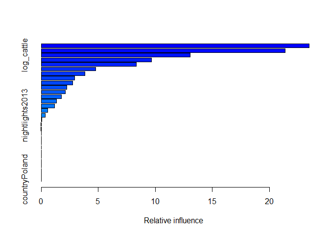
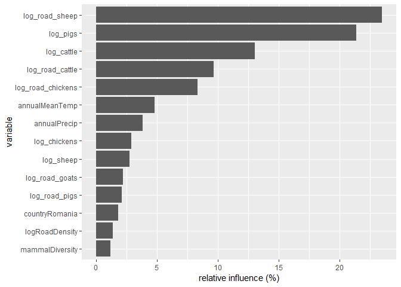
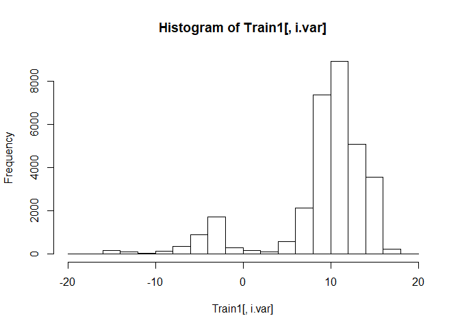

ungulates6\_outbreak\_size\_20190409
================

#### install packages

    ## Loading required package: sp

    ## 
    ## Attaching package: 'raster'

    ## The following object is masked from 'package:colorspace':
    ## 
    ##     RGB

    ## Loading required package: ggplot2

    ## Loading required package: lattice

    ## Loading required package: latticeExtra

    ## Loading required package: RColorBrewer

    ## 
    ## Attaching package: 'latticeExtra'

    ## The following object is masked from 'package:ggplot2':
    ## 
    ##     layer

    ## 
    ## Attaching package: 'dplyr'

    ## The following objects are masked from 'package:raster':
    ## 
    ##     intersect, select, union

    ## The following objects are masked from 'package:stats':
    ## 
    ##     filter, lag

    ## The following objects are masked from 'package:base':
    ## 
    ##     intersect, setdiff, setequal, union

    ## ### Welcome to rworldmap ###

    ## For a short introduction type :   vignette('rworldmap')

    ## 
    ## Attaching package: 'lubridate'

    ## The following object is masked from 'package:base':
    ## 
    ##     date

    ## 
    ## Attaching package: 'zoo'

    ## The following objects are masked from 'package:base':
    ## 
    ##     as.Date, as.Date.numeric

    ## Loaded gbm 2.1.4

    ## Loading required package: gplots

    ## 
    ## Attaching package: 'gplots'

    ## The following object is masked from 'package:stats':
    ## 
    ##     lowess

### load dfPredictors and dfAnimal. Reassign sumCases from dfAnimal to dfPredictors

``` r
load("dfPredictors.Rdata")
load("dfAnimal.Rdata")
dfPredictors$sumCases = dfAnimal$sumCases
dfPredictors = subset(dfPredictors, !is.na(sumCases))#remove NA cases
dfPredictors = subset(dfPredictors, case == 1)#only interested in outbreak locations
keep = setdiff(names(dfPredictors), "case")#remove case from columns 
dfPredictorsCases = dfPredictors[,keep]#keep only certain columns
save(dfPredictorsCases, file = "dfPredictorsCases.Rdata")
dim(dfPredictorsCases)
```

    ## [1] 39968   960

### remove columns with near-zero variation

``` r
load("dfPredictorsCases.Rdata")
df = dfPredictorsCases
# remove columns with near zero variance Global
nzv <- nearZeroVar(df[,c(1:959)],saveMetrics=TRUE) #package caret
nzv <- row.names(nzv[which(nzv$nzv==TRUE),])
dropnzv<-names(df[ , which(names(df) %in% nzv)])
write.csv(dropnzv, file = "dropnzv.csv")
df<-df[ , -which(names(df) %in% nzv)]
dfPredictorsCases = df
save(dfPredictorsCases, file = "dfPredictorsCases.Rdata")
```

### make test and train

``` r
load("dfPredictorsCases.Rdata")
df = dfPredictorsCases
DP =createDataPartition(y = df$sumCases, 
                        p = 0.8,
                        list = FALSE)
TrainCases = df[DP,]
TestCases = df[-DP,]

save(TrainCases, file = "TrainCases.Rdata")
save(TestCases, file = "TestCases.Rdata")
```

### make model

``` r
load("dfPredictorsCases.Rdata")
df = dfPredictorsCases

columns = dim(df)[2]
columns_min_1 = columns-1
modelCases<-as.formula(paste(colnames(df)[columns], "~",
                        paste(colnames(df)[c(1:columns_min_1)],collapse = "+"),
                        sep = ""))
print(modelCases)
```

    ## sumCases ~ log_chickens + log_sheep + log_goats + log_cattle + 
    ##     log_pigs + livestock_non_zero_fraction + nightlights2013 + 
    ##     label_shortclosedbroadleaveddeciduousforest + label_shortmosaiccropgrassshrubforest + 
    ##     label_shortmosaicgrassshrubforestcrop + label_shortPostfloodingorirrigatedcroplandsoraquatic + 
    ##     label_shortRainfedcroplands + annualMeanTemp + annualPrecip + 
    ##     countryBangladesh + countryFrance + countryGreece + countryPoland + 
    ##     countryRomania + ecoregionBalkanMixedForests + ecoregionCentralEuropeanMixedForests + 
    ##     ecoregionSarmaticMixedForests + ecoregionWesternEuropeanBroadleafForests + 
    ##     log_road_chickens + log_road_pigs + log_road_cattle + log_road_sheep + 
    ##     log_road_goats + mammalDiversity + logRoadDensity

``` r
save(modelCases, file = "modelCases.Rdata")
```

### run GBM -- predictors include roads, livestock, nightlights (2013), land cover, climate, country

``` r
rm(list = ls())
load("TrainCases.Rdata")
load("TestCases.Rdata")
# #https://stackoverflow.com/questions/19463137/error-in-evalexpr-envir-enclos-object-not-found
Train = TrainCases
attach(Train)
load("modelCases.Rdata")
model =modelCases
#Start the clock
ptm<-proc.time()

n.trees = 100000
shrinkage = 0.0001#final version should be 0.001
cv.folds = 10#final version should be 10
gbmtest<- gbm(model,
              data=Train,
              distribution="poisson",
              n.trees=n.trees,
              shrinkage=shrinkage,
              interaction.depth=4,
              bag.fraction=0.50,
              train.fraction=1,
              n.minobsinnode=5,
              cv.folds=cv.folds,
              keep.data=TRUE,
              verbose=TRUE,
              n.cores=NULL)
```

    ## Iter   TrainDeviance   ValidDeviance   StepSize   Improve
    ##      1     -326.4110             nan     0.0001    0.0031
    ##      2     -326.4180             nan     0.0001    0.0017
    ##      3     -326.4264             nan     0.0001    0.0013
    ##      4     -326.4341             nan     0.0001    0.0030
    ##      5     -326.4406             nan     0.0001    0.0025
    ##      6     -326.4483             nan     0.0001    0.0017
    ##      7     -326.4535             nan     0.0001    0.0026
    ##      8     -326.4619             nan     0.0001    0.0010
    ##      9     -326.4695             nan     0.0001    0.0016
    ##     10     -326.4746             nan     0.0001    0.0017
    ##     20     -326.5527             nan     0.0001    0.0029
    ##     40     -326.7183             nan     0.0001    0.0001
    ##     60     -326.8881             nan     0.0001    0.0030
    ##     80     -327.0358             nan     0.0001    0.0034
    ##    100     -327.1955             nan     0.0001    0.0033
    ##    120     -327.3543             nan     0.0001    0.0026
    ##    140     -327.5069             nan     0.0001    0.0023
    ##    160     -327.6650             nan     0.0001    0.0008
    ##    180     -327.8325             nan     0.0001    0.0004
    ##    200     -327.9917             nan     0.0001    0.0030
    ##    220     -328.1364             nan     0.0001    0.0005
    ##    240     -328.2899             nan     0.0001    0.0015
    ##    260     -328.4536             nan     0.0001    0.0001
    ##    280     -328.6022             nan     0.0001    0.0016
    ##    300     -328.7720             nan     0.0001    0.0024
    ##    320     -328.9344             nan     0.0001    0.0036
    ##    340     -329.0782             nan     0.0001    0.0020
    ##    360     -329.2328             nan     0.0001    0.0005
    ##    380     -329.3825             nan     0.0001    0.0034
    ##    400     -329.5455             nan     0.0001    0.0035
    ##    420     -329.7105             nan     0.0001    0.0033
    ##    440     -329.8738             nan     0.0001    0.0021
    ##    460     -330.0237             nan     0.0001    0.0012
    ##    480     -330.1859             nan     0.0001    0.0026
    ##    500     -330.3379             nan     0.0001    0.0024
    ##    520     -330.4779             nan     0.0001    0.0022
    ##    540     -330.6209             nan     0.0001    0.0018
    ##    560     -330.7826             nan     0.0001    0.0049
    ##    580     -330.9435             nan     0.0001    0.0035
    ##    600     -331.1038             nan     0.0001    0.0026
    ##    620     -331.2711             nan     0.0001    0.0025
    ##    640     -331.4360             nan     0.0001    0.0031
    ##    660     -331.5979             nan     0.0001    0.0029
    ##    680     -331.7445             nan     0.0001    0.0027
    ##    700     -331.9069             nan     0.0001    0.0021
    ##    720     -332.0591             nan     0.0001    0.0013
    ##    740     -332.1959             nan     0.0001    0.0024
    ##    760     -332.3410             nan     0.0001    0.0021
    ##    780     -332.4821             nan     0.0001    0.0027
    ##    800     -332.6273             nan     0.0001    0.0022
    ##    820     -332.7865             nan     0.0001    0.0005
    ##    840     -332.9389             nan     0.0001    0.0034
    ##    860     -333.1027             nan     0.0001    0.0025
    ##    880     -333.2543             nan     0.0001    0.0029
    ##    900     -333.4109             nan     0.0001    0.0006
    ##    920     -333.5584             nan     0.0001    0.0026
    ##    940     -333.7130             nan     0.0001    0.0023
    ##    960     -333.8629             nan     0.0001    0.0013
    ##    980     -334.0109             nan     0.0001    0.0003
    ##   1000     -334.1767             nan     0.0001    0.0022
    ##   1020     -334.3297             nan     0.0001    0.0028
    ##   1040     -334.4799             nan     0.0001    0.0005
    ##   1060     -334.6301             nan     0.0001    0.0019
    ##   1080     -334.7920             nan     0.0001    0.0018
    ##   1100     -334.9537             nan     0.0001    0.0031
    ##   1120     -335.1044             nan     0.0001    0.0018
    ##   1140     -335.2552             nan     0.0001    0.0012
    ##   1160     -335.3979             nan     0.0001    0.0006
    ##   1180     -335.5505             nan     0.0001    0.0005
    ##   1200     -335.6835             nan     0.0001    0.0015
    ##   1220     -335.8283             nan     0.0001    0.0026
    ##   1240     -335.9759             nan     0.0001    0.0014
    ##   1260     -336.1231             nan     0.0001    0.0001
    ##   1280     -336.2633             nan     0.0001    0.0014
    ##   1300     -336.4095             nan     0.0001    0.0014
    ##   1320     -336.5475             nan     0.0001    0.0031
    ##   1340     -336.6946             nan     0.0001    0.0007
    ##   1360     -336.8359             nan     0.0001    0.0042
    ##   1380     -336.9951             nan     0.0001    0.0024
    ##   1400     -337.1381             nan     0.0001    0.0023
    ##   1420     -337.2793             nan     0.0001    0.0017
    ##   1440     -337.4190             nan     0.0001    0.0016
    ##   1460     -337.5665             nan     0.0001    0.0013
    ##   1480     -337.7005             nan     0.0001    0.0019
    ##   1500     -337.8626             nan     0.0001    0.0000
    ##   1520     -338.0087             nan     0.0001    0.0017
    ##   1540     -338.1552             nan     0.0001    0.0027
    ##   1560     -338.2940             nan     0.0001    0.0029
    ##   1580     -338.4433             nan     0.0001    0.0016
    ##   1600     -338.5941             nan     0.0001    0.0025
    ##   1620     -338.7315             nan     0.0001    0.0018
    ##   1640     -338.8724             nan     0.0001    0.0020
    ##   1660     -339.0196             nan     0.0001    0.0020
    ##   1680     -339.1575             nan     0.0001    0.0014
    ##   1700     -339.2856             nan     0.0001    0.0018
    ##   1720     -339.4150             nan     0.0001    0.0000
    ##   1740     -339.5652             nan     0.0001    0.0013
    ##   1760     -339.7117             nan     0.0001    0.0011
    ##   1780     -339.8575             nan     0.0001    0.0014
    ##   1800     -339.9993             nan     0.0001    0.0017
    ##   1820     -340.1293             nan     0.0001    0.0021
    ##   1840     -340.2802             nan     0.0001    0.0010
    ##   1860     -340.4143             nan     0.0001    0.0017
    ##   1880     -340.5588             nan     0.0001    0.0018
    ##   1900     -340.7062             nan     0.0001    0.0017
    ##   1920     -340.8485             nan     0.0001    0.0012
    ##   1940     -340.9965             nan     0.0001    0.0006
    ##   1960     -341.1491             nan     0.0001    0.0031
    ##   1980     -341.2850             nan     0.0001    0.0011
    ##   2000     -341.4228             nan     0.0001    0.0020
    ##   2020     -341.5638             nan     0.0001    0.0020
    ##   2040     -341.6933             nan     0.0001    0.0017
    ##   2060     -341.8353             nan     0.0001    0.0029
    ##   2080     -341.9707             nan     0.0001    0.0005
    ##   2100     -342.1041             nan     0.0001    0.0004
    ##   2120     -342.2387             nan     0.0001    0.0012
    ##   2140     -342.3705             nan     0.0001    0.0010
    ##   2160     -342.5257             nan     0.0001    0.0016
    ##   2180     -342.6596             nan     0.0001    0.0026
    ##   2200     -342.8029             nan     0.0001    0.0018
    ##   2220     -342.9348             nan     0.0001    0.0011
    ##   2240     -343.0788             nan     0.0001    0.0019
    ##   2260     -343.2193             nan     0.0001    0.0024
    ##   2280     -343.3640             nan     0.0001    0.0017
    ##   2300     -343.4939             nan     0.0001    0.0022
    ##   2320     -343.6316             nan     0.0001    0.0016
    ##   2340     -343.7598             nan     0.0001    0.0030
    ##   2360     -343.9004             nan     0.0001    0.0013
    ##   2380     -344.0484             nan     0.0001    0.0023
    ##   2400     -344.1829             nan     0.0001    0.0013
    ##   2420     -344.3118             nan     0.0001    0.0013
    ##   2440     -344.4531             nan     0.0001    0.0020
    ##   2460     -344.5890             nan     0.0001    0.0002
    ##   2480     -344.7342             nan     0.0001    0.0024
    ##   2500     -344.8574             nan     0.0001    0.0014
    ##   2520     -344.9927             nan     0.0001    0.0003
    ##   2540     -345.1319             nan     0.0001    0.0019
    ##   2560     -345.2722             nan     0.0001    0.0007
    ##   2580     -345.4077             nan     0.0001    0.0024
    ##   2600     -345.5392             nan     0.0001    0.0022
    ##   2620     -345.6627             nan     0.0001    0.0019
    ##   2640     -345.8003             nan     0.0001    0.0016
    ##   2660     -345.9365             nan     0.0001    0.0021
    ##   2680     -346.0531             nan     0.0001    0.0020
    ##   2700     -346.2107             nan     0.0001    0.0020
    ##   2720     -346.3511             nan     0.0001    0.0022
    ##   2740     -346.4861             nan     0.0001    0.0010
    ##   2760     -346.6205             nan     0.0001    0.0004
    ##   2780     -346.7518             nan     0.0001    0.0013
    ##   2800     -346.8823             nan     0.0001    0.0019
    ##   2820     -347.0103             nan     0.0001    0.0013
    ##   2840     -347.1455             nan     0.0001    0.0013
    ##   2860     -347.2946             nan     0.0001    0.0017
    ##   2880     -347.4206             nan     0.0001    0.0021
    ##   2900     -347.5485             nan     0.0001    0.0039
    ##   2920     -347.6630             nan     0.0001    0.0009
    ##   2940     -347.7889             nan     0.0001    0.0028
    ##   2960     -347.9122             nan     0.0001    0.0010
    ##   2980     -348.0475             nan     0.0001    0.0010
    ##   3000     -348.1973             nan     0.0001    0.0015
    ##   3020     -348.3411             nan     0.0001   -0.0001
    ##   3040     -348.4731             nan     0.0001    0.0017
    ##   3060     -348.6079             nan     0.0001    0.0016
    ##   3080     -348.7347             nan     0.0001    0.0011
    ##   3100     -348.8652             nan     0.0001    0.0025
    ##   3120     -348.9854             nan     0.0001    0.0011
    ##   3140     -349.1173             nan     0.0001    0.0021
    ##   3160     -349.2581             nan     0.0001    0.0040
    ##   3180     -349.3928             nan     0.0001    0.0017
    ##   3200     -349.5300             nan     0.0001    0.0011
    ##   3220     -349.6649             nan     0.0001    0.0011
    ##   3240     -349.7876             nan     0.0001    0.0015
    ##   3260     -349.9237             nan     0.0001    0.0022
    ##   3280     -350.0491             nan     0.0001    0.0003
    ##   3300     -350.1841             nan     0.0001    0.0013
    ##   3320     -350.3043             nan     0.0001    0.0023
    ##   3340     -350.4332             nan     0.0001    0.0020
    ##   3360     -350.5554             nan     0.0001    0.0004
    ##   3380     -350.6755             nan     0.0001    0.0011
    ##   3400     -350.8102             nan     0.0001    0.0003
    ##   3420     -350.9450             nan     0.0001    0.0018
    ##   3440     -351.0749             nan     0.0001    0.0011
    ##   3460     -351.1989             nan     0.0001    0.0014
    ##   3480     -351.3251             nan     0.0001    0.0006
    ##   3500     -351.4483             nan     0.0001    0.0017
    ##   3520     -351.5790             nan     0.0001    0.0000
    ##   3540     -351.7106             nan     0.0001    0.0016
    ##   3560     -351.8407             nan     0.0001    0.0021
    ##   3580     -351.9662             nan     0.0001    0.0009
    ##   3600     -352.0989             nan     0.0001    0.0015
    ##   3620     -352.2294             nan     0.0001    0.0009
    ##   3640     -352.3521             nan     0.0001    0.0005
    ##   3660     -352.4910             nan     0.0001    0.0032
    ##   3680     -352.6152             nan     0.0001    0.0014
    ##   3700     -352.7440             nan     0.0001    0.0020
    ##   3720     -352.8683             nan     0.0001    0.0010
    ##   3740     -352.9909             nan     0.0001    0.0029
    ##   3760     -353.1188             nan     0.0001    0.0030
    ##   3780     -353.2489             nan     0.0001    0.0001
    ##   3800     -353.3706             nan     0.0001    0.0000
    ##   3820     -353.5000             nan     0.0001    0.0009
    ##   3840     -353.6301             nan     0.0001    0.0010
    ##   3860     -353.7497             nan     0.0001    0.0022
    ##   3880     -353.8753             nan     0.0001    0.0018
    ##   3900     -354.0027             nan     0.0001    0.0003
    ##   3920     -354.1256             nan     0.0001    0.0015
    ##   3940     -354.2479             nan     0.0001    0.0015
    ##   3960     -354.3739             nan     0.0001    0.0000
    ##   3980     -354.5133             nan     0.0001    0.0022
    ##   4000     -354.6270             nan     0.0001    0.0018
    ##   4020     -354.7396             nan     0.0001   -0.0001
    ##   4040     -354.8561             nan     0.0001    0.0000
    ##   4060     -354.9732             nan     0.0001    0.0020
    ##   4080     -355.0916             nan     0.0001    0.0014
    ##   4100     -355.2204             nan     0.0001    0.0016
    ##   4120     -355.3382             nan     0.0001    0.0018
    ##   4140     -355.4747             nan     0.0001    0.0011
    ##   4160     -355.5941             nan     0.0001    0.0021
    ##   4180     -355.7320             nan     0.0001    0.0011
    ##   4200     -355.8569             nan     0.0001    0.0018
    ##   4220     -355.9866             nan     0.0001    0.0018
    ##   4240     -356.1140             nan     0.0001    0.0009
    ##   4260     -356.2368             nan     0.0001    0.0023
    ##   4280     -356.3522             nan     0.0001    0.0000
    ##   4300     -356.4724             nan     0.0001    0.0020
    ##   4320     -356.6083             nan     0.0001    0.0004
    ##   4340     -356.7233             nan     0.0001    0.0019
    ##   4360     -356.8467             nan     0.0001    0.0013
    ##   4380     -356.9724             nan     0.0001    0.0014
    ##   4400     -357.0947             nan     0.0001    0.0024
    ##   4420     -357.2181             nan     0.0001    0.0021
    ##   4440     -357.3401             nan     0.0001    0.0019
    ##   4460     -357.4715             nan     0.0001    0.0013
    ##   4480     -357.5909             nan     0.0001    0.0015
    ##   4500     -357.7126             nan     0.0001    0.0023
    ##   4520     -357.8354             nan     0.0001    0.0028
    ##   4540     -357.9399             nan     0.0001    0.0012
    ##   4560     -358.0556             nan     0.0001    0.0011
    ##   4580     -358.1968             nan     0.0001    0.0012
    ##   4600     -358.3124             nan     0.0001    0.0016
    ##   4620     -358.4421             nan     0.0001    0.0018
    ##   4640     -358.5570             nan     0.0001   -0.0001
    ##   4660     -358.6757             nan     0.0001    0.0018
    ##   4680     -358.7824             nan     0.0001    0.0016
    ##   4700     -358.8952             nan     0.0001    0.0005
    ##   4720     -359.0144             nan     0.0001    0.0013
    ##   4740     -359.1321             nan     0.0001    0.0012
    ##   4760     -359.2577             nan     0.0001    0.0022
    ##   4780     -359.3683             nan     0.0001    0.0028
    ##   4800     -359.4939             nan     0.0001    0.0011
    ##   4820     -359.6319             nan     0.0001    0.0015
    ##   4840     -359.7425             nan     0.0001    0.0020
    ##   4860     -359.8745             nan     0.0001    0.0011
    ##   4880     -360.0006             nan     0.0001    0.0009
    ##   4900     -360.1124             nan     0.0001    0.0016
    ##   4920     -360.2267             nan     0.0001    0.0006
    ##   4940     -360.3473             nan     0.0001    0.0003
    ##   4960     -360.4640             nan     0.0001    0.0006
    ##   4980     -360.5865             nan     0.0001    0.0024
    ##   5000     -360.6909             nan     0.0001    0.0013
    ##   5020     -360.8041             nan     0.0001    0.0013
    ##   5040     -360.9140             nan     0.0001    0.0012
    ##   5060     -361.0394             nan     0.0001    0.0009
    ##   5080     -361.1638             nan     0.0001    0.0005
    ##   5100     -361.2771             nan     0.0001    0.0006
    ##   5120     -361.3933             nan     0.0001    0.0010
    ##   5140     -361.5154             nan     0.0001    0.0015
    ##   5160     -361.6416             nan     0.0001    0.0013
    ##   5180     -361.7614             nan     0.0001    0.0013
    ##   5200     -361.8688             nan     0.0001    0.0002
    ##   5220     -361.9762             nan     0.0001    0.0017
    ##   5240     -362.0948             nan     0.0001    0.0015
    ##   5260     -362.2153             nan     0.0001    0.0013
    ##   5280     -362.3211             nan     0.0001    0.0013
    ##   5300     -362.4401             nan     0.0001    0.0020
    ##   5320     -362.5503             nan     0.0001    0.0019
    ##   5340     -362.6697             nan     0.0001    0.0007
    ##   5360     -362.7882             nan     0.0001    0.0015
    ##   5380     -362.8987             nan     0.0001    0.0001
    ##   5400     -363.0170             nan     0.0001    0.0019
    ##   5420     -363.1417             nan     0.0001    0.0015
    ##   5440     -363.2596             nan     0.0001    0.0006
    ##   5460     -363.3806             nan     0.0001   -0.0000
    ##   5480     -363.5114             nan     0.0001    0.0020
    ##   5500     -363.6278             nan     0.0001    0.0008
    ##   5520     -363.7393             nan     0.0001    0.0006
    ##   5540     -363.8610             nan     0.0001    0.0030
    ##   5560     -363.9658             nan     0.0001    0.0013
    ##   5580     -364.0884             nan     0.0001    0.0012
    ##   5600     -364.2030             nan     0.0001    0.0007
    ##   5620     -364.3104             nan     0.0001    0.0010
    ##   5640     -364.4273             nan     0.0001    0.0012
    ##   5660     -364.5559             nan     0.0001    0.0024
    ##   5680     -364.6656             nan     0.0001    0.0022
    ##   5700     -364.7826             nan     0.0001    0.0014
    ##   5720     -364.8914             nan     0.0001    0.0015
    ##   5740     -365.0059             nan     0.0001    0.0007
    ##   5760     -365.1063             nan     0.0001    0.0017
    ##   5780     -365.2255             nan     0.0001    0.0018
    ##   5800     -365.3318             nan     0.0001    0.0013
    ##   5820     -365.4465             nan     0.0001    0.0015
    ##   5840     -365.5617             nan     0.0001    0.0021
    ##   5860     -365.6848             nan     0.0001    0.0013
    ##   5880     -365.8012             nan     0.0001    0.0011
    ##   5900     -365.9199             nan     0.0001    0.0012
    ##   5920     -366.0251             nan     0.0001    0.0011
    ##   5940     -366.1310             nan     0.0001    0.0009
    ##   5960     -366.2458             nan     0.0001    0.0014
    ##   5980     -366.3735             nan     0.0001    0.0021
    ##   6000     -366.4893             nan     0.0001    0.0021
    ##   6020     -366.5981             nan     0.0001    0.0011
    ##   6040     -366.7290             nan     0.0001    0.0003
    ##   6060     -366.8313             nan     0.0001    0.0021
    ##   6080     -366.9494             nan     0.0001    0.0010
    ##   6100     -367.0690             nan     0.0001    0.0011
    ##   6120     -367.1777             nan     0.0001    0.0023
    ##   6140     -367.2910             nan     0.0001    0.0010
    ##   6160     -367.3924             nan     0.0001    0.0030
    ##   6180     -367.5063             nan     0.0001    0.0004
    ##   6200     -367.6144             nan     0.0001    0.0012
    ##   6220     -367.7295             nan     0.0001    0.0012
    ##   6240     -367.8256             nan     0.0001    0.0008
    ##   6260     -367.9304             nan     0.0001    0.0013
    ##   6280     -368.0402             nan     0.0001    0.0013
    ##   6300     -368.1458             nan     0.0001    0.0011
    ##   6320     -368.2533             nan     0.0001    0.0011
    ##   6340     -368.3744             nan     0.0001    0.0012
    ##   6360     -368.4868             nan     0.0001    0.0014
    ##   6380     -368.6039             nan     0.0001    0.0051
    ##   6400     -368.7107             nan     0.0001    0.0005
    ##   6420     -368.8260             nan     0.0001    0.0014
    ##   6440     -368.9329             nan     0.0001    0.0012
    ##   6460     -369.0435             nan     0.0001    0.0019
    ##   6480     -369.1558             nan     0.0001    0.0018
    ##   6500     -369.2662             nan     0.0001    0.0012
    ##   6520     -369.3842             nan     0.0001    0.0018
    ##   6540     -369.5037             nan     0.0001    0.0013
    ##   6560     -369.6004             nan     0.0001    0.0008
    ##   6580     -369.7084             nan     0.0001    0.0013
    ##   6600     -369.8108             nan     0.0001    0.0019
    ##   6620     -369.9136             nan     0.0001    0.0008
    ##   6640     -370.0159             nan     0.0001    0.0010
    ##   6660     -370.1241             nan     0.0001    0.0007
    ##   6680     -370.2363             nan     0.0001   -0.0000
    ##   6700     -370.3475             nan     0.0001    0.0015
    ##   6720     -370.4645             nan     0.0001    0.0011
    ##   6740     -370.5720             nan     0.0001    0.0010
    ##   6760     -370.6831             nan     0.0001    0.0009
    ##   6780     -370.7915             nan     0.0001   -0.0001
    ##   6800     -370.8982             nan     0.0001    0.0009
    ##   6820     -371.0093             nan     0.0001    0.0005
    ##   6840     -371.1241             nan     0.0001    0.0010
    ##   6860     -371.2475             nan     0.0001    0.0018
    ##   6880     -371.3546             nan     0.0001    0.0045
    ##   6900     -371.4460             nan     0.0001    0.0012
    ##   6920     -371.5396             nan     0.0001    0.0009
    ##   6940     -371.6463             nan     0.0001    0.0010
    ##   6960     -371.7540             nan     0.0001    0.0016
    ##   6980     -371.8645             nan     0.0001    0.0013
    ##   7000     -371.9630             nan     0.0001    0.0019
    ##   7020     -372.0625             nan     0.0001    0.0010
    ##   7040     -372.1559             nan     0.0001    0.0014
    ##   7060     -372.2683             nan     0.0001    0.0016
    ##   7080     -372.3717             nan     0.0001    0.0015
    ##   7100     -372.4814             nan     0.0001    0.0002
    ##   7120     -372.5792             nan     0.0001    0.0016
    ##   7140     -372.6940             nan     0.0001    0.0010
    ##   7160     -372.8029             nan     0.0001    0.0003
    ##   7180     -372.9149             nan     0.0001    0.0010
    ##   7200     -373.0180             nan     0.0001    0.0007
    ##   7220     -373.1235             nan     0.0001    0.0016
    ##   7240     -373.2316             nan     0.0001    0.0015
    ##   7260     -373.3324             nan     0.0001    0.0023
    ##   7280     -373.4349             nan     0.0001    0.0011
    ##   7300     -373.5392             nan     0.0001    0.0007
    ##   7320     -373.6492             nan     0.0001    0.0007
    ##   7340     -373.7521             nan     0.0001    0.0009
    ##   7360     -373.8451             nan     0.0001    0.0020
    ##   7380     -373.9447             nan     0.0001    0.0007
    ##   7400     -374.0472             nan     0.0001    0.0013
    ##   7420     -374.1448             nan     0.0001    0.0001
    ##   7440     -374.2583             nan     0.0001    0.0007
    ##   7460     -374.3694             nan     0.0001    0.0008
    ##   7480     -374.4569             nan     0.0001    0.0011
    ##   7500     -374.5678             nan     0.0001    0.0013
    ##   7520     -374.6661             nan     0.0001    0.0003
    ##   7540     -374.7743             nan     0.0001    0.0009
    ##   7560     -374.8714             nan     0.0001    0.0005
    ##   7580     -374.9781             nan     0.0001    0.0020
    ##   7600     -375.0775             nan     0.0001    0.0015
    ##   7620     -375.1892             nan     0.0001    0.0002
    ##   7640     -375.2939             nan     0.0001    0.0020
    ##   7660     -375.4070             nan     0.0001    0.0015
    ##   7680     -375.4955             nan     0.0001    0.0025
    ##   7700     -375.6015             nan     0.0001    0.0012
    ##   7720     -375.7021             nan     0.0001    0.0017
    ##   7740     -375.8145             nan     0.0001    0.0009
    ##   7760     -375.9084             nan     0.0001    0.0015
    ##   7780     -376.0086             nan     0.0001    0.0014
    ##   7800     -376.1150             nan     0.0001   -0.0000
    ##   7820     -376.2060             nan     0.0001    0.0008
    ##   7840     -376.3136             nan     0.0001    0.0009
    ##   7860     -376.4046             nan     0.0001    0.0001
    ##   7880     -376.5182             nan     0.0001    0.0011
    ##   7900     -376.6175             nan     0.0001    0.0023
    ##   7920     -376.7266             nan     0.0001    0.0000
    ##   7940     -376.8358             nan     0.0001    0.0009
    ##   7960     -376.9327             nan     0.0001    0.0017
    ##   7980     -377.0432             nan     0.0001    0.0030
    ##   8000     -377.1505             nan     0.0001    0.0019
    ##   8020     -377.2621             nan     0.0001    0.0014
    ##   8040     -377.3640             nan     0.0001    0.0004
    ##   8060     -377.4577             nan     0.0001    0.0006
    ##   8080     -377.5593             nan     0.0001    0.0007
    ##   8100     -377.6539             nan     0.0001    0.0005
    ##   8120     -377.7486             nan     0.0001    0.0013
    ##   8140     -377.8364             nan     0.0001    0.0008
    ##   8160     -377.9363             nan     0.0001    0.0009
    ##   8180     -378.0438             nan     0.0001    0.0024
    ##   8200     -378.1549             nan     0.0001    0.0027
    ##   8220     -378.2500             nan     0.0001    0.0017
    ##   8240     -378.3559             nan     0.0001    0.0016
    ##   8260     -378.4615             nan     0.0001    0.0015
    ##   8280     -378.5712             nan     0.0001    0.0015
    ##   8300     -378.6689             nan     0.0001   -0.0000
    ##   8320     -378.7625             nan     0.0001    0.0005
    ##   8340     -378.8576             nan     0.0001    0.0010
    ##   8360     -378.9538             nan     0.0001    0.0002
    ##   8380     -379.0493             nan     0.0001    0.0016
    ##   8400     -379.1403             nan     0.0001    0.0001
    ##   8420     -379.2285             nan     0.0001    0.0020
    ##   8440     -379.3289             nan     0.0001    0.0012
    ##   8460     -379.4325             nan     0.0001    0.0014
    ##   8480     -379.5380             nan     0.0001    0.0006
    ##   8500     -379.6304             nan     0.0001    0.0009
    ##   8520     -379.7478             nan     0.0001    0.0009
    ##   8540     -379.8303             nan     0.0001    0.0004
    ##   8560     -379.9222             nan     0.0001    0.0012
    ##   8580     -380.0187             nan     0.0001    0.0002
    ##   8600     -380.1104             nan     0.0001    0.0011
    ##   8620     -380.2082             nan     0.0001    0.0006
    ##   8640     -380.3107             nan     0.0001    0.0004
    ##   8660     -380.4084             nan     0.0001    0.0015
    ##   8680     -380.5048             nan     0.0001    0.0013
    ##   8700     -380.6094             nan     0.0001    0.0014
    ##   8720     -380.7027             nan     0.0001    0.0012
    ##   8740     -380.8005             nan     0.0001    0.0011
    ##   8760     -380.8997             nan     0.0001    0.0009
    ##   8780     -380.9890             nan     0.0001    0.0009
    ##   8800     -381.0828             nan     0.0001    0.0016
    ##   8820     -381.1776             nan     0.0001    0.0008
    ##   8840     -381.2704             nan     0.0001    0.0002
    ##   8860     -381.3669             nan     0.0001    0.0009
    ##   8880     -381.4681             nan     0.0001    0.0006
    ##   8900     -381.5595             nan     0.0001    0.0008
    ##   8920     -381.6631             nan     0.0001    0.0030
    ##   8940     -381.7573             nan     0.0001    0.0016
    ##   8960     -381.8424             nan     0.0001    0.0010
    ##   8980     -381.9349             nan     0.0001    0.0009
    ##   9000     -382.0277             nan     0.0001    0.0016
    ##   9020     -382.1270             nan     0.0001    0.0009
    ##   9040     -382.2124             nan     0.0001    0.0016
    ##   9060     -382.3198             nan     0.0001    0.0021
    ##   9080     -382.4166             nan     0.0001    0.0012
    ##   9100     -382.5052             nan     0.0001    0.0009
    ##   9120     -382.6048             nan     0.0001    0.0016
    ##   9140     -382.7026             nan     0.0001    0.0015
    ##   9160     -382.7857             nan     0.0001    0.0006
    ##   9180     -382.8823             nan     0.0001    0.0010
    ##   9200     -382.9847             nan     0.0001    0.0008
    ##   9220     -383.0882             nan     0.0001    0.0023
    ##   9240     -383.1832             nan     0.0001    0.0009
    ##   9260     -383.2824             nan     0.0001    0.0015
    ##   9280     -383.3740             nan     0.0001    0.0008
    ##   9300     -383.4762             nan     0.0001    0.0004
    ##   9320     -383.5657             nan     0.0001    0.0013
    ##   9340     -383.6740             nan     0.0001    0.0003
    ##   9360     -383.7783             nan     0.0001    0.0009
    ##   9380     -383.8717             nan     0.0001    0.0022
    ##   9400     -383.9540             nan     0.0001    0.0014
    ##   9420     -384.0512             nan     0.0001    0.0015
    ##   9440     -384.1581             nan     0.0001    0.0003
    ##   9460     -384.2492             nan     0.0001    0.0009
    ##   9480     -384.3511             nan     0.0001    0.0008
    ##   9500     -384.4313             nan     0.0001    0.0008
    ##   9520     -384.5333             nan     0.0001   -0.0001
    ##   9540     -384.6368             nan     0.0001    0.0015
    ##   9560     -384.7323             nan     0.0001    0.0009
    ##   9580     -384.8296             nan     0.0001    0.0005
    ##   9600     -384.9218             nan     0.0001    0.0008
    ##   9620     -385.0243             nan     0.0001    0.0011
    ##   9640     -385.1212             nan     0.0001    0.0012
    ##   9660     -385.2110             nan     0.0001    0.0019
    ##   9680     -385.3056             nan     0.0001    0.0025
    ##   9700     -385.4049             nan     0.0001    0.0002
    ##   9720     -385.4891             nan     0.0001    0.0012
    ##   9740     -385.5851             nan     0.0001    0.0007
    ##   9760     -385.6797             nan     0.0001    0.0005
    ##   9780     -385.7735             nan     0.0001    0.0015
    ##   9800     -385.8707             nan     0.0001    0.0003
    ##   9820     -385.9577             nan     0.0001    0.0007
    ##   9840     -386.0591             nan     0.0001    0.0005
    ##   9860     -386.1533             nan     0.0001    0.0010
    ##   9880     -386.2586             nan     0.0001    0.0044
    ##   9900     -386.3513             nan     0.0001    0.0013
    ##   9920     -386.4537             nan     0.0001    0.0008
    ##   9940     -386.5430             nan     0.0001    0.0006
    ##   9960     -386.6433             nan     0.0001    0.0007
    ##   9980     -386.7320             nan     0.0001    0.0010
    ##  10000     -386.8271             nan     0.0001    0.0017
    ##  10020     -386.9277             nan     0.0001    0.0003
    ##  10040     -387.0174             nan     0.0001    0.0011
    ##  10060     -387.1035             nan     0.0001    0.0010
    ##  10080     -387.1959             nan     0.0001    0.0018
    ##  10100     -387.2805             nan     0.0001   -0.0000
    ##  10120     -387.3719             nan     0.0001    0.0006
    ##  10140     -387.4565             nan     0.0001    0.0007
    ##  10160     -387.5474             nan     0.0001    0.0033
    ##  10180     -387.6410             nan     0.0001    0.0018
    ##  10200     -387.7359             nan     0.0001    0.0007
    ##  10220     -387.8254             nan     0.0001   -0.0000
    ##  10240     -387.9184             nan     0.0001    0.0015
    ##  10260     -388.0117             nan     0.0001    0.0009
    ##  10280     -388.1108             nan     0.0001    0.0007
    ##  10300     -388.2009             nan     0.0001    0.0005
    ##  10320     -388.3001             nan     0.0001    0.0009
    ##  10340     -388.3982             nan     0.0001    0.0013
    ##  10360     -388.5040             nan     0.0001    0.0012
    ##  10380     -388.6064             nan     0.0001    0.0008
    ##  10400     -388.7000             nan     0.0001    0.0010
    ##  10420     -388.7953             nan     0.0001    0.0005
    ##  10440     -388.8765             nan     0.0001   -0.0000
    ##  10460     -388.9695             nan     0.0001    0.0010
    ##  10480     -389.0600             nan     0.0001    0.0004
    ##  10500     -389.1529             nan     0.0001   -0.0000
    ##  10520     -389.2531             nan     0.0001    0.0012
    ##  10540     -389.3354             nan     0.0001    0.0007
    ##  10560     -389.4204             nan     0.0001    0.0008
    ##  10580     -389.5096             nan     0.0001   -0.0000
    ##  10600     -389.6000             nan     0.0001    0.0002
    ##  10620     -389.6938             nan     0.0001    0.0007
    ##  10640     -389.7897             nan     0.0001    0.0019
    ##  10660     -389.8758             nan     0.0001    0.0017
    ##  10680     -389.9708             nan     0.0001    0.0007
    ##  10700     -390.0596             nan     0.0001    0.0013
    ##  10720     -390.1564             nan     0.0001    0.0012
    ##  10740     -390.2327             nan     0.0001    0.0012
    ##  10760     -390.3186             nan     0.0001    0.0007
    ##  10780     -390.4111             nan     0.0001    0.0002
    ##  10800     -390.5005             nan     0.0001    0.0010
    ##  10820     -390.5844             nan     0.0001    0.0009
    ##  10840     -390.6726             nan     0.0001    0.0025
    ##  10860     -390.7645             nan     0.0001    0.0017
    ##  10880     -390.8575             nan     0.0001    0.0005
    ##  10900     -390.9449             nan     0.0001    0.0008
    ##  10920     -391.0314             nan     0.0001    0.0005
    ##  10940     -391.1117             nan     0.0001    0.0006
    ##  10960     -391.1935             nan     0.0001    0.0022
    ##  10980     -391.2823             nan     0.0001    0.0011
    ##  11000     -391.3802             nan     0.0001    0.0008
    ##  11020     -391.4684             nan     0.0001    0.0007
    ##  11040     -391.5502             nan     0.0001    0.0010
    ##  11060     -391.6456             nan     0.0001    0.0016
    ##  11080     -391.7403             nan     0.0001    0.0007
    ##  11100     -391.8422             nan     0.0001    0.0005
    ##  11120     -391.9354             nan     0.0001    0.0005
    ##  11140     -392.0219             nan     0.0001    0.0001
    ##  11160     -392.1094             nan     0.0001    0.0012
    ##  11180     -392.1887             nan     0.0001    0.0009
    ##  11200     -392.2838             nan     0.0001    0.0008
    ##  11220     -392.3681             nan     0.0001    0.0001
    ##  11240     -392.4582             nan     0.0001   -0.0000
    ##  11260     -392.5568             nan     0.0001    0.0011
    ##  11280     -392.6424             nan     0.0001    0.0007
    ##  11300     -392.7231             nan     0.0001    0.0006
    ##  11320     -392.8165             nan     0.0001    0.0005
    ##  11340     -392.8987             nan     0.0001    0.0011
    ##  11360     -392.9988             nan     0.0001    0.0012
    ##  11380     -393.0763             nan     0.0001    0.0011
    ##  11400     -393.1650             nan     0.0001    0.0007
    ##  11420     -393.2625             nan     0.0001    0.0019
    ##  11440     -393.3466             nan     0.0001    0.0005
    ##  11460     -393.4453             nan     0.0001    0.0001
    ##  11480     -393.5328             nan     0.0001    0.0007
    ##  11500     -393.6177             nan     0.0001    0.0008
    ##  11520     -393.6984             nan     0.0001    0.0010
    ##  11540     -393.7824             nan     0.0001    0.0008
    ##  11560     -393.8708             nan     0.0001    0.0002
    ##  11580     -393.9593             nan     0.0001    0.0001
    ##  11600     -394.0488             nan     0.0001    0.0014
    ##  11620     -394.1349             nan     0.0001    0.0014
    ##  11640     -394.2150             nan     0.0001    0.0010
    ##  11660     -394.2962             nan     0.0001   -0.0000
    ##  11680     -394.3877             nan     0.0001    0.0010
    ##  11700     -394.4693             nan     0.0001    0.0002
    ##  11720     -394.5574             nan     0.0001    0.0013
    ##  11740     -394.6398             nan     0.0001    0.0007
    ##  11760     -394.7275             nan     0.0001    0.0011
    ##  11780     -394.8025             nan     0.0001    0.0010
    ##  11800     -394.8886             nan     0.0001    0.0003
    ##  11820     -394.9825             nan     0.0001    0.0012
    ##  11840     -395.0693             nan     0.0001    0.0006
    ##  11860     -395.1521             nan     0.0001    0.0028
    ##  11880     -395.2384             nan     0.0001    0.0004
    ##  11900     -395.3211             nan     0.0001    0.0008
    ##  11920     -395.4213             nan     0.0001    0.0004
    ##  11940     -395.5156             nan     0.0001   -0.0001
    ##  11960     -395.6085             nan     0.0001    0.0004
    ##  11980     -395.6954             nan     0.0001    0.0014
    ##  12000     -395.7754             nan     0.0001    0.0011
    ##  12020     -395.8595             nan     0.0001    0.0004
    ##  12040     -395.9419             nan     0.0001    0.0022
    ##  12060     -396.0203             nan     0.0001    0.0010
    ##  12080     -396.1005             nan     0.0001    0.0007
    ##  12100     -396.1797             nan     0.0001    0.0006
    ##  12120     -396.2733             nan     0.0001    0.0013
    ##  12140     -396.3565             nan     0.0001    0.0008
    ##  12160     -396.4317             nan     0.0001    0.0004
    ##  12180     -396.5127             nan     0.0001    0.0014
    ##  12200     -396.5990             nan     0.0001    0.0007
    ##  12220     -396.6886             nan     0.0001    0.0008
    ##  12240     -396.7687             nan     0.0001    0.0010
    ##  12260     -396.8494             nan     0.0001    0.0009
    ##  12280     -396.9338             nan     0.0001    0.0004
    ##  12300     -397.0134             nan     0.0001    0.0009
    ##  12320     -397.0871             nan     0.0001    0.0012
    ##  12340     -397.1705             nan     0.0001    0.0005
    ##  12360     -397.2512             nan     0.0001   -0.0000
    ##  12380     -397.3308             nan     0.0001    0.0009
    ##  12400     -397.4186             nan     0.0001    0.0009
    ##  12420     -397.4983             nan     0.0001    0.0011
    ##  12440     -397.5830             nan     0.0001    0.0011
    ##  12460     -397.6623             nan     0.0001    0.0010
    ##  12480     -397.7477             nan     0.0001    0.0009
    ##  12500     -397.8262             nan     0.0001    0.0030
    ##  12520     -397.9235             nan     0.0001    0.0012
    ##  12540     -398.0054             nan     0.0001    0.0004
    ##  12560     -398.0803             nan     0.0001    0.0008
    ##  12580     -398.1605             nan     0.0001    0.0013
    ##  12600     -398.2378             nan     0.0001    0.0006
    ##  12620     -398.3262             nan     0.0001    0.0022
    ##  12640     -398.4176             nan     0.0001    0.0005
    ##  12660     -398.5065             nan     0.0001    0.0012
    ##  12680     -398.5846             nan     0.0001    0.0016
    ##  12700     -398.6710             nan     0.0001   -0.0000
    ##  12720     -398.7464             nan     0.0001    0.0007
    ##  12740     -398.8196             nan     0.0001    0.0012
    ##  12760     -398.8871             nan     0.0001    0.0007
    ##  12780     -398.9701             nan     0.0001    0.0006
    ##  12800     -399.0412             nan     0.0001    0.0006
    ##  12820     -399.1273             nan     0.0001    0.0007
    ##  12840     -399.2104             nan     0.0001    0.0002
    ##  12860     -399.2899             nan     0.0001    0.0013
    ##  12880     -399.3709             nan     0.0001   -0.0000
    ##  12900     -399.4625             nan     0.0001    0.0008
    ##  12920     -399.5293             nan     0.0001    0.0013
    ##  12940     -399.6070             nan     0.0001    0.0007
    ##  12960     -399.6859             nan     0.0001    0.0015
    ##  12980     -399.7745             nan     0.0001    0.0005
    ##  13000     -399.8633             nan     0.0001    0.0003
    ##  13020     -399.9374             nan     0.0001    0.0006
    ##  13040     -400.0179             nan     0.0001    0.0007
    ##  13060     -400.1022             nan     0.0001    0.0006
    ##  13080     -400.1879             nan     0.0001    0.0008
    ##  13100     -400.2610             nan     0.0001    0.0011
    ##  13120     -400.3297             nan     0.0001    0.0016
    ##  13140     -400.4153             nan     0.0001    0.0004
    ##  13160     -400.5092             nan     0.0001    0.0009
    ##  13180     -400.5801             nan     0.0001    0.0011
    ##  13200     -400.6652             nan     0.0001    0.0008
    ##  13220     -400.7505             nan     0.0001    0.0003
    ##  13240     -400.8335             nan     0.0001    0.0006
    ##  13260     -400.9055             nan     0.0001    0.0008
    ##  13280     -400.9841             nan     0.0001    0.0011
    ##  13300     -401.0511             nan     0.0001    0.0006
    ##  13320     -401.1408             nan     0.0001    0.0033
    ##  13340     -401.2269             nan     0.0001    0.0005
    ##  13360     -401.3274             nan     0.0001    0.0010
    ##  13380     -401.3984             nan     0.0001    0.0006
    ##  13400     -401.4769             nan     0.0001    0.0001
    ##  13420     -401.5489             nan     0.0001    0.0004
    ##  13440     -401.6357             nan     0.0001   -0.0000
    ##  13460     -401.7176             nan     0.0001    0.0010
    ##  13480     -401.8016             nan     0.0001    0.0002
    ##  13500     -401.8762             nan     0.0001    0.0011
    ##  13520     -401.9584             nan     0.0001    0.0009
    ##  13540     -402.0405             nan     0.0001    0.0001
    ##  13560     -402.1198             nan     0.0001    0.0006
    ##  13580     -402.1899             nan     0.0001    0.0005
    ##  13600     -402.2512             nan     0.0001    0.0004
    ##  13620     -402.3266             nan     0.0001    0.0005
    ##  13640     -402.4122             nan     0.0001    0.0009
    ##  13660     -402.5019             nan     0.0001   -0.0002
    ##  13680     -402.5844             nan     0.0001    0.0004
    ##  13700     -402.6742             nan     0.0001    0.0012
    ##  13720     -402.7598             nan     0.0001    0.0002
    ##  13740     -402.8356             nan     0.0001    0.0005
    ##  13760     -402.9162             nan     0.0001    0.0006
    ##  13780     -403.0060             nan     0.0001    0.0009
    ##  13800     -403.0818             nan     0.0001    0.0004
    ##  13820     -403.1617             nan     0.0001    0.0037
    ##  13840     -403.2454             nan     0.0001    0.0015
    ##  13860     -403.3169             nan     0.0001    0.0012
    ##  13880     -403.3881             nan     0.0001    0.0005
    ##  13900     -403.4707             nan     0.0001    0.0043
    ##  13920     -403.5406             nan     0.0001    0.0001
    ##  13940     -403.6211             nan     0.0001    0.0004
    ##  13960     -403.6910             nan     0.0001    0.0004
    ##  13980     -403.7644             nan     0.0001    0.0005
    ##  14000     -403.8412             nan     0.0001    0.0009
    ##  14020     -403.9141             nan     0.0001    0.0009
    ##  14040     -403.9908             nan     0.0001    0.0004
    ##  14060     -404.0721             nan     0.0001    0.0031
    ##  14080     -404.1532             nan     0.0001    0.0016
    ##  14100     -404.2326             nan     0.0001    0.0002
    ##  14120     -404.3139             nan     0.0001    0.0009
    ##  14140     -404.3922             nan     0.0001    0.0001
    ##  14160     -404.4591             nan     0.0001    0.0014
    ##  14180     -404.5381             nan     0.0001    0.0009
    ##  14200     -404.6192             nan     0.0001    0.0006
    ##  14220     -404.6991             nan     0.0001    0.0018
    ##  14240     -404.7786             nan     0.0001    0.0003
    ##  14260     -404.8562             nan     0.0001    0.0002
    ##  14280     -404.9517             nan     0.0001    0.0005
    ##  14300     -405.0301             nan     0.0001    0.0002
    ##  14320     -405.1019             nan     0.0001    0.0009
    ##  14340     -405.1732             nan     0.0001    0.0001
    ##  14360     -405.2497             nan     0.0001    0.0001
    ##  14380     -405.3208             nan     0.0001    0.0008
    ##  14400     -405.3826             nan     0.0001    0.0010
    ##  14420     -405.4745             nan     0.0001    0.0003
    ##  14440     -405.5528             nan     0.0001    0.0005
    ##  14460     -405.6303             nan     0.0001    0.0003
    ##  14480     -405.7081             nan     0.0001    0.0006
    ##  14500     -405.7831             nan     0.0001    0.0001
    ##  14520     -405.8644             nan     0.0001    0.0009
    ##  14540     -405.9341             nan     0.0001    0.0005
    ##  14560     -406.0054             nan     0.0001    0.0008
    ##  14580     -406.0774             nan     0.0001    0.0005
    ##  14600     -406.1690             nan     0.0001   -0.0001
    ##  14620     -406.2514             nan     0.0001    0.0003
    ##  14640     -406.3216             nan     0.0001    0.0003
    ##  14660     -406.4046             nan     0.0001    0.0017
    ##  14680     -406.4779             nan     0.0001    0.0003
    ##  14700     -406.5546             nan     0.0001    0.0004
    ##  14720     -406.6362             nan     0.0001    0.0004
    ##  14740     -406.7251             nan     0.0001    0.0013
    ##  14760     -406.8096             nan     0.0001    0.0004
    ##  14780     -406.8800             nan     0.0001    0.0010
    ##  14800     -406.9582             nan     0.0001    0.0003
    ##  14820     -407.0379             nan     0.0001   -0.0001
    ##  14840     -407.1103             nan     0.0001    0.0002
    ##  14860     -407.1797             nan     0.0001    0.0002
    ##  14880     -407.2679             nan     0.0001    0.0008
    ##  14900     -407.3500             nan     0.0001    0.0017
    ##  14920     -407.4162             nan     0.0001    0.0011
    ##  14940     -407.4921             nan     0.0001    0.0033
    ##  14960     -407.5632             nan     0.0001   -0.0001
    ##  14980     -407.6350             nan     0.0001    0.0003
    ##  15000     -407.7095             nan     0.0001    0.0001
    ##  15020     -407.8011             nan     0.0001    0.0004
    ##  15040     -407.8781             nan     0.0001    0.0002
    ##  15060     -407.9483             nan     0.0001    0.0004
    ##  15080     -408.0227             nan     0.0001    0.0002
    ##  15100     -408.0952             nan     0.0001    0.0010
    ##  15120     -408.1846             nan     0.0001    0.0011
    ##  15140     -408.2660             nan     0.0001   -0.0001
    ##  15160     -408.3460             nan     0.0001    0.0014
    ##  15180     -408.4242             nan     0.0001    0.0006
    ##  15200     -408.4914             nan     0.0001    0.0012
    ##  15220     -408.5662             nan     0.0001   -0.0001
    ##  15240     -408.6377             nan     0.0001    0.0001
    ##  15260     -408.7236             nan     0.0001    0.0006
    ##  15280     -408.7948             nan     0.0001    0.0009
    ##  15300     -408.8610             nan     0.0001    0.0004
    ##  15320     -408.9435             nan     0.0001    0.0003
    ##  15340     -409.0078             nan     0.0001    0.0004
    ##  15360     -409.0761             nan     0.0001    0.0004
    ##  15380     -409.1504             nan     0.0001    0.0001
    ##  15400     -409.2177             nan     0.0001    0.0009
    ##  15420     -409.2971             nan     0.0001    0.0002
    ##  15440     -409.3779             nan     0.0001    0.0004
    ##  15460     -409.4594             nan     0.0001    0.0007
    ##  15480     -409.5323             nan     0.0001    0.0008
    ##  15500     -409.5965             nan     0.0001    0.0009
    ##  15520     -409.6815             nan     0.0001    0.0002
    ##  15540     -409.7501             nan     0.0001    0.0005
    ##  15560     -409.8327             nan     0.0001    0.0000
    ##  15580     -409.8995             nan     0.0001   -0.0002
    ##  15600     -409.9683             nan     0.0001    0.0008
    ##  15620     -410.0413             nan     0.0001    0.0005
    ##  15640     -410.1194             nan     0.0001    0.0012
    ##  15660     -410.1924             nan     0.0001    0.0007
    ##  15680     -410.2656             nan     0.0001   -0.0000
    ##  15700     -410.3307             nan     0.0001    0.0004
    ##  15720     -410.4049             nan     0.0001    0.0005
    ##  15740     -410.4703             nan     0.0001    0.0004
    ##  15760     -410.5524             nan     0.0001    0.0005
    ##  15780     -410.6347             nan     0.0001    0.0007
    ##  15800     -410.7075             nan     0.0001    0.0006
    ##  15820     -410.7850             nan     0.0001    0.0008
    ##  15840     -410.8561             nan     0.0001    0.0006
    ##  15860     -410.9337             nan     0.0001    0.0007
    ##  15880     -411.0158             nan     0.0001    0.0013
    ##  15900     -411.0961             nan     0.0001    0.0004
    ##  15920     -411.1626             nan     0.0001    0.0011
    ##  15940     -411.2430             nan     0.0001    0.0006
    ##  15960     -411.3208             nan     0.0001    0.0005
    ##  15980     -411.3938             nan     0.0001    0.0005
    ##  16000     -411.4621             nan     0.0001    0.0004
    ##  16020     -411.5341             nan     0.0001    0.0009
    ##  16040     -411.6001             nan     0.0001    0.0003
    ##  16060     -411.6730             nan     0.0001    0.0014
    ##  16080     -411.7475             nan     0.0001    0.0010
    ##  16100     -411.8246             nan     0.0001    0.0014
    ##  16120     -411.8999             nan     0.0001    0.0006
    ##  16140     -411.9711             nan     0.0001    0.0004
    ##  16160     -412.0515             nan     0.0001    0.0001
    ##  16180     -412.1366             nan     0.0001    0.0020
    ##  16200     -412.2055             nan     0.0001    0.0017
    ##  16220     -412.2855             nan     0.0001    0.0013
    ##  16240     -412.3509             nan     0.0001   -0.0000
    ##  16260     -412.4394             nan     0.0001    0.0003
    ##  16280     -412.5198             nan     0.0001    0.0009
    ##  16300     -412.5919             nan     0.0001    0.0003
    ##  16320     -412.6713             nan     0.0001    0.0017
    ##  16340     -412.7456             nan     0.0001    0.0000
    ##  16360     -412.8119             nan     0.0001    0.0004
    ##  16380     -412.9010             nan     0.0001    0.0007
    ##  16400     -412.9718             nan     0.0001    0.0004
    ##  16420     -413.0432             nan     0.0001    0.0006
    ##  16440     -413.1218             nan     0.0001    0.0005
    ##  16460     -413.1919             nan     0.0001    0.0005
    ##  16480     -413.2619             nan     0.0001    0.0004
    ##  16500     -413.3251             nan     0.0001    0.0018
    ##  16520     -413.3934             nan     0.0001    0.0034
    ##  16540     -413.4737             nan     0.0001    0.0006
    ##  16560     -413.5432             nan     0.0001    0.0001
    ##  16580     -413.6218             nan     0.0001    0.0011
    ##  16600     -413.6886             nan     0.0001    0.0005
    ##  16620     -413.7579             nan     0.0001    0.0011
    ##  16640     -413.8379             nan     0.0001    0.0001
    ##  16660     -413.9023             nan     0.0001    0.0005
    ##  16680     -413.9699             nan     0.0001    0.0003
    ##  16700     -414.0373             nan     0.0001    0.0007
    ##  16720     -414.1018             nan     0.0001   -0.0001
    ##  16740     -414.1734             nan     0.0001    0.0013
    ##  16760     -414.2478             nan     0.0001    0.0006
    ##  16780     -414.3128             nan     0.0001    0.0007
    ##  16800     -414.3807             nan     0.0001    0.0007
    ##  16820     -414.4563             nan     0.0001    0.0006
    ##  16840     -414.5299             nan     0.0001    0.0008
    ##  16860     -414.5966             nan     0.0001    0.0004
    ##  16880     -414.6701             nan     0.0001    0.0002
    ##  16900     -414.7394             nan     0.0001    0.0016
    ##  16920     -414.8182             nan     0.0001    0.0003
    ##  16940     -414.8869             nan     0.0001    0.0002
    ##  16960     -414.9631             nan     0.0001    0.0005
    ##  16980     -415.0293             nan     0.0001    0.0008
    ##  17000     -415.1105             nan     0.0001    0.0003
    ##  17020     -415.1797             nan     0.0001    0.0006
    ##  17040     -415.2387             nan     0.0001    0.0004
    ##  17060     -415.3220             nan     0.0001    0.0003
    ##  17080     -415.4043             nan     0.0001    0.0003
    ##  17100     -415.4823             nan     0.0001    0.0018
    ##  17120     -415.5590             nan     0.0001    0.0006
    ##  17140     -415.6362             nan     0.0001    0.0022
    ##  17160     -415.6974             nan     0.0001    0.0004
    ##  17180     -415.7632             nan     0.0001    0.0005
    ##  17200     -415.8523             nan     0.0001    0.0003
    ##  17220     -415.9185             nan     0.0001   -0.0001
    ##  17240     -416.0020             nan     0.0001    0.0003
    ##  17260     -416.0703             nan     0.0001   -0.0000
    ##  17280     -416.1562             nan     0.0001    0.0005
    ##  17300     -416.2246             nan     0.0001    0.0006
    ##  17320     -416.2954             nan     0.0001    0.0006
    ##  17340     -416.3624             nan     0.0001    0.0011
    ##  17360     -416.4323             nan     0.0001    0.0009
    ##  17380     -416.4981             nan     0.0001    0.0003
    ##  17400     -416.5756             nan     0.0001   -0.0000
    ##  17420     -416.6536             nan     0.0001    0.0004
    ##  17440     -416.7112             nan     0.0001    0.0013
    ##  17460     -416.7752             nan     0.0001    0.0000
    ##  17480     -416.8497             nan     0.0001    0.0005
    ##  17500     -416.9160             nan     0.0001   -0.0001
    ##  17520     -416.9853             nan     0.0001    0.0006
    ##  17540     -417.0592             nan     0.0001    0.0008
    ##  17560     -417.1366             nan     0.0001    0.0009
    ##  17580     -417.1967             nan     0.0001    0.0003
    ##  17600     -417.2642             nan     0.0001    0.0002
    ##  17620     -417.3343             nan     0.0001    0.0002
    ##  17640     -417.4109             nan     0.0001   -0.0000
    ##  17660     -417.4805             nan     0.0001    0.0006
    ##  17680     -417.5520             nan     0.0001    0.0004
    ##  17700     -417.6289             nan     0.0001    0.0013
    ##  17720     -417.7001             nan     0.0001   -0.0000
    ##  17740     -417.7724             nan     0.0001    0.0009
    ##  17760     -417.8419             nan     0.0001    0.0004
    ##  17780     -417.9140             nan     0.0001    0.0010
    ##  17800     -417.9858             nan     0.0001   -0.0001
    ##  17820     -418.0583             nan     0.0001    0.0022
    ##  17840     -418.1281             nan     0.0001    0.0005
    ##  17860     -418.1940             nan     0.0001    0.0010
    ##  17880     -418.2700             nan     0.0001    0.0003
    ##  17900     -418.3389             nan     0.0001    0.0008
    ##  17920     -418.4066             nan     0.0001    0.0012
    ##  17940     -418.4807             nan     0.0001    0.0011
    ##  17960     -418.5493             nan     0.0001    0.0006
    ##  17980     -418.6089             nan     0.0001    0.0013
    ##  18000     -418.6833             nan     0.0001   -0.0001
    ##  18020     -418.7540             nan     0.0001    0.0007
    ##  18040     -418.8165             nan     0.0001    0.0006
    ##  18060     -418.8866             nan     0.0001    0.0004
    ##  18080     -418.9557             nan     0.0001    0.0003
    ##  18100     -419.0377             nan     0.0001    0.0010
    ##  18120     -419.1124             nan     0.0001   -0.0001
    ##  18140     -419.1773             nan     0.0001    0.0011
    ##  18160     -419.2468             nan     0.0001    0.0000
    ##  18180     -419.3242             nan     0.0001    0.0001
    ##  18200     -419.3880             nan     0.0001    0.0008
    ##  18220     -419.4516             nan     0.0001    0.0002
    ##  18240     -419.5286             nan     0.0001    0.0006
    ##  18260     -419.5938             nan     0.0001    0.0016
    ##  18280     -419.6533             nan     0.0001    0.0012
    ##  18300     -419.7330             nan     0.0001    0.0021
    ##  18320     -419.8070             nan     0.0001    0.0003
    ##  18340     -419.8698             nan     0.0001    0.0003
    ##  18360     -419.9372             nan     0.0001    0.0005
    ##  18380     -420.0156             nan     0.0001    0.0002
    ##  18400     -420.0884             nan     0.0001    0.0004
    ##  18420     -420.1604             nan     0.0001    0.0010
    ##  18440     -420.2279             nan     0.0001    0.0003
    ##  18460     -420.2986             nan     0.0001    0.0010
    ##  18480     -420.3709             nan     0.0001    0.0003
    ##  18500     -420.4532             nan     0.0001    0.0010
    ##  18520     -420.5223             nan     0.0001    0.0003
    ##  18540     -420.5922             nan     0.0001    0.0004
    ##  18560     -420.6618             nan     0.0001    0.0006
    ##  18580     -420.7245             nan     0.0001    0.0007
    ##  18600     -420.7988             nan     0.0001    0.0003
    ##  18620     -420.8768             nan     0.0001    0.0008
    ##  18640     -420.9503             nan     0.0001    0.0014
    ##  18660     -421.0155             nan     0.0001    0.0001
    ##  18680     -421.0737             nan     0.0001    0.0000
    ##  18700     -421.1361             nan     0.0001    0.0001
    ##  18720     -421.2114             nan     0.0001    0.0004
    ##  18740     -421.2703             nan     0.0001    0.0003
    ##  18760     -421.3516             nan     0.0001    0.0002
    ##  18780     -421.4188             nan     0.0001    0.0008
    ##  18800     -421.4844             nan     0.0001    0.0001
    ##  18820     -421.5483             nan     0.0001    0.0007
    ##  18840     -421.6230             nan     0.0001    0.0017
    ##  18860     -421.6991             nan     0.0001   -0.0001
    ##  18880     -421.7593             nan     0.0001    0.0001
    ##  18900     -421.8244             nan     0.0001    0.0007
    ##  18920     -421.9024             nan     0.0001    0.0006
    ##  18940     -421.9723             nan     0.0001   -0.0000
    ##  18960     -422.0317             nan     0.0001    0.0006
    ##  18980     -422.0926             nan     0.0001    0.0002
    ##  19000     -422.1682             nan     0.0001    0.0011
    ##  19020     -422.2340             nan     0.0001    0.0002
    ##  19040     -422.3056             nan     0.0001    0.0008
    ##  19060     -422.3704             nan     0.0001    0.0005
    ##  19080     -422.4458             nan     0.0001    0.0031
    ##  19100     -422.5094             nan     0.0001    0.0008
    ##  19120     -422.5871             nan     0.0001    0.0002
    ##  19140     -422.6471             nan     0.0001   -0.0000
    ##  19160     -422.7231             nan     0.0001   -0.0003
    ##  19180     -422.7854             nan     0.0001    0.0005
    ##  19200     -422.8560             nan     0.0001    0.0002
    ##  19220     -422.9228             nan     0.0001    0.0002
    ##  19240     -422.9954             nan     0.0001    0.0021
    ##  19260     -423.0566             nan     0.0001    0.0002
    ##  19280     -423.1324             nan     0.0001    0.0004
    ##  19300     -423.1947             nan     0.0001    0.0006
    ##  19320     -423.2598             nan     0.0001    0.0004
    ##  19340     -423.3184             nan     0.0001    0.0008
    ##  19360     -423.3928             nan     0.0001    0.0006
    ##  19380     -423.4482             nan     0.0001    0.0003
    ##  19400     -423.5141             nan     0.0001    0.0006
    ##  19420     -423.5681             nan     0.0001    0.0001
    ##  19440     -423.6345             nan     0.0001    0.0004
    ##  19460     -423.6935             nan     0.0001    0.0008
    ##  19480     -423.7745             nan     0.0001    0.0011
    ##  19500     -423.8451             nan     0.0001    0.0003
    ##  19520     -423.9118             nan     0.0001    0.0000
    ##  19540     -423.9862             nan     0.0001    0.0006
    ##  19560     -424.0499             nan     0.0001    0.0004
    ##  19580     -424.1133             nan     0.0001   -0.0003
    ##  19600     -424.1741             nan     0.0001    0.0000
    ##  19620     -424.2350             nan     0.0001    0.0010
    ##  19640     -424.3035             nan     0.0001    0.0002
    ##  19660     -424.3630             nan     0.0001    0.0004
    ##  19680     -424.4390             nan     0.0001    0.0002
    ##  19700     -424.4979             nan     0.0001    0.0010
    ##  19720     -424.5706             nan     0.0001    0.0011
    ##  19740     -424.6426             nan     0.0001   -0.0012
    ##  19760     -424.7075             nan     0.0001    0.0000
    ##  19780     -424.7815             nan     0.0001    0.0018
    ##  19800     -424.8416             nan     0.0001    0.0006
    ##  19820     -424.9038             nan     0.0001    0.0004
    ##  19840     -424.9702             nan     0.0001    0.0002
    ##  19860     -425.0463             nan     0.0001    0.0001
    ##  19880     -425.1124             nan     0.0001    0.0006
    ##  19900     -425.1819             nan     0.0001    0.0004
    ##  19920     -425.2425             nan     0.0001    0.0001
    ##  19940     -425.3151             nan     0.0001    0.0001
    ##  19960     -425.3805             nan     0.0001    0.0004
    ##  19980     -425.4506             nan     0.0001    0.0000
    ##  20000     -425.5084             nan     0.0001    0.0011
    ##  20020     -425.5792             nan     0.0001    0.0010
    ##  20040     -425.6428             nan     0.0001    0.0003
    ##  20060     -425.7037             nan     0.0001    0.0009
    ##  20080     -425.7750             nan     0.0001    0.0009
    ##  20100     -425.8328             nan     0.0001    0.0011
    ##  20120     -425.8890             nan     0.0001    0.0000
    ##  20140     -425.9608             nan     0.0001   -0.0001
    ##  20160     -426.0347             nan     0.0001    0.0007
    ##  20180     -426.1075             nan     0.0001    0.0005
    ##  20200     -426.1690             nan     0.0001    0.0013
    ##  20220     -426.2357             nan     0.0001    0.0001
    ##  20240     -426.2906             nan     0.0001    0.0007
    ##  20260     -426.3476             nan     0.0001    0.0011
    ##  20280     -426.4099             nan     0.0001    0.0002
    ##  20300     -426.4738             nan     0.0001    0.0000
    ##  20320     -426.5349             nan     0.0001    0.0000
    ##  20340     -426.6095             nan     0.0001   -0.0000
    ##  20360     -426.6769             nan     0.0001    0.0003
    ##  20380     -426.7414             nan     0.0001    0.0008
    ##  20400     -426.8073             nan     0.0001    0.0002
    ##  20420     -426.8774             nan     0.0001    0.0007
    ##  20440     -426.9440             nan     0.0001    0.0004
    ##  20460     -426.9996             nan     0.0001   -0.0000
    ##  20480     -427.0731             nan     0.0001   -0.0001
    ##  20500     -427.1350             nan     0.0001    0.0010
    ##  20520     -427.1947             nan     0.0001    0.0001
    ##  20540     -427.2498             nan     0.0001    0.0005
    ##  20560     -427.3053             nan     0.0001    0.0001
    ##  20580     -427.3818             nan     0.0001   -0.0001
    ##  20600     -427.4414             nan     0.0001    0.0005
    ##  20620     -427.5121             nan     0.0001    0.0001
    ##  20640     -427.5656             nan     0.0001    0.0002
    ##  20660     -427.6211             nan     0.0001    0.0002
    ##  20680     -427.6857             nan     0.0001    0.0002
    ##  20700     -427.7474             nan     0.0001    0.0008
    ##  20720     -427.8081             nan     0.0001    0.0010
    ##  20740     -427.8607             nan     0.0001    0.0008
    ##  20760     -427.9251             nan     0.0001    0.0007
    ##  20780     -427.9927             nan     0.0001   -0.0000
    ##  20800     -428.0705             nan     0.0001    0.0014
    ##  20820     -428.1332             nan     0.0001    0.0002
    ##  20840     -428.1920             nan     0.0001    0.0003
    ##  20860     -428.2567             nan     0.0001    0.0024
    ##  20880     -428.3112             nan     0.0001    0.0001
    ##  20900     -428.3662             nan     0.0001    0.0005
    ##  20920     -428.4266             nan     0.0001    0.0008
    ##  20940     -428.4864             nan     0.0001   -0.0001
    ##  20960     -428.5481             nan     0.0001    0.0001
    ##  20980     -428.6124             nan     0.0001    0.0001
    ##  21000     -428.6714             nan     0.0001    0.0014
    ##  21020     -428.7243             nan     0.0001    0.0002
    ##  21040     -428.7854             nan     0.0001    0.0016
    ##  21060     -428.8466             nan     0.0001    0.0010
    ##  21080     -428.9070             nan     0.0001    0.0002
    ##  21100     -428.9869             nan     0.0001    0.0001
    ##  21120     -429.0535             nan     0.0001    0.0000
    ##  21140     -429.1293             nan     0.0001    0.0006
    ##  21160     -429.1925             nan     0.0001   -0.0002
    ##  21180     -429.2565             nan     0.0001    0.0021
    ##  21200     -429.3243             nan     0.0001    0.0000
    ##  21220     -429.3780             nan     0.0001    0.0004
    ##  21240     -429.4380             nan     0.0001    0.0004
    ##  21260     -429.5098             nan     0.0001    0.0004
    ##  21280     -429.5807             nan     0.0001    0.0023
    ##  21300     -429.6614             nan     0.0001    0.0006
    ##  21320     -429.7263             nan     0.0001   -0.0000
    ##  21340     -429.7799             nan     0.0001    0.0008
    ##  21360     -429.8393             nan     0.0001   -0.0001
    ##  21380     -429.8907             nan     0.0001   -0.0000
    ##  21400     -429.9404             nan     0.0001    0.0010
    ##  21420     -430.0143             nan     0.0001    0.0002
    ##  21440     -430.0794             nan     0.0001    0.0002
    ##  21460     -430.1393             nan     0.0001    0.0003
    ##  21480     -430.2088             nan     0.0001    0.0007
    ##  21500     -430.2672             nan     0.0001    0.0000
    ##  21520     -430.3398             nan     0.0001    0.0006
    ##  21540     -430.4011             nan     0.0001    0.0013
    ##  21560     -430.4492             nan     0.0001    0.0003
    ##  21580     -430.5206             nan     0.0001    0.0007
    ##  21600     -430.5915             nan     0.0001    0.0013
    ##  21620     -430.6481             nan     0.0001    0.0003
    ##  21640     -430.7022             nan     0.0001    0.0006
    ##  21660     -430.7656             nan     0.0001    0.0001
    ##  21680     -430.8200             nan     0.0001    0.0010
    ##  21700     -430.8908             nan     0.0001    0.0009
    ##  21720     -430.9471             nan     0.0001    0.0004
    ##  21740     -431.0014             nan     0.0001    0.0004
    ##  21760     -431.0713             nan     0.0001    0.0011
    ##  21780     -431.1323             nan     0.0001    0.0003
    ##  21800     -431.1927             nan     0.0001   -0.0002
    ##  21820     -431.2521             nan     0.0001    0.0004
    ##  21840     -431.3162             nan     0.0001   -0.0000
    ##  21860     -431.3758             nan     0.0001    0.0001
    ##  21880     -431.4351             nan     0.0001    0.0004
    ##  21900     -431.5041             nan     0.0001    0.0002
    ##  21920     -431.5600             nan     0.0001    0.0008
    ##  21940     -431.6203             nan     0.0001    0.0003
    ##  21960     -431.6825             nan     0.0001    0.0006
    ##  21980     -431.7493             nan     0.0001   -0.0000
    ##  22000     -431.8118             nan     0.0001    0.0001
    ##  22020     -431.8627             nan     0.0001    0.0002
    ##  22040     -431.9265             nan     0.0001    0.0018
    ##  22060     -431.9911             nan     0.0001    0.0007
    ##  22080     -432.0578             nan     0.0001    0.0007
    ##  22100     -432.1165             nan     0.0001    0.0005
    ##  22120     -432.1807             nan     0.0001    0.0003
    ##  22140     -432.2606             nan     0.0001    0.0008
    ##  22160     -432.3264             nan     0.0001    0.0008
    ##  22180     -432.3834             nan     0.0001    0.0001
    ##  22200     -432.4408             nan     0.0001    0.0003
    ##  22220     -432.4860             nan     0.0001    0.0003
    ##  22240     -432.5523             nan     0.0001    0.0004
    ##  22260     -432.6002             nan     0.0001    0.0001
    ##  22280     -432.6773             nan     0.0001    0.0001
    ##  22300     -432.7413             nan     0.0001   -0.0000
    ##  22320     -432.8100             nan     0.0001    0.0008
    ##  22340     -432.8775             nan     0.0001   -0.0000
    ##  22360     -432.9682             nan     0.0001    0.0002
    ##  22380     -433.0302             nan     0.0001    0.0004
    ##  22400     -433.0920             nan     0.0001    0.0001
    ##  22420     -433.1555             nan     0.0001    0.0021
    ##  22440     -433.2114             nan     0.0001    0.0009
    ##  22460     -433.2691             nan     0.0001    0.0008
    ##  22480     -433.3258             nan     0.0001    0.0005
    ##  22500     -433.3913             nan     0.0001    0.0000
    ##  22520     -433.4554             nan     0.0001    0.0006
    ##  22540     -433.5238             nan     0.0001   -0.0001
    ##  22560     -433.5768             nan     0.0001    0.0005
    ##  22580     -433.6439             nan     0.0001    0.0007
    ##  22600     -433.7040             nan     0.0001    0.0002
    ##  22620     -433.7558             nan     0.0001    0.0008
    ##  22640     -433.8191             nan     0.0001    0.0008
    ##  22660     -433.8770             nan     0.0001    0.0006
    ##  22680     -433.9317             nan     0.0001    0.0001
    ##  22700     -433.9929             nan     0.0001    0.0004
    ##  22720     -434.0430             nan     0.0001    0.0009
    ##  22740     -434.0866             nan     0.0001    0.0000
    ##  22760     -434.1517             nan     0.0001    0.0006
    ##  22780     -434.2178             nan     0.0001   -0.0002
    ##  22800     -434.2699             nan     0.0001    0.0001
    ##  22820     -434.3217             nan     0.0001    0.0013
    ##  22840     -434.3729             nan     0.0001    0.0007
    ##  22860     -434.4410             nan     0.0001    0.0001
    ##  22880     -434.5157             nan     0.0001   -0.0000
    ##  22900     -434.5690             nan     0.0001   -0.0002
    ##  22920     -434.6355             nan     0.0001    0.0006
    ##  22940     -434.6937             nan     0.0001    0.0004
    ##  22960     -434.7643             nan     0.0001    0.0001
    ##  22980     -434.8236             nan     0.0001    0.0005
    ##  23000     -434.8788             nan     0.0001    0.0002
    ##  23020     -434.9356             nan     0.0001    0.0001
    ##  23040     -434.9937             nan     0.0001    0.0004
    ##  23060     -435.0509             nan     0.0001   -0.0000
    ##  23080     -435.1076             nan     0.0001    0.0002
    ##  23100     -435.1674             nan     0.0001    0.0011
    ##  23120     -435.2363             nan     0.0001    0.0022
    ##  23140     -435.2878             nan     0.0001    0.0004
    ##  23160     -435.3469             nan     0.0001    0.0011
    ##  23180     -435.4134             nan     0.0001    0.0001
    ##  23200     -435.4690             nan     0.0001    0.0003
    ##  23220     -435.5370             nan     0.0001   -0.0002
    ##  23240     -435.5958             nan     0.0001    0.0005
    ##  23260     -435.6443             nan     0.0001    0.0004
    ##  23280     -435.7097             nan     0.0001    0.0002
    ##  23300     -435.7642             nan     0.0001    0.0001
    ##  23320     -435.8285             nan     0.0001   -0.0000
    ##  23340     -435.8867             nan     0.0001    0.0007
    ##  23360     -435.9517             nan     0.0001    0.0021
    ##  23380     -436.0226             nan     0.0001    0.0002
    ##  23400     -436.0823             nan     0.0001    0.0006
    ##  23420     -436.1506             nan     0.0001    0.0002
    ##  23440     -436.2073             nan     0.0001    0.0006
    ##  23460     -436.2642             nan     0.0001    0.0013
    ##  23480     -436.3279             nan     0.0001    0.0007
    ##  23500     -436.3753             nan     0.0001    0.0004
    ##  23520     -436.4364             nan     0.0001    0.0002
    ##  23540     -436.4871             nan     0.0001    0.0003
    ##  23560     -436.5350             nan     0.0001    0.0001
    ##  23580     -436.5888             nan     0.0001    0.0003
    ##  23600     -436.6387             nan     0.0001    0.0010
    ##  23620     -436.6979             nan     0.0001   -0.0001
    ##  23640     -436.7619             nan     0.0001    0.0002
    ##  23660     -436.8244             nan     0.0001    0.0000
    ##  23680     -436.8865             nan     0.0001    0.0020
    ##  23700     -436.9404             nan     0.0001    0.0008
    ##  23720     -436.9935             nan     0.0001    0.0000
    ##  23740     -437.0478             nan     0.0001    0.0008
    ##  23760     -437.1125             nan     0.0001    0.0021
    ##  23780     -437.1779             nan     0.0001    0.0002
    ##  23800     -437.2317             nan     0.0001    0.0001
    ##  23820     -437.2828             nan     0.0001    0.0008
    ##  23840     -437.3439             nan     0.0001    0.0022
    ##  23860     -437.3932             nan     0.0001    0.0003
    ##  23880     -437.4561             nan     0.0001    0.0003
    ##  23900     -437.5178             nan     0.0001    0.0009
    ##  23920     -437.5715             nan     0.0001    0.0000
    ##  23940     -437.6298             nan     0.0001    0.0002
    ##  23960     -437.6803             nan     0.0001    0.0003
    ##  23980     -437.7347             nan     0.0001    0.0000
    ##  24000     -437.7921             nan     0.0001    0.0006
    ##  24020     -437.8565             nan     0.0001    0.0001
    ##  24040     -437.9163             nan     0.0001    0.0020
    ##  24060     -437.9691             nan     0.0001    0.0014
    ##  24080     -438.0263             nan     0.0001   -0.0004
    ##  24100     -438.0934             nan     0.0001    0.0009
    ##  24120     -438.1636             nan     0.0001    0.0001
    ##  24140     -438.2301             nan     0.0001   -0.0000
    ##  24160     -438.2817             nan     0.0001    0.0008
    ##  24180     -438.3352             nan     0.0001    0.0007
    ##  24200     -438.3840             nan     0.0001   -0.0000
    ##  24220     -438.4415             nan     0.0001    0.0001
    ##  24240     -438.5131             nan     0.0001    0.0006
    ##  24260     -438.5683             nan     0.0001    0.0009
    ##  24280     -438.6179             nan     0.0001    0.0005
    ##  24300     -438.6745             nan     0.0001    0.0019
    ##  24320     -438.7212             nan     0.0001   -0.0000
    ##  24340     -438.7750             nan     0.0001    0.0008
    ##  24360     -438.8352             nan     0.0001   -0.0001
    ##  24380     -438.9038             nan     0.0001    0.0004
    ##  24400     -438.9558             nan     0.0001    0.0017
    ##  24420     -439.0267             nan     0.0001    0.0000
    ##  24440     -439.0870             nan     0.0001    0.0002
    ##  24460     -439.1425             nan     0.0001   -0.0000
    ##  24480     -439.2066             nan     0.0001    0.0001
    ##  24500     -439.2674             nan     0.0001    0.0002
    ##  24520     -439.3179             nan     0.0001    0.0002
    ##  24540     -439.3699             nan     0.0001    0.0004
    ##  24560     -439.4222             nan     0.0001    0.0001
    ##  24580     -439.4831             nan     0.0001    0.0001
    ##  24600     -439.5289             nan     0.0001    0.0003
    ##  24620     -439.5964             nan     0.0001    0.0010
    ##  24640     -439.6489             nan     0.0001    0.0007
    ##  24660     -439.7000             nan     0.0001   -0.0001
    ##  24680     -439.7593             nan     0.0001    0.0009
    ##  24700     -439.8122             nan     0.0001    0.0008
    ##  24720     -439.8674             nan     0.0001    0.0009
    ##  24740     -439.9151             nan     0.0001   -0.0002
    ##  24760     -439.9726             nan     0.0001    0.0002
    ##  24780     -440.0361             nan     0.0001    0.0000
    ##  24800     -440.0954             nan     0.0001    0.0001
    ##  24820     -440.1437             nan     0.0001    0.0018
    ##  24840     -440.1991             nan     0.0001   -0.0001
    ##  24860     -440.2594             nan     0.0001    0.0008
    ##  24880     -440.3091             nan     0.0001    0.0008
    ##  24900     -440.3596             nan     0.0001    0.0004
    ##  24920     -440.4164             nan     0.0001   -0.0002
    ##  24940     -440.4821             nan     0.0001    0.0015
    ##  24960     -440.5238             nan     0.0001    0.0003
    ##  24980     -440.5758             nan     0.0001    0.0006
    ##  25000     -440.6238             nan     0.0001    0.0009
    ##  25020     -440.6856             nan     0.0001    0.0000
    ##  25040     -440.7407             nan     0.0001    0.0001
    ##  25060     -440.7868             nan     0.0001   -0.0000
    ##  25080     -440.8323             nan     0.0001    0.0007
    ##  25100     -440.8996             nan     0.0001    0.0002
    ##  25120     -440.9508             nan     0.0001   -0.0003
    ##  25140     -441.0044             nan     0.0001    0.0003
    ##  25160     -441.0490             nan     0.0001   -0.0000
    ##  25180     -441.1062             nan     0.0001   -0.0003
    ##  25200     -441.1674             nan     0.0001    0.0005
    ##  25220     -441.2271             nan     0.0001    0.0025
    ##  25240     -441.2854             nan     0.0001   -0.0000
    ##  25260     -441.3396             nan     0.0001    0.0003
    ##  25280     -441.3921             nan     0.0001   -0.0001
    ##  25300     -441.4522             nan     0.0001    0.0001
    ##  25320     -441.5054             nan     0.0001    0.0007
    ##  25340     -441.5529             nan     0.0001    0.0000
    ##  25360     -441.5989             nan     0.0001    0.0002
    ##  25380     -441.6614             nan     0.0001    0.0023
    ##  25400     -441.7266             nan     0.0001    0.0004
    ##  25420     -441.7871             nan     0.0001    0.0007
    ##  25440     -441.8409             nan     0.0001    0.0007
    ##  25460     -441.9013             nan     0.0001    0.0007
    ##  25480     -441.9635             nan     0.0001    0.0002
    ##  25500     -442.0142             nan     0.0001    0.0004
    ##  25520     -442.0644             nan     0.0001    0.0002
    ##  25540     -442.1168             nan     0.0001   -0.0000
    ##  25560     -442.1661             nan     0.0001    0.0009
    ##  25580     -442.2167             nan     0.0001    0.0002
    ##  25600     -442.2667             nan     0.0001    0.0008
    ##  25620     -442.3224             nan     0.0001    0.0024
    ##  25640     -442.3786             nan     0.0001    0.0002
    ##  25660     -442.4330             nan     0.0001    0.0002
    ##  25680     -442.4772             nan     0.0001    0.0003
    ##  25700     -442.5513             nan     0.0001    0.0001
    ##  25720     -442.6033             nan     0.0001    0.0002
    ##  25740     -442.6555             nan     0.0001    0.0001
    ##  25760     -442.7074             nan     0.0001    0.0002
    ##  25780     -442.7596             nan     0.0001    0.0007
    ##  25800     -442.8146             nan     0.0001    0.0009
    ##  25820     -442.8832             nan     0.0001    0.0002
    ##  25840     -442.9438             nan     0.0001    0.0008
    ##  25860     -442.9962             nan     0.0001    0.0000
    ##  25880     -443.0603             nan     0.0001    0.0028
    ##  25900     -443.1112             nan     0.0001    0.0001
    ##  25920     -443.1615             nan     0.0001    0.0004
    ##  25940     -443.2269             nan     0.0001    0.0004
    ##  25960     -443.2788             nan     0.0001    0.0004
    ##  25980     -443.3207             nan     0.0001    0.0007
    ##  26000     -443.3668             nan     0.0001   -0.0000
    ##  26020     -443.4201             nan     0.0001    0.0008
    ##  26040     -443.4733             nan     0.0001    0.0000
    ##  26060     -443.5299             nan     0.0001    0.0001
    ##  26080     -443.5743             nan     0.0001    0.0009
    ##  26100     -443.6260             nan     0.0001   -0.0000
    ##  26120     -443.6759             nan     0.0001    0.0007
    ##  26140     -443.7210             nan     0.0001    0.0002
    ##  26160     -443.7635             nan     0.0001    0.0007
    ##  26180     -443.8120             nan     0.0001    0.0009
    ##  26200     -443.8576             nan     0.0001    0.0007
    ##  26220     -443.9209             nan     0.0001    0.0001
    ##  26240     -443.9845             nan     0.0001    0.0008
    ##  26260     -444.0535             nan     0.0001    0.0010
    ##  26280     -444.1045             nan     0.0001    0.0003
    ##  26300     -444.1529             nan     0.0001    0.0001
    ##  26320     -444.2176             nan     0.0001    0.0003
    ##  26340     -444.2718             nan     0.0001    0.0000
    ##  26360     -444.3149             nan     0.0001    0.0018
    ##  26380     -444.3633             nan     0.0001    0.0005
    ##  26400     -444.4211             nan     0.0001    0.0015
    ##  26420     -444.4754             nan     0.0001    0.0002
    ##  26440     -444.5264             nan     0.0001    0.0002
    ##  26460     -444.5747             nan     0.0001    0.0000
    ##  26480     -444.6320             nan     0.0001   -0.0003
    ##  26500     -444.6852             nan     0.0001    0.0000
    ##  26520     -444.7458             nan     0.0001   -0.0002
    ##  26540     -444.8062             nan     0.0001    0.0008
    ##  26560     -444.8606             nan     0.0001    0.0000
    ##  26580     -444.9187             nan     0.0001   -0.0004
    ##  26600     -444.9700             nan     0.0001   -0.0001
    ##  26620     -445.0208             nan     0.0001    0.0008
    ##  26640     -445.0830             nan     0.0001    0.0006
    ##  26660     -445.1380             nan     0.0001    0.0017
    ##  26680     -445.1904             nan     0.0001   -0.0000
    ##  26700     -445.2433             nan     0.0001   -0.0000
    ##  26720     -445.2902             nan     0.0001    0.0002
    ##  26740     -445.3462             nan     0.0001   -0.0002
    ##  26760     -445.3956             nan     0.0001    0.0001
    ##  26780     -445.4540             nan     0.0001    0.0000
    ##  26800     -445.5008             nan     0.0001    0.0000
    ##  26820     -445.5516             nan     0.0001    0.0002
    ##  26840     -445.6161             nan     0.0001   -0.0001
    ##  26860     -445.6678             nan     0.0001    0.0000
    ##  26880     -445.7237             nan     0.0001    0.0010
    ##  26900     -445.7741             nan     0.0001    0.0003
    ##  26920     -445.8211             nan     0.0001    0.0002
    ##  26940     -445.8814             nan     0.0001    0.0010
    ##  26960     -445.9378             nan     0.0001    0.0003
    ##  26980     -445.9920             nan     0.0001    0.0003
    ##  27000     -446.0514             nan     0.0001   -0.0001
    ##  27020     -446.0997             nan     0.0001    0.0001
    ##  27040     -446.1567             nan     0.0001    0.0001
    ##  27060     -446.2127             nan     0.0001    0.0003
    ##  27080     -446.2669             nan     0.0001    0.0001
    ##  27100     -446.3130             nan     0.0001   -0.0000
    ##  27120     -446.3590             nan     0.0001    0.0015
    ##  27140     -446.4112             nan     0.0001    0.0000
    ##  27160     -446.4547             nan     0.0001    0.0002
    ##  27180     -446.5226             nan     0.0001    0.0001
    ##  27200     -446.5642             nan     0.0001    0.0001
    ##  27220     -446.6095             nan     0.0001    0.0004
    ##  27240     -446.6631             nan     0.0001    0.0001
    ##  27260     -446.7221             nan     0.0001    0.0008
    ##  27280     -446.7663             nan     0.0001   -0.0001
    ##  27300     -446.8277             nan     0.0001   -0.0000
    ##  27320     -446.8837             nan     0.0001    0.0000
    ##  27340     -446.9390             nan     0.0001    0.0004
    ##  27360     -447.0016             nan     0.0001    0.0001
    ##  27380     -447.0656             nan     0.0001    0.0005
    ##  27400     -447.1207             nan     0.0001    0.0003
    ##  27420     -447.1755             nan     0.0001    0.0008
    ##  27440     -447.2491             nan     0.0001    0.0008
    ##  27460     -447.2998             nan     0.0001    0.0002
    ##  27480     -447.3592             nan     0.0001    0.0002
    ##  27500     -447.4040             nan     0.0001    0.0002
    ##  27520     -447.4640             nan     0.0001    0.0007
    ##  27540     -447.5148             nan     0.0001   -0.0001
    ##  27560     -447.5607             nan     0.0001    0.0007
    ##  27580     -447.6032             nan     0.0001    0.0000
    ##  27600     -447.6480             nan     0.0001   -0.0000
    ##  27620     -447.6952             nan     0.0001    0.0001
    ##  27640     -447.7554             nan     0.0001    0.0006
    ##  27660     -447.8088             nan     0.0001    0.0001
    ##  27680     -447.8553             nan     0.0001    0.0024
    ##  27700     -447.9070             nan     0.0001    0.0007
    ##  27720     -447.9513             nan     0.0001   -0.0000
    ##  27740     -448.0071             nan     0.0001    0.0003
    ##  27760     -448.0668             nan     0.0001   -0.0001
    ##  27780     -448.1162             nan     0.0001    0.0002
    ##  27800     -448.1645             nan     0.0001    0.0000
    ##  27820     -448.2068             nan     0.0001   -0.0011
    ##  27840     -448.2498             nan     0.0001    0.0001
    ##  27860     -448.3128             nan     0.0001   -0.0000
    ##  27880     -448.3654             nan     0.0001    0.0007
    ##  27900     -448.4173             nan     0.0001    0.0001
    ##  27920     -448.4737             nan     0.0001    0.0005
    ##  27940     -448.5289             nan     0.0001    0.0010
    ##  27960     -448.5662             nan     0.0001    0.0002
    ##  27980     -448.6077             nan     0.0001    0.0004
    ##  28000     -448.6472             nan     0.0001    0.0003
    ##  28020     -448.6976             nan     0.0001    0.0016
    ##  28040     -448.7466             nan     0.0001   -0.0001
    ##  28060     -448.7985             nan     0.0001    0.0006
    ##  28080     -448.8514             nan     0.0001    0.0001
    ##  28100     -448.9059             nan     0.0001    0.0004
    ##  28120     -448.9623             nan     0.0001    0.0007
    ##  28140     -449.0187             nan     0.0001    0.0001
    ##  28160     -449.0636             nan     0.0001   -0.0005
    ##  28180     -449.1207             nan     0.0001   -0.0013
    ##  28200     -449.1725             nan     0.0001    0.0002
    ##  28220     -449.2185             nan     0.0001    0.0004
    ##  28240     -449.2640             nan     0.0001    0.0005
    ##  28260     -449.3185             nan     0.0001    0.0019
    ##  28280     -449.3630             nan     0.0001    0.0004
    ##  28300     -449.4185             nan     0.0001    0.0007
    ##  28320     -449.4653             nan     0.0001    0.0001
    ##  28340     -449.5210             nan     0.0001    0.0002
    ##  28360     -449.5851             nan     0.0001    0.0006
    ##  28380     -449.6333             nan     0.0001    0.0001
    ##  28400     -449.6791             nan     0.0001    0.0007
    ##  28420     -449.7298             nan     0.0001    0.0006
    ##  28440     -449.7783             nan     0.0001    0.0001
    ##  28460     -449.8337             nan     0.0001    0.0002
    ##  28480     -449.8752             nan     0.0001   -0.0000
    ##  28500     -449.9309             nan     0.0001    0.0006
    ##  28520     -449.9764             nan     0.0001    0.0012
    ##  28540     -450.0242             nan     0.0001    0.0002
    ##  28560     -450.0687             nan     0.0001    0.0008
    ##  28580     -450.1099             nan     0.0001    0.0002
    ##  28600     -450.1689             nan     0.0001    0.0001
    ##  28620     -450.2149             nan     0.0001    0.0008
    ##  28640     -450.2707             nan     0.0001   -0.0001
    ##  28660     -450.3297             nan     0.0001    0.0019
    ##  28680     -450.3699             nan     0.0001    0.0022
    ##  28700     -450.4163             nan     0.0001   -0.0014
    ##  28720     -450.4643             nan     0.0001    0.0004
    ##  28740     -450.5232             nan     0.0001    0.0005
    ##  28760     -450.5730             nan     0.0001    0.0001
    ##  28780     -450.6216             nan     0.0001    0.0023
    ##  28800     -450.6696             nan     0.0001    0.0002
    ##  28820     -450.7083             nan     0.0001    0.0000
    ##  28840     -450.7506             nan     0.0001    0.0004
    ##  28860     -450.7968             nan     0.0001    0.0000
    ##  28880     -450.8509             nan     0.0001    0.0001
    ##  28900     -450.9005             nan     0.0001   -0.0001
    ##  28920     -450.9560             nan     0.0001    0.0008
    ##  28940     -451.0170             nan     0.0001    0.0010
    ##  28960     -451.0604             nan     0.0001   -0.0010
    ##  28980     -451.1049             nan     0.0001    0.0013
    ##  29000     -451.1488             nan     0.0001    0.0002
    ##  29020     -451.1948             nan     0.0001   -0.0006
    ##  29040     -451.2512             nan     0.0001    0.0000
    ##  29060     -451.3060             nan     0.0001    0.0015
    ##  29080     -451.3522             nan     0.0001    0.0012
    ##  29100     -451.4185             nan     0.0001    0.0017
    ##  29120     -451.4702             nan     0.0001    0.0007
    ##  29140     -451.5249             nan     0.0001    0.0001
    ##  29160     -451.5741             nan     0.0001   -0.0014
    ##  29180     -451.6322             nan     0.0001    0.0004
    ##  29200     -451.6874             nan     0.0001    0.0001
    ##  29220     -451.7407             nan     0.0001    0.0002
    ##  29240     -451.7845             nan     0.0001    0.0001
    ##  29260     -451.8342             nan     0.0001   -0.0001
    ##  29280     -451.8913             nan     0.0001    0.0002
    ##  29300     -451.9500             nan     0.0001    0.0001
    ##  29320     -451.9950             nan     0.0001    0.0006
    ##  29340     -452.0525             nan     0.0001    0.0007
    ##  29360     -452.1067             nan     0.0001    0.0001
    ##  29380     -452.1601             nan     0.0001    0.0005
    ##  29400     -452.2213             nan     0.0001    0.0010
    ##  29420     -452.2715             nan     0.0001    0.0002
    ##  29440     -452.3217             nan     0.0001    0.0005
    ##  29460     -452.3790             nan     0.0001   -0.0001
    ##  29480     -452.4263             nan     0.0001    0.0002
    ##  29500     -452.4675             nan     0.0001   -0.0003
    ##  29520     -452.5064             nan     0.0001   -0.0001
    ##  29540     -452.5599             nan     0.0001    0.0003
    ##  29560     -452.6081             nan     0.0001   -0.0001
    ##  29580     -452.6532             nan     0.0001    0.0009
    ##  29600     -452.7006             nan     0.0001    0.0001
    ##  29620     -452.7419             nan     0.0001    0.0003
    ##  29640     -452.7879             nan     0.0001    0.0006
    ##  29660     -452.8306             nan     0.0001    0.0002
    ##  29680     -452.8824             nan     0.0001    0.0006
    ##  29700     -452.9323             nan     0.0001   -0.0004
    ##  29720     -452.9760             nan     0.0001   -0.0002
    ##  29740     -453.0227             nan     0.0001    0.0000
    ##  29760     -453.0555             nan     0.0001    0.0000
    ##  29780     -453.1128             nan     0.0001    0.0003
    ##  29800     -453.1530             nan     0.0001    0.0000
    ##  29820     -453.1995             nan     0.0001    0.0005
    ##  29840     -453.2450             nan     0.0001    0.0000
    ##  29860     -453.2991             nan     0.0001    0.0004
    ##  29880     -453.3535             nan     0.0001   -0.0001
    ##  29900     -453.4010             nan     0.0001    0.0006
    ##  29920     -453.4553             nan     0.0001    0.0001
    ##  29940     -453.4924             nan     0.0001    0.0003
    ##  29960     -453.5394             nan     0.0001   -0.0001
    ##  29980     -453.5884             nan     0.0001    0.0006
    ##  30000     -453.6268             nan     0.0001    0.0000
    ##  30020     -453.6698             nan     0.0001    0.0003
    ##  30040     -453.7099             nan     0.0001    0.0002
    ##  30060     -453.7621             nan     0.0001    0.0000
    ##  30080     -453.8083             nan     0.0001    0.0004
    ##  30100     -453.8544             nan     0.0001   -0.0000
    ##  30120     -453.9076             nan     0.0001    0.0001
    ##  30140     -453.9733             nan     0.0001   -0.0000
    ##  30160     -454.0205             nan     0.0001    0.0020
    ##  30180     -454.0573             nan     0.0001    0.0006
    ##  30200     -454.1039             nan     0.0001   -0.0002
    ##  30220     -454.1583             nan     0.0001    0.0006
    ##  30240     -454.2119             nan     0.0001    0.0003
    ##  30260     -454.2665             nan     0.0001    0.0005
    ##  30280     -454.3098             nan     0.0001   -0.0001
    ##  30300     -454.3543             nan     0.0001    0.0005
    ##  30320     -454.4033             nan     0.0001    0.0002
    ##  30340     -454.4487             nan     0.0001    0.0006
    ##  30360     -454.5026             nan     0.0001    0.0023
    ##  30380     -454.5430             nan     0.0001    0.0001
    ##  30400     -454.5956             nan     0.0001    0.0001
    ##  30420     -454.6532             nan     0.0001    0.0000
    ##  30440     -454.6931             nan     0.0001   -0.0000
    ##  30460     -454.7590             nan     0.0001   -0.0001
    ##  30480     -454.8026             nan     0.0001    0.0003
    ##  30500     -454.8598             nan     0.0001   -0.0002
    ##  30520     -454.8973             nan     0.0001    0.0000
    ##  30540     -454.9476             nan     0.0001    0.0022
    ##  30560     -454.9971             nan     0.0001    0.0016
    ##  30580     -455.0469             nan     0.0001    0.0005
    ##  30600     -455.0890             nan     0.0001    0.0000
    ##  30620     -455.1235             nan     0.0001   -0.0000
    ##  30640     -455.1700             nan     0.0001   -0.0000
    ##  30660     -455.2132             nan     0.0001    0.0007
    ##  30680     -455.2691             nan     0.0001    0.0005
    ##  30700     -455.3142             nan     0.0001    0.0002
    ##  30720     -455.3479             nan     0.0001    0.0002
    ##  30740     -455.3998             nan     0.0001    0.0014
    ##  30760     -455.4451             nan     0.0001   -0.0007
    ##  30780     -455.4947             nan     0.0001    0.0001
    ##  30800     -455.5539             nan     0.0001    0.0001
    ##  30820     -455.6039             nan     0.0001   -0.0000
    ##  30840     -455.6470             nan     0.0001    0.0000
    ##  30860     -455.7058             nan     0.0001    0.0001
    ##  30880     -455.7557             nan     0.0001    0.0004
    ##  30900     -455.8061             nan     0.0001   -0.0003
    ##  30920     -455.8526             nan     0.0001    0.0018
    ##  30940     -455.9036             nan     0.0001    0.0001
    ##  30960     -455.9505             nan     0.0001    0.0009
    ##  30980     -455.9944             nan     0.0001   -0.0002
    ##  31000     -456.0450             nan     0.0001   -0.0003
    ##  31020     -456.0953             nan     0.0001    0.0006
    ##  31040     -456.1404             nan     0.0001    0.0003
    ##  31060     -456.1955             nan     0.0001    0.0014
    ##  31080     -456.2442             nan     0.0001    0.0006
    ##  31100     -456.3004             nan     0.0001   -0.0003
    ##  31120     -456.3489             nan     0.0001    0.0005
    ##  31140     -456.3946             nan     0.0001   -0.0013
    ##  31160     -456.4562             nan     0.0001   -0.0000
    ##  31180     -456.4992             nan     0.0001   -0.0001
    ##  31200     -456.5520             nan     0.0001    0.0005
    ##  31220     -456.6049             nan     0.0001    0.0006
    ##  31240     -456.6487             nan     0.0001   -0.0001
    ##  31260     -456.6892             nan     0.0001   -0.0001
    ##  31280     -456.7318             nan     0.0001    0.0001
    ##  31300     -456.7815             nan     0.0001    0.0006
    ##  31320     -456.8283             nan     0.0001   -0.0016
    ##  31340     -456.8706             nan     0.0001    0.0001
    ##  31360     -456.9207             nan     0.0001   -0.0000
    ##  31380     -456.9607             nan     0.0001    0.0001
    ##  31400     -457.0026             nan     0.0001   -0.0007
    ##  31420     -457.0508             nan     0.0001    0.0000
    ##  31440     -457.0962             nan     0.0001    0.0005
    ##  31460     -457.1385             nan     0.0001   -0.0000
    ##  31480     -457.1849             nan     0.0001    0.0007
    ##  31500     -457.2209             nan     0.0001   -0.0000
    ##  31520     -457.2645             nan     0.0001    0.0002
    ##  31540     -457.3153             nan     0.0001   -0.0011
    ##  31560     -457.3596             nan     0.0001    0.0000
    ##  31580     -457.3976             nan     0.0001   -0.0001
    ##  31600     -457.4426             nan     0.0001    0.0001
    ##  31620     -457.4801             nan     0.0001   -0.0015
    ##  31640     -457.5336             nan     0.0001    0.0002
    ##  31660     -457.5699             nan     0.0001   -0.0000
    ##  31680     -457.6129             nan     0.0001    0.0001
    ##  31700     -457.6613             nan     0.0001    0.0003
    ##  31720     -457.6960             nan     0.0001   -0.0001
    ##  31740     -457.7455             nan     0.0001    0.0016
    ##  31760     -457.7927             nan     0.0001    0.0004
    ##  31780     -457.8473             nan     0.0001    0.0022
    ##  31800     -457.8873             nan     0.0001   -0.0003
    ##  31820     -457.9391             nan     0.0001    0.0002
    ##  31840     -457.9784             nan     0.0001    0.0001
    ##  31860     -458.0246             nan     0.0001    0.0001
    ##  31880     -458.0702             nan     0.0001   -0.0004
    ##  31900     -458.1092             nan     0.0001    0.0002
    ##  31920     -458.1504             nan     0.0001    0.0002
    ##  31940     -458.1906             nan     0.0001    0.0006
    ##  31960     -458.2393             nan     0.0001    0.0002
    ##  31980     -458.2959             nan     0.0001    0.0006
    ##  32000     -458.3479             nan     0.0001    0.0015
    ##  32020     -458.3879             nan     0.0001   -0.0000
    ##  32040     -458.4334             nan     0.0001    0.0000
    ##  32060     -458.4820             nan     0.0001    0.0002
    ##  32080     -458.5261             nan     0.0001   -0.0004
    ##  32100     -458.5797             nan     0.0001    0.0003
    ##  32120     -458.6269             nan     0.0001    0.0002
    ##  32140     -458.6661             nan     0.0001    0.0000
    ##  32160     -458.7029             nan     0.0001    0.0001
    ##  32180     -458.7522             nan     0.0001    0.0006
    ##  32200     -458.7912             nan     0.0001    0.0001
    ##  32220     -458.8308             nan     0.0001    0.0004
    ##  32240     -458.8758             nan     0.0001    0.0002
    ##  32260     -458.9361             nan     0.0001   -0.0003
    ##  32280     -458.9818             nan     0.0001    0.0000
    ##  32300     -459.0190             nan     0.0001    0.0009
    ##  32320     -459.0697             nan     0.0001    0.0002
    ##  32340     -459.1129             nan     0.0001   -0.0000
    ##  32360     -459.1591             nan     0.0001   -0.0001
    ##  32380     -459.2028             nan     0.0001    0.0003
    ##  32400     -459.2417             nan     0.0001    0.0001
    ##  32420     -459.2888             nan     0.0001    0.0003
    ##  32440     -459.3203             nan     0.0001    0.0000
    ##  32460     -459.3570             nan     0.0001    0.0012
    ##  32480     -459.4082             nan     0.0001   -0.0002
    ##  32500     -459.4524             nan     0.0001    0.0000
    ##  32520     -459.4956             nan     0.0001    0.0005
    ##  32540     -459.5392             nan     0.0001    0.0001
    ##  32560     -459.5838             nan     0.0001   -0.0001
    ##  32580     -459.6401             nan     0.0001    0.0006
    ##  32600     -459.6708             nan     0.0001   -0.0001
    ##  32620     -459.7168             nan     0.0001    0.0004
    ##  32640     -459.7588             nan     0.0001    0.0006
    ##  32660     -459.8069             nan     0.0001    0.0006
    ##  32680     -459.8505             nan     0.0001    0.0000
    ##  32700     -459.9085             nan     0.0001   -0.0002
    ##  32720     -459.9523             nan     0.0001   -0.0001
    ##  32740     -459.9919             nan     0.0001    0.0005
    ##  32760     -460.0356             nan     0.0001   -0.0000
    ##  32780     -460.0850             nan     0.0001    0.0021
    ##  32800     -460.1317             nan     0.0001    0.0001
    ##  32820     -460.1747             nan     0.0001    0.0012
    ##  32840     -460.2239             nan     0.0001    0.0004
    ##  32860     -460.2590             nan     0.0001    0.0006
    ##  32880     -460.3026             nan     0.0001    0.0001
    ##  32900     -460.3479             nan     0.0001    0.0014
    ##  32920     -460.3897             nan     0.0001    0.0001
    ##  32940     -460.4282             nan     0.0001    0.0014
    ##  32960     -460.4724             nan     0.0001    0.0006
    ##  32980     -460.5189             nan     0.0001    0.0007
    ##  33000     -460.5559             nan     0.0001    0.0003
    ##  33020     -460.6048             nan     0.0001    0.0007
    ##  33040     -460.6535             nan     0.0001   -0.0014
    ##  33060     -460.7084             nan     0.0001    0.0013
    ##  33080     -460.7431             nan     0.0001    0.0013
    ##  33100     -460.7938             nan     0.0001    0.0004
    ##  33120     -460.8281             nan     0.0001    0.0003
    ##  33140     -460.8684             nan     0.0001    0.0001
    ##  33160     -460.9278             nan     0.0001    0.0009
    ##  33180     -460.9661             nan     0.0001    0.0002
    ##  33200     -461.0088             nan     0.0001   -0.0003
    ##  33220     -461.0558             nan     0.0001   -0.0014
    ##  33240     -461.0963             nan     0.0001   -0.0001
    ##  33260     -461.1335             nan     0.0001   -0.0014
    ##  33280     -461.1704             nan     0.0001    0.0002
    ##  33300     -461.2135             nan     0.0001    0.0001
    ##  33320     -461.2572             nan     0.0001    0.0001
    ##  33340     -461.2981             nan     0.0001    0.0001
    ##  33360     -461.3348             nan     0.0001    0.0002
    ##  33380     -461.3855             nan     0.0001    0.0008
    ##  33400     -461.4347             nan     0.0001    0.0006
    ##  33420     -461.4708             nan     0.0001   -0.0001
    ##  33440     -461.5047             nan     0.0001   -0.0007
    ##  33460     -461.5539             nan     0.0001    0.0006
    ##  33480     -461.5909             nan     0.0001    0.0002
    ##  33500     -461.6406             nan     0.0001   -0.0008
    ##  33520     -461.6793             nan     0.0001    0.0008
    ##  33540     -461.7139             nan     0.0001   -0.0017
    ##  33560     -461.7588             nan     0.0001   -0.0000
    ##  33580     -461.7962             nan     0.0001    0.0007
    ##  33600     -461.8331             nan     0.0001    0.0001
    ##  33620     -461.8720             nan     0.0001    0.0002
    ##  33640     -461.9170             nan     0.0001   -0.0001
    ##  33660     -461.9575             nan     0.0001    0.0001
    ##  33680     -462.0101             nan     0.0001    0.0005
    ##  33700     -462.0357             nan     0.0001    0.0000
    ##  33720     -462.0693             nan     0.0001   -0.0000
    ##  33740     -462.1029             nan     0.0001    0.0001
    ##  33760     -462.1441             nan     0.0001    0.0000
    ##  33780     -462.1860             nan     0.0001    0.0002
    ##  33800     -462.2224             nan     0.0001    0.0009
    ##  33820     -462.2602             nan     0.0001    0.0000
    ##  33840     -462.3062             nan     0.0001   -0.0004
    ##  33860     -462.3439             nan     0.0001    0.0015
    ##  33880     -462.3826             nan     0.0001   -0.0003
    ##  33900     -462.4186             nan     0.0001    0.0013
    ##  33920     -462.4644             nan     0.0001    0.0005
    ##  33940     -462.4988             nan     0.0001   -0.0001
    ##  33960     -462.5399             nan     0.0001   -0.0003
    ##  33980     -462.5880             nan     0.0001    0.0001
    ##  34000     -462.6425             nan     0.0001    0.0004
    ##  34020     -462.6815             nan     0.0001   -0.0010
    ##  34040     -462.7229             nan     0.0001    0.0000
    ##  34060     -462.7653             nan     0.0001   -0.0001
    ##  34080     -462.8105             nan     0.0001    0.0018
    ##  34100     -462.8596             nan     0.0001    0.0003
    ##  34120     -462.9085             nan     0.0001    0.0000
    ##  34140     -462.9694             nan     0.0001   -0.0003
    ##  34160     -463.0047             nan     0.0001    0.0001
    ##  34180     -463.0408             nan     0.0001    0.0005
    ##  34200     -463.0795             nan     0.0001    0.0002
    ##  34220     -463.1177             nan     0.0001    0.0003
    ##  34240     -463.1621             nan     0.0001    0.0001
    ##  34260     -463.1944             nan     0.0001    0.0006
    ##  34280     -463.2425             nan     0.0001    0.0001
    ##  34300     -463.2945             nan     0.0001    0.0011
    ##  34320     -463.3330             nan     0.0001   -0.0002
    ##  34340     -463.3801             nan     0.0001   -0.0017
    ##  34360     -463.4279             nan     0.0001   -0.0002
    ##  34380     -463.4747             nan     0.0001   -0.0000
    ##  34400     -463.5125             nan     0.0001    0.0004
    ##  34420     -463.5491             nan     0.0001    0.0001
    ##  34440     -463.5897             nan     0.0001    0.0004
    ##  34460     -463.6312             nan     0.0001   -0.0001
    ##  34480     -463.6710             nan     0.0001    0.0004
    ##  34500     -463.7252             nan     0.0001    0.0003
    ##  34520     -463.7699             nan     0.0001    0.0001
    ##  34540     -463.8223             nan     0.0001   -0.0002
    ##  34560     -463.8674             nan     0.0001   -0.0000
    ##  34580     -463.9101             nan     0.0001   -0.0017
    ##  34600     -463.9594             nan     0.0001   -0.0003
    ##  34620     -463.9985             nan     0.0001   -0.0000
    ##  34640     -464.0341             nan     0.0001    0.0004
    ##  34660     -464.0758             nan     0.0001   -0.0002
    ##  34680     -464.1110             nan     0.0001    0.0002
    ##  34700     -464.1658             nan     0.0001   -0.0001
    ##  34720     -464.2246             nan     0.0001    0.0006
    ##  34740     -464.2613             nan     0.0001   -0.0001
    ##  34760     -464.3099             nan     0.0001    0.0014
    ##  34780     -464.3457             nan     0.0001   -0.0001
    ##  34800     -464.3926             nan     0.0001   -0.0001
    ##  34820     -464.4332             nan     0.0001    0.0012
    ##  34840     -464.4734             nan     0.0001    0.0009
    ##  34860     -464.5094             nan     0.0001    0.0000
    ##  34880     -464.5480             nan     0.0001    0.0000
    ##  34900     -464.5942             nan     0.0001    0.0000
    ##  34920     -464.6297             nan     0.0001    0.0000
    ##  34940     -464.6745             nan     0.0001   -0.0010
    ##  34960     -464.7105             nan     0.0001    0.0000
    ##  34980     -464.7517             nan     0.0001   -0.0018
    ##  35000     -464.7915             nan     0.0001    0.0000
    ##  35020     -464.8266             nan     0.0001    0.0000
    ##  35040     -464.8690             nan     0.0001   -0.0002
    ##  35060     -464.9160             nan     0.0001    0.0002
    ##  35080     -464.9494             nan     0.0001    0.0003
    ##  35100     -464.9905             nan     0.0001    0.0004
    ##  35120     -465.0333             nan     0.0001    0.0006
    ##  35140     -465.0821             nan     0.0001    0.0007
    ##  35160     -465.1119             nan     0.0001    0.0003
    ##  35180     -465.1638             nan     0.0001    0.0009
    ##  35200     -465.2060             nan     0.0001    0.0008
    ##  35220     -465.2518             nan     0.0001    0.0009
    ##  35240     -465.2970             nan     0.0001   -0.0008
    ##  35260     -465.3512             nan     0.0001    0.0005
    ##  35280     -465.3965             nan     0.0001   -0.0001
    ##  35300     -465.4435             nan     0.0001    0.0008
    ##  35320     -465.4795             nan     0.0001   -0.0002
    ##  35340     -465.5145             nan     0.0001    0.0005
    ##  35360     -465.5574             nan     0.0001    0.0008
    ##  35380     -465.5937             nan     0.0001    0.0001
    ##  35400     -465.6362             nan     0.0001    0.0005
    ##  35420     -465.6746             nan     0.0001    0.0003
    ##  35440     -465.7235             nan     0.0001    0.0008
    ##  35460     -465.7783             nan     0.0001   -0.0000
    ##  35480     -465.8158             nan     0.0001   -0.0000
    ##  35500     -465.8533             nan     0.0001    0.0004
    ##  35520     -465.8920             nan     0.0001    0.0001
    ##  35540     -465.9364             nan     0.0001   -0.0017
    ##  35560     -465.9794             nan     0.0001    0.0009
    ##  35580     -466.0146             nan     0.0001    0.0010
    ##  35600     -466.0547             nan     0.0001    0.0000
    ##  35620     -466.0957             nan     0.0001   -0.0003
    ##  35640     -466.1372             nan     0.0001    0.0014
    ##  35660     -466.1815             nan     0.0001    0.0004
    ##  35680     -466.2218             nan     0.0001    0.0001
    ##  35700     -466.2693             nan     0.0001   -0.0001
    ##  35720     -466.3155             nan     0.0001    0.0001
    ##  35740     -466.3610             nan     0.0001    0.0004
    ##  35760     -466.4073             nan     0.0001    0.0008
    ##  35780     -466.4535             nan     0.0001   -0.0003
    ##  35800     -466.4917             nan     0.0001    0.0001
    ##  35820     -466.5287             nan     0.0001   -0.0001
    ##  35840     -466.5682             nan     0.0001    0.0000
    ##  35860     -466.6136             nan     0.0001    0.0009
    ##  35880     -466.6613             nan     0.0001    0.0023
    ##  35900     -466.7034             nan     0.0001    0.0000
    ##  35920     -466.7352             nan     0.0001   -0.0016
    ##  35940     -466.7827             nan     0.0001    0.0000
    ##  35960     -466.8211             nan     0.0001   -0.0002
    ##  35980     -466.8707             nan     0.0001    0.0013
    ##  36000     -466.8965             nan     0.0001    0.0005
    ##  36020     -466.9457             nan     0.0001    0.0002
    ##  36040     -466.9860             nan     0.0001    0.0006
    ##  36060     -467.0258             nan     0.0001    0.0000
    ##  36080     -467.0665             nan     0.0001   -0.0002
    ##  36100     -467.0955             nan     0.0001    0.0000
    ##  36120     -467.1475             nan     0.0001    0.0000
    ##  36140     -467.1970             nan     0.0001   -0.0002
    ##  36160     -467.2379             nan     0.0001    0.0004
    ##  36180     -467.2790             nan     0.0001   -0.0001
    ##  36200     -467.3239             nan     0.0001    0.0001
    ##  36220     -467.3673             nan     0.0001    0.0005
    ##  36240     -467.4128             nan     0.0001    0.0004
    ##  36260     -467.4502             nan     0.0001   -0.0000
    ##  36280     -467.4979             nan     0.0001   -0.0002
    ##  36300     -467.5280             nan     0.0001    0.0000
    ##  36320     -467.5646             nan     0.0001   -0.0001
    ##  36340     -467.6034             nan     0.0001    0.0001
    ##  36360     -467.6473             nan     0.0001    0.0004
    ##  36380     -467.6925             nan     0.0001    0.0008
    ##  36400     -467.7274             nan     0.0001    0.0004
    ##  36420     -467.7609             nan     0.0001   -0.0000
    ##  36440     -467.8111             nan     0.0001    0.0014
    ##  36460     -467.8507             nan     0.0001    0.0001
    ##  36480     -467.8812             nan     0.0001    0.0001
    ##  36500     -467.9160             nan     0.0001    0.0003
    ##  36520     -467.9549             nan     0.0001   -0.0002
    ##  36540     -467.9919             nan     0.0001    0.0002
    ##  36560     -468.0474             nan     0.0001    0.0008
    ##  36580     -468.0858             nan     0.0001    0.0010
    ##  36600     -468.1182             nan     0.0001    0.0002
    ##  36620     -468.1673             nan     0.0001    0.0004
    ##  36640     -468.2080             nan     0.0001   -0.0003
    ##  36660     -468.2438             nan     0.0001    0.0000
    ##  36680     -468.2940             nan     0.0001    0.0024
    ##  36700     -468.3332             nan     0.0001    0.0009
    ##  36720     -468.3713             nan     0.0001    0.0001
    ##  36740     -468.4183             nan     0.0001   -0.0000
    ##  36760     -468.4505             nan     0.0001    0.0001
    ##  36780     -468.4741             nan     0.0001   -0.0008
    ##  36800     -468.5086             nan     0.0001    0.0001
    ##  36820     -468.5463             nan     0.0001    0.0001
    ##  36840     -468.5809             nan     0.0001   -0.0001
    ##  36860     -468.6224             nan     0.0001    0.0005
    ##  36880     -468.6624             nan     0.0001   -0.0002
    ##  36900     -468.7048             nan     0.0001    0.0003
    ##  36920     -468.7407             nan     0.0001    0.0002
    ##  36940     -468.7902             nan     0.0001    0.0009
    ##  36960     -468.8262             nan     0.0001    0.0001
    ##  36980     -468.8568             nan     0.0001   -0.0000
    ##  37000     -468.8909             nan     0.0001   -0.0000
    ##  37020     -468.9412             nan     0.0001    0.0010
    ##  37040     -468.9750             nan     0.0001    0.0002
    ##  37060     -469.0125             nan     0.0001    0.0000
    ##  37080     -469.0507             nan     0.0001   -0.0001
    ##  37100     -469.0858             nan     0.0001    0.0000
    ##  37120     -469.1206             nan     0.0001    0.0002
    ##  37140     -469.1578             nan     0.0001    0.0002
    ##  37160     -469.2043             nan     0.0001    0.0000
    ##  37180     -469.2519             nan     0.0001    0.0003
    ##  37200     -469.2922             nan     0.0001   -0.0003
    ##  37220     -469.3351             nan     0.0001    0.0021
    ##  37240     -469.3767             nan     0.0001   -0.0001
    ##  37260     -469.4068             nan     0.0001    0.0000
    ##  37280     -469.4509             nan     0.0001    0.0004
    ##  37300     -469.4878             nan     0.0001   -0.0000
    ##  37320     -469.5199             nan     0.0001    0.0001
    ##  37340     -469.5550             nan     0.0001    0.0006
    ##  37360     -469.6081             nan     0.0001    0.0021
    ##  37380     -469.6497             nan     0.0001    0.0009
    ##  37400     -469.6860             nan     0.0001    0.0002
    ##  37420     -469.7367             nan     0.0001   -0.0001
    ##  37440     -469.7741             nan     0.0001   -0.0003
    ##  37460     -469.8261             nan     0.0001    0.0000
    ##  37480     -469.8609             nan     0.0001    0.0012
    ##  37500     -469.9024             nan     0.0001    0.0002
    ##  37520     -469.9453             nan     0.0001   -0.0006
    ##  37540     -469.9780             nan     0.0001    0.0004
    ##  37560     -470.0164             nan     0.0001   -0.0003
    ##  37580     -470.0511             nan     0.0001   -0.0003
    ##  37600     -470.0923             nan     0.0001    0.0011
    ##  37620     -470.1349             nan     0.0001    0.0008
    ##  37640     -470.1620             nan     0.0001   -0.0000
    ##  37660     -470.1971             nan     0.0001    0.0001
    ##  37680     -470.2310             nan     0.0001    0.0000
    ##  37700     -470.2611             nan     0.0001    0.0001
    ##  37720     -470.3006             nan     0.0001    0.0001
    ##  37740     -470.3448             nan     0.0001   -0.0015
    ##  37760     -470.3816             nan     0.0001   -0.0001
    ##  37780     -470.4219             nan     0.0001   -0.0000
    ##  37800     -470.4619             nan     0.0001    0.0000
    ##  37820     -470.5057             nan     0.0001    0.0001
    ##  37840     -470.5293             nan     0.0001    0.0005
    ##  37860     -470.5647             nan     0.0001   -0.0001
    ##  37880     -470.6104             nan     0.0001   -0.0014
    ##  37900     -470.6529             nan     0.0001    0.0000
    ##  37920     -470.6882             nan     0.0001    0.0005
    ##  37940     -470.7219             nan     0.0001    0.0004
    ##  37960     -470.7668             nan     0.0001    0.0005
    ##  37980     -470.8016             nan     0.0001    0.0001
    ##  38000     -470.8504             nan     0.0001   -0.0001
    ##  38020     -470.8929             nan     0.0001    0.0004
    ##  38040     -470.9319             nan     0.0001    0.0004
    ##  38060     -470.9630             nan     0.0001    0.0000
    ##  38080     -470.9999             nan     0.0001    0.0009
    ##  38100     -471.0449             nan     0.0001    0.0004
    ##  38120     -471.0891             nan     0.0001    0.0001
    ##  38140     -471.1331             nan     0.0001    0.0011
    ##  38160     -471.1761             nan     0.0001    0.0001
    ##  38180     -471.2235             nan     0.0001    0.0001
    ##  38200     -471.2600             nan     0.0001   -0.0017
    ##  38220     -471.3018             nan     0.0001    0.0005
    ##  38240     -471.3419             nan     0.0001    0.0007
    ##  38260     -471.3792             nan     0.0001   -0.0018
    ##  38280     -471.4219             nan     0.0001    0.0000
    ##  38300     -471.4616             nan     0.0001    0.0000
    ##  38320     -471.4996             nan     0.0001   -0.0000
    ##  38340     -471.5330             nan     0.0001    0.0002
    ##  38360     -471.5651             nan     0.0001    0.0004
    ##  38380     -471.5963             nan     0.0001    0.0006
    ##  38400     -471.6266             nan     0.0001    0.0001
    ##  38420     -471.6643             nan     0.0001    0.0002
    ##  38440     -471.6962             nan     0.0001    0.0009
    ##  38460     -471.7248             nan     0.0001   -0.0009
    ##  38480     -471.7663             nan     0.0001    0.0012
    ##  38500     -471.8019             nan     0.0001   -0.0002
    ##  38520     -471.8364             nan     0.0001   -0.0006
    ##  38540     -471.8736             nan     0.0001    0.0002
    ##  38560     -471.9149             nan     0.0001    0.0003
    ##  38580     -471.9502             nan     0.0001    0.0005
    ##  38600     -471.9847             nan     0.0001    0.0005
    ##  38620     -472.0210             nan     0.0001    0.0003
    ##  38640     -472.0569             nan     0.0001    0.0010
    ##  38660     -472.0957             nan     0.0001    0.0012
    ##  38680     -472.1416             nan     0.0001    0.0001
    ##  38700     -472.1798             nan     0.0001    0.0001
    ##  38720     -472.2225             nan     0.0001    0.0002
    ##  38740     -472.2617             nan     0.0001   -0.0001
    ##  38760     -472.2899             nan     0.0001   -0.0003
    ##  38780     -472.3190             nan     0.0001    0.0002
    ##  38800     -472.3605             nan     0.0001   -0.0001
    ##  38820     -472.4043             nan     0.0001    0.0018
    ##  38840     -472.4418             nan     0.0001   -0.0015
    ##  38860     -472.4765             nan     0.0001    0.0005
    ##  38880     -472.5149             nan     0.0001   -0.0002
    ##  38900     -472.5513             nan     0.0001    0.0001
    ##  38920     -472.6017             nan     0.0001    0.0002
    ##  38940     -472.6482             nan     0.0001    0.0001
    ##  38960     -472.6862             nan     0.0001    0.0000
    ##  38980     -472.7304             nan     0.0001    0.0012
    ##  39000     -472.7615             nan     0.0001    0.0004
    ##  39020     -472.8152             nan     0.0001    0.0001
    ##  39040     -472.8551             nan     0.0001    0.0000
    ##  39060     -472.8957             nan     0.0001    0.0000
    ##  39080     -472.9230             nan     0.0001    0.0004
    ##  39100     -472.9615             nan     0.0001    0.0001
    ##  39120     -472.9903             nan     0.0001    0.0000
    ##  39140     -473.0381             nan     0.0001    0.0001
    ##  39160     -473.0821             nan     0.0001   -0.0002
    ##  39180     -473.1134             nan     0.0001    0.0005
    ##  39200     -473.1486             nan     0.0001   -0.0004
    ##  39220     -473.1812             nan     0.0001   -0.0001
    ##  39240     -473.2141             nan     0.0001   -0.0001
    ##  39260     -473.2434             nan     0.0001    0.0000
    ##  39280     -473.2865             nan     0.0001    0.0001
    ##  39300     -473.3224             nan     0.0001    0.0003
    ##  39320     -473.3508             nan     0.0001    0.0000
    ##  39340     -473.3860             nan     0.0001    0.0015
    ##  39360     -473.4239             nan     0.0001    0.0001
    ##  39380     -473.4599             nan     0.0001    0.0000
    ##  39400     -473.4920             nan     0.0001   -0.0001
    ##  39420     -473.5360             nan     0.0001    0.0002
    ##  39440     -473.5758             nan     0.0001    0.0005
    ##  39460     -473.6084             nan     0.0001   -0.0012
    ##  39480     -473.6479             nan     0.0001   -0.0000
    ##  39500     -473.6881             nan     0.0001    0.0012
    ##  39520     -473.7307             nan     0.0001   -0.0002
    ##  39540     -473.7635             nan     0.0001    0.0004
    ##  39560     -473.7986             nan     0.0001   -0.0003
    ##  39580     -473.8357             nan     0.0001   -0.0016
    ##  39600     -473.8684             nan     0.0001   -0.0005
    ##  39620     -473.9081             nan     0.0001   -0.0004
    ##  39640     -473.9509             nan     0.0001   -0.0001
    ##  39660     -473.9865             nan     0.0001    0.0004
    ##  39680     -474.0163             nan     0.0001    0.0002
    ##  39700     -474.0551             nan     0.0001    0.0009
    ##  39720     -474.0936             nan     0.0001    0.0002
    ##  39740     -474.1331             nan     0.0001   -0.0002
    ##  39760     -474.1697             nan     0.0001    0.0000
    ##  39780     -474.2060             nan     0.0001    0.0000
    ##  39800     -474.2386             nan     0.0001    0.0004
    ##  39820     -474.2790             nan     0.0001    0.0002
    ##  39840     -474.3235             nan     0.0001    0.0003
    ##  39860     -474.3601             nan     0.0001    0.0006
    ##  39880     -474.3941             nan     0.0001    0.0008
    ##  39900     -474.4288             nan     0.0001   -0.0000
    ##  39920     -474.4551             nan     0.0001    0.0001
    ##  39940     -474.4816             nan     0.0001    0.0002
    ##  39960     -474.5361             nan     0.0001   -0.0017
    ##  39980     -474.5769             nan     0.0001    0.0014
    ##  40000     -474.6087             nan     0.0001   -0.0000
    ##  40020     -474.6468             nan     0.0001    0.0000
    ##  40040     -474.6852             nan     0.0001    0.0002
    ##  40060     -474.7223             nan     0.0001   -0.0001
    ##  40080     -474.7648             nan     0.0001   -0.0001
    ##  40100     -474.7998             nan     0.0001   -0.0000
    ##  40120     -474.8326             nan     0.0001    0.0000
    ##  40140     -474.8719             nan     0.0001    0.0013
    ##  40160     -474.9025             nan     0.0001    0.0001
    ##  40180     -474.9277             nan     0.0001    0.0010
    ##  40200     -474.9661             nan     0.0001   -0.0000
    ##  40220     -474.9989             nan     0.0001   -0.0017
    ##  40240     -475.0301             nan     0.0001    0.0002
    ##  40260     -475.0694             nan     0.0001    0.0003
    ##  40280     -475.1022             nan     0.0001   -0.0000
    ##  40300     -475.1493             nan     0.0001    0.0009
    ##  40320     -475.1804             nan     0.0001    0.0009
    ##  40340     -475.2162             nan     0.0001    0.0013
    ##  40360     -475.2465             nan     0.0001   -0.0004
    ##  40380     -475.2863             nan     0.0001    0.0004
    ##  40400     -475.3191             nan     0.0001    0.0001
    ##  40420     -475.3489             nan     0.0001   -0.0001
    ##  40440     -475.3828             nan     0.0001    0.0020
    ##  40460     -475.4188             nan     0.0001    0.0001
    ##  40480     -475.4595             nan     0.0001    0.0003
    ##  40500     -475.4976             nan     0.0001    0.0007
    ##  40520     -475.5497             nan     0.0001    0.0000
    ##  40540     -475.5878             nan     0.0001    0.0002
    ##  40560     -475.6225             nan     0.0001   -0.0007
    ##  40580     -475.6627             nan     0.0001    0.0003
    ##  40600     -475.6988             nan     0.0001    0.0001
    ##  40620     -475.7373             nan     0.0001    0.0002
    ##  40640     -475.7842             nan     0.0001   -0.0000
    ##  40660     -475.8154             nan     0.0001   -0.0000
    ##  40680     -475.8449             nan     0.0001    0.0001
    ##  40700     -475.8844             nan     0.0001   -0.0000
    ##  40720     -475.9228             nan     0.0001    0.0002
    ##  40740     -475.9581             nan     0.0001    0.0002
    ##  40760     -476.0015             nan     0.0001    0.0000
    ##  40780     -476.0377             nan     0.0001    0.0003
    ##  40800     -476.0793             nan     0.0001   -0.0004
    ##  40820     -476.1175             nan     0.0001   -0.0001
    ##  40840     -476.1610             nan     0.0001    0.0012
    ##  40860     -476.1918             nan     0.0001   -0.0001
    ##  40880     -476.2248             nan     0.0001   -0.0007
    ##  40900     -476.2580             nan     0.0001    0.0002
    ##  40920     -476.2883             nan     0.0001    0.0001
    ##  40940     -476.3324             nan     0.0001    0.0012
    ##  40960     -476.3565             nan     0.0001   -0.0000
    ##  40980     -476.4015             nan     0.0001    0.0002
    ##  41000     -476.4358             nan     0.0001    0.0004
    ##  41020     -476.4809             nan     0.0001    0.0000
    ##  41040     -476.5143             nan     0.0001   -0.0009
    ##  41060     -476.5388             nan     0.0001   -0.0000
    ##  41080     -476.5652             nan     0.0001    0.0007
    ##  41100     -476.6065             nan     0.0001    0.0003
    ##  41120     -476.6397             nan     0.0001    0.0007
    ##  41140     -476.6788             nan     0.0001    0.0009
    ##  41160     -476.7122             nan     0.0001    0.0000
    ##  41180     -476.7493             nan     0.0001    0.0002
    ##  41200     -476.7861             nan     0.0001   -0.0002
    ##  41220     -476.8195             nan     0.0001   -0.0016
    ##  41240     -476.8603             nan     0.0001    0.0001
    ##  41260     -476.8956             nan     0.0001    0.0004
    ##  41280     -476.9327             nan     0.0001    0.0009
    ##  41300     -476.9704             nan     0.0001    0.0002
    ##  41320     -477.0087             nan     0.0001    0.0003
    ##  41340     -477.0429             nan     0.0001   -0.0017
    ##  41360     -477.0770             nan     0.0001    0.0002
    ##  41380     -477.1076             nan     0.0001   -0.0001
    ##  41400     -477.1387             nan     0.0001    0.0003
    ##  41420     -477.1709             nan     0.0001    0.0001
    ##  41440     -477.2072             nan     0.0001   -0.0015
    ##  41460     -477.2444             nan     0.0001    0.0008
    ##  41480     -477.2771             nan     0.0001   -0.0006
    ##  41500     -477.3092             nan     0.0001    0.0000
    ##  41520     -477.3454             nan     0.0001    0.0001
    ##  41540     -477.3715             nan     0.0001   -0.0001
    ##  41560     -477.4033             nan     0.0001    0.0008
    ##  41580     -477.4396             nan     0.0001    0.0001
    ##  41600     -477.4746             nan     0.0001   -0.0002
    ##  41620     -477.5123             nan     0.0001    0.0010
    ##  41640     -477.5436             nan     0.0001    0.0000
    ##  41660     -477.5871             nan     0.0001    0.0007
    ##  41680     -477.6282             nan     0.0001   -0.0000
    ##  41700     -477.6704             nan     0.0001    0.0006
    ##  41720     -477.7025             nan     0.0001    0.0004
    ##  41740     -477.7452             nan     0.0001   -0.0002
    ##  41760     -477.7813             nan     0.0001    0.0012
    ##  41780     -477.8218             nan     0.0001    0.0004
    ##  41800     -477.8561             nan     0.0001    0.0001
    ##  41820     -477.8921             nan     0.0001    0.0001
    ##  41840     -477.9248             nan     0.0001    0.0007
    ##  41860     -477.9531             nan     0.0001    0.0003
    ##  41880     -477.9964             nan     0.0001    0.0002
    ##  41900     -478.0175             nan     0.0001   -0.0001
    ##  41920     -478.0523             nan     0.0001   -0.0001
    ##  41940     -478.0843             nan     0.0001    0.0000
    ##  41960     -478.1206             nan     0.0001    0.0006
    ##  41980     -478.1585             nan     0.0001    0.0001
    ##  42000     -478.1948             nan     0.0001    0.0003
    ##  42020     -478.2303             nan     0.0001   -0.0003
    ##  42040     -478.2665             nan     0.0001    0.0002
    ##  42060     -478.3021             nan     0.0001    0.0008
    ##  42080     -478.3315             nan     0.0001    0.0006
    ##  42100     -478.3579             nan     0.0001    0.0004
    ##  42120     -478.3898             nan     0.0001   -0.0001
    ##  42140     -478.4269             nan     0.0001    0.0001
    ##  42160     -478.4507             nan     0.0001   -0.0001
    ##  42180     -478.4847             nan     0.0001    0.0004
    ##  42200     -478.5093             nan     0.0001    0.0001
    ##  42220     -478.5466             nan     0.0001    0.0009
    ##  42240     -478.5819             nan     0.0001    0.0009
    ##  42260     -478.6172             nan     0.0001    0.0001
    ##  42280     -478.6454             nan     0.0001   -0.0000
    ##  42300     -478.6784             nan     0.0001   -0.0010
    ##  42320     -478.7172             nan     0.0001    0.0000
    ##  42340     -478.7608             nan     0.0001   -0.0000
    ##  42360     -478.7901             nan     0.0001    0.0002
    ##  42380     -478.8266             nan     0.0001   -0.0000
    ##  42400     -478.8615             nan     0.0001    0.0005
    ##  42420     -478.8883             nan     0.0001    0.0003
    ##  42440     -478.9224             nan     0.0001    0.0002
    ##  42460     -478.9510             nan     0.0001   -0.0003
    ##  42480     -478.9821             nan     0.0001   -0.0018
    ##  42500     -479.0270             nan     0.0001    0.0014
    ##  42520     -479.0561             nan     0.0001    0.0001
    ##  42540     -479.0906             nan     0.0001    0.0001
    ##  42560     -479.1322             nan     0.0001    0.0001
    ##  42580     -479.1700             nan     0.0001    0.0001
    ##  42600     -479.2061             nan     0.0001    0.0007
    ##  42620     -479.2392             nan     0.0001    0.0001
    ##  42640     -479.2748             nan     0.0001   -0.0001
    ##  42660     -479.3042             nan     0.0001    0.0008
    ##  42680     -479.3374             nan     0.0001    0.0000
    ##  42700     -479.3776             nan     0.0001    0.0005
    ##  42720     -479.4086             nan     0.0001    0.0010
    ##  42740     -479.4428             nan     0.0001    0.0007
    ##  42760     -479.4779             nan     0.0001    0.0001
    ##  42780     -479.5057             nan     0.0001    0.0005
    ##  42800     -479.5393             nan     0.0001    0.0001
    ##  42820     -479.5705             nan     0.0001    0.0000
    ##  42840     -479.5989             nan     0.0001   -0.0011
    ##  42860     -479.6281             nan     0.0001   -0.0003
    ##  42880     -479.6567             nan     0.0001    0.0000
    ##  42900     -479.6831             nan     0.0001   -0.0001
    ##  42920     -479.7117             nan     0.0001    0.0016
    ##  42940     -479.7521             nan     0.0001    0.0001
    ##  42960     -479.7944             nan     0.0001    0.0002
    ##  42980     -479.8260             nan     0.0001    0.0001
    ##  43000     -479.8532             nan     0.0001    0.0002
    ##  43020     -479.8923             nan     0.0001    0.0003
    ##  43040     -479.9186             nan     0.0001   -0.0016
    ##  43060     -479.9549             nan     0.0001   -0.0000
    ##  43080     -480.0028             nan     0.0001    0.0001
    ##  43100     -480.0306             nan     0.0001    0.0013
    ##  43120     -480.0609             nan     0.0001   -0.0004
    ##  43140     -480.0895             nan     0.0001   -0.0002
    ##  43160     -480.1154             nan     0.0001    0.0000
    ##  43180     -480.1532             nan     0.0001    0.0000
    ##  43200     -480.1899             nan     0.0001    0.0007
    ##  43220     -480.2204             nan     0.0001    0.0011
    ##  43240     -480.2450             nan     0.0001    0.0001
    ##  43260     -480.2820             nan     0.0001    0.0004
    ##  43280     -480.3179             nan     0.0001    0.0006
    ##  43300     -480.3473             nan     0.0001   -0.0004
    ##  43320     -480.3887             nan     0.0001    0.0016
    ##  43340     -480.4264             nan     0.0001    0.0001
    ##  43360     -480.4552             nan     0.0001   -0.0003
    ##  43380     -480.4867             nan     0.0001    0.0000
    ##  43400     -480.5184             nan     0.0001    0.0002
    ##  43420     -480.5488             nan     0.0001    0.0008
    ##  43440     -480.5868             nan     0.0001    0.0004
    ##  43460     -480.6212             nan     0.0001    0.0000
    ##  43480     -480.6581             nan     0.0001   -0.0003
    ##  43500     -480.6932             nan     0.0001    0.0001
    ##  43520     -480.7264             nan     0.0001    0.0001
    ##  43540     -480.7625             nan     0.0001   -0.0000
    ##  43560     -480.7934             nan     0.0001    0.0002
    ##  43580     -480.8158             nan     0.0001   -0.0002
    ##  43600     -480.8442             nan     0.0001    0.0001
    ##  43620     -480.8876             nan     0.0001   -0.0001
    ##  43640     -480.9192             nan     0.0001    0.0003
    ##  43660     -480.9502             nan     0.0001    0.0000
    ##  43680     -480.9787             nan     0.0001   -0.0000
    ##  43700     -481.0231             nan     0.0001    0.0001
    ##  43720     -481.0636             nan     0.0001   -0.0001
    ##  43740     -481.1086             nan     0.0001   -0.0001
    ##  43760     -481.1476             nan     0.0001    0.0001
    ##  43780     -481.1774             nan     0.0001    0.0001
    ##  43800     -481.2144             nan     0.0001    0.0004
    ##  43820     -481.2394             nan     0.0001    0.0002
    ##  43840     -481.2731             nan     0.0001   -0.0000
    ##  43860     -481.3046             nan     0.0001    0.0002
    ##  43880     -481.3419             nan     0.0001    0.0003
    ##  43900     -481.3798             nan     0.0001    0.0001
    ##  43920     -481.4105             nan     0.0001   -0.0003
    ##  43940     -481.4588             nan     0.0001    0.0000
    ##  43960     -481.4957             nan     0.0001   -0.0000
    ##  43980     -481.5294             nan     0.0001   -0.0000
    ##  44000     -481.5623             nan     0.0001    0.0000
    ##  44020     -481.5994             nan     0.0001   -0.0001
    ##  44040     -481.6335             nan     0.0001    0.0004
    ##  44060     -481.6667             nan     0.0001   -0.0001
    ##  44080     -481.6991             nan     0.0001    0.0005
    ##  44100     -481.7341             nan     0.0001   -0.0001
    ##  44120     -481.7726             nan     0.0001    0.0001
    ##  44140     -481.8086             nan     0.0001    0.0015
    ##  44160     -481.8434             nan     0.0001    0.0006
    ##  44180     -481.8759             nan     0.0001   -0.0001
    ##  44200     -481.9184             nan     0.0001   -0.0003
    ##  44220     -481.9468             nan     0.0001   -0.0003
    ##  44240     -481.9845             nan     0.0001    0.0000
    ##  44260     -482.0148             nan     0.0001    0.0003
    ##  44280     -482.0497             nan     0.0001    0.0002
    ##  44300     -482.0870             nan     0.0001    0.0016
    ##  44320     -482.1208             nan     0.0001    0.0003
    ##  44340     -482.1520             nan     0.0001    0.0001
    ##  44360     -482.1824             nan     0.0001    0.0001
    ##  44380     -482.2134             nan     0.0001   -0.0005
    ##  44400     -482.2408             nan     0.0001   -0.0000
    ##  44420     -482.2703             nan     0.0001    0.0001
    ##  44440     -482.2964             nan     0.0001    0.0001
    ##  44460     -482.3246             nan     0.0001   -0.0001
    ##  44480     -482.3510             nan     0.0001    0.0005
    ##  44500     -482.3804             nan     0.0001    0.0001
    ##  44520     -482.4173             nan     0.0001   -0.0001
    ##  44540     -482.4572             nan     0.0001    0.0001
    ##  44560     -482.4957             nan     0.0001    0.0004
    ##  44580     -482.5306             nan     0.0001   -0.0003
    ##  44600     -482.5662             nan     0.0001    0.0003
    ##  44620     -482.5960             nan     0.0001    0.0006
    ##  44640     -482.6303             nan     0.0001    0.0001
    ##  44660     -482.6671             nan     0.0001   -0.0002
    ##  44680     -482.7067             nan     0.0001    0.0004
    ##  44700     -482.7363             nan     0.0001    0.0004
    ##  44720     -482.7665             nan     0.0001    0.0003
    ##  44740     -482.8003             nan     0.0001    0.0007
    ##  44760     -482.8379             nan     0.0001    0.0001
    ##  44780     -482.8683             nan     0.0001    0.0009
    ##  44800     -482.8995             nan     0.0001   -0.0000
    ##  44820     -482.9235             nan     0.0001    0.0001
    ##  44840     -482.9556             nan     0.0001    0.0000
    ##  44860     -482.9883             nan     0.0001   -0.0001
    ##  44880     -483.0168             nan     0.0001    0.0002
    ##  44900     -483.0556             nan     0.0001   -0.0002
    ##  44920     -483.0845             nan     0.0001    0.0002
    ##  44940     -483.1146             nan     0.0001    0.0003
    ##  44960     -483.1521             nan     0.0001    0.0008
    ##  44980     -483.1814             nan     0.0001    0.0000
    ##  45000     -483.2112             nan     0.0001    0.0001
    ##  45020     -483.2401             nan     0.0001    0.0000
    ##  45040     -483.2639             nan     0.0001   -0.0000
    ##  45060     -483.2914             nan     0.0001    0.0001
    ##  45080     -483.3312             nan     0.0001   -0.0006
    ##  45100     -483.3574             nan     0.0001    0.0000
    ##  45120     -483.3907             nan     0.0001    0.0004
    ##  45140     -483.4170             nan     0.0001   -0.0012
    ##  45160     -483.4523             nan     0.0001    0.0016
    ##  45180     -483.4817             nan     0.0001    0.0001
    ##  45200     -483.5235             nan     0.0001    0.0002
    ##  45220     -483.5461             nan     0.0001    0.0000
    ##  45240     -483.5845             nan     0.0001   -0.0001
    ##  45260     -483.6122             nan     0.0001   -0.0004
    ##  45280     -483.6415             nan     0.0001   -0.0001
    ##  45300     -483.6756             nan     0.0001   -0.0000
    ##  45320     -483.6987             nan     0.0001    0.0002
    ##  45340     -483.7315             nan     0.0001   -0.0001
    ##  45360     -483.7626             nan     0.0001    0.0003
    ##  45380     -483.7976             nan     0.0001    0.0005
    ##  45400     -483.8261             nan     0.0001    0.0005
    ##  45420     -483.8484             nan     0.0001   -0.0001
    ##  45440     -483.8774             nan     0.0001    0.0007
    ##  45460     -483.9067             nan     0.0001    0.0001
    ##  45480     -483.9386             nan     0.0001    0.0002
    ##  45500     -483.9601             nan     0.0001   -0.0006
    ##  45520     -483.9909             nan     0.0001    0.0001
    ##  45540     -484.0193             nan     0.0001    0.0002
    ##  45560     -484.0501             nan     0.0001    0.0004
    ##  45580     -484.0809             nan     0.0001    0.0000
    ##  45600     -484.1095             nan     0.0001   -0.0000
    ##  45620     -484.1413             nan     0.0001   -0.0000
    ##  45640     -484.1720             nan     0.0001    0.0004
    ##  45660     -484.2045             nan     0.0001    0.0002
    ##  45680     -484.2418             nan     0.0001    0.0001
    ##  45700     -484.2678             nan     0.0001    0.0000
    ##  45720     -484.3000             nan     0.0001   -0.0000
    ##  45740     -484.3336             nan     0.0001    0.0003
    ##  45760     -484.3624             nan     0.0001    0.0004
    ##  45780     -484.3891             nan     0.0001   -0.0001
    ##  45800     -484.4142             nan     0.0001    0.0001
    ##  45820     -484.4432             nan     0.0001    0.0004
    ##  45840     -484.4726             nan     0.0001   -0.0001
    ##  45860     -484.5017             nan     0.0001   -0.0001
    ##  45880     -484.5318             nan     0.0001   -0.0003
    ##  45900     -484.5582             nan     0.0001   -0.0010
    ##  45920     -484.5960             nan     0.0001   -0.0001
    ##  45940     -484.6194             nan     0.0001   -0.0000
    ##  45960     -484.6443             nan     0.0001   -0.0001
    ##  45980     -484.6695             nan     0.0001   -0.0018
    ##  46000     -484.7066             nan     0.0001    0.0001
    ##  46020     -484.7390             nan     0.0001    0.0006
    ##  46040     -484.7738             nan     0.0001    0.0005
    ##  46060     -484.8066             nan     0.0001    0.0004
    ##  46080     -484.8324             nan     0.0001    0.0003
    ##  46100     -484.8725             nan     0.0001    0.0012
    ##  46120     -484.8954             nan     0.0001    0.0000
    ##  46140     -484.9277             nan     0.0001    0.0006
    ##  46160     -484.9573             nan     0.0001    0.0002
    ##  46180     -484.9823             nan     0.0001   -0.0000
    ##  46200     -485.0069             nan     0.0001   -0.0003
    ##  46220     -485.0421             nan     0.0001    0.0001
    ##  46240     -485.0711             nan     0.0001   -0.0000
    ##  46260     -485.1070             nan     0.0001    0.0004
    ##  46280     -485.1394             nan     0.0001    0.0008
    ##  46300     -485.1747             nan     0.0001    0.0001
    ##  46320     -485.2036             nan     0.0001    0.0000
    ##  46340     -485.2364             nan     0.0001    0.0001
    ##  46360     -485.2679             nan     0.0001   -0.0001
    ##  46380     -485.3008             nan     0.0001    0.0002
    ##  46400     -485.3333             nan     0.0001    0.0004
    ##  46420     -485.3621             nan     0.0001   -0.0000
    ##  46440     -485.4039             nan     0.0001    0.0001
    ##  46460     -485.4251             nan     0.0001    0.0002
    ##  46480     -485.4572             nan     0.0001    0.0000
    ##  46500     -485.4862             nan     0.0001    0.0002
    ##  46520     -485.5190             nan     0.0001   -0.0001
    ##  46540     -485.5483             nan     0.0001    0.0011
    ##  46560     -485.5754             nan     0.0001    0.0006
    ##  46580     -485.6003             nan     0.0001   -0.0003
    ##  46600     -485.6381             nan     0.0001   -0.0001
    ##  46620     -485.6725             nan     0.0001    0.0000
    ##  46640     -485.7068             nan     0.0001    0.0000
    ##  46660     -485.7415             nan     0.0001    0.0000
    ##  46680     -485.7666             nan     0.0001   -0.0004
    ##  46700     -485.7925             nan     0.0001    0.0001
    ##  46720     -485.8269             nan     0.0001   -0.0000
    ##  46740     -485.8559             nan     0.0001    0.0000
    ##  46760     -485.8892             nan     0.0001    0.0011
    ##  46780     -485.9253             nan     0.0001    0.0005
    ##  46800     -485.9523             nan     0.0001    0.0001
    ##  46820     -485.9802             nan     0.0001    0.0003
    ##  46840     -486.0080             nan     0.0001    0.0003
    ##  46860     -486.0435             nan     0.0001   -0.0012
    ##  46880     -486.0748             nan     0.0001   -0.0002
    ##  46900     -486.1114             nan     0.0001    0.0007
    ##  46920     -486.1455             nan     0.0001   -0.0000
    ##  46940     -486.1720             nan     0.0001    0.0003
    ##  46960     -486.2075             nan     0.0001    0.0003
    ##  46980     -486.2437             nan     0.0001    0.0004
    ##  47000     -486.2716             nan     0.0001    0.0000
    ##  47020     -486.3023             nan     0.0001   -0.0002
    ##  47040     -486.3262             nan     0.0001   -0.0007
    ##  47060     -486.3701             nan     0.0001   -0.0003
    ##  47080     -486.3888             nan     0.0001   -0.0001
    ##  47100     -486.4132             nan     0.0001   -0.0011
    ##  47120     -486.4436             nan     0.0001   -0.0003
    ##  47140     -486.4762             nan     0.0001    0.0014
    ##  47160     -486.5007             nan     0.0001   -0.0002
    ##  47180     -486.5248             nan     0.0001   -0.0004
    ##  47200     -486.5554             nan     0.0001    0.0010
    ##  47220     -486.5880             nan     0.0001    0.0004
    ##  47240     -486.6213             nan     0.0001    0.0002
    ##  47260     -486.6514             nan     0.0001   -0.0012
    ##  47280     -486.6779             nan     0.0001    0.0001
    ##  47300     -486.7104             nan     0.0001    0.0002
    ##  47320     -486.7408             nan     0.0001    0.0008
    ##  47340     -486.7761             nan     0.0001    0.0005
    ##  47360     -486.8045             nan     0.0001   -0.0002
    ##  47380     -486.8321             nan     0.0001    0.0003
    ##  47400     -486.8617             nan     0.0001    0.0003
    ##  47420     -486.8908             nan     0.0001   -0.0002
    ##  47440     -486.9153             nan     0.0001   -0.0002
    ##  47460     -486.9406             nan     0.0001   -0.0000
    ##  47480     -486.9649             nan     0.0001    0.0001
    ##  47500     -486.9968             nan     0.0001   -0.0004
    ##  47520     -487.0253             nan     0.0001   -0.0002
    ##  47540     -487.0502             nan     0.0001    0.0000
    ##  47560     -487.0766             nan     0.0001   -0.0014
    ##  47580     -487.1028             nan     0.0001    0.0001
    ##  47600     -487.1343             nan     0.0001    0.0001
    ##  47620     -487.1694             nan     0.0001    0.0004
    ##  47640     -487.1962             nan     0.0001   -0.0001
    ##  47660     -487.2260             nan     0.0001   -0.0004
    ##  47680     -487.2517             nan     0.0001   -0.0000
    ##  47700     -487.2794             nan     0.0001    0.0005
    ##  47720     -487.3099             nan     0.0001    0.0004
    ##  47740     -487.3436             nan     0.0001    0.0005
    ##  47760     -487.3742             nan     0.0001    0.0000
    ##  47780     -487.4053             nan     0.0001    0.0003
    ##  47800     -487.4350             nan     0.0001   -0.0001
    ##  47820     -487.4688             nan     0.0001    0.0001
    ##  47840     -487.4975             nan     0.0001    0.0002
    ##  47860     -487.5279             nan     0.0001   -0.0009
    ##  47880     -487.5536             nan     0.0001    0.0001
    ##  47900     -487.5805             nan     0.0001    0.0005
    ##  47920     -487.6126             nan     0.0001    0.0002
    ##  47940     -487.6486             nan     0.0001   -0.0001
    ##  47960     -487.6854             nan     0.0001    0.0006
    ##  47980     -487.7189             nan     0.0001    0.0000
    ##  48000     -487.7393             nan     0.0001   -0.0012
    ##  48020     -487.7617             nan     0.0001    0.0003
    ##  48040     -487.7903             nan     0.0001    0.0012
    ##  48060     -487.8149             nan     0.0001   -0.0000
    ##  48080     -487.8377             nan     0.0001    0.0000
    ##  48100     -487.8730             nan     0.0001    0.0004
    ##  48120     -487.8983             nan     0.0001    0.0000
    ##  48140     -487.9241             nan     0.0001   -0.0003
    ##  48160     -487.9504             nan     0.0001   -0.0003
    ##  48180     -487.9794             nan     0.0001   -0.0000
    ##  48200     -488.0039             nan     0.0001    0.0001
    ##  48220     -488.0296             nan     0.0001   -0.0007
    ##  48240     -488.0531             nan     0.0001    0.0002
    ##  48260     -488.0855             nan     0.0001    0.0001
    ##  48280     -488.1136             nan     0.0001   -0.0016
    ##  48300     -488.1531             nan     0.0001    0.0000
    ##  48320     -488.1759             nan     0.0001   -0.0011
    ##  48340     -488.2041             nan     0.0001   -0.0002
    ##  48360     -488.2313             nan     0.0001   -0.0000
    ##  48380     -488.2571             nan     0.0001    0.0007
    ##  48400     -488.2920             nan     0.0001   -0.0000
    ##  48420     -488.3222             nan     0.0001    0.0001
    ##  48440     -488.3499             nan     0.0001    0.0013
    ##  48460     -488.3787             nan     0.0001    0.0003
    ##  48480     -488.4114             nan     0.0001   -0.0001
    ##  48500     -488.4408             nan     0.0001   -0.0002
    ##  48520     -488.4643             nan     0.0001   -0.0001
    ##  48540     -488.4889             nan     0.0001    0.0008
    ##  48560     -488.5188             nan     0.0001    0.0010
    ##  48580     -488.5468             nan     0.0001   -0.0002
    ##  48600     -488.5703             nan     0.0001    0.0002
    ##  48620     -488.6055             nan     0.0001    0.0006
    ##  48640     -488.6340             nan     0.0001    0.0001
    ##  48660     -488.6679             nan     0.0001    0.0010
    ##  48680     -488.6924             nan     0.0001    0.0001
    ##  48700     -488.7273             nan     0.0001   -0.0001
    ##  48720     -488.7555             nan     0.0001    0.0000
    ##  48740     -488.7801             nan     0.0001    0.0001
    ##  48760     -488.8124             nan     0.0001   -0.0000
    ##  48780     -488.8480             nan     0.0001    0.0001
    ##  48800     -488.8782             nan     0.0001    0.0003
    ##  48820     -488.9142             nan     0.0001    0.0001
    ##  48840     -488.9461             nan     0.0001    0.0002
    ##  48860     -488.9726             nan     0.0001    0.0000
    ##  48880     -489.0028             nan     0.0001    0.0010
    ##  48900     -489.0361             nan     0.0001    0.0005
    ##  48920     -489.0592             nan     0.0001    0.0001
    ##  48940     -489.0854             nan     0.0001   -0.0000
    ##  48960     -489.1121             nan     0.0001    0.0002
    ##  48980     -489.1456             nan     0.0001   -0.0001
    ##  49000     -489.1670             nan     0.0001   -0.0001
    ##  49020     -489.1897             nan     0.0001   -0.0000
    ##  49040     -489.2185             nan     0.0001   -0.0001
    ##  49060     -489.2413             nan     0.0001   -0.0001
    ##  49080     -489.2702             nan     0.0001    0.0006
    ##  49100     -489.2981             nan     0.0001   -0.0007
    ##  49120     -489.3211             nan     0.0001    0.0003
    ##  49140     -489.3400             nan     0.0001    0.0005
    ##  49160     -489.3735             nan     0.0001   -0.0002
    ##  49180     -489.4032             nan     0.0001    0.0006
    ##  49200     -489.4333             nan     0.0001   -0.0001
    ##  49220     -489.4664             nan     0.0001    0.0000
    ##  49240     -489.5002             nan     0.0001   -0.0001
    ##  49260     -489.5304             nan     0.0001   -0.0003
    ##  49280     -489.5664             nan     0.0001   -0.0000
    ##  49300     -489.5920             nan     0.0001   -0.0005
    ##  49320     -489.6247             nan     0.0001    0.0006
    ##  49340     -489.6536             nan     0.0001    0.0003
    ##  49360     -489.6798             nan     0.0001    0.0001
    ##  49380     -489.7052             nan     0.0001    0.0007
    ##  49400     -489.7316             nan     0.0001   -0.0002
    ##  49420     -489.7588             nan     0.0001    0.0001
    ##  49440     -489.7871             nan     0.0001    0.0006
    ##  49460     -489.8155             nan     0.0001   -0.0001
    ##  49480     -489.8383             nan     0.0001    0.0000
    ##  49500     -489.8694             nan     0.0001    0.0002
    ##  49520     -489.8946             nan     0.0001    0.0001
    ##  49540     -489.9317             nan     0.0001    0.0000
    ##  49560     -489.9570             nan     0.0001    0.0000
    ##  49580     -489.9857             nan     0.0001    0.0003
    ##  49600     -490.0152             nan     0.0001   -0.0000
    ##  49620     -490.0370             nan     0.0001    0.0001
    ##  49640     -490.0627             nan     0.0001    0.0000
    ##  49660     -490.0891             nan     0.0001    0.0002
    ##  49680     -490.1133             nan     0.0001    0.0005
    ##  49700     -490.1418             nan     0.0001    0.0000
    ##  49720     -490.1705             nan     0.0001   -0.0001
    ##  49740     -490.2032             nan     0.0001   -0.0002
    ##  49760     -490.2383             nan     0.0001    0.0004
    ##  49780     -490.2680             nan     0.0001   -0.0001
    ##  49800     -490.2935             nan     0.0001   -0.0005
    ##  49820     -490.3208             nan     0.0001   -0.0000
    ##  49840     -490.3514             nan     0.0001   -0.0000
    ##  49860     -490.3700             nan     0.0001    0.0000
    ##  49880     -490.4041             nan     0.0001   -0.0005
    ##  49900     -490.4323             nan     0.0001    0.0000
    ##  49920     -490.4606             nan     0.0001    0.0002
    ##  49940     -490.4930             nan     0.0001    0.0001
    ##  49960     -490.5247             nan     0.0001    0.0000
    ##  49980     -490.5592             nan     0.0001    0.0004
    ##  50000     -490.5900             nan     0.0001    0.0006
    ##  50020     -490.6182             nan     0.0001    0.0003
    ##  50040     -490.6492             nan     0.0001    0.0001
    ##  50060     -490.6792             nan     0.0001   -0.0001
    ##  50080     -490.6999             nan     0.0001    0.0000
    ##  50100     -490.7303             nan     0.0001    0.0009
    ##  50120     -490.7508             nan     0.0001    0.0000
    ##  50140     -490.7815             nan     0.0001   -0.0001
    ##  50160     -490.8096             nan     0.0001    0.0004
    ##  50180     -490.8352             nan     0.0001    0.0001
    ##  50200     -490.8661             nan     0.0001   -0.0004
    ##  50220     -490.8996             nan     0.0001    0.0001
    ##  50240     -490.9188             nan     0.0001    0.0000
    ##  50260     -490.9450             nan     0.0001    0.0000
    ##  50280     -490.9750             nan     0.0001    0.0013
    ##  50300     -491.0034             nan     0.0001    0.0001
    ##  50320     -491.0290             nan     0.0001    0.0000
    ##  50340     -491.0618             nan     0.0001    0.0000
    ##  50360     -491.0966             nan     0.0001   -0.0002
    ##  50380     -491.1230             nan     0.0001   -0.0001
    ##  50400     -491.1491             nan     0.0001    0.0001
    ##  50420     -491.1728             nan     0.0001   -0.0008
    ##  50440     -491.1973             nan     0.0001   -0.0001
    ##  50460     -491.2300             nan     0.0001   -0.0001
    ##  50480     -491.2624             nan     0.0001   -0.0003
    ##  50500     -491.2783             nan     0.0001    0.0000
    ##  50520     -491.3088             nan     0.0001   -0.0000
    ##  50540     -491.3407             nan     0.0001    0.0001
    ##  50560     -491.3731             nan     0.0001    0.0001
    ##  50580     -491.3931             nan     0.0001   -0.0001
    ##  50600     -491.4305             nan     0.0001   -0.0001
    ##  50620     -491.4597             nan     0.0001    0.0004
    ##  50640     -491.4953             nan     0.0001    0.0005
    ##  50660     -491.5205             nan     0.0001   -0.0002
    ##  50680     -491.5479             nan     0.0001   -0.0009
    ##  50700     -491.5749             nan     0.0001    0.0001
    ##  50720     -491.6004             nan     0.0001   -0.0000
    ##  50740     -491.6247             nan     0.0001    0.0002
    ##  50760     -491.6457             nan     0.0001   -0.0001
    ##  50780     -491.6790             nan     0.0001   -0.0001
    ##  50800     -491.7053             nan     0.0001   -0.0000
    ##  50820     -491.7356             nan     0.0001    0.0006
    ##  50840     -491.7652             nan     0.0001    0.0000
    ##  50860     -491.7963             nan     0.0001    0.0003
    ##  50880     -491.8218             nan     0.0001    0.0001
    ##  50900     -491.8476             nan     0.0001    0.0000
    ##  50920     -491.8867             nan     0.0001    0.0003
    ##  50940     -491.9233             nan     0.0001   -0.0000
    ##  50960     -491.9465             nan     0.0001    0.0002
    ##  50980     -491.9714             nan     0.0001   -0.0014
    ##  51000     -491.9994             nan     0.0001    0.0003
    ##  51020     -492.0216             nan     0.0001   -0.0020
    ##  51040     -492.0480             nan     0.0001   -0.0002
    ##  51060     -492.0727             nan     0.0001   -0.0000
    ##  51080     -492.1010             nan     0.0001    0.0005
    ##  51100     -492.1212             nan     0.0001   -0.0001
    ##  51120     -492.1488             nan     0.0001   -0.0002
    ##  51140     -492.1867             nan     0.0001    0.0002
    ##  51160     -492.2125             nan     0.0001   -0.0002
    ##  51180     -492.2444             nan     0.0001    0.0001
    ##  51200     -492.2795             nan     0.0001    0.0001
    ##  51220     -492.3121             nan     0.0001    0.0005
    ##  51240     -492.3406             nan     0.0001   -0.0003
    ##  51260     -492.3682             nan     0.0001    0.0000
    ##  51280     -492.4008             nan     0.0001    0.0003
    ##  51300     -492.4257             nan     0.0001   -0.0002
    ##  51320     -492.4515             nan     0.0001   -0.0000
    ##  51340     -492.4722             nan     0.0001    0.0001
    ##  51360     -492.5014             nan     0.0001   -0.0001
    ##  51380     -492.5359             nan     0.0001    0.0001
    ##  51400     -492.5581             nan     0.0001    0.0004
    ##  51420     -492.5900             nan     0.0001    0.0001
    ##  51440     -492.6131             nan     0.0001    0.0003
    ##  51460     -492.6440             nan     0.0001    0.0000
    ##  51480     -492.6746             nan     0.0001    0.0005
    ##  51500     -492.7041             nan     0.0001    0.0000
    ##  51520     -492.7341             nan     0.0001   -0.0000
    ##  51540     -492.7524             nan     0.0001   -0.0001
    ##  51560     -492.7772             nan     0.0001    0.0003
    ##  51580     -492.8008             nan     0.0001    0.0005
    ##  51600     -492.8397             nan     0.0001    0.0002
    ##  51620     -492.8707             nan     0.0001    0.0005
    ##  51640     -492.8981             nan     0.0001    0.0002
    ##  51660     -492.9226             nan     0.0001    0.0003
    ##  51680     -492.9503             nan     0.0001    0.0006
    ##  51700     -492.9774             nan     0.0001    0.0003
    ##  51720     -492.9952             nan     0.0001   -0.0001
    ##  51740     -493.0215             nan     0.0001   -0.0013
    ##  51760     -493.0452             nan     0.0001   -0.0000
    ##  51780     -493.0694             nan     0.0001   -0.0001
    ##  51800     -493.0941             nan     0.0001    0.0000
    ##  51820     -493.1213             nan     0.0001   -0.0000
    ##  51840     -493.1495             nan     0.0001    0.0002
    ##  51860     -493.1739             nan     0.0001    0.0000
    ##  51880     -493.2014             nan     0.0001    0.0004
    ##  51900     -493.2293             nan     0.0001    0.0003
    ##  51920     -493.2538             nan     0.0001    0.0000
    ##  51940     -493.2791             nan     0.0001    0.0004
    ##  51960     -493.3164             nan     0.0001    0.0006
    ##  51980     -493.3431             nan     0.0001    0.0001
    ##  52000     -493.3661             nan     0.0001    0.0005
    ##  52020     -493.3893             nan     0.0001    0.0005
    ##  52040     -493.4157             nan     0.0001    0.0002
    ##  52060     -493.4490             nan     0.0001   -0.0001
    ##  52080     -493.4772             nan     0.0001    0.0000
    ##  52100     -493.5036             nan     0.0001   -0.0003
    ##  52120     -493.5354             nan     0.0001    0.0000
    ##  52140     -493.5590             nan     0.0001   -0.0013
    ##  52160     -493.5827             nan     0.0001   -0.0003
    ##  52180     -493.6110             nan     0.0001    0.0002
    ##  52200     -493.6371             nan     0.0001    0.0001
    ##  52220     -493.6638             nan     0.0001    0.0004
    ##  52240     -493.6833             nan     0.0001    0.0006
    ##  52260     -493.7092             nan     0.0001   -0.0000
    ##  52280     -493.7395             nan     0.0001    0.0004
    ##  52300     -493.7663             nan     0.0001   -0.0000
    ##  52320     -493.7925             nan     0.0001    0.0001
    ##  52340     -493.8156             nan     0.0001    0.0002
    ##  52360     -493.8452             nan     0.0001    0.0003
    ##  52380     -493.8675             nan     0.0001   -0.0000
    ##  52400     -493.8974             nan     0.0001    0.0000
    ##  52420     -493.9256             nan     0.0001    0.0001
    ##  52440     -493.9539             nan     0.0001    0.0002
    ##  52460     -493.9769             nan     0.0001   -0.0008
    ##  52480     -493.9981             nan     0.0001    0.0000
    ##  52500     -494.0269             nan     0.0001   -0.0000
    ##  52520     -494.0592             nan     0.0001    0.0001
    ##  52540     -494.0801             nan     0.0001   -0.0012
    ##  52560     -494.1108             nan     0.0001    0.0009
    ##  52580     -494.1268             nan     0.0001    0.0002
    ##  52600     -494.1564             nan     0.0001    0.0002
    ##  52620     -494.1833             nan     0.0001   -0.0000
    ##  52640     -494.2150             nan     0.0001   -0.0001
    ##  52660     -494.2405             nan     0.0001   -0.0001
    ##  52680     -494.2667             nan     0.0001    0.0002
    ##  52700     -494.2967             nan     0.0001    0.0005
    ##  52720     -494.3213             nan     0.0001    0.0001
    ##  52740     -494.3465             nan     0.0001    0.0002
    ##  52760     -494.3728             nan     0.0001    0.0000
    ##  52780     -494.4011             nan     0.0001   -0.0000
    ##  52800     -494.4207             nan     0.0001    0.0001
    ##  52820     -494.4461             nan     0.0001    0.0001
    ##  52840     -494.4767             nan     0.0001   -0.0000
    ##  52860     -494.5072             nan     0.0001    0.0002
    ##  52880     -494.5317             nan     0.0001    0.0009
    ##  52900     -494.5615             nan     0.0001    0.0004
    ##  52920     -494.5835             nan     0.0001    0.0001
    ##  52940     -494.6141             nan     0.0001   -0.0002
    ##  52960     -494.6355             nan     0.0001   -0.0010
    ##  52980     -494.6573             nan     0.0001    0.0011
    ##  53000     -494.6891             nan     0.0001    0.0002
    ##  53020     -494.7225             nan     0.0001   -0.0000
    ##  53040     -494.7538             nan     0.0001    0.0001
    ##  53060     -494.7853             nan     0.0001    0.0002
    ##  53080     -494.8009             nan     0.0001   -0.0006
    ##  53100     -494.8257             nan     0.0001    0.0005
    ##  53120     -494.8437             nan     0.0001   -0.0006
    ##  53140     -494.8739             nan     0.0001    0.0014
    ##  53160     -494.8976             nan     0.0001   -0.0006
    ##  53180     -494.9260             nan     0.0001    0.0001
    ##  53200     -494.9559             nan     0.0001   -0.0005
    ##  53220     -494.9777             nan     0.0001   -0.0004
    ##  53240     -495.0046             nan     0.0001   -0.0000
    ##  53260     -495.0300             nan     0.0001    0.0000
    ##  53280     -495.0581             nan     0.0001    0.0003
    ##  53300     -495.0793             nan     0.0001    0.0000
    ##  53320     -495.0992             nan     0.0001   -0.0009
    ##  53340     -495.1269             nan     0.0001   -0.0000
    ##  53360     -495.1550             nan     0.0001    0.0000
    ##  53380     -495.1769             nan     0.0001    0.0002
    ##  53400     -495.2027             nan     0.0001    0.0007
    ##  53420     -495.2290             nan     0.0001   -0.0004
    ##  53440     -495.2553             nan     0.0001   -0.0002
    ##  53460     -495.2840             nan     0.0001    0.0002
    ##  53480     -495.3106             nan     0.0001    0.0006
    ##  53500     -495.3362             nan     0.0001    0.0002
    ##  53520     -495.3665             nan     0.0001    0.0002
    ##  53540     -495.3912             nan     0.0001   -0.0000
    ##  53560     -495.4104             nan     0.0001    0.0001
    ##  53580     -495.4457             nan     0.0001    0.0005
    ##  53600     -495.4776             nan     0.0001    0.0001
    ##  53620     -495.5185             nan     0.0001    0.0004
    ##  53640     -495.5429             nan     0.0001    0.0001
    ##  53660     -495.5660             nan     0.0001   -0.0000
    ##  53680     -495.5932             nan     0.0001   -0.0001
    ##  53700     -495.6214             nan     0.0001   -0.0002
    ##  53720     -495.6497             nan     0.0001    0.0001
    ##  53740     -495.6663             nan     0.0001    0.0002
    ##  53760     -495.6918             nan     0.0001    0.0002
    ##  53780     -495.7173             nan     0.0001    0.0001
    ##  53800     -495.7504             nan     0.0001    0.0009
    ##  53820     -495.7722             nan     0.0001   -0.0000
    ##  53840     -495.8022             nan     0.0001    0.0005
    ##  53860     -495.8295             nan     0.0001   -0.0015
    ##  53880     -495.8583             nan     0.0001   -0.0002
    ##  53900     -495.8778             nan     0.0001   -0.0002
    ##  53920     -495.9016             nan     0.0001    0.0002
    ##  53940     -495.9303             nan     0.0001    0.0001
    ##  53960     -495.9543             nan     0.0001   -0.0003
    ##  53980     -495.9721             nan     0.0001   -0.0001
    ##  54000     -496.0006             nan     0.0001    0.0003
    ##  54020     -496.0276             nan     0.0001    0.0002
    ##  54040     -496.0543             nan     0.0001    0.0004
    ##  54060     -496.0822             nan     0.0001    0.0003
    ##  54080     -496.1062             nan     0.0001   -0.0001
    ##  54100     -496.1347             nan     0.0001    0.0002
    ##  54120     -496.1609             nan     0.0001    0.0003
    ##  54140     -496.1986             nan     0.0001   -0.0001
    ##  54160     -496.2212             nan     0.0001    0.0000
    ##  54180     -496.2426             nan     0.0001    0.0001
    ##  54200     -496.2670             nan     0.0001    0.0000
    ##  54220     -496.2893             nan     0.0001    0.0001
    ##  54240     -496.3160             nan     0.0001    0.0002
    ##  54260     -496.3501             nan     0.0001   -0.0000
    ##  54280     -496.3834             nan     0.0001    0.0001
    ##  54300     -496.4079             nan     0.0001    0.0001
    ##  54320     -496.4314             nan     0.0001    0.0002
    ##  54340     -496.4570             nan     0.0001   -0.0000
    ##  54360     -496.4829             nan     0.0001    0.0000
    ##  54380     -496.5097             nan     0.0001    0.0005
    ##  54400     -496.5423             nan     0.0001    0.0005
    ##  54420     -496.5710             nan     0.0001    0.0010
    ##  54440     -496.6010             nan     0.0001   -0.0003
    ##  54460     -496.6200             nan     0.0001   -0.0001
    ##  54480     -496.6462             nan     0.0001    0.0000
    ##  54500     -496.6671             nan     0.0001   -0.0001
    ##  54520     -496.6896             nan     0.0001   -0.0000
    ##  54540     -496.7096             nan     0.0001    0.0003
    ##  54560     -496.7309             nan     0.0001    0.0004
    ##  54580     -496.7534             nan     0.0001    0.0009
    ##  54600     -496.7778             nan     0.0001   -0.0001
    ##  54620     -496.7965             nan     0.0001    0.0001
    ##  54640     -496.8168             nan     0.0001    0.0004
    ##  54660     -496.8442             nan     0.0001    0.0001
    ##  54680     -496.8688             nan     0.0001   -0.0004
    ##  54700     -496.8980             nan     0.0001   -0.0001
    ##  54720     -496.9264             nan     0.0001    0.0002
    ##  54740     -496.9486             nan     0.0001   -0.0006
    ##  54760     -496.9722             nan     0.0001   -0.0002
    ##  54780     -497.0023             nan     0.0001    0.0004
    ##  54800     -497.0299             nan     0.0001   -0.0000
    ##  54820     -497.0545             nan     0.0001    0.0003
    ##  54840     -497.0742             nan     0.0001   -0.0003
    ##  54860     -497.0932             nan     0.0001   -0.0000
    ##  54880     -497.1236             nan     0.0001    0.0001
    ##  54900     -497.1491             nan     0.0001   -0.0002
    ##  54920     -497.1713             nan     0.0001   -0.0003
    ##  54940     -497.1936             nan     0.0001    0.0004
    ##  54960     -497.2150             nan     0.0001   -0.0000
    ##  54980     -497.2452             nan     0.0001    0.0003
    ##  55000     -497.2709             nan     0.0001   -0.0000
    ##  55020     -497.2956             nan     0.0001   -0.0003
    ##  55040     -497.3215             nan     0.0001    0.0001
    ##  55060     -497.3445             nan     0.0001    0.0002
    ##  55080     -497.3727             nan     0.0001   -0.0001
    ##  55100     -497.3936             nan     0.0001   -0.0000
    ##  55120     -497.4183             nan     0.0001    0.0001
    ##  55140     -497.4407             nan     0.0001   -0.0001
    ##  55160     -497.4638             nan     0.0001    0.0001
    ##  55180     -497.4928             nan     0.0001    0.0004
    ##  55200     -497.5186             nan     0.0001   -0.0001
    ##  55220     -497.5437             nan     0.0001    0.0001
    ##  55240     -497.5709             nan     0.0001    0.0006
    ##  55260     -497.5957             nan     0.0001    0.0006
    ##  55280     -497.6221             nan     0.0001    0.0003
    ##  55300     -497.6456             nan     0.0001   -0.0001
    ##  55320     -497.6778             nan     0.0001    0.0005
    ##  55340     -497.6967             nan     0.0001   -0.0002
    ##  55360     -497.7213             nan     0.0001    0.0004
    ##  55380     -497.7424             nan     0.0001   -0.0000
    ##  55400     -497.7654             nan     0.0001    0.0002
    ##  55420     -497.7774             nan     0.0001   -0.0012
    ##  55440     -497.8054             nan     0.0001   -0.0002
    ##  55460     -497.8307             nan     0.0001    0.0006
    ##  55480     -497.8545             nan     0.0001    0.0002
    ##  55500     -497.8773             nan     0.0001   -0.0000
    ##  55520     -497.9077             nan     0.0001    0.0001
    ##  55540     -497.9316             nan     0.0001    0.0002
    ##  55560     -497.9608             nan     0.0001    0.0003
    ##  55580     -497.9837             nan     0.0001   -0.0002
    ##  55600     -498.0093             nan     0.0001    0.0000
    ##  55620     -498.0297             nan     0.0001    0.0003
    ##  55640     -498.0555             nan     0.0001    0.0000
    ##  55660     -498.0723             nan     0.0001   -0.0001
    ##  55680     -498.0939             nan     0.0001    0.0005
    ##  55700     -498.1215             nan     0.0001   -0.0003
    ##  55720     -498.1438             nan     0.0001   -0.0000
    ##  55740     -498.1627             nan     0.0001   -0.0003
    ##  55760     -498.1832             nan     0.0001    0.0005
    ##  55780     -498.2124             nan     0.0001    0.0002
    ##  55800     -498.2320             nan     0.0001    0.0005
    ##  55820     -498.2602             nan     0.0001    0.0000
    ##  55840     -498.2890             nan     0.0001   -0.0001
    ##  55860     -498.3095             nan     0.0001    0.0002
    ##  55880     -498.3335             nan     0.0001    0.0000
    ##  55900     -498.3589             nan     0.0001   -0.0001
    ##  55920     -498.3808             nan     0.0001    0.0010
    ##  55940     -498.4041             nan     0.0001    0.0001
    ##  55960     -498.4226             nan     0.0001    0.0010
    ##  55980     -498.4440             nan     0.0001   -0.0002
    ##  56000     -498.4623             nan     0.0001    0.0004
    ##  56020     -498.4853             nan     0.0001    0.0005
    ##  56040     -498.5062             nan     0.0001    0.0009
    ##  56060     -498.5257             nan     0.0001   -0.0000
    ##  56080     -498.5453             nan     0.0001    0.0002
    ##  56100     -498.5696             nan     0.0001    0.0001
    ##  56120     -498.5943             nan     0.0001    0.0008
    ##  56140     -498.6211             nan     0.0001   -0.0000
    ##  56160     -498.6483             nan     0.0001    0.0007
    ##  56180     -498.6725             nan     0.0001   -0.0001
    ##  56200     -498.6997             nan     0.0001    0.0005
    ##  56220     -498.7163             nan     0.0001   -0.0000
    ##  56240     -498.7382             nan     0.0001   -0.0000
    ##  56260     -498.7615             nan     0.0001    0.0001
    ##  56280     -498.7790             nan     0.0001   -0.0008
    ##  56300     -498.8022             nan     0.0001    0.0002
    ##  56320     -498.8237             nan     0.0001   -0.0001
    ##  56340     -498.8484             nan     0.0001   -0.0003
    ##  56360     -498.8699             nan     0.0001    0.0001
    ##  56380     -498.8958             nan     0.0001   -0.0001
    ##  56400     -498.9143             nan     0.0001   -0.0002
    ##  56420     -498.9384             nan     0.0001   -0.0000
    ##  56440     -498.9610             nan     0.0001   -0.0005
    ##  56460     -498.9854             nan     0.0001    0.0002
    ##  56480     -499.0066             nan     0.0001    0.0004
    ##  56500     -499.0343             nan     0.0001    0.0004
    ##  56520     -499.0564             nan     0.0001    0.0001
    ##  56540     -499.0820             nan     0.0001    0.0003
    ##  56560     -499.1072             nan     0.0001   -0.0000
    ##  56580     -499.1288             nan     0.0001   -0.0001
    ##  56600     -499.1521             nan     0.0001   -0.0001
    ##  56620     -499.1735             nan     0.0001    0.0003
    ##  56640     -499.2012             nan     0.0001    0.0004
    ##  56660     -499.2276             nan     0.0001   -0.0000
    ##  56680     -499.2506             nan     0.0001   -0.0010
    ##  56700     -499.2817             nan     0.0001    0.0012
    ##  56720     -499.3045             nan     0.0001    0.0001
    ##  56740     -499.3254             nan     0.0001   -0.0001
    ##  56760     -499.3557             nan     0.0001   -0.0000
    ##  56780     -499.3843             nan     0.0001    0.0002
    ##  56800     -499.4075             nan     0.0001    0.0003
    ##  56820     -499.4241             nan     0.0001   -0.0013
    ##  56840     -499.4490             nan     0.0001    0.0004
    ##  56860     -499.4716             nan     0.0001    0.0003
    ##  56880     -499.4951             nan     0.0001    0.0004
    ##  56900     -499.5196             nan     0.0001    0.0004
    ##  56920     -499.5387             nan     0.0001   -0.0000
    ##  56940     -499.5654             nan     0.0001   -0.0001
    ##  56960     -499.5853             nan     0.0001    0.0002
    ##  56980     -499.6076             nan     0.0001    0.0002
    ##  57000     -499.6288             nan     0.0001   -0.0003
    ##  57020     -499.6553             nan     0.0001   -0.0000
    ##  57040     -499.6780             nan     0.0001   -0.0000
    ##  57060     -499.7020             nan     0.0001   -0.0005
    ##  57080     -499.7252             nan     0.0001   -0.0001
    ##  57100     -499.7429             nan     0.0001   -0.0004
    ##  57120     -499.7610             nan     0.0001   -0.0003
    ##  57140     -499.7902             nan     0.0001    0.0000
    ##  57160     -499.8062             nan     0.0001    0.0004
    ##  57180     -499.8262             nan     0.0001    0.0001
    ##  57200     -499.8507             nan     0.0001    0.0003
    ##  57220     -499.8751             nan     0.0001    0.0003
    ##  57240     -499.8959             nan     0.0001   -0.0010
    ##  57260     -499.9201             nan     0.0001    0.0009
    ##  57280     -499.9407             nan     0.0001    0.0002
    ##  57300     -499.9669             nan     0.0001   -0.0003
    ##  57320     -499.9843             nan     0.0001    0.0003
    ##  57340     -500.0031             nan     0.0001   -0.0013
    ##  57360     -500.0244             nan     0.0001   -0.0001
    ##  57380     -500.0439             nan     0.0001   -0.0001
    ##  57400     -500.0681             nan     0.0001   -0.0002
    ##  57420     -500.0862             nan     0.0001   -0.0002
    ##  57440     -500.1115             nan     0.0001   -0.0003
    ##  57460     -500.1271             nan     0.0001    0.0000
    ##  57480     -500.1507             nan     0.0001   -0.0000
    ##  57500     -500.1783             nan     0.0001    0.0005
    ##  57520     -500.2010             nan     0.0001   -0.0000
    ##  57540     -500.2264             nan     0.0001    0.0001
    ##  57560     -500.2473             nan     0.0001    0.0006
    ##  57580     -500.2692             nan     0.0001   -0.0005
    ##  57600     -500.2922             nan     0.0001   -0.0001
    ##  57620     -500.3147             nan     0.0001   -0.0009
    ##  57640     -500.3392             nan     0.0001   -0.0000
    ##  57660     -500.3609             nan     0.0001   -0.0000
    ##  57680     -500.3827             nan     0.0001   -0.0006
    ##  57700     -500.4099             nan     0.0001   -0.0000
    ##  57720     -500.4341             nan     0.0001    0.0001
    ##  57740     -500.4577             nan     0.0001   -0.0003
    ##  57760     -500.4882             nan     0.0001    0.0008
    ##  57780     -500.5154             nan     0.0001   -0.0002
    ##  57800     -500.5404             nan     0.0001   -0.0002
    ##  57820     -500.5580             nan     0.0001    0.0003
    ##  57840     -500.5828             nan     0.0001    0.0000
    ##  57860     -500.6039             nan     0.0001   -0.0000
    ##  57880     -500.6311             nan     0.0001    0.0001
    ##  57900     -500.6510             nan     0.0001    0.0004
    ##  57920     -500.6677             nan     0.0001    0.0001
    ##  57940     -500.6902             nan     0.0001    0.0005
    ##  57960     -500.7031             nan     0.0001    0.0001
    ##  57980     -500.7307             nan     0.0001    0.0002
    ##  58000     -500.7464             nan     0.0001   -0.0002
    ##  58020     -500.7712             nan     0.0001    0.0001
    ##  58040     -500.7956             nan     0.0001    0.0000
    ##  58060     -500.8144             nan     0.0001    0.0001
    ##  58080     -500.8349             nan     0.0001   -0.0003
    ##  58100     -500.8563             nan     0.0001   -0.0000
    ##  58120     -500.8799             nan     0.0001    0.0000
    ##  58140     -500.9083             nan     0.0001   -0.0003
    ##  58160     -500.9281             nan     0.0001   -0.0002
    ##  58180     -500.9502             nan     0.0001   -0.0001
    ##  58200     -500.9682             nan     0.0001    0.0001
    ##  58220     -500.9889             nan     0.0001    0.0000
    ##  58240     -501.0101             nan     0.0001    0.0002
    ##  58260     -501.0291             nan     0.0001    0.0001
    ##  58280     -501.0477             nan     0.0001    0.0001
    ##  58300     -501.0707             nan     0.0001   -0.0001
    ##  58320     -501.0969             nan     0.0001   -0.0001
    ##  58340     -501.1213             nan     0.0001    0.0005
    ##  58360     -501.1402             nan     0.0001   -0.0001
    ##  58380     -501.1653             nan     0.0001    0.0009
    ##  58400     -501.1847             nan     0.0001   -0.0011
    ##  58420     -501.2082             nan     0.0001    0.0002
    ##  58440     -501.2358             nan     0.0001    0.0004
    ##  58460     -501.2567             nan     0.0001   -0.0011
    ##  58480     -501.2757             nan     0.0001    0.0006
    ##  58500     -501.3021             nan     0.0001    0.0004
    ##  58520     -501.3256             nan     0.0001   -0.0002
    ##  58540     -501.3502             nan     0.0001   -0.0001
    ##  58560     -501.3690             nan     0.0001    0.0001
    ##  58580     -501.3875             nan     0.0001   -0.0013
    ##  58600     -501.4079             nan     0.0001   -0.0000
    ##  58620     -501.4323             nan     0.0001    0.0005
    ##  58640     -501.4554             nan     0.0001    0.0001
    ##  58660     -501.4764             nan     0.0001    0.0002
    ##  58680     -501.5031             nan     0.0001    0.0007
    ##  58700     -501.5192             nan     0.0001    0.0001
    ##  58720     -501.5381             nan     0.0001    0.0001
    ##  58740     -501.5571             nan     0.0001    0.0004
    ##  58760     -501.5774             nan     0.0001   -0.0003
    ##  58780     -501.5950             nan     0.0001   -0.0001
    ##  58800     -501.6145             nan     0.0001   -0.0003
    ##  58820     -501.6361             nan     0.0001   -0.0002
    ##  58840     -501.6598             nan     0.0001    0.0007
    ##  58860     -501.6843             nan     0.0001    0.0001
    ##  58880     -501.7095             nan     0.0001    0.0001
    ##  58900     -501.7308             nan     0.0001    0.0002
    ##  58920     -501.7510             nan     0.0001    0.0003
    ##  58940     -501.7724             nan     0.0001    0.0005
    ##  58960     -501.7913             nan     0.0001    0.0003
    ##  58980     -501.8171             nan     0.0001   -0.0000
    ##  59000     -501.8414             nan     0.0001   -0.0002
    ##  59020     -501.8614             nan     0.0001    0.0000
    ##  59040     -501.8821             nan     0.0001    0.0000
    ##  59060     -501.9028             nan     0.0001   -0.0000
    ##  59080     -501.9275             nan     0.0001   -0.0009
    ##  59100     -501.9544             nan     0.0001   -0.0001
    ##  59120     -501.9824             nan     0.0001    0.0000
    ##  59140     -502.0060             nan     0.0001   -0.0001
    ##  59160     -502.0266             nan     0.0001   -0.0000
    ##  59180     -502.0454             nan     0.0001    0.0000
    ##  59200     -502.0660             nan     0.0001   -0.0005
    ##  59220     -502.0905             nan     0.0001    0.0003
    ##  59240     -502.1116             nan     0.0001    0.0004
    ##  59260     -502.1392             nan     0.0001    0.0002
    ##  59280     -502.1571             nan     0.0001   -0.0011
    ##  59300     -502.1765             nan     0.0001   -0.0003
    ##  59320     -502.2008             nan     0.0001    0.0001
    ##  59340     -502.2224             nan     0.0001    0.0000
    ##  59360     -502.2440             nan     0.0001    0.0002
    ##  59380     -502.2640             nan     0.0001    0.0001
    ##  59400     -502.2841             nan     0.0001    0.0001
    ##  59420     -502.3042             nan     0.0001    0.0001
    ##  59440     -502.3271             nan     0.0001    0.0001
    ##  59460     -502.3502             nan     0.0001    0.0003
    ##  59480     -502.3684             nan     0.0001    0.0004
    ##  59500     -502.3908             nan     0.0001   -0.0001
    ##  59520     -502.4153             nan     0.0001    0.0000
    ##  59540     -502.4355             nan     0.0001    0.0004
    ##  59560     -502.4555             nan     0.0001   -0.0011
    ##  59580     -502.4781             nan     0.0001   -0.0002
    ##  59600     -502.5036             nan     0.0001    0.0003
    ##  59620     -502.5222             nan     0.0001    0.0001
    ##  59640     -502.5439             nan     0.0001    0.0003
    ##  59660     -502.5613             nan     0.0001   -0.0000
    ##  59680     -502.5816             nan     0.0001    0.0001
    ##  59700     -502.6035             nan     0.0001    0.0005
    ##  59720     -502.6221             nan     0.0001   -0.0000
    ##  59740     -502.6457             nan     0.0001   -0.0001
    ##  59760     -502.6687             nan     0.0001    0.0001
    ##  59780     -502.6889             nan     0.0001   -0.0002
    ##  59800     -502.7164             nan     0.0001    0.0000
    ##  59820     -502.7373             nan     0.0001    0.0002
    ##  59840     -502.7613             nan     0.0001   -0.0001
    ##  59860     -502.7846             nan     0.0001    0.0000
    ##  59880     -502.8005             nan     0.0001    0.0003
    ##  59900     -502.8219             nan     0.0001    0.0000
    ##  59920     -502.8399             nan     0.0001    0.0001
    ##  59940     -502.8627             nan     0.0001   -0.0005
    ##  59960     -502.8857             nan     0.0001    0.0003
    ##  59980     -502.9049             nan     0.0001    0.0003
    ##  60000     -502.9271             nan     0.0001    0.0001
    ##  60020     -502.9509             nan     0.0001    0.0001
    ##  60040     -502.9672             nan     0.0001   -0.0001
    ##  60060     -502.9863             nan     0.0001    0.0002
    ##  60080     -503.0061             nan     0.0001   -0.0001
    ##  60100     -503.0296             nan     0.0001    0.0002
    ##  60120     -503.0539             nan     0.0001    0.0004
    ##  60140     -503.0759             nan     0.0001    0.0000
    ##  60160     -503.0984             nan     0.0001    0.0003
    ##  60180     -503.1220             nan     0.0001    0.0002
    ##  60200     -503.1422             nan     0.0001    0.0001
    ##  60220     -503.1654             nan     0.0001   -0.0002
    ##  60240     -503.1848             nan     0.0001    0.0001
    ##  60260     -503.2072             nan     0.0001   -0.0007
    ##  60280     -503.2312             nan     0.0001   -0.0002
    ##  60300     -503.2585             nan     0.0001    0.0005
    ##  60320     -503.2827             nan     0.0001   -0.0001
    ##  60340     -503.2981             nan     0.0001   -0.0001
    ##  60360     -503.3175             nan     0.0001    0.0002
    ##  60380     -503.3393             nan     0.0001   -0.0002
    ##  60400     -503.3629             nan     0.0001    0.0002
    ##  60420     -503.3827             nan     0.0001    0.0001
    ##  60440     -503.3983             nan     0.0001    0.0003
    ##  60460     -503.4139             nan     0.0001   -0.0002
    ##  60480     -503.4383             nan     0.0001    0.0001
    ##  60500     -503.4622             nan     0.0001   -0.0002
    ##  60520     -503.4809             nan     0.0001    0.0004
    ##  60540     -503.5050             nan     0.0001    0.0001
    ##  60560     -503.5300             nan     0.0001    0.0001
    ##  60580     -503.5530             nan     0.0001    0.0001
    ##  60600     -503.5724             nan     0.0001    0.0000
    ##  60620     -503.5939             nan     0.0001    0.0003
    ##  60640     -503.6107             nan     0.0001    0.0003
    ##  60660     -503.6313             nan     0.0001   -0.0000
    ##  60680     -503.6488             nan     0.0001    0.0006
    ##  60700     -503.6664             nan     0.0001    0.0002
    ##  60720     -503.6859             nan     0.0001   -0.0000
    ##  60740     -503.7053             nan     0.0001    0.0001
    ##  60760     -503.7235             nan     0.0001    0.0004
    ##  60780     -503.7415             nan     0.0001    0.0002
    ##  60800     -503.7626             nan     0.0001   -0.0012
    ##  60820     -503.7785             nan     0.0001   -0.0001
    ##  60840     -503.8015             nan     0.0001    0.0007
    ##  60860     -503.8210             nan     0.0001    0.0001
    ##  60880     -503.8412             nan     0.0001    0.0003
    ##  60900     -503.8555             nan     0.0001   -0.0000
    ##  60920     -503.8756             nan     0.0001    0.0000
    ##  60940     -503.8938             nan     0.0001    0.0002
    ##  60960     -503.9079             nan     0.0001    0.0000
    ##  60980     -503.9255             nan     0.0001    0.0001
    ##  61000     -503.9414             nan     0.0001   -0.0001
    ##  61020     -503.9627             nan     0.0001   -0.0001
    ##  61040     -503.9802             nan     0.0001    0.0001
    ##  61060     -503.9997             nan     0.0001    0.0000
    ##  61080     -504.0142             nan     0.0001   -0.0003
    ##  61100     -504.0360             nan     0.0001   -0.0000
    ##  61120     -504.0605             nan     0.0001   -0.0009
    ##  61140     -504.0872             nan     0.0001   -0.0003
    ##  61160     -504.1018             nan     0.0001    0.0000
    ##  61180     -504.1187             nan     0.0001    0.0001
    ##  61200     -504.1359             nan     0.0001    0.0004
    ##  61220     -504.1572             nan     0.0001    0.0002
    ##  61240     -504.1743             nan     0.0001   -0.0000
    ##  61260     -504.2029             nan     0.0001    0.0009
    ##  61280     -504.2252             nan     0.0001    0.0003
    ##  61300     -504.2469             nan     0.0001    0.0002
    ##  61320     -504.2662             nan     0.0001   -0.0002
    ##  61340     -504.2843             nan     0.0001   -0.0004
    ##  61360     -504.3061             nan     0.0001   -0.0001
    ##  61380     -504.3262             nan     0.0001    0.0000
    ##  61400     -504.3497             nan     0.0001   -0.0002
    ##  61420     -504.3665             nan     0.0001    0.0001
    ##  61440     -504.3842             nan     0.0001    0.0001
    ##  61460     -504.4026             nan     0.0001   -0.0000
    ##  61480     -504.4228             nan     0.0001    0.0002
    ##  61500     -504.4419             nan     0.0001   -0.0001
    ##  61520     -504.4621             nan     0.0001   -0.0001
    ##  61540     -504.4853             nan     0.0001    0.0005
    ##  61560     -504.5056             nan     0.0001    0.0005
    ##  61580     -504.5245             nan     0.0001   -0.0003
    ##  61600     -504.5428             nan     0.0001   -0.0001
    ##  61620     -504.5660             nan     0.0001   -0.0001
    ##  61640     -504.5886             nan     0.0001   -0.0001
    ##  61660     -504.6061             nan     0.0001    0.0000
    ##  61680     -504.6244             nan     0.0001    0.0001
    ##  61700     -504.6447             nan     0.0001    0.0009
    ##  61720     -504.6649             nan     0.0001   -0.0001
    ##  61740     -504.6818             nan     0.0001   -0.0000
    ##  61760     -504.6988             nan     0.0001   -0.0000
    ##  61780     -504.7224             nan     0.0001    0.0006
    ##  61800     -504.7431             nan     0.0001    0.0002
    ##  61820     -504.7655             nan     0.0001    0.0001
    ##  61840     -504.7853             nan     0.0001    0.0001
    ##  61860     -504.8050             nan     0.0001   -0.0004
    ##  61880     -504.8271             nan     0.0001    0.0001
    ##  61900     -504.8435             nan     0.0001   -0.0001
    ##  61920     -504.8659             nan     0.0001   -0.0002
    ##  61940     -504.8862             nan     0.0001   -0.0000
    ##  61960     -504.9109             nan     0.0001    0.0003
    ##  61980     -504.9317             nan     0.0001    0.0000
    ##  62000     -504.9516             nan     0.0001    0.0000
    ##  62020     -504.9698             nan     0.0001    0.0001
    ##  62040     -504.9932             nan     0.0001   -0.0002
    ##  62060     -505.0126             nan     0.0001    0.0003
    ##  62080     -505.0305             nan     0.0001   -0.0004
    ##  62100     -505.0478             nan     0.0001   -0.0000
    ##  62120     -505.0663             nan     0.0001    0.0000
    ##  62140     -505.0869             nan     0.0001    0.0000
    ##  62160     -505.1054             nan     0.0001   -0.0001
    ##  62180     -505.1224             nan     0.0001    0.0004
    ##  62200     -505.1403             nan     0.0001    0.0001
    ##  62220     -505.1577             nan     0.0001    0.0001
    ##  62240     -505.1730             nan     0.0001   -0.0001
    ##  62260     -505.1955             nan     0.0001   -0.0002
    ##  62280     -505.2160             nan     0.0001   -0.0000
    ##  62300     -505.2334             nan     0.0001    0.0004
    ##  62320     -505.2540             nan     0.0001   -0.0001
    ##  62340     -505.2700             nan     0.0001   -0.0001
    ##  62360     -505.2900             nan     0.0001    0.0003
    ##  62380     -505.3084             nan     0.0001    0.0003
    ##  62400     -505.3203             nan     0.0001   -0.0000
    ##  62420     -505.3407             nan     0.0001    0.0002
    ##  62440     -505.3624             nan     0.0001    0.0002
    ##  62460     -505.3833             nan     0.0001    0.0001
    ##  62480     -505.4010             nan     0.0001    0.0001
    ##  62500     -505.4226             nan     0.0001    0.0002
    ##  62520     -505.4381             nan     0.0001    0.0000
    ##  62540     -505.4574             nan     0.0001    0.0000
    ##  62560     -505.4795             nan     0.0001    0.0002
    ##  62580     -505.5025             nan     0.0001   -0.0002
    ##  62600     -505.5247             nan     0.0001   -0.0000
    ##  62620     -505.5454             nan     0.0001   -0.0002
    ##  62640     -505.5621             nan     0.0001    0.0001
    ##  62660     -505.5831             nan     0.0001    0.0003
    ##  62680     -505.5993             nan     0.0001   -0.0001
    ##  62700     -505.6175             nan     0.0001    0.0000
    ##  62720     -505.6295             nan     0.0001    0.0002
    ##  62740     -505.6464             nan     0.0001    0.0004
    ##  62760     -505.6684             nan     0.0001   -0.0004
    ##  62780     -505.6924             nan     0.0001    0.0003
    ##  62800     -505.7133             nan     0.0001    0.0001
    ##  62820     -505.7341             nan     0.0001   -0.0002
    ##  62840     -505.7530             nan     0.0001    0.0001
    ##  62860     -505.7692             nan     0.0001    0.0003
    ##  62880     -505.7870             nan     0.0001   -0.0001
    ##  62900     -505.8095             nan     0.0001    0.0003
    ##  62920     -505.8281             nan     0.0001   -0.0000
    ##  62940     -505.8468             nan     0.0001    0.0003
    ##  62960     -505.8628             nan     0.0001    0.0001
    ##  62980     -505.8821             nan     0.0001    0.0002
    ##  63000     -505.9013             nan     0.0001    0.0001
    ##  63020     -505.9191             nan     0.0001    0.0002
    ##  63040     -505.9366             nan     0.0001    0.0001
    ##  63060     -505.9615             nan     0.0001   -0.0003
    ##  63080     -505.9825             nan     0.0001   -0.0001
    ##  63100     -505.9992             nan     0.0001    0.0003
    ##  63120     -506.0163             nan     0.0001   -0.0001
    ##  63140     -506.0348             nan     0.0001    0.0003
    ##  63160     -506.0534             nan     0.0001    0.0002
    ##  63180     -506.0731             nan     0.0001   -0.0001
    ##  63200     -506.0873             nan     0.0001   -0.0001
    ##  63220     -506.1076             nan     0.0001    0.0000
    ##  63240     -506.1288             nan     0.0001   -0.0004
    ##  63260     -506.1480             nan     0.0001    0.0007
    ##  63280     -506.1661             nan     0.0001    0.0001
    ##  63300     -506.1864             nan     0.0001   -0.0004
    ##  63320     -506.2060             nan     0.0001    0.0000
    ##  63340     -506.2227             nan     0.0001    0.0001
    ##  63360     -506.2407             nan     0.0001    0.0003
    ##  63380     -506.2603             nan     0.0001    0.0001
    ##  63400     -506.2775             nan     0.0001   -0.0004
    ##  63420     -506.3014             nan     0.0001   -0.0001
    ##  63440     -506.3188             nan     0.0001   -0.0000
    ##  63460     -506.3371             nan     0.0001    0.0004
    ##  63480     -506.3558             nan     0.0001    0.0000
    ##  63500     -506.3763             nan     0.0001   -0.0002
    ##  63520     -506.3912             nan     0.0001   -0.0002
    ##  63540     -506.4082             nan     0.0001    0.0004
    ##  63560     -506.4273             nan     0.0001    0.0001
    ##  63580     -506.4437             nan     0.0001    0.0005
    ##  63600     -506.4593             nan     0.0001   -0.0001
    ##  63620     -506.4772             nan     0.0001    0.0002
    ##  63640     -506.4931             nan     0.0001    0.0003
    ##  63660     -506.5120             nan     0.0001   -0.0001
    ##  63680     -506.5294             nan     0.0001    0.0003
    ##  63700     -506.5464             nan     0.0001    0.0001
    ##  63720     -506.5653             nan     0.0001    0.0000
    ##  63740     -506.5790             nan     0.0001   -0.0009
    ##  63760     -506.5977             nan     0.0001   -0.0001
    ##  63780     -506.6173             nan     0.0001    0.0000
    ##  63800     -506.6363             nan     0.0001    0.0002
    ##  63820     -506.6576             nan     0.0001   -0.0001
    ##  63840     -506.6751             nan     0.0001   -0.0000
    ##  63860     -506.6956             nan     0.0001    0.0002
    ##  63880     -506.7143             nan     0.0001   -0.0000
    ##  63900     -506.7326             nan     0.0001   -0.0006
    ##  63920     -506.7549             nan     0.0001    0.0000
    ##  63940     -506.7736             nan     0.0001    0.0001
    ##  63960     -506.7915             nan     0.0001   -0.0000
    ##  63980     -506.8131             nan     0.0001    0.0000
    ##  64000     -506.8295             nan     0.0001   -0.0000
    ##  64020     -506.8469             nan     0.0001   -0.0002
    ##  64040     -506.8627             nan     0.0001    0.0004
    ##  64060     -506.8805             nan     0.0001    0.0000
    ##  64080     -506.8993             nan     0.0001   -0.0001
    ##  64100     -506.9159             nan     0.0001   -0.0015
    ##  64120     -506.9351             nan     0.0001   -0.0008
    ##  64140     -506.9507             nan     0.0001    0.0002
    ##  64160     -506.9687             nan     0.0001    0.0003
    ##  64180     -506.9906             nan     0.0001   -0.0003
    ##  64200     -507.0113             nan     0.0001    0.0006
    ##  64220     -507.0304             nan     0.0001   -0.0001
    ##  64240     -507.0477             nan     0.0001   -0.0000
    ##  64260     -507.0661             nan     0.0001    0.0004
    ##  64280     -507.0834             nan     0.0001   -0.0001
    ##  64300     -507.1033             nan     0.0001   -0.0000
    ##  64320     -507.1268             nan     0.0001    0.0002
    ##  64340     -507.1429             nan     0.0001   -0.0003
    ##  64360     -507.1596             nan     0.0001    0.0002
    ##  64380     -507.1767             nan     0.0001   -0.0001
    ##  64400     -507.1929             nan     0.0001   -0.0003
    ##  64420     -507.2108             nan     0.0001    0.0002
    ##  64440     -507.2282             nan     0.0001   -0.0001
    ##  64460     -507.2462             nan     0.0001   -0.0000
    ##  64480     -507.2637             nan     0.0001   -0.0009
    ##  64500     -507.2790             nan     0.0001    0.0000
    ##  64520     -507.2993             nan     0.0001   -0.0001
    ##  64540     -507.3175             nan     0.0001    0.0001
    ##  64560     -507.3378             nan     0.0001   -0.0003
    ##  64580     -507.3549             nan     0.0001    0.0001
    ##  64600     -507.3779             nan     0.0001   -0.0002
    ##  64620     -507.3961             nan     0.0001    0.0002
    ##  64640     -507.4105             nan     0.0001    0.0002
    ##  64660     -507.4310             nan     0.0001    0.0002
    ##  64680     -507.4486             nan     0.0001   -0.0000
    ##  64700     -507.4628             nan     0.0001   -0.0002
    ##  64720     -507.4805             nan     0.0001   -0.0001
    ##  64740     -507.5004             nan     0.0001    0.0001
    ##  64760     -507.5188             nan     0.0001    0.0005
    ##  64780     -507.5372             nan     0.0001   -0.0001
    ##  64800     -507.5523             nan     0.0001    0.0000
    ##  64820     -507.5709             nan     0.0001    0.0002
    ##  64840     -507.5891             nan     0.0001    0.0001
    ##  64860     -507.6120             nan     0.0001   -0.0005
    ##  64880     -507.6322             nan     0.0001   -0.0001
    ##  64900     -507.6477             nan     0.0001   -0.0001
    ##  64920     -507.6650             nan     0.0001    0.0002
    ##  64940     -507.6818             nan     0.0001    0.0000
    ##  64960     -507.7000             nan     0.0001   -0.0000
    ##  64980     -507.7204             nan     0.0001   -0.0002
    ##  65000     -507.7406             nan     0.0001    0.0003
    ##  65020     -507.7640             nan     0.0001    0.0001
    ##  65040     -507.7831             nan     0.0001   -0.0002
    ##  65060     -507.8052             nan     0.0001   -0.0001
    ##  65080     -507.8240             nan     0.0001    0.0005
    ##  65100     -507.8463             nan     0.0001    0.0001
    ##  65120     -507.8622             nan     0.0001    0.0004
    ##  65140     -507.8769             nan     0.0001    0.0005
    ##  65160     -507.8949             nan     0.0001   -0.0009
    ##  65180     -507.9116             nan     0.0001    0.0005
    ##  65200     -507.9306             nan     0.0001   -0.0001
    ##  65220     -507.9450             nan     0.0001    0.0002
    ##  65240     -507.9629             nan     0.0001   -0.0001
    ##  65260     -507.9814             nan     0.0001   -0.0004
    ##  65280     -508.0024             nan     0.0001   -0.0003
    ##  65300     -508.0192             nan     0.0001   -0.0001
    ##  65320     -508.0355             nan     0.0001   -0.0002
    ##  65340     -508.0501             nan     0.0001    0.0002
    ##  65360     -508.0694             nan     0.0001    0.0003
    ##  65380     -508.0880             nan     0.0001    0.0001
    ##  65400     -508.1081             nan     0.0001    0.0000
    ##  65420     -508.1267             nan     0.0001    0.0001
    ##  65440     -508.1448             nan     0.0001    0.0005
    ##  65460     -508.1627             nan     0.0001   -0.0004
    ##  65480     -508.1769             nan     0.0001   -0.0001
    ##  65500     -508.1963             nan     0.0001   -0.0001
    ##  65520     -508.2140             nan     0.0001   -0.0002
    ##  65540     -508.2369             nan     0.0001   -0.0000
    ##  65560     -508.2510             nan     0.0001   -0.0001
    ##  65580     -508.2662             nan     0.0001    0.0001
    ##  65600     -508.2861             nan     0.0001   -0.0012
    ##  65620     -508.3084             nan     0.0001    0.0001
    ##  65640     -508.3291             nan     0.0001   -0.0000
    ##  65660     -508.3443             nan     0.0001    0.0001
    ##  65680     -508.3599             nan     0.0001   -0.0002
    ##  65700     -508.3783             nan     0.0001    0.0010
    ##  65720     -508.3969             nan     0.0001    0.0000
    ##  65740     -508.4143             nan     0.0001    0.0002
    ##  65760     -508.4298             nan     0.0001    0.0002
    ##  65780     -508.4438             nan     0.0001    0.0002
    ##  65800     -508.4611             nan     0.0001    0.0002
    ##  65820     -508.4787             nan     0.0001   -0.0000
    ##  65840     -508.4968             nan     0.0001   -0.0008
    ##  65860     -508.5184             nan     0.0001    0.0001
    ##  65880     -508.5340             nan     0.0001    0.0002
    ##  65900     -508.5524             nan     0.0001   -0.0004
    ##  65920     -508.5696             nan     0.0001    0.0002
    ##  65940     -508.5857             nan     0.0001   -0.0012
    ##  65960     -508.6040             nan     0.0001    0.0002
    ##  65980     -508.6226             nan     0.0001   -0.0003
    ##  66000     -508.6457             nan     0.0001   -0.0002
    ##  66020     -508.6668             nan     0.0001   -0.0001
    ##  66040     -508.6823             nan     0.0001   -0.0000
    ##  66060     -508.7027             nan     0.0001   -0.0002
    ##  66080     -508.7192             nan     0.0001    0.0005
    ##  66100     -508.7340             nan     0.0001   -0.0000
    ##  66120     -508.7488             nan     0.0001   -0.0001
    ##  66140     -508.7672             nan     0.0001   -0.0000
    ##  66160     -508.7815             nan     0.0001   -0.0015
    ##  66180     -508.7995             nan     0.0001   -0.0001
    ##  66200     -508.8185             nan     0.0001   -0.0000
    ##  66220     -508.8337             nan     0.0001    0.0004
    ##  66240     -508.8487             nan     0.0001    0.0001
    ##  66260     -508.8632             nan     0.0001   -0.0005
    ##  66280     -508.8787             nan     0.0001    0.0003
    ##  66300     -508.8950             nan     0.0001   -0.0002
    ##  66320     -508.9132             nan     0.0001   -0.0002
    ##  66340     -508.9309             nan     0.0001   -0.0003
    ##  66360     -508.9464             nan     0.0001   -0.0000
    ##  66380     -508.9581             nan     0.0001   -0.0001
    ##  66400     -508.9756             nan     0.0001    0.0001
    ##  66420     -508.9939             nan     0.0001    0.0001
    ##  66440     -509.0115             nan     0.0001   -0.0002
    ##  66460     -509.0334             nan     0.0001   -0.0001
    ##  66480     -509.0525             nan     0.0001    0.0002
    ##  66500     -509.0714             nan     0.0001    0.0004
    ##  66520     -509.0871             nan     0.0001   -0.0003
    ##  66540     -509.1051             nan     0.0001    0.0001
    ##  66560     -509.1240             nan     0.0001   -0.0002
    ##  66580     -509.1409             nan     0.0001    0.0002
    ##  66600     -509.1578             nan     0.0001   -0.0006
    ##  66620     -509.1738             nan     0.0001    0.0002
    ##  66640     -509.1894             nan     0.0001   -0.0000
    ##  66660     -509.2065             nan     0.0001    0.0001
    ##  66680     -509.2204             nan     0.0001    0.0002
    ##  66700     -509.2366             nan     0.0001   -0.0000
    ##  66720     -509.2530             nan     0.0001   -0.0000
    ##  66740     -509.2673             nan     0.0001    0.0002
    ##  66760     -509.2835             nan     0.0001    0.0003
    ##  66780     -509.2985             nan     0.0001    0.0000
    ##  66800     -509.3173             nan     0.0001   -0.0001
    ##  66820     -509.3340             nan     0.0001    0.0000
    ##  66840     -509.3499             nan     0.0001   -0.0002
    ##  66860     -509.3682             nan     0.0001   -0.0001
    ##  66880     -509.3886             nan     0.0001    0.0001
    ##  66900     -509.4020             nan     0.0001    0.0005
    ##  66920     -509.4189             nan     0.0001    0.0001
    ##  66940     -509.4370             nan     0.0001   -0.0000
    ##  66960     -509.4583             nan     0.0001    0.0001
    ##  66980     -509.4738             nan     0.0001   -0.0002
    ##  67000     -509.4941             nan     0.0001   -0.0010
    ##  67020     -509.5107             nan     0.0001    0.0001
    ##  67040     -509.5275             nan     0.0001    0.0000
    ##  67060     -509.5464             nan     0.0001   -0.0005
    ##  67080     -509.5652             nan     0.0001   -0.0003
    ##  67100     -509.5797             nan     0.0001   -0.0000
    ##  67120     -509.6008             nan     0.0001    0.0005
    ##  67140     -509.6188             nan     0.0001   -0.0000
    ##  67160     -509.6337             nan     0.0001   -0.0000
    ##  67180     -509.6492             nan     0.0001   -0.0007
    ##  67200     -509.6714             nan     0.0001    0.0000
    ##  67220     -509.6887             nan     0.0001    0.0003
    ##  67240     -509.7042             nan     0.0001   -0.0000
    ##  67260     -509.7197             nan     0.0001    0.0006
    ##  67280     -509.7391             nan     0.0001    0.0003
    ##  67300     -509.7575             nan     0.0001    0.0004
    ##  67320     -509.7706             nan     0.0001   -0.0001
    ##  67340     -509.7853             nan     0.0001   -0.0001
    ##  67360     -509.8072             nan     0.0001    0.0000
    ##  67380     -509.8268             nan     0.0001    0.0002
    ##  67400     -509.8435             nan     0.0001    0.0004
    ##  67420     -509.8582             nan     0.0001   -0.0010
    ##  67440     -509.8725             nan     0.0001    0.0001
    ##  67460     -509.8882             nan     0.0001   -0.0000
    ##  67480     -509.9096             nan     0.0001   -0.0002
    ##  67500     -509.9260             nan     0.0001    0.0002
    ##  67520     -509.9410             nan     0.0001   -0.0001
    ##  67540     -509.9576             nan     0.0001    0.0002
    ##  67560     -509.9705             nan     0.0001   -0.0003
    ##  67580     -509.9862             nan     0.0001   -0.0000
    ##  67600     -510.0017             nan     0.0001   -0.0005
    ##  67620     -510.0193             nan     0.0001    0.0001
    ##  67640     -510.0342             nan     0.0001    0.0002
    ##  67660     -510.0518             nan     0.0001   -0.0010
    ##  67680     -510.0667             nan     0.0001    0.0002
    ##  67700     -510.0827             nan     0.0001    0.0004
    ##  67720     -510.1015             nan     0.0001   -0.0001
    ##  67740     -510.1216             nan     0.0001    0.0003
    ##  67760     -510.1396             nan     0.0001    0.0001
    ##  67780     -510.1526             nan     0.0001   -0.0004
    ##  67800     -510.1679             nan     0.0001   -0.0009
    ##  67820     -510.1871             nan     0.0001    0.0001
    ##  67840     -510.2066             nan     0.0001    0.0001
    ##  67860     -510.2194             nan     0.0001    0.0002
    ##  67880     -510.2375             nan     0.0001   -0.0000
    ##  67900     -510.2597             nan     0.0001    0.0006
    ##  67920     -510.2745             nan     0.0001   -0.0002
    ##  67940     -510.2959             nan     0.0001    0.0002
    ##  67960     -510.3150             nan     0.0001   -0.0000
    ##  67980     -510.3292             nan     0.0001   -0.0000
    ##  68000     -510.3504             nan     0.0001    0.0002
    ##  68020     -510.3699             nan     0.0001   -0.0001
    ##  68040     -510.3840             nan     0.0001   -0.0003
    ##  68060     -510.4004             nan     0.0001   -0.0002
    ##  68080     -510.4176             nan     0.0001    0.0004
    ##  68100     -510.4376             nan     0.0001    0.0002
    ##  68120     -510.4565             nan     0.0001   -0.0003
    ##  68140     -510.4717             nan     0.0001    0.0002
    ##  68160     -510.4888             nan     0.0001   -0.0001
    ##  68180     -510.5112             nan     0.0001    0.0007
    ##  68200     -510.5255             nan     0.0001    0.0000
    ##  68220     -510.5405             nan     0.0001   -0.0002
    ##  68240     -510.5629             nan     0.0001    0.0002
    ##  68260     -510.5753             nan     0.0001    0.0001
    ##  68280     -510.5930             nan     0.0001   -0.0001
    ##  68300     -510.6083             nan     0.0001   -0.0001
    ##  68320     -510.6238             nan     0.0001    0.0001
    ##  68340     -510.6406             nan     0.0001    0.0000
    ##  68360     -510.6567             nan     0.0001   -0.0002
    ##  68380     -510.6713             nan     0.0001    0.0001
    ##  68400     -510.6892             nan     0.0001   -0.0006
    ##  68420     -510.7042             nan     0.0001    0.0001
    ##  68440     -510.7181             nan     0.0001    0.0000
    ##  68460     -510.7351             nan     0.0001   -0.0003
    ##  68480     -510.7473             nan     0.0001    0.0002
    ##  68500     -510.7641             nan     0.0001   -0.0008
    ##  68520     -510.7801             nan     0.0001   -0.0002
    ##  68540     -510.7952             nan     0.0001   -0.0003
    ##  68560     -510.8047             nan     0.0001    0.0000
    ##  68580     -510.8212             nan     0.0001    0.0001
    ##  68600     -510.8389             nan     0.0001    0.0002
    ##  68620     -510.8541             nan     0.0001   -0.0011
    ##  68640     -510.8690             nan     0.0001   -0.0001
    ##  68660     -510.8851             nan     0.0001   -0.0002
    ##  68680     -510.8982             nan     0.0001   -0.0001
    ##  68700     -510.9163             nan     0.0001   -0.0003
    ##  68720     -510.9350             nan     0.0001    0.0002
    ##  68740     -510.9494             nan     0.0001    0.0002
    ##  68760     -510.9678             nan     0.0001    0.0000
    ##  68780     -510.9842             nan     0.0001    0.0001
    ##  68800     -511.0014             nan     0.0001    0.0002
    ##  68820     -511.0143             nan     0.0001   -0.0004
    ##  68840     -511.0354             nan     0.0001    0.0001
    ##  68860     -511.0534             nan     0.0001   -0.0004
    ##  68880     -511.0654             nan     0.0001    0.0002
    ##  68900     -511.0784             nan     0.0001    0.0001
    ##  68920     -511.0987             nan     0.0001    0.0002
    ##  68940     -511.1138             nan     0.0001   -0.0009
    ##  68960     -511.1294             nan     0.0001    0.0001
    ##  68980     -511.1464             nan     0.0001    0.0001
    ##  69000     -511.1612             nan     0.0001   -0.0002
    ##  69020     -511.1745             nan     0.0001    0.0001
    ##  69040     -511.1856             nan     0.0001   -0.0004
    ##  69060     -511.2009             nan     0.0001   -0.0005
    ##  69080     -511.2158             nan     0.0001   -0.0000
    ##  69100     -511.2326             nan     0.0001    0.0002
    ##  69120     -511.2521             nan     0.0001    0.0002
    ##  69140     -511.2625             nan     0.0001    0.0001
    ##  69160     -511.2785             nan     0.0001   -0.0001
    ##  69180     -511.2942             nan     0.0001    0.0001
    ##  69200     -511.3109             nan     0.0001    0.0002
    ##  69220     -511.3282             nan     0.0001    0.0002
    ##  69240     -511.3425             nan     0.0001    0.0001
    ##  69260     -511.3538             nan     0.0001    0.0000
    ##  69280     -511.3664             nan     0.0001   -0.0001
    ##  69300     -511.3833             nan     0.0001   -0.0001
    ##  69320     -511.4048             nan     0.0001    0.0000
    ##  69340     -511.4208             nan     0.0001   -0.0012
    ##  69360     -511.4380             nan     0.0001   -0.0000
    ##  69380     -511.4522             nan     0.0001   -0.0002
    ##  69400     -511.4677             nan     0.0001   -0.0001
    ##  69420     -511.4834             nan     0.0001    0.0005
    ##  69440     -511.4969             nan     0.0001   -0.0002
    ##  69460     -511.5134             nan     0.0001    0.0002
    ##  69480     -511.5321             nan     0.0001    0.0000
    ##  69500     -511.5449             nan     0.0001    0.0001
    ##  69520     -511.5614             nan     0.0001    0.0001
    ##  69540     -511.5783             nan     0.0001    0.0001
    ##  69560     -511.5931             nan     0.0001   -0.0003
    ##  69580     -511.6082             nan     0.0001   -0.0001
    ##  69600     -511.6223             nan     0.0001    0.0003
    ##  69620     -511.6418             nan     0.0001    0.0000
    ##  69640     -511.6537             nan     0.0001    0.0001
    ##  69660     -511.6692             nan     0.0001   -0.0004
    ##  69680     -511.6888             nan     0.0001    0.0001
    ##  69700     -511.7073             nan     0.0001   -0.0003
    ##  69720     -511.7209             nan     0.0001    0.0001
    ##  69740     -511.7365             nan     0.0001    0.0002
    ##  69760     -511.7531             nan     0.0001   -0.0003
    ##  69780     -511.7705             nan     0.0001   -0.0001
    ##  69800     -511.7878             nan     0.0001    0.0001
    ##  69820     -511.8018             nan     0.0001    0.0004
    ##  69840     -511.8174             nan     0.0001   -0.0001
    ##  69860     -511.8348             nan     0.0001    0.0001
    ##  69880     -511.8527             nan     0.0001   -0.0004
    ##  69900     -511.8684             nan     0.0001   -0.0000
    ##  69920     -511.8858             nan     0.0001   -0.0000
    ##  69940     -511.8987             nan     0.0001   -0.0001
    ##  69960     -511.9125             nan     0.0001    0.0002
    ##  69980     -511.9269             nan     0.0001   -0.0005
    ##  70000     -511.9427             nan     0.0001   -0.0002
    ##  70020     -511.9611             nan     0.0001   -0.0002
    ##  70040     -511.9777             nan     0.0001   -0.0002
    ##  70060     -511.9931             nan     0.0001    0.0001
    ##  70080     -512.0093             nan     0.0001   -0.0000
    ##  70100     -512.0269             nan     0.0001   -0.0002
    ##  70120     -512.0459             nan     0.0001    0.0002
    ##  70140     -512.0644             nan     0.0001    0.0001
    ##  70160     -512.0788             nan     0.0001   -0.0000
    ##  70180     -512.0931             nan     0.0001    0.0001
    ##  70200     -512.1078             nan     0.0001   -0.0002
    ##  70220     -512.1230             nan     0.0001    0.0001
    ##  70240     -512.1381             nan     0.0001   -0.0003
    ##  70260     -512.1505             nan     0.0001    0.0000
    ##  70280     -512.1613             nan     0.0001   -0.0001
    ##  70300     -512.1788             nan     0.0001    0.0001
    ##  70320     -512.1945             nan     0.0001    0.0005
    ##  70340     -512.2099             nan     0.0001    0.0000
    ##  70360     -512.2236             nan     0.0001    0.0006
    ##  70380     -512.2403             nan     0.0001    0.0000
    ##  70400     -512.2553             nan     0.0001    0.0000
    ##  70420     -512.2660             nan     0.0001    0.0001
    ##  70440     -512.2793             nan     0.0001    0.0001
    ##  70460     -512.2950             nan     0.0001   -0.0002
    ##  70480     -512.3067             nan     0.0001   -0.0010
    ##  70500     -512.3237             nan     0.0001   -0.0003
    ##  70520     -512.3366             nan     0.0001    0.0003
    ##  70540     -512.3515             nan     0.0001    0.0001
    ##  70560     -512.3696             nan     0.0001   -0.0001
    ##  70580     -512.3889             nan     0.0001   -0.0002
    ##  70600     -512.4073             nan     0.0001   -0.0001
    ##  70620     -512.4201             nan     0.0001   -0.0001
    ##  70640     -512.4391             nan     0.0001   -0.0001
    ##  70660     -512.4553             nan     0.0001   -0.0005
    ##  70680     -512.4725             nan     0.0001    0.0000
    ##  70700     -512.4851             nan     0.0001   -0.0001
    ##  70720     -512.5023             nan     0.0001   -0.0001
    ##  70740     -512.5208             nan     0.0001   -0.0002
    ##  70760     -512.5376             nan     0.0001    0.0003
    ##  70780     -512.5538             nan     0.0001    0.0001
    ##  70800     -512.5682             nan     0.0001   -0.0004
    ##  70820     -512.5818             nan     0.0001   -0.0003
    ##  70840     -512.5952             nan     0.0001    0.0005
    ##  70860     -512.6094             nan     0.0001   -0.0001
    ##  70880     -512.6261             nan     0.0001   -0.0002
    ##  70900     -512.6419             nan     0.0001   -0.0000
    ##  70920     -512.6571             nan     0.0001    0.0001
    ##  70940     -512.6733             nan     0.0001    0.0000
    ##  70960     -512.6891             nan     0.0001    0.0004
    ##  70980     -512.7047             nan     0.0001   -0.0009
    ##  71000     -512.7198             nan     0.0001   -0.0001
    ##  71020     -512.7332             nan     0.0001    0.0002
    ##  71040     -512.7431             nan     0.0001   -0.0000
    ##  71060     -512.7559             nan     0.0001   -0.0001
    ##  71080     -512.7715             nan     0.0001   -0.0002
    ##  71100     -512.7896             nan     0.0001    0.0002
    ##  71120     -512.8036             nan     0.0001   -0.0003
    ##  71140     -512.8199             nan     0.0001    0.0001
    ##  71160     -512.8369             nan     0.0001   -0.0003
    ##  71180     -512.8507             nan     0.0001   -0.0002
    ##  71200     -512.8631             nan     0.0001    0.0002
    ##  71220     -512.8791             nan     0.0001    0.0003
    ##  71240     -512.8918             nan     0.0001   -0.0002
    ##  71260     -512.9092             nan     0.0001   -0.0002
    ##  71280     -512.9256             nan     0.0001    0.0001
    ##  71300     -512.9365             nan     0.0001   -0.0002
    ##  71320     -512.9543             nan     0.0001    0.0004
    ##  71340     -512.9709             nan     0.0001   -0.0001
    ##  71360     -512.9851             nan     0.0001   -0.0000
    ##  71380     -513.0025             nan     0.0001    0.0002
    ##  71400     -513.0186             nan     0.0001    0.0004
    ##  71420     -513.0361             nan     0.0001   -0.0000
    ##  71440     -513.0512             nan     0.0001    0.0004
    ##  71460     -513.0673             nan     0.0001   -0.0001
    ##  71480     -513.0837             nan     0.0001    0.0001
    ##  71500     -513.0965             nan     0.0001    0.0000
    ##  71520     -513.1116             nan     0.0001   -0.0004
    ##  71540     -513.1272             nan     0.0001    0.0000
    ##  71560     -513.1422             nan     0.0001    0.0001
    ##  71580     -513.1575             nan     0.0001    0.0004
    ##  71600     -513.1734             nan     0.0001    0.0001
    ##  71620     -513.1849             nan     0.0001    0.0002
    ##  71640     -513.1976             nan     0.0001   -0.0000
    ##  71660     -513.2111             nan     0.0001    0.0001
    ##  71680     -513.2266             nan     0.0001   -0.0013
    ##  71700     -513.2428             nan     0.0001   -0.0002
    ##  71720     -513.2573             nan     0.0001   -0.0000
    ##  71740     -513.2741             nan     0.0001    0.0003
    ##  71760     -513.2924             nan     0.0001    0.0002
    ##  71780     -513.3092             nan     0.0001   -0.0001
    ##  71800     -513.3241             nan     0.0001    0.0000
    ##  71820     -513.3394             nan     0.0001   -0.0001
    ##  71840     -513.3521             nan     0.0001    0.0000
    ##  71860     -513.3634             nan     0.0001    0.0001
    ##  71880     -513.3791             nan     0.0001   -0.0001
    ##  71900     -513.3962             nan     0.0001   -0.0001
    ##  71920     -513.4068             nan     0.0001   -0.0003
    ##  71940     -513.4217             nan     0.0001    0.0002
    ##  71960     -513.4337             nan     0.0001   -0.0000
    ##  71980     -513.4470             nan     0.0001    0.0001
    ##  72000     -513.4623             nan     0.0001   -0.0001
    ##  72020     -513.4709             nan     0.0001   -0.0012
    ##  72040     -513.4842             nan     0.0001   -0.0000
    ##  72060     -513.4981             nan     0.0001   -0.0002
    ##  72080     -513.5141             nan     0.0001   -0.0004
    ##  72100     -513.5311             nan     0.0001    0.0007
    ##  72120     -513.5477             nan     0.0001    0.0001
    ##  72140     -513.5615             nan     0.0001   -0.0002
    ##  72160     -513.5764             nan     0.0001    0.0001
    ##  72180     -513.5924             nan     0.0001   -0.0000
    ##  72200     -513.6063             nan     0.0001   -0.0001
    ##  72220     -513.6199             nan     0.0001    0.0002
    ##  72240     -513.6315             nan     0.0001    0.0001
    ##  72260     -513.6457             nan     0.0001    0.0002
    ##  72280     -513.6646             nan     0.0001    0.0001
    ##  72300     -513.6812             nan     0.0001    0.0001
    ##  72320     -513.6943             nan     0.0001    0.0001
    ##  72340     -513.7068             nan     0.0001    0.0001
    ##  72360     -513.7217             nan     0.0001   -0.0003
    ##  72380     -513.7387             nan     0.0001   -0.0001
    ##  72400     -513.7548             nan     0.0001    0.0003
    ##  72420     -513.7715             nan     0.0001    0.0001
    ##  72440     -513.7844             nan     0.0001    0.0000
    ##  72460     -513.7998             nan     0.0001    0.0002
    ##  72480     -513.8145             nan     0.0001    0.0000
    ##  72500     -513.8288             nan     0.0001   -0.0006
    ##  72520     -513.8437             nan     0.0001   -0.0001
    ##  72540     -513.8580             nan     0.0001   -0.0000
    ##  72560     -513.8726             nan     0.0001    0.0001
    ##  72580     -513.8853             nan     0.0001   -0.0002
    ##  72600     -513.9006             nan     0.0001   -0.0000
    ##  72620     -513.9147             nan     0.0001   -0.0000
    ##  72640     -513.9305             nan     0.0001   -0.0003
    ##  72660     -513.9467             nan     0.0001    0.0001
    ##  72680     -513.9607             nan     0.0001    0.0002
    ##  72700     -513.9731             nan     0.0001   -0.0001
    ##  72720     -513.9839             nan     0.0001    0.0001
    ##  72740     -513.9988             nan     0.0001    0.0001
    ##  72760     -514.0121             nan     0.0001   -0.0001
    ##  72780     -514.0222             nan     0.0001    0.0000
    ##  72800     -514.0384             nan     0.0001    0.0004
    ##  72820     -514.0562             nan     0.0001    0.0002
    ##  72840     -514.0717             nan     0.0001    0.0002
    ##  72860     -514.0822             nan     0.0001   -0.0002
    ##  72880     -514.0968             nan     0.0001    0.0001
    ##  72900     -514.1091             nan     0.0001    0.0003
    ##  72920     -514.1244             nan     0.0001   -0.0003
    ##  72940     -514.1382             nan     0.0001    0.0002
    ##  72960     -514.1519             nan     0.0001   -0.0000
    ##  72980     -514.1690             nan     0.0001    0.0002
    ##  73000     -514.1818             nan     0.0001    0.0000
    ##  73020     -514.1954             nan     0.0001   -0.0001
    ##  73040     -514.2126             nan     0.0001   -0.0004
    ##  73060     -514.2274             nan     0.0001   -0.0001
    ##  73080     -514.2391             nan     0.0001    0.0001
    ##  73100     -514.2516             nan     0.0001   -0.0002
    ##  73120     -514.2650             nan     0.0001   -0.0001
    ##  73140     -514.2804             nan     0.0001    0.0000
    ##  73160     -514.2946             nan     0.0001   -0.0001
    ##  73180     -514.3057             nan     0.0001   -0.0001
    ##  73200     -514.3241             nan     0.0001    0.0002
    ##  73220     -514.3375             nan     0.0001    0.0002
    ##  73240     -514.3514             nan     0.0001    0.0005
    ##  73260     -514.3653             nan     0.0001    0.0000
    ##  73280     -514.3777             nan     0.0001   -0.0004
    ##  73300     -514.3896             nan     0.0001    0.0000
    ##  73320     -514.4007             nan     0.0001   -0.0001
    ##  73340     -514.4118             nan     0.0001   -0.0005
    ##  73360     -514.4260             nan     0.0001    0.0001
    ##  73380     -514.4373             nan     0.0001   -0.0004
    ##  73400     -514.4538             nan     0.0001   -0.0003
    ##  73420     -514.4672             nan     0.0001   -0.0001
    ##  73440     -514.4829             nan     0.0001    0.0002
    ##  73460     -514.4993             nan     0.0001   -0.0000
    ##  73480     -514.5152             nan     0.0001   -0.0002
    ##  73500     -514.5296             nan     0.0001    0.0002
    ##  73520     -514.5466             nan     0.0001   -0.0001
    ##  73540     -514.5570             nan     0.0001   -0.0002
    ##  73560     -514.5716             nan     0.0001    0.0001
    ##  73580     -514.5829             nan     0.0001   -0.0000
    ##  73600     -514.5981             nan     0.0001   -0.0009
    ##  73620     -514.6108             nan     0.0001   -0.0000
    ##  73640     -514.6271             nan     0.0001    0.0001
    ##  73660     -514.6405             nan     0.0001   -0.0009
    ##  73680     -514.6559             nan     0.0001    0.0003
    ##  73700     -514.6700             nan     0.0001    0.0002
    ##  73720     -514.6785             nan     0.0001   -0.0002
    ##  73740     -514.6906             nan     0.0001    0.0000
    ##  73760     -514.7066             nan     0.0001    0.0001
    ##  73780     -514.7192             nan     0.0001   -0.0001
    ##  73800     -514.7321             nan     0.0001    0.0000
    ##  73820     -514.7473             nan     0.0001    0.0001
    ##  73840     -514.7600             nan     0.0001    0.0000
    ##  73860     -514.7716             nan     0.0001    0.0001
    ##  73880     -514.7822             nan     0.0001   -0.0002
    ##  73900     -514.7958             nan     0.0001    0.0002
    ##  73920     -514.8117             nan     0.0001   -0.0000
    ##  73940     -514.8235             nan     0.0001   -0.0000
    ##  73960     -514.8351             nan     0.0001   -0.0001
    ##  73980     -514.8488             nan     0.0001    0.0001
    ##  74000     -514.8606             nan     0.0001   -0.0002
    ##  74020     -514.8731             nan     0.0001   -0.0000
    ##  74040     -514.8850             nan     0.0001    0.0001
    ##  74060     -514.8959             nan     0.0001   -0.0001
    ##  74080     -514.9117             nan     0.0001    0.0000
    ##  74100     -514.9248             nan     0.0001    0.0002
    ##  74120     -514.9370             nan     0.0001    0.0001
    ##  74140     -514.9516             nan     0.0001    0.0002
    ##  74160     -514.9656             nan     0.0001   -0.0003
    ##  74180     -514.9785             nan     0.0001   -0.0001
    ##  74200     -514.9928             nan     0.0001    0.0002
    ##  74220     -515.0061             nan     0.0001   -0.0002
    ##  74240     -515.0162             nan     0.0001    0.0000
    ##  74260     -515.0265             nan     0.0001   -0.0003
    ##  74280     -515.0387             nan     0.0001    0.0001
    ##  74300     -515.0483             nan     0.0001    0.0003
    ##  74320     -515.0627             nan     0.0001   -0.0000
    ##  74340     -515.0751             nan     0.0001   -0.0000
    ##  74360     -515.0896             nan     0.0001   -0.0001
    ##  74380     -515.1022             nan     0.0001   -0.0004
    ##  74400     -515.1155             nan     0.0001   -0.0001
    ##  74420     -515.1296             nan     0.0001   -0.0000
    ##  74440     -515.1429             nan     0.0001    0.0001
    ##  74460     -515.1557             nan     0.0001   -0.0000
    ##  74480     -515.1726             nan     0.0001    0.0001
    ##  74500     -515.1846             nan     0.0001   -0.0002
    ##  74520     -515.1962             nan     0.0001   -0.0000
    ##  74540     -515.2115             nan     0.0001    0.0001
    ##  74560     -515.2254             nan     0.0001   -0.0011
    ##  74580     -515.2402             nan     0.0001   -0.0000
    ##  74600     -515.2555             nan     0.0001   -0.0005
    ##  74620     -515.2681             nan     0.0001    0.0001
    ##  74640     -515.2792             nan     0.0001   -0.0002
    ##  74660     -515.2914             nan     0.0001   -0.0002
    ##  74680     -515.3048             nan     0.0001   -0.0002
    ##  74700     -515.3180             nan     0.0001    0.0001
    ##  74720     -515.3293             nan     0.0001   -0.0000
    ##  74740     -515.3453             nan     0.0001    0.0001
    ##  74760     -515.3578             nan     0.0001    0.0001
    ##  74780     -515.3708             nan     0.0001    0.0000
    ##  74800     -515.3864             nan     0.0001   -0.0001
    ##  74820     -515.3966             nan     0.0001    0.0001
    ##  74840     -515.4100             nan     0.0001    0.0001
    ##  74860     -515.4232             nan     0.0001   -0.0002
    ##  74880     -515.4367             nan     0.0001    0.0001
    ##  74900     -515.4537             nan     0.0001    0.0002
    ##  74920     -515.4672             nan     0.0001   -0.0001
    ##  74940     -515.4791             nan     0.0001   -0.0007
    ##  74960     -515.4944             nan     0.0001   -0.0006
    ##  74980     -515.5077             nan     0.0001   -0.0015
    ##  75000     -515.5225             nan     0.0001   -0.0010
    ##  75020     -515.5363             nan     0.0001    0.0002
    ##  75040     -515.5497             nan     0.0001   -0.0009
    ##  75060     -515.5629             nan     0.0001    0.0000
    ##  75080     -515.5764             nan     0.0001    0.0002
    ##  75100     -515.5894             nan     0.0001   -0.0002
    ##  75120     -515.6045             nan     0.0001   -0.0012
    ##  75140     -515.6201             nan     0.0001   -0.0006
    ##  75160     -515.6357             nan     0.0001   -0.0002
    ##  75180     -515.6439             nan     0.0001   -0.0003
    ##  75200     -515.6567             nan     0.0001    0.0003
    ##  75220     -515.6747             nan     0.0001    0.0002
    ##  75240     -515.6874             nan     0.0001    0.0002
    ##  75260     -515.7015             nan     0.0001   -0.0001
    ##  75280     -515.7122             nan     0.0001   -0.0000
    ##  75300     -515.7254             nan     0.0001    0.0000
    ##  75320     -515.7397             nan     0.0001    0.0001
    ##  75340     -515.7532             nan     0.0001    0.0001
    ##  75360     -515.7680             nan     0.0001   -0.0001
    ##  75380     -515.7812             nan     0.0001    0.0001
    ##  75400     -515.7926             nan     0.0001   -0.0009
    ##  75420     -515.8065             nan     0.0001    0.0002
    ##  75440     -515.8202             nan     0.0001   -0.0001
    ##  75460     -515.8310             nan     0.0001   -0.0000
    ##  75480     -515.8471             nan     0.0001    0.0002
    ##  75500     -515.8617             nan     0.0001   -0.0001
    ##  75520     -515.8743             nan     0.0001    0.0002
    ##  75540     -515.8830             nan     0.0001   -0.0001
    ##  75560     -515.8956             nan     0.0001    0.0000
    ##  75580     -515.9106             nan     0.0001    0.0001
    ##  75600     -515.9234             nan     0.0001    0.0005
    ##  75620     -515.9368             nan     0.0001   -0.0007
    ##  75640     -515.9491             nan     0.0001   -0.0000
    ##  75660     -515.9596             nan     0.0001    0.0002
    ##  75680     -515.9703             nan     0.0001    0.0001
    ##  75700     -515.9835             nan     0.0001    0.0001
    ##  75720     -515.9984             nan     0.0001   -0.0001
    ##  75740     -516.0122             nan     0.0001   -0.0000
    ##  75760     -516.0238             nan     0.0001   -0.0001
    ##  75780     -516.0354             nan     0.0001   -0.0002
    ##  75800     -516.0492             nan     0.0001   -0.0003
    ##  75820     -516.0640             nan     0.0001    0.0001
    ##  75840     -516.0721             nan     0.0001   -0.0006
    ##  75860     -516.0856             nan     0.0001    0.0001
    ##  75880     -516.0968             nan     0.0001    0.0001
    ##  75900     -516.1093             nan     0.0001   -0.0012
    ##  75920     -516.1228             nan     0.0001   -0.0003
    ##  75940     -516.1373             nan     0.0001   -0.0003
    ##  75960     -516.1518             nan     0.0001   -0.0003
    ##  75980     -516.1666             nan     0.0001    0.0000
    ##  76000     -516.1801             nan     0.0001    0.0002
    ##  76020     -516.1954             nan     0.0001   -0.0002
    ##  76040     -516.2083             nan     0.0001    0.0000
    ##  76060     -516.2170             nan     0.0001   -0.0005
    ##  76080     -516.2308             nan     0.0001   -0.0002
    ##  76100     -516.2441             nan     0.0001    0.0002
    ##  76120     -516.2580             nan     0.0001   -0.0011
    ##  76140     -516.2704             nan     0.0001   -0.0005
    ##  76160     -516.2856             nan     0.0001    0.0000
    ##  76180     -516.2986             nan     0.0001   -0.0001
    ##  76200     -516.3092             nan     0.0001   -0.0008
    ##  76220     -516.3217             nan     0.0001    0.0002
    ##  76240     -516.3311             nan     0.0001   -0.0001
    ##  76260     -516.3453             nan     0.0001   -0.0002
    ##  76280     -516.3563             nan     0.0001   -0.0003
    ##  76300     -516.3665             nan     0.0001   -0.0001
    ##  76320     -516.3799             nan     0.0001   -0.0000
    ##  76340     -516.3932             nan     0.0001    0.0000
    ##  76360     -516.4059             nan     0.0001   -0.0002
    ##  76380     -516.4192             nan     0.0001   -0.0002
    ##  76400     -516.4311             nan     0.0001   -0.0002
    ##  76420     -516.4432             nan     0.0001   -0.0001
    ##  76440     -516.4593             nan     0.0001   -0.0006
    ##  76460     -516.4726             nan     0.0001   -0.0002
    ##  76480     -516.4866             nan     0.0001   -0.0000
    ##  76500     -516.5001             nan     0.0001    0.0000
    ##  76520     -516.5114             nan     0.0001    0.0000
    ##  76540     -516.5251             nan     0.0001    0.0001
    ##  76560     -516.5386             nan     0.0001   -0.0003
    ##  76580     -516.5498             nan     0.0001    0.0000
    ##  76600     -516.5669             nan     0.0001   -0.0000
    ##  76620     -516.5820             nan     0.0001   -0.0003
    ##  76640     -516.5917             nan     0.0001    0.0001
    ##  76660     -516.6047             nan     0.0001    0.0001
    ##  76680     -516.6142             nan     0.0001   -0.0011
    ##  76700     -516.6254             nan     0.0001    0.0000
    ##  76720     -516.6355             nan     0.0001   -0.0002
    ##  76740     -516.6510             nan     0.0001    0.0003
    ##  76760     -516.6640             nan     0.0001    0.0001
    ##  76780     -516.6776             nan     0.0001   -0.0001
    ##  76800     -516.6917             nan     0.0001   -0.0001
    ##  76820     -516.7061             nan     0.0001    0.0003
    ##  76840     -516.7187             nan     0.0001    0.0001
    ##  76860     -516.7315             nan     0.0001    0.0002
    ##  76880     -516.7431             nan     0.0001   -0.0000
    ##  76900     -516.7531             nan     0.0001    0.0001
    ##  76920     -516.7654             nan     0.0001   -0.0002
    ##  76940     -516.7782             nan     0.0001    0.0002
    ##  76960     -516.7894             nan     0.0001    0.0002
    ##  76980     -516.8055             nan     0.0001    0.0003
    ##  77000     -516.8204             nan     0.0001   -0.0000
    ##  77020     -516.8326             nan     0.0001   -0.0000
    ##  77040     -516.8460             nan     0.0001   -0.0001
    ##  77060     -516.8587             nan     0.0001   -0.0001
    ##  77080     -516.8732             nan     0.0001   -0.0004
    ##  77100     -516.8858             nan     0.0001    0.0002
    ##  77120     -516.8968             nan     0.0001    0.0002
    ##  77140     -516.9103             nan     0.0001   -0.0001
    ##  77160     -516.9247             nan     0.0001    0.0002
    ##  77180     -516.9352             nan     0.0001   -0.0002
    ##  77200     -516.9469             nan     0.0001    0.0000
    ##  77220     -516.9612             nan     0.0001    0.0002
    ##  77240     -516.9740             nan     0.0001   -0.0005
    ##  77260     -516.9883             nan     0.0001    0.0001
    ##  77280     -516.9985             nan     0.0001    0.0001
    ##  77300     -517.0133             nan     0.0001    0.0001
    ##  77320     -517.0278             nan     0.0001   -0.0002
    ##  77340     -517.0433             nan     0.0001   -0.0001
    ##  77360     -517.0524             nan     0.0001   -0.0000
    ##  77380     -517.0689             nan     0.0001   -0.0004
    ##  77400     -517.0819             nan     0.0001   -0.0003
    ##  77420     -517.0943             nan     0.0001   -0.0002
    ##  77440     -517.1048             nan     0.0001   -0.0002
    ##  77460     -517.1161             nan     0.0001   -0.0004
    ##  77480     -517.1310             nan     0.0001    0.0001
    ##  77500     -517.1445             nan     0.0001   -0.0000
    ##  77520     -517.1551             nan     0.0001   -0.0008
    ##  77540     -517.1665             nan     0.0001   -0.0001
    ##  77560     -517.1791             nan     0.0001   -0.0000
    ##  77580     -517.1922             nan     0.0001   -0.0001
    ##  77600     -517.2049             nan     0.0001   -0.0001
    ##  77620     -517.2190             nan     0.0001   -0.0002
    ##  77640     -517.2309             nan     0.0001    0.0002
    ##  77660     -517.2454             nan     0.0001   -0.0001
    ##  77680     -517.2591             nan     0.0001    0.0001
    ##  77700     -517.2713             nan     0.0001   -0.0001
    ##  77720     -517.2822             nan     0.0001   -0.0007
    ##  77740     -517.2958             nan     0.0001   -0.0005
    ##  77760     -517.3097             nan     0.0001    0.0000
    ##  77780     -517.3201             nan     0.0001    0.0000
    ##  77800     -517.3326             nan     0.0001   -0.0000
    ##  77820     -517.3442             nan     0.0001   -0.0002
    ##  77840     -517.3544             nan     0.0001   -0.0001
    ##  77860     -517.3636             nan     0.0001   -0.0002
    ##  77880     -517.3745             nan     0.0001    0.0000
    ##  77900     -517.3862             nan     0.0001   -0.0002
    ##  77920     -517.3996             nan     0.0001    0.0001
    ##  77940     -517.4148             nan     0.0001    0.0002
    ##  77960     -517.4276             nan     0.0001   -0.0000
    ##  77980     -517.4409             nan     0.0001   -0.0003
    ##  78000     -517.4526             nan     0.0001   -0.0004
    ##  78020     -517.4694             nan     0.0001    0.0001
    ##  78040     -517.4840             nan     0.0001    0.0000
    ##  78060     -517.4960             nan     0.0001    0.0001
    ##  78080     -517.5121             nan     0.0001   -0.0007
    ##  78100     -517.5239             nan     0.0001   -0.0002
    ##  78120     -517.5323             nan     0.0001   -0.0000
    ##  78140     -517.5451             nan     0.0001    0.0000
    ##  78160     -517.5567             nan     0.0001   -0.0003
    ##  78180     -517.5685             nan     0.0001   -0.0000
    ##  78200     -517.5779             nan     0.0001   -0.0002
    ##  78220     -517.5883             nan     0.0001   -0.0000
    ##  78240     -517.5985             nan     0.0001   -0.0000
    ##  78260     -517.6082             nan     0.0001   -0.0007
    ##  78280     -517.6219             nan     0.0001   -0.0001
    ##  78300     -517.6334             nan     0.0001    0.0001
    ##  78320     -517.6446             nan     0.0001   -0.0007
    ##  78340     -517.6558             nan     0.0001   -0.0008
    ##  78360     -517.6653             nan     0.0001    0.0002
    ##  78380     -517.6771             nan     0.0001   -0.0001
    ##  78400     -517.6907             nan     0.0001   -0.0003
    ##  78420     -517.7061             nan     0.0001   -0.0002
    ##  78440     -517.7229             nan     0.0001    0.0001
    ##  78460     -517.7356             nan     0.0001   -0.0000
    ##  78480     -517.7462             nan     0.0001    0.0001
    ##  78500     -517.7594             nan     0.0001    0.0001
    ##  78520     -517.7688             nan     0.0001   -0.0001
    ##  78540     -517.7817             nan     0.0001   -0.0001
    ##  78560     -517.7927             nan     0.0001   -0.0001
    ##  78580     -517.8067             nan     0.0001   -0.0000
    ##  78600     -517.8166             nan     0.0001   -0.0002
    ##  78620     -517.8287             nan     0.0001    0.0001
    ##  78640     -517.8359             nan     0.0001   -0.0001
    ##  78660     -517.8457             nan     0.0001    0.0000
    ##  78680     -517.8573             nan     0.0001    0.0000
    ##  78700     -517.8673             nan     0.0001    0.0001
    ##  78720     -517.8764             nan     0.0001    0.0000
    ##  78740     -517.8876             nan     0.0001    0.0001
    ##  78760     -517.9023             nan     0.0001    0.0002
    ##  78780     -517.9139             nan     0.0001   -0.0001
    ##  78800     -517.9268             nan     0.0001   -0.0004
    ##  78820     -517.9359             nan     0.0001   -0.0003
    ##  78840     -517.9469             nan     0.0001    0.0001
    ##  78860     -517.9566             nan     0.0001   -0.0001
    ##  78880     -517.9686             nan     0.0001    0.0001
    ##  78900     -517.9840             nan     0.0001    0.0001
    ##  78920     -517.9947             nan     0.0001   -0.0000
    ##  78940     -518.0066             nan     0.0001    0.0000
    ##  78960     -518.0191             nan     0.0001    0.0000
    ##  78980     -518.0320             nan     0.0001    0.0000
    ##  79000     -518.0438             nan     0.0001   -0.0001
    ##  79020     -518.0588             nan     0.0001   -0.0001
    ##  79040     -518.0707             nan     0.0001   -0.0003
    ##  79060     -518.0786             nan     0.0001   -0.0002
    ##  79080     -518.0879             nan     0.0001    0.0000
    ##  79100     -518.1030             nan     0.0001    0.0002
    ##  79120     -518.1155             nan     0.0001   -0.0001
    ##  79140     -518.1287             nan     0.0001   -0.0000
    ##  79160     -518.1419             nan     0.0001   -0.0000
    ##  79180     -518.1550             nan     0.0001   -0.0000
    ##  79200     -518.1658             nan     0.0001    0.0001
    ##  79220     -518.1794             nan     0.0001   -0.0000
    ##  79240     -518.1939             nan     0.0001    0.0001
    ##  79260     -518.2030             nan     0.0001    0.0000
    ##  79280     -518.2141             nan     0.0001   -0.0002
    ##  79300     -518.2250             nan     0.0001   -0.0000
    ##  79320     -518.2371             nan     0.0001   -0.0001
    ##  79340     -518.2477             nan     0.0001    0.0002
    ##  79360     -518.2623             nan     0.0001    0.0000
    ##  79380     -518.2759             nan     0.0001   -0.0012
    ##  79400     -518.2882             nan     0.0001   -0.0000
    ##  79420     -518.2985             nan     0.0001   -0.0004
    ##  79440     -518.3092             nan     0.0001   -0.0003
    ##  79460     -518.3275             nan     0.0001    0.0002
    ##  79480     -518.3409             nan     0.0001    0.0000
    ##  79500     -518.3500             nan     0.0001    0.0000
    ##  79520     -518.3609             nan     0.0001   -0.0001
    ##  79540     -518.3740             nan     0.0001    0.0006
    ##  79560     -518.3879             nan     0.0001   -0.0004
    ##  79580     -518.3957             nan     0.0001   -0.0001
    ##  79600     -518.4083             nan     0.0001    0.0000
    ##  79620     -518.4197             nan     0.0001    0.0001
    ##  79640     -518.4317             nan     0.0001   -0.0000
    ##  79660     -518.4442             nan     0.0001   -0.0001
    ##  79680     -518.4534             nan     0.0001    0.0000
    ##  79700     -518.4621             nan     0.0001    0.0001
    ##  79720     -518.4762             nan     0.0001    0.0001
    ##  79740     -518.4882             nan     0.0001   -0.0002
    ##  79760     -518.5004             nan     0.0001    0.0006
    ##  79780     -518.5118             nan     0.0001    0.0002
    ##  79800     -518.5220             nan     0.0001    0.0001
    ##  79820     -518.5345             nan     0.0001    0.0002
    ##  79840     -518.5459             nan     0.0001    0.0003
    ##  79860     -518.5582             nan     0.0001    0.0002
    ##  79880     -518.5725             nan     0.0001    0.0000
    ##  79900     -518.5876             nan     0.0001   -0.0000
    ##  79920     -518.5990             nan     0.0001   -0.0003
    ##  79940     -518.6099             nan     0.0001    0.0000
    ##  79960     -518.6200             nan     0.0001   -0.0001
    ##  79980     -518.6321             nan     0.0001    0.0001
    ##  80000     -518.6459             nan     0.0001   -0.0002
    ##  80020     -518.6572             nan     0.0001    0.0001
    ##  80040     -518.6689             nan     0.0001   -0.0002
    ##  80060     -518.6788             nan     0.0001   -0.0003
    ##  80080     -518.6936             nan     0.0001   -0.0000
    ##  80100     -518.7055             nan     0.0001    0.0001
    ##  80120     -518.7180             nan     0.0001   -0.0004
    ##  80140     -518.7325             nan     0.0001   -0.0001
    ##  80160     -518.7419             nan     0.0001    0.0000
    ##  80180     -518.7547             nan     0.0001   -0.0000
    ##  80200     -518.7647             nan     0.0001    0.0001
    ##  80220     -518.7741             nan     0.0001   -0.0009
    ##  80240     -518.7881             nan     0.0001    0.0000
    ##  80260     -518.8025             nan     0.0001    0.0001
    ##  80280     -518.8161             nan     0.0001    0.0001
    ##  80300     -518.8274             nan     0.0001   -0.0009
    ##  80320     -518.8415             nan     0.0001    0.0001
    ##  80340     -518.8525             nan     0.0001    0.0000
    ##  80360     -518.8641             nan     0.0001   -0.0001
    ##  80380     -518.8762             nan     0.0001    0.0001
    ##  80400     -518.8888             nan     0.0001    0.0000
    ##  80420     -518.8993             nan     0.0001    0.0001
    ##  80440     -518.9114             nan     0.0001   -0.0001
    ##  80460     -518.9215             nan     0.0001   -0.0000
    ##  80480     -518.9345             nan     0.0001   -0.0002
    ##  80500     -518.9487             nan     0.0001    0.0000
    ##  80520     -518.9624             nan     0.0001   -0.0004
    ##  80540     -518.9746             nan     0.0001   -0.0014
    ##  80560     -518.9848             nan     0.0001   -0.0003
    ##  80580     -518.9940             nan     0.0001   -0.0002
    ##  80600     -519.0100             nan     0.0001   -0.0000
    ##  80620     -519.0227             nan     0.0001   -0.0003
    ##  80640     -519.0359             nan     0.0001   -0.0001
    ##  80660     -519.0469             nan     0.0001    0.0000
    ##  80680     -519.0618             nan     0.0001   -0.0002
    ##  80700     -519.0733             nan     0.0001   -0.0009
    ##  80720     -519.0866             nan     0.0001   -0.0001
    ##  80740     -519.0993             nan     0.0001   -0.0000
    ##  80760     -519.1095             nan     0.0001    0.0001
    ##  80780     -519.1220             nan     0.0001   -0.0002
    ##  80800     -519.1372             nan     0.0001    0.0001
    ##  80820     -519.1489             nan     0.0001   -0.0010
    ##  80840     -519.1602             nan     0.0001   -0.0000
    ##  80860     -519.1701             nan     0.0001    0.0001
    ##  80880     -519.1815             nan     0.0001   -0.0010
    ##  80900     -519.1963             nan     0.0001   -0.0000
    ##  80920     -519.2086             nan     0.0001    0.0003
    ##  80940     -519.2185             nan     0.0001    0.0001
    ##  80960     -519.2298             nan     0.0001   -0.0001
    ##  80980     -519.2450             nan     0.0001   -0.0003
    ##  81000     -519.2572             nan     0.0001   -0.0002
    ##  81020     -519.2678             nan     0.0001   -0.0010
    ##  81040     -519.2798             nan     0.0001    0.0001
    ##  81060     -519.2906             nan     0.0001   -0.0001
    ##  81080     -519.3011             nan     0.0001   -0.0003
    ##  81100     -519.3137             nan     0.0001   -0.0000
    ##  81120     -519.3250             nan     0.0001   -0.0001
    ##  81140     -519.3383             nan     0.0001   -0.0001
    ##  81160     -519.3505             nan     0.0001   -0.0001
    ##  81180     -519.3613             nan     0.0001   -0.0000
    ##  81200     -519.3726             nan     0.0001    0.0001
    ##  81220     -519.3853             nan     0.0001    0.0000
    ##  81240     -519.3975             nan     0.0001   -0.0013
    ##  81260     -519.4055             nan     0.0001   -0.0004
    ##  81280     -519.4182             nan     0.0001   -0.0008
    ##  81300     -519.4287             nan     0.0001   -0.0001
    ##  81320     -519.4426             nan     0.0001    0.0001
    ##  81340     -519.4565             nan     0.0001    0.0000
    ##  81360     -519.4658             nan     0.0001   -0.0003
    ##  81380     -519.4767             nan     0.0001   -0.0010
    ##  81400     -519.4901             nan     0.0001    0.0001
    ##  81420     -519.5009             nan     0.0001    0.0001
    ##  81440     -519.5133             nan     0.0001   -0.0003
    ##  81460     -519.5227             nan     0.0001   -0.0005
    ##  81480     -519.5335             nan     0.0001    0.0001
    ##  81500     -519.5430             nan     0.0001   -0.0004
    ##  81520     -519.5550             nan     0.0001    0.0000
    ##  81540     -519.5651             nan     0.0001    0.0001
    ##  81560     -519.5761             nan     0.0001    0.0002
    ##  81580     -519.5873             nan     0.0001    0.0001
    ##  81600     -519.5977             nan     0.0001   -0.0001
    ##  81620     -519.6097             nan     0.0001    0.0002
    ##  81640     -519.6197             nan     0.0001    0.0000
    ##  81660     -519.6318             nan     0.0001   -0.0004
    ##  81680     -519.6416             nan     0.0001   -0.0005
    ##  81700     -519.6533             nan     0.0001   -0.0010
    ##  81720     -519.6638             nan     0.0001    0.0001
    ##  81740     -519.6740             nan     0.0001   -0.0002
    ##  81760     -519.6859             nan     0.0001   -0.0004
    ##  81780     -519.6976             nan     0.0001   -0.0006
    ##  81800     -519.7083             nan     0.0001    0.0002
    ##  81820     -519.7157             nan     0.0001   -0.0000
    ##  81840     -519.7254             nan     0.0001   -0.0001
    ##  81860     -519.7357             nan     0.0001   -0.0004
    ##  81880     -519.7443             nan     0.0001   -0.0000
    ##  81900     -519.7566             nan     0.0001   -0.0003
    ##  81920     -519.7719             nan     0.0001    0.0001
    ##  81940     -519.7861             nan     0.0001    0.0000
    ##  81960     -519.7962             nan     0.0001   -0.0002
    ##  81980     -519.8084             nan     0.0001    0.0000
    ##  82000     -519.8190             nan     0.0001   -0.0003
    ##  82020     -519.8276             nan     0.0001    0.0002
    ##  82040     -519.8390             nan     0.0001    0.0000
    ##  82060     -519.8508             nan     0.0001   -0.0002
    ##  82080     -519.8594             nan     0.0001    0.0000
    ##  82100     -519.8708             nan     0.0001   -0.0003
    ##  82120     -519.8826             nan     0.0001    0.0002
    ##  82140     -519.8961             nan     0.0001    0.0001
    ##  82160     -519.9042             nan     0.0001   -0.0001
    ##  82180     -519.9144             nan     0.0001   -0.0001
    ##  82200     -519.9255             nan     0.0001    0.0001
    ##  82220     -519.9371             nan     0.0001    0.0000
    ##  82240     -519.9488             nan     0.0001    0.0002
    ##  82260     -519.9604             nan     0.0001    0.0000
    ##  82280     -519.9693             nan     0.0001   -0.0002
    ##  82300     -519.9792             nan     0.0001    0.0000
    ##  82320     -519.9906             nan     0.0001   -0.0004
    ##  82340     -520.0069             nan     0.0001   -0.0003
    ##  82360     -520.0204             nan     0.0001   -0.0001
    ##  82380     -520.0328             nan     0.0001    0.0001
    ##  82400     -520.0432             nan     0.0001   -0.0001
    ##  82420     -520.0555             nan     0.0001   -0.0002
    ##  82440     -520.0689             nan     0.0001    0.0004
    ##  82460     -520.0810             nan     0.0001   -0.0000
    ##  82480     -520.0887             nan     0.0001    0.0000
    ##  82500     -520.0998             nan     0.0001    0.0000
    ##  82520     -520.1114             nan     0.0001    0.0006
    ##  82540     -520.1226             nan     0.0001   -0.0000
    ##  82560     -520.1336             nan     0.0001   -0.0001
    ##  82580     -520.1467             nan     0.0001   -0.0004
    ##  82600     -520.1577             nan     0.0001    0.0001
    ##  82620     -520.1698             nan     0.0001    0.0000
    ##  82640     -520.1793             nan     0.0001    0.0000
    ##  82660     -520.1886             nan     0.0001   -0.0001
    ##  82680     -520.1976             nan     0.0001   -0.0002
    ##  82700     -520.2056             nan     0.0001   -0.0000
    ##  82720     -520.2142             nan     0.0001   -0.0000
    ##  82740     -520.2228             nan     0.0001   -0.0001
    ##  82760     -520.2348             nan     0.0001   -0.0005
    ##  82780     -520.2472             nan     0.0001    0.0001
    ##  82800     -520.2572             nan     0.0001    0.0002
    ##  82820     -520.2702             nan     0.0001   -0.0002
    ##  82840     -520.2805             nan     0.0001   -0.0000
    ##  82860     -520.2897             nan     0.0001    0.0000
    ##  82880     -520.3000             nan     0.0001   -0.0001
    ##  82900     -520.3091             nan     0.0001    0.0001
    ##  82920     -520.3196             nan     0.0001   -0.0004
    ##  82940     -520.3314             nan     0.0001   -0.0001
    ##  82960     -520.3440             nan     0.0001    0.0002
    ##  82980     -520.3536             nan     0.0001   -0.0000
    ##  83000     -520.3631             nan     0.0001   -0.0002
    ##  83020     -520.3755             nan     0.0001    0.0000
    ##  83040     -520.3838             nan     0.0001   -0.0004
    ##  83060     -520.3964             nan     0.0001   -0.0001
    ##  83080     -520.4081             nan     0.0001    0.0002
    ##  83100     -520.4179             nan     0.0001   -0.0002
    ##  83120     -520.4286             nan     0.0001   -0.0002
    ##  83140     -520.4418             nan     0.0001    0.0000
    ##  83160     -520.4561             nan     0.0001   -0.0001
    ##  83180     -520.4688             nan     0.0001   -0.0001
    ##  83200     -520.4744             nan     0.0001   -0.0003
    ##  83220     -520.4845             nan     0.0001    0.0001
    ##  83240     -520.4951             nan     0.0001    0.0000
    ##  83260     -520.5064             nan     0.0001   -0.0001
    ##  83280     -520.5160             nan     0.0001   -0.0012
    ##  83300     -520.5276             nan     0.0001    0.0001
    ##  83320     -520.5385             nan     0.0001    0.0000
    ##  83340     -520.5482             nan     0.0001   -0.0002
    ##  83360     -520.5606             nan     0.0001    0.0002
    ##  83380     -520.5730             nan     0.0001    0.0003
    ##  83400     -520.5861             nan     0.0001   -0.0001
    ##  83420     -520.5986             nan     0.0001   -0.0005
    ##  83440     -520.6084             nan     0.0001   -0.0003
    ##  83460     -520.6175             nan     0.0001   -0.0004
    ##  83480     -520.6285             nan     0.0001   -0.0000
    ##  83500     -520.6408             nan     0.0001   -0.0001
    ##  83520     -520.6511             nan     0.0001    0.0000
    ##  83540     -520.6600             nan     0.0001   -0.0001
    ##  83560     -520.6704             nan     0.0001   -0.0001
    ##  83580     -520.6816             nan     0.0001   -0.0002
    ##  83600     -520.6951             nan     0.0001    0.0001
    ##  83620     -520.7053             nan     0.0001   -0.0000
    ##  83640     -520.7157             nan     0.0001   -0.0001
    ##  83660     -520.7281             nan     0.0001   -0.0001
    ##  83680     -520.7405             nan     0.0001    0.0001
    ##  83700     -520.7497             nan     0.0001    0.0001
    ##  83720     -520.7603             nan     0.0001    0.0002
    ##  83740     -520.7753             nan     0.0001   -0.0000
    ##  83760     -520.7847             nan     0.0001    0.0001
    ##  83780     -520.7982             nan     0.0001   -0.0002
    ##  83800     -520.8087             nan     0.0001    0.0001
    ##  83820     -520.8181             nan     0.0001    0.0001
    ##  83840     -520.8254             nan     0.0001    0.0001
    ##  83860     -520.8365             nan     0.0001   -0.0002
    ##  83880     -520.8448             nan     0.0001   -0.0002
    ##  83900     -520.8533             nan     0.0001   -0.0003
    ##  83920     -520.8606             nan     0.0001    0.0000
    ##  83940     -520.8703             nan     0.0001   -0.0007
    ##  83960     -520.8805             nan     0.0001   -0.0000
    ##  83980     -520.8888             nan     0.0001   -0.0000
    ##  84000     -520.8971             nan     0.0001   -0.0001
    ##  84020     -520.9069             nan     0.0001   -0.0001
    ##  84040     -520.9157             nan     0.0001    0.0001
    ##  84060     -520.9263             nan     0.0001    0.0000
    ##  84080     -520.9388             nan     0.0001    0.0000
    ##  84100     -520.9471             nan     0.0001   -0.0001
    ##  84120     -520.9598             nan     0.0001   -0.0000
    ##  84140     -520.9716             nan     0.0001    0.0001
    ##  84160     -520.9849             nan     0.0001    0.0001
    ##  84180     -520.9982             nan     0.0001   -0.0001
    ##  84200     -521.0105             nan     0.0001   -0.0001
    ##  84220     -521.0208             nan     0.0001   -0.0002
    ##  84240     -521.0296             nan     0.0001    0.0000
    ##  84260     -521.0434             nan     0.0001    0.0000
    ##  84280     -521.0556             nan     0.0001   -0.0001
    ##  84300     -521.0667             nan     0.0001    0.0000
    ##  84320     -521.0760             nan     0.0001   -0.0000
    ##  84340     -521.0850             nan     0.0001   -0.0000
    ##  84360     -521.0929             nan     0.0001   -0.0009
    ##  84380     -521.1060             nan     0.0001    0.0000
    ##  84400     -521.1169             nan     0.0001    0.0000
    ##  84420     -521.1275             nan     0.0001   -0.0004
    ##  84440     -521.1382             nan     0.0001   -0.0001
    ##  84460     -521.1504             nan     0.0001   -0.0002
    ##  84480     -521.1566             nan     0.0001   -0.0002
    ##  84500     -521.1647             nan     0.0001    0.0001
    ##  84520     -521.1732             nan     0.0001   -0.0008
    ##  84540     -521.1856             nan     0.0001   -0.0000
    ##  84560     -521.1952             nan     0.0001   -0.0016
    ##  84580     -521.2047             nan     0.0001    0.0001
    ##  84600     -521.2129             nan     0.0001   -0.0002
    ##  84620     -521.2235             nan     0.0001    0.0000
    ##  84640     -521.2301             nan     0.0001   -0.0002
    ##  84660     -521.2401             nan     0.0001   -0.0003
    ##  84680     -521.2529             nan     0.0001    0.0002
    ##  84700     -521.2652             nan     0.0001   -0.0000
    ##  84720     -521.2774             nan     0.0001   -0.0001
    ##  84740     -521.2853             nan     0.0001    0.0002
    ##  84760     -521.2957             nan     0.0001   -0.0004
    ##  84780     -521.3076             nan     0.0001   -0.0000
    ##  84800     -521.3149             nan     0.0001    0.0001
    ##  84820     -521.3242             nan     0.0001   -0.0003
    ##  84840     -521.3325             nan     0.0001    0.0002
    ##  84860     -521.3430             nan     0.0001    0.0001
    ##  84880     -521.3547             nan     0.0001   -0.0002
    ##  84900     -521.3658             nan     0.0001   -0.0005
    ##  84920     -521.3772             nan     0.0001    0.0004
    ##  84940     -521.3909             nan     0.0001    0.0000
    ##  84960     -521.4004             nan     0.0001    0.0001
    ##  84980     -521.4098             nan     0.0001   -0.0000
    ##  85000     -521.4220             nan     0.0001   -0.0000
    ##  85020     -521.4332             nan     0.0001    0.0000
    ##  85040     -521.4428             nan     0.0001   -0.0000
    ##  85060     -521.4542             nan     0.0001   -0.0000
    ##  85080     -521.4637             nan     0.0001    0.0005
    ##  85100     -521.4746             nan     0.0001   -0.0009
    ##  85120     -521.4854             nan     0.0001   -0.0001
    ##  85140     -521.4911             nan     0.0001    0.0002
    ##  85160     -521.5008             nan     0.0001   -0.0003
    ##  85180     -521.5110             nan     0.0001   -0.0001
    ##  85200     -521.5213             nan     0.0001   -0.0003
    ##  85220     -521.5327             nan     0.0001   -0.0002
    ##  85240     -521.5432             nan     0.0001   -0.0001
    ##  85260     -521.5561             nan     0.0001   -0.0000
    ##  85280     -521.5672             nan     0.0001   -0.0001
    ##  85300     -521.5778             nan     0.0001   -0.0001
    ##  85320     -521.5877             nan     0.0001    0.0000
    ##  85340     -521.5969             nan     0.0001    0.0002
    ##  85360     -521.6074             nan     0.0001   -0.0001
    ##  85380     -521.6181             nan     0.0001    0.0001
    ##  85400     -521.6278             nan     0.0001    0.0001
    ##  85420     -521.6394             nan     0.0001   -0.0000
    ##  85440     -521.6511             nan     0.0001   -0.0001
    ##  85460     -521.6607             nan     0.0001   -0.0013
    ##  85480     -521.6734             nan     0.0001   -0.0000
    ##  85500     -521.6812             nan     0.0001   -0.0001
    ##  85520     -521.6913             nan     0.0001    0.0003
    ##  85540     -521.7039             nan     0.0001   -0.0003
    ##  85560     -521.7134             nan     0.0001    0.0000
    ##  85580     -521.7208             nan     0.0001   -0.0001
    ##  85600     -521.7295             nan     0.0001   -0.0002
    ##  85620     -521.7381             nan     0.0001   -0.0003
    ##  85640     -521.7484             nan     0.0001   -0.0006
    ##  85660     -521.7576             nan     0.0001   -0.0001
    ##  85680     -521.7656             nan     0.0001    0.0001
    ##  85700     -521.7767             nan     0.0001   -0.0004
    ##  85720     -521.7889             nan     0.0001   -0.0003
    ##  85740     -521.7997             nan     0.0001   -0.0000
    ##  85760     -521.8113             nan     0.0001   -0.0002
    ##  85780     -521.8219             nan     0.0001   -0.0001
    ##  85800     -521.8316             nan     0.0001    0.0002
    ##  85820     -521.8388             nan     0.0001   -0.0000
    ##  85840     -521.8507             nan     0.0001   -0.0003
    ##  85860     -521.8607             nan     0.0001    0.0000
    ##  85880     -521.8725             nan     0.0001   -0.0002
    ##  85900     -521.8829             nan     0.0001   -0.0001
    ##  85920     -521.8931             nan     0.0001   -0.0000
    ##  85940     -521.9018             nan     0.0001   -0.0002
    ##  85960     -521.9135             nan     0.0001    0.0000
    ##  85980     -521.9249             nan     0.0001    0.0002
    ##  86000     -521.9329             nan     0.0001   -0.0003
    ##  86020     -521.9431             nan     0.0001   -0.0000
    ##  86040     -521.9540             nan     0.0001   -0.0002
    ##  86060     -521.9631             nan     0.0001   -0.0001
    ##  86080     -521.9730             nan     0.0001    0.0000
    ##  86100     -521.9839             nan     0.0001   -0.0004
    ##  86120     -521.9949             nan     0.0001   -0.0001
    ##  86140     -522.0047             nan     0.0001    0.0000
    ##  86160     -522.0147             nan     0.0001   -0.0002
    ##  86180     -522.0221             nan     0.0001   -0.0000
    ##  86200     -522.0305             nan     0.0001    0.0000
    ##  86220     -522.0431             nan     0.0001   -0.0000
    ##  86240     -522.0531             nan     0.0001   -0.0003
    ##  86260     -522.0656             nan     0.0001   -0.0000
    ##  86280     -522.0782             nan     0.0001   -0.0002
    ##  86300     -522.0884             nan     0.0001   -0.0001
    ##  86320     -522.1004             nan     0.0001   -0.0004
    ##  86340     -522.1119             nan     0.0001   -0.0003
    ##  86360     -522.1230             nan     0.0001    0.0001
    ##  86380     -522.1308             nan     0.0001   -0.0010
    ##  86400     -522.1395             nan     0.0001   -0.0000
    ##  86420     -522.1469             nan     0.0001   -0.0011
    ##  86440     -522.1575             nan     0.0001    0.0001
    ##  86460     -522.1673             nan     0.0001    0.0001
    ##  86480     -522.1783             nan     0.0001   -0.0001
    ##  86500     -522.1849             nan     0.0001   -0.0007
    ##  86520     -522.1952             nan     0.0001   -0.0004
    ##  86540     -522.2062             nan     0.0001    0.0000
    ##  86560     -522.2158             nan     0.0001   -0.0001
    ##  86580     -522.2254             nan     0.0001   -0.0000
    ##  86600     -522.2360             nan     0.0001   -0.0001
    ##  86620     -522.2445             nan     0.0001    0.0001
    ##  86640     -522.2528             nan     0.0001   -0.0000
    ##  86660     -522.2636             nan     0.0001   -0.0008
    ##  86680     -522.2741             nan     0.0001    0.0002
    ##  86700     -522.2851             nan     0.0001    0.0001
    ##  86720     -522.2935             nan     0.0001    0.0000
    ##  86740     -522.3016             nan     0.0001    0.0001
    ##  86760     -522.3105             nan     0.0001   -0.0005
    ##  86780     -522.3197             nan     0.0001   -0.0008
    ##  86800     -522.3305             nan     0.0001   -0.0003
    ##  86820     -522.3393             nan     0.0001    0.0001
    ##  86840     -522.3476             nan     0.0001    0.0001
    ##  86860     -522.3574             nan     0.0001   -0.0011
    ##  86880     -522.3647             nan     0.0001   -0.0002
    ##  86900     -522.3759             nan     0.0001   -0.0000
    ##  86920     -522.3834             nan     0.0001   -0.0001
    ##  86940     -522.3953             nan     0.0001    0.0001
    ##  86960     -522.4038             nan     0.0001    0.0002
    ##  86980     -522.4147             nan     0.0001   -0.0003
    ##  87000     -522.4219             nan     0.0001   -0.0001
    ##  87020     -522.4298             nan     0.0001   -0.0001
    ##  87040     -522.4378             nan     0.0001   -0.0002
    ##  87060     -522.4489             nan     0.0001   -0.0002
    ##  87080     -522.4605             nan     0.0001    0.0003
    ##  87100     -522.4719             nan     0.0001    0.0000
    ##  87120     -522.4812             nan     0.0001   -0.0003
    ##  87140     -522.4921             nan     0.0001   -0.0003
    ##  87160     -522.5023             nan     0.0001   -0.0000
    ##  87180     -522.5118             nan     0.0001    0.0001
    ##  87200     -522.5195             nan     0.0001   -0.0003
    ##  87220     -522.5282             nan     0.0001    0.0002
    ##  87240     -522.5353             nan     0.0001   -0.0001
    ##  87260     -522.5464             nan     0.0001   -0.0001
    ##  87280     -522.5581             nan     0.0001   -0.0002
    ##  87300     -522.5675             nan     0.0001    0.0000
    ##  87320     -522.5765             nan     0.0001    0.0000
    ##  87340     -522.5866             nan     0.0001    0.0001
    ##  87360     -522.6014             nan     0.0001    0.0003
    ##  87380     -522.6108             nan     0.0001   -0.0003
    ##  87400     -522.6215             nan     0.0001   -0.0001
    ##  87420     -522.6298             nan     0.0001    0.0000
    ##  87440     -522.6391             nan     0.0001   -0.0013
    ##  87460     -522.6469             nan     0.0001    0.0000
    ##  87480     -522.6554             nan     0.0001   -0.0001
    ##  87500     -522.6626             nan     0.0001   -0.0002
    ##  87520     -522.6720             nan     0.0001    0.0001
    ##  87540     -522.6812             nan     0.0001   -0.0002
    ##  87560     -522.6918             nan     0.0001   -0.0001
    ##  87580     -522.7015             nan     0.0001   -0.0001
    ##  87600     -522.7110             nan     0.0001   -0.0003
    ##  87620     -522.7193             nan     0.0001   -0.0000
    ##  87640     -522.7277             nan     0.0001    0.0000
    ##  87660     -522.7374             nan     0.0001   -0.0001
    ##  87680     -522.7474             nan     0.0001   -0.0004
    ##  87700     -522.7554             nan     0.0001   -0.0001
    ##  87720     -522.7661             nan     0.0001   -0.0001
    ##  87740     -522.7741             nan     0.0001   -0.0000
    ##  87760     -522.7828             nan     0.0001    0.0001
    ##  87780     -522.7936             nan     0.0001   -0.0001
    ##  87800     -522.8026             nan     0.0001   -0.0002
    ##  87820     -522.8102             nan     0.0001   -0.0000
    ##  87840     -522.8223             nan     0.0001   -0.0002
    ##  87860     -522.8312             nan     0.0001   -0.0000
    ##  87880     -522.8420             nan     0.0001   -0.0001
    ##  87900     -522.8535             nan     0.0001   -0.0001
    ##  87920     -522.8619             nan     0.0001    0.0000
    ##  87940     -522.8680             nan     0.0001   -0.0005
    ##  87960     -522.8797             nan     0.0001    0.0000
    ##  87980     -522.8886             nan     0.0001   -0.0002
    ##  88000     -522.9018             nan     0.0001    0.0000
    ##  88020     -522.9116             nan     0.0001    0.0001
    ##  88040     -522.9177             nan     0.0001    0.0000
    ##  88060     -522.9255             nan     0.0001    0.0000
    ##  88080     -522.9357             nan     0.0001    0.0002
    ##  88100     -522.9451             nan     0.0001   -0.0001
    ##  88120     -522.9537             nan     0.0001    0.0000
    ##  88140     -522.9613             nan     0.0001   -0.0002
    ##  88160     -522.9719             nan     0.0001    0.0000
    ##  88180     -522.9831             nan     0.0001    0.0000
    ##  88200     -522.9945             nan     0.0001   -0.0008
    ##  88220     -523.0023             nan     0.0001   -0.0010
    ##  88240     -523.0120             nan     0.0001    0.0001
    ##  88260     -523.0235             nan     0.0001   -0.0001
    ##  88280     -523.0324             nan     0.0001   -0.0002
    ##  88300     -523.0429             nan     0.0001    0.0002
    ##  88320     -523.0539             nan     0.0001   -0.0001
    ##  88340     -523.0641             nan     0.0001    0.0000
    ##  88360     -523.0737             nan     0.0001   -0.0001
    ##  88380     -523.0856             nan     0.0001    0.0001
    ##  88400     -523.0972             nan     0.0001   -0.0000
    ##  88420     -523.1070             nan     0.0001   -0.0002
    ##  88440     -523.1145             nan     0.0001   -0.0001
    ##  88460     -523.1241             nan     0.0001   -0.0000
    ##  88480     -523.1302             nan     0.0001   -0.0001
    ##  88500     -523.1413             nan     0.0001    0.0001
    ##  88520     -523.1531             nan     0.0001    0.0001
    ##  88540     -523.1637             nan     0.0001   -0.0000
    ##  88560     -523.1744             nan     0.0001   -0.0002
    ##  88580     -523.1859             nan     0.0001   -0.0006
    ##  88600     -523.1953             nan     0.0001    0.0000
    ##  88620     -523.2071             nan     0.0001   -0.0001
    ##  88640     -523.2175             nan     0.0001    0.0002
    ##  88660     -523.2270             nan     0.0001   -0.0001
    ##  88680     -523.2373             nan     0.0001   -0.0007
    ##  88700     -523.2479             nan     0.0001   -0.0000
    ##  88720     -523.2604             nan     0.0001   -0.0000
    ##  88740     -523.2691             nan     0.0001   -0.0004
    ##  88760     -523.2784             nan     0.0001    0.0000
    ##  88780     -523.2899             nan     0.0001    0.0000
    ##  88800     -523.2981             nan     0.0001   -0.0002
    ##  88820     -523.3088             nan     0.0001   -0.0002
    ##  88840     -523.3188             nan     0.0001   -0.0002
    ##  88860     -523.3272             nan     0.0001   -0.0001
    ##  88880     -523.3376             nan     0.0001   -0.0000
    ##  88900     -523.3491             nan     0.0001   -0.0002
    ##  88920     -523.3580             nan     0.0001   -0.0000
    ##  88940     -523.3673             nan     0.0001    0.0001
    ##  88960     -523.3781             nan     0.0001    0.0001
    ##  88980     -523.3892             nan     0.0001   -0.0010
    ##  89000     -523.3962             nan     0.0001   -0.0001
    ##  89020     -523.4078             nan     0.0001    0.0001
    ##  89040     -523.4178             nan     0.0001   -0.0001
    ##  89060     -523.4274             nan     0.0001   -0.0007
    ##  89080     -523.4358             nan     0.0001    0.0001
    ##  89100     -523.4451             nan     0.0001   -0.0000
    ##  89120     -523.4565             nan     0.0001   -0.0000
    ##  89140     -523.4674             nan     0.0001   -0.0001
    ##  89160     -523.4772             nan     0.0001   -0.0000
    ##  89180     -523.4858             nan     0.0001   -0.0001
    ##  89200     -523.4934             nan     0.0001   -0.0001
    ##  89220     -523.5022             nan     0.0001   -0.0001
    ##  89240     -523.5094             nan     0.0001   -0.0001
    ##  89260     -523.5175             nan     0.0001    0.0001
    ##  89280     -523.5274             nan     0.0001   -0.0002
    ##  89300     -523.5377             nan     0.0001    0.0000
    ##  89320     -523.5477             nan     0.0001    0.0002
    ##  89340     -523.5560             nan     0.0001    0.0001
    ##  89360     -523.5650             nan     0.0001    0.0001
    ##  89380     -523.5730             nan     0.0001    0.0001
    ##  89400     -523.5839             nan     0.0001   -0.0006
    ##  89420     -523.5913             nan     0.0001    0.0001
    ##  89440     -523.6010             nan     0.0001    0.0000
    ##  89460     -523.6108             nan     0.0001   -0.0001
    ##  89480     -523.6198             nan     0.0001   -0.0002
    ##  89500     -523.6292             nan     0.0001    0.0000
    ##  89520     -523.6393             nan     0.0001    0.0001
    ##  89540     -523.6505             nan     0.0001   -0.0001
    ##  89560     -523.6571             nan     0.0001   -0.0010
    ##  89580     -523.6662             nan     0.0001    0.0003
    ##  89600     -523.6743             nan     0.0001   -0.0002
    ##  89620     -523.6828             nan     0.0001   -0.0001
    ##  89640     -523.6912             nan     0.0001   -0.0003
    ##  89660     -523.6984             nan     0.0001    0.0000
    ##  89680     -523.7105             nan     0.0001    0.0001
    ##  89700     -523.7188             nan     0.0001   -0.0000
    ##  89720     -523.7276             nan     0.0001   -0.0002
    ##  89740     -523.7363             nan     0.0001   -0.0001
    ##  89760     -523.7454             nan     0.0001    0.0001
    ##  89780     -523.7539             nan     0.0001   -0.0001
    ##  89800     -523.7626             nan     0.0001   -0.0004
    ##  89820     -523.7706             nan     0.0001   -0.0002
    ##  89840     -523.7788             nan     0.0001    0.0000
    ##  89860     -523.7872             nan     0.0001   -0.0003
    ##  89880     -523.7984             nan     0.0001    0.0000
    ##  89900     -523.8080             nan     0.0001   -0.0001
    ##  89920     -523.8182             nan     0.0001   -0.0006
    ##  89940     -523.8289             nan     0.0001    0.0000
    ##  89960     -523.8396             nan     0.0001   -0.0004
    ##  89980     -523.8506             nan     0.0001   -0.0001
    ##  90000     -523.8611             nan     0.0001    0.0002
    ##  90020     -523.8718             nan     0.0001    0.0001
    ##  90040     -523.8822             nan     0.0001   -0.0002
    ##  90060     -523.8904             nan     0.0001   -0.0003
    ##  90080     -523.8994             nan     0.0001   -0.0003
    ##  90100     -523.9090             nan     0.0001    0.0000
    ##  90120     -523.9166             nan     0.0001   -0.0003
    ##  90140     -523.9246             nan     0.0001    0.0003
    ##  90160     -523.9355             nan     0.0001    0.0000
    ##  90180     -523.9472             nan     0.0001    0.0000
    ##  90200     -523.9580             nan     0.0001    0.0001
    ##  90220     -523.9685             nan     0.0001   -0.0009
    ##  90240     -523.9774             nan     0.0001   -0.0000
    ##  90260     -523.9879             nan     0.0001   -0.0003
    ##  90280     -523.9980             nan     0.0001   -0.0001
    ##  90300     -524.0090             nan     0.0001   -0.0001
    ##  90320     -524.0215             nan     0.0001    0.0001
    ##  90340     -524.0295             nan     0.0001    0.0000
    ##  90360     -524.0392             nan     0.0001   -0.0002
    ##  90380     -524.0478             nan     0.0001   -0.0002
    ##  90400     -524.0560             nan     0.0001   -0.0001
    ##  90420     -524.0672             nan     0.0001   -0.0002
    ##  90440     -524.0759             nan     0.0001   -0.0000
    ##  90460     -524.0870             nan     0.0001   -0.0000
    ##  90480     -524.0962             nan     0.0001   -0.0002
    ##  90500     -524.1063             nan     0.0001   -0.0002
    ##  90520     -524.1144             nan     0.0001   -0.0003
    ##  90540     -524.1223             nan     0.0001   -0.0001
    ##  90560     -524.1277             nan     0.0001   -0.0001
    ##  90580     -524.1355             nan     0.0001   -0.0003
    ##  90600     -524.1439             nan     0.0001   -0.0001
    ##  90620     -524.1512             nan     0.0001   -0.0002
    ##  90640     -524.1605             nan     0.0001    0.0002
    ##  90660     -524.1721             nan     0.0001    0.0001
    ##  90680     -524.1814             nan     0.0001   -0.0000
    ##  90700     -524.1907             nan     0.0001   -0.0009
    ##  90720     -524.1993             nan     0.0001    0.0000
    ##  90740     -524.2101             nan     0.0001   -0.0001
    ##  90760     -524.2192             nan     0.0001   -0.0002
    ##  90780     -524.2263             nan     0.0001   -0.0001
    ##  90800     -524.2353             nan     0.0001   -0.0003
    ##  90820     -524.2470             nan     0.0001    0.0000
    ##  90840     -524.2567             nan     0.0001   -0.0001
    ##  90860     -524.2671             nan     0.0001   -0.0010
    ##  90880     -524.2771             nan     0.0001   -0.0001
    ##  90900     -524.2849             nan     0.0001    0.0000
    ##  90920     -524.2908             nan     0.0001   -0.0001
    ##  90940     -524.3021             nan     0.0001    0.0001
    ##  90960     -524.3106             nan     0.0001   -0.0000
    ##  90980     -524.3146             nan     0.0001   -0.0025
    ##  91000     -524.3204             nan     0.0001   -0.0000
    ##  91020     -524.3284             nan     0.0001    0.0000
    ##  91040     -524.3359             nan     0.0001    0.0000
    ##  91060     -524.3479             nan     0.0001   -0.0001
    ##  91080     -524.3580             nan     0.0001    0.0000
    ##  91100     -524.3683             nan     0.0001   -0.0000
    ##  91120     -524.3751             nan     0.0001    0.0001
    ##  91140     -524.3837             nan     0.0001   -0.0001
    ##  91160     -524.3938             nan     0.0001   -0.0002
    ##  91180     -524.4023             nan     0.0001   -0.0012
    ##  91200     -524.4093             nan     0.0001   -0.0000
    ##  91220     -524.4200             nan     0.0001    0.0001
    ##  91240     -524.4288             nan     0.0001   -0.0001
    ##  91260     -524.4352             nan     0.0001   -0.0013
    ##  91280     -524.4416             nan     0.0001   -0.0001
    ##  91300     -524.4511             nan     0.0001   -0.0003
    ##  91320     -524.4624             nan     0.0001   -0.0000
    ##  91340     -524.4706             nan     0.0001    0.0000
    ##  91360     -524.4817             nan     0.0001   -0.0003
    ##  91380     -524.4902             nan     0.0001   -0.0002
    ##  91400     -524.4987             nan     0.0001   -0.0003
    ##  91420     -524.5078             nan     0.0001   -0.0001
    ##  91440     -524.5183             nan     0.0001   -0.0002
    ##  91460     -524.5309             nan     0.0001   -0.0001
    ##  91480     -524.5397             nan     0.0001   -0.0000
    ##  91500     -524.5508             nan     0.0001   -0.0000
    ##  91520     -524.5597             nan     0.0001    0.0001
    ##  91540     -524.5687             nan     0.0001    0.0001
    ##  91560     -524.5786             nan     0.0001    0.0000
    ##  91580     -524.5880             nan     0.0001   -0.0001
    ##  91600     -524.5984             nan     0.0001    0.0000
    ##  91620     -524.6051             nan     0.0001    0.0001
    ##  91640     -524.6144             nan     0.0001   -0.0001
    ##  91660     -524.6236             nan     0.0001    0.0000
    ##  91680     -524.6322             nan     0.0001   -0.0001
    ##  91700     -524.6406             nan     0.0001   -0.0000
    ##  91720     -524.6513             nan     0.0001    0.0001
    ##  91740     -524.6595             nan     0.0001    0.0002
    ##  91760     -524.6689             nan     0.0001    0.0001
    ##  91780     -524.6798             nan     0.0001   -0.0001
    ##  91800     -524.6900             nan     0.0001   -0.0003
    ##  91820     -524.6995             nan     0.0001    0.0001
    ##  91840     -524.7111             nan     0.0001   -0.0001
    ##  91860     -524.7225             nan     0.0001    0.0000
    ##  91880     -524.7318             nan     0.0001   -0.0001
    ##  91900     -524.7398             nan     0.0001    0.0001
    ##  91920     -524.7479             nan     0.0001   -0.0010
    ##  91940     -524.7569             nan     0.0001    0.0000
    ##  91960     -524.7679             nan     0.0001   -0.0003
    ##  91980     -524.7798             nan     0.0001   -0.0001
    ##  92000     -524.7887             nan     0.0001   -0.0032
    ##  92020     -524.7993             nan     0.0001   -0.0001
    ##  92040     -524.8079             nan     0.0001   -0.0002
    ##  92060     -524.8179             nan     0.0001    0.0001
    ##  92080     -524.8277             nan     0.0001   -0.0001
    ##  92100     -524.8365             nan     0.0001    0.0001
    ##  92120     -524.8437             nan     0.0001   -0.0000
    ##  92140     -524.8527             nan     0.0001   -0.0004
    ##  92160     -524.8632             nan     0.0001   -0.0007
    ##  92180     -524.8713             nan     0.0001   -0.0000
    ##  92200     -524.8825             nan     0.0001   -0.0000
    ##  92220     -524.8900             nan     0.0001   -0.0000
    ##  92240     -524.8990             nan     0.0001   -0.0003
    ##  92260     -524.9038             nan     0.0001   -0.0001
    ##  92280     -524.9157             nan     0.0001   -0.0000
    ##  92300     -524.9222             nan     0.0001   -0.0003
    ##  92320     -524.9321             nan     0.0001   -0.0001
    ##  92340     -524.9414             nan     0.0001   -0.0006
    ##  92360     -524.9498             nan     0.0001   -0.0003
    ##  92380     -524.9581             nan     0.0001   -0.0009
    ##  92400     -524.9663             nan     0.0001   -0.0000
    ##  92420     -524.9753             nan     0.0001   -0.0002
    ##  92440     -524.9856             nan     0.0001   -0.0001
    ##  92460     -524.9928             nan     0.0001   -0.0004
    ##  92480     -525.0011             nan     0.0001   -0.0000
    ##  92500     -525.0100             nan     0.0001   -0.0000
    ##  92520     -525.0186             nan     0.0001   -0.0002
    ##  92540     -525.0268             nan     0.0001    0.0001
    ##  92560     -525.0364             nan     0.0001    0.0001
    ##  92580     -525.0446             nan     0.0001   -0.0002
    ##  92600     -525.0534             nan     0.0001   -0.0001
    ##  92620     -525.0612             nan     0.0001   -0.0002
    ##  92640     -525.0710             nan     0.0001   -0.0001
    ##  92660     -525.0798             nan     0.0001    0.0001
    ##  92680     -525.0886             nan     0.0001   -0.0001
    ##  92700     -525.0981             nan     0.0001   -0.0003
    ##  92720     -525.1069             nan     0.0001    0.0001
    ##  92740     -525.1161             nan     0.0001   -0.0001
    ##  92760     -525.1256             nan     0.0001   -0.0001
    ##  92780     -525.1330             nan     0.0001    0.0000
    ##  92800     -525.1400             nan     0.0001   -0.0001
    ##  92820     -525.1481             nan     0.0001   -0.0008
    ##  92840     -525.1567             nan     0.0001   -0.0003
    ##  92860     -525.1657             nan     0.0001   -0.0001
    ##  92880     -525.1771             nan     0.0001    0.0001
    ##  92900     -525.1881             nan     0.0001    0.0001
    ##  92920     -525.1974             nan     0.0001   -0.0000
    ##  92940     -525.2077             nan     0.0001   -0.0002
    ##  92960     -525.2165             nan     0.0001    0.0000
    ##  92980     -525.2258             nan     0.0001    0.0000
    ##  93000     -525.2373             nan     0.0001    0.0000
    ##  93020     -525.2454             nan     0.0001   -0.0004
    ##  93040     -525.2546             nan     0.0001   -0.0001
    ##  93060     -525.2634             nan     0.0001    0.0000
    ##  93080     -525.2709             nan     0.0001   -0.0002
    ##  93100     -525.2800             nan     0.0001   -0.0001
    ##  93120     -525.2877             nan     0.0001   -0.0001
    ##  93140     -525.2954             nan     0.0001   -0.0003
    ##  93160     -525.3051             nan     0.0001   -0.0001
    ##  93180     -525.3148             nan     0.0001   -0.0003
    ##  93200     -525.3223             nan     0.0001    0.0001
    ##  93220     -525.3319             nan     0.0001   -0.0002
    ##  93240     -525.3430             nan     0.0001    0.0000
    ##  93260     -525.3484             nan     0.0001   -0.0002
    ##  93280     -525.3564             nan     0.0001   -0.0000
    ##  93300     -525.3634             nan     0.0001    0.0000
    ##  93320     -525.3698             nan     0.0001   -0.0005
    ##  93340     -525.3763             nan     0.0001   -0.0005
    ##  93360     -525.3842             nan     0.0001   -0.0001
    ##  93380     -525.3939             nan     0.0001   -0.0000
    ##  93400     -525.4016             nan     0.0001   -0.0001
    ##  93420     -525.4072             nan     0.0001   -0.0008
    ##  93440     -525.4171             nan     0.0001    0.0000
    ##  93460     -525.4246             nan     0.0001   -0.0001
    ##  93480     -525.4347             nan     0.0001   -0.0000
    ##  93500     -525.4430             nan     0.0001   -0.0000
    ##  93520     -525.4522             nan     0.0001   -0.0000
    ##  93540     -525.4614             nan     0.0001   -0.0002
    ##  93560     -525.4675             nan     0.0001   -0.0002
    ##  93580     -525.4744             nan     0.0001   -0.0001
    ##  93600     -525.4824             nan     0.0001   -0.0007
    ##  93620     -525.4916             nan     0.0001   -0.0003
    ##  93640     -525.4993             nan     0.0001   -0.0001
    ##  93660     -525.5093             nan     0.0001   -0.0002
    ##  93680     -525.5206             nan     0.0001    0.0001
    ##  93700     -525.5313             nan     0.0001   -0.0001
    ##  93720     -525.5399             nan     0.0001   -0.0000
    ##  93740     -525.5497             nan     0.0001    0.0002
    ##  93760     -525.5577             nan     0.0001   -0.0001
    ##  93780     -525.5637             nan     0.0001   -0.0001
    ##  93800     -525.5705             nan     0.0001   -0.0001
    ##  93820     -525.5768             nan     0.0001   -0.0001
    ##  93840     -525.5871             nan     0.0001    0.0000
    ##  93860     -525.5965             nan     0.0001   -0.0002
    ##  93880     -525.6054             nan     0.0001   -0.0000
    ##  93900     -525.6138             nan     0.0001    0.0002
    ##  93920     -525.6247             nan     0.0001    0.0001
    ##  93940     -525.6323             nan     0.0001   -0.0000
    ##  93960     -525.6388             nan     0.0001   -0.0009
    ##  93980     -525.6465             nan     0.0001    0.0001
    ##  94000     -525.6561             nan     0.0001   -0.0003
    ##  94020     -525.6656             nan     0.0001    0.0000
    ##  94040     -525.6738             nan     0.0001    0.0001
    ##  94060     -525.6833             nan     0.0001   -0.0001
    ##  94080     -525.6914             nan     0.0001    0.0000
    ##  94100     -525.7006             nan     0.0001   -0.0001
    ##  94120     -525.7075             nan     0.0001   -0.0003
    ##  94140     -525.7162             nan     0.0001   -0.0001
    ##  94160     -525.7225             nan     0.0001   -0.0001
    ##  94180     -525.7331             nan     0.0001   -0.0001
    ##  94200     -525.7428             nan     0.0001   -0.0001
    ##  94220     -525.7508             nan     0.0001   -0.0000
    ##  94240     -525.7606             nan     0.0001    0.0002
    ##  94260     -525.7692             nan     0.0001   -0.0000
    ##  94280     -525.7751             nan     0.0001   -0.0011
    ##  94300     -525.7806             nan     0.0001    0.0000
    ##  94320     -525.7922             nan     0.0001   -0.0000
    ##  94340     -525.7986             nan     0.0001   -0.0002
    ##  94360     -525.8080             nan     0.0001   -0.0005
    ##  94380     -525.8157             nan     0.0001   -0.0003
    ##  94400     -525.8211             nan     0.0001   -0.0003
    ##  94420     -525.8316             nan     0.0001   -0.0013
    ##  94440     -525.8404             nan     0.0001   -0.0001
    ##  94460     -525.8493             nan     0.0001   -0.0001
    ##  94480     -525.8570             nan     0.0001    0.0000
    ##  94500     -525.8629             nan     0.0001   -0.0006
    ##  94520     -525.8714             nan     0.0001   -0.0002
    ##  94540     -525.8822             nan     0.0001   -0.0000
    ##  94560     -525.8911             nan     0.0001    0.0001
    ##  94580     -525.8999             nan     0.0001    0.0002
    ##  94600     -525.9095             nan     0.0001   -0.0004
    ##  94620     -525.9161             nan     0.0001    0.0001
    ##  94640     -525.9254             nan     0.0001   -0.0003
    ##  94660     -525.9351             nan     0.0001   -0.0007
    ##  94680     -525.9433             nan     0.0001   -0.0000
    ##  94700     -525.9505             nan     0.0001    0.0002
    ##  94720     -525.9601             nan     0.0001   -0.0001
    ##  94740     -525.9660             nan     0.0001   -0.0000
    ##  94760     -525.9746             nan     0.0001   -0.0001
    ##  94780     -525.9828             nan     0.0001   -0.0002
    ##  94800     -525.9895             nan     0.0001   -0.0001
    ##  94820     -525.9978             nan     0.0001   -0.0001
    ##  94840     -526.0056             nan     0.0001    0.0002
    ##  94860     -526.0162             nan     0.0001   -0.0000
    ##  94880     -526.0226             nan     0.0001   -0.0002
    ##  94900     -526.0296             nan     0.0001    0.0001
    ##  94920     -526.0385             nan     0.0001   -0.0000
    ##  94940     -526.0438             nan     0.0001   -0.0000
    ##  94960     -526.0532             nan     0.0001    0.0003
    ##  94980     -526.0607             nan     0.0001   -0.0001
    ##  95000     -526.0695             nan     0.0001    0.0001
    ##  95020     -526.0774             nan     0.0001   -0.0001
    ##  95040     -526.0852             nan     0.0001    0.0002
    ##  95060     -526.0969             nan     0.0001   -0.0000
    ##  95080     -526.1067             nan     0.0001   -0.0002
    ##  95100     -526.1139             nan     0.0001   -0.0030
    ##  95120     -526.1207             nan     0.0001   -0.0001
    ##  95140     -526.1267             nan     0.0001   -0.0001
    ##  95160     -526.1352             nan     0.0001    0.0000
    ##  95180     -526.1425             nan     0.0001   -0.0000
    ##  95200     -526.1484             nan     0.0001   -0.0001
    ##  95220     -526.1562             nan     0.0001    0.0001
    ##  95240     -526.1672             nan     0.0001   -0.0003
    ##  95260     -526.1775             nan     0.0001    0.0001
    ##  95280     -526.1875             nan     0.0001    0.0003
    ##  95300     -526.1962             nan     0.0001    0.0001
    ##  95320     -526.2058             nan     0.0001   -0.0001
    ##  95340     -526.2151             nan     0.0001   -0.0003
    ##  95360     -526.2226             nan     0.0001   -0.0004
    ##  95380     -526.2338             nan     0.0001   -0.0002
    ##  95400     -526.2420             nan     0.0001   -0.0005
    ##  95420     -526.2479             nan     0.0001   -0.0031
    ##  95440     -526.2560             nan     0.0001   -0.0010
    ##  95460     -526.2655             nan     0.0001   -0.0007
    ##  95480     -526.2759             nan     0.0001   -0.0001
    ##  95500     -526.2843             nan     0.0001    0.0000
    ##  95520     -526.2950             nan     0.0001    0.0001
    ##  95540     -526.3024             nan     0.0001   -0.0000
    ##  95560     -526.3119             nan     0.0001   -0.0001
    ##  95580     -526.3181             nan     0.0001   -0.0002
    ##  95600     -526.3275             nan     0.0001   -0.0008
    ##  95620     -526.3371             nan     0.0001   -0.0001
    ##  95640     -526.3463             nan     0.0001   -0.0000
    ##  95660     -526.3536             nan     0.0001    0.0000
    ##  95680     -526.3610             nan     0.0001   -0.0001
    ##  95700     -526.3676             nan     0.0001   -0.0004
    ##  95720     -526.3766             nan     0.0001   -0.0000
    ##  95740     -526.3826             nan     0.0001   -0.0003
    ##  95760     -526.3887             nan     0.0001    0.0000
    ##  95780     -526.3963             nan     0.0001   -0.0003
    ##  95800     -526.3994             nan     0.0001    0.0001
    ##  95820     -526.4078             nan     0.0001    0.0000
    ##  95840     -526.4160             nan     0.0001    0.0000
    ##  95860     -526.4223             nan     0.0001   -0.0002
    ##  95880     -526.4286             nan     0.0001   -0.0003
    ##  95900     -526.4364             nan     0.0001    0.0002
    ##  95920     -526.4462             nan     0.0001   -0.0001
    ##  95940     -526.4528             nan     0.0001   -0.0003
    ##  95960     -526.4605             nan     0.0001   -0.0001
    ##  95980     -526.4674             nan     0.0001   -0.0001
    ##  96000     -526.4768             nan     0.0001   -0.0000
    ##  96020     -526.4865             nan     0.0001   -0.0001
    ##  96040     -526.4952             nan     0.0001   -0.0001
    ##  96060     -526.5028             nan     0.0001   -0.0000
    ##  96080     -526.5131             nan     0.0001   -0.0001
    ##  96100     -526.5226             nan     0.0001    0.0002
    ##  96120     -526.5307             nan     0.0001   -0.0000
    ##  96140     -526.5380             nan     0.0001   -0.0010
    ##  96160     -526.5455             nan     0.0001   -0.0004
    ##  96180     -526.5561             nan     0.0001   -0.0010
    ##  96200     -526.5653             nan     0.0001   -0.0001
    ##  96220     -526.5704             nan     0.0001   -0.0003
    ##  96240     -526.5783             nan     0.0001   -0.0000
    ##  96260     -526.5864             nan     0.0001   -0.0002
    ##  96280     -526.5958             nan     0.0001   -0.0001
    ##  96300     -526.6047             nan     0.0001   -0.0004
    ##  96320     -526.6145             nan     0.0001    0.0001
    ##  96340     -526.6236             nan     0.0001    0.0000
    ##  96360     -526.6326             nan     0.0001   -0.0001
    ##  96380     -526.6432             nan     0.0001    0.0002
    ##  96400     -526.6503             nan     0.0001   -0.0000
    ##  96420     -526.6571             nan     0.0001   -0.0001
    ##  96440     -526.6652             nan     0.0001   -0.0012
    ##  96460     -526.6740             nan     0.0001   -0.0000
    ##  96480     -526.6817             nan     0.0001    0.0001
    ##  96500     -526.6894             nan     0.0001    0.0001
    ##  96520     -526.6958             nan     0.0001   -0.0001
    ##  96540     -526.7019             nan     0.0001   -0.0002
    ##  96560     -526.7100             nan     0.0001    0.0000
    ##  96580     -526.7167             nan     0.0001   -0.0002
    ##  96600     -526.7241             nan     0.0001   -0.0009
    ##  96620     -526.7313             nan     0.0001   -0.0001
    ##  96640     -526.7367             nan     0.0001   -0.0001
    ##  96660     -526.7432             nan     0.0001   -0.0000
    ##  96680     -526.7532             nan     0.0001    0.0001
    ##  96700     -526.7608             nan     0.0001   -0.0003
    ##  96720     -526.7719             nan     0.0001   -0.0000
    ##  96740     -526.7805             nan     0.0001   -0.0002
    ##  96760     -526.7870             nan     0.0001    0.0000
    ##  96780     -526.7921             nan     0.0001   -0.0001
    ##  96800     -526.7995             nan     0.0001   -0.0001
    ##  96820     -526.8084             nan     0.0001   -0.0001
    ##  96840     -526.8180             nan     0.0001   -0.0003
    ##  96860     -526.8247             nan     0.0001    0.0000
    ##  96880     -526.8337             nan     0.0001   -0.0002
    ##  96900     -526.8409             nan     0.0001    0.0000
    ##  96920     -526.8512             nan     0.0001    0.0001
    ##  96940     -526.8575             nan     0.0001   -0.0003
    ##  96960     -526.8686             nan     0.0001   -0.0001
    ##  96980     -526.8775             nan     0.0001   -0.0000
    ##  97000     -526.8861             nan     0.0001   -0.0000
    ##  97020     -526.8950             nan     0.0001   -0.0000
    ##  97040     -526.9057             nan     0.0001    0.0000
    ##  97060     -526.9101             nan     0.0001   -0.0002
    ##  97080     -526.9187             nan     0.0001   -0.0000
    ##  97100     -526.9253             nan     0.0001   -0.0002
    ##  97120     -526.9332             nan     0.0001    0.0001
    ##  97140     -526.9440             nan     0.0001   -0.0003
    ##  97160     -526.9524             nan     0.0001   -0.0003
    ##  97180     -526.9640             nan     0.0001    0.0000
    ##  97200     -526.9693             nan     0.0001    0.0000
    ##  97220     -526.9769             nan     0.0001   -0.0001
    ##  97240     -526.9862             nan     0.0001    0.0001
    ##  97260     -526.9922             nan     0.0001   -0.0001
    ##  97280     -526.9998             nan     0.0001   -0.0002
    ##  97300     -527.0075             nan     0.0001   -0.0001
    ##  97320     -527.0142             nan     0.0001    0.0000
    ##  97340     -527.0253             nan     0.0001    0.0000
    ##  97360     -527.0339             nan     0.0001    0.0001
    ##  97380     -527.0420             nan     0.0001   -0.0001
    ##  97400     -527.0483             nan     0.0001   -0.0000
    ##  97420     -527.0551             nan     0.0001   -0.0005
    ##  97440     -527.0620             nan     0.0001   -0.0001
    ##  97460     -527.0720             nan     0.0001   -0.0001
    ##  97480     -527.0809             nan     0.0001    0.0004
    ##  97500     -527.0903             nan     0.0001   -0.0005
    ##  97520     -527.0989             nan     0.0001   -0.0000
    ##  97540     -527.1066             nan     0.0001   -0.0000
    ##  97560     -527.1126             nan     0.0001   -0.0000
    ##  97580     -527.1237             nan     0.0001    0.0001
    ##  97600     -527.1346             nan     0.0001   -0.0005
    ##  97620     -527.1423             nan     0.0001   -0.0002
    ##  97640     -527.1483             nan     0.0001    0.0001
    ##  97660     -527.1570             nan     0.0001   -0.0000
    ##  97680     -527.1636             nan     0.0001   -0.0004
    ##  97700     -527.1687             nan     0.0001   -0.0003
    ##  97720     -527.1771             nan     0.0001   -0.0002
    ##  97740     -527.1845             nan     0.0001   -0.0002
    ##  97760     -527.1917             nan     0.0001   -0.0001
    ##  97780     -527.1997             nan     0.0001    0.0000
    ##  97800     -527.2047             nan     0.0001   -0.0000
    ##  97820     -527.2117             nan     0.0001   -0.0001
    ##  97840     -527.2185             nan     0.0001   -0.0001
    ##  97860     -527.2267             nan     0.0001   -0.0003
    ##  97880     -527.2342             nan     0.0001    0.0000
    ##  97900     -527.2412             nan     0.0001    0.0001
    ##  97920     -527.2487             nan     0.0001    0.0001
    ##  97940     -527.2567             nan     0.0001   -0.0000
    ##  97960     -527.2630             nan     0.0001   -0.0001
    ##  97980     -527.2721             nan     0.0001   -0.0001
    ##  98000     -527.2814             nan     0.0001    0.0001
    ##  98020     -527.2888             nan     0.0001   -0.0005
    ##  98040     -527.2974             nan     0.0001    0.0000
    ##  98060     -527.3035             nan     0.0001   -0.0000
    ##  98080     -527.3083             nan     0.0001   -0.0007
    ##  98100     -527.3184             nan     0.0001   -0.0002
    ##  98120     -527.3274             nan     0.0001    0.0002
    ##  98140     -527.3346             nan     0.0001   -0.0002
    ##  98160     -527.3450             nan     0.0001   -0.0001
    ##  98180     -527.3518             nan     0.0001   -0.0001
    ##  98200     -527.3596             nan     0.0001    0.0000
    ##  98220     -527.3699             nan     0.0001   -0.0003
    ##  98240     -527.3745             nan     0.0001    0.0001
    ##  98260     -527.3820             nan     0.0001   -0.0001
    ##  98280     -527.3888             nan     0.0001   -0.0003
    ##  98300     -527.3968             nan     0.0001   -0.0000
    ##  98320     -527.4042             nan     0.0001    0.0001
    ##  98340     -527.4112             nan     0.0001   -0.0001
    ##  98360     -527.4195             nan     0.0001    0.0000
    ##  98380     -527.4277             nan     0.0001   -0.0001
    ##  98400     -527.4361             nan     0.0001   -0.0001
    ##  98420     -527.4445             nan     0.0001   -0.0000
    ##  98440     -527.4512             nan     0.0001   -0.0003
    ##  98460     -527.4597             nan     0.0001   -0.0001
    ##  98480     -527.4668             nan     0.0001   -0.0000
    ##  98500     -527.4780             nan     0.0001    0.0000
    ##  98520     -527.4851             nan     0.0001   -0.0000
    ##  98540     -527.4936             nan     0.0001    0.0000
    ##  98560     -527.5008             nan     0.0001   -0.0000
    ##  98580     -527.5099             nan     0.0001   -0.0002
    ##  98600     -527.5195             nan     0.0001   -0.0001
    ##  98620     -527.5274             nan     0.0001   -0.0000
    ##  98640     -527.5389             nan     0.0001   -0.0001
    ##  98660     -527.5489             nan     0.0001   -0.0001
    ##  98680     -527.5588             nan     0.0001   -0.0002
    ##  98700     -527.5662             nan     0.0001   -0.0000
    ##  98720     -527.5735             nan     0.0001   -0.0001
    ##  98740     -527.5785             nan     0.0001   -0.0002
    ##  98760     -527.5869             nan     0.0001   -0.0000
    ##  98780     -527.5939             nan     0.0001    0.0002
    ##  98800     -527.6027             nan     0.0001   -0.0003
    ##  98820     -527.6105             nan     0.0001   -0.0003
    ##  98840     -527.6178             nan     0.0001   -0.0003
    ##  98860     -527.6266             nan     0.0001   -0.0001
    ##  98880     -527.6335             nan     0.0001   -0.0000
    ##  98900     -527.6410             nan     0.0001    0.0003
    ##  98920     -527.6515             nan     0.0001   -0.0000
    ##  98940     -527.6593             nan     0.0001   -0.0011
    ##  98960     -527.6688             nan     0.0001   -0.0000
    ##  98980     -527.6772             nan     0.0001   -0.0010
    ##  99000     -527.6855             nan     0.0001    0.0000
    ##  99020     -527.6927             nan     0.0001    0.0001
    ##  99040     -527.6985             nan     0.0001   -0.0003
    ##  99060     -527.7090             nan     0.0001   -0.0000
    ##  99080     -527.7129             nan     0.0001    0.0000
    ##  99100     -527.7199             nan     0.0001   -0.0001
    ##  99120     -527.7262             nan     0.0001   -0.0001
    ##  99140     -527.7341             nan     0.0001   -0.0001
    ##  99160     -527.7402             nan     0.0001   -0.0003
    ##  99180     -527.7456             nan     0.0001   -0.0000
    ##  99200     -527.7530             nan     0.0001    0.0002
    ##  99220     -527.7610             nan     0.0001   -0.0006
    ##  99240     -527.7696             nan     0.0001    0.0002
    ##  99260     -527.7771             nan     0.0001   -0.0002
    ##  99280     -527.7857             nan     0.0001    0.0000
    ##  99300     -527.7913             nan     0.0001    0.0001
    ##  99320     -527.7977             nan     0.0001   -0.0004
    ##  99340     -527.8055             nan     0.0001   -0.0000
    ##  99360     -527.8124             nan     0.0001    0.0001
    ##  99380     -527.8185             nan     0.0001   -0.0008
    ##  99400     -527.8268             nan     0.0001   -0.0001
    ##  99420     -527.8383             nan     0.0001   -0.0003
    ##  99440     -527.8457             nan     0.0001   -0.0000
    ##  99460     -527.8541             nan     0.0001   -0.0002
    ##  99480     -527.8619             nan     0.0001   -0.0000
    ##  99500     -527.8713             nan     0.0001    0.0001
    ##  99520     -527.8800             nan     0.0001   -0.0000
    ##  99540     -527.8842             nan     0.0001   -0.0001
    ##  99560     -527.8899             nan     0.0001    0.0002
    ##  99580     -527.8939             nan     0.0001   -0.0006
    ##  99600     -527.9036             nan     0.0001    0.0001
    ##  99620     -527.9098             nan     0.0001   -0.0001
    ##  99640     -527.9156             nan     0.0001   -0.0001
    ##  99660     -527.9253             nan     0.0001   -0.0002
    ##  99680     -527.9292             nan     0.0001   -0.0000
    ##  99700     -527.9363             nan     0.0001   -0.0008
    ##  99720     -527.9440             nan     0.0001    0.0000
    ##  99740     -527.9489             nan     0.0001   -0.0000
    ##  99760     -527.9557             nan     0.0001    0.0001
    ##  99780     -527.9598             nan     0.0001   -0.0000
    ##  99800     -527.9660             nan     0.0001    0.0001
    ##  99820     -527.9727             nan     0.0001   -0.0001
    ##  99840     -527.9827             nan     0.0001    0.0003
    ##  99860     -527.9898             nan     0.0001    0.0000
    ##  99880     -527.9928             nan     0.0001    0.0000
    ##  99900     -527.9989             nan     0.0001   -0.0010
    ##  99920     -528.0069             nan     0.0001   -0.0003
    ##  99940     -528.0141             nan     0.0001   -0.0001
    ##  99960     -528.0193             nan     0.0001    0.0000
    ##  99980     -528.0278             nan     0.0001    0.0000
    ## 100000     -528.0348             nan     0.0001   -0.0001

``` r
gbmtestCases = gbmtest
save(gbmtest, file = "gbmtestCases.Rdata")
#check performance using 5-fold cross-validation
best.iter <- gbm.perf(gbmtest,method="cv",plot.it=FALSE) #this gives you the optimal number of trees based on cv performance, other methods will over or under predict
```


``` r
print(best.iter)
```

    ## [1] 100000

``` r
gbm_error = data.frame(train.error = gbmtest$train.error,
                       trees = seq(1,n.trees))
plot <- ggplot(gbm_error, aes(x = trees, y = train.error))+
  geom_line()
plot
```


``` r
ggsave(filename = "deviance_RoadAnimalNightLcClimateCountry.jpg",
       plot = plot)
```

    ## Saving 7 x 5 in image

``` r
#Stop the clock
(proc.time()-ptm)/60
```

    ##         user       system      elapsed 
    ## 114.09766667   0.08433333 227.11150000

``` r
r2 = 1-sum((TrainCases$sumCases - predict(gbmtest, newdata=TrainCases, n.trees =best.iter,
                                       type="response"))^2)/
       sum((TrainCases$sumCases - mean(TrainCases$sumCases))^2)
  print(r2)
```

    ## [1] 0.5648747

``` r
r2.test = 1-sum((TestCases$sumCases - predict(gbmtest, newdata=TestCases, n.trees =best.iter,
                                       type="response"))^2)/
       sum((TestCases$sumCases - mean(TestCases$sumCases))^2)
  print(r2.test)
```

    ## [1] 0.2020233

### plot relative influence

### version with cutoff threshold of minimum interesting influence of 1%

``` r
#format relative influence for figure
load("gbmtestCases.Rdata")
gbmtest = gbmtestCases
x = summary(gbmtest)
```



``` r
# 
x.df= data.frame(variable = x$var,
                 relative.influence = x$rel.inf)

x.df = subset(x.df, relative.influence >=1)

x.df$variable = factor(x.df$variable, levels = x.df$variable[order(x.df$relative.influence)])
x.dfCases = x.df
save(x.dfCases, file = "x.dfCases.Rdata")
ggplot(data = x.df, aes(x = variable, y =relative.influence))+
  ylab("relative influence (%)")+
  xlab("variable")+
  geom_bar(stat="identity")+
  coord_flip()
```



``` r
# 
ggsave("Figure.relative.influence.Cases.jpg")
```

    ## Saving 7 x 5 in image

### partial dependency plot

Get data needed for partial dependency plot -- multiple road types. Requires gbmtest and Train. Makes "out\_partial.Rdata"

``` r
load("gbmtestCases.Rdata")
load("TrainCases.Rdata")
Train = TrainCases
gbmtest = gbmtestCases
x.df = x.dfCases
load("x.dfCases.Rdata")
#https://stackoverflow.com/questions/26917689/how-to-use-facets-with-a-dual-y-axis-ggplot

# Data
out = NULL
varlist = x.df$variable
for (i in 1:length(varlist)){#begin for loop
  #print(i)
  i.var = which(gbmtest$var.names==varlist[i])
  plot.out = plot.gbm(gbmtest, i.var = as.character(varlist[i]), return.grid = TRUE)
  names(plot.out)[1]="variable.value"
  names(plot.out)[2]="value"
  plot.out$variable.name=varlist[i]
  plot.out$var = "marginal.effect"#for plotting
  out = rbind(out, plot.out)
}#end for loop

Train1=Train

i =1
i = 3
for (i in 1:length(varlist)){#begin for loop through variables
  print(i)
  i.var = which(names(Train1)==varlist[i])
  h = hist(Train1[,i.var], plot = TRUE)
  tmp = data.frame(variable.value = h$mids,
                   value=h$counts/sum(h$counts),#normalize
                   variable.name=varlist[i],
                   var = "frequency")
  out = rbind(out, tmp)
}#end for loop
```

    ## [1] 1


    ## [1] 2


    ## [1] 3


    ## [1] 4


    ## [1] 5


    ## [1] 6


    ## [1] 7


    ## [1] 8


    ## [1] 9



    ## [1] 10


    ## [1] 11


    ## [1] 12


``` r
out_partialCases = out
save(out_partialCases, file = "out_partialCases.Rdata")
```

### Make partial dependency plots

``` r
library(latticeExtra)
#use latticeExtra to make two plots
load("x.dfCases.Rdata")
x.df = x.dfCases

load("out_partialCases.Rdata")
out_partial = out_partialCases
#https://stat.ethz.ch/R-manual/R-devel/library/grDevices/html/png.html
jpeg(filename = "Figure.partial.dependency.Cases.jpeg", width = 960, height = 960, quality = 95)
out = out_partial
x.df.sorted = sort(x.df$relative.influence, decreasing = FALSE, index.return= TRUE)
x.df$sort_index_decreasing = x.df.sorted$ix
x.df = subset(x.df, relative.influence>0)

var.plot = x.df$variable

out$variable.name=as.character(out$variable.name)

neworder <- x.df$variable#var.plot
library(plyr)  ## or dplyr (transform -> mutate)
```

    ## -------------------------------------------------------------------------

    ## You have loaded plyr after dplyr - this is likely to cause problems.
    ## If you need functions from both plyr and dplyr, please load plyr first, then dplyr:
    ## library(plyr); library(dplyr)

    ## -------------------------------------------------------------------------

    ## 
    ## Attaching package: 'plyr'

    ## The following object is masked from 'package:lubridate':
    ## 
    ##     here

    ## The following objects are masked from 'package:dplyr':
    ## 
    ##     arrange, count, desc, failwith, id, mutate, rename, summarise,
    ##     summarize

``` r
dat <- arrange(transform(out,
                         variable.name=factor(variable.name,levels=neworder)),variable.name)
out = dat

## a variant of Figure 5.13 from Sarkar (2008)
## http://lmdvr.r-forge.r-project.org/figures/figures.html?chapter=05;figure=05_1

x_between = 5#not sure what this does, seems to affect size of subplot
x_axis_cex = 1
names(out)
```

    ## [1] "variable.value" "value"          "variable.name"  "var"

``` r
head(out)
```

    ##   variable.value    value  variable.name             var
    ## 1      -18.42068 3.475157 log_road_sheep marginal.effect
    ## 2      -18.07359 3.475157 log_road_sheep marginal.effect
    ## 3      -17.72649 3.475157 log_road_sheep marginal.effect
    ## 4      -17.37940 3.475157 log_road_sheep marginal.effect
    ## 5      -17.03230 3.475157 log_road_sheep marginal.effect
    ## 6      -16.68521 3.475157 log_road_sheep marginal.effect

``` r
out$value = round(out$value, digits = 1)
out_marg_eff = subset(out, var == "marginal.effect")
out_marg_eff$value=round(out_marg_eff$value, digits = 1)
marg_eff <- xyplot(value ~ variable.value | variable.name,
                   data = out_marg_eff, type = "l", 
                   #layout = c(4, 3),
                   scales = list(relation = "free", x=list(cex=x_axis_cex)),
                   between = list(x = x_between),
                   ylab = "Marginal effect",
                   xlab = "Predictor value",
                   auto.key = FALSE,#legend,
                   par.settings = list(strip.background=list(col="lightgrey")),
                   par.strip.text=list(cex=1),
                   as.table = TRUE
)

out_count = subset(out, var == "frequency")
count_plot <- xyplot(value ~ variable.value | variable.name, data = out_count, type = "h",
                     between = list(x = x_between),
                     scales = list(relation = "free", x=list(cex=x_axis_cex)),
                     ylab = "frequency",
                     xlab = "predictor value",
                     auto.key=FALSE,
                     as.table = TRUE
                     
)
#count_plot

# doubleYScale(marg_eff, count_plot, style1 = 0, style2 = 3, add.ylab2 = TRUE,
#    text = c("marginal effect", "frequency"), columns = 2)

plot <- doubleYScale(marg_eff, count_plot, style1 = 0, style2 = 3, add.ylab2 = TRUE, columns = 2)
plot
dev.off()
```

    ## png 
    ##   2
