ungulates6\_outbreak\_size\_20190501
================

#### install packages

    ## Loading required package: sp

    ## 
    ## Attaching package: 'raster'

    ## The following object is masked from 'package:colorspace':
    ## 
    ##     RGB

    ## Loading required package: ggplot2

    ## Loading required package: lattice

    ## Loading required package: latticeExtra

    ## Loading required package: RColorBrewer

    ## 
    ## Attaching package: 'latticeExtra'

    ## The following object is masked from 'package:ggplot2':
    ## 
    ##     layer

    ## 
    ## Attaching package: 'dplyr'

    ## The following objects are masked from 'package:raster':
    ## 
    ##     intersect, select, union

    ## The following objects are masked from 'package:stats':
    ## 
    ##     filter, lag

    ## The following objects are masked from 'package:base':
    ## 
    ##     intersect, setdiff, setequal, union

    ## ### Welcome to rworldmap ###

    ## For a short introduction type :   vignette('rworldmap')

    ## 
    ## Attaching package: 'lubridate'

    ## The following object is masked from 'package:base':
    ## 
    ##     date

    ## 
    ## Attaching package: 'zoo'

    ## The following objects are masked from 'package:base':
    ## 
    ##     as.Date, as.Date.numeric

    ## Loaded gbm 2.1.4

    ## Loading required package: gplots

    ## 
    ## Attaching package: 'gplots'

    ## The following object is masked from 'package:stats':
    ## 
    ##     lowess

### load dfPredictors and dfAnimal. Reassign sumCases from dfAnimal to dfPredictors

``` r
load("dfPredictors.Rdata")
load("dfAnimal.Rdata")
dfPredictors$sumCases = dfAnimal$sumCases
dfPredictors = subset(dfPredictors, !is.na(sumCases))#remove NA cases
dfPredictors = subset(dfPredictors, case == 1)#only interested in outbreak locations
keep = setdiff(names(dfPredictors), "case")#remove case from columns 
dfPredictorsCases = dfPredictors[,keep]#keep only certain columns
save(dfPredictorsCases, file = "dfPredictorsCases.Rdata")
dim(dfPredictorsCases)
```

    ## [1] 39968   960

### remove columns with near-zero variation

``` r
load("dfPredictorsCases.Rdata")
df = dfPredictorsCases
# remove columns with near zero variance Global
nzv <- nearZeroVar(df[,c(1:959)],saveMetrics=TRUE) #package caret
nzv <- row.names(nzv[which(nzv$nzv==TRUE),])
dropnzv<-names(df[ , which(names(df) %in% nzv)])
write.csv(dropnzv, file = "dropnzv.csv")
df<-df[ , -which(names(df) %in% nzv)]
dfPredictorsCases = df
save(dfPredictorsCases, file = "dfPredictorsCases.Rdata")
```

### make test and train

``` r
load("dfPredictorsCases.Rdata")
df = dfPredictorsCases
DP =createDataPartition(y = df$sumCases, 
                        p = 0.8,
                        list = FALSE)
TrainCases = df[DP,]
TestCases = df[-DP,]

save(TrainCases, file = "TrainCases.Rdata")
save(TestCases, file = "TestCases.Rdata")
```

### make model

``` r
load("dfPredictorsCases.Rdata")
df = dfPredictorsCases

columns = dim(df)[2]
columns_min_1 = columns-1
modelCases<-as.formula(paste(colnames(df)[columns], "~",
                        paste(colnames(df)[c(1:columns_min_1)],collapse = "+"),
                        sep = ""))
print(modelCases)
```

    ## sumCases ~ log_chickens + log_sheep + log_goats + log_cattle + 
    ##     log_pigs + livestock_non_zero_fraction + nightlights2013 + 
    ##     label_shortclosedbroadleaveddeciduousforest + label_shortmosaiccropgrassshrubforest + 
    ##     label_shortmosaicgrassshrubforestcrop + label_shortPostfloodingorirrigatedcroplandsoraquatic + 
    ##     label_shortRainfedcroplands + annualMeanTemp + annualPrecip + 
    ##     countryBangladesh + countryFrance + countryGreece + countryPoland + 
    ##     countryRomania + ecoregionBalkanMixedForests + ecoregionCentralEuropeanMixedForests + 
    ##     ecoregionSarmaticMixedForests + ecoregionWesternEuropeanBroadleafForests + 
    ##     log_road_chickens + log_road_pigs + log_road_cattle + log_road_sheep + 
    ##     log_road_goats + mammalDiversity + logRoadDensity

``` r
save(modelCases, file = "modelCases.Rdata")
```

### run GBM -- predictors include roads, livestock, nightlights (2013), land cover, climate, country

``` r
rm(list = ls())
load("TrainCases.Rdata")
load("TestCases.Rdata")
# #https://stackoverflow.com/questions/19463137/error-in-evalexpr-envir-enclos-object-not-found
Train = TrainCases
attach(Train)
load("modelCases.Rdata")
model =modelCases
#Start the clock
ptm<-proc.time()

n.trees = 500000
#n.trees = 50000

shrinkage = 0.001#final version should be 0.001
cv.folds = 10#final version should be 10
gbmtest<- gbm(model,
              data=Train,
              distribution="poisson",
              n.trees=n.trees,
              shrinkage=shrinkage,
              interaction.depth=4,
              bag.fraction=0.50,
              train.fraction=1,
              n.minobsinnode=5,
              cv.folds=cv.folds,
              keep.data=TRUE,
              verbose=TRUE,
              n.cores=NULL)
```

    ## Iter   TrainDeviance   ValidDeviance   StepSize   Improve
    ##      1     -353.4184             nan     0.0010    0.0259
    ##      2     -353.4828             nan     0.0010    0.0187
    ##      3     -353.5817             nan     0.0010    0.0234
    ##      4     -353.6580             nan     0.0010    0.0357
    ##      5     -353.7753             nan     0.0010    0.0262
    ##      6     -353.8971             nan     0.0010    0.0157
    ##      7     -353.9769             nan     0.0010    0.0407
    ##      8     -354.0850             nan     0.0010    0.0245
    ##      9     -354.1634             nan     0.0010    0.0200
    ##     10     -354.2165             nan     0.0010    0.0072
    ##     20     -355.0108             nan     0.0010    0.0286
    ##     40     -356.6960             nan     0.0010    0.0012
    ##     60     -358.2800             nan     0.0010    0.0301
    ##     80     -359.9315             nan     0.0010    0.0242
    ##    100     -361.5495             nan     0.0010    0.0009
    ##    120     -362.9922             nan     0.0010    0.0337
    ##    140     -364.4384             nan     0.0010    0.0303
    ##    160     -365.8425             nan     0.0010    0.0207
    ##    180     -367.4111             nan     0.0010    0.0146
    ##    200     -368.8433             nan     0.0010    0.0159
    ##    220     -370.1905             nan     0.0010    0.0174
    ##    240     -371.6003             nan     0.0010    0.0272
    ##    260     -372.9647             nan     0.0010    0.0252
    ##    280     -374.5041             nan     0.0010    0.0391
    ##    300     -375.9205             nan     0.0010    0.0313
    ##    320     -377.2065             nan     0.0010    0.0220
    ##    340     -378.6005             nan     0.0010    0.0224
    ##    360     -379.9562             nan     0.0010    0.0208
    ##    380     -381.1112             nan     0.0010    0.0202
    ##    400     -382.4629             nan     0.0010    0.0225
    ##    420     -383.7413             nan     0.0010    0.0135
    ##    440     -384.9780             nan     0.0010    0.0171
    ##    460     -386.2466             nan     0.0010    0.0220
    ##    480     -387.4186             nan     0.0010    0.0154
    ##    500     -388.6027             nan     0.0010    0.0035
    ##    520     -389.8765             nan     0.0010    0.0016
    ##    540     -391.2525             nan     0.0010    0.0184
    ##    560     -392.4867             nan     0.0010    0.0221
    ##    580     -393.7759             nan     0.0010    0.0131
    ##    600     -395.0044             nan     0.0010    0.0262
    ##    620     -396.1854             nan     0.0010    0.0125
    ##    640     -397.2971             nan     0.0010    0.0039
    ##    660     -398.4630             nan     0.0010    0.0228
    ##    680     -399.5154             nan     0.0010    0.0118
    ##    700     -400.6183             nan     0.0010    0.0098
    ##    720     -401.8173             nan     0.0010    0.0175
    ##    740     -402.9100             nan     0.0010    0.0112
    ##    760     -403.9938             nan     0.0010    0.0129
    ##    780     -404.9796             nan     0.0010    0.0131
    ##    800     -406.0591             nan     0.0010    0.0251
    ##    820     -407.0364             nan     0.0010    0.0121
    ##    840     -408.1220             nan     0.0010    0.0164
    ##    860     -409.3089             nan     0.0010    0.0170
    ##    880     -410.2594             nan     0.0010    0.0069
    ##    900     -411.3052             nan     0.0010   -0.0001
    ##    920     -412.3127             nan     0.0010    0.0144
    ##    940     -413.3861             nan     0.0010    0.0085
    ##    960     -414.3791             nan     0.0010    0.0133
    ##    980     -415.3268             nan     0.0010    0.0132
    ##   1000     -416.1979             nan     0.0010    0.0149
    ##   1020     -417.2375             nan     0.0010    0.0053
    ##   1040     -418.0450             nan     0.0010    0.0018
    ##   1060     -419.0215             nan     0.0010    0.0129
    ##   1080     -420.1240             nan     0.0010    0.0084
    ##   1100     -421.0324             nan     0.0010    0.0056
    ##   1120     -421.9300             nan     0.0010    0.0147
    ##   1140     -422.9026             nan     0.0010    0.0079
    ##   1160     -423.7928             nan     0.0010    0.0202
    ##   1180     -424.6061             nan     0.0010    0.0031
    ##   1200     -425.5583             nan     0.0010    0.0158
    ##   1220     -426.2664             nan     0.0010    0.0089
    ##   1240     -427.0776             nan     0.0010    0.0132
    ##   1260     -427.9417             nan     0.0010    0.0271
    ##   1280     -428.6343             nan     0.0010    0.0125
    ##   1300     -429.4187             nan     0.0010   -0.0001
    ##   1320     -430.2991             nan     0.0010    0.0136
    ##   1340     -431.0486             nan     0.0010    0.0049
    ##   1360     -431.9401             nan     0.0010    0.0304
    ##   1380     -432.8465             nan     0.0010    0.0092
    ##   1400     -433.7194             nan     0.0010    0.0078
    ##   1420     -434.5595             nan     0.0010    0.0020
    ##   1440     -435.3851             nan     0.0010    0.0122
    ##   1460     -436.2797             nan     0.0010    0.0015
    ##   1480     -436.9163             nan     0.0010    0.0093
    ##   1500     -437.7296             nan     0.0010    0.0133
    ##   1520     -438.4717             nan     0.0010    0.0020
    ##   1540     -439.3766             nan     0.0010    0.0008
    ##   1560     -440.1945             nan     0.0010    0.0052
    ##   1580     -440.8135             nan     0.0010    0.0107
    ##   1600     -441.6145             nan     0.0010    0.0016
    ##   1620     -442.3394             nan     0.0010    0.0110
    ##   1640     -443.0825             nan     0.0010    0.0019
    ##   1660     -443.8998             nan     0.0010    0.0034
    ##   1680     -444.6404             nan     0.0010    0.0179
    ##   1700     -445.3482             nan     0.0010    0.0065
    ##   1720     -446.0950             nan     0.0010    0.0062
    ##   1740     -446.9226             nan     0.0010    0.0295
    ##   1760     -447.6575             nan     0.0010    0.0078
    ##   1780     -448.4090             nan     0.0010    0.0007
    ##   1800     -449.1211             nan     0.0010    0.0078
    ##   1820     -449.8298             nan     0.0010    0.0055
    ##   1840     -450.6462             nan     0.0010    0.0017
    ##   1860     -451.3304             nan     0.0010    0.0129
    ##   1880     -452.0813             nan     0.0010    0.0054
    ##   1900     -452.7750             nan     0.0010    0.0117
    ##   1920     -453.3808             nan     0.0010    0.0101
    ##   1940     -453.9747             nan     0.0010    0.0043
    ##   1960     -454.6417             nan     0.0010    0.0075
    ##   1980     -455.2992             nan     0.0010    0.0175
    ##   2000     -455.9535             nan     0.0010    0.0025
    ##   2020     -456.7429             nan     0.0010    0.0038
    ##   2040     -457.3896             nan     0.0010    0.0161
    ##   2060     -458.0326             nan     0.0010    0.0039
    ##   2080     -458.5024             nan     0.0010    0.0006
    ##   2100     -459.2477             nan     0.0010    0.0032
    ##   2120     -459.8291             nan     0.0010    0.0034
    ##   2140     -460.4128             nan     0.0010    0.0012
    ##   2160     -461.0189             nan     0.0010    0.0013
    ##   2180     -461.6553             nan     0.0010    0.0038
    ##   2200     -462.3185             nan     0.0010    0.0069
    ##   2220     -462.8951             nan     0.0010    0.0057
    ##   2240     -463.4080             nan     0.0010    0.0021
    ##   2260     -464.0140             nan     0.0010    0.0085
    ##   2280     -464.5696             nan     0.0010   -0.0025
    ##   2300     -465.3801             nan     0.0010    0.0024
    ##   2320     -465.9996             nan     0.0010    0.0031
    ##   2340     -466.6016             nan     0.0010    0.0056
    ##   2360     -467.2497             nan     0.0010    0.0031
    ##   2380     -467.8472             nan     0.0010    0.0017
    ##   2400     -468.4311             nan     0.0010    0.0081
    ##   2420     -469.0571             nan     0.0010    0.0004
    ##   2440     -469.7664             nan     0.0010    0.0030
    ##   2460     -470.3549             nan     0.0010    0.0004
    ##   2480     -470.9433             nan     0.0010    0.0033
    ##   2500     -471.5544             nan     0.0010    0.0016
    ##   2520     -472.2288             nan     0.0010    0.0120
    ##   2540     -472.8378             nan     0.0010    0.0048
    ##   2560     -473.4134             nan     0.0010    0.0031
    ##   2580     -474.0927             nan     0.0010    0.0009
    ##   2600     -474.7777             nan     0.0010    0.0015
    ##   2620     -475.4349             nan     0.0010    0.0004
    ##   2640     -476.0314             nan     0.0010    0.0037
    ##   2660     -476.6546             nan     0.0010    0.0032
    ##   2680     -477.2930             nan     0.0010    0.0000
    ##   2700     -477.8943             nan     0.0010    0.0009
    ##   2720     -478.4360             nan     0.0010    0.0004
    ##   2740     -479.0417             nan     0.0010    0.0092
    ##   2760     -479.6915             nan     0.0010    0.0102
    ##   2780     -480.3214             nan     0.0010    0.0037
    ##   2800     -480.8164             nan     0.0010   -0.0017
    ##   2820     -481.4397             nan     0.0010    0.0033
    ##   2840     -482.0170             nan     0.0010    0.0118
    ##   2860     -482.5383             nan     0.0010    0.0040
    ##   2880     -483.1518             nan     0.0010    0.0010
    ##   2900     -483.7794             nan     0.0010    0.0006
    ##   2920     -484.3632             nan     0.0010    0.0022
    ##   2940     -484.8766             nan     0.0010    0.0023
    ##   2960     -485.3114             nan     0.0010   -0.0005
    ##   2980     -485.8520             nan     0.0010    0.0088
    ##   3000     -486.4331             nan     0.0010    0.0013
    ##   3020     -486.9440             nan     0.0010    0.0000
    ##   3040     -487.4569             nan     0.0010    0.0031
    ##   3060     -488.0439             nan     0.0010    0.0004
    ##   3080     -488.6236             nan     0.0010    0.0044
    ##   3100     -489.1286             nan     0.0010   -0.0000
    ##   3120     -489.6459             nan     0.0010   -0.0013
    ##   3140     -490.2762             nan     0.0010    0.0013
    ##   3160     -490.7669             nan     0.0010    0.0010
    ##   3180     -491.2480             nan     0.0010    0.0007
    ##   3200     -491.7794             nan     0.0010    0.0119
    ##   3220     -492.3425             nan     0.0010    0.0031
    ##   3240     -492.9980             nan     0.0010    0.0024
    ##   3260     -493.5475             nan     0.0010    0.0051
    ##   3280     -494.0687             nan     0.0010    0.0036
    ##   3300     -494.5820             nan     0.0010    0.0058
    ##   3320     -495.1829             nan     0.0010    0.0016
    ##   3340     -495.8060             nan     0.0010    0.0112
    ##   3360     -496.2909             nan     0.0010    0.0100
    ##   3380     -496.8105             nan     0.0010    0.0272
    ##   3400     -497.2949             nan     0.0010    0.0013
    ##   3420     -497.9046             nan     0.0010    0.0172
    ##   3440     -498.3625             nan     0.0010    0.0116
    ##   3460     -498.8457             nan     0.0010    0.0029
    ##   3480     -499.2831             nan     0.0010    0.0022
    ##   3500     -499.7448             nan     0.0010    0.0039
    ##   3520     -500.2353             nan     0.0010    0.0028
    ##   3540     -500.7179             nan     0.0010    0.0003
    ##   3560     -501.3099             nan     0.0010    0.0079
    ##   3580     -501.7711             nan     0.0010    0.0018
    ##   3600     -502.3069             nan     0.0010    0.0199
    ##   3620     -502.8121             nan     0.0010    0.0010
    ##   3640     -503.2889             nan     0.0010    0.0009
    ##   3660     -503.8603             nan     0.0010    0.0062
    ##   3680     -504.4682             nan     0.0010    0.0067
    ##   3700     -504.9957             nan     0.0010   -0.0002
    ##   3720     -505.4734             nan     0.0010    0.0007
    ##   3740     -506.0562             nan     0.0010    0.0052
    ##   3760     -506.5780             nan     0.0010    0.0156
    ##   3780     -507.0168             nan     0.0010    0.0013
    ##   3800     -507.5014             nan     0.0010   -0.0036
    ##   3820     -507.9290             nan     0.0010    0.0067
    ##   3840     -508.3508             nan     0.0010    0.0041
    ##   3860     -508.8351             nan     0.0010    0.0004
    ##   3880     -509.3028             nan     0.0010    0.0052
    ##   3900     -509.8013             nan     0.0010    0.0173
    ##   3920     -510.1766             nan     0.0010    0.0006
    ##   3940     -510.8133             nan     0.0010    0.0006
    ##   3960     -511.3293             nan     0.0010    0.0008
    ##   3980     -511.6872             nan     0.0010    0.0169
    ##   4000     -512.1342             nan     0.0010   -0.0017
    ##   4020     -512.6015             nan     0.0010   -0.0006
    ##   4040     -513.0569             nan     0.0010    0.0005
    ##   4060     -513.5899             nan     0.0010    0.0033
    ##   4080     -514.0528             nan     0.0010    0.0011
    ##   4100     -514.3884             nan     0.0010    0.0075
    ##   4120     -514.8721             nan     0.0010    0.0134
    ##   4140     -515.3063             nan     0.0010    0.0028
    ##   4160     -515.7818             nan     0.0010    0.0015
    ##   4180     -516.2658             nan     0.0010    0.0056
    ##   4200     -516.6893             nan     0.0010    0.0219
    ##   4220     -517.1277             nan     0.0010    0.0016
    ##   4240     -517.5562             nan     0.0010    0.0013
    ##   4260     -518.0603             nan     0.0010    0.0034
    ##   4280     -518.5556             nan     0.0010    0.0025
    ##   4300     -518.9511             nan     0.0010    0.0128
    ##   4320     -519.3411             nan     0.0010    0.0003
    ##   4340     -519.8233             nan     0.0010    0.0024
    ##   4360     -520.2776             nan     0.0010    0.0005
    ##   4380     -520.7375             nan     0.0010    0.0116
    ##   4400     -521.1561             nan     0.0010    0.0010
    ##   4420     -521.4867             nan     0.0010    0.0009
    ##   4440     -521.9699             nan     0.0010    0.0006
    ##   4460     -522.2979             nan     0.0010    0.0021
    ##   4480     -522.7431             nan     0.0010    0.0049
    ##   4500     -523.1099             nan     0.0010    0.0031
    ##   4520     -523.4395             nan     0.0010    0.0018
    ##   4540     -523.8668             nan     0.0010   -0.0005
    ##   4560     -524.3037             nan     0.0010   -0.0000
    ##   4580     -524.6769             nan     0.0010    0.0032
    ##   4600     -525.0346             nan     0.0010    0.0024
    ##   4620     -525.4229             nan     0.0010    0.0074
    ##   4640     -525.8572             nan     0.0010    0.0015
    ##   4660     -526.2348             nan     0.0010   -0.0013
    ##   4680     -526.6159             nan     0.0010    0.0053
    ##   4700     -526.9890             nan     0.0010    0.0004
    ##   4720     -527.3990             nan     0.0010    0.0045
    ##   4740     -527.7246             nan     0.0010    0.0008
    ##   4760     -528.1110             nan     0.0010    0.0015
    ##   4780     -528.5289             nan     0.0010    0.0006
    ##   4800     -528.8930             nan     0.0010    0.0107
    ##   4820     -529.2264             nan     0.0010    0.0011
    ##   4840     -529.4743             nan     0.0010   -0.0008
    ##   4860     -529.7697             nan     0.0010   -0.0002
    ##   4880     -530.0399             nan     0.0010    0.0001
    ##   4900     -530.4215             nan     0.0010    0.0010
    ##   4920     -530.7815             nan     0.0010    0.0019
    ##   4940     -531.0759             nan     0.0010    0.0051
    ##   4960     -531.4550             nan     0.0010   -0.0003
    ##   4980     -531.7928             nan     0.0010    0.0003
    ##   5000     -532.1159             nan     0.0010   -0.0001
    ##   5020     -532.4032             nan     0.0010    0.0021
    ##   5040     -532.7331             nan     0.0010    0.0014
    ##   5060     -533.0737             nan     0.0010    0.0056
    ##   5080     -533.3618             nan     0.0010   -0.0008
    ##   5100     -533.7134             nan     0.0010    0.0043
    ##   5120     -534.0974             nan     0.0010   -0.0003
    ##   5140     -534.4002             nan     0.0010   -0.0015
    ##   5160     -534.6612             nan     0.0010   -0.0001
    ##   5180     -534.9252             nan     0.0010   -0.0004
    ##   5200     -535.2381             nan     0.0010   -0.0026
    ##   5220     -535.5904             nan     0.0010    0.0012
    ##   5240     -535.9197             nan     0.0010   -0.0012
    ##   5260     -536.2012             nan     0.0010   -0.0028
    ##   5280     -536.4351             nan     0.0010   -0.0012
    ##   5300     -536.7572             nan     0.0010   -0.0002
    ##   5320     -537.0134             nan     0.0010   -0.0013
    ##   5340     -537.3035             nan     0.0010    0.0027
    ##   5360     -537.6029             nan     0.0010   -0.0006
    ##   5380     -537.9289             nan     0.0010    0.0014
    ##   5400     -538.2331             nan     0.0010    0.0021
    ##   5420     -538.5179             nan     0.0010    0.0005
    ##   5440     -538.7761             nan     0.0010    0.0032
    ##   5460     -539.0316             nan     0.0010    0.0023
    ##   5480     -539.2951             nan     0.0010    0.0022
    ##   5500     -539.5587             nan     0.0010   -0.0001
    ##   5520     -539.8548             nan     0.0010    0.0013
    ##   5540     -540.1931             nan     0.0010    0.0006
    ##   5560     -540.4544             nan     0.0010   -0.0003
    ##   5580     -540.7403             nan     0.0010    0.0019
    ##   5600     -540.9972             nan     0.0010    0.0052
    ##   5620     -541.2448             nan     0.0010    0.0013
    ##   5640     -541.5433             nan     0.0010   -0.0007
    ##   5660     -541.7782             nan     0.0010   -0.0011
    ##   5680     -541.9598             nan     0.0010   -0.0027
    ##   5700     -542.2215             nan     0.0010    0.0028
    ##   5720     -542.4674             nan     0.0010    0.0002
    ##   5740     -542.7205             nan     0.0010   -0.0005
    ##   5760     -543.0040             nan     0.0010    0.0066
    ##   5780     -543.2193             nan     0.0010    0.0001
    ##   5800     -543.4264             nan     0.0010    0.0104
    ##   5820     -543.6878             nan     0.0010   -0.0000
    ##   5840     -543.9196             nan     0.0010    0.0025
    ##   5860     -544.2136             nan     0.0010    0.0062
    ##   5880     -544.4676             nan     0.0010    0.0028
    ##   5900     -544.7203             nan     0.0010    0.0004
    ##   5920     -544.9369             nan     0.0010    0.0026
    ##   5940     -545.2010             nan     0.0010    0.0027
    ##   5960     -545.4597             nan     0.0010   -0.0004
    ##   5980     -545.6942             nan     0.0010    0.0013
    ##   6000     -545.9361             nan     0.0010   -0.0003
    ##   6020     -546.2006             nan     0.0010   -0.0003
    ##   6040     -546.3919             nan     0.0010   -0.0010
    ##   6060     -546.6366             nan     0.0010   -0.0009
    ##   6080     -546.8978             nan     0.0010   -0.0000
    ##   6100     -547.0982             nan     0.0010    0.0039
    ##   6120     -547.3595             nan     0.0010    0.0064
    ##   6140     -547.5608             nan     0.0010   -0.0006
    ##   6160     -547.7287             nan     0.0010   -0.0011
    ##   6180     -547.9479             nan     0.0010    0.0011
    ##   6200     -548.1674             nan     0.0010    0.0024
    ##   6220     -548.3475             nan     0.0010    0.0043
    ##   6240     -548.5661             nan     0.0010    0.0021
    ##   6260     -548.7933             nan     0.0010    0.0005
    ##   6280     -548.9953             nan     0.0010   -0.0020
    ##   6300     -549.1907             nan     0.0010   -0.0002
    ##   6320     -549.4089             nan     0.0010    0.0031
    ##   6340     -549.5497             nan     0.0010   -0.0007
    ##   6360     -549.8044             nan     0.0010    0.0039
    ##   6380     -550.0066             nan     0.0010    0.0018
    ##   6400     -550.2514             nan     0.0010    0.0022
    ##   6420     -550.4426             nan     0.0010    0.0001
    ##   6440     -550.6379             nan     0.0010    0.0018
    ##   6460     -550.8413             nan     0.0010   -0.0013
    ##   6480     -551.0410             nan     0.0010   -0.0014
    ##   6500     -551.2569             nan     0.0010   -0.0003
    ##   6520     -551.4302             nan     0.0010    0.0021
    ##   6540     -551.6408             nan     0.0010    0.0048
    ##   6560     -551.7727             nan     0.0010   -0.0000
    ##   6580     -551.9627             nan     0.0010    0.0073
    ##   6600     -552.1414             nan     0.0010    0.0010
    ##   6620     -552.3534             nan     0.0010    0.0014
    ##   6640     -552.5074             nan     0.0010   -0.0001
    ##   6660     -552.6295             nan     0.0010   -0.0002
    ##   6680     -552.8156             nan     0.0010    0.0063
    ##   6700     -552.9927             nan     0.0010   -0.0006
    ##   6720     -553.1634             nan     0.0010    0.0025
    ##   6740     -553.3416             nan     0.0010   -0.0008
    ##   6760     -553.5135             nan     0.0010    0.0015
    ##   6780     -553.6957             nan     0.0010   -0.0005
    ##   6800     -553.8978             nan     0.0010   -0.0047
    ##   6820     -554.0981             nan     0.0010    0.0003
    ##   6840     -554.2978             nan     0.0010    0.0014
    ##   6860     -554.4779             nan     0.0010    0.0011
    ##   6880     -554.6385             nan     0.0010   -0.0008
    ##   6900     -554.8280             nan     0.0010    0.0000
    ##   6920     -555.0130             nan     0.0010    0.0021
    ##   6940     -555.2052             nan     0.0010   -0.0003
    ##   6960     -555.3341             nan     0.0010    0.0015
    ##   6980     -555.4747             nan     0.0010    0.0033
    ##   7000     -555.6597             nan     0.0010    0.0035
    ##   7020     -555.7945             nan     0.0010   -0.0043
    ##   7040     -555.9414             nan     0.0010   -0.0002
    ##   7060     -556.1209             nan     0.0010   -0.0052
    ##   7080     -556.3203             nan     0.0010    0.0010
    ##   7100     -556.4757             nan     0.0010   -0.0017
    ##   7120     -556.6102             nan     0.0010   -0.0005
    ##   7140     -556.7396             nan     0.0010    0.0017
    ##   7160     -556.8985             nan     0.0010   -0.0009
    ##   7180     -557.0489             nan     0.0010    0.0008
    ##   7200     -557.2092             nan     0.0010   -0.0009
    ##   7220     -557.3327             nan     0.0010   -0.0008
    ##   7240     -557.4938             nan     0.0010    0.0007
    ##   7260     -557.6427             nan     0.0010   -0.0014
    ##   7280     -557.7630             nan     0.0010    0.0002
    ##   7300     -557.9215             nan     0.0010   -0.0004
    ##   7320     -558.1143             nan     0.0010    0.0033
    ##   7340     -558.2722             nan     0.0010   -0.0001
    ##   7360     -558.4384             nan     0.0010    0.0032
    ##   7380     -558.5724             nan     0.0010    0.0006
    ##   7400     -558.7187             nan     0.0010    0.0020
    ##   7420     -558.8480             nan     0.0010   -0.0066
    ##   7440     -559.0091             nan     0.0010    0.0025
    ##   7460     -559.1452             nan     0.0010    0.0003
    ##   7480     -559.2987             nan     0.0010   -0.0003
    ##   7500     -559.4521             nan     0.0010    0.0014
    ##   7520     -559.6344             nan     0.0010   -0.0003
    ##   7540     -559.7952             nan     0.0010   -0.0028
    ##   7560     -559.9606             nan     0.0010    0.0002
    ##   7580     -560.1007             nan     0.0010   -0.0015
    ##   7600     -560.2680             nan     0.0010   -0.0026
    ##   7620     -560.4063             nan     0.0010   -0.0024
    ##   7640     -560.5250             nan     0.0010   -0.0007
    ##   7660     -560.6510             nan     0.0010    0.0006
    ##   7680     -560.8116             nan     0.0010    0.0004
    ##   7700     -560.9501             nan     0.0010    0.0011
    ##   7720     -561.0653             nan     0.0010   -0.0023
    ##   7740     -561.1974             nan     0.0010   -0.0051
    ##   7760     -561.2982             nan     0.0010    0.0024
    ##   7780     -561.4623             nan     0.0010    0.0003
    ##   7800     -561.6002             nan     0.0010   -0.0008
    ##   7820     -561.7529             nan     0.0010    0.0066
    ##   7840     -561.8821             nan     0.0010   -0.0011
    ##   7860     -561.9729             nan     0.0010   -0.0012
    ##   7880     -562.1130             nan     0.0010    0.0003
    ##   7900     -562.2733             nan     0.0010   -0.0010
    ##   7920     -562.4245             nan     0.0010    0.0009
    ##   7940     -562.5216             nan     0.0010    0.0003
    ##   7960     -562.6728             nan     0.0010    0.0011
    ##   7980     -562.7984             nan     0.0010   -0.0030
    ##   8000     -562.9210             nan     0.0010   -0.0018
    ##   8020     -563.0261             nan     0.0010   -0.0005
    ##   8040     -563.1488             nan     0.0010   -0.0004
    ##   8060     -563.2696             nan     0.0010   -0.0006
    ##   8080     -563.4139             nan     0.0010   -0.0020
    ##   8100     -563.5391             nan     0.0010   -0.0006
    ##   8120     -563.6401             nan     0.0010   -0.0014
    ##   8140     -563.7426             nan     0.0010   -0.0008
    ##   8160     -563.8411             nan     0.0010    0.0012
    ##   8180     -563.9679             nan     0.0010   -0.0024
    ##   8200     -564.0691             nan     0.0010    0.0009
    ##   8220     -564.1768             nan     0.0010    0.0018
    ##   8240     -564.3203             nan     0.0010    0.0008
    ##   8260     -564.4160             nan     0.0010   -0.0000
    ##   8280     -564.5103             nan     0.0010    0.0009
    ##   8300     -564.6153             nan     0.0010   -0.0043
    ##   8320     -564.7331             nan     0.0010    0.0026
    ##   8340     -564.8238             nan     0.0010   -0.0019
    ##   8360     -564.9744             nan     0.0010    0.0022
    ##   8380     -565.1277             nan     0.0010   -0.0031
    ##   8400     -565.2368             nan     0.0010   -0.0006
    ##   8420     -565.3496             nan     0.0010   -0.0000
    ##   8440     -565.4590             nan     0.0010   -0.0003
    ##   8460     -565.5505             nan     0.0010   -0.0045
    ##   8480     -565.6797             nan     0.0010    0.0004
    ##   8500     -565.7938             nan     0.0010    0.0009
    ##   8520     -565.9146             nan     0.0010    0.0005
    ##   8540     -566.0412             nan     0.0010   -0.0028
    ##   8560     -566.1365             nan     0.0010   -0.0012
    ##   8580     -566.2173             nan     0.0010   -0.0019
    ##   8600     -566.3138             nan     0.0010   -0.0014
    ##   8620     -566.4317             nan     0.0010   -0.0007
    ##   8640     -566.5343             nan     0.0010    0.0013
    ##   8660     -566.6338             nan     0.0010   -0.0005
    ##   8680     -566.7319             nan     0.0010    0.0012
    ##   8700     -566.8336             nan     0.0010   -0.0008
    ##   8720     -566.9449             nan     0.0010   -0.0004
    ##   8740     -567.0302             nan     0.0010    0.0018
    ##   8760     -567.1494             nan     0.0010   -0.0013
    ##   8780     -567.2745             nan     0.0010    0.0005
    ##   8800     -567.3829             nan     0.0010   -0.0021
    ##   8820     -567.4948             nan     0.0010    0.0012
    ##   8840     -567.5758             nan     0.0010    0.0001
    ##   8860     -567.7055             nan     0.0010   -0.0021
    ##   8880     -567.8268             nan     0.0010    0.0024
    ##   8900     -567.9047             nan     0.0010   -0.0006
    ##   8920     -567.9927             nan     0.0010   -0.0026
    ##   8940     -568.0923             nan     0.0010   -0.0006
    ##   8960     -568.1626             nan     0.0010    0.0005
    ##   8980     -568.2851             nan     0.0010   -0.0008
    ##   9000     -568.3969             nan     0.0010    0.0008
    ##   9020     -568.4932             nan     0.0010   -0.0001
    ##   9040     -568.5688             nan     0.0010   -0.0003
    ##   9060     -568.6568             nan     0.0010   -0.0006
    ##   9080     -568.7659             nan     0.0010    0.0007
    ##   9100     -568.8492             nan     0.0010   -0.0043
    ##   9120     -568.9557             nan     0.0010    0.0002
    ##   9140     -569.0466             nan     0.0010   -0.0061
    ##   9160     -569.1513             nan     0.0010    0.0001
    ##   9180     -569.2473             nan     0.0010    0.0004
    ##   9200     -569.3372             nan     0.0010   -0.0003
    ##   9220     -569.4409             nan     0.0010   -0.0004
    ##   9240     -569.5351             nan     0.0010   -0.0046
    ##   9260     -569.6040             nan     0.0010   -0.0010
    ##   9280     -569.6753             nan     0.0010   -0.0011
    ##   9300     -569.7758             nan     0.0010   -0.0023
    ##   9320     -569.8587             nan     0.0010   -0.0001
    ##   9340     -569.9570             nan     0.0010    0.0036
    ##   9360     -570.0457             nan     0.0010   -0.0024
    ##   9380     -570.1383             nan     0.0010   -0.0007
    ##   9400     -570.1978             nan     0.0010   -0.0005
    ##   9420     -570.2809             nan     0.0010    0.0000
    ##   9440     -570.3755             nan     0.0010    0.0022
    ##   9460     -570.4656             nan     0.0010   -0.0014
    ##   9480     -570.5676             nan     0.0010   -0.0011
    ##   9500     -570.6709             nan     0.0010   -0.0003
    ##   9520     -570.7669             nan     0.0010   -0.0006
    ##   9540     -570.8563             nan     0.0010   -0.0009
    ##   9560     -570.9338             nan     0.0010   -0.0015
    ##   9580     -571.0427             nan     0.0010    0.0001
    ##   9600     -571.1106             nan     0.0010   -0.0012
    ##   9620     -571.1943             nan     0.0010    0.0003
    ##   9640     -571.2618             nan     0.0010    0.0002
    ##   9660     -571.3513             nan     0.0010    0.0019
    ##   9680     -571.4231             nan     0.0010   -0.0038
    ##   9700     -571.5075             nan     0.0010    0.0005
    ##   9720     -571.5707             nan     0.0010   -0.0004
    ##   9740     -571.6443             nan     0.0010    0.0009
    ##   9760     -571.7158             nan     0.0010    0.0006
    ##   9780     -571.7980             nan     0.0010   -0.0008
    ##   9800     -571.8859             nan     0.0010    0.0012
    ##   9820     -571.9793             nan     0.0010   -0.0020
    ##   9840     -572.0711             nan     0.0010   -0.0008
    ##   9860     -572.1527             nan     0.0010   -0.0048
    ##   9880     -572.2125             nan     0.0010   -0.0007
    ##   9900     -572.2926             nan     0.0010   -0.0006
    ##   9920     -572.3800             nan     0.0010   -0.0018
    ##   9940     -572.4646             nan     0.0010    0.0002
    ##   9960     -572.5651             nan     0.0010   -0.0011
    ##   9980     -572.6555             nan     0.0010   -0.0006
    ##  10000     -572.7448             nan     0.0010   -0.0011
    ##  10020     -572.7900             nan     0.0010   -0.0002
    ##  10040     -572.8656             nan     0.0010   -0.0008
    ##  10060     -572.9188             nan     0.0010   -0.0005
    ##  10080     -572.9898             nan     0.0010    0.0002
    ##  10100     -573.0701             nan     0.0010   -0.0006
    ##  10120     -573.1367             nan     0.0010   -0.0011
    ##  10140     -573.1950             nan     0.0010   -0.0017
    ##  10160     -573.2680             nan     0.0010   -0.0004
    ##  10180     -573.3478             nan     0.0010   -0.0022
    ##  10200     -573.4227             nan     0.0010   -0.0056
    ##  10220     -573.4900             nan     0.0010   -0.0019
    ##  10240     -573.5733             nan     0.0010   -0.0032
    ##  10260     -573.6682             nan     0.0010   -0.0043
    ##  10280     -573.7602             nan     0.0010   -0.0020
    ##  10300     -573.8466             nan     0.0010    0.0010
    ##  10320     -573.8940             nan     0.0010   -0.0004
    ##  10340     -573.9698             nan     0.0010   -0.0003
    ##  10360     -574.0404             nan     0.0010   -0.0036
    ##  10380     -574.1128             nan     0.0010   -0.0001
    ##  10400     -574.2127             nan     0.0010    0.0022
    ##  10420     -574.2952             nan     0.0010   -0.0012
    ##  10440     -574.3632             nan     0.0010   -0.0010
    ##  10460     -574.4585             nan     0.0010   -0.0002
    ##  10480     -574.5167             nan     0.0010    0.0004
    ##  10500     -574.5912             nan     0.0010   -0.0010
    ##  10520     -574.6539             nan     0.0010   -0.0043
    ##  10540     -574.7240             nan     0.0010    0.0010
    ##  10560     -574.8030             nan     0.0010    0.0020
    ##  10580     -574.8740             nan     0.0010   -0.0014
    ##  10600     -574.9493             nan     0.0010   -0.0005
    ##  10620     -575.0098             nan     0.0010   -0.0030
    ##  10640     -575.0736             nan     0.0010   -0.0033
    ##  10660     -575.1653             nan     0.0010   -0.0003
    ##  10680     -575.2245             nan     0.0010   -0.0025
    ##  10700     -575.3211             nan     0.0010    0.0011
    ##  10720     -575.3817             nan     0.0010   -0.0003
    ##  10740     -575.4451             nan     0.0010   -0.0050
    ##  10760     -575.5085             nan     0.0010   -0.0002
    ##  10780     -575.5722             nan     0.0010   -0.0031
    ##  10800     -575.6327             nan     0.0010    0.0005
    ##  10820     -575.6986             nan     0.0010    0.0007
    ##  10840     -575.7614             nan     0.0010    0.0002
    ##  10860     -575.8381             nan     0.0010    0.0019
    ##  10880     -575.9065             nan     0.0010   -0.0003
    ##  10900     -576.0023             nan     0.0010    0.0005
    ##  10920     -576.0624             nan     0.0010   -0.0005
    ##  10940     -576.1259             nan     0.0010   -0.0028
    ##  10960     -576.2317             nan     0.0010    0.0001
    ##  10980     -576.3011             nan     0.0010    0.0001
    ##  11000     -576.3639             nan     0.0010    0.0005
    ##  11020     -576.4378             nan     0.0010    0.0006
    ##  11040     -576.4834             nan     0.0010   -0.0008
    ##  11060     -576.5401             nan     0.0010   -0.0005
    ##  11080     -576.6145             nan     0.0010    0.0035
    ##  11100     -576.6727             nan     0.0010   -0.0007
    ##  11120     -576.7412             nan     0.0010   -0.0006
    ##  11140     -576.8031             nan     0.0010   -0.0033
    ##  11160     -576.8579             nan     0.0010   -0.0000
    ##  11180     -576.9193             nan     0.0010   -0.0002
    ##  11200     -576.9699             nan     0.0010   -0.0006
    ##  11220     -577.0416             nan     0.0010    0.0025
    ##  11240     -577.0886             nan     0.0010   -0.0011
    ##  11260     -577.1589             nan     0.0010   -0.0002
    ##  11280     -577.2111             nan     0.0010   -0.0016
    ##  11300     -577.2697             nan     0.0010   -0.0018
    ##  11320     -577.3153             nan     0.0010   -0.0010
    ##  11340     -577.3847             nan     0.0010   -0.0010
    ##  11360     -577.4586             nan     0.0010   -0.0004
    ##  11380     -577.5152             nan     0.0010    0.0005
    ##  11400     -577.5604             nan     0.0010   -0.0028
    ##  11420     -577.6120             nan     0.0010   -0.0051
    ##  11440     -577.6718             nan     0.0010   -0.0011
    ##  11460     -577.7473             nan     0.0010   -0.0014
    ##  11480     -577.8221             nan     0.0010   -0.0007
    ##  11500     -577.8575             nan     0.0010    0.0007
    ##  11520     -577.9105             nan     0.0010    0.0006
    ##  11540     -577.9794             nan     0.0010   -0.0003
    ##  11560     -578.0294             nan     0.0010   -0.0044
    ##  11580     -578.0927             nan     0.0010   -0.0017
    ##  11600     -578.1678             nan     0.0010   -0.0009
    ##  11620     -578.2235             nan     0.0010   -0.0204
    ##  11640     -578.2761             nan     0.0010   -0.0022
    ##  11660     -578.3289             nan     0.0010   -0.0000
    ##  11680     -578.3753             nan     0.0010   -0.0016
    ##  11700     -578.4506             nan     0.0010    0.0001
    ##  11720     -578.4798             nan     0.0010   -0.0004
    ##  11740     -578.5392             nan     0.0010    0.0010
    ##  11760     -578.5853             nan     0.0010   -0.0006
    ##  11780     -578.6541             nan     0.0010   -0.0030
    ##  11800     -578.7059             nan     0.0010   -0.0005
    ##  11820     -578.7742             nan     0.0010   -0.0027
    ##  11840     -578.8238             nan     0.0010   -0.0028
    ##  11860     -578.8810             nan     0.0010   -0.0003
    ##  11880     -578.9459             nan     0.0010    0.0005
    ##  11900     -578.9916             nan     0.0010   -0.0002
    ##  11920     -579.0382             nan     0.0010   -0.0005
    ##  11940     -579.0883             nan     0.0010    0.0001
    ##  11960     -579.1432             nan     0.0010    0.0004
    ##  11980     -579.1957             nan     0.0010   -0.0024
    ##  12000     -579.2723             nan     0.0010    0.0010
    ##  12020     -579.3285             nan     0.0010   -0.0009
    ##  12040     -579.4039             nan     0.0010   -0.0001
    ##  12060     -579.4400             nan     0.0010    0.0007
    ##  12080     -579.4870             nan     0.0010    0.0012
    ##  12100     -579.5434             nan     0.0010   -0.0009
    ##  12120     -579.5863             nan     0.0010    0.0000
    ##  12140     -579.6350             nan     0.0010   -0.0002
    ##  12160     -579.6817             nan     0.0010   -0.0002
    ##  12180     -579.7208             nan     0.0010   -0.0008
    ##  12200     -579.7693             nan     0.0010   -0.0004
    ##  12220     -579.8299             nan     0.0010   -0.0003
    ##  12240     -579.8758             nan     0.0010   -0.0008
    ##  12260     -579.9317             nan     0.0010    0.0011
    ##  12280     -579.9921             nan     0.0010   -0.0003
    ##  12300     -580.0630             nan     0.0010    0.0003
    ##  12320     -580.1168             nan     0.0010   -0.0010
    ##  12340     -580.1753             nan     0.0010    0.0022
    ##  12360     -580.2194             nan     0.0010    0.0003
    ##  12380     -580.2731             nan     0.0010   -0.0009
    ##  12400     -580.3237             nan     0.0010   -0.0006
    ##  12420     -580.3728             nan     0.0010   -0.0003
    ##  12440     -580.4167             nan     0.0010    0.0006
    ##  12460     -580.4821             nan     0.0010   -0.0005
    ##  12480     -580.5246             nan     0.0010   -0.0017
    ##  12500     -580.5723             nan     0.0010   -0.0002
    ##  12520     -580.6290             nan     0.0010   -0.0035
    ##  12540     -580.6899             nan     0.0010   -0.0002
    ##  12560     -580.7630             nan     0.0010   -0.0011
    ##  12580     -580.8101             nan     0.0010    0.0011
    ##  12600     -580.8592             nan     0.0010    0.0003
    ##  12620     -580.9266             nan     0.0010    0.0013
    ##  12640     -580.9692             nan     0.0010    0.0010
    ##  12660     -581.0244             nan     0.0010    0.0003
    ##  12680     -581.0536             nan     0.0010   -0.0005
    ##  12700     -581.0918             nan     0.0010   -0.0008
    ##  12720     -581.1391             nan     0.0010    0.0011
    ##  12740     -581.1775             nan     0.0010   -0.0024
    ##  12760     -581.2454             nan     0.0010   -0.0001
    ##  12780     -581.2863             nan     0.0010   -0.0015
    ##  12800     -581.3720             nan     0.0010    0.0005
    ##  12820     -581.4068             nan     0.0010   -0.0050
    ##  12840     -581.4665             nan     0.0010    0.0015
    ##  12860     -581.5078             nan     0.0010    0.0004
    ##  12880     -581.5434             nan     0.0010   -0.0002
    ##  12900     -581.6065             nan     0.0010   -0.0006
    ##  12920     -581.6728             nan     0.0010    0.0011
    ##  12940     -581.7237             nan     0.0010   -0.0049
    ##  12960     -581.7837             nan     0.0010   -0.0008
    ##  12980     -581.8260             nan     0.0010   -0.0001
    ##  13000     -581.8739             nan     0.0010   -0.0029
    ##  13020     -581.8966             nan     0.0010   -0.0024
    ##  13040     -581.9239             nan     0.0010   -0.0017
    ##  13060     -581.9696             nan     0.0010   -0.0004
    ##  13080     -582.0176             nan     0.0010   -0.0016
    ##  13100     -582.0580             nan     0.0010   -0.0012
    ##  13120     -582.1000             nan     0.0010   -0.0013
    ##  13140     -582.1366             nan     0.0010   -0.0005
    ##  13160     -582.1755             nan     0.0010   -0.0004
    ##  13180     -582.2126             nan     0.0010   -0.0004
    ##  13200     -582.2745             nan     0.0010   -0.0001
    ##  13220     -582.3154             nan     0.0010   -0.0001
    ##  13240     -582.3603             nan     0.0010   -0.0004
    ##  13260     -582.4084             nan     0.0010   -0.0032
    ##  13280     -582.4558             nan     0.0010   -0.0002
    ##  13300     -582.5029             nan     0.0010    0.0008
    ##  13320     -582.5605             nan     0.0010    0.0002
    ##  13340     -582.6012             nan     0.0010   -0.0001
    ##  13360     -582.6393             nan     0.0010   -0.0013
    ##  13380     -582.6850             nan     0.0010   -0.0003
    ##  13400     -582.7276             nan     0.0010   -0.0009
    ##  13420     -582.7704             nan     0.0010   -0.0012
    ##  13440     -582.8217             nan     0.0010   -0.0000
    ##  13460     -582.8650             nan     0.0010    0.0001
    ##  13480     -582.8917             nan     0.0010   -0.0004
    ##  13500     -582.9157             nan     0.0010   -0.0003
    ##  13520     -582.9601             nan     0.0010   -0.0029
    ##  13540     -582.9955             nan     0.0010   -0.0004
    ##  13560     -583.0188             nan     0.0010   -0.0019
    ##  13580     -583.0584             nan     0.0010   -0.0002
    ##  13600     -583.1006             nan     0.0010    0.0003
    ##  13620     -583.1368             nan     0.0010    0.0002
    ##  13640     -583.1723             nan     0.0010   -0.0019
    ##  13660     -583.1971             nan     0.0010   -0.0005
    ##  13680     -583.2389             nan     0.0010   -0.0009
    ##  13700     -583.2764             nan     0.0010   -0.0007
    ##  13720     -583.3165             nan     0.0010    0.0003
    ##  13740     -583.3680             nan     0.0010   -0.0002
    ##  13760     -583.4283             nan     0.0010   -0.0004
    ##  13780     -583.4691             nan     0.0010    0.0001
    ##  13800     -583.5154             nan     0.0010   -0.0007
    ##  13820     -583.5777             nan     0.0010   -0.0000
    ##  13840     -583.6237             nan     0.0010   -0.0022
    ##  13860     -583.6643             nan     0.0010   -0.0021
    ##  13880     -583.7298             nan     0.0010   -0.0005
    ##  13900     -583.7764             nan     0.0010   -0.0002
    ##  13920     -583.8447             nan     0.0010   -0.0010
    ##  13940     -583.8876             nan     0.0010   -0.0068
    ##  13960     -583.9299             nan     0.0010   -0.0005
    ##  13980     -583.9642             nan     0.0010   -0.0008
    ##  14000     -584.0305             nan     0.0010   -0.0002
    ##  14020     -584.0662             nan     0.0010    0.0006
    ##  14040     -584.1029             nan     0.0010   -0.0016
    ##  14060     -584.1534             nan     0.0010   -0.0012
    ##  14080     -584.1895             nan     0.0010   -0.0016
    ##  14100     -584.2095             nan     0.0010   -0.0006
    ##  14120     -584.2488             nan     0.0010    0.0001
    ##  14140     -584.2962             nan     0.0010   -0.0003
    ##  14160     -584.3589             nan     0.0010   -0.0003
    ##  14180     -584.3898             nan     0.0010   -0.0237
    ##  14200     -584.4243             nan     0.0010   -0.0018
    ##  14220     -584.4762             nan     0.0010   -0.0014
    ##  14240     -584.5448             nan     0.0010   -0.0000
    ##  14260     -584.5879             nan     0.0010   -0.0027
    ##  14280     -584.6305             nan     0.0010   -0.0009
    ##  14300     -584.6982             nan     0.0010    0.0014
    ##  14320     -584.7513             nan     0.0010   -0.0004
    ##  14340     -584.8077             nan     0.0010    0.0020
    ##  14360     -584.8616             nan     0.0010    0.0008
    ##  14380     -584.9106             nan     0.0010   -0.0002
    ##  14400     -584.9718             nan     0.0010   -0.0007
    ##  14420     -585.0141             nan     0.0010   -0.0022
    ##  14440     -585.0541             nan     0.0010   -0.0026
    ##  14460     -585.1019             nan     0.0010   -0.0003
    ##  14480     -585.1379             nan     0.0010   -0.0004
    ##  14500     -585.1880             nan     0.0010   -0.0009
    ##  14520     -585.2336             nan     0.0010   -0.0003
    ##  14540     -585.2883             nan     0.0010   -0.0024
    ##  14560     -585.3343             nan     0.0010   -0.0008
    ##  14580     -585.3714             nan     0.0010   -0.0007
    ##  14600     -585.4024             nan     0.0010   -0.0027
    ##  14620     -585.4498             nan     0.0010   -0.0015
    ##  14640     -585.4726             nan     0.0010    0.0007
    ##  14660     -585.5131             nan     0.0010   -0.0005
    ##  14680     -585.5483             nan     0.0010   -0.0026
    ##  14700     -585.5904             nan     0.0010    0.0006
    ##  14720     -585.6180             nan     0.0010   -0.0074
    ##  14740     -585.6705             nan     0.0010    0.0004
    ##  14760     -585.7085             nan     0.0010   -0.0005
    ##  14780     -585.7755             nan     0.0010    0.0000
    ##  14800     -585.8113             nan     0.0010   -0.0003
    ##  14820     -585.8482             nan     0.0010   -0.0016
    ##  14840     -585.8921             nan     0.0010   -0.0014
    ##  14860     -585.9359             nan     0.0010   -0.0002
    ##  14880     -585.9897             nan     0.0010    0.0005
    ##  14900     -586.0472             nan     0.0010   -0.0007
    ##  14920     -586.0871             nan     0.0010    0.0000
    ##  14940     -586.1222             nan     0.0010   -0.0012
    ##  14960     -586.1599             nan     0.0010   -0.0000
    ##  14980     -586.2130             nan     0.0010    0.0001
    ##  15000     -586.2805             nan     0.0010   -0.0017
    ##  15020     -586.3173             nan     0.0010   -0.0017
    ##  15040     -586.3641             nan     0.0010   -0.0032
    ##  15060     -586.4028             nan     0.0010   -0.0011
    ##  15080     -586.4344             nan     0.0010   -0.0002
    ##  15100     -586.4706             nan     0.0010   -0.0055
    ##  15120     -586.5022             nan     0.0010   -0.0010
    ##  15140     -586.5358             nan     0.0010    0.0000
    ##  15160     -586.5887             nan     0.0010   -0.0026
    ##  15180     -586.6165             nan     0.0010    0.0002
    ##  15200     -586.6632             nan     0.0010    0.0000
    ##  15220     -586.6888             nan     0.0010    0.0003
    ##  15240     -586.7486             nan     0.0010   -0.0011
    ##  15260     -586.7811             nan     0.0010   -0.0009
    ##  15280     -586.8189             nan     0.0010   -0.0027
    ##  15300     -586.8566             nan     0.0010    0.0001
    ##  15320     -586.8977             nan     0.0010   -0.0006
    ##  15340     -586.9354             nan     0.0010   -0.0002
    ##  15360     -586.9870             nan     0.0010   -0.0009
    ##  15380     -587.0283             nan     0.0010   -0.0002
    ##  15400     -587.0593             nan     0.0010   -0.0055
    ##  15420     -587.1063             nan     0.0010   -0.0008
    ##  15440     -587.1451             nan     0.0010   -0.0002
    ##  15460     -587.1878             nan     0.0010   -0.0041
    ##  15480     -587.2432             nan     0.0010   -0.0004
    ##  15500     -587.2937             nan     0.0010    0.0014
    ##  15520     -587.3165             nan     0.0010   -0.0009
    ##  15540     -587.3544             nan     0.0010   -0.0159
    ##  15560     -587.4034             nan     0.0010    0.0004
    ##  15580     -587.4512             nan     0.0010   -0.0077
    ##  15600     -587.4915             nan     0.0010   -0.0292
    ##  15620     -587.5237             nan     0.0010   -0.0001
    ##  15640     -587.5601             nan     0.0010   -0.0008
    ##  15660     -587.5869             nan     0.0010   -0.0001
    ##  15680     -587.6377             nan     0.0010    0.0009
    ##  15700     -587.6718             nan     0.0010   -0.0019
    ##  15720     -587.7239             nan     0.0010   -0.0028
    ##  15740     -587.7821             nan     0.0010   -0.0031
    ##  15760     -587.8230             nan     0.0010    0.0005
    ##  15780     -587.8771             nan     0.0010    0.0007
    ##  15800     -587.9122             nan     0.0010   -0.0002
    ##  15820     -587.9670             nan     0.0010   -0.0002
    ##  15840     -587.9949             nan     0.0010   -0.0168
    ##  15860     -588.0338             nan     0.0010   -0.0005
    ##  15880     -588.0756             nan     0.0010   -0.0026
    ##  15900     -588.1045             nan     0.0010   -0.0001
    ##  15920     -588.1478             nan     0.0010   -0.0033
    ##  15940     -588.1920             nan     0.0010   -0.0013
    ##  15960     -588.2175             nan     0.0010   -0.0002
    ##  15980     -588.2658             nan     0.0010   -0.0014
    ##  16000     -588.2963             nan     0.0010   -0.0007
    ##  16020     -588.3483             nan     0.0010   -0.0019
    ##  16040     -588.3912             nan     0.0010   -0.0048
    ##  16060     -588.4297             nan     0.0010   -0.0018
    ##  16080     -588.4607             nan     0.0010    0.0006
    ##  16100     -588.4998             nan     0.0010   -0.0005
    ##  16120     -588.5323             nan     0.0010   -0.0017
    ##  16140     -588.5606             nan     0.0010   -0.0006
    ##  16160     -588.6036             nan     0.0010   -0.0023
    ##  16180     -588.6419             nan     0.0010    0.0000
    ##  16200     -588.6891             nan     0.0010    0.0013
    ##  16220     -588.7468             nan     0.0010   -0.0006
    ##  16240     -588.7794             nan     0.0010    0.0006
    ##  16260     -588.8228             nan     0.0010   -0.0003
    ##  16280     -588.8484             nan     0.0010   -0.0013
    ##  16300     -588.8837             nan     0.0010   -0.0039
    ##  16320     -588.9177             nan     0.0010   -0.0017
    ##  16340     -588.9754             nan     0.0010    0.0004
    ##  16360     -589.0304             nan     0.0010    0.0015
    ##  16380     -589.0398             nan     0.0010   -0.0027
    ##  16400     -589.0764             nan     0.0010   -0.0007
    ##  16420     -589.0961             nan     0.0010   -0.0050
    ##  16440     -589.1355             nan     0.0010   -0.0009
    ##  16460     -589.1719             nan     0.0010   -0.0030
    ##  16480     -589.2189             nan     0.0010    0.0011
    ##  16500     -589.2690             nan     0.0010   -0.0006
    ##  16520     -589.2937             nan     0.0010   -0.0001
    ##  16540     -589.3202             nan     0.0010   -0.0006
    ##  16560     -589.3691             nan     0.0010   -0.0000
    ##  16580     -589.4168             nan     0.0010   -0.0005
    ##  16600     -589.4475             nan     0.0010   -0.0007
    ##  16620     -589.4920             nan     0.0010   -0.0011
    ##  16640     -589.5350             nan     0.0010   -0.0015
    ##  16660     -589.5905             nan     0.0010   -0.0076
    ##  16680     -589.6313             nan     0.0010   -0.0001
    ##  16700     -589.6681             nan     0.0010   -0.0009
    ##  16720     -589.7072             nan     0.0010   -0.0013
    ##  16740     -589.7476             nan     0.0010   -0.0001
    ##  16760     -589.7982             nan     0.0010    0.0002
    ##  16780     -589.8449             nan     0.0010   -0.0006
    ##  16800     -589.8798             nan     0.0010   -0.0028
    ##  16820     -589.9068             nan     0.0010   -0.0010
    ##  16840     -589.9412             nan     0.0010   -0.0003
    ##  16860     -589.9971             nan     0.0010   -0.0013
    ##  16880     -590.0331             nan     0.0010   -0.0059
    ##  16900     -590.0814             nan     0.0010   -0.0003
    ##  16920     -590.1383             nan     0.0010   -0.0009
    ##  16940     -590.1757             nan     0.0010    0.0020
    ##  16960     -590.2086             nan     0.0010    0.0005
    ##  16980     -590.2549             nan     0.0010   -0.0060
    ##  17000     -590.2788             nan     0.0010   -0.0019
    ##  17020     -590.3085             nan     0.0010   -0.0001
    ##  17040     -590.3398             nan     0.0010    0.0007
    ##  17060     -590.3779             nan     0.0010   -0.0001
    ##  17080     -590.4257             nan     0.0010   -0.0002
    ##  17100     -590.4590             nan     0.0010    0.0003
    ##  17120     -590.4978             nan     0.0010    0.0012
    ##  17140     -590.5496             nan     0.0010   -0.0000
    ##  17160     -590.5984             nan     0.0010   -0.0006
    ##  17180     -590.6346             nan     0.0010   -0.0094
    ##  17200     -590.6608             nan     0.0010   -0.0004
    ##  17220     -590.6902             nan     0.0010   -0.0007
    ##  17240     -590.7491             nan     0.0010   -0.0004
    ##  17260     -590.7880             nan     0.0010   -0.0056
    ##  17280     -590.8295             nan     0.0010   -0.0008
    ##  17300     -590.8758             nan     0.0010   -0.0020
    ##  17320     -590.9163             nan     0.0010   -0.0003
    ##  17340     -590.9528             nan     0.0010   -0.0007
    ##  17360     -590.9831             nan     0.0010    0.0003
    ##  17380     -591.0218             nan     0.0010   -0.0013
    ##  17400     -591.0727             nan     0.0010   -0.0009
    ##  17420     -591.1081             nan     0.0010   -0.0004
    ##  17440     -591.1368             nan     0.0010   -0.0012
    ##  17460     -591.1667             nan     0.0010   -0.0004
    ##  17480     -591.2080             nan     0.0010   -0.0022
    ##  17500     -591.2244             nan     0.0010   -0.0003
    ##  17520     -591.2493             nan     0.0010   -0.0255
    ##  17540     -591.2923             nan     0.0010    0.0021
    ##  17560     -591.3392             nan     0.0010   -0.0012
    ##  17580     -591.3956             nan     0.0010   -0.0021
    ##  17600     -591.4316             nan     0.0010   -0.0013
    ##  17620     -591.4740             nan     0.0010   -0.0004
    ##  17640     -591.5015             nan     0.0010   -0.0008
    ##  17660     -591.5500             nan     0.0010   -0.0038
    ##  17680     -591.5854             nan     0.0010   -0.0021
    ##  17700     -591.6070             nan     0.0010   -0.0012
    ##  17720     -591.6502             nan     0.0010   -0.0015
    ##  17740     -591.6895             nan     0.0010   -0.0003
    ##  17760     -591.7315             nan     0.0010   -0.0003
    ##  17780     -591.7603             nan     0.0010   -0.0009
    ##  17800     -591.8001             nan     0.0010   -0.0199
    ##  17820     -591.8380             nan     0.0010   -0.0004
    ##  17840     -591.8734             nan     0.0010   -0.0047
    ##  17860     -591.8905             nan     0.0010   -0.0013
    ##  17880     -591.9174             nan     0.0010   -0.0007
    ##  17900     -591.9426             nan     0.0010   -0.0010
    ##  17920     -592.0167             nan     0.0010   -0.0000
    ##  17940     -592.0593             nan     0.0010   -0.0012
    ##  17960     -592.0922             nan     0.0010    0.0002
    ##  17980     -592.1502             nan     0.0010   -0.0003
    ##  18000     -592.1740             nan     0.0010    0.0014
    ##  18020     -592.2125             nan     0.0010   -0.0010
    ##  18040     -592.2450             nan     0.0010    0.0005
    ##  18060     -592.2947             nan     0.0010   -0.0011
    ##  18080     -592.3382             nan     0.0010    0.0004
    ##  18100     -592.3712             nan     0.0010   -0.0032
    ##  18120     -592.4187             nan     0.0010   -0.0005
    ##  18140     -592.4719             nan     0.0010   -0.0002
    ##  18160     -592.5282             nan     0.0010   -0.0008
    ##  18180     -592.5636             nan     0.0010   -0.0021
    ##  18200     -592.5903             nan     0.0010   -0.0018
    ##  18220     -592.6141             nan     0.0010   -0.0167
    ##  18240     -592.6411             nan     0.0010   -0.0000
    ##  18260     -592.6801             nan     0.0010   -0.0061
    ##  18280     -592.7168             nan     0.0010   -0.0003
    ##  18300     -592.7483             nan     0.0010   -0.0002
    ##  18320     -592.7724             nan     0.0010   -0.0009
    ##  18340     -592.8066             nan     0.0010   -0.0006
    ##  18360     -592.8332             nan     0.0010   -0.0012
    ##  18380     -592.8541             nan     0.0010   -0.0312
    ##  18400     -592.8684             nan     0.0010   -0.0014
    ##  18420     -592.9043             nan     0.0010    0.0006
    ##  18440     -592.9385             nan     0.0010    0.0007
    ##  18460     -592.9612             nan     0.0010   -0.0018
    ##  18480     -592.9875             nan     0.0010   -0.0030
    ##  18500     -593.0110             nan     0.0010   -0.0015
    ##  18520     -593.0318             nan     0.0010    0.0005
    ##  18540     -593.0723             nan     0.0010   -0.0011
    ##  18560     -593.1090             nan     0.0010    0.0005
    ##  18580     -593.1271             nan     0.0010   -0.0006
    ##  18600     -593.1324             nan     0.0010   -0.0029
    ##  18620     -593.1685             nan     0.0010   -0.0003
    ##  18640     -593.1927             nan     0.0010   -0.0050
    ##  18660     -593.2413             nan     0.0010   -0.0012
    ##  18680     -593.3059             nan     0.0010    0.0006
    ##  18700     -593.3469             nan     0.0010   -0.0004
    ##  18720     -593.3863             nan     0.0010   -0.0019
    ##  18740     -593.4510             nan     0.0010   -0.0010
    ##  18760     -593.4959             nan     0.0010   -0.0004
    ##  18780     -593.5471             nan     0.0010   -0.0004
    ##  18800     -593.5761             nan     0.0010   -0.0004
    ##  18820     -593.6099             nan     0.0010   -0.0016
    ##  18840     -593.6445             nan     0.0010   -0.0019
    ##  18860     -593.6771             nan     0.0010   -0.0053
    ##  18880     -593.7165             nan     0.0010   -0.0005
    ##  18900     -593.7421             nan     0.0010   -0.0014
    ##  18920     -593.7717             nan     0.0010   -0.0005
    ##  18940     -593.8058             nan     0.0010   -0.0005
    ##  18960     -593.8298             nan     0.0010   -0.0011
    ##  18980     -593.8846             nan     0.0010   -0.0022
    ##  19000     -593.9075             nan     0.0010   -0.0243
    ##  19020     -593.9592             nan     0.0010   -0.0014
    ##  19040     -593.9907             nan     0.0010    0.0004
    ##  19060     -594.0274             nan     0.0010   -0.0066
    ##  19080     -594.0718             nan     0.0010   -0.0002
    ##  19100     -594.0985             nan     0.0010    0.0001
    ##  19120     -594.1464             nan     0.0010   -0.0003
    ##  19140     -594.1845             nan     0.0010   -0.0023
    ##  19160     -594.2161             nan     0.0010   -0.0008
    ##  19180     -594.2432             nan     0.0010   -0.0011
    ##  19200     -594.2949             nan     0.0010   -0.0005
    ##  19220     -594.3159             nan     0.0010   -0.0004
    ##  19240     -594.3554             nan     0.0010   -0.0037
    ##  19260     -594.3881             nan     0.0010    0.0006
    ##  19280     -594.4342             nan     0.0010   -0.0002
    ##  19300     -594.4569             nan     0.0010   -0.0001
    ##  19320     -594.4757             nan     0.0010   -0.0028
    ##  19340     -594.5151             nan     0.0010   -0.0010
    ##  19360     -594.5480             nan     0.0010   -0.0013
    ##  19380     -594.5911             nan     0.0010   -0.0003
    ##  19400     -594.5924             nan     0.0010   -0.0022
    ##  19420     -594.6176             nan     0.0010   -0.0071
    ##  19440     -594.6314             nan     0.0010   -0.0007
    ##  19460     -594.6648             nan     0.0010   -0.0015
    ##  19480     -594.6927             nan     0.0010   -0.0014
    ##  19500     -594.7356             nan     0.0010   -0.0012
    ##  19520     -594.7587             nan     0.0010   -0.0221
    ##  19540     -594.7841             nan     0.0010   -0.0014
    ##  19560     -594.8127             nan     0.0010   -0.0174
    ##  19580     -594.8529             nan     0.0010   -0.0021
    ##  19600     -594.8743             nan     0.0010   -0.0039
    ##  19620     -594.9123             nan     0.0010   -0.0004
    ##  19640     -594.9338             nan     0.0010   -0.0008
    ##  19660     -594.9578             nan     0.0010   -0.0004
    ##  19680     -595.0015             nan     0.0010   -0.0005
    ##  19700     -595.0453             nan     0.0010   -0.0019
    ##  19720     -595.0817             nan     0.0010   -0.0015
    ##  19740     -595.1268             nan     0.0010   -0.0007
    ##  19760     -595.1677             nan     0.0010   -0.0005
    ##  19780     -595.2149             nan     0.0010   -0.0016
    ##  19800     -595.2462             nan     0.0010   -0.0000
    ##  19820     -595.2787             nan     0.0010    0.0004
    ##  19840     -595.3270             nan     0.0010   -0.0004
    ##  19860     -595.3496             nan     0.0010   -0.0016
    ##  19880     -595.3834             nan     0.0010   -0.0003
    ##  19900     -595.4311             nan     0.0010   -0.0022
    ##  19920     -595.4364             nan     0.0010   -0.0240
    ##  19940     -595.4787             nan     0.0010   -0.0004
    ##  19960     -595.5147             nan     0.0010   -0.0007
    ##  19980     -595.5442             nan     0.0010   -0.0004
    ##  20000     -595.5681             nan     0.0010    0.0002
    ##  20020     -595.5862             nan     0.0010   -0.0005
    ##  20040     -595.6282             nan     0.0010   -0.0020
    ##  20060     -595.6523             nan     0.0010   -0.0018
    ##  20080     -595.6778             nan     0.0010   -0.0026
    ##  20100     -595.7109             nan     0.0010   -0.0056
    ##  20120     -595.7352             nan     0.0010   -0.0023
    ##  20140     -595.7658             nan     0.0010   -0.0007
    ##  20160     -595.7915             nan     0.0010    0.0002
    ##  20180     -595.8337             nan     0.0010   -0.0001
    ##  20200     -595.8692             nan     0.0010   -0.0018
    ##  20220     -595.8943             nan     0.0010   -0.0016
    ##  20240     -595.9252             nan     0.0010   -0.0005
    ##  20260     -595.9447             nan     0.0010   -0.0002
    ##  20280     -595.9591             nan     0.0010   -0.0011
    ##  20300     -595.9774             nan     0.0010   -0.0009
    ##  20320     -596.0148             nan     0.0010   -0.0028
    ##  20340     -596.0530             nan     0.0010   -0.0006
    ##  20360     -596.0923             nan     0.0010   -0.0016
    ##  20380     -596.1196             nan     0.0010   -0.0011
    ##  20400     -596.1644             nan     0.0010   -0.0008
    ##  20420     -596.1954             nan     0.0010   -0.0018
    ##  20440     -596.2186             nan     0.0010    0.0003
    ##  20460     -596.2498             nan     0.0010   -0.0024
    ##  20480     -596.2771             nan     0.0010   -0.0040
    ##  20500     -596.3084             nan     0.0010   -0.0004
    ##  20520     -596.3475             nan     0.0010   -0.0005
    ##  20540     -596.3660             nan     0.0010   -0.0206
    ##  20560     -596.4190             nan     0.0010   -0.0023
    ##  20580     -596.4756             nan     0.0010   -0.0009
    ##  20600     -596.4940             nan     0.0010   -0.0002
    ##  20620     -596.5278             nan     0.0010    0.0010
    ##  20640     -596.5594             nan     0.0010    0.0005
    ##  20660     -596.5789             nan     0.0010   -0.0001
    ##  20680     -596.6248             nan     0.0010   -0.0042
    ##  20700     -596.6678             nan     0.0010   -0.0031
    ##  20720     -596.6969             nan     0.0010   -0.0002
    ##  20740     -596.7449             nan     0.0010   -0.0021
    ##  20760     -596.7575             nan     0.0010   -0.0006
    ##  20780     -596.7711             nan     0.0010   -0.0003
    ##  20800     -596.7700             nan     0.0010   -0.0005
    ##  20820     -596.7981             nan     0.0010   -0.0001
    ##  20840     -596.8249             nan     0.0010   -0.0004
    ##  20860     -596.8570             nan     0.0010   -0.0000
    ##  20880     -596.8982             nan     0.0010   -0.0005
    ##  20900     -596.9450             nan     0.0010   -0.0015
    ##  20920     -596.9754             nan     0.0010    0.0000
    ##  20940     -597.0103             nan     0.0010   -0.0010
    ##  20960     -597.0477             nan     0.0010   -0.0000
    ##  20980     -597.0873             nan     0.0010   -0.0014
    ##  21000     -597.1058             nan     0.0010   -0.0015
    ##  21020     -597.1402             nan     0.0010   -0.0075
    ##  21040     -597.1756             nan     0.0010    0.0003
    ##  21060     -597.2091             nan     0.0010   -0.0035
    ##  21080     -597.2428             nan     0.0010    0.0004
    ##  21100     -597.2630             nan     0.0010   -0.0001
    ##  21120     -597.2925             nan     0.0010   -0.0011
    ##  21140     -597.3333             nan     0.0010   -0.0003
    ##  21160     -597.3693             nan     0.0010   -0.0040
    ##  21180     -597.4010             nan     0.0010   -0.0015
    ##  21200     -597.4454             nan     0.0010   -0.0007
    ##  21220     -597.4832             nan     0.0010   -0.0006
    ##  21240     -597.5098             nan     0.0010   -0.0008
    ##  21260     -597.5327             nan     0.0010   -0.0002
    ##  21280     -597.5592             nan     0.0010   -0.0007
    ##  21300     -597.5902             nan     0.0010   -0.0003
    ##  21320     -597.6251             nan     0.0010    0.0000
    ##  21340     -597.6499             nan     0.0010   -0.0003
    ##  21360     -597.6760             nan     0.0010   -0.0011
    ##  21380     -597.6948             nan     0.0010   -0.0012
    ##  21400     -597.7153             nan     0.0010   -0.0009
    ##  21420     -597.7413             nan     0.0010   -0.0002
    ##  21440     -597.7805             nan     0.0010   -0.0014
    ##  21460     -597.7910             nan     0.0010   -0.0000
    ##  21480     -597.8157             nan     0.0010   -0.0003
    ##  21500     -597.8597             nan     0.0010   -0.0001
    ##  21520     -597.9026             nan     0.0010   -0.0010
    ##  21540     -597.9336             nan     0.0010    0.0003
    ##  21560     -597.9478             nan     0.0010   -0.0007
    ##  21580     -597.9669             nan     0.0010   -0.0164
    ##  21600     -597.9936             nan     0.0010   -0.0013
    ##  21620     -598.0254             nan     0.0010   -0.0008
    ##  21640     -598.0630             nan     0.0010   -0.0024
    ##  21660     -598.0776             nan     0.0010   -0.0216
    ##  21680     -598.1068             nan     0.0010   -0.0005
    ##  21700     -598.1373             nan     0.0010   -0.0008
    ##  21720     -598.1709             nan     0.0010   -0.0019
    ##  21740     -598.2099             nan     0.0010    0.0004
    ##  21760     -598.2407             nan     0.0010   -0.0019
    ##  21780     -598.2651             nan     0.0010   -0.0014
    ##  21800     -598.3027             nan     0.0010   -0.0034
    ##  21820     -598.3369             nan     0.0010   -0.0003
    ##  21840     -598.3791             nan     0.0010    0.0021
    ##  21860     -598.4097             nan     0.0010   -0.0001
    ##  21880     -598.4305             nan     0.0010   -0.0002
    ##  21900     -598.4691             nan     0.0010   -0.0006
    ##  21920     -598.4991             nan     0.0010    0.0014
    ##  21940     -598.5325             nan     0.0010   -0.0000
    ##  21960     -598.5621             nan     0.0010   -0.0006
    ##  21980     -598.6158             nan     0.0010   -0.0045
    ##  22000     -598.6553             nan     0.0010   -0.0004
    ##  22020     -598.6970             nan     0.0010    0.0008
    ##  22040     -598.7239             nan     0.0010   -0.0005
    ##  22060     -598.7322             nan     0.0010   -0.0029
    ##  22080     -598.7661             nan     0.0010   -0.0015
    ##  22100     -598.7872             nan     0.0010   -0.0004
    ##  22120     -598.8112             nan     0.0010   -0.0006
    ##  22140     -598.8457             nan     0.0010   -0.0009
    ##  22160     -598.8596             nan     0.0010   -0.0002
    ##  22180     -598.8677             nan     0.0010   -0.0048
    ##  22200     -598.8938             nan     0.0010   -0.0003
    ##  22220     -598.9372             nan     0.0010   -0.0002
    ##  22240     -598.9427             nan     0.0010   -0.0005
    ##  22260     -598.9719             nan     0.0010   -0.0005
    ##  22280     -598.9953             nan     0.0010   -0.0009
    ##  22300     -599.0192             nan     0.0010   -0.0011
    ##  22320     -599.0621             nan     0.0010   -0.0002
    ##  22340     -599.0849             nan     0.0010   -0.0014
    ##  22360     -599.1076             nan     0.0010   -0.0008
    ##  22380     -599.1419             nan     0.0010   -0.0015
    ##  22400     -599.1627             nan     0.0010   -0.0013
    ##  22420     -599.1803             nan     0.0010    0.0004
    ##  22440     -599.2001             nan     0.0010   -0.0007
    ##  22460     -599.2403             nan     0.0010   -0.0020
    ##  22480     -599.2804             nan     0.0010   -0.0044
    ##  22500     -599.3071             nan     0.0010    0.0002
    ##  22520     -599.3318             nan     0.0010   -0.0010
    ##  22540     -599.3632             nan     0.0010   -0.0009
    ##  22560     -599.3840             nan     0.0010   -0.0004
    ##  22580     -599.4222             nan     0.0010   -0.0016
    ##  22600     -599.4538             nan     0.0010   -0.0000
    ##  22620     -599.4906             nan     0.0010   -0.0005
    ##  22640     -599.5219             nan     0.0010   -0.0047
    ##  22660     -599.5412             nan     0.0010   -0.0009
    ##  22680     -599.5684             nan     0.0010   -0.0033
    ##  22700     -599.5951             nan     0.0010   -0.0002
    ##  22720     -599.6352             nan     0.0010   -0.0011
    ##  22740     -599.6472             nan     0.0010   -0.0007
    ##  22760     -599.6686             nan     0.0010   -0.0005
    ##  22780     -599.7122             nan     0.0010    0.0000
    ##  22800     -599.7611             nan     0.0010    0.0000
    ##  22820     -599.8077             nan     0.0010   -0.0031
    ##  22840     -599.8156             nan     0.0010   -0.0167
    ##  22860     -599.8312             nan     0.0010   -0.0000
    ##  22880     -599.8466             nan     0.0010   -0.0024
    ##  22900     -599.8717             nan     0.0010   -0.0036
    ##  22920     -599.9027             nan     0.0010   -0.0016
    ##  22940     -599.9318             nan     0.0010   -0.0023
    ##  22960     -599.9579             nan     0.0010   -0.0023
    ##  22980     -599.9870             nan     0.0010    0.0008
    ##  23000     -600.0127             nan     0.0010   -0.0006
    ##  23020     -600.0405             nan     0.0010   -0.0000
    ##  23040     -600.0584             nan     0.0010   -0.0014
    ##  23060     -600.0814             nan     0.0010    0.0005
    ##  23080     -600.1166             nan     0.0010    0.0002
    ##  23100     -600.1410             nan     0.0010   -0.0029
    ##  23120     -600.1879             nan     0.0010   -0.0004
    ##  23140     -600.2102             nan     0.0010    0.0001
    ##  23160     -600.2299             nan     0.0010   -0.0006
    ##  23180     -600.2574             nan     0.0010   -0.0006
    ##  23200     -600.2816             nan     0.0010    0.0002
    ##  23220     -600.3067             nan     0.0010   -0.0027
    ##  23240     -600.3294             nan     0.0010    0.0001
    ##  23260     -600.3408             nan     0.0010   -0.0003
    ##  23280     -600.3633             nan     0.0010   -0.0009
    ##  23300     -600.3818             nan     0.0010    0.0003
    ##  23320     -600.4074             nan     0.0010   -0.0006
    ##  23340     -600.4290             nan     0.0010    0.0001
    ##  23360     -600.4458             nan     0.0010   -0.0024
    ##  23380     -600.4720             nan     0.0010    0.0014
    ##  23400     -600.5087             nan     0.0010   -0.0004
    ##  23420     -600.5497             nan     0.0010   -0.0005
    ##  23440     -600.5822             nan     0.0010   -0.0008
    ##  23460     -600.6312             nan     0.0010   -0.0005
    ##  23480     -600.6441             nan     0.0010   -0.0224
    ##  23500     -600.6707             nan     0.0010    0.0000
    ##  23520     -600.7028             nan     0.0010   -0.0002
    ##  23540     -600.7444             nan     0.0010   -0.0001
    ##  23560     -600.7898             nan     0.0010   -0.0006
    ##  23580     -600.8058             nan     0.0010   -0.0004
    ##  23600     -600.8467             nan     0.0010   -0.0023
    ##  23620     -600.8609             nan     0.0010   -0.0039
    ##  23640     -600.9085             nan     0.0010   -0.0035
    ##  23660     -600.9570             nan     0.0010   -0.0011
    ##  23680     -600.9901             nan     0.0010   -0.0003
    ##  23700     -601.0255             nan     0.0010   -0.0001
    ##  23720     -601.0750             nan     0.0010   -0.0027
    ##  23740     -601.1117             nan     0.0010    0.0002
    ##  23760     -601.1522             nan     0.0010   -0.0047
    ##  23780     -601.1907             nan     0.0010   -0.0037
    ##  23800     -601.2197             nan     0.0010   -0.0019
    ##  23820     -601.2327             nan     0.0010   -0.0052
    ##  23840     -601.2347             nan     0.0010   -0.0004
    ##  23860     -601.2748             nan     0.0010   -0.0018
    ##  23880     -601.2898             nan     0.0010    0.0003
    ##  23900     -601.3220             nan     0.0010    0.0003
    ##  23920     -601.3324             nan     0.0010   -0.0009
    ##  23940     -601.3662             nan     0.0010    0.0008
    ##  23960     -601.4098             nan     0.0010   -0.0021
    ##  23980     -601.4351             nan     0.0010   -0.0008
    ##  24000     -601.4380             nan     0.0010   -0.0005
    ##  24020     -601.4660             nan     0.0010   -0.0003
    ##  24040     -601.4755             nan     0.0010    0.0003
    ##  24060     -601.5220             nan     0.0010    0.0005
    ##  24080     -601.5386             nan     0.0010   -0.0006
    ##  24100     -601.5530             nan     0.0010   -0.0004
    ##  24120     -601.5771             nan     0.0010   -0.0030
    ##  24140     -601.5986             nan     0.0010    0.0001
    ##  24160     -601.6400             nan     0.0010    0.0001
    ##  24180     -601.6578             nan     0.0010    0.0002
    ##  24200     -601.6814             nan     0.0010   -0.0006
    ##  24220     -601.7103             nan     0.0010   -0.0226
    ##  24240     -601.7166             nan     0.0010   -0.0006
    ##  24260     -601.7483             nan     0.0010   -0.0008
    ##  24280     -601.7772             nan     0.0010   -0.0067
    ##  24300     -601.8002             nan     0.0010   -0.0012
    ##  24320     -601.8097             nan     0.0010   -0.0036
    ##  24340     -601.8293             nan     0.0010    0.0000
    ##  24360     -601.8542             nan     0.0010   -0.0000
    ##  24380     -601.8854             nan     0.0010   -0.0015
    ##  24400     -601.9031             nan     0.0010   -0.0004
    ##  24420     -601.9319             nan     0.0010   -0.0014
    ##  24440     -601.9651             nan     0.0010   -0.0013
    ##  24460     -601.9785             nan     0.0010   -0.0003
    ##  24480     -602.0138             nan     0.0010   -0.0011
    ##  24500     -602.0610             nan     0.0010   -0.0003
    ##  24520     -602.0962             nan     0.0010   -0.0002
    ##  24540     -602.1197             nan     0.0010   -0.0033
    ##  24560     -602.1449             nan     0.0010    0.0001
    ##  24580     -602.1599             nan     0.0010   -0.0001
    ##  24600     -602.1801             nan     0.0010    0.0010
    ##  24620     -602.1897             nan     0.0010   -0.0028
    ##  24640     -602.1967             nan     0.0010   -0.0000
    ##  24660     -602.2178             nan     0.0010   -0.0004
    ##  24680     -602.2538             nan     0.0010   -0.0010
    ##  24700     -602.2796             nan     0.0010   -0.0005
    ##  24720     -602.3292             nan     0.0010   -0.0001
    ##  24740     -602.3582             nan     0.0010   -0.0001
    ##  24760     -602.3815             nan     0.0010   -0.0048
    ##  24780     -602.3851             nan     0.0010   -0.0022
    ##  24800     -602.4085             nan     0.0010   -0.0006
    ##  24820     -602.4383             nan     0.0010   -0.0002
    ##  24840     -602.4603             nan     0.0010   -0.0007
    ##  24860     -602.4997             nan     0.0010   -0.0003
    ##  24880     -602.5294             nan     0.0010   -0.0016
    ##  24900     -602.5450             nan     0.0010   -0.0033
    ##  24920     -602.5655             nan     0.0010   -0.0041
    ##  24940     -602.5977             nan     0.0010   -0.0011
    ##  24960     -602.6326             nan     0.0010   -0.0043
    ##  24980     -602.6610             nan     0.0010   -0.0010
    ##  25000     -602.6782             nan     0.0010   -0.0014
    ##  25020     -602.6911             nan     0.0010   -0.0019
    ##  25040     -602.7167             nan     0.0010   -0.0001
    ##  25060     -602.7227             nan     0.0010   -0.0069
    ##  25080     -602.7591             nan     0.0010   -0.0291
    ##  25100     -602.7824             nan     0.0010   -0.0008
    ##  25120     -602.7973             nan     0.0010   -0.0002
    ##  25140     -602.8208             nan     0.0010   -0.0013
    ##  25160     -602.8350             nan     0.0010   -0.0008
    ##  25180     -602.8422             nan     0.0010   -0.0216
    ##  25200     -602.8634             nan     0.0010   -0.0004
    ##  25220     -602.8954             nan     0.0010   -0.0003
    ##  25240     -602.9075             nan     0.0010   -0.0000
    ##  25260     -602.9163             nan     0.0010   -0.0007
    ##  25280     -602.9405             nan     0.0010   -0.0004
    ##  25300     -602.9833             nan     0.0010   -0.0016
    ##  25320     -603.0310             nan     0.0010   -0.0028
    ##  25340     -603.0559             nan     0.0010   -0.0014
    ##  25360     -603.0853             nan     0.0010   -0.0032
    ##  25380     -603.1080             nan     0.0010   -0.0000
    ##  25400     -603.1421             nan     0.0010   -0.0038
    ##  25420     -603.1854             nan     0.0010    0.0005
    ##  25440     -603.2134             nan     0.0010   -0.0050
    ##  25460     -603.2282             nan     0.0010   -0.0003
    ##  25480     -603.2722             nan     0.0010   -0.0017
    ##  25500     -603.2918             nan     0.0010   -0.0007
    ##  25520     -603.3035             nan     0.0010   -0.0039
    ##  25540     -603.3204             nan     0.0010   -0.0013
    ##  25560     -603.3479             nan     0.0010   -0.0016
    ##  25580     -603.3795             nan     0.0010   -0.0011
    ##  25600     -603.4085             nan     0.0010   -0.0002
    ##  25620     -603.4387             nan     0.0010   -0.0021
    ##  25640     -603.4666             nan     0.0010   -0.0007
    ##  25660     -603.4794             nan     0.0010   -0.0018
    ##  25680     -603.5125             nan     0.0010   -0.0006
    ##  25700     -603.5209             nan     0.0010   -0.0034
    ##  25720     -603.5368             nan     0.0010   -0.0016
    ##  25740     -603.5784             nan     0.0010   -0.0001
    ##  25760     -603.6103             nan     0.0010    0.0012
    ##  25780     -603.6317             nan     0.0010   -0.0022
    ##  25800     -603.6570             nan     0.0010   -0.0005
    ##  25820     -603.6919             nan     0.0010   -0.0007
    ##  25840     -603.7185             nan     0.0010   -0.0032
    ##  25860     -603.7288             nan     0.0010   -0.0003
    ##  25880     -603.7614             nan     0.0010   -0.0014
    ##  25900     -603.7855             nan     0.0010   -0.0009
    ##  25920     -603.8024             nan     0.0010   -0.0029
    ##  25940     -603.8213             nan     0.0010   -0.0017
    ##  25960     -603.8482             nan     0.0010   -0.0014
    ##  25980     -603.8730             nan     0.0010   -0.0002
    ##  26000     -603.9092             nan     0.0010   -0.0013
    ##  26020     -603.9220             nan     0.0010   -0.0025
    ##  26040     -603.9660             nan     0.0010   -0.0004
    ##  26060     -603.9866             nan     0.0010   -0.0022
    ##  26080     -604.0014             nan     0.0010   -0.0004
    ##  26100     -604.0159             nan     0.0010   -0.0015
    ##  26120     -604.0209             nan     0.0010   -0.0014
    ##  26140     -604.0312             nan     0.0010   -0.0178
    ##  26160     -604.0589             nan     0.0010    0.0002
    ##  26180     -604.0748             nan     0.0010   -0.0018
    ##  26200     -604.0962             nan     0.0010   -0.0035
    ##  26220     -604.1212             nan     0.0010   -0.0009
    ##  26240     -604.1482             nan     0.0010   -0.0021
    ##  26260     -604.1605             nan     0.0010   -0.0008
    ##  26280     -604.1919             nan     0.0010    0.0003
    ##  26300     -604.2188             nan     0.0010   -0.0006
    ##  26320     -604.2360             nan     0.0010   -0.0006
    ##  26340     -604.2552             nan     0.0010   -0.0039
    ##  26360     -604.2880             nan     0.0010   -0.0032
    ##  26380     -604.3367             nan     0.0010   -0.0002
    ##  26400     -604.3620             nan     0.0010   -0.0003
    ##  26420     -604.3819             nan     0.0010   -0.0041
    ##  26440     -604.4148             nan     0.0010   -0.0019
    ##  26460     -604.4405             nan     0.0010   -0.0006
    ##  26480     -604.4583             nan     0.0010   -0.0003
    ##  26500     -604.4780             nan     0.0010   -0.0032
    ##  26520     -604.4907             nan     0.0010   -0.0006
    ##  26540     -604.5264             nan     0.0010   -0.0005
    ##  26560     -604.5618             nan     0.0010   -0.0004
    ##  26580     -604.5758             nan     0.0010   -0.0005
    ##  26600     -604.5959             nan     0.0010   -0.0008
    ##  26620     -604.6227             nan     0.0010   -0.0014
    ##  26640     -604.6363             nan     0.0010   -0.0215
    ##  26660     -604.6507             nan     0.0010   -0.0017
    ##  26680     -604.6715             nan     0.0010   -0.0027
    ##  26700     -604.6911             nan     0.0010   -0.0001
    ##  26720     -604.6949             nan     0.0010   -0.0200
    ##  26740     -604.7288             nan     0.0010   -0.0006
    ##  26760     -604.7501             nan     0.0010   -0.0004
    ##  26780     -604.7656             nan     0.0010   -0.0038
    ##  26800     -604.7810             nan     0.0010   -0.0007
    ##  26820     -604.7946             nan     0.0010   -0.0002
    ##  26840     -604.8154             nan     0.0010   -0.0001
    ##  26860     -604.8546             nan     0.0010   -0.0010
    ##  26880     -604.8845             nan     0.0010   -0.0002
    ##  26900     -604.9072             nan     0.0010   -0.0015
    ##  26920     -604.9240             nan     0.0010   -0.0194
    ##  26940     -604.9513             nan     0.0010   -0.0012
    ##  26960     -604.9557             nan     0.0010   -0.0032
    ##  26980     -604.9868             nan     0.0010   -0.0004
    ##  27000     -605.0025             nan     0.0010   -0.0034
    ##  27020     -605.0284             nan     0.0010   -0.0003
    ##  27040     -605.0610             nan     0.0010    0.0006
    ##  27060     -605.0655             nan     0.0010   -0.0011
    ##  27080     -605.1089             nan     0.0010   -0.0021
    ##  27100     -605.1191             nan     0.0010   -0.0010
    ##  27120     -605.1390             nan     0.0010   -0.0003
    ##  27140     -605.1647             nan     0.0010   -0.0003
    ##  27160     -605.1851             nan     0.0010    0.0005
    ##  27180     -605.1990             nan     0.0010   -0.0016
    ##  27200     -605.2118             nan     0.0010   -0.0014
    ##  27220     -605.2394             nan     0.0010   -0.0003
    ##  27240     -605.2852             nan     0.0010   -0.0003
    ##  27260     -605.3056             nan     0.0010   -0.0003
    ##  27280     -605.3297             nan     0.0010   -0.0001
    ##  27300     -605.3379             nan     0.0010   -0.0213
    ##  27320     -605.3687             nan     0.0010   -0.0029
    ##  27340     -605.3972             nan     0.0010   -0.0008
    ##  27360     -605.4185             nan     0.0010   -0.0009
    ##  27380     -605.4388             nan     0.0010   -0.0009
    ##  27400     -605.4479             nan     0.0010   -0.0006
    ##  27420     -605.4569             nan     0.0010   -0.0012
    ##  27440     -605.4514             nan     0.0010   -0.0058
    ##  27460     -605.4602             nan     0.0010   -0.0006
    ##  27480     -605.4868             nan     0.0010   -0.0001
    ##  27500     -605.5210             nan     0.0010   -0.0007
    ##  27520     -605.5085             nan     0.0010   -0.0051
    ##  27540     -605.5324             nan     0.0010   -0.0015
    ##  27560     -605.5646             nan     0.0010   -0.0020
    ##  27580     -605.5847             nan     0.0010   -0.0127
    ##  27600     -605.6194             nan     0.0010   -0.0019
    ##  27620     -605.6631             nan     0.0010   -0.0002
    ##  27640     -605.6890             nan     0.0010   -0.0011
    ##  27660     -605.6617             nan     0.0010   -0.0009
    ##  27680     -605.6653             nan     0.0010   -0.0009
    ##  27700     -605.6965             nan     0.0010   -0.0015
    ##  27720     -605.7361             nan     0.0010   -0.0008
    ##  27740     -605.7698             nan     0.0010   -0.0167
    ##  27760     -605.7793             nan     0.0010   -0.0005
    ##  27780     -605.8019             nan     0.0010   -0.0012
    ##  27800     -605.8270             nan     0.0010   -0.0038
    ##  27820     -605.8357             nan     0.0010   -0.0043
    ##  27840     -605.8718             nan     0.0010   -0.0022
    ##  27860     -605.8943             nan     0.0010   -0.0039
    ##  27880     -605.9206             nan     0.0010   -0.0004
    ##  27900     -605.9449             nan     0.0010   -0.0030
    ##  27920     -605.9457             nan     0.0010   -0.0006
    ##  27940     -605.9518             nan     0.0010   -0.0036
    ##  27960     -605.9822             nan     0.0010   -0.0023
    ##  27980     -606.0177             nan     0.0010   -0.0025
    ##  28000     -606.0505             nan     0.0010   -0.0015
    ##  28020     -606.0614             nan     0.0010   -0.0007
    ##  28040     -606.0771             nan     0.0010   -0.0054
    ##  28060     -606.0888             nan     0.0010   -0.0005
    ##  28080     -606.1018             nan     0.0010   -0.0039
    ##  28100     -606.1104             nan     0.0010   -0.0011
    ##  28120     -606.1136             nan     0.0010   -0.0240
    ##  28140     -606.1536             nan     0.0010    0.0003
    ##  28160     -606.1553             nan     0.0010   -0.0220
    ##  28180     -606.1671             nan     0.0010   -0.0003
    ##  28200     -606.1925             nan     0.0010   -0.0027
    ##  28220     -606.2052             nan     0.0010   -0.0021
    ##  28240     -606.2477             nan     0.0010   -0.0009
    ##  28260     -606.2664             nan     0.0010   -0.0023
    ##  28280     -606.2993             nan     0.0010    0.0032
    ##  28300     -606.3485             nan     0.0010   -0.0010
    ##  28320     -606.3566             nan     0.0010   -0.0011
    ##  28340     -606.3841             nan     0.0010   -0.0005
    ##  28360     -606.4237             nan     0.0010   -0.0019
    ##  28380     -606.4210             nan     0.0010   -0.0251
    ##  28400     -606.4371             nan     0.0010    0.0001
    ##  28420     -606.4573             nan     0.0010   -0.0011
    ##  28440     -606.4928             nan     0.0010   -0.0014
    ##  28460     -606.5143             nan     0.0010   -0.0007
    ##  28480     -606.5396             nan     0.0010   -0.0013
    ##  28500     -606.5694             nan     0.0010   -0.0008
    ##  28520     -606.5801             nan     0.0010   -0.0216
    ##  28540     -606.5785             nan     0.0010   -0.0014
    ##  28560     -606.5927             nan     0.0010   -0.0025
    ##  28580     -606.6230             nan     0.0010   -0.0039
    ##  28600     -606.6511             nan     0.0010   -0.0006
    ##  28620     -606.6854             nan     0.0010   -0.0050
    ##  28640     -606.6972             nan     0.0010   -0.0016
    ##  28660     -606.7332             nan     0.0010    0.0010
    ##  28680     -606.7679             nan     0.0010   -0.0047
    ##  28700     -606.7965             nan     0.0010    0.0013
    ##  28720     -606.8203             nan     0.0010   -0.0002
    ##  28740     -606.8387             nan     0.0010   -0.0005
    ##  28760     -606.8498             nan     0.0010    0.0010
    ##  28780     -606.8722             nan     0.0010   -0.0005
    ##  28800     -606.8821             nan     0.0010   -0.0002
    ##  28820     -606.8939             nan     0.0010   -0.0007
    ##  28840     -606.9219             nan     0.0010   -0.0007
    ##  28860     -606.9287             nan     0.0010   -0.0003
    ##  28880     -606.9516             nan     0.0010   -0.0003
    ##  28900     -606.9686             nan     0.0010   -0.0004
    ##  28920     -606.9781             nan     0.0010   -0.0005
    ##  28940     -606.9870             nan     0.0010    0.0002
    ##  28960     -606.9968             nan     0.0010   -0.0010
    ##  28980     -606.9894             nan     0.0010   -0.0006
    ##  29000     -606.9992             nan     0.0010   -0.0019
    ##  29020     -607.0083             nan     0.0010   -0.0016
    ##  29040     -606.9909             nan     0.0010   -0.0012
    ##  29060     -606.9929             nan     0.0010   -0.0006
    ##  29080     -607.0175             nan     0.0010   -0.0000
    ##  29100     -607.0712             nan     0.0010   -0.0014
    ##  29120     -607.1017             nan     0.0010    0.0001
    ##  29140     -607.1202             nan     0.0010   -0.0063
    ##  29160     -607.1298             nan     0.0010   -0.0030
    ##  29180     -607.1351             nan     0.0010   -0.0057
    ##  29200     -607.1653             nan     0.0010   -0.0044
    ##  29220     -607.1837             nan     0.0010   -0.0001
    ##  29240     -607.1951             nan     0.0010   -0.0034
    ##  29260     -607.2053             nan     0.0010   -0.0003
    ##  29280     -607.2360             nan     0.0010    0.0001
    ##  29300     -607.2661             nan     0.0010   -0.0007
    ##  29320     -607.2744             nan     0.0010   -0.0005
    ##  29340     -607.3045             nan     0.0010   -0.0007
    ##  29360     -607.3227             nan     0.0010   -0.0018
    ##  29380     -607.3526             nan     0.0010   -0.0020
    ##  29400     -607.3880             nan     0.0010   -0.0011
    ##  29420     -607.4044             nan     0.0010   -0.0011
    ##  29440     -607.4341             nan     0.0010   -0.0006
    ##  29460     -607.4569             nan     0.0010   -0.0006
    ##  29480     -607.4839             nan     0.0010   -0.0193
    ##  29500     -607.5083             nan     0.0010   -0.0027
    ##  29520     -607.5247             nan     0.0010   -0.0006
    ##  29540     -607.5398             nan     0.0010   -0.0005
    ##  29560     -607.5638             nan     0.0010   -0.0002
    ##  29580     -607.6107             nan     0.0010    0.0002
    ##  29600     -607.6186             nan     0.0010   -0.0016
    ##  29620     -607.6443             nan     0.0010   -0.0002
    ##  29640     -607.6579             nan     0.0010   -0.0009
    ##  29660     -607.6495             nan     0.0010   -0.0210
    ##  29680     -607.6781             nan     0.0010    0.0001
    ##  29700     -607.7174             nan     0.0010   -0.0022
    ##  29720     -607.7463             nan     0.0010   -0.0005
    ##  29740     -607.7800             nan     0.0010   -0.0007
    ##  29760     -607.7735             nan     0.0010   -0.0011
    ##  29780     -607.7882             nan     0.0010   -0.0004
    ##  29800     -607.8315             nan     0.0010   -0.0003
    ##  29820     -607.8545             nan     0.0010   -0.0003
    ##  29840     -607.8679             nan     0.0010   -0.0027
    ##  29860     -607.8871             nan     0.0010   -0.0004
    ##  29880     -607.9101             nan     0.0010   -0.0006
    ##  29900     -607.9491             nan     0.0010    0.0004
    ##  29920     -607.9865             nan     0.0010   -0.0010
    ##  29940     -608.0081             nan     0.0010   -0.0015
    ##  29960     -608.0080             nan     0.0010   -0.0002
    ##  29980     -608.0292             nan     0.0010   -0.0014
    ##  30000     -608.0437             nan     0.0010   -0.0007
    ##  30020     -608.0538             nan     0.0010   -0.0007
    ##  30040     -608.0685             nan     0.0010   -0.0033
    ##  30060     -608.1022             nan     0.0010   -0.0010
    ##  30080     -608.1078             nan     0.0010   -0.0008
    ##  30100     -608.1157             nan     0.0010   -0.0053
    ##  30120     -608.1383             nan     0.0010   -0.0019
    ##  30140     -608.1502             nan     0.0010   -0.0005
    ##  30160     -608.1703             nan     0.0010   -0.0013
    ##  30180     -608.2137             nan     0.0010    0.0000
    ##  30200     -608.2253             nan     0.0010   -0.0017
    ##  30220     -608.2449             nan     0.0010   -0.0001
    ##  30240     -608.2537             nan     0.0010   -0.0010
    ##  30260     -608.2825             nan     0.0010   -0.0006
    ##  30280     -608.3006             nan     0.0010   -0.0320
    ##  30300     -608.3132             nan     0.0010   -0.0015
    ##  30320     -608.3037             nan     0.0010   -0.0010
    ##  30340     -608.3316             nan     0.0010   -0.0002
    ##  30360     -608.3601             nan     0.0010   -0.0003
    ##  30380     -608.3743             nan     0.0010   -0.0016
    ##  30400     -608.4009             nan     0.0010   -0.0019
    ##  30420     -608.4303             nan     0.0010   -0.0019
    ##  30440     -608.4405             nan     0.0010   -0.0030
    ##  30460     -608.4466             nan     0.0010   -0.0018
    ##  30480     -608.4568             nan     0.0010   -0.0014
    ##  30500     -608.4849             nan     0.0010   -0.0012
    ##  30520     -608.5152             nan     0.0010   -0.0015
    ##  30540     -608.5469             nan     0.0010   -0.0008
    ##  30560     -608.5712             nan     0.0010   -0.0251
    ##  30580     -608.5720             nan     0.0010   -0.0002
    ##  30600     -608.6153             nan     0.0010   -0.0037
    ##  30620     -608.6223             nan     0.0010   -0.0005
    ##  30640     -608.6281             nan     0.0010   -0.0016
    ##  30660     -608.6346             nan     0.0010   -0.0028
    ##  30680     -608.6603             nan     0.0010   -0.0001
    ##  30700     -608.6764             nan     0.0010   -0.0043
    ##  30720     -608.6902             nan     0.0010   -0.0004
    ##  30740     -608.7110             nan     0.0010   -0.0007
    ##  30760     -608.7331             nan     0.0010   -0.0014
    ##  30780     -608.7573             nan     0.0010   -0.0004
    ##  30800     -608.7903             nan     0.0010   -0.0025
    ##  30820     -608.8253             nan     0.0010   -0.0008
    ##  30840     -608.8328             nan     0.0010   -0.0025
    ##  30860     -608.8580             nan     0.0010   -0.0007
    ##  30880     -608.8931             nan     0.0010   -0.0002
    ##  30900     -608.9047             nan     0.0010   -0.0031
    ##  30920     -608.9117             nan     0.0010   -0.0006
    ##  30940     -608.9145             nan     0.0010   -0.0004
    ##  30960     -608.9437             nan     0.0010   -0.0028
    ##  30980     -608.9692             nan     0.0010   -0.0002
    ##  31000     -608.9788             nan     0.0010   -0.0004
    ##  31020     -608.9835             nan     0.0010   -0.0001
    ##  31040     -609.0097             nan     0.0010   -0.0001
    ##  31060     -609.0246             nan     0.0010   -0.0005
    ##  31080     -609.0348             nan     0.0010   -0.0031
    ##  31100     -609.0536             nan     0.0010   -0.0012
    ##  31120     -609.0665             nan     0.0010   -0.0001
    ##  31140     -609.0890             nan     0.0010   -0.0002
    ##  31160     -609.1230             nan     0.0010   -0.0009
    ##  31180     -609.1189             nan     0.0010   -0.0006
    ##  31200     -609.1328             nan     0.0010   -0.0010
    ##  31220     -609.1572             nan     0.0010   -0.0007
    ##  31240     -609.1919             nan     0.0010   -0.0052
    ##  31260     -609.1683             nan     0.0010   -0.0007
    ##  31280     -609.1936             nan     0.0010    0.0004
    ##  31300     -609.2317             nan     0.0010   -0.0006
    ##  31320     -609.2494             nan     0.0010   -0.0071
    ##  31340     -609.2776             nan     0.0010   -0.0007
    ##  31360     -609.3038             nan     0.0010   -0.0002
    ##  31380     -609.3122             nan     0.0010   -0.0024
    ##  31400     -609.3249             nan     0.0010   -0.0003
    ##  31420     -609.3501             nan     0.0010   -0.0056
    ##  31440     -609.3740             nan     0.0010   -0.0006
    ##  31460     -609.3980             nan     0.0010   -0.0039
    ##  31480     -609.4164             nan     0.0010   -0.0010
    ##  31500     -609.4226             nan     0.0010   -0.0010
    ##  31520     -609.4562             nan     0.0010   -0.0002
    ##  31540     -609.4764             nan     0.0010   -0.0054
    ##  31560     -609.5010             nan     0.0010   -0.0182
    ##  31580     -609.5128             nan     0.0010   -0.0002
    ##  31600     -609.5285             nan     0.0010   -0.0006
    ##  31620     -609.5524             nan     0.0010   -0.0012
    ##  31640     -609.5749             nan     0.0010   -0.0032
    ##  31660     -609.5877             nan     0.0010   -0.0006
    ##  31680     -609.6086             nan     0.0010   -0.0014
    ##  31700     -609.6337             nan     0.0010   -0.0011
    ##  31720     -609.6598             nan     0.0010   -0.0015
    ##  31740     -609.6748             nan     0.0010   -0.0006
    ##  31760     -609.6763             nan     0.0010   -0.0002
    ##  31780     -609.6865             nan     0.0010   -0.0003
    ##  31800     -609.6891             nan     0.0010   -0.0010
    ##  31820     -609.7220             nan     0.0010   -0.0027
    ##  31840     -609.7408             nan     0.0010   -0.0005
    ##  31860     -609.7657             nan     0.0010   -0.0009
    ##  31880     -609.7722             nan     0.0010   -0.0011
    ##  31900     -609.7861             nan     0.0010   -0.0051
    ##  31920     -609.8037             nan     0.0010   -0.0008
    ##  31940     -609.8392             nan     0.0010   -0.0024
    ##  31960     -609.8596             nan     0.0010   -0.0007
    ##  31980     -609.8796             nan     0.0010   -0.0013
    ##  32000     -609.8616             nan     0.0010   -0.0006
    ##  32020     -609.8963             nan     0.0010   -0.0005
    ##  32040     -609.9225             nan     0.0010   -0.0013
    ##  32060     -609.9479             nan     0.0010   -0.0028
    ##  32080     -609.9507             nan     0.0010   -0.0025
    ##  32100     -609.9521             nan     0.0010   -0.0034
    ##  32120     -609.9875             nan     0.0010   -0.0039
    ##  32140     -610.0159             nan     0.0010   -0.0004
    ##  32160     -610.0251             nan     0.0010   -0.0232
    ##  32180     -610.0574             nan     0.0010   -0.0008
    ##  32200     -610.1075             nan     0.0010   -0.0005
    ##  32220     -610.1212             nan     0.0010   -0.0008
    ##  32240     -610.1267             nan     0.0010   -0.0065
    ##  32260     -610.1529             nan     0.0010    0.0002
    ##  32280     -610.1656             nan     0.0010   -0.0000
    ##  32300     -610.1766             nan     0.0010   -0.0002
    ##  32320     -610.2025             nan     0.0010   -0.0003
    ##  32340     -610.2264             nan     0.0010   -0.0017
    ##  32360     -610.2423             nan     0.0010    0.0001
    ##  32380     -610.2621             nan     0.0010   -0.0032
    ##  32400     -610.3059             nan     0.0010   -0.0017
    ##  32420     -610.3331             nan     0.0010   -0.0014
    ##  32440     -610.3514             nan     0.0010   -0.0008
    ##  32460     -610.3777             nan     0.0010   -0.0050
    ##  32480     -610.4022             nan     0.0010   -0.0033
    ##  32500     -610.4225             nan     0.0010    0.0000
    ##  32520     -610.4447             nan     0.0010   -0.0001
    ##  32540     -610.4657             nan     0.0010   -0.0004
    ##  32560     -610.4807             nan     0.0010   -0.0009
    ##  32580     -610.4914             nan     0.0010   -0.0045
    ##  32600     -610.5160             nan     0.0010   -0.0013
    ##  32620     -610.5279             nan     0.0010   -0.0024
    ##  32640     -610.5467             nan     0.0010   -0.0012
    ##  32660     -610.5695             nan     0.0010   -0.0008
    ##  32680     -610.5875             nan     0.0010   -0.0013
    ##  32700     -610.6060             nan     0.0010    0.0000
    ##  32720     -610.6175             nan     0.0010   -0.0009
    ##  32740     -610.6200             nan     0.0010   -0.0004
    ##  32760     -610.6366             nan     0.0010   -0.0004
    ##  32780     -610.6409             nan     0.0010   -0.0094
    ##  32800     -610.6573             nan     0.0010   -0.0004
    ##  32820     -610.6747             nan     0.0010   -0.0005
    ##  32840     -610.6862             nan     0.0010   -0.0004
    ##  32860     -610.7024             nan     0.0010   -0.0012
    ##  32880     -610.7046             nan     0.0010   -0.0004
    ##  32900     -610.7472             nan     0.0010   -0.0004
    ##  32920     -610.7646             nan     0.0010   -0.0028
    ##  32940     -610.7808             nan     0.0010   -0.0004
    ##  32960     -610.7670             nan     0.0010   -0.0018
    ##  32980     -610.7961             nan     0.0010   -0.0004
    ##  33000     -610.8199             nan     0.0010   -0.0006
    ##  33020     -610.8269             nan     0.0010   -0.0015
    ##  33040     -610.8350             nan     0.0010   -0.0035
    ##  33060     -610.8305             nan     0.0010   -0.0022
    ##  33080     -610.8332             nan     0.0010   -0.0006
    ##  33100     -610.8208             nan     0.0010   -0.0003
    ##  33120     -610.8452             nan     0.0010   -0.0008
    ##  33140     -610.8551             nan     0.0010   -0.0001
    ##  33160     -610.8557             nan     0.0010   -0.0006
    ##  33180     -610.8869             nan     0.0010    0.0031
    ##  33200     -610.9007             nan     0.0010   -0.0000
    ##  33220     -610.9169             nan     0.0010   -0.0000
    ##  33240     -610.9365             nan     0.0010   -0.0021
    ##  33260     -610.9609             nan     0.0010   -0.0009
    ##  33280     -610.9736             nan     0.0010   -0.0249
    ##  33300     -611.0036             nan     0.0010   -0.0002
    ##  33320     -611.0314             nan     0.0010   -0.0008
    ##  33340     -611.0509             nan     0.0010   -0.0031
    ##  33360     -611.0778             nan     0.0010   -0.0008
    ##  33380     -611.0743             nan     0.0010   -0.0040
    ##  33400     -611.0868             nan     0.0010   -0.0013
    ##  33420     -611.0937             nan     0.0010   -0.0091
    ##  33440     -611.1046             nan     0.0010   -0.0261
    ##  33460     -611.1334             nan     0.0010   -0.0005
    ##  33480     -611.1501             nan     0.0010   -0.0014
    ##  33500     -611.1782             nan     0.0010   -0.0007
    ##  33520     -611.1940             nan     0.0010   -0.0011
    ##  33540     -611.1925             nan     0.0010   -0.0052
    ##  33560     -611.1908             nan     0.0010   -0.0297
    ##  33580     -611.1899             nan     0.0010   -0.0321
    ##  33600     -611.1970             nan     0.0010   -0.0012
    ##  33620     -611.2113             nan     0.0010   -0.0001
    ##  33640     -611.2337             nan     0.0010   -0.0004
    ##  33660     -611.2552             nan     0.0010   -0.0019
    ##  33680     -611.2849             nan     0.0010   -0.0030
    ##  33700     -611.3093             nan     0.0010   -0.0016
    ##  33720     -611.3145             nan     0.0010   -0.0017
    ##  33740     -611.3375             nan     0.0010   -0.0004
    ##  33760     -611.3606             nan     0.0010   -0.0013
    ##  33780     -611.3795             nan     0.0010   -0.0013
    ##  33800     -611.3987             nan     0.0010   -0.0010
    ##  33820     -611.4058             nan     0.0010   -0.0002
    ##  33840     -611.4233             nan     0.0010   -0.0007
    ##  33860     -611.4337             nan     0.0010   -0.0007
    ##  33880     -611.4499             nan     0.0010    0.0001
    ##  33900     -611.4748             nan     0.0010   -0.0007
    ##  33920     -611.4734             nan     0.0010   -0.0006
    ##  33940     -611.4775             nan     0.0010   -0.0044
    ##  33960     -611.4883             nan     0.0010   -0.0018
    ##  33980     -611.5051             nan     0.0010   -0.0007
    ##  34000     -611.5250             nan     0.0010   -0.0014
    ##  34020     -611.5236             nan     0.0010   -0.0010
    ##  34040     -611.5367             nan     0.0010    0.0001
    ##  34060     -611.5610             nan     0.0010   -0.0003
    ##  34080     -611.5597             nan     0.0010   -0.0013
    ##  34100     -611.5816             nan     0.0010   -0.0016
    ##  34120     -611.5957             nan     0.0010   -0.0042
    ##  34140     -611.6309             nan     0.0010    0.0010
    ##  34160     -611.6476             nan     0.0010   -0.0000
    ##  34180     -611.6691             nan     0.0010    0.0013
    ##  34200     -611.7058             nan     0.0010   -0.0032
    ##  34220     -611.7217             nan     0.0010   -0.0030
    ##  34240     -611.7227             nan     0.0010   -0.0425
    ##  34260     -611.7204             nan     0.0010   -0.0027
    ##  34280     -611.7233             nan     0.0010   -0.0032
    ##  34300     -611.7271             nan     0.0010   -0.0006
    ##  34320     -611.7516             nan     0.0010   -0.0008
    ##  34340     -611.7689             nan     0.0010   -0.0036
    ##  34360     -611.7827             nan     0.0010   -0.0023
    ##  34380     -611.8070             nan     0.0010    0.0000
    ##  34400     -611.8235             nan     0.0010   -0.0047
    ##  34420     -611.8380             nan     0.0010   -0.0005
    ##  34440     -611.8387             nan     0.0010   -0.0014
    ##  34460     -611.8638             nan     0.0010   -0.0017
    ##  34480     -611.8723             nan     0.0010   -0.0043
    ##  34500     -611.8865             nan     0.0010   -0.0005
    ##  34520     -611.8985             nan     0.0010    0.0002
    ##  34540     -611.9266             nan     0.0010   -0.0040
    ##  34560     -611.9369             nan     0.0010   -0.0013
    ##  34580     -611.9374             nan     0.0010   -0.0009
    ##  34600     -611.9549             nan     0.0010   -0.0009
    ##  34620     -611.9824             nan     0.0010    0.0002
    ##  34640     -612.0152             nan     0.0010   -0.0006
    ##  34660     -612.0297             nan     0.0010   -0.0026
    ##  34680     -612.0489             nan     0.0010   -0.0002
    ##  34700     -612.0519             nan     0.0010   -0.0009
    ##  34720     -612.0586             nan     0.0010   -0.0006
    ##  34740     -612.0590             nan     0.0010   -0.0004
    ##  34760     -612.0772             nan     0.0010   -0.0002
    ##  34780     -612.1116             nan     0.0010   -0.0011
    ##  34800     -612.1185             nan     0.0010   -0.0001
    ##  34820     -612.1137             nan     0.0010   -0.0016
    ##  34840     -612.1310             nan     0.0010   -0.0028
    ##  34860     -612.1442             nan     0.0010   -0.0004
    ##  34880     -612.1729             nan     0.0010   -0.0043
    ##  34900     -612.1978             nan     0.0010   -0.0010
    ##  34920     -612.2184             nan     0.0010   -0.0045
    ##  34940     -612.2475             nan     0.0010   -0.0016
    ##  34960     -612.2602             nan     0.0010   -0.0007
    ##  34980     -612.2722             nan     0.0010   -0.0004
    ##  35000     -612.3051             nan     0.0010   -0.0017
    ##  35020     -612.3120             nan     0.0010   -0.0022
    ##  35040     -612.3157             nan     0.0010   -0.0021
    ##  35060     -612.3330             nan     0.0010   -0.0003
    ##  35080     -612.3463             nan     0.0010   -0.0010
    ##  35100     -612.3586             nan     0.0010   -0.0004
    ##  35120     -612.3496             nan     0.0010   -0.0223
    ##  35140     -612.3721             nan     0.0010   -0.0006
    ##  35160     -612.3936             nan     0.0010   -0.0004
    ##  35180     -612.4240             nan     0.0010    0.0011
    ##  35200     -612.4410             nan     0.0010   -0.0015
    ##  35220     -612.4419             nan     0.0010   -0.0025
    ##  35240     -612.4530             nan     0.0010   -0.0013
    ##  35260     -612.4717             nan     0.0010   -0.0001
    ##  35280     -612.4865             nan     0.0010   -0.0005
    ##  35300     -612.5065             nan     0.0010   -0.0005
    ##  35320     -612.5133             nan     0.0010   -0.0001
    ##  35340     -612.5265             nan     0.0010    0.0004
    ##  35360     -612.5327             nan     0.0010   -0.0002
    ##  35380     -612.5521             nan     0.0010   -0.0009
    ##  35400     -612.5648             nan     0.0010   -0.0003
    ##  35420     -612.5900             nan     0.0010   -0.0007
    ##  35440     -612.6135             nan     0.0010   -0.0008
    ##  35460     -612.6350             nan     0.0010   -0.0005
    ##  35480     -612.6676             nan     0.0010   -0.0022
    ##  35500     -612.6662             nan     0.0010   -0.0009
    ##  35520     -612.6811             nan     0.0010   -0.0010
    ##  35540     -612.6972             nan     0.0010   -0.0027
    ##  35560     -612.7147             nan     0.0010   -0.0023
    ##  35580     -612.7233             nan     0.0010   -0.0008
    ##  35600     -612.7448             nan     0.0010   -0.0007
    ##  35620     -612.7704             nan     0.0010   -0.0015
    ##  35640     -612.7860             nan     0.0010   -0.0029
    ##  35660     -612.7929             nan     0.0010   -0.0017
    ##  35680     -612.8140             nan     0.0010   -0.0040
    ##  35700     -612.8131             nan     0.0010   -0.0185
    ##  35720     -612.8293             nan     0.0010   -0.0189
    ##  35740     -612.8538             nan     0.0010   -0.0002
    ##  35760     -612.8768             nan     0.0010   -0.0017
    ##  35780     -612.8959             nan     0.0010   -0.0193
    ##  35800     -612.9089             nan     0.0010   -0.0025
    ##  35820     -612.9193             nan     0.0010   -0.0056
    ##  35840     -612.9236             nan     0.0010   -0.0005
    ##  35860     -612.9394             nan     0.0010   -0.0002
    ##  35880     -612.9609             nan     0.0010   -0.0002
    ##  35900     -612.9849             nan     0.0010    0.0002
    ##  35920     -613.0053             nan     0.0010    0.0001
    ##  35940     -613.0141             nan     0.0010   -0.0004
    ##  35960     -613.0279             nan     0.0010   -0.0012
    ##  35980     -613.0582             nan     0.0010   -0.0033
    ##  36000     -613.0703             nan     0.0010   -0.0004
    ##  36020     -613.0883             nan     0.0010   -0.0002
    ##  36040     -613.1080             nan     0.0010   -0.0006
    ##  36060     -613.1319             nan     0.0010   -0.0013
    ##  36080     -613.1501             nan     0.0010   -0.0005
    ##  36100     -613.1588             nan     0.0010   -0.0015
    ##  36120     -613.1750             nan     0.0010   -0.0018
    ##  36140     -613.1791             nan     0.0010   -0.0011
    ##  36160     -613.1891             nan     0.0010   -0.0002
    ##  36180     -613.2152             nan     0.0010    0.0006
    ##  36200     -613.2116             nan     0.0010   -0.0025
    ##  36220     -613.1926             nan     0.0010   -0.0051
    ##  36240     -613.2004             nan     0.0010   -0.0084
    ##  36260     -613.1892             nan     0.0010   -0.0004
    ##  36280     -613.2010             nan     0.0010    0.0005
    ##  36300     -613.2296             nan     0.0010   -0.0002
    ##  36320     -613.2431             nan     0.0010   -0.0008
    ##  36340     -613.2596             nan     0.0010   -0.0024
    ##  36360     -613.2736             nan     0.0010   -0.0014
    ##  36380     -613.3054             nan     0.0010   -0.0036
    ##  36400     -613.3143             nan     0.0010   -0.0003
    ##  36420     -613.3392             nan     0.0010   -0.0058
    ##  36440     -613.3434             nan     0.0010   -0.0025
    ##  36460     -613.3467             nan     0.0010   -0.0006
    ##  36480     -613.3752             nan     0.0010   -0.0017
    ##  36500     -613.3990             nan     0.0010    0.0001
    ##  36520     -613.4085             nan     0.0010   -0.0005
    ##  36540     -613.4149             nan     0.0010   -0.0009
    ##  36560     -613.4245             nan     0.0010   -0.0036
    ##  36580     -613.4534             nan     0.0010   -0.0014
    ##  36600     -613.4842             nan     0.0010   -0.0016
    ##  36620     -613.4856             nan     0.0010   -0.0031
    ##  36640     -613.4985             nan     0.0010   -0.0022
    ##  36660     -613.5209             nan     0.0010   -0.0025
    ##  36680     -613.5430             nan     0.0010   -0.0004
    ##  36700     -613.5548             nan     0.0010   -0.0029
    ##  36720     -613.5605             nan     0.0010   -0.0013
    ##  36740     -613.5759             nan     0.0010   -0.0076
    ##  36760     -613.5779             nan     0.0010   -0.0038
    ##  36780     -613.5840             nan     0.0010   -0.0243
    ##  36800     -613.6155             nan     0.0010   -0.0035
    ##  36820     -613.6222             nan     0.0010   -0.0007
    ##  36840     -613.6353             nan     0.0010   -0.0074
    ##  36860     -613.6540             nan     0.0010    0.0001
    ##  36880     -613.6705             nan     0.0010   -0.0005
    ##  36900     -613.6904             nan     0.0010   -0.0003
    ##  36920     -613.7015             nan     0.0010   -0.0035
    ##  36940     -613.7059             nan     0.0010   -0.0006
    ##  36960     -613.7209             nan     0.0010   -0.0001
    ##  36980     -613.7300             nan     0.0010   -0.0034
    ##  37000     -613.7430             nan     0.0010   -0.0049
    ##  37020     -613.7611             nan     0.0010   -0.0011
    ##  37040     -613.7712             nan     0.0010   -0.0018
    ##  37060     -613.7918             nan     0.0010   -0.0009
    ##  37080     -613.7944             nan     0.0010   -0.0007
    ##  37100     -613.8136             nan     0.0010   -0.0010
    ##  37120     -613.8216             nan     0.0010   -0.0013
    ##  37140     -613.8353             nan     0.0010   -0.0008
    ##  37160     -613.8390             nan     0.0010    0.0004
    ##  37180     -613.8438             nan     0.0010   -0.0025
    ##  37200     -613.8551             nan     0.0010   -0.0058
    ##  37220     -613.8729             nan     0.0010   -0.0003
    ##  37240     -613.8901             nan     0.0010   -0.0022
    ##  37260     -613.9223             nan     0.0010   -0.0002
    ##  37280     -613.9321             nan     0.0010   -0.0030
    ##  37300     -613.9510             nan     0.0010   -0.0002
    ##  37320     -613.9721             nan     0.0010   -0.0011
    ##  37340     -613.9786             nan     0.0010   -0.0018
    ##  37360     -613.9845             nan     0.0010    0.0008
    ##  37380     -613.9878             nan     0.0010   -0.0012
    ##  37400     -614.0167             nan     0.0010   -0.0002
    ##  37420     -614.0225             nan     0.0010   -0.0221
    ##  37440     -614.0380             nan     0.0010   -0.0003
    ##  37460     -614.0643             nan     0.0010   -0.0005
    ##  37480     -614.0746             nan     0.0010   -0.0018
    ##  37500     -614.0795             nan     0.0010   -0.0014
    ##  37520     -614.1049             nan     0.0010   -0.0008
    ##  37540     -614.1253             nan     0.0010   -0.0012
    ##  37560     -614.1349             nan     0.0010   -0.0020
    ##  37580     -614.1583             nan     0.0010   -0.0002
    ##  37600     -614.1734             nan     0.0010   -0.0002
    ##  37620     -614.1990             nan     0.0010   -0.0005
    ##  37640     -614.2375             nan     0.0010   -0.0019
    ##  37660     -614.2604             nan     0.0010   -0.0006
    ##  37680     -614.2744             nan     0.0010   -0.0008
    ##  37700     -614.2883             nan     0.0010   -0.0010
    ##  37720     -614.2931             nan     0.0010   -0.0005
    ##  37740     -614.3132             nan     0.0010   -0.0021
    ##  37760     -614.3225             nan     0.0010   -0.0003
    ##  37780     -614.3295             nan     0.0010    0.0001
    ##  37800     -614.3312             nan     0.0010   -0.0263
    ##  37820     -614.3406             nan     0.0010   -0.0062
    ##  37840     -614.3441             nan     0.0010   -0.0018
    ##  37860     -614.3702             nan     0.0010   -0.0008
    ##  37880     -614.3702             nan     0.0010   -0.0034
    ##  37900     -614.4021             nan     0.0010   -0.0006
    ##  37920     -614.3832             nan     0.0010   -0.0002
    ##  37940     -614.3779             nan     0.0010   -0.0029
    ##  37960     -614.3976             nan     0.0010   -0.0000
    ##  37980     -614.4166             nan     0.0010   -0.0005
    ##  38000     -614.4362             nan     0.0010   -0.0069
    ##  38020     -614.4546             nan     0.0010   -0.0001
    ##  38040     -614.4420             nan     0.0010   -0.0030
    ##  38060     -614.4533             nan     0.0010   -0.0001
    ##  38080     -614.4676             nan     0.0010   -0.0007
    ##  38100     -614.4771             nan     0.0010    0.0001
    ##  38120     -614.4934             nan     0.0010   -0.0036
    ##  38140     -614.5222             nan     0.0010   -0.0010
    ##  38160     -614.5427             nan     0.0010   -0.0019
    ##  38180     -614.5669             nan     0.0010   -0.0008
    ##  38200     -614.5807             nan     0.0010   -0.0011
    ##  38220     -614.5956             nan     0.0010   -0.0005
    ##  38240     -614.6203             nan     0.0010   -0.0006
    ##  38260     -614.6227             nan     0.0010   -0.0002
    ##  38280     -614.6414             nan     0.0010   -0.0016
    ##  38300     -614.6421             nan     0.0010   -0.0008
    ##  38320     -614.6637             nan     0.0010    0.0000
    ##  38340     -614.6837             nan     0.0010   -0.0007
    ##  38360     -614.6895             nan     0.0010   -0.0010
    ##  38380     -614.6928             nan     0.0010   -0.0007
    ##  38400     -614.7113             nan     0.0010   -0.0009
    ##  38420     -614.7232             nan     0.0010   -0.0002
    ##  38440     -614.7373             nan     0.0010   -0.0017
    ##  38460     -614.7594             nan     0.0010   -0.0002
    ##  38480     -614.7835             nan     0.0010   -0.0009
    ##  38500     -614.8049             nan     0.0010   -0.0055
    ##  38520     -614.8005             nan     0.0010   -0.0053
    ##  38540     -614.8096             nan     0.0010   -0.0004
    ##  38560     -614.8477             nan     0.0010   -0.0026
    ##  38580     -614.8615             nan     0.0010   -0.0005
    ##  38600     -614.8690             nan     0.0010   -0.0015
    ##  38620     -614.9035             nan     0.0010   -0.0010
    ##  38640     -614.9193             nan     0.0010   -0.0027
    ##  38660     -614.9363             nan     0.0010   -0.0009
    ##  38680     -614.9521             nan     0.0010   -0.0002
    ##  38700     -614.9508             nan     0.0010   -0.0158
    ##  38720     -614.9535             nan     0.0010   -0.0025
    ##  38740     -614.9780             nan     0.0010   -0.0003
    ##  38760     -614.9887             nan     0.0010   -0.0057
    ##  38780     -615.0124             nan     0.0010   -0.0023
    ##  38800     -615.0108             nan     0.0010   -0.0038
    ##  38820     -615.0356             nan     0.0010   -0.0004
    ##  38840     -615.0552             nan     0.0010   -0.0007
    ##  38860     -615.0501             nan     0.0010   -0.0012
    ##  38880     -615.0651             nan     0.0010   -0.0011
    ##  38900     -615.0644             nan     0.0010   -0.0257
    ##  38920     -615.0874             nan     0.0010   -0.0003
    ##  38940     -615.1105             nan     0.0010   -0.0064
    ##  38960     -615.1267             nan     0.0010   -0.0009
    ##  38980     -615.1405             nan     0.0010   -0.0020
    ##  39000     -615.1671             nan     0.0010   -0.0043
    ##  39020     -615.1781             nan     0.0010   -0.0002
    ##  39040     -615.2032             nan     0.0010   -0.0000
    ##  39060     -615.2215             nan     0.0010   -0.0078
    ##  39080     -615.2259             nan     0.0010   -0.0029
    ##  39100     -615.2448             nan     0.0010   -0.0014
    ##  39120     -615.2466             nan     0.0010    0.0002
    ##  39140     -615.2785             nan     0.0010   -0.0001
    ##  39160     -615.3061             nan     0.0010   -0.0020
    ##  39180     -615.3230             nan     0.0010   -0.0017
    ##  39200     -615.3379             nan     0.0010   -0.0020
    ##  39220     -615.3544             nan     0.0010   -0.0038
    ##  39240     -615.3801             nan     0.0010   -0.0001
    ##  39260     -615.4075             nan     0.0010   -0.0107
    ##  39280     -615.4145             nan     0.0010   -0.0070
    ##  39300     -615.4213             nan     0.0010   -0.0007
    ##  39320     -615.4502             nan     0.0010   -0.0043
    ##  39340     -615.4737             nan     0.0010   -0.0023
    ##  39360     -615.4781             nan     0.0010   -0.0025
    ##  39380     -615.4965             nan     0.0010    0.0006
    ##  39400     -615.5000             nan     0.0010   -0.0061
    ##  39420     -615.5081             nan     0.0010   -0.0041
    ##  39440     -615.5302             nan     0.0010   -0.0021
    ##  39460     -615.5426             nan     0.0010    0.0006
    ##  39480     -615.5387             nan     0.0010   -0.0205
    ##  39500     -615.5519             nan     0.0010   -0.0008
    ##  39520     -615.5613             nan     0.0010   -0.0011
    ##  39540     -615.5889             nan     0.0010   -0.0008
    ##  39560     -615.6150             nan     0.0010   -0.0003
    ##  39580     -615.6470             nan     0.0010   -0.0019
    ##  39600     -615.6731             nan     0.0010   -0.0002
    ##  39620     -615.6897             nan     0.0010   -0.0001
    ##  39640     -615.7163             nan     0.0010   -0.0046
    ##  39660     -615.7425             nan     0.0010   -0.0006
    ##  39680     -615.7403             nan     0.0010   -0.0001
    ##  39700     -615.7616             nan     0.0010   -0.0005
    ##  39720     -615.7756             nan     0.0010    0.0005
    ##  39740     -615.7993             nan     0.0010   -0.0013
    ##  39760     -615.8161             nan     0.0010   -0.0267
    ##  39780     -615.8401             nan     0.0010   -0.0039
    ##  39800     -615.8692             nan     0.0010   -0.0017
    ##  39820     -615.8771             nan     0.0010   -0.0223
    ##  39840     -615.9050             nan     0.0010   -0.0005
    ##  39860     -615.9202             nan     0.0010   -0.0013
    ##  39880     -615.9442             nan     0.0010   -0.0045
    ##  39900     -615.9592             nan     0.0010   -0.0014
    ##  39920     -615.9789             nan     0.0010   -0.0010
    ##  39940     -615.9964             nan     0.0010   -0.0009
    ##  39960     -616.0089             nan     0.0010   -0.0008
    ##  39980     -615.9979             nan     0.0010   -0.0037
    ##  40000     -616.0028             nan     0.0010   -0.0002
    ##  40020     -616.0122             nan     0.0010   -0.0005
    ##  40040     -616.0283             nan     0.0010   -0.0048
    ##  40060     -616.0359             nan     0.0010   -0.0005
    ##  40080     -616.0432             nan     0.0010   -0.0018
    ##  40100     -616.0657             nan     0.0010   -0.0014
    ##  40120     -616.0841             nan     0.0010   -0.0033
    ##  40140     -616.0937             nan     0.0010   -0.0030
    ##  40160     -616.1173             nan     0.0010   -0.0002
    ##  40180     -616.1179             nan     0.0010   -0.0008
    ##  40200     -616.1450             nan     0.0010   -0.0014
    ##  40220     -616.1620             nan     0.0010   -0.0004
    ##  40240     -616.1892             nan     0.0010    0.0007
    ##  40260     -616.1883             nan     0.0010   -0.0053
    ##  40280     -616.2010             nan     0.0010   -0.0009
    ##  40300     -616.2270             nan     0.0010   -0.0028
    ##  40320     -616.2309             nan     0.0010   -0.0015
    ##  40340     -616.2412             nan     0.0010   -0.0006
    ##  40360     -616.2488             nan     0.0010   -0.0017
    ##  40380     -616.2629             nan     0.0010   -0.0005
    ##  40400     -616.2594             nan     0.0010   -0.0039
    ##  40420     -616.2797             nan     0.0010   -0.0010
    ##  40440     -616.2823             nan     0.0010    0.0001
    ##  40460     -616.2777             nan     0.0010   -0.0367
    ##  40480     -616.2867             nan     0.0010   -0.0217
    ##  40500     -616.3089             nan     0.0010   -0.0009
    ##  40520     -616.3038             nan     0.0010   -0.0025
    ##  40540     -616.3180             nan     0.0010   -0.0007
    ##  40560     -616.3039             nan     0.0010   -0.0010
    ##  40580     -616.3236             nan     0.0010   -0.0004
    ##  40600     -616.3194             nan     0.0010   -0.0014
    ##  40620     -616.3131             nan     0.0010   -0.0003
    ##  40640     -616.3464             nan     0.0010   -0.0012
    ##  40660     -616.3703             nan     0.0010   -0.0003
    ##  40680     -616.3852             nan     0.0010   -0.0035
    ##  40700     -616.3952             nan     0.0010   -0.0011
    ##  40720     -616.3976             nan     0.0010   -0.0002
    ##  40740     -616.4222             nan     0.0010   -0.0019
    ##  40760     -616.4329             nan     0.0010   -0.0002
    ##  40780     -616.4340             nan     0.0010   -0.0005
    ##  40800     -616.4401             nan     0.0010   -0.0000
    ##  40820     -616.4401             nan     0.0010   -0.0025
    ##  40840     -616.4491             nan     0.0010   -0.0010
    ##  40860     -616.4482             nan     0.0010   -0.0006
    ##  40880     -616.4743             nan     0.0010   -0.0016
    ##  40900     -616.5061             nan     0.0010   -0.0039
    ##  40920     -616.5098             nan     0.0010   -0.0060
    ##  40940     -616.5223             nan     0.0010   -0.0026
    ##  40960     -616.5391             nan     0.0010   -0.0026
    ##  40980     -616.5676             nan     0.0010   -0.0031
    ##  41000     -616.5954             nan     0.0010   -0.0007
    ##  41020     -616.5946             nan     0.0010   -0.0014
    ##  41040     -616.6107             nan     0.0010   -0.0017
    ##  41060     -616.6264             nan     0.0010   -0.0001
    ##  41080     -616.6567             nan     0.0010   -0.0310
    ##  41100     -616.6742             nan     0.0010   -0.0030
    ##  41120     -616.6850             nan     0.0010   -0.0007
    ##  41140     -616.7084             nan     0.0010   -0.0022
    ##  41160     -616.7264             nan     0.0010   -0.0003
    ##  41180     -616.7464             nan     0.0010   -0.0044
    ##  41200     -616.7738             nan     0.0010   -0.0018
    ##  41220     -616.7952             nan     0.0010   -0.0009
    ##  41240     -616.8068             nan     0.0010   -0.0006
    ##  41260     -616.8129             nan     0.0010   -0.0107
    ##  41280     -616.8278             nan     0.0010   -0.0046
    ##  41300     -616.8406             nan     0.0010    0.0000
    ##  41320     -616.8613             nan     0.0010   -0.0001
    ##  41340     -616.8779             nan     0.0010   -0.0004
    ##  41360     -616.8995             nan     0.0010   -0.0028
    ##  41380     -616.9067             nan     0.0010   -0.0004
    ##  41400     -616.9308             nan     0.0010   -0.0022
    ##  41420     -616.9467             nan     0.0010   -0.0012
    ##  41440     -616.9684             nan     0.0010   -0.0016
    ##  41460     -616.9884             nan     0.0010   -0.0005
    ##  41480     -617.0111             nan     0.0010   -0.0022
    ##  41500     -617.0169             nan     0.0010   -0.0048
    ##  41520     -617.0232             nan     0.0010   -0.0016
    ##  41540     -617.0512             nan     0.0010    0.0007
    ##  41560     -617.0711             nan     0.0010   -0.0260
    ##  41580     -617.1049             nan     0.0010   -0.0033
    ##  41600     -617.1198             nan     0.0010   -0.0016
    ##  41620     -617.1338             nan     0.0010   -0.0006
    ##  41640     -617.1472             nan     0.0010   -0.0011
    ##  41660     -617.1562             nan     0.0010   -0.0018
    ##  41680     -617.1597             nan     0.0010   -0.0012
    ##  41700     -617.1668             nan     0.0010   -0.0014
    ##  41720     -617.1810             nan     0.0010   -0.0004
    ##  41740     -617.1848             nan     0.0010   -0.0239
    ##  41760     -617.1855             nan     0.0010   -0.0004
    ##  41780     -617.2054             nan     0.0010   -0.0007
    ##  41800     -617.2292             nan     0.0010   -0.0010
    ##  41820     -617.2349             nan     0.0010   -0.0003
    ##  41840     -617.2399             nan     0.0010   -0.0031
    ##  41860     -617.2628             nan     0.0010   -0.0001
    ##  41880     -617.2744             nan     0.0010   -0.0215
    ##  41900     -617.2962             nan     0.0010    0.0003
    ##  41920     -617.3083             nan     0.0010   -0.0016
    ##  41940     -617.3109             nan     0.0010   -0.0030
    ##  41960     -617.3407             nan     0.0010   -0.0006
    ##  41980     -617.3583             nan     0.0010    0.0000
    ##  42000     -617.3746             nan     0.0010   -0.0012
    ##  42020     -617.3916             nan     0.0010   -0.0009
    ##  42040     -617.3808             nan     0.0010   -0.0236
    ##  42060     -617.4108             nan     0.0010   -0.0004
    ##  42080     -617.4290             nan     0.0010   -0.0024
    ##  42100     -617.4347             nan     0.0010   -0.0012
    ##  42120     -617.4460             nan     0.0010   -0.0025
    ##  42140     -617.4770             nan     0.0010   -0.0003
    ##  42160     -617.4850             nan     0.0010   -0.0001
    ##  42180     -617.4860             nan     0.0010   -0.0041
    ##  42200     -617.5011             nan     0.0010   -0.0003
    ##  42220     -617.5246             nan     0.0010   -0.0007
    ##  42240     -617.5211             nan     0.0010   -0.0040
    ##  42260     -617.5249             nan     0.0010   -0.0193
    ##  42280     -617.5424             nan     0.0010   -0.0007
    ##  42300     -617.5649             nan     0.0010   -0.0009
    ##  42320     -617.5725             nan     0.0010   -0.0005
    ##  42340     -617.5788             nan     0.0010    0.0003
    ##  42360     -617.5839             nan     0.0010   -0.0006
    ##  42380     -617.5881             nan     0.0010   -0.0027
    ##  42400     -617.5955             nan     0.0010   -0.0005
    ##  42420     -617.5973             nan     0.0010   -0.0020
    ##  42440     -617.6122             nan     0.0010   -0.0002
    ##  42460     -617.6150             nan     0.0010   -0.0004
    ##  42480     -617.6339             nan     0.0010   -0.0029
    ##  42500     -617.6309             nan     0.0010   -0.0020
    ##  42520     -617.6449             nan     0.0010   -0.0015
    ##  42540     -617.6575             nan     0.0010   -0.0153
    ##  42560     -617.6868             nan     0.0010    0.0000
    ##  42580     -617.6970             nan     0.0010   -0.0033
    ##  42600     -617.7312             nan     0.0010   -0.0030
    ##  42620     -617.7478             nan     0.0010   -0.0028
    ##  42640     -617.7755             nan     0.0010   -0.0001
    ##  42660     -617.7943             nan     0.0010   -0.0008
    ##  42680     -617.8082             nan     0.0010   -0.0031
    ##  42700     -617.8172             nan     0.0010   -0.0024
    ##  42720     -617.8408             nan     0.0010   -0.0060
    ##  42740     -617.8475             nan     0.0010   -0.0010
    ##  42760     -617.8419             nan     0.0010   -0.0003
    ##  42780     -617.8569             nan     0.0010   -0.0031
    ##  42800     -617.8610             nan     0.0010   -0.0252
    ##  42820     -617.8599             nan     0.0010   -0.0007
    ##  42840     -617.8754             nan     0.0010   -0.0016
    ##  42860     -617.9117             nan     0.0010    0.0000
    ##  42880     -617.9266             nan     0.0010   -0.0024
    ##  42900     -617.9449             nan     0.0010   -0.0078
    ##  42920     -617.9598             nan     0.0010   -0.0022
    ##  42940     -617.9738             nan     0.0010   -0.0005
    ##  42960     -617.9893             nan     0.0010   -0.0007
    ##  42980     -617.9908             nan     0.0010   -0.0027
    ##  43000     -618.0112             nan     0.0010   -0.0004
    ##  43020     -618.0307             nan     0.0010   -0.0004
    ##  43040     -618.0354             nan     0.0010   -0.0002
    ##  43060     -618.0384             nan     0.0010   -0.0004
    ##  43080     -618.0687             nan     0.0010   -0.0010
    ##  43100     -618.0801             nan     0.0010   -0.0017
    ##  43120     -618.0963             nan     0.0010   -0.0006
    ##  43140     -618.1209             nan     0.0010   -0.0019
    ##  43160     -618.1328             nan     0.0010   -0.0098
    ##  43180     -618.1479             nan     0.0010   -0.0016
    ##  43200     -618.1616             nan     0.0010   -0.0025
    ##  43220     -618.1790             nan     0.0010   -0.0026
    ##  43240     -618.1691             nan     0.0010   -0.0020
    ##  43260     -618.1773             nan     0.0010   -0.0009
    ##  43280     -618.1904             nan     0.0010   -0.0056
    ##  43300     -618.2069             nan     0.0010   -0.0013
    ##  43320     -618.2038             nan     0.0010   -0.0008
    ##  43340     -618.2257             nan     0.0010   -0.0009
    ##  43360     -618.2381             nan     0.0010   -0.0034
    ##  43380     -618.2629             nan     0.0010   -0.0063
    ##  43400     -618.2639             nan     0.0010   -0.0018
    ##  43420     -618.2754             nan     0.0010   -0.0004
    ##  43440     -618.2759             nan     0.0010   -0.0073
    ##  43460     -618.2909             nan     0.0010   -0.0007
    ##  43480     -618.3111             nan     0.0010   -0.0003
    ##  43500     -618.3322             nan     0.0010   -0.0005
    ##  43520     -618.3269             nan     0.0010   -0.0021
    ##  43540     -618.3449             nan     0.0010    0.0000
    ##  43560     -618.3340             nan     0.0010   -0.0004
    ##  43580     -618.3335             nan     0.0010   -0.0006
    ##  43600     -618.3543             nan     0.0010   -0.0014
    ##  43620     -618.3572             nan     0.0010   -0.0206
    ##  43640     -618.3790             nan     0.0010   -0.0022
    ##  43660     -618.3809             nan     0.0010   -0.0020
    ##  43680     -618.3703             nan     0.0010   -0.0008
    ##  43700     -618.3918             nan     0.0010   -0.0010
    ##  43720     -618.4042             nan     0.0010   -0.0005
    ##  43740     -618.4105             nan     0.0010    0.0014
    ##  43760     -618.3947             nan     0.0010   -0.0011
    ##  43780     -618.4125             nan     0.0010   -0.0012
    ##  43800     -618.4161             nan     0.0010    0.0002
    ##  43820     -618.4281             nan     0.0010   -0.0000
    ##  43840     -618.4216             nan     0.0010   -0.0005
    ##  43860     -618.4312             nan     0.0010   -0.0006
    ##  43880     -618.4400             nan     0.0010   -0.0000
    ##  43900     -618.4257             nan     0.0010   -0.0022
    ##  43920     -618.4381             nan     0.0010   -0.0005
    ##  43940     -618.4559             nan     0.0010    0.0001
    ##  43960     -618.4828             nan     0.0010   -0.0014
    ##  43980     -618.4989             nan     0.0010   -0.0005
    ##  44000     -618.5117             nan     0.0010   -0.0021
    ##  44020     -618.5264             nan     0.0010   -0.0010
    ##  44040     -618.5183             nan     0.0010   -0.0120
    ##  44060     -618.5156             nan     0.0010   -0.0329
    ##  44080     -618.5169             nan     0.0010   -0.0003
    ##  44100     -618.5185             nan     0.0010   -0.0029
    ##  44120     -618.5123             nan     0.0010   -0.0234
    ##  44140     -618.5065             nan     0.0010   -0.0002
    ##  44160     -618.4934             nan     0.0010   -0.0207
    ##  44180     -618.5056             nan     0.0010   -0.0001
    ##  44200     -618.4989             nan     0.0010   -0.0003
    ##  44220     -618.5158             nan     0.0010    0.0001
    ##  44240     -618.5266             nan     0.0010   -0.0245
    ##  44260     -618.5391             nan     0.0010   -0.0005
    ##  44280     -618.5522             nan     0.0010   -0.0006
    ##  44300     -618.5721             nan     0.0010   -0.0020
    ##  44320     -618.5948             nan     0.0010   -0.0013
    ##  44340     -618.5957             nan     0.0010   -0.0034
    ##  44360     -618.6180             nan     0.0010   -0.0003
    ##  44380     -618.6173             nan     0.0010   -0.0014
    ##  44400     -618.6464             nan     0.0010   -0.0005
    ##  44420     -618.6479             nan     0.0010   -0.0136
    ##  44440     -618.6723             nan     0.0010   -0.0038
    ##  44460     -618.6524             nan     0.0010   -0.0004
    ##  44480     -618.6652             nan     0.0010   -0.0002
    ##  44500     -618.6829             nan     0.0010   -0.0011
    ##  44520     -618.6945             nan     0.0010    0.0001
    ##  44540     -618.7111             nan     0.0010    0.0003
    ##  44560     -618.7224             nan     0.0010   -0.0000
    ##  44580     -618.7111             nan     0.0010   -0.0006
    ##  44600     -618.7137             nan     0.0010   -0.0263
    ##  44620     -618.7133             nan     0.0010   -0.0037
    ##  44640     -618.7346             nan     0.0010   -0.0020
    ##  44660     -618.7603             nan     0.0010   -0.0008
    ##  44680     -618.7744             nan     0.0010   -0.0019
    ##  44700     -618.7674             nan     0.0010   -0.0016
    ##  44720     -618.7855             nan     0.0010   -0.0011
    ##  44740     -618.7963             nan     0.0010   -0.0007
    ##  44760     -618.8021             nan     0.0010   -0.0001
    ##  44780     -618.8165             nan     0.0010   -0.0006
    ##  44800     -618.8330             nan     0.0010   -0.0001
    ##  44820     -618.8541             nan     0.0010   -0.0017
    ##  44840     -618.8484             nan     0.0010   -0.0038
    ##  44860     -618.8650             nan     0.0010   -0.0038
    ##  44880     -618.8863             nan     0.0010   -0.0002
    ##  44900     -618.8894             nan     0.0010   -0.0003
    ##  44920     -618.8965             nan     0.0010   -0.0003
    ##  44940     -618.8979             nan     0.0010   -0.0004
    ##  44960     -618.9110             nan     0.0010   -0.0018
    ##  44980     -618.9294             nan     0.0010   -0.0003
    ##  45000     -618.9529             nan     0.0010   -0.0020
    ##  45020     -618.9618             nan     0.0010   -0.0004
    ##  45040     -618.9620             nan     0.0010   -0.0026
    ##  45060     -618.9694             nan     0.0010   -0.0002
    ##  45080     -618.9911             nan     0.0010   -0.0002
    ##  45100     -619.0033             nan     0.0010   -0.0049
    ##  45120     -619.0240             nan     0.0010   -0.0008
    ##  45140     -619.0407             nan     0.0010   -0.0010
    ##  45160     -619.0530             nan     0.0010   -0.0028
    ##  45180     -619.0701             nan     0.0010   -0.0201
    ##  45200     -619.0798             nan     0.0010   -0.0039
    ##  45220     -619.0869             nan     0.0010   -0.0049
    ##  45240     -619.0961             nan     0.0010   -0.0002
    ##  45260     -619.0762             nan     0.0010   -0.0001
    ##  45280     -619.1006             nan     0.0010   -0.0003
    ##  45300     -619.1300             nan     0.0010   -0.0008
    ##  45320     -619.1380             nan     0.0010   -0.0009
    ##  45340     -619.1351             nan     0.0010   -0.0016
    ##  45360     -619.1472             nan     0.0010   -0.0013
    ##  45380     -619.1621             nan     0.0010   -0.0008
    ##  45400     -619.1569             nan     0.0010    0.0000
    ##  45420     -619.1701             nan     0.0010   -0.0003
    ##  45440     -619.1746             nan     0.0010   -0.0012
    ##  45460     -619.1815             nan     0.0010   -0.0030
    ##  45480     -619.2167             nan     0.0010   -0.0056
    ##  45500     -619.2331             nan     0.0010   -0.0032
    ##  45520     -619.2430             nan     0.0010   -0.0002
    ##  45540     -619.2232             nan     0.0010   -0.0018
    ##  45560     -619.2388             nan     0.0010   -0.0009
    ##  45580     -619.2460             nan     0.0010   -0.0005
    ##  45600     -619.2704             nan     0.0010   -0.0001
    ##  45620     -619.2815             nan     0.0010   -0.0035
    ##  45640     -619.3175             nan     0.0010   -0.0002
    ##  45660     -619.3329             nan     0.0010   -0.0006
    ##  45680     -619.3365             nan     0.0010   -0.0007
    ##  45700     -619.3267             nan     0.0010   -0.0020
    ##  45720     -619.3297             nan     0.0010   -0.0010
    ##  45740     -619.3445             nan     0.0010   -0.0028
    ##  45760     -619.3462             nan     0.0010   -0.0005
    ##  45780     -619.3522             nan     0.0010   -0.0016
    ##  45800     -619.3658             nan     0.0010   -0.0009
    ##  45820     -619.3936             nan     0.0010   -0.0012
    ##  45840     -619.4078             nan     0.0010   -0.0016
    ##  45860     -619.4097             nan     0.0010   -0.0002
    ##  45880     -619.4106             nan     0.0010   -0.0008
    ##  45900     -619.3948             nan     0.0010   -0.0296
    ##  45920     -619.4154             nan     0.0010   -0.0006
    ##  45940     -619.4223             nan     0.0010   -0.0011
    ##  45960     -619.4424             nan     0.0010   -0.0060
    ##  45980     -619.4666             nan     0.0010   -0.0015
    ##  46000     -619.4932             nan     0.0010    0.0005
    ##  46020     -619.4934             nan     0.0010   -0.0072
    ##  46040     -619.5042             nan     0.0010   -0.0011
    ##  46060     -619.5226             nan     0.0010   -0.0009
    ##  46080     -619.5303             nan     0.0010   -0.0164
    ##  46100     -619.5417             nan     0.0010   -0.0225
    ##  46120     -619.5555             nan     0.0010   -0.0009
    ##  46140     -619.5518             nan     0.0010   -0.0211
    ##  46160     -619.5620             nan     0.0010   -0.0008
    ##  46180     -619.5724             nan     0.0010   -0.0003
    ##  46200     -619.5939             nan     0.0010   -0.0008
    ##  46220     -619.6239             nan     0.0010   -0.0001
    ##  46240     -619.6438             nan     0.0010   -0.0004
    ##  46260     -619.6624             nan     0.0010   -0.0005
    ##  46280     -619.6847             nan     0.0010   -0.0013
    ##  46300     -619.7050             nan     0.0010   -0.0006
    ##  46320     -619.7225             nan     0.0010   -0.0040
    ##  46340     -619.7166             nan     0.0010   -0.0015
    ##  46360     -619.7069             nan     0.0010   -0.0004
    ##  46380     -619.7180             nan     0.0010   -0.0047
    ##  46400     -619.7239             nan     0.0010   -0.0006
    ##  46420     -619.7246             nan     0.0010   -0.0006
    ##  46440     -619.7344             nan     0.0010   -0.0013
    ##  46460     -619.7510             nan     0.0010   -0.0007
    ##  46480     -619.7618             nan     0.0010   -0.0029
    ##  46500     -619.7867             nan     0.0010    0.0001
    ##  46520     -619.7821             nan     0.0010   -0.0015
    ##  46540     -619.7938             nan     0.0010   -0.0085
    ##  46560     -619.8032             nan     0.0010   -0.0011
    ##  46580     -619.8221             nan     0.0010   -0.0003
    ##  46600     -619.8424             nan     0.0010    0.0009
    ##  46620     -619.8657             nan     0.0010    0.0003
    ##  46640     -619.8736             nan     0.0010   -0.0008
    ##  46660     -619.8777             nan     0.0010   -0.0003
    ##  46680     -619.8962             nan     0.0010   -0.0034
    ##  46700     -619.9245             nan     0.0010   -0.0002
    ##  46720     -619.9375             nan     0.0010   -0.0005
    ##  46740     -619.9509             nan     0.0010   -0.0011
    ##  46760     -619.9688             nan     0.0010   -0.0002
    ##  46780     -619.9840             nan     0.0010   -0.0008
    ##  46800     -619.9998             nan     0.0010   -0.0005
    ##  46820     -620.0154             nan     0.0010   -0.0002
    ##  46840     -620.0322             nan     0.0010   -0.0007
    ##  46860     -620.0457             nan     0.0010   -0.0013
    ##  46880     -620.0511             nan     0.0010   -0.0192
    ##  46900     -620.0708             nan     0.0010   -0.0006
    ##  46920     -620.0652             nan     0.0010   -0.0016
    ##  46940     -620.0744             nan     0.0010   -0.0015
    ##  46960     -620.0911             nan     0.0010   -0.0049
    ##  46980     -620.0861             nan     0.0010    0.0001
    ##  47000     -620.0814             nan     0.0010   -0.0037
    ##  47020     -620.1026             nan     0.0010   -0.0003
    ##  47040     -620.1165             nan     0.0010   -0.0020
    ##  47060     -620.1189             nan     0.0010   -0.0018
    ##  47080     -620.1080             nan     0.0010   -0.0034
    ##  47100     -620.1299             nan     0.0010   -0.0032
    ##  47120     -620.1612             nan     0.0010   -0.0022
    ##  47140     -620.1675             nan     0.0010   -0.0194
    ##  47160     -620.1972             nan     0.0010   -0.0009
    ##  47180     -620.2054             nan     0.0010   -0.0007
    ##  47200     -620.2147             nan     0.0010   -0.0016
    ##  47220     -620.2345             nan     0.0010   -0.0007
    ##  47240     -620.2209             nan     0.0010   -0.0014
    ##  47260     -620.2462             nan     0.0010   -0.0004
    ##  47280     -620.2210             nan     0.0010   -0.0004
    ##  47300     -620.2171             nan     0.0010   -0.0006
    ##  47320     -620.2412             nan     0.0010   -0.0003
    ##  47340     -620.2520             nan     0.0010   -0.0001
    ##  47360     -620.2677             nan     0.0010   -0.0007
    ##  47380     -620.2903             nan     0.0010   -0.0009
    ##  47400     -620.3094             nan     0.0010   -0.0012
    ##  47420     -620.3198             nan     0.0010   -0.0006
    ##  47440     -620.3260             nan     0.0010   -0.0031
    ##  47460     -620.3374             nan     0.0010   -0.0006
    ##  47480     -620.3571             nan     0.0010   -0.0002
    ##  47500     -620.3613             nan     0.0010   -0.0320
    ##  47520     -620.3776             nan     0.0010   -0.0002
    ##  47540     -620.3845             nan     0.0010   -0.0008
    ##  47560     -620.4043             nan     0.0010   -0.0006
    ##  47580     -620.4292             nan     0.0010    0.0001
    ##  47600     -620.4396             nan     0.0010    0.0004
    ##  47620     -620.4542             nan     0.0010   -0.0002
    ##  47640     -620.4626             nan     0.0010   -0.0025
    ##  47660     -620.4683             nan     0.0010   -0.0002
    ##  47680     -620.4719             nan     0.0010   -0.0027
    ##  47700     -620.4874             nan     0.0010   -0.0117
    ##  47720     -620.5078             nan     0.0010   -0.0004
    ##  47740     -620.5172             nan     0.0010   -0.0046
    ##  47760     -620.5180             nan     0.0010   -0.0010
    ##  47780     -620.5364             nan     0.0010   -0.0008
    ##  47800     -620.5445             nan     0.0010   -0.0002
    ##  47820     -620.5606             nan     0.0010   -0.0002
    ##  47840     -620.5707             nan     0.0010   -0.0004
    ##  47860     -620.5811             nan     0.0010   -0.0021
    ##  47880     -620.5862             nan     0.0010   -0.0003
    ##  47900     -620.6188             nan     0.0010   -0.0041
    ##  47920     -620.6408             nan     0.0010   -0.0006
    ##  47940     -620.6560             nan     0.0010   -0.0018
    ##  47960     -620.6659             nan     0.0010   -0.0008
    ##  47980     -620.6836             nan     0.0010   -0.0010
    ##  48000     -620.6999             nan     0.0010   -0.0020
    ##  48020     -620.7061             nan     0.0010   -0.0015
    ##  48040     -620.7220             nan     0.0010   -0.0034
    ##  48060     -620.7269             nan     0.0010   -0.0006
    ##  48080     -620.7299             nan     0.0010   -0.0005
    ##  48100     -620.7578             nan     0.0010   -0.0008
    ##  48120     -620.7645             nan     0.0010   -0.0016
    ##  48140     -620.7688             nan     0.0010   -0.0003
    ##  48160     -620.7593             nan     0.0010   -0.0003
    ##  48180     -620.7559             nan     0.0010   -0.0348
    ##  48200     -620.7642             nan     0.0010   -0.0032
    ##  48220     -620.7850             nan     0.0010   -0.0005
    ##  48240     -620.7820             nan     0.0010   -0.0002
    ##  48260     -620.7697             nan     0.0010   -0.0024
    ##  48280     -620.7922             nan     0.0010   -0.0015
    ##  48300     -620.7908             nan     0.0010   -0.0235
    ##  48320     -620.7975             nan     0.0010   -0.0062
    ##  48340     -620.8065             nan     0.0010   -0.0017
    ##  48360     -620.8244             nan     0.0010   -0.0005
    ##  48380     -620.8395             nan     0.0010   -0.0009
    ##  48400     -620.8499             nan     0.0010   -0.0043
    ##  48420     -620.8224             nan     0.0010   -0.0315
    ##  48440     -620.8291             nan     0.0010   -0.0015
    ##  48460     -620.8408             nan     0.0010   -0.0002
    ##  48480     -620.8380             nan     0.0010   -0.0091
    ##  48500     -620.8578             nan     0.0010   -0.0075
    ##  48520     -620.8788             nan     0.0010   -0.0023
    ##  48540     -620.9012             nan     0.0010   -0.0004
    ##  48560     -620.9075             nan     0.0010   -0.0009
    ##  48580     -620.9154             nan     0.0010   -0.0035
    ##  48600     -620.8954             nan     0.0010   -0.0090
    ##  48620     -620.8970             nan     0.0010   -0.0006
    ##  48640     -620.9065             nan     0.0010   -0.0008
    ##  48660     -620.9232             nan     0.0010   -0.0037
    ##  48680     -620.9373             nan     0.0010   -0.0003
    ##  48700     -620.9341             nan     0.0010   -0.0014
    ##  48720     -620.9432             nan     0.0010   -0.0004
    ##  48740     -620.9509             nan     0.0010   -0.0007
    ##  48760     -620.9636             nan     0.0010   -0.0013
    ##  48780     -620.9701             nan     0.0010   -0.0008
    ##  48800     -620.9828             nan     0.0010   -0.0074
    ##  48820     -620.9932             nan     0.0010   -0.0185
    ##  48840     -621.0216             nan     0.0010   -0.0023
    ##  48860     -621.0410             nan     0.0010   -0.0009
    ##  48880     -621.0688             nan     0.0010   -0.0009
    ##  48900     -621.0724             nan     0.0010   -0.0029
    ##  48920     -621.0825             nan     0.0010   -0.0014
    ##  48940     -621.1053             nan     0.0010   -0.0027
    ##  48960     -621.0984             nan     0.0010   -0.0010
    ##  48980     -621.1106             nan     0.0010   -0.0043
    ##  49000     -621.1403             nan     0.0010   -0.0002
    ##  49020     -621.1507             nan     0.0010    0.0000
    ##  49040     -621.1421             nan     0.0010   -0.0004
    ##  49060     -621.1560             nan     0.0010   -0.0035
    ##  49080     -621.1626             nan     0.0010   -0.0010
    ##  49100     -621.1785             nan     0.0010   -0.0002
    ##  49120     -621.1863             nan     0.0010   -0.0004
    ##  49140     -621.1781             nan     0.0010   -0.0303
    ##  49160     -621.2022             nan     0.0010   -0.0001
    ##  49180     -621.1995             nan     0.0010   -0.0012
    ##  49200     -621.1989             nan     0.0010   -0.0023
    ##  49220     -621.2078             nan     0.0010   -0.0006
    ##  49240     -621.2224             nan     0.0010   -0.0044
    ##  49260     -621.2169             nan     0.0010   -0.0009
    ##  49280     -621.2462             nan     0.0010   -0.0049
    ##  49300     -621.2545             nan     0.0010   -0.0016
    ##  49320     -621.2744             nan     0.0010   -0.0020
    ##  49340     -621.2739             nan     0.0010   -0.0004
    ##  49360     -621.2926             nan     0.0010    0.0000
    ##  49380     -621.3190             nan     0.0010   -0.0018
    ##  49400     -621.3361             nan     0.0010   -0.0005
    ##  49420     -621.3184             nan     0.0010   -0.0033
    ##  49440     -621.3315             nan     0.0010   -0.0024
    ##  49460     -621.3304             nan     0.0010   -0.0003
    ##  49480     -621.3270             nan     0.0010   -0.0013
    ##  49500     -621.3433             nan     0.0010   -0.0015
    ##  49520     -621.3476             nan     0.0010   -0.0039
    ##  49540     -621.3606             nan     0.0010   -0.0002
    ##  49560     -621.3788             nan     0.0010    0.0000
    ##  49580     -621.3913             nan     0.0010   -0.0014
    ##  49600     -621.4004             nan     0.0010   -0.0008
    ##  49620     -621.3922             nan     0.0010   -0.0152
    ##  49640     -621.3958             nan     0.0010   -0.0003
    ##  49660     -621.4070             nan     0.0010   -0.0003
    ##  49680     -621.4266             nan     0.0010   -0.0040
    ##  49700     -621.4525             nan     0.0010    0.0005
    ##  49720     -621.4709             nan     0.0010   -0.0039
    ##  49740     -621.4955             nan     0.0010   -0.0037
    ##  49760     -621.5148             nan     0.0010   -0.0004
    ##  49780     -621.5437             nan     0.0010   -0.0051
    ##  49800     -621.5586             nan     0.0010   -0.0057
    ##  49820     -621.5663             nan     0.0010   -0.0062
    ##  49840     -621.5758             nan     0.0010   -0.0009
    ##  49860     -621.5489             nan     0.0010   -0.0312
    ##  49880     -621.5625             nan     0.0010   -0.0004
    ##  49900     -621.5695             nan     0.0010   -0.0065
    ##  49920     -621.5814             nan     0.0010   -0.0006
    ##  49940     -621.5784             nan     0.0010   -0.0026
    ##  49960     -621.5848             nan     0.0010    0.0002
    ##  49980     -621.6067             nan     0.0010   -0.0024
    ##  50000     -621.6278             nan     0.0010   -0.0065
    ##  50020     -621.6245             nan     0.0010   -0.0004
    ##  50040     -621.6412             nan     0.0010   -0.0020
    ##  50060     -621.6543             nan     0.0010    0.0001
    ##  50080     -621.6740             nan     0.0010   -0.0025
    ##  50100     -621.6957             nan     0.0010   -0.0016
    ##  50120     -621.7056             nan     0.0010   -0.0008
    ##  50140     -621.7156             nan     0.0010   -0.0006
    ##  50160     -621.7410             nan     0.0010   -0.0019
    ##  50180     -621.7282             nan     0.0010   -0.0003
    ##  50200     -621.7189             nan     0.0010   -0.0262
    ##  50220     -621.7177             nan     0.0010   -0.0011
    ##  50240     -621.7235             nan     0.0010   -0.0008
    ##  50260     -621.7267             nan     0.0010   -0.0015
    ##  50280     -621.7209             nan     0.0010   -0.0002
    ##  50300     -621.7328             nan     0.0010    0.0007
    ##  50320     -621.7354             nan     0.0010   -0.0033
    ##  50340     -621.7488             nan     0.0010   -0.0011
    ##  50360     -621.7544             nan     0.0010   -0.0014
    ##  50380     -621.7551             nan     0.0010   -0.0012
    ##  50400     -621.7683             nan     0.0010   -0.0023
    ##  50420     -621.7959             nan     0.0010   -0.0003
    ##  50440     -621.8037             nan     0.0010   -0.0006
    ##  50460     -621.8222             nan     0.0010   -0.0036
    ##  50480     -621.8209             nan     0.0010   -0.0003
    ##  50500     -621.8400             nan     0.0010   -0.0008
    ##  50520     -621.8544             nan     0.0010   -0.0006
    ##  50540     -621.8754             nan     0.0010    0.0002
    ##  50560     -621.8874             nan     0.0010   -0.0004
    ##  50580     -621.8954             nan     0.0010   -0.0016
    ##  50600     -621.8997             nan     0.0010   -0.0011
    ##  50620     -621.9129             nan     0.0010   -0.0076
    ##  50640     -621.9311             nan     0.0010   -0.0012
    ##  50660     -621.9335             nan     0.0010   -0.0005
    ##  50680     -621.9451             nan     0.0010   -0.0015
    ##  50700     -621.9523             nan     0.0010   -0.0003
    ##  50720     -621.9661             nan     0.0010   -0.0004
    ##  50740     -621.9774             nan     0.0010   -0.0005
    ##  50760     -621.9750             nan     0.0010   -0.0016
    ##  50780     -621.9803             nan     0.0010   -0.0001
    ##  50800     -621.9849             nan     0.0010   -0.0033
    ##  50820     -621.9908             nan     0.0010   -0.0049
    ##  50840     -621.9984             nan     0.0010   -0.0004
    ##  50860     -622.0029             nan     0.0010   -0.0009
    ##  50880     -622.0084             nan     0.0010   -0.0019
    ##  50900     -622.0375             nan     0.0010   -0.0007
    ##  50920     -622.0528             nan     0.0010   -0.0004
    ##  50940     -622.0550             nan     0.0010   -0.0035
    ##  50960     -622.0616             nan     0.0010   -0.0005
    ##  50980     -622.0573             nan     0.0010   -0.0026
    ##  51000     -622.0712             nan     0.0010   -0.0025
    ##  51020     -622.0886             nan     0.0010   -0.0003
    ##  51040     -622.0999             nan     0.0010   -0.0006
    ##  51060     -622.1165             nan     0.0010   -0.0003
    ##  51080     -622.1347             nan     0.0010   -0.0004
    ##  51100     -622.1474             nan     0.0010   -0.0027
    ##  51120     -622.1553             nan     0.0010   -0.0019
    ##  51140     -622.1732             nan     0.0010   -0.0013
    ##  51160     -622.1763             nan     0.0010   -0.0020
    ##  51180     -622.1831             nan     0.0010   -0.0015
    ##  51200     -622.1927             nan     0.0010   -0.0006
    ##  51220     -622.2095             nan     0.0010   -0.0049
    ##  51240     -622.2359             nan     0.0010   -0.0009
    ##  51260     -622.2225             nan     0.0010   -0.0224
    ##  51280     -622.2252             nan     0.0010   -0.0264
    ##  51300     -622.2356             nan     0.0010   -0.0003
    ##  51320     -622.2459             nan     0.0010   -0.0007
    ##  51340     -622.2560             nan     0.0010   -0.0002
    ##  51360     -622.2656             nan     0.0010   -0.0021
    ##  51380     -622.2748             nan     0.0010   -0.0005
    ##  51400     -622.2586             nan     0.0010   -0.0045
    ##  51420     -622.2529             nan     0.0010   -0.0039
    ##  51440     -622.2771             nan     0.0010   -0.0012
    ##  51460     -622.2995             nan     0.0010   -0.0000
    ##  51480     -622.3212             nan     0.0010   -0.0004
    ##  51500     -622.3156             nan     0.0010   -0.0006
    ##  51520     -622.3229             nan     0.0010   -0.0018
    ##  51540     -622.3190             nan     0.0010   -0.0252
    ##  51560     -622.3465             nan     0.0010    0.0007
    ##  51580     -622.3704             nan     0.0010   -0.0009
    ##  51600     -622.3903             nan     0.0010   -0.0002
    ##  51620     -622.3963             nan     0.0010   -0.0009
    ##  51640     -622.4018             nan     0.0010   -0.0028
    ##  51660     -622.4181             nan     0.0010   -0.0007
    ##  51680     -622.4242             nan     0.0010   -0.0028
    ##  51700     -622.4444             nan     0.0010   -0.0008
    ##  51720     -622.4646             nan     0.0010   -0.0004
    ##  51740     -622.4740             nan     0.0010    0.0000
    ##  51760     -622.4754             nan     0.0010   -0.0010
    ##  51780     -622.4956             nan     0.0010   -0.0051
    ##  51800     -622.5012             nan     0.0010   -0.0009
    ##  51820     -622.5074             nan     0.0010   -0.0009
    ##  51840     -622.5122             nan     0.0010   -0.0005
    ##  51860     -622.5268             nan     0.0010   -0.0001
    ##  51880     -622.5310             nan     0.0010   -0.0059
    ##  51900     -622.5273             nan     0.0010   -0.0003
    ##  51920     -622.5283             nan     0.0010   -0.0054
    ##  51940     -622.5356             nan     0.0010   -0.0032
    ##  51960     -622.5540             nan     0.0010   -0.0002
    ##  51980     -622.5589             nan     0.0010   -0.0005
    ##  52000     -622.5623             nan     0.0010   -0.0227
    ##  52020     -622.5563             nan     0.0010   -0.0060
    ##  52040     -622.5676             nan     0.0010   -0.0021
    ##  52060     -622.5446             nan     0.0010    0.0001
    ##  52080     -622.5670             nan     0.0010   -0.0019
    ##  52100     -622.5834             nan     0.0010   -0.0004
    ##  52120     -622.5885             nan     0.0010   -0.0021
    ##  52140     -622.5922             nan     0.0010   -0.0326
    ##  52160     -622.5895             nan     0.0010   -0.0022
    ##  52180     -622.5967             nan     0.0010   -0.0014
    ##  52200     -622.6080             nan     0.0010   -0.0001
    ##  52220     -622.6214             nan     0.0010   -0.0004
    ##  52240     -622.6124             nan     0.0010   -0.0201
    ##  52260     -622.6278             nan     0.0010    0.0005
    ##  52280     -622.6333             nan     0.0010    0.0001
    ##  52300     -622.6554             nan     0.0010   -0.0056
    ##  52320     -622.6781             nan     0.0010   -0.0013
    ##  52340     -622.6934             nan     0.0010   -0.0030
    ##  52360     -622.7049             nan     0.0010   -0.0043
    ##  52380     -622.7150             nan     0.0010   -0.0032
    ##  52400     -622.7249             nan     0.0010   -0.0004
    ##  52420     -622.7241             nan     0.0010   -0.0003
    ##  52440     -622.7435             nan     0.0010   -0.0002
    ##  52460     -622.7565             nan     0.0010   -0.0005
    ##  52480     -622.7767             nan     0.0010   -0.0175
    ##  52500     -622.7960             nan     0.0010    0.0001
    ##  52520     -622.8121             nan     0.0010   -0.0006
    ##  52540     -622.8278             nan     0.0010   -0.0009
    ##  52560     -622.8484             nan     0.0010   -0.0001
    ##  52580     -622.8632             nan     0.0010   -0.0002
    ##  52600     -622.8663             nan     0.0010   -0.0003
    ##  52620     -622.8712             nan     0.0010   -0.0056
    ##  52640     -622.8793             nan     0.0010   -0.0002
    ##  52660     -622.8884             nan     0.0010   -0.0006
    ##  52680     -622.8917             nan     0.0010   -0.0003
    ##  52700     -622.9002             nan     0.0010   -0.0008
    ##  52720     -622.9205             nan     0.0010   -0.0015
    ##  52740     -622.9304             nan     0.0010   -0.0003
    ##  52760     -622.9220             nan     0.0010   -0.0008
    ##  52780     -622.9368             nan     0.0010   -0.0009
    ##  52800     -622.9397             nan     0.0010   -0.0043
    ##  52820     -622.9431             nan     0.0010   -0.0006
    ##  52840     -622.9601             nan     0.0010   -0.0031
    ##  52860     -622.9475             nan     0.0010   -0.0003
    ##  52880     -622.9448             nan     0.0010   -0.0013
    ##  52900     -622.9410             nan     0.0010   -0.0001
    ##  52920     -622.9348             nan     0.0010   -0.0286
    ##  52940     -622.9480             nan     0.0010   -0.0004
    ##  52960     -622.9327             nan     0.0010   -0.0005
    ##  52980     -622.9572             nan     0.0010   -0.0000
    ##  53000     -622.9656             nan     0.0010   -0.0021
    ##  53020     -622.9709             nan     0.0010   -0.0069
    ##  53040     -622.9817             nan     0.0010   -0.0001
    ##  53060     -622.9903             nan     0.0010   -0.0008
    ##  53080     -623.0131             nan     0.0010    0.0000
    ##  53100     -623.0226             nan     0.0010   -0.0003
    ##  53120     -623.0361             nan     0.0010   -0.0149
    ##  53140     -623.0504             nan     0.0010   -0.0015
    ##  53160     -623.0685             nan     0.0010   -0.0002
    ##  53180     -623.0874             nan     0.0010   -0.0005
    ##  53200     -623.1062             nan     0.0010   -0.0009
    ##  53220     -623.1005             nan     0.0010   -0.0017
    ##  53240     -623.0877             nan     0.0010   -0.0008
    ##  53260     -623.0935             nan     0.0010   -0.0007
    ##  53280     -623.1073             nan     0.0010   -0.0009
    ##  53300     -623.0992             nan     0.0010   -0.0002
    ##  53320     -623.1041             nan     0.0010   -0.0003
    ##  53340     -623.1300             nan     0.0010   -0.0041
    ##  53360     -623.1309             nan     0.0010   -0.0001
    ##  53380     -623.1351             nan     0.0010   -0.0003
    ##  53400     -623.1501             nan     0.0010   -0.0001
    ##  53420     -623.1469             nan     0.0010   -0.0025
    ##  53440     -623.1584             nan     0.0010   -0.0009
    ##  53460     -623.1591             nan     0.0010   -0.0027
    ##  53480     -623.1778             nan     0.0010   -0.0036
    ##  53500     -623.1945             nan     0.0010   -0.0052
    ##  53520     -623.1976             nan     0.0010   -0.0004
    ##  53540     -623.2129             nan     0.0010   -0.0040
    ##  53560     -623.2122             nan     0.0010   -0.0016
    ##  53580     -623.1979             nan     0.0010   -0.0010
    ##  53600     -623.2129             nan     0.0010   -0.0004
    ##  53620     -623.2235             nan     0.0010   -0.0006
    ##  53640     -623.2460             nan     0.0010   -0.0008
    ##  53660     -623.2619             nan     0.0010   -0.0015
    ##  53680     -623.2768             nan     0.0010   -0.0027
    ##  53700     -623.2820             nan     0.0010   -0.0012
    ##  53720     -623.3039             nan     0.0010   -0.0032
    ##  53740     -623.3157             nan     0.0010   -0.0215
    ##  53760     -623.3158             nan     0.0010   -0.0015
    ##  53780     -623.3246             nan     0.0010   -0.0007
    ##  53800     -623.3260             nan     0.0010   -0.0008
    ##  53820     -623.3359             nan     0.0010    0.0000
    ##  53840     -623.3267             nan     0.0010   -0.0009
    ##  53860     -623.3429             nan     0.0010   -0.0002
    ##  53880     -623.3472             nan     0.0010   -0.0002
    ##  53900     -623.3520             nan     0.0010   -0.0012
    ##  53920     -623.3811             nan     0.0010   -0.0023
    ##  53940     -623.3848             nan     0.0010   -0.0045
    ##  53960     -623.4038             nan     0.0010    0.0010
    ##  53980     -623.4071             nan     0.0010   -0.0003
    ##  54000     -623.4077             nan     0.0010   -0.0002
    ##  54020     -623.4268             nan     0.0010   -0.0009
    ##  54040     -623.4421             nan     0.0010   -0.0014
    ##  54060     -623.4631             nan     0.0010   -0.0016
    ##  54080     -623.4696             nan     0.0010   -0.0004
    ##  54100     -623.4742             nan     0.0010   -0.0004
    ##  54120     -623.4904             nan     0.0010   -0.0004
    ##  54140     -623.4773             nan     0.0010   -0.0262
    ##  54160     -623.4798             nan     0.0010   -0.0198
    ##  54180     -623.4972             nan     0.0010   -0.0027
    ##  54200     -623.4970             nan     0.0010   -0.0003
    ##  54220     -623.5027             nan     0.0010   -0.0001
    ##  54240     -623.5097             nan     0.0010   -0.0274
    ##  54260     -623.5256             nan     0.0010   -0.0019
    ##  54280     -623.5369             nan     0.0010   -0.0009
    ##  54300     -623.5368             nan     0.0010   -0.0030
    ##  54320     -623.5331             nan     0.0010   -0.0025
    ##  54340     -623.5420             nan     0.0010   -0.0005
    ##  54360     -623.5489             nan     0.0010   -0.0005
    ##  54380     -623.5699             nan     0.0010   -0.0009
    ##  54400     -623.5673             nan     0.0010    0.0007
    ##  54420     -623.5807             nan     0.0010   -0.0030
    ##  54440     -623.5929             nan     0.0010   -0.0004
    ##  54460     -623.6021             nan     0.0010   -0.0058
    ##  54480     -623.5982             nan     0.0010   -0.0058
    ##  54500     -623.6053             nan     0.0010   -0.0000
    ##  54520     -623.6223             nan     0.0010   -0.0000
    ##  54540     -623.6129             nan     0.0010   -0.0015
    ##  54560     -623.6194             nan     0.0010   -0.0164
    ##  54580     -623.6342             nan     0.0010   -0.0025
    ##  54600     -623.5975             nan     0.0010    0.0009
    ##  54620     -623.6150             nan     0.0010   -0.0011
    ##  54640     -623.6282             nan     0.0010   -0.0029
    ##  54660     -623.6383             nan     0.0010   -0.0012
    ##  54680     -623.6470             nan     0.0010   -0.0005
    ##  54700     -623.6609             nan     0.0010   -0.0028
    ##  54720     -623.6764             nan     0.0010   -0.0009
    ##  54740     -623.7008             nan     0.0010   -0.0011
    ##  54760     -623.7236             nan     0.0010   -0.0009
    ##  54780     -623.7383             nan     0.0010   -0.0003
    ##  54800     -623.7386             nan     0.0010   -0.0021
    ##  54820     -623.7514             nan     0.0010   -0.0157
    ##  54840     -623.7508             nan     0.0010   -0.0027
    ##  54860     -623.7634             nan     0.0010    0.0001
    ##  54880     -623.7565             nan     0.0010   -0.0007
    ##  54900     -623.7654             nan     0.0010   -0.0010
    ##  54920     -623.7782             nan     0.0010   -0.0015
    ##  54940     -623.7773             nan     0.0010   -0.0006
    ##  54960     -623.7763             nan     0.0010   -0.0010
    ##  54980     -623.7817             nan     0.0010   -0.0005
    ##  55000     -623.7814             nan     0.0010   -0.0024
    ##  55020     -623.7914             nan     0.0010   -0.0011
    ##  55040     -623.7955             nan     0.0010   -0.0015
    ##  55060     -623.8101             nan     0.0010    0.0002
    ##  55080     -623.8009             nan     0.0010   -0.0091
    ##  55100     -623.8198             nan     0.0010   -0.0035
    ##  55120     -623.8344             nan     0.0010   -0.0006
    ##  55140     -623.8260             nan     0.0010   -0.0008
    ##  55160     -623.8297             nan     0.0010   -0.0001
    ##  55180     -623.8284             nan     0.0010   -0.0003
    ##  55200     -623.8476             nan     0.0010   -0.0012
    ##  55220     -623.8651             nan     0.0010   -0.0005
    ##  55240     -623.8850             nan     0.0010   -0.0006
    ##  55260     -623.8964             nan     0.0010   -0.0004
    ##  55280     -623.9104             nan     0.0010   -0.0023
    ##  55300     -623.9308             nan     0.0010   -0.0005
    ##  55320     -623.9490             nan     0.0010   -0.0003
    ##  55340     -623.9643             nan     0.0010   -0.0002
    ##  55360     -623.9790             nan     0.0010   -0.0008
    ##  55380     -623.9493             nan     0.0010   -0.0090
    ##  55400     -623.9561             nan     0.0010   -0.0008
    ##  55420     -623.9656             nan     0.0010   -0.0011
    ##  55440     -623.9820             nan     0.0010   -0.0001
    ##  55460     -623.9831             nan     0.0010   -0.0014
    ##  55480     -623.9878             nan     0.0010   -0.0048
    ##  55500     -623.9890             nan     0.0010   -0.0005
    ##  55520     -624.0070             nan     0.0010    0.0010
    ##  55540     -624.0060             nan     0.0010   -0.0018
    ##  55560     -624.0236             nan     0.0010   -0.0052
    ##  55580     -624.0504             nan     0.0010   -0.0025
    ##  55600     -624.0697             nan     0.0010   -0.0003
    ##  55620     -624.0690             nan     0.0010   -0.0003
    ##  55640     -624.0856             nan     0.0010   -0.0010
    ##  55660     -624.1021             nan     0.0010    0.0001
    ##  55680     -624.1198             nan     0.0010   -0.0006
    ##  55700     -624.1225             nan     0.0010   -0.0008
    ##  55720     -624.1363             nan     0.0010   -0.0005
    ##  55740     -624.1342             nan     0.0010   -0.0037
    ##  55760     -624.1471             nan     0.0010   -0.0032
    ##  55780     -624.1592             nan     0.0010   -0.0009
    ##  55800     -624.1758             nan     0.0010   -0.0003
    ##  55820     -624.1830             nan     0.0010   -0.0012
    ##  55840     -624.1751             nan     0.0010   -0.0017
    ##  55860     -624.1908             nan     0.0010   -0.0003
    ##  55880     -624.2121             nan     0.0010    0.0006
    ##  55900     -624.2350             nan     0.0010   -0.0010
    ##  55920     -624.2285             nan     0.0010   -0.0049
    ##  55940     -624.2525             nan     0.0010   -0.0036
    ##  55960     -624.2645             nan     0.0010   -0.0004
    ##  55980     -624.2692             nan     0.0010   -0.0006
    ##  56000     -624.2805             nan     0.0010   -0.0013
    ##  56020     -624.2837             nan     0.0010    0.0000
    ##  56040     -624.2918             nan     0.0010   -0.0002
    ##  56060     -624.2929             nan     0.0010   -0.0014
    ##  56080     -624.3043             nan     0.0010   -0.0011
    ##  56100     -624.3126             nan     0.0010   -0.0006
    ##  56120     -624.3200             nan     0.0010   -0.0017
    ##  56140     -624.3260             nan     0.0010   -0.0005
    ##  56160     -624.3398             nan     0.0010   -0.0023
    ##  56180     -624.3236             nan     0.0010   -0.0004
    ##  56200     -624.3221             nan     0.0010   -0.0006
    ##  56220     -624.3291             nan     0.0010   -0.0019
    ##  56240     -624.3283             nan     0.0010   -0.0042
    ##  56260     -624.3202             nan     0.0010   -0.0056
    ##  56280     -624.3200             nan     0.0010   -0.0024
    ##  56300     -624.3149             nan     0.0010   -0.0003
    ##  56320     -624.3297             nan     0.0010   -0.0006
    ##  56340     -624.3369             nan     0.0010    0.0000
    ##  56360     -624.3493             nan     0.0010   -0.0021
    ##  56380     -624.3589             nan     0.0010   -0.0049
    ##  56400     -624.3694             nan     0.0010   -0.0009
    ##  56420     -624.3681             nan     0.0010   -0.0004
    ##  56440     -624.3587             nan     0.0010    0.0001
    ##  56460     -624.3825             nan     0.0010   -0.0017
    ##  56480     -624.3861             nan     0.0010   -0.0051
    ##  56500     -624.3985             nan     0.0010   -0.0006
    ##  56520     -624.3951             nan     0.0010   -0.0160
    ##  56540     -624.4139             nan     0.0010   -0.0005
    ##  56560     -624.4091             nan     0.0010   -0.0003
    ##  56580     -624.4062             nan     0.0010   -0.0025
    ##  56600     -624.4092             nan     0.0010   -0.0004
    ##  56620     -624.4128             nan     0.0010   -0.0002
    ##  56640     -624.3971             nan     0.0010   -0.0003
    ##  56660     -624.3997             nan     0.0010   -0.0008
    ##  56680     -624.4055             nan     0.0010   -0.0053
    ##  56700     -624.4258             nan     0.0010   -0.0002
    ##  56720     -624.4332             nan     0.0010   -0.0007
    ##  56740     -624.4533             nan     0.0010   -0.0023
    ##  56760     -624.4696             nan     0.0010   -0.0004
    ##  56780     -624.4522             nan     0.0010   -0.0012
    ##  56800     -624.4720             nan     0.0010   -0.0007
    ##  56820     -624.4874             nan     0.0010   -0.0005
    ##  56840     -624.4875             nan     0.0010   -0.0017
    ##  56860     -624.4849             nan     0.0010   -0.0006
    ##  56880     -624.4879             nan     0.0010   -0.0004
    ##  56900     -624.5050             nan     0.0010   -0.0004
    ##  56920     -624.5228             nan     0.0010   -0.0025
    ##  56940     -624.5311             nan     0.0010   -0.0002
    ##  56960     -624.5427             nan     0.0010   -0.0020
    ##  56980     -624.5610             nan     0.0010   -0.0024
    ##  57000     -624.5726             nan     0.0010   -0.0008
    ##  57020     -624.5646             nan     0.0010   -0.0000
    ##  57040     -624.5740             nan     0.0010    0.0003
    ##  57060     -624.5778             nan     0.0010   -0.0006
    ##  57080     -624.5678             nan     0.0010   -0.0158
    ##  57100     -624.5730             nan     0.0010   -0.0080
    ##  57120     -624.5898             nan     0.0010   -0.0008
    ##  57140     -624.6063             nan     0.0010   -0.0030
    ##  57160     -624.6138             nan     0.0010   -0.0004
    ##  57180     -624.6090             nan     0.0010   -0.0015
    ##  57200     -624.6113             nan     0.0010   -0.0008
    ##  57220     -624.6324             nan     0.0010   -0.0006
    ##  57240     -624.6306             nan     0.0010   -0.0003
    ##  57260     -624.6478             nan     0.0010   -0.0007
    ##  57280     -624.6533             nan     0.0010   -0.0011
    ##  57300     -624.6669             nan     0.0010   -0.0005
    ##  57320     -624.6733             nan     0.0010   -0.0249
    ##  57340     -624.6467             nan     0.0010   -0.0009
    ##  57360     -624.6617             nan     0.0010   -0.0001
    ##  57380     -624.6755             nan     0.0010   -0.0004
    ##  57400     -624.6935             nan     0.0010   -0.0000
    ##  57420     -624.6872             nan     0.0010   -0.0011
    ##  57440     -624.6882             nan     0.0010   -0.0007
    ##  57460     -624.7004             nan     0.0010   -0.0006
    ##  57480     -624.6946             nan     0.0010   -0.0184
    ##  57500     -624.7180             nan     0.0010   -0.0004
    ##  57520     -624.7388             nan     0.0010   -0.0038
    ##  57540     -624.7522             nan     0.0010    0.0003
    ##  57560     -624.7764             nan     0.0010   -0.0006
    ##  57580     -624.7800             nan     0.0010   -0.0012
    ##  57600     -624.7800             nan     0.0010   -0.0001
    ##  57620     -624.7847             nan     0.0010   -0.0005
    ##  57640     -624.7903             nan     0.0010   -0.0006
    ##  57660     -624.7918             nan     0.0010   -0.0001
    ##  57680     -624.7900             nan     0.0010   -0.0005
    ##  57700     -624.8070             nan     0.0010    0.0002
    ##  57720     -624.7973             nan     0.0010   -0.0053
    ##  57740     -624.8125             nan     0.0010   -0.0013
    ##  57760     -624.8133             nan     0.0010   -0.0003
    ##  57780     -624.8157             nan     0.0010   -0.0004
    ##  57800     -624.8174             nan     0.0010   -0.0005
    ##  57820     -624.8294             nan     0.0010   -0.0027
    ##  57840     -624.8487             nan     0.0010   -0.0007
    ##  57860     -624.8630             nan     0.0010   -0.0034
    ##  57880     -624.8722             nan     0.0010   -0.0006
    ##  57900     -624.8971             nan     0.0010   -0.0003
    ##  57920     -624.8845             nan     0.0010   -0.0002
    ##  57940     -624.8935             nan     0.0010   -0.0021
    ##  57960     -624.8989             nan     0.0010   -0.0053
    ##  57980     -624.9037             nan     0.0010   -0.0075
    ##  58000     -624.9124             nan     0.0010    0.0001
    ##  58020     -624.9196             nan     0.0010   -0.0001
    ##  58040     -624.9299             nan     0.0010   -0.0031
    ##  58060     -624.9285             nan     0.0010   -0.0005
    ##  58080     -624.9378             nan     0.0010   -0.0027
    ##  58100     -624.9038             nan     0.0010   -0.0324
    ##  58120     -624.9153             nan     0.0010    0.0000
    ##  58140     -624.9331             nan     0.0010   -0.0009
    ##  58160     -624.9338             nan     0.0010   -0.0026
    ##  58180     -624.9322             nan     0.0010   -0.0023
    ##  58200     -624.9478             nan     0.0010   -0.0019
    ##  58220     -624.9633             nan     0.0010   -0.0033
    ##  58240     -624.9641             nan     0.0010   -0.0001
    ##  58260     -624.9814             nan     0.0010   -0.0015
    ##  58280     -624.9960             nan     0.0010   -0.0008
    ##  58300     -624.9957             nan     0.0010   -0.0264
    ##  58320     -625.0006             nan     0.0010   -0.0006
    ##  58340     -625.0147             nan     0.0010   -0.0001
    ##  58360     -625.0021             nan     0.0010   -0.0012
    ##  58380     -625.0119             nan     0.0010   -0.0032
    ##  58400     -625.0234             nan     0.0010   -0.0046
    ##  58420     -625.0141             nan     0.0010   -0.0074
    ##  58440     -625.0200             nan     0.0010   -0.0003
    ##  58460     -625.0208             nan     0.0010   -0.0012
    ##  58480     -625.0305             nan     0.0010   -0.0006
    ##  58500     -625.0514             nan     0.0010   -0.0022
    ##  58520     -625.0465             nan     0.0010   -0.0025
    ##  58540     -625.0579             nan     0.0010   -0.0015
    ##  58560     -625.0739             nan     0.0010   -0.0005
    ##  58580     -625.0922             nan     0.0010    0.0002
    ##  58600     -625.1039             nan     0.0010   -0.0005
    ##  58620     -625.1008             nan     0.0010   -0.0000
    ##  58640     -625.1095             nan     0.0010   -0.0032
    ##  58660     -625.1102             nan     0.0010   -0.0003
    ##  58680     -625.1384             nan     0.0010   -0.0034
    ##  58700     -625.1466             nan     0.0010   -0.0007
    ##  58720     -625.1657             nan     0.0010   -0.0012
    ##  58740     -625.1733             nan     0.0010   -0.0002
    ##  58760     -625.1749             nan     0.0010   -0.0003
    ##  58780     -625.1830             nan     0.0010   -0.0034
    ##  58800     -625.2010             nan     0.0010   -0.0005
    ##  58820     -625.2158             nan     0.0010   -0.0017
    ##  58840     -625.1981             nan     0.0010   -0.0301
    ##  58860     -625.1988             nan     0.0010   -0.0002
    ##  58880     -625.2135             nan     0.0010   -0.0004
    ##  58900     -625.2311             nan     0.0010   -0.0001
    ##  58920     -625.2457             nan     0.0010   -0.0007
    ##  58940     -625.2458             nan     0.0010   -0.0005
    ##  58960     -625.2595             nan     0.0010   -0.0006
    ##  58980     -625.2619             nan     0.0010   -0.0013
    ##  59000     -625.2680             nan     0.0010   -0.0196
    ##  59020     -625.2776             nan     0.0010   -0.0004
    ##  59040     -625.2776             nan     0.0010   -0.0000
    ##  59060     -625.2845             nan     0.0010   -0.0011
    ##  59080     -625.2916             nan     0.0010   -0.0003
    ##  59100     -625.2957             nan     0.0010   -0.0032
    ##  59120     -625.3142             nan     0.0010   -0.0013
    ##  59140     -625.3148             nan     0.0010   -0.0001
    ##  59160     -625.3398             nan     0.0010   -0.0018
    ##  59180     -625.3241             nan     0.0010   -0.0201
    ##  59200     -625.3100             nan     0.0010   -0.0025
    ##  59220     -625.3091             nan     0.0010   -0.0001
    ##  59240     -625.3126             nan     0.0010   -0.0201
    ##  59260     -625.3326             nan     0.0010   -0.0025
    ##  59280     -625.3452             nan     0.0010   -0.0008
    ##  59300     -625.3571             nan     0.0010   -0.0020
    ##  59320     -625.3374             nan     0.0010   -0.0004
    ##  59340     -625.3481             nan     0.0010   -0.0004
    ##  59360     -625.3518             nan     0.0010   -0.0000
    ##  59380     -625.3692             nan     0.0010   -0.0003
    ##  59400     -625.3755             nan     0.0010   -0.0016
    ##  59420     -625.3785             nan     0.0010   -0.0012
    ##  59440     -625.3973             nan     0.0010   -0.0006
    ##  59460     -625.3747             nan     0.0010   -0.0007
    ##  59480     -625.3761             nan     0.0010   -0.0008
    ##  59500     -625.3807             nan     0.0010   -0.0005
    ##  59520     -625.3829             nan     0.0010   -0.0004
    ##  59540     -625.3830             nan     0.0010   -0.0003
    ##  59560     -625.3853             nan     0.0010   -0.0038
    ##  59580     -625.3876             nan     0.0010   -0.0007
    ##  59600     -625.3965             nan     0.0010   -0.0010
    ##  59620     -625.4074             nan     0.0010   -0.0015
    ##  59640     -625.4227             nan     0.0010    0.0001
    ##  59660     -625.4325             nan     0.0010   -0.0029
    ##  59680     -625.4417             nan     0.0010   -0.0010
    ##  59700     -625.4301             nan     0.0010   -0.0027
    ##  59720     -625.4344             nan     0.0010   -0.0005
    ##  59740     -625.4349             nan     0.0010   -0.0006
    ##  59760     -625.4448             nan     0.0010   -0.0060
    ##  59780     -625.4628             nan     0.0010   -0.0008
    ##  59800     -625.4484             nan     0.0010   -0.0012
    ##  59820     -625.4556             nan     0.0010   -0.0002
    ##  59840     -625.4665             nan     0.0010   -0.0002
    ##  59860     -625.4581             nan     0.0010   -0.0006
    ##  59880     -625.4544             nan     0.0010   -0.0005
    ##  59900     -625.4714             nan     0.0010   -0.0004
    ##  59920     -625.4906             nan     0.0010   -0.0001
    ##  59940     -625.4979             nan     0.0010    0.0001
    ##  59960     -625.5320             nan     0.0010   -0.0001
    ##  59980     -625.5210             nan     0.0010   -0.0039
    ##  60000     -625.5243             nan     0.0010   -0.0010
    ##  60020     -625.5115             nan     0.0010   -0.0023
    ##  60040     -625.5331             nan     0.0010   -0.0013
    ##  60060     -625.5498             nan     0.0010   -0.0002
    ##  60080     -625.5474             nan     0.0010   -0.0025
    ##  60100     -625.5506             nan     0.0010   -0.0005
    ##  60120     -625.5370             nan     0.0010   -0.0055
    ##  60140     -625.5715             nan     0.0010   -0.0023
    ##  60160     -625.5789             nan     0.0010   -0.0006
    ##  60180     -625.5914             nan     0.0010   -0.0006
    ##  60200     -625.5799             nan     0.0010   -0.0149
    ##  60220     -625.5813             nan     0.0010   -0.0023
    ##  60240     -625.5752             nan     0.0010   -0.0004
    ##  60260     -625.5942             nan     0.0010   -0.0003
    ##  60280     -625.6073             nan     0.0010   -0.0023
    ##  60300     -625.6254             nan     0.0010   -0.0014
    ##  60320     -625.6399             nan     0.0010   -0.0010
    ##  60340     -625.6523             nan     0.0010   -0.0025
    ##  60360     -625.6641             nan     0.0010   -0.0006
    ##  60380     -625.6815             nan     0.0010   -0.0023
    ##  60400     -625.6967             nan     0.0010   -0.0019
    ##  60420     -625.7046             nan     0.0010   -0.0005
    ##  60440     -625.7143             nan     0.0010   -0.0062
    ##  60460     -625.6939             nan     0.0010   -0.0002
    ##  60480     -625.6970             nan     0.0010   -0.0008
    ##  60500     -625.6873             nan     0.0010   -0.0005
    ##  60520     -625.7098             nan     0.0010   -0.0005
    ##  60540     -625.7127             nan     0.0010   -0.0008
    ##  60560     -625.7298             nan     0.0010    0.0000
    ##  60580     -625.7424             nan     0.0010   -0.0000
    ##  60600     -625.7594             nan     0.0010   -0.0011
    ##  60620     -625.7593             nan     0.0010   -0.0010
    ##  60640     -625.7788             nan     0.0010    0.0002
    ##  60660     -625.7882             nan     0.0010   -0.0003
    ##  60680     -625.7858             nan     0.0010   -0.0014
    ##  60700     -625.7895             nan     0.0010   -0.0004
    ##  60720     -625.8167             nan     0.0010   -0.0018
    ##  60740     -625.8314             nan     0.0010   -0.0000
    ##  60760     -625.8313             nan     0.0010   -0.0020
    ##  60780     -625.8549             nan     0.0010   -0.0014
    ##  60800     -625.8715             nan     0.0010   -0.0009
    ##  60820     -625.8663             nan     0.0010   -0.0006
    ##  60840     -625.8864             nan     0.0010   -0.0013
    ##  60860     -625.8976             nan     0.0010   -0.0049
    ##  60880     -625.9228             nan     0.0010   -0.0003
    ##  60900     -625.9320             nan     0.0010   -0.0004
    ##  60920     -625.9452             nan     0.0010   -0.0013
    ##  60940     -625.9691             nan     0.0010   -0.0011
    ##  60960     -625.9834             nan     0.0010   -0.0005
    ##  60980     -625.9875             nan     0.0010   -0.0023
    ##  61000     -625.9867             nan     0.0010   -0.0023
    ##  61020     -625.9807             nan     0.0010   -0.0018
    ##  61040     -626.0001             nan     0.0010   -0.0019
    ##  61060     -626.0199             nan     0.0010   -0.0008
    ##  61080     -626.0216             nan     0.0010   -0.0005
    ##  61100     -626.0182             nan     0.0010   -0.0009
    ##  61120     -626.0355             nan     0.0010   -0.0003
    ##  61140     -626.0361             nan     0.0010   -0.0000
    ##  61160     -626.0336             nan     0.0010   -0.0036
    ##  61180     -626.0377             nan     0.0010   -0.0003
    ##  61200     -626.0542             nan     0.0010   -0.0005
    ##  61220     -626.0671             nan     0.0010   -0.0012
    ##  61240     -626.0813             nan     0.0010   -0.0012
    ##  61260     -626.0832             nan     0.0010   -0.0030
    ##  61280     -626.0955             nan     0.0010   -0.0000
    ##  61300     -626.0922             nan     0.0010   -0.0043
    ##  61320     -626.1022             nan     0.0010   -0.0004
    ##  61340     -626.1112             nan     0.0010   -0.0042
    ##  61360     -626.1021             nan     0.0010   -0.0006
    ##  61380     -626.1030             nan     0.0010    0.0001
    ##  61400     -626.1199             nan     0.0010   -0.0007
    ##  61420     -626.1265             nan     0.0010   -0.0003
    ##  61440     -626.1171             nan     0.0010   -0.0022
    ##  61460     -626.1205             nan     0.0010   -0.0000
    ##  61480     -626.1292             nan     0.0010   -0.0177
    ##  61500     -626.1531             nan     0.0010   -0.0004
    ##  61520     -626.1655             nan     0.0010   -0.0007
    ##  61540     -626.1867             nan     0.0010   -0.0011
    ##  61560     -626.2094             nan     0.0010   -0.0013
    ##  61580     -626.1976             nan     0.0010   -0.0007
    ##  61600     -626.1960             nan     0.0010   -0.0017
    ##  61620     -626.2076             nan     0.0010   -0.0002
    ##  61640     -626.2207             nan     0.0010   -0.0004
    ##  61660     -626.2067             nan     0.0010   -0.0016
    ##  61680     -626.2106             nan     0.0010   -0.0011
    ##  61700     -626.2168             nan     0.0010   -0.0006
    ##  61720     -626.2335             nan     0.0010   -0.0019
    ##  61740     -626.2444             nan     0.0010   -0.0011
    ##  61760     -626.2655             nan     0.0010   -0.0027
    ##  61780     -626.2651             nan     0.0010   -0.0003
    ##  61800     -626.2753             nan     0.0010   -0.0016
    ##  61820     -626.2658             nan     0.0010   -0.0006
    ##  61840     -626.2588             nan     0.0010   -0.0038
    ##  61860     -626.2731             nan     0.0010   -0.0004
    ##  61880     -626.2858             nan     0.0010   -0.0014
    ##  61900     -626.2886             nan     0.0010   -0.0002
    ##  61920     -626.2945             nan     0.0010   -0.0041
    ##  61940     -626.3045             nan     0.0010   -0.0038
    ##  61960     -626.3080             nan     0.0010   -0.0193
    ##  61980     -626.3140             nan     0.0010   -0.0025
    ##  62000     -626.3215             nan     0.0010   -0.0005
    ##  62020     -626.3179             nan     0.0010   -0.0002
    ##  62040     -626.3352             nan     0.0010   -0.0022
    ##  62060     -626.3535             nan     0.0010   -0.0057
    ##  62080     -626.3675             nan     0.0010   -0.0008
    ##  62100     -626.3436             nan     0.0010   -0.0014
    ##  62120     -626.3502             nan     0.0010   -0.0006
    ##  62140     -626.3460             nan     0.0010    0.0001
    ##  62160     -626.3572             nan     0.0010   -0.0046
    ##  62180     -626.3756             nan     0.0010   -0.0044
    ##  62200     -626.3829             nan     0.0010   -0.0000
    ##  62220     -626.3988             nan     0.0010   -0.0001
    ##  62240     -626.4150             nan     0.0010   -0.0010
    ##  62260     -626.4200             nan     0.0010   -0.0004
    ##  62280     -626.4271             nan     0.0010   -0.0003
    ##  62300     -626.4090             nan     0.0010   -0.0002
    ##  62320     -626.4164             nan     0.0010   -0.0002
    ##  62340     -626.4378             nan     0.0010   -0.0005
    ##  62360     -626.4494             nan     0.0010   -0.0013
    ##  62380     -626.4475             nan     0.0010   -0.0002
    ##  62400     -626.4561             nan     0.0010   -0.0280
    ##  62420     -626.4568             nan     0.0010   -0.0001
    ##  62440     -626.4517             nan     0.0010   -0.0005
    ##  62460     -626.4652             nan     0.0010   -0.0017
    ##  62480     -626.4681             nan     0.0010   -0.0004
    ##  62500     -626.4781             nan     0.0010   -0.0002
    ##  62520     -626.4634             nan     0.0010   -0.0043
    ##  62540     -626.4694             nan     0.0010    0.0001
    ##  62560     -626.4940             nan     0.0010   -0.0006
    ##  62580     -626.5089             nan     0.0010   -0.0003
    ##  62600     -626.5125             nan     0.0010   -0.0016
    ##  62620     -626.5300             nan     0.0010   -0.0013
    ##  62640     -626.5414             nan     0.0010   -0.0005
    ##  62660     -626.5424             nan     0.0010   -0.0009
    ##  62680     -626.5502             nan     0.0010   -0.0003
    ##  62700     -626.5541             nan     0.0010   -0.0022
    ##  62720     -626.5576             nan     0.0010    0.0001
    ##  62740     -626.5736             nan     0.0010   -0.0015
    ##  62760     -626.5930             nan     0.0010   -0.0015
    ##  62780     -626.5654             nan     0.0010   -0.0000
    ##  62800     -626.5694             nan     0.0010   -0.0033
    ##  62820     -626.5876             nan     0.0010   -0.0003
    ##  62840     -626.6020             nan     0.0010   -0.0010
    ##  62860     -626.5945             nan     0.0010   -0.0007
    ##  62880     -626.5998             nan     0.0010   -0.0003
    ##  62900     -626.6011             nan     0.0010    0.0000
    ##  62920     -626.5874             nan     0.0010   -0.0013
    ##  62940     -626.6018             nan     0.0010   -0.0004
    ##  62960     -626.5923             nan     0.0010   -0.0071
    ##  62980     -626.5941             nan     0.0010   -0.0001
    ##  63000     -626.5904             nan     0.0010   -0.0004
    ##  63020     -626.6013             nan     0.0010   -0.0005
    ##  63040     -626.5991             nan     0.0010   -0.0044
    ##  63060     -626.6105             nan     0.0010   -0.0015
    ##  63080     -626.6166             nan     0.0010   -0.0003
    ##  63100     -626.6378             nan     0.0010   -0.0001
    ##  63120     -626.6287             nan     0.0010   -0.0005
    ##  63140     -626.6334             nan     0.0010   -0.0011
    ##  63160     -626.6360             nan     0.0010   -0.0021
    ##  63180     -626.6554             nan     0.0010   -0.0003
    ##  63200     -626.6603             nan     0.0010   -0.0013
    ##  63220     -626.6661             nan     0.0010   -0.0003
    ##  63240     -626.6860             nan     0.0010   -0.0009
    ##  63260     -626.7058             nan     0.0010    0.0000
    ##  63280     -626.7062             nan     0.0010   -0.0002
    ##  63300     -626.7085             nan     0.0010   -0.0009
    ##  63320     -626.7278             nan     0.0010   -0.0044
    ##  63340     -626.7493             nan     0.0010   -0.0076
    ##  63360     -626.7682             nan     0.0010   -0.0023
    ##  63380     -626.7680             nan     0.0010   -0.0003
    ##  63400     -626.7731             nan     0.0010   -0.0008
    ##  63420     -626.7786             nan     0.0010   -0.0144
    ##  63440     -626.7987             nan     0.0010   -0.0012
    ##  63460     -626.8142             nan     0.0010    0.0019
    ##  63480     -626.8189             nan     0.0010   -0.0017
    ##  63500     -626.8152             nan     0.0010   -0.0203
    ##  63520     -626.8273             nan     0.0010   -0.0009
    ##  63540     -626.8164             nan     0.0010   -0.0004
    ##  63560     -626.8303             nan     0.0010   -0.0010
    ##  63580     -626.8321             nan     0.0010   -0.0297
    ##  63600     -626.8527             nan     0.0010   -0.0035
    ##  63620     -626.8823             nan     0.0010   -0.0008
    ##  63640     -626.8977             nan     0.0010   -0.0009
    ##  63660     -626.9030             nan     0.0010   -0.0020
    ##  63680     -626.9119             nan     0.0010   -0.0002
    ##  63700     -626.9191             nan     0.0010   -0.0010
    ##  63720     -626.9087             nan     0.0010   -0.0005
    ##  63740     -626.9216             nan     0.0010   -0.0005
    ##  63760     -626.9291             nan     0.0010   -0.0007
    ##  63780     -626.9262             nan     0.0010   -0.0001
    ##  63800     -626.9214             nan     0.0010   -0.0044
    ##  63820     -626.9343             nan     0.0010    0.0001
    ##  63840     -626.9526             nan     0.0010   -0.0027
    ##  63860     -626.9592             nan     0.0010   -0.0023
    ##  63880     -626.9485             nan     0.0010   -0.0006
    ##  63900     -626.9542             nan     0.0010   -0.0023
    ##  63920     -626.9433             nan     0.0010   -0.0001
    ##  63940     -626.9417             nan     0.0010   -0.0001
    ##  63960     -626.9561             nan     0.0010   -0.0007
    ##  63980     -626.9732             nan     0.0010   -0.0008
    ##  64000     -626.9896             nan     0.0010   -0.0029
    ##  64020     -626.9883             nan     0.0010   -0.0002
    ##  64040     -626.9982             nan     0.0010   -0.0003
    ##  64060     -627.0072             nan     0.0010   -0.0012
    ##  64080     -627.0274             nan     0.0010   -0.0012
    ##  64100     -627.0291             nan     0.0010   -0.0227
    ##  64120     -627.0423             nan     0.0010   -0.0009
    ##  64140     -627.0380             nan     0.0010   -0.0184
    ##  64160     -627.0216             nan     0.0010   -0.0004
    ##  64180     -627.0421             nan     0.0010   -0.0006
    ##  64200     -627.0619             nan     0.0010   -0.0002
    ##  64220     -627.0687             nan     0.0010   -0.0013
    ##  64240     -627.0875             nan     0.0010   -0.0000
    ##  64260     -627.0931             nan     0.0010   -0.0003
    ##  64280     -627.0958             nan     0.0010   -0.0001
    ##  64300     -627.0975             nan     0.0010   -0.0063
    ##  64320     -627.1133             nan     0.0010   -0.0004
    ##  64340     -627.1166             nan     0.0010   -0.0019
    ##  64360     -627.1363             nan     0.0010   -0.0017
    ##  64380     -627.1451             nan     0.0010   -0.0065
    ##  64400     -627.1563             nan     0.0010   -0.0009
    ##  64420     -627.1582             nan     0.0010   -0.0230
    ##  64440     -627.1470             nan     0.0010   -0.0005
    ##  64460     -627.1645             nan     0.0010   -0.0004
    ##  64480     -627.1649             nan     0.0010   -0.0002
    ##  64500     -627.1658             nan     0.0010   -0.0004
    ##  64520     -627.1845             nan     0.0010   -0.0008
    ##  64540     -627.1779             nan     0.0010   -0.0204
    ##  64560     -627.1903             nan     0.0010   -0.0030
    ##  64580     -627.1827             nan     0.0010   -0.0007
    ##  64600     -627.1792             nan     0.0010   -0.0007
    ##  64620     -627.1986             nan     0.0010   -0.0010
    ##  64640     -627.2010             nan     0.0010   -0.0016
    ##  64660     -627.2172             nan     0.0010   -0.0006
    ##  64680     -627.2185             nan     0.0010   -0.0035
    ##  64700     -627.2144             nan     0.0010   -0.0016
    ##  64720     -627.2211             nan     0.0010   -0.0002
    ##  64740     -627.2252             nan     0.0010   -0.0191
    ##  64760     -627.2328             nan     0.0010   -0.0024
    ##  64780     -627.2143             nan     0.0010   -0.0039
    ##  64800     -627.2265             nan     0.0010   -0.0002
    ##  64820     -627.2162             nan     0.0010   -0.0018
    ##  64840     -627.2321             nan     0.0010   -0.0027
    ##  64860     -627.2427             nan     0.0010   -0.0030
    ##  64880     -627.2434             nan     0.0010    0.0014
    ##  64900     -627.2600             nan     0.0010   -0.0003
    ##  64920     -627.2779             nan     0.0010   -0.0013
    ##  64940     -627.2766             nan     0.0010   -0.0003
    ##  64960     -627.2752             nan     0.0010   -0.0002
    ##  64980     -627.2875             nan     0.0010   -0.0006
    ##  65000     -627.2945             nan     0.0010   -0.0032
    ##  65020     -627.3038             nan     0.0010   -0.0001
    ##  65040     -627.3220             nan     0.0010   -0.0019
    ##  65060     -627.3331             nan     0.0010   -0.0001
    ##  65080     -627.3462             nan     0.0010   -0.0003
    ##  65100     -627.3288             nan     0.0010   -0.0018
    ##  65120     -627.3117             nan     0.0010   -0.0052
    ##  65140     -627.3177             nan     0.0010   -0.0022
    ##  65160     -627.3330             nan     0.0010   -0.0023
    ##  65180     -627.3470             nan     0.0010   -0.0001
    ##  65200     -627.3466             nan     0.0010   -0.0016
    ##  65220     -627.3447             nan     0.0010   -0.0011
    ##  65240     -627.3450             nan     0.0010   -0.0004
    ##  65260     -627.3518             nan     0.0010    0.0003
    ##  65280     -627.3577             nan     0.0010   -0.0009
    ##  65300     -627.3679             nan     0.0010    0.0000
    ##  65320     -627.3766             nan     0.0010   -0.0009
    ##  65340     -627.3870             nan     0.0010   -0.0005
    ##  65360     -627.3897             nan     0.0010   -0.0011
    ##  65380     -627.3981             nan     0.0010   -0.0015
    ##  65400     -627.4196             nan     0.0010   -0.0022
    ##  65420     -627.4287             nan     0.0010   -0.0020
    ##  65440     -627.4492             nan     0.0010   -0.0006
    ##  65460     -627.4420             nan     0.0010   -0.0013
    ##  65480     -627.4128             nan     0.0010   -0.0024
    ##  65500     -627.4201             nan     0.0010   -0.0014
    ##  65520     -627.4380             nan     0.0010   -0.0005
    ##  65540     -627.4560             nan     0.0010   -0.0006
    ##  65560     -627.4580             nan     0.0010   -0.0010
    ##  65580     -627.4685             nan     0.0010   -0.0001
    ##  65600     -627.4724             nan     0.0010   -0.0014
    ##  65620     -627.4595             nan     0.0010   -0.0007
    ##  65640     -627.4795             nan     0.0010   -0.0039
    ##  65660     -627.4629             nan     0.0010   -0.0004
    ##  65680     -627.4803             nan     0.0010   -0.0011
    ##  65700     -627.4679             nan     0.0010   -0.0006
    ##  65720     -627.4911             nan     0.0010   -0.0020
    ##  65740     -627.4982             nan     0.0010   -0.0042
    ##  65760     -627.5026             nan     0.0010   -0.0002
    ##  65780     -627.5035             nan     0.0010   -0.0006
    ##  65800     -627.5185             nan     0.0010   -0.0027
    ##  65820     -627.5340             nan     0.0010   -0.0014
    ##  65840     -627.5219             nan     0.0010   -0.0003
    ##  65860     -627.5318             nan     0.0010   -0.0005
    ##  65880     -627.5434             nan     0.0010   -0.0045
    ##  65900     -627.5548             nan     0.0010    0.0003
    ##  65920     -627.5756             nan     0.0010   -0.0004
    ##  65940     -627.5878             nan     0.0010   -0.0201
    ##  65960     -627.6009             nan     0.0010    0.0006
    ##  65980     -627.5880             nan     0.0010   -0.0024
    ##  66000     -627.5982             nan     0.0010   -0.0016
    ##  66020     -627.6119             nan     0.0010   -0.0036
    ##  66040     -627.6281             nan     0.0010   -0.0054
    ##  66060     -627.6178             nan     0.0010   -0.0026
    ##  66080     -627.6236             nan     0.0010   -0.0025
    ##  66100     -627.6364             nan     0.0010   -0.0016
    ##  66120     -627.6315             nan     0.0010   -0.0003
    ##  66140     -627.6444             nan     0.0010   -0.0023
    ##  66160     -627.6357             nan     0.0010   -0.0007
    ##  66180     -627.6568             nan     0.0010   -0.0005
    ##  66200     -627.6767             nan     0.0010    0.0001
    ##  66220     -627.6766             nan     0.0010   -0.0003
    ##  66240     -627.6814             nan     0.0010   -0.0013
    ##  66260     -627.6911             nan     0.0010   -0.0002
    ##  66280     -627.6932             nan     0.0010   -0.0007
    ##  66300     -627.6912             nan     0.0010   -0.0291
    ##  66320     -627.7022             nan     0.0010   -0.0025
    ##  66340     -627.7026             nan     0.0010   -0.0020
    ##  66360     -627.7269             nan     0.0010   -0.0000
    ##  66380     -627.7313             nan     0.0010   -0.0006
    ##  66400     -627.7366             nan     0.0010   -0.0059
    ##  66420     -627.7386             nan     0.0010   -0.0010
    ##  66440     -627.7383             nan     0.0010   -0.0066
    ##  66460     -627.7495             nan     0.0010   -0.0005
    ##  66480     -627.7739             nan     0.0010   -0.0011
    ##  66500     -627.7635             nan     0.0010   -0.0004
    ##  66520     -627.7722             nan     0.0010   -0.0051
    ##  66540     -627.7844             nan     0.0010   -0.0004
    ##  66560     -627.7940             nan     0.0010   -0.0003
    ##  66580     -627.8154             nan     0.0010   -0.0003
    ##  66600     -627.8239             nan     0.0010   -0.0003
    ##  66620     -627.8195             nan     0.0010   -0.0032
    ##  66640     -627.8350             nan     0.0010   -0.0005
    ##  66660     -627.8289             nan     0.0010   -0.0003
    ##  66680     -627.8351             nan     0.0010   -0.0006
    ##  66700     -627.8432             nan     0.0010   -0.0004
    ##  66720     -627.8476             nan     0.0010   -0.0004
    ##  66740     -627.8544             nan     0.0010   -0.0000
    ##  66760     -627.8566             nan     0.0010   -0.0005
    ##  66780     -627.8706             nan     0.0010   -0.0007
    ##  66800     -627.8662             nan     0.0010   -0.0010
    ##  66820     -627.8692             nan     0.0010   -0.0010
    ##  66840     -627.8752             nan     0.0010   -0.0001
    ##  66860     -627.9000             nan     0.0010   -0.0006
    ##  66880     -627.9014             nan     0.0010   -0.0000
    ##  66900     -627.8987             nan     0.0010   -0.0003
    ##  66920     -627.9117             nan     0.0010   -0.0035
    ##  66940     -627.9300             nan     0.0010   -0.0006
    ##  66960     -627.9356             nan     0.0010   -0.0154
    ##  66980     -627.9306             nan     0.0010   -0.0062
    ##  67000     -627.9564             nan     0.0010   -0.0007
    ##  67020     -627.9583             nan     0.0010   -0.0019
    ##  67040     -627.9784             nan     0.0010   -0.0027
    ##  67060     -627.9875             nan     0.0010   -0.0011
    ##  67080     -628.0137             nan     0.0010   -0.0050
    ##  67100     -628.0215             nan     0.0010   -0.0003
    ##  67120     -628.0319             nan     0.0010   -0.0006
    ##  67140     -628.0194             nan     0.0010   -0.0013
    ##  67160     -628.0232             nan     0.0010   -0.0022
    ##  67180     -628.0316             nan     0.0010    0.0001
    ##  67200     -628.0471             nan     0.0010   -0.0003
    ##  67220     -628.0768             nan     0.0010   -0.0007
    ##  67240     -628.0769             nan     0.0010   -0.0024
    ##  67260     -628.0866             nan     0.0010   -0.0042
    ##  67280     -628.1000             nan     0.0010   -0.0012
    ##  67300     -628.1185             nan     0.0010   -0.0019
    ##  67320     -628.1349             nan     0.0010   -0.0023
    ##  67340     -628.1494             nan     0.0010   -0.0000
    ##  67360     -628.1340             nan     0.0010   -0.0044
    ##  67380     -628.1374             nan     0.0010    0.0002
    ##  67400     -628.1349             nan     0.0010   -0.0004
    ##  67420     -628.1319             nan     0.0010   -0.0005
    ##  67440     -628.1409             nan     0.0010   -0.0008
    ##  67460     -628.1451             nan     0.0010   -0.0048
    ##  67480     -628.1599             nan     0.0010   -0.0021
    ##  67500     -628.1825             nan     0.0010   -0.0008
    ##  67520     -628.1873             nan     0.0010   -0.0001
    ##  67540     -628.1841             nan     0.0010   -0.0019
    ##  67560     -628.1871             nan     0.0010   -0.0182
    ##  67580     -628.2064             nan     0.0010   -0.0030
    ##  67600     -628.2096             nan     0.0010   -0.0001
    ##  67620     -628.2013             nan     0.0010   -0.0012
    ##  67640     -628.2085             nan     0.0010   -0.0015
    ##  67660     -628.2232             nan     0.0010   -0.0004
    ##  67680     -628.2213             nan     0.0010   -0.0003
    ##  67700     -628.2204             nan     0.0010   -0.0241
    ##  67720     -628.2153             nan     0.0010   -0.0003
    ##  67740     -628.2266             nan     0.0010   -0.0012
    ##  67760     -628.2524             nan     0.0010   -0.0001
    ##  67780     -628.2537             nan     0.0010   -0.0027
    ##  67800     -628.2654             nan     0.0010   -0.0002
    ##  67820     -628.2774             nan     0.0010   -0.0005
    ##  67840     -628.2901             nan     0.0010   -0.0010
    ##  67860     -628.2892             nan     0.0010   -0.0018
    ##  67880     -628.2920             nan     0.0010   -0.0002
    ##  67900     -628.2946             nan     0.0010   -0.0041
    ##  67920     -628.3033             nan     0.0010   -0.0010
    ##  67940     -628.3073             nan     0.0010   -0.0008
    ##  67960     -628.2943             nan     0.0010   -0.0029
    ##  67980     -628.3047             nan     0.0010   -0.0005
    ##  68000     -628.3190             nan     0.0010   -0.0067
    ##  68020     -628.3182             nan     0.0010   -0.0003
    ##  68040     -628.3090             nan     0.0010   -0.0002
    ##  68060     -628.3184             nan     0.0010   -0.0012
    ##  68080     -628.3155             nan     0.0010   -0.0004
    ##  68100     -628.3209             nan     0.0010   -0.0014
    ##  68120     -628.3197             nan     0.0010   -0.0015
    ##  68140     -628.3143             nan     0.0010   -0.0003
    ##  68160     -628.3230             nan     0.0010   -0.0006
    ##  68180     -628.3219             nan     0.0010   -0.0158
    ##  68200     -628.3216             nan     0.0010   -0.0007
    ##  68220     -628.3257             nan     0.0010   -0.0005
    ##  68240     -628.3247             nan     0.0010   -0.0027
    ##  68260     -628.3259             nan     0.0010   -0.0018
    ##  68280     -628.2954             nan     0.0010   -0.0057
    ##  68300     -628.3036             nan     0.0010   -0.0022
    ##  68320     -628.3088             nan     0.0010   -0.0016
    ##  68340     -628.3261             nan     0.0010   -0.0028
    ##  68360     -628.3340             nan     0.0010   -0.0028
    ##  68380     -628.3378             nan     0.0010   -0.0019
    ##  68400     -628.3538             nan     0.0010   -0.0002
    ##  68420     -628.3372             nan     0.0010   -0.0006
    ##  68440     -628.3533             nan     0.0010   -0.0005
    ##  68460     -628.3537             nan     0.0010   -0.0017
    ##  68480     -628.3574             nan     0.0010   -0.0000
    ##  68500     -628.3663             nan     0.0010   -0.0003
    ##  68520     -628.3823             nan     0.0010   -0.0008
    ##  68540     -628.3805             nan     0.0010   -0.0006
    ##  68560     -628.3921             nan     0.0010   -0.0009
    ##  68580     -628.4077             nan     0.0010   -0.0015
    ##  68600     -628.3963             nan     0.0010   -0.0019
    ##  68620     -628.4192             nan     0.0010   -0.0016
    ##  68640     -628.4356             nan     0.0010   -0.0002
    ##  68660     -628.4591             nan     0.0010   -0.0006
    ##  68680     -628.4156             nan     0.0010   -0.0246
    ##  68700     -628.4203             nan     0.0010   -0.0018
    ##  68720     -628.4197             nan     0.0010   -0.0026
    ##  68740     -628.4089             nan     0.0010   -0.0009
    ##  68760     -628.4066             nan     0.0010   -0.0004
    ##  68780     -628.4142             nan     0.0010   -0.0039
    ##  68800     -628.4107             nan     0.0010   -0.0027
    ##  68820     -628.4344             nan     0.0010   -0.0035
    ##  68840     -628.4486             nan     0.0010   -0.0061
    ##  68860     -628.4650             nan     0.0010   -0.0003
    ##  68880     -628.4652             nan     0.0010   -0.0021
    ##  68900     -628.4663             nan     0.0010   -0.0030
    ##  68920     -628.4795             nan     0.0010   -0.0012
    ##  68940     -628.4800             nan     0.0010   -0.0013
    ##  68960     -628.4761             nan     0.0010   -0.0007
    ##  68980     -628.4897             nan     0.0010   -0.0002
    ##  69000     -628.4916             nan     0.0010   -0.0005
    ##  69020     -628.4880             nan     0.0010   -0.0266
    ##  69040     -628.5031             nan     0.0010   -0.0016
    ##  69060     -628.5285             nan     0.0010   -0.0041
    ##  69080     -628.5489             nan     0.0010   -0.0004
    ##  69100     -628.5665             nan     0.0010   -0.0024
    ##  69120     -628.5736             nan     0.0010   -0.0019
    ##  69140     -628.5878             nan     0.0010   -0.0002
    ##  69160     -628.5927             nan     0.0010   -0.0350
    ##  69180     -628.5868             nan     0.0010   -0.0011
    ##  69200     -628.6090             nan     0.0010   -0.0010
    ##  69220     -628.6258             nan     0.0010   -0.0016
    ##  69240     -628.6249             nan     0.0010   -0.0024
    ##  69260     -628.6372             nan     0.0010   -0.0005
    ##  69280     -628.6510             nan     0.0010    0.0001
    ##  69300     -628.6676             nan     0.0010   -0.0009
    ##  69320     -628.6822             nan     0.0010    0.0000
    ##  69340     -628.7001             nan     0.0010   -0.0026
    ##  69360     -628.7178             nan     0.0010   -0.0010
    ##  69380     -628.7161             nan     0.0010   -0.0006
    ##  69400     -628.7176             nan     0.0010   -0.0111
    ##  69420     -628.7284             nan     0.0010   -0.0048
    ##  69440     -628.7450             nan     0.0010   -0.0005
    ##  69460     -628.7586             nan     0.0010   -0.0018
    ##  69480     -628.7805             nan     0.0010   -0.0002
    ##  69500     -628.7909             nan     0.0010   -0.0024
    ##  69520     -628.7970             nan     0.0010   -0.0002
    ##  69540     -628.7859             nan     0.0010   -0.0003
    ##  69560     -628.7980             nan     0.0010   -0.0002
    ##  69580     -628.8005             nan     0.0010   -0.0023
    ##  69600     -628.8054             nan     0.0010   -0.0001
    ##  69620     -628.8148             nan     0.0010   -0.0012
    ##  69640     -628.8180             nan     0.0010   -0.0006
    ##  69660     -628.8385             nan     0.0010   -0.0012
    ##  69680     -628.8482             nan     0.0010   -0.0220
    ##  69700     -628.8543             nan     0.0010   -0.0012
    ##  69720     -628.8598             nan     0.0010   -0.0002
    ##  69740     -628.8736             nan     0.0010   -0.0095
    ##  69760     -628.8596             nan     0.0010   -0.0061
    ##  69780     -628.8465             nan     0.0010   -0.0035
    ##  69800     -628.8634             nan     0.0010   -0.0003
    ##  69820     -628.8781             nan     0.0010   -0.0062
    ##  69840     -628.8724             nan     0.0010   -0.0225
    ##  69860     -628.8764             nan     0.0010   -0.0008
    ##  69880     -628.8845             nan     0.0010   -0.0053
    ##  69900     -628.8969             nan     0.0010   -0.0004
    ##  69920     -628.8900             nan     0.0010   -0.0012
    ##  69940     -628.8984             nan     0.0010   -0.0060
    ##  69960     -628.8943             nan     0.0010   -0.0026
    ##  69980     -628.9051             nan     0.0010   -0.0005
    ##  70000     -628.9037             nan     0.0010   -0.0010
    ##  70020     -628.9015             nan     0.0010   -0.0000
    ##  70040     -628.9096             nan     0.0010   -0.0004
    ##  70060     -628.8997             nan     0.0010   -0.0022
    ##  70080     -628.9059             nan     0.0010   -0.0007
    ##  70100     -628.9117             nan     0.0010   -0.0000
    ##  70120     -628.9160             nan     0.0010   -0.0004
    ##  70140     -628.9120             nan     0.0010   -0.0021
    ##  70160     -628.9133             nan     0.0010   -0.0050
    ##  70180     -628.9164             nan     0.0010   -0.0018
    ##  70200     -628.9207             nan     0.0010   -0.0003
    ##  70220     -628.8751             nan     0.0010   -0.0183
    ##  70240     -628.8850             nan     0.0010    0.0005
    ##  70260     -628.8863             nan     0.0010   -0.0000
    ##  70280     -628.8892             nan     0.0010   -0.0027
    ##  70300     -628.8705             nan     0.0010   -0.0004
    ##  70320     -628.8792             nan     0.0010    0.0003
    ##  70340     -628.8952             nan     0.0010    0.0007
    ##  70360     -628.8942             nan     0.0010   -0.0008
    ##  70380     -628.9054             nan     0.0010   -0.0002
    ##  70400     -628.8996             nan     0.0010   -0.0112
    ##  70420     -628.9051             nan     0.0010   -0.0009
    ##  70440     -628.9193             nan     0.0010   -0.0004
    ##  70460     -628.9206             nan     0.0010   -0.0012
    ##  70480     -628.9322             nan     0.0010   -0.0011
    ##  70500     -628.9297             nan     0.0010   -0.0024
    ##  70520     -628.9387             nan     0.0010   -0.0004
    ##  70540     -628.9383             nan     0.0010   -0.0052
    ##  70560     -628.9480             nan     0.0010   -0.0019
    ##  70580     -628.9564             nan     0.0010   -0.0002
    ##  70600     -628.9612             nan     0.0010   -0.0009
    ##  70620     -628.9871             nan     0.0010   -0.0011
    ##  70640     -628.9782             nan     0.0010   -0.0004
    ##  70660     -628.9876             nan     0.0010   -0.0203
    ##  70680     -628.9829             nan     0.0010   -0.0007
    ##  70700     -628.9887             nan     0.0010   -0.0009
    ##  70720     -629.0008             nan     0.0010    0.0001
    ##  70740     -629.0077             nan     0.0010   -0.0019
    ##  70760     -629.0335             nan     0.0010    0.0002
    ##  70780     -629.0428             nan     0.0010   -0.0006
    ##  70800     -629.0635             nan     0.0010   -0.0005
    ##  70820     -629.0828             nan     0.0010    0.0005
    ##  70840     -629.0750             nan     0.0010   -0.0015
    ##  70860     -629.0907             nan     0.0010   -0.0017
    ##  70880     -629.0786             nan     0.0010   -0.0022
    ##  70900     -629.0974             nan     0.0010   -0.0020
    ##  70920     -629.1031             nan     0.0010   -0.0004
    ##  70940     -629.0924             nan     0.0010   -0.0004
    ##  70960     -629.1086             nan     0.0010   -0.0001
    ##  70980     -629.1046             nan     0.0010   -0.0017
    ##  71000     -629.1056             nan     0.0010   -0.0005
    ##  71020     -629.1173             nan     0.0010   -0.0006
    ##  71040     -629.1233             nan     0.0010   -0.0006
    ##  71060     -629.1267             nan     0.0010   -0.0006
    ##  71080     -629.1317             nan     0.0010   -0.0005
    ##  71100     -629.1513             nan     0.0010   -0.0010
    ##  71120     -629.1500             nan     0.0010   -0.0010
    ##  71140     -629.1650             nan     0.0010    0.0000
    ##  71160     -629.1577             nan     0.0010   -0.0019
    ##  71180     -629.1569             nan     0.0010   -0.0004
    ##  71200     -629.1727             nan     0.0010   -0.0014
    ##  71220     -629.1638             nan     0.0010   -0.0004
    ##  71240     -629.1776             nan     0.0010   -0.0005
    ##  71260     -629.1760             nan     0.0010   -0.0009
    ##  71280     -629.1858             nan     0.0010   -0.0007
    ##  71300     -629.1777             nan     0.0010   -0.0023
    ##  71320     -629.1868             nan     0.0010   -0.0004
    ##  71340     -629.1817             nan     0.0010   -0.0004
    ##  71360     -629.1931             nan     0.0010   -0.0026
    ##  71380     -629.1963             nan     0.0010   -0.0008
    ##  71400     -629.2075             nan     0.0010   -0.0005
    ##  71420     -629.2193             nan     0.0010   -0.0007
    ##  71440     -629.2177             nan     0.0010   -0.0012
    ##  71460     -629.2124             nan     0.0010   -0.0003
    ##  71480     -629.2341             nan     0.0010    0.0002
    ##  71500     -629.2454             nan     0.0010   -0.0005
    ##  71520     -629.2400             nan     0.0010   -0.0007
    ##  71540     -629.2430             nan     0.0010   -0.0004
    ##  71560     -629.2403             nan     0.0010   -0.0003
    ##  71580     -629.2259             nan     0.0010   -0.0025
    ##  71600     -629.2260             nan     0.0010   -0.0010
    ##  71620     -629.2510             nan     0.0010   -0.0032
    ##  71640     -629.2524             nan     0.0010   -0.0011
    ##  71660     -629.2677             nan     0.0010   -0.0007
    ##  71680     -629.2850             nan     0.0010   -0.0008
    ##  71700     -629.2901             nan     0.0010   -0.0006
    ##  71720     -629.3005             nan     0.0010   -0.0003
    ##  71740     -629.2880             nan     0.0010   -0.0006
    ##  71760     -629.2889             nan     0.0010   -0.0007
    ##  71780     -629.2669             nan     0.0010   -0.0002
    ##  71800     -629.2740             nan     0.0010   -0.0281
    ##  71820     -629.2683             nan     0.0010   -0.0080
    ##  71840     -629.2622             nan     0.0010   -0.0007
    ##  71860     -629.2626             nan     0.0010   -0.0030
    ##  71880     -629.2870             nan     0.0010   -0.0007
    ##  71900     -629.2942             nan     0.0010   -0.0026
    ##  71920     -629.3120             nan     0.0010    0.0001
    ##  71940     -629.3081             nan     0.0010   -0.0005
    ##  71960     -629.3210             nan     0.0010   -0.0017
    ##  71980     -629.3317             nan     0.0010   -0.0005
    ##  72000     -629.3316             nan     0.0010   -0.0002
    ##  72020     -629.3446             nan     0.0010   -0.0017
    ##  72040     -629.3479             nan     0.0010   -0.0024
    ##  72060     -629.3520             nan     0.0010   -0.0228
    ##  72080     -629.3590             nan     0.0010    0.0001
    ##  72100     -629.3470             nan     0.0010   -0.0004
    ##  72120     -629.3478             nan     0.0010    0.0010
    ##  72140     -629.3596             nan     0.0010   -0.0008
    ##  72160     -629.3703             nan     0.0010   -0.0012
    ##  72180     -629.3743             nan     0.0010   -0.0004
    ##  72200     -629.3829             nan     0.0010   -0.0005
    ##  72220     -629.3989             nan     0.0010   -0.0002
    ##  72240     -629.4159             nan     0.0010   -0.0003
    ##  72260     -629.4309             nan     0.0010   -0.0043
    ##  72280     -629.4210             nan     0.0010   -0.0006
    ##  72300     -629.4226             nan     0.0010   -0.0018
    ##  72320     -629.4361             nan     0.0010   -0.0019
    ##  72340     -629.4543             nan     0.0010   -0.0017
    ##  72360     -629.4463             nan     0.0010   -0.0014
    ##  72380     -629.4599             nan     0.0010   -0.0004
    ##  72400     -629.4626             nan     0.0010   -0.0010
    ##  72420     -629.4505             nan     0.0010   -0.0011
    ##  72440     -629.4510             nan     0.0010   -0.0020
    ##  72460     -629.4608             nan     0.0010   -0.0036
    ##  72480     -629.4829             nan     0.0010   -0.0062
    ##  72500     -629.5022             nan     0.0010   -0.0008
    ##  72520     -629.4857             nan     0.0010   -0.0033
    ##  72540     -629.4943             nan     0.0010   -0.0004
    ##  72560     -629.5015             nan     0.0010   -0.0005
    ##  72580     -629.4980             nan     0.0010   -0.0020
    ##  72600     -629.5095             nan     0.0010   -0.0015
    ##  72620     -629.5251             nan     0.0010   -0.0029
    ##  72640     -629.5408             nan     0.0010   -0.0014
    ##  72660     -629.5500             nan     0.0010   -0.0004
    ##  72680     -629.5602             nan     0.0010    0.0000
    ##  72700     -629.5649             nan     0.0010   -0.0003
    ##  72720     -629.5618             nan     0.0010   -0.0001
    ##  72740     -629.5789             nan     0.0010   -0.0002
    ##  72760     -629.6027             nan     0.0010   -0.0004
    ##  72780     -629.6035             nan     0.0010   -0.0002
    ##  72800     -629.6091             nan     0.0010   -0.0022
    ##  72820     -629.6174             nan     0.0010   -0.0043
    ##  72840     -629.6190             nan     0.0010   -0.0002
    ##  72860     -629.6381             nan     0.0010   -0.0047
    ##  72880     -629.6430             nan     0.0010   -0.0196
    ##  72900     -629.6616             nan     0.0010   -0.0006
    ##  72920     -629.6910             nan     0.0010   -0.0003
    ##  72940     -629.6785             nan     0.0010   -0.0036
    ##  72960     -629.6778             nan     0.0010   -0.0215
    ##  72980     -629.6877             nan     0.0010   -0.0027
    ##  73000     -629.6948             nan     0.0010   -0.0010
    ##  73020     -629.6985             nan     0.0010   -0.0013
    ##  73040     -629.7145             nan     0.0010   -0.0010
    ##  73060     -629.6960             nan     0.0010   -0.0270
    ##  73080     -629.7016             nan     0.0010   -0.0017
    ##  73100     -629.7042             nan     0.0010   -0.0022
    ##  73120     -629.6991             nan     0.0010   -0.0008
    ##  73140     -629.6781             nan     0.0010   -0.0000
    ##  73160     -629.6868             nan     0.0010   -0.0004
    ##  73180     -629.6815             nan     0.0010   -0.0006
    ##  73200     -629.6829             nan     0.0010   -0.0000
    ##  73220     -629.6966             nan     0.0010   -0.0016
    ##  73240     -629.6883             nan     0.0010   -0.0001
    ##  73260     -629.6829             nan     0.0010   -0.0011
    ##  73280     -629.6927             nan     0.0010   -0.0005
    ##  73300     -629.6945             nan     0.0010   -0.0013
    ##  73320     -629.7069             nan     0.0010   -0.0015
    ##  73340     -629.7036             nan     0.0010   -0.0008
    ##  73360     -629.7224             nan     0.0010   -0.0013
    ##  73380     -629.7266             nan     0.0010   -0.0002
    ##  73400     -629.7407             nan     0.0010   -0.0012
    ##  73420     -629.7329             nan     0.0010   -0.0002
    ##  73440     -629.7425             nan     0.0010   -0.0012
    ##  73460     -629.7438             nan     0.0010   -0.0050
    ##  73480     -629.7541             nan     0.0010   -0.0012
    ##  73500     -629.7640             nan     0.0010   -0.0002
    ##  73520     -629.7646             nan     0.0010   -0.0004
    ##  73540     -629.7677             nan     0.0010   -0.0004
    ##  73560     -629.7881             nan     0.0010   -0.0031
    ##  73580     -629.8046             nan     0.0010   -0.0012
    ##  73600     -629.8094             nan     0.0010   -0.0005
    ##  73620     -629.8171             nan     0.0010   -0.0008
    ##  73640     -629.8248             nan     0.0010   -0.0005
    ##  73660     -629.8364             nan     0.0010   -0.0004
    ##  73680     -629.8389             nan     0.0010   -0.0005
    ##  73700     -629.8508             nan     0.0010   -0.0002
    ##  73720     -629.8625             nan     0.0010   -0.0217
    ##  73740     -629.8601             nan     0.0010   -0.0030
    ##  73760     -629.8721             nan     0.0010   -0.0018
    ##  73780     -629.8843             nan     0.0010   -0.0014
    ##  73800     -629.8836             nan     0.0010   -0.0009
    ##  73820     -629.8884             nan     0.0010   -0.0010
    ##  73840     -629.8923             nan     0.0010   -0.0004
    ##  73860     -629.8913             nan     0.0010   -0.0056
    ##  73880     -629.9011             nan     0.0010   -0.0008
    ##  73900     -629.9031             nan     0.0010   -0.0003
    ##  73920     -629.9158             nan     0.0010    0.0001
    ##  73940     -629.9053             nan     0.0010   -0.0005
    ##  73960     -629.9130             nan     0.0010   -0.0013
    ##  73980     -629.9182             nan     0.0010   -0.0034
    ##  74000     -629.9325             nan     0.0010   -0.0001
    ##  74020     -629.9420             nan     0.0010   -0.0036
    ##  74040     -629.9362             nan     0.0010   -0.0028
    ##  74060     -629.9384             nan     0.0010   -0.0010
    ##  74080     -629.9407             nan     0.0010   -0.0005
    ##  74100     -629.9511             nan     0.0010   -0.0011
    ##  74120     -629.9652             nan     0.0010    0.0001
    ##  74140     -629.9750             nan     0.0010   -0.0008
    ##  74160     -629.9995             nan     0.0010   -0.0007
    ##  74180     -629.9989             nan     0.0010   -0.0144
    ##  74200     -630.0058             nan     0.0010   -0.0009
    ##  74220     -630.0153             nan     0.0010   -0.0023
    ##  74240     -630.0227             nan     0.0010   -0.0006
    ##  74260     -630.0171             nan     0.0010   -0.0001
    ##  74280     -630.0135             nan     0.0010   -0.0362
    ##  74300     -630.0254             nan     0.0010   -0.0033
    ##  74320     -630.0265             nan     0.0010   -0.0008
    ##  74340     -630.0098             nan     0.0010   -0.0006
    ##  74360     -630.0199             nan     0.0010   -0.0012
    ##  74380     -630.0253             nan     0.0010   -0.0005
    ##  74400     -629.9968             nan     0.0010   -0.0003
    ##  74420     -630.0089             nan     0.0010   -0.0009
    ##  74440     -630.0109             nan     0.0010   -0.0001
    ##  74460     -630.0240             nan     0.0010   -0.0003
    ##  74480     -630.0309             nan     0.0010   -0.0030
    ##  74500     -630.0302             nan     0.0010   -0.0182
    ##  74520     -630.0268             nan     0.0010   -0.0189
    ##  74540     -630.0195             nan     0.0010   -0.0022
    ##  74560     -630.0418             nan     0.0010   -0.0002
    ##  74580     -630.0450             nan     0.0010   -0.0020
    ##  74600     -630.0515             nan     0.0010   -0.0004
    ##  74620     -630.0643             nan     0.0010   -0.0007
    ##  74640     -630.0669             nan     0.0010   -0.0014
    ##  74660     -630.0681             nan     0.0010   -0.0005
    ##  74680     -630.0731             nan     0.0010   -0.0052
    ##  74700     -630.0791             nan     0.0010   -0.0004
    ##  74720     -630.0802             nan     0.0010   -0.0003
    ##  74740     -630.0810             nan     0.0010   -0.0011
    ##  74760     -630.0955             nan     0.0010   -0.0035
    ##  74780     -630.1080             nan     0.0010   -0.0027
    ##  74800     -630.1094             nan     0.0010   -0.0018
    ##  74820     -630.1149             nan     0.0010   -0.0074
    ##  74840     -630.1040             nan     0.0010   -0.0063
    ##  74860     -630.1113             nan     0.0010   -0.0023
    ##  74880     -630.1060             nan     0.0010   -0.0019
    ##  74900     -630.1058             nan     0.0010   -0.0002
    ##  74920     -630.1038             nan     0.0010   -0.0001
    ##  74940     -630.1221             nan     0.0010   -0.0003
    ##  74960     -630.1292             nan     0.0010   -0.0001
    ##  74980     -630.1395             nan     0.0010   -0.0011
    ##  75000     -630.1407             nan     0.0010   -0.0031
    ##  75020     -630.1492             nan     0.0010   -0.0012
    ##  75040     -630.1601             nan     0.0010   -0.0016
    ##  75060     -630.1559             nan     0.0010   -0.0200
    ##  75080     -630.1662             nan     0.0010   -0.0030
    ##  75100     -630.1790             nan     0.0010   -0.0004
    ##  75120     -630.1773             nan     0.0010   -0.0024
    ##  75140     -630.1944             nan     0.0010   -0.0003
    ##  75160     -630.1937             nan     0.0010   -0.0047
    ##  75180     -630.2037             nan     0.0010   -0.0129
    ##  75200     -630.2035             nan     0.0010   -0.0011
    ##  75220     -630.1816             nan     0.0010   -0.0072
    ##  75240     -630.1951             nan     0.0010   -0.0016
    ##  75260     -630.2009             nan     0.0010   -0.0029
    ##  75280     -630.2009             nan     0.0010   -0.0296
    ##  75300     -630.2111             nan     0.0010   -0.0005
    ##  75320     -630.2301             nan     0.0010   -0.0008
    ##  75340     -630.2350             nan     0.0010   -0.0025
    ##  75360     -630.2409             nan     0.0010   -0.0001
    ##  75380     -630.2476             nan     0.0010   -0.0005
    ##  75400     -630.2642             nan     0.0010    0.0001
    ##  75420     -630.2678             nan     0.0010   -0.0004
    ##  75440     -630.2654             nan     0.0010   -0.0011
    ##  75460     -630.2651             nan     0.0010   -0.0023
    ##  75480     -630.2513             nan     0.0010   -0.0014
    ##  75500     -630.2379             nan     0.0010   -0.0005
    ##  75520     -630.2489             nan     0.0010   -0.0003
    ##  75540     -630.2520             nan     0.0010   -0.0010
    ##  75560     -630.2567             nan     0.0010   -0.0003
    ##  75580     -630.2649             nan     0.0010   -0.0002
    ##  75600     -630.2712             nan     0.0010   -0.0029
    ##  75620     -630.2823             nan     0.0010    0.0003
    ##  75640     -630.2938             nan     0.0010   -0.0005
    ##  75660     -630.3064             nan     0.0010   -0.0006
    ##  75680     -630.3169             nan     0.0010   -0.0014
    ##  75700     -630.3256             nan     0.0010   -0.0005
    ##  75720     -630.3230             nan     0.0010   -0.0003
    ##  75740     -630.3042             nan     0.0010   -0.0000
    ##  75760     -630.3245             nan     0.0010   -0.0002
    ##  75780     -630.3118             nan     0.0010   -0.0235
    ##  75800     -630.3242             nan     0.0010   -0.0004
    ##  75820     -630.3367             nan     0.0010   -0.0003
    ##  75840     -630.3514             nan     0.0010   -0.0008
    ##  75860     -630.3596             nan     0.0010   -0.0023
    ##  75880     -630.3540             nan     0.0010   -0.0001
    ##  75900     -630.3554             nan     0.0010   -0.0011
    ##  75920     -630.3579             nan     0.0010   -0.0006
    ##  75940     -630.3576             nan     0.0010   -0.0003
    ##  75960     -630.3509             nan     0.0010   -0.0245
    ##  75980     -630.3301             nan     0.0010   -0.0016
    ##  76000     -630.3465             nan     0.0010   -0.0003
    ##  76020     -630.3404             nan     0.0010   -0.0003
    ##  76040     -630.3529             nan     0.0010   -0.0012
    ##  76060     -630.3531             nan     0.0010   -0.0002
    ##  76080     -630.3705             nan     0.0010   -0.0042
    ##  76100     -630.3698             nan     0.0010   -0.0006
    ##  76120     -630.3626             nan     0.0010   -0.0016
    ##  76140     -630.3613             nan     0.0010   -0.0006
    ##  76160     -630.3635             nan     0.0010   -0.0019
    ##  76180     -630.3534             nan     0.0010   -0.0005
    ##  76200     -630.3350             nan     0.0010   -0.0002
    ##  76220     -630.3482             nan     0.0010   -0.0004
    ##  76240     -630.3501             nan     0.0010   -0.0009
    ##  76260     -630.3470             nan     0.0010   -0.0017
    ##  76280     -630.3544             nan     0.0010   -0.0008
    ##  76300     -630.3647             nan     0.0010   -0.0003
    ##  76320     -630.3756             nan     0.0010   -0.0006
    ##  76340     -630.3809             nan     0.0010   -0.0018
    ##  76360     -630.3922             nan     0.0010   -0.0007
    ##  76380     -630.4013             nan     0.0010   -0.0057
    ##  76400     -630.3727             nan     0.0010   -0.0243
    ##  76420     -630.3725             nan     0.0010   -0.0001
    ##  76440     -630.3605             nan     0.0010   -0.0081
    ##  76460     -630.3673             nan     0.0010   -0.0002
    ##  76480     -630.3741             nan     0.0010   -0.0002
    ##  76500     -630.3795             nan     0.0010   -0.0017
    ##  76520     -630.3963             nan     0.0010   -0.0003
    ##  76540     -630.3980             nan     0.0010   -0.0006
    ##  76560     -630.4148             nan     0.0010   -0.0007
    ##  76580     -630.4200             nan     0.0010   -0.0003
    ##  76600     -630.4242             nan     0.0010   -0.0034
    ##  76620     -630.4444             nan     0.0010   -0.0008
    ##  76640     -630.4528             nan     0.0010   -0.0005
    ##  76660     -630.4484             nan     0.0010   -0.0022
    ##  76680     -630.4363             nan     0.0010   -0.0005
    ##  76700     -630.4545             nan     0.0010   -0.0018
    ##  76720     -630.4546             nan     0.0010   -0.0006
    ##  76740     -630.4537             nan     0.0010   -0.0047
    ##  76760     -630.4559             nan     0.0010   -0.0001
    ##  76780     -630.4533             nan     0.0010   -0.0004
    ##  76800     -630.4696             nan     0.0010   -0.0027
    ##  76820     -630.4830             nan     0.0010   -0.0054
    ##  76840     -630.4926             nan     0.0010   -0.0012
    ##  76860     -630.4986             nan     0.0010   -0.0169
    ##  76880     -630.5285             nan     0.0010   -0.0001
    ##  76900     -630.5195             nan     0.0010   -0.0006
    ##  76920     -630.5350             nan     0.0010   -0.0001
    ##  76940     -630.5329             nan     0.0010   -0.0002
    ##  76960     -630.5362             nan     0.0010   -0.0011
    ##  76980     -630.5530             nan     0.0010   -0.0006
    ##  77000     -630.5543             nan     0.0010   -0.0004
    ##  77020     -630.5686             nan     0.0010   -0.0003
    ##  77040     -630.5686             nan     0.0010   -0.0005
    ##  77060     -630.5809             nan     0.0010   -0.0007
    ##  77080     -630.6023             nan     0.0010   -0.0023
    ##  77100     -630.6189             nan     0.0010   -0.0023
    ##  77120     -630.6224             nan     0.0010   -0.0025
    ##  77140     -630.6380             nan     0.0010   -0.0015
    ##  77160     -630.6591             nan     0.0010   -0.0016
    ##  77180     -630.6554             nan     0.0010   -0.0005
    ##  77200     -630.6636             nan     0.0010   -0.0002
    ##  77220     -630.6771             nan     0.0010   -0.0002
    ##  77240     -630.6882             nan     0.0010   -0.0100
    ##  77260     -630.6944             nan     0.0010   -0.0006
    ##  77280     -630.6918             nan     0.0010   -0.0003
    ##  77300     -630.6738             nan     0.0010   -0.0027
    ##  77320     -630.6537             nan     0.0010   -0.0008
    ##  77340     -630.6647             nan     0.0010   -0.0003
    ##  77360     -630.6702             nan     0.0010   -0.0044
    ##  77380     -630.6801             nan     0.0010   -0.0005
    ##  77400     -630.7038             nan     0.0010   -0.0002
    ##  77420     -630.7036             nan     0.0010   -0.0018
    ##  77440     -630.7162             nan     0.0010   -0.0016
    ##  77460     -630.7231             nan     0.0010   -0.0036
    ##  77480     -630.7187             nan     0.0010   -0.0123
    ##  77500     -630.7094             nan     0.0010   -0.0017
    ##  77520     -630.7176             nan     0.0010   -0.0008
    ##  77540     -630.7216             nan     0.0010   -0.0040
    ##  77560     -630.7101             nan     0.0010   -0.0005
    ##  77580     -630.7135             nan     0.0010   -0.0016
    ##  77600     -630.7213             nan     0.0010   -0.0182
    ##  77620     -630.7229             nan     0.0010   -0.0000
    ##  77640     -630.7289             nan     0.0010   -0.0002
    ##  77660     -630.7446             nan     0.0010   -0.0070
    ##  77680     -630.7542             nan     0.0010   -0.0006
    ##  77700     -630.7536             nan     0.0010   -0.0001
    ##  77720     -630.7492             nan     0.0010   -0.0019
    ##  77740     -630.7398             nan     0.0010   -0.0040
    ##  77760     -630.7474             nan     0.0010   -0.0020
    ##  77780     -630.7468             nan     0.0010   -0.0001
    ##  77800     -630.7598             nan     0.0010   -0.0053
    ##  77820     -630.7582             nan     0.0010   -0.0004
    ##  77840     -630.7788             nan     0.0010   -0.0009
    ##  77860     -630.7761             nan     0.0010   -0.0010
    ##  77880     -630.7767             nan     0.0010   -0.0009
    ##  77900     -630.7655             nan     0.0010   -0.0035
    ##  77920     -630.7815             nan     0.0010   -0.0022
    ##  77940     -630.7493             nan     0.0010   -0.0022
    ##  77960     -630.7465             nan     0.0010   -0.0012
    ##  77980     -630.7634             nan     0.0010   -0.0045
    ##  78000     -630.7735             nan     0.0010   -0.0003
    ##  78020     -630.7706             nan     0.0010   -0.0007
    ##  78040     -630.7604             nan     0.0010   -0.0005
    ##  78060     -630.7746             nan     0.0010   -0.0019
    ##  78080     -630.7938             nan     0.0010   -0.0031
    ##  78100     -630.8105             nan     0.0010   -0.0000
    ##  78120     -630.8140             nan     0.0010   -0.0001
    ##  78140     -630.8224             nan     0.0010   -0.0007
    ##  78160     -630.8345             nan     0.0010   -0.0002
    ##  78180     -630.8222             nan     0.0010   -0.0023
    ##  78200     -630.8097             nan     0.0010   -0.0219
    ##  78220     -630.7878             nan     0.0010    0.0001
    ##  78240     -630.8021             nan     0.0010   -0.0008
    ##  78260     -630.7952             nan     0.0010   -0.0005
    ##  78280     -630.7931             nan     0.0010   -0.0183
    ##  78300     -630.8048             nan     0.0010   -0.0015
    ##  78320     -630.8086             nan     0.0010   -0.0003
    ##  78340     -630.7944             nan     0.0010   -0.0021
    ##  78360     -630.8142             nan     0.0010   -0.0047
    ##  78380     -630.8020             nan     0.0010   -0.0007
    ##  78400     -630.8120             nan     0.0010    0.0001
    ##  78420     -630.8312             nan     0.0010   -0.0025
    ##  78440     -630.8499             nan     0.0010   -0.0023
    ##  78460     -630.8499             nan     0.0010   -0.0023
    ##  78480     -630.8577             nan     0.0010   -0.0005
    ##  78500     -630.8716             nan     0.0010   -0.0059
    ##  78520     -630.8629             nan     0.0010   -0.0007
    ##  78540     -630.8572             nan     0.0010   -0.0028
    ##  78560     -630.8526             nan     0.0010   -0.0157
    ##  78580     -630.8701             nan     0.0010   -0.0029
    ##  78600     -630.8805             nan     0.0010   -0.0002
    ##  78620     -630.8843             nan     0.0010   -0.0009
    ##  78640     -630.8931             nan     0.0010   -0.0009
    ##  78660     -630.9010             nan     0.0010   -0.0055
    ##  78680     -630.9190             nan     0.0010   -0.0031
    ##  78700     -630.9202             nan     0.0010   -0.0011
    ##  78720     -630.9312             nan     0.0010   -0.0012
    ##  78740     -630.9417             nan     0.0010   -0.0008
    ##  78760     -630.9514             nan     0.0010   -0.0180
    ##  78780     -630.9766             nan     0.0010   -0.0000
    ##  78800     -630.9833             nan     0.0010   -0.0004
    ##  78820     -630.9966             nan     0.0010   -0.0007
    ##  78840     -630.9768             nan     0.0010   -0.0012
    ##  78860     -630.9808             nan     0.0010   -0.0024
    ##  78880     -630.9905             nan     0.0010   -0.0004
    ##  78900     -631.0009             nan     0.0010   -0.0016
    ##  78920     -630.9865             nan     0.0010   -0.0007
    ##  78940     -630.9807             nan     0.0010   -0.0006
    ##  78960     -630.9887             nan     0.0010   -0.0008
    ##  78980     -631.0037             nan     0.0010    0.0001
    ##  79000     -631.0169             nan     0.0010   -0.0016
    ##  79020     -631.0328             nan     0.0010    0.0001
    ##  79040     -631.0457             nan     0.0010   -0.0003
    ##  79060     -631.0599             nan     0.0010   -0.0017
    ##  79080     -631.0562             nan     0.0010   -0.0007
    ##  79100     -631.0558             nan     0.0010   -0.0037
    ##  79120     -631.0559             nan     0.0010   -0.0036
    ##  79140     -631.0605             nan     0.0010   -0.0002
    ##  79160     -631.0773             nan     0.0010   -0.0003
    ##  79180     -631.0741             nan     0.0010   -0.0007
    ##  79200     -631.0799             nan     0.0010   -0.0019
    ##  79220     -631.0853             nan     0.0010   -0.0004
    ##  79240     -631.0919             nan     0.0010   -0.0064
    ##  79260     -631.0744             nan     0.0010   -0.0003
    ##  79280     -631.0729             nan     0.0010   -0.0262
    ##  79300     -631.0765             nan     0.0010   -0.0011
    ##  79320     -631.0914             nan     0.0010   -0.0041
    ##  79340     -631.0990             nan     0.0010   -0.0000
    ##  79360     -631.0905             nan     0.0010    0.0002
    ##  79380     -631.0813             nan     0.0010    0.0000
    ##  79400     -631.0698             nan     0.0010   -0.0034
    ##  79420     -631.0773             nan     0.0010    0.0000
    ##  79440     -631.0692             nan     0.0010   -0.0012
    ##  79460     -631.0790             nan     0.0010    0.0001
    ##  79480     -631.0855             nan     0.0010   -0.0007
    ##  79500     -631.0811             nan     0.0010    0.0001
    ##  79520     -631.0812             nan     0.0010   -0.0001
    ##  79540     -631.0854             nan     0.0010   -0.0003
    ##  79560     -631.0830             nan     0.0010   -0.0019
    ##  79580     -631.1026             nan     0.0010   -0.0026
    ##  79600     -631.0843             nan     0.0010   -0.0007
    ##  79620     -631.1001             nan     0.0010   -0.0004
    ##  79640     -631.1042             nan     0.0010   -0.0025
    ##  79660     -631.0978             nan     0.0010   -0.0003
    ##  79680     -631.1057             nan     0.0010   -0.0010
    ##  79700     -631.1022             nan     0.0010   -0.0182
    ##  79720     -631.1030             nan     0.0010   -0.0002
    ##  79740     -631.1092             nan     0.0010   -0.0006
    ##  79760     -631.1226             nan     0.0010   -0.0102
    ##  79780     -631.1179             nan     0.0010   -0.0008
    ##  79800     -631.1273             nan     0.0010   -0.0016
    ##  79820     -631.1459             nan     0.0010   -0.0001
    ##  79840     -631.1404             nan     0.0010   -0.0252
    ##  79860     -631.1242             nan     0.0010   -0.0194
    ##  79880     -631.1426             nan     0.0010   -0.0004
    ##  79900     -631.1567             nan     0.0010   -0.0050
    ##  79920     -631.1437             nan     0.0010   -0.0006
    ##  79940     -631.1329             nan     0.0010   -0.0000
    ##  79960     -631.1281             nan     0.0010   -0.0012
    ##  79980     -631.1537             nan     0.0010   -0.0010
    ##  80000     -631.1737             nan     0.0010   -0.0008
    ##  80020     -631.1881             nan     0.0010   -0.0010
    ##  80040     -631.1763             nan     0.0010   -0.0000
    ##  80060     -631.1681             nan     0.0010   -0.0182
    ##  80080     -631.1523             nan     0.0010   -0.0003
    ##  80100     -631.1618             nan     0.0010   -0.0003
    ##  80120     -631.1732             nan     0.0010   -0.0006
    ##  80140     -631.1801             nan     0.0010   -0.0000
    ##  80160     -631.1852             nan     0.0010   -0.0004
    ##  80180     -631.1985             nan     0.0010   -0.0003
    ##  80200     -631.1940             nan     0.0010   -0.0001
    ##  80220     -631.2061             nan     0.0010   -0.0004
    ##  80240     -631.2219             nan     0.0010   -0.0092
    ##  80260     -631.2244             nan     0.0010   -0.0037
    ##  80280     -631.2297             nan     0.0010   -0.0067
    ##  80300     -631.2469             nan     0.0010   -0.0005
    ##  80320     -631.2720             nan     0.0010   -0.0032
    ##  80340     -631.2789             nan     0.0010   -0.0008
    ##  80360     -631.2871             nan     0.0010   -0.0015
    ##  80380     -631.2833             nan     0.0010   -0.0007
    ##  80400     -631.2856             nan     0.0010   -0.0026
    ##  80420     -631.2872             nan     0.0010   -0.0083
    ##  80440     -631.2970             nan     0.0010   -0.0011
    ##  80460     -631.3028             nan     0.0010   -0.0005
    ##  80480     -631.3007             nan     0.0010   -0.0035
    ##  80500     -631.3175             nan     0.0010   -0.0013
    ##  80520     -631.3279             nan     0.0010   -0.0006
    ##  80540     -631.3315             nan     0.0010   -0.0009
    ##  80560     -631.3225             nan     0.0010   -0.0007
    ##  80580     -631.3269             nan     0.0010   -0.0038
    ##  80600     -631.3369             nan     0.0010   -0.0008
    ##  80620     -631.3438             nan     0.0010   -0.0035
    ##  80640     -631.3590             nan     0.0010   -0.0017
    ##  80660     -631.3528             nan     0.0010   -0.0262
    ##  80680     -631.3326             nan     0.0010   -0.0004
    ##  80700     -631.3475             nan     0.0010   -0.0006
    ##  80720     -631.3388             nan     0.0010   -0.0024
    ##  80740     -631.3456             nan     0.0010   -0.0008
    ##  80760     -631.3644             nan     0.0010   -0.0048
    ##  80780     -631.3782             nan     0.0010   -0.0037
    ##  80800     -631.3958             nan     0.0010   -0.0012
    ##  80820     -631.3983             nan     0.0010   -0.0002
    ##  80840     -631.4051             nan     0.0010   -0.0005
    ##  80860     -631.4108             nan     0.0010   -0.0024
    ##  80880     -631.3988             nan     0.0010    0.0001
    ##  80900     -631.3792             nan     0.0010   -0.0010
    ##  80920     -631.3831             nan     0.0010   -0.0031
    ##  80940     -631.3936             nan     0.0010   -0.0008
    ##  80960     -631.4179             nan     0.0010   -0.0031
    ##  80980     -631.4068             nan     0.0010   -0.0186
    ##  81000     -631.4087             nan     0.0010    0.0001
    ##  81020     -631.4259             nan     0.0010   -0.0014
    ##  81040     -631.4296             nan     0.0010   -0.0043
    ##  81060     -631.4398             nan     0.0010   -0.0033
    ##  81080     -631.4377             nan     0.0010   -0.0018
    ##  81100     -631.4421             nan     0.0010   -0.0010
    ##  81120     -631.4497             nan     0.0010   -0.0006
    ##  81140     -631.4261             nan     0.0010   -0.0008
    ##  81160     -631.4235             nan     0.0010   -0.0010
    ##  81180     -631.4393             nan     0.0010   -0.0010
    ##  81200     -631.4351             nan     0.0010   -0.0009
    ##  81220     -631.4331             nan     0.0010   -0.0002
    ##  81240     -631.4188             nan     0.0010   -0.0178
    ##  81260     -631.4191             nan     0.0010   -0.0020
    ##  81280     -631.4355             nan     0.0010   -0.0053
    ##  81300     -631.4302             nan     0.0010   -0.0004
    ##  81320     -631.4401             nan     0.0010    0.0003
    ##  81340     -631.4465             nan     0.0010   -0.0006
    ##  81360     -631.4253             nan     0.0010   -0.0292
    ##  81380     -631.4413             nan     0.0010    0.0001
    ##  81400     -631.4449             nan     0.0010   -0.0012
    ##  81420     -631.4462             nan     0.0010   -0.0049
    ##  81440     -631.4538             nan     0.0010   -0.0008
    ##  81460     -631.4395             nan     0.0010   -0.0024
    ##  81480     -631.4303             nan     0.0010   -0.0021
    ##  81500     -631.4143             nan     0.0010   -0.0025
    ##  81520     -631.4149             nan     0.0010   -0.0217
    ##  81540     -631.4197             nan     0.0010   -0.0012
    ##  81560     -631.4397             nan     0.0010   -0.0016
    ##  81580     -631.4486             nan     0.0010   -0.0005
    ##  81600     -631.4418             nan     0.0010   -0.0003
    ##  81620     -631.4639             nan     0.0010   -0.0021
    ##  81640     -631.4800             nan     0.0010   -0.0005
    ##  81660     -631.4656             nan     0.0010   -0.0007
    ##  81680     -631.4824             nan     0.0010   -0.0075
    ##  81700     -631.4922             nan     0.0010   -0.0018
    ##  81720     -631.4927             nan     0.0010   -0.0008
    ##  81740     -631.5072             nan     0.0010   -0.0008
    ##  81760     -631.5109             nan     0.0010   -0.0006
    ##  81780     -631.5346             nan     0.0010    0.0003
    ##  81800     -631.5384             nan     0.0010   -0.0012
    ##  81820     -631.5527             nan     0.0010   -0.0011
    ##  81840     -631.5742             nan     0.0010   -0.0019
    ##  81860     -631.6017             nan     0.0010   -0.0008
    ##  81880     -631.6125             nan     0.0010   -0.0013
    ##  81900     -631.6181             nan     0.0010   -0.0005
    ##  81920     -631.6273             nan     0.0010   -0.0001
    ##  81940     -631.6168             nan     0.0010   -0.0000
    ##  81960     -631.6171             nan     0.0010   -0.0001
    ##  81980     -631.6324             nan     0.0010   -0.0005
    ##  82000     -631.6405             nan     0.0010   -0.0014
    ##  82020     -631.6307             nan     0.0010   -0.0009
    ##  82040     -631.6414             nan     0.0010   -0.0032
    ##  82060     -631.6410             nan     0.0010   -0.0006
    ##  82080     -631.6337             nan     0.0010   -0.0034
    ##  82100     -631.6504             nan     0.0010    0.0002
    ##  82120     -631.6618             nan     0.0010   -0.0005
    ##  82140     -631.6712             nan     0.0010   -0.0007
    ##  82160     -631.6894             nan     0.0010   -0.0013
    ##  82180     -631.6945             nan     0.0010   -0.0009
    ##  82200     -631.6976             nan     0.0010   -0.0003
    ##  82220     -631.6961             nan     0.0010   -0.0002
    ##  82240     -631.6947             nan     0.0010   -0.0010
    ##  82260     -631.6836             nan     0.0010   -0.0022
    ##  82280     -631.7057             nan     0.0010   -0.0003
    ##  82300     -631.7177             nan     0.0010   -0.0032
    ##  82320     -631.7293             nan     0.0010   -0.0007
    ##  82340     -631.7308             nan     0.0010   -0.0046
    ##  82360     -631.7325             nan     0.0010   -0.0006
    ##  82380     -631.7406             nan     0.0010   -0.0029
    ##  82400     -631.7323             nan     0.0010   -0.0007
    ##  82420     -631.7411             nan     0.0010   -0.0002
    ##  82440     -631.7653             nan     0.0010   -0.0000
    ##  82460     -631.7596             nan     0.0010   -0.0027
    ##  82480     -631.7440             nan     0.0010   -0.0023
    ##  82500     -631.7589             nan     0.0010   -0.0005
    ##  82520     -631.7663             nan     0.0010   -0.0000
    ##  82540     -631.7697             nan     0.0010   -0.0001
    ##  82560     -631.7739             nan     0.0010   -0.0002
    ##  82580     -631.7789             nan     0.0010   -0.0002
    ##  82600     -631.7971             nan     0.0010   -0.0002
    ##  82620     -631.8189             nan     0.0010   -0.0158
    ##  82640     -631.8365             nan     0.0010   -0.0105
    ##  82660     -631.8501             nan     0.0010   -0.0022
    ##  82680     -631.8693             nan     0.0010   -0.0006
    ##  82700     -631.8679             nan     0.0010   -0.0004
    ##  82720     -631.8769             nan     0.0010   -0.0002
    ##  82740     -631.8748             nan     0.0010   -0.0014
    ##  82760     -631.8803             nan     0.0010   -0.0335
    ##  82780     -631.8827             nan     0.0010   -0.0004
    ##  82800     -631.8882             nan     0.0010   -0.0026
    ##  82820     -631.9034             nan     0.0010   -0.0003
    ##  82840     -631.9000             nan     0.0010   -0.0030
    ##  82860     -631.9038             nan     0.0010   -0.0029
    ##  82880     -631.9085             nan     0.0010   -0.0069
    ##  82900     -631.9134             nan     0.0010   -0.0181
    ##  82920     -631.9001             nan     0.0010   -0.0012
    ##  82940     -631.8948             nan     0.0010   -0.0025
    ##  82960     -631.8926             nan     0.0010   -0.0005
    ##  82980     -631.8875             nan     0.0010    0.0001
    ##  83000     -631.8829             nan     0.0010   -0.0015
    ##  83020     -631.8843             nan     0.0010   -0.0001
    ##  83040     -631.8842             nan     0.0010   -0.0003
    ##  83060     -631.8916             nan     0.0010   -0.0230
    ##  83080     -631.9163             nan     0.0010   -0.0026
    ##  83100     -631.9308             nan     0.0010   -0.0001
    ##  83120     -631.9454             nan     0.0010   -0.0006
    ##  83140     -631.9442             nan     0.0010   -0.0005
    ##  83160     -631.9499             nan     0.0010   -0.0016
    ##  83180     -631.9675             nan     0.0010   -0.0002
    ##  83200     -631.9749             nan     0.0010   -0.0004
    ##  83220     -631.9822             nan     0.0010   -0.0002
    ##  83240     -631.9971             nan     0.0010   -0.0062
    ##  83260     -632.0088             nan     0.0010   -0.0005
    ##  83280     -632.0086             nan     0.0010   -0.0030
    ##  83300     -632.0088             nan     0.0010   -0.0018
    ##  83320     -632.0172             nan     0.0010   -0.0044
    ##  83340     -632.0122             nan     0.0010   -0.0007
    ##  83360     -632.0061             nan     0.0010   -0.0167
    ##  83380     -631.9993             nan     0.0010   -0.0001
    ##  83400     -631.9841             nan     0.0010   -0.0053
    ##  83420     -631.9793             nan     0.0010   -0.0035
    ##  83440     -631.9920             nan     0.0010   -0.0001
    ##  83460     -631.9889             nan     0.0010   -0.0012
    ##  83480     -632.0085             nan     0.0010   -0.0014
    ##  83500     -632.0158             nan     0.0010   -0.0020
    ##  83520     -632.0249             nan     0.0010   -0.0000
    ##  83540     -632.0433             nan     0.0010   -0.0053
    ##  83560     -632.0522             nan     0.0010   -0.0244
    ##  83580     -632.0564             nan     0.0010   -0.0005
    ##  83600     -632.0754             nan     0.0010   -0.0053
    ##  83620     -632.0803             nan     0.0010   -0.0024
    ##  83640     -632.0993             nan     0.0010   -0.0006
    ##  83660     -632.0997             nan     0.0010   -0.0004
    ##  83680     -632.1082             nan     0.0010   -0.0007
    ##  83700     -632.1249             nan     0.0010   -0.0007
    ##  83720     -632.1251             nan     0.0010   -0.0022
    ##  83740     -632.1226             nan     0.0010   -0.0005
    ##  83760     -632.1317             nan     0.0010   -0.0004
    ##  83780     -632.1272             nan     0.0010   -0.0204
    ##  83800     -632.1300             nan     0.0010   -0.0175
    ##  83820     -632.1377             nan     0.0010   -0.0016
    ##  83840     -632.1428             nan     0.0010   -0.0002
    ##  83860     -632.1568             nan     0.0010   -0.0005
    ##  83880     -632.1596             nan     0.0010   -0.0012
    ##  83900     -632.1751             nan     0.0010   -0.0013
    ##  83920     -632.1825             nan     0.0010   -0.0079
    ##  83940     -632.1675             nan     0.0010   -0.0009
    ##  83960     -632.1597             nan     0.0010   -0.0221
    ##  83980     -632.1652             nan     0.0010   -0.0012
    ##  84000     -632.1918             nan     0.0010   -0.0003
    ##  84020     -632.1985             nan     0.0010   -0.0006
    ##  84040     -632.2044             nan     0.0010   -0.0003
    ##  84060     -632.2226             nan     0.0010   -0.0014
    ##  84080     -632.2237             nan     0.0010   -0.0003
    ##  84100     -632.2337             nan     0.0010    0.0000
    ##  84120     -632.2209             nan     0.0010   -0.0017
    ##  84140     -632.2136             nan     0.0010   -0.0012
    ##  84160     -632.2272             nan     0.0010   -0.0012
    ##  84180     -632.2286             nan     0.0010   -0.0004
    ##  84200     -632.2224             nan     0.0010   -0.0004
    ##  84220     -632.2368             nan     0.0010   -0.0050
    ##  84240     -632.2314             nan     0.0010   -0.0015
    ##  84260     -632.2497             nan     0.0010   -0.0006
    ##  84280     -632.2576             nan     0.0010   -0.0021
    ##  84300     -632.2461             nan     0.0010    0.0002
    ##  84320     -632.2368             nan     0.0010   -0.0002
    ##  84340     -632.2450             nan     0.0010   -0.0032
    ##  84360     -632.2393             nan     0.0010   -0.0017
    ##  84380     -632.2543             nan     0.0010   -0.0001
    ##  84400     -632.2672             nan     0.0010    0.0000
    ##  84420     -632.2706             nan     0.0010   -0.0051
    ##  84440     -632.2665             nan     0.0010   -0.0024
    ##  84460     -632.2803             nan     0.0010   -0.0034
    ##  84480     -632.2990             nan     0.0010   -0.0028
    ##  84500     -632.3063             nan     0.0010   -0.0004
    ##  84520     -632.2888             nan     0.0010   -0.0066
    ##  84540     -632.2936             nan     0.0010   -0.0004
    ##  84560     -632.3087             nan     0.0010   -0.0009
    ##  84580     -632.3059             nan     0.0010   -0.0005
    ##  84600     -632.2951             nan     0.0010   -0.0003
    ##  84620     -632.3113             nan     0.0010   -0.0015
    ##  84640     -632.3248             nan     0.0010   -0.0012
    ##  84660     -632.3333             nan     0.0010   -0.0010
    ##  84680     -632.3204             nan     0.0010   -0.0002
    ##  84700     -632.3239             nan     0.0010   -0.0006
    ##  84720     -632.3067             nan     0.0010   -0.0023
    ##  84740     -632.2867             nan     0.0010   -0.0010
    ##  84760     -632.2960             nan     0.0010   -0.0005
    ##  84780     -632.2975             nan     0.0010   -0.0016
    ##  84800     -632.3082             nan     0.0010   -0.0016
    ##  84820     -632.2948             nan     0.0010   -0.0195
    ##  84840     -632.3097             nan     0.0010   -0.0046
    ##  84860     -632.3298             nan     0.0010   -0.0001
    ##  84880     -632.3311             nan     0.0010   -0.0005
    ##  84900     -632.3370             nan     0.0010   -0.0006
    ##  84920     -632.3439             nan     0.0010   -0.0004
    ##  84940     -632.3576             nan     0.0010   -0.0019
    ##  84960     -632.3575             nan     0.0010   -0.0002
    ##  84980     -632.3809             nan     0.0010   -0.0015
    ##  85000     -632.3920             nan     0.0010   -0.0014
    ##  85020     -632.4063             nan     0.0010   -0.0008
    ##  85040     -632.4153             nan     0.0010   -0.0004
    ##  85060     -632.4152             nan     0.0010   -0.0010
    ##  85080     -632.4130             nan     0.0010   -0.0018
    ##  85100     -632.4151             nan     0.0010   -0.0063
    ##  85120     -632.4287             nan     0.0010   -0.0009
    ##  85140     -632.4404             nan     0.0010   -0.0024
    ##  85160     -632.4571             nan     0.0010   -0.0011
    ##  85180     -632.4580             nan     0.0010   -0.0031
    ##  85200     -632.4550             nan     0.0010   -0.0005
    ##  85220     -632.4572             nan     0.0010   -0.0009
    ##  85240     -632.4573             nan     0.0010   -0.0027
    ##  85260     -632.4577             nan     0.0010   -0.0009
    ##  85280     -632.4641             nan     0.0010   -0.0005
    ##  85300     -632.4632             nan     0.0010   -0.0020
    ##  85320     -632.4694             nan     0.0010   -0.0002
    ##  85340     -632.4744             nan     0.0010   -0.0010
    ##  85360     -632.4798             nan     0.0010   -0.0024
    ##  85380     -632.4861             nan     0.0010   -0.0035
    ##  85400     -632.5021             nan     0.0010   -0.0006
    ##  85420     -632.5154             nan     0.0010   -0.0036
    ##  85440     -632.5278             nan     0.0010   -0.0015
    ##  85460     -632.5386             nan     0.0010   -0.0012
    ##  85480     -632.5467             nan     0.0010   -0.0017
    ##  85500     -632.5408             nan     0.0010   -0.0015
    ##  85520     -632.5425             nan     0.0010   -0.0006
    ##  85540     -632.5277             nan     0.0010    0.0004
    ##  85560     -632.5262             nan     0.0010   -0.0006
    ##  85580     -632.5101             nan     0.0010   -0.0059
    ##  85600     -632.5306             nan     0.0010   -0.0008
    ##  85620     -632.5371             nan     0.0010   -0.0011
    ##  85640     -632.5494             nan     0.0010   -0.0007
    ##  85660     -632.5456             nan     0.0010   -0.0161
    ##  85680     -632.5553             nan     0.0010   -0.0023
    ##  85700     -632.5589             nan     0.0010   -0.0011
    ##  85720     -632.5598             nan     0.0010   -0.0005
    ##  85740     -632.5725             nan     0.0010    0.0001
    ##  85760     -632.5828             nan     0.0010   -0.0014
    ##  85780     -632.5900             nan     0.0010   -0.0001
    ##  85800     -632.5969             nan     0.0010    0.0000
    ##  85820     -632.5982             nan     0.0010   -0.0029
    ##  85840     -632.5834             nan     0.0010   -0.0008
    ##  85860     -632.5881             nan     0.0010   -0.0010
    ##  85880     -632.5894             nan     0.0010   -0.0005
    ##  85900     -632.5920             nan     0.0010   -0.0005
    ##  85920     -632.5885             nan     0.0010   -0.0002
    ##  85940     -632.5892             nan     0.0010   -0.0021
    ##  85960     -632.5840             nan     0.0010   -0.0029
    ##  85980     -632.5808             nan     0.0010   -0.0006
    ##  86000     -632.5943             nan     0.0010   -0.0009
    ##  86020     -632.5889             nan     0.0010    0.0000
    ##  86040     -632.6028             nan     0.0010   -0.0001
    ##  86060     -632.6138             nan     0.0010   -0.0039
    ##  86080     -632.6224             nan     0.0010   -0.0006
    ##  86100     -632.6100             nan     0.0010   -0.0010
    ##  86120     -632.6229             nan     0.0010   -0.0007
    ##  86140     -632.6310             nan     0.0010   -0.0001
    ##  86160     -632.6468             nan     0.0010   -0.0010
    ##  86180     -632.6382             nan     0.0010   -0.0003
    ##  86200     -632.6317             nan     0.0010   -0.0020
    ##  86220     -632.6525             nan     0.0010   -0.0006
    ##  86240     -632.6571             nan     0.0010   -0.0001
    ##  86260     -632.6595             nan     0.0010   -0.0018
    ##  86280     -632.6620             nan     0.0010   -0.0004
    ##  86300     -632.6665             nan     0.0010   -0.0026
    ##  86320     -632.6706             nan     0.0010   -0.0004
    ##  86340     -632.6681             nan     0.0010   -0.0055
    ##  86360     -632.6695             nan     0.0010   -0.0008
    ##  86380     -632.6748             nan     0.0010   -0.0035
    ##  86400     -632.6719             nan     0.0010   -0.0003
    ##  86420     -632.6792             nan     0.0010   -0.0007
    ##  86440     -632.6878             nan     0.0010   -0.0004
    ##  86460     -632.6809             nan     0.0010   -0.0004
    ##  86480     -632.6820             nan     0.0010   -0.0002
    ##  86500     -632.6616             nan     0.0010   -0.0007
    ##  86520     -632.6711             nan     0.0010   -0.0010
    ##  86540     -632.6818             nan     0.0010   -0.0028
    ##  86560     -632.6796             nan     0.0010   -0.0011
    ##  86580     -632.6849             nan     0.0010   -0.0003
    ##  86600     -632.6939             nan     0.0010   -0.0005
    ##  86620     -632.7029             nan     0.0010   -0.0006
    ##  86640     -632.7176             nan     0.0010   -0.0039
    ##  86660     -632.7193             nan     0.0010   -0.0022
    ##  86680     -632.7331             nan     0.0010   -0.0019
    ##  86700     -632.7425             nan     0.0010   -0.0008
    ##  86720     -632.7549             nan     0.0010   -0.0007
    ##  86740     -632.7606             nan     0.0010   -0.0175
    ##  86760     -632.7594             nan     0.0010   -0.0073
    ##  86780     -632.7338             nan     0.0010   -0.0002
    ##  86800     -632.7301             nan     0.0010   -0.0018
    ##  86820     -632.7182             nan     0.0010   -0.0028
    ##  86840     -632.7157             nan     0.0010   -0.0186
    ##  86860     -632.6994             nan     0.0010   -0.0008
    ##  86880     -632.7188             nan     0.0010   -0.0000
    ##  86900     -632.7146             nan     0.0010   -0.0006
    ##  86920     -632.7174             nan     0.0010   -0.0008
    ##  86940     -632.7144             nan     0.0010   -0.0021
    ##  86960     -632.7350             nan     0.0010   -0.0009
    ##  86980     -632.7425             nan     0.0010   -0.0003
    ##  87000     -632.7449             nan     0.0010   -0.0007
    ##  87020     -632.7599             nan     0.0010   -0.0040
    ##  87040     -632.7784             nan     0.0010    0.0000
    ##  87060     -632.7857             nan     0.0010   -0.0005
    ##  87080     -632.7909             nan     0.0010   -0.0005
    ##  87100     -632.8032             nan     0.0010   -0.0002
    ##  87120     -632.8196             nan     0.0010    0.0002
    ##  87140     -632.8215             nan     0.0010   -0.0015
    ##  87160     -632.8259             nan     0.0010   -0.0038
    ##  87180     -632.8270             nan     0.0010   -0.0061
    ##  87200     -632.8412             nan     0.0010   -0.0012
    ##  87220     -632.8536             nan     0.0010   -0.0030
    ##  87240     -632.8731             nan     0.0010   -0.0032
    ##  87260     -632.8714             nan     0.0010   -0.0002
    ##  87280     -632.8910             nan     0.0010   -0.0018
    ##  87300     -632.9053             nan     0.0010   -0.0002
    ##  87320     -632.8945             nan     0.0010   -0.0002
    ##  87340     -632.9082             nan     0.0010   -0.0006
    ##  87360     -632.9076             nan     0.0010   -0.0007
    ##  87380     -632.9132             nan     0.0010   -0.0002
    ##  87400     -632.8925             nan     0.0010    0.0001
    ##  87420     -632.8844             nan     0.0010   -0.0005
    ##  87440     -632.8949             nan     0.0010   -0.0012
    ##  87460     -632.8962             nan     0.0010   -0.0006
    ##  87480     -632.8892             nan     0.0010   -0.0002
    ##  87500     -632.9027             nan     0.0010   -0.0003
    ##  87520     -632.9096             nan     0.0010   -0.0003
    ##  87540     -632.9202             nan     0.0010   -0.0005
    ##  87560     -632.9166             nan     0.0010   -0.0042
    ##  87580     -632.9150             nan     0.0010   -0.0025
    ##  87600     -632.9333             nan     0.0010   -0.0067
    ##  87620     -632.9160             nan     0.0010   -0.0016
    ##  87640     -632.9079             nan     0.0010   -0.0003
    ##  87660     -632.9117             nan     0.0010   -0.0001
    ##  87680     -632.9207             nan     0.0010   -0.0085
    ##  87700     -632.9196             nan     0.0010   -0.0008
    ##  87720     -632.9388             nan     0.0010   -0.0007
    ##  87740     -632.9438             nan     0.0010   -0.0015
    ##  87760     -632.9427             nan     0.0010   -0.0002
    ##  87780     -632.9341             nan     0.0010   -0.0002
    ##  87800     -632.9210             nan     0.0010    0.0003
    ##  87820     -632.9311             nan     0.0010   -0.0012
    ##  87840     -632.9421             nan     0.0010   -0.0004
    ##  87860     -632.9567             nan     0.0010   -0.0012
    ##  87880     -632.9450             nan     0.0010    0.0001
    ##  87900     -632.9486             nan     0.0010   -0.0008
    ##  87920     -632.9437             nan     0.0010   -0.0064
    ##  87940     -632.9475             nan     0.0010   -0.0002
    ##  87960     -632.9624             nan     0.0010   -0.0004
    ##  87980     -632.9684             nan     0.0010   -0.0001
    ##  88000     -632.9668             nan     0.0010   -0.0003
    ##  88020     -632.9852             nan     0.0010   -0.0021
    ##  88040     -632.9840             nan     0.0010   -0.0029
    ##  88060     -632.9916             nan     0.0010   -0.0004
    ##  88080     -632.9873             nan     0.0010   -0.0022
    ##  88100     -632.9899             nan     0.0010   -0.0025
    ##  88120     -633.0083             nan     0.0010   -0.0001
    ##  88140     -633.0156             nan     0.0010   -0.0007
    ##  88160     -633.0248             nan     0.0010    0.0020
    ##  88180     -633.0318             nan     0.0010   -0.0028
    ##  88200     -633.0385             nan     0.0010   -0.0016
    ##  88220     -633.0288             nan     0.0010   -0.0004
    ##  88240     -633.0390             nan     0.0010   -0.0065
    ##  88260     -633.0542             nan     0.0010   -0.0024
    ##  88280     -633.0661             nan     0.0010   -0.0003
    ##  88300     -633.0734             nan     0.0010   -0.0002
    ##  88320     -633.0819             nan     0.0010   -0.0027
    ##  88340     -633.0779             nan     0.0010   -0.0033
    ##  88360     -633.0897             nan     0.0010   -0.0004
    ##  88380     -633.1018             nan     0.0010   -0.0008
    ##  88400     -633.1219             nan     0.0010   -0.0024
    ##  88420     -633.1337             nan     0.0010   -0.0047
    ##  88440     -633.1431             nan     0.0010    0.0001
    ##  88460     -633.1492             nan     0.0010   -0.0001
    ##  88480     -633.1546             nan     0.0010   -0.0078
    ##  88500     -633.1574             nan     0.0010   -0.0007
    ##  88520     -633.1779             nan     0.0010   -0.0008
    ##  88540     -633.1664             nan     0.0010   -0.0200
    ##  88560     -633.1786             nan     0.0010   -0.0012
    ##  88580     -633.1874             nan     0.0010   -0.0018
    ##  88600     -633.1856             nan     0.0010   -0.0008
    ##  88620     -633.1730             nan     0.0010   -0.0070
    ##  88640     -633.1554             nan     0.0010   -0.0022
    ##  88660     -633.1747             nan     0.0010   -0.0043
    ##  88680     -633.1839             nan     0.0010   -0.0001
    ##  88700     -633.1983             nan     0.0010    0.0001
    ##  88720     -633.1918             nan     0.0010   -0.0025
    ##  88740     -633.1945             nan     0.0010    0.0001
    ##  88760     -633.2042             nan     0.0010   -0.0001
    ##  88780     -633.2075             nan     0.0010   -0.0001
    ##  88800     -633.2041             nan     0.0010   -0.0046
    ##  88820     -633.2131             nan     0.0010   -0.0008
    ##  88840     -633.2150             nan     0.0010   -0.0198
    ##  88860     -633.2338             nan     0.0010   -0.0049
    ##  88880     -633.2522             nan     0.0010   -0.0005
    ##  88900     -633.2449             nan     0.0010   -0.0002
    ##  88920     -633.2642             nan     0.0010   -0.0013
    ##  88940     -633.2804             nan     0.0010   -0.0009
    ##  88960     -633.2842             nan     0.0010   -0.0005
    ##  88980     -633.2837             nan     0.0010   -0.0001
    ##  89000     -633.2884             nan     0.0010   -0.0000
    ##  89020     -633.2806             nan     0.0010   -0.0217
    ##  89040     -633.2823             nan     0.0010   -0.0011
    ##  89060     -633.2986             nan     0.0010   -0.0005
    ##  89080     -633.3068             nan     0.0010   -0.0009
    ##  89100     -633.2851             nan     0.0010   -0.0308
    ##  89120     -633.2981             nan     0.0010   -0.0025
    ##  89140     -633.2969             nan     0.0010   -0.0012
    ##  89160     -633.3048             nan     0.0010   -0.0003
    ##  89180     -633.3151             nan     0.0010   -0.0003
    ##  89200     -633.3097             nan     0.0010   -0.0023
    ##  89220     -633.3084             nan     0.0010   -0.0007
    ##  89240     -633.3149             nan     0.0010   -0.0021
    ##  89260     -633.3165             nan     0.0010   -0.0004
    ##  89280     -633.3272             nan     0.0010   -0.0011
    ##  89300     -633.3364             nan     0.0010   -0.0001
    ##  89320     -633.3309             nan     0.0010   -0.0002
    ##  89340     -633.3167             nan     0.0010   -0.0197
    ##  89360     -633.3127             nan     0.0010   -0.0323
    ##  89380     -633.3179             nan     0.0010   -0.0007
    ##  89400     -633.3257             nan     0.0010    0.0001
    ##  89420     -633.3203             nan     0.0010   -0.0000
    ##  89440     -633.3305             nan     0.0010   -0.0018
    ##  89460     -633.3440             nan     0.0010   -0.0030
    ##  89480     -633.3534             nan     0.0010   -0.0024
    ##  89500     -633.3450             nan     0.0010   -0.0005
    ##  89520     -633.3629             nan     0.0010   -0.0004
    ##  89540     -633.3619             nan     0.0010   -0.0024
    ##  89560     -633.3454             nan     0.0010   -0.0069
    ##  89580     -633.3597             nan     0.0010   -0.0042
    ##  89600     -633.3538             nan     0.0010   -0.0006
    ##  89620     -633.3551             nan     0.0010   -0.0002
    ##  89640     -633.3646             nan     0.0010   -0.0017
    ##  89660     -633.3672             nan     0.0010   -0.0009
    ##  89680     -633.3777             nan     0.0010   -0.0014
    ##  89700     -633.3876             nan     0.0010   -0.0003
    ##  89720     -633.3834             nan     0.0010   -0.0003
    ##  89740     -633.3893             nan     0.0010   -0.0163
    ##  89760     -633.3929             nan     0.0010   -0.0003
    ##  89780     -633.4040             nan     0.0010   -0.0002
    ##  89800     -633.4082             nan     0.0010   -0.0004
    ##  89820     -633.4117             nan     0.0010   -0.0013
    ##  89840     -633.3933             nan     0.0010   -0.0011
    ##  89860     -633.3955             nan     0.0010   -0.0001
    ##  89880     -633.4077             nan     0.0010   -0.0003
    ##  89900     -633.4148             nan     0.0010   -0.0016
    ##  89920     -633.4367             nan     0.0010   -0.0021
    ##  89940     -633.4326             nan     0.0010   -0.0009
    ##  89960     -633.4353             nan     0.0010   -0.0006
    ##  89980     -633.4435             nan     0.0010   -0.0008
    ##  90000     -633.4333             nan     0.0010   -0.0028
    ##  90020     -633.4488             nan     0.0010   -0.0005
    ##  90040     -633.4551             nan     0.0010   -0.0177
    ##  90060     -633.4573             nan     0.0010   -0.0003
    ##  90080     -633.4618             nan     0.0010   -0.0010
    ##  90100     -633.4728             nan     0.0010   -0.0067
    ##  90120     -633.4735             nan     0.0010   -0.0024
    ##  90140     -633.4614             nan     0.0010   -0.0013
    ##  90160     -633.4758             nan     0.0010   -0.0025
    ##  90180     -633.4808             nan     0.0010   -0.0003
    ##  90200     -633.4650             nan     0.0010   -0.0193
    ##  90220     -633.4734             nan     0.0010   -0.0006
    ##  90240     -633.4595             nan     0.0010   -0.0006
    ##  90260     -633.4604             nan     0.0010   -0.0024
    ##  90280     -633.4606             nan     0.0010   -0.0169
    ##  90300     -633.4727             nan     0.0010   -0.0005
    ##  90320     -633.4792             nan     0.0010   -0.0003
    ##  90340     -633.4811             nan     0.0010   -0.0014
    ##  90360     -633.4857             nan     0.0010   -0.0013
    ##  90380     -633.4969             nan     0.0010   -0.0008
    ##  90400     -633.4953             nan     0.0010   -0.0018
    ##  90420     -633.4743             nan     0.0010   -0.0004
    ##  90440     -633.4810             nan     0.0010   -0.0002
    ##  90460     -633.4543             nan     0.0010   -0.0004
    ##  90480     -633.4501             nan     0.0010   -0.0018
    ##  90500     -633.4662             nan     0.0010   -0.0018
    ##  90520     -633.4803             nan     0.0010   -0.0005
    ##  90540     -633.4923             nan     0.0010   -0.0002
    ##  90560     -633.4950             nan     0.0010   -0.0007
    ##  90580     -633.5189             nan     0.0010   -0.0006
    ##  90600     -633.5335             nan     0.0010   -0.0002
    ##  90620     -633.5382             nan     0.0010   -0.0014
    ##  90640     -633.5477             nan     0.0010   -0.0025
    ##  90660     -633.5532             nan     0.0010   -0.0010
    ##  90680     -633.5556             nan     0.0010   -0.0005
    ##  90700     -633.5745             nan     0.0010   -0.0006
    ##  90720     -633.5812             nan     0.0010   -0.0009
    ##  90740     -633.5862             nan     0.0010   -0.0006
    ##  90760     -633.5857             nan     0.0010   -0.0325
    ##  90780     -633.5883             nan     0.0010   -0.0016
    ##  90800     -633.5960             nan     0.0010   -0.0065
    ##  90820     -633.6010             nan     0.0010   -0.0005
    ##  90840     -633.6003             nan     0.0010    0.0002
    ##  90860     -633.6084             nan     0.0010   -0.0004
    ##  90880     -633.6217             nan     0.0010   -0.0004
    ##  90900     -633.6269             nan     0.0010   -0.0021
    ##  90920     -633.6393             nan     0.0010   -0.0013
    ##  90940     -633.6556             nan     0.0010   -0.0003
    ##  90960     -633.6397             nan     0.0010   -0.0018
    ##  90980     -633.6534             nan     0.0010   -0.0010
    ##  91000     -633.6639             nan     0.0010   -0.0004
    ##  91020     -633.6489             nan     0.0010   -0.0004
    ##  91040     -633.6385             nan     0.0010   -0.0008
    ##  91060     -633.6403             nan     0.0010   -0.0005
    ##  91080     -633.6344             nan     0.0010   -0.0006
    ##  91100     -633.6465             nan     0.0010   -0.0006
    ##  91120     -633.6421             nan     0.0010   -0.0005
    ##  91140     -633.6408             nan     0.0010   -0.0007
    ##  91160     -633.6206             nan     0.0010    0.0000
    ##  91180     -633.6309             nan     0.0010   -0.0005
    ##  91200     -633.6342             nan     0.0010   -0.0022
    ##  91220     -633.6368             nan     0.0010   -0.0006
    ##  91240     -633.6510             nan     0.0010   -0.0007
    ##  91260     -633.6535             nan     0.0010   -0.0006
    ##  91280     -633.6624             nan     0.0010   -0.0007
    ##  91300     -633.6566             nan     0.0010   -0.0032
    ##  91320     -633.6617             nan     0.0010   -0.0001
    ##  91340     -633.6219             nan     0.0010   -0.0267
    ##  91360     -633.6232             nan     0.0010   -0.0004
    ##  91380     -633.6217             nan     0.0010   -0.0005
    ##  91400     -633.6356             nan     0.0010   -0.0031
    ##  91420     -633.6454             nan     0.0010   -0.0000
    ##  91440     -633.6469             nan     0.0010   -0.0033
    ##  91460     -633.6364             nan     0.0010   -0.0003
    ##  91480     -633.6386             nan     0.0010   -0.0030
    ##  91500     -633.6529             nan     0.0010   -0.0006
    ##  91520     -633.6546             nan     0.0010   -0.0016
    ##  91540     -633.6737             nan     0.0010   -0.0016
    ##  91560     -633.6669             nan     0.0010   -0.0024
    ##  91580     -633.6740             nan     0.0010   -0.0006
    ##  91600     -633.6743             nan     0.0010   -0.0002
    ##  91620     -633.6750             nan     0.0010   -0.0016
    ##  91640     -633.6798             nan     0.0010   -0.0009
    ##  91660     -633.6925             nan     0.0010   -0.0004
    ##  91680     -633.7016             nan     0.0010   -0.0092
    ##  91700     -633.7077             nan     0.0010   -0.0012
    ##  91720     -633.7189             nan     0.0010   -0.0036
    ##  91740     -633.7218             nan     0.0010   -0.0038
    ##  91760     -633.7393             nan     0.0010   -0.0018
    ##  91780     -633.7475             nan     0.0010   -0.0005
    ##  91800     -633.7618             nan     0.0010   -0.0013
    ##  91820     -633.7777             nan     0.0010   -0.0019
    ##  91840     -633.7650             nan     0.0010   -0.0204
    ##  91860     -633.7884             nan     0.0010   -0.0007
    ##  91880     -633.7910             nan     0.0010   -0.0036
    ##  91900     -633.8066             nan     0.0010   -0.0006
    ##  91920     -633.8025             nan     0.0010   -0.0002
    ##  91940     -633.8166             nan     0.0010   -0.0005
    ##  91960     -633.8216             nan     0.0010   -0.0022
    ##  91980     -633.8119             nan     0.0010   -0.0010
    ##  92000     -633.8092             nan     0.0010   -0.0026
    ##  92020     -633.8171             nan     0.0010   -0.0035
    ##  92040     -633.8071             nan     0.0010   -0.0016
    ##  92060     -633.8154             nan     0.0010   -0.0037
    ##  92080     -633.8088             nan     0.0010   -0.0045
    ##  92100     -633.8190             nan     0.0010   -0.0008
    ##  92120     -633.8338             nan     0.0010   -0.0030
    ##  92140     -633.8324             nan     0.0010   -0.0043
    ##  92160     -633.8497             nan     0.0010   -0.0017
    ##  92180     -633.8567             nan     0.0010   -0.0008
    ##  92200     -633.8629             nan     0.0010   -0.0002
    ##  92220     -633.8768             nan     0.0010   -0.0056
    ##  92240     -633.8720             nan     0.0010   -0.0008
    ##  92260     -633.8659             nan     0.0010   -0.0026
    ##  92280     -633.8752             nan     0.0010   -0.0038
    ##  92300     -633.8917             nan     0.0010   -0.0018
    ##  92320     -633.9098             nan     0.0010   -0.0008
    ##  92340     -633.9138             nan     0.0010   -0.0010
    ##  92360     -633.9244             nan     0.0010   -0.0050
    ##  92380     -633.9287             nan     0.0010   -0.0001
    ##  92400     -633.9367             nan     0.0010   -0.0023
    ##  92420     -633.9389             nan     0.0010   -0.0007
    ##  92440     -633.9394             nan     0.0010   -0.0001
    ##  92460     -633.9434             nan     0.0010   -0.0030
    ##  92480     -633.9538             nan     0.0010   -0.0023
    ##  92500     -633.9631             nan     0.0010   -0.0006
    ##  92520     -633.9770             nan     0.0010   -0.0003
    ##  92540     -633.9820             nan     0.0010   -0.0002
    ##  92560     -633.9872             nan     0.0010   -0.0019
    ##  92580     -633.9930             nan     0.0010   -0.0050
    ##  92600     -633.9783             nan     0.0010   -0.0018
    ##  92620     -633.9686             nan     0.0010   -0.0004
    ##  92640     -633.9628             nan     0.0010   -0.0052
    ##  92660     -633.9756             nan     0.0010   -0.0033
    ##  92680     -633.9733             nan     0.0010   -0.0049
    ##  92700     -633.9787             nan     0.0010   -0.0002
    ##  92720     -633.9741             nan     0.0010   -0.0007
    ##  92740     -633.9818             nan     0.0010   -0.0035
    ##  92760     -633.9860             nan     0.0010   -0.0001
    ##  92780     -634.0011             nan     0.0010   -0.0005
    ##  92800     -633.9974             nan     0.0010   -0.0001
    ##  92820     -634.0084             nan     0.0010   -0.0006
    ##  92840     -633.9966             nan     0.0010   -0.0017
    ##  92860     -634.0116             nan     0.0010   -0.0006
    ##  92880     -634.0224             nan     0.0010   -0.0016
    ##  92900     -634.0179             nan     0.0010   -0.0002
    ##  92920     -634.0331             nan     0.0010   -0.0040
    ##  92940     -634.0239             nan     0.0010   -0.0058
    ##  92960     -634.0277             nan     0.0010   -0.0030
    ##  92980     -634.0275             nan     0.0010   -0.0002
    ##  93000     -634.0222             nan     0.0010   -0.0018
    ##  93020     -634.0109             nan     0.0010   -0.0007
    ##  93040     -634.0308             nan     0.0010   -0.0033
    ##  93060     -634.0294             nan     0.0010   -0.0011
    ##  93080     -634.0410             nan     0.0010   -0.0006
    ##  93100     -634.0553             nan     0.0010   -0.0028
    ##  93120     -634.0456             nan     0.0010   -0.0007
    ##  93140     -634.0551             nan     0.0010   -0.0049
    ##  93160     -634.0367             nan     0.0010   -0.0001
    ##  93180     -634.0491             nan     0.0010   -0.0004
    ##  93200     -634.0469             nan     0.0010   -0.0035
    ##  93220     -634.0457             nan     0.0010   -0.0038
    ##  93240     -634.0399             nan     0.0010   -0.0030
    ##  93260     -634.0393             nan     0.0010   -0.0000
    ##  93280     -634.0544             nan     0.0010   -0.0001
    ##  93300     -634.0663             nan     0.0010   -0.0007
    ##  93320     -634.0785             nan     0.0010   -0.0002
    ##  93340     -634.0886             nan     0.0010    0.0001
    ##  93360     -634.1069             nan     0.0010    0.0004
    ##  93380     -634.1006             nan     0.0010   -0.0033
    ##  93400     -634.1135             nan     0.0010   -0.0006
    ##  93420     -634.1151             nan     0.0010   -0.0108
    ##  93440     -634.1101             nan     0.0010   -0.0001
    ##  93460     -634.0791             nan     0.0010   -0.0225
    ##  93480     -634.0845             nan     0.0010   -0.0017
    ##  93500     -634.0791             nan     0.0010   -0.0041
    ##  93520     -634.0699             nan     0.0010   -0.0041
    ##  93540     -634.0843             nan     0.0010    0.0001
    ##  93560     -634.0860             nan     0.0010   -0.0005
    ##  93580     -634.0913             nan     0.0010   -0.0014
    ##  93600     -634.1038             nan     0.0010   -0.0014
    ##  93620     -634.1073             nan     0.0010   -0.0000
    ##  93640     -634.1107             nan     0.0010   -0.0034
    ##  93660     -634.1044             nan     0.0010   -0.0018
    ##  93680     -634.0990             nan     0.0010   -0.0000
    ##  93700     -634.0726             nan     0.0010   -0.0054
    ##  93720     -634.0773             nan     0.0010   -0.0051
    ##  93740     -634.0914             nan     0.0010   -0.0016
    ##  93760     -634.0904             nan     0.0010   -0.0011
    ##  93780     -634.0731             nan     0.0010   -0.0033
    ##  93800     -634.0808             nan     0.0010   -0.0007
    ##  93820     -634.0834             nan     0.0010   -0.0031
    ##  93840     -634.1065             nan     0.0010   -0.0007
    ##  93860     -634.1149             nan     0.0010   -0.0041
    ##  93880     -634.1232             nan     0.0010   -0.0013
    ##  93900     -634.1331             nan     0.0010   -0.0003
    ##  93920     -634.1431             nan     0.0010   -0.0006
    ##  93940     -634.1291             nan     0.0010   -0.0005
    ##  93960     -634.1268             nan     0.0010   -0.0252
    ##  93980     -634.1316             nan     0.0010   -0.0030
    ##  94000     -634.1295             nan     0.0010   -0.0211
    ##  94020     -634.1355             nan     0.0010   -0.0012
    ##  94040     -634.1281             nan     0.0010   -0.0024
    ##  94060     -634.1369             nan     0.0010   -0.0026
    ##  94080     -634.1417             nan     0.0010   -0.0015
    ##  94100     -634.1376             nan     0.0010   -0.0012
    ##  94120     -634.1358             nan     0.0010   -0.0012
    ##  94140     -634.1487             nan     0.0010   -0.0002
    ##  94160     -634.1516             nan     0.0010   -0.0006
    ##  94180     -634.1468             nan     0.0010   -0.0002
    ##  94200     -634.1415             nan     0.0010   -0.0206
    ##  94220     -634.1570             nan     0.0010   -0.0001
    ##  94240     -634.1786             nan     0.0010   -0.0056
    ##  94260     -634.1960             nan     0.0010   -0.0003
    ##  94280     -634.2178             nan     0.0010   -0.0029
    ##  94300     -634.2290             nan     0.0010   -0.0008
    ##  94320     -634.2089             nan     0.0010   -0.0000
    ##  94340     -634.2163             nan     0.0010   -0.0013
    ##  94360     -634.2354             nan     0.0010   -0.0011
    ##  94380     -634.2491             nan     0.0010   -0.0014
    ##  94400     -634.2750             nan     0.0010   -0.0023
    ##  94420     -634.2825             nan     0.0010    0.0001
    ##  94440     -634.2900             nan     0.0010   -0.0010
    ##  94460     -634.2781             nan     0.0010   -0.0014
    ##  94480     -634.2905             nan     0.0010   -0.0033
    ##  94500     -634.2897             nan     0.0010   -0.0024
    ##  94520     -634.2838             nan     0.0010   -0.0025
    ##  94540     -634.3064             nan     0.0010   -0.0013
    ##  94560     -634.3140             nan     0.0010   -0.0013
    ##  94580     -634.3229             nan     0.0010   -0.0007
    ##  94600     -634.3418             nan     0.0010   -0.0008
    ##  94620     -634.3616             nan     0.0010    0.0003
    ##  94640     -634.3594             nan     0.0010   -0.0012
    ##  94660     -634.3785             nan     0.0010   -0.0027
    ##  94680     -634.3835             nan     0.0010   -0.0030
    ##  94700     -634.3934             nan     0.0010   -0.0013
    ##  94720     -634.3919             nan     0.0010   -0.0013
    ##  94740     -634.3887             nan     0.0010   -0.0012
    ##  94760     -634.3915             nan     0.0010   -0.0015
    ##  94780     -634.3996             nan     0.0010   -0.0002
    ##  94800     -634.4093             nan     0.0010   -0.0019
    ##  94820     -634.4143             nan     0.0010   -0.0013
    ##  94840     -634.4315             nan     0.0010   -0.0001
    ##  94860     -634.4158             nan     0.0010   -0.0009
    ##  94880     -634.4225             nan     0.0010   -0.0005
    ##  94900     -634.4419             nan     0.0010   -0.0013
    ##  94920     -634.4427             nan     0.0010   -0.0003
    ##  94940     -634.4540             nan     0.0010   -0.0002
    ##  94960     -634.4638             nan     0.0010   -0.0001
    ##  94980     -634.4654             nan     0.0010   -0.0017
    ##  95000     -634.4591             nan     0.0010   -0.0073
    ##  95020     -634.4778             nan     0.0010   -0.0005
    ##  95040     -634.4847             nan     0.0010   -0.0001
    ##  95060     -634.4864             nan     0.0010   -0.0021
    ##  95080     -634.4957             nan     0.0010   -0.0001
    ##  95100     -634.5083             nan     0.0010   -0.0013
    ##  95120     -634.5122             nan     0.0010   -0.0007
    ##  95140     -634.5287             nan     0.0010   -0.0038
    ##  95160     -634.5377             nan     0.0010   -0.0012
    ##  95180     -634.5512             nan     0.0010   -0.0001
    ##  95200     -634.5554             nan     0.0010   -0.0017
    ##  95220     -634.5540             nan     0.0010   -0.0007
    ##  95240     -634.5381             nan     0.0010   -0.0066
    ##  95260     -634.5479             nan     0.0010   -0.0016
    ##  95280     -634.5452             nan     0.0010   -0.0005
    ##  95300     -634.5364             nan     0.0010   -0.0010
    ##  95320     -634.5408             nan     0.0010   -0.0007
    ##  95340     -634.5482             nan     0.0010   -0.0013
    ##  95360     -634.5537             nan     0.0010   -0.0008
    ##  95380     -634.5672             nan     0.0010   -0.0014
    ##  95400     -634.5797             nan     0.0010    0.0000
    ##  95420     -634.5749             nan     0.0010   -0.0026
    ##  95440     -634.5848             nan     0.0010   -0.0021
    ##  95460     -634.5913             nan     0.0010   -0.0013
    ##  95480     -634.6007             nan     0.0010   -0.0004
    ##  95500     -634.6049             nan     0.0010   -0.0004
    ##  95520     -634.6007             nan     0.0010   -0.0010
    ##  95540     -634.6119             nan     0.0010   -0.0021
    ##  95560     -634.6145             nan     0.0010   -0.0025
    ##  95580     -634.5987             nan     0.0010   -0.0003
    ##  95600     -634.5847             nan     0.0010   -0.0005
    ##  95620     -634.5943             nan     0.0010   -0.0018
    ##  95640     -634.6029             nan     0.0010   -0.0019
    ##  95660     -634.6057             nan     0.0010   -0.0001
    ##  95680     -634.6166             nan     0.0010   -0.0026
    ##  95700     -634.6269             nan     0.0010   -0.0002
    ##  95720     -634.6294             nan     0.0010   -0.0017
    ##  95740     -634.6343             nan     0.0010   -0.0043
    ##  95760     -634.6414             nan     0.0010   -0.0010
    ##  95780     -634.6381             nan     0.0010   -0.0002
    ##  95800     -634.6558             nan     0.0010   -0.0008
    ##  95820     -634.6525             nan     0.0010   -0.0009
    ##  95840     -634.6526             nan     0.0010   -0.0004
    ##  95860     -634.6321             nan     0.0010   -0.0195
    ##  95880     -634.6384             nan     0.0010   -0.0005
    ##  95900     -634.6491             nan     0.0010   -0.0025
    ##  95920     -634.6600             nan     0.0010   -0.0009
    ##  95940     -634.6738             nan     0.0010   -0.0013
    ##  95960     -634.6890             nan     0.0010   -0.0008
    ##  95980     -634.6825             nan     0.0010   -0.0004
    ##  96000     -634.6819             nan     0.0010   -0.0006
    ##  96020     -634.6774             nan     0.0010   -0.0004
    ##  96040     -634.6745             nan     0.0010   -0.0045
    ##  96060     -634.6630             nan     0.0010   -0.0003
    ##  96080     -634.6661             nan     0.0010   -0.0005
    ##  96100     -634.6626             nan     0.0010   -0.0009
    ##  96120     -634.6666             nan     0.0010   -0.0008
    ##  96140     -634.6656             nan     0.0010   -0.0015
    ##  96160     -634.6857             nan     0.0010   -0.0009
    ##  96180     -634.6849             nan     0.0010   -0.0038
    ##  96200     -634.6934             nan     0.0010   -0.0003
    ##  96220     -634.7062             nan     0.0010   -0.0003
    ##  96240     -634.6942             nan     0.0010   -0.0050
    ##  96260     -634.6975             nan     0.0010   -0.0010
    ##  96280     -634.6929             nan     0.0010   -0.0004
    ##  96300     -634.7002             nan     0.0010   -0.0004
    ##  96320     -634.7040             nan     0.0010   -0.0040
    ##  96340     -634.7172             nan     0.0010   -0.0005
    ##  96360     -634.7143             nan     0.0010   -0.0042
    ##  96380     -634.7261             nan     0.0010   -0.0016
    ##  96400     -634.7249             nan     0.0010   -0.0031
    ##  96420     -634.7365             nan     0.0010   -0.0008
    ##  96440     -634.7455             nan     0.0010   -0.0000
    ##  96460     -634.7406             nan     0.0010   -0.0176
    ##  96480     -634.7520             nan     0.0010   -0.0019
    ##  96500     -634.7546             nan     0.0010   -0.0001
    ##  96520     -634.7651             nan     0.0010   -0.0049
    ##  96540     -634.7585             nan     0.0010   -0.0180
    ##  96560     -634.7542             nan     0.0010   -0.0081
    ##  96580     -634.7515             nan     0.0010   -0.0003
    ##  96600     -634.7523             nan     0.0010   -0.0036
    ##  96620     -634.7667             nan     0.0010   -0.0006
    ##  96640     -634.7722             nan     0.0010   -0.0007
    ##  96660     -634.7737             nan     0.0010   -0.0004
    ##  96680     -634.7763             nan     0.0010   -0.0001
    ##  96700     -634.7777             nan     0.0010   -0.0003
    ##  96720     -634.7805             nan     0.0010   -0.0230
    ##  96740     -634.7972             nan     0.0010   -0.0003
    ##  96760     -634.7841             nan     0.0010   -0.0004
    ##  96780     -634.7728             nan     0.0010   -0.0011
    ##  96800     -634.7843             nan     0.0010   -0.0011
    ##  96820     -634.7958             nan     0.0010   -0.0006
    ##  96840     -634.8026             nan     0.0010   -0.0003
    ##  96860     -634.8041             nan     0.0010   -0.0005
    ##  96880     -634.8019             nan     0.0010   -0.0034
    ##  96900     -634.8149             nan     0.0010   -0.0006
    ##  96920     -634.8267             nan     0.0010   -0.0026
    ##  96940     -634.8329             nan     0.0010   -0.0001
    ##  96960     -634.8546             nan     0.0010   -0.0031
    ##  96980     -634.8617             nan     0.0010   -0.0004
    ##  97000     -634.8461             nan     0.0010   -0.0040
    ##  97020     -634.8447             nan     0.0010    0.0002
    ##  97040     -634.8449             nan     0.0010   -0.0352
    ##  97060     -634.8506             nan     0.0010   -0.0004
    ##  97080     -634.8514             nan     0.0010   -0.0012
    ##  97100     -634.8596             nan     0.0010   -0.0024
    ##  97120     -634.8630             nan     0.0010    0.0001
    ##  97140     -634.8413             nan     0.0010   -0.0007
    ##  97160     -634.8337             nan     0.0010   -0.0006
    ##  97180     -634.8162             nan     0.0010   -0.0330
    ##  97200     -634.8119             nan     0.0010   -0.0002
    ##  97220     -634.8085             nan     0.0010   -0.0057
    ##  97240     -634.8115             nan     0.0010   -0.0023
    ##  97260     -634.8198             nan     0.0010   -0.0005
    ##  97280     -634.8099             nan     0.0010   -0.0052
    ##  97300     -634.8223             nan     0.0010   -0.0000
    ##  97320     -634.8432             nan     0.0010   -0.0013
    ##  97340     -634.8565             nan     0.0010   -0.0013
    ##  97360     -634.8654             nan     0.0010   -0.0200
    ##  97380     -634.8478             nan     0.0010   -0.0003
    ##  97400     -634.8603             nan     0.0010   -0.0005
    ##  97420     -634.8569             nan     0.0010   -0.0029
    ##  97440     -634.8707             nan     0.0010   -0.0002
    ##  97460     -634.8823             nan     0.0010   -0.0006
    ##  97480     -634.8994             nan     0.0010   -0.0004
    ##  97500     -634.9128             nan     0.0010   -0.0007
    ##  97520     -634.9209             nan     0.0010   -0.0029
    ##  97540     -634.9370             nan     0.0010   -0.0063
    ##  97560     -634.9293             nan     0.0010   -0.0006
    ##  97580     -634.9178             nan     0.0010   -0.0018
    ##  97600     -634.9274             nan     0.0010   -0.0076
    ##  97620     -634.9237             nan     0.0010   -0.0009
    ##  97640     -634.9420             nan     0.0010   -0.0008
    ##  97660     -634.9393             nan     0.0010   -0.0024
    ##  97680     -634.9440             nan     0.0010    0.0001
    ##  97700     -634.9596             nan     0.0010   -0.0007
    ##  97720     -634.9730             nan     0.0010   -0.0007
    ##  97740     -634.9801             nan     0.0010   -0.0012
    ##  97760     -634.9945             nan     0.0010   -0.0007
    ##  97780     -635.0049             nan     0.0010   -0.0002
    ##  97800     -635.0145             nan     0.0010   -0.0009
    ##  97820     -635.0106             nan     0.0010   -0.0260
    ##  97840     -634.9958             nan     0.0010   -0.0006
    ##  97860     -634.9953             nan     0.0010   -0.0006
    ##  97880     -635.0028             nan     0.0010   -0.0010
    ##  97900     -635.0025             nan     0.0010   -0.0018
    ##  97920     -634.9942             nan     0.0010   -0.0176
    ##  97940     -634.9911             nan     0.0010   -0.0171
    ##  97960     -634.9857             nan     0.0010   -0.0013
    ##  97980     -634.9761             nan     0.0010   -0.0005
    ##  98000     -634.9642             nan     0.0010   -0.0020
    ##  98020     -634.9649             nan     0.0010   -0.0022
    ##  98040     -634.9754             nan     0.0010   -0.0017
    ##  98060     -634.9849             nan     0.0010   -0.0054
    ##  98080     -634.9887             nan     0.0010   -0.0005
    ##  98100     -634.9923             nan     0.0010   -0.0007
    ##  98120     -635.0076             nan     0.0010   -0.0003
    ##  98140     -635.0187             nan     0.0010   -0.0007
    ##  98160     -635.0011             nan     0.0010   -0.0008
    ##  98180     -635.0068             nan     0.0010   -0.0009
    ##  98200     -635.0120             nan     0.0010   -0.0004
    ##  98220     -635.0274             nan     0.0010   -0.0002
    ##  98240     -635.0202             nan     0.0010    0.0000
    ##  98260     -635.0245             nan     0.0010   -0.0008
    ##  98280     -635.0412             nan     0.0010   -0.0011
    ##  98300     -635.0531             nan     0.0010   -0.0044
    ##  98320     -635.0592             nan     0.0010   -0.0019
    ##  98340     -635.0666             nan     0.0010   -0.0007
    ##  98360     -635.0682             nan     0.0010   -0.0005
    ##  98380     -635.0641             nan     0.0010   -0.0002
    ##  98400     -635.0709             nan     0.0010   -0.0025
    ##  98420     -635.0680             nan     0.0010   -0.0009
    ##  98440     -635.0768             nan     0.0010   -0.0004
    ##  98460     -635.0841             nan     0.0010   -0.0030
    ##  98480     -635.0732             nan     0.0010   -0.0002
    ##  98500     -635.0740             nan     0.0010   -0.0000
    ##  98520     -635.0823             nan     0.0010   -0.0005
    ##  98540     -635.0954             nan     0.0010   -0.0030
    ##  98560     -635.1073             nan     0.0010   -0.0013
    ##  98580     -635.1164             nan     0.0010   -0.0011
    ##  98600     -635.1034             nan     0.0010   -0.0005
    ##  98620     -635.0936             nan     0.0010   -0.0208
    ##  98640     -635.0962             nan     0.0010   -0.0006
    ##  98660     -635.0960             nan     0.0010   -0.0005
    ##  98680     -635.1034             nan     0.0010   -0.0019
    ##  98700     -635.0969             nan     0.0010   -0.0001
    ##  98720     -635.0897             nan     0.0010   -0.0044
    ##  98740     -635.0987             nan     0.0010   -0.0008
    ##  98760     -635.1054             nan     0.0010   -0.0005
    ##  98780     -635.1032             nan     0.0010   -0.0000
    ##  98800     -635.1145             nan     0.0010    0.0000
    ##  98820     -635.1216             nan     0.0010   -0.0000
    ##  98840     -635.1189             nan     0.0010   -0.0026
    ##  98860     -635.1296             nan     0.0010   -0.0005
    ##  98880     -635.1390             nan     0.0010   -0.0004
    ##  98900     -635.1518             nan     0.0010   -0.0001
    ##  98920     -635.1537             nan     0.0010   -0.0021
    ##  98940     -635.1580             nan     0.0010   -0.0035
    ##  98960     -635.1517             nan     0.0010   -0.0013
    ##  98980     -635.1667             nan     0.0010   -0.0026
    ##  99000     -635.1864             nan     0.0010   -0.0007
    ##  99020     -635.1889             nan     0.0010   -0.0006
    ##  99040     -635.1612             nan     0.0010   -0.0025
    ##  99060     -635.1594             nan     0.0010    0.0000
    ##  99080     -635.1788             nan     0.0010   -0.0025
    ##  99100     -635.1907             nan     0.0010   -0.0013
    ##  99120     -635.1847             nan     0.0010   -0.0042
    ##  99140     -635.1826             nan     0.0010   -0.0008
    ##  99160     -635.1867             nan     0.0010   -0.0002
    ##  99180     -635.2014             nan     0.0010   -0.0018
    ##  99200     -635.2083             nan     0.0010   -0.0029
    ##  99220     -635.2253             nan     0.0010   -0.0027
    ##  99240     -635.2421             nan     0.0010   -0.0014
    ##  99260     -635.2572             nan     0.0010   -0.0002
    ##  99280     -635.2600             nan     0.0010   -0.0036
    ##  99300     -635.2634             nan     0.0010   -0.0155
    ##  99320     -635.2692             nan     0.0010   -0.0039
    ##  99340     -635.2766             nan     0.0010   -0.0007
    ##  99360     -635.2764             nan     0.0010   -0.0006
    ##  99380     -635.2823             nan     0.0010   -0.0008
    ##  99400     -635.2949             nan     0.0010   -0.0022
    ##  99420     -635.2983             nan     0.0010   -0.0011
    ##  99440     -635.3097             nan     0.0010   -0.0024
    ##  99460     -635.3304             nan     0.0010   -0.0005
    ##  99480     -635.3232             nan     0.0010   -0.0017
    ##  99500     -635.3387             nan     0.0010   -0.0007
    ##  99520     -635.3326             nan     0.0010   -0.0016
    ##  99540     -635.3425             nan     0.0010   -0.0006
    ##  99560     -635.3345             nan     0.0010    0.0002
    ##  99580     -635.3352             nan     0.0010   -0.0008
    ##  99600     -635.3362             nan     0.0010   -0.0045
    ##  99620     -635.3501             nan     0.0010   -0.0002
    ##  99640     -635.3623             nan     0.0010   -0.0026
    ##  99660     -635.3752             nan     0.0010   -0.0003
    ##  99680     -635.3706             nan     0.0010   -0.0015
    ##  99700     -635.3847             nan     0.0010   -0.0009
    ##  99720     -635.3921             nan     0.0010   -0.0009
    ##  99740     -635.3981             nan     0.0010   -0.0004
    ##  99760     -635.3993             nan     0.0010   -0.0006
    ##  99780     -635.3998             nan     0.0010   -0.0021
    ##  99800     -635.3974             nan     0.0010   -0.0015
    ##  99820     -635.3758             nan     0.0010   -0.0032
    ##  99840     -635.3867             nan     0.0010   -0.0004
    ##  99860     -635.3957             nan     0.0010   -0.0013
    ##  99880     -635.3963             nan     0.0010   -0.0033
    ##  99900     -635.4017             nan     0.0010   -0.0007
    ##  99920     -635.4089             nan     0.0010   -0.0003
    ##  99940     -635.4213             nan     0.0010   -0.0001
    ##  99960     -635.4296             nan     0.0010   -0.0031
    ##  99980     -635.4274             nan     0.0010   -0.0033
    ## 100000     -635.4464             nan     0.0010   -0.0020
    ## 100020     -635.4501             nan     0.0010   -0.0012
    ## 100040     -635.4294             nan     0.0010   -0.0037
    ## 100060     -635.4191             nan     0.0010    0.0001
    ## 100080     -635.4116             nan     0.0010   -0.0001
    ## 100100     -635.4209             nan     0.0010   -0.0005
    ## 100120     -635.4277             nan     0.0010   -0.0198
    ## 100140     -635.4169             nan     0.0010   -0.0002
    ## 100160     -635.4342             nan     0.0010   -0.0059
    ## 100180     -635.4584             nan     0.0010   -0.0014
    ## 100200     -635.4729             nan     0.0010   -0.0003
    ## 100220     -635.4749             nan     0.0010   -0.0005
    ## 100240     -635.4568             nan     0.0010   -0.0021
    ## 100260     -635.4588             nan     0.0010   -0.0002
    ## 100280     -635.4618             nan     0.0010   -0.0002
    ## 100300     -635.4626             nan     0.0010   -0.0005
    ## 100320     -635.4844             nan     0.0010   -0.0011
    ## 100340     -635.4777             nan     0.0010   -0.0056
    ## 100360     -635.4704             nan     0.0010   -0.0006
    ## 100380     -635.4716             nan     0.0010   -0.0042
    ## 100400     -635.4834             nan     0.0010   -0.0007
    ## 100420     -635.4929             nan     0.0010   -0.0004
    ## 100440     -635.5008             nan     0.0010   -0.0003
    ## 100460     -635.5173             nan     0.0010   -0.0002
    ## 100480     -635.5282             nan     0.0010   -0.0006
    ## 100500     -635.5315             nan     0.0010   -0.0006
    ## 100520     -635.5440             nan     0.0010   -0.0022
    ## 100540     -635.5185             nan     0.0010   -0.0007
    ## 100560     -635.5286             nan     0.0010   -0.0054
    ## 100580     -635.5413             nan     0.0010   -0.0008
    ## 100600     -635.5424             nan     0.0010   -0.0021
    ## 100620     -635.5583             nan     0.0010   -0.0008
    ## 100640     -635.5623             nan     0.0010   -0.0139
    ## 100660     -635.5685             nan     0.0010   -0.0027
    ## 100680     -635.5713             nan     0.0010   -0.0002
    ## 100700     -635.5637             nan     0.0010   -0.0006
    ## 100720     -635.5613             nan     0.0010   -0.0005
    ## 100740     -635.5735             nan     0.0010   -0.0020
    ## 100760     -635.5732             nan     0.0010   -0.0077
    ## 100780     -635.5737             nan     0.0010   -0.0000
    ## 100800     -635.5784             nan     0.0010   -0.0005
    ## 100820     -635.5862             nan     0.0010   -0.0008
    ## 100840     -635.5788             nan     0.0010   -0.0021
    ## 100860     -635.5837             nan     0.0010   -0.0016
    ## 100880     -635.5917             nan     0.0010   -0.0003
    ## 100900     -635.5911             nan     0.0010   -0.0008
    ## 100920     -635.6056             nan     0.0010   -0.0033
    ## 100940     -635.5911             nan     0.0010   -0.0067
    ## 100960     -635.5991             nan     0.0010   -0.0005
    ## 100980     -635.5991             nan     0.0010   -0.0007
    ## 101000     -635.5982             nan     0.0010   -0.0106
    ## 101020     -635.6031             nan     0.0010   -0.0002
    ## 101040     -635.5959             nan     0.0010   -0.0008
    ## 101060     -635.5986             nan     0.0010   -0.0004
    ## 101080     -635.5911             nan     0.0010   -0.0009
    ## 101100     -635.6066             nan     0.0010   -0.0001
    ## 101120     -635.6039             nan     0.0010   -0.0004
    ## 101140     -635.6111             nan     0.0010   -0.0014
    ## 101160     -635.6115             nan     0.0010   -0.0022
    ## 101180     -635.6226             nan     0.0010   -0.0026
    ## 101200     -635.6335             nan     0.0010   -0.0009
    ## 101220     -635.6264             nan     0.0010   -0.0008
    ## 101240     -635.6282             nan     0.0010   -0.0043
    ## 101260     -635.6342             nan     0.0010   -0.0006
    ## 101280     -635.6366             nan     0.0010   -0.0007
    ## 101300     -635.6338             nan     0.0010   -0.0020
    ## 101320     -635.6451             nan     0.0010   -0.0001
    ## 101340     -635.6397             nan     0.0010   -0.0023
    ## 101360     -635.6466             nan     0.0010   -0.0001
    ## 101380     -635.6564             nan     0.0010   -0.0001
    ## 101400     -635.6651             nan     0.0010   -0.0011
    ## 101420     -635.6552             nan     0.0010   -0.0027
    ## 101440     -635.6654             nan     0.0010   -0.0018
    ## 101460     -635.6688             nan     0.0010   -0.0011
    ## 101480     -635.6624             nan     0.0010   -0.0004
    ## 101500     -635.6740             nan     0.0010   -0.0014
    ## 101520     -635.6724             nan     0.0010   -0.0022
    ## 101540     -635.6800             nan     0.0010   -0.0010
    ## 101560     -635.6873             nan     0.0010   -0.0002
    ## 101580     -635.6943             nan     0.0010   -0.0002
    ## 101600     -635.7019             nan     0.0010   -0.0009
    ## 101620     -635.6992             nan     0.0010   -0.0003
    ## 101640     -635.7118             nan     0.0010   -0.0010
    ## 101660     -635.7193             nan     0.0010   -0.0019
    ## 101680     -635.7292             nan     0.0010   -0.0000
    ## 101700     -635.7353             nan     0.0010   -0.0001
    ## 101720     -635.7416             nan     0.0010   -0.0006
    ## 101740     -635.7411             nan     0.0010   -0.0005
    ## 101760     -635.7259             nan     0.0010   -0.0027
    ## 101780     -635.7278             nan     0.0010   -0.0021
    ## 101800     -635.7228             nan     0.0010   -0.0004
    ## 101820     -635.7307             nan     0.0010    0.0001
    ## 101840     -635.7177             nan     0.0010   -0.0013
    ## 101860     -635.7193             nan     0.0010   -0.0134
    ## 101880     -635.7279             nan     0.0010   -0.0018
    ## 101900     -635.7175             nan     0.0010   -0.0019
    ## 101920     -635.7271             nan     0.0010   -0.0004
    ## 101940     -635.7143             nan     0.0010    0.0001
    ## 101960     -635.7077             nan     0.0010   -0.0178
    ## 101980     -635.6994             nan     0.0010   -0.0043
    ## 102000     -635.7061             nan     0.0010   -0.0008
    ## 102020     -635.7221             nan     0.0010   -0.0005
    ## 102040     -635.7412             nan     0.0010   -0.0002
    ## 102060     -635.7488             nan     0.0010   -0.0009
    ## 102080     -635.7549             nan     0.0010   -0.0012
    ## 102100     -635.7691             nan     0.0010   -0.0004
    ## 102120     -635.7577             nan     0.0010   -0.0017
    ## 102140     -635.7639             nan     0.0010   -0.0009
    ## 102160     -635.7795             nan     0.0010   -0.0031
    ## 102180     -635.7926             nan     0.0010   -0.0011
    ## 102200     -635.8013             nan     0.0010   -0.0002
    ## 102220     -635.8080             nan     0.0010   -0.0005
    ## 102240     -635.7997             nan     0.0010   -0.0005
    ## 102260     -635.8121             nan     0.0010    0.0000
    ## 102280     -635.8152             nan     0.0010   -0.0053
    ## 102300     -635.8066             nan     0.0010   -0.0005
    ## 102320     -635.7897             nan     0.0010   -0.0011
    ## 102340     -635.7876             nan     0.0010   -0.0005
    ## 102360     -635.8053             nan     0.0010   -0.0003
    ## 102380     -635.8200             nan     0.0010   -0.0002
    ## 102400     -635.8347             nan     0.0010   -0.0030
    ## 102420     -635.8435             nan     0.0010    0.0001
    ## 102440     -635.8431             nan     0.0010   -0.0012
    ## 102460     -635.8297             nan     0.0010   -0.0031
    ## 102480     -635.8387             nan     0.0010   -0.0000
    ## 102500     -635.8432             nan     0.0010   -0.0002
    ## 102520     -635.8563             nan     0.0010   -0.0017
    ## 102540     -635.8531             nan     0.0010   -0.0013
    ## 102560     -635.8620             nan     0.0010   -0.0004
    ## 102580     -635.8773             nan     0.0010   -0.0002
    ## 102600     -635.8843             nan     0.0010   -0.0033
    ## 102620     -635.8910             nan     0.0010   -0.0003
    ## 102640     -635.9021             nan     0.0010   -0.0004
    ## 102660     -635.9188             nan     0.0010   -0.0002
    ## 102680     -635.9338             nan     0.0010   -0.0062
    ## 102700     -635.9344             nan     0.0010   -0.0004
    ## 102720     -635.9368             nan     0.0010   -0.0001
    ## 102740     -635.9235             nan     0.0010   -0.0009
    ## 102760     -635.9212             nan     0.0010   -0.0002
    ## 102780     -635.9216             nan     0.0010   -0.0008
    ## 102800     -635.9339             nan     0.0010   -0.0057
    ## 102820     -635.9403             nan     0.0010   -0.0006
    ## 102840     -635.9543             nan     0.0010   -0.0004
    ## 102860     -635.9549             nan     0.0010   -0.0002
    ## 102880     -635.9598             nan     0.0010   -0.0003
    ## 102900     -635.9601             nan     0.0010   -0.0004
    ## 102920     -635.9705             nan     0.0010   -0.0003
    ## 102940     -635.9774             nan     0.0010   -0.0001
    ## 102960     -635.9808             nan     0.0010   -0.0007
    ## 102980     -635.9754             nan     0.0010   -0.0032
    ## 103000     -635.9884             nan     0.0010   -0.0000
    ## 103020     -636.0007             nan     0.0010   -0.0010
    ## 103040     -635.9944             nan     0.0010   -0.0018
    ## 103060     -635.9901             nan     0.0010   -0.0057
    ## 103080     -635.9907             nan     0.0010   -0.0007
    ## 103100     -635.9723             nan     0.0010   -0.0045
    ## 103120     -635.9770             nan     0.0010   -0.0009
    ## 103140     -635.9872             nan     0.0010   -0.0024
    ## 103160     -636.0004             nan     0.0010   -0.0031
    ## 103180     -636.0033             nan     0.0010   -0.0014
    ## 103200     -636.0239             nan     0.0010   -0.0003
    ## 103220     -636.0182             nan     0.0010   -0.0024
    ## 103240     -636.0150             nan     0.0010   -0.0036
    ## 103260     -636.0079             nan     0.0010   -0.0262
    ## 103280     -635.9949             nan     0.0010   -0.0002
    ## 103300     -635.9811             nan     0.0010   -0.0086
    ## 103320     -635.9806             nan     0.0010   -0.0006
    ## 103340     -635.9818             nan     0.0010   -0.0007
    ## 103360     -635.9895             nan     0.0010   -0.0020
    ## 103380     -635.9880             nan     0.0010   -0.0003
    ## 103400     -635.9963             nan     0.0010   -0.0001
    ## 103420     -635.9985             nan     0.0010   -0.0014
    ## 103440     -636.0045             nan     0.0010   -0.0011
    ## 103460     -635.9996             nan     0.0010   -0.0003
    ## 103480     -636.0039             nan     0.0010   -0.0004
    ## 103500     -635.9878             nan     0.0010   -0.0004
    ## 103520     -635.9999             nan     0.0010   -0.0203
    ## 103540     -635.9809             nan     0.0010   -0.0005
    ## 103560     -635.9857             nan     0.0010   -0.0041
    ## 103580     -635.9911             nan     0.0010   -0.0014
    ## 103600     -635.9760             nan     0.0010   -0.0066
    ## 103620     -635.9773             nan     0.0010   -0.0236
    ## 103640     -635.9681             nan     0.0010   -0.0004
    ## 103660     -635.9712             nan     0.0010   -0.0011
    ## 103680     -635.9744             nan     0.0010   -0.0002
    ## 103700     -635.9481             nan     0.0010    0.0004
    ## 103720     -635.9636             nan     0.0010   -0.0049
    ## 103740     -635.9818             nan     0.0010   -0.0004
    ## 103760     -635.9880             nan     0.0010   -0.0022
    ## 103780     -635.9892             nan     0.0010   -0.0004
    ## 103800     -635.9970             nan     0.0010   -0.0006
    ## 103820     -636.0161             nan     0.0010   -0.0020
    ## 103840     -636.0241             nan     0.0010   -0.0029
    ## 103860     -636.0299             nan     0.0010   -0.0016
    ## 103880     -636.0321             nan     0.0010   -0.0002
    ## 103900     -636.0459             nan     0.0010   -0.0041
    ## 103920     -636.0392             nan     0.0010   -0.0014
    ## 103940     -636.0407             nan     0.0010   -0.0340
    ## 103960     -636.0420             nan     0.0010   -0.0045
    ## 103980     -636.0533             nan     0.0010   -0.0000
    ## 104000     -636.0562             nan     0.0010   -0.0051
    ## 104020     -636.0715             nan     0.0010   -0.0005
    ## 104040     -636.0587             nan     0.0010   -0.0004
    ## 104060     -636.0544             nan     0.0010   -0.0047
    ## 104080     -636.0683             nan     0.0010   -0.0011
    ## 104100     -636.0792             nan     0.0010   -0.0164
    ## 104120     -636.0668             nan     0.0010   -0.0225
    ## 104140     -636.0770             nan     0.0010   -0.0005
    ## 104160     -636.0722             nan     0.0010   -0.0012
    ## 104180     -636.0674             nan     0.0010   -0.0001
    ## 104200     -636.0671             nan     0.0010   -0.0052
    ## 104220     -636.0584             nan     0.0010   -0.0002
    ## 104240     -636.0783             nan     0.0010   -0.0038
    ## 104260     -636.0874             nan     0.0010   -0.0007
    ## 104280     -636.0857             nan     0.0010   -0.0030
    ## 104300     -636.0897             nan     0.0010   -0.0032
    ## 104320     -636.0799             nan     0.0010   -0.0026
    ## 104340     -636.0883             nan     0.0010    0.0000
    ## 104360     -636.1040             nan     0.0010   -0.0009
    ## 104380     -636.0866             nan     0.0010   -0.0010
    ## 104400     -636.0853             nan     0.0010   -0.0022
    ## 104420     -636.0826             nan     0.0010   -0.0001
    ## 104440     -636.0922             nan     0.0010   -0.0005
    ## 104460     -636.1044             nan     0.0010   -0.0007
    ## 104480     -636.1189             nan     0.0010   -0.0034
    ## 104500     -636.1349             nan     0.0010   -0.0019
    ## 104520     -636.1432             nan     0.0010   -0.0021
    ## 104540     -636.1311             nan     0.0010   -0.0028
    ## 104560     -636.1337             nan     0.0010    0.0002
    ## 104580     -636.1376             nan     0.0010   -0.0007
    ## 104600     -636.1247             nan     0.0010   -0.0018
    ## 104620     -636.1089             nan     0.0010   -0.0002
    ## 104640     -636.1050             nan     0.0010   -0.0201
    ## 104660     -636.1142             nan     0.0010   -0.0005
    ## 104680     -636.1349             nan     0.0010   -0.0014
    ## 104700     -636.1257             nan     0.0010   -0.0036
    ## 104720     -636.1166             nan     0.0010   -0.0266
    ## 104740     -636.1125             nan     0.0010   -0.0030
    ## 104760     -636.1301             nan     0.0010   -0.0026
    ## 104780     -636.1280             nan     0.0010   -0.0038
    ## 104800     -636.1328             nan     0.0010   -0.0027
    ## 104820     -636.1206             nan     0.0010   -0.0098
    ## 104840     -636.1415             nan     0.0010   -0.0020
    ## 104860     -636.1072             nan     0.0010    0.0000
    ## 104880     -636.1200             nan     0.0010   -0.0002
    ## 104900     -636.1206             nan     0.0010   -0.0011
    ## 104920     -636.1330             nan     0.0010   -0.0032
    ## 104940     -636.1337             nan     0.0010   -0.0008
    ## 104960     -636.1582             nan     0.0010   -0.0001
    ## 104980     -636.1496             nan     0.0010   -0.0065
    ## 105000     -636.1599             nan     0.0010   -0.0043
    ## 105020     -636.1568             nan     0.0010   -0.0227
    ## 105040     -636.1694             nan     0.0010   -0.0022
    ## 105060     -636.1929             nan     0.0010   -0.0014
    ## 105080     -636.2064             nan     0.0010   -0.0002
    ## 105100     -636.2099             nan     0.0010   -0.0008
    ## 105120     -636.2124             nan     0.0010   -0.0011
    ## 105140     -636.2158             nan     0.0010   -0.0012
    ## 105160     -636.2227             nan     0.0010   -0.0004
    ## 105180     -636.2220             nan     0.0010   -0.0002
    ## 105200     -636.2295             nan     0.0010   -0.0014
    ## 105220     -636.2255             nan     0.0010   -0.0009
    ## 105240     -636.2287             nan     0.0010   -0.0005
    ## 105260     -636.2367             nan     0.0010   -0.0048
    ## 105280     -636.2292             nan     0.0010   -0.0009
    ## 105300     -636.2385             nan     0.0010   -0.0034
    ## 105320     -636.2490             nan     0.0010    0.0000
    ## 105340     -636.2682             nan     0.0010   -0.0006
    ## 105360     -636.2516             nan     0.0010   -0.0017
    ## 105380     -636.2560             nan     0.0010   -0.0019
    ## 105400     -636.2420             nan     0.0010   -0.0034
    ## 105420     -636.2619             nan     0.0010   -0.0026
    ## 105440     -636.2574             nan     0.0010   -0.0017
    ## 105460     -636.2657             nan     0.0010   -0.0004
    ## 105480     -636.2640             nan     0.0010   -0.0288
    ## 105500     -636.2590             nan     0.0010   -0.0014
    ## 105520     -636.2596             nan     0.0010   -0.0005
    ## 105540     -636.2691             nan     0.0010   -0.0002
    ## 105560     -636.2815             nan     0.0010   -0.0023
    ## 105580     -636.2788             nan     0.0010   -0.0009
    ## 105600     -636.2620             nan     0.0010   -0.0048
    ## 105620     -636.2842             nan     0.0010   -0.0001
    ## 105640     -636.2601             nan     0.0010   -0.0017
    ## 105660     -636.2460             nan     0.0010   -0.0037
    ## 105680     -636.2414             nan     0.0010   -0.0043
    ## 105700     -636.2431             nan     0.0010   -0.0010
    ## 105720     -636.2469             nan     0.0010   -0.0074
    ## 105740     -636.2513             nan     0.0010   -0.0005
    ## 105760     -636.2658             nan     0.0010   -0.0016
    ## 105780     -636.2787             nan     0.0010   -0.0004
    ## 105800     -636.3041             nan     0.0010   -0.0024
    ## 105820     -636.3030             nan     0.0010   -0.0009
    ## 105840     -636.3070             nan     0.0010   -0.0007
    ## 105860     -636.3089             nan     0.0010   -0.0002
    ## 105880     -636.3025             nan     0.0010   -0.0019
    ## 105900     -636.3177             nan     0.0010   -0.0058
    ## 105920     -636.3261             nan     0.0010   -0.0072
    ## 105940     -636.3228             nan     0.0010   -0.0004
    ## 105960     -636.3187             nan     0.0010   -0.0007
    ## 105980     -636.3162             nan     0.0010   -0.0077
    ## 106000     -636.3160             nan     0.0010   -0.0001
    ## 106020     -636.3340             nan     0.0010   -0.0016
    ## 106040     -636.3326             nan     0.0010   -0.0022
    ## 106060     -636.3428             nan     0.0010   -0.0007
    ## 106080     -636.3543             nan     0.0010   -0.0028
    ## 106100     -636.3477             nan     0.0010   -0.0001
    ## 106120     -636.3384             nan     0.0010   -0.0011
    ## 106140     -636.3244             nan     0.0010   -0.0039
    ## 106160     -636.3194             nan     0.0010   -0.0009
    ## 106180     -636.3351             nan     0.0010   -0.0008
    ## 106200     -636.3415             nan     0.0010   -0.0005
    ## 106220     -636.3397             nan     0.0010   -0.0007
    ## 106240     -636.3425             nan     0.0010   -0.0003
    ## 106260     -636.3380             nan     0.0010   -0.0030
    ## 106280     -636.3551             nan     0.0010   -0.0047
    ## 106300     -636.3689             nan     0.0010   -0.0018
    ## 106320     -636.3788             nan     0.0010   -0.0004
    ## 106340     -636.3709             nan     0.0010   -0.0017
    ## 106360     -636.3725             nan     0.0010   -0.0027
    ## 106380     -636.3684             nan     0.0010   -0.0006
    ## 106400     -636.3586             nan     0.0010   -0.0012
    ## 106420     -636.3513             nan     0.0010   -0.0193
    ## 106440     -636.3660             nan     0.0010   -0.0002
    ## 106460     -636.3640             nan     0.0010   -0.0015
    ## 106480     -636.3592             nan     0.0010   -0.0003
    ## 106500     -636.3635             nan     0.0010   -0.0038
    ## 106520     -636.3598             nan     0.0010   -0.0011
    ## 106540     -636.3558             nan     0.0010   -0.0001
    ## 106560     -636.3699             nan     0.0010   -0.0006
    ## 106580     -636.3834             nan     0.0010   -0.0007
    ## 106600     -636.3755             nan     0.0010   -0.0007
    ## 106620     -636.3944             nan     0.0010   -0.0003
    ## 106640     -636.3919             nan     0.0010   -0.0000
    ## 106660     -636.3992             nan     0.0010   -0.0011
    ## 106680     -636.4144             nan     0.0010   -0.0004
    ## 106700     -636.4199             nan     0.0010   -0.0003
    ## 106720     -636.4339             nan     0.0010   -0.0009
    ## 106740     -636.3961             nan     0.0010   -0.0001
    ## 106760     -636.4068             nan     0.0010   -0.0004
    ## 106780     -636.4018             nan     0.0010   -0.0016
    ## 106800     -636.4207             nan     0.0010   -0.0007
    ## 106820     -636.4145             nan     0.0010   -0.0001
    ## 106840     -636.4106             nan     0.0010   -0.0036
    ## 106860     -636.4275             nan     0.0010   -0.0011
    ## 106880     -636.4304             nan     0.0010   -0.0009
    ## 106900     -636.4503             nan     0.0010   -0.0011
    ## 106920     -636.4567             nan     0.0010   -0.0006
    ## 106940     -636.4674             nan     0.0010   -0.0008
    ## 106960     -636.4690             nan     0.0010   -0.0016
    ## 106980     -636.4769             nan     0.0010   -0.0201
    ## 107000     -636.4882             nan     0.0010   -0.0004
    ## 107020     -636.4939             nan     0.0010   -0.0003
    ## 107040     -636.5038             nan     0.0010   -0.0021
    ## 107060     -636.5103             nan     0.0010   -0.0009
    ## 107080     -636.5202             nan     0.0010   -0.0003
    ## 107100     -636.5192             nan     0.0010   -0.0007
    ## 107120     -636.5448             nan     0.0010   -0.0002
    ## 107140     -636.5424             nan     0.0010   -0.0037
    ## 107160     -636.5416             nan     0.0010   -0.0016
    ## 107180     -636.5511             nan     0.0010   -0.0004
    ## 107200     -636.5216             nan     0.0010   -0.0017
    ## 107220     -636.5375             nan     0.0010   -0.0046
    ## 107240     -636.5357             nan     0.0010   -0.0008
    ## 107260     -636.4937             nan     0.0010    0.0000
    ## 107280     -636.5108             nan     0.0010   -0.0014
    ## 107300     -636.5241             nan     0.0010   -0.0009
    ## 107320     -636.5314             nan     0.0010   -0.0039
    ## 107340     -636.5370             nan     0.0010   -0.0016
    ## 107360     -636.5476             nan     0.0010   -0.0001
    ## 107380     -636.5562             nan     0.0010   -0.0003
    ## 107400     -636.5626             nan     0.0010   -0.0004
    ## 107420     -636.5657             nan     0.0010   -0.0043
    ## 107440     -636.5794             nan     0.0010   -0.0042
    ## 107460     -636.5699             nan     0.0010   -0.0028
    ## 107480     -636.5845             nan     0.0010   -0.0007
    ## 107500     -636.5856             nan     0.0010   -0.0005
    ## 107520     -636.5971             nan     0.0010   -0.0004
    ## 107540     -636.6085             nan     0.0010   -0.0030
    ## 107560     -636.5933             nan     0.0010    0.0001
    ## 107580     -636.6049             nan     0.0010    0.0001
    ## 107600     -636.6151             nan     0.0010   -0.0056
    ## 107620     -636.6297             nan     0.0010   -0.0006
    ## 107640     -636.6313             nan     0.0010   -0.0011
    ## 107660     -636.6312             nan     0.0010   -0.0002
    ## 107680     -636.6430             nan     0.0010   -0.0002
    ## 107700     -636.6551             nan     0.0010   -0.0032
    ## 107720     -636.6371             nan     0.0010   -0.0014
    ## 107740     -636.6523             nan     0.0010   -0.0004
    ## 107760     -636.6484             nan     0.0010   -0.0027
    ## 107780     -636.6352             nan     0.0010   -0.0005
    ## 107800     -636.6413             nan     0.0010   -0.0001
    ## 107820     -636.6320             nan     0.0010   -0.0003
    ## 107840     -636.6327             nan     0.0010   -0.0022
    ## 107860     -636.6151             nan     0.0010   -0.0006
    ## 107880     -636.6180             nan     0.0010   -0.0005
    ## 107900     -636.6283             nan     0.0010   -0.0005
    ## 107920     -636.6333             nan     0.0010   -0.0203
    ## 107940     -636.6316             nan     0.0010   -0.0007
    ## 107960     -636.6426             nan     0.0010   -0.0027
    ## 107980     -636.6471             nan     0.0010   -0.0036
    ## 108000     -636.6477             nan     0.0010   -0.0028
    ## 108020     -636.6360             nan     0.0010   -0.0017
    ## 108040     -636.6306             nan     0.0010   -0.0003
    ## 108060     -636.6384             nan     0.0010   -0.0006
    ## 108080     -636.6348             nan     0.0010   -0.0002
    ## 108100     -636.6383             nan     0.0010   -0.0017
    ## 108120     -636.6388             nan     0.0010   -0.0048
    ## 108140     -636.6313             nan     0.0010   -0.0010
    ## 108160     -636.6436             nan     0.0010   -0.0007
    ## 108180     -636.6393             nan     0.0010    0.0002
    ## 108200     -636.6333             nan     0.0010   -0.0012
    ## 108220     -636.6360             nan     0.0010   -0.0044
    ## 108240     -636.6277             nan     0.0010   -0.0002
    ## 108260     -636.6327             nan     0.0010   -0.0008
    ## 108280     -636.6490             nan     0.0010   -0.0048
    ## 108300     -636.6539             nan     0.0010   -0.0022
    ## 108320     -636.6696             nan     0.0010   -0.0001
    ## 108340     -636.6805             nan     0.0010   -0.0003
    ## 108360     -636.6895             nan     0.0010   -0.0003
    ## 108380     -636.6832             nan     0.0010   -0.0037
    ## 108400     -636.6785             nan     0.0010   -0.0040
    ## 108420     -636.6644             nan     0.0010   -0.0016
    ## 108440     -636.6894             nan     0.0010   -0.0009
    ## 108460     -636.7045             nan     0.0010   -0.0019
    ## 108480     -636.7223             nan     0.0010   -0.0001
    ## 108500     -636.7412             nan     0.0010   -0.0002
    ## 108520     -636.7385             nan     0.0010   -0.0014
    ## 108540     -636.7268             nan     0.0010   -0.0002
    ## 108560     -636.7184             nan     0.0010   -0.0034
    ## 108580     -636.7281             nan     0.0010    0.0000
    ## 108600     -636.7279             nan     0.0010   -0.0015
    ## 108620     -636.7413             nan     0.0010   -0.0003
    ## 108640     -636.7440             nan     0.0010   -0.0018
    ## 108660     -636.7603             nan     0.0010   -0.0010
    ## 108680     -636.7686             nan     0.0010   -0.0054
    ## 108700     -636.7638             nan     0.0010   -0.0016
    ## 108720     -636.7546             nan     0.0010   -0.0001
    ## 108740     -636.7617             nan     0.0010   -0.0034
    ## 108760     -636.7824             nan     0.0010   -0.0002
    ## 108780     -636.7844             nan     0.0010   -0.0002
    ## 108800     -636.7934             nan     0.0010   -0.0013
    ## 108820     -636.7895             nan     0.0010   -0.0005
    ## 108840     -636.7957             nan     0.0010   -0.0003
    ## 108860     -636.8112             nan     0.0010   -0.0014
    ## 108880     -636.8320             nan     0.0010   -0.0015
    ## 108900     -636.8489             nan     0.0010   -0.0039
    ## 108920     -636.8369             nan     0.0010   -0.0053
    ## 108940     -636.8445             nan     0.0010   -0.0044
    ## 108960     -636.8310             nan     0.0010   -0.0007
    ## 108980     -636.8383             nan     0.0010   -0.0018
    ## 109000     -636.8363             nan     0.0010   -0.0001
    ## 109020     -636.8206             nan     0.0010   -0.0015
    ## 109040     -636.8309             nan     0.0010   -0.0019
    ## 109060     -636.8263             nan     0.0010   -0.0017
    ## 109080     -636.8348             nan     0.0010   -0.0011
    ## 109100     -636.8347             nan     0.0010   -0.0052
    ## 109120     -636.8146             nan     0.0010   -0.0013
    ## 109140     -636.7967             nan     0.0010    0.0001
    ## 109160     -636.8190             nan     0.0010   -0.0001
    ## 109180     -636.8258             nan     0.0010   -0.0001
    ## 109200     -636.8382             nan     0.0010   -0.0015
    ## 109220     -636.8320             nan     0.0010   -0.0241
    ## 109240     -636.8304             nan     0.0010   -0.0006
    ## 109260     -636.8208             nan     0.0010   -0.0017
    ## 109280     -636.8238             nan     0.0010   -0.0038
    ## 109300     -636.8307             nan     0.0010   -0.0001
    ## 109320     -636.8395             nan     0.0010   -0.0219
    ## 109340     -636.8614             nan     0.0010   -0.0019
    ## 109360     -636.8701             nan     0.0010   -0.0006
    ## 109380     -636.8890             nan     0.0010   -0.0000
    ## 109400     -636.8952             nan     0.0010   -0.0007
    ## 109420     -636.9118             nan     0.0010   -0.0008
    ## 109440     -636.9028             nan     0.0010    0.0003
    ## 109460     -636.9056             nan     0.0010   -0.0008
    ## 109480     -636.9179             nan     0.0010   -0.0002
    ## 109500     -636.9354             nan     0.0010   -0.0019
    ## 109520     -636.9365             nan     0.0010   -0.0008
    ## 109540     -636.9155             nan     0.0010   -0.0007
    ## 109560     -636.9282             nan     0.0010   -0.0009
    ## 109580     -636.9307             nan     0.0010   -0.0011
    ## 109600     -636.9357             nan     0.0010   -0.0003
    ## 109620     -636.9501             nan     0.0010   -0.0003
    ## 109640     -636.9486             nan     0.0010   -0.0005
    ## 109660     -636.9535             nan     0.0010   -0.0008
    ## 109680     -636.9494             nan     0.0010   -0.0029
    ## 109700     -636.9575             nan     0.0010   -0.0017
    ## 109720     -636.9643             nan     0.0010   -0.0012
    ## 109740     -636.9752             nan     0.0010   -0.0021
    ## 109760     -636.9690             nan     0.0010   -0.0261
    ## 109780     -636.9770             nan     0.0010   -0.0009
    ## 109800     -636.9876             nan     0.0010   -0.0006
    ## 109820     -636.9835             nan     0.0010   -0.0001
    ## 109840     -636.9767             nan     0.0010   -0.0032
    ## 109860     -636.9513             nan     0.0010   -0.0002
    ## 109880     -636.9619             nan     0.0010    0.0005
    ## 109900     -636.9799             nan     0.0010   -0.0010
    ## 109920     -636.9916             nan     0.0010   -0.0005
    ## 109940     -636.9885             nan     0.0010   -0.0010
    ## 109960     -636.9625             nan     0.0010   -0.0224
    ## 109980     -636.9580             nan     0.0010   -0.0182
    ## 110000     -636.9766             nan     0.0010   -0.0006
    ## 110020     -636.9754             nan     0.0010   -0.0012
    ## 110040     -636.9892             nan     0.0010   -0.0062
    ## 110060     -636.9849             nan     0.0010   -0.0003
    ## 110080     -636.9699             nan     0.0010   -0.0052
    ## 110100     -636.9846             nan     0.0010   -0.0004
    ## 110120     -636.9889             nan     0.0010   -0.0002
    ## 110140     -636.9880             nan     0.0010   -0.0002
    ## 110160     -636.9814             nan     0.0010   -0.0013
    ## 110180     -636.9895             nan     0.0010   -0.0008
    ## 110200     -637.0026             nan     0.0010   -0.0060
    ## 110220     -637.0167             nan     0.0010   -0.0018
    ## 110240     -637.0120             nan     0.0010   -0.0003
    ## 110260     -637.0320             nan     0.0010    0.0001
    ## 110280     -637.0121             nan     0.0010   -0.0008
    ## 110300     -636.9864             nan     0.0010   -0.0002
    ## 110320     -636.9907             nan     0.0010   -0.0004
    ## 110340     -636.9982             nan     0.0010   -0.0006
    ## 110360     -636.9961             nan     0.0010   -0.0209
    ## 110380     -637.0099             nan     0.0010   -0.0011
    ## 110400     -636.9827             nan     0.0010   -0.0267
    ## 110420     -636.9941             nan     0.0010   -0.0009
    ## 110440     -636.9834             nan     0.0010   -0.0024
    ## 110460     -636.9923             nan     0.0010    0.0003
    ## 110480     -636.9933             nan     0.0010    0.0001
    ## 110500     -636.9933             nan     0.0010   -0.0033
    ## 110520     -637.0046             nan     0.0010   -0.0004
    ## 110540     -637.0147             nan     0.0010   -0.0009
    ## 110560     -637.0158             nan     0.0010   -0.0003
    ## 110580     -637.0295             nan     0.0010   -0.0014
    ## 110600     -637.0406             nan     0.0010   -0.0006
    ## 110620     -637.0477             nan     0.0010   -0.0013
    ## 110640     -637.0163             nan     0.0010   -0.0274
    ## 110660     -637.0248             nan     0.0010   -0.0009
    ## 110680     -637.0113             nan     0.0010   -0.0001
    ## 110700     -637.0240             nan     0.0010   -0.0009
    ## 110720     -637.0391             nan     0.0010   -0.0013
    ## 110740     -637.0506             nan     0.0010   -0.0023
    ## 110760     -637.0523             nan     0.0010   -0.0035
    ## 110780     -637.0449             nan     0.0010   -0.0008
    ## 110800     -637.0465             nan     0.0010   -0.0006
    ## 110820     -637.0426             nan     0.0010   -0.0020
    ## 110840     -637.0441             nan     0.0010   -0.0001
    ## 110860     -637.0530             nan     0.0010   -0.0007
    ## 110880     -637.0483             nan     0.0010   -0.0007
    ## 110900     -637.0080             nan     0.0010   -0.0006
    ## 110920     -637.0210             nan     0.0010   -0.0025
    ## 110940     -637.0072             nan     0.0010   -0.0008
    ## 110960     -637.0071             nan     0.0010   -0.0001
    ## 110980     -636.9998             nan     0.0010   -0.0012
    ## 111000     -637.0122             nan     0.0010   -0.0003
    ## 111020     -637.0281             nan     0.0010   -0.0004
    ## 111040     -637.0357             nan     0.0010   -0.0007
    ## 111060     -637.0393             nan     0.0010   -0.0004
    ## 111080     -637.0506             nan     0.0010   -0.0028
    ## 111100     -637.0548             nan     0.0010   -0.0011
    ## 111120     -637.0663             nan     0.0010   -0.0012
    ## 111140     -637.0888             nan     0.0010    0.0001
    ## 111160     -637.0641             nan     0.0010   -0.0003
    ## 111180     -637.0759             nan     0.0010   -0.0014
    ## 111200     -637.0833             nan     0.0010   -0.0001
    ## 111220     -637.1014             nan     0.0010   -0.0001
    ## 111240     -637.1238             nan     0.0010   -0.0004
    ## 111260     -637.1200             nan     0.0010   -0.0031
    ## 111280     -637.1126             nan     0.0010   -0.0031
    ## 111300     -637.1186             nan     0.0010   -0.0004
    ## 111320     -637.1197             nan     0.0010   -0.0000
    ## 111340     -637.1206             nan     0.0010   -0.0004
    ## 111360     -637.1399             nan     0.0010   -0.0015
    ## 111380     -637.1417             nan     0.0010   -0.0007
    ## 111400     -637.1474             nan     0.0010   -0.0005
    ## 111420     -637.1712             nan     0.0010   -0.0012
    ## 111440     -637.1846             nan     0.0010   -0.0021
    ## 111460     -637.1963             nan     0.0010    0.0005
    ## 111480     -637.2046             nan     0.0010   -0.0031
    ## 111500     -637.2124             nan     0.0010   -0.0015
    ## 111520     -637.2020             nan     0.0010   -0.0023
    ## 111540     -637.2032             nan     0.0010   -0.0005
    ## 111560     -637.2106             nan     0.0010   -0.0019
    ## 111580     -637.2253             nan     0.0010   -0.0003
    ## 111600     -637.2445             nan     0.0010   -0.0003
    ## 111620     -637.2464             nan     0.0010   -0.0014
    ## 111640     -637.2482             nan     0.0010   -0.0012
    ## 111660     -637.2623             nan     0.0010   -0.0010
    ## 111680     -637.2619             nan     0.0010   -0.0033
    ## 111700     -637.2690             nan     0.0010   -0.0062
    ## 111720     -637.2762             nan     0.0010   -0.0007
    ## 111740     -637.2875             nan     0.0010   -0.0010
    ## 111760     -637.2893             nan     0.0010   -0.0017
    ## 111780     -637.3021             nan     0.0010   -0.0005
    ## 111800     -637.3008             nan     0.0010   -0.0017
    ## 111820     -637.3008             nan     0.0010   -0.0017
    ## 111840     -637.2852             nan     0.0010   -0.0014
    ## 111860     -637.2999             nan     0.0010   -0.0013
    ## 111880     -637.2967             nan     0.0010   -0.0017
    ## 111900     -637.3217             nan     0.0010    0.0001
    ## 111920     -637.3359             nan     0.0010   -0.0004
    ## 111940     -637.3385             nan     0.0010   -0.0015
    ## 111960     -637.3537             nan     0.0010   -0.0004
    ## 111980     -637.3644             nan     0.0010   -0.0011
    ## 112000     -637.3662             nan     0.0010   -0.0007
    ## 112020     -637.3654             nan     0.0010   -0.0023
    ## 112040     -637.3786             nan     0.0010   -0.0007
    ## 112060     -637.3656             nan     0.0010   -0.0004
    ## 112080     -637.3460             nan     0.0010   -0.0037
    ## 112100     -637.3573             nan     0.0010   -0.0014
    ## 112120     -637.3689             nan     0.0010   -0.0034
    ## 112140     -637.3550             nan     0.0010   -0.0005
    ## 112160     -637.3560             nan     0.0010    0.0002
    ## 112180     -637.3762             nan     0.0010   -0.0032
    ## 112200     -637.3932             nan     0.0010   -0.0022
    ## 112220     -637.3847             nan     0.0010   -0.0369
    ## 112240     -637.3599             nan     0.0010   -0.0005
    ## 112260     -637.3592             nan     0.0010   -0.0306
    ## 112280     -637.3602             nan     0.0010   -0.0004
    ## 112300     -637.3626             nan     0.0010   -0.0002
    ## 112320     -637.3594             nan     0.0010    0.0002
    ## 112340     -637.3675             nan     0.0010   -0.0011
    ## 112360     -637.3736             nan     0.0010   -0.0029
    ## 112380     -637.3794             nan     0.0010   -0.0005
    ## 112400     -637.3844             nan     0.0010   -0.0011
    ## 112420     -637.4018             nan     0.0010   -0.0022
    ## 112440     -637.4040             nan     0.0010   -0.0005
    ## 112460     -637.4099             nan     0.0010   -0.0012
    ## 112480     -637.4223             nan     0.0010   -0.0022
    ## 112500     -637.4313             nan     0.0010   -0.0048
    ## 112520     -637.4327             nan     0.0010   -0.0014
    ## 112540     -637.4384             nan     0.0010   -0.0040
    ## 112560     -637.4306             nan     0.0010   -0.0008
    ## 112580     -637.4506             nan     0.0010   -0.0006
    ## 112600     -637.4523             nan     0.0010   -0.0003
    ## 112620     -637.4458             nan     0.0010   -0.0011
    ## 112640     -637.4516             nan     0.0010   -0.0003
    ## 112660     -637.4481             nan     0.0010   -0.0011
    ## 112680     -637.4506             nan     0.0010   -0.0002
    ## 112700     -637.4562             nan     0.0010   -0.0003
    ## 112720     -637.4783             nan     0.0010   -0.0000
    ## 112740     -637.4883             nan     0.0010   -0.0009
    ## 112760     -637.4756             nan     0.0010   -0.0009
    ## 112780     -637.4872             nan     0.0010   -0.0014
    ## 112800     -637.4834             nan     0.0010   -0.0004
    ## 112820     -637.4991             nan     0.0010   -0.0066
    ## 112840     -637.4954             nan     0.0010   -0.0005
    ## 112860     -637.4863             nan     0.0010   -0.0073
    ## 112880     -637.4948             nan     0.0010   -0.0008
    ## 112900     -637.4796             nan     0.0010   -0.0248
    ## 112920     -637.4954             nan     0.0010    0.0001
    ## 112940     -637.4750             nan     0.0010   -0.0016
    ## 112960     -637.4914             nan     0.0010   -0.0014
    ## 112980     -637.4895             nan     0.0010   -0.0011
    ## 113000     -637.4890             nan     0.0010   -0.0015
    ## 113020     -637.4945             nan     0.0010   -0.0002
    ## 113040     -637.5194             nan     0.0010   -0.0000
    ## 113060     -637.5205             nan     0.0010   -0.0042
    ## 113080     -637.5341             nan     0.0010   -0.0007
    ## 113100     -637.5386             nan     0.0010   -0.0003
    ## 113120     -637.5572             nan     0.0010   -0.0024
    ## 113140     -637.5705             nan     0.0010   -0.0003
    ## 113160     -637.5811             nan     0.0010   -0.0015
    ## 113180     -637.5788             nan     0.0010   -0.0029
    ## 113200     -637.5837             nan     0.0010   -0.0006
    ## 113220     -637.5813             nan     0.0010   -0.0223
    ## 113240     -637.5890             nan     0.0010   -0.0009
    ## 113260     -637.5695             nan     0.0010   -0.0013
    ## 113280     -637.5810             nan     0.0010   -0.0007
    ## 113300     -637.5970             nan     0.0010   -0.0006
    ## 113320     -637.6089             nan     0.0010   -0.0018
    ## 113340     -637.6088             nan     0.0010   -0.0028
    ## 113360     -637.6112             nan     0.0010   -0.0018
    ## 113380     -637.6196             nan     0.0010   -0.0003
    ## 113400     -637.6221             nan     0.0010   -0.0008
    ## 113420     -637.6337             nan     0.0010   -0.0025
    ## 113440     -637.6389             nan     0.0010   -0.0005
    ## 113460     -637.6289             nan     0.0010   -0.0003
    ## 113480     -637.6358             nan     0.0010   -0.0042
    ## 113500     -637.6510             nan     0.0010   -0.0017
    ## 113520     -637.6502             nan     0.0010   -0.0002
    ## 113540     -637.6639             nan     0.0010   -0.0005
    ## 113560     -637.6711             nan     0.0010   -0.0015
    ## 113580     -637.6883             nan     0.0010   -0.0001
    ## 113600     -637.6923             nan     0.0010   -0.0003
    ## 113620     -637.6982             nan     0.0010   -0.0004
    ## 113640     -637.6946             nan     0.0010   -0.0014
    ## 113660     -637.7072             nan     0.0010   -0.0013
    ## 113680     -637.7100             nan     0.0010   -0.0015
    ## 113700     -637.6988             nan     0.0010   -0.0002
    ## 113720     -637.7005             nan     0.0010   -0.0031
    ## 113740     -637.6934             nan     0.0010   -0.0006
    ## 113760     -637.6995             nan     0.0010   -0.0015
    ## 113780     -637.7038             nan     0.0010   -0.0013
    ## 113800     -637.6964             nan     0.0010   -0.0004
    ## 113820     -637.6855             nan     0.0010   -0.0005
    ## 113840     -637.6829             nan     0.0010   -0.0008
    ## 113860     -637.6636             nan     0.0010   -0.0005
    ## 113880     -637.6528             nan     0.0010   -0.0174
    ## 113900     -637.6352             nan     0.0010   -0.0157
    ## 113920     -637.6248             nan     0.0010    0.0003
    ## 113940     -637.6226             nan     0.0010   -0.0036
    ## 113960     -637.6180             nan     0.0010   -0.0015
    ## 113980     -637.6204             nan     0.0010   -0.0008
    ## 114000     -637.6068             nan     0.0010   -0.0002
    ## 114020     -637.6222             nan     0.0010   -0.0005
    ## 114040     -637.6408             nan     0.0010   -0.0006
    ## 114060     -637.6483             nan     0.0010   -0.0041
    ## 114080     -637.6488             nan     0.0010   -0.0006
    ## 114100     -637.6478             nan     0.0010   -0.0001
    ## 114120     -637.6469             nan     0.0010   -0.0027
    ## 114140     -637.6652             nan     0.0010   -0.0006
    ## 114160     -637.6752             nan     0.0010   -0.0031
    ## 114180     -637.6867             nan     0.0010   -0.0013
    ## 114200     -637.6901             nan     0.0010   -0.0012
    ## 114220     -637.7006             nan     0.0010   -0.0001
    ## 114240     -637.6790             nan     0.0010   -0.0008
    ## 114260     -637.6841             nan     0.0010   -0.0000
    ## 114280     -637.7001             nan     0.0010   -0.0005
    ## 114300     -637.6967             nan     0.0010   -0.0001
    ## 114320     -637.6666             nan     0.0010   -0.0023
    ## 114340     -637.6630             nan     0.0010   -0.0010
    ## 114360     -637.6658             nan     0.0010    0.0001
    ## 114380     -637.6666             nan     0.0010   -0.0020
    ## 114400     -637.6489             nan     0.0010    0.0006
    ## 114420     -637.6492             nan     0.0010   -0.0007
    ## 114440     -637.6315             nan     0.0010   -0.0008
    ## 114460     -637.6459             nan     0.0010   -0.0004
    ## 114480     -637.6477             nan     0.0010   -0.0010
    ## 114500     -637.6472             nan     0.0010   -0.0000
    ## 114520     -637.6714             nan     0.0010   -0.0012
    ## 114540     -637.6712             nan     0.0010   -0.0001
    ## 114560     -637.6869             nan     0.0010   -0.0019
    ## 114580     -637.7111             nan     0.0010   -0.0007
    ## 114600     -637.7218             nan     0.0010   -0.0002
    ## 114620     -637.7188             nan     0.0010   -0.0008
    ## 114640     -637.7519             nan     0.0010   -0.0003
    ## 114660     -637.7560             nan     0.0010   -0.0063
    ## 114680     -637.7556             nan     0.0010   -0.0026
    ## 114700     -637.7609             nan     0.0010   -0.0035
    ## 114720     -637.7684             nan     0.0010   -0.0002
    ## 114740     -637.7759             nan     0.0010   -0.0006
    ## 114760     -637.7744             nan     0.0010   -0.0002
    ## 114780     -637.7716             nan     0.0010   -0.0007
    ## 114800     -637.7536             nan     0.0010   -0.0178
    ## 114820     -637.7660             nan     0.0010   -0.0019
    ## 114840     -637.7532             nan     0.0010   -0.0018
    ## 114860     -637.7475             nan     0.0010   -0.0021
    ## 114880     -637.7557             nan     0.0010    0.0001
    ## 114900     -637.7748             nan     0.0010   -0.0020
    ## 114920     -637.7674             nan     0.0010   -0.0005
    ## 114940     -637.7476             nan     0.0010   -0.0006
    ## 114960     -637.7651             nan     0.0010   -0.0000
    ## 114980     -637.7847             nan     0.0010   -0.0003
    ## 115000     -637.7803             nan     0.0010   -0.0004
    ## 115020     -637.7670             nan     0.0010   -0.0080
    ## 115040     -637.7519             nan     0.0010   -0.0025
    ## 115060     -637.7386             nan     0.0010   -0.0000
    ## 115080     -637.7364             nan     0.0010   -0.0029
    ## 115100     -637.7471             nan     0.0010   -0.0071
    ## 115120     -637.7573             nan     0.0010   -0.0064
    ## 115140     -637.7588             nan     0.0010   -0.0019
    ## 115160     -637.7535             nan     0.0010   -0.0006
    ## 115180     -637.7686             nan     0.0010   -0.0003
    ## 115200     -637.7820             nan     0.0010   -0.0026
    ## 115220     -637.7927             nan     0.0010   -0.0007
    ## 115240     -637.7970             nan     0.0010   -0.0016
    ## 115260     -637.8055             nan     0.0010   -0.0012
    ## 115280     -637.7890             nan     0.0010    0.0003
    ## 115300     -637.7980             nan     0.0010   -0.0000
    ## 115320     -637.8010             nan     0.0010   -0.0003
    ## 115340     -637.8149             nan     0.0010   -0.0026
    ## 115360     -637.8136             nan     0.0010   -0.0031
    ## 115380     -637.7952             nan     0.0010   -0.0003
    ## 115400     -637.8132             nan     0.0010   -0.0008
    ## 115420     -637.8316             nan     0.0010   -0.0034
    ## 115440     -637.8208             nan     0.0010   -0.0003
    ## 115460     -637.8278             nan     0.0010   -0.0027
    ## 115480     -637.8359             nan     0.0010   -0.0003
    ## 115500     -637.8496             nan     0.0010   -0.0019
    ## 115520     -637.8550             nan     0.0010   -0.0009
    ## 115540     -637.8448             nan     0.0010   -0.0187
    ## 115560     -637.8560             nan     0.0010   -0.0036
    ## 115580     -637.8580             nan     0.0010   -0.0020
    ## 115600     -637.8719             nan     0.0010   -0.0023
    ## 115620     -637.8793             nan     0.0010    0.0000
    ## 115640     -637.8891             nan     0.0010   -0.0007
    ## 115660     -637.8726             nan     0.0010   -0.0027
    ## 115680     -637.8729             nan     0.0010   -0.0002
    ## 115700     -637.8754             nan     0.0010   -0.0005
    ## 115720     -637.8723             nan     0.0010   -0.0026
    ## 115740     -637.8753             nan     0.0010   -0.0003
    ## 115760     -637.8788             nan     0.0010   -0.0021
    ## 115780     -637.8495             nan     0.0010   -0.0001
    ## 115800     -637.8744             nan     0.0010   -0.0038
    ## 115820     -637.8708             nan     0.0010   -0.0001
    ## 115840     -637.8868             nan     0.0010    0.0001
    ## 115860     -637.9083             nan     0.0010    0.0001
    ## 115880     -637.9168             nan     0.0010   -0.0216
    ## 115900     -637.9175             nan     0.0010   -0.0054
    ## 115920     -637.9329             nan     0.0010   -0.0008
    ## 115940     -637.9341             nan     0.0010   -0.0049
    ## 115960     -637.9372             nan     0.0010   -0.0007
    ## 115980     -637.9482             nan     0.0010   -0.0033
    ## 116000     -637.9636             nan     0.0010   -0.0008
    ## 116020     -637.9683             nan     0.0010   -0.0002
    ## 116040     -637.9353             nan     0.0010   -0.0007
    ## 116060     -637.9369             nan     0.0010   -0.0004
    ## 116080     -637.9528             nan     0.0010   -0.0004
    ## 116100     -637.9673             nan     0.0010   -0.0003
    ## 116120     -637.9770             nan     0.0010   -0.0018
    ## 116140     -637.9951             nan     0.0010   -0.0005
    ## 116160     -638.0105             nan     0.0010   -0.0004
    ## 116180     -638.0153             nan     0.0010    0.0000
    ## 116200     -638.0260             nan     0.0010   -0.0003
    ## 116220     -638.0487             nan     0.0010   -0.0065
    ## 116240     -638.0542             nan     0.0010   -0.0013
    ## 116260     -638.0641             nan     0.0010   -0.0010
    ## 116280     -638.0595             nan     0.0010   -0.0014
    ## 116300     -638.0580             nan     0.0010   -0.0031
    ## 116320     -638.0698             nan     0.0010   -0.0029
    ## 116340     -638.0800             nan     0.0010   -0.0001
    ## 116360     -638.0871             nan     0.0010    0.0001
    ## 116380     -638.0854             nan     0.0010   -0.0034
    ## 116400     -638.0923             nan     0.0010   -0.0005
    ## 116420     -638.0964             nan     0.0010   -0.0011
    ## 116440     -638.0998             nan     0.0010   -0.0008
    ## 116460     -638.0706             nan     0.0010   -0.0033
    ## 116480     -638.0839             nan     0.0010   -0.0002
    ## 116500     -638.0973             nan     0.0010   -0.0007
    ## 116520     -638.1076             nan     0.0010   -0.0004
    ## 116540     -638.1150             nan     0.0010   -0.0047
    ## 116560     -638.1181             nan     0.0010   -0.0261
    ## 116580     -638.1089             nan     0.0010   -0.0311
    ## 116600     -638.1108             nan     0.0010   -0.0015
    ## 116620     -638.1256             nan     0.0010   -0.0010
    ## 116640     -638.1258             nan     0.0010   -0.0238
    ## 116660     -638.1318             nan     0.0010   -0.0004
    ## 116680     -638.1382             nan     0.0010   -0.0006
    ## 116700     -638.1501             nan     0.0010   -0.0018
    ## 116720     -638.1535             nan     0.0010   -0.0001
    ## 116740     -638.1450             nan     0.0010   -0.0245
    ## 116760     -638.1479             nan     0.0010   -0.0006
    ## 116780     -638.1231             nan     0.0010   -0.0281
    ## 116800     -638.1121             nan     0.0010   -0.0023
    ## 116820     -638.1117             nan     0.0010   -0.0024
    ## 116840     -638.1029             nan     0.0010   -0.0001
    ## 116860     -638.1091             nan     0.0010   -0.0041
    ## 116880     -638.1178             nan     0.0010   -0.0017
    ## 116900     -638.1018             nan     0.0010   -0.0031
    ## 116920     -638.1002             nan     0.0010   -0.0008
    ## 116940     -638.1128             nan     0.0010   -0.0006
    ## 116960     -638.1238             nan     0.0010   -0.0026
    ## 116980     -638.1265             nan     0.0010   -0.0012
    ## 117000     -638.1284             nan     0.0010   -0.0004
    ## 117020     -638.1331             nan     0.0010   -0.0029
    ## 117040     -638.1402             nan     0.0010   -0.0050
    ## 117060     -638.1367             nan     0.0010   -0.0028
    ## 117080     -638.1219             nan     0.0010   -0.0004
    ## 117100     -638.1443             nan     0.0010   -0.0019
    ## 117120     -638.1415             nan     0.0010   -0.0001
    ## 117140     -638.1430             nan     0.0010   -0.0033
    ## 117160     -638.1393             nan     0.0010   -0.0002
    ## 117180     -638.1455             nan     0.0010   -0.0004
    ## 117200     -638.1569             nan     0.0010   -0.0001
    ## 117220     -638.1213             nan     0.0010   -0.0001
    ## 117240     -638.1243             nan     0.0010   -0.0000
    ## 117260     -638.1124             nan     0.0010   -0.0003
    ## 117280     -638.1122             nan     0.0010   -0.0051
    ## 117300     -638.1248             nan     0.0010   -0.0015
    ## 117320     -638.1357             nan     0.0010   -0.0028
    ## 117340     -638.1323             nan     0.0010   -0.0023
    ## 117360     -638.1420             nan     0.0010   -0.0023
    ## 117380     -638.1454             nan     0.0010   -0.0009
    ## 117400     -638.1465             nan     0.0010   -0.0003
    ## 117420     -638.1376             nan     0.0010   -0.0007
    ## 117440     -638.1459             nan     0.0010   -0.0016
    ## 117460     -638.1331             nan     0.0010   -0.0002
    ## 117480     -638.1480             nan     0.0010   -0.0038
    ## 117500     -638.1575             nan     0.0010   -0.0022
    ## 117520     -638.1595             nan     0.0010   -0.0028
    ## 117540     -638.1725             nan     0.0010   -0.0005
    ## 117560     -638.1740             nan     0.0010   -0.0008
    ## 117580     -638.1878             nan     0.0010   -0.0067
    ## 117600     -638.2067             nan     0.0010   -0.0009
    ## 117620     -638.2147             nan     0.0010   -0.0014
    ## 117640     -638.2182             nan     0.0010   -0.0033
    ## 117660     -638.2241             nan     0.0010   -0.0005
    ## 117680     -638.2381             nan     0.0010   -0.0009
    ## 117700     -638.2575             nan     0.0010   -0.0006
    ## 117720     -638.2591             nan     0.0010   -0.0004
    ## 117740     -638.2398             nan     0.0010   -0.0005
    ## 117760     -638.2198             nan     0.0010   -0.0032
    ## 117780     -638.2363             nan     0.0010   -0.0005
    ## 117800     -638.2289             nan     0.0010   -0.0160
    ## 117820     -638.2326             nan     0.0010   -0.0008
    ## 117840     -638.2560             nan     0.0010    0.0001
    ## 117860     -638.2674             nan     0.0010   -0.0004
    ## 117880     -638.2846             nan     0.0010   -0.0006
    ## 117900     -638.2904             nan     0.0010   -0.0007
    ## 117920     -638.3073             nan     0.0010   -0.0047
    ## 117940     -638.3087             nan     0.0010   -0.0181
    ## 117960     -638.3188             nan     0.0010   -0.0014
    ## 117980     -638.3336             nan     0.0010   -0.0006
    ## 118000     -638.3192             nan     0.0010   -0.0348
    ## 118020     -638.3291             nan     0.0010   -0.0042
    ## 118040     -638.3153             nan     0.0010   -0.0003
    ## 118060     -638.3121             nan     0.0010   -0.0001
    ## 118080     -638.3008             nan     0.0010   -0.0008
    ## 118100     -638.3077             nan     0.0010   -0.0007
    ## 118120     -638.3180             nan     0.0010   -0.0042
    ## 118140     -638.3160             nan     0.0010   -0.0014
    ## 118160     -638.3274             nan     0.0010   -0.0026
    ## 118180     -638.3319             nan     0.0010   -0.0003
    ## 118200     -638.3342             nan     0.0010   -0.0006
    ## 118220     -638.3252             nan     0.0010   -0.0004
    ## 118240     -638.3151             nan     0.0010   -0.0017
    ## 118260     -638.3285             nan     0.0010   -0.0017
    ## 118280     -638.3382             nan     0.0010   -0.0017
    ## 118300     -638.3297             nan     0.0010   -0.0003
    ## 118320     -638.3109             nan     0.0010   -0.0045
    ## 118340     -638.3279             nan     0.0010   -0.0008
    ## 118360     -638.3261             nan     0.0010   -0.0001
    ## 118380     -638.3311             nan     0.0010   -0.0147
    ## 118400     -638.3434             nan     0.0010   -0.0023
    ## 118420     -638.3619             nan     0.0010   -0.0013
    ## 118440     -638.3329             nan     0.0010   -0.0013
    ## 118460     -638.3389             nan     0.0010   -0.0042
    ## 118480     -638.3491             nan     0.0010   -0.0003
    ## 118500     -638.3644             nan     0.0010   -0.0002
    ## 118520     -638.3502             nan     0.0010   -0.0005
    ## 118540     -638.3514             nan     0.0010   -0.0225
    ## 118560     -638.3717             nan     0.0010   -0.0006
    ## 118580     -638.3714             nan     0.0010   -0.0001
    ## 118600     -638.3731             nan     0.0010   -0.0020
    ## 118620     -638.3823             nan     0.0010   -0.0001
    ## 118640     -638.3592             nan     0.0010   -0.0011
    ## 118660     -638.3647             nan     0.0010   -0.0007
    ## 118680     -638.3812             nan     0.0010   -0.0016
    ## 118700     -638.3794             nan     0.0010   -0.0021
    ## 118720     -638.3721             nan     0.0010   -0.0006
    ## 118740     -638.3883             nan     0.0010   -0.0003
    ## 118760     -638.4034             nan     0.0010   -0.0028
    ## 118780     -638.4040             nan     0.0010   -0.0001
    ## 118800     -638.4053             nan     0.0010   -0.0006
    ## 118820     -638.4088             nan     0.0010   -0.0008
    ## 118840     -638.4175             nan     0.0010   -0.0036
    ## 118860     -638.4249             nan     0.0010   -0.0003
    ## 118880     -638.4273             nan     0.0010   -0.0011
    ## 118900     -638.4388             nan     0.0010   -0.0005
    ## 118920     -638.4373             nan     0.0010   -0.0038
    ## 118940     -638.4475             nan     0.0010   -0.0041
    ## 118960     -638.4477             nan     0.0010   -0.0003
    ## 118980     -638.4450             nan     0.0010   -0.0037
    ## 119000     -638.4462             nan     0.0010   -0.0009
    ## 119020     -638.4386             nan     0.0010   -0.0059
    ## 119040     -638.4396             nan     0.0010   -0.0018
    ## 119060     -638.4386             nan     0.0010   -0.0018
    ## 119080     -638.4439             nan     0.0010   -0.0036
    ## 119100     -638.4442             nan     0.0010   -0.0005
    ## 119120     -638.4466             nan     0.0010   -0.0001
    ## 119140     -638.4347             nan     0.0010   -0.0020
    ## 119160     -638.4425             nan     0.0010   -0.0005
    ## 119180     -638.4392             nan     0.0010   -0.0000
    ## 119200     -638.4551             nan     0.0010   -0.0005
    ## 119220     -638.4642             nan     0.0010   -0.0001
    ## 119240     -638.4667             nan     0.0010   -0.0026
    ## 119260     -638.4640             nan     0.0010   -0.0003
    ## 119280     -638.4672             nan     0.0010   -0.0007
    ## 119300     -638.4891             nan     0.0010   -0.0052
    ## 119320     -638.4869             nan     0.0010   -0.0014
    ## 119340     -638.4857             nan     0.0010   -0.0004
    ## 119360     -638.4875             nan     0.0010   -0.0002
    ## 119380     -638.4878             nan     0.0010   -0.0005
    ## 119400     -638.4951             nan     0.0010   -0.0010
    ## 119420     -638.4941             nan     0.0010   -0.0005
    ## 119440     -638.5076             nan     0.0010   -0.0040
    ## 119460     -638.5093             nan     0.0010   -0.0031
    ## 119480     -638.5234             nan     0.0010   -0.0035
    ## 119500     -638.5383             nan     0.0010   -0.0004
    ## 119520     -638.5326             nan     0.0010   -0.0018
    ## 119540     -638.5176             nan     0.0010   -0.0005
    ## 119560     -638.5304             nan     0.0010   -0.0007
    ## 119580     -638.5406             nan     0.0010   -0.0003
    ## 119600     -638.5431             nan     0.0010   -0.0016
    ## 119620     -638.5407             nan     0.0010   -0.0039
    ## 119640     -638.5416             nan     0.0010   -0.0004
    ## 119660     -638.5590             nan     0.0010   -0.0012
    ## 119680     -638.5408             nan     0.0010   -0.0001
    ## 119700     -638.5539             nan     0.0010   -0.0004
    ## 119720     -638.5554             nan     0.0010   -0.0002
    ## 119740     -638.5446             nan     0.0010   -0.0003
    ## 119760     -638.5573             nan     0.0010   -0.0045
    ## 119780     -638.5596             nan     0.0010   -0.0005
    ## 119800     -638.5572             nan     0.0010   -0.0018
    ## 119820     -638.5667             nan     0.0010   -0.0011
    ## 119840     -638.5855             nan     0.0010   -0.0015
    ## 119860     -638.5996             nan     0.0010   -0.0288
    ## 119880     -638.5873             nan     0.0010   -0.0026
    ## 119900     -638.6098             nan     0.0010   -0.0007
    ## 119920     -638.6198             nan     0.0010   -0.0002
    ## 119940     -638.6017             nan     0.0010    0.0002
    ## 119960     -638.6135             nan     0.0010   -0.0024
    ## 119980     -638.6278             nan     0.0010   -0.0004
    ## 120000     -638.6139             nan     0.0010   -0.0013
    ## 120020     -638.6038             nan     0.0010   -0.0006
    ## 120040     -638.5921             nan     0.0010   -0.0001
    ## 120060     -638.5854             nan     0.0010   -0.0027
    ## 120080     -638.5858             nan     0.0010   -0.0035
    ## 120100     -638.6064             nan     0.0010   -0.0003
    ## 120120     -638.6167             nan     0.0010   -0.0007
    ## 120140     -638.6361             nan     0.0010   -0.0004
    ## 120160     -638.6426             nan     0.0010   -0.0033
    ## 120180     -638.6468             nan     0.0010   -0.0037
    ## 120200     -638.6575             nan     0.0010   -0.0001
    ## 120220     -638.6735             nan     0.0010   -0.0012
    ## 120240     -638.6825             nan     0.0010   -0.0017
    ## 120260     -638.6798             nan     0.0010    0.0000
    ## 120280     -638.6732             nan     0.0010   -0.0033
    ## 120300     -638.6824             nan     0.0010   -0.0012
    ## 120320     -638.6902             nan     0.0010   -0.0002
    ## 120340     -638.6965             nan     0.0010   -0.0037
    ## 120360     -638.7030             nan     0.0010   -0.0007
    ## 120380     -638.6918             nan     0.0010   -0.0003
    ## 120400     -638.7060             nan     0.0010   -0.0013
    ## 120420     -638.7097             nan     0.0010   -0.0010
    ## 120440     -638.7077             nan     0.0010   -0.0022
    ## 120460     -638.7216             nan     0.0010   -0.0011
    ## 120480     -638.7366             nan     0.0010   -0.0009
    ## 120500     -638.7338             nan     0.0010   -0.0022
    ## 120520     -638.7232             nan     0.0010   -0.0222
    ## 120540     -638.7207             nan     0.0010   -0.0002
    ## 120560     -638.7273             nan     0.0010   -0.0022
    ## 120580     -638.7256             nan     0.0010   -0.0152
    ## 120600     -638.7195             nan     0.0010   -0.0036
    ## 120620     -638.7288             nan     0.0010   -0.0008
    ## 120640     -638.7176             nan     0.0010   -0.0054
    ## 120660     -638.7236             nan     0.0010   -0.0015
    ## 120680     -638.7234             nan     0.0010   -0.0026
    ## 120700     -638.7350             nan     0.0010   -0.0005
    ## 120720     -638.7385             nan     0.0010   -0.0004
    ## 120740     -638.7272             nan     0.0010   -0.0023
    ## 120760     -638.7420             nan     0.0010   -0.0008
    ## 120780     -638.7253             nan     0.0010   -0.0006
    ## 120800     -638.7319             nan     0.0010   -0.0021
    ## 120820     -638.7369             nan     0.0010   -0.0009
    ## 120840     -638.7319             nan     0.0010   -0.0001
    ## 120860     -638.7301             nan     0.0010   -0.0024
    ## 120880     -638.7323             nan     0.0010   -0.0029
    ## 120900     -638.7489             nan     0.0010   -0.0007
    ## 120920     -638.7352             nan     0.0010   -0.0013
    ## 120940     -638.7399             nan     0.0010   -0.0013
    ## 120960     -638.7249             nan     0.0010   -0.0025
    ## 120980     -638.7382             nan     0.0010   -0.0006
    ## 121000     -638.7307             nan     0.0010   -0.0003
    ## 121020     -638.7197             nan     0.0010   -0.0003
    ## 121040     -638.7367             nan     0.0010   -0.0029
    ## 121060     -638.7290             nan     0.0010   -0.0003
    ## 121080     -638.7165             nan     0.0010   -0.0004
    ## 121100     -638.6985             nan     0.0010   -0.0004
    ## 121120     -638.6857             nan     0.0010   -0.0030
    ## 121140     -638.6876             nan     0.0010    0.0000
    ## 121160     -638.6908             nan     0.0010   -0.0016
    ## 121180     -638.7000             nan     0.0010   -0.0035
    ## 121200     -638.7110             nan     0.0010   -0.0004
    ## 121220     -638.7296             nan     0.0010   -0.0042
    ## 121240     -638.7257             nan     0.0010   -0.0272
    ## 121260     -638.7090             nan     0.0010   -0.0011
    ## 121280     -638.7119             nan     0.0010   -0.0016
    ## 121300     -638.7254             nan     0.0010   -0.0007
    ## 121320     -638.7282             nan     0.0010   -0.0036
    ## 121340     -638.7541             nan     0.0010   -0.0023
    ## 121360     -638.7659             nan     0.0010   -0.0004
    ## 121380     -638.7800             nan     0.0010   -0.0010
    ## 121400     -638.7989             nan     0.0010   -0.0039
    ## 121420     -638.8006             nan     0.0010   -0.0005
    ## 121440     -638.8063             nan     0.0010   -0.0006
    ## 121460     -638.8237             nan     0.0010   -0.0021
    ## 121480     -638.8235             nan     0.0010   -0.0004
    ## 121500     -638.8442             nan     0.0010   -0.0009
    ## 121520     -638.8498             nan     0.0010   -0.0003
    ## 121540     -638.8605             nan     0.0010   -0.0021
    ## 121560     -638.8407             nan     0.0010   -0.0064
    ## 121580     -638.8252             nan     0.0010   -0.0011
    ## 121600     -638.8428             nan     0.0010   -0.0005
    ## 121620     -638.8394             nan     0.0010   -0.0008
    ## 121640     -638.8407             nan     0.0010   -0.0020
    ## 121660     -638.8422             nan     0.0010    0.0000
    ## 121680     -638.8154             nan     0.0010   -0.0022
    ## 121700     -638.8322             nan     0.0010   -0.0023
    ## 121720     -638.8050             nan     0.0010   -0.0010
    ## 121740     -638.8241             nan     0.0010   -0.0030
    ## 121760     -638.8443             nan     0.0010   -0.0007
    ## 121780     -638.8522             nan     0.0010   -0.0045
    ## 121800     -638.8541             nan     0.0010   -0.0002
    ## 121820     -638.8549             nan     0.0010   -0.0004
    ## 121840     -638.8363             nan     0.0010   -0.0003
    ## 121860     -638.8420             nan     0.0010   -0.0009
    ## 121880     -638.7961             nan     0.0010   -0.0003
    ## 121900     -638.7972             nan     0.0010   -0.0002
    ## 121920     -638.8198             nan     0.0010   -0.0038
    ## 121940     -638.8313             nan     0.0010   -0.0007
    ## 121960     -638.8526             nan     0.0010   -0.0075
    ## 121980     -638.8606             nan     0.0010   -0.0009
    ## 122000     -638.8700             nan     0.0010   -0.0005
    ## 122020     -638.8749             nan     0.0010   -0.0004
    ## 122040     -638.8816             nan     0.0010   -0.0014
    ## 122060     -638.8978             nan     0.0010   -0.0018
    ## 122080     -638.9174             nan     0.0010   -0.0003
    ## 122100     -638.9200             nan     0.0010   -0.0030
    ## 122120     -638.9268             nan     0.0010   -0.0006
    ## 122140     -638.9229             nan     0.0010   -0.0019
    ## 122160     -638.9383             nan     0.0010   -0.0003
    ## 122180     -638.9356             nan     0.0010   -0.0009
    ## 122200     -638.9346             nan     0.0010   -0.0022
    ## 122220     -638.9383             nan     0.0010   -0.0002
    ## 122240     -638.9520             nan     0.0010    0.0000
    ## 122260     -638.9638             nan     0.0010   -0.0001
    ## 122280     -638.9746             nan     0.0010   -0.0005
    ## 122300     -638.9869             nan     0.0010   -0.0008
    ## 122320     -638.9793             nan     0.0010   -0.0016
    ## 122340     -638.9726             nan     0.0010   -0.0018
    ## 122360     -638.9821             nan     0.0010   -0.0007
    ## 122380     -638.9893             nan     0.0010   -0.0015
    ## 122400     -638.9698             nan     0.0010   -0.0255
    ## 122420     -638.9671             nan     0.0010   -0.0015
    ## 122440     -638.9701             nan     0.0010   -0.0003
    ## 122460     -638.9870             nan     0.0010   -0.0010
    ## 122480     -639.0002             nan     0.0010   -0.0070
    ## 122500     -638.9882             nan     0.0010   -0.0061
    ## 122520     -638.9852             nan     0.0010   -0.0001
    ## 122540     -638.9828             nan     0.0010   -0.0005
    ## 122560     -638.9874             nan     0.0010   -0.0037
    ## 122580     -638.9844             nan     0.0010   -0.0015
    ## 122600     -638.9817             nan     0.0010   -0.0223
    ## 122620     -638.9863             nan     0.0010   -0.0024
    ## 122640     -638.9873             nan     0.0010   -0.0001
    ## 122660     -639.0113             nan     0.0010   -0.0002
    ## 122680     -638.9906             nan     0.0010   -0.0031
    ## 122700     -639.0009             nan     0.0010   -0.0004
    ## 122720     -639.0033             nan     0.0010   -0.0009
    ## 122740     -639.0041             nan     0.0010    0.0001
    ## 122760     -638.9903             nan     0.0010   -0.0008
    ## 122780     -638.9754             nan     0.0010   -0.0010
    ## 122800     -638.9873             nan     0.0010   -0.0002
    ## 122820     -639.0047             nan     0.0010   -0.0072
    ## 122840     -639.0182             nan     0.0010   -0.0004
    ## 122860     -639.0267             nan     0.0010    0.0001
    ## 122880     -639.0402             nan     0.0010   -0.0037
    ## 122900     -639.0341             nan     0.0010   -0.0063
    ## 122920     -639.0465             nan     0.0010   -0.0005
    ## 122940     -639.0444             nan     0.0010   -0.0004
    ## 122960     -639.0436             nan     0.0010   -0.0010
    ## 122980     -639.0345             nan     0.0010   -0.0003
    ## 123000     -639.0252             nan     0.0010   -0.0014
    ## 123020     -639.0223             nan     0.0010   -0.0007
    ## 123040     -639.0108             nan     0.0010   -0.0001
    ## 123060     -639.0154             nan     0.0010   -0.0002
    ## 123080     -639.0099             nan     0.0010   -0.0022
    ## 123100     -639.0027             nan     0.0010   -0.0048
    ## 123120     -639.0221             nan     0.0010   -0.0039
    ## 123140     -639.0065             nan     0.0010   -0.0004
    ## 123160     -639.0017             nan     0.0010   -0.0012
    ## 123180     -639.0171             nan     0.0010   -0.0009
    ## 123200     -639.0124             nan     0.0010   -0.0000
    ## 123220     -639.0259             nan     0.0010   -0.0001
    ## 123240     -639.0203             nan     0.0010   -0.0019
    ## 123260     -639.0160             nan     0.0010   -0.0249
    ## 123280     -638.9845             nan     0.0010   -0.0001
    ## 123300     -639.0053             nan     0.0010   -0.0017
    ## 123320     -639.0100             nan     0.0010   -0.0007
    ## 123340     -639.0163             nan     0.0010   -0.0020
    ## 123360     -639.0180             nan     0.0010   -0.0005
    ## 123380     -639.0174             nan     0.0010   -0.0024
    ## 123400     -639.0307             nan     0.0010   -0.0046
    ## 123420     -639.0262             nan     0.0010   -0.0022
    ## 123440     -639.0415             nan     0.0010   -0.0036
    ## 123460     -639.0568             nan     0.0010   -0.0003
    ## 123480     -639.0808             nan     0.0010   -0.0015
    ## 123500     -639.0848             nan     0.0010    0.0003
    ## 123520     -639.0964             nan     0.0010   -0.0014
    ## 123540     -639.1147             nan     0.0010   -0.0017
    ## 123560     -639.1213             nan     0.0010   -0.0004
    ## 123580     -639.1106             nan     0.0010   -0.0010
    ## 123600     -639.1290             nan     0.0010   -0.0004
    ## 123620     -639.1310             nan     0.0010   -0.0003
    ## 123640     -639.1386             nan     0.0010   -0.0046
    ## 123660     -639.1464             nan     0.0010   -0.0004
    ## 123680     -639.1427             nan     0.0010   -0.0007
    ## 123700     -639.1513             nan     0.0010   -0.0017
    ## 123720     -639.1666             nan     0.0010   -0.0003
    ## 123740     -639.1727             nan     0.0010   -0.0027
    ## 123760     -639.1215             nan     0.0010   -0.0003
    ## 123780     -639.1213             nan     0.0010   -0.0015
    ## 123800     -639.1310             nan     0.0010    0.0000
    ## 123820     -639.1532             nan     0.0010   -0.0017
    ## 123840     -639.1455             nan     0.0010   -0.0009
    ## 123860     -639.1478             nan     0.0010   -0.0004
    ## 123880     -639.1535             nan     0.0010   -0.0006
    ## 123900     -639.1699             nan     0.0010   -0.0006
    ## 123920     -639.1767             nan     0.0010   -0.0002
    ## 123940     -639.1916             nan     0.0010   -0.0004
    ## 123960     -639.1945             nan     0.0010   -0.0047
    ## 123980     -639.1919             nan     0.0010   -0.0020
    ## 124000     -639.1972             nan     0.0010   -0.0001
    ## 124020     -639.2112             nan     0.0010   -0.0019
    ## 124040     -639.2113             nan     0.0010   -0.0020
    ## 124060     -639.2264             nan     0.0010   -0.0053
    ## 124080     -639.2343             nan     0.0010   -0.0015
    ## 124100     -639.2496             nan     0.0010    0.0000
    ## 124120     -639.2619             nan     0.0010   -0.0016
    ## 124140     -639.2652             nan     0.0010   -0.0006
    ## 124160     -639.2747             nan     0.0010   -0.0006
    ## 124180     -639.2869             nan     0.0010   -0.0013
    ## 124200     -639.3022             nan     0.0010   -0.0005
    ## 124220     -639.3018             nan     0.0010   -0.0018
    ## 124240     -639.2962             nan     0.0010   -0.0001
    ## 124260     -639.2993             nan     0.0010   -0.0039
    ## 124280     -639.3002             nan     0.0010   -0.0001
    ## 124300     -639.3030             nan     0.0010   -0.0005
    ## 124320     -639.2969             nan     0.0010   -0.0004
    ## 124340     -639.3124             nan     0.0010   -0.0062
    ## 124360     -639.3300             nan     0.0010   -0.0022
    ## 124380     -639.3360             nan     0.0010   -0.0002
    ## 124400     -639.3367             nan     0.0010   -0.0017
    ## 124420     -639.3266             nan     0.0010   -0.0025
    ## 124440     -639.3303             nan     0.0010   -0.0007
    ## 124460     -639.3296             nan     0.0010   -0.0004
    ## 124480     -639.3409             nan     0.0010   -0.0002
    ## 124500     -639.3537             nan     0.0010   -0.0006
    ## 124520     -639.3478             nan     0.0010   -0.0003
    ## 124540     -639.3495             nan     0.0010   -0.0006
    ## 124560     -639.3551             nan     0.0010   -0.0015
    ## 124580     -639.3611             nan     0.0010   -0.0010
    ## 124600     -639.3691             nan     0.0010   -0.0007
    ## 124620     -639.3515             nan     0.0010   -0.0384
    ## 124640     -639.3670             nan     0.0010   -0.0041
    ## 124660     -639.3851             nan     0.0010   -0.0037
    ## 124680     -639.3950             nan     0.0010   -0.0042
    ## 124700     -639.3916             nan     0.0010   -0.0001
    ## 124720     -639.3955             nan     0.0010   -0.0003
    ## 124740     -639.3956             nan     0.0010   -0.0220
    ## 124760     -639.3928             nan     0.0010   -0.0039
    ## 124780     -639.3952             nan     0.0010   -0.0003
    ## 124800     -639.3965             nan     0.0010   -0.0002
    ## 124820     -639.4117             nan     0.0010   -0.0005
    ## 124840     -639.4215             nan     0.0010   -0.0003
    ## 124860     -639.4183             nan     0.0010   -0.0010
    ## 124880     -639.4242             nan     0.0010   -0.0039
    ## 124900     -639.4254             nan     0.0010   -0.0004
    ## 124920     -639.4185             nan     0.0010   -0.0007
    ## 124940     -639.4291             nan     0.0010   -0.0006
    ## 124960     -639.4321             nan     0.0010   -0.0001
    ## 124980     -639.4442             nan     0.0010    0.0005
    ## 125000     -639.4482             nan     0.0010   -0.0003
    ## 125020     -639.4385             nan     0.0010   -0.0017
    ## 125040     -639.4454             nan     0.0010   -0.0054
    ## 125060     -639.4543             nan     0.0010   -0.0013
    ## 125080     -639.4675             nan     0.0010   -0.0006
    ## 125100     -639.4744             nan     0.0010   -0.0007
    ## 125120     -639.4681             nan     0.0010   -0.0003
    ## 125140     -639.4723             nan     0.0010   -0.0008
    ## 125160     -639.4732             nan     0.0010   -0.0015
    ## 125180     -639.4718             nan     0.0010   -0.0001
    ## 125200     -639.4888             nan     0.0010   -0.0020
    ## 125220     -639.4813             nan     0.0010   -0.0005
    ## 125240     -639.4798             nan     0.0010   -0.0044
    ## 125260     -639.4615             nan     0.0010   -0.0040
    ## 125280     -639.4683             nan     0.0010   -0.0015
    ## 125300     -639.4692             nan     0.0010   -0.0003
    ## 125320     -639.4829             nan     0.0010   -0.0009
    ## 125340     -639.4748             nan     0.0010   -0.0006
    ## 125360     -639.4748             nan     0.0010   -0.0002
    ## 125380     -639.4788             nan     0.0010   -0.0013
    ## 125400     -639.4922             nan     0.0010   -0.0002
    ## 125420     -639.5084             nan     0.0010   -0.0016
    ## 125440     -639.5134             nan     0.0010   -0.0032
    ## 125460     -639.5049             nan     0.0010   -0.0015
    ## 125480     -639.4871             nan     0.0010   -0.0010
    ## 125500     -639.4981             nan     0.0010   -0.0011
    ## 125520     -639.4932             nan     0.0010   -0.0010
    ## 125540     -639.4995             nan     0.0010   -0.0000
    ## 125560     -639.5005             nan     0.0010   -0.0001
    ## 125580     -639.5046             nan     0.0010   -0.0017
    ## 125600     -639.4959             nan     0.0010   -0.0002
    ## 125620     -639.5140             nan     0.0010   -0.0005
    ## 125640     -639.5079             nan     0.0010   -0.0013
    ## 125660     -639.5062             nan     0.0010   -0.0008
    ## 125680     -639.5100             nan     0.0010   -0.0014
    ## 125700     -639.5178             nan     0.0010   -0.0015
    ## 125720     -639.5283             nan     0.0010   -0.0002
    ## 125740     -639.5356             nan     0.0010   -0.0007
    ## 125760     -639.5313             nan     0.0010   -0.0008
    ## 125780     -639.5270             nan     0.0010   -0.0025
    ## 125800     -639.5349             nan     0.0010   -0.0030
    ## 125820     -639.5429             nan     0.0010   -0.0021
    ## 125840     -639.5483             nan     0.0010   -0.0010
    ## 125860     -639.5565             nan     0.0010   -0.0012
    ## 125880     -639.5422             nan     0.0010   -0.0003
    ## 125900     -639.5472             nan     0.0010   -0.0042
    ## 125920     -639.5516             nan     0.0010   -0.0003
    ## 125940     -639.5484             nan     0.0010   -0.0002
    ## 125960     -639.5594             nan     0.0010   -0.0014
    ## 125980     -639.5552             nan     0.0010   -0.0206
    ## 126000     -639.5367             nan     0.0010   -0.0003
    ## 126020     -639.5039             nan     0.0010    0.0001
    ## 126040     -639.5180             nan     0.0010   -0.0010
    ## 126060     -639.5152             nan     0.0010   -0.0032
    ## 126080     -639.5045             nan     0.0010   -0.0006
    ## 126100     -639.5126             nan     0.0010    0.0004
    ## 126120     -639.5187             nan     0.0010   -0.0011
    ## 126140     -639.5059             nan     0.0010   -0.0302
    ## 126160     -639.5114             nan     0.0010   -0.0008
    ## 126180     -639.5261             nan     0.0010   -0.0012
    ## 126200     -639.5463             nan     0.0010   -0.0003
    ## 126220     -639.5546             nan     0.0010   -0.0023
    ## 126240     -639.5636             nan     0.0010   -0.0010
    ## 126260     -639.5673             nan     0.0010   -0.0007
    ## 126280     -639.5678             nan     0.0010   -0.0030
    ## 126300     -639.5684             nan     0.0010    0.0001
    ## 126320     -639.5757             nan     0.0010   -0.0011
    ## 126340     -639.5920             nan     0.0010   -0.0007
    ## 126360     -639.5953             nan     0.0010   -0.0008
    ## 126380     -639.5971             nan     0.0010   -0.0005
    ## 126400     -639.5972             nan     0.0010   -0.0000
    ## 126420     -639.5987             nan     0.0010   -0.0006
    ## 126440     -639.6053             nan     0.0010   -0.0003
    ## 126460     -639.6013             nan     0.0010   -0.0220
    ## 126480     -639.5959             nan     0.0010   -0.0025
    ## 126500     -639.5987             nan     0.0010    0.0000
    ## 126520     -639.6094             nan     0.0010   -0.0006
    ## 126540     -639.6154             nan     0.0010   -0.0048
    ## 126560     -639.6259             nan     0.0010   -0.0006
    ## 126580     -639.6281             nan     0.0010   -0.0023
    ## 126600     -639.6328             nan     0.0010   -0.0000
    ## 126620     -639.6362             nan     0.0010    0.0001
    ## 126640     -639.6300             nan     0.0010   -0.0276
    ## 126660     -639.6406             nan     0.0010   -0.0008
    ## 126680     -639.6511             nan     0.0010   -0.0009
    ## 126700     -639.6578             nan     0.0010   -0.0016
    ## 126720     -639.6533             nan     0.0010   -0.0025
    ## 126740     -639.6662             nan     0.0010   -0.0026
    ## 126760     -639.6746             nan     0.0010   -0.0012
    ## 126780     -639.6758             nan     0.0010   -0.0001
    ## 126800     -639.6611             nan     0.0010   -0.0006
    ## 126820     -639.6477             nan     0.0010   -0.0024
    ## 126840     -639.6548             nan     0.0010   -0.0005
    ## 126860     -639.6632             nan     0.0010   -0.0035
    ## 126880     -639.6573             nan     0.0010   -0.0002
    ## 126900     -639.6684             nan     0.0010   -0.0033
    ## 126920     -639.6848             nan     0.0010   -0.0015
    ## 126940     -639.6888             nan     0.0010   -0.0008
    ## 126960     -639.6911             nan     0.0010   -0.0004
    ## 126980     -639.6870             nan     0.0010    0.0000
    ## 127000     -639.6806             nan     0.0010   -0.0011
    ## 127020     -639.6796             nan     0.0010   -0.0027
    ## 127040     -639.6851             nan     0.0010   -0.0020
    ## 127060     -639.7035             nan     0.0010   -0.0001
    ## 127080     -639.7103             nan     0.0010   -0.0003
    ## 127100     -639.7230             nan     0.0010    0.0000
    ## 127120     -639.7192             nan     0.0010   -0.0059
    ## 127140     -639.7058             nan     0.0010   -0.0009
    ## 127160     -639.7255             nan     0.0010   -0.0006
    ## 127180     -639.7229             nan     0.0010   -0.0004
    ## 127200     -639.7368             nan     0.0010   -0.0001
    ## 127220     -639.7464             nan     0.0010   -0.0028
    ## 127240     -639.7576             nan     0.0010   -0.0013
    ## 127260     -639.7576             nan     0.0010   -0.0051
    ## 127280     -639.7564             nan     0.0010   -0.0022
    ## 127300     -639.7544             nan     0.0010   -0.0029
    ## 127320     -639.7512             nan     0.0010   -0.0012
    ## 127340     -639.7565             nan     0.0010   -0.0027
    ## 127360     -639.7563             nan     0.0010   -0.0163
    ## 127380     -639.7487             nan     0.0010   -0.0022
    ## 127400     -639.7448             nan     0.0010   -0.0013
    ## 127420     -639.7595             nan     0.0010   -0.0027
    ## 127440     -639.7605             nan     0.0010   -0.0002
    ## 127460     -639.7737             nan     0.0010   -0.0034
    ## 127480     -639.7842             nan     0.0010   -0.0013
    ## 127500     -639.7770             nan     0.0010   -0.0018
    ## 127520     -639.7756             nan     0.0010   -0.0004
    ## 127540     -639.7881             nan     0.0010   -0.0010
    ## 127560     -639.7964             nan     0.0010   -0.0008
    ## 127580     -639.7964             nan     0.0010   -0.0048
    ## 127600     -639.7798             nan     0.0010   -0.0020
    ## 127620     -639.7910             nan     0.0010   -0.0005
    ## 127640     -639.7838             nan     0.0010   -0.0021
    ## 127660     -639.7953             nan     0.0010   -0.0003
    ## 127680     -639.8004             nan     0.0010   -0.0019
    ## 127700     -639.8145             nan     0.0010   -0.0049
    ## 127720     -639.7812             nan     0.0010   -0.0014
    ## 127740     -639.7828             nan     0.0010   -0.0005
    ## 127760     -639.7885             nan     0.0010   -0.0003
    ## 127780     -639.7885             nan     0.0010   -0.0002
    ## 127800     -639.7832             nan     0.0010    0.0001
    ## 127820     -639.7975             nan     0.0010   -0.0003
    ## 127840     -639.7930             nan     0.0010   -0.0004
    ## 127860     -639.8007             nan     0.0010   -0.0003
    ## 127880     -639.8132             nan     0.0010   -0.0005
    ## 127900     -639.8238             nan     0.0010   -0.0007
    ## 127920     -639.8320             nan     0.0010   -0.0010
    ## 127940     -639.8276             nan     0.0010   -0.0002
    ## 127960     -639.8108             nan     0.0010   -0.0004
    ## 127980     -639.8129             nan     0.0010   -0.0008
    ## 128000     -639.8273             nan     0.0010   -0.0028
    ## 128020     -639.8231             nan     0.0010   -0.0011
    ## 128040     -639.8237             nan     0.0010   -0.0019
    ## 128060     -639.8354             nan     0.0010   -0.0009
    ## 128080     -639.8270             nan     0.0010   -0.0011
    ## 128100     -639.8167             nan     0.0010   -0.0016
    ## 128120     -639.8266             nan     0.0010   -0.0037
    ## 128140     -639.8364             nan     0.0010    0.0003
    ## 128160     -639.8157             nan     0.0010   -0.0236
    ## 128180     -639.8274             nan     0.0010   -0.0007
    ## 128200     -639.8374             nan     0.0010   -0.0004
    ## 128220     -639.8612             nan     0.0010   -0.0002
    ## 128240     -639.8732             nan     0.0010   -0.0027
    ## 128260     -639.8600             nan     0.0010   -0.0010
    ## 128280     -639.8472             nan     0.0010   -0.0011
    ## 128300     -639.8595             nan     0.0010   -0.0009
    ## 128320     -639.8493             nan     0.0010   -0.0058
    ## 128340     -639.8609             nan     0.0010   -0.0015
    ## 128360     -639.8604             nan     0.0010   -0.0010
    ## 128380     -639.8682             nan     0.0010   -0.0005
    ## 128400     -639.8861             nan     0.0010   -0.0006
    ## 128420     -639.8961             nan     0.0010   -0.0008
    ## 128440     -639.9092             nan     0.0010   -0.0003
    ## 128460     -639.9123             nan     0.0010   -0.0005
    ## 128480     -639.9092             nan     0.0010   -0.0035
    ## 128500     -639.9014             nan     0.0010   -0.0005
    ## 128520     -639.9152             nan     0.0010   -0.0016
    ## 128540     -639.9224             nan     0.0010   -0.0001
    ## 128560     -639.9292             nan     0.0010   -0.0012
    ## 128580     -639.9260             nan     0.0010   -0.0039
    ## 128600     -639.9278             nan     0.0010   -0.0003
    ## 128620     -639.9219             nan     0.0010   -0.0004
    ## 128640     -639.9116             nan     0.0010   -0.0021
    ## 128660     -639.9347             nan     0.0010   -0.0007
    ## 128680     -639.9376             nan     0.0010   -0.0022
    ## 128700     -639.9291             nan     0.0010   -0.0004
    ## 128720     -639.9356             nan     0.0010   -0.0002
    ## 128740     -639.9483             nan     0.0010   -0.0004
    ## 128760     -639.9501             nan     0.0010   -0.0241
    ## 128780     -639.9569             nan     0.0010   -0.0001
    ## 128800     -639.9687             nan     0.0010   -0.0008
    ## 128820     -639.9791             nan     0.0010   -0.0011
    ## 128840     -639.9883             nan     0.0010   -0.0039
    ## 128860     -639.9985             nan     0.0010   -0.0002
    ## 128880     -639.9803             nan     0.0010   -0.0005
    ## 128900     -639.9955             nan     0.0010   -0.0027
    ## 128920     -640.0023             nan     0.0010   -0.0055
    ## 128940     -640.0104             nan     0.0010   -0.0024
    ## 128960     -640.0180             nan     0.0010   -0.0018
    ## 128980     -640.0135             nan     0.0010   -0.0001
    ## 129000     -640.0177             nan     0.0010   -0.0061
    ## 129020     -640.0245             nan     0.0010   -0.0021
    ## 129040     -640.0248             nan     0.0010   -0.0006
    ## 129060     -640.0267             nan     0.0010   -0.0031
    ## 129080     -640.0193             nan     0.0010   -0.0003
    ## 129100     -640.0108             nan     0.0010   -0.0012
    ## 129120     -640.0071             nan     0.0010   -0.0003
    ## 129140     -640.0127             nan     0.0010   -0.0011
    ## 129160     -639.9999             nan     0.0010   -0.0016
    ## 129180     -640.0099             nan     0.0010   -0.0005
    ## 129200     -640.0290             nan     0.0010   -0.0032
    ## 129220     -640.0280             nan     0.0010   -0.0046
    ## 129240     -640.0504             nan     0.0010   -0.0006
    ## 129260     -640.0649             nan     0.0010   -0.0003
    ## 129280     -640.0697             nan     0.0010   -0.0007
    ## 129300     -640.0808             nan     0.0010   -0.0004
    ## 129320     -640.0880             nan     0.0010   -0.0009
    ## 129340     -640.0900             nan     0.0010   -0.0035
    ## 129360     -640.0961             nan     0.0010   -0.0006
    ## 129380     -640.1034             nan     0.0010   -0.0009
    ## 129400     -640.0953             nan     0.0010   -0.0021
    ## 129420     -640.0840             nan     0.0010   -0.0005
    ## 129440     -640.0916             nan     0.0010   -0.0038
    ## 129460     -640.0925             nan     0.0010   -0.0010
    ## 129480     -640.0899             nan     0.0010   -0.0056
    ## 129500     -640.0993             nan     0.0010   -0.0009
    ## 129520     -640.1125             nan     0.0010   -0.0005
    ## 129540     -640.1129             nan     0.0010   -0.0009
    ## 129560     -640.1084             nan     0.0010   -0.0027
    ## 129580     -640.1146             nan     0.0010   -0.0010
    ## 129600     -640.1094             nan     0.0010   -0.0009
    ## 129620     -640.1192             nan     0.0010   -0.0006
    ## 129640     -640.1299             nan     0.0010   -0.0003
    ## 129660     -640.1425             nan     0.0010   -0.0013
    ## 129680     -640.1487             nan     0.0010   -0.0010
    ## 129700     -640.1555             nan     0.0010   -0.0015
    ## 129720     -640.1619             nan     0.0010   -0.0002
    ## 129740     -640.1695             nan     0.0010   -0.0028
    ## 129760     -640.1706             nan     0.0010   -0.0021
    ## 129780     -640.1708             nan     0.0010   -0.0002
    ## 129800     -640.1765             nan     0.0010   -0.0002
    ## 129820     -640.1788             nan     0.0010   -0.0012
    ## 129840     -640.1866             nan     0.0010   -0.0033
    ## 129860     -640.1760             nan     0.0010   -0.0010
    ## 129880     -640.1788             nan     0.0010   -0.0025
    ## 129900     -640.1706             nan     0.0010   -0.0003
    ## 129920     -640.1588             nan     0.0010    0.0000
    ## 129940     -640.1418             nan     0.0010   -0.0001
    ## 129960     -640.1464             nan     0.0010   -0.0011
    ## 129980     -640.1394             nan     0.0010   -0.0004
    ## 130000     -640.1473             nan     0.0010   -0.0009
    ## 130020     -640.1416             nan     0.0010   -0.0010
    ## 130040     -640.1337             nan     0.0010   -0.0202
    ## 130060     -640.1291             nan     0.0010   -0.0032
    ## 130080     -640.1204             nan     0.0010   -0.0034
    ## 130100     -640.1178             nan     0.0010    0.0001
    ## 130120     -640.0877             nan     0.0010   -0.0323
    ## 130140     -640.0969             nan     0.0010   -0.0005
    ## 130160     -640.0813             nan     0.0010   -0.0023
    ## 130180     -640.0960             nan     0.0010   -0.0020
    ## 130200     -640.1146             nan     0.0010    0.0002
    ## 130220     -640.1243             nan     0.0010    0.0001
    ## 130240     -640.1346             nan     0.0010    0.0001
    ## 130260     -640.1281             nan     0.0010   -0.0024
    ## 130280     -640.1369             nan     0.0010    0.0002
    ## 130300     -640.1302             nan     0.0010   -0.0007
    ## 130320     -640.1282             nan     0.0010   -0.0003
    ## 130340     -640.1456             nan     0.0010   -0.0006
    ## 130360     -640.1397             nan     0.0010   -0.0010
    ## 130380     -640.1501             nan     0.0010   -0.0003
    ## 130400     -640.1527             nan     0.0010   -0.0015
    ## 130420     -640.1561             nan     0.0010   -0.0006
    ## 130440     -640.1636             nan     0.0010   -0.0005
    ## 130460     -640.1623             nan     0.0010   -0.0001
    ## 130480     -640.1618             nan     0.0010   -0.0033
    ## 130500     -640.1395             nan     0.0010   -0.0011
    ## 130520     -640.1571             nan     0.0010   -0.0035
    ## 130540     -640.1732             nan     0.0010   -0.0006
    ## 130560     -640.1796             nan     0.0010   -0.0222
    ## 130580     -640.1757             nan     0.0010   -0.0001
    ## 130600     -640.1798             nan     0.0010   -0.0011
    ## 130620     -640.1913             nan     0.0010   -0.0004
    ## 130640     -640.1946             nan     0.0010   -0.0008
    ## 130660     -640.2095             nan     0.0010   -0.0009
    ## 130680     -640.2155             nan     0.0010   -0.0006
    ## 130700     -640.2276             nan     0.0010    0.0000
    ## 130720     -640.2171             nan     0.0010   -0.0007
    ## 130740     -640.2114             nan     0.0010    0.0001
    ## 130760     -640.2095             nan     0.0010   -0.0045
    ## 130780     -640.2130             nan     0.0010   -0.0010
    ## 130800     -640.2319             nan     0.0010   -0.0027
    ## 130820     -640.2384             nan     0.0010   -0.0017
    ## 130840     -640.2377             nan     0.0010   -0.0013
    ## 130860     -640.2471             nan     0.0010   -0.0039
    ## 130880     -640.2537             nan     0.0010   -0.0002
    ## 130900     -640.2357             nan     0.0010   -0.0004
    ## 130920     -640.2140             nan     0.0010   -0.0009
    ## 130940     -640.2362             nan     0.0010   -0.0004
    ## 130960     -640.2438             nan     0.0010   -0.0006
    ## 130980     -640.2490             nan     0.0010   -0.0006
    ## 131000     -640.2428             nan     0.0010   -0.0004
    ## 131020     -640.2539             nan     0.0010   -0.0032
    ## 131040     -640.2636             nan     0.0010   -0.0003
    ## 131060     -640.2621             nan     0.0010   -0.0005
    ## 131080     -640.2722             nan     0.0010   -0.0003
    ## 131100     -640.2846             nan     0.0010   -0.0010
    ## 131120     -640.2893             nan     0.0010   -0.0003
    ## 131140     -640.2922             nan     0.0010   -0.0007
    ## 131160     -640.2981             nan     0.0010   -0.0051
    ## 131180     -640.3058             nan     0.0010   -0.0003
    ## 131200     -640.3059             nan     0.0010   -0.0010
    ## 131220     -640.2920             nan     0.0010   -0.0007
    ## 131240     -640.2747             nan     0.0010   -0.0006
    ## 131260     -640.2835             nan     0.0010   -0.0003
    ## 131280     -640.2708             nan     0.0010   -0.0014
    ## 131300     -640.2796             nan     0.0010   -0.0015
    ## 131320     -640.2787             nan     0.0010   -0.0024
    ## 131340     -640.2853             nan     0.0010   -0.0012
    ## 131360     -640.2920             nan     0.0010   -0.0002
    ## 131380     -640.2961             nan     0.0010   -0.0011
    ## 131400     -640.3060             nan     0.0010   -0.0007
    ## 131420     -640.2873             nan     0.0010   -0.0015
    ## 131440     -640.3042             nan     0.0010   -0.0012
    ## 131460     -640.2834             nan     0.0010   -0.0003
    ## 131480     -640.2888             nan     0.0010   -0.0059
    ## 131500     -640.2762             nan     0.0010   -0.0004
    ## 131520     -640.2877             nan     0.0010   -0.0001
    ## 131540     -640.2893             nan     0.0010    0.0001
    ## 131560     -640.2893             nan     0.0010   -0.0002
    ## 131580     -640.2987             nan     0.0010   -0.0008
    ## 131600     -640.2934             nan     0.0010    0.0000
    ## 131620     -640.2751             nan     0.0010   -0.0004
    ## 131640     -640.2874             nan     0.0010   -0.0007
    ## 131660     -640.2933             nan     0.0010   -0.0006
    ## 131680     -640.2883             nan     0.0010   -0.0001
    ## 131700     -640.2870             nan     0.0010   -0.0001
    ## 131720     -640.2833             nan     0.0010   -0.0004
    ## 131740     -640.2914             nan     0.0010    0.0000
    ## 131760     -640.2872             nan     0.0010   -0.0023
    ## 131780     -640.2863             nan     0.0010   -0.0014
    ## 131800     -640.2999             nan     0.0010   -0.0005
    ## 131820     -640.2961             nan     0.0010   -0.0041
    ## 131840     -640.3003             nan     0.0010   -0.0001
    ## 131860     -640.2951             nan     0.0010   -0.0001
    ## 131880     -640.2959             nan     0.0010   -0.0002
    ## 131900     -640.2939             nan     0.0010   -0.0018
    ## 131920     -640.3047             nan     0.0010   -0.0014
    ## 131940     -640.2830             nan     0.0010   -0.0013
    ## 131960     -640.2872             nan     0.0010   -0.0040
    ## 131980     -640.2894             nan     0.0010   -0.0008
    ## 132000     -640.2669             nan     0.0010   -0.0007
    ## 132020     -640.2785             nan     0.0010   -0.0032
    ## 132040     -640.2854             nan     0.0010   -0.0027
    ## 132060     -640.2920             nan     0.0010   -0.0006
    ## 132080     -640.2940             nan     0.0010   -0.0013
    ## 132100     -640.2939             nan     0.0010   -0.0010
    ## 132120     -640.2746             nan     0.0010   -0.0079
    ## 132140     -640.2785             nan     0.0010   -0.0004
    ## 132160     -640.2792             nan     0.0010   -0.0007
    ## 132180     -640.2841             nan     0.0010   -0.0010
    ## 132200     -640.2842             nan     0.0010   -0.0009
    ## 132220     -640.2782             nan     0.0010   -0.0184
    ## 132240     -640.2915             nan     0.0010   -0.0004
    ## 132260     -640.3009             nan     0.0010   -0.0029
    ## 132280     -640.3035             nan     0.0010   -0.0009
    ## 132300     -640.3057             nan     0.0010   -0.0036
    ## 132320     -640.3068             nan     0.0010   -0.0181
    ## 132340     -640.3053             nan     0.0010   -0.0085
    ## 132360     -640.3321             nan     0.0010   -0.0045
    ## 132380     -640.3441             nan     0.0010   -0.0024
    ## 132400     -640.3344             nan     0.0010   -0.0062
    ## 132420     -640.3382             nan     0.0010   -0.0008
    ## 132440     -640.3493             nan     0.0010   -0.0023
    ## 132460     -640.3637             nan     0.0010   -0.0003
    ## 132480     -640.3687             nan     0.0010   -0.0007
    ## 132500     -640.3705             nan     0.0010   -0.0006
    ## 132520     -640.3673             nan     0.0010   -0.0002
    ## 132540     -640.3796             nan     0.0010   -0.0041
    ## 132560     -640.3671             nan     0.0010   -0.0002
    ## 132580     -640.3629             nan     0.0010   -0.0015
    ## 132600     -640.3578             nan     0.0010   -0.0023
    ## 132620     -640.3625             nan     0.0010   -0.0002
    ## 132640     -640.3711             nan     0.0010   -0.0005
    ## 132660     -640.3850             nan     0.0010   -0.0009
    ## 132680     -640.3997             nan     0.0010   -0.0007
    ## 132700     -640.4094             nan     0.0010   -0.0013
    ## 132720     -640.4308             nan     0.0010    0.0001
    ## 132740     -640.4245             nan     0.0010    0.0000
    ## 132760     -640.3920             nan     0.0010   -0.0014
    ## 132780     -640.4094             nan     0.0010   -0.0012
    ## 132800     -640.4127             nan     0.0010   -0.0012
    ## 132820     -640.4262             nan     0.0010   -0.0011
    ## 132840     -640.4182             nan     0.0010   -0.0010
    ## 132860     -640.4241             nan     0.0010   -0.0015
    ## 132880     -640.4379             nan     0.0010   -0.0002
    ## 132900     -640.4392             nan     0.0010   -0.0002
    ## 132920     -640.4329             nan     0.0010   -0.0042
    ## 132940     -640.4302             nan     0.0010   -0.0012
    ## 132960     -640.4144             nan     0.0010    0.0003
    ## 132980     -640.4320             nan     0.0010   -0.0058
    ## 133000     -640.4287             nan     0.0010   -0.0007
    ## 133020     -640.4281             nan     0.0010   -0.0008
    ## 133040     -640.4419             nan     0.0010   -0.0008
    ## 133060     -640.4320             nan     0.0010   -0.0248
    ## 133080     -640.4369             nan     0.0010   -0.0006
    ## 133100     -640.4482             nan     0.0010   -0.0017
    ## 133120     -640.4531             nan     0.0010   -0.0005
    ## 133140     -640.4721             nan     0.0010   -0.0012
    ## 133160     -640.4776             nan     0.0010   -0.0003
    ## 133180     -640.4896             nan     0.0010   -0.0001
    ## 133200     -640.4900             nan     0.0010   -0.0028
    ## 133220     -640.4864             nan     0.0010   -0.0009
    ## 133240     -640.4992             nan     0.0010   -0.0002
    ## 133260     -640.5091             nan     0.0010   -0.0011
    ## 133280     -640.5033             nan     0.0010   -0.0019
    ## 133300     -640.5228             nan     0.0010   -0.0025
    ## 133320     -640.5233             nan     0.0010   -0.0015
    ## 133340     -640.5107             nan     0.0010    0.0000
    ## 133360     -640.5267             nan     0.0010   -0.0005
    ## 133380     -640.5226             nan     0.0010   -0.0007
    ## 133400     -640.5322             nan     0.0010   -0.0011
    ## 133420     -640.5134             nan     0.0010   -0.0000
    ## 133440     -640.5174             nan     0.0010   -0.0004
    ## 133460     -640.5279             nan     0.0010    0.0000
    ## 133480     -640.5291             nan     0.0010   -0.0026
    ## 133500     -640.5409             nan     0.0010   -0.0001
    ## 133520     -640.5631             nan     0.0010   -0.0017
    ## 133540     -640.5798             nan     0.0010   -0.0049
    ## 133560     -640.5824             nan     0.0010   -0.0004
    ## 133580     -640.5977             nan     0.0010   -0.0005
    ## 133600     -640.6084             nan     0.0010    0.0001
    ## 133620     -640.6147             nan     0.0010   -0.0011
    ## 133640     -640.6156             nan     0.0010   -0.0007
    ## 133660     -640.6165             nan     0.0010   -0.0013
    ## 133680     -640.6157             nan     0.0010   -0.0002
    ## 133700     -640.6312             nan     0.0010   -0.0031
    ## 133720     -640.6173             nan     0.0010   -0.0004
    ## 133740     -640.6109             nan     0.0010   -0.0015
    ## 133760     -640.5893             nan     0.0010   -0.0032
    ## 133780     -640.6048             nan     0.0010   -0.0034
    ## 133800     -640.6177             nan     0.0010   -0.0005
    ## 133820     -640.6128             nan     0.0010   -0.0002
    ## 133840     -640.6309             nan     0.0010   -0.0023
    ## 133860     -640.6418             nan     0.0010   -0.0008
    ## 133880     -640.6276             nan     0.0010   -0.0009
    ## 133900     -640.6395             nan     0.0010   -0.0001
    ## 133920     -640.6383             nan     0.0010   -0.0001
    ## 133940     -640.6353             nan     0.0010   -0.0171
    ## 133960     -640.6415             nan     0.0010   -0.0007
    ## 133980     -640.6470             nan     0.0010   -0.0001
    ## 134000     -640.6496             nan     0.0010   -0.0005
    ## 134020     -640.6467             nan     0.0010   -0.0007
    ## 134040     -640.6571             nan     0.0010   -0.0003
    ## 134060     -640.6649             nan     0.0010   -0.0008
    ## 134080     -640.6764             nan     0.0010   -0.0002
    ## 134100     -640.6799             nan     0.0010   -0.0008
    ## 134120     -640.6766             nan     0.0010   -0.0006
    ## 134140     -640.6635             nan     0.0010   -0.0004
    ## 134160     -640.6507             nan     0.0010   -0.0003
    ## 134180     -640.6572             nan     0.0010   -0.0033
    ## 134200     -640.6649             nan     0.0010   -0.0021
    ## 134220     -640.6717             nan     0.0010   -0.0013
    ## 134240     -640.6590             nan     0.0010   -0.0001
    ## 134260     -640.6675             nan     0.0010   -0.0000
    ## 134280     -640.6719             nan     0.0010   -0.0012
    ## 134300     -640.6558             nan     0.0010   -0.0018
    ## 134320     -640.6587             nan     0.0010   -0.0002
    ## 134340     -640.6662             nan     0.0010   -0.0042
    ## 134360     -640.6720             nan     0.0010   -0.0029
    ## 134380     -640.6773             nan     0.0010   -0.0004
    ## 134400     -640.6936             nan     0.0010   -0.0034
    ## 134420     -640.6936             nan     0.0010   -0.0003
    ## 134440     -640.6922             nan     0.0010   -0.0013
    ## 134460     -640.7011             nan     0.0010   -0.0002
    ## 134480     -640.7178             nan     0.0010   -0.0013
    ## 134500     -640.7268             nan     0.0010   -0.0005
    ## 134520     -640.7438             nan     0.0010   -0.0007
    ## 134540     -640.7555             nan     0.0010   -0.0006
    ## 134560     -640.7585             nan     0.0010   -0.0004
    ## 134580     -640.7640             nan     0.0010   -0.0006
    ## 134600     -640.7799             nan     0.0010   -0.0004
    ## 134620     -640.7810             nan     0.0010   -0.0000
    ## 134640     -640.7721             nan     0.0010   -0.0008
    ## 134660     -640.7655             nan     0.0010   -0.0005
    ## 134680     -640.7698             nan     0.0010   -0.0006
    ## 134700     -640.7677             nan     0.0010   -0.0006
    ## 134720     -640.7790             nan     0.0010   -0.0001
    ## 134740     -640.7928             nan     0.0010   -0.0008
    ## 134760     -640.7972             nan     0.0010   -0.0160
    ## 134780     -640.7842             nan     0.0010   -0.0290
    ## 134800     -640.7858             nan     0.0010   -0.0004
    ## 134820     -640.7697             nan     0.0010   -0.0041
    ## 134840     -640.7731             nan     0.0010   -0.0005
    ## 134860     -640.7685             nan     0.0010   -0.0012
    ## 134880     -640.7745             nan     0.0010   -0.0009
    ## 134900     -640.7696             nan     0.0010   -0.0054
    ## 134920     -640.7771             nan     0.0010    0.0000
    ## 134940     -640.7822             nan     0.0010   -0.0287
    ## 134960     -640.7897             nan     0.0010   -0.0003
    ## 134980     -640.7888             nan     0.0010   -0.0040
    ## 135000     -640.7951             nan     0.0010   -0.0031
    ## 135020     -640.8081             nan     0.0010   -0.0002
    ## 135040     -640.7899             nan     0.0010   -0.0022
    ## 135060     -640.7798             nan     0.0010   -0.0010
    ## 135080     -640.7788             nan     0.0010   -0.0044
    ## 135100     -640.7907             nan     0.0010   -0.0017
    ## 135120     -640.7909             nan     0.0010   -0.0019
    ## 135140     -640.8093             nan     0.0010   -0.0008
    ## 135160     -640.7955             nan     0.0010   -0.0036
    ## 135180     -640.8007             nan     0.0010   -0.0039
    ## 135200     -640.8095             nan     0.0010   -0.0039
    ## 135220     -640.8125             nan     0.0010   -0.0003
    ## 135240     -640.8249             nan     0.0010   -0.0010
    ## 135260     -640.8243             nan     0.0010   -0.0019
    ## 135280     -640.8291             nan     0.0010   -0.0046
    ## 135300     -640.8245             nan     0.0010   -0.0066
    ## 135320     -640.8321             nan     0.0010   -0.0008
    ## 135340     -640.8408             nan     0.0010   -0.0014
    ## 135360     -640.8568             nan     0.0010   -0.0023
    ## 135380     -640.8718             nan     0.0010   -0.0007
    ## 135400     -640.8703             nan     0.0010   -0.0009
    ## 135420     -640.8645             nan     0.0010   -0.0024
    ## 135440     -640.8682             nan     0.0010   -0.0033
    ## 135460     -640.8815             nan     0.0010   -0.0018
    ## 135480     -640.8981             nan     0.0010   -0.0005
    ## 135500     -640.9118             nan     0.0010   -0.0009
    ## 135520     -640.9201             nan     0.0010   -0.0044
    ## 135540     -640.9318             nan     0.0010   -0.0020
    ## 135560     -640.9308             nan     0.0010   -0.0007
    ## 135580     -640.9393             nan     0.0010   -0.0007
    ## 135600     -640.9490             nan     0.0010   -0.0004
    ## 135620     -640.9540             nan     0.0010   -0.0062
    ## 135640     -640.9453             nan     0.0010   -0.0018
    ## 135660     -640.9286             nan     0.0010   -0.0015
    ## 135680     -640.9161             nan     0.0010   -0.0002
    ## 135700     -640.9079             nan     0.0010   -0.0012
    ## 135720     -640.9157             nan     0.0010   -0.0006
    ## 135740     -640.9175             nan     0.0010   -0.0203
    ## 135760     -640.9206             nan     0.0010   -0.0213
    ## 135780     -640.9369             nan     0.0010   -0.0003
    ## 135800     -640.9517             nan     0.0010   -0.0019
    ## 135820     -640.9532             nan     0.0010   -0.0015
    ## 135840     -640.9570             nan     0.0010   -0.0006
    ## 135860     -640.9584             nan     0.0010   -0.0018
    ## 135880     -640.9625             nan     0.0010   -0.0003
    ## 135900     -640.9800             nan     0.0010   -0.0009
    ## 135920     -640.9862             nan     0.0010   -0.0014
    ## 135940     -640.9768             nan     0.0010   -0.0005
    ## 135960     -640.9810             nan     0.0010   -0.0042
    ## 135980     -640.9571             nan     0.0010   -0.0011
    ## 136000     -640.9402             nan     0.0010    0.0001
    ## 136020     -640.9416             nan     0.0010   -0.0030
    ## 136040     -640.9376             nan     0.0010   -0.0254
    ## 136060     -640.9457             nan     0.0010   -0.0008
    ## 136080     -640.9557             nan     0.0010   -0.0047
    ## 136100     -640.9628             nan     0.0010   -0.0002
    ## 136120     -640.9711             nan     0.0010   -0.0004
    ## 136140     -640.9847             nan     0.0010   -0.0019
    ## 136160     -640.9698             nan     0.0010   -0.0029
    ## 136180     -640.9739             nan     0.0010   -0.0008
    ## 136200     -640.9234             nan     0.0010   -0.0007
    ## 136220     -640.9237             nan     0.0010   -0.0002
    ## 136240     -640.9028             nan     0.0010   -0.0021
    ## 136260     -640.8847             nan     0.0010   -0.0004
    ## 136280     -640.8961             nan     0.0010   -0.0017
    ## 136300     -640.8968             nan     0.0010   -0.0003
    ## 136320     -640.8817             nan     0.0010   -0.0313
    ## 136340     -640.8790             nan     0.0010   -0.0009
    ## 136360     -640.8677             nan     0.0010   -0.0067
    ## 136380     -640.8466             nan     0.0010    0.0000
    ## 136400     -640.8457             nan     0.0010   -0.0004
    ## 136420     -640.8308             nan     0.0010   -0.0006
    ## 136440     -640.8602             nan     0.0010   -0.0028
    ## 136460     -640.8713             nan     0.0010    0.0003
    ## 136480     -640.8763             nan     0.0010   -0.0022
    ## 136500     -640.8765             nan     0.0010   -0.0001
    ## 136520     -640.8756             nan     0.0010   -0.0169
    ## 136540     -640.8993             nan     0.0010   -0.0058
    ## 136560     -640.8726             nan     0.0010   -0.0005
    ## 136580     -640.8873             nan     0.0010   -0.0002
    ## 136600     -640.8883             nan     0.0010   -0.0029
    ## 136620     -640.9016             nan     0.0010   -0.0004
    ## 136640     -640.9179             nan     0.0010   -0.0009
    ## 136660     -640.9368             nan     0.0010   -0.0003
    ## 136680     -640.9540             nan     0.0010   -0.0004
    ## 136700     -640.9702             nan     0.0010   -0.0011
    ## 136720     -640.9535             nan     0.0010   -0.0250
    ## 136740     -640.9374             nan     0.0010    0.0002
    ## 136760     -640.9480             nan     0.0010    0.0000
    ## 136780     -640.9522             nan     0.0010   -0.0008
    ## 136800     -640.9740             nan     0.0010   -0.0009
    ## 136820     -640.9872             nan     0.0010   -0.0010
    ## 136840     -641.0004             nan     0.0010   -0.0020
    ## 136860     -641.0117             nan     0.0010    0.0003
    ## 136880     -641.0066             nan     0.0010   -0.0006
    ## 136900     -641.0179             nan     0.0010   -0.0018
    ## 136920     -641.0067             nan     0.0010   -0.0029
    ## 136940     -641.0190             nan     0.0010   -0.0018
    ## 136960     -641.0383             nan     0.0010   -0.0019
    ## 136980     -641.0436             nan     0.0010   -0.0007
    ## 137000     -641.0269             nan     0.0010   -0.0007
    ## 137020     -641.0417             nan     0.0010   -0.0020
    ## 137040     -641.0336             nan     0.0010   -0.0027
    ## 137060     -641.0361             nan     0.0010   -0.0041
    ## 137080     -641.0503             nan     0.0010   -0.0009
    ## 137100     -641.0662             nan     0.0010   -0.0014
    ## 137120     -641.0711             nan     0.0010   -0.0034
    ## 137140     -641.0647             nan     0.0010   -0.0016
    ## 137160     -641.0600             nan     0.0010   -0.0004
    ## 137180     -641.0395             nan     0.0010   -0.0006
    ## 137200     -641.0387             nan     0.0010   -0.0001
    ## 137220     -641.0535             nan     0.0010   -0.0021
    ## 137240     -641.0630             nan     0.0010   -0.0021
    ## 137260     -641.0614             nan     0.0010   -0.0022
    ## 137280     -641.0620             nan     0.0010   -0.0050
    ## 137300     -641.0648             nan     0.0010   -0.0020
    ## 137320     -641.0568             nan     0.0010   -0.0004
    ## 137340     -641.0665             nan     0.0010   -0.0004
    ## 137360     -641.0509             nan     0.0010   -0.0012
    ## 137380     -641.0403             nan     0.0010   -0.0162
    ## 137400     -641.0399             nan     0.0010   -0.0011
    ## 137420     -641.0506             nan     0.0010   -0.0001
    ## 137440     -641.0692             nan     0.0010   -0.0002
    ## 137460     -641.0775             nan     0.0010   -0.0004
    ## 137480     -641.0866             nan     0.0010   -0.0022
    ## 137500     -641.0962             nan     0.0010   -0.0004
    ## 137520     -641.0986             nan     0.0010   -0.0059
    ## 137540     -641.1113             nan     0.0010   -0.0024
    ## 137560     -641.1171             nan     0.0010   -0.0018
    ## 137580     -641.0967             nan     0.0010   -0.0028
    ## 137600     -641.0929             nan     0.0010    0.0003
    ## 137620     -641.0966             nan     0.0010   -0.0004
    ## 137640     -641.0722             nan     0.0010   -0.0009
    ## 137660     -641.0720             nan     0.0010   -0.0028
    ## 137680     -641.0704             nan     0.0010   -0.0248
    ## 137700     -641.0627             nan     0.0010   -0.0005
    ## 137720     -641.0749             nan     0.0010   -0.0006
    ## 137740     -641.0851             nan     0.0010   -0.0048
    ## 137760     -641.0650             nan     0.0010   -0.0143
    ## 137780     -641.0716             nan     0.0010   -0.0008
    ## 137800     -641.0545             nan     0.0010   -0.0003
    ## 137820     -641.0125             nan     0.0010   -0.0002
    ## 137840     -641.0118             nan     0.0010   -0.0005
    ## 137860     -641.0305             nan     0.0010   -0.0002
    ## 137880     -641.0388             nan     0.0010   -0.0010
    ## 137900     -641.0529             nan     0.0010   -0.0029
    ## 137920     -641.0637             nan     0.0010   -0.0022
    ## 137940     -641.0600             nan     0.0010   -0.0036
    ## 137960     -641.0374             nan     0.0010   -0.0334
    ## 137980     -641.0388             nan     0.0010   -0.0021
    ## 138000     -641.0282             nan     0.0010   -0.0023
    ## 138020     -641.0147             nan     0.0010   -0.0008
    ## 138040     -641.0108             nan     0.0010   -0.0003
    ## 138060     -641.0348             nan     0.0010   -0.0001
    ## 138080     -641.0565             nan     0.0010   -0.0033
    ## 138100     -641.0474             nan     0.0010   -0.0043
    ## 138120     -641.0707             nan     0.0010   -0.0004
    ## 138140     -641.0755             nan     0.0010   -0.0029
    ## 138160     -641.0639             nan     0.0010   -0.0013
    ## 138180     -641.0609             nan     0.0010   -0.0252
    ## 138200     -641.0619             nan     0.0010   -0.0011
    ## 138220     -641.0815             nan     0.0010   -0.0002
    ## 138240     -641.1004             nan     0.0010   -0.0031
    ## 138260     -641.1174             nan     0.0010   -0.0004
    ## 138280     -641.1373             nan     0.0010   -0.0019
    ## 138300     -641.1535             nan     0.0010   -0.0008
    ## 138320     -641.1320             nan     0.0010   -0.0187
    ## 138340     -641.1420             nan     0.0010   -0.0008
    ## 138360     -641.1570             nan     0.0010   -0.0005
    ## 138380     -641.1759             nan     0.0010   -0.0062
    ## 138400     -641.1838             nan     0.0010   -0.0026
    ## 138420     -641.2019             nan     0.0010   -0.0002
    ## 138440     -641.2048             nan     0.0010   -0.0011
    ## 138460     -641.2226             nan     0.0010   -0.0045
    ## 138480     -641.2272             nan     0.0010   -0.0032
    ## 138500     -641.2151             nan     0.0010   -0.0008
    ## 138520     -641.2115             nan     0.0010   -0.0003
    ## 138540     -641.2049             nan     0.0010    0.0002
    ## 138560     -641.2022             nan     0.0010   -0.0006
    ## 138580     -641.2016             nan     0.0010   -0.0015
    ## 138600     -641.1982             nan     0.0010   -0.0018
    ## 138620     -641.1947             nan     0.0010   -0.0008
    ## 138640     -641.1771             nan     0.0010   -0.0018
    ## 138660     -641.1956             nan     0.0010   -0.0003
    ## 138680     -641.2185             nan     0.0010   -0.0006
    ## 138700     -641.2280             nan     0.0010   -0.0007
    ## 138720     -641.2242             nan     0.0010   -0.0005
    ## 138740     -641.2371             nan     0.0010   -0.0028
    ## 138760     -641.2209             nan     0.0010   -0.0027
    ## 138780     -641.2313             nan     0.0010   -0.0004
    ## 138800     -641.2248             nan     0.0010   -0.0004
    ## 138820     -641.2198             nan     0.0010   -0.0031
    ## 138840     -641.2247             nan     0.0010   -0.0005
    ## 138860     -641.2373             nan     0.0010   -0.0001
    ## 138880     -641.2480             nan     0.0010   -0.0008
    ## 138900     -641.2077             nan     0.0010   -0.0006
    ## 138920     -641.2216             nan     0.0010   -0.0042
    ## 138940     -641.2301             nan     0.0010   -0.0004
    ## 138960     -641.2336             nan     0.0010    0.0000
    ## 138980     -641.2533             nan     0.0010    0.0000
    ## 139000     -641.2677             nan     0.0010   -0.0007
    ## 139020     -641.2775             nan     0.0010    0.0001
    ## 139040     -641.2804             nan     0.0010   -0.0207
    ## 139060     -641.2970             nan     0.0010   -0.0001
    ## 139080     -641.3024             nan     0.0010   -0.0048
    ## 139100     -641.3228             nan     0.0010   -0.0020
    ## 139120     -641.3337             nan     0.0010    0.0000
    ## 139140     -641.3321             nan     0.0010   -0.0007
    ## 139160     -641.3309             nan     0.0010   -0.0059
    ## 139180     -641.3348             nan     0.0010   -0.0009
    ## 139200     -641.3499             nan     0.0010   -0.0006
    ## 139220     -641.3704             nan     0.0010   -0.0005
    ## 139240     -641.3795             nan     0.0010   -0.0025
    ## 139260     -641.3817             nan     0.0010   -0.0004
    ## 139280     -641.3703             nan     0.0010   -0.0008
    ## 139300     -641.3643             nan     0.0010   -0.0002
    ## 139320     -641.3533             nan     0.0010   -0.0064
    ## 139340     -641.3538             nan     0.0010   -0.0029
    ## 139360     -641.3725             nan     0.0010    0.0001
    ## 139380     -641.3612             nan     0.0010   -0.0003
    ## 139400     -641.3676             nan     0.0010   -0.0011
    ## 139420     -641.3648             nan     0.0010   -0.0006
    ## 139440     -641.3649             nan     0.0010   -0.0312
    ## 139460     -641.3671             nan     0.0010   -0.0005
    ## 139480     -641.3629             nan     0.0010   -0.0014
    ## 139500     -641.3661             nan     0.0010    0.0001
    ## 139520     -641.3804             nan     0.0010   -0.0011
    ## 139540     -641.3862             nan     0.0010   -0.0009
    ## 139560     -641.3960             nan     0.0010   -0.0007
    ## 139580     -641.3881             nan     0.0010    0.0000
    ## 139600     -641.3969             nan     0.0010   -0.0000
    ## 139620     -641.4026             nan     0.0010   -0.0020
    ## 139640     -641.3854             nan     0.0010   -0.0002
    ## 139660     -641.3761             nan     0.0010   -0.0042
    ## 139680     -641.3685             nan     0.0010   -0.0003
    ## 139700     -641.3794             nan     0.0010   -0.0017
    ## 139720     -641.3852             nan     0.0010   -0.0009
    ## 139740     -641.3818             nan     0.0010   -0.0060
    ## 139760     -641.3697             nan     0.0010   -0.0211
    ## 139780     -641.3763             nan     0.0010   -0.0013
    ## 139800     -641.3597             nan     0.0010   -0.0018
    ## 139820     -641.3617             nan     0.0010   -0.0007
    ## 139840     -641.3755             nan     0.0010   -0.0019
    ## 139860     -641.3494             nan     0.0010   -0.0357
    ## 139880     -641.3388             nan     0.0010   -0.0028
    ## 139900     -641.3318             nan     0.0010   -0.0009
    ## 139920     -641.3405             nan     0.0010   -0.0006
    ## 139940     -641.3546             nan     0.0010   -0.0014
    ## 139960     -641.3678             nan     0.0010   -0.0002
    ## 139980     -641.3816             nan     0.0010   -0.0024
    ## 140000     -641.3937             nan     0.0010   -0.0029
    ## 140020     -641.4078             nan     0.0010   -0.0028
    ## 140040     -641.4116             nan     0.0010   -0.0003
    ## 140060     -641.4090             nan     0.0010   -0.0022
    ## 140080     -641.4279             nan     0.0010   -0.0010
    ## 140100     -641.4372             nan     0.0010   -0.0021
    ## 140120     -641.4292             nan     0.0010   -0.0001
    ## 140140     -641.4098             nan     0.0010   -0.0039
    ## 140160     -641.4190             nan     0.0010   -0.0045
    ## 140180     -641.4225             nan     0.0010   -0.0011
    ## 140200     -641.4191             nan     0.0010   -0.0032
    ## 140220     -641.4256             nan     0.0010   -0.0065
    ## 140240     -641.4321             nan     0.0010   -0.0018
    ## 140260     -641.4219             nan     0.0010    0.0006
    ## 140280     -641.4282             nan     0.0010   -0.0011
    ## 140300     -641.4279             nan     0.0010   -0.0016
    ## 140320     -641.4432             nan     0.0010   -0.0000
    ## 140340     -641.4596             nan     0.0010   -0.0007
    ## 140360     -641.4713             nan     0.0010   -0.0024
    ## 140380     -641.4907             nan     0.0010   -0.0003
    ## 140400     -641.4981             nan     0.0010   -0.0035
    ## 140420     -641.4841             nan     0.0010   -0.0243
    ## 140440     -641.4987             nan     0.0010   -0.0034
    ## 140460     -641.4968             nan     0.0010   -0.0010
    ## 140480     -641.5055             nan     0.0010   -0.0000
    ## 140500     -641.5161             nan     0.0010   -0.0005
    ## 140520     -641.5273             nan     0.0010   -0.0025
    ## 140540     -641.5363             nan     0.0010   -0.0001
    ## 140560     -641.5193             nan     0.0010   -0.0012
    ## 140580     -641.5248             nan     0.0010   -0.0031
    ## 140600     -641.5428             nan     0.0010   -0.0003
    ## 140620     -641.5390             nan     0.0010   -0.0007
    ## 140640     -641.5264             nan     0.0010   -0.0002
    ## 140660     -641.4810             nan     0.0010   -0.0055
    ## 140680     -641.5019             nan     0.0010   -0.0012
    ## 140700     -641.4839             nan     0.0010   -0.0008
    ## 140720     -641.4880             nan     0.0010   -0.0002
    ## 140740     -641.4984             nan     0.0010   -0.0004
    ## 140760     -641.4989             nan     0.0010   -0.0003
    ## 140780     -641.5075             nan     0.0010   -0.0004
    ## 140800     -641.5239             nan     0.0010    0.0003
    ## 140820     -641.5377             nan     0.0010   -0.0007
    ## 140840     -641.5457             nan     0.0010   -0.0009
    ## 140860     -641.5579             nan     0.0010    0.0000
    ## 140880     -641.5667             nan     0.0010   -0.0011
    ## 140900     -641.5670             nan     0.0010   -0.0010
    ## 140920     -641.5756             nan     0.0010   -0.0002
    ## 140940     -641.5816             nan     0.0010   -0.0009
    ## 140960     -641.5956             nan     0.0010   -0.0006
    ## 140980     -641.5743             nan     0.0010   -0.0004
    ## 141000     -641.5897             nan     0.0010   -0.0040
    ## 141020     -641.5995             nan     0.0010   -0.0018
    ## 141040     -641.5835             nan     0.0010   -0.0258
    ## 141060     -641.6008             nan     0.0010   -0.0005
    ## 141080     -641.6063             nan     0.0010   -0.0244
    ## 141100     -641.5921             nan     0.0010   -0.0005
    ## 141120     -641.5998             nan     0.0010   -0.0013
    ## 141140     -641.6021             nan     0.0010   -0.0001
    ## 141160     -641.5836             nan     0.0010   -0.0006
    ## 141180     -641.5850             nan     0.0010   -0.0010
    ## 141200     -641.5973             nan     0.0010   -0.0011
    ## 141220     -641.6136             nan     0.0010   -0.0003
    ## 141240     -641.6110             nan     0.0010   -0.0040
    ## 141260     -641.5906             nan     0.0010   -0.0004
    ## 141280     -641.6175             nan     0.0010   -0.0039
    ## 141300     -641.6215             nan     0.0010   -0.0002
    ## 141320     -641.6327             nan     0.0010   -0.0004
    ## 141340     -641.6380             nan     0.0010   -0.0003
    ## 141360     -641.6304             nan     0.0010   -0.0001
    ## 141380     -641.6257             nan     0.0010   -0.0005
    ## 141400     -641.6374             nan     0.0010   -0.0023
    ## 141420     -641.6504             nan     0.0010   -0.0006
    ## 141440     -641.6313             nan     0.0010   -0.0014
    ## 141460     -641.6372             nan     0.0010   -0.0000
    ## 141480     -641.6359             nan     0.0010   -0.0007
    ## 141500     -641.6316             nan     0.0010   -0.0008
    ## 141520     -641.6127             nan     0.0010   -0.0004
    ## 141540     -641.6021             nan     0.0010   -0.0014
    ## 141560     -641.5954             nan     0.0010   -0.0009
    ## 141580     -641.5970             nan     0.0010   -0.0006
    ## 141600     -641.5892             nan     0.0010   -0.0010
    ## 141620     -641.5977             nan     0.0010   -0.0000
    ## 141640     -641.6107             nan     0.0010   -0.0025
    ## 141660     -641.6221             nan     0.0010   -0.0015
    ## 141680     -641.6194             nan     0.0010   -0.0033
    ## 141700     -641.6343             nan     0.0010   -0.0011
    ## 141720     -641.6463             nan     0.0010    0.0000
    ## 141740     -641.6503             nan     0.0010   -0.0005
    ## 141760     -641.6673             nan     0.0010   -0.0028
    ## 141780     -641.6835             nan     0.0010   -0.0176
    ## 141800     -641.6910             nan     0.0010   -0.0007
    ## 141820     -641.6817             nan     0.0010    0.0000
    ## 141840     -641.6915             nan     0.0010   -0.0005
    ## 141860     -641.6947             nan     0.0010   -0.0008
    ## 141880     -641.6846             nan     0.0010   -0.0057
    ## 141900     -641.6896             nan     0.0010   -0.0004
    ## 141920     -641.6919             nan     0.0010   -0.0017
    ## 141940     -641.7039             nan     0.0010    0.0003
    ## 141960     -641.7076             nan     0.0010   -0.0008
    ## 141980     -641.7097             nan     0.0010   -0.0006
    ## 142000     -641.7219             nan     0.0010   -0.0005
    ## 142020     -641.7404             nan     0.0010   -0.0001
    ## 142040     -641.7335             nan     0.0010   -0.0005
    ## 142060     -641.7419             nan     0.0010   -0.0006
    ## 142080     -641.7392             nan     0.0010   -0.0028
    ## 142100     -641.7544             nan     0.0010   -0.0010
    ## 142120     -641.7522             nan     0.0010   -0.0005
    ## 142140     -641.7481             nan     0.0010   -0.0002
    ## 142160     -641.7595             nan     0.0010   -0.0007
    ## 142180     -641.7619             nan     0.0010   -0.0067
    ## 142200     -641.7674             nan     0.0010   -0.0050
    ## 142220     -641.7720             nan     0.0010   -0.0261
    ## 142240     -641.7797             nan     0.0010   -0.0005
    ## 142260     -641.7736             nan     0.0010   -0.0008
    ## 142280     -641.7693             nan     0.0010   -0.0033
    ## 142300     -641.7814             nan     0.0010   -0.0006
    ## 142320     -641.7702             nan     0.0010   -0.0340
    ## 142340     -641.7694             nan     0.0010   -0.0010
    ## 142360     -641.7707             nan     0.0010   -0.0002
    ## 142380     -641.7709             nan     0.0010   -0.0006
    ## 142400     -641.7665             nan     0.0010   -0.0019
    ## 142420     -641.7728             nan     0.0010   -0.0003
    ## 142440     -641.7840             nan     0.0010   -0.0001
    ## 142460     -641.7932             nan     0.0010   -0.0006
    ## 142480     -641.7951             nan     0.0010   -0.0009
    ## 142500     -641.8073             nan     0.0010   -0.0027
    ## 142520     -641.8140             nan     0.0010   -0.0015
    ## 142540     -641.8321             nan     0.0010    0.0001
    ## 142560     -641.8418             nan     0.0010   -0.0016
    ## 142580     -641.8463             nan     0.0010   -0.0018
    ## 142600     -641.8434             nan     0.0010   -0.0014
    ## 142620     -641.8176             nan     0.0010   -0.0029
    ## 142640     -641.8286             nan     0.0010   -0.0010
    ## 142660     -641.8272             nan     0.0010   -0.0001
    ## 142680     -641.8340             nan     0.0010   -0.0011
    ## 142700     -641.8366             nan     0.0010    0.0001
    ## 142720     -641.8513             nan     0.0010   -0.0008
    ## 142740     -641.8492             nan     0.0010   -0.0008
    ## 142760     -641.8578             nan     0.0010   -0.0003
    ## 142780     -641.8510             nan     0.0010    0.0005
    ## 142800     -641.8498             nan     0.0010   -0.0020
    ## 142820     -641.8588             nan     0.0010   -0.0003
    ## 142840     -641.8544             nan     0.0010   -0.0005
    ## 142860     -641.8596             nan     0.0010   -0.0006
    ## 142880     -641.8733             nan     0.0010   -0.0007
    ## 142900     -641.8831             nan     0.0010    0.0001
    ## 142920     -641.8860             nan     0.0010   -0.0003
    ## 142940     -641.9012             nan     0.0010   -0.0052
    ## 142960     -641.8965             nan     0.0010   -0.0147
    ## 142980     -641.9036             nan     0.0010   -0.0004
    ## 143000     -641.9088             nan     0.0010   -0.0001
    ## 143020     -641.9094             nan     0.0010   -0.0018
    ## 143040     -641.9118             nan     0.0010   -0.0035
    ## 143060     -641.9168             nan     0.0010   -0.0005
    ## 143080     -641.9363             nan     0.0010   -0.0002
    ## 143100     -641.9322             nan     0.0010   -0.0028
    ## 143120     -641.9297             nan     0.0010   -0.0025
    ## 143140     -641.9316             nan     0.0010   -0.0009
    ## 143160     -641.9287             nan     0.0010   -0.0010
    ## 143180     -641.9272             nan     0.0010   -0.0007
    ## 143200     -641.9389             nan     0.0010   -0.0003
    ## 143220     -641.9327             nan     0.0010   -0.0028
    ## 143240     -641.9498             nan     0.0010   -0.0010
    ## 143260     -641.9335             nan     0.0010   -0.0091
    ## 143280     -641.9334             nan     0.0010   -0.0018
    ## 143300     -641.9190             nan     0.0010   -0.0008
    ## 143320     -641.9289             nan     0.0010   -0.0022
    ## 143340     -641.9467             nan     0.0010   -0.0007
    ## 143360     -641.9563             nan     0.0010   -0.0006
    ## 143380     -641.9656             nan     0.0010   -0.0005
    ## 143400     -641.9553             nan     0.0010   -0.0040
    ## 143420     -641.9661             nan     0.0010   -0.0055
    ## 143440     -641.9878             nan     0.0010   -0.0017
    ## 143460     -641.9954             nan     0.0010   -0.0007
    ## 143480     -641.9979             nan     0.0010   -0.0011
    ## 143500     -642.0000             nan     0.0010   -0.0032
    ## 143520     -641.9994             nan     0.0010   -0.0006
    ## 143540     -642.0044             nan     0.0010   -0.0008
    ## 143560     -642.0048             nan     0.0010   -0.0013
    ## 143580     -642.0054             nan     0.0010   -0.0017
    ## 143600     -641.9749             nan     0.0010    0.0001
    ## 143620     -641.9604             nan     0.0010   -0.0006
    ## 143640     -641.9607             nan     0.0010   -0.0000
    ## 143660     -641.9674             nan     0.0010   -0.0022
    ## 143680     -641.9833             nan     0.0010   -0.0017
    ## 143700     -641.9844             nan     0.0010   -0.0004
    ## 143720     -641.9826             nan     0.0010   -0.0025
    ## 143740     -641.9978             nan     0.0010   -0.0016
    ## 143760     -641.9907             nan     0.0010   -0.0004
    ## 143780     -641.9737             nan     0.0010   -0.0003
    ## 143800     -641.9601             nan     0.0010   -0.0040
    ## 143820     -641.9602             nan     0.0010   -0.0012
    ## 143840     -641.9508             nan     0.0010   -0.0000
    ## 143860     -641.9481             nan     0.0010   -0.0172
    ## 143880     -641.9492             nan     0.0010   -0.0011
    ## 143900     -641.9574             nan     0.0010   -0.0016
    ## 143920     -641.9656             nan     0.0010   -0.0023
    ## 143940     -641.9720             nan     0.0010   -0.0004
    ## 143960     -641.9396             nan     0.0010   -0.0005
    ## 143980     -641.9089             nan     0.0010   -0.0002
    ## 144000     -641.9248             nan     0.0010    0.0001
    ## 144020     -641.9317             nan     0.0010   -0.0002
    ## 144040     -641.9256             nan     0.0010   -0.0002
    ## 144060     -641.9000             nan     0.0010   -0.0004
    ## 144080     -641.9033             nan     0.0010   -0.0002
    ## 144100     -641.9265             nan     0.0010   -0.0074
    ## 144120     -641.9224             nan     0.0010   -0.0014
    ## 144140     -641.9255             nan     0.0010   -0.0004
    ## 144160     -641.9282             nan     0.0010   -0.0013
    ## 144180     -641.9286             nan     0.0010   -0.0039
    ## 144200     -641.8837             nan     0.0010   -0.0085
    ## 144220     -641.9062             nan     0.0010   -0.0010
    ## 144240     -641.9205             nan     0.0010   -0.0030
    ## 144260     -641.9270             nan     0.0010   -0.0004
    ## 144280     -641.9215             nan     0.0010   -0.0048
    ## 144300     -641.9246             nan     0.0010   -0.0018
    ## 144320     -641.9409             nan     0.0010   -0.0033
    ## 144340     -641.9556             nan     0.0010   -0.0013
    ## 144360     -641.9731             nan     0.0010    0.0000
    ## 144380     -641.9696             nan     0.0010   -0.0004
    ## 144400     -641.9797             nan     0.0010   -0.0013
    ## 144420     -641.9805             nan     0.0010   -0.0005
    ## 144440     -641.9792             nan     0.0010    0.0001
    ## 144460     -641.9882             nan     0.0010   -0.0017
    ## 144480     -641.9785             nan     0.0010   -0.0004
    ## 144500     -641.9565             nan     0.0010   -0.0004
    ## 144520     -641.9484             nan     0.0010   -0.0005
    ## 144540     -641.9542             nan     0.0010   -0.0003
    ## 144560     -641.9606             nan     0.0010   -0.0011
    ## 144580     -641.9591             nan     0.0010   -0.0007
    ## 144600     -641.9707             nan     0.0010   -0.0007
    ## 144620     -641.9875             nan     0.0010    0.0006
    ## 144640     -642.0017             nan     0.0010   -0.0004
    ## 144660     -641.9824             nan     0.0010   -0.0028
    ## 144680     -641.9608             nan     0.0010    0.0005
    ## 144700     -641.9801             nan     0.0010   -0.0012
    ## 144720     -641.9799             nan     0.0010   -0.0012
    ## 144740     -641.9980             nan     0.0010   -0.0005
    ## 144760     -642.0005             nan     0.0010   -0.0016
    ## 144780     -642.0011             nan     0.0010   -0.0006
    ## 144800     -641.9941             nan     0.0010   -0.0004
    ## 144820     -642.0135             nan     0.0010   -0.0007
    ## 144840     -642.0021             nan     0.0010   -0.0363
    ## 144860     -642.0165             nan     0.0010   -0.0029
    ## 144880     -642.0283             nan     0.0010   -0.0012
    ## 144900     -642.0474             nan     0.0010   -0.0008
    ## 144920     -642.0613             nan     0.0010   -0.0004
    ## 144940     -642.0672             nan     0.0010   -0.0042
    ## 144960     -642.0563             nan     0.0010   -0.0044
    ## 144980     -642.0396             nan     0.0010   -0.0012
    ## 145000     -642.0383             nan     0.0010   -0.0001
    ## 145020     -642.0557             nan     0.0010   -0.0002
    ## 145040     -642.0488             nan     0.0010   -0.0383
    ## 145060     -642.0570             nan     0.0010   -0.0248
    ## 145080     -642.0618             nan     0.0010   -0.0051
    ## 145100     -642.0492             nan     0.0010   -0.0006
    ## 145120     -642.0437             nan     0.0010   -0.0006
    ## 145140     -642.0592             nan     0.0010   -0.0008
    ## 145160     -642.0623             nan     0.0010   -0.0002
    ## 145180     -642.0724             nan     0.0010   -0.0005
    ## 145200     -642.0741             nan     0.0010   -0.0003
    ## 145220     -642.0985             nan     0.0010   -0.0002
    ## 145240     -642.0907             nan     0.0010   -0.0004
    ## 145260     -642.1075             nan     0.0010   -0.0061
    ## 145280     -642.1137             nan     0.0010   -0.0022
    ## 145300     -642.1105             nan     0.0010   -0.0003
    ## 145320     -642.1194             nan     0.0010   -0.0028
    ## 145340     -642.1092             nan     0.0010   -0.0062
    ## 145360     -642.1025             nan     0.0010   -0.0267
    ## 145380     -642.1223             nan     0.0010   -0.0012
    ## 145400     -642.1249             nan     0.0010   -0.0032
    ## 145420     -642.1317             nan     0.0010   -0.0031
    ## 145440     -642.1393             nan     0.0010   -0.0007
    ## 145460     -642.1390             nan     0.0010   -0.0002
    ## 145480     -642.1056             nan     0.0010   -0.0049
    ## 145500     -642.1204             nan     0.0010   -0.0006
    ## 145520     -642.1429             nan     0.0010   -0.0009
    ## 145540     -642.1498             nan     0.0010   -0.0043
    ## 145560     -642.1371             nan     0.0010   -0.0006
    ## 145580     -642.1404             nan     0.0010   -0.0003
    ## 145600     -642.1615             nan     0.0010   -0.0002
    ## 145620     -642.1668             nan     0.0010   -0.0003
    ## 145640     -642.1686             nan     0.0010   -0.0002
    ## 145660     -642.1729             nan     0.0010   -0.0014
    ## 145680     -642.1763             nan     0.0010   -0.0005
    ## 145700     -642.1796             nan     0.0010   -0.0008
    ## 145720     -642.1832             nan     0.0010   -0.0027
    ## 145740     -642.1807             nan     0.0010   -0.0002
    ## 145760     -642.1658             nan     0.0010   -0.0032
    ## 145780     -642.1649             nan     0.0010   -0.0002
    ## 145800     -642.1703             nan     0.0010   -0.0008
    ## 145820     -642.1861             nan     0.0010   -0.0037
    ## 145840     -642.1898             nan     0.0010   -0.0005
    ## 145860     -642.1888             nan     0.0010   -0.0003
    ## 145880     -642.1933             nan     0.0010   -0.0014
    ## 145900     -642.2010             nan     0.0010   -0.0006
    ## 145920     -642.2185             nan     0.0010   -0.0036
    ## 145940     -642.2285             nan     0.0010   -0.0002
    ## 145960     -642.2521             nan     0.0010   -0.0025
    ## 145980     -642.2557             nan     0.0010   -0.0000
    ## 146000     -642.2530             nan     0.0010   -0.0010
    ## 146020     -642.2660             nan     0.0010   -0.0003
    ## 146040     -642.2749             nan     0.0010   -0.0023
    ## 146060     -642.2826             nan     0.0010   -0.0004
    ## 146080     -642.2878             nan     0.0010   -0.0016
    ## 146100     -642.2980             nan     0.0010   -0.0016
    ## 146120     -642.3063             nan     0.0010   -0.0004
    ## 146140     -642.3015             nan     0.0010   -0.0005
    ## 146160     -642.2841             nan     0.0010   -0.0011
    ## 146180     -642.2812             nan     0.0010   -0.0024
    ## 146200     -642.2792             nan     0.0010   -0.0004
    ## 146220     -642.2842             nan     0.0010   -0.0002
    ## 146240     -642.2799             nan     0.0010   -0.0031
    ## 146260     -642.2816             nan     0.0010   -0.0002
    ## 146280     -642.2846             nan     0.0010   -0.0044
    ## 146300     -642.2860             nan     0.0010   -0.0002
    ## 146320     -642.2934             nan     0.0010   -0.0004
    ## 146340     -642.3065             nan     0.0010   -0.0006
    ## 146360     -642.3139             nan     0.0010   -0.0002
    ## 146380     -642.3005             nan     0.0010   -0.0051
    ## 146400     -642.2908             nan     0.0010   -0.0014
    ## 146420     -642.3054             nan     0.0010   -0.0001
    ## 146440     -642.3247             nan     0.0010   -0.0004
    ## 146460     -642.3008             nan     0.0010   -0.0008
    ## 146480     -642.2887             nan     0.0010    0.0003
    ## 146500     -642.3046             nan     0.0010   -0.0025
    ## 146520     -642.3041             nan     0.0010   -0.0008
    ## 146540     -642.3040             nan     0.0010   -0.0005
    ## 146560     -642.2826             nan     0.0010   -0.0011
    ## 146580     -642.2929             nan     0.0010   -0.0010
    ## 146600     -642.3100             nan     0.0010   -0.0016
    ## 146620     -642.3193             nan     0.0010   -0.0014
    ## 146640     -642.3176             nan     0.0010   -0.0037
    ## 146660     -642.3342             nan     0.0010   -0.0009
    ## 146680     -642.3311             nan     0.0010   -0.0033
    ## 146700     -642.3360             nan     0.0010   -0.0005
    ## 146720     -642.3366             nan     0.0010   -0.0016
    ## 146740     -642.3411             nan     0.0010   -0.0012
    ## 146760     -642.3543             nan     0.0010   -0.0008
    ## 146780     -642.3615             nan     0.0010   -0.0016
    ## 146800     -642.3660             nan     0.0010   -0.0004
    ## 146820     -642.3675             nan     0.0010   -0.0011
    ## 146840     -642.3837             nan     0.0010   -0.0002
    ## 146860     -642.3800             nan     0.0010   -0.0025
    ## 146880     -642.3922             nan     0.0010   -0.0002
    ## 146900     -642.3934             nan     0.0010   -0.0141
    ## 146920     -642.3909             nan     0.0010   -0.0003
    ## 146940     -642.4070             nan     0.0010   -0.0006
    ## 146960     -642.4179             nan     0.0010   -0.0005
    ## 146980     -642.4105             nan     0.0010   -0.0008
    ## 147000     -642.3918             nan     0.0010   -0.0012
    ## 147020     -642.4027             nan     0.0010   -0.0004
    ## 147040     -642.4076             nan     0.0010   -0.0018
    ## 147060     -642.4207             nan     0.0010   -0.0006
    ## 147080     -642.4147             nan     0.0010    0.0000
    ## 147100     -642.4204             nan     0.0010   -0.0004
    ## 147120     -642.4251             nan     0.0010   -0.0021
    ## 147140     -642.4150             nan     0.0010   -0.0002
    ## 147160     -642.4078             nan     0.0010   -0.0025
    ## 147180     -642.4085             nan     0.0010   -0.0004
    ## 147200     -642.4001             nan     0.0010   -0.0033
    ## 147220     -642.3957             nan     0.0010   -0.0052
    ## 147240     -642.3862             nan     0.0010   -0.0041
    ## 147260     -642.3831             nan     0.0010   -0.0006
    ## 147280     -642.3859             nan     0.0010   -0.0001
    ## 147300     -642.3817             nan     0.0010    0.0003
    ## 147320     -642.3886             nan     0.0010   -0.0061
    ## 147340     -642.4034             nan     0.0010   -0.0012
    ## 147360     -642.4161             nan     0.0010   -0.0004
    ## 147380     -642.4292             nan     0.0010   -0.0003
    ## 147400     -642.4447             nan     0.0010   -0.0006
    ## 147420     -642.4414             nan     0.0010   -0.0018
    ## 147440     -642.4278             nan     0.0010   -0.0002
    ## 147460     -642.4404             nan     0.0010   -0.0011
    ## 147480     -642.4366             nan     0.0010   -0.0006
    ## 147500     -642.4423             nan     0.0010   -0.0010
    ## 147520     -642.4379             nan     0.0010   -0.0007
    ## 147540     -642.4441             nan     0.0010   -0.0012
    ## 147560     -642.4535             nan     0.0010   -0.0002
    ## 147580     -642.4564             nan     0.0010   -0.0005
    ## 147600     -642.4518             nan     0.0010   -0.0002
    ## 147620     -642.4589             nan     0.0010   -0.0009
    ## 147640     -642.4378             nan     0.0010   -0.0006
    ## 147660     -642.4378             nan     0.0010   -0.0003
    ## 147680     -642.4309             nan     0.0010    0.0001
    ## 147700     -642.4382             nan     0.0010   -0.0001
    ## 147720     -642.4237             nan     0.0010   -0.0002
    ## 147740     -642.4336             nan     0.0010    0.0000
    ## 147760     -642.4417             nan     0.0010   -0.0005
    ## 147780     -642.4509             nan     0.0010   -0.0006
    ## 147800     -642.4513             nan     0.0010   -0.0001
    ## 147820     -642.4599             nan     0.0010   -0.0005
    ## 147840     -642.4542             nan     0.0010   -0.0305
    ## 147860     -642.4657             nan     0.0010   -0.0004
    ## 147880     -642.4693             nan     0.0010   -0.0033
    ## 147900     -642.4827             nan     0.0010   -0.0015
    ## 147920     -642.4830             nan     0.0010   -0.0027
    ## 147940     -642.5001             nan     0.0010   -0.0003
    ## 147960     -642.4958             nan     0.0010   -0.0004
    ## 147980     -642.4825             nan     0.0010   -0.0014
    ## 148000     -642.4995             nan     0.0010   -0.0001
    ## 148020     -642.5102             nan     0.0010   -0.0035
    ## 148040     -642.5075             nan     0.0010   -0.0022
    ## 148060     -642.5018             nan     0.0010   -0.0023
    ## 148080     -642.5067             nan     0.0010   -0.0011
    ## 148100     -642.5165             nan     0.0010   -0.0029
    ## 148120     -642.5021             nan     0.0010   -0.0015
    ## 148140     -642.5035             nan     0.0010   -0.0019
    ## 148160     -642.5139             nan     0.0010   -0.0009
    ## 148180     -642.5124             nan     0.0010   -0.0049
    ## 148200     -642.5108             nan     0.0010   -0.0012
    ## 148220     -642.5085             nan     0.0010   -0.0007
    ## 148240     -642.5111             nan     0.0010   -0.0002
    ## 148260     -642.5235             nan     0.0010   -0.0002
    ## 148280     -642.4950             nan     0.0010   -0.0006
    ## 148300     -642.4891             nan     0.0010   -0.0010
    ## 148320     -642.4597             nan     0.0010   -0.0031
    ## 148340     -642.4439             nan     0.0010   -0.0023
    ## 148360     -642.4449             nan     0.0010   -0.0159
    ## 148380     -642.4441             nan     0.0010   -0.0013
    ## 148400     -642.4432             nan     0.0010   -0.0022
    ## 148420     -642.4192             nan     0.0010   -0.0000
    ## 148440     -642.4367             nan     0.0010   -0.0021
    ## 148460     -642.4488             nan     0.0010   -0.0021
    ## 148480     -642.4460             nan     0.0010   -0.0002
    ## 148500     -642.4588             nan     0.0010   -0.0051
    ## 148520     -642.4520             nan     0.0010   -0.0004
    ## 148540     -642.4598             nan     0.0010   -0.0023
    ## 148560     -642.4625             nan     0.0010   -0.0063
    ## 148580     -642.4529             nan     0.0010   -0.0001
    ## 148600     -642.4742             nan     0.0010   -0.0004
    ## 148620     -642.4771             nan     0.0010   -0.0010
    ## 148640     -642.4676             nan     0.0010   -0.0034
    ## 148660     -642.4813             nan     0.0010   -0.0007
    ## 148680     -642.4782             nan     0.0010   -0.0035
    ## 148700     -642.4927             nan     0.0010   -0.0005
    ## 148720     -642.4943             nan     0.0010   -0.0029
    ## 148740     -642.4968             nan     0.0010   -0.0014
    ## 148760     -642.4714             nan     0.0010   -0.0011
    ## 148780     -642.4621             nan     0.0010   -0.0002
    ## 148800     -642.4815             nan     0.0010   -0.0036
    ## 148820     -642.4664             nan     0.0010   -0.0008
    ## 148840     -642.4792             nan     0.0010   -0.0049
    ## 148860     -642.4719             nan     0.0010   -0.0009
    ## 148880     -642.4543             nan     0.0010   -0.0166
    ## 148900     -642.4352             nan     0.0010   -0.0203
    ## 148920     -642.4276             nan     0.0010   -0.0011
    ## 148940     -642.4304             nan     0.0010   -0.0011
    ## 148960     -642.4405             nan     0.0010   -0.0001
    ## 148980     -642.4481             nan     0.0010   -0.0010
    ## 149000     -642.4494             nan     0.0010   -0.0008
    ## 149020     -642.4460             nan     0.0010   -0.0006
    ## 149040     -642.4623             nan     0.0010   -0.0007
    ## 149060     -642.4589             nan     0.0010   -0.0026
    ## 149080     -642.4851             nan     0.0010   -0.0011
    ## 149100     -642.4938             nan     0.0010   -0.0003
    ## 149120     -642.5051             nan     0.0010   -0.0014
    ## 149140     -642.5172             nan     0.0010    0.0003
    ## 149160     -642.5084             nan     0.0010   -0.0009
    ## 149180     -642.5113             nan     0.0010   -0.0016
    ## 149200     -642.4959             nan     0.0010   -0.0002
    ## 149220     -642.4975             nan     0.0010   -0.0002
    ## 149240     -642.5026             nan     0.0010   -0.0000
    ## 149260     -642.5177             nan     0.0010    0.0001
    ## 149280     -642.5007             nan     0.0010   -0.0207
    ## 149300     -642.4955             nan     0.0010   -0.0006
    ## 149320     -642.5101             nan     0.0010   -0.0014
    ## 149340     -642.5061             nan     0.0010   -0.0018
    ## 149360     -642.4948             nan     0.0010   -0.0069
    ## 149380     -642.5204             nan     0.0010   -0.0041
    ## 149400     -642.5161             nan     0.0010   -0.0034
    ## 149420     -642.4832             nan     0.0010   -0.0013
    ## 149440     -642.4790             nan     0.0010   -0.0005
    ## 149460     -642.4826             nan     0.0010   -0.0042
    ## 149480     -642.4731             nan     0.0010   -0.0035
    ## 149500     -642.4711             nan     0.0010    0.0004
    ## 149520     -642.4886             nan     0.0010   -0.0002
    ## 149540     -642.5079             nan     0.0010   -0.0014
    ## 149560     -642.5270             nan     0.0010   -0.0007
    ## 149580     -642.5174             nan     0.0010    0.0002
    ## 149600     -642.5176             nan     0.0010   -0.0013
    ## 149620     -642.5372             nan     0.0010   -0.0010
    ## 149640     -642.5455             nan     0.0010   -0.0004
    ## 149660     -642.5663             nan     0.0010   -0.0022
    ## 149680     -642.5800             nan     0.0010   -0.0024
    ## 149700     -642.5770             nan     0.0010   -0.0033
    ## 149720     -642.5965             nan     0.0010    0.0001
    ## 149740     -642.6128             nan     0.0010   -0.0015
    ## 149760     -642.6141             nan     0.0010   -0.0004
    ## 149780     -642.6026             nan     0.0010   -0.0004
    ## 149800     -642.5892             nan     0.0010   -0.0005
    ## 149820     -642.5681             nan     0.0010   -0.0002
    ## 149840     -642.5824             nan     0.0010   -0.0047
    ## 149860     -642.6001             nan     0.0010   -0.0062
    ## 149880     -642.6131             nan     0.0010   -0.0008
    ## 149900     -642.6153             nan     0.0010   -0.0005
    ## 149920     -642.6391             nan     0.0010   -0.0006
    ## 149940     -642.6133             nan     0.0010   -0.0005
    ## 149960     -642.6114             nan     0.0010    0.0001
    ## 149980     -642.6293             nan     0.0010   -0.0019
    ## 150000     -642.6316             nan     0.0010   -0.0013
    ## 150020     -642.6519             nan     0.0010   -0.0018
    ## 150040     -642.6579             nan     0.0010   -0.0016
    ## 150060     -642.6323             nan     0.0010    0.0001
    ## 150080     -642.6207             nan     0.0010   -0.0001
    ## 150100     -642.6236             nan     0.0010   -0.0030
    ## 150120     -642.6233             nan     0.0010   -0.0004
    ## 150140     -642.6420             nan     0.0010   -0.0035
    ## 150160     -642.6462             nan     0.0010   -0.0006
    ## 150180     -642.6479             nan     0.0010   -0.0004
    ## 150200     -642.6536             nan     0.0010   -0.0020
    ## 150220     -642.6666             nan     0.0010   -0.0016
    ## 150240     -642.6672             nan     0.0010   -0.0021
    ## 150260     -642.6836             nan     0.0010   -0.0003
    ## 150280     -642.6893             nan     0.0010   -0.0009
    ## 150300     -642.6875             nan     0.0010   -0.0013
    ## 150320     -642.6839             nan     0.0010   -0.0003
    ## 150340     -642.6943             nan     0.0010   -0.0062
    ## 150360     -642.7023             nan     0.0010   -0.0001
    ## 150380     -642.7052             nan     0.0010   -0.0006
    ## 150400     -642.6978             nan     0.0010   -0.0202
    ## 150420     -642.7090             nan     0.0010   -0.0031
    ## 150440     -642.7037             nan     0.0010   -0.0001
    ## 150460     -642.7036             nan     0.0010   -0.0056
    ## 150480     -642.6956             nan     0.0010   -0.0007
    ## 150500     -642.6956             nan     0.0010   -0.0018
    ## 150520     -642.6956             nan     0.0010   -0.0005
    ## 150540     -642.7125             nan     0.0010    0.0002
    ## 150560     -642.7203             nan     0.0010    0.0001
    ## 150580     -642.7185             nan     0.0010   -0.0026
    ## 150600     -642.7101             nan     0.0010   -0.0000
    ## 150620     -642.6997             nan     0.0010   -0.0015
    ## 150640     -642.7229             nan     0.0010   -0.0025
    ## 150660     -642.7365             nan     0.0010   -0.0013
    ## 150680     -642.7292             nan     0.0010   -0.0005
    ## 150700     -642.7132             nan     0.0010   -0.0299
    ## 150720     -642.7133             nan     0.0010   -0.0007
    ## 150740     -642.7272             nan     0.0010   -0.0009
    ## 150760     -642.7301             nan     0.0010   -0.0007
    ## 150780     -642.7294             nan     0.0010   -0.0032
    ## 150800     -642.7405             nan     0.0010   -0.0018
    ## 150820     -642.7424             nan     0.0010   -0.0227
    ## 150840     -642.7371             nan     0.0010   -0.0011
    ## 150860     -642.7318             nan     0.0010   -0.0004
    ## 150880     -642.7299             nan     0.0010   -0.0004
    ## 150900     -642.7300             nan     0.0010   -0.0017
    ## 150920     -642.7260             nan     0.0010   -0.0014
    ## 150940     -642.7220             nan     0.0010   -0.0050
    ## 150960     -642.7176             nan     0.0010   -0.0009
    ## 150980     -642.7188             nan     0.0010   -0.0005
    ## 151000     -642.7344             nan     0.0010   -0.0001
    ## 151020     -642.7495             nan     0.0010   -0.0004
    ## 151040     -642.7512             nan     0.0010   -0.0008
    ## 151060     -642.7365             nan     0.0010   -0.0007
    ## 151080     -642.7463             nan     0.0010   -0.0099
    ## 151100     -642.7584             nan     0.0010   -0.0002
    ## 151120     -642.7608             nan     0.0010   -0.0003
    ## 151140     -642.7687             nan     0.0010   -0.0032
    ## 151160     -642.7498             nan     0.0010   -0.0004
    ## 151180     -642.7499             nan     0.0010   -0.0005
    ## 151200     -642.7660             nan     0.0010   -0.0023
    ## 151220     -642.7502             nan     0.0010   -0.0002
    ## 151240     -642.7685             nan     0.0010   -0.0026
    ## 151260     -642.7820             nan     0.0010   -0.0035
    ## 151280     -642.7743             nan     0.0010   -0.0001
    ## 151300     -642.7934             nan     0.0010   -0.0009
    ## 151320     -642.8058             nan     0.0010    0.0002
    ## 151340     -642.8094             nan     0.0010   -0.0012
    ## 151360     -642.8107             nan     0.0010   -0.0004
    ## 151380     -642.8147             nan     0.0010   -0.0021
    ## 151400     -642.8185             nan     0.0010   -0.0037
    ## 151420     -642.8168             nan     0.0010   -0.0010
    ## 151440     -642.7958             nan     0.0010   -0.0006
    ## 151460     -642.7611             nan     0.0010   -0.0047
    ## 151480     -642.7805             nan     0.0010   -0.0001
    ## 151500     -642.7962             nan     0.0010   -0.0001
    ## 151520     -642.7973             nan     0.0010   -0.0009
    ## 151540     -642.7925             nan     0.0010   -0.0053
    ## 151560     -642.7965             nan     0.0010   -0.0027
    ## 151580     -642.7947             nan     0.0010   -0.0009
    ## 151600     -642.8020             nan     0.0010   -0.0010
    ## 151620     -642.7952             nan     0.0010   -0.0068
    ## 151640     -642.8000             nan     0.0010   -0.0025
    ## 151660     -642.8086             nan     0.0010   -0.0020
    ## 151680     -642.8048             nan     0.0010   -0.0019
    ## 151700     -642.8287             nan     0.0010   -0.0005
    ## 151720     -642.8095             nan     0.0010   -0.0004
    ## 151740     -642.8012             nan     0.0010   -0.0045
    ## 151760     -642.7886             nan     0.0010   -0.0247
    ## 151780     -642.7859             nan     0.0010   -0.0003
    ## 151800     -642.7676             nan     0.0010    0.0002
    ## 151820     -642.7787             nan     0.0010   -0.0055
    ## 151840     -642.7919             nan     0.0010   -0.0029
    ## 151860     -642.8070             nan     0.0010    0.0002
    ## 151880     -642.8119             nan     0.0010   -0.0005
    ## 151900     -642.8168             nan     0.0010   -0.0013
    ## 151920     -642.8268             nan     0.0010   -0.0044
    ## 151940     -642.8487             nan     0.0010   -0.0000
    ## 151960     -642.8468             nan     0.0010   -0.0001
    ## 151980     -642.8489             nan     0.0010   -0.0020
    ## 152000     -642.8344             nan     0.0010   -0.0001
    ## 152020     -642.8197             nan     0.0010   -0.0004
    ## 152040     -642.8106             nan     0.0010   -0.0003
    ## 152060     -642.8306             nan     0.0010   -0.0006
    ## 152080     -642.8223             nan     0.0010   -0.0004
    ## 152100     -642.8029             nan     0.0010   -0.0041
    ## 152120     -642.8147             nan     0.0010    0.0003
    ## 152140     -642.8314             nan     0.0010   -0.0003
    ## 152160     -642.8352             nan     0.0010   -0.0019
    ## 152180     -642.8407             nan     0.0010   -0.0007
    ## 152200     -642.8354             nan     0.0010   -0.0004
    ## 152220     -642.8506             nan     0.0010   -0.0007
    ## 152240     -642.8306             nan     0.0010   -0.0043
    ## 152260     -642.8444             nan     0.0010   -0.0007
    ## 152280     -642.8668             nan     0.0010   -0.0010
    ## 152300     -642.8844             nan     0.0010   -0.0001
    ## 152320     -642.8837             nan     0.0010   -0.0012
    ## 152340     -642.9028             nan     0.0010   -0.0013
    ## 152360     -642.8817             nan     0.0010   -0.0012
    ## 152380     -642.8710             nan     0.0010   -0.0002
    ## 152400     -642.8909             nan     0.0010   -0.0004
    ## 152420     -642.8972             nan     0.0010   -0.0037
    ## 152440     -642.8959             nan     0.0010    0.0000
    ## 152460     -642.8967             nan     0.0010   -0.0011
    ## 152480     -642.9037             nan     0.0010   -0.0051
    ## 152500     -642.9181             nan     0.0010   -0.0048
    ## 152520     -642.9273             nan     0.0010   -0.0033
    ## 152540     -642.9347             nan     0.0010   -0.0023
    ## 152560     -642.9611             nan     0.0010    0.0001
    ## 152580     -642.9617             nan     0.0010    0.0001
    ## 152600     -642.9705             nan     0.0010   -0.0018
    ## 152620     -642.9733             nan     0.0010   -0.0020
    ## 152640     -642.9891             nan     0.0010   -0.0001
    ## 152660     -642.9975             nan     0.0010   -0.0004
    ## 152680     -642.9648             nan     0.0010    0.0002
    ## 152700     -642.9833             nan     0.0010   -0.0019
    ## 152720     -642.9979             nan     0.0010   -0.0037
    ## 152740     -643.0002             nan     0.0010   -0.0004
    ## 152760     -643.0027             nan     0.0010   -0.0022
    ## 152780     -643.0057             nan     0.0010   -0.0030
    ## 152800     -643.0095             nan     0.0010   -0.0040
    ## 152820     -643.0248             nan     0.0010   -0.0008
    ## 152840     -643.0410             nan     0.0010   -0.0003
    ## 152860     -643.0221             nan     0.0010   -0.0008
    ## 152880     -643.0160             nan     0.0010   -0.0004
    ## 152900     -642.9797             nan     0.0010   -0.0005
    ## 152920     -643.0017             nan     0.0010   -0.0021
    ## 152940     -643.0089             nan     0.0010   -0.0015
    ## 152960     -643.0247             nan     0.0010   -0.0005
    ## 152980     -643.0363             nan     0.0010   -0.0003
    ## 153000     -643.0505             nan     0.0010   -0.0004
    ## 153020     -643.0757             nan     0.0010   -0.0008
    ## 153040     -643.0804             nan     0.0010   -0.0002
    ## 153060     -643.0546             nan     0.0010   -0.0008
    ## 153080     -643.0644             nan     0.0010   -0.0038
    ## 153100     -643.0742             nan     0.0010   -0.0004
    ## 153120     -643.0764             nan     0.0010   -0.0045
    ## 153140     -643.0681             nan     0.0010   -0.0009
    ## 153160     -643.0878             nan     0.0010   -0.0017
    ## 153180     -643.0870             nan     0.0010   -0.0013
    ## 153200     -643.0963             nan     0.0010   -0.0008
    ## 153220     -643.1021             nan     0.0010   -0.0005
    ## 153240     -643.1084             nan     0.0010   -0.0004
    ## 153260     -643.1121             nan     0.0010   -0.0011
    ## 153280     -643.1055             nan     0.0010   -0.0006
    ## 153300     -643.1035             nan     0.0010   -0.0003
    ## 153320     -643.1231             nan     0.0010    0.0001
    ## 153340     -643.1287             nan     0.0010   -0.0009
    ## 153360     -643.1358             nan     0.0010   -0.0007
    ## 153380     -643.1483             nan     0.0010   -0.0051
    ## 153400     -643.1474             nan     0.0010   -0.0006
    ## 153420     -643.1392             nan     0.0010   -0.0223
    ## 153440     -643.1410             nan     0.0010   -0.0008
    ## 153460     -643.1465             nan     0.0010   -0.0055
    ## 153480     -643.1537             nan     0.0010   -0.0008
    ## 153500     -643.1494             nan     0.0010   -0.0004
    ## 153520     -643.1428             nan     0.0010   -0.0012
    ## 153540     -643.1146             nan     0.0010   -0.0242
    ## 153560     -643.1035             nan     0.0010   -0.0001
    ## 153580     -643.0984             nan     0.0010   -0.0069
    ## 153600     -643.0969             nan     0.0010   -0.0002
    ## 153620     -643.1009             nan     0.0010   -0.0067
    ## 153640     -643.1178             nan     0.0010   -0.0010
    ## 153660     -643.1106             nan     0.0010   -0.0005
    ## 153680     -643.1280             nan     0.0010   -0.0001
    ## 153700     -643.1245             nan     0.0010   -0.0041
    ## 153720     -643.1307             nan     0.0010   -0.0031
    ## 153740     -643.1417             nan     0.0010   -0.0008
    ## 153760     -643.1553             nan     0.0010   -0.0003
    ## 153780     -643.1601             nan     0.0010   -0.0014
    ## 153800     -643.1644             nan     0.0010   -0.0006
    ## 153820     -643.1668             nan     0.0010   -0.0359
    ## 153840     -643.1587             nan     0.0010   -0.0043
    ## 153860     -643.1631             nan     0.0010   -0.0001
    ## 153880     -643.1609             nan     0.0010   -0.0028
    ## 153900     -643.1513             nan     0.0010   -0.0244
    ## 153920     -643.1599             nan     0.0010   -0.0034
    ## 153940     -643.1569             nan     0.0010   -0.0202
    ## 153960     -643.1752             nan     0.0010   -0.0006
    ## 153980     -643.1799             nan     0.0010    0.0003
    ## 154000     -643.1676             nan     0.0010   -0.0030
    ## 154020     -643.1488             nan     0.0010   -0.0338
    ## 154040     -643.1694             nan     0.0010   -0.0002
    ## 154060     -643.1654             nan     0.0010   -0.0006
    ## 154080     -643.1633             nan     0.0010   -0.0004
    ## 154100     -643.1664             nan     0.0010   -0.0008
    ## 154120     -643.1419             nan     0.0010   -0.0000
    ## 154140     -643.1420             nan     0.0010   -0.0020
    ## 154160     -643.1577             nan     0.0010   -0.0015
    ## 154180     -643.1527             nan     0.0010   -0.0023
    ## 154200     -643.1512             nan     0.0010   -0.0049
    ## 154220     -643.1526             nan     0.0010   -0.0045
    ## 154240     -643.1399             nan     0.0010   -0.0207
    ## 154260     -643.1385             nan     0.0010   -0.0006
    ## 154280     -643.1350             nan     0.0010   -0.0003
    ## 154300     -643.1459             nan     0.0010   -0.0004
    ## 154320     -643.1465             nan     0.0010   -0.0239
    ## 154340     -643.1488             nan     0.0010   -0.0010
    ## 154360     -643.1572             nan     0.0010   -0.0006
    ## 154380     -643.1546             nan     0.0010   -0.0037
    ## 154400     -643.1818             nan     0.0010   -0.0007
    ## 154420     -643.2002             nan     0.0010   -0.0024
    ## 154440     -643.2042             nan     0.0010   -0.0050
    ## 154460     -643.2059             nan     0.0010   -0.0003
    ## 154480     -643.2198             nan     0.0010   -0.0013
    ## 154500     -643.2242             nan     0.0010   -0.0028
    ## 154520     -643.2231             nan     0.0010   -0.0010
    ## 154540     -643.2323             nan     0.0010   -0.0003
    ## 154560     -643.2174             nan     0.0010   -0.0001
    ## 154580     -643.2121             nan     0.0010   -0.0034
    ## 154600     -643.2293             nan     0.0010   -0.0008
    ## 154620     -643.2386             nan     0.0010   -0.0037
    ## 154640     -643.2432             nan     0.0010   -0.0001
    ## 154660     -643.2436             nan     0.0010   -0.0086
    ## 154680     -643.2506             nan     0.0010   -0.0004
    ## 154700     -643.2597             nan     0.0010   -0.0010
    ## 154720     -643.2585             nan     0.0010   -0.0006
    ## 154740     -643.2698             nan     0.0010   -0.0006
    ## 154760     -643.2781             nan     0.0010   -0.0003
    ## 154780     -643.2771             nan     0.0010   -0.0031
    ## 154800     -643.2794             nan     0.0010   -0.0039
    ## 154820     -643.2811             nan     0.0010   -0.0236
    ## 154840     -643.2823             nan     0.0010    0.0000
    ## 154860     -643.2997             nan     0.0010   -0.0004
    ## 154880     -643.3163             nan     0.0010   -0.0002
    ## 154900     -643.3034             nan     0.0010   -0.0001
    ## 154920     -643.2947             nan     0.0010   -0.0001
    ## 154940     -643.2827             nan     0.0010   -0.0050
    ## 154960     -643.2977             nan     0.0010    0.0001
    ## 154980     -643.3016             nan     0.0010   -0.0005
    ## 155000     -643.2842             nan     0.0010   -0.0004
    ## 155020     -643.2734             nan     0.0010   -0.0029
    ## 155040     -643.2617             nan     0.0010   -0.0026
    ## 155060     -643.2801             nan     0.0010   -0.0013
    ## 155080     -643.2763             nan     0.0010   -0.0096
    ## 155100     -643.2865             nan     0.0010   -0.0006
    ## 155120     -643.2850             nan     0.0010   -0.0026
    ## 155140     -643.2779             nan     0.0010   -0.0033
    ## 155160     -643.2766             nan     0.0010   -0.0003
    ## 155180     -643.2790             nan     0.0010   -0.0005
    ## 155200     -643.2841             nan     0.0010   -0.0033
    ## 155220     -643.2928             nan     0.0010   -0.0023
    ## 155240     -643.2806             nan     0.0010   -0.0017
    ## 155260     -643.2915             nan     0.0010   -0.0024
    ## 155280     -643.2971             nan     0.0010   -0.0002
    ## 155300     -643.3057             nan     0.0010   -0.0015
    ## 155320     -643.3240             nan     0.0010   -0.0011
    ## 155340     -643.3248             nan     0.0010   -0.0020
    ## 155360     -643.3209             nan     0.0010   -0.0002
    ## 155380     -643.3372             nan     0.0010   -0.0011
    ## 155400     -643.3544             nan     0.0010   -0.0048
    ## 155420     -643.3438             nan     0.0010   -0.0001
    ## 155440     -643.3423             nan     0.0010   -0.0008
    ## 155460     -643.3499             nan     0.0010   -0.0008
    ## 155480     -643.3655             nan     0.0010   -0.0016
    ## 155500     -643.3745             nan     0.0010   -0.0002
    ## 155520     -643.3696             nan     0.0010   -0.0015
    ## 155540     -643.3685             nan     0.0010   -0.0004
    ## 155560     -643.3472             nan     0.0010   -0.0016
    ## 155580     -643.3451             nan     0.0010   -0.0008
    ## 155600     -643.3411             nan     0.0010   -0.0005
    ## 155620     -643.3677             nan     0.0010   -0.0005
    ## 155640     -643.3710             nan     0.0010   -0.0004
    ## 155660     -643.3606             nan     0.0010   -0.0001
    ## 155680     -643.3522             nan     0.0010   -0.0008
    ## 155700     -643.3667             nan     0.0010   -0.0009
    ## 155720     -643.3666             nan     0.0010   -0.0014
    ## 155740     -643.3604             nan     0.0010   -0.0033
    ## 155760     -643.3679             nan     0.0010   -0.0028
    ## 155780     -643.3732             nan     0.0010    0.0002
    ## 155800     -643.3707             nan     0.0010   -0.0100
    ## 155820     -643.3773             nan     0.0010   -0.0007
    ## 155840     -643.3848             nan     0.0010   -0.0009
    ## 155860     -643.3907             nan     0.0010   -0.0305
    ## 155880     -643.3936             nan     0.0010   -0.0002
    ## 155900     -643.3991             nan     0.0010   -0.0003
    ## 155920     -643.4066             nan     0.0010   -0.0007
    ## 155940     -643.3934             nan     0.0010   -0.0020
    ## 155960     -643.3934             nan     0.0010   -0.0004
    ## 155980     -643.4098             nan     0.0010   -0.0021
    ## 156000     -643.4319             nan     0.0010   -0.0017
    ## 156020     -643.4443             nan     0.0010   -0.0010
    ## 156040     -643.4483             nan     0.0010   -0.0008
    ## 156060     -643.4394             nan     0.0010   -0.0085
    ## 156080     -643.4342             nan     0.0010   -0.0007
    ## 156100     -643.4541             nan     0.0010   -0.0035
    ## 156120     -643.4454             nan     0.0010   -0.0017
    ## 156140     -643.4414             nan     0.0010   -0.0013
    ## 156160     -643.4208             nan     0.0010   -0.0017
    ## 156180     -643.4415             nan     0.0010   -0.0016
    ## 156200     -643.4533             nan     0.0010   -0.0020
    ## 156220     -643.4351             nan     0.0010   -0.0012
    ## 156240     -643.4384             nan     0.0010   -0.0009
    ## 156260     -643.4323             nan     0.0010    0.0001
    ## 156280     -643.4097             nan     0.0010   -0.0004
    ## 156300     -643.4210             nan     0.0010   -0.0003
    ## 156320     -643.4047             nan     0.0010   -0.0010
    ## 156340     -643.4104             nan     0.0010   -0.0012
    ## 156360     -643.4083             nan     0.0010    0.0005
    ## 156380     -643.4015             nan     0.0010   -0.0002
    ## 156400     -643.4094             nan     0.0010   -0.0026
    ## 156420     -643.3917             nan     0.0010   -0.0029
    ## 156440     -643.4076             nan     0.0010   -0.0006
    ## 156460     -643.4057             nan     0.0010   -0.0002
    ## 156480     -643.4185             nan     0.0010   -0.0036
    ## 156500     -643.4183             nan     0.0010   -0.0004
    ## 156520     -643.4318             nan     0.0010   -0.0069
    ## 156540     -643.4422             nan     0.0010   -0.0005
    ## 156560     -643.4333             nan     0.0010   -0.0028
    ## 156580     -643.4268             nan     0.0010   -0.0008
    ## 156600     -643.4526             nan     0.0010   -0.0014
    ## 156620     -643.4461             nan     0.0010   -0.0018
    ## 156640     -643.4313             nan     0.0010   -0.0140
    ## 156660     -643.4495             nan     0.0010   -0.0020
    ## 156680     -643.4581             nan     0.0010   -0.0040
    ## 156700     -643.4697             nan     0.0010   -0.0005
    ## 156720     -643.4875             nan     0.0010   -0.0006
    ## 156740     -643.4896             nan     0.0010   -0.0004
    ## 156760     -643.4910             nan     0.0010   -0.0046
    ## 156780     -643.5086             nan     0.0010   -0.0039
    ## 156800     -643.5264             nan     0.0010   -0.0044
    ## 156820     -643.5354             nan     0.0010   -0.0009
    ## 156840     -643.5501             nan     0.0010    0.0000
    ## 156860     -643.5590             nan     0.0010   -0.0006
    ## 156880     -643.5712             nan     0.0010   -0.0005
    ## 156900     -643.5743             nan     0.0010   -0.0002
    ## 156920     -643.5628             nan     0.0010   -0.0009
    ## 156940     -643.5675             nan     0.0010    0.0001
    ## 156960     -643.5534             nan     0.0010   -0.0002
    ## 156980     -643.5284             nan     0.0010   -0.0010
    ## 157000     -643.5363             nan     0.0010   -0.0024
    ## 157020     -643.5380             nan     0.0010    0.0000
    ## 157040     -643.5504             nan     0.0010   -0.0004
    ## 157060     -643.5399             nan     0.0010   -0.0058
    ## 157080     -643.5478             nan     0.0010   -0.0015
    ## 157100     -643.5558             nan     0.0010   -0.0048
    ## 157120     -643.5707             nan     0.0010   -0.0004
    ## 157140     -643.5696             nan     0.0010   -0.0027
    ## 157160     -643.5818             nan     0.0010   -0.0003
    ## 157180     -643.5970             nan     0.0010   -0.0004
    ## 157200     -643.5961             nan     0.0010    0.0001
    ## 157220     -643.6000             nan     0.0010   -0.0021
    ## 157240     -643.5855             nan     0.0010   -0.0022
    ## 157260     -643.5893             nan     0.0010   -0.0052
    ## 157280     -643.5952             nan     0.0010   -0.0002
    ## 157300     -643.5918             nan     0.0010   -0.0006
    ## 157320     -643.5987             nan     0.0010   -0.0002
    ## 157340     -643.5945             nan     0.0010   -0.0034
    ## 157360     -643.5666             nan     0.0010   -0.0004
    ## 157380     -643.5777             nan     0.0010   -0.0010
    ## 157400     -643.5877             nan     0.0010    0.0004
    ## 157420     -643.5825             nan     0.0010   -0.0007
    ## 157440     -643.5905             nan     0.0010   -0.0047
    ## 157460     -643.5883             nan     0.0010   -0.0052
    ## 157480     -643.5946             nan     0.0010   -0.0008
    ## 157500     -643.6024             nan     0.0010   -0.0003
    ## 157520     -643.6115             nan     0.0010   -0.0007
    ## 157540     -643.6030             nan     0.0010    0.0001
    ## 157560     -643.5952             nan     0.0010   -0.0002
    ## 157580     -643.6045             nan     0.0010   -0.0004
    ## 157600     -643.6185             nan     0.0010   -0.0016
    ## 157620     -643.6330             nan     0.0010   -0.0013
    ## 157640     -643.6279             nan     0.0010   -0.0012
    ## 157660     -643.6359             nan     0.0010   -0.0034
    ## 157680     -643.6310             nan     0.0010   -0.0010
    ## 157700     -643.6476             nan     0.0010   -0.0005
    ## 157720     -643.6476             nan     0.0010   -0.0053
    ## 157740     -643.6527             nan     0.0010   -0.0011
    ## 157760     -643.6722             nan     0.0010   -0.0008
    ## 157780     -643.6832             nan     0.0010   -0.0000
    ## 157800     -643.6928             nan     0.0010   -0.0011
    ## 157820     -643.7034             nan     0.0010   -0.0004
    ## 157840     -643.7093             nan     0.0010   -0.0003
    ## 157860     -643.7065             nan     0.0010   -0.0005
    ## 157880     -643.7062             nan     0.0010   -0.0157
    ## 157900     -643.7152             nan     0.0010   -0.0005
    ## 157920     -643.7193             nan     0.0010   -0.0013
    ## 157940     -643.7251             nan     0.0010   -0.0022
    ## 157960     -643.7252             nan     0.0010   -0.0004
    ## 157980     -643.7151             nan     0.0010    0.0002
    ## 158000     -643.7112             nan     0.0010   -0.0008
    ## 158020     -643.7164             nan     0.0010   -0.0005
    ## 158040     -643.7173             nan     0.0010   -0.0005
    ## 158060     -643.7267             nan     0.0010   -0.0028
    ## 158080     -643.7043             nan     0.0010   -0.0014
    ## 158100     -643.7034             nan     0.0010   -0.0006
    ## 158120     -643.7154             nan     0.0010   -0.0002
    ## 158140     -643.7249             nan     0.0010   -0.0007
    ## 158160     -643.7182             nan     0.0010   -0.0008
    ## 158180     -643.7130             nan     0.0010   -0.0018
    ## 158200     -643.7279             nan     0.0010   -0.0006
    ## 158220     -643.7435             nan     0.0010   -0.0007
    ## 158240     -643.7489             nan     0.0010   -0.0001
    ## 158260     -643.7517             nan     0.0010   -0.0002
    ## 158280     -643.7623             nan     0.0010    0.0001
    ## 158300     -643.7783             nan     0.0010   -0.0007
    ## 158320     -643.7851             nan     0.0010   -0.0018
    ## 158340     -643.7976             nan     0.0010   -0.0008
    ## 158360     -643.7863             nan     0.0010   -0.0003
    ## 158380     -643.7873             nan     0.0010   -0.0021
    ## 158400     -643.7859             nan     0.0010   -0.0199
    ## 158420     -643.8007             nan     0.0010   -0.0010
    ## 158440     -643.7780             nan     0.0010   -0.0009
    ## 158460     -643.7869             nan     0.0010   -0.0007
    ## 158480     -643.7854             nan     0.0010   -0.0012
    ## 158500     -643.7892             nan     0.0010   -0.0018
    ## 158520     -643.7842             nan     0.0010   -0.0320
    ## 158540     -643.7952             nan     0.0010   -0.0011
    ## 158560     -643.7858             nan     0.0010   -0.0029
    ## 158580     -643.7942             nan     0.0010   -0.0004
    ## 158600     -643.7893             nan     0.0010   -0.0005
    ## 158620     -643.8039             nan     0.0010   -0.0063
    ## 158640     -643.8199             nan     0.0010    0.0001
    ## 158660     -643.8291             nan     0.0010   -0.0002
    ## 158680     -643.8365             nan     0.0010   -0.0001
    ## 158700     -643.8043             nan     0.0010   -0.0014
    ## 158720     -643.7955             nan     0.0010   -0.0011
    ## 158740     -643.7918             nan     0.0010   -0.0003
    ## 158760     -643.8071             nan     0.0010   -0.0003
    ## 158780     -643.8017             nan     0.0010   -0.0007
    ## 158800     -643.7932             nan     0.0010   -0.0015
    ## 158820     -643.8034             nan     0.0010   -0.0087
    ## 158840     -643.8031             nan     0.0010   -0.0033
    ## 158860     -643.8016             nan     0.0010   -0.0007
    ## 158880     -643.7968             nan     0.0010   -0.0012
    ## 158900     -643.7881             nan     0.0010   -0.0001
    ## 158920     -643.8003             nan     0.0010   -0.0004
    ## 158940     -643.8041             nan     0.0010   -0.0006
    ## 158960     -643.7964             nan     0.0010   -0.0043
    ## 158980     -643.7757             nan     0.0010    0.0000
    ## 159000     -643.7741             nan     0.0010   -0.0060
    ## 159020     -643.7728             nan     0.0010   -0.0001
    ## 159040     -643.7869             nan     0.0010   -0.0027
    ## 159060     -643.7928             nan     0.0010   -0.0004
    ## 159080     -643.7889             nan     0.0010   -0.0032
    ## 159100     -643.7808             nan     0.0010   -0.0004
    ## 159120     -643.7707             nan     0.0010   -0.0044
    ## 159140     -643.7747             nan     0.0010   -0.0004
    ## 159160     -643.7833             nan     0.0010   -0.0012
    ## 159180     -643.7691             nan     0.0010   -0.0004
    ## 159200     -643.7628             nan     0.0010   -0.0009
    ## 159220     -643.7729             nan     0.0010   -0.0001
    ## 159240     -643.7673             nan     0.0010   -0.0034
    ## 159260     -643.7802             nan     0.0010   -0.0028
    ## 159280     -643.7873             nan     0.0010   -0.0007
    ## 159300     -643.7968             nan     0.0010   -0.0002
    ## 159320     -643.8128             nan     0.0010   -0.0045
    ## 159340     -643.8217             nan     0.0010    0.0001
    ## 159360     -643.8440             nan     0.0010   -0.0006
    ## 159380     -643.8690             nan     0.0010   -0.0004
    ## 159400     -643.8736             nan     0.0010   -0.0032
    ## 159420     -643.8840             nan     0.0010   -0.0017
    ## 159440     -643.8723             nan     0.0010   -0.0013
    ## 159460     -643.8716             nan     0.0010   -0.0029
    ## 159480     -643.8576             nan     0.0010   -0.0006
    ## 159500     -643.8370             nan     0.0010   -0.0076
    ## 159520     -643.8493             nan     0.0010   -0.0032
    ## 159540     -643.8666             nan     0.0010   -0.0017
    ## 159560     -643.8851             nan     0.0010   -0.0002
    ## 159580     -643.8897             nan     0.0010   -0.0003
    ## 159600     -643.8917             nan     0.0010   -0.0000
    ## 159620     -643.8874             nan     0.0010   -0.0006
    ## 159640     -643.8877             nan     0.0010   -0.0006
    ## 159660     -643.8799             nan     0.0010   -0.0032
    ## 159680     -643.8814             nan     0.0010   -0.0029
    ## 159700     -643.8834             nan     0.0010   -0.0011
    ## 159720     -643.8997             nan     0.0010   -0.0002
    ## 159740     -643.9092             nan     0.0010   -0.0001
    ## 159760     -643.9239             nan     0.0010   -0.0002
    ## 159780     -643.9293             nan     0.0010   -0.0005
    ## 159800     -643.9320             nan     0.0010   -0.0064
    ## 159820     -643.9231             nan     0.0010   -0.0027
    ## 159840     -643.9301             nan     0.0010   -0.0009
    ## 159860     -643.9318             nan     0.0010   -0.0011
    ## 159880     -643.9353             nan     0.0010   -0.0017
    ## 159900     -643.9251             nan     0.0010   -0.0004
    ## 159920     -643.9313             nan     0.0010   -0.0009
    ## 159940     -643.9429             nan     0.0010   -0.0011
    ## 159960     -643.9501             nan     0.0010   -0.0006
    ## 159980     -643.9582             nan     0.0010   -0.0019
    ## 160000     -643.9760             nan     0.0010   -0.0041
    ## 160020     -643.9780             nan     0.0010   -0.0033
    ## 160040     -643.9713             nan     0.0010   -0.0316
    ## 160060     -643.9693             nan     0.0010   -0.0006
    ## 160080     -643.9561             nan     0.0010   -0.0006
    ## 160100     -643.9645             nan     0.0010   -0.0019
    ## 160120     -643.9811             nan     0.0010   -0.0015
    ## 160140     -643.9798             nan     0.0010   -0.0099
    ## 160160     -643.9684             nan     0.0010   -0.0034
    ## 160180     -643.9765             nan     0.0010   -0.0026
    ## 160200     -643.9743             nan     0.0010   -0.0001
    ## 160220     -643.9768             nan     0.0010   -0.0003
    ## 160240     -643.9922             nan     0.0010   -0.0011
    ## 160260     -643.9991             nan     0.0010   -0.0008
    ## 160280     -644.0135             nan     0.0010   -0.0011
    ## 160300     -643.9689             nan     0.0010   -0.0212
    ## 160320     -643.9823             nan     0.0010   -0.0000
    ## 160340     -643.9828             nan     0.0010   -0.0003
    ## 160360     -643.9634             nan     0.0010   -0.0182
    ## 160380     -643.9688             nan     0.0010   -0.0004
    ## 160400     -643.9762             nan     0.0010   -0.0005
    ## 160420     -643.9799             nan     0.0010   -0.0028
    ## 160440     -643.9822             nan     0.0010   -0.0004
    ## 160460     -643.9759             nan     0.0010   -0.0021
    ## 160480     -643.9868             nan     0.0010   -0.0030
    ## 160500     -643.9641             nan     0.0010   -0.0005
    ## 160520     -643.9714             nan     0.0010   -0.0006
    ## 160540     -643.9688             nan     0.0010   -0.0017
    ## 160560     -643.9776             nan     0.0010   -0.0003
    ## 160580     -643.9579             nan     0.0010   -0.0137
    ## 160600     -643.9721             nan     0.0010   -0.0002
    ## 160620     -643.9737             nan     0.0010   -0.0018
    ## 160640     -643.9760             nan     0.0010   -0.0000
    ## 160660     -643.9576             nan     0.0010   -0.0005
    ## 160680     -643.9823             nan     0.0010   -0.0012
    ## 160700     -643.9743             nan     0.0010   -0.0008
    ## 160720     -643.9705             nan     0.0010   -0.0036
    ## 160740     -643.9749             nan     0.0010   -0.0002
    ## 160760     -643.9700             nan     0.0010   -0.0005
    ## 160780     -643.9857             nan     0.0010   -0.0016
    ## 160800     -643.9719             nan     0.0010   -0.0004
    ## 160820     -643.9668             nan     0.0010   -0.0007
    ## 160840     -643.9660             nan     0.0010   -0.0024
    ## 160860     -643.9744             nan     0.0010   -0.0052
    ## 160880     -643.9662             nan     0.0010   -0.0006
    ## 160900     -643.9725             nan     0.0010   -0.0008
    ## 160920     -643.9955             nan     0.0010   -0.0018
    ## 160940     -644.0011             nan     0.0010   -0.0020
    ## 160960     -643.9844             nan     0.0010   -0.0061
    ## 160980     -643.9969             nan     0.0010   -0.0003
    ## 161000     -643.9971             nan     0.0010   -0.0004
    ## 161020     -644.0083             nan     0.0010   -0.0041
    ## 161040     -644.0311             nan     0.0010   -0.0006
    ## 161060     -644.0541             nan     0.0010   -0.0018
    ## 161080     -644.0681             nan     0.0010   -0.0004
    ## 161100     -644.0710             nan     0.0010   -0.0009
    ## 161120     -644.0818             nan     0.0010   -0.0003
    ## 161140     -644.0829             nan     0.0010   -0.0036
    ## 161160     -644.0665             nan     0.0010   -0.0003
    ## 161180     -644.0815             nan     0.0010   -0.0016
    ## 161200     -644.0890             nan     0.0010   -0.0002
    ## 161220     -644.0804             nan     0.0010   -0.0031
    ## 161240     -644.0892             nan     0.0010   -0.0009
    ## 161260     -644.0954             nan     0.0010   -0.0005
    ## 161280     -644.0836             nan     0.0010   -0.0016
    ## 161300     -644.0952             nan     0.0010   -0.0004
    ## 161320     -644.0924             nan     0.0010   -0.0035
    ## 161340     -644.0937             nan     0.0010   -0.0009
    ## 161360     -644.0985             nan     0.0010   -0.0029
    ## 161380     -644.1013             nan     0.0010   -0.0213
    ## 161400     -644.1005             nan     0.0010   -0.0065
    ## 161420     -644.0948             nan     0.0010   -0.0027
    ## 161440     -644.1015             nan     0.0010   -0.0005
    ## 161460     -644.1050             nan     0.0010   -0.0004
    ## 161480     -644.1051             nan     0.0010   -0.0004
    ## 161500     -644.1187             nan     0.0010   -0.0007
    ## 161520     -644.1227             nan     0.0010   -0.0037
    ## 161540     -644.1250             nan     0.0010   -0.0004
    ## 161560     -644.1355             nan     0.0010   -0.0004
    ## 161580     -644.1539             nan     0.0010   -0.0002
    ## 161600     -644.1624             nan     0.0010   -0.0023
    ## 161620     -644.1676             nan     0.0010   -0.0018
    ## 161640     -644.1806             nan     0.0010   -0.0041
    ## 161660     -644.1835             nan     0.0010   -0.0029
    ## 161680     -644.1791             nan     0.0010   -0.0006
    ## 161700     -644.1740             nan     0.0010   -0.0002
    ## 161720     -644.1791             nan     0.0010   -0.0007
    ## 161740     -644.1858             nan     0.0010   -0.0005
    ## 161760     -644.1893             nan     0.0010   -0.0000
    ## 161780     -644.1811             nan     0.0010   -0.0007
    ## 161800     -644.1688             nan     0.0010   -0.0010
    ## 161820     -644.1708             nan     0.0010    0.0002
    ## 161840     -644.1605             nan     0.0010   -0.0004
    ## 161860     -644.1325             nan     0.0010   -0.0005
    ## 161880     -644.1221             nan     0.0010   -0.0014
    ## 161900     -644.1206             nan     0.0010   -0.0004
    ## 161920     -644.1259             nan     0.0010   -0.0004
    ## 161940     -644.1325             nan     0.0010   -0.0055
    ## 161960     -644.1280             nan     0.0010   -0.0056
    ## 161980     -644.1213             nan     0.0010   -0.0009
    ## 162000     -644.1254             nan     0.0010    0.0003
    ## 162020     -644.1246             nan     0.0010   -0.0184
    ## 162040     -644.1333             nan     0.0010   -0.0053
    ## 162060     -644.1255             nan     0.0010   -0.0002
    ## 162080     -644.1291             nan     0.0010   -0.0008
    ## 162100     -644.1270             nan     0.0010   -0.0006
    ## 162120     -644.1308             nan     0.0010   -0.0005
    ## 162140     -644.0947             nan     0.0010   -0.0003
    ## 162160     -644.0886             nan     0.0010   -0.0001
    ## 162180     -644.0751             nan     0.0010   -0.0062
    ## 162200     -644.0890             nan     0.0010   -0.0021
    ## 162220     -644.1056             nan     0.0010    0.0001
    ## 162240     -644.1171             nan     0.0010   -0.0022
    ## 162260     -644.1132             nan     0.0010   -0.0004
    ## 162280     -644.1087             nan     0.0010   -0.0027
    ## 162300     -644.1036             nan     0.0010   -0.0008
    ## 162320     -644.1122             nan     0.0010   -0.0004
    ## 162340     -644.1125             nan     0.0010    0.0000
    ## 162360     -644.1203             nan     0.0010   -0.0312
    ## 162380     -644.0977             nan     0.0010   -0.0040
    ## 162400     -644.0900             nan     0.0010   -0.0000
    ## 162420     -644.1156             nan     0.0010   -0.0005
    ## 162440     -644.1139             nan     0.0010   -0.0018
    ## 162460     -644.1173             nan     0.0010   -0.0019
    ## 162480     -644.1283             nan     0.0010   -0.0001
    ## 162500     -644.1357             nan     0.0010   -0.0027
    ## 162520     -644.1405             nan     0.0010   -0.0045
    ## 162540     -644.1245             nan     0.0010   -0.0028
    ## 162560     -644.1393             nan     0.0010   -0.0009
    ## 162580     -644.1487             nan     0.0010   -0.0047
    ## 162600     -644.1516             nan     0.0010   -0.0024
    ## 162620     -644.1430             nan     0.0010   -0.0002
    ## 162640     -644.1549             nan     0.0010   -0.0003
    ## 162660     -644.1622             nan     0.0010   -0.0026
    ## 162680     -644.1771             nan     0.0010   -0.0009
    ## 162700     -644.1780             nan     0.0010   -0.0006
    ## 162720     -644.1915             nan     0.0010   -0.0047
    ## 162740     -644.2000             nan     0.0010   -0.0040
    ## 162760     -644.1836             nan     0.0010   -0.0049
    ## 162780     -644.2039             nan     0.0010   -0.0007
    ## 162800     -644.1901             nan     0.0010   -0.0012
    ## 162820     -644.1878             nan     0.0010   -0.0003
    ## 162840     -644.1845             nan     0.0010   -0.0006
    ## 162860     -644.1969             nan     0.0010   -0.0012
    ## 162880     -644.2225             nan     0.0010   -0.0013
    ## 162900     -644.2351             nan     0.0010   -0.0034
    ## 162920     -644.2547             nan     0.0010   -0.0026
    ## 162940     -644.2603             nan     0.0010   -0.0046
    ## 162960     -644.2550             nan     0.0010   -0.0003
    ## 162980     -644.2480             nan     0.0010   -0.0030
    ## 163000     -644.2569             nan     0.0010   -0.0001
    ## 163020     -644.2682             nan     0.0010   -0.0161
    ## 163040     -644.2629             nan     0.0010   -0.0020
    ## 163060     -644.2584             nan     0.0010   -0.0002
    ## 163080     -644.2434             nan     0.0010   -0.0055
    ## 163100     -644.2439             nan     0.0010   -0.0002
    ## 163120     -644.2571             nan     0.0010   -0.0009
    ## 163140     -644.2788             nan     0.0010   -0.0013
    ## 163160     -644.2867             nan     0.0010   -0.0023
    ## 163180     -644.3004             nan     0.0010    0.0001
    ## 163200     -644.2741             nan     0.0010   -0.0023
    ## 163220     -644.2535             nan     0.0010   -0.0058
    ## 163240     -644.2552             nan     0.0010   -0.0017
    ## 163260     -644.2593             nan     0.0010   -0.0034
    ## 163280     -644.2793             nan     0.0010   -0.0006
    ## 163300     -644.2927             nan     0.0010   -0.0003
    ## 163320     -644.3021             nan     0.0010   -0.0007
    ## 163340     -644.3162             nan     0.0010   -0.0011
    ## 163360     -644.3277             nan     0.0010   -0.0011
    ## 163380     -644.3281             nan     0.0010   -0.0003
    ## 163400     -644.3354             nan     0.0010   -0.0005
    ## 163420     -644.3417             nan     0.0010   -0.0022
    ## 163440     -644.3361             nan     0.0010   -0.0036
    ## 163460     -644.3425             nan     0.0010   -0.0003
    ## 163480     -644.3408             nan     0.0010   -0.0025
    ## 163500     -644.3510             nan     0.0010   -0.0002
    ## 163520     -644.3543             nan     0.0010    0.0000
    ## 163540     -644.3576             nan     0.0010   -0.0032
    ## 163560     -644.3729             nan     0.0010   -0.0014
    ## 163580     -644.3714             nan     0.0010   -0.0037
    ## 163600     -644.3812             nan     0.0010   -0.0002
    ## 163620     -644.3726             nan     0.0010   -0.0031
    ## 163640     -644.3432             nan     0.0010   -0.0036
    ## 163660     -644.3421             nan     0.0010   -0.0023
    ## 163680     -644.3349             nan     0.0010   -0.0004
    ## 163700     -644.3344             nan     0.0010   -0.0004
    ## 163720     -644.3469             nan     0.0010   -0.0010
    ## 163740     -644.3501             nan     0.0010   -0.0024
    ## 163760     -644.3588             nan     0.0010   -0.0028
    ## 163780     -644.3749             nan     0.0010   -0.0003
    ## 163800     -644.3670             nan     0.0010   -0.0027
    ## 163820     -644.3486             nan     0.0010   -0.0025
    ## 163840     -644.3323             nan     0.0010   -0.0008
    ## 163860     -644.3396             nan     0.0010   -0.0035
    ## 163880     -644.3474             nan     0.0010   -0.0010
    ## 163900     -644.3519             nan     0.0010   -0.0021
    ## 163920     -644.3602             nan     0.0010   -0.0004
    ## 163940     -644.3760             nan     0.0010   -0.0041
    ## 163960     -644.3854             nan     0.0010   -0.0003
    ## 163980     -644.3977             nan     0.0010    0.0001
    ## 164000     -644.3947             nan     0.0010   -0.0043
    ## 164020     -644.3787             nan     0.0010   -0.0029
    ## 164040     -644.3790             nan     0.0010   -0.0010
    ## 164060     -644.3665             nan     0.0010   -0.0002
    ## 164080     -644.3671             nan     0.0010   -0.0002
    ## 164100     -644.3606             nan     0.0010   -0.0000
    ## 164120     -644.3778             nan     0.0010   -0.0004
    ## 164140     -644.3863             nan     0.0010   -0.0044
    ## 164160     -644.3840             nan     0.0010   -0.0054
    ## 164180     -644.3884             nan     0.0010   -0.0023
    ## 164200     -644.3834             nan     0.0010   -0.0008
    ## 164220     -644.3774             nan     0.0010   -0.0004
    ## 164240     -644.3846             nan     0.0010   -0.0002
    ## 164260     -644.3909             nan     0.0010   -0.0015
    ## 164280     -644.3890             nan     0.0010   -0.0003
    ## 164300     -644.3950             nan     0.0010   -0.0011
    ## 164320     -644.3869             nan     0.0010   -0.0014
    ## 164340     -644.3833             nan     0.0010   -0.0011
    ## 164360     -644.3740             nan     0.0010   -0.0076
    ## 164380     -644.3939             nan     0.0010    0.0000
    ## 164400     -644.3886             nan     0.0010   -0.0002
    ## 164420     -644.3773             nan     0.0010   -0.0163
    ## 164440     -644.3853             nan     0.0010    0.0002
    ## 164460     -644.3763             nan     0.0010   -0.0004
    ## 164480     -644.3627             nan     0.0010   -0.0006
    ## 164500     -644.3780             nan     0.0010   -0.0016
    ## 164520     -644.3921             nan     0.0010   -0.0025
    ## 164540     -644.3986             nan     0.0010   -0.0001
    ## 164560     -644.3875             nan     0.0010   -0.0267
    ## 164580     -644.4059             nan     0.0010   -0.0006
    ## 164600     -644.3953             nan     0.0010   -0.0005
    ## 164620     -644.4038             nan     0.0010   -0.0004
    ## 164640     -644.3884             nan     0.0010   -0.0007
    ## 164660     -644.3977             nan     0.0010   -0.0014
    ## 164680     -644.4125             nan     0.0010   -0.0005
    ## 164700     -644.4081             nan     0.0010   -0.0025
    ## 164720     -644.3937             nan     0.0010   -0.0204
    ## 164740     -644.3924             nan     0.0010   -0.0065
    ## 164760     -644.3954             nan     0.0010   -0.0186
    ## 164780     -644.4135             nan     0.0010   -0.0024
    ## 164800     -644.4264             nan     0.0010   -0.0020
    ## 164820     -644.4410             nan     0.0010   -0.0011
    ## 164840     -644.4167             nan     0.0010   -0.0005
    ## 164860     -644.4289             nan     0.0010   -0.0004
    ## 164880     -644.4192             nan     0.0010   -0.0014
    ## 164900     -644.4163             nan     0.0010   -0.0000
    ## 164920     -644.4019             nan     0.0010   -0.0031
    ## 164940     -644.4120             nan     0.0010   -0.0001
    ## 164960     -644.4235             nan     0.0010    0.0006
    ## 164980     -644.4289             nan     0.0010   -0.0014
    ## 165000     -644.4430             nan     0.0010    0.0002
    ## 165020     -644.4526             nan     0.0010   -0.0013
    ## 165040     -644.4441             nan     0.0010   -0.0229
    ## 165060     -644.4522             nan     0.0010   -0.0046
    ## 165080     -644.4349             nan     0.0010   -0.0002
    ## 165100     -644.4339             nan     0.0010   -0.0004
    ## 165120     -644.4129             nan     0.0010   -0.0005
    ## 165140     -644.4258             nan     0.0010   -0.0007
    ## 165160     -644.4312             nan     0.0010   -0.0028
    ## 165180     -644.4189             nan     0.0010   -0.0240
    ## 165200     -644.4276             nan     0.0010   -0.0003
    ## 165220     -644.4263             nan     0.0010   -0.0011
    ## 165240     -644.4177             nan     0.0010   -0.0028
    ## 165260     -644.4329             nan     0.0010   -0.0004
    ## 165280     -644.4298             nan     0.0010   -0.0003
    ## 165300     -644.4432             nan     0.0010   -0.0004
    ## 165320     -644.4337             nan     0.0010   -0.0003
    ## 165340     -644.4365             nan     0.0010   -0.0008
    ## 165360     -644.4319             nan     0.0010   -0.0032
    ## 165380     -644.4420             nan     0.0010   -0.0005
    ## 165400     -644.4573             nan     0.0010   -0.0004
    ## 165420     -644.4614             nan     0.0010   -0.0005
    ## 165440     -644.4826             nan     0.0010   -0.0029
    ## 165460     -644.4924             nan     0.0010   -0.0003
    ## 165480     -644.4997             nan     0.0010   -0.0042
    ## 165500     -644.5126             nan     0.0010   -0.0007
    ## 165520     -644.5086             nan     0.0010   -0.0006
    ## 165540     -644.4955             nan     0.0010   -0.0013
    ## 165560     -644.5015             nan     0.0010   -0.0003
    ## 165580     -644.4965             nan     0.0010   -0.0074
    ## 165600     -644.5048             nan     0.0010   -0.0001
    ## 165620     -644.4835             nan     0.0010   -0.0002
    ## 165640     -644.5010             nan     0.0010   -0.0005
    ## 165660     -644.5131             nan     0.0010   -0.0008
    ## 165680     -644.5208             nan     0.0010   -0.0004
    ## 165700     -644.5273             nan     0.0010   -0.0068
    ## 165720     -644.5333             nan     0.0010   -0.0001
    ## 165740     -644.5362             nan     0.0010   -0.0036
    ## 165760     -644.5456             nan     0.0010   -0.0007
    ## 165780     -644.5580             nan     0.0010   -0.0001
    ## 165800     -644.5692             nan     0.0010   -0.0006
    ## 165820     -644.5637             nan     0.0010   -0.0005
    ## 165840     -644.5645             nan     0.0010   -0.0015
    ## 165860     -644.5678             nan     0.0010   -0.0024
    ## 165880     -644.5760             nan     0.0010   -0.0008
    ## 165900     -644.5808             nan     0.0010   -0.0005
    ## 165920     -644.5913             nan     0.0010   -0.0005
    ## 165940     -644.5941             nan     0.0010   -0.0023
    ## 165960     -644.5793             nan     0.0010   -0.0182
    ## 165980     -644.5940             nan     0.0010   -0.0032
    ## 166000     -644.5932             nan     0.0010   -0.0000
    ## 166020     -644.5969             nan     0.0010   -0.0003
    ## 166040     -644.5946             nan     0.0010   -0.0014
    ## 166060     -644.5771             nan     0.0010    0.0000
    ## 166080     -644.5829             nan     0.0010   -0.0004
    ## 166100     -644.5988             nan     0.0010   -0.0007
    ## 166120     -644.6086             nan     0.0010   -0.0022
    ## 166140     -644.5809             nan     0.0010    0.0002
    ## 166160     -644.5865             nan     0.0010   -0.0021
    ## 166180     -644.5892             nan     0.0010   -0.0185
    ## 166200     -644.5907             nan     0.0010    0.0000
    ## 166220     -644.6056             nan     0.0010   -0.0009
    ## 166240     -644.6086             nan     0.0010   -0.0020
    ## 166260     -644.6105             nan     0.0010   -0.0006
    ## 166280     -644.6176             nan     0.0010   -0.0005
    ## 166300     -644.6200             nan     0.0010   -0.0001
    ## 166320     -644.6369             nan     0.0010    0.0007
    ## 166340     -644.6522             nan     0.0010   -0.0015
    ## 166360     -644.6223             nan     0.0010   -0.0160
    ## 166380     -644.6172             nan     0.0010   -0.0026
    ## 166400     -644.6141             nan     0.0010   -0.0161
    ## 166420     -644.6261             nan     0.0010   -0.0017
    ## 166440     -644.6308             nan     0.0010   -0.0004
    ## 166460     -644.6130             nan     0.0010   -0.0007
    ## 166480     -644.6285             nan     0.0010   -0.0028
    ## 166500     -644.5998             nan     0.0010   -0.0005
    ## 166520     -644.5972             nan     0.0010   -0.0015
    ## 166540     -644.5937             nan     0.0010   -0.0006
    ## 166560     -644.6035             nan     0.0010   -0.0027
    ## 166580     -644.6238             nan     0.0010   -0.0014
    ## 166600     -644.6314             nan     0.0010   -0.0009
    ## 166620     -644.6428             nan     0.0010   -0.0012
    ## 166640     -644.6584             nan     0.0010   -0.0006
    ## 166660     -644.6732             nan     0.0010   -0.0007
    ## 166680     -644.6750             nan     0.0010   -0.0001
    ## 166700     -644.6634             nan     0.0010   -0.0002
    ## 166720     -644.6514             nan     0.0010   -0.0009
    ## 166740     -644.6459             nan     0.0010   -0.0001
    ## 166760     -644.6267             nan     0.0010   -0.0007
    ## 166780     -644.6062             nan     0.0010   -0.0013
    ## 166800     -644.6092             nan     0.0010   -0.0037
    ## 166820     -644.5950             nan     0.0010   -0.0017
    ## 166840     -644.5862             nan     0.0010   -0.0055
    ## 166860     -644.6006             nan     0.0010   -0.0029
    ## 166880     -644.5980             nan     0.0010   -0.0033
    ## 166900     -644.6172             nan     0.0010   -0.0002
    ## 166920     -644.6258             nan     0.0010   -0.0012
    ## 166940     -644.6402             nan     0.0010   -0.0020
    ## 166960     -644.6523             nan     0.0010   -0.0004
    ## 166980     -644.6376             nan     0.0010    0.0001
    ## 167000     -644.6303             nan     0.0010    0.0000
    ## 167020     -644.6372             nan     0.0010   -0.0013
    ## 167040     -644.6264             nan     0.0010   -0.0184
    ## 167060     -644.6436             nan     0.0010   -0.0047
    ## 167080     -644.6519             nan     0.0010   -0.0018
    ## 167100     -644.6608             nan     0.0010   -0.0001
    ## 167120     -644.6604             nan     0.0010   -0.0003
    ## 167140     -644.6324             nan     0.0010   -0.0013
    ## 167160     -644.6469             nan     0.0010   -0.0020
    ## 167180     -644.6397             nan     0.0010   -0.0007
    ## 167200     -644.6238             nan     0.0010   -0.0001
    ## 167220     -644.6293             nan     0.0010   -0.0011
    ## 167240     -644.6459             nan     0.0010   -0.0000
    ## 167260     -644.6264             nan     0.0010   -0.0015
    ## 167280     -644.6368             nan     0.0010   -0.0013
    ## 167300     -644.6351             nan     0.0010   -0.0329
    ## 167320     -644.6115             nan     0.0010   -0.0004
    ## 167340     -644.6301             nan     0.0010   -0.0007
    ## 167360     -644.6398             nan     0.0010   -0.0013
    ## 167380     -644.6123             nan     0.0010   -0.0007
    ## 167400     -644.6120             nan     0.0010   -0.0005
    ## 167420     -644.6373             nan     0.0010   -0.0009
    ## 167440     -644.6609             nan     0.0010   -0.0034
    ## 167460     -644.6702             nan     0.0010   -0.0004
    ## 167480     -644.6730             nan     0.0010   -0.0017
    ## 167500     -644.6760             nan     0.0010   -0.0020
    ## 167520     -644.6937             nan     0.0010   -0.0013
    ## 167540     -644.6972             nan     0.0010    0.0002
    ## 167560     -644.6992             nan     0.0010   -0.0005
    ## 167580     -644.6964             nan     0.0010   -0.0008
    ## 167600     -644.7185             nan     0.0010   -0.0004
    ## 167620     -644.7232             nan     0.0010    0.0000
    ## 167640     -644.7499             nan     0.0010   -0.0009
    ## 167660     -644.7603             nan     0.0010   -0.0002
    ## 167680     -644.7688             nan     0.0010   -0.0005
    ## 167700     -644.7483             nan     0.0010   -0.0055
    ## 167720     -644.7561             nan     0.0010   -0.0007
    ## 167740     -644.7552             nan     0.0010   -0.0004
    ## 167760     -644.7588             nan     0.0010   -0.0030
    ## 167780     -644.7610             nan     0.0010   -0.0011
    ## 167800     -644.7502             nan     0.0010   -0.0008
    ## 167820     -644.7517             nan     0.0010   -0.0007
    ## 167840     -644.7533             nan     0.0010    0.0002
    ## 167860     -644.7533             nan     0.0010   -0.0007
    ## 167880     -644.7427             nan     0.0010    0.0001
    ## 167900     -644.7203             nan     0.0010   -0.0013
    ## 167920     -644.7308             nan     0.0010   -0.0014
    ## 167940     -644.7467             nan     0.0010   -0.0018
    ## 167960     -644.7552             nan     0.0010   -0.0008
    ## 167980     -644.7626             nan     0.0010   -0.0028
    ## 168000     -644.7622             nan     0.0010   -0.0002
    ## 168020     -644.7505             nan     0.0010   -0.0004
    ## 168040     -644.7452             nan     0.0010   -0.0013
    ## 168060     -644.7439             nan     0.0010   -0.0011
    ## 168080     -644.7435             nan     0.0010    0.0003
    ## 168100     -644.7520             nan     0.0010   -0.0004
    ## 168120     -644.7631             nan     0.0010   -0.0004
    ## 168140     -644.7859             nan     0.0010   -0.0033
    ## 168160     -644.7869             nan     0.0010   -0.0009
    ## 168180     -644.7934             nan     0.0010   -0.0008
    ## 168200     -644.7991             nan     0.0010   -0.0008
    ## 168220     -644.8029             nan     0.0010   -0.0004
    ## 168240     -644.8225             nan     0.0010   -0.0003
    ## 168260     -644.8329             nan     0.0010   -0.0003
    ## 168280     -644.8483             nan     0.0010   -0.0003
    ## 168300     -644.8390             nan     0.0010   -0.0015
    ## 168320     -644.8333             nan     0.0010   -0.0017
    ## 168340     -644.8407             nan     0.0010   -0.0003
    ## 168360     -644.8311             nan     0.0010   -0.0001
    ## 168380     -644.8249             nan     0.0010   -0.0024
    ## 168400     -644.8243             nan     0.0010   -0.0008
    ## 168420     -644.7981             nan     0.0010   -0.0008
    ## 168440     -644.7884             nan     0.0010   -0.0173
    ## 168460     -644.7963             nan     0.0010   -0.0009
    ## 168480     -644.8116             nan     0.0010    0.0000
    ## 168500     -644.8187             nan     0.0010   -0.0015
    ## 168520     -644.7749             nan     0.0010   -0.0006
    ## 168540     -644.7950             nan     0.0010   -0.0002
    ## 168560     -644.7996             nan     0.0010   -0.0038
    ## 168580     -644.7818             nan     0.0010   -0.0006
    ## 168600     -644.7744             nan     0.0010   -0.0016
    ## 168620     -644.7642             nan     0.0010   -0.0022
    ## 168640     -644.7917             nan     0.0010   -0.0070
    ## 168660     -644.8069             nan     0.0010   -0.0003
    ## 168680     -644.7929             nan     0.0010   -0.0048
    ## 168700     -644.8039             nan     0.0010   -0.0004
    ## 168720     -644.7979             nan     0.0010   -0.0003
    ## 168740     -644.7930             nan     0.0010    0.0001
    ## 168760     -644.7857             nan     0.0010   -0.0009
    ## 168780     -644.7734             nan     0.0010   -0.0011
    ## 168800     -644.7982             nan     0.0010   -0.0004
    ## 168820     -644.8088             nan     0.0010   -0.0002
    ## 168840     -644.7992             nan     0.0010   -0.0008
    ## 168860     -644.8167             nan     0.0010   -0.0099
    ## 168880     -644.8018             nan     0.0010   -0.0002
    ## 168900     -644.8038             nan     0.0010   -0.0014
    ## 168920     -644.7912             nan     0.0010   -0.0007
    ## 168940     -644.7925             nan     0.0010   -0.0006
    ## 168960     -644.8028             nan     0.0010   -0.0002
    ## 168980     -644.7910             nan     0.0010   -0.0023
    ## 169000     -644.7845             nan     0.0010   -0.0008
    ## 169020     -644.7792             nan     0.0010   -0.0023
    ## 169040     -644.7660             nan     0.0010   -0.0002
    ## 169060     -644.7569             nan     0.0010   -0.0018
    ## 169080     -644.7723             nan     0.0010   -0.0012
    ## 169100     -644.7666             nan     0.0010   -0.0007
    ## 169120     -644.7680             nan     0.0010   -0.0030
    ## 169140     -644.7856             nan     0.0010   -0.0016
    ## 169160     -644.8030             nan     0.0010   -0.0003
    ## 169180     -644.8071             nan     0.0010   -0.0007
    ## 169200     -644.8224             nan     0.0010   -0.0004
    ## 169220     -644.8170             nan     0.0010   -0.0010
    ## 169240     -644.8178             nan     0.0010   -0.0011
    ## 169260     -644.8099             nan     0.0010   -0.0166
    ## 169280     -644.8112             nan     0.0010    0.0000
    ## 169300     -644.8017             nan     0.0010    0.0004
    ## 169320     -644.8104             nan     0.0010   -0.0024
    ## 169340     -644.8048             nan     0.0010    0.0001
    ## 169360     -644.8233             nan     0.0010    0.0002
    ## 169380     -644.8328             nan     0.0010   -0.0001
    ## 169400     -644.8138             nan     0.0010   -0.0288
    ## 169420     -644.8190             nan     0.0010   -0.0015
    ## 169440     -644.8220             nan     0.0010   -0.0018
    ## 169460     -644.8254             nan     0.0010   -0.0007
    ## 169480     -644.8394             nan     0.0010   -0.0011
    ## 169500     -644.8490             nan     0.0010   -0.0011
    ## 169520     -644.8476             nan     0.0010   -0.0026
    ## 169540     -644.8514             nan     0.0010   -0.0009
    ## 169560     -644.8428             nan     0.0010   -0.0045
    ## 169580     -644.8433             nan     0.0010   -0.0022
    ## 169600     -644.8469             nan     0.0010   -0.0012
    ## 169620     -644.8689             nan     0.0010   -0.0024
    ## 169640     -644.8670             nan     0.0010   -0.0004
    ## 169660     -644.8736             nan     0.0010   -0.0015
    ## 169680     -644.8837             nan     0.0010   -0.0004
    ## 169700     -644.8649             nan     0.0010    0.0001
    ## 169720     -644.8781             nan     0.0010   -0.0085
    ## 169740     -644.8857             nan     0.0010   -0.0017
    ## 169760     -644.8991             nan     0.0010   -0.0268
    ## 169780     -644.8707             nan     0.0010    0.0001
    ## 169800     -644.8579             nan     0.0010   -0.0004
    ## 169820     -644.8657             nan     0.0010   -0.0006
    ## 169840     -644.8488             nan     0.0010   -0.0009
    ## 169860     -644.8443             nan     0.0010   -0.0015
    ## 169880     -644.8518             nan     0.0010   -0.0011
    ## 169900     -644.8656             nan     0.0010   -0.0012
    ## 169920     -644.8749             nan     0.0010   -0.0010
    ## 169940     -644.8618             nan     0.0010   -0.0000
    ## 169960     -644.8599             nan     0.0010   -0.0007
    ## 169980     -644.8768             nan     0.0010   -0.0013
    ## 170000     -644.9012             nan     0.0010   -0.0002
    ## 170020     -644.9063             nan     0.0010   -0.0003
    ## 170040     -644.9074             nan     0.0010   -0.0036
    ## 170060     -644.9224             nan     0.0010   -0.0027
    ## 170080     -644.9333             nan     0.0010   -0.0022
    ## 170100     -644.9371             nan     0.0010   -0.0004
    ## 170120     -644.9272             nan     0.0010   -0.0007
    ## 170140     -644.9406             nan     0.0010   -0.0002
    ## 170160     -644.9425             nan     0.0010   -0.0002
    ## 170180     -644.9508             nan     0.0010   -0.0003
    ## 170200     -644.9522             nan     0.0010   -0.0021
    ## 170220     -644.9715             nan     0.0010   -0.0022
    ## 170240     -644.9724             nan     0.0010   -0.0010
    ## 170260     -644.9761             nan     0.0010   -0.0001
    ## 170280     -644.9845             nan     0.0010   -0.0097
    ## 170300     -645.0040             nan     0.0010   -0.0001
    ## 170320     -644.9977             nan     0.0010   -0.0005
    ## 170340     -645.0159             nan     0.0010   -0.0005
    ## 170360     -645.0249             nan     0.0010    0.0001
    ## 170380     -645.0481             nan     0.0010   -0.0003
    ## 170400     -645.0523             nan     0.0010   -0.0040
    ## 170420     -645.0649             nan     0.0010   -0.0001
    ## 170440     -645.0716             nan     0.0010   -0.0053
    ## 170460     -645.0826             nan     0.0010   -0.0065
    ## 170480     -645.0842             nan     0.0010   -0.0001
    ## 170500     -645.0965             nan     0.0010   -0.0001
    ## 170520     -645.0935             nan     0.0010   -0.0009
    ## 170540     -645.0664             nan     0.0010   -0.0034
    ## 170560     -645.0473             nan     0.0010   -0.0005
    ## 170580     -645.0397             nan     0.0010   -0.0016
    ## 170600     -645.0603             nan     0.0010   -0.0011
    ## 170620     -645.0773             nan     0.0010   -0.0013
    ## 170640     -645.0832             nan     0.0010   -0.0087
    ## 170660     -645.0986             nan     0.0010   -0.0038
    ## 170680     -645.0739             nan     0.0010   -0.0231
    ## 170700     -645.0914             nan     0.0010   -0.0002
    ## 170720     -645.1081             nan     0.0010   -0.0045
    ## 170740     -645.1106             nan     0.0010   -0.0004
    ## 170760     -645.1307             nan     0.0010   -0.0021
    ## 170780     -645.1341             nan     0.0010   -0.0006
    ## 170800     -645.1372             nan     0.0010   -0.0003
    ## 170820     -645.1441             nan     0.0010   -0.0034
    ## 170840     -645.1374             nan     0.0010   -0.0008
    ## 170860     -645.1344             nan     0.0010   -0.0008
    ## 170880     -645.1277             nan     0.0010   -0.0002
    ## 170900     -645.1346             nan     0.0010   -0.0020
    ## 170920     -645.1330             nan     0.0010   -0.0002
    ## 170940     -645.1206             nan     0.0010   -0.0012
    ## 170960     -645.1247             nan     0.0010   -0.0007
    ## 170980     -645.1277             nan     0.0010   -0.0018
    ## 171000     -645.1413             nan     0.0010   -0.0002
    ## 171020     -645.1443             nan     0.0010   -0.0183
    ## 171040     -645.1640             nan     0.0010   -0.0002
    ## 171060     -645.1759             nan     0.0010   -0.0004
    ## 171080     -645.1942             nan     0.0010   -0.0005
    ## 171100     -645.1969             nan     0.0010   -0.0037
    ## 171120     -645.2164             nan     0.0010   -0.0015
    ## 171140     -645.2112             nan     0.0010   -0.0004
    ## 171160     -645.2140             nan     0.0010    0.0002
    ## 171180     -645.2196             nan     0.0010   -0.0016
    ## 171200     -645.2066             nan     0.0010   -0.0035
    ## 171220     -645.2129             nan     0.0010   -0.0023
    ## 171240     -645.2274             nan     0.0010   -0.0007
    ## 171260     -645.2421             nan     0.0010   -0.0001
    ## 171280     -645.2128             nan     0.0010   -0.0005
    ## 171300     -645.2271             nan     0.0010   -0.0037
    ## 171320     -645.2381             nan     0.0010   -0.0012
    ## 171340     -645.2508             nan     0.0010   -0.0016
    ## 171360     -645.2398             nan     0.0010   -0.0312
    ## 171380     -645.2562             nan     0.0010   -0.0038
    ## 171400     -645.2667             nan     0.0010   -0.0004
    ## 171420     -645.2694             nan     0.0010   -0.0021
    ## 171440     -645.2601             nan     0.0010   -0.0271
    ## 171460     -645.2372             nan     0.0010   -0.0003
    ## 171480     -645.2515             nan     0.0010   -0.0006
    ## 171500     -645.2533             nan     0.0010   -0.0047
    ## 171520     -645.2416             nan     0.0010   -0.0245
    ## 171540     -645.2470             nan     0.0010   -0.0003
    ## 171560     -645.2229             nan     0.0010   -0.0012
    ## 171580     -645.2200             nan     0.0010   -0.0008
    ## 171600     -645.1967             nan     0.0010   -0.0008
    ## 171620     -645.2068             nan     0.0010   -0.0036
    ## 171640     -645.1989             nan     0.0010   -0.0006
    ## 171660     -645.1833             nan     0.0010   -0.0023
    ## 171680     -645.1935             nan     0.0010   -0.0009
    ## 171700     -645.2021             nan     0.0010   -0.0012
    ## 171720     -645.1858             nan     0.0010   -0.0001
    ## 171740     -645.1902             nan     0.0010   -0.0003
    ## 171760     -645.1872             nan     0.0010   -0.0010
    ## 171780     -645.1955             nan     0.0010   -0.0012
    ## 171800     -645.2087             nan     0.0010   -0.0022
    ## 171820     -645.2144             nan     0.0010   -0.0001
    ## 171840     -645.1991             nan     0.0010   -0.0002
    ## 171860     -645.1855             nan     0.0010   -0.0007
    ## 171880     -645.1804             nan     0.0010   -0.0029
    ## 171900     -645.1951             nan     0.0010   -0.0036
    ## 171920     -645.2083             nan     0.0010   -0.0003
    ## 171940     -645.2218             nan     0.0010   -0.0031
    ## 171960     -645.2402             nan     0.0010   -0.0001
    ## 171980     -645.2406             nan     0.0010   -0.0007
    ## 172000     -645.2540             nan     0.0010   -0.0022
    ## 172020     -645.2606             nan     0.0010   -0.0036
    ## 172040     -645.2658             nan     0.0010   -0.0001
    ## 172060     -645.2696             nan     0.0010   -0.0004
    ## 172080     -645.2702             nan     0.0010   -0.0130
    ## 172100     -645.2651             nan     0.0010   -0.0000
    ## 172120     -645.2723             nan     0.0010   -0.0041
    ## 172140     -645.2830             nan     0.0010   -0.0008
    ## 172160     -645.2805             nan     0.0010   -0.0006
    ## 172180     -645.2475             nan     0.0010   -0.0048
    ## 172200     -645.2558             nan     0.0010   -0.0025
    ## 172220     -645.2568             nan     0.0010   -0.0013
    ## 172240     -645.2506             nan     0.0010   -0.0021
    ## 172260     -645.2610             nan     0.0010   -0.0016
    ## 172280     -645.2803             nan     0.0010   -0.0014
    ## 172300     -645.2789             nan     0.0010   -0.0031
    ## 172320     -645.2759             nan     0.0010   -0.0011
    ## 172340     -645.2724             nan     0.0010   -0.0007
    ## 172360     -645.2774             nan     0.0010   -0.0207
    ## 172380     -645.2894             nan     0.0010   -0.0018
    ## 172400     -645.3150             nan     0.0010   -0.0045
    ## 172420     -645.3163             nan     0.0010   -0.0002
    ## 172440     -645.3312             nan     0.0010   -0.0003
    ## 172460     -645.3205             nan     0.0010   -0.0018
    ## 172480     -645.3030             nan     0.0010   -0.0009
    ## 172500     -645.3135             nan     0.0010   -0.0026
    ## 172520     -645.3125             nan     0.0010   -0.0008
    ## 172540     -645.3210             nan     0.0010   -0.0029
    ## 172560     -645.3163             nan     0.0010   -0.0007
    ## 172580     -645.3117             nan     0.0010   -0.0004
    ## 172600     -645.3130             nan     0.0010   -0.0003
    ## 172620     -645.3185             nan     0.0010   -0.0007
    ## 172640     -645.3240             nan     0.0010   -0.0011
    ## 172660     -645.3123             nan     0.0010   -0.0236
    ## 172680     -645.3204             nan     0.0010   -0.0018
    ## 172700     -645.3237             nan     0.0010   -0.0004
    ## 172720     -645.3165             nan     0.0010   -0.0004
    ## 172740     -645.3108             nan     0.0010   -0.0003
    ## 172760     -645.3266             nan     0.0010    0.0001
    ## 172780     -645.3383             nan     0.0010   -0.0005
    ## 172800     -645.3433             nan     0.0010   -0.0247
    ## 172820     -645.3549             nan     0.0010   -0.0009
    ## 172840     -645.3643             nan     0.0010   -0.0023
    ## 172860     -645.3682             nan     0.0010   -0.0026
    ## 172880     -645.3626             nan     0.0010   -0.0028
    ## 172900     -645.3523             nan     0.0010   -0.0009
    ## 172920     -645.3718             nan     0.0010   -0.0012
    ## 172940     -645.3754             nan     0.0010   -0.0005
    ## 172960     -645.3843             nan     0.0010   -0.0053
    ## 172980     -645.3900             nan     0.0010   -0.0043
    ## 173000     -645.4059             nan     0.0010   -0.0015
    ## 173020     -645.4238             nan     0.0010   -0.0006
    ## 173040     -645.4208             nan     0.0010   -0.0011
    ## 173060     -645.4341             nan     0.0010   -0.0013
    ## 173080     -645.4207             nan     0.0010   -0.0007
    ## 173100     -645.4274             nan     0.0010   -0.0018
    ## 173120     -645.4451             nan     0.0010   -0.0004
    ## 173140     -645.4583             nan     0.0010   -0.0004
    ## 173160     -645.4679             nan     0.0010   -0.0001
    ## 173180     -645.4672             nan     0.0010   -0.0003
    ## 173200     -645.4726             nan     0.0010   -0.0021
    ## 173220     -645.4663             nan     0.0010   -0.0007
    ## 173240     -645.4638             nan     0.0010   -0.0025
    ## 173260     -645.4743             nan     0.0010   -0.0007
    ## 173280     -645.4678             nan     0.0010   -0.0006
    ## 173300     -645.4790             nan     0.0010   -0.0014
    ## 173320     -645.4764             nan     0.0010   -0.0267
    ## 173340     -645.4749             nan     0.0010   -0.0009
    ## 173360     -645.4853             nan     0.0010   -0.0012
    ## 173380     -645.4902             nan     0.0010   -0.0009
    ## 173400     -645.4931             nan     0.0010   -0.0029
    ## 173420     -645.4915             nan     0.0010   -0.0044
    ## 173440     -645.4535             nan     0.0010   -0.0007
    ## 173460     -645.4405             nan     0.0010   -0.0305
    ## 173480     -645.4416             nan     0.0010   -0.0017
    ## 173500     -645.4434             nan     0.0010   -0.0007
    ## 173520     -645.4381             nan     0.0010   -0.0018
    ## 173540     -645.4473             nan     0.0010   -0.0203
    ## 173560     -645.4647             nan     0.0010    0.0000
    ## 173580     -645.4658             nan     0.0010   -0.0032
    ## 173600     -645.4736             nan     0.0010   -0.0005
    ## 173620     -645.4895             nan     0.0010   -0.0002
    ## 173640     -645.4933             nan     0.0010   -0.0048
    ## 173660     -645.5096             nan     0.0010   -0.0015
    ## 173680     -645.5137             nan     0.0010   -0.0014
    ## 173700     -645.4790             nan     0.0010   -0.0040
    ## 173720     -645.4903             nan     0.0010   -0.0008
    ## 173740     -645.4975             nan     0.0010   -0.0017
    ## 173760     -645.5001             nan     0.0010   -0.0030
    ## 173780     -645.4958             nan     0.0010   -0.0009
    ## 173800     -645.4972             nan     0.0010   -0.0014
    ## 173820     -645.4887             nan     0.0010   -0.0006
    ## 173840     -645.4860             nan     0.0010   -0.0001
    ## 173860     -645.4881             nan     0.0010   -0.0039
    ## 173880     -645.4967             nan     0.0010   -0.0029
    ## 173900     -645.4903             nan     0.0010   -0.0027
    ## 173920     -645.4756             nan     0.0010   -0.0128
    ## 173940     -645.4661             nan     0.0010   -0.0136
    ## 173960     -645.4595             nan     0.0010   -0.0007
    ## 173980     -645.4696             nan     0.0010   -0.0045
    ## 174000     -645.4712             nan     0.0010   -0.0023
    ## 174020     -645.4696             nan     0.0010    0.0002
    ## 174040     -645.4734             nan     0.0010   -0.0021
    ## 174060     -645.4891             nan     0.0010   -0.0002
    ## 174080     -645.4831             nan     0.0010   -0.0015
    ## 174100     -645.4821             nan     0.0010   -0.0015
    ## 174120     -645.4739             nan     0.0010   -0.0005
    ## 174140     -645.4893             nan     0.0010   -0.0034
    ## 174160     -645.4998             nan     0.0010   -0.0003
    ## 174180     -645.5007             nan     0.0010   -0.0003
    ## 174200     -645.5094             nan     0.0010   -0.0002
    ## 174220     -645.5088             nan     0.0010   -0.0017
    ## 174240     -645.5130             nan     0.0010   -0.0002
    ## 174260     -645.5103             nan     0.0010   -0.0010
    ## 174280     -645.5230             nan     0.0010   -0.0007
    ## 174300     -645.5116             nan     0.0010   -0.0004
    ## 174320     -645.5261             nan     0.0010   -0.0246
    ## 174340     -645.5306             nan     0.0010   -0.0089
    ## 174360     -645.5463             nan     0.0010   -0.0017
    ## 174380     -645.5615             nan     0.0010   -0.0031
    ## 174400     -645.5656             nan     0.0010   -0.0011
    ## 174420     -645.5723             nan     0.0010   -0.0004
    ## 174440     -645.5841             nan     0.0010   -0.0037
    ## 174460     -645.5738             nan     0.0010   -0.0024
    ## 174480     -645.5643             nan     0.0010   -0.0007
    ## 174500     -645.5748             nan     0.0010   -0.0040
    ## 174520     -645.5606             nan     0.0010   -0.0007
    ## 174540     -645.5529             nan     0.0010   -0.0009
    ## 174560     -645.5579             nan     0.0010   -0.0000
    ## 174580     -645.5613             nan     0.0010   -0.0002
    ## 174600     -645.5638             nan     0.0010   -0.0008
    ## 174620     -645.5635             nan     0.0010   -0.0027
    ## 174640     -645.5456             nan     0.0010   -0.0025
    ## 174660     -645.5510             nan     0.0010   -0.0010
    ## 174680     -645.5483             nan     0.0010   -0.0006
    ## 174700     -645.5312             nan     0.0010   -0.0022
    ## 174720     -645.5060             nan     0.0010   -0.0048
    ## 174740     -645.5309             nan     0.0010   -0.0002
    ## 174760     -645.5564             nan     0.0010   -0.0032
    ## 174780     -645.5359             nan     0.0010   -0.0007
    ## 174800     -645.5434             nan     0.0010   -0.0002
    ## 174820     -645.5520             nan     0.0010   -0.0001
    ## 174840     -645.5658             nan     0.0010   -0.0057
    ## 174860     -645.5575             nan     0.0010   -0.0035
    ## 174880     -645.5664             nan     0.0010   -0.0007
    ## 174900     -645.5864             nan     0.0010   -0.0015
    ## 174920     -645.5873             nan     0.0010   -0.0006
    ## 174940     -645.5873             nan     0.0010   -0.0024
    ## 174960     -645.5826             nan     0.0010   -0.0003
    ## 174980     -645.5957             nan     0.0010   -0.0006
    ## 175000     -645.6041             nan     0.0010   -0.0014
    ## 175020     -645.6112             nan     0.0010   -0.0005
    ## 175040     -645.6056             nan     0.0010   -0.0034
    ## 175060     -645.6008             nan     0.0010   -0.0185
    ## 175080     -645.6172             nan     0.0010   -0.0046
    ## 175100     -645.6242             nan     0.0010   -0.0001
    ## 175120     -645.6471             nan     0.0010   -0.0024
    ## 175140     -645.6467             nan     0.0010   -0.0015
    ## 175160     -645.6287             nan     0.0010   -0.0002
    ## 175180     -645.6287             nan     0.0010   -0.0204
    ## 175200     -645.6219             nan     0.0010   -0.0004
    ## 175220     -645.6299             nan     0.0010   -0.0013
    ## 175240     -645.6272             nan     0.0010   -0.0045
    ## 175260     -645.6171             nan     0.0010    0.0002
    ## 175280     -645.6264             nan     0.0010   -0.0005
    ## 175300     -645.6302             nan     0.0010   -0.0005
    ## 175320     -645.6249             nan     0.0010   -0.0028
    ## 175340     -645.6347             nan     0.0010   -0.0009
    ## 175360     -645.6251             nan     0.0010   -0.0006
    ## 175380     -645.6228             nan     0.0010   -0.0006
    ## 175400     -645.6185             nan     0.0010   -0.0018
    ## 175420     -645.6283             nan     0.0010   -0.0005
    ## 175440     -645.6328             nan     0.0010   -0.0006
    ## 175460     -645.6534             nan     0.0010   -0.0030
    ## 175480     -645.6428             nan     0.0010   -0.0030
    ## 175500     -645.6600             nan     0.0010   -0.0022
    ## 175520     -645.6694             nan     0.0010   -0.0002
    ## 175540     -645.6623             nan     0.0010   -0.0007
    ## 175560     -645.6679             nan     0.0010   -0.0006
    ## 175580     -645.6845             nan     0.0010   -0.0045
    ## 175600     -645.6838             nan     0.0010   -0.0001
    ## 175620     -645.6908             nan     0.0010   -0.0002
    ## 175640     -645.6922             nan     0.0010   -0.0017
    ## 175660     -645.6825             nan     0.0010   -0.0017
    ## 175680     -645.6886             nan     0.0010   -0.0022
    ## 175700     -645.6908             nan     0.0010   -0.0003
    ## 175720     -645.7055             nan     0.0010   -0.0006
    ## 175740     -645.7188             nan     0.0010   -0.0006
    ## 175760     -645.7071             nan     0.0010   -0.0006
    ## 175780     -645.7196             nan     0.0010   -0.0003
    ## 175800     -645.7056             nan     0.0010   -0.0022
    ## 175820     -645.6800             nan     0.0010   -0.0013
    ## 175840     -645.6761             nan     0.0010    0.0002
    ## 175860     -645.6695             nan     0.0010   -0.0004
    ## 175880     -645.6871             nan     0.0010   -0.0005
    ## 175900     -645.7009             nan     0.0010   -0.0002
    ## 175920     -645.7028             nan     0.0010   -0.0001
    ## 175940     -645.7096             nan     0.0010   -0.0002
    ## 175960     -645.7016             nan     0.0010   -0.0012
    ## 175980     -645.6896             nan     0.0010   -0.0034
    ## 176000     -645.6987             nan     0.0010   -0.0010
    ## 176020     -645.7019             nan     0.0010   -0.0024
    ## 176040     -645.6959             nan     0.0010   -0.0049
    ## 176060     -645.6982             nan     0.0010   -0.0001
    ## 176080     -645.7132             nan     0.0010   -0.0004
    ## 176100     -645.7307             nan     0.0010   -0.0012
    ## 176120     -645.7404             nan     0.0010   -0.0021
    ## 176140     -645.7471             nan     0.0010   -0.0033
    ## 176160     -645.7619             nan     0.0010   -0.0005
    ## 176180     -645.7569             nan     0.0010   -0.0008
    ## 176200     -645.7531             nan     0.0010   -0.0022
    ## 176220     -645.7524             nan     0.0010   -0.0010
    ## 176240     -645.7507             nan     0.0010   -0.0018
    ## 176260     -645.7548             nan     0.0010   -0.0001
    ## 176280     -645.7651             nan     0.0010   -0.0003
    ## 176300     -645.7514             nan     0.0010   -0.0000
    ## 176320     -645.7516             nan     0.0010   -0.0006
    ## 176340     -645.7600             nan     0.0010   -0.0002
    ## 176360     -645.7724             nan     0.0010   -0.0022
    ## 176380     -645.7811             nan     0.0010   -0.0009
    ## 176400     -645.7722             nan     0.0010   -0.0013
    ## 176420     -645.7697             nan     0.0010   -0.0016
    ## 176440     -645.7772             nan     0.0010   -0.0004
    ## 176460     -645.7753             nan     0.0010   -0.0006
    ## 176480     -645.7847             nan     0.0010   -0.0014
    ## 176500     -645.7974             nan     0.0010   -0.0027
    ## 176520     -645.7926             nan     0.0010   -0.0002
    ## 176540     -645.7838             nan     0.0010    0.0006
    ## 176560     -645.7860             nan     0.0010   -0.0005
    ## 176580     -645.7988             nan     0.0010   -0.0003
    ## 176600     -645.8085             nan     0.0010   -0.0033
    ## 176620     -645.8245             nan     0.0010   -0.0022
    ## 176640     -645.8321             nan     0.0010   -0.0002
    ## 176660     -645.8418             nan     0.0010   -0.0007
    ## 176680     -645.8414             nan     0.0010   -0.0001
    ## 176700     -645.8445             nan     0.0010   -0.0004
    ## 176720     -645.8437             nan     0.0010   -0.0018
    ## 176740     -645.8291             nan     0.0010   -0.0008
    ## 176760     -645.8156             nan     0.0010   -0.0005
    ## 176780     -645.8204             nan     0.0010   -0.0004
    ## 176800     -645.8207             nan     0.0010   -0.0077
    ## 176820     -645.8193             nan     0.0010   -0.0012
    ## 176840     -645.8238             nan     0.0010   -0.0017
    ## 176860     -645.8119             nan     0.0010    0.0000
    ## 176880     -645.7998             nan     0.0010   -0.0223
    ## 176900     -645.8040             nan     0.0010   -0.0027
    ## 176920     -645.8117             nan     0.0010   -0.0043
    ## 176940     -645.8070             nan     0.0010   -0.0011
    ## 176960     -645.8005             nan     0.0010   -0.0001
    ## 176980     -645.8021             nan     0.0010   -0.0023
    ## 177000     -645.8125             nan     0.0010   -0.0027
    ## 177020     -645.8091             nan     0.0010   -0.0007
    ## 177040     -645.8023             nan     0.0010   -0.0008
    ## 177060     -645.8062             nan     0.0010   -0.0011
    ## 177080     -645.8112             nan     0.0010   -0.0008
    ## 177100     -645.7958             nan     0.0010   -0.0005
    ## 177120     -645.7887             nan     0.0010   -0.0011
    ## 177140     -645.8004             nan     0.0010   -0.0005
    ## 177160     -645.7754             nan     0.0010   -0.0001
    ## 177180     -645.7692             nan     0.0010   -0.0042
    ## 177200     -645.7696             nan     0.0010   -0.0003
    ## 177220     -645.7724             nan     0.0010   -0.0016
    ## 177240     -645.7618             nan     0.0010   -0.0013
    ## 177260     -645.7752             nan     0.0010   -0.0003
    ## 177280     -645.7864             nan     0.0010   -0.0006
    ## 177300     -645.7959             nan     0.0010   -0.0011
    ## 177320     -645.8176             nan     0.0010   -0.0005
    ## 177340     -645.8355             nan     0.0010   -0.0027
    ## 177360     -645.8391             nan     0.0010   -0.0017
    ## 177380     -645.8426             nan     0.0010   -0.0001
    ## 177400     -645.8455             nan     0.0010   -0.0005
    ## 177420     -645.8582             nan     0.0010   -0.0030
    ## 177440     -645.8652             nan     0.0010   -0.0005
    ## 177460     -645.8804             nan     0.0010   -0.0002
    ## 177480     -645.8939             nan     0.0010   -0.0023
    ## 177500     -645.8829             nan     0.0010   -0.0007
    ## 177520     -645.8849             nan     0.0010   -0.0005
    ## 177540     -645.8768             nan     0.0010   -0.0016
    ## 177560     -645.8796             nan     0.0010   -0.0000
    ## 177580     -645.8861             nan     0.0010   -0.0004
    ## 177600     -645.8912             nan     0.0010   -0.0015
    ## 177620     -645.9088             nan     0.0010   -0.0008
    ## 177640     -645.9023             nan     0.0010   -0.0011
    ## 177660     -645.9191             nan     0.0010   -0.0028
    ## 177680     -645.9219             nan     0.0010   -0.0077
    ## 177700     -645.9170             nan     0.0010   -0.0038
    ## 177720     -645.9211             nan     0.0010   -0.0011
    ## 177740     -645.9419             nan     0.0010   -0.0008
    ## 177760     -645.9539             nan     0.0010   -0.0001
    ## 177780     -645.9661             nan     0.0010   -0.0001
    ## 177800     -645.9543             nan     0.0010   -0.0181
    ## 177820     -645.9510             nan     0.0010   -0.0001
    ## 177840     -645.9549             nan     0.0010   -0.0027
    ## 177860     -645.9554             nan     0.0010   -0.0014
    ## 177880     -645.9684             nan     0.0010   -0.0025
    ## 177900     -645.9765             nan     0.0010   -0.0010
    ## 177920     -645.9851             nan     0.0010   -0.0035
    ## 177940     -645.9972             nan     0.0010   -0.0007
    ## 177960     -645.9754             nan     0.0010   -0.0040
    ## 177980     -645.9915             nan     0.0010   -0.0042
    ## 178000     -646.0008             nan     0.0010   -0.0000
    ## 178020     -646.0039             nan     0.0010   -0.0004
    ## 178040     -646.0082             nan     0.0010   -0.0044
    ## 178060     -645.9872             nan     0.0010   -0.0001
    ## 178080     -645.9926             nan     0.0010   -0.0006
    ## 178100     -646.0014             nan     0.0010   -0.0003
    ## 178120     -645.9910             nan     0.0010   -0.0000
    ## 178140     -645.9954             nan     0.0010   -0.0002
    ## 178160     -646.0041             nan     0.0010   -0.0004
    ## 178180     -646.0193             nan     0.0010   -0.0001
    ## 178200     -646.0319             nan     0.0010   -0.0018
    ## 178220     -646.0336             nan     0.0010   -0.0004
    ## 178240     -646.0347             nan     0.0010   -0.0011
    ## 178260     -646.0476             nan     0.0010   -0.0008
    ## 178280     -646.0424             nan     0.0010   -0.0006
    ## 178300     -646.0411             nan     0.0010   -0.0004
    ## 178320     -646.0547             nan     0.0010   -0.0003
    ## 178340     -646.0358             nan     0.0010   -0.0003
    ## 178360     -646.0426             nan     0.0010   -0.0034
    ## 178380     -646.0344             nan     0.0010   -0.0010
    ## 178400     -646.0250             nan     0.0010   -0.0019
    ## 178420     -646.0159             nan     0.0010   -0.0030
    ## 178440     -646.0242             nan     0.0010   -0.0004
    ## 178460     -646.0324             nan     0.0010   -0.0003
    ## 178480     -646.0272             nan     0.0010   -0.0014
    ## 178500     -646.0340             nan     0.0010   -0.0002
    ## 178520     -646.0489             nan     0.0010   -0.0014
    ## 178540     -646.0422             nan     0.0010   -0.0003
    ## 178560     -646.0387             nan     0.0010   -0.0003
    ## 178580     -646.0479             nan     0.0010   -0.0007
    ## 178600     -646.0614             nan     0.0010   -0.0011
    ## 178620     -646.0554             nan     0.0010   -0.0000
    ## 178640     -646.0638             nan     0.0010   -0.0004
    ## 178660     -646.0802             nan     0.0010   -0.0015
    ## 178680     -646.0823             nan     0.0010   -0.0040
    ## 178700     -646.0685             nan     0.0010   -0.0011
    ## 178720     -646.0697             nan     0.0010   -0.0010
    ## 178740     -646.0860             nan     0.0010   -0.0036
    ## 178760     -646.0803             nan     0.0010    0.0003
    ## 178780     -646.0949             nan     0.0010   -0.0042
    ## 178800     -646.0909             nan     0.0010   -0.0347
    ## 178820     -646.0937             nan     0.0010   -0.0005
    ## 178840     -646.1017             nan     0.0010   -0.0006
    ## 178860     -646.1039             nan     0.0010   -0.0005
    ## 178880     -646.1109             nan     0.0010   -0.0005
    ## 178900     -646.1158             nan     0.0010   -0.0019
    ## 178920     -646.0938             nan     0.0010   -0.0022
    ## 178940     -646.0918             nan     0.0010   -0.0004
    ## 178960     -646.0914             nan     0.0010   -0.0019
    ## 178980     -646.0905             nan     0.0010   -0.0013
    ## 179000     -646.0936             nan     0.0010   -0.0006
    ## 179020     -646.1019             nan     0.0010   -0.0016
    ## 179040     -646.0934             nan     0.0010   -0.0002
    ## 179060     -646.1089             nan     0.0010   -0.0049
    ## 179080     -646.1221             nan     0.0010   -0.0007
    ## 179100     -646.1259             nan     0.0010   -0.0010
    ## 179120     -646.1227             nan     0.0010   -0.0011
    ## 179140     -646.1201             nan     0.0010   -0.0007
    ## 179160     -646.1127             nan     0.0010   -0.0012
    ## 179180     -646.1191             nan     0.0010   -0.0005
    ## 179200     -646.1193             nan     0.0010   -0.0005
    ## 179220     -646.1164             nan     0.0010   -0.0012
    ## 179240     -646.1190             nan     0.0010   -0.0012
    ## 179260     -646.1122             nan     0.0010   -0.0002
    ## 179280     -646.1120             nan     0.0010   -0.0030
    ## 179300     -646.1270             nan     0.0010   -0.0011
    ## 179320     -646.1348             nan     0.0010   -0.0015
    ## 179340     -646.1288             nan     0.0010   -0.0004
    ## 179360     -646.1442             nan     0.0010   -0.0044
    ## 179380     -646.1365             nan     0.0010   -0.0048
    ## 179400     -646.1379             nan     0.0010   -0.0247
    ## 179420     -646.1188             nan     0.0010   -0.0006
    ## 179440     -646.1201             nan     0.0010   -0.0004
    ## 179460     -646.1219             nan     0.0010   -0.0007
    ## 179480     -646.1003             nan     0.0010   -0.0009
    ## 179500     -646.1123             nan     0.0010   -0.0004
    ## 179520     -646.0934             nan     0.0010    0.0001
    ## 179540     -646.0519             nan     0.0010   -0.0015
    ## 179560     -646.0615             nan     0.0010   -0.0007
    ## 179580     -646.0717             nan     0.0010   -0.0010
    ## 179600     -646.0771             nan     0.0010   -0.0003
    ## 179620     -646.0835             nan     0.0010   -0.0005
    ## 179640     -646.0855             nan     0.0010   -0.0004
    ## 179660     -646.0922             nan     0.0010   -0.0040
    ## 179680     -646.1123             nan     0.0010    0.0001
    ## 179700     -646.1112             nan     0.0010   -0.0015
    ## 179720     -646.1228             nan     0.0010   -0.0031
    ## 179740     -646.1230             nan     0.0010   -0.0002
    ## 179760     -646.1372             nan     0.0010   -0.0017
    ## 179780     -646.1468             nan     0.0010   -0.0019
    ## 179800     -646.1660             nan     0.0010   -0.0002
    ## 179820     -646.1641             nan     0.0010   -0.0011
    ## 179840     -646.1814             nan     0.0010   -0.0012
    ## 179860     -646.1810             nan     0.0010   -0.0048
    ## 179880     -646.1829             nan     0.0010   -0.0003
    ## 179900     -646.1897             nan     0.0010   -0.0014
    ## 179920     -646.2068             nan     0.0010    0.0000
    ## 179940     -646.2155             nan     0.0010   -0.0004
    ## 179960     -646.2286             nan     0.0010   -0.0013
    ## 179980     -646.2348             nan     0.0010   -0.0024
    ## 180000     -646.2448             nan     0.0010   -0.0004
    ## 180020     -646.2279             nan     0.0010   -0.0015
    ## 180040     -646.2425             nan     0.0010   -0.0001
    ## 180060     -646.2369             nan     0.0010   -0.0050
    ## 180080     -646.2254             nan     0.0010   -0.0162
    ## 180100     -646.2303             nan     0.0010   -0.0001
    ## 180120     -646.2377             nan     0.0010   -0.0050
    ## 180140     -646.2423             nan     0.0010   -0.0013
    ## 180160     -646.2405             nan     0.0010   -0.0003
    ## 180180     -646.2350             nan     0.0010   -0.0016
    ## 180200     -646.2434             nan     0.0010   -0.0005
    ## 180220     -646.2479             nan     0.0010   -0.0008
    ## 180240     -646.2565             nan     0.0010   -0.0003
    ## 180260     -646.2658             nan     0.0010   -0.0007
    ## 180280     -646.2805             nan     0.0010   -0.0005
    ## 180300     -646.2780             nan     0.0010   -0.0005
    ## 180320     -646.2703             nan     0.0010   -0.0052
    ## 180340     -646.2737             nan     0.0010   -0.0158
    ## 180360     -646.2579             nan     0.0010   -0.0016
    ## 180380     -646.2620             nan     0.0010   -0.0011
    ## 180400     -646.2686             nan     0.0010   -0.0012
    ## 180420     -646.2586             nan     0.0010   -0.0001
    ## 180440     -646.2499             nan     0.0010   -0.0073
    ## 180460     -646.2464             nan     0.0010   -0.0010
    ## 180480     -646.2393             nan     0.0010   -0.0025
    ## 180500     -646.2551             nan     0.0010   -0.0002
    ## 180520     -646.2508             nan     0.0010   -0.0047
    ## 180540     -646.2544             nan     0.0010   -0.0000
    ## 180560     -646.2491             nan     0.0010   -0.0051
    ## 180580     -646.2651             nan     0.0010   -0.0008
    ## 180600     -646.2638             nan     0.0010   -0.0000
    ## 180620     -646.2796             nan     0.0010   -0.0005
    ## 180640     -646.2771             nan     0.0010   -0.0002
    ## 180660     -646.2765             nan     0.0010   -0.0005
    ## 180680     -646.2884             nan     0.0010   -0.0004
    ## 180700     -646.2837             nan     0.0010   -0.0165
    ## 180720     -646.2917             nan     0.0010   -0.0000
    ## 180740     -646.2834             nan     0.0010   -0.0002
    ## 180760     -646.2784             nan     0.0010   -0.0005
    ## 180780     -646.2954             nan     0.0010   -0.0010
    ## 180800     -646.3025             nan     0.0010   -0.0070
    ## 180820     -646.3133             nan     0.0010   -0.0031
    ## 180840     -646.3245             nan     0.0010   -0.0010
    ## 180860     -646.3256             nan     0.0010   -0.0006
    ## 180880     -646.3523             nan     0.0010   -0.0006
    ## 180900     -646.3647             nan     0.0010   -0.0018
    ## 180920     -646.3508             nan     0.0010   -0.0008
    ## 180940     -646.3541             nan     0.0010   -0.0011
    ## 180960     -646.3562             nan     0.0010   -0.0017
    ## 180980     -646.3242             nan     0.0010   -0.0002
    ## 181000     -646.3301             nan     0.0010   -0.0003
    ## 181020     -646.3429             nan     0.0010   -0.0062
    ## 181040     -646.3558             nan     0.0010   -0.0004
    ## 181060     -646.3470             nan     0.0010   -0.0174
    ## 181080     -646.3551             nan     0.0010   -0.0004
    ## 181100     -646.3593             nan     0.0010   -0.0007
    ## 181120     -646.3704             nan     0.0010   -0.0033
    ## 181140     -646.3818             nan     0.0010   -0.0039
    ## 181160     -646.3819             nan     0.0010   -0.0087
    ## 181180     -646.3757             nan     0.0010   -0.0003
    ## 181200     -646.3544             nan     0.0010   -0.0018
    ## 181220     -646.3475             nan     0.0010   -0.0042
    ## 181240     -646.3534             nan     0.0010   -0.0018
    ## 181260     -646.3586             nan     0.0010   -0.0002
    ## 181280     -646.3474             nan     0.0010   -0.0054
    ## 181300     -646.3595             nan     0.0010   -0.0048
    ## 181320     -646.3509             nan     0.0010   -0.0058
    ## 181340     -646.3466             nan     0.0010   -0.0003
    ## 181360     -646.3410             nan     0.0010   -0.0007
    ## 181380     -646.3489             nan     0.0010   -0.0005
    ## 181400     -646.3429             nan     0.0010   -0.0027
    ## 181420     -646.3384             nan     0.0010   -0.0005
    ## 181440     -646.3344             nan     0.0010   -0.0001
    ## 181460     -646.3362             nan     0.0010   -0.0005
    ## 181480     -646.3443             nan     0.0010   -0.0002
    ## 181500     -646.3523             nan     0.0010   -0.0003
    ## 181520     -646.3509             nan     0.0010   -0.0006
    ## 181540     -646.3672             nan     0.0010   -0.0017
    ## 181560     -646.3620             nan     0.0010   -0.0006
    ## 181580     -646.3542             nan     0.0010   -0.0248
    ## 181600     -646.3616             nan     0.0010   -0.0003
    ## 181620     -646.3560             nan     0.0010   -0.0006
    ## 181640     -646.3630             nan     0.0010   -0.0001
    ## 181660     -646.3580             nan     0.0010   -0.0016
    ## 181680     -646.3419             nan     0.0010   -0.0005
    ## 181700     -646.3390             nan     0.0010   -0.0005
    ## 181720     -646.3373             nan     0.0010   -0.0017
    ## 181740     -646.3385             nan     0.0010   -0.0041
    ## 181760     -646.3509             nan     0.0010   -0.0052
    ## 181780     -646.3602             nan     0.0010   -0.0008
    ## 181800     -646.3715             nan     0.0010    0.0000
    ## 181820     -646.3799             nan     0.0010   -0.0018
    ## 181840     -646.3757             nan     0.0010   -0.0005
    ## 181860     -646.3897             nan     0.0010   -0.0006
    ## 181880     -646.3957             nan     0.0010   -0.0035
    ## 181900     -646.3872             nan     0.0010   -0.0014
    ## 181920     -646.3457             nan     0.0010   -0.0055
    ## 181940     -646.3671             nan     0.0010   -0.0008
    ## 181960     -646.3742             nan     0.0010   -0.0025
    ## 181980     -646.3790             nan     0.0010   -0.0002
    ## 182000     -646.3717             nan     0.0010   -0.0006
    ## 182020     -646.3753             nan     0.0010   -0.0004
    ## 182040     -646.3743             nan     0.0010   -0.0020
    ## 182060     -646.3778             nan     0.0010   -0.0038
    ## 182080     -646.3781             nan     0.0010   -0.0006
    ## 182100     -646.3932             nan     0.0010   -0.0005
    ## 182120     -646.3852             nan     0.0010   -0.0021
    ## 182140     -646.4016             nan     0.0010   -0.0000
    ## 182160     -646.3854             nan     0.0010   -0.0003
    ## 182180     -646.3867             nan     0.0010   -0.0002
    ## 182200     -646.3855             nan     0.0010   -0.0001
    ## 182220     -646.3938             nan     0.0010   -0.0002
    ## 182240     -646.3902             nan     0.0010   -0.0011
    ## 182260     -646.4015             nan     0.0010   -0.0047
    ## 182280     -646.3970             nan     0.0010   -0.0008
    ## 182300     -646.3838             nan     0.0010   -0.0004
    ## 182320     -646.3823             nan     0.0010   -0.0030
    ## 182340     -646.3728             nan     0.0010   -0.0058
    ## 182360     -646.3711             nan     0.0010   -0.0013
    ## 182380     -646.3680             nan     0.0010   -0.0023
    ## 182400     -646.3706             nan     0.0010   -0.0008
    ## 182420     -646.3686             nan     0.0010   -0.0005
    ## 182440     -646.3653             nan     0.0010   -0.0200
    ## 182460     -646.3663             nan     0.0010   -0.0009
    ## 182480     -646.3586             nan     0.0010   -0.0002
    ## 182500     -646.3462             nan     0.0010   -0.0013
    ## 182520     -646.3534             nan     0.0010   -0.0033
    ## 182540     -646.3376             nan     0.0010   -0.0006
    ## 182560     -646.3294             nan     0.0010   -0.0155
    ## 182580     -646.3454             nan     0.0010   -0.0060
    ## 182600     -646.3408             nan     0.0010   -0.0012
    ## 182620     -646.3405             nan     0.0010   -0.0005
    ## 182640     -646.3619             nan     0.0010   -0.0009
    ## 182660     -646.3499             nan     0.0010   -0.0004
    ## 182680     -646.3441             nan     0.0010   -0.0007
    ## 182700     -646.3541             nan     0.0010   -0.0008
    ## 182720     -646.3691             nan     0.0010   -0.0014
    ## 182740     -646.3826             nan     0.0010   -0.0008
    ## 182760     -646.4022             nan     0.0010   -0.0002
    ## 182780     -646.4078             nan     0.0010   -0.0028
    ## 182800     -646.3877             nan     0.0010   -0.0002
    ## 182820     -646.3940             nan     0.0010   -0.0012
    ## 182840     -646.3898             nan     0.0010   -0.0016
    ## 182860     -646.4018             nan     0.0010   -0.0013
    ## 182880     -646.4209             nan     0.0010   -0.0023
    ## 182900     -646.4212             nan     0.0010   -0.0020
    ## 182920     -646.4134             nan     0.0010   -0.0013
    ## 182940     -646.3982             nan     0.0010   -0.0016
    ## 182960     -646.3794             nan     0.0010   -0.0013
    ## 182980     -646.3867             nan     0.0010   -0.0015
    ## 183000     -646.3596             nan     0.0010   -0.0039
    ## 183020     -646.3760             nan     0.0010   -0.0006
    ## 183040     -646.3752             nan     0.0010   -0.0018
    ## 183060     -646.3493             nan     0.0010   -0.0003
    ## 183080     -646.3630             nan     0.0010   -0.0005
    ## 183100     -646.3716             nan     0.0010   -0.0002
    ## 183120     -646.3764             nan     0.0010   -0.0013
    ## 183140     -646.3680             nan     0.0010   -0.0007
    ## 183160     -646.3803             nan     0.0010   -0.0019
    ## 183180     -646.3742             nan     0.0010   -0.0005
    ## 183200     -646.3514             nan     0.0010   -0.0008
    ## 183220     -646.3565             nan     0.0010   -0.0003
    ## 183240     -646.3515             nan     0.0010   -0.0025
    ## 183260     -646.3689             nan     0.0010   -0.0040
    ## 183280     -646.3784             nan     0.0010   -0.0003
    ## 183300     -646.3699             nan     0.0010   -0.0000
    ## 183320     -646.3778             nan     0.0010   -0.0005
    ## 183340     -646.3655             nan     0.0010   -0.0020
    ## 183360     -646.3762             nan     0.0010   -0.0032
    ## 183380     -646.3703             nan     0.0010   -0.0007
    ## 183400     -646.3531             nan     0.0010   -0.0001
    ## 183420     -646.3707             nan     0.0010   -0.0022
    ## 183440     -646.3786             nan     0.0010    0.0001
    ## 183460     -646.3930             nan     0.0010   -0.0004
    ## 183480     -646.3993             nan     0.0010    0.0005
    ## 183500     -646.3952             nan     0.0010   -0.0163
    ## 183520     -646.4059             nan     0.0010   -0.0042
    ## 183540     -646.3939             nan     0.0010   -0.0009
    ## 183560     -646.3785             nan     0.0010   -0.0000
    ## 183580     -646.3758             nan     0.0010   -0.0005
    ## 183600     -646.3736             nan     0.0010   -0.0027
    ## 183620     -646.3976             nan     0.0010   -0.0004
    ## 183640     -646.3924             nan     0.0010   -0.0050
    ## 183660     -646.4100             nan     0.0010   -0.0004
    ## 183680     -646.4227             nan     0.0010   -0.0027
    ## 183700     -646.4282             nan     0.0010   -0.0005
    ## 183720     -646.4310             nan     0.0010   -0.0005
    ## 183740     -646.4333             nan     0.0010   -0.0010
    ## 183760     -646.4380             nan     0.0010   -0.0006
    ## 183780     -646.4427             nan     0.0010   -0.0012
    ## 183800     -646.4333             nan     0.0010   -0.0022
    ## 183820     -646.4483             nan     0.0010   -0.0024
    ## 183840     -646.4637             nan     0.0010   -0.0026
    ## 183860     -646.4698             nan     0.0010   -0.0011
    ## 183880     -646.4655             nan     0.0010   -0.0157
    ## 183900     -646.4746             nan     0.0010   -0.0002
    ## 183920     -646.4686             nan     0.0010    0.0001
    ## 183940     -646.4447             nan     0.0010   -0.0010
    ## 183960     -646.4594             nan     0.0010   -0.0007
    ## 183980     -646.4640             nan     0.0010   -0.0012
    ## 184000     -646.4811             nan     0.0010   -0.0027
    ## 184020     -646.4877             nan     0.0010   -0.0037
    ## 184040     -646.4890             nan     0.0010   -0.0004
    ## 184060     -646.5025             nan     0.0010   -0.0009
    ## 184080     -646.4976             nan     0.0010   -0.0062
    ## 184100     -646.5020             nan     0.0010   -0.0017
    ## 184120     -646.5185             nan     0.0010   -0.0004
    ## 184140     -646.5381             nan     0.0010   -0.0002
    ## 184160     -646.5401             nan     0.0010   -0.0006
    ## 184180     -646.5296             nan     0.0010   -0.0007
    ## 184200     -646.5428             nan     0.0010   -0.0003
    ## 184220     -646.5572             nan     0.0010   -0.0005
    ## 184240     -646.5725             nan     0.0010   -0.0003
    ## 184260     -646.5691             nan     0.0010   -0.0007
    ## 184280     -646.5508             nan     0.0010   -0.0396
    ## 184300     -646.5406             nan     0.0010   -0.0015
    ## 184320     -646.5383             nan     0.0010   -0.0003
    ## 184340     -646.5432             nan     0.0010   -0.0035
    ## 184360     -646.5652             nan     0.0010   -0.0009
    ## 184380     -646.5756             nan     0.0010    0.0001
    ## 184400     -646.5792             nan     0.0010   -0.0004
    ## 184420     -646.5768             nan     0.0010   -0.0002
    ## 184440     -646.5901             nan     0.0010   -0.0007
    ## 184460     -646.6006             nan     0.0010   -0.0003
    ## 184480     -646.5739             nan     0.0010   -0.0206
    ## 184500     -646.5933             nan     0.0010   -0.0003
    ## 184520     -646.6047             nan     0.0010   -0.0005
    ## 184540     -646.6069             nan     0.0010   -0.0022
    ## 184560     -646.5989             nan     0.0010   -0.0003
    ## 184580     -646.5910             nan     0.0010   -0.0003
    ## 184600     -646.5939             nan     0.0010   -0.0032
    ## 184620     -646.5976             nan     0.0010   -0.0002
    ## 184640     -646.5913             nan     0.0010   -0.0004
    ## 184660     -646.6030             nan     0.0010   -0.0028
    ## 184680     -646.6158             nan     0.0010   -0.0027
    ## 184700     -646.6154             nan     0.0010   -0.0013
    ## 184720     -646.6214             nan     0.0010   -0.0015
    ## 184740     -646.6357             nan     0.0010   -0.0003
    ## 184760     -646.6563             nan     0.0010   -0.0038
    ## 184780     -646.6617             nan     0.0010   -0.0007
    ## 184800     -646.6726             nan     0.0010   -0.0004
    ## 184820     -646.6834             nan     0.0010   -0.0010
    ## 184840     -646.6641             nan     0.0010   -0.0010
    ## 184860     -646.6611             nan     0.0010    0.0001
    ## 184880     -646.6668             nan     0.0010   -0.0004
    ## 184900     -646.6648             nan     0.0010   -0.0027
    ## 184920     -646.6648             nan     0.0010   -0.0004
    ## 184940     -646.6786             nan     0.0010   -0.0003
    ## 184960     -646.6883             nan     0.0010    0.0001
    ## 184980     -646.6867             nan     0.0010   -0.0015
    ## 185000     -646.6777             nan     0.0010   -0.0008
    ## 185020     -646.6779             nan     0.0010   -0.0004
    ## 185040     -646.6564             nan     0.0010   -0.0025
    ## 185060     -646.6638             nan     0.0010    0.0000
    ## 185080     -646.6682             nan     0.0010   -0.0010
    ## 185100     -646.6776             nan     0.0010   -0.0003
    ## 185120     -646.6624             nan     0.0010   -0.0037
    ## 185140     -646.6682             nan     0.0010   -0.0016
    ## 185160     -646.6699             nan     0.0010   -0.0010
    ## 185180     -646.6744             nan     0.0010   -0.0004
    ## 185200     -646.6809             nan     0.0010   -0.0008
    ## 185220     -646.6829             nan     0.0010   -0.0027
    ## 185240     -646.7054             nan     0.0010   -0.0028
    ## 185260     -646.7090             nan     0.0010   -0.0005
    ## 185280     -646.7233             nan     0.0010   -0.0025
    ## 185300     -646.7197             nan     0.0010   -0.0030
    ## 185320     -646.7246             nan     0.0010   -0.0026
    ## 185340     -646.7166             nan     0.0010   -0.0006
    ## 185360     -646.7234             nan     0.0010    0.0000
    ## 185380     -646.7295             nan     0.0010   -0.0006
    ## 185400     -646.7336             nan     0.0010   -0.0004
    ## 185420     -646.7388             nan     0.0010   -0.0001
    ## 185440     -646.7209             nan     0.0010   -0.0007
    ## 185460     -646.7244             nan     0.0010   -0.0014
    ## 185480     -646.7354             nan     0.0010   -0.0017
    ## 185500     -646.7250             nan     0.0010   -0.0233
    ## 185520     -646.7394             nan     0.0010   -0.0003
    ## 185540     -646.7429             nan     0.0010   -0.0033
    ## 185560     -646.7519             nan     0.0010   -0.0047
    ## 185580     -646.7499             nan     0.0010   -0.0028
    ## 185600     -646.7652             nan     0.0010   -0.0005
    ## 185620     -646.7579             nan     0.0010   -0.0022
    ## 185640     -646.7730             nan     0.0010   -0.0003
    ## 185660     -646.7738             nan     0.0010   -0.0002
    ## 185680     -646.7703             nan     0.0010   -0.0002
    ## 185700     -646.7862             nan     0.0010   -0.0008
    ## 185720     -646.7997             nan     0.0010   -0.0003
    ## 185740     -646.7951             nan     0.0010   -0.0005
    ## 185760     -646.7775             nan     0.0010   -0.0038
    ## 185780     -646.7828             nan     0.0010   -0.0051
    ## 185800     -646.7962             nan     0.0010   -0.0031
    ## 185820     -646.7891             nan     0.0010   -0.0002
    ## 185840     -646.8003             nan     0.0010   -0.0009
    ## 185860     -646.8104             nan     0.0010   -0.0006
    ## 185880     -646.8127             nan     0.0010   -0.0001
    ## 185900     -646.8166             nan     0.0010   -0.0002
    ## 185920     -646.8095             nan     0.0010   -0.0001
    ## 185940     -646.8253             nan     0.0010   -0.0012
    ## 185960     -646.8087             nan     0.0010   -0.0221
    ## 185980     -646.8067             nan     0.0010   -0.0002
    ## 186000     -646.7884             nan     0.0010   -0.0182
    ## 186020     -646.7798             nan     0.0010   -0.0007
    ## 186040     -646.7793             nan     0.0010   -0.0002
    ## 186060     -646.7724             nan     0.0010   -0.0009
    ## 186080     -646.7681             nan     0.0010   -0.0028
    ## 186100     -646.7871             nan     0.0010   -0.0002
    ## 186120     -646.7901             nan     0.0010   -0.0001
    ## 186140     -646.8028             nan     0.0010   -0.0002
    ## 186160     -646.8117             nan     0.0010   -0.0057
    ## 186180     -646.8223             nan     0.0010   -0.0001
    ## 186200     -646.8171             nan     0.0010   -0.0023
    ## 186220     -646.8093             nan     0.0010   -0.0002
    ## 186240     -646.7910             nan     0.0010   -0.0031
    ## 186260     -646.7829             nan     0.0010   -0.0007
    ## 186280     -646.7872             nan     0.0010   -0.0009
    ## 186300     -646.7872             nan     0.0010   -0.0004
    ## 186320     -646.7925             nan     0.0010   -0.0013
    ## 186340     -646.7925             nan     0.0010   -0.0005
    ## 186360     -646.7766             nan     0.0010   -0.0004
    ## 186380     -646.7884             nan     0.0010   -0.0002
    ## 186400     -646.7866             nan     0.0010   -0.0020
    ## 186420     -646.7889             nan     0.0010   -0.0007
    ## 186440     -646.7852             nan     0.0010   -0.0006
    ## 186460     -646.7823             nan     0.0010    0.0000
    ## 186480     -646.7862             nan     0.0010   -0.0010
    ## 186500     -646.7717             nan     0.0010   -0.0009
    ## 186520     -646.7526             nan     0.0010   -0.0019
    ## 186540     -646.7475             nan     0.0010   -0.0203
    ## 186560     -646.7563             nan     0.0010    0.0000
    ## 186580     -646.7622             nan     0.0010   -0.0005
    ## 186600     -646.7623             nan     0.0010   -0.0006
    ## 186620     -646.7522             nan     0.0010   -0.0215
    ## 186640     -646.7646             nan     0.0010   -0.0004
    ## 186660     -646.7778             nan     0.0010    0.0000
    ## 186680     -646.7877             nan     0.0010   -0.0002
    ## 186700     -646.7896             nan     0.0010   -0.0025
    ## 186720     -646.8017             nan     0.0010   -0.0008
    ## 186740     -646.7845             nan     0.0010   -0.0010
    ## 186760     -646.7685             nan     0.0010   -0.0040
    ## 186780     -646.7787             nan     0.0010   -0.0013
    ## 186800     -646.7867             nan     0.0010   -0.0001
    ## 186820     -646.7929             nan     0.0010   -0.0009
    ## 186840     -646.7905             nan     0.0010   -0.0014
    ## 186860     -646.7910             nan     0.0010   -0.0002
    ## 186880     -646.7790             nan     0.0010   -0.0016
    ## 186900     -646.7962             nan     0.0010   -0.0019
    ## 186920     -646.7965             nan     0.0010   -0.0036
    ## 186940     -646.8123             nan     0.0010    0.0001
    ## 186960     -646.8168             nan     0.0010   -0.0002
    ## 186980     -646.8296             nan     0.0010   -0.0005
    ## 187000     -646.8071             nan     0.0010   -0.0179
    ## 187020     -646.8114             nan     0.0010   -0.0005
    ## 187040     -646.8139             nan     0.0010   -0.0002
    ## 187060     -646.8075             nan     0.0010   -0.0004
    ## 187080     -646.8068             nan     0.0010   -0.0030
    ## 187100     -646.8137             nan     0.0010   -0.0007
    ## 187120     -646.8187             nan     0.0010   -0.0013
    ## 187140     -646.8074             nan     0.0010   -0.0008
    ## 187160     -646.8020             nan     0.0010   -0.0016
    ## 187180     -646.8073             nan     0.0010   -0.0013
    ## 187200     -646.8066             nan     0.0010   -0.0006
    ## 187220     -646.8003             nan     0.0010   -0.0166
    ## 187240     -646.8011             nan     0.0010   -0.0022
    ## 187260     -646.8137             nan     0.0010   -0.0062
    ## 187280     -646.8116             nan     0.0010   -0.0004
    ## 187300     -646.8291             nan     0.0010   -0.0001
    ## 187320     -646.8416             nan     0.0010   -0.0001
    ## 187340     -646.8523             nan     0.0010   -0.0201
    ## 187360     -646.8409             nan     0.0010   -0.0019
    ## 187380     -646.8450             nan     0.0010   -0.0006
    ## 187400     -646.8390             nan     0.0010   -0.0004
    ## 187420     -646.8558             nan     0.0010   -0.0008
    ## 187440     -646.8625             nan     0.0010   -0.0018
    ## 187460     -646.8775             nan     0.0010   -0.0025
    ## 187480     -646.8872             nan     0.0010   -0.0023
    ## 187500     -646.8664             nan     0.0010   -0.0013
    ## 187520     -646.8659             nan     0.0010   -0.0203
    ## 187540     -646.8830             nan     0.0010   -0.0038
    ## 187560     -646.9035             nan     0.0010   -0.0023
    ## 187580     -646.9044             nan     0.0010   -0.0001
    ## 187600     -646.9148             nan     0.0010   -0.0010
    ## 187620     -646.9185             nan     0.0010   -0.0001
    ## 187640     -646.9093             nan     0.0010   -0.0006
    ## 187660     -646.8994             nan     0.0010   -0.0010
    ## 187680     -646.9059             nan     0.0010   -0.0004
    ## 187700     -646.9048             nan     0.0010   -0.0066
    ## 187720     -646.9162             nan     0.0010    0.0000
    ## 187740     -646.9148             nan     0.0010   -0.0009
    ## 187760     -646.8984             nan     0.0010    0.0000
    ## 187780     -646.9115             nan     0.0010   -0.0002
    ## 187800     -646.9168             nan     0.0010   -0.0006
    ## 187820     -646.9128             nan     0.0010   -0.0202
    ## 187840     -646.9214             nan     0.0010   -0.0030
    ## 187860     -646.9362             nan     0.0010   -0.0029
    ## 187880     -646.9461             nan     0.0010   -0.0001
    ## 187900     -646.9185             nan     0.0010    0.0000
    ## 187920     -646.9226             nan     0.0010   -0.0010
    ## 187940     -646.9266             nan     0.0010   -0.0002
    ## 187960     -646.9333             nan     0.0010   -0.0010
    ## 187980     -646.9317             nan     0.0010   -0.0002
    ## 188000     -646.9135             nan     0.0010   -0.0008
    ## 188020     -646.9076             nan     0.0010   -0.0040
    ## 188040     -646.9168             nan     0.0010   -0.0012
    ## 188060     -646.9279             nan     0.0010   -0.0022
    ## 188080     -646.9250             nan     0.0010   -0.0006
    ## 188100     -646.9301             nan     0.0010   -0.0003
    ## 188120     -646.9281             nan     0.0010   -0.0037
    ## 188140     -646.9040             nan     0.0010   -0.0302
    ## 188160     -646.9045             nan     0.0010   -0.0012
    ## 188180     -646.9072             nan     0.0010   -0.0002
    ## 188200     -646.9239             nan     0.0010   -0.0029
    ## 188220     -646.9176             nan     0.0010   -0.0169
    ## 188240     -646.9060             nan     0.0010   -0.0184
    ## 188260     -646.8901             nan     0.0010   -0.0052
    ## 188280     -646.9074             nan     0.0010   -0.0008
    ## 188300     -646.9081             nan     0.0010   -0.0015
    ## 188320     -646.9053             nan     0.0010   -0.0021
    ## 188340     -646.9142             nan     0.0010   -0.0002
    ## 188360     -646.9107             nan     0.0010   -0.0003
    ## 188380     -646.9237             nan     0.0010   -0.0001
    ## 188400     -646.9284             nan     0.0010   -0.0002
    ## 188420     -646.9306             nan     0.0010   -0.0000
    ## 188440     -646.9278             nan     0.0010   -0.0007
    ## 188460     -646.9350             nan     0.0010   -0.0021
    ## 188480     -646.9365             nan     0.0010   -0.0017
    ## 188500     -646.9416             nan     0.0010   -0.0002
    ## 188520     -646.9561             nan     0.0010   -0.0005
    ## 188540     -646.9731             nan     0.0010   -0.0004
    ## 188560     -646.9766             nan     0.0010   -0.0021
    ## 188580     -646.9890             nan     0.0010   -0.0006
    ## 188600     -646.9859             nan     0.0010   -0.0003
    ## 188620     -646.9856             nan     0.0010   -0.0040
    ## 188640     -646.9764             nan     0.0010   -0.0016
    ## 188660     -646.9633             nan     0.0010   -0.0017
    ## 188680     -646.9641             nan     0.0010    0.0000
    ## 188700     -646.9706             nan     0.0010   -0.0005
    ## 188720     -646.9709             nan     0.0010   -0.0018
    ## 188740     -646.9678             nan     0.0010   -0.0023
    ## 188760     -646.9705             nan     0.0010   -0.0008
    ## 188780     -646.9793             nan     0.0010   -0.0003
    ## 188800     -646.9942             nan     0.0010   -0.0002
    ## 188820     -646.9897             nan     0.0010   -0.0018
    ## 188840     -646.9939             nan     0.0010   -0.0008
    ## 188860     -646.9798             nan     0.0010   -0.0169
    ## 188880     -646.9771             nan     0.0010   -0.0009
    ## 188900     -646.9871             nan     0.0010   -0.0028
    ## 188920     -646.9991             nan     0.0010   -0.0009
    ## 188940     -646.9955             nan     0.0010   -0.0039
    ## 188960     -647.0063             nan     0.0010   -0.0003
    ## 188980     -646.9867             nan     0.0010   -0.0028
    ## 189000     -646.9916             nan     0.0010   -0.0004
    ## 189020     -647.0095             nan     0.0010   -0.0018
    ## 189040     -646.9937             nan     0.0010   -0.0006
    ## 189060     -647.0041             nan     0.0010   -0.0021
    ## 189080     -647.0109             nan     0.0010   -0.0031
    ## 189100     -647.0161             nan     0.0010   -0.0017
    ## 189120     -647.0366             nan     0.0010   -0.0003
    ## 189140     -647.0262             nan     0.0010   -0.0004
    ## 189160     -647.0455             nan     0.0010   -0.0005
    ## 189180     -647.0599             nan     0.0010   -0.0014
    ## 189200     -647.0533             nan     0.0010   -0.0003
    ## 189220     -647.0528             nan     0.0010   -0.0039
    ## 189240     -647.0462             nan     0.0010   -0.0397
    ## 189260     -647.0409             nan     0.0010   -0.0001
    ## 189280     -647.0453             nan     0.0010   -0.0068
    ## 189300     -647.0368             nan     0.0010   -0.0004
    ## 189320     -647.0347             nan     0.0010   -0.0031
    ## 189340     -647.0374             nan     0.0010   -0.0013
    ## 189360     -647.0482             nan     0.0010   -0.0026
    ## 189380     -647.0383             nan     0.0010   -0.0019
    ## 189400     -647.0499             nan     0.0010   -0.0016
    ## 189420     -647.0380             nan     0.0010   -0.0003
    ## 189440     -647.0418             nan     0.0010    0.0001
    ## 189460     -647.0463             nan     0.0010   -0.0004
    ## 189480     -647.0575             nan     0.0010   -0.0012
    ## 189500     -647.0656             nan     0.0010   -0.0046
    ## 189520     -647.0518             nan     0.0010   -0.0001
    ## 189540     -647.0548             nan     0.0010   -0.0024
    ## 189560     -647.0549             nan     0.0010    0.0000
    ## 189580     -647.0231             nan     0.0010   -0.0009
    ## 189600     -647.0289             nan     0.0010   -0.0020
    ## 189620     -647.0136             nan     0.0010   -0.0210
    ## 189640     -647.0242             nan     0.0010   -0.0017
    ## 189660     -647.0357             nan     0.0010   -0.0005
    ## 189680     -647.0379             nan     0.0010   -0.0026
    ## 189700     -647.0449             nan     0.0010   -0.0048
    ## 189720     -647.0587             nan     0.0010   -0.0011
    ## 189740     -647.0502             nan     0.0010   -0.0001
    ## 189760     -647.0637             nan     0.0010   -0.0007
    ## 189780     -647.0753             nan     0.0010   -0.0016
    ## 189800     -647.0585             nan     0.0010   -0.0034
    ## 189820     -647.0770             nan     0.0010    0.0003
    ## 189840     -647.0954             nan     0.0010   -0.0001
    ## 189860     -647.0965             nan     0.0010   -0.0003
    ## 189880     -647.1120             nan     0.0010   -0.0006
    ## 189900     -647.1177             nan     0.0010   -0.0015
    ## 189920     -647.0906             nan     0.0010   -0.0017
    ## 189940     -647.1098             nan     0.0010   -0.0002
    ## 189960     -647.1250             nan     0.0010   -0.0003
    ## 189980     -647.1282             nan     0.0010   -0.0002
    ## 190000     -647.1418             nan     0.0010   -0.0032
    ## 190020     -647.1425             nan     0.0010   -0.0014
    ## 190040     -647.1480             nan     0.0010   -0.0018
    ## 190060     -647.1604             nan     0.0010   -0.0011
    ## 190080     -647.1552             nan     0.0010   -0.0026
    ## 190100     -647.1575             nan     0.0010   -0.0001
    ## 190120     -647.1633             nan     0.0010   -0.0035
    ## 190140     -647.1721             nan     0.0010   -0.0006
    ## 190160     -647.1806             nan     0.0010   -0.0002
    ## 190180     -647.1751             nan     0.0010   -0.0006
    ## 190200     -647.1902             nan     0.0010   -0.0008
    ## 190220     -647.1729             nan     0.0010   -0.0014
    ## 190240     -647.1843             nan     0.0010   -0.0008
    ## 190260     -647.1902             nan     0.0010   -0.0005
    ## 190280     -647.2048             nan     0.0010   -0.0002
    ## 190300     -647.2083             nan     0.0010   -0.0002
    ## 190320     -647.2199             nan     0.0010   -0.0005
    ## 190340     -647.1936             nan     0.0010   -0.0311
    ## 190360     -647.2076             nan     0.0010   -0.0004
    ## 190380     -647.2006             nan     0.0010   -0.0004
    ## 190400     -647.2027             nan     0.0010   -0.0003
    ## 190420     -647.2072             nan     0.0010   -0.0016
    ## 190440     -647.1928             nan     0.0010   -0.0004
    ## 190460     -647.1902             nan     0.0010   -0.0031
    ## 190480     -647.1906             nan     0.0010   -0.0019
    ## 190500     -647.2101             nan     0.0010   -0.0039
    ## 190520     -647.2084             nan     0.0010   -0.0006
    ## 190540     -647.2157             nan     0.0010   -0.0000
    ## 190560     -647.2230             nan     0.0010   -0.0148
    ## 190580     -647.2269             nan     0.0010    0.0001
    ## 190600     -647.2363             nan     0.0010   -0.0026
    ## 190620     -647.2518             nan     0.0010   -0.0007
    ## 190640     -647.2545             nan     0.0010   -0.0013
    ## 190660     -647.2549             nan     0.0010   -0.0202
    ## 190680     -647.2585             nan     0.0010   -0.0008
    ## 190700     -647.2605             nan     0.0010   -0.0022
    ## 190720     -647.2664             nan     0.0010   -0.0062
    ## 190740     -647.2553             nan     0.0010   -0.0011
    ## 190760     -647.2579             nan     0.0010   -0.0004
    ## 190780     -647.2555             nan     0.0010   -0.0004
    ## 190800     -647.2625             nan     0.0010   -0.0004
    ## 190820     -647.2700             nan     0.0010   -0.0006
    ## 190840     -647.2812             nan     0.0010   -0.0042
    ## 190860     -647.2917             nan     0.0010   -0.0003
    ## 190880     -647.2902             nan     0.0010   -0.0003
    ## 190900     -647.2943             nan     0.0010   -0.0003
    ## 190920     -647.2882             nan     0.0010   -0.0021
    ## 190940     -647.2866             nan     0.0010   -0.0030
    ## 190960     -647.2786             nan     0.0010   -0.0027
    ## 190980     -647.2685             nan     0.0010   -0.0002
    ## 191000     -647.2781             nan     0.0010   -0.0006
    ## 191020     -647.2761             nan     0.0010   -0.0003
    ## 191040     -647.2816             nan     0.0010   -0.0006
    ## 191060     -647.2774             nan     0.0010   -0.0054
    ## 191080     -647.2597             nan     0.0010   -0.0034
    ## 191100     -647.2482             nan     0.0010   -0.0023
    ## 191120     -647.2530             nan     0.0010   -0.0007
    ## 191140     -647.2489             nan     0.0010    0.0001
    ## 191160     -647.2534             nan     0.0010   -0.0009
    ## 191180     -647.2610             nan     0.0010   -0.0074
    ## 191200     -647.2675             nan     0.0010   -0.0007
    ## 191220     -647.2567             nan     0.0010   -0.0024
    ## 191240     -647.2351             nan     0.0010   -0.0222
    ## 191260     -647.2230             nan     0.0010   -0.0001
    ## 191280     -647.2209             nan     0.0010    0.0000
    ## 191300     -647.2085             nan     0.0010   -0.0004
    ## 191320     -647.2004             nan     0.0010   -0.0006
    ## 191340     -647.1787             nan     0.0010   -0.0252
    ## 191360     -647.1656             nan     0.0010   -0.0056
    ## 191380     -647.1457             nan     0.0010   -0.0038
    ## 191400     -647.1551             nan     0.0010   -0.0007
    ## 191420     -647.1705             nan     0.0010   -0.0002
    ## 191440     -647.1863             nan     0.0010   -0.0014
    ## 191460     -647.1957             nan     0.0010   -0.0001
    ## 191480     -647.2143             nan     0.0010   -0.0016
    ## 191500     -647.2267             nan     0.0010    0.0003
    ## 191520     -647.2452             nan     0.0010   -0.0014
    ## 191540     -647.2571             nan     0.0010   -0.0003
    ## 191560     -647.2606             nan     0.0010   -0.0245
    ## 191580     -647.2632             nan     0.0010   -0.0011
    ## 191600     -647.2569             nan     0.0010   -0.0002
    ## 191620     -647.2653             nan     0.0010   -0.0007
    ## 191640     -647.2694             nan     0.0010   -0.0266
    ## 191660     -647.2735             nan     0.0010    0.0001
    ## 191680     -647.2798             nan     0.0010   -0.0266
    ## 191700     -647.2875             nan     0.0010   -0.0003
    ## 191720     -647.2907             nan     0.0010   -0.0007
    ## 191740     -647.2943             nan     0.0010   -0.0001
    ## 191760     -647.3123             nan     0.0010   -0.0005
    ## 191780     -647.3214             nan     0.0010   -0.0003
    ## 191800     -647.3283             nan     0.0010   -0.0007
    ## 191820     -647.3255             nan     0.0010   -0.0005
    ## 191840     -647.3311             nan     0.0010   -0.0014
    ## 191860     -647.3340             nan     0.0010   -0.0003
    ## 191880     -647.3437             nan     0.0010   -0.0023
    ## 191900     -647.3535             nan     0.0010    0.0001
    ## 191920     -647.3572             nan     0.0010   -0.0046
    ## 191940     -647.3502             nan     0.0010   -0.0002
    ## 191960     -647.3673             nan     0.0010   -0.0003
    ## 191980     -647.3838             nan     0.0010   -0.0012
    ## 192000     -647.3865             nan     0.0010   -0.0007
    ## 192020     -647.3821             nan     0.0010   -0.0011
    ## 192040     -647.4008             nan     0.0010   -0.0016
    ## 192060     -647.3803             nan     0.0010   -0.0024
    ## 192080     -647.3853             nan     0.0010   -0.0006
    ## 192100     -647.3863             nan     0.0010   -0.0018
    ## 192120     -647.3971             nan     0.0010   -0.0077
    ## 192140     -647.3833             nan     0.0010   -0.0004
    ## 192160     -647.3957             nan     0.0010   -0.0003
    ## 192180     -647.4120             nan     0.0010   -0.0036
    ## 192200     -647.4050             nan     0.0010   -0.0013
    ## 192220     -647.4100             nan     0.0010   -0.0016
    ## 192240     -647.4084             nan     0.0010   -0.0030
    ## 192260     -647.4098             nan     0.0010   -0.0018
    ## 192280     -647.4226             nan     0.0010   -0.0003
    ## 192300     -647.4227             nan     0.0010   -0.0003
    ## 192320     -647.4253             nan     0.0010   -0.0004
    ## 192340     -647.3991             nan     0.0010   -0.0278
    ## 192360     -647.4071             nan     0.0010   -0.0000
    ## 192380     -647.4143             nan     0.0010   -0.0043
    ## 192400     -647.4208             nan     0.0010   -0.0004
    ## 192420     -647.3984             nan     0.0010   -0.0366
    ## 192440     -647.4086             nan     0.0010   -0.0010
    ## 192460     -647.4106             nan     0.0010   -0.0001
    ## 192480     -647.4109             nan     0.0010   -0.0027
    ## 192500     -647.3979             nan     0.0010   -0.0008
    ## 192520     -647.3950             nan     0.0010   -0.0049
    ## 192540     -647.4002             nan     0.0010   -0.0037
    ## 192560     -647.4088             nan     0.0010   -0.0001
    ## 192580     -647.4001             nan     0.0010   -0.0005
    ## 192600     -647.4018             nan     0.0010   -0.0008
    ## 192620     -647.4188             nan     0.0010    0.0001
    ## 192640     -647.4237             nan     0.0010   -0.0003
    ## 192660     -647.4240             nan     0.0010   -0.0003
    ## 192680     -647.4404             nan     0.0010   -0.0007
    ## 192700     -647.4348             nan     0.0010   -0.0012
    ## 192720     -647.4139             nan     0.0010   -0.0037
    ## 192740     -647.4326             nan     0.0010   -0.0032
    ## 192760     -647.4302             nan     0.0010   -0.0006
    ## 192780     -647.4421             nan     0.0010   -0.0007
    ## 192800     -647.4495             nan     0.0010   -0.0060
    ## 192820     -647.4532             nan     0.0010   -0.0000
    ## 192840     -647.4581             nan     0.0010   -0.0002
    ## 192860     -647.4605             nan     0.0010   -0.0002
    ## 192880     -647.4672             nan     0.0010    0.0001
    ## 192900     -647.4722             nan     0.0010   -0.0001
    ## 192920     -647.4834             nan     0.0010   -0.0003
    ## 192940     -647.4935             nan     0.0010   -0.0001
    ## 192960     -647.5010             nan     0.0010   -0.0003
    ## 192980     -647.5078             nan     0.0010   -0.0007
    ## 193000     -647.5166             nan     0.0010   -0.0013
    ## 193020     -647.5153             nan     0.0010   -0.0007
    ## 193040     -647.5237             nan     0.0010   -0.0010
    ## 193060     -647.5235             nan     0.0010   -0.0002
    ## 193080     -647.5259             nan     0.0010   -0.0004
    ## 193100     -647.5343             nan     0.0010   -0.0002
    ## 193120     -647.5290             nan     0.0010   -0.0007
    ## 193140     -647.5375             nan     0.0010   -0.0045
    ## 193160     -647.5306             nan     0.0010   -0.0006
    ## 193180     -647.5301             nan     0.0010   -0.0008
    ## 193200     -647.5361             nan     0.0010   -0.0064
    ## 193220     -647.5494             nan     0.0010   -0.0053
    ## 193240     -647.5332             nan     0.0010   -0.0006
    ## 193260     -647.5394             nan     0.0010   -0.0009
    ## 193280     -647.5407             nan     0.0010   -0.0024
    ## 193300     -647.5494             nan     0.0010   -0.0028
    ## 193320     -647.5538             nan     0.0010   -0.0021
    ## 193340     -647.5417             nan     0.0010   -0.0004
    ## 193360     -647.5330             nan     0.0010   -0.0006
    ## 193380     -647.5315             nan     0.0010   -0.0007
    ## 193400     -647.4959             nan     0.0010   -0.0004
    ## 193420     -647.5030             nan     0.0010   -0.0036
    ## 193440     -647.4982             nan     0.0010   -0.0007
    ## 193460     -647.5004             nan     0.0010   -0.0004
    ## 193480     -647.4846             nan     0.0010   -0.0012
    ## 193500     -647.4764             nan     0.0010   -0.0013
    ## 193520     -647.4769             nan     0.0010   -0.0021
    ## 193540     -647.4755             nan     0.0010   -0.0066
    ## 193560     -647.4613             nan     0.0010   -0.0005
    ## 193580     -647.4721             nan     0.0010   -0.0006
    ## 193600     -647.4904             nan     0.0010   -0.0048
    ## 193620     -647.4977             nan     0.0010   -0.0057
    ## 193640     -647.4949             nan     0.0010   -0.0028
    ## 193660     -647.5034             nan     0.0010   -0.0026
    ## 193680     -647.5174             nan     0.0010   -0.0008
    ## 193700     -647.5092             nan     0.0010   -0.0006
    ## 193720     -647.5225             nan     0.0010   -0.0001
    ## 193740     -647.5335             nan     0.0010   -0.0015
    ## 193760     -647.5407             nan     0.0010    0.0000
    ## 193780     -647.5421             nan     0.0010   -0.0022
    ## 193800     -647.5480             nan     0.0010   -0.0013
    ## 193820     -647.5504             nan     0.0010   -0.0005
    ## 193840     -647.5594             nan     0.0010   -0.0006
    ## 193860     -647.5335             nan     0.0010   -0.0016
    ## 193880     -647.5444             nan     0.0010   -0.0025
    ## 193900     -647.5501             nan     0.0010   -0.0003
    ## 193920     -647.5347             nan     0.0010   -0.0047
    ## 193940     -647.5424             nan     0.0010   -0.0124
    ## 193960     -647.5618             nan     0.0010   -0.0004
    ## 193980     -647.5380             nan     0.0010   -0.0004
    ## 194000     -647.5310             nan     0.0010   -0.0009
    ## 194020     -647.5423             nan     0.0010   -0.0001
    ## 194040     -647.5613             nan     0.0010   -0.0009
    ## 194060     -647.5656             nan     0.0010   -0.0000
    ## 194080     -647.5602             nan     0.0010   -0.0011
    ## 194100     -647.5495             nan     0.0010   -0.0005
    ## 194120     -647.5499             nan     0.0010   -0.0016
    ## 194140     -647.5514             nan     0.0010   -0.0007
    ## 194160     -647.5370             nan     0.0010   -0.0009
    ## 194180     -647.5462             nan     0.0010   -0.0014
    ## 194200     -647.5367             nan     0.0010   -0.0039
    ## 194220     -647.5370             nan     0.0010   -0.0003
    ## 194240     -647.5465             nan     0.0010   -0.0007
    ## 194260     -647.5589             nan     0.0010   -0.0024
    ## 194280     -647.5529             nan     0.0010   -0.0030
    ## 194300     -647.5533             nan     0.0010   -0.0007
    ## 194320     -647.5680             nan     0.0010   -0.0001
    ## 194340     -647.5799             nan     0.0010   -0.0003
    ## 194360     -647.5672             nan     0.0010   -0.0003
    ## 194380     -647.5621             nan     0.0010   -0.0029
    ## 194400     -647.5631             nan     0.0010   -0.0005
    ## 194420     -647.5453             nan     0.0010   -0.0004
    ## 194440     -647.5357             nan     0.0010   -0.0006
    ## 194460     -647.5283             nan     0.0010   -0.0005
    ## 194480     -647.5379             nan     0.0010   -0.0004
    ## 194500     -647.5556             nan     0.0010   -0.0053
    ## 194520     -647.5524             nan     0.0010   -0.0003
    ## 194540     -647.5562             nan     0.0010   -0.0000
    ## 194560     -647.5729             nan     0.0010   -0.0004
    ## 194580     -647.5914             nan     0.0010   -0.0012
    ## 194600     -647.5969             nan     0.0010   -0.0007
    ## 194620     -647.6053             nan     0.0010   -0.0005
    ## 194640     -647.5982             nan     0.0010   -0.0018
    ## 194660     -647.6060             nan     0.0010   -0.0042
    ## 194680     -647.6094             nan     0.0010   -0.0004
    ## 194700     -647.6250             nan     0.0010   -0.0001
    ## 194720     -647.6268             nan     0.0010   -0.0025
    ## 194740     -647.6337             nan     0.0010   -0.0019
    ## 194760     -647.6397             nan     0.0010   -0.0017
    ## 194780     -647.6268             nan     0.0010   -0.0003
    ## 194800     -647.6216             nan     0.0010   -0.0035
    ## 194820     -647.6379             nan     0.0010   -0.0004
    ## 194840     -647.6368             nan     0.0010   -0.0031
    ## 194860     -647.6471             nan     0.0010   -0.0023
    ## 194880     -647.6240             nan     0.0010    0.0000
    ## 194900     -647.6360             nan     0.0010   -0.0008
    ## 194920     -647.6335             nan     0.0010   -0.0341
    ## 194940     -647.6408             nan     0.0010   -0.0008
    ## 194960     -647.6506             nan     0.0010   -0.0004
    ## 194980     -647.6599             nan     0.0010   -0.0030
    ## 195000     -647.6697             nan     0.0010   -0.0007
    ## 195020     -647.6663             nan     0.0010   -0.0042
    ## 195040     -647.6634             nan     0.0010   -0.0013
    ## 195060     -647.6405             nan     0.0010   -0.0008
    ## 195080     -647.6274             nan     0.0010   -0.0003
    ## 195100     -647.6291             nan     0.0010   -0.0000
    ## 195120     -647.6233             nan     0.0010   -0.0009
    ## 195140     -647.6289             nan     0.0010   -0.0007
    ## 195160     -647.6098             nan     0.0010   -0.0002
    ## 195180     -647.6167             nan     0.0010   -0.0006
    ## 195200     -647.6271             nan     0.0010   -0.0028
    ## 195220     -647.6234             nan     0.0010   -0.0030
    ## 195240     -647.6388             nan     0.0010   -0.0003
    ## 195260     -647.6442             nan     0.0010   -0.0023
    ## 195280     -647.6410             nan     0.0010   -0.0002
    ## 195300     -647.6584             nan     0.0010   -0.0004
    ## 195320     -647.6617             nan     0.0010   -0.0008
    ## 195340     -647.6639             nan     0.0010   -0.0027
    ## 195360     -647.6612             nan     0.0010   -0.0008
    ## 195380     -647.6554             nan     0.0010   -0.0006
    ## 195400     -647.6305             nan     0.0010   -0.0073
    ## 195420     -647.6375             nan     0.0010   -0.0006
    ## 195440     -647.6449             nan     0.0010   -0.0016
    ## 195460     -647.6148             nan     0.0010   -0.0039
    ## 195480     -647.6027             nan     0.0010   -0.0027
    ## 195500     -647.5820             nan     0.0010   -0.0007
    ## 195520     -647.5865             nan     0.0010   -0.0019
    ## 195540     -647.5903             nan     0.0010   -0.0001
    ## 195560     -647.6011             nan     0.0010   -0.0007
    ## 195580     -647.6118             nan     0.0010   -0.0021
    ## 195600     -647.6295             nan     0.0010   -0.0005
    ## 195620     -647.6336             nan     0.0010   -0.0038
    ## 195640     -647.6299             nan     0.0010   -0.0003
    ## 195660     -647.6173             nan     0.0010   -0.0009
    ## 195680     -647.6324             nan     0.0010   -0.0060
    ## 195700     -647.6156             nan     0.0010   -0.0182
    ## 195720     -647.6200             nan     0.0010   -0.0022
    ## 195740     -647.6084             nan     0.0010   -0.0037
    ## 195760     -647.5983             nan     0.0010   -0.0018
    ## 195780     -647.6060             nan     0.0010    0.0000
    ## 195800     -647.6024             nan     0.0010   -0.0005
    ## 195820     -647.6192             nan     0.0010   -0.0019
    ## 195840     -647.6238             nan     0.0010   -0.0008
    ## 195860     -647.6397             nan     0.0010   -0.0020
    ## 195880     -647.6429             nan     0.0010   -0.0064
    ## 195900     -647.6495             nan     0.0010   -0.0009
    ## 195920     -647.6439             nan     0.0010   -0.0009
    ## 195940     -647.6495             nan     0.0010   -0.0010
    ## 195960     -647.6570             nan     0.0010   -0.0008
    ## 195980     -647.6527             nan     0.0010   -0.0006
    ## 196000     -647.6618             nan     0.0010   -0.0003
    ## 196020     -647.6697             nan     0.0010   -0.0006
    ## 196040     -647.6676             nan     0.0010   -0.0009
    ## 196060     -647.6775             nan     0.0010   -0.0020
    ## 196080     -647.6655             nan     0.0010   -0.0034
    ## 196100     -647.6764             nan     0.0010   -0.0005
    ## 196120     -647.6868             nan     0.0010   -0.0057
    ## 196140     -647.7017             nan     0.0010   -0.0010
    ## 196160     -647.6935             nan     0.0010   -0.0002
    ## 196180     -647.7042             nan     0.0010   -0.0017
    ## 196200     -647.7134             nan     0.0010   -0.0014
    ## 196220     -647.7222             nan     0.0010   -0.0004
    ## 196240     -647.7174             nan     0.0010   -0.0003
    ## 196260     -647.7118             nan     0.0010   -0.0040
    ## 196280     -647.7173             nan     0.0010   -0.0001
    ## 196300     -647.7058             nan     0.0010   -0.0022
    ## 196320     -647.6806             nan     0.0010   -0.0001
    ## 196340     -647.6708             nan     0.0010   -0.0165
    ## 196360     -647.6608             nan     0.0010   -0.0001
    ## 196380     -647.6512             nan     0.0010   -0.0025
    ## 196400     -647.6632             nan     0.0010   -0.0004
    ## 196420     -647.6852             nan     0.0010   -0.0012
    ## 196440     -647.6951             nan     0.0010   -0.0011
    ## 196460     -647.6935             nan     0.0010   -0.0209
    ## 196480     -647.6888             nan     0.0010   -0.0147
    ## 196500     -647.6993             nan     0.0010   -0.0021
    ## 196520     -647.6930             nan     0.0010   -0.0005
    ## 196540     -647.6869             nan     0.0010   -0.0054
    ## 196560     -647.6538             nan     0.0010   -0.0006
    ## 196580     -647.6614             nan     0.0010   -0.0032
    ## 196600     -647.6776             nan     0.0010   -0.0002
    ## 196620     -647.6796             nan     0.0010   -0.0047
    ## 196640     -647.6798             nan     0.0010   -0.0013
    ## 196660     -647.6906             nan     0.0010   -0.0014
    ## 196680     -647.6938             nan     0.0010   -0.0001
    ## 196700     -647.6934             nan     0.0010   -0.0000
    ## 196720     -647.6934             nan     0.0010   -0.0007
    ## 196740     -647.7101             nan     0.0010   -0.0002
    ## 196760     -647.7051             nan     0.0010   -0.0010
    ## 196780     -647.7094             nan     0.0010   -0.0018
    ## 196800     -647.6915             nan     0.0010   -0.0001
    ## 196820     -647.7052             nan     0.0010   -0.0014
    ## 196840     -647.6853             nan     0.0010   -0.0033
    ## 196860     -647.6992             nan     0.0010   -0.0005
    ## 196880     -647.7058             nan     0.0010   -0.0000
    ## 196900     -647.7106             nan     0.0010   -0.0018
    ## 196920     -647.7169             nan     0.0010   -0.0005
    ## 196940     -647.7250             nan     0.0010   -0.0004
    ## 196960     -647.7219             nan     0.0010   -0.0007
    ## 196980     -647.7241             nan     0.0010   -0.0006
    ## 197000     -647.6976             nan     0.0010   -0.0008
    ## 197020     -647.7119             nan     0.0010   -0.0006
    ## 197040     -647.7265             nan     0.0010   -0.0017
    ## 197060     -647.7425             nan     0.0010   -0.0046
    ## 197080     -647.7571             nan     0.0010   -0.0008
    ## 197100     -647.7341             nan     0.0010   -0.0004
    ## 197120     -647.7194             nan     0.0010   -0.0009
    ## 197140     -647.7119             nan     0.0010   -0.0020
    ## 197160     -647.7227             nan     0.0010   -0.0004
    ## 197180     -647.7110             nan     0.0010   -0.0012
    ## 197200     -647.7142             nan     0.0010   -0.0008
    ## 197220     -647.7096             nan     0.0010   -0.0002
    ## 197240     -647.7231             nan     0.0010   -0.0079
    ## 197260     -647.7370             nan     0.0010   -0.0062
    ## 197280     -647.7472             nan     0.0010   -0.0024
    ## 197300     -647.7677             nan     0.0010   -0.0004
    ## 197320     -647.7886             nan     0.0010   -0.0020
    ## 197340     -647.7885             nan     0.0010   -0.0011
    ## 197360     -647.8031             nan     0.0010   -0.0016
    ## 197380     -647.8131             nan     0.0010   -0.0008
    ## 197400     -647.8130             nan     0.0010   -0.0007
    ## 197420     -647.8182             nan     0.0010   -0.0036
    ## 197440     -647.8220             nan     0.0010   -0.0049
    ## 197460     -647.8296             nan     0.0010   -0.0009
    ## 197480     -647.8362             nan     0.0010   -0.0053
    ## 197500     -647.8302             nan     0.0010   -0.0005
    ## 197520     -647.8407             nan     0.0010   -0.0003
    ## 197540     -647.8318             nan     0.0010   -0.0017
    ## 197560     -647.8376             nan     0.0010   -0.0008
    ## 197580     -647.8531             nan     0.0010   -0.0000
    ## 197600     -647.8667             nan     0.0010    0.0000
    ## 197620     -647.8838             nan     0.0010    0.0000
    ## 197640     -647.8911             nan     0.0010   -0.0085
    ## 197660     -647.8878             nan     0.0010   -0.0006
    ## 197680     -647.8838             nan     0.0010   -0.0015
    ## 197700     -647.8964             nan     0.0010   -0.0005
    ## 197720     -647.8943             nan     0.0010   -0.0055
    ## 197740     -647.9003             nan     0.0010   -0.0005
    ## 197760     -647.8991             nan     0.0010   -0.0160
    ## 197780     -647.9033             nan     0.0010   -0.0006
    ## 197800     -647.9002             nan     0.0010   -0.0005
    ## 197820     -647.8882             nan     0.0010   -0.0022
    ## 197840     -647.9004             nan     0.0010   -0.0005
    ## 197860     -647.8967             nan     0.0010   -0.0025
    ## 197880     -647.8983             nan     0.0010   -0.0004
    ## 197900     -647.8777             nan     0.0010   -0.0008
    ## 197920     -647.8845             nan     0.0010   -0.0030
    ## 197940     -647.8779             nan     0.0010   -0.0003
    ## 197960     -647.8880             nan     0.0010   -0.0027
    ## 197980     -647.8872             nan     0.0010   -0.0012
    ## 198000     -647.8905             nan     0.0010   -0.0187
    ## 198020     -647.8917             nan     0.0010   -0.0008
    ## 198040     -647.8789             nan     0.0010   -0.0013
    ## 198060     -647.8842             nan     0.0010   -0.0015
    ## 198080     -647.8920             nan     0.0010   -0.0005
    ## 198100     -647.9014             nan     0.0010   -0.0009
    ## 198120     -647.9041             nan     0.0010   -0.0056
    ## 198140     -647.8871             nan     0.0010   -0.0003
    ## 198160     -647.8902             nan     0.0010   -0.0012
    ## 198180     -647.8843             nan     0.0010   -0.0023
    ## 198200     -647.8897             nan     0.0010   -0.0008
    ## 198220     -647.8953             nan     0.0010   -0.0007
    ## 198240     -647.8987             nan     0.0010   -0.0247
    ## 198260     -647.9058             nan     0.0010   -0.0010
    ## 198280     -647.8924             nan     0.0010   -0.0201
    ## 198300     -647.8854             nan     0.0010   -0.0004
    ## 198320     -647.8932             nan     0.0010   -0.0063
    ## 198340     -647.8760             nan     0.0010   -0.0201
    ## 198360     -647.8903             nan     0.0010   -0.0031
    ## 198380     -647.9039             nan     0.0010   -0.0026
    ## 198400     -647.9158             nan     0.0010   -0.0050
    ## 198420     -647.9154             nan     0.0010   -0.0002
    ## 198440     -647.8988             nan     0.0010   -0.0265
    ## 198460     -647.8824             nan     0.0010   -0.0021
    ## 198480     -647.8864             nan     0.0010   -0.0013
    ## 198500     -647.8869             nan     0.0010   -0.0039
    ## 198520     -647.8885             nan     0.0010   -0.0029
    ## 198540     -647.8986             nan     0.0010   -0.0016
    ## 198560     -647.9017             nan     0.0010   -0.0030
    ## 198580     -647.9104             nan     0.0010   -0.0037
    ## 198600     -647.9078             nan     0.0010   -0.0001
    ## 198620     -647.9157             nan     0.0010   -0.0007
    ## 198640     -647.9155             nan     0.0010   -0.0005
    ## 198660     -647.9263             nan     0.0010   -0.0011
    ## 198680     -647.9428             nan     0.0010   -0.0019
    ## 198700     -647.9123             nan     0.0010   -0.0003
    ## 198720     -647.9091             nan     0.0010   -0.0049
    ## 198740     -647.9021             nan     0.0010   -0.0185
    ## 198760     -647.8986             nan     0.0010   -0.0001
    ## 198780     -647.9134             nan     0.0010   -0.0009
    ## 198800     -647.9076             nan     0.0010   -0.0003
    ## 198820     -647.9054             nan     0.0010   -0.0003
    ## 198840     -647.9051             nan     0.0010   -0.0040
    ## 198860     -647.9121             nan     0.0010   -0.0227
    ## 198880     -647.9156             nan     0.0010   -0.0027
    ## 198900     -647.9222             nan     0.0010   -0.0003
    ## 198920     -647.9320             nan     0.0010   -0.0002
    ## 198940     -647.9334             nan     0.0010   -0.0011
    ## 198960     -647.9292             nan     0.0010   -0.0018
    ## 198980     -647.9221             nan     0.0010   -0.0013
    ## 199000     -647.9373             nan     0.0010   -0.0002
    ## 199020     -647.9377             nan     0.0010   -0.0000
    ## 199040     -647.9115             nan     0.0010   -0.0012
    ## 199060     -647.9139             nan     0.0010   -0.0003
    ## 199080     -647.9248             nan     0.0010   -0.0012
    ## 199100     -647.9411             nan     0.0010   -0.0007
    ## 199120     -647.9296             nan     0.0010   -0.0048
    ## 199140     -647.9296             nan     0.0010   -0.0015
    ## 199160     -647.9351             nan     0.0010   -0.0019
    ## 199180     -647.9157             nan     0.0010   -0.0049
    ## 199200     -647.9244             nan     0.0010   -0.0021
    ## 199220     -647.8951             nan     0.0010   -0.0185
    ## 199240     -647.8799             nan     0.0010   -0.0003
    ## 199260     -647.9041             nan     0.0010   -0.0035
    ## 199280     -647.9259             nan     0.0010   -0.0005
    ## 199300     -647.9315             nan     0.0010   -0.0005
    ## 199320     -647.9441             nan     0.0010   -0.0002
    ## 199340     -647.9442             nan     0.0010   -0.0003
    ## 199360     -647.9393             nan     0.0010    0.0000
    ## 199380     -647.9474             nan     0.0010   -0.0035
    ## 199400     -647.9587             nan     0.0010   -0.0046
    ## 199420     -647.9594             nan     0.0010   -0.0005
    ## 199440     -647.9702             nan     0.0010   -0.0008
    ## 199460     -647.9868             nan     0.0010   -0.0020
    ## 199480     -647.9861             nan     0.0010   -0.0030
    ## 199500     -647.9807             nan     0.0010   -0.0014
    ## 199520     -647.9782             nan     0.0010   -0.0075
    ## 199540     -647.9833             nan     0.0010   -0.0015
    ## 199560     -647.9777             nan     0.0010   -0.0012
    ## 199580     -647.9567             nan     0.0010   -0.0016
    ## 199600     -647.9666             nan     0.0010   -0.0022
    ## 199620     -647.9610             nan     0.0010   -0.0001
    ## 199640     -647.9471             nan     0.0010   -0.0018
    ## 199660     -647.9517             nan     0.0010   -0.0016
    ## 199680     -647.9470             nan     0.0010   -0.0004
    ## 199700     -647.9574             nan     0.0010    0.0001
    ## 199720     -647.9323             nan     0.0010    0.0001
    ## 199740     -647.9464             nan     0.0010   -0.0001
    ## 199760     -647.9313             nan     0.0010   -0.0002
    ## 199780     -647.9446             nan     0.0010   -0.0002
    ## 199800     -647.9633             nan     0.0010   -0.0023
    ## 199820     -647.9801             nan     0.0010   -0.0000
    ## 199840     -647.9783             nan     0.0010   -0.0004
    ## 199860     -647.9843             nan     0.0010   -0.0181
    ## 199880     -647.9829             nan     0.0010   -0.0022
    ## 199900     -647.9991             nan     0.0010   -0.0015
    ## 199920     -647.9902             nan     0.0010   -0.0025
    ## 199940     -647.9983             nan     0.0010   -0.0002
    ## 199960     -647.9877             nan     0.0010   -0.0006
    ## 199980     -648.0058             nan     0.0010   -0.0002
    ## 200000     -648.0138             nan     0.0010   -0.0008
    ## 200020     -648.0275             nan     0.0010   -0.0026
    ## 200040     -648.0278             nan     0.0010   -0.0046
    ## 200060     -647.9969             nan     0.0010   -0.0003
    ## 200080     -648.0100             nan     0.0010   -0.0031
    ## 200100     -647.9868             nan     0.0010   -0.0009
    ## 200120     -647.9773             nan     0.0010   -0.0011
    ## 200140     -647.9719             nan     0.0010   -0.0003
    ## 200160     -647.9757             nan     0.0010   -0.0006
    ## 200180     -647.9949             nan     0.0010   -0.0005
    ## 200200     -647.9867             nan     0.0010   -0.0250
    ## 200220     -647.9751             nan     0.0010   -0.0033
    ## 200240     -647.9987             nan     0.0010   -0.0011
    ## 200260     -648.0022             nan     0.0010   -0.0007
    ## 200280     -647.9863             nan     0.0010   -0.0006
    ## 200300     -647.9989             nan     0.0010   -0.0010
    ## 200320     -647.9754             nan     0.0010   -0.0007
    ## 200340     -648.0014             nan     0.0010   -0.0010
    ## 200360     -647.9769             nan     0.0010   -0.0008
    ## 200380     -647.9808             nan     0.0010   -0.0018
    ## 200400     -647.9645             nan     0.0010   -0.0004
    ## 200420     -647.9672             nan     0.0010    0.0000
    ## 200440     -647.9658             nan     0.0010   -0.0017
    ## 200460     -647.9671             nan     0.0010   -0.0016
    ## 200480     -647.9675             nan     0.0010   -0.0005
    ## 200500     -647.9729             nan     0.0010   -0.0014
    ## 200520     -647.9655             nan     0.0010   -0.0014
    ## 200540     -647.9740             nan     0.0010   -0.0001
    ## 200560     -647.9593             nan     0.0010   -0.0185
    ## 200580     -647.9733             nan     0.0010   -0.0012
    ## 200600     -647.9798             nan     0.0010   -0.0027
    ## 200620     -647.9658             nan     0.0010   -0.0003
    ## 200640     -647.9819             nan     0.0010   -0.0028
    ## 200660     -647.9462             nan     0.0010   -0.0048
    ## 200680     -647.9596             nan     0.0010    0.0001
    ## 200700     -647.9350             nan     0.0010   -0.0006
    ## 200720     -647.9503             nan     0.0010   -0.0007
    ## 200740     -647.9619             nan     0.0010   -0.0069
    ## 200760     -647.9760             nan     0.0010   -0.0006
    ## 200780     -647.9868             nan     0.0010   -0.0007
    ## 200800     -647.9980             nan     0.0010   -0.0021
    ## 200820     -648.0061             nan     0.0010   -0.0046
    ## 200840     -648.0003             nan     0.0010    0.0002
    ## 200860     -647.9845             nan     0.0010   -0.0029
    ## 200880     -647.9943             nan     0.0010   -0.0032
    ## 200900     -647.9696             nan     0.0010   -0.0201
    ## 200920     -647.9794             nan     0.0010   -0.0009
    ## 200940     -647.9870             nan     0.0010   -0.0002
    ## 200960     -648.0047             nan     0.0010   -0.0017
    ## 200980     -647.9956             nan     0.0010   -0.0171
    ## 201000     -648.0067             nan     0.0010   -0.0012
    ## 201020     -648.0000             nan     0.0010   -0.0031
    ## 201040     -648.0052             nan     0.0010   -0.0008
    ## 201060     -648.0089             nan     0.0010   -0.0003
    ## 201080     -648.0063             nan     0.0010   -0.0025
    ## 201100     -648.0348             nan     0.0010   -0.0005
    ## 201120     -648.0233             nan     0.0010   -0.0010
    ## 201140     -648.0398             nan     0.0010   -0.0026
    ## 201160     -648.0266             nan     0.0010   -0.0006
    ## 201180     -648.0291             nan     0.0010   -0.0006
    ## 201200     -648.0287             nan     0.0010   -0.0186
    ## 201220     -648.0456             nan     0.0010   -0.0000
    ## 201240     -648.0539             nan     0.0010   -0.0022
    ## 201260     -648.0594             nan     0.0010   -0.0007
    ## 201280     -648.0717             nan     0.0010   -0.0029
    ## 201300     -648.0570             nan     0.0010   -0.0013
    ## 201320     -648.0617             nan     0.0010   -0.0005
    ## 201340     -648.0745             nan     0.0010   -0.0031
    ## 201360     -648.0928             nan     0.0010   -0.0007
    ## 201380     -648.0943             nan     0.0010   -0.0208
    ## 201400     -648.1012             nan     0.0010   -0.0255
    ## 201420     -648.1162             nan     0.0010   -0.0001
    ## 201440     -648.1318             nan     0.0010   -0.0001
    ## 201460     -648.1424             nan     0.0010   -0.0051
    ## 201480     -648.1476             nan     0.0010   -0.0037
    ## 201500     -648.1357             nan     0.0010   -0.0006
    ## 201520     -648.1230             nan     0.0010   -0.0018
    ## 201540     -648.1262             nan     0.0010   -0.0014
    ## 201560     -648.1358             nan     0.0010   -0.0029
    ## 201580     -648.1474             nan     0.0010   -0.0015
    ## 201600     -648.1601             nan     0.0010   -0.0010
    ## 201620     -648.1601             nan     0.0010   -0.0010
    ## 201640     -648.1715             nan     0.0010   -0.0006
    ## 201660     -648.1765             nan     0.0010   -0.0043
    ## 201680     -648.1917             nan     0.0010   -0.0014
    ## 201700     -648.1759             nan     0.0010   -0.0016
    ## 201720     -648.1601             nan     0.0010   -0.0029
    ## 201740     -648.1709             nan     0.0010   -0.0009
    ## 201760     -648.1750             nan     0.0010   -0.0038
    ## 201780     -648.1850             nan     0.0010   -0.0003
    ## 201800     -648.1851             nan     0.0010   -0.0001
    ## 201820     -648.1889             nan     0.0010   -0.0208
    ## 201840     -648.1723             nan     0.0010   -0.0006
    ## 201860     -648.1809             nan     0.0010   -0.0022
    ## 201880     -648.1671             nan     0.0010   -0.0004
    ## 201900     -648.1783             nan     0.0010   -0.0022
    ## 201920     -648.1807             nan     0.0010   -0.0015
    ## 201940     -648.1954             nan     0.0010   -0.0016
    ## 201960     -648.1903             nan     0.0010   -0.0001
    ## 201980     -648.1855             nan     0.0010   -0.0019
    ## 202000     -648.1926             nan     0.0010   -0.0166
    ## 202020     -648.2017             nan     0.0010   -0.0005
    ## 202040     -648.2069             nan     0.0010   -0.0032
    ## 202060     -648.2079             nan     0.0010   -0.0021
    ## 202080     -648.2181             nan     0.0010   -0.0008
    ## 202100     -648.2238             nan     0.0010   -0.0016
    ## 202120     -648.2337             nan     0.0010   -0.0003
    ## 202140     -648.2321             nan     0.0010   -0.0003
    ## 202160     -648.2400             nan     0.0010   -0.0020
    ## 202180     -648.2431             nan     0.0010   -0.0002
    ## 202200     -648.2582             nan     0.0010   -0.0008
    ## 202220     -648.2555             nan     0.0010   -0.0002
    ## 202240     -648.2601             nan     0.0010   -0.0012
    ## 202260     -648.2443             nan     0.0010   -0.0004
    ## 202280     -648.2282             nan     0.0010   -0.0047
    ## 202300     -648.2261             nan     0.0010   -0.0260
    ## 202320     -648.2364             nan     0.0010   -0.0001
    ## 202340     -648.2322             nan     0.0010   -0.0036
    ## 202360     -648.2235             nan     0.0010   -0.0314
    ## 202380     -648.2391             nan     0.0010   -0.0012
    ## 202400     -648.2423             nan     0.0010   -0.0004
    ## 202420     -648.2330             nan     0.0010   -0.0017
    ## 202440     -648.2439             nan     0.0010   -0.0020
    ## 202460     -648.2516             nan     0.0010   -0.0052
    ## 202480     -648.2457             nan     0.0010   -0.0011
    ## 202500     -648.2446             nan     0.0010   -0.0033
    ## 202520     -648.2401             nan     0.0010   -0.0008
    ## 202540     -648.2286             nan     0.0010   -0.0010
    ## 202560     -648.2292             nan     0.0010   -0.0006
    ## 202580     -648.2186             nan     0.0010   -0.0010
    ## 202600     -648.2225             nan     0.0010   -0.0006
    ## 202620     -648.2316             nan     0.0010   -0.0032
    ## 202640     -648.2400             nan     0.0010    0.0000
    ## 202660     -648.2353             nan     0.0010   -0.0003
    ## 202680     -648.2391             nan     0.0010   -0.0003
    ## 202700     -648.2430             nan     0.0010   -0.0018
    ## 202720     -648.2434             nan     0.0010   -0.0001
    ## 202740     -648.2386             nan     0.0010   -0.0003
    ## 202760     -648.2402             nan     0.0010   -0.0004
    ## 202780     -648.2351             nan     0.0010   -0.0004
    ## 202800     -648.2499             nan     0.0010   -0.0006
    ## 202820     -648.2644             nan     0.0010   -0.0052
    ## 202840     -648.2820             nan     0.0010   -0.0004
    ## 202860     -648.2935             nan     0.0010   -0.0012
    ## 202880     -648.3064             nan     0.0010   -0.0043
    ## 202900     -648.3076             nan     0.0010   -0.0010
    ## 202920     -648.3013             nan     0.0010   -0.0003
    ## 202940     -648.3134             nan     0.0010   -0.0003
    ## 202960     -648.3289             nan     0.0010   -0.0002
    ## 202980     -648.3340             nan     0.0010   -0.0016
    ## 203000     -648.3187             nan     0.0010   -0.0015
    ## 203020     -648.3245             nan     0.0010   -0.0002
    ## 203040     -648.3291             nan     0.0010   -0.0003
    ## 203060     -648.3344             nan     0.0010   -0.0003
    ## 203080     -648.3462             nan     0.0010   -0.0007
    ## 203100     -648.3441             nan     0.0010   -0.0000
    ## 203120     -648.3457             nan     0.0010   -0.0004
    ## 203140     -648.3536             nan     0.0010   -0.0042
    ## 203160     -648.3588             nan     0.0010   -0.0011
    ## 203180     -648.3632             nan     0.0010   -0.0006
    ## 203200     -648.3743             nan     0.0010   -0.0002
    ## 203220     -648.3766             nan     0.0010   -0.0003
    ## 203240     -648.3818             nan     0.0010   -0.0009
    ## 203260     -648.3910             nan     0.0010   -0.0045
    ## 203280     -648.3917             nan     0.0010   -0.0013
    ## 203300     -648.3940             nan     0.0010   -0.0010
    ## 203320     -648.4022             nan     0.0010   -0.0046
    ## 203340     -648.3848             nan     0.0010   -0.0006
    ## 203360     -648.3869             nan     0.0010   -0.0009
    ## 203380     -648.3775             nan     0.0010   -0.0008
    ## 203400     -648.3823             nan     0.0010   -0.0179
    ## 203420     -648.3848             nan     0.0010   -0.0046
    ## 203440     -648.3817             nan     0.0010   -0.0007
    ## 203460     -648.3978             nan     0.0010   -0.0004
    ## 203480     -648.4116             nan     0.0010   -0.0001
    ## 203500     -648.4051             nan     0.0010   -0.0037
    ## 203520     -648.3930             nan     0.0010   -0.0012
    ## 203540     -648.3872             nan     0.0010   -0.0030
    ## 203560     -648.3829             nan     0.0010   -0.0008
    ## 203580     -648.3879             nan     0.0010   -0.0021
    ## 203600     -648.3858             nan     0.0010   -0.0010
    ## 203620     -648.3963             nan     0.0010   -0.0016
    ## 203640     -648.4052             nan     0.0010   -0.0014
    ## 203660     -648.3833             nan     0.0010   -0.0001
    ## 203680     -648.3959             nan     0.0010   -0.0007
    ## 203700     -648.4031             nan     0.0010   -0.0001
    ## 203720     -648.4050             nan     0.0010   -0.0000
    ## 203740     -648.4137             nan     0.0010   -0.0004
    ## 203760     -648.4170             nan     0.0010   -0.0004
    ## 203780     -648.4095             nan     0.0010   -0.0063
    ## 203800     -648.4146             nan     0.0010   -0.0004
    ## 203820     -648.4136             nan     0.0010   -0.0035
    ## 203840     -648.3974             nan     0.0010   -0.0017
    ## 203860     -648.4054             nan     0.0010   -0.0008
    ## 203880     -648.4153             nan     0.0010   -0.0014
    ## 203900     -648.4267             nan     0.0010   -0.0036
    ## 203920     -648.4240             nan     0.0010   -0.0005
    ## 203940     -648.4251             nan     0.0010   -0.0009
    ## 203960     -648.4159             nan     0.0010   -0.0422
    ## 203980     -648.3971             nan     0.0010    0.0001
    ## 204000     -648.3817             nan     0.0010   -0.0006
    ## 204020     -648.3885             nan     0.0010   -0.0005
    ## 204040     -648.3829             nan     0.0010   -0.0024
    ## 204060     -648.3708             nan     0.0010   -0.0014
    ## 204080     -648.3750             nan     0.0010   -0.0004
    ## 204100     -648.3826             nan     0.0010   -0.0005
    ## 204120     -648.3963             nan     0.0010   -0.0028
    ## 204140     -648.4059             nan     0.0010   -0.0003
    ## 204160     -648.4240             nan     0.0010   -0.0000
    ## 204180     -648.4169             nan     0.0010   -0.0201
    ## 204200     -648.4108             nan     0.0010   -0.0002
    ## 204220     -648.4035             nan     0.0010   -0.0003
    ## 204240     -648.3945             nan     0.0010    0.0002
    ## 204260     -648.3935             nan     0.0010   -0.0015
    ## 204280     -648.3815             nan     0.0010   -0.0330
    ## 204300     -648.3809             nan     0.0010   -0.0032
    ## 204320     -648.3904             nan     0.0010   -0.0019
    ## 204340     -648.4015             nan     0.0010   -0.0006
    ## 204360     -648.3901             nan     0.0010   -0.0003
    ## 204380     -648.4082             nan     0.0010   -0.0008
    ## 204400     -648.4139             nan     0.0010   -0.0012
    ## 204420     -648.4291             nan     0.0010   -0.0009
    ## 204440     -648.4056             nan     0.0010   -0.0011
    ## 204460     -648.4247             nan     0.0010   -0.0015
    ## 204480     -648.4308             nan     0.0010   -0.0011
    ## 204500     -648.4370             nan     0.0010   -0.0028
    ## 204520     -648.4323             nan     0.0010   -0.0003
    ## 204540     -648.4258             nan     0.0010   -0.0007
    ## 204560     -648.4347             nan     0.0010   -0.0005
    ## 204580     -648.4530             nan     0.0010   -0.0035
    ## 204600     -648.4669             nan     0.0010   -0.0006
    ## 204620     -648.4637             nan     0.0010   -0.0054
    ## 204640     -648.4706             nan     0.0010   -0.0004
    ## 204660     -648.4673             nan     0.0010   -0.0002
    ## 204680     -648.4684             nan     0.0010   -0.0026
    ## 204700     -648.4750             nan     0.0010   -0.0012
    ## 204720     -648.4651             nan     0.0010   -0.0043
    ## 204740     -648.4690             nan     0.0010   -0.0009
    ## 204760     -648.4838             nan     0.0010   -0.0037
    ## 204780     -648.4936             nan     0.0010   -0.0002
    ## 204800     -648.4879             nan     0.0010   -0.0024
    ## 204820     -648.4882             nan     0.0010   -0.0022
    ## 204840     -648.4945             nan     0.0010   -0.0033
    ## 204860     -648.4781             nan     0.0010   -0.0013
    ## 204880     -648.4953             nan     0.0010   -0.0004
    ## 204900     -648.5126             nan     0.0010   -0.0006
    ## 204920     -648.5237             nan     0.0010   -0.0002
    ## 204940     -648.5012             nan     0.0010   -0.0042
    ## 204960     -648.5016             nan     0.0010   -0.0003
    ## 204980     -648.5032             nan     0.0010   -0.0004
    ## 205000     -648.5088             nan     0.0010    0.0002
    ## 205020     -648.5155             nan     0.0010   -0.0037
    ## 205040     -648.5190             nan     0.0010   -0.0012
    ## 205060     -648.5287             nan     0.0010   -0.0013
    ## 205080     -648.5364             nan     0.0010    0.0000
    ## 205100     -648.5479             nan     0.0010   -0.0005
    ## 205120     -648.5517             nan     0.0010   -0.0080
    ## 205140     -648.5460             nan     0.0010   -0.0036
    ## 205160     -648.5530             nan     0.0010   -0.0023
    ## 205180     -648.5424             nan     0.0010   -0.0049
    ## 205200     -648.5425             nan     0.0010   -0.0025
    ## 205220     -648.5387             nan     0.0010   -0.0265
    ## 205240     -648.5518             nan     0.0010   -0.0001
    ## 205260     -648.5495             nan     0.0010   -0.0005
    ## 205280     -648.5548             nan     0.0010   -0.0001
    ## 205300     -648.5709             nan     0.0010   -0.0018
    ## 205320     -648.5848             nan     0.0010   -0.0028
    ## 205340     -648.5959             nan     0.0010   -0.0015
    ## 205360     -648.5809             nan     0.0010   -0.0022
    ## 205380     -648.5892             nan     0.0010   -0.0037
    ## 205400     -648.5825             nan     0.0010   -0.0044
    ## 205420     -648.5984             nan     0.0010   -0.0005
    ## 205440     -648.6072             nan     0.0010   -0.0016
    ## 205460     -648.6072             nan     0.0010   -0.0204
    ## 205480     -648.6165             nan     0.0010   -0.0003
    ## 205500     -648.6190             nan     0.0010   -0.0016
    ## 205520     -648.6250             nan     0.0010   -0.0000
    ## 205540     -648.6349             nan     0.0010   -0.0010
    ## 205560     -648.6311             nan     0.0010   -0.0033
    ## 205580     -648.6240             nan     0.0010   -0.0012
    ## 205600     -648.6245             nan     0.0010   -0.0005
    ## 205620     -648.6195             nan     0.0010   -0.0003
    ## 205640     -648.6309             nan     0.0010   -0.0011
    ## 205660     -648.6322             nan     0.0010   -0.0008
    ## 205680     -648.6217             nan     0.0010   -0.0004
    ## 205700     -648.6033             nan     0.0010   -0.0042
    ## 205720     -648.6047             nan     0.0010   -0.0009
    ## 205740     -648.6021             nan     0.0010   -0.0026
    ## 205760     -648.6140             nan     0.0010   -0.0010
    ## 205780     -648.6290             nan     0.0010    0.0000
    ## 205800     -648.6273             nan     0.0010   -0.0005
    ## 205820     -648.6153             nan     0.0010   -0.0004
    ## 205840     -648.6284             nan     0.0010   -0.0006
    ## 205860     -648.6408             nan     0.0010   -0.0045
    ## 205880     -648.6490             nan     0.0010   -0.0000
    ## 205900     -648.6522             nan     0.0010   -0.0017
    ## 205920     -648.6541             nan     0.0010   -0.0004
    ## 205940     -648.6527             nan     0.0010   -0.0004
    ## 205960     -648.6513             nan     0.0010   -0.0000
    ## 205980     -648.6595             nan     0.0010   -0.0008
    ## 206000     -648.6684             nan     0.0010   -0.0007
    ## 206020     -648.6527             nan     0.0010   -0.0002
    ## 206040     -648.6561             nan     0.0010   -0.0081
    ## 206060     -648.6650             nan     0.0010   -0.0005
    ## 206080     -648.6761             nan     0.0010   -0.0013
    ## 206100     -648.6662             nan     0.0010   -0.0004
    ## 206120     -648.6686             nan     0.0010   -0.0240
    ## 206140     -648.6767             nan     0.0010   -0.0011
    ## 206160     -648.6823             nan     0.0010   -0.0003
    ## 206180     -648.6894             nan     0.0010   -0.0003
    ## 206200     -648.6921             nan     0.0010   -0.0006
    ## 206220     -648.6908             nan     0.0010   -0.0012
    ## 206240     -648.6915             nan     0.0010   -0.0064
    ## 206260     -648.6605             nan     0.0010   -0.0007
    ## 206280     -648.6737             nan     0.0010   -0.0010
    ## 206300     -648.6628             nan     0.0010   -0.0013
    ## 206320     -648.6617             nan     0.0010   -0.0005
    ## 206340     -648.6722             nan     0.0010   -0.0050
    ## 206360     -648.6660             nan     0.0010   -0.0016
    ## 206380     -648.6574             nan     0.0010   -0.0004
    ## 206400     -648.6632             nan     0.0010   -0.0004
    ## 206420     -648.6526             nan     0.0010   -0.0008
    ## 206440     -648.6616             nan     0.0010   -0.0009
    ## 206460     -648.6684             nan     0.0010   -0.0022
    ## 206480     -648.6658             nan     0.0010   -0.0014
    ## 206500     -648.6710             nan     0.0010   -0.0001
    ## 206520     -648.6667             nan     0.0010   -0.0010
    ## 206540     -648.6686             nan     0.0010   -0.0015
    ## 206560     -648.6779             nan     0.0010   -0.0009
    ## 206580     -648.6792             nan     0.0010   -0.0016
    ## 206600     -648.6714             nan     0.0010   -0.0002
    ## 206620     -648.6798             nan     0.0010   -0.0005
    ## 206640     -648.6766             nan     0.0010   -0.0008
    ## 206660     -648.6852             nan     0.0010   -0.0020
    ## 206680     -648.6874             nan     0.0010   -0.0011
    ## 206700     -648.6800             nan     0.0010   -0.0011
    ## 206720     -648.6775             nan     0.0010   -0.0000
    ## 206740     -648.6914             nan     0.0010   -0.0042
    ## 206760     -648.6893             nan     0.0010   -0.0017
    ## 206780     -648.6951             nan     0.0010   -0.0012
    ## 206800     -648.6848             nan     0.0010   -0.0236
    ## 206820     -648.6860             nan     0.0010   -0.0008
    ## 206840     -648.6880             nan     0.0010   -0.0017
    ## 206860     -648.6922             nan     0.0010   -0.0030
    ## 206880     -648.6923             nan     0.0010   -0.0015
    ## 206900     -648.6800             nan     0.0010   -0.0068
    ## 206920     -648.6886             nan     0.0010   -0.0015
    ## 206940     -648.6909             nan     0.0010   -0.0010
    ## 206960     -648.7040             nan     0.0010   -0.0005
    ## 206980     -648.7123             nan     0.0010    0.0000
    ## 207000     -648.7142             nan     0.0010   -0.0005
    ## 207020     -648.7326             nan     0.0010   -0.0001
    ## 207040     -648.7373             nan     0.0010   -0.0020
    ## 207060     -648.7197             nan     0.0010   -0.0019
    ## 207080     -648.7352             nan     0.0010   -0.0004
    ## 207100     -648.7396             nan     0.0010   -0.0001
    ## 207120     -648.7510             nan     0.0010   -0.0002
    ## 207140     -648.7605             nan     0.0010   -0.0008
    ## 207160     -648.7605             nan     0.0010   -0.0012
    ## 207180     -648.7719             nan     0.0010   -0.0023
    ## 207200     -648.7614             nan     0.0010   -0.0004
    ## 207220     -648.7598             nan     0.0010   -0.0003
    ## 207240     -648.7380             nan     0.0010   -0.0016
    ## 207260     -648.7435             nan     0.0010   -0.0020
    ## 207280     -648.7354             nan     0.0010   -0.0042
    ## 207300     -648.7480             nan     0.0010    0.0002
    ## 207320     -648.7412             nan     0.0010   -0.0010
    ## 207340     -648.7506             nan     0.0010   -0.0008
    ## 207360     -648.7334             nan     0.0010   -0.0045
    ## 207380     -648.7310             nan     0.0010   -0.0019
    ## 207400     -648.7231             nan     0.0010   -0.0009
    ## 207420     -648.6922             nan     0.0010   -0.0013
    ## 207440     -648.6977             nan     0.0010   -0.0013
    ## 207460     -648.6764             nan     0.0010   -0.0008
    ## 207480     -648.6865             nan     0.0010    0.0001
    ## 207500     -648.6951             nan     0.0010   -0.0007
    ## 207520     -648.6773             nan     0.0010   -0.0038
    ## 207540     -648.6945             nan     0.0010   -0.0003
    ## 207560     -648.7024             nan     0.0010   -0.0042
    ## 207580     -648.6795             nan     0.0010   -0.0037
    ## 207600     -648.6676             nan     0.0010   -0.0023
    ## 207620     -648.6708             nan     0.0010   -0.0001
    ## 207640     -648.6828             nan     0.0010   -0.0001
    ## 207660     -648.6945             nan     0.0010   -0.0036
    ## 207680     -648.7019             nan     0.0010    0.0001
    ## 207700     -648.6853             nan     0.0010   -0.0007
    ## 207720     -648.6837             nan     0.0010   -0.0005
    ## 207740     -648.6882             nan     0.0010   -0.0004
    ## 207760     -648.6972             nan     0.0010   -0.0002
    ## 207780     -648.7096             nan     0.0010   -0.0009
    ## 207800     -648.6924             nan     0.0010   -0.0033
    ## 207820     -648.7144             nan     0.0010   -0.0003
    ## 207840     -648.7310             nan     0.0010   -0.0254
    ## 207860     -648.7444             nan     0.0010   -0.0000
    ## 207880     -648.7391             nan     0.0010   -0.0017
    ## 207900     -648.7580             nan     0.0010   -0.0006
    ## 207920     -648.7663             nan     0.0010   -0.0057
    ## 207940     -648.7525             nan     0.0010   -0.0007
    ## 207960     -648.7592             nan     0.0010   -0.0028
    ## 207980     -648.7576             nan     0.0010   -0.0012
    ## 208000     -648.7674             nan     0.0010   -0.0012
    ## 208020     -648.7755             nan     0.0010   -0.0015
    ## 208040     -648.7814             nan     0.0010   -0.0007
    ## 208060     -648.7792             nan     0.0010   -0.0240
    ## 208080     -648.7833             nan     0.0010   -0.0011
    ## 208100     -648.7841             nan     0.0010    0.0000
    ## 208120     -648.7920             nan     0.0010    0.0001
    ## 208140     -648.7883             nan     0.0010   -0.0003
    ## 208160     -648.7946             nan     0.0010   -0.0002
    ## 208180     -648.7871             nan     0.0010   -0.0030
    ## 208200     -648.7986             nan     0.0010   -0.0004
    ## 208220     -648.8121             nan     0.0010   -0.0008
    ## 208240     -648.8058             nan     0.0010   -0.0002
    ## 208260     -648.8088             nan     0.0010   -0.0000
    ## 208280     -648.8078             nan     0.0010   -0.0072
    ## 208300     -648.8077             nan     0.0010   -0.0003
    ## 208320     -648.8042             nan     0.0010   -0.0001
    ## 208340     -648.7832             nan     0.0010   -0.0007
    ## 208360     -648.8015             nan     0.0010   -0.0017
    ## 208380     -648.8150             nan     0.0010   -0.0013
    ## 208400     -648.8348             nan     0.0010   -0.0017
    ## 208420     -648.8174             nan     0.0010   -0.0011
    ## 208440     -648.8280             nan     0.0010   -0.0008
    ## 208460     -648.8013             nan     0.0010   -0.0008
    ## 208480     -648.8159             nan     0.0010   -0.0003
    ## 208500     -648.8093             nan     0.0010   -0.0006
    ## 208520     -648.8207             nan     0.0010   -0.0013
    ## 208540     -648.8118             nan     0.0010   -0.0000
    ## 208560     -648.8121             nan     0.0010   -0.0019
    ## 208580     -648.8200             nan     0.0010   -0.0008
    ## 208600     -648.8214             nan     0.0010   -0.0047
    ## 208620     -648.8198             nan     0.0010   -0.0032
    ## 208640     -648.8265             nan     0.0010   -0.0061
    ## 208660     -648.8254             nan     0.0010   -0.0012
    ## 208680     -648.8362             nan     0.0010   -0.0002
    ## 208700     -648.8497             nan     0.0010   -0.0011
    ## 208720     -648.8470             nan     0.0010   -0.0041
    ## 208740     -648.8418             nan     0.0010   -0.0018
    ## 208760     -648.8526             nan     0.0010   -0.0023
    ## 208780     -648.8677             nan     0.0010   -0.0016
    ## 208800     -648.8675             nan     0.0010   -0.0016
    ## 208820     -648.8740             nan     0.0010   -0.0007
    ## 208840     -648.8721             nan     0.0010   -0.0001
    ## 208860     -648.8815             nan     0.0010   -0.0003
    ## 208880     -648.8723             nan     0.0010   -0.0042
    ## 208900     -648.8681             nan     0.0010   -0.0010
    ## 208920     -648.8729             nan     0.0010   -0.0005
    ## 208940     -648.8868             nan     0.0010   -0.0006
    ## 208960     -648.8931             nan     0.0010   -0.0000
    ## 208980     -648.9042             nan     0.0010   -0.0006
    ## 209000     -648.9028             nan     0.0010   -0.0049
    ## 209020     -648.9000             nan     0.0010   -0.0031
    ## 209040     -648.8735             nan     0.0010    0.0001
    ## 209060     -648.8728             nan     0.0010   -0.0312
    ## 209080     -648.8760             nan     0.0010   -0.0010
    ## 209100     -648.8631             nan     0.0010   -0.0023
    ## 209120     -648.8677             nan     0.0010   -0.0004
    ## 209140     -648.8745             nan     0.0010   -0.0005
    ## 209160     -648.8747             nan     0.0010   -0.0053
    ## 209180     -648.8830             nan     0.0010   -0.0012
    ## 209200     -648.8668             nan     0.0010   -0.0024
    ## 209220     -648.8738             nan     0.0010   -0.0015
    ## 209240     -648.8679             nan     0.0010   -0.0220
    ## 209260     -648.8782             nan     0.0010   -0.0000
    ## 209280     -648.8766             nan     0.0010   -0.0011
    ## 209300     -648.8945             nan     0.0010   -0.0051
    ## 209320     -648.9070             nan     0.0010   -0.0007
    ## 209340     -648.9265             nan     0.0010   -0.0003
    ## 209360     -648.9328             nan     0.0010   -0.0003
    ## 209380     -648.9427             nan     0.0010   -0.0019
    ## 209400     -648.9440             nan     0.0010   -0.0005
    ## 209420     -648.9460             nan     0.0010   -0.0026
    ## 209440     -648.9336             nan     0.0010   -0.0021
    ## 209460     -648.9308             nan     0.0010   -0.0003
    ## 209480     -648.9223             nan     0.0010   -0.0033
    ## 209500     -648.9377             nan     0.0010   -0.0021
    ## 209520     -648.9283             nan     0.0010   -0.0030
    ## 209540     -648.9359             nan     0.0010   -0.0002
    ## 209560     -648.9376             nan     0.0010   -0.0004
    ## 209580     -648.9497             nan     0.0010   -0.0013
    ## 209600     -648.9461             nan     0.0010   -0.0065
    ## 209620     -648.9573             nan     0.0010   -0.0008
    ## 209640     -648.9521             nan     0.0010   -0.0012
    ## 209660     -648.9690             nan     0.0010   -0.0048
    ## 209680     -648.9529             nan     0.0010   -0.0018
    ## 209700     -648.9315             nan     0.0010   -0.0032
    ## 209720     -648.9381             nan     0.0010   -0.0016
    ## 209740     -648.9439             nan     0.0010   -0.0025
    ## 209760     -648.9353             nan     0.0010   -0.0001
    ## 209780     -648.9385             nan     0.0010   -0.0028
    ## 209800     -648.9285             nan     0.0010   -0.0109
    ## 209820     -648.9292             nan     0.0010   -0.0005
    ## 209840     -648.9278             nan     0.0010   -0.0026
    ## 209860     -648.9418             nan     0.0010   -0.0012
    ## 209880     -648.9571             nan     0.0010   -0.0004
    ## 209900     -648.9596             nan     0.0010   -0.0042
    ## 209920     -648.9645             nan     0.0010   -0.0002
    ## 209940     -648.9809             nan     0.0010   -0.0001
    ## 209960     -648.9883             nan     0.0010   -0.0013
    ## 209980     -648.9756             nan     0.0010   -0.0001
    ## 210000     -648.9935             nan     0.0010   -0.0001
    ## 210020     -649.0040             nan     0.0010   -0.0015
    ## 210040     -648.9830             nan     0.0010   -0.0002
    ## 210060     -648.9972             nan     0.0010   -0.0024
    ## 210080     -649.0007             nan     0.0010   -0.0001
    ## 210100     -649.0183             nan     0.0010   -0.0007
    ## 210120     -649.0211             nan     0.0010   -0.0227
    ## 210140     -649.0008             nan     0.0010   -0.0000
    ## 210160     -648.9854             nan     0.0010   -0.0014
    ## 210180     -648.9953             nan     0.0010   -0.0004
    ## 210200     -648.9775             nan     0.0010   -0.0023
    ## 210220     -648.9799             nan     0.0010   -0.0017
    ## 210240     -648.9579             nan     0.0010   -0.0004
    ## 210260     -648.9570             nan     0.0010    0.0002
    ## 210280     -648.9628             nan     0.0010   -0.0002
    ## 210300     -648.9538             nan     0.0010   -0.0008
    ## 210320     -648.9550             nan     0.0010   -0.0010
    ## 210340     -648.9512             nan     0.0010   -0.0033
    ## 210360     -648.9322             nan     0.0010   -0.0007
    ## 210380     -648.9315             nan     0.0010   -0.0006
    ## 210400     -648.9165             nan     0.0010   -0.0004
    ## 210420     -648.9222             nan     0.0010   -0.0006
    ## 210440     -648.9391             nan     0.0010   -0.0001
    ## 210460     -648.9607             nan     0.0010   -0.0027
    ## 210480     -648.9729             nan     0.0010   -0.0038
    ## 210500     -648.9819             nan     0.0010   -0.0006
    ## 210520     -648.9920             nan     0.0010    0.0001
    ## 210540     -649.0059             nan     0.0010   -0.0025
    ## 210560     -649.0162             nan     0.0010   -0.0004
    ## 210580     -649.0113             nan     0.0010   -0.0005
    ## 210600     -649.0225             nan     0.0010   -0.0003
    ## 210620     -649.0240             nan     0.0010   -0.0006
    ## 210640     -649.0366             nan     0.0010   -0.0004
    ## 210660     -649.0324             nan     0.0010   -0.0003
    ## 210680     -649.0326             nan     0.0010   -0.0002
    ## 210700     -649.0233             nan     0.0010   -0.0012
    ## 210720     -649.0457             nan     0.0010   -0.0007
    ## 210740     -649.0455             nan     0.0010   -0.0022
    ## 210760     -649.0681             nan     0.0010   -0.0036
    ## 210780     -649.0749             nan     0.0010   -0.0279
    ## 210800     -649.0771             nan     0.0010   -0.0001
    ## 210820     -649.0796             nan     0.0010   -0.0012
    ## 210840     -649.0725             nan     0.0010   -0.0012
    ## 210860     -649.0817             nan     0.0010   -0.0007
    ## 210880     -649.0747             nan     0.0010   -0.0005
    ## 210900     -649.0666             nan     0.0010   -0.0000
    ## 210920     -649.0835             nan     0.0010   -0.0006
    ## 210940     -649.0860             nan     0.0010   -0.0027
    ## 210960     -649.0869             nan     0.0010   -0.0003
    ## 210980     -649.0832             nan     0.0010   -0.0004
    ## 211000     -649.0798             nan     0.0010   -0.0005
    ## 211020     -649.0603             nan     0.0010   -0.0003
    ## 211040     -649.0598             nan     0.0010   -0.0000
    ## 211060     -649.0611             nan     0.0010   -0.0002
    ## 211080     -649.0660             nan     0.0010   -0.0002
    ## 211100     -649.0631             nan     0.0010   -0.0006
    ## 211120     -649.0602             nan     0.0010   -0.0015
    ## 211140     -649.0307             nan     0.0010   -0.0011
    ## 211160     -649.0381             nan     0.0010   -0.0008
    ## 211180     -649.0396             nan     0.0010   -0.0002
    ## 211200     -649.0545             nan     0.0010   -0.0007
    ## 211220     -649.0698             nan     0.0010   -0.0005
    ## 211240     -649.0697             nan     0.0010   -0.0044
    ## 211260     -649.0591             nan     0.0010   -0.0023
    ## 211280     -649.0643             nan     0.0010   -0.0012
    ## 211300     -649.0615             nan     0.0010   -0.0034
    ## 211320     -649.0575             nan     0.0010   -0.0004
    ## 211340     -649.0720             nan     0.0010   -0.0025
    ## 211360     -649.0583             nan     0.0010   -0.0032
    ## 211380     -649.0579             nan     0.0010   -0.0007
    ## 211400     -649.0528             nan     0.0010   -0.0001
    ## 211420     -649.0395             nan     0.0010   -0.0013
    ## 211440     -649.0542             nan     0.0010   -0.0005
    ## 211460     -649.0523             nan     0.0010   -0.0009
    ## 211480     -649.0479             nan     0.0010   -0.0025
    ## 211500     -649.0583             nan     0.0010   -0.0011
    ## 211520     -649.0643             nan     0.0010    0.0002
    ## 211540     -649.0796             nan     0.0010   -0.0009
    ## 211560     -649.0785             nan     0.0010   -0.0036
    ## 211580     -649.0781             nan     0.0010    0.0003
    ## 211600     -649.0840             nan     0.0010   -0.0001
    ## 211620     -649.0888             nan     0.0010   -0.0006
    ## 211640     -649.0987             nan     0.0010   -0.0003
    ## 211660     -649.0915             nan     0.0010    0.0001
    ## 211680     -649.0982             nan     0.0010   -0.0005
    ## 211700     -649.0816             nan     0.0010    0.0002
    ## 211720     -649.0908             nan     0.0010   -0.0019
    ## 211740     -649.1033             nan     0.0010   -0.0021
    ## 211760     -649.1070             nan     0.0010   -0.0038
    ## 211780     -649.1119             nan     0.0010   -0.0002
    ## 211800     -649.1119             nan     0.0010   -0.0005
    ## 211820     -649.1270             nan     0.0010    0.0001
    ## 211840     -649.1335             nan     0.0010   -0.0002
    ## 211860     -649.1402             nan     0.0010   -0.0017
    ## 211880     -649.1460             nan     0.0010   -0.0001
    ## 211900     -649.1416             nan     0.0010   -0.0001
    ## 211920     -649.1545             nan     0.0010   -0.0011
    ## 211940     -649.1558             nan     0.0010   -0.0003
    ## 211960     -649.1494             nan     0.0010   -0.0003
    ## 211980     -649.1390             nan     0.0010    0.0001
    ## 212000     -649.1088             nan     0.0010   -0.0011
    ## 212020     -649.0942             nan     0.0010   -0.0002
    ## 212040     -649.0853             nan     0.0010   -0.0386
    ## 212060     -649.0989             nan     0.0010   -0.0002
    ## 212080     -649.0921             nan     0.0010   -0.0005
    ## 212100     -649.0997             nan     0.0010   -0.0003
    ## 212120     -649.1104             nan     0.0010   -0.0003
    ## 212140     -649.1266             nan     0.0010   -0.0004
    ## 212160     -649.1330             nan     0.0010   -0.0006
    ## 212180     -649.1276             nan     0.0010   -0.0000
    ## 212200     -649.1335             nan     0.0010   -0.0002
    ## 212220     -649.1340             nan     0.0010   -0.0015
    ## 212240     -649.1260             nan     0.0010   -0.0000
    ## 212260     -649.1475             nan     0.0010   -0.0003
    ## 212280     -649.1539             nan     0.0010   -0.0011
    ## 212300     -649.1684             nan     0.0010    0.0000
    ## 212320     -649.1902             nan     0.0010   -0.0002
    ## 212340     -649.2016             nan     0.0010   -0.0053
    ## 212360     -649.1833             nan     0.0010   -0.0012
    ## 212380     -649.1834             nan     0.0010   -0.0010
    ## 212400     -649.1948             nan     0.0010   -0.0044
    ## 212420     -649.1994             nan     0.0010   -0.0031
    ## 212440     -649.1939             nan     0.0010   -0.0054
    ## 212460     -649.1865             nan     0.0010   -0.0008
    ## 212480     -649.1812             nan     0.0010   -0.0071
    ## 212500     -649.1746             nan     0.0010   -0.0002
    ## 212520     -649.2005             nan     0.0010   -0.0020
    ## 212540     -649.1960             nan     0.0010   -0.0003
    ## 212560     -649.1839             nan     0.0010   -0.0163
    ## 212580     -649.1933             nan     0.0010   -0.0062
    ## 212600     -649.1870             nan     0.0010   -0.0006
    ## 212620     -649.2001             nan     0.0010   -0.0052
    ## 212640     -649.2152             nan     0.0010   -0.0007
    ## 212660     -649.2194             nan     0.0010   -0.0002
    ## 212680     -649.2218             nan     0.0010   -0.0038
    ## 212700     -649.2312             nan     0.0010   -0.0010
    ## 212720     -649.2237             nan     0.0010   -0.0003
    ## 212740     -649.2099             nan     0.0010   -0.0002
    ## 212760     -649.1970             nan     0.0010   -0.0002
    ## 212780     -649.1938             nan     0.0010   -0.0038
    ## 212800     -649.2063             nan     0.0010   -0.0063
    ## 212820     -649.2297             nan     0.0010   -0.0009
    ## 212840     -649.2404             nan     0.0010   -0.0008
    ## 212860     -649.2422             nan     0.0010   -0.0003
    ## 212880     -649.2363             nan     0.0010    0.0001
    ## 212900     -649.2506             nan     0.0010   -0.0017
    ## 212920     -649.2679             nan     0.0010   -0.0002
    ## 212940     -649.2823             nan     0.0010   -0.0004
    ## 212960     -649.2751             nan     0.0010   -0.0030
    ## 212980     -649.2677             nan     0.0010   -0.0004
    ## 213000     -649.2583             nan     0.0010   -0.0001
    ## 213020     -649.2712             nan     0.0010   -0.0012
    ## 213040     -649.2593             nan     0.0010   -0.0003
    ## 213060     -649.2561             nan     0.0010   -0.0003
    ## 213080     -649.2696             nan     0.0010   -0.0001
    ## 213100     -649.2840             nan     0.0010   -0.0009
    ## 213120     -649.2932             nan     0.0010   -0.0002
    ## 213140     -649.2945             nan     0.0010   -0.0038
    ## 213160     -649.3086             nan     0.0010   -0.0000
    ## 213180     -649.3138             nan     0.0010   -0.0008
    ## 213200     -649.3141             nan     0.0010   -0.0005
    ## 213220     -649.3007             nan     0.0010    0.0001
    ## 213240     -649.2970             nan     0.0010   -0.0009
    ## 213260     -649.3092             nan     0.0010    0.0001
    ## 213280     -649.2723             nan     0.0010   -0.0060
    ## 213300     -649.2576             nan     0.0010   -0.0007
    ## 213320     -649.2692             nan     0.0010   -0.0017
    ## 213340     -649.2655             nan     0.0010   -0.0015
    ## 213360     -649.2684             nan     0.0010   -0.0007
    ## 213380     -649.2748             nan     0.0010   -0.0030
    ## 213400     -649.2921             nan     0.0010   -0.0011
    ## 213420     -649.2833             nan     0.0010   -0.0005
    ## 213440     -649.2903             nan     0.0010   -0.0002
    ## 213460     -649.2929             nan     0.0010   -0.0033
    ## 213480     -649.2941             nan     0.0010   -0.0003
    ## 213500     -649.3043             nan     0.0010   -0.0011
    ## 213520     -649.2975             nan     0.0010   -0.0146
    ## 213540     -649.2916             nan     0.0010   -0.0034
    ## 213560     -649.3029             nan     0.0010   -0.0006
    ## 213580     -649.3056             nan     0.0010   -0.0008
    ## 213600     -649.3158             nan     0.0010   -0.0017
    ## 213620     -649.3303             nan     0.0010   -0.0006
    ## 213640     -649.3339             nan     0.0010   -0.0049
    ## 213660     -649.3501             nan     0.0010   -0.0001
    ## 213680     -649.3639             nan     0.0010   -0.0035
    ## 213700     -649.3541             nan     0.0010   -0.0221
    ## 213720     -649.3362             nan     0.0010   -0.0033
    ## 213740     -649.3462             nan     0.0010   -0.0002
    ## 213760     -649.3624             nan     0.0010   -0.0005
    ## 213780     -649.3602             nan     0.0010   -0.0007
    ## 213800     -649.3680             nan     0.0010   -0.0023
    ## 213820     -649.3636             nan     0.0010   -0.0027
    ## 213840     -649.3457             nan     0.0010   -0.0113
    ## 213860     -649.3507             nan     0.0010   -0.0020
    ## 213880     -649.3510             nan     0.0010   -0.0007
    ## 213900     -649.3597             nan     0.0010   -0.0002
    ## 213920     -649.3410             nan     0.0010   -0.0005
    ## 213940     -649.3543             nan     0.0010   -0.0005
    ## 213960     -649.3526             nan     0.0010   -0.0027
    ## 213980     -649.3674             nan     0.0010   -0.0004
    ## 214000     -649.3511             nan     0.0010   -0.0017
    ## 214020     -649.3531             nan     0.0010   -0.0003
    ## 214040     -649.3551             nan     0.0010   -0.0001
    ## 214060     -649.3577             nan     0.0010   -0.0026
    ## 214080     -649.3642             nan     0.0010   -0.0008
    ## 214100     -649.3492             nan     0.0010   -0.0008
    ## 214120     -649.3424             nan     0.0010   -0.0223
    ## 214140     -649.3398             nan     0.0010   -0.0021
    ## 214160     -649.3628             nan     0.0010   -0.0003
    ## 214180     -649.3639             nan     0.0010   -0.0003
    ## 214200     -649.3634             nan     0.0010   -0.0001
    ## 214220     -649.3666             nan     0.0010   -0.0004
    ## 214240     -649.3533             nan     0.0010   -0.0000
    ## 214260     -649.3604             nan     0.0010   -0.0011
    ## 214280     -649.3589             nan     0.0010   -0.0002
    ## 214300     -649.3620             nan     0.0010   -0.0038
    ## 214320     -649.3790             nan     0.0010   -0.0004
    ## 214340     -649.3810             nan     0.0010   -0.0013
    ## 214360     -649.3739             nan     0.0010   -0.0003
    ## 214380     -649.3827             nan     0.0010   -0.0037
    ## 214400     -649.3779             nan     0.0010   -0.0015
    ## 214420     -649.3895             nan     0.0010   -0.0008
    ## 214440     -649.4056             nan     0.0010   -0.0014
    ## 214460     -649.3900             nan     0.0010   -0.0183
    ## 214480     -649.4010             nan     0.0010   -0.0030
    ## 214500     -649.4099             nan     0.0010   -0.0016
    ## 214520     -649.3864             nan     0.0010   -0.0010
    ## 214540     -649.3956             nan     0.0010   -0.0035
    ## 214560     -649.3765             nan     0.0010   -0.0022
    ## 214580     -649.3731             nan     0.0010   -0.0023
    ## 214600     -649.3765             nan     0.0010   -0.0034
    ## 214620     -649.3860             nan     0.0010   -0.0017
    ## 214640     -649.3901             nan     0.0010   -0.0020
    ## 214660     -649.4028             nan     0.0010   -0.0004
    ## 214680     -649.3779             nan     0.0010   -0.0015
    ## 214700     -649.3793             nan     0.0010   -0.0010
    ## 214720     -649.3735             nan     0.0010   -0.0182
    ## 214740     -649.3875             nan     0.0010   -0.0003
    ## 214760     -649.3903             nan     0.0010   -0.0000
    ## 214780     -649.3783             nan     0.0010   -0.0011
    ## 214800     -649.3838             nan     0.0010   -0.0168
    ## 214820     -649.3785             nan     0.0010   -0.0003
    ## 214840     -649.3927             nan     0.0010   -0.0030
    ## 214860     -649.3998             nan     0.0010   -0.0009
    ## 214880     -649.3955             nan     0.0010   -0.0030
    ## 214900     -649.4051             nan     0.0010   -0.0011
    ## 214920     -649.4088             nan     0.0010   -0.0010
    ## 214940     -649.4138             nan     0.0010   -0.0009
    ## 214960     -649.4178             nan     0.0010   -0.0001
    ## 214980     -649.4165             nan     0.0010   -0.0087
    ## 215000     -649.4108             nan     0.0010   -0.0002
    ## 215020     -649.4146             nan     0.0010   -0.0004
    ## 215040     -649.4047             nan     0.0010   -0.0002
    ## 215060     -649.4152             nan     0.0010   -0.0031
    ## 215080     -649.4296             nan     0.0010   -0.0031
    ## 215100     -649.4315             nan     0.0010   -0.0012
    ## 215120     -649.4492             nan     0.0010   -0.0003
    ## 215140     -649.4666             nan     0.0010   -0.0031
    ## 215160     -649.4709             nan     0.0010    0.0001
    ## 215180     -649.4804             nan     0.0010   -0.0004
    ## 215200     -649.4793             nan     0.0010   -0.0003
    ## 215220     -649.4731             nan     0.0010   -0.0055
    ## 215240     -649.4989             nan     0.0010   -0.0008
    ## 215260     -649.5015             nan     0.0010   -0.0020
    ## 215280     -649.4964             nan     0.0010   -0.0002
    ## 215300     -649.4900             nan     0.0010   -0.0013
    ## 215320     -649.4841             nan     0.0010   -0.0033
    ## 215340     -649.4935             nan     0.0010   -0.0037
    ## 215360     -649.4715             nan     0.0010   -0.0005
    ## 215380     -649.4648             nan     0.0010   -0.0204
    ## 215400     -649.4815             nan     0.0010   -0.0002
    ## 215420     -649.4793             nan     0.0010   -0.0241
    ## 215440     -649.4935             nan     0.0010   -0.0016
    ## 215460     -649.5082             nan     0.0010   -0.0012
    ## 215480     -649.5059             nan     0.0010   -0.0017
    ## 215500     -649.5167             nan     0.0010   -0.0010
    ## 215520     -649.5297             nan     0.0010   -0.0007
    ## 215540     -649.5366             nan     0.0010   -0.0004
    ## 215560     -649.5372             nan     0.0010   -0.0003
    ## 215580     -649.5480             nan     0.0010   -0.0006
    ## 215600     -649.5476             nan     0.0010   -0.0028
    ## 215620     -649.5589             nan     0.0010   -0.0005
    ## 215640     -649.5552             nan     0.0010   -0.0011
    ## 215660     -649.5543             nan     0.0010   -0.0249
    ## 215680     -649.5537             nan     0.0010   -0.0010
    ## 215700     -649.5575             nan     0.0010   -0.0028
    ## 215720     -649.5638             nan     0.0010   -0.0012
    ## 215740     -649.5471             nan     0.0010   -0.0031
    ## 215760     -649.5443             nan     0.0010   -0.0099
    ## 215780     -649.5509             nan     0.0010   -0.0008
    ## 215800     -649.5530             nan     0.0010   -0.0124
    ## 215820     -649.5573             nan     0.0010   -0.0006
    ## 215840     -649.5743             nan     0.0010   -0.0045
    ## 215860     -649.5889             nan     0.0010   -0.0001
    ## 215880     -649.5799             nan     0.0010   -0.0041
    ## 215900     -649.5711             nan     0.0010   -0.0057
    ## 215920     -649.5635             nan     0.0010   -0.0299
    ## 215940     -649.5636             nan     0.0010   -0.0013
    ## 215960     -649.5728             nan     0.0010   -0.0000
    ## 215980     -649.5761             nan     0.0010   -0.0000
    ## 216000     -649.5722             nan     0.0010   -0.0009
    ## 216020     -649.5794             nan     0.0010   -0.0005
    ## 216040     -649.5713             nan     0.0010   -0.0018
    ## 216060     -649.5819             nan     0.0010   -0.0004
    ## 216080     -649.5953             nan     0.0010   -0.0019
    ## 216100     -649.6056             nan     0.0010   -0.0006
    ## 216120     -649.6101             nan     0.0010   -0.0011
    ## 216140     -649.5798             nan     0.0010   -0.0000
    ## 216160     -649.5722             nan     0.0010   -0.0081
    ## 216180     -649.5567             nan     0.0010   -0.0004
    ## 216200     -649.5492             nan     0.0010   -0.0012
    ## 216220     -649.5541             nan     0.0010   -0.0040
    ## 216240     -649.5486             nan     0.0010   -0.0267
    ## 216260     -649.5547             nan     0.0010   -0.0022
    ## 216280     -649.5567             nan     0.0010   -0.0010
    ## 216300     -649.5684             nan     0.0010   -0.0008
    ## 216320     -649.5610             nan     0.0010   -0.0002
    ## 216340     -649.5488             nan     0.0010   -0.0021
    ## 216360     -649.5547             nan     0.0010   -0.0008
    ## 216380     -649.5639             nan     0.0010   -0.0037
    ## 216400     -649.5503             nan     0.0010   -0.0004
    ## 216420     -649.5446             nan     0.0010   -0.0029
    ## 216440     -649.5368             nan     0.0010   -0.0000
    ## 216460     -649.5512             nan     0.0010   -0.0006
    ## 216480     -649.5574             nan     0.0010   -0.0028
    ## 216500     -649.5723             nan     0.0010   -0.0059
    ## 216520     -649.5838             nan     0.0010   -0.0038
    ## 216540     -649.5957             nan     0.0010   -0.0046
    ## 216560     -649.6002             nan     0.0010   -0.0007
    ## 216580     -649.5796             nan     0.0010   -0.0009
    ## 216600     -649.5911             nan     0.0010   -0.0033
    ## 216620     -649.5939             nan     0.0010   -0.0005
    ## 216640     -649.5852             nan     0.0010   -0.0011
    ## 216660     -649.5861             nan     0.0010   -0.0049
    ## 216680     -649.5695             nan     0.0010   -0.0022
    ## 216700     -649.5732             nan     0.0010   -0.0001
    ## 216720     -649.5791             nan     0.0010   -0.0004
    ## 216740     -649.6041             nan     0.0010   -0.0002
    ## 216760     -649.6162             nan     0.0010   -0.0003
    ## 216780     -649.6227             nan     0.0010   -0.0008
    ## 216800     -649.6391             nan     0.0010   -0.0034
    ## 216820     -649.6562             nan     0.0010   -0.0069
    ## 216840     -649.6375             nan     0.0010   -0.0036
    ## 216860     -649.6337             nan     0.0010   -0.0023
    ## 216880     -649.6517             nan     0.0010   -0.0009
    ## 216900     -649.6597             nan     0.0010   -0.0005
    ## 216920     -649.6705             nan     0.0010   -0.0009
    ## 216940     -649.6645             nan     0.0010   -0.0003
    ## 216960     -649.6769             nan     0.0010   -0.0040
    ## 216980     -649.6867             nan     0.0010   -0.0020
    ## 217000     -649.6788             nan     0.0010   -0.0003
    ## 217020     -649.6817             nan     0.0010   -0.0007
    ## 217040     -649.6806             nan     0.0010   -0.0008
    ## 217060     -649.6799             nan     0.0010   -0.0012
    ## 217080     -649.6805             nan     0.0010   -0.0005
    ## 217100     -649.6881             nan     0.0010   -0.0005
    ## 217120     -649.7013             nan     0.0010   -0.0001
    ## 217140     -649.7051             nan     0.0010   -0.0033
    ## 217160     -649.7111             nan     0.0010   -0.0005
    ## 217180     -649.7224             nan     0.0010   -0.0007
    ## 217200     -649.7164             nan     0.0010   -0.0020
    ## 217220     -649.7259             nan     0.0010   -0.0011
    ## 217240     -649.7352             nan     0.0010   -0.0002
    ## 217260     -649.7441             nan     0.0010   -0.0022
    ## 217280     -649.7464             nan     0.0010   -0.0029
    ## 217300     -649.7464             nan     0.0010   -0.0014
    ## 217320     -649.7471             nan     0.0010   -0.0003
    ## 217340     -649.7594             nan     0.0010   -0.0018
    ## 217360     -649.7563             nan     0.0010   -0.0011
    ## 217380     -649.7437             nan     0.0010   -0.0279
    ## 217400     -649.7406             nan     0.0010   -0.0007
    ## 217420     -649.7536             nan     0.0010   -0.0010
    ## 217440     -649.7632             nan     0.0010   -0.0025
    ## 217460     -649.7653             nan     0.0010   -0.0031
    ## 217480     -649.7673             nan     0.0010   -0.0005
    ## 217500     -649.7659             nan     0.0010   -0.0015
    ## 217520     -649.7674             nan     0.0010   -0.0003
    ## 217540     -649.7738             nan     0.0010   -0.0030
    ## 217560     -649.7759             nan     0.0010   -0.0003
    ## 217580     -649.7778             nan     0.0010   -0.0028
    ## 217600     -649.7818             nan     0.0010   -0.0026
    ## 217620     -649.7937             nan     0.0010   -0.0004
    ## 217640     -649.7829             nan     0.0010   -0.0005
    ## 217660     -649.7833             nan     0.0010   -0.0075
    ## 217680     -649.7897             nan     0.0010   -0.0001
    ## 217700     -649.7731             nan     0.0010   -0.0026
    ## 217720     -649.7825             nan     0.0010   -0.0000
    ## 217740     -649.7848             nan     0.0010   -0.0001
    ## 217760     -649.7908             nan     0.0010   -0.0006
    ## 217780     -649.8013             nan     0.0010   -0.0003
    ## 217800     -649.8068             nan     0.0010   -0.0040
    ## 217820     -649.8177             nan     0.0010   -0.0003
    ## 217840     -649.8296             nan     0.0010   -0.0018
    ## 217860     -649.8365             nan     0.0010   -0.0001
    ## 217880     -649.8352             nan     0.0010   -0.0015
    ## 217900     -649.8459             nan     0.0010   -0.0009
    ## 217920     -649.8373             nan     0.0010   -0.0003
    ## 217940     -649.8410             nan     0.0010   -0.0019
    ## 217960     -649.8362             nan     0.0010   -0.0004
    ## 217980     -649.8355             nan     0.0010   -0.0007
    ## 218000     -649.8275             nan     0.0010   -0.0017
    ## 218020     -649.8309             nan     0.0010   -0.0199
    ## 218040     -649.8289             nan     0.0010   -0.0007
    ## 218060     -649.8390             nan     0.0010   -0.0003
    ## 218080     -649.8468             nan     0.0010   -0.0010
    ## 218100     -649.8367             nan     0.0010   -0.0013
    ## 218120     -649.8439             nan     0.0010   -0.0002
    ## 218140     -649.8451             nan     0.0010   -0.0290
    ## 218160     -649.8476             nan     0.0010   -0.0015
    ## 218180     -649.8503             nan     0.0010   -0.0003
    ## 218200     -649.8548             nan     0.0010   -0.0001
    ## 218220     -649.8653             nan     0.0010   -0.0017
    ## 218240     -649.8598             nan     0.0010   -0.0053
    ## 218260     -649.8410             nan     0.0010   -0.0000
    ## 218280     -649.8436             nan     0.0010   -0.0009
    ## 218300     -649.8446             nan     0.0010   -0.0019
    ## 218320     -649.8581             nan     0.0010   -0.0001
    ## 218340     -649.8525             nan     0.0010   -0.0001
    ## 218360     -649.8490             nan     0.0010   -0.0019
    ## 218380     -649.8607             nan     0.0010   -0.0003
    ## 218400     -649.8446             nan     0.0010   -0.0010
    ## 218420     -649.8424             nan     0.0010   -0.0020
    ## 218440     -649.8352             nan     0.0010   -0.0247
    ## 218460     -649.8338             nan     0.0010   -0.0022
    ## 218480     -649.8475             nan     0.0010   -0.0004
    ## 218500     -649.8530             nan     0.0010   -0.0001
    ## 218520     -649.8347             nan     0.0010   -0.0003
    ## 218540     -649.8397             nan     0.0010   -0.0004
    ## 218560     -649.8412             nan     0.0010   -0.0025
    ## 218580     -649.8523             nan     0.0010   -0.0005
    ## 218600     -649.8437             nan     0.0010   -0.0015
    ## 218620     -649.8211             nan     0.0010   -0.0044
    ## 218640     -649.8153             nan     0.0010   -0.0005
    ## 218660     -649.8133             nan     0.0010   -0.0389
    ## 218680     -649.8099             nan     0.0010   -0.0022
    ## 218700     -649.8060             nan     0.0010   -0.0028
    ## 218720     -649.8198             nan     0.0010   -0.0014
    ## 218740     -649.8335             nan     0.0010   -0.0066
    ## 218760     -649.8182             nan     0.0010   -0.0003
    ## 218780     -649.8380             nan     0.0010   -0.0025
    ## 218800     -649.8431             nan     0.0010   -0.0018
    ## 218820     -649.8409             nan     0.0010   -0.0004
    ## 218840     -649.8453             nan     0.0010   -0.0002
    ## 218860     -649.8087             nan     0.0010   -0.0165
    ## 218880     -649.8251             nan     0.0010   -0.0005
    ## 218900     -649.8373             nan     0.0010   -0.0020
    ## 218920     -649.8328             nan     0.0010   -0.0006
    ## 218940     -649.8380             nan     0.0010   -0.0013
    ## 218960     -649.8439             nan     0.0010   -0.0002
    ## 218980     -649.8483             nan     0.0010   -0.0025
    ## 219000     -649.8292             nan     0.0010   -0.0008
    ## 219020     -649.8448             nan     0.0010   -0.0005
    ## 219040     -649.8332             nan     0.0010   -0.0019
    ## 219060     -649.8334             nan     0.0010   -0.0000
    ## 219080     -649.7891             nan     0.0010   -0.0008
    ## 219100     -649.7908             nan     0.0010   -0.0039
    ## 219120     -649.7896             nan     0.0010   -0.0015
    ## 219140     -649.7996             nan     0.0010   -0.0038
    ## 219160     -649.8062             nan     0.0010   -0.0040
    ## 219180     -649.8175             nan     0.0010    0.0000
    ## 219200     -649.8272             nan     0.0010   -0.0002
    ## 219220     -649.8257             nan     0.0010   -0.0010
    ## 219240     -649.8317             nan     0.0010   -0.0009
    ## 219260     -649.8388             nan     0.0010   -0.0039
    ## 219280     -649.8209             nan     0.0010   -0.0029
    ## 219300     -649.8191             nan     0.0010   -0.0006
    ## 219320     -649.8273             nan     0.0010    0.0001
    ## 219340     -649.8375             nan     0.0010   -0.0005
    ## 219360     -649.8175             nan     0.0010   -0.0023
    ## 219380     -649.8284             nan     0.0010   -0.0005
    ## 219400     -649.8277             nan     0.0010   -0.0036
    ## 219420     -649.8338             nan     0.0010   -0.0007
    ## 219440     -649.8303             nan     0.0010    0.0000
    ## 219460     -649.8473             nan     0.0010   -0.0009
    ## 219480     -649.8509             nan     0.0010   -0.0004
    ## 219500     -649.8363             nan     0.0010   -0.0020
    ## 219520     -649.8482             nan     0.0010   -0.0001
    ## 219540     -649.8494             nan     0.0010   -0.0002
    ## 219560     -649.8604             nan     0.0010   -0.0000
    ## 219580     -649.8544             nan     0.0010   -0.0046
    ## 219600     -649.8668             nan     0.0010   -0.0013
    ## 219620     -649.8530             nan     0.0010   -0.0258
    ## 219640     -649.8611             nan     0.0010   -0.0050
    ## 219660     -649.8714             nan     0.0010   -0.0041
    ## 219680     -649.8838             nan     0.0010   -0.0007
    ## 219700     -649.8770             nan     0.0010   -0.0017
    ## 219720     -649.8859             nan     0.0010   -0.0002
    ## 219740     -649.8905             nan     0.0010   -0.0033
    ## 219760     -649.8745             nan     0.0010   -0.0008
    ## 219780     -649.8916             nan     0.0010   -0.0001
    ## 219800     -649.8807             nan     0.0010   -0.0005
    ## 219820     -649.8793             nan     0.0010   -0.0007
    ## 219840     -649.8662             nan     0.0010   -0.0003
    ## 219860     -649.8722             nan     0.0010   -0.0213
    ## 219880     -649.8813             nan     0.0010    0.0001
    ## 219900     -649.8857             nan     0.0010   -0.0001
    ## 219920     -649.8861             nan     0.0010   -0.0020
    ## 219940     -649.8930             nan     0.0010   -0.0003
    ## 219960     -649.8892             nan     0.0010   -0.0014
    ## 219980     -649.8928             nan     0.0010   -0.0003
    ## 220000     -649.9131             nan     0.0010   -0.0002
    ## 220020     -649.8799             nan     0.0010   -0.0201
    ## 220040     -649.8695             nan     0.0010   -0.0010
    ## 220060     -649.8859             nan     0.0010    0.0001
    ## 220080     -649.8895             nan     0.0010   -0.0003
    ## 220100     -649.8774             nan     0.0010   -0.0005
    ## 220120     -649.8772             nan     0.0010    0.0001
    ## 220140     -649.8789             nan     0.0010   -0.0029
    ## 220160     -649.9006             nan     0.0010   -0.0017
    ## 220180     -649.8950             nan     0.0010   -0.0002
    ## 220200     -649.9007             nan     0.0010   -0.0008
    ## 220220     -649.8826             nan     0.0010   -0.0015
    ## 220240     -649.9045             nan     0.0010   -0.0059
    ## 220260     -649.9014             nan     0.0010   -0.0063
    ## 220280     -649.8999             nan     0.0010   -0.0002
    ## 220300     -649.8967             nan     0.0010   -0.0005
    ## 220320     -649.9108             nan     0.0010   -0.0005
    ## 220340     -649.9145             nan     0.0010   -0.0021
    ## 220360     -649.8974             nan     0.0010   -0.0002
    ## 220380     -649.8879             nan     0.0010   -0.0010
    ## 220400     -649.8937             nan     0.0010    0.0001
    ## 220420     -649.9091             nan     0.0010   -0.0033
    ## 220440     -649.9130             nan     0.0010   -0.0045
    ## 220460     -649.9267             nan     0.0010   -0.0040
    ## 220480     -649.9304             nan     0.0010   -0.0183
    ## 220500     -649.9549             nan     0.0010   -0.0009
    ## 220520     -649.9583             nan     0.0010   -0.0009
    ## 220540     -649.9719             nan     0.0010   -0.0014
    ## 220560     -649.9650             nan     0.0010   -0.0005
    ## 220580     -649.9500             nan     0.0010   -0.0186
    ## 220600     -649.9500             nan     0.0010   -0.0009
    ## 220620     -649.9541             nan     0.0010   -0.0259
    ## 220640     -649.9732             nan     0.0010   -0.0005
    ## 220660     -649.9883             nan     0.0010   -0.0025
    ## 220680     -649.9887             nan     0.0010   -0.0250
    ## 220700     -649.9764             nan     0.0010   -0.0002
    ## 220720     -649.9900             nan     0.0010   -0.0006
    ## 220740     -649.9767             nan     0.0010   -0.0032
    ## 220760     -649.9832             nan     0.0010   -0.0018
    ## 220780     -649.9660             nan     0.0010   -0.0001
    ## 220800     -649.9737             nan     0.0010   -0.0003
    ## 220820     -649.9709             nan     0.0010   -0.0048
    ## 220840     -649.9591             nan     0.0010   -0.0013
    ## 220860     -649.9614             nan     0.0010   -0.0011
    ## 220880     -649.9666             nan     0.0010   -0.0020
    ## 220900     -649.9589             nan     0.0010   -0.0202
    ## 220920     -649.9461             nan     0.0010   -0.0003
    ## 220940     -649.9274             nan     0.0010   -0.0014
    ## 220960     -649.9292             nan     0.0010   -0.0019
    ## 220980     -649.9412             nan     0.0010   -0.0005
    ## 221000     -649.9390             nan     0.0010   -0.0006
    ## 221020     -649.9321             nan     0.0010   -0.0019
    ## 221040     -649.9507             nan     0.0010   -0.0013
    ## 221060     -649.9238             nan     0.0010   -0.0379
    ## 221080     -649.9121             nan     0.0010   -0.0003
    ## 221100     -649.8735             nan     0.0010   -0.0210
    ## 221120     -649.8949             nan     0.0010   -0.0018
    ## 221140     -649.9045             nan     0.0010   -0.0024
    ## 221160     -649.9148             nan     0.0010   -0.0071
    ## 221180     -649.9322             nan     0.0010   -0.0205
    ## 221200     -649.9395             nan     0.0010   -0.0019
    ## 221220     -649.9548             nan     0.0010   -0.0004
    ## 221240     -649.9650             nan     0.0010   -0.0005
    ## 221260     -649.9652             nan     0.0010   -0.0005
    ## 221280     -649.9779             nan     0.0010   -0.0010
    ## 221300     -649.9912             nan     0.0010   -0.0003
    ## 221320     -649.9803             nan     0.0010   -0.0010
    ## 221340     -649.9858             nan     0.0010   -0.0001
    ## 221360     -649.9900             nan     0.0010   -0.0002
    ## 221380     -649.9661             nan     0.0010   -0.0001
    ## 221400     -649.9849             nan     0.0010   -0.0006
    ## 221420     -650.0098             nan     0.0010    0.0003
    ## 221440     -650.0061             nan     0.0010   -0.0003
    ## 221460     -650.0231             nan     0.0010   -0.0015
    ## 221480     -650.0267             nan     0.0010   -0.0008
    ## 221500     -650.0178             nan     0.0010   -0.0034
    ## 221520     -650.0100             nan     0.0010   -0.0002
    ## 221540     -650.0084             nan     0.0010   -0.0234
    ## 221560     -649.9980             nan     0.0010   -0.0231
    ## 221580     -649.9918             nan     0.0010    0.0000
    ## 221600     -649.9810             nan     0.0010   -0.0002
    ## 221620     -649.9916             nan     0.0010    0.0001
    ## 221640     -649.9903             nan     0.0010   -0.0391
    ## 221660     -649.9734             nan     0.0010   -0.0030
    ## 221680     -649.9611             nan     0.0010   -0.0219
    ## 221700     -649.9554             nan     0.0010   -0.0003
    ## 221720     -649.9600             nan     0.0010   -0.0003
    ## 221740     -649.9593             nan     0.0010   -0.0013
    ## 221760     -649.9653             nan     0.0010    0.0002
    ## 221780     -649.9660             nan     0.0010   -0.0030
    ## 221800     -649.9599             nan     0.0010    0.0003
    ## 221820     -649.9517             nan     0.0010   -0.0215
    ## 221840     -649.9570             nan     0.0010   -0.0005
    ## 221860     -649.9393             nan     0.0010   -0.0041
    ## 221880     -649.9652             nan     0.0010   -0.0013
    ## 221900     -649.9361             nan     0.0010    0.0003
    ## 221920     -649.9266             nan     0.0010   -0.0020
    ## 221940     -649.9119             nan     0.0010    0.0002
    ## 221960     -649.9177             nan     0.0010   -0.0022
    ## 221980     -649.9239             nan     0.0010   -0.0008
    ## 222000     -649.9120             nan     0.0010   -0.0039
    ## 222020     -649.9328             nan     0.0010   -0.0043
    ## 222040     -649.9488             nan     0.0010   -0.0014
    ## 222060     -649.9542             nan     0.0010   -0.0021
    ## 222080     -649.9479             nan     0.0010   -0.0033
    ## 222100     -649.9556             nan     0.0010   -0.0026
    ## 222120     -649.9051             nan     0.0010   -0.0016
    ## 222140     -649.8989             nan     0.0010   -0.0089
    ## 222160     -649.8985             nan     0.0010   -0.0077
    ## 222180     -649.9118             nan     0.0010    0.0001
    ## 222200     -649.9363             nan     0.0010   -0.0019
    ## 222220     -649.9629             nan     0.0010   -0.0019
    ## 222240     -649.9769             nan     0.0010   -0.0006
    ## 222260     -649.9875             nan     0.0010   -0.0001
    ## 222280     -649.9900             nan     0.0010   -0.0011
    ## 222300     -650.0161             nan     0.0010   -0.0006
    ## 222320     -650.0255             nan     0.0010   -0.0001
    ## 222340     -650.0199             nan     0.0010   -0.0001
    ## 222360     -650.0071             nan     0.0010    0.0005
    ## 222380     -650.0096             nan     0.0010   -0.0028
    ## 222400     -650.0191             nan     0.0010   -0.0010
    ## 222420     -650.0128             nan     0.0010   -0.0019
    ## 222440     -650.0173             nan     0.0010   -0.0026
    ## 222460     -650.0335             nan     0.0010   -0.0009
    ## 222480     -650.0375             nan     0.0010   -0.0037
    ## 222500     -650.0503             nan     0.0010   -0.0013
    ## 222520     -650.0333             nan     0.0010   -0.0003
    ## 222540     -650.0332             nan     0.0010   -0.0144
    ## 222560     -650.0393             nan     0.0010   -0.0010
    ## 222580     -650.0624             nan     0.0010   -0.0010
    ## 222600     -650.0591             nan     0.0010   -0.0032
    ## 222620     -650.0679             nan     0.0010   -0.0007
    ## 222640     -650.0475             nan     0.0010   -0.0034
    ## 222660     -650.0376             nan     0.0010   -0.0018
    ## 222680     -650.0444             nan     0.0010   -0.0048
    ## 222700     -650.0287             nan     0.0010   -0.0016
    ## 222720     -650.0234             nan     0.0010    0.0003
    ## 222740     -650.0381             nan     0.0010    0.0000
    ## 222760     -650.0564             nan     0.0010   -0.0035
    ## 222780     -650.0579             nan     0.0010   -0.0040
    ## 222800     -650.0776             nan     0.0010   -0.0004
    ## 222820     -650.0683             nan     0.0010    0.0003
    ## 222840     -650.0834             nan     0.0010   -0.0006
    ## 222860     -650.0817             nan     0.0010   -0.0018
    ## 222880     -650.0871             nan     0.0010   -0.0033
    ## 222900     -650.0987             nan     0.0010   -0.0045
    ## 222920     -650.1169             nan     0.0010   -0.0012
    ## 222940     -650.1202             nan     0.0010   -0.0002
    ## 222960     -650.1335             nan     0.0010   -0.0002
    ## 222980     -650.1393             nan     0.0010   -0.0023
    ## 223000     -650.1547             nan     0.0010   -0.0006
    ## 223020     -650.1286             nan     0.0010   -0.0010
    ## 223040     -650.1189             nan     0.0010   -0.0024
    ## 223060     -650.1345             nan     0.0010   -0.0006
    ## 223080     -650.1515             nan     0.0010   -0.0058
    ## 223100     -650.1514             nan     0.0010   -0.0008
    ## 223120     -650.1165             nan     0.0010   -0.0062
    ## 223140     -650.1041             nan     0.0010    0.0000
    ## 223160     -650.1177             nan     0.0010   -0.0001
    ## 223180     -650.1297             nan     0.0010   -0.0033
    ## 223200     -650.1472             nan     0.0010   -0.0002
    ## 223220     -650.1600             nan     0.0010   -0.0002
    ## 223240     -650.1633             nan     0.0010   -0.0020
    ## 223260     -650.1461             nan     0.0010   -0.0014
    ## 223280     -650.1631             nan     0.0010   -0.0033
    ## 223300     -650.1522             nan     0.0010   -0.0006
    ## 223320     -650.1608             nan     0.0010   -0.0004
    ## 223340     -650.1625             nan     0.0010   -0.0007
    ## 223360     -650.1668             nan     0.0010   -0.0020
    ## 223380     -650.1635             nan     0.0010   -0.0004
    ## 223400     -650.1593             nan     0.0010   -0.0002
    ## 223420     -650.1584             nan     0.0010   -0.0001
    ## 223440     -650.1540             nan     0.0010   -0.0200
    ## 223460     -650.1688             nan     0.0010   -0.0012
    ## 223480     -650.1662             nan     0.0010   -0.0003
    ## 223500     -650.1631             nan     0.0010   -0.0005
    ## 223520     -650.1612             nan     0.0010   -0.0014
    ## 223540     -650.1525             nan     0.0010   -0.0194
    ## 223560     -650.1520             nan     0.0010   -0.0003
    ## 223580     -650.1273             nan     0.0010   -0.0003
    ## 223600     -650.1315             nan     0.0010   -0.0002
    ## 223620     -650.1326             nan     0.0010   -0.0024
    ## 223640     -650.1005             nan     0.0010   -0.0015
    ## 223660     -650.1040             nan     0.0010   -0.0001
    ## 223680     -650.1013             nan     0.0010   -0.0011
    ## 223700     -650.1225             nan     0.0010   -0.0011
    ## 223720     -650.1393             nan     0.0010   -0.0002
    ## 223740     -650.1368             nan     0.0010   -0.0003
    ## 223760     -650.1400             nan     0.0010   -0.0023
    ## 223780     -650.1292             nan     0.0010    0.0002
    ## 223800     -650.1241             nan     0.0010   -0.0013
    ## 223820     -650.1260             nan     0.0010   -0.0002
    ## 223840     -650.1508             nan     0.0010   -0.0008
    ## 223860     -650.1560             nan     0.0010   -0.0010
    ## 223880     -650.1679             nan     0.0010   -0.0034
    ## 223900     -650.1661             nan     0.0010   -0.0013
    ## 223920     -650.1819             nan     0.0010   -0.0050
    ## 223940     -650.1866             nan     0.0010   -0.0001
    ## 223960     -650.2035             nan     0.0010   -0.0037
    ## 223980     -650.1986             nan     0.0010   -0.0015
    ## 224000     -650.1706             nan     0.0010   -0.0017
    ## 224020     -650.1856             nan     0.0010   -0.0027
    ## 224040     -650.1377             nan     0.0010   -0.0131
    ## 224060     -650.1330             nan     0.0010   -0.0028
    ## 224080     -650.1171             nan     0.0010   -0.0016
    ## 224100     -650.1319             nan     0.0010   -0.0001
    ## 224120     -650.1331             nan     0.0010   -0.0013
    ## 224140     -650.1503             nan     0.0010   -0.0050
    ## 224160     -650.1619             nan     0.0010   -0.0014
    ## 224180     -650.1636             nan     0.0010   -0.0228
    ## 224200     -650.1768             nan     0.0010   -0.0001
    ## 224220     -650.1803             nan     0.0010   -0.0016
    ## 224240     -650.1944             nan     0.0010   -0.0009
    ## 224260     -650.1769             nan     0.0010   -0.0003
    ## 224280     -650.1885             nan     0.0010   -0.0008
    ## 224300     -650.1878             nan     0.0010   -0.0018
    ## 224320     -650.1983             nan     0.0010   -0.0005
    ## 224340     -650.1940             nan     0.0010   -0.0025
    ## 224360     -650.2060             nan     0.0010   -0.0007
    ## 224380     -650.2173             nan     0.0010   -0.0054
    ## 224400     -650.2247             nan     0.0010   -0.0002
    ## 224420     -650.2249             nan     0.0010   -0.0016
    ## 224440     -650.2416             nan     0.0010   -0.0009
    ## 224460     -650.2314             nan     0.0010   -0.0001
    ## 224480     -650.2396             nan     0.0010   -0.0054
    ## 224500     -650.2335             nan     0.0010   -0.0047
    ## 224520     -650.2413             nan     0.0010   -0.0015
    ## 224540     -650.2532             nan     0.0010   -0.0014
    ## 224560     -650.2513             nan     0.0010   -0.0041
    ## 224580     -650.2526             nan     0.0010   -0.0016
    ## 224600     -650.2587             nan     0.0010   -0.0241
    ## 224620     -650.2532             nan     0.0010   -0.0002
    ## 224640     -650.2440             nan     0.0010   -0.0006
    ## 224660     -650.2486             nan     0.0010   -0.0000
    ## 224680     -650.2249             nan     0.0010   -0.0095
    ## 224700     -650.2267             nan     0.0010   -0.0005
    ## 224720     -650.2139             nan     0.0010   -0.0062
    ## 224740     -650.1866             nan     0.0010   -0.0001
    ## 224760     -650.1960             nan     0.0010   -0.0019
    ## 224780     -650.2221             nan     0.0010   -0.0011
    ## 224800     -650.2200             nan     0.0010    0.0002
    ## 224820     -650.2001             nan     0.0010   -0.0032
    ## 224840     -650.2143             nan     0.0010   -0.0003
    ## 224860     -650.2132             nan     0.0010   -0.0002
    ## 224880     -650.2299             nan     0.0010   -0.0038
    ## 224900     -650.2439             nan     0.0010   -0.0034
    ## 224920     -650.2406             nan     0.0010   -0.0009
    ## 224940     -650.2302             nan     0.0010   -0.0232
    ## 224960     -650.2264             nan     0.0010   -0.0019
    ## 224980     -650.2448             nan     0.0010   -0.0008
    ## 225000     -650.2631             nan     0.0010   -0.0006
    ## 225020     -650.2606             nan     0.0010   -0.0005
    ## 225040     -650.2620             nan     0.0010   -0.0023
    ## 225060     -650.2695             nan     0.0010   -0.0006
    ## 225080     -650.2819             nan     0.0010   -0.0014
    ## 225100     -650.2696             nan     0.0010   -0.0012
    ## 225120     -650.2794             nan     0.0010   -0.0019
    ## 225140     -650.2545             nan     0.0010   -0.0013
    ## 225160     -650.2571             nan     0.0010   -0.0006
    ## 225180     -650.2638             nan     0.0010   -0.0001
    ## 225200     -650.2562             nan     0.0010   -0.0024
    ## 225220     -650.2587             nan     0.0010   -0.0005
    ## 225240     -650.2713             nan     0.0010   -0.0033
    ## 225260     -650.2807             nan     0.0010    0.0000
    ## 225280     -650.2892             nan     0.0010   -0.0003
    ## 225300     -650.3102             nan     0.0010   -0.0015
    ## 225320     -650.3289             nan     0.0010   -0.0005
    ## 225340     -650.3530             nan     0.0010   -0.0009
    ## 225360     -650.3657             nan     0.0010   -0.0014
    ## 225380     -650.3767             nan     0.0010   -0.0019
    ## 225400     -650.3873             nan     0.0010   -0.0007
    ## 225420     -650.4007             nan     0.0010   -0.0004
    ## 225440     -650.4047             nan     0.0010   -0.0005
    ## 225460     -650.4113             nan     0.0010   -0.0036
    ## 225480     -650.4053             nan     0.0010   -0.0002
    ## 225500     -650.4055             nan     0.0010   -0.0007
    ## 225520     -650.4042             nan     0.0010   -0.0007
    ## 225540     -650.3984             nan     0.0010   -0.0026
    ## 225560     -650.4094             nan     0.0010   -0.0017
    ## 225580     -650.3934             nan     0.0010   -0.0076
    ## 225600     -650.3909             nan     0.0010   -0.0004
    ## 225620     -650.3952             nan     0.0010   -0.0013
    ## 225640     -650.4134             nan     0.0010   -0.0003
    ## 225660     -650.4316             nan     0.0010   -0.0030
    ## 225680     -650.4417             nan     0.0010   -0.0010
    ## 225700     -650.4623             nan     0.0010   -0.0006
    ## 225720     -650.4532             nan     0.0010   -0.0018
    ## 225740     -650.4536             nan     0.0010   -0.0001
    ## 225760     -650.4656             nan     0.0010   -0.0016
    ## 225780     -650.4750             nan     0.0010   -0.0030
    ## 225800     -650.4611             nan     0.0010   -0.0006
    ## 225820     -650.4506             nan     0.0010   -0.0073
    ## 225840     -650.4605             nan     0.0010   -0.0010
    ## 225860     -650.4642             nan     0.0010   -0.0004
    ## 225880     -650.4451             nan     0.0010   -0.0010
    ## 225900     -650.4602             nan     0.0010   -0.0004
    ## 225920     -650.4657             nan     0.0010   -0.0006
    ## 225940     -650.4908             nan     0.0010   -0.0003
    ## 225960     -650.4602             nan     0.0010   -0.0009
    ## 225980     -650.4493             nan     0.0010   -0.0002
    ## 226000     -650.4552             nan     0.0010   -0.0009
    ## 226020     -650.4096             nan     0.0010   -0.0029
    ## 226040     -650.4227             nan     0.0010   -0.0023
    ## 226060     -650.4367             nan     0.0010   -0.0008
    ## 226080     -650.4275             nan     0.0010   -0.0309
    ## 226100     -650.4267             nan     0.0010   -0.0056
    ## 226120     -650.4335             nan     0.0010   -0.0038
    ## 226140     -650.4428             nan     0.0010    0.0001
    ## 226160     -650.4467             nan     0.0010   -0.0007
    ## 226180     -650.4282             nan     0.0010   -0.0047
    ## 226200     -650.4209             nan     0.0010   -0.0002
    ## 226220     -650.4303             nan     0.0010   -0.0010
    ## 226240     -650.4143             nan     0.0010   -0.0002
    ## 226260     -650.4190             nan     0.0010   -0.0004
    ## 226280     -650.4213             nan     0.0010   -0.0023
    ## 226300     -650.4251             nan     0.0010   -0.0005
    ## 226320     -650.4070             nan     0.0010   -0.0030
    ## 226340     -650.4020             nan     0.0010   -0.0052
    ## 226360     -650.4163             nan     0.0010   -0.0045
    ## 226380     -650.4284             nan     0.0010   -0.0009
    ## 226400     -650.4148             nan     0.0010   -0.0003
    ## 226420     -650.4358             nan     0.0010   -0.0091
    ## 226440     -650.4444             nan     0.0010   -0.0025
    ## 226460     -650.4406             nan     0.0010   -0.0001
    ## 226480     -650.4398             nan     0.0010   -0.0009
    ## 226500     -650.4613             nan     0.0010   -0.0005
    ## 226520     -650.4522             nan     0.0010   -0.0011
    ## 226540     -650.4469             nan     0.0010   -0.0202
    ## 226560     -650.4476             nan     0.0010   -0.0010
    ## 226580     -650.4211             nan     0.0010   -0.0047
    ## 226600     -650.3882             nan     0.0010   -0.0010
    ## 226620     -650.3708             nan     0.0010    0.0001
    ## 226640     -650.3883             nan     0.0010   -0.0010
    ## 226660     -650.3839             nan     0.0010   -0.0004
    ## 226680     -650.3953             nan     0.0010   -0.0001
    ## 226700     -650.4022             nan     0.0010   -0.0063
    ## 226720     -650.4118             nan     0.0010   -0.0008
    ## 226740     -650.4277             nan     0.0010   -0.0053
    ## 226760     -650.4485             nan     0.0010   -0.0025
    ## 226780     -650.4300             nan     0.0010   -0.0045
    ## 226800     -650.4330             nan     0.0010   -0.0210
    ## 226820     -650.4436             nan     0.0010   -0.0002
    ## 226840     -650.4376             nan     0.0010   -0.0017
    ## 226860     -650.4204             nan     0.0010   -0.0015
    ## 226880     -650.4208             nan     0.0010   -0.0015
    ## 226900     -650.4336             nan     0.0010   -0.0009
    ## 226920     -650.4209             nan     0.0010   -0.0028
    ## 226940     -650.4221             nan     0.0010   -0.0065
    ## 226960     -650.4018             nan     0.0010   -0.0033
    ## 226980     -650.4198             nan     0.0010   -0.0020
    ## 227000     -650.4383             nan     0.0010   -0.0005
    ## 227020     -650.4571             nan     0.0010    0.0001
    ## 227040     -650.4513             nan     0.0010   -0.0001
    ## 227060     -650.4661             nan     0.0010    0.0001
    ## 227080     -650.4784             nan     0.0010   -0.0002
    ## 227100     -650.4933             nan     0.0010   -0.0009
    ## 227120     -650.4964             nan     0.0010   -0.0013
    ## 227140     -650.5044             nan     0.0010   -0.0019
    ## 227160     -650.5121             nan     0.0010   -0.0019
    ## 227180     -650.4877             nan     0.0010   -0.0007
    ## 227200     -650.4968             nan     0.0010   -0.0004
    ## 227220     -650.5002             nan     0.0010   -0.0009
    ## 227240     -650.4919             nan     0.0010   -0.0032
    ## 227260     -650.4797             nan     0.0010   -0.0042
    ## 227280     -650.4962             nan     0.0010   -0.0003
    ## 227300     -650.4943             nan     0.0010   -0.0004
    ## 227320     -650.5159             nan     0.0010   -0.0038
    ## 227340     -650.5339             nan     0.0010   -0.0005
    ## 227360     -650.5175             nan     0.0010   -0.0004
    ## 227380     -650.5002             nan     0.0010   -0.0009
    ## 227400     -650.5041             nan     0.0010   -0.0026
    ## 227420     -650.4981             nan     0.0010   -0.0007
    ## 227440     -650.5115             nan     0.0010   -0.0052
    ## 227460     -650.5163             nan     0.0010   -0.0006
    ## 227480     -650.5220             nan     0.0010   -0.0027
    ## 227500     -650.5275             nan     0.0010   -0.0034
    ## 227520     -650.5319             nan     0.0010    0.0003
    ## 227540     -650.5357             nan     0.0010    0.0001
    ## 227560     -650.5473             nan     0.0010   -0.0014
    ## 227580     -650.5519             nan     0.0010   -0.0012
    ## 227600     -650.5358             nan     0.0010   -0.0040
    ## 227620     -650.5256             nan     0.0010   -0.0025
    ## 227640     -650.5194             nan     0.0010   -0.0033
    ## 227660     -650.5199             nan     0.0010   -0.0009
    ## 227680     -650.5178             nan     0.0010   -0.0146
    ## 227700     -650.5295             nan     0.0010   -0.0043
    ## 227720     -650.5302             nan     0.0010   -0.0294
    ## 227740     -650.5212             nan     0.0010   -0.0027
    ## 227760     -650.5146             nan     0.0010   -0.0002
    ## 227780     -650.5067             nan     0.0010   -0.0003
    ## 227800     -650.5032             nan     0.0010   -0.0011
    ## 227820     -650.5180             nan     0.0010   -0.0012
    ## 227840     -650.4922             nan     0.0010   -0.0002
    ## 227860     -650.4961             nan     0.0010   -0.0006
    ## 227880     -650.4823             nan     0.0010   -0.0001
    ## 227900     -650.4882             nan     0.0010   -0.0009
    ## 227920     -650.5048             nan     0.0010   -0.0007
    ## 227940     -650.5209             nan     0.0010   -0.0004
    ## 227960     -650.5346             nan     0.0010   -0.0010
    ## 227980     -650.5334             nan     0.0010   -0.0042
    ## 228000     -650.5415             nan     0.0010   -0.0093
    ## 228020     -650.5291             nan     0.0010   -0.0056
    ## 228040     -650.5437             nan     0.0010   -0.0001
    ## 228060     -650.5427             nan     0.0010   -0.0272
    ## 228080     -650.5498             nan     0.0010    0.0004
    ## 228100     -650.5322             nan     0.0010   -0.0002
    ## 228120     -650.5387             nan     0.0010   -0.0026
    ## 228140     -650.5378             nan     0.0010   -0.0000
    ## 228160     -650.5169             nan     0.0010    0.0004
    ## 228180     -650.5295             nan     0.0010   -0.0024
    ## 228200     -650.5195             nan     0.0010   -0.0008
    ## 228220     -650.5088             nan     0.0010   -0.0020
    ## 228240     -650.5200             nan     0.0010   -0.0004
    ## 228260     -650.5037             nan     0.0010   -0.0001
    ## 228280     -650.5058             nan     0.0010   -0.0307
    ## 228300     -650.5316             nan     0.0010    0.0004
    ## 228320     -650.5395             nan     0.0010   -0.0004
    ## 228340     -650.5582             nan     0.0010   -0.0009
    ## 228360     -650.5706             nan     0.0010   -0.0009
    ## 228380     -650.5762             nan     0.0010   -0.0012
    ## 228400     -650.5835             nan     0.0010   -0.0005
    ## 228420     -650.5829             nan     0.0010   -0.0006
    ## 228440     -650.5989             nan     0.0010   -0.0001
    ## 228460     -650.5934             nan     0.0010   -0.0015
    ## 228480     -650.5942             nan     0.0010   -0.0000
    ## 228500     -650.5946             nan     0.0010   -0.0015
    ## 228520     -650.6026             nan     0.0010   -0.0009
    ## 228540     -650.6072             nan     0.0010   -0.0005
    ## 228560     -650.6037             nan     0.0010   -0.0013
    ## 228580     -650.5757             nan     0.0010   -0.0005
    ## 228600     -650.5877             nan     0.0010   -0.0004
    ## 228620     -650.5965             nan     0.0010    0.0002
    ## 228640     -650.5907             nan     0.0010   -0.0189
    ## 228660     -650.5633             nan     0.0010   -0.0002
    ## 228680     -650.5714             nan     0.0010    0.0002
    ## 228700     -650.5763             nan     0.0010    0.0000
    ## 228720     -650.5866             nan     0.0010   -0.0020
    ## 228740     -650.5660             nan     0.0010   -0.0050
    ## 228760     -650.5820             nan     0.0010   -0.0004
    ## 228780     -650.5959             nan     0.0010   -0.0003
    ## 228800     -650.6166             nan     0.0010   -0.0037
    ## 228820     -650.6112             nan     0.0010   -0.0008
    ## 228840     -650.6281             nan     0.0010   -0.0009
    ## 228860     -650.6333             nan     0.0010   -0.0204
    ## 228880     -650.6253             nan     0.0010   -0.0003
    ## 228900     -650.6428             nan     0.0010   -0.0021
    ## 228920     -650.6445             nan     0.0010   -0.0000
    ## 228940     -650.6277             nan     0.0010   -0.0002
    ## 228960     -650.6227             nan     0.0010   -0.0013
    ## 228980     -650.6054             nan     0.0010   -0.0028
    ## 229000     -650.5916             nan     0.0010   -0.0012
    ## 229020     -650.6111             nan     0.0010   -0.0003
    ## 229040     -650.6082             nan     0.0010   -0.0009
    ## 229060     -650.6112             nan     0.0010   -0.0035
    ## 229080     -650.6183             nan     0.0010   -0.0002
    ## 229100     -650.6257             nan     0.0010    0.0001
    ## 229120     -650.6400             nan     0.0010   -0.0000
    ## 229140     -650.6588             nan     0.0010   -0.0003
    ## 229160     -650.6496             nan     0.0010   -0.0030
    ## 229180     -650.6583             nan     0.0010   -0.0024
    ## 229200     -650.6597             nan     0.0010   -0.0021
    ## 229220     -650.6544             nan     0.0010   -0.0018
    ## 229240     -650.6694             nan     0.0010   -0.0014
    ## 229260     -650.6667             nan     0.0010   -0.0005
    ## 229280     -650.6554             nan     0.0010   -0.0020
    ## 229300     -650.6477             nan     0.0010   -0.0051
    ## 229320     -650.6468             nan     0.0010   -0.0011
    ## 229340     -650.6572             nan     0.0010   -0.0027
    ## 229360     -650.6641             nan     0.0010   -0.0004
    ## 229380     -650.6736             nan     0.0010   -0.0006
    ## 229400     -650.6569             nan     0.0010   -0.0002
    ## 229420     -650.6651             nan     0.0010   -0.0006
    ## 229440     -650.6607             nan     0.0010   -0.0006
    ## 229460     -650.6668             nan     0.0010   -0.0005
    ## 229480     -650.6554             nan     0.0010   -0.0014
    ## 229500     -650.6745             nan     0.0010   -0.0020
    ## 229520     -650.6892             nan     0.0010   -0.0010
    ## 229540     -650.6929             nan     0.0010   -0.0004
    ## 229560     -650.6777             nan     0.0010   -0.0008
    ## 229580     -650.6950             nan     0.0010   -0.0003
    ## 229600     -650.7004             nan     0.0010    0.0003
    ## 229620     -650.6931             nan     0.0010   -0.0002
    ## 229640     -650.7144             nan     0.0010   -0.0000
    ## 229660     -650.6863             nan     0.0010   -0.0002
    ## 229680     -650.7010             nan     0.0010   -0.0003
    ## 229700     -650.7135             nan     0.0010   -0.0006
    ## 229720     -650.7253             nan     0.0010   -0.0003
    ## 229740     -650.7275             nan     0.0010   -0.0005
    ## 229760     -650.7362             nan     0.0010   -0.0055
    ## 229780     -650.7151             nan     0.0010   -0.0033
    ## 229800     -650.7127             nan     0.0010   -0.0013
    ## 229820     -650.7047             nan     0.0010   -0.0001
    ## 229840     -650.7228             nan     0.0010   -0.0035
    ## 229860     -650.7214             nan     0.0010   -0.0012
    ## 229880     -650.7387             nan     0.0010   -0.0050
    ## 229900     -650.7315             nan     0.0010   -0.0006
    ## 229920     -650.7328             nan     0.0010   -0.0001
    ## 229940     -650.7484             nan     0.0010   -0.0043
    ## 229960     -650.7611             nan     0.0010   -0.0019
    ## 229980     -650.7704             nan     0.0010   -0.0002
    ## 230000     -650.7683             nan     0.0010   -0.0041
    ## 230020     -650.7654             nan     0.0010   -0.0002
    ## 230040     -650.7770             nan     0.0010   -0.0024
    ## 230060     -650.7624             nan     0.0010   -0.0008
    ## 230080     -650.7618             nan     0.0010   -0.0000
    ## 230100     -650.7779             nan     0.0010   -0.0007
    ## 230120     -650.7596             nan     0.0010   -0.0017
    ## 230140     -650.7601             nan     0.0010    0.0001
    ## 230160     -650.7542             nan     0.0010   -0.0059
    ## 230180     -650.7574             nan     0.0010   -0.0003
    ## 230200     -650.7692             nan     0.0010   -0.0001
    ## 230220     -650.7740             nan     0.0010   -0.0009
    ## 230240     -650.7869             nan     0.0010   -0.0020
    ## 230260     -650.7975             nan     0.0010   -0.0008
    ## 230280     -650.8000             nan     0.0010   -0.0006
    ## 230300     -650.8083             nan     0.0010   -0.0007
    ## 230320     -650.8162             nan     0.0010   -0.0014
    ## 230340     -650.8122             nan     0.0010   -0.0003
    ## 230360     -650.8232             nan     0.0010   -0.0005
    ## 230380     -650.8273             nan     0.0010   -0.0035
    ## 230400     -650.8149             nan     0.0010   -0.0020
    ## 230420     -650.8282             nan     0.0010   -0.0021
    ## 230440     -650.7949             nan     0.0010   -0.0020
    ## 230460     -650.8064             nan     0.0010    0.0002
    ## 230480     -650.8210             nan     0.0010   -0.0035
    ## 230500     -650.8345             nan     0.0010   -0.0004
    ## 230520     -650.8467             nan     0.0010   -0.0009
    ## 230540     -650.8582             nan     0.0010   -0.0016
    ## 230560     -650.8693             nan     0.0010   -0.0006
    ## 230580     -650.8562             nan     0.0010   -0.0030
    ## 230600     -650.8638             nan     0.0010   -0.0041
    ## 230620     -650.8664             nan     0.0010   -0.0004
    ## 230640     -650.8619             nan     0.0010   -0.0002
    ## 230660     -650.8592             nan     0.0010   -0.0003
    ## 230680     -650.8572             nan     0.0010   -0.0006
    ## 230700     -650.8511             nan     0.0010   -0.0000
    ## 230720     -650.8650             nan     0.0010   -0.0011
    ## 230740     -650.8598             nan     0.0010   -0.0023
    ## 230760     -650.8546             nan     0.0010   -0.0001
    ## 230780     -650.8585             nan     0.0010   -0.0144
    ## 230800     -650.8424             nan     0.0010   -0.0017
    ## 230820     -650.8472             nan     0.0010   -0.0073
    ## 230840     -650.8359             nan     0.0010   -0.0030
    ## 230860     -650.8289             nan     0.0010   -0.0043
    ## 230880     -650.8010             nan     0.0010   -0.0017
    ## 230900     -650.8150             nan     0.0010   -0.0002
    ## 230920     -650.8200             nan     0.0010   -0.0002
    ## 230940     -650.8374             nan     0.0010   -0.0031
    ## 230960     -650.8311             nan     0.0010   -0.0029
    ## 230980     -650.8347             nan     0.0010   -0.0015
    ## 231000     -650.8249             nan     0.0010   -0.0022
    ## 231020     -650.8264             nan     0.0010   -0.0034
    ## 231040     -650.8291             nan     0.0010   -0.0004
    ## 231060     -650.8239             nan     0.0010    0.0001
    ## 231080     -650.8279             nan     0.0010    0.0001
    ## 231100     -650.8385             nan     0.0010   -0.0010
    ## 231120     -650.8356             nan     0.0010   -0.0011
    ## 231140     -650.8329             nan     0.0010   -0.0005
    ## 231160     -650.8349             nan     0.0010   -0.0004
    ## 231180     -650.8155             nan     0.0010   -0.0001
    ## 231200     -650.8059             nan     0.0010    0.0001
    ## 231220     -650.7827             nan     0.0010   -0.0022
    ## 231240     -650.7865             nan     0.0010   -0.0006
    ## 231260     -650.7990             nan     0.0010   -0.0014
    ## 231280     -650.8045             nan     0.0010   -0.0003
    ## 231300     -650.8178             nan     0.0010   -0.0017
    ## 231320     -650.8339             nan     0.0010   -0.0018
    ## 231340     -650.8422             nan     0.0010   -0.0011
    ## 231360     -650.8549             nan     0.0010   -0.0036
    ## 231380     -650.8698             nan     0.0010   -0.0019
    ## 231400     -650.8636             nan     0.0010   -0.0053
    ## 231420     -650.8556             nan     0.0010   -0.0019
    ## 231440     -650.8603             nan     0.0010   -0.0210
    ## 231460     -650.8674             nan     0.0010   -0.0246
    ## 231480     -650.8912             nan     0.0010   -0.0003
    ## 231500     -650.8974             nan     0.0010   -0.0011
    ## 231520     -650.9134             nan     0.0010    0.0001
    ## 231540     -650.9109             nan     0.0010   -0.0014
    ## 231560     -650.9194             nan     0.0010   -0.0027
    ## 231580     -650.9354             nan     0.0010    0.0001
    ## 231600     -650.9386             nan     0.0010   -0.0019
    ## 231620     -650.9256             nan     0.0010   -0.0012
    ## 231640     -650.9180             nan     0.0010   -0.0012
    ## 231660     -650.9295             nan     0.0010   -0.0007
    ## 231680     -650.9398             nan     0.0010   -0.0056
    ## 231700     -650.9540             nan     0.0010   -0.0005
    ## 231720     -650.9515             nan     0.0010   -0.0015
    ## 231740     -650.9595             nan     0.0010   -0.0004
    ## 231760     -650.9546             nan     0.0010   -0.0014
    ## 231780     -650.9672             nan     0.0010   -0.0003
    ## 231800     -650.9669             nan     0.0010   -0.0009
    ## 231820     -650.9831             nan     0.0010   -0.0018
    ## 231840     -650.9878             nan     0.0010   -0.0050
    ## 231860     -650.9714             nan     0.0010   -0.0006
    ## 231880     -650.9790             nan     0.0010   -0.0005
    ## 231900     -650.9879             nan     0.0010   -0.0003
    ## 231920     -650.9903             nan     0.0010   -0.0008
    ## 231940     -650.9929             nan     0.0010   -0.0030
    ## 231960     -650.9771             nan     0.0010   -0.0007
    ## 231980     -650.9815             nan     0.0010   -0.0003
    ## 232000     -650.9806             nan     0.0010   -0.0012
    ## 232020     -650.9813             nan     0.0010   -0.0004
    ## 232040     -650.9812             nan     0.0010   -0.0013
    ## 232060     -650.9907             nan     0.0010   -0.0004
    ## 232080     -650.9946             nan     0.0010   -0.0014
    ## 232100     -650.9927             nan     0.0010   -0.0023
    ## 232120     -650.9968             nan     0.0010   -0.0018
    ## 232140     -651.0082             nan     0.0010   -0.0013
    ## 232160     -651.0167             nan     0.0010   -0.0001
    ## 232180     -651.0275             nan     0.0010   -0.0034
    ## 232200     -651.0393             nan     0.0010   -0.0015
    ## 232220     -651.0408             nan     0.0010   -0.0008
    ## 232240     -651.0462             nan     0.0010   -0.0032
    ## 232260     -651.0538             nan     0.0010   -0.0024
    ## 232280     -651.0526             nan     0.0010   -0.0009
    ## 232300     -651.0636             nan     0.0010   -0.0012
    ## 232320     -651.0583             nan     0.0010   -0.0005
    ## 232340     -651.0620             nan     0.0010   -0.0005
    ## 232360     -651.0540             nan     0.0010   -0.0014
    ## 232380     -651.0587             nan     0.0010   -0.0023
    ## 232400     -651.0658             nan     0.0010   -0.0003
    ## 232420     -651.0695             nan     0.0010   -0.0008
    ## 232440     -651.0731             nan     0.0010   -0.0009
    ## 232460     -651.0525             nan     0.0010   -0.0351
    ## 232480     -651.0533             nan     0.0010   -0.0025
    ## 232500     -651.0518             nan     0.0010   -0.0039
    ## 232520     -651.0561             nan     0.0010   -0.0170
    ## 232540     -651.0490             nan     0.0010   -0.0014
    ## 232560     -651.0544             nan     0.0010    0.0000
    ## 232580     -651.0619             nan     0.0010   -0.0035
    ## 232600     -651.0523             nan     0.0010   -0.0010
    ## 232620     -651.0552             nan     0.0010   -0.0016
    ## 232640     -651.0522             nan     0.0010   -0.0003
    ## 232660     -651.0444             nan     0.0010   -0.0012
    ## 232680     -651.0532             nan     0.0010   -0.0001
    ## 232700     -651.0526             nan     0.0010   -0.0015
    ## 232720     -651.0710             nan     0.0010   -0.0001
    ## 232740     -651.0705             nan     0.0010   -0.0021
    ## 232760     -651.0665             nan     0.0010   -0.0009
    ## 232780     -651.0794             nan     0.0010   -0.0014
    ## 232800     -651.0892             nan     0.0010   -0.0002
    ## 232820     -651.0766             nan     0.0010   -0.0000
    ## 232840     -651.0925             nan     0.0010   -0.0005
    ## 232860     -651.1013             nan     0.0010   -0.0010
    ## 232880     -651.1127             nan     0.0010   -0.0009
    ## 232900     -651.1182             nan     0.0010   -0.0010
    ## 232920     -651.1296             nan     0.0010   -0.0023
    ## 232940     -651.1200             nan     0.0010   -0.0003
    ## 232960     -651.0921             nan     0.0010   -0.0033
    ## 232980     -651.0908             nan     0.0010   -0.0016
    ## 233000     -651.0895             nan     0.0010   -0.0015
    ## 233020     -651.0883             nan     0.0010   -0.0001
    ## 233040     -651.0946             nan     0.0010   -0.0000
    ## 233060     -651.1030             nan     0.0010   -0.0004
    ## 233080     -651.1048             nan     0.0010   -0.0009
    ## 233100     -651.1164             nan     0.0010   -0.0029
    ## 233120     -651.1198             nan     0.0010   -0.0019
    ## 233140     -651.1216             nan     0.0010   -0.0042
    ## 233160     -651.1162             nan     0.0010   -0.0056
    ## 233180     -651.0935             nan     0.0010   -0.0001
    ## 233200     -651.1000             nan     0.0010   -0.0038
    ## 233220     -651.1045             nan     0.0010   -0.0009
    ## 233240     -651.1173             nan     0.0010   -0.0018
    ## 233260     -651.1102             nan     0.0010   -0.0007
    ## 233280     -651.1036             nan     0.0010   -0.0015
    ## 233300     -651.1124             nan     0.0010   -0.0004
    ## 233320     -651.1336             nan     0.0010   -0.0008
    ## 233340     -651.1470             nan     0.0010   -0.0019
    ## 233360     -651.1354             nan     0.0010   -0.0001
    ## 233380     -651.1467             nan     0.0010   -0.0002
    ## 233400     -651.1468             nan     0.0010   -0.0031
    ## 233420     -651.1510             nan     0.0010   -0.0012
    ## 233440     -651.1462             nan     0.0010   -0.0030
    ## 233460     -651.1376             nan     0.0010   -0.0001
    ## 233480     -651.1519             nan     0.0010   -0.0030
    ## 233500     -651.1384             nan     0.0010    0.0001
    ## 233520     -651.1371             nan     0.0010   -0.0009
    ## 233540     -651.1345             nan     0.0010   -0.0020
    ## 233560     -651.1450             nan     0.0010   -0.0002
    ## 233580     -651.1431             nan     0.0010    0.0002
    ## 233600     -651.1460             nan     0.0010   -0.0183
    ## 233620     -651.1473             nan     0.0010   -0.0003
    ## 233640     -651.1389             nan     0.0010   -0.0007
    ## 233660     -651.1298             nan     0.0010   -0.0012
    ## 233680     -651.1305             nan     0.0010   -0.0005
    ## 233700     -651.1377             nan     0.0010   -0.0027
    ## 233720     -651.1396             nan     0.0010   -0.0006
    ## 233740     -651.1383             nan     0.0010   -0.0006
    ## 233760     -651.1417             nan     0.0010   -0.0014
    ## 233780     -651.1311             nan     0.0010   -0.0017
    ## 233800     -651.1307             nan     0.0010   -0.0003
    ## 233820     -651.1252             nan     0.0010   -0.0223
    ## 233840     -651.1312             nan     0.0010   -0.0067
    ## 233860     -651.1408             nan     0.0010   -0.0043
    ## 233880     -651.1496             nan     0.0010   -0.0034
    ## 233900     -651.1428             nan     0.0010   -0.0006
    ## 233920     -651.1410             nan     0.0010   -0.0000
    ## 233940     -651.1485             nan     0.0010   -0.0006
    ## 233960     -651.1542             nan     0.0010   -0.0016
    ## 233980     -651.1520             nan     0.0010   -0.0006
    ## 234000     -651.1560             nan     0.0010   -0.0023
    ## 234020     -651.1650             nan     0.0010   -0.0004
    ## 234040     -651.1731             nan     0.0010   -0.0011
    ## 234060     -651.1760             nan     0.0010   -0.0001
    ## 234080     -651.1723             nan     0.0010   -0.0008
    ## 234100     -651.1570             nan     0.0010   -0.0024
    ## 234120     -651.1582             nan     0.0010   -0.0004
    ## 234140     -651.1434             nan     0.0010   -0.0007
    ## 234160     -651.1483             nan     0.0010   -0.0004
    ## 234180     -651.1571             nan     0.0010   -0.0016
    ## 234200     -651.1632             nan     0.0010   -0.0003
    ## 234220     -651.1598             nan     0.0010   -0.0029
    ## 234240     -651.1538             nan     0.0010   -0.0001
    ## 234260     -651.1514             nan     0.0010   -0.0008
    ## 234280     -651.1511             nan     0.0010   -0.0012
    ## 234300     -651.1634             nan     0.0010   -0.0015
    ## 234320     -651.1548             nan     0.0010   -0.0005
    ## 234340     -651.1645             nan     0.0010   -0.0017
    ## 234360     -651.1729             nan     0.0010   -0.0023
    ## 234380     -651.1837             nan     0.0010   -0.0004
    ## 234400     -651.2002             nan     0.0010   -0.0025
    ## 234420     -651.1952             nan     0.0010   -0.0012
    ## 234440     -651.2139             nan     0.0010   -0.0015
    ## 234460     -651.2180             nan     0.0010   -0.0024
    ## 234480     -651.2180             nan     0.0010   -0.0001
    ## 234500     -651.2234             nan     0.0010   -0.0012
    ## 234520     -651.2262             nan     0.0010   -0.0005
    ## 234540     -651.2410             nan     0.0010   -0.0028
    ## 234560     -651.2517             nan     0.0010   -0.0011
    ## 234580     -651.2525             nan     0.0010   -0.0003
    ## 234600     -651.2444             nan     0.0010   -0.0004
    ## 234620     -651.2456             nan     0.0010   -0.0028
    ## 234640     -651.2525             nan     0.0010   -0.0007
    ## 234660     -651.2537             nan     0.0010   -0.0003
    ## 234680     -651.2658             nan     0.0010   -0.0003
    ## 234700     -651.2504             nan     0.0010   -0.0021
    ## 234720     -651.2422             nan     0.0010   -0.0006
    ## 234740     -651.2390             nan     0.0010    0.0001
    ## 234760     -651.2473             nan     0.0010   -0.0063
    ## 234780     -651.2520             nan     0.0010   -0.0008
    ## 234800     -651.2562             nan     0.0010   -0.0009
    ## 234820     -651.2563             nan     0.0010   -0.0008
    ## 234840     -651.2514             nan     0.0010   -0.0017
    ## 234860     -651.2553             nan     0.0010   -0.0011
    ## 234880     -651.2688             nan     0.0010   -0.0022
    ## 234900     -651.2819             nan     0.0010   -0.0017
    ## 234920     -651.2814             nan     0.0010   -0.0007
    ## 234940     -651.2892             nan     0.0010   -0.0003
    ## 234960     -651.2925             nan     0.0010   -0.0022
    ## 234980     -651.2987             nan     0.0010   -0.0002
    ## 235000     -651.3030             nan     0.0010   -0.0005
    ## 235020     -651.3072             nan     0.0010   -0.0019
    ## 235040     -651.3001             nan     0.0010   -0.0014
    ## 235060     -651.2952             nan     0.0010   -0.0074
    ## 235080     -651.3083             nan     0.0010   -0.0005
    ## 235100     -651.3131             nan     0.0010   -0.0019
    ## 235120     -651.3078             nan     0.0010   -0.0027
    ## 235140     -651.2989             nan     0.0010   -0.0002
    ## 235160     -651.2825             nan     0.0010   -0.0017
    ## 235180     -651.2815             nan     0.0010   -0.0031
    ## 235200     -651.2862             nan     0.0010   -0.0009
    ## 235220     -651.2819             nan     0.0010   -0.0007
    ## 235240     -651.2886             nan     0.0010   -0.0003
    ## 235260     -651.2883             nan     0.0010   -0.0004
    ## 235280     -651.2933             nan     0.0010   -0.0011
    ## 235300     -651.2976             nan     0.0010   -0.0004
    ## 235320     -651.2919             nan     0.0010   -0.0026
    ## 235340     -651.2870             nan     0.0010   -0.0008
    ## 235360     -651.3000             nan     0.0010   -0.0035
    ## 235380     -651.3018             nan     0.0010   -0.0001
    ## 235400     -651.3131             nan     0.0010   -0.0036
    ## 235420     -651.3053             nan     0.0010    0.0010
    ## 235440     -651.2827             nan     0.0010   -0.0050
    ## 235460     -651.2660             nan     0.0010   -0.0053
    ## 235480     -651.2614             nan     0.0010   -0.0016
    ## 235500     -651.2733             nan     0.0010   -0.0020
    ## 235520     -651.2649             nan     0.0010   -0.0266
    ## 235540     -651.2579             nan     0.0010   -0.0020
    ## 235560     -651.2596             nan     0.0010   -0.0034
    ## 235580     -651.2778             nan     0.0010   -0.0009
    ## 235600     -651.2804             nan     0.0010   -0.0025
    ## 235620     -651.2899             nan     0.0010   -0.0002
    ## 235640     -651.2833             nan     0.0010   -0.0026
    ## 235660     -651.2936             nan     0.0010   -0.0033
    ## 235680     -651.2902             nan     0.0010   -0.0002
    ## 235700     -651.2899             nan     0.0010   -0.0014
    ## 235720     -651.2711             nan     0.0010   -0.0003
    ## 235740     -651.2747             nan     0.0010   -0.0011
    ## 235760     -651.2719             nan     0.0010    0.0001
    ## 235780     -651.2433             nan     0.0010   -0.0009
    ## 235800     -651.2538             nan     0.0010   -0.0008
    ## 235820     -651.2650             nan     0.0010   -0.0013
    ## 235840     -651.2746             nan     0.0010   -0.0022
    ## 235860     -651.2668             nan     0.0010   -0.0029
    ## 235880     -651.2683             nan     0.0010   -0.0222
    ## 235900     -651.2610             nan     0.0010   -0.0018
    ## 235920     -651.2448             nan     0.0010   -0.0278
    ## 235940     -651.2385             nan     0.0010   -0.0083
    ## 235960     -651.2229             nan     0.0010   -0.0027
    ## 235980     -651.2328             nan     0.0010   -0.0003
    ## 236000     -651.2478             nan     0.0010   -0.0005
    ## 236020     -651.2375             nan     0.0010   -0.0007
    ## 236040     -651.2357             nan     0.0010   -0.0015
    ## 236060     -651.2449             nan     0.0010   -0.0002
    ## 236080     -651.2620             nan     0.0010   -0.0005
    ## 236100     -651.2666             nan     0.0010   -0.0006
    ## 236120     -651.2418             nan     0.0010   -0.0015
    ## 236140     -651.2531             nan     0.0010    0.0001
    ## 236160     -651.2564             nan     0.0010   -0.0013
    ## 236180     -651.2584             nan     0.0010    0.0000
    ## 236200     -651.2759             nan     0.0010   -0.0008
    ## 236220     -651.2836             nan     0.0010   -0.0145
    ## 236240     -651.2807             nan     0.0010   -0.0035
    ## 236260     -651.2852             nan     0.0010   -0.0008
    ## 236280     -651.2821             nan     0.0010   -0.0038
    ## 236300     -651.2731             nan     0.0010   -0.0183
    ## 236320     -651.2586             nan     0.0010   -0.0008
    ## 236340     -651.2804             nan     0.0010   -0.0007
    ## 236360     -651.2820             nan     0.0010   -0.0008
    ## 236380     -651.2772             nan     0.0010   -0.0024
    ## 236400     -651.2923             nan     0.0010   -0.0036
    ## 236420     -651.3021             nan     0.0010   -0.0006
    ## 236440     -651.3069             nan     0.0010   -0.0001
    ## 236460     -651.3118             nan     0.0010   -0.0002
    ## 236480     -651.3084             nan     0.0010   -0.0228
    ## 236500     -651.3172             nan     0.0010   -0.0001
    ## 236520     -651.3377             nan     0.0010   -0.0026
    ## 236540     -651.3393             nan     0.0010   -0.0008
    ## 236560     -651.3399             nan     0.0010   -0.0008
    ## 236580     -651.3526             nan     0.0010   -0.0008
    ## 236600     -651.3681             nan     0.0010   -0.0019
    ## 236620     -651.3830             nan     0.0010   -0.0035
    ## 236640     -651.3764             nan     0.0010   -0.0021
    ## 236660     -651.3850             nan     0.0010   -0.0014
    ## 236680     -651.3891             nan     0.0010   -0.0000
    ## 236700     -651.3986             nan     0.0010   -0.0048
    ## 236720     -651.3852             nan     0.0010   -0.0030
    ## 236740     -651.3978             nan     0.0010   -0.0018
    ## 236760     -651.3775             nan     0.0010   -0.0009
    ## 236780     -651.3748             nan     0.0010   -0.0007
    ## 236800     -651.3844             nan     0.0010   -0.0035
    ## 236820     -651.3935             nan     0.0010   -0.0007
    ## 236840     -651.4057             nan     0.0010   -0.0003
    ## 236860     -651.4083             nan     0.0010   -0.0013
    ## 236880     -651.3855             nan     0.0010   -0.0007
    ## 236900     -651.3978             nan     0.0010   -0.0013
    ## 236920     -651.3633             nan     0.0010    0.0002
    ## 236940     -651.3639             nan     0.0010   -0.0024
    ## 236960     -651.3709             nan     0.0010   -0.0014
    ## 236980     -651.3760             nan     0.0010   -0.0220
    ## 237000     -651.3855             nan     0.0010   -0.0011
    ## 237020     -651.3929             nan     0.0010   -0.0005
    ## 237040     -651.4031             nan     0.0010   -0.0009
    ## 237060     -651.3990             nan     0.0010   -0.0007
    ## 237080     -651.3989             nan     0.0010   -0.0002
    ## 237100     -651.3955             nan     0.0010   -0.0007
    ## 237120     -651.3897             nan     0.0010   -0.0035
    ## 237140     -651.3742             nan     0.0010   -0.0006
    ## 237160     -651.3650             nan     0.0010   -0.0029
    ## 237180     -651.3479             nan     0.0010   -0.0046
    ## 237200     -651.3037             nan     0.0010    0.0000
    ## 237220     -651.2906             nan     0.0010   -0.0012
    ## 237240     -651.2871             nan     0.0010   -0.0003
    ## 237260     -651.2850             nan     0.0010   -0.0036
    ## 237280     -651.2682             nan     0.0010   -0.0208
    ## 237300     -651.2900             nan     0.0010   -0.0003
    ## 237320     -651.2864             nan     0.0010   -0.0005
    ## 237340     -651.2765             nan     0.0010   -0.0248
    ## 237360     -651.2851             nan     0.0010    0.0002
    ## 237380     -651.2868             nan     0.0010   -0.0003
    ## 237400     -651.2969             nan     0.0010   -0.0013
    ## 237420     -651.2939             nan     0.0010   -0.0005
    ## 237440     -651.3225             nan     0.0010   -0.0027
    ## 237460     -651.3118             nan     0.0010   -0.0011
    ## 237480     -651.3153             nan     0.0010   -0.0011
    ## 237500     -651.3281             nan     0.0010    0.0001
    ## 237520     -651.3398             nan     0.0010   -0.0004
    ## 237540     -651.3552             nan     0.0010    0.0002
    ## 237560     -651.3638             nan     0.0010   -0.0002
    ## 237580     -651.3502             nan     0.0010   -0.0027
    ## 237600     -651.3668             nan     0.0010   -0.0018
    ## 237620     -651.3878             nan     0.0010   -0.0006
    ## 237640     -651.3761             nan     0.0010   -0.0012
    ## 237660     -651.3882             nan     0.0010   -0.0008
    ## 237680     -651.3862             nan     0.0010   -0.0007
    ## 237700     -651.3923             nan     0.0010   -0.0007
    ## 237720     -651.3930             nan     0.0010   -0.0001
    ## 237740     -651.3854             nan     0.0010   -0.0005
    ## 237760     -651.3960             nan     0.0010   -0.0009
    ## 237780     -651.4014             nan     0.0010   -0.0013
    ## 237800     -651.3842             nan     0.0010   -0.0007
    ## 237820     -651.3682             nan     0.0010   -0.0005
    ## 237840     -651.3625             nan     0.0010   -0.0001
    ## 237860     -651.3605             nan     0.0010   -0.0009
    ## 237880     -651.3588             nan     0.0010   -0.0064
    ## 237900     -651.3543             nan     0.0010   -0.0024
    ## 237920     -651.3582             nan     0.0010   -0.0005
    ## 237940     -651.3784             nan     0.0010   -0.0013
    ## 237960     -651.3733             nan     0.0010   -0.0012
    ## 237980     -651.3782             nan     0.0010   -0.0035
    ## 238000     -651.3973             nan     0.0010   -0.0006
    ## 238020     -651.4172             nan     0.0010   -0.0010
    ## 238040     -651.4097             nan     0.0010   -0.0003
    ## 238060     -651.4237             nan     0.0010    0.0001
    ## 238080     -651.4317             nan     0.0010   -0.0032
    ## 238100     -651.4410             nan     0.0010   -0.0009
    ## 238120     -651.4433             nan     0.0010    0.0002
    ## 238140     -651.4353             nan     0.0010   -0.0259
    ## 238160     -651.4438             nan     0.0010    0.0001
    ## 238180     -651.4536             nan     0.0010   -0.0008
    ## 238200     -651.4649             nan     0.0010   -0.0033
    ## 238220     -651.4676             nan     0.0010   -0.0006
    ## 238240     -651.4666             nan     0.0010   -0.0000
    ## 238260     -651.4778             nan     0.0010   -0.0016
    ## 238280     -651.4688             nan     0.0010   -0.0005
    ## 238300     -651.4699             nan     0.0010   -0.0008
    ## 238320     -651.4895             nan     0.0010   -0.0009
    ## 238340     -651.4991             nan     0.0010   -0.0003
    ## 238360     -651.5097             nan     0.0010   -0.0004
    ## 238380     -651.5265             nan     0.0010   -0.0005
    ## 238400     -651.5237             nan     0.0010   -0.0014
    ## 238420     -651.5291             nan     0.0010   -0.0016
    ## 238440     -651.5262             nan     0.0010   -0.0004
    ## 238460     -651.5302             nan     0.0010   -0.0003
    ## 238480     -651.5373             nan     0.0010   -0.0009
    ## 238500     -651.5188             nan     0.0010   -0.0002
    ## 238520     -651.5196             nan     0.0010    0.0001
    ## 238540     -651.5243             nan     0.0010   -0.0032
    ## 238560     -651.5314             nan     0.0010   -0.0003
    ## 238580     -651.5139             nan     0.0010   -0.0005
    ## 238600     -651.4970             nan     0.0010   -0.0003
    ## 238620     -651.4963             nan     0.0010   -0.0006
    ## 238640     -651.5012             nan     0.0010   -0.0011
    ## 238660     -651.5117             nan     0.0010   -0.0016
    ## 238680     -651.5081             nan     0.0010   -0.0267
    ## 238700     -651.4976             nan     0.0010   -0.0004
    ## 238720     -651.4969             nan     0.0010   -0.0004
    ## 238740     -651.4955             nan     0.0010   -0.0004
    ## 238760     -651.4912             nan     0.0010   -0.0021
    ## 238780     -651.4909             nan     0.0010   -0.0062
    ## 238800     -651.5055             nan     0.0010   -0.0031
    ## 238820     -651.5066             nan     0.0010   -0.0036
    ## 238840     -651.5210             nan     0.0010   -0.0012
    ## 238860     -651.5203             nan     0.0010   -0.0002
    ## 238880     -651.5154             nan     0.0010   -0.0006
    ## 238900     -651.5138             nan     0.0010   -0.0004
    ## 238920     -651.5182             nan     0.0010   -0.0013
    ## 238940     -651.5225             nan     0.0010   -0.0008
    ## 238960     -651.4991             nan     0.0010   -0.0027
    ## 238980     -651.4938             nan     0.0010   -0.0017
    ## 239000     -651.4957             nan     0.0010   -0.0006
    ## 239020     -651.4980             nan     0.0010   -0.0004
    ## 239040     -651.5026             nan     0.0010   -0.0015
    ## 239060     -651.5035             nan     0.0010   -0.0018
    ## 239080     -651.5189             nan     0.0010    0.0002
    ## 239100     -651.5051             nan     0.0010   -0.0008
    ## 239120     -651.5171             nan     0.0010    0.0000
    ## 239140     -651.5178             nan     0.0010   -0.0030
    ## 239160     -651.5201             nan     0.0010   -0.0218
    ## 239180     -651.5348             nan     0.0010   -0.0043
    ## 239200     -651.5415             nan     0.0010    0.0003
    ## 239220     -651.5403             nan     0.0010    0.0001
    ## 239240     -651.5543             nan     0.0010   -0.0012
    ## 239260     -651.5588             nan     0.0010   -0.0023
    ## 239280     -651.5502             nan     0.0010   -0.0016
    ## 239300     -651.5478             nan     0.0010   -0.0014
    ## 239320     -651.5384             nan     0.0010   -0.0019
    ## 239340     -651.5416             nan     0.0010   -0.0030
    ## 239360     -651.5322             nan     0.0010   -0.0021
    ## 239380     -651.5503             nan     0.0010   -0.0002
    ## 239400     -651.5362             nan     0.0010   -0.0026
    ## 239420     -651.5238             nan     0.0010   -0.0001
    ## 239440     -651.5399             nan     0.0010   -0.0002
    ## 239460     -651.5365             nan     0.0010   -0.0012
    ## 239480     -651.5508             nan     0.0010   -0.0020
    ## 239500     -651.5747             nan     0.0010   -0.0008
    ## 239520     -651.5686             nan     0.0010   -0.0013
    ## 239540     -651.5774             nan     0.0010   -0.0002
    ## 239560     -651.5884             nan     0.0010   -0.0048
    ## 239580     -651.6038             nan     0.0010   -0.0011
    ## 239600     -651.6141             nan     0.0010   -0.0013
    ## 239620     -651.6127             nan     0.0010   -0.0017
    ## 239640     -651.6165             nan     0.0010   -0.0025
    ## 239660     -651.6312             nan     0.0010   -0.0015
    ## 239680     -651.6365             nan     0.0010   -0.0004
    ## 239700     -651.6405             nan     0.0010   -0.0016
    ## 239720     -651.6528             nan     0.0010   -0.0041
    ## 239740     -651.6665             nan     0.0010    0.0001
    ## 239760     -651.6699             nan     0.0010   -0.0007
    ## 239780     -651.6661             nan     0.0010   -0.0021
    ## 239800     -651.6628             nan     0.0010   -0.0014
    ## 239820     -651.6813             nan     0.0010   -0.0003
    ## 239840     -651.6762             nan     0.0010   -0.0042
    ## 239860     -651.6326             nan     0.0010   -0.0059
    ## 239880     -651.6447             nan     0.0010   -0.0035
    ## 239900     -651.6504             nan     0.0010   -0.0022
    ## 239920     -651.6393             nan     0.0010   -0.0201
    ## 239940     -651.6447             nan     0.0010   -0.0003
    ## 239960     -651.6617             nan     0.0010   -0.0008
    ## 239980     -651.6491             nan     0.0010   -0.0015
    ## 240000     -651.6388             nan     0.0010    0.0002
    ## 240020     -651.6354             nan     0.0010   -0.0025
    ## 240040     -651.6502             nan     0.0010   -0.0010
    ## 240060     -651.6582             nan     0.0010   -0.0005
    ## 240080     -651.6369             nan     0.0010   -0.0019
    ## 240100     -651.6367             nan     0.0010   -0.0024
    ## 240120     -651.6419             nan     0.0010   -0.0038
    ## 240140     -651.6484             nan     0.0010   -0.0012
    ## 240160     -651.6474             nan     0.0010   -0.0002
    ## 240180     -651.6523             nan     0.0010   -0.0008
    ## 240200     -651.6670             nan     0.0010   -0.0012
    ## 240220     -651.6809             nan     0.0010   -0.0004
    ## 240240     -651.6768             nan     0.0010   -0.0007
    ## 240260     -651.6814             nan     0.0010   -0.0003
    ## 240280     -651.6830             nan     0.0010   -0.0012
    ## 240300     -651.6899             nan     0.0010   -0.0004
    ## 240320     -651.7005             nan     0.0010   -0.0004
    ## 240340     -651.6754             nan     0.0010   -0.0008
    ## 240360     -651.6866             nan     0.0010   -0.0004
    ## 240380     -651.6913             nan     0.0010   -0.0038
    ## 240400     -651.7010             nan     0.0010   -0.0064
    ## 240420     -651.6826             nan     0.0010   -0.0012
    ## 240440     -651.7031             nan     0.0010   -0.0002
    ## 240460     -651.7176             nan     0.0010   -0.0023
    ## 240480     -651.7271             nan     0.0010   -0.0003
    ## 240500     -651.7159             nan     0.0010   -0.0016
    ## 240520     -651.7210             nan     0.0010   -0.0181
    ## 240540     -651.7368             nan     0.0010   -0.0066
    ## 240560     -651.7277             nan     0.0010   -0.0029
    ## 240580     -651.7233             nan     0.0010   -0.0005
    ## 240600     -651.7262             nan     0.0010   -0.0018
    ## 240620     -651.7168             nan     0.0010   -0.0019
    ## 240640     -651.7270             nan     0.0010   -0.0062
    ## 240660     -651.7325             nan     0.0010   -0.0022
    ## 240680     -651.7365             nan     0.0010   -0.0011
    ## 240700     -651.7234             nan     0.0010   -0.0025
    ## 240720     -651.7367             nan     0.0010   -0.0030
    ## 240740     -651.7417             nan     0.0010   -0.0007
    ## 240760     -651.7272             nan     0.0010   -0.0062
    ## 240780     -651.7239             nan     0.0010   -0.0000
    ## 240800     -651.7422             nan     0.0010   -0.0000
    ## 240820     -651.7365             nan     0.0010   -0.0017
    ## 240840     -651.7488             nan     0.0010   -0.0011
    ## 240860     -651.7425             nan     0.0010   -0.0031
    ## 240880     -651.7591             nan     0.0010   -0.0019
    ## 240900     -651.7543             nan     0.0010   -0.0003
    ## 240920     -651.7498             nan     0.0010   -0.0009
    ## 240940     -651.7611             nan     0.0010   -0.0013
    ## 240960     -651.7747             nan     0.0010   -0.0009
    ## 240980     -651.7809             nan     0.0010   -0.0002
    ## 241000     -651.7781             nan     0.0010   -0.0002
    ## 241020     -651.7941             nan     0.0010   -0.0003
    ## 241040     -651.7875             nan     0.0010   -0.0017
    ## 241060     -651.8057             nan     0.0010   -0.0004
    ## 241080     -651.8081             nan     0.0010   -0.0008
    ## 241100     -651.7863             nan     0.0010   -0.0005
    ## 241120     -651.7996             nan     0.0010   -0.0001
    ## 241140     -651.8024             nan     0.0010   -0.0019
    ## 241160     -651.7823             nan     0.0010   -0.0018
    ## 241180     -651.7942             nan     0.0010    0.0000
    ## 241200     -651.7933             nan     0.0010   -0.0002
    ## 241220     -651.7674             nan     0.0010   -0.0003
    ## 241240     -651.7668             nan     0.0010   -0.0007
    ## 241260     -651.7567             nan     0.0010   -0.0023
    ## 241280     -651.7370             nan     0.0010   -0.0346
    ## 241300     -651.7475             nan     0.0010   -0.0028
    ## 241320     -651.7557             nan     0.0010   -0.0002
    ## 241340     -651.7546             nan     0.0010   -0.0008
    ## 241360     -651.7678             nan     0.0010    0.0001
    ## 241380     -651.7745             nan     0.0010   -0.0001
    ## 241400     -651.7760             nan     0.0010   -0.0023
    ## 241420     -651.7896             nan     0.0010   -0.0027
    ## 241440     -651.8019             nan     0.0010   -0.0014
    ## 241460     -651.7821             nan     0.0010   -0.0020
    ## 241480     -651.7947             nan     0.0010   -0.0011
    ## 241500     -651.8165             nan     0.0010   -0.0027
    ## 241520     -651.8064             nan     0.0010   -0.0019
    ## 241540     -651.8203             nan     0.0010   -0.0017
    ## 241560     -651.8258             nan     0.0010   -0.0019
    ## 241580     -651.8262             nan     0.0010   -0.0016
    ## 241600     -651.8316             nan     0.0010   -0.0005
    ## 241620     -651.8338             nan     0.0010   -0.0007
    ## 241640     -651.8291             nan     0.0010   -0.0000
    ## 241660     -651.8402             nan     0.0010   -0.0030
    ## 241680     -651.8506             nan     0.0010   -0.0005
    ## 241700     -651.8586             nan     0.0010   -0.0020
    ## 241720     -651.8627             nan     0.0010   -0.0004
    ## 241740     -651.8667             nan     0.0010   -0.0064
    ## 241760     -651.8719             nan     0.0010   -0.0039
    ## 241780     -651.8734             nan     0.0010   -0.0203
    ## 241800     -651.8578             nan     0.0010   -0.0014
    ## 241820     -651.8435             nan     0.0010   -0.0005
    ## 241840     -651.8485             nan     0.0010   -0.0026
    ## 241860     -651.8369             nan     0.0010   -0.0003
    ## 241880     -651.8295             nan     0.0010   -0.0018
    ## 241900     -651.8218             nan     0.0010   -0.0011
    ## 241920     -651.8181             nan     0.0010   -0.0016
    ## 241940     -651.8167             nan     0.0010   -0.0014
    ## 241960     -651.8255             nan     0.0010   -0.0001
    ## 241980     -651.8334             nan     0.0010   -0.0009
    ## 242000     -651.8433             nan     0.0010   -0.0004
    ## 242020     -651.8448             nan     0.0010   -0.0001
    ## 242040     -651.8224             nan     0.0010   -0.0000
    ## 242060     -651.8252             nan     0.0010   -0.0009
    ## 242080     -651.8203             nan     0.0010   -0.0287
    ## 242100     -651.8272             nan     0.0010   -0.0068
    ## 242120     -651.8200             nan     0.0010   -0.0001
    ## 242140     -651.8165             nan     0.0010   -0.0006
    ## 242160     -651.8276             nan     0.0010   -0.0030
    ## 242180     -651.8401             nan     0.0010   -0.0001
    ## 242200     -651.8494             nan     0.0010   -0.0019
    ## 242220     -651.8613             nan     0.0010   -0.0019
    ## 242240     -651.8617             nan     0.0010   -0.0002
    ## 242260     -651.8762             nan     0.0010   -0.0013
    ## 242280     -651.8941             nan     0.0010   -0.0028
    ## 242300     -651.8855             nan     0.0010   -0.0025
    ## 242320     -651.8882             nan     0.0010   -0.0011
    ## 242340     -651.8827             nan     0.0010   -0.0004
    ## 242360     -651.9018             nan     0.0010   -0.0070
    ## 242380     -651.9079             nan     0.0010   -0.0006
    ## 242400     -651.9217             nan     0.0010   -0.0010
    ## 242420     -651.9246             nan     0.0010   -0.0002
    ## 242440     -651.9190             nan     0.0010   -0.0006
    ## 242460     -651.9217             nan     0.0010   -0.0004
    ## 242480     -651.9250             nan     0.0010   -0.0007
    ## 242500     -651.9023             nan     0.0010   -0.0002
    ## 242520     -651.9089             nan     0.0010   -0.0030
    ## 242540     -651.9113             nan     0.0010   -0.0001
    ## 242560     -651.9089             nan     0.0010   -0.0013
    ## 242580     -651.8732             nan     0.0010   -0.0221
    ## 242600     -651.8591             nan     0.0010   -0.0311
    ## 242620     -651.8668             nan     0.0010   -0.0027
    ## 242640     -651.8478             nan     0.0010   -0.0005
    ## 242660     -651.8495             nan     0.0010   -0.0003
    ## 242680     -651.8327             nan     0.0010   -0.0038
    ## 242700     -651.8325             nan     0.0010   -0.0027
    ## 242720     -651.8359             nan     0.0010   -0.0016
    ## 242740     -651.8409             nan     0.0010   -0.0002
    ## 242760     -651.8453             nan     0.0010   -0.0013
    ## 242780     -651.8081             nan     0.0010   -0.0005
    ## 242800     -651.8159             nan     0.0010   -0.0005
    ## 242820     -651.7722             nan     0.0010   -0.0032
    ## 242840     -651.7952             nan     0.0010   -0.0003
    ## 242860     -651.8090             nan     0.0010   -0.0020
    ## 242880     -651.8194             nan     0.0010   -0.0029
    ## 242900     -651.8167             nan     0.0010   -0.0006
    ## 242920     -651.8196             nan     0.0010   -0.0002
    ## 242940     -651.8400             nan     0.0010    0.0003
    ## 242960     -651.8508             nan     0.0010   -0.0018
    ## 242980     -651.8597             nan     0.0010   -0.0059
    ## 243000     -651.8693             nan     0.0010   -0.0042
    ## 243020     -651.8428             nan     0.0010   -0.0063
    ## 243040     -651.8598             nan     0.0010   -0.0008
    ## 243060     -651.8723             nan     0.0010   -0.0018
    ## 243080     -651.8639             nan     0.0010   -0.0003
    ## 243100     -651.8336             nan     0.0010   -0.0009
    ## 243120     -651.8283             nan     0.0010   -0.0030
    ## 243140     -651.8406             nan     0.0010   -0.0012
    ## 243160     -651.8389             nan     0.0010   -0.0025
    ## 243180     -651.8516             nan     0.0010   -0.0009
    ## 243200     -651.8418             nan     0.0010   -0.0027
    ## 243220     -651.8439             nan     0.0010   -0.0015
    ## 243240     -651.8601             nan     0.0010   -0.0008
    ## 243260     -651.8413             nan     0.0010   -0.0006
    ## 243280     -651.8561             nan     0.0010   -0.0002
    ## 243300     -651.8396             nan     0.0010   -0.0002
    ## 243320     -651.8589             nan     0.0010   -0.0007
    ## 243340     -651.8591             nan     0.0010   -0.0031
    ## 243360     -651.8617             nan     0.0010   -0.0000
    ## 243380     -651.8548             nan     0.0010   -0.0018
    ## 243400     -651.8708             nan     0.0010   -0.0002
    ## 243420     -651.8607             nan     0.0010    0.0002
    ## 243440     -651.8554             nan     0.0010   -0.0006
    ## 243460     -651.8544             nan     0.0010   -0.0035
    ## 243480     -651.8506             nan     0.0010   -0.0004
    ## 243500     -651.8542             nan     0.0010   -0.0004
    ## 243520     -651.8641             nan     0.0010   -0.0027
    ## 243540     -651.8402             nan     0.0010   -0.0025
    ## 243560     -651.8344             nan     0.0010    0.0002
    ## 243580     -651.8375             nan     0.0010   -0.0040
    ## 243600     -651.8427             nan     0.0010   -0.0037
    ## 243620     -651.8609             nan     0.0010   -0.0002
    ## 243640     -651.8632             nan     0.0010   -0.0000
    ## 243660     -651.8810             nan     0.0010    0.0000
    ## 243680     -651.8976             nan     0.0010   -0.0002
    ## 243700     -651.9100             nan     0.0010   -0.0021
    ## 243720     -651.9252             nan     0.0010   -0.0017
    ## 243740     -651.9486             nan     0.0010   -0.0013
    ## 243760     -651.9258             nan     0.0010   -0.0026
    ## 243780     -651.9442             nan     0.0010   -0.0018
    ## 243800     -651.9495             nan     0.0010   -0.0003
    ## 243820     -651.9398             nan     0.0010   -0.0031
    ## 243840     -651.9414             nan     0.0010   -0.0014
    ## 243860     -651.9677             nan     0.0010   -0.0005
    ## 243880     -651.9873             nan     0.0010   -0.0010
    ## 243900     -651.9833             nan     0.0010   -0.0001
    ## 243920     -651.9630             nan     0.0010   -0.0015
    ## 243940     -651.9825             nan     0.0010   -0.0014
    ## 243960     -651.9881             nan     0.0010   -0.0028
    ## 243980     -651.9867             nan     0.0010   -0.0004
    ## 244000     -651.9884             nan     0.0010    0.0001
    ## 244020     -651.9944             nan     0.0010   -0.0028
    ## 244040     -651.9896             nan     0.0010   -0.0334
    ## 244060     -651.9801             nan     0.0010   -0.0023
    ## 244080     -651.9833             nan     0.0010   -0.0002
    ## 244100     -651.9812             nan     0.0010   -0.0003
    ## 244120     -651.9816             nan     0.0010   -0.0064
    ## 244140     -651.9691             nan     0.0010    0.0002
    ## 244160     -651.9928             nan     0.0010   -0.0012
    ## 244180     -652.0005             nan     0.0010   -0.0009
    ## 244200     -652.0015             nan     0.0010   -0.0018
    ## 244220     -651.9847             nan     0.0010   -0.0022
    ## 244240     -651.9724             nan     0.0010   -0.0040
    ## 244260     -651.9831             nan     0.0010   -0.0025
    ## 244280     -651.9887             nan     0.0010   -0.0003
    ## 244300     -651.9775             nan     0.0010   -0.0003
    ## 244320     -651.9692             nan     0.0010    0.0009
    ## 244340     -651.9881             nan     0.0010   -0.0019
    ## 244360     -651.9934             nan     0.0010   -0.0019
    ## 244380     -652.0124             nan     0.0010   -0.0008
    ## 244400     -652.0278             nan     0.0010   -0.0011
    ## 244420     -652.0263             nan     0.0010   -0.0003
    ## 244440     -652.0065             nan     0.0010    0.0001
    ## 244460     -651.9898             nan     0.0010   -0.0005
    ## 244480     -651.9945             nan     0.0010   -0.0010
    ## 244500     -652.0022             nan     0.0010   -0.0009
    ## 244520     -652.0057             nan     0.0010   -0.0011
    ## 244540     -651.9950             nan     0.0010   -0.0006
    ## 244560     -652.0097             nan     0.0010   -0.0033
    ## 244580     -652.0120             nan     0.0010   -0.0044
    ## 244600     -652.0198             nan     0.0010   -0.0005
    ## 244620     -652.0104             nan     0.0010    0.0000
    ## 244640     -652.0140             nan     0.0010   -0.0007
    ## 244660     -651.9946             nan     0.0010   -0.0006
    ## 244680     -652.0046             nan     0.0010   -0.0010
    ## 244700     -652.0110             nan     0.0010   -0.0014
    ## 244720     -652.0071             nan     0.0010   -0.0305
    ## 244740     -652.0162             nan     0.0010   -0.0004
    ## 244760     -652.0248             nan     0.0010   -0.0004
    ## 244780     -652.0436             nan     0.0010   -0.0030
    ## 244800     -652.0547             nan     0.0010   -0.0018
    ## 244820     -652.0647             nan     0.0010   -0.0010
    ## 244840     -652.0542             nan     0.0010   -0.0001
    ## 244860     -652.0504             nan     0.0010   -0.0009
    ## 244880     -652.0594             nan     0.0010   -0.0003
    ## 244900     -652.0653             nan     0.0010   -0.0001
    ## 244920     -652.0677             nan     0.0010   -0.0019
    ## 244940     -652.0686             nan     0.0010   -0.0005
    ## 244960     -652.0617             nan     0.0010   -0.0025
    ## 244980     -652.0744             nan     0.0010   -0.0058
    ## 245000     -652.0845             nan     0.0010   -0.0006
    ## 245020     -652.0877             nan     0.0010   -0.0007
    ## 245040     -652.0956             nan     0.0010    0.0002
    ## 245060     -652.0983             nan     0.0010   -0.0004
    ## 245080     -652.0848             nan     0.0010   -0.0003
    ## 245100     -652.0855             nan     0.0010   -0.0004
    ## 245120     -652.0699             nan     0.0010   -0.0009
    ## 245140     -652.0787             nan     0.0010   -0.0014
    ## 245160     -652.0978             nan     0.0010   -0.0006
    ## 245180     -652.0945             nan     0.0010   -0.0003
    ## 245200     -652.1091             nan     0.0010   -0.0061
    ## 245220     -652.1144             nan     0.0010   -0.0051
    ## 245240     -652.1295             nan     0.0010   -0.0011
    ## 245260     -652.1338             nan     0.0010   -0.0002
    ## 245280     -652.1037             nan     0.0010   -0.0013
    ## 245300     -652.1118             nan     0.0010   -0.0003
    ## 245320     -652.1229             nan     0.0010   -0.0027
    ## 245340     -652.1445             nan     0.0010   -0.0014
    ## 245360     -652.1387             nan     0.0010    0.0001
    ## 245380     -652.1332             nan     0.0010    0.0000
    ## 245400     -652.1420             nan     0.0010   -0.0003
    ## 245420     -652.1557             nan     0.0010   -0.0040
    ## 245440     -652.1491             nan     0.0010   -0.0060
    ## 245460     -652.1481             nan     0.0010    0.0000
    ## 245480     -652.1505             nan     0.0010   -0.0023
    ## 245500     -652.1446             nan     0.0010   -0.0299
    ## 245520     -652.1308             nan     0.0010   -0.0005
    ## 245540     -652.1357             nan     0.0010   -0.0020
    ## 245560     -652.1413             nan     0.0010   -0.0007
    ## 245580     -652.1291             nan     0.0010   -0.0066
    ## 245600     -652.1196             nan     0.0010   -0.0007
    ## 245620     -652.1214             nan     0.0010   -0.0008
    ## 245640     -652.1214             nan     0.0010   -0.0004
    ## 245660     -652.1269             nan     0.0010   -0.0023
    ## 245680     -652.1100             nan     0.0010   -0.0022
    ## 245700     -652.0956             nan     0.0010   -0.0017
    ## 245720     -652.0974             nan     0.0010   -0.0033
    ## 245740     -652.1029             nan     0.0010   -0.0002
    ## 245760     -652.1075             nan     0.0010   -0.0006
    ## 245780     -652.1347             nan     0.0010   -0.0011
    ## 245800     -652.1357             nan     0.0010   -0.0054
    ## 245820     -652.1291             nan     0.0010   -0.0002
    ## 245840     -652.1232             nan     0.0010   -0.0243
    ## 245860     -652.1317             nan     0.0010   -0.0006
    ## 245880     -652.1428             nan     0.0010   -0.0012
    ## 245900     -652.1431             nan     0.0010   -0.0025
    ## 245920     -652.1597             nan     0.0010   -0.0007
    ## 245940     -652.1790             nan     0.0010   -0.0013
    ## 245960     -652.1787             nan     0.0010   -0.0004
    ## 245980     -652.1805             nan     0.0010   -0.0004
    ## 246000     -652.1655             nan     0.0010   -0.0041
    ## 246020     -652.1653             nan     0.0010   -0.0033
    ## 246040     -652.1857             nan     0.0010   -0.0010
    ## 246060     -652.1781             nan     0.0010   -0.0009
    ## 246080     -652.1972             nan     0.0010   -0.0005
    ## 246100     -652.1889             nan     0.0010   -0.0007
    ## 246120     -652.2017             nan     0.0010   -0.0023
    ## 246140     -652.2122             nan     0.0010   -0.0013
    ## 246160     -652.2182             nan     0.0010   -0.0009
    ## 246180     -652.2271             nan     0.0010   -0.0008
    ## 246200     -652.2165             nan     0.0010   -0.0008
    ## 246220     -652.2141             nan     0.0010   -0.0003
    ## 246240     -652.2085             nan     0.0010   -0.0015
    ## 246260     -652.2032             nan     0.0010   -0.0010
    ## 246280     -652.2170             nan     0.0010   -0.0000
    ## 246300     -652.2008             nan     0.0010   -0.0025
    ## 246320     -652.1973             nan     0.0010   -0.0006
    ## 246340     -652.1847             nan     0.0010    0.0000
    ## 246360     -652.1849             nan     0.0010    0.0002
    ## 246380     -652.1906             nan     0.0010   -0.0006
    ## 246400     -652.1864             nan     0.0010   -0.0027
    ## 246420     -652.1854             nan     0.0010   -0.0046
    ## 246440     -652.1678             nan     0.0010   -0.0015
    ## 246460     -652.1623             nan     0.0010   -0.0008
    ## 246480     -652.1585             nan     0.0010   -0.0006
    ## 246500     -652.1521             nan     0.0010   -0.0005
    ## 246520     -652.1648             nan     0.0010   -0.0002
    ## 246540     -652.1764             nan     0.0010   -0.0011
    ## 246560     -652.1690             nan     0.0010   -0.0008
    ## 246580     -652.1675             nan     0.0010   -0.0005
    ## 246600     -652.1670             nan     0.0010   -0.0005
    ## 246620     -652.1730             nan     0.0010   -0.0006
    ## 246640     -652.1822             nan     0.0010   -0.0018
    ## 246660     -652.1669             nan     0.0010   -0.0013
    ## 246680     -652.1801             nan     0.0010   -0.0002
    ## 246700     -652.1819             nan     0.0010   -0.0022
    ## 246720     -652.1776             nan     0.0010   -0.0022
    ## 246740     -652.1853             nan     0.0010   -0.0006
    ## 246760     -652.1943             nan     0.0010   -0.0028
    ## 246780     -652.1804             nan     0.0010   -0.0005
    ## 246800     -652.1728             nan     0.0010   -0.0002
    ## 246820     -652.1896             nan     0.0010   -0.0003
    ## 246840     -652.1820             nan     0.0010   -0.0011
    ## 246860     -652.1765             nan     0.0010   -0.0012
    ## 246880     -652.1933             nan     0.0010   -0.0142
    ## 246900     -652.2063             nan     0.0010   -0.0006
    ## 246920     -652.2137             nan     0.0010   -0.0006
    ## 246940     -652.1924             nan     0.0010   -0.0324
    ## 246960     -652.1791             nan     0.0010   -0.0002
    ## 246980     -652.1749             nan     0.0010   -0.0011
    ## 247000     -652.1666             nan     0.0010   -0.0013
    ## 247020     -652.1759             nan     0.0010   -0.0002
    ## 247040     -652.1905             nan     0.0010   -0.0006
    ## 247060     -652.1850             nan     0.0010   -0.0004
    ## 247080     -652.1790             nan     0.0010    0.0002
    ## 247100     -652.1765             nan     0.0010   -0.0000
    ## 247120     -652.1718             nan     0.0010   -0.0016
    ## 247140     -652.1919             nan     0.0010   -0.0008
    ## 247160     -652.1943             nan     0.0010   -0.0204
    ## 247180     -652.1824             nan     0.0010   -0.0028
    ## 247200     -652.1792             nan     0.0010   -0.0013
    ## 247220     -652.1920             nan     0.0010   -0.0001
    ## 247240     -652.1778             nan     0.0010   -0.0264
    ## 247260     -652.1879             nan     0.0010   -0.0021
    ## 247280     -652.1937             nan     0.0010   -0.0005
    ## 247300     -652.1887             nan     0.0010   -0.0165
    ## 247320     -652.2104             nan     0.0010   -0.0009
    ## 247340     -652.1897             nan     0.0010   -0.0004
    ## 247360     -652.1800             nan     0.0010   -0.0003
    ## 247380     -652.1841             nan     0.0010   -0.0004
    ## 247400     -652.1762             nan     0.0010   -0.0022
    ## 247420     -652.1808             nan     0.0010   -0.0033
    ## 247440     -652.1805             nan     0.0010   -0.0026
    ## 247460     -652.1951             nan     0.0010   -0.0014
    ## 247480     -652.1893             nan     0.0010   -0.0006
    ## 247500     -652.2079             nan     0.0010   -0.0003
    ## 247520     -652.2151             nan     0.0010   -0.0008
    ## 247540     -652.2289             nan     0.0010   -0.0003
    ## 247560     -652.2304             nan     0.0010   -0.0004
    ## 247580     -652.2360             nan     0.0010   -0.0000
    ## 247600     -652.2361             nan     0.0010   -0.0029
    ## 247620     -652.2486             nan     0.0010   -0.0013
    ## 247640     -652.2570             nan     0.0010   -0.0006
    ## 247660     -652.2307             nan     0.0010   -0.0007
    ## 247680     -652.2478             nan     0.0010   -0.0019
    ## 247700     -652.2569             nan     0.0010   -0.0005
    ## 247720     -652.2645             nan     0.0010   -0.0008
    ## 247740     -652.2734             nan     0.0010   -0.0003
    ## 247760     -652.2740             nan     0.0010   -0.0005
    ## 247780     -652.2724             nan     0.0010   -0.0028
    ## 247800     -652.2603             nan     0.0010   -0.0006
    ## 247820     -652.2595             nan     0.0010   -0.0003
    ## 247840     -652.2711             nan     0.0010   -0.0031
    ## 247860     -652.2704             nan     0.0010   -0.0011
    ## 247880     -652.2720             nan     0.0010   -0.0029
    ## 247900     -652.2854             nan     0.0010   -0.0021
    ## 247920     -652.2931             nan     0.0010   -0.0009
    ## 247940     -652.3080             nan     0.0010   -0.0005
    ## 247960     -652.3136             nan     0.0010   -0.0004
    ## 247980     -652.2919             nan     0.0010   -0.0004
    ## 248000     -652.2659             nan     0.0010   -0.0014
    ## 248020     -652.2613             nan     0.0010   -0.0200
    ## 248040     -652.2758             nan     0.0010   -0.0003
    ## 248060     -652.2837             nan     0.0010   -0.0002
    ## 248080     -652.2928             nan     0.0010   -0.0011
    ## 248100     -652.2762             nan     0.0010   -0.0409
    ## 248120     -652.2886             nan     0.0010   -0.0003
    ## 248140     -652.2726             nan     0.0010   -0.0234
    ## 248160     -652.2929             nan     0.0010   -0.0018
    ## 248180     -652.3059             nan     0.0010   -0.0002
    ## 248200     -652.3126             nan     0.0010   -0.0011
    ## 248220     -652.3127             nan     0.0010   -0.0008
    ## 248240     -652.3125             nan     0.0010   -0.0027
    ## 248260     -652.3267             nan     0.0010   -0.0018
    ## 248280     -652.3469             nan     0.0010   -0.0009
    ## 248300     -652.3409             nan     0.0010   -0.0033
    ## 248320     -652.3414             nan     0.0010   -0.0017
    ## 248340     -652.3407             nan     0.0010   -0.0011
    ## 248360     -652.3489             nan     0.0010   -0.0038
    ## 248380     -652.3592             nan     0.0010    0.0000
    ## 248400     -652.3465             nan     0.0010   -0.0009
    ## 248420     -652.3473             nan     0.0010   -0.0018
    ## 248440     -652.3557             nan     0.0010   -0.0008
    ## 248460     -652.3640             nan     0.0010   -0.0047
    ## 248480     -652.3596             nan     0.0010   -0.0011
    ## 248500     -652.3655             nan     0.0010   -0.0002
    ## 248520     -652.3671             nan     0.0010   -0.0012
    ## 248540     -652.3448             nan     0.0010   -0.0024
    ## 248560     -652.3547             nan     0.0010    0.0003
    ## 248580     -652.3713             nan     0.0010   -0.0016
    ## 248600     -652.3840             nan     0.0010   -0.0006
    ## 248620     -652.3907             nan     0.0010   -0.0006
    ## 248640     -652.3764             nan     0.0010    0.0001
    ## 248660     -652.3700             nan     0.0010   -0.0009
    ## 248680     -652.3652             nan     0.0010   -0.0008
    ## 248700     -652.3735             nan     0.0010   -0.0008
    ## 248720     -652.3782             nan     0.0010   -0.0119
    ## 248740     -652.3725             nan     0.0010   -0.0259
    ## 248760     -652.3600             nan     0.0010   -0.0014
    ## 248780     -652.3662             nan     0.0010   -0.0005
    ## 248800     -652.3854             nan     0.0010   -0.0008
    ## 248820     -652.3907             nan     0.0010   -0.0029
    ## 248840     -652.3814             nan     0.0010   -0.0004
    ## 248860     -652.3903             nan     0.0010   -0.0005
    ## 248880     -652.3889             nan     0.0010   -0.0038
    ## 248900     -652.3923             nan     0.0010   -0.0012
    ## 248920     -652.4080             nan     0.0010   -0.0028
    ## 248940     -652.4063             nan     0.0010   -0.0003
    ## 248960     -652.4133             nan     0.0010   -0.0004
    ## 248980     -652.4318             nan     0.0010   -0.0055
    ## 249000     -652.4057             nan     0.0010   -0.0054
    ## 249020     -652.4177             nan     0.0010   -0.0004
    ## 249040     -652.4237             nan     0.0010   -0.0005
    ## 249060     -652.4227             nan     0.0010   -0.0012
    ## 249080     -652.4294             nan     0.0010   -0.0030
    ## 249100     -652.4322             nan     0.0010   -0.0039
    ## 249120     -652.4207             nan     0.0010    0.0000
    ## 249140     -652.4326             nan     0.0010   -0.0000
    ## 249160     -652.4191             nan     0.0010   -0.0017
    ## 249180     -652.4109             nan     0.0010   -0.0005
    ## 249200     -652.4058             nan     0.0010   -0.0083
    ## 249220     -652.4065             nan     0.0010   -0.0011
    ## 249240     -652.4156             nan     0.0010   -0.0000
    ## 249260     -652.4237             nan     0.0010   -0.0009
    ## 249280     -652.4104             nan     0.0010   -0.0005
    ## 249300     -652.4042             nan     0.0010   -0.0058
    ## 249320     -652.3989             nan     0.0010    0.0000
    ## 249340     -652.3963             nan     0.0010   -0.0006
    ## 249360     -652.4095             nan     0.0010   -0.0010
    ## 249380     -652.4217             nan     0.0010   -0.0016
    ## 249400     -652.4000             nan     0.0010    0.0002
    ## 249420     -652.4069             nan     0.0010   -0.0047
    ## 249440     -652.4064             nan     0.0010   -0.0007
    ## 249460     -652.3969             nan     0.0010   -0.0308
    ## 249480     -652.3812             nan     0.0010   -0.0012
    ## 249500     -652.3702             nan     0.0010   -0.0026
    ## 249520     -652.3477             nan     0.0010   -0.0068
    ## 249540     -652.3468             nan     0.0010    0.0000
    ## 249560     -652.3483             nan     0.0010   -0.0005
    ## 249580     -652.3631             nan     0.0010   -0.0012
    ## 249600     -652.3784             nan     0.0010   -0.0013
    ## 249620     -652.3906             nan     0.0010   -0.0034
    ## 249640     -652.4036             nan     0.0010   -0.0034
    ## 249660     -652.3929             nan     0.0010   -0.0028
    ## 249680     -652.3929             nan     0.0010   -0.0003
    ## 249700     -652.3988             nan     0.0010   -0.0021
    ## 249720     -652.3863             nan     0.0010   -0.0015
    ## 249740     -652.3786             nan     0.0010   -0.0012
    ## 249760     -652.3897             nan     0.0010   -0.0002
    ## 249780     -652.3897             nan     0.0010   -0.0009
    ## 249800     -652.3740             nan     0.0010   -0.0332
    ## 249820     -652.3682             nan     0.0010   -0.0009
    ## 249840     -652.3564             nan     0.0010   -0.0010
    ## 249860     -652.3640             nan     0.0010   -0.0007
    ## 249880     -652.3663             nan     0.0010   -0.0016
    ## 249900     -652.3682             nan     0.0010   -0.0003
    ## 249920     -652.3522             nan     0.0010   -0.0001
    ## 249940     -652.3672             nan     0.0010   -0.0002
    ## 249960     -652.3649             nan     0.0010   -0.0008
    ## 249980     -652.3838             nan     0.0010   -0.0005
    ## 250000     -652.4060             nan     0.0010   -0.0018
    ## 250020     -652.4038             nan     0.0010   -0.0013
    ## 250040     -652.3892             nan     0.0010   -0.0006
    ## 250060     -652.4036             nan     0.0010   -0.0003
    ## 250080     -652.4118             nan     0.0010   -0.0011
    ## 250100     -652.4206             nan     0.0010   -0.0003
    ## 250120     -652.4237             nan     0.0010   -0.0021
    ## 250140     -652.4377             nan     0.0010   -0.0003
    ## 250160     -652.4237             nan     0.0010   -0.0342
    ## 250180     -652.4369             nan     0.0010   -0.0007
    ## 250200     -652.4346             nan     0.0010   -0.0200
    ## 250220     -652.4154             nan     0.0010   -0.0362
    ## 250240     -652.4061             nan     0.0010   -0.0010
    ## 250260     -652.3811             nan     0.0010   -0.0038
    ## 250280     -652.3837             nan     0.0010   -0.0010
    ## 250300     -652.3722             nan     0.0010   -0.0014
    ## 250320     -652.3808             nan     0.0010   -0.0004
    ## 250340     -652.3944             nan     0.0010   -0.0010
    ## 250360     -652.4051             nan     0.0010   -0.0003
    ## 250380     -652.4186             nan     0.0010   -0.0026
    ## 250400     -652.4332             nan     0.0010   -0.0002
    ## 250420     -652.4414             nan     0.0010   -0.0002
    ## 250440     -652.4641             nan     0.0010   -0.0005
    ## 250460     -652.4688             nan     0.0010   -0.0004
    ## 250480     -652.4516             nan     0.0010   -0.0017
    ## 250500     -652.4626             nan     0.0010   -0.0032
    ## 250520     -652.4696             nan     0.0010   -0.0006
    ## 250540     -652.4847             nan     0.0010   -0.0026
    ## 250560     -652.4805             nan     0.0010   -0.0042
    ## 250580     -652.4827             nan     0.0010   -0.0002
    ## 250600     -652.4686             nan     0.0010   -0.0011
    ## 250620     -652.4520             nan     0.0010   -0.0003
    ## 250640     -652.4595             nan     0.0010   -0.0036
    ## 250660     -652.4714             nan     0.0010    0.0001
    ## 250680     -652.4710             nan     0.0010   -0.0030
    ## 250700     -652.4742             nan     0.0010    0.0002
    ## 250720     -652.4814             nan     0.0010   -0.0002
    ## 250740     -652.4682             nan     0.0010   -0.0028
    ## 250760     -652.4741             nan     0.0010    0.0000
    ## 250780     -652.4783             nan     0.0010   -0.0008
    ## 250800     -652.4656             nan     0.0010   -0.0002
    ## 250820     -652.4767             nan     0.0010   -0.0035
    ## 250840     -652.4836             nan     0.0010   -0.0046
    ## 250860     -652.4620             nan     0.0010   -0.0002
    ## 250880     -652.4454             nan     0.0010   -0.0012
    ## 250900     -652.4496             nan     0.0010   -0.0000
    ## 250920     -652.4639             nan     0.0010   -0.0007
    ## 250940     -652.4652             nan     0.0010   -0.0002
    ## 250960     -652.4599             nan     0.0010   -0.0025
    ## 250980     -652.4621             nan     0.0010   -0.0017
    ## 251000     -652.4689             nan     0.0010   -0.0017
    ## 251020     -652.4665             nan     0.0010   -0.0058
    ## 251040     -652.4800             nan     0.0010   -0.0070
    ## 251060     -652.4926             nan     0.0010   -0.0003
    ## 251080     -652.4974             nan     0.0010   -0.0005
    ## 251100     -652.5065             nan     0.0010   -0.0012
    ## 251120     -652.5243             nan     0.0010   -0.0023
    ## 251140     -652.5266             nan     0.0010   -0.0007
    ## 251160     -652.5273             nan     0.0010   -0.0002
    ## 251180     -652.5268             nan     0.0010   -0.0004
    ## 251200     -652.5224             nan     0.0010   -0.0006
    ## 251220     -652.5225             nan     0.0010   -0.0018
    ## 251240     -652.5343             nan     0.0010   -0.0011
    ## 251260     -652.5582             nan     0.0010   -0.0021
    ## 251280     -652.5556             nan     0.0010   -0.0001
    ## 251300     -652.5360             nan     0.0010   -0.0021
    ## 251320     -652.5308             nan     0.0010   -0.0003
    ## 251340     -652.5353             nan     0.0010   -0.0020
    ## 251360     -652.5437             nan     0.0010   -0.0005
    ## 251380     -652.5309             nan     0.0010   -0.0055
    ## 251400     -652.5379             nan     0.0010   -0.0036
    ## 251420     -652.5477             nan     0.0010   -0.0030
    ## 251440     -652.5373             nan     0.0010   -0.0000
    ## 251460     -652.5410             nan     0.0010   -0.0014
    ## 251480     -652.5343             nan     0.0010   -0.0006
    ## 251500     -652.5458             nan     0.0010   -0.0031
    ## 251520     -652.5580             nan     0.0010   -0.0003
    ## 251540     -652.5667             nan     0.0010   -0.0018
    ## 251560     -652.5642             nan     0.0010   -0.0084
    ## 251580     -652.5696             nan     0.0010   -0.0001
    ## 251600     -652.5878             nan     0.0010   -0.0004
    ## 251620     -652.5944             nan     0.0010   -0.0005
    ## 251640     -652.5915             nan     0.0010   -0.0004
    ## 251660     -652.5858             nan     0.0010   -0.0004
    ## 251680     -652.5858             nan     0.0010   -0.0001
    ## 251700     -652.5885             nan     0.0010   -0.0002
    ## 251720     -652.6063             nan     0.0010   -0.0005
    ## 251740     -652.5938             nan     0.0010   -0.0003
    ## 251760     -652.5954             nan     0.0010   -0.0002
    ## 251780     -652.5925             nan     0.0010   -0.0024
    ## 251800     -652.5906             nan     0.0010   -0.0007
    ## 251820     -652.6000             nan     0.0010   -0.0004
    ## 251840     -652.6032             nan     0.0010   -0.0006
    ## 251860     -652.6061             nan     0.0010   -0.0069
    ## 251880     -652.6126             nan     0.0010   -0.0002
    ## 251900     -652.6173             nan     0.0010   -0.0003
    ## 251920     -652.6213             nan     0.0010   -0.0015
    ## 251940     -652.6047             nan     0.0010   -0.0002
    ## 251960     -652.6059             nan     0.0010   -0.0023
    ## 251980     -652.6152             nan     0.0010   -0.0009
    ## 252000     -652.6309             nan     0.0010   -0.0007
    ## 252020     -652.6280             nan     0.0010   -0.0003
    ## 252040     -652.6222             nan     0.0010   -0.0039
    ## 252060     -652.6161             nan     0.0010   -0.0004
    ## 252080     -652.6121             nan     0.0010   -0.0268
    ## 252100     -652.5898             nan     0.0010   -0.0025
    ## 252120     -652.5933             nan     0.0010   -0.0013
    ## 252140     -652.5952             nan     0.0010   -0.0021
    ## 252160     -652.5987             nan     0.0010   -0.0285
    ## 252180     -652.5979             nan     0.0010    0.0000
    ## 252200     -652.6142             nan     0.0010   -0.0022
    ## 252220     -652.6186             nan     0.0010   -0.0029
    ## 252240     -652.6114             nan     0.0010   -0.0230
    ## 252260     -652.6214             nan     0.0010   -0.0023
    ## 252280     -652.6120             nan     0.0010   -0.0003
    ## 252300     -652.6143             nan     0.0010   -0.0011
    ## 252320     -652.6151             nan     0.0010   -0.0033
    ## 252340     -652.6285             nan     0.0010   -0.0001
    ## 252360     -652.6020             nan     0.0010    0.0001
    ## 252380     -652.5922             nan     0.0010   -0.0004
    ## 252400     -652.5846             nan     0.0010   -0.0045
    ## 252420     -652.5948             nan     0.0010   -0.0042
    ## 252440     -652.5866             nan     0.0010   -0.0034
    ## 252460     -652.5965             nan     0.0010   -0.0004
    ## 252480     -652.5865             nan     0.0010   -0.0041
    ## 252500     -652.5911             nan     0.0010   -0.0003
    ## 252520     -652.5852             nan     0.0010   -0.0005
    ## 252540     -652.6010             nan     0.0010   -0.0007
    ## 252560     -652.6067             nan     0.0010   -0.0015
    ## 252580     -652.5819             nan     0.0010   -0.0057
    ## 252600     -652.5840             nan     0.0010   -0.0053
    ## 252620     -652.5831             nan     0.0010   -0.0027
    ## 252640     -652.5992             nan     0.0010   -0.0006
    ## 252660     -652.6154             nan     0.0010   -0.0005
    ## 252680     -652.6165             nan     0.0010   -0.0002
    ## 252700     -652.6376             nan     0.0010   -0.0003
    ## 252720     -652.6325             nan     0.0010   -0.0023
    ## 252740     -652.6205             nan     0.0010   -0.0203
    ## 252760     -652.6070             nan     0.0010   -0.0005
    ## 252780     -652.6208             nan     0.0010   -0.0011
    ## 252800     -652.6304             nan     0.0010   -0.0023
    ## 252820     -652.6372             nan     0.0010   -0.0007
    ## 252840     -652.6456             nan     0.0010   -0.0010
    ## 252860     -652.6482             nan     0.0010   -0.0029
    ## 252880     -652.6614             nan     0.0010   -0.0055
    ## 252900     -652.6741             nan     0.0010   -0.0033
    ## 252920     -652.6813             nan     0.0010   -0.0043
    ## 252940     -652.7040             nan     0.0010   -0.0004
    ## 252960     -652.7116             nan     0.0010   -0.0030
    ## 252980     -652.6904             nan     0.0010   -0.0011
    ## 253000     -652.6716             nan     0.0010   -0.0033
    ## 253020     -652.6712             nan     0.0010   -0.0005
    ## 253040     -652.6693             nan     0.0010   -0.0007
    ## 253060     -652.6781             nan     0.0010   -0.0004
    ## 253080     -652.7003             nan     0.0010   -0.0026
    ## 253100     -652.6917             nan     0.0010   -0.0009
    ## 253120     -652.6962             nan     0.0010   -0.0040
    ## 253140     -652.6883             nan     0.0010   -0.0033
    ## 253160     -652.6949             nan     0.0010   -0.0047
    ## 253180     -652.6773             nan     0.0010   -0.0004
    ## 253200     -652.6884             nan     0.0010   -0.0006
    ## 253220     -652.6996             nan     0.0010   -0.0001
    ## 253240     -652.7048             nan     0.0010   -0.0003
    ## 253260     -652.6910             nan     0.0010   -0.0288
    ## 253280     -652.6964             nan     0.0010   -0.0012
    ## 253300     -652.6855             nan     0.0010   -0.0009
    ## 253320     -652.6642             nan     0.0010   -0.0049
    ## 253340     -652.6680             nan     0.0010   -0.0224
    ## 253360     -652.6636             nan     0.0010   -0.0003
    ## 253380     -652.6553             nan     0.0010   -0.0003
    ## 253400     -652.6606             nan     0.0010   -0.0010
    ## 253420     -652.6780             nan     0.0010   -0.0010
    ## 253440     -652.6760             nan     0.0010   -0.0009
    ## 253460     -652.6765             nan     0.0010   -0.0025
    ## 253480     -652.6914             nan     0.0010   -0.0002
    ## 253500     -652.6872             nan     0.0010   -0.0007
    ## 253520     -652.6889             nan     0.0010   -0.0003
    ## 253540     -652.7004             nan     0.0010   -0.0001
    ## 253560     -652.6918             nan     0.0010   -0.0051
    ## 253580     -652.7015             nan     0.0010   -0.0010
    ## 253600     -652.7055             nan     0.0010   -0.0006
    ## 253620     -652.7195             nan     0.0010   -0.0017
    ## 253640     -652.7249             nan     0.0010   -0.0016
    ## 253660     -652.7353             nan     0.0010   -0.0033
    ## 253680     -652.7407             nan     0.0010   -0.0029
    ## 253700     -652.7493             nan     0.0010   -0.0016
    ## 253720     -652.7451             nan     0.0010   -0.0007
    ## 253740     -652.7440             nan     0.0010   -0.0023
    ## 253760     -652.7528             nan     0.0010    0.0001
    ## 253780     -652.7522             nan     0.0010   -0.0015
    ## 253800     -652.7559             nan     0.0010   -0.0002
    ## 253820     -652.7563             nan     0.0010   -0.0005
    ## 253840     -652.7491             nan     0.0010   -0.0008
    ## 253860     -652.7505             nan     0.0010   -0.0222
    ## 253880     -652.7595             nan     0.0010   -0.0010
    ## 253900     -652.7628             nan     0.0010   -0.0183
    ## 253920     -652.7697             nan     0.0010   -0.0009
    ## 253940     -652.7733             nan     0.0010   -0.0013
    ## 253960     -652.7844             nan     0.0010   -0.0012
    ## 253980     -652.7905             nan     0.0010    0.0001
    ## 254000     -652.7854             nan     0.0010   -0.0006
    ## 254020     -652.7837             nan     0.0010   -0.0030
    ## 254040     -652.7816             nan     0.0010   -0.0038
    ## 254060     -652.7841             nan     0.0010   -0.0005
    ## 254080     -652.7667             nan     0.0010   -0.0199
    ## 254100     -652.7747             nan     0.0010   -0.0007
    ## 254120     -652.7751             nan     0.0010    0.0001
    ## 254140     -652.7495             nan     0.0010   -0.0002
    ## 254160     -652.7328             nan     0.0010   -0.0004
    ## 254180     -652.7380             nan     0.0010   -0.0019
    ## 254200     -652.7344             nan     0.0010   -0.0018
    ## 254220     -652.7334             nan     0.0010   -0.0003
    ## 254240     -652.7249             nan     0.0010   -0.0008
    ## 254260     -652.7206             nan     0.0010   -0.0010
    ## 254280     -652.7272             nan     0.0010   -0.0035
    ## 254300     -652.7256             nan     0.0010   -0.0012
    ## 254320     -652.7294             nan     0.0010   -0.0008
    ## 254340     -652.7325             nan     0.0010   -0.0002
    ## 254360     -652.7413             nan     0.0010   -0.0003
    ## 254380     -652.7388             nan     0.0010   -0.0004
    ## 254400     -652.7469             nan     0.0010   -0.0008
    ## 254420     -652.7342             nan     0.0010   -0.0008
    ## 254440     -652.7536             nan     0.0010   -0.0002
    ## 254460     -652.7469             nan     0.0010    0.0001
    ## 254480     -652.7552             nan     0.0010    0.0001
    ## 254500     -652.7728             nan     0.0010   -0.0053
    ## 254520     -652.7855             nan     0.0010   -0.0002
    ## 254540     -652.7866             nan     0.0010   -0.0001
    ## 254560     -652.7894             nan     0.0010   -0.0000
    ## 254580     -652.7926             nan     0.0010   -0.0000
    ## 254600     -652.7816             nan     0.0010   -0.0011
    ## 254620     -652.7934             nan     0.0010   -0.0000
    ## 254640     -652.7816             nan     0.0010   -0.0001
    ## 254660     -652.7627             nan     0.0010   -0.0004
    ## 254680     -652.7636             nan     0.0010   -0.0003
    ## 254700     -652.7701             nan     0.0010   -0.0029
    ## 254720     -652.7732             nan     0.0010   -0.0028
    ## 254740     -652.7673             nan     0.0010   -0.0002
    ## 254760     -652.7698             nan     0.0010   -0.0019
    ## 254780     -652.7618             nan     0.0010   -0.0009
    ## 254800     -652.7604             nan     0.0010   -0.0041
    ## 254820     -652.7809             nan     0.0010    0.0002
    ## 254840     -652.8036             nan     0.0010   -0.0004
    ## 254860     -652.8239             nan     0.0010   -0.0008
    ## 254880     -652.8354             nan     0.0010   -0.0028
    ## 254900     -652.8410             nan     0.0010   -0.0001
    ## 254920     -652.8312             nan     0.0010   -0.0028
    ## 254940     -652.8308             nan     0.0010   -0.0006
    ## 254960     -652.8391             nan     0.0010   -0.0010
    ## 254980     -652.8355             nan     0.0010   -0.0021
    ## 255000     -652.8311             nan     0.0010   -0.0001
    ## 255020     -652.8349             nan     0.0010   -0.0003
    ## 255040     -652.8468             nan     0.0010   -0.0010
    ## 255060     -652.8516             nan     0.0010   -0.0003
    ## 255080     -652.8349             nan     0.0010   -0.0008
    ## 255100     -652.8329             nan     0.0010   -0.0024
    ## 255120     -652.8483             nan     0.0010   -0.0082
    ## 255140     -652.8553             nan     0.0010   -0.0035
    ## 255160     -652.8579             nan     0.0010   -0.0008
    ## 255180     -652.8601             nan     0.0010   -0.0016
    ## 255200     -652.8670             nan     0.0010   -0.0003
    ## 255220     -652.8724             nan     0.0010   -0.0003
    ## 255240     -652.8722             nan     0.0010   -0.0006
    ## 255260     -652.8601             nan     0.0010   -0.0009
    ## 255280     -652.8544             nan     0.0010   -0.0009
    ## 255300     -652.8463             nan     0.0010   -0.0003
    ## 255320     -652.8445             nan     0.0010   -0.0003
    ## 255340     -652.8642             nan     0.0010   -0.0012
    ## 255360     -652.8787             nan     0.0010   -0.0027
    ## 255380     -652.8901             nan     0.0010   -0.0007
    ## 255400     -652.8986             nan     0.0010   -0.0037
    ## 255420     -652.9050             nan     0.0010    0.0003
    ## 255440     -652.9074             nan     0.0010   -0.0008
    ## 255460     -652.8991             nan     0.0010   -0.0031
    ## 255480     -652.9097             nan     0.0010   -0.0008
    ## 255500     -652.9120             nan     0.0010   -0.0032
    ## 255520     -652.8954             nan     0.0010   -0.0014
    ## 255540     -652.8778             nan     0.0010   -0.0030
    ## 255560     -652.8744             nan     0.0010   -0.0072
    ## 255580     -652.8683             nan     0.0010   -0.0003
    ## 255600     -652.8679             nan     0.0010   -0.0004
    ## 255620     -652.8763             nan     0.0010   -0.0002
    ## 255640     -652.8589             nan     0.0010   -0.0003
    ## 255660     -652.8709             nan     0.0010   -0.0025
    ## 255680     -652.8707             nan     0.0010   -0.0002
    ## 255700     -652.8777             nan     0.0010   -0.0012
    ## 255720     -652.8909             nan     0.0010   -0.0002
    ## 255740     -652.8932             nan     0.0010   -0.0013
    ## 255760     -652.8781             nan     0.0010   -0.0009
    ## 255780     -652.8756             nan     0.0010   -0.0011
    ## 255800     -652.8798             nan     0.0010   -0.0018
    ## 255820     -652.8715             nan     0.0010   -0.0013
    ## 255840     -652.8866             nan     0.0010   -0.0223
    ## 255860     -652.8728             nan     0.0010   -0.0014
    ## 255880     -652.8678             nan     0.0010   -0.0235
    ## 255900     -652.8736             nan     0.0010   -0.0001
    ## 255920     -652.8809             nan     0.0010   -0.0013
    ## 255940     -652.8552             nan     0.0010   -0.0011
    ## 255960     -652.8569             nan     0.0010   -0.0007
    ## 255980     -652.8698             nan     0.0010   -0.0004
    ## 256000     -652.8655             nan     0.0010   -0.0002
    ## 256020     -652.8674             nan     0.0010   -0.0009
    ## 256040     -652.8601             nan     0.0010   -0.0002
    ## 256060     -652.8423             nan     0.0010   -0.0009
    ## 256080     -652.8541             nan     0.0010   -0.0004
    ## 256100     -652.8372             nan     0.0010   -0.0006
    ## 256120     -652.8470             nan     0.0010   -0.0006
    ## 256140     -652.8585             nan     0.0010   -0.0037
    ## 256160     -652.8392             nan     0.0010   -0.0206
    ## 256180     -652.8390             nan     0.0010   -0.0005
    ## 256200     -652.8405             nan     0.0010   -0.0011
    ## 256220     -652.8162             nan     0.0010   -0.0022
    ## 256240     -652.8148             nan     0.0010   -0.0309
    ## 256260     -652.8079             nan     0.0010   -0.0025
    ## 256280     -652.8225             nan     0.0010   -0.0007
    ## 256300     -652.8096             nan     0.0010   -0.0012
    ## 256320     -652.8283             nan     0.0010    0.0001
    ## 256340     -652.8292             nan     0.0010   -0.0005
    ## 256360     -652.8342             nan     0.0010   -0.0002
    ## 256380     -652.8632             nan     0.0010   -0.0030
    ## 256400     -652.8843             nan     0.0010   -0.0025
    ## 256420     -652.8974             nan     0.0010   -0.0004
    ## 256440     -652.9045             nan     0.0010   -0.0030
    ## 256460     -652.9245             nan     0.0010   -0.0005
    ## 256480     -652.9411             nan     0.0010   -0.0003
    ## 256500     -652.9429             nan     0.0010   -0.0002
    ## 256520     -652.9354             nan     0.0010   -0.0001
    ## 256540     -652.9346             nan     0.0010   -0.0006
    ## 256560     -652.9390             nan     0.0010   -0.0034
    ## 256580     -652.9350             nan     0.0010   -0.0084
    ## 256600     -652.9462             nan     0.0010   -0.0023
    ## 256620     -652.9371             nan     0.0010   -0.0000
    ## 256640     -652.9399             nan     0.0010   -0.0050
    ## 256660     -652.9533             nan     0.0010   -0.0024
    ## 256680     -652.9438             nan     0.0010   -0.0007
    ## 256700     -652.9513             nan     0.0010   -0.0046
    ## 256720     -652.9626             nan     0.0010   -0.0009
    ## 256740     -652.9677             nan     0.0010   -0.0002
    ## 256760     -652.9819             nan     0.0010   -0.0016
    ## 256780     -652.9873             nan     0.0010   -0.0007
    ## 256800     -652.9747             nan     0.0010   -0.0005
    ## 256820     -652.9685             nan     0.0010   -0.0002
    ## 256840     -652.9664             nan     0.0010   -0.0045
    ## 256860     -652.9663             nan     0.0010    0.0001
    ## 256880     -652.9821             nan     0.0010   -0.0047
    ## 256900     -652.9843             nan     0.0010   -0.0001
    ## 256920     -652.9911             nan     0.0010   -0.0022
    ## 256940     -652.9901             nan     0.0010   -0.0022
    ## 256960     -652.9865             nan     0.0010   -0.0006
    ## 256980     -652.9712             nan     0.0010   -0.0036
    ## 257000     -652.9664             nan     0.0010    0.0001
    ## 257020     -652.9493             nan     0.0010   -0.0032
    ## 257040     -652.9464             nan     0.0010   -0.0001
    ## 257060     -652.9509             nan     0.0010   -0.0001
    ## 257080     -652.9481             nan     0.0010    0.0002
    ## 257100     -652.9509             nan     0.0010   -0.0001
    ## 257120     -652.9510             nan     0.0010   -0.0029
    ## 257140     -652.9586             nan     0.0010   -0.0004
    ## 257160     -652.9593             nan     0.0010   -0.0014
    ## 257180     -652.9690             nan     0.0010   -0.0025
    ## 257200     -652.9703             nan     0.0010   -0.0017
    ## 257220     -652.9687             nan     0.0010   -0.0049
    ## 257240     -652.9741             nan     0.0010   -0.0004
    ## 257260     -652.9810             nan     0.0010   -0.0033
    ## 257280     -652.9815             nan     0.0010   -0.0037
    ## 257300     -652.9870             nan     0.0010   -0.0002
    ## 257320     -652.9763             nan     0.0010   -0.0005
    ## 257340     -652.9834             nan     0.0010   -0.0023
    ## 257360     -652.9769             nan     0.0010   -0.0008
    ## 257380     -652.9771             nan     0.0010   -0.0009
    ## 257400     -652.9549             nan     0.0010   -0.0282
    ## 257420     -652.9647             nan     0.0010   -0.0005
    ## 257440     -652.9285             nan     0.0010   -0.0042
    ## 257460     -652.9397             nan     0.0010   -0.0033
    ## 257480     -652.9425             nan     0.0010   -0.0004
    ## 257500     -652.9122             nan     0.0010   -0.0006
    ## 257520     -652.9283             nan     0.0010   -0.0018
    ## 257540     -652.9078             nan     0.0010   -0.0016
    ## 257560     -652.9060             nan     0.0010   -0.0007
    ## 257580     -652.9116             nan     0.0010   -0.0038
    ## 257600     -652.8999             nan     0.0010   -0.0051
    ## 257620     -652.9181             nan     0.0010   -0.0026
    ## 257640     -652.9243             nan     0.0010    0.0001
    ## 257660     -652.9385             nan     0.0010   -0.0008
    ## 257680     -652.9376             nan     0.0010    0.0000
    ## 257700     -652.9346             nan     0.0010   -0.0026
    ## 257720     -652.9371             nan     0.0010   -0.0008
    ## 257740     -652.9471             nan     0.0010    0.0002
    ## 257760     -652.9603             nan     0.0010   -0.0004
    ## 257780     -652.9701             nan     0.0010   -0.0002
    ## 257800     -652.9739             nan     0.0010   -0.0019
    ## 257820     -652.9784             nan     0.0010   -0.0077
    ## 257840     -652.9869             nan     0.0010   -0.0038
    ## 257860     -652.9679             nan     0.0010   -0.0008
    ## 257880     -652.9846             nan     0.0010   -0.0004
    ## 257900     -652.9868             nan     0.0010   -0.0007
    ## 257920     -652.9738             nan     0.0010   -0.0004
    ## 257940     -652.9887             nan     0.0010   -0.0007
    ## 257960     -652.9869             nan     0.0010    0.0001
    ## 257980     -653.0064             nan     0.0010   -0.0003
    ## 258000     -652.9970             nan     0.0010   -0.0001
    ## 258020     -652.9700             nan     0.0010   -0.0023
    ## 258040     -652.9668             nan     0.0010   -0.0160
    ## 258060     -652.9615             nan     0.0010   -0.0281
    ## 258080     -652.9652             nan     0.0010   -0.0069
    ## 258100     -652.9589             nan     0.0010   -0.0007
    ## 258120     -652.9609             nan     0.0010   -0.0021
    ## 258140     -652.9602             nan     0.0010   -0.0002
    ## 258160     -652.9656             nan     0.0010   -0.0003
    ## 258180     -652.9850             nan     0.0010   -0.0022
    ## 258200     -652.9973             nan     0.0010   -0.0003
    ## 258220     -653.0131             nan     0.0010   -0.0004
    ## 258240     -653.0164             nan     0.0010   -0.0060
    ## 258260     -653.0013             nan     0.0010   -0.0001
    ## 258280     -653.0127             nan     0.0010   -0.0038
    ## 258300     -653.0050             nan     0.0010   -0.0022
    ## 258320     -653.0118             nan     0.0010   -0.0040
    ## 258340     -653.0239             nan     0.0010   -0.0008
    ## 258360     -653.0138             nan     0.0010   -0.0010
    ## 258380     -653.0019             nan     0.0010   -0.0070
    ## 258400     -653.0011             nan     0.0010   -0.0005
    ## 258420     -652.9844             nan     0.0010   -0.0001
    ## 258440     -652.9716             nan     0.0010   -0.0029
    ## 258460     -652.9464             nan     0.0010   -0.0009
    ## 258480     -652.9478             nan     0.0010   -0.0037
    ## 258500     -652.9488             nan     0.0010   -0.0001
    ## 258520     -652.9533             nan     0.0010   -0.0010
    ## 258540     -652.9492             nan     0.0010   -0.0007
    ## 258560     -652.9623             nan     0.0010    0.0000
    ## 258580     -652.9769             nan     0.0010   -0.0005
    ## 258600     -652.9776             nan     0.0010   -0.0002
    ## 258620     -652.9416             nan     0.0010   -0.0001
    ## 258640     -652.9288             nan     0.0010   -0.0038
    ## 258660     -652.9054             nan     0.0010   -0.0066
    ## 258680     -652.9063             nan     0.0010   -0.0042
    ## 258700     -652.9067             nan     0.0010   -0.0007
    ## 258720     -652.9148             nan     0.0010   -0.0001
    ## 258740     -652.9145             nan     0.0010   -0.0017
    ## 258760     -652.9291             nan     0.0010   -0.0007
    ## 258780     -652.9029             nan     0.0010   -0.0324
    ## 258800     -652.9219             nan     0.0010    0.0002
    ## 258820     -652.9403             nan     0.0010   -0.0039
    ## 258840     -652.9549             nan     0.0010   -0.0006
    ## 258860     -652.9578             nan     0.0010   -0.0018
    ## 258880     -652.9793             nan     0.0010   -0.0001
    ## 258900     -652.9625             nan     0.0010   -0.0017
    ## 258920     -652.9773             nan     0.0010   -0.0009
    ## 258940     -652.9674             nan     0.0010   -0.0010
    ## 258960     -652.9715             nan     0.0010   -0.0013
    ## 258980     -652.9757             nan     0.0010   -0.0003
    ## 259000     -652.9944             nan     0.0010   -0.0017
    ## 259020     -652.9859             nan     0.0010   -0.0001
    ## 259040     -652.9936             nan     0.0010    0.0001
    ## 259060     -652.9945             nan     0.0010   -0.0001
    ## 259080     -652.9923             nan     0.0010    0.0001
    ## 259100     -652.9859             nan     0.0010   -0.0008
    ## 259120     -653.0053             nan     0.0010   -0.0003
    ## 259140     -653.0234             nan     0.0010   -0.0004
    ## 259160     -653.0263             nan     0.0010   -0.0005
    ## 259180     -653.0133             nan     0.0010   -0.0165
    ## 259200     -653.0278             nan     0.0010   -0.0022
    ## 259220     -653.0264             nan     0.0010    0.0001
    ## 259240     -653.0346             nan     0.0010   -0.0009
    ## 259260     -653.0219             nan     0.0010   -0.0003
    ## 259280     -653.0418             nan     0.0010   -0.0005
    ## 259300     -653.0548             nan     0.0010   -0.0003
    ## 259320     -653.0660             nan     0.0010   -0.0004
    ## 259340     -653.0738             nan     0.0010   -0.0021
    ## 259360     -653.0738             nan     0.0010   -0.0005
    ## 259380     -653.0521             nan     0.0010   -0.0005
    ## 259400     -653.0151             nan     0.0010   -0.0005
    ## 259420     -653.0150             nan     0.0010   -0.0007
    ## 259440     -653.0355             nan     0.0010   -0.0036
    ## 259460     -653.0255             nan     0.0010   -0.0005
    ## 259480     -653.0421             nan     0.0010   -0.0002
    ## 259500     -653.0405             nan     0.0010   -0.0012
    ## 259520     -653.0450             nan     0.0010   -0.0002
    ## 259540     -653.0375             nan     0.0010   -0.0029
    ## 259560     -653.0400             nan     0.0010   -0.0003
    ## 259580     -653.0573             nan     0.0010   -0.0019
    ## 259600     -653.0769             nan     0.0010   -0.0005
    ## 259620     -653.0453             nan     0.0010   -0.0025
    ## 259640     -653.0553             nan     0.0010   -0.0018
    ## 259660     -653.0672             nan     0.0010   -0.0021
    ## 259680     -653.0632             nan     0.0010    0.0000
    ## 259700     -653.0389             nan     0.0010   -0.0009
    ## 259720     -653.0093             nan     0.0010   -0.0004
    ## 259740     -653.0143             nan     0.0010   -0.0042
    ## 259760     -652.9927             nan     0.0010   -0.0003
    ## 259780     -652.9847             nan     0.0010   -0.0002
    ## 259800     -652.9816             nan     0.0010   -0.0027
    ## 259820     -652.9765             nan     0.0010   -0.0026
    ## 259840     -652.9952             nan     0.0010   -0.0013
    ## 259860     -653.0114             nan     0.0010   -0.0005
    ## 259880     -653.0182             nan     0.0010   -0.0013
    ## 259900     -653.0332             nan     0.0010   -0.0008
    ## 259920     -653.0484             nan     0.0010   -0.0041
    ## 259940     -653.0609             nan     0.0010   -0.0044
    ## 259960     -653.0238             nan     0.0010   -0.0002
    ## 259980     -653.0230             nan     0.0010   -0.0014
    ## 260000     -653.0317             nan     0.0010   -0.0030
    ## 260020     -653.0420             nan     0.0010   -0.0016
    ## 260040     -653.0284             nan     0.0010   -0.0008
    ## 260060     -653.0223             nan     0.0010   -0.0001
    ## 260080     -653.0466             nan     0.0010   -0.0008
    ## 260100     -653.0368             nan     0.0010   -0.0017
    ## 260120     -653.0581             nan     0.0010   -0.0001
    ## 260140     -653.0734             nan     0.0010   -0.0020
    ## 260160     -653.0790             nan     0.0010   -0.0008
    ## 260180     -653.0778             nan     0.0010   -0.0011
    ## 260200     -653.0672             nan     0.0010   -0.0014
    ## 260220     -653.0669             nan     0.0010   -0.0001
    ## 260240     -653.0691             nan     0.0010   -0.0024
    ## 260260     -653.0845             nan     0.0010   -0.0006
    ## 260280     -653.0805             nan     0.0010    0.0001
    ## 260300     -653.0690             nan     0.0010   -0.0062
    ## 260320     -653.0653             nan     0.0010   -0.0440
    ## 260340     -653.0674             nan     0.0010   -0.0002
    ## 260360     -653.0496             nan     0.0010   -0.0322
    ## 260380     -653.0574             nan     0.0010   -0.0028
    ## 260400     -653.0696             nan     0.0010   -0.0006
    ## 260420     -653.0815             nan     0.0010   -0.0004
    ## 260440     -653.0734             nan     0.0010   -0.0031
    ## 260460     -653.0825             nan     0.0010   -0.0003
    ## 260480     -653.0979             nan     0.0010   -0.0007
    ## 260500     -653.1137             nan     0.0010   -0.0029
    ## 260520     -653.1342             nan     0.0010   -0.0000
    ## 260540     -653.1420             nan     0.0010   -0.0030
    ## 260560     -653.1630             nan     0.0010   -0.0032
    ## 260580     -653.1660             nan     0.0010   -0.0022
    ## 260600     -653.1667             nan     0.0010   -0.0058
    ## 260620     -653.1546             nan     0.0010   -0.0288
    ## 260640     -653.1563             nan     0.0010   -0.0039
    ## 260660     -653.1599             nan     0.0010   -0.0003
    ## 260680     -653.1544             nan     0.0010   -0.0003
    ## 260700     -653.1664             nan     0.0010   -0.0002
    ## 260720     -653.1385             nan     0.0010   -0.0246
    ## 260740     -653.1248             nan     0.0010   -0.0009
    ## 260760     -653.1219             nan     0.0010   -0.0005
    ## 260780     -653.1381             nan     0.0010   -0.0003
    ## 260800     -653.1245             nan     0.0010   -0.0004
    ## 260820     -653.1433             nan     0.0010   -0.0033
    ## 260840     -653.1591             nan     0.0010   -0.0005
    ## 260860     -653.1723             nan     0.0010   -0.0061
    ## 260880     -653.1915             nan     0.0010   -0.0008
    ## 260900     -653.1825             nan     0.0010   -0.0046
    ## 260920     -653.1815             nan     0.0010   -0.0001
    ## 260940     -653.1963             nan     0.0010   -0.0002
    ## 260960     -653.2036             nan     0.0010   -0.0012
    ## 260980     -653.2151             nan     0.0010   -0.0048
    ## 261000     -653.2175             nan     0.0010   -0.0021
    ## 261020     -653.2218             nan     0.0010   -0.0002
    ## 261040     -653.1977             nan     0.0010   -0.0002
    ## 261060     -653.1783             nan     0.0010   -0.0168
    ## 261080     -653.1880             nan     0.0010   -0.0005
    ## 261100     -653.1858             nan     0.0010   -0.0187
    ## 261120     -653.2022             nan     0.0010   -0.0003
    ## 261140     -653.1855             nan     0.0010   -0.0008
    ## 261160     -653.2028             nan     0.0010   -0.0016
    ## 261180     -653.2123             nan     0.0010   -0.0019
    ## 261200     -653.2106             nan     0.0010   -0.0031
    ## 261220     -653.2068             nan     0.0010   -0.0315
    ## 261240     -653.2214             nan     0.0010   -0.0023
    ## 261260     -653.2149             nan     0.0010   -0.0001
    ## 261280     -653.2235             nan     0.0010   -0.0004
    ## 261300     -653.2312             nan     0.0010   -0.0050
    ## 261320     -653.2533             nan     0.0010   -0.0019
    ## 261340     -653.2665             nan     0.0010   -0.0029
    ## 261360     -653.2744             nan     0.0010   -0.0005
    ## 261380     -653.2920             nan     0.0010   -0.0013
    ## 261400     -653.2915             nan     0.0010   -0.0004
    ## 261420     -653.2954             nan     0.0010   -0.0001
    ## 261440     -653.3006             nan     0.0010   -0.0027
    ## 261460     -653.3183             nan     0.0010   -0.0019
    ## 261480     -653.3175             nan     0.0010   -0.0012
    ## 261500     -653.3188             nan     0.0010   -0.0002
    ## 261520     -653.3179             nan     0.0010   -0.0003
    ## 261540     -653.3211             nan     0.0010   -0.0007
    ## 261560     -653.3254             nan     0.0010    0.0001
    ## 261580     -653.3286             nan     0.0010   -0.0028
    ## 261600     -653.3426             nan     0.0010   -0.0003
    ## 261620     -653.3455             nan     0.0010   -0.0035
    ## 261640     -653.3312             nan     0.0010   -0.0007
    ## 261660     -653.3415             nan     0.0010   -0.0001
    ## 261680     -653.3422             nan     0.0010   -0.0002
    ## 261700     -653.3354             nan     0.0010   -0.0009
    ## 261720     -653.3274             nan     0.0010   -0.0011
    ## 261740     -653.3260             nan     0.0010   -0.0026
    ## 261760     -653.3216             nan     0.0010   -0.0002
    ## 261780     -653.3184             nan     0.0010   -0.0005
    ## 261800     -653.3166             nan     0.0010   -0.0020
    ## 261820     -653.3120             nan     0.0010   -0.0027
    ## 261840     -653.3167             nan     0.0010   -0.0017
    ## 261860     -653.3215             nan     0.0010   -0.0009
    ## 261880     -653.3296             nan     0.0010   -0.0009
    ## 261900     -653.3365             nan     0.0010   -0.0023
    ## 261920     -653.3135             nan     0.0010   -0.0033
    ## 261940     -653.3131             nan     0.0010   -0.0060
    ## 261960     -653.3217             nan     0.0010   -0.0004
    ## 261980     -653.3235             nan     0.0010   -0.0038
    ## 262000     -653.3099             nan     0.0010   -0.0007
    ## 262020     -653.3077             nan     0.0010   -0.0001
    ## 262040     -653.3211             nan     0.0010   -0.0005
    ## 262060     -653.3305             nan     0.0010   -0.0002
    ## 262080     -653.3354             nan     0.0010   -0.0019
    ## 262100     -653.3461             nan     0.0010   -0.0053
    ## 262120     -653.3332             nan     0.0010   -0.0019
    ## 262140     -653.3205             nan     0.0010   -0.0010
    ## 262160     -653.3180             nan     0.0010   -0.0041
    ## 262180     -653.3220             nan     0.0010   -0.0008
    ## 262200     -653.3172             nan     0.0010   -0.0267
    ## 262220     -653.3326             nan     0.0010   -0.0012
    ## 262240     -653.3198             nan     0.0010   -0.0024
    ## 262260     -653.2917             nan     0.0010   -0.0008
    ## 262280     -653.2894             nan     0.0010   -0.0002
    ## 262300     -653.3108             nan     0.0010    0.0000
    ## 262320     -653.3111             nan     0.0010   -0.0008
    ## 262340     -653.3238             nan     0.0010   -0.0004
    ## 262360     -653.3348             nan     0.0010    0.0002
    ## 262380     -653.3311             nan     0.0010   -0.0018
    ## 262400     -653.3357             nan     0.0010   -0.0014
    ## 262420     -653.3439             nan     0.0010   -0.0011
    ## 262440     -653.3253             nan     0.0010   -0.0005
    ## 262460     -653.3252             nan     0.0010   -0.0034
    ## 262480     -653.3322             nan     0.0010   -0.0008
    ## 262500     -653.3348             nan     0.0010   -0.0003
    ## 262520     -653.3398             nan     0.0010   -0.0003
    ## 262540     -653.3230             nan     0.0010   -0.0006
    ## 262560     -653.3336             nan     0.0010   -0.0029
    ## 262580     -653.3238             nan     0.0010   -0.0006
    ## 262600     -653.3196             nan     0.0010   -0.0032
    ## 262620     -653.3333             nan     0.0010   -0.0009
    ## 262640     -653.3330             nan     0.0010   -0.0014
    ## 262660     -653.3448             nan     0.0010   -0.0007
    ## 262680     -653.3418             nan     0.0010   -0.0025
    ## 262700     -653.3502             nan     0.0010   -0.0011
    ## 262720     -653.3577             nan     0.0010   -0.0012
    ## 262740     -653.3606             nan     0.0010   -0.0010
    ## 262760     -653.3577             nan     0.0010   -0.0021
    ## 262780     -653.3724             nan     0.0010   -0.0007
    ## 262800     -653.3505             nan     0.0010   -0.0049
    ## 262820     -653.3292             nan     0.0010   -0.0166
    ## 262840     -653.3321             nan     0.0010   -0.0005
    ## 262860     -653.3342             nan     0.0010   -0.0015
    ## 262880     -653.3488             nan     0.0010   -0.0003
    ## 262900     -653.3384             nan     0.0010   -0.0004
    ## 262920     -653.3253             nan     0.0010   -0.0013
    ## 262940     -653.3188             nan     0.0010   -0.0009
    ## 262960     -653.3373             nan     0.0010   -0.0010
    ## 262980     -653.3604             nan     0.0010   -0.0008
    ## 263000     -653.3476             nan     0.0010   -0.0008
    ## 263020     -653.3624             nan     0.0010   -0.0001
    ## 263040     -653.3557             nan     0.0010   -0.0023
    ## 263060     -653.3650             nan     0.0010   -0.0024
    ## 263080     -653.3777             nan     0.0010   -0.0004
    ## 263100     -653.3929             nan     0.0010   -0.0031
    ## 263120     -653.3865             nan     0.0010   -0.0023
    ## 263140     -653.3793             nan     0.0010   -0.0020
    ## 263160     -653.3516             nan     0.0010   -0.0004
    ## 263180     -653.3530             nan     0.0010    0.0003
    ## 263200     -653.3604             nan     0.0010   -0.0041
    ## 263220     -653.3720             nan     0.0010   -0.0051
    ## 263240     -653.3893             nan     0.0010   -0.0004
    ## 263260     -653.3904             nan     0.0010   -0.0046
    ## 263280     -653.4109             nan     0.0010   -0.0023
    ## 263300     -653.4087             nan     0.0010   -0.0013
    ## 263320     -653.3963             nan     0.0010   -0.0015
    ## 263340     -653.3957             nan     0.0010   -0.0001
    ## 263360     -653.4124             nan     0.0010   -0.0020
    ## 263380     -653.4057             nan     0.0010   -0.0003
    ## 263400     -653.4027             nan     0.0010   -0.0003
    ## 263420     -653.4081             nan     0.0010   -0.0012
    ## 263440     -653.4179             nan     0.0010   -0.0001
    ## 263460     -653.4078             nan     0.0010   -0.0030
    ## 263480     -653.4141             nan     0.0010   -0.0022
    ## 263500     -653.4209             nan     0.0010   -0.0013
    ## 263520     -653.4160             nan     0.0010   -0.0005
    ## 263540     -653.3901             nan     0.0010   -0.0358
    ## 263560     -653.3820             nan     0.0010   -0.0016
    ## 263580     -653.3991             nan     0.0010   -0.0003
    ## 263600     -653.3780             nan     0.0010   -0.0012
    ## 263620     -653.3965             nan     0.0010   -0.0001
    ## 263640     -653.4022             nan     0.0010   -0.0005
    ## 263660     -653.3946             nan     0.0010   -0.0015
    ## 263680     -653.3894             nan     0.0010    0.0002
    ## 263700     -653.3918             nan     0.0010   -0.0012
    ## 263720     -653.3764             nan     0.0010   -0.0005
    ## 263740     -653.3772             nan     0.0010   -0.0005
    ## 263760     -653.3571             nan     0.0010   -0.0007
    ## 263780     -653.3742             nan     0.0010   -0.0004
    ## 263800     -653.3991             nan     0.0010   -0.0028
    ## 263820     -653.3944             nan     0.0010   -0.0041
    ## 263840     -653.3890             nan     0.0010   -0.0003
    ## 263860     -653.4048             nan     0.0010   -0.0003
    ## 263880     -653.4174             nan     0.0010   -0.0014
    ## 263900     -653.4180             nan     0.0010   -0.0011
    ## 263920     -653.4181             nan     0.0010   -0.0018
    ## 263940     -653.4206             nan     0.0010   -0.0011
    ## 263960     -653.4128             nan     0.0010   -0.0001
    ## 263980     -653.4243             nan     0.0010   -0.0019
    ## 264000     -653.4369             nan     0.0010   -0.0014
    ## 264020     -653.4408             nan     0.0010   -0.0004
    ## 264040     -653.4546             nan     0.0010   -0.0006
    ## 264060     -653.4725             nan     0.0010   -0.0010
    ## 264080     -653.4742             nan     0.0010   -0.0011
    ## 264100     -653.4786             nan     0.0010   -0.0032
    ## 264120     -653.4818             nan     0.0010   -0.0004
    ## 264140     -653.4909             nan     0.0010   -0.0020
    ## 264160     -653.4863             nan     0.0010   -0.0005
    ## 264180     -653.4959             nan     0.0010   -0.0004
    ## 264200     -653.5005             nan     0.0010   -0.0011
    ## 264220     -653.4800             nan     0.0010   -0.0025
    ## 264240     -653.4765             nan     0.0010   -0.0032
    ## 264260     -653.4819             nan     0.0010   -0.0025
    ## 264280     -653.4782             nan     0.0010   -0.0062
    ## 264300     -653.4772             nan     0.0010   -0.0004
    ## 264320     -653.4691             nan     0.0010   -0.0013
    ## 264340     -653.4821             nan     0.0010   -0.0003
    ## 264360     -653.4773             nan     0.0010   -0.0061
    ## 264380     -653.4849             nan     0.0010   -0.0005
    ## 264400     -653.4611             nan     0.0010   -0.0008
    ## 264420     -653.4793             nan     0.0010   -0.0024
    ## 264440     -653.4741             nan     0.0010   -0.0018
    ## 264460     -653.4812             nan     0.0010   -0.0015
    ## 264480     -653.4878             nan     0.0010   -0.0014
    ## 264500     -653.4860             nan     0.0010   -0.0020
    ## 264520     -653.5057             nan     0.0010   -0.0021
    ## 264540     -653.4911             nan     0.0010   -0.0004
    ## 264560     -653.5045             nan     0.0010   -0.0033
    ## 264580     -653.4887             nan     0.0010   -0.0000
    ## 264600     -653.4996             nan     0.0010   -0.0027
    ## 264620     -653.5009             nan     0.0010   -0.0001
    ## 264640     -653.5176             nan     0.0010   -0.0050
    ## 264660     -653.5285             nan     0.0010   -0.0006
    ## 264680     -653.5223             nan     0.0010   -0.0012
    ## 264700     -653.5286             nan     0.0010   -0.0001
    ## 264720     -653.5345             nan     0.0010   -0.0047
    ## 264740     -653.5435             nan     0.0010   -0.0002
    ## 264760     -653.5508             nan     0.0010   -0.0048
    ## 264780     -653.5639             nan     0.0010   -0.0011
    ## 264800     -653.5672             nan     0.0010   -0.0011
    ## 264820     -653.5634             nan     0.0010   -0.0004
    ## 264840     -653.5687             nan     0.0010   -0.0029
    ## 264860     -653.5684             nan     0.0010   -0.0006
    ## 264880     -653.5586             nan     0.0010   -0.0002
    ## 264900     -653.5674             nan     0.0010   -0.0008
    ## 264920     -653.5668             nan     0.0010   -0.0010
    ## 264940     -653.5671             nan     0.0010   -0.0011
    ## 264960     -653.5731             nan     0.0010   -0.0005
    ## 264980     -653.5647             nan     0.0010   -0.0001
    ## 265000     -653.5432             nan     0.0010   -0.0017
    ## 265020     -653.5482             nan     0.0010   -0.0001
    ## 265040     -653.5465             nan     0.0010   -0.0001
    ## 265060     -653.5324             nan     0.0010   -0.0004
    ## 265080     -653.5342             nan     0.0010   -0.0008
    ## 265100     -653.5378             nan     0.0010   -0.0034
    ## 265120     -653.5456             nan     0.0010   -0.0007
    ## 265140     -653.5413             nan     0.0010   -0.0026
    ## 265160     -653.5376             nan     0.0010   -0.0008
    ## 265180     -653.5481             nan     0.0010   -0.0002
    ## 265200     -653.5463             nan     0.0010   -0.0019
    ## 265220     -653.5517             nan     0.0010   -0.0023
    ## 265240     -653.5553             nan     0.0010   -0.0013
    ## 265260     -653.5756             nan     0.0010   -0.0020
    ## 265280     -653.5849             nan     0.0010   -0.0003
    ## 265300     -653.5874             nan     0.0010   -0.0003
    ## 265320     -653.5655             nan     0.0010   -0.0007
    ## 265340     -653.5664             nan     0.0010   -0.0014
    ## 265360     -653.5646             nan     0.0010   -0.0003
    ## 265380     -653.5667             nan     0.0010   -0.0026
    ## 265400     -653.5624             nan     0.0010   -0.0002
    ## 265420     -653.5571             nan     0.0010   -0.0021
    ## 265440     -653.5467             nan     0.0010   -0.0005
    ## 265460     -653.5577             nan     0.0010   -0.0007
    ## 265480     -653.5432             nan     0.0010   -0.0003
    ## 265500     -653.5477             nan     0.0010   -0.0044
    ## 265520     -653.5410             nan     0.0010   -0.0015
    ## 265540     -653.5153             nan     0.0010   -0.0006
    ## 265560     -653.5317             nan     0.0010   -0.0030
    ## 265580     -653.5286             nan     0.0010   -0.0035
    ## 265600     -653.5402             nan     0.0010   -0.0009
    ## 265620     -653.5285             nan     0.0010   -0.0038
    ## 265640     -653.5378             nan     0.0010   -0.0002
    ## 265660     -653.5544             nan     0.0010   -0.0003
    ## 265680     -653.5686             nan     0.0010   -0.0006
    ## 265700     -653.5705             nan     0.0010   -0.0018
    ## 265720     -653.5706             nan     0.0010   -0.0012
    ## 265740     -653.5686             nan     0.0010   -0.0283
    ## 265760     -653.5666             nan     0.0010   -0.0011
    ## 265780     -653.5612             nan     0.0010   -0.0013
    ## 265800     -653.5794             nan     0.0010   -0.0017
    ## 265820     -653.5790             nan     0.0010   -0.0035
    ## 265840     -653.5763             nan     0.0010   -0.0036
    ## 265860     -653.5794             nan     0.0010   -0.0012
    ## 265880     -653.5494             nan     0.0010   -0.0338
    ## 265900     -653.5652             nan     0.0010   -0.0002
    ## 265920     -653.5577             nan     0.0010   -0.0012
    ## 265940     -653.5658             nan     0.0010   -0.0024
    ## 265960     -653.5631             nan     0.0010   -0.0034
    ## 265980     -653.5549             nan     0.0010   -0.0010
    ## 266000     -653.5521             nan     0.0010   -0.0050
    ## 266020     -653.5399             nan     0.0010   -0.0008
    ## 266040     -653.5255             nan     0.0010   -0.0020
    ## 266060     -653.5486             nan     0.0010    0.0003
    ## 266080     -653.5446             nan     0.0010   -0.0038
    ## 266100     -653.5310             nan     0.0010   -0.0003
    ## 266120     -653.5335             nan     0.0010   -0.0004
    ## 266140     -653.5319             nan     0.0010   -0.0009
    ## 266160     -653.5249             nan     0.0010   -0.0281
    ## 266180     -653.5364             nan     0.0010   -0.0007
    ## 266200     -653.5453             nan     0.0010   -0.0002
    ## 266220     -653.5335             nan     0.0010   -0.0002
    ## 266240     -653.5483             nan     0.0010   -0.0006
    ## 266260     -653.5533             nan     0.0010   -0.0004
    ## 266280     -653.5426             nan     0.0010    0.0002
    ## 266300     -653.5480             nan     0.0010   -0.0031
    ## 266320     -653.5256             nan     0.0010   -0.0002
    ## 266340     -653.5312             nan     0.0010   -0.0042
    ## 266360     -653.5435             nan     0.0010   -0.0008
    ## 266380     -653.5495             nan     0.0010   -0.0009
    ## 266400     -653.5544             nan     0.0010   -0.0010
    ## 266420     -653.5661             nan     0.0010   -0.0038
    ## 266440     -653.5846             nan     0.0010   -0.0044
    ## 266460     -653.5966             nan     0.0010   -0.0025
    ## 266480     -653.5936             nan     0.0010   -0.0019
    ## 266500     -653.6086             nan     0.0010   -0.0004
    ## 266520     -653.6113             nan     0.0010   -0.0008
    ## 266540     -653.5996             nan     0.0010   -0.0235
    ## 266560     -653.6074             nan     0.0010   -0.0003
    ## 266580     -653.6199             nan     0.0010   -0.0008
    ## 266600     -653.6357             nan     0.0010   -0.0003
    ## 266620     -653.6423             nan     0.0010   -0.0002
    ## 266640     -653.6459             nan     0.0010   -0.0005
    ## 266660     -653.6461             nan     0.0010   -0.0006
    ## 266680     -653.6588             nan     0.0010   -0.0004
    ## 266700     -653.6639             nan     0.0010   -0.0019
    ## 266720     -653.6727             nan     0.0010   -0.0001
    ## 266740     -653.6704             nan     0.0010    0.0003
    ## 266760     -653.6613             nan     0.0010   -0.0004
    ## 266780     -653.6704             nan     0.0010    0.0001
    ## 266800     -653.6709             nan     0.0010   -0.0034
    ## 266820     -653.6833             nan     0.0010   -0.0021
    ## 266840     -653.6926             nan     0.0010   -0.0006
    ## 266860     -653.6973             nan     0.0010   -0.0003
    ## 266880     -653.7021             nan     0.0010   -0.0001
    ## 266900     -653.7176             nan     0.0010   -0.0029
    ## 266920     -653.7042             nan     0.0010   -0.0016
    ## 266940     -653.6952             nan     0.0010   -0.0002
    ## 266960     -653.6830             nan     0.0010   -0.0010
    ## 266980     -653.6677             nan     0.0010   -0.0034
    ## 267000     -653.6637             nan     0.0010   -0.0009
    ## 267020     -653.6781             nan     0.0010   -0.0010
    ## 267040     -653.6862             nan     0.0010   -0.0074
    ## 267060     -653.6724             nan     0.0010   -0.0001
    ## 267080     -653.6655             nan     0.0010   -0.0004
    ## 267100     -653.6461             nan     0.0010   -0.0010
    ## 267120     -653.6445             nan     0.0010   -0.0032
    ## 267140     -653.6418             nan     0.0010   -0.0009
    ## 267160     -653.6083             nan     0.0010   -0.0026
    ## 267180     -653.6133             nan     0.0010   -0.0036
    ## 267200     -653.6117             nan     0.0010   -0.0058
    ## 267220     -653.6100             nan     0.0010   -0.0031
    ## 267240     -653.6167             nan     0.0010    0.0001
    ## 267260     -653.6133             nan     0.0010   -0.0004
    ## 267280     -653.6315             nan     0.0010   -0.0037
    ## 267300     -653.6487             nan     0.0010   -0.0009
    ## 267320     -653.6556             nan     0.0010   -0.0023
    ## 267340     -653.6407             nan     0.0010   -0.0029
    ## 267360     -653.6606             nan     0.0010   -0.0000
    ## 267380     -653.6714             nan     0.0010   -0.0007
    ## 267400     -653.6536             nan     0.0010   -0.0359
    ## 267420     -653.6547             nan     0.0010   -0.0000
    ## 267440     -653.6470             nan     0.0010   -0.0004
    ## 267460     -653.6507             nan     0.0010   -0.0012
    ## 267480     -653.6468             nan     0.0010   -0.0002
    ## 267500     -653.6503             nan     0.0010   -0.0009
    ## 267520     -653.6425             nan     0.0010    0.0001
    ## 267540     -653.6399             nan     0.0010   -0.0010
    ## 267560     -653.6403             nan     0.0010   -0.0009
    ## 267580     -653.6513             nan     0.0010   -0.0037
    ## 267600     -653.6718             nan     0.0010   -0.0003
    ## 267620     -653.6785             nan     0.0010   -0.0003
    ## 267640     -653.6750             nan     0.0010   -0.0015
    ## 267660     -653.6712             nan     0.0010   -0.0003
    ## 267680     -653.6881             nan     0.0010   -0.0011
    ## 267700     -653.6854             nan     0.0010   -0.0002
    ## 267720     -653.6859             nan     0.0010   -0.0003
    ## 267740     -653.6889             nan     0.0010   -0.0024
    ## 267760     -653.6951             nan     0.0010    0.0001
    ## 267780     -653.7001             nan     0.0010   -0.0004
    ## 267800     -653.7045             nan     0.0010   -0.0001
    ## 267820     -653.7056             nan     0.0010   -0.0222
    ## 267840     -653.7231             nan     0.0010   -0.0016
    ## 267860     -653.7336             nan     0.0010   -0.0005
    ## 267880     -653.7158             nan     0.0010   -0.0016
    ## 267900     -653.7301             nan     0.0010   -0.0034
    ## 267920     -653.7332             nan     0.0010   -0.0002
    ## 267940     -653.7167             nan     0.0010   -0.0056
    ## 267960     -653.7135             nan     0.0010   -0.0012
    ## 267980     -653.7178             nan     0.0010   -0.0004
    ## 268000     -653.7066             nan     0.0010   -0.0082
    ## 268020     -653.7136             nan     0.0010   -0.0010
    ## 268040     -653.7301             nan     0.0010   -0.0007
    ## 268060     -653.7407             nan     0.0010   -0.0018
    ## 268080     -653.7481             nan     0.0010   -0.0001
    ## 268100     -653.7381             nan     0.0010   -0.0237
    ## 268120     -653.7264             nan     0.0010   -0.0019
    ## 268140     -653.7172             nan     0.0010    0.0002
    ## 268160     -653.7008             nan     0.0010   -0.0013
    ## 268180     -653.7192             nan     0.0010    0.0004
    ## 268200     -653.7300             nan     0.0010   -0.0003
    ## 268220     -653.7422             nan     0.0010   -0.0019
    ## 268240     -653.7510             nan     0.0010   -0.0046
    ## 268260     -653.7442             nan     0.0010   -0.0227
    ## 268280     -653.7517             nan     0.0010   -0.0007
    ## 268300     -653.7683             nan     0.0010   -0.0004
    ## 268320     -653.7679             nan     0.0010   -0.0016
    ## 268340     -653.7728             nan     0.0010   -0.0003
    ## 268360     -653.7491             nan     0.0010   -0.0046
    ## 268380     -653.7582             nan     0.0010   -0.0002
    ## 268400     -653.7645             nan     0.0010   -0.0041
    ## 268420     -653.7640             nan     0.0010   -0.0003
    ## 268440     -653.7508             nan     0.0010   -0.0002
    ## 268460     -653.7578             nan     0.0010   -0.0009
    ## 268480     -653.7513             nan     0.0010   -0.0002
    ## 268500     -653.7554             nan     0.0010   -0.0009
    ## 268520     -653.7646             nan     0.0010   -0.0046
    ## 268540     -653.7745             nan     0.0010   -0.0122
    ## 268560     -653.7766             nan     0.0010   -0.0001
    ## 268580     -653.7577             nan     0.0010   -0.0289
    ## 268600     -653.7380             nan     0.0010   -0.0025
    ## 268620     -653.7142             nan     0.0010   -0.0005
    ## 268640     -653.7254             nan     0.0010   -0.0023
    ## 268660     -653.7445             nan     0.0010   -0.0009
    ## 268680     -653.7488             nan     0.0010    0.0001
    ## 268700     -653.7528             nan     0.0010   -0.0341
    ## 268720     -653.7429             nan     0.0010   -0.0016
    ## 268740     -653.7401             nan     0.0010   -0.0015
    ## 268760     -653.7447             nan     0.0010   -0.0034
    ## 268780     -653.7597             nan     0.0010    0.0002
    ## 268800     -653.7581             nan     0.0010   -0.0007
    ## 268820     -653.7776             nan     0.0010   -0.0006
    ## 268840     -653.7771             nan     0.0010   -0.0005
    ## 268860     -653.7432             nan     0.0010   -0.0009
    ## 268880     -653.7606             nan     0.0010   -0.0002
    ## 268900     -653.7675             nan     0.0010   -0.0022
    ## 268920     -653.7698             nan     0.0010   -0.0008
    ## 268940     -653.7852             nan     0.0010   -0.0005
    ## 268960     -653.7914             nan     0.0010   -0.0004
    ## 268980     -653.8007             nan     0.0010   -0.0039
    ## 269000     -653.7929             nan     0.0010    0.0001
    ## 269020     -653.8040             nan     0.0010   -0.0012
    ## 269040     -653.8178             nan     0.0010    0.0001
    ## 269060     -653.8257             nan     0.0010   -0.0003
    ## 269080     -653.8321             nan     0.0010   -0.0024
    ## 269100     -653.8403             nan     0.0010   -0.0011
    ## 269120     -653.8413             nan     0.0010   -0.0109
    ## 269140     -653.8464             nan     0.0010   -0.0006
    ## 269160     -653.8479             nan     0.0010   -0.0016
    ## 269180     -653.8446             nan     0.0010   -0.0245
    ## 269200     -653.8559             nan     0.0010   -0.0008
    ## 269220     -653.8492             nan     0.0010   -0.0001
    ## 269240     -653.8560             nan     0.0010   -0.0029
    ## 269260     -653.8379             nan     0.0010   -0.0002
    ## 269280     -653.8406             nan     0.0010   -0.0009
    ## 269300     -653.8299             nan     0.0010   -0.0031
    ## 269320     -653.8348             nan     0.0010   -0.0004
    ## 269340     -653.8206             nan     0.0010   -0.0200
    ## 269360     -653.8298             nan     0.0010   -0.0012
    ## 269380     -653.8335             nan     0.0010   -0.0079
    ## 269400     -653.8207             nan     0.0010   -0.0007
    ## 269420     -653.8087             nan     0.0010   -0.0012
    ## 269440     -653.8232             nan     0.0010   -0.0004
    ## 269460     -653.8203             nan     0.0010   -0.0005
    ## 269480     -653.8374             nan     0.0010   -0.0046
    ## 269500     -653.8442             nan     0.0010   -0.0013
    ## 269520     -653.8456             nan     0.0010   -0.0010
    ## 269540     -653.8596             nan     0.0010   -0.0006
    ## 269560     -653.8673             nan     0.0010   -0.0013
    ## 269580     -653.8680             nan     0.0010   -0.0009
    ## 269600     -653.8662             nan     0.0010   -0.0004
    ## 269620     -653.8811             nan     0.0010   -0.0007
    ## 269640     -653.8907             nan     0.0010   -0.0019
    ## 269660     -653.8959             nan     0.0010   -0.0016
    ## 269680     -653.8971             nan     0.0010   -0.0050
    ## 269700     -653.9085             nan     0.0010   -0.0005
    ## 269720     -653.9082             nan     0.0010   -0.0014
    ## 269740     -653.8930             nan     0.0010   -0.0002
    ## 269760     -653.8850             nan     0.0010   -0.0020
    ## 269780     -653.8895             nan     0.0010   -0.0010
    ## 269800     -653.8925             nan     0.0010   -0.0009
    ## 269820     -653.9023             nan     0.0010   -0.0014
    ## 269840     -653.8981             nan     0.0010   -0.0033
    ## 269860     -653.8698             nan     0.0010   -0.0023
    ## 269880     -653.8612             nan     0.0010   -0.0005
    ## 269900     -653.8832             nan     0.0010   -0.0005
    ## 269920     -653.8824             nan     0.0010   -0.0040
    ## 269940     -653.8793             nan     0.0010   -0.0002
    ## 269960     -653.8891             nan     0.0010   -0.0001
    ## 269980     -653.8958             nan     0.0010   -0.0005
    ## 270000     -653.8999             nan     0.0010    0.0001
    ## 270020     -653.8597             nan     0.0010   -0.0400
    ## 270040     -653.8617             nan     0.0010   -0.0021
    ## 270060     -653.8672             nan     0.0010   -0.0002
    ## 270080     -653.8772             nan     0.0010   -0.0003
    ## 270100     -653.8713             nan     0.0010   -0.0187
    ## 270120     -653.8643             nan     0.0010   -0.0003
    ## 270140     -653.8747             nan     0.0010   -0.0002
    ## 270160     -653.8689             nan     0.0010   -0.0054
    ## 270180     -653.8487             nan     0.0010   -0.0028
    ## 270200     -653.8238             nan     0.0010   -0.0011
    ## 270220     -653.8119             nan     0.0010   -0.0008
    ## 270240     -653.8298             nan     0.0010   -0.0036
    ## 270260     -653.8522             nan     0.0010   -0.0002
    ## 270280     -653.8673             nan     0.0010   -0.0023
    ## 270300     -653.8765             nan     0.0010   -0.0067
    ## 270320     -653.8897             nan     0.0010   -0.0018
    ## 270340     -653.8991             nan     0.0010   -0.0006
    ## 270360     -653.9045             nan     0.0010   -0.0008
    ## 270380     -653.9179             nan     0.0010   -0.0004
    ## 270400     -653.9250             nan     0.0010   -0.0029
    ## 270420     -653.9419             nan     0.0010   -0.0006
    ## 270440     -653.9437             nan     0.0010   -0.0007
    ## 270460     -653.9533             nan     0.0010   -0.0013
    ## 270480     -653.9419             nan     0.0010   -0.0002
    ## 270500     -653.9571             nan     0.0010   -0.0029
    ## 270520     -653.9572             nan     0.0010   -0.0003
    ## 270540     -653.9285             nan     0.0010   -0.0022
    ## 270560     -653.9344             nan     0.0010    0.0003
    ## 270580     -653.9491             nan     0.0010   -0.0003
    ## 270600     -653.9447             nan     0.0010   -0.0034
    ## 270620     -653.9534             nan     0.0010   -0.0002
    ## 270640     -653.9655             nan     0.0010   -0.0004
    ## 270660     -653.9784             nan     0.0010   -0.0005
    ## 270680     -653.9915             nan     0.0010   -0.0013
    ## 270700     -654.0070             nan     0.0010   -0.0005
    ## 270720     -654.0039             nan     0.0010   -0.0047
    ## 270740     -653.9952             nan     0.0010   -0.0003
    ## 270760     -654.0053             nan     0.0010   -0.0002
    ## 270780     -654.0190             nan     0.0010   -0.0003
    ## 270800     -654.0199             nan     0.0010   -0.0031
    ## 270820     -654.0185             nan     0.0010   -0.0002
    ## 270840     -654.0229             nan     0.0010   -0.0006
    ## 270860     -654.0272             nan     0.0010   -0.0011
    ## 270880     -654.0223             nan     0.0010   -0.0019
    ## 270900     -654.0206             nan     0.0010   -0.0008
    ## 270920     -654.0190             nan     0.0010   -0.0001
    ## 270940     -654.0069             nan     0.0010   -0.0323
    ## 270960     -654.0052             nan     0.0010   -0.0010
    ## 270980     -654.0091             nan     0.0010   -0.0023
    ## 271000     -654.0167             nan     0.0010   -0.0006
    ## 271020     -654.0331             nan     0.0010   -0.0031
    ## 271040     -654.0265             nan     0.0010   -0.0005
    ## 271060     -654.0299             nan     0.0010   -0.0001
    ## 271080     -654.0296             nan     0.0010   -0.0001
    ## 271100     -654.0335             nan     0.0010   -0.0002
    ## 271120     -654.0422             nan     0.0010    0.0000
    ## 271140     -654.0233             nan     0.0010   -0.0075
    ## 271160     -654.0153             nan     0.0010   -0.0006
    ## 271180     -654.0153             nan     0.0010   -0.0008
    ## 271200     -654.0135             nan     0.0010   -0.0012
    ## 271220     -654.0295             nan     0.0010   -0.0026
    ## 271240     -654.0279             nan     0.0010    0.0000
    ## 271260     -654.0127             nan     0.0010   -0.0183
    ## 271280     -654.0174             nan     0.0010   -0.0016
    ## 271300     -654.0185             nan     0.0010   -0.0022
    ## 271320     -654.0357             nan     0.0010   -0.0032
    ## 271340     -654.0472             nan     0.0010    0.0001
    ## 271360     -654.0482             nan     0.0010   -0.0066
    ## 271380     -654.0345             nan     0.0010   -0.0004
    ## 271400     -654.0268             nan     0.0010   -0.0012
    ## 271420     -654.0458             nan     0.0010   -0.0013
    ## 271440     -654.0343             nan     0.0010   -0.0012
    ## 271460     -654.0191             nan     0.0010   -0.0313
    ## 271480     -654.0290             nan     0.0010   -0.0020
    ## 271500     -654.0093             nan     0.0010   -0.0068
    ## 271520     -654.0185             nan     0.0010   -0.0082
    ## 271540     -654.0359             nan     0.0010   -0.0011
    ## 271560     -654.0505             nan     0.0010   -0.0018
    ## 271580     -654.0418             nan     0.0010   -0.0007
    ## 271600     -654.0383             nan     0.0010   -0.0006
    ## 271620     -654.0412             nan     0.0010   -0.0003
    ## 271640     -654.0406             nan     0.0010   -0.0013
    ## 271660     -654.0440             nan     0.0010   -0.0022
    ## 271680     -654.0547             nan     0.0010   -0.0005
    ## 271700     -654.0563             nan     0.0010   -0.0003
    ## 271720     -654.0728             nan     0.0010   -0.0001
    ## 271740     -654.0720             nan     0.0010   -0.0003
    ## 271760     -654.0717             nan     0.0010   -0.0004
    ## 271780     -654.0497             nan     0.0010   -0.0002
    ## 271800     -654.0514             nan     0.0010   -0.0009
    ## 271820     -654.0523             nan     0.0010   -0.0061
    ## 271840     -654.0319             nan     0.0010   -0.0003
    ## 271860     -654.0355             nan     0.0010   -0.0007
    ## 271880     -654.0105             nan     0.0010   -0.0001
    ## 271900     -654.0028             nan     0.0010   -0.0025
    ## 271920     -654.0122             nan     0.0010   -0.0017
    ## 271940     -654.0234             nan     0.0010   -0.0002
    ## 271960     -654.0146             nan     0.0010   -0.0044
    ## 271980     -654.0205             nan     0.0010   -0.0007
    ## 272000     -654.0305             nan     0.0010   -0.0018
    ## 272020     -654.0127             nan     0.0010   -0.0204
    ## 272040     -654.0312             nan     0.0010   -0.0027
    ## 272060     -654.0218             nan     0.0010   -0.0008
    ## 272080     -654.0171             nan     0.0010   -0.0033
    ## 272100     -654.0276             nan     0.0010   -0.0001
    ## 272120     -654.0274             nan     0.0010   -0.0001
    ## 272140     -654.0419             nan     0.0010   -0.0005
    ## 272160     -654.0460             nan     0.0010   -0.0003
    ## 272180     -654.0653             nan     0.0010   -0.0029
    ## 272200     -654.0710             nan     0.0010   -0.0306
    ## 272220     -654.0743             nan     0.0010   -0.0007
    ## 272240     -654.0423             nan     0.0010   -0.0393
    ## 272260     -654.0354             nan     0.0010   -0.0088
    ## 272280     -654.0336             nan     0.0010   -0.0021
    ## 272300     -654.0378             nan     0.0010   -0.0006
    ## 272320     -654.0387             nan     0.0010   -0.0000
    ## 272340     -654.0287             nan     0.0010   -0.0025
    ## 272360     -654.0434             nan     0.0010   -0.0005
    ## 272380     -654.0404             nan     0.0010   -0.0057
    ## 272400     -654.0323             nan     0.0010   -0.0007
    ## 272420     -654.0429             nan     0.0010   -0.0010
    ## 272440     -654.0285             nan     0.0010   -0.0007
    ## 272460     -654.0108             nan     0.0010   -0.0080
    ## 272480     -654.0202             nan     0.0010   -0.0006
    ## 272500     -654.0285             nan     0.0010   -0.0004
    ## 272520     -654.0428             nan     0.0010   -0.0020
    ## 272540     -654.0350             nan     0.0010    0.0001
    ## 272560     -654.0495             nan     0.0010   -0.0022
    ## 272580     -654.0327             nan     0.0010   -0.0025
    ## 272600     -654.0350             nan     0.0010    0.0002
    ## 272620     -654.0330             nan     0.0010   -0.0039
    ## 272640     -654.0430             nan     0.0010   -0.0015
    ## 272660     -654.0297             nan     0.0010   -0.0003
    ## 272680     -654.0244             nan     0.0010   -0.0014
    ## 272700     -654.0339             nan     0.0010   -0.0014
    ## 272720     -654.0369             nan     0.0010   -0.0026
    ## 272740     -654.0308             nan     0.0010   -0.0009
    ## 272760     -654.0234             nan     0.0010    0.0001
    ## 272780     -654.0397             nan     0.0010   -0.0014
    ## 272800     -654.0336             nan     0.0010   -0.0010
    ## 272820     -654.0332             nan     0.0010   -0.0003
    ## 272840     -654.0339             nan     0.0010    0.0004
    ## 272860     -654.0444             nan     0.0010   -0.0002
    ## 272880     -654.0476             nan     0.0010   -0.0005
    ## 272900     -654.0398             nan     0.0010   -0.0006
    ## 272920     -654.0497             nan     0.0010   -0.0009
    ## 272940     -654.0554             nan     0.0010   -0.0010
    ## 272960     -654.0602             nan     0.0010   -0.0015
    ## 272980     -654.0460             nan     0.0010   -0.0004
    ## 273000     -654.0635             nan     0.0010   -0.0005
    ## 273020     -654.0587             nan     0.0010   -0.0004
    ## 273040     -654.0595             nan     0.0010   -0.0005
    ## 273060     -654.0667             nan     0.0010   -0.0024
    ## 273080     -654.0715             nan     0.0010   -0.0005
    ## 273100     -654.0687             nan     0.0010   -0.0003
    ## 273120     -654.0501             nan     0.0010   -0.0001
    ## 273140     -654.0692             nan     0.0010    0.0002
    ## 273160     -654.0694             nan     0.0010   -0.0017
    ## 273180     -654.0646             nan     0.0010   -0.0034
    ## 273200     -654.0539             nan     0.0010   -0.0002
    ## 273220     -654.0358             nan     0.0010   -0.0006
    ## 273240     -654.0442             nan     0.0010   -0.0003
    ## 273260     -654.0380             nan     0.0010   -0.0004
    ## 273280     -654.0319             nan     0.0010   -0.0022
    ## 273300     -654.0501             nan     0.0010   -0.0003
    ## 273320     -654.0664             nan     0.0010   -0.0006
    ## 273340     -654.0506             nan     0.0010   -0.0005
    ## 273360     -654.0572             nan     0.0010   -0.0004
    ## 273380     -654.0692             nan     0.0010   -0.0008
    ## 273400     -654.0707             nan     0.0010   -0.0040
    ## 273420     -654.0735             nan     0.0010   -0.0001
    ## 273440     -654.0535             nan     0.0010   -0.0006
    ## 273460     -654.0450             nan     0.0010   -0.0068
    ## 273480     -654.0519             nan     0.0010   -0.0010
    ## 273500     -654.0612             nan     0.0010   -0.0055
    ## 273520     -654.0528             nan     0.0010   -0.0003
    ## 273540     -654.0426             nan     0.0010   -0.0013
    ## 273560     -654.0560             nan     0.0010   -0.0003
    ## 273580     -654.0476             nan     0.0010   -0.0008
    ## 273600     -654.0466             nan     0.0010   -0.0003
    ## 273620     -654.0646             nan     0.0010   -0.0012
    ## 273640     -654.0665             nan     0.0010   -0.0008
    ## 273660     -654.0835             nan     0.0010   -0.0003
    ## 273680     -654.0884             nan     0.0010   -0.0003
    ## 273700     -654.1009             nan     0.0010   -0.0017
    ## 273720     -654.1198             nan     0.0010   -0.0004
    ## 273740     -654.1193             nan     0.0010   -0.0059
    ## 273760     -654.1090             nan     0.0010   -0.0028
    ## 273780     -654.1233             nan     0.0010   -0.0039
    ## 273800     -654.0959             nan     0.0010   -0.0184
    ## 273820     -654.0797             nan     0.0010   -0.0003
    ## 273840     -654.0947             nan     0.0010   -0.0008
    ## 273860     -654.0862             nan     0.0010   -0.0009
    ## 273880     -654.0909             nan     0.0010   -0.0025
    ## 273900     -654.1014             nan     0.0010   -0.0002
    ## 273920     -654.1029             nan     0.0010   -0.0008
    ## 273940     -654.0678             nan     0.0010   -0.0008
    ## 273960     -654.0834             nan     0.0010   -0.0001
    ## 273980     -654.0825             nan     0.0010   -0.0027
    ## 274000     -654.0845             nan     0.0010   -0.0017
    ## 274020     -654.0904             nan     0.0010   -0.0022
    ## 274040     -654.0932             nan     0.0010   -0.0008
    ## 274060     -654.1005             nan     0.0010   -0.0004
    ## 274080     -654.0966             nan     0.0010   -0.0008
    ## 274100     -654.1053             nan     0.0010   -0.0040
    ## 274120     -654.0932             nan     0.0010   -0.0032
    ## 274140     -654.0900             nan     0.0010   -0.0264
    ## 274160     -654.0713             nan     0.0010   -0.0005
    ## 274180     -654.0865             nan     0.0010   -0.0007
    ## 274200     -654.0963             nan     0.0010   -0.0003
    ## 274220     -654.1168             nan     0.0010   -0.0002
    ## 274240     -654.1164             nan     0.0010    0.0001
    ## 274260     -654.1334             nan     0.0010   -0.0002
    ## 274280     -654.1365             nan     0.0010   -0.0010
    ## 274300     -654.1350             nan     0.0010   -0.0024
    ## 274320     -654.1287             nan     0.0010   -0.0033
    ## 274340     -654.1222             nan     0.0010   -0.0062
    ## 274360     -654.1277             nan     0.0010   -0.0003
    ## 274380     -654.1357             nan     0.0010   -0.0008
    ## 274400     -654.1337             nan     0.0010   -0.0055
    ## 274420     -654.1533             nan     0.0010   -0.0033
    ## 274440     -654.1308             nan     0.0010   -0.0014
    ## 274460     -654.1257             nan     0.0010   -0.0006
    ## 274480     -654.1331             nan     0.0010   -0.0013
    ## 274500     -654.1336             nan     0.0010   -0.0008
    ## 274520     -654.1535             nan     0.0010    0.0003
    ## 274540     -654.1640             nan     0.0010   -0.0040
    ## 274560     -654.1675             nan     0.0010   -0.0023
    ## 274580     -654.1763             nan     0.0010   -0.0010
    ## 274600     -654.1955             nan     0.0010   -0.0033
    ## 274620     -654.1983             nan     0.0010   -0.0001
    ## 274640     -654.1976             nan     0.0010   -0.0003
    ## 274660     -654.2053             nan     0.0010   -0.0037
    ## 274680     -654.2019             nan     0.0010   -0.0004
    ## 274700     -654.2088             nan     0.0010   -0.0008
    ## 274720     -654.2228             nan     0.0010   -0.0041
    ## 274740     -654.2325             nan     0.0010   -0.0004
    ## 274760     -654.2160             nan     0.0010   -0.0008
    ## 274780     -654.2293             nan     0.0010   -0.0013
    ## 274800     -654.2304             nan     0.0010   -0.0005
    ## 274820     -654.2365             nan     0.0010   -0.0035
    ## 274840     -654.2465             nan     0.0010    0.0000
    ## 274860     -654.2456             nan     0.0010   -0.0009
    ## 274880     -654.2562             nan     0.0010   -0.0007
    ## 274900     -654.2552             nan     0.0010   -0.0037
    ## 274920     -654.2515             nan     0.0010   -0.0003
    ## 274940     -654.2589             nan     0.0010   -0.0030
    ## 274960     -654.2603             nan     0.0010   -0.0012
    ## 274980     -654.2716             nan     0.0010   -0.0044
    ## 275000     -654.2847             nan     0.0010   -0.0002
    ## 275020     -654.2903             nan     0.0010   -0.0059
    ## 275040     -654.2802             nan     0.0010   -0.0035
    ## 275060     -654.2816             nan     0.0010   -0.0002
    ## 275080     -654.2852             nan     0.0010   -0.0001
    ## 275100     -654.2943             nan     0.0010   -0.0003
    ## 275120     -654.3048             nan     0.0010    0.0000
    ## 275140     -654.3073             nan     0.0010   -0.0190
    ## 275160     -654.3035             nan     0.0010   -0.0158
    ## 275180     -654.3057             nan     0.0010   -0.0014
    ## 275200     -654.3117             nan     0.0010   -0.0007
    ## 275220     -654.3138             nan     0.0010   -0.0043
    ## 275240     -654.3035             nan     0.0010   -0.0180
    ## 275260     -654.3149             nan     0.0010    0.0000
    ## 275280     -654.3096             nan     0.0010   -0.0017
    ## 275300     -654.3026             nan     0.0010   -0.0209
    ## 275320     -654.2970             nan     0.0010   -0.0006
    ## 275340     -654.3087             nan     0.0010   -0.0008
    ## 275360     -654.3148             nan     0.0010   -0.0017
    ## 275380     -654.3109             nan     0.0010   -0.0164
    ## 275400     -654.3200             nan     0.0010   -0.0024
    ## 275420     -654.3303             nan     0.0010   -0.0002
    ## 275440     -654.3358             nan     0.0010   -0.0003
    ## 275460     -654.3508             nan     0.0010   -0.0019
    ## 275480     -654.3559             nan     0.0010   -0.0002
    ## 275500     -654.3392             nan     0.0010   -0.0017
    ## 275520     -654.3449             nan     0.0010   -0.0004
    ## 275540     -654.3373             nan     0.0010   -0.0004
    ## 275560     -654.3043             nan     0.0010   -0.0264
    ## 275580     -654.3164             nan     0.0010   -0.0009
    ## 275600     -654.3289             nan     0.0010   -0.0007
    ## 275620     -654.3112             nan     0.0010   -0.0005
    ## 275640     -654.2950             nan     0.0010   -0.0003
    ## 275660     -654.3102             nan     0.0010   -0.0022
    ## 275680     -654.3189             nan     0.0010   -0.0028
    ## 275700     -654.3050             nan     0.0010   -0.0002
    ## 275720     -654.2945             nan     0.0010   -0.0004
    ## 275740     -654.2982             nan     0.0010   -0.0058
    ## 275760     -654.2888             nan     0.0010   -0.0002
    ## 275780     -654.2961             nan     0.0010    0.0001
    ## 275800     -654.3046             nan     0.0010   -0.0067
    ## 275820     -654.2956             nan     0.0010   -0.0028
    ## 275840     -654.2889             nan     0.0010   -0.0005
    ## 275860     -654.2897             nan     0.0010   -0.0095
    ## 275880     -654.2835             nan     0.0010   -0.0014
    ## 275900     -654.2858             nan     0.0010   -0.0024
    ## 275920     -654.2698             nan     0.0010   -0.0012
    ## 275940     -654.2863             nan     0.0010   -0.0019
    ## 275960     -654.2894             nan     0.0010   -0.0131
    ## 275980     -654.2941             nan     0.0010   -0.0037
    ## 276000     -654.3063             nan     0.0010   -0.0001
    ## 276020     -654.2843             nan     0.0010   -0.0045
    ## 276040     -654.2823             nan     0.0010   -0.0207
    ## 276060     -654.2875             nan     0.0010   -0.0012
    ## 276080     -654.2911             nan     0.0010   -0.0005
    ## 276100     -654.2746             nan     0.0010   -0.0010
    ## 276120     -654.2816             nan     0.0010   -0.0005
    ## 276140     -654.2981             nan     0.0010   -0.0003
    ## 276160     -654.3115             nan     0.0010   -0.0004
    ## 276180     -654.2965             nan     0.0010   -0.0007
    ## 276200     -654.3025             nan     0.0010   -0.0027
    ## 276220     -654.3065             nan     0.0010   -0.0005
    ## 276240     -654.3045             nan     0.0010   -0.0008
    ## 276260     -654.3036             nan     0.0010   -0.0014
    ## 276280     -654.3040             nan     0.0010    0.0000
    ## 276300     -654.3041             nan     0.0010   -0.0041
    ## 276320     -654.3150             nan     0.0010   -0.0021
    ## 276340     -654.3171             nan     0.0010   -0.0027
    ## 276360     -654.3086             nan     0.0010   -0.0024
    ## 276380     -654.3091             nan     0.0010   -0.0003
    ## 276400     -654.3125             nan     0.0010   -0.0006
    ## 276420     -654.3154             nan     0.0010   -0.0017
    ## 276440     -654.3317             nan     0.0010   -0.0008
    ## 276460     -654.3213             nan     0.0010   -0.0014
    ## 276480     -654.3325             nan     0.0010   -0.0009
    ## 276500     -654.3377             nan     0.0010   -0.0009
    ## 276520     -654.3480             nan     0.0010   -0.0016
    ## 276540     -654.3348             nan     0.0010   -0.0005
    ## 276560     -654.3172             nan     0.0010   -0.0009
    ## 276580     -654.3252             nan     0.0010   -0.0008
    ## 276600     -654.3265             nan     0.0010   -0.0034
    ## 276620     -654.3406             nan     0.0010   -0.0015
    ## 276640     -654.3478             nan     0.0010   -0.0005
    ## 276660     -654.3506             nan     0.0010   -0.0027
    ## 276680     -654.3624             nan     0.0010   -0.0015
    ## 276700     -654.3709             nan     0.0010   -0.0001
    ## 276720     -654.3718             nan     0.0010   -0.0012
    ## 276740     -654.3640             nan     0.0010   -0.0048
    ## 276760     -654.3552             nan     0.0010   -0.0254
    ## 276780     -654.3700             nan     0.0010    0.0001
    ## 276800     -654.3511             nan     0.0010   -0.0007
    ## 276820     -654.3561             nan     0.0010   -0.0229
    ## 276840     -654.3420             nan     0.0010   -0.0014
    ## 276860     -654.3494             nan     0.0010   -0.0027
    ## 276880     -654.3497             nan     0.0010   -0.0005
    ## 276900     -654.3636             nan     0.0010   -0.0040
    ## 276920     -654.3712             nan     0.0010   -0.0002
    ## 276940     -654.3643             nan     0.0010   -0.0141
    ## 276960     -654.3662             nan     0.0010   -0.0053
    ## 276980     -654.3556             nan     0.0010   -0.0013
    ## 277000     -654.3601             nan     0.0010   -0.0012
    ## 277020     -654.3717             nan     0.0010   -0.0012
    ## 277040     -654.3875             nan     0.0010   -0.0022
    ## 277060     -654.3749             nan     0.0010   -0.0017
    ## 277080     -654.3774             nan     0.0010   -0.0013
    ## 277100     -654.3932             nan     0.0010   -0.0004
    ## 277120     -654.4043             nan     0.0010   -0.0003
    ## 277140     -654.4162             nan     0.0010   -0.0011
    ## 277160     -654.4230             nan     0.0010   -0.0004
    ## 277180     -654.4128             nan     0.0010   -0.0055
    ## 277200     -654.4160             nan     0.0010   -0.0002
    ## 277220     -654.4216             nan     0.0010   -0.0007
    ## 277240     -654.4172             nan     0.0010   -0.0002
    ## 277260     -654.4062             nan     0.0010   -0.0002
    ## 277280     -654.4148             nan     0.0010   -0.0007
    ## 277300     -654.4236             nan     0.0010   -0.0024
    ## 277320     -654.4220             nan     0.0010   -0.0028
    ## 277340     -654.4094             nan     0.0010   -0.0036
    ## 277360     -654.4084             nan     0.0010   -0.0012
    ## 277380     -654.4061             nan     0.0010   -0.0019
    ## 277400     -654.4172             nan     0.0010   -0.0003
    ## 277420     -654.4153             nan     0.0010   -0.0001
    ## 277440     -654.4259             nan     0.0010   -0.0032
    ## 277460     -654.4428             nan     0.0010   -0.0015
    ## 277480     -654.4438             nan     0.0010   -0.0033
    ## 277500     -654.4402             nan     0.0010   -0.0002
    ## 277520     -654.4471             nan     0.0010   -0.0016
    ## 277540     -654.4631             nan     0.0010   -0.0040
    ## 277560     -654.4474             nan     0.0010   -0.0005
    ## 277580     -654.4558             nan     0.0010   -0.0006
    ## 277600     -654.4673             nan     0.0010   -0.0014
    ## 277620     -654.4715             nan     0.0010   -0.0001
    ## 277640     -654.4865             nan     0.0010   -0.0059
    ## 277660     -654.4692             nan     0.0010   -0.0006
    ## 277680     -654.4761             nan     0.0010   -0.0007
    ## 277700     -654.4717             nan     0.0010   -0.0069
    ## 277720     -654.4682             nan     0.0010   -0.0291
    ## 277740     -654.4633             nan     0.0010   -0.0003
    ## 277760     -654.4725             nan     0.0010   -0.0040
    ## 277780     -654.4765             nan     0.0010   -0.0002
    ## 277800     -654.4773             nan     0.0010   -0.0004
    ## 277820     -654.4849             nan     0.0010   -0.0003
    ## 277840     -654.4822             nan     0.0010   -0.0188
    ## 277860     -654.4819             nan     0.0010   -0.0184
    ## 277880     -654.4757             nan     0.0010   -0.0003
    ## 277900     -654.4883             nan     0.0010   -0.0012
    ## 277920     -654.4680             nan     0.0010   -0.0009
    ## 277940     -654.4711             nan     0.0010   -0.0005
    ## 277960     -654.4615             nan     0.0010   -0.0283
    ## 277980     -654.4668             nan     0.0010    0.0002
    ## 278000     -654.4609             nan     0.0010   -0.0008
    ## 278020     -654.4585             nan     0.0010   -0.0005
    ## 278040     -654.4645             nan     0.0010   -0.0005
    ## 278060     -654.4668             nan     0.0010   -0.0016
    ## 278080     -654.4716             nan     0.0010   -0.0009
    ## 278100     -654.4863             nan     0.0010   -0.0017
    ## 278120     -654.5010             nan     0.0010   -0.0028
    ## 278140     -654.5101             nan     0.0010   -0.0008
    ## 278160     -654.5123             nan     0.0010   -0.0003
    ## 278180     -654.5108             nan     0.0010   -0.0001
    ## 278200     -654.5147             nan     0.0010   -0.0003
    ## 278220     -654.4992             nan     0.0010   -0.0202
    ## 278240     -654.4835             nan     0.0010   -0.0003
    ## 278260     -654.4700             nan     0.0010   -0.0014
    ## 278280     -654.4584             nan     0.0010   -0.0013
    ## 278300     -654.4649             nan     0.0010   -0.0002
    ## 278320     -654.4776             nan     0.0010   -0.0006
    ## 278340     -654.4739             nan     0.0010   -0.0002
    ## 278360     -654.4701             nan     0.0010   -0.0003
    ## 278380     -654.4730             nan     0.0010   -0.0024
    ## 278400     -654.4838             nan     0.0010   -0.0024
    ## 278420     -654.4728             nan     0.0010   -0.0017
    ## 278440     -654.4724             nan     0.0010   -0.0052
    ## 278460     -654.4518             nan     0.0010   -0.0018
    ## 278480     -654.4583             nan     0.0010   -0.0014
    ## 278500     -654.4663             nan     0.0010   -0.0038
    ## 278520     -654.4580             nan     0.0010   -0.0039
    ## 278540     -654.4724             nan     0.0010   -0.0007
    ## 278560     -654.4481             nan     0.0010   -0.0247
    ## 278580     -654.4559             nan     0.0010   -0.0004
    ## 278600     -654.4729             nan     0.0010   -0.0002
    ## 278620     -654.4787             nan     0.0010   -0.0023
    ## 278640     -654.4828             nan     0.0010   -0.0003
    ## 278660     -654.4763             nan     0.0010    0.0000
    ## 278680     -654.4878             nan     0.0010   -0.0014
    ## 278700     -654.5014             nan     0.0010   -0.0024
    ## 278720     -654.4964             nan     0.0010   -0.0020
    ## 278740     -654.5110             nan     0.0010   -0.0005
    ## 278760     -654.5242             nan     0.0010   -0.0004
    ## 278780     -654.5228             nan     0.0010   -0.0006
    ## 278800     -654.5235             nan     0.0010   -0.0050
    ## 278820     -654.5204             nan     0.0010   -0.0029
    ## 278840     -654.5369             nan     0.0010   -0.0003
    ## 278860     -654.5275             nan     0.0010   -0.0011
    ## 278880     -654.5235             nan     0.0010   -0.0006
    ## 278900     -654.5235             nan     0.0010   -0.0003
    ## 278920     -654.5324             nan     0.0010   -0.0029
    ## 278940     -654.5415             nan     0.0010   -0.0007
    ## 278960     -654.5446             nan     0.0010   -0.0131
    ## 278980     -654.5487             nan     0.0010   -0.0013
    ## 279000     -654.5538             nan     0.0010   -0.0025
    ## 279020     -654.5602             nan     0.0010   -0.0038
    ## 279040     -654.5494             nan     0.0010   -0.0002
    ## 279060     -654.5558             nan     0.0010   -0.0004
    ## 279080     -654.5559             nan     0.0010   -0.0004
    ## 279100     -654.5679             nan     0.0010   -0.0002
    ## 279120     -654.5362             nan     0.0010   -0.0018
    ## 279140     -654.5286             nan     0.0010   -0.0007
    ## 279160     -654.5105             nan     0.0010   -0.0003
    ## 279180     -654.4729             nan     0.0010    0.0001
    ## 279200     -654.4404             nan     0.0010   -0.0004
    ## 279220     -654.4520             nan     0.0010   -0.0008
    ## 279240     -654.4657             nan     0.0010   -0.0008
    ## 279260     -654.4746             nan     0.0010   -0.0003
    ## 279280     -654.4815             nan     0.0010   -0.0002
    ## 279300     -654.4712             nan     0.0010   -0.0015
    ## 279320     -654.4727             nan     0.0010   -0.0016
    ## 279340     -654.4615             nan     0.0010   -0.0006
    ## 279360     -654.4684             nan     0.0010   -0.0010
    ## 279380     -654.4931             nan     0.0010   -0.0012
    ## 279400     -654.4875             nan     0.0010   -0.0012
    ## 279420     -654.4887             nan     0.0010   -0.0004
    ## 279440     -654.4964             nan     0.0010   -0.0008
    ## 279460     -654.4960             nan     0.0010   -0.0012
    ## 279480     -654.5018             nan     0.0010   -0.0009
    ## 279500     -654.4989             nan     0.0010   -0.0047
    ## 279520     -654.5157             nan     0.0010   -0.0005
    ## 279540     -654.5010             nan     0.0010   -0.0205
    ## 279560     -654.5084             nan     0.0010   -0.0002
    ## 279580     -654.4788             nan     0.0010   -0.0057
    ## 279600     -654.4812             nan     0.0010   -0.0026
    ## 279620     -654.4983             nan     0.0010   -0.0011
    ## 279640     -654.4979             nan     0.0010   -0.0012
    ## 279660     -654.4781             nan     0.0010   -0.0002
    ## 279680     -654.4898             nan     0.0010   -0.0008
    ## 279700     -654.4932             nan     0.0010   -0.0227
    ## 279720     -654.4989             nan     0.0010    0.0001
    ## 279740     -654.4932             nan     0.0010   -0.0021
    ## 279760     -654.4951             nan     0.0010   -0.0036
    ## 279780     -654.4983             nan     0.0010   -0.0029
    ## 279800     -654.4664             nan     0.0010   -0.0023
    ## 279820     -654.4611             nan     0.0010   -0.0041
    ## 279840     -654.4715             nan     0.0010   -0.0024
    ## 279860     -654.4864             nan     0.0010   -0.0006
    ## 279880     -654.5102             nan     0.0010   -0.0017
    ## 279900     -654.5222             nan     0.0010   -0.0004
    ## 279920     -654.5064             nan     0.0010   -0.0072
    ## 279940     -654.5073             nan     0.0010   -0.0048
    ## 279960     -654.4938             nan     0.0010   -0.0008
    ## 279980     -654.5012             nan     0.0010   -0.0000
    ## 280000     -654.5167             nan     0.0010   -0.0012
    ## 280020     -654.5098             nan     0.0010   -0.0006
    ## 280040     -654.5290             nan     0.0010    0.0001
    ## 280060     -654.5474             nan     0.0010   -0.0004
    ## 280080     -654.5551             nan     0.0010   -0.0009
    ## 280100     -654.5440             nan     0.0010   -0.0010
    ## 280120     -654.5526             nan     0.0010   -0.0007
    ## 280140     -654.5696             nan     0.0010    0.0002
    ## 280160     -654.5540             nan     0.0010   -0.0001
    ## 280180     -654.5578             nan     0.0010   -0.0004
    ## 280200     -654.5620             nan     0.0010   -0.0020
    ## 280220     -654.5509             nan     0.0010   -0.0059
    ## 280240     -654.5399             nan     0.0010   -0.0060
    ## 280260     -654.5497             nan     0.0010   -0.0007
    ## 280280     -654.5416             nan     0.0010   -0.0064
    ## 280300     -654.5482             nan     0.0010   -0.0004
    ## 280320     -654.5497             nan     0.0010   -0.0049
    ## 280340     -654.5386             nan     0.0010   -0.0004
    ## 280360     -654.5217             nan     0.0010   -0.0419
    ## 280380     -654.5466             nan     0.0010   -0.0008
    ## 280400     -654.5617             nan     0.0010   -0.0010
    ## 280420     -654.5664             nan     0.0010   -0.0003
    ## 280440     -654.5633             nan     0.0010   -0.0006
    ## 280460     -654.5555             nan     0.0010   -0.0027
    ## 280480     -654.5453             nan     0.0010   -0.0232
    ## 280500     -654.5422             nan     0.0010   -0.0006
    ## 280520     -654.5560             nan     0.0010   -0.0005
    ## 280540     -654.5650             nan     0.0010   -0.0002
    ## 280560     -654.5614             nan     0.0010   -0.0002
    ## 280580     -654.5588             nan     0.0010   -0.0008
    ## 280600     -654.5543             nan     0.0010   -0.0004
    ## 280620     -654.5563             nan     0.0010   -0.0026
    ## 280640     -654.5515             nan     0.0010   -0.0006
    ## 280660     -654.5658             nan     0.0010   -0.0004
    ## 280680     -654.5590             nan     0.0010   -0.0027
    ## 280700     -654.5602             nan     0.0010   -0.0027
    ## 280720     -654.5705             nan     0.0010   -0.0018
    ## 280740     -654.5478             nan     0.0010   -0.0166
    ## 280760     -654.5678             nan     0.0010    0.0002
    ## 280780     -654.5559             nan     0.0010   -0.0077
    ## 280800     -654.5346             nan     0.0010   -0.0010
    ## 280820     -654.5345             nan     0.0010   -0.0037
    ## 280840     -654.5294             nan     0.0010   -0.0239
    ## 280860     -654.5461             nan     0.0010   -0.0000
    ## 280880     -654.5269             nan     0.0010    0.0001
    ## 280900     -654.5224             nan     0.0010    0.0001
    ## 280920     -654.5452             nan     0.0010    0.0002
    ## 280940     -654.5310             nan     0.0010   -0.0004
    ## 280960     -654.5333             nan     0.0010   -0.0005
    ## 280980     -654.5462             nan     0.0010   -0.0028
    ## 281000     -654.5466             nan     0.0010   -0.0001
    ## 281020     -654.5495             nan     0.0010   -0.0019
    ## 281040     -654.5522             nan     0.0010   -0.0066
    ## 281060     -654.5414             nan     0.0010   -0.0365
    ## 281080     -654.5523             nan     0.0010   -0.0001
    ## 281100     -654.5600             nan     0.0010   -0.0012
    ## 281120     -654.5660             nan     0.0010   -0.0025
    ## 281140     -654.5510             nan     0.0010   -0.0378
    ## 281160     -654.5374             nan     0.0010   -0.0031
    ## 281180     -654.5463             nan     0.0010   -0.0015
    ## 281200     -654.5568             nan     0.0010   -0.0001
    ## 281220     -654.5548             nan     0.0010   -0.0008
    ## 281240     -654.5709             nan     0.0010   -0.0003
    ## 281260     -654.5763             nan     0.0010   -0.0004
    ## 281280     -654.5680             nan     0.0010   -0.0016
    ## 281300     -654.5721             nan     0.0010   -0.0043
    ## 281320     -654.5726             nan     0.0010   -0.0004
    ## 281340     -654.5773             nan     0.0010   -0.0015
    ## 281360     -654.5844             nan     0.0010   -0.0004
    ## 281380     -654.5763             nan     0.0010   -0.0002
    ## 281400     -654.5715             nan     0.0010   -0.0013
    ## 281420     -654.5590             nan     0.0010   -0.0010
    ## 281440     -654.5511             nan     0.0010   -0.0002
    ## 281460     -654.5539             nan     0.0010   -0.0016
    ## 281480     -654.5724             nan     0.0010   -0.0010
    ## 281500     -654.5809             nan     0.0010   -0.0007
    ## 281520     -654.6018             nan     0.0010    0.0002
    ## 281540     -654.6063             nan     0.0010   -0.0020
    ## 281560     -654.6245             nan     0.0010   -0.0018
    ## 281580     -654.6303             nan     0.0010   -0.0047
    ## 281600     -654.6023             nan     0.0010   -0.0003
    ## 281620     -654.5996             nan     0.0010   -0.0004
    ## 281640     -654.6114             nan     0.0010   -0.0006
    ## 281660     -654.6137             nan     0.0010   -0.0025
    ## 281680     -654.6341             nan     0.0010   -0.0007
    ## 281700     -654.6250             nan     0.0010   -0.0003
    ## 281720     -654.6440             nan     0.0010   -0.0013
    ## 281740     -654.6588             nan     0.0010   -0.0014
    ## 281760     -654.6208             nan     0.0010   -0.0006
    ## 281780     -654.6344             nan     0.0010   -0.0036
    ## 281800     -654.6355             nan     0.0010   -0.0023
    ## 281820     -654.6538             nan     0.0010    0.0004
    ## 281840     -654.6508             nan     0.0010   -0.0050
    ## 281860     -654.6482             nan     0.0010   -0.0344
    ## 281880     -654.6389             nan     0.0010   -0.0026
    ## 281900     -654.6458             nan     0.0010   -0.0093
    ## 281920     -654.6490             nan     0.0010   -0.0034
    ## 281940     -654.6683             nan     0.0010   -0.0007
    ## 281960     -654.6671             nan     0.0010   -0.0003
    ## 281980     -654.6595             nan     0.0010   -0.0013
    ## 282000     -654.6572             nan     0.0010   -0.0007
    ## 282020     -654.6725             nan     0.0010   -0.0017
    ## 282040     -654.6751             nan     0.0010   -0.0008
    ## 282060     -654.6846             nan     0.0010   -0.0017
    ## 282080     -654.6901             nan     0.0010   -0.0044
    ## 282100     -654.6980             nan     0.0010   -0.0001
    ## 282120     -654.6666             nan     0.0010   -0.0019
    ## 282140     -654.6778             nan     0.0010   -0.0096
    ## 282160     -654.6818             nan     0.0010   -0.0001
    ## 282180     -654.6783             nan     0.0010   -0.0001
    ## 282200     -654.6835             nan     0.0010   -0.0045
    ## 282220     -654.6993             nan     0.0010   -0.0047
    ## 282240     -654.7154             nan     0.0010   -0.0017
    ## 282260     -654.7148             nan     0.0010   -0.0029
    ## 282280     -654.7125             nan     0.0010   -0.0014
    ## 282300     -654.7181             nan     0.0010   -0.0003
    ## 282320     -654.7171             nan     0.0010   -0.0002
    ## 282340     -654.7224             nan     0.0010   -0.0009
    ## 282360     -654.7239             nan     0.0010   -0.0003
    ## 282380     -654.7364             nan     0.0010   -0.0010
    ## 282400     -654.7201             nan     0.0010   -0.0047
    ## 282420     -654.7317             nan     0.0010   -0.0012
    ## 282440     -654.7269             nan     0.0010   -0.0002
    ## 282460     -654.7234             nan     0.0010   -0.0005
    ## 282480     -654.7397             nan     0.0010   -0.0025
    ## 282500     -654.7474             nan     0.0010   -0.0014
    ## 282520     -654.7614             nan     0.0010   -0.0025
    ## 282540     -654.7625             nan     0.0010   -0.0010
    ## 282560     -654.7588             nan     0.0010   -0.0006
    ## 282580     -654.7528             nan     0.0010   -0.0005
    ## 282600     -654.7572             nan     0.0010   -0.0013
    ## 282620     -654.7619             nan     0.0010    0.0000
    ## 282640     -654.7743             nan     0.0010   -0.0007
    ## 282660     -654.7551             nan     0.0010   -0.0005
    ## 282680     -654.7494             nan     0.0010   -0.0183
    ## 282700     -654.7540             nan     0.0010   -0.0013
    ## 282720     -654.7654             nan     0.0010   -0.0029
    ## 282740     -654.7651             nan     0.0010   -0.0006
    ## 282760     -654.7598             nan     0.0010   -0.0001
    ## 282780     -654.7687             nan     0.0010   -0.0001
    ## 282800     -654.7765             nan     0.0010   -0.0046
    ## 282820     -654.7766             nan     0.0010   -0.0018
    ## 282840     -654.7686             nan     0.0010   -0.0000
    ## 282860     -654.7772             nan     0.0010   -0.0011
    ## 282880     -654.7656             nan     0.0010   -0.0220
    ## 282900     -654.7714             nan     0.0010   -0.0179
    ## 282920     -654.7764             nan     0.0010   -0.0010
    ## 282940     -654.7687             nan     0.0010   -0.0011
    ## 282960     -654.7695             nan     0.0010   -0.0016
    ## 282980     -654.7704             nan     0.0010   -0.0001
    ## 283000     -654.7815             nan     0.0010   -0.0015
    ## 283020     -654.7876             nan     0.0010    0.0002
    ## 283040     -654.7848             nan     0.0010   -0.0017
    ## 283060     -654.7961             nan     0.0010   -0.0006
    ## 283080     -654.7824             nan     0.0010   -0.0002
    ## 283100     -654.7876             nan     0.0010   -0.0010
    ## 283120     -654.7984             nan     0.0010   -0.0032
    ## 283140     -654.8107             nan     0.0010   -0.0011
    ## 283160     -654.7827             nan     0.0010   -0.0049
    ## 283180     -654.7910             nan     0.0010   -0.0002
    ## 283200     -654.7791             nan     0.0010   -0.0160
    ## 283220     -654.7879             nan     0.0010   -0.0059
    ## 283240     -654.7790             nan     0.0010   -0.0002
    ## 283260     -654.7868             nan     0.0010   -0.0014
    ## 283280     -654.7760             nan     0.0010   -0.0244
    ## 283300     -654.7856             nan     0.0010   -0.0004
    ## 283320     -654.7661             nan     0.0010    0.0001
    ## 283340     -654.7644             nan     0.0010   -0.0004
    ## 283360     -654.7625             nan     0.0010   -0.0004
    ## 283380     -654.7597             nan     0.0010    0.0000
    ## 283400     -654.7762             nan     0.0010   -0.0004
    ## 283420     -654.7644             nan     0.0010   -0.0031
    ## 283440     -654.7782             nan     0.0010   -0.0000
    ## 283460     -654.7874             nan     0.0010   -0.0004
    ## 283480     -654.7954             nan     0.0010   -0.0005
    ## 283500     -654.8001             nan     0.0010   -0.0000
    ## 283520     -654.8099             nan     0.0010   -0.0014
    ## 283540     -654.8100             nan     0.0010   -0.0011
    ## 283560     -654.8210             nan     0.0010   -0.0007
    ## 283580     -654.8215             nan     0.0010    0.0000
    ## 283600     -654.8208             nan     0.0010   -0.0017
    ## 283620     -654.8138             nan     0.0010   -0.0002
    ## 283640     -654.8156             nan     0.0010   -0.0003
    ## 283660     -654.8133             nan     0.0010   -0.0008
    ## 283680     -654.8273             nan     0.0010   -0.0014
    ## 283700     -654.8266             nan     0.0010   -0.0023
    ## 283720     -654.8285             nan     0.0010   -0.0023
    ## 283740     -654.8449             nan     0.0010   -0.0019
    ## 283760     -654.8446             nan     0.0010   -0.0009
    ## 283780     -654.8450             nan     0.0010    0.0001
    ## 283800     -654.8414             nan     0.0010   -0.0012
    ## 283820     -654.8417             nan     0.0010   -0.0012
    ## 283840     -654.8612             nan     0.0010   -0.0014
    ## 283860     -654.8730             nan     0.0010   -0.0047
    ## 283880     -654.8778             nan     0.0010   -0.0011
    ## 283900     -654.8862             nan     0.0010   -0.0007
    ## 283920     -654.8849             nan     0.0010   -0.0224
    ## 283940     -654.8944             nan     0.0010   -0.0002
    ## 283960     -654.8803             nan     0.0010   -0.0001
    ## 283980     -654.8828             nan     0.0010   -0.0010
    ## 284000     -654.8944             nan     0.0010   -0.0240
    ## 284020     -654.8997             nan     0.0010   -0.0004
    ## 284040     -654.9069             nan     0.0010   -0.0003
    ## 284060     -654.8826             nan     0.0010   -0.0023
    ## 284080     -654.8897             nan     0.0010   -0.0033
    ## 284100     -654.8965             nan     0.0010   -0.0038
    ## 284120     -654.8788             nan     0.0010    0.0000
    ## 284140     -654.8706             nan     0.0010   -0.0003
    ## 284160     -654.8609             nan     0.0010    0.0000
    ## 284180     -654.8682             nan     0.0010   -0.0001
    ## 284200     -654.8763             nan     0.0010   -0.0058
    ## 284220     -654.8638             nan     0.0010   -0.0027
    ## 284240     -654.8580             nan     0.0010   -0.0009
    ## 284260     -654.8493             nan     0.0010   -0.0008
    ## 284280     -654.8472             nan     0.0010   -0.0031
    ## 284300     -654.8478             nan     0.0010   -0.0021
    ## 284320     -654.8415             nan     0.0010   -0.0053
    ## 284340     -654.8441             nan     0.0010   -0.0008
    ## 284360     -654.8426             nan     0.0010   -0.0220
    ## 284380     -654.8505             nan     0.0010   -0.0004
    ## 284400     -654.8650             nan     0.0010   -0.0009
    ## 284420     -654.8551             nan     0.0010   -0.0027
    ## 284440     -654.8593             nan     0.0010   -0.0003
    ## 284460     -654.8672             nan     0.0010   -0.0028
    ## 284480     -654.8628             nan     0.0010   -0.0097
    ## 284500     -654.8738             nan     0.0010   -0.0019
    ## 284520     -654.8639             nan     0.0010   -0.0006
    ## 284540     -654.8599             nan     0.0010   -0.0001
    ## 284560     -654.8546             nan     0.0010    0.0000
    ## 284580     -654.8645             nan     0.0010   -0.0006
    ## 284600     -654.8678             nan     0.0010   -0.0021
    ## 284620     -654.8828             nan     0.0010   -0.0016
    ## 284640     -654.8904             nan     0.0010   -0.0008
    ## 284660     -654.8847             nan     0.0010   -0.0004
    ## 284680     -654.8816             nan     0.0010   -0.0019
    ## 284700     -654.8840             nan     0.0010   -0.0012
    ## 284720     -654.8925             nan     0.0010   -0.0000
    ## 284740     -654.8951             nan     0.0010   -0.0003
    ## 284760     -654.8961             nan     0.0010   -0.0031
    ## 284780     -654.8712             nan     0.0010   -0.0019
    ## 284800     -654.8650             nan     0.0010   -0.0007
    ## 284820     -654.8601             nan     0.0010   -0.0006
    ## 284840     -654.8580             nan     0.0010   -0.0017
    ## 284860     -654.8578             nan     0.0010   -0.0027
    ## 284880     -654.8537             nan     0.0010   -0.0004
    ## 284900     -654.8466             nan     0.0010   -0.0001
    ## 284920     -654.8622             nan     0.0010   -0.0004
    ## 284940     -654.8665             nan     0.0010   -0.0009
    ## 284960     -654.8689             nan     0.0010   -0.0002
    ## 284980     -654.8660             nan     0.0010   -0.0001
    ## 285000     -654.8788             nan     0.0010    0.0001
    ## 285020     -654.8854             nan     0.0010   -0.0029
    ## 285040     -654.8888             nan     0.0010   -0.0198
    ## 285060     -654.8852             nan     0.0010   -0.0275
    ## 285080     -654.8888             nan     0.0010   -0.0019
    ## 285100     -654.8860             nan     0.0010   -0.0003
    ## 285120     -654.8869             nan     0.0010   -0.0007
    ## 285140     -654.8920             nan     0.0010   -0.0020
    ## 285160     -654.8898             nan     0.0010   -0.0008
    ## 285180     -654.9031             nan     0.0010   -0.0001
    ## 285200     -654.8891             nan     0.0010   -0.0022
    ## 285220     -654.9026             nan     0.0010   -0.0003
    ## 285240     -654.8910             nan     0.0010   -0.0009
    ## 285260     -654.9002             nan     0.0010   -0.0004
    ## 285280     -654.8947             nan     0.0010   -0.0008
    ## 285300     -654.8931             nan     0.0010   -0.0004
    ## 285320     -654.9058             nan     0.0010   -0.0016
    ## 285340     -654.9128             nan     0.0010   -0.0019
    ## 285360     -654.9049             nan     0.0010    0.0000
    ## 285380     -654.9136             nan     0.0010   -0.0001
    ## 285400     -654.9235             nan     0.0010   -0.0003
    ## 285420     -654.9251             nan     0.0010   -0.0006
    ## 285440     -654.9189             nan     0.0010   -0.0041
    ## 285460     -654.9011             nan     0.0010   -0.0242
    ## 285480     -654.9110             nan     0.0010   -0.0030
    ## 285500     -654.9127             nan     0.0010   -0.0006
    ## 285520     -654.9141             nan     0.0010   -0.0019
    ## 285540     -654.9276             nan     0.0010   -0.0002
    ## 285560     -654.9314             nan     0.0010   -0.0013
    ## 285580     -654.9248             nan     0.0010   -0.0023
    ## 285600     -654.9330             nan     0.0010   -0.0002
    ## 285620     -654.9427             nan     0.0010   -0.0240
    ## 285640     -654.9531             nan     0.0010   -0.0009
    ## 285660     -654.9453             nan     0.0010   -0.0066
    ## 285680     -654.9401             nan     0.0010   -0.0006
    ## 285700     -654.9481             nan     0.0010   -0.0078
    ## 285720     -654.9204             nan     0.0010   -0.0019
    ## 285740     -654.9298             nan     0.0010   -0.0031
    ## 285760     -654.9496             nan     0.0010   -0.0032
    ## 285780     -654.9413             nan     0.0010   -0.0014
    ## 285800     -654.9349             nan     0.0010   -0.0006
    ## 285820     -654.9312             nan     0.0010   -0.0003
    ## 285840     -654.9444             nan     0.0010   -0.0051
    ## 285860     -654.9580             nan     0.0010   -0.0010
    ## 285880     -654.9717             nan     0.0010   -0.0006
    ## 285900     -654.9616             nan     0.0010   -0.0060
    ## 285920     -654.9441             nan     0.0010   -0.0028
    ## 285940     -654.9462             nan     0.0010   -0.0003
    ## 285960     -654.9412             nan     0.0010    0.0003
    ## 285980     -654.9501             nan     0.0010   -0.0034
    ## 286000     -654.9572             nan     0.0010   -0.0007
    ## 286020     -654.9464             nan     0.0010    0.0001
    ## 286040     -654.9433             nan     0.0010   -0.0003
    ## 286060     -654.9439             nan     0.0010   -0.0000
    ## 286080     -654.9541             nan     0.0010   -0.0004
    ## 286100     -654.9707             nan     0.0010   -0.0002
    ## 286120     -654.9679             nan     0.0010   -0.0001
    ## 286140     -654.9655             nan     0.0010    0.0002
    ## 286160     -654.9744             nan     0.0010   -0.0006
    ## 286180     -654.9811             nan     0.0010   -0.0026
    ## 286200     -654.9807             nan     0.0010   -0.0013
    ## 286220     -654.9777             nan     0.0010   -0.0024
    ## 286240     -654.9959             nan     0.0010   -0.0003
    ## 286260     -654.9872             nan     0.0010   -0.0224
    ## 286280     -654.9977             nan     0.0010   -0.0002
    ## 286300     -655.0009             nan     0.0010   -0.0034
    ## 286320     -655.0045             nan     0.0010   -0.0031
    ## 286340     -655.0141             nan     0.0010   -0.0040
    ## 286360     -655.0210             nan     0.0010   -0.0005
    ## 286380     -655.0076             nan     0.0010   -0.0003
    ## 286400     -655.0107             nan     0.0010   -0.0001
    ## 286420     -655.0118             nan     0.0010   -0.0002
    ## 286440     -655.0232             nan     0.0010   -0.0004
    ## 286460     -655.0436             nan     0.0010   -0.0000
    ## 286480     -655.0480             nan     0.0010   -0.0015
    ## 286500     -655.0536             nan     0.0010   -0.0006
    ## 286520     -655.0598             nan     0.0010   -0.0008
    ## 286540     -655.0602             nan     0.0010   -0.0003
    ## 286560     -655.0510             nan     0.0010   -0.0022
    ## 286580     -655.0658             nan     0.0010   -0.0003
    ## 286600     -655.0599             nan     0.0010   -0.0023
    ## 286620     -655.0748             nan     0.0010   -0.0001
    ## 286640     -655.0648             nan     0.0010   -0.0007
    ## 286660     -655.0645             nan     0.0010   -0.0007
    ## 286680     -655.0604             nan     0.0010   -0.0001
    ## 286700     -655.0686             nan     0.0010   -0.0028
    ## 286720     -655.0770             nan     0.0010   -0.0003
    ## 286740     -655.0733             nan     0.0010   -0.0011
    ## 286760     -655.0778             nan     0.0010   -0.0035
    ## 286780     -655.0889             nan     0.0010   -0.0005
    ## 286800     -655.0837             nan     0.0010   -0.0029
    ## 286820     -655.0879             nan     0.0010   -0.0000
    ## 286840     -655.0876             nan     0.0010   -0.0003
    ## 286860     -655.0888             nan     0.0010   -0.0004
    ## 286880     -655.0810             nan     0.0010   -0.0069
    ## 286900     -655.0826             nan     0.0010   -0.0183
    ## 286920     -655.0760             nan     0.0010   -0.0017
    ## 286940     -655.0956             nan     0.0010   -0.0003
    ## 286960     -655.1120             nan     0.0010   -0.0003
    ## 286980     -655.1089             nan     0.0010   -0.0007
    ## 287000     -655.1029             nan     0.0010   -0.0003
    ## 287020     -655.1071             nan     0.0010   -0.0009
    ## 287040     -655.0968             nan     0.0010   -0.0001
    ## 287060     -655.0983             nan     0.0010   -0.0004
    ## 287080     -655.1016             nan     0.0010   -0.0001
    ## 287100     -655.1130             nan     0.0010   -0.0011
    ## 287120     -655.1181             nan     0.0010   -0.0177
    ## 287140     -655.1148             nan     0.0010   -0.0019
    ## 287160     -655.1274             nan     0.0010   -0.0011
    ## 287180     -655.1389             nan     0.0010   -0.0005
    ## 287200     -655.1400             nan     0.0010   -0.0007
    ## 287220     -655.1536             nan     0.0010   -0.0005
    ## 287240     -655.1532             nan     0.0010   -0.0006
    ## 287260     -655.1509             nan     0.0010   -0.0008
    ## 287280     -655.1560             nan     0.0010   -0.0013
    ## 287300     -655.1551             nan     0.0010   -0.0040
    ## 287320     -655.1657             nan     0.0010   -0.0010
    ## 287340     -655.1722             nan     0.0010   -0.0004
    ## 287360     -655.1818             nan     0.0010   -0.0006
    ## 287380     -655.1891             nan     0.0010   -0.0002
    ## 287400     -655.1853             nan     0.0010   -0.0009
    ## 287420     -655.1852             nan     0.0010   -0.0015
    ## 287440     -655.1916             nan     0.0010   -0.0012
    ## 287460     -655.1836             nan     0.0010   -0.0025
    ## 287480     -655.1834             nan     0.0010   -0.0006
    ## 287500     -655.1827             nan     0.0010   -0.0004
    ## 287520     -655.1956             nan     0.0010   -0.0003
    ## 287540     -655.1849             nan     0.0010   -0.0051
    ## 287560     -655.1983             nan     0.0010   -0.0005
    ## 287580     -655.1872             nan     0.0010   -0.0069
    ## 287600     -655.1736             nan     0.0010   -0.0018
    ## 287620     -655.1696             nan     0.0010   -0.0194
    ## 287640     -655.1594             nan     0.0010   -0.0187
    ## 287660     -655.1642             nan     0.0010   -0.0012
    ## 287680     -655.1715             nan     0.0010   -0.0015
    ## 287700     -655.1673             nan     0.0010   -0.0030
    ## 287720     -655.1797             nan     0.0010   -0.0006
    ## 287740     -655.1847             nan     0.0010   -0.0021
    ## 287760     -655.1862             nan     0.0010   -0.0041
    ## 287780     -655.1876             nan     0.0010   -0.0012
    ## 287800     -655.1950             nan     0.0010   -0.0011
    ## 287820     -655.2009             nan     0.0010   -0.0042
    ## 287840     -655.1960             nan     0.0010   -0.0009
    ## 287860     -655.1861             nan     0.0010   -0.0079
    ## 287880     -655.2000             nan     0.0010   -0.0217
    ## 287900     -655.2044             nan     0.0010   -0.0001
    ## 287920     -655.1987             nan     0.0010   -0.0011
    ## 287940     -655.1986             nan     0.0010   -0.0032
    ## 287960     -655.2061             nan     0.0010   -0.0002
    ## 287980     -655.2202             nan     0.0010   -0.0013
    ## 288000     -655.2279             nan     0.0010   -0.0002
    ## 288020     -655.2203             nan     0.0010   -0.0010
    ## 288040     -655.2240             nan     0.0010   -0.0001
    ## 288060     -655.2222             nan     0.0010   -0.0005
    ## 288080     -655.2163             nan     0.0010   -0.0007
    ## 288100     -655.2272             nan     0.0010   -0.0002
    ## 288120     -655.2276             nan     0.0010   -0.0044
    ## 288140     -655.2313             nan     0.0010   -0.0004
    ## 288160     -655.2395             nan     0.0010   -0.0047
    ## 288180     -655.2449             nan     0.0010   -0.0008
    ## 288200     -655.2402             nan     0.0010   -0.0002
    ## 288220     -655.2346             nan     0.0010   -0.0002
    ## 288240     -655.2329             nan     0.0010   -0.0004
    ## 288260     -655.2358             nan     0.0010   -0.0003
    ## 288280     -655.2465             nan     0.0010   -0.0009
    ## 288300     -655.2306             nan     0.0010   -0.0010
    ## 288320     -655.2050             nan     0.0010   -0.0182
    ## 288340     -655.2110             nan     0.0010   -0.0003
    ## 288360     -655.2066             nan     0.0010   -0.0005
    ## 288380     -655.2064             nan     0.0010   -0.0039
    ## 288400     -655.2055             nan     0.0010   -0.0002
    ## 288420     -655.2016             nan     0.0010   -0.0013
    ## 288440     -655.1866             nan     0.0010   -0.0282
    ## 288460     -655.1769             nan     0.0010   -0.0004
    ## 288480     -655.1937             nan     0.0010   -0.0011
    ## 288500     -655.1924             nan     0.0010   -0.0013
    ## 288520     -655.1825             nan     0.0010   -0.0003
    ## 288540     -655.1765             nan     0.0010   -0.0024
    ## 288560     -655.1914             nan     0.0010    0.0002
    ## 288580     -655.2047             nan     0.0010   -0.0004
    ## 288600     -655.2170             nan     0.0010   -0.0031
    ## 288620     -655.2134             nan     0.0010   -0.0218
    ## 288640     -655.2164             nan     0.0010   -0.0028
    ## 288660     -655.2303             nan     0.0010    0.0001
    ## 288680     -655.2191             nan     0.0010   -0.0270
    ## 288700     -655.2239             nan     0.0010   -0.0002
    ## 288720     -655.2074             nan     0.0010   -0.0007
    ## 288740     -655.2110             nan     0.0010   -0.0010
    ## 288760     -655.2136             nan     0.0010   -0.0004
    ## 288780     -655.2065             nan     0.0010   -0.0005
    ## 288800     -655.2125             nan     0.0010   -0.0002
    ## 288820     -655.2186             nan     0.0010   -0.0002
    ## 288840     -655.2012             nan     0.0010   -0.0048
    ## 288860     -655.1982             nan     0.0010   -0.0001
    ## 288880     -655.2062             nan     0.0010   -0.0012
    ## 288900     -655.2116             nan     0.0010   -0.0005
    ## 288920     -655.1966             nan     0.0010   -0.0011
    ## 288940     -655.1952             nan     0.0010   -0.0004
    ## 288960     -655.1849             nan     0.0010   -0.0009
    ## 288980     -655.1945             nan     0.0010   -0.0001
    ## 289000     -655.2052             nan     0.0010   -0.0016
    ## 289020     -655.2165             nan     0.0010   -0.0022
    ## 289040     -655.2112             nan     0.0010   -0.0006
    ## 289060     -655.2010             nan     0.0010   -0.0018
    ## 289080     -655.1855             nan     0.0010   -0.0009
    ## 289100     -655.1790             nan     0.0010   -0.0041
    ## 289120     -655.1913             nan     0.0010   -0.0028
    ## 289140     -655.1734             nan     0.0010   -0.0012
    ## 289160     -655.1704             nan     0.0010   -0.0006
    ## 289180     -655.1733             nan     0.0010   -0.0037
    ## 289200     -655.1441             nan     0.0010   -0.0185
    ## 289220     -655.1521             nan     0.0010   -0.0005
    ## 289240     -655.1405             nan     0.0010   -0.0008
    ## 289260     -655.1228             nan     0.0010   -0.0016
    ## 289280     -655.1308             nan     0.0010   -0.0036
    ## 289300     -655.1328             nan     0.0010   -0.0015
    ## 289320     -655.1331             nan     0.0010   -0.0005
    ## 289340     -655.1390             nan     0.0010   -0.0000
    ## 289360     -655.1517             nan     0.0010   -0.0007
    ## 289380     -655.1646             nan     0.0010    0.0003
    ## 289400     -655.1853             nan     0.0010   -0.0019
    ## 289420     -655.1880             nan     0.0010   -0.0002
    ## 289440     -655.1783             nan     0.0010    0.0001
    ## 289460     -655.1776             nan     0.0010   -0.0002
    ## 289480     -655.1965             nan     0.0010   -0.0002
    ## 289500     -655.1969             nan     0.0010   -0.0044
    ## 289520     -655.1879             nan     0.0010   -0.0007
    ## 289540     -655.1960             nan     0.0010   -0.0033
    ## 289560     -655.2026             nan     0.0010   -0.0014
    ## 289580     -655.2162             nan     0.0010   -0.0052
    ## 289600     -655.2100             nan     0.0010   -0.0008
    ## 289620     -655.2285             nan     0.0010   -0.0001
    ## 289640     -655.2445             nan     0.0010   -0.0031
    ## 289660     -655.2215             nan     0.0010   -0.0005
    ## 289680     -655.2302             nan     0.0010   -0.0004
    ## 289700     -655.2286             nan     0.0010   -0.0013
    ## 289720     -655.2122             nan     0.0010   -0.0006
    ## 289740     -655.2113             nan     0.0010   -0.0012
    ## 289760     -655.2219             nan     0.0010   -0.0006
    ## 289780     -655.2328             nan     0.0010   -0.0018
    ## 289800     -655.2410             nan     0.0010   -0.0005
    ## 289820     -655.2377             nan     0.0010   -0.0007
    ## 289840     -655.2496             nan     0.0010   -0.0006
    ## 289860     -655.2270             nan     0.0010   -0.0046
    ## 289880     -655.2360             nan     0.0010    0.0002
    ## 289900     -655.2315             nan     0.0010   -0.0011
    ## 289920     -655.2478             nan     0.0010   -0.0014
    ## 289940     -655.2334             nan     0.0010   -0.0061
    ## 289960     -655.2168             nan     0.0010   -0.0328
    ## 289980     -655.2302             nan     0.0010   -0.0025
    ## 290000     -655.2344             nan     0.0010   -0.0002
    ## 290020     -655.2479             nan     0.0010   -0.0004
    ## 290040     -655.2566             nan     0.0010   -0.0002
    ## 290060     -655.2630             nan     0.0010   -0.0012
    ## 290080     -655.2643             nan     0.0010   -0.0007
    ## 290100     -655.2679             nan     0.0010   -0.0005
    ## 290120     -655.2775             nan     0.0010    0.0002
    ## 290140     -655.2617             nan     0.0010   -0.0027
    ## 290160     -655.2620             nan     0.0010   -0.0072
    ## 290180     -655.2496             nan     0.0010    0.0000
    ## 290200     -655.2514             nan     0.0010   -0.0031
    ## 290220     -655.2377             nan     0.0010   -0.0029
    ## 290240     -655.2475             nan     0.0010   -0.0021
    ## 290260     -655.2442             nan     0.0010   -0.0137
    ## 290280     -655.2432             nan     0.0010   -0.0017
    ## 290300     -655.2312             nan     0.0010   -0.0225
    ## 290320     -655.2399             nan     0.0010   -0.0002
    ## 290340     -655.2429             nan     0.0010   -0.0002
    ## 290360     -655.2455             nan     0.0010    0.0001
    ## 290380     -655.2444             nan     0.0010   -0.0012
    ## 290400     -655.2429             nan     0.0010   -0.0011
    ## 290420     -655.2342             nan     0.0010    0.0002
    ## 290440     -655.2396             nan     0.0010   -0.0017
    ## 290460     -655.2534             nan     0.0010   -0.0001
    ## 290480     -655.2608             nan     0.0010   -0.0006
    ## 290500     -655.2623             nan     0.0010   -0.0005
    ## 290520     -655.2637             nan     0.0010   -0.0005
    ## 290540     -655.2794             nan     0.0010   -0.0005
    ## 290560     -655.2848             nan     0.0010   -0.0008
    ## 290580     -655.2704             nan     0.0010   -0.0126
    ## 290600     -655.2804             nan     0.0010   -0.0028
    ## 290620     -655.2901             nan     0.0010   -0.0028
    ## 290640     -655.2904             nan     0.0010   -0.0037
    ## 290660     -655.2637             nan     0.0010   -0.0023
    ## 290680     -655.2718             nan     0.0010   -0.0012
    ## 290700     -655.2609             nan     0.0010    0.0001
    ## 290720     -655.2743             nan     0.0010   -0.0001
    ## 290740     -655.2868             nan     0.0010   -0.0001
    ## 290760     -655.2785             nan     0.0010   -0.0001
    ## 290780     -655.2790             nan     0.0010   -0.0005
    ## 290800     -655.2701             nan     0.0010   -0.0006
    ## 290820     -655.2638             nan     0.0010   -0.0042
    ## 290840     -655.2649             nan     0.0010   -0.0031
    ## 290860     -655.2778             nan     0.0010   -0.0037
    ## 290880     -655.2751             nan     0.0010   -0.0017
    ## 290900     -655.2868             nan     0.0010   -0.0010
    ## 290920     -655.2651             nan     0.0010   -0.0042
    ## 290940     -655.2639             nan     0.0010   -0.0003
    ## 290960     -655.2620             nan     0.0010   -0.0015
    ## 290980     -655.2543             nan     0.0010   -0.0011
    ## 291000     -655.2331             nan     0.0010   -0.0006
    ## 291020     -655.2301             nan     0.0010   -0.0011
    ## 291040     -655.2436             nan     0.0010    0.0000
    ## 291060     -655.2558             nan     0.0010   -0.0007
    ## 291080     -655.2662             nan     0.0010   -0.0251
    ## 291100     -655.2785             nan     0.0010   -0.0011
    ## 291120     -655.2847             nan     0.0010   -0.0007
    ## 291140     -655.2723             nan     0.0010   -0.0012
    ## 291160     -655.2653             nan     0.0010   -0.0011
    ## 291180     -655.2678             nan     0.0010   -0.0004
    ## 291200     -655.2542             nan     0.0010   -0.0005
    ## 291220     -655.2593             nan     0.0010   -0.0012
    ## 291240     -655.2543             nan     0.0010   -0.0002
    ## 291260     -655.2555             nan     0.0010   -0.0003
    ## 291280     -655.2356             nan     0.0010   -0.0207
    ## 291300     -655.2564             nan     0.0010   -0.0019
    ## 291320     -655.2433             nan     0.0010   -0.0024
    ## 291340     -655.2586             nan     0.0010   -0.0006
    ## 291360     -655.2720             nan     0.0010   -0.0009
    ## 291380     -655.2739             nan     0.0010   -0.0005
    ## 291400     -655.2878             nan     0.0010   -0.0029
    ## 291420     -655.2943             nan     0.0010   -0.0006
    ## 291440     -655.2964             nan     0.0010   -0.0005
    ## 291460     -655.3099             nan     0.0010   -0.0022
    ## 291480     -655.3190             nan     0.0010   -0.0009
    ## 291500     -655.3191             nan     0.0010   -0.0004
    ## 291520     -655.3236             nan     0.0010   -0.0012
    ## 291540     -655.3047             nan     0.0010   -0.0012
    ## 291560     -655.2984             nan     0.0010    0.0004
    ## 291580     -655.2859             nan     0.0010   -0.0039
    ## 291600     -655.2718             nan     0.0010   -0.0203
    ## 291620     -655.2717             nan     0.0010   -0.0001
    ## 291640     -655.2497             nan     0.0010   -0.0003
    ## 291660     -655.2614             nan     0.0010   -0.0007
    ## 291680     -655.2639             nan     0.0010   -0.0032
    ## 291700     -655.2287             nan     0.0010   -0.0019
    ## 291720     -655.2135             nan     0.0010   -0.0032
    ## 291740     -655.2213             nan     0.0010   -0.0003
    ## 291760     -655.2159             nan     0.0010   -0.0013
    ## 291780     -655.1899             nan     0.0010   -0.0005
    ## 291800     -655.2013             nan     0.0010   -0.0004
    ## 291820     -655.2204             nan     0.0010   -0.0008
    ## 291840     -655.2326             nan     0.0010   -0.0006
    ## 291860     -655.2485             nan     0.0010   -0.0018
    ## 291880     -655.2503             nan     0.0010   -0.0020
    ## 291900     -655.2487             nan     0.0010   -0.0038
    ## 291920     -655.2538             nan     0.0010   -0.0008
    ## 291940     -655.2397             nan     0.0010   -0.0013
    ## 291960     -655.2559             nan     0.0010   -0.0009
    ## 291980     -655.2760             nan     0.0010   -0.0006
    ## 292000     -655.2743             nan     0.0010   -0.0025
    ## 292020     -655.2811             nan     0.0010    0.0001
    ## 292040     -655.2585             nan     0.0010   -0.0003
    ## 292060     -655.2385             nan     0.0010   -0.0003
    ## 292080     -655.2479             nan     0.0010   -0.0001
    ## 292100     -655.2409             nan     0.0010   -0.0058
    ## 292120     -655.2428             nan     0.0010   -0.0046
    ## 292140     -655.2453             nan     0.0010   -0.0004
    ## 292160     -655.2622             nan     0.0010   -0.0005
    ## 292180     -655.2635             nan     0.0010   -0.0043
    ## 292200     -655.2773             nan     0.0010   -0.0006
    ## 292220     -655.2838             nan     0.0010   -0.0018
    ## 292240     -655.2912             nan     0.0010   -0.0011
    ## 292260     -655.2992             nan     0.0010   -0.0036
    ## 292280     -655.3188             nan     0.0010   -0.0015
    ## 292300     -655.3233             nan     0.0010   -0.0001
    ## 292320     -655.3347             nan     0.0010   -0.0004
    ## 292340     -655.3431             nan     0.0010   -0.0015
    ## 292360     -655.3530             nan     0.0010   -0.0006
    ## 292380     -655.3641             nan     0.0010   -0.0012
    ## 292400     -655.3634             nan     0.0010   -0.0179
    ## 292420     -655.3727             nan     0.0010   -0.0013
    ## 292440     -655.3525             nan     0.0010   -0.0286
    ## 292460     -655.3622             nan     0.0010   -0.0009
    ## 292480     -655.3603             nan     0.0010   -0.0016
    ## 292500     -655.3654             nan     0.0010   -0.0002
    ## 292520     -655.3758             nan     0.0010   -0.0030
    ## 292540     -655.3758             nan     0.0010   -0.0029
    ## 292560     -655.3893             nan     0.0010   -0.0054
    ## 292580     -655.4034             nan     0.0010   -0.0017
    ## 292600     -655.4126             nan     0.0010   -0.0041
    ## 292620     -655.4103             nan     0.0010   -0.0019
    ## 292640     -655.3916             nan     0.0010   -0.0001
    ## 292660     -655.3860             nan     0.0010   -0.0007
    ## 292680     -655.3547             nan     0.0010   -0.0006
    ## 292700     -655.3321             nan     0.0010    0.0002
    ## 292720     -655.3331             nan     0.0010   -0.0015
    ## 292740     -655.3386             nan     0.0010   -0.0002
    ## 292760     -655.3316             nan     0.0010   -0.0009
    ## 292780     -655.3463             nan     0.0010   -0.0011
    ## 292800     -655.3601             nan     0.0010   -0.0012
    ## 292820     -655.3682             nan     0.0010   -0.0011
    ## 292840     -655.3760             nan     0.0010   -0.0044
    ## 292860     -655.3799             nan     0.0010    0.0000
    ## 292880     -655.3890             nan     0.0010   -0.0001
    ## 292900     -655.3838             nan     0.0010   -0.0006
    ## 292920     -655.3844             nan     0.0010   -0.0031
    ## 292940     -655.3937             nan     0.0010   -0.0023
    ## 292960     -655.4017             nan     0.0010   -0.0013
    ## 292980     -655.3978             nan     0.0010   -0.0003
    ## 293000     -655.3934             nan     0.0010   -0.0007
    ## 293020     -655.3904             nan     0.0010   -0.0032
    ## 293040     -655.3754             nan     0.0010   -0.0259
    ## 293060     -655.3794             nan     0.0010   -0.0229
    ## 293080     -655.3817             nan     0.0010   -0.0034
    ## 293100     -655.3926             nan     0.0010   -0.0015
    ## 293120     -655.3803             nan     0.0010   -0.0222
    ## 293140     -655.3784             nan     0.0010   -0.0013
    ## 293160     -655.3936             nan     0.0010   -0.0035
    ## 293180     -655.4115             nan     0.0010    0.0000
    ## 293200     -655.3972             nan     0.0010   -0.0000
    ## 293220     -655.3866             nan     0.0010   -0.0036
    ## 293240     -655.3913             nan     0.0010   -0.0005
    ## 293260     -655.3852             nan     0.0010   -0.0016
    ## 293280     -655.3947             nan     0.0010   -0.0022
    ## 293300     -655.3907             nan     0.0010   -0.0029
    ## 293320     -655.3870             nan     0.0010   -0.0004
    ## 293340     -655.3927             nan     0.0010   -0.0013
    ## 293360     -655.4045             nan     0.0010   -0.0003
    ## 293380     -655.3896             nan     0.0010   -0.0012
    ## 293400     -655.3650             nan     0.0010    0.0002
    ## 293420     -655.3668             nan     0.0010   -0.0009
    ## 293440     -655.3428             nan     0.0010   -0.0006
    ## 293460     -655.3257             nan     0.0010   -0.0020
    ## 293480     -655.3346             nan     0.0010   -0.0003
    ## 293500     -655.3339             nan     0.0010    0.0000
    ## 293520     -655.3504             nan     0.0010   -0.0006
    ## 293540     -655.3549             nan     0.0010   -0.0011
    ## 293560     -655.3750             nan     0.0010   -0.0019
    ## 293580     -655.3716             nan     0.0010   -0.0329
    ## 293600     -655.3723             nan     0.0010   -0.0007
    ## 293620     -655.3794             nan     0.0010   -0.0005
    ## 293640     -655.3623             nan     0.0010   -0.0214
    ## 293660     -655.3529             nan     0.0010   -0.0067
    ## 293680     -655.3425             nan     0.0010   -0.0026
    ## 293700     -655.3498             nan     0.0010   -0.0023
    ## 293720     -655.3603             nan     0.0010   -0.0007
    ## 293740     -655.3645             nan     0.0010   -0.0011
    ## 293760     -655.3640             nan     0.0010   -0.0047
    ## 293780     -655.3548             nan     0.0010   -0.0230
    ## 293800     -655.3583             nan     0.0010   -0.0028
    ## 293820     -655.3470             nan     0.0010   -0.0021
    ## 293840     -655.3515             nan     0.0010   -0.0009
    ## 293860     -655.3815             nan     0.0010   -0.0002
    ## 293880     -655.3768             nan     0.0010    0.0001
    ## 293900     -655.3878             nan     0.0010   -0.0008
    ## 293920     -655.4039             nan     0.0010   -0.0004
    ## 293940     -655.4132             nan     0.0010   -0.0010
    ## 293960     -655.4092             nan     0.0010   -0.0204
    ## 293980     -655.3950             nan     0.0010   -0.0003
    ## 294000     -655.3886             nan     0.0010   -0.0010
    ## 294020     -655.3539             nan     0.0010   -0.0003
    ## 294040     -655.3624             nan     0.0010    0.0000
    ## 294060     -655.3584             nan     0.0010   -0.0086
    ## 294080     -655.3547             nan     0.0010   -0.0007
    ## 294100     -655.3612             nan     0.0010   -0.0002
    ## 294120     -655.3879             nan     0.0010   -0.0027
    ## 294140     -655.3737             nan     0.0010   -0.0004
    ## 294160     -655.3872             nan     0.0010   -0.0004
    ## 294180     -655.4063             nan     0.0010   -0.0002
    ## 294200     -655.4125             nan     0.0010   -0.0001
    ## 294220     -655.3945             nan     0.0010   -0.0003
    ## 294240     -655.4024             nan     0.0010   -0.0007
    ## 294260     -655.4006             nan     0.0010   -0.0008
    ## 294280     -655.4108             nan     0.0010   -0.0071
    ## 294300     -655.4294             nan     0.0010   -0.0026
    ## 294320     -655.4048             nan     0.0010   -0.0306
    ## 294340     -655.3888             nan     0.0010   -0.0029
    ## 294360     -655.3804             nan     0.0010    0.0000
    ## 294380     -655.3846             nan     0.0010   -0.0037
    ## 294400     -655.3927             nan     0.0010   -0.0249
    ## 294420     -655.4053             nan     0.0010   -0.0021
    ## 294440     -655.3944             nan     0.0010   -0.0007
    ## 294460     -655.3982             nan     0.0010   -0.0003
    ## 294480     -655.4000             nan     0.0010   -0.0070
    ## 294500     -655.4005             nan     0.0010   -0.0035
    ## 294520     -655.4207             nan     0.0010   -0.0001
    ## 294540     -655.4276             nan     0.0010   -0.0011
    ## 294560     -655.4357             nan     0.0010   -0.0027
    ## 294580     -655.4542             nan     0.0010   -0.0036
    ## 294600     -655.4695             nan     0.0010   -0.0069
    ## 294620     -655.4703             nan     0.0010    0.0003
    ## 294640     -655.4838             nan     0.0010   -0.0008
    ## 294660     -655.4928             nan     0.0010   -0.0015
    ## 294680     -655.4851             nan     0.0010   -0.0003
    ## 294700     -655.4689             nan     0.0010   -0.0016
    ## 294720     -655.4757             nan     0.0010   -0.0013
    ## 294740     -655.4847             nan     0.0010   -0.0007
    ## 294760     -655.5019             nan     0.0010    0.0000
    ## 294780     -655.4927             nan     0.0010   -0.0057
    ## 294800     -655.5154             nan     0.0010   -0.0056
    ## 294820     -655.5200             nan     0.0010   -0.0030
    ## 294840     -655.5313             nan     0.0010   -0.0001
    ## 294860     -655.4986             nan     0.0010   -0.0206
    ## 294880     -655.5033             nan     0.0010   -0.0011
    ## 294900     -655.5061             nan     0.0010   -0.0001
    ## 294920     -655.5059             nan     0.0010   -0.0015
    ## 294940     -655.4956             nan     0.0010   -0.0004
    ## 294960     -655.5153             nan     0.0010   -0.0001
    ## 294980     -655.5147             nan     0.0010   -0.0004
    ## 295000     -655.5222             nan     0.0010   -0.0007
    ## 295020     -655.5289             nan     0.0010   -0.0030
    ## 295040     -655.5271             nan     0.0010   -0.0012
    ## 295060     -655.5353             nan     0.0010   -0.0003
    ## 295080     -655.5410             nan     0.0010    0.0001
    ## 295100     -655.5590             nan     0.0010   -0.0006
    ## 295120     -655.5687             nan     0.0010   -0.0004
    ## 295140     -655.5724             nan     0.0010   -0.0004
    ## 295160     -655.5592             nan     0.0010   -0.0007
    ## 295180     -655.5777             nan     0.0010   -0.0005
    ## 295200     -655.5712             nan     0.0010   -0.0005
    ## 295220     -655.5592             nan     0.0010   -0.0051
    ## 295240     -655.5649             nan     0.0010   -0.0002
    ## 295260     -655.5611             nan     0.0010    0.0002
    ## 295280     -655.5652             nan     0.0010   -0.0003
    ## 295300     -655.5770             nan     0.0010   -0.0051
    ## 295320     -655.5546             nan     0.0010   -0.0022
    ## 295340     -655.5370             nan     0.0010   -0.0004
    ## 295360     -655.5251             nan     0.0010   -0.0025
    ## 295380     -655.5132             nan     0.0010   -0.0001
    ## 295400     -655.5013             nan     0.0010   -0.0000
    ## 295420     -655.5167             nan     0.0010   -0.0007
    ## 295440     -655.5107             nan     0.0010   -0.0008
    ## 295460     -655.5203             nan     0.0010   -0.0012
    ## 295480     -655.5019             nan     0.0010   -0.0002
    ## 295500     -655.5097             nan     0.0010   -0.0016
    ## 295520     -655.5083             nan     0.0010   -0.0020
    ## 295540     -655.5270             nan     0.0010   -0.0005
    ## 295560     -655.5315             nan     0.0010   -0.0021
    ## 295580     -655.5465             nan     0.0010   -0.0033
    ## 295600     -655.5321             nan     0.0010   -0.0001
    ## 295620     -655.5411             nan     0.0010   -0.0005
    ## 295640     -655.5352             nan     0.0010   -0.0203
    ## 295660     -655.5416             nan     0.0010   -0.0003
    ## 295680     -655.5507             nan     0.0010   -0.0012
    ## 295700     -655.5611             nan     0.0010   -0.0002
    ## 295720     -655.5685             nan     0.0010   -0.0003
    ## 295740     -655.5765             nan     0.0010   -0.0013
    ## 295760     -655.5898             nan     0.0010   -0.0053
    ## 295780     -655.5934             nan     0.0010   -0.0017
    ## 295800     -655.6002             nan     0.0010   -0.0001
    ## 295820     -655.5946             nan     0.0010   -0.0027
    ## 295840     -655.5997             nan     0.0010    0.0001
    ## 295860     -655.6125             nan     0.0010   -0.0017
    ## 295880     -655.6201             nan     0.0010   -0.0040
    ## 295900     -655.6338             nan     0.0010   -0.0033
    ## 295920     -655.6422             nan     0.0010   -0.0003
    ## 295940     -655.6379             nan     0.0010   -0.0012
    ## 295960     -655.6409             nan     0.0010   -0.0200
    ## 295980     -655.6491             nan     0.0010   -0.0008
    ## 296000     -655.6566             nan     0.0010   -0.0008
    ## 296020     -655.6250             nan     0.0010   -0.0021
    ## 296040     -655.6269             nan     0.0010   -0.0003
    ## 296060     -655.6319             nan     0.0010   -0.0003
    ## 296080     -655.6226             nan     0.0010   -0.0201
    ## 296100     -655.6360             nan     0.0010   -0.0009
    ## 296120     -655.6301             nan     0.0010   -0.0001
    ## 296140     -655.6455             nan     0.0010   -0.0002
    ## 296160     -655.6511             nan     0.0010   -0.0011
    ## 296180     -655.6671             nan     0.0010   -0.0036
    ## 296200     -655.6372             nan     0.0010   -0.0001
    ## 296220     -655.6406             nan     0.0010   -0.0007
    ## 296240     -655.6329             nan     0.0010   -0.0023
    ## 296260     -655.6276             nan     0.0010   -0.0004
    ## 296280     -655.6405             nan     0.0010   -0.0033
    ## 296300     -655.6576             nan     0.0010   -0.0002
    ## 296320     -655.6666             nan     0.0010   -0.0004
    ## 296340     -655.6789             nan     0.0010   -0.0002
    ## 296360     -655.6925             nan     0.0010   -0.0001
    ## 296380     -655.6927             nan     0.0010   -0.0005
    ## 296400     -655.6897             nan     0.0010   -0.0004
    ## 296420     -655.6950             nan     0.0010   -0.0023
    ## 296440     -655.7078             nan     0.0010   -0.0004
    ## 296460     -655.7166             nan     0.0010   -0.0042
    ## 296480     -655.7147             nan     0.0010   -0.0181
    ## 296500     -655.7146             nan     0.0010   -0.0004
    ## 296520     -655.7218             nan     0.0010   -0.0005
    ## 296540     -655.7189             nan     0.0010   -0.0013
    ## 296560     -655.7125             nan     0.0010   -0.0107
    ## 296580     -655.6990             nan     0.0010   -0.0010
    ## 296600     -655.6914             nan     0.0010   -0.0020
    ## 296620     -655.7018             nan     0.0010   -0.0003
    ## 296640     -655.7086             nan     0.0010   -0.0009
    ## 296660     -655.7053             nan     0.0010   -0.0025
    ## 296680     -655.7125             nan     0.0010   -0.0003
    ## 296700     -655.7077             nan     0.0010   -0.0257
    ## 296720     -655.7056             nan     0.0010   -0.0015
    ## 296740     -655.7052             nan     0.0010   -0.0004
    ## 296760     -655.7155             nan     0.0010   -0.0031
    ## 296780     -655.7285             nan     0.0010   -0.0005
    ## 296800     -655.7234             nan     0.0010   -0.0021
    ## 296820     -655.7142             nan     0.0010   -0.0020
    ## 296840     -655.7213             nan     0.0010   -0.0004
    ## 296860     -655.7185             nan     0.0010   -0.0014
    ## 296880     -655.7147             nan     0.0010   -0.0014
    ## 296900     -655.7295             nan     0.0010   -0.0006
    ## 296920     -655.7332             nan     0.0010   -0.0001
    ## 296940     -655.7452             nan     0.0010   -0.0005
    ## 296960     -655.7490             nan     0.0010   -0.0026
    ## 296980     -655.7656             nan     0.0010   -0.0018
    ## 297000     -655.7676             nan     0.0010   -0.0023
    ## 297020     -655.7630             nan     0.0010   -0.0001
    ## 297040     -655.7552             nan     0.0010   -0.0003
    ## 297060     -655.7648             nan     0.0010   -0.0011
    ## 297080     -655.7650             nan     0.0010   -0.0185
    ## 297100     -655.7646             nan     0.0010   -0.0006
    ## 297120     -655.7619             nan     0.0010   -0.0046
    ## 297140     -655.7740             nan     0.0010   -0.0053
    ## 297160     -655.7789             nan     0.0010   -0.0004
    ## 297180     -655.7775             nan     0.0010   -0.0007
    ## 297200     -655.7837             nan     0.0010   -0.0009
    ## 297220     -655.7824             nan     0.0010   -0.0008
    ## 297240     -655.7773             nan     0.0010   -0.0003
    ## 297260     -655.7893             nan     0.0010   -0.0005
    ## 297280     -655.8032             nan     0.0010   -0.0007
    ## 297300     -655.8026             nan     0.0010   -0.0011
    ## 297320     -655.8093             nan     0.0010   -0.0049
    ## 297340     -655.8002             nan     0.0010   -0.0004
    ## 297360     -655.7914             nan     0.0010   -0.0019
    ## 297380     -655.7919             nan     0.0010   -0.0014
    ## 297400     -655.8017             nan     0.0010   -0.0006
    ## 297420     -655.7985             nan     0.0010   -0.0179
    ## 297440     -655.8117             nan     0.0010   -0.0009
    ## 297460     -655.8257             nan     0.0010   -0.0011
    ## 297480     -655.8227             nan     0.0010   -0.0003
    ## 297500     -655.8090             nan     0.0010    0.0001
    ## 297520     -655.8139             nan     0.0010   -0.0006
    ## 297540     -655.8172             nan     0.0010   -0.0041
    ## 297560     -655.8284             nan     0.0010   -0.0018
    ## 297580     -655.8303             nan     0.0010   -0.0004
    ## 297600     -655.8333             nan     0.0010   -0.0011
    ## 297620     -655.8208             nan     0.0010   -0.0005
    ## 297640     -655.8308             nan     0.0010   -0.0011
    ## 297660     -655.8319             nan     0.0010   -0.0090
    ## 297680     -655.8331             nan     0.0010   -0.0002
    ## 297700     -655.8430             nan     0.0010   -0.0019
    ## 297720     -655.8313             nan     0.0010   -0.0039
    ## 297740     -655.8221             nan     0.0010   -0.0016
    ## 297760     -655.8249             nan     0.0010   -0.0002
    ## 297780     -655.8088             nan     0.0010   -0.0010
    ## 297800     -655.8083             nan     0.0010   -0.0006
    ## 297820     -655.7965             nan     0.0010   -0.0008
    ## 297840     -655.8015             nan     0.0010   -0.0035
    ## 297860     -655.7732             nan     0.0010   -0.0018
    ## 297880     -655.7769             nan     0.0010   -0.0007
    ## 297900     -655.7775             nan     0.0010   -0.0028
    ## 297920     -655.7821             nan     0.0010   -0.0028
    ## 297940     -655.7951             nan     0.0010   -0.0007
    ## 297960     -655.8013             nan     0.0010   -0.0001
    ## 297980     -655.7977             nan     0.0010   -0.0034
    ## 298000     -655.7669             nan     0.0010   -0.0008
    ## 298020     -655.7701             nan     0.0010   -0.0009
    ## 298040     -655.7637             nan     0.0010   -0.0005
    ## 298060     -655.7590             nan     0.0010   -0.0004
    ## 298080     -655.7607             nan     0.0010   -0.0030
    ## 298100     -655.7701             nan     0.0010   -0.0005
    ## 298120     -655.7739             nan     0.0010   -0.0158
    ## 298140     -655.7695             nan     0.0010   -0.0002
    ## 298160     -655.7824             nan     0.0010   -0.0006
    ## 298180     -655.7776             nan     0.0010   -0.0031
    ## 298200     -655.7735             nan     0.0010   -0.0012
    ## 298220     -655.7702             nan     0.0010   -0.0000
    ## 298240     -655.7823             nan     0.0010   -0.0001
    ## 298260     -655.7833             nan     0.0010   -0.0030
    ## 298280     -655.8018             nan     0.0010   -0.0010
    ## 298300     -655.8164             nan     0.0010   -0.0004
    ## 298320     -655.8302             nan     0.0010   -0.0035
    ## 298340     -655.8302             nan     0.0010   -0.0001
    ## 298360     -655.8343             nan     0.0010   -0.0020
    ## 298380     -655.8280             nan     0.0010   -0.0306
    ## 298400     -655.8232             nan     0.0010   -0.0038
    ## 298420     -655.8060             nan     0.0010   -0.0006
    ## 298440     -655.8060             nan     0.0010   -0.0004
    ## 298460     -655.7973             nan     0.0010   -0.0006
    ## 298480     -655.8090             nan     0.0010   -0.0005
    ## 298500     -655.8058             nan     0.0010   -0.0009
    ## 298520     -655.8042             nan     0.0010   -0.0043
    ## 298540     -655.8099             nan     0.0010   -0.0028
    ## 298560     -655.8341             nan     0.0010   -0.0034
    ## 298580     -655.8353             nan     0.0010   -0.0004
    ## 298600     -655.8332             nan     0.0010   -0.0200
    ## 298620     -655.8300             nan     0.0010   -0.0003
    ## 298640     -655.8115             nan     0.0010   -0.0011
    ## 298660     -655.7888             nan     0.0010   -0.0062
    ## 298680     -655.7966             nan     0.0010   -0.0013
    ## 298700     -655.7868             nan     0.0010   -0.0001
    ## 298720     -655.7980             nan     0.0010   -0.0012
    ## 298740     -655.7968             nan     0.0010   -0.0003
    ## 298760     -655.8088             nan     0.0010   -0.0007
    ## 298780     -655.7871             nan     0.0010   -0.0034
    ## 298800     -655.7865             nan     0.0010   -0.0015
    ## 298820     -655.7989             nan     0.0010   -0.0002
    ## 298840     -655.8068             nan     0.0010   -0.0012
    ## 298860     -655.8049             nan     0.0010   -0.0031
    ## 298880     -655.8145             nan     0.0010   -0.0020
    ## 298900     -655.8059             nan     0.0010   -0.0311
    ## 298920     -655.8231             nan     0.0010   -0.0010
    ## 298940     -655.8039             nan     0.0010   -0.0002
    ## 298960     -655.8064             nan     0.0010   -0.0012
    ## 298980     -655.8115             nan     0.0010   -0.0041
    ## 299000     -655.8213             nan     0.0010   -0.0008
    ## 299020     -655.8348             nan     0.0010   -0.0005
    ## 299040     -655.8490             nan     0.0010   -0.0011
    ## 299060     -655.8441             nan     0.0010   -0.0010
    ## 299080     -655.8186             nan     0.0010   -0.0004
    ## 299100     -655.8237             nan     0.0010   -0.0024
    ## 299120     -655.8031             nan     0.0010   -0.0012
    ## 299140     -655.7926             nan     0.0010   -0.0004
    ## 299160     -655.8105             nan     0.0010   -0.0005
    ## 299180     -655.8164             nan     0.0010   -0.0006
    ## 299200     -655.8344             nan     0.0010   -0.0016
    ## 299220     -655.8439             nan     0.0010   -0.0019
    ## 299240     -655.8445             nan     0.0010   -0.0028
    ## 299260     -655.8263             nan     0.0010   -0.0041
    ## 299280     -655.8406             nan     0.0010   -0.0005
    ## 299300     -655.8495             nan     0.0010   -0.0008
    ## 299320     -655.8499             nan     0.0010   -0.0002
    ## 299340     -655.8581             nan     0.0010   -0.0065
    ## 299360     -655.8674             nan     0.0010   -0.0003
    ## 299380     -655.8801             nan     0.0010   -0.0037
    ## 299400     -655.8891             nan     0.0010   -0.0002
    ## 299420     -655.8953             nan     0.0010   -0.0028
    ## 299440     -655.8820             nan     0.0010   -0.0005
    ## 299460     -655.8744             nan     0.0010   -0.0008
    ## 299480     -655.8462             nan     0.0010   -0.0183
    ## 299500     -655.8498             nan     0.0010   -0.0029
    ## 299520     -655.8406             nan     0.0010   -0.0004
    ## 299540     -655.8255             nan     0.0010   -0.0000
    ## 299560     -655.8287             nan     0.0010   -0.0002
    ## 299580     -655.8400             nan     0.0010   -0.0031
    ## 299600     -655.8347             nan     0.0010   -0.0019
    ## 299620     -655.8553             nan     0.0010   -0.0002
    ## 299640     -655.8422             nan     0.0010   -0.0351
    ## 299660     -655.8571             nan     0.0010   -0.0042
    ## 299680     -655.8414             nan     0.0010   -0.0001
    ## 299700     -655.8324             nan     0.0010   -0.0002
    ## 299720     -655.8388             nan     0.0010   -0.0018
    ## 299740     -655.8517             nan     0.0010    0.0000
    ## 299760     -655.8565             nan     0.0010   -0.0008
    ## 299780     -655.8733             nan     0.0010   -0.0011
    ## 299800     -655.8894             nan     0.0010   -0.0001
    ## 299820     -655.9023             nan     0.0010   -0.0010
    ## 299840     -655.8900             nan     0.0010   -0.0008
    ## 299860     -655.8986             nan     0.0010   -0.0023
    ## 299880     -655.9084             nan     0.0010   -0.0005
    ## 299900     -655.9149             nan     0.0010   -0.0007
    ## 299920     -655.9049             nan     0.0010   -0.0031
    ## 299940     -655.9191             nan     0.0010   -0.0011
    ## 299960     -655.9158             nan     0.0010   -0.0006
    ## 299980     -655.9142             nan     0.0010   -0.0179
    ## 300000     -655.9065             nan     0.0010   -0.0005
    ## 300020     -655.9105             nan     0.0010   -0.0013
    ## 300040     -655.9244             nan     0.0010   -0.0008
    ## 300060     -655.9288             nan     0.0010   -0.0015
    ## 300080     -655.9316             nan     0.0010   -0.0027
    ## 300100     -655.9266             nan     0.0010   -0.0001
    ## 300120     -655.9282             nan     0.0010   -0.0002
    ## 300140     -655.9280             nan     0.0010   -0.0001
    ## 300160     -655.9345             nan     0.0010   -0.0024
    ## 300180     -655.9446             nan     0.0010   -0.0056
    ## 300200     -655.9329             nan     0.0010   -0.0009
    ## 300220     -655.9383             nan     0.0010   -0.0005
    ## 300240     -655.9595             nan     0.0010   -0.0012
    ## 300260     -655.9734             nan     0.0010   -0.0023
    ## 300280     -655.9788             nan     0.0010   -0.0006
    ## 300300     -655.9718             nan     0.0010   -0.0007
    ## 300320     -655.9739             nan     0.0010   -0.0031
    ## 300340     -655.9780             nan     0.0010   -0.0005
    ## 300360     -655.9808             nan     0.0010   -0.0030
    ## 300380     -655.9898             nan     0.0010   -0.0025
    ## 300400     -655.9906             nan     0.0010   -0.0023
    ## 300420     -655.9989             nan     0.0010   -0.0045
    ## 300440     -655.9997             nan     0.0010   -0.0043
    ## 300460     -656.0100             nan     0.0010   -0.0007
    ## 300480     -656.0077             nan     0.0010   -0.0005
    ## 300500     -656.0171             nan     0.0010   -0.0013
    ## 300520     -656.0202             nan     0.0010   -0.0009
    ## 300540     -656.0294             nan     0.0010   -0.0012
    ## 300560     -656.0384             nan     0.0010   -0.0003
    ## 300580     -656.0185             nan     0.0010   -0.0011
    ## 300600     -656.0312             nan     0.0010   -0.0031
    ## 300620     -656.0304             nan     0.0010   -0.0002
    ## 300640     -656.0299             nan     0.0010   -0.0004
    ## 300660     -656.0352             nan     0.0010   -0.0047
    ## 300680     -656.0303             nan     0.0010   -0.0008
    ## 300700     -656.0309             nan     0.0010   -0.0002
    ## 300720     -656.0223             nan     0.0010   -0.0004
    ## 300740     -656.0226             nan     0.0010   -0.0009
    ## 300760     -656.0167             nan     0.0010   -0.0038
    ## 300780     -656.0050             nan     0.0010   -0.0035
    ## 300800     -655.9984             nan     0.0010   -0.0030
    ## 300820     -656.0045             nan     0.0010   -0.0017
    ## 300840     -655.9920             nan     0.0010   -0.0002
    ## 300860     -655.9990             nan     0.0010   -0.0010
    ## 300880     -655.9881             nan     0.0010   -0.0020
    ## 300900     -655.9759             nan     0.0010   -0.0035
    ## 300920     -655.9885             nan     0.0010   -0.0018
    ## 300940     -656.0035             nan     0.0010   -0.0014
    ## 300960     -655.9827             nan     0.0010   -0.0005
    ## 300980     -655.9779             nan     0.0010   -0.0005
    ## 301000     -655.9895             nan     0.0010   -0.0006
    ## 301020     -655.9814             nan     0.0010   -0.0002
    ## 301040     -655.9747             nan     0.0010   -0.0182
    ## 301060     -655.9603             nan     0.0010   -0.0010
    ## 301080     -655.9634             nan     0.0010   -0.0002
    ## 301100     -655.9606             nan     0.0010   -0.0042
    ## 301120     -655.9598             nan     0.0010   -0.0001
    ## 301140     -655.9762             nan     0.0010   -0.0002
    ## 301160     -655.9711             nan     0.0010   -0.0001
    ## 301180     -655.9791             nan     0.0010   -0.0022
    ## 301200     -655.9775             nan     0.0010   -0.0006
    ## 301220     -655.9828             nan     0.0010   -0.0025
    ## 301240     -655.9918             nan     0.0010   -0.0004
    ## 301260     -656.0009             nan     0.0010   -0.0015
    ## 301280     -655.9974             nan     0.0010    0.0001
    ## 301300     -655.9932             nan     0.0010   -0.0003
    ## 301320     -656.0107             nan     0.0010   -0.0004
    ## 301340     -656.0084             nan     0.0010   -0.0003
    ## 301360     -655.9986             nan     0.0010   -0.0015
    ## 301380     -655.9971             nan     0.0010   -0.0024
    ## 301400     -655.9916             nan     0.0010   -0.0000
    ## 301420     -655.9721             nan     0.0010   -0.0034
    ## 301440     -655.9746             nan     0.0010   -0.0033
    ## 301460     -655.9856             nan     0.0010   -0.0011
    ## 301480     -655.9809             nan     0.0010   -0.0002
    ## 301500     -655.9744             nan     0.0010   -0.0017
    ## 301520     -655.9908             nan     0.0010   -0.0002
    ## 301540     -655.9917             nan     0.0010   -0.0027
    ## 301560     -655.9739             nan     0.0010   -0.0004
    ## 301580     -655.9834             nan     0.0010   -0.0004
    ## 301600     -656.0028             nan     0.0010   -0.0014
    ## 301620     -656.0082             nan     0.0010   -0.0025
    ## 301640     -656.0094             nan     0.0010    0.0001
    ## 301660     -656.0299             nan     0.0010   -0.0008
    ## 301680     -656.0268             nan     0.0010   -0.0013
    ## 301700     -656.0298             nan     0.0010   -0.0003
    ## 301720     -656.0368             nan     0.0010   -0.0004
    ## 301740     -656.0245             nan     0.0010   -0.0023
    ## 301760     -656.0407             nan     0.0010   -0.0001
    ## 301780     -656.0327             nan     0.0010   -0.0007
    ## 301800     -656.0094             nan     0.0010   -0.0281
    ## 301820     -656.0252             nan     0.0010    0.0002
    ## 301840     -656.0296             nan     0.0010   -0.0010
    ## 301860     -656.0349             nan     0.0010   -0.0012
    ## 301880     -656.0315             nan     0.0010   -0.0006
    ## 301900     -656.0407             nan     0.0010   -0.0001
    ## 301920     -656.0422             nan     0.0010   -0.0017
    ## 301940     -656.0485             nan     0.0010   -0.0002
    ## 301960     -656.0542             nan     0.0010   -0.0013
    ## 301980     -656.0355             nan     0.0010   -0.0016
    ## 302000     -656.0357             nan     0.0010   -0.0004
    ## 302020     -656.0380             nan     0.0010   -0.0003
    ## 302040     -655.9964             nan     0.0010   -0.0001
    ## 302060     -656.0030             nan     0.0010   -0.0003
    ## 302080     -655.9720             nan     0.0010   -0.0221
    ## 302100     -655.9884             nan     0.0010   -0.0002
    ## 302120     -655.9894             nan     0.0010   -0.0035
    ## 302140     -656.0064             nan     0.0010   -0.0001
    ## 302160     -656.0217             nan     0.0010   -0.0009
    ## 302180     -656.0068             nan     0.0010   -0.0019
    ## 302200     -656.0052             nan     0.0010   -0.0005
    ## 302220     -656.0043             nan     0.0010   -0.0003
    ## 302240     -656.0045             nan     0.0010   -0.0240
    ## 302260     -656.0196             nan     0.0010   -0.0007
    ## 302280     -656.0156             nan     0.0010    0.0002
    ## 302300     -656.0327             nan     0.0010   -0.0029
    ## 302320     -656.0335             nan     0.0010   -0.0007
    ## 302340     -656.0318             nan     0.0010   -0.0002
    ## 302360     -656.0508             nan     0.0010   -0.0058
    ## 302380     -656.0420             nan     0.0010   -0.0043
    ## 302400     -656.0558             nan     0.0010   -0.0002
    ## 302420     -656.0613             nan     0.0010   -0.0001
    ## 302440     -656.0724             nan     0.0010   -0.0017
    ## 302460     -656.0736             nan     0.0010   -0.0028
    ## 302480     -656.0758             nan     0.0010   -0.0000
    ## 302500     -656.0672             nan     0.0010   -0.0035
    ## 302520     -656.0468             nan     0.0010   -0.0005
    ## 302540     -656.0295             nan     0.0010   -0.0237
    ## 302560     -656.0392             nan     0.0010   -0.0090
    ## 302580     -656.0276             nan     0.0010   -0.0016
    ## 302600     -656.0436             nan     0.0010   -0.0000
    ## 302620     -656.0417             nan     0.0010   -0.0015
    ## 302640     -656.0354             nan     0.0010   -0.0002
    ## 302660     -656.0537             nan     0.0010   -0.0010
    ## 302680     -656.0481             nan     0.0010   -0.0009
    ## 302700     -656.0463             nan     0.0010   -0.0004
    ## 302720     -656.0278             nan     0.0010   -0.0003
    ## 302740     -656.0179             nan     0.0010    0.0001
    ## 302760     -656.0201             nan     0.0010   -0.0024
    ## 302780     -656.0239             nan     0.0010   -0.0005
    ## 302800     -656.0182             nan     0.0010   -0.0004
    ## 302820     -656.0204             nan     0.0010   -0.0053
    ## 302840     -656.0236             nan     0.0010   -0.0068
    ## 302860     -656.0083             nan     0.0010   -0.0023
    ## 302880     -656.0183             nan     0.0010   -0.0000
    ## 302900     -656.0257             nan     0.0010   -0.0027
    ## 302920     -656.0334             nan     0.0010   -0.0008
    ## 302940     -656.0274             nan     0.0010   -0.0001
    ## 302960     -656.0382             nan     0.0010   -0.0003
    ## 302980     -656.0472             nan     0.0010   -0.0005
    ## 303000     -656.0573             nan     0.0010   -0.0007
    ## 303020     -656.0671             nan     0.0010   -0.0001
    ## 303040     -656.0539             nan     0.0010   -0.0008
    ## 303060     -656.0751             nan     0.0010   -0.0050
    ## 303080     -656.0823             nan     0.0010   -0.0013
    ## 303100     -656.0493             nan     0.0010   -0.0010
    ## 303120     -656.0628             nan     0.0010   -0.0003
    ## 303140     -656.0634             nan     0.0010   -0.0001
    ## 303160     -656.0628             nan     0.0010   -0.0017
    ## 303180     -656.0690             nan     0.0010   -0.0007
    ## 303200     -656.0562             nan     0.0010   -0.0006
    ## 303220     -656.0727             nan     0.0010   -0.0003
    ## 303240     -656.0546             nan     0.0010   -0.0399
    ## 303260     -656.0602             nan     0.0010   -0.0006
    ## 303280     -656.0811             nan     0.0010    0.0000
    ## 303300     -656.0926             nan     0.0010   -0.0030
    ## 303320     -656.0963             nan     0.0010   -0.0004
    ## 303340     -656.1017             nan     0.0010   -0.0008
    ## 303360     -656.1052             nan     0.0010   -0.0002
    ## 303380     -656.1092             nan     0.0010   -0.0048
    ## 303400     -656.0971             nan     0.0010   -0.0011
    ## 303420     -656.1094             nan     0.0010   -0.0004
    ## 303440     -656.1080             nan     0.0010   -0.0003
    ## 303460     -656.1161             nan     0.0010   -0.0008
    ## 303480     -656.1097             nan     0.0010   -0.0010
    ## 303500     -656.1036             nan     0.0010   -0.0076
    ## 303520     -656.1078             nan     0.0010   -0.0017
    ## 303540     -656.1002             nan     0.0010   -0.0018
    ## 303560     -656.1066             nan     0.0010   -0.0002
    ## 303580     -656.1294             nan     0.0010   -0.0022
    ## 303600     -656.1342             nan     0.0010   -0.0019
    ## 303620     -656.1319             nan     0.0010   -0.0009
    ## 303640     -656.1273             nan     0.0010   -0.0007
    ## 303660     -656.1333             nan     0.0010   -0.0031
    ## 303680     -656.1265             nan     0.0010   -0.0016
    ## 303700     -656.1220             nan     0.0010   -0.0032
    ## 303720     -656.1164             nan     0.0010   -0.0210
    ## 303740     -656.1177             nan     0.0010   -0.0034
    ## 303760     -656.1140             nan     0.0010   -0.0002
    ## 303780     -656.1232             nan     0.0010   -0.0010
    ## 303800     -656.1177             nan     0.0010   -0.0022
    ## 303820     -656.1251             nan     0.0010   -0.0008
    ## 303840     -656.0960             nan     0.0010   -0.0004
    ## 303860     -656.1060             nan     0.0010   -0.0005
    ## 303880     -656.0868             nan     0.0010   -0.0211
    ## 303900     -656.0925             nan     0.0010   -0.0010
    ## 303920     -656.1060             nan     0.0010   -0.0006
    ## 303940     -656.1075             nan     0.0010   -0.0001
    ## 303960     -656.1175             nan     0.0010   -0.0059
    ## 303980     -656.1354             nan     0.0010   -0.0013
    ## 304000     -656.1297             nan     0.0010   -0.0051
    ## 304020     -656.1350             nan     0.0010   -0.0017
    ## 304040     -656.1159             nan     0.0010   -0.0002
    ## 304060     -656.1174             nan     0.0010   -0.0003
    ## 304080     -656.1275             nan     0.0010   -0.0028
    ## 304100     -656.1372             nan     0.0010   -0.0012
    ## 304120     -656.1460             nan     0.0010    0.0001
    ## 304140     -656.1451             nan     0.0010   -0.0004
    ## 304160     -656.1394             nan     0.0010   -0.0004
    ## 304180     -656.1416             nan     0.0010   -0.0008
    ## 304200     -656.1512             nan     0.0010   -0.0008
    ## 304220     -656.1652             nan     0.0010   -0.0003
    ## 304240     -656.1535             nan     0.0010   -0.0003
    ## 304260     -656.1554             nan     0.0010   -0.0009
    ## 304280     -656.1584             nan     0.0010   -0.0013
    ## 304300     -656.1381             nan     0.0010   -0.0327
    ## 304320     -656.1578             nan     0.0010   -0.0031
    ## 304340     -656.1752             nan     0.0010   -0.0008
    ## 304360     -656.1670             nan     0.0010   -0.0009
    ## 304380     -656.1709             nan     0.0010   -0.0008
    ## 304400     -656.1686             nan     0.0010    0.0002
    ## 304420     -656.1826             nan     0.0010   -0.0025
    ## 304440     -656.1962             nan     0.0010    0.0000
    ## 304460     -656.1909             nan     0.0010   -0.0001
    ## 304480     -656.1939             nan     0.0010   -0.0014
    ## 304500     -656.1894             nan     0.0010   -0.0163
    ## 304520     -656.1919             nan     0.0010    0.0000
    ## 304540     -656.2057             nan     0.0010   -0.0020
    ## 304560     -656.2187             nan     0.0010   -0.0017
    ## 304580     -656.2177             nan     0.0010   -0.0014
    ## 304600     -656.2198             nan     0.0010   -0.0006
    ## 304620     -656.2204             nan     0.0010   -0.0026
    ## 304640     -656.2261             nan     0.0010   -0.0027
    ## 304660     -656.2362             nan     0.0010   -0.0008
    ## 304680     -656.2285             nan     0.0010   -0.0219
    ## 304700     -656.2323             nan     0.0010   -0.0009
    ## 304720     -656.2359             nan     0.0010   -0.0004
    ## 304740     -656.2335             nan     0.0010   -0.0025
    ## 304760     -656.2473             nan     0.0010   -0.0031
    ## 304780     -656.2516             nan     0.0010   -0.0246
    ## 304800     -656.2512             nan     0.0010   -0.0032
    ## 304820     -656.2479             nan     0.0010   -0.0005
    ## 304840     -656.2527             nan     0.0010   -0.0009
    ## 304860     -656.2607             nan     0.0010   -0.0010
    ## 304880     -656.2714             nan     0.0010   -0.0015
    ## 304900     -656.2619             nan     0.0010   -0.0024
    ## 304920     -656.2605             nan     0.0010   -0.0012
    ## 304940     -656.2760             nan     0.0010   -0.0009
    ## 304960     -656.2784             nan     0.0010   -0.0030
    ## 304980     -656.2782             nan     0.0010   -0.0008
    ## 305000     -656.2826             nan     0.0010   -0.0209
    ## 305020     -656.2952             nan     0.0010   -0.0001
    ## 305040     -656.3048             nan     0.0010   -0.0022
    ## 305060     -656.3085             nan     0.0010   -0.0009
    ## 305080     -656.3126             nan     0.0010   -0.0021
    ## 305100     -656.3169             nan     0.0010   -0.0009
    ## 305120     -656.3056             nan     0.0010   -0.0104
    ## 305140     -656.3159             nan     0.0010   -0.0021
    ## 305160     -656.2988             nan     0.0010   -0.0001
    ## 305180     -656.2982             nan     0.0010   -0.0006
    ## 305200     -656.3016             nan     0.0010   -0.0008
    ## 305220     -656.3023             nan     0.0010   -0.0037
    ## 305240     -656.2802             nan     0.0010   -0.0019
    ## 305260     -656.2853             nan     0.0010   -0.0002
    ## 305280     -656.3015             nan     0.0010   -0.0060
    ## 305300     -656.2933             nan     0.0010   -0.0022
    ## 305320     -656.2733             nan     0.0010   -0.0051
    ## 305340     -656.2791             nan     0.0010   -0.0005
    ## 305360     -656.2940             nan     0.0010   -0.0023
    ## 305380     -656.2998             nan     0.0010   -0.0031
    ## 305400     -656.3004             nan     0.0010   -0.0033
    ## 305420     -656.3023             nan     0.0010   -0.0024
    ## 305440     -656.2949             nan     0.0010   -0.0002
    ## 305460     -656.3002             nan     0.0010   -0.0017
    ## 305480     -656.3037             nan     0.0010   -0.0009
    ## 305500     -656.3121             nan     0.0010   -0.0030
    ## 305520     -656.3179             nan     0.0010   -0.0031
    ## 305540     -656.3086             nan     0.0010   -0.0002
    ## 305560     -656.3133             nan     0.0010   -0.0002
    ## 305580     -656.3223             nan     0.0010   -0.0004
    ## 305600     -656.3339             nan     0.0010   -0.0004
    ## 305620     -656.3285             nan     0.0010   -0.0011
    ## 305640     -656.3383             nan     0.0010   -0.0010
    ## 305660     -656.3337             nan     0.0010   -0.0221
    ## 305680     -656.3521             nan     0.0010   -0.0009
    ## 305700     -656.3254             nan     0.0010   -0.0078
    ## 305720     -656.3210             nan     0.0010   -0.0004
    ## 305740     -656.3092             nan     0.0010   -0.0056
    ## 305760     -656.3073             nan     0.0010   -0.0028
    ## 305780     -656.3006             nan     0.0010   -0.0002
    ## 305800     -656.3057             nan     0.0010   -0.0005
    ## 305820     -656.3147             nan     0.0010   -0.0012
    ## 305840     -656.2895             nan     0.0010   -0.0004
    ## 305860     -656.2837             nan     0.0010   -0.0225
    ## 305880     -656.2841             nan     0.0010   -0.0041
    ## 305900     -656.2985             nan     0.0010   -0.0038
    ## 305920     -656.2940             nan     0.0010   -0.0207
    ## 305940     -656.2970             nan     0.0010   -0.0004
    ## 305960     -656.3126             nan     0.0010   -0.0043
    ## 305980     -656.3019             nan     0.0010   -0.0001
    ## 306000     -656.3119             nan     0.0010   -0.0052
    ## 306020     -656.3226             nan     0.0010   -0.0003
    ## 306040     -656.3272             nan     0.0010   -0.0007
    ## 306060     -656.3227             nan     0.0010   -0.0314
    ## 306080     -656.3312             nan     0.0010   -0.0016
    ## 306100     -656.3335             nan     0.0010   -0.0031
    ## 306120     -656.3224             nan     0.0010    0.0000
    ## 306140     -656.3388             nan     0.0010   -0.0003
    ## 306160     -656.3425             nan     0.0010   -0.0007
    ## 306180     -656.3513             nan     0.0010   -0.0009
    ## 306200     -656.3528             nan     0.0010   -0.0059
    ## 306220     -656.3584             nan     0.0010    0.0001
    ## 306240     -656.3577             nan     0.0010   -0.0003
    ## 306260     -656.3573             nan     0.0010   -0.0046
    ## 306280     -656.3659             nan     0.0010   -0.0005
    ## 306300     -656.3688             nan     0.0010   -0.0007
    ## 306320     -656.3500             nan     0.0010   -0.0012
    ## 306340     -656.3740             nan     0.0010   -0.0027
    ## 306360     -656.3629             nan     0.0010   -0.0008
    ## 306380     -656.3647             nan     0.0010   -0.0144
    ## 306400     -656.3706             nan     0.0010   -0.0053
    ## 306420     -656.3854             nan     0.0010   -0.0004
    ## 306440     -656.3453             nan     0.0010   -0.0012
    ## 306460     -656.3584             nan     0.0010   -0.0008
    ## 306480     -656.3752             nan     0.0010   -0.0011
    ## 306500     -656.3697             nan     0.0010   -0.0022
    ## 306520     -656.3693             nan     0.0010   -0.0001
    ## 306540     -656.3571             nan     0.0010   -0.0011
    ## 306560     -656.3556             nan     0.0010   -0.0008
    ## 306580     -656.3552             nan     0.0010   -0.0018
    ## 306600     -656.3339             nan     0.0010   -0.0231
    ## 306620     -656.3460             nan     0.0010   -0.0009
    ## 306640     -656.3519             nan     0.0010   -0.0005
    ## 306660     -656.3607             nan     0.0010   -0.0005
    ## 306680     -656.3699             nan     0.0010   -0.0008
    ## 306700     -656.3657             nan     0.0010   -0.0003
    ## 306720     -656.3583             nan     0.0010   -0.0005
    ## 306740     -656.3659             nan     0.0010   -0.0001
    ## 306760     -656.3550             nan     0.0010   -0.0010
    ## 306780     -656.3403             nan     0.0010   -0.0004
    ## 306800     -656.3507             nan     0.0010   -0.0008
    ## 306820     -656.3647             nan     0.0010   -0.0013
    ## 306840     -656.3778             nan     0.0010   -0.0007
    ## 306860     -656.3743             nan     0.0010   -0.0047
    ## 306880     -656.3689             nan     0.0010   -0.0004
    ## 306900     -656.3712             nan     0.0010   -0.0003
    ## 306920     -656.3813             nan     0.0010   -0.0022
    ## 306940     -656.3722             nan     0.0010   -0.0004
    ## 306960     -656.3789             nan     0.0010   -0.0019
    ## 306980     -656.3715             nan     0.0010   -0.0072
    ## 307000     -656.3849             nan     0.0010   -0.0014
    ## 307020     -656.3663             nan     0.0010   -0.0154
    ## 307040     -656.3797             nan     0.0010   -0.0005
    ## 307060     -656.3883             nan     0.0010   -0.0003
    ## 307080     -656.3806             nan     0.0010   -0.0029
    ## 307100     -656.3740             nan     0.0010   -0.0001
    ## 307120     -656.3608             nan     0.0010   -0.0018
    ## 307140     -656.3663             nan     0.0010   -0.0000
    ## 307160     -656.3726             nan     0.0010   -0.0010
    ## 307180     -656.3728             nan     0.0010   -0.0025
    ## 307200     -656.3714             nan     0.0010   -0.0002
    ## 307220     -656.3738             nan     0.0010   -0.0003
    ## 307240     -656.3589             nan     0.0010   -0.0162
    ## 307260     -656.3449             nan     0.0010   -0.0003
    ## 307280     -656.3259             nan     0.0010   -0.0001
    ## 307300     -656.3374             nan     0.0010   -0.0015
    ## 307320     -656.3452             nan     0.0010   -0.0035
    ## 307340     -656.3013             nan     0.0010   -0.0009
    ## 307360     -656.3080             nan     0.0010   -0.0229
    ## 307380     -656.3255             nan     0.0010   -0.0021
    ## 307400     -656.3342             nan     0.0010    0.0001
    ## 307420     -656.3278             nan     0.0010   -0.0084
    ## 307440     -656.3378             nan     0.0010   -0.0005
    ## 307460     -656.3397             nan     0.0010   -0.0035
    ## 307480     -656.3261             nan     0.0010   -0.0015
    ## 307500     -656.3111             nan     0.0010   -0.0018
    ## 307520     -656.3080             nan     0.0010   -0.0037
    ## 307540     -656.2949             nan     0.0010   -0.0039
    ## 307560     -656.2916             nan     0.0010   -0.0000
    ## 307580     -656.2972             nan     0.0010   -0.0205
    ## 307600     -656.3147             nan     0.0010   -0.0005
    ## 307620     -656.3089             nan     0.0010   -0.0007
    ## 307640     -656.3051             nan     0.0010    0.0002
    ## 307660     -656.2887             nan     0.0010   -0.0003
    ## 307680     -656.2699             nan     0.0010   -0.0030
    ## 307700     -656.2821             nan     0.0010   -0.0005
    ## 307720     -656.2829             nan     0.0010   -0.0014
    ## 307740     -656.2858             nan     0.0010   -0.0025
    ## 307760     -656.3001             nan     0.0010   -0.0016
    ## 307780     -656.3008             nan     0.0010   -0.0039
    ## 307800     -656.3242             nan     0.0010   -0.0021
    ## 307820     -656.3411             nan     0.0010   -0.0013
    ## 307840     -656.3453             nan     0.0010   -0.0000
    ## 307860     -656.3552             nan     0.0010   -0.0007
    ## 307880     -656.3608             nan     0.0010   -0.0012
    ## 307900     -656.3589             nan     0.0010   -0.0013
    ## 307920     -656.3753             nan     0.0010   -0.0017
    ## 307940     -656.3730             nan     0.0010   -0.0023
    ## 307960     -656.3906             nan     0.0010   -0.0010
    ## 307980     -656.3761             nan     0.0010   -0.0044
    ## 308000     -656.3714             nan     0.0010   -0.0024
    ## 308020     -656.3797             nan     0.0010   -0.0007
    ## 308040     -656.3962             nan     0.0010   -0.0027
    ## 308060     -656.4073             nan     0.0010   -0.0003
    ## 308080     -656.4117             nan     0.0010   -0.0002
    ## 308100     -656.4217             nan     0.0010   -0.0029
    ## 308120     -656.3951             nan     0.0010   -0.0006
    ## 308140     -656.4066             nan     0.0010   -0.0004
    ## 308160     -656.4011             nan     0.0010   -0.0012
    ## 308180     -656.4094             nan     0.0010   -0.0006
    ## 308200     -656.4072             nan     0.0010   -0.0010
    ## 308220     -656.4169             nan     0.0010   -0.0006
    ## 308240     -656.4249             nan     0.0010   -0.0007
    ## 308260     -656.4337             nan     0.0010   -0.0005
    ## 308280     -656.4437             nan     0.0010   -0.0009
    ## 308300     -656.4590             nan     0.0010   -0.0002
    ## 308320     -656.4672             nan     0.0010   -0.0009
    ## 308340     -656.4661             nan     0.0010   -0.0012
    ## 308360     -656.4743             nan     0.0010   -0.0001
    ## 308380     -656.4796             nan     0.0010   -0.0017
    ## 308400     -656.4757             nan     0.0010   -0.0018
    ## 308420     -656.4867             nan     0.0010    0.0003
    ## 308440     -656.4782             nan     0.0010   -0.0002
    ## 308460     -656.4796             nan     0.0010   -0.0024
    ## 308480     -656.4865             nan     0.0010   -0.0011
    ## 308500     -656.4970             nan     0.0010   -0.0013
    ## 308520     -656.4862             nan     0.0010   -0.0006
    ## 308540     -656.4834             nan     0.0010   -0.0005
    ## 308560     -656.4829             nan     0.0010   -0.0003
    ## 308580     -656.4666             nan     0.0010   -0.0018
    ## 308600     -656.4680             nan     0.0010   -0.0005
    ## 308620     -656.4801             nan     0.0010   -0.0007
    ## 308640     -656.4805             nan     0.0010   -0.0023
    ## 308660     -656.4688             nan     0.0010   -0.0206
    ## 308680     -656.4629             nan     0.0010   -0.0028
    ## 308700     -656.4725             nan     0.0010   -0.0003
    ## 308720     -656.4681             nan     0.0010   -0.0005
    ## 308740     -656.4722             nan     0.0010   -0.0022
    ## 308760     -656.4853             nan     0.0010   -0.0059
    ## 308780     -656.4853             nan     0.0010   -0.0004
    ## 308800     -656.4693             nan     0.0010   -0.0041
    ## 308820     -656.4625             nan     0.0010   -0.0007
    ## 308840     -656.4574             nan     0.0010   -0.0007
    ## 308860     -656.4661             nan     0.0010   -0.0004
    ## 308880     -656.4623             nan     0.0010   -0.0056
    ## 308900     -656.4751             nan     0.0010   -0.0047
    ## 308920     -656.4629             nan     0.0010   -0.0004
    ## 308940     -656.4562             nan     0.0010   -0.0040
    ## 308960     -656.4684             nan     0.0010   -0.0005
    ## 308980     -656.4701             nan     0.0010   -0.0035
    ## 309000     -656.4560             nan     0.0010   -0.0002
    ## 309020     -656.4635             nan     0.0010   -0.0002
    ## 309040     -656.4714             nan     0.0010   -0.0026
    ## 309060     -656.4721             nan     0.0010   -0.0015
    ## 309080     -656.4646             nan     0.0010   -0.0001
    ## 309100     -656.4683             nan     0.0010   -0.0014
    ## 309120     -656.4776             nan     0.0010   -0.0004
    ## 309140     -656.4689             nan     0.0010   -0.0007
    ## 309160     -656.4663             nan     0.0010   -0.0006
    ## 309180     -656.4776             nan     0.0010    0.0001
    ## 309200     -656.4773             nan     0.0010   -0.0006
    ## 309220     -656.4871             nan     0.0010   -0.0005
    ## 309240     -656.4824             nan     0.0010   -0.0012
    ## 309260     -656.4901             nan     0.0010   -0.0012
    ## 309280     -656.4805             nan     0.0010   -0.0001
    ## 309300     -656.4907             nan     0.0010   -0.0030
    ## 309320     -656.4707             nan     0.0010   -0.0002
    ## 309340     -656.4586             nan     0.0010   -0.0030
    ## 309360     -656.4647             nan     0.0010   -0.0002
    ## 309380     -656.4689             nan     0.0010   -0.0051
    ## 309400     -656.4776             nan     0.0010   -0.0011
    ## 309420     -656.4830             nan     0.0010   -0.0050
    ## 309440     -656.4667             nan     0.0010   -0.0031
    ## 309460     -656.4666             nan     0.0010   -0.0005
    ## 309480     -656.4712             nan     0.0010   -0.0212
    ## 309500     -656.4876             nan     0.0010   -0.0003
    ## 309520     -656.5018             nan     0.0010   -0.0006
    ## 309540     -656.5071             nan     0.0010   -0.0009
    ## 309560     -656.5251             nan     0.0010   -0.0027
    ## 309580     -656.5246             nan     0.0010   -0.0045
    ## 309600     -656.5170             nan     0.0010   -0.0007
    ## 309620     -656.5200             nan     0.0010   -0.0009
    ## 309640     -656.5354             nan     0.0010   -0.0008
    ## 309660     -656.5256             nan     0.0010   -0.0224
    ## 309680     -656.5286             nan     0.0010   -0.0028
    ## 309700     -656.5202             nan     0.0010   -0.0013
    ## 309720     -656.5037             nan     0.0010   -0.0007
    ## 309740     -656.4993             nan     0.0010   -0.0074
    ## 309760     -656.5124             nan     0.0010   -0.0005
    ## 309780     -656.5089             nan     0.0010   -0.0032
    ## 309800     -656.5065             nan     0.0010   -0.0034
    ## 309820     -656.5024             nan     0.0010   -0.0011
    ## 309840     -656.5220             nan     0.0010   -0.0002
    ## 309860     -656.5327             nan     0.0010   -0.0071
    ## 309880     -656.5222             nan     0.0010   -0.0015
    ## 309900     -656.5165             nan     0.0010   -0.0004
    ## 309920     -656.5187             nan     0.0010   -0.0005
    ## 309940     -656.5015             nan     0.0010   -0.0002
    ## 309960     -656.4756             nan     0.0010   -0.0029
    ## 309980     -656.4726             nan     0.0010   -0.0007
    ## 310000     -656.4618             nan     0.0010   -0.0009
    ## 310020     -656.4739             nan     0.0010   -0.0002
    ## 310040     -656.4503             nan     0.0010   -0.0001
    ## 310060     -656.4643             nan     0.0010   -0.0052
    ## 310080     -656.4784             nan     0.0010   -0.0158
    ## 310100     -656.4935             nan     0.0010   -0.0003
    ## 310120     -656.4891             nan     0.0010   -0.0005
    ## 310140     -656.4889             nan     0.0010   -0.0041
    ## 310160     -656.5014             nan     0.0010    0.0002
    ## 310180     -656.5125             nan     0.0010   -0.0003
    ## 310200     -656.5158             nan     0.0010   -0.0019
    ## 310220     -656.5343             nan     0.0010   -0.0011
    ## 310240     -656.5342             nan     0.0010   -0.0192
    ## 310260     -656.5240             nan     0.0010   -0.0010
    ## 310280     -656.5237             nan     0.0010   -0.0075
    ## 310300     -656.5249             nan     0.0010   -0.0007
    ## 310320     -656.5173             nan     0.0010   -0.0000
    ## 310340     -656.5298             nan     0.0010   -0.0009
    ## 310360     -656.5255             nan     0.0010    0.0002
    ## 310380     -656.5316             nan     0.0010    0.0000
    ## 310400     -656.5234             nan     0.0010   -0.0007
    ## 310420     -656.5332             nan     0.0010   -0.0005
    ## 310440     -656.5473             nan     0.0010   -0.0009
    ## 310460     -656.5335             nan     0.0010   -0.0006
    ## 310480     -656.5339             nan     0.0010   -0.0010
    ## 310500     -656.5082             nan     0.0010   -0.0010
    ## 310520     -656.5066             nan     0.0010   -0.0007
    ## 310540     -656.5081             nan     0.0010   -0.0010
    ## 310560     -656.5173             nan     0.0010   -0.0005
    ## 310580     -656.5042             nan     0.0010   -0.0002
    ## 310600     -656.5108             nan     0.0010   -0.0228
    ## 310620     -656.5047             nan     0.0010   -0.0044
    ## 310640     -656.5211             nan     0.0010   -0.0027
    ## 310660     -656.5230             nan     0.0010   -0.0017
    ## 310680     -656.5221             nan     0.0010   -0.0022
    ## 310700     -656.5091             nan     0.0010   -0.0004
    ## 310720     -656.4979             nan     0.0010   -0.0214
    ## 310740     -656.4905             nan     0.0010   -0.0027
    ## 310760     -656.4954             nan     0.0010    0.0002
    ## 310780     -656.5162             nan     0.0010   -0.0023
    ## 310800     -656.5185             nan     0.0010   -0.0005
    ## 310820     -656.4807             nan     0.0010   -0.0074
    ## 310840     -656.4867             nan     0.0010   -0.0002
    ## 310860     -656.5004             nan     0.0010   -0.0019
    ## 310880     -656.5052             nan     0.0010   -0.0003
    ## 310900     -656.5031             nan     0.0010   -0.0003
    ## 310920     -656.5211             nan     0.0010   -0.0015
    ## 310940     -656.5405             nan     0.0010   -0.0002
    ## 310960     -656.5514             nan     0.0010    0.0001
    ## 310980     -656.5423             nan     0.0010   -0.0221
    ## 311000     -656.5499             nan     0.0010   -0.0004
    ## 311020     -656.5405             nan     0.0010   -0.0001
    ## 311040     -656.5480             nan     0.0010   -0.0007
    ## 311060     -656.5593             nan     0.0010   -0.0036
    ## 311080     -656.5371             nan     0.0010   -0.0018
    ## 311100     -656.5499             nan     0.0010   -0.0005
    ## 311120     -656.5695             nan     0.0010   -0.0004
    ## 311140     -656.5778             nan     0.0010   -0.0004
    ## 311160     -656.5879             nan     0.0010   -0.0023
    ## 311180     -656.5887             nan     0.0010   -0.0008
    ## 311200     -656.5908             nan     0.0010   -0.0035
    ## 311220     -656.5900             nan     0.0010   -0.0011
    ## 311240     -656.5974             nan     0.0010   -0.0006
    ## 311260     -656.5973             nan     0.0010   -0.0057
    ## 311280     -656.5997             nan     0.0010   -0.0017
    ## 311300     -656.6030             nan     0.0010   -0.0011
    ## 311320     -656.6109             nan     0.0010    0.0005
    ## 311340     -656.6101             nan     0.0010   -0.0009
    ## 311360     -656.6207             nan     0.0010   -0.0001
    ## 311380     -656.6080             nan     0.0010   -0.0015
    ## 311400     -656.6125             nan     0.0010   -0.0017
    ## 311420     -656.6225             nan     0.0010   -0.0038
    ## 311440     -656.6335             nan     0.0010   -0.0001
    ## 311460     -656.6305             nan     0.0010   -0.0008
    ## 311480     -656.6311             nan     0.0010   -0.0001
    ## 311500     -656.6144             nan     0.0010   -0.0007
    ## 311520     -656.6140             nan     0.0010   -0.0003
    ## 311540     -656.6207             nan     0.0010   -0.0002
    ## 311560     -656.6286             nan     0.0010   -0.0006
    ## 311580     -656.6340             nan     0.0010   -0.0031
    ## 311600     -656.6234             nan     0.0010   -0.0048
    ## 311620     -656.6330             nan     0.0010   -0.0004
    ## 311640     -656.6393             nan     0.0010   -0.0051
    ## 311660     -656.6290             nan     0.0010    0.0000
    ## 311680     -656.6457             nan     0.0010   -0.0047
    ## 311700     -656.6152             nan     0.0010   -0.0003
    ## 311720     -656.6087             nan     0.0010   -0.0032
    ## 311740     -656.6144             nan     0.0010   -0.0009
    ## 311760     -656.6025             nan     0.0010   -0.0018
    ## 311780     -656.6053             nan     0.0010   -0.0002
    ## 311800     -656.6139             nan     0.0010   -0.0014
    ## 311820     -656.6213             nan     0.0010   -0.0008
    ## 311840     -656.6173             nan     0.0010   -0.0004
    ## 311860     -656.6025             nan     0.0010   -0.0009
    ## 311880     -656.6034             nan     0.0010   -0.0003
    ## 311900     -656.5997             nan     0.0010   -0.0027
    ## 311920     -656.6138             nan     0.0010   -0.0024
    ## 311940     -656.6098             nan     0.0010   -0.0008
    ## 311960     -656.5909             nan     0.0010   -0.0245
    ## 311980     -656.5744             nan     0.0010    0.0004
    ## 312000     -656.5822             nan     0.0010    0.0002
    ## 312020     -656.5883             nan     0.0010   -0.0012
    ## 312040     -656.6004             nan     0.0010   -0.0008
    ## 312060     -656.6051             nan     0.0010   -0.0015
    ## 312080     -656.6109             nan     0.0010   -0.0021
    ## 312100     -656.6059             nan     0.0010   -0.0003
    ## 312120     -656.6310             nan     0.0010    0.0002
    ## 312140     -656.6127             nan     0.0010   -0.0027
    ## 312160     -656.6239             nan     0.0010   -0.0008
    ## 312180     -656.6385             nan     0.0010   -0.0025
    ## 312200     -656.6516             nan     0.0010   -0.0005
    ## 312220     -656.6598             nan     0.0010   -0.0000
    ## 312240     -656.6357             nan     0.0010   -0.0030
    ## 312260     -656.6219             nan     0.0010   -0.0018
    ## 312280     -656.5947             nan     0.0010   -0.0009
    ## 312300     -656.6025             nan     0.0010   -0.0004
    ## 312320     -656.6027             nan     0.0010   -0.0011
    ## 312340     -656.5964             nan     0.0010   -0.0003
    ## 312360     -656.5831             nan     0.0010   -0.0005
    ## 312380     -656.5816             nan     0.0010   -0.0246
    ## 312400     -656.5905             nan     0.0010   -0.0004
    ## 312420     -656.5796             nan     0.0010   -0.0022
    ## 312440     -656.5605             nan     0.0010   -0.0028
    ## 312460     -656.5710             nan     0.0010   -0.0029
    ## 312480     -656.5575             nan     0.0010   -0.0006
    ## 312500     -656.5432             nan     0.0010   -0.0180
    ## 312520     -656.5399             nan     0.0010   -0.0007
    ## 312540     -656.5347             nan     0.0010    0.0001
    ## 312560     -656.5378             nan     0.0010   -0.0025
    ## 312580     -656.5573             nan     0.0010   -0.0012
    ## 312600     -656.5665             nan     0.0010   -0.0020
    ## 312620     -656.5441             nan     0.0010   -0.0004
    ## 312640     -656.5478             nan     0.0010    0.0002
    ## 312660     -656.5409             nan     0.0010   -0.0029
    ## 312680     -656.5506             nan     0.0010   -0.0023
    ## 312700     -656.5757             nan     0.0010   -0.0041
    ## 312720     -656.5712             nan     0.0010   -0.0323
    ## 312740     -656.5943             nan     0.0010   -0.0003
    ## 312760     -656.5780             nan     0.0010   -0.0013
    ## 312780     -656.5779             nan     0.0010   -0.0008
    ## 312800     -656.5757             nan     0.0010   -0.0036
    ## 312820     -656.5739             nan     0.0010   -0.0006
    ## 312840     -656.5801             nan     0.0010   -0.0004
    ## 312860     -656.5954             nan     0.0010   -0.0005
    ## 312880     -656.6029             nan     0.0010   -0.0223
    ## 312900     -656.5928             nan     0.0010   -0.0050
    ## 312920     -656.5900             nan     0.0010   -0.0048
    ## 312940     -656.6083             nan     0.0010   -0.0042
    ## 312960     -656.6219             nan     0.0010   -0.0011
    ## 312980     -656.6237             nan     0.0010   -0.0013
    ## 313000     -656.6338             nan     0.0010    0.0001
    ## 313020     -656.6268             nan     0.0010   -0.0004
    ## 313040     -656.6298             nan     0.0010   -0.0007
    ## 313060     -656.6361             nan     0.0010   -0.0008
    ## 313080     -656.6271             nan     0.0010   -0.0008
    ## 313100     -656.6175             nan     0.0010   -0.0005
    ## 313120     -656.6128             nan     0.0010   -0.0003
    ## 313140     -656.6015             nan     0.0010   -0.0008
    ## 313160     -656.6135             nan     0.0010   -0.0022
    ## 313180     -656.6100             nan     0.0010    0.0001
    ## 313200     -656.5904             nan     0.0010   -0.0008
    ## 313220     -656.6013             nan     0.0010   -0.0012
    ## 313240     -656.5845             nan     0.0010   -0.0014
    ## 313260     -656.5867             nan     0.0010   -0.0034
    ## 313280     -656.6109             nan     0.0010   -0.0009
    ## 313300     -656.6198             nan     0.0010   -0.0007
    ## 313320     -656.6306             nan     0.0010    0.0002
    ## 313340     -656.6249             nan     0.0010   -0.0005
    ## 313360     -656.6413             nan     0.0010   -0.0015
    ## 313380     -656.6564             nan     0.0010   -0.0011
    ## 313400     -656.6620             nan     0.0010   -0.0005
    ## 313420     -656.6606             nan     0.0010   -0.0301
    ## 313440     -656.6744             nan     0.0010   -0.0006
    ## 313460     -656.6664             nan     0.0010   -0.0005
    ## 313480     -656.6769             nan     0.0010   -0.0003
    ## 313500     -656.6934             nan     0.0010   -0.0016
    ## 313520     -656.7077             nan     0.0010   -0.0011
    ## 313540     -656.7123             nan     0.0010   -0.0003
    ## 313560     -656.7241             nan     0.0010   -0.0005
    ## 313580     -656.7310             nan     0.0010   -0.0004
    ## 313600     -656.7410             nan     0.0010   -0.0017
    ## 313620     -656.7451             nan     0.0010   -0.0022
    ## 313640     -656.7371             nan     0.0010   -0.0027
    ## 313660     -656.7482             nan     0.0010   -0.0001
    ## 313680     -656.7480             nan     0.0010   -0.0003
    ## 313700     -656.7487             nan     0.0010   -0.0006
    ## 313720     -656.7576             nan     0.0010   -0.0057
    ## 313740     -656.7476             nan     0.0010   -0.0002
    ## 313760     -656.7473             nan     0.0010   -0.0000
    ## 313780     -656.7359             nan     0.0010    0.0001
    ## 313800     -656.7410             nan     0.0010   -0.0037
    ## 313820     -656.7502             nan     0.0010   -0.0024
    ## 313840     -656.7602             nan     0.0010   -0.0005
    ## 313860     -656.7643             nan     0.0010   -0.0038
    ## 313880     -656.7656             nan     0.0010   -0.0017
    ## 313900     -656.7543             nan     0.0010   -0.0044
    ## 313920     -656.7228             nan     0.0010   -0.0247
    ## 313940     -656.7253             nan     0.0010   -0.0003
    ## 313960     -656.7411             nan     0.0010   -0.0022
    ## 313980     -656.7603             nan     0.0010   -0.0012
    ## 314000     -656.7621             nan     0.0010   -0.0008
    ## 314020     -656.7790             nan     0.0010   -0.0004
    ## 314040     -656.7803             nan     0.0010   -0.0033
    ## 314060     -656.7967             nan     0.0010   -0.0017
    ## 314080     -656.7831             nan     0.0010   -0.0017
    ## 314100     -656.7846             nan     0.0010   -0.0013
    ## 314120     -656.7914             nan     0.0010   -0.0012
    ## 314140     -656.7982             nan     0.0010   -0.0030
    ## 314160     -656.7993             nan     0.0010   -0.0005
    ## 314180     -656.7751             nan     0.0010   -0.0173
    ## 314200     -656.7602             nan     0.0010   -0.0012
    ## 314220     -656.7518             nan     0.0010   -0.0046
    ## 314240     -656.7594             nan     0.0010   -0.0007
    ## 314260     -656.7406             nan     0.0010    0.0001
    ## 314280     -656.7636             nan     0.0010   -0.0004
    ## 314300     -656.7812             nan     0.0010   -0.0014
    ## 314320     -656.7866             nan     0.0010   -0.0023
    ## 314340     -656.7859             nan     0.0010   -0.0001
    ## 314360     -656.7945             nan     0.0010   -0.0033
    ## 314380     -656.8011             nan     0.0010   -0.0020
    ## 314400     -656.8111             nan     0.0010   -0.0040
    ## 314420     -656.8058             nan     0.0010   -0.0029
    ## 314440     -656.7958             nan     0.0010   -0.0003
    ## 314460     -656.8161             nan     0.0010   -0.0022
    ## 314480     -656.8224             nan     0.0010   -0.0017
    ## 314500     -656.8337             nan     0.0010    0.0003
    ## 314520     -656.8226             nan     0.0010   -0.0203
    ## 314540     -656.8289             nan     0.0010   -0.0028
    ## 314560     -656.8276             nan     0.0010   -0.0002
    ## 314580     -656.8296             nan     0.0010   -0.0004
    ## 314600     -656.8168             nan     0.0010   -0.0003
    ## 314620     -656.8116             nan     0.0010   -0.0002
    ## 314640     -656.8242             nan     0.0010   -0.0022
    ## 314660     -656.8353             nan     0.0010   -0.0000
    ## 314680     -656.8362             nan     0.0010   -0.0003
    ## 314700     -656.8416             nan     0.0010   -0.0013
    ## 314720     -656.8424             nan     0.0010   -0.0005
    ## 314740     -656.8347             nan     0.0010   -0.0009
    ## 314760     -656.8513             nan     0.0010   -0.0004
    ## 314780     -656.8591             nan     0.0010   -0.0002
    ## 314800     -656.8566             nan     0.0010   -0.0017
    ## 314820     -656.8379             nan     0.0010   -0.0006
    ## 314840     -656.8228             nan     0.0010   -0.0046
    ## 314860     -656.8216             nan     0.0010   -0.0008
    ## 314880     -656.8341             nan     0.0010   -0.0033
    ## 314900     -656.8357             nan     0.0010    0.0001
    ## 314920     -656.8457             nan     0.0010   -0.0007
    ## 314940     -656.8433             nan     0.0010   -0.0005
    ## 314960     -656.8555             nan     0.0010    0.0000
    ## 314980     -656.8544             nan     0.0010   -0.0011
    ## 315000     -656.8607             nan     0.0010   -0.0006
    ## 315020     -656.8428             nan     0.0010   -0.0013
    ## 315040     -656.8392             nan     0.0010   -0.0012
    ## 315060     -656.8382             nan     0.0010    0.0001
    ## 315080     -656.8435             nan     0.0010   -0.0021
    ## 315100     -656.8460             nan     0.0010   -0.0038
    ## 315120     -656.8578             nan     0.0010   -0.0006
    ## 315140     -656.8705             nan     0.0010   -0.0008
    ## 315160     -656.8832             nan     0.0010   -0.0044
    ## 315180     -656.8693             nan     0.0010   -0.0000
    ## 315200     -656.8380             nan     0.0010   -0.0192
    ## 315220     -656.8431             nan     0.0010   -0.0017
    ## 315240     -656.8623             nan     0.0010   -0.0019
    ## 315260     -656.8606             nan     0.0010   -0.0007
    ## 315280     -656.8652             nan     0.0010   -0.0014
    ## 315300     -656.8631             nan     0.0010   -0.0021
    ## 315320     -656.8648             nan     0.0010   -0.0021
    ## 315340     -656.8724             nan     0.0010   -0.0013
    ## 315360     -656.8640             nan     0.0010   -0.0012
    ## 315380     -656.8650             nan     0.0010   -0.0025
    ## 315400     -656.8633             nan     0.0010   -0.0016
    ## 315420     -656.8646             nan     0.0010   -0.0008
    ## 315440     -656.8409             nan     0.0010   -0.0255
    ## 315460     -656.8284             nan     0.0010   -0.0027
    ## 315480     -656.8247             nan     0.0010   -0.0012
    ## 315500     -656.8466             nan     0.0010    0.0000
    ## 315520     -656.8643             nan     0.0010   -0.0039
    ## 315540     -656.8694             nan     0.0010   -0.0220
    ## 315560     -656.8847             nan     0.0010   -0.0006
    ## 315580     -656.8965             nan     0.0010   -0.0003
    ## 315600     -656.8854             nan     0.0010   -0.0021
    ## 315620     -656.8808             nan     0.0010   -0.0005
    ## 315640     -656.8923             nan     0.0010   -0.0022
    ## 315660     -656.8837             nan     0.0010   -0.0019
    ## 315680     -656.8872             nan     0.0010   -0.0006
    ## 315700     -656.8813             nan     0.0010   -0.0023
    ## 315720     -656.8828             nan     0.0010   -0.0004
    ## 315740     -656.8795             nan     0.0010   -0.0004
    ## 315760     -656.8771             nan     0.0010   -0.0202
    ## 315780     -656.8823             nan     0.0010   -0.0006
    ## 315800     -656.8909             nan     0.0010   -0.0013
    ## 315820     -656.8770             nan     0.0010   -0.0337
    ## 315840     -656.8798             nan     0.0010   -0.0005
    ## 315860     -656.8689             nan     0.0010   -0.0011
    ## 315880     -656.8732             nan     0.0010   -0.0078
    ## 315900     -656.8764             nan     0.0010   -0.0004
    ## 315920     -656.8878             nan     0.0010   -0.0013
    ## 315940     -656.9061             nan     0.0010   -0.0003
    ## 315960     -656.9027             nan     0.0010   -0.0007
    ## 315980     -656.8937             nan     0.0010   -0.0016
    ## 316000     -656.8920             nan     0.0010   -0.0005
    ## 316020     -656.8678             nan     0.0010   -0.0038
    ## 316040     -656.8838             nan     0.0010   -0.0010
    ## 316060     -656.8856             nan     0.0010   -0.0005
    ## 316080     -656.8855             nan     0.0010   -0.0038
    ## 316100     -656.8918             nan     0.0010   -0.0072
    ## 316120     -656.9089             nan     0.0010   -0.0009
    ## 316140     -656.9198             nan     0.0010   -0.0006
    ## 316160     -656.9230             nan     0.0010   -0.0003
    ## 316180     -656.9101             nan     0.0010   -0.0005
    ## 316200     -656.8995             nan     0.0010   -0.0005
    ## 316220     -656.8915             nan     0.0010   -0.0033
    ## 316240     -656.8730             nan     0.0010   -0.0002
    ## 316260     -656.8591             nan     0.0010   -0.0010
    ## 316280     -656.8762             nan     0.0010   -0.0018
    ## 316300     -656.8878             nan     0.0010   -0.0000
    ## 316320     -656.9045             nan     0.0010   -0.0005
    ## 316340     -656.9277             nan     0.0010   -0.0008
    ## 316360     -656.9316             nan     0.0010   -0.0002
    ## 316380     -656.9309             nan     0.0010   -0.0039
    ## 316400     -656.9379             nan     0.0010   -0.0002
    ## 316420     -656.9384             nan     0.0010   -0.0004
    ## 316440     -656.9491             nan     0.0010   -0.0003
    ## 316460     -656.9560             nan     0.0010   -0.0014
    ## 316480     -656.9504             nan     0.0010   -0.0029
    ## 316500     -656.9506             nan     0.0010   -0.0022
    ## 316520     -656.9655             nan     0.0010   -0.0026
    ## 316540     -656.9566             nan     0.0010   -0.0008
    ## 316560     -656.9582             nan     0.0010   -0.0012
    ## 316580     -656.9713             nan     0.0010   -0.0002
    ## 316600     -656.9776             nan     0.0010   -0.0006
    ## 316620     -656.9828             nan     0.0010   -0.0032
    ## 316640     -656.9873             nan     0.0010   -0.0010
    ## 316660     -656.9874             nan     0.0010   -0.0011
    ## 316680     -656.9967             nan     0.0010   -0.0011
    ## 316700     -656.9830             nan     0.0010   -0.0003
    ## 316720     -656.9648             nan     0.0010   -0.0008
    ## 316740     -656.9797             nan     0.0010   -0.0009
    ## 316760     -656.9838             nan     0.0010   -0.0006
    ## 316780     -656.9862             nan     0.0010   -0.0008
    ## 316800     -656.9949             nan     0.0010   -0.0017
    ## 316820     -656.9827             nan     0.0010   -0.0025
    ## 316840     -656.9835             nan     0.0010   -0.0006
    ## 316860     -656.9962             nan     0.0010   -0.0002
    ## 316880     -657.0056             nan     0.0010   -0.0007
    ## 316900     -657.0178             nan     0.0010   -0.0027
    ## 316920     -657.0214             nan     0.0010   -0.0001
    ## 316940     -657.0291             nan     0.0010   -0.0002
    ## 316960     -657.0311             nan     0.0010   -0.0010
    ## 316980     -657.0186             nan     0.0010   -0.0032
    ## 317000     -657.0146             nan     0.0010   -0.0013
    ## 317020     -657.0094             nan     0.0010   -0.0001
    ## 317040     -657.0167             nan     0.0010   -0.0031
    ## 317060     -657.0268             nan     0.0010   -0.0012
    ## 317080     -657.0278             nan     0.0010   -0.0006
    ## 317100     -657.0329             nan     0.0010   -0.0007
    ## 317120     -657.0275             nan     0.0010   -0.0005
    ## 317140     -657.0141             nan     0.0010   -0.0010
    ## 317160     -657.0184             nan     0.0010   -0.0015
    ## 317180     -657.0213             nan     0.0010   -0.0003
    ## 317200     -657.0352             nan     0.0010   -0.0008
    ## 317220     -657.0375             nan     0.0010   -0.0005
    ## 317240     -657.0371             nan     0.0010   -0.0004
    ## 317260     -657.0420             nan     0.0010   -0.0003
    ## 317280     -657.0347             nan     0.0010   -0.0002
    ## 317300     -657.0076             nan     0.0010   -0.0003
    ## 317320     -657.0097             nan     0.0010   -0.0026
    ## 317340     -657.0111             nan     0.0010   -0.0006
    ## 317360     -656.9907             nan     0.0010   -0.0004
    ## 317380     -656.9771             nan     0.0010   -0.0009
    ## 317400     -656.9891             nan     0.0010   -0.0010
    ## 317420     -656.9673             nan     0.0010   -0.0038
    ## 317440     -656.9708             nan     0.0010   -0.0001
    ## 317460     -656.9603             nan     0.0010   -0.0012
    ## 317480     -656.9274             nan     0.0010   -0.0038
    ## 317500     -656.9135             nan     0.0010   -0.0002
    ## 317520     -656.9210             nan     0.0010   -0.0009
    ## 317540     -656.9124             nan     0.0010   -0.0027
    ## 317560     -656.9251             nan     0.0010   -0.0007
    ## 317580     -656.9272             nan     0.0010   -0.0002
    ## 317600     -656.9298             nan     0.0010   -0.0009
    ## 317620     -656.9310             nan     0.0010   -0.0048
    ## 317640     -656.9395             nan     0.0010   -0.0005
    ## 317660     -656.9525             nan     0.0010   -0.0005
    ## 317680     -656.9626             nan     0.0010   -0.0019
    ## 317700     -656.9679             nan     0.0010   -0.0012
    ## 317720     -656.9469             nan     0.0010   -0.0016
    ## 317740     -656.9496             nan     0.0010   -0.0030
    ## 317760     -656.9486             nan     0.0010   -0.0021
    ## 317780     -656.9409             nan     0.0010   -0.0001
    ## 317800     -656.9237             nan     0.0010   -0.0005
    ## 317820     -656.9222             nan     0.0010   -0.0005
    ## 317840     -656.9222             nan     0.0010   -0.0006
    ## 317860     -656.9418             nan     0.0010   -0.0007
    ## 317880     -656.9294             nan     0.0010   -0.0009
    ## 317900     -656.9378             nan     0.0010   -0.0016
    ## 317920     -656.9307             nan     0.0010   -0.0003
    ## 317940     -656.9414             nan     0.0010   -0.0006
    ## 317960     -656.9588             nan     0.0010   -0.0002
    ## 317980     -656.9649             nan     0.0010   -0.0012
    ## 318000     -656.9691             nan     0.0010   -0.0003
    ## 318020     -656.9761             nan     0.0010   -0.0019
    ## 318040     -656.9768             nan     0.0010   -0.0049
    ## 318060     -656.9808             nan     0.0010   -0.0025
    ## 318080     -656.9820             nan     0.0010   -0.0004
    ## 318100     -656.9721             nan     0.0010   -0.0134
    ## 318120     -656.9777             nan     0.0010   -0.0002
    ## 318140     -656.9797             nan     0.0010   -0.0015
    ## 318160     -656.9874             nan     0.0010   -0.0017
    ## 318180     -656.9882             nan     0.0010   -0.0017
    ## 318200     -656.9831             nan     0.0010   -0.0029
    ## 318220     -656.9817             nan     0.0010   -0.0015
    ## 318240     -656.9652             nan     0.0010   -0.0000
    ## 318260     -656.9596             nan     0.0010   -0.0049
    ## 318280     -656.9721             nan     0.0010   -0.0025
    ## 318300     -656.9668             nan     0.0010    0.0002
    ## 318320     -656.9791             nan     0.0010   -0.0261
    ## 318340     -656.9966             nan     0.0010   -0.0027
    ## 318360     -656.9849             nan     0.0010   -0.0340
    ## 318380     -656.9784             nan     0.0010   -0.0058
    ## 318400     -656.9779             nan     0.0010   -0.0009
    ## 318420     -656.9850             nan     0.0010   -0.0018
    ## 318440     -657.0030             nan     0.0010    0.0002
    ## 318460     -656.9827             nan     0.0010   -0.0003
    ## 318480     -656.9927             nan     0.0010   -0.0005
    ## 318500     -656.9998             nan     0.0010   -0.0030
    ## 318520     -657.0062             nan     0.0010   -0.0016
    ## 318540     -656.9936             nan     0.0010   -0.0181
    ## 318560     -656.9939             nan     0.0010   -0.0006
    ## 318580     -657.0014             nan     0.0010   -0.0011
    ## 318600     -656.9904             nan     0.0010   -0.0241
    ## 318620     -656.9944             nan     0.0010   -0.0007
    ## 318640     -657.0005             nan     0.0010   -0.0002
    ## 318660     -656.9953             nan     0.0010   -0.0028
    ## 318680     -657.0050             nan     0.0010   -0.0006
    ## 318700     -657.0174             nan     0.0010   -0.0033
    ## 318720     -657.0204             nan     0.0010   -0.0004
    ## 318740     -657.0040             nan     0.0010   -0.0004
    ## 318760     -657.0143             nan     0.0010   -0.0006
    ## 318780     -657.0313             nan     0.0010   -0.0027
    ## 318800     -657.0471             nan     0.0010   -0.0017
    ## 318820     -657.0330             nan     0.0010   -0.0006
    ## 318840     -657.0503             nan     0.0010   -0.0003
    ## 318860     -657.0615             nan     0.0010   -0.0010
    ## 318880     -657.0664             nan     0.0010   -0.0009
    ## 318900     -657.0666             nan     0.0010   -0.0002
    ## 318920     -657.0744             nan     0.0010   -0.0002
    ## 318940     -657.0459             nan     0.0010   -0.0004
    ## 318960     -657.0575             nan     0.0010   -0.0024
    ## 318980     -657.0643             nan     0.0010   -0.0084
    ## 319000     -657.0686             nan     0.0010   -0.0002
    ## 319020     -657.0809             nan     0.0010   -0.0025
    ## 319040     -657.0824             nan     0.0010   -0.0003
    ## 319060     -657.0771             nan     0.0010   -0.0042
    ## 319080     -657.0653             nan     0.0010   -0.0005
    ## 319100     -657.0642             nan     0.0010   -0.0053
    ## 319120     -657.0592             nan     0.0010   -0.0004
    ## 319140     -657.0577             nan     0.0010   -0.0074
    ## 319160     -657.0536             nan     0.0010   -0.0013
    ## 319180     -657.0688             nan     0.0010   -0.0014
    ## 319200     -657.0325             nan     0.0010   -0.0006
    ## 319220     -657.0341             nan     0.0010   -0.0015
    ## 319240     -657.0428             nan     0.0010   -0.0010
    ## 319260     -657.0489             nan     0.0010   -0.0037
    ## 319280     -657.0566             nan     0.0010   -0.0016
    ## 319300     -657.0641             nan     0.0010   -0.0002
    ## 319320     -657.0540             nan     0.0010   -0.0002
    ## 319340     -657.0535             nan     0.0010   -0.0003
    ## 319360     -657.0579             nan     0.0010   -0.0004
    ## 319380     -657.0699             nan     0.0010   -0.0002
    ## 319400     -657.0705             nan     0.0010   -0.0006
    ## 319420     -657.0705             nan     0.0010   -0.0025
    ## 319440     -657.0779             nan     0.0010   -0.0002
    ## 319460     -657.0905             nan     0.0010   -0.0004
    ## 319480     -657.0905             nan     0.0010   -0.0003
    ## 319500     -657.0986             nan     0.0010   -0.0038
    ## 319520     -657.0976             nan     0.0010   -0.0016
    ## 319540     -657.0988             nan     0.0010   -0.0003
    ## 319560     -657.1130             nan     0.0010   -0.0003
    ## 319580     -657.0992             nan     0.0010   -0.0020
    ## 319600     -657.0804             nan     0.0010   -0.0029
    ## 319620     -657.0878             nan     0.0010   -0.0003
    ## 319640     -657.0824             nan     0.0010   -0.0002
    ## 319660     -657.0659             nan     0.0010   -0.0145
    ## 319680     -657.0750             nan     0.0010   -0.0007
    ## 319700     -657.0860             nan     0.0010   -0.0007
    ## 319720     -657.0841             nan     0.0010   -0.0001
    ## 319740     -657.0913             nan     0.0010   -0.0004
    ## 319760     -657.0962             nan     0.0010   -0.0001
    ## 319780     -657.1120             nan     0.0010   -0.0003
    ## 319800     -657.1143             nan     0.0010   -0.0013
    ## 319820     -657.1046             nan     0.0010   -0.0038
    ## 319840     -657.0934             nan     0.0010   -0.0017
    ## 319860     -657.0952             nan     0.0010   -0.0001
    ## 319880     -657.0998             nan     0.0010   -0.0005
    ## 319900     -657.1021             nan     0.0010   -0.0037
    ## 319920     -657.1129             nan     0.0010   -0.0049
    ## 319940     -657.1214             nan     0.0010   -0.0007
    ## 319960     -657.1256             nan     0.0010   -0.0006
    ## 319980     -657.1129             nan     0.0010   -0.0181
    ## 320000     -657.1362             nan     0.0010   -0.0046
    ## 320020     -657.1498             nan     0.0010   -0.0004
    ## 320040     -657.1592             nan     0.0010   -0.0003
    ## 320060     -657.1543             nan     0.0010   -0.0261
    ## 320080     -657.1599             nan     0.0010   -0.0021
    ## 320100     -657.1704             nan     0.0010   -0.0007
    ## 320120     -657.1891             nan     0.0010   -0.0053
    ## 320140     -657.1852             nan     0.0010   -0.0003
    ## 320160     -657.1671             nan     0.0010   -0.0179
    ## 320180     -657.1616             nan     0.0010   -0.0005
    ## 320200     -657.1740             nan     0.0010   -0.0006
    ## 320220     -657.1701             nan     0.0010   -0.0022
    ## 320240     -657.1855             nan     0.0010   -0.0021
    ## 320260     -657.1865             nan     0.0010   -0.0199
    ## 320280     -657.1942             nan     0.0010   -0.0008
    ## 320300     -657.1913             nan     0.0010   -0.0216
    ## 320320     -657.1879             nan     0.0010   -0.0002
    ## 320340     -657.1808             nan     0.0010   -0.0130
    ## 320360     -657.1908             nan     0.0010    0.0002
    ## 320380     -657.1864             nan     0.0010   -0.0008
    ## 320400     -657.1958             nan     0.0010   -0.0006
    ## 320420     -657.1986             nan     0.0010   -0.0002
    ## 320440     -657.2036             nan     0.0010   -0.0015
    ## 320460     -657.2066             nan     0.0010   -0.0005
    ## 320480     -657.2041             nan     0.0010   -0.0006
    ## 320500     -657.1780             nan     0.0010   -0.0068
    ## 320520     -657.1698             nan     0.0010   -0.0031
    ## 320540     -657.1801             nan     0.0010   -0.0001
    ## 320560     -657.1903             nan     0.0010   -0.0044
    ## 320580     -657.1947             nan     0.0010   -0.0020
    ## 320600     -657.1833             nan     0.0010   -0.0024
    ## 320620     -657.1617             nan     0.0010   -0.0008
    ## 320640     -657.1406             nan     0.0010   -0.0277
    ## 320660     -657.1497             nan     0.0010   -0.0003
    ## 320680     -657.1315             nan     0.0010   -0.0001
    ## 320700     -657.1407             nan     0.0010   -0.0073
    ## 320720     -657.1445             nan     0.0010   -0.0002
    ## 320740     -657.1538             nan     0.0010   -0.0045
    ## 320760     -657.1667             nan     0.0010   -0.0000
    ## 320780     -657.1779             nan     0.0010   -0.0002
    ## 320800     -657.1874             nan     0.0010   -0.0004
    ## 320820     -657.2010             nan     0.0010   -0.0006
    ## 320840     -657.1972             nan     0.0010   -0.0024
    ## 320860     -657.1787             nan     0.0010   -0.0003
    ## 320880     -657.1917             nan     0.0010   -0.0002
    ## 320900     -657.1937             nan     0.0010   -0.0001
    ## 320920     -657.1864             nan     0.0010   -0.0000
    ## 320940     -657.1928             nan     0.0010   -0.0025
    ## 320960     -657.1899             nan     0.0010   -0.0014
    ## 320980     -657.1726             nan     0.0010   -0.0295
    ## 321000     -657.1798             nan     0.0010   -0.0004
    ## 321020     -657.1903             nan     0.0010   -0.0017
    ## 321040     -657.2038             nan     0.0010   -0.0001
    ## 321060     -657.2052             nan     0.0010   -0.0002
    ## 321080     -657.1896             nan     0.0010   -0.0025
    ## 321100     -657.1940             nan     0.0010   -0.0002
    ## 321120     -657.1828             nan     0.0010   -0.0008
    ## 321140     -657.1707             nan     0.0010   -0.0053
    ## 321160     -657.1869             nan     0.0010   -0.0004
    ## 321180     -657.1866             nan     0.0010   -0.0007
    ## 321200     -657.1804             nan     0.0010   -0.0018
    ## 321220     -657.1829             nan     0.0010   -0.0003
    ## 321240     -657.1702             nan     0.0010   -0.0003
    ## 321260     -657.1905             nan     0.0010   -0.0008
    ## 321280     -657.2064             nan     0.0010   -0.0018
    ## 321300     -657.2139             nan     0.0010   -0.0002
    ## 321320     -657.2208             nan     0.0010   -0.0034
    ## 321340     -657.2260             nan     0.0010   -0.0003
    ## 321360     -657.2324             nan     0.0010   -0.0009
    ## 321380     -657.2239             nan     0.0010   -0.0002
    ## 321400     -657.2339             nan     0.0010   -0.0000
    ## 321420     -657.2390             nan     0.0010   -0.0021
    ## 321440     -657.2475             nan     0.0010    0.0000
    ## 321460     -657.2522             nan     0.0010   -0.0001
    ## 321480     -657.2610             nan     0.0010   -0.0023
    ## 321500     -657.2454             nan     0.0010   -0.0181
    ## 321520     -657.2337             nan     0.0010   -0.0009
    ## 321540     -657.2331             nan     0.0010   -0.0193
    ## 321560     -657.2231             nan     0.0010   -0.0008
    ## 321580     -657.2390             nan     0.0010   -0.0020
    ## 321600     -657.2433             nan     0.0010   -0.0003
    ## 321620     -657.2530             nan     0.0010   -0.0010
    ## 321640     -657.2591             nan     0.0010   -0.0009
    ## 321660     -657.2676             nan     0.0010   -0.0034
    ## 321680     -657.2582             nan     0.0010   -0.0016
    ## 321700     -657.2543             nan     0.0010   -0.0008
    ## 321720     -657.2414             nan     0.0010   -0.0020
    ## 321740     -657.2407             nan     0.0010   -0.0008
    ## 321760     -657.2282             nan     0.0010    0.0002
    ## 321780     -657.2405             nan     0.0010   -0.0007
    ## 321800     -657.2468             nan     0.0010   -0.0080
    ## 321820     -657.2496             nan     0.0010   -0.0003
    ## 321840     -657.2424             nan     0.0010   -0.0242
    ## 321860     -657.2301             nan     0.0010   -0.0008
    ## 321880     -657.2274             nan     0.0010   -0.0262
    ## 321900     -657.2286             nan     0.0010   -0.0008
    ## 321920     -657.2261             nan     0.0010   -0.0014
    ## 321940     -657.2260             nan     0.0010   -0.0009
    ## 321960     -657.2320             nan     0.0010   -0.0071
    ## 321980     -657.2305             nan     0.0010   -0.0003
    ## 322000     -657.2191             nan     0.0010   -0.0006
    ## 322020     -657.2270             nan     0.0010   -0.0010
    ## 322040     -657.2187             nan     0.0010   -0.0006
    ## 322060     -657.2384             nan     0.0010   -0.0019
    ## 322080     -657.2456             nan     0.0010   -0.0030
    ## 322100     -657.2317             nan     0.0010   -0.0280
    ## 322120     -657.2220             nan     0.0010   -0.0006
    ## 322140     -657.2368             nan     0.0010   -0.0002
    ## 322160     -657.2491             nan     0.0010   -0.0002
    ## 322180     -657.2471             nan     0.0010   -0.0025
    ## 322200     -657.2568             nan     0.0010   -0.0011
    ## 322220     -657.2500             nan     0.0010   -0.0019
    ## 322240     -657.2508             nan     0.0010   -0.0004
    ## 322260     -657.2600             nan     0.0010   -0.0034
    ## 322280     -657.2728             nan     0.0010   -0.0002
    ## 322300     -657.2708             nan     0.0010   -0.0005
    ## 322320     -657.2821             nan     0.0010   -0.0005
    ## 322340     -657.2629             nan     0.0010   -0.0355
    ## 322360     -657.2466             nan     0.0010   -0.0023
    ## 322380     -657.2423             nan     0.0010   -0.0001
    ## 322400     -657.2413             nan     0.0010   -0.0172
    ## 322420     -657.2429             nan     0.0010   -0.0014
    ## 322440     -657.2570             nan     0.0010   -0.0007
    ## 322460     -657.2491             nan     0.0010   -0.0018
    ## 322480     -657.2559             nan     0.0010   -0.0005
    ## 322500     -657.2496             nan     0.0010   -0.0009
    ## 322520     -657.2535             nan     0.0010   -0.0003
    ## 322540     -657.2680             nan     0.0010   -0.0041
    ## 322560     -657.2672             nan     0.0010   -0.0004
    ## 322580     -657.2778             nan     0.0010   -0.0034
    ## 322600     -657.2847             nan     0.0010   -0.0000
    ## 322620     -657.2956             nan     0.0010    0.0001
    ## 322640     -657.2937             nan     0.0010   -0.0031
    ## 322660     -657.2916             nan     0.0010   -0.0008
    ## 322680     -657.3094             nan     0.0010   -0.0028
    ## 322700     -657.2998             nan     0.0010   -0.0005
    ## 322720     -657.2888             nan     0.0010   -0.0011
    ## 322740     -657.2988             nan     0.0010   -0.0011
    ## 322760     -657.3043             nan     0.0010   -0.0002
    ## 322780     -657.2913             nan     0.0010   -0.0010
    ## 322800     -657.2739             nan     0.0010   -0.0198
    ## 322820     -657.2718             nan     0.0010   -0.0033
    ## 322840     -657.2823             nan     0.0010   -0.0022
    ## 322860     -657.2787             nan     0.0010   -0.0059
    ## 322880     -657.2877             nan     0.0010   -0.0006
    ## 322900     -657.3006             nan     0.0010   -0.0010
    ## 322920     -657.3115             nan     0.0010   -0.0012
    ## 322940     -657.2989             nan     0.0010   -0.0003
    ## 322960     -657.3015             nan     0.0010   -0.0034
    ## 322980     -657.2985             nan     0.0010   -0.0010
    ## 323000     -657.2913             nan     0.0010   -0.0006
    ## 323020     -657.2814             nan     0.0010    0.0000
    ## 323040     -657.2813             nan     0.0010   -0.0003
    ## 323060     -657.2824             nan     0.0010   -0.0023
    ## 323080     -657.2893             nan     0.0010   -0.0053
    ## 323100     -657.2982             nan     0.0010   -0.0004
    ## 323120     -657.2931             nan     0.0010   -0.0202
    ## 323140     -657.2933             nan     0.0010   -0.0004
    ## 323160     -657.2697             nan     0.0010   -0.0012
    ## 323180     -657.2712             nan     0.0010   -0.0019
    ## 323200     -657.2602             nan     0.0010   -0.0004
    ## 323220     -657.2629             nan     0.0010   -0.0029
    ## 323240     -657.2637             nan     0.0010   -0.0278
    ## 323260     -657.2438             nan     0.0010   -0.0002
    ## 323280     -657.2464             nan     0.0010   -0.0009
    ## 323300     -657.2518             nan     0.0010   -0.0057
    ## 323320     -657.2431             nan     0.0010   -0.0002
    ## 323340     -657.2431             nan     0.0010   -0.0001
    ## 323360     -657.2528             nan     0.0010   -0.0007
    ## 323380     -657.2403             nan     0.0010   -0.0018
    ## 323400     -657.2334             nan     0.0010   -0.0004
    ## 323420     -657.2261             nan     0.0010   -0.0253
    ## 323440     -657.2162             nan     0.0010   -0.0004
    ## 323460     -657.2305             nan     0.0010   -0.0012
    ## 323480     -657.2470             nan     0.0010   -0.0008
    ## 323500     -657.2542             nan     0.0010   -0.0006
    ## 323520     -657.2607             nan     0.0010   -0.0005
    ## 323540     -657.2761             nan     0.0010   -0.0011
    ## 323560     -657.2784             nan     0.0010   -0.0003
    ## 323580     -657.2879             nan     0.0010   -0.0029
    ## 323600     -657.2846             nan     0.0010   -0.0006
    ## 323620     -657.2869             nan     0.0010   -0.0006
    ## 323640     -657.2804             nan     0.0010    0.0002
    ## 323660     -657.2818             nan     0.0010    0.0000
    ## 323680     -657.2713             nan     0.0010   -0.0003
    ## 323700     -657.2836             nan     0.0010   -0.0002
    ## 323720     -657.2773             nan     0.0010   -0.0007
    ## 323740     -657.2743             nan     0.0010   -0.0003
    ## 323760     -657.2672             nan     0.0010   -0.0023
    ## 323780     -657.2799             nan     0.0010    0.0002
    ## 323800     -657.2971             nan     0.0010   -0.0047
    ## 323820     -657.3126             nan     0.0010   -0.0023
    ## 323840     -657.3236             nan     0.0010   -0.0014
    ## 323860     -657.3217             nan     0.0010   -0.0004
    ## 323880     -657.3352             nan     0.0010   -0.0006
    ## 323900     -657.3436             nan     0.0010   -0.0007
    ## 323920     -657.3470             nan     0.0010    0.0000
    ## 323940     -657.3457             nan     0.0010   -0.0205
    ## 323960     -657.3446             nan     0.0010   -0.0024
    ## 323980     -657.3257             nan     0.0010   -0.0017
    ## 324000     -657.3188             nan     0.0010   -0.0008
    ## 324020     -657.3386             nan     0.0010   -0.0015
    ## 324040     -657.3451             nan     0.0010   -0.0001
    ## 324060     -657.3210             nan     0.0010   -0.0021
    ## 324080     -657.3235             nan     0.0010   -0.0001
    ## 324100     -657.2977             nan     0.0010   -0.0014
    ## 324120     -657.2974             nan     0.0010   -0.0003
    ## 324140     -657.2958             nan     0.0010   -0.0014
    ## 324160     -657.2685             nan     0.0010   -0.0010
    ## 324180     -657.2768             nan     0.0010   -0.0006
    ## 324200     -657.2854             nan     0.0010   -0.0000
    ## 324220     -657.2974             nan     0.0010   -0.0001
    ## 324240     -657.3141             nan     0.0010   -0.0031
    ## 324260     -657.3122             nan     0.0010   -0.0028
    ## 324280     -657.3299             nan     0.0010   -0.0019
    ## 324300     -657.3426             nan     0.0010    0.0002
    ## 324320     -657.3328             nan     0.0010   -0.0203
    ## 324340     -657.3125             nan     0.0010   -0.0336
    ## 324360     -657.3168             nan     0.0010   -0.0018
    ## 324380     -657.3406             nan     0.0010   -0.0002
    ## 324400     -657.3254             nan     0.0010   -0.0040
    ## 324420     -657.3364             nan     0.0010    0.0004
    ## 324440     -657.3508             nan     0.0010   -0.0018
    ## 324460     -657.3523             nan     0.0010   -0.0135
    ## 324480     -657.3414             nan     0.0010    0.0000
    ## 324500     -657.3345             nan     0.0010   -0.0055
    ## 324520     -657.3313             nan     0.0010   -0.0006
    ## 324540     -657.3284             nan     0.0010   -0.0013
    ## 324560     -657.3079             nan     0.0010   -0.0215
    ## 324580     -657.3196             nan     0.0010   -0.0032
    ## 324600     -657.3319             nan     0.0010   -0.0001
    ## 324620     -657.3225             nan     0.0010   -0.0039
    ## 324640     -657.3269             nan     0.0010   -0.0004
    ## 324660     -657.3259             nan     0.0010   -0.0030
    ## 324680     -657.3439             nan     0.0010   -0.0006
    ## 324700     -657.3375             nan     0.0010   -0.0020
    ## 324720     -657.3362             nan     0.0010   -0.0015
    ## 324740     -657.3363             nan     0.0010   -0.0006
    ## 324760     -657.3295             nan     0.0010   -0.0018
    ## 324780     -657.3529             nan     0.0010   -0.0011
    ## 324800     -657.3598             nan     0.0010   -0.0004
    ## 324820     -657.3556             nan     0.0010   -0.0017
    ## 324840     -657.3677             nan     0.0010   -0.0017
    ## 324860     -657.3620             nan     0.0010   -0.0005
    ## 324880     -657.3642             nan     0.0010   -0.0019
    ## 324900     -657.3335             nan     0.0010   -0.0005
    ## 324920     -657.3343             nan     0.0010   -0.0040
    ## 324940     -657.3235             nan     0.0010   -0.0004
    ## 324960     -657.3284             nan     0.0010   -0.0005
    ## 324980     -657.3401             nan     0.0010    0.0002
    ## 325000     -657.3459             nan     0.0010   -0.0010
    ## 325020     -657.3392             nan     0.0010   -0.0002
    ## 325040     -657.3425             nan     0.0010   -0.0010
    ## 325060     -657.3607             nan     0.0010   -0.0050
    ## 325080     -657.3604             nan     0.0010   -0.0006
    ## 325100     -657.3528             nan     0.0010   -0.0009
    ## 325120     -657.3586             nan     0.0010   -0.0004
    ## 325140     -657.3592             nan     0.0010   -0.0005
    ## 325160     -657.3512             nan     0.0010    0.0000
    ## 325180     -657.3398             nan     0.0010   -0.0009
    ## 325200     -657.3313             nan     0.0010   -0.0019
    ## 325220     -657.3203             nan     0.0010   -0.0008
    ## 325240     -657.3143             nan     0.0010   -0.0010
    ## 325260     -657.3291             nan     0.0010   -0.0030
    ## 325280     -657.3175             nan     0.0010   -0.0049
    ## 325300     -657.2990             nan     0.0010   -0.0001
    ## 325320     -657.2998             nan     0.0010    0.0002
    ## 325340     -657.3082             nan     0.0010   -0.0000
    ## 325360     -657.2913             nan     0.0010   -0.0002
    ## 325380     -657.2510             nan     0.0010   -0.0343
    ## 325400     -657.2571             nan     0.0010   -0.0003
    ## 325420     -657.2719             nan     0.0010   -0.0011
    ## 325440     -657.2883             nan     0.0010   -0.0009
    ## 325460     -657.2671             nan     0.0010   -0.0002
    ## 325480     -657.2733             nan     0.0010   -0.0028
    ## 325500     -657.2761             nan     0.0010   -0.0032
    ## 325520     -657.2624             nan     0.0010   -0.0003
    ## 325540     -657.2468             nan     0.0010   -0.0020
    ## 325560     -657.2224             nan     0.0010   -0.0331
    ## 325580     -657.2333             nan     0.0010   -0.0004
    ## 325600     -657.2265             nan     0.0010   -0.0001
    ## 325620     -657.2256             nan     0.0010   -0.0043
    ## 325640     -657.2411             nan     0.0010   -0.0006
    ## 325660     -657.2544             nan     0.0010   -0.0040
    ## 325680     -657.2634             nan     0.0010   -0.0055
    ## 325700     -657.2298             nan     0.0010   -0.0189
    ## 325720     -657.2527             nan     0.0010    0.0002
    ## 325740     -657.2490             nan     0.0010   -0.0012
    ## 325760     -657.2585             nan     0.0010   -0.0006
    ## 325780     -657.2714             nan     0.0010    0.0003
    ## 325800     -657.2670             nan     0.0010   -0.0003
    ## 325820     -657.2630             nan     0.0010   -0.0017
    ## 325840     -657.2780             nan     0.0010   -0.0003
    ## 325860     -657.2892             nan     0.0010   -0.0045
    ## 325880     -657.2969             nan     0.0010   -0.0016
    ## 325900     -657.2879             nan     0.0010   -0.0008
    ## 325920     -657.2650             nan     0.0010   -0.0005
    ## 325940     -657.2754             nan     0.0010   -0.0016
    ## 325960     -657.2800             nan     0.0010   -0.0021
    ## 325980     -657.2925             nan     0.0010   -0.0012
    ## 326000     -657.3036             nan     0.0010   -0.0189
    ## 326020     -657.3215             nan     0.0010   -0.0004
    ## 326040     -657.3188             nan     0.0010   -0.0011
    ## 326060     -657.3328             nan     0.0010   -0.0001
    ## 326080     -657.3458             nan     0.0010   -0.0002
    ## 326100     -657.3503             nan     0.0010   -0.0002
    ## 326120     -657.3354             nan     0.0010   -0.0004
    ## 326140     -657.3522             nan     0.0010   -0.0017
    ## 326160     -657.3549             nan     0.0010   -0.0013
    ## 326180     -657.3549             nan     0.0010   -0.0001
    ## 326200     -657.3672             nan     0.0010   -0.0002
    ## 326220     -657.3829             nan     0.0010    0.0000
    ## 326240     -657.3934             nan     0.0010   -0.0010
    ## 326260     -657.4143             nan     0.0010   -0.0012
    ## 326280     -657.4132             nan     0.0010   -0.0046
    ## 326300     -657.4148             nan     0.0010   -0.0034
    ## 326320     -657.4174             nan     0.0010   -0.0001
    ## 326340     -657.4129             nan     0.0010   -0.0004
    ## 326360     -657.4020             nan     0.0010   -0.0001
    ## 326380     -657.4259             nan     0.0010   -0.0021
    ## 326400     -657.4016             nan     0.0010   -0.0246
    ## 326420     -657.4206             nan     0.0010   -0.0028
    ## 326440     -657.4058             nan     0.0010   -0.0000
    ## 326460     -657.4188             nan     0.0010   -0.0006
    ## 326480     -657.4142             nan     0.0010   -0.0010
    ## 326500     -657.4065             nan     0.0010   -0.0005
    ## 326520     -657.4233             nan     0.0010   -0.0003
    ## 326540     -657.4151             nan     0.0010   -0.0006
    ## 326560     -657.4158             nan     0.0010   -0.0020
    ## 326580     -657.4268             nan     0.0010   -0.0003
    ## 326600     -657.4181             nan     0.0010   -0.0029
    ## 326620     -657.4017             nan     0.0010   -0.0004
    ## 326640     -657.4023             nan     0.0010   -0.0027
    ## 326660     -657.4013             nan     0.0010   -0.0013
    ## 326680     -657.3949             nan     0.0010   -0.0009
    ## 326700     -657.4009             nan     0.0010   -0.0033
    ## 326720     -657.4077             nan     0.0010   -0.0003
    ## 326740     -657.4276             nan     0.0010   -0.0004
    ## 326760     -657.4220             nan     0.0010   -0.0022
    ## 326780     -657.4337             nan     0.0010   -0.0012
    ## 326800     -657.4317             nan     0.0010   -0.0012
    ## 326820     -657.4472             nan     0.0010   -0.0002
    ## 326840     -657.4574             nan     0.0010   -0.0001
    ## 326860     -657.4611             nan     0.0010   -0.0008
    ## 326880     -657.4705             nan     0.0010   -0.0013
    ## 326900     -657.4660             nan     0.0010   -0.0001
    ## 326920     -657.4737             nan     0.0010    0.0001
    ## 326940     -657.4875             nan     0.0010   -0.0011
    ## 326960     -657.4731             nan     0.0010   -0.0050
    ## 326980     -657.4918             nan     0.0010   -0.0022
    ## 327000     -657.4996             nan     0.0010   -0.0013
    ## 327020     -657.4920             nan     0.0010   -0.0001
    ## 327040     -657.4794             nan     0.0010   -0.0267
    ## 327060     -657.4839             nan     0.0010   -0.0043
    ## 327080     -657.4838             nan     0.0010   -0.0051
    ## 327100     -657.4844             nan     0.0010   -0.0014
    ## 327120     -657.4952             nan     0.0010   -0.0025
    ## 327140     -657.5086             nan     0.0010   -0.0008
    ## 327160     -657.4863             nan     0.0010   -0.0004
    ## 327180     -657.4946             nan     0.0010   -0.0027
    ## 327200     -657.5054             nan     0.0010   -0.0003
    ## 327220     -657.5167             nan     0.0010   -0.0045
    ## 327240     -657.5249             nan     0.0010   -0.0016
    ## 327260     -657.5231             nan     0.0010   -0.0008
    ## 327280     -657.5314             nan     0.0010   -0.0225
    ## 327300     -657.5442             nan     0.0010   -0.0001
    ## 327320     -657.5417             nan     0.0010   -0.0019
    ## 327340     -657.5294             nan     0.0010    0.0000
    ## 327360     -657.5353             nan     0.0010   -0.0001
    ## 327380     -657.5474             nan     0.0010   -0.0009
    ## 327400     -657.5513             nan     0.0010   -0.0034
    ## 327420     -657.5684             nan     0.0010   -0.0013
    ## 327440     -657.5830             nan     0.0010   -0.0005
    ## 327460     -657.5601             nan     0.0010   -0.0002
    ## 327480     -657.5591             nan     0.0010   -0.0004
    ## 327500     -657.5602             nan     0.0010   -0.0010
    ## 327520     -657.5725             nan     0.0010   -0.0007
    ## 327540     -657.5702             nan     0.0010   -0.0004
    ## 327560     -657.5807             nan     0.0010   -0.0018
    ## 327580     -657.5837             nan     0.0010   -0.0003
    ## 327600     -657.5727             nan     0.0010   -0.0004
    ## 327620     -657.5561             nan     0.0010   -0.0024
    ## 327640     -657.5712             nan     0.0010   -0.0102
    ## 327660     -657.5617             nan     0.0010   -0.0006
    ## 327680     -657.5636             nan     0.0010   -0.0014
    ## 327700     -657.5644             nan     0.0010   -0.0002
    ## 327720     -657.5694             nan     0.0010   -0.0007
    ## 327740     -657.5613             nan     0.0010   -0.0205
    ## 327760     -657.5598             nan     0.0010   -0.0004
    ## 327780     -657.5513             nan     0.0010   -0.0020
    ## 327800     -657.5649             nan     0.0010   -0.0003
    ## 327820     -657.5519             nan     0.0010   -0.0033
    ## 327840     -657.5448             nan     0.0010    0.0002
    ## 327860     -657.5507             nan     0.0010   -0.0001
    ## 327880     -657.5539             nan     0.0010   -0.0008
    ## 327900     -657.5545             nan     0.0010   -0.0010
    ## 327920     -657.5770             nan     0.0010   -0.0061
    ## 327940     -657.5862             nan     0.0010   -0.0013
    ## 327960     -657.5841             nan     0.0010   -0.0007
    ## 327980     -657.5837             nan     0.0010   -0.0035
    ## 328000     -657.5819             nan     0.0010   -0.0304
    ## 328020     -657.5756             nan     0.0010   -0.0012
    ## 328040     -657.5888             nan     0.0010   -0.0004
    ## 328060     -657.5989             nan     0.0010   -0.0010
    ## 328080     -657.5968             nan     0.0010   -0.0027
    ## 328100     -657.6019             nan     0.0010   -0.0003
    ## 328120     -657.5899             nan     0.0010   -0.0043
    ## 328140     -657.5790             nan     0.0010   -0.0021
    ## 328160     -657.5823             nan     0.0010   -0.0002
    ## 328180     -657.5766             nan     0.0010   -0.0006
    ## 328200     -657.5520             nan     0.0010   -0.0041
    ## 328220     -657.5567             nan     0.0010   -0.0008
    ## 328240     -657.5527             nan     0.0010   -0.0049
    ## 328260     -657.5623             nan     0.0010   -0.0004
    ## 328280     -657.5729             nan     0.0010    0.0001
    ## 328300     -657.5787             nan     0.0010   -0.0003
    ## 328320     -657.5694             nan     0.0010   -0.0005
    ## 328340     -657.5730             nan     0.0010   -0.0003
    ## 328360     -657.5668             nan     0.0010   -0.0007
    ## 328380     -657.5831             nan     0.0010   -0.0001
    ## 328400     -657.5782             nan     0.0010   -0.0002
    ## 328420     -657.5795             nan     0.0010   -0.0045
    ## 328440     -657.5839             nan     0.0010   -0.0003
    ## 328460     -657.5970             nan     0.0010   -0.0018
    ## 328480     -657.5728             nan     0.0010   -0.0004
    ## 328500     -657.5782             nan     0.0010   -0.0010
    ## 328520     -657.5753             nan     0.0010    0.0001
    ## 328540     -657.5459             nan     0.0010   -0.0004
    ## 328560     -657.5545             nan     0.0010   -0.0004
    ## 328580     -657.5614             nan     0.0010   -0.0006
    ## 328600     -657.5523             nan     0.0010   -0.0001
    ## 328620     -657.5560             nan     0.0010   -0.0011
    ## 328640     -657.5782             nan     0.0010   -0.0006
    ## 328660     -657.5811             nan     0.0010   -0.0019
    ## 328680     -657.5857             nan     0.0010   -0.0006
    ## 328700     -657.5664             nan     0.0010   -0.0019
    ## 328720     -657.5443             nan     0.0010   -0.0001
    ## 328740     -657.5517             nan     0.0010   -0.0038
    ## 328760     -657.5643             nan     0.0010    0.0000
    ## 328780     -657.5669             nan     0.0010   -0.0016
    ## 328800     -657.5560             nan     0.0010   -0.0005
    ## 328820     -657.5573             nan     0.0010   -0.0003
    ## 328840     -657.5724             nan     0.0010   -0.0008
    ## 328860     -657.5831             nan     0.0010   -0.0017
    ## 328880     -657.5827             nan     0.0010   -0.0020
    ## 328900     -657.5827             nan     0.0010   -0.0016
    ## 328920     -657.5923             nan     0.0010   -0.0052
    ## 328940     -657.6020             nan     0.0010   -0.0006
    ## 328960     -657.6087             nan     0.0010   -0.0031
    ## 328980     -657.5856             nan     0.0010   -0.0183
    ## 329000     -657.5795             nan     0.0010    0.0001
    ## 329020     -657.5809             nan     0.0010   -0.0003
    ## 329040     -657.5762             nan     0.0010   -0.0003
    ## 329060     -657.5932             nan     0.0010    0.0001
    ## 329080     -657.5988             nan     0.0010   -0.0005
    ## 329100     -657.5837             nan     0.0010    0.0001
    ## 329120     -657.5842             nan     0.0010   -0.0042
    ## 329140     -657.5857             nan     0.0010   -0.0019
    ## 329160     -657.5924             nan     0.0010   -0.0001
    ## 329180     -657.5969             nan     0.0010   -0.0043
    ## 329200     -657.5991             nan     0.0010   -0.0003
    ## 329220     -657.6048             nan     0.0010   -0.0024
    ## 329240     -657.5887             nan     0.0010   -0.0005
    ## 329260     -657.5998             nan     0.0010   -0.0002
    ## 329280     -657.5732             nan     0.0010   -0.0001
    ## 329300     -657.5762             nan     0.0010   -0.0002
    ## 329320     -657.5564             nan     0.0010   -0.0000
    ## 329340     -657.5694             nan     0.0010   -0.0011
    ## 329360     -657.5813             nan     0.0010   -0.0001
    ## 329380     -657.5722             nan     0.0010   -0.0003
    ## 329400     -657.5679             nan     0.0010   -0.0003
    ## 329420     -657.5691             nan     0.0010   -0.0012
    ## 329440     -657.5869             nan     0.0010   -0.0010
    ## 329460     -657.5946             nan     0.0010   -0.0005
    ## 329480     -657.5867             nan     0.0010   -0.0035
    ## 329500     -657.5829             nan     0.0010   -0.0012
    ## 329520     -657.5776             nan     0.0010    0.0001
    ## 329540     -657.5982             nan     0.0010   -0.0024
    ## 329560     -657.6120             nan     0.0010   -0.0016
    ## 329580     -657.6106             nan     0.0010   -0.0040
    ## 329600     -657.6039             nan     0.0010   -0.0242
    ## 329620     -657.6212             nan     0.0010   -0.0004
    ## 329640     -657.6094             nan     0.0010   -0.0015
    ## 329660     -657.6242             nan     0.0010   -0.0007
    ## 329680     -657.6226             nan     0.0010   -0.0029
    ## 329700     -657.6165             nan     0.0010   -0.0002
    ## 329720     -657.6263             nan     0.0010   -0.0017
    ## 329740     -657.6324             nan     0.0010   -0.0013
    ## 329760     -657.6096             nan     0.0010   -0.0291
    ## 329780     -657.5884             nan     0.0010    0.0002
    ## 329800     -657.6030             nan     0.0010   -0.0011
    ## 329820     -657.5962             nan     0.0010   -0.0022
    ## 329840     -657.6041             nan     0.0010   -0.0003
    ## 329860     -657.6123             nan     0.0010   -0.0009
    ## 329880     -657.6311             nan     0.0010   -0.0001
    ## 329900     -657.6335             nan     0.0010   -0.0004
    ## 329920     -657.6476             nan     0.0010   -0.0005
    ## 329940     -657.6664             nan     0.0010   -0.0011
    ## 329960     -657.6699             nan     0.0010   -0.0017
    ## 329980     -657.6673             nan     0.0010    0.0001
    ## 330000     -657.6678             nan     0.0010   -0.0004
    ## 330020     -657.6656             nan     0.0010   -0.0025
    ## 330040     -657.6533             nan     0.0010   -0.0004
    ## 330060     -657.6566             nan     0.0010   -0.0010
    ## 330080     -657.6575             nan     0.0010   -0.0004
    ## 330100     -657.6742             nan     0.0010   -0.0023
    ## 330120     -657.6915             nan     0.0010   -0.0017
    ## 330140     -657.7064             nan     0.0010   -0.0002
    ## 330160     -657.6995             nan     0.0010   -0.0034
    ## 330180     -657.6765             nan     0.0010   -0.0002
    ## 330200     -657.6591             nan     0.0010   -0.0250
    ## 330220     -657.6571             nan     0.0010    0.0003
    ## 330240     -657.6555             nan     0.0010   -0.0002
    ## 330260     -657.6688             nan     0.0010   -0.0008
    ## 330280     -657.6723             nan     0.0010   -0.0042
    ## 330300     -657.6860             nan     0.0010   -0.0009
    ## 330320     -657.6726             nan     0.0010   -0.0007
    ## 330340     -657.6787             nan     0.0010    0.0000
    ## 330360     -657.6896             nan     0.0010   -0.0009
    ## 330380     -657.7039             nan     0.0010   -0.0012
    ## 330400     -657.7090             nan     0.0010   -0.0006
    ## 330420     -657.7243             nan     0.0010   -0.0002
    ## 330440     -657.7300             nan     0.0010   -0.0016
    ## 330460     -657.7355             nan     0.0010   -0.0007
    ## 330480     -657.7286             nan     0.0010   -0.0002
    ## 330500     -657.7333             nan     0.0010   -0.0032
    ## 330520     -657.7331             nan     0.0010   -0.0009
    ## 330540     -657.7309             nan     0.0010   -0.0002
    ## 330560     -657.7422             nan     0.0010   -0.0005
    ## 330580     -657.7277             nan     0.0010   -0.0016
    ## 330600     -657.7375             nan     0.0010   -0.0018
    ## 330620     -657.7473             nan     0.0010   -0.0006
    ## 330640     -657.7478             nan     0.0010   -0.0000
    ## 330660     -657.7557             nan     0.0010   -0.0003
    ## 330680     -657.7515             nan     0.0010   -0.0048
    ## 330700     -657.7518             nan     0.0010   -0.0004
    ## 330720     -657.7496             nan     0.0010   -0.0004
    ## 330740     -657.7538             nan     0.0010   -0.0019
    ## 330760     -657.7618             nan     0.0010   -0.0004
    ## 330780     -657.7634             nan     0.0010   -0.0017
    ## 330800     -657.7606             nan     0.0010   -0.0012
    ## 330820     -657.7711             nan     0.0010   -0.0012
    ## 330840     -657.7822             nan     0.0010   -0.0002
    ## 330860     -657.7783             nan     0.0010   -0.0003
    ## 330880     -657.7946             nan     0.0010   -0.0007
    ## 330900     -657.7922             nan     0.0010   -0.0005
    ## 330920     -657.8059             nan     0.0010   -0.0003
    ## 330940     -657.8090             nan     0.0010   -0.0044
    ## 330960     -657.8023             nan     0.0010   -0.0014
    ## 330980     -657.8045             nan     0.0010   -0.0026
    ## 331000     -657.8118             nan     0.0010   -0.0004
    ## 331020     -657.8175             nan     0.0010   -0.0001
    ## 331040     -657.8176             nan     0.0010   -0.0002
    ## 331060     -657.8097             nan     0.0010   -0.0004
    ## 331080     -657.7971             nan     0.0010   -0.0009
    ## 331100     -657.7928             nan     0.0010   -0.0015
    ## 331120     -657.7971             nan     0.0010   -0.0013
    ## 331140     -657.7595             nan     0.0010   -0.0342
    ## 331160     -657.7500             nan     0.0010   -0.0011
    ## 331180     -657.7505             nan     0.0010   -0.0002
    ## 331200     -657.7567             nan     0.0010   -0.0003
    ## 331220     -657.7646             nan     0.0010   -0.0008
    ## 331240     -657.7522             nan     0.0010   -0.0006
    ## 331260     -657.7560             nan     0.0010   -0.0007
    ## 331280     -657.7343             nan     0.0010    0.0000
    ## 331300     -657.7275             nan     0.0010   -0.0013
    ## 331320     -657.7289             nan     0.0010   -0.0011
    ## 331340     -657.7190             nan     0.0010   -0.0004
    ## 331360     -657.7250             nan     0.0010   -0.0006
    ## 331380     -657.7225             nan     0.0010   -0.0017
    ## 331400     -657.7081             nan     0.0010   -0.0007
    ## 331420     -657.6988             nan     0.0010   -0.0006
    ## 331440     -657.7008             nan     0.0010   -0.0003
    ## 331460     -657.7026             nan     0.0010   -0.0004
    ## 331480     -657.6868             nan     0.0010   -0.0003
    ## 331500     -657.6878             nan     0.0010   -0.0001
    ## 331520     -657.6761             nan     0.0010   -0.0070
    ## 331540     -657.6889             nan     0.0010    0.0000
    ## 331560     -657.7014             nan     0.0010   -0.0003
    ## 331580     -657.7039             nan     0.0010   -0.0003
    ## 331600     -657.7037             nan     0.0010   -0.0185
    ## 331620     -657.6750             nan     0.0010   -0.0003
    ## 331640     -657.6671             nan     0.0010   -0.0005
    ## 331660     -657.6750             nan     0.0010   -0.0011
    ## 331680     -657.6807             nan     0.0010   -0.0008
    ## 331700     -657.6778             nan     0.0010   -0.0002
    ## 331720     -657.6829             nan     0.0010   -0.0168
    ## 331740     -657.6857             nan     0.0010   -0.0001
    ## 331760     -657.6763             nan     0.0010   -0.0028
    ## 331780     -657.6736             nan     0.0010   -0.0027
    ## 331800     -657.6655             nan     0.0010   -0.0025
    ## 331820     -657.6863             nan     0.0010   -0.0011
    ## 331840     -657.6778             nan     0.0010   -0.0030
    ## 331860     -657.6596             nan     0.0010   -0.0011
    ## 331880     -657.6763             nan     0.0010   -0.0030
    ## 331900     -657.6934             nan     0.0010   -0.0014
    ## 331920     -657.6950             nan     0.0010   -0.0227
    ## 331940     -657.7171             nan     0.0010   -0.0008
    ## 331960     -657.7257             nan     0.0010   -0.0003
    ## 331980     -657.7458             nan     0.0010   -0.0005
    ## 332000     -657.7428             nan     0.0010   -0.0003
    ## 332020     -657.7488             nan     0.0010   -0.0060
    ## 332040     -657.7469             nan     0.0010   -0.0030
    ## 332060     -657.7345             nan     0.0010   -0.0306
    ## 332080     -657.7514             nan     0.0010   -0.0019
    ## 332100     -657.7607             nan     0.0010   -0.0011
    ## 332120     -657.7507             nan     0.0010   -0.0028
    ## 332140     -657.7412             nan     0.0010   -0.0027
    ## 332160     -657.7153             nan     0.0010    0.0003
    ## 332180     -657.7219             nan     0.0010   -0.0018
    ## 332200     -657.7064             nan     0.0010   -0.0003
    ## 332220     -657.7188             nan     0.0010   -0.0015
    ## 332240     -657.6968             nan     0.0010   -0.0002
    ## 332260     -657.6875             nan     0.0010   -0.0010
    ## 332280     -657.7044             nan     0.0010   -0.0012
    ## 332300     -657.7151             nan     0.0010   -0.0015
    ## 332320     -657.6762             nan     0.0010   -0.0005
    ## 332340     -657.6698             nan     0.0010   -0.0009
    ## 332360     -657.6710             nan     0.0010   -0.0021
    ## 332380     -657.6757             nan     0.0010   -0.0001
    ## 332400     -657.6670             nan     0.0010   -0.0001
    ## 332420     -657.6345             nan     0.0010    0.0001
    ## 332440     -657.6532             nan     0.0010   -0.0017
    ## 332460     -657.6713             nan     0.0010   -0.0023
    ## 332480     -657.6714             nan     0.0010    0.0002
    ## 332500     -657.6812             nan     0.0010   -0.0017
    ## 332520     -657.6777             nan     0.0010   -0.0019
    ## 332540     -657.6858             nan     0.0010   -0.0005
    ## 332560     -657.6958             nan     0.0010    0.0000
    ## 332580     -657.7080             nan     0.0010    0.0003
    ## 332600     -657.7179             nan     0.0010   -0.0004
    ## 332620     -657.7353             nan     0.0010   -0.0044
    ## 332640     -657.7523             nan     0.0010   -0.0011
    ## 332660     -657.7571             nan     0.0010   -0.0026
    ## 332680     -657.7707             nan     0.0010   -0.0004
    ## 332700     -657.7924             nan     0.0010   -0.0012
    ## 332720     -657.8017             nan     0.0010    0.0000
    ## 332740     -657.8117             nan     0.0010   -0.0001
    ## 332760     -657.7885             nan     0.0010   -0.0016
    ## 332780     -657.7782             nan     0.0010   -0.0025
    ## 332800     -657.7905             nan     0.0010   -0.0009
    ## 332820     -657.8066             nan     0.0010   -0.0002
    ## 332840     -657.7985             nan     0.0010   -0.0016
    ## 332860     -657.8073             nan     0.0010   -0.0004
    ## 332880     -657.8023             nan     0.0010   -0.0023
    ## 332900     -657.8119             nan     0.0010   -0.0022
    ## 332920     -657.7854             nan     0.0010   -0.0011
    ## 332940     -657.7813             nan     0.0010   -0.0008
    ## 332960     -657.7962             nan     0.0010   -0.0046
    ## 332980     -657.7947             nan     0.0010   -0.0018
    ## 333000     -657.8065             nan     0.0010   -0.0024
    ## 333020     -657.8191             nan     0.0010   -0.0001
    ## 333040     -657.8274             nan     0.0010   -0.0015
    ## 333060     -657.8386             nan     0.0010   -0.0006
    ## 333080     -657.8447             nan     0.0010   -0.0000
    ## 333100     -657.8592             nan     0.0010   -0.0005
    ## 333120     -657.8665             nan     0.0010   -0.0005
    ## 333140     -657.8541             nan     0.0010   -0.0041
    ## 333160     -657.8454             nan     0.0010   -0.0008
    ## 333180     -657.8588             nan     0.0010   -0.0061
    ## 333200     -657.8609             nan     0.0010   -0.0007
    ## 333220     -657.8607             nan     0.0010   -0.0110
    ## 333240     -657.8754             nan     0.0010   -0.0029
    ## 333260     -657.8764             nan     0.0010   -0.0012
    ## 333280     -657.8884             nan     0.0010   -0.0004
    ## 333300     -657.9093             nan     0.0010    0.0001
    ## 333320     -657.8856             nan     0.0010   -0.0014
    ## 333340     -657.8967             nan     0.0010   -0.0027
    ## 333360     -657.8956             nan     0.0010   -0.0013
    ## 333380     -657.9051             nan     0.0010   -0.0006
    ## 333400     -657.9219             nan     0.0010   -0.0007
    ## 333420     -657.9214             nan     0.0010   -0.0005
    ## 333440     -657.9173             nan     0.0010   -0.0008
    ## 333460     -657.9111             nan     0.0010    0.0002
    ## 333480     -657.9280             nan     0.0010    0.0000
    ## 333500     -657.9452             nan     0.0010   -0.0003
    ## 333520     -657.9564             nan     0.0010   -0.0005
    ## 333540     -657.9598             nan     0.0010   -0.0037
    ## 333560     -657.9607             nan     0.0010   -0.0228
    ## 333580     -657.9757             nan     0.0010   -0.0002
    ## 333600     -657.9673             nan     0.0010   -0.0243
    ## 333620     -657.9251             nan     0.0010   -0.0002
    ## 333640     -657.9294             nan     0.0010   -0.0015
    ## 333660     -657.9262             nan     0.0010   -0.0002
    ## 333680     -657.9309             nan     0.0010   -0.0004
    ## 333700     -657.9341             nan     0.0010   -0.0007
    ## 333720     -657.9372             nan     0.0010   -0.0026
    ## 333740     -657.9441             nan     0.0010   -0.0007
    ## 333760     -657.9499             nan     0.0010   -0.0020
    ## 333780     -657.9585             nan     0.0010   -0.0004
    ## 333800     -657.9669             nan     0.0010   -0.0000
    ## 333820     -657.9669             nan     0.0010   -0.0021
    ## 333840     -657.9659             nan     0.0010   -0.0009
    ## 333860     -657.9647             nan     0.0010   -0.0022
    ## 333880     -657.9783             nan     0.0010   -0.0045
    ## 333900     -657.9690             nan     0.0010   -0.0007
    ## 333920     -657.9549             nan     0.0010   -0.0003
    ## 333940     -657.9772             nan     0.0010   -0.0003
    ## 333960     -657.9794             nan     0.0010   -0.0015
    ## 333980     -657.9739             nan     0.0010   -0.0003
    ## 334000     -657.9736             nan     0.0010   -0.0010
    ## 334020     -657.9565             nan     0.0010   -0.0010
    ## 334040     -657.9460             nan     0.0010   -0.0001
    ## 334060     -657.9464             nan     0.0010   -0.0028
    ## 334080     -657.9463             nan     0.0010   -0.0022
    ## 334100     -657.9441             nan     0.0010   -0.0007
    ## 334120     -657.9473             nan     0.0010   -0.0260
    ## 334140     -657.9419             nan     0.0010   -0.0001
    ## 334160     -657.9610             nan     0.0010   -0.0004
    ## 334180     -657.9560             nan     0.0010   -0.0001
    ## 334200     -657.9406             nan     0.0010   -0.0014
    ## 334220     -657.9393             nan     0.0010   -0.0020
    ## 334240     -657.9538             nan     0.0010    0.0001
    ## 334260     -657.9552             nan     0.0010   -0.0028
    ## 334280     -657.9496             nan     0.0010   -0.0006
    ## 334300     -657.9386             nan     0.0010   -0.0028
    ## 334320     -657.9573             nan     0.0010   -0.0011
    ## 334340     -657.9752             nan     0.0010   -0.0010
    ## 334360     -657.9791             nan     0.0010   -0.0024
    ## 334380     -657.9803             nan     0.0010   -0.0004
    ## 334400     -657.9888             nan     0.0010   -0.0029
    ## 334420     -657.9977             nan     0.0010   -0.0004
    ## 334440     -658.0005             nan     0.0010   -0.0000
    ## 334460     -657.9756             nan     0.0010   -0.0003
    ## 334480     -657.9804             nan     0.0010   -0.0009
    ## 334500     -657.9812             nan     0.0010   -0.0057
    ## 334520     -657.9826             nan     0.0010   -0.0263
    ## 334540     -657.9839             nan     0.0010   -0.0066
    ## 334560     -657.9854             nan     0.0010   -0.0178
    ## 334580     -657.9892             nan     0.0010   -0.0017
    ## 334600     -658.0040             nan     0.0010   -0.0019
    ## 334620     -657.9922             nan     0.0010   -0.0017
    ## 334640     -657.9823             nan     0.0010   -0.0043
    ## 334660     -657.9991             nan     0.0010   -0.0013
    ## 334680     -657.9966             nan     0.0010   -0.0014
    ## 334700     -657.9906             nan     0.0010   -0.0018
    ## 334720     -657.9886             nan     0.0010   -0.0010
    ## 334740     -657.9738             nan     0.0010   -0.0001
    ## 334760     -657.9527             nan     0.0010   -0.0001
    ## 334780     -657.9525             nan     0.0010   -0.0024
    ## 334800     -657.9636             nan     0.0010   -0.0006
    ## 334820     -657.9742             nan     0.0010   -0.0002
    ## 334840     -657.9804             nan     0.0010   -0.0003
    ## 334860     -657.9768             nan     0.0010   -0.0014
    ## 334880     -657.9825             nan     0.0010   -0.0004
    ## 334900     -657.9673             nan     0.0010   -0.0031
    ## 334920     -657.9725             nan     0.0010   -0.0226
    ## 334940     -657.9742             nan     0.0010   -0.0019
    ## 334960     -657.9875             nan     0.0010   -0.0041
    ## 334980     -657.9702             nan     0.0010   -0.0045
    ## 335000     -657.9656             nan     0.0010   -0.0020
    ## 335020     -657.9735             nan     0.0010   -0.0063
    ## 335040     -657.9794             nan     0.0010   -0.0013
    ## 335060     -657.9893             nan     0.0010   -0.0006
    ## 335080     -657.9884             nan     0.0010   -0.0002
    ## 335100     -657.9964             nan     0.0010   -0.0003
    ## 335120     -658.0006             nan     0.0010   -0.0024
    ## 335140     -657.9994             nan     0.0010    0.0000
    ## 335160     -658.0088             nan     0.0010   -0.0002
    ## 335180     -658.0001             nan     0.0010   -0.0005
    ## 335200     -658.0173             nan     0.0010   -0.0014
    ## 335220     -658.0320             nan     0.0010   -0.0001
    ## 335240     -658.0449             nan     0.0010    0.0001
    ## 335260     -658.0467             nan     0.0010   -0.0012
    ## 335280     -658.0469             nan     0.0010   -0.0003
    ## 335300     -658.0483             nan     0.0010   -0.0005
    ## 335320     -658.0545             nan     0.0010   -0.0021
    ## 335340     -658.0503             nan     0.0010   -0.0006
    ## 335360     -658.0586             nan     0.0010   -0.0015
    ## 335380     -658.0323             nan     0.0010   -0.0038
    ## 335400     -658.0270             nan     0.0010   -0.0009
    ## 335420     -658.0315             nan     0.0010   -0.0001
    ## 335440     -658.0328             nan     0.0010   -0.0001
    ## 335460     -658.0412             nan     0.0010   -0.0012
    ## 335480     -658.0515             nan     0.0010   -0.0017
    ## 335500     -658.0566             nan     0.0010   -0.0003
    ## 335520     -658.0661             nan     0.0010   -0.0005
    ## 335540     -658.0686             nan     0.0010   -0.0003
    ## 335560     -658.0744             nan     0.0010   -0.0018
    ## 335580     -658.0680             nan     0.0010   -0.0004
    ## 335600     -658.0769             nan     0.0010   -0.0004
    ## 335620     -658.0824             nan     0.0010   -0.0002
    ## 335640     -658.0699             nan     0.0010   -0.0010
    ## 335660     -658.0667             nan     0.0010   -0.0005
    ## 335680     -658.0253             nan     0.0010   -0.0014
    ## 335700     -658.0354             nan     0.0010   -0.0020
    ## 335720     -658.0526             nan     0.0010   -0.0004
    ## 335740     -658.0554             nan     0.0010   -0.0007
    ## 335760     -658.0688             nan     0.0010    0.0002
    ## 335780     -658.0529             nan     0.0010   -0.0004
    ## 335800     -658.0625             nan     0.0010   -0.0004
    ## 335820     -658.0717             nan     0.0010   -0.0002
    ## 335840     -658.0582             nan     0.0010   -0.0016
    ## 335860     -658.0381             nan     0.0010   -0.0030
    ## 335880     -658.0357             nan     0.0010   -0.0005
    ## 335900     -658.0402             nan     0.0010   -0.0011
    ## 335920     -658.0329             nan     0.0010   -0.0056
    ## 335940     -658.0308             nan     0.0010   -0.0005
    ## 335960     -658.0341             nan     0.0010   -0.0047
    ## 335980     -658.0348             nan     0.0010   -0.0023
    ## 336000     -658.0394             nan     0.0010   -0.0006
    ## 336020     -658.0534             nan     0.0010   -0.0017
    ## 336040     -658.0384             nan     0.0010   -0.0004
    ## 336060     -658.0546             nan     0.0010   -0.0033
    ## 336080     -658.0496             nan     0.0010   -0.0005
    ## 336100     -658.0387             nan     0.0010   -0.0026
    ## 336120     -658.0308             nan     0.0010   -0.0006
    ## 336140     -658.0315             nan     0.0010   -0.0005
    ## 336160     -658.0323             nan     0.0010   -0.0002
    ## 336180     -658.0445             nan     0.0010   -0.0004
    ## 336200     -658.0569             nan     0.0010   -0.0003
    ## 336220     -658.0519             nan     0.0010   -0.0005
    ## 336240     -658.0376             nan     0.0010   -0.0019
    ## 336260     -658.0288             nan     0.0010    0.0001
    ## 336280     -658.0263             nan     0.0010    0.0001
    ## 336300     -658.0214             nan     0.0010    0.0000
    ## 336320     -658.0256             nan     0.0010   -0.0003
    ## 336340     -658.0260             nan     0.0010    0.0001
    ## 336360     -658.0318             nan     0.0010   -0.0074
    ## 336380     -658.0162             nan     0.0010   -0.0008
    ## 336400     -658.0333             nan     0.0010   -0.0007
    ## 336420     -658.0231             nan     0.0010   -0.0008
    ## 336440     -658.0336             nan     0.0010   -0.0011
    ## 336460     -658.0408             nan     0.0010   -0.0050
    ## 336480     -658.0561             nan     0.0010   -0.0031
    ## 336500     -658.0643             nan     0.0010   -0.0004
    ## 336520     -658.0651             nan     0.0010   -0.0200
    ## 336540     -658.0699             nan     0.0010   -0.0022
    ## 336560     -658.0556             nan     0.0010   -0.0011
    ## 336580     -658.0718             nan     0.0010   -0.0006
    ## 336600     -658.0661             nan     0.0010   -0.0036
    ## 336620     -658.0682             nan     0.0010   -0.0004
    ## 336640     -658.0677             nan     0.0010   -0.0032
    ## 336660     -658.0735             nan     0.0010    0.0001
    ## 336680     -658.0719             nan     0.0010    0.0002
    ## 336700     -658.0849             nan     0.0010   -0.0007
    ## 336720     -658.0823             nan     0.0010   -0.0014
    ## 336740     -658.0787             nan     0.0010   -0.0024
    ## 336760     -658.0842             nan     0.0010   -0.0034
    ## 336780     -658.0981             nan     0.0010   -0.0062
    ## 336800     -658.0974             nan     0.0010   -0.0014
    ## 336820     -658.1002             nan     0.0010   -0.0006
    ## 336840     -658.0862             nan     0.0010   -0.0013
    ## 336860     -658.0766             nan     0.0010   -0.0005
    ## 336880     -658.0872             nan     0.0010   -0.0003
    ## 336900     -658.0897             nan     0.0010   -0.0006
    ## 336920     -658.0801             nan     0.0010   -0.0006
    ## 336940     -658.0835             nan     0.0010   -0.0026
    ## 336960     -658.1002             nan     0.0010   -0.0005
    ## 336980     -658.1094             nan     0.0010   -0.0011
    ## 337000     -658.1038             nan     0.0010   -0.0017
    ## 337020     -658.1088             nan     0.0010   -0.0013
    ## 337040     -658.0846             nan     0.0010   -0.0039
    ## 337060     -658.0685             nan     0.0010   -0.0003
    ## 337080     -658.0769             nan     0.0010   -0.0003
    ## 337100     -658.0811             nan     0.0010   -0.0001
    ## 337120     -658.0783             nan     0.0010   -0.0007
    ## 337140     -658.0917             nan     0.0010   -0.0003
    ## 337160     -658.0802             nan     0.0010   -0.0003
    ## 337180     -658.0893             nan     0.0010   -0.0006
    ## 337200     -658.0735             nan     0.0010   -0.0316
    ## 337220     -658.0908             nan     0.0010   -0.0003
    ## 337240     -658.0890             nan     0.0010   -0.0030
    ## 337260     -658.0843             nan     0.0010   -0.0031
    ## 337280     -658.0819             nan     0.0010   -0.0020
    ## 337300     -658.0993             nan     0.0010   -0.0003
    ## 337320     -658.0989             nan     0.0010   -0.0002
    ## 337340     -658.1136             nan     0.0010   -0.0017
    ## 337360     -658.1133             nan     0.0010   -0.0006
    ## 337380     -658.0985             nan     0.0010   -0.0037
    ## 337400     -658.1046             nan     0.0010   -0.0010
    ## 337420     -658.1174             nan     0.0010   -0.0016
    ## 337440     -658.1232             nan     0.0010   -0.0004
    ## 337460     -658.1095             nan     0.0010   -0.0042
    ## 337480     -658.1247             nan     0.0010   -0.0014
    ## 337500     -658.1211             nan     0.0010   -0.0025
    ## 337520     -658.1295             nan     0.0010   -0.0001
    ## 337540     -658.1260             nan     0.0010   -0.0010
    ## 337560     -658.1274             nan     0.0010   -0.0003
    ## 337580     -658.1299             nan     0.0010   -0.0024
    ## 337600     -658.1291             nan     0.0010   -0.0024
    ## 337620     -658.1386             nan     0.0010   -0.0006
    ## 337640     -658.1431             nan     0.0010   -0.0029
    ## 337660     -658.1498             nan     0.0010   -0.0002
    ## 337680     -658.1330             nan     0.0010   -0.0002
    ## 337700     -658.1432             nan     0.0010   -0.0005
    ## 337720     -658.1385             nan     0.0010   -0.0001
    ## 337740     -658.1341             nan     0.0010   -0.0011
    ## 337760     -658.1275             nan     0.0010   -0.0007
    ## 337780     -658.1047             nan     0.0010   -0.0025
    ## 337800     -658.0929             nan     0.0010   -0.0007
    ## 337820     -658.1026             nan     0.0010   -0.0030
    ## 337840     -658.1036             nan     0.0010   -0.0002
    ## 337860     -658.1126             nan     0.0010   -0.0004
    ## 337880     -658.1261             nan     0.0010   -0.0007
    ## 337900     -658.1282             nan     0.0010   -0.0032
    ## 337920     -658.1299             nan     0.0010    0.0001
    ## 337940     -658.1275             nan     0.0010   -0.0007
    ## 337960     -658.1379             nan     0.0010   -0.0007
    ## 337980     -658.1355             nan     0.0010   -0.0029
    ## 338000     -658.1251             nan     0.0010   -0.0031
    ## 338020     -658.1288             nan     0.0010   -0.0006
    ## 338040     -658.1219             nan     0.0010   -0.0023
    ## 338060     -658.1219             nan     0.0010   -0.0006
    ## 338080     -658.1058             nan     0.0010   -0.0013
    ## 338100     -658.1037             nan     0.0010   -0.0041
    ## 338120     -658.1061             nan     0.0010   -0.0206
    ## 338140     -658.1152             nan     0.0010   -0.0020
    ## 338160     -658.1247             nan     0.0010   -0.0025
    ## 338180     -658.1295             nan     0.0010   -0.0012
    ## 338200     -658.1439             nan     0.0010   -0.0020
    ## 338220     -658.1592             nan     0.0010   -0.0010
    ## 338240     -658.1494             nan     0.0010   -0.0003
    ## 338260     -658.1623             nan     0.0010   -0.0009
    ## 338280     -658.1755             nan     0.0010   -0.0045
    ## 338300     -658.1772             nan     0.0010   -0.0141
    ## 338320     -658.1848             nan     0.0010   -0.0011
    ## 338340     -658.1909             nan     0.0010   -0.0013
    ## 338360     -658.1843             nan     0.0010   -0.0004
    ## 338380     -658.2052             nan     0.0010   -0.0028
    ## 338400     -658.2102             nan     0.0010   -0.0029
    ## 338420     -658.1955             nan     0.0010    0.0001
    ## 338440     -658.2098             nan     0.0010    0.0000
    ## 338460     -658.2117             nan     0.0010   -0.0001
    ## 338480     -658.2213             nan     0.0010   -0.0046
    ## 338500     -658.2340             nan     0.0010   -0.0015
    ## 338520     -658.2338             nan     0.0010   -0.0000
    ## 338540     -658.2437             nan     0.0010   -0.0006
    ## 338560     -658.2541             nan     0.0010   -0.0012
    ## 338580     -658.2519             nan     0.0010   -0.0031
    ## 338600     -658.2449             nan     0.0010   -0.0024
    ## 338620     -658.2357             nan     0.0010   -0.0006
    ## 338640     -658.2374             nan     0.0010   -0.0035
    ## 338660     -658.2412             nan     0.0010   -0.0004
    ## 338680     -658.2301             nan     0.0010   -0.0221
    ## 338700     -658.2289             nan     0.0010   -0.0030
    ## 338720     -658.2297             nan     0.0010   -0.0009
    ## 338740     -658.2362             nan     0.0010   -0.0005
    ## 338760     -658.2566             nan     0.0010   -0.0003
    ## 338780     -658.2543             nan     0.0010   -0.0015
    ## 338800     -658.2594             nan     0.0010   -0.0005
    ## 338820     -658.2668             nan     0.0010   -0.0073
    ## 338840     -658.2724             nan     0.0010   -0.0003
    ## 338860     -658.2816             nan     0.0010   -0.0009
    ## 338880     -658.2828             nan     0.0010   -0.0004
    ## 338900     -658.2728             nan     0.0010   -0.0003
    ## 338920     -658.2560             nan     0.0010   -0.0308
    ## 338940     -658.2679             nan     0.0010   -0.0039
    ## 338960     -658.2636             nan     0.0010   -0.0005
    ## 338980     -658.2373             nan     0.0010   -0.0262
    ## 339000     -658.2276             nan     0.0010   -0.0206
    ## 339020     -658.2220             nan     0.0010   -0.0018
    ## 339040     -658.2385             nan     0.0010   -0.0005
    ## 339060     -658.2441             nan     0.0010   -0.0006
    ## 339080     -658.2458             nan     0.0010   -0.0017
    ## 339100     -658.2449             nan     0.0010   -0.0003
    ## 339120     -658.2371             nan     0.0010   -0.0013
    ## 339140     -658.2399             nan     0.0010   -0.0038
    ## 339160     -658.2222             nan     0.0010   -0.0003
    ## 339180     -658.2212             nan     0.0010   -0.0008
    ## 339200     -658.2042             nan     0.0010   -0.0009
    ## 339220     -658.2032             nan     0.0010   -0.0002
    ## 339240     -658.2063             nan     0.0010   -0.0015
    ## 339260     -658.2100             nan     0.0010   -0.0000
    ## 339280     -658.2133             nan     0.0010   -0.0021
    ## 339300     -658.2121             nan     0.0010   -0.0007
    ## 339320     -658.2223             nan     0.0010   -0.0006
    ## 339340     -658.2217             nan     0.0010   -0.0023
    ## 339360     -658.2209             nan     0.0010   -0.0359
    ## 339380     -658.2320             nan     0.0010   -0.0010
    ## 339400     -658.2391             nan     0.0010   -0.0002
    ## 339420     -658.2360             nan     0.0010   -0.0006
    ## 339440     -658.2465             nan     0.0010   -0.0008
    ## 339460     -658.2610             nan     0.0010   -0.0023
    ## 339480     -658.2580             nan     0.0010   -0.0040
    ## 339500     -658.2582             nan     0.0010   -0.0002
    ## 339520     -658.2575             nan     0.0010   -0.0049
    ## 339540     -658.2622             nan     0.0010   -0.0013
    ## 339560     -658.2534             nan     0.0010   -0.0009
    ## 339580     -658.2704             nan     0.0010   -0.0006
    ## 339600     -658.2742             nan     0.0010    0.0002
    ## 339620     -658.2813             nan     0.0010   -0.0004
    ## 339640     -658.2750             nan     0.0010   -0.0007
    ## 339660     -658.2796             nan     0.0010   -0.0016
    ## 339680     -658.2697             nan     0.0010   -0.0017
    ## 339700     -658.2658             nan     0.0010   -0.0006
    ## 339720     -658.2739             nan     0.0010   -0.0008
    ## 339740     -658.2695             nan     0.0010   -0.0020
    ## 339760     -658.2779             nan     0.0010   -0.0008
    ## 339780     -658.2519             nan     0.0010   -0.0004
    ## 339800     -658.2538             nan     0.0010   -0.0002
    ## 339820     -658.2640             nan     0.0010   -0.0001
    ## 339840     -658.2331             nan     0.0010   -0.0007
    ## 339860     -658.2323             nan     0.0010   -0.0009
    ## 339880     -658.2514             nan     0.0010   -0.0009
    ## 339900     -658.2575             nan     0.0010   -0.0185
    ## 339920     -658.2469             nan     0.0010   -0.0015
    ## 339940     -658.2432             nan     0.0010   -0.0015
    ## 339960     -658.2503             nan     0.0010   -0.0022
    ## 339980     -658.2439             nan     0.0010   -0.0007
    ## 340000     -658.2363             nan     0.0010   -0.0007
    ## 340020     -658.2476             nan     0.0010   -0.0003
    ## 340040     -658.2335             nan     0.0010   -0.0008
    ## 340060     -658.2440             nan     0.0010   -0.0002
    ## 340080     -658.2530             nan     0.0010   -0.0010
    ## 340100     -658.2540             nan     0.0010   -0.0020
    ## 340120     -658.2615             nan     0.0010   -0.0017
    ## 340140     -658.2682             nan     0.0010   -0.0023
    ## 340160     -658.2667             nan     0.0010   -0.0047
    ## 340180     -658.2666             nan     0.0010   -0.0007
    ## 340200     -658.2467             nan     0.0010   -0.0013
    ## 340220     -658.2552             nan     0.0010   -0.0027
    ## 340240     -658.2664             nan     0.0010   -0.0003
    ## 340260     -658.2595             nan     0.0010   -0.0023
    ## 340280     -658.2492             nan     0.0010   -0.0035
    ## 340300     -658.2616             nan     0.0010   -0.0006
    ## 340320     -658.2673             nan     0.0010   -0.0004
    ## 340340     -658.2846             nan     0.0010   -0.0002
    ## 340360     -658.2919             nan     0.0010   -0.0029
    ## 340380     -658.2921             nan     0.0010   -0.0017
    ## 340400     -658.2911             nan     0.0010   -0.0016
    ## 340420     -658.2993             nan     0.0010   -0.0029
    ## 340440     -658.3038             nan     0.0010   -0.0003
    ## 340460     -658.2939             nan     0.0010   -0.0007
    ## 340480     -658.2991             nan     0.0010   -0.0014
    ## 340500     -658.3110             nan     0.0010   -0.0005
    ## 340520     -658.3021             nan     0.0010   -0.0005
    ## 340540     -658.3131             nan     0.0010   -0.0003
    ## 340560     -658.3079             nan     0.0010   -0.0017
    ## 340580     -658.3079             nan     0.0010   -0.0004
    ## 340600     -658.3052             nan     0.0010   -0.0008
    ## 340620     -658.2899             nan     0.0010   -0.0006
    ## 340640     -658.2903             nan     0.0010   -0.0004
    ## 340660     -658.2824             nan     0.0010   -0.0034
    ## 340680     -658.2797             nan     0.0010   -0.0308
    ## 340700     -658.3013             nan     0.0010   -0.0038
    ## 340720     -658.3019             nan     0.0010   -0.0041
    ## 340740     -658.2738             nan     0.0010   -0.0004
    ## 340760     -658.2839             nan     0.0010   -0.0006
    ## 340780     -658.2845             nan     0.0010   -0.0003
    ## 340800     -658.3057             nan     0.0010   -0.0003
    ## 340820     -658.3095             nan     0.0010   -0.0029
    ## 340840     -658.2871             nan     0.0010   -0.0239
    ## 340860     -658.2765             nan     0.0010   -0.0005
    ## 340880     -658.2770             nan     0.0010   -0.0017
    ## 340900     -658.2610             nan     0.0010   -0.0038
    ## 340920     -658.2489             nan     0.0010   -0.0046
    ## 340940     -658.2488             nan     0.0010   -0.0003
    ## 340960     -658.2568             nan     0.0010   -0.0009
    ## 340980     -658.2734             nan     0.0010   -0.0029
    ## 341000     -658.2723             nan     0.0010   -0.0028
    ## 341020     -658.2851             nan     0.0010   -0.0014
    ## 341040     -658.2683             nan     0.0010   -0.0003
    ## 341060     -658.2716             nan     0.0010   -0.0049
    ## 341080     -658.2663             nan     0.0010   -0.0007
    ## 341100     -658.2804             nan     0.0010   -0.0014
    ## 341120     -658.2940             nan     0.0010   -0.0004
    ## 341140     -658.3100             nan     0.0010   -0.0012
    ## 341160     -658.3228             nan     0.0010   -0.0002
    ## 341180     -658.3305             nan     0.0010   -0.0008
    ## 341200     -658.3328             nan     0.0010   -0.0038
    ## 341220     -658.3265             nan     0.0010   -0.0008
    ## 341240     -658.3369             nan     0.0010   -0.0012
    ## 341260     -658.3302             nan     0.0010   -0.0047
    ## 341280     -658.3419             nan     0.0010    0.0001
    ## 341300     -658.3451             nan     0.0010   -0.0362
    ## 341320     -658.3353             nan     0.0010   -0.0023
    ## 341340     -658.3380             nan     0.0010   -0.0003
    ## 341360     -658.3321             nan     0.0010   -0.0265
    ## 341380     -658.3211             nan     0.0010   -0.0010
    ## 341400     -658.3155             nan     0.0010   -0.0001
    ## 341420     -658.3160             nan     0.0010   -0.0006
    ## 341440     -658.3333             nan     0.0010   -0.0002
    ## 341460     -658.3518             nan     0.0010   -0.0045
    ## 341480     -658.3480             nan     0.0010    0.0000
    ## 341500     -658.3590             nan     0.0010   -0.0018
    ## 341520     -658.3312             nan     0.0010   -0.0007
    ## 341540     -658.3398             nan     0.0010   -0.0037
    ## 341560     -658.3215             nan     0.0010   -0.0003
    ## 341580     -658.3087             nan     0.0010   -0.0002
    ## 341600     -658.3131             nan     0.0010    0.0001
    ## 341620     -658.3254             nan     0.0010    0.0000
    ## 341640     -658.3381             nan     0.0010   -0.0005
    ## 341660     -658.3352             nan     0.0010   -0.0004
    ## 341680     -658.3484             nan     0.0010   -0.0013
    ## 341700     -658.3539             nan     0.0010   -0.0067
    ## 341720     -658.3668             nan     0.0010   -0.0049
    ## 341740     -658.3639             nan     0.0010   -0.0011
    ## 341760     -658.3708             nan     0.0010   -0.0020
    ## 341780     -658.3765             nan     0.0010   -0.0003
    ## 341800     -658.3785             nan     0.0010   -0.0015
    ## 341820     -658.3793             nan     0.0010   -0.0035
    ## 341840     -658.3969             nan     0.0010   -0.0005
    ## 341860     -658.4127             nan     0.0010   -0.0020
    ## 341880     -658.4159             nan     0.0010   -0.0006
    ## 341900     -658.4130             nan     0.0010   -0.0007
    ## 341920     -658.3827             nan     0.0010   -0.0028
    ## 341940     -658.3899             nan     0.0010   -0.0003
    ## 341960     -658.3967             nan     0.0010   -0.0006
    ## 341980     -658.4067             nan     0.0010   -0.0003
    ## 342000     -658.4110             nan     0.0010   -0.0035
    ## 342020     -658.4090             nan     0.0010   -0.0008
    ## 342040     -658.4115             nan     0.0010   -0.0006
    ## 342060     -658.4070             nan     0.0010   -0.0007
    ## 342080     -658.3928             nan     0.0010   -0.0007
    ## 342100     -658.3972             nan     0.0010   -0.0009
    ## 342120     -658.4026             nan     0.0010   -0.0018
    ## 342140     -658.3966             nan     0.0010   -0.0000
    ## 342160     -658.4017             nan     0.0010    0.0000
    ## 342180     -658.4185             nan     0.0010   -0.0002
    ## 342200     -658.4020             nan     0.0010   -0.0034
    ## 342220     -658.4009             nan     0.0010   -0.0025
    ## 342240     -658.3964             nan     0.0010   -0.0025
    ## 342260     -658.3747             nan     0.0010   -0.0011
    ## 342280     -658.3735             nan     0.0010   -0.0002
    ## 342300     -658.3771             nan     0.0010   -0.0023
    ## 342320     -658.3851             nan     0.0010    0.0000
    ## 342340     -658.3792             nan     0.0010   -0.0005
    ## 342360     -658.3978             nan     0.0010   -0.0007
    ## 342380     -658.3906             nan     0.0010   -0.0010
    ## 342400     -658.3989             nan     0.0010   -0.0022
    ## 342420     -658.4029             nan     0.0010   -0.0008
    ## 342440     -658.3978             nan     0.0010   -0.0002
    ## 342460     -658.3953             nan     0.0010   -0.0005
    ## 342480     -658.3955             nan     0.0010   -0.0013
    ## 342500     -658.3969             nan     0.0010   -0.0008
    ## 342520     -658.3841             nan     0.0010    0.0001
    ## 342540     -658.3942             nan     0.0010   -0.0024
    ## 342560     -658.4009             nan     0.0010   -0.0009
    ## 342580     -658.3883             nan     0.0010   -0.0009
    ## 342600     -658.4003             nan     0.0010    0.0002
    ## 342620     -658.4090             nan     0.0010   -0.0006
    ## 342640     -658.3902             nan     0.0010   -0.0058
    ## 342660     -658.3871             nan     0.0010   -0.0008
    ## 342680     -658.3986             nan     0.0010   -0.0001
    ## 342700     -658.4106             nan     0.0010   -0.0014
    ## 342720     -658.4170             nan     0.0010   -0.0008
    ## 342740     -658.4292             nan     0.0010   -0.0007
    ## 342760     -658.4383             nan     0.0010   -0.0022
    ## 342780     -658.4152             nan     0.0010   -0.0013
    ## 342800     -658.4202             nan     0.0010   -0.0022
    ## 342820     -658.4264             nan     0.0010   -0.0068
    ## 342840     -658.4263             nan     0.0010   -0.0022
    ## 342860     -658.4203             nan     0.0010   -0.0004
    ## 342880     -658.4309             nan     0.0010   -0.0005
    ## 342900     -658.4244             nan     0.0010   -0.0013
    ## 342920     -658.4286             nan     0.0010    0.0000
    ## 342940     -658.4172             nan     0.0010   -0.0064
    ## 342960     -658.4201             nan     0.0010   -0.0046
    ## 342980     -658.4359             nan     0.0010   -0.0025
    ## 343000     -658.4268             nan     0.0010   -0.0002
    ## 343020     -658.4237             nan     0.0010   -0.0003
    ## 343040     -658.4153             nan     0.0010    0.0000
    ## 343060     -658.4297             nan     0.0010   -0.0001
    ## 343080     -658.4272             nan     0.0010   -0.0005
    ## 343100     -658.4328             nan     0.0010   -0.0041
    ## 343120     -658.4458             nan     0.0010   -0.0007
    ## 343140     -658.4492             nan     0.0010   -0.0062
    ## 343160     -658.4632             nan     0.0010   -0.0007
    ## 343180     -658.4767             nan     0.0010   -0.0021
    ## 343200     -658.4712             nan     0.0010   -0.0005
    ## 343220     -658.4620             nan     0.0010   -0.0038
    ## 343240     -658.4657             nan     0.0010   -0.0021
    ## 343260     -658.4711             nan     0.0010   -0.0007
    ## 343280     -658.4824             nan     0.0010   -0.0003
    ## 343300     -658.4825             nan     0.0010   -0.0007
    ## 343320     -658.4779             nan     0.0010   -0.0006
    ## 343340     -658.4819             nan     0.0010   -0.0010
    ## 343360     -658.4857             nan     0.0010   -0.0008
    ## 343380     -658.4801             nan     0.0010   -0.0005
    ## 343400     -658.4520             nan     0.0010   -0.0002
    ## 343420     -658.4481             nan     0.0010   -0.0017
    ## 343440     -658.4478             nan     0.0010   -0.0004
    ## 343460     -658.4600             nan     0.0010   -0.0010
    ## 343480     -658.4761             nan     0.0010   -0.0007
    ## 343500     -658.4840             nan     0.0010   -0.0021
    ## 343520     -658.4825             nan     0.0010   -0.0008
    ## 343540     -658.4861             nan     0.0010   -0.0011
    ## 343560     -658.4908             nan     0.0010   -0.0039
    ## 343580     -658.4784             nan     0.0010   -0.0004
    ## 343600     -658.4800             nan     0.0010   -0.0075
    ## 343620     -658.4970             nan     0.0010   -0.0021
    ## 343640     -658.4850             nan     0.0010   -0.0005
    ## 343660     -658.4887             nan     0.0010   -0.0018
    ## 343680     -658.5015             nan     0.0010   -0.0004
    ## 343700     -658.4963             nan     0.0010   -0.0033
    ## 343720     -658.4958             nan     0.0010   -0.0025
    ## 343740     -658.4943             nan     0.0010   -0.0008
    ## 343760     -658.5152             nan     0.0010   -0.0008
    ## 343780     -658.4963             nan     0.0010   -0.0001
    ## 343800     -658.4935             nan     0.0010   -0.0002
    ## 343820     -658.4732             nan     0.0010   -0.0180
    ## 343840     -658.4847             nan     0.0010   -0.0012
    ## 343860     -658.4881             nan     0.0010   -0.0079
    ## 343880     -658.5078             nan     0.0010   -0.0004
    ## 343900     -658.5060             nan     0.0010   -0.0008
    ## 343920     -658.5185             nan     0.0010   -0.0008
    ## 343940     -658.5050             nan     0.0010   -0.0006
    ## 343960     -658.5155             nan     0.0010   -0.0027
    ## 343980     -658.5190             nan     0.0010   -0.0039
    ## 344000     -658.5210             nan     0.0010   -0.0035
    ## 344020     -658.5416             nan     0.0010   -0.0018
    ## 344040     -658.5470             nan     0.0010   -0.0006
    ## 344060     -658.5624             nan     0.0010   -0.0010
    ## 344080     -658.5477             nan     0.0010   -0.0250
    ## 344100     -658.5661             nan     0.0010   -0.0023
    ## 344120     -658.5582             nan     0.0010   -0.0027
    ## 344140     -658.5546             nan     0.0010   -0.0048
    ## 344160     -658.5626             nan     0.0010   -0.0009
    ## 344180     -658.5558             nan     0.0010   -0.0003
    ## 344200     -658.5657             nan     0.0010   -0.0009
    ## 344220     -658.5678             nan     0.0010   -0.0030
    ## 344240     -658.5676             nan     0.0010   -0.0018
    ## 344260     -658.5609             nan     0.0010   -0.0018
    ## 344280     -658.5593             nan     0.0010   -0.0023
    ## 344300     -658.5664             nan     0.0010   -0.0039
    ## 344320     -658.5743             nan     0.0010   -0.0026
    ## 344340     -658.5619             nan     0.0010   -0.0059
    ## 344360     -658.5652             nan     0.0010   -0.0004
    ## 344380     -658.5763             nan     0.0010   -0.0008
    ## 344400     -658.5808             nan     0.0010   -0.0045
    ## 344420     -658.5810             nan     0.0010   -0.0073
    ## 344440     -658.5784             nan     0.0010   -0.0000
    ## 344460     -658.5526             nan     0.0010   -0.0004
    ## 344480     -658.5638             nan     0.0010   -0.0005
    ## 344500     -658.5774             nan     0.0010   -0.0025
    ## 344520     -658.5787             nan     0.0010   -0.0012
    ## 344540     -658.5914             nan     0.0010   -0.0033
    ## 344560     -658.5871             nan     0.0010   -0.0004
    ## 344580     -658.5747             nan     0.0010   -0.0301
    ## 344600     -658.5639             nan     0.0010   -0.0008
    ## 344620     -658.5711             nan     0.0010   -0.0030
    ## 344640     -658.5735             nan     0.0010    0.0001
    ## 344660     -658.5522             nan     0.0010   -0.0009
    ## 344680     -658.5557             nan     0.0010   -0.0007
    ## 344700     -658.5578             nan     0.0010   -0.0036
    ## 344720     -658.5481             nan     0.0010   -0.0008
    ## 344740     -658.5454             nan     0.0010   -0.0013
    ## 344760     -658.5342             nan     0.0010   -0.0019
    ## 344780     -658.5214             nan     0.0010   -0.0045
    ## 344800     -658.5230             nan     0.0010   -0.0002
    ## 344820     -658.4966             nan     0.0010   -0.0004
    ## 344840     -658.5067             nan     0.0010   -0.0013
    ## 344860     -658.5204             nan     0.0010   -0.0007
    ## 344880     -658.5263             nan     0.0010   -0.0007
    ## 344900     -658.5383             nan     0.0010   -0.0001
    ## 344920     -658.5257             nan     0.0010   -0.0003
    ## 344940     -658.5099             nan     0.0010   -0.0023
    ## 344960     -658.5209             nan     0.0010   -0.0022
    ## 344980     -658.5419             nan     0.0010   -0.0017
    ## 345000     -658.5329             nan     0.0010    0.0000
    ## 345020     -658.5340             nan     0.0010   -0.0314
    ## 345040     -658.5210             nan     0.0010   -0.0008
    ## 345060     -658.5209             nan     0.0010   -0.0183
    ## 345080     -658.4977             nan     0.0010   -0.0009
    ## 345100     -658.4933             nan     0.0010   -0.0026
    ## 345120     -658.4906             nan     0.0010   -0.0030
    ## 345140     -658.4681             nan     0.0010   -0.0001
    ## 345160     -658.4602             nan     0.0010   -0.0004
    ## 345180     -658.4614             nan     0.0010   -0.0002
    ## 345200     -658.4769             nan     0.0010   -0.0026
    ## 345220     -658.4863             nan     0.0010   -0.0007
    ## 345240     -658.4944             nan     0.0010    0.0001
    ## 345260     -658.4794             nan     0.0010   -0.0035
    ## 345280     -658.4818             nan     0.0010   -0.0008
    ## 345300     -658.4850             nan     0.0010   -0.0005
    ## 345320     -658.4763             nan     0.0010   -0.0016
    ## 345340     -658.4792             nan     0.0010   -0.0004
    ## 345360     -658.4863             nan     0.0010   -0.0010
    ## 345380     -658.4972             nan     0.0010    0.0000
    ## 345400     -658.4963             nan     0.0010    0.0000
    ## 345420     -658.5027             nan     0.0010   -0.0005
    ## 345440     -658.4990             nan     0.0010   -0.0006
    ## 345460     -658.5109             nan     0.0010   -0.0012
    ## 345480     -658.5265             nan     0.0010   -0.0006
    ## 345500     -658.5097             nan     0.0010   -0.0006
    ## 345520     -658.5135             nan     0.0010   -0.0008
    ## 345540     -658.5187             nan     0.0010   -0.0004
    ## 345560     -658.5244             nan     0.0010   -0.0007
    ## 345580     -658.5397             nan     0.0010   -0.0015
    ## 345600     -658.5427             nan     0.0010   -0.0005
    ## 345620     -658.5433             nan     0.0010   -0.0003
    ## 345640     -658.5474             nan     0.0010   -0.0188
    ## 345660     -658.5574             nan     0.0010   -0.0004
    ## 345680     -658.5685             nan     0.0010   -0.0006
    ## 345700     -658.5651             nan     0.0010   -0.0006
    ## 345720     -658.5504             nan     0.0010   -0.0034
    ## 345740     -658.5514             nan     0.0010   -0.0002
    ## 345760     -658.5535             nan     0.0010   -0.0036
    ## 345780     -658.5665             nan     0.0010   -0.0004
    ## 345800     -658.5784             nan     0.0010   -0.0002
    ## 345820     -658.5831             nan     0.0010   -0.0001
    ## 345840     -658.5941             nan     0.0010   -0.0004
    ## 345860     -658.5988             nan     0.0010   -0.0001
    ## 345880     -658.6036             nan     0.0010   -0.0020
    ## 345900     -658.5990             nan     0.0010   -0.0041
    ## 345920     -658.6053             nan     0.0010   -0.0003
    ## 345940     -658.6224             nan     0.0010   -0.0003
    ## 345960     -658.6288             nan     0.0010   -0.0061
    ## 345980     -658.6344             nan     0.0010   -0.0006
    ## 346000     -658.6420             nan     0.0010   -0.0014
    ## 346020     -658.6590             nan     0.0010   -0.0018
    ## 346040     -658.6741             nan     0.0010   -0.0001
    ## 346060     -658.6802             nan     0.0010   -0.0014
    ## 346080     -658.6753             nan     0.0010   -0.0003
    ## 346100     -658.6768             nan     0.0010   -0.0003
    ## 346120     -658.6703             nan     0.0010   -0.0019
    ## 346140     -658.6677             nan     0.0010   -0.0021
    ## 346160     -658.6708             nan     0.0010   -0.0024
    ## 346180     -658.6726             nan     0.0010   -0.0003
    ## 346200     -658.6851             nan     0.0010   -0.0011
    ## 346220     -658.6884             nan     0.0010   -0.0025
    ## 346240     -658.6852             nan     0.0010   -0.0002
    ## 346260     -658.6940             nan     0.0010   -0.0059
    ## 346280     -658.6907             nan     0.0010   -0.0279
    ## 346300     -658.6919             nan     0.0010   -0.0019
    ## 346320     -658.7017             nan     0.0010   -0.0012
    ## 346340     -658.7085             nan     0.0010   -0.0014
    ## 346360     -658.7162             nan     0.0010   -0.0006
    ## 346380     -658.6957             nan     0.0010   -0.0025
    ## 346400     -658.6847             nan     0.0010   -0.0164
    ## 346420     -658.6876             nan     0.0010   -0.0026
    ## 346440     -658.6981             nan     0.0010   -0.0003
    ## 346460     -658.7059             nan     0.0010   -0.0004
    ## 346480     -658.7143             nan     0.0010   -0.0014
    ## 346500     -658.7210             nan     0.0010   -0.0014
    ## 346520     -658.7317             nan     0.0010   -0.0036
    ## 346540     -658.7244             nan     0.0010   -0.0005
    ## 346560     -658.7300             nan     0.0010   -0.0004
    ## 346580     -658.7325             nan     0.0010   -0.0008
    ## 346600     -658.7232             nan     0.0010   -0.0157
    ## 346620     -658.7210             nan     0.0010   -0.0005
    ## 346640     -658.7122             nan     0.0010   -0.0036
    ## 346660     -658.7199             nan     0.0010   -0.0017
    ## 346680     -658.7287             nan     0.0010   -0.0008
    ## 346700     -658.7196             nan     0.0010   -0.0003
    ## 346720     -658.7026             nan     0.0010   -0.0002
    ## 346740     -658.6974             nan     0.0010   -0.0032
    ## 346760     -658.6903             nan     0.0010   -0.0003
    ## 346780     -658.7023             nan     0.0010   -0.0001
    ## 346800     -658.6886             nan     0.0010   -0.0200
    ## 346820     -658.7045             nan     0.0010   -0.0012
    ## 346840     -658.7068             nan     0.0010   -0.0004
    ## 346860     -658.7138             nan     0.0010   -0.0064
    ## 346880     -658.7167             nan     0.0010   -0.0030
    ## 346900     -658.6985             nan     0.0010   -0.0040
    ## 346920     -658.7043             nan     0.0010   -0.0008
    ## 346940     -658.7166             nan     0.0010   -0.0002
    ## 346960     -658.7154             nan     0.0010   -0.0004
    ## 346980     -658.7163             nan     0.0010   -0.0005
    ## 347000     -658.6963             nan     0.0010   -0.0080
    ## 347020     -658.7031             nan     0.0010   -0.0029
    ## 347040     -658.7113             nan     0.0010   -0.0008
    ## 347060     -658.7189             nan     0.0010   -0.0005
    ## 347080     -658.7027             nan     0.0010   -0.0043
    ## 347100     -658.7033             nan     0.0010   -0.0003
    ## 347120     -658.6948             nan     0.0010   -0.0008
    ## 347140     -658.6979             nan     0.0010   -0.0053
    ## 347160     -658.6638             nan     0.0010   -0.0008
    ## 347180     -658.6676             nan     0.0010   -0.0050
    ## 347200     -658.6709             nan     0.0010    0.0000
    ## 347220     -658.6830             nan     0.0010   -0.0007
    ## 347240     -658.6887             nan     0.0010   -0.0000
    ## 347260     -658.6954             nan     0.0010   -0.0004
    ## 347280     -658.6991             nan     0.0010   -0.0012
    ## 347300     -658.6868             nan     0.0010   -0.0022
    ## 347320     -658.6842             nan     0.0010   -0.0011
    ## 347340     -658.6878             nan     0.0010   -0.0008
    ## 347360     -658.6830             nan     0.0010   -0.0279
    ## 347380     -658.6799             nan     0.0010   -0.0004
    ## 347400     -658.6713             nan     0.0010   -0.0001
    ## 347420     -658.6697             nan     0.0010   -0.0019
    ## 347440     -658.6773             nan     0.0010   -0.0074
    ## 347460     -658.6948             nan     0.0010   -0.0029
    ## 347480     -658.6950             nan     0.0010   -0.0002
    ## 347500     -658.7006             nan     0.0010    0.0000
    ## 347520     -658.7027             nan     0.0010   -0.0109
    ## 347540     -658.6985             nan     0.0010   -0.0004
    ## 347560     -658.6913             nan     0.0010   -0.0006
    ## 347580     -658.7036             nan     0.0010   -0.0002
    ## 347600     -658.7061             nan     0.0010   -0.0004
    ## 347620     -658.7169             nan     0.0010   -0.0001
    ## 347640     -658.7223             nan     0.0010   -0.0003
    ## 347660     -658.7363             nan     0.0010   -0.0016
    ## 347680     -658.7298             nan     0.0010   -0.0004
    ## 347700     -658.7394             nan     0.0010   -0.0004
    ## 347720     -658.7261             nan     0.0010   -0.0014
    ## 347740     -658.7454             nan     0.0010   -0.0007
    ## 347760     -658.7410             nan     0.0010   -0.0002
    ## 347780     -658.7464             nan     0.0010   -0.0014
    ## 347800     -658.7578             nan     0.0010   -0.0041
    ## 347820     -658.7639             nan     0.0010   -0.0007
    ## 347840     -658.7677             nan     0.0010   -0.0002
    ## 347860     -658.7724             nan     0.0010   -0.0017
    ## 347880     -658.7737             nan     0.0010   -0.0013
    ## 347900     -658.7825             nan     0.0010   -0.0009
    ## 347920     -658.7799             nan     0.0010   -0.0029
    ## 347940     -658.7704             nan     0.0010   -0.0027
    ## 347960     -658.7731             nan     0.0010   -0.0009
    ## 347980     -658.7843             nan     0.0010   -0.0036
    ## 348000     -658.7676             nan     0.0010   -0.0005
    ## 348020     -658.7785             nan     0.0010    0.0001
    ## 348040     -658.7802             nan     0.0010   -0.0004
    ## 348060     -658.7910             nan     0.0010   -0.0057
    ## 348080     -658.7951             nan     0.0010   -0.0056
    ## 348100     -658.8041             nan     0.0010   -0.0001
    ## 348120     -658.8165             nan     0.0010   -0.0051
    ## 348140     -658.8136             nan     0.0010   -0.0035
    ## 348160     -658.7857             nan     0.0010   -0.0034
    ## 348180     -658.7912             nan     0.0010   -0.0004
    ## 348200     -658.8017             nan     0.0010   -0.0010
    ## 348220     -658.7899             nan     0.0010   -0.0007
    ## 348240     -658.7909             nan     0.0010   -0.0007
    ## 348260     -658.8043             nan     0.0010   -0.0005
    ## 348280     -658.8047             nan     0.0010   -0.0044
    ## 348300     -658.7988             nan     0.0010   -0.0003
    ## 348320     -658.7996             nan     0.0010   -0.0021
    ## 348340     -658.7989             nan     0.0010   -0.0218
    ## 348360     -658.7982             nan     0.0010   -0.0012
    ## 348380     -658.7968             nan     0.0010   -0.0002
    ## 348400     -658.8019             nan     0.0010   -0.0052
    ## 348420     -658.8014             nan     0.0010   -0.0019
    ## 348440     -658.8039             nan     0.0010   -0.0006
    ## 348460     -658.8191             nan     0.0010   -0.0035
    ## 348480     -658.8265             nan     0.0010   -0.0020
    ## 348500     -658.8352             nan     0.0010   -0.0007
    ## 348520     -658.8419             nan     0.0010   -0.0029
    ## 348540     -658.8343             nan     0.0010   -0.0012
    ## 348560     -658.8387             nan     0.0010   -0.0030
    ## 348580     -658.8461             nan     0.0010   -0.0015
    ## 348600     -658.8494             nan     0.0010   -0.0222
    ## 348620     -658.8443             nan     0.0010   -0.0001
    ## 348640     -658.8563             nan     0.0010   -0.0003
    ## 348660     -658.8627             nan     0.0010   -0.0085
    ## 348680     -658.8784             nan     0.0010   -0.0005
    ## 348700     -658.8892             nan     0.0010   -0.0019
    ## 348720     -658.8953             nan     0.0010   -0.0004
    ## 348740     -658.9083             nan     0.0010   -0.0019
    ## 348760     -658.9155             nan     0.0010   -0.0052
    ## 348780     -658.9199             nan     0.0010   -0.0005
    ## 348800     -658.9220             nan     0.0010   -0.0013
    ## 348820     -658.9123             nan     0.0010   -0.0273
    ## 348840     -658.9091             nan     0.0010   -0.0022
    ## 348860     -658.9170             nan     0.0010   -0.0003
    ## 348880     -658.9180             nan     0.0010   -0.0002
    ## 348900     -658.9115             nan     0.0010   -0.0004
    ## 348920     -658.9220             nan     0.0010   -0.0024
    ## 348940     -658.9228             nan     0.0010   -0.0002
    ## 348960     -658.9288             nan     0.0010   -0.0045
    ## 348980     -658.9364             nan     0.0010   -0.0015
    ## 349000     -658.9444             nan     0.0010   -0.0018
    ## 349020     -658.9412             nan     0.0010   -0.0016
    ## 349040     -658.9423             nan     0.0010   -0.0008
    ## 349060     -658.9368             nan     0.0010   -0.0014
    ## 349080     -658.9386             nan     0.0010   -0.0015
    ## 349100     -658.9342             nan     0.0010    0.0001
    ## 349120     -658.9427             nan     0.0010   -0.0045
    ## 349140     -658.9488             nan     0.0010   -0.0020
    ## 349160     -658.9556             nan     0.0010   -0.0022
    ## 349180     -658.9569             nan     0.0010   -0.0004
    ## 349200     -658.9406             nan     0.0010   -0.0047
    ## 349220     -658.9464             nan     0.0010   -0.0013
    ## 349240     -658.9530             nan     0.0010   -0.0018
    ## 349260     -658.9480             nan     0.0010   -0.0002
    ## 349280     -658.9519             nan     0.0010   -0.0005
    ## 349300     -658.9515             nan     0.0010   -0.0015
    ## 349320     -658.9597             nan     0.0010   -0.0026
    ## 349340     -658.9510             nan     0.0010   -0.0028
    ## 349360     -658.9494             nan     0.0010   -0.0004
    ## 349380     -658.9501             nan     0.0010   -0.0002
    ## 349400     -658.9560             nan     0.0010   -0.0039
    ## 349420     -658.9449             nan     0.0010   -0.0009
    ## 349440     -658.9392             nan     0.0010   -0.0007
    ## 349460     -658.9465             nan     0.0010   -0.0003
    ## 349480     -658.9521             nan     0.0010   -0.0021
    ## 349500     -658.9501             nan     0.0010   -0.0020
    ## 349520     -658.9374             nan     0.0010   -0.0003
    ## 349540     -658.9282             nan     0.0010   -0.0016
    ## 349560     -658.9182             nan     0.0010   -0.0150
    ## 349580     -658.9259             nan     0.0010   -0.0013
    ## 349600     -658.9125             nan     0.0010   -0.0011
    ## 349620     -658.9028             nan     0.0010   -0.0003
    ## 349640     -658.9055             nan     0.0010   -0.0004
    ## 349660     -658.9048             nan     0.0010   -0.0046
    ## 349680     -658.9044             nan     0.0010   -0.0027
    ## 349700     -658.9020             nan     0.0010   -0.0159
    ## 349720     -658.8975             nan     0.0010   -0.0027
    ## 349740     -658.8926             nan     0.0010    0.0001
    ## 349760     -658.8953             nan     0.0010   -0.0007
    ## 349780     -658.8846             nan     0.0010   -0.0010
    ## 349800     -658.8996             nan     0.0010   -0.0003
    ## 349820     -658.9040             nan     0.0010   -0.0020
    ## 349840     -658.8983             nan     0.0010   -0.0241
    ## 349860     -658.8881             nan     0.0010   -0.0012
    ## 349880     -658.8836             nan     0.0010   -0.0046
    ## 349900     -658.8725             nan     0.0010   -0.0004
    ## 349920     -658.8759             nan     0.0010   -0.0003
    ## 349940     -658.8777             nan     0.0010   -0.0011
    ## 349960     -658.8735             nan     0.0010   -0.0002
    ## 349980     -658.8749             nan     0.0010   -0.0006
    ## 350000     -658.8761             nan     0.0010   -0.0090
    ## 350020     -658.8809             nan     0.0010   -0.0001
    ## 350040     -658.8688             nan     0.0010   -0.0021
    ## 350060     -658.8662             nan     0.0010   -0.0201
    ## 350080     -658.8319             nan     0.0010   -0.0022
    ## 350100     -658.8361             nan     0.0010   -0.0062
    ## 350120     -658.8242             nan     0.0010   -0.0033
    ## 350140     -658.8271             nan     0.0010   -0.0002
    ## 350160     -658.8417             nan     0.0010   -0.0003
    ## 350180     -658.8428             nan     0.0010   -0.0028
    ## 350200     -658.8455             nan     0.0010   -0.0183
    ## 350220     -658.8498             nan     0.0010   -0.0004
    ## 350240     -658.8566             nan     0.0010   -0.0027
    ## 350260     -658.8420             nan     0.0010   -0.0000
    ## 350280     -658.8543             nan     0.0010   -0.0013
    ## 350300     -658.8669             nan     0.0010   -0.0006
    ## 350320     -658.8753             nan     0.0010   -0.0001
    ## 350340     -658.8846             nan     0.0010   -0.0003
    ## 350360     -658.8808             nan     0.0010   -0.0007
    ## 350380     -658.9050             nan     0.0010   -0.0002
    ## 350400     -658.9032             nan     0.0010   -0.0036
    ## 350420     -658.9017             nan     0.0010   -0.0023
    ## 350440     -658.9111             nan     0.0010   -0.0002
    ## 350460     -658.9108             nan     0.0010   -0.0011
    ## 350480     -658.9029             nan     0.0010   -0.0008
    ## 350500     -658.9116             nan     0.0010   -0.0070
    ## 350520     -658.9245             nan     0.0010   -0.0014
    ## 350540     -658.9337             nan     0.0010   -0.0045
    ## 350560     -658.9341             nan     0.0010   -0.0069
    ## 350580     -658.9311             nan     0.0010   -0.0045
    ## 350600     -658.9328             nan     0.0010   -0.0221
    ## 350620     -658.9474             nan     0.0010   -0.0018
    ## 350640     -658.9550             nan     0.0010   -0.0009
    ## 350660     -658.9531             nan     0.0010   -0.0018
    ## 350680     -658.9687             nan     0.0010   -0.0007
    ## 350700     -658.9521             nan     0.0010   -0.0004
    ## 350720     -658.9441             nan     0.0010   -0.0009
    ## 350740     -658.9417             nan     0.0010   -0.0007
    ## 350760     -658.9424             nan     0.0010    0.0001
    ## 350780     -658.9438             nan     0.0010   -0.0026
    ## 350800     -658.9412             nan     0.0010   -0.0021
    ## 350820     -658.9349             nan     0.0010   -0.0222
    ## 350840     -658.9451             nan     0.0010   -0.0005
    ## 350860     -658.9464             nan     0.0010   -0.0006
    ## 350880     -658.9562             nan     0.0010   -0.0005
    ## 350900     -658.9505             nan     0.0010   -0.0002
    ## 350920     -658.9485             nan     0.0010   -0.0081
    ## 350940     -658.9524             nan     0.0010   -0.0045
    ## 350960     -658.9439             nan     0.0010   -0.0006
    ## 350980     -658.9543             nan     0.0010   -0.0010
    ## 351000     -658.9489             nan     0.0010   -0.0017
    ## 351020     -658.9351             nan     0.0010   -0.0030
    ## 351040     -658.9371             nan     0.0010   -0.0002
    ## 351060     -658.9371             nan     0.0010   -0.0023
    ## 351080     -658.9439             nan     0.0010   -0.0009
    ## 351100     -658.9341             nan     0.0010   -0.0241
    ## 351120     -658.9460             nan     0.0010   -0.0008
    ## 351140     -658.9361             nan     0.0010   -0.0032
    ## 351160     -658.9163             nan     0.0010   -0.0012
    ## 351180     -658.9349             nan     0.0010   -0.0014
    ## 351200     -658.9349             nan     0.0010    0.0002
    ## 351220     -658.9444             nan     0.0010   -0.0002
    ## 351240     -658.9380             nan     0.0010   -0.0001
    ## 351260     -658.9556             nan     0.0010   -0.0009
    ## 351280     -658.9560             nan     0.0010   -0.0031
    ## 351300     -658.9485             nan     0.0010   -0.0024
    ## 351320     -658.9593             nan     0.0010   -0.0006
    ## 351340     -658.9629             nan     0.0010   -0.0024
    ## 351360     -658.9702             nan     0.0010   -0.0005
    ## 351380     -658.9813             nan     0.0010   -0.0025
    ## 351400     -658.9882             nan     0.0010   -0.0004
    ## 351420     -658.9972             nan     0.0010   -0.0051
    ## 351440     -659.0004             nan     0.0010   -0.0028
    ## 351460     -658.9843             nan     0.0010   -0.0027
    ## 351480     -658.9993             nan     0.0010   -0.0042
    ## 351500     -659.0102             nan     0.0010   -0.0008
    ## 351520     -659.0131             nan     0.0010   -0.0002
    ## 351540     -659.0101             nan     0.0010   -0.0021
    ## 351560     -659.0018             nan     0.0010   -0.0001
    ## 351580     -659.0133             nan     0.0010   -0.0003
    ## 351600     -659.0205             nan     0.0010   -0.0003
    ## 351620     -659.0290             nan     0.0010   -0.0034
    ## 351640     -659.0315             nan     0.0010   -0.0000
    ## 351660     -659.0401             nan     0.0010   -0.0004
    ## 351680     -659.0522             nan     0.0010   -0.0032
    ## 351700     -659.0648             nan     0.0010   -0.0029
    ## 351720     -659.0693             nan     0.0010   -0.0003
    ## 351740     -659.0621             nan     0.0010   -0.0003
    ## 351760     -659.0669             nan     0.0010   -0.0043
    ## 351780     -659.0468             nan     0.0010   -0.0200
    ## 351800     -659.0348             nan     0.0010   -0.0045
    ## 351820     -659.0232             nan     0.0010   -0.0087
    ## 351840     -659.0331             nan     0.0010   -0.0005
    ## 351860     -659.0297             nan     0.0010   -0.0004
    ## 351880     -659.0211             nan     0.0010   -0.0007
    ## 351900     -659.0221             nan     0.0010   -0.0001
    ## 351920     -659.0297             nan     0.0010   -0.0004
    ## 351940     -659.0370             nan     0.0010   -0.0062
    ## 351960     -659.0207             nan     0.0010   -0.0208
    ## 351980     -659.0197             nan     0.0010   -0.0015
    ## 352000     -659.0355             nan     0.0010   -0.0002
    ## 352020     -659.0214             nan     0.0010   -0.0012
    ## 352040     -659.0232             nan     0.0010   -0.0005
    ## 352060     -659.0311             nan     0.0010   -0.0004
    ## 352080     -659.0337             nan     0.0010   -0.0014
    ## 352100     -659.0349             nan     0.0010   -0.0016
    ## 352120     -659.0214             nan     0.0010   -0.0001
    ## 352140     -659.0219             nan     0.0010   -0.0012
    ## 352160     -659.0151             nan     0.0010   -0.0000
    ## 352180     -659.0122             nan     0.0010   -0.0007
    ## 352200     -658.9975             nan     0.0010   -0.0013
    ## 352220     -659.0081             nan     0.0010   -0.0021
    ## 352240     -659.0064             nan     0.0010   -0.0008
    ## 352260     -659.0055             nan     0.0010   -0.0019
    ## 352280     -659.0123             nan     0.0010   -0.0001
    ## 352300     -659.0132             nan     0.0010   -0.0248
    ## 352320     -659.0249             nan     0.0010   -0.0005
    ## 352340     -659.0202             nan     0.0010   -0.0007
    ## 352360     -659.0303             nan     0.0010   -0.0008
    ## 352380     -659.0369             nan     0.0010   -0.0007
    ## 352400     -659.0292             nan     0.0010   -0.0012
    ## 352420     -659.0331             nan     0.0010   -0.0053
    ## 352440     -659.0339             nan     0.0010   -0.0007
    ## 352460     -659.0255             nan     0.0010   -0.0005
    ## 352480     -659.0343             nan     0.0010   -0.0032
    ## 352500     -659.0371             nan     0.0010   -0.0018
    ## 352520     -659.0149             nan     0.0010   -0.0029
    ## 352540     -659.0211             nan     0.0010   -0.0014
    ## 352560     -659.0393             nan     0.0010   -0.0003
    ## 352580     -659.0428             nan     0.0010   -0.0006
    ## 352600     -659.0492             nan     0.0010   -0.0025
    ## 352620     -659.0499             nan     0.0010   -0.0013
    ## 352640     -659.0536             nan     0.0010   -0.0006
    ## 352660     -659.0563             nan     0.0010   -0.0016
    ## 352680     -659.0676             nan     0.0010   -0.0005
    ## 352700     -659.0592             nan     0.0010   -0.0001
    ## 352720     -659.0554             nan     0.0010   -0.0000
    ## 352740     -659.0625             nan     0.0010   -0.0000
    ## 352760     -659.0563             nan     0.0010   -0.0005
    ## 352780     -659.0638             nan     0.0010   -0.0011
    ## 352800     -659.0509             nan     0.0010   -0.0066
    ## 352820     -659.0546             nan     0.0010   -0.0002
    ## 352840     -659.0647             nan     0.0010   -0.0003
    ## 352860     -659.0539             nan     0.0010   -0.0002
    ## 352880     -659.0659             nan     0.0010   -0.0005
    ## 352900     -659.0755             nan     0.0010   -0.0007
    ## 352920     -659.0747             nan     0.0010    0.0002
    ## 352940     -659.0780             nan     0.0010   -0.0029
    ## 352960     -659.0722             nan     0.0010   -0.0037
    ## 352980     -659.0810             nan     0.0010   -0.0004
    ## 353000     -659.0949             nan     0.0010   -0.0015
    ## 353020     -659.1128             nan     0.0010   -0.0029
    ## 353040     -659.1199             nan     0.0010   -0.0046
    ## 353060     -659.1191             nan     0.0010   -0.0021
    ## 353080     -659.1046             nan     0.0010   -0.0037
    ## 353100     -659.0972             nan     0.0010   -0.0243
    ## 353120     -659.0959             nan     0.0010   -0.0047
    ## 353140     -659.0944             nan     0.0010   -0.0037
    ## 353160     -659.1080             nan     0.0010   -0.0003
    ## 353180     -659.1122             nan     0.0010   -0.0010
    ## 353200     -659.1015             nan     0.0010   -0.0012
    ## 353220     -659.0698             nan     0.0010   -0.0006
    ## 353240     -659.0782             nan     0.0010   -0.0005
    ## 353260     -659.0924             nan     0.0010   -0.0013
    ## 353280     -659.0900             nan     0.0010   -0.0007
    ## 353300     -659.0925             nan     0.0010   -0.0217
    ## 353320     -659.0849             nan     0.0010   -0.0005
    ## 353340     -659.0980             nan     0.0010   -0.0003
    ## 353360     -659.0899             nan     0.0010   -0.0229
    ## 353380     -659.0824             nan     0.0010   -0.0003
    ## 353400     -659.0923             nan     0.0010   -0.0005
    ## 353420     -659.1067             nan     0.0010   -0.0006
    ## 353440     -659.1265             nan     0.0010   -0.0006
    ## 353460     -659.1121             nan     0.0010   -0.0012
    ## 353480     -659.1290             nan     0.0010   -0.0006
    ## 353500     -659.1334             nan     0.0010   -0.0004
    ## 353520     -659.1169             nan     0.0010   -0.0016
    ## 353540     -659.1190             nan     0.0010   -0.0005
    ## 353560     -659.1249             nan     0.0010   -0.0038
    ## 353580     -659.1230             nan     0.0010   -0.0008
    ## 353600     -659.1116             nan     0.0010   -0.0025
    ## 353620     -659.0802             nan     0.0010   -0.0180
    ## 353640     -659.0906             nan     0.0010   -0.0053
    ## 353660     -659.1028             nan     0.0010    0.0006
    ## 353680     -659.1108             nan     0.0010   -0.0057
    ## 353700     -659.1082             nan     0.0010   -0.0007
    ## 353720     -659.1098             nan     0.0010   -0.0005
    ## 353740     -659.1059             nan     0.0010   -0.0010
    ## 353760     -659.1123             nan     0.0010   -0.0042
    ## 353780     -659.1061             nan     0.0010   -0.0033
    ## 353800     -659.1084             nan     0.0010   -0.0002
    ## 353820     -659.1043             nan     0.0010   -0.0007
    ## 353840     -659.1022             nan     0.0010   -0.0054
    ## 353860     -659.0821             nan     0.0010   -0.0005
    ## 353880     -659.0754             nan     0.0010   -0.0000
    ## 353900     -659.0752             nan     0.0010   -0.0220
    ## 353920     -659.0554             nan     0.0010   -0.0007
    ## 353940     -659.0710             nan     0.0010   -0.0002
    ## 353960     -659.0775             nan     0.0010    0.0002
    ## 353980     -659.0778             nan     0.0010   -0.0004
    ## 354000     -659.0812             nan     0.0010   -0.0004
    ## 354020     -659.0923             nan     0.0010   -0.0035
    ## 354040     -659.0829             nan     0.0010   -0.0017
    ## 354060     -659.0855             nan     0.0010   -0.0018
    ## 354080     -659.0808             nan     0.0010   -0.0031
    ## 354100     -659.0958             nan     0.0010   -0.0005
    ## 354120     -659.1029             nan     0.0010   -0.0003
    ## 354140     -659.0907             nan     0.0010   -0.0009
    ## 354160     -659.0697             nan     0.0010   -0.0008
    ## 354180     -659.0577             nan     0.0010   -0.0021
    ## 354200     -659.0815             nan     0.0010   -0.0004
    ## 354220     -659.0911             nan     0.0010   -0.0003
    ## 354240     -659.0931             nan     0.0010   -0.0235
    ## 354260     -659.1053             nan     0.0010   -0.0021
    ## 354280     -659.1029             nan     0.0010   -0.0003
    ## 354300     -659.1117             nan     0.0010   -0.0004
    ## 354320     -659.1105             nan     0.0010   -0.0001
    ## 354340     -659.1062             nan     0.0010   -0.0004
    ## 354360     -659.1207             nan     0.0010   -0.0009
    ## 354380     -659.1196             nan     0.0010   -0.0011
    ## 354400     -659.1283             nan     0.0010    0.0001
    ## 354420     -659.1372             nan     0.0010   -0.0004
    ## 354440     -659.1466             nan     0.0010   -0.0010
    ## 354460     -659.1467             nan     0.0010   -0.0025
    ## 354480     -659.1499             nan     0.0010   -0.0011
    ## 354500     -659.1583             nan     0.0010   -0.0013
    ## 354520     -659.1505             nan     0.0010   -0.0016
    ## 354540     -659.1563             nan     0.0010   -0.0196
    ## 354560     -659.1611             nan     0.0010   -0.0012
    ## 354580     -659.1580             nan     0.0010   -0.0003
    ## 354600     -659.1641             nan     0.0010   -0.0017
    ## 354620     -659.1589             nan     0.0010   -0.0004
    ## 354640     -659.1734             nan     0.0010   -0.0012
    ## 354660     -659.1754             nan     0.0010   -0.0009
    ## 354680     -659.1558             nan     0.0010   -0.0029
    ## 354700     -659.1678             nan     0.0010   -0.0012
    ## 354720     -659.1609             nan     0.0010   -0.0018
    ## 354740     -659.1679             nan     0.0010   -0.0013
    ## 354760     -659.1597             nan     0.0010   -0.0037
    ## 354780     -659.1516             nan     0.0010   -0.0007
    ## 354800     -659.1497             nan     0.0010   -0.0003
    ## 354820     -659.1461             nan     0.0010   -0.0059
    ## 354840     -659.1607             nan     0.0010   -0.0013
    ## 354860     -659.1641             nan     0.0010   -0.0004
    ## 354880     -659.1695             nan     0.0010   -0.0039
    ## 354900     -659.1625             nan     0.0010   -0.0012
    ## 354920     -659.1658             nan     0.0010   -0.0016
    ## 354940     -659.1671             nan     0.0010   -0.0071
    ## 354960     -659.1691             nan     0.0010   -0.0049
    ## 354980     -659.1703             nan     0.0010   -0.0016
    ## 355000     -659.1895             nan     0.0010   -0.0005
    ## 355020     -659.2070             nan     0.0010   -0.0003
    ## 355040     -659.2190             nan     0.0010   -0.0008
    ## 355060     -659.2244             nan     0.0010   -0.0012
    ## 355080     -659.2195             nan     0.0010   -0.0005
    ## 355100     -659.2214             nan     0.0010   -0.0017
    ## 355120     -659.2346             nan     0.0010   -0.0049
    ## 355140     -659.2392             nan     0.0010   -0.0201
    ## 355160     -659.2509             nan     0.0010   -0.0002
    ## 355180     -659.2594             nan     0.0010   -0.0004
    ## 355200     -659.2570             nan     0.0010   -0.0006
    ## 355220     -659.2602             nan     0.0010   -0.0036
    ## 355240     -659.2640             nan     0.0010   -0.0017
    ## 355260     -659.2716             nan     0.0010   -0.0000
    ## 355280     -659.2779             nan     0.0010   -0.0006
    ## 355300     -659.2662             nan     0.0010   -0.0027
    ## 355320     -659.2637             nan     0.0010   -0.0220
    ## 355340     -659.2607             nan     0.0010   -0.0014
    ## 355360     -659.2627             nan     0.0010   -0.0002
    ## 355380     -659.2538             nan     0.0010   -0.0005
    ## 355400     -659.2571             nan     0.0010   -0.0002
    ## 355420     -659.2396             nan     0.0010   -0.0012
    ## 355440     -659.2541             nan     0.0010   -0.0009
    ## 355460     -659.2475             nan     0.0010   -0.0035
    ## 355480     -659.2348             nan     0.0010   -0.0006
    ## 355500     -659.2455             nan     0.0010   -0.0027
    ## 355520     -659.2401             nan     0.0010   -0.0007
    ## 355540     -659.2375             nan     0.0010   -0.0004
    ## 355560     -659.2329             nan     0.0010   -0.0010
    ## 355580     -659.2495             nan     0.0010    0.0001
    ## 355600     -659.2348             nan     0.0010   -0.0005
    ## 355620     -659.2315             nan     0.0010   -0.0144
    ## 355640     -659.2423             nan     0.0010   -0.0002
    ## 355660     -659.2314             nan     0.0010   -0.0018
    ## 355680     -659.2261             nan     0.0010   -0.0007
    ## 355700     -659.2215             nan     0.0010   -0.0038
    ## 355720     -659.1726             nan     0.0010   -0.0004
    ## 355740     -659.1774             nan     0.0010   -0.0023
    ## 355760     -659.1703             nan     0.0010   -0.0029
    ## 355780     -659.1683             nan     0.0010   -0.0017
    ## 355800     -659.1648             nan     0.0010   -0.0004
    ## 355820     -659.1736             nan     0.0010   -0.0012
    ## 355840     -659.1771             nan     0.0010   -0.0007
    ## 355860     -659.1665             nan     0.0010   -0.0025
    ## 355880     -659.1595             nan     0.0010   -0.0008
    ## 355900     -659.1650             nan     0.0010   -0.0016
    ## 355920     -659.1805             nan     0.0010   -0.0005
    ## 355940     -659.1882             nan     0.0010   -0.0045
    ## 355960     -659.1663             nan     0.0010   -0.0017
    ## 355980     -659.1743             nan     0.0010   -0.0007
    ## 356000     -659.1846             nan     0.0010   -0.0004
    ## 356020     -659.1909             nan     0.0010   -0.0038
    ## 356040     -659.1899             nan     0.0010   -0.0009
    ## 356060     -659.1738             nan     0.0010   -0.0044
    ## 356080     -659.1685             nan     0.0010   -0.0010
    ## 356100     -659.1737             nan     0.0010   -0.0004
    ## 356120     -659.1909             nan     0.0010   -0.0040
    ## 356140     -659.1909             nan     0.0010   -0.0035
    ## 356160     -659.1681             nan     0.0010   -0.0002
    ## 356180     -659.1730             nan     0.0010   -0.0005
    ## 356200     -659.1641             nan     0.0010   -0.0022
    ## 356220     -659.1671             nan     0.0010   -0.0005
    ## 356240     -659.1780             nan     0.0010   -0.0023
    ## 356260     -659.1860             nan     0.0010   -0.0019
    ## 356280     -659.1898             nan     0.0010   -0.0011
    ## 356300     -659.2082             nan     0.0010   -0.0014
    ## 356320     -659.1913             nan     0.0010   -0.0003
    ## 356340     -659.1796             nan     0.0010   -0.0063
    ## 356360     -659.1670             nan     0.0010   -0.0001
    ## 356380     -659.1731             nan     0.0010   -0.0163
    ## 356400     -659.1772             nan     0.0010   -0.0034
    ## 356420     -659.1819             nan     0.0010   -0.0009
    ## 356440     -659.1946             nan     0.0010    0.0000
    ## 356460     -659.1967             nan     0.0010   -0.0001
    ## 356480     -659.1962             nan     0.0010   -0.0004
    ## 356500     -659.1985             nan     0.0010   -0.0177
    ## 356520     -659.1919             nan     0.0010   -0.0225
    ## 356540     -659.1945             nan     0.0010   -0.0010
    ## 356560     -659.1900             nan     0.0010   -0.0030
    ## 356580     -659.1879             nan     0.0010   -0.0013
    ## 356600     -659.1620             nan     0.0010   -0.0033
    ## 356620     -659.1816             nan     0.0010   -0.0024
    ## 356640     -659.1801             nan     0.0010    0.0000
    ## 356660     -659.1710             nan     0.0010   -0.0028
    ## 356680     -659.1680             nan     0.0010   -0.0021
    ## 356700     -659.1797             nan     0.0010   -0.0027
    ## 356720     -659.1671             nan     0.0010   -0.0012
    ## 356740     -659.1727             nan     0.0010   -0.0002
    ## 356760     -659.1844             nan     0.0010   -0.0026
    ## 356780     -659.1895             nan     0.0010   -0.0006
    ## 356800     -659.1818             nan     0.0010   -0.0003
    ## 356820     -659.1797             nan     0.0010   -0.0005
    ## 356840     -659.1950             nan     0.0010    0.0001
    ## 356860     -659.1978             nan     0.0010   -0.0186
    ## 356880     -659.2012             nan     0.0010   -0.0007
    ## 356900     -659.1989             nan     0.0010   -0.0010
    ## 356920     -659.1918             nan     0.0010   -0.0011
    ## 356940     -659.1952             nan     0.0010    0.0002
    ## 356960     -659.2027             nan     0.0010   -0.0007
    ## 356980     -659.2141             nan     0.0010    0.0001
    ## 357000     -659.2156             nan     0.0010   -0.0004
    ## 357020     -659.2234             nan     0.0010   -0.0050
    ## 357040     -659.2229             nan     0.0010   -0.0020
    ## 357060     -659.2196             nan     0.0010   -0.0013
    ## 357080     -659.2252             nan     0.0010   -0.0007
    ## 357100     -659.2342             nan     0.0010   -0.0002
    ## 357120     -659.2388             nan     0.0010   -0.0004
    ## 357140     -659.2277             nan     0.0010   -0.0074
    ## 357160     -659.2329             nan     0.0010   -0.0004
    ## 357180     -659.2370             nan     0.0010   -0.0015
    ## 357200     -659.2379             nan     0.0010   -0.0039
    ## 357220     -659.2350             nan     0.0010   -0.0000
    ## 357240     -659.2310             nan     0.0010   -0.0005
    ## 357260     -659.2169             nan     0.0010   -0.0000
    ## 357280     -659.2100             nan     0.0010   -0.0319
    ## 357300     -659.2238             nan     0.0010   -0.0002
    ## 357320     -659.2079             nan     0.0010   -0.0007
    ## 357340     -659.2005             nan     0.0010   -0.0036
    ## 357360     -659.2083             nan     0.0010   -0.0002
    ## 357380     -659.2283             nan     0.0010   -0.0004
    ## 357400     -659.2334             nan     0.0010    0.0001
    ## 357420     -659.2368             nan     0.0010   -0.0022
    ## 357440     -659.2173             nan     0.0010   -0.0027
    ## 357460     -659.2073             nan     0.0010   -0.0007
    ## 357480     -659.2271             nan     0.0010   -0.0023
    ## 357500     -659.2269             nan     0.0010   -0.0003
    ## 357520     -659.2230             nan     0.0010   -0.0189
    ## 357540     -659.2299             nan     0.0010   -0.0010
    ## 357560     -659.2250             nan     0.0010   -0.0002
    ## 357580     -659.2224             nan     0.0010   -0.0125
    ## 357600     -659.2267             nan     0.0010   -0.0009
    ## 357620     -659.2249             nan     0.0010   -0.0003
    ## 357640     -659.2299             nan     0.0010   -0.0028
    ## 357660     -659.2153             nan     0.0010   -0.0005
    ## 357680     -659.2232             nan     0.0010   -0.0012
    ## 357700     -659.2350             nan     0.0010   -0.0013
    ## 357720     -659.2420             nan     0.0010   -0.0002
    ## 357740     -659.2271             nan     0.0010   -0.0008
    ## 357760     -659.2398             nan     0.0010   -0.0006
    ## 357780     -659.2284             nan     0.0010   -0.0224
    ## 357800     -659.2416             nan     0.0010   -0.0045
    ## 357820     -659.2549             nan     0.0010   -0.0007
    ## 357840     -659.2337             nan     0.0010    0.0000
    ## 357860     -659.2424             nan     0.0010   -0.0004
    ## 357880     -659.2502             nan     0.0010   -0.0002
    ## 357900     -659.2546             nan     0.0010   -0.0008
    ## 357920     -659.2594             nan     0.0010   -0.0036
    ## 357940     -659.2697             nan     0.0010   -0.0003
    ## 357960     -659.2858             nan     0.0010   -0.0030
    ## 357980     -659.2958             nan     0.0010   -0.0008
    ## 358000     -659.3092             nan     0.0010   -0.0000
    ## 358020     -659.3062             nan     0.0010   -0.0204
    ## 358040     -659.2860             nan     0.0010   -0.0025
    ## 358060     -659.3029             nan     0.0010   -0.0003
    ## 358080     -659.3032             nan     0.0010   -0.0002
    ## 358100     -659.3086             nan     0.0010   -0.0007
    ## 358120     -659.3106             nan     0.0010   -0.0016
    ## 358140     -659.3233             nan     0.0010   -0.0007
    ## 358160     -659.3355             nan     0.0010   -0.0034
    ## 358180     -659.3210             nan     0.0010   -0.0009
    ## 358200     -659.3433             nan     0.0010   -0.0020
    ## 358220     -659.3387             nan     0.0010   -0.0006
    ## 358240     -659.3320             nan     0.0010   -0.0038
    ## 358260     -659.3489             nan     0.0010   -0.0007
    ## 358280     -659.3647             nan     0.0010   -0.0002
    ## 358300     -659.3451             nan     0.0010   -0.0047
    ## 358320     -659.3337             nan     0.0010   -0.0011
    ## 358340     -659.3269             nan     0.0010   -0.0002
    ## 358360     -659.3303             nan     0.0010   -0.0003
    ## 358380     -659.3465             nan     0.0010   -0.0023
    ## 358400     -659.3546             nan     0.0010   -0.0001
    ## 358420     -659.3326             nan     0.0010   -0.0006
    ## 358440     -659.3372             nan     0.0010   -0.0001
    ## 358460     -659.3352             nan     0.0010   -0.0020
    ## 358480     -659.3303             nan     0.0010   -0.0001
    ## 358500     -659.3278             nan     0.0010   -0.0021
    ## 358520     -659.3369             nan     0.0010    0.0000
    ## 358540     -659.3423             nan     0.0010   -0.0003
    ## 358560     -659.3469             nan     0.0010   -0.0013
    ## 358580     -659.3489             nan     0.0010   -0.0002
    ## 358600     -659.3500             nan     0.0010   -0.0004
    ## 358620     -659.3352             nan     0.0010   -0.0012
    ## 358640     -659.3479             nan     0.0010   -0.0015
    ## 358660     -659.3561             nan     0.0010   -0.0007
    ## 358680     -659.3454             nan     0.0010   -0.0010
    ## 358700     -659.3504             nan     0.0010   -0.0002
    ## 358720     -659.3505             nan     0.0010   -0.0241
    ## 358740     -659.3697             nan     0.0010   -0.0006
    ## 358760     -659.3744             nan     0.0010   -0.0015
    ## 358780     -659.3760             nan     0.0010   -0.0005
    ## 358800     -659.3879             nan     0.0010   -0.0001
    ## 358820     -659.3895             nan     0.0010   -0.0006
    ## 358840     -659.3766             nan     0.0010   -0.0021
    ## 358860     -659.3759             nan     0.0010   -0.0005
    ## 358880     -659.3750             nan     0.0010   -0.0004
    ## 358900     -659.3689             nan     0.0010   -0.0012
    ## 358920     -659.3754             nan     0.0010   -0.0200
    ## 358940     -659.3758             nan     0.0010   -0.0004
    ## 358960     -659.3711             nan     0.0010   -0.0032
    ## 358980     -659.3527             nan     0.0010   -0.0018
    ## 359000     -659.3517             nan     0.0010   -0.0226
    ## 359020     -659.3483             nan     0.0010   -0.0016
    ## 359040     -659.3540             nan     0.0010   -0.0023
    ## 359060     -659.3461             nan     0.0010   -0.0247
    ## 359080     -659.3368             nan     0.0010   -0.0001
    ## 359100     -659.3483             nan     0.0010   -0.0050
    ## 359120     -659.3557             nan     0.0010   -0.0023
    ## 359140     -659.3447             nan     0.0010   -0.0035
    ## 359160     -659.3576             nan     0.0010   -0.0003
    ## 359180     -659.3597             nan     0.0010   -0.0005
    ## 359200     -659.3650             nan     0.0010   -0.0012
    ## 359220     -659.3623             nan     0.0010   -0.0049
    ## 359240     -659.3647             nan     0.0010   -0.0012
    ## 359260     -659.3526             nan     0.0010    0.0002
    ## 359280     -659.3627             nan     0.0010   -0.0004
    ## 359300     -659.3593             nan     0.0010   -0.0012
    ## 359320     -659.3539             nan     0.0010   -0.0018
    ## 359340     -659.3543             nan     0.0010   -0.0014
    ## 359360     -659.3585             nan     0.0010   -0.0011
    ## 359380     -659.3588             nan     0.0010   -0.0002
    ## 359400     -659.3707             nan     0.0010   -0.0004
    ## 359420     -659.3730             nan     0.0010   -0.0030
    ## 359440     -659.3834             nan     0.0010    0.0000
    ## 359460     -659.3838             nan     0.0010   -0.0004
    ## 359480     -659.3784             nan     0.0010   -0.0011
    ## 359500     -659.3821             nan     0.0010   -0.0004
    ## 359520     -659.3878             nan     0.0010   -0.0001
    ## 359540     -659.3907             nan     0.0010   -0.0030
    ## 359560     -659.3948             nan     0.0010   -0.0021
    ## 359580     -659.3948             nan     0.0010   -0.0007
    ## 359600     -659.3976             nan     0.0010   -0.0004
    ## 359620     -659.3846             nan     0.0010   -0.0011
    ## 359640     -659.4039             nan     0.0010   -0.0009
    ## 359660     -659.4103             nan     0.0010   -0.0003
    ## 359680     -659.4160             nan     0.0010   -0.0012
    ## 359700     -659.4227             nan     0.0010   -0.0005
    ## 359720     -659.4182             nan     0.0010   -0.0006
    ## 359740     -659.4260             nan     0.0010   -0.0031
    ## 359760     -659.4338             nan     0.0010   -0.0015
    ## 359780     -659.4351             nan     0.0010   -0.0014
    ## 359800     -659.4495             nan     0.0010   -0.0002
    ## 359820     -659.4511             nan     0.0010   -0.0001
    ## 359840     -659.4319             nan     0.0010   -0.0006
    ## 359860     -659.4379             nan     0.0010   -0.0022
    ## 359880     -659.4393             nan     0.0010   -0.0039
    ## 359900     -659.4372             nan     0.0010   -0.0220
    ## 359920     -659.4317             nan     0.0010   -0.0007
    ## 359940     -659.4213             nan     0.0010   -0.0015
    ## 359960     -659.4194             nan     0.0010   -0.0030
    ## 359980     -659.4008             nan     0.0010   -0.0006
    ## 360000     -659.3987             nan     0.0010   -0.0003
    ## 360020     -659.4014             nan     0.0010   -0.0029
    ## 360040     -659.4115             nan     0.0010    0.0000
    ## 360060     -659.4021             nan     0.0010   -0.0023
    ## 360080     -659.4155             nan     0.0010   -0.0015
    ## 360100     -659.4101             nan     0.0010   -0.0003
    ## 360120     -659.4018             nan     0.0010   -0.0036
    ## 360140     -659.3744             nan     0.0010   -0.0090
    ## 360160     -659.3790             nan     0.0010    0.0001
    ## 360180     -659.4001             nan     0.0010   -0.0002
    ## 360200     -659.3980             nan     0.0010   -0.0012
    ## 360220     -659.4065             nan     0.0010   -0.0013
    ## 360240     -659.4020             nan     0.0010   -0.0040
    ## 360260     -659.3851             nan     0.0010   -0.0005
    ## 360280     -659.3931             nan     0.0010   -0.0006
    ## 360300     -659.4059             nan     0.0010   -0.0001
    ## 360320     -659.3951             nan     0.0010   -0.0005
    ## 360340     -659.3783             nan     0.0010   -0.0010
    ## 360360     -659.3775             nan     0.0010   -0.0030
    ## 360380     -659.3919             nan     0.0010   -0.0010
    ## 360400     -659.3970             nan     0.0010   -0.0003
    ## 360420     -659.4066             nan     0.0010   -0.0002
    ## 360440     -659.4130             nan     0.0010   -0.0015
    ## 360460     -659.4276             nan     0.0010    0.0000
    ## 360480     -659.4127             nan     0.0010   -0.0021
    ## 360500     -659.3961             nan     0.0010   -0.0001
    ## 360520     -659.4124             nan     0.0010   -0.0009
    ## 360540     -659.4149             nan     0.0010   -0.0001
    ## 360560     -659.4297             nan     0.0010   -0.0022
    ## 360580     -659.4386             nan     0.0010   -0.0015
    ## 360600     -659.4386             nan     0.0010   -0.0007
    ## 360620     -659.4342             nan     0.0010   -0.0242
    ## 360640     -659.4466             nan     0.0010   -0.0010
    ## 360660     -659.4459             nan     0.0010   -0.0017
    ## 360680     -659.4577             nan     0.0010   -0.0020
    ## 360700     -659.4620             nan     0.0010   -0.0000
    ## 360720     -659.4571             nan     0.0010   -0.0008
    ## 360740     -659.4612             nan     0.0010   -0.0016
    ## 360760     -659.4510             nan     0.0010   -0.0006
    ## 360780     -659.4609             nan     0.0010   -0.0004
    ## 360800     -659.4447             nan     0.0010   -0.0036
    ## 360820     -659.4376             nan     0.0010   -0.0021
    ## 360840     -659.4352             nan     0.0010   -0.0008
    ## 360860     -659.4327             nan     0.0010   -0.0025
    ## 360880     -659.4468             nan     0.0010   -0.0024
    ## 360900     -659.4369             nan     0.0010   -0.0184
    ## 360920     -659.4315             nan     0.0010   -0.0013
    ## 360940     -659.4114             nan     0.0010   -0.0002
    ## 360960     -659.4274             nan     0.0010   -0.0010
    ## 360980     -659.4408             nan     0.0010   -0.0007
    ## 361000     -659.4327             nan     0.0010   -0.0008
    ## 361020     -659.4468             nan     0.0010   -0.0015
    ## 361040     -659.4366             nan     0.0010   -0.0004
    ## 361060     -659.4325             nan     0.0010   -0.0011
    ## 361080     -659.4420             nan     0.0010   -0.0002
    ## 361100     -659.4389             nan     0.0010   -0.0003
    ## 361120     -659.4325             nan     0.0010   -0.0010
    ## 361140     -659.4484             nan     0.0010   -0.0016
    ## 361160     -659.4569             nan     0.0010   -0.0006
    ## 361180     -659.4542             nan     0.0010   -0.0017
    ## 361200     -659.4369             nan     0.0010   -0.0003
    ## 361220     -659.4417             nan     0.0010   -0.0028
    ## 361240     -659.4114             nan     0.0010   -0.0203
    ## 361260     -659.4121             nan     0.0010   -0.0129
    ## 361280     -659.4119             nan     0.0010   -0.0017
    ## 361300     -659.3983             nan     0.0010   -0.0030
    ## 361320     -659.3888             nan     0.0010   -0.0002
    ## 361340     -659.3923             nan     0.0010   -0.0033
    ## 361360     -659.3980             nan     0.0010   -0.0054
    ## 361380     -659.3918             nan     0.0010   -0.0010
    ## 361400     -659.4029             nan     0.0010   -0.0013
    ## 361420     -659.4121             nan     0.0010   -0.0004
    ## 361440     -659.4218             nan     0.0010   -0.0005
    ## 361460     -659.4028             nan     0.0010   -0.0004
    ## 361480     -659.3899             nan     0.0010   -0.0018
    ## 361500     -659.4022             nan     0.0010   -0.0045
    ## 361520     -659.4149             nan     0.0010   -0.0013
    ## 361540     -659.4192             nan     0.0010   -0.0011
    ## 361560     -659.4290             nan     0.0010   -0.0046
    ## 361580     -659.4023             nan     0.0010   -0.0003
    ## 361600     -659.4166             nan     0.0010   -0.0037
    ## 361620     -659.4027             nan     0.0010   -0.0017
    ## 361640     -659.3901             nan     0.0010   -0.0033
    ## 361660     -659.3895             nan     0.0010   -0.0000
    ## 361680     -659.3845             nan     0.0010   -0.0019
    ## 361700     -659.3854             nan     0.0010   -0.0045
    ## 361720     -659.4026             nan     0.0010   -0.0035
    ## 361740     -659.4024             nan     0.0010   -0.0005
    ## 361760     -659.3620             nan     0.0010   -0.0187
    ## 361780     -659.3649             nan     0.0010   -0.0051
    ## 361800     -659.3785             nan     0.0010   -0.0004
    ## 361820     -659.3883             nan     0.0010   -0.0033
    ## 361840     -659.3967             nan     0.0010   -0.0011
    ## 361860     -659.3929             nan     0.0010   -0.0006
    ## 361880     -659.3802             nan     0.0010   -0.0008
    ## 361900     -659.3693             nan     0.0010   -0.0268
    ## 361920     -659.3817             nan     0.0010   -0.0011
    ## 361940     -659.3840             nan     0.0010   -0.0041
    ## 361960     -659.3968             nan     0.0010   -0.0040
    ## 361980     -659.3796             nan     0.0010   -0.0007
    ## 362000     -659.3933             nan     0.0010   -0.0039
    ## 362020     -659.3889             nan     0.0010   -0.0044
    ## 362040     -659.4048             nan     0.0010   -0.0056
    ## 362060     -659.4038             nan     0.0010   -0.0028
    ## 362080     -659.4015             nan     0.0010   -0.0010
    ## 362100     -659.4022             nan     0.0010   -0.0002
    ## 362120     -659.3955             nan     0.0010   -0.0266
    ## 362140     -659.3923             nan     0.0010   -0.0003
    ## 362160     -659.3858             nan     0.0010   -0.0014
    ## 362180     -659.3883             nan     0.0010   -0.0040
    ## 362200     -659.3959             nan     0.0010   -0.0000
    ## 362220     -659.3592             nan     0.0010   -0.0010
    ## 362240     -659.3760             nan     0.0010   -0.0022
    ## 362260     -659.3808             nan     0.0010   -0.0003
    ## 362280     -659.3592             nan     0.0010   -0.0003
    ## 362300     -659.3651             nan     0.0010   -0.0005
    ## 362320     -659.3622             nan     0.0010   -0.0007
    ## 362340     -659.3578             nan     0.0010   -0.0023
    ## 362360     -659.3352             nan     0.0010   -0.0032
    ## 362380     -659.3414             nan     0.0010   -0.0207
    ## 362400     -659.3486             nan     0.0010   -0.0008
    ## 362420     -659.3709             nan     0.0010   -0.0003
    ## 362440     -659.3841             nan     0.0010   -0.0002
    ## 362460     -659.3927             nan     0.0010   -0.0001
    ## 362480     -659.4127             nan     0.0010   -0.0017
    ## 362500     -659.3918             nan     0.0010   -0.0001
    ## 362520     -659.4034             nan     0.0010   -0.0007
    ## 362540     -659.4136             nan     0.0010    0.0003
    ## 362560     -659.4153             nan     0.0010   -0.0042
    ## 362580     -659.3949             nan     0.0010   -0.0004
    ## 362600     -659.3891             nan     0.0010   -0.0013
    ## 362620     -659.4083             nan     0.0010   -0.0009
    ## 362640     -659.3818             nan     0.0010   -0.0006
    ## 362660     -659.3674             nan     0.0010   -0.0007
    ## 362680     -659.3676             nan     0.0010   -0.0005
    ## 362700     -659.3701             nan     0.0010   -0.0016
    ## 362720     -659.3638             nan     0.0010   -0.0037
    ## 362740     -659.3501             nan     0.0010   -0.0038
    ## 362760     -659.3440             nan     0.0010   -0.0011
    ## 362780     -659.3239             nan     0.0010   -0.0145
    ## 362800     -659.3300             nan     0.0010   -0.0019
    ## 362820     -659.3348             nan     0.0010   -0.0000
    ## 362840     -659.3489             nan     0.0010   -0.0005
    ## 362860     -659.3416             nan     0.0010   -0.0007
    ## 362880     -659.3561             nan     0.0010    0.0001
    ## 362900     -659.3610             nan     0.0010   -0.0248
    ## 362920     -659.3332             nan     0.0010   -0.0000
    ## 362940     -659.3465             nan     0.0010   -0.0001
    ## 362960     -659.3696             nan     0.0010   -0.0022
    ## 362980     -659.3777             nan     0.0010   -0.0052
    ## 363000     -659.3774             nan     0.0010   -0.0025
    ## 363020     -659.3821             nan     0.0010   -0.0003
    ## 363040     -659.3828             nan     0.0010   -0.0017
    ## 363060     -659.3866             nan     0.0010   -0.0028
    ## 363080     -659.3975             nan     0.0010   -0.0005
    ## 363100     -659.4223             nan     0.0010   -0.0022
    ## 363120     -659.4173             nan     0.0010   -0.0080
    ## 363140     -659.4192             nan     0.0010   -0.0003
    ## 363160     -659.4153             nan     0.0010   -0.0001
    ## 363180     -659.4275             nan     0.0010   -0.0141
    ## 363200     -659.4316             nan     0.0010   -0.0010
    ## 363220     -659.4306             nan     0.0010   -0.0337
    ## 363240     -659.4530             nan     0.0010   -0.0001
    ## 363260     -659.4458             nan     0.0010    0.0002
    ## 363280     -659.4555             nan     0.0010    0.0000
    ## 363300     -659.4421             nan     0.0010   -0.0007
    ## 363320     -659.4359             nan     0.0010   -0.0006
    ## 363340     -659.4444             nan     0.0010   -0.0002
    ## 363360     -659.4549             nan     0.0010   -0.0205
    ## 363380     -659.4570             nan     0.0010   -0.0007
    ## 363400     -659.4703             nan     0.0010   -0.0007
    ## 363420     -659.4677             nan     0.0010   -0.0038
    ## 363440     -659.4706             nan     0.0010   -0.0331
    ## 363460     -659.4765             nan     0.0010   -0.0016
    ## 363480     -659.4740             nan     0.0010   -0.0010
    ## 363500     -659.4755             nan     0.0010   -0.0005
    ## 363520     -659.4895             nan     0.0010    0.0003
    ## 363540     -659.4846             nan     0.0010   -0.0005
    ## 363560     -659.4836             nan     0.0010   -0.0001
    ## 363580     -659.4698             nan     0.0010   -0.0029
    ## 363600     -659.4540             nan     0.0010   -0.0009
    ## 363620     -659.4695             nan     0.0010    0.0000
    ## 363640     -659.4660             nan     0.0010   -0.0183
    ## 363660     -659.4934             nan     0.0010   -0.0002
    ## 363680     -659.4891             nan     0.0010   -0.0007
    ## 363700     -659.5002             nan     0.0010   -0.0010
    ## 363720     -659.4997             nan     0.0010   -0.0007
    ## 363740     -659.4961             nan     0.0010   -0.0009
    ## 363760     -659.5024             nan     0.0010   -0.0004
    ## 363780     -659.4885             nan     0.0010   -0.0003
    ## 363800     -659.4864             nan     0.0010   -0.0009
    ## 363820     -659.5034             nan     0.0010   -0.0030
    ## 363840     -659.5018             nan     0.0010   -0.0029
    ## 363860     -659.5014             nan     0.0010   -0.0063
    ## 363880     -659.5071             nan     0.0010   -0.0016
    ## 363900     -659.5072             nan     0.0010   -0.0009
    ## 363920     -659.5101             nan     0.0010   -0.0004
    ## 363940     -659.5201             nan     0.0010   -0.0008
    ## 363960     -659.5325             nan     0.0010   -0.0002
    ## 363980     -659.5232             nan     0.0010   -0.0072
    ## 364000     -659.5194             nan     0.0010   -0.0008
    ## 364020     -659.5277             nan     0.0010   -0.0041
    ## 364040     -659.5218             nan     0.0010   -0.0031
    ## 364060     -659.5012             nan     0.0010   -0.0004
    ## 364080     -659.4951             nan     0.0010   -0.0046
    ## 364100     -659.5023             nan     0.0010   -0.0005
    ## 364120     -659.4958             nan     0.0010   -0.0078
    ## 364140     -659.5026             nan     0.0010   -0.0039
    ## 364160     -659.5153             nan     0.0010   -0.0011
    ## 364180     -659.5282             nan     0.0010   -0.0003
    ## 364200     -659.5275             nan     0.0010   -0.0003
    ## 364220     -659.5140             nan     0.0010   -0.0009
    ## 364240     -659.5153             nan     0.0010   -0.0085
    ## 364260     -659.4893             nan     0.0010   -0.0007
    ## 364280     -659.5090             nan     0.0010   -0.0013
    ## 364300     -659.5260             nan     0.0010   -0.0006
    ## 364320     -659.5405             nan     0.0010   -0.0000
    ## 364340     -659.5440             nan     0.0010    0.0003
    ## 364360     -659.5409             nan     0.0010   -0.0001
    ## 364380     -659.5226             nan     0.0010   -0.0031
    ## 364400     -659.5046             nan     0.0010   -0.0005
    ## 364420     -659.4910             nan     0.0010   -0.0009
    ## 364440     -659.5050             nan     0.0010   -0.0005
    ## 364460     -659.5122             nan     0.0010    0.0000
    ## 364480     -659.5088             nan     0.0010    0.0002
    ## 364500     -659.5028             nan     0.0010   -0.0018
    ## 364520     -659.4915             nan     0.0010   -0.0015
    ## 364540     -659.4989             nan     0.0010   -0.0024
    ## 364560     -659.5003             nan     0.0010   -0.0000
    ## 364580     -659.4993             nan     0.0010   -0.0009
    ## 364600     -659.5092             nan     0.0010   -0.0018
    ## 364620     -659.5151             nan     0.0010   -0.0027
    ## 364640     -659.5291             nan     0.0010   -0.0022
    ## 364660     -659.5359             nan     0.0010    0.0001
    ## 364680     -659.5291             nan     0.0010   -0.0003
    ## 364700     -659.5341             nan     0.0010   -0.0068
    ## 364720     -659.5482             nan     0.0010   -0.0002
    ## 364740     -659.5579             nan     0.0010   -0.0014
    ## 364760     -659.5527             nan     0.0010   -0.0005
    ## 364780     -659.5733             nan     0.0010   -0.0008
    ## 364800     -659.5629             nan     0.0010   -0.0002
    ## 364820     -659.5789             nan     0.0010   -0.0008
    ## 364840     -659.5874             nan     0.0010   -0.0006
    ## 364860     -659.5911             nan     0.0010   -0.0004
    ## 364880     -659.5964             nan     0.0010   -0.0003
    ## 364900     -659.6098             nan     0.0010   -0.0002
    ## 364920     -659.5836             nan     0.0010   -0.0044
    ## 364940     -659.5792             nan     0.0010   -0.0002
    ## 364960     -659.6035             nan     0.0010   -0.0007
    ## 364980     -659.5885             nan     0.0010   -0.0009
    ## 365000     -659.5723             nan     0.0010   -0.0039
    ## 365020     -659.5822             nan     0.0010   -0.0039
    ## 365040     -659.5963             nan     0.0010   -0.0017
    ## 365060     -659.5950             nan     0.0010   -0.0027
    ## 365080     -659.5975             nan     0.0010   -0.0004
    ## 365100     -659.5873             nan     0.0010   -0.0027
    ## 365120     -659.5916             nan     0.0010   -0.0003
    ## 365140     -659.5962             nan     0.0010   -0.0040
    ## 365160     -659.5911             nan     0.0010   -0.0021
    ## 365180     -659.5742             nan     0.0010   -0.0004
    ## 365200     -659.5737             nan     0.0010   -0.0248
    ## 365220     -659.5687             nan     0.0010   -0.0001
    ## 365240     -659.5759             nan     0.0010   -0.0003
    ## 365260     -659.5854             nan     0.0010   -0.0003
    ## 365280     -659.5984             nan     0.0010   -0.0015
    ## 365300     -659.5908             nan     0.0010   -0.0226
    ## 365320     -659.5982             nan     0.0010   -0.0014
    ## 365340     -659.5951             nan     0.0010   -0.0321
    ## 365360     -659.5939             nan     0.0010   -0.0006
    ## 365380     -659.5857             nan     0.0010   -0.0016
    ## 365400     -659.5837             nan     0.0010   -0.0050
    ## 365420     -659.5446             nan     0.0010   -0.0000
    ## 365440     -659.5309             nan     0.0010   -0.0017
    ## 365460     -659.5354             nan     0.0010   -0.0002
    ## 365480     -659.5346             nan     0.0010   -0.0010
    ## 365500     -659.5327             nan     0.0010   -0.0046
    ## 365520     -659.5419             nan     0.0010   -0.0026
    ## 365540     -659.5394             nan     0.0010   -0.0031
    ## 365560     -659.5339             nan     0.0010   -0.0001
    ## 365580     -659.5571             nan     0.0010   -0.0015
    ## 365600     -659.5506             nan     0.0010   -0.0008
    ## 365620     -659.5504             nan     0.0010   -0.0027
    ## 365640     -659.5684             nan     0.0010   -0.0015
    ## 365660     -659.5701             nan     0.0010   -0.0001
    ## 365680     -659.5752             nan     0.0010   -0.0010
    ## 365700     -659.5804             nan     0.0010   -0.0007
    ## 365720     -659.5921             nan     0.0010   -0.0008
    ## 365740     -659.5940             nan     0.0010   -0.0002
    ## 365760     -659.6010             nan     0.0010   -0.0006
    ## 365780     -659.5707             nan     0.0010   -0.0189
    ## 365800     -659.5859             nan     0.0010   -0.0024
    ## 365820     -659.5953             nan     0.0010   -0.0011
    ## 365840     -659.5867             nan     0.0010   -0.0005
    ## 365860     -659.5888             nan     0.0010   -0.0003
    ## 365880     -659.5530             nan     0.0010   -0.0190
    ## 365900     -659.5323             nan     0.0010   -0.0000
    ## 365920     -659.5263             nan     0.0010   -0.0146
    ## 365940     -659.5306             nan     0.0010   -0.0001
    ## 365960     -659.5356             nan     0.0010   -0.0026
    ## 365980     -659.5408             nan     0.0010   -0.0003
    ## 366000     -659.5445             nan     0.0010   -0.0004
    ## 366020     -659.5455             nan     0.0010    0.0001
    ## 366040     -659.5469             nan     0.0010   -0.0001
    ## 366060     -659.5642             nan     0.0010   -0.0000
    ## 366080     -659.5598             nan     0.0010   -0.0056
    ## 366100     -659.5777             nan     0.0010   -0.0019
    ## 366120     -659.5785             nan     0.0010   -0.0017
    ## 366140     -659.5739             nan     0.0010   -0.0006
    ## 366160     -659.5537             nan     0.0010   -0.0001
    ## 366180     -659.5398             nan     0.0010   -0.0012
    ## 366200     -659.5609             nan     0.0010   -0.0027
    ## 366220     -659.5683             nan     0.0010   -0.0006
    ## 366240     -659.5577             nan     0.0010    0.0002
    ## 366260     -659.5595             nan     0.0010   -0.0026
    ## 366280     -659.5575             nan     0.0010   -0.0038
    ## 366300     -659.5771             nan     0.0010    0.0001
    ## 366320     -659.5634             nan     0.0010   -0.0003
    ## 366340     -659.5775             nan     0.0010   -0.0006
    ## 366360     -659.5721             nan     0.0010   -0.0009
    ## 366380     -659.5792             nan     0.0010   -0.0005
    ## 366400     -659.5667             nan     0.0010   -0.0034
    ## 366420     -659.5500             nan     0.0010    0.0002
    ## 366440     -659.5616             nan     0.0010   -0.0005
    ## 366460     -659.5510             nan     0.0010   -0.0205
    ## 366480     -659.5446             nan     0.0010   -0.0016
    ## 366500     -659.5416             nan     0.0010   -0.0003
    ## 366520     -659.5474             nan     0.0010   -0.0030
    ## 366540     -659.5581             nan     0.0010   -0.0004
    ## 366560     -659.5632             nan     0.0010   -0.0007
    ## 366580     -659.5652             nan     0.0010   -0.0002
    ## 366600     -659.5540             nan     0.0010   -0.0006
    ## 366620     -659.5387             nan     0.0010   -0.0007
    ## 366640     -659.5274             nan     0.0010   -0.0005
    ## 366660     -659.5373             nan     0.0010   -0.0010
    ## 366680     -659.5316             nan     0.0010   -0.0002
    ## 366700     -659.5322             nan     0.0010   -0.0016
    ## 366720     -659.5269             nan     0.0010   -0.0006
    ## 366740     -659.5372             nan     0.0010   -0.0007
    ## 366760     -659.5603             nan     0.0010   -0.0028
    ## 366780     -659.5754             nan     0.0010   -0.0003
    ## 366800     -659.5801             nan     0.0010   -0.0012
    ## 366820     -659.5817             nan     0.0010   -0.0013
    ## 366840     -659.5997             nan     0.0010   -0.0005
    ## 366860     -659.6095             nan     0.0010   -0.0014
    ## 366880     -659.6104             nan     0.0010   -0.0014
    ## 366900     -659.6129             nan     0.0010   -0.0003
    ## 366920     -659.6108             nan     0.0010   -0.0013
    ## 366940     -659.6257             nan     0.0010   -0.0014
    ## 366960     -659.6206             nan     0.0010   -0.0187
    ## 366980     -659.6343             nan     0.0010   -0.0010
    ## 367000     -659.6301             nan     0.0010   -0.0003
    ## 367020     -659.6053             nan     0.0010   -0.0001
    ## 367040     -659.6100             nan     0.0010   -0.0013
    ## 367060     -659.6118             nan     0.0010   -0.0028
    ## 367080     -659.6046             nan     0.0010   -0.0067
    ## 367100     -659.6161             nan     0.0010   -0.0015
    ## 367120     -659.6108             nan     0.0010   -0.0042
    ## 367140     -659.5952             nan     0.0010    0.0001
    ## 367160     -659.5886             nan     0.0010   -0.0005
    ## 367180     -659.5941             nan     0.0010   -0.0037
    ## 367200     -659.6103             nan     0.0010   -0.0016
    ## 367220     -659.6191             nan     0.0010   -0.0005
    ## 367240     -659.6177             nan     0.0010   -0.0005
    ## 367260     -659.6158             nan     0.0010   -0.0321
    ## 367280     -659.6256             nan     0.0010   -0.0013
    ## 367300     -659.6336             nan     0.0010   -0.0001
    ## 367320     -659.6363             nan     0.0010   -0.0006
    ## 367340     -659.6329             nan     0.0010   -0.0007
    ## 367360     -659.6492             nan     0.0010   -0.0032
    ## 367380     -659.6391             nan     0.0010   -0.0010
    ## 367400     -659.6502             nan     0.0010   -0.0005
    ## 367420     -659.6535             nan     0.0010   -0.0008
    ## 367440     -659.6631             nan     0.0010   -0.0009
    ## 367460     -659.6516             nan     0.0010   -0.0015
    ## 367480     -659.6486             nan     0.0010   -0.0005
    ## 367500     -659.6674             nan     0.0010    0.0002
    ## 367520     -659.6697             nan     0.0010   -0.0015
    ## 367540     -659.6826             nan     0.0010   -0.0006
    ## 367560     -659.6807             nan     0.0010   -0.0044
    ## 367580     -659.6824             nan     0.0010   -0.0032
    ## 367600     -659.6926             nan     0.0010   -0.0006
    ## 367620     -659.6994             nan     0.0010   -0.0002
    ## 367640     -659.6948             nan     0.0010   -0.0037
    ## 367660     -659.6910             nan     0.0010   -0.0011
    ## 367680     -659.6819             nan     0.0010    0.0002
    ## 367700     -659.6652             nan     0.0010    0.0000
    ## 367720     -659.6552             nan     0.0010    0.0003
    ## 367740     -659.6428             nan     0.0010   -0.0017
    ## 367760     -659.6291             nan     0.0010   -0.0002
    ## 367780     -659.6195             nan     0.0010   -0.0005
    ## 367800     -659.6298             nan     0.0010   -0.0002
    ## 367820     -659.6428             nan     0.0010   -0.0019
    ## 367840     -659.6490             nan     0.0010   -0.0007
    ## 367860     -659.6580             nan     0.0010   -0.0021
    ## 367880     -659.6562             nan     0.0010   -0.0012
    ## 367900     -659.6554             nan     0.0010   -0.0005
    ## 367920     -659.6635             nan     0.0010   -0.0051
    ## 367940     -659.6689             nan     0.0010   -0.0004
    ## 367960     -659.6691             nan     0.0010   -0.0004
    ## 367980     -659.6846             nan     0.0010   -0.0026
    ## 368000     -659.6979             nan     0.0010   -0.0032
    ## 368020     -659.7001             nan     0.0010   -0.0006
    ## 368040     -659.6982             nan     0.0010   -0.0203
    ## 368060     -659.7077             nan     0.0010   -0.0006
    ## 368080     -659.7103             nan     0.0010   -0.0031
    ## 368100     -659.6747             nan     0.0010   -0.0052
    ## 368120     -659.6923             nan     0.0010   -0.0008
    ## 368140     -659.7029             nan     0.0010   -0.0026
    ## 368160     -659.7222             nan     0.0010    0.0002
    ## 368180     -659.6902             nan     0.0010   -0.0227
    ## 368200     -659.7134             nan     0.0010   -0.0015
    ## 368220     -659.7268             nan     0.0010   -0.0008
    ## 368240     -659.6976             nan     0.0010   -0.0003
    ## 368260     -659.7111             nan     0.0010   -0.0004
    ## 368280     -659.7113             nan     0.0010   -0.0005
    ## 368300     -659.6998             nan     0.0010   -0.0024
    ## 368320     -659.7083             nan     0.0010   -0.0010
    ## 368340     -659.7236             nan     0.0010   -0.0019
    ## 368360     -659.6886             nan     0.0010   -0.0005
    ## 368380     -659.6903             nan     0.0010   -0.0006
    ## 368400     -659.6951             nan     0.0010   -0.0004
    ## 368420     -659.6864             nan     0.0010   -0.0008
    ## 368440     -659.6877             nan     0.0010    0.0002
    ## 368460     -659.7047             nan     0.0010    0.0001
    ## 368480     -659.7112             nan     0.0010   -0.0006
    ## 368500     -659.7158             nan     0.0010   -0.0013
    ## 368520     -659.7166             nan     0.0010   -0.0003
    ## 368540     -659.7322             nan     0.0010   -0.0018
    ## 368560     -659.7374             nan     0.0010   -0.0027
    ## 368580     -659.7386             nan     0.0010   -0.0005
    ## 368600     -659.7345             nan     0.0010   -0.0007
    ## 368620     -659.7462             nan     0.0010   -0.0007
    ## 368640     -659.7576             nan     0.0010   -0.0011
    ## 368660     -659.7577             nan     0.0010   -0.0014
    ## 368680     -659.7591             nan     0.0010   -0.0062
    ## 368700     -659.7704             nan     0.0010   -0.0005
    ## 368720     -659.7732             nan     0.0010   -0.0028
    ## 368740     -659.7736             nan     0.0010   -0.0008
    ## 368760     -659.7788             nan     0.0010   -0.0008
    ## 368780     -659.7908             nan     0.0010   -0.0012
    ## 368800     -659.7771             nan     0.0010   -0.0001
    ## 368820     -659.7734             nan     0.0010    0.0001
    ## 368840     -659.7757             nan     0.0010    0.0001
    ## 368860     -659.7546             nan     0.0010   -0.0029
    ## 368880     -659.7559             nan     0.0010   -0.0007
    ## 368900     -659.7661             nan     0.0010   -0.0004
    ## 368920     -659.7588             nan     0.0010   -0.0013
    ## 368940     -659.7548             nan     0.0010   -0.0007
    ## 368960     -659.7699             nan     0.0010   -0.0005
    ## 368980     -659.7592             nan     0.0010   -0.0004
    ## 369000     -659.7550             nan     0.0010   -0.0044
    ## 369020     -659.7397             nan     0.0010   -0.0015
    ## 369040     -659.7617             nan     0.0010   -0.0004
    ## 369060     -659.7585             nan     0.0010   -0.0002
    ## 369080     -659.7483             nan     0.0010   -0.0051
    ## 369100     -659.7337             nan     0.0010   -0.0000
    ## 369120     -659.7502             nan     0.0010   -0.0041
    ## 369140     -659.7488             nan     0.0010   -0.0012
    ## 369160     -659.7461             nan     0.0010   -0.0003
    ## 369180     -659.7633             nan     0.0010   -0.0030
    ## 369200     -659.7763             nan     0.0010   -0.0006
    ## 369220     -659.7512             nan     0.0010   -0.0003
    ## 369240     -659.7512             nan     0.0010   -0.0005
    ## 369260     -659.7554             nan     0.0010   -0.0004
    ## 369280     -659.7701             nan     0.0010   -0.0004
    ## 369300     -659.7712             nan     0.0010   -0.0008
    ## 369320     -659.7837             nan     0.0010   -0.0015
    ## 369340     -659.7839             nan     0.0010   -0.0010
    ## 369360     -659.7690             nan     0.0010   -0.0005
    ## 369380     -659.7484             nan     0.0010   -0.0350
    ## 369400     -659.7380             nan     0.0010   -0.0042
    ## 369420     -659.7530             nan     0.0010   -0.0008
    ## 369440     -659.7551             nan     0.0010   -0.0002
    ## 369460     -659.7499             nan     0.0010   -0.0043
    ## 369480     -659.7450             nan     0.0010   -0.0244
    ## 369500     -659.7353             nan     0.0010   -0.0003
    ## 369520     -659.7424             nan     0.0010   -0.0012
    ## 369540     -659.7405             nan     0.0010   -0.0005
    ## 369560     -659.7466             nan     0.0010   -0.0114
    ## 369580     -659.7329             nan     0.0010   -0.0002
    ## 369600     -659.7251             nan     0.0010   -0.0022
    ## 369620     -659.7052             nan     0.0010   -0.0006
    ## 369640     -659.7108             nan     0.0010    0.0002
    ## 369660     -659.7246             nan     0.0010   -0.0205
    ## 369680     -659.7255             nan     0.0010   -0.0002
    ## 369700     -659.7373             nan     0.0010   -0.0018
    ## 369720     -659.7359             nan     0.0010   -0.0227
    ## 369740     -659.7472             nan     0.0010   -0.0004
    ## 369760     -659.7415             nan     0.0010   -0.0004
    ## 369780     -659.7374             nan     0.0010   -0.0006
    ## 369800     -659.7061             nan     0.0010   -0.0002
    ## 369820     -659.7141             nan     0.0010   -0.0004
    ## 369840     -659.7043             nan     0.0010   -0.0010
    ## 369860     -659.6986             nan     0.0010   -0.0013
    ## 369880     -659.7130             nan     0.0010   -0.0010
    ## 369900     -659.7062             nan     0.0010   -0.0010
    ## 369920     -659.7245             nan     0.0010   -0.0009
    ## 369940     -659.7347             nan     0.0010   -0.0003
    ## 369960     -659.7439             nan     0.0010   -0.0012
    ## 369980     -659.7511             nan     0.0010   -0.0008
    ## 370000     -659.7589             nan     0.0010   -0.0006
    ## 370020     -659.7738             nan     0.0010   -0.0005
    ## 370040     -659.7782             nan     0.0010   -0.0007
    ## 370060     -659.7901             nan     0.0010   -0.0012
    ## 370080     -659.8062             nan     0.0010   -0.0021
    ## 370100     -659.8089             nan     0.0010   -0.0010
    ## 370120     -659.7959             nan     0.0010   -0.0003
    ## 370140     -659.7982             nan     0.0010   -0.0016
    ## 370160     -659.8023             nan     0.0010   -0.0011
    ## 370180     -659.7980             nan     0.0010   -0.0227
    ## 370200     -659.8076             nan     0.0010   -0.0003
    ## 370220     -659.7934             nan     0.0010   -0.0012
    ## 370240     -659.7998             nan     0.0010   -0.0032
    ## 370260     -659.7998             nan     0.0010   -0.0348
    ## 370280     -659.8166             nan     0.0010   -0.0000
    ## 370300     -659.8188             nan     0.0010   -0.0008
    ## 370320     -659.8183             nan     0.0010   -0.0003
    ## 370340     -659.8279             nan     0.0010   -0.0012
    ## 370360     -659.8111             nan     0.0010   -0.0023
    ## 370380     -659.7838             nan     0.0010   -0.0351
    ## 370400     -659.7946             nan     0.0010   -0.0004
    ## 370420     -659.8077             nan     0.0010   -0.0001
    ## 370440     -659.8151             nan     0.0010   -0.0011
    ## 370460     -659.8269             nan     0.0010   -0.0015
    ## 370480     -659.8351             nan     0.0010   -0.0007
    ## 370500     -659.8442             nan     0.0010   -0.0074
    ## 370520     -659.8593             nan     0.0010   -0.0014
    ## 370540     -659.8764             nan     0.0010   -0.0016
    ## 370560     -659.8696             nan     0.0010   -0.0002
    ## 370580     -659.8646             nan     0.0010    0.0001
    ## 370600     -659.8637             nan     0.0010   -0.0001
    ## 370620     -659.8728             nan     0.0010   -0.0001
    ## 370640     -659.8813             nan     0.0010   -0.0011
    ## 370660     -659.8773             nan     0.0010   -0.0031
    ## 370680     -659.8635             nan     0.0010   -0.0000
    ## 370700     -659.8792             nan     0.0010   -0.0004
    ## 370720     -659.8873             nan     0.0010   -0.0005
    ## 370740     -659.8566             nan     0.0010    0.0001
    ## 370760     -659.8492             nan     0.0010   -0.0010
    ## 370780     -659.8177             nan     0.0010   -0.0006
    ## 370800     -659.8277             nan     0.0010   -0.0002
    ## 370820     -659.8314             nan     0.0010   -0.0021
    ## 370840     -659.8425             nan     0.0010   -0.0018
    ## 370860     -659.8327             nan     0.0010   -0.0009
    ## 370880     -659.8296             nan     0.0010   -0.0007
    ## 370900     -659.8159             nan     0.0010   -0.0016
    ## 370920     -659.8288             nan     0.0010   -0.0029
    ## 370940     -659.8147             nan     0.0010   -0.0001
    ## 370960     -659.8091             nan     0.0010   -0.0026
    ## 370980     -659.8252             nan     0.0010   -0.0051
    ## 371000     -659.8255             nan     0.0010   -0.0029
    ## 371020     -659.8311             nan     0.0010   -0.0003
    ## 371040     -659.8317             nan     0.0010   -0.0002
    ## 371060     -659.8334             nan     0.0010   -0.0223
    ## 371080     -659.8492             nan     0.0010   -0.0002
    ## 371100     -659.8525             nan     0.0010    0.0002
    ## 371120     -659.8719             nan     0.0010   -0.0013
    ## 371140     -659.8527             nan     0.0010   -0.0008
    ## 371160     -659.8493             nan     0.0010   -0.0002
    ## 371180     -659.8365             nan     0.0010   -0.0004
    ## 371200     -659.8473             nan     0.0010   -0.0007
    ## 371220     -659.8476             nan     0.0010   -0.0000
    ## 371240     -659.8526             nan     0.0010   -0.0030
    ## 371260     -659.8472             nan     0.0010   -0.0044
    ## 371280     -659.8496             nan     0.0010   -0.0009
    ## 371300     -659.8663             nan     0.0010   -0.0006
    ## 371320     -659.8666             nan     0.0010   -0.0012
    ## 371340     -659.8760             nan     0.0010   -0.0010
    ## 371360     -659.8699             nan     0.0010   -0.0028
    ## 371380     -659.8645             nan     0.0010   -0.0006
    ## 371400     -659.8640             nan     0.0010   -0.0012
    ## 371420     -659.8713             nan     0.0010   -0.0002
    ## 371440     -659.8733             nan     0.0010   -0.0027
    ## 371460     -659.8940             nan     0.0010   -0.0017
    ## 371480     -659.8838             nan     0.0010   -0.0010
    ## 371500     -659.9013             nan     0.0010   -0.0006
    ## 371520     -659.9038             nan     0.0010   -0.0001
    ## 371540     -659.9141             nan     0.0010   -0.0053
    ## 371560     -659.9285             nan     0.0010   -0.0005
    ## 371580     -659.9290             nan     0.0010   -0.0012
    ## 371600     -659.9355             nan     0.0010   -0.0009
    ## 371620     -659.9441             nan     0.0010   -0.0031
    ## 371640     -659.9379             nan     0.0010   -0.0003
    ## 371660     -659.9227             nan     0.0010   -0.0142
    ## 371680     -659.9427             nan     0.0010   -0.0004
    ## 371700     -659.9472             nan     0.0010   -0.0018
    ## 371720     -659.9353             nan     0.0010   -0.0005
    ## 371740     -659.9391             nan     0.0010   -0.0033
    ## 371760     -659.9379             nan     0.0010   -0.0012
    ## 371780     -659.9340             nan     0.0010   -0.0010
    ## 371800     -659.9327             nan     0.0010   -0.0006
    ## 371820     -659.9249             nan     0.0010   -0.0226
    ## 371840     -659.9058             nan     0.0010   -0.0001
    ## 371860     -659.9134             nan     0.0010   -0.0007
    ## 371880     -659.9209             nan     0.0010   -0.0004
    ## 371900     -659.9181             nan     0.0010   -0.0017
    ## 371920     -659.9303             nan     0.0010   -0.0042
    ## 371940     -659.9234             nan     0.0010   -0.0011
    ## 371960     -659.9306             nan     0.0010   -0.0006
    ## 371980     -659.9508             nan     0.0010   -0.0026
    ## 372000     -659.9596             nan     0.0010   -0.0002
    ## 372020     -659.9523             nan     0.0010   -0.0033
    ## 372040     -659.9495             nan     0.0010   -0.0006
    ## 372060     -659.9236             nan     0.0010   -0.0003
    ## 372080     -659.9182             nan     0.0010   -0.0065
    ## 372100     -659.9090             nan     0.0010   -0.0018
    ## 372120     -659.9225             nan     0.0010   -0.0001
    ## 372140     -659.9307             nan     0.0010   -0.0008
    ## 372160     -659.9295             nan     0.0010   -0.0003
    ## 372180     -659.9296             nan     0.0010   -0.0052
    ## 372200     -659.9336             nan     0.0010   -0.0043
    ## 372220     -659.9205             nan     0.0010   -0.0003
    ## 372240     -659.9127             nan     0.0010   -0.0027
    ## 372260     -659.9257             nan     0.0010   -0.0000
    ## 372280     -659.9372             nan     0.0010   -0.0009
    ## 372300     -659.9345             nan     0.0010   -0.0002
    ## 372320     -659.9342             nan     0.0010   -0.0044
    ## 372340     -659.9212             nan     0.0010   -0.0062
    ## 372360     -659.9176             nan     0.0010   -0.0017
    ## 372380     -659.9383             nan     0.0010   -0.0017
    ## 372400     -659.9316             nan     0.0010    0.0002
    ## 372420     -659.9145             nan     0.0010   -0.0060
    ## 372440     -659.9201             nan     0.0010    0.0002
    ## 372460     -659.8815             nan     0.0010    0.0000
    ## 372480     -659.8893             nan     0.0010   -0.0010
    ## 372500     -659.8831             nan     0.0010   -0.0049
    ## 372520     -659.8842             nan     0.0010   -0.0048
    ## 372540     -659.8929             nan     0.0010   -0.0017
    ## 372560     -659.8877             nan     0.0010   -0.0005
    ## 372580     -659.8953             nan     0.0010   -0.0059
    ## 372600     -659.8883             nan     0.0010   -0.0027
    ## 372620     -659.8841             nan     0.0010   -0.0032
    ## 372640     -659.8639             nan     0.0010   -0.0014
    ## 372660     -659.8796             nan     0.0010   -0.0004
    ## 372680     -659.8880             nan     0.0010   -0.0007
    ## 372700     -659.8931             nan     0.0010   -0.0002
    ## 372720     -659.8811             nan     0.0010   -0.0008
    ## 372740     -659.8788             nan     0.0010   -0.0022
    ## 372760     -659.8912             nan     0.0010   -0.0006
    ## 372780     -659.9005             nan     0.0010   -0.0000
    ## 372800     -659.8946             nan     0.0010   -0.0011
    ## 372820     -659.9045             nan     0.0010    0.0001
    ## 372840     -659.9104             nan     0.0010   -0.0032
    ## 372860     -659.8955             nan     0.0010   -0.0004
    ## 372880     -659.8917             nan     0.0010   -0.0029
    ## 372900     -659.8934             nan     0.0010   -0.0009
    ## 372920     -659.9022             nan     0.0010   -0.0010
    ## 372940     -659.9169             nan     0.0010   -0.0005
    ## 372960     -659.9252             nan     0.0010   -0.0034
    ## 372980     -659.9245             nan     0.0010   -0.0016
    ## 373000     -659.9146             nan     0.0010   -0.0226
    ## 373020     -659.9153             nan     0.0010   -0.0006
    ## 373040     -659.9193             nan     0.0010   -0.0014
    ## 373060     -659.9304             nan     0.0010   -0.0005
    ## 373080     -659.9430             nan     0.0010   -0.0006
    ## 373100     -659.9214             nan     0.0010   -0.0040
    ## 373120     -659.9303             nan     0.0010   -0.0013
    ## 373140     -659.9225             nan     0.0010   -0.0026
    ## 373160     -659.9328             nan     0.0010   -0.0005
    ## 373180     -659.9404             nan     0.0010   -0.0003
    ## 373200     -659.9487             nan     0.0010   -0.0021
    ## 373220     -659.9483             nan     0.0010   -0.0012
    ## 373240     -659.9561             nan     0.0010   -0.0200
    ## 373260     -659.9592             nan     0.0010   -0.0009
    ## 373280     -659.9633             nan     0.0010   -0.0005
    ## 373300     -659.9756             nan     0.0010   -0.0005
    ## 373320     -659.9842             nan     0.0010   -0.0005
    ## 373340     -659.9915             nan     0.0010   -0.0003
    ## 373360     -659.9999             nan     0.0010   -0.0030
    ## 373380     -659.9765             nan     0.0010   -0.0028
    ## 373400     -659.9960             nan     0.0010   -0.0004
    ## 373420     -660.0155             nan     0.0010    0.0003
    ## 373440     -660.0211             nan     0.0010   -0.0008
    ## 373460     -660.0150             nan     0.0010   -0.0001
    ## 373480     -660.0374             nan     0.0010   -0.0011
    ## 373500     -660.0467             nan     0.0010   -0.0002
    ## 373520     -660.0552             nan     0.0010   -0.0015
    ## 373540     -660.0581             nan     0.0010   -0.0015
    ## 373560     -660.0719             nan     0.0010   -0.0005
    ## 373580     -660.0683             nan     0.0010   -0.0008
    ## 373600     -660.0819             nan     0.0010   -0.0009
    ## 373620     -660.0837             nan     0.0010   -0.0019
    ## 373640     -660.0778             nan     0.0010   -0.0028
    ## 373660     -660.0690             nan     0.0010   -0.0051
    ## 373680     -660.0657             nan     0.0010   -0.0003
    ## 373700     -660.0791             nan     0.0010   -0.0009
    ## 373720     -660.0758             nan     0.0010   -0.0017
    ## 373740     -660.0616             nan     0.0010   -0.0007
    ## 373760     -660.0636             nan     0.0010   -0.0025
    ## 373780     -660.0691             nan     0.0010   -0.0007
    ## 373800     -660.0667             nan     0.0010   -0.0008
    ## 373820     -660.0717             nan     0.0010   -0.0006
    ## 373840     -660.0562             nan     0.0010   -0.0001
    ## 373860     -660.0570             nan     0.0010   -0.0029
    ## 373880     -660.0549             nan     0.0010   -0.0203
    ## 373900     -660.0487             nan     0.0010   -0.0026
    ## 373920     -660.0316             nan     0.0010   -0.0039
    ## 373940     -660.0137             nan     0.0010   -0.0004
    ## 373960     -660.0054             nan     0.0010   -0.0003
    ## 373980     -660.0120             nan     0.0010   -0.0005
    ## 374000     -660.0238             nan     0.0010   -0.0021
    ## 374020     -660.0328             nan     0.0010   -0.0051
    ## 374040     -660.0453             nan     0.0010   -0.0004
    ## 374060     -660.0538             nan     0.0010   -0.0010
    ## 374080     -660.0632             nan     0.0010    0.0001
    ## 374100     -660.0717             nan     0.0010   -0.0001
    ## 374120     -660.0794             nan     0.0010    0.0000
    ## 374140     -660.0847             nan     0.0010   -0.0030
    ## 374160     -660.0502             nan     0.0010   -0.0036
    ## 374180     -660.0211             nan     0.0010   -0.0029
    ## 374200     -660.0106             nan     0.0010   -0.0012
    ## 374220     -660.0119             nan     0.0010    0.0002
    ## 374240     -660.0103             nan     0.0010   -0.0011
    ## 374260     -660.0019             nan     0.0010   -0.0001
    ## 374280     -660.0108             nan     0.0010    0.0001
    ## 374300     -660.0235             nan     0.0010   -0.0008
    ## 374320     -660.0203             nan     0.0010    0.0002
    ## 374340     -660.0008             nan     0.0010   -0.0005
    ## 374360     -660.0117             nan     0.0010   -0.0005
    ## 374380     -660.0236             nan     0.0010   -0.0011
    ## 374400     -660.0264             nan     0.0010   -0.0007
    ## 374420     -660.0315             nan     0.0010    0.0000
    ## 374440     -660.0202             nan     0.0010   -0.0002
    ## 374460     -660.0210             nan     0.0010   -0.0042
    ## 374480     -660.0416             nan     0.0010   -0.0001
    ## 374500     -660.0398             nan     0.0010   -0.0004
    ## 374520     -660.0540             nan     0.0010   -0.0018
    ## 374540     -660.0650             nan     0.0010   -0.0000
    ## 374560     -660.0578             nan     0.0010   -0.0018
    ## 374580     -660.0556             nan     0.0010   -0.0032
    ## 374600     -660.0503             nan     0.0010   -0.0033
    ## 374620     -660.0379             nan     0.0010   -0.0001
    ## 374640     -660.0330             nan     0.0010   -0.0013
    ## 374660     -660.0224             nan     0.0010   -0.0007
    ## 374680     -660.0255             nan     0.0010   -0.0011
    ## 374700     -660.0433             nan     0.0010   -0.0014
    ## 374720     -660.0551             nan     0.0010   -0.0013
    ## 374740     -660.0624             nan     0.0010   -0.0001
    ## 374760     -660.0656             nan     0.0010   -0.0005
    ## 374780     -660.0751             nan     0.0010   -0.0059
    ## 374800     -660.0816             nan     0.0010   -0.0003
    ## 374820     -660.0716             nan     0.0010   -0.0032
    ## 374840     -660.0741             nan     0.0010   -0.0003
    ## 374860     -660.0689             nan     0.0010   -0.0020
    ## 374880     -660.0665             nan     0.0010   -0.0018
    ## 374900     -660.0518             nan     0.0010   -0.0035
    ## 374920     -660.0527             nan     0.0010    0.0001
    ## 374940     -660.0504             nan     0.0010   -0.0027
    ## 374960     -660.0691             nan     0.0010   -0.0003
    ## 374980     -660.0790             nan     0.0010   -0.0013
    ## 375000     -660.0965             nan     0.0010   -0.0005
    ## 375020     -660.1106             nan     0.0010   -0.0008
    ## 375040     -660.0941             nan     0.0010   -0.0157
    ## 375060     -660.1062             nan     0.0010   -0.0048
    ## 375080     -660.1158             nan     0.0010   -0.0003
    ## 375100     -660.1171             nan     0.0010   -0.0164
    ## 375120     -660.1220             nan     0.0010   -0.0004
    ## 375140     -660.1152             nan     0.0010   -0.0005
    ## 375160     -660.1120             nan     0.0010   -0.0003
    ## 375180     -660.1164             nan     0.0010   -0.0000
    ## 375200     -660.1253             nan     0.0010   -0.0035
    ## 375220     -660.1298             nan     0.0010   -0.0009
    ## 375240     -660.1357             nan     0.0010   -0.0006
    ## 375260     -660.1465             nan     0.0010   -0.0003
    ## 375280     -660.1560             nan     0.0010   -0.0003
    ## 375300     -660.1592             nan     0.0010   -0.0012
    ## 375320     -660.1570             nan     0.0010   -0.0020
    ## 375340     -660.1592             nan     0.0010   -0.0012
    ## 375360     -660.1592             nan     0.0010   -0.0042
    ## 375380     -660.1628             nan     0.0010   -0.0012
    ## 375400     -660.1566             nan     0.0010   -0.0001
    ## 375420     -660.1559             nan     0.0010   -0.0008
    ## 375440     -660.1480             nan     0.0010   -0.0001
    ## 375460     -660.1526             nan     0.0010   -0.0017
    ## 375480     -660.1531             nan     0.0010   -0.0006
    ## 375500     -660.1518             nan     0.0010   -0.0003
    ## 375520     -660.1447             nan     0.0010   -0.0018
    ## 375540     -660.1385             nan     0.0010   -0.0002
    ## 375560     -660.1314             nan     0.0010   -0.0001
    ## 375580     -660.1377             nan     0.0010   -0.0005
    ## 375600     -660.1526             nan     0.0010   -0.0000
    ## 375620     -660.1599             nan     0.0010   -0.0017
    ## 375640     -660.1479             nan     0.0010   -0.0004
    ## 375660     -660.1590             nan     0.0010   -0.0015
    ## 375680     -660.1534             nan     0.0010   -0.0014
    ## 375700     -660.1620             nan     0.0010   -0.0031
    ## 375720     -660.1573             nan     0.0010    0.0000
    ## 375740     -660.1674             nan     0.0010   -0.0015
    ## 375760     -660.1651             nan     0.0010   -0.0049
    ## 375780     -660.1600             nan     0.0010    0.0000
    ## 375800     -660.1633             nan     0.0010   -0.0062
    ## 375820     -660.1662             nan     0.0010   -0.0028
    ## 375840     -660.1633             nan     0.0010   -0.0035
    ## 375860     -660.1542             nan     0.0010   -0.0038
    ## 375880     -660.1406             nan     0.0010   -0.0005
    ## 375900     -660.1533             nan     0.0010   -0.0039
    ## 375920     -660.1501             nan     0.0010   -0.0005
    ## 375940     -660.1641             nan     0.0010   -0.0000
    ## 375960     -660.1658             nan     0.0010   -0.0031
    ## 375980     -660.1742             nan     0.0010   -0.0046
    ## 376000     -660.1739             nan     0.0010   -0.0025
    ## 376020     -660.1803             nan     0.0010   -0.0003
    ## 376040     -660.1564             nan     0.0010   -0.0002
    ## 376060     -660.1400             nan     0.0010   -0.0245
    ## 376080     -660.1505             nan     0.0010   -0.0009
    ## 376100     -660.1416             nan     0.0010   -0.0003
    ## 376120     -660.1523             nan     0.0010   -0.0082
    ## 376140     -660.1587             nan     0.0010   -0.0012
    ## 376160     -660.1548             nan     0.0010   -0.0008
    ## 376180     -660.1612             nan     0.0010   -0.0004
    ## 376200     -660.1763             nan     0.0010   -0.0017
    ## 376220     -660.1849             nan     0.0010   -0.0006
    ## 376240     -660.1704             nan     0.0010   -0.0014
    ## 376260     -660.1861             nan     0.0010   -0.0023
    ## 376280     -660.1809             nan     0.0010   -0.0003
    ## 376300     -660.1762             nan     0.0010   -0.0006
    ## 376320     -660.1892             nan     0.0010   -0.0008
    ## 376340     -660.1793             nan     0.0010   -0.0005
    ## 376360     -660.1723             nan     0.0010   -0.0005
    ## 376380     -660.1598             nan     0.0010   -0.0004
    ## 376400     -660.1412             nan     0.0010   -0.0011
    ## 376420     -660.1497             nan     0.0010   -0.0029
    ## 376440     -660.1536             nan     0.0010   -0.0003
    ## 376460     -660.1547             nan     0.0010   -0.0018
    ## 376480     -660.1483             nan     0.0010   -0.0001
    ## 376500     -660.1369             nan     0.0010   -0.0052
    ## 376520     -660.1558             nan     0.0010   -0.0016
    ## 376540     -660.1480             nan     0.0010   -0.0077
    ## 376560     -660.1423             nan     0.0010   -0.0036
    ## 376580     -660.1630             nan     0.0010   -0.0019
    ## 376600     -660.1671             nan     0.0010   -0.0005
    ## 376620     -660.1647             nan     0.0010   -0.0025
    ## 376640     -660.1790             nan     0.0010   -0.0001
    ## 376660     -660.1929             nan     0.0010   -0.0007
    ## 376680     -660.2089             nan     0.0010   -0.0012
    ## 376700     -660.1985             nan     0.0010   -0.0014
    ## 376720     -660.1880             nan     0.0010   -0.0033
    ## 376740     -660.1891             nan     0.0010   -0.0004
    ## 376760     -660.1998             nan     0.0010   -0.0032
    ## 376780     -660.2076             nan     0.0010   -0.0007
    ## 376800     -660.1987             nan     0.0010   -0.0003
    ## 376820     -660.2017             nan     0.0010   -0.0006
    ## 376840     -660.2074             nan     0.0010   -0.0030
    ## 376860     -660.2018             nan     0.0010   -0.0006
    ## 376880     -660.1954             nan     0.0010   -0.0031
    ## 376900     -660.1978             nan     0.0010   -0.0013
    ## 376920     -660.2100             nan     0.0010    0.0000
    ## 376940     -660.2128             nan     0.0010   -0.0006
    ## 376960     -660.1916             nan     0.0010   -0.0033
    ## 376980     -660.2003             nan     0.0010   -0.0016
    ## 377000     -660.1966             nan     0.0010   -0.0010
    ## 377020     -660.2074             nan     0.0010   -0.0003
    ## 377040     -660.2324             nan     0.0010   -0.0023
    ## 377060     -660.2411             nan     0.0010   -0.0005
    ## 377080     -660.2488             nan     0.0010   -0.0239
    ## 377100     -660.2504             nan     0.0010   -0.0032
    ## 377120     -660.2476             nan     0.0010   -0.0012
    ## 377140     -660.2437             nan     0.0010   -0.0015
    ## 377160     -660.2481             nan     0.0010   -0.0022
    ## 377180     -660.2476             nan     0.0010   -0.0004
    ## 377200     -660.2495             nan     0.0010   -0.0079
    ## 377220     -660.2433             nan     0.0010   -0.0174
    ## 377240     -660.2407             nan     0.0010   -0.0006
    ## 377260     -660.2529             nan     0.0010   -0.0022
    ## 377280     -660.2637             nan     0.0010   -0.0005
    ## 377300     -660.2668             nan     0.0010   -0.0007
    ## 377320     -660.2538             nan     0.0010   -0.0001
    ## 377340     -660.2611             nan     0.0010   -0.0004
    ## 377360     -660.2546             nan     0.0010   -0.0245
    ## 377380     -660.2553             nan     0.0010   -0.0008
    ## 377400     -660.2471             nan     0.0010   -0.0004
    ## 377420     -660.2429             nan     0.0010   -0.0022
    ## 377440     -660.2588             nan     0.0010   -0.0004
    ## 377460     -660.2648             nan     0.0010   -0.0001
    ## 377480     -660.2546             nan     0.0010   -0.0005
    ## 377500     -660.2494             nan     0.0010   -0.0006
    ## 377520     -660.2639             nan     0.0010   -0.0005
    ## 377540     -660.2571             nan     0.0010   -0.0003
    ## 377560     -660.2456             nan     0.0010   -0.0007
    ## 377580     -660.2464             nan     0.0010   -0.0003
    ## 377600     -660.2539             nan     0.0010   -0.0064
    ## 377620     -660.2426             nan     0.0010   -0.0006
    ## 377640     -660.2453             nan     0.0010   -0.0002
    ## 377660     -660.2522             nan     0.0010   -0.0026
    ## 377680     -660.2542             nan     0.0010   -0.0008
    ## 377700     -660.2599             nan     0.0010   -0.0006
    ## 377720     -660.2647             nan     0.0010   -0.0009
    ## 377740     -660.2701             nan     0.0010   -0.0005
    ## 377760     -660.2772             nan     0.0010   -0.0003
    ## 377780     -660.2647             nan     0.0010   -0.0007
    ## 377800     -660.2525             nan     0.0010   -0.0228
    ## 377820     -660.2337             nan     0.0010   -0.0000
    ## 377840     -660.2225             nan     0.0010   -0.0338
    ## 377860     -660.2181             nan     0.0010   -0.0003
    ## 377880     -660.2297             nan     0.0010   -0.0000
    ## 377900     -660.2021             nan     0.0010   -0.0186
    ## 377920     -660.2103             nan     0.0010   -0.0013
    ## 377940     -660.2231             nan     0.0010   -0.0024
    ## 377960     -660.2010             nan     0.0010   -0.0003
    ## 377980     -660.2201             nan     0.0010   -0.0031
    ## 378000     -660.2319             nan     0.0010   -0.0008
    ## 378020     -660.2177             nan     0.0010   -0.0003
    ## 378040     -660.2190             nan     0.0010   -0.0016
    ## 378060     -660.2292             nan     0.0010   -0.0055
    ## 378080     -660.2327             nan     0.0010   -0.0018
    ## 378100     -660.2199             nan     0.0010   -0.0027
    ## 378120     -660.2111             nan     0.0010   -0.0262
    ## 378140     -660.2215             nan     0.0010   -0.0007
    ## 378160     -660.2189             nan     0.0010   -0.0021
    ## 378180     -660.2270             nan     0.0010   -0.0036
    ## 378200     -660.2352             nan     0.0010   -0.0018
    ## 378220     -660.2463             nan     0.0010   -0.0011
    ## 378240     -660.2592             nan     0.0010    0.0003
    ## 378260     -660.2719             nan     0.0010   -0.0015
    ## 378280     -660.2694             nan     0.0010   -0.0003
    ## 378300     -660.2631             nan     0.0010   -0.0018
    ## 378320     -660.2400             nan     0.0010   -0.0187
    ## 378340     -660.2345             nan     0.0010   -0.0002
    ## 378360     -660.2463             nan     0.0010   -0.0034
    ## 378380     -660.2549             nan     0.0010   -0.0004
    ## 378400     -660.2618             nan     0.0010   -0.0007
    ## 378420     -660.2583             nan     0.0010    0.0001
    ## 378440     -660.2563             nan     0.0010   -0.0037
    ## 378460     -660.2639             nan     0.0010   -0.0206
    ## 378480     -660.2629             nan     0.0010   -0.0014
    ## 378500     -660.2618             nan     0.0010   -0.0059
    ## 378520     -660.2585             nan     0.0010   -0.0005
    ## 378540     -660.2645             nan     0.0010   -0.0000
    ## 378560     -660.2765             nan     0.0010   -0.0001
    ## 378580     -660.2689             nan     0.0010   -0.0005
    ## 378600     -660.2333             nan     0.0010   -0.0007
    ## 378620     -660.2308             nan     0.0010   -0.0004
    ## 378640     -660.2377             nan     0.0010   -0.0074
    ## 378660     -660.2364             nan     0.0010   -0.0029
    ## 378680     -660.2422             nan     0.0010   -0.0032
    ## 378700     -660.2297             nan     0.0010   -0.0010
    ## 378720     -660.2378             nan     0.0010   -0.0051
    ## 378740     -660.2570             nan     0.0010   -0.0000
    ## 378760     -660.2462             nan     0.0010   -0.0005
    ## 378780     -660.2485             nan     0.0010   -0.0006
    ## 378800     -660.2520             nan     0.0010   -0.0020
    ## 378820     -660.2276             nan     0.0010    0.0000
    ## 378840     -660.2300             nan     0.0010   -0.0000
    ## 378860     -660.2229             nan     0.0010   -0.0007
    ## 378880     -660.2338             nan     0.0010   -0.0002
    ## 378900     -660.2358             nan     0.0010   -0.0035
    ## 378920     -660.2196             nan     0.0010   -0.0005
    ## 378940     -660.2343             nan     0.0010   -0.0004
    ## 378960     -660.1912             nan     0.0010   -0.0006
    ## 378980     -660.1728             nan     0.0010    0.0001
    ## 379000     -660.1936             nan     0.0010   -0.0003
    ## 379020     -660.2091             nan     0.0010   -0.0034
    ## 379040     -660.2171             nan     0.0010   -0.0020
    ## 379060     -660.2324             nan     0.0010   -0.0002
    ## 379080     -660.2059             nan     0.0010   -0.0002
    ## 379100     -660.1825             nan     0.0010   -0.0242
    ## 379120     -660.1969             nan     0.0010   -0.0013
    ## 379140     -660.1880             nan     0.0010    0.0000
    ## 379160     -660.2022             nan     0.0010   -0.0009
    ## 379180     -660.2134             nan     0.0010   -0.0026
    ## 379200     -660.2185             nan     0.0010   -0.0020
    ## 379220     -660.2077             nan     0.0010   -0.0128
    ## 379240     -660.1964             nan     0.0010   -0.0024
    ## 379260     -660.1817             nan     0.0010   -0.0002
    ## 379280     -660.1833             nan     0.0010   -0.0051
    ## 379300     -660.1745             nan     0.0010   -0.0003
    ## 379320     -660.1811             nan     0.0010   -0.0021
    ## 379340     -660.1822             nan     0.0010   -0.0024
    ## 379360     -660.1807             nan     0.0010   -0.0008
    ## 379380     -660.1959             nan     0.0010   -0.0004
    ## 379400     -660.1904             nan     0.0010   -0.0047
    ## 379420     -660.1925             nan     0.0010   -0.0006
    ## 379440     -660.1870             nan     0.0010   -0.0003
    ## 379460     -660.1884             nan     0.0010   -0.0006
    ## 379480     -660.1854             nan     0.0010   -0.0183
    ## 379500     -660.1717             nan     0.0010   -0.0330
    ## 379520     -660.1831             nan     0.0010   -0.0024
    ## 379540     -660.1967             nan     0.0010   -0.0007
    ## 379560     -660.2027             nan     0.0010   -0.0021
    ## 379580     -660.2161             nan     0.0010   -0.0004
    ## 379600     -660.2257             nan     0.0010   -0.0006
    ## 379620     -660.2191             nan     0.0010   -0.0029
    ## 379640     -660.2190             nan     0.0010   -0.0003
    ## 379660     -660.2343             nan     0.0010   -0.0035
    ## 379680     -660.2333             nan     0.0010   -0.0009
    ## 379700     -660.2146             nan     0.0010   -0.0009
    ## 379720     -660.2160             nan     0.0010   -0.0008
    ## 379740     -660.2197             nan     0.0010   -0.0012
    ## 379760     -660.2158             nan     0.0010   -0.0005
    ## 379780     -660.2265             nan     0.0010   -0.0030
    ## 379800     -660.2157             nan     0.0010   -0.0025
    ## 379820     -660.2271             nan     0.0010   -0.0011
    ## 379840     -660.2032             nan     0.0010   -0.0000
    ## 379860     -660.2032             nan     0.0010   -0.0009
    ## 379880     -660.2103             nan     0.0010   -0.0004
    ## 379900     -660.2283             nan     0.0010   -0.0012
    ## 379920     -660.2476             nan     0.0010   -0.0008
    ## 379940     -660.2233             nan     0.0010   -0.0184
    ## 379960     -660.2070             nan     0.0010   -0.0013
    ## 379980     -660.2195             nan     0.0010   -0.0005
    ## 380000     -660.2150             nan     0.0010    0.0001
    ## 380020     -660.2318             nan     0.0010   -0.0003
    ## 380040     -660.2185             nan     0.0010   -0.0002
    ## 380060     -660.2180             nan     0.0010   -0.0006
    ## 380080     -660.1886             nan     0.0010    0.0001
    ## 380100     -660.1765             nan     0.0010   -0.0005
    ## 380120     -660.1923             nan     0.0010   -0.0028
    ## 380140     -660.1841             nan     0.0010   -0.0002
    ## 380160     -660.1869             nan     0.0010    0.0003
    ## 380180     -660.1933             nan     0.0010   -0.0149
    ## 380200     -660.1949             nan     0.0010   -0.0029
    ## 380220     -660.1833             nan     0.0010   -0.0014
    ## 380240     -660.1934             nan     0.0010   -0.0002
    ## 380260     -660.1787             nan     0.0010   -0.0042
    ## 380280     -660.1713             nan     0.0010   -0.0029
    ## 380300     -660.1775             nan     0.0010   -0.0032
    ## 380320     -660.1781             nan     0.0010   -0.0367
    ## 380340     -660.1817             nan     0.0010   -0.0014
    ## 380360     -660.1791             nan     0.0010   -0.0001
    ## 380380     -660.1739             nan     0.0010   -0.0213
    ## 380400     -660.1811             nan     0.0010   -0.0020
    ## 380420     -660.1978             nan     0.0010   -0.0001
    ## 380440     -660.1763             nan     0.0010   -0.0062
    ## 380460     -660.1770             nan     0.0010    0.0002
    ## 380480     -660.1889             nan     0.0010   -0.0045
    ## 380500     -660.2049             nan     0.0010   -0.0006
    ## 380520     -660.2043             nan     0.0010   -0.0073
    ## 380540     -660.2053             nan     0.0010   -0.0006
    ## 380560     -660.2136             nan     0.0010   -0.0015
    ## 380580     -660.2045             nan     0.0010   -0.0007
    ## 380600     -660.2292             nan     0.0010   -0.0033
    ## 380620     -660.2260             nan     0.0010   -0.0005
    ## 380640     -660.2246             nan     0.0010   -0.0043
    ## 380660     -660.2209             nan     0.0010   -0.0015
    ## 380680     -660.2389             nan     0.0010   -0.0010
    ## 380700     -660.2270             nan     0.0010   -0.0171
    ## 380720     -660.2142             nan     0.0010   -0.0011
    ## 380740     -660.2263             nan     0.0010   -0.0001
    ## 380760     -660.2341             nan     0.0010   -0.0005
    ## 380780     -660.2485             nan     0.0010   -0.0042
    ## 380800     -660.2564             nan     0.0010   -0.0030
    ## 380820     -660.2800             nan     0.0010   -0.0028
    ## 380840     -660.2819             nan     0.0010   -0.0009
    ## 380860     -660.2805             nan     0.0010   -0.0019
    ## 380880     -660.2678             nan     0.0010   -0.0092
    ## 380900     -660.2824             nan     0.0010   -0.0005
    ## 380920     -660.2624             nan     0.0010   -0.0006
    ## 380940     -660.2476             nan     0.0010   -0.0002
    ## 380960     -660.2522             nan     0.0010   -0.0012
    ## 380980     -660.2408             nan     0.0010   -0.0010
    ## 381000     -660.2393             nan     0.0010   -0.0015
    ## 381020     -660.2365             nan     0.0010   -0.0009
    ## 381040     -660.2320             nan     0.0010   -0.0002
    ## 381060     -660.2484             nan     0.0010   -0.0031
    ## 381080     -660.2629             nan     0.0010   -0.0020
    ## 381100     -660.2560             nan     0.0010   -0.0007
    ## 381120     -660.2616             nan     0.0010   -0.0041
    ## 381140     -660.2446             nan     0.0010   -0.0002
    ## 381160     -660.2355             nan     0.0010   -0.0021
    ## 381180     -660.2282             nan     0.0010   -0.0007
    ## 381200     -660.2351             nan     0.0010    0.0002
    ## 381220     -660.2381             nan     0.0010   -0.0015
    ## 381240     -660.2232             nan     0.0010   -0.0039
    ## 381260     -660.2264             nan     0.0010   -0.0019
    ## 381280     -660.2264             nan     0.0010   -0.0052
    ## 381300     -660.2165             nan     0.0010   -0.0006
    ## 381320     -660.2204             nan     0.0010   -0.0013
    ## 381340     -660.2295             nan     0.0010   -0.0062
    ## 381360     -660.2155             nan     0.0010   -0.0182
    ## 381380     -660.2274             nan     0.0010   -0.0054
    ## 381400     -660.2389             nan     0.0010   -0.0002
    ## 381420     -660.2328             nan     0.0010   -0.0018
    ## 381440     -660.2168             nan     0.0010   -0.0016
    ## 381460     -660.2095             nan     0.0010   -0.0004
    ## 381480     -660.2093             nan     0.0010   -0.0015
    ## 381500     -660.2250             nan     0.0010   -0.0015
    ## 381520     -660.2184             nan     0.0010   -0.0022
    ## 381540     -660.2370             nan     0.0010   -0.0005
    ## 381560     -660.2350             nan     0.0010   -0.0035
    ## 381580     -660.2212             nan     0.0010   -0.0002
    ## 381600     -660.2459             nan     0.0010    0.0002
    ## 381620     -660.2673             nan     0.0010   -0.0007
    ## 381640     -660.2835             nan     0.0010   -0.0032
    ## 381660     -660.2911             nan     0.0010   -0.0002
    ## 381680     -660.3059             nan     0.0010   -0.0048
    ## 381700     -660.3132             nan     0.0010   -0.0002
    ## 381720     -660.3169             nan     0.0010    0.0002
    ## 381740     -660.3264             nan     0.0010   -0.0022
    ## 381760     -660.3391             nan     0.0010   -0.0001
    ## 381780     -660.3432             nan     0.0010   -0.0029
    ## 381800     -660.3574             nan     0.0010   -0.0007
    ## 381820     -660.3638             nan     0.0010    0.0001
    ## 381840     -660.3419             nan     0.0010   -0.0003
    ## 381860     -660.3377             nan     0.0010   -0.0012
    ## 381880     -660.3487             nan     0.0010   -0.0003
    ## 381900     -660.3626             nan     0.0010   -0.0015
    ## 381920     -660.3735             nan     0.0010   -0.0002
    ## 381940     -660.3772             nan     0.0010   -0.0004
    ## 381960     -660.3647             nan     0.0010   -0.0037
    ## 381980     -660.3622             nan     0.0010   -0.0011
    ## 382000     -660.3740             nan     0.0010   -0.0022
    ## 382020     -660.3873             nan     0.0010   -0.0000
    ## 382040     -660.3983             nan     0.0010   -0.0009
    ## 382060     -660.4046             nan     0.0010   -0.0002
    ## 382080     -660.3900             nan     0.0010   -0.0004
    ## 382100     -660.3992             nan     0.0010   -0.0064
    ## 382120     -660.4083             nan     0.0010   -0.0011
    ## 382140     -660.4101             nan     0.0010   -0.0002
    ## 382160     -660.3892             nan     0.0010   -0.0008
    ## 382180     -660.3920             nan     0.0010   -0.0011
    ## 382200     -660.3988             nan     0.0010   -0.0072
    ## 382220     -660.3833             nan     0.0010   -0.0009
    ## 382240     -660.3585             nan     0.0010   -0.0013
    ## 382260     -660.3701             nan     0.0010   -0.0002
    ## 382280     -660.3618             nan     0.0010   -0.0071
    ## 382300     -660.3636             nan     0.0010   -0.0002
    ## 382320     -660.3471             nan     0.0010   -0.0286
    ## 382340     -660.3547             nan     0.0010   -0.0246
    ## 382360     -660.3596             nan     0.0010   -0.0003
    ## 382380     -660.3597             nan     0.0010   -0.0021
    ## 382400     -660.3680             nan     0.0010   -0.0002
    ## 382420     -660.3521             nan     0.0010   -0.0023
    ## 382440     -660.3412             nan     0.0010   -0.0183
    ## 382460     -660.3375             nan     0.0010   -0.0004
    ## 382480     -660.3369             nan     0.0010   -0.0007
    ## 382500     -660.3592             nan     0.0010   -0.0000
    ## 382520     -660.3564             nan     0.0010   -0.0029
    ## 382540     -660.3473             nan     0.0010   -0.0002
    ## 382560     -660.3466             nan     0.0010   -0.0006
    ## 382580     -660.3520             nan     0.0010   -0.0013
    ## 382600     -660.3508             nan     0.0010   -0.0011
    ## 382620     -660.3380             nan     0.0010   -0.0029
    ## 382640     -660.3488             nan     0.0010   -0.0008
    ## 382660     -660.3708             nan     0.0010   -0.0027
    ## 382680     -660.3629             nan     0.0010   -0.0018
    ## 382700     -660.3716             nan     0.0010   -0.0002
    ## 382720     -660.3815             nan     0.0010   -0.0005
    ## 382740     -660.3813             nan     0.0010   -0.0018
    ## 382760     -660.3821             nan     0.0010   -0.0008
    ## 382780     -660.3894             nan     0.0010   -0.0017
    ## 382800     -660.3841             nan     0.0010   -0.0036
    ## 382820     -660.3965             nan     0.0010   -0.0007
    ## 382840     -660.4052             nan     0.0010   -0.0001
    ## 382860     -660.3841             nan     0.0010   -0.0021
    ## 382880     -660.3883             nan     0.0010   -0.0016
    ## 382900     -660.3973             nan     0.0010   -0.0006
    ## 382920     -660.3920             nan     0.0010   -0.0019
    ## 382940     -660.4041             nan     0.0010   -0.0003
    ## 382960     -660.4146             nan     0.0010   -0.0035
    ## 382980     -660.4160             nan     0.0010   -0.0011
    ## 383000     -660.4100             nan     0.0010   -0.0010
    ## 383020     -660.3909             nan     0.0010   -0.0035
    ## 383040     -660.4035             nan     0.0010   -0.0035
    ## 383060     -660.3998             nan     0.0010   -0.0006
    ## 383080     -660.4119             nan     0.0010   -0.0003
    ## 383100     -660.3852             nan     0.0010   -0.0008
    ## 383120     -660.3830             nan     0.0010   -0.0001
    ## 383140     -660.3958             nan     0.0010   -0.0001
    ## 383160     -660.4125             nan     0.0010   -0.0002
    ## 383180     -660.4091             nan     0.0010   -0.0033
    ## 383200     -660.4322             nan     0.0010   -0.0006
    ## 383220     -660.4254             nan     0.0010   -0.0044
    ## 383240     -660.4233             nan     0.0010   -0.0025
    ## 383260     -660.4403             nan     0.0010   -0.0005
    ## 383280     -660.4417             nan     0.0010   -0.0010
    ## 383300     -660.4550             nan     0.0010   -0.0004
    ## 383320     -660.4646             nan     0.0010   -0.0041
    ## 383340     -660.4564             nan     0.0010   -0.0004
    ## 383360     -660.4584             nan     0.0010   -0.0034
    ## 383380     -660.4656             nan     0.0010   -0.0021
    ## 383400     -660.4348             nan     0.0010   -0.0240
    ## 383420     -660.4309             nan     0.0010   -0.0007
    ## 383440     -660.4358             nan     0.0010   -0.0008
    ## 383460     -660.4492             nan     0.0010   -0.0016
    ## 383480     -660.4531             nan     0.0010   -0.0006
    ## 383500     -660.4646             nan     0.0010   -0.0009
    ## 383520     -660.4758             nan     0.0010   -0.0018
    ## 383540     -660.4878             nan     0.0010   -0.0007
    ## 383560     -660.4674             nan     0.0010   -0.0001
    ## 383580     -660.4758             nan     0.0010   -0.0050
    ## 383600     -660.4722             nan     0.0010   -0.0004
    ## 383620     -660.4555             nan     0.0010   -0.0010
    ## 383640     -660.4684             nan     0.0010   -0.0008
    ## 383660     -660.4612             nan     0.0010   -0.0002
    ## 383680     -660.4641             nan     0.0010   -0.0052
    ## 383700     -660.4366             nan     0.0010   -0.0011
    ## 383720     -660.4437             nan     0.0010   -0.0022
    ## 383740     -660.4451             nan     0.0010   -0.0010
    ## 383760     -660.4553             nan     0.0010   -0.0028
    ## 383780     -660.4602             nan     0.0010   -0.0006
    ## 383800     -660.4688             nan     0.0010   -0.0032
    ## 383820     -660.4715             nan     0.0010   -0.0006
    ## 383840     -660.4534             nan     0.0010   -0.0002
    ## 383860     -660.4631             nan     0.0010   -0.0027
    ## 383880     -660.4659             nan     0.0010   -0.0245
    ## 383900     -660.4667             nan     0.0010   -0.0096
    ## 383920     -660.4587             nan     0.0010   -0.0002
    ## 383940     -660.4546             nan     0.0010   -0.0001
    ## 383960     -660.4554             nan     0.0010   -0.0022
    ## 383980     -660.4575             nan     0.0010   -0.0026
    ## 384000     -660.4612             nan     0.0010   -0.0002
    ## 384020     -660.4563             nan     0.0010   -0.0001
    ## 384040     -660.4389             nan     0.0010   -0.0262
    ## 384060     -660.4321             nan     0.0010   -0.0184
    ## 384080     -660.4401             nan     0.0010   -0.0003
    ## 384100     -660.4362             nan     0.0010   -0.0201
    ## 384120     -660.4243             nan     0.0010   -0.0014
    ## 384140     -660.4128             nan     0.0010   -0.0022
    ## 384160     -660.4038             nan     0.0010   -0.0008
    ## 384180     -660.4113             nan     0.0010   -0.0011
    ## 384200     -660.4188             nan     0.0010   -0.0020
    ## 384220     -660.4290             nan     0.0010   -0.0041
    ## 384240     -660.4276             nan     0.0010   -0.0046
    ## 384260     -660.4425             nan     0.0010   -0.0030
    ## 384280     -660.4283             nan     0.0010   -0.0030
    ## 384300     -660.4421             nan     0.0010    0.0000
    ## 384320     -660.4469             nan     0.0010   -0.0016
    ## 384340     -660.4290             nan     0.0010   -0.0022
    ## 384360     -660.4381             nan     0.0010   -0.0013
    ## 384380     -660.4485             nan     0.0010   -0.0006
    ## 384400     -660.4454             nan     0.0010    0.0003
    ## 384420     -660.4576             nan     0.0010    0.0002
    ## 384440     -660.4616             nan     0.0010   -0.0038
    ## 384460     -660.4627             nan     0.0010   -0.0004
    ## 384480     -660.4553             nan     0.0010   -0.0036
    ## 384500     -660.4500             nan     0.0010   -0.0049
    ## 384520     -660.4627             nan     0.0010   -0.0028
    ## 384540     -660.4429             nan     0.0010   -0.0011
    ## 384560     -660.4457             nan     0.0010   -0.0006
    ## 384580     -660.4385             nan     0.0010   -0.0000
    ## 384600     -660.4587             nan     0.0010   -0.0018
    ## 384620     -660.4744             nan     0.0010   -0.0179
    ## 384640     -660.4491             nan     0.0010   -0.0025
    ## 384660     -660.4449             nan     0.0010   -0.0014
    ## 384680     -660.4317             nan     0.0010   -0.0016
    ## 384700     -660.4429             nan     0.0010   -0.0050
    ## 384720     -660.4419             nan     0.0010   -0.0018
    ## 384740     -660.4466             nan     0.0010   -0.0016
    ## 384760     -660.4389             nan     0.0010   -0.0010
    ## 384780     -660.4403             nan     0.0010   -0.0005
    ## 384800     -660.4375             nan     0.0010   -0.0005
    ## 384820     -660.4437             nan     0.0010   -0.0010
    ## 384840     -660.4329             nan     0.0010   -0.0042
    ## 384860     -660.4340             nan     0.0010   -0.0004
    ## 384880     -660.4328             nan     0.0010   -0.0034
    ## 384900     -660.4293             nan     0.0010   -0.0000
    ## 384920     -660.4388             nan     0.0010   -0.0003
    ## 384940     -660.4514             nan     0.0010   -0.0002
    ## 384960     -660.4484             nan     0.0010   -0.0002
    ## 384980     -660.4476             nan     0.0010   -0.0009
    ## 385000     -660.4489             nan     0.0010   -0.0028
    ## 385020     -660.4578             nan     0.0010   -0.0002
    ## 385040     -660.4654             nan     0.0010   -0.0008
    ## 385060     -660.4765             nan     0.0010   -0.0015
    ## 385080     -660.4770             nan     0.0010   -0.0009
    ## 385100     -660.4890             nan     0.0010   -0.0051
    ## 385120     -660.4940             nan     0.0010   -0.0011
    ## 385140     -660.4953             nan     0.0010   -0.0002
    ## 385160     -660.4964             nan     0.0010   -0.0003
    ## 385180     -660.5126             nan     0.0010   -0.0010
    ## 385200     -660.5194             nan     0.0010   -0.0035
    ## 385220     -660.5121             nan     0.0010   -0.0002
    ## 385240     -660.5190             nan     0.0010   -0.0006
    ## 385260     -660.5162             nan     0.0010   -0.0048
    ## 385280     -660.5160             nan     0.0010   -0.0046
    ## 385300     -660.5300             nan     0.0010   -0.0007
    ## 385320     -660.5312             nan     0.0010   -0.0025
    ## 385340     -660.5408             nan     0.0010   -0.0005
    ## 385360     -660.5261             nan     0.0010   -0.0003
    ## 385380     -660.5110             nan     0.0010   -0.0001
    ## 385400     -660.5043             nan     0.0010   -0.0007
    ## 385420     -660.5012             nan     0.0010   -0.0008
    ## 385440     -660.4904             nan     0.0010   -0.0007
    ## 385460     -660.5108             nan     0.0010   -0.0014
    ## 385480     -660.5164             nan     0.0010   -0.0007
    ## 385500     -660.5135             nan     0.0010   -0.0033
    ## 385520     -660.5279             nan     0.0010   -0.0112
    ## 385540     -660.5283             nan     0.0010   -0.0013
    ## 385560     -660.5243             nan     0.0010   -0.0030
    ## 385580     -660.5264             nan     0.0010   -0.0002
    ## 385600     -660.5209             nan     0.0010   -0.0021
    ## 385620     -660.5196             nan     0.0010   -0.0006
    ## 385640     -660.5259             nan     0.0010   -0.0052
    ## 385660     -660.5218             nan     0.0010   -0.0017
    ## 385680     -660.5174             nan     0.0010   -0.0228
    ## 385700     -660.5330             nan     0.0010   -0.0017
    ## 385720     -660.5461             nan     0.0010   -0.0001
    ## 385740     -660.5440             nan     0.0010   -0.0034
    ## 385760     -660.5146             nan     0.0010   -0.0011
    ## 385780     -660.5150             nan     0.0010   -0.0002
    ## 385800     -660.5178             nan     0.0010   -0.0033
    ## 385820     -660.5084             nan     0.0010   -0.0008
    ## 385840     -660.5072             nan     0.0010   -0.0041
    ## 385860     -660.5075             nan     0.0010   -0.0045
    ## 385880     -660.5016             nan     0.0010   -0.0017
    ## 385900     -660.5149             nan     0.0010    0.0000
    ## 385920     -660.5012             nan     0.0010    0.0000
    ## 385940     -660.4812             nan     0.0010   -0.0039
    ## 385960     -660.4839             nan     0.0010   -0.0013
    ## 385980     -660.4561             nan     0.0010   -0.0013
    ## 386000     -660.4370             nan     0.0010   -0.0016
    ## 386020     -660.4415             nan     0.0010   -0.0016
    ## 386040     -660.4406             nan     0.0010   -0.0016
    ## 386060     -660.4517             nan     0.0010   -0.0066
    ## 386080     -660.4543             nan     0.0010   -0.0003
    ## 386100     -660.4485             nan     0.0010   -0.0033
    ## 386120     -660.4485             nan     0.0010   -0.0037
    ## 386140     -660.4392             nan     0.0010    0.0003
    ## 386160     -660.4606             nan     0.0010   -0.0025
    ## 386180     -660.4705             nan     0.0010   -0.0018
    ## 386200     -660.4586             nan     0.0010   -0.0037
    ## 386220     -660.4586             nan     0.0010   -0.0038
    ## 386240     -660.4512             nan     0.0010   -0.0026
    ## 386260     -660.4639             nan     0.0010   -0.0038
    ## 386280     -660.4507             nan     0.0010   -0.0006
    ## 386300     -660.4565             nan     0.0010   -0.0015
    ## 386320     -660.4245             nan     0.0010   -0.0005
    ## 386340     -660.4351             nan     0.0010   -0.0002
    ## 386360     -660.4400             nan     0.0010   -0.0001
    ## 386380     -660.4568             nan     0.0010   -0.0006
    ## 386400     -660.4450             nan     0.0010   -0.0001
    ## 386420     -660.4342             nan     0.0010   -0.0002
    ## 386440     -660.4461             nan     0.0010   -0.0021
    ## 386460     -660.3926             nan     0.0010   -0.0002
    ## 386480     -660.3905             nan     0.0010   -0.0008
    ## 386500     -660.4055             nan     0.0010   -0.0002
    ## 386520     -660.4086             nan     0.0010   -0.0006
    ## 386540     -660.4025             nan     0.0010   -0.0053
    ## 386560     -660.4075             nan     0.0010   -0.0007
    ## 386580     -660.4211             nan     0.0010   -0.0003
    ## 386600     -660.4329             nan     0.0010   -0.0005
    ## 386620     -660.4394             nan     0.0010   -0.0028
    ## 386640     -660.4571             nan     0.0010   -0.0039
    ## 386660     -660.4513             nan     0.0010   -0.0005
    ## 386680     -660.4415             nan     0.0010   -0.0008
    ## 386700     -660.4134             nan     0.0010   -0.0004
    ## 386720     -660.3925             nan     0.0010   -0.0003
    ## 386740     -660.4069             nan     0.0010   -0.0064
    ## 386760     -660.4218             nan     0.0010    0.0001
    ## 386780     -660.4310             nan     0.0010   -0.0052
    ## 386800     -660.4340             nan     0.0010   -0.0002
    ## 386820     -660.4302             nan     0.0010   -0.0001
    ## 386840     -660.4195             nan     0.0010   -0.0011
    ## 386860     -660.4053             nan     0.0010   -0.0001
    ## 386880     -660.4224             nan     0.0010   -0.0023
    ## 386900     -660.4342             nan     0.0010   -0.0021
    ## 386920     -660.4362             nan     0.0010   -0.0042
    ## 386940     -660.4324             nan     0.0010   -0.0000
    ## 386960     -660.4324             nan     0.0010   -0.0006
    ## 386980     -660.4523             nan     0.0010   -0.0008
    ## 387000     -660.4703             nan     0.0010   -0.0035
    ## 387020     -660.4923             nan     0.0010   -0.0002
    ## 387040     -660.4828             nan     0.0010    0.0002
    ## 387060     -660.4828             nan     0.0010   -0.0010
    ## 387080     -660.4684             nan     0.0010   -0.0013
    ## 387100     -660.4637             nan     0.0010   -0.0002
    ## 387120     -660.4672             nan     0.0010    0.0002
    ## 387140     -660.4855             nan     0.0010   -0.0022
    ## 387160     -660.4909             nan     0.0010   -0.0050
    ## 387180     -660.4725             nan     0.0010   -0.0006
    ## 387200     -660.4854             nan     0.0010   -0.0020
    ## 387220     -660.4915             nan     0.0010   -0.0043
    ## 387240     -660.4812             nan     0.0010   -0.0037
    ## 387260     -660.4771             nan     0.0010   -0.0003
    ## 387280     -660.4583             nan     0.0010   -0.0004
    ## 387300     -660.4635             nan     0.0010   -0.0035
    ## 387320     -660.4884             nan     0.0010   -0.0012
    ## 387340     -660.4485             nan     0.0010   -0.0028
    ## 387360     -660.4730             nan     0.0010   -0.0002
    ## 387380     -660.4811             nan     0.0010   -0.0003
    ## 387400     -660.4765             nan     0.0010    0.0001
    ## 387420     -660.4759             nan     0.0010    0.0002
    ## 387440     -660.4734             nan     0.0010   -0.0001
    ## 387460     -660.4667             nan     0.0010   -0.0239
    ## 387480     -660.4663             nan     0.0010   -0.0010
    ## 387500     -660.4783             nan     0.0010   -0.0006
    ## 387520     -660.4741             nan     0.0010   -0.0030
    ## 387540     -660.4800             nan     0.0010   -0.0050
    ## 387560     -660.4813             nan     0.0010   -0.0014
    ## 387580     -660.4805             nan     0.0010   -0.0038
    ## 387600     -660.4987             nan     0.0010   -0.0078
    ## 387620     -660.5020             nan     0.0010   -0.0001
    ## 387640     -660.5017             nan     0.0010   -0.0000
    ## 387660     -660.5052             nan     0.0010   -0.0023
    ## 387680     -660.5356             nan     0.0010   -0.0005
    ## 387700     -660.5437             nan     0.0010   -0.0008
    ## 387720     -660.5398             nan     0.0010   -0.0013
    ## 387740     -660.5524             nan     0.0010    0.0000
    ## 387760     -660.5697             nan     0.0010   -0.0005
    ## 387780     -660.5778             nan     0.0010   -0.0008
    ## 387800     -660.5936             nan     0.0010    0.0003
    ## 387820     -660.5867             nan     0.0010   -0.0012
    ## 387840     -660.5983             nan     0.0010   -0.0003
    ## 387860     -660.6048             nan     0.0010    0.0001
    ## 387880     -660.5977             nan     0.0010   -0.0006
    ## 387900     -660.6039             nan     0.0010   -0.0002
    ## 387920     -660.5987             nan     0.0010   -0.0009
    ## 387940     -660.6094             nan     0.0010   -0.0007
    ## 387960     -660.6102             nan     0.0010   -0.0002
    ## 387980     -660.6129             nan     0.0010   -0.0007
    ## 388000     -660.6255             nan     0.0010   -0.0009
    ## 388020     -660.6264             nan     0.0010    0.0001
    ## 388040     -660.6304             nan     0.0010   -0.0022
    ## 388060     -660.6101             nan     0.0010   -0.0017
    ## 388080     -660.6187             nan     0.0010   -0.0246
    ## 388100     -660.6077             nan     0.0010   -0.0333
    ## 388120     -660.6085             nan     0.0010   -0.0200
    ## 388140     -660.6231             nan     0.0010   -0.0013
    ## 388160     -660.6388             nan     0.0010   -0.0014
    ## 388180     -660.6510             nan     0.0010   -0.0009
    ## 388200     -660.6500             nan     0.0010   -0.0003
    ## 388220     -660.6478             nan     0.0010   -0.0033
    ## 388240     -660.6337             nan     0.0010   -0.0004
    ## 388260     -660.6369             nan     0.0010   -0.0002
    ## 388280     -660.6410             nan     0.0010   -0.0013
    ## 388300     -660.6607             nan     0.0010   -0.0025
    ## 388320     -660.6713             nan     0.0010   -0.0003
    ## 388340     -660.6747             nan     0.0010   -0.0007
    ## 388360     -660.6764             nan     0.0010   -0.0005
    ## 388380     -660.6869             nan     0.0010   -0.0013
    ## 388400     -660.6908             nan     0.0010   -0.0053
    ## 388420     -660.6873             nan     0.0010   -0.0017
    ## 388440     -660.7003             nan     0.0010   -0.0003
    ## 388460     -660.6998             nan     0.0010   -0.0148
    ## 388480     -660.7018             nan     0.0010   -0.0007
    ## 388500     -660.6937             nan     0.0010   -0.0201
    ## 388520     -660.6957             nan     0.0010    0.0001
    ## 388540     -660.7034             nan     0.0010   -0.0009
    ## 388560     -660.7241             nan     0.0010   -0.0002
    ## 388580     -660.7193             nan     0.0010   -0.0004
    ## 388600     -660.6953             nan     0.0010   -0.0059
    ## 388620     -660.7027             nan     0.0010   -0.0005
    ## 388640     -660.7015             nan     0.0010   -0.0021
    ## 388660     -660.7035             nan     0.0010   -0.0016
    ## 388680     -660.6851             nan     0.0010    0.0001
    ## 388700     -660.6884             nan     0.0010   -0.0001
    ## 388720     -660.6859             nan     0.0010   -0.0031
    ## 388740     -660.6830             nan     0.0010   -0.0196
    ## 388760     -660.6780             nan     0.0010   -0.0008
    ## 388780     -660.6761             nan     0.0010   -0.0016
    ## 388800     -660.6771             nan     0.0010   -0.0012
    ## 388820     -660.6706             nan     0.0010   -0.0250
    ## 388840     -660.6716             nan     0.0010   -0.0003
    ## 388860     -660.6830             nan     0.0010   -0.0007
    ## 388880     -660.6670             nan     0.0010   -0.0004
    ## 388900     -660.6720             nan     0.0010   -0.0005
    ## 388920     -660.6726             nan     0.0010    0.0002
    ## 388940     -660.6859             nan     0.0010   -0.0003
    ## 388960     -660.6969             nan     0.0010   -0.0006
    ## 388980     -660.6933             nan     0.0010   -0.0015
    ## 389000     -660.6819             nan     0.0010   -0.0004
    ## 389020     -660.6827             nan     0.0010   -0.0000
    ## 389040     -660.6695             nan     0.0010   -0.0037
    ## 389060     -660.6612             nan     0.0010   -0.0010
    ## 389080     -660.6749             nan     0.0010   -0.0007
    ## 389100     -660.6661             nan     0.0010   -0.0005
    ## 389120     -660.6613             nan     0.0010   -0.0013
    ## 389140     -660.6705             nan     0.0010   -0.0003
    ## 389160     -660.6870             nan     0.0010   -0.0004
    ## 389180     -660.6999             nan     0.0010   -0.0005
    ## 389200     -660.7087             nan     0.0010   -0.0009
    ## 389220     -660.7142             nan     0.0010   -0.0139
    ## 389240     -660.7162             nan     0.0010   -0.0026
    ## 389260     -660.7237             nan     0.0010   -0.0002
    ## 389280     -660.7217             nan     0.0010   -0.0004
    ## 389300     -660.7269             nan     0.0010   -0.0005
    ## 389320     -660.7401             nan     0.0010   -0.0031
    ## 389340     -660.7490             nan     0.0010    0.0000
    ## 389360     -660.7505             nan     0.0010   -0.0030
    ## 389380     -660.7567             nan     0.0010   -0.0006
    ## 389400     -660.7666             nan     0.0010   -0.0031
    ## 389420     -660.7709             nan     0.0010   -0.0004
    ## 389440     -660.7696             nan     0.0010   -0.0012
    ## 389460     -660.7443             nan     0.0010   -0.0063
    ## 389480     -660.7424             nan     0.0010   -0.0003
    ## 389500     -660.7252             nan     0.0010   -0.0002
    ## 389520     -660.7207             nan     0.0010   -0.0008
    ## 389540     -660.7162             nan     0.0010   -0.0202
    ## 389560     -660.7036             nan     0.0010   -0.0002
    ## 389580     -660.7037             nan     0.0010   -0.0013
    ## 389600     -660.6962             nan     0.0010   -0.0002
    ## 389620     -660.6877             nan     0.0010   -0.0010
    ## 389640     -660.6772             nan     0.0010   -0.0089
    ## 389660     -660.6799             nan     0.0010   -0.0005
    ## 389680     -660.6891             nan     0.0010   -0.0038
    ## 389700     -660.6882             nan     0.0010   -0.0007
    ## 389720     -660.6939             nan     0.0010   -0.0001
    ## 389740     -660.7026             nan     0.0010   -0.0040
    ## 389760     -660.6866             nan     0.0010   -0.0006
    ## 389780     -660.6942             nan     0.0010   -0.0012
    ## 389800     -660.7015             nan     0.0010   -0.0001
    ## 389820     -660.7077             nan     0.0010   -0.0023
    ## 389840     -660.6951             nan     0.0010   -0.0019
    ## 389860     -660.6873             nan     0.0010   -0.0007
    ## 389880     -660.6696             nan     0.0010   -0.0258
    ## 389900     -660.6715             nan     0.0010   -0.0009
    ## 389920     -660.6841             nan     0.0010   -0.0013
    ## 389940     -660.6732             nan     0.0010    0.0001
    ## 389960     -660.6963             nan     0.0010   -0.0005
    ## 389980     -660.6960             nan     0.0010   -0.0003
    ## 390000     -660.6966             nan     0.0010   -0.0005
    ## 390020     -660.7011             nan     0.0010   -0.0006
    ## 390040     -660.6867             nan     0.0010   -0.0021
    ## 390060     -660.7031             nan     0.0010   -0.0011
    ## 390080     -660.6952             nan     0.0010    0.0001
    ## 390100     -660.6893             nan     0.0010   -0.0002
    ## 390120     -660.6995             nan     0.0010   -0.0010
    ## 390140     -660.6999             nan     0.0010   -0.0228
    ## 390160     -660.6986             nan     0.0010   -0.0014
    ## 390180     -660.7062             nan     0.0010   -0.0002
    ## 390200     -660.6919             nan     0.0010   -0.0026
    ## 390220     -660.6830             nan     0.0010   -0.0011
    ## 390240     -660.6755             nan     0.0010   -0.0002
    ## 390260     -660.6866             nan     0.0010   -0.0022
    ## 390280     -660.6805             nan     0.0010   -0.0011
    ## 390300     -660.6919             nan     0.0010   -0.0003
    ## 390320     -660.6992             nan     0.0010   -0.0013
    ## 390340     -660.7132             nan     0.0010   -0.0021
    ## 390360     -660.7008             nan     0.0010   -0.0022
    ## 390380     -660.7115             nan     0.0010   -0.0007
    ## 390400     -660.7146             nan     0.0010   -0.0036
    ## 390420     -660.7328             nan     0.0010   -0.0011
    ## 390440     -660.7369             nan     0.0010   -0.0006
    ## 390460     -660.7278             nan     0.0010   -0.0003
    ## 390480     -660.7394             nan     0.0010   -0.0006
    ## 390500     -660.7539             nan     0.0010   -0.0032
    ## 390520     -660.7591             nan     0.0010   -0.0019
    ## 390540     -660.7507             nan     0.0010   -0.0005
    ## 390560     -660.7544             nan     0.0010   -0.0012
    ## 390580     -660.7604             nan     0.0010   -0.0003
    ## 390600     -660.7488             nan     0.0010   -0.0006
    ## 390620     -660.7501             nan     0.0010   -0.0004
    ## 390640     -660.7578             nan     0.0010   -0.0028
    ## 390660     -660.7498             nan     0.0010   -0.0031
    ## 390680     -660.7405             nan     0.0010   -0.0000
    ## 390700     -660.7566             nan     0.0010   -0.0009
    ## 390720     -660.7626             nan     0.0010   -0.0006
    ## 390740     -660.7505             nan     0.0010   -0.0199
    ## 390760     -660.7614             nan     0.0010   -0.0044
    ## 390780     -660.7627             nan     0.0010   -0.0004
    ## 390800     -660.7666             nan     0.0010   -0.0000
    ## 390820     -660.7545             nan     0.0010   -0.0040
    ## 390840     -660.7544             nan     0.0010   -0.0002
    ## 390860     -660.7741             nan     0.0010    0.0001
    ## 390880     -660.7580             nan     0.0010   -0.0164
    ## 390900     -660.7590             nan     0.0010   -0.0223
    ## 390920     -660.7402             nan     0.0010   -0.0013
    ## 390940     -660.7405             nan     0.0010   -0.0001
    ## 390960     -660.7531             nan     0.0010   -0.0021
    ## 390980     -660.7485             nan     0.0010   -0.0005
    ## 391000     -660.7552             nan     0.0010   -0.0010
    ## 391020     -660.7683             nan     0.0010   -0.0005
    ## 391040     -660.7588             nan     0.0010   -0.0004
    ## 391060     -660.7652             nan     0.0010   -0.0045
    ## 391080     -660.7663             nan     0.0010   -0.0052
    ## 391100     -660.7650             nan     0.0010   -0.0019
    ## 391120     -660.7750             nan     0.0010   -0.0003
    ## 391140     -660.7901             nan     0.0010   -0.0004
    ## 391160     -660.7828             nan     0.0010   -0.0070
    ## 391180     -660.7977             nan     0.0010   -0.0008
    ## 391200     -660.7985             nan     0.0010   -0.0057
    ## 391220     -660.7772             nan     0.0010   -0.0072
    ## 391240     -660.7769             nan     0.0010   -0.0012
    ## 391260     -660.7787             nan     0.0010   -0.0010
    ## 391280     -660.7863             nan     0.0010   -0.0048
    ## 391300     -660.7893             nan     0.0010    0.0001
    ## 391320     -660.7744             nan     0.0010   -0.0008
    ## 391340     -660.7849             nan     0.0010   -0.0032
    ## 391360     -660.7844             nan     0.0010   -0.0007
    ## 391380     -660.7936             nan     0.0010   -0.0006
    ## 391400     -660.8021             nan     0.0010   -0.0009
    ## 391420     -660.7970             nan     0.0010   -0.0019
    ## 391440     -660.7859             nan     0.0010   -0.0021
    ## 391460     -660.7687             nan     0.0010   -0.0001
    ## 391480     -660.7691             nan     0.0010   -0.0068
    ## 391500     -660.7801             nan     0.0010   -0.0016
    ## 391520     -660.7799             nan     0.0010   -0.0018
    ## 391540     -660.7807             nan     0.0010   -0.0325
    ## 391560     -660.7895             nan     0.0010   -0.0019
    ## 391580     -660.7900             nan     0.0010   -0.0014
    ## 391600     -660.7717             nan     0.0010   -0.0011
    ## 391620     -660.7702             nan     0.0010   -0.0010
    ## 391640     -660.7653             nan     0.0010    0.0000
    ## 391660     -660.7710             nan     0.0010   -0.0003
    ## 391680     -660.7818             nan     0.0010   -0.0028
    ## 391700     -660.7827             nan     0.0010    0.0001
    ## 391720     -660.7777             nan     0.0010   -0.0001
    ## 391740     -660.7716             nan     0.0010   -0.0003
    ## 391760     -660.7846             nan     0.0010   -0.0015
    ## 391780     -660.7987             nan     0.0010   -0.0006
    ## 391800     -660.7942             nan     0.0010   -0.0010
    ## 391820     -660.8074             nan     0.0010   -0.0073
    ## 391840     -660.8068             nan     0.0010   -0.0004
    ## 391860     -660.8062             nan     0.0010   -0.0004
    ## 391880     -660.7950             nan     0.0010   -0.0007
    ## 391900     -660.7980             nan     0.0010   -0.0006
    ## 391920     -660.8070             nan     0.0010   -0.0007
    ## 391940     -660.8076             nan     0.0010    0.0001
    ## 391960     -660.8056             nan     0.0010   -0.0028
    ## 391980     -660.8114             nan     0.0010   -0.0001
    ## 392000     -660.8172             nan     0.0010   -0.0002
    ## 392020     -660.8065             nan     0.0010   -0.0006
    ## 392040     -660.8184             nan     0.0010   -0.0006
    ## 392060     -660.8143             nan     0.0010   -0.0003
    ## 392080     -660.8238             nan     0.0010   -0.0036
    ## 392100     -660.8368             nan     0.0010   -0.0012
    ## 392120     -660.8495             nan     0.0010   -0.0004
    ## 392140     -660.8669             nan     0.0010   -0.0024
    ## 392160     -660.8742             nan     0.0010   -0.0020
    ## 392180     -660.8808             nan     0.0010   -0.0023
    ## 392200     -660.8704             nan     0.0010   -0.0031
    ## 392220     -660.8792             nan     0.0010   -0.0043
    ## 392240     -660.8881             nan     0.0010   -0.0003
    ## 392260     -660.8961             nan     0.0010   -0.0016
    ## 392280     -660.9064             nan     0.0010   -0.0031
    ## 392300     -660.9009             nan     0.0010   -0.0003
    ## 392320     -660.9109             nan     0.0010   -0.0001
    ## 392340     -660.9253             nan     0.0010   -0.0012
    ## 392360     -660.9365             nan     0.0010   -0.0002
    ## 392380     -660.9315             nan     0.0010   -0.0010
    ## 392400     -660.9364             nan     0.0010   -0.0017
    ## 392420     -660.9275             nan     0.0010   -0.0014
    ## 392440     -660.9366             nan     0.0010   -0.0006
    ## 392460     -660.9357             nan     0.0010   -0.0015
    ## 392480     -660.9345             nan     0.0010   -0.0051
    ## 392500     -660.9335             nan     0.0010   -0.0001
    ## 392520     -660.9262             nan     0.0010   -0.0027
    ## 392540     -660.9241             nan     0.0010   -0.0004
    ## 392560     -660.9280             nan     0.0010   -0.0225
    ## 392580     -660.9188             nan     0.0010   -0.0035
    ## 392600     -660.9275             nan     0.0010   -0.0006
    ## 392620     -660.9250             nan     0.0010   -0.0016
    ## 392640     -660.9293             nan     0.0010   -0.0031
    ## 392660     -660.9427             nan     0.0010   -0.0017
    ## 392680     -660.9517             nan     0.0010   -0.0040
    ## 392700     -660.9250             nan     0.0010   -0.0004
    ## 392720     -660.9219             nan     0.0010   -0.0007
    ## 392740     -660.9227             nan     0.0010   -0.0006
    ## 392760     -660.9099             nan     0.0010   -0.0011
    ## 392780     -660.9103             nan     0.0010   -0.0009
    ## 392800     -660.9160             nan     0.0010   -0.0015
    ## 392820     -660.9207             nan     0.0010   -0.0176
    ## 392840     -660.9355             nan     0.0010   -0.0004
    ## 392860     -660.9404             nan     0.0010   -0.0027
    ## 392880     -660.9198             nan     0.0010   -0.0005
    ## 392900     -660.9285             nan     0.0010   -0.0052
    ## 392920     -660.9303             nan     0.0010   -0.0045
    ## 392940     -660.9226             nan     0.0010   -0.0010
    ## 392960     -660.9339             nan     0.0010   -0.0002
    ## 392980     -660.9461             nan     0.0010   -0.0028
    ## 393000     -660.9303             nan     0.0010   -0.0003
    ## 393020     -660.9432             nan     0.0010   -0.0006
    ## 393040     -660.9510             nan     0.0010   -0.0003
    ## 393060     -660.9509             nan     0.0010   -0.0017
    ## 393080     -660.9558             nan     0.0010   -0.0002
    ## 393100     -660.9616             nan     0.0010   -0.0000
    ## 393120     -660.9523             nan     0.0010   -0.0011
    ## 393140     -660.9356             nan     0.0010   -0.0011
    ## 393160     -660.9421             nan     0.0010   -0.0010
    ## 393180     -660.9421             nan     0.0010   -0.0261
    ## 393200     -660.9306             nan     0.0010   -0.0014
    ## 393220     -660.9281             nan     0.0010   -0.0011
    ## 393240     -660.9349             nan     0.0010   -0.0007
    ## 393260     -660.9266             nan     0.0010   -0.0003
    ## 393280     -660.9189             nan     0.0010   -0.0007
    ## 393300     -660.9121             nan     0.0010   -0.0009
    ## 393320     -660.9157             nan     0.0010   -0.0042
    ## 393340     -660.9162             nan     0.0010   -0.0004
    ## 393360     -660.9145             nan     0.0010   -0.0006
    ## 393380     -660.9147             nan     0.0010   -0.0013
    ## 393400     -660.9230             nan     0.0010   -0.0001
    ## 393420     -660.9405             nan     0.0010   -0.0012
    ## 393440     -660.9372             nan     0.0010   -0.0200
    ## 393460     -660.9377             nan     0.0010   -0.0006
    ## 393480     -660.9395             nan     0.0010   -0.0010
    ## 393500     -660.9531             nan     0.0010   -0.0002
    ## 393520     -660.9551             nan     0.0010   -0.0003
    ## 393540     -660.9474             nan     0.0010   -0.0021
    ## 393560     -660.9448             nan     0.0010   -0.0199
    ## 393580     -660.9469             nan     0.0010   -0.0004
    ## 393600     -660.9523             nan     0.0010   -0.0023
    ## 393620     -660.9391             nan     0.0010   -0.0002
    ## 393640     -660.9435             nan     0.0010   -0.0004
    ## 393660     -660.9258             nan     0.0010   -0.0157
    ## 393680     -660.9286             nan     0.0010   -0.0059
    ## 393700     -660.9350             nan     0.0010   -0.0001
    ## 393720     -660.9524             nan     0.0010   -0.0003
    ## 393740     -660.9390             nan     0.0010   -0.0001
    ## 393760     -660.9456             nan     0.0010   -0.0014
    ## 393780     -660.9448             nan     0.0010   -0.0002
    ## 393800     -660.9320             nan     0.0010   -0.0008
    ## 393820     -660.9440             nan     0.0010   -0.0005
    ## 393840     -660.9406             nan     0.0010   -0.0011
    ## 393860     -660.9304             nan     0.0010   -0.0156
    ## 393880     -660.9342             nan     0.0010   -0.0004
    ## 393900     -660.9161             nan     0.0010   -0.0078
    ## 393920     -660.9267             nan     0.0010   -0.0001
    ## 393940     -660.9436             nan     0.0010   -0.0047
    ## 393960     -660.9490             nan     0.0010   -0.0023
    ## 393980     -660.9654             nan     0.0010   -0.0011
    ## 394000     -660.9721             nan     0.0010   -0.0018
    ## 394020     -660.9781             nan     0.0010   -0.0010
    ## 394040     -660.9725             nan     0.0010   -0.0177
    ## 394060     -660.9695             nan     0.0010   -0.0239
    ## 394080     -660.9538             nan     0.0010   -0.0304
    ## 394100     -660.9559             nan     0.0010   -0.0011
    ## 394120     -660.9727             nan     0.0010   -0.0015
    ## 394140     -660.9722             nan     0.0010    0.0000
    ## 394160     -660.9749             nan     0.0010   -0.0001
    ## 394180     -660.9707             nan     0.0010   -0.0040
    ## 394200     -660.9652             nan     0.0010   -0.0004
    ## 394220     -660.9707             nan     0.0010   -0.0002
    ## 394240     -660.9519             nan     0.0010   -0.0005
    ## 394260     -660.9539             nan     0.0010   -0.0003
    ## 394280     -660.9546             nan     0.0010   -0.0001
    ## 394300     -660.9494             nan     0.0010   -0.0003
    ## 394320     -660.9397             nan     0.0010   -0.0003
    ## 394340     -660.9530             nan     0.0010   -0.0020
    ## 394360     -660.9604             nan     0.0010   -0.0016
    ## 394380     -660.9489             nan     0.0010   -0.0008
    ## 394400     -660.9518             nan     0.0010   -0.0014
    ## 394420     -660.9598             nan     0.0010   -0.0012
    ## 394440     -660.9574             nan     0.0010   -0.0002
    ## 394460     -660.9566             nan     0.0010   -0.0053
    ## 394480     -660.9577             nan     0.0010   -0.0018
    ## 394500     -660.9658             nan     0.0010   -0.0001
    ## 394520     -660.9487             nan     0.0010   -0.0006
    ## 394540     -660.9565             nan     0.0010   -0.0089
    ## 394560     -660.9708             nan     0.0010   -0.0005
    ## 394580     -660.9775             nan     0.0010   -0.0002
    ## 394600     -660.9887             nan     0.0010   -0.0039
    ## 394620     -660.9970             nan     0.0010   -0.0002
    ## 394640     -661.0011             nan     0.0010   -0.0006
    ## 394660     -660.9947             nan     0.0010   -0.0252
    ## 394680     -660.9928             nan     0.0010   -0.0013
    ## 394700     -660.9694             nan     0.0010   -0.0008
    ## 394720     -660.9667             nan     0.0010   -0.0008
    ## 394740     -660.9584             nan     0.0010   -0.0015
    ## 394760     -660.9623             nan     0.0010   -0.0018
    ## 394780     -660.9654             nan     0.0010   -0.0004
    ## 394800     -660.9795             nan     0.0010   -0.0003
    ## 394820     -660.9928             nan     0.0010   -0.0001
    ## 394840     -660.9824             nan     0.0010   -0.0014
    ## 394860     -660.9893             nan     0.0010   -0.0001
    ## 394880     -660.9947             nan     0.0010    0.0000
    ## 394900     -660.9917             nan     0.0010   -0.0011
    ## 394920     -660.9995             nan     0.0010   -0.0007
    ## 394940     -660.9810             nan     0.0010   -0.0008
    ## 394960     -660.9968             nan     0.0010   -0.0041
    ## 394980     -661.0057             nan     0.0010   -0.0023
    ## 395000     -660.9980             nan     0.0010   -0.0005
    ## 395020     -661.0009             nan     0.0010    0.0000
    ## 395040     -661.0040             nan     0.0010   -0.0004
    ## 395060     -661.0053             nan     0.0010   -0.0008
    ## 395080     -660.9865             nan     0.0010   -0.0008
    ## 395100     -660.9880             nan     0.0010    0.0000
    ## 395120     -660.9789             nan     0.0010   -0.0015
    ## 395140     -660.9821             nan     0.0010   -0.0027
    ## 395160     -660.9865             nan     0.0010   -0.0004
    ## 395180     -660.9916             nan     0.0010   -0.0037
    ## 395200     -660.9892             nan     0.0010   -0.0291
    ## 395220     -660.9927             nan     0.0010   -0.0053
    ## 395240     -660.9928             nan     0.0010   -0.0009
    ## 395260     -660.9885             nan     0.0010   -0.0003
    ## 395280     -660.9787             nan     0.0010   -0.0008
    ## 395300     -660.9705             nan     0.0010   -0.0027
    ## 395320     -660.9709             nan     0.0010   -0.0008
    ## 395340     -660.9859             nan     0.0010   -0.0017
    ## 395360     -660.9849             nan     0.0010   -0.0004
    ## 395380     -660.9967             nan     0.0010   -0.0022
    ## 395400     -660.9991             nan     0.0010   -0.0007
    ## 395420     -661.0111             nan     0.0010   -0.0001
    ## 395440     -661.0182             nan     0.0010   -0.0015
    ## 395460     -661.0387             nan     0.0010   -0.0035
    ## 395480     -661.0288             nan     0.0010   -0.0003
    ## 395500     -661.0116             nan     0.0010   -0.0008
    ## 395520     -661.0089             nan     0.0010   -0.0063
    ## 395540     -660.9948             nan     0.0010   -0.0002
    ## 395560     -661.0095             nan     0.0010   -0.0006
    ## 395580     -661.0224             nan     0.0010   -0.0031
    ## 395600     -661.0109             nan     0.0010   -0.0002
    ## 395620     -661.0262             nan     0.0010   -0.0011
    ## 395640     -661.0432             nan     0.0010   -0.0004
    ## 395660     -661.0469             nan     0.0010   -0.0003
    ## 395680     -661.0487             nan     0.0010   -0.0005
    ## 395700     -661.0620             nan     0.0010   -0.0007
    ## 395720     -661.0761             nan     0.0010   -0.0021
    ## 395740     -661.0710             nan     0.0010   -0.0003
    ## 395760     -661.0563             nan     0.0010   -0.0005
    ## 395780     -661.0413             nan     0.0010   -0.0031
    ## 395800     -661.0539             nan     0.0010   -0.0013
    ## 395820     -661.0537             nan     0.0010   -0.0029
    ## 395840     -661.0450             nan     0.0010   -0.0011
    ## 395860     -661.0458             nan     0.0010   -0.0005
    ## 395880     -661.0495             nan     0.0010   -0.0004
    ## 395900     -661.0653             nan     0.0010   -0.0031
    ## 395920     -661.0804             nan     0.0010   -0.0013
    ## 395940     -661.0847             nan     0.0010   -0.0020
    ## 395960     -661.0713             nan     0.0010   -0.0175
    ## 395980     -661.0744             nan     0.0010   -0.0057
    ## 396000     -661.0901             nan     0.0010   -0.0019
    ## 396020     -661.0893             nan     0.0010   -0.0006
    ## 396040     -661.0950             nan     0.0010   -0.0004
    ## 396060     -661.0947             nan     0.0010   -0.0012
    ## 396080     -661.0962             nan     0.0010   -0.0001
    ## 396100     -661.0933             nan     0.0010   -0.0020
    ## 396120     -661.0950             nan     0.0010   -0.0003
    ## 396140     -661.1006             nan     0.0010   -0.0005
    ## 396160     -661.1144             nan     0.0010   -0.0034
    ## 396180     -661.1042             nan     0.0010   -0.0180
    ## 396200     -661.1025             nan     0.0010   -0.0005
    ## 396220     -661.1120             nan     0.0010   -0.0000
    ## 396240     -661.1149             nan     0.0010   -0.0016
    ## 396260     -661.1288             nan     0.0010   -0.0006
    ## 396280     -661.1355             nan     0.0010   -0.0005
    ## 396300     -661.1429             nan     0.0010   -0.0052
    ## 396320     -661.1508             nan     0.0010   -0.0004
    ## 396340     -661.1488             nan     0.0010   -0.0068
    ## 396360     -661.1525             nan     0.0010   -0.0049
    ## 396380     -661.1559             nan     0.0010   -0.0039
    ## 396400     -661.1649             nan     0.0010   -0.0033
    ## 396420     -661.1619             nan     0.0010   -0.0018
    ## 396440     -661.1371             nan     0.0010   -0.0013
    ## 396460     -661.1501             nan     0.0010   -0.0006
    ## 396480     -661.1522             nan     0.0010   -0.0002
    ## 396500     -661.1469             nan     0.0010   -0.0185
    ## 396520     -661.1371             nan     0.0010   -0.0000
    ## 396540     -661.1232             nan     0.0010   -0.0001
    ## 396560     -661.1261             nan     0.0010   -0.0003
    ## 396580     -661.1128             nan     0.0010   -0.0004
    ## 396600     -661.1242             nan     0.0010   -0.0012
    ## 396620     -661.1350             nan     0.0010   -0.0004
    ## 396640     -661.1413             nan     0.0010   -0.0038
    ## 396660     -661.1444             nan     0.0010   -0.0023
    ## 396680     -661.1479             nan     0.0010   -0.0004
    ## 396700     -661.1461             nan     0.0010   -0.0181
    ## 396720     -661.1320             nan     0.0010   -0.0002
    ## 396740     -661.1137             nan     0.0010   -0.0042
    ## 396760     -661.1151             nan     0.0010   -0.0010
    ## 396780     -661.1117             nan     0.0010   -0.0005
    ## 396800     -661.1178             nan     0.0010   -0.0026
    ## 396820     -661.1333             nan     0.0010   -0.0001
    ## 396840     -661.1304             nan     0.0010   -0.0225
    ## 396860     -661.1351             nan     0.0010   -0.0002
    ## 396880     -661.1310             nan     0.0010   -0.0003
    ## 396900     -661.1330             nan     0.0010   -0.0013
    ## 396920     -661.1383             nan     0.0010   -0.0005
    ## 396940     -661.1451             nan     0.0010   -0.0000
    ## 396960     -661.1523             nan     0.0010   -0.0005
    ## 396980     -661.1503             nan     0.0010   -0.0005
    ## 397000     -661.1569             nan     0.0010   -0.0057
    ## 397020     -661.1318             nan     0.0010   -0.0035
    ## 397040     -661.1347             nan     0.0010   -0.0060
    ## 397060     -661.1289             nan     0.0010   -0.0009
    ## 397080     -661.1324             nan     0.0010   -0.0054
    ## 397100     -661.1222             nan     0.0010   -0.0004
    ## 397120     -661.1343             nan     0.0010   -0.0003
    ## 397140     -661.1401             nan     0.0010   -0.0006
    ## 397160     -661.1442             nan     0.0010   -0.0005
    ## 397180     -661.1388             nan     0.0010   -0.0003
    ## 397200     -661.1438             nan     0.0010   -0.0003
    ## 397220     -661.1259             nan     0.0010   -0.0009
    ## 397240     -661.1314             nan     0.0010   -0.0022
    ## 397260     -661.1445             nan     0.0010    0.0001
    ## 397280     -661.1284             nan     0.0010   -0.0022
    ## 397300     -661.1298             nan     0.0010   -0.0009
    ## 397320     -661.1395             nan     0.0010   -0.0016
    ## 397340     -661.1192             nan     0.0010   -0.0003
    ## 397360     -661.1293             nan     0.0010   -0.0006
    ## 397380     -661.1186             nan     0.0010   -0.0007
    ## 397400     -661.1222             nan     0.0010   -0.0009
    ## 397420     -661.1359             nan     0.0010   -0.0005
    ## 397440     -661.1391             nan     0.0010   -0.0020
    ## 397460     -661.1518             nan     0.0010   -0.0034
    ## 397480     -661.1503             nan     0.0010   -0.0285
    ## 397500     -661.1350             nan     0.0010   -0.0002
    ## 397520     -661.1465             nan     0.0010   -0.0022
    ## 397540     -661.1556             nan     0.0010   -0.0006
    ## 397560     -661.1619             nan     0.0010   -0.0022
    ## 397580     -661.1480             nan     0.0010   -0.0004
    ## 397600     -661.1512             nan     0.0010   -0.0001
    ## 397620     -661.1576             nan     0.0010   -0.0031
    ## 397640     -661.1672             nan     0.0010   -0.0018
    ## 397660     -661.1492             nan     0.0010   -0.0286
    ## 397680     -661.1543             nan     0.0010   -0.0001
    ## 397700     -661.1553             nan     0.0010   -0.0025
    ## 397720     -661.1625             nan     0.0010   -0.0028
    ## 397740     -661.1654             nan     0.0010    0.0001
    ## 397760     -661.1754             nan     0.0010   -0.0045
    ## 397780     -661.1764             nan     0.0010   -0.0045
    ## 397800     -661.1689             nan     0.0010   -0.0041
    ## 397820     -661.1753             nan     0.0010    0.0001
    ## 397840     -661.1695             nan     0.0010   -0.0143
    ## 397860     -661.1846             nan     0.0010   -0.0003
    ## 397880     -661.1858             nan     0.0010   -0.0002
    ## 397900     -661.1951             nan     0.0010   -0.0011
    ## 397920     -661.2014             nan     0.0010   -0.0003
    ## 397940     -661.2025             nan     0.0010   -0.0040
    ## 397960     -661.1974             nan     0.0010   -0.0004
    ## 397980     -661.2008             nan     0.0010   -0.0028
    ## 398000     -661.2070             nan     0.0010   -0.0009
    ## 398020     -661.2130             nan     0.0010   -0.0006
    ## 398040     -661.2204             nan     0.0010   -0.0025
    ## 398060     -661.2119             nan     0.0010   -0.0004
    ## 398080     -661.2143             nan     0.0010   -0.0000
    ## 398100     -661.2251             nan     0.0010   -0.0009
    ## 398120     -661.2257             nan     0.0010   -0.0026
    ## 398140     -661.2286             nan     0.0010   -0.0004
    ## 398160     -661.2288             nan     0.0010   -0.0007
    ## 398180     -661.2202             nan     0.0010   -0.0023
    ## 398200     -661.2278             nan     0.0010   -0.0024
    ## 398220     -661.2202             nan     0.0010   -0.0008
    ## 398240     -661.2225             nan     0.0010   -0.0002
    ## 398260     -661.2227             nan     0.0010   -0.0006
    ## 398280     -661.2285             nan     0.0010   -0.0008
    ## 398300     -661.2241             nan     0.0010   -0.0009
    ## 398320     -661.2166             nan     0.0010   -0.0008
    ## 398340     -661.2092             nan     0.0010   -0.0003
    ## 398360     -661.2115             nan     0.0010   -0.0014
    ## 398380     -661.2229             nan     0.0010   -0.0011
    ## 398400     -661.2098             nan     0.0010   -0.0049
    ## 398420     -661.2193             nan     0.0010   -0.0033
    ## 398440     -661.2200             nan     0.0010   -0.0009
    ## 398460     -661.2142             nan     0.0010   -0.0013
    ## 398480     -661.2084             nan     0.0010   -0.0009
    ## 398500     -661.2243             nan     0.0010   -0.0013
    ## 398520     -661.2311             nan     0.0010   -0.0018
    ## 398540     -661.2406             nan     0.0010   -0.0002
    ## 398560     -661.2501             nan     0.0010   -0.0005
    ## 398580     -661.2596             nan     0.0010   -0.0003
    ## 398600     -661.2481             nan     0.0010   -0.0004
    ## 398620     -661.2551             nan     0.0010   -0.0031
    ## 398640     -661.2706             nan     0.0010   -0.0008
    ## 398660     -661.2775             nan     0.0010   -0.0006
    ## 398680     -661.2828             nan     0.0010   -0.0010
    ## 398700     -661.2846             nan     0.0010   -0.0007
    ## 398720     -661.2744             nan     0.0010   -0.0020
    ## 398740     -661.2709             nan     0.0010   -0.0003
    ## 398760     -661.2585             nan     0.0010   -0.0008
    ## 398780     -661.2505             nan     0.0010   -0.0186
    ## 398800     -661.2313             nan     0.0010   -0.0039
    ## 398820     -661.2316             nan     0.0010   -0.0006
    ## 398840     -661.2292             nan     0.0010   -0.0061
    ## 398860     -661.2344             nan     0.0010   -0.0023
    ## 398880     -661.2329             nan     0.0010   -0.0008
    ## 398900     -661.2369             nan     0.0010   -0.0006
    ## 398920     -661.2494             nan     0.0010   -0.0008
    ## 398940     -661.2470             nan     0.0010   -0.0000
    ## 398960     -661.2560             nan     0.0010   -0.0000
    ## 398980     -661.2664             nan     0.0010   -0.0014
    ## 399000     -661.2590             nan     0.0010   -0.0061
    ## 399020     -661.2296             nan     0.0010   -0.0035
    ## 399040     -661.2155             nan     0.0010   -0.0012
    ## 399060     -661.2190             nan     0.0010   -0.0057
    ## 399080     -661.2140             nan     0.0010   -0.0002
    ## 399100     -661.2310             nan     0.0010   -0.0032
    ## 399120     -661.2251             nan     0.0010   -0.0013
    ## 399140     -661.2131             nan     0.0010   -0.0105
    ## 399160     -661.2034             nan     0.0010   -0.0074
    ## 399180     -661.2227             nan     0.0010   -0.0013
    ## 399200     -661.1985             nan     0.0010   -0.0001
    ## 399220     -661.2134             nan     0.0010   -0.0046
    ## 399240     -661.1949             nan     0.0010   -0.0046
    ## 399260     -661.1833             nan     0.0010   -0.0045
    ## 399280     -661.1737             nan     0.0010   -0.0002
    ## 399300     -661.1778             nan     0.0010   -0.0001
    ## 399320     -661.1871             nan     0.0010   -0.0014
    ## 399340     -661.1909             nan     0.0010   -0.0019
    ## 399360     -661.2073             nan     0.0010   -0.0024
    ## 399380     -661.2024             nan     0.0010   -0.0022
    ## 399400     -661.2045             nan     0.0010   -0.0001
    ## 399420     -661.1972             nan     0.0010   -0.0008
    ## 399440     -661.2056             nan     0.0010   -0.0001
    ## 399460     -661.2096             nan     0.0010    0.0001
    ## 399480     -661.2235             nan     0.0010   -0.0022
    ## 399500     -661.2320             nan     0.0010   -0.0005
    ## 399520     -661.2243             nan     0.0010   -0.0327
    ## 399540     -661.2260             nan     0.0010   -0.0007
    ## 399560     -661.2232             nan     0.0010   -0.0027
    ## 399580     -661.2103             nan     0.0010   -0.0031
    ## 399600     -661.2090             nan     0.0010   -0.0003
    ## 399620     -661.1962             nan     0.0010   -0.0017
    ## 399640     -661.1957             nan     0.0010   -0.0031
    ## 399660     -661.2041             nan     0.0010   -0.0010
    ## 399680     -661.2139             nan     0.0010   -0.0005
    ## 399700     -661.2147             nan     0.0010   -0.0005
    ## 399720     -661.2266             nan     0.0010   -0.0019
    ## 399740     -661.2191             nan     0.0010   -0.0006
    ## 399760     -661.2252             nan     0.0010   -0.0032
    ## 399780     -661.2187             nan     0.0010   -0.0019
    ## 399800     -661.2163             nan     0.0010   -0.0282
    ## 399820     -661.2232             nan     0.0010   -0.0026
    ## 399840     -661.2296             nan     0.0010   -0.0002
    ## 399860     -661.2471             nan     0.0010   -0.0050
    ## 399880     -661.2309             nan     0.0010   -0.0018
    ## 399900     -661.2379             nan     0.0010   -0.0010
    ## 399920     -661.2485             nan     0.0010   -0.0062
    ## 399940     -661.2516             nan     0.0010   -0.0012
    ## 399960     -661.2589             nan     0.0010   -0.0004
    ## 399980     -661.2419             nan     0.0010   -0.0002
    ## 400000     -661.2386             nan     0.0010   -0.0045
    ## 400020     -661.2513             nan     0.0010   -0.0005
    ## 400040     -661.2465             nan     0.0010   -0.0008
    ## 400060     -661.2180             nan     0.0010   -0.0019
    ## 400080     -661.2148             nan     0.0010   -0.0003
    ## 400100     -661.2141             nan     0.0010   -0.0005
    ## 400120     -661.2208             nan     0.0010   -0.0001
    ## 400140     -661.2121             nan     0.0010   -0.0033
    ## 400160     -661.2162             nan     0.0010   -0.0028
    ## 400180     -661.2273             nan     0.0010   -0.0036
    ## 400200     -661.2331             nan     0.0010   -0.0006
    ## 400220     -661.2316             nan     0.0010   -0.0049
    ## 400240     -661.2427             nan     0.0010   -0.0011
    ## 400260     -661.2299             nan     0.0010   -0.0012
    ## 400280     -661.2320             nan     0.0010   -0.0001
    ## 400300     -661.2427             nan     0.0010   -0.0008
    ## 400320     -661.2405             nan     0.0010   -0.0005
    ## 400340     -661.2519             nan     0.0010   -0.0004
    ## 400360     -661.2584             nan     0.0010   -0.0036
    ## 400380     -661.2492             nan     0.0010   -0.0003
    ## 400400     -661.2356             nan     0.0010   -0.0037
    ## 400420     -661.2225             nan     0.0010   -0.0004
    ## 400440     -661.2155             nan     0.0010   -0.0002
    ## 400460     -661.2135             nan     0.0010   -0.0016
    ## 400480     -661.2074             nan     0.0010   -0.0002
    ## 400500     -661.2079             nan     0.0010   -0.0004
    ## 400520     -661.1960             nan     0.0010   -0.0054
    ## 400540     -661.2116             nan     0.0010   -0.0004
    ## 400560     -661.2275             nan     0.0010   -0.0007
    ## 400580     -661.2311             nan     0.0010   -0.0013
    ## 400600     -661.2432             nan     0.0010   -0.0012
    ## 400620     -661.2370             nan     0.0010   -0.0012
    ## 400640     -661.2457             nan     0.0010   -0.0002
    ## 400660     -661.2599             nan     0.0010   -0.0005
    ## 400680     -661.2557             nan     0.0010   -0.0016
    ## 400700     -661.2220             nan     0.0010   -0.0309
    ## 400720     -661.2257             nan     0.0010   -0.0016
    ## 400740     -661.2143             nan     0.0010   -0.0035
    ## 400760     -661.2011             nan     0.0010   -0.0032
    ## 400780     -661.2174             nan     0.0010   -0.0008
    ## 400800     -661.2255             nan     0.0010   -0.0006
    ## 400820     -661.2237             nan     0.0010   -0.0006
    ## 400840     -661.2285             nan     0.0010   -0.0002
    ## 400860     -661.2380             nan     0.0010   -0.0004
    ## 400880     -661.2434             nan     0.0010   -0.0001
    ## 400900     -661.2258             nan     0.0010   -0.0010
    ## 400920     -661.2316             nan     0.0010    0.0002
    ## 400940     -661.2492             nan     0.0010   -0.0001
    ## 400960     -661.2692             nan     0.0010   -0.0005
    ## 400980     -661.2836             nan     0.0010   -0.0001
    ## 401000     -661.2798             nan     0.0010   -0.0015
    ## 401020     -661.2805             nan     0.0010   -0.0021
    ## 401040     -661.2823             nan     0.0010   -0.0053
    ## 401060     -661.2767             nan     0.0010   -0.0011
    ## 401080     -661.2769             nan     0.0010   -0.0021
    ## 401100     -661.2790             nan     0.0010   -0.0026
    ## 401120     -661.2723             nan     0.0010   -0.0005
    ## 401140     -661.2847             nan     0.0010   -0.0000
    ## 401160     -661.2953             nan     0.0010   -0.0013
    ## 401180     -661.2996             nan     0.0010   -0.0003
    ## 401200     -661.3085             nan     0.0010   -0.0012
    ## 401220     -661.3150             nan     0.0010   -0.0002
    ## 401240     -661.3048             nan     0.0010   -0.0012
    ## 401260     -661.3124             nan     0.0010   -0.0034
    ## 401280     -661.2961             nan     0.0010   -0.0022
    ## 401300     -661.2920             nan     0.0010   -0.0030
    ## 401320     -661.2919             nan     0.0010   -0.0206
    ## 401340     -661.2807             nan     0.0010   -0.0263
    ## 401360     -661.2658             nan     0.0010   -0.0025
    ## 401380     -661.2701             nan     0.0010   -0.0021
    ## 401400     -661.2784             nan     0.0010   -0.0022
    ## 401420     -661.2759             nan     0.0010   -0.0007
    ## 401440     -661.2877             nan     0.0010   -0.0007
    ## 401460     -661.2907             nan     0.0010   -0.0241
    ## 401480     -661.2833             nan     0.0010   -0.0013
    ## 401500     -661.2830             nan     0.0010   -0.0002
    ## 401520     -661.2880             nan     0.0010   -0.0007
    ## 401540     -661.2852             nan     0.0010   -0.0003
    ## 401560     -661.2816             nan     0.0010   -0.0002
    ## 401580     -661.2761             nan     0.0010   -0.0000
    ## 401600     -661.2910             nan     0.0010   -0.0015
    ## 401620     -661.2841             nan     0.0010   -0.0014
    ## 401640     -661.2813             nan     0.0010   -0.0005
    ## 401660     -661.2923             nan     0.0010   -0.0022
    ## 401680     -661.2911             nan     0.0010   -0.0006
    ## 401700     -661.2808             nan     0.0010   -0.0003
    ## 401720     -661.2805             nan     0.0010   -0.0009
    ## 401740     -661.2759             nan     0.0010   -0.0002
    ## 401760     -661.2874             nan     0.0010   -0.0006
    ## 401780     -661.2669             nan     0.0010   -0.0018
    ## 401800     -661.2629             nan     0.0010   -0.0034
    ## 401820     -661.2735             nan     0.0010   -0.0007
    ## 401840     -661.2726             nan     0.0010    0.0000
    ## 401860     -661.2893             nan     0.0010   -0.0039
    ## 401880     -661.2791             nan     0.0010   -0.0033
    ## 401900     -661.2724             nan     0.0010   -0.0031
    ## 401920     -661.2828             nan     0.0010   -0.0065
    ## 401940     -661.2724             nan     0.0010   -0.0028
    ## 401960     -661.2496             nan     0.0010   -0.0149
    ## 401980     -661.2484             nan     0.0010   -0.0004
    ## 402000     -661.2484             nan     0.0010   -0.0020
    ## 402020     -661.2599             nan     0.0010   -0.0044
    ## 402040     -661.2431             nan     0.0010   -0.0011
    ## 402060     -661.2212             nan     0.0010    0.0003
    ## 402080     -661.2188             nan     0.0010   -0.0015
    ## 402100     -661.2124             nan     0.0010   -0.0004
    ## 402120     -661.2196             nan     0.0010   -0.0003
    ## 402140     -661.2330             nan     0.0010   -0.0009
    ## 402160     -661.2296             nan     0.0010   -0.0006
    ## 402180     -661.2377             nan     0.0010   -0.0002
    ## 402200     -661.2154             nan     0.0010   -0.0026
    ## 402220     -661.2121             nan     0.0010   -0.0053
    ## 402240     -661.2179             nan     0.0010   -0.0002
    ## 402260     -661.2296             nan     0.0010   -0.0020
    ## 402280     -661.2410             nan     0.0010   -0.0027
    ## 402300     -661.2558             nan     0.0010   -0.0015
    ## 402320     -661.2438             nan     0.0010   -0.0004
    ## 402340     -661.2542             nan     0.0010   -0.0009
    ## 402360     -661.2564             nan     0.0010   -0.0038
    ## 402380     -661.2649             nan     0.0010   -0.0028
    ## 402400     -661.2826             nan     0.0010   -0.0006
    ## 402420     -661.2842             nan     0.0010   -0.0018
    ## 402440     -661.2844             nan     0.0010   -0.0039
    ## 402460     -661.2873             nan     0.0010   -0.0185
    ## 402480     -661.2871             nan     0.0010   -0.0025
    ## 402500     -661.2930             nan     0.0010   -0.0004
    ## 402520     -661.2905             nan     0.0010   -0.0007
    ## 402540     -661.3063             nan     0.0010   -0.0014
    ## 402560     -661.3072             nan     0.0010   -0.0053
    ## 402580     -661.2977             nan     0.0010   -0.0020
    ## 402600     -661.2754             nan     0.0010   -0.0004
    ## 402620     -661.2478             nan     0.0010   -0.0285
    ## 402640     -661.2340             nan     0.0010   -0.0158
    ## 402660     -661.2445             nan     0.0010   -0.0018
    ## 402680     -661.2602             nan     0.0010   -0.0054
    ## 402700     -661.2631             nan     0.0010   -0.0005
    ## 402720     -661.2773             nan     0.0010   -0.0023
    ## 402740     -661.2771             nan     0.0010   -0.0038
    ## 402760     -661.2839             nan     0.0010   -0.0024
    ## 402780     -661.2800             nan     0.0010   -0.0001
    ## 402800     -661.2912             nan     0.0010   -0.0004
    ## 402820     -661.2847             nan     0.0010   -0.0024
    ## 402840     -661.2957             nan     0.0010   -0.0010
    ## 402860     -661.3056             nan     0.0010   -0.0016
    ## 402880     -661.3042             nan     0.0010   -0.0003
    ## 402900     -661.2720             nan     0.0010   -0.0020
    ## 402920     -661.2665             nan     0.0010   -0.0008
    ## 402940     -661.2754             nan     0.0010   -0.0013
    ## 402960     -661.2811             nan     0.0010   -0.0026
    ## 402980     -661.2869             nan     0.0010   -0.0009
    ## 403000     -661.2959             nan     0.0010   -0.0001
    ## 403020     -661.2860             nan     0.0010   -0.0010
    ## 403040     -661.2951             nan     0.0010   -0.0008
    ## 403060     -661.2901             nan     0.0010   -0.0002
    ## 403080     -661.2925             nan     0.0010   -0.0002
    ## 403100     -661.3059             nan     0.0010   -0.0002
    ## 403120     -661.3108             nan     0.0010    0.0000
    ## 403140     -661.3057             nan     0.0010   -0.0052
    ## 403160     -661.3006             nan     0.0010   -0.0024
    ## 403180     -661.2938             nan     0.0010   -0.0005
    ## 403200     -661.2683             nan     0.0010   -0.0003
    ## 403220     -661.2654             nan     0.0010    0.0001
    ## 403240     -661.2725             nan     0.0010   -0.0042
    ## 403260     -661.2789             nan     0.0010   -0.0206
    ## 403280     -661.3002             nan     0.0010   -0.0005
    ## 403300     -661.3171             nan     0.0010    0.0000
    ## 403320     -661.3168             nan     0.0010   -0.0013
    ## 403340     -661.3113             nan     0.0010   -0.0033
    ## 403360     -661.2994             nan     0.0010   -0.0185
    ## 403380     -661.2996             nan     0.0010   -0.0029
    ## 403400     -661.3070             nan     0.0010    0.0000
    ## 403420     -661.2965             nan     0.0010   -0.0004
    ## 403440     -661.2814             nan     0.0010   -0.0003
    ## 403460     -661.2907             nan     0.0010   -0.0022
    ## 403480     -661.3018             nan     0.0010   -0.0005
    ## 403500     -661.3078             nan     0.0010   -0.0005
    ## 403520     -661.3112             nan     0.0010   -0.0000
    ## 403540     -661.3250             nan     0.0010   -0.0006
    ## 403560     -661.3210             nan     0.0010   -0.0009
    ## 403580     -661.3300             nan     0.0010   -0.0002
    ## 403600     -661.3482             nan     0.0010   -0.0001
    ## 403620     -661.3453             nan     0.0010   -0.0004
    ## 403640     -661.3416             nan     0.0010   -0.0002
    ## 403660     -661.3491             nan     0.0010   -0.0023
    ## 403680     -661.3603             nan     0.0010   -0.0013
    ## 403700     -661.3526             nan     0.0010   -0.0036
    ## 403720     -661.3608             nan     0.0010   -0.0005
    ## 403740     -661.3489             nan     0.0010   -0.0013
    ## 403760     -661.3623             nan     0.0010   -0.0014
    ## 403780     -661.3788             nan     0.0010   -0.0003
    ## 403800     -661.3847             nan     0.0010   -0.0016
    ## 403820     -661.3875             nan     0.0010   -0.0007
    ## 403840     -661.4010             nan     0.0010   -0.0011
    ## 403860     -661.4110             nan     0.0010   -0.0009
    ## 403880     -661.4254             nan     0.0010   -0.0030
    ## 403900     -661.4178             nan     0.0010   -0.0011
    ## 403920     -661.4259             nan     0.0010   -0.0003
    ## 403940     -661.4422             nan     0.0010   -0.0004
    ## 403960     -661.4443             nan     0.0010   -0.0018
    ## 403980     -661.4460             nan     0.0010   -0.0032
    ## 404000     -661.4539             nan     0.0010   -0.0003
    ## 404020     -661.4495             nan     0.0010   -0.0145
    ## 404040     -661.4201             nan     0.0010   -0.0015
    ## 404060     -661.4301             nan     0.0010   -0.0003
    ## 404080     -661.4311             nan     0.0010   -0.0023
    ## 404100     -661.4283             nan     0.0010   -0.0014
    ## 404120     -661.4455             nan     0.0010   -0.0005
    ## 404140     -661.4487             nan     0.0010   -0.0068
    ## 404160     -661.4537             nan     0.0010   -0.0003
    ## 404180     -661.4518             nan     0.0010   -0.0001
    ## 404200     -661.4367             nan     0.0010   -0.0252
    ## 404220     -661.4455             nan     0.0010   -0.0004
    ## 404240     -661.4445             nan     0.0010   -0.0035
    ## 404260     -661.4424             nan     0.0010   -0.0014
    ## 404280     -661.4396             nan     0.0010   -0.0002
    ## 404300     -661.4478             nan     0.0010   -0.0008
    ## 404320     -661.4525             nan     0.0010   -0.0007
    ## 404340     -661.4637             nan     0.0010   -0.0018
    ## 404360     -661.4575             nan     0.0010   -0.0038
    ## 404380     -661.4565             nan     0.0010   -0.0005
    ## 404400     -661.4565             nan     0.0010   -0.0022
    ## 404420     -661.4544             nan     0.0010   -0.0003
    ## 404440     -661.4388             nan     0.0010   -0.0020
    ## 404460     -661.4393             nan     0.0010   -0.0022
    ## 404480     -661.4407             nan     0.0010   -0.0001
    ## 404500     -661.4380             nan     0.0010   -0.0000
    ## 404520     -661.4298             nan     0.0010    0.0001
    ## 404540     -661.4444             nan     0.0010   -0.0022
    ## 404560     -661.4397             nan     0.0010   -0.0003
    ## 404580     -661.4368             nan     0.0010   -0.0007
    ## 404600     -661.4368             nan     0.0010   -0.0071
    ## 404620     -661.4485             nan     0.0010   -0.0012
    ## 404640     -661.4596             nan     0.0010   -0.0008
    ## 404660     -661.4581             nan     0.0010   -0.0013
    ## 404680     -661.4563             nan     0.0010   -0.0014
    ## 404700     -661.4554             nan     0.0010   -0.0018
    ## 404720     -661.4662             nan     0.0010   -0.0010
    ## 404740     -661.4658             nan     0.0010   -0.0004
    ## 404760     -661.4585             nan     0.0010   -0.0011
    ## 404780     -661.4567             nan     0.0010   -0.0004
    ## 404800     -661.4715             nan     0.0010   -0.0004
    ## 404820     -661.4831             nan     0.0010   -0.0043
    ## 404840     -661.4646             nan     0.0010   -0.0028
    ## 404860     -661.4466             nan     0.0010   -0.0012
    ## 404880     -661.4304             nan     0.0010   -0.0004
    ## 404900     -661.4396             nan     0.0010    0.0000
    ## 404920     -661.4297             nan     0.0010   -0.0004
    ## 404940     -661.4269             nan     0.0010   -0.0004
    ## 404960     -661.4131             nan     0.0010   -0.0009
    ## 404980     -661.4248             nan     0.0010   -0.0007
    ## 405000     -661.4198             nan     0.0010   -0.0011
    ## 405020     -661.4336             nan     0.0010   -0.0033
    ## 405040     -661.4323             nan     0.0010   -0.0013
    ## 405060     -661.4361             nan     0.0010   -0.0039
    ## 405080     -661.4349             nan     0.0010   -0.0004
    ## 405100     -661.4492             nan     0.0010   -0.0008
    ## 405120     -661.4534             nan     0.0010   -0.0034
    ## 405140     -661.4618             nan     0.0010   -0.0005
    ## 405160     -661.4400             nan     0.0010   -0.0009
    ## 405180     -661.4474             nan     0.0010   -0.0013
    ## 405200     -661.4403             nan     0.0010   -0.0055
    ## 405220     -661.4385             nan     0.0010   -0.0003
    ## 405240     -661.4465             nan     0.0010   -0.0022
    ## 405260     -661.4605             nan     0.0010   -0.0005
    ## 405280     -661.4636             nan     0.0010   -0.0004
    ## 405300     -661.4575             nan     0.0010   -0.0003
    ## 405320     -661.4524             nan     0.0010   -0.0221
    ## 405340     -661.4428             nan     0.0010   -0.0004
    ## 405360     -661.4530             nan     0.0010   -0.0013
    ## 405380     -661.4577             nan     0.0010   -0.0019
    ## 405400     -661.4660             nan     0.0010   -0.0001
    ## 405420     -661.4754             nan     0.0010   -0.0003
    ## 405440     -661.4850             nan     0.0010   -0.0009
    ## 405460     -661.4907             nan     0.0010   -0.0006
    ## 405480     -661.4951             nan     0.0010   -0.0004
    ## 405500     -661.5010             nan     0.0010   -0.0001
    ## 405520     -661.4946             nan     0.0010   -0.0026
    ## 405540     -661.4971             nan     0.0010   -0.0004
    ## 405560     -661.5010             nan     0.0010   -0.0007
    ## 405580     -661.4788             nan     0.0010   -0.0021
    ## 405600     -661.4534             nan     0.0010   -0.0039
    ## 405620     -661.4606             nan     0.0010   -0.0009
    ## 405640     -661.4732             nan     0.0010   -0.0003
    ## 405660     -661.4782             nan     0.0010   -0.0009
    ## 405680     -661.4911             nan     0.0010   -0.0003
    ## 405700     -661.5014             nan     0.0010   -0.0004
    ## 405720     -661.4894             nan     0.0010   -0.0010
    ## 405740     -661.4915             nan     0.0010   -0.0037
    ## 405760     -661.4780             nan     0.0010    0.0000
    ## 405780     -661.4671             nan     0.0010   -0.0003
    ## 405800     -661.4729             nan     0.0010   -0.0005
    ## 405820     -661.4664             nan     0.0010   -0.0010
    ## 405840     -661.4725             nan     0.0010   -0.0045
    ## 405860     -661.4868             nan     0.0010   -0.0002
    ## 405880     -661.4950             nan     0.0010    0.0002
    ## 405900     -661.5047             nan     0.0010   -0.0002
    ## 405920     -661.5067             nan     0.0010   -0.0037
    ## 405940     -661.4978             nan     0.0010   -0.0288
    ## 405960     -661.5074             nan     0.0010   -0.0007
    ## 405980     -661.5115             nan     0.0010   -0.0288
    ## 406000     -661.4974             nan     0.0010   -0.0282
    ## 406020     -661.4922             nan     0.0010   -0.0005
    ## 406040     -661.4903             nan     0.0010   -0.0029
    ## 406060     -661.5048             nan     0.0010   -0.0003
    ## 406080     -661.5029             nan     0.0010    0.0002
    ## 406100     -661.5142             nan     0.0010   -0.0004
    ## 406120     -661.5330             nan     0.0010   -0.0000
    ## 406140     -661.5378             nan     0.0010   -0.0028
    ## 406160     -661.5406             nan     0.0010   -0.0006
    ## 406180     -661.5366             nan     0.0010   -0.0037
    ## 406200     -661.5292             nan     0.0010   -0.0024
    ## 406220     -661.5401             nan     0.0010   -0.0003
    ## 406240     -661.5274             nan     0.0010   -0.0002
    ## 406260     -661.5354             nan     0.0010   -0.0002
    ## 406280     -661.5230             nan     0.0010   -0.0002
    ## 406300     -661.5380             nan     0.0010   -0.0012
    ## 406320     -661.5415             nan     0.0010   -0.0007
    ## 406340     -661.5490             nan     0.0010   -0.0025
    ## 406360     -661.5449             nan     0.0010   -0.0003
    ## 406380     -661.5516             nan     0.0010   -0.0007
    ## 406400     -661.5255             nan     0.0010   -0.0012
    ## 406420     -661.5247             nan     0.0010   -0.0013
    ## 406440     -661.5278             nan     0.0010   -0.0027
    ## 406460     -661.5245             nan     0.0010   -0.0039
    ## 406480     -661.5314             nan     0.0010   -0.0040
    ## 406500     -661.5374             nan     0.0010   -0.0023
    ## 406520     -661.5442             nan     0.0010   -0.0006
    ## 406540     -661.5517             nan     0.0010   -0.0005
    ## 406560     -661.5645             nan     0.0010   -0.0013
    ## 406580     -661.5768             nan     0.0010   -0.0008
    ## 406600     -661.5803             nan     0.0010   -0.0027
    ## 406620     -661.5883             nan     0.0010   -0.0006
    ## 406640     -661.5793             nan     0.0010   -0.0163
    ## 406660     -661.5748             nan     0.0010   -0.0011
    ## 406680     -661.5738             nan     0.0010   -0.0027
    ## 406700     -661.5843             nan     0.0010   -0.0009
    ## 406720     -661.5975             nan     0.0010   -0.0002
    ## 406740     -661.5931             nan     0.0010   -0.0034
    ## 406760     -661.5809             nan     0.0010   -0.0006
    ## 406780     -661.5909             nan     0.0010   -0.0031
    ## 406800     -661.6034             nan     0.0010   -0.0021
    ## 406820     -661.5862             nan     0.0010   -0.0008
    ## 406840     -661.5752             nan     0.0010   -0.0008
    ## 406860     -661.5844             nan     0.0010   -0.0035
    ## 406880     -661.5803             nan     0.0010   -0.0032
    ## 406900     -661.5768             nan     0.0010   -0.0004
    ## 406920     -661.5796             nan     0.0010   -0.0003
    ## 406940     -661.5546             nan     0.0010   -0.0004
    ## 406960     -661.5380             nan     0.0010   -0.0205
    ## 406980     -661.5371             nan     0.0010   -0.0004
    ## 407000     -661.5451             nan     0.0010   -0.0008
    ## 407020     -661.5538             nan     0.0010   -0.0001
    ## 407040     -661.5699             nan     0.0010   -0.0020
    ## 407060     -661.5529             nan     0.0010   -0.0006
    ## 407080     -661.5330             nan     0.0010   -0.0008
    ## 407100     -661.5149             nan     0.0010   -0.0017
    ## 407120     -661.4956             nan     0.0010   -0.0001
    ## 407140     -661.4855             nan     0.0010   -0.0008
    ## 407160     -661.4931             nan     0.0010   -0.0048
    ## 407180     -661.5065             nan     0.0010   -0.0010
    ## 407200     -661.5190             nan     0.0010   -0.0018
    ## 407220     -661.5191             nan     0.0010    0.0000
    ## 407240     -661.5390             nan     0.0010   -0.0016
    ## 407260     -661.5472             nan     0.0010   -0.0023
    ## 407280     -661.5550             nan     0.0010   -0.0031
    ## 407300     -661.5664             nan     0.0010   -0.0002
    ## 407320     -661.5761             nan     0.0010   -0.0021
    ## 407340     -661.5744             nan     0.0010   -0.0015
    ## 407360     -661.5732             nan     0.0010   -0.0004
    ## 407380     -661.5801             nan     0.0010   -0.0254
    ## 407400     -661.5743             nan     0.0010   -0.0039
    ## 407420     -661.5770             nan     0.0010   -0.0020
    ## 407440     -661.5781             nan     0.0010   -0.0004
    ## 407460     -661.5768             nan     0.0010   -0.0347
    ## 407480     -661.5807             nan     0.0010   -0.0038
    ## 407500     -661.5829             nan     0.0010   -0.0009
    ## 407520     -661.5856             nan     0.0010   -0.0002
    ## 407540     -661.5678             nan     0.0010   -0.0297
    ## 407560     -661.5817             nan     0.0010   -0.0034
    ## 407580     -661.5889             nan     0.0010   -0.0022
    ## 407600     -661.5682             nan     0.0010   -0.0001
    ## 407620     -661.5788             nan     0.0010   -0.0015
    ## 407640     -661.5736             nan     0.0010    0.0000
    ## 407660     -661.5861             nan     0.0010   -0.0032
    ## 407680     -661.5937             nan     0.0010   -0.0009
    ## 407700     -661.5909             nan     0.0010    0.0002
    ## 407720     -661.6086             nan     0.0010   -0.0011
    ## 407740     -661.6148             nan     0.0010   -0.0005
    ## 407760     -661.6236             nan     0.0010   -0.0020
    ## 407780     -661.6134             nan     0.0010   -0.0008
    ## 407800     -661.6069             nan     0.0010   -0.0003
    ## 407820     -661.6086             nan     0.0010   -0.0013
    ## 407840     -661.6119             nan     0.0010   -0.0239
    ## 407860     -661.6048             nan     0.0010   -0.0005
    ## 407880     -661.6013             nan     0.0010   -0.0006
    ## 407900     -661.5820             nan     0.0010   -0.0057
    ## 407920     -661.5684             nan     0.0010   -0.0034
    ## 407940     -661.5575             nan     0.0010   -0.0021
    ## 407960     -661.5554             nan     0.0010   -0.0221
    ## 407980     -661.5610             nan     0.0010   -0.0001
    ## 408000     -661.5808             nan     0.0010   -0.0013
    ## 408020     -661.5832             nan     0.0010   -0.0030
    ## 408040     -661.5984             nan     0.0010   -0.0007
    ## 408060     -661.6051             nan     0.0010   -0.0047
    ## 408080     -661.6029             nan     0.0010   -0.0004
    ## 408100     -661.5865             nan     0.0010   -0.0003
    ## 408120     -661.5842             nan     0.0010   -0.0011
    ## 408140     -661.5875             nan     0.0010   -0.0036
    ## 408160     -661.5690             nan     0.0010   -0.0199
    ## 408180     -661.5846             nan     0.0010   -0.0014
    ## 408200     -661.5787             nan     0.0010   -0.0000
    ## 408220     -661.5873             nan     0.0010   -0.0037
    ## 408240     -661.5892             nan     0.0010   -0.0014
    ## 408260     -661.6017             nan     0.0010   -0.0034
    ## 408280     -661.6077             nan     0.0010   -0.0014
    ## 408300     -661.6166             nan     0.0010   -0.0003
    ## 408320     -661.6222             nan     0.0010   -0.0016
    ## 408340     -661.6278             nan     0.0010   -0.0009
    ## 408360     -661.6428             nan     0.0010   -0.0024
    ## 408380     -661.6310             nan     0.0010   -0.0182
    ## 408400     -661.6278             nan     0.0010   -0.0002
    ## 408420     -661.6291             nan     0.0010   -0.0002
    ## 408440     -661.6187             nan     0.0010   -0.0283
    ## 408460     -661.6358             nan     0.0010   -0.0002
    ## 408480     -661.6376             nan     0.0010   -0.0003
    ## 408500     -661.6302             nan     0.0010   -0.0060
    ## 408520     -661.6149             nan     0.0010   -0.0400
    ## 408540     -661.6259             nan     0.0010   -0.0026
    ## 408560     -661.6374             nan     0.0010   -0.0050
    ## 408580     -661.6244             nan     0.0010   -0.0032
    ## 408600     -661.6292             nan     0.0010   -0.0049
    ## 408620     -661.6414             nan     0.0010   -0.0006
    ## 408640     -661.6482             nan     0.0010   -0.0005
    ## 408660     -661.6538             nan     0.0010   -0.0044
    ## 408680     -661.6626             nan     0.0010   -0.0014
    ## 408700     -661.6508             nan     0.0010   -0.0028
    ## 408720     -661.6645             nan     0.0010   -0.0006
    ## 408740     -661.6524             nan     0.0010   -0.0016
    ## 408760     -661.6678             nan     0.0010    0.0000
    ## 408780     -661.6672             nan     0.0010   -0.0006
    ## 408800     -661.6718             nan     0.0010   -0.0027
    ## 408820     -661.6702             nan     0.0010   -0.0005
    ## 408840     -661.6773             nan     0.0010   -0.0004
    ## 408860     -661.6843             nan     0.0010   -0.0021
    ## 408880     -661.6920             nan     0.0010   -0.0005
    ## 408900     -661.6943             nan     0.0010   -0.0006
    ## 408920     -661.6882             nan     0.0010   -0.0027
    ## 408940     -661.6923             nan     0.0010   -0.0004
    ## 408960     -661.6875             nan     0.0010   -0.0011
    ## 408980     -661.7017             nan     0.0010   -0.0007
    ## 409000     -661.7020             nan     0.0010   -0.0224
    ## 409020     -661.7051             nan     0.0010   -0.0201
    ## 409040     -661.7006             nan     0.0010   -0.0004
    ## 409060     -661.6999             nan     0.0010   -0.0006
    ## 409080     -661.7017             nan     0.0010   -0.0007
    ## 409100     -661.6925             nan     0.0010   -0.0039
    ## 409120     -661.7013             nan     0.0010   -0.0004
    ## 409140     -661.7115             nan     0.0010   -0.0002
    ## 409160     -661.7195             nan     0.0010   -0.0001
    ## 409180     -661.7242             nan     0.0010   -0.0009
    ## 409200     -661.7374             nan     0.0010   -0.0033
    ## 409220     -661.7388             nan     0.0010   -0.0007
    ## 409240     -661.7336             nan     0.0010   -0.0020
    ## 409260     -661.7068             nan     0.0010   -0.0014
    ## 409280     -661.7079             nan     0.0010   -0.0025
    ## 409300     -661.7065             nan     0.0010   -0.0000
    ## 409320     -661.6850             nan     0.0010   -0.0042
    ## 409340     -661.7002             nan     0.0010   -0.0004
    ## 409360     -661.6955             nan     0.0010   -0.0003
    ## 409380     -661.7008             nan     0.0010   -0.0024
    ## 409400     -661.7029             nan     0.0010   -0.0004
    ## 409420     -661.6809             nan     0.0010   -0.0008
    ## 409440     -661.6855             nan     0.0010   -0.0006
    ## 409460     -661.6937             nan     0.0010   -0.0011
    ## 409480     -661.6878             nan     0.0010   -0.0012
    ## 409500     -661.6881             nan     0.0010   -0.0006
    ## 409520     -661.6935             nan     0.0010   -0.0006
    ## 409540     -661.6865             nan     0.0010   -0.0006
    ## 409560     -661.6814             nan     0.0010   -0.0012
    ## 409580     -661.6874             nan     0.0010   -0.0050
    ## 409600     -661.6511             nan     0.0010   -0.0025
    ## 409620     -661.6635             nan     0.0010    0.0001
    ## 409640     -661.6700             nan     0.0010   -0.0020
    ## 409660     -661.6508             nan     0.0010   -0.0003
    ## 409680     -661.6392             nan     0.0010    0.0000
    ## 409700     -661.6323             nan     0.0010   -0.0008
    ## 409720     -661.6179             nan     0.0010   -0.0258
    ## 409740     -661.6292             nan     0.0010   -0.0004
    ## 409760     -661.6419             nan     0.0010   -0.0013
    ## 409780     -661.6479             nan     0.0010   -0.0001
    ## 409800     -661.6345             nan     0.0010   -0.0239
    ## 409820     -661.6512             nan     0.0010   -0.0027
    ## 409840     -661.6593             nan     0.0010   -0.0049
    ## 409860     -661.6758             nan     0.0010   -0.0005
    ## 409880     -661.6735             nan     0.0010   -0.0001
    ## 409900     -661.6787             nan     0.0010   -0.0002
    ## 409920     -661.6745             nan     0.0010   -0.0067
    ## 409940     -661.6924             nan     0.0010   -0.0001
    ## 409960     -661.6808             nan     0.0010   -0.0029
    ## 409980     -661.6906             nan     0.0010   -0.0006
    ## 410000     -661.6887             nan     0.0010   -0.0029
    ## 410020     -661.6978             nan     0.0010   -0.0044
    ## 410040     -661.7082             nan     0.0010   -0.0005
    ## 410060     -661.7073             nan     0.0010   -0.0006
    ## 410080     -661.7063             nan     0.0010   -0.0003
    ## 410100     -661.7061             nan     0.0010   -0.0031
    ## 410120     -661.6991             nan     0.0010   -0.0013
    ## 410140     -661.7022             nan     0.0010   -0.0006
    ## 410160     -661.6963             nan     0.0010   -0.0001
    ## 410180     -661.6839             nan     0.0010   -0.0008
    ## 410200     -661.7002             nan     0.0010   -0.0023
    ## 410220     -661.6845             nan     0.0010   -0.0333
    ## 410240     -661.6845             nan     0.0010   -0.0014
    ## 410260     -661.6961             nan     0.0010   -0.0008
    ## 410280     -661.7035             nan     0.0010   -0.0018
    ## 410300     -661.6847             nan     0.0010   -0.0001
    ## 410320     -661.6846             nan     0.0010   -0.0020
    ## 410340     -661.6851             nan     0.0010   -0.0045
    ## 410360     -661.6764             nan     0.0010   -0.0037
    ## 410380     -661.6781             nan     0.0010   -0.0005
    ## 410400     -661.6779             nan     0.0010   -0.0033
    ## 410420     -661.6548             nan     0.0010   -0.0016
    ## 410440     -661.6601             nan     0.0010   -0.0004
    ## 410460     -661.6370             nan     0.0010   -0.0268
    ## 410480     -661.6499             nan     0.0010   -0.0005
    ## 410500     -661.6456             nan     0.0010   -0.0005
    ## 410520     -661.6611             nan     0.0010   -0.0005
    ## 410540     -661.6847             nan     0.0010   -0.0007
    ## 410560     -661.6978             nan     0.0010   -0.0011
    ## 410580     -661.6762             nan     0.0010   -0.0005
    ## 410600     -661.6692             nan     0.0010   -0.0017
    ## 410620     -661.6656             nan     0.0010   -0.0027
    ## 410640     -661.6599             nan     0.0010    0.0002
    ## 410660     -661.6569             nan     0.0010   -0.0015
    ## 410680     -661.6622             nan     0.0010   -0.0032
    ## 410700     -661.6796             nan     0.0010   -0.0004
    ## 410720     -661.6838             nan     0.0010   -0.0009
    ## 410740     -661.6883             nan     0.0010   -0.0028
    ## 410760     -661.6733             nan     0.0010    0.0002
    ## 410780     -661.6698             nan     0.0010   -0.0003
    ## 410800     -661.6670             nan     0.0010   -0.0006
    ## 410820     -661.6569             nan     0.0010   -0.0003
    ## 410840     -661.6572             nan     0.0010   -0.0000
    ## 410860     -661.6597             nan     0.0010   -0.0017
    ## 410880     -661.6610             nan     0.0010   -0.0007
    ## 410900     -661.6657             nan     0.0010   -0.0225
    ## 410920     -661.6772             nan     0.0010   -0.0004
    ## 410940     -661.6743             nan     0.0010   -0.0015
    ## 410960     -661.6576             nan     0.0010   -0.0004
    ## 410980     -661.6472             nan     0.0010   -0.0061
    ## 411000     -661.6116             nan     0.0010   -0.0061
    ## 411020     -661.6099             nan     0.0010   -0.0005
    ## 411040     -661.6211             nan     0.0010   -0.0002
    ## 411060     -661.6158             nan     0.0010   -0.0017
    ## 411080     -661.6354             nan     0.0010   -0.0021
    ## 411100     -661.6369             nan     0.0010   -0.0016
    ## 411120     -661.6346             nan     0.0010   -0.0035
    ## 411140     -661.6366             nan     0.0010   -0.0005
    ## 411160     -661.6560             nan     0.0010   -0.0018
    ## 411180     -661.6433             nan     0.0010   -0.0004
    ## 411200     -661.6284             nan     0.0010   -0.0008
    ## 411220     -661.6170             nan     0.0010   -0.0002
    ## 411240     -661.6117             nan     0.0010   -0.0017
    ## 411260     -661.5991             nan     0.0010   -0.0030
    ## 411280     -661.6123             nan     0.0010   -0.0004
    ## 411300     -661.6303             nan     0.0010   -0.0016
    ## 411320     -661.6402             nan     0.0010   -0.0039
    ## 411340     -661.6323             nan     0.0010   -0.0015
    ## 411360     -661.6447             nan     0.0010   -0.0037
    ## 411380     -661.6572             nan     0.0010   -0.0004
    ## 411400     -661.6541             nan     0.0010   -0.0069
    ## 411420     -661.6519             nan     0.0010   -0.0013
    ## 411440     -661.6611             nan     0.0010   -0.0047
    ## 411460     -661.6644             nan     0.0010   -0.0015
    ## 411480     -661.6537             nan     0.0010   -0.0014
    ## 411500     -661.6756             nan     0.0010   -0.0006
    ## 411520     -661.6896             nan     0.0010   -0.0009
    ## 411540     -661.6829             nan     0.0010   -0.0017
    ## 411560     -661.6637             nan     0.0010   -0.0010
    ## 411580     -661.6563             nan     0.0010   -0.0014
    ## 411600     -661.6538             nan     0.0010   -0.0001
    ## 411620     -661.6508             nan     0.0010   -0.0015
    ## 411640     -661.6450             nan     0.0010   -0.0002
    ## 411660     -661.6506             nan     0.0010   -0.0026
    ## 411680     -661.6330             nan     0.0010   -0.0002
    ## 411700     -661.6499             nan     0.0010    0.0000
    ## 411720     -661.6610             nan     0.0010   -0.0005
    ## 411740     -661.6786             nan     0.0010    0.0001
    ## 411760     -661.6794             nan     0.0010   -0.0031
    ## 411780     -661.6831             nan     0.0010   -0.0001
    ## 411800     -661.6670             nan     0.0010   -0.0016
    ## 411820     -661.6781             nan     0.0010   -0.0006
    ## 411840     -661.6890             nan     0.0010   -0.0007
    ## 411860     -661.6983             nan     0.0010   -0.0013
    ## 411880     -661.6952             nan     0.0010   -0.0030
    ## 411900     -661.7073             nan     0.0010   -0.0011
    ## 411920     -661.6897             nan     0.0010   -0.0033
    ## 411940     -661.7039             nan     0.0010   -0.0010
    ## 411960     -661.6742             nan     0.0010   -0.0202
    ## 411980     -661.6805             nan     0.0010   -0.0034
    ## 412000     -661.6921             nan     0.0010   -0.0028
    ## 412020     -661.6855             nan     0.0010   -0.0094
    ## 412040     -661.6999             nan     0.0010   -0.0008
    ## 412060     -661.7051             nan     0.0010   -0.0006
    ## 412080     -661.7239             nan     0.0010   -0.0056
    ## 412100     -661.7238             nan     0.0010    0.0002
    ## 412120     -661.7185             nan     0.0010   -0.0019
    ## 412140     -661.7184             nan     0.0010   -0.0004
    ## 412160     -661.7255             nan     0.0010   -0.0014
    ## 412180     -661.7086             nan     0.0010   -0.0039
    ## 412200     -661.7015             nan     0.0010    0.0002
    ## 412220     -661.6921             nan     0.0010   -0.0007
    ## 412240     -661.7101             nan     0.0010   -0.0004
    ## 412260     -661.7276             nan     0.0010   -0.0046
    ## 412280     -661.7282             nan     0.0010   -0.0015
    ## 412300     -661.7213             nan     0.0010   -0.0005
    ## 412320     -661.7160             nan     0.0010   -0.0007
    ## 412340     -661.7089             nan     0.0010   -0.0015
    ## 412360     -661.7087             nan     0.0010   -0.0024
    ## 412380     -661.7107             nan     0.0010   -0.0006
    ## 412400     -661.7194             nan     0.0010   -0.0007
    ## 412420     -661.7147             nan     0.0010   -0.0004
    ## 412440     -661.7289             nan     0.0010   -0.0027
    ## 412460     -661.7237             nan     0.0010   -0.0287
    ## 412480     -661.7214             nan     0.0010   -0.0018
    ## 412500     -661.7209             nan     0.0010   -0.0015
    ## 412520     -661.7042             nan     0.0010   -0.0030
    ## 412540     -661.7156             nan     0.0010   -0.0008
    ## 412560     -661.7143             nan     0.0010   -0.0003
    ## 412580     -661.7147             nan     0.0010   -0.0008
    ## 412600     -661.7319             nan     0.0010   -0.0010
    ## 412620     -661.7405             nan     0.0010   -0.0005
    ## 412640     -661.7537             nan     0.0010   -0.0010
    ## 412660     -661.7592             nan     0.0010   -0.0015
    ## 412680     -661.7739             nan     0.0010   -0.0010
    ## 412700     -661.7853             nan     0.0010   -0.0041
    ## 412720     -661.7752             nan     0.0010   -0.0008
    ## 412740     -661.7874             nan     0.0010   -0.0005
    ## 412760     -661.7864             nan     0.0010   -0.0035
    ## 412780     -661.7873             nan     0.0010   -0.0004
    ## 412800     -661.7704             nan     0.0010   -0.0009
    ## 412820     -661.7754             nan     0.0010   -0.0011
    ## 412840     -661.7920             nan     0.0010   -0.0006
    ## 412860     -661.7883             nan     0.0010   -0.0038
    ## 412880     -661.7901             nan     0.0010   -0.0047
    ## 412900     -661.8014             nan     0.0010   -0.0001
    ## 412920     -661.7974             nan     0.0010   -0.0020
    ## 412940     -661.7842             nan     0.0010   -0.0004
    ## 412960     -661.7776             nan     0.0010   -0.0047
    ## 412980     -661.7796             nan     0.0010   -0.0036
    ## 413000     -661.7855             nan     0.0010   -0.0223
    ## 413020     -661.7950             nan     0.0010   -0.0002
    ## 413040     -661.7958             nan     0.0010   -0.0005
    ## 413060     -661.7973             nan     0.0010   -0.0010
    ## 413080     -661.8067             nan     0.0010   -0.0218
    ## 413100     -661.7929             nan     0.0010   -0.0004
    ## 413120     -661.7993             nan     0.0010   -0.0353
    ## 413140     -661.7724             nan     0.0010   -0.0268
    ## 413160     -661.7578             nan     0.0010   -0.0005
    ## 413180     -661.7618             nan     0.0010   -0.0012
    ## 413200     -661.7587             nan     0.0010   -0.0003
    ## 413220     -661.7678             nan     0.0010   -0.0025
    ## 413240     -661.7774             nan     0.0010   -0.0004
    ## 413260     -661.7864             nan     0.0010   -0.0000
    ## 413280     -661.7921             nan     0.0010   -0.0008
    ## 413300     -661.8094             nan     0.0010   -0.0007
    ## 413320     -661.8120             nan     0.0010   -0.0003
    ## 413340     -661.8301             nan     0.0010   -0.0015
    ## 413360     -661.8324             nan     0.0010   -0.0024
    ## 413380     -661.8402             nan     0.0010   -0.0006
    ## 413400     -661.8541             nan     0.0010   -0.0003
    ## 413420     -661.8611             nan     0.0010   -0.0001
    ## 413440     -661.8618             nan     0.0010   -0.0029
    ## 413460     -661.8698             nan     0.0010   -0.0004
    ## 413480     -661.8725             nan     0.0010   -0.0024
    ## 413500     -661.8662             nan     0.0010   -0.0033
    ## 413520     -661.8519             nan     0.0010   -0.0006
    ## 413540     -661.8347             nan     0.0010   -0.0009
    ## 413560     -661.8323             nan     0.0010   -0.0007
    ## 413580     -661.8194             nan     0.0010   -0.0022
    ## 413600     -661.8066             nan     0.0010   -0.0011
    ## 413620     -661.8059             nan     0.0010   -0.0037
    ## 413640     -661.8111             nan     0.0010   -0.0008
    ## 413660     -661.8153             nan     0.0010   -0.0003
    ## 413680     -661.8204             nan     0.0010   -0.0039
    ## 413700     -661.8275             nan     0.0010   -0.0006
    ## 413720     -661.8339             nan     0.0010   -0.0009
    ## 413740     -661.8150             nan     0.0010   -0.0012
    ## 413760     -661.8222             nan     0.0010   -0.0019
    ## 413780     -661.8131             nan     0.0010   -0.0009
    ## 413800     -661.8041             nan     0.0010   -0.0021
    ## 413820     -661.8019             nan     0.0010   -0.0007
    ## 413840     -661.8094             nan     0.0010   -0.0043
    ## 413860     -661.8145             nan     0.0010   -0.0004
    ## 413880     -661.8188             nan     0.0010   -0.0030
    ## 413900     -661.8266             nan     0.0010   -0.0000
    ## 413920     -661.8355             nan     0.0010   -0.0002
    ## 413940     -661.8334             nan     0.0010   -0.0041
    ## 413960     -661.8191             nan     0.0010   -0.0072
    ## 413980     -661.8321             nan     0.0010   -0.0001
    ## 414000     -661.8366             nan     0.0010   -0.0011
    ## 414020     -661.8435             nan     0.0010   -0.0027
    ## 414040     -661.8287             nan     0.0010   -0.0011
    ## 414060     -661.8215             nan     0.0010   -0.0002
    ## 414080     -661.8235             nan     0.0010   -0.0005
    ## 414100     -661.8236             nan     0.0010   -0.0000
    ## 414120     -661.8357             nan     0.0010   -0.0018
    ## 414140     -661.8267             nan     0.0010   -0.0024
    ## 414160     -661.8370             nan     0.0010   -0.0003
    ## 414180     -661.8465             nan     0.0010   -0.0004
    ## 414200     -661.8540             nan     0.0010   -0.0023
    ## 414220     -661.8571             nan     0.0010   -0.0032
    ## 414240     -661.8549             nan     0.0010   -0.0062
    ## 414260     -661.8411             nan     0.0010   -0.0043
    ## 414280     -661.8414             nan     0.0010   -0.0004
    ## 414300     -661.8312             nan     0.0010   -0.0009
    ## 414320     -661.8388             nan     0.0010   -0.0009
    ## 414340     -661.8414             nan     0.0010   -0.0002
    ## 414360     -661.8386             nan     0.0010   -0.0004
    ## 414380     -661.8280             nan     0.0010   -0.0004
    ## 414400     -661.8322             nan     0.0010   -0.0022
    ## 414420     -661.8026             nan     0.0010   -0.0001
    ## 414440     -661.8164             nan     0.0010   -0.0020
    ## 414460     -661.8297             nan     0.0010   -0.0003
    ## 414480     -661.8344             nan     0.0010    0.0002
    ## 414500     -661.8451             nan     0.0010   -0.0001
    ## 414520     -661.8448             nan     0.0010   -0.0004
    ## 414540     -661.8558             nan     0.0010    0.0000
    ## 414560     -661.8475             nan     0.0010   -0.0002
    ## 414580     -661.8508             nan     0.0010   -0.0038
    ## 414600     -661.8371             nan     0.0010   -0.0002
    ## 414620     -661.8381             nan     0.0010   -0.0004
    ## 414640     -661.8398             nan     0.0010   -0.0000
    ## 414660     -661.8545             nan     0.0010   -0.0047
    ## 414680     -661.8537             nan     0.0010   -0.0001
    ## 414700     -661.8629             nan     0.0010   -0.0005
    ## 414720     -661.8720             nan     0.0010   -0.0010
    ## 414740     -661.8826             nan     0.0010    0.0001
    ## 414760     -661.8820             nan     0.0010   -0.0031
    ## 414780     -661.8739             nan     0.0010    0.0001
    ## 414800     -661.8721             nan     0.0010   -0.0087
    ## 414820     -661.8659             nan     0.0010   -0.0029
    ## 414840     -661.8760             nan     0.0010   -0.0002
    ## 414860     -661.8759             nan     0.0010   -0.0000
    ## 414880     -661.8731             nan     0.0010   -0.0020
    ## 414900     -661.8797             nan     0.0010    0.0003
    ## 414920     -661.8749             nan     0.0010   -0.0003
    ## 414940     -661.8801             nan     0.0010   -0.0007
    ## 414960     -661.8699             nan     0.0010   -0.0035
    ## 414980     -661.8704             nan     0.0010   -0.0009
    ## 415000     -661.8742             nan     0.0010   -0.0011
    ## 415020     -661.8723             nan     0.0010   -0.0032
    ## 415040     -661.8714             nan     0.0010   -0.0014
    ## 415060     -661.8733             nan     0.0010   -0.0007
    ## 415080     -661.8664             nan     0.0010   -0.0003
    ## 415100     -661.8645             nan     0.0010   -0.0003
    ## 415120     -661.8779             nan     0.0010   -0.0004
    ## 415140     -661.8757             nan     0.0010   -0.0013
    ## 415160     -661.8647             nan     0.0010   -0.0022
    ## 415180     -661.8630             nan     0.0010   -0.0005
    ## 415200     -661.8585             nan     0.0010   -0.0016
    ## 415220     -661.8524             nan     0.0010   -0.0004
    ## 415240     -661.8701             nan     0.0010   -0.0001
    ## 415260     -661.8516             nan     0.0010   -0.0002
    ## 415280     -661.8400             nan     0.0010   -0.0361
    ## 415300     -661.8502             nan     0.0010   -0.0007
    ## 415320     -661.8526             nan     0.0010   -0.0028
    ## 415340     -661.8651             nan     0.0010   -0.0010
    ## 415360     -661.8757             nan     0.0010   -0.0011
    ## 415380     -661.8745             nan     0.0010   -0.0109
    ## 415400     -661.8659             nan     0.0010   -0.0002
    ## 415420     -661.8787             nan     0.0010   -0.0018
    ## 415440     -661.8904             nan     0.0010    0.0001
    ## 415460     -661.8847             nan     0.0010   -0.0143
    ## 415480     -661.8827             nan     0.0010   -0.0009
    ## 415500     -661.8866             nan     0.0010   -0.0019
    ## 415520     -661.8905             nan     0.0010   -0.0003
    ## 415540     -661.8971             nan     0.0010   -0.0007
    ## 415560     -661.8887             nan     0.0010   -0.0017
    ## 415580     -661.8978             nan     0.0010   -0.0027
    ## 415600     -661.8970             nan     0.0010   -0.0006
    ## 415620     -661.8948             nan     0.0010   -0.0055
    ## 415640     -661.9040             nan     0.0010   -0.0007
    ## 415660     -661.8862             nan     0.0010   -0.0000
    ## 415680     -661.8859             nan     0.0010   -0.0033
    ## 415700     -661.8934             nan     0.0010   -0.0006
    ## 415720     -661.8950             nan     0.0010   -0.0029
    ## 415740     -661.8968             nan     0.0010   -0.0002
    ## 415760     -661.8826             nan     0.0010   -0.0011
    ## 415780     -661.8906             nan     0.0010   -0.0006
    ## 415800     -661.8875             nan     0.0010   -0.0029
    ## 415820     -661.8947             nan     0.0010    0.0000
    ## 415840     -661.8890             nan     0.0010   -0.0015
    ## 415860     -661.8922             nan     0.0010   -0.0027
    ## 415880     -661.8878             nan     0.0010   -0.0011
    ## 415900     -661.8748             nan     0.0010   -0.0377
    ## 415920     -661.8568             nan     0.0010   -0.0006
    ## 415940     -661.8494             nan     0.0010   -0.0013
    ## 415960     -661.8565             nan     0.0010   -0.0015
    ## 415980     -661.8451             nan     0.0010   -0.0006
    ## 416000     -661.8382             nan     0.0010   -0.0005
    ## 416020     -661.8183             nan     0.0010   -0.0009
    ## 416040     -661.8177             nan     0.0010   -0.0022
    ## 416060     -661.8379             nan     0.0010   -0.0002
    ## 416080     -661.8401             nan     0.0010   -0.0025
    ## 416100     -661.8471             nan     0.0010   -0.0001
    ## 416120     -661.8474             nan     0.0010   -0.0018
    ## 416140     -661.8492             nan     0.0010    0.0001
    ## 416160     -661.8499             nan     0.0010   -0.0005
    ## 416180     -661.8571             nan     0.0010   -0.0031
    ## 416200     -661.8514             nan     0.0010   -0.0005
    ## 416220     -661.8612             nan     0.0010   -0.0048
    ## 416240     -661.8398             nan     0.0010    0.0000
    ## 416260     -661.8521             nan     0.0010   -0.0007
    ## 416280     -661.8629             nan     0.0010   -0.0004
    ## 416300     -661.8831             nan     0.0010   -0.0009
    ## 416320     -661.8779             nan     0.0010   -0.0004
    ## 416340     -661.8796             nan     0.0010   -0.0240
    ## 416360     -661.8800             nan     0.0010   -0.0010
    ## 416380     -661.8724             nan     0.0010   -0.0221
    ## 416400     -661.8786             nan     0.0010   -0.0005
    ## 416420     -661.8914             nan     0.0010   -0.0203
    ## 416440     -661.8989             nan     0.0010    0.0003
    ## 416460     -661.9047             nan     0.0010   -0.0007
    ## 416480     -661.9058             nan     0.0010   -0.0004
    ## 416500     -661.9135             nan     0.0010   -0.0012
    ## 416520     -661.9269             nan     0.0010   -0.0000
    ## 416540     -661.9399             nan     0.0010   -0.0012
    ## 416560     -661.9452             nan     0.0010   -0.0004
    ## 416580     -661.9526             nan     0.0010   -0.0037
    ## 416600     -661.9277             nan     0.0010   -0.0003
    ## 416620     -661.9066             nan     0.0010   -0.0008
    ## 416640     -661.9063             nan     0.0010   -0.0007
    ## 416660     -661.9091             nan     0.0010   -0.0001
    ## 416680     -661.9029             nan     0.0010   -0.0069
    ## 416700     -661.8993             nan     0.0010   -0.0009
    ## 416720     -661.9112             nan     0.0010   -0.0005
    ## 416740     -661.9112             nan     0.0010   -0.0000
    ## 416760     -661.9141             nan     0.0010   -0.0004
    ## 416780     -661.9110             nan     0.0010   -0.0009
    ## 416800     -661.9185             nan     0.0010   -0.0002
    ## 416820     -661.9368             nan     0.0010   -0.0003
    ## 416840     -661.9385             nan     0.0010   -0.0009
    ## 416860     -661.9144             nan     0.0010   -0.0004
    ## 416880     -661.9101             nan     0.0010   -0.0002
    ## 416900     -661.8940             nan     0.0010   -0.0003
    ## 416920     -661.9139             nan     0.0010    0.0001
    ## 416940     -661.9072             nan     0.0010   -0.0007
    ## 416960     -661.9076             nan     0.0010   -0.0016
    ## 416980     -661.9253             nan     0.0010   -0.0006
    ## 417000     -661.9222             nan     0.0010   -0.0226
    ## 417020     -661.9260             nan     0.0010   -0.0008
    ## 417040     -661.9380             nan     0.0010    0.0001
    ## 417060     -661.9572             nan     0.0010   -0.0023
    ## 417080     -661.9610             nan     0.0010   -0.0003
    ## 417100     -661.9754             nan     0.0010   -0.0003
    ## 417120     -661.9635             nan     0.0010   -0.0002
    ## 417140     -661.9534             nan     0.0010   -0.0003
    ## 417160     -661.9657             nan     0.0010   -0.0006
    ## 417180     -661.9583             nan     0.0010   -0.0009
    ## 417200     -661.9602             nan     0.0010   -0.0002
    ## 417220     -661.9542             nan     0.0010   -0.0027
    ## 417240     -661.9552             nan     0.0010   -0.0010
    ## 417260     -661.9596             nan     0.0010   -0.0009
    ## 417280     -661.9572             nan     0.0010   -0.0043
    ## 417300     -661.9506             nan     0.0010   -0.0022
    ## 417320     -661.9590             nan     0.0010   -0.0014
    ## 417340     -661.9712             nan     0.0010   -0.0032
    ## 417360     -661.9588             nan     0.0010   -0.0004
    ## 417380     -661.9563             nan     0.0010   -0.0006
    ## 417400     -661.9625             nan     0.0010   -0.0004
    ## 417420     -661.9561             nan     0.0010   -0.0023
    ## 417440     -661.9582             nan     0.0010   -0.0033
    ## 417460     -661.9419             nan     0.0010    0.0002
    ## 417480     -661.9320             nan     0.0010   -0.0005
    ## 417500     -661.9219             nan     0.0010   -0.0015
    ## 417520     -661.9249             nan     0.0010   -0.0002
    ## 417540     -661.9180             nan     0.0010   -0.0023
    ## 417560     -661.9241             nan     0.0010   -0.0207
    ## 417580     -661.9244             nan     0.0010    0.0002
    ## 417600     -661.9132             nan     0.0010   -0.0039
    ## 417620     -661.9266             nan     0.0010   -0.0006
    ## 417640     -661.9380             nan     0.0010    0.0002
    ## 417660     -661.9516             nan     0.0010   -0.0016
    ## 417680     -661.9433             nan     0.0010   -0.0057
    ## 417700     -661.9422             nan     0.0010   -0.0005
    ## 417720     -661.9417             nan     0.0010   -0.0027
    ## 417740     -661.9556             nan     0.0010   -0.0035
    ## 417760     -661.9242             nan     0.0010   -0.0004
    ## 417780     -661.9192             nan     0.0010   -0.0223
    ## 417800     -661.9303             nan     0.0010   -0.0006
    ## 417820     -661.9134             nan     0.0010   -0.0009
    ## 417840     -661.9129             nan     0.0010   -0.0006
    ## 417860     -661.9183             nan     0.0010   -0.0012
    ## 417880     -661.9229             nan     0.0010   -0.0005
    ## 417900     -661.9368             nan     0.0010   -0.0008
    ## 417920     -661.9320             nan     0.0010   -0.0013
    ## 417940     -661.9420             nan     0.0010   -0.0002
    ## 417960     -661.9462             nan     0.0010   -0.0004
    ## 417980     -661.9538             nan     0.0010   -0.0010
    ## 418000     -661.9539             nan     0.0010   -0.0002
    ## 418020     -661.9601             nan     0.0010   -0.0044
    ## 418040     -661.9686             nan     0.0010   -0.0030
    ## 418060     -661.9724             nan     0.0010   -0.0012
    ## 418080     -661.9665             nan     0.0010   -0.0003
    ## 418100     -661.9792             nan     0.0010   -0.0022
    ## 418120     -661.9970             nan     0.0010   -0.0002
    ## 418140     -662.0055             nan     0.0010   -0.0002
    ## 418160     -662.0166             nan     0.0010   -0.0023
    ## 418180     -662.0211             nan     0.0010   -0.0025
    ## 418200     -662.0347             nan     0.0010   -0.0000
    ## 418220     -662.0147             nan     0.0010   -0.0004
    ## 418240     -662.0232             nan     0.0010   -0.0013
    ## 418260     -662.0366             nan     0.0010   -0.0013
    ## 418280     -662.0428             nan     0.0010   -0.0011
    ## 418300     -662.0422             nan     0.0010   -0.0037
    ## 418320     -662.0427             nan     0.0010    0.0002
    ## 418340     -662.0361             nan     0.0010   -0.0011
    ## 418360     -662.0406             nan     0.0010   -0.0005
    ## 418380     -662.0344             nan     0.0010   -0.0002
    ## 418400     -662.0216             nan     0.0010   -0.0005
    ## 418420     -662.0323             nan     0.0010   -0.0034
    ## 418440     -662.0264             nan     0.0010   -0.0003
    ## 418460     -662.0281             nan     0.0010   -0.0012
    ## 418480     -662.0346             nan     0.0010   -0.0012
    ## 418500     -662.0391             nan     0.0010   -0.0002
    ## 418520     -662.0288             nan     0.0010   -0.0005
    ## 418540     -662.0269             nan     0.0010   -0.0002
    ## 418560     -662.0350             nan     0.0010   -0.0002
    ## 418580     -662.0400             nan     0.0010   -0.0018
    ## 418600     -662.0116             nan     0.0010   -0.0004
    ## 418620     -662.0205             nan     0.0010   -0.0007
    ## 418640     -662.0246             nan     0.0010   -0.0001
    ## 418660     -662.0217             nan     0.0010   -0.0007
    ## 418680     -662.0244             nan     0.0010   -0.0010
    ## 418700     -662.0229             nan     0.0010    0.0000
    ## 418720     -662.0078             nan     0.0010   -0.0015
    ## 418740     -662.0049             nan     0.0010   -0.0012
    ## 418760     -662.0186             nan     0.0010   -0.0012
    ## 418780     -662.0346             nan     0.0010    0.0000
    ## 418800     -662.0482             nan     0.0010   -0.0006
    ## 418820     -662.0485             nan     0.0010   -0.0178
    ## 418840     -662.0582             nan     0.0010   -0.0003
    ## 418860     -662.0600             nan     0.0010   -0.0034
    ## 418880     -662.0537             nan     0.0010   -0.0026
    ## 418900     -662.0403             nan     0.0010   -0.0220
    ## 418920     -662.0456             nan     0.0010   -0.0031
    ## 418940     -662.0530             nan     0.0010   -0.0006
    ## 418960     -662.0591             nan     0.0010   -0.0020
    ## 418980     -662.0524             nan     0.0010   -0.0011
    ## 419000     -662.0647             nan     0.0010   -0.0004
    ## 419020     -662.0613             nan     0.0010   -0.0242
    ## 419040     -662.0556             nan     0.0010   -0.0005
    ## 419060     -662.0320             nan     0.0010   -0.0008
    ## 419080     -662.0431             nan     0.0010   -0.0006
    ## 419100     -662.0529             nan     0.0010   -0.0012
    ## 419120     -662.0568             nan     0.0010   -0.0021
    ## 419140     -662.0488             nan     0.0010   -0.0027
    ## 419160     -662.0493             nan     0.0010   -0.0024
    ## 419180     -662.0617             nan     0.0010   -0.0003
    ## 419200     -662.0434             nan     0.0010   -0.0005
    ## 419220     -662.0591             nan     0.0010   -0.0001
    ## 419240     -662.0514             nan     0.0010   -0.0004
    ## 419260     -662.0655             nan     0.0010   -0.0016
    ## 419280     -662.0774             nan     0.0010   -0.0030
    ## 419300     -662.0843             nan     0.0010   -0.0012
    ## 419320     -662.0866             nan     0.0010   -0.0001
    ## 419340     -662.0847             nan     0.0010   -0.0037
    ## 419360     -662.0981             nan     0.0010   -0.0001
    ## 419380     -662.0915             nan     0.0010   -0.0024
    ## 419400     -662.0615             nan     0.0010   -0.0002
    ## 419420     -662.0746             nan     0.0010   -0.0015
    ## 419440     -662.0837             nan     0.0010   -0.0017
    ## 419460     -662.0855             nan     0.0010   -0.0023
    ## 419480     -662.0829             nan     0.0010   -0.0008
    ## 419500     -662.0753             nan     0.0010   -0.0001
    ## 419520     -662.0719             nan     0.0010   -0.0003
    ## 419540     -662.0302             nan     0.0010   -0.0396
    ## 419560     -662.0259             nan     0.0010   -0.0013
    ## 419580     -662.0365             nan     0.0010   -0.0001
    ## 419600     -662.0024             nan     0.0010   -0.0004
    ## 419620     -662.0006             nan     0.0010   -0.0006
    ## 419640     -662.0085             nan     0.0010   -0.0002
    ## 419660     -662.0168             nan     0.0010   -0.0038
    ## 419680     -662.0117             nan     0.0010   -0.0012
    ## 419700     -662.0202             nan     0.0010   -0.0007
    ## 419720     -662.0193             nan     0.0010   -0.0001
    ## 419740     -662.0327             nan     0.0010   -0.0003
    ## 419760     -662.0399             nan     0.0010    0.0001
    ## 419780     -662.0490             nan     0.0010   -0.0006
    ## 419800     -662.0476             nan     0.0010   -0.0000
    ## 419820     -662.0479             nan     0.0010   -0.0006
    ## 419840     -662.0631             nan     0.0010   -0.0006
    ## 419860     -662.0493             nan     0.0010   -0.0004
    ## 419880     -662.0496             nan     0.0010   -0.0024
    ## 419900     -662.0431             nan     0.0010   -0.0011
    ## 419920     -662.0575             nan     0.0010   -0.0001
    ## 419940     -662.0457             nan     0.0010   -0.0009
    ## 419960     -662.0562             nan     0.0010   -0.0004
    ## 419980     -662.0508             nan     0.0010   -0.0009
    ## 420000     -662.0500             nan     0.0010   -0.0002
    ## 420020     -662.0457             nan     0.0010   -0.0003
    ## 420040     -662.0596             nan     0.0010    0.0003
    ## 420060     -662.0719             nan     0.0010   -0.0008
    ## 420080     -662.0901             nan     0.0010   -0.0011
    ## 420100     -662.1057             nan     0.0010   -0.0009
    ## 420120     -662.1092             nan     0.0010   -0.0007
    ## 420140     -662.1062             nan     0.0010   -0.0277
    ## 420160     -662.0909             nan     0.0010   -0.0009
    ## 420180     -662.1039             nan     0.0010   -0.0010
    ## 420200     -662.1128             nan     0.0010   -0.0009
    ## 420220     -662.1139             nan     0.0010   -0.0005
    ## 420240     -662.1099             nan     0.0010   -0.0008
    ## 420260     -662.1139             nan     0.0010   -0.0002
    ## 420280     -662.1183             nan     0.0010   -0.0015
    ## 420300     -662.1285             nan     0.0010   -0.0021
    ## 420320     -662.1205             nan     0.0010   -0.0045
    ## 420340     -662.1299             nan     0.0010   -0.0012
    ## 420360     -662.1144             nan     0.0010   -0.0063
    ## 420380     -662.1154             nan     0.0010   -0.0003
    ## 420400     -662.0943             nan     0.0010   -0.0009
    ## 420420     -662.0715             nan     0.0010   -0.0004
    ## 420440     -662.0538             nan     0.0010   -0.0008
    ## 420460     -662.0273             nan     0.0010   -0.0012
    ## 420480     -662.0177             nan     0.0010   -0.0003
    ## 420500     -662.0448             nan     0.0010   -0.0026
    ## 420520     -662.0494             nan     0.0010   -0.0183
    ## 420540     -662.0639             nan     0.0010   -0.0026
    ## 420560     -662.0613             nan     0.0010   -0.0016
    ## 420580     -662.0677             nan     0.0010   -0.0004
    ## 420600     -662.0617             nan     0.0010   -0.0036
    ## 420620     -662.0741             nan     0.0010   -0.0025
    ## 420640     -662.0733             nan     0.0010   -0.0034
    ## 420660     -662.0753             nan     0.0010   -0.0000
    ## 420680     -662.0858             nan     0.0010   -0.0013
    ## 420700     -662.0957             nan     0.0010    0.0000
    ## 420720     -662.1078             nan     0.0010    0.0002
    ## 420740     -662.1086             nan     0.0010    0.0003
    ## 420760     -662.1159             nan     0.0010   -0.0005
    ## 420780     -662.1285             nan     0.0010   -0.0015
    ## 420800     -662.1115             nan     0.0010   -0.0009
    ## 420820     -662.1002             nan     0.0010   -0.0019
    ## 420840     -662.1127             nan     0.0010   -0.0021
    ## 420860     -662.1167             nan     0.0010   -0.0012
    ## 420880     -662.1314             nan     0.0010   -0.0016
    ## 420900     -662.1219             nan     0.0010   -0.0342
    ## 420920     -662.1181             nan     0.0010   -0.0022
    ## 420940     -662.1127             nan     0.0010   -0.0023
    ## 420960     -662.1130             nan     0.0010   -0.0223
    ## 420980     -662.1101             nan     0.0010    0.0001
    ## 421000     -662.1159             nan     0.0010   -0.0031
    ## 421020     -662.1252             nan     0.0010   -0.0075
    ## 421040     -662.1216             nan     0.0010   -0.0005
    ## 421060     -662.1250             nan     0.0010   -0.0005
    ## 421080     -662.1158             nan     0.0010   -0.0012
    ## 421100     -662.1182             nan     0.0010   -0.0034
    ## 421120     -662.0955             nan     0.0010   -0.0016
    ## 421140     -662.0927             nan     0.0010   -0.0022
    ## 421160     -662.1030             nan     0.0010   -0.0022
    ## 421180     -662.1081             nan     0.0010   -0.0030
    ## 421200     -662.0959             nan     0.0010   -0.0014
    ## 421220     -662.1176             nan     0.0010   -0.0005
    ## 421240     -662.1180             nan     0.0010   -0.0013
    ## 421260     -662.1215             nan     0.0010   -0.0009
    ## 421280     -662.0875             nan     0.0010   -0.0285
    ## 421300     -662.0924             nan     0.0010   -0.0007
    ## 421320     -662.0956             nan     0.0010   -0.0003
    ## 421340     -662.0971             nan     0.0010   -0.0034
    ## 421360     -662.0964             nan     0.0010   -0.0017
    ## 421380     -662.0962             nan     0.0010   -0.0042
    ## 421400     -662.0862             nan     0.0010   -0.0001
    ## 421420     -662.0832             nan     0.0010   -0.0010
    ## 421440     -662.0999             nan     0.0010   -0.0014
    ## 421460     -662.1082             nan     0.0010   -0.0023
    ## 421480     -662.1156             nan     0.0010   -0.0046
    ## 421500     -662.1287             nan     0.0010   -0.0002
    ## 421520     -662.1354             nan     0.0010   -0.0000
    ## 421540     -662.1436             nan     0.0010   -0.0003
    ## 421560     -662.1447             nan     0.0010   -0.0200
    ## 421580     -662.1292             nan     0.0010   -0.0018
    ## 421600     -662.1385             nan     0.0010   -0.0036
    ## 421620     -662.1354             nan     0.0010   -0.0028
    ## 421640     -662.1428             nan     0.0010    0.0000
    ## 421660     -662.1357             nan     0.0010   -0.0009
    ## 421680     -662.1506             nan     0.0010   -0.0003
    ## 421700     -662.1438             nan     0.0010   -0.0199
    ## 421720     -662.1448             nan     0.0010   -0.0003
    ## 421740     -662.1311             nan     0.0010   -0.0002
    ## 421760     -662.1271             nan     0.0010   -0.0006
    ## 421780     -662.0948             nan     0.0010   -0.0064
    ## 421800     -662.0935             nan     0.0010   -0.0006
    ## 421820     -662.0684             nan     0.0010   -0.0016
    ## 421840     -662.0697             nan     0.0010   -0.0011
    ## 421860     -662.0498             nan     0.0010   -0.0008
    ## 421880     -662.0582             nan     0.0010   -0.0016
    ## 421900     -662.0685             nan     0.0010   -0.0006
    ## 421920     -662.0529             nan     0.0010   -0.0007
    ## 421940     -662.0488             nan     0.0010   -0.0022
    ## 421960     -662.0623             nan     0.0010   -0.0017
    ## 421980     -662.0686             nan     0.0010   -0.0020
    ## 422000     -662.0697             nan     0.0010   -0.0008
    ## 422020     -662.0798             nan     0.0010   -0.0027
    ## 422040     -662.0868             nan     0.0010   -0.0049
    ## 422060     -662.0838             nan     0.0010    0.0001
    ## 422080     -662.0588             nan     0.0010   -0.0026
    ## 422100     -662.0617             nan     0.0010    0.0003
    ## 422120     -662.0750             nan     0.0010   -0.0008
    ## 422140     -662.0720             nan     0.0010    0.0002
    ## 422160     -662.0646             nan     0.0010   -0.0009
    ## 422180     -662.0721             nan     0.0010   -0.0003
    ## 422200     -662.0871             nan     0.0010   -0.0007
    ## 422220     -662.0859             nan     0.0010   -0.0310
    ## 422240     -662.0912             nan     0.0010   -0.0042
    ## 422260     -662.1048             nan     0.0010   -0.0011
    ## 422280     -662.1075             nan     0.0010   -0.0014
    ## 422300     -662.1272             nan     0.0010   -0.0025
    ## 422320     -662.1453             nan     0.0010   -0.0001
    ## 422340     -662.1546             nan     0.0010   -0.0058
    ## 422360     -662.1606             nan     0.0010   -0.0032
    ## 422380     -662.1613             nan     0.0010   -0.0004
    ## 422400     -662.1758             nan     0.0010   -0.0051
    ## 422420     -662.1795             nan     0.0010   -0.0001
    ## 422440     -662.1801             nan     0.0010   -0.0057
    ## 422460     -662.1954             nan     0.0010   -0.0005
    ## 422480     -662.2067             nan     0.0010   -0.0006
    ## 422500     -662.2152             nan     0.0010   -0.0029
    ## 422520     -662.2111             nan     0.0010   -0.0010
    ## 422540     -662.2130             nan     0.0010   -0.0004
    ## 422560     -662.2221             nan     0.0010   -0.0004
    ## 422580     -662.2159             nan     0.0010   -0.0244
    ## 422600     -662.2196             nan     0.0010   -0.0002
    ## 422620     -662.2185             nan     0.0010   -0.0263
    ## 422640     -662.2230             nan     0.0010   -0.0041
    ## 422660     -662.2112             nan     0.0010   -0.0024
    ## 422680     -662.1957             nan     0.0010   -0.0025
    ## 422700     -662.1851             nan     0.0010   -0.0042
    ## 422720     -662.1745             nan     0.0010   -0.0005
    ## 422740     -662.1918             nan     0.0010   -0.0004
    ## 422760     -662.2069             nan     0.0010   -0.0027
    ## 422780     -662.1946             nan     0.0010   -0.0004
    ## 422800     -662.2010             nan     0.0010   -0.0007
    ## 422820     -662.1855             nan     0.0010   -0.0013
    ## 422840     -662.1881             nan     0.0010   -0.0029
    ## 422860     -662.1873             nan     0.0010   -0.0039
    ## 422880     -662.1924             nan     0.0010   -0.0049
    ## 422900     -662.1959             nan     0.0010   -0.0005
    ## 422920     -662.1894             nan     0.0010   -0.0008
    ## 422940     -662.1897             nan     0.0010   -0.0006
    ## 422960     -662.1830             nan     0.0010   -0.0179
    ## 422980     -662.1920             nan     0.0010   -0.0002
    ## 423000     -662.1990             nan     0.0010   -0.0004
    ## 423020     -662.2088             nan     0.0010   -0.0007
    ## 423040     -662.2083             nan     0.0010   -0.0017
    ## 423060     -662.2142             nan     0.0010   -0.0022
    ## 423080     -662.2156             nan     0.0010   -0.0022
    ## 423100     -662.2090             nan     0.0010   -0.0043
    ## 423120     -662.2136             nan     0.0010   -0.0249
    ## 423140     -662.2163             nan     0.0010   -0.0012
    ## 423160     -662.2198             nan     0.0010   -0.0042
    ## 423180     -662.2205             nan     0.0010   -0.0008
    ## 423200     -662.2323             nan     0.0010   -0.0010
    ## 423220     -662.2351             nan     0.0010   -0.0221
    ## 423240     -662.2359             nan     0.0010   -0.0002
    ## 423260     -662.2378             nan     0.0010   -0.0050
    ## 423280     -662.2202             nan     0.0010   -0.0006
    ## 423300     -662.2195             nan     0.0010   -0.0058
    ## 423320     -662.2210             nan     0.0010   -0.0035
    ## 423340     -662.2217             nan     0.0010   -0.0068
    ## 423360     -662.2075             nan     0.0010   -0.0035
    ## 423380     -662.2106             nan     0.0010   -0.0032
    ## 423400     -662.2187             nan     0.0010   -0.0003
    ## 423420     -662.2178             nan     0.0010   -0.0005
    ## 423440     -662.2246             nan     0.0010   -0.0020
    ## 423460     -662.2340             nan     0.0010   -0.0005
    ## 423480     -662.2437             nan     0.0010   -0.0013
    ## 423500     -662.2494             nan     0.0010   -0.0016
    ## 423520     -662.2464             nan     0.0010   -0.0003
    ## 423540     -662.2620             nan     0.0010   -0.0029
    ## 423560     -662.2553             nan     0.0010   -0.0008
    ## 423580     -662.2255             nan     0.0010   -0.0038
    ## 423600     -662.2348             nan     0.0010   -0.0004
    ## 423620     -662.2167             nan     0.0010   -0.0162
    ## 423640     -662.2165             nan     0.0010   -0.0089
    ## 423660     -662.2241             nan     0.0010   -0.0004
    ## 423680     -662.2296             nan     0.0010   -0.0022
    ## 423700     -662.2389             nan     0.0010   -0.0004
    ## 423720     -662.2450             nan     0.0010   -0.0002
    ## 423740     -662.2469             nan     0.0010   -0.0002
    ## 423760     -662.2411             nan     0.0010   -0.0002
    ## 423780     -662.2504             nan     0.0010   -0.0007
    ## 423800     -662.2564             nan     0.0010   -0.0011
    ## 423820     -662.2548             nan     0.0010   -0.0003
    ## 423840     -662.2502             nan     0.0010   -0.0042
    ## 423860     -662.2350             nan     0.0010   -0.0026
    ## 423880     -662.2200             nan     0.0010   -0.0002
    ## 423900     -662.2138             nan     0.0010   -0.0048
    ## 423920     -662.2275             nan     0.0010   -0.0011
    ## 423940     -662.2353             nan     0.0010   -0.0003
    ## 423960     -662.2279             nan     0.0010   -0.0013
    ## 423980     -662.2035             nan     0.0010   -0.0051
    ## 424000     -662.1854             nan     0.0010   -0.0059
    ## 424020     -662.1695             nan     0.0010   -0.0107
    ## 424040     -662.1753             nan     0.0010   -0.0009
    ## 424060     -662.1746             nan     0.0010   -0.0005
    ## 424080     -662.1883             nan     0.0010   -0.0021
    ## 424100     -662.1878             nan     0.0010   -0.0032
    ## 424120     -662.1985             nan     0.0010   -0.0005
    ## 424140     -662.2091             nan     0.0010   -0.0087
    ## 424160     -662.1893             nan     0.0010   -0.0006
    ## 424180     -662.2016             nan     0.0010   -0.0005
    ## 424200     -662.1975             nan     0.0010    0.0001
    ## 424220     -662.2140             nan     0.0010    0.0002
    ## 424240     -662.2195             nan     0.0010   -0.0025
    ## 424260     -662.2160             nan     0.0010   -0.0212
    ## 424280     -662.2199             nan     0.0010   -0.0001
    ## 424300     -662.2255             nan     0.0010   -0.0040
    ## 424320     -662.2267             nan     0.0010   -0.0013
    ## 424340     -662.2363             nan     0.0010   -0.0017
    ## 424360     -662.2287             nan     0.0010   -0.0014
    ## 424380     -662.2359             nan     0.0010   -0.0018
    ## 424400     -662.2435             nan     0.0010   -0.0021
    ## 424420     -662.2559             nan     0.0010   -0.0023
    ## 424440     -662.2711             nan     0.0010   -0.0024
    ## 424460     -662.2646             nan     0.0010   -0.0033
    ## 424480     -662.2635             nan     0.0010   -0.0018
    ## 424500     -662.2660             nan     0.0010   -0.0011
    ## 424520     -662.2437             nan     0.0010   -0.0002
    ## 424540     -662.2370             nan     0.0010   -0.0004
    ## 424560     -662.2422             nan     0.0010   -0.0006
    ## 424580     -662.2252             nan     0.0010   -0.0002
    ## 424600     -662.2384             nan     0.0010   -0.0017
    ## 424620     -662.2306             nan     0.0010   -0.0027
    ## 424640     -662.2200             nan     0.0010   -0.0010
    ## 424660     -662.2163             nan     0.0010   -0.0035
    ## 424680     -662.2240             nan     0.0010   -0.0024
    ## 424700     -662.2307             nan     0.0010   -0.0037
    ## 424720     -662.2235             nan     0.0010    0.0001
    ## 424740     -662.2313             nan     0.0010   -0.0023
    ## 424760     -662.2255             nan     0.0010   -0.0002
    ## 424780     -662.2303             nan     0.0010   -0.0007
    ## 424800     -662.2301             nan     0.0010   -0.0011
    ## 424820     -662.2346             nan     0.0010   -0.0003
    ## 424840     -662.2380             nan     0.0010   -0.0006
    ## 424860     -662.2518             nan     0.0010   -0.0016
    ## 424880     -662.2632             nan     0.0010   -0.0015
    ## 424900     -662.2686             nan     0.0010   -0.0026
    ## 424920     -662.2742             nan     0.0010   -0.0004
    ## 424940     -662.2756             nan     0.0010   -0.0008
    ## 424960     -662.2668             nan     0.0010   -0.0204
    ## 424980     -662.2676             nan     0.0010   -0.0003
    ## 425000     -662.2784             nan     0.0010   -0.0020
    ## 425020     -662.2916             nan     0.0010   -0.0002
    ## 425040     -662.2979             nan     0.0010   -0.0013
    ## 425060     -662.2984             nan     0.0010   -0.0041
    ## 425080     -662.3110             nan     0.0010   -0.0033
    ## 425100     -662.3028             nan     0.0010   -0.0021
    ## 425120     -662.3074             nan     0.0010   -0.0012
    ## 425140     -662.3150             nan     0.0010   -0.0011
    ## 425160     -662.3152             nan     0.0010   -0.0037
    ## 425180     -662.3160             nan     0.0010   -0.0001
    ## 425200     -662.3186             nan     0.0010   -0.0004
    ## 425220     -662.3084             nan     0.0010   -0.0005
    ## 425240     -662.2955             nan     0.0010   -0.0002
    ## 425260     -662.2938             nan     0.0010   -0.0006
    ## 425280     -662.3037             nan     0.0010   -0.0016
    ## 425300     -662.2975             nan     0.0010   -0.0030
    ## 425320     -662.3078             nan     0.0010   -0.0061
    ## 425340     -662.3167             nan     0.0010   -0.0003
    ## 425360     -662.3228             nan     0.0010   -0.0074
    ## 425380     -662.3190             nan     0.0010   -0.0085
    ## 425400     -662.3223             nan     0.0010   -0.0002
    ## 425420     -662.3019             nan     0.0010   -0.0003
    ## 425440     -662.3105             nan     0.0010   -0.0002
    ## 425460     -662.3125             nan     0.0010   -0.0005
    ## 425480     -662.3143             nan     0.0010   -0.0013
    ## 425500     -662.3088             nan     0.0010   -0.0022
    ## 425520     -662.3204             nan     0.0010   -0.0004
    ## 425540     -662.3130             nan     0.0010   -0.0067
    ## 425560     -662.3068             nan     0.0010   -0.0009
    ## 425580     -662.3110             nan     0.0010   -0.0032
    ## 425600     -662.3221             nan     0.0010   -0.0002
    ## 425620     -662.3063             nan     0.0010   -0.0026
    ## 425640     -662.3148             nan     0.0010   -0.0013
    ## 425660     -662.3174             nan     0.0010   -0.0005
    ## 425680     -662.3211             nan     0.0010   -0.0127
    ## 425700     -662.3171             nan     0.0010   -0.0024
    ## 425720     -662.3160             nan     0.0010   -0.0038
    ## 425740     -662.3100             nan     0.0010    0.0001
    ## 425760     -662.3094             nan     0.0010   -0.0004
    ## 425780     -662.2991             nan     0.0010   -0.0005
    ## 425800     -662.2918             nan     0.0010   -0.0008
    ## 425820     -662.2815             nan     0.0010   -0.0288
    ## 425840     -662.2640             nan     0.0010   -0.0045
    ## 425860     -662.2551             nan     0.0010   -0.0046
    ## 425880     -662.2619             nan     0.0010    0.0001
    ## 425900     -662.2638             nan     0.0010   -0.0037
    ## 425920     -662.2617             nan     0.0010   -0.0011
    ## 425940     -662.2473             nan     0.0010   -0.0005
    ## 425960     -662.2454             nan     0.0010   -0.0011
    ## 425980     -662.2463             nan     0.0010   -0.0003
    ## 426000     -662.2619             nan     0.0010   -0.0020
    ## 426020     -662.2412             nan     0.0010   -0.0036
    ## 426040     -662.2327             nan     0.0010   -0.0001
    ## 426060     -662.2443             nan     0.0010   -0.0001
    ## 426080     -662.2267             nan     0.0010   -0.0008
    ## 426100     -662.2199             nan     0.0010   -0.0001
    ## 426120     -662.2469             nan     0.0010   -0.0019
    ## 426140     -662.2528             nan     0.0010   -0.0012
    ## 426160     -662.2629             nan     0.0010   -0.0015
    ## 426180     -662.2724             nan     0.0010   -0.0004
    ## 426200     -662.2940             nan     0.0010   -0.0001
    ## 426220     -662.3067             nan     0.0010   -0.0021
    ## 426240     -662.3140             nan     0.0010   -0.0005
    ## 426260     -662.3224             nan     0.0010   -0.0042
    ## 426280     -662.3056             nan     0.0010   -0.0008
    ## 426300     -662.3149             nan     0.0010   -0.0019
    ## 426320     -662.3186             nan     0.0010   -0.0001
    ## 426340     -662.3166             nan     0.0010   -0.0005
    ## 426360     -662.3201             nan     0.0010   -0.0019
    ## 426380     -662.3130             nan     0.0010   -0.0010
    ## 426400     -662.3206             nan     0.0010   -0.0015
    ## 426420     -662.3247             nan     0.0010   -0.0044
    ## 426440     -662.3264             nan     0.0010   -0.0071
    ## 426460     -662.3317             nan     0.0010   -0.0013
    ## 426480     -662.3420             nan     0.0010   -0.0023
    ## 426500     -662.3341             nan     0.0010   -0.0000
    ## 426520     -662.3351             nan     0.0010   -0.0023
    ## 426540     -662.3323             nan     0.0010   -0.0004
    ## 426560     -662.3451             nan     0.0010   -0.0002
    ## 426580     -662.3502             nan     0.0010   -0.0007
    ## 426600     -662.3335             nan     0.0010   -0.0217
    ## 426620     -662.3495             nan     0.0010   -0.0017
    ## 426640     -662.3583             nan     0.0010   -0.0018
    ## 426660     -662.3566             nan     0.0010   -0.0003
    ## 426680     -662.3587             nan     0.0010   -0.0010
    ## 426700     -662.3563             nan     0.0010   -0.0038
    ## 426720     -662.3548             nan     0.0010   -0.0001
    ## 426740     -662.3689             nan     0.0010   -0.0033
    ## 426760     -662.3690             nan     0.0010   -0.0002
    ## 426780     -662.3677             nan     0.0010   -0.0024
    ## 426800     -662.3787             nan     0.0010   -0.0022
    ## 426820     -662.3744             nan     0.0010   -0.0028
    ## 426840     -662.3656             nan     0.0010   -0.0032
    ## 426860     -662.3800             nan     0.0010   -0.0001
    ## 426880     -662.3841             nan     0.0010   -0.0006
    ## 426900     -662.3828             nan     0.0010   -0.0008
    ## 426920     -662.3589             nan     0.0010   -0.0006
    ## 426940     -662.3495             nan     0.0010   -0.0003
    ## 426960     -662.3547             nan     0.0010   -0.0007
    ## 426980     -662.3426             nan     0.0010   -0.0004
    ## 427000     -662.3613             nan     0.0010   -0.0024
    ## 427020     -662.3618             nan     0.0010   -0.0010
    ## 427040     -662.3588             nan     0.0010   -0.0003
    ## 427060     -662.3563             nan     0.0010   -0.0003
    ## 427080     -662.3682             nan     0.0010   -0.0060
    ## 427100     -662.3808             nan     0.0010   -0.0031
    ## 427120     -662.3890             nan     0.0010   -0.0014
    ## 427140     -662.3995             nan     0.0010   -0.0003
    ## 427160     -662.3878             nan     0.0010   -0.0058
    ## 427180     -662.3860             nan     0.0010   -0.0021
    ## 427200     -662.3818             nan     0.0010   -0.0249
    ## 427220     -662.3753             nan     0.0010   -0.0033
    ## 427240     -662.3641             nan     0.0010   -0.0013
    ## 427260     -662.3785             nan     0.0010   -0.0043
    ## 427280     -662.3732             nan     0.0010   -0.0006
    ## 427300     -662.3801             nan     0.0010   -0.0060
    ## 427320     -662.3804             nan     0.0010   -0.0002
    ## 427340     -662.3633             nan     0.0010   -0.0116
    ## 427360     -662.3618             nan     0.0010   -0.0005
    ## 427380     -662.3421             nan     0.0010   -0.0003
    ## 427400     -662.3478             nan     0.0010   -0.0009
    ## 427420     -662.3438             nan     0.0010   -0.0019
    ## 427440     -662.3431             nan     0.0010   -0.0044
    ## 427460     -662.3579             nan     0.0010   -0.0014
    ## 427480     -662.3693             nan     0.0010   -0.0023
    ## 427500     -662.3405             nan     0.0010   -0.0004
    ## 427520     -662.3471             nan     0.0010   -0.0004
    ## 427540     -662.3439             nan     0.0010   -0.0036
    ## 427560     -662.3455             nan     0.0010   -0.0033
    ## 427580     -662.3495             nan     0.0010   -0.0007
    ## 427600     -662.3503             nan     0.0010   -0.0006
    ## 427620     -662.3391             nan     0.0010   -0.0154
    ## 427640     -662.3376             nan     0.0010   -0.0003
    ## 427660     -662.3504             nan     0.0010    0.0002
    ## 427680     -662.3326             nan     0.0010   -0.0006
    ## 427700     -662.3349             nan     0.0010   -0.0001
    ## 427720     -662.3164             nan     0.0010   -0.0007
    ## 427740     -662.3335             nan     0.0010   -0.0009
    ## 427760     -662.3411             nan     0.0010   -0.0002
    ## 427780     -662.3505             nan     0.0010   -0.0028
    ## 427800     -662.3661             nan     0.0010   -0.0004
    ## 427820     -662.3548             nan     0.0010   -0.0034
    ## 427840     -662.3609             nan     0.0010   -0.0001
    ## 427860     -662.3770             nan     0.0010   -0.0002
    ## 427880     -662.3762             nan     0.0010   -0.0004
    ## 427900     -662.3639             nan     0.0010   -0.0006
    ## 427920     -662.3502             nan     0.0010   -0.0047
    ## 427940     -662.3395             nan     0.0010   -0.0202
    ## 427960     -662.3559             nan     0.0010   -0.0002
    ## 427980     -662.3572             nan     0.0010   -0.0005
    ## 428000     -662.3663             nan     0.0010   -0.0009
    ## 428020     -662.3760             nan     0.0010   -0.0011
    ## 428040     -662.3847             nan     0.0010   -0.0008
    ## 428060     -662.3698             nan     0.0010   -0.0009
    ## 428080     -662.3541             nan     0.0010   -0.0004
    ## 428100     -662.3660             nan     0.0010   -0.0013
    ## 428120     -662.3617             nan     0.0010   -0.0028
    ## 428140     -662.3592             nan     0.0010   -0.0004
    ## 428160     -662.3655             nan     0.0010   -0.0002
    ## 428180     -662.3631             nan     0.0010   -0.0004
    ## 428200     -662.3693             nan     0.0010   -0.0053
    ## 428220     -662.3803             nan     0.0010   -0.0026
    ## 428240     -662.3776             nan     0.0010   -0.0002
    ## 428260     -662.3620             nan     0.0010   -0.0004
    ## 428280     -662.3761             nan     0.0010   -0.0007
    ## 428300     -662.3809             nan     0.0010   -0.0043
    ## 428320     -662.3902             nan     0.0010    0.0001
    ## 428340     -662.4021             nan     0.0010   -0.0038
    ## 428360     -662.4103             nan     0.0010   -0.0006
    ## 428380     -662.3914             nan     0.0010   -0.0022
    ## 428400     -662.3794             nan     0.0010   -0.0202
    ## 428420     -662.3820             nan     0.0010   -0.0003
    ## 428440     -662.3819             nan     0.0010   -0.0016
    ## 428460     -662.3846             nan     0.0010   -0.0008
    ## 428480     -662.3885             nan     0.0010   -0.0002
    ## 428500     -662.3748             nan     0.0010   -0.0017
    ## 428520     -662.3781             nan     0.0010   -0.0034
    ## 428540     -662.3830             nan     0.0010   -0.0007
    ## 428560     -662.3865             nan     0.0010   -0.0027
    ## 428580     -662.3796             nan     0.0010   -0.0061
    ## 428600     -662.3689             nan     0.0010   -0.0024
    ## 428620     -662.3592             nan     0.0010   -0.0004
    ## 428640     -662.3810             nan     0.0010   -0.0016
    ## 428660     -662.4064             nan     0.0010   -0.0037
    ## 428680     -662.4003             nan     0.0010   -0.0041
    ## 428700     -662.3971             nan     0.0010   -0.0014
    ## 428720     -662.3883             nan     0.0010   -0.0047
    ## 428740     -662.3995             nan     0.0010   -0.0006
    ## 428760     -662.4110             nan     0.0010   -0.0022
    ## 428780     -662.4176             nan     0.0010   -0.0005
    ## 428800     -662.4110             nan     0.0010   -0.0008
    ## 428820     -662.4227             nan     0.0010   -0.0013
    ## 428840     -662.4320             nan     0.0010   -0.0004
    ## 428860     -662.4369             nan     0.0010   -0.0014
    ## 428880     -662.4255             nan     0.0010   -0.0003
    ## 428900     -662.4416             nan     0.0010   -0.0004
    ## 428920     -662.4484             nan     0.0010   -0.0007
    ## 428940     -662.4476             nan     0.0010   -0.0010
    ## 428960     -662.4565             nan     0.0010    0.0001
    ## 428980     -662.4653             nan     0.0010   -0.0009
    ## 429000     -662.4688             nan     0.0010   -0.0020
    ## 429020     -662.4734             nan     0.0010   -0.0001
    ## 429040     -662.4799             nan     0.0010   -0.0220
    ## 429060     -662.4823             nan     0.0010   -0.0030
    ## 429080     -662.4843             nan     0.0010   -0.0006
    ## 429100     -662.4952             nan     0.0010   -0.0003
    ## 429120     -662.4870             nan     0.0010   -0.0013
    ## 429140     -662.5008             nan     0.0010   -0.0002
    ## 429160     -662.4969             nan     0.0010   -0.0007
    ## 429180     -662.4983             nan     0.0010   -0.0107
    ## 429200     -662.4964             nan     0.0010   -0.0005
    ## 429220     -662.5020             nan     0.0010   -0.0008
    ## 429240     -662.4911             nan     0.0010   -0.0009
    ## 429260     -662.4782             nan     0.0010   -0.0019
    ## 429280     -662.4739             nan     0.0010   -0.0003
    ## 429300     -662.4675             nan     0.0010   -0.0020
    ## 429320     -662.4747             nan     0.0010   -0.0021
    ## 429340     -662.4705             nan     0.0010   -0.0073
    ## 429360     -662.4687             nan     0.0010   -0.0001
    ## 429380     -662.4764             nan     0.0010   -0.0008
    ## 429400     -662.4806             nan     0.0010   -0.0221
    ## 429420     -662.4644             nan     0.0010   -0.0031
    ## 429440     -662.4554             nan     0.0010   -0.0007
    ## 429460     -662.4497             nan     0.0010   -0.0011
    ## 429480     -662.4574             nan     0.0010   -0.0021
    ## 429500     -662.4606             nan     0.0010   -0.0049
    ## 429520     -662.4348             nan     0.0010   -0.0021
    ## 429540     -662.4333             nan     0.0010   -0.0005
    ## 429560     -662.4426             nan     0.0010   -0.0002
    ## 429580     -662.4454             nan     0.0010   -0.0003
    ## 429600     -662.4226             nan     0.0010   -0.0008
    ## 429620     -662.4359             nan     0.0010   -0.0007
    ## 429640     -662.4543             nan     0.0010   -0.0009
    ## 429660     -662.4557             nan     0.0010   -0.0006
    ## 429680     -662.4576             nan     0.0010   -0.0001
    ## 429700     -662.4521             nan     0.0010   -0.0004
    ## 429720     -662.4515             nan     0.0010   -0.0029
    ## 429740     -662.4572             nan     0.0010   -0.0002
    ## 429760     -662.4731             nan     0.0010   -0.0008
    ## 429780     -662.4775             nan     0.0010   -0.0004
    ## 429800     -662.4961             nan     0.0010   -0.0033
    ## 429820     -662.4992             nan     0.0010   -0.0016
    ## 429840     -662.4938             nan     0.0010   -0.0001
    ## 429860     -662.5091             nan     0.0010   -0.0004
    ## 429880     -662.5123             nan     0.0010    0.0000
    ## 429900     -662.5195             nan     0.0010   -0.0017
    ## 429920     -662.5240             nan     0.0010   -0.0035
    ## 429940     -662.5390             nan     0.0010   -0.0037
    ## 429960     -662.5304             nan     0.0010   -0.0060
    ## 429980     -662.5272             nan     0.0010   -0.0003
    ## 430000     -662.5072             nan     0.0010   -0.0011
    ## 430020     -662.5062             nan     0.0010   -0.0010
    ## 430040     -662.5038             nan     0.0010   -0.0014
    ## 430060     -662.5156             nan     0.0010   -0.0007
    ## 430080     -662.4940             nan     0.0010   -0.0002
    ## 430100     -662.4983             nan     0.0010   -0.0030
    ## 430120     -662.4975             nan     0.0010   -0.0008
    ## 430140     -662.5051             nan     0.0010   -0.0017
    ## 430160     -662.5077             nan     0.0010   -0.0007
    ## 430180     -662.5188             nan     0.0010   -0.0016
    ## 430200     -662.5236             nan     0.0010   -0.0002
    ## 430220     -662.5327             nan     0.0010   -0.0051
    ## 430240     -662.5456             nan     0.0010   -0.0002
    ## 430260     -662.5284             nan     0.0010   -0.0004
    ## 430280     -662.5302             nan     0.0010   -0.0003
    ## 430300     -662.5443             nan     0.0010   -0.0003
    ## 430320     -662.5543             nan     0.0010   -0.0003
    ## 430340     -662.5416             nan     0.0010   -0.0000
    ## 430360     -662.5384             nan     0.0010   -0.0004
    ## 430380     -662.5232             nan     0.0010   -0.0013
    ## 430400     -662.5148             nan     0.0010   -0.0005
    ## 430420     -662.5113             nan     0.0010   -0.0074
    ## 430440     -662.5001             nan     0.0010    0.0002
    ## 430460     -662.5102             nan     0.0010   -0.0007
    ## 430480     -662.5189             nan     0.0010   -0.0008
    ## 430500     -662.5336             nan     0.0010   -0.0038
    ## 430520     -662.5297             nan     0.0010   -0.0011
    ## 430540     -662.5279             nan     0.0010   -0.0022
    ## 430560     -662.5113             nan     0.0010   -0.0035
    ## 430580     -662.4996             nan     0.0010   -0.0228
    ## 430600     -662.4747             nan     0.0010   -0.0008
    ## 430620     -662.4668             nan     0.0010    0.0002
    ## 430640     -662.4479             nan     0.0010   -0.0007
    ## 430660     -662.4415             nan     0.0010   -0.0030
    ## 430680     -662.4253             nan     0.0010   -0.0059
    ## 430700     -662.4288             nan     0.0010   -0.0013
    ## 430720     -662.4300             nan     0.0010   -0.0007
    ## 430740     -662.4351             nan     0.0010   -0.0009
    ## 430760     -662.4510             nan     0.0010    0.0002
    ## 430780     -662.4516             nan     0.0010   -0.0025
    ## 430800     -662.4643             nan     0.0010   -0.0009
    ## 430820     -662.4532             nan     0.0010   -0.0005
    ## 430840     -662.4686             nan     0.0010   -0.0005
    ## 430860     -662.4307             nan     0.0010    0.0003
    ## 430880     -662.4420             nan     0.0010   -0.0052
    ## 430900     -662.4506             nan     0.0010   -0.0012
    ## 430920     -662.4550             nan     0.0010   -0.0019
    ## 430940     -662.4632             nan     0.0010   -0.0009
    ## 430960     -662.4545             nan     0.0010   -0.0017
    ## 430980     -662.4611             nan     0.0010   -0.0027
    ## 431000     -662.4568             nan     0.0010   -0.0013
    ## 431020     -662.4499             nan     0.0010   -0.0006
    ## 431040     -662.4361             nan     0.0010   -0.0001
    ## 431060     -662.4477             nan     0.0010   -0.0002
    ## 431080     -662.4541             nan     0.0010    0.0001
    ## 431100     -662.4552             nan     0.0010    0.0001
    ## 431120     -662.4717             nan     0.0010   -0.0035
    ## 431140     -662.4745             nan     0.0010   -0.0008
    ## 431160     -662.4752             nan     0.0010    0.0000
    ## 431180     -662.4777             nan     0.0010   -0.0000
    ## 431200     -662.4788             nan     0.0010   -0.0058
    ## 431220     -662.4733             nan     0.0010   -0.0026
    ## 431240     -662.4882             nan     0.0010   -0.0014
    ## 431260     -662.4834             nan     0.0010   -0.0166
    ## 431280     -662.4784             nan     0.0010   -0.0037
    ## 431300     -662.4615             nan     0.0010   -0.0012
    ## 431320     -662.4637             nan     0.0010   -0.0002
    ## 431340     -662.4605             nan     0.0010   -0.0002
    ## 431360     -662.4363             nan     0.0010   -0.0180
    ## 431380     -662.4347             nan     0.0010   -0.0033
    ## 431400     -662.4502             nan     0.0010   -0.0006
    ## 431420     -662.4471             nan     0.0010   -0.0050
    ## 431440     -662.4561             nan     0.0010   -0.0008
    ## 431460     -662.4687             nan     0.0010   -0.0016
    ## 431480     -662.4659             nan     0.0010   -0.0016
    ## 431500     -662.4732             nan     0.0010   -0.0009
    ## 431520     -662.4627             nan     0.0010   -0.0028
    ## 431540     -662.4672             nan     0.0010   -0.0004
    ## 431560     -662.4829             nan     0.0010   -0.0001
    ## 431580     -662.4829             nan     0.0010    0.0001
    ## 431600     -662.4952             nan     0.0010   -0.0005
    ## 431620     -662.4859             nan     0.0010   -0.0005
    ## 431640     -662.4923             nan     0.0010   -0.0007
    ## 431660     -662.5065             nan     0.0010   -0.0006
    ## 431680     -662.5058             nan     0.0010   -0.0002
    ## 431700     -662.5200             nan     0.0010   -0.0004
    ## 431720     -662.5387             nan     0.0010   -0.0007
    ## 431740     -662.5316             nan     0.0010   -0.0220
    ## 431760     -662.5385             nan     0.0010   -0.0004
    ## 431780     -662.5361             nan     0.0010   -0.0013
    ## 431800     -662.5526             nan     0.0010   -0.0006
    ## 431820     -662.5351             nan     0.0010   -0.0004
    ## 431840     -662.5451             nan     0.0010   -0.0018
    ## 431860     -662.5346             nan     0.0010   -0.0321
    ## 431880     -662.5118             nan     0.0010   -0.0002
    ## 431900     -662.5138             nan     0.0010   -0.0029
    ## 431920     -662.4852             nan     0.0010   -0.0001
    ## 431940     -662.4847             nan     0.0010   -0.0002
    ## 431960     -662.4817             nan     0.0010   -0.0004
    ## 431980     -662.4924             nan     0.0010   -0.0021
    ## 432000     -662.4900             nan     0.0010   -0.0004
    ## 432020     -662.4526             nan     0.0010   -0.0016
    ## 432040     -662.4660             nan     0.0010   -0.0010
    ## 432060     -662.4818             nan     0.0010   -0.0037
    ## 432080     -662.4752             nan     0.0010   -0.0024
    ## 432100     -662.4665             nan     0.0010   -0.0012
    ## 432120     -662.4768             nan     0.0010   -0.0012
    ## 432140     -662.4766             nan     0.0010   -0.0008
    ## 432160     -662.4646             nan     0.0010   -0.0007
    ## 432180     -662.4713             nan     0.0010   -0.0009
    ## 432200     -662.4840             nan     0.0010   -0.0044
    ## 432220     -662.4917             nan     0.0010   -0.0001
    ## 432240     -662.4871             nan     0.0010   -0.0012
    ## 432260     -662.4792             nan     0.0010   -0.0004
    ## 432280     -662.4887             nan     0.0010   -0.0003
    ## 432300     -662.4902             nan     0.0010   -0.0200
    ## 432320     -662.4991             nan     0.0010   -0.0007
    ## 432340     -662.4820             nan     0.0010   -0.0209
    ## 432360     -662.4839             nan     0.0010   -0.0022
    ## 432380     -662.4925             nan     0.0010   -0.0019
    ## 432400     -662.4994             nan     0.0010   -0.0036
    ## 432420     -662.5134             nan     0.0010   -0.0002
    ## 432440     -662.5035             nan     0.0010    0.0002
    ## 432460     -662.5021             nan     0.0010   -0.0202
    ## 432480     -662.5080             nan     0.0010   -0.0017
    ## 432500     -662.5137             nan     0.0010   -0.0030
    ## 432520     -662.5304             nan     0.0010   -0.0006
    ## 432540     -662.5308             nan     0.0010   -0.0009
    ## 432560     -662.5264             nan     0.0010   -0.0008
    ## 432580     -662.5370             nan     0.0010   -0.0009
    ## 432600     -662.5097             nan     0.0010   -0.0011
    ## 432620     -662.5169             nan     0.0010   -0.0200
    ## 432640     -662.5166             nan     0.0010   -0.0020
    ## 432660     -662.5344             nan     0.0010   -0.0018
    ## 432680     -662.5318             nan     0.0010   -0.0003
    ## 432700     -662.5289             nan     0.0010   -0.0005
    ## 432720     -662.5338             nan     0.0010   -0.0005
    ## 432740     -662.4948             nan     0.0010   -0.0271
    ## 432760     -662.5048             nan     0.0010   -0.0002
    ## 432780     -662.5039             nan     0.0010   -0.0012
    ## 432800     -662.5133             nan     0.0010   -0.0006
    ## 432820     -662.5340             nan     0.0010   -0.0003
    ## 432840     -662.5477             nan     0.0010   -0.0012
    ## 432860     -662.5471             nan     0.0010   -0.0031
    ## 432880     -662.5561             nan     0.0010   -0.0005
    ## 432900     -662.5696             nan     0.0010   -0.0008
    ## 432920     -662.5684             nan     0.0010   -0.0002
    ## 432940     -662.5617             nan     0.0010   -0.0013
    ## 432960     -662.5420             nan     0.0010   -0.0001
    ## 432980     -662.5634             nan     0.0010   -0.0007
    ## 433000     -662.5541             nan     0.0010   -0.0010
    ## 433020     -662.5467             nan     0.0010   -0.0002
    ## 433040     -662.5475             nan     0.0010    0.0000
    ## 433060     -662.5450             nan     0.0010   -0.0005
    ## 433080     -662.5348             nan     0.0010   -0.0009
    ## 433100     -662.5417             nan     0.0010   -0.0000
    ## 433120     -662.5573             nan     0.0010   -0.0000
    ## 433140     -662.5520             nan     0.0010   -0.0035
    ## 433160     -662.5588             nan     0.0010    0.0000
    ## 433180     -662.5633             nan     0.0010   -0.0181
    ## 433200     -662.5758             nan     0.0010   -0.0011
    ## 433220     -662.5935             nan     0.0010   -0.0006
    ## 433240     -662.5890             nan     0.0010   -0.0009
    ## 433260     -662.5871             nan     0.0010   -0.0019
    ## 433280     -662.5984             nan     0.0010   -0.0013
    ## 433300     -662.6170             nan     0.0010   -0.0021
    ## 433320     -662.6233             nan     0.0010   -0.0008
    ## 433340     -662.6125             nan     0.0010   -0.0183
    ## 433360     -662.6011             nan     0.0010   -0.0024
    ## 433380     -662.6177             nan     0.0010   -0.0011
    ## 433400     -662.6132             nan     0.0010   -0.0006
    ## 433420     -662.6210             nan     0.0010   -0.0022
    ## 433440     -662.6130             nan     0.0010   -0.0008
    ## 433460     -662.6023             nan     0.0010   -0.0205
    ## 433480     -662.6129             nan     0.0010   -0.0025
    ## 433500     -662.6290             nan     0.0010   -0.0000
    ## 433520     -662.6367             nan     0.0010   -0.0011
    ## 433540     -662.6308             nan     0.0010   -0.0028
    ## 433560     -662.6363             nan     0.0010   -0.0005
    ## 433580     -662.6264             nan     0.0010   -0.0284
    ## 433600     -662.6194             nan     0.0010   -0.0021
    ## 433620     -662.6151             nan     0.0010   -0.0001
    ## 433640     -662.5937             nan     0.0010   -0.0002
    ## 433660     -662.6035             nan     0.0010   -0.0101
    ## 433680     -662.5976             nan     0.0010   -0.0002
    ## 433700     -662.6064             nan     0.0010   -0.0026
    ## 433720     -662.6128             nan     0.0010   -0.0039
    ## 433740     -662.6287             nan     0.0010   -0.0005
    ## 433760     -662.6419             nan     0.0010   -0.0000
    ## 433780     -662.6202             nan     0.0010   -0.0035
    ## 433800     -662.6050             nan     0.0010   -0.0008
    ## 433820     -662.5970             nan     0.0010   -0.0012
    ## 433840     -662.6085             nan     0.0010   -0.0002
    ## 433860     -662.6193             nan     0.0010   -0.0030
    ## 433880     -662.6249             nan     0.0010   -0.0010
    ## 433900     -662.6327             nan     0.0010   -0.0001
    ## 433920     -662.6374             nan     0.0010   -0.0002
    ## 433940     -662.6303             nan     0.0010   -0.0007
    ## 433960     -662.6445             nan     0.0010   -0.0007
    ## 433980     -662.6388             nan     0.0010   -0.0012
    ## 434000     -662.6408             nan     0.0010   -0.0000
    ## 434020     -662.6542             nan     0.0010   -0.0001
    ## 434040     -662.6659             nan     0.0010   -0.0001
    ## 434060     -662.6817             nan     0.0010   -0.0002
    ## 434080     -662.6930             nan     0.0010   -0.0006
    ## 434100     -662.6880             nan     0.0010   -0.0047
    ## 434120     -662.6934             nan     0.0010   -0.0010
    ## 434140     -662.6838             nan     0.0010   -0.0032
    ## 434160     -662.6830             nan     0.0010   -0.0006
    ## 434180     -662.6827             nan     0.0010   -0.0029
    ## 434200     -662.6829             nan     0.0010   -0.0032
    ## 434220     -662.6880             nan     0.0010   -0.0066
    ## 434240     -662.7005             nan     0.0010   -0.0006
    ## 434260     -662.6645             nan     0.0010   -0.0018
    ## 434280     -662.6780             nan     0.0010   -0.0011
    ## 434300     -662.6788             nan     0.0010   -0.0025
    ## 434320     -662.6806             nan     0.0010   -0.0016
    ## 434340     -662.6858             nan     0.0010    0.0001
    ## 434360     -662.6686             nan     0.0010   -0.0011
    ## 434380     -662.6543             nan     0.0010   -0.0006
    ## 434400     -662.6317             nan     0.0010   -0.0363
    ## 434420     -662.6451             nan     0.0010   -0.0021
    ## 434440     -662.6616             nan     0.0010    0.0000
    ## 434460     -662.6584             nan     0.0010   -0.0219
    ## 434480     -662.6637             nan     0.0010    0.0001
    ## 434500     -662.6547             nan     0.0010   -0.0019
    ## 434520     -662.6317             nan     0.0010   -0.0024
    ## 434540     -662.6359             nan     0.0010   -0.0003
    ## 434560     -662.6348             nan     0.0010   -0.0002
    ## 434580     -662.6275             nan     0.0010   -0.0004
    ## 434600     -662.6381             nan     0.0010   -0.0028
    ## 434620     -662.6376             nan     0.0010   -0.0030
    ## 434640     -662.6366             nan     0.0010   -0.0028
    ## 434660     -662.6259             nan     0.0010   -0.0057
    ## 434680     -662.5919             nan     0.0010   -0.0038
    ## 434700     -662.5953             nan     0.0010   -0.0255
    ## 434720     -662.5928             nan     0.0010   -0.0080
    ## 434740     -662.5833             nan     0.0010   -0.0009
    ## 434760     -662.5695             nan     0.0010   -0.0001
    ## 434780     -662.5716             nan     0.0010   -0.0004
    ## 434800     -662.5687             nan     0.0010   -0.0002
    ## 434820     -662.5702             nan     0.0010   -0.0059
    ## 434840     -662.5829             nan     0.0010   -0.0018
    ## 434860     -662.5834             nan     0.0010   -0.0008
    ## 434880     -662.5916             nan     0.0010   -0.0175
    ## 434900     -662.5693             nan     0.0010   -0.0015
    ## 434920     -662.5550             nan     0.0010   -0.0025
    ## 434940     -662.5335             nan     0.0010   -0.0013
    ## 434960     -662.5032             nan     0.0010   -0.0002
    ## 434980     -662.5178             nan     0.0010   -0.0005
    ## 435000     -662.5114             nan     0.0010   -0.0021
    ## 435020     -662.5156             nan     0.0010   -0.0001
    ## 435040     -662.5321             nan     0.0010   -0.0009
    ## 435060     -662.5334             nan     0.0010   -0.0000
    ## 435080     -662.5299             nan     0.0010   -0.0002
    ## 435100     -662.5385             nan     0.0010   -0.0038
    ## 435120     -662.5243             nan     0.0010   -0.0031
    ## 435140     -662.5383             nan     0.0010   -0.0010
    ## 435160     -662.5293             nan     0.0010   -0.0016
    ## 435180     -662.5313             nan     0.0010   -0.0002
    ## 435200     -662.5369             nan     0.0010   -0.0001
    ## 435220     -662.5419             nan     0.0010   -0.0005
    ## 435240     -662.5314             nan     0.0010   -0.0016
    ## 435260     -662.5360             nan     0.0010   -0.0009
    ## 435280     -662.5454             nan     0.0010   -0.0001
    ## 435300     -662.5457             nan     0.0010   -0.0005
    ## 435320     -662.5360             nan     0.0010   -0.0003
    ## 435340     -662.5326             nan     0.0010   -0.0006
    ## 435360     -662.5414             nan     0.0010    0.0001
    ## 435380     -662.5535             nan     0.0010   -0.0022
    ## 435400     -662.5588             nan     0.0010   -0.0183
    ## 435420     -662.5700             nan     0.0010   -0.0016
    ## 435440     -662.5902             nan     0.0010   -0.0009
    ## 435460     -662.5870             nan     0.0010   -0.0004
    ## 435480     -662.5885             nan     0.0010   -0.0063
    ## 435500     -662.5879             nan     0.0010   -0.0019
    ## 435520     -662.6062             nan     0.0010   -0.0001
    ## 435540     -662.6140             nan     0.0010   -0.0006
    ## 435560     -662.6116             nan     0.0010   -0.0051
    ## 435580     -662.6129             nan     0.0010   -0.0013
    ## 435600     -662.6055             nan     0.0010   -0.0003
    ## 435620     -662.6067             nan     0.0010   -0.0005
    ## 435640     -662.6180             nan     0.0010   -0.0002
    ## 435660     -662.6078             nan     0.0010   -0.0005
    ## 435680     -662.6139             nan     0.0010   -0.0006
    ## 435700     -662.6099             nan     0.0010   -0.0225
    ## 435720     -662.6283             nan     0.0010   -0.0031
    ## 435740     -662.6039             nan     0.0010   -0.0008
    ## 435760     -662.5871             nan     0.0010   -0.0002
    ## 435780     -662.5857             nan     0.0010   -0.0012
    ## 435800     -662.5711             nan     0.0010   -0.0019
    ## 435820     -662.5883             nan     0.0010   -0.0002
    ## 435840     -662.5881             nan     0.0010   -0.0023
    ## 435860     -662.5861             nan     0.0010   -0.0005
    ## 435880     -662.5925             nan     0.0010   -0.0030
    ## 435900     -662.5986             nan     0.0010   -0.0008
    ## 435920     -662.5946             nan     0.0010   -0.0002
    ## 435940     -662.5967             nan     0.0010   -0.0001
    ## 435960     -662.5979             nan     0.0010   -0.0019
    ## 435980     -662.5977             nan     0.0010   -0.0028
    ## 436000     -662.5882             nan     0.0010   -0.0004
    ## 436020     -662.5872             nan     0.0010   -0.0005
    ## 436040     -662.5836             nan     0.0010   -0.0008
    ## 436060     -662.5978             nan     0.0010   -0.0002
    ## 436080     -662.6153             nan     0.0010   -0.0001
    ## 436100     -662.6313             nan     0.0010   -0.0010
    ## 436120     -662.6340             nan     0.0010   -0.0188
    ## 436140     -662.6211             nan     0.0010   -0.0014
    ## 436160     -662.6185             nan     0.0010   -0.0366
    ## 436180     -662.6209             nan     0.0010   -0.0011
    ## 436200     -662.6212             nan     0.0010   -0.0006
    ## 436220     -662.6197             nan     0.0010    0.0002
    ## 436240     -662.6305             nan     0.0010   -0.0012
    ## 436260     -662.6377             nan     0.0010   -0.0001
    ## 436280     -662.6419             nan     0.0010   -0.0003
    ## 436300     -662.6507             nan     0.0010   -0.0007
    ## 436320     -662.6522             nan     0.0010   -0.0002
    ## 436340     -662.6439             nan     0.0010   -0.0017
    ## 436360     -662.6455             nan     0.0010   -0.0020
    ## 436380     -662.6152             nan     0.0010   -0.0006
    ## 436400     -662.5798             nan     0.0010   -0.0027
    ## 436420     -662.5743             nan     0.0010   -0.0013
    ## 436440     -662.5483             nan     0.0010   -0.0002
    ## 436460     -662.5398             nan     0.0010   -0.0002
    ## 436480     -662.5639             nan     0.0010    0.0001
    ## 436500     -662.5809             nan     0.0010   -0.0026
    ## 436520     -662.5774             nan     0.0010   -0.0018
    ## 436540     -662.6009             nan     0.0010   -0.0004
    ## 436560     -662.6130             nan     0.0010   -0.0004
    ## 436580     -662.6088             nan     0.0010   -0.0005
    ## 436600     -662.5932             nan     0.0010   -0.0026
    ## 436620     -662.6097             nan     0.0010   -0.0004
    ## 436640     -662.6158             nan     0.0010   -0.0005
    ## 436660     -662.6086             nan     0.0010   -0.0005
    ## 436680     -662.6249             nan     0.0010   -0.0003
    ## 436700     -662.6330             nan     0.0010   -0.0002
    ## 436720     -662.6483             nan     0.0010   -0.0002
    ## 436740     -662.6649             nan     0.0010   -0.0004
    ## 436760     -662.6652             nan     0.0010   -0.0016
    ## 436780     -662.6574             nan     0.0010   -0.0006
    ## 436800     -662.6596             nan     0.0010   -0.0012
    ## 436820     -662.6712             nan     0.0010   -0.0017
    ## 436840     -662.6843             nan     0.0010   -0.0017
    ## 436860     -662.6850             nan     0.0010   -0.0027
    ## 436880     -662.6828             nan     0.0010   -0.0013
    ## 436900     -662.6819             nan     0.0010   -0.0003
    ## 436920     -662.6638             nan     0.0010   -0.0022
    ## 436940     -662.6613             nan     0.0010   -0.0027
    ## 436960     -662.6639             nan     0.0010   -0.0033
    ## 436980     -662.6593             nan     0.0010   -0.0018
    ## 437000     -662.6721             nan     0.0010    0.0001
    ## 437020     -662.6925             nan     0.0010   -0.0001
    ## 437040     -662.6899             nan     0.0010   -0.0018
    ## 437060     -662.6715             nan     0.0010   -0.0011
    ## 437080     -662.6688             nan     0.0010   -0.0005
    ## 437100     -662.6718             nan     0.0010   -0.0022
    ## 437120     -662.6803             nan     0.0010   -0.0033
    ## 437140     -662.6888             nan     0.0010   -0.0002
    ## 437160     -662.6875             nan     0.0010   -0.0040
    ## 437180     -662.6852             nan     0.0010   -0.0013
    ## 437200     -662.6868             nan     0.0010   -0.0003
    ## 437220     -662.6740             nan     0.0010   -0.0001
    ## 437240     -662.6777             nan     0.0010   -0.0029
    ## 437260     -662.6808             nan     0.0010   -0.0004
    ## 437280     -662.6770             nan     0.0010   -0.0037
    ## 437300     -662.6789             nan     0.0010   -0.0000
    ## 437320     -662.6707             nan     0.0010   -0.0262
    ## 437340     -662.6812             nan     0.0010   -0.0035
    ## 437360     -662.6805             nan     0.0010   -0.0005
    ## 437380     -662.6714             nan     0.0010   -0.0016
    ## 437400     -662.6780             nan     0.0010   -0.0004
    ## 437420     -662.6724             nan     0.0010   -0.0007
    ## 437440     -662.6488             nan     0.0010   -0.0022
    ## 437460     -662.6453             nan     0.0010   -0.0007
    ## 437480     -662.6526             nan     0.0010   -0.0022
    ## 437500     -662.6472             nan     0.0010   -0.0003
    ## 437520     -662.6545             nan     0.0010   -0.0040
    ## 437540     -662.6537             nan     0.0010   -0.0005
    ## 437560     -662.6547             nan     0.0010   -0.0014
    ## 437580     -662.6465             nan     0.0010   -0.0007
    ## 437600     -662.6471             nan     0.0010   -0.0003
    ## 437620     -662.6490             nan     0.0010   -0.0018
    ## 437640     -662.6659             nan     0.0010   -0.0005
    ## 437660     -662.6796             nan     0.0010   -0.0008
    ## 437680     -662.6657             nan     0.0010    0.0000
    ## 437700     -662.6860             nan     0.0010   -0.0024
    ## 437720     -662.6838             nan     0.0010   -0.0003
    ## 437740     -662.6813             nan     0.0010   -0.0007
    ## 437760     -662.6938             nan     0.0010   -0.0044
    ## 437780     -662.7113             nan     0.0010    0.0000
    ## 437800     -662.7136             nan     0.0010   -0.0042
    ## 437820     -662.7201             nan     0.0010   -0.0003
    ## 437840     -662.7217             nan     0.0010   -0.0017
    ## 437860     -662.7154             nan     0.0010   -0.0012
    ## 437880     -662.7262             nan     0.0010   -0.0004
    ## 437900     -662.7367             nan     0.0010   -0.0014
    ## 437920     -662.7247             nan     0.0010   -0.0012
    ## 437940     -662.7367             nan     0.0010   -0.0003
    ## 437960     -662.7192             nan     0.0010   -0.0010
    ## 437980     -662.7185             nan     0.0010   -0.0008
    ## 438000     -662.7237             nan     0.0010   -0.0004
    ## 438020     -662.7361             nan     0.0010   -0.0016
    ## 438040     -662.7445             nan     0.0010   -0.0011
    ## 438060     -662.7364             nan     0.0010   -0.0023
    ## 438080     -662.7383             nan     0.0010   -0.0051
    ## 438100     -662.7567             nan     0.0010   -0.0004
    ## 438120     -662.7590             nan     0.0010   -0.0017
    ## 438140     -662.7553             nan     0.0010   -0.0003
    ## 438160     -662.7542             nan     0.0010   -0.0009
    ## 438180     -662.7615             nan     0.0010   -0.0014
    ## 438200     -662.7599             nan     0.0010   -0.0076
    ## 438220     -662.7538             nan     0.0010   -0.0028
    ## 438240     -662.7521             nan     0.0010   -0.0015
    ## 438260     -662.7290             nan     0.0010   -0.0010
    ## 438280     -662.7410             nan     0.0010   -0.0023
    ## 438300     -662.7336             nan     0.0010   -0.0003
    ## 438320     -662.7208             nan     0.0010   -0.0052
    ## 438340     -662.7247             nan     0.0010   -0.0004
    ## 438360     -662.7375             nan     0.0010   -0.0059
    ## 438380     -662.7239             nan     0.0010   -0.0005
    ## 438400     -662.7077             nan     0.0010   -0.0014
    ## 438420     -662.7259             nan     0.0010   -0.0016
    ## 438440     -662.7437             nan     0.0010   -0.0014
    ## 438460     -662.7498             nan     0.0010   -0.0023
    ## 438480     -662.7613             nan     0.0010   -0.0027
    ## 438500     -662.7473             nan     0.0010   -0.0032
    ## 438520     -662.7243             nan     0.0010   -0.0164
    ## 438540     -662.7218             nan     0.0010   -0.0003
    ## 438560     -662.7173             nan     0.0010   -0.0006
    ## 438580     -662.7167             nan     0.0010   -0.0003
    ## 438600     -662.7184             nan     0.0010   -0.0007
    ## 438620     -662.7163             nan     0.0010   -0.0010
    ## 438640     -662.7182             nan     0.0010   -0.0005
    ## 438660     -662.7136             nan     0.0010   -0.0023
    ## 438680     -662.7002             nan     0.0010   -0.0023
    ## 438700     -662.6999             nan     0.0010   -0.0005
    ## 438720     -662.7113             nan     0.0010   -0.0002
    ## 438740     -662.6974             nan     0.0010   -0.0001
    ## 438760     -662.6902             nan     0.0010   -0.0015
    ## 438780     -662.6909             nan     0.0010   -0.0032
    ## 438800     -662.6739             nan     0.0010   -0.0167
    ## 438820     -662.6714             nan     0.0010   -0.0034
    ## 438840     -662.6823             nan     0.0010   -0.0001
    ## 438860     -662.6954             nan     0.0010   -0.0031
    ## 438880     -662.6961             nan     0.0010   -0.0065
    ## 438900     -662.6953             nan     0.0010   -0.0009
    ## 438920     -662.7062             nan     0.0010   -0.0019
    ## 438940     -662.7026             nan     0.0010   -0.0166
    ## 438960     -662.7065             nan     0.0010   -0.0046
    ## 438980     -662.7224             nan     0.0010   -0.0001
    ## 439000     -662.7305             nan     0.0010   -0.0006
    ## 439020     -662.7412             nan     0.0010   -0.0011
    ## 439040     -662.7471             nan     0.0010   -0.0010
    ## 439060     -662.7643             nan     0.0010   -0.0018
    ## 439080     -662.7567             nan     0.0010   -0.0001
    ## 439100     -662.7432             nan     0.0010   -0.0016
    ## 439120     -662.7536             nan     0.0010   -0.0036
    ## 439140     -662.7666             nan     0.0010   -0.0029
    ## 439160     -662.7863             nan     0.0010   -0.0029
    ## 439180     -662.7725             nan     0.0010   -0.0006
    ## 439200     -662.7832             nan     0.0010   -0.0006
    ## 439220     -662.7983             nan     0.0010   -0.0014
    ## 439240     -662.8100             nan     0.0010   -0.0014
    ## 439260     -662.8086             nan     0.0010   -0.0004
    ## 439280     -662.8224             nan     0.0010   -0.0013
    ## 439300     -662.8284             nan     0.0010   -0.0018
    ## 439320     -662.8220             nan     0.0010   -0.0048
    ## 439340     -662.8291             nan     0.0010   -0.0033
    ## 439360     -662.8369             nan     0.0010   -0.0008
    ## 439380     -662.8228             nan     0.0010   -0.0023
    ## 439400     -662.8323             nan     0.0010   -0.0004
    ## 439420     -662.8384             nan     0.0010   -0.0001
    ## 439440     -662.8454             nan     0.0010   -0.0007
    ## 439460     -662.8504             nan     0.0010   -0.0026
    ## 439480     -662.8467             nan     0.0010   -0.0019
    ## 439500     -662.8429             nan     0.0010   -0.0048
    ## 439520     -662.8525             nan     0.0010   -0.0003
    ## 439540     -662.8568             nan     0.0010   -0.0001
    ## 439560     -662.8460             nan     0.0010   -0.0023
    ## 439580     -662.8532             nan     0.0010   -0.0039
    ## 439600     -662.8458             nan     0.0010   -0.0002
    ## 439620     -662.8629             nan     0.0010   -0.0005
    ## 439640     -662.8670             nan     0.0010   -0.0003
    ## 439660     -662.8680             nan     0.0010   -0.0002
    ## 439680     -662.8773             nan     0.0010   -0.0009
    ## 439700     -662.8828             nan     0.0010   -0.0012
    ## 439720     -662.8775             nan     0.0010   -0.0022
    ## 439740     -662.8767             nan     0.0010   -0.0007
    ## 439760     -662.8781             nan     0.0010   -0.0001
    ## 439780     -662.8771             nan     0.0010   -0.0012
    ## 439800     -662.8734             nan     0.0010   -0.0008
    ## 439820     -662.8664             nan     0.0010   -0.0016
    ## 439840     -662.8624             nan     0.0010   -0.0004
    ## 439860     -662.8332             nan     0.0010   -0.0003
    ## 439880     -662.8256             nan     0.0010   -0.0017
    ## 439900     -662.8292             nan     0.0010   -0.0024
    ## 439920     -662.8382             nan     0.0010   -0.0033
    ## 439940     -662.8484             nan     0.0010   -0.0013
    ## 439960     -662.8413             nan     0.0010   -0.0014
    ## 439980     -662.8310             nan     0.0010   -0.0023
    ## 440000     -662.8320             nan     0.0010   -0.0008
    ## 440020     -662.8464             nan     0.0010   -0.0012
    ## 440040     -662.8576             nan     0.0010   -0.0009
    ## 440060     -662.8681             nan     0.0010   -0.0007
    ## 440080     -662.8704             nan     0.0010   -0.0038
    ## 440100     -662.8685             nan     0.0010   -0.0009
    ## 440120     -662.8615             nan     0.0010   -0.0084
    ## 440140     -662.8602             nan     0.0010   -0.0012
    ## 440160     -662.8667             nan     0.0010   -0.0008
    ## 440180     -662.8853             nan     0.0010   -0.0018
    ## 440200     -662.8837             nan     0.0010   -0.0015
    ## 440220     -662.8827             nan     0.0010   -0.0041
    ## 440240     -662.8922             nan     0.0010   -0.0004
    ## 440260     -662.8810             nan     0.0010   -0.0002
    ## 440280     -662.8705             nan     0.0010   -0.0005
    ## 440300     -662.8749             nan     0.0010   -0.0005
    ## 440320     -662.8753             nan     0.0010   -0.0002
    ## 440340     -662.8578             nan     0.0010   -0.0018
    ## 440360     -662.8648             nan     0.0010   -0.0017
    ## 440380     -662.8812             nan     0.0010    0.0002
    ## 440400     -662.8697             nan     0.0010   -0.0006
    ## 440420     -662.8642             nan     0.0010    0.0001
    ## 440440     -662.8603             nan     0.0010   -0.0039
    ## 440460     -662.8585             nan     0.0010   -0.0007
    ## 440480     -662.8526             nan     0.0010   -0.0027
    ## 440500     -662.8542             nan     0.0010   -0.0008
    ## 440520     -662.8575             nan     0.0010    0.0001
    ## 440540     -662.8412             nan     0.0010   -0.0003
    ## 440560     -662.8537             nan     0.0010   -0.0013
    ## 440580     -662.8595             nan     0.0010   -0.0028
    ## 440600     -662.8628             nan     0.0010   -0.0026
    ## 440620     -662.8688             nan     0.0010   -0.0022
    ## 440640     -662.8691             nan     0.0010   -0.0005
    ## 440660     -662.8781             nan     0.0010   -0.0017
    ## 440680     -662.8848             nan     0.0010   -0.0004
    ## 440700     -662.8879             nan     0.0010   -0.0011
    ## 440720     -662.8835             nan     0.0010   -0.0009
    ## 440740     -662.8823             nan     0.0010   -0.0009
    ## 440760     -662.8639             nan     0.0010   -0.0007
    ## 440780     -662.8607             nan     0.0010   -0.0055
    ## 440800     -662.8425             nan     0.0010   -0.0010
    ## 440820     -662.8206             nan     0.0010   -0.0057
    ## 440840     -662.8178             nan     0.0010   -0.0024
    ## 440860     -662.8344             nan     0.0010   -0.0024
    ## 440880     -662.8327             nan     0.0010   -0.0009
    ## 440900     -662.8295             nan     0.0010   -0.0002
    ## 440920     -662.8245             nan     0.0010   -0.0010
    ## 440940     -662.8388             nan     0.0010   -0.0053
    ## 440960     -662.8286             nan     0.0010   -0.0015
    ## 440980     -662.8346             nan     0.0010   -0.0024
    ## 441000     -662.8130             nan     0.0010   -0.0045
    ## 441020     -662.8141             nan     0.0010   -0.0005
    ## 441040     -662.8016             nan     0.0010    0.0003
    ## 441060     -662.8000             nan     0.0010   -0.0042
    ## 441080     -662.8059             nan     0.0010    0.0002
    ## 441100     -662.8062             nan     0.0010    0.0000
    ## 441120     -662.8100             nan     0.0010   -0.0141
    ## 441140     -662.8237             nan     0.0010   -0.0006
    ## 441160     -662.8498             nan     0.0010   -0.0019
    ## 441180     -662.8569             nan     0.0010   -0.0006
    ## 441200     -662.8695             nan     0.0010   -0.0061
    ## 441220     -662.8885             nan     0.0010   -0.0003
    ## 441240     -662.8744             nan     0.0010   -0.0012
    ## 441260     -662.8595             nan     0.0010   -0.0032
    ## 441280     -662.8577             nan     0.0010   -0.0032
    ## 441300     -662.8591             nan     0.0010   -0.0006
    ## 441320     -662.8589             nan     0.0010   -0.0001
    ## 441340     -662.8593             nan     0.0010   -0.0004
    ## 441360     -662.8609             nan     0.0010   -0.0004
    ## 441380     -662.8703             nan     0.0010   -0.0014
    ## 441400     -662.8788             nan     0.0010   -0.0021
    ## 441420     -662.8777             nan     0.0010   -0.0001
    ## 441440     -662.8916             nan     0.0010   -0.0010
    ## 441460     -662.8792             nan     0.0010   -0.0004
    ## 441480     -662.8734             nan     0.0010   -0.0042
    ## 441500     -662.8876             nan     0.0010   -0.0051
    ## 441520     -662.8914             nan     0.0010   -0.0030
    ## 441540     -662.8858             nan     0.0010   -0.0011
    ## 441560     -662.8940             nan     0.0010   -0.0014
    ## 441580     -662.8823             nan     0.0010   -0.0005
    ## 441600     -662.8821             nan     0.0010    0.0001
    ## 441620     -662.8747             nan     0.0010   -0.0006
    ## 441640     -662.8596             nan     0.0010   -0.0022
    ## 441660     -662.8654             nan     0.0010   -0.0009
    ## 441680     -662.8692             nan     0.0010   -0.0009
    ## 441700     -662.8653             nan     0.0010   -0.0003
    ## 441720     -662.8562             nan     0.0010   -0.0004
    ## 441740     -662.8548             nan     0.0010   -0.0016
    ## 441760     -662.8477             nan     0.0010   -0.0018
    ## 441780     -662.8565             nan     0.0010   -0.0004
    ## 441800     -662.8535             nan     0.0010   -0.0005
    ## 441820     -662.8613             nan     0.0010   -0.0073
    ## 441840     -662.8604             nan     0.0010    0.0001
    ## 441860     -662.8590             nan     0.0010   -0.0002
    ## 441880     -662.8574             nan     0.0010   -0.0007
    ## 441900     -662.8667             nan     0.0010   -0.0247
    ## 441920     -662.8849             nan     0.0010   -0.0006
    ## 441940     -662.8827             nan     0.0010   -0.0007
    ## 441960     -662.8795             nan     0.0010   -0.0003
    ## 441980     -662.8931             nan     0.0010   -0.0028
    ## 442000     -662.8908             nan     0.0010   -0.0002
    ## 442020     -662.8749             nan     0.0010   -0.0004
    ## 442040     -662.8756             nan     0.0010    0.0000
    ## 442060     -662.8720             nan     0.0010   -0.0005
    ## 442080     -662.8754             nan     0.0010   -0.0011
    ## 442100     -662.8874             nan     0.0010   -0.0017
    ## 442120     -662.8751             nan     0.0010   -0.0010
    ## 442140     -662.8713             nan     0.0010   -0.0002
    ## 442160     -662.8788             nan     0.0010   -0.0004
    ## 442180     -662.8729             nan     0.0010   -0.0022
    ## 442200     -662.8843             nan     0.0010   -0.0004
    ## 442220     -662.8886             nan     0.0010   -0.0006
    ## 442240     -662.8806             nan     0.0010    0.0001
    ## 442260     -662.8917             nan     0.0010   -0.0005
    ## 442280     -662.8920             nan     0.0010   -0.0006
    ## 442300     -662.9076             nan     0.0010   -0.0005
    ## 442320     -662.9027             nan     0.0010   -0.0020
    ## 442340     -662.9162             nan     0.0010   -0.0007
    ## 442360     -662.9258             nan     0.0010   -0.0008
    ## 442380     -662.9439             nan     0.0010   -0.0072
    ## 442400     -662.9579             nan     0.0010   -0.0022
    ## 442420     -662.9639             nan     0.0010   -0.0002
    ## 442440     -662.9612             nan     0.0010   -0.0008
    ## 442460     -662.9609             nan     0.0010   -0.0003
    ## 442480     -662.9661             nan     0.0010   -0.0017
    ## 442500     -662.9713             nan     0.0010   -0.0006
    ## 442520     -662.9698             nan     0.0010   -0.0201
    ## 442540     -662.9635             nan     0.0010   -0.0001
    ## 442560     -662.9726             nan     0.0010   -0.0029
    ## 442580     -662.9719             nan     0.0010   -0.0015
    ## 442600     -662.9799             nan     0.0010   -0.0010
    ## 442620     -662.9605             nan     0.0010   -0.0084
    ## 442640     -662.9503             nan     0.0010   -0.0006
    ## 442660     -662.9676             nan     0.0010   -0.0007
    ## 442680     -662.9547             nan     0.0010   -0.0011
    ## 442700     -662.9527             nan     0.0010   -0.0002
    ## 442720     -662.9541             nan     0.0010   -0.0020
    ## 442740     -662.9410             nan     0.0010   -0.0018
    ## 442760     -662.9509             nan     0.0010   -0.0015
    ## 442780     -662.9522             nan     0.0010   -0.0004
    ## 442800     -662.9416             nan     0.0010   -0.0016
    ## 442820     -662.9476             nan     0.0010   -0.0000
    ## 442840     -662.9480             nan     0.0010   -0.0014
    ## 442860     -662.9449             nan     0.0010   -0.0197
    ## 442880     -662.9249             nan     0.0010   -0.0016
    ## 442900     -662.9338             nan     0.0010   -0.0048
    ## 442920     -662.9278             nan     0.0010   -0.0007
    ## 442940     -662.9272             nan     0.0010   -0.0005
    ## 442960     -662.9371             nan     0.0010   -0.0029
    ## 442980     -662.9305             nan     0.0010   -0.0000
    ## 443000     -662.9170             nan     0.0010   -0.0003
    ## 443020     -662.9216             nan     0.0010   -0.0008
    ## 443040     -662.9258             nan     0.0010   -0.0008
    ## 443060     -662.9298             nan     0.0010   -0.0043
    ## 443080     -662.9390             nan     0.0010   -0.0002
    ## 443100     -662.9340             nan     0.0010   -0.0003
    ## 443120     -662.9389             nan     0.0010   -0.0003
    ## 443140     -662.9393             nan     0.0010    0.0003
    ## 443160     -662.9444             nan     0.0010   -0.0009
    ## 443180     -662.9583             nan     0.0010   -0.0003
    ## 443200     -662.9517             nan     0.0010   -0.0019
    ## 443220     -662.9667             nan     0.0010   -0.0005
    ## 443240     -662.9651             nan     0.0010   -0.0002
    ## 443260     -662.9693             nan     0.0010   -0.0010
    ## 443280     -662.9589             nan     0.0010   -0.0024
    ## 443300     -662.9674             nan     0.0010   -0.0011
    ## 443320     -662.9771             nan     0.0010   -0.0033
    ## 443340     -662.9920             nan     0.0010   -0.0038
    ## 443360     -662.9975             nan     0.0010   -0.0004
    ## 443380     -662.9913             nan     0.0010   -0.0009
    ## 443400     -662.9912             nan     0.0010   -0.0036
    ## 443420     -662.9895             nan     0.0010   -0.0005
    ## 443440     -662.9872             nan     0.0010   -0.0018
    ## 443460     -663.0038             nan     0.0010   -0.0027
    ## 443480     -662.9724             nan     0.0010   -0.0003
    ## 443500     -662.9663             nan     0.0010   -0.0013
    ## 443520     -662.9648             nan     0.0010   -0.0007
    ## 443540     -662.9660             nan     0.0010   -0.0016
    ## 443560     -662.9676             nan     0.0010   -0.0015
    ## 443580     -662.9701             nan     0.0010   -0.0005
    ## 443600     -662.9735             nan     0.0010   -0.0003
    ## 443620     -662.9779             nan     0.0010   -0.0009
    ## 443640     -662.9636             nan     0.0010   -0.0280
    ## 443660     -662.9788             nan     0.0010   -0.0003
    ## 443680     -662.9890             nan     0.0010   -0.0004
    ## 443700     -662.9812             nan     0.0010   -0.0056
    ## 443720     -662.9780             nan     0.0010   -0.0040
    ## 443740     -662.9878             nan     0.0010   -0.0022
    ## 443760     -662.9885             nan     0.0010   -0.0008
    ## 443780     -662.9944             nan     0.0010   -0.0008
    ## 443800     -662.9942             nan     0.0010   -0.0030
    ## 443820     -663.0044             nan     0.0010   -0.0013
    ## 443840     -662.9923             nan     0.0010   -0.0004
    ## 443860     -662.9828             nan     0.0010   -0.0023
    ## 443880     -662.9623             nan     0.0010   -0.0003
    ## 443900     -662.9594             nan     0.0010   -0.0001
    ## 443920     -662.9553             nan     0.0010   -0.0039
    ## 443940     -662.9563             nan     0.0010   -0.0006
    ## 443960     -662.9634             nan     0.0010   -0.0051
    ## 443980     -662.9757             nan     0.0010   -0.0033
    ## 444000     -662.9695             nan     0.0010   -0.0044
    ## 444020     -662.9705             nan     0.0010    0.0001
    ## 444040     -662.9671             nan     0.0010   -0.0029
    ## 444060     -662.9787             nan     0.0010   -0.0018
    ## 444080     -662.9705             nan     0.0010   -0.0010
    ## 444100     -662.9467             nan     0.0010   -0.0050
    ## 444120     -662.9397             nan     0.0010    0.0001
    ## 444140     -662.9542             nan     0.0010   -0.0006
    ## 444160     -662.9384             nan     0.0010   -0.0018
    ## 444180     -662.9431             nan     0.0010   -0.0035
    ## 444200     -662.9517             nan     0.0010   -0.0004
    ## 444220     -662.9358             nan     0.0010   -0.0032
    ## 444240     -662.9237             nan     0.0010   -0.0015
    ## 444260     -662.9345             nan     0.0010   -0.0028
    ## 444280     -662.9373             nan     0.0010   -0.0007
    ## 444300     -662.9169             nan     0.0010    0.0000
    ## 444320     -662.8982             nan     0.0010   -0.0020
    ## 444340     -662.9032             nan     0.0010    0.0001
    ## 444360     -662.9242             nan     0.0010   -0.0029
    ## 444380     -662.9080             nan     0.0010   -0.0005
    ## 444400     -662.9158             nan     0.0010   -0.0006
    ## 444420     -662.9215             nan     0.0010   -0.0009
    ## 444440     -662.9198             nan     0.0010    0.0003
    ## 444460     -662.9254             nan     0.0010   -0.0006
    ## 444480     -662.9421             nan     0.0010   -0.0011
    ## 444500     -662.9614             nan     0.0010   -0.0025
    ## 444520     -662.9686             nan     0.0010   -0.0006
    ## 444540     -662.9820             nan     0.0010   -0.0016
    ## 444560     -662.9913             nan     0.0010   -0.0008
    ## 444580     -663.0066             nan     0.0010   -0.0157
    ## 444600     -663.0202             nan     0.0010   -0.0051
    ## 444620     -662.9908             nan     0.0010   -0.0005
    ## 444640     -662.9746             nan     0.0010   -0.0010
    ## 444660     -662.9819             nan     0.0010   -0.0000
    ## 444680     -663.0023             nan     0.0010   -0.0055
    ## 444700     -662.9941             nan     0.0010   -0.0093
    ## 444720     -662.9895             nan     0.0010   -0.0007
    ## 444740     -662.9854             nan     0.0010   -0.0002
    ## 444760     -662.9665             nan     0.0010   -0.0183
    ## 444780     -662.9666             nan     0.0010   -0.0006
    ## 444800     -662.9760             nan     0.0010   -0.0016
    ## 444820     -662.9809             nan     0.0010   -0.0003
    ## 444840     -662.9869             nan     0.0010   -0.0003
    ## 444860     -662.9932             nan     0.0010   -0.0027
    ## 444880     -662.9987             nan     0.0010   -0.0006
    ## 444900     -662.9942             nan     0.0010   -0.0006
    ## 444920     -663.0025             nan     0.0010   -0.0025
    ## 444940     -662.9938             nan     0.0010   -0.0005
    ## 444960     -662.9884             nan     0.0010   -0.0036
    ## 444980     -662.9944             nan     0.0010   -0.0007
    ## 445000     -662.9952             nan     0.0010   -0.0165
    ## 445020     -662.9994             nan     0.0010   -0.0017
    ## 445040     -663.0116             nan     0.0010   -0.0041
    ## 445060     -662.9876             nan     0.0010   -0.0013
    ## 445080     -662.9797             nan     0.0010   -0.0003
    ## 445100     -662.9926             nan     0.0010   -0.0006
    ## 445120     -663.0010             nan     0.0010   -0.0005
    ## 445140     -662.9911             nan     0.0010   -0.0002
    ## 445160     -662.9987             nan     0.0010   -0.0018
    ## 445180     -663.0041             nan     0.0010   -0.0024
    ## 445200     -663.0156             nan     0.0010   -0.0007
    ## 445220     -663.0153             nan     0.0010   -0.0013
    ## 445240     -663.0296             nan     0.0010   -0.0031
    ## 445260     -662.9996             nan     0.0010   -0.0018
    ## 445280     -663.0142             nan     0.0010   -0.0003
    ## 445300     -663.0283             nan     0.0010   -0.0018
    ## 445320     -663.0435             nan     0.0010   -0.0009
    ## 445340     -663.0425             nan     0.0010   -0.0058
    ## 445360     -663.0453             nan     0.0010   -0.0024
    ## 445380     -663.0172             nan     0.0010   -0.0176
    ## 445400     -663.0174             nan     0.0010   -0.0039
    ## 445420     -663.0036             nan     0.0010   -0.0013
    ## 445440     -663.0116             nan     0.0010   -0.0052
    ## 445460     -663.0203             nan     0.0010   -0.0024
    ## 445480     -663.0057             nan     0.0010   -0.0005
    ## 445500     -663.0123             nan     0.0010   -0.0031
    ## 445520     -663.0132             nan     0.0010   -0.0005
    ## 445540     -662.9813             nan     0.0010   -0.0015
    ## 445560     -662.9877             nan     0.0010   -0.0084
    ## 445580     -662.9985             nan     0.0010   -0.0015
    ## 445600     -662.9975             nan     0.0010   -0.0010
    ## 445620     -663.0101             nan     0.0010   -0.0005
    ## 445640     -663.0207             nan     0.0010   -0.0023
    ## 445660     -663.0206             nan     0.0010   -0.0008
    ## 445680     -663.0323             nan     0.0010   -0.0004
    ## 445700     -663.0298             nan     0.0010   -0.0029
    ## 445720     -663.0120             nan     0.0010   -0.0026
    ## 445740     -663.0254             nan     0.0010   -0.0002
    ## 445760     -663.0340             nan     0.0010    0.0002
    ## 445780     -663.0506             nan     0.0010   -0.0009
    ## 445800     -663.0587             nan     0.0010   -0.0032
    ## 445820     -663.0701             nan     0.0010   -0.0006
    ## 445840     -663.0791             nan     0.0010   -0.0001
    ## 445860     -663.0914             nan     0.0010   -0.0004
    ## 445880     -663.1000             nan     0.0010    0.0000
    ## 445900     -663.1107             nan     0.0010   -0.0001
    ## 445920     -663.1178             nan     0.0010   -0.0002
    ## 445940     -663.1149             nan     0.0010   -0.0006
    ## 445960     -663.1133             nan     0.0010   -0.0175
    ## 445980     -663.1230             nan     0.0010   -0.0032
    ## 446000     -663.1177             nan     0.0010   -0.0012
    ## 446020     -663.1095             nan     0.0010   -0.0003
    ## 446040     -663.1217             nan     0.0010   -0.0057
    ## 446060     -663.1265             nan     0.0010   -0.0027
    ## 446080     -663.1010             nan     0.0010   -0.0004
    ## 446100     -663.0922             nan     0.0010   -0.0005
    ## 446120     -663.0722             nan     0.0010   -0.0013
    ## 446140     -663.0729             nan     0.0010   -0.0031
    ## 446160     -663.0872             nan     0.0010   -0.0033
    ## 446180     -663.0953             nan     0.0010   -0.0004
    ## 446200     -663.1086             nan     0.0010   -0.0000
    ## 446220     -663.0952             nan     0.0010   -0.0030
    ## 446240     -663.1072             nan     0.0010   -0.0049
    ## 446260     -663.0983             nan     0.0010   -0.0087
    ## 446280     -663.0863             nan     0.0010   -0.0000
    ## 446300     -663.0833             nan     0.0010   -0.0007
    ## 446320     -663.0759             nan     0.0010   -0.0014
    ## 446340     -663.0673             nan     0.0010   -0.0002
    ## 446360     -663.0553             nan     0.0010   -0.0021
    ## 446380     -663.0611             nan     0.0010   -0.0002
    ## 446400     -663.0393             nan     0.0010   -0.0331
    ## 446420     -663.0597             nan     0.0010   -0.0012
    ## 446440     -663.0682             nan     0.0010   -0.0011
    ## 446460     -663.0764             nan     0.0010   -0.0002
    ## 446480     -663.0810             nan     0.0010   -0.0002
    ## 446500     -663.0581             nan     0.0010   -0.0029
    ## 446520     -663.0707             nan     0.0010    0.0000
    ## 446540     -663.0689             nan     0.0010    0.0001
    ## 446560     -663.0453             nan     0.0010   -0.0036
    ## 446580     -663.0464             nan     0.0010   -0.0005
    ## 446600     -663.0363             nan     0.0010   -0.0024
    ## 446620     -663.0447             nan     0.0010   -0.0018
    ## 446640     -663.0466             nan     0.0010   -0.0082
    ## 446660     -663.0617             nan     0.0010   -0.0006
    ## 446680     -663.0677             nan     0.0010   -0.0004
    ## 446700     -663.0529             nan     0.0010   -0.0010
    ## 446720     -663.0726             nan     0.0010   -0.0017
    ## 446740     -663.0795             nan     0.0010   -0.0050
    ## 446760     -663.0683             nan     0.0010   -0.0029
    ## 446780     -663.0364             nan     0.0010   -0.0032
    ## 446800     -663.0569             nan     0.0010   -0.0026
    ## 446820     -663.0651             nan     0.0010   -0.0006
    ## 446840     -663.0574             nan     0.0010   -0.0026
    ## 446860     -663.0671             nan     0.0010   -0.0007
    ## 446880     -663.0620             nan     0.0010   -0.0035
    ## 446900     -663.0444             nan     0.0010   -0.0025
    ## 446920     -663.0352             nan     0.0010   -0.0005
    ## 446940     -663.0383             nan     0.0010   -0.0051
    ## 446960     -663.0159             nan     0.0010   -0.0006
    ## 446980     -663.0107             nan     0.0010   -0.0005
    ## 447000     -662.9920             nan     0.0010   -0.0065
    ## 447020     -663.0055             nan     0.0010   -0.0002
    ## 447040     -663.0025             nan     0.0010   -0.0002
    ## 447060     -662.9919             nan     0.0010   -0.0314
    ## 447080     -662.9856             nan     0.0010   -0.0010
    ## 447100     -662.9747             nan     0.0010   -0.0041
    ## 447120     -662.9887             nan     0.0010   -0.0001
    ## 447140     -662.9791             nan     0.0010   -0.0047
    ## 447160     -663.0030             nan     0.0010   -0.0005
    ## 447180     -662.9960             nan     0.0010   -0.0010
    ## 447200     -663.0028             nan     0.0010   -0.0025
    ## 447220     -663.0270             nan     0.0010   -0.0002
    ## 447240     -663.0316             nan     0.0010   -0.0047
    ## 447260     -663.0322             nan     0.0010   -0.0043
    ## 447280     -663.0348             nan     0.0010   -0.0034
    ## 447300     -663.0428             nan     0.0010   -0.0007
    ## 447320     -663.0517             nan     0.0010   -0.0005
    ## 447340     -663.0606             nan     0.0010   -0.0009
    ## 447360     -663.0561             nan     0.0010   -0.0009
    ## 447380     -663.0613             nan     0.0010   -0.0043
    ## 447400     -663.0640             nan     0.0010   -0.0002
    ## 447420     -663.0672             nan     0.0010   -0.0002
    ## 447440     -663.0688             nan     0.0010   -0.0296
    ## 447460     -663.0685             nan     0.0010   -0.0002
    ## 447480     -663.0666             nan     0.0010   -0.0062
    ## 447500     -663.0600             nan     0.0010   -0.0008
    ## 447520     -663.0645             nan     0.0010   -0.0006
    ## 447540     -663.0489             nan     0.0010   -0.0007
    ## 447560     -663.0562             nan     0.0010   -0.0009
    ## 447580     -663.0442             nan     0.0010   -0.0097
    ## 447600     -663.0488             nan     0.0010   -0.0044
    ## 447620     -663.0436             nan     0.0010   -0.0005
    ## 447640     -663.0425             nan     0.0010   -0.0001
    ## 447660     -663.0552             nan     0.0010   -0.0011
    ## 447680     -663.0608             nan     0.0010    0.0001
    ## 447700     -663.0796             nan     0.0010   -0.0024
    ## 447720     -663.0797             nan     0.0010   -0.0007
    ## 447740     -663.0897             nan     0.0010   -0.0004
    ## 447760     -663.0923             nan     0.0010   -0.0002
    ## 447780     -663.1092             nan     0.0010   -0.0017
    ## 447800     -663.1124             nan     0.0010   -0.0009
    ## 447820     -663.1048             nan     0.0010   -0.0003
    ## 447840     -663.0952             nan     0.0010   -0.0002
    ## 447860     -663.0893             nan     0.0010   -0.0000
    ## 447880     -663.0973             nan     0.0010    0.0001
    ## 447900     -663.0889             nan     0.0010   -0.0006
    ## 447920     -663.0983             nan     0.0010   -0.0002
    ## 447940     -663.1077             nan     0.0010   -0.0001
    ## 447960     -663.1025             nan     0.0010   -0.0007
    ## 447980     -663.1121             nan     0.0010   -0.0006
    ## 448000     -663.0890             nan     0.0010   -0.0071
    ## 448020     -663.1043             nan     0.0010   -0.0006
    ## 448040     -663.1058             nan     0.0010   -0.0005
    ## 448060     -663.1094             nan     0.0010   -0.0017
    ## 448080     -663.1072             nan     0.0010   -0.0020
    ## 448100     -663.1026             nan     0.0010   -0.0008
    ## 448120     -663.0936             nan     0.0010   -0.0013
    ## 448140     -663.0936             nan     0.0010   -0.0022
    ## 448160     -663.0979             nan     0.0010   -0.0002
    ## 448180     -663.0950             nan     0.0010   -0.0008
    ## 448200     -663.0935             nan     0.0010   -0.0002
    ## 448220     -663.0936             nan     0.0010   -0.0017
    ## 448240     -663.0967             nan     0.0010   -0.0002
    ## 448260     -663.1142             nan     0.0010   -0.0003
    ## 448280     -663.0977             nan     0.0010   -0.0002
    ## 448300     -663.1126             nan     0.0010   -0.0001
    ## 448320     -663.1245             nan     0.0010   -0.0004
    ## 448340     -663.1234             nan     0.0010   -0.0012
    ## 448360     -663.1388             nan     0.0010    0.0007
    ## 448380     -663.1566             nan     0.0010   -0.0003
    ## 448400     -663.1598             nan     0.0010   -0.0312
    ## 448420     -663.1395             nan     0.0010   -0.0004
    ## 448440     -663.1365             nan     0.0010   -0.0040
    ## 448460     -663.1632             nan     0.0010   -0.0008
    ## 448480     -663.1715             nan     0.0010   -0.0019
    ## 448500     -663.1878             nan     0.0010   -0.0020
    ## 448520     -663.1697             nan     0.0010   -0.0006
    ## 448540     -663.1698             nan     0.0010   -0.0006
    ## 448560     -663.1739             nan     0.0010   -0.0040
    ## 448580     -663.1860             nan     0.0010   -0.0039
    ## 448600     -663.1895             nan     0.0010   -0.0004
    ## 448620     -663.1924             nan     0.0010   -0.0003
    ## 448640     -663.1949             nan     0.0010   -0.0040
    ## 448660     -663.1833             nan     0.0010   -0.0004
    ## 448680     -663.1977             nan     0.0010   -0.0006
    ## 448700     -663.2013             nan     0.0010   -0.0012
    ## 448720     -663.2151             nan     0.0010    0.0000
    ## 448740     -663.2229             nan     0.0010   -0.0035
    ## 448760     -663.2145             nan     0.0010   -0.0041
    ## 448780     -663.2096             nan     0.0010   -0.0001
    ## 448800     -663.2161             nan     0.0010   -0.0024
    ## 448820     -663.2110             nan     0.0010   -0.0005
    ## 448840     -663.2137             nan     0.0010   -0.0002
    ## 448860     -663.2198             nan     0.0010   -0.0007
    ## 448880     -663.2179             nan     0.0010   -0.0013
    ## 448900     -663.2276             nan     0.0010   -0.0008
    ## 448920     -663.2223             nan     0.0010   -0.0043
    ## 448940     -663.2057             nan     0.0010   -0.0009
    ## 448960     -663.1978             nan     0.0010    0.0003
    ## 448980     -663.2031             nan     0.0010   -0.0017
    ## 449000     -663.2041             nan     0.0010   -0.0023
    ## 449020     -663.1892             nan     0.0010   -0.0004
    ## 449040     -663.1914             nan     0.0010   -0.0031
    ## 449060     -663.1919             nan     0.0010   -0.0055
    ## 449080     -663.1739             nan     0.0010   -0.0393
    ## 449100     -663.1644             nan     0.0010   -0.0134
    ## 449120     -663.1523             nan     0.0010   -0.0155
    ## 449140     -663.1536             nan     0.0010   -0.0055
    ## 449160     -663.1714             nan     0.0010   -0.0002
    ## 449180     -663.1826             nan     0.0010   -0.0002
    ## 449200     -663.1779             nan     0.0010   -0.0014
    ## 449220     -663.1885             nan     0.0010   -0.0012
    ## 449240     -663.1921             nan     0.0010   -0.0001
    ## 449260     -663.1840             nan     0.0010   -0.0061
    ## 449280     -663.1698             nan     0.0010   -0.0048
    ## 449300     -663.1539             nan     0.0010   -0.0022
    ## 449320     -663.1737             nan     0.0010   -0.0006
    ## 449340     -663.1836             nan     0.0010   -0.0003
    ## 449360     -663.2043             nan     0.0010   -0.0042
    ## 449380     -663.1881             nan     0.0010   -0.0019
    ## 449400     -663.1965             nan     0.0010   -0.0053
    ## 449420     -663.2118             nan     0.0010   -0.0013
    ## 449440     -663.2101             nan     0.0010   -0.0006
    ## 449460     -663.1929             nan     0.0010   -0.0014
    ## 449480     -663.2041             nan     0.0010   -0.0001
    ## 449500     -663.1972             nan     0.0010   -0.0005
    ## 449520     -663.2030             nan     0.0010   -0.0013
    ## 449540     -663.2148             nan     0.0010   -0.0003
    ## 449560     -663.1912             nan     0.0010   -0.0005
    ## 449580     -663.1891             nan     0.0010   -0.0003
    ## 449600     -663.1656             nan     0.0010   -0.0019
    ## 449620     -663.1483             nan     0.0010   -0.0006
    ## 449640     -663.1514             nan     0.0010   -0.0006
    ## 449660     -663.1413             nan     0.0010   -0.0008
    ## 449680     -663.1398             nan     0.0010   -0.0018
    ## 449700     -663.1430             nan     0.0010   -0.0002
    ## 449720     -663.1524             nan     0.0010   -0.0028
    ## 449740     -663.1597             nan     0.0010   -0.0039
    ## 449760     -663.1595             nan     0.0010   -0.0019
    ## 449780     -663.1568             nan     0.0010   -0.0003
    ## 449800     -663.1688             nan     0.0010   -0.0010
    ## 449820     -663.1776             nan     0.0010   -0.0060
    ## 449840     -663.1855             nan     0.0010   -0.0006
    ## 449860     -663.1842             nan     0.0010   -0.0011
    ## 449880     -663.1938             nan     0.0010   -0.0010
    ## 449900     -663.1925             nan     0.0010   -0.0246
    ## 449920     -663.1960             nan     0.0010   -0.0004
    ## 449940     -663.1951             nan     0.0010   -0.0006
    ## 449960     -663.1957             nan     0.0010   -0.0013
    ## 449980     -663.2003             nan     0.0010   -0.0018
    ## 450000     -663.2153             nan     0.0010   -0.0007
    ## 450020     -663.2246             nan     0.0010   -0.0001
    ## 450040     -663.2274             nan     0.0010   -0.0019
    ## 450060     -663.2281             nan     0.0010   -0.0201
    ## 450080     -663.2377             nan     0.0010   -0.0026
    ## 450100     -663.2234             nan     0.0010   -0.0278
    ## 450120     -663.2232             nan     0.0010   -0.0007
    ## 450140     -663.2149             nan     0.0010   -0.0045
    ## 450160     -663.2267             nan     0.0010   -0.0016
    ## 450180     -663.2204             nan     0.0010   -0.0009
    ## 450200     -663.2257             nan     0.0010   -0.0067
    ## 450220     -663.2208             nan     0.0010   -0.0057
    ## 450240     -663.2163             nan     0.0010   -0.0004
    ## 450260     -663.1978             nan     0.0010   -0.0010
    ## 450280     -663.1682             nan     0.0010   -0.0012
    ## 450300     -663.1775             nan     0.0010   -0.0027
    ## 450320     -663.1884             nan     0.0010   -0.0014
    ## 450340     -663.1823             nan     0.0010   -0.0010
    ## 450360     -663.1686             nan     0.0010   -0.0002
    ## 450380     -663.1431             nan     0.0010   -0.0004
    ## 450400     -663.1446             nan     0.0010   -0.0003
    ## 450420     -663.1633             nan     0.0010   -0.0014
    ## 450440     -663.1659             nan     0.0010   -0.0005
    ## 450460     -663.1758             nan     0.0010   -0.0003
    ## 450480     -663.1927             nan     0.0010   -0.0030
    ## 450500     -663.1882             nan     0.0010   -0.0041
    ## 450520     -663.1935             nan     0.0010   -0.0004
    ## 450540     -663.2038             nan     0.0010   -0.0023
    ## 450560     -663.2101             nan     0.0010   -0.0010
    ## 450580     -663.2160             nan     0.0010   -0.0006
    ## 450600     -663.2323             nan     0.0010   -0.0007
    ## 450620     -663.2388             nan     0.0010   -0.0030
    ## 450640     -663.1914             nan     0.0010   -0.0003
    ## 450660     -663.1846             nan     0.0010   -0.0206
    ## 450680     -663.2054             nan     0.0010   -0.0007
    ## 450700     -663.2152             nan     0.0010   -0.0008
    ## 450720     -663.2176             nan     0.0010   -0.0065
    ## 450740     -663.2108             nan     0.0010   -0.0007
    ## 450760     -663.2283             nan     0.0010   -0.0003
    ## 450780     -663.2294             nan     0.0010   -0.0046
    ## 450800     -663.2312             nan     0.0010   -0.0255
    ## 450820     -663.2174             nan     0.0010   -0.0003
    ## 450840     -663.2136             nan     0.0010   -0.0008
    ## 450860     -663.2146             nan     0.0010    0.0001
    ## 450880     -663.2267             nan     0.0010   -0.0001
    ## 450900     -663.2346             nan     0.0010   -0.0006
    ## 450920     -663.2361             nan     0.0010   -0.0003
    ## 450940     -663.2443             nan     0.0010   -0.0027
    ## 450960     -663.2498             nan     0.0010   -0.0004
    ## 450980     -663.2616             nan     0.0010   -0.0007
    ## 451000     -663.2589             nan     0.0010   -0.0012
    ## 451020     -663.2565             nan     0.0010   -0.0076
    ## 451040     -663.2529             nan     0.0010   -0.0005
    ## 451060     -663.2562             nan     0.0010   -0.0001
    ## 451080     -663.2436             nan     0.0010   -0.0015
    ## 451100     -663.2260             nan     0.0010   -0.0003
    ## 451120     -663.2121             nan     0.0010   -0.0051
    ## 451140     -663.2073             nan     0.0010   -0.0009
    ## 451160     -663.1990             nan     0.0010   -0.0026
    ## 451180     -663.1881             nan     0.0010   -0.0010
    ## 451200     -663.2009             nan     0.0010   -0.0038
    ## 451220     -663.2176             nan     0.0010   -0.0031
    ## 451240     -663.1942             nan     0.0010   -0.0004
    ## 451260     -663.1941             nan     0.0010   -0.0016
    ## 451280     -663.2022             nan     0.0010    0.0003
    ## 451300     -663.1900             nan     0.0010   -0.0002
    ## 451320     -663.1757             nan     0.0010   -0.0038
    ## 451340     -663.1750             nan     0.0010   -0.0032
    ## 451360     -663.1626             nan     0.0010   -0.0011
    ## 451380     -663.1657             nan     0.0010   -0.0008
    ## 451400     -663.1729             nan     0.0010   -0.0008
    ## 451420     -663.1775             nan     0.0010   -0.0003
    ## 451440     -663.1833             nan     0.0010   -0.0006
    ## 451460     -663.1730             nan     0.0010   -0.0239
    ## 451480     -663.1986             nan     0.0010   -0.0015
    ## 451500     -663.1906             nan     0.0010   -0.0003
    ## 451520     -663.1923             nan     0.0010   -0.0002
    ## 451540     -663.2073             nan     0.0010   -0.0015
    ## 451560     -663.2150             nan     0.0010   -0.0005
    ## 451580     -663.2176             nan     0.0010   -0.0006
    ## 451600     -663.1869             nan     0.0010   -0.0002
    ## 451620     -663.1776             nan     0.0010   -0.0004
    ## 451640     -663.1676             nan     0.0010   -0.0047
    ## 451660     -663.1783             nan     0.0010   -0.0005
    ## 451680     -663.1871             nan     0.0010   -0.0020
    ## 451700     -663.1633             nan     0.0010   -0.0034
    ## 451720     -663.1704             nan     0.0010   -0.0027
    ## 451740     -663.1886             nan     0.0010   -0.0001
    ## 451760     -663.1893             nan     0.0010   -0.0058
    ## 451780     -663.1954             nan     0.0010   -0.0003
    ## 451800     -663.1952             nan     0.0010   -0.0004
    ## 451820     -663.2043             nan     0.0010   -0.0002
    ## 451840     -663.2269             nan     0.0010   -0.0000
    ## 451860     -663.2229             nan     0.0010   -0.0012
    ## 451880     -663.2325             nan     0.0010   -0.0026
    ## 451900     -663.2163             nan     0.0010   -0.0028
    ## 451920     -663.1995             nan     0.0010   -0.0002
    ## 451940     -663.2077             nan     0.0010   -0.0057
    ## 451960     -663.2022             nan     0.0010   -0.0017
    ## 451980     -663.1995             nan     0.0010   -0.0010
    ## 452000     -663.2059             nan     0.0010   -0.0008
    ## 452020     -663.1890             nan     0.0010   -0.0004
    ## 452040     -663.1792             nan     0.0010   -0.0032
    ## 452060     -663.1681             nan     0.0010   -0.0005
    ## 452080     -663.1697             nan     0.0010    0.0001
    ## 452100     -663.1441             nan     0.0010   -0.0004
    ## 452120     -663.1606             nan     0.0010   -0.0003
    ## 452140     -663.1224             nan     0.0010   -0.0010
    ## 452160     -663.1359             nan     0.0010   -0.0008
    ## 452180     -663.1590             nan     0.0010   -0.0000
    ## 452200     -663.1602             nan     0.0010   -0.0079
    ## 452220     -663.1652             nan     0.0010   -0.0013
    ## 452240     -663.1842             nan     0.0010   -0.0022
    ## 452260     -663.1930             nan     0.0010   -0.0019
    ## 452280     -663.1930             nan     0.0010   -0.0006
    ## 452300     -663.2003             nan     0.0010   -0.0017
    ## 452320     -663.1924             nan     0.0010   -0.0001
    ## 452340     -663.1904             nan     0.0010   -0.0052
    ## 452360     -663.1991             nan     0.0010   -0.0017
    ## 452380     -663.2144             nan     0.0010   -0.0031
    ## 452400     -663.2373             nan     0.0010   -0.0047
    ## 452420     -663.2408             nan     0.0010   -0.0002
    ## 452440     -663.2270             nan     0.0010   -0.0018
    ## 452460     -663.2257             nan     0.0010   -0.0050
    ## 452480     -663.2383             nan     0.0010   -0.0003
    ## 452500     -663.2464             nan     0.0010   -0.0001
    ## 452520     -663.2424             nan     0.0010   -0.0285
    ## 452540     -663.2494             nan     0.0010   -0.0014
    ## 452560     -663.2655             nan     0.0010   -0.0005
    ## 452580     -663.2758             nan     0.0010   -0.0050
    ## 452600     -663.2859             nan     0.0010   -0.0000
    ## 452620     -663.2769             nan     0.0010   -0.0040
    ## 452640     -663.2933             nan     0.0010   -0.0002
    ## 452660     -663.3074             nan     0.0010   -0.0009
    ## 452680     -663.3015             nan     0.0010   -0.0024
    ## 452700     -663.2999             nan     0.0010   -0.0022
    ## 452720     -663.2819             nan     0.0010   -0.0182
    ## 452740     -663.2810             nan     0.0010   -0.0009
    ## 452760     -663.2836             nan     0.0010   -0.0003
    ## 452780     -663.2878             nan     0.0010   -0.0014
    ## 452800     -663.2844             nan     0.0010   -0.0006
    ## 452820     -663.2851             nan     0.0010   -0.0001
    ## 452840     -663.2840             nan     0.0010   -0.0003
    ## 452860     -663.2892             nan     0.0010   -0.0001
    ## 452880     -663.2978             nan     0.0010   -0.0168
    ## 452900     -663.2922             nan     0.0010   -0.0033
    ## 452920     -663.3012             nan     0.0010   -0.0015
    ## 452940     -663.2846             nan     0.0010   -0.0027
    ## 452960     -663.2903             nan     0.0010   -0.0007
    ## 452980     -663.3006             nan     0.0010   -0.0004
    ## 453000     -663.2812             nan     0.0010   -0.0225
    ## 453020     -663.2893             nan     0.0010   -0.0029
    ## 453040     -663.3051             nan     0.0010   -0.0003
    ## 453060     -663.3115             nan     0.0010   -0.0004
    ## 453080     -663.3246             nan     0.0010   -0.0021
    ## 453100     -663.3339             nan     0.0010   -0.0003
    ## 453120     -663.3448             nan     0.0010   -0.0052
    ## 453140     -663.3572             nan     0.0010   -0.0001
    ## 453160     -663.3710             nan     0.0010   -0.0013
    ## 453180     -663.3654             nan     0.0010   -0.0033
    ## 453200     -663.3632             nan     0.0010    0.0001
    ## 453220     -663.3583             nan     0.0010   -0.0037
    ## 453240     -663.3553             nan     0.0010   -0.0032
    ## 453260     -663.3337             nan     0.0010   -0.0002
    ## 453280     -663.3369             nan     0.0010   -0.0026
    ## 453300     -663.3349             nan     0.0010   -0.0016
    ## 453320     -663.3195             nan     0.0010   -0.0002
    ## 453340     -663.3261             nan     0.0010   -0.0007
    ## 453360     -663.3317             nan     0.0010   -0.0040
    ## 453380     -663.3290             nan     0.0010   -0.0009
    ## 453400     -663.3404             nan     0.0010   -0.0014
    ## 453420     -663.3352             nan     0.0010   -0.0028
    ## 453440     -663.3428             nan     0.0010   -0.0023
    ## 453460     -663.3407             nan     0.0010   -0.0019
    ## 453480     -663.3428             nan     0.0010   -0.0002
    ## 453500     -663.3405             nan     0.0010   -0.0025
    ## 453520     -663.3372             nan     0.0010   -0.0006
    ## 453540     -663.3380             nan     0.0010   -0.0009
    ## 453560     -663.3183             nan     0.0010   -0.0004
    ## 453580     -663.3331             nan     0.0010   -0.0015
    ## 453600     -663.3132             nan     0.0010   -0.0288
    ## 453620     -663.3128             nan     0.0010   -0.0034
    ## 453640     -663.3164             nan     0.0010   -0.0084
    ## 453660     -663.2956             nan     0.0010   -0.0198
    ## 453680     -663.2925             nan     0.0010   -0.0036
    ## 453700     -663.2999             nan     0.0010   -0.0003
    ## 453720     -663.2925             nan     0.0010    0.0002
    ## 453740     -663.3180             nan     0.0010    0.0001
    ## 453760     -663.3214             nan     0.0010   -0.0003
    ## 453780     -663.3228             nan     0.0010   -0.0045
    ## 453800     -663.3299             nan     0.0010   -0.0013
    ## 453820     -663.3393             nan     0.0010   -0.0011
    ## 453840     -663.3421             nan     0.0010   -0.0006
    ## 453860     -663.3561             nan     0.0010   -0.0002
    ## 453880     -663.3657             nan     0.0010   -0.0011
    ## 453900     -663.3761             nan     0.0010   -0.0010
    ## 453920     -663.3870             nan     0.0010   -0.0004
    ## 453940     -663.3840             nan     0.0010   -0.0001
    ## 453960     -663.3965             nan     0.0010   -0.0017
    ## 453980     -663.4003             nan     0.0010   -0.0007
    ## 454000     -663.4077             nan     0.0010   -0.0034
    ## 454020     -663.4106             nan     0.0010   -0.0019
    ## 454040     -663.4168             nan     0.0010   -0.0001
    ## 454060     -663.4198             nan     0.0010   -0.0018
    ## 454080     -663.4190             nan     0.0010   -0.0017
    ## 454100     -663.4347             nan     0.0010   -0.0007
    ## 454120     -663.4207             nan     0.0010   -0.0020
    ## 454140     -663.4127             nan     0.0010   -0.0003
    ## 454160     -663.4196             nan     0.0010   -0.0008
    ## 454180     -663.4215             nan     0.0010   -0.0007
    ## 454200     -663.4279             nan     0.0010   -0.0007
    ## 454220     -663.4076             nan     0.0010   -0.0022
    ## 454240     -663.4233             nan     0.0010   -0.0003
    ## 454260     -663.4286             nan     0.0010   -0.0025
    ## 454280     -663.4090             nan     0.0010   -0.0003
    ## 454300     -663.4110             nan     0.0010   -0.0002
    ## 454320     -663.4106             nan     0.0010   -0.0022
    ## 454340     -663.4136             nan     0.0010   -0.0001
    ## 454360     -663.4129             nan     0.0010   -0.0020
    ## 454380     -663.4206             nan     0.0010   -0.0010
    ## 454400     -663.4382             nan     0.0010    0.0000
    ## 454420     -663.4467             nan     0.0010   -0.0003
    ## 454440     -663.4403             nan     0.0010   -0.0037
    ## 454460     -663.4412             nan     0.0010   -0.0030
    ## 454480     -663.4251             nan     0.0010   -0.0010
    ## 454500     -663.4186             nan     0.0010   -0.0023
    ## 454520     -663.4296             nan     0.0010   -0.0085
    ## 454540     -663.4252             nan     0.0010   -0.0001
    ## 454560     -663.4228             nan     0.0010   -0.0204
    ## 454580     -663.4241             nan     0.0010   -0.0001
    ## 454600     -663.4244             nan     0.0010   -0.0295
    ## 454620     -663.4328             nan     0.0010   -0.0024
    ## 454640     -663.4368             nan     0.0010   -0.0002
    ## 454660     -663.4474             nan     0.0010   -0.0004
    ## 454680     -663.4364             nan     0.0010   -0.0003
    ## 454700     -663.4401             nan     0.0010   -0.0011
    ## 454720     -663.4316             nan     0.0010   -0.0015
    ## 454740     -663.4423             nan     0.0010   -0.0025
    ## 454760     -663.4525             nan     0.0010   -0.0018
    ## 454780     -663.4597             nan     0.0010    0.0000
    ## 454800     -663.4428             nan     0.0010   -0.0009
    ## 454820     -663.4112             nan     0.0010   -0.0241
    ## 454840     -663.4082             nan     0.0010   -0.0008
    ## 454860     -663.4166             nan     0.0010   -0.0018
    ## 454880     -663.4261             nan     0.0010   -0.0006
    ## 454900     -663.4294             nan     0.0010   -0.0031
    ## 454920     -663.4316             nan     0.0010   -0.0007
    ## 454940     -663.4395             nan     0.0010   -0.0005
    ## 454960     -663.4420             nan     0.0010   -0.0084
    ## 454980     -663.4568             nan     0.0010   -0.0008
    ## 455000     -663.4734             nan     0.0010   -0.0009
    ## 455020     -663.4690             nan     0.0010   -0.0174
    ## 455040     -663.4689             nan     0.0010   -0.0024
    ## 455060     -663.4701             nan     0.0010   -0.0198
    ## 455080     -663.4677             nan     0.0010   -0.0003
    ## 455100     -663.4677             nan     0.0010   -0.0001
    ## 455120     -663.4665             nan     0.0010   -0.0017
    ## 455140     -663.4657             nan     0.0010   -0.0013
    ## 455160     -663.4588             nan     0.0010   -0.0041
    ## 455180     -663.4677             nan     0.0010   -0.0007
    ## 455200     -663.4597             nan     0.0010   -0.0006
    ## 455220     -663.4482             nan     0.0010   -0.0011
    ## 455240     -663.4490             nan     0.0010   -0.0004
    ## 455260     -663.4610             nan     0.0010   -0.0007
    ## 455280     -663.4647             nan     0.0010   -0.0022
    ## 455300     -663.4530             nan     0.0010   -0.0004
    ## 455320     -663.4552             nan     0.0010   -0.0022
    ## 455340     -663.4543             nan     0.0010   -0.0003
    ## 455360     -663.4077             nan     0.0010   -0.0202
    ## 455380     -663.3926             nan     0.0010   -0.0012
    ## 455400     -663.3848             nan     0.0010   -0.0001
    ## 455420     -663.3799             nan     0.0010   -0.0263
    ## 455440     -663.3715             nan     0.0010   -0.0010
    ## 455460     -663.3619             nan     0.0010   -0.0001
    ## 455480     -663.3677             nan     0.0010    0.0000
    ## 455500     -663.3608             nan     0.0010   -0.0004
    ## 455520     -663.3497             nan     0.0010   -0.0007
    ## 455540     -663.3500             nan     0.0010   -0.0002
    ## 455560     -663.3553             nan     0.0010    0.0003
    ## 455580     -663.3606             nan     0.0010   -0.0001
    ## 455600     -663.3610             nan     0.0010   -0.0009
    ## 455620     -663.3717             nan     0.0010   -0.0007
    ## 455640     -663.3692             nan     0.0010   -0.0103
    ## 455660     -663.3750             nan     0.0010   -0.0004
    ## 455680     -663.3765             nan     0.0010   -0.0003
    ## 455700     -663.3775             nan     0.0010   -0.0005
    ## 455720     -663.3767             nan     0.0010   -0.0001
    ## 455740     -663.3734             nan     0.0010   -0.0005
    ## 455760     -663.3829             nan     0.0010   -0.0004
    ## 455780     -663.3897             nan     0.0010    0.0001
    ## 455800     -663.3700             nan     0.0010   -0.0019
    ## 455820     -663.3549             nan     0.0010   -0.0065
    ## 455840     -663.3664             nan     0.0010   -0.0007
    ## 455860     -663.3350             nan     0.0010   -0.0006
    ## 455880     -663.3361             nan     0.0010   -0.0010
    ## 455900     -663.3264             nan     0.0010   -0.0002
    ## 455920     -663.3461             nan     0.0010   -0.0042
    ## 455940     -663.3472             nan     0.0010   -0.0005
    ## 455960     -663.3645             nan     0.0010   -0.0003
    ## 455980     -663.3514             nan     0.0010   -0.0030
    ## 456000     -663.3390             nan     0.0010   -0.0005
    ## 456020     -663.3535             nan     0.0010   -0.0004
    ## 456040     -663.3483             nan     0.0010   -0.0009
    ## 456060     -663.3584             nan     0.0010   -0.0181
    ## 456080     -663.3579             nan     0.0010   -0.0001
    ## 456100     -663.3457             nan     0.0010   -0.0010
    ## 456120     -663.3579             nan     0.0010   -0.0008
    ## 456140     -663.3439             nan     0.0010   -0.0004
    ## 456160     -663.3363             nan     0.0010    0.0001
    ## 456180     -663.3512             nan     0.0010   -0.0019
    ## 456200     -663.3620             nan     0.0010   -0.0006
    ## 456220     -663.3629             nan     0.0010   -0.0004
    ## 456240     -663.3805             nan     0.0010   -0.0031
    ## 456260     -663.3607             nan     0.0010   -0.0008
    ## 456280     -663.3670             nan     0.0010   -0.0002
    ## 456300     -663.3817             nan     0.0010   -0.0001
    ## 456320     -663.3756             nan     0.0010   -0.0034
    ## 456340     -663.3869             nan     0.0010   -0.0026
    ## 456360     -663.4044             nan     0.0010   -0.0005
    ## 456380     -663.4113             nan     0.0010   -0.0012
    ## 456400     -663.4319             nan     0.0010   -0.0002
    ## 456420     -663.4364             nan     0.0010   -0.0010
    ## 456440     -663.4256             nan     0.0010    0.0002
    ## 456460     -663.4414             nan     0.0010   -0.0029
    ## 456480     -663.4422             nan     0.0010   -0.0003
    ## 456500     -663.4143             nan     0.0010   -0.0038
    ## 456520     -663.4219             nan     0.0010   -0.0006
    ## 456540     -663.4287             nan     0.0010   -0.0016
    ## 456560     -663.3928             nan     0.0010   -0.0005
    ## 456580     -663.3987             nan     0.0010   -0.0029
    ## 456600     -663.3885             nan     0.0010   -0.0030
    ## 456620     -663.3961             nan     0.0010   -0.0029
    ## 456640     -663.3821             nan     0.0010   -0.0007
    ## 456660     -663.3827             nan     0.0010   -0.0000
    ## 456680     -663.3892             nan     0.0010   -0.0023
    ## 456700     -663.4067             nan     0.0010   -0.0004
    ## 456720     -663.4260             nan     0.0010   -0.0001
    ## 456740     -663.4366             nan     0.0010   -0.0013
    ## 456760     -663.4518             nan     0.0010   -0.0012
    ## 456780     -663.4687             nan     0.0010   -0.0008
    ## 456800     -663.4765             nan     0.0010   -0.0017
    ## 456820     -663.4809             nan     0.0010   -0.0049
    ## 456840     -663.4803             nan     0.0010   -0.0231
    ## 456860     -663.4662             nan     0.0010   -0.0008
    ## 456880     -663.4738             nan     0.0010   -0.0003
    ## 456900     -663.4818             nan     0.0010   -0.0025
    ## 456920     -663.4783             nan     0.0010   -0.0008
    ## 456940     -663.4469             nan     0.0010   -0.0011
    ## 456960     -663.4549             nan     0.0010   -0.0009
    ## 456980     -663.4526             nan     0.0010   -0.0010
    ## 457000     -663.4349             nan     0.0010   -0.0008
    ## 457020     -663.4369             nan     0.0010   -0.0017
    ## 457040     -663.4255             nan     0.0010   -0.0007
    ## 457060     -663.4048             nan     0.0010   -0.0008
    ## 457080     -663.4209             nan     0.0010   -0.0002
    ## 457100     -663.4268             nan     0.0010   -0.0030
    ## 457120     -663.4242             nan     0.0010   -0.0000
    ## 457140     -663.4435             nan     0.0010   -0.0013
    ## 457160     -663.4476             nan     0.0010   -0.0002
    ## 457180     -663.4561             nan     0.0010   -0.0006
    ## 457200     -663.4590             nan     0.0010    0.0000
    ## 457220     -663.4614             nan     0.0010   -0.0181
    ## 457240     -663.4712             nan     0.0010   -0.0008
    ## 457260     -663.4526             nan     0.0010   -0.0006
    ## 457280     -663.4551             nan     0.0010   -0.0009
    ## 457300     -663.4383             nan     0.0010   -0.0028
    ## 457320     -663.4319             nan     0.0010   -0.0008
    ## 457340     -663.4274             nan     0.0010   -0.0002
    ## 457360     -663.4381             nan     0.0010   -0.0012
    ## 457380     -663.4334             nan     0.0010   -0.0027
    ## 457400     -663.4188             nan     0.0010   -0.0014
    ## 457420     -663.4339             nan     0.0010   -0.0035
    ## 457440     -663.4455             nan     0.0010   -0.0019
    ## 457460     -663.4436             nan     0.0010   -0.0005
    ## 457480     -663.4356             nan     0.0010   -0.0018
    ## 457500     -663.4442             nan     0.0010   -0.0005
    ## 457520     -663.4527             nan     0.0010    0.0001
    ## 457540     -663.4539             nan     0.0010   -0.0002
    ## 457560     -663.4355             nan     0.0010   -0.0065
    ## 457580     -663.4532             nan     0.0010   -0.0001
    ## 457600     -663.4433             nan     0.0010   -0.0012
    ## 457620     -663.4473             nan     0.0010   -0.0004
    ## 457640     -663.4473             nan     0.0010   -0.0016
    ## 457660     -663.4452             nan     0.0010   -0.0007
    ## 457680     -663.4251             nan     0.0010   -0.0010
    ## 457700     -663.4347             nan     0.0010   -0.0006
    ## 457720     -663.4415             nan     0.0010   -0.0021
    ## 457740     -663.4240             nan     0.0010   -0.0004
    ## 457760     -663.4394             nan     0.0010   -0.0028
    ## 457780     -663.4587             nan     0.0010   -0.0011
    ## 457800     -663.4727             nan     0.0010    0.0001
    ## 457820     -663.4921             nan     0.0010   -0.0023
    ## 457840     -663.5081             nan     0.0010   -0.0021
    ## 457860     -663.5176             nan     0.0010   -0.0004
    ## 457880     -663.5203             nan     0.0010   -0.0026
    ## 457900     -663.5365             nan     0.0010   -0.0007
    ## 457920     -663.5379             nan     0.0010   -0.0001
    ## 457940     -663.5428             nan     0.0010   -0.0006
    ## 457960     -663.5424             nan     0.0010   -0.0196
    ## 457980     -663.5459             nan     0.0010   -0.0021
    ## 458000     -663.5458             nan     0.0010    0.0000
    ## 458020     -663.5359             nan     0.0010   -0.0005
    ## 458040     -663.5454             nan     0.0010   -0.0004
    ## 458060     -663.5478             nan     0.0010   -0.0009
    ## 458080     -663.5472             nan     0.0010   -0.0021
    ## 458100     -663.5513             nan     0.0010   -0.0013
    ## 458120     -663.5574             nan     0.0010   -0.0001
    ## 458140     -663.5646             nan     0.0010   -0.0028
    ## 458160     -663.5531             nan     0.0010    0.0002
    ## 458180     -663.5648             nan     0.0010   -0.0002
    ## 458200     -663.5491             nan     0.0010   -0.0008
    ## 458220     -663.5329             nan     0.0010   -0.0007
    ## 458240     -663.5368             nan     0.0010   -0.0011
    ## 458260     -663.5405             nan     0.0010   -0.0013
    ## 458280     -663.5423             nan     0.0010   -0.0032
    ## 458300     -663.5520             nan     0.0010   -0.0015
    ## 458320     -663.5685             nan     0.0010   -0.0007
    ## 458340     -663.5733             nan     0.0010   -0.0013
    ## 458360     -663.5593             nan     0.0010   -0.0024
    ## 458380     -663.5658             nan     0.0010   -0.0021
    ## 458400     -663.5680             nan     0.0010   -0.0010
    ## 458420     -663.5772             nan     0.0010   -0.0011
    ## 458440     -663.5637             nan     0.0010   -0.0002
    ## 458460     -663.5785             nan     0.0010   -0.0024
    ## 458480     -663.5730             nan     0.0010   -0.0016
    ## 458500     -663.5680             nan     0.0010   -0.0039
    ## 458520     -663.5789             nan     0.0010   -0.0003
    ## 458540     -663.5778             nan     0.0010   -0.0004
    ## 458560     -663.5908             nan     0.0010   -0.0006
    ## 458580     -663.5991             nan     0.0010   -0.0009
    ## 458600     -663.5896             nan     0.0010   -0.0020
    ## 458620     -663.5850             nan     0.0010   -0.0005
    ## 458640     -663.5936             nan     0.0010   -0.0024
    ## 458660     -663.5952             nan     0.0010   -0.0001
    ## 458680     -663.6055             nan     0.0010   -0.0003
    ## 458700     -663.5920             nan     0.0010   -0.0002
    ## 458720     -663.5985             nan     0.0010   -0.0007
    ## 458740     -663.5821             nan     0.0010   -0.0011
    ## 458760     -663.5857             nan     0.0010   -0.0007
    ## 458780     -663.5841             nan     0.0010   -0.0002
    ## 458800     -663.5672             nan     0.0010   -0.0001
    ## 458820     -663.5765             nan     0.0010   -0.0006
    ## 458840     -663.5683             nan     0.0010   -0.0005
    ## 458860     -663.5758             nan     0.0010   -0.0001
    ## 458880     -663.5887             nan     0.0010   -0.0006
    ## 458900     -663.5763             nan     0.0010   -0.0050
    ## 458920     -663.5863             nan     0.0010   -0.0040
    ## 458940     -663.5804             nan     0.0010   -0.0004
    ## 458960     -663.5775             nan     0.0010   -0.0001
    ## 458980     -663.5895             nan     0.0010   -0.0006
    ## 459000     -663.5866             nan     0.0010   -0.0008
    ## 459020     -663.5870             nan     0.0010   -0.0012
    ## 459040     -663.5784             nan     0.0010   -0.0013
    ## 459060     -663.5495             nan     0.0010   -0.0028
    ## 459080     -663.5573             nan     0.0010   -0.0006
    ## 459100     -663.5595             nan     0.0010   -0.0004
    ## 459120     -663.5677             nan     0.0010   -0.0003
    ## 459140     -663.5713             nan     0.0010   -0.0005
    ## 459160     -663.5850             nan     0.0010   -0.0002
    ## 459180     -663.5904             nan     0.0010   -0.0035
    ## 459200     -663.5836             nan     0.0010   -0.0005
    ## 459220     -663.5736             nan     0.0010   -0.0016
    ## 459240     -663.5844             nan     0.0010   -0.0007
    ## 459260     -663.5796             nan     0.0010   -0.0013
    ## 459280     -663.5908             nan     0.0010   -0.0001
    ## 459300     -663.5938             nan     0.0010   -0.0039
    ## 459320     -663.6039             nan     0.0010   -0.0010
    ## 459340     -663.6014             nan     0.0010   -0.0006
    ## 459360     -663.6074             nan     0.0010   -0.0047
    ## 459380     -663.6015             nan     0.0010   -0.0003
    ## 459400     -663.6024             nan     0.0010   -0.0000
    ## 459420     -663.6020             nan     0.0010   -0.0008
    ## 459440     -663.6117             nan     0.0010   -0.0051
    ## 459460     -663.6211             nan     0.0010   -0.0043
    ## 459480     -663.6129             nan     0.0010   -0.0004
    ## 459500     -663.6210             nan     0.0010   -0.0005
    ## 459520     -663.6249             nan     0.0010   -0.0028
    ## 459540     -663.6142             nan     0.0010   -0.0013
    ## 459560     -663.6123             nan     0.0010   -0.0006
    ## 459580     -663.6080             nan     0.0010   -0.0198
    ## 459600     -663.6216             nan     0.0010   -0.0011
    ## 459620     -663.6278             nan     0.0010   -0.0003
    ## 459640     -663.6319             nan     0.0010   -0.0002
    ## 459660     -663.6229             nan     0.0010    0.0000
    ## 459680     -663.6153             nan     0.0010   -0.0006
    ## 459700     -663.6026             nan     0.0010   -0.0002
    ## 459720     -663.6045             nan     0.0010   -0.0035
    ## 459740     -663.6064             nan     0.0010   -0.0027
    ## 459760     -663.5981             nan     0.0010   -0.0023
    ## 459780     -663.6039             nan     0.0010   -0.0007
    ## 459800     -663.5967             nan     0.0010   -0.0003
    ## 459820     -663.6089             nan     0.0010   -0.0005
    ## 459840     -663.6094             nan     0.0010   -0.0006
    ## 459860     -663.6194             nan     0.0010    0.0000
    ## 459880     -663.6131             nan     0.0010   -0.0002
    ## 459900     -663.5974             nan     0.0010   -0.0012
    ## 459920     -663.5988             nan     0.0010   -0.0008
    ## 459940     -663.5912             nan     0.0010   -0.0001
    ## 459960     -663.5875             nan     0.0010   -0.0002
    ## 459980     -663.5975             nan     0.0010   -0.0007
    ## 460000     -663.6074             nan     0.0010   -0.0006
    ## 460020     -663.6006             nan     0.0010   -0.0056
    ## 460040     -663.5948             nan     0.0010   -0.0024
    ## 460060     -663.6006             nan     0.0010   -0.0003
    ## 460080     -663.6103             nan     0.0010   -0.0026
    ## 460100     -663.6068             nan     0.0010   -0.0024
    ## 460120     -663.6131             nan     0.0010   -0.0004
    ## 460140     -663.6261             nan     0.0010   -0.0008
    ## 460160     -663.6324             nan     0.0010   -0.0021
    ## 460180     -663.6096             nan     0.0010   -0.0036
    ## 460200     -663.6134             nan     0.0010   -0.0024
    ## 460220     -663.6177             nan     0.0010   -0.0016
    ## 460240     -663.6186             nan     0.0010   -0.0019
    ## 460260     -663.6257             nan     0.0010   -0.0012
    ## 460280     -663.6269             nan     0.0010   -0.0009
    ## 460300     -663.6186             nan     0.0010   -0.0219
    ## 460320     -663.6282             nan     0.0010   -0.0023
    ## 460340     -663.6323             nan     0.0010   -0.0013
    ## 460360     -663.6461             nan     0.0010   -0.0002
    ## 460380     -663.6436             nan     0.0010   -0.0008
    ## 460400     -663.6525             nan     0.0010   -0.0016
    ## 460420     -663.6508             nan     0.0010   -0.0005
    ## 460440     -663.6506             nan     0.0010   -0.0222
    ## 460460     -663.6630             nan     0.0010   -0.0011
    ## 460480     -663.6664             nan     0.0010   -0.0001
    ## 460500     -663.6647             nan     0.0010   -0.0004
    ## 460520     -663.6507             nan     0.0010   -0.0007
    ## 460540     -663.6530             nan     0.0010   -0.0002
    ## 460560     -663.6476             nan     0.0010   -0.0006
    ## 460580     -663.6450             nan     0.0010   -0.0033
    ## 460600     -663.6541             nan     0.0010   -0.0011
    ## 460620     -663.6720             nan     0.0010   -0.0004
    ## 460640     -663.6716             nan     0.0010   -0.0001
    ## 460660     -663.6819             nan     0.0010   -0.0006
    ## 460680     -663.6757             nan     0.0010   -0.0216
    ## 460700     -663.6769             nan     0.0010   -0.0018
    ## 460720     -663.6706             nan     0.0010   -0.0016
    ## 460740     -663.6660             nan     0.0010   -0.0036
    ## 460760     -663.6586             nan     0.0010   -0.0006
    ## 460780     -663.6606             nan     0.0010   -0.0002
    ## 460800     -663.6500             nan     0.0010   -0.0003
    ## 460820     -663.6531             nan     0.0010   -0.0017
    ## 460840     -663.6596             nan     0.0010   -0.0009
    ## 460860     -663.6548             nan     0.0010   -0.0004
    ## 460880     -663.6337             nan     0.0010   -0.0024
    ## 460900     -663.6202             nan     0.0010   -0.0001
    ## 460920     -663.6246             nan     0.0010   -0.0005
    ## 460940     -663.6203             nan     0.0010   -0.0009
    ## 460960     -663.5945             nan     0.0010   -0.0005
    ## 460980     -663.6023             nan     0.0010   -0.0007
    ## 461000     -663.6184             nan     0.0010   -0.0001
    ## 461020     -663.6051             nan     0.0010   -0.0003
    ## 461040     -663.6028             nan     0.0010   -0.0027
    ## 461060     -663.5961             nan     0.0010   -0.0005
    ## 461080     -663.6045             nan     0.0010   -0.0011
    ## 461100     -663.5965             nan     0.0010   -0.0014
    ## 461120     -663.6083             nan     0.0010   -0.0001
    ## 461140     -663.6038             nan     0.0010   -0.0224
    ## 461160     -663.6008             nan     0.0010   -0.0007
    ## 461180     -663.6179             nan     0.0010   -0.0043
    ## 461200     -663.6316             nan     0.0010   -0.0009
    ## 461220     -663.6339             nan     0.0010   -0.0020
    ## 461240     -663.6333             nan     0.0010   -0.0025
    ## 461260     -663.6324             nan     0.0010   -0.0023
    ## 461280     -663.6176             nan     0.0010   -0.0009
    ## 461300     -663.6185             nan     0.0010   -0.0028
    ## 461320     -663.6340             nan     0.0010    0.0003
    ## 461340     -663.6344             nan     0.0010   -0.0006
    ## 461360     -663.6276             nan     0.0010   -0.0011
    ## 461380     -663.6368             nan     0.0010   -0.0007
    ## 461400     -663.6346             nan     0.0010    0.0000
    ## 461420     -663.6121             nan     0.0010   -0.0238
    ## 461440     -663.6249             nan     0.0010   -0.0047
    ## 461460     -663.6163             nan     0.0010    0.0001
    ## 461480     -663.6204             nan     0.0010   -0.0005
    ## 461500     -663.6292             nan     0.0010   -0.0009
    ## 461520     -663.6130             nan     0.0010   -0.0025
    ## 461540     -663.6226             nan     0.0010   -0.0006
    ## 461560     -663.6331             nan     0.0010   -0.0004
    ## 461580     -663.6310             nan     0.0010   -0.0046
    ## 461600     -663.6495             nan     0.0010   -0.0001
    ## 461620     -663.6486             nan     0.0010   -0.0008
    ## 461640     -663.6583             nan     0.0010   -0.0004
    ## 461660     -663.6683             nan     0.0010   -0.0007
    ## 461680     -663.6394             nan     0.0010   -0.0002
    ## 461700     -663.6405             nan     0.0010   -0.0321
    ## 461720     -663.6454             nan     0.0010   -0.0004
    ## 461740     -663.6530             nan     0.0010   -0.0003
    ## 461760     -663.6304             nan     0.0010    0.0001
    ## 461780     -663.5984             nan     0.0010   -0.0225
    ## 461800     -663.6087             nan     0.0010   -0.0025
    ## 461820     -663.6008             nan     0.0010   -0.0010
    ## 461840     -663.6144             nan     0.0010   -0.0008
    ## 461860     -663.6153             nan     0.0010   -0.0002
    ## 461880     -663.6242             nan     0.0010   -0.0022
    ## 461900     -663.6342             nan     0.0010   -0.0004
    ## 461920     -663.6395             nan     0.0010   -0.0004
    ## 461940     -663.6603             nan     0.0010   -0.0003
    ## 461960     -663.6472             nan     0.0010   -0.0011
    ## 461980     -663.6624             nan     0.0010   -0.0021
    ## 462000     -663.6730             nan     0.0010    0.0000
    ## 462020     -663.6737             nan     0.0010   -0.0005
    ## 462040     -663.6734             nan     0.0010   -0.0002
    ## 462060     -663.6914             nan     0.0010   -0.0006
    ## 462080     -663.6840             nan     0.0010   -0.0204
    ## 462100     -663.6882             nan     0.0010   -0.0006
    ## 462120     -663.6809             nan     0.0010   -0.0004
    ## 462140     -663.6820             nan     0.0010   -0.0066
    ## 462160     -663.6917             nan     0.0010   -0.0049
    ## 462180     -663.7037             nan     0.0010   -0.0005
    ## 462200     -663.6993             nan     0.0010   -0.0044
    ## 462220     -663.6997             nan     0.0010   -0.0009
    ## 462240     -663.6821             nan     0.0010   -0.0008
    ## 462260     -663.6833             nan     0.0010   -0.0019
    ## 462280     -663.6919             nan     0.0010   -0.0008
    ## 462300     -663.6892             nan     0.0010   -0.0002
    ## 462320     -663.6924             nan     0.0010   -0.0003
    ## 462340     -663.6974             nan     0.0010   -0.0016
    ## 462360     -663.6875             nan     0.0010   -0.0007
    ## 462380     -663.6950             nan     0.0010   -0.0003
    ## 462400     -663.7004             nan     0.0010   -0.0002
    ## 462420     -663.6914             nan     0.0010   -0.0007
    ## 462440     -663.6775             nan     0.0010   -0.0303
    ## 462460     -663.6789             nan     0.0010   -0.0052
    ## 462480     -663.6628             nan     0.0010   -0.0251
    ## 462500     -663.6556             nan     0.0010   -0.0003
    ## 462520     -663.6405             nan     0.0010    0.0000
    ## 462540     -663.6291             nan     0.0010   -0.0000
    ## 462560     -663.6356             nan     0.0010   -0.0000
    ## 462580     -663.6498             nan     0.0010   -0.0006
    ## 462600     -663.6603             nan     0.0010   -0.0009
    ## 462620     -663.6631             nan     0.0010   -0.0040
    ## 462640     -663.6756             nan     0.0010   -0.0022
    ## 462660     -663.6680             nan     0.0010   -0.0142
    ## 462680     -663.6427             nan     0.0010   -0.0208
    ## 462700     -663.6395             nan     0.0010   -0.0008
    ## 462720     -663.6576             nan     0.0010   -0.0006
    ## 462740     -663.6667             nan     0.0010   -0.0001
    ## 462760     -663.6537             nan     0.0010   -0.0006
    ## 462780     -663.6772             nan     0.0010   -0.0006
    ## 462800     -663.6836             nan     0.0010   -0.0010
    ## 462820     -663.6885             nan     0.0010   -0.0004
    ## 462840     -663.6821             nan     0.0010   -0.0024
    ## 462860     -663.6920             nan     0.0010   -0.0014
    ## 462880     -663.6777             nan     0.0010   -0.0014
    ## 462900     -663.6865             nan     0.0010   -0.0008
    ## 462920     -663.6876             nan     0.0010   -0.0006
    ## 462940     -663.6564             nan     0.0010   -0.0006
    ## 462960     -663.6689             nan     0.0010   -0.0003
    ## 462980     -663.6790             nan     0.0010   -0.0003
    ## 463000     -663.6709             nan     0.0010   -0.0000
    ## 463020     -663.6786             nan     0.0010   -0.0016
    ## 463040     -663.6786             nan     0.0010   -0.0018
    ## 463060     -663.6664             nan     0.0010   -0.0015
    ## 463080     -663.6737             nan     0.0010   -0.0023
    ## 463100     -663.6434             nan     0.0010   -0.0032
    ## 463120     -663.6575             nan     0.0010   -0.0015
    ## 463140     -663.6670             nan     0.0010   -0.0022
    ## 463160     -663.6860             nan     0.0010   -0.0017
    ## 463180     -663.6805             nan     0.0010   -0.0007
    ## 463200     -663.6790             nan     0.0010   -0.0004
    ## 463220     -663.6803             nan     0.0010    0.0006
    ## 463240     -663.6977             nan     0.0010   -0.0009
    ## 463260     -663.7060             nan     0.0010   -0.0003
    ## 463280     -663.7109             nan     0.0010   -0.0002
    ## 463300     -663.7133             nan     0.0010   -0.0029
    ## 463320     -663.7160             nan     0.0010   -0.0022
    ## 463340     -663.7152             nan     0.0010   -0.0018
    ## 463360     -663.7251             nan     0.0010   -0.0002
    ## 463380     -663.7325             nan     0.0010   -0.0006
    ## 463400     -663.7412             nan     0.0010   -0.0003
    ## 463420     -663.7377             nan     0.0010   -0.0014
    ## 463440     -663.7394             nan     0.0010   -0.0031
    ## 463460     -663.7274             nan     0.0010    0.0001
    ## 463480     -663.7330             nan     0.0010   -0.0003
    ## 463500     -663.7243             nan     0.0010   -0.0004
    ## 463520     -663.7225             nan     0.0010   -0.0002
    ## 463540     -663.7323             nan     0.0010   -0.0011
    ## 463560     -663.7391             nan     0.0010   -0.0066
    ## 463580     -663.7515             nan     0.0010   -0.0002
    ## 463600     -663.7645             nan     0.0010   -0.0018
    ## 463620     -663.7716             nan     0.0010   -0.0009
    ## 463640     -663.7831             nan     0.0010   -0.0014
    ## 463660     -663.7603             nan     0.0010   -0.0012
    ## 463680     -663.7757             nan     0.0010   -0.0003
    ## 463700     -663.7733             nan     0.0010   -0.0022
    ## 463720     -663.7862             nan     0.0010   -0.0004
    ## 463740     -663.7851             nan     0.0010   -0.0003
    ## 463760     -663.7902             nan     0.0010   -0.0010
    ## 463780     -663.7806             nan     0.0010   -0.0269
    ## 463800     -663.7555             nan     0.0010   -0.0202
    ## 463820     -663.7625             nan     0.0010   -0.0006
    ## 463840     -663.7774             nan     0.0010   -0.0003
    ## 463860     -663.7826             nan     0.0010   -0.0017
    ## 463880     -663.7860             nan     0.0010   -0.0010
    ## 463900     -663.7827             nan     0.0010   -0.0004
    ## 463920     -663.7811             nan     0.0010   -0.0012
    ## 463940     -663.7853             nan     0.0010   -0.0002
    ## 463960     -663.7925             nan     0.0010    0.0002
    ## 463980     -663.7880             nan     0.0010    0.0001
    ## 464000     -663.8034             nan     0.0010   -0.0032
    ## 464020     -663.8164             nan     0.0010   -0.0002
    ## 464040     -663.8109             nan     0.0010    0.0000
    ## 464060     -663.8116             nan     0.0010   -0.0007
    ## 464080     -663.8083             nan     0.0010    0.0001
    ## 464100     -663.7985             nan     0.0010   -0.0018
    ## 464120     -663.7972             nan     0.0010   -0.0022
    ## 464140     -663.8003             nan     0.0010   -0.0004
    ## 464160     -663.8137             nan     0.0010   -0.0003
    ## 464180     -663.8105             nan     0.0010   -0.0004
    ## 464200     -663.8145             nan     0.0010   -0.0001
    ## 464220     -663.8105             nan     0.0010   -0.0002
    ## 464240     -663.8258             nan     0.0010   -0.0008
    ## 464260     -663.8142             nan     0.0010   -0.0018
    ## 464280     -663.8242             nan     0.0010   -0.0016
    ## 464300     -663.8051             nan     0.0010   -0.0042
    ## 464320     -663.7931             nan     0.0010   -0.0003
    ## 464340     -663.7983             nan     0.0010    0.0001
    ## 464360     -663.7925             nan     0.0010   -0.0019
    ## 464380     -663.7987             nan     0.0010   -0.0003
    ## 464400     -663.7940             nan     0.0010   -0.0002
    ## 464420     -663.7997             nan     0.0010   -0.0007
    ## 464440     -663.7946             nan     0.0010   -0.0006
    ## 464460     -663.7864             nan     0.0010   -0.0016
    ## 464480     -663.7837             nan     0.0010   -0.0012
    ## 464500     -663.7880             nan     0.0010    0.0002
    ## 464520     -663.7809             nan     0.0010   -0.0021
    ## 464540     -663.7717             nan     0.0010   -0.0004
    ## 464560     -663.7572             nan     0.0010   -0.0033
    ## 464580     -663.7526             nan     0.0010    0.0000
    ## 464600     -663.7349             nan     0.0010   -0.0006
    ## 464620     -663.7466             nan     0.0010   -0.0026
    ## 464640     -663.7529             nan     0.0010   -0.0008
    ## 464660     -663.7359             nan     0.0010   -0.0215
    ## 464680     -663.7452             nan     0.0010   -0.0004
    ## 464700     -663.7384             nan     0.0010    0.0002
    ## 464720     -663.7533             nan     0.0010   -0.0005
    ## 464740     -663.7552             nan     0.0010   -0.0009
    ## 464760     -663.7527             nan     0.0010   -0.0003
    ## 464780     -663.7448             nan     0.0010   -0.0009
    ## 464800     -663.7574             nan     0.0010   -0.0001
    ## 464820     -663.7694             nan     0.0010   -0.0015
    ## 464840     -663.7692             nan     0.0010   -0.0021
    ## 464860     -663.7545             nan     0.0010   -0.0005
    ## 464880     -663.7480             nan     0.0010   -0.0004
    ## 464900     -663.7605             nan     0.0010   -0.0029
    ## 464920     -663.7541             nan     0.0010   -0.0147
    ## 464940     -663.7583             nan     0.0010   -0.0014
    ## 464960     -663.7642             nan     0.0010   -0.0008
    ## 464980     -663.7730             nan     0.0010   -0.0000
    ## 465000     -663.7815             nan     0.0010   -0.0005
    ## 465020     -663.7932             nan     0.0010   -0.0003
    ## 465040     -663.7960             nan     0.0010   -0.0017
    ## 465060     -663.8102             nan     0.0010   -0.0010
    ## 465080     -663.8209             nan     0.0010   -0.0011
    ## 465100     -663.8205             nan     0.0010   -0.0004
    ## 465120     -663.8232             nan     0.0010   -0.0062
    ## 465140     -663.8266             nan     0.0010   -0.0003
    ## 465160     -663.8256             nan     0.0010   -0.0010
    ## 465180     -663.8336             nan     0.0010   -0.0021
    ## 465200     -663.8158             nan     0.0010   -0.0036
    ## 465220     -663.8361             nan     0.0010   -0.0013
    ## 465240     -663.8270             nan     0.0010   -0.0022
    ## 465260     -663.8290             nan     0.0010   -0.0016
    ## 465280     -663.8487             nan     0.0010   -0.0003
    ## 465300     -663.8554             nan     0.0010   -0.0010
    ## 465320     -663.8422             nan     0.0010   -0.0035
    ## 465340     -663.8462             nan     0.0010   -0.0009
    ## 465360     -663.8423             nan     0.0010    0.0001
    ## 465380     -663.8433             nan     0.0010   -0.0002
    ## 465400     -663.8491             nan     0.0010   -0.0014
    ## 465420     -663.8421             nan     0.0010   -0.0029
    ## 465440     -663.8533             nan     0.0010   -0.0034
    ## 465460     -663.8691             nan     0.0010   -0.0011
    ## 465480     -663.8617             nan     0.0010   -0.0004
    ## 465500     -663.8754             nan     0.0010   -0.0007
    ## 465520     -663.8785             nan     0.0010   -0.0008
    ## 465540     -663.8702             nan     0.0010   -0.0044
    ## 465560     -663.8660             nan     0.0010   -0.0009
    ## 465580     -663.8583             nan     0.0010   -0.0026
    ## 465600     -663.8418             nan     0.0010   -0.0001
    ## 465620     -663.8337             nan     0.0010   -0.0005
    ## 465640     -663.8288             nan     0.0010   -0.0043
    ## 465660     -663.8074             nan     0.0010   -0.0301
    ## 465680     -663.8020             nan     0.0010   -0.0024
    ## 465700     -663.8265             nan     0.0010   -0.0048
    ## 465720     -663.8291             nan     0.0010   -0.0220
    ## 465740     -663.8234             nan     0.0010   -0.0040
    ## 465760     -663.8250             nan     0.0010   -0.0013
    ## 465780     -663.8399             nan     0.0010   -0.0017
    ## 465800     -663.8411             nan     0.0010   -0.0018
    ## 465820     -663.8506             nan     0.0010   -0.0045
    ## 465840     -663.8476             nan     0.0010   -0.0012
    ## 465860     -663.8496             nan     0.0010   -0.0009
    ## 465880     -663.8235             nan     0.0010   -0.0006
    ## 465900     -663.8277             nan     0.0010   -0.0060
    ## 465920     -663.8369             nan     0.0010   -0.0005
    ## 465940     -663.8327             nan     0.0010   -0.0002
    ## 465960     -663.8335             nan     0.0010   -0.0006
    ## 465980     -663.8537             nan     0.0010   -0.0004
    ## 466000     -663.8234             nan     0.0010   -0.0055
    ## 466020     -663.8153             nan     0.0010   -0.0003
    ## 466040     -663.8267             nan     0.0010   -0.0019
    ## 466060     -663.8232             nan     0.0010   -0.0016
    ## 466080     -663.8325             nan     0.0010   -0.0004
    ## 466100     -663.8321             nan     0.0010   -0.0004
    ## 466120     -663.8259             nan     0.0010   -0.0026
    ## 466140     -663.8045             nan     0.0010   -0.0003
    ## 466160     -663.8167             nan     0.0010   -0.0002
    ## 466180     -663.8245             nan     0.0010   -0.0007
    ## 466200     -663.8210             nan     0.0010   -0.0009
    ## 466220     -663.8074             nan     0.0010   -0.0002
    ## 466240     -663.8123             nan     0.0010   -0.0058
    ## 466260     -663.8148             nan     0.0010   -0.0201
    ## 466280     -663.7985             nan     0.0010   -0.0003
    ## 466300     -663.7988             nan     0.0010   -0.0006
    ## 466320     -663.7992             nan     0.0010    0.0000
    ## 466340     -663.8015             nan     0.0010   -0.0014
    ## 466360     -663.7842             nan     0.0010   -0.0298
    ## 466380     -663.7980             nan     0.0010   -0.0011
    ## 466400     -663.7819             nan     0.0010   -0.0009
    ## 466420     -663.7745             nan     0.0010   -0.0017
    ## 466440     -663.7580             nan     0.0010    0.0002
    ## 466460     -663.7753             nan     0.0010    0.0002
    ## 466480     -663.7711             nan     0.0010   -0.0008
    ## 466500     -663.7799             nan     0.0010   -0.0016
    ## 466520     -663.7733             nan     0.0010   -0.0010
    ## 466540     -663.7865             nan     0.0010   -0.0012
    ## 466560     -663.7789             nan     0.0010   -0.0001
    ## 466580     -663.7864             nan     0.0010   -0.0058
    ## 466600     -663.8002             nan     0.0010   -0.0001
    ## 466620     -663.8226             nan     0.0010   -0.0019
    ## 466640     -663.8083             nan     0.0010   -0.0183
    ## 466660     -663.8331             nan     0.0010   -0.0004
    ## 466680     -663.8468             nan     0.0010   -0.0022
    ## 466700     -663.8421             nan     0.0010   -0.0000
    ## 466720     -663.8551             nan     0.0010   -0.0004
    ## 466740     -663.8605             nan     0.0010   -0.0001
    ## 466760     -663.8697             nan     0.0010   -0.0054
    ## 466780     -663.8723             nan     0.0010   -0.0003
    ## 466800     -663.8758             nan     0.0010   -0.0022
    ## 466820     -663.8824             nan     0.0010   -0.0038
    ## 466840     -663.8857             nan     0.0010   -0.0004
    ## 466860     -663.8808             nan     0.0010   -0.0045
    ## 466880     -663.8892             nan     0.0010   -0.0006
    ## 466900     -663.8964             nan     0.0010   -0.0009
    ## 466920     -663.8909             nan     0.0010   -0.0007
    ## 466940     -663.8920             nan     0.0010   -0.0002
    ## 466960     -663.8783             nan     0.0010   -0.0016
    ## 466980     -663.8672             nan     0.0010   -0.0014
    ## 467000     -663.8763             nan     0.0010   -0.0011
    ## 467020     -663.8959             nan     0.0010   -0.0004
    ## 467040     -663.9110             nan     0.0010   -0.0004
    ## 467060     -663.9094             nan     0.0010   -0.0000
    ## 467080     -663.9199             nan     0.0010    0.0000
    ## 467100     -663.9107             nan     0.0010   -0.0013
    ## 467120     -663.9151             nan     0.0010   -0.0029
    ## 467140     -663.9249             nan     0.0010   -0.0005
    ## 467160     -663.9287             nan     0.0010   -0.0005
    ## 467180     -663.9178             nan     0.0010   -0.0010
    ## 467200     -663.9251             nan     0.0010   -0.0002
    ## 467220     -663.9415             nan     0.0010   -0.0005
    ## 467240     -663.9407             nan     0.0010   -0.0041
    ## 467260     -663.9358             nan     0.0010   -0.0011
    ## 467280     -663.9382             nan     0.0010   -0.0008
    ## 467300     -663.9323             nan     0.0010   -0.0003
    ## 467320     -663.9330             nan     0.0010   -0.0024
    ## 467340     -663.9475             nan     0.0010    0.0000
    ## 467360     -663.9461             nan     0.0010   -0.0048
    ## 467380     -663.9509             nan     0.0010   -0.0012
    ## 467400     -663.9466             nan     0.0010    0.0000
    ## 467420     -663.9566             nan     0.0010   -0.0007
    ## 467440     -663.9619             nan     0.0010   -0.0003
    ## 467460     -663.9680             nan     0.0010   -0.0003
    ## 467480     -663.9758             nan     0.0010   -0.0011
    ## 467500     -663.9872             nan     0.0010   -0.0005
    ## 467520     -663.9715             nan     0.0010   -0.0009
    ## 467540     -663.9779             nan     0.0010   -0.0008
    ## 467560     -663.9731             nan     0.0010   -0.0007
    ## 467580     -663.9811             nan     0.0010   -0.0007
    ## 467600     -663.9893             nan     0.0010   -0.0008
    ## 467620     -663.9854             nan     0.0010   -0.0023
    ## 467640     -663.9946             nan     0.0010   -0.0007
    ## 467660     -664.0047             nan     0.0010   -0.0014
    ## 467680     -664.0177             nan     0.0010   -0.0015
    ## 467700     -664.0181             nan     0.0010   -0.0014
    ## 467720     -664.0222             nan     0.0010   -0.0009
    ## 467740     -664.0146             nan     0.0010   -0.0011
    ## 467760     -664.0182             nan     0.0010   -0.0005
    ## 467780     -664.0157             nan     0.0010   -0.0001
    ## 467800     -663.9796             nan     0.0010   -0.0249
    ## 467820     -663.9952             nan     0.0010   -0.0002
    ## 467840     -663.9571             nan     0.0010   -0.0181
    ## 467860     -663.9698             nan     0.0010   -0.0007
    ## 467880     -663.9658             nan     0.0010   -0.0060
    ## 467900     -663.9726             nan     0.0010   -0.0024
    ## 467920     -663.9826             nan     0.0010   -0.0028
    ## 467940     -663.9919             nan     0.0010   -0.0003
    ## 467960     -663.9950             nan     0.0010   -0.0007
    ## 467980     -663.9845             nan     0.0010   -0.0008
    ## 468000     -663.9890             nan     0.0010   -0.0031
    ## 468020     -663.9787             nan     0.0010   -0.0004
    ## 468040     -663.9863             nan     0.0010   -0.0014
    ## 468060     -663.9736             nan     0.0010   -0.0003
    ## 468080     -663.9805             nan     0.0010   -0.0006
    ## 468100     -663.9805             nan     0.0010   -0.0003
    ## 468120     -663.9691             nan     0.0010   -0.0005
    ## 468140     -663.9713             nan     0.0010   -0.0003
    ## 468160     -663.9826             nan     0.0010   -0.0003
    ## 468180     -663.9688             nan     0.0010   -0.0013
    ## 468200     -663.9549             nan     0.0010   -0.0216
    ## 468220     -663.9558             nan     0.0010   -0.0002
    ## 468240     -663.9580             nan     0.0010   -0.0000
    ## 468260     -663.9612             nan     0.0010   -0.0005
    ## 468280     -663.9745             nan     0.0010   -0.0003
    ## 468300     -663.9754             nan     0.0010   -0.0031
    ## 468320     -663.9806             nan     0.0010   -0.0012
    ## 468340     -663.9765             nan     0.0010   -0.0004
    ## 468360     -663.9663             nan     0.0010   -0.0028
    ## 468380     -663.9706             nan     0.0010   -0.0042
    ## 468400     -663.9791             nan     0.0010   -0.0033
    ## 468420     -663.9678             nan     0.0010   -0.0005
    ## 468440     -663.9600             nan     0.0010   -0.0015
    ## 468460     -663.9368             nan     0.0010   -0.0078
    ## 468480     -663.9415             nan     0.0010   -0.0064
    ## 468500     -663.9354             nan     0.0010   -0.0004
    ## 468520     -663.9090             nan     0.0010    0.0003
    ## 468540     -663.9034             nan     0.0010   -0.0022
    ## 468560     -663.8982             nan     0.0010   -0.0005
    ## 468580     -663.8880             nan     0.0010   -0.0006
    ## 468600     -663.9028             nan     0.0010   -0.0049
    ## 468620     -663.9107             nan     0.0010   -0.0031
    ## 468640     -663.9127             nan     0.0010   -0.0002
    ## 468660     -663.9181             nan     0.0010   -0.0038
    ## 468680     -663.9326             nan     0.0010   -0.0014
    ## 468700     -663.9330             nan     0.0010   -0.0001
    ## 468720     -663.9178             nan     0.0010   -0.0009
    ## 468740     -663.9051             nan     0.0010   -0.0151
    ## 468760     -663.8885             nan     0.0010   -0.0002
    ## 468780     -663.8868             nan     0.0010   -0.0018
    ## 468800     -663.8702             nan     0.0010   -0.0008
    ## 468820     -663.8833             nan     0.0010   -0.0024
    ## 468840     -663.8928             nan     0.0010   -0.0019
    ## 468860     -663.8963             nan     0.0010   -0.0203
    ## 468880     -663.8840             nan     0.0010   -0.0032
    ## 468900     -663.8895             nan     0.0010   -0.0004
    ## 468920     -663.8955             nan     0.0010   -0.0004
    ## 468940     -663.8950             nan     0.0010   -0.0004
    ## 468960     -663.8961             nan     0.0010   -0.0222
    ## 468980     -663.8997             nan     0.0010   -0.0008
    ## 469000     -663.8982             nan     0.0010   -0.0003
    ## 469020     -663.8880             nan     0.0010   -0.0012
    ## 469040     -663.9020             nan     0.0010   -0.0040
    ## 469060     -663.8858             nan     0.0010   -0.0003
    ## 469080     -663.8851             nan     0.0010   -0.0014
    ## 469100     -663.8714             nan     0.0010   -0.0002
    ## 469120     -663.8863             nan     0.0010   -0.0006
    ## 469140     -663.8818             nan     0.0010   -0.0005
    ## 469160     -663.8655             nan     0.0010   -0.0180
    ## 469180     -663.8623             nan     0.0010   -0.0004
    ## 469200     -663.8714             nan     0.0010   -0.0008
    ## 469220     -663.8705             nan     0.0010   -0.0005
    ## 469240     -663.8674             nan     0.0010   -0.0009
    ## 469260     -663.8670             nan     0.0010   -0.0005
    ## 469280     -663.8735             nan     0.0010   -0.0020
    ## 469300     -663.8880             nan     0.0010   -0.0023
    ## 469320     -663.8973             nan     0.0010   -0.0059
    ## 469340     -663.9072             nan     0.0010    0.0003
    ## 469360     -663.9160             nan     0.0010   -0.0009
    ## 469380     -663.9214             nan     0.0010   -0.0181
    ## 469400     -663.9348             nan     0.0010   -0.0034
    ## 469420     -663.9341             nan     0.0010   -0.0011
    ## 469440     -663.9264             nan     0.0010   -0.0002
    ## 469460     -663.9104             nan     0.0010   -0.0009
    ## 469480     -663.9203             nan     0.0010   -0.0002
    ## 469500     -663.9364             nan     0.0010   -0.0003
    ## 469520     -663.9389             nan     0.0010   -0.0032
    ## 469540     -663.9205             nan     0.0010   -0.0008
    ## 469560     -663.9119             nan     0.0010   -0.0037
    ## 469580     -663.9012             nan     0.0010    0.0001
    ## 469600     -663.8910             nan     0.0010   -0.0013
    ## 469620     -663.8733             nan     0.0010   -0.0036
    ## 469640     -663.8793             nan     0.0010   -0.0007
    ## 469660     -663.8693             nan     0.0010   -0.0005
    ## 469680     -663.8758             nan     0.0010   -0.0012
    ## 469700     -663.8975             nan     0.0010   -0.0013
    ## 469720     -663.9154             nan     0.0010   -0.0015
    ## 469740     -663.9106             nan     0.0010   -0.0004
    ## 469760     -663.9249             nan     0.0010   -0.0024
    ## 469780     -663.8967             nan     0.0010   -0.0264
    ## 469800     -663.9015             nan     0.0010   -0.0002
    ## 469820     -663.9087             nan     0.0010   -0.0186
    ## 469840     -663.9258             nan     0.0010   -0.0019
    ## 469860     -663.9191             nan     0.0010   -0.0004
    ## 469880     -663.9132             nan     0.0010   -0.0026
    ## 469900     -663.9011             nan     0.0010   -0.0022
    ## 469920     -663.9131             nan     0.0010   -0.0014
    ## 469940     -663.9211             nan     0.0010   -0.0023
    ## 469960     -663.9320             nan     0.0010   -0.0046
    ## 469980     -663.9207             nan     0.0010   -0.0008
    ## 470000     -663.9355             nan     0.0010   -0.0015
    ## 470020     -663.9525             nan     0.0010   -0.0005
    ## 470040     -663.9376             nan     0.0010   -0.0004
    ## 470060     -663.9390             nan     0.0010   -0.0035
    ## 470080     -663.9322             nan     0.0010   -0.0010
    ## 470100     -663.9356             nan     0.0010    0.0001
    ## 470120     -663.9496             nan     0.0010   -0.0023
    ## 470140     -663.9430             nan     0.0010   -0.0004
    ## 470160     -663.9490             nan     0.0010   -0.0013
    ## 470180     -663.9290             nan     0.0010   -0.0206
    ## 470200     -663.9361             nan     0.0010    0.0000
    ## 470220     -663.9393             nan     0.0010   -0.0006
    ## 470240     -663.9461             nan     0.0010    0.0000
    ## 470260     -663.9462             nan     0.0010   -0.0024
    ## 470280     -663.9321             nan     0.0010   -0.0011
    ## 470300     -663.9370             nan     0.0010   -0.0008
    ## 470320     -663.9492             nan     0.0010   -0.0000
    ## 470340     -663.9560             nan     0.0010   -0.0001
    ## 470360     -663.9518             nan     0.0010   -0.0028
    ## 470380     -663.9418             nan     0.0010   -0.0035
    ## 470400     -663.9405             nan     0.0010   -0.0008
    ## 470420     -663.9374             nan     0.0010   -0.0028
    ## 470440     -663.9364             nan     0.0010   -0.0008
    ## 470460     -663.9358             nan     0.0010   -0.0016
    ## 470480     -663.9525             nan     0.0010   -0.0017
    ## 470500     -663.9385             nan     0.0010   -0.0003
    ## 470520     -663.9517             nan     0.0010   -0.0019
    ## 470540     -663.9441             nan     0.0010   -0.0005
    ## 470560     -663.9475             nan     0.0010   -0.0017
    ## 470580     -663.9545             nan     0.0010   -0.0007
    ## 470600     -663.9661             nan     0.0010   -0.0007
    ## 470620     -663.9623             nan     0.0010   -0.0036
    ## 470640     -663.9830             nan     0.0010   -0.0010
    ## 470660     -663.9889             nan     0.0010   -0.0182
    ## 470680     -664.0040             nan     0.0010   -0.0024
    ## 470700     -664.0018             nan     0.0010   -0.0002
    ## 470720     -664.0103             nan     0.0010   -0.0004
    ## 470740     -664.0031             nan     0.0010   -0.0045
    ## 470760     -663.9916             nan     0.0010   -0.0205
    ## 470780     -663.9957             nan     0.0010   -0.0023
    ## 470800     -664.0117             nan     0.0010   -0.0002
    ## 470820     -664.0100             nan     0.0010   -0.0006
    ## 470840     -664.0073             nan     0.0010   -0.0007
    ## 470860     -663.9990             nan     0.0010   -0.0058
    ## 470880     -664.0080             nan     0.0010   -0.0007
    ## 470900     -664.0126             nan     0.0010   -0.0006
    ## 470920     -664.0294             nan     0.0010   -0.0017
    ## 470940     -664.0290             nan     0.0010   -0.0009
    ## 470960     -664.0297             nan     0.0010   -0.0001
    ## 470980     -664.0472             nan     0.0010   -0.0002
    ## 471000     -664.0271             nan     0.0010   -0.0219
    ## 471020     -664.0399             nan     0.0010   -0.0003
    ## 471040     -664.0406             nan     0.0010   -0.0038
    ## 471060     -664.0380             nan     0.0010   -0.0028
    ## 471080     -664.0333             nan     0.0010   -0.0041
    ## 471100     -664.0333             nan     0.0010   -0.0012
    ## 471120     -664.0278             nan     0.0010   -0.0004
    ## 471140     -664.0284             nan     0.0010   -0.0020
    ## 471160     -664.0253             nan     0.0010   -0.0017
    ## 471180     -664.0333             nan     0.0010    0.0001
    ## 471200     -664.0255             nan     0.0010   -0.0035
    ## 471220     -664.0293             nan     0.0010   -0.0006
    ## 471240     -664.0078             nan     0.0010   -0.0161
    ## 471260     -664.0107             nan     0.0010   -0.0029
    ## 471280     -664.0173             nan     0.0010   -0.0004
    ## 471300     -664.0145             nan     0.0010   -0.0016
    ## 471320     -664.0331             nan     0.0010   -0.0023
    ## 471340     -664.0478             nan     0.0010   -0.0013
    ## 471360     -664.0449             nan     0.0010   -0.0019
    ## 471380     -664.0509             nan     0.0010   -0.0014
    ## 471400     -664.0560             nan     0.0010   -0.0005
    ## 471420     -664.0618             nan     0.0010   -0.0002
    ## 471440     -664.0738             nan     0.0010   -0.0004
    ## 471460     -664.0754             nan     0.0010   -0.0022
    ## 471480     -664.0785             nan     0.0010   -0.0199
    ## 471500     -664.0840             nan     0.0010   -0.0009
    ## 471520     -664.0768             nan     0.0010   -0.0055
    ## 471540     -664.0511             nan     0.0010   -0.0009
    ## 471560     -664.0469             nan     0.0010   -0.0015
    ## 471580     -664.0393             nan     0.0010   -0.0013
    ## 471600     -664.0415             nan     0.0010   -0.0021
    ## 471620     -664.0571             nan     0.0010   -0.0011
    ## 471640     -664.0411             nan     0.0010   -0.0021
    ## 471660     -664.0555             nan     0.0010   -0.0010
    ## 471680     -664.0624             nan     0.0010   -0.0009
    ## 471700     -664.0687             nan     0.0010   -0.0003
    ## 471720     -664.0818             nan     0.0010   -0.0048
    ## 471740     -664.0571             nan     0.0010   -0.0257
    ## 471760     -664.0571             nan     0.0010   -0.0001
    ## 471780     -664.0548             nan     0.0010   -0.0009
    ## 471800     -664.0423             nan     0.0010   -0.0002
    ## 471820     -664.0570             nan     0.0010   -0.0005
    ## 471840     -664.0649             nan     0.0010   -0.0002
    ## 471860     -664.0819             nan     0.0010   -0.0013
    ## 471880     -664.0903             nan     0.0010   -0.0004
    ## 471900     -664.0957             nan     0.0010   -0.0018
    ## 471920     -664.1027             nan     0.0010   -0.0021
    ## 471940     -664.1060             nan     0.0010   -0.0015
    ## 471960     -664.1030             nan     0.0010   -0.0025
    ## 471980     -664.0891             nan     0.0010   -0.0238
    ## 472000     -664.0878             nan     0.0010   -0.0003
    ## 472020     -664.0640             nan     0.0010   -0.0006
    ## 472040     -664.0542             nan     0.0010   -0.0005
    ## 472060     -664.0667             nan     0.0010   -0.0011
    ## 472080     -664.0650             nan     0.0010   -0.0006
    ## 472100     -664.0518             nan     0.0010   -0.0029
    ## 472120     -664.0605             nan     0.0010   -0.0005
    ## 472140     -664.0699             nan     0.0010   -0.0001
    ## 472160     -664.0639             nan     0.0010   -0.0004
    ## 472180     -664.0756             nan     0.0010   -0.0005
    ## 472200     -664.0583             nan     0.0010   -0.0033
    ## 472220     -664.0555             nan     0.0010   -0.0307
    ## 472240     -664.0592             nan     0.0010   -0.0026
    ## 472260     -664.0705             nan     0.0010   -0.0011
    ## 472280     -664.0764             nan     0.0010   -0.0013
    ## 472300     -664.0796             nan     0.0010   -0.0005
    ## 472320     -664.0920             nan     0.0010   -0.0005
    ## 472340     -664.0944             nan     0.0010   -0.0032
    ## 472360     -664.1030             nan     0.0010   -0.0003
    ## 472380     -664.1056             nan     0.0010   -0.0011
    ## 472400     -664.0759             nan     0.0010   -0.0045
    ## 472420     -664.0867             nan     0.0010   -0.0008
    ## 472440     -664.0975             nan     0.0010   -0.0001
    ## 472460     -664.0812             nan     0.0010   -0.0020
    ## 472480     -664.0837             nan     0.0010   -0.0015
    ## 472500     -664.1005             nan     0.0010   -0.0008
    ## 472520     -664.0965             nan     0.0010   -0.0029
    ## 472540     -664.1022             nan     0.0010   -0.0007
    ## 472560     -664.0852             nan     0.0010   -0.0005
    ## 472580     -664.0984             nan     0.0010   -0.0007
    ## 472600     -664.0926             nan     0.0010   -0.0027
    ## 472620     -664.1077             nan     0.0010   -0.0009
    ## 472640     -664.1159             nan     0.0010   -0.0006
    ## 472660     -664.1199             nan     0.0010   -0.0004
    ## 472680     -664.1212             nan     0.0010   -0.0004
    ## 472700     -664.1218             nan     0.0010   -0.0000
    ## 472720     -664.1308             nan     0.0010   -0.0011
    ## 472740     -664.1336             nan     0.0010   -0.0194
    ## 472760     -664.1412             nan     0.0010   -0.0027
    ## 472780     -664.1490             nan     0.0010   -0.0002
    ## 472800     -664.1450             nan     0.0010   -0.0017
    ## 472820     -664.1435             nan     0.0010   -0.0002
    ## 472840     -664.1523             nan     0.0010   -0.0004
    ## 472860     -664.1385             nan     0.0010   -0.0051
    ## 472880     -664.1480             nan     0.0010   -0.0094
    ## 472900     -664.1629             nan     0.0010   -0.0006
    ## 472920     -664.1745             nan     0.0010   -0.0008
    ## 472940     -664.1789             nan     0.0010   -0.0004
    ## 472960     -664.1804             nan     0.0010   -0.0069
    ## 472980     -664.1461             nan     0.0010   -0.0006
    ## 473000     -664.1655             nan     0.0010    0.0001
    ## 473020     -664.1727             nan     0.0010   -0.0007
    ## 473040     -664.1793             nan     0.0010   -0.0014
    ## 473060     -664.1716             nan     0.0010   -0.0002
    ## 473080     -664.1778             nan     0.0010   -0.0003
    ## 473100     -664.1684             nan     0.0010   -0.0013
    ## 473120     -664.1612             nan     0.0010   -0.0004
    ## 473140     -664.1691             nan     0.0010   -0.0012
    ## 473160     -664.1670             nan     0.0010   -0.0010
    ## 473180     -664.1654             nan     0.0010   -0.0039
    ## 473200     -664.1640             nan     0.0010   -0.0003
    ## 473220     -664.1545             nan     0.0010   -0.0022
    ## 473240     -664.1596             nan     0.0010   -0.0024
    ## 473260     -664.1709             nan     0.0010   -0.0006
    ## 473280     -664.1753             nan     0.0010   -0.0004
    ## 473300     -664.1813             nan     0.0010   -0.0014
    ## 473320     -664.1847             nan     0.0010   -0.0141
    ## 473340     -664.1728             nan     0.0010    0.0001
    ## 473360     -664.1828             nan     0.0010   -0.0034
    ## 473380     -664.1911             nan     0.0010   -0.0002
    ## 473400     -664.1777             nan     0.0010   -0.0042
    ## 473420     -664.1881             nan     0.0010   -0.0017
    ## 473440     -664.1999             nan     0.0010   -0.0021
    ## 473460     -664.2041             nan     0.0010   -0.0004
    ## 473480     -664.2095             nan     0.0010   -0.0030
    ## 473500     -664.2124             nan     0.0010   -0.0004
    ## 473520     -664.1873             nan     0.0010   -0.0001
    ## 473540     -664.1824             nan     0.0010   -0.0199
    ## 473560     -664.1651             nan     0.0010   -0.0261
    ## 473580     -664.1423             nan     0.0010   -0.0018
    ## 473600     -664.1543             nan     0.0010   -0.0009
    ## 473620     -664.1474             nan     0.0010   -0.0028
    ## 473640     -664.1510             nan     0.0010   -0.0223
    ## 473660     -664.1410             nan     0.0010   -0.0019
    ## 473680     -664.1358             nan     0.0010   -0.0000
    ## 473700     -664.1519             nan     0.0010   -0.0023
    ## 473720     -664.1327             nan     0.0010   -0.0031
    ## 473740     -664.1249             nan     0.0010   -0.0003
    ## 473760     -664.1218             nan     0.0010   -0.0026
    ## 473780     -664.0995             nan     0.0010   -0.0004
    ## 473800     -664.0965             nan     0.0010    0.0001
    ## 473820     -664.0984             nan     0.0010    0.0001
    ## 473840     -664.1136             nan     0.0010   -0.0002
    ## 473860     -664.1069             nan     0.0010   -0.0044
    ## 473880     -664.0953             nan     0.0010   -0.0005
    ## 473900     -664.0927             nan     0.0010   -0.0027
    ## 473920     -664.1007             nan     0.0010   -0.0016
    ## 473940     -664.0944             nan     0.0010   -0.0129
    ## 473960     -664.1117             nan     0.0010   -0.0013
    ## 473980     -664.1220             nan     0.0010   -0.0003
    ## 474000     -664.1301             nan     0.0010   -0.0014
    ## 474020     -664.1362             nan     0.0010   -0.0002
    ## 474040     -664.1343             nan     0.0010   -0.0014
    ## 474060     -664.1450             nan     0.0010   -0.0016
    ## 474080     -664.1344             nan     0.0010   -0.0009
    ## 474100     -664.1391             nan     0.0010   -0.0033
    ## 474120     -664.1525             nan     0.0010   -0.0015
    ## 474140     -664.1524             nan     0.0010   -0.0008
    ## 474160     -664.1571             nan     0.0010   -0.0009
    ## 474180     -664.1608             nan     0.0010   -0.0018
    ## 474200     -664.1466             nan     0.0010   -0.0005
    ## 474220     -664.1521             nan     0.0010   -0.0004
    ## 474240     -664.1539             nan     0.0010   -0.0013
    ## 474260     -664.1620             nan     0.0010   -0.0005
    ## 474280     -664.1551             nan     0.0010   -0.0023
    ## 474300     -664.1535             nan     0.0010   -0.0083
    ## 474320     -664.1476             nan     0.0010   -0.0003
    ## 474340     -664.1557             nan     0.0010   -0.0229
    ## 474360     -664.1719             nan     0.0010   -0.0002
    ## 474380     -664.1759             nan     0.0010    0.0002
    ## 474400     -664.1771             nan     0.0010   -0.0003
    ## 474420     -664.1858             nan     0.0010   -0.0003
    ## 474440     -664.1919             nan     0.0010   -0.0015
    ## 474460     -664.2049             nan     0.0010   -0.0003
    ## 474480     -664.2074             nan     0.0010   -0.0000
    ## 474500     -664.1996             nan     0.0010   -0.0014
    ## 474520     -664.1944             nan     0.0010   -0.0014
    ## 474540     -664.1868             nan     0.0010   -0.0022
    ## 474560     -664.2001             nan     0.0010    0.0001
    ## 474580     -664.2103             nan     0.0010   -0.0033
    ## 474600     -664.2011             nan     0.0010   -0.0331
    ## 474620     -664.2012             nan     0.0010   -0.0020
    ## 474640     -664.2076             nan     0.0010   -0.0018
    ## 474660     -664.2077             nan     0.0010   -0.0059
    ## 474680     -664.2111             nan     0.0010   -0.0029
    ## 474700     -664.2111             nan     0.0010   -0.0194
    ## 474720     -664.2250             nan     0.0010   -0.0004
    ## 474740     -664.2287             nan     0.0010   -0.0004
    ## 474760     -664.2331             nan     0.0010   -0.0006
    ## 474780     -664.2330             nan     0.0010   -0.0018
    ## 474800     -664.2283             nan     0.0010   -0.0022
    ## 474820     -664.2280             nan     0.0010   -0.0005
    ## 474840     -664.2142             nan     0.0010   -0.0018
    ## 474860     -664.1911             nan     0.0010   -0.0029
    ## 474880     -664.2012             nan     0.0010   -0.0017
    ## 474900     -664.2004             nan     0.0010   -0.0016
    ## 474920     -664.1917             nan     0.0010   -0.0012
    ## 474940     -664.1607             nan     0.0010   -0.0224
    ## 474960     -664.1328             nan     0.0010   -0.0221
    ## 474980     -664.1184             nan     0.0010   -0.0011
    ## 475000     -664.1190             nan     0.0010   -0.0027
    ## 475020     -664.1256             nan     0.0010   -0.0002
    ## 475040     -664.1256             nan     0.0010   -0.0004
    ## 475060     -664.1138             nan     0.0010   -0.0256
    ## 475080     -664.1088             nan     0.0010   -0.0004
    ## 475100     -664.1004             nan     0.0010   -0.0017
    ## 475120     -664.1041             nan     0.0010   -0.0015
    ## 475140     -664.1104             nan     0.0010   -0.0020
    ## 475160     -664.1004             nan     0.0010   -0.0004
    ## 475180     -664.1152             nan     0.0010   -0.0028
    ## 475200     -664.1218             nan     0.0010   -0.0004
    ## 475220     -664.1366             nan     0.0010   -0.0004
    ## 475240     -664.1302             nan     0.0010   -0.0035
    ## 475260     -664.1393             nan     0.0010   -0.0015
    ## 475280     -664.1520             nan     0.0010   -0.0013
    ## 475300     -664.1634             nan     0.0010   -0.0007
    ## 475320     -664.1592             nan     0.0010    0.0001
    ## 475340     -664.1647             nan     0.0010   -0.0004
    ## 475360     -664.1745             nan     0.0010   -0.0002
    ## 475380     -664.1617             nan     0.0010   -0.0027
    ## 475400     -664.1686             nan     0.0010   -0.0022
    ## 475420     -664.1684             nan     0.0010   -0.0205
    ## 475440     -664.1596             nan     0.0010   -0.0010
    ## 475460     -664.1571             nan     0.0010   -0.0007
    ## 475480     -664.1640             nan     0.0010   -0.0018
    ## 475500     -664.1701             nan     0.0010   -0.0036
    ## 475520     -664.1807             nan     0.0010   -0.0024
    ## 475540     -664.1645             nan     0.0010   -0.0082
    ## 475560     -664.1575             nan     0.0010   -0.0011
    ## 475580     -664.1421             nan     0.0010   -0.0032
    ## 475600     -664.1627             nan     0.0010   -0.0026
    ## 475620     -664.1629             nan     0.0010    0.0000
    ## 475640     -664.1692             nan     0.0010   -0.0000
    ## 475660     -664.1795             nan     0.0010   -0.0026
    ## 475680     -664.1853             nan     0.0010   -0.0075
    ## 475700     -664.1932             nan     0.0010   -0.0067
    ## 475720     -664.1933             nan     0.0010   -0.0013
    ## 475740     -664.1835             nan     0.0010   -0.0004
    ## 475760     -664.1825             nan     0.0010   -0.0004
    ## 475780     -664.1931             nan     0.0010   -0.0012
    ## 475800     -664.1932             nan     0.0010   -0.0011
    ## 475820     -664.2069             nan     0.0010   -0.0004
    ## 475840     -664.2186             nan     0.0010   -0.0021
    ## 475860     -664.2098             nan     0.0010   -0.0004
    ## 475880     -664.2059             nan     0.0010   -0.0007
    ## 475900     -664.2133             nan     0.0010   -0.0016
    ## 475920     -664.2215             nan     0.0010   -0.0045
    ## 475940     -664.2372             nan     0.0010   -0.0012
    ## 475960     -664.2220             nan     0.0010   -0.0002
    ## 475980     -664.2277             nan     0.0010   -0.0015
    ## 476000     -664.2229             nan     0.0010   -0.0012
    ## 476020     -664.2156             nan     0.0010   -0.0023
    ## 476040     -664.2083             nan     0.0010   -0.0018
    ## 476060     -664.2118             nan     0.0010   -0.0009
    ## 476080     -664.2216             nan     0.0010   -0.0008
    ## 476100     -664.2186             nan     0.0010    0.0001
    ## 476120     -664.2286             nan     0.0010   -0.0000
    ## 476140     -664.2325             nan     0.0010   -0.0004
    ## 476160     -664.2379             nan     0.0010   -0.0009
    ## 476180     -664.2441             nan     0.0010   -0.0010
    ## 476200     -664.2317             nan     0.0010   -0.0022
    ## 476220     -664.2268             nan     0.0010   -0.0023
    ## 476240     -664.2205             nan     0.0010   -0.0007
    ## 476260     -664.2278             nan     0.0010   -0.0181
    ## 476280     -664.2172             nan     0.0010   -0.0006
    ## 476300     -664.2132             nan     0.0010   -0.0073
    ## 476320     -664.2078             nan     0.0010   -0.0001
    ## 476340     -664.2165             nan     0.0010   -0.0015
    ## 476360     -664.2257             nan     0.0010   -0.0008
    ## 476380     -664.2270             nan     0.0010   -0.0022
    ## 476400     -664.2285             nan     0.0010   -0.0015
    ## 476420     -664.2218             nan     0.0010   -0.0012
    ## 476440     -664.2226             nan     0.0010   -0.0007
    ## 476460     -664.2291             nan     0.0010   -0.0005
    ## 476480     -664.2233             nan     0.0010    0.0000
    ## 476500     -664.2133             nan     0.0010   -0.0025
    ## 476520     -664.1792             nan     0.0010   -0.0330
    ## 476540     -664.1947             nan     0.0010   -0.0002
    ## 476560     -664.1952             nan     0.0010   -0.0018
    ## 476580     -664.1904             nan     0.0010   -0.0016
    ## 476600     -664.1879             nan     0.0010   -0.0008
    ## 476620     -664.1870             nan     0.0010   -0.0046
    ## 476640     -664.1657             nan     0.0010    0.0001
    ## 476660     -664.1751             nan     0.0010   -0.0029
    ## 476680     -664.1714             nan     0.0010   -0.0031
    ## 476700     -664.1604             nan     0.0010   -0.0005
    ## 476720     -664.1738             nan     0.0010   -0.0005
    ## 476740     -664.1717             nan     0.0010   -0.0030
    ## 476760     -664.1692             nan     0.0010   -0.0004
    ## 476780     -664.1865             nan     0.0010    0.0001
    ## 476800     -664.1961             nan     0.0010   -0.0002
    ## 476820     -664.2013             nan     0.0010   -0.0030
    ## 476840     -664.2032             nan     0.0010   -0.0007
    ## 476860     -664.1890             nan     0.0010   -0.0006
    ## 476880     -664.1993             nan     0.0010   -0.0004
    ## 476900     -664.2002             nan     0.0010   -0.0008
    ## 476920     -664.2004             nan     0.0010   -0.0005
    ## 476940     -664.2072             nan     0.0010   -0.0019
    ## 476960     -664.2086             nan     0.0010   -0.0004
    ## 476980     -664.1978             nan     0.0010   -0.0021
    ## 477000     -664.2022             nan     0.0010   -0.0003
    ## 477020     -664.2092             nan     0.0010   -0.0002
    ## 477040     -664.2181             nan     0.0010   -0.0045
    ## 477060     -664.2320             nan     0.0010   -0.0005
    ## 477080     -664.2157             nan     0.0010   -0.0001
    ## 477100     -664.2224             nan     0.0010   -0.0006
    ## 477120     -664.2052             nan     0.0010   -0.0006
    ## 477140     -664.2119             nan     0.0010   -0.0002
    ## 477160     -664.2243             nan     0.0010   -0.0007
    ## 477180     -664.2282             nan     0.0010   -0.0036
    ## 477200     -664.2334             nan     0.0010   -0.0019
    ## 477220     -664.2257             nan     0.0010   -0.0019
    ## 477240     -664.2184             nan     0.0010   -0.0010
    ## 477260     -664.2226             nan     0.0010   -0.0003
    ## 477280     -664.2228             nan     0.0010   -0.0006
    ## 477300     -664.2237             nan     0.0010   -0.0033
    ## 477320     -664.2407             nan     0.0010   -0.0038
    ## 477340     -664.2461             nan     0.0010   -0.0001
    ## 477360     -664.2588             nan     0.0010   -0.0005
    ## 477380     -664.2533             nan     0.0010   -0.0003
    ## 477400     -664.2619             nan     0.0010   -0.0007
    ## 477420     -664.2628             nan     0.0010   -0.0002
    ## 477440     -664.2723             nan     0.0010   -0.0039
    ## 477460     -664.2769             nan     0.0010   -0.0004
    ## 477480     -664.2653             nan     0.0010   -0.0027
    ## 477500     -664.2541             nan     0.0010   -0.0042
    ## 477520     -664.2551             nan     0.0010    0.0003
    ## 477540     -664.2570             nan     0.0010   -0.0008
    ## 477560     -664.2635             nan     0.0010   -0.0009
    ## 477580     -664.2769             nan     0.0010   -0.0026
    ## 477600     -664.2864             nan     0.0010   -0.0013
    ## 477620     -664.2681             nan     0.0010   -0.0354
    ## 477640     -664.2684             nan     0.0010   -0.0003
    ## 477660     -664.2604             nan     0.0010   -0.0012
    ## 477680     -664.2631             nan     0.0010   -0.0001
    ## 477700     -664.2556             nan     0.0010   -0.0006
    ## 477720     -664.2480             nan     0.0010   -0.0035
    ## 477740     -664.2550             nan     0.0010   -0.0011
    ## 477760     -664.2442             nan     0.0010   -0.0005
    ## 477780     -664.2542             nan     0.0010   -0.0025
    ## 477800     -664.2537             nan     0.0010   -0.0005
    ## 477820     -664.2598             nan     0.0010   -0.0011
    ## 477840     -664.2613             nan     0.0010   -0.0009
    ## 477860     -664.2503             nan     0.0010   -0.0005
    ## 477880     -664.2638             nan     0.0010   -0.0030
    ## 477900     -664.2584             nan     0.0010   -0.0003
    ## 477920     -664.2733             nan     0.0010   -0.0023
    ## 477940     -664.2861             nan     0.0010   -0.0006
    ## 477960     -664.2870             nan     0.0010   -0.0036
    ## 477980     -664.2786             nan     0.0010   -0.0002
    ## 478000     -664.2772             nan     0.0010   -0.0000
    ## 478020     -664.2646             nan     0.0010   -0.0034
    ## 478040     -664.2625             nan     0.0010   -0.0000
    ## 478060     -664.2750             nan     0.0010   -0.0005
    ## 478080     -664.2743             nan     0.0010   -0.0003
    ## 478100     -664.2601             nan     0.0010   -0.0012
    ## 478120     -664.2587             nan     0.0010   -0.0026
    ## 478140     -664.2630             nan     0.0010   -0.0003
    ## 478160     -664.2746             nan     0.0010   -0.0013
    ## 478180     -664.2820             nan     0.0010   -0.0007
    ## 478200     -664.2954             nan     0.0010   -0.0007
    ## 478220     -664.2974             nan     0.0010   -0.0265
    ## 478240     -664.2805             nan     0.0010   -0.0010
    ## 478260     -664.2920             nan     0.0010   -0.0047
    ## 478280     -664.2843             nan     0.0010   -0.0006
    ## 478300     -664.2743             nan     0.0010   -0.0032
    ## 478320     -664.2508             nan     0.0010    0.0002
    ## 478340     -664.2156             nan     0.0010   -0.0052
    ## 478360     -664.2281             nan     0.0010   -0.0005
    ## 478380     -664.2285             nan     0.0010   -0.0024
    ## 478400     -664.2066             nan     0.0010   -0.0017
    ## 478420     -664.2137             nan     0.0010   -0.0011
    ## 478440     -664.2036             nan     0.0010   -0.0008
    ## 478460     -664.1937             nan     0.0010   -0.0344
    ## 478480     -664.1912             nan     0.0010   -0.0008
    ## 478500     -664.1963             nan     0.0010    0.0000
    ## 478520     -664.1815             nan     0.0010   -0.0023
    ## 478540     -664.1728             nan     0.0010   -0.0003
    ## 478560     -664.1739             nan     0.0010   -0.0035
    ## 478580     -664.1752             nan     0.0010   -0.0271
    ## 478600     -664.2019             nan     0.0010   -0.0043
    ## 478620     -664.2137             nan     0.0010   -0.0038
    ## 478640     -664.2123             nan     0.0010   -0.0006
    ## 478660     -664.2148             nan     0.0010   -0.0075
    ## 478680     -664.1961             nan     0.0010   -0.0322
    ## 478700     -664.1993             nan     0.0010   -0.0012
    ## 478720     -664.2030             nan     0.0010   -0.0335
    ## 478740     -664.2103             nan     0.0010    0.0001
    ## 478760     -664.1888             nan     0.0010   -0.0006
    ## 478780     -664.1775             nan     0.0010   -0.0002
    ## 478800     -664.1914             nan     0.0010   -0.0001
    ## 478820     -664.2124             nan     0.0010   -0.0008
    ## 478840     -664.2143             nan     0.0010   -0.0318
    ## 478860     -664.2067             nan     0.0010   -0.0030
    ## 478880     -664.2192             nan     0.0010   -0.0007
    ## 478900     -664.2218             nan     0.0010   -0.0022
    ## 478920     -664.2401             nan     0.0010   -0.0032
    ## 478940     -664.2417             nan     0.0010   -0.0025
    ## 478960     -664.2320             nan     0.0010   -0.0042
    ## 478980     -664.2462             nan     0.0010   -0.0058
    ## 479000     -664.2581             nan     0.0010    0.0001
    ## 479020     -664.2511             nan     0.0010   -0.0004
    ## 479040     -664.2499             nan     0.0010   -0.0217
    ## 479060     -664.2336             nan     0.0010   -0.0033
    ## 479080     -664.2353             nan     0.0010   -0.0026
    ## 479100     -664.2406             nan     0.0010   -0.0004
    ## 479120     -664.2207             nan     0.0010   -0.0009
    ## 479140     -664.2254             nan     0.0010   -0.0003
    ## 479160     -664.2400             nan     0.0010   -0.0003
    ## 479180     -664.2516             nan     0.0010   -0.0038
    ## 479200     -664.2337             nan     0.0010   -0.0017
    ## 479220     -664.2435             nan     0.0010   -0.0004
    ## 479240     -664.2461             nan     0.0010   -0.0007
    ## 479260     -664.2556             nan     0.0010   -0.0037
    ## 479280     -664.2531             nan     0.0010   -0.0006
    ## 479300     -664.2566             nan     0.0010   -0.0016
    ## 479320     -664.2561             nan     0.0010   -0.0014
    ## 479340     -664.2459             nan     0.0010   -0.0018
    ## 479360     -664.2454             nan     0.0010   -0.0008
    ## 479380     -664.2338             nan     0.0010   -0.0282
    ## 479400     -664.2520             nan     0.0010   -0.0001
    ## 479420     -664.2614             nan     0.0010   -0.0015
    ## 479440     -664.2322             nan     0.0010   -0.0027
    ## 479460     -664.2386             nan     0.0010   -0.0022
    ## 479480     -664.2368             nan     0.0010    0.0002
    ## 479500     -664.2192             nan     0.0010   -0.0015
    ## 479520     -664.2132             nan     0.0010   -0.0058
    ## 479540     -664.2307             nan     0.0010   -0.0028
    ## 479560     -664.2383             nan     0.0010   -0.0011
    ## 479580     -664.2350             nan     0.0010   -0.0004
    ## 479600     -664.2452             nan     0.0010   -0.0011
    ## 479620     -664.2462             nan     0.0010   -0.0234
    ## 479640     -664.2565             nan     0.0010   -0.0011
    ## 479660     -664.2527             nan     0.0010   -0.0202
    ## 479680     -664.2558             nan     0.0010   -0.0025
    ## 479700     -664.2459             nan     0.0010   -0.0041
    ## 479720     -664.2667             nan     0.0010   -0.0003
    ## 479740     -664.2598             nan     0.0010   -0.0062
    ## 479760     -664.2590             nan     0.0010   -0.0034
    ## 479780     -664.2609             nan     0.0010   -0.0005
    ## 479800     -664.2706             nan     0.0010   -0.0002
    ## 479820     -664.2750             nan     0.0010   -0.0001
    ## 479840     -664.2719             nan     0.0010   -0.0010
    ## 479860     -664.2735             nan     0.0010   -0.0004
    ## 479880     -664.2683             nan     0.0010   -0.0002
    ## 479900     -664.2729             nan     0.0010   -0.0089
    ## 479920     -664.2773             nan     0.0010   -0.0011
    ## 479940     -664.2747             nan     0.0010   -0.0002
    ## 479960     -664.2773             nan     0.0010   -0.0005
    ## 479980     -664.2953             nan     0.0010    0.0001
    ## 480000     -664.2899             nan     0.0010   -0.0001
    ## 480020     -664.3028             nan     0.0010   -0.0006
    ## 480040     -664.3052             nan     0.0010   -0.0003
    ## 480060     -664.3020             nan     0.0010   -0.0007
    ## 480080     -664.3126             nan     0.0010   -0.0012
    ## 480100     -664.3311             nan     0.0010   -0.0005
    ## 480120     -664.3314             nan     0.0010   -0.0004
    ## 480140     -664.3387             nan     0.0010   -0.0016
    ## 480160     -664.3271             nan     0.0010   -0.0015
    ## 480180     -664.3407             nan     0.0010   -0.0027
    ## 480200     -664.3407             nan     0.0010   -0.0023
    ## 480220     -664.3309             nan     0.0010   -0.0002
    ## 480240     -664.2877             nan     0.0010   -0.0002
    ## 480260     -664.2747             nan     0.0010   -0.0006
    ## 480280     -664.2613             nan     0.0010   -0.0003
    ## 480300     -664.2647             nan     0.0010   -0.0001
    ## 480320     -664.2715             nan     0.0010   -0.0001
    ## 480340     -664.2849             nan     0.0010   -0.0004
    ## 480360     -664.3042             nan     0.0010    0.0004
    ## 480380     -664.2965             nan     0.0010   -0.0047
    ## 480400     -664.2821             nan     0.0010   -0.0018
    ## 480420     -664.2989             nan     0.0010   -0.0008
    ## 480440     -664.3080             nan     0.0010   -0.0006
    ## 480460     -664.2917             nan     0.0010   -0.0020
    ## 480480     -664.3041             nan     0.0010   -0.0007
    ## 480500     -664.3055             nan     0.0010   -0.0019
    ## 480520     -664.3124             nan     0.0010   -0.0033
    ## 480540     -664.3078             nan     0.0010   -0.0001
    ## 480560     -664.3077             nan     0.0010   -0.0064
    ## 480580     -664.3191             nan     0.0010   -0.0052
    ## 480600     -664.3246             nan     0.0010   -0.0001
    ## 480620     -664.3288             nan     0.0010   -0.0003
    ## 480640     -664.3401             nan     0.0010   -0.0001
    ## 480660     -664.3525             nan     0.0010   -0.0011
    ## 480680     -664.3613             nan     0.0010   -0.0014
    ## 480700     -664.3607             nan     0.0010   -0.0022
    ## 480720     -664.3495             nan     0.0010   -0.0144
    ## 480740     -664.3656             nan     0.0010   -0.0002
    ## 480760     -664.3625             nan     0.0010   -0.0009
    ## 480780     -664.3726             nan     0.0010   -0.0004
    ## 480800     -664.3740             nan     0.0010   -0.0004
    ## 480820     -664.3623             nan     0.0010   -0.0001
    ## 480840     -664.3626             nan     0.0010   -0.0012
    ## 480860     -664.3321             nan     0.0010   -0.0262
    ## 480880     -664.3043             nan     0.0010   -0.0252
    ## 480900     -664.2934             nan     0.0010   -0.0012
    ## 480920     -664.2945             nan     0.0010    0.0000
    ## 480940     -664.2972             nan     0.0010   -0.0027
    ## 480960     -664.2789             nan     0.0010   -0.0228
    ## 480980     -664.2851             nan     0.0010   -0.0002
    ## 481000     -664.2829             nan     0.0010   -0.0002
    ## 481020     -664.2948             nan     0.0010   -0.0001
    ## 481040     -664.3042             nan     0.0010   -0.0021
    ## 481060     -664.2972             nan     0.0010   -0.0042
    ## 481080     -664.3096             nan     0.0010   -0.0001
    ## 481100     -664.3162             nan     0.0010   -0.0002
    ## 481120     -664.3060             nan     0.0010   -0.0003
    ## 481140     -664.3182             nan     0.0010   -0.0022
    ## 481160     -664.3048             nan     0.0010   -0.0030
    ## 481180     -664.3188             nan     0.0010   -0.0007
    ## 481200     -664.3202             nan     0.0010   -0.0004
    ## 481220     -664.3217             nan     0.0010   -0.0011
    ## 481240     -664.2936             nan     0.0010   -0.0009
    ## 481260     -664.2990             nan     0.0010   -0.0014
    ## 481280     -664.3009             nan     0.0010   -0.0005
    ## 481300     -664.2983             nan     0.0010   -0.0011
    ## 481320     -664.2714             nan     0.0010   -0.0004
    ## 481340     -664.2657             nan     0.0010   -0.0059
    ## 481360     -664.2855             nan     0.0010    0.0004
    ## 481380     -664.2745             nan     0.0010   -0.0004
    ## 481400     -664.2490             nan     0.0010   -0.0036
    ## 481420     -664.2389             nan     0.0010   -0.0025
    ## 481440     -664.2470             nan     0.0010   -0.0031
    ## 481460     -664.2361             nan     0.0010   -0.0005
    ## 481480     -664.2292             nan     0.0010   -0.0001
    ## 481500     -664.2415             nan     0.0010   -0.0009
    ## 481520     -664.2534             nan     0.0010   -0.0029
    ## 481540     -664.2702             nan     0.0010   -0.0015
    ## 481560     -664.2779             nan     0.0010   -0.0001
    ## 481580     -664.2585             nan     0.0010   -0.0022
    ## 481600     -664.2678             nan     0.0010   -0.0069
    ## 481620     -664.2681             nan     0.0010   -0.0165
    ## 481640     -664.2720             nan     0.0010   -0.0056
    ## 481660     -664.2692             nan     0.0010   -0.0002
    ## 481680     -664.2776             nan     0.0010   -0.0036
    ## 481700     -664.2927             nan     0.0010   -0.0006
    ## 481720     -664.2934             nan     0.0010    0.0001
    ## 481740     -664.3004             nan     0.0010   -0.0018
    ## 481760     -664.2999             nan     0.0010   -0.0006
    ## 481780     -664.2829             nan     0.0010   -0.0012
    ## 481800     -664.2782             nan     0.0010    0.0003
    ## 481820     -664.2607             nan     0.0010    0.0002
    ## 481840     -664.2778             nan     0.0010   -0.0009
    ## 481860     -664.2539             nan     0.0010   -0.0011
    ## 481880     -664.2526             nan     0.0010   -0.0012
    ## 481900     -664.2281             nan     0.0010    0.0000
    ## 481920     -664.2188             nan     0.0010   -0.0012
    ## 481940     -664.2090             nan     0.0010   -0.0008
    ## 481960     -664.2206             nan     0.0010   -0.0002
    ## 481980     -664.2435             nan     0.0010   -0.0016
    ## 482000     -664.2653             nan     0.0010   -0.0004
    ## 482020     -664.2751             nan     0.0010   -0.0003
    ## 482040     -664.2650             nan     0.0010   -0.0039
    ## 482060     -664.2614             nan     0.0010   -0.0010
    ## 482080     -664.2812             nan     0.0010   -0.0003
    ## 482100     -664.2846             nan     0.0010   -0.0001
    ## 482120     -664.2845             nan     0.0010   -0.0003
    ## 482140     -664.2825             nan     0.0010   -0.0028
    ## 482160     -664.2859             nan     0.0010   -0.0006
    ## 482180     -664.2955             nan     0.0010    0.0000
    ## 482200     -664.2920             nan     0.0010   -0.0019
    ## 482220     -664.2681             nan     0.0010   -0.0024
    ## 482240     -664.2457             nan     0.0010   -0.0013
    ## 482260     -664.2569             nan     0.0010   -0.0004
    ## 482280     -664.2774             nan     0.0010   -0.0056
    ## 482300     -664.2713             nan     0.0010   -0.0011
    ## 482320     -664.2817             nan     0.0010   -0.0027
    ## 482340     -664.2960             nan     0.0010   -0.0033
    ## 482360     -664.2798             nan     0.0010   -0.0035
    ## 482380     -664.2827             nan     0.0010   -0.0016
    ## 482400     -664.2888             nan     0.0010    0.0001
    ## 482420     -664.2945             nan     0.0010   -0.0020
    ## 482440     -664.3039             nan     0.0010   -0.0009
    ## 482460     -664.3183             nan     0.0010   -0.0016
    ## 482480     -664.3244             nan     0.0010   -0.0019
    ## 482500     -664.3083             nan     0.0010   -0.0002
    ## 482520     -664.3066             nan     0.0010   -0.0045
    ## 482540     -664.3199             nan     0.0010   -0.0005
    ## 482560     -664.3099             nan     0.0010   -0.0004
    ## 482580     -664.3261             nan     0.0010   -0.0006
    ## 482600     -664.3387             nan     0.0010   -0.0005
    ## 482620     -664.3333             nan     0.0010   -0.0020
    ## 482640     -664.3504             nan     0.0010   -0.0002
    ## 482660     -664.3563             nan     0.0010   -0.0057
    ## 482680     -664.3632             nan     0.0010   -0.0225
    ## 482700     -664.3654             nan     0.0010   -0.0023
    ## 482720     -664.3596             nan     0.0010   -0.0335
    ## 482740     -664.3581             nan     0.0010   -0.0005
    ## 482760     -664.3540             nan     0.0010   -0.0042
    ## 482780     -664.3644             nan     0.0010   -0.0016
    ## 482800     -664.3722             nan     0.0010   -0.0002
    ## 482820     -664.3771             nan     0.0010   -0.0022
    ## 482840     -664.3776             nan     0.0010   -0.0007
    ## 482860     -664.3636             nan     0.0010   -0.0004
    ## 482880     -664.3822             nan     0.0010   -0.0007
    ## 482900     -664.3874             nan     0.0010   -0.0060
    ## 482920     -664.3897             nan     0.0010   -0.0028
    ## 482940     -664.4007             nan     0.0010   -0.0006
    ## 482960     -664.4120             nan     0.0010   -0.0059
    ## 482980     -664.4298             nan     0.0010   -0.0002
    ## 483000     -664.4275             nan     0.0010   -0.0004
    ## 483020     -664.4219             nan     0.0010   -0.0009
    ## 483040     -664.4194             nan     0.0010   -0.0008
    ## 483060     -664.4376             nan     0.0010   -0.0024
    ## 483080     -664.4488             nan     0.0010   -0.0036
    ## 483100     -664.4515             nan     0.0010   -0.0017
    ## 483120     -664.4550             nan     0.0010   -0.0030
    ## 483140     -664.4650             nan     0.0010    0.0001
    ## 483160     -664.4595             nan     0.0010   -0.0008
    ## 483180     -664.4530             nan     0.0010   -0.0005
    ## 483200     -664.4272             nan     0.0010   -0.0030
    ## 483220     -664.4375             nan     0.0010   -0.0012
    ## 483240     -664.4217             nan     0.0010   -0.0040
    ## 483260     -664.4361             nan     0.0010   -0.0040
    ## 483280     -664.4492             nan     0.0010   -0.0008
    ## 483300     -664.4660             nan     0.0010   -0.0017
    ## 483320     -664.4864             nan     0.0010   -0.0004
    ## 483340     -664.4965             nan     0.0010    0.0001
    ## 483360     -664.4877             nan     0.0010   -0.0025
    ## 483380     -664.4683             nan     0.0010   -0.0009
    ## 483400     -664.4625             nan     0.0010   -0.0009
    ## 483420     -664.4621             nan     0.0010   -0.0135
    ## 483440     -664.4595             nan     0.0010   -0.0000
    ## 483460     -664.4626             nan     0.0010   -0.0002
    ## 483480     -664.4608             nan     0.0010   -0.0060
    ## 483500     -664.4510             nan     0.0010    0.0001
    ## 483520     -664.4578             nan     0.0010   -0.0031
    ## 483540     -664.4519             nan     0.0010   -0.0023
    ## 483560     -664.4595             nan     0.0010   -0.0001
    ## 483580     -664.4453             nan     0.0010   -0.0023
    ## 483600     -664.4495             nan     0.0010   -0.0005
    ## 483620     -664.4432             nan     0.0010   -0.0001
    ## 483640     -664.4159             nan     0.0010   -0.0009
    ## 483660     -664.4159             nan     0.0010   -0.0006
    ## 483680     -664.4132             nan     0.0010   -0.0009
    ## 483700     -664.4108             nan     0.0010   -0.0004
    ## 483720     -664.4080             nan     0.0010    0.0001
    ## 483740     -664.3832             nan     0.0010   -0.0076
    ## 483760     -664.3862             nan     0.0010   -0.0013
    ## 483780     -664.3873             nan     0.0010   -0.0000
    ## 483800     -664.3791             nan     0.0010   -0.0009
    ## 483820     -664.3905             nan     0.0010    0.0002
    ## 483840     -664.4085             nan     0.0010   -0.0002
    ## 483860     -664.3989             nan     0.0010   -0.0015
    ## 483880     -664.3934             nan     0.0010   -0.0222
    ## 483900     -664.4002             nan     0.0010   -0.0016
    ## 483920     -664.4100             nan     0.0010   -0.0016
    ## 483940     -664.4073             nan     0.0010   -0.0032
    ## 483960     -664.4021             nan     0.0010   -0.0012
    ## 483980     -664.4020             nan     0.0010   -0.0008
    ## 484000     -664.4159             nan     0.0010   -0.0031
    ## 484020     -664.4120             nan     0.0010    0.0001
    ## 484040     -664.4045             nan     0.0010   -0.0227
    ## 484060     -664.4125             nan     0.0010   -0.0021
    ## 484080     -664.4106             nan     0.0010   -0.0143
    ## 484100     -664.4000             nan     0.0010   -0.0020
    ## 484120     -664.3956             nan     0.0010   -0.0005
    ## 484140     -664.4117             nan     0.0010   -0.0010
    ## 484160     -664.4198             nan     0.0010   -0.0023
    ## 484180     -664.3862             nan     0.0010   -0.0343
    ## 484200     -664.3955             nan     0.0010   -0.0246
    ## 484220     -664.3963             nan     0.0010   -0.0010
    ## 484240     -664.4002             nan     0.0010   -0.0021
    ## 484260     -664.4005             nan     0.0010   -0.0002
    ## 484280     -664.4098             nan     0.0010   -0.0004
    ## 484300     -664.4076             nan     0.0010   -0.0003
    ## 484320     -664.4234             nan     0.0010   -0.0023
    ## 484340     -664.4372             nan     0.0010   -0.0033
    ## 484360     -664.4386             nan     0.0010   -0.0026
    ## 484380     -664.4526             nan     0.0010   -0.0003
    ## 484400     -664.4509             nan     0.0010   -0.0035
    ## 484420     -664.4515             nan     0.0010   -0.0012
    ## 484440     -664.4448             nan     0.0010   -0.0010
    ## 484460     -664.4403             nan     0.0010    0.0001
    ## 484480     -664.4412             nan     0.0010   -0.0006
    ## 484500     -664.4543             nan     0.0010   -0.0004
    ## 484520     -664.4449             nan     0.0010   -0.0009
    ## 484540     -664.4248             nan     0.0010   -0.0007
    ## 484560     -664.4228             nan     0.0010   -0.0000
    ## 484580     -664.4373             nan     0.0010   -0.0001
    ## 484600     -664.4383             nan     0.0010   -0.0008
    ## 484620     -664.4237             nan     0.0010   -0.0008
    ## 484640     -664.4192             nan     0.0010   -0.0048
    ## 484660     -664.4247             nan     0.0010   -0.0002
    ## 484680     -664.4233             nan     0.0010   -0.0009
    ## 484700     -664.4258             nan     0.0010   -0.0003
    ## 484720     -664.4429             nan     0.0010   -0.0022
    ## 484740     -664.4439             nan     0.0010   -0.0009
    ## 484760     -664.4459             nan     0.0010   -0.0004
    ## 484780     -664.4506             nan     0.0010   -0.0005
    ## 484800     -664.4420             nan     0.0010   -0.0012
    ## 484820     -664.4413             nan     0.0010   -0.0002
    ## 484840     -664.4296             nan     0.0010   -0.0038
    ## 484860     -664.4382             nan     0.0010   -0.0012
    ## 484880     -664.4275             nan     0.0010   -0.0003
    ## 484900     -664.4279             nan     0.0010   -0.0031
    ## 484920     -664.4248             nan     0.0010   -0.0016
    ## 484940     -664.4321             nan     0.0010   -0.0005
    ## 484960     -664.4444             nan     0.0010   -0.0008
    ## 484980     -664.4442             nan     0.0010    0.0001
    ## 485000     -664.4515             nan     0.0010   -0.0056
    ## 485020     -664.4551             nan     0.0010   -0.0001
    ## 485040     -664.4509             nan     0.0010   -0.0004
    ## 485060     -664.4497             nan     0.0010   -0.0048
    ## 485080     -664.4443             nan     0.0010   -0.0026
    ## 485100     -664.4576             nan     0.0010   -0.0012
    ## 485120     -664.4585             nan     0.0010   -0.0210
    ## 485140     -664.4607             nan     0.0010   -0.0009
    ## 485160     -664.4594             nan     0.0010   -0.0048
    ## 485180     -664.4598             nan     0.0010   -0.0013
    ## 485200     -664.4420             nan     0.0010   -0.0016
    ## 485220     -664.4474             nan     0.0010   -0.0002
    ## 485240     -664.4367             nan     0.0010   -0.0002
    ## 485260     -664.4427             nan     0.0010   -0.0010
    ## 485280     -664.4425             nan     0.0010   -0.0003
    ## 485300     -664.4585             nan     0.0010   -0.0007
    ## 485320     -664.4643             nan     0.0010   -0.0021
    ## 485340     -664.4681             nan     0.0010   -0.0025
    ## 485360     -664.4651             nan     0.0010   -0.0030
    ## 485380     -664.4797             nan     0.0010   -0.0001
    ## 485400     -664.4780             nan     0.0010   -0.0007
    ## 485420     -664.4686             nan     0.0010   -0.0003
    ## 485440     -664.4735             nan     0.0010   -0.0046
    ## 485460     -664.4737             nan     0.0010   -0.0004
    ## 485480     -664.4760             nan     0.0010   -0.0019
    ## 485500     -664.4837             nan     0.0010   -0.0014
    ## 485520     -664.4900             nan     0.0010   -0.0040
    ## 485540     -664.5026             nan     0.0010   -0.0015
    ## 485560     -664.4955             nan     0.0010   -0.0005
    ## 485580     -664.5098             nan     0.0010   -0.0004
    ## 485600     -664.5046             nan     0.0010   -0.0003
    ## 485620     -664.5004             nan     0.0010    0.0002
    ## 485640     -664.4925             nan     0.0010   -0.0083
    ## 485660     -664.4564             nan     0.0010   -0.0030
    ## 485680     -664.4552             nan     0.0010   -0.0005
    ## 485700     -664.4642             nan     0.0010   -0.0005
    ## 485720     -664.4738             nan     0.0010   -0.0007
    ## 485740     -664.4547             nan     0.0010   -0.0242
    ## 485760     -664.4611             nan     0.0010   -0.0003
    ## 485780     -664.4692             nan     0.0010   -0.0018
    ## 485800     -664.4862             nan     0.0010   -0.0023
    ## 485820     -664.4962             nan     0.0010   -0.0006
    ## 485840     -664.4834             nan     0.0010   -0.0001
    ## 485860     -664.4851             nan     0.0010   -0.0029
    ## 485880     -664.4895             nan     0.0010   -0.0004
    ## 485900     -664.4574             nan     0.0010    0.0000
    ## 485920     -664.4515             nan     0.0010   -0.0145
    ## 485940     -664.4502             nan     0.0010   -0.0007
    ## 485960     -664.4450             nan     0.0010   -0.0004
    ## 485980     -664.4614             nan     0.0010   -0.0034
    ## 486000     -664.4652             nan     0.0010   -0.0019
    ## 486020     -664.4772             nan     0.0010   -0.0029
    ## 486040     -664.4441             nan     0.0010   -0.0024
    ## 486060     -664.4378             nan     0.0010   -0.0028
    ## 486080     -664.4554             nan     0.0010    0.0000
    ## 486100     -664.4509             nan     0.0010   -0.0016
    ## 486120     -664.4607             nan     0.0010   -0.0029
    ## 486140     -664.4459             nan     0.0010    0.0002
    ## 486160     -664.4574             nan     0.0010   -0.0019
    ## 486180     -664.4427             nan     0.0010   -0.0005
    ## 486200     -664.4525             nan     0.0010   -0.0008
    ## 486220     -664.4511             nan     0.0010   -0.0004
    ## 486240     -664.4330             nan     0.0010   -0.0003
    ## 486260     -664.4275             nan     0.0010    0.0002
    ## 486280     -664.4285             nan     0.0010    0.0001
    ## 486300     -664.4413             nan     0.0010   -0.0011
    ## 486320     -664.4173             nan     0.0010   -0.0272
    ## 486340     -664.4059             nan     0.0010   -0.0004
    ## 486360     -664.4121             nan     0.0010   -0.0014
    ## 486380     -664.4182             nan     0.0010   -0.0021
    ## 486400     -664.4299             nan     0.0010   -0.0005
    ## 486420     -664.4283             nan     0.0010   -0.0017
    ## 486440     -664.4229             nan     0.0010   -0.0010
    ## 486460     -664.4269             nan     0.0010   -0.0005
    ## 486480     -664.4152             nan     0.0010   -0.0000
    ## 486500     -664.4155             nan     0.0010   -0.0022
    ## 486520     -664.4134             nan     0.0010   -0.0227
    ## 486540     -664.4281             nan     0.0010   -0.0005
    ## 486560     -664.4236             nan     0.0010    0.0001
    ## 486580     -664.4221             nan     0.0010   -0.0004
    ## 486600     -664.4339             nan     0.0010   -0.0006
    ## 486620     -664.4315             nan     0.0010   -0.0022
    ## 486640     -664.4378             nan     0.0010   -0.0062
    ## 486660     -664.4273             nan     0.0010   -0.0008
    ## 486680     -664.4314             nan     0.0010   -0.0009
    ## 486700     -664.4414             nan     0.0010   -0.0013
    ## 486720     -664.4550             nan     0.0010   -0.0007
    ## 486740     -664.4409             nan     0.0010   -0.0210
    ## 486760     -664.4542             nan     0.0010   -0.0004
    ## 486780     -664.4592             nan     0.0010   -0.0004
    ## 486800     -664.4681             nan     0.0010   -0.0281
    ## 486820     -664.4667             nan     0.0010   -0.0004
    ## 486840     -664.4664             nan     0.0010   -0.0005
    ## 486860     -664.4511             nan     0.0010   -0.0004
    ## 486880     -664.4437             nan     0.0010   -0.0034
    ## 486900     -664.4419             nan     0.0010    0.0002
    ## 486920     -664.4230             nan     0.0010   -0.0026
    ## 486940     -664.4275             nan     0.0010   -0.0004
    ## 486960     -664.4437             nan     0.0010   -0.0007
    ## 486980     -664.4488             nan     0.0010   -0.0004
    ## 487000     -664.4611             nan     0.0010    0.0001
    ## 487020     -664.4447             nan     0.0010   -0.0026
    ## 487040     -664.4369             nan     0.0010   -0.0003
    ## 487060     -664.4019             nan     0.0010   -0.0005
    ## 487080     -664.4184             nan     0.0010   -0.0012
    ## 487100     -664.4346             nan     0.0010   -0.0008
    ## 487120     -664.4453             nan     0.0010   -0.0009
    ## 487140     -664.4292             nan     0.0010   -0.0006
    ## 487160     -664.4419             nan     0.0010   -0.0004
    ## 487180     -664.4429             nan     0.0010    0.0000
    ## 487200     -664.4423             nan     0.0010    0.0002
    ## 487220     -664.4515             nan     0.0010   -0.0003
    ## 487240     -664.4673             nan     0.0010   -0.0010
    ## 487260     -664.4839             nan     0.0010   -0.0001
    ## 487280     -664.4925             nan     0.0010   -0.0006
    ## 487300     -664.5061             nan     0.0010   -0.0005
    ## 487320     -664.4825             nan     0.0010   -0.0005
    ## 487340     -664.5064             nan     0.0010   -0.0012
    ## 487360     -664.4919             nan     0.0010   -0.0021
    ## 487380     -664.4948             nan     0.0010   -0.0004
    ## 487400     -664.5112             nan     0.0010   -0.0001
    ## 487420     -664.5191             nan     0.0010   -0.0009
    ## 487440     -664.5396             nan     0.0010   -0.0014
    ## 487460     -664.5308             nan     0.0010   -0.0002
    ## 487480     -664.5378             nan     0.0010   -0.0003
    ## 487500     -664.5345             nan     0.0010   -0.0001
    ## 487520     -664.5362             nan     0.0010   -0.0007
    ## 487540     -664.5319             nan     0.0010   -0.0007
    ## 487560     -664.5227             nan     0.0010   -0.0266
    ## 487580     -664.5285             nan     0.0010   -0.0018
    ## 487600     -664.5317             nan     0.0010   -0.0001
    ## 487620     -664.5462             nan     0.0010   -0.0020
    ## 487640     -664.5625             nan     0.0010   -0.0020
    ## 487660     -664.5807             nan     0.0010   -0.0012
    ## 487680     -664.5687             nan     0.0010    0.0001
    ## 487700     -664.5607             nan     0.0010   -0.0294
    ## 487720     -664.5707             nan     0.0010   -0.0003
    ## 487740     -664.5694             nan     0.0010   -0.0010
    ## 487760     -664.5714             nan     0.0010   -0.0002
    ## 487780     -664.5946             nan     0.0010   -0.0021
    ## 487800     -664.5851             nan     0.0010   -0.0018
    ## 487820     -664.5993             nan     0.0010   -0.0033
    ## 487840     -664.5932             nan     0.0010   -0.0211
    ## 487860     -664.5527             nan     0.0010   -0.0037
    ## 487880     -664.5597             nan     0.0010   -0.0053
    ## 487900     -664.5518             nan     0.0010   -0.0003
    ## 487920     -664.5523             nan     0.0010   -0.0004
    ## 487940     -664.5594             nan     0.0010   -0.0011
    ## 487960     -664.5658             nan     0.0010   -0.0002
    ## 487980     -664.5760             nan     0.0010    0.0002
    ## 488000     -664.5830             nan     0.0010   -0.0009
    ## 488020     -664.5797             nan     0.0010   -0.0225
    ## 488040     -664.5800             nan     0.0010   -0.0003
    ## 488060     -664.5874             nan     0.0010   -0.0001
    ## 488080     -664.6056             nan     0.0010   -0.0008
    ## 488100     -664.5990             nan     0.0010   -0.0010
    ## 488120     -664.5965             nan     0.0010   -0.0052
    ## 488140     -664.5826             nan     0.0010   -0.0244
    ## 488160     -664.5753             nan     0.0010   -0.0004
    ## 488180     -664.5791             nan     0.0010   -0.0030
    ## 488200     -664.5764             nan     0.0010   -0.0008
    ## 488220     -664.5658             nan     0.0010   -0.0012
    ## 488240     -664.5726             nan     0.0010   -0.0015
    ## 488260     -664.5710             nan     0.0010   -0.0007
    ## 488280     -664.5815             nan     0.0010    0.0001
    ## 488300     -664.5890             nan     0.0010   -0.0010
    ## 488320     -664.5778             nan     0.0010   -0.0005
    ## 488340     -664.5946             nan     0.0010   -0.0002
    ## 488360     -664.6019             nan     0.0010   -0.0009
    ## 488380     -664.5775             nan     0.0010   -0.0004
    ## 488400     -664.5886             nan     0.0010    0.0003
    ## 488420     -664.6044             nan     0.0010   -0.0033
    ## 488440     -664.6118             nan     0.0010   -0.0005
    ## 488460     -664.6134             nan     0.0010    0.0001
    ## 488480     -664.5837             nan     0.0010   -0.0208
    ## 488500     -664.5965             nan     0.0010   -0.0002
    ## 488520     -664.6118             nan     0.0010   -0.0026
    ## 488540     -664.6258             nan     0.0010   -0.0067
    ## 488560     -664.6236             nan     0.0010   -0.0040
    ## 488580     -664.6200             nan     0.0010   -0.0011
    ## 488600     -664.6267             nan     0.0010   -0.0007
    ## 488620     -664.6197             nan     0.0010   -0.0014
    ## 488640     -664.6113             nan     0.0010   -0.0162
    ## 488660     -664.5973             nan     0.0010   -0.0025
    ## 488680     -664.6150             nan     0.0010   -0.0016
    ## 488700     -664.6318             nan     0.0010   -0.0003
    ## 488720     -664.6359             nan     0.0010   -0.0002
    ## 488740     -664.6150             nan     0.0010   -0.0004
    ## 488760     -664.6270             nan     0.0010    0.0001
    ## 488780     -664.6373             nan     0.0010   -0.0039
    ## 488800     -664.6349             nan     0.0010   -0.0144
    ## 488820     -664.6254             nan     0.0010   -0.0000
    ## 488840     -664.6290             nan     0.0010   -0.0015
    ## 488860     -664.6362             nan     0.0010   -0.0005
    ## 488880     -664.6390             nan     0.0010   -0.0000
    ## 488900     -664.6057             nan     0.0010   -0.0001
    ## 488920     -664.6035             nan     0.0010   -0.0011
    ## 488940     -664.6170             nan     0.0010   -0.0024
    ## 488960     -664.6206             nan     0.0010   -0.0001
    ## 488980     -664.6319             nan     0.0010   -0.0005
    ## 489000     -664.6289             nan     0.0010   -0.0039
    ## 489020     -664.6338             nan     0.0010   -0.0000
    ## 489040     -664.6272             nan     0.0010   -0.0009
    ## 489060     -664.6287             nan     0.0010   -0.0021
    ## 489080     -664.6212             nan     0.0010   -0.0013
    ## 489100     -664.6242             nan     0.0010   -0.0028
    ## 489120     -664.6421             nan     0.0010   -0.0005
    ## 489140     -664.6421             nan     0.0010   -0.0012
    ## 489160     -664.6422             nan     0.0010   -0.0003
    ## 489180     -664.6480             nan     0.0010   -0.0012
    ## 489200     -664.6454             nan     0.0010   -0.0019
    ## 489220     -664.6499             nan     0.0010   -0.0043
    ## 489240     -664.6224             nan     0.0010   -0.0048
    ## 489260     -664.6256             nan     0.0010   -0.0029
    ## 489280     -664.6419             nan     0.0010   -0.0022
    ## 489300     -664.6546             nan     0.0010   -0.0002
    ## 489320     -664.6697             nan     0.0010   -0.0013
    ## 489340     -664.6594             nan     0.0010   -0.0002
    ## 489360     -664.6677             nan     0.0010   -0.0004
    ## 489380     -664.6690             nan     0.0010   -0.0017
    ## 489400     -664.6715             nan     0.0010   -0.0001
    ## 489420     -664.6814             nan     0.0010   -0.0046
    ## 489440     -664.6904             nan     0.0010   -0.0003
    ## 489460     -664.6915             nan     0.0010   -0.0009
    ## 489480     -664.7015             nan     0.0010   -0.0001
    ## 489500     -664.6956             nan     0.0010   -0.0006
    ## 489520     -664.6887             nan     0.0010   -0.0002
    ## 489540     -664.6838             nan     0.0010   -0.0037
    ## 489560     -664.6948             nan     0.0010   -0.0022
    ## 489580     -664.6911             nan     0.0010   -0.0018
    ## 489600     -664.6922             nan     0.0010   -0.0000
    ## 489620     -664.6751             nan     0.0010   -0.0002
    ## 489640     -664.6743             nan     0.0010   -0.0004
    ## 489660     -664.6782             nan     0.0010   -0.0047
    ## 489680     -664.6872             nan     0.0010   -0.0000
    ## 489700     -664.6930             nan     0.0010   -0.0006
    ## 489720     -664.6801             nan     0.0010   -0.0198
    ## 489740     -664.6667             nan     0.0010   -0.0014
    ## 489760     -664.6599             nan     0.0010   -0.0041
    ## 489780     -664.6648             nan     0.0010   -0.0001
    ## 489800     -664.6696             nan     0.0010   -0.0004
    ## 489820     -664.6538             nan     0.0010   -0.0001
    ## 489840     -664.6253             nan     0.0010   -0.0002
    ## 489860     -664.6286             nan     0.0010   -0.0008
    ## 489880     -664.5983             nan     0.0010   -0.0009
    ## 489900     -664.5861             nan     0.0010   -0.0183
    ## 489920     -664.5913             nan     0.0010   -0.0019
    ## 489940     -664.6084             nan     0.0010   -0.0025
    ## 489960     -664.6214             nan     0.0010   -0.0007
    ## 489980     -664.6049             nan     0.0010   -0.0002
    ## 490000     -664.6011             nan     0.0010   -0.0254
    ## 490020     -664.6025             nan     0.0010   -0.0013
    ## 490040     -664.6062             nan     0.0010   -0.0008
    ## 490060     -664.6210             nan     0.0010   -0.0003
    ## 490080     -664.6358             nan     0.0010   -0.0006
    ## 490100     -664.6319             nan     0.0010   -0.0005
    ## 490120     -664.6467             nan     0.0010   -0.0037
    ## 490140     -664.6452             nan     0.0010   -0.0025
    ## 490160     -664.6410             nan     0.0010   -0.0005
    ## 490180     -664.6350             nan     0.0010   -0.0006
    ## 490200     -664.6458             nan     0.0010   -0.0017
    ## 490220     -664.6636             nan     0.0010   -0.0020
    ## 490240     -664.6498             nan     0.0010   -0.0006
    ## 490260     -664.6468             nan     0.0010   -0.0007
    ## 490280     -664.6328             nan     0.0010   -0.0018
    ## 490300     -664.6383             nan     0.0010   -0.0027
    ## 490320     -664.6412             nan     0.0010   -0.0006
    ## 490340     -664.5953             nan     0.0010   -0.0001
    ## 490360     -664.6039             nan     0.0010   -0.0035
    ## 490380     -664.6069             nan     0.0010   -0.0022
    ## 490400     -664.5964             nan     0.0010   -0.0036
    ## 490420     -664.5941             nan     0.0010   -0.0276
    ## 490440     -664.5764             nan     0.0010   -0.0003
    ## 490460     -664.5718             nan     0.0010   -0.0005
    ## 490480     -664.5784             nan     0.0010   -0.0007
    ## 490500     -664.5794             nan     0.0010   -0.0005
    ## 490520     -664.5788             nan     0.0010   -0.0010
    ## 490540     -664.5751             nan     0.0010   -0.0014
    ## 490560     -664.5844             nan     0.0010   -0.0005
    ## 490580     -664.5682             nan     0.0010   -0.0013
    ## 490600     -664.5843             nan     0.0010   -0.0031
    ## 490620     -664.5889             nan     0.0010    0.0001
    ## 490640     -664.5799             nan     0.0010   -0.0005
    ## 490660     -664.5813             nan     0.0010   -0.0004
    ## 490680     -664.5995             nan     0.0010   -0.0007
    ## 490700     -664.6141             nan     0.0010   -0.0005
    ## 490720     -664.6111             nan     0.0010   -0.0001
    ## 490740     -664.6186             nan     0.0010   -0.0004
    ## 490760     -664.6190             nan     0.0010   -0.0037
    ## 490780     -664.5901             nan     0.0010    0.0003
    ## 490800     -664.5949             nan     0.0010   -0.0010
    ## 490820     -664.5942             nan     0.0010   -0.0016
    ## 490840     -664.5885             nan     0.0010   -0.0003
    ## 490860     -664.6181             nan     0.0010   -0.0021
    ## 490880     -664.6209             nan     0.0010   -0.0008
    ## 490900     -664.6380             nan     0.0010   -0.0020
    ## 490920     -664.6248             nan     0.0010   -0.0005
    ## 490940     -664.6420             nan     0.0010   -0.0017
    ## 490960     -664.6477             nan     0.0010   -0.0036
    ## 490980     -664.6643             nan     0.0010   -0.0027
    ## 491000     -664.6726             nan     0.0010   -0.0021
    ## 491020     -664.6557             nan     0.0010   -0.0041
    ## 491040     -664.6571             nan     0.0010   -0.0033
    ## 491060     -664.6281             nan     0.0010   -0.0013
    ## 491080     -664.6409             nan     0.0010   -0.0014
    ## 491100     -664.6590             nan     0.0010   -0.0013
    ## 491120     -664.6596             nan     0.0010   -0.0011
    ## 491140     -664.6736             nan     0.0010   -0.0022
    ## 491160     -664.6776             nan     0.0010   -0.0008
    ## 491180     -664.6805             nan     0.0010   -0.0017
    ## 491200     -664.6896             nan     0.0010   -0.0004
    ## 491220     -664.6964             nan     0.0010   -0.0022
    ## 491240     -664.7060             nan     0.0010   -0.0012
    ## 491260     -664.7064             nan     0.0010   -0.0007
    ## 491280     -664.7097             nan     0.0010   -0.0025
    ## 491300     -664.7144             nan     0.0010   -0.0004
    ## 491320     -664.7155             nan     0.0010    0.0001
    ## 491340     -664.7222             nan     0.0010   -0.0049
    ## 491360     -664.7225             nan     0.0010   -0.0196
    ## 491380     -664.7218             nan     0.0010    0.0001
    ## 491400     -664.7212             nan     0.0010   -0.0043
    ## 491420     -664.7052             nan     0.0010    0.0002
    ## 491440     -664.7192             nan     0.0010   -0.0002
    ## 491460     -664.7303             nan     0.0010   -0.0005
    ## 491480     -664.7359             nan     0.0010   -0.0003
    ## 491500     -664.7267             nan     0.0010   -0.0003
    ## 491520     -664.7122             nan     0.0010   -0.0016
    ## 491540     -664.7164             nan     0.0010   -0.0013
    ## 491560     -664.6923             nan     0.0010   -0.0015
    ## 491580     -664.6962             nan     0.0010   -0.0005
    ## 491600     -664.7071             nan     0.0010   -0.0002
    ## 491620     -664.7057             nan     0.0010   -0.0005
    ## 491640     -664.7140             nan     0.0010   -0.0002
    ## 491660     -664.7307             nan     0.0010   -0.0018
    ## 491680     -664.7118             nan     0.0010   -0.0024
    ## 491700     -664.7191             nan     0.0010   -0.0007
    ## 491720     -664.7272             nan     0.0010   -0.0013
    ## 491740     -664.7225             nan     0.0010   -0.0006
    ## 491760     -664.7327             nan     0.0010    0.0002
    ## 491780     -664.7400             nan     0.0010   -0.0057
    ## 491800     -664.7316             nan     0.0010   -0.0034
    ## 491820     -664.7300             nan     0.0010   -0.0016
    ## 491840     -664.7251             nan     0.0010   -0.0013
    ## 491860     -664.7327             nan     0.0010   -0.0010
    ## 491880     -664.7271             nan     0.0010   -0.0022
    ## 491900     -664.7376             nan     0.0010   -0.0010
    ## 491920     -664.7301             nan     0.0010    0.0000
    ## 491940     -664.7246             nan     0.0010   -0.0008
    ## 491960     -664.7361             nan     0.0010   -0.0004
    ## 491980     -664.7526             nan     0.0010   -0.0008
    ## 492000     -664.7557             nan     0.0010   -0.0044
    ## 492020     -664.7718             nan     0.0010   -0.0008
    ## 492040     -664.7645             nan     0.0010   -0.0016
    ## 492060     -664.7450             nan     0.0010   -0.0003
    ## 492080     -664.7345             nan     0.0010   -0.0004
    ## 492100     -664.7372             nan     0.0010   -0.0005
    ## 492120     -664.7275             nan     0.0010    0.0001
    ## 492140     -664.7151             nan     0.0010   -0.0018
    ## 492160     -664.6894             nan     0.0010   -0.0167
    ## 492180     -664.6889             nan     0.0010   -0.0015
    ## 492200     -664.6902             nan     0.0010   -0.0003
    ## 492220     -664.6881             nan     0.0010   -0.0010
    ## 492240     -664.6914             nan     0.0010   -0.0006
    ## 492260     -664.6782             nan     0.0010   -0.0010
    ## 492280     -664.6641             nan     0.0010   -0.0005
    ## 492300     -664.6647             nan     0.0010   -0.0003
    ## 492320     -664.6609             nan     0.0010   -0.0019
    ## 492340     -664.6573             nan     0.0010   -0.0005
    ## 492360     -664.6273             nan     0.0010   -0.0042
    ## 492380     -664.6270             nan     0.0010   -0.0252
    ## 492400     -664.6356             nan     0.0010   -0.0014
    ## 492420     -664.6423             nan     0.0010   -0.0002
    ## 492440     -664.6516             nan     0.0010   -0.0004
    ## 492460     -664.6627             nan     0.0010   -0.0000
    ## 492480     -664.6552             nan     0.0010    0.0000
    ## 492500     -664.6726             nan     0.0010   -0.0008
    ## 492520     -664.6685             nan     0.0010   -0.0005
    ## 492540     -664.6783             nan     0.0010   -0.0007
    ## 492560     -664.6902             nan     0.0010   -0.0004
    ## 492580     -664.7041             nan     0.0010   -0.0004
    ## 492600     -664.7127             nan     0.0010   -0.0007
    ## 492620     -664.7062             nan     0.0010   -0.0007
    ## 492640     -664.6771             nan     0.0010   -0.0004
    ## 492660     -664.6652             nan     0.0010   -0.0000
    ## 492680     -664.6848             nan     0.0010   -0.0007
    ## 492700     -664.6976             nan     0.0010   -0.0002
    ## 492720     -664.6964             nan     0.0010   -0.0042
    ## 492740     -664.6990             nan     0.0010   -0.0004
    ## 492760     -664.7121             nan     0.0010   -0.0013
    ## 492780     -664.7263             nan     0.0010   -0.0023
    ## 492800     -664.7369             nan     0.0010   -0.0004
    ## 492820     -664.7336             nan     0.0010   -0.0003
    ## 492840     -664.7426             nan     0.0010   -0.0027
    ## 492860     -664.7573             nan     0.0010   -0.0007
    ## 492880     -664.7711             nan     0.0010   -0.0004
    ## 492900     -664.7715             nan     0.0010   -0.0004
    ## 492920     -664.7764             nan     0.0010   -0.0001
    ## 492940     -664.7740             nan     0.0010   -0.0008
    ## 492960     -664.7850             nan     0.0010   -0.0035
    ## 492980     -664.7816             nan     0.0010   -0.0009
    ## 493000     -664.7908             nan     0.0010   -0.0018
    ## 493020     -664.7915             nan     0.0010   -0.0028
    ## 493040     -664.7678             nan     0.0010   -0.0342
    ## 493060     -664.7709             nan     0.0010   -0.0001
    ## 493080     -664.7802             nan     0.0010   -0.0007
    ## 493100     -664.7760             nan     0.0010   -0.0005
    ## 493120     -664.7804             nan     0.0010   -0.0006
    ## 493140     -664.7861             nan     0.0010   -0.0074
    ## 493160     -664.7833             nan     0.0010   -0.0016
    ## 493180     -664.7866             nan     0.0010   -0.0035
    ## 493200     -664.7478             nan     0.0010   -0.0005
    ## 493220     -664.7452             nan     0.0010   -0.0009
    ## 493240     -664.7473             nan     0.0010   -0.0010
    ## 493260     -664.7553             nan     0.0010   -0.0033
    ## 493280     -664.7565             nan     0.0010   -0.0004
    ## 493300     -664.7610             nan     0.0010   -0.0008
    ## 493320     -664.7500             nan     0.0010   -0.0025
    ## 493340     -664.7415             nan     0.0010   -0.0207
    ## 493360     -664.7538             nan     0.0010   -0.0022
    ## 493380     -664.7706             nan     0.0010   -0.0007
    ## 493400     -664.7750             nan     0.0010   -0.0035
    ## 493420     -664.7802             nan     0.0010   -0.0197
    ## 493440     -664.7816             nan     0.0010   -0.0001
    ## 493460     -664.7863             nan     0.0010   -0.0031
    ## 493480     -664.7855             nan     0.0010   -0.0025
    ## 493500     -664.7970             nan     0.0010   -0.0027
    ## 493520     -664.8094             nan     0.0010   -0.0028
    ## 493540     -664.8108             nan     0.0010   -0.0000
    ## 493560     -664.8198             nan     0.0010   -0.0001
    ## 493580     -664.8215             nan     0.0010   -0.0004
    ## 493600     -664.7997             nan     0.0010   -0.0011
    ## 493620     -664.7924             nan     0.0010   -0.0003
    ## 493640     -664.7968             nan     0.0010   -0.0005
    ## 493660     -664.8034             nan     0.0010   -0.0030
    ## 493680     -664.8214             nan     0.0010   -0.0007
    ## 493700     -664.8240             nan     0.0010   -0.0051
    ## 493720     -664.8352             nan     0.0010   -0.0006
    ## 493740     -664.8307             nan     0.0010   -0.0026
    ## 493760     -664.8420             nan     0.0010   -0.0028
    ## 493780     -664.8561             nan     0.0010   -0.0005
    ## 493800     -664.8592             nan     0.0010   -0.0018
    ## 493820     -664.8544             nan     0.0010   -0.0039
    ## 493840     -664.8568             nan     0.0010   -0.0006
    ## 493860     -664.8702             nan     0.0010   -0.0003
    ## 493880     -664.8625             nan     0.0010   -0.0087
    ## 493900     -664.8590             nan     0.0010   -0.0026
    ## 493920     -664.8543             nan     0.0010   -0.0017
    ## 493940     -664.8745             nan     0.0010   -0.0001
    ## 493960     -664.8602             nan     0.0010   -0.0040
    ## 493980     -664.8622             nan     0.0010   -0.0024
    ## 494000     -664.8602             nan     0.0010   -0.0009
    ## 494020     -664.8659             nan     0.0010   -0.0019
    ## 494040     -664.8719             nan     0.0010   -0.0002
    ## 494060     -664.8815             nan     0.0010    0.0000
    ## 494080     -664.8696             nan     0.0010   -0.0025
    ## 494100     -664.8681             nan     0.0010   -0.0001
    ## 494120     -664.8760             nan     0.0010   -0.0042
    ## 494140     -664.8757             nan     0.0010   -0.0017
    ## 494160     -664.8552             nan     0.0010   -0.0005
    ## 494180     -664.8482             nan     0.0010   -0.0003
    ## 494200     -664.8476             nan     0.0010   -0.0002
    ## 494220     -664.8447             nan     0.0010   -0.0049
    ## 494240     -664.8494             nan     0.0010   -0.0038
    ## 494260     -664.8422             nan     0.0010   -0.0004
    ## 494280     -664.8443             nan     0.0010   -0.0008
    ## 494300     -664.8321             nan     0.0010   -0.0013
    ## 494320     -664.8358             nan     0.0010   -0.0005
    ## 494340     -664.8307             nan     0.0010   -0.0201
    ## 494360     -664.8451             nan     0.0010   -0.0007
    ## 494380     -664.8549             nan     0.0010   -0.0017
    ## 494400     -664.8645             nan     0.0010   -0.0009
    ## 494420     -664.8772             nan     0.0010   -0.0014
    ## 494440     -664.8791             nan     0.0010   -0.0032
    ## 494460     -664.8877             nan     0.0010   -0.0005
    ## 494480     -664.8812             nan     0.0010   -0.0003
    ## 494500     -664.8764             nan     0.0010   -0.0035
    ## 494520     -664.8791             nan     0.0010   -0.0010
    ## 494540     -664.8810             nan     0.0010   -0.0011
    ## 494560     -664.8751             nan     0.0010   -0.0005
    ## 494580     -664.8618             nan     0.0010   -0.0199
    ## 494600     -664.8559             nan     0.0010   -0.0007
    ## 494620     -664.8655             nan     0.0010   -0.0004
    ## 494640     -664.8610             nan     0.0010   -0.0016
    ## 494660     -664.8610             nan     0.0010   -0.0033
    ## 494680     -664.8569             nan     0.0010   -0.0003
    ## 494700     -664.8493             nan     0.0010   -0.0008
    ## 494720     -664.8705             nan     0.0010   -0.0024
    ## 494740     -664.8530             nan     0.0010   -0.0022
    ## 494760     -664.8544             nan     0.0010   -0.0018
    ## 494780     -664.8493             nan     0.0010   -0.0003
    ## 494800     -664.8526             nan     0.0010   -0.0024
    ## 494820     -664.8602             nan     0.0010   -0.0002
    ## 494840     -664.8674             nan     0.0010   -0.0007
    ## 494860     -664.8749             nan     0.0010   -0.0007
    ## 494880     -664.8863             nan     0.0010   -0.0004
    ## 494900     -664.8982             nan     0.0010   -0.0044
    ## 494920     -664.9008             nan     0.0010   -0.0005
    ## 494940     -664.8980             nan     0.0010   -0.0023
    ## 494960     -664.8906             nan     0.0010   -0.0009
    ## 494980     -664.8886             nan     0.0010   -0.0010
    ## 495000     -664.8850             nan     0.0010   -0.0000
    ## 495020     -664.8923             nan     0.0010   -0.0005
    ## 495040     -664.9044             nan     0.0010   -0.0025
    ## 495060     -664.8999             nan     0.0010   -0.0007
    ## 495080     -664.8961             nan     0.0010   -0.0010
    ## 495100     -664.9105             nan     0.0010   -0.0001
    ## 495120     -664.9054             nan     0.0010   -0.0006
    ## 495140     -664.9019             nan     0.0010   -0.0031
    ## 495160     -664.9048             nan     0.0010   -0.0003
    ## 495180     -664.9099             nan     0.0010   -0.0007
    ## 495200     -664.9158             nan     0.0010   -0.0043
    ## 495220     -664.9112             nan     0.0010   -0.0001
    ## 495240     -664.9203             nan     0.0010   -0.0009
    ## 495260     -664.9053             nan     0.0010   -0.0009
    ## 495280     -664.9182             nan     0.0010   -0.0005
    ## 495300     -664.9127             nan     0.0010   -0.0009
    ## 495320     -664.8929             nan     0.0010   -0.0075
    ## 495340     -664.8927             nan     0.0010   -0.0012
    ## 495360     -664.8751             nan     0.0010   -0.0014
    ## 495380     -664.8838             nan     0.0010   -0.0003
    ## 495400     -664.8823             nan     0.0010   -0.0010
    ## 495420     -664.8572             nan     0.0010   -0.0122
    ## 495440     -664.8411             nan     0.0010   -0.0027
    ## 495460     -664.8496             nan     0.0010   -0.0021
    ## 495480     -664.8263             nan     0.0010   -0.0008
    ## 495500     -664.8295             nan     0.0010   -0.0002
    ## 495520     -664.8260             nan     0.0010   -0.0353
    ## 495540     -664.8306             nan     0.0010   -0.0004
    ## 495560     -664.8340             nan     0.0010   -0.0004
    ## 495580     -664.8293             nan     0.0010   -0.0005
    ## 495600     -664.8328             nan     0.0010   -0.0277
    ## 495620     -664.8482             nan     0.0010   -0.0034
    ## 495640     -664.8649             nan     0.0010   -0.0013
    ## 495660     -664.8700             nan     0.0010   -0.0009
    ## 495680     -664.8720             nan     0.0010   -0.0010
    ## 495700     -664.8522             nan     0.0010   -0.0013
    ## 495720     -664.8481             nan     0.0010    0.0001
    ## 495740     -664.8279             nan     0.0010   -0.0005
    ## 495760     -664.8269             nan     0.0010   -0.0042
    ## 495780     -664.8365             nan     0.0010    0.0000
    ## 495800     -664.8433             nan     0.0010   -0.0011
    ## 495820     -664.8510             nan     0.0010   -0.0004
    ## 495840     -664.8552             nan     0.0010   -0.0050
    ## 495860     -664.8551             nan     0.0010   -0.0017
    ## 495880     -664.8594             nan     0.0010   -0.0018
    ## 495900     -664.8674             nan     0.0010   -0.0003
    ## 495920     -664.8670             nan     0.0010   -0.0022
    ## 495940     -664.8476             nan     0.0010   -0.0011
    ## 495960     -664.8471             nan     0.0010   -0.0010
    ## 495980     -664.8543             nan     0.0010   -0.0007
    ## 496000     -664.8540             nan     0.0010   -0.0002
    ## 496020     -664.8453             nan     0.0010   -0.0016
    ## 496040     -664.8443             nan     0.0010   -0.0021
    ## 496060     -664.8544             nan     0.0010   -0.0001
    ## 496080     -664.8704             nan     0.0010   -0.0003
    ## 496100     -664.8810             nan     0.0010    0.0002
    ## 496120     -664.8804             nan     0.0010   -0.0371
    ## 496140     -664.8780             nan     0.0010   -0.0004
    ## 496160     -664.8701             nan     0.0010   -0.0005
    ## 496180     -664.8739             nan     0.0010   -0.0011
    ## 496200     -664.8804             nan     0.0010   -0.0001
    ## 496220     -664.8841             nan     0.0010   -0.0052
    ## 496240     -664.8927             nan     0.0010   -0.0001
    ## 496260     -664.8958             nan     0.0010   -0.0034
    ## 496280     -664.8957             nan     0.0010   -0.0006
    ## 496300     -664.8988             nan     0.0010   -0.0006
    ## 496320     -664.8918             nan     0.0010   -0.0007
    ## 496340     -664.9042             nan     0.0010   -0.0011
    ## 496360     -664.9075             nan     0.0010   -0.0022
    ## 496380     -664.9192             nan     0.0010   -0.0024
    ## 496400     -664.9262             nan     0.0010   -0.0006
    ## 496420     -664.9069             nan     0.0010   -0.0004
    ## 496440     -664.9132             nan     0.0010   -0.0005
    ## 496460     -664.9236             nan     0.0010   -0.0000
    ## 496480     -664.8980             nan     0.0010   -0.0233
    ## 496500     -664.9069             nan     0.0010   -0.0008
    ## 496520     -664.9040             nan     0.0010   -0.0010
    ## 496540     -664.8938             nan     0.0010   -0.0003
    ## 496560     -664.8967             nan     0.0010   -0.0069
    ## 496580     -664.9025             nan     0.0010   -0.0008
    ## 496600     -664.9162             nan     0.0010   -0.0000
    ## 496620     -664.9215             nan     0.0010   -0.0011
    ## 496640     -664.9153             nan     0.0010   -0.0012
    ## 496660     -664.9290             nan     0.0010   -0.0008
    ## 496680     -664.9341             nan     0.0010   -0.0002
    ## 496700     -664.9283             nan     0.0010   -0.0004
    ## 496720     -664.9122             nan     0.0010   -0.0055
    ## 496740     -664.9067             nan     0.0010   -0.0013
    ## 496760     -664.9121             nan     0.0010   -0.0006
    ## 496780     -664.9257             nan     0.0010   -0.0032
    ## 496800     -664.9371             nan     0.0010   -0.0010
    ## 496820     -664.9308             nan     0.0010   -0.0018
    ## 496840     -664.9224             nan     0.0010   -0.0007
    ## 496860     -664.9279             nan     0.0010    0.0001
    ## 496880     -664.9124             nan     0.0010   -0.0009
    ## 496900     -664.8972             nan     0.0010   -0.0005
    ## 496920     -664.8973             nan     0.0010   -0.0065
    ## 496940     -664.9167             nan     0.0010    0.0000
    ## 496960     -664.9057             nan     0.0010   -0.0004
    ## 496980     -664.9193             nan     0.0010   -0.0006
    ## 497000     -664.9272             nan     0.0010   -0.0001
    ## 497020     -664.9342             nan     0.0010   -0.0003
    ## 497040     -664.9192             nan     0.0010   -0.0007
    ## 497060     -664.9256             nan     0.0010   -0.0042
    ## 497080     -664.9052             nan     0.0010   -0.0012
    ## 497100     -664.9014             nan     0.0010   -0.0016
    ## 497120     -664.9079             nan     0.0010   -0.0033
    ## 497140     -664.9159             nan     0.0010   -0.0023
    ## 497160     -664.9233             nan     0.0010   -0.0009
    ## 497180     -664.9193             nan     0.0010   -0.0014
    ## 497200     -664.9173             nan     0.0010   -0.0018
    ## 497220     -664.9124             nan     0.0010   -0.0034
    ## 497240     -664.9186             nan     0.0010   -0.0003
    ## 497260     -664.9099             nan     0.0010   -0.0001
    ## 497280     -664.9200             nan     0.0010   -0.0001
    ## 497300     -664.9276             nan     0.0010   -0.0003
    ## 497320     -664.9247             nan     0.0010   -0.0007
    ## 497340     -664.9313             nan     0.0010   -0.0024
    ## 497360     -664.9336             nan     0.0010   -0.0045
    ## 497380     -664.9262             nan     0.0010   -0.0038
    ## 497400     -664.9275             nan     0.0010   -0.0010
    ## 497420     -664.9425             nan     0.0010   -0.0010
    ## 497440     -664.9506             nan     0.0010   -0.0018
    ## 497460     -664.9520             nan     0.0010   -0.0058
    ## 497480     -664.9378             nan     0.0010   -0.0000
    ## 497500     -664.9329             nan     0.0010   -0.0024
    ## 497520     -664.9163             nan     0.0010   -0.0004
    ## 497540     -664.9123             nan     0.0010   -0.0003
    ## 497560     -664.9030             nan     0.0010   -0.0006
    ## 497580     -664.9001             nan     0.0010   -0.0028
    ## 497600     -664.9060             nan     0.0010   -0.0005
    ## 497620     -664.9134             nan     0.0010   -0.0003
    ## 497640     -664.9141             nan     0.0010   -0.0158
    ## 497660     -664.9062             nan     0.0010   -0.0006
    ## 497680     -664.9182             nan     0.0010   -0.0004
    ## 497700     -664.9399             nan     0.0010   -0.0030
    ## 497720     -664.9420             nan     0.0010   -0.0001
    ## 497740     -664.9566             nan     0.0010   -0.0008
    ## 497760     -664.9422             nan     0.0010   -0.0042
    ## 497780     -664.9554             nan     0.0010   -0.0033
    ## 497800     -664.9364             nan     0.0010   -0.0004
    ## 497820     -664.9358             nan     0.0010   -0.0003
    ## 497840     -664.9322             nan     0.0010   -0.0006
    ## 497860     -664.9189             nan     0.0010   -0.0032
    ## 497880     -664.9233             nan     0.0010   -0.0006
    ## 497900     -664.9216             nan     0.0010   -0.0022
    ## 497920     -664.9252             nan     0.0010   -0.0020
    ## 497940     -664.9370             nan     0.0010   -0.0044
    ## 497960     -664.9516             nan     0.0010   -0.0014
    ## 497980     -664.9646             nan     0.0010   -0.0085
    ## 498000     -664.9564             nan     0.0010   -0.0003
    ## 498020     -664.9653             nan     0.0010   -0.0009
    ## 498040     -664.9453             nan     0.0010   -0.0010
    ## 498060     -664.9548             nan     0.0010   -0.0017
    ## 498080     -664.9475             nan     0.0010   -0.0021
    ## 498100     -664.9526             nan     0.0010   -0.0004
    ## 498120     -664.9597             nan     0.0010    0.0000
    ## 498140     -664.9680             nan     0.0010   -0.0007
    ## 498160     -664.9486             nan     0.0010   -0.0006
    ## 498180     -664.9536             nan     0.0010   -0.0030
    ## 498200     -664.9445             nan     0.0010   -0.0005
    ## 498220     -664.9424             nan     0.0010   -0.0021
    ## 498240     -664.9420             nan     0.0010   -0.0006
    ## 498260     -664.9332             nan     0.0010   -0.0005
    ## 498280     -664.9320             nan     0.0010   -0.0015
    ## 498300     -664.9185             nan     0.0010   -0.0005
    ## 498320     -664.9215             nan     0.0010   -0.0021
    ## 498340     -664.9300             nan     0.0010   -0.0002
    ## 498360     -664.9377             nan     0.0010   -0.0007
    ## 498380     -664.9430             nan     0.0010   -0.0019
    ## 498400     -664.9196             nan     0.0010    0.0001
    ## 498420     -664.9319             nan     0.0010   -0.0013
    ## 498440     -664.9291             nan     0.0010   -0.0057
    ## 498460     -664.9233             nan     0.0010   -0.0010
    ## 498480     -664.9162             nan     0.0010   -0.0361
    ## 498500     -664.9173             nan     0.0010   -0.0032
    ## 498520     -664.9307             nan     0.0010    0.0001
    ## 498540     -664.9229             nan     0.0010   -0.0004
    ## 498560     -664.9271             nan     0.0010   -0.0201
    ## 498580     -664.9455             nan     0.0010   -0.0014
    ## 498600     -664.9519             nan     0.0010   -0.0056
    ## 498620     -664.9377             nan     0.0010   -0.0029
    ## 498640     -664.9523             nan     0.0010    0.0000
    ## 498660     -664.9555             nan     0.0010    0.0001
    ## 498680     -664.9611             nan     0.0010   -0.0046
    ## 498700     -664.9489             nan     0.0010   -0.0009
    ## 498720     -664.9309             nan     0.0010   -0.0001
    ## 498740     -664.9175             nan     0.0010   -0.0000
    ## 498760     -664.9227             nan     0.0010   -0.0012
    ## 498780     -664.9286             nan     0.0010   -0.0016
    ## 498800     -664.9426             nan     0.0010   -0.0013
    ## 498820     -664.9569             nan     0.0010   -0.0015
    ## 498840     -664.9519             nan     0.0010   -0.0035
    ## 498860     -664.9650             nan     0.0010   -0.0002
    ## 498880     -664.9629             nan     0.0010   -0.0001
    ## 498900     -664.9658             nan     0.0010   -0.0018
    ## 498920     -664.9669             nan     0.0010   -0.0077
    ## 498940     -664.9619             nan     0.0010   -0.0013
    ## 498960     -664.9503             nan     0.0010   -0.0067
    ## 498980     -664.9383             nan     0.0010   -0.0035
    ## 499000     -664.9310             nan     0.0010   -0.0024
    ## 499020     -664.9214             nan     0.0010    0.0000
    ## 499040     -664.9093             nan     0.0010    0.0002
    ## 499060     -664.9170             nan     0.0010   -0.0013
    ## 499080     -664.9340             nan     0.0010   -0.0005
    ## 499100     -664.9427             nan     0.0010   -0.0004
    ## 499120     -664.9473             nan     0.0010   -0.0001
    ## 499140     -664.9475             nan     0.0010   -0.0022
    ## 499160     -664.9529             nan     0.0010   -0.0024
    ## 499180     -664.9604             nan     0.0010   -0.0009
    ## 499200     -664.9621             nan     0.0010   -0.0030
    ## 499220     -664.9749             nan     0.0010   -0.0002
    ## 499240     -664.9756             nan     0.0010   -0.0226
    ## 499260     -664.9807             nan     0.0010   -0.0009
    ## 499280     -664.9701             nan     0.0010   -0.0007
    ## 499300     -664.9724             nan     0.0010   -0.0002
    ## 499320     -664.9827             nan     0.0010   -0.0002
    ## 499340     -664.9949             nan     0.0010   -0.0030
    ## 499360     -665.0034             nan     0.0010   -0.0001
    ## 499380     -665.0154             nan     0.0010   -0.0016
    ## 499400     -665.0072             nan     0.0010    0.0002
    ## 499420     -665.0210             nan     0.0010   -0.0002
    ## 499440     -665.0201             nan     0.0010   -0.0006
    ## 499460     -665.0106             nan     0.0010   -0.0260
    ## 499480     -665.0200             nan     0.0010   -0.0054
    ## 499500     -665.0272             nan     0.0010   -0.0016
    ## 499520     -665.0363             nan     0.0010   -0.0019
    ## 499540     -665.0247             nan     0.0010   -0.0004
    ## 499560     -665.0169             nan     0.0010   -0.0018
    ## 499580     -665.0298             nan     0.0010   -0.0004
    ## 499600     -665.0440             nan     0.0010   -0.0024
    ## 499620     -665.0591             nan     0.0010   -0.0001
    ## 499640     -665.0670             nan     0.0010   -0.0022
    ## 499660     -665.0772             nan     0.0010   -0.0005
    ## 499680     -665.0784             nan     0.0010   -0.0010
    ## 499700     -665.0888             nan     0.0010   -0.0007
    ## 499720     -665.0791             nan     0.0010   -0.0008
    ## 499740     -665.0714             nan     0.0010   -0.0025
    ## 499760     -665.0446             nan     0.0010   -0.0009
    ## 499780     -665.0286             nan     0.0010   -0.0032
    ## 499800     -665.0114             nan     0.0010   -0.0038
    ## 499820     -665.0186             nan     0.0010   -0.0027
    ## 499840     -665.0312             nan     0.0010   -0.0053
    ## 499860     -665.0188             nan     0.0010   -0.0013
    ## 499880     -665.0056             nan     0.0010   -0.0027
    ## 499900     -665.0128             nan     0.0010   -0.0003
    ## 499920     -665.0151             nan     0.0010   -0.0005
    ## 499940     -665.0167             nan     0.0010   -0.0008
    ## 499960     -665.0043             nan     0.0010   -0.0001
    ## 499980     -665.0106             nan     0.0010   -0.0003
    ## 500000     -665.0171             nan     0.0010   -0.0004

``` r
gbmtestCases = gbmtest
save(gbmtest, file = "gbmtestCases.Rdata")
#check performance using 5-fold cross-validation
best.iter <- gbm.perf(gbmtest,method="cv",plot.it=FALSE) #this gives you the optimal number of trees based on cv performance, other methods will over or under predict
```

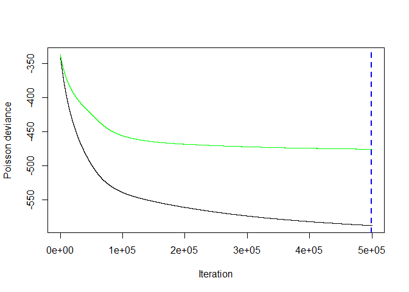

``` r
print(best.iter)
```

    ## [1] 357209

``` r
gbm_error = data.frame(train.error = gbmtest$train.error,
                       trees = seq(1,n.trees))
plot <- ggplot(gbm_error, aes(x = trees, y = train.error))+
  geom_line()
plot
```

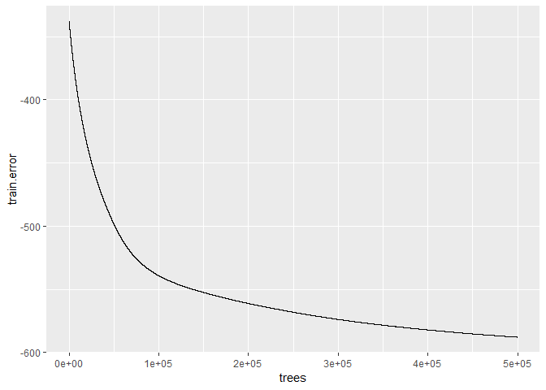

``` r
ggsave(filename = "deviance_RoadAnimalNightLcClimateCountry.jpg",
       plot = plot)
```

    ## Saving 7 x 5 in image

``` r
#Stop the clock
(proc.time()-ptm)/60
```

    ##      user    system   elapsed 
    ##  457.5105    0.3310 1003.3693

``` r
r2 = 1-sum((TrainCases$sumCases - predict(gbmtest, newdata=TrainCases, n.trees =best.iter,
                                       type="response"))^2)/
       sum((TrainCases$sumCases - mean(TrainCases$sumCases))^2)
  print(r2)
```

    ## [1] 0.6810104

``` r
r2.test = 1-sum((TestCases$sumCases - predict(gbmtest, newdata=TestCases, n.trees =best.iter,
                                       type="response"))^2)/
       sum((TestCases$sumCases - mean(TestCases$sumCases))^2)
  print(r2.test)
```

    ## [1] -0.2183928

### plot relative influence

### version with cutoff threshold of minimum interesting influence of 1%

``` r
#format relative influence for figure
load("gbmtestCases.Rdata")
gbmtest = gbmtestCases
x = summary(gbmtest)
```

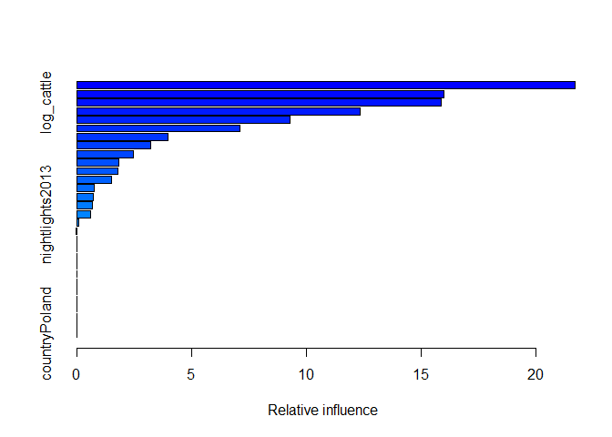

``` r
# 
x.df= data.frame(variable = x$var,
                 relative.influence = x$rel.inf)

x.df = subset(x.df, relative.influence >=1)

x.df$variable = factor(x.df$variable, levels = x.df$variable[order(x.df$relative.influence)])
x.dfCases = x.df
save(x.dfCases, file = "x.dfCases.Rdata")
ggplot(data = x.df, aes(x = variable, y =relative.influence))+
  ylab("relative influence (%)")+
  xlab("variable")+
  geom_bar(stat="identity")+
  coord_flip()
```

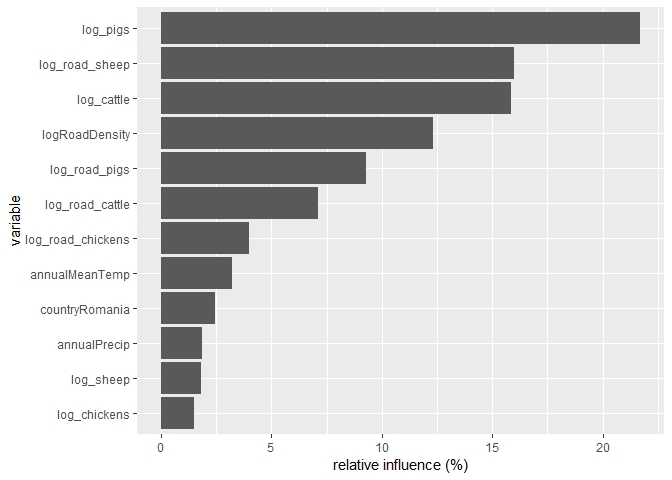

``` r
# 
ggsave("Figure.relative.influence.Cases.jpg")
```

    ## Saving 7 x 5 in image

### partial dependency plot

Get data needed for partial dependency plot -- multiple road types. Requires gbmtest and Train. Makes "out\_partial.Rdata"

``` r
load("gbmtestCases.Rdata")
load("TrainCases.Rdata")
Train = TrainCases
gbmtest = gbmtestCases
x.df = x.dfCases
load("x.dfCases.Rdata")
#https://stackoverflow.com/questions/26917689/how-to-use-facets-with-a-dual-y-axis-ggplot

# Data
out = NULL
varlist = x.df$variable
for (i in 1:length(varlist)){#begin for loop
  #print(i)
  i.var = which(gbmtest$var.names==varlist[i])
  plot.out = plot.gbm(gbmtest, i.var = as.character(varlist[i]), return.grid = TRUE)
  names(plot.out)[1]="variable.value"
  names(plot.out)[2]="value"
  plot.out$variable.name=varlist[i]
  plot.out$var = "marginal.effect"#for plotting
  out = rbind(out, plot.out)
}#end for loop

Train1=Train

i =1
i = 3
for (i in 1:length(varlist)){#begin for loop through variables
  print(i)
  i.var = which(names(Train1)==varlist[i])
  h = hist(Train1[,i.var], plot = TRUE)
  tmp = data.frame(variable.value = h$mids,
                   value=h$counts/sum(h$counts),#normalize
                   variable.name=varlist[i],
                   var = "frequency")
  out = rbind(out, tmp)
}#end for loop
```

    ## [1] 1

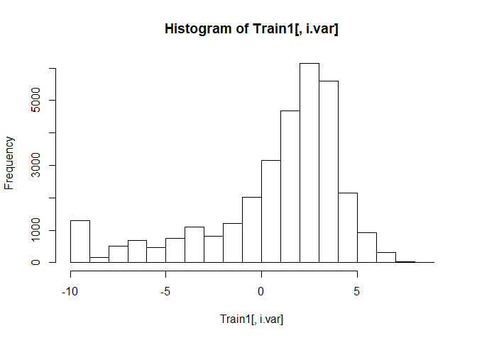

    ## [1] 2

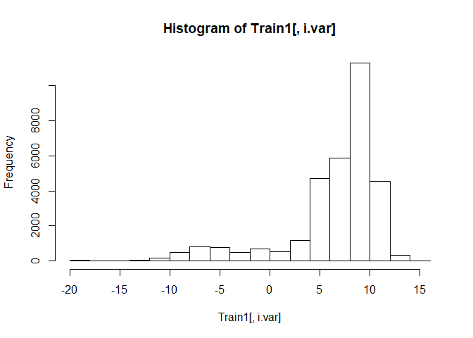

    ## [1] 3

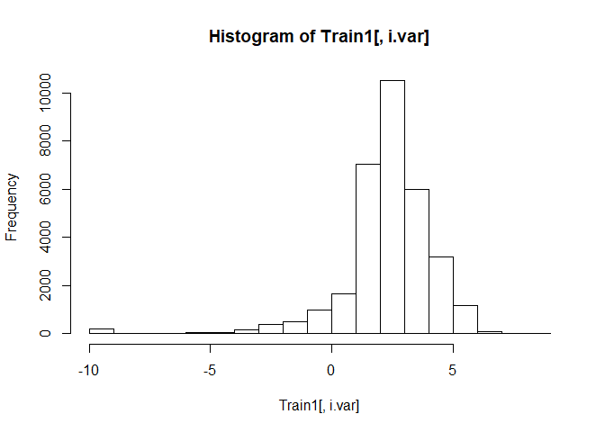

    ## [1] 4

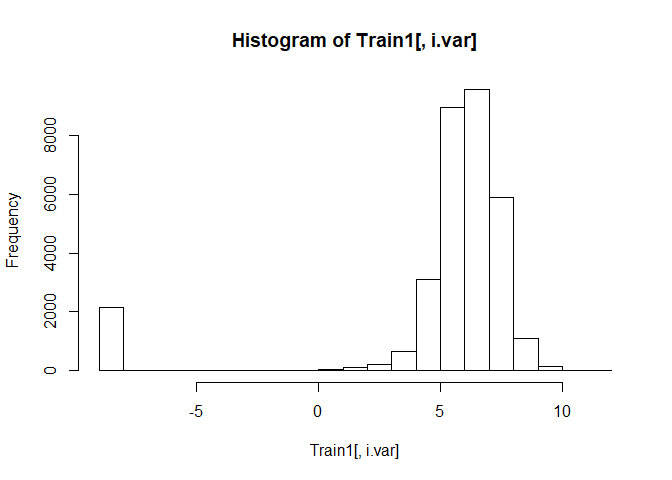

    ## [1] 5

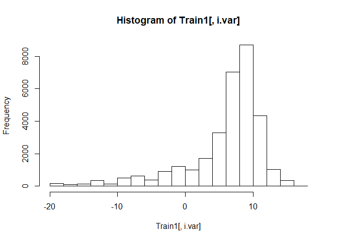

    ## [1] 6

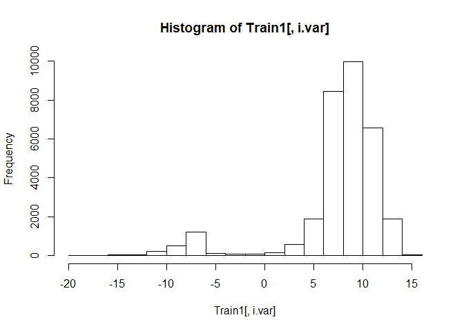

    ## [1] 7

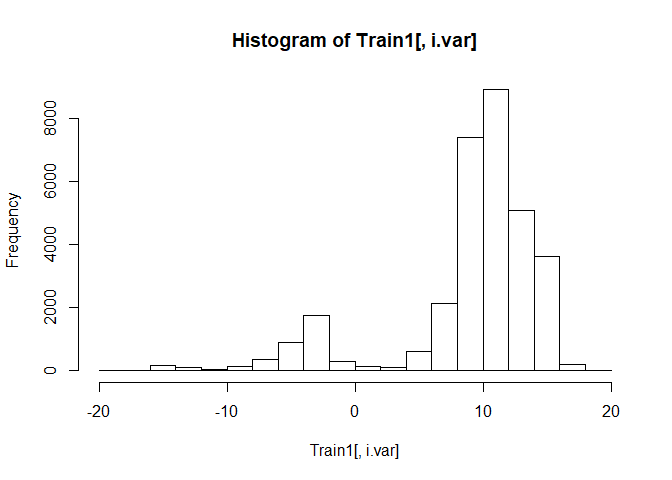

    ## [1] 8

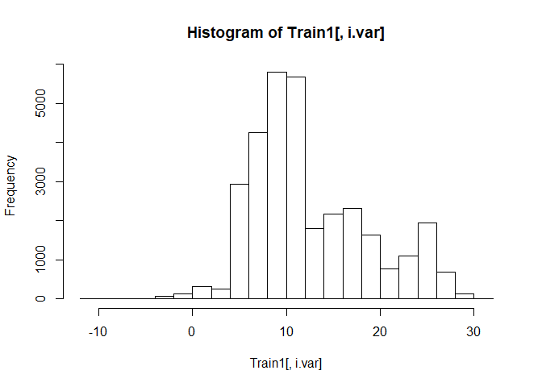

    ## [1] 9

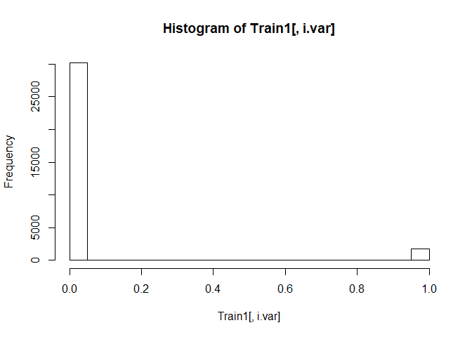

    ## [1] 10

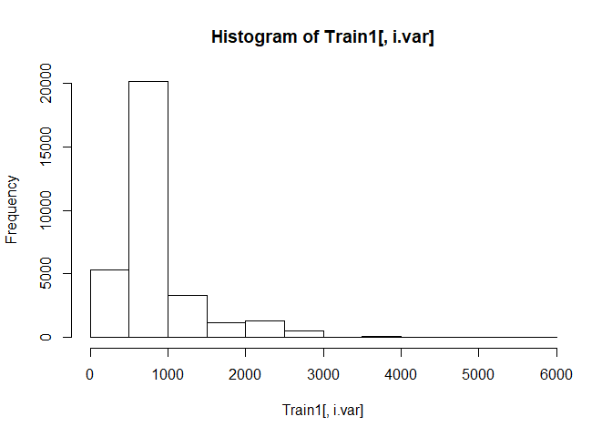

    ## [1] 11

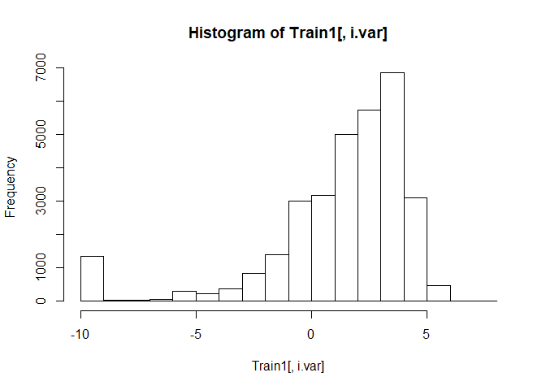

``` r
out_partialCases = out
save(out_partialCases, file = "out_partialCases.Rdata")
```

### Make partial dependency plots

``` r
library(latticeExtra)
#use latticeExtra to make two plots
load("x.dfCases.Rdata")
x.df = x.dfCases

load("out_partialCases.Rdata")
out_partial = out_partialCases
#https://stat.ethz.ch/R-manual/R-devel/library/grDevices/html/png.html
jpeg(filename = "Figure.partial.dependency.Cases.jpeg", width = 960, height = 960, quality = 95)
out = out_partial
x.df.sorted = sort(x.df$relative.influence, decreasing = FALSE, index.return= TRUE)
x.df$sort_index_decreasing = x.df.sorted$ix
x.df = subset(x.df, relative.influence>0)

var.plot = x.df$variable

out$variable.name=as.character(out$variable.name)

neworder <- x.df$variable#var.plot
library(plyr)  ## or dplyr (transform -> mutate)
```

    ## -------------------------------------------------------------------------

    ## You have loaded plyr after dplyr - this is likely to cause problems.
    ## If you need functions from both plyr and dplyr, please load plyr first, then dplyr:
    ## library(plyr); library(dplyr)

    ## -------------------------------------------------------------------------

    ## 
    ## Attaching package: 'plyr'

    ## The following object is masked from 'package:lubridate':
    ## 
    ##     here

    ## The following objects are masked from 'package:dplyr':
    ## 
    ##     arrange, count, desc, failwith, id, mutate, rename, summarise,
    ##     summarize

``` r
dat <- arrange(transform(out,
                         variable.name=factor(variable.name,levels=neworder)),variable.name)
out = dat

## a variant of Figure 5.13 from Sarkar (2008)
## http://lmdvr.r-forge.r-project.org/figures/figures.html?chapter=05;figure=05_1

x_between = 5#not sure what this does, seems to affect size of subplot
x_axis_cex = 1
names(out)
```

    ## [1] "variable.value" "value"          "variable.name"  "var"

``` r
head(out)
```

    ##   variable.value    value variable.name             var
    ## 1      -9.210340 2.874901      log_pigs marginal.effect
    ## 2      -9.035412 2.685828      log_pigs marginal.effect
    ## 3      -8.860484 2.685094      log_pigs marginal.effect
    ## 4      -8.685556 2.685019      log_pigs marginal.effect
    ## 5      -8.510628 2.685021      log_pigs marginal.effect
    ## 6      -8.335699 2.685021      log_pigs marginal.effect

``` r
out$value = round(out$value, digits = 1)
out_marg_eff = subset(out, var == "marginal.effect")
out_marg_eff$value=round(out_marg_eff$value, digits = 1)
marg_eff <- xyplot(value ~ variable.value | variable.name,
                   data = out_marg_eff, type = "l", 
                   #layout = c(4, 3),
                   scales = list(relation = "free", x=list(cex=x_axis_cex)),
                   between = list(x = x_between),
                   ylab = "Marginal effect",
                   xlab = "Predictor value",
                   auto.key = FALSE,#legend,
                   par.settings = list(strip.background=list(col="lightgrey")),
                   par.strip.text=list(cex=1),
                   as.table = TRUE
)

out_count = subset(out, var == "frequency")
count_plot <- xyplot(value ~ variable.value | variable.name, data = out_count, type = "h",
                     between = list(x = x_between),
                     scales = list(relation = "free", x=list(cex=x_axis_cex)),
                     ylab = "frequency",
                     xlab = "predictor value",
                     auto.key=FALSE,
                     as.table = TRUE
                     
)
#count_plot

# doubleYScale(marg_eff, count_plot, style1 = 0, style2 = 3, add.ylab2 = TRUE,
#    text = c("marginal effect", "frequency"), columns = 2)

plot <- doubleYScale(marg_eff, count_plot, style1 = 0, style2 = 3, add.ylab2 = TRUE, columns = 2)
plot
dev.off()
```

    ## png 
    ##   2
