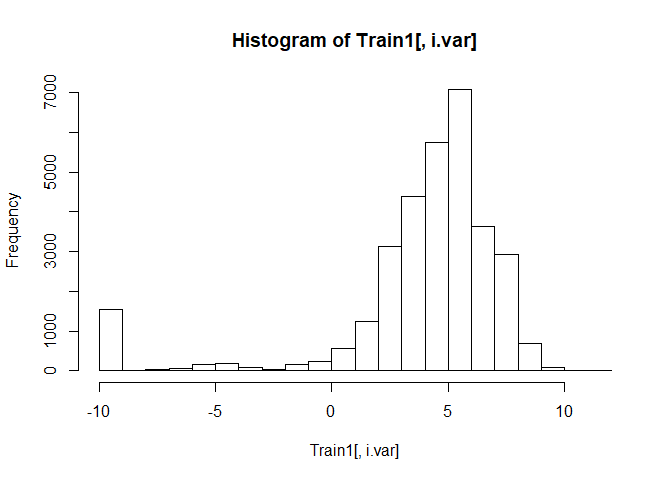

ungulates6\_outbreak\_size\_20190501
================

#### install packages

    ## Loading required package: sp

    ## 
    ## Attaching package: 'raster'

    ## The following object is masked from 'package:colorspace':
    ## 
    ##     RGB

    ## Loading required package: ggplot2

    ## Loading required package: lattice

    ## Loading required package: latticeExtra

    ## Loading required package: RColorBrewer

    ## 
    ## Attaching package: 'latticeExtra'

    ## The following object is masked from 'package:ggplot2':
    ## 
    ##     layer

    ## 
    ## Attaching package: 'dplyr'

    ## The following objects are masked from 'package:raster':
    ## 
    ##     intersect, select, union

    ## The following objects are masked from 'package:stats':
    ## 
    ##     filter, lag

    ## The following objects are masked from 'package:base':
    ## 
    ##     intersect, setdiff, setequal, union

    ## ### Welcome to rworldmap ###

    ## For a short introduction type :   vignette('rworldmap')

    ## 
    ## Attaching package: 'lubridate'

    ## The following object is masked from 'package:base':
    ## 
    ##     date

    ## 
    ## Attaching package: 'zoo'

    ## The following objects are masked from 'package:base':
    ## 
    ##     as.Date, as.Date.numeric

    ## Loaded gbm 2.1.4

    ## Loading required package: gplots

    ## 
    ## Attaching package: 'gplots'

    ## The following object is masked from 'package:stats':
    ## 
    ##     lowess

### load dfPredictors and dfAnimal. Reassign sumCases from dfAnimal to dfPredictors

``` r
load("dfPredictors.Rdata")
load("dfAnimal.Rdata")
dfPredictors$sumCases = dfAnimal$sumCases
dfPredictors = subset(dfPredictors, !is.na(sumCases))#remove NA cases
dfPredictors = subset(dfPredictors, case == 1)#only interested in outbreak locations
keep = setdiff(names(dfPredictors), "case")#remove case from columns 
dfPredictorsCases = dfPredictors[,keep]#keep only certain columns
save(dfPredictorsCases, file = "dfPredictorsCases.Rdata")
dim(dfPredictorsCases)
```

    ## [1] 39968   960

### remove columns with near-zero variation

``` r
load("dfPredictorsCases.Rdata")
df = dfPredictorsCases
# remove columns with near zero variance Global
nzv <- nearZeroVar(df[,c(1:959)],saveMetrics=TRUE) #package caret
nzv <- row.names(nzv[which(nzv$nzv==TRUE),])
dropnzv<-names(df[ , which(names(df) %in% nzv)])
write.csv(dropnzv, file = "dropnzv.csv")
df<-df[ , -which(names(df) %in% nzv)]
dfPredictorsCases = df
save(dfPredictorsCases, file = "dfPredictorsCases.Rdata")
```

### make test and train

``` r
load("dfPredictorsCases.Rdata")
df = dfPredictorsCases
DP =createDataPartition(y = df$sumCases, 
                        p = 0.8,
                        list = FALSE)
TrainCases = df[DP,]
TestCases = df[-DP,]

save(TrainCases, file = "TrainCases.Rdata")
save(TestCases, file = "TestCases.Rdata")
```

### make model

``` r
load("dfPredictorsCases.Rdata")
df = dfPredictorsCases

columns = dim(df)[2]
columns_min_1 = columns-1
modelCases<-as.formula(paste(colnames(df)[columns], "~",
                        paste(colnames(df)[c(1:columns_min_1)],collapse = "+"),
                        sep = ""))
print(modelCases)
```

    ## sumCases ~ log_chickens + log_sheep + log_goats + log_cattle + 
    ##     log_pigs + livestock_non_zero_fraction + nightlights2013 + 
    ##     label_shortclosedbroadleaveddeciduousforest + label_shortmosaiccropgrassshrubforest + 
    ##     label_shortmosaicgrassshrubforestcrop + label_shortPostfloodingorirrigatedcroplandsoraquatic + 
    ##     label_shortRainfedcroplands + annualMeanTemp + annualPrecip + 
    ##     countryBangladesh + countryFrance + countryGreece + countryPoland + 
    ##     countryRomania + ecoregionBalkanMixedForests + ecoregionCentralEuropeanMixedForests + 
    ##     ecoregionSarmaticMixedForests + ecoregionWesternEuropeanBroadleafForests + 
    ##     log_road_chickens + log_road_pigs + log_road_cattle + log_road_sheep + 
    ##     log_road_goats + mammalDiversity + logRoadDensity

``` r
save(modelCases, file = "modelCases.Rdata")
```

### run GBM -- predictors include roads, livestock, nightlights (2013), land cover, climate, country

``` r
rm(list = ls())
load("TrainCases.Rdata")
load("TestCases.Rdata")
# #https://stackoverflow.com/questions/19463137/error-in-evalexpr-envir-enclos-object-not-found
Train = TrainCases
attach(Train)
load("modelCases.Rdata")
model =modelCases
#Start the clock
ptm<-proc.time()

n.trees = 500000
shrinkage = 0.0001#final version should be 0.001
cv.folds = 10#final version should be 10
gbmtest<- gbm(model,
              data=Train,
              distribution="poisson",
              n.trees=n.trees,
              shrinkage=shrinkage,
              interaction.depth=4,
              bag.fraction=0.50,
              train.fraction=1,
              n.minobsinnode=5,
              cv.folds=cv.folds,
              keep.data=TRUE,
              verbose=TRUE,
              n.cores=NULL)
```

    ## Iter   TrainDeviance   ValidDeviance   StepSize   Improve
    ##      1     -338.2299             nan     0.0001    0.0029
    ##      2     -338.2389             nan     0.0001    0.0015
    ##      3     -338.2464             nan     0.0001    0.0029
    ##      4     -338.2549             nan     0.0001    0.0021
    ##      5     -338.2620             nan     0.0001    0.0010
    ##      6     -338.2699             nan     0.0001    0.0027
    ##      7     -338.2785             nan     0.0001    0.0023
    ##      8     -338.2851             nan     0.0001    0.0024
    ##      9     -338.2915             nan     0.0001    0.0025
    ##     10     -338.3024             nan     0.0001    0.0034
    ##     20     -338.3879             nan     0.0001    0.0017
    ##     40     -338.5537             nan     0.0001    0.0024
    ##     60     -338.7109             nan     0.0001    0.0038
    ##     80     -338.8805             nan     0.0001    0.0019
    ##    100     -339.0373             nan     0.0001    0.0029
    ##    120     -339.1939             nan     0.0001    0.0034
    ##    140     -339.3574             nan     0.0001    0.0011
    ##    160     -339.5243             nan     0.0001    0.0016
    ##    180     -339.6741             nan     0.0001    0.0007
    ##    200     -339.8258             nan     0.0001    0.0038
    ##    220     -339.9806             nan     0.0001    0.0011
    ##    240     -340.1434             nan     0.0001    0.0014
    ##    260     -340.2961             nan     0.0001    0.0038
    ##    280     -340.4480             nan     0.0001    0.0004
    ##    300     -340.6069             nan     0.0001    0.0037
    ##    320     -340.7639             nan     0.0001    0.0022
    ##    340     -340.9183             nan     0.0001    0.0020
    ##    360     -341.0734             nan     0.0001    0.0020
    ##    380     -341.2306             nan     0.0001    0.0015
    ##    400     -341.3938             nan     0.0001    0.0020
    ##    420     -341.5719             nan     0.0001    0.0027
    ##    440     -341.7294             nan     0.0001    0.0014
    ##    460     -341.8866             nan     0.0001    0.0018
    ##    480     -342.0360             nan     0.0001    0.0028
    ##    500     -342.1943             nan     0.0001    0.0016
    ##    520     -342.3508             nan     0.0001    0.0022
    ##    540     -342.5081             nan     0.0001    0.0033
    ##    560     -342.6652             nan     0.0001    0.0033
    ##    580     -342.8200             nan     0.0001    0.0019
    ##    600     -342.9745             nan     0.0001    0.0037
    ##    620     -343.1344             nan     0.0001    0.0034
    ##    640     -343.2781             nan     0.0001    0.0023
    ##    660     -343.4345             nan     0.0001    0.0015
    ##    680     -343.5784             nan     0.0001    0.0033
    ##    700     -343.7369             nan     0.0001    0.0015
    ##    720     -343.8967             nan     0.0001    0.0006
    ##    740     -344.0616             nan     0.0001    0.0001
    ##    760     -344.2114             nan     0.0001    0.0017
    ##    780     -344.3646             nan     0.0001    0.0036
    ##    800     -344.5071             nan     0.0001    0.0016
    ##    820     -344.6699             nan     0.0001    0.0023
    ##    840     -344.8246             nan     0.0001    0.0020
    ##    860     -344.9828             nan     0.0001    0.0015
    ##    880     -345.1333             nan     0.0001    0.0018
    ##    900     -345.2812             nan     0.0001    0.0009
    ##    920     -345.4357             nan     0.0001    0.0030
    ##    940     -345.5733             nan     0.0001    0.0031
    ##    960     -345.7141             nan     0.0001    0.0032
    ##    980     -345.8586             nan     0.0001    0.0024
    ##   1000     -346.0026             nan     0.0001    0.0008
    ##   1020     -346.1518             nan     0.0001    0.0020
    ##   1040     -346.2904             nan     0.0001    0.0019
    ##   1060     -346.4173             nan     0.0001    0.0022
    ##   1080     -346.5700             nan     0.0001    0.0019
    ##   1100     -346.7199             nan     0.0001    0.0018
    ##   1120     -346.8724             nan     0.0001    0.0008
    ##   1140     -347.0197             nan     0.0001    0.0002
    ##   1160     -347.1730             nan     0.0001    0.0027
    ##   1180     -347.3263             nan     0.0001    0.0021
    ##   1200     -347.4757             nan     0.0001    0.0014
    ##   1220     -347.6162             nan     0.0001    0.0011
    ##   1240     -347.7633             nan     0.0001    0.0041
    ##   1260     -347.9040             nan     0.0001    0.0034
    ##   1280     -348.0577             nan     0.0001    0.0019
    ##   1300     -348.1966             nan     0.0001    0.0014
    ##   1320     -348.3394             nan     0.0001    0.0005
    ##   1340     -348.4934             nan     0.0001    0.0027
    ##   1360     -348.6432             nan     0.0001    0.0015
    ##   1380     -348.7831             nan     0.0001    0.0022
    ##   1400     -348.9273             nan     0.0001    0.0005
    ##   1420     -349.0698             nan     0.0001    0.0018
    ##   1440     -349.2198             nan     0.0001    0.0019
    ##   1460     -349.3539             nan     0.0001    0.0007
    ##   1480     -349.4986             nan     0.0001    0.0017
    ##   1500     -349.6366             nan     0.0001    0.0032
    ##   1520     -349.7706             nan     0.0001    0.0032
    ##   1540     -349.9112             nan     0.0001    0.0033
    ##   1560     -350.0565             nan     0.0001    0.0027
    ##   1580     -350.1979             nan     0.0001    0.0021
    ##   1600     -350.3391             nan     0.0001    0.0008
    ##   1620     -350.4907             nan     0.0001    0.0023
    ##   1640     -350.6329             nan     0.0001    0.0017
    ##   1660     -350.7676             nan     0.0001    0.0026
    ##   1680     -350.9127             nan     0.0001    0.0017
    ##   1700     -351.0486             nan     0.0001    0.0026
    ##   1720     -351.1880             nan     0.0001    0.0012
    ##   1740     -351.3377             nan     0.0001    0.0018
    ##   1760     -351.4699             nan     0.0001    0.0021
    ##   1780     -351.6180             nan     0.0001    0.0023
    ##   1800     -351.7544             nan     0.0001    0.0021
    ##   1820     -351.9023             nan     0.0001    0.0038
    ##   1840     -352.0335             nan     0.0001    0.0018
    ##   1860     -352.1588             nan     0.0001    0.0024
    ##   1880     -352.2999             nan     0.0001    0.0021
    ##   1900     -352.4484             nan     0.0001    0.0013
    ##   1920     -352.5963             nan     0.0001    0.0017
    ##   1940     -352.7336             nan     0.0001    0.0017
    ##   1960     -352.8701             nan     0.0001    0.0030
    ##   1980     -353.0161             nan     0.0001    0.0021
    ##   2000     -353.1607             nan     0.0001    0.0020
    ##   2020     -353.3064             nan     0.0001    0.0015
    ##   2040     -353.4488             nan     0.0001    0.0030
    ##   2060     -353.5829             nan     0.0001    0.0018
    ##   2080     -353.7163             nan     0.0001    0.0024
    ##   2100     -353.8458             nan     0.0001    0.0007
    ##   2120     -353.9911             nan     0.0001    0.0016
    ##   2140     -354.1337             nan     0.0001    0.0014
    ##   2160     -354.2706             nan     0.0001    0.0023
    ##   2180     -354.4203             nan     0.0001    0.0011
    ##   2200     -354.5628             nan     0.0001    0.0020
    ##   2220     -354.7018             nan     0.0001    0.0045
    ##   2240     -354.8304             nan     0.0001    0.0029
    ##   2260     -354.9686             nan     0.0001    0.0011
    ##   2280     -355.1026             nan     0.0001    0.0006
    ##   2300     -355.2372             nan     0.0001    0.0023
    ##   2320     -355.3677             nan     0.0001    0.0017
    ##   2340     -355.5072             nan     0.0001    0.0011
    ##   2360     -355.6446             nan     0.0001    0.0019
    ##   2380     -355.7749             nan     0.0001    0.0027
    ##   2400     -355.9090             nan     0.0001    0.0029
    ##   2420     -356.0506             nan     0.0001    0.0024
    ##   2440     -356.1823             nan     0.0001    0.0018
    ##   2460     -356.3110             nan     0.0001    0.0025
    ##   2480     -356.4412             nan     0.0001    0.0025
    ##   2500     -356.5787             nan     0.0001    0.0012
    ##   2520     -356.7250             nan     0.0001    0.0040
    ##   2540     -356.8664             nan     0.0001    0.0016
    ##   2560     -356.9988             nan     0.0001    0.0012
    ##   2580     -357.1270             nan     0.0001    0.0015
    ##   2600     -357.2709             nan     0.0001    0.0045
    ##   2620     -357.4130             nan     0.0001    0.0021
    ##   2640     -357.5550             nan     0.0001    0.0024
    ##   2660     -357.6945             nan     0.0001    0.0015
    ##   2680     -357.8179             nan     0.0001    0.0023
    ##   2700     -357.9571             nan     0.0001    0.0024
    ##   2720     -358.1001             nan     0.0001    0.0017
    ##   2740     -358.2328             nan     0.0001    0.0024
    ##   2760     -358.3612             nan     0.0001    0.0004
    ##   2780     -358.5074             nan     0.0001    0.0011
    ##   2800     -358.6381             nan     0.0001    0.0031
    ##   2820     -358.7692             nan     0.0001    0.0005
    ##   2840     -358.8996             nan     0.0001    0.0020
    ##   2860     -359.0419             nan     0.0001    0.0004
    ##   2880     -359.1868             nan     0.0001    0.0032
    ##   2900     -359.3202             nan     0.0001    0.0015
    ##   2920     -359.4553             nan     0.0001    0.0019
    ##   2940     -359.5932             nan     0.0001    0.0026
    ##   2960     -359.7203             nan     0.0001    0.0020
    ##   2980     -359.8527             nan     0.0001    0.0028
    ##   3000     -359.9893             nan     0.0001    0.0020
    ##   3020     -360.1212             nan     0.0001    0.0043
    ##   3040     -360.2530             nan     0.0001    0.0019
    ##   3060     -360.3733             nan     0.0001    0.0009
    ##   3080     -360.5051             nan     0.0001    0.0004
    ##   3100     -360.6252             nan     0.0001    0.0008
    ##   3120     -360.7521             nan     0.0001    0.0025
    ##   3140     -360.9030             nan     0.0001    0.0004
    ##   3160     -361.0376             nan     0.0001    0.0010
    ##   3180     -361.1657             nan     0.0001    0.0028
    ##   3200     -361.2987             nan     0.0001    0.0020
    ##   3220     -361.4195             nan     0.0001    0.0030
    ##   3240     -361.5537             nan     0.0001    0.0012
    ##   3260     -361.6944             nan     0.0001    0.0023
    ##   3280     -361.8289             nan     0.0001    0.0029
    ##   3300     -361.9549             nan     0.0001    0.0023
    ##   3320     -362.0833             nan     0.0001    0.0026
    ##   3340     -362.2152             nan     0.0001    0.0015
    ##   3360     -362.3455             nan     0.0001    0.0022
    ##   3380     -362.4634             nan     0.0001    0.0014
    ##   3400     -362.5984             nan     0.0001    0.0016
    ##   3420     -362.7228             nan     0.0001    0.0016
    ##   3440     -362.8567             nan     0.0001    0.0015
    ##   3460     -362.9836             nan     0.0001    0.0020
    ##   3480     -363.1104             nan     0.0001    0.0016
    ##   3500     -363.2428             nan     0.0001    0.0020
    ##   3520     -363.3757             nan     0.0001    0.0015
    ##   3540     -363.4938             nan     0.0001    0.0025
    ##   3560     -363.6188             nan     0.0001    0.0030
    ##   3580     -363.7437             nan     0.0001    0.0011
    ##   3600     -363.8667             nan     0.0001    0.0015
    ##   3620     -363.9934             nan     0.0001    0.0021
    ##   3640     -364.1151             nan     0.0001    0.0015
    ##   3660     -364.2477             nan     0.0001    0.0004
    ##   3680     -364.3775             nan     0.0001    0.0014
    ##   3700     -364.5071             nan     0.0001    0.0021
    ##   3720     -364.6338             nan     0.0001    0.0016
    ##   3740     -364.7543             nan     0.0001    0.0019
    ##   3760     -364.8715             nan     0.0001    0.0020
    ##   3780     -365.0043             nan     0.0001    0.0008
    ##   3800     -365.1234             nan     0.0001    0.0012
    ##   3820     -365.2569             nan     0.0001    0.0013
    ##   3840     -365.3871             nan     0.0001    0.0026
    ##   3860     -365.5178             nan     0.0001    0.0016
    ##   3880     -365.6416             nan     0.0001    0.0006
    ##   3900     -365.7663             nan     0.0001    0.0014
    ##   3920     -365.8952             nan     0.0001    0.0011
    ##   3940     -366.0243             nan     0.0001    0.0016
    ##   3960     -366.1396             nan     0.0001    0.0023
    ##   3980     -366.2626             nan     0.0001    0.0023
    ##   4000     -366.3864             nan     0.0001    0.0013
    ##   4020     -366.5118             nan     0.0001    0.0027
    ##   4040     -366.6361             nan     0.0001    0.0016
    ##   4060     -366.7605             nan     0.0001    0.0034
    ##   4080     -366.8787             nan     0.0001    0.0012
    ##   4100     -366.9990             nan     0.0001    0.0013
    ##   4120     -367.1175             nan     0.0001    0.0016
    ##   4140     -367.2330             nan     0.0001    0.0009
    ##   4160     -367.3593             nan     0.0001    0.0030
    ##   4180     -367.4880             nan     0.0001    0.0015
    ##   4200     -367.6036             nan     0.0001    0.0014
    ##   4220     -367.7274             nan     0.0001    0.0012
    ##   4240     -367.8566             nan     0.0001    0.0014
    ##   4260     -367.9815             nan     0.0001   -0.0000
    ##   4280     -368.1060             nan     0.0001    0.0017
    ##   4300     -368.2333             nan     0.0001    0.0015
    ##   4320     -368.3591             nan     0.0001    0.0010
    ##   4340     -368.4762             nan     0.0001    0.0010
    ##   4360     -368.5892             nan     0.0001    0.0019
    ##   4380     -368.7215             nan     0.0001    0.0015
    ##   4400     -368.8514             nan     0.0001    0.0023
    ##   4420     -368.9616             nan     0.0001    0.0018
    ##   4440     -369.0986             nan     0.0001    0.0024
    ##   4460     -369.2244             nan     0.0001    0.0023
    ##   4480     -369.3500             nan     0.0001    0.0020
    ##   4500     -369.4780             nan     0.0001    0.0004
    ##   4520     -369.5909             nan     0.0001    0.0023
    ##   4540     -369.7019             nan     0.0001    0.0025
    ##   4560     -369.8301             nan     0.0001    0.0013
    ##   4580     -369.9460             nan     0.0001    0.0009
    ##   4600     -370.0719             nan     0.0001    0.0020
    ##   4620     -370.1851             nan     0.0001    0.0017
    ##   4640     -370.3034             nan     0.0001    0.0016
    ##   4660     -370.4133             nan     0.0001    0.0025
    ##   4680     -370.5342             nan     0.0001    0.0005
    ##   4700     -370.6459             nan     0.0001    0.0026
    ##   4720     -370.7577             nan     0.0001    0.0013
    ##   4740     -370.8810             nan     0.0001    0.0026
    ##   4760     -370.9988             nan     0.0001    0.0024
    ##   4780     -371.1161             nan     0.0001    0.0003
    ##   4800     -371.2404             nan     0.0001    0.0017
    ##   4820     -371.3629             nan     0.0001    0.0007
    ##   4840     -371.4703             nan     0.0001    0.0008
    ##   4860     -371.5931             nan     0.0001    0.0023
    ##   4880     -371.7116             nan     0.0001    0.0006
    ##   4900     -371.8302             nan     0.0001    0.0011
    ##   4920     -371.9574             nan     0.0001    0.0007
    ##   4940     -372.0683             nan     0.0001    0.0013
    ##   4960     -372.1951             nan     0.0001    0.0011
    ##   4980     -372.2980             nan     0.0001    0.0010
    ##   5000     -372.4153             nan     0.0001    0.0020
    ##   5020     -372.5361             nan     0.0001    0.0020
    ##   5040     -372.6609             nan     0.0001    0.0013
    ##   5060     -372.7782             nan     0.0001    0.0009
    ##   5080     -372.8985             nan     0.0001    0.0018
    ##   5100     -373.0140             nan     0.0001    0.0007
    ##   5120     -373.1280             nan     0.0001    0.0006
    ##   5140     -373.2489             nan     0.0001    0.0014
    ##   5160     -373.3757             nan     0.0001    0.0030
    ##   5180     -373.4885             nan     0.0001    0.0016
    ##   5200     -373.6056             nan     0.0001    0.0012
    ##   5220     -373.7271             nan     0.0001    0.0012
    ##   5240     -373.8556             nan     0.0001    0.0015
    ##   5260     -373.9704             nan     0.0001    0.0014
    ##   5280     -374.0823             nan     0.0001    0.0011
    ##   5300     -374.2038             nan     0.0001    0.0022
    ##   5320     -374.3169             nan     0.0001    0.0020
    ##   5340     -374.4336             nan     0.0001    0.0007
    ##   5360     -374.5559             nan     0.0001    0.0009
    ##   5380     -374.6798             nan     0.0001    0.0018
    ##   5400     -374.8086             nan     0.0001    0.0009
    ##   5420     -374.9298             nan     0.0001    0.0003
    ##   5440     -375.0487             nan     0.0001    0.0010
    ##   5460     -375.1602             nan     0.0001    0.0011
    ##   5480     -375.2760             nan     0.0001    0.0016
    ##   5500     -375.3997             nan     0.0001    0.0006
    ##   5520     -375.5236             nan     0.0001    0.0020
    ##   5540     -375.6437             nan     0.0001    0.0015
    ##   5560     -375.7633             nan     0.0001    0.0026
    ##   5580     -375.8765             nan     0.0001    0.0008
    ##   5600     -375.9961             nan     0.0001    0.0010
    ##   5620     -376.1147             nan     0.0001    0.0014
    ##   5640     -376.2253             nan     0.0001    0.0003
    ##   5660     -376.3457             nan     0.0001    0.0012
    ##   5680     -376.4584             nan     0.0001    0.0015
    ##   5700     -376.5645             nan     0.0001    0.0021
    ##   5720     -376.6820             nan     0.0001    0.0021
    ##   5740     -376.7981             nan     0.0001    0.0019
    ##   5760     -376.9048             nan     0.0001    0.0021
    ##   5780     -377.0246             nan     0.0001    0.0011
    ##   5800     -377.1351             nan     0.0001    0.0009
    ##   5820     -377.2430             nan     0.0001    0.0009
    ##   5840     -377.3550             nan     0.0001    0.0011
    ##   5860     -377.4657             nan     0.0001    0.0004
    ##   5880     -377.5761             nan     0.0001    0.0020
    ##   5900     -377.6882             nan     0.0001    0.0012
    ##   5920     -377.7975             nan     0.0001    0.0011
    ##   5940     -377.9172             nan     0.0001    0.0016
    ##   5960     -378.0306             nan     0.0001    0.0017
    ##   5980     -378.1383             nan     0.0001    0.0012
    ##   6000     -378.2436             nan     0.0001    0.0003
    ##   6020     -378.3607             nan     0.0001    0.0021
    ##   6040     -378.4774             nan     0.0001    0.0009
    ##   6060     -378.5850             nan     0.0001    0.0010
    ##   6080     -378.7039             nan     0.0001    0.0015
    ##   6100     -378.8111             nan     0.0001    0.0007
    ##   6120     -378.9187             nan     0.0001    0.0011
    ##   6140     -379.0315             nan     0.0001    0.0014
    ##   6160     -379.1504             nan     0.0001    0.0012
    ##   6180     -379.2694             nan     0.0001    0.0021
    ##   6200     -379.3946             nan     0.0001    0.0015
    ##   6220     -379.5092             nan     0.0001    0.0015
    ##   6240     -379.6183             nan     0.0001    0.0011
    ##   6260     -379.7287             nan     0.0001    0.0006
    ##   6280     -379.8304             nan     0.0001    0.0015
    ##   6300     -379.9272             nan     0.0001    0.0003
    ##   6320     -380.0288             nan     0.0001    0.0014
    ##   6340     -380.1380             nan     0.0001    0.0008
    ##   6360     -380.2484             nan     0.0001    0.0011
    ##   6380     -380.3491             nan     0.0001    0.0008
    ##   6400     -380.4571             nan     0.0001    0.0011
    ##   6420     -380.5581             nan     0.0001    0.0017
    ##   6440     -380.6603             nan     0.0001    0.0012
    ##   6460     -380.7720             nan     0.0001    0.0019
    ##   6480     -380.8686             nan     0.0001    0.0014
    ##   6500     -380.9828             nan     0.0001    0.0013
    ##   6520     -381.0864             nan     0.0001    0.0008
    ##   6540     -381.1948             nan     0.0001    0.0006
    ##   6560     -381.3022             nan     0.0001    0.0004
    ##   6580     -381.4046             nan     0.0001    0.0009
    ##   6600     -381.5077             nan     0.0001    0.0012
    ##   6620     -381.6238             nan     0.0001    0.0022
    ##   6640     -381.7188             nan     0.0001    0.0017
    ##   6660     -381.8284             nan     0.0001    0.0011
    ##   6680     -381.9335             nan     0.0001    0.0023
    ##   6700     -382.0490             nan     0.0001    0.0010
    ##   6720     -382.1502             nan     0.0001    0.0013
    ##   6740     -382.2449             nan     0.0001    0.0017
    ##   6760     -382.3543             nan     0.0001    0.0005
    ##   6780     -382.4608             nan     0.0001    0.0010
    ##   6800     -382.5733             nan     0.0001    0.0014
    ##   6820     -382.6877             nan     0.0001    0.0010
    ##   6840     -382.8062             nan     0.0001    0.0016
    ##   6860     -382.9117             nan     0.0001    0.0008
    ##   6880     -383.0116             nan     0.0001    0.0011
    ##   6900     -383.1208             nan     0.0001    0.0011
    ##   6920     -383.2357             nan     0.0001    0.0003
    ##   6940     -383.3430             nan     0.0001    0.0010
    ##   6960     -383.4521             nan     0.0001    0.0011
    ##   6980     -383.5550             nan     0.0001    0.0013
    ##   7000     -383.6574             nan     0.0001    0.0003
    ##   7020     -383.7585             nan     0.0001    0.0010
    ##   7040     -383.8520             nan     0.0001    0.0007
    ##   7060     -383.9486             nan     0.0001    0.0008
    ##   7080     -384.0630             nan     0.0001    0.0012
    ##   7100     -384.1684             nan     0.0001    0.0009
    ##   7120     -384.2710             nan     0.0001    0.0022
    ##   7140     -384.3716             nan     0.0001    0.0018
    ##   7160     -384.4644             nan     0.0001    0.0015
    ##   7180     -384.5747             nan     0.0001    0.0008
    ##   7200     -384.6765             nan     0.0001    0.0010
    ##   7220     -384.7809             nan     0.0001    0.0003
    ##   7240     -384.8907             nan     0.0001    0.0016
    ##   7260     -384.9842             nan     0.0001    0.0012
    ##   7280     -385.0877             nan     0.0001    0.0012
    ##   7300     -385.1997             nan     0.0001    0.0011
    ##   7320     -385.3048             nan     0.0001    0.0007
    ##   7340     -385.4171             nan     0.0001    0.0011
    ##   7360     -385.5144             nan     0.0001    0.0021
    ##   7380     -385.6181             nan     0.0001    0.0019
    ##   7400     -385.7265             nan     0.0001    0.0020
    ##   7420     -385.8271             nan     0.0001    0.0008
    ##   7440     -385.9246             nan     0.0001    0.0008
    ##   7460     -386.0292             nan     0.0001    0.0002
    ##   7480     -386.1278             nan     0.0001    0.0014
    ##   7500     -386.2260             nan     0.0001    0.0023
    ##   7520     -386.3277             nan     0.0001    0.0012
    ##   7540     -386.4311             nan     0.0001    0.0011
    ##   7560     -386.5395             nan     0.0001    0.0016
    ##   7580     -386.6323             nan     0.0001    0.0016
    ##   7600     -386.7402             nan     0.0001    0.0011
    ##   7620     -386.8438             nan     0.0001    0.0011
    ##   7640     -386.9490             nan     0.0001    0.0017
    ##   7660     -387.0528             nan     0.0001    0.0012
    ##   7680     -387.1623             nan     0.0001    0.0011
    ##   7700     -387.2586             nan     0.0001    0.0014
    ##   7720     -387.3658             nan     0.0001    0.0007
    ##   7740     -387.4728             nan     0.0001    0.0010
    ##   7760     -387.5739             nan     0.0001    0.0016
    ##   7780     -387.6780             nan     0.0001    0.0016
    ##   7800     -387.7790             nan     0.0001    0.0010
    ##   7820     -387.8816             nan     0.0001   -0.0000
    ##   7840     -387.9754             nan     0.0001    0.0009
    ##   7860     -388.0820             nan     0.0001    0.0010
    ##   7880     -388.1793             nan     0.0001    0.0018
    ##   7900     -388.2765             nan     0.0001    0.0008
    ##   7920     -388.3661             nan     0.0001    0.0016
    ##   7940     -388.4786             nan     0.0001    0.0002
    ##   7960     -388.5940             nan     0.0001    0.0007
    ##   7980     -388.7004             nan     0.0001    0.0021
    ##   8000     -388.8065             nan     0.0001    0.0019
    ##   8020     -388.9041             nan     0.0001    0.0016
    ##   8040     -388.9994             nan     0.0001    0.0015
    ##   8060     -389.1025             nan     0.0001    0.0015
    ##   8080     -389.2034             nan     0.0001    0.0009
    ##   8100     -389.3091             nan     0.0001    0.0006
    ##   8120     -389.4032             nan     0.0001    0.0002
    ##   8140     -389.4985             nan     0.0001    0.0016
    ##   8160     -389.5982             nan     0.0001    0.0008
    ##   8180     -389.6894             nan     0.0001    0.0003
    ##   8200     -389.7849             nan     0.0001    0.0011
    ##   8220     -389.8864             nan     0.0001    0.0006
    ##   8240     -389.9767             nan     0.0001    0.0014
    ##   8260     -390.0739             nan     0.0001    0.0008
    ##   8280     -390.1711             nan     0.0001    0.0016
    ##   8300     -390.2757             nan     0.0001    0.0009
    ##   8320     -390.3754             nan     0.0001    0.0013
    ##   8340     -390.4656             nan     0.0001    0.0016
    ##   8360     -390.5613             nan     0.0001    0.0010
    ##   8380     -390.6537             nan     0.0001    0.0011
    ##   8400     -390.7541             nan     0.0001    0.0009
    ##   8420     -390.8549             nan     0.0001    0.0019
    ##   8440     -390.9531             nan     0.0001    0.0006
    ##   8460     -391.0453             nan     0.0001    0.0009
    ##   8480     -391.1433             nan     0.0001    0.0003
    ##   8500     -391.2441             nan     0.0001    0.0007
    ##   8520     -391.3488             nan     0.0001    0.0019
    ##   8540     -391.4490             nan     0.0001    0.0007
    ##   8560     -391.5502             nan     0.0001    0.0017
    ##   8580     -391.6392             nan     0.0001    0.0011
    ##   8600     -391.7390             nan     0.0001    0.0039
    ##   8620     -391.8353             nan     0.0001    0.0015
    ##   8640     -391.9384             nan     0.0001    0.0007
    ##   8660     -392.0269             nan     0.0001   -0.0001
    ##   8680     -392.1332             nan     0.0001    0.0009
    ##   8700     -392.2487             nan     0.0001    0.0006
    ##   8720     -392.3459             nan     0.0001    0.0009
    ##   8740     -392.4422             nan     0.0001    0.0013
    ##   8760     -392.5350             nan     0.0001    0.0023
    ##   8780     -392.6337             nan     0.0001    0.0017
    ##   8800     -392.7319             nan     0.0001    0.0017
    ##   8820     -392.8215             nan     0.0001    0.0012
    ##   8840     -392.9188             nan     0.0001    0.0027
    ##   8860     -393.0185             nan     0.0001    0.0017
    ##   8880     -393.1068             nan     0.0001    0.0004
    ##   8900     -393.2030             nan     0.0001    0.0023
    ##   8920     -393.3020             nan     0.0001    0.0005
    ##   8940     -393.4039             nan     0.0001    0.0010
    ##   8960     -393.5036             nan     0.0001    0.0012
    ##   8980     -393.5941             nan     0.0001    0.0007
    ##   9000     -393.6887             nan     0.0001    0.0012
    ##   9020     -393.7829             nan     0.0001    0.0006
    ##   9040     -393.8737             nan     0.0001    0.0017
    ##   9060     -393.9638             nan     0.0001    0.0010
    ##   9080     -394.0512             nan     0.0001    0.0006
    ##   9100     -394.1469             nan     0.0001    0.0026
    ##   9120     -394.2469             nan     0.0001    0.0009
    ##   9140     -394.3344             nan     0.0001    0.0005
    ##   9160     -394.4245             nan     0.0001    0.0010
    ##   9180     -394.5183             nan     0.0001    0.0012
    ##   9200     -394.6046             nan     0.0001   -0.0001
    ##   9220     -394.6981             nan     0.0001    0.0015
    ##   9240     -394.7848             nan     0.0001    0.0008
    ##   9260     -394.8778             nan     0.0001    0.0011
    ##   9280     -394.9766             nan     0.0001    0.0014
    ##   9300     -395.0707             nan     0.0001    0.0016
    ##   9320     -395.1690             nan     0.0001    0.0011
    ##   9340     -395.2621             nan     0.0001    0.0008
    ##   9360     -395.3539             nan     0.0001    0.0008
    ##   9380     -395.4444             nan     0.0001    0.0012
    ##   9400     -395.5359             nan     0.0001    0.0020
    ##   9420     -395.6308             nan     0.0001    0.0002
    ##   9440     -395.7161             nan     0.0001    0.0003
    ##   9460     -395.8094             nan     0.0001    0.0017
    ##   9480     -395.8961             nan     0.0001    0.0002
    ##   9500     -395.9905             nan     0.0001    0.0010
    ##   9520     -396.0893             nan     0.0001    0.0010
    ##   9540     -396.1844             nan     0.0001    0.0013
    ##   9560     -396.2820             nan     0.0001    0.0012
    ##   9580     -396.3734             nan     0.0001    0.0009
    ##   9600     -396.4600             nan     0.0001    0.0009
    ##   9620     -396.5553             nan     0.0001    0.0020
    ##   9640     -396.6494             nan     0.0001    0.0023
    ##   9660     -396.7538             nan     0.0001    0.0001
    ##   9680     -396.8405             nan     0.0001    0.0017
    ##   9700     -396.9294             nan     0.0001    0.0015
    ##   9720     -397.0162             nan     0.0001   -0.0001
    ##   9740     -397.1067             nan     0.0001    0.0005
    ##   9760     -397.1929             nan     0.0001    0.0011
    ##   9780     -397.2730             nan     0.0001    0.0010
    ##   9800     -397.3618             nan     0.0001    0.0010
    ##   9820     -397.4536             nan     0.0001    0.0016
    ##   9840     -397.5478             nan     0.0001    0.0010
    ##   9860     -397.6435             nan     0.0001    0.0004
    ##   9880     -397.7338             nan     0.0001    0.0008
    ##   9900     -397.8155             nan     0.0001    0.0007
    ##   9920     -397.9045             nan     0.0001    0.0012
    ##   9940     -398.0008             nan     0.0001    0.0007
    ##   9960     -398.0896             nan     0.0001    0.0002
    ##   9980     -398.1734             nan     0.0001    0.0012
    ##  10000     -398.2700             nan     0.0001    0.0009
    ##  10020     -398.3670             nan     0.0001    0.0017
    ##  10040     -398.4591             nan     0.0001    0.0009
    ##  10060     -398.5503             nan     0.0001    0.0005
    ##  10080     -398.6343             nan     0.0001    0.0015
    ##  10100     -398.7223             nan     0.0001    0.0008
    ##  10120     -398.8114             nan     0.0001   -0.0001
    ##  10140     -398.9007             nan     0.0001    0.0002
    ##  10160     -398.9983             nan     0.0001    0.0010
    ##  10180     -399.0902             nan     0.0001    0.0008
    ##  10200     -399.1831             nan     0.0001    0.0011
    ##  10220     -399.2826             nan     0.0001    0.0017
    ##  10240     -399.3685             nan     0.0001    0.0020
    ##  10260     -399.4646             nan     0.0001    0.0012
    ##  10280     -399.5515             nan     0.0001    0.0003
    ##  10300     -399.6460             nan     0.0001    0.0005
    ##  10320     -399.7334             nan     0.0001    0.0015
    ##  10340     -399.8231             nan     0.0001    0.0003
    ##  10360     -399.9109             nan     0.0001    0.0006
    ##  10380     -399.9985             nan     0.0001    0.0010
    ##  10400     -400.0866             nan     0.0001    0.0001
    ##  10420     -400.1760             nan     0.0001    0.0008
    ##  10440     -400.2720             nan     0.0001    0.0004
    ##  10460     -400.3616             nan     0.0001    0.0010
    ##  10480     -400.4508             nan     0.0001    0.0013
    ##  10500     -400.5406             nan     0.0001    0.0006
    ##  10520     -400.6270             nan     0.0001    0.0021
    ##  10540     -400.7241             nan     0.0001    0.0002
    ##  10560     -400.8219             nan     0.0001    0.0013
    ##  10580     -400.9069             nan     0.0001    0.0009
    ##  10600     -400.9947             nan     0.0001    0.0012
    ##  10620     -401.0767             nan     0.0001    0.0002
    ##  10640     -401.1587             nan     0.0001    0.0006
    ##  10660     -401.2425             nan     0.0001    0.0006
    ##  10680     -401.3325             nan     0.0001    0.0006
    ##  10700     -401.4118             nan     0.0001    0.0006
    ##  10720     -401.4980             nan     0.0001    0.0011
    ##  10740     -401.5702             nan     0.0001    0.0002
    ##  10760     -401.6709             nan     0.0001    0.0010
    ##  10780     -401.7589             nan     0.0001    0.0003
    ##  10800     -401.8419             nan     0.0001    0.0011
    ##  10820     -401.9331             nan     0.0001    0.0008
    ##  10840     -402.0160             nan     0.0001    0.0010
    ##  10860     -402.1017             nan     0.0001    0.0006
    ##  10880     -402.2062             nan     0.0001    0.0005
    ##  10900     -402.2919             nan     0.0001    0.0007
    ##  10920     -402.3748             nan     0.0001    0.0002
    ##  10940     -402.4621             nan     0.0001    0.0004
    ##  10960     -402.5584             nan     0.0001    0.0006
    ##  10980     -402.6442             nan     0.0001    0.0009
    ##  11000     -402.7280             nan     0.0001    0.0000
    ##  11020     -402.8175             nan     0.0001    0.0009
    ##  11040     -402.9217             nan     0.0001    0.0012
    ##  11060     -403.0035             nan     0.0001    0.0007
    ##  11080     -403.0975             nan     0.0001    0.0011
    ##  11100     -403.1875             nan     0.0001    0.0002
    ##  11120     -403.2822             nan     0.0001    0.0006
    ##  11140     -403.3689             nan     0.0001    0.0009
    ##  11160     -403.4613             nan     0.0001    0.0012
    ##  11180     -403.5361             nan     0.0001    0.0014
    ##  11200     -403.6175             nan     0.0001    0.0007
    ##  11220     -403.7013             nan     0.0001    0.0013
    ##  11240     -403.7886             nan     0.0001    0.0011
    ##  11260     -403.8713             nan     0.0001    0.0003
    ##  11280     -403.9618             nan     0.0001    0.0011
    ##  11300     -404.0572             nan     0.0001    0.0012
    ##  11320     -404.1421             nan     0.0001    0.0001
    ##  11340     -404.2249             nan     0.0001    0.0010
    ##  11360     -404.3049             nan     0.0001    0.0006
    ##  11380     -404.3879             nan     0.0001    0.0009
    ##  11400     -404.4794             nan     0.0001    0.0014
    ##  11420     -404.5567             nan     0.0001    0.0004
    ##  11440     -404.6408             nan     0.0001    0.0007
    ##  11460     -404.7289             nan     0.0001    0.0016
    ##  11480     -404.8083             nan     0.0001    0.0003
    ##  11500     -404.8875             nan     0.0001    0.0003
    ##  11520     -404.9688             nan     0.0001    0.0015
    ##  11540     -405.0590             nan     0.0001    0.0002
    ##  11560     -405.1401             nan     0.0001    0.0005
    ##  11580     -405.2312             nan     0.0001    0.0004
    ##  11600     -405.3206             nan     0.0001    0.0008
    ##  11620     -405.4106             nan     0.0001    0.0005
    ##  11640     -405.4969             nan     0.0001    0.0015
    ##  11660     -405.5849             nan     0.0001    0.0006
    ##  11680     -405.6595             nan     0.0001    0.0007
    ##  11700     -405.7433             nan     0.0001    0.0014
    ##  11720     -405.8319             nan     0.0001    0.0014
    ##  11740     -405.9152             nan     0.0001    0.0004
    ##  11760     -406.0044             nan     0.0001    0.0012
    ##  11780     -406.0893             nan     0.0001    0.0010
    ##  11800     -406.1707             nan     0.0001    0.0000
    ##  11820     -406.2438             nan     0.0001    0.0004
    ##  11840     -406.3241             nan     0.0001    0.0013
    ##  11860     -406.4054             nan     0.0001    0.0010
    ##  11880     -406.4950             nan     0.0001    0.0002
    ##  11900     -406.5815             nan     0.0001    0.0006
    ##  11920     -406.6580             nan     0.0001    0.0015
    ##  11940     -406.7395             nan     0.0001    0.0004
    ##  11960     -406.8222             nan     0.0001    0.0010
    ##  11980     -406.8996             nan     0.0001    0.0015
    ##  12000     -406.9720             nan     0.0001    0.0007
    ##  12020     -407.0566             nan     0.0001    0.0010
    ##  12040     -407.1396             nan     0.0001   -0.0000
    ##  12060     -407.2221             nan     0.0001    0.0002
    ##  12080     -407.3060             nan     0.0001    0.0004
    ##  12100     -407.3862             nan     0.0001    0.0002
    ##  12120     -407.4757             nan     0.0001    0.0003
    ##  12140     -407.5664             nan     0.0001    0.0011
    ##  12160     -407.6502             nan     0.0001    0.0007
    ##  12180     -407.7241             nan     0.0001    0.0009
    ##  12200     -407.8134             nan     0.0001    0.0010
    ##  12220     -407.8905             nan     0.0001    0.0003
    ##  12240     -407.9678             nan     0.0001    0.0004
    ##  12260     -408.0502             nan     0.0001    0.0006
    ##  12280     -408.1433             nan     0.0001    0.0025
    ##  12300     -408.2170             nan     0.0001    0.0006
    ##  12320     -408.2989             nan     0.0001    0.0009
    ##  12340     -408.3809             nan     0.0001    0.0015
    ##  12360     -408.4564             nan     0.0001    0.0001
    ##  12380     -408.5515             nan     0.0001    0.0013
    ##  12400     -408.6216             nan     0.0001    0.0008
    ##  12420     -408.6983             nan     0.0001    0.0003
    ##  12440     -408.7766             nan     0.0001    0.0013
    ##  12460     -408.8622             nan     0.0001    0.0013
    ##  12480     -408.9435             nan     0.0001    0.0001
    ##  12500     -409.0362             nan     0.0001    0.0010
    ##  12520     -409.1257             nan     0.0001    0.0005
    ##  12540     -409.2092             nan     0.0001    0.0002
    ##  12560     -409.3052             nan     0.0001    0.0003
    ##  12580     -409.3899             nan     0.0001    0.0013
    ##  12600     -409.4812             nan     0.0001    0.0013
    ##  12620     -409.5575             nan     0.0001    0.0005
    ##  12640     -409.6297             nan     0.0001    0.0015
    ##  12660     -409.7069             nan     0.0001    0.0004
    ##  12680     -409.7916             nan     0.0001    0.0000
    ##  12700     -409.8800             nan     0.0001    0.0007
    ##  12720     -409.9488             nan     0.0001    0.0006
    ##  12740     -410.0234             nan     0.0001    0.0004
    ##  12760     -410.1000             nan     0.0001    0.0006
    ##  12780     -410.1753             nan     0.0001    0.0009
    ##  12800     -410.2596             nan     0.0001    0.0010
    ##  12820     -410.3423             nan     0.0001    0.0012
    ##  12840     -410.4233             nan     0.0001    0.0004
    ##  12860     -410.5046             nan     0.0001    0.0007
    ##  12880     -410.5868             nan     0.0001    0.0010
    ##  12900     -410.6622             nan     0.0001    0.0006
    ##  12920     -410.7401             nan     0.0001    0.0014
    ##  12940     -410.8108             nan     0.0001    0.0008
    ##  12960     -410.8987             nan     0.0001    0.0005
    ##  12980     -410.9735             nan     0.0001    0.0006
    ##  13000     -411.0486             nan     0.0001    0.0001
    ##  13020     -411.1262             nan     0.0001    0.0010
    ##  13040     -411.1998             nan     0.0001    0.0012
    ##  13060     -411.2776             nan     0.0001    0.0006
    ##  13080     -411.3559             nan     0.0001    0.0005
    ##  13100     -411.4313             nan     0.0001    0.0013
    ##  13120     -411.5122             nan     0.0001    0.0005
    ##  13140     -411.6100             nan     0.0001    0.0010
    ##  13160     -411.6922             nan     0.0001    0.0005
    ##  13180     -411.7708             nan     0.0001    0.0003
    ##  13200     -411.8553             nan     0.0001    0.0011
    ##  13220     -411.9328             nan     0.0001    0.0010
    ##  13240     -412.0037             nan     0.0001    0.0010
    ##  13260     -412.0779             nan     0.0001    0.0007
    ##  13280     -412.1602             nan     0.0001    0.0005
    ##  13300     -412.2284             nan     0.0001   -0.0000
    ##  13320     -412.3095             nan     0.0001    0.0003
    ##  13340     -412.3917             nan     0.0001    0.0007
    ##  13360     -412.4698             nan     0.0001    0.0020
    ##  13380     -412.5498             nan     0.0001    0.0010
    ##  13400     -412.6171             nan     0.0001    0.0010
    ##  13420     -412.6855             nan     0.0001    0.0006
    ##  13440     -412.7689             nan     0.0001    0.0006
    ##  13460     -412.8583             nan     0.0001    0.0009
    ##  13480     -412.9415             nan     0.0001    0.0002
    ##  13500     -413.0207             nan     0.0001    0.0000
    ##  13520     -413.0930             nan     0.0001    0.0009
    ##  13540     -413.1782             nan     0.0001    0.0010
    ##  13560     -413.2533             nan     0.0001    0.0006
    ##  13580     -413.3245             nan     0.0001    0.0002
    ##  13600     -413.4003             nan     0.0001    0.0004
    ##  13620     -413.4851             nan     0.0001    0.0004
    ##  13640     -413.5645             nan     0.0001    0.0004
    ##  13660     -413.6431             nan     0.0001    0.0008
    ##  13680     -413.7280             nan     0.0001    0.0007
    ##  13700     -413.8090             nan     0.0001    0.0001
    ##  13720     -413.8909             nan     0.0001    0.0017
    ##  13740     -413.9634             nan     0.0001    0.0008
    ##  13760     -414.0367             nan     0.0001    0.0003
    ##  13780     -414.1111             nan     0.0001    0.0003
    ##  13800     -414.1833             nan     0.0001    0.0016
    ##  13820     -414.2585             nan     0.0001    0.0001
    ##  13840     -414.3395             nan     0.0001    0.0004
    ##  13860     -414.4187             nan     0.0001    0.0002
    ##  13880     -414.4995             nan     0.0001    0.0010
    ##  13900     -414.5679             nan     0.0001    0.0003
    ##  13920     -414.6393             nan     0.0001    0.0003
    ##  13940     -414.7284             nan     0.0001    0.0002
    ##  13960     -414.7948             nan     0.0001    0.0010
    ##  13980     -414.8715             nan     0.0001    0.0010
    ##  14000     -414.9476             nan     0.0001    0.0025
    ##  14020     -415.0349             nan     0.0001    0.0012
    ##  14040     -415.1111             nan     0.0001    0.0003
    ##  14060     -415.1879             nan     0.0001    0.0003
    ##  14080     -415.2629             nan     0.0001    0.0010
    ##  14100     -415.3374             nan     0.0001   -0.0001
    ##  14120     -415.4158             nan     0.0001    0.0010
    ##  14140     -415.4829             nan     0.0001    0.0000
    ##  14160     -415.5569             nan     0.0001    0.0008
    ##  14180     -415.6317             nan     0.0001    0.0003
    ##  14200     -415.7167             nan     0.0001    0.0011
    ##  14220     -415.7972             nan     0.0001    0.0007
    ##  14240     -415.8751             nan     0.0001    0.0005
    ##  14260     -415.9385             nan     0.0001    0.0008
    ##  14280     -416.0076             nan     0.0001    0.0010
    ##  14300     -416.0762             nan     0.0001    0.0003
    ##  14320     -416.1537             nan     0.0001    0.0001
    ##  14340     -416.2449             nan     0.0001   -0.0001
    ##  14360     -416.3301             nan     0.0001    0.0011
    ##  14380     -416.4035             nan     0.0001    0.0005
    ##  14400     -416.4722             nan     0.0001    0.0012
    ##  14420     -416.5432             nan     0.0001    0.0015
    ##  14440     -416.6188             nan     0.0001    0.0010
    ##  14460     -416.7006             nan     0.0001    0.0007
    ##  14480     -416.7786             nan     0.0001    0.0005
    ##  14500     -416.8486             nan     0.0001    0.0004
    ##  14520     -416.9275             nan     0.0001   -0.0000
    ##  14540     -417.0023             nan     0.0001    0.0003
    ##  14560     -417.0765             nan     0.0001    0.0009
    ##  14580     -417.1569             nan     0.0001    0.0003
    ##  14600     -417.2419             nan     0.0001    0.0004
    ##  14620     -417.3182             nan     0.0001    0.0009
    ##  14640     -417.3919             nan     0.0001    0.0002
    ##  14660     -417.4736             nan     0.0001    0.0011
    ##  14680     -417.5413             nan     0.0001    0.0009
    ##  14700     -417.6282             nan     0.0001    0.0010
    ##  14720     -417.6975             nan     0.0001    0.0005
    ##  14740     -417.7736             nan     0.0001    0.0015
    ##  14760     -417.8390             nan     0.0001    0.0009
    ##  14780     -417.9117             nan     0.0001    0.0002
    ##  14800     -417.9911             nan     0.0001    0.0003
    ##  14820     -418.0579             nan     0.0001    0.0011
    ##  14840     -418.1303             nan     0.0001    0.0002
    ##  14860     -418.2055             nan     0.0001    0.0007
    ##  14880     -418.2770             nan     0.0001    0.0001
    ##  14900     -418.3519             nan     0.0001   -0.0000
    ##  14920     -418.4348             nan     0.0001    0.0004
    ##  14940     -418.5109             nan     0.0001    0.0008
    ##  14960     -418.5915             nan     0.0001    0.0009
    ##  14980     -418.6670             nan     0.0001    0.0010
    ##  15000     -418.7483             nan     0.0001    0.0006
    ##  15020     -418.8256             nan     0.0001    0.0005
    ##  15040     -418.8939             nan     0.0001    0.0015
    ##  15060     -418.9639             nan     0.0001    0.0004
    ##  15080     -419.0376             nan     0.0001    0.0021
    ##  15100     -419.1205             nan     0.0001    0.0012
    ##  15120     -419.2006             nan     0.0001    0.0004
    ##  15140     -419.2758             nan     0.0001    0.0008
    ##  15160     -419.3477             nan     0.0001    0.0004
    ##  15180     -419.4151             nan     0.0001    0.0006
    ##  15200     -419.4866             nan     0.0001    0.0002
    ##  15220     -419.5557             nan     0.0001    0.0003
    ##  15240     -419.6414             nan     0.0001    0.0004
    ##  15260     -419.7170             nan     0.0001    0.0004
    ##  15280     -419.7966             nan     0.0001    0.0008
    ##  15300     -419.8727             nan     0.0001    0.0006
    ##  15320     -419.9434             nan     0.0001    0.0000
    ##  15340     -420.0233             nan     0.0001    0.0008
    ##  15360     -420.0981             nan     0.0001    0.0004
    ##  15380     -420.1695             nan     0.0001    0.0006
    ##  15400     -420.2458             nan     0.0001    0.0006
    ##  15420     -420.3183             nan     0.0001    0.0004
    ##  15440     -420.3835             nan     0.0001    0.0001
    ##  15460     -420.4519             nan     0.0001    0.0004
    ##  15480     -420.5208             nan     0.0001    0.0015
    ##  15500     -420.5906             nan     0.0001    0.0006
    ##  15520     -420.6636             nan     0.0001    0.0013
    ##  15540     -420.7303             nan     0.0001   -0.0001
    ##  15560     -420.7964             nan     0.0001    0.0005
    ##  15580     -420.8649             nan     0.0001    0.0006
    ##  15600     -420.9396             nan     0.0001    0.0007
    ##  15620     -421.0074             nan     0.0001    0.0000
    ##  15640     -421.0755             nan     0.0001    0.0008
    ##  15660     -421.1411             nan     0.0001    0.0003
    ##  15680     -421.2033             nan     0.0001    0.0003
    ##  15700     -421.2669             nan     0.0001    0.0010
    ##  15720     -421.3439             nan     0.0001    0.0009
    ##  15740     -421.4179             nan     0.0001    0.0001
    ##  15760     -421.4762             nan     0.0001    0.0001
    ##  15780     -421.5435             nan     0.0001    0.0001
    ##  15800     -421.6166             nan     0.0001    0.0003
    ##  15820     -421.6820             nan     0.0001    0.0008
    ##  15840     -421.7629             nan     0.0001    0.0025
    ##  15860     -421.8382             nan     0.0001    0.0002
    ##  15880     -421.9113             nan     0.0001    0.0006
    ##  15900     -421.9767             nan     0.0001    0.0015
    ##  15920     -422.0531             nan     0.0001    0.0002
    ##  15940     -422.1286             nan     0.0001    0.0004
    ##  15960     -422.2007             nan     0.0001    0.0001
    ##  15980     -422.2778             nan     0.0001    0.0001
    ##  16000     -422.3481             nan     0.0001    0.0006
    ##  16020     -422.4255             nan     0.0001    0.0003
    ##  16040     -422.4908             nan     0.0001    0.0008
    ##  16060     -422.5719             nan     0.0001    0.0013
    ##  16080     -422.6406             nan     0.0001    0.0005
    ##  16100     -422.7050             nan     0.0001    0.0010
    ##  16120     -422.7812             nan     0.0001    0.0002
    ##  16140     -422.8482             nan     0.0001    0.0001
    ##  16160     -422.9180             nan     0.0001    0.0004
    ##  16180     -422.9937             nan     0.0001    0.0007
    ##  16200     -423.0605             nan     0.0001    0.0007
    ##  16220     -423.1272             nan     0.0001    0.0000
    ##  16240     -423.1976             nan     0.0001    0.0001
    ##  16260     -423.2648             nan     0.0001    0.0002
    ##  16280     -423.3456             nan     0.0001    0.0014
    ##  16300     -423.4115             nan     0.0001    0.0001
    ##  16320     -423.4808             nan     0.0001    0.0003
    ##  16340     -423.5444             nan     0.0001    0.0000
    ##  16360     -423.6127             nan     0.0001    0.0012
    ##  16380     -423.6806             nan     0.0001    0.0012
    ##  16400     -423.7530             nan     0.0001    0.0003
    ##  16420     -423.8119             nan     0.0001    0.0014
    ##  16440     -423.8902             nan     0.0001    0.0008
    ##  16460     -423.9648             nan     0.0001    0.0009
    ##  16480     -424.0323             nan     0.0001    0.0008
    ##  16500     -424.1030             nan     0.0001    0.0000
    ##  16520     -424.1587             nan     0.0001    0.0003
    ##  16540     -424.2206             nan     0.0001    0.0006
    ##  16560     -424.2934             nan     0.0001    0.0001
    ##  16580     -424.3716             nan     0.0001    0.0001
    ##  16600     -424.4411             nan     0.0001    0.0001
    ##  16620     -424.5108             nan     0.0001    0.0008
    ##  16640     -424.5910             nan     0.0001    0.0003
    ##  16660     -424.6683             nan     0.0001    0.0008
    ##  16680     -424.7367             nan     0.0001    0.0004
    ##  16700     -424.8075             nan     0.0001    0.0001
    ##  16720     -424.8826             nan     0.0001    0.0008
    ##  16740     -424.9532             nan     0.0001    0.0002
    ##  16760     -425.0240             nan     0.0001    0.0006
    ##  16780     -425.0942             nan     0.0001    0.0006
    ##  16800     -425.1586             nan     0.0001    0.0004
    ##  16820     -425.2207             nan     0.0001    0.0007
    ##  16840     -425.3051             nan     0.0001    0.0008
    ##  16860     -425.3696             nan     0.0001    0.0008
    ##  16880     -425.4355             nan     0.0001    0.0003
    ##  16900     -425.5071             nan     0.0001    0.0007
    ##  16920     -425.5833             nan     0.0001    0.0002
    ##  16940     -425.6575             nan     0.0001    0.0007
    ##  16960     -425.7389             nan     0.0001    0.0011
    ##  16980     -425.8084             nan     0.0001    0.0005
    ##  17000     -425.8832             nan     0.0001    0.0002
    ##  17020     -425.9478             nan     0.0001    0.0013
    ##  17040     -426.0106             nan     0.0001    0.0013
    ##  17060     -426.0789             nan     0.0001    0.0011
    ##  17080     -426.1452             nan     0.0001    0.0001
    ##  17100     -426.2096             nan     0.0001    0.0009
    ##  17120     -426.2732             nan     0.0001   -0.0000
    ##  17140     -426.3534             nan     0.0001    0.0009
    ##  17160     -426.4159             nan     0.0001    0.0005
    ##  17180     -426.4872             nan     0.0001    0.0002
    ##  17200     -426.5484             nan     0.0001   -0.0000
    ##  17220     -426.6099             nan     0.0001    0.0003
    ##  17240     -426.6763             nan     0.0001    0.0015
    ##  17260     -426.7352             nan     0.0001    0.0003
    ##  17280     -426.7973             nan     0.0001    0.0012
    ##  17300     -426.8556             nan     0.0001    0.0007
    ##  17320     -426.9308             nan     0.0001    0.0002
    ##  17340     -426.9951             nan     0.0001    0.0004
    ##  17360     -427.0623             nan     0.0001    0.0002
    ##  17380     -427.1394             nan     0.0001    0.0005
    ##  17400     -427.2089             nan     0.0001    0.0003
    ##  17420     -427.2686             nan     0.0001    0.0014
    ##  17440     -427.3285             nan     0.0001    0.0005
    ##  17460     -427.3942             nan     0.0001   -0.0001
    ##  17480     -427.4569             nan     0.0001    0.0010
    ##  17500     -427.5269             nan     0.0001    0.0018
    ##  17520     -427.5919             nan     0.0001    0.0000
    ##  17540     -427.6471             nan     0.0001    0.0003
    ##  17560     -427.7020             nan     0.0001   -0.0000
    ##  17580     -427.7603             nan     0.0001    0.0000
    ##  17600     -427.8268             nan     0.0001    0.0001
    ##  17620     -427.8925             nan     0.0001    0.0001
    ##  17640     -427.9556             nan     0.0001    0.0002
    ##  17660     -428.0182             nan     0.0001    0.0016
    ##  17680     -428.0806             nan     0.0001    0.0004
    ##  17700     -428.1508             nan     0.0001    0.0011
    ##  17720     -428.2218             nan     0.0001    0.0000
    ##  17740     -428.2852             nan     0.0001    0.0001
    ##  17760     -428.3523             nan     0.0001    0.0009
    ##  17780     -428.4152             nan     0.0001    0.0003
    ##  17800     -428.4822             nan     0.0001    0.0012
    ##  17820     -428.5555             nan     0.0001    0.0005
    ##  17840     -428.6134             nan     0.0001    0.0005
    ##  17860     -428.6659             nan     0.0001    0.0008
    ##  17880     -428.7232             nan     0.0001    0.0003
    ##  17900     -428.7901             nan     0.0001    0.0001
    ##  17920     -428.8571             nan     0.0001    0.0000
    ##  17940     -428.9198             nan     0.0001    0.0005
    ##  17960     -428.9854             nan     0.0001    0.0026
    ##  17980     -429.0478             nan     0.0001    0.0016
    ##  18000     -429.1251             nan     0.0001    0.0009
    ##  18020     -429.1923             nan     0.0001    0.0009
    ##  18040     -429.2672             nan     0.0001    0.0000
    ##  18060     -429.3390             nan     0.0001    0.0005
    ##  18080     -429.4134             nan     0.0001    0.0011
    ##  18100     -429.4800             nan     0.0001    0.0003
    ##  18120     -429.5450             nan     0.0001    0.0003
    ##  18140     -429.6093             nan     0.0001   -0.0000
    ##  18160     -429.6717             nan     0.0001    0.0011
    ##  18180     -429.7414             nan     0.0001    0.0003
    ##  18200     -429.7985             nan     0.0001   -0.0001
    ##  18220     -429.8700             nan     0.0001    0.0023
    ##  18240     -429.9416             nan     0.0001    0.0003
    ##  18260     -430.0014             nan     0.0001    0.0008
    ##  18280     -430.0551             nan     0.0001    0.0000
    ##  18300     -430.1200             nan     0.0001    0.0010
    ##  18320     -430.1897             nan     0.0001    0.0008
    ##  18340     -430.2460             nan     0.0001    0.0008
    ##  18360     -430.3047             nan     0.0001    0.0014
    ##  18380     -430.3728             nan     0.0001    0.0003
    ##  18400     -430.4439             nan     0.0001    0.0007
    ##  18420     -430.5187             nan     0.0001    0.0006
    ##  18440     -430.5801             nan     0.0001    0.0002
    ##  18460     -430.6543             nan     0.0001    0.0004
    ##  18480     -430.7098             nan     0.0001    0.0007
    ##  18500     -430.7791             nan     0.0001    0.0013
    ##  18520     -430.8430             nan     0.0001    0.0011
    ##  18540     -430.9082             nan     0.0001   -0.0000
    ##  18560     -430.9739             nan     0.0001    0.0004
    ##  18580     -431.0405             nan     0.0001    0.0003
    ##  18600     -431.1042             nan     0.0001    0.0005
    ##  18620     -431.1626             nan     0.0001    0.0004
    ##  18640     -431.2176             nan     0.0001    0.0003
    ##  18660     -431.2879             nan     0.0001    0.0012
    ##  18680     -431.3537             nan     0.0001    0.0008
    ##  18700     -431.4268             nan     0.0001    0.0002
    ##  18720     -431.4873             nan     0.0001   -0.0001
    ##  18740     -431.5568             nan     0.0001    0.0016
    ##  18760     -431.6221             nan     0.0001    0.0001
    ##  18780     -431.6974             nan     0.0001    0.0020
    ##  18800     -431.7545             nan     0.0001    0.0003
    ##  18820     -431.8192             nan     0.0001    0.0000
    ##  18840     -431.8911             nan     0.0001    0.0005
    ##  18860     -431.9530             nan     0.0001    0.0001
    ##  18880     -432.0173             nan     0.0001    0.0009
    ##  18900     -432.0945             nan     0.0001    0.0003
    ##  18920     -432.1623             nan     0.0001    0.0004
    ##  18940     -432.2161             nan     0.0001   -0.0000
    ##  18960     -432.2805             nan     0.0001    0.0005
    ##  18980     -432.3471             nan     0.0001    0.0006
    ##  19000     -432.4078             nan     0.0001    0.0006
    ##  19020     -432.4689             nan     0.0001    0.0003
    ##  19040     -432.5378             nan     0.0001    0.0013
    ##  19060     -432.5983             nan     0.0001    0.0002
    ##  19080     -432.6593             nan     0.0001    0.0002
    ##  19100     -432.7269             nan     0.0001    0.0008
    ##  19120     -432.7946             nan     0.0001    0.0000
    ##  19140     -432.8514             nan     0.0001    0.0014
    ##  19160     -432.9169             nan     0.0001    0.0010
    ##  19180     -432.9793             nan     0.0001    0.0004
    ##  19200     -433.0477             nan     0.0001    0.0017
    ##  19220     -433.1068             nan     0.0001    0.0003
    ##  19240     -433.1690             nan     0.0001    0.0004
    ##  19260     -433.2309             nan     0.0001    0.0001
    ##  19280     -433.3053             nan     0.0001    0.0001
    ##  19300     -433.3675             nan     0.0001    0.0019
    ##  19320     -433.4203             nan     0.0001    0.0000
    ##  19340     -433.4828             nan     0.0001    0.0003
    ##  19360     -433.5428             nan     0.0001    0.0009
    ##  19380     -433.6008             nan     0.0001    0.0008
    ##  19400     -433.6712             nan     0.0001    0.0009
    ##  19420     -433.7364             nan     0.0001   -0.0000
    ##  19440     -433.7938             nan     0.0001    0.0001
    ##  19460     -433.8542             nan     0.0001    0.0001
    ##  19480     -433.9122             nan     0.0001    0.0004
    ##  19500     -433.9777             nan     0.0001    0.0004
    ##  19520     -434.0375             nan     0.0001    0.0010
    ##  19540     -434.0941             nan     0.0001    0.0003
    ##  19560     -434.1600             nan     0.0001    0.0011
    ##  19580     -434.2196             nan     0.0001    0.0001
    ##  19600     -434.2818             nan     0.0001   -0.0000
    ##  19620     -434.3541             nan     0.0001    0.0003
    ##  19640     -434.4231             nan     0.0001    0.0009
    ##  19660     -434.4807             nan     0.0001    0.0005
    ##  19680     -434.5413             nan     0.0001    0.0004
    ##  19700     -434.6046             nan     0.0001    0.0010
    ##  19720     -434.6686             nan     0.0001    0.0019
    ##  19740     -434.7351             nan     0.0001    0.0011
    ##  19760     -434.7949             nan     0.0001    0.0002
    ##  19780     -434.8599             nan     0.0001    0.0011
    ##  19800     -434.9268             nan     0.0001    0.0006
    ##  19820     -434.9853             nan     0.0001    0.0003
    ##  19840     -435.0491             nan     0.0001    0.0020
    ##  19860     -435.1088             nan     0.0001    0.0000
    ##  19880     -435.1722             nan     0.0001    0.0007
    ##  19900     -435.2221             nan     0.0001    0.0004
    ##  19920     -435.2791             nan     0.0001    0.0001
    ##  19940     -435.3335             nan     0.0001   -0.0000
    ##  19960     -435.3892             nan     0.0001    0.0006
    ##  19980     -435.4394             nan     0.0001    0.0002
    ##  20000     -435.4971             nan     0.0001    0.0002
    ##  20020     -435.5490             nan     0.0001    0.0003
    ##  20040     -435.6175             nan     0.0001    0.0003
    ##  20060     -435.6736             nan     0.0001    0.0001
    ##  20080     -435.7367             nan     0.0001    0.0005
    ##  20100     -435.8092             nan     0.0001   -0.0001
    ##  20120     -435.8695             nan     0.0001    0.0012
    ##  20140     -435.9280             nan     0.0001    0.0004
    ##  20160     -435.9921             nan     0.0001   -0.0001
    ##  20180     -436.0510             nan     0.0001    0.0003
    ##  20200     -436.1111             nan     0.0001    0.0012
    ##  20220     -436.1818             nan     0.0001    0.0009
    ##  20240     -436.2332             nan     0.0001    0.0007
    ##  20260     -436.2977             nan     0.0001    0.0003
    ##  20280     -436.3556             nan     0.0001   -0.0001
    ##  20300     -436.4166             nan     0.0001    0.0001
    ##  20320     -436.4777             nan     0.0001   -0.0001
    ##  20340     -436.5331             nan     0.0001    0.0005
    ##  20360     -436.5960             nan     0.0001    0.0008
    ##  20380     -436.6623             nan     0.0001    0.0006
    ##  20400     -436.7239             nan     0.0001    0.0010
    ##  20420     -436.7836             nan     0.0001   -0.0000
    ##  20440     -436.8381             nan     0.0001    0.0001
    ##  20460     -436.8926             nan     0.0001    0.0007
    ##  20480     -436.9591             nan     0.0001   -0.0000
    ##  20500     -437.0138             nan     0.0001    0.0005
    ##  20520     -437.0715             nan     0.0001    0.0016
    ##  20540     -437.1315             nan     0.0001    0.0008
    ##  20560     -437.1916             nan     0.0001    0.0009
    ##  20580     -437.2439             nan     0.0001    0.0003
    ##  20600     -437.3044             nan     0.0001    0.0001
    ##  20620     -437.3650             nan     0.0001    0.0008
    ##  20640     -437.4184             nan     0.0001    0.0011
    ##  20660     -437.4842             nan     0.0001    0.0002
    ##  20680     -437.5435             nan     0.0001    0.0011
    ##  20700     -437.6028             nan     0.0001    0.0003
    ##  20720     -437.6538             nan     0.0001    0.0000
    ##  20740     -437.7042             nan     0.0001    0.0002
    ##  20760     -437.7648             nan     0.0001   -0.0000
    ##  20780     -437.8282             nan     0.0001    0.0009
    ##  20800     -437.8943             nan     0.0001    0.0008
    ##  20820     -437.9537             nan     0.0001   -0.0001
    ##  20840     -438.0166             nan     0.0001    0.0006
    ##  20860     -438.0752             nan     0.0001    0.0004
    ##  20880     -438.1366             nan     0.0001    0.0002
    ##  20900     -438.1914             nan     0.0001    0.0005
    ##  20920     -438.2433             nan     0.0001    0.0007
    ##  20940     -438.3066             nan     0.0001    0.0002
    ##  20960     -438.3592             nan     0.0001   -0.0003
    ##  20980     -438.4096             nan     0.0001    0.0003
    ##  21000     -438.4717             nan     0.0001    0.0009
    ##  21020     -438.5292             nan     0.0001    0.0009
    ##  21040     -438.5950             nan     0.0001    0.0003
    ##  21060     -438.6568             nan     0.0001    0.0010
    ##  21080     -438.7127             nan     0.0001    0.0007
    ##  21100     -438.7781             nan     0.0001    0.0001
    ##  21120     -438.8376             nan     0.0001    0.0005
    ##  21140     -438.8864             nan     0.0001    0.0004
    ##  21160     -438.9424             nan     0.0001    0.0002
    ##  21180     -439.0064             nan     0.0001    0.0005
    ##  21200     -439.0671             nan     0.0001    0.0001
    ##  21220     -439.1242             nan     0.0001    0.0006
    ##  21240     -439.1838             nan     0.0001    0.0005
    ##  21260     -439.2541             nan     0.0001    0.0010
    ##  21280     -439.3146             nan     0.0001    0.0014
    ##  21300     -439.3764             nan     0.0001    0.0005
    ##  21320     -439.4309             nan     0.0001   -0.0001
    ##  21340     -439.4899             nan     0.0001    0.0011
    ##  21360     -439.5610             nan     0.0001    0.0008
    ##  21380     -439.6104             nan     0.0001   -0.0001
    ##  21400     -439.6620             nan     0.0001    0.0006
    ##  21420     -439.7085             nan     0.0001    0.0006
    ##  21440     -439.7701             nan     0.0001    0.0004
    ##  21460     -439.8322             nan     0.0001    0.0002
    ##  21480     -439.8858             nan     0.0001    0.0004
    ##  21500     -439.9491             nan     0.0001    0.0006
    ##  21520     -439.9996             nan     0.0001    0.0005
    ##  21540     -440.0576             nan     0.0001    0.0003
    ##  21560     -440.1189             nan     0.0001    0.0007
    ##  21580     -440.1821             nan     0.0001    0.0000
    ##  21600     -440.2370             nan     0.0001   -0.0000
    ##  21620     -440.3134             nan     0.0001    0.0017
    ##  21640     -440.3670             nan     0.0001    0.0001
    ##  21660     -440.4239             nan     0.0001    0.0002
    ##  21680     -440.4777             nan     0.0001    0.0005
    ##  21700     -440.5317             nan     0.0001    0.0005
    ##  21720     -440.5855             nan     0.0001    0.0002
    ##  21740     -440.6463             nan     0.0001    0.0002
    ##  21760     -440.7024             nan     0.0001    0.0002
    ##  21780     -440.7589             nan     0.0001    0.0003
    ##  21800     -440.8147             nan     0.0001    0.0009
    ##  21820     -440.8747             nan     0.0001    0.0011
    ##  21840     -440.9414             nan     0.0001    0.0003
    ##  21860     -441.0002             nan     0.0001    0.0001
    ##  21880     -441.0560             nan     0.0001    0.0002
    ##  21900     -441.1121             nan     0.0001    0.0014
    ##  21920     -441.1762             nan     0.0001    0.0009
    ##  21940     -441.2299             nan     0.0001    0.0006
    ##  21960     -441.3014             nan     0.0001    0.0001
    ##  21980     -441.3586             nan     0.0001    0.0016
    ##  22000     -441.4042             nan     0.0001    0.0006
    ##  22020     -441.4562             nan     0.0001    0.0004
    ##  22040     -441.5116             nan     0.0001   -0.0012
    ##  22060     -441.5687             nan     0.0001    0.0000
    ##  22080     -441.6298             nan     0.0001    0.0006
    ##  22100     -441.6946             nan     0.0001    0.0000
    ##  22120     -441.7494             nan     0.0001    0.0002
    ##  22140     -441.8088             nan     0.0001    0.0001
    ##  22160     -441.8659             nan     0.0001   -0.0000
    ##  22180     -441.9177             nan     0.0001    0.0004
    ##  22200     -441.9712             nan     0.0001    0.0000
    ##  22220     -442.0293             nan     0.0001   -0.0000
    ##  22240     -442.0949             nan     0.0001    0.0001
    ##  22260     -442.1538             nan     0.0001    0.0008
    ##  22280     -442.2046             nan     0.0001    0.0002
    ##  22300     -442.2627             nan     0.0001    0.0015
    ##  22320     -442.3125             nan     0.0001    0.0009
    ##  22340     -442.3779             nan     0.0001    0.0009
    ##  22360     -442.4376             nan     0.0001    0.0006
    ##  22380     -442.4972             nan     0.0001    0.0001
    ##  22400     -442.5545             nan     0.0001    0.0000
    ##  22420     -442.6029             nan     0.0001   -0.0002
    ##  22440     -442.6717             nan     0.0001    0.0000
    ##  22460     -442.7232             nan     0.0001   -0.0001
    ##  22480     -442.7798             nan     0.0001    0.0001
    ##  22500     -442.8413             nan     0.0001    0.0002
    ##  22520     -442.8909             nan     0.0001    0.0002
    ##  22540     -442.9484             nan     0.0001    0.0000
    ##  22560     -443.0033             nan     0.0001    0.0003
    ##  22580     -443.0598             nan     0.0001    0.0012
    ##  22600     -443.1099             nan     0.0001    0.0002
    ##  22620     -443.1510             nan     0.0001    0.0005
    ##  22640     -443.2161             nan     0.0001    0.0005
    ##  22660     -443.2813             nan     0.0001   -0.0001
    ##  22680     -443.3440             nan     0.0001    0.0003
    ##  22700     -443.4002             nan     0.0001    0.0003
    ##  22720     -443.4624             nan     0.0001    0.0002
    ##  22740     -443.5163             nan     0.0001    0.0001
    ##  22760     -443.5701             nan     0.0001    0.0004
    ##  22780     -443.6191             nan     0.0001    0.0003
    ##  22800     -443.6723             nan     0.0001    0.0001
    ##  22820     -443.7301             nan     0.0001    0.0001
    ##  22840     -443.7925             nan     0.0001    0.0005
    ##  22860     -443.8511             nan     0.0001    0.0016
    ##  22880     -443.9075             nan     0.0001    0.0005
    ##  22900     -443.9621             nan     0.0001    0.0002
    ##  22920     -444.0188             nan     0.0001    0.0004
    ##  22940     -444.0832             nan     0.0001   -0.0000
    ##  22960     -444.1350             nan     0.0001    0.0005
    ##  22980     -444.2037             nan     0.0001    0.0005
    ##  23000     -444.2672             nan     0.0001    0.0004
    ##  23020     -444.3241             nan     0.0001    0.0003
    ##  23040     -444.3817             nan     0.0001    0.0010
    ##  23060     -444.4405             nan     0.0001    0.0006
    ##  23080     -444.5049             nan     0.0001    0.0003
    ##  23100     -444.5615             nan     0.0001    0.0007
    ##  23120     -444.6158             nan     0.0001    0.0003
    ##  23140     -444.6825             nan     0.0001    0.0001
    ##  23160     -444.7346             nan     0.0001    0.0013
    ##  23180     -444.7843             nan     0.0001    0.0009
    ##  23200     -444.8406             nan     0.0001   -0.0000
    ##  23220     -444.8984             nan     0.0001    0.0008
    ##  23240     -444.9564             nan     0.0001    0.0006
    ##  23260     -445.0081             nan     0.0001    0.0001
    ##  23280     -445.0642             nan     0.0001   -0.0001
    ##  23300     -445.1185             nan     0.0001    0.0012
    ##  23320     -445.1794             nan     0.0001    0.0006
    ##  23340     -445.2470             nan     0.0001    0.0005
    ##  23360     -445.2979             nan     0.0001    0.0001
    ##  23380     -445.3478             nan     0.0001    0.0000
    ##  23400     -445.4120             nan     0.0001    0.0009
    ##  23420     -445.4715             nan     0.0001    0.0009
    ##  23440     -445.5249             nan     0.0001    0.0004
    ##  23460     -445.5813             nan     0.0001    0.0000
    ##  23480     -445.6365             nan     0.0001    0.0009
    ##  23500     -445.6939             nan     0.0001    0.0003
    ##  23520     -445.7425             nan     0.0001    0.0005
    ##  23540     -445.7929             nan     0.0001    0.0004
    ##  23560     -445.8450             nan     0.0001    0.0000
    ##  23580     -445.8875             nan     0.0001    0.0006
    ##  23600     -445.9372             nan     0.0001    0.0004
    ##  23620     -445.9928             nan     0.0001    0.0002
    ##  23640     -446.0406             nan     0.0001   -0.0000
    ##  23660     -446.0880             nan     0.0001    0.0004
    ##  23680     -446.1504             nan     0.0001    0.0002
    ##  23700     -446.2034             nan     0.0001    0.0004
    ##  23720     -446.2646             nan     0.0001    0.0011
    ##  23740     -446.3198             nan     0.0001   -0.0001
    ##  23760     -446.3712             nan     0.0001    0.0001
    ##  23780     -446.4319             nan     0.0001    0.0006
    ##  23800     -446.4931             nan     0.0001    0.0004
    ##  23820     -446.5568             nan     0.0001    0.0005
    ##  23840     -446.6049             nan     0.0001    0.0000
    ##  23860     -446.6628             nan     0.0001    0.0029
    ##  23880     -446.7136             nan     0.0001    0.0005
    ##  23900     -446.7720             nan     0.0001    0.0010
    ##  23920     -446.8325             nan     0.0001    0.0002
    ##  23940     -446.8858             nan     0.0001    0.0008
    ##  23960     -446.9430             nan     0.0001    0.0008
    ##  23980     -446.9899             nan     0.0001    0.0002
    ##  24000     -447.0514             nan     0.0001    0.0006
    ##  24020     -447.1000             nan     0.0001    0.0007
    ##  24040     -447.1558             nan     0.0001    0.0001
    ##  24060     -447.2075             nan     0.0001   -0.0000
    ##  24080     -447.2689             nan     0.0001    0.0002
    ##  24100     -447.3242             nan     0.0001    0.0003
    ##  24120     -447.3785             nan     0.0001    0.0008
    ##  24140     -447.4272             nan     0.0001    0.0001
    ##  24160     -447.4873             nan     0.0001    0.0002
    ##  24180     -447.5391             nan     0.0001    0.0002
    ##  24200     -447.6003             nan     0.0001    0.0001
    ##  24220     -447.6470             nan     0.0001    0.0000
    ##  24240     -447.6952             nan     0.0001    0.0000
    ##  24260     -447.7507             nan     0.0001    0.0007
    ##  24280     -447.8053             nan     0.0001    0.0001
    ##  24300     -447.8594             nan     0.0001    0.0008
    ##  24320     -447.9124             nan     0.0001    0.0006
    ##  24340     -447.9724             nan     0.0001   -0.0000
    ##  24360     -448.0222             nan     0.0001    0.0003
    ##  24380     -448.0766             nan     0.0001    0.0007
    ##  24400     -448.1372             nan     0.0001    0.0003
    ##  24420     -448.1871             nan     0.0001    0.0005
    ##  24440     -448.2334             nan     0.0001    0.0008
    ##  24460     -448.2819             nan     0.0001   -0.0000
    ##  24480     -448.3346             nan     0.0001    0.0001
    ##  24500     -448.3919             nan     0.0001    0.0005
    ##  24520     -448.4410             nan     0.0001    0.0002
    ##  24540     -448.4863             nan     0.0001   -0.0001
    ##  24560     -448.5375             nan     0.0001    0.0001
    ##  24580     -448.5934             nan     0.0001    0.0004
    ##  24600     -448.6438             nan     0.0001    0.0003
    ##  24620     -448.7109             nan     0.0001    0.0007
    ##  24640     -448.7675             nan     0.0001   -0.0001
    ##  24660     -448.8371             nan     0.0001    0.0002
    ##  24680     -448.8889             nan     0.0001    0.0000
    ##  24700     -448.9466             nan     0.0001    0.0001
    ##  24720     -448.9909             nan     0.0001   -0.0001
    ##  24740     -449.0412             nan     0.0001    0.0005
    ##  24760     -449.0822             nan     0.0001    0.0008
    ##  24780     -449.1316             nan     0.0001    0.0000
    ##  24800     -449.1809             nan     0.0001    0.0001
    ##  24820     -449.2362             nan     0.0001    0.0001
    ##  24840     -449.2880             nan     0.0001    0.0006
    ##  24860     -449.3338             nan     0.0001    0.0009
    ##  24880     -449.3793             nan     0.0001    0.0010
    ##  24900     -449.4295             nan     0.0001    0.0004
    ##  24920     -449.4748             nan     0.0001   -0.0001
    ##  24940     -449.5413             nan     0.0001    0.0009
    ##  24960     -449.5960             nan     0.0001    0.0012
    ##  24980     -449.6424             nan     0.0001    0.0007
    ##  25000     -449.6905             nan     0.0001   -0.0000
    ##  25020     -449.7363             nan     0.0001    0.0001
    ##  25040     -449.7995             nan     0.0001    0.0011
    ##  25060     -449.8557             nan     0.0001    0.0002
    ##  25080     -449.9050             nan     0.0001    0.0002
    ##  25100     -449.9624             nan     0.0001    0.0004
    ##  25120     -450.0113             nan     0.0001   -0.0001
    ##  25140     -450.0638             nan     0.0001    0.0001
    ##  25160     -450.1181             nan     0.0001    0.0013
    ##  25180     -450.1644             nan     0.0001    0.0007
    ##  25200     -450.2214             nan     0.0001    0.0007
    ##  25220     -450.2707             nan     0.0001    0.0018
    ##  25240     -450.3367             nan     0.0001   -0.0000
    ##  25260     -450.3935             nan     0.0001    0.0014
    ##  25280     -450.4396             nan     0.0001    0.0001
    ##  25300     -450.5012             nan     0.0001    0.0008
    ##  25320     -450.5442             nan     0.0001   -0.0008
    ##  25340     -450.5955             nan     0.0001    0.0008
    ##  25360     -450.6410             nan     0.0001   -0.0002
    ##  25380     -450.6987             nan     0.0001    0.0011
    ##  25400     -450.7434             nan     0.0001    0.0003
    ##  25420     -450.7933             nan     0.0001    0.0001
    ##  25440     -450.8496             nan     0.0001    0.0002
    ##  25460     -450.9123             nan     0.0001    0.0003
    ##  25480     -450.9722             nan     0.0001    0.0000
    ##  25500     -451.0320             nan     0.0001    0.0005
    ##  25520     -451.0817             nan     0.0001   -0.0002
    ##  25540     -451.1383             nan     0.0001    0.0004
    ##  25560     -451.1854             nan     0.0001    0.0000
    ##  25580     -451.2520             nan     0.0001    0.0009
    ##  25600     -451.2968             nan     0.0001   -0.0000
    ##  25620     -451.3482             nan     0.0001    0.0002
    ##  25640     -451.3962             nan     0.0001   -0.0020
    ##  25660     -451.4560             nan     0.0001    0.0005
    ##  25680     -451.5085             nan     0.0001   -0.0001
    ##  25700     -451.5565             nan     0.0001    0.0003
    ##  25720     -451.6147             nan     0.0001    0.0000
    ##  25740     -451.6564             nan     0.0001   -0.0001
    ##  25760     -451.7038             nan     0.0001    0.0003
    ##  25780     -451.7536             nan     0.0001    0.0003
    ##  25800     -451.8123             nan     0.0001    0.0004
    ##  25820     -451.8685             nan     0.0001    0.0003
    ##  25840     -451.9264             nan     0.0001    0.0013
    ##  25860     -451.9789             nan     0.0001    0.0000
    ##  25880     -452.0232             nan     0.0001    0.0003
    ##  25900     -452.0748             nan     0.0001    0.0006
    ##  25920     -452.1302             nan     0.0001    0.0001
    ##  25940     -452.1835             nan     0.0001    0.0002
    ##  25960     -452.2365             nan     0.0001    0.0000
    ##  25980     -452.2926             nan     0.0001    0.0007
    ##  26000     -452.3382             nan     0.0001   -0.0001
    ##  26020     -452.3966             nan     0.0001    0.0003
    ##  26040     -452.4501             nan     0.0001    0.0001
    ##  26060     -452.4965             nan     0.0001    0.0001
    ##  26080     -452.5624             nan     0.0001    0.0002
    ##  26100     -452.6200             nan     0.0001    0.0006
    ##  26120     -452.6685             nan     0.0001    0.0002
    ##  26140     -452.7233             nan     0.0001    0.0005
    ##  26160     -452.7716             nan     0.0001    0.0001
    ##  26180     -452.8206             nan     0.0001    0.0008
    ##  26200     -452.8717             nan     0.0001    0.0009
    ##  26220     -452.9183             nan     0.0001    0.0011
    ##  26240     -452.9692             nan     0.0001    0.0008
    ##  26260     -453.0102             nan     0.0001   -0.0001
    ##  26280     -453.0507             nan     0.0001    0.0000
    ##  26300     -453.1056             nan     0.0001    0.0001
    ##  26320     -453.1662             nan     0.0001   -0.0005
    ##  26340     -453.2115             nan     0.0001    0.0003
    ##  26360     -453.2626             nan     0.0001    0.0007
    ##  26380     -453.3130             nan     0.0001    0.0002
    ##  26400     -453.3659             nan     0.0001    0.0008
    ##  26420     -453.4309             nan     0.0001    0.0008
    ##  26440     -453.4836             nan     0.0001    0.0001
    ##  26460     -453.5319             nan     0.0001    0.0001
    ##  26480     -453.5853             nan     0.0001    0.0000
    ##  26500     -453.6344             nan     0.0001    0.0004
    ##  26520     -453.6874             nan     0.0001    0.0002
    ##  26540     -453.7348             nan     0.0001    0.0008
    ##  26560     -453.7877             nan     0.0001    0.0006
    ##  26580     -453.8313             nan     0.0001    0.0001
    ##  26600     -453.8858             nan     0.0001    0.0010
    ##  26620     -453.9344             nan     0.0001    0.0006
    ##  26640     -453.9854             nan     0.0001   -0.0001
    ##  26660     -454.0264             nan     0.0001    0.0000
    ##  26680     -454.0774             nan     0.0001    0.0003
    ##  26700     -454.1320             nan     0.0001    0.0009
    ##  26720     -454.1831             nan     0.0001    0.0000
    ##  26740     -454.2334             nan     0.0001    0.0004
    ##  26760     -454.2794             nan     0.0001    0.0001
    ##  26780     -454.3255             nan     0.0001   -0.0000
    ##  26800     -454.3797             nan     0.0001    0.0006
    ##  26820     -454.4170             nan     0.0001    0.0002
    ##  26840     -454.4723             nan     0.0001    0.0000
    ##  26860     -454.5131             nan     0.0001    0.0008
    ##  26880     -454.5628             nan     0.0001    0.0014
    ##  26900     -454.6188             nan     0.0001    0.0000
    ##  26920     -454.6641             nan     0.0001    0.0005
    ##  26940     -454.7170             nan     0.0001    0.0000
    ##  26960     -454.7751             nan     0.0001    0.0002
    ##  26980     -454.8355             nan     0.0001    0.0001
    ##  27000     -454.8828             nan     0.0001    0.0009
    ##  27020     -454.9308             nan     0.0001    0.0007
    ##  27040     -454.9785             nan     0.0001    0.0009
    ##  27060     -455.0281             nan     0.0001    0.0001
    ##  27080     -455.0817             nan     0.0001    0.0000
    ##  27100     -455.1321             nan     0.0001    0.0002
    ##  27120     -455.1927             nan     0.0001    0.0002
    ##  27140     -455.2399             nan     0.0001    0.0001
    ##  27160     -455.3006             nan     0.0001    0.0007
    ##  27180     -455.3518             nan     0.0001    0.0004
    ##  27200     -455.4058             nan     0.0001    0.0001
    ##  27220     -455.4553             nan     0.0001   -0.0002
    ##  27240     -455.4984             nan     0.0001   -0.0000
    ##  27260     -455.5605             nan     0.0001    0.0004
    ##  27280     -455.6041             nan     0.0001    0.0003
    ##  27300     -455.6509             nan     0.0001    0.0003
    ##  27320     -455.7017             nan     0.0001    0.0002
    ##  27340     -455.7499             nan     0.0001    0.0000
    ##  27360     -455.7913             nan     0.0001    0.0000
    ##  27380     -455.8427             nan     0.0001    0.0007
    ##  27400     -455.8910             nan     0.0001    0.0002
    ##  27420     -455.9432             nan     0.0001    0.0012
    ##  27440     -455.9868             nan     0.0001    0.0006
    ##  27460     -456.0316             nan     0.0001    0.0002
    ##  27480     -456.0767             nan     0.0001   -0.0001
    ##  27500     -456.1273             nan     0.0001    0.0002
    ##  27520     -456.1801             nan     0.0001    0.0002
    ##  27540     -456.2308             nan     0.0001    0.0003
    ##  27560     -456.2804             nan     0.0001    0.0008
    ##  27580     -456.3229             nan     0.0001    0.0004
    ##  27600     -456.3712             nan     0.0001    0.0001
    ##  27620     -456.4080             nan     0.0001    0.0002
    ##  27640     -456.4572             nan     0.0001    0.0002
    ##  27660     -456.5056             nan     0.0001    0.0003
    ##  27680     -456.5534             nan     0.0001    0.0002
    ##  27700     -456.5952             nan     0.0001    0.0005
    ##  27720     -456.6453             nan     0.0001    0.0000
    ##  27740     -456.6884             nan     0.0001    0.0004
    ##  27760     -456.7290             nan     0.0001    0.0005
    ##  27780     -456.7793             nan     0.0001   -0.0000
    ##  27800     -456.8252             nan     0.0001    0.0006
    ##  27820     -456.8656             nan     0.0001    0.0002
    ##  27840     -456.9133             nan     0.0001   -0.0016
    ##  27860     -456.9591             nan     0.0001    0.0006
    ##  27880     -457.0241             nan     0.0001    0.0006
    ##  27900     -457.0732             nan     0.0001   -0.0000
    ##  27920     -457.1201             nan     0.0001    0.0000
    ##  27940     -457.1597             nan     0.0001    0.0002
    ##  27960     -457.2145             nan     0.0001    0.0007
    ##  27980     -457.2588             nan     0.0001    0.0000
    ##  28000     -457.3103             nan     0.0001    0.0006
    ##  28020     -457.3594             nan     0.0001    0.0002
    ##  28040     -457.4109             nan     0.0001    0.0011
    ##  28060     -457.4681             nan     0.0001    0.0002
    ##  28080     -457.5195             nan     0.0001    0.0007
    ##  28100     -457.5567             nan     0.0001    0.0002
    ##  28120     -457.6086             nan     0.0001   -0.0002
    ##  28140     -457.6489             nan     0.0001    0.0006
    ##  28160     -457.6982             nan     0.0001    0.0001
    ##  28180     -457.7515             nan     0.0001    0.0001
    ##  28200     -457.7949             nan     0.0001    0.0006
    ##  28220     -457.8393             nan     0.0001   -0.0016
    ##  28240     -457.8895             nan     0.0001    0.0001
    ##  28260     -457.9366             nan     0.0001    0.0025
    ##  28280     -457.9786             nan     0.0001   -0.0000
    ##  28300     -458.0202             nan     0.0001    0.0009
    ##  28320     -458.0645             nan     0.0001    0.0002
    ##  28340     -458.1128             nan     0.0001    0.0001
    ##  28360     -458.1581             nan     0.0001    0.0001
    ##  28380     -458.2092             nan     0.0001    0.0002
    ##  28400     -458.2600             nan     0.0001    0.0001
    ##  28420     -458.2968             nan     0.0001    0.0002
    ##  28440     -458.3449             nan     0.0001    0.0002
    ##  28460     -458.3892             nan     0.0001    0.0000
    ##  28480     -458.4270             nan     0.0001    0.0005
    ##  28500     -458.4639             nan     0.0001   -0.0001
    ##  28520     -458.5112             nan     0.0001    0.0004
    ##  28540     -458.5543             nan     0.0001   -0.0002
    ##  28560     -458.6032             nan     0.0001    0.0001
    ##  28580     -458.6541             nan     0.0001    0.0001
    ##  28600     -458.6945             nan     0.0001    0.0005
    ##  28620     -458.7325             nan     0.0001   -0.0000
    ##  28640     -458.7775             nan     0.0001    0.0000
    ##  28660     -458.8159             nan     0.0001    0.0002
    ##  28680     -458.8550             nan     0.0001   -0.0015
    ##  28700     -458.9014             nan     0.0001    0.0008
    ##  28720     -458.9457             nan     0.0001    0.0000
    ##  28740     -458.9897             nan     0.0001    0.0001
    ##  28760     -459.0444             nan     0.0001    0.0010
    ##  28780     -459.0840             nan     0.0001   -0.0001
    ##  28800     -459.1388             nan     0.0001    0.0005
    ##  28820     -459.1832             nan     0.0001    0.0001
    ##  28840     -459.2445             nan     0.0001    0.0001
    ##  28860     -459.2875             nan     0.0001    0.0007
    ##  28880     -459.3325             nan     0.0001   -0.0000
    ##  28900     -459.3881             nan     0.0001    0.0005
    ##  28920     -459.4400             nan     0.0001    0.0002
    ##  28940     -459.4819             nan     0.0001   -0.0013
    ##  28960     -459.5364             nan     0.0001    0.0003
    ##  28980     -459.5807             nan     0.0001    0.0002
    ##  29000     -459.6330             nan     0.0001    0.0002
    ##  29020     -459.6707             nan     0.0001    0.0001
    ##  29040     -459.7084             nan     0.0001    0.0007
    ##  29060     -459.7578             nan     0.0001   -0.0000
    ##  29080     -459.8053             nan     0.0001    0.0001
    ##  29100     -459.8519             nan     0.0001    0.0002
    ##  29120     -459.9060             nan     0.0001    0.0001
    ##  29140     -459.9468             nan     0.0001    0.0002
    ##  29160     -459.9841             nan     0.0001    0.0008
    ##  29180     -460.0409             nan     0.0001   -0.0000
    ##  29200     -460.0941             nan     0.0001    0.0002
    ##  29220     -460.1381             nan     0.0001    0.0012
    ##  29240     -460.1964             nan     0.0001    0.0000
    ##  29260     -460.2374             nan     0.0001   -0.0000
    ##  29280     -460.2814             nan     0.0001    0.0007
    ##  29300     -460.3296             nan     0.0001    0.0003
    ##  29320     -460.3760             nan     0.0001    0.0003
    ##  29340     -460.4200             nan     0.0001    0.0006
    ##  29360     -460.4637             nan     0.0001    0.0001
    ##  29380     -460.5094             nan     0.0001    0.0004
    ##  29400     -460.5525             nan     0.0001   -0.0017
    ##  29420     -460.5931             nan     0.0001    0.0004
    ##  29440     -460.6460             nan     0.0001    0.0001
    ##  29460     -460.6976             nan     0.0001   -0.0000
    ##  29480     -460.7379             nan     0.0001    0.0006
    ##  29500     -460.7840             nan     0.0001    0.0001
    ##  29520     -460.8354             nan     0.0001    0.0007
    ##  29540     -460.8828             nan     0.0001    0.0000
    ##  29560     -460.9334             nan     0.0001   -0.0000
    ##  29580     -460.9752             nan     0.0001    0.0000
    ##  29600     -461.0261             nan     0.0001   -0.0018
    ##  29620     -461.0777             nan     0.0001    0.0001
    ##  29640     -461.1269             nan     0.0001    0.0001
    ##  29660     -461.1663             nan     0.0001    0.0000
    ##  29680     -461.2175             nan     0.0001    0.0006
    ##  29700     -461.2661             nan     0.0001   -0.0004
    ##  29720     -461.3056             nan     0.0001    0.0007
    ##  29740     -461.3523             nan     0.0001    0.0005
    ##  29760     -461.3904             nan     0.0001    0.0003
    ##  29780     -461.4366             nan     0.0001    0.0001
    ##  29800     -461.4836             nan     0.0001    0.0007
    ##  29820     -461.5297             nan     0.0001    0.0000
    ##  29840     -461.5677             nan     0.0001    0.0003
    ##  29860     -461.6100             nan     0.0001    0.0002
    ##  29880     -461.6502             nan     0.0001   -0.0000
    ##  29900     -461.6965             nan     0.0001    0.0001
    ##  29920     -461.7512             nan     0.0001    0.0001
    ##  29940     -461.7977             nan     0.0001    0.0001
    ##  29960     -461.8407             nan     0.0001   -0.0000
    ##  29980     -461.8820             nan     0.0001    0.0003
    ##  30000     -461.9220             nan     0.0001    0.0006
    ##  30020     -461.9687             nan     0.0001    0.0009
    ##  30040     -462.0206             nan     0.0001    0.0000
    ##  30060     -462.0652             nan     0.0001   -0.0000
    ##  30080     -462.1072             nan     0.0001    0.0005
    ##  30100     -462.1488             nan     0.0001    0.0004
    ##  30120     -462.1968             nan     0.0001    0.0003
    ##  30140     -462.2417             nan     0.0001   -0.0003
    ##  30160     -462.2889             nan     0.0001    0.0002
    ##  30180     -462.3330             nan     0.0001   -0.0001
    ##  30200     -462.3788             nan     0.0001   -0.0001
    ##  30220     -462.4164             nan     0.0001    0.0001
    ##  30240     -462.4683             nan     0.0001    0.0001
    ##  30260     -462.5051             nan     0.0001    0.0001
    ##  30280     -462.5436             nan     0.0001    0.0004
    ##  30300     -462.5915             nan     0.0001    0.0009
    ##  30320     -462.6309             nan     0.0001   -0.0000
    ##  30340     -462.6810             nan     0.0001    0.0009
    ##  30360     -462.7251             nan     0.0001    0.0000
    ##  30380     -462.7742             nan     0.0001    0.0006
    ##  30400     -462.8229             nan     0.0001   -0.0002
    ##  30420     -462.8742             nan     0.0001   -0.0001
    ##  30440     -462.9178             nan     0.0001    0.0005
    ##  30460     -462.9568             nan     0.0001    0.0002
    ##  30480     -462.9941             nan     0.0001    0.0001
    ##  30500     -463.0350             nan     0.0001    0.0002
    ##  30520     -463.0856             nan     0.0001    0.0002
    ##  30540     -463.1332             nan     0.0001   -0.0001
    ##  30560     -463.1796             nan     0.0001   -0.0013
    ##  30580     -463.2318             nan     0.0001    0.0006
    ##  30600     -463.2815             nan     0.0001    0.0001
    ##  30620     -463.3334             nan     0.0001    0.0003
    ##  30640     -463.3787             nan     0.0001    0.0000
    ##  30660     -463.4179             nan     0.0001    0.0002
    ##  30680     -463.4572             nan     0.0001    0.0008
    ##  30700     -463.5051             nan     0.0001   -0.0000
    ##  30720     -463.5570             nan     0.0001    0.0003
    ##  30740     -463.5956             nan     0.0001   -0.0000
    ##  30760     -463.6532             nan     0.0001    0.0000
    ##  30780     -463.7065             nan     0.0001   -0.0000
    ##  30800     -463.7530             nan     0.0001    0.0007
    ##  30820     -463.8011             nan     0.0001    0.0007
    ##  30840     -463.8415             nan     0.0001    0.0001
    ##  30860     -463.8847             nan     0.0001    0.0002
    ##  30880     -463.9228             nan     0.0001   -0.0001
    ##  30900     -463.9756             nan     0.0001    0.0003
    ##  30920     -464.0323             nan     0.0001   -0.0001
    ##  30940     -464.0786             nan     0.0001    0.0001
    ##  30960     -464.1243             nan     0.0001    0.0006
    ##  30980     -464.1621             nan     0.0001   -0.0018
    ##  31000     -464.2101             nan     0.0001   -0.0000
    ##  31020     -464.2549             nan     0.0001    0.0003
    ##  31040     -464.2983             nan     0.0001    0.0001
    ##  31060     -464.3353             nan     0.0001    0.0004
    ##  31080     -464.3749             nan     0.0001   -0.0000
    ##  31100     -464.4290             nan     0.0001    0.0000
    ##  31120     -464.4785             nan     0.0001    0.0002
    ##  31140     -464.5242             nan     0.0001    0.0000
    ##  31160     -464.5720             nan     0.0001    0.0000
    ##  31180     -464.6140             nan     0.0001   -0.0001
    ##  31200     -464.6592             nan     0.0001   -0.0000
    ##  31220     -464.7012             nan     0.0001   -0.0018
    ##  31240     -464.7445             nan     0.0001    0.0008
    ##  31260     -464.7788             nan     0.0001    0.0005
    ##  31280     -464.8335             nan     0.0001    0.0006
    ##  31300     -464.8784             nan     0.0001    0.0011
    ##  31320     -464.9270             nan     0.0001    0.0001
    ##  31340     -464.9769             nan     0.0001    0.0016
    ##  31360     -465.0313             nan     0.0001    0.0001
    ##  31380     -465.0753             nan     0.0001   -0.0009
    ##  31400     -465.1215             nan     0.0001    0.0011
    ##  31420     -465.1660             nan     0.0001   -0.0002
    ##  31440     -465.2099             nan     0.0001    0.0000
    ##  31460     -465.2513             nan     0.0001    0.0000
    ##  31480     -465.2869             nan     0.0001   -0.0002
    ##  31500     -465.3309             nan     0.0001    0.0003
    ##  31520     -465.3731             nan     0.0001    0.0000
    ##  31540     -465.4240             nan     0.0001   -0.0011
    ##  31560     -465.4676             nan     0.0001    0.0002
    ##  31580     -465.5035             nan     0.0001    0.0006
    ##  31600     -465.5574             nan     0.0001    0.0005
    ##  31620     -465.6144             nan     0.0001    0.0011
    ##  31640     -465.6666             nan     0.0001    0.0001
    ##  31660     -465.7098             nan     0.0001    0.0002
    ##  31680     -465.7493             nan     0.0001    0.0001
    ##  31700     -465.7965             nan     0.0001    0.0003
    ##  31720     -465.8290             nan     0.0001    0.0002
    ##  31740     -465.8804             nan     0.0001    0.0007
    ##  31760     -465.9217             nan     0.0001   -0.0000
    ##  31780     -465.9505             nan     0.0001   -0.0009
    ##  31800     -465.9994             nan     0.0001    0.0003
    ##  31820     -466.0466             nan     0.0001    0.0005
    ##  31840     -466.0840             nan     0.0001   -0.0016
    ##  31860     -466.1315             nan     0.0001    0.0004
    ##  31880     -466.1816             nan     0.0001    0.0003
    ##  31900     -466.2338             nan     0.0001    0.0004
    ##  31920     -466.2815             nan     0.0001    0.0010
    ##  31940     -466.3350             nan     0.0001    0.0005
    ##  31960     -466.3799             nan     0.0001    0.0013
    ##  31980     -466.4261             nan     0.0001    0.0021
    ##  32000     -466.4607             nan     0.0001    0.0001
    ##  32020     -466.5003             nan     0.0001   -0.0000
    ##  32040     -466.5437             nan     0.0001   -0.0000
    ##  32060     -466.5963             nan     0.0001    0.0007
    ##  32080     -466.6400             nan     0.0001    0.0003
    ##  32100     -466.6796             nan     0.0001   -0.0001
    ##  32120     -466.7226             nan     0.0001    0.0004
    ##  32140     -466.7588             nan     0.0001    0.0001
    ##  32160     -466.8050             nan     0.0001    0.0001
    ##  32180     -466.8546             nan     0.0001    0.0023
    ##  32200     -466.8996             nan     0.0001   -0.0000
    ##  32220     -466.9377             nan     0.0001    0.0006
    ##  32240     -466.9689             nan     0.0001    0.0001
    ##  32260     -467.0155             nan     0.0001    0.0000
    ##  32280     -467.0593             nan     0.0001   -0.0002
    ##  32300     -467.0947             nan     0.0001    0.0001
    ##  32320     -467.1363             nan     0.0001    0.0009
    ##  32340     -467.1749             nan     0.0001   -0.0002
    ##  32360     -467.2197             nan     0.0001    0.0002
    ##  32380     -467.2746             nan     0.0001    0.0006
    ##  32400     -467.3258             nan     0.0001    0.0001
    ##  32420     -467.3660             nan     0.0001    0.0001
    ##  32440     -467.4080             nan     0.0001    0.0001
    ##  32460     -467.4450             nan     0.0001   -0.0001
    ##  32480     -467.4852             nan     0.0001    0.0010
    ##  32500     -467.5157             nan     0.0001   -0.0017
    ##  32520     -467.5618             nan     0.0001    0.0023
    ##  32540     -467.5917             nan     0.0001    0.0005
    ##  32560     -467.6288             nan     0.0001    0.0008
    ##  32580     -467.6780             nan     0.0001    0.0005
    ##  32600     -467.7265             nan     0.0001   -0.0003
    ##  32620     -467.7684             nan     0.0001    0.0001
    ##  32640     -467.8206             nan     0.0001    0.0003
    ##  32660     -467.8600             nan     0.0001    0.0005
    ##  32680     -467.9038             nan     0.0001    0.0012
    ##  32700     -467.9402             nan     0.0001    0.0000
    ##  32720     -467.9777             nan     0.0001    0.0002
    ##  32740     -468.0188             nan     0.0001    0.0001
    ##  32760     -468.0708             nan     0.0001   -0.0000
    ##  32780     -468.1092             nan     0.0001    0.0003
    ##  32800     -468.1517             nan     0.0001    0.0000
    ##  32820     -468.1867             nan     0.0001    0.0003
    ##  32840     -468.2245             nan     0.0001   -0.0001
    ##  32860     -468.2645             nan     0.0001   -0.0001
    ##  32880     -468.3101             nan     0.0001    0.0003
    ##  32900     -468.3496             nan     0.0001    0.0004
    ##  32920     -468.3750             nan     0.0001    0.0005
    ##  32940     -468.4193             nan     0.0001    0.0007
    ##  32960     -468.4591             nan     0.0001   -0.0001
    ##  32980     -468.5044             nan     0.0001    0.0002
    ##  33000     -468.5350             nan     0.0001    0.0002
    ##  33020     -468.5664             nan     0.0001    0.0003
    ##  33040     -468.6109             nan     0.0001    0.0006
    ##  33060     -468.6513             nan     0.0001   -0.0001
    ##  33080     -468.6886             nan     0.0001    0.0010
    ##  33100     -468.7344             nan     0.0001    0.0003
    ##  33120     -468.7717             nan     0.0001   -0.0000
    ##  33140     -468.8061             nan     0.0001    0.0001
    ##  33160     -468.8461             nan     0.0001    0.0004
    ##  33180     -468.8935             nan     0.0001   -0.0000
    ##  33200     -468.9330             nan     0.0001    0.0001
    ##  33220     -468.9766             nan     0.0001    0.0004
    ##  33240     -469.0236             nan     0.0001    0.0001
    ##  33260     -469.0542             nan     0.0001    0.0006
    ##  33280     -469.0942             nan     0.0001   -0.0002
    ##  33300     -469.1306             nan     0.0001   -0.0001
    ##  33320     -469.1663             nan     0.0001    0.0004
    ##  33340     -469.2114             nan     0.0001   -0.0001
    ##  33360     -469.2468             nan     0.0001    0.0001
    ##  33380     -469.2999             nan     0.0001    0.0003
    ##  33400     -469.3391             nan     0.0001    0.0001
    ##  33420     -469.3744             nan     0.0001    0.0002
    ##  33440     -469.4185             nan     0.0001    0.0008
    ##  33460     -469.4576             nan     0.0001   -0.0000
    ##  33480     -469.4916             nan     0.0001    0.0004
    ##  33500     -469.5318             nan     0.0001   -0.0003
    ##  33520     -469.5773             nan     0.0001   -0.0000
    ##  33540     -469.6292             nan     0.0001    0.0008
    ##  33560     -469.6658             nan     0.0001    0.0001
    ##  33580     -469.7018             nan     0.0001    0.0004
    ##  33600     -469.7420             nan     0.0001    0.0000
    ##  33620     -469.7793             nan     0.0001    0.0001
    ##  33640     -469.8250             nan     0.0001   -0.0001
    ##  33660     -469.8670             nan     0.0001    0.0001
    ##  33680     -469.9148             nan     0.0001    0.0004
    ##  33700     -469.9557             nan     0.0001    0.0004
    ##  33720     -469.9979             nan     0.0001    0.0002
    ##  33740     -470.0376             nan     0.0001    0.0003
    ##  33760     -470.0800             nan     0.0001    0.0002
    ##  33780     -470.1237             nan     0.0001    0.0001
    ##  33800     -470.1719             nan     0.0001    0.0001
    ##  33820     -470.2109             nan     0.0001   -0.0001
    ##  33840     -470.2531             nan     0.0001   -0.0001
    ##  33860     -470.2943             nan     0.0001    0.0005
    ##  33880     -470.3535             nan     0.0001    0.0016
    ##  33900     -470.3992             nan     0.0001    0.0000
    ##  33920     -470.4454             nan     0.0001    0.0008
    ##  33940     -470.4863             nan     0.0001    0.0008
    ##  33960     -470.5211             nan     0.0001    0.0001
    ##  33980     -470.5569             nan     0.0001    0.0002
    ##  34000     -470.6070             nan     0.0001   -0.0000
    ##  34020     -470.6536             nan     0.0001    0.0002
    ##  34040     -470.6871             nan     0.0001   -0.0004
    ##  34060     -470.7333             nan     0.0001    0.0001
    ##  34080     -470.7781             nan     0.0001   -0.0000
    ##  34100     -470.8162             nan     0.0001    0.0002
    ##  34120     -470.8620             nan     0.0001    0.0003
    ##  34140     -470.9126             nan     0.0001    0.0002
    ##  34160     -470.9549             nan     0.0001   -0.0000
    ##  34180     -470.9961             nan     0.0001    0.0020
    ##  34200     -471.0365             nan     0.0001    0.0006
    ##  34220     -471.0798             nan     0.0001    0.0005
    ##  34240     -471.1153             nan     0.0001   -0.0001
    ##  34260     -471.1496             nan     0.0001    0.0001
    ##  34280     -471.1949             nan     0.0001   -0.0001
    ##  34300     -471.2315             nan     0.0001    0.0001
    ##  34320     -471.2710             nan     0.0001    0.0006
    ##  34340     -471.3196             nan     0.0001    0.0004
    ##  34360     -471.3569             nan     0.0001    0.0000
    ##  34380     -471.3952             nan     0.0001    0.0001
    ##  34400     -471.4374             nan     0.0001    0.0005
    ##  34420     -471.4788             nan     0.0001    0.0005
    ##  34440     -471.5290             nan     0.0001    0.0000
    ##  34460     -471.5749             nan     0.0001    0.0006
    ##  34480     -471.6228             nan     0.0001    0.0001
    ##  34500     -471.6576             nan     0.0001   -0.0000
    ##  34520     -471.6979             nan     0.0001    0.0001
    ##  34540     -471.7438             nan     0.0001    0.0000
    ##  34560     -471.7816             nan     0.0001    0.0005
    ##  34580     -471.8165             nan     0.0001    0.0003
    ##  34600     -471.8602             nan     0.0001    0.0006
    ##  34620     -471.9092             nan     0.0001    0.0009
    ##  34640     -471.9438             nan     0.0001   -0.0002
    ##  34660     -471.9824             nan     0.0001    0.0000
    ##  34680     -472.0223             nan     0.0001   -0.0001
    ##  34700     -472.0610             nan     0.0001   -0.0001
    ##  34720     -472.1069             nan     0.0001   -0.0002
    ##  34740     -472.1498             nan     0.0001    0.0001
    ##  34760     -472.1840             nan     0.0001    0.0000
    ##  34780     -472.2097             nan     0.0001   -0.0014
    ##  34800     -472.2545             nan     0.0001    0.0002
    ##  34820     -472.3016             nan     0.0001    0.0007
    ##  34840     -472.3479             nan     0.0001    0.0006
    ##  34860     -472.3868             nan     0.0001    0.0000
    ##  34880     -472.4207             nan     0.0001   -0.0017
    ##  34900     -472.4572             nan     0.0001   -0.0000
    ##  34920     -472.4944             nan     0.0001    0.0000
    ##  34940     -472.5243             nan     0.0001    0.0006
    ##  34960     -472.5607             nan     0.0001   -0.0002
    ##  34980     -472.6031             nan     0.0001   -0.0001
    ##  35000     -472.6489             nan     0.0001    0.0001
    ##  35020     -472.6828             nan     0.0001    0.0003
    ##  35040     -472.7247             nan     0.0001    0.0001
    ##  35060     -472.7612             nan     0.0001    0.0001
    ##  35080     -472.7972             nan     0.0001    0.0000
    ##  35100     -472.8483             nan     0.0001    0.0001
    ##  35120     -472.8825             nan     0.0001    0.0013
    ##  35140     -472.9102             nan     0.0001    0.0005
    ##  35160     -472.9539             nan     0.0001   -0.0012
    ##  35180     -472.9961             nan     0.0001    0.0001
    ##  35200     -473.0302             nan     0.0001   -0.0001
    ##  35220     -473.0717             nan     0.0001   -0.0002
    ##  35240     -473.1000             nan     0.0001    0.0006
    ##  35260     -473.1339             nan     0.0001    0.0001
    ##  35280     -473.1757             nan     0.0001    0.0001
    ##  35300     -473.2083             nan     0.0001    0.0001
    ##  35320     -473.2465             nan     0.0001    0.0002
    ##  35340     -473.2796             nan     0.0001    0.0001
    ##  35360     -473.3131             nan     0.0001   -0.0000
    ##  35380     -473.3428             nan     0.0001    0.0002
    ##  35400     -473.3815             nan     0.0001    0.0001
    ##  35420     -473.4119             nan     0.0001    0.0000
    ##  35440     -473.4448             nan     0.0001   -0.0001
    ##  35460     -473.4808             nan     0.0001    0.0001
    ##  35480     -473.5162             nan     0.0001    0.0000
    ##  35500     -473.5556             nan     0.0001    0.0001
    ##  35520     -473.5987             nan     0.0001    0.0003
    ##  35540     -473.6347             nan     0.0001    0.0001
    ##  35560     -473.6636             nan     0.0001   -0.0010
    ##  35580     -473.6957             nan     0.0001    0.0001
    ##  35600     -473.7323             nan     0.0001    0.0000
    ##  35620     -473.7681             nan     0.0001   -0.0001
    ##  35640     -473.8087             nan     0.0001    0.0002
    ##  35660     -473.8493             nan     0.0001    0.0005
    ##  35680     -473.8905             nan     0.0001   -0.0001
    ##  35700     -473.9274             nan     0.0001    0.0006
    ##  35720     -473.9684             nan     0.0001    0.0003
    ##  35740     -474.0080             nan     0.0001   -0.0016
    ##  35760     -474.0468             nan     0.0001    0.0004
    ##  35780     -474.0813             nan     0.0001   -0.0017
    ##  35800     -474.1141             nan     0.0001    0.0000
    ##  35820     -474.1545             nan     0.0001    0.0005
    ##  35840     -474.1955             nan     0.0001    0.0004
    ##  35860     -474.2372             nan     0.0001   -0.0009
    ##  35880     -474.2760             nan     0.0001   -0.0000
    ##  35900     -474.3096             nan     0.0001    0.0001
    ##  35920     -474.3433             nan     0.0001    0.0004
    ##  35940     -474.3817             nan     0.0001   -0.0005
    ##  35960     -474.4229             nan     0.0001   -0.0001
    ##  35980     -474.4481             nan     0.0001    0.0000
    ##  36000     -474.4845             nan     0.0001   -0.0005
    ##  36020     -474.5246             nan     0.0001    0.0004
    ##  36040     -474.5601             nan     0.0001    0.0003
    ##  36060     -474.6011             nan     0.0001    0.0000
    ##  36080     -474.6309             nan     0.0001    0.0005
    ##  36100     -474.6716             nan     0.0001    0.0002
    ##  36120     -474.7099             nan     0.0001    0.0001
    ##  36140     -474.7643             nan     0.0001    0.0006
    ##  36160     -474.8058             nan     0.0001   -0.0000
    ##  36180     -474.8488             nan     0.0001   -0.0017
    ##  36200     -474.8798             nan     0.0001    0.0000
    ##  36220     -474.9133             nan     0.0001   -0.0001
    ##  36240     -474.9571             nan     0.0001   -0.0000
    ##  36260     -474.9972             nan     0.0001    0.0007
    ##  36280     -475.0293             nan     0.0001   -0.0017
    ##  36300     -475.0632             nan     0.0001   -0.0003
    ##  36320     -475.0954             nan     0.0001    0.0002
    ##  36340     -475.1331             nan     0.0001    0.0001
    ##  36360     -475.1795             nan     0.0001    0.0007
    ##  36380     -475.2269             nan     0.0001    0.0000
    ##  36400     -475.2676             nan     0.0001   -0.0012
    ##  36420     -475.3049             nan     0.0001    0.0001
    ##  36440     -475.3352             nan     0.0001   -0.0000
    ##  36460     -475.3689             nan     0.0001    0.0006
    ##  36480     -475.3989             nan     0.0001    0.0002
    ##  36500     -475.4461             nan     0.0001   -0.0006
    ##  36520     -475.4863             nan     0.0001    0.0003
    ##  36540     -475.5223             nan     0.0001   -0.0001
    ##  36560     -475.5618             nan     0.0001    0.0012
    ##  36580     -475.5984             nan     0.0001    0.0001
    ##  36600     -475.6368             nan     0.0001   -0.0001
    ##  36620     -475.6797             nan     0.0001    0.0022
    ##  36640     -475.7199             nan     0.0001   -0.0001
    ##  36660     -475.7545             nan     0.0001    0.0000
    ##  36680     -475.7975             nan     0.0001    0.0001
    ##  36700     -475.8364             nan     0.0001    0.0004
    ##  36720     -475.8722             nan     0.0001    0.0001
    ##  36740     -475.9080             nan     0.0001    0.0003
    ##  36760     -475.9493             nan     0.0001   -0.0000
    ##  36780     -475.9871             nan     0.0001    0.0002
    ##  36800     -476.0270             nan     0.0001   -0.0001
    ##  36820     -476.0631             nan     0.0001    0.0004
    ##  36840     -476.1036             nan     0.0001    0.0001
    ##  36860     -476.1392             nan     0.0001    0.0001
    ##  36880     -476.1841             nan     0.0001    0.0005
    ##  36900     -476.2206             nan     0.0001   -0.0020
    ##  36920     -476.2594             nan     0.0001    0.0001
    ##  36940     -476.2947             nan     0.0001   -0.0001
    ##  36960     -476.3242             nan     0.0001    0.0001
    ##  36980     -476.3727             nan     0.0001    0.0005
    ##  37000     -476.4179             nan     0.0001    0.0001
    ##  37020     -476.4649             nan     0.0001   -0.0001
    ##  37040     -476.5069             nan     0.0001    0.0003
    ##  37060     -476.5457             nan     0.0001    0.0000
    ##  37080     -476.5806             nan     0.0001    0.0016
    ##  37100     -476.6220             nan     0.0001    0.0005
    ##  37120     -476.6584             nan     0.0001    0.0000
    ##  37140     -476.7002             nan     0.0001    0.0002
    ##  37160     -476.7418             nan     0.0001    0.0001
    ##  37180     -476.7778             nan     0.0001   -0.0015
    ##  37200     -476.8196             nan     0.0001    0.0002
    ##  37220     -476.8489             nan     0.0001    0.0001
    ##  37240     -476.8823             nan     0.0001    0.0000
    ##  37260     -476.9294             nan     0.0001   -0.0001
    ##  37280     -476.9728             nan     0.0001   -0.0001
    ##  37300     -477.0143             nan     0.0001    0.0018
    ##  37320     -477.0563             nan     0.0001    0.0000
    ##  37340     -477.0987             nan     0.0001    0.0001
    ##  37360     -477.1514             nan     0.0001   -0.0000
    ##  37380     -477.1933             nan     0.0001    0.0006
    ##  37400     -477.2350             nan     0.0001    0.0004
    ##  37420     -477.2721             nan     0.0001    0.0001
    ##  37440     -477.3125             nan     0.0001    0.0000
    ##  37460     -477.3553             nan     0.0001    0.0005
    ##  37480     -477.4016             nan     0.0001    0.0000
    ##  37500     -477.4392             nan     0.0001   -0.0003
    ##  37520     -477.4767             nan     0.0001    0.0002
    ##  37540     -477.5167             nan     0.0001   -0.0001
    ##  37560     -477.5504             nan     0.0001   -0.0002
    ##  37580     -477.5872             nan     0.0001    0.0007
    ##  37600     -477.6238             nan     0.0001    0.0005
    ##  37620     -477.6585             nan     0.0001   -0.0000
    ##  37640     -477.6952             nan     0.0001   -0.0000
    ##  37660     -477.7273             nan     0.0001    0.0001
    ##  37680     -477.7623             nan     0.0001    0.0012
    ##  37700     -477.7957             nan     0.0001    0.0001
    ##  37720     -477.8418             nan     0.0001    0.0000
    ##  37740     -477.8750             nan     0.0001   -0.0001
    ##  37760     -477.9083             nan     0.0001    0.0001
    ##  37780     -477.9509             nan     0.0001   -0.0003
    ##  37800     -477.9898             nan     0.0001    0.0006
    ##  37820     -478.0350             nan     0.0001    0.0002
    ##  37840     -478.0678             nan     0.0001   -0.0001
    ##  37860     -478.1066             nan     0.0001    0.0006
    ##  37880     -478.1450             nan     0.0001    0.0002
    ##  37900     -478.2006             nan     0.0001    0.0001
    ##  37920     -478.2488             nan     0.0001    0.0017
    ##  37940     -478.2832             nan     0.0001   -0.0002
    ##  37960     -478.3238             nan     0.0001   -0.0012
    ##  37980     -478.3582             nan     0.0001   -0.0000
    ##  38000     -478.3825             nan     0.0001    0.0000
    ##  38020     -478.4342             nan     0.0001   -0.0001
    ##  38040     -478.4676             nan     0.0001    0.0000
    ##  38060     -478.5074             nan     0.0001    0.0004
    ##  38080     -478.5420             nan     0.0001    0.0002
    ##  38100     -478.5803             nan     0.0001   -0.0002
    ##  38120     -478.6214             nan     0.0001   -0.0001
    ##  38140     -478.6487             nan     0.0001   -0.0001
    ##  38160     -478.6872             nan     0.0001    0.0000
    ##  38180     -478.7197             nan     0.0001    0.0000
    ##  38200     -478.7590             nan     0.0001   -0.0000
    ##  38220     -478.8024             nan     0.0001    0.0005
    ##  38240     -478.8399             nan     0.0001   -0.0001
    ##  38260     -478.8686             nan     0.0001    0.0001
    ##  38280     -478.9066             nan     0.0001    0.0009
    ##  38300     -478.9488             nan     0.0001    0.0003
    ##  38320     -478.9863             nan     0.0001   -0.0002
    ##  38340     -479.0252             nan     0.0001    0.0005
    ##  38360     -479.0557             nan     0.0001    0.0001
    ##  38380     -479.0908             nan     0.0001    0.0000
    ##  38400     -479.1411             nan     0.0001    0.0002
    ##  38420     -479.1730             nan     0.0001    0.0000
    ##  38440     -479.2114             nan     0.0001    0.0001
    ##  38460     -479.2528             nan     0.0001   -0.0000
    ##  38480     -479.2888             nan     0.0001    0.0005
    ##  38500     -479.3280             nan     0.0001    0.0005
    ##  38520     -479.3666             nan     0.0001    0.0001
    ##  38540     -479.4010             nan     0.0001   -0.0001
    ##  38560     -479.4472             nan     0.0001   -0.0000
    ##  38580     -479.4893             nan     0.0001   -0.0001
    ##  38600     -479.5278             nan     0.0001    0.0005
    ##  38620     -479.5554             nan     0.0001    0.0004
    ##  38640     -479.6022             nan     0.0001   -0.0003
    ##  38660     -479.6412             nan     0.0001    0.0001
    ##  38680     -479.6674             nan     0.0001    0.0001
    ##  38700     -479.7024             nan     0.0001    0.0001
    ##  38720     -479.7402             nan     0.0001    0.0001
    ##  38740     -479.7768             nan     0.0001   -0.0004
    ##  38760     -479.8123             nan     0.0001    0.0003
    ##  38780     -479.8554             nan     0.0001    0.0000
    ##  38800     -479.8904             nan     0.0001    0.0004
    ##  38820     -479.9230             nan     0.0001    0.0005
    ##  38840     -479.9519             nan     0.0001   -0.0004
    ##  38860     -479.9840             nan     0.0001   -0.0001
    ##  38880     -480.0198             nan     0.0001   -0.0000
    ##  38900     -480.0527             nan     0.0001    0.0002
    ##  38920     -480.0857             nan     0.0001    0.0000
    ##  38940     -480.1258             nan     0.0001    0.0005
    ##  38960     -480.1643             nan     0.0001   -0.0016
    ##  38980     -480.2092             nan     0.0001    0.0002
    ##  39000     -480.2412             nan     0.0001    0.0001
    ##  39020     -480.2891             nan     0.0001   -0.0003
    ##  39040     -480.3243             nan     0.0001    0.0001
    ##  39060     -480.3580             nan     0.0001   -0.0000
    ##  39080     -480.3957             nan     0.0001   -0.0000
    ##  39100     -480.4264             nan     0.0001    0.0001
    ##  39120     -480.4686             nan     0.0001    0.0004
    ##  39140     -480.5084             nan     0.0001    0.0001
    ##  39160     -480.5351             nan     0.0001    0.0001
    ##  39180     -480.5820             nan     0.0001   -0.0001
    ##  39200     -480.6183             nan     0.0001    0.0001
    ##  39220     -480.6566             nan     0.0001    0.0002
    ##  39240     -480.6935             nan     0.0001   -0.0002
    ##  39260     -480.7237             nan     0.0001    0.0002
    ##  39280     -480.7615             nan     0.0001    0.0002
    ##  39300     -480.8062             nan     0.0001    0.0002
    ##  39320     -480.8404             nan     0.0001    0.0008
    ##  39340     -480.8855             nan     0.0001    0.0003
    ##  39360     -480.9235             nan     0.0001    0.0009
    ##  39380     -480.9661             nan     0.0001    0.0002
    ##  39400     -481.0000             nan     0.0001    0.0010
    ##  39420     -481.0321             nan     0.0001    0.0005
    ##  39440     -481.0694             nan     0.0001    0.0005
    ##  39460     -481.0986             nan     0.0001    0.0002
    ##  39480     -481.1301             nan     0.0001   -0.0005
    ##  39500     -481.1720             nan     0.0001    0.0000
    ##  39520     -481.2124             nan     0.0001    0.0001
    ##  39540     -481.2508             nan     0.0001   -0.0001
    ##  39560     -481.2840             nan     0.0001    0.0004
    ##  39580     -481.3299             nan     0.0001    0.0005
    ##  39600     -481.3658             nan     0.0001    0.0006
    ##  39620     -481.3997             nan     0.0001   -0.0000
    ##  39640     -481.4408             nan     0.0001    0.0001
    ##  39660     -481.4772             nan     0.0001    0.0001
    ##  39680     -481.5110             nan     0.0001    0.0002
    ##  39700     -481.5428             nan     0.0001    0.0001
    ##  39720     -481.5801             nan     0.0001   -0.0001
    ##  39740     -481.6064             nan     0.0001    0.0002
    ##  39760     -481.6319             nan     0.0001    0.0003
    ##  39780     -481.6857             nan     0.0001    0.0020
    ##  39800     -481.7295             nan     0.0001    0.0002
    ##  39820     -481.7626             nan     0.0001   -0.0000
    ##  39840     -481.7916             nan     0.0001    0.0001
    ##  39860     -481.8255             nan     0.0001   -0.0001
    ##  39880     -481.8605             nan     0.0001    0.0005
    ##  39900     -481.8973             nan     0.0001    0.0004
    ##  39920     -481.9284             nan     0.0001   -0.0005
    ##  39940     -481.9672             nan     0.0001    0.0007
    ##  39960     -481.9960             nan     0.0001   -0.0000
    ##  39980     -482.0266             nan     0.0001    0.0004
    ##  40000     -482.0638             nan     0.0001    0.0000
    ##  40020     -482.0996             nan     0.0001    0.0003
    ##  40040     -482.1468             nan     0.0001   -0.0006
    ##  40060     -482.1924             nan     0.0001   -0.0001
    ##  40080     -482.2293             nan     0.0001    0.0000
    ##  40100     -482.2703             nan     0.0001    0.0003
    ##  40120     -482.3129             nan     0.0001    0.0004
    ##  40140     -482.3481             nan     0.0001   -0.0001
    ##  40160     -482.3894             nan     0.0001    0.0000
    ##  40180     -482.4240             nan     0.0001    0.0005
    ##  40200     -482.4642             nan     0.0001    0.0002
    ##  40220     -482.5039             nan     0.0001    0.0005
    ##  40240     -482.5536             nan     0.0001    0.0004
    ##  40260     -482.5908             nan     0.0001    0.0015
    ##  40280     -482.6305             nan     0.0001    0.0006
    ##  40300     -482.6578             nan     0.0001   -0.0000
    ##  40320     -482.6844             nan     0.0001    0.0003
    ##  40340     -482.7156             nan     0.0001   -0.0001
    ##  40360     -482.7575             nan     0.0001    0.0014
    ##  40380     -482.7872             nan     0.0001    0.0002
    ##  40400     -482.8220             nan     0.0001    0.0007
    ##  40420     -482.8520             nan     0.0001    0.0005
    ##  40440     -482.8813             nan     0.0001    0.0003
    ##  40460     -482.9182             nan     0.0001    0.0003
    ##  40480     -482.9457             nan     0.0001    0.0007
    ##  40500     -482.9828             nan     0.0001    0.0002
    ##  40520     -483.0103             nan     0.0001   -0.0002
    ##  40540     -483.0423             nan     0.0001   -0.0002
    ##  40560     -483.0878             nan     0.0001    0.0004
    ##  40580     -483.1261             nan     0.0001    0.0010
    ##  40600     -483.1688             nan     0.0001    0.0006
    ##  40620     -483.2066             nan     0.0001    0.0001
    ##  40640     -483.2383             nan     0.0001    0.0013
    ##  40660     -483.2814             nan     0.0001   -0.0002
    ##  40680     -483.3258             nan     0.0001    0.0004
    ##  40700     -483.3591             nan     0.0001    0.0002
    ##  40720     -483.3964             nan     0.0001    0.0003
    ##  40740     -483.4375             nan     0.0001   -0.0001
    ##  40760     -483.4689             nan     0.0001    0.0006
    ##  40780     -483.5127             nan     0.0001   -0.0001
    ##  40800     -483.5499             nan     0.0001   -0.0000
    ##  40820     -483.5877             nan     0.0001    0.0001
    ##  40840     -483.6295             nan     0.0001   -0.0001
    ##  40860     -483.6575             nan     0.0001    0.0008
    ##  40880     -483.6917             nan     0.0001    0.0005
    ##  40900     -483.7369             nan     0.0001    0.0006
    ##  40920     -483.7634             nan     0.0001   -0.0002
    ##  40940     -483.7984             nan     0.0001    0.0003
    ##  40960     -483.8333             nan     0.0001    0.0000
    ##  40980     -483.8746             nan     0.0001    0.0002
    ##  41000     -483.9153             nan     0.0001    0.0002
    ##  41020     -483.9501             nan     0.0001    0.0015
    ##  41040     -483.9843             nan     0.0001   -0.0000
    ##  41060     -484.0205             nan     0.0001    0.0001
    ##  41080     -484.0536             nan     0.0001    0.0003
    ##  41100     -484.0902             nan     0.0001   -0.0000
    ##  41120     -484.1201             nan     0.0001    0.0007
    ##  41140     -484.1465             nan     0.0001   -0.0014
    ##  41160     -484.1794             nan     0.0001   -0.0000
    ##  41180     -484.2102             nan     0.0001   -0.0001
    ##  41200     -484.2327             nan     0.0001   -0.0003
    ##  41220     -484.2686             nan     0.0001    0.0002
    ##  41240     -484.3120             nan     0.0001   -0.0001
    ##  41260     -484.3398             nan     0.0001   -0.0000
    ##  41280     -484.3761             nan     0.0001    0.0001
    ##  41300     -484.4108             nan     0.0001    0.0002
    ##  41320     -484.4474             nan     0.0001   -0.0000
    ##  41340     -484.4746             nan     0.0001    0.0003
    ##  41360     -484.4957             nan     0.0001    0.0001
    ##  41380     -484.5259             nan     0.0001   -0.0000
    ##  41400     -484.5575             nan     0.0001   -0.0013
    ##  41420     -484.5965             nan     0.0001    0.0009
    ##  41440     -484.6356             nan     0.0001    0.0004
    ##  41460     -484.6634             nan     0.0001    0.0000
    ##  41480     -484.7005             nan     0.0001   -0.0003
    ##  41500     -484.7385             nan     0.0001    0.0001
    ##  41520     -484.7768             nan     0.0001   -0.0000
    ##  41540     -484.8122             nan     0.0001    0.0000
    ##  41560     -484.8470             nan     0.0001    0.0002
    ##  41580     -484.8835             nan     0.0001   -0.0000
    ##  41600     -484.9167             nan     0.0001    0.0002
    ##  41620     -484.9535             nan     0.0001    0.0010
    ##  41640     -484.9786             nan     0.0001   -0.0001
    ##  41660     -485.0059             nan     0.0001    0.0024
    ##  41680     -485.0389             nan     0.0001    0.0001
    ##  41700     -485.0829             nan     0.0001    0.0000
    ##  41720     -485.1149             nan     0.0001    0.0001
    ##  41740     -485.1446             nan     0.0001   -0.0008
    ##  41760     -485.1761             nan     0.0001    0.0000
    ##  41780     -485.2145             nan     0.0001    0.0001
    ##  41800     -485.2515             nan     0.0001    0.0002
    ##  41820     -485.2955             nan     0.0001   -0.0015
    ##  41840     -485.3383             nan     0.0001    0.0002
    ##  41860     -485.3709             nan     0.0001   -0.0002
    ##  41880     -485.4029             nan     0.0001    0.0001
    ##  41900     -485.4432             nan     0.0001   -0.0001
    ##  41920     -485.4739             nan     0.0001    0.0001
    ##  41940     -485.5061             nan     0.0001    0.0005
    ##  41960     -485.5353             nan     0.0001    0.0002
    ##  41980     -485.5773             nan     0.0001    0.0001
    ##  42000     -485.6089             nan     0.0001   -0.0002
    ##  42020     -485.6560             nan     0.0001   -0.0000
    ##  42040     -485.6862             nan     0.0001    0.0003
    ##  42060     -485.7202             nan     0.0001   -0.0004
    ##  42080     -485.7582             nan     0.0001    0.0004
    ##  42100     -485.7871             nan     0.0001    0.0004
    ##  42120     -485.8197             nan     0.0001    0.0001
    ##  42140     -485.8562             nan     0.0001   -0.0006
    ##  42160     -485.8915             nan     0.0001    0.0004
    ##  42180     -485.9297             nan     0.0001    0.0001
    ##  42200     -485.9738             nan     0.0001   -0.0001
    ##  42220     -486.0059             nan     0.0001    0.0001
    ##  42240     -486.0370             nan     0.0001   -0.0000
    ##  42260     -486.0841             nan     0.0001    0.0002
    ##  42280     -486.1232             nan     0.0001    0.0002
    ##  42300     -486.1559             nan     0.0001    0.0010
    ##  42320     -486.1765             nan     0.0001    0.0000
    ##  42340     -486.2037             nan     0.0001    0.0004
    ##  42360     -486.2311             nan     0.0001    0.0010
    ##  42380     -486.2669             nan     0.0001    0.0000
    ##  42400     -486.3078             nan     0.0001    0.0005
    ##  42420     -486.3345             nan     0.0001   -0.0000
    ##  42440     -486.3648             nan     0.0001    0.0003
    ##  42460     -486.4018             nan     0.0001    0.0004
    ##  42480     -486.4350             nan     0.0001   -0.0001
    ##  42500     -486.4740             nan     0.0001    0.0010
    ##  42520     -486.5066             nan     0.0001   -0.0003
    ##  42540     -486.5383             nan     0.0001    0.0000
    ##  42560     -486.5641             nan     0.0001   -0.0002
    ##  42580     -486.5909             nan     0.0001    0.0001
    ##  42600     -486.6193             nan     0.0001    0.0007
    ##  42620     -486.6511             nan     0.0001    0.0001
    ##  42640     -486.6922             nan     0.0001    0.0001
    ##  42660     -486.7290             nan     0.0001    0.0000
    ##  42680     -486.7602             nan     0.0001   -0.0016
    ##  42700     -486.8017             nan     0.0001   -0.0015
    ##  42720     -486.8426             nan     0.0001    0.0001
    ##  42740     -486.8723             nan     0.0001    0.0003
    ##  42760     -486.9028             nan     0.0001    0.0001
    ##  42780     -486.9366             nan     0.0001    0.0007
    ##  42800     -486.9704             nan     0.0001   -0.0001
    ##  42820     -487.0077             nan     0.0001   -0.0003
    ##  42840     -487.0395             nan     0.0001   -0.0004
    ##  42860     -487.0798             nan     0.0001    0.0004
    ##  42880     -487.1133             nan     0.0001   -0.0000
    ##  42900     -487.1471             nan     0.0001    0.0006
    ##  42920     -487.1785             nan     0.0001   -0.0004
    ##  42940     -487.2235             nan     0.0001   -0.0000
    ##  42960     -487.2539             nan     0.0001   -0.0010
    ##  42980     -487.2883             nan     0.0001    0.0001
    ##  43000     -487.3207             nan     0.0001   -0.0000
    ##  43020     -487.3462             nan     0.0001   -0.0017
    ##  43040     -487.3815             nan     0.0001    0.0005
    ##  43060     -487.4199             nan     0.0001   -0.0000
    ##  43080     -487.4522             nan     0.0001    0.0004
    ##  43100     -487.4792             nan     0.0001   -0.0003
    ##  43120     -487.5234             nan     0.0001    0.0002
    ##  43140     -487.5508             nan     0.0001    0.0002
    ##  43160     -487.5955             nan     0.0001    0.0008
    ##  43180     -487.6228             nan     0.0001   -0.0016
    ##  43200     -487.6593             nan     0.0001    0.0001
    ##  43220     -487.6979             nan     0.0001   -0.0005
    ##  43240     -487.7362             nan     0.0001    0.0001
    ##  43260     -487.7695             nan     0.0001    0.0000
    ##  43280     -487.8037             nan     0.0001    0.0002
    ##  43300     -487.8321             nan     0.0001    0.0003
    ##  43320     -487.8617             nan     0.0001   -0.0001
    ##  43340     -487.8901             nan     0.0001   -0.0000
    ##  43360     -487.9178             nan     0.0001   -0.0016
    ##  43380     -487.9560             nan     0.0001    0.0001
    ##  43400     -487.9964             nan     0.0001    0.0005
    ##  43420     -488.0256             nan     0.0001    0.0000
    ##  43440     -488.0639             nan     0.0001   -0.0002
    ##  43460     -488.0947             nan     0.0001   -0.0000
    ##  43480     -488.1328             nan     0.0001    0.0000
    ##  43500     -488.1608             nan     0.0001   -0.0002
    ##  43520     -488.1921             nan     0.0001    0.0000
    ##  43540     -488.2404             nan     0.0001    0.0000
    ##  43560     -488.2715             nan     0.0001    0.0001
    ##  43580     -488.3075             nan     0.0001    0.0005
    ##  43600     -488.3450             nan     0.0001   -0.0001
    ##  43620     -488.3821             nan     0.0001   -0.0001
    ##  43640     -488.4118             nan     0.0001    0.0001
    ##  43660     -488.4395             nan     0.0001   -0.0001
    ##  43680     -488.4708             nan     0.0001    0.0001
    ##  43700     -488.5080             nan     0.0001    0.0001
    ##  43720     -488.5442             nan     0.0001   -0.0012
    ##  43740     -488.5746             nan     0.0001   -0.0014
    ##  43760     -488.6117             nan     0.0001    0.0001
    ##  43780     -488.6563             nan     0.0001    0.0006
    ##  43800     -488.6922             nan     0.0001    0.0005
    ##  43820     -488.7276             nan     0.0001    0.0004
    ##  43840     -488.7587             nan     0.0001    0.0004
    ##  43860     -488.7951             nan     0.0001   -0.0000
    ##  43880     -488.8338             nan     0.0001    0.0001
    ##  43900     -488.8643             nan     0.0001    0.0000
    ##  43920     -488.8960             nan     0.0001    0.0003
    ##  43940     -488.9196             nan     0.0001    0.0002
    ##  43960     -488.9491             nan     0.0001    0.0006
    ##  43980     -488.9828             nan     0.0001   -0.0001
    ##  44000     -489.0189             nan     0.0001    0.0003
    ##  44020     -489.0525             nan     0.0001    0.0003
    ##  44040     -489.0869             nan     0.0001    0.0000
    ##  44060     -489.1208             nan     0.0001    0.0009
    ##  44080     -489.1554             nan     0.0001    0.0005
    ##  44100     -489.1836             nan     0.0001    0.0009
    ##  44120     -489.2089             nan     0.0001    0.0007
    ##  44140     -489.2391             nan     0.0001    0.0001
    ##  44160     -489.2765             nan     0.0001    0.0007
    ##  44180     -489.3073             nan     0.0001    0.0000
    ##  44200     -489.3388             nan     0.0001   -0.0000
    ##  44220     -489.3779             nan     0.0001   -0.0003
    ##  44240     -489.4083             nan     0.0001    0.0001
    ##  44260     -489.4370             nan     0.0001    0.0001
    ##  44280     -489.4667             nan     0.0001    0.0000
    ##  44300     -489.5024             nan     0.0001    0.0001
    ##  44320     -489.5315             nan     0.0001   -0.0001
    ##  44340     -489.5716             nan     0.0001    0.0000
    ##  44360     -489.6133             nan     0.0001   -0.0001
    ##  44380     -489.6545             nan     0.0001    0.0002
    ##  44400     -489.6823             nan     0.0001    0.0002
    ##  44420     -489.7148             nan     0.0001    0.0000
    ##  44440     -489.7504             nan     0.0001   -0.0000
    ##  44460     -489.7804             nan     0.0001   -0.0001
    ##  44480     -489.8159             nan     0.0001   -0.0002
    ##  44500     -489.8433             nan     0.0001   -0.0001
    ##  44520     -489.8758             nan     0.0001   -0.0002
    ##  44540     -489.9025             nan     0.0001   -0.0001
    ##  44560     -489.9371             nan     0.0001    0.0004
    ##  44580     -489.9773             nan     0.0001   -0.0000
    ##  44600     -490.0106             nan     0.0001    0.0015
    ##  44620     -490.0374             nan     0.0001    0.0001
    ##  44640     -490.0668             nan     0.0001   -0.0009
    ##  44660     -490.1002             nan     0.0001    0.0003
    ##  44680     -490.1209             nan     0.0001   -0.0001
    ##  44700     -490.1491             nan     0.0001   -0.0003
    ##  44720     -490.1840             nan     0.0001   -0.0002
    ##  44740     -490.2199             nan     0.0001    0.0003
    ##  44760     -490.2562             nan     0.0001   -0.0003
    ##  44780     -490.2819             nan     0.0001   -0.0000
    ##  44800     -490.3174             nan     0.0001   -0.0001
    ##  44820     -490.3484             nan     0.0001   -0.0016
    ##  44840     -490.3941             nan     0.0001    0.0002
    ##  44860     -490.4212             nan     0.0001    0.0002
    ##  44880     -490.4483             nan     0.0001    0.0003
    ##  44900     -490.4827             nan     0.0001   -0.0001
    ##  44920     -490.5078             nan     0.0001    0.0000
    ##  44940     -490.5415             nan     0.0001    0.0002
    ##  44960     -490.5738             nan     0.0001    0.0001
    ##  44980     -490.6081             nan     0.0001    0.0000
    ##  45000     -490.6464             nan     0.0001   -0.0001
    ##  45020     -490.6797             nan     0.0001    0.0004
    ##  45040     -490.7112             nan     0.0001   -0.0001
    ##  45060     -490.7493             nan     0.0001    0.0012
    ##  45080     -490.7818             nan     0.0001    0.0014
    ##  45100     -490.8175             nan     0.0001    0.0000
    ##  45120     -490.8508             nan     0.0001    0.0002
    ##  45140     -490.8841             nan     0.0001   -0.0002
    ##  45160     -490.9190             nan     0.0001    0.0002
    ##  45180     -490.9514             nan     0.0001   -0.0000
    ##  45200     -490.9867             nan     0.0001   -0.0001
    ##  45220     -491.0134             nan     0.0001   -0.0003
    ##  45240     -491.0411             nan     0.0001   -0.0002
    ##  45260     -491.0670             nan     0.0001    0.0002
    ##  45280     -491.0981             nan     0.0001    0.0004
    ##  45300     -491.1247             nan     0.0001    0.0001
    ##  45320     -491.1664             nan     0.0001   -0.0002
    ##  45340     -491.2029             nan     0.0001    0.0004
    ##  45360     -491.2420             nan     0.0001    0.0002
    ##  45380     -491.2695             nan     0.0001    0.0001
    ##  45400     -491.3013             nan     0.0001    0.0002
    ##  45420     -491.3346             nan     0.0001    0.0002
    ##  45440     -491.3560             nan     0.0001    0.0003
    ##  45460     -491.3939             nan     0.0001    0.0003
    ##  45480     -491.4289             nan     0.0001    0.0000
    ##  45500     -491.4706             nan     0.0001    0.0012
    ##  45520     -491.5035             nan     0.0001    0.0011
    ##  45540     -491.5367             nan     0.0001    0.0006
    ##  45560     -491.5767             nan     0.0001    0.0004
    ##  45580     -491.6043             nan     0.0001   -0.0002
    ##  45600     -491.6358             nan     0.0001    0.0003
    ##  45620     -491.6689             nan     0.0001    0.0003
    ##  45640     -491.6969             nan     0.0001   -0.0001
    ##  45660     -491.7351             nan     0.0001   -0.0000
    ##  45680     -491.7733             nan     0.0001    0.0004
    ##  45700     -491.8066             nan     0.0001    0.0000
    ##  45720     -491.8410             nan     0.0001   -0.0002
    ##  45740     -491.8689             nan     0.0001    0.0002
    ##  45760     -491.9041             nan     0.0001    0.0000
    ##  45780     -491.9355             nan     0.0001    0.0000
    ##  45800     -491.9641             nan     0.0001   -0.0003
    ##  45820     -491.9951             nan     0.0001   -0.0002
    ##  45840     -492.0237             nan     0.0001    0.0000
    ##  45860     -492.0523             nan     0.0001   -0.0004
    ##  45880     -492.0872             nan     0.0001   -0.0000
    ##  45900     -492.1164             nan     0.0001    0.0001
    ##  45920     -492.1471             nan     0.0001    0.0005
    ##  45940     -492.1750             nan     0.0001   -0.0005
    ##  45960     -492.2062             nan     0.0001    0.0016
    ##  45980     -492.2371             nan     0.0001    0.0007
    ##  46000     -492.2786             nan     0.0001   -0.0000
    ##  46020     -492.3120             nan     0.0001    0.0006
    ##  46040     -492.3485             nan     0.0001    0.0006
    ##  46060     -492.3762             nan     0.0001    0.0004
    ##  46080     -492.3992             nan     0.0001    0.0002
    ##  46100     -492.4241             nan     0.0001    0.0005
    ##  46120     -492.4668             nan     0.0001   -0.0014
    ##  46140     -492.4953             nan     0.0001    0.0001
    ##  46160     -492.5221             nan     0.0001   -0.0017
    ##  46180     -492.5642             nan     0.0001    0.0011
    ##  46200     -492.5988             nan     0.0001    0.0009
    ##  46220     -492.6406             nan     0.0001    0.0004
    ##  46240     -492.6703             nan     0.0001   -0.0000
    ##  46260     -492.6909             nan     0.0001    0.0001
    ##  46280     -492.7231             nan     0.0001    0.0002
    ##  46300     -492.7602             nan     0.0001    0.0010
    ##  46320     -492.7851             nan     0.0001    0.0001
    ##  46340     -492.8128             nan     0.0001    0.0001
    ##  46360     -492.8413             nan     0.0001   -0.0004
    ##  46380     -492.8682             nan     0.0001   -0.0004
    ##  46400     -492.9081             nan     0.0001    0.0000
    ##  46420     -492.9357             nan     0.0001    0.0000
    ##  46440     -492.9683             nan     0.0001    0.0000
    ##  46460     -492.9927             nan     0.0001   -0.0018
    ##  46480     -493.0263             nan     0.0001   -0.0011
    ##  46500     -493.0584             nan     0.0001    0.0005
    ##  46520     -493.0987             nan     0.0001    0.0007
    ##  46540     -493.1385             nan     0.0001    0.0008
    ##  46560     -493.1646             nan     0.0001    0.0003
    ##  46580     -493.1922             nan     0.0001    0.0001
    ##  46600     -493.2251             nan     0.0001   -0.0001
    ##  46620     -493.2578             nan     0.0001    0.0003
    ##  46640     -493.2830             nan     0.0001    0.0001
    ##  46660     -493.3263             nan     0.0001    0.0003
    ##  46680     -493.3537             nan     0.0001    0.0002
    ##  46700     -493.3912             nan     0.0001    0.0004
    ##  46720     -493.4223             nan     0.0001   -0.0000
    ##  46740     -493.4650             nan     0.0001    0.0001
    ##  46760     -493.4959             nan     0.0001   -0.0003
    ##  46780     -493.5388             nan     0.0001   -0.0001
    ##  46800     -493.5693             nan     0.0001   -0.0012
    ##  46820     -493.6101             nan     0.0001   -0.0001
    ##  46840     -493.6453             nan     0.0001    0.0001
    ##  46860     -493.6781             nan     0.0001    0.0001
    ##  46880     -493.7084             nan     0.0001   -0.0015
    ##  46900     -493.7395             nan     0.0001   -0.0000
    ##  46920     -493.7713             nan     0.0001    0.0003
    ##  46940     -493.8011             nan     0.0001    0.0002
    ##  46960     -493.8283             nan     0.0001    0.0007
    ##  46980     -493.8579             nan     0.0001   -0.0002
    ##  47000     -493.8891             nan     0.0001    0.0001
    ##  47020     -493.9141             nan     0.0001   -0.0002
    ##  47040     -493.9501             nan     0.0001   -0.0000
    ##  47060     -493.9791             nan     0.0001    0.0000
    ##  47080     -494.0149             nan     0.0001    0.0009
    ##  47100     -494.0356             nan     0.0001   -0.0015
    ##  47120     -494.0753             nan     0.0001    0.0001
    ##  47140     -494.1072             nan     0.0001   -0.0000
    ##  47160     -494.1408             nan     0.0001    0.0003
    ##  47180     -494.1679             nan     0.0001    0.0001
    ##  47200     -494.1898             nan     0.0001    0.0000
    ##  47220     -494.2181             nan     0.0001    0.0000
    ##  47240     -494.2503             nan     0.0001   -0.0000
    ##  47260     -494.2830             nan     0.0001   -0.0001
    ##  47280     -494.3119             nan     0.0001    0.0002
    ##  47300     -494.3434             nan     0.0001   -0.0000
    ##  47320     -494.3733             nan     0.0001    0.0000
    ##  47340     -494.4005             nan     0.0001    0.0004
    ##  47360     -494.4338             nan     0.0001   -0.0002
    ##  47380     -494.4754             nan     0.0001    0.0001
    ##  47400     -494.5084             nan     0.0001    0.0003
    ##  47420     -494.5362             nan     0.0001   -0.0015
    ##  47440     -494.5688             nan     0.0001    0.0000
    ##  47460     -494.6060             nan     0.0001    0.0010
    ##  47480     -494.6447             nan     0.0001   -0.0000
    ##  47500     -494.6714             nan     0.0001   -0.0001
    ##  47520     -494.6963             nan     0.0001   -0.0001
    ##  47540     -494.7263             nan     0.0001    0.0004
    ##  47560     -494.7573             nan     0.0001    0.0002
    ##  47580     -494.7888             nan     0.0001    0.0001
    ##  47600     -494.8208             nan     0.0001    0.0004
    ##  47620     -494.8535             nan     0.0001    0.0001
    ##  47640     -494.8876             nan     0.0001    0.0004
    ##  47660     -494.9169             nan     0.0001   -0.0001
    ##  47680     -494.9333             nan     0.0001   -0.0016
    ##  47700     -494.9646             nan     0.0001    0.0004
    ##  47720     -494.9901             nan     0.0001   -0.0000
    ##  47740     -495.0242             nan     0.0001   -0.0001
    ##  47760     -495.0595             nan     0.0001   -0.0001
    ##  47780     -495.0925             nan     0.0001    0.0002
    ##  47800     -495.1165             nan     0.0001    0.0000
    ##  47820     -495.1502             nan     0.0001   -0.0001
    ##  47840     -495.1744             nan     0.0001    0.0000
    ##  47860     -495.2074             nan     0.0001   -0.0001
    ##  47880     -495.2377             nan     0.0001    0.0001
    ##  47900     -495.2759             nan     0.0001   -0.0000
    ##  47920     -495.3121             nan     0.0001   -0.0002
    ##  47940     -495.3442             nan     0.0001   -0.0007
    ##  47960     -495.3639             nan     0.0001   -0.0001
    ##  47980     -495.3842             nan     0.0001   -0.0016
    ##  48000     -495.4216             nan     0.0001    0.0007
    ##  48020     -495.4420             nan     0.0001    0.0008
    ##  48040     -495.4703             nan     0.0001    0.0002
    ##  48060     -495.4950             nan     0.0001    0.0002
    ##  48080     -495.5222             nan     0.0001    0.0005
    ##  48100     -495.5539             nan     0.0001    0.0000
    ##  48120     -495.5895             nan     0.0001    0.0006
    ##  48140     -495.6194             nan     0.0001   -0.0002
    ##  48160     -495.6523             nan     0.0001   -0.0002
    ##  48180     -495.6844             nan     0.0001    0.0005
    ##  48200     -495.7122             nan     0.0001    0.0000
    ##  48220     -495.7495             nan     0.0001    0.0010
    ##  48240     -495.7791             nan     0.0001   -0.0002
    ##  48260     -495.8132             nan     0.0001    0.0004
    ##  48280     -495.8516             nan     0.0001    0.0005
    ##  48300     -495.8864             nan     0.0001    0.0000
    ##  48320     -495.9157             nan     0.0001    0.0000
    ##  48340     -495.9399             nan     0.0001   -0.0012
    ##  48360     -495.9757             nan     0.0001    0.0002
    ##  48380     -496.0009             nan     0.0001    0.0006
    ##  48400     -496.0363             nan     0.0001   -0.0004
    ##  48420     -496.0615             nan     0.0001   -0.0002
    ##  48440     -496.0986             nan     0.0001   -0.0011
    ##  48460     -496.1255             nan     0.0001    0.0004
    ##  48480     -496.1514             nan     0.0001    0.0013
    ##  48500     -496.1783             nan     0.0001    0.0003
    ##  48520     -496.2033             nan     0.0001    0.0004
    ##  48540     -496.2388             nan     0.0001    0.0003
    ##  48560     -496.2714             nan     0.0001    0.0001
    ##  48580     -496.2979             nan     0.0001   -0.0015
    ##  48600     -496.3249             nan     0.0001    0.0001
    ##  48620     -496.3534             nan     0.0001    0.0001
    ##  48640     -496.3925             nan     0.0001    0.0002
    ##  48660     -496.4209             nan     0.0001   -0.0000
    ##  48680     -496.4593             nan     0.0001    0.0000
    ##  48700     -496.4874             nan     0.0001    0.0011
    ##  48720     -496.5156             nan     0.0001    0.0001
    ##  48740     -496.5450             nan     0.0001    0.0002
    ##  48760     -496.5802             nan     0.0001    0.0000
    ##  48780     -496.6090             nan     0.0001   -0.0000
    ##  48800     -496.6354             nan     0.0001    0.0002
    ##  48820     -496.6681             nan     0.0001   -0.0000
    ##  48840     -496.6970             nan     0.0001   -0.0001
    ##  48860     -496.7279             nan     0.0001    0.0009
    ##  48880     -496.7569             nan     0.0001    0.0004
    ##  48900     -496.7948             nan     0.0001    0.0000
    ##  48920     -496.8224             nan     0.0001   -0.0001
    ##  48940     -496.8555             nan     0.0001    0.0001
    ##  48960     -496.8808             nan     0.0001    0.0001
    ##  48980     -496.9058             nan     0.0001   -0.0004
    ##  49000     -496.9306             nan     0.0001    0.0003
    ##  49020     -496.9523             nan     0.0001    0.0004
    ##  49040     -496.9824             nan     0.0001    0.0004
    ##  49060     -497.0144             nan     0.0001   -0.0000
    ##  49080     -497.0483             nan     0.0001   -0.0000
    ##  49100     -497.0850             nan     0.0001   -0.0000
    ##  49120     -497.1150             nan     0.0001    0.0003
    ##  49140     -497.1418             nan     0.0001    0.0002
    ##  49160     -497.1716             nan     0.0001    0.0001
    ##  49180     -497.2053             nan     0.0001    0.0000
    ##  49200     -497.2231             nan     0.0001   -0.0001
    ##  49220     -497.2537             nan     0.0001    0.0000
    ##  49240     -497.2831             nan     0.0001    0.0005
    ##  49260     -497.3174             nan     0.0001    0.0006
    ##  49280     -497.3435             nan     0.0001    0.0001
    ##  49300     -497.3712             nan     0.0001    0.0001
    ##  49320     -497.3975             nan     0.0001   -0.0001
    ##  49340     -497.4239             nan     0.0001    0.0000
    ##  49360     -497.4498             nan     0.0001   -0.0001
    ##  49380     -497.4733             nan     0.0001    0.0000
    ##  49400     -497.5048             nan     0.0001    0.0004
    ##  49420     -497.5388             nan     0.0001   -0.0000
    ##  49440     -497.5755             nan     0.0001    0.0008
    ##  49460     -497.6062             nan     0.0001    0.0004
    ##  49480     -497.6382             nan     0.0001   -0.0003
    ##  49500     -497.6640             nan     0.0001   -0.0001
    ##  49520     -497.6923             nan     0.0001    0.0005
    ##  49540     -497.7188             nan     0.0001    0.0001
    ##  49560     -497.7512             nan     0.0001   -0.0001
    ##  49580     -497.7780             nan     0.0001   -0.0016
    ##  49600     -497.8111             nan     0.0001    0.0000
    ##  49620     -497.8387             nan     0.0001    0.0000
    ##  49640     -497.8669             nan     0.0001    0.0003
    ##  49660     -497.8900             nan     0.0001    0.0000
    ##  49680     -497.9173             nan     0.0001    0.0001
    ##  49700     -497.9484             nan     0.0001    0.0004
    ##  49720     -497.9799             nan     0.0001    0.0000
    ##  49740     -498.0092             nan     0.0001    0.0000
    ##  49760     -498.0385             nan     0.0001    0.0004
    ##  49780     -498.0663             nan     0.0001    0.0001
    ##  49800     -498.0933             nan     0.0001    0.0000
    ##  49820     -498.1319             nan     0.0001   -0.0000
    ##  49840     -498.1572             nan     0.0001   -0.0005
    ##  49860     -498.1915             nan     0.0001    0.0005
    ##  49880     -498.2128             nan     0.0001    0.0008
    ##  49900     -498.2464             nan     0.0001    0.0001
    ##  49920     -498.2845             nan     0.0001    0.0000
    ##  49940     -498.3184             nan     0.0001    0.0006
    ##  49960     -498.3499             nan     0.0001   -0.0001
    ##  49980     -498.3823             nan     0.0001    0.0002
    ##  50000     -498.4036             nan     0.0001    0.0001
    ##  50020     -498.4313             nan     0.0001    0.0002
    ##  50040     -498.4657             nan     0.0001   -0.0000
    ##  50060     -498.4914             nan     0.0001   -0.0001
    ##  50080     -498.5163             nan     0.0001   -0.0003
    ##  50100     -498.5445             nan     0.0001   -0.0004
    ##  50120     -498.5738             nan     0.0001   -0.0016
    ##  50140     -498.5954             nan     0.0001   -0.0001
    ##  50160     -498.6269             nan     0.0001    0.0003
    ##  50180     -498.6636             nan     0.0001    0.0014
    ##  50200     -498.6993             nan     0.0001    0.0000
    ##  50220     -498.7273             nan     0.0001   -0.0003
    ##  50240     -498.7574             nan     0.0001    0.0002
    ##  50260     -498.7810             nan     0.0001    0.0006
    ##  50280     -498.8081             nan     0.0001    0.0001
    ##  50300     -498.8354             nan     0.0001   -0.0010
    ##  50320     -498.8731             nan     0.0001   -0.0001
    ##  50340     -498.9048             nan     0.0001    0.0001
    ##  50360     -498.9319             nan     0.0001    0.0003
    ##  50380     -498.9673             nan     0.0001    0.0001
    ##  50400     -498.9871             nan     0.0001    0.0002
    ##  50420     -499.0246             nan     0.0001   -0.0003
    ##  50440     -499.0530             nan     0.0001    0.0001
    ##  50460     -499.0765             nan     0.0001    0.0002
    ##  50480     -499.1042             nan     0.0001    0.0000
    ##  50500     -499.1394             nan     0.0001    0.0006
    ##  50520     -499.1814             nan     0.0001    0.0005
    ##  50540     -499.2039             nan     0.0001   -0.0001
    ##  50560     -499.2352             nan     0.0001    0.0001
    ##  50580     -499.2684             nan     0.0001    0.0001
    ##  50600     -499.2973             nan     0.0001   -0.0005
    ##  50620     -499.3329             nan     0.0001    0.0006
    ##  50640     -499.3620             nan     0.0001    0.0003
    ##  50660     -499.3954             nan     0.0001   -0.0000
    ##  50680     -499.4285             nan     0.0001    0.0002
    ##  50700     -499.4616             nan     0.0001    0.0003
    ##  50720     -499.4908             nan     0.0001    0.0000
    ##  50740     -499.5217             nan     0.0001    0.0001
    ##  50760     -499.5452             nan     0.0001   -0.0001
    ##  50780     -499.5779             nan     0.0001    0.0002
    ##  50800     -499.6073             nan     0.0001    0.0001
    ##  50820     -499.6321             nan     0.0001    0.0010
    ##  50840     -499.6661             nan     0.0001    0.0001
    ##  50860     -499.6942             nan     0.0001    0.0002
    ##  50880     -499.7285             nan     0.0001   -0.0000
    ##  50900     -499.7494             nan     0.0001   -0.0000
    ##  50920     -499.7799             nan     0.0001   -0.0000
    ##  50940     -499.8054             nan     0.0001    0.0002
    ##  50960     -499.8285             nan     0.0001    0.0001
    ##  50980     -499.8481             nan     0.0001   -0.0000
    ##  51000     -499.8688             nan     0.0001   -0.0000
    ##  51020     -499.8894             nan     0.0001    0.0000
    ##  51040     -499.9209             nan     0.0001    0.0005
    ##  51060     -499.9525             nan     0.0001    0.0005
    ##  51080     -499.9793             nan     0.0001   -0.0004
    ##  51100     -500.0099             nan     0.0001    0.0001
    ##  51120     -500.0332             nan     0.0001    0.0002
    ##  51140     -500.0544             nan     0.0001    0.0001
    ##  51160     -500.0831             nan     0.0001   -0.0001
    ##  51180     -500.1071             nan     0.0001    0.0003
    ##  51200     -500.1361             nan     0.0001    0.0000
    ##  51220     -500.1571             nan     0.0001    0.0001
    ##  51240     -500.1830             nan     0.0001   -0.0016
    ##  51260     -500.2091             nan     0.0001    0.0001
    ##  51280     -500.2362             nan     0.0001   -0.0000
    ##  51300     -500.2615             nan     0.0001    0.0003
    ##  51320     -500.2924             nan     0.0001   -0.0001
    ##  51340     -500.3248             nan     0.0001    0.0004
    ##  51360     -500.3497             nan     0.0001    0.0002
    ##  51380     -500.3788             nan     0.0001    0.0003
    ##  51400     -500.4081             nan     0.0001    0.0012
    ##  51420     -500.4393             nan     0.0001   -0.0001
    ##  51440     -500.4718             nan     0.0001    0.0000
    ##  51460     -500.4997             nan     0.0001    0.0005
    ##  51480     -500.5270             nan     0.0001    0.0000
    ##  51500     -500.5588             nan     0.0001   -0.0001
    ##  51520     -500.5875             nan     0.0001    0.0000
    ##  51540     -500.6195             nan     0.0001    0.0003
    ##  51560     -500.6504             nan     0.0001    0.0001
    ##  51580     -500.6762             nan     0.0001    0.0000
    ##  51600     -500.7027             nan     0.0001   -0.0000
    ##  51620     -500.7315             nan     0.0001    0.0001
    ##  51640     -500.7636             nan     0.0001    0.0008
    ##  51660     -500.7944             nan     0.0001    0.0005
    ##  51680     -500.8276             nan     0.0001    0.0004
    ##  51700     -500.8576             nan     0.0001   -0.0000
    ##  51720     -500.8854             nan     0.0001    0.0003
    ##  51740     -500.9123             nan     0.0001    0.0001
    ##  51760     -500.9418             nan     0.0001    0.0004
    ##  51780     -500.9602             nan     0.0001   -0.0000
    ##  51800     -500.9881             nan     0.0001    0.0001
    ##  51820     -501.0131             nan     0.0001    0.0001
    ##  51840     -501.0419             nan     0.0001    0.0000
    ##  51860     -501.0675             nan     0.0001    0.0002
    ##  51880     -501.0964             nan     0.0001    0.0006
    ##  51900     -501.1248             nan     0.0001    0.0005
    ##  51920     -501.1567             nan     0.0001    0.0000
    ##  51940     -501.1821             nan     0.0001   -0.0001
    ##  51960     -501.2089             nan     0.0001    0.0007
    ##  51980     -501.2357             nan     0.0001    0.0001
    ##  52000     -501.2597             nan     0.0001    0.0005
    ##  52020     -501.2796             nan     0.0001    0.0003
    ##  52040     -501.3112             nan     0.0001   -0.0000
    ##  52060     -501.3406             nan     0.0001    0.0001
    ##  52080     -501.3733             nan     0.0001   -0.0002
    ##  52100     -501.4040             nan     0.0001    0.0001
    ##  52120     -501.4250             nan     0.0001   -0.0008
    ##  52140     -501.4467             nan     0.0001   -0.0002
    ##  52160     -501.4698             nan     0.0001    0.0001
    ##  52180     -501.4979             nan     0.0001   -0.0001
    ##  52200     -501.5307             nan     0.0001   -0.0014
    ##  52220     -501.5694             nan     0.0001    0.0000
    ##  52240     -501.5948             nan     0.0001    0.0000
    ##  52260     -501.6249             nan     0.0001    0.0000
    ##  52280     -501.6583             nan     0.0001    0.0000
    ##  52300     -501.6928             nan     0.0001    0.0000
    ##  52320     -501.7262             nan     0.0001    0.0006
    ##  52340     -501.7567             nan     0.0001   -0.0000
    ##  52360     -501.7924             nan     0.0001   -0.0001
    ##  52380     -501.8217             nan     0.0001    0.0000
    ##  52400     -501.8476             nan     0.0001   -0.0002
    ##  52420     -501.8815             nan     0.0001    0.0005
    ##  52440     -501.9155             nan     0.0001   -0.0003
    ##  52460     -501.9505             nan     0.0001    0.0003
    ##  52480     -501.9712             nan     0.0001   -0.0003
    ##  52500     -501.9969             nan     0.0001    0.0002
    ##  52520     -502.0341             nan     0.0001   -0.0002
    ##  52540     -502.0630             nan     0.0001    0.0008
    ##  52560     -502.0913             nan     0.0001    0.0002
    ##  52580     -502.1214             nan     0.0001    0.0005
    ##  52600     -502.1530             nan     0.0001   -0.0001
    ##  52620     -502.1846             nan     0.0001    0.0004
    ##  52640     -502.2118             nan     0.0001    0.0004
    ##  52660     -502.2486             nan     0.0001    0.0006
    ##  52680     -502.2865             nan     0.0001    0.0005
    ##  52700     -502.3191             nan     0.0001    0.0010
    ##  52720     -502.3528             nan     0.0001    0.0005
    ##  52740     -502.3834             nan     0.0001    0.0000
    ##  52760     -502.4153             nan     0.0001    0.0001
    ##  52780     -502.4479             nan     0.0001    0.0007
    ##  52800     -502.4853             nan     0.0001    0.0000
    ##  52820     -502.5135             nan     0.0001    0.0009
    ##  52840     -502.5440             nan     0.0001    0.0001
    ##  52860     -502.5722             nan     0.0001   -0.0000
    ##  52880     -502.5952             nan     0.0001    0.0002
    ##  52900     -502.6219             nan     0.0001    0.0000
    ##  52920     -502.6501             nan     0.0001   -0.0001
    ##  52940     -502.6731             nan     0.0001   -0.0005
    ##  52960     -502.6977             nan     0.0001    0.0001
    ##  52980     -502.7268             nan     0.0001   -0.0002
    ##  53000     -502.7493             nan     0.0001   -0.0000
    ##  53020     -502.7727             nan     0.0001    0.0004
    ##  53040     -502.7996             nan     0.0001   -0.0001
    ##  53060     -502.8281             nan     0.0001    0.0004
    ##  53080     -502.8554             nan     0.0001   -0.0000
    ##  53100     -502.8834             nan     0.0001    0.0000
    ##  53120     -502.9083             nan     0.0001    0.0003
    ##  53140     -502.9347             nan     0.0001    0.0001
    ##  53160     -502.9589             nan     0.0001    0.0002
    ##  53180     -502.9974             nan     0.0001   -0.0001
    ##  53200     -503.0317             nan     0.0001    0.0000
    ##  53220     -503.0606             nan     0.0001   -0.0001
    ##  53240     -503.0935             nan     0.0001    0.0000
    ##  53260     -503.1212             nan     0.0001    0.0008
    ##  53280     -503.1496             nan     0.0001    0.0005
    ##  53300     -503.1766             nan     0.0001   -0.0006
    ##  53320     -503.2059             nan     0.0001    0.0002
    ##  53340     -503.2335             nan     0.0001   -0.0002
    ##  53360     -503.2679             nan     0.0001    0.0002
    ##  53380     -503.2899             nan     0.0001   -0.0000
    ##  53400     -503.3187             nan     0.0001    0.0004
    ##  53420     -503.3455             nan     0.0001   -0.0002
    ##  53440     -503.3716             nan     0.0001    0.0003
    ##  53460     -503.4047             nan     0.0001    0.0004
    ##  53480     -503.4270             nan     0.0001    0.0000
    ##  53500     -503.4585             nan     0.0001   -0.0002
    ##  53520     -503.4959             nan     0.0001    0.0002
    ##  53540     -503.5117             nan     0.0001    0.0003
    ##  53560     -503.5313             nan     0.0001    0.0005
    ##  53580     -503.5571             nan     0.0001   -0.0000
    ##  53600     -503.5754             nan     0.0001    0.0006
    ##  53620     -503.5993             nan     0.0001    0.0000
    ##  53640     -503.6268             nan     0.0001   -0.0001
    ##  53660     -503.6565             nan     0.0001    0.0000
    ##  53680     -503.6883             nan     0.0001    0.0000
    ##  53700     -503.7147             nan     0.0001    0.0005
    ##  53720     -503.7489             nan     0.0001    0.0001
    ##  53740     -503.7746             nan     0.0001    0.0000
    ##  53760     -503.7978             nan     0.0001    0.0004
    ##  53780     -503.8211             nan     0.0001    0.0000
    ##  53800     -503.8479             nan     0.0001    0.0006
    ##  53820     -503.8679             nan     0.0001    0.0000
    ##  53840     -503.8966             nan     0.0001    0.0004
    ##  53860     -503.9217             nan     0.0001    0.0005
    ##  53880     -503.9541             nan     0.0001    0.0002
    ##  53900     -503.9810             nan     0.0001   -0.0001
    ##  53920     -504.0114             nan     0.0001    0.0004
    ##  53940     -504.0271             nan     0.0001   -0.0001
    ##  53960     -504.0533             nan     0.0001   -0.0001
    ##  53980     -504.0802             nan     0.0001    0.0001
    ##  54000     -504.1050             nan     0.0001    0.0001
    ##  54020     -504.1289             nan     0.0001    0.0001
    ##  54040     -504.1646             nan     0.0001    0.0002
    ##  54060     -504.2027             nan     0.0001   -0.0003
    ##  54080     -504.2338             nan     0.0001    0.0002
    ##  54100     -504.2664             nan     0.0001    0.0002
    ##  54120     -504.2949             nan     0.0001    0.0002
    ##  54140     -504.3247             nan     0.0001   -0.0001
    ##  54160     -504.3507             nan     0.0001   -0.0013
    ##  54180     -504.3801             nan     0.0001    0.0001
    ##  54200     -504.4060             nan     0.0001    0.0002
    ##  54220     -504.4358             nan     0.0001    0.0000
    ##  54240     -504.4602             nan     0.0001    0.0002
    ##  54260     -504.4899             nan     0.0001   -0.0001
    ##  54280     -504.5224             nan     0.0001    0.0003
    ##  54300     -504.5459             nan     0.0001   -0.0001
    ##  54320     -504.5736             nan     0.0001   -0.0008
    ##  54340     -504.5984             nan     0.0001   -0.0000
    ##  54360     -504.6306             nan     0.0001    0.0006
    ##  54380     -504.6600             nan     0.0001    0.0001
    ##  54400     -504.6920             nan     0.0001    0.0011
    ##  54420     -504.7154             nan     0.0001    0.0001
    ##  54440     -504.7440             nan     0.0001   -0.0000
    ##  54460     -504.7644             nan     0.0001   -0.0002
    ##  54480     -504.7940             nan     0.0001    0.0000
    ##  54500     -504.8200             nan     0.0001   -0.0001
    ##  54520     -504.8431             nan     0.0001    0.0011
    ##  54540     -504.8674             nan     0.0001    0.0000
    ##  54560     -504.8928             nan     0.0001   -0.0005
    ##  54580     -504.9170             nan     0.0001   -0.0011
    ##  54600     -504.9421             nan     0.0001    0.0001
    ##  54620     -504.9697             nan     0.0001   -0.0001
    ##  54640     -504.9898             nan     0.0001    0.0002
    ##  54660     -505.0208             nan     0.0001    0.0001
    ##  54680     -505.0493             nan     0.0001    0.0001
    ##  54700     -505.0765             nan     0.0001    0.0001
    ##  54720     -505.1020             nan     0.0001    0.0004
    ##  54740     -505.1317             nan     0.0001    0.0003
    ##  54760     -505.1576             nan     0.0001    0.0006
    ##  54780     -505.1840             nan     0.0001    0.0003
    ##  54800     -505.2065             nan     0.0001    0.0001
    ##  54820     -505.2350             nan     0.0001   -0.0002
    ##  54840     -505.2616             nan     0.0001   -0.0005
    ##  54860     -505.2832             nan     0.0001    0.0006
    ##  54880     -505.3063             nan     0.0001    0.0003
    ##  54900     -505.3299             nan     0.0001   -0.0001
    ##  54920     -505.3546             nan     0.0001   -0.0001
    ##  54940     -505.3819             nan     0.0001   -0.0001
    ##  54960     -505.3963             nan     0.0001   -0.0013
    ##  54980     -505.4201             nan     0.0001   -0.0001
    ##  55000     -505.4479             nan     0.0001    0.0002
    ##  55020     -505.4729             nan     0.0001    0.0000
    ##  55040     -505.5021             nan     0.0001    0.0005
    ##  55060     -505.5229             nan     0.0001    0.0001
    ##  55080     -505.5513             nan     0.0001   -0.0001
    ##  55100     -505.5796             nan     0.0001    0.0000
    ##  55120     -505.6056             nan     0.0001    0.0003
    ##  55140     -505.6333             nan     0.0001    0.0003
    ##  55160     -505.6654             nan     0.0001    0.0007
    ##  55180     -505.6872             nan     0.0001   -0.0002
    ##  55200     -505.7134             nan     0.0001    0.0003
    ##  55220     -505.7418             nan     0.0001   -0.0002
    ##  55240     -505.7720             nan     0.0001    0.0003
    ##  55260     -505.7981             nan     0.0001    0.0002
    ##  55280     -505.8198             nan     0.0001   -0.0000
    ##  55300     -505.8460             nan     0.0001   -0.0000
    ##  55320     -505.8785             nan     0.0001    0.0007
    ##  55340     -505.9114             nan     0.0001    0.0005
    ##  55360     -505.9398             nan     0.0001   -0.0001
    ##  55380     -505.9676             nan     0.0001    0.0001
    ##  55400     -505.9951             nan     0.0001   -0.0000
    ##  55420     -506.0211             nan     0.0001   -0.0000
    ##  55440     -506.0428             nan     0.0001   -0.0001
    ##  55460     -506.0775             nan     0.0001    0.0004
    ##  55480     -506.1057             nan     0.0001    0.0002
    ##  55500     -506.1317             nan     0.0001    0.0000
    ##  55520     -506.1544             nan     0.0001   -0.0000
    ##  55540     -506.1863             nan     0.0001    0.0001
    ##  55560     -506.2145             nan     0.0001   -0.0005
    ##  55580     -506.2407             nan     0.0001    0.0004
    ##  55600     -506.2597             nan     0.0001   -0.0000
    ##  55620     -506.2840             nan     0.0001   -0.0001
    ##  55640     -506.3060             nan     0.0001   -0.0001
    ##  55660     -506.3303             nan     0.0001   -0.0003
    ##  55680     -506.3566             nan     0.0001   -0.0015
    ##  55700     -506.3858             nan     0.0001    0.0002
    ##  55720     -506.4107             nan     0.0001   -0.0003
    ##  55740     -506.4399             nan     0.0001   -0.0001
    ##  55760     -506.4679             nan     0.0001    0.0003
    ##  55780     -506.4878             nan     0.0001   -0.0001
    ##  55800     -506.5112             nan     0.0001    0.0006
    ##  55820     -506.5353             nan     0.0001   -0.0001
    ##  55840     -506.5723             nan     0.0001    0.0001
    ##  55860     -506.5992             nan     0.0001    0.0004
    ##  55880     -506.6263             nan     0.0001    0.0002
    ##  55900     -506.6531             nan     0.0001   -0.0002
    ##  55920     -506.6789             nan     0.0001    0.0000
    ##  55940     -506.7049             nan     0.0001    0.0003
    ##  55960     -506.7319             nan     0.0001    0.0007
    ##  55980     -506.7558             nan     0.0001    0.0002
    ##  56000     -506.7812             nan     0.0001    0.0003
    ##  56020     -506.8086             nan     0.0001    0.0000
    ##  56040     -506.8392             nan     0.0001   -0.0001
    ##  56060     -506.8677             nan     0.0001   -0.0000
    ##  56080     -506.8874             nan     0.0001    0.0000
    ##  56100     -506.9171             nan     0.0001    0.0000
    ##  56120     -506.9421             nan     0.0001    0.0001
    ##  56140     -506.9692             nan     0.0001   -0.0004
    ##  56160     -506.9936             nan     0.0001    0.0008
    ##  56180     -507.0186             nan     0.0001    0.0003
    ##  56200     -507.0448             nan     0.0001    0.0004
    ##  56220     -507.0734             nan     0.0001   -0.0005
    ##  56240     -507.1070             nan     0.0001    0.0000
    ##  56260     -507.1427             nan     0.0001    0.0001
    ##  56280     -507.1721             nan     0.0001    0.0009
    ##  56300     -507.2011             nan     0.0001    0.0001
    ##  56320     -507.2306             nan     0.0001    0.0003
    ##  56340     -507.2577             nan     0.0001    0.0005
    ##  56360     -507.2769             nan     0.0001   -0.0001
    ##  56380     -507.3105             nan     0.0001   -0.0000
    ##  56400     -507.3337             nan     0.0001    0.0004
    ##  56420     -507.3607             nan     0.0001   -0.0003
    ##  56440     -507.3852             nan     0.0001    0.0000
    ##  56460     -507.4103             nan     0.0001    0.0002
    ##  56480     -507.4341             nan     0.0001    0.0003
    ##  56500     -507.4642             nan     0.0001    0.0008
    ##  56520     -507.4973             nan     0.0001    0.0017
    ##  56540     -507.5269             nan     0.0001    0.0004
    ##  56560     -507.5486             nan     0.0001    0.0000
    ##  56580     -507.5741             nan     0.0001    0.0005
    ##  56600     -507.6056             nan     0.0001   -0.0001
    ##  56620     -507.6376             nan     0.0001    0.0003
    ##  56640     -507.6649             nan     0.0001    0.0004
    ##  56660     -507.6913             nan     0.0001    0.0003
    ##  56680     -507.7156             nan     0.0001    0.0001
    ##  56700     -507.7438             nan     0.0001    0.0006
    ##  56720     -507.7625             nan     0.0001    0.0003
    ##  56740     -507.7901             nan     0.0001   -0.0000
    ##  56760     -507.8200             nan     0.0001    0.0005
    ##  56780     -507.8457             nan     0.0001    0.0005
    ##  56800     -507.8725             nan     0.0001    0.0003
    ##  56820     -507.8956             nan     0.0001   -0.0002
    ##  56840     -507.9256             nan     0.0001    0.0001
    ##  56860     -507.9527             nan     0.0001   -0.0002
    ##  56880     -507.9740             nan     0.0001    0.0005
    ##  56900     -507.9977             nan     0.0001    0.0001
    ##  56920     -508.0145             nan     0.0001    0.0006
    ##  56940     -508.0397             nan     0.0001   -0.0010
    ##  56960     -508.0612             nan     0.0001    0.0000
    ##  56980     -508.0774             nan     0.0001   -0.0000
    ##  57000     -508.1025             nan     0.0001    0.0000
    ##  57020     -508.1308             nan     0.0001    0.0001
    ##  57040     -508.1538             nan     0.0001    0.0013
    ##  57060     -508.1769             nan     0.0001    0.0001
    ##  57080     -508.2006             nan     0.0001   -0.0000
    ##  57100     -508.2308             nan     0.0001    0.0000
    ##  57120     -508.2655             nan     0.0001    0.0000
    ##  57140     -508.2904             nan     0.0001    0.0003
    ##  57160     -508.3137             nan     0.0001    0.0002
    ##  57180     -508.3347             nan     0.0001    0.0000
    ##  57200     -508.3600             nan     0.0001   -0.0000
    ##  57220     -508.3823             nan     0.0001   -0.0001
    ##  57240     -508.4051             nan     0.0001   -0.0000
    ##  57260     -508.4276             nan     0.0001   -0.0010
    ##  57280     -508.4571             nan     0.0001   -0.0003
    ##  57300     -508.4816             nan     0.0001    0.0002
    ##  57320     -508.5064             nan     0.0001   -0.0000
    ##  57340     -508.5285             nan     0.0001    0.0009
    ##  57360     -508.5523             nan     0.0001    0.0002
    ##  57380     -508.5745             nan     0.0001    0.0001
    ##  57400     -508.6038             nan     0.0001   -0.0002
    ##  57420     -508.6227             nan     0.0001    0.0000
    ##  57440     -508.6472             nan     0.0001    0.0002
    ##  57460     -508.6755             nan     0.0001    0.0002
    ##  57480     -508.6994             nan     0.0001   -0.0014
    ##  57500     -508.7214             nan     0.0001   -0.0001
    ##  57520     -508.7417             nan     0.0001    0.0002
    ##  57540     -508.7590             nan     0.0001    0.0001
    ##  57560     -508.7752             nan     0.0001    0.0003
    ##  57580     -508.8029             nan     0.0001    0.0002
    ##  57600     -508.8268             nan     0.0001    0.0001
    ##  57620     -508.8483             nan     0.0001   -0.0000
    ##  57640     -508.8699             nan     0.0001   -0.0001
    ##  57660     -508.8916             nan     0.0001   -0.0000
    ##  57680     -508.9138             nan     0.0001    0.0000
    ##  57700     -508.9384             nan     0.0001    0.0006
    ##  57720     -508.9636             nan     0.0001   -0.0001
    ##  57740     -508.9913             nan     0.0001    0.0002
    ##  57760     -509.0148             nan     0.0001    0.0004
    ##  57780     -509.0435             nan     0.0001    0.0010
    ##  57800     -509.0654             nan     0.0001   -0.0001
    ##  57820     -509.0924             nan     0.0001    0.0005
    ##  57840     -509.1200             nan     0.0001    0.0004
    ##  57860     -509.1421             nan     0.0001   -0.0003
    ##  57880     -509.1689             nan     0.0001   -0.0002
    ##  57900     -509.1984             nan     0.0001    0.0002
    ##  57920     -509.2226             nan     0.0001    0.0002
    ##  57940     -509.2407             nan     0.0001    0.0001
    ##  57960     -509.2598             nan     0.0001    0.0003
    ##  57980     -509.2858             nan     0.0001    0.0003
    ##  58000     -509.3103             nan     0.0001    0.0003
    ##  58020     -509.3382             nan     0.0001   -0.0002
    ##  58040     -509.3653             nan     0.0001    0.0000
    ##  58060     -509.3911             nan     0.0001    0.0002
    ##  58080     -509.4184             nan     0.0001   -0.0004
    ##  58100     -509.4405             nan     0.0001    0.0000
    ##  58120     -509.4655             nan     0.0001   -0.0001
    ##  58140     -509.4878             nan     0.0001    0.0001
    ##  58160     -509.5117             nan     0.0001    0.0003
    ##  58180     -509.5412             nan     0.0001    0.0004
    ##  58200     -509.5588             nan     0.0001    0.0002
    ##  58220     -509.5817             nan     0.0001    0.0003
    ##  58240     -509.6031             nan     0.0001   -0.0005
    ##  58260     -509.6268             nan     0.0001    0.0003
    ##  58280     -509.6485             nan     0.0001    0.0002
    ##  58300     -509.6809             nan     0.0001    0.0001
    ##  58320     -509.7081             nan     0.0001    0.0003
    ##  58340     -509.7389             nan     0.0001   -0.0002
    ##  58360     -509.7654             nan     0.0001    0.0005
    ##  58380     -509.7923             nan     0.0001    0.0002
    ##  58400     -509.8143             nan     0.0001   -0.0001
    ##  58420     -509.8399             nan     0.0001    0.0003
    ##  58440     -509.8597             nan     0.0001   -0.0002
    ##  58460     -509.8837             nan     0.0001    0.0005
    ##  58480     -509.9133             nan     0.0001    0.0003
    ##  58500     -509.9404             nan     0.0001    0.0005
    ##  58520     -509.9621             nan     0.0001    0.0003
    ##  58540     -509.9849             nan     0.0001    0.0001
    ##  58560     -510.0099             nan     0.0001    0.0002
    ##  58580     -510.0337             nan     0.0001    0.0000
    ##  58600     -510.0530             nan     0.0001    0.0002
    ##  58620     -510.0727             nan     0.0001    0.0001
    ##  58640     -510.0960             nan     0.0001   -0.0012
    ##  58660     -510.1187             nan     0.0001   -0.0000
    ##  58680     -510.1466             nan     0.0001   -0.0003
    ##  58700     -510.1783             nan     0.0001    0.0006
    ##  58720     -510.2005             nan     0.0001    0.0004
    ##  58740     -510.2223             nan     0.0001    0.0001
    ##  58760     -510.2502             nan     0.0001   -0.0001
    ##  58780     -510.2728             nan     0.0001   -0.0000
    ##  58800     -510.2995             nan     0.0001   -0.0007
    ##  58820     -510.3216             nan     0.0001    0.0004
    ##  58840     -510.3444             nan     0.0001   -0.0001
    ##  58860     -510.3732             nan     0.0001   -0.0007
    ##  58880     -510.3973             nan     0.0001    0.0002
    ##  58900     -510.4250             nan     0.0001    0.0002
    ##  58920     -510.4463             nan     0.0001   -0.0000
    ##  58940     -510.4701             nan     0.0001    0.0003
    ##  58960     -510.4950             nan     0.0001    0.0002
    ##  58980     -510.5188             nan     0.0001   -0.0002
    ##  59000     -510.5454             nan     0.0001   -0.0001
    ##  59020     -510.5714             nan     0.0001    0.0001
    ##  59040     -510.5885             nan     0.0001    0.0002
    ##  59060     -510.6124             nan     0.0001   -0.0006
    ##  59080     -510.6450             nan     0.0001    0.0004
    ##  59100     -510.6652             nan     0.0001    0.0000
    ##  59120     -510.6827             nan     0.0001    0.0007
    ##  59140     -510.7043             nan     0.0001    0.0005
    ##  59160     -510.7270             nan     0.0001    0.0004
    ##  59180     -510.7524             nan     0.0001    0.0002
    ##  59200     -510.7805             nan     0.0001    0.0000
    ##  59220     -510.8035             nan     0.0001   -0.0000
    ##  59240     -510.8278             nan     0.0001   -0.0003
    ##  59260     -510.8504             nan     0.0001    0.0002
    ##  59280     -510.8695             nan     0.0001    0.0004
    ##  59300     -510.8901             nan     0.0001    0.0003
    ##  59320     -510.9135             nan     0.0001    0.0001
    ##  59340     -510.9341             nan     0.0001    0.0006
    ##  59360     -510.9623             nan     0.0001    0.0003
    ##  59380     -510.9891             nan     0.0001   -0.0001
    ##  59400     -511.0161             nan     0.0001   -0.0002
    ##  59420     -511.0385             nan     0.0001   -0.0000
    ##  59440     -511.0610             nan     0.0001    0.0001
    ##  59460     -511.0863             nan     0.0001    0.0002
    ##  59480     -511.1116             nan     0.0001    0.0002
    ##  59500     -511.1363             nan     0.0001    0.0002
    ##  59520     -511.1527             nan     0.0001   -0.0016
    ##  59540     -511.1763             nan     0.0001   -0.0003
    ##  59560     -511.2003             nan     0.0001    0.0001
    ##  59580     -511.2217             nan     0.0001   -0.0015
    ##  59600     -511.2489             nan     0.0001   -0.0001
    ##  59620     -511.2652             nan     0.0001    0.0003
    ##  59640     -511.2845             nan     0.0001    0.0002
    ##  59660     -511.3018             nan     0.0001   -0.0001
    ##  59680     -511.3308             nan     0.0001    0.0003
    ##  59700     -511.3576             nan     0.0001   -0.0003
    ##  59720     -511.3841             nan     0.0001   -0.0000
    ##  59740     -511.4083             nan     0.0001    0.0003
    ##  59760     -511.4344             nan     0.0001    0.0000
    ##  59780     -511.4559             nan     0.0001   -0.0000
    ##  59800     -511.4843             nan     0.0001    0.0005
    ##  59820     -511.5107             nan     0.0001    0.0003
    ##  59840     -511.5363             nan     0.0001    0.0001
    ##  59860     -511.5551             nan     0.0001    0.0002
    ##  59880     -511.5873             nan     0.0001   -0.0001
    ##  59900     -511.6160             nan     0.0001   -0.0001
    ##  59920     -511.6454             nan     0.0001    0.0004
    ##  59940     -511.6674             nan     0.0001   -0.0000
    ##  59960     -511.6935             nan     0.0001    0.0005
    ##  59980     -511.7153             nan     0.0001    0.0001
    ##  60000     -511.7402             nan     0.0001    0.0002
    ##  60020     -511.7622             nan     0.0001   -0.0007
    ##  60040     -511.7842             nan     0.0001    0.0000
    ##  60060     -511.8090             nan     0.0001    0.0005
    ##  60080     -511.8400             nan     0.0001   -0.0002
    ##  60100     -511.8627             nan     0.0001   -0.0000
    ##  60120     -511.8822             nan     0.0001   -0.0001
    ##  60140     -511.9076             nan     0.0001    0.0002
    ##  60160     -511.9292             nan     0.0001    0.0001
    ##  60180     -511.9538             nan     0.0001    0.0001
    ##  60200     -511.9750             nan     0.0001   -0.0001
    ##  60220     -512.0029             nan     0.0001    0.0001
    ##  60240     -512.0315             nan     0.0001    0.0003
    ##  60260     -512.0522             nan     0.0001    0.0000
    ##  60280     -512.0724             nan     0.0001   -0.0000
    ##  60300     -512.0885             nan     0.0001    0.0003
    ##  60320     -512.1101             nan     0.0001    0.0000
    ##  60340     -512.1381             nan     0.0001    0.0003
    ##  60360     -512.1595             nan     0.0001    0.0009
    ##  60380     -512.1821             nan     0.0001   -0.0005
    ##  60400     -512.2046             nan     0.0001    0.0000
    ##  60420     -512.2259             nan     0.0001   -0.0000
    ##  60440     -512.2470             nan     0.0001   -0.0002
    ##  60460     -512.2716             nan     0.0001    0.0002
    ##  60480     -512.2979             nan     0.0001   -0.0001
    ##  60500     -512.3236             nan     0.0001    0.0006
    ##  60520     -512.3451             nan     0.0001    0.0004
    ##  60540     -512.3654             nan     0.0001   -0.0000
    ##  60560     -512.3912             nan     0.0001   -0.0001
    ##  60580     -512.4165             nan     0.0001    0.0009
    ##  60600     -512.4417             nan     0.0001    0.0002
    ##  60620     -512.4653             nan     0.0001    0.0005
    ##  60640     -512.4866             nan     0.0001   -0.0003
    ##  60660     -512.5088             nan     0.0001   -0.0000
    ##  60680     -512.5330             nan     0.0001   -0.0002
    ##  60700     -512.5555             nan     0.0001    0.0007
    ##  60720     -512.5754             nan     0.0001    0.0003
    ##  60740     -512.6025             nan     0.0001   -0.0001
    ##  60760     -512.6291             nan     0.0001    0.0000
    ##  60780     -512.6487             nan     0.0001    0.0000
    ##  60800     -512.6729             nan     0.0001    0.0003
    ##  60820     -512.6916             nan     0.0001   -0.0000
    ##  60840     -512.7163             nan     0.0001   -0.0000
    ##  60860     -512.7396             nan     0.0001    0.0000
    ##  60880     -512.7657             nan     0.0001   -0.0002
    ##  60900     -512.7903             nan     0.0001   -0.0000
    ##  60920     -512.8156             nan     0.0001    0.0000
    ##  60940     -512.8397             nan     0.0001    0.0007
    ##  60960     -512.8627             nan     0.0001    0.0001
    ##  60980     -512.8834             nan     0.0001   -0.0000
    ##  61000     -512.9062             nan     0.0001   -0.0003
    ##  61020     -512.9331             nan     0.0001    0.0001
    ##  61040     -512.9520             nan     0.0001    0.0004
    ##  61060     -512.9739             nan     0.0001    0.0003
    ##  61080     -512.9930             nan     0.0001   -0.0001
    ##  61100     -513.0206             nan     0.0001    0.0007
    ##  61120     -513.0429             nan     0.0001    0.0006
    ##  61140     -513.0672             nan     0.0001    0.0003
    ##  61160     -513.0939             nan     0.0001    0.0002
    ##  61180     -513.1213             nan     0.0001    0.0002
    ##  61200     -513.1405             nan     0.0001   -0.0003
    ##  61220     -513.1649             nan     0.0001    0.0010
    ##  61240     -513.1845             nan     0.0001    0.0001
    ##  61260     -513.2057             nan     0.0001    0.0003
    ##  61280     -513.2261             nan     0.0001    0.0004
    ##  61300     -513.2445             nan     0.0001    0.0000
    ##  61320     -513.2674             nan     0.0001    0.0002
    ##  61340     -513.2907             nan     0.0001    0.0001
    ##  61360     -513.3182             nan     0.0001   -0.0007
    ##  61380     -513.3419             nan     0.0001    0.0002
    ##  61400     -513.3666             nan     0.0001    0.0001
    ##  61420     -513.3891             nan     0.0001   -0.0001
    ##  61440     -513.4125             nan     0.0001   -0.0000
    ##  61460     -513.4327             nan     0.0001   -0.0000
    ##  61480     -513.4506             nan     0.0001    0.0002
    ##  61500     -513.4704             nan     0.0001   -0.0002
    ##  61520     -513.4951             nan     0.0001    0.0000
    ##  61540     -513.5167             nan     0.0001    0.0004
    ##  61560     -513.5434             nan     0.0001    0.0003
    ##  61580     -513.5678             nan     0.0001    0.0005
    ##  61600     -513.5859             nan     0.0001    0.0001
    ##  61620     -513.6115             nan     0.0001   -0.0001
    ##  61640     -513.6276             nan     0.0001    0.0002
    ##  61660     -513.6472             nan     0.0001   -0.0000
    ##  61680     -513.6729             nan     0.0001    0.0005
    ##  61700     -513.6923             nan     0.0001   -0.0000
    ##  61720     -513.7113             nan     0.0001   -0.0000
    ##  61740     -513.7356             nan     0.0001   -0.0001
    ##  61760     -513.7522             nan     0.0001   -0.0000
    ##  61780     -513.7725             nan     0.0001    0.0005
    ##  61800     -513.7984             nan     0.0001   -0.0003
    ##  61820     -513.8232             nan     0.0001   -0.0000
    ##  61840     -513.8441             nan     0.0001    0.0001
    ##  61860     -513.8757             nan     0.0001    0.0000
    ##  61880     -513.8966             nan     0.0001   -0.0000
    ##  61900     -513.9195             nan     0.0001    0.0006
    ##  61920     -513.9381             nan     0.0001    0.0001
    ##  61940     -513.9604             nan     0.0001    0.0000
    ##  61960     -513.9823             nan     0.0001   -0.0001
    ##  61980     -514.0012             nan     0.0001    0.0000
    ##  62000     -514.0207             nan     0.0001    0.0006
    ##  62020     -514.0447             nan     0.0001    0.0000
    ##  62040     -514.0704             nan     0.0001    0.0002
    ##  62060     -514.0909             nan     0.0001    0.0002
    ##  62080     -514.1160             nan     0.0001    0.0000
    ##  62100     -514.1336             nan     0.0001   -0.0003
    ##  62120     -514.1508             nan     0.0001    0.0001
    ##  62140     -514.1723             nan     0.0001    0.0003
    ##  62160     -514.1899             nan     0.0001    0.0002
    ##  62180     -514.2152             nan     0.0001    0.0001
    ##  62200     -514.2329             nan     0.0001   -0.0000
    ##  62220     -514.2567             nan     0.0001   -0.0003
    ##  62240     -514.2846             nan     0.0001   -0.0002
    ##  62260     -514.3029             nan     0.0001   -0.0001
    ##  62280     -514.3258             nan     0.0001    0.0005
    ##  62300     -514.3433             nan     0.0001   -0.0001
    ##  62320     -514.3641             nan     0.0001    0.0001
    ##  62340     -514.3857             nan     0.0001    0.0000
    ##  62360     -514.4103             nan     0.0001   -0.0000
    ##  62380     -514.4300             nan     0.0001   -0.0002
    ##  62400     -514.4532             nan     0.0001    0.0001
    ##  62420     -514.4727             nan     0.0001    0.0000
    ##  62440     -514.4935             nan     0.0001    0.0001
    ##  62460     -514.5134             nan     0.0001    0.0001
    ##  62480     -514.5289             nan     0.0001    0.0002
    ##  62500     -514.5521             nan     0.0001   -0.0001
    ##  62520     -514.5767             nan     0.0001   -0.0009
    ##  62540     -514.5981             nan     0.0001   -0.0003
    ##  62560     -514.6219             nan     0.0001    0.0003
    ##  62580     -514.6447             nan     0.0001   -0.0002
    ##  62600     -514.6712             nan     0.0001    0.0005
    ##  62620     -514.6863             nan     0.0001   -0.0001
    ##  62640     -514.7066             nan     0.0001    0.0002
    ##  62660     -514.7318             nan     0.0001    0.0000
    ##  62680     -514.7560             nan     0.0001   -0.0000
    ##  62700     -514.7752             nan     0.0001   -0.0002
    ##  62720     -514.7962             nan     0.0001   -0.0000
    ##  62740     -514.8145             nan     0.0001   -0.0000
    ##  62760     -514.8361             nan     0.0001   -0.0000
    ##  62780     -514.8558             nan     0.0001    0.0002
    ##  62800     -514.8770             nan     0.0001   -0.0012
    ##  62820     -514.8971             nan     0.0001   -0.0001
    ##  62840     -514.9193             nan     0.0001   -0.0001
    ##  62860     -514.9381             nan     0.0001   -0.0000
    ##  62880     -514.9621             nan     0.0001    0.0005
    ##  62900     -514.9821             nan     0.0001    0.0005
    ##  62920     -515.0029             nan     0.0001    0.0000
    ##  62940     -515.0212             nan     0.0001   -0.0000
    ##  62960     -515.0457             nan     0.0001    0.0006
    ##  62980     -515.0640             nan     0.0001    0.0005
    ##  63000     -515.0837             nan     0.0001    0.0001
    ##  63020     -515.1058             nan     0.0001    0.0002
    ##  63040     -515.1214             nan     0.0001   -0.0000
    ##  63060     -515.1449             nan     0.0001   -0.0014
    ##  63080     -515.1710             nan     0.0001    0.0000
    ##  63100     -515.1947             nan     0.0001    0.0001
    ##  63120     -515.2126             nan     0.0001    0.0002
    ##  63140     -515.2299             nan     0.0001   -0.0001
    ##  63160     -515.2563             nan     0.0001    0.0003
    ##  63180     -515.2749             nan     0.0001   -0.0002
    ##  63200     -515.3019             nan     0.0001    0.0000
    ##  63220     -515.3237             nan     0.0001    0.0003
    ##  63240     -515.3454             nan     0.0001    0.0003
    ##  63260     -515.3655             nan     0.0001    0.0002
    ##  63280     -515.3879             nan     0.0001    0.0004
    ##  63300     -515.4095             nan     0.0001    0.0004
    ##  63320     -515.4340             nan     0.0001    0.0005
    ##  63340     -515.4574             nan     0.0001   -0.0003
    ##  63360     -515.4817             nan     0.0001    0.0001
    ##  63380     -515.5057             nan     0.0001    0.0005
    ##  63400     -515.5265             nan     0.0001    0.0002
    ##  63420     -515.5457             nan     0.0001   -0.0001
    ##  63440     -515.5706             nan     0.0001    0.0000
    ##  63460     -515.5839             nan     0.0001   -0.0000
    ##  63480     -515.6075             nan     0.0001    0.0006
    ##  63500     -515.6312             nan     0.0001    0.0002
    ##  63520     -515.6537             nan     0.0001    0.0001
    ##  63540     -515.6717             nan     0.0001   -0.0000
    ##  63560     -515.6997             nan     0.0001    0.0001
    ##  63580     -515.7187             nan     0.0001    0.0001
    ##  63600     -515.7383             nan     0.0001   -0.0014
    ##  63620     -515.7633             nan     0.0001    0.0001
    ##  63640     -515.7778             nan     0.0001   -0.0003
    ##  63660     -515.7977             nan     0.0001    0.0002
    ##  63680     -515.8187             nan     0.0001    0.0004
    ##  63700     -515.8360             nan     0.0001   -0.0000
    ##  63720     -515.8523             nan     0.0001    0.0002
    ##  63740     -515.8749             nan     0.0001    0.0006
    ##  63760     -515.8990             nan     0.0001    0.0001
    ##  63780     -515.9210             nan     0.0001   -0.0001
    ##  63800     -515.9404             nan     0.0001    0.0003
    ##  63820     -515.9613             nan     0.0001   -0.0000
    ##  63840     -515.9792             nan     0.0001   -0.0004
    ##  63860     -515.9999             nan     0.0001    0.0002
    ##  63880     -516.0209             nan     0.0001    0.0001
    ##  63900     -516.0436             nan     0.0001   -0.0008
    ##  63920     -516.0636             nan     0.0001    0.0001
    ##  63940     -516.0835             nan     0.0001   -0.0000
    ##  63960     -516.1078             nan     0.0001    0.0002
    ##  63980     -516.1245             nan     0.0001    0.0003
    ##  64000     -516.1453             nan     0.0001    0.0001
    ##  64020     -516.1623             nan     0.0001   -0.0000
    ##  64040     -516.1790             nan     0.0001    0.0003
    ##  64060     -516.2039             nan     0.0001    0.0004
    ##  64080     -516.2247             nan     0.0001   -0.0000
    ##  64100     -516.2475             nan     0.0001    0.0002
    ##  64120     -516.2689             nan     0.0001   -0.0001
    ##  64140     -516.2862             nan     0.0001    0.0001
    ##  64160     -516.3054             nan     0.0001    0.0000
    ##  64180     -516.3218             nan     0.0001    0.0001
    ##  64200     -516.3368             nan     0.0001    0.0004
    ##  64220     -516.3590             nan     0.0001   -0.0001
    ##  64240     -516.3792             nan     0.0001    0.0001
    ##  64260     -516.3942             nan     0.0001   -0.0001
    ##  64280     -516.4162             nan     0.0001    0.0003
    ##  64300     -516.4359             nan     0.0001    0.0006
    ##  64320     -516.4616             nan     0.0001   -0.0001
    ##  64340     -516.4851             nan     0.0001   -0.0000
    ##  64360     -516.5054             nan     0.0001   -0.0002
    ##  64380     -516.5238             nan     0.0001    0.0002
    ##  64400     -516.5478             nan     0.0001    0.0002
    ##  64420     -516.5703             nan     0.0001   -0.0003
    ##  64440     -516.5943             nan     0.0001    0.0006
    ##  64460     -516.6161             nan     0.0001    0.0006
    ##  64480     -516.6369             nan     0.0001    0.0002
    ##  64500     -516.6527             nan     0.0001    0.0003
    ##  64520     -516.6697             nan     0.0001   -0.0000
    ##  64540     -516.6882             nan     0.0001   -0.0004
    ##  64560     -516.7050             nan     0.0001   -0.0002
    ##  64580     -516.7292             nan     0.0001    0.0001
    ##  64600     -516.7534             nan     0.0001    0.0003
    ##  64620     -516.7720             nan     0.0001   -0.0000
    ##  64640     -516.7933             nan     0.0001    0.0001
    ##  64660     -516.8170             nan     0.0001    0.0001
    ##  64680     -516.8343             nan     0.0001   -0.0001
    ##  64700     -516.8561             nan     0.0001   -0.0002
    ##  64720     -516.8784             nan     0.0001    0.0004
    ##  64740     -516.8975             nan     0.0001    0.0001
    ##  64760     -516.9183             nan     0.0001   -0.0000
    ##  64780     -516.9400             nan     0.0001    0.0003
    ##  64800     -516.9597             nan     0.0001   -0.0000
    ##  64820     -516.9805             nan     0.0001    0.0003
    ##  64840     -517.0041             nan     0.0001   -0.0001
    ##  64860     -517.0203             nan     0.0001    0.0001
    ##  64880     -517.0423             nan     0.0001    0.0001
    ##  64900     -517.0583             nan     0.0001    0.0002
    ##  64920     -517.0744             nan     0.0001    0.0000
    ##  64940     -517.0925             nan     0.0001    0.0001
    ##  64960     -517.1059             nan     0.0001   -0.0002
    ##  64980     -517.1208             nan     0.0001    0.0004
    ##  65000     -517.1403             nan     0.0001   -0.0001
    ##  65020     -517.1610             nan     0.0001    0.0005
    ##  65040     -517.1786             nan     0.0001   -0.0000
    ##  65060     -517.1964             nan     0.0001    0.0000
    ##  65080     -517.2164             nan     0.0001    0.0001
    ##  65100     -517.2362             nan     0.0001   -0.0000
    ##  65120     -517.2563             nan     0.0001    0.0001
    ##  65140     -517.2771             nan     0.0001    0.0003
    ##  65160     -517.3015             nan     0.0001    0.0002
    ##  65180     -517.3153             nan     0.0001   -0.0001
    ##  65200     -517.3315             nan     0.0001   -0.0002
    ##  65220     -517.3416             nan     0.0001   -0.0001
    ##  65240     -517.3622             nan     0.0001   -0.0003
    ##  65260     -517.3826             nan     0.0001   -0.0009
    ##  65280     -517.4043             nan     0.0001    0.0001
    ##  65300     -517.4233             nan     0.0001   -0.0001
    ##  65320     -517.4439             nan     0.0001    0.0004
    ##  65340     -517.4630             nan     0.0001    0.0003
    ##  65360     -517.4830             nan     0.0001   -0.0003
    ##  65380     -517.5029             nan     0.0001   -0.0001
    ##  65400     -517.5200             nan     0.0001   -0.0014
    ##  65420     -517.5397             nan     0.0001   -0.0001
    ##  65440     -517.5637             nan     0.0001    0.0002
    ##  65460     -517.5810             nan     0.0001    0.0000
    ##  65480     -517.5996             nan     0.0001    0.0001
    ##  65500     -517.6234             nan     0.0001   -0.0003
    ##  65520     -517.6464             nan     0.0001    0.0002
    ##  65540     -517.6682             nan     0.0001   -0.0004
    ##  65560     -517.6897             nan     0.0001    0.0005
    ##  65580     -517.7126             nan     0.0001    0.0003
    ##  65600     -517.7319             nan     0.0001    0.0000
    ##  65620     -517.7519             nan     0.0001   -0.0001
    ##  65640     -517.7672             nan     0.0001    0.0002
    ##  65660     -517.7883             nan     0.0001    0.0002
    ##  65680     -517.8075             nan     0.0001    0.0003
    ##  65700     -517.8206             nan     0.0001   -0.0000
    ##  65720     -517.8416             nan     0.0001   -0.0002
    ##  65740     -517.8591             nan     0.0001    0.0000
    ##  65760     -517.8808             nan     0.0001   -0.0002
    ##  65780     -517.9047             nan     0.0001   -0.0000
    ##  65800     -517.9219             nan     0.0001    0.0004
    ##  65820     -517.9402             nan     0.0001    0.0003
    ##  65840     -517.9599             nan     0.0001    0.0003
    ##  65860     -517.9820             nan     0.0001    0.0000
    ##  65880     -517.9974             nan     0.0001    0.0005
    ##  65900     -518.0189             nan     0.0001   -0.0002
    ##  65920     -518.0389             nan     0.0001    0.0003
    ##  65940     -518.0575             nan     0.0001    0.0002
    ##  65960     -518.0776             nan     0.0001   -0.0003
    ##  65980     -518.0972             nan     0.0001   -0.0000
    ##  66000     -518.1155             nan     0.0001    0.0006
    ##  66020     -518.1345             nan     0.0001    0.0000
    ##  66040     -518.1556             nan     0.0001    0.0000
    ##  66060     -518.1768             nan     0.0001    0.0003
    ##  66080     -518.1957             nan     0.0001    0.0002
    ##  66100     -518.2143             nan     0.0001   -0.0001
    ##  66120     -518.2335             nan     0.0001    0.0001
    ##  66140     -518.2524             nan     0.0001    0.0001
    ##  66160     -518.2720             nan     0.0001   -0.0001
    ##  66180     -518.2904             nan     0.0001    0.0001
    ##  66200     -518.3095             nan     0.0001   -0.0004
    ##  66220     -518.3264             nan     0.0001   -0.0001
    ##  66240     -518.3455             nan     0.0001    0.0001
    ##  66260     -518.3688             nan     0.0001    0.0007
    ##  66280     -518.3870             nan     0.0001   -0.0000
    ##  66300     -518.4090             nan     0.0001   -0.0001
    ##  66320     -518.4265             nan     0.0001    0.0002
    ##  66340     -518.4502             nan     0.0001   -0.0000
    ##  66360     -518.4658             nan     0.0001    0.0000
    ##  66380     -518.4890             nan     0.0001   -0.0003
    ##  66400     -518.5068             nan     0.0001    0.0011
    ##  66420     -518.5230             nan     0.0001   -0.0014
    ##  66440     -518.5449             nan     0.0001   -0.0001
    ##  66460     -518.5639             nan     0.0001    0.0000
    ##  66480     -518.5811             nan     0.0001    0.0002
    ##  66500     -518.5976             nan     0.0001   -0.0001
    ##  66520     -518.6152             nan     0.0001   -0.0015
    ##  66540     -518.6329             nan     0.0001    0.0000
    ##  66560     -518.6514             nan     0.0001    0.0000
    ##  66580     -518.6703             nan     0.0001    0.0000
    ##  66600     -518.6866             nan     0.0001   -0.0002
    ##  66620     -518.7069             nan     0.0001   -0.0008
    ##  66640     -518.7280             nan     0.0001    0.0001
    ##  66660     -518.7409             nan     0.0001   -0.0000
    ##  66680     -518.7602             nan     0.0001    0.0000
    ##  66700     -518.7826             nan     0.0001    0.0001
    ##  66720     -518.8029             nan     0.0001    0.0001
    ##  66740     -518.8200             nan     0.0001    0.0000
    ##  66760     -518.8415             nan     0.0001    0.0008
    ##  66780     -518.8609             nan     0.0001   -0.0001
    ##  66800     -518.8811             nan     0.0001    0.0001
    ##  66820     -518.8992             nan     0.0001   -0.0003
    ##  66840     -518.9199             nan     0.0001    0.0004
    ##  66860     -518.9354             nan     0.0001    0.0001
    ##  66880     -518.9590             nan     0.0001    0.0001
    ##  66900     -518.9743             nan     0.0001    0.0000
    ##  66920     -518.9886             nan     0.0001   -0.0003
    ##  66940     -519.0100             nan     0.0001    0.0002
    ##  66960     -519.0277             nan     0.0001   -0.0012
    ##  66980     -519.0451             nan     0.0001   -0.0001
    ##  67000     -519.0617             nan     0.0001   -0.0001
    ##  67020     -519.0793             nan     0.0001    0.0001
    ##  67040     -519.0928             nan     0.0001   -0.0002
    ##  67060     -519.1080             nan     0.0001    0.0001
    ##  67080     -519.1223             nan     0.0001   -0.0002
    ##  67100     -519.1437             nan     0.0001   -0.0004
    ##  67120     -519.1644             nan     0.0001    0.0001
    ##  67140     -519.1818             nan     0.0001    0.0001
    ##  67160     -519.2010             nan     0.0001   -0.0001
    ##  67180     -519.2190             nan     0.0001    0.0000
    ##  67200     -519.2367             nan     0.0001    0.0001
    ##  67220     -519.2565             nan     0.0001    0.0003
    ##  67240     -519.2753             nan     0.0001    0.0001
    ##  67260     -519.2936             nan     0.0001   -0.0012
    ##  67280     -519.3133             nan     0.0001    0.0001
    ##  67300     -519.3353             nan     0.0001    0.0008
    ##  67320     -519.3524             nan     0.0001   -0.0001
    ##  67340     -519.3738             nan     0.0001    0.0004
    ##  67360     -519.3942             nan     0.0001   -0.0003
    ##  67380     -519.4161             nan     0.0001   -0.0003
    ##  67400     -519.4356             nan     0.0001    0.0001
    ##  67420     -519.4559             nan     0.0001   -0.0000
    ##  67440     -519.4755             nan     0.0001   -0.0000
    ##  67460     -519.4901             nan     0.0001    0.0004
    ##  67480     -519.5077             nan     0.0001    0.0005
    ##  67500     -519.5279             nan     0.0001   -0.0013
    ##  67520     -519.5435             nan     0.0001   -0.0006
    ##  67540     -519.5650             nan     0.0001   -0.0003
    ##  67560     -519.5879             nan     0.0001   -0.0000
    ##  67580     -519.6090             nan     0.0001   -0.0002
    ##  67600     -519.6272             nan     0.0001    0.0002
    ##  67620     -519.6465             nan     0.0001   -0.0003
    ##  67640     -519.6657             nan     0.0001    0.0002
    ##  67660     -519.6818             nan     0.0001    0.0004
    ##  67680     -519.7025             nan     0.0001    0.0001
    ##  67700     -519.7221             nan     0.0001    0.0001
    ##  67720     -519.7407             nan     0.0001    0.0001
    ##  67740     -519.7590             nan     0.0001    0.0004
    ##  67760     -519.7741             nan     0.0001    0.0003
    ##  67780     -519.7936             nan     0.0001    0.0002
    ##  67800     -519.8104             nan     0.0001    0.0001
    ##  67820     -519.8324             nan     0.0001   -0.0001
    ##  67840     -519.8507             nan     0.0001   -0.0002
    ##  67860     -519.8713             nan     0.0001    0.0002
    ##  67880     -519.8857             nan     0.0001    0.0003
    ##  67900     -519.9047             nan     0.0001   -0.0000
    ##  67920     -519.9228             nan     0.0001    0.0000
    ##  67940     -519.9397             nan     0.0001    0.0007
    ##  67960     -519.9582             nan     0.0001    0.0004
    ##  67980     -519.9815             nan     0.0001    0.0003
    ##  68000     -519.9982             nan     0.0001   -0.0003
    ##  68020     -520.0108             nan     0.0001   -0.0001
    ##  68040     -520.0256             nan     0.0001    0.0003
    ##  68060     -520.0492             nan     0.0001    0.0002
    ##  68080     -520.0679             nan     0.0001   -0.0000
    ##  68100     -520.0875             nan     0.0001   -0.0000
    ##  68120     -520.1032             nan     0.0001    0.0000
    ##  68140     -520.1209             nan     0.0001   -0.0000
    ##  68160     -520.1398             nan     0.0001   -0.0001
    ##  68180     -520.1542             nan     0.0001   -0.0000
    ##  68200     -520.1737             nan     0.0001    0.0004
    ##  68220     -520.1906             nan     0.0001   -0.0000
    ##  68240     -520.2113             nan     0.0001    0.0000
    ##  68260     -520.2323             nan     0.0001    0.0000
    ##  68280     -520.2518             nan     0.0001   -0.0005
    ##  68300     -520.2736             nan     0.0001    0.0004
    ##  68320     -520.2896             nan     0.0001   -0.0001
    ##  68340     -520.3065             nan     0.0001    0.0005
    ##  68360     -520.3257             nan     0.0001    0.0003
    ##  68380     -520.3457             nan     0.0001    0.0001
    ##  68400     -520.3605             nan     0.0001    0.0001
    ##  68420     -520.3810             nan     0.0001   -0.0012
    ##  68440     -520.3993             nan     0.0001    0.0000
    ##  68460     -520.4157             nan     0.0001   -0.0000
    ##  68480     -520.4302             nan     0.0001    0.0002
    ##  68500     -520.4543             nan     0.0001   -0.0002
    ##  68520     -520.4751             nan     0.0001   -0.0002
    ##  68540     -520.4953             nan     0.0001    0.0004
    ##  68560     -520.5084             nan     0.0001    0.0004
    ##  68580     -520.5244             nan     0.0001    0.0001
    ##  68600     -520.5380             nan     0.0001   -0.0001
    ##  68620     -520.5564             nan     0.0001   -0.0005
    ##  68640     -520.5778             nan     0.0001   -0.0001
    ##  68660     -520.5959             nan     0.0001   -0.0000
    ##  68680     -520.6143             nan     0.0001   -0.0000
    ##  68700     -520.6304             nan     0.0001    0.0003
    ##  68720     -520.6463             nan     0.0001   -0.0002
    ##  68740     -520.6614             nan     0.0001    0.0000
    ##  68760     -520.6819             nan     0.0001    0.0001
    ##  68780     -520.7014             nan     0.0001   -0.0004
    ##  68800     -520.7152             nan     0.0001   -0.0005
    ##  68820     -520.7321             nan     0.0001    0.0001
    ##  68840     -520.7501             nan     0.0001   -0.0002
    ##  68860     -520.7665             nan     0.0001    0.0001
    ##  68880     -520.7853             nan     0.0001    0.0002
    ##  68900     -520.8006             nan     0.0001   -0.0004
    ##  68920     -520.8181             nan     0.0001   -0.0004
    ##  68940     -520.8360             nan     0.0001    0.0001
    ##  68960     -520.8572             nan     0.0001    0.0000
    ##  68980     -520.8723             nan     0.0001   -0.0008
    ##  69000     -520.8921             nan     0.0001   -0.0003
    ##  69020     -520.9123             nan     0.0001    0.0001
    ##  69040     -520.9311             nan     0.0001   -0.0002
    ##  69060     -520.9470             nan     0.0001   -0.0001
    ##  69080     -520.9621             nan     0.0001   -0.0002
    ##  69100     -520.9765             nan     0.0001   -0.0001
    ##  69120     -520.9936             nan     0.0001   -0.0001
    ##  69140     -521.0097             nan     0.0001   -0.0000
    ##  69160     -521.0272             nan     0.0001   -0.0001
    ##  69180     -521.0461             nan     0.0001   -0.0000
    ##  69200     -521.0673             nan     0.0001    0.0001
    ##  69220     -521.0876             nan     0.0001    0.0004
    ##  69240     -521.1048             nan     0.0001    0.0002
    ##  69260     -521.1242             nan     0.0001   -0.0004
    ##  69280     -521.1438             nan     0.0001   -0.0001
    ##  69300     -521.1605             nan     0.0001   -0.0001
    ##  69320     -521.1797             nan     0.0001    0.0000
    ##  69340     -521.1974             nan     0.0001    0.0003
    ##  69360     -521.2122             nan     0.0001   -0.0001
    ##  69380     -521.2274             nan     0.0001   -0.0004
    ##  69400     -521.2501             nan     0.0001   -0.0001
    ##  69420     -521.2658             nan     0.0001   -0.0001
    ##  69440     -521.2811             nan     0.0001   -0.0000
    ##  69460     -521.2980             nan     0.0001    0.0003
    ##  69480     -521.3113             nan     0.0001    0.0000
    ##  69500     -521.3283             nan     0.0001   -0.0003
    ##  69520     -521.3444             nan     0.0001   -0.0003
    ##  69540     -521.3614             nan     0.0001   -0.0001
    ##  69560     -521.3739             nan     0.0001    0.0004
    ##  69580     -521.3863             nan     0.0001    0.0002
    ##  69600     -521.4017             nan     0.0001   -0.0003
    ##  69620     -521.4155             nan     0.0001   -0.0001
    ##  69640     -521.4314             nan     0.0001    0.0002
    ##  69660     -521.4515             nan     0.0001   -0.0000
    ##  69680     -521.4665             nan     0.0001   -0.0000
    ##  69700     -521.4857             nan     0.0001    0.0003
    ##  69720     -521.5033             nan     0.0001    0.0001
    ##  69740     -521.5225             nan     0.0001   -0.0002
    ##  69760     -521.5471             nan     0.0001    0.0002
    ##  69780     -521.5642             nan     0.0001    0.0001
    ##  69800     -521.5849             nan     0.0001    0.0006
    ##  69820     -521.6047             nan     0.0001    0.0005
    ##  69840     -521.6212             nan     0.0001    0.0000
    ##  69860     -521.6380             nan     0.0001    0.0000
    ##  69880     -521.6535             nan     0.0001    0.0004
    ##  69900     -521.6707             nan     0.0001    0.0002
    ##  69920     -521.6916             nan     0.0001   -0.0001
    ##  69940     -521.7085             nan     0.0001    0.0000
    ##  69960     -521.7271             nan     0.0001   -0.0003
    ##  69980     -521.7428             nan     0.0001    0.0001
    ##  70000     -521.7607             nan     0.0001    0.0001
    ##  70020     -521.7778             nan     0.0001   -0.0005
    ##  70040     -521.7941             nan     0.0001    0.0004
    ##  70060     -521.8131             nan     0.0001    0.0004
    ##  70080     -521.8306             nan     0.0001    0.0001
    ##  70100     -521.8517             nan     0.0001    0.0000
    ##  70120     -521.8705             nan     0.0001    0.0001
    ##  70140     -521.8889             nan     0.0001   -0.0003
    ##  70160     -521.9032             nan     0.0001    0.0001
    ##  70180     -521.9191             nan     0.0001   -0.0001
    ##  70200     -521.9382             nan     0.0001    0.0000
    ##  70220     -521.9549             nan     0.0001   -0.0001
    ##  70240     -521.9724             nan     0.0001   -0.0002
    ##  70260     -521.9916             nan     0.0001    0.0001
    ##  70280     -522.0095             nan     0.0001    0.0002
    ##  70300     -522.0300             nan     0.0001    0.0003
    ##  70320     -522.0429             nan     0.0001   -0.0000
    ##  70340     -522.0653             nan     0.0001    0.0000
    ##  70360     -522.0829             nan     0.0001    0.0001
    ##  70380     -522.1018             nan     0.0001   -0.0001
    ##  70400     -522.1221             nan     0.0001   -0.0007
    ##  70420     -522.1397             nan     0.0001   -0.0011
    ##  70440     -522.1556             nan     0.0001   -0.0001
    ##  70460     -522.1718             nan     0.0001    0.0000
    ##  70480     -522.1881             nan     0.0001    0.0003
    ##  70500     -522.2068             nan     0.0001   -0.0002
    ##  70520     -522.2223             nan     0.0001    0.0000
    ##  70540     -522.2407             nan     0.0001   -0.0002
    ##  70560     -522.2577             nan     0.0001   -0.0001
    ##  70580     -522.2713             nan     0.0001   -0.0001
    ##  70600     -522.2916             nan     0.0001    0.0005
    ##  70620     -522.3091             nan     0.0001   -0.0005
    ##  70640     -522.3269             nan     0.0001    0.0000
    ##  70660     -522.3420             nan     0.0001   -0.0003
    ##  70680     -522.3560             nan     0.0001   -0.0006
    ##  70700     -522.3705             nan     0.0001    0.0002
    ##  70720     -522.3904             nan     0.0001    0.0006
    ##  70740     -522.4058             nan     0.0001   -0.0003
    ##  70760     -522.4253             nan     0.0001   -0.0001
    ##  70780     -522.4381             nan     0.0001    0.0000
    ##  70800     -522.4512             nan     0.0001    0.0004
    ##  70820     -522.4671             nan     0.0001   -0.0006
    ##  70840     -522.4820             nan     0.0001   -0.0003
    ##  70860     -522.4983             nan     0.0001   -0.0002
    ##  70880     -522.5164             nan     0.0001    0.0004
    ##  70900     -522.5346             nan     0.0001    0.0002
    ##  70920     -522.5518             nan     0.0001    0.0000
    ##  70940     -522.5683             nan     0.0001    0.0002
    ##  70960     -522.5862             nan     0.0001    0.0003
    ##  70980     -522.6031             nan     0.0001    0.0002
    ##  71000     -522.6191             nan     0.0001    0.0000
    ##  71020     -522.6370             nan     0.0001    0.0001
    ##  71040     -522.6532             nan     0.0001    0.0002
    ##  71060     -522.6717             nan     0.0001    0.0001
    ##  71080     -522.6885             nan     0.0001    0.0002
    ##  71100     -522.7067             nan     0.0001   -0.0000
    ##  71120     -522.7235             nan     0.0001   -0.0000
    ##  71140     -522.7420             nan     0.0001    0.0005
    ##  71160     -522.7638             nan     0.0001   -0.0002
    ##  71180     -522.7797             nan     0.0001   -0.0002
    ##  71200     -522.7953             nan     0.0001    0.0000
    ##  71220     -522.8183             nan     0.0001   -0.0000
    ##  71240     -522.8363             nan     0.0001    0.0003
    ##  71260     -522.8540             nan     0.0001    0.0000
    ##  71280     -522.8677             nan     0.0001   -0.0002
    ##  71300     -522.8827             nan     0.0001    0.0001
    ##  71320     -522.8966             nan     0.0001   -0.0000
    ##  71340     -522.9141             nan     0.0001    0.0004
    ##  71360     -522.9270             nan     0.0001   -0.0000
    ##  71380     -522.9423             nan     0.0001   -0.0001
    ##  71400     -522.9629             nan     0.0001    0.0000
    ##  71420     -522.9798             nan     0.0001    0.0000
    ##  71440     -522.9977             nan     0.0001    0.0002
    ##  71460     -523.0053             nan     0.0001   -0.0006
    ##  71480     -523.0233             nan     0.0001    0.0000
    ##  71500     -523.0366             nan     0.0001    0.0003
    ##  71520     -523.0499             nan     0.0001   -0.0001
    ##  71540     -523.0615             nan     0.0001   -0.0001
    ##  71560     -523.0766             nan     0.0001    0.0001
    ##  71580     -523.0923             nan     0.0001    0.0002
    ##  71600     -523.1111             nan     0.0001    0.0000
    ##  71620     -523.1319             nan     0.0001    0.0001
    ##  71640     -523.1472             nan     0.0001   -0.0002
    ##  71660     -523.1659             nan     0.0001    0.0005
    ##  71680     -523.1836             nan     0.0001    0.0002
    ##  71700     -523.1976             nan     0.0001   -0.0003
    ##  71720     -523.2181             nan     0.0001    0.0003
    ##  71740     -523.2344             nan     0.0001   -0.0000
    ##  71760     -523.2507             nan     0.0001   -0.0001
    ##  71780     -523.2680             nan     0.0001    0.0001
    ##  71800     -523.2866             nan     0.0001    0.0003
    ##  71820     -523.3037             nan     0.0001   -0.0004
    ##  71840     -523.3195             nan     0.0001    0.0000
    ##  71860     -523.3365             nan     0.0001    0.0001
    ##  71880     -523.3529             nan     0.0001   -0.0000
    ##  71900     -523.3681             nan     0.0001   -0.0012
    ##  71920     -523.3811             nan     0.0001    0.0000
    ##  71940     -523.3981             nan     0.0001    0.0003
    ##  71960     -523.4148             nan     0.0001    0.0001
    ##  71980     -523.4307             nan     0.0001    0.0002
    ##  72000     -523.4475             nan     0.0001   -0.0005
    ##  72020     -523.4614             nan     0.0001   -0.0000
    ##  72040     -523.4775             nan     0.0001   -0.0002
    ##  72060     -523.4940             nan     0.0001    0.0003
    ##  72080     -523.5110             nan     0.0001    0.0001
    ##  72100     -523.5295             nan     0.0001    0.0002
    ##  72120     -523.5476             nan     0.0001    0.0000
    ##  72140     -523.5636             nan     0.0001    0.0000
    ##  72160     -523.5776             nan     0.0001    0.0002
    ##  72180     -523.5914             nan     0.0001    0.0001
    ##  72200     -523.6075             nan     0.0001    0.0002
    ##  72220     -523.6237             nan     0.0001    0.0002
    ##  72240     -523.6393             nan     0.0001   -0.0008
    ##  72260     -523.6571             nan     0.0001   -0.0004
    ##  72280     -523.6743             nan     0.0001   -0.0002
    ##  72300     -523.6925             nan     0.0001   -0.0000
    ##  72320     -523.7082             nan     0.0001    0.0000
    ##  72340     -523.7263             nan     0.0001    0.0000
    ##  72360     -523.7411             nan     0.0001   -0.0002
    ##  72380     -523.7546             nan     0.0001   -0.0002
    ##  72400     -523.7688             nan     0.0001   -0.0004
    ##  72420     -523.7828             nan     0.0001   -0.0011
    ##  72440     -523.8017             nan     0.0001    0.0002
    ##  72460     -523.8146             nan     0.0001   -0.0003
    ##  72480     -523.8308             nan     0.0001   -0.0000
    ##  72500     -523.8420             nan     0.0001    0.0001
    ##  72520     -523.8574             nan     0.0001    0.0002
    ##  72540     -523.8677             nan     0.0001   -0.0003
    ##  72560     -523.8874             nan     0.0001    0.0002
    ##  72580     -523.9049             nan     0.0001    0.0004
    ##  72600     -523.9225             nan     0.0001    0.0000
    ##  72620     -523.9381             nan     0.0001   -0.0001
    ##  72640     -523.9504             nan     0.0001    0.0000
    ##  72660     -523.9676             nan     0.0001   -0.0002
    ##  72680     -523.9832             nan     0.0001   -0.0004
    ##  72700     -523.9998             nan     0.0001   -0.0001
    ##  72720     -524.0165             nan     0.0001   -0.0000
    ##  72740     -524.0324             nan     0.0001    0.0001
    ##  72760     -524.0483             nan     0.0001    0.0001
    ##  72780     -524.0652             nan     0.0001   -0.0001
    ##  72800     -524.0798             nan     0.0001    0.0005
    ##  72820     -524.0950             nan     0.0001    0.0001
    ##  72840     -524.1093             nan     0.0001   -0.0002
    ##  72860     -524.1210             nan     0.0001    0.0000
    ##  72880     -524.1337             nan     0.0001    0.0001
    ##  72900     -524.1475             nan     0.0001    0.0000
    ##  72920     -524.1603             nan     0.0001   -0.0001
    ##  72940     -524.1749             nan     0.0001   -0.0001
    ##  72960     -524.1910             nan     0.0001   -0.0001
    ##  72980     -524.2017             nan     0.0001   -0.0013
    ##  73000     -524.2209             nan     0.0001   -0.0000
    ##  73020     -524.2368             nan     0.0001   -0.0004
    ##  73040     -524.2541             nan     0.0001    0.0001
    ##  73060     -524.2723             nan     0.0001    0.0003
    ##  73080     -524.2874             nan     0.0001   -0.0001
    ##  73100     -524.2990             nan     0.0001   -0.0002
    ##  73120     -524.3130             nan     0.0001    0.0000
    ##  73140     -524.3288             nan     0.0001    0.0000
    ##  73160     -524.3433             nan     0.0001   -0.0000
    ##  73180     -524.3591             nan     0.0001   -0.0002
    ##  73200     -524.3762             nan     0.0001   -0.0002
    ##  73220     -524.3901             nan     0.0001   -0.0009
    ##  73240     -524.4052             nan     0.0001    0.0001
    ##  73260     -524.4238             nan     0.0001    0.0002
    ##  73280     -524.4409             nan     0.0001   -0.0000
    ##  73300     -524.4596             nan     0.0001    0.0001
    ##  73320     -524.4761             nan     0.0001   -0.0001
    ##  73340     -524.4908             nan     0.0001    0.0000
    ##  73360     -524.5068             nan     0.0001    0.0001
    ##  73380     -524.5246             nan     0.0001    0.0001
    ##  73400     -524.5399             nan     0.0001    0.0003
    ##  73420     -524.5543             nan     0.0001    0.0000
    ##  73440     -524.5713             nan     0.0001   -0.0002
    ##  73460     -524.5881             nan     0.0001    0.0002
    ##  73480     -524.6069             nan     0.0001    0.0002
    ##  73500     -524.6252             nan     0.0001    0.0002
    ##  73520     -524.6390             nan     0.0001   -0.0004
    ##  73540     -524.6537             nan     0.0001   -0.0000
    ##  73560     -524.6713             nan     0.0001    0.0000
    ##  73580     -524.6834             nan     0.0001   -0.0004
    ##  73600     -524.6987             nan     0.0001   -0.0002
    ##  73620     -524.7147             nan     0.0001    0.0001
    ##  73640     -524.7264             nan     0.0001   -0.0005
    ##  73660     -524.7376             nan     0.0001   -0.0014
    ##  73680     -524.7575             nan     0.0001    0.0000
    ##  73700     -524.7745             nan     0.0001   -0.0000
    ##  73720     -524.7862             nan     0.0001   -0.0000
    ##  73740     -524.8027             nan     0.0001    0.0004
    ##  73760     -524.8205             nan     0.0001    0.0001
    ##  73780     -524.8334             nan     0.0001   -0.0003
    ##  73800     -524.8512             nan     0.0001    0.0004
    ##  73820     -524.8682             nan     0.0001    0.0005
    ##  73840     -524.8856             nan     0.0001    0.0002
    ##  73860     -524.9017             nan     0.0001    0.0000
    ##  73880     -524.9152             nan     0.0001    0.0001
    ##  73900     -524.9319             nan     0.0001   -0.0002
    ##  73920     -524.9488             nan     0.0001   -0.0001
    ##  73940     -524.9608             nan     0.0001    0.0001
    ##  73960     -524.9746             nan     0.0001   -0.0003
    ##  73980     -524.9916             nan     0.0001    0.0000
    ##  74000     -525.0056             nan     0.0001    0.0002
    ##  74020     -525.0246             nan     0.0001    0.0002
    ##  74040     -525.0413             nan     0.0001    0.0001
    ##  74060     -525.0549             nan     0.0001    0.0003
    ##  74080     -525.0660             nan     0.0001    0.0001
    ##  74100     -525.0801             nan     0.0001    0.0004
    ##  74120     -525.0967             nan     0.0001   -0.0000
    ##  74140     -525.1102             nan     0.0001   -0.0001
    ##  74160     -525.1223             nan     0.0001   -0.0001
    ##  74180     -525.1347             nan     0.0001   -0.0003
    ##  74200     -525.1467             nan     0.0001    0.0001
    ##  74220     -525.1616             nan     0.0001   -0.0001
    ##  74240     -525.1755             nan     0.0001   -0.0002
    ##  74260     -525.1895             nan     0.0001    0.0000
    ##  74280     -525.2040             nan     0.0001    0.0002
    ##  74300     -525.2218             nan     0.0001    0.0002
    ##  74320     -525.2350             nan     0.0001    0.0003
    ##  74340     -525.2525             nan     0.0001   -0.0003
    ##  74360     -525.2647             nan     0.0001    0.0000
    ##  74380     -525.2818             nan     0.0001    0.0001
    ##  74400     -525.2952             nan     0.0001   -0.0001
    ##  74420     -525.3128             nan     0.0001   -0.0001
    ##  74440     -525.3294             nan     0.0001   -0.0001
    ##  74460     -525.3473             nan     0.0001    0.0002
    ##  74480     -525.3631             nan     0.0001   -0.0002
    ##  74500     -525.3786             nan     0.0001    0.0000
    ##  74520     -525.3960             nan     0.0001    0.0000
    ##  74540     -525.4116             nan     0.0001    0.0001
    ##  74560     -525.4280             nan     0.0001    0.0001
    ##  74580     -525.4418             nan     0.0001   -0.0003
    ##  74600     -525.4546             nan     0.0001    0.0001
    ##  74620     -525.4691             nan     0.0001   -0.0001
    ##  74640     -525.4811             nan     0.0001   -0.0000
    ##  74660     -525.4942             nan     0.0001   -0.0001
    ##  74680     -525.5078             nan     0.0001    0.0002
    ##  74700     -525.5233             nan     0.0001   -0.0001
    ##  74720     -525.5362             nan     0.0001    0.0001
    ##  74740     -525.5529             nan     0.0001    0.0001
    ##  74760     -525.5681             nan     0.0001   -0.0000
    ##  74780     -525.5839             nan     0.0001    0.0002
    ##  74800     -525.6000             nan     0.0001    0.0000
    ##  74820     -525.6134             nan     0.0001   -0.0000
    ##  74840     -525.6252             nan     0.0001    0.0005
    ##  74860     -525.6407             nan     0.0001   -0.0002
    ##  74880     -525.6582             nan     0.0001   -0.0000
    ##  74900     -525.6752             nan     0.0001    0.0004
    ##  74920     -525.6888             nan     0.0001   -0.0000
    ##  74940     -525.7050             nan     0.0001    0.0002
    ##  74960     -525.7190             nan     0.0001    0.0002
    ##  74980     -525.7385             nan     0.0001   -0.0000
    ##  75000     -525.7497             nan     0.0001   -0.0001
    ##  75020     -525.7666             nan     0.0001   -0.0000
    ##  75040     -525.7828             nan     0.0001   -0.0002
    ##  75060     -525.7971             nan     0.0001    0.0001
    ##  75080     -525.8117             nan     0.0001   -0.0001
    ##  75100     -525.8273             nan     0.0001    0.0001
    ##  75120     -525.8430             nan     0.0001   -0.0001
    ##  75140     -525.8551             nan     0.0001   -0.0000
    ##  75160     -525.8702             nan     0.0001    0.0002
    ##  75180     -525.8859             nan     0.0001    0.0002
    ##  75200     -525.9022             nan     0.0001    0.0004
    ##  75220     -525.9181             nan     0.0001   -0.0005
    ##  75240     -525.9310             nan     0.0001   -0.0001
    ##  75260     -525.9480             nan     0.0001    0.0000
    ##  75280     -525.9607             nan     0.0001   -0.0002
    ##  75300     -525.9798             nan     0.0001    0.0000
    ##  75320     -525.9930             nan     0.0001   -0.0013
    ##  75340     -526.0069             nan     0.0001    0.0001
    ##  75360     -526.0246             nan     0.0001   -0.0001
    ##  75380     -526.0387             nan     0.0001   -0.0001
    ##  75400     -526.0512             nan     0.0001   -0.0003
    ##  75420     -526.0686             nan     0.0001   -0.0000
    ##  75440     -526.0829             nan     0.0001    0.0008
    ##  75460     -526.1008             nan     0.0001    0.0001
    ##  75480     -526.1152             nan     0.0001    0.0000
    ##  75500     -526.1311             nan     0.0001    0.0003
    ##  75520     -526.1443             nan     0.0001   -0.0001
    ##  75540     -526.1573             nan     0.0001    0.0000
    ##  75560     -526.1705             nan     0.0001    0.0002
    ##  75580     -526.1836             nan     0.0001    0.0001
    ##  75600     -526.1989             nan     0.0001    0.0001
    ##  75620     -526.2112             nan     0.0001   -0.0000
    ##  75640     -526.2266             nan     0.0001   -0.0003
    ##  75660     -526.2397             nan     0.0001    0.0001
    ##  75680     -526.2530             nan     0.0001   -0.0000
    ##  75700     -526.2689             nan     0.0001    0.0003
    ##  75720     -526.2822             nan     0.0001   -0.0002
    ##  75740     -526.2977             nan     0.0001    0.0003
    ##  75760     -526.3074             nan     0.0001   -0.0001
    ##  75780     -526.3212             nan     0.0001   -0.0002
    ##  75800     -526.3304             nan     0.0001   -0.0001
    ##  75820     -526.3459             nan     0.0001   -0.0000
    ##  75840     -526.3584             nan     0.0001   -0.0000
    ##  75860     -526.3712             nan     0.0001   -0.0001
    ##  75880     -526.3880             nan     0.0001   -0.0000
    ##  75900     -526.4022             nan     0.0001    0.0003
    ##  75920     -526.4197             nan     0.0001    0.0002
    ##  75940     -526.4356             nan     0.0001    0.0002
    ##  75960     -526.4497             nan     0.0001   -0.0000
    ##  75980     -526.4655             nan     0.0001   -0.0000
    ##  76000     -526.4778             nan     0.0001    0.0000
    ##  76020     -526.4942             nan     0.0001    0.0004
    ##  76040     -526.5093             nan     0.0001    0.0001
    ##  76060     -526.5233             nan     0.0001    0.0004
    ##  76080     -526.5404             nan     0.0001    0.0000
    ##  76100     -526.5539             nan     0.0001   -0.0000
    ##  76120     -526.5689             nan     0.0001   -0.0001
    ##  76140     -526.5808             nan     0.0001    0.0004
    ##  76160     -526.5951             nan     0.0001    0.0003
    ##  76180     -526.6108             nan     0.0001   -0.0001
    ##  76200     -526.6270             nan     0.0001    0.0002
    ##  76220     -526.6428             nan     0.0001    0.0002
    ##  76240     -526.6588             nan     0.0001   -0.0001
    ##  76260     -526.6710             nan     0.0001    0.0000
    ##  76280     -526.6865             nan     0.0001    0.0000
    ##  76300     -526.7010             nan     0.0001   -0.0000
    ##  76320     -526.7145             nan     0.0001    0.0000
    ##  76340     -526.7285             nan     0.0001    0.0003
    ##  76360     -526.7452             nan     0.0001   -0.0002
    ##  76380     -526.7609             nan     0.0001   -0.0004
    ##  76400     -526.7743             nan     0.0001   -0.0000
    ##  76420     -526.7852             nan     0.0001   -0.0000
    ##  76440     -526.8023             nan     0.0001    0.0000
    ##  76460     -526.8155             nan     0.0001   -0.0003
    ##  76480     -526.8285             nan     0.0001    0.0001
    ##  76500     -526.8399             nan     0.0001   -0.0001
    ##  76520     -526.8544             nan     0.0001    0.0000
    ##  76540     -526.8692             nan     0.0001    0.0001
    ##  76560     -526.8831             nan     0.0001   -0.0003
    ##  76580     -526.8965             nan     0.0001   -0.0001
    ##  76600     -526.9094             nan     0.0001    0.0001
    ##  76620     -526.9263             nan     0.0001   -0.0001
    ##  76640     -526.9403             nan     0.0001    0.0002
    ##  76660     -526.9551             nan     0.0001   -0.0002
    ##  76680     -526.9725             nan     0.0001   -0.0005
    ##  76700     -526.9878             nan     0.0001   -0.0003
    ##  76720     -527.0010             nan     0.0001    0.0003
    ##  76740     -527.0125             nan     0.0001   -0.0001
    ##  76760     -527.0264             nan     0.0001   -0.0004
    ##  76780     -527.0384             nan     0.0001   -0.0001
    ##  76800     -527.0510             nan     0.0001    0.0004
    ##  76820     -527.0649             nan     0.0001    0.0000
    ##  76840     -527.0799             nan     0.0001   -0.0003
    ##  76860     -527.0885             nan     0.0001   -0.0003
    ##  76880     -527.1030             nan     0.0001    0.0002
    ##  76900     -527.1178             nan     0.0001    0.0001
    ##  76920     -527.1299             nan     0.0001   -0.0014
    ##  76940     -527.1440             nan     0.0001    0.0000
    ##  76960     -527.1608             nan     0.0001   -0.0001
    ##  76980     -527.1772             nan     0.0001    0.0004
    ##  77000     -527.1881             nan     0.0001   -0.0001
    ##  77020     -527.2011             nan     0.0001    0.0004
    ##  77040     -527.2167             nan     0.0001    0.0001
    ##  77060     -527.2308             nan     0.0001   -0.0001
    ##  77080     -527.2422             nan     0.0001   -0.0003
    ##  77100     -527.2506             nan     0.0001   -0.0003
    ##  77120     -527.2613             nan     0.0001   -0.0012
    ##  77140     -527.2754             nan     0.0001   -0.0001
    ##  77160     -527.2910             nan     0.0001   -0.0003
    ##  77180     -527.3055             nan     0.0001    0.0002
    ##  77200     -527.3225             nan     0.0001    0.0004
    ##  77220     -527.3344             nan     0.0001   -0.0002
    ##  77240     -527.3493             nan     0.0001    0.0001
    ##  77260     -527.3620             nan     0.0001   -0.0003
    ##  77280     -527.3757             nan     0.0001   -0.0001
    ##  77300     -527.3896             nan     0.0001    0.0001
    ##  77320     -527.4068             nan     0.0001   -0.0002
    ##  77340     -527.4190             nan     0.0001    0.0001
    ##  77360     -527.4325             nan     0.0001    0.0000
    ##  77380     -527.4445             nan     0.0001   -0.0001
    ##  77400     -527.4605             nan     0.0001   -0.0003
    ##  77420     -527.4750             nan     0.0001    0.0001
    ##  77440     -527.4885             nan     0.0001    0.0004
    ##  77460     -527.5022             nan     0.0001   -0.0000
    ##  77480     -527.5146             nan     0.0001   -0.0006
    ##  77500     -527.5297             nan     0.0001   -0.0003
    ##  77520     -527.5423             nan     0.0001   -0.0000
    ##  77540     -527.5523             nan     0.0001    0.0001
    ##  77560     -527.5649             nan     0.0001    0.0001
    ##  77580     -527.5768             nan     0.0001   -0.0004
    ##  77600     -527.5900             nan     0.0001   -0.0000
    ##  77620     -527.6046             nan     0.0001    0.0002
    ##  77640     -527.6189             nan     0.0001   -0.0000
    ##  77660     -527.6347             nan     0.0001   -0.0002
    ##  77680     -527.6465             nan     0.0001    0.0002
    ##  77700     -527.6599             nan     0.0001   -0.0003
    ##  77720     -527.6712             nan     0.0001   -0.0000
    ##  77740     -527.6852             nan     0.0001   -0.0000
    ##  77760     -527.6980             nan     0.0001   -0.0001
    ##  77780     -527.7128             nan     0.0001   -0.0003
    ##  77800     -527.7228             nan     0.0001   -0.0003
    ##  77820     -527.7356             nan     0.0001   -0.0001
    ##  77840     -527.7534             nan     0.0001   -0.0002
    ##  77860     -527.7700             nan     0.0001   -0.0001
    ##  77880     -527.7842             nan     0.0001    0.0000
    ##  77900     -527.7966             nan     0.0001    0.0004
    ##  77920     -527.8104             nan     0.0001   -0.0001
    ##  77940     -527.8234             nan     0.0001    0.0001
    ##  77960     -527.8365             nan     0.0001   -0.0000
    ##  77980     -527.8501             nan     0.0001    0.0001
    ##  78000     -527.8656             nan     0.0001    0.0001
    ##  78020     -527.8802             nan     0.0001    0.0001
    ##  78040     -527.8968             nan     0.0001    0.0001
    ##  78060     -527.9085             nan     0.0001    0.0000
    ##  78080     -527.9205             nan     0.0001    0.0002
    ##  78100     -527.9327             nan     0.0001   -0.0000
    ##  78120     -527.9461             nan     0.0001   -0.0002
    ##  78140     -527.9585             nan     0.0001    0.0000
    ##  78160     -527.9726             nan     0.0001   -0.0003
    ##  78180     -527.9832             nan     0.0001   -0.0000
    ##  78200     -528.0005             nan     0.0001   -0.0001
    ##  78220     -528.0123             nan     0.0001   -0.0000
    ##  78240     -528.0259             nan     0.0001    0.0002
    ##  78260     -528.0360             nan     0.0001    0.0004
    ##  78280     -528.0499             nan     0.0001    0.0001
    ##  78300     -528.0620             nan     0.0001   -0.0000
    ##  78320     -528.0771             nan     0.0001   -0.0001
    ##  78340     -528.0913             nan     0.0001    0.0001
    ##  78360     -528.1062             nan     0.0001    0.0000
    ##  78380     -528.1197             nan     0.0001    0.0003
    ##  78400     -528.1330             nan     0.0001   -0.0010
    ##  78420     -528.1444             nan     0.0001   -0.0001
    ##  78440     -528.1601             nan     0.0001    0.0000
    ##  78460     -528.1735             nan     0.0001   -0.0002
    ##  78480     -528.1840             nan     0.0001   -0.0001
    ##  78500     -528.1962             nan     0.0001   -0.0001
    ##  78520     -528.2059             nan     0.0001   -0.0000
    ##  78540     -528.2189             nan     0.0001    0.0000
    ##  78560     -528.2313             nan     0.0001    0.0000
    ##  78580     -528.2465             nan     0.0001   -0.0003
    ##  78600     -528.2617             nan     0.0001   -0.0000
    ##  78620     -528.2734             nan     0.0001    0.0002
    ##  78640     -528.2862             nan     0.0001   -0.0000
    ##  78660     -528.2985             nan     0.0001    0.0000
    ##  78680     -528.3110             nan     0.0001    0.0000
    ##  78700     -528.3220             nan     0.0001    0.0004
    ##  78720     -528.3361             nan     0.0001   -0.0000
    ##  78740     -528.3517             nan     0.0001    0.0001
    ##  78760     -528.3635             nan     0.0001   -0.0011
    ##  78780     -528.3804             nan     0.0001    0.0000
    ##  78800     -528.3903             nan     0.0001   -0.0000
    ##  78820     -528.4023             nan     0.0001   -0.0004
    ##  78840     -528.4160             nan     0.0001   -0.0000
    ##  78860     -528.4336             nan     0.0001    0.0000
    ##  78880     -528.4484             nan     0.0001    0.0000
    ##  78900     -528.4600             nan     0.0001   -0.0001
    ##  78920     -528.4761             nan     0.0001   -0.0001
    ##  78940     -528.4861             nan     0.0001    0.0001
    ##  78960     -528.4987             nan     0.0001   -0.0004
    ##  78980     -528.5109             nan     0.0001   -0.0001
    ##  79000     -528.5252             nan     0.0001   -0.0001
    ##  79020     -528.5423             nan     0.0001    0.0001
    ##  79040     -528.5541             nan     0.0001   -0.0004
    ##  79060     -528.5687             nan     0.0001   -0.0001
    ##  79080     -528.5790             nan     0.0001    0.0001
    ##  79100     -528.5946             nan     0.0001   -0.0000
    ##  79120     -528.6078             nan     0.0001    0.0000
    ##  79140     -528.6194             nan     0.0001   -0.0000
    ##  79160     -528.6328             nan     0.0001    0.0001
    ##  79180     -528.6472             nan     0.0001   -0.0001
    ##  79200     -528.6604             nan     0.0001   -0.0012
    ##  79220     -528.6741             nan     0.0001   -0.0000
    ##  79240     -528.6882             nan     0.0001    0.0002
    ##  79260     -528.7004             nan     0.0001   -0.0001
    ##  79280     -528.7156             nan     0.0001    0.0002
    ##  79300     -528.7316             nan     0.0001    0.0001
    ##  79320     -528.7474             nan     0.0001   -0.0002
    ##  79340     -528.7613             nan     0.0001    0.0003
    ##  79360     -528.7726             nan     0.0001    0.0002
    ##  79380     -528.7891             nan     0.0001   -0.0000
    ##  79400     -528.8035             nan     0.0001    0.0001
    ##  79420     -528.8184             nan     0.0001    0.0001
    ##  79440     -528.8329             nan     0.0001    0.0001
    ##  79460     -528.8464             nan     0.0001    0.0000
    ##  79480     -528.8612             nan     0.0001   -0.0003
    ##  79500     -528.8737             nan     0.0001    0.0002
    ##  79520     -528.8845             nan     0.0001   -0.0002
    ##  79540     -528.8999             nan     0.0001    0.0003
    ##  79560     -528.9137             nan     0.0001   -0.0000
    ##  79580     -528.9262             nan     0.0001    0.0000
    ##  79600     -528.9382             nan     0.0001    0.0002
    ##  79620     -528.9509             nan     0.0001    0.0001
    ##  79640     -528.9653             nan     0.0001   -0.0000
    ##  79660     -528.9785             nan     0.0001   -0.0001
    ##  79680     -528.9878             nan     0.0001   -0.0003
    ##  79700     -529.0004             nan     0.0001   -0.0004
    ##  79720     -529.0142             nan     0.0001    0.0000
    ##  79740     -529.0275             nan     0.0001   -0.0002
    ##  79760     -529.0438             nan     0.0001    0.0004
    ##  79780     -529.0569             nan     0.0001    0.0002
    ##  79800     -529.0661             nan     0.0001    0.0001
    ##  79820     -529.0761             nan     0.0001    0.0000
    ##  79840     -529.0900             nan     0.0001    0.0007
    ##  79860     -529.1020             nan     0.0001    0.0002
    ##  79880     -529.1165             nan     0.0001   -0.0001
    ##  79900     -529.1301             nan     0.0001   -0.0004
    ##  79920     -529.1420             nan     0.0001    0.0003
    ##  79940     -529.1532             nan     0.0001   -0.0006
    ##  79960     -529.1640             nan     0.0001    0.0001
    ##  79980     -529.1778             nan     0.0001   -0.0001
    ##  80000     -529.1898             nan     0.0001   -0.0000
    ##  80020     -529.1994             nan     0.0001   -0.0001
    ##  80040     -529.2160             nan     0.0001   -0.0001
    ##  80060     -529.2247             nan     0.0001   -0.0001
    ##  80080     -529.2385             nan     0.0001   -0.0000
    ##  80100     -529.2545             nan     0.0001    0.0000
    ##  80120     -529.2676             nan     0.0001    0.0001
    ##  80140     -529.2823             nan     0.0001   -0.0002
    ##  80160     -529.2926             nan     0.0001   -0.0011
    ##  80180     -529.3062             nan     0.0001   -0.0002
    ##  80200     -529.3215             nan     0.0001   -0.0000
    ##  80220     -529.3367             nan     0.0001    0.0001
    ##  80240     -529.3517             nan     0.0001    0.0001
    ##  80260     -529.3663             nan     0.0001   -0.0000
    ##  80280     -529.3740             nan     0.0001   -0.0014
    ##  80300     -529.3857             nan     0.0001    0.0001
    ##  80320     -529.3997             nan     0.0001   -0.0001
    ##  80340     -529.4109             nan     0.0001    0.0002
    ##  80360     -529.4231             nan     0.0001    0.0003
    ##  80380     -529.4354             nan     0.0001    0.0001
    ##  80400     -529.4496             nan     0.0001    0.0000
    ##  80420     -529.4613             nan     0.0001   -0.0001
    ##  80440     -529.4746             nan     0.0001    0.0004
    ##  80460     -529.4896             nan     0.0001    0.0002
    ##  80480     -529.5010             nan     0.0001   -0.0002
    ##  80500     -529.5144             nan     0.0001    0.0002
    ##  80520     -529.5271             nan     0.0001    0.0001
    ##  80540     -529.5396             nan     0.0001    0.0001
    ##  80560     -529.5526             nan     0.0001   -0.0000
    ##  80580     -529.5649             nan     0.0001   -0.0001
    ##  80600     -529.5772             nan     0.0001   -0.0000
    ##  80620     -529.5908             nan     0.0001   -0.0004
    ##  80640     -529.6034             nan     0.0001   -0.0005
    ##  80660     -529.6174             nan     0.0001    0.0002
    ##  80680     -529.6309             nan     0.0001    0.0001
    ##  80700     -529.6453             nan     0.0001   -0.0001
    ##  80720     -529.6583             nan     0.0001   -0.0002
    ##  80740     -529.6701             nan     0.0001   -0.0001
    ##  80760     -529.6822             nan     0.0001    0.0001
    ##  80780     -529.6980             nan     0.0001   -0.0001
    ##  80800     -529.7110             nan     0.0001   -0.0001
    ##  80820     -529.7212             nan     0.0001   -0.0002
    ##  80840     -529.7365             nan     0.0001   -0.0005
    ##  80860     -529.7489             nan     0.0001    0.0003
    ##  80880     -529.7626             nan     0.0001   -0.0003
    ##  80900     -529.7742             nan     0.0001   -0.0000
    ##  80920     -529.7889             nan     0.0001   -0.0000
    ##  80940     -529.7983             nan     0.0001    0.0004
    ##  80960     -529.8097             nan     0.0001    0.0002
    ##  80980     -529.8218             nan     0.0001   -0.0007
    ##  81000     -529.8336             nan     0.0001   -0.0001
    ##  81020     -529.8458             nan     0.0001   -0.0004
    ##  81040     -529.8590             nan     0.0001   -0.0003
    ##  81060     -529.8718             nan     0.0001    0.0001
    ##  81080     -529.8862             nan     0.0001   -0.0002
    ##  81100     -529.8989             nan     0.0001    0.0002
    ##  81120     -529.9109             nan     0.0001   -0.0012
    ##  81140     -529.9215             nan     0.0001    0.0004
    ##  81160     -529.9313             nan     0.0001   -0.0001
    ##  81180     -529.9451             nan     0.0001   -0.0002
    ##  81200     -529.9600             nan     0.0001    0.0001
    ##  81220     -529.9711             nan     0.0001   -0.0007
    ##  81240     -529.9808             nan     0.0001    0.0000
    ##  81260     -529.9943             nan     0.0001   -0.0001
    ##  81280     -530.0068             nan     0.0001    0.0001
    ##  81300     -530.0206             nan     0.0001    0.0001
    ##  81320     -530.0329             nan     0.0001   -0.0000
    ##  81340     -530.0456             nan     0.0001   -0.0004
    ##  81360     -530.0604             nan     0.0001    0.0000
    ##  81380     -530.0722             nan     0.0001   -0.0000
    ##  81400     -530.0873             nan     0.0001   -0.0001
    ##  81420     -530.0999             nan     0.0001   -0.0000
    ##  81440     -530.1124             nan     0.0001    0.0004
    ##  81460     -530.1262             nan     0.0001   -0.0002
    ##  81480     -530.1369             nan     0.0001    0.0001
    ##  81500     -530.1456             nan     0.0001    0.0000
    ##  81520     -530.1567             nan     0.0001   -0.0000
    ##  81540     -530.1711             nan     0.0001   -0.0002
    ##  81560     -530.1816             nan     0.0001    0.0000
    ##  81580     -530.1925             nan     0.0001   -0.0000
    ##  81600     -530.2029             nan     0.0001   -0.0001
    ##  81620     -530.2135             nan     0.0001    0.0001
    ##  81640     -530.2252             nan     0.0001   -0.0002
    ##  81660     -530.2411             nan     0.0001   -0.0001
    ##  81680     -530.2541             nan     0.0001   -0.0001
    ##  81700     -530.2666             nan     0.0001    0.0001
    ##  81720     -530.2770             nan     0.0001   -0.0001
    ##  81740     -530.2903             nan     0.0001   -0.0001
    ##  81760     -530.3004             nan     0.0001    0.0001
    ##  81780     -530.3129             nan     0.0001   -0.0001
    ##  81800     -530.3254             nan     0.0001   -0.0000
    ##  81820     -530.3369             nan     0.0001   -0.0002
    ##  81840     -530.3506             nan     0.0001    0.0005
    ##  81860     -530.3634             nan     0.0001   -0.0005
    ##  81880     -530.3752             nan     0.0001    0.0001
    ##  81900     -530.3873             nan     0.0001    0.0001
    ##  81920     -530.4003             nan     0.0001    0.0001
    ##  81940     -530.4123             nan     0.0001   -0.0001
    ##  81960     -530.4240             nan     0.0001   -0.0001
    ##  81980     -530.4384             nan     0.0001    0.0002
    ##  82000     -530.4508             nan     0.0001   -0.0001
    ##  82020     -530.4637             nan     0.0001    0.0000
    ##  82040     -530.4743             nan     0.0001    0.0000
    ##  82060     -530.4873             nan     0.0001    0.0001
    ##  82080     -530.4969             nan     0.0001   -0.0000
    ##  82100     -530.5090             nan     0.0001   -0.0000
    ##  82120     -530.5206             nan     0.0001   -0.0002
    ##  82140     -530.5352             nan     0.0001   -0.0002
    ##  82160     -530.5503             nan     0.0001    0.0002
    ##  82180     -530.5660             nan     0.0001    0.0001
    ##  82200     -530.5782             nan     0.0001   -0.0004
    ##  82220     -530.5896             nan     0.0001    0.0001
    ##  82240     -530.6017             nan     0.0001   -0.0002
    ##  82260     -530.6154             nan     0.0001   -0.0004
    ##  82280     -530.6319             nan     0.0001    0.0000
    ##  82300     -530.6457             nan     0.0001    0.0001
    ##  82320     -530.6573             nan     0.0001    0.0001
    ##  82340     -530.6699             nan     0.0001    0.0001
    ##  82360     -530.6830             nan     0.0001   -0.0003
    ##  82380     -530.6943             nan     0.0001   -0.0000
    ##  82400     -530.7050             nan     0.0001    0.0001
    ##  82420     -530.7176             nan     0.0001    0.0000
    ##  82440     -530.7303             nan     0.0001    0.0000
    ##  82460     -530.7430             nan     0.0001   -0.0001
    ##  82480     -530.7565             nan     0.0001    0.0001
    ##  82500     -530.7699             nan     0.0001   -0.0002
    ##  82520     -530.7806             nan     0.0001   -0.0002
    ##  82540     -530.7933             nan     0.0001   -0.0001
    ##  82560     -530.8047             nan     0.0001   -0.0001
    ##  82580     -530.8169             nan     0.0001    0.0001
    ##  82600     -530.8280             nan     0.0001   -0.0002
    ##  82620     -530.8407             nan     0.0001    0.0000
    ##  82640     -530.8535             nan     0.0001   -0.0001
    ##  82660     -530.8651             nan     0.0001    0.0002
    ##  82680     -530.8778             nan     0.0001    0.0001
    ##  82700     -530.8921             nan     0.0001    0.0001
    ##  82720     -530.9031             nan     0.0001    0.0001
    ##  82740     -530.9151             nan     0.0001    0.0001
    ##  82760     -530.9259             nan     0.0001   -0.0011
    ##  82780     -530.9359             nan     0.0001   -0.0001
    ##  82800     -530.9478             nan     0.0001    0.0001
    ##  82820     -530.9601             nan     0.0001   -0.0000
    ##  82840     -530.9750             nan     0.0001    0.0003
    ##  82860     -530.9885             nan     0.0001   -0.0003
    ##  82880     -531.0003             nan     0.0001    0.0001
    ##  82900     -531.0131             nan     0.0001    0.0001
    ##  82920     -531.0264             nan     0.0001   -0.0000
    ##  82940     -531.0377             nan     0.0001    0.0001
    ##  82960     -531.0477             nan     0.0001    0.0000
    ##  82980     -531.0576             nan     0.0001   -0.0003
    ##  83000     -531.0688             nan     0.0001    0.0000
    ##  83020     -531.0809             nan     0.0001   -0.0001
    ##  83040     -531.0910             nan     0.0001   -0.0003
    ##  83060     -531.1000             nan     0.0001    0.0000
    ##  83080     -531.1129             nan     0.0001   -0.0008
    ##  83100     -531.1251             nan     0.0001   -0.0002
    ##  83120     -531.1345             nan     0.0001   -0.0007
    ##  83140     -531.1455             nan     0.0001   -0.0001
    ##  83160     -531.1564             nan     0.0001   -0.0002
    ##  83180     -531.1706             nan     0.0001    0.0000
    ##  83200     -531.1833             nan     0.0001   -0.0000
    ##  83220     -531.1962             nan     0.0001   -0.0002
    ##  83240     -531.2075             nan     0.0001   -0.0001
    ##  83260     -531.2174             nan     0.0001    0.0001
    ##  83280     -531.2295             nan     0.0001   -0.0001
    ##  83300     -531.2426             nan     0.0001    0.0000
    ##  83320     -531.2559             nan     0.0001   -0.0005
    ##  83340     -531.2699             nan     0.0001   -0.0002
    ##  83360     -531.2787             nan     0.0001    0.0000
    ##  83380     -531.2876             nan     0.0001   -0.0002
    ##  83400     -531.2986             nan     0.0001    0.0005
    ##  83420     -531.3120             nan     0.0001    0.0000
    ##  83440     -531.3227             nan     0.0001   -0.0007
    ##  83460     -531.3348             nan     0.0001   -0.0000
    ##  83480     -531.3426             nan     0.0001    0.0000
    ##  83500     -531.3551             nan     0.0001   -0.0001
    ##  83520     -531.3660             nan     0.0001    0.0000
    ##  83540     -531.3788             nan     0.0001   -0.0001
    ##  83560     -531.3888             nan     0.0001   -0.0006
    ##  83580     -531.4013             nan     0.0001   -0.0001
    ##  83600     -531.4155             nan     0.0001    0.0002
    ##  83620     -531.4296             nan     0.0001    0.0002
    ##  83640     -531.4418             nan     0.0001   -0.0002
    ##  83660     -531.4516             nan     0.0001   -0.0001
    ##  83680     -531.4622             nan     0.0001    0.0000
    ##  83700     -531.4719             nan     0.0001   -0.0001
    ##  83720     -531.4851             nan     0.0001   -0.0006
    ##  83740     -531.4983             nan     0.0001   -0.0001
    ##  83760     -531.5106             nan     0.0001    0.0002
    ##  83780     -531.5222             nan     0.0001   -0.0004
    ##  83800     -531.5361             nan     0.0001   -0.0001
    ##  83820     -531.5470             nan     0.0001   -0.0002
    ##  83840     -531.5579             nan     0.0001   -0.0001
    ##  83860     -531.5721             nan     0.0001   -0.0003
    ##  83880     -531.5835             nan     0.0001   -0.0001
    ##  83900     -531.5913             nan     0.0001   -0.0002
    ##  83920     -531.6025             nan     0.0001   -0.0007
    ##  83940     -531.6145             nan     0.0001   -0.0002
    ##  83960     -531.6240             nan     0.0001   -0.0013
    ##  83980     -531.6349             nan     0.0001   -0.0000
    ##  84000     -531.6466             nan     0.0001   -0.0000
    ##  84020     -531.6555             nan     0.0001   -0.0014
    ##  84040     -531.6659             nan     0.0001   -0.0003
    ##  84060     -531.6800             nan     0.0001    0.0003
    ##  84080     -531.6924             nan     0.0001   -0.0001
    ##  84100     -531.7037             nan     0.0001   -0.0001
    ##  84120     -531.7149             nan     0.0001    0.0002
    ##  84140     -531.7258             nan     0.0001   -0.0003
    ##  84160     -531.7354             nan     0.0001   -0.0005
    ##  84180     -531.7448             nan     0.0001   -0.0002
    ##  84200     -531.7573             nan     0.0001    0.0002
    ##  84220     -531.7650             nan     0.0001   -0.0000
    ##  84240     -531.7760             nan     0.0001    0.0001
    ##  84260     -531.7889             nan     0.0001    0.0000
    ##  84280     -531.8011             nan     0.0001   -0.0003
    ##  84300     -531.8130             nan     0.0001    0.0003
    ##  84320     -531.8273             nan     0.0001    0.0001
    ##  84340     -531.8364             nan     0.0001    0.0002
    ##  84360     -531.8457             nan     0.0001   -0.0001
    ##  84380     -531.8545             nan     0.0001   -0.0002
    ##  84400     -531.8645             nan     0.0001    0.0001
    ##  84420     -531.8779             nan     0.0001    0.0001
    ##  84440     -531.8879             nan     0.0001    0.0003
    ##  84460     -531.8995             nan     0.0001   -0.0001
    ##  84480     -531.9109             nan     0.0001    0.0000
    ##  84500     -531.9203             nan     0.0001    0.0000
    ##  84520     -531.9312             nan     0.0001   -0.0003
    ##  84540     -531.9392             nan     0.0001   -0.0013
    ##  84560     -531.9484             nan     0.0001   -0.0003
    ##  84580     -531.9593             nan     0.0001    0.0002
    ##  84600     -531.9682             nan     0.0001   -0.0001
    ##  84620     -531.9804             nan     0.0001   -0.0002
    ##  84640     -531.9907             nan     0.0001   -0.0002
    ##  84660     -532.0037             nan     0.0001    0.0001
    ##  84680     -532.0178             nan     0.0001   -0.0013
    ##  84700     -532.0279             nan     0.0001   -0.0001
    ##  84720     -532.0391             nan     0.0001    0.0002
    ##  84740     -532.0515             nan     0.0001    0.0000
    ##  84760     -532.0653             nan     0.0001    0.0000
    ##  84780     -532.0769             nan     0.0001   -0.0001
    ##  84800     -532.0862             nan     0.0001   -0.0003
    ##  84820     -532.0941             nan     0.0001    0.0002
    ##  84840     -532.1053             nan     0.0001    0.0001
    ##  84860     -532.1159             nan     0.0001   -0.0001
    ##  84880     -532.1247             nan     0.0001   -0.0001
    ##  84900     -532.1359             nan     0.0001   -0.0003
    ##  84920     -532.1468             nan     0.0001   -0.0003
    ##  84940     -532.1597             nan     0.0001    0.0001
    ##  84960     -532.1693             nan     0.0001    0.0000
    ##  84980     -532.1812             nan     0.0001   -0.0000
    ##  85000     -532.1910             nan     0.0001   -0.0000
    ##  85020     -532.2043             nan     0.0001    0.0002
    ##  85040     -532.2133             nan     0.0001   -0.0001
    ##  85060     -532.2258             nan     0.0001    0.0002
    ##  85080     -532.2374             nan     0.0001    0.0000
    ##  85100     -532.2502             nan     0.0001    0.0000
    ##  85120     -532.2592             nan     0.0001   -0.0004
    ##  85140     -532.2705             nan     0.0001   -0.0002
    ##  85160     -532.2818             nan     0.0001   -0.0012
    ##  85180     -532.2946             nan     0.0001    0.0000
    ##  85200     -532.3047             nan     0.0001   -0.0001
    ##  85220     -532.3198             nan     0.0001   -0.0000
    ##  85240     -532.3315             nan     0.0001    0.0002
    ##  85260     -532.3423             nan     0.0001   -0.0001
    ##  85280     -532.3541             nan     0.0001    0.0003
    ##  85300     -532.3647             nan     0.0001    0.0002
    ##  85320     -532.3751             nan     0.0001    0.0001
    ##  85340     -532.3858             nan     0.0001   -0.0001
    ##  85360     -532.3946             nan     0.0001   -0.0003
    ##  85380     -532.4067             nan     0.0001   -0.0002
    ##  85400     -532.4151             nan     0.0001   -0.0004
    ##  85420     -532.4253             nan     0.0001   -0.0000
    ##  85440     -532.4357             nan     0.0001   -0.0005
    ##  85460     -532.4489             nan     0.0001    0.0001
    ##  85480     -532.4588             nan     0.0001    0.0003
    ##  85500     -532.4685             nan     0.0001   -0.0001
    ##  85520     -532.4840             nan     0.0001   -0.0001
    ##  85540     -532.4945             nan     0.0001   -0.0001
    ##  85560     -532.5032             nan     0.0001    0.0000
    ##  85580     -532.5134             nan     0.0001   -0.0005
    ##  85600     -532.5268             nan     0.0001   -0.0002
    ##  85620     -532.5382             nan     0.0001    0.0000
    ##  85640     -532.5488             nan     0.0001    0.0000
    ##  85660     -532.5610             nan     0.0001   -0.0000
    ##  85680     -532.5716             nan     0.0001    0.0001
    ##  85700     -532.5798             nan     0.0001   -0.0003
    ##  85720     -532.5902             nan     0.0001   -0.0002
    ##  85740     -532.6036             nan     0.0001    0.0001
    ##  85760     -532.6131             nan     0.0001   -0.0003
    ##  85780     -532.6265             nan     0.0001   -0.0002
    ##  85800     -532.6382             nan     0.0001    0.0005
    ##  85820     -532.6523             nan     0.0001   -0.0003
    ##  85840     -532.6658             nan     0.0001   -0.0004
    ##  85860     -532.6752             nan     0.0001   -0.0005
    ##  85880     -532.6857             nan     0.0001    0.0001
    ##  85900     -532.6974             nan     0.0001   -0.0000
    ##  85920     -532.7103             nan     0.0001    0.0001
    ##  85940     -532.7229             nan     0.0001   -0.0002
    ##  85960     -532.7315             nan     0.0001   -0.0001
    ##  85980     -532.7393             nan     0.0001   -0.0000
    ##  86000     -532.7476             nan     0.0001   -0.0001
    ##  86020     -532.7616             nan     0.0001    0.0004
    ##  86040     -532.7696             nan     0.0001   -0.0003
    ##  86060     -532.7821             nan     0.0001   -0.0003
    ##  86080     -532.7913             nan     0.0001   -0.0004
    ##  86100     -532.8010             nan     0.0001   -0.0002
    ##  86120     -532.8117             nan     0.0001   -0.0003
    ##  86140     -532.8243             nan     0.0001   -0.0002
    ##  86160     -532.8342             nan     0.0001   -0.0002
    ##  86180     -532.8448             nan     0.0001   -0.0002
    ##  86200     -532.8543             nan     0.0001    0.0001
    ##  86220     -532.8636             nan     0.0001    0.0001
    ##  86240     -532.8751             nan     0.0001   -0.0003
    ##  86260     -532.8858             nan     0.0001   -0.0000
    ##  86280     -532.8975             nan     0.0001   -0.0001
    ##  86300     -532.9097             nan     0.0001   -0.0000
    ##  86320     -532.9211             nan     0.0001    0.0001
    ##  86340     -532.9317             nan     0.0001   -0.0000
    ##  86360     -532.9416             nan     0.0001   -0.0002
    ##  86380     -532.9538             nan     0.0001   -0.0000
    ##  86400     -532.9658             nan     0.0001   -0.0000
    ##  86420     -532.9746             nan     0.0001    0.0000
    ##  86440     -532.9878             nan     0.0001    0.0005
    ##  86460     -532.9985             nan     0.0001   -0.0000
    ##  86480     -533.0072             nan     0.0001   -0.0003
    ##  86500     -533.0200             nan     0.0001   -0.0001
    ##  86520     -533.0313             nan     0.0001    0.0001
    ##  86540     -533.0426             nan     0.0001   -0.0000
    ##  86560     -533.0515             nan     0.0001   -0.0001
    ##  86580     -533.0625             nan     0.0001   -0.0013
    ##  86600     -533.0723             nan     0.0001   -0.0001
    ##  86620     -533.0831             nan     0.0001    0.0003
    ##  86640     -533.0934             nan     0.0001    0.0000
    ##  86660     -533.1010             nan     0.0001    0.0000
    ##  86680     -533.1137             nan     0.0001   -0.0000
    ##  86700     -533.1236             nan     0.0001    0.0002
    ##  86720     -533.1349             nan     0.0001   -0.0005
    ##  86740     -533.1455             nan     0.0001   -0.0002
    ##  86760     -533.1511             nan     0.0001    0.0003
    ##  86780     -533.1633             nan     0.0001    0.0003
    ##  86800     -533.1763             nan     0.0001   -0.0002
    ##  86820     -533.1867             nan     0.0001   -0.0001
    ##  86840     -533.1965             nan     0.0001   -0.0000
    ##  86860     -533.2091             nan     0.0001   -0.0002
    ##  86880     -533.2228             nan     0.0001    0.0000
    ##  86900     -533.2334             nan     0.0001    0.0001
    ##  86920     -533.2446             nan     0.0001   -0.0000
    ##  86940     -533.2566             nan     0.0001    0.0002
    ##  86960     -533.2674             nan     0.0001   -0.0000
    ##  86980     -533.2781             nan     0.0001   -0.0013
    ##  87000     -533.2901             nan     0.0001    0.0000
    ##  87020     -533.2995             nan     0.0001    0.0001
    ##  87040     -533.3085             nan     0.0001    0.0000
    ##  87060     -533.3182             nan     0.0001   -0.0005
    ##  87080     -533.3262             nan     0.0001    0.0001
    ##  87100     -533.3359             nan     0.0001    0.0000
    ##  87120     -533.3456             nan     0.0001   -0.0001
    ##  87140     -533.3569             nan     0.0001    0.0001
    ##  87160     -533.3682             nan     0.0001   -0.0001
    ##  87180     -533.3795             nan     0.0001   -0.0001
    ##  87200     -533.3911             nan     0.0001    0.0001
    ##  87220     -533.4034             nan     0.0001   -0.0014
    ##  87240     -533.4098             nan     0.0001   -0.0001
    ##  87260     -533.4209             nan     0.0001    0.0003
    ##  87280     -533.4325             nan     0.0001   -0.0000
    ##  87300     -533.4438             nan     0.0001    0.0002
    ##  87320     -533.4536             nan     0.0001   -0.0000
    ##  87340     -533.4635             nan     0.0001   -0.0003
    ##  87360     -533.4750             nan     0.0001   -0.0001
    ##  87380     -533.4883             nan     0.0001    0.0001
    ##  87400     -533.5008             nan     0.0001   -0.0002
    ##  87420     -533.5110             nan     0.0001   -0.0001
    ##  87440     -533.5227             nan     0.0001   -0.0001
    ##  87460     -533.5337             nan     0.0001    0.0001
    ##  87480     -533.5449             nan     0.0001   -0.0001
    ##  87500     -533.5545             nan     0.0001   -0.0001
    ##  87520     -533.5674             nan     0.0001   -0.0001
    ##  87540     -533.5768             nan     0.0001   -0.0000
    ##  87560     -533.5889             nan     0.0001   -0.0000
    ##  87580     -533.6018             nan     0.0001    0.0001
    ##  87600     -533.6119             nan     0.0001    0.0000
    ##  87620     -533.6232             nan     0.0001    0.0002
    ##  87640     -533.6344             nan     0.0001    0.0000
    ##  87660     -533.6453             nan     0.0001    0.0001
    ##  87680     -533.6558             nan     0.0001    0.0001
    ##  87700     -533.6640             nan     0.0001   -0.0010
    ##  87720     -533.6767             nan     0.0001   -0.0001
    ##  87740     -533.6879             nan     0.0001   -0.0003
    ##  87760     -533.6992             nan     0.0001    0.0001
    ##  87780     -533.7095             nan     0.0001   -0.0000
    ##  87800     -533.7178             nan     0.0001   -0.0000
    ##  87820     -533.7262             nan     0.0001   -0.0002
    ##  87840     -533.7369             nan     0.0001   -0.0001
    ##  87860     -533.7468             nan     0.0001   -0.0000
    ##  87880     -533.7557             nan     0.0001   -0.0001
    ##  87900     -533.7676             nan     0.0001   -0.0000
    ##  87920     -533.7771             nan     0.0001   -0.0001
    ##  87940     -533.7912             nan     0.0001    0.0000
    ##  87960     -533.7993             nan     0.0001   -0.0002
    ##  87980     -533.8082             nan     0.0001   -0.0001
    ##  88000     -533.8213             nan     0.0001   -0.0001
    ##  88020     -533.8319             nan     0.0001    0.0003
    ##  88040     -533.8432             nan     0.0001    0.0000
    ##  88060     -533.8561             nan     0.0001    0.0000
    ##  88080     -533.8640             nan     0.0001    0.0000
    ##  88100     -533.8725             nan     0.0001   -0.0000
    ##  88120     -533.8828             nan     0.0001   -0.0000
    ##  88140     -533.8929             nan     0.0001    0.0001
    ##  88160     -533.9027             nan     0.0001   -0.0001
    ##  88180     -533.9171             nan     0.0001    0.0001
    ##  88200     -533.9265             nan     0.0001   -0.0000
    ##  88220     -533.9375             nan     0.0001    0.0001
    ##  88240     -533.9440             nan     0.0001   -0.0003
    ##  88260     -533.9565             nan     0.0001    0.0000
    ##  88280     -533.9668             nan     0.0001    0.0001
    ##  88300     -533.9765             nan     0.0001   -0.0005
    ##  88320     -533.9873             nan     0.0001   -0.0003
    ##  88340     -534.0005             nan     0.0001   -0.0001
    ##  88360     -534.0116             nan     0.0001   -0.0000
    ##  88380     -534.0233             nan     0.0001   -0.0004
    ##  88400     -534.0346             nan     0.0001   -0.0000
    ##  88420     -534.0460             nan     0.0001    0.0001
    ##  88440     -534.0579             nan     0.0001   -0.0014
    ##  88460     -534.0679             nan     0.0001   -0.0000
    ##  88480     -534.0793             nan     0.0001   -0.0000
    ##  88500     -534.0875             nan     0.0001   -0.0001
    ##  88520     -534.1002             nan     0.0001   -0.0000
    ##  88540     -534.1108             nan     0.0001   -0.0001
    ##  88560     -534.1223             nan     0.0001    0.0000
    ##  88580     -534.1324             nan     0.0001   -0.0001
    ##  88600     -534.1415             nan     0.0001   -0.0014
    ##  88620     -534.1518             nan     0.0001    0.0001
    ##  88640     -534.1601             nan     0.0001   -0.0000
    ##  88660     -534.1715             nan     0.0001    0.0002
    ##  88680     -534.1795             nan     0.0001    0.0001
    ##  88700     -534.1913             nan     0.0001    0.0000
    ##  88720     -534.2017             nan     0.0001   -0.0007
    ##  88740     -534.2129             nan     0.0001   -0.0003
    ##  88760     -534.2220             nan     0.0001   -0.0001
    ##  88780     -534.2331             nan     0.0001   -0.0003
    ##  88800     -534.2416             nan     0.0001    0.0000
    ##  88820     -534.2518             nan     0.0001   -0.0001
    ##  88840     -534.2597             nan     0.0001   -0.0000
    ##  88860     -534.2707             nan     0.0001   -0.0001
    ##  88880     -534.2822             nan     0.0001    0.0001
    ##  88900     -534.2934             nan     0.0001   -0.0001
    ##  88920     -534.3035             nan     0.0001   -0.0002
    ##  88940     -534.3167             nan     0.0001    0.0002
    ##  88960     -534.3276             nan     0.0001   -0.0000
    ##  88980     -534.3383             nan     0.0001    0.0001
    ##  89000     -534.3477             nan     0.0001    0.0003
    ##  89020     -534.3544             nan     0.0001    0.0001
    ##  89040     -534.3661             nan     0.0001    0.0002
    ##  89060     -534.3751             nan     0.0001   -0.0001
    ##  89080     -534.3851             nan     0.0001   -0.0000
    ##  89100     -534.3975             nan     0.0001   -0.0004
    ##  89120     -534.4098             nan     0.0001    0.0002
    ##  89140     -534.4183             nan     0.0001   -0.0002
    ##  89160     -534.4279             nan     0.0001   -0.0001
    ##  89180     -534.4382             nan     0.0001   -0.0001
    ##  89200     -534.4468             nan     0.0001   -0.0002
    ##  89220     -534.4571             nan     0.0001   -0.0001
    ##  89240     -534.4663             nan     0.0001   -0.0005
    ##  89260     -534.4771             nan     0.0001   -0.0001
    ##  89280     -534.4889             nan     0.0001   -0.0003
    ##  89300     -534.4985             nan     0.0001   -0.0006
    ##  89320     -534.5077             nan     0.0001   -0.0000
    ##  89340     -534.5180             nan     0.0001    0.0001
    ##  89360     -534.5288             nan     0.0001    0.0001
    ##  89380     -534.5376             nan     0.0001   -0.0004
    ##  89400     -534.5467             nan     0.0001   -0.0003
    ##  89420     -534.5556             nan     0.0001    0.0002
    ##  89440     -534.5661             nan     0.0001    0.0000
    ##  89460     -534.5731             nan     0.0001   -0.0001
    ##  89480     -534.5844             nan     0.0001    0.0000
    ##  89500     -534.5937             nan     0.0001   -0.0000
    ##  89520     -534.6033             nan     0.0001   -0.0001
    ##  89540     -534.6162             nan     0.0001   -0.0003
    ##  89560     -534.6279             nan     0.0001    0.0000
    ##  89580     -534.6393             nan     0.0001    0.0001
    ##  89600     -534.6482             nan     0.0001    0.0000
    ##  89620     -534.6599             nan     0.0001    0.0001
    ##  89640     -534.6694             nan     0.0001   -0.0001
    ##  89660     -534.6740             nan     0.0001   -0.0003
    ##  89680     -534.6819             nan     0.0001    0.0002
    ##  89700     -534.6895             nan     0.0001    0.0001
    ##  89720     -534.6984             nan     0.0001    0.0001
    ##  89740     -534.7092             nan     0.0001   -0.0002
    ##  89760     -534.7169             nan     0.0001   -0.0001
    ##  89780     -534.7270             nan     0.0001   -0.0002
    ##  89800     -534.7383             nan     0.0001   -0.0003
    ##  89820     -534.7490             nan     0.0001   -0.0001
    ##  89840     -534.7607             nan     0.0001    0.0001
    ##  89860     -534.7691             nan     0.0001   -0.0013
    ##  89880     -534.7771             nan     0.0001   -0.0001
    ##  89900     -534.7855             nan     0.0001   -0.0001
    ##  89920     -534.7953             nan     0.0001   -0.0000
    ##  89940     -534.8047             nan     0.0001   -0.0000
    ##  89960     -534.8158             nan     0.0001   -0.0001
    ##  89980     -534.8292             nan     0.0001   -0.0000
    ##  90000     -534.8360             nan     0.0001   -0.0003
    ##  90020     -534.8453             nan     0.0001   -0.0001
    ##  90040     -534.8527             nan     0.0001   -0.0000
    ##  90060     -534.8620             nan     0.0001    0.0001
    ##  90080     -534.8712             nan     0.0001   -0.0002
    ##  90100     -534.8822             nan     0.0001   -0.0007
    ##  90120     -534.8912             nan     0.0001    0.0001
    ##  90140     -534.9019             nan     0.0001   -0.0000
    ##  90160     -534.9126             nan     0.0001    0.0002
    ##  90180     -534.9197             nan     0.0001   -0.0002
    ##  90200     -534.9340             nan     0.0001    0.0001
    ##  90220     -534.9430             nan     0.0001   -0.0000
    ##  90240     -534.9539             nan     0.0001    0.0000
    ##  90260     -534.9622             nan     0.0001   -0.0001
    ##  90280     -534.9704             nan     0.0001    0.0000
    ##  90300     -534.9791             nan     0.0001    0.0001
    ##  90320     -534.9905             nan     0.0001   -0.0004
    ##  90340     -534.9993             nan     0.0001   -0.0000
    ##  90360     -535.0093             nan     0.0001    0.0002
    ##  90380     -535.0184             nan     0.0001   -0.0000
    ##  90400     -535.0286             nan     0.0001    0.0000
    ##  90420     -535.0372             nan     0.0001   -0.0002
    ##  90440     -535.0464             nan     0.0001    0.0001
    ##  90460     -535.0558             nan     0.0001   -0.0001
    ##  90480     -535.0640             nan     0.0001   -0.0004
    ##  90500     -535.0723             nan     0.0001   -0.0001
    ##  90520     -535.0813             nan     0.0001   -0.0001
    ##  90540     -535.0926             nan     0.0001   -0.0003
    ##  90560     -535.1035             nan     0.0001   -0.0006
    ##  90580     -535.1109             nan     0.0001   -0.0000
    ##  90600     -535.1223             nan     0.0001    0.0000
    ##  90620     -535.1334             nan     0.0001    0.0002
    ##  90640     -535.1413             nan     0.0001   -0.0011
    ##  90660     -535.1503             nan     0.0001   -0.0001
    ##  90680     -535.1600             nan     0.0001   -0.0012
    ##  90700     -535.1729             nan     0.0001    0.0003
    ##  90720     -535.1831             nan     0.0001   -0.0001
    ##  90740     -535.1939             nan     0.0001   -0.0002
    ##  90760     -535.2061             nan     0.0001    0.0002
    ##  90780     -535.2153             nan     0.0001   -0.0000
    ##  90800     -535.2233             nan     0.0001   -0.0003
    ##  90820     -535.2336             nan     0.0001    0.0001
    ##  90840     -535.2403             nan     0.0001   -0.0002
    ##  90860     -535.2512             nan     0.0001   -0.0001
    ##  90880     -535.2605             nan     0.0001   -0.0002
    ##  90900     -535.2698             nan     0.0001   -0.0001
    ##  90920     -535.2790             nan     0.0001   -0.0004
    ##  90940     -535.2906             nan     0.0001   -0.0001
    ##  90960     -535.3014             nan     0.0001    0.0003
    ##  90980     -535.3105             nan     0.0001   -0.0001
    ##  91000     -535.3188             nan     0.0001    0.0000
    ##  91020     -535.3254             nan     0.0001    0.0000
    ##  91040     -535.3344             nan     0.0001   -0.0000
    ##  91060     -535.3454             nan     0.0001   -0.0000
    ##  91080     -535.3579             nan     0.0001    0.0002
    ##  91100     -535.3669             nan     0.0001    0.0002
    ##  91120     -535.3755             nan     0.0001   -0.0003
    ##  91140     -535.3872             nan     0.0001   -0.0003
    ##  91160     -535.3969             nan     0.0001   -0.0004
    ##  91180     -535.4062             nan     0.0001   -0.0003
    ##  91200     -535.4155             nan     0.0001   -0.0001
    ##  91220     -535.4256             nan     0.0001   -0.0003
    ##  91240     -535.4361             nan     0.0001   -0.0001
    ##  91260     -535.4486             nan     0.0001   -0.0002
    ##  91280     -535.4608             nan     0.0001   -0.0000
    ##  91300     -535.4687             nan     0.0001    0.0000
    ##  91320     -535.4789             nan     0.0001    0.0001
    ##  91340     -535.4884             nan     0.0001    0.0001
    ##  91360     -535.4956             nan     0.0001    0.0001
    ##  91380     -535.5063             nan     0.0001   -0.0000
    ##  91400     -535.5164             nan     0.0001   -0.0003
    ##  91420     -535.5256             nan     0.0001   -0.0003
    ##  91440     -535.5346             nan     0.0001    0.0001
    ##  91460     -535.5442             nan     0.0001   -0.0002
    ##  91480     -535.5537             nan     0.0001   -0.0010
    ##  91500     -535.5623             nan     0.0001   -0.0001
    ##  91520     -535.5741             nan     0.0001   -0.0000
    ##  91540     -535.5817             nan     0.0001   -0.0004
    ##  91560     -535.5913             nan     0.0001    0.0000
    ##  91580     -535.5999             nan     0.0001    0.0000
    ##  91600     -535.6097             nan     0.0001    0.0000
    ##  91620     -535.6193             nan     0.0001   -0.0002
    ##  91640     -535.6275             nan     0.0001   -0.0000
    ##  91660     -535.6371             nan     0.0001   -0.0000
    ##  91680     -535.6460             nan     0.0001    0.0002
    ##  91700     -535.6565             nan     0.0001    0.0001
    ##  91720     -535.6666             nan     0.0001   -0.0001
    ##  91740     -535.6798             nan     0.0001   -0.0001
    ##  91760     -535.6915             nan     0.0001    0.0000
    ##  91780     -535.7022             nan     0.0001    0.0002
    ##  91800     -535.7139             nan     0.0001   -0.0000
    ##  91820     -535.7244             nan     0.0001   -0.0000
    ##  91840     -535.7350             nan     0.0001    0.0001
    ##  91860     -535.7433             nan     0.0001   -0.0000
    ##  91880     -535.7518             nan     0.0001   -0.0003
    ##  91900     -535.7592             nan     0.0001   -0.0003
    ##  91920     -535.7688             nan     0.0001   -0.0001
    ##  91940     -535.7792             nan     0.0001   -0.0001
    ##  91960     -535.7899             nan     0.0001    0.0000
    ##  91980     -535.8009             nan     0.0001    0.0001
    ##  92000     -535.8127             nan     0.0001    0.0001
    ##  92020     -535.8236             nan     0.0001   -0.0001
    ##  92040     -535.8330             nan     0.0001   -0.0004
    ##  92060     -535.8402             nan     0.0001   -0.0003
    ##  92080     -535.8496             nan     0.0001    0.0000
    ##  92100     -535.8598             nan     0.0001   -0.0001
    ##  92120     -535.8688             nan     0.0001   -0.0001
    ##  92140     -535.8777             nan     0.0001    0.0001
    ##  92160     -535.8881             nan     0.0001    0.0001
    ##  92180     -535.8963             nan     0.0001   -0.0004
    ##  92200     -535.9072             nan     0.0001    0.0000
    ##  92220     -535.9151             nan     0.0001    0.0002
    ##  92240     -535.9254             nan     0.0001    0.0000
    ##  92260     -535.9336             nan     0.0001    0.0002
    ##  92280     -535.9424             nan     0.0001   -0.0007
    ##  92300     -535.9515             nan     0.0001   -0.0001
    ##  92320     -535.9593             nan     0.0001   -0.0001
    ##  92340     -535.9695             nan     0.0001   -0.0003
    ##  92360     -535.9782             nan     0.0001   -0.0003
    ##  92380     -535.9889             nan     0.0001   -0.0003
    ##  92400     -535.9986             nan     0.0001    0.0001
    ##  92420     -536.0070             nan     0.0001    0.0001
    ##  92440     -536.0175             nan     0.0001   -0.0002
    ##  92460     -536.0234             nan     0.0001   -0.0001
    ##  92480     -536.0312             nan     0.0001    0.0001
    ##  92500     -536.0399             nan     0.0001   -0.0001
    ##  92520     -536.0487             nan     0.0001    0.0001
    ##  92540     -536.0593             nan     0.0001   -0.0000
    ##  92560     -536.0689             nan     0.0001   -0.0000
    ##  92580     -536.0780             nan     0.0001   -0.0001
    ##  92600     -536.0848             nan     0.0001   -0.0001
    ##  92620     -536.0966             nan     0.0001   -0.0001
    ##  92640     -536.1035             nan     0.0001   -0.0012
    ##  92660     -536.1156             nan     0.0001   -0.0001
    ##  92680     -536.1276             nan     0.0001   -0.0000
    ##  92700     -536.1371             nan     0.0001    0.0001
    ##  92720     -536.1468             nan     0.0001    0.0000
    ##  92740     -536.1579             nan     0.0001    0.0001
    ##  92760     -536.1679             nan     0.0001   -0.0002
    ##  92780     -536.1764             nan     0.0001   -0.0005
    ##  92800     -536.1859             nan     0.0001    0.0000
    ##  92820     -536.1965             nan     0.0001   -0.0002
    ##  92840     -536.2065             nan     0.0001   -0.0001
    ##  92860     -536.2182             nan     0.0001    0.0000
    ##  92880     -536.2286             nan     0.0001   -0.0001
    ##  92900     -536.2371             nan     0.0001   -0.0002
    ##  92920     -536.2490             nan     0.0001   -0.0000
    ##  92940     -536.2563             nan     0.0001    0.0000
    ##  92960     -536.2619             nan     0.0001   -0.0001
    ##  92980     -536.2716             nan     0.0001   -0.0002
    ##  93000     -536.2792             nan     0.0001    0.0002
    ##  93020     -536.2898             nan     0.0001    0.0001
    ##  93040     -536.3007             nan     0.0001    0.0001
    ##  93060     -536.3073             nan     0.0001   -0.0001
    ##  93080     -536.3171             nan     0.0001    0.0002
    ##  93100     -536.3257             nan     0.0001   -0.0005
    ##  93120     -536.3336             nan     0.0001   -0.0001
    ##  93140     -536.3440             nan     0.0001   -0.0005
    ##  93160     -536.3536             nan     0.0001   -0.0001
    ##  93180     -536.3638             nan     0.0001    0.0001
    ##  93200     -536.3728             nan     0.0001    0.0001
    ##  93220     -536.3799             nan     0.0001   -0.0012
    ##  93240     -536.3883             nan     0.0001    0.0001
    ##  93260     -536.3978             nan     0.0001   -0.0001
    ##  93280     -536.4057             nan     0.0001    0.0001
    ##  93300     -536.4147             nan     0.0001    0.0000
    ##  93320     -536.4259             nan     0.0001   -0.0000
    ##  93340     -536.4375             nan     0.0001    0.0003
    ##  93360     -536.4472             nan     0.0001   -0.0001
    ##  93380     -536.4563             nan     0.0001   -0.0003
    ##  93400     -536.4674             nan     0.0001   -0.0001
    ##  93420     -536.4775             nan     0.0001   -0.0001
    ##  93440     -536.4877             nan     0.0001   -0.0001
    ##  93460     -536.4948             nan     0.0001   -0.0001
    ##  93480     -536.5064             nan     0.0001    0.0000
    ##  93500     -536.5144             nan     0.0001    0.0001
    ##  93520     -536.5245             nan     0.0001   -0.0001
    ##  93540     -536.5326             nan     0.0001   -0.0002
    ##  93560     -536.5429             nan     0.0001   -0.0001
    ##  93580     -536.5543             nan     0.0001    0.0001
    ##  93600     -536.5613             nan     0.0001   -0.0000
    ##  93620     -536.5694             nan     0.0001   -0.0001
    ##  93640     -536.5772             nan     0.0001    0.0000
    ##  93660     -536.5861             nan     0.0001   -0.0000
    ##  93680     -536.5920             nan     0.0001   -0.0000
    ##  93700     -536.6003             nan     0.0001    0.0000
    ##  93720     -536.6081             nan     0.0001   -0.0000
    ##  93740     -536.6199             nan     0.0001   -0.0000
    ##  93760     -536.6314             nan     0.0001   -0.0001
    ##  93780     -536.6403             nan     0.0001   -0.0004
    ##  93800     -536.6495             nan     0.0001   -0.0002
    ##  93820     -536.6615             nan     0.0001   -0.0000
    ##  93840     -536.6699             nan     0.0001   -0.0000
    ##  93860     -536.6775             nan     0.0001   -0.0001
    ##  93880     -536.6867             nan     0.0001   -0.0001
    ##  93900     -536.6954             nan     0.0001   -0.0000
    ##  93920     -536.7054             nan     0.0001    0.0001
    ##  93940     -536.7141             nan     0.0001   -0.0004
    ##  93960     -536.7262             nan     0.0001   -0.0001
    ##  93980     -536.7360             nan     0.0001   -0.0001
    ##  94000     -536.7442             nan     0.0001    0.0002
    ##  94020     -536.7530             nan     0.0001   -0.0001
    ##  94040     -536.7611             nan     0.0001   -0.0003
    ##  94060     -536.7693             nan     0.0001   -0.0000
    ##  94080     -536.7774             nan     0.0001    0.0000
    ##  94100     -536.7868             nan     0.0001    0.0002
    ##  94120     -536.7950             nan     0.0001   -0.0003
    ##  94140     -536.8057             nan     0.0001   -0.0001
    ##  94160     -536.8150             nan     0.0001    0.0000
    ##  94180     -536.8238             nan     0.0001   -0.0001
    ##  94200     -536.8347             nan     0.0001    0.0002
    ##  94220     -536.8452             nan     0.0001   -0.0000
    ##  94240     -536.8519             nan     0.0001    0.0001
    ##  94260     -536.8601             nan     0.0001   -0.0002
    ##  94280     -536.8688             nan     0.0001   -0.0000
    ##  94300     -536.8788             nan     0.0001   -0.0006
    ##  94320     -536.8872             nan     0.0001   -0.0004
    ##  94340     -536.8937             nan     0.0001   -0.0003
    ##  94360     -536.8998             nan     0.0001   -0.0001
    ##  94380     -536.9097             nan     0.0001   -0.0000
    ##  94400     -536.9189             nan     0.0001   -0.0004
    ##  94420     -536.9300             nan     0.0001   -0.0004
    ##  94440     -536.9406             nan     0.0001   -0.0003
    ##  94460     -536.9509             nan     0.0001   -0.0001
    ##  94480     -536.9619             nan     0.0001    0.0000
    ##  94500     -536.9708             nan     0.0001   -0.0000
    ##  94520     -536.9794             nan     0.0001    0.0001
    ##  94540     -536.9870             nan     0.0001   -0.0001
    ##  94560     -536.9958             nan     0.0001   -0.0003
    ##  94580     -537.0041             nan     0.0001   -0.0002
    ##  94600     -537.0123             nan     0.0001   -0.0003
    ##  94620     -537.0187             nan     0.0001    0.0000
    ##  94640     -537.0295             nan     0.0001    0.0001
    ##  94660     -537.0381             nan     0.0001   -0.0008
    ##  94680     -537.0481             nan     0.0001   -0.0002
    ##  94700     -537.0557             nan     0.0001    0.0001
    ##  94720     -537.0654             nan     0.0001    0.0002
    ##  94740     -537.0759             nan     0.0001    0.0003
    ##  94760     -537.0856             nan     0.0001   -0.0001
    ##  94780     -537.0936             nan     0.0001   -0.0001
    ##  94800     -537.1018             nan     0.0001   -0.0000
    ##  94820     -537.1104             nan     0.0001   -0.0001
    ##  94840     -537.1174             nan     0.0001   -0.0001
    ##  94860     -537.1260             nan     0.0001   -0.0001
    ##  94880     -537.1338             nan     0.0001   -0.0001
    ##  94900     -537.1428             nan     0.0001   -0.0000
    ##  94920     -537.1535             nan     0.0001   -0.0002
    ##  94940     -537.1618             nan     0.0001    0.0003
    ##  94960     -537.1718             nan     0.0001    0.0000
    ##  94980     -537.1816             nan     0.0001    0.0000
    ##  95000     -537.1891             nan     0.0001   -0.0001
    ##  95020     -537.1979             nan     0.0001   -0.0001
    ##  95040     -537.2081             nan     0.0001   -0.0000
    ##  95060     -537.2142             nan     0.0001   -0.0000
    ##  95080     -537.2180             nan     0.0001   -0.0002
    ##  95100     -537.2269             nan     0.0001   -0.0007
    ##  95120     -537.2363             nan     0.0001   -0.0003
    ##  95140     -537.2433             nan     0.0001   -0.0001
    ##  95160     -537.2512             nan     0.0001    0.0001
    ##  95180     -537.2586             nan     0.0001   -0.0001
    ##  95200     -537.2644             nan     0.0001   -0.0000
    ##  95220     -537.2767             nan     0.0001   -0.0002
    ##  95240     -537.2866             nan     0.0001   -0.0001
    ##  95260     -537.2948             nan     0.0001   -0.0002
    ##  95280     -537.3017             nan     0.0001   -0.0000
    ##  95300     -537.3098             nan     0.0001   -0.0001
    ##  95320     -537.3186             nan     0.0001   -0.0003
    ##  95340     -537.3278             nan     0.0001    0.0004
    ##  95360     -537.3361             nan     0.0001   -0.0001
    ##  95380     -537.3454             nan     0.0001    0.0000
    ##  95400     -537.3565             nan     0.0001   -0.0003
    ##  95420     -537.3647             nan     0.0001   -0.0001
    ##  95440     -537.3739             nan     0.0001    0.0001
    ##  95460     -537.3813             nan     0.0001    0.0002
    ##  95480     -537.3888             nan     0.0001   -0.0001
    ##  95500     -537.3989             nan     0.0001    0.0000
    ##  95520     -537.4090             nan     0.0001   -0.0002
    ##  95540     -537.4177             nan     0.0001   -0.0003
    ##  95560     -537.4267             nan     0.0001   -0.0001
    ##  95580     -537.4360             nan     0.0001   -0.0000
    ##  95600     -537.4447             nan     0.0001    0.0001
    ##  95620     -537.4519             nan     0.0001   -0.0011
    ##  95640     -537.4604             nan     0.0001    0.0000
    ##  95660     -537.4689             nan     0.0001   -0.0010
    ##  95680     -537.4775             nan     0.0001   -0.0000
    ##  95700     -537.4863             nan     0.0001   -0.0002
    ##  95720     -537.4950             nan     0.0001    0.0002
    ##  95740     -537.5020             nan     0.0001    0.0001
    ##  95760     -537.5095             nan     0.0001    0.0000
    ##  95780     -537.5180             nan     0.0001   -0.0006
    ##  95800     -537.5241             nan     0.0001   -0.0003
    ##  95820     -537.5334             nan     0.0001    0.0003
    ##  95840     -537.5417             nan     0.0001   -0.0001
    ##  95860     -537.5490             nan     0.0001   -0.0002
    ##  95880     -537.5581             nan     0.0001   -0.0003
    ##  95900     -537.5678             nan     0.0001   -0.0002
    ##  95920     -537.5768             nan     0.0001   -0.0005
    ##  95940     -537.5856             nan     0.0001   -0.0001
    ##  95960     -537.5931             nan     0.0001   -0.0004
    ##  95980     -537.6038             nan     0.0001   -0.0002
    ##  96000     -537.6133             nan     0.0001    0.0001
    ##  96020     -537.6246             nan     0.0001   -0.0004
    ##  96040     -537.6310             nan     0.0001   -0.0006
    ##  96060     -537.6407             nan     0.0001   -0.0003
    ##  96080     -537.6506             nan     0.0001    0.0002
    ##  96100     -537.6578             nan     0.0001   -0.0003
    ##  96120     -537.6650             nan     0.0001   -0.0001
    ##  96140     -537.6733             nan     0.0001    0.0001
    ##  96160     -537.6815             nan     0.0001    0.0002
    ##  96180     -537.6925             nan     0.0001    0.0003
    ##  96200     -537.7011             nan     0.0001    0.0000
    ##  96220     -537.7062             nan     0.0001    0.0001
    ##  96240     -537.7148             nan     0.0001   -0.0002
    ##  96260     -537.7203             nan     0.0001   -0.0006
    ##  96280     -537.7301             nan     0.0001   -0.0000
    ##  96300     -537.7396             nan     0.0001   -0.0003
    ##  96320     -537.7490             nan     0.0001   -0.0001
    ##  96340     -537.7576             nan     0.0001   -0.0003
    ##  96360     -537.7684             nan     0.0001   -0.0001
    ##  96380     -537.7755             nan     0.0001   -0.0000
    ##  96400     -537.7892             nan     0.0001   -0.0005
    ##  96420     -537.7963             nan     0.0001   -0.0002
    ##  96440     -537.8020             nan     0.0001   -0.0000
    ##  96460     -537.8104             nan     0.0001   -0.0002
    ##  96480     -537.8215             nan     0.0001   -0.0000
    ##  96500     -537.8298             nan     0.0001   -0.0004
    ##  96520     -537.8422             nan     0.0001    0.0001
    ##  96540     -537.8492             nan     0.0001   -0.0000
    ##  96560     -537.8565             nan     0.0001   -0.0002
    ##  96580     -537.8652             nan     0.0001   -0.0003
    ##  96600     -537.8736             nan     0.0001   -0.0001
    ##  96620     -537.8837             nan     0.0001    0.0001
    ##  96640     -537.8932             nan     0.0001   -0.0001
    ##  96660     -537.9020             nan     0.0001    0.0001
    ##  96680     -537.9130             nan     0.0001    0.0000
    ##  96700     -537.9231             nan     0.0001   -0.0000
    ##  96720     -537.9303             nan     0.0001   -0.0002
    ##  96740     -537.9380             nan     0.0001   -0.0001
    ##  96760     -537.9444             nan     0.0001   -0.0003
    ##  96780     -537.9519             nan     0.0001   -0.0002
    ##  96800     -537.9613             nan     0.0001    0.0001
    ##  96820     -537.9684             nan     0.0001    0.0000
    ##  96840     -537.9771             nan     0.0001   -0.0001
    ##  96860     -537.9845             nan     0.0001    0.0000
    ##  96880     -537.9930             nan     0.0001    0.0000
    ##  96900     -538.0020             nan     0.0001   -0.0001
    ##  96920     -538.0114             nan     0.0001   -0.0001
    ##  96940     -538.0204             nan     0.0001    0.0001
    ##  96960     -538.0304             nan     0.0001    0.0003
    ##  96980     -538.0377             nan     0.0001   -0.0004
    ##  97000     -538.0472             nan     0.0001   -0.0001
    ##  97020     -538.0539             nan     0.0001   -0.0003
    ##  97040     -538.0608             nan     0.0001   -0.0000
    ##  97060     -538.0708             nan     0.0001   -0.0001
    ##  97080     -538.0778             nan     0.0001   -0.0000
    ##  97100     -538.0847             nan     0.0001   -0.0001
    ##  97120     -538.0933             nan     0.0001    0.0002
    ##  97140     -538.1024             nan     0.0001    0.0000
    ##  97160     -538.1078             nan     0.0001   -0.0000
    ##  97180     -538.1196             nan     0.0001    0.0000
    ##  97200     -538.1285             nan     0.0001   -0.0001
    ##  97220     -538.1377             nan     0.0001   -0.0003
    ##  97240     -538.1491             nan     0.0001    0.0001
    ##  97260     -538.1582             nan     0.0001   -0.0001
    ##  97280     -538.1676             nan     0.0001    0.0000
    ##  97300     -538.1740             nan     0.0001    0.0001
    ##  97320     -538.1819             nan     0.0001   -0.0001
    ##  97340     -538.1903             nan     0.0001   -0.0004
    ##  97360     -538.1975             nan     0.0001   -0.0001
    ##  97380     -538.2069             nan     0.0001   -0.0006
    ##  97400     -538.2152             nan     0.0001   -0.0001
    ##  97420     -538.2250             nan     0.0001    0.0000
    ##  97440     -538.2351             nan     0.0001   -0.0001
    ##  97460     -538.2446             nan     0.0001    0.0000
    ##  97480     -538.2513             nan     0.0001   -0.0001
    ##  97500     -538.2592             nan     0.0001   -0.0001
    ##  97520     -538.2662             nan     0.0001    0.0000
    ##  97540     -538.2741             nan     0.0001   -0.0000
    ##  97560     -538.2804             nan     0.0001   -0.0001
    ##  97580     -538.2894             nan     0.0001    0.0002
    ##  97600     -538.2989             nan     0.0001   -0.0002
    ##  97620     -538.3059             nan     0.0001   -0.0003
    ##  97640     -538.3149             nan     0.0001   -0.0007
    ##  97660     -538.3203             nan     0.0001   -0.0012
    ##  97680     -538.3258             nan     0.0001   -0.0003
    ##  97700     -538.3326             nan     0.0001   -0.0002
    ##  97720     -538.3425             nan     0.0001    0.0000
    ##  97740     -538.3494             nan     0.0001   -0.0000
    ##  97760     -538.3575             nan     0.0001    0.0002
    ##  97780     -538.3653             nan     0.0001    0.0000
    ##  97800     -538.3725             nan     0.0001   -0.0004
    ##  97820     -538.3805             nan     0.0001   -0.0001
    ##  97840     -538.3901             nan     0.0001   -0.0001
    ##  97860     -538.4001             nan     0.0001    0.0000
    ##  97880     -538.4071             nan     0.0001    0.0000
    ##  97900     -538.4169             nan     0.0001    0.0000
    ##  97920     -538.4222             nan     0.0001   -0.0000
    ##  97940     -538.4296             nan     0.0001    0.0000
    ##  97960     -538.4375             nan     0.0001   -0.0005
    ##  97980     -538.4468             nan     0.0001   -0.0011
    ##  98000     -538.4569             nan     0.0001    0.0000
    ##  98020     -538.4652             nan     0.0001   -0.0000
    ##  98040     -538.4694             nan     0.0001   -0.0013
    ##  98060     -538.4765             nan     0.0001   -0.0004
    ##  98080     -538.4859             nan     0.0001    0.0004
    ##  98100     -538.4954             nan     0.0001   -0.0003
    ##  98120     -538.5040             nan     0.0001   -0.0000
    ##  98140     -538.5132             nan     0.0001    0.0002
    ##  98160     -538.5219             nan     0.0001    0.0001
    ##  98180     -538.5287             nan     0.0001   -0.0012
    ##  98200     -538.5355             nan     0.0001   -0.0000
    ##  98220     -538.5405             nan     0.0001    0.0000
    ##  98240     -538.5491             nan     0.0001   -0.0001
    ##  98260     -538.5594             nan     0.0001   -0.0003
    ##  98280     -538.5669             nan     0.0001   -0.0002
    ##  98300     -538.5728             nan     0.0001   -0.0001
    ##  98320     -538.5805             nan     0.0001   -0.0002
    ##  98340     -538.5888             nan     0.0001   -0.0001
    ##  98360     -538.6022             nan     0.0001    0.0001
    ##  98380     -538.6132             nan     0.0001    0.0001
    ##  98400     -538.6232             nan     0.0001   -0.0001
    ##  98420     -538.6304             nan     0.0001   -0.0000
    ##  98440     -538.6374             nan     0.0001   -0.0001
    ##  98460     -538.6473             nan     0.0001    0.0001
    ##  98480     -538.6536             nan     0.0001   -0.0003
    ##  98500     -538.6600             nan     0.0001   -0.0001
    ##  98520     -538.6685             nan     0.0001   -0.0000
    ##  98540     -538.6745             nan     0.0001    0.0000
    ##  98560     -538.6824             nan     0.0001   -0.0011
    ##  98580     -538.6885             nan     0.0001   -0.0001
    ##  98600     -538.6948             nan     0.0001    0.0000
    ##  98620     -538.7048             nan     0.0001    0.0002
    ##  98640     -538.7126             nan     0.0001   -0.0000
    ##  98660     -538.7202             nan     0.0001   -0.0003
    ##  98680     -538.7295             nan     0.0001   -0.0000
    ##  98700     -538.7360             nan     0.0001    0.0002
    ##  98720     -538.7449             nan     0.0001   -0.0003
    ##  98740     -538.7534             nan     0.0001    0.0002
    ##  98760     -538.7611             nan     0.0001   -0.0011
    ##  98780     -538.7687             nan     0.0001   -0.0000
    ##  98800     -538.7761             nan     0.0001   -0.0001
    ##  98820     -538.7841             nan     0.0001   -0.0003
    ##  98840     -538.7935             nan     0.0001    0.0000
    ##  98860     -538.7998             nan     0.0001    0.0000
    ##  98880     -538.8068             nan     0.0001    0.0000
    ##  98900     -538.8145             nan     0.0001   -0.0000
    ##  98920     -538.8235             nan     0.0001   -0.0001
    ##  98940     -538.8286             nan     0.0001   -0.0003
    ##  98960     -538.8355             nan     0.0001   -0.0000
    ##  98980     -538.8456             nan     0.0001    0.0000
    ##  99000     -538.8544             nan     0.0001   -0.0000
    ##  99020     -538.8614             nan     0.0001   -0.0000
    ##  99040     -538.8678             nan     0.0001    0.0001
    ##  99060     -538.8736             nan     0.0001   -0.0000
    ##  99080     -538.8792             nan     0.0001   -0.0003
    ##  99100     -538.8860             nan     0.0001   -0.0000
    ##  99120     -538.8935             nan     0.0001   -0.0019
    ##  99140     -538.9018             nan     0.0001    0.0000
    ##  99160     -538.9118             nan     0.0001   -0.0003
    ##  99180     -538.9192             nan     0.0001   -0.0000
    ##  99200     -538.9285             nan     0.0001    0.0001
    ##  99220     -538.9364             nan     0.0001   -0.0004
    ##  99240     -538.9445             nan     0.0001   -0.0005
    ##  99260     -538.9518             nan     0.0001    0.0001
    ##  99280     -538.9576             nan     0.0001    0.0002
    ##  99300     -538.9654             nan     0.0001   -0.0003
    ##  99320     -538.9751             nan     0.0001   -0.0001
    ##  99340     -538.9835             nan     0.0001   -0.0001
    ##  99360     -538.9894             nan     0.0001   -0.0001
    ##  99380     -538.9959             nan     0.0001   -0.0000
    ##  99400     -539.0038             nan     0.0001    0.0000
    ##  99420     -539.0113             nan     0.0001   -0.0003
    ##  99440     -539.0204             nan     0.0001   -0.0006
    ##  99460     -539.0275             nan     0.0001   -0.0000
    ##  99480     -539.0325             nan     0.0001   -0.0000
    ##  99500     -539.0414             nan     0.0001   -0.0004
    ##  99520     -539.0489             nan     0.0001   -0.0000
    ##  99540     -539.0595             nan     0.0001    0.0002
    ##  99560     -539.0663             nan     0.0001   -0.0000
    ##  99580     -539.0752             nan     0.0001   -0.0000
    ##  99600     -539.0825             nan     0.0001    0.0002
    ##  99620     -539.0914             nan     0.0001   -0.0001
    ##  99640     -539.0971             nan     0.0001   -0.0001
    ##  99660     -539.1027             nan     0.0001   -0.0012
    ##  99680     -539.1115             nan     0.0001    0.0002
    ##  99700     -539.1170             nan     0.0001   -0.0001
    ##  99720     -539.1252             nan     0.0001    0.0000
    ##  99740     -539.1343             nan     0.0001   -0.0001
    ##  99760     -539.1431             nan     0.0001    0.0002
    ##  99780     -539.1520             nan     0.0001   -0.0003
    ##  99800     -539.1597             nan     0.0001   -0.0001
    ##  99820     -539.1690             nan     0.0001    0.0002
    ##  99840     -539.1753             nan     0.0001   -0.0005
    ##  99860     -539.1829             nan     0.0001   -0.0008
    ##  99880     -539.1873             nan     0.0001   -0.0000
    ##  99900     -539.1975             nan     0.0001    0.0002
    ##  99920     -539.2040             nan     0.0001   -0.0003
    ##  99940     -539.2093             nan     0.0001   -0.0010
    ##  99960     -539.2159             nan     0.0001    0.0002
    ##  99980     -539.2239             nan     0.0001   -0.0001
    ## 100000     -539.2312             nan     0.0001   -0.0000
    ## 100020     -539.2376             nan     0.0001   -0.0012
    ## 100040     -539.2457             nan     0.0001   -0.0008
    ## 100060     -539.2519             nan     0.0001   -0.0000
    ## 100080     -539.2589             nan     0.0001   -0.0000
    ## 100100     -539.2669             nan     0.0001   -0.0001
    ## 100120     -539.2730             nan     0.0001   -0.0003
    ## 100140     -539.2819             nan     0.0001   -0.0003
    ## 100160     -539.2917             nan     0.0001   -0.0004
    ## 100180     -539.2996             nan     0.0001   -0.0001
    ## 100200     -539.3080             nan     0.0001   -0.0000
    ## 100220     -539.3160             nan     0.0001   -0.0000
    ## 100240     -539.3212             nan     0.0001   -0.0004
    ## 100260     -539.3286             nan     0.0001    0.0001
    ## 100280     -539.3374             nan     0.0001   -0.0002
    ## 100300     -539.3442             nan     0.0001   -0.0003
    ## 100320     -539.3536             nan     0.0001    0.0000
    ## 100340     -539.3611             nan     0.0001   -0.0001
    ## 100360     -539.3679             nan     0.0001   -0.0001
    ## 100380     -539.3740             nan     0.0001    0.0000
    ## 100400     -539.3809             nan     0.0001   -0.0003
    ## 100420     -539.3916             nan     0.0001   -0.0002
    ## 100440     -539.4006             nan     0.0001   -0.0001
    ## 100460     -539.4106             nan     0.0001    0.0001
    ## 100480     -539.4185             nan     0.0001    0.0003
    ## 100500     -539.4239             nan     0.0001    0.0002
    ## 100520     -539.4321             nan     0.0001    0.0001
    ## 100540     -539.4394             nan     0.0001   -0.0007
    ## 100560     -539.4483             nan     0.0001   -0.0000
    ## 100580     -539.4561             nan     0.0001   -0.0002
    ## 100600     -539.4635             nan     0.0001   -0.0002
    ## 100620     -539.4699             nan     0.0001   -0.0000
    ## 100640     -539.4793             nan     0.0001    0.0001
    ## 100660     -539.4880             nan     0.0001   -0.0002
    ## 100680     -539.4964             nan     0.0001   -0.0003
    ## 100700     -539.5034             nan     0.0001   -0.0000
    ## 100720     -539.5113             nan     0.0001   -0.0012
    ## 100740     -539.5196             nan     0.0001   -0.0006
    ## 100760     -539.5252             nan     0.0001    0.0000
    ## 100780     -539.5321             nan     0.0001   -0.0000
    ## 100800     -539.5398             nan     0.0001   -0.0002
    ## 100820     -539.5459             nan     0.0001    0.0000
    ## 100840     -539.5530             nan     0.0001    0.0001
    ## 100860     -539.5626             nan     0.0001   -0.0001
    ## 100880     -539.5706             nan     0.0001   -0.0002
    ## 100900     -539.5785             nan     0.0001   -0.0000
    ## 100920     -539.5842             nan     0.0001    0.0001
    ## 100940     -539.5922             nan     0.0001   -0.0003
    ## 100960     -539.5999             nan     0.0001   -0.0001
    ## 100980     -539.6060             nan     0.0001   -0.0001
    ## 101000     -539.6131             nan     0.0001   -0.0001
    ## 101020     -539.6222             nan     0.0001    0.0000
    ## 101040     -539.6296             nan     0.0001   -0.0000
    ## 101060     -539.6379             nan     0.0001   -0.0001
    ## 101080     -539.6447             nan     0.0001   -0.0002
    ## 101100     -539.6538             nan     0.0001   -0.0009
    ## 101120     -539.6609             nan     0.0001   -0.0003
    ## 101140     -539.6682             nan     0.0001   -0.0001
    ## 101160     -539.6753             nan     0.0001   -0.0003
    ## 101180     -539.6845             nan     0.0001   -0.0001
    ## 101200     -539.6949             nan     0.0001   -0.0001
    ## 101220     -539.7041             nan     0.0001   -0.0002
    ## 101240     -539.7129             nan     0.0001   -0.0001
    ## 101260     -539.7187             nan     0.0001   -0.0003
    ## 101280     -539.7261             nan     0.0001    0.0000
    ## 101300     -539.7353             nan     0.0001   -0.0001
    ## 101320     -539.7414             nan     0.0001   -0.0004
    ## 101340     -539.7484             nan     0.0001   -0.0003
    ## 101360     -539.7567             nan     0.0001   -0.0000
    ## 101380     -539.7655             nan     0.0001   -0.0002
    ## 101400     -539.7726             nan     0.0001    0.0001
    ## 101420     -539.7808             nan     0.0001   -0.0000
    ## 101440     -539.7877             nan     0.0001   -0.0001
    ## 101460     -539.7945             nan     0.0001   -0.0001
    ## 101480     -539.8023             nan     0.0001   -0.0001
    ## 101500     -539.8108             nan     0.0001    0.0002
    ## 101520     -539.8188             nan     0.0001   -0.0001
    ## 101540     -539.8265             nan     0.0001   -0.0005
    ## 101560     -539.8336             nan     0.0001   -0.0004
    ## 101580     -539.8414             nan     0.0001   -0.0001
    ## 101600     -539.8496             nan     0.0001   -0.0002
    ## 101620     -539.8561             nan     0.0001   -0.0000
    ## 101640     -539.8643             nan     0.0001    0.0001
    ## 101660     -539.8701             nan     0.0001    0.0001
    ## 101680     -539.8779             nan     0.0001   -0.0001
    ## 101700     -539.8835             nan     0.0001   -0.0001
    ## 101720     -539.8908             nan     0.0001   -0.0001
    ## 101740     -539.8979             nan     0.0001   -0.0001
    ## 101760     -539.9060             nan     0.0001   -0.0014
    ## 101780     -539.9124             nan     0.0001   -0.0000
    ## 101800     -539.9205             nan     0.0001   -0.0001
    ## 101820     -539.9266             nan     0.0001   -0.0000
    ## 101840     -539.9361             nan     0.0001   -0.0000
    ## 101860     -539.9427             nan     0.0001   -0.0006
    ## 101880     -539.9496             nan     0.0001   -0.0001
    ## 101900     -539.9571             nan     0.0001   -0.0003
    ## 101920     -539.9660             nan     0.0001    0.0001
    ## 101940     -539.9758             nan     0.0001   -0.0001
    ## 101960     -539.9837             nan     0.0001    0.0001
    ## 101980     -539.9897             nan     0.0001   -0.0007
    ## 102000     -540.0002             nan     0.0001    0.0001
    ## 102020     -540.0095             nan     0.0001    0.0001
    ## 102040     -540.0158             nan     0.0001    0.0000
    ## 102060     -540.0243             nan     0.0001   -0.0003
    ## 102080     -540.0311             nan     0.0001    0.0000
    ## 102100     -540.0386             nan     0.0001   -0.0003
    ## 102120     -540.0455             nan     0.0001   -0.0001
    ## 102140     -540.0563             nan     0.0001   -0.0001
    ## 102160     -540.0612             nan     0.0001   -0.0000
    ## 102180     -540.0667             nan     0.0001   -0.0001
    ## 102200     -540.0738             nan     0.0001   -0.0001
    ## 102220     -540.0826             nan     0.0001   -0.0004
    ## 102240     -540.0899             nan     0.0001   -0.0000
    ## 102260     -540.0994             nan     0.0001   -0.0001
    ## 102280     -540.1062             nan     0.0001   -0.0002
    ## 102300     -540.1157             nan     0.0001   -0.0003
    ## 102320     -540.1226             nan     0.0001   -0.0002
    ## 102340     -540.1262             nan     0.0001    0.0000
    ## 102360     -540.1329             nan     0.0001   -0.0000
    ## 102380     -540.1419             nan     0.0001   -0.0001
    ## 102400     -540.1492             nan     0.0001   -0.0002
    ## 102420     -540.1556             nan     0.0001   -0.0000
    ## 102440     -540.1626             nan     0.0001   -0.0001
    ## 102460     -540.1686             nan     0.0001   -0.0003
    ## 102480     -540.1772             nan     0.0001   -0.0000
    ## 102500     -540.1858             nan     0.0001    0.0003
    ## 102520     -540.1916             nan     0.0001   -0.0000
    ## 102540     -540.1989             nan     0.0001   -0.0004
    ## 102560     -540.2040             nan     0.0001    0.0000
    ## 102580     -540.2143             nan     0.0001    0.0000
    ## 102600     -540.2223             nan     0.0001    0.0000
    ## 102620     -540.2304             nan     0.0001    0.0003
    ## 102640     -540.2374             nan     0.0001   -0.0001
    ## 102660     -540.2457             nan     0.0001   -0.0005
    ## 102680     -540.2531             nan     0.0001   -0.0001
    ## 102700     -540.2600             nan     0.0001   -0.0000
    ## 102720     -540.2670             nan     0.0001    0.0001
    ## 102740     -540.2755             nan     0.0001   -0.0003
    ## 102760     -540.2856             nan     0.0001    0.0001
    ## 102780     -540.2947             nan     0.0001    0.0000
    ## 102800     -540.3015             nan     0.0001   -0.0001
    ## 102820     -540.3075             nan     0.0001    0.0000
    ## 102840     -540.3123             nan     0.0001   -0.0006
    ## 102860     -540.3189             nan     0.0001   -0.0002
    ## 102880     -540.3267             nan     0.0001    0.0000
    ## 102900     -540.3322             nan     0.0001    0.0000
    ## 102920     -540.3387             nan     0.0001   -0.0001
    ## 102940     -540.3479             nan     0.0001    0.0000
    ## 102960     -540.3546             nan     0.0001   -0.0002
    ## 102980     -540.3618             nan     0.0001   -0.0002
    ## 103000     -540.3682             nan     0.0001   -0.0000
    ## 103020     -540.3743             nan     0.0001   -0.0001
    ## 103040     -540.3806             nan     0.0001   -0.0000
    ## 103060     -540.3882             nan     0.0001   -0.0001
    ## 103080     -540.3953             nan     0.0001   -0.0001
    ## 103100     -540.4012             nan     0.0001   -0.0001
    ## 103120     -540.4088             nan     0.0001    0.0000
    ## 103140     -540.4152             nan     0.0001   -0.0001
    ## 103160     -540.4233             nan     0.0001   -0.0001
    ## 103180     -540.4282             nan     0.0001   -0.0001
    ## 103200     -540.4377             nan     0.0001   -0.0001
    ## 103220     -540.4460             nan     0.0001   -0.0001
    ## 103240     -540.4516             nan     0.0001   -0.0002
    ## 103260     -540.4592             nan     0.0001   -0.0000
    ## 103280     -540.4669             nan     0.0001   -0.0014
    ## 103300     -540.4747             nan     0.0001   -0.0001
    ## 103320     -540.4814             nan     0.0001    0.0003
    ## 103340     -540.4891             nan     0.0001    0.0001
    ## 103360     -540.4968             nan     0.0001   -0.0000
    ## 103380     -540.5038             nan     0.0001   -0.0002
    ## 103400     -540.5122             nan     0.0001   -0.0001
    ## 103420     -540.5174             nan     0.0001    0.0000
    ## 103440     -540.5251             nan     0.0001   -0.0001
    ## 103460     -540.5307             nan     0.0001   -0.0001
    ## 103480     -540.5378             nan     0.0001    0.0001
    ## 103500     -540.5456             nan     0.0001   -0.0001
    ## 103520     -540.5519             nan     0.0001   -0.0001
    ## 103540     -540.5607             nan     0.0001   -0.0001
    ## 103560     -540.5694             nan     0.0001   -0.0001
    ## 103580     -540.5796             nan     0.0001   -0.0002
    ## 103600     -540.5861             nan     0.0001   -0.0001
    ## 103620     -540.5943             nan     0.0001   -0.0002
    ## 103640     -540.6031             nan     0.0001   -0.0001
    ## 103660     -540.6081             nan     0.0001   -0.0000
    ## 103680     -540.6144             nan     0.0001   -0.0002
    ## 103700     -540.6213             nan     0.0001   -0.0003
    ## 103720     -540.6266             nan     0.0001    0.0001
    ## 103740     -540.6342             nan     0.0001   -0.0001
    ## 103760     -540.6426             nan     0.0001   -0.0002
    ## 103780     -540.6490             nan     0.0001   -0.0001
    ## 103800     -540.6549             nan     0.0001   -0.0011
    ## 103820     -540.6627             nan     0.0001   -0.0001
    ## 103840     -540.6703             nan     0.0001    0.0000
    ## 103860     -540.6771             nan     0.0001   -0.0000
    ## 103880     -540.6816             nan     0.0001   -0.0004
    ## 103900     -540.6875             nan     0.0001    0.0003
    ## 103920     -540.6928             nan     0.0001   -0.0002
    ## 103940     -540.6999             nan     0.0001   -0.0004
    ## 103960     -540.7042             nan     0.0001   -0.0001
    ## 103980     -540.7095             nan     0.0001   -0.0004
    ## 104000     -540.7190             nan     0.0001   -0.0003
    ## 104020     -540.7256             nan     0.0001   -0.0001
    ## 104040     -540.7315             nan     0.0001   -0.0001
    ## 104060     -540.7401             nan     0.0001   -0.0001
    ## 104080     -540.7468             nan     0.0001   -0.0000
    ## 104100     -540.7564             nan     0.0001   -0.0000
    ## 104120     -540.7635             nan     0.0001   -0.0001
    ## 104140     -540.7701             nan     0.0001   -0.0001
    ## 104160     -540.7771             nan     0.0001   -0.0003
    ## 104180     -540.7833             nan     0.0001   -0.0002
    ## 104200     -540.7919             nan     0.0001    0.0001
    ## 104220     -540.7983             nan     0.0001   -0.0002
    ## 104240     -540.8069             nan     0.0001   -0.0002
    ## 104260     -540.8154             nan     0.0001   -0.0000
    ## 104280     -540.8225             nan     0.0001   -0.0001
    ## 104300     -540.8300             nan     0.0001   -0.0001
    ## 104320     -540.8386             nan     0.0001    0.0002
    ## 104340     -540.8468             nan     0.0001   -0.0001
    ## 104360     -540.8520             nan     0.0001   -0.0008
    ## 104380     -540.8589             nan     0.0001    0.0003
    ## 104400     -540.8679             nan     0.0001   -0.0004
    ## 104420     -540.8724             nan     0.0001   -0.0002
    ## 104440     -540.8778             nan     0.0001    0.0001
    ## 104460     -540.8872             nan     0.0001   -0.0001
    ## 104480     -540.8933             nan     0.0001   -0.0001
    ## 104500     -540.8995             nan     0.0001   -0.0000
    ## 104520     -540.9069             nan     0.0001    0.0000
    ## 104540     -540.9140             nan     0.0001   -0.0001
    ## 104560     -540.9208             nan     0.0001   -0.0004
    ## 104580     -540.9300             nan     0.0001   -0.0004
    ## 104600     -540.9361             nan     0.0001   -0.0000
    ## 104620     -540.9441             nan     0.0001   -0.0002
    ## 104640     -540.9518             nan     0.0001   -0.0001
    ## 104660     -540.9587             nan     0.0001    0.0001
    ## 104680     -540.9653             nan     0.0001   -0.0000
    ## 104700     -540.9731             nan     0.0001   -0.0005
    ## 104720     -540.9803             nan     0.0001   -0.0003
    ## 104740     -540.9882             nan     0.0001   -0.0003
    ## 104760     -540.9966             nan     0.0001   -0.0003
    ## 104780     -541.0044             nan     0.0001   -0.0003
    ## 104800     -541.0119             nan     0.0001   -0.0001
    ## 104820     -541.0178             nan     0.0001   -0.0001
    ## 104840     -541.0246             nan     0.0001   -0.0002
    ## 104860     -541.0303             nan     0.0001    0.0000
    ## 104880     -541.0347             nan     0.0001   -0.0004
    ## 104900     -541.0417             nan     0.0001   -0.0011
    ## 104920     -541.0502             nan     0.0001   -0.0001
    ## 104940     -541.0569             nan     0.0001   -0.0001
    ## 104960     -541.0651             nan     0.0001   -0.0003
    ## 104980     -541.0701             nan     0.0001   -0.0003
    ## 105000     -541.0771             nan     0.0001   -0.0002
    ## 105020     -541.0854             nan     0.0001   -0.0001
    ## 105040     -541.0947             nan     0.0001   -0.0002
    ## 105060     -541.1042             nan     0.0001   -0.0004
    ## 105080     -541.1102             nan     0.0001   -0.0003
    ## 105100     -541.1187             nan     0.0001    0.0000
    ## 105120     -541.1257             nan     0.0001    0.0001
    ## 105140     -541.1321             nan     0.0001    0.0000
    ## 105160     -541.1399             nan     0.0001   -0.0000
    ## 105180     -541.1488             nan     0.0001    0.0000
    ## 105200     -541.1576             nan     0.0001   -0.0003
    ## 105220     -541.1637             nan     0.0001   -0.0001
    ## 105240     -541.1713             nan     0.0001   -0.0001
    ## 105260     -541.1776             nan     0.0001   -0.0001
    ## 105280     -541.1853             nan     0.0001   -0.0004
    ## 105300     -541.1930             nan     0.0001   -0.0002
    ## 105320     -541.1972             nan     0.0001   -0.0001
    ## 105340     -541.2033             nan     0.0001   -0.0010
    ## 105360     -541.2088             nan     0.0001    0.0000
    ## 105380     -541.2136             nan     0.0001   -0.0003
    ## 105400     -541.2218             nan     0.0001    0.0000
    ## 105420     -541.2284             nan     0.0001   -0.0002
    ## 105440     -541.2355             nan     0.0001    0.0000
    ## 105460     -541.2438             nan     0.0001    0.0001
    ## 105480     -541.2508             nan     0.0001   -0.0004
    ## 105500     -541.2563             nan     0.0001   -0.0001
    ## 105520     -541.2637             nan     0.0001   -0.0001
    ## 105540     -541.2717             nan     0.0001   -0.0001
    ## 105560     -541.2794             nan     0.0001   -0.0001
    ## 105580     -541.2844             nan     0.0001   -0.0000
    ## 105600     -541.2940             nan     0.0001   -0.0017
    ## 105620     -541.3013             nan     0.0001   -0.0000
    ## 105640     -541.3096             nan     0.0001    0.0001
    ## 105660     -541.3143             nan     0.0001   -0.0020
    ## 105680     -541.3214             nan     0.0001   -0.0004
    ## 105700     -541.3302             nan     0.0001   -0.0002
    ## 105720     -541.3370             nan     0.0001   -0.0001
    ## 105740     -541.3449             nan     0.0001   -0.0002
    ## 105760     -541.3541             nan     0.0001    0.0000
    ## 105780     -541.3620             nan     0.0001    0.0003
    ## 105800     -541.3698             nan     0.0001    0.0000
    ## 105820     -541.3775             nan     0.0001   -0.0002
    ## 105840     -541.3838             nan     0.0001   -0.0001
    ## 105860     -541.3896             nan     0.0001   -0.0004
    ## 105880     -541.3978             nan     0.0001   -0.0000
    ## 105900     -541.4018             nan     0.0001   -0.0011
    ## 105920     -541.4083             nan     0.0001   -0.0001
    ## 105940     -541.4153             nan     0.0001   -0.0000
    ## 105960     -541.4227             nan     0.0001    0.0001
    ## 105980     -541.4295             nan     0.0001   -0.0003
    ## 106000     -541.4359             nan     0.0001   -0.0001
    ## 106020     -541.4429             nan     0.0001    0.0000
    ## 106040     -541.4497             nan     0.0001    0.0000
    ## 106060     -541.4577             nan     0.0001   -0.0001
    ## 106080     -541.4654             nan     0.0001   -0.0004
    ## 106100     -541.4710             nan     0.0001   -0.0002
    ## 106120     -541.4756             nan     0.0001   -0.0000
    ## 106140     -541.4813             nan     0.0001   -0.0001
    ## 106160     -541.4898             nan     0.0001   -0.0001
    ## 106180     -541.4981             nan     0.0001   -0.0001
    ## 106200     -541.5067             nan     0.0001   -0.0001
    ## 106220     -541.5154             nan     0.0001    0.0003
    ## 106240     -541.5213             nan     0.0001   -0.0001
    ## 106260     -541.5291             nan     0.0001   -0.0002
    ## 106280     -541.5367             nan     0.0001   -0.0004
    ## 106300     -541.5447             nan     0.0001    0.0002
    ## 106320     -541.5508             nan     0.0001   -0.0001
    ## 106340     -541.5596             nan     0.0001   -0.0002
    ## 106360     -541.5650             nan     0.0001   -0.0001
    ## 106380     -541.5715             nan     0.0001    0.0000
    ## 106400     -541.5773             nan     0.0001   -0.0002
    ## 106420     -541.5841             nan     0.0001   -0.0003
    ## 106440     -541.5925             nan     0.0001   -0.0001
    ## 106460     -541.5997             nan     0.0001   -0.0003
    ## 106480     -541.6065             nan     0.0001   -0.0004
    ## 106500     -541.6167             nan     0.0001    0.0002
    ## 106520     -541.6226             nan     0.0001   -0.0000
    ## 106540     -541.6290             nan     0.0001   -0.0000
    ## 106560     -541.6352             nan     0.0001   -0.0005
    ## 106580     -541.6396             nan     0.0001   -0.0002
    ## 106600     -541.6458             nan     0.0001   -0.0001
    ## 106620     -541.6522             nan     0.0001    0.0001
    ## 106640     -541.6567             nan     0.0001   -0.0007
    ## 106660     -541.6639             nan     0.0001   -0.0003
    ## 106680     -541.6717             nan     0.0001    0.0000
    ## 106700     -541.6773             nan     0.0001    0.0000
    ## 106720     -541.6873             nan     0.0001   -0.0002
    ## 106740     -541.6920             nan     0.0001   -0.0003
    ## 106760     -541.6989             nan     0.0001    0.0001
    ## 106780     -541.7057             nan     0.0001   -0.0001
    ## 106800     -541.7128             nan     0.0001   -0.0005
    ## 106820     -541.7206             nan     0.0001   -0.0000
    ## 106840     -541.7275             nan     0.0001   -0.0001
    ## 106860     -541.7350             nan     0.0001   -0.0000
    ## 106880     -541.7395             nan     0.0001   -0.0004
    ## 106900     -541.7430             nan     0.0001   -0.0000
    ## 106920     -541.7489             nan     0.0001   -0.0001
    ## 106940     -541.7544             nan     0.0001   -0.0003
    ## 106960     -541.7629             nan     0.0001   -0.0000
    ## 106980     -541.7694             nan     0.0001   -0.0000
    ## 107000     -541.7778             nan     0.0001   -0.0001
    ## 107020     -541.7851             nan     0.0001   -0.0001
    ## 107040     -541.7918             nan     0.0001   -0.0002
    ## 107060     -541.7994             nan     0.0001   -0.0002
    ## 107080     -541.8066             nan     0.0001   -0.0001
    ## 107100     -541.8127             nan     0.0001   -0.0001
    ## 107120     -541.8207             nan     0.0001   -0.0001
    ## 107140     -541.8272             nan     0.0001    0.0001
    ## 107160     -541.8353             nan     0.0001    0.0000
    ## 107180     -541.8419             nan     0.0001   -0.0006
    ## 107200     -541.8469             nan     0.0001   -0.0008
    ## 107220     -541.8563             nan     0.0001    0.0000
    ## 107240     -541.8627             nan     0.0001   -0.0001
    ## 107260     -541.8688             nan     0.0001    0.0000
    ## 107280     -541.8761             nan     0.0001   -0.0004
    ## 107300     -541.8814             nan     0.0001    0.0000
    ## 107320     -541.8869             nan     0.0001   -0.0003
    ## 107340     -541.8960             nan     0.0001   -0.0001
    ## 107360     -541.9038             nan     0.0001   -0.0001
    ## 107380     -541.9074             nan     0.0001   -0.0002
    ## 107400     -541.9127             nan     0.0001   -0.0000
    ## 107420     -541.9210             nan     0.0001   -0.0001
    ## 107440     -541.9271             nan     0.0001   -0.0004
    ## 107460     -541.9345             nan     0.0001   -0.0004
    ## 107480     -541.9420             nan     0.0001   -0.0002
    ## 107500     -541.9482             nan     0.0001   -0.0001
    ## 107520     -541.9526             nan     0.0001   -0.0003
    ## 107540     -541.9586             nan     0.0001    0.0001
    ## 107560     -541.9677             nan     0.0001   -0.0002
    ## 107580     -541.9765             nan     0.0001   -0.0001
    ## 107600     -541.9820             nan     0.0001   -0.0001
    ## 107620     -541.9880             nan     0.0001   -0.0001
    ## 107640     -541.9955             nan     0.0001    0.0000
    ## 107660     -542.0000             nan     0.0001   -0.0004
    ## 107680     -542.0024             nan     0.0001   -0.0001
    ## 107700     -542.0079             nan     0.0001   -0.0010
    ## 107720     -542.0149             nan     0.0001   -0.0001
    ## 107740     -542.0211             nan     0.0001   -0.0001
    ## 107760     -542.0278             nan     0.0001   -0.0001
    ## 107780     -542.0341             nan     0.0001   -0.0001
    ## 107800     -542.0409             nan     0.0001   -0.0001
    ## 107820     -542.0477             nan     0.0001   -0.0004
    ## 107840     -542.0576             nan     0.0001    0.0000
    ## 107860     -542.0620             nan     0.0001    0.0001
    ## 107880     -542.0685             nan     0.0001   -0.0003
    ## 107900     -542.0735             nan     0.0001   -0.0002
    ## 107920     -542.0795             nan     0.0001   -0.0002
    ## 107940     -542.0853             nan     0.0001    0.0001
    ## 107960     -542.0938             nan     0.0001   -0.0001
    ## 107980     -542.1008             nan     0.0001   -0.0003
    ## 108000     -542.1062             nan     0.0001   -0.0002
    ## 108020     -542.1128             nan     0.0001    0.0000
    ## 108040     -542.1188             nan     0.0001   -0.0002
    ## 108060     -542.1271             nan     0.0001    0.0001
    ## 108080     -542.1340             nan     0.0001   -0.0001
    ## 108100     -542.1388             nan     0.0001   -0.0009
    ## 108120     -542.1440             nan     0.0001    0.0001
    ## 108140     -542.1535             nan     0.0001    0.0001
    ## 108160     -542.1588             nan     0.0001   -0.0002
    ## 108180     -542.1659             nan     0.0001   -0.0000
    ## 108200     -542.1729             nan     0.0001   -0.0001
    ## 108220     -542.1798             nan     0.0001   -0.0001
    ## 108240     -542.1861             nan     0.0001   -0.0000
    ## 108260     -542.1912             nan     0.0001   -0.0002
    ## 108280     -542.1983             nan     0.0001    0.0000
    ## 108300     -542.2043             nan     0.0001   -0.0000
    ## 108320     -542.2123             nan     0.0001   -0.0003
    ## 108340     -542.2155             nan     0.0001   -0.0000
    ## 108360     -542.2235             nan     0.0001    0.0002
    ## 108380     -542.2317             nan     0.0001   -0.0001
    ## 108400     -542.2355             nan     0.0001   -0.0001
    ## 108420     -542.2409             nan     0.0001    0.0001
    ## 108440     -542.2509             nan     0.0001   -0.0004
    ## 108460     -542.2589             nan     0.0001    0.0001
    ## 108480     -542.2663             nan     0.0001   -0.0003
    ## 108500     -542.2710             nan     0.0001   -0.0009
    ## 108520     -542.2757             nan     0.0001   -0.0011
    ## 108540     -542.2797             nan     0.0001   -0.0001
    ## 108560     -542.2867             nan     0.0001    0.0001
    ## 108580     -542.2929             nan     0.0001    0.0000
    ## 108600     -542.2993             nan     0.0001   -0.0001
    ## 108620     -542.3066             nan     0.0001   -0.0001
    ## 108640     -542.3142             nan     0.0001   -0.0001
    ## 108660     -542.3213             nan     0.0001   -0.0001
    ## 108680     -542.3283             nan     0.0001   -0.0002
    ## 108700     -542.3356             nan     0.0001   -0.0001
    ## 108720     -542.3444             nan     0.0001   -0.0001
    ## 108740     -542.3515             nan     0.0001   -0.0002
    ## 108760     -542.3586             nan     0.0001   -0.0001
    ## 108780     -542.3648             nan     0.0001   -0.0008
    ## 108800     -542.3709             nan     0.0001   -0.0000
    ## 108820     -542.3747             nan     0.0001   -0.0001
    ## 108840     -542.3816             nan     0.0001    0.0000
    ## 108860     -542.3891             nan     0.0001   -0.0000
    ## 108880     -542.3954             nan     0.0001   -0.0000
    ## 108900     -542.4060             nan     0.0001   -0.0001
    ## 108920     -542.4090             nan     0.0001   -0.0001
    ## 108940     -542.4131             nan     0.0001   -0.0001
    ## 108960     -542.4207             nan     0.0001    0.0001
    ## 108980     -542.4278             nan     0.0001   -0.0004
    ## 109000     -542.4367             nan     0.0001   -0.0000
    ## 109020     -542.4424             nan     0.0001   -0.0015
    ## 109040     -542.4460             nan     0.0001   -0.0030
    ## 109060     -542.4514             nan     0.0001   -0.0003
    ## 109080     -542.4590             nan     0.0001   -0.0000
    ## 109100     -542.4677             nan     0.0001   -0.0000
    ## 109120     -542.4738             nan     0.0001   -0.0001
    ## 109140     -542.4804             nan     0.0001   -0.0001
    ## 109160     -542.4883             nan     0.0001    0.0000
    ## 109180     -542.4957             nan     0.0001    0.0000
    ## 109200     -542.5027             nan     0.0001   -0.0011
    ## 109220     -542.5074             nan     0.0001   -0.0012
    ## 109240     -542.5112             nan     0.0001   -0.0002
    ## 109260     -542.5163             nan     0.0001   -0.0004
    ## 109280     -542.5221             nan     0.0001   -0.0005
    ## 109300     -542.5300             nan     0.0001   -0.0001
    ## 109320     -542.5367             nan     0.0001    0.0003
    ## 109340     -542.5438             nan     0.0001   -0.0000
    ## 109360     -542.5491             nan     0.0001    0.0000
    ## 109380     -542.5584             nan     0.0001   -0.0002
    ## 109400     -542.5665             nan     0.0001   -0.0001
    ## 109420     -542.5718             nan     0.0001    0.0001
    ## 109440     -542.5787             nan     0.0001   -0.0001
    ## 109460     -542.5866             nan     0.0001    0.0001
    ## 109480     -542.5934             nan     0.0001   -0.0003
    ## 109500     -542.6018             nan     0.0001   -0.0001
    ## 109520     -542.6103             nan     0.0001   -0.0000
    ## 109540     -542.6173             nan     0.0001   -0.0001
    ## 109560     -542.6226             nan     0.0001    0.0000
    ## 109580     -542.6284             nan     0.0001    0.0000
    ## 109600     -542.6356             nan     0.0001   -0.0001
    ## 109620     -542.6441             nan     0.0001   -0.0001
    ## 109640     -542.6527             nan     0.0001   -0.0000
    ## 109660     -542.6583             nan     0.0001    0.0000
    ## 109680     -542.6642             nan     0.0001   -0.0000
    ## 109700     -542.6723             nan     0.0001   -0.0000
    ## 109720     -542.6787             nan     0.0001    0.0000
    ## 109740     -542.6848             nan     0.0001   -0.0001
    ## 109760     -542.6903             nan     0.0001   -0.0001
    ## 109780     -542.6967             nan     0.0001   -0.0000
    ## 109800     -542.7026             nan     0.0001   -0.0000
    ## 109820     -542.7098             nan     0.0001   -0.0001
    ## 109840     -542.7152             nan     0.0001    0.0001
    ## 109860     -542.7218             nan     0.0001   -0.0001
    ## 109880     -542.7266             nan     0.0001   -0.0000
    ## 109900     -542.7339             nan     0.0001   -0.0001
    ## 109920     -542.7400             nan     0.0001   -0.0001
    ## 109940     -542.7448             nan     0.0001    0.0001
    ## 109960     -542.7511             nan     0.0001   -0.0000
    ## 109980     -542.7580             nan     0.0001    0.0001
    ## 110000     -542.7612             nan     0.0001   -0.0000
    ## 110020     -542.7678             nan     0.0001   -0.0001
    ## 110040     -542.7717             nan     0.0001    0.0000
    ## 110060     -542.7766             nan     0.0001   -0.0001
    ## 110080     -542.7835             nan     0.0001   -0.0003
    ## 110100     -542.7904             nan     0.0001   -0.0000
    ## 110120     -542.7961             nan     0.0001   -0.0007
    ## 110140     -542.7986             nan     0.0001   -0.0002
    ## 110160     -542.8074             nan     0.0001   -0.0001
    ## 110180     -542.8127             nan     0.0001    0.0000
    ## 110200     -542.8199             nan     0.0001   -0.0003
    ## 110220     -542.8251             nan     0.0001   -0.0001
    ## 110240     -542.8314             nan     0.0001   -0.0009
    ## 110260     -542.8357             nan     0.0001   -0.0001
    ## 110280     -542.8403             nan     0.0001   -0.0001
    ## 110300     -542.8472             nan     0.0001   -0.0004
    ## 110320     -542.8545             nan     0.0001   -0.0004
    ## 110340     -542.8617             nan     0.0001    0.0001
    ## 110360     -542.8696             nan     0.0001   -0.0002
    ## 110380     -542.8775             nan     0.0001   -0.0003
    ## 110400     -542.8841             nan     0.0001   -0.0003
    ## 110420     -542.8913             nan     0.0001   -0.0002
    ## 110440     -542.8981             nan     0.0001    0.0000
    ## 110460     -542.9050             nan     0.0001   -0.0002
    ## 110480     -542.9096             nan     0.0001   -0.0001
    ## 110500     -542.9166             nan     0.0001   -0.0003
    ## 110520     -542.9211             nan     0.0001   -0.0003
    ## 110540     -542.9270             nan     0.0001    0.0003
    ## 110560     -542.9351             nan     0.0001   -0.0003
    ## 110580     -542.9430             nan     0.0001    0.0000
    ## 110600     -542.9491             nan     0.0001   -0.0002
    ## 110620     -542.9535             nan     0.0001   -0.0000
    ## 110640     -542.9584             nan     0.0001   -0.0001
    ## 110660     -542.9643             nan     0.0001    0.0001
    ## 110680     -542.9705             nan     0.0001    0.0001
    ## 110700     -542.9743             nan     0.0001    0.0001
    ## 110720     -542.9797             nan     0.0001   -0.0003
    ## 110740     -542.9873             nan     0.0001    0.0000
    ## 110760     -542.9912             nan     0.0001   -0.0001
    ## 110780     -542.9969             nan     0.0001    0.0000
    ## 110800     -543.0031             nan     0.0001    0.0001
    ## 110820     -543.0083             nan     0.0001   -0.0000
    ## 110840     -543.0156             nan     0.0001   -0.0001
    ## 110860     -543.0201             nan     0.0001   -0.0002
    ## 110880     -543.0244             nan     0.0001   -0.0004
    ## 110900     -543.0334             nan     0.0001   -0.0002
    ## 110920     -543.0396             nan     0.0001    0.0000
    ## 110940     -543.0441             nan     0.0001   -0.0003
    ## 110960     -543.0489             nan     0.0001   -0.0003
    ## 110980     -543.0548             nan     0.0001    0.0001
    ## 111000     -543.0584             nan     0.0001   -0.0003
    ## 111020     -543.0669             nan     0.0001   -0.0001
    ## 111040     -543.0731             nan     0.0001    0.0000
    ## 111060     -543.0814             nan     0.0001   -0.0001
    ## 111080     -543.0873             nan     0.0001   -0.0001
    ## 111100     -543.0936             nan     0.0001   -0.0003
    ## 111120     -543.0997             nan     0.0001   -0.0003
    ## 111140     -543.1047             nan     0.0001   -0.0002
    ## 111160     -543.1098             nan     0.0001   -0.0002
    ## 111180     -543.1159             nan     0.0001   -0.0003
    ## 111200     -543.1239             nan     0.0001   -0.0001
    ## 111220     -543.1291             nan     0.0001    0.0000
    ## 111240     -543.1353             nan     0.0001   -0.0000
    ## 111260     -543.1422             nan     0.0001   -0.0001
    ## 111280     -543.1489             nan     0.0001    0.0001
    ## 111300     -543.1546             nan     0.0001    0.0001
    ## 111320     -543.1628             nan     0.0001    0.0001
    ## 111340     -543.1686             nan     0.0001   -0.0001
    ## 111360     -543.1749             nan     0.0001   -0.0000
    ## 111380     -543.1813             nan     0.0001   -0.0004
    ## 111400     -543.1874             nan     0.0001   -0.0004
    ## 111420     -543.1936             nan     0.0001   -0.0001
    ## 111440     -543.1983             nan     0.0001    0.0000
    ## 111460     -543.2063             nan     0.0001    0.0002
    ## 111480     -543.2094             nan     0.0001   -0.0002
    ## 111500     -543.2149             nan     0.0001   -0.0004
    ## 111520     -543.2208             nan     0.0001    0.0000
    ## 111540     -543.2263             nan     0.0001   -0.0002
    ## 111560     -543.2303             nan     0.0001    0.0000
    ## 111580     -543.2356             nan     0.0001    0.0000
    ## 111600     -543.2436             nan     0.0001   -0.0001
    ## 111620     -543.2475             nan     0.0001   -0.0000
    ## 111640     -543.2558             nan     0.0001   -0.0001
    ## 111660     -543.2624             nan     0.0001   -0.0002
    ## 111680     -543.2686             nan     0.0001   -0.0001
    ## 111700     -543.2718             nan     0.0001   -0.0002
    ## 111720     -543.2810             nan     0.0001   -0.0001
    ## 111740     -543.2878             nan     0.0001    0.0000
    ## 111760     -543.2936             nan     0.0001   -0.0000
    ## 111780     -543.2979             nan     0.0001   -0.0002
    ## 111800     -543.3021             nan     0.0001   -0.0002
    ## 111820     -543.3064             nan     0.0001   -0.0003
    ## 111840     -543.3138             nan     0.0001    0.0002
    ## 111860     -543.3204             nan     0.0001    0.0000
    ## 111880     -543.3256             nan     0.0001   -0.0001
    ## 111900     -543.3339             nan     0.0001   -0.0001
    ## 111920     -543.3418             nan     0.0001    0.0000
    ## 111940     -543.3482             nan     0.0001   -0.0001
    ## 111960     -543.3540             nan     0.0001   -0.0001
    ## 111980     -543.3628             nan     0.0001   -0.0003
    ## 112000     -543.3669             nan     0.0001   -0.0002
    ## 112020     -543.3729             nan     0.0001   -0.0001
    ## 112040     -543.3787             nan     0.0001   -0.0001
    ## 112060     -543.3842             nan     0.0001    0.0001
    ## 112080     -543.3911             nan     0.0001   -0.0002
    ## 112100     -543.3957             nan     0.0001   -0.0000
    ## 112120     -543.4023             nan     0.0001   -0.0000
    ## 112140     -543.4087             nan     0.0001    0.0000
    ## 112160     -543.4153             nan     0.0001   -0.0002
    ## 112180     -543.4213             nan     0.0001   -0.0000
    ## 112200     -543.4271             nan     0.0001   -0.0002
    ## 112220     -543.4324             nan     0.0001    0.0000
    ## 112240     -543.4380             nan     0.0001   -0.0005
    ## 112260     -543.4413             nan     0.0001   -0.0003
    ## 112280     -543.4468             nan     0.0001   -0.0003
    ## 112300     -543.4542             nan     0.0001    0.0000
    ## 112320     -543.4616             nan     0.0001   -0.0000
    ## 112340     -543.4685             nan     0.0001    0.0002
    ## 112360     -543.4754             nan     0.0001    0.0002
    ## 112380     -543.4838             nan     0.0001    0.0000
    ## 112400     -543.4883             nan     0.0001    0.0001
    ## 112420     -543.4944             nan     0.0001   -0.0001
    ## 112440     -543.5015             nan     0.0001    0.0000
    ## 112460     -543.5077             nan     0.0001   -0.0005
    ## 112480     -543.5186             nan     0.0001   -0.0000
    ## 112500     -543.5244             nan     0.0001   -0.0003
    ## 112520     -543.5318             nan     0.0001   -0.0000
    ## 112540     -543.5362             nan     0.0001   -0.0000
    ## 112560     -543.5439             nan     0.0001   -0.0000
    ## 112580     -543.5526             nan     0.0001   -0.0003
    ## 112600     -543.5568             nan     0.0001   -0.0001
    ## 112620     -543.5614             nan     0.0001    0.0000
    ## 112640     -543.5675             nan     0.0001   -0.0003
    ## 112660     -543.5733             nan     0.0001   -0.0000
    ## 112680     -543.5779             nan     0.0001   -0.0000
    ## 112700     -543.5865             nan     0.0001    0.0000
    ## 112720     -543.5913             nan     0.0001   -0.0001
    ## 112740     -543.5962             nan     0.0001   -0.0000
    ## 112760     -543.6015             nan     0.0001   -0.0001
    ## 112780     -543.6066             nan     0.0001    0.0000
    ## 112800     -543.6131             nan     0.0001   -0.0001
    ## 112820     -543.6195             nan     0.0001   -0.0001
    ## 112840     -543.6244             nan     0.0001   -0.0003
    ## 112860     -543.6307             nan     0.0001   -0.0002
    ## 112880     -543.6385             nan     0.0001   -0.0003
    ## 112900     -543.6441             nan     0.0001   -0.0003
    ## 112920     -543.6522             nan     0.0001    0.0000
    ## 112940     -543.6582             nan     0.0001   -0.0001
    ## 112960     -543.6652             nan     0.0001   -0.0002
    ## 112980     -543.6738             nan     0.0001   -0.0001
    ## 113000     -543.6787             nan     0.0001   -0.0000
    ## 113020     -543.6871             nan     0.0001   -0.0002
    ## 113040     -543.6942             nan     0.0001   -0.0002
    ## 113060     -543.6990             nan     0.0001   -0.0000
    ## 113080     -543.7035             nan     0.0001   -0.0001
    ## 113100     -543.7092             nan     0.0001   -0.0000
    ## 113120     -543.7158             nan     0.0001   -0.0003
    ## 113140     -543.7191             nan     0.0001   -0.0000
    ## 113160     -543.7244             nan     0.0001   -0.0000
    ## 113180     -543.7317             nan     0.0001   -0.0004
    ## 113200     -543.7346             nan     0.0001   -0.0003
    ## 113220     -543.7420             nan     0.0001   -0.0003
    ## 113240     -543.7449             nan     0.0001    0.0001
    ## 113260     -543.7502             nan     0.0001    0.0001
    ## 113280     -543.7572             nan     0.0001   -0.0004
    ## 113300     -543.7621             nan     0.0001   -0.0002
    ## 113320     -543.7714             nan     0.0001   -0.0000
    ## 113340     -543.7760             nan     0.0001   -0.0002
    ## 113360     -543.7796             nan     0.0001   -0.0003
    ## 113380     -543.7847             nan     0.0001   -0.0004
    ## 113400     -543.7927             nan     0.0001    0.0000
    ## 113420     -543.7993             nan     0.0001   -0.0001
    ## 113440     -543.8061             nan     0.0001   -0.0001
    ## 113460     -543.8097             nan     0.0001   -0.0003
    ## 113480     -543.8173             nan     0.0001   -0.0001
    ## 113500     -543.8223             nan     0.0001   -0.0000
    ## 113520     -543.8255             nan     0.0001   -0.0002
    ## 113540     -543.8325             nan     0.0001   -0.0000
    ## 113560     -543.8379             nan     0.0001    0.0000
    ## 113580     -543.8437             nan     0.0001   -0.0003
    ## 113600     -543.8508             nan     0.0001   -0.0005
    ## 113620     -543.8575             nan     0.0001    0.0002
    ## 113640     -543.8633             nan     0.0001   -0.0003
    ## 113660     -543.8697             nan     0.0001   -0.0001
    ## 113680     -543.8748             nan     0.0001    0.0000
    ## 113700     -543.8801             nan     0.0001   -0.0001
    ## 113720     -543.8856             nan     0.0001   -0.0001
    ## 113740     -543.8906             nan     0.0001   -0.0003
    ## 113760     -543.8949             nan     0.0001   -0.0003
    ## 113780     -543.9004             nan     0.0001   -0.0000
    ## 113800     -543.9042             nan     0.0001   -0.0001
    ## 113820     -543.9106             nan     0.0001   -0.0001
    ## 113840     -543.9173             nan     0.0001   -0.0001
    ## 113860     -543.9218             nan     0.0001   -0.0000
    ## 113880     -543.9262             nan     0.0001   -0.0001
    ## 113900     -543.9330             nan     0.0001   -0.0001
    ## 113920     -543.9387             nan     0.0001   -0.0001
    ## 113940     -543.9420             nan     0.0001   -0.0011
    ## 113960     -543.9477             nan     0.0001   -0.0005
    ## 113980     -543.9565             nan     0.0001   -0.0001
    ## 114000     -543.9614             nan     0.0001   -0.0001
    ## 114020     -543.9680             nan     0.0001    0.0001
    ## 114040     -543.9749             nan     0.0001    0.0000
    ## 114060     -543.9804             nan     0.0001   -0.0001
    ## 114080     -543.9838             nan     0.0001   -0.0001
    ## 114100     -543.9854             nan     0.0001   -0.0000
    ## 114120     -543.9905             nan     0.0001   -0.0004
    ## 114140     -543.9945             nan     0.0001   -0.0001
    ## 114160     -544.0002             nan     0.0001   -0.0020
    ## 114180     -544.0075             nan     0.0001   -0.0001
    ## 114200     -544.0123             nan     0.0001   -0.0001
    ## 114220     -544.0174             nan     0.0001    0.0000
    ## 114240     -544.0216             nan     0.0001   -0.0001
    ## 114260     -544.0280             nan     0.0001   -0.0001
    ## 114280     -544.0343             nan     0.0001   -0.0001
    ## 114300     -544.0406             nan     0.0001   -0.0002
    ## 114320     -544.0472             nan     0.0001   -0.0000
    ## 114340     -544.0543             nan     0.0001    0.0001
    ## 114360     -544.0609             nan     0.0001   -0.0000
    ## 114380     -544.0646             nan     0.0001   -0.0005
    ## 114400     -544.0709             nan     0.0001   -0.0006
    ## 114420     -544.0751             nan     0.0001   -0.0004
    ## 114440     -544.0814             nan     0.0001   -0.0001
    ## 114460     -544.0904             nan     0.0001    0.0001
    ## 114480     -544.0955             nan     0.0001    0.0000
    ## 114500     -544.1007             nan     0.0001   -0.0002
    ## 114520     -544.1059             nan     0.0001   -0.0000
    ## 114540     -544.1126             nan     0.0001   -0.0004
    ## 114560     -544.1175             nan     0.0001   -0.0001
    ## 114580     -544.1255             nan     0.0001    0.0000
    ## 114600     -544.1311             nan     0.0001   -0.0002
    ## 114620     -544.1343             nan     0.0001   -0.0002
    ## 114640     -544.1389             nan     0.0001    0.0000
    ## 114660     -544.1446             nan     0.0001    0.0000
    ## 114680     -544.1465             nan     0.0001   -0.0001
    ## 114700     -544.1532             nan     0.0001    0.0000
    ## 114720     -544.1572             nan     0.0001   -0.0000
    ## 114740     -544.1632             nan     0.0001   -0.0000
    ## 114760     -544.1675             nan     0.0001   -0.0001
    ## 114780     -544.1729             nan     0.0001   -0.0001
    ## 114800     -544.1775             nan     0.0001   -0.0007
    ## 114820     -544.1835             nan     0.0001   -0.0000
    ## 114840     -544.1882             nan     0.0001    0.0000
    ## 114860     -544.1922             nan     0.0001   -0.0008
    ## 114880     -544.1981             nan     0.0001    0.0000
    ## 114900     -544.2050             nan     0.0001   -0.0000
    ## 114920     -544.2112             nan     0.0001    0.0003
    ## 114940     -544.2166             nan     0.0001    0.0000
    ## 114960     -544.2209             nan     0.0001   -0.0002
    ## 114980     -544.2265             nan     0.0001   -0.0006
    ## 115000     -544.2335             nan     0.0001   -0.0020
    ## 115020     -544.2391             nan     0.0001   -0.0001
    ## 115040     -544.2463             nan     0.0001    0.0000
    ## 115060     -544.2524             nan     0.0001    0.0000
    ## 115080     -544.2578             nan     0.0001   -0.0015
    ## 115100     -544.2629             nan     0.0001   -0.0005
    ## 115120     -544.2649             nan     0.0001   -0.0004
    ## 115140     -544.2721             nan     0.0001   -0.0001
    ## 115160     -544.2783             nan     0.0001   -0.0001
    ## 115180     -544.2865             nan     0.0001   -0.0012
    ## 115200     -544.2927             nan     0.0001   -0.0002
    ## 115220     -544.2987             nan     0.0001    0.0002
    ## 115240     -544.3055             nan     0.0001   -0.0000
    ## 115260     -544.3102             nan     0.0001   -0.0006
    ## 115280     -544.3155             nan     0.0001   -0.0004
    ## 115300     -544.3192             nan     0.0001   -0.0002
    ## 115320     -544.3251             nan     0.0001   -0.0001
    ## 115340     -544.3307             nan     0.0001   -0.0002
    ## 115360     -544.3377             nan     0.0001    0.0003
    ## 115380     -544.3429             nan     0.0001   -0.0001
    ## 115400     -544.3485             nan     0.0001   -0.0013
    ## 115420     -544.3531             nan     0.0001   -0.0000
    ## 115440     -544.3578             nan     0.0001   -0.0001
    ## 115460     -544.3616             nan     0.0001   -0.0001
    ## 115480     -544.3660             nan     0.0001    0.0000
    ## 115500     -544.3726             nan     0.0001   -0.0003
    ## 115520     -544.3774             nan     0.0001    0.0000
    ## 115540     -544.3854             nan     0.0001   -0.0001
    ## 115560     -544.3916             nan     0.0001   -0.0004
    ## 115580     -544.3998             nan     0.0001    0.0000
    ## 115600     -544.4058             nan     0.0001   -0.0004
    ## 115620     -544.4129             nan     0.0001   -0.0002
    ## 115640     -544.4173             nan     0.0001   -0.0002
    ## 115660     -544.4251             nan     0.0001   -0.0001
    ## 115680     -544.4320             nan     0.0001   -0.0001
    ## 115700     -544.4388             nan     0.0001   -0.0000
    ## 115720     -544.4442             nan     0.0001    0.0000
    ## 115740     -544.4487             nan     0.0001   -0.0001
    ## 115760     -544.4544             nan     0.0001    0.0000
    ## 115780     -544.4589             nan     0.0001    0.0000
    ## 115800     -544.4649             nan     0.0001   -0.0001
    ## 115820     -544.4717             nan     0.0001   -0.0001
    ## 115840     -544.4793             nan     0.0001    0.0000
    ## 115860     -544.4839             nan     0.0001   -0.0001
    ## 115880     -544.4902             nan     0.0001   -0.0001
    ## 115900     -544.4971             nan     0.0001   -0.0001
    ## 115920     -544.5034             nan     0.0001   -0.0000
    ## 115940     -544.5091             nan     0.0001   -0.0000
    ## 115960     -544.5137             nan     0.0001    0.0002
    ## 115980     -544.5196             nan     0.0001   -0.0001
    ## 116000     -544.5277             nan     0.0001   -0.0002
    ## 116020     -544.5340             nan     0.0001    0.0003
    ## 116040     -544.5390             nan     0.0001    0.0001
    ## 116060     -544.5433             nan     0.0001   -0.0011
    ## 116080     -544.5524             nan     0.0001    0.0000
    ## 116100     -544.5596             nan     0.0001   -0.0000
    ## 116120     -544.5652             nan     0.0001   -0.0003
    ## 116140     -544.5694             nan     0.0001   -0.0002
    ## 116160     -544.5760             nan     0.0001   -0.0002
    ## 116180     -544.5811             nan     0.0001   -0.0003
    ## 116200     -544.5861             nan     0.0001   -0.0002
    ## 116220     -544.5920             nan     0.0001    0.0001
    ## 116240     -544.5950             nan     0.0001   -0.0003
    ## 116260     -544.5985             nan     0.0001   -0.0001
    ## 116280     -544.6007             nan     0.0001   -0.0006
    ## 116300     -544.6047             nan     0.0001   -0.0001
    ## 116320     -544.6097             nan     0.0001   -0.0002
    ## 116340     -544.6144             nan     0.0001   -0.0002
    ## 116360     -544.6199             nan     0.0001   -0.0000
    ## 116380     -544.6239             nan     0.0001   -0.0002
    ## 116400     -544.6308             nan     0.0001    0.0001
    ## 116420     -544.6356             nan     0.0001   -0.0004
    ## 116440     -544.6402             nan     0.0001   -0.0000
    ## 116460     -544.6439             nan     0.0001   -0.0000
    ## 116480     -544.6494             nan     0.0001   -0.0000
    ## 116500     -544.6557             nan     0.0001   -0.0000
    ## 116520     -544.6608             nan     0.0001    0.0000
    ## 116540     -544.6683             nan     0.0001   -0.0003
    ## 116560     -544.6760             nan     0.0001   -0.0001
    ## 116580     -544.6808             nan     0.0001   -0.0000
    ## 116600     -544.6852             nan     0.0001   -0.0004
    ## 116620     -544.6928             nan     0.0001    0.0000
    ## 116640     -544.6972             nan     0.0001    0.0000
    ## 116660     -544.7024             nan     0.0001   -0.0003
    ## 116680     -544.7092             nan     0.0001   -0.0002
    ## 116700     -544.7162             nan     0.0001   -0.0003
    ## 116720     -544.7244             nan     0.0001   -0.0001
    ## 116740     -544.7301             nan     0.0001   -0.0001
    ## 116760     -544.7335             nan     0.0001    0.0002
    ## 116780     -544.7386             nan     0.0001    0.0000
    ## 116800     -544.7465             nan     0.0001    0.0000
    ## 116820     -544.7531             nan     0.0001   -0.0000
    ## 116840     -544.7585             nan     0.0001    0.0000
    ## 116860     -544.7638             nan     0.0001    0.0001
    ## 116880     -544.7683             nan     0.0001   -0.0002
    ## 116900     -544.7742             nan     0.0001   -0.0004
    ## 116920     -544.7787             nan     0.0001   -0.0000
    ## 116940     -544.7818             nan     0.0001   -0.0003
    ## 116960     -544.7868             nan     0.0001   -0.0001
    ## 116980     -544.7941             nan     0.0001   -0.0002
    ## 117000     -544.8024             nan     0.0001   -0.0001
    ## 117020     -544.8083             nan     0.0001   -0.0001
    ## 117040     -544.8163             nan     0.0001   -0.0004
    ## 117060     -544.8229             nan     0.0001   -0.0002
    ## 117080     -544.8312             nan     0.0001   -0.0000
    ## 117100     -544.8361             nan     0.0001   -0.0001
    ## 117120     -544.8415             nan     0.0001   -0.0004
    ## 117140     -544.8482             nan     0.0001   -0.0001
    ## 117160     -544.8554             nan     0.0001   -0.0017
    ## 117180     -544.8618             nan     0.0001   -0.0001
    ## 117200     -544.8701             nan     0.0001   -0.0001
    ## 117220     -544.8774             nan     0.0001   -0.0004
    ## 117240     -544.8845             nan     0.0001    0.0000
    ## 117260     -544.8902             nan     0.0001   -0.0001
    ## 117280     -544.8974             nan     0.0001   -0.0000
    ## 117300     -544.9018             nan     0.0001   -0.0003
    ## 117320     -544.9081             nan     0.0001    0.0000
    ## 117340     -544.9127             nan     0.0001    0.0000
    ## 117360     -544.9172             nan     0.0001   -0.0000
    ## 117380     -544.9249             nan     0.0001    0.0001
    ## 117400     -544.9315             nan     0.0001    0.0000
    ## 117420     -544.9389             nan     0.0001    0.0001
    ## 117440     -544.9437             nan     0.0001    0.0001
    ## 117460     -544.9497             nan     0.0001   -0.0003
    ## 117480     -544.9566             nan     0.0001   -0.0000
    ## 117500     -544.9625             nan     0.0001   -0.0007
    ## 117520     -544.9717             nan     0.0001   -0.0000
    ## 117540     -544.9774             nan     0.0001    0.0000
    ## 117560     -544.9791             nan     0.0001    0.0000
    ## 117580     -544.9844             nan     0.0001   -0.0002
    ## 117600     -544.9924             nan     0.0001   -0.0003
    ## 117620     -544.9978             nan     0.0001   -0.0020
    ## 117640     -545.0026             nan     0.0001   -0.0004
    ## 117660     -545.0085             nan     0.0001    0.0001
    ## 117680     -545.0141             nan     0.0001   -0.0003
    ## 117700     -545.0181             nan     0.0001   -0.0003
    ## 117720     -545.0230             nan     0.0001    0.0001
    ## 117740     -545.0281             nan     0.0001   -0.0003
    ## 117760     -545.0330             nan     0.0001   -0.0012
    ## 117780     -545.0380             nan     0.0001   -0.0002
    ## 117800     -545.0440             nan     0.0001   -0.0007
    ## 117820     -545.0487             nan     0.0001    0.0001
    ## 117840     -545.0534             nan     0.0001   -0.0005
    ## 117860     -545.0584             nan     0.0001   -0.0001
    ## 117880     -545.0629             nan     0.0001   -0.0003
    ## 117900     -545.0673             nan     0.0001   -0.0000
    ## 117920     -545.0738             nan     0.0001   -0.0001
    ## 117940     -545.0795             nan     0.0001   -0.0000
    ## 117960     -545.0852             nan     0.0001   -0.0001
    ## 117980     -545.0932             nan     0.0001   -0.0001
    ## 118000     -545.1001             nan     0.0001   -0.0003
    ## 118020     -545.1055             nan     0.0001    0.0000
    ## 118040     -545.1098             nan     0.0001   -0.0001
    ## 118060     -545.1150             nan     0.0001   -0.0019
    ## 118080     -545.1240             nan     0.0001   -0.0003
    ## 118100     -545.1310             nan     0.0001    0.0001
    ## 118120     -545.1375             nan     0.0001   -0.0000
    ## 118140     -545.1455             nan     0.0001   -0.0001
    ## 118160     -545.1523             nan     0.0001   -0.0000
    ## 118180     -545.1586             nan     0.0001    0.0000
    ## 118200     -545.1648             nan     0.0001   -0.0003
    ## 118220     -545.1688             nan     0.0001   -0.0001
    ## 118240     -545.1734             nan     0.0001   -0.0002
    ## 118260     -545.1785             nan     0.0001   -0.0007
    ## 118280     -545.1833             nan     0.0001   -0.0004
    ## 118300     -545.1909             nan     0.0001   -0.0000
    ## 118320     -545.1978             nan     0.0001   -0.0002
    ## 118340     -545.2045             nan     0.0001   -0.0003
    ## 118360     -545.2089             nan     0.0001   -0.0001
    ## 118380     -545.2172             nan     0.0001   -0.0003
    ## 118400     -545.2234             nan     0.0001    0.0000
    ## 118420     -545.2292             nan     0.0001   -0.0003
    ## 118440     -545.2350             nan     0.0001   -0.0002
    ## 118460     -545.2408             nan     0.0001   -0.0001
    ## 118480     -545.2487             nan     0.0001   -0.0000
    ## 118500     -545.2555             nan     0.0001   -0.0003
    ## 118520     -545.2615             nan     0.0001    0.0006
    ## 118540     -545.2670             nan     0.0001   -0.0002
    ## 118560     -545.2728             nan     0.0001   -0.0003
    ## 118580     -545.2763             nan     0.0001   -0.0001
    ## 118600     -545.2821             nan     0.0001    0.0000
    ## 118620     -545.2879             nan     0.0001   -0.0000
    ## 118640     -545.2931             nan     0.0001   -0.0003
    ## 118660     -545.2997             nan     0.0001   -0.0005
    ## 118680     -545.3043             nan     0.0001   -0.0007
    ## 118700     -545.3086             nan     0.0001    0.0000
    ## 118720     -545.3158             nan     0.0001   -0.0000
    ## 118740     -545.3169             nan     0.0001   -0.0002
    ## 118760     -545.3208             nan     0.0001   -0.0007
    ## 118780     -545.3259             nan     0.0001   -0.0001
    ## 118800     -545.3313             nan     0.0001   -0.0000
    ## 118820     -545.3368             nan     0.0001    0.0001
    ## 118840     -545.3424             nan     0.0001   -0.0001
    ## 118860     -545.3477             nan     0.0001   -0.0002
    ## 118880     -545.3523             nan     0.0001   -0.0001
    ## 118900     -545.3592             nan     0.0001   -0.0001
    ## 118920     -545.3657             nan     0.0001   -0.0001
    ## 118940     -545.3707             nan     0.0001   -0.0013
    ## 118960     -545.3789             nan     0.0001   -0.0000
    ## 118980     -545.3877             nan     0.0001    0.0001
    ## 119000     -545.3926             nan     0.0001   -0.0002
    ## 119020     -545.3992             nan     0.0001   -0.0000
    ## 119040     -545.4046             nan     0.0001    0.0000
    ## 119060     -545.4115             nan     0.0001   -0.0003
    ## 119080     -545.4147             nan     0.0001   -0.0000
    ## 119100     -545.4211             nan     0.0001   -0.0006
    ## 119120     -545.4271             nan     0.0001   -0.0001
    ## 119140     -545.4350             nan     0.0001    0.0000
    ## 119160     -545.4414             nan     0.0001   -0.0003
    ## 119180     -545.4507             nan     0.0001   -0.0001
    ## 119200     -545.4574             nan     0.0001   -0.0001
    ## 119220     -545.4651             nan     0.0001   -0.0000
    ## 119240     -545.4706             nan     0.0001    0.0000
    ## 119260     -545.4751             nan     0.0001   -0.0003
    ## 119280     -545.4798             nan     0.0001   -0.0001
    ## 119300     -545.4847             nan     0.0001   -0.0000
    ## 119320     -545.4907             nan     0.0001   -0.0000
    ## 119340     -545.4976             nan     0.0001   -0.0002
    ## 119360     -545.5034             nan     0.0001   -0.0001
    ## 119380     -545.5101             nan     0.0001    0.0000
    ## 119400     -545.5171             nan     0.0001    0.0000
    ## 119420     -545.5229             nan     0.0001   -0.0000
    ## 119440     -545.5283             nan     0.0001   -0.0003
    ## 119460     -545.5336             nan     0.0001    0.0000
    ## 119480     -545.5375             nan     0.0001   -0.0001
    ## 119500     -545.5405             nan     0.0001   -0.0002
    ## 119520     -545.5471             nan     0.0001   -0.0000
    ## 119540     -545.5531             nan     0.0001    0.0003
    ## 119560     -545.5581             nan     0.0001   -0.0007
    ## 119580     -545.5641             nan     0.0001   -0.0000
    ## 119600     -545.5695             nan     0.0001   -0.0001
    ## 119620     -545.5754             nan     0.0001   -0.0004
    ## 119640     -545.5817             nan     0.0001   -0.0001
    ## 119660     -545.5873             nan     0.0001   -0.0002
    ## 119680     -545.5920             nan     0.0001   -0.0000
    ## 119700     -545.5984             nan     0.0001   -0.0002
    ## 119720     -545.6030             nan     0.0001    0.0001
    ## 119740     -545.6079             nan     0.0001   -0.0001
    ## 119760     -545.6138             nan     0.0001    0.0000
    ## 119780     -545.6185             nan     0.0001   -0.0001
    ## 119800     -545.6240             nan     0.0001    0.0001
    ## 119820     -545.6299             nan     0.0001   -0.0001
    ## 119840     -545.6350             nan     0.0001    0.0000
    ## 119860     -545.6397             nan     0.0001   -0.0005
    ## 119880     -545.6446             nan     0.0001   -0.0002
    ## 119900     -545.6521             nan     0.0001   -0.0003
    ## 119920     -545.6585             nan     0.0001    0.0001
    ## 119940     -545.6631             nan     0.0001   -0.0001
    ## 119960     -545.6702             nan     0.0001    0.0000
    ## 119980     -545.6790             nan     0.0001   -0.0001
    ## 120000     -545.6834             nan     0.0001   -0.0000
    ## 120020     -545.6896             nan     0.0001   -0.0000
    ## 120040     -545.6939             nan     0.0001   -0.0000
    ## 120060     -545.6991             nan     0.0001   -0.0005
    ## 120080     -545.7055             nan     0.0001   -0.0001
    ## 120100     -545.7145             nan     0.0001    0.0000
    ## 120120     -545.7209             nan     0.0001    0.0001
    ## 120140     -545.7240             nan     0.0001   -0.0002
    ## 120160     -545.7288             nan     0.0001   -0.0000
    ## 120180     -545.7340             nan     0.0001   -0.0002
    ## 120200     -545.7394             nan     0.0001   -0.0000
    ## 120220     -545.7466             nan     0.0001   -0.0002
    ## 120240     -545.7536             nan     0.0001   -0.0000
    ## 120260     -545.7557             nan     0.0001   -0.0001
    ## 120280     -545.7612             nan     0.0001   -0.0000
    ## 120300     -545.7653             nan     0.0001   -0.0003
    ## 120320     -545.7721             nan     0.0001    0.0000
    ## 120340     -545.7763             nan     0.0001    0.0000
    ## 120360     -545.7828             nan     0.0001   -0.0000
    ## 120380     -545.7871             nan     0.0001   -0.0004
    ## 120400     -545.7919             nan     0.0001   -0.0001
    ## 120420     -545.7976             nan     0.0001   -0.0002
    ## 120440     -545.8037             nan     0.0001   -0.0001
    ## 120460     -545.8084             nan     0.0001    0.0001
    ## 120480     -545.8131             nan     0.0001   -0.0001
    ## 120500     -545.8187             nan     0.0001   -0.0001
    ## 120520     -545.8266             nan     0.0001   -0.0001
    ## 120540     -545.8327             nan     0.0001   -0.0002
    ## 120560     -545.8385             nan     0.0001   -0.0001
    ## 120580     -545.8452             nan     0.0001   -0.0000
    ## 120600     -545.8488             nan     0.0001   -0.0001
    ## 120620     -545.8542             nan     0.0001    0.0001
    ## 120640     -545.8597             nan     0.0001   -0.0000
    ## 120660     -545.8647             nan     0.0001   -0.0003
    ## 120680     -545.8675             nan     0.0001   -0.0003
    ## 120700     -545.8764             nan     0.0001   -0.0002
    ## 120720     -545.8819             nan     0.0001   -0.0000
    ## 120740     -545.8899             nan     0.0001   -0.0000
    ## 120760     -545.8963             nan     0.0001   -0.0003
    ## 120780     -545.9012             nan     0.0001   -0.0002
    ## 120800     -545.9079             nan     0.0001   -0.0002
    ## 120820     -545.9099             nan     0.0001    0.0000
    ## 120840     -545.9149             nan     0.0001   -0.0000
    ## 120860     -545.9207             nan     0.0001   -0.0006
    ## 120880     -545.9270             nan     0.0001    0.0000
    ## 120900     -545.9351             nan     0.0001   -0.0002
    ## 120920     -545.9428             nan     0.0001   -0.0003
    ## 120940     -545.9483             nan     0.0001   -0.0002
    ## 120960     -545.9552             nan     0.0001    0.0000
    ## 120980     -545.9614             nan     0.0001   -0.0010
    ## 121000     -545.9656             nan     0.0001   -0.0004
    ## 121020     -545.9711             nan     0.0001   -0.0001
    ## 121040     -545.9762             nan     0.0001    0.0001
    ## 121060     -545.9810             nan     0.0001   -0.0000
    ## 121080     -545.9866             nan     0.0001   -0.0000
    ## 121100     -545.9947             nan     0.0001   -0.0001
    ## 121120     -546.0013             nan     0.0001   -0.0005
    ## 121140     -546.0030             nan     0.0001   -0.0000
    ## 121160     -546.0073             nan     0.0001   -0.0000
    ## 121180     -546.0113             nan     0.0001   -0.0001
    ## 121200     -546.0154             nan     0.0001   -0.0003
    ## 121220     -546.0212             nan     0.0001   -0.0002
    ## 121240     -546.0276             nan     0.0001   -0.0002
    ## 121260     -546.0345             nan     0.0001   -0.0001
    ## 121280     -546.0413             nan     0.0001   -0.0000
    ## 121300     -546.0470             nan     0.0001   -0.0003
    ## 121320     -546.0526             nan     0.0001   -0.0001
    ## 121340     -546.0580             nan     0.0001   -0.0000
    ## 121360     -546.0624             nan     0.0001   -0.0000
    ## 121380     -546.0657             nan     0.0001   -0.0001
    ## 121400     -546.0700             nan     0.0001   -0.0001
    ## 121420     -546.0741             nan     0.0001   -0.0002
    ## 121440     -546.0813             nan     0.0001   -0.0007
    ## 121460     -546.0872             nan     0.0001   -0.0002
    ## 121480     -546.0924             nan     0.0001   -0.0001
    ## 121500     -546.0970             nan     0.0001   -0.0001
    ## 121520     -546.0989             nan     0.0001   -0.0004
    ## 121540     -546.1053             nan     0.0001   -0.0002
    ## 121560     -546.1113             nan     0.0001   -0.0001
    ## 121580     -546.1161             nan     0.0001   -0.0001
    ## 121600     -546.1230             nan     0.0001   -0.0001
    ## 121620     -546.1276             nan     0.0001   -0.0002
    ## 121640     -546.1311             nan     0.0001   -0.0000
    ## 121660     -546.1364             nan     0.0001    0.0000
    ## 121680     -546.1397             nan     0.0001   -0.0002
    ## 121700     -546.1455             nan     0.0001    0.0001
    ## 121720     -546.1506             nan     0.0001   -0.0002
    ## 121740     -546.1534             nan     0.0001   -0.0004
    ## 121760     -546.1594             nan     0.0001   -0.0002
    ## 121780     -546.1643             nan     0.0001   -0.0001
    ## 121800     -546.1671             nan     0.0001   -0.0019
    ## 121820     -546.1700             nan     0.0001   -0.0001
    ## 121840     -546.1739             nan     0.0001   -0.0003
    ## 121860     -546.1818             nan     0.0001   -0.0003
    ## 121880     -546.1862             nan     0.0001   -0.0001
    ## 121900     -546.1891             nan     0.0001   -0.0001
    ## 121920     -546.1954             nan     0.0001   -0.0001
    ## 121940     -546.2002             nan     0.0001   -0.0001
    ## 121960     -546.2031             nan     0.0001   -0.0000
    ## 121980     -546.2082             nan     0.0001   -0.0003
    ## 122000     -546.2140             nan     0.0001    0.0001
    ## 122020     -546.2208             nan     0.0001   -0.0002
    ## 122040     -546.2252             nan     0.0001   -0.0004
    ## 122060     -546.2284             nan     0.0001    0.0000
    ## 122080     -546.2312             nan     0.0001   -0.0002
    ## 122100     -546.2354             nan     0.0001   -0.0002
    ## 122120     -546.2401             nan     0.0001   -0.0000
    ## 122140     -546.2460             nan     0.0001   -0.0001
    ## 122160     -546.2516             nan     0.0001   -0.0001
    ## 122180     -546.2574             nan     0.0001    0.0000
    ## 122200     -546.2630             nan     0.0001   -0.0002
    ## 122220     -546.2674             nan     0.0001   -0.0001
    ## 122240     -546.2752             nan     0.0001    0.0000
    ## 122260     -546.2795             nan     0.0001    0.0002
    ## 122280     -546.2843             nan     0.0001   -0.0001
    ## 122300     -546.2888             nan     0.0001   -0.0001
    ## 122320     -546.2939             nan     0.0001   -0.0001
    ## 122340     -546.2985             nan     0.0001   -0.0001
    ## 122360     -546.3041             nan     0.0001   -0.0003
    ## 122380     -546.3113             nan     0.0001   -0.0000
    ## 122400     -546.3127             nan     0.0001   -0.0001
    ## 122420     -546.3148             nan     0.0001   -0.0017
    ## 122440     -546.3197             nan     0.0001   -0.0004
    ## 122460     -546.3266             nan     0.0001   -0.0003
    ## 122480     -546.3307             nan     0.0001   -0.0000
    ## 122500     -546.3348             nan     0.0001   -0.0001
    ## 122520     -546.3419             nan     0.0001   -0.0001
    ## 122540     -546.3473             nan     0.0001   -0.0000
    ## 122560     -546.3551             nan     0.0001   -0.0002
    ## 122580     -546.3626             nan     0.0001   -0.0003
    ## 122600     -546.3678             nan     0.0001    0.0002
    ## 122620     -546.3737             nan     0.0001   -0.0008
    ## 122640     -546.3794             nan     0.0001   -0.0000
    ## 122660     -546.3841             nan     0.0001   -0.0002
    ## 122680     -546.3913             nan     0.0001    0.0001
    ## 122700     -546.3969             nan     0.0001   -0.0000
    ## 122720     -546.4045             nan     0.0001   -0.0000
    ## 122740     -546.4110             nan     0.0001   -0.0001
    ## 122760     -546.4174             nan     0.0001   -0.0005
    ## 122780     -546.4229             nan     0.0001   -0.0004
    ## 122800     -546.4258             nan     0.0001    0.0001
    ## 122820     -546.4323             nan     0.0001   -0.0001
    ## 122840     -546.4363             nan     0.0001    0.0000
    ## 122860     -546.4425             nan     0.0001   -0.0001
    ## 122880     -546.4490             nan     0.0001   -0.0001
    ## 122900     -546.4526             nan     0.0001   -0.0001
    ## 122920     -546.4591             nan     0.0001   -0.0003
    ## 122940     -546.4657             nan     0.0001    0.0001
    ## 122960     -546.4707             nan     0.0001   -0.0003
    ## 122980     -546.4747             nan     0.0001    0.0000
    ## 123000     -546.4801             nan     0.0001   -0.0000
    ## 123020     -546.4868             nan     0.0001   -0.0000
    ## 123040     -546.4922             nan     0.0001   -0.0003
    ## 123060     -546.5009             nan     0.0001   -0.0002
    ## 123080     -546.5051             nan     0.0001   -0.0001
    ## 123100     -546.5103             nan     0.0001   -0.0007
    ## 123120     -546.5163             nan     0.0001   -0.0003
    ## 123140     -546.5206             nan     0.0001   -0.0000
    ## 123160     -546.5275             nan     0.0001   -0.0003
    ## 123180     -546.5337             nan     0.0001   -0.0019
    ## 123200     -546.5395             nan     0.0001    0.0001
    ## 123220     -546.5438             nan     0.0001   -0.0009
    ## 123240     -546.5501             nan     0.0001   -0.0000
    ## 123260     -546.5561             nan     0.0001   -0.0000
    ## 123280     -546.5621             nan     0.0001   -0.0000
    ## 123300     -546.5671             nan     0.0001   -0.0000
    ## 123320     -546.5725             nan     0.0001    0.0000
    ## 123340     -546.5768             nan     0.0001   -0.0007
    ## 123360     -546.5825             nan     0.0001   -0.0002
    ## 123380     -546.5869             nan     0.0001   -0.0003
    ## 123400     -546.5921             nan     0.0001    0.0001
    ## 123420     -546.5973             nan     0.0001   -0.0000
    ## 123440     -546.6036             nan     0.0001   -0.0001
    ## 123460     -546.6097             nan     0.0001   -0.0006
    ## 123480     -546.6152             nan     0.0001   -0.0003
    ## 123500     -546.6195             nan     0.0001   -0.0006
    ## 123520     -546.6232             nan     0.0001    0.0001
    ## 123540     -546.6294             nan     0.0001    0.0000
    ## 123560     -546.6351             nan     0.0001   -0.0002
    ## 123580     -546.6401             nan     0.0001   -0.0001
    ## 123600     -546.6430             nan     0.0001   -0.0009
    ## 123620     -546.6485             nan     0.0001   -0.0005
    ## 123640     -546.6567             nan     0.0001    0.0001
    ## 123660     -546.6620             nan     0.0001   -0.0001
    ## 123680     -546.6670             nan     0.0001   -0.0001
    ## 123700     -546.6714             nan     0.0001   -0.0000
    ## 123720     -546.6761             nan     0.0001   -0.0003
    ## 123740     -546.6805             nan     0.0001    0.0000
    ## 123760     -546.6855             nan     0.0001   -0.0000
    ## 123780     -546.6875             nan     0.0001   -0.0000
    ## 123800     -546.6927             nan     0.0001    0.0000
    ## 123820     -546.6977             nan     0.0001   -0.0001
    ## 123840     -546.7021             nan     0.0001   -0.0013
    ## 123860     -546.7055             nan     0.0001   -0.0000
    ## 123880     -546.7122             nan     0.0001    0.0000
    ## 123900     -546.7168             nan     0.0001    0.0000
    ## 123920     -546.7204             nan     0.0001   -0.0004
    ## 123940     -546.7264             nan     0.0001    0.0000
    ## 123960     -546.7307             nan     0.0001   -0.0004
    ## 123980     -546.7339             nan     0.0001   -0.0000
    ## 124000     -546.7410             nan     0.0001   -0.0002
    ## 124020     -546.7469             nan     0.0001   -0.0001
    ## 124040     -546.7523             nan     0.0001   -0.0000
    ## 124060     -546.7559             nan     0.0001   -0.0002
    ## 124080     -546.7621             nan     0.0001   -0.0000
    ## 124100     -546.7660             nan     0.0001   -0.0003
    ## 124120     -546.7709             nan     0.0001    0.0000
    ## 124140     -546.7763             nan     0.0001    0.0001
    ## 124160     -546.7789             nan     0.0001   -0.0001
    ## 124180     -546.7811             nan     0.0001   -0.0004
    ## 124200     -546.7862             nan     0.0001   -0.0000
    ## 124220     -546.7934             nan     0.0001   -0.0002
    ## 124240     -546.7984             nan     0.0001   -0.0002
    ## 124260     -546.8049             nan     0.0001   -0.0003
    ## 124280     -546.8113             nan     0.0001   -0.0002
    ## 124300     -546.8160             nan     0.0001   -0.0003
    ## 124320     -546.8217             nan     0.0001    0.0001
    ## 124340     -546.8271             nan     0.0001   -0.0002
    ## 124360     -546.8297             nan     0.0001   -0.0000
    ## 124380     -546.8363             nan     0.0001    0.0000
    ## 124400     -546.8431             nan     0.0001   -0.0001
    ## 124420     -546.8478             nan     0.0001   -0.0000
    ## 124440     -546.8519             nan     0.0001   -0.0001
    ## 124460     -546.8573             nan     0.0001   -0.0001
    ## 124480     -546.8611             nan     0.0001   -0.0003
    ## 124500     -546.8668             nan     0.0001    0.0001
    ## 124520     -546.8705             nan     0.0001   -0.0001
    ## 124540     -546.8757             nan     0.0001   -0.0002
    ## 124560     -546.8813             nan     0.0001   -0.0001
    ## 124580     -546.8866             nan     0.0001   -0.0001
    ## 124600     -546.8920             nan     0.0001   -0.0002
    ## 124620     -546.8967             nan     0.0001   -0.0001
    ## 124640     -546.9036             nan     0.0001    0.0000
    ## 124660     -546.9086             nan     0.0001    0.0002
    ## 124680     -546.9129             nan     0.0001   -0.0001
    ## 124700     -546.9169             nan     0.0001    0.0000
    ## 124720     -546.9204             nan     0.0001   -0.0001
    ## 124740     -546.9251             nan     0.0001   -0.0002
    ## 124760     -546.9312             nan     0.0001   -0.0008
    ## 124780     -546.9354             nan     0.0001   -0.0000
    ## 124800     -546.9429             nan     0.0001    0.0001
    ## 124820     -546.9496             nan     0.0001    0.0001
    ## 124840     -546.9537             nan     0.0001   -0.0007
    ## 124860     -546.9574             nan     0.0001   -0.0001
    ## 124880     -546.9644             nan     0.0001   -0.0000
    ## 124900     -546.9696             nan     0.0001    0.0000
    ## 124920     -546.9758             nan     0.0001   -0.0000
    ## 124940     -546.9811             nan     0.0001   -0.0000
    ## 124960     -546.9869             nan     0.0001   -0.0000
    ## 124980     -546.9941             nan     0.0001   -0.0001
    ## 125000     -546.9992             nan     0.0001   -0.0002
    ## 125020     -547.0033             nan     0.0001   -0.0000
    ## 125040     -547.0086             nan     0.0001   -0.0003
    ## 125060     -547.0128             nan     0.0001   -0.0003
    ## 125080     -547.0198             nan     0.0001   -0.0005
    ## 125100     -547.0244             nan     0.0001   -0.0002
    ## 125120     -547.0276             nan     0.0001   -0.0001
    ## 125140     -547.0303             nan     0.0001   -0.0002
    ## 125160     -547.0376             nan     0.0001   -0.0000
    ## 125180     -547.0435             nan     0.0001   -0.0004
    ## 125200     -547.0493             nan     0.0001    0.0000
    ## 125220     -547.0548             nan     0.0001   -0.0001
    ## 125240     -547.0582             nan     0.0001   -0.0001
    ## 125260     -547.0616             nan     0.0001   -0.0000
    ## 125280     -547.0665             nan     0.0001    0.0001
    ## 125300     -547.0706             nan     0.0001   -0.0005
    ## 125320     -547.0766             nan     0.0001   -0.0003
    ## 125340     -547.0842             nan     0.0001   -0.0001
    ## 125360     -547.0894             nan     0.0001   -0.0000
    ## 125380     -547.0948             nan     0.0001   -0.0000
    ## 125400     -547.0981             nan     0.0001   -0.0000
    ## 125420     -547.1029             nan     0.0001   -0.0000
    ## 125440     -547.1087             nan     0.0001    0.0000
    ## 125460     -547.1147             nan     0.0001   -0.0002
    ## 125480     -547.1208             nan     0.0001   -0.0000
    ## 125500     -547.1232             nan     0.0001   -0.0001
    ## 125520     -547.1253             nan     0.0001   -0.0019
    ## 125540     -547.1298             nan     0.0001    0.0000
    ## 125560     -547.1342             nan     0.0001   -0.0001
    ## 125580     -547.1410             nan     0.0001   -0.0001
    ## 125600     -547.1448             nan     0.0001   -0.0004
    ## 125620     -547.1487             nan     0.0001   -0.0001
    ## 125640     -547.1544             nan     0.0001   -0.0003
    ## 125660     -547.1607             nan     0.0001   -0.0001
    ## 125680     -547.1653             nan     0.0001   -0.0007
    ## 125700     -547.1708             nan     0.0001    0.0000
    ## 125720     -547.1767             nan     0.0001   -0.0003
    ## 125740     -547.1811             nan     0.0001   -0.0000
    ## 125760     -547.1871             nan     0.0001   -0.0001
    ## 125780     -547.1882             nan     0.0001   -0.0017
    ## 125800     -547.1940             nan     0.0001    0.0001
    ## 125820     -547.1990             nan     0.0001   -0.0004
    ## 125840     -547.2029             nan     0.0001   -0.0000
    ## 125860     -547.2083             nan     0.0001   -0.0003
    ## 125880     -547.2123             nan     0.0001   -0.0001
    ## 125900     -547.2172             nan     0.0001    0.0002
    ## 125920     -547.2214             nan     0.0001   -0.0001
    ## 125940     -547.2274             nan     0.0001    0.0000
    ## 125960     -547.2326             nan     0.0001   -0.0001
    ## 125980     -547.2370             nan     0.0001   -0.0001
    ## 126000     -547.2423             nan     0.0001   -0.0000
    ## 126020     -547.2487             nan     0.0001   -0.0001
    ## 126040     -547.2545             nan     0.0001   -0.0002
    ## 126060     -547.2593             nan     0.0001   -0.0002
    ## 126080     -547.2634             nan     0.0001   -0.0002
    ## 126100     -547.2661             nan     0.0001   -0.0000
    ## 126120     -547.2735             nan     0.0001    0.0002
    ## 126140     -547.2775             nan     0.0001   -0.0002
    ## 126160     -547.2813             nan     0.0001   -0.0001
    ## 126180     -547.2834             nan     0.0001   -0.0019
    ## 126200     -547.2881             nan     0.0001   -0.0001
    ## 126220     -547.2945             nan     0.0001   -0.0000
    ## 126240     -547.2974             nan     0.0001   -0.0006
    ## 126260     -547.3015             nan     0.0001   -0.0010
    ## 126280     -547.3038             nan     0.0001   -0.0003
    ## 126300     -547.3080             nan     0.0001   -0.0001
    ## 126320     -547.3123             nan     0.0001   -0.0001
    ## 126340     -547.3150             nan     0.0001   -0.0016
    ## 126360     -547.3217             nan     0.0001    0.0000
    ## 126380     -547.3263             nan     0.0001   -0.0001
    ## 126400     -547.3305             nan     0.0001   -0.0001
    ## 126420     -547.3370             nan     0.0001   -0.0004
    ## 126440     -547.3409             nan     0.0001   -0.0001
    ## 126460     -547.3448             nan     0.0001   -0.0002
    ## 126480     -547.3504             nan     0.0001    0.0002
    ## 126500     -547.3561             nan     0.0001   -0.0001
    ## 126520     -547.3623             nan     0.0001   -0.0002
    ## 126540     -547.3651             nan     0.0001   -0.0001
    ## 126560     -547.3691             nan     0.0001   -0.0000
    ## 126580     -547.3750             nan     0.0001   -0.0003
    ## 126600     -547.3769             nan     0.0001    0.0001
    ## 126620     -547.3830             nan     0.0001    0.0000
    ## 126640     -547.3878             nan     0.0001   -0.0005
    ## 126660     -547.3927             nan     0.0001   -0.0000
    ## 126680     -547.3983             nan     0.0001   -0.0001
    ## 126700     -547.4042             nan     0.0001    0.0000
    ## 126720     -547.4076             nan     0.0001   -0.0000
    ## 126740     -547.4135             nan     0.0001    0.0000
    ## 126760     -547.4195             nan     0.0001   -0.0019
    ## 126780     -547.4243             nan     0.0001   -0.0002
    ## 126800     -547.4307             nan     0.0001   -0.0001
    ## 126820     -547.4346             nan     0.0001    0.0000
    ## 126840     -547.4431             nan     0.0001   -0.0000
    ## 126860     -547.4487             nan     0.0001   -0.0001
    ## 126880     -547.4545             nan     0.0001   -0.0029
    ## 126900     -547.4602             nan     0.0001    0.0001
    ## 126920     -547.4667             nan     0.0001   -0.0003
    ## 126940     -547.4716             nan     0.0001   -0.0000
    ## 126960     -547.4746             nan     0.0001   -0.0000
    ## 126980     -547.4791             nan     0.0001   -0.0004
    ## 127000     -547.4842             nan     0.0001   -0.0000
    ## 127020     -547.4867             nan     0.0001   -0.0001
    ## 127040     -547.4921             nan     0.0001   -0.0000
    ## 127060     -547.4983             nan     0.0001   -0.0001
    ## 127080     -547.5049             nan     0.0001   -0.0000
    ## 127100     -547.5096             nan     0.0001   -0.0002
    ## 127120     -547.5136             nan     0.0001   -0.0000
    ## 127140     -547.5192             nan     0.0001   -0.0001
    ## 127160     -547.5231             nan     0.0001   -0.0011
    ## 127180     -547.5260             nan     0.0001   -0.0003
    ## 127200     -547.5307             nan     0.0001   -0.0002
    ## 127220     -547.5359             nan     0.0001   -0.0001
    ## 127240     -547.5404             nan     0.0001   -0.0001
    ## 127260     -547.5450             nan     0.0001   -0.0002
    ## 127280     -547.5517             nan     0.0001   -0.0000
    ## 127300     -547.5539             nan     0.0001   -0.0001
    ## 127320     -547.5590             nan     0.0001   -0.0003
    ## 127340     -547.5647             nan     0.0001   -0.0013
    ## 127360     -547.5692             nan     0.0001   -0.0011
    ## 127380     -547.5737             nan     0.0001    0.0001
    ## 127400     -547.5785             nan     0.0001    0.0001
    ## 127420     -547.5845             nan     0.0001   -0.0000
    ## 127440     -547.5874             nan     0.0001   -0.0001
    ## 127460     -547.5925             nan     0.0001   -0.0011
    ## 127480     -547.5970             nan     0.0001   -0.0001
    ## 127500     -547.6024             nan     0.0001   -0.0002
    ## 127520     -547.6082             nan     0.0001   -0.0001
    ## 127540     -547.6139             nan     0.0001    0.0001
    ## 127560     -547.6186             nan     0.0001   -0.0002
    ## 127580     -547.6230             nan     0.0001   -0.0012
    ## 127600     -547.6256             nan     0.0001   -0.0000
    ## 127620     -547.6297             nan     0.0001   -0.0000
    ## 127640     -547.6336             nan     0.0001   -0.0004
    ## 127660     -547.6380             nan     0.0001   -0.0001
    ## 127680     -547.6426             nan     0.0001   -0.0001
    ## 127700     -547.6475             nan     0.0001   -0.0000
    ## 127720     -547.6532             nan     0.0001    0.0001
    ## 127740     -547.6578             nan     0.0001   -0.0014
    ## 127760     -547.6622             nan     0.0001   -0.0001
    ## 127780     -547.6656             nan     0.0001   -0.0001
    ## 127800     -547.6708             nan     0.0001    0.0003
    ## 127820     -547.6762             nan     0.0001   -0.0001
    ## 127840     -547.6802             nan     0.0001   -0.0000
    ## 127860     -547.6848             nan     0.0001   -0.0000
    ## 127880     -547.6910             nan     0.0001   -0.0001
    ## 127900     -547.6974             nan     0.0001   -0.0002
    ## 127920     -547.7043             nan     0.0001   -0.0001
    ## 127940     -547.7099             nan     0.0001   -0.0002
    ## 127960     -547.7162             nan     0.0001   -0.0000
    ## 127980     -547.7213             nan     0.0001   -0.0002
    ## 128000     -547.7246             nan     0.0001    0.0000
    ## 128020     -547.7282             nan     0.0001   -0.0002
    ## 128040     -547.7311             nan     0.0001   -0.0000
    ## 128060     -547.7362             nan     0.0001    0.0000
    ## 128080     -547.7385             nan     0.0001   -0.0002
    ## 128100     -547.7442             nan     0.0001   -0.0000
    ## 128120     -547.7514             nan     0.0001   -0.0003
    ## 128140     -547.7560             nan     0.0001   -0.0011
    ## 128160     -547.7597             nan     0.0001   -0.0001
    ## 128180     -547.7652             nan     0.0001   -0.0016
    ## 128200     -547.7675             nan     0.0001   -0.0001
    ## 128220     -547.7735             nan     0.0001   -0.0001
    ## 128240     -547.7783             nan     0.0001    0.0002
    ## 128260     -547.7838             nan     0.0001   -0.0000
    ## 128280     -547.7882             nan     0.0001    0.0000
    ## 128300     -547.7961             nan     0.0001    0.0002
    ## 128320     -547.7993             nan     0.0001   -0.0005
    ## 128340     -547.8062             nan     0.0001   -0.0003
    ## 128360     -547.8134             nan     0.0001   -0.0001
    ## 128380     -547.8205             nan     0.0001   -0.0002
    ## 128400     -547.8263             nan     0.0001   -0.0002
    ## 128420     -547.8290             nan     0.0001   -0.0001
    ## 128440     -547.8350             nan     0.0001   -0.0001
    ## 128460     -547.8413             nan     0.0001   -0.0004
    ## 128480     -547.8451             nan     0.0001    0.0000
    ## 128500     -547.8494             nan     0.0001   -0.0002
    ## 128520     -547.8527             nan     0.0001    0.0001
    ## 128540     -547.8571             nan     0.0001   -0.0001
    ## 128560     -547.8607             nan     0.0001   -0.0001
    ## 128580     -547.8662             nan     0.0001   -0.0001
    ## 128600     -547.8709             nan     0.0001   -0.0001
    ## 128620     -547.8770             nan     0.0001   -0.0001
    ## 128640     -547.8821             nan     0.0001   -0.0001
    ## 128660     -547.8877             nan     0.0001   -0.0005
    ## 128680     -547.8955             nan     0.0001   -0.0000
    ## 128700     -547.8997             nan     0.0001   -0.0003
    ## 128720     -547.9017             nan     0.0001   -0.0004
    ## 128740     -547.9063             nan     0.0001   -0.0002
    ## 128760     -547.9105             nan     0.0001   -0.0002
    ## 128780     -547.9146             nan     0.0001   -0.0002
    ## 128800     -547.9165             nan     0.0001   -0.0001
    ## 128820     -547.9195             nan     0.0001   -0.0000
    ## 128840     -547.9231             nan     0.0001   -0.0001
    ## 128860     -547.9265             nan     0.0001   -0.0000
    ## 128880     -547.9304             nan     0.0001   -0.0003
    ## 128900     -547.9356             nan     0.0001   -0.0001
    ## 128920     -547.9379             nan     0.0001    0.0001
    ## 128940     -547.9427             nan     0.0001   -0.0001
    ## 128960     -547.9486             nan     0.0001    0.0001
    ## 128980     -547.9511             nan     0.0001   -0.0013
    ## 129000     -547.9532             nan     0.0001   -0.0011
    ## 129020     -547.9576             nan     0.0001   -0.0001
    ## 129040     -547.9622             nan     0.0001   -0.0000
    ## 129060     -547.9655             nan     0.0001   -0.0000
    ## 129080     -547.9679             nan     0.0001   -0.0008
    ## 129100     -547.9715             nan     0.0001   -0.0007
    ## 129120     -547.9754             nan     0.0001   -0.0000
    ## 129140     -547.9786             nan     0.0001   -0.0001
    ## 129160     -547.9848             nan     0.0001   -0.0001
    ## 129180     -547.9909             nan     0.0001   -0.0019
    ## 129200     -547.9959             nan     0.0001   -0.0001
    ## 129220     -547.9994             nan     0.0001    0.0001
    ## 129240     -548.0033             nan     0.0001    0.0001
    ## 129260     -548.0082             nan     0.0001   -0.0001
    ## 129280     -548.0134             nan     0.0001   -0.0000
    ## 129300     -548.0181             nan     0.0001   -0.0001
    ## 129320     -548.0243             nan     0.0001   -0.0002
    ## 129340     -548.0286             nan     0.0001   -0.0015
    ## 129360     -548.0328             nan     0.0001   -0.0011
    ## 129380     -548.0357             nan     0.0001   -0.0001
    ## 129400     -548.0394             nan     0.0001   -0.0016
    ## 129420     -548.0446             nan     0.0001   -0.0001
    ## 129440     -548.0512             nan     0.0001    0.0001
    ## 129460     -548.0546             nan     0.0001   -0.0003
    ## 129480     -548.0588             nan     0.0001   -0.0002
    ## 129500     -548.0642             nan     0.0001    0.0001
    ## 129520     -548.0673             nan     0.0001   -0.0000
    ## 129540     -548.0720             nan     0.0001   -0.0001
    ## 129560     -548.0768             nan     0.0001   -0.0001
    ## 129580     -548.0799             nan     0.0001   -0.0002
    ## 129600     -548.0835             nan     0.0001   -0.0003
    ## 129620     -548.0888             nan     0.0001    0.0001
    ## 129640     -548.0921             nan     0.0001   -0.0003
    ## 129660     -548.0953             nan     0.0001   -0.0000
    ## 129680     -548.0997             nan     0.0001   -0.0000
    ## 129700     -548.1045             nan     0.0001   -0.0000
    ## 129720     -548.1101             nan     0.0001   -0.0000
    ## 129740     -548.1161             nan     0.0001   -0.0003
    ## 129760     -548.1216             nan     0.0001   -0.0002
    ## 129780     -548.1246             nan     0.0001   -0.0004
    ## 129800     -548.1282             nan     0.0001    0.0000
    ## 129820     -548.1332             nan     0.0001    0.0001
    ## 129840     -548.1366             nan     0.0001    0.0001
    ## 129860     -548.1414             nan     0.0001    0.0000
    ## 129880     -548.1464             nan     0.0001    0.0001
    ## 129900     -548.1516             nan     0.0001   -0.0001
    ## 129920     -548.1568             nan     0.0001   -0.0001
    ## 129940     -548.1620             nan     0.0001   -0.0001
    ## 129960     -548.1676             nan     0.0001   -0.0001
    ## 129980     -548.1707             nan     0.0001   -0.0002
    ## 130000     -548.1742             nan     0.0001   -0.0015
    ## 130020     -548.1790             nan     0.0001   -0.0002
    ## 130040     -548.1832             nan     0.0001   -0.0000
    ## 130060     -548.1870             nan     0.0001   -0.0003
    ## 130080     -548.1923             nan     0.0001   -0.0000
    ## 130100     -548.1969             nan     0.0001   -0.0000
    ## 130120     -548.1996             nan     0.0001   -0.0001
    ## 130140     -548.2042             nan     0.0001   -0.0008
    ## 130160     -548.2069             nan     0.0001   -0.0003
    ## 130180     -548.2119             nan     0.0001    0.0001
    ## 130200     -548.2178             nan     0.0001   -0.0001
    ## 130220     -548.2246             nan     0.0001    0.0001
    ## 130240     -548.2280             nan     0.0001    0.0000
    ## 130260     -548.2307             nan     0.0001   -0.0001
    ## 130280     -548.2351             nan     0.0001   -0.0000
    ## 130300     -548.2384             nan     0.0001    0.0000
    ## 130320     -548.2471             nan     0.0001    0.0001
    ## 130340     -548.2525             nan     0.0001   -0.0001
    ## 130360     -548.2571             nan     0.0001    0.0000
    ## 130380     -548.2622             nan     0.0001   -0.0002
    ## 130400     -548.2666             nan     0.0001    0.0000
    ## 130420     -548.2706             nan     0.0001   -0.0003
    ## 130440     -548.2744             nan     0.0001   -0.0000
    ## 130460     -548.2820             nan     0.0001   -0.0001
    ## 130480     -548.2875             nan     0.0001   -0.0001
    ## 130500     -548.2925             nan     0.0001   -0.0003
    ## 130520     -548.2979             nan     0.0001   -0.0000
    ## 130540     -548.3005             nan     0.0001   -0.0011
    ## 130560     -548.3045             nan     0.0001   -0.0001
    ## 130580     -548.3104             nan     0.0001   -0.0001
    ## 130600     -548.3126             nan     0.0001   -0.0000
    ## 130620     -548.3174             nan     0.0001   -0.0001
    ## 130640     -548.3238             nan     0.0001   -0.0007
    ## 130660     -548.3294             nan     0.0001   -0.0005
    ## 130680     -548.3336             nan     0.0001   -0.0001
    ## 130700     -548.3382             nan     0.0001   -0.0001
    ## 130720     -548.3417             nan     0.0001   -0.0001
    ## 130740     -548.3490             nan     0.0001   -0.0000
    ## 130760     -548.3546             nan     0.0001   -0.0019
    ## 130780     -548.3605             nan     0.0001   -0.0003
    ## 130800     -548.3630             nan     0.0001   -0.0001
    ## 130820     -548.3654             nan     0.0001   -0.0000
    ## 130840     -548.3712             nan     0.0001   -0.0001
    ## 130860     -548.3747             nan     0.0001   -0.0001
    ## 130880     -548.3809             nan     0.0001   -0.0000
    ## 130900     -548.3869             nan     0.0001   -0.0005
    ## 130920     -548.3918             nan     0.0001   -0.0002
    ## 130940     -548.3956             nan     0.0001   -0.0002
    ## 130960     -548.3995             nan     0.0001   -0.0003
    ## 130980     -548.4056             nan     0.0001   -0.0001
    ## 131000     -548.4103             nan     0.0001   -0.0002
    ## 131020     -548.4140             nan     0.0001   -0.0008
    ## 131040     -548.4175             nan     0.0001   -0.0004
    ## 131060     -548.4198             nan     0.0001   -0.0001
    ## 131080     -548.4232             nan     0.0001    0.0000
    ## 131100     -548.4268             nan     0.0001   -0.0000
    ## 131120     -548.4317             nan     0.0001    0.0000
    ## 131140     -548.4368             nan     0.0001    0.0001
    ## 131160     -548.4417             nan     0.0001    0.0000
    ## 131180     -548.4461             nan     0.0001   -0.0005
    ## 131200     -548.4489             nan     0.0001   -0.0000
    ## 131220     -548.4556             nan     0.0001   -0.0001
    ## 131240     -548.4622             nan     0.0001   -0.0010
    ## 131260     -548.4667             nan     0.0001   -0.0001
    ## 131280     -548.4673             nan     0.0001   -0.0000
    ## 131300     -548.4727             nan     0.0001    0.0000
    ## 131320     -548.4760             nan     0.0001   -0.0003
    ## 131340     -548.4794             nan     0.0001   -0.0018
    ## 131360     -548.4833             nan     0.0001   -0.0012
    ## 131380     -548.4876             nan     0.0001   -0.0000
    ## 131400     -548.4926             nan     0.0001   -0.0003
    ## 131420     -548.4966             nan     0.0001   -0.0001
    ## 131440     -548.5013             nan     0.0001    0.0001
    ## 131460     -548.5084             nan     0.0001   -0.0004
    ## 131480     -548.5123             nan     0.0001   -0.0004
    ## 131500     -548.5173             nan     0.0001    0.0000
    ## 131520     -548.5238             nan     0.0001    0.0001
    ## 131540     -548.5305             nan     0.0001   -0.0000
    ## 131560     -548.5357             nan     0.0001    0.0002
    ## 131580     -548.5417             nan     0.0001   -0.0001
    ## 131600     -548.5463             nan     0.0001   -0.0001
    ## 131620     -548.5498             nan     0.0001   -0.0000
    ## 131640     -548.5527             nan     0.0001   -0.0001
    ## 131660     -548.5578             nan     0.0001   -0.0003
    ## 131680     -548.5631             nan     0.0001    0.0000
    ## 131700     -548.5667             nan     0.0001   -0.0000
    ## 131720     -548.5716             nan     0.0001   -0.0001
    ## 131740     -548.5769             nan     0.0001   -0.0005
    ## 131760     -548.5812             nan     0.0001   -0.0003
    ## 131780     -548.5849             nan     0.0001   -0.0004
    ## 131800     -548.5872             nan     0.0001   -0.0010
    ## 131820     -548.5892             nan     0.0001   -0.0004
    ## 131840     -548.5922             nan     0.0001   -0.0003
    ## 131860     -548.5978             nan     0.0001   -0.0022
    ## 131880     -548.6031             nan     0.0001   -0.0001
    ## 131900     -548.6061             nan     0.0001   -0.0000
    ## 131920     -548.6125             nan     0.0001   -0.0001
    ## 131940     -548.6162             nan     0.0001    0.0001
    ## 131960     -548.6209             nan     0.0001   -0.0003
    ## 131980     -548.6274             nan     0.0001   -0.0004
    ## 132000     -548.6322             nan     0.0001   -0.0000
    ## 132020     -548.6384             nan     0.0001   -0.0001
    ## 132040     -548.6407             nan     0.0001   -0.0001
    ## 132060     -548.6463             nan     0.0001   -0.0000
    ## 132080     -548.6501             nan     0.0001   -0.0001
    ## 132100     -548.6527             nan     0.0001   -0.0001
    ## 132120     -548.6588             nan     0.0001   -0.0000
    ## 132140     -548.6648             nan     0.0001    0.0001
    ## 132160     -548.6712             nan     0.0001   -0.0017
    ## 132180     -548.6771             nan     0.0001   -0.0001
    ## 132200     -548.6841             nan     0.0001   -0.0003
    ## 132220     -548.6918             nan     0.0001   -0.0002
    ## 132240     -548.6955             nan     0.0001    0.0000
    ## 132260     -548.7009             nan     0.0001   -0.0001
    ## 132280     -548.7047             nan     0.0001   -0.0003
    ## 132300     -548.7080             nan     0.0001    0.0000
    ## 132320     -548.7119             nan     0.0001   -0.0000
    ## 132340     -548.7171             nan     0.0001   -0.0001
    ## 132360     -548.7218             nan     0.0001   -0.0002
    ## 132380     -548.7251             nan     0.0001   -0.0000
    ## 132400     -548.7317             nan     0.0001    0.0001
    ## 132420     -548.7370             nan     0.0001    0.0000
    ## 132440     -548.7425             nan     0.0001   -0.0004
    ## 132460     -548.7452             nan     0.0001   -0.0002
    ## 132480     -548.7503             nan     0.0001   -0.0003
    ## 132500     -548.7546             nan     0.0001   -0.0000
    ## 132520     -548.7583             nan     0.0001   -0.0003
    ## 132540     -548.7610             nan     0.0001   -0.0005
    ## 132560     -548.7664             nan     0.0001    0.0000
    ## 132580     -548.7704             nan     0.0001   -0.0001
    ## 132600     -548.7764             nan     0.0001   -0.0002
    ## 132620     -548.7793             nan     0.0001   -0.0002
    ## 132640     -548.7856             nan     0.0001   -0.0000
    ## 132660     -548.7911             nan     0.0001   -0.0001
    ## 132680     -548.7970             nan     0.0001   -0.0001
    ## 132700     -548.8012             nan     0.0001   -0.0001
    ## 132720     -548.8062             nan     0.0001   -0.0000
    ## 132740     -548.8115             nan     0.0001    0.0000
    ## 132760     -548.8161             nan     0.0001   -0.0001
    ## 132780     -548.8187             nan     0.0001   -0.0002
    ## 132800     -548.8223             nan     0.0001   -0.0005
    ## 132820     -548.8263             nan     0.0001   -0.0000
    ## 132840     -548.8293             nan     0.0001   -0.0000
    ## 132860     -548.8344             nan     0.0001   -0.0005
    ## 132880     -548.8422             nan     0.0001   -0.0000
    ## 132900     -548.8480             nan     0.0001   -0.0000
    ## 132920     -548.8515             nan     0.0001   -0.0001
    ## 132940     -548.8541             nan     0.0001   -0.0004
    ## 132960     -548.8592             nan     0.0001   -0.0000
    ## 132980     -548.8650             nan     0.0001   -0.0000
    ## 133000     -548.8712             nan     0.0001   -0.0001
    ## 133020     -548.8749             nan     0.0001   -0.0001
    ## 133040     -548.8785             nan     0.0001   -0.0009
    ## 133060     -548.8822             nan     0.0001    0.0001
    ## 133080     -548.8829             nan     0.0001   -0.0002
    ## 133100     -548.8897             nan     0.0001    0.0000
    ## 133120     -548.8957             nan     0.0001   -0.0000
    ## 133140     -548.9009             nan     0.0001   -0.0000
    ## 133160     -548.9090             nan     0.0001   -0.0001
    ## 133180     -548.9118             nan     0.0001   -0.0001
    ## 133200     -548.9155             nan     0.0001    0.0001
    ## 133220     -548.9184             nan     0.0001    0.0002
    ## 133240     -548.9225             nan     0.0001   -0.0001
    ## 133260     -548.9288             nan     0.0001   -0.0006
    ## 133280     -548.9373             nan     0.0001   -0.0000
    ## 133300     -548.9394             nan     0.0001   -0.0002
    ## 133320     -548.9448             nan     0.0001   -0.0000
    ## 133340     -548.9494             nan     0.0001   -0.0001
    ## 133360     -548.9541             nan     0.0001   -0.0001
    ## 133380     -548.9568             nan     0.0001   -0.0001
    ## 133400     -548.9625             nan     0.0001   -0.0003
    ## 133420     -548.9659             nan     0.0001   -0.0000
    ## 133440     -548.9691             nan     0.0001   -0.0001
    ## 133460     -548.9724             nan     0.0001   -0.0001
    ## 133480     -548.9750             nan     0.0001   -0.0001
    ## 133500     -548.9824             nan     0.0001   -0.0002
    ## 133520     -548.9866             nan     0.0001   -0.0006
    ## 133540     -548.9893             nan     0.0001   -0.0003
    ## 133560     -548.9960             nan     0.0001   -0.0004
    ## 133580     -549.0002             nan     0.0001   -0.0001
    ## 133600     -549.0076             nan     0.0001   -0.0004
    ## 133620     -549.0123             nan     0.0001   -0.0002
    ## 133640     -549.0182             nan     0.0001   -0.0000
    ## 133660     -549.0249             nan     0.0001   -0.0001
    ## 133680     -549.0295             nan     0.0001   -0.0002
    ## 133700     -549.0352             nan     0.0001   -0.0000
    ## 133720     -549.0427             nan     0.0001   -0.0001
    ## 133740     -549.0482             nan     0.0001   -0.0000
    ## 133760     -549.0525             nan     0.0001   -0.0000
    ## 133780     -549.0571             nan     0.0001   -0.0001
    ## 133800     -549.0614             nan     0.0001   -0.0002
    ## 133820     -549.0674             nan     0.0001   -0.0001
    ## 133840     -549.0702             nan     0.0001   -0.0004
    ## 133860     -549.0750             nan     0.0001   -0.0000
    ## 133880     -549.0816             nan     0.0001    0.0000
    ## 133900     -549.0861             nan     0.0001   -0.0015
    ## 133920     -549.0907             nan     0.0001   -0.0001
    ## 133940     -549.0943             nan     0.0001   -0.0001
    ## 133960     -549.0993             nan     0.0001   -0.0004
    ## 133980     -549.1039             nan     0.0001   -0.0011
    ## 134000     -549.1086             nan     0.0001   -0.0002
    ## 134020     -549.1130             nan     0.0001   -0.0001
    ## 134040     -549.1178             nan     0.0001   -0.0002
    ## 134060     -549.1231             nan     0.0001   -0.0001
    ## 134080     -549.1268             nan     0.0001   -0.0002
    ## 134100     -549.1313             nan     0.0001   -0.0003
    ## 134120     -549.1369             nan     0.0001   -0.0000
    ## 134140     -549.1438             nan     0.0001    0.0000
    ## 134160     -549.1474             nan     0.0001   -0.0000
    ## 134180     -549.1519             nan     0.0001   -0.0001
    ## 134200     -549.1569             nan     0.0001   -0.0002
    ## 134220     -549.1609             nan     0.0001   -0.0001
    ## 134240     -549.1660             nan     0.0001   -0.0001
    ## 134260     -549.1693             nan     0.0001   -0.0003
    ## 134280     -549.1736             nan     0.0001   -0.0002
    ## 134300     -549.1774             nan     0.0001   -0.0002
    ## 134320     -549.1792             nan     0.0001   -0.0002
    ## 134340     -549.1851             nan     0.0001   -0.0000
    ## 134360     -549.1883             nan     0.0001    0.0000
    ## 134380     -549.1899             nan     0.0001   -0.0000
    ## 134400     -549.1923             nan     0.0001   -0.0001
    ## 134420     -549.1985             nan     0.0001   -0.0004
    ## 134440     -549.2040             nan     0.0001   -0.0000
    ## 134460     -549.2051             nan     0.0001    0.0001
    ## 134480     -549.2088             nan     0.0001   -0.0002
    ## 134500     -549.2140             nan     0.0001   -0.0016
    ## 134520     -549.2184             nan     0.0001   -0.0003
    ## 134540     -549.2209             nan     0.0001   -0.0001
    ## 134560     -549.2245             nan     0.0001    0.0000
    ## 134580     -549.2306             nan     0.0001   -0.0001
    ## 134600     -549.2400             nan     0.0001    0.0001
    ## 134620     -549.2423             nan     0.0001   -0.0002
    ## 134640     -549.2457             nan     0.0001   -0.0003
    ## 134660     -549.2489             nan     0.0001   -0.0000
    ## 134680     -549.2538             nan     0.0001   -0.0001
    ## 134700     -549.2568             nan     0.0001   -0.0000
    ## 134720     -549.2638             nan     0.0001   -0.0000
    ## 134740     -549.2688             nan     0.0001   -0.0003
    ## 134760     -549.2735             nan     0.0001   -0.0001
    ## 134780     -549.2767             nan     0.0001   -0.0000
    ## 134800     -549.2802             nan     0.0001   -0.0002
    ## 134820     -549.2840             nan     0.0001   -0.0003
    ## 134840     -549.2880             nan     0.0001   -0.0002
    ## 134860     -549.2949             nan     0.0001   -0.0001
    ## 134880     -549.2988             nan     0.0001   -0.0002
    ## 134900     -549.3019             nan     0.0001   -0.0003
    ## 134920     -549.3062             nan     0.0001   -0.0001
    ## 134940     -549.3086             nan     0.0001   -0.0001
    ## 134960     -549.3143             nan     0.0001   -0.0000
    ## 134980     -549.3188             nan     0.0001   -0.0000
    ## 135000     -549.3225             nan     0.0001   -0.0000
    ## 135020     -549.3270             nan     0.0001   -0.0008
    ## 135040     -549.3307             nan     0.0001   -0.0001
    ## 135060     -549.3348             nan     0.0001   -0.0002
    ## 135080     -549.3390             nan     0.0001    0.0000
    ## 135100     -549.3454             nan     0.0001   -0.0000
    ## 135120     -549.3511             nan     0.0001   -0.0000
    ## 135140     -549.3556             nan     0.0001   -0.0000
    ## 135160     -549.3600             nan     0.0001   -0.0001
    ## 135180     -549.3634             nan     0.0001   -0.0004
    ## 135200     -549.3659             nan     0.0001   -0.0001
    ## 135220     -549.3699             nan     0.0001   -0.0002
    ## 135240     -549.3740             nan     0.0001   -0.0003
    ## 135260     -549.3783             nan     0.0001   -0.0001
    ## 135280     -549.3840             nan     0.0001   -0.0002
    ## 135300     -549.3910             nan     0.0001    0.0000
    ## 135320     -549.3977             nan     0.0001   -0.0002
    ## 135340     -549.4000             nan     0.0001   -0.0001
    ## 135360     -549.4040             nan     0.0001   -0.0002
    ## 135380     -549.4054             nan     0.0001   -0.0002
    ## 135400     -549.4131             nan     0.0001    0.0000
    ## 135420     -549.4167             nan     0.0001   -0.0007
    ## 135440     -549.4209             nan     0.0001   -0.0002
    ## 135460     -549.4256             nan     0.0001   -0.0002
    ## 135480     -549.4309             nan     0.0001   -0.0001
    ## 135500     -549.4377             nan     0.0001   -0.0003
    ## 135520     -549.4412             nan     0.0001   -0.0000
    ## 135540     -549.4461             nan     0.0001   -0.0001
    ## 135560     -549.4513             nan     0.0001   -0.0000
    ## 135580     -549.4552             nan     0.0001   -0.0001
    ## 135600     -549.4573             nan     0.0001   -0.0000
    ## 135620     -549.4632             nan     0.0001   -0.0002
    ## 135640     -549.4660             nan     0.0001   -0.0002
    ## 135660     -549.4718             nan     0.0001    0.0001
    ## 135680     -549.4771             nan     0.0001   -0.0000
    ## 135700     -549.4780             nan     0.0001   -0.0001
    ## 135720     -549.4836             nan     0.0001   -0.0003
    ## 135740     -549.4877             nan     0.0001   -0.0001
    ## 135760     -549.4927             nan     0.0001   -0.0001
    ## 135780     -549.4976             nan     0.0001    0.0000
    ## 135800     -549.5023             nan     0.0001    0.0000
    ## 135820     -549.5079             nan     0.0001   -0.0003
    ## 135840     -549.5123             nan     0.0001   -0.0000
    ## 135860     -549.5168             nan     0.0001   -0.0000
    ## 135880     -549.5224             nan     0.0001   -0.0002
    ## 135900     -549.5279             nan     0.0001    0.0000
    ## 135920     -549.5314             nan     0.0001    0.0001
    ## 135940     -549.5357             nan     0.0001    0.0000
    ## 135960     -549.5377             nan     0.0001   -0.0004
    ## 135980     -549.5410             nan     0.0001    0.0000
    ## 136000     -549.5444             nan     0.0001   -0.0002
    ## 136020     -549.5457             nan     0.0001   -0.0003
    ## 136040     -549.5498             nan     0.0001   -0.0007
    ## 136060     -549.5542             nan     0.0001   -0.0000
    ## 136080     -549.5621             nan     0.0001   -0.0001
    ## 136100     -549.5663             nan     0.0001   -0.0001
    ## 136120     -549.5714             nan     0.0001   -0.0002
    ## 136140     -549.5764             nan     0.0001   -0.0001
    ## 136160     -549.5807             nan     0.0001   -0.0003
    ## 136180     -549.5850             nan     0.0001   -0.0001
    ## 136200     -549.5892             nan     0.0001    0.0001
    ## 136220     -549.5927             nan     0.0001    0.0000
    ## 136240     -549.5981             nan     0.0001   -0.0001
    ## 136260     -549.6004             nan     0.0001    0.0000
    ## 136280     -549.6049             nan     0.0001   -0.0000
    ## 136300     -549.6082             nan     0.0001   -0.0022
    ## 136320     -549.6127             nan     0.0001   -0.0001
    ## 136340     -549.6178             nan     0.0001   -0.0000
    ## 136360     -549.6196             nan     0.0001   -0.0006
    ## 136380     -549.6213             nan     0.0001   -0.0001
    ## 136400     -549.6274             nan     0.0001    0.0001
    ## 136420     -549.6313             nan     0.0001   -0.0000
    ## 136440     -549.6362             nan     0.0001   -0.0002
    ## 136460     -549.6394             nan     0.0001   -0.0005
    ## 136480     -549.6437             nan     0.0001   -0.0001
    ## 136500     -549.6488             nan     0.0001   -0.0002
    ## 136520     -549.6523             nan     0.0001   -0.0014
    ## 136540     -549.6556             nan     0.0001   -0.0002
    ## 136560     -549.6601             nan     0.0001    0.0000
    ## 136580     -549.6658             nan     0.0001   -0.0001
    ## 136600     -549.6700             nan     0.0001   -0.0002
    ## 136620     -549.6731             nan     0.0001   -0.0001
    ## 136640     -549.6789             nan     0.0001   -0.0001
    ## 136660     -549.6814             nan     0.0001   -0.0007
    ## 136680     -549.6839             nan     0.0001    0.0000
    ## 136700     -549.6866             nan     0.0001   -0.0000
    ## 136720     -549.6928             nan     0.0001   -0.0004
    ## 136740     -549.6959             nan     0.0001   -0.0001
    ## 136760     -549.7022             nan     0.0001   -0.0003
    ## 136780     -549.7066             nan     0.0001   -0.0002
    ## 136800     -549.7116             nan     0.0001   -0.0000
    ## 136820     -549.7178             nan     0.0001   -0.0005
    ## 136840     -549.7230             nan     0.0001   -0.0001
    ## 136860     -549.7286             nan     0.0001    0.0000
    ## 136880     -549.7323             nan     0.0001   -0.0002
    ## 136900     -549.7391             nan     0.0001   -0.0001
    ## 136920     -549.7433             nan     0.0001   -0.0001
    ## 136940     -549.7490             nan     0.0001   -0.0001
    ## 136960     -549.7535             nan     0.0001   -0.0004
    ## 136980     -549.7561             nan     0.0001   -0.0003
    ## 137000     -549.7603             nan     0.0001   -0.0000
    ## 137020     -549.7663             nan     0.0001   -0.0001
    ## 137040     -549.7736             nan     0.0001   -0.0000
    ## 137060     -549.7802             nan     0.0001   -0.0001
    ## 137080     -549.7847             nan     0.0001   -0.0002
    ## 137100     -549.7918             nan     0.0001   -0.0003
    ## 137120     -549.7982             nan     0.0001    0.0000
    ## 137140     -549.8026             nan     0.0001   -0.0002
    ## 137160     -549.8056             nan     0.0001   -0.0001
    ## 137180     -549.8096             nan     0.0001   -0.0000
    ## 137200     -549.8158             nan     0.0001   -0.0000
    ## 137220     -549.8212             nan     0.0001    0.0000
    ## 137240     -549.8251             nan     0.0001   -0.0001
    ## 137260     -549.8320             nan     0.0001    0.0000
    ## 137280     -549.8373             nan     0.0001   -0.0003
    ## 137300     -549.8429             nan     0.0001   -0.0000
    ## 137320     -549.8471             nan     0.0001   -0.0003
    ## 137340     -549.8499             nan     0.0001   -0.0001
    ## 137360     -549.8522             nan     0.0001   -0.0001
    ## 137380     -549.8587             nan     0.0001   -0.0001
    ## 137400     -549.8637             nan     0.0001   -0.0005
    ## 137420     -549.8678             nan     0.0001   -0.0003
    ## 137440     -549.8721             nan     0.0001   -0.0005
    ## 137460     -549.8741             nan     0.0001   -0.0013
    ## 137480     -549.8797             nan     0.0001    0.0002
    ## 137500     -549.8841             nan     0.0001   -0.0003
    ## 137520     -549.8873             nan     0.0001   -0.0003
    ## 137540     -549.8918             nan     0.0001   -0.0000
    ## 137560     -549.8975             nan     0.0001    0.0000
    ## 137580     -549.9018             nan     0.0001    0.0000
    ## 137600     -549.9052             nan     0.0001   -0.0021
    ## 137620     -549.9099             nan     0.0001   -0.0002
    ## 137640     -549.9146             nan     0.0001   -0.0001
    ## 137660     -549.9210             nan     0.0001   -0.0007
    ## 137680     -549.9251             nan     0.0001   -0.0001
    ## 137700     -549.9288             nan     0.0001   -0.0002
    ## 137720     -549.9348             nan     0.0001    0.0002
    ## 137740     -549.9391             nan     0.0001    0.0000
    ## 137760     -549.9452             nan     0.0001    0.0001
    ## 137780     -549.9485             nan     0.0001   -0.0001
    ## 137800     -549.9538             nan     0.0001   -0.0001
    ## 137820     -549.9598             nan     0.0001   -0.0001
    ## 137840     -549.9641             nan     0.0001   -0.0000
    ## 137860     -549.9687             nan     0.0001   -0.0002
    ## 137880     -549.9725             nan     0.0001   -0.0000
    ## 137900     -549.9768             nan     0.0001    0.0000
    ## 137920     -549.9777             nan     0.0001   -0.0001
    ## 137940     -549.9816             nan     0.0001   -0.0003
    ## 137960     -549.9867             nan     0.0001    0.0000
    ## 137980     -549.9913             nan     0.0001   -0.0007
    ## 138000     -549.9949             nan     0.0001   -0.0006
    ## 138020     -549.9983             nan     0.0001   -0.0006
    ## 138040     -550.0017             nan     0.0001   -0.0000
    ## 138060     -550.0042             nan     0.0001   -0.0002
    ## 138080     -550.0082             nan     0.0001   -0.0002
    ## 138100     -550.0149             nan     0.0001   -0.0003
    ## 138120     -550.0198             nan     0.0001   -0.0001
    ## 138140     -550.0236             nan     0.0001   -0.0001
    ## 138160     -550.0270             nan     0.0001   -0.0001
    ## 138180     -550.0302             nan     0.0001   -0.0000
    ## 138200     -550.0358             nan     0.0001   -0.0001
    ## 138220     -550.0387             nan     0.0001   -0.0001
    ## 138240     -550.0412             nan     0.0001   -0.0001
    ## 138260     -550.0448             nan     0.0001   -0.0000
    ## 138280     -550.0496             nan     0.0001   -0.0000
    ## 138300     -550.0535             nan     0.0001   -0.0009
    ## 138320     -550.0597             nan     0.0001   -0.0001
    ## 138340     -550.0616             nan     0.0001   -0.0001
    ## 138360     -550.0669             nan     0.0001   -0.0000
    ## 138380     -550.0720             nan     0.0001    0.0001
    ## 138400     -550.0771             nan     0.0001   -0.0008
    ## 138420     -550.0791             nan     0.0001    0.0000
    ## 138440     -550.0831             nan     0.0001   -0.0001
    ## 138460     -550.0867             nan     0.0001   -0.0003
    ## 138480     -550.0909             nan     0.0001   -0.0003
    ## 138500     -550.0934             nan     0.0001   -0.0002
    ## 138520     -550.0985             nan     0.0001   -0.0001
    ## 138540     -550.1049             nan     0.0001   -0.0000
    ## 138560     -550.1096             nan     0.0001   -0.0001
    ## 138580     -550.1150             nan     0.0001    0.0000
    ## 138600     -550.1189             nan     0.0001    0.0000
    ## 138620     -550.1234             nan     0.0001   -0.0002
    ## 138640     -550.1253             nan     0.0001   -0.0004
    ## 138660     -550.1292             nan     0.0001   -0.0002
    ## 138680     -550.1320             nan     0.0001    0.0001
    ## 138700     -550.1373             nan     0.0001   -0.0001
    ## 138720     -550.1417             nan     0.0001   -0.0001
    ## 138740     -550.1468             nan     0.0001   -0.0003
    ## 138760     -550.1516             nan     0.0001   -0.0003
    ## 138780     -550.1539             nan     0.0001   -0.0003
    ## 138800     -550.1564             nan     0.0001   -0.0005
    ## 138820     -550.1591             nan     0.0001   -0.0003
    ## 138840     -550.1634             nan     0.0001   -0.0001
    ## 138860     -550.1682             nan     0.0001   -0.0003
    ## 138880     -550.1724             nan     0.0001   -0.0000
    ## 138900     -550.1776             nan     0.0001   -0.0004
    ## 138920     -550.1809             nan     0.0001   -0.0000
    ## 138940     -550.1839             nan     0.0001   -0.0000
    ## 138960     -550.1875             nan     0.0001   -0.0001
    ## 138980     -550.1936             nan     0.0001   -0.0001
    ## 139000     -550.1987             nan     0.0001   -0.0005
    ## 139020     -550.2030             nan     0.0001   -0.0001
    ## 139040     -550.2098             nan     0.0001   -0.0000
    ## 139060     -550.2144             nan     0.0001   -0.0001
    ## 139080     -550.2203             nan     0.0001   -0.0003
    ## 139100     -550.2235             nan     0.0001   -0.0003
    ## 139120     -550.2274             nan     0.0001   -0.0002
    ## 139140     -550.2311             nan     0.0001   -0.0000
    ## 139160     -550.2375             nan     0.0001   -0.0001
    ## 139180     -550.2421             nan     0.0001   -0.0000
    ## 139200     -550.2487             nan     0.0001   -0.0006
    ## 139220     -550.2523             nan     0.0001   -0.0009
    ## 139240     -550.2558             nan     0.0001   -0.0001
    ## 139260     -550.2601             nan     0.0001   -0.0001
    ## 139280     -550.2639             nan     0.0001   -0.0009
    ## 139300     -550.2679             nan     0.0001   -0.0000
    ## 139320     -550.2718             nan     0.0001   -0.0029
    ## 139340     -550.2765             nan     0.0001   -0.0001
    ## 139360     -550.2822             nan     0.0001    0.0000
    ## 139380     -550.2868             nan     0.0001   -0.0003
    ## 139400     -550.2914             nan     0.0001   -0.0001
    ## 139420     -550.2967             nan     0.0001   -0.0000
    ## 139440     -550.3010             nan     0.0001   -0.0002
    ## 139460     -550.3049             nan     0.0001    0.0001
    ## 139480     -550.3089             nan     0.0001   -0.0001
    ## 139500     -550.3163             nan     0.0001   -0.0003
    ## 139520     -550.3206             nan     0.0001   -0.0003
    ## 139540     -550.3236             nan     0.0001   -0.0001
    ## 139560     -550.3289             nan     0.0001   -0.0003
    ## 139580     -550.3333             nan     0.0001   -0.0000
    ## 139600     -550.3376             nan     0.0001   -0.0004
    ## 139620     -550.3417             nan     0.0001   -0.0006
    ## 139640     -550.3475             nan     0.0001    0.0002
    ## 139660     -550.3498             nan     0.0001   -0.0000
    ## 139680     -550.3567             nan     0.0001   -0.0000
    ## 139700     -550.3595             nan     0.0001   -0.0000
    ## 139720     -550.3624             nan     0.0001   -0.0000
    ## 139740     -550.3662             nan     0.0001   -0.0002
    ## 139760     -550.3693             nan     0.0001   -0.0001
    ## 139780     -550.3734             nan     0.0001   -0.0003
    ## 139800     -550.3799             nan     0.0001    0.0000
    ## 139820     -550.3851             nan     0.0001    0.0000
    ## 139840     -550.3883             nan     0.0001   -0.0010
    ## 139860     -550.3928             nan     0.0001    0.0001
    ## 139880     -550.3973             nan     0.0001   -0.0000
    ## 139900     -550.4000             nan     0.0001   -0.0006
    ## 139920     -550.4044             nan     0.0001   -0.0000
    ## 139940     -550.4083             nan     0.0001   -0.0003
    ## 139960     -550.4121             nan     0.0001   -0.0005
    ## 139980     -550.4174             nan     0.0001   -0.0001
    ## 140000     -550.4222             nan     0.0001   -0.0001
    ## 140020     -550.4261             nan     0.0001   -0.0001
    ## 140040     -550.4305             nan     0.0001   -0.0001
    ## 140060     -550.4341             nan     0.0001   -0.0003
    ## 140080     -550.4396             nan     0.0001    0.0000
    ## 140100     -550.4450             nan     0.0001   -0.0015
    ## 140120     -550.4512             nan     0.0001   -0.0002
    ## 140140     -550.4546             nan     0.0001   -0.0002
    ## 140160     -550.4581             nan     0.0001   -0.0001
    ## 140180     -550.4622             nan     0.0001   -0.0001
    ## 140200     -550.4657             nan     0.0001    0.0001
    ## 140220     -550.4709             nan     0.0001   -0.0003
    ## 140240     -550.4731             nan     0.0001   -0.0021
    ## 140260     -550.4754             nan     0.0001   -0.0006
    ## 140280     -550.4791             nan     0.0001   -0.0000
    ## 140300     -550.4860             nan     0.0001    0.0000
    ## 140320     -550.4909             nan     0.0001   -0.0000
    ## 140340     -550.4946             nan     0.0001   -0.0000
    ## 140360     -550.4982             nan     0.0001    0.0000
    ## 140380     -550.5023             nan     0.0001   -0.0000
    ## 140400     -550.5061             nan     0.0001   -0.0001
    ## 140420     -550.5107             nan     0.0001   -0.0001
    ## 140440     -550.5148             nan     0.0001   -0.0012
    ## 140460     -550.5198             nan     0.0001    0.0000
    ## 140480     -550.5242             nan     0.0001   -0.0002
    ## 140500     -550.5284             nan     0.0001   -0.0003
    ## 140520     -550.5323             nan     0.0001   -0.0000
    ## 140540     -550.5352             nan     0.0001   -0.0013
    ## 140560     -550.5371             nan     0.0001    0.0000
    ## 140580     -550.5409             nan     0.0001   -0.0004
    ## 140600     -550.5451             nan     0.0001   -0.0000
    ## 140620     -550.5493             nan     0.0001    0.0000
    ## 140640     -550.5527             nan     0.0001   -0.0004
    ## 140660     -550.5560             nan     0.0001   -0.0000
    ## 140680     -550.5593             nan     0.0001    0.0000
    ## 140700     -550.5638             nan     0.0001   -0.0004
    ## 140720     -550.5674             nan     0.0001    0.0001
    ## 140740     -550.5696             nan     0.0001   -0.0002
    ## 140760     -550.5726             nan     0.0001   -0.0000
    ## 140780     -550.5744             nan     0.0001   -0.0000
    ## 140800     -550.5793             nan     0.0001   -0.0001
    ## 140820     -550.5831             nan     0.0001   -0.0002
    ## 140840     -550.5891             nan     0.0001   -0.0000
    ## 140860     -550.5950             nan     0.0001    0.0001
    ## 140880     -550.6010             nan     0.0001   -0.0000
    ## 140900     -550.6087             nan     0.0001   -0.0004
    ## 140920     -550.6134             nan     0.0001   -0.0000
    ## 140940     -550.6190             nan     0.0001   -0.0000
    ## 140960     -550.6218             nan     0.0001   -0.0002
    ## 140980     -550.6257             nan     0.0001   -0.0002
    ## 141000     -550.6302             nan     0.0001   -0.0001
    ## 141020     -550.6356             nan     0.0001   -0.0003
    ## 141040     -550.6408             nan     0.0001   -0.0016
    ## 141060     -550.6453             nan     0.0001    0.0000
    ## 141080     -550.6475             nan     0.0001   -0.0018
    ## 141100     -550.6527             nan     0.0001   -0.0001
    ## 141120     -550.6571             nan     0.0001    0.0000
    ## 141140     -550.6591             nan     0.0001   -0.0000
    ## 141160     -550.6665             nan     0.0001    0.0000
    ## 141180     -550.6716             nan     0.0001   -0.0000
    ## 141200     -550.6759             nan     0.0001   -0.0001
    ## 141220     -550.6788             nan     0.0001   -0.0000
    ## 141240     -550.6824             nan     0.0001   -0.0002
    ## 141260     -550.6835             nan     0.0001   -0.0002
    ## 141280     -550.6866             nan     0.0001   -0.0001
    ## 141300     -550.6933             nan     0.0001   -0.0000
    ## 141320     -550.6971             nan     0.0001   -0.0000
    ## 141340     -550.7028             nan     0.0001   -0.0001
    ## 141360     -550.7084             nan     0.0001   -0.0002
    ## 141380     -550.7115             nan     0.0001   -0.0000
    ## 141400     -550.7145             nan     0.0001   -0.0002
    ## 141420     -550.7165             nan     0.0001   -0.0000
    ## 141440     -550.7204             nan     0.0001   -0.0000
    ## 141460     -550.7256             nan     0.0001    0.0000
    ## 141480     -550.7289             nan     0.0001   -0.0000
    ## 141500     -550.7341             nan     0.0001   -0.0001
    ## 141520     -550.7377             nan     0.0001   -0.0002
    ## 141540     -550.7413             nan     0.0001   -0.0001
    ## 141560     -550.7451             nan     0.0001   -0.0001
    ## 141580     -550.7502             nan     0.0001   -0.0003
    ## 141600     -550.7562             nan     0.0001   -0.0002
    ## 141620     -550.7610             nan     0.0001   -0.0002
    ## 141640     -550.7657             nan     0.0001   -0.0002
    ## 141660     -550.7694             nan     0.0001   -0.0001
    ## 141680     -550.7732             nan     0.0001   -0.0000
    ## 141700     -550.7776             nan     0.0001    0.0000
    ## 141720     -550.7811             nan     0.0001   -0.0002
    ## 141740     -550.7834             nan     0.0001   -0.0002
    ## 141760     -550.7904             nan     0.0001   -0.0000
    ## 141780     -550.7913             nan     0.0001   -0.0000
    ## 141800     -550.7962             nan     0.0001   -0.0015
    ## 141820     -550.8001             nan     0.0001   -0.0000
    ## 141840     -550.8059             nan     0.0001   -0.0000
    ## 141860     -550.8096             nan     0.0001    0.0000
    ## 141880     -550.8129             nan     0.0001   -0.0010
    ## 141900     -550.8172             nan     0.0001   -0.0000
    ## 141920     -550.8228             nan     0.0001   -0.0010
    ## 141940     -550.8287             nan     0.0001    0.0000
    ## 141960     -550.8319             nan     0.0001   -0.0003
    ## 141980     -550.8356             nan     0.0001   -0.0000
    ## 142000     -550.8366             nan     0.0001   -0.0015
    ## 142020     -550.8414             nan     0.0001   -0.0000
    ## 142040     -550.8453             nan     0.0001   -0.0001
    ## 142060     -550.8512             nan     0.0001   -0.0003
    ## 142080     -550.8553             nan     0.0001   -0.0001
    ## 142100     -550.8595             nan     0.0001   -0.0003
    ## 142120     -550.8643             nan     0.0001   -0.0004
    ## 142140     -550.8682             nan     0.0001   -0.0001
    ## 142160     -550.8727             nan     0.0001   -0.0002
    ## 142180     -550.8756             nan     0.0001   -0.0000
    ## 142200     -550.8800             nan     0.0001   -0.0001
    ## 142220     -550.8846             nan     0.0001   -0.0004
    ## 142240     -550.8886             nan     0.0001    0.0001
    ## 142260     -550.8960             nan     0.0001   -0.0000
    ## 142280     -550.8994             nan     0.0001   -0.0001
    ## 142300     -550.9020             nan     0.0001    0.0001
    ## 142320     -550.9072             nan     0.0001   -0.0006
    ## 142340     -550.9099             nan     0.0001   -0.0000
    ## 142360     -550.9161             nan     0.0001   -0.0000
    ## 142380     -550.9213             nan     0.0001   -0.0001
    ## 142400     -550.9251             nan     0.0001   -0.0002
    ## 142420     -550.9273             nan     0.0001   -0.0000
    ## 142440     -550.9314             nan     0.0001   -0.0000
    ## 142460     -550.9357             nan     0.0001   -0.0004
    ## 142480     -550.9389             nan     0.0001   -0.0001
    ## 142500     -550.9452             nan     0.0001   -0.0001
    ## 142520     -550.9497             nan     0.0001   -0.0002
    ## 142540     -550.9539             nan     0.0001   -0.0002
    ## 142560     -550.9575             nan     0.0001   -0.0002
    ## 142580     -550.9612             nan     0.0001    0.0000
    ## 142600     -550.9650             nan     0.0001    0.0001
    ## 142620     -550.9670             nan     0.0001   -0.0001
    ## 142640     -550.9697             nan     0.0001   -0.0007
    ## 142660     -550.9726             nan     0.0001   -0.0001
    ## 142680     -550.9761             nan     0.0001   -0.0005
    ## 142700     -550.9795             nan     0.0001   -0.0001
    ## 142720     -550.9827             nan     0.0001    0.0001
    ## 142740     -550.9896             nan     0.0001   -0.0001
    ## 142760     -550.9932             nan     0.0001   -0.0002
    ## 142780     -550.9970             nan     0.0001   -0.0015
    ## 142800     -551.0016             nan     0.0001   -0.0017
    ## 142820     -551.0070             nan     0.0001   -0.0006
    ## 142840     -551.0115             nan     0.0001    0.0000
    ## 142860     -551.0169             nan     0.0001   -0.0001
    ## 142880     -551.0228             nan     0.0001   -0.0003
    ## 142900     -551.0250             nan     0.0001   -0.0001
    ## 142920     -551.0293             nan     0.0001   -0.0002
    ## 142940     -551.0322             nan     0.0001   -0.0000
    ## 142960     -551.0362             nan     0.0001   -0.0000
    ## 142980     -551.0410             nan     0.0001   -0.0002
    ## 143000     -551.0464             nan     0.0001   -0.0003
    ## 143020     -551.0491             nan     0.0001   -0.0012
    ## 143040     -551.0513             nan     0.0001   -0.0000
    ## 143060     -551.0543             nan     0.0001   -0.0007
    ## 143080     -551.0574             nan     0.0001   -0.0002
    ## 143100     -551.0613             nan     0.0001   -0.0002
    ## 143120     -551.0655             nan     0.0001   -0.0003
    ## 143140     -551.0690             nan     0.0001   -0.0001
    ## 143160     -551.0729             nan     0.0001   -0.0000
    ## 143180     -551.0775             nan     0.0001   -0.0001
    ## 143200     -551.0833             nan     0.0001    0.0000
    ## 143220     -551.0873             nan     0.0001   -0.0001
    ## 143240     -551.0893             nan     0.0001   -0.0001
    ## 143260     -551.0936             nan     0.0001   -0.0000
    ## 143280     -551.0972             nan     0.0001    0.0003
    ## 143300     -551.1017             nan     0.0001   -0.0000
    ## 143320     -551.1054             nan     0.0001   -0.0001
    ## 143340     -551.1097             nan     0.0001   -0.0002
    ## 143360     -551.1127             nan     0.0001   -0.0001
    ## 143380     -551.1160             nan     0.0001   -0.0013
    ## 143400     -551.1174             nan     0.0001   -0.0000
    ## 143420     -551.1225             nan     0.0001    0.0000
    ## 143440     -551.1258             nan     0.0001   -0.0004
    ## 143460     -551.1306             nan     0.0001    0.0000
    ## 143480     -551.1333             nan     0.0001   -0.0008
    ## 143500     -551.1387             nan     0.0001   -0.0002
    ## 143520     -551.1448             nan     0.0001   -0.0000
    ## 143540     -551.1501             nan     0.0001   -0.0002
    ## 143560     -551.1505             nan     0.0001    0.0000
    ## 143580     -551.1551             nan     0.0001   -0.0002
    ## 143600     -551.1582             nan     0.0001    0.0001
    ## 143620     -551.1615             nan     0.0001   -0.0003
    ## 143640     -551.1651             nan     0.0001   -0.0000
    ## 143660     -551.1728             nan     0.0001    0.0001
    ## 143680     -551.1780             nan     0.0001   -0.0005
    ## 143700     -551.1826             nan     0.0001   -0.0007
    ## 143720     -551.1870             nan     0.0001   -0.0005
    ## 143740     -551.1905             nan     0.0001   -0.0001
    ## 143760     -551.1930             nan     0.0001   -0.0007
    ## 143780     -551.1971             nan     0.0001   -0.0002
    ## 143800     -551.1995             nan     0.0001   -0.0004
    ## 143820     -551.2029             nan     0.0001   -0.0001
    ## 143840     -551.2076             nan     0.0001   -0.0001
    ## 143860     -551.2100             nan     0.0001   -0.0001
    ## 143880     -551.2135             nan     0.0001   -0.0001
    ## 143900     -551.2185             nan     0.0001    0.0000
    ## 143920     -551.2240             nan     0.0001   -0.0001
    ## 143940     -551.2282             nan     0.0001   -0.0000
    ## 143960     -551.2333             nan     0.0001    0.0000
    ## 143980     -551.2376             nan     0.0001   -0.0000
    ## 144000     -551.2420             nan     0.0001   -0.0002
    ## 144020     -551.2438             nan     0.0001   -0.0001
    ## 144040     -551.2472             nan     0.0001   -0.0004
    ## 144060     -551.2517             nan     0.0001   -0.0002
    ## 144080     -551.2566             nan     0.0001   -0.0001
    ## 144100     -551.2622             nan     0.0001   -0.0016
    ## 144120     -551.2671             nan     0.0001   -0.0000
    ## 144140     -551.2715             nan     0.0001   -0.0000
    ## 144160     -551.2750             nan     0.0001   -0.0000
    ## 144180     -551.2787             nan     0.0001   -0.0003
    ## 144200     -551.2829             nan     0.0001   -0.0001
    ## 144220     -551.2874             nan     0.0001   -0.0001
    ## 144240     -551.2930             nan     0.0001   -0.0001
    ## 144260     -551.2955             nan     0.0001    0.0001
    ## 144280     -551.2985             nan     0.0001   -0.0004
    ## 144300     -551.3007             nan     0.0001   -0.0000
    ## 144320     -551.3049             nan     0.0001   -0.0001
    ## 144340     -551.3064             nan     0.0001   -0.0002
    ## 144360     -551.3116             nan     0.0001   -0.0002
    ## 144380     -551.3167             nan     0.0001   -0.0000
    ## 144400     -551.3210             nan     0.0001   -0.0001
    ## 144420     -551.3236             nan     0.0001   -0.0001
    ## 144440     -551.3284             nan     0.0001   -0.0002
    ## 144460     -551.3342             nan     0.0001   -0.0002
    ## 144480     -551.3400             nan     0.0001   -0.0006
    ## 144500     -551.3443             nan     0.0001   -0.0003
    ## 144520     -551.3478             nan     0.0001   -0.0002
    ## 144540     -551.3547             nan     0.0001   -0.0000
    ## 144560     -551.3584             nan     0.0001   -0.0001
    ## 144580     -551.3632             nan     0.0001   -0.0001
    ## 144600     -551.3675             nan     0.0001   -0.0005
    ## 144620     -551.3716             nan     0.0001   -0.0003
    ## 144640     -551.3751             nan     0.0001   -0.0001
    ## 144660     -551.3806             nan     0.0001   -0.0000
    ## 144680     -551.3849             nan     0.0001    0.0000
    ## 144700     -551.3886             nan     0.0001   -0.0001
    ## 144720     -551.3931             nan     0.0001   -0.0001
    ## 144740     -551.3973             nan     0.0001   -0.0001
    ## 144760     -551.3998             nan     0.0001   -0.0001
    ## 144780     -551.4040             nan     0.0001    0.0001
    ## 144800     -551.4068             nan     0.0001   -0.0002
    ## 144820     -551.4098             nan     0.0001   -0.0009
    ## 144840     -551.4135             nan     0.0001   -0.0001
    ## 144860     -551.4175             nan     0.0001   -0.0001
    ## 144880     -551.4231             nan     0.0001   -0.0002
    ## 144900     -551.4256             nan     0.0001   -0.0003
    ## 144920     -551.4277             nan     0.0001    0.0000
    ## 144940     -551.4319             nan     0.0001   -0.0000
    ## 144960     -551.4364             nan     0.0001    0.0001
    ## 144980     -551.4392             nan     0.0001   -0.0001
    ## 145000     -551.4445             nan     0.0001   -0.0000
    ## 145020     -551.4478             nan     0.0001   -0.0000
    ## 145040     -551.4520             nan     0.0001   -0.0000
    ## 145060     -551.4585             nan     0.0001   -0.0002
    ## 145080     -551.4631             nan     0.0001   -0.0000
    ## 145100     -551.4689             nan     0.0001   -0.0018
    ## 145120     -551.4755             nan     0.0001   -0.0003
    ## 145140     -551.4811             nan     0.0001   -0.0001
    ## 145160     -551.4844             nan     0.0001   -0.0020
    ## 145180     -551.4897             nan     0.0001   -0.0001
    ## 145200     -551.4956             nan     0.0001   -0.0001
    ## 145220     -551.5010             nan     0.0001   -0.0005
    ## 145240     -551.5030             nan     0.0001   -0.0001
    ## 145260     -551.5044             nan     0.0001    0.0000
    ## 145280     -551.5108             nan     0.0001   -0.0001
    ## 145300     -551.5138             nan     0.0001   -0.0001
    ## 145320     -551.5161             nan     0.0001   -0.0002
    ## 145340     -551.5200             nan     0.0001   -0.0000
    ## 145360     -551.5238             nan     0.0001   -0.0000
    ## 145380     -551.5298             nan     0.0001   -0.0001
    ## 145400     -551.5350             nan     0.0001   -0.0004
    ## 145420     -551.5394             nan     0.0001    0.0001
    ## 145440     -551.5438             nan     0.0001   -0.0001
    ## 145460     -551.5481             nan     0.0001   -0.0003
    ## 145480     -551.5548             nan     0.0001   -0.0001
    ## 145500     -551.5562             nan     0.0001   -0.0001
    ## 145520     -551.5593             nan     0.0001   -0.0003
    ## 145540     -551.5623             nan     0.0001    0.0002
    ## 145560     -551.5667             nan     0.0001   -0.0002
    ## 145580     -551.5734             nan     0.0001   -0.0002
    ## 145600     -551.5757             nan     0.0001   -0.0001
    ## 145620     -551.5783             nan     0.0001   -0.0003
    ## 145640     -551.5846             nan     0.0001   -0.0000
    ## 145660     -551.5870             nan     0.0001    0.0001
    ## 145680     -551.5929             nan     0.0001    0.0001
    ## 145700     -551.5972             nan     0.0001   -0.0002
    ## 145720     -551.6002             nan     0.0001   -0.0001
    ## 145740     -551.6027             nan     0.0001   -0.0001
    ## 145760     -551.6064             nan     0.0001   -0.0002
    ## 145780     -551.6103             nan     0.0001   -0.0001
    ## 145800     -551.6141             nan     0.0001   -0.0001
    ## 145820     -551.6171             nan     0.0001   -0.0004
    ## 145840     -551.6210             nan     0.0001   -0.0001
    ## 145860     -551.6266             nan     0.0001   -0.0000
    ## 145880     -551.6284             nan     0.0001    0.0000
    ## 145900     -551.6311             nan     0.0001   -0.0010
    ## 145920     -551.6342             nan     0.0001   -0.0001
    ## 145940     -551.6364             nan     0.0001   -0.0003
    ## 145960     -551.6396             nan     0.0001   -0.0002
    ## 145980     -551.6435             nan     0.0001   -0.0000
    ## 146000     -551.6473             nan     0.0001   -0.0001
    ## 146020     -551.6489             nan     0.0001   -0.0008
    ## 146040     -551.6486             nan     0.0001   -0.0005
    ## 146060     -551.6528             nan     0.0001   -0.0001
    ## 146080     -551.6573             nan     0.0001   -0.0001
    ## 146100     -551.6628             nan     0.0001   -0.0000
    ## 146120     -551.6658             nan     0.0001    0.0000
    ## 146140     -551.6689             nan     0.0001   -0.0000
    ## 146160     -551.6725             nan     0.0001   -0.0005
    ## 146180     -551.6755             nan     0.0001   -0.0001
    ## 146200     -551.6789             nan     0.0001   -0.0002
    ## 146220     -551.6820             nan     0.0001   -0.0001
    ## 146240     -551.6852             nan     0.0001   -0.0012
    ## 146260     -551.6903             nan     0.0001   -0.0001
    ## 146280     -551.6931             nan     0.0001   -0.0011
    ## 146300     -551.6961             nan     0.0001   -0.0004
    ## 146320     -551.7009             nan     0.0001   -0.0005
    ## 146340     -551.7052             nan     0.0001   -0.0000
    ## 146360     -551.7097             nan     0.0001   -0.0000
    ## 146380     -551.7137             nan     0.0001   -0.0000
    ## 146400     -551.7194             nan     0.0001   -0.0001
    ## 146420     -551.7230             nan     0.0001   -0.0005
    ## 146440     -551.7271             nan     0.0001   -0.0002
    ## 146460     -551.7313             nan     0.0001    0.0000
    ## 146480     -551.7359             nan     0.0001   -0.0000
    ## 146500     -551.7385             nan     0.0001   -0.0003
    ## 146520     -551.7415             nan     0.0001   -0.0007
    ## 146540     -551.7483             nan     0.0001   -0.0005
    ## 146560     -551.7519             nan     0.0001   -0.0020
    ## 146580     -551.7555             nan     0.0001   -0.0001
    ## 146600     -551.7601             nan     0.0001   -0.0005
    ## 146620     -551.7649             nan     0.0001   -0.0003
    ## 146640     -551.7690             nan     0.0001   -0.0001
    ## 146660     -551.7728             nan     0.0001   -0.0001
    ## 146680     -551.7777             nan     0.0001   -0.0000
    ## 146700     -551.7789             nan     0.0001   -0.0012
    ## 146720     -551.7861             nan     0.0001   -0.0010
    ## 146740     -551.7928             nan     0.0001   -0.0000
    ## 146760     -551.7969             nan     0.0001   -0.0001
    ## 146780     -551.8002             nan     0.0001   -0.0002
    ## 146800     -551.8044             nan     0.0001   -0.0001
    ## 146820     -551.8092             nan     0.0001    0.0000
    ## 146840     -551.8130             nan     0.0001   -0.0001
    ## 146860     -551.8164             nan     0.0001   -0.0002
    ## 146880     -551.8230             nan     0.0001   -0.0005
    ## 146900     -551.8273             nan     0.0001    0.0000
    ## 146920     -551.8314             nan     0.0001   -0.0000
    ## 146940     -551.8370             nan     0.0001   -0.0001
    ## 146960     -551.8408             nan     0.0001   -0.0001
    ## 146980     -551.8453             nan     0.0001   -0.0000
    ## 147000     -551.8502             nan     0.0001    0.0000
    ## 147020     -551.8536             nan     0.0001   -0.0003
    ## 147040     -551.8595             nan     0.0001   -0.0003
    ## 147060     -551.8637             nan     0.0001   -0.0002
    ## 147080     -551.8672             nan     0.0001   -0.0003
    ## 147100     -551.8711             nan     0.0001   -0.0002
    ## 147120     -551.8749             nan     0.0001   -0.0002
    ## 147140     -551.8793             nan     0.0001   -0.0004
    ## 147160     -551.8818             nan     0.0001   -0.0001
    ## 147180     -551.8858             nan     0.0001   -0.0002
    ## 147200     -551.8872             nan     0.0001   -0.0001
    ## 147220     -551.8929             nan     0.0001   -0.0000
    ## 147240     -551.8994             nan     0.0001   -0.0001
    ## 147260     -551.9028             nan     0.0001   -0.0002
    ## 147280     -551.9063             nan     0.0001   -0.0001
    ## 147300     -551.9092             nan     0.0001   -0.0002
    ## 147320     -551.9149             nan     0.0001   -0.0003
    ## 147340     -551.9213             nan     0.0001   -0.0002
    ## 147360     -551.9243             nan     0.0001   -0.0001
    ## 147380     -551.9267             nan     0.0001    0.0001
    ## 147400     -551.9302             nan     0.0001   -0.0000
    ## 147420     -551.9338             nan     0.0001   -0.0000
    ## 147440     -551.9387             nan     0.0001   -0.0004
    ## 147460     -551.9419             nan     0.0001   -0.0002
    ## 147480     -551.9454             nan     0.0001   -0.0002
    ## 147500     -551.9496             nan     0.0001   -0.0002
    ## 147520     -551.9546             nan     0.0001   -0.0001
    ## 147540     -551.9602             nan     0.0001   -0.0001
    ## 147560     -551.9634             nan     0.0001   -0.0000
    ## 147580     -551.9673             nan     0.0001   -0.0004
    ## 147600     -551.9735             nan     0.0001   -0.0000
    ## 147620     -551.9770             nan     0.0001   -0.0000
    ## 147640     -551.9804             nan     0.0001   -0.0001
    ## 147660     -551.9848             nan     0.0001    0.0000
    ## 147680     -551.9875             nan     0.0001   -0.0023
    ## 147700     -551.9925             nan     0.0001    0.0000
    ## 147720     -551.9948             nan     0.0001   -0.0001
    ## 147740     -551.9988             nan     0.0001    0.0001
    ## 147760     -552.0033             nan     0.0001   -0.0001
    ## 147780     -552.0065             nan     0.0001    0.0000
    ## 147800     -552.0090             nan     0.0001    0.0001
    ## 147820     -552.0127             nan     0.0001   -0.0003
    ## 147840     -552.0173             nan     0.0001    0.0000
    ## 147860     -552.0205             nan     0.0001   -0.0002
    ## 147880     -552.0251             nan     0.0001   -0.0002
    ## 147900     -552.0285             nan     0.0001   -0.0007
    ## 147920     -552.0339             nan     0.0001   -0.0000
    ## 147940     -552.0383             nan     0.0001   -0.0001
    ## 147960     -552.0404             nan     0.0001   -0.0005
    ## 147980     -552.0444             nan     0.0001   -0.0005
    ## 148000     -552.0505             nan     0.0001    0.0001
    ## 148020     -552.0524             nan     0.0001   -0.0001
    ## 148040     -552.0575             nan     0.0001   -0.0002
    ## 148060     -552.0618             nan     0.0001   -0.0001
    ## 148080     -552.0670             nan     0.0001   -0.0015
    ## 148100     -552.0691             nan     0.0001   -0.0002
    ## 148120     -552.0744             nan     0.0001   -0.0001
    ## 148140     -552.0749             nan     0.0001   -0.0001
    ## 148160     -552.0788             nan     0.0001   -0.0002
    ## 148180     -552.0835             nan     0.0001   -0.0004
    ## 148200     -552.0874             nan     0.0001   -0.0001
    ## 148220     -552.0910             nan     0.0001   -0.0000
    ## 148240     -552.0962             nan     0.0001   -0.0002
    ## 148260     -552.1005             nan     0.0001   -0.0000
    ## 148280     -552.1063             nan     0.0001   -0.0004
    ## 148300     -552.1094             nan     0.0001    0.0000
    ## 148320     -552.1122             nan     0.0001   -0.0003
    ## 148340     -552.1150             nan     0.0001   -0.0001
    ## 148360     -552.1194             nan     0.0001   -0.0003
    ## 148380     -552.1252             nan     0.0001   -0.0002
    ## 148400     -552.1301             nan     0.0001   -0.0001
    ## 148420     -552.1339             nan     0.0001    0.0000
    ## 148440     -552.1367             nan     0.0001   -0.0000
    ## 148460     -552.1429             nan     0.0001   -0.0000
    ## 148480     -552.1485             nan     0.0001   -0.0003
    ## 148500     -552.1529             nan     0.0001    0.0000
    ## 148520     -552.1582             nan     0.0001   -0.0002
    ## 148540     -552.1630             nan     0.0001   -0.0002
    ## 148560     -552.1653             nan     0.0001   -0.0001
    ## 148580     -552.1697             nan     0.0001   -0.0004
    ## 148600     -552.1749             nan     0.0001   -0.0002
    ## 148620     -552.1774             nan     0.0001   -0.0020
    ## 148640     -552.1801             nan     0.0001   -0.0000
    ## 148660     -552.1836             nan     0.0001   -0.0001
    ## 148680     -552.1873             nan     0.0001   -0.0000
    ## 148700     -552.1914             nan     0.0001    0.0000
    ## 148720     -552.1940             nan     0.0001   -0.0003
    ## 148740     -552.1974             nan     0.0001   -0.0002
    ## 148760     -552.2014             nan     0.0001   -0.0000
    ## 148780     -552.2020             nan     0.0001   -0.0009
    ## 148800     -552.2049             nan     0.0001   -0.0001
    ## 148820     -552.2067             nan     0.0001   -0.0008
    ## 148840     -552.2107             nan     0.0001   -0.0001
    ## 148860     -552.2157             nan     0.0001   -0.0001
    ## 148880     -552.2184             nan     0.0001   -0.0001
    ## 148900     -552.2221             nan     0.0001   -0.0001
    ## 148920     -552.2256             nan     0.0001   -0.0002
    ## 148940     -552.2317             nan     0.0001   -0.0002
    ## 148960     -552.2361             nan     0.0001    0.0000
    ## 148980     -552.2413             nan     0.0001   -0.0002
    ## 149000     -552.2453             nan     0.0001   -0.0000
    ## 149020     -552.2503             nan     0.0001   -0.0001
    ## 149040     -552.2545             nan     0.0001   -0.0001
    ## 149060     -552.2589             nan     0.0001   -0.0000
    ## 149080     -552.2626             nan     0.0001    0.0000
    ## 149100     -552.2667             nan     0.0001   -0.0021
    ## 149120     -552.2710             nan     0.0001   -0.0002
    ## 149140     -552.2731             nan     0.0001   -0.0002
    ## 149160     -552.2751             nan     0.0001   -0.0000
    ## 149180     -552.2783             nan     0.0001   -0.0000
    ## 149200     -552.2834             nan     0.0001   -0.0001
    ## 149220     -552.2865             nan     0.0001   -0.0003
    ## 149240     -552.2911             nan     0.0001   -0.0001
    ## 149260     -552.2929             nan     0.0001   -0.0000
    ## 149280     -552.2974             nan     0.0001   -0.0004
    ## 149300     -552.3003             nan     0.0001   -0.0004
    ## 149320     -552.3035             nan     0.0001   -0.0003
    ## 149340     -552.3081             nan     0.0001   -0.0000
    ## 149360     -552.3139             nan     0.0001    0.0001
    ## 149380     -552.3179             nan     0.0001   -0.0002
    ## 149400     -552.3211             nan     0.0001   -0.0002
    ## 149420     -552.3249             nan     0.0001   -0.0001
    ## 149440     -552.3283             nan     0.0001   -0.0001
    ## 149460     -552.3321             nan     0.0001   -0.0001
    ## 149480     -552.3350             nan     0.0001   -0.0001
    ## 149500     -552.3422             nan     0.0001   -0.0000
    ## 149520     -552.3469             nan     0.0001   -0.0002
    ## 149540     -552.3498             nan     0.0001   -0.0000
    ## 149560     -552.3544             nan     0.0001    0.0002
    ## 149580     -552.3593             nan     0.0001   -0.0003
    ## 149600     -552.3615             nan     0.0001   -0.0000
    ## 149620     -552.3670             nan     0.0001   -0.0000
    ## 149640     -552.3712             nan     0.0001   -0.0000
    ## 149660     -552.3752             nan     0.0001   -0.0002
    ## 149680     -552.3779             nan     0.0001   -0.0002
    ## 149700     -552.3809             nan     0.0001   -0.0000
    ## 149720     -552.3844             nan     0.0001   -0.0000
    ## 149740     -552.3876             nan     0.0001   -0.0001
    ## 149760     -552.3933             nan     0.0001   -0.0003
    ## 149780     -552.3952             nan     0.0001   -0.0001
    ## 149800     -552.4014             nan     0.0001   -0.0002
    ## 149820     -552.4061             nan     0.0001   -0.0000
    ## 149840     -552.4091             nan     0.0001   -0.0002
    ## 149860     -552.4132             nan     0.0001   -0.0002
    ## 149880     -552.4185             nan     0.0001   -0.0001
    ## 149900     -552.4230             nan     0.0001    0.0001
    ## 149920     -552.4275             nan     0.0001   -0.0000
    ## 149940     -552.4335             nan     0.0001   -0.0001
    ## 149960     -552.4361             nan     0.0001   -0.0005
    ## 149980     -552.4413             nan     0.0001   -0.0001
    ## 150000     -552.4440             nan     0.0001   -0.0001
    ## 150020     -552.4475             nan     0.0001   -0.0000
    ## 150040     -552.4517             nan     0.0001   -0.0005
    ## 150060     -552.4559             nan     0.0001   -0.0002
    ## 150080     -552.4572             nan     0.0001   -0.0007
    ## 150100     -552.4598             nan     0.0001   -0.0000
    ## 150120     -552.4649             nan     0.0001    0.0001
    ## 150140     -552.4705             nan     0.0001   -0.0000
    ## 150160     -552.4748             nan     0.0001   -0.0001
    ## 150180     -552.4806             nan     0.0001   -0.0001
    ## 150200     -552.4851             nan     0.0001   -0.0000
    ## 150220     -552.4887             nan     0.0001   -0.0003
    ## 150240     -552.4937             nan     0.0001   -0.0010
    ## 150260     -552.4974             nan     0.0001   -0.0018
    ## 150280     -552.5024             nan     0.0001   -0.0000
    ## 150300     -552.5046             nan     0.0001   -0.0016
    ## 150320     -552.5086             nan     0.0001   -0.0003
    ## 150340     -552.5113             nan     0.0001   -0.0019
    ## 150360     -552.5166             nan     0.0001   -0.0000
    ## 150380     -552.5228             nan     0.0001   -0.0001
    ## 150400     -552.5284             nan     0.0001   -0.0000
    ## 150420     -552.5332             nan     0.0001   -0.0002
    ## 150440     -552.5377             nan     0.0001   -0.0003
    ## 150460     -552.5409             nan     0.0001   -0.0001
    ## 150480     -552.5434             nan     0.0001   -0.0001
    ## 150500     -552.5466             nan     0.0001   -0.0000
    ## 150520     -552.5498             nan     0.0001   -0.0017
    ## 150540     -552.5551             nan     0.0001   -0.0001
    ## 150560     -552.5594             nan     0.0001   -0.0000
    ## 150580     -552.5631             nan     0.0001   -0.0001
    ## 150600     -552.5698             nan     0.0001    0.0001
    ## 150620     -552.5741             nan     0.0001   -0.0002
    ## 150640     -552.5787             nan     0.0001   -0.0001
    ## 150660     -552.5843             nan     0.0001   -0.0000
    ## 150680     -552.5861             nan     0.0001   -0.0010
    ## 150700     -552.5892             nan     0.0001   -0.0001
    ## 150720     -552.5935             nan     0.0001   -0.0001
    ## 150740     -552.5977             nan     0.0001   -0.0001
    ## 150760     -552.6007             nan     0.0001   -0.0004
    ## 150780     -552.6033             nan     0.0001   -0.0004
    ## 150800     -552.6080             nan     0.0001   -0.0007
    ## 150820     -552.6103             nan     0.0001    0.0001
    ## 150840     -552.6141             nan     0.0001    0.0000
    ## 150860     -552.6178             nan     0.0001   -0.0001
    ## 150880     -552.6194             nan     0.0001   -0.0002
    ## 150900     -552.6238             nan     0.0001   -0.0001
    ## 150920     -552.6272             nan     0.0001   -0.0010
    ## 150940     -552.6306             nan     0.0001   -0.0001
    ## 150960     -552.6361             nan     0.0001   -0.0003
    ## 150980     -552.6410             nan     0.0001   -0.0000
    ## 151000     -552.6438             nan     0.0001   -0.0001
    ## 151020     -552.6479             nan     0.0001   -0.0001
    ## 151040     -552.6527             nan     0.0001   -0.0001
    ## 151060     -552.6546             nan     0.0001   -0.0002
    ## 151080     -552.6612             nan     0.0001    0.0000
    ## 151100     -552.6650             nan     0.0001   -0.0000
    ## 151120     -552.6698             nan     0.0001   -0.0001
    ## 151140     -552.6732             nan     0.0001   -0.0001
    ## 151160     -552.6771             nan     0.0001   -0.0006
    ## 151180     -552.6793             nan     0.0001   -0.0001
    ## 151200     -552.6842             nan     0.0001   -0.0000
    ## 151220     -552.6866             nan     0.0001   -0.0004
    ## 151240     -552.6904             nan     0.0001   -0.0002
    ## 151260     -552.6952             nan     0.0001   -0.0001
    ## 151280     -552.6984             nan     0.0001   -0.0001
    ## 151300     -552.7044             nan     0.0001   -0.0000
    ## 151320     -552.7063             nan     0.0001    0.0000
    ## 151340     -552.7118             nan     0.0001   -0.0021
    ## 151360     -552.7164             nan     0.0001   -0.0002
    ## 151380     -552.7200             nan     0.0001   -0.0001
    ## 151400     -552.7251             nan     0.0001   -0.0002
    ## 151420     -552.7286             nan     0.0001   -0.0023
    ## 151440     -552.7320             nan     0.0001   -0.0001
    ## 151460     -552.7354             nan     0.0001   -0.0001
    ## 151480     -552.7405             nan     0.0001    0.0001
    ## 151500     -552.7433             nan     0.0001   -0.0001
    ## 151520     -552.7450             nan     0.0001   -0.0001
    ## 151540     -552.7501             nan     0.0001   -0.0001
    ## 151560     -552.7527             nan     0.0001    0.0000
    ## 151580     -552.7575             nan     0.0001   -0.0002
    ## 151600     -552.7619             nan     0.0001    0.0000
    ## 151620     -552.7664             nan     0.0001   -0.0004
    ## 151640     -552.7704             nan     0.0001   -0.0002
    ## 151660     -552.7753             nan     0.0001   -0.0011
    ## 151680     -552.7797             nan     0.0001   -0.0001
    ## 151700     -552.7821             nan     0.0001   -0.0004
    ## 151720     -552.7883             nan     0.0001   -0.0002
    ## 151740     -552.7947             nan     0.0001   -0.0003
    ## 151760     -552.7986             nan     0.0001   -0.0001
    ## 151780     -552.8021             nan     0.0001   -0.0001
    ## 151800     -552.8016             nan     0.0001   -0.0001
    ## 151820     -552.8061             nan     0.0001   -0.0000
    ## 151840     -552.8139             nan     0.0001    0.0001
    ## 151860     -552.8140             nan     0.0001   -0.0007
    ## 151880     -552.8191             nan     0.0001   -0.0000
    ## 151900     -552.8241             nan     0.0001   -0.0001
    ## 151920     -552.8290             nan     0.0001   -0.0002
    ## 151940     -552.8307             nan     0.0001   -0.0000
    ## 151960     -552.8335             nan     0.0001   -0.0011
    ## 151980     -552.8385             nan     0.0001   -0.0000
    ## 152000     -552.8417             nan     0.0001    0.0000
    ## 152020     -552.8444             nan     0.0001   -0.0001
    ## 152040     -552.8495             nan     0.0001   -0.0001
    ## 152060     -552.8529             nan     0.0001   -0.0000
    ## 152080     -552.8592             nan     0.0001    0.0000
    ## 152100     -552.8628             nan     0.0001   -0.0001
    ## 152120     -552.8652             nan     0.0001   -0.0006
    ## 152140     -552.8686             nan     0.0001   -0.0001
    ## 152160     -552.8714             nan     0.0001   -0.0015
    ## 152180     -552.8756             nan     0.0001   -0.0002
    ## 152200     -552.8790             nan     0.0001   -0.0000
    ## 152220     -552.8830             nan     0.0001    0.0001
    ## 152240     -552.8843             nan     0.0001   -0.0001
    ## 152260     -552.8867             nan     0.0001   -0.0027
    ## 152280     -552.8910             nan     0.0001   -0.0004
    ## 152300     -552.8958             nan     0.0001    0.0000
    ## 152320     -552.9011             nan     0.0001   -0.0001
    ## 152340     -552.9047             nan     0.0001   -0.0001
    ## 152360     -552.9105             nan     0.0001   -0.0002
    ## 152380     -552.9140             nan     0.0001   -0.0000
    ## 152400     -552.9152             nan     0.0001   -0.0003
    ## 152420     -552.9192             nan     0.0001    0.0001
    ## 152440     -552.9215             nan     0.0001   -0.0000
    ## 152460     -552.9259             nan     0.0001    0.0000
    ## 152480     -552.9269             nan     0.0001   -0.0002
    ## 152500     -552.9297             nan     0.0001   -0.0001
    ## 152520     -552.9324             nan     0.0001    0.0000
    ## 152540     -552.9359             nan     0.0001   -0.0001
    ## 152560     -552.9396             nan     0.0001   -0.0004
    ## 152580     -552.9426             nan     0.0001   -0.0003
    ## 152600     -552.9471             nan     0.0001   -0.0008
    ## 152620     -552.9516             nan     0.0001   -0.0000
    ## 152640     -552.9550             nan     0.0001    0.0000
    ## 152660     -552.9598             nan     0.0001    0.0000
    ## 152680     -552.9644             nan     0.0001    0.0000
    ## 152700     -552.9674             nan     0.0001   -0.0006
    ## 152720     -552.9705             nan     0.0001   -0.0003
    ## 152740     -552.9721             nan     0.0001   -0.0001
    ## 152760     -552.9767             nan     0.0001   -0.0001
    ## 152780     -552.9829             nan     0.0001   -0.0001
    ## 152800     -552.9863             nan     0.0001   -0.0001
    ## 152820     -552.9903             nan     0.0001   -0.0002
    ## 152840     -552.9940             nan     0.0001   -0.0002
    ## 152860     -552.9976             nan     0.0001   -0.0002
    ## 152880     -553.0032             nan     0.0001   -0.0002
    ## 152900     -553.0069             nan     0.0001   -0.0005
    ## 152920     -553.0114             nan     0.0001   -0.0024
    ## 152940     -553.0146             nan     0.0001   -0.0001
    ## 152960     -553.0202             nan     0.0001   -0.0000
    ## 152980     -553.0223             nan     0.0001   -0.0000
    ## 153000     -553.0260             nan     0.0001    0.0001
    ## 153020     -553.0296             nan     0.0001   -0.0000
    ## 153040     -553.0342             nan     0.0001   -0.0000
    ## 153060     -553.0367             nan     0.0001    0.0001
    ## 153080     -553.0413             nan     0.0001   -0.0020
    ## 153100     -553.0467             nan     0.0001   -0.0001
    ## 153120     -553.0521             nan     0.0001   -0.0011
    ## 153140     -553.0564             nan     0.0001   -0.0001
    ## 153160     -553.0593             nan     0.0001    0.0001
    ## 153180     -553.0636             nan     0.0001    0.0001
    ## 153200     -553.0669             nan     0.0001   -0.0001
    ## 153220     -553.0704             nan     0.0001    0.0000
    ## 153240     -553.0734             nan     0.0001   -0.0004
    ## 153260     -553.0803             nan     0.0001    0.0000
    ## 153280     -553.0837             nan     0.0001    0.0000
    ## 153300     -553.0880             nan     0.0001    0.0001
    ## 153320     -553.0912             nan     0.0001   -0.0003
    ## 153340     -553.0975             nan     0.0001   -0.0004
    ## 153360     -553.1035             nan     0.0001   -0.0001
    ## 153380     -553.1062             nan     0.0001   -0.0000
    ## 153400     -553.1098             nan     0.0001   -0.0001
    ## 153420     -553.1130             nan     0.0001   -0.0001
    ## 153440     -553.1163             nan     0.0001   -0.0010
    ## 153460     -553.1204             nan     0.0001   -0.0003
    ## 153480     -553.1255             nan     0.0001   -0.0002
    ## 153500     -553.1271             nan     0.0001   -0.0001
    ## 153520     -553.1303             nan     0.0001   -0.0001
    ## 153540     -553.1353             nan     0.0001   -0.0001
    ## 153560     -553.1378             nan     0.0001   -0.0002
    ## 153580     -553.1407             nan     0.0001   -0.0002
    ## 153600     -553.1437             nan     0.0001   -0.0002
    ## 153620     -553.1473             nan     0.0001   -0.0001
    ## 153640     -553.1514             nan     0.0001   -0.0008
    ## 153660     -553.1579             nan     0.0001   -0.0001
    ## 153680     -553.1648             nan     0.0001   -0.0001
    ## 153700     -553.1674             nan     0.0001   -0.0000
    ## 153720     -553.1733             nan     0.0001    0.0000
    ## 153740     -553.1810             nan     0.0001   -0.0000
    ## 153760     -553.1839             nan     0.0001   -0.0002
    ## 153780     -553.1856             nan     0.0001   -0.0002
    ## 153800     -553.1936             nan     0.0001    0.0000
    ## 153820     -553.1990             nan     0.0001   -0.0001
    ## 153840     -553.2045             nan     0.0001   -0.0000
    ## 153860     -553.2062             nan     0.0001   -0.0005
    ## 153880     -553.2092             nan     0.0001   -0.0001
    ## 153900     -553.2127             nan     0.0001   -0.0000
    ## 153920     -553.2177             nan     0.0001   -0.0005
    ## 153940     -553.2227             nan     0.0001   -0.0000
    ## 153960     -553.2272             nan     0.0001    0.0001
    ## 153980     -553.2327             nan     0.0001    0.0000
    ## 154000     -553.2374             nan     0.0001   -0.0000
    ## 154020     -553.2419             nan     0.0001   -0.0000
    ## 154040     -553.2465             nan     0.0001   -0.0000
    ## 154060     -553.2496             nan     0.0001   -0.0004
    ## 154080     -553.2558             nan     0.0001   -0.0004
    ## 154100     -553.2608             nan     0.0001   -0.0004
    ## 154120     -553.2632             nan     0.0001   -0.0003
    ## 154140     -553.2672             nan     0.0001   -0.0004
    ## 154160     -553.2715             nan     0.0001    0.0001
    ## 154180     -553.2764             nan     0.0001   -0.0001
    ## 154200     -553.2803             nan     0.0001   -0.0003
    ## 154220     -553.2834             nan     0.0001   -0.0002
    ## 154240     -553.2872             nan     0.0001   -0.0006
    ## 154260     -553.2906             nan     0.0001    0.0000
    ## 154280     -553.2913             nan     0.0001   -0.0001
    ## 154300     -553.2955             nan     0.0001   -0.0001
    ## 154320     -553.2985             nan     0.0001   -0.0002
    ## 154340     -553.3033             nan     0.0001   -0.0001
    ## 154360     -553.3067             nan     0.0001   -0.0001
    ## 154380     -553.3094             nan     0.0001    0.0001
    ## 154400     -553.3127             nan     0.0001    0.0000
    ## 154420     -553.3174             nan     0.0001   -0.0001
    ## 154440     -553.3224             nan     0.0001   -0.0001
    ## 154460     -553.3276             nan     0.0001    0.0001
    ## 154480     -553.3322             nan     0.0001    0.0000
    ## 154500     -553.3354             nan     0.0001   -0.0000
    ## 154520     -553.3391             nan     0.0001   -0.0000
    ## 154540     -553.3428             nan     0.0001   -0.0001
    ## 154560     -553.3485             nan     0.0001    0.0001
    ## 154580     -553.3509             nan     0.0001    0.0000
    ## 154600     -553.3571             nan     0.0001   -0.0001
    ## 154620     -553.3640             nan     0.0001   -0.0002
    ## 154640     -553.3680             nan     0.0001   -0.0001
    ## 154660     -553.3723             nan     0.0001   -0.0000
    ## 154680     -553.3744             nan     0.0001   -0.0005
    ## 154700     -553.3792             nan     0.0001   -0.0002
    ## 154720     -553.3828             nan     0.0001   -0.0000
    ## 154740     -553.3879             nan     0.0001   -0.0001
    ## 154760     -553.3923             nan     0.0001   -0.0005
    ## 154780     -553.3934             nan     0.0001   -0.0001
    ## 154800     -553.3962             nan     0.0001   -0.0002
    ## 154820     -553.4000             nan     0.0001   -0.0000
    ## 154840     -553.4043             nan     0.0001   -0.0000
    ## 154860     -553.4086             nan     0.0001    0.0000
    ## 154880     -553.4129             nan     0.0001   -0.0003
    ## 154900     -553.4161             nan     0.0001   -0.0005
    ## 154920     -553.4196             nan     0.0001   -0.0003
    ## 154940     -553.4251             nan     0.0001    0.0000
    ## 154960     -553.4290             nan     0.0001    0.0000
    ## 154980     -553.4338             nan     0.0001   -0.0000
    ## 155000     -553.4362             nan     0.0001   -0.0002
    ## 155020     -553.4396             nan     0.0001   -0.0000
    ## 155040     -553.4445             nan     0.0001   -0.0001
    ## 155060     -553.4463             nan     0.0001   -0.0001
    ## 155080     -553.4534             nan     0.0001   -0.0005
    ## 155100     -553.4561             nan     0.0001   -0.0001
    ## 155120     -553.4589             nan     0.0001   -0.0000
    ## 155140     -553.4629             nan     0.0001    0.0000
    ## 155160     -553.4676             nan     0.0001   -0.0001
    ## 155180     -553.4715             nan     0.0001   -0.0005
    ## 155200     -553.4757             nan     0.0001   -0.0000
    ## 155220     -553.4791             nan     0.0001   -0.0001
    ## 155240     -553.4820             nan     0.0001   -0.0001
    ## 155260     -553.4885             nan     0.0001   -0.0006
    ## 155280     -553.4924             nan     0.0001   -0.0000
    ## 155300     -553.4964             nan     0.0001    0.0001
    ## 155320     -553.5024             nan     0.0001   -0.0001
    ## 155340     -553.5065             nan     0.0001   -0.0000
    ## 155360     -553.5096             nan     0.0001   -0.0000
    ## 155380     -553.5150             nan     0.0001   -0.0004
    ## 155400     -553.5193             nan     0.0001   -0.0004
    ## 155420     -553.5210             nan     0.0001   -0.0001
    ## 155440     -553.5253             nan     0.0001   -0.0001
    ## 155460     -553.5273             nan     0.0001   -0.0000
    ## 155480     -553.5304             nan     0.0001   -0.0003
    ## 155500     -553.5355             nan     0.0001   -0.0002
    ## 155520     -553.5404             nan     0.0001   -0.0003
    ## 155540     -553.5439             nan     0.0001   -0.0002
    ## 155560     -553.5475             nan     0.0001    0.0000
    ## 155580     -553.5519             nan     0.0001   -0.0002
    ## 155600     -553.5590             nan     0.0001    0.0000
    ## 155620     -553.5609             nan     0.0001   -0.0015
    ## 155640     -553.5646             nan     0.0001   -0.0001
    ## 155660     -553.5681             nan     0.0001   -0.0001
    ## 155680     -553.5713             nan     0.0001   -0.0004
    ## 155700     -553.5750             nan     0.0001   -0.0004
    ## 155720     -553.5804             nan     0.0001   -0.0001
    ## 155740     -553.5838             nan     0.0001   -0.0001
    ## 155760     -553.5887             nan     0.0001    0.0001
    ## 155780     -553.5914             nan     0.0001   -0.0007
    ## 155800     -553.5940             nan     0.0001   -0.0000
    ## 155820     -553.5989             nan     0.0001   -0.0001
    ## 155840     -553.6033             nan     0.0001   -0.0003
    ## 155860     -553.6105             nan     0.0001   -0.0001
    ## 155880     -553.6175             nan     0.0001   -0.0006
    ## 155900     -553.6209             nan     0.0001   -0.0002
    ## 155920     -553.6221             nan     0.0001   -0.0001
    ## 155940     -553.6249             nan     0.0001   -0.0020
    ## 155960     -553.6318             nan     0.0001   -0.0008
    ## 155980     -553.6355             nan     0.0001   -0.0000
    ## 156000     -553.6376             nan     0.0001   -0.0001
    ## 156020     -553.6441             nan     0.0001   -0.0001
    ## 156040     -553.6487             nan     0.0001   -0.0002
    ## 156060     -553.6521             nan     0.0001   -0.0002
    ## 156080     -553.6553             nan     0.0001   -0.0001
    ## 156100     -553.6594             nan     0.0001   -0.0000
    ## 156120     -553.6655             nan     0.0001   -0.0003
    ## 156140     -553.6704             nan     0.0001   -0.0000
    ## 156160     -553.6742             nan     0.0001   -0.0001
    ## 156180     -553.6800             nan     0.0001   -0.0002
    ## 156200     -553.6843             nan     0.0001   -0.0011
    ## 156220     -553.6871             nan     0.0001   -0.0000
    ## 156240     -553.6910             nan     0.0001   -0.0000
    ## 156260     -553.6963             nan     0.0001   -0.0001
    ## 156280     -553.6978             nan     0.0001   -0.0004
    ## 156300     -553.7029             nan     0.0001   -0.0001
    ## 156320     -553.7064             nan     0.0001   -0.0005
    ## 156340     -553.7085             nan     0.0001   -0.0000
    ## 156360     -553.7097             nan     0.0001   -0.0001
    ## 156380     -553.7115             nan     0.0001   -0.0002
    ## 156400     -553.7148             nan     0.0001   -0.0005
    ## 156420     -553.7179             nan     0.0001   -0.0000
    ## 156440     -553.7218             nan     0.0001   -0.0027
    ## 156460     -553.7260             nan     0.0001   -0.0001
    ## 156480     -553.7290             nan     0.0001    0.0000
    ## 156500     -553.7326             nan     0.0001   -0.0000
    ## 156520     -553.7383             nan     0.0001   -0.0002
    ## 156540     -553.7429             nan     0.0001   -0.0003
    ## 156560     -553.7464             nan     0.0001   -0.0007
    ## 156580     -553.7462             nan     0.0001   -0.0011
    ## 156600     -553.7525             nan     0.0001   -0.0009
    ## 156620     -553.7568             nan     0.0001    0.0000
    ## 156640     -553.7599             nan     0.0001   -0.0002
    ## 156660     -553.7635             nan     0.0001   -0.0020
    ## 156680     -553.7689             nan     0.0001   -0.0000
    ## 156700     -553.7747             nan     0.0001   -0.0002
    ## 156720     -553.7772             nan     0.0001   -0.0009
    ## 156740     -553.7812             nan     0.0001   -0.0000
    ## 156760     -553.7851             nan     0.0001   -0.0004
    ## 156780     -553.7881             nan     0.0001   -0.0003
    ## 156800     -553.7917             nan     0.0001    0.0001
    ## 156820     -553.7960             nan     0.0001   -0.0011
    ## 156840     -553.7978             nan     0.0001   -0.0001
    ## 156860     -553.8009             nan     0.0001   -0.0001
    ## 156880     -553.8045             nan     0.0001   -0.0001
    ## 156900     -553.8078             nan     0.0001   -0.0000
    ## 156920     -553.8092             nan     0.0001    0.0000
    ## 156940     -553.8123             nan     0.0001   -0.0011
    ## 156960     -553.8196             nan     0.0001   -0.0005
    ## 156980     -553.8237             nan     0.0001   -0.0002
    ## 157000     -553.8283             nan     0.0001   -0.0005
    ## 157020     -553.8321             nan     0.0001    0.0000
    ## 157040     -553.8346             nan     0.0001   -0.0000
    ## 157060     -553.8366             nan     0.0001   -0.0010
    ## 157080     -553.8424             nan     0.0001    0.0001
    ## 157100     -553.8472             nan     0.0001   -0.0000
    ## 157120     -553.8508             nan     0.0001   -0.0002
    ## 157140     -553.8535             nan     0.0001   -0.0006
    ## 157160     -553.8568             nan     0.0001    0.0000
    ## 157180     -553.8616             nan     0.0001   -0.0000
    ## 157200     -553.8643             nan     0.0001   -0.0000
    ## 157220     -553.8667             nan     0.0001   -0.0004
    ## 157240     -553.8710             nan     0.0001   -0.0001
    ## 157260     -553.8731             nan     0.0001   -0.0006
    ## 157280     -553.8788             nan     0.0001   -0.0000
    ## 157300     -553.8836             nan     0.0001   -0.0001
    ## 157320     -553.8875             nan     0.0001   -0.0003
    ## 157340     -553.8922             nan     0.0001   -0.0000
    ## 157360     -553.8946             nan     0.0001   -0.0000
    ## 157380     -553.8969             nan     0.0001   -0.0001
    ## 157400     -553.9023             nan     0.0001    0.0000
    ## 157420     -553.9080             nan     0.0001   -0.0001
    ## 157440     -553.9130             nan     0.0001   -0.0001
    ## 157460     -553.9172             nan     0.0001   -0.0000
    ## 157480     -553.9191             nan     0.0001   -0.0002
    ## 157500     -553.9227             nan     0.0001   -0.0000
    ## 157520     -553.9265             nan     0.0001   -0.0001
    ## 157540     -553.9283             nan     0.0001   -0.0001
    ## 157560     -553.9339             nan     0.0001   -0.0002
    ## 157580     -553.9376             nan     0.0001   -0.0002
    ## 157600     -553.9418             nan     0.0001   -0.0000
    ## 157620     -553.9458             nan     0.0001   -0.0001
    ## 157640     -553.9488             nan     0.0001   -0.0002
    ## 157660     -553.9522             nan     0.0001   -0.0011
    ## 157680     -553.9563             nan     0.0001   -0.0015
    ## 157700     -553.9600             nan     0.0001   -0.0000
    ## 157720     -553.9622             nan     0.0001   -0.0002
    ## 157740     -553.9666             nan     0.0001   -0.0001
    ## 157760     -553.9689             nan     0.0001   -0.0001
    ## 157780     -553.9724             nan     0.0001   -0.0005
    ## 157800     -553.9757             nan     0.0001   -0.0000
    ## 157820     -553.9811             nan     0.0001   -0.0010
    ## 157840     -553.9862             nan     0.0001   -0.0001
    ## 157860     -553.9925             nan     0.0001    0.0000
    ## 157880     -553.9955             nan     0.0001   -0.0001
    ## 157900     -553.9969             nan     0.0001   -0.0000
    ## 157920     -553.9991             nan     0.0001   -0.0000
    ## 157940     -554.0031             nan     0.0001   -0.0005
    ## 157960     -554.0065             nan     0.0001   -0.0002
    ## 157980     -554.0123             nan     0.0001   -0.0003
    ## 158000     -554.0180             nan     0.0001   -0.0009
    ## 158020     -554.0214             nan     0.0001   -0.0001
    ## 158040     -554.0277             nan     0.0001    0.0001
    ## 158060     -554.0316             nan     0.0001   -0.0001
    ## 158080     -554.0371             nan     0.0001   -0.0004
    ## 158100     -554.0416             nan     0.0001   -0.0002
    ## 158120     -554.0455             nan     0.0001    0.0001
    ## 158140     -554.0464             nan     0.0001    0.0000
    ## 158160     -554.0499             nan     0.0001   -0.0001
    ## 158180     -554.0524             nan     0.0001   -0.0003
    ## 158200     -554.0584             nan     0.0001   -0.0004
    ## 158220     -554.0573             nan     0.0001   -0.0000
    ## 158240     -554.0615             nan     0.0001    0.0001
    ## 158260     -554.0663             nan     0.0001   -0.0001
    ## 158280     -554.0714             nan     0.0001   -0.0000
    ## 158300     -554.0757             nan     0.0001   -0.0003
    ## 158320     -554.0799             nan     0.0001   -0.0003
    ## 158340     -554.0830             nan     0.0001   -0.0004
    ## 158360     -554.0863             nan     0.0001   -0.0002
    ## 158380     -554.0882             nan     0.0001   -0.0001
    ## 158400     -554.0924             nan     0.0001    0.0001
    ## 158420     -554.0988             nan     0.0001   -0.0001
    ## 158440     -554.1026             nan     0.0001   -0.0000
    ## 158460     -554.1076             nan     0.0001   -0.0000
    ## 158480     -554.1134             nan     0.0001    0.0001
    ## 158500     -554.1154             nan     0.0001   -0.0002
    ## 158520     -554.1181             nan     0.0001   -0.0001
    ## 158540     -554.1213             nan     0.0001   -0.0002
    ## 158560     -554.1249             nan     0.0001   -0.0002
    ## 158580     -554.1301             nan     0.0001   -0.0001
    ## 158600     -554.1330             nan     0.0001   -0.0002
    ## 158620     -554.1376             nan     0.0001   -0.0002
    ## 158640     -554.1412             nan     0.0001    0.0001
    ## 158660     -554.1421             nan     0.0001   -0.0001
    ## 158680     -554.1464             nan     0.0001   -0.0013
    ## 158700     -554.1529             nan     0.0001   -0.0001
    ## 158720     -554.1578             nan     0.0001    0.0001
    ## 158740     -554.1624             nan     0.0001   -0.0002
    ## 158760     -554.1658             nan     0.0001   -0.0019
    ## 158780     -554.1694             nan     0.0001   -0.0003
    ## 158800     -554.1763             nan     0.0001    0.0000
    ## 158820     -554.1813             nan     0.0001   -0.0001
    ## 158840     -554.1861             nan     0.0001   -0.0000
    ## 158860     -554.1902             nan     0.0001   -0.0001
    ## 158880     -554.1946             nan     0.0001   -0.0004
    ## 158900     -554.2001             nan     0.0001   -0.0000
    ## 158920     -554.2038             nan     0.0001    0.0000
    ## 158940     -554.2070             nan     0.0001    0.0001
    ## 158960     -554.2112             nan     0.0001   -0.0002
    ## 158980     -554.2145             nan     0.0001   -0.0005
    ## 159000     -554.2173             nan     0.0001   -0.0009
    ## 159020     -554.2219             nan     0.0001   -0.0001
    ## 159040     -554.2246             nan     0.0001   -0.0002
    ## 159060     -554.2296             nan     0.0001   -0.0002
    ## 159080     -554.2324             nan     0.0001   -0.0001
    ## 159100     -554.2390             nan     0.0001    0.0001
    ## 159120     -554.2427             nan     0.0001   -0.0000
    ## 159140     -554.2472             nan     0.0001   -0.0000
    ## 159160     -554.2509             nan     0.0001   -0.0001
    ## 159180     -554.2557             nan     0.0001   -0.0000
    ## 159200     -554.2593             nan     0.0001   -0.0006
    ## 159220     -554.2635             nan     0.0001   -0.0003
    ## 159240     -554.2662             nan     0.0001   -0.0016
    ## 159260     -554.2689             nan     0.0001   -0.0001
    ## 159280     -554.2711             nan     0.0001   -0.0014
    ## 159300     -554.2761             nan     0.0001   -0.0001
    ## 159320     -554.2815             nan     0.0001   -0.0001
    ## 159340     -554.2854             nan     0.0001    0.0000
    ## 159360     -554.2895             nan     0.0001   -0.0000
    ## 159380     -554.2905             nan     0.0001   -0.0006
    ## 159400     -554.2945             nan     0.0001    0.0002
    ## 159420     -554.2983             nan     0.0001   -0.0001
    ## 159440     -554.2993             nan     0.0001   -0.0001
    ## 159460     -554.3028             nan     0.0001   -0.0006
    ## 159480     -554.3045             nan     0.0001    0.0000
    ## 159500     -554.3078             nan     0.0001   -0.0001
    ## 159520     -554.3119             nan     0.0001   -0.0000
    ## 159540     -554.3159             nan     0.0001    0.0000
    ## 159560     -554.3197             nan     0.0001   -0.0014
    ## 159580     -554.3242             nan     0.0001   -0.0001
    ## 159600     -554.3274             nan     0.0001   -0.0003
    ## 159620     -554.3318             nan     0.0001   -0.0004
    ## 159640     -554.3334             nan     0.0001   -0.0001
    ## 159660     -554.3382             nan     0.0001   -0.0000
    ## 159680     -554.3411             nan     0.0001   -0.0000
    ## 159700     -554.3454             nan     0.0001    0.0000
    ## 159720     -554.3475             nan     0.0001   -0.0001
    ## 159740     -554.3505             nan     0.0001   -0.0003
    ## 159760     -554.3533             nan     0.0001   -0.0000
    ## 159780     -554.3579             nan     0.0001   -0.0022
    ## 159800     -554.3627             nan     0.0001   -0.0001
    ## 159820     -554.3658             nan     0.0001   -0.0002
    ## 159840     -554.3685             nan     0.0001   -0.0001
    ## 159860     -554.3700             nan     0.0001   -0.0001
    ## 159880     -554.3714             nan     0.0001   -0.0005
    ## 159900     -554.3762             nan     0.0001   -0.0006
    ## 159920     -554.3799             nan     0.0001   -0.0000
    ## 159940     -554.3843             nan     0.0001   -0.0001
    ## 159960     -554.3880             nan     0.0001    0.0000
    ## 159980     -554.3914             nan     0.0001   -0.0000
    ## 160000     -554.3960             nan     0.0001   -0.0004
    ## 160020     -554.3978             nan     0.0001   -0.0001
    ## 160040     -554.4023             nan     0.0001   -0.0000
    ## 160060     -554.4069             nan     0.0001    0.0000
    ## 160080     -554.4105             nan     0.0001   -0.0004
    ## 160100     -554.4140             nan     0.0001   -0.0001
    ## 160120     -554.4205             nan     0.0001   -0.0000
    ## 160140     -554.4273             nan     0.0001   -0.0001
    ## 160160     -554.4321             nan     0.0001   -0.0000
    ## 160180     -554.4373             nan     0.0001   -0.0001
    ## 160200     -554.4424             nan     0.0001   -0.0002
    ## 160220     -554.4472             nan     0.0001   -0.0000
    ## 160240     -554.4507             nan     0.0001   -0.0003
    ## 160260     -554.4535             nan     0.0001   -0.0003
    ## 160280     -554.4580             nan     0.0001   -0.0003
    ## 160300     -554.4624             nan     0.0001   -0.0002
    ## 160320     -554.4648             nan     0.0001   -0.0003
    ## 160340     -554.4702             nan     0.0001   -0.0003
    ## 160360     -554.4742             nan     0.0001    0.0001
    ## 160380     -554.4772             nan     0.0001   -0.0001
    ## 160400     -554.4807             nan     0.0001    0.0000
    ## 160420     -554.4854             nan     0.0001   -0.0001
    ## 160440     -554.4900             nan     0.0001   -0.0000
    ## 160460     -554.4936             nan     0.0001   -0.0001
    ## 160480     -554.4953             nan     0.0001   -0.0004
    ## 160500     -554.4992             nan     0.0001   -0.0000
    ## 160520     -554.5038             nan     0.0001   -0.0002
    ## 160540     -554.5077             nan     0.0001   -0.0003
    ## 160560     -554.5122             nan     0.0001   -0.0003
    ## 160580     -554.5151             nan     0.0001   -0.0000
    ## 160600     -554.5174             nan     0.0001   -0.0000
    ## 160620     -554.5234             nan     0.0001   -0.0000
    ## 160640     -554.5247             nan     0.0001   -0.0001
    ## 160660     -554.5295             nan     0.0001    0.0000
    ## 160680     -554.5325             nan     0.0001   -0.0001
    ## 160700     -554.5386             nan     0.0001    0.0000
    ## 160720     -554.5418             nan     0.0001   -0.0000
    ## 160740     -554.5446             nan     0.0001   -0.0000
    ## 160760     -554.5461             nan     0.0001   -0.0021
    ## 160780     -554.5505             nan     0.0001   -0.0000
    ## 160800     -554.5549             nan     0.0001   -0.0001
    ## 160820     -554.5571             nan     0.0001    0.0001
    ## 160840     -554.5614             nan     0.0001   -0.0002
    ## 160860     -554.5661             nan     0.0001   -0.0001
    ## 160880     -554.5703             nan     0.0001   -0.0003
    ## 160900     -554.5708             nan     0.0001   -0.0000
    ## 160920     -554.5753             nan     0.0001   -0.0001
    ## 160940     -554.5756             nan     0.0001   -0.0000
    ## 160960     -554.5788             nan     0.0001   -0.0002
    ## 160980     -554.5818             nan     0.0001   -0.0014
    ## 161000     -554.5888             nan     0.0001   -0.0003
    ## 161020     -554.5924             nan     0.0001   -0.0003
    ## 161040     -554.5974             nan     0.0001   -0.0001
    ## 161060     -554.6023             nan     0.0001   -0.0004
    ## 161080     -554.6082             nan     0.0001   -0.0001
    ## 161100     -554.6147             nan     0.0001   -0.0000
    ## 161120     -554.6203             nan     0.0001   -0.0002
    ## 161140     -554.6266             nan     0.0001   -0.0000
    ## 161160     -554.6298             nan     0.0001   -0.0000
    ## 161180     -554.6350             nan     0.0001   -0.0000
    ## 161200     -554.6387             nan     0.0001   -0.0000
    ## 161220     -554.6434             nan     0.0001   -0.0002
    ## 161240     -554.6484             nan     0.0001   -0.0002
    ## 161260     -554.6526             nan     0.0001   -0.0000
    ## 161280     -554.6562             nan     0.0001   -0.0001
    ## 161300     -554.6585             nan     0.0001   -0.0002
    ## 161320     -554.6603             nan     0.0001   -0.0001
    ## 161340     -554.6654             nan     0.0001   -0.0001
    ## 161360     -554.6720             nan     0.0001   -0.0001
    ## 161380     -554.6760             nan     0.0001   -0.0000
    ## 161400     -554.6813             nan     0.0001   -0.0002
    ## 161420     -554.6850             nan     0.0001   -0.0006
    ## 161440     -554.6895             nan     0.0001   -0.0002
    ## 161460     -554.6919             nan     0.0001   -0.0001
    ## 161480     -554.6966             nan     0.0001   -0.0001
    ## 161500     -554.6988             nan     0.0001   -0.0018
    ## 161520     -554.7024             nan     0.0001   -0.0003
    ## 161540     -554.7082             nan     0.0001   -0.0001
    ## 161560     -554.7119             nan     0.0001   -0.0000
    ## 161580     -554.7192             nan     0.0001   -0.0001
    ## 161600     -554.7226             nan     0.0001   -0.0015
    ## 161620     -554.7261             nan     0.0001   -0.0002
    ## 161640     -554.7321             nan     0.0001   -0.0001
    ## 161660     -554.7363             nan     0.0001   -0.0003
    ## 161680     -554.7378             nan     0.0001   -0.0001
    ## 161700     -554.7406             nan     0.0001   -0.0001
    ## 161720     -554.7445             nan     0.0001   -0.0002
    ## 161740     -554.7484             nan     0.0001   -0.0001
    ## 161760     -554.7526             nan     0.0001   -0.0007
    ## 161780     -554.7547             nan     0.0001   -0.0010
    ## 161800     -554.7584             nan     0.0001   -0.0001
    ## 161820     -554.7613             nan     0.0001   -0.0003
    ## 161840     -554.7662             nan     0.0001   -0.0000
    ## 161860     -554.7683             nan     0.0001   -0.0004
    ## 161880     -554.7729             nan     0.0001   -0.0001
    ## 161900     -554.7765             nan     0.0001   -0.0004
    ## 161920     -554.7801             nan     0.0001   -0.0004
    ## 161940     -554.7868             nan     0.0001    0.0001
    ## 161960     -554.7911             nan     0.0001   -0.0001
    ## 161980     -554.7932             nan     0.0001   -0.0002
    ## 162000     -554.7976             nan     0.0001   -0.0000
    ## 162020     -554.7996             nan     0.0001   -0.0003
    ## 162040     -554.8026             nan     0.0001   -0.0000
    ## 162060     -554.8066             nan     0.0001   -0.0000
    ## 162080     -554.8108             nan     0.0001   -0.0001
    ## 162100     -554.8162             nan     0.0001   -0.0000
    ## 162120     -554.8213             nan     0.0001   -0.0002
    ## 162140     -554.8259             nan     0.0001   -0.0004
    ## 162160     -554.8293             nan     0.0001   -0.0000
    ## 162180     -554.8342             nan     0.0001   -0.0001
    ## 162200     -554.8385             nan     0.0001   -0.0001
    ## 162220     -554.8435             nan     0.0001    0.0000
    ## 162240     -554.8470             nan     0.0001   -0.0001
    ## 162260     -554.8525             nan     0.0001   -0.0002
    ## 162280     -554.8551             nan     0.0001   -0.0000
    ## 162300     -554.8583             nan     0.0001   -0.0000
    ## 162320     -554.8633             nan     0.0001   -0.0001
    ## 162340     -554.8665             nan     0.0001   -0.0001
    ## 162360     -554.8683             nan     0.0001   -0.0004
    ## 162380     -554.8720             nan     0.0001   -0.0004
    ## 162400     -554.8748             nan     0.0001   -0.0001
    ## 162420     -554.8791             nan     0.0001   -0.0002
    ## 162440     -554.8797             nan     0.0001   -0.0000
    ## 162460     -554.8840             nan     0.0001   -0.0002
    ## 162480     -554.8873             nan     0.0001   -0.0001
    ## 162500     -554.8926             nan     0.0001   -0.0001
    ## 162520     -554.8975             nan     0.0001   -0.0001
    ## 162540     -554.9004             nan     0.0001   -0.0001
    ## 162560     -554.9027             nan     0.0001   -0.0001
    ## 162580     -554.9050             nan     0.0001   -0.0001
    ## 162600     -554.9095             nan     0.0001   -0.0002
    ## 162620     -554.9133             nan     0.0001   -0.0000
    ## 162640     -554.9149             nan     0.0001   -0.0000
    ## 162660     -554.9183             nan     0.0001   -0.0002
    ## 162680     -554.9226             nan     0.0001   -0.0001
    ## 162700     -554.9300             nan     0.0001    0.0000
    ## 162720     -554.9319             nan     0.0001   -0.0000
    ## 162740     -554.9360             nan     0.0001   -0.0001
    ## 162760     -554.9423             nan     0.0001   -0.0003
    ## 162780     -554.9443             nan     0.0001   -0.0000
    ## 162800     -554.9470             nan     0.0001   -0.0000
    ## 162820     -554.9517             nan     0.0001   -0.0001
    ## 162840     -554.9568             nan     0.0001   -0.0000
    ## 162860     -554.9606             nan     0.0001   -0.0000
    ## 162880     -554.9659             nan     0.0001   -0.0002
    ## 162900     -554.9682             nan     0.0001   -0.0001
    ## 162920     -554.9717             nan     0.0001   -0.0002
    ## 162940     -554.9740             nan     0.0001   -0.0000
    ## 162960     -554.9780             nan     0.0001   -0.0001
    ## 162980     -554.9816             nan     0.0001   -0.0000
    ## 163000     -554.9869             nan     0.0001    0.0000
    ## 163020     -554.9911             nan     0.0001   -0.0001
    ## 163040     -554.9947             nan     0.0001   -0.0001
    ## 163060     -554.9969             nan     0.0001   -0.0001
    ## 163080     -555.0014             nan     0.0001    0.0000
    ## 163100     -555.0053             nan     0.0001    0.0000
    ## 163120     -555.0087             nan     0.0001    0.0001
    ## 163140     -555.0116             nan     0.0001   -0.0001
    ## 163160     -555.0157             nan     0.0001   -0.0004
    ## 163180     -555.0191             nan     0.0001    0.0000
    ## 163200     -555.0229             nan     0.0001   -0.0004
    ## 163220     -555.0264             nan     0.0001   -0.0001
    ## 163240     -555.0300             nan     0.0001    0.0000
    ## 163260     -555.0316             nan     0.0001   -0.0003
    ## 163280     -555.0353             nan     0.0001   -0.0003
    ## 163300     -555.0377             nan     0.0001   -0.0001
    ## 163320     -555.0391             nan     0.0001   -0.0001
    ## 163340     -555.0419             nan     0.0001    0.0000
    ## 163360     -555.0463             nan     0.0001   -0.0001
    ## 163380     -555.0483             nan     0.0001   -0.0011
    ## 163400     -555.0510             nan     0.0001   -0.0002
    ## 163420     -555.0551             nan     0.0001    0.0000
    ## 163440     -555.0571             nan     0.0001   -0.0000
    ## 163460     -555.0594             nan     0.0001   -0.0005
    ## 163480     -555.0609             nan     0.0001   -0.0001
    ## 163500     -555.0661             nan     0.0001    0.0000
    ## 163520     -555.0701             nan     0.0001   -0.0002
    ## 163540     -555.0758             nan     0.0001   -0.0000
    ## 163560     -555.0799             nan     0.0001   -0.0003
    ## 163580     -555.0833             nan     0.0001    0.0001
    ## 163600     -555.0858             nan     0.0001   -0.0001
    ## 163620     -555.0892             nan     0.0001   -0.0001
    ## 163640     -555.0946             nan     0.0001    0.0000
    ## 163660     -555.0988             nan     0.0001   -0.0002
    ## 163680     -555.1004             nan     0.0001   -0.0001
    ## 163700     -555.1026             nan     0.0001   -0.0004
    ## 163720     -555.1069             nan     0.0001    0.0001
    ## 163740     -555.1100             nan     0.0001   -0.0020
    ## 163760     -555.1143             nan     0.0001   -0.0001
    ## 163780     -555.1200             nan     0.0001   -0.0003
    ## 163800     -555.1228             nan     0.0001   -0.0000
    ## 163820     -555.1275             nan     0.0001   -0.0002
    ## 163840     -555.1275             nan     0.0001   -0.0000
    ## 163860     -555.1326             nan     0.0001   -0.0003
    ## 163880     -555.1352             nan     0.0001   -0.0000
    ## 163900     -555.1389             nan     0.0001   -0.0001
    ## 163920     -555.1427             nan     0.0001   -0.0002
    ## 163940     -555.1499             nan     0.0001   -0.0002
    ## 163960     -555.1530             nan     0.0001    0.0000
    ## 163980     -555.1596             nan     0.0001   -0.0003
    ## 164000     -555.1678             nan     0.0001   -0.0001
    ## 164020     -555.1709             nan     0.0001   -0.0014
    ## 164040     -555.1741             nan     0.0001   -0.0002
    ## 164060     -555.1784             nan     0.0001   -0.0005
    ## 164080     -555.1821             nan     0.0001    0.0001
    ## 164100     -555.1878             nan     0.0001   -0.0001
    ## 164120     -555.1878             nan     0.0001   -0.0001
    ## 164140     -555.1917             nan     0.0001    0.0001
    ## 164160     -555.1958             nan     0.0001   -0.0001
    ## 164180     -555.1985             nan     0.0001   -0.0001
    ## 164200     -555.2019             nan     0.0001   -0.0002
    ## 164220     -555.2044             nan     0.0001   -0.0007
    ## 164240     -555.2123             nan     0.0001   -0.0001
    ## 164260     -555.2142             nan     0.0001   -0.0000
    ## 164280     -555.2159             nan     0.0001   -0.0002
    ## 164300     -555.2198             nan     0.0001   -0.0001
    ## 164320     -555.2256             nan     0.0001    0.0001
    ## 164340     -555.2294             nan     0.0001    0.0001
    ## 164360     -555.2316             nan     0.0001   -0.0002
    ## 164380     -555.2371             nan     0.0001   -0.0001
    ## 164400     -555.2408             nan     0.0001   -0.0000
    ## 164420     -555.2435             nan     0.0001    0.0001
    ## 164440     -555.2451             nan     0.0001   -0.0002
    ## 164460     -555.2493             nan     0.0001   -0.0001
    ## 164480     -555.2524             nan     0.0001   -0.0000
    ## 164500     -555.2547             nan     0.0001   -0.0000
    ## 164520     -555.2564             nan     0.0001   -0.0001
    ## 164540     -555.2607             nan     0.0001   -0.0001
    ## 164560     -555.2623             nan     0.0001   -0.0000
    ## 164580     -555.2660             nan     0.0001   -0.0004
    ## 164600     -555.2690             nan     0.0001   -0.0010
    ## 164620     -555.2723             nan     0.0001   -0.0003
    ## 164640     -555.2747             nan     0.0001   -0.0002
    ## 164660     -555.2790             nan     0.0001    0.0000
    ## 164680     -555.2826             nan     0.0001   -0.0001
    ## 164700     -555.2860             nan     0.0001   -0.0012
    ## 164720     -555.2878             nan     0.0001   -0.0003
    ## 164740     -555.2924             nan     0.0001    0.0000
    ## 164760     -555.2937             nan     0.0001   -0.0001
    ## 164780     -555.2977             nan     0.0001    0.0000
    ## 164800     -555.2984             nan     0.0001    0.0000
    ## 164820     -555.3020             nan     0.0001   -0.0001
    ## 164840     -555.3061             nan     0.0001    0.0001
    ## 164860     -555.3082             nan     0.0001   -0.0003
    ## 164880     -555.3104             nan     0.0001   -0.0001
    ## 164900     -555.3133             nan     0.0001   -0.0000
    ## 164920     -555.3163             nan     0.0001   -0.0010
    ## 164940     -555.3207             nan     0.0001   -0.0000
    ## 164960     -555.3251             nan     0.0001   -0.0004
    ## 164980     -555.3285             nan     0.0001   -0.0003
    ## 165000     -555.3335             nan     0.0001   -0.0002
    ## 165020     -555.3368             nan     0.0001   -0.0000
    ## 165040     -555.3416             nan     0.0001   -0.0001
    ## 165060     -555.3463             nan     0.0001   -0.0002
    ## 165080     -555.3501             nan     0.0001    0.0000
    ## 165100     -555.3561             nan     0.0001   -0.0003
    ## 165120     -555.3608             nan     0.0001   -0.0037
    ## 165140     -555.3663             nan     0.0001   -0.0000
    ## 165160     -555.3714             nan     0.0001    0.0000
    ## 165180     -555.3763             nan     0.0001   -0.0002
    ## 165200     -555.3787             nan     0.0001   -0.0009
    ## 165220     -555.3816             nan     0.0001   -0.0003
    ## 165240     -555.3854             nan     0.0001   -0.0001
    ## 165260     -555.3896             nan     0.0001   -0.0002
    ## 165280     -555.3923             nan     0.0001   -0.0022
    ## 165300     -555.3934             nan     0.0001    0.0001
    ## 165320     -555.3967             nan     0.0001    0.0001
    ## 165340     -555.4005             nan     0.0001   -0.0001
    ## 165360     -555.4034             nan     0.0001   -0.0000
    ## 165380     -555.4066             nan     0.0001   -0.0002
    ## 165400     -555.4126             nan     0.0001   -0.0002
    ## 165420     -555.4164             nan     0.0001   -0.0000
    ## 165440     -555.4191             nan     0.0001   -0.0002
    ## 165460     -555.4230             nan     0.0001   -0.0001
    ## 165480     -555.4245             nan     0.0001   -0.0003
    ## 165500     -555.4259             nan     0.0001   -0.0003
    ## 165520     -555.4300             nan     0.0001   -0.0023
    ## 165540     -555.4344             nan     0.0001   -0.0001
    ## 165560     -555.4399             nan     0.0001   -0.0000
    ## 165580     -555.4451             nan     0.0001   -0.0001
    ## 165600     -555.4482             nan     0.0001   -0.0001
    ## 165620     -555.4514             nan     0.0001   -0.0002
    ## 165640     -555.4545             nan     0.0001   -0.0001
    ## 165660     -555.4587             nan     0.0001    0.0001
    ## 165680     -555.4612             nan     0.0001   -0.0010
    ## 165700     -555.4633             nan     0.0001   -0.0002
    ## 165720     -555.4663             nan     0.0001   -0.0011
    ## 165740     -555.4689             nan     0.0001   -0.0000
    ## 165760     -555.4745             nan     0.0001   -0.0002
    ## 165780     -555.4788             nan     0.0001   -0.0003
    ## 165800     -555.4797             nan     0.0001   -0.0012
    ## 165820     -555.4843             nan     0.0001   -0.0000
    ## 165840     -555.4872             nan     0.0001   -0.0006
    ## 165860     -555.4923             nan     0.0001    0.0002
    ## 165880     -555.4985             nan     0.0001   -0.0000
    ## 165900     -555.4986             nan     0.0001   -0.0000
    ## 165920     -555.5019             nan     0.0001   -0.0001
    ## 165940     -555.5048             nan     0.0001   -0.0008
    ## 165960     -555.5096             nan     0.0001   -0.0001
    ## 165980     -555.5129             nan     0.0001    0.0000
    ## 166000     -555.5163             nan     0.0001   -0.0000
    ## 166020     -555.5196             nan     0.0001   -0.0001
    ## 166040     -555.5217             nan     0.0001   -0.0010
    ## 166060     -555.5237             nan     0.0001   -0.0002
    ## 166080     -555.5285             nan     0.0001    0.0002
    ## 166100     -555.5279             nan     0.0001   -0.0000
    ## 166120     -555.5326             nan     0.0001   -0.0001
    ## 166140     -555.5358             nan     0.0001   -0.0000
    ## 166160     -555.5375             nan     0.0001   -0.0001
    ## 166180     -555.5415             nan     0.0001   -0.0000
    ## 166200     -555.5451             nan     0.0001   -0.0000
    ## 166220     -555.5487             nan     0.0001   -0.0002
    ## 166240     -555.5539             nan     0.0001   -0.0004
    ## 166260     -555.5571             nan     0.0001    0.0000
    ## 166280     -555.5615             nan     0.0001   -0.0001
    ## 166300     -555.5657             nan     0.0001   -0.0001
    ## 166320     -555.5683             nan     0.0001   -0.0000
    ## 166340     -555.5733             nan     0.0001    0.0000
    ## 166360     -555.5774             nan     0.0001   -0.0001
    ## 166380     -555.5792             nan     0.0001   -0.0011
    ## 166400     -555.5838             nan     0.0001   -0.0015
    ## 166420     -555.5861             nan     0.0001   -0.0005
    ## 166440     -555.5912             nan     0.0001   -0.0001
    ## 166460     -555.5933             nan     0.0001   -0.0002
    ## 166480     -555.5990             nan     0.0001    0.0002
    ## 166500     -555.6023             nan     0.0001   -0.0001
    ## 166520     -555.6071             nan     0.0001   -0.0001
    ## 166540     -555.6097             nan     0.0001   -0.0000
    ## 166560     -555.6151             nan     0.0001   -0.0001
    ## 166580     -555.6190             nan     0.0001   -0.0005
    ## 166600     -555.6232             nan     0.0001   -0.0000
    ## 166620     -555.6289             nan     0.0001   -0.0000
    ## 166640     -555.6327             nan     0.0001   -0.0000
    ## 166660     -555.6368             nan     0.0001   -0.0000
    ## 166680     -555.6400             nan     0.0001   -0.0001
    ## 166700     -555.6442             nan     0.0001   -0.0000
    ## 166720     -555.6474             nan     0.0001   -0.0002
    ## 166740     -555.6507             nan     0.0001    0.0000
    ## 166760     -555.6546             nan     0.0001   -0.0000
    ## 166780     -555.6591             nan     0.0001   -0.0001
    ## 166800     -555.6631             nan     0.0001   -0.0001
    ## 166820     -555.6671             nan     0.0001   -0.0000
    ## 166840     -555.6721             nan     0.0001   -0.0002
    ## 166860     -555.6750             nan     0.0001   -0.0001
    ## 166880     -555.6790             nan     0.0001   -0.0001
    ## 166900     -555.6831             nan     0.0001   -0.0004
    ## 166920     -555.6870             nan     0.0001   -0.0004
    ## 166940     -555.6901             nan     0.0001   -0.0010
    ## 166960     -555.6935             nan     0.0001   -0.0001
    ## 166980     -555.6976             nan     0.0001   -0.0000
    ## 167000     -555.7006             nan     0.0001   -0.0001
    ## 167020     -555.7039             nan     0.0001   -0.0002
    ## 167040     -555.7090             nan     0.0001   -0.0001
    ## 167060     -555.7144             nan     0.0001   -0.0002
    ## 167080     -555.7182             nan     0.0001   -0.0001
    ## 167100     -555.7225             nan     0.0001   -0.0002
    ## 167120     -555.7260             nan     0.0001   -0.0000
    ## 167140     -555.7292             nan     0.0001   -0.0001
    ## 167160     -555.7348             nan     0.0001   -0.0002
    ## 167180     -555.7373             nan     0.0001   -0.0021
    ## 167200     -555.7393             nan     0.0001   -0.0002
    ## 167220     -555.7415             nan     0.0001   -0.0002
    ## 167240     -555.7451             nan     0.0001   -0.0003
    ## 167260     -555.7494             nan     0.0001   -0.0001
    ## 167280     -555.7523             nan     0.0001   -0.0000
    ## 167300     -555.7572             nan     0.0001   -0.0000
    ## 167320     -555.7626             nan     0.0001   -0.0001
    ## 167340     -555.7660             nan     0.0001   -0.0002
    ## 167360     -555.7704             nan     0.0001   -0.0001
    ## 167380     -555.7715             nan     0.0001   -0.0000
    ## 167400     -555.7758             nan     0.0001   -0.0000
    ## 167420     -555.7802             nan     0.0001   -0.0002
    ## 167440     -555.7824             nan     0.0001   -0.0002
    ## 167460     -555.7862             nan     0.0001   -0.0004
    ## 167480     -555.7893             nan     0.0001   -0.0002
    ## 167500     -555.7934             nan     0.0001   -0.0001
    ## 167520     -555.7961             nan     0.0001   -0.0000
    ## 167540     -555.8011             nan     0.0001   -0.0001
    ## 167560     -555.8049             nan     0.0001   -0.0005
    ## 167580     -555.8100             nan     0.0001   -0.0000
    ## 167600     -555.8162             nan     0.0001   -0.0000
    ## 167620     -555.8176             nan     0.0001   -0.0000
    ## 167640     -555.8214             nan     0.0001   -0.0000
    ## 167660     -555.8226             nan     0.0001   -0.0003
    ## 167680     -555.8247             nan     0.0001   -0.0001
    ## 167700     -555.8282             nan     0.0001   -0.0001
    ## 167720     -555.8313             nan     0.0001   -0.0001
    ## 167740     -555.8342             nan     0.0001   -0.0001
    ## 167760     -555.8375             nan     0.0001   -0.0000
    ## 167780     -555.8407             nan     0.0001   -0.0002
    ## 167800     -555.8448             nan     0.0001   -0.0004
    ## 167820     -555.8468             nan     0.0001   -0.0000
    ## 167840     -555.8510             nan     0.0001   -0.0002
    ## 167860     -555.8543             nan     0.0001   -0.0002
    ## 167880     -555.8583             nan     0.0001   -0.0002
    ## 167900     -555.8619             nan     0.0001   -0.0011
    ## 167920     -555.8675             nan     0.0001   -0.0002
    ## 167940     -555.8709             nan     0.0001   -0.0000
    ## 167960     -555.8755             nan     0.0001   -0.0001
    ## 167980     -555.8790             nan     0.0001   -0.0000
    ## 168000     -555.8846             nan     0.0001   -0.0000
    ## 168020     -555.8889             nan     0.0001   -0.0001
    ## 168040     -555.8925             nan     0.0001    0.0002
    ## 168060     -555.8954             nan     0.0001   -0.0000
    ## 168080     -555.8981             nan     0.0001   -0.0001
    ## 168100     -555.9019             nan     0.0001    0.0000
    ## 168120     -555.9068             nan     0.0001   -0.0001
    ## 168140     -555.9093             nan     0.0001   -0.0002
    ## 168160     -555.9127             nan     0.0001   -0.0001
    ## 168180     -555.9152             nan     0.0001    0.0000
    ## 168200     -555.9187             nan     0.0001   -0.0001
    ## 168220     -555.9227             nan     0.0001   -0.0003
    ## 168240     -555.9270             nan     0.0001   -0.0001
    ## 168260     -555.9318             nan     0.0001   -0.0000
    ## 168280     -555.9361             nan     0.0001    0.0002
    ## 168300     -555.9424             nan     0.0001   -0.0005
    ## 168320     -555.9478             nan     0.0001   -0.0001
    ## 168340     -555.9488             nan     0.0001   -0.0002
    ## 168360     -555.9529             nan     0.0001   -0.0001
    ## 168380     -555.9559             nan     0.0001   -0.0001
    ## 168400     -555.9609             nan     0.0001   -0.0001
    ## 168420     -555.9646             nan     0.0001   -0.0002
    ## 168440     -555.9666             nan     0.0001   -0.0005
    ## 168460     -555.9723             nan     0.0001   -0.0002
    ## 168480     -555.9756             nan     0.0001   -0.0002
    ## 168500     -555.9789             nan     0.0001    0.0000
    ## 168520     -555.9793             nan     0.0001   -0.0003
    ## 168540     -555.9840             nan     0.0001   -0.0004
    ## 168560     -555.9885             nan     0.0001   -0.0000
    ## 168580     -555.9886             nan     0.0001   -0.0002
    ## 168600     -555.9918             nan     0.0001   -0.0001
    ## 168620     -555.9944             nan     0.0001   -0.0005
    ## 168640     -555.9997             nan     0.0001   -0.0001
    ## 168660     -556.0041             nan     0.0001    0.0000
    ## 168680     -556.0087             nan     0.0001   -0.0001
    ## 168700     -556.0125             nan     0.0001    0.0000
    ## 168720     -556.0143             nan     0.0001   -0.0000
    ## 168740     -556.0178             nan     0.0001   -0.0001
    ## 168760     -556.0228             nan     0.0001    0.0000
    ## 168780     -556.0257             nan     0.0001   -0.0007
    ## 168800     -556.0286             nan     0.0001    0.0000
    ## 168820     -556.0353             nan     0.0001   -0.0000
    ## 168840     -556.0391             nan     0.0001   -0.0000
    ## 168860     -556.0445             nan     0.0001   -0.0000
    ## 168880     -556.0487             nan     0.0001   -0.0001
    ## 168900     -556.0482             nan     0.0001   -0.0001
    ## 168920     -556.0539             nan     0.0001    0.0001
    ## 168940     -556.0568             nan     0.0001   -0.0001
    ## 168960     -556.0600             nan     0.0001   -0.0019
    ## 168980     -556.0639             nan     0.0001   -0.0010
    ## 169000     -556.0691             nan     0.0001   -0.0001
    ## 169020     -556.0740             nan     0.0001   -0.0005
    ## 169040     -556.0776             nan     0.0001   -0.0001
    ## 169060     -556.0826             nan     0.0001   -0.0001
    ## 169080     -556.0859             nan     0.0001   -0.0000
    ## 169100     -556.0911             nan     0.0001   -0.0000
    ## 169120     -556.0939             nan     0.0001   -0.0000
    ## 169140     -556.0970             nan     0.0001   -0.0011
    ## 169160     -556.0997             nan     0.0001   -0.0000
    ## 169180     -556.1030             nan     0.0001   -0.0001
    ## 169200     -556.1055             nan     0.0001   -0.0002
    ## 169220     -556.1091             nan     0.0001   -0.0003
    ## 169240     -556.1144             nan     0.0001   -0.0000
    ## 169260     -556.1197             nan     0.0001   -0.0003
    ## 169280     -556.1232             nan     0.0001   -0.0002
    ## 169300     -556.1289             nan     0.0001   -0.0002
    ## 169320     -556.1342             nan     0.0001   -0.0000
    ## 169340     -556.1392             nan     0.0001   -0.0001
    ## 169360     -556.1429             nan     0.0001   -0.0000
    ## 169380     -556.1461             nan     0.0001   -0.0000
    ## 169400     -556.1484             nan     0.0001   -0.0017
    ## 169420     -556.1538             nan     0.0001   -0.0000
    ## 169440     -556.1563             nan     0.0001   -0.0003
    ## 169460     -556.1608             nan     0.0001   -0.0003
    ## 169480     -556.1653             nan     0.0001   -0.0001
    ## 169500     -556.1692             nan     0.0001   -0.0001
    ## 169520     -556.1721             nan     0.0001   -0.0000
    ## 169540     -556.1743             nan     0.0001   -0.0004
    ## 169560     -556.1770             nan     0.0001   -0.0002
    ## 169580     -556.1786             nan     0.0001   -0.0002
    ## 169600     -556.1817             nan     0.0001   -0.0003
    ## 169620     -556.1840             nan     0.0001   -0.0000
    ## 169640     -556.1875             nan     0.0001   -0.0000
    ## 169660     -556.1923             nan     0.0001    0.0000
    ## 169680     -556.1958             nan     0.0001    0.0000
    ## 169700     -556.1995             nan     0.0001   -0.0001
    ## 169720     -556.2030             nan     0.0001   -0.0016
    ## 169740     -556.2049             nan     0.0001   -0.0003
    ## 169760     -556.2095             nan     0.0001   -0.0000
    ## 169780     -556.2138             nan     0.0001   -0.0001
    ## 169800     -556.2172             nan     0.0001   -0.0002
    ## 169820     -556.2224             nan     0.0001    0.0000
    ## 169840     -556.2244             nan     0.0001   -0.0000
    ## 169860     -556.2270             nan     0.0001   -0.0001
    ## 169880     -556.2296             nan     0.0001    0.0001
    ## 169900     -556.2336             nan     0.0001   -0.0002
    ## 169920     -556.2357             nan     0.0001    0.0000
    ## 169940     -556.2376             nan     0.0001   -0.0004
    ## 169960     -556.2390             nan     0.0001   -0.0009
    ## 169980     -556.2418             nan     0.0001   -0.0001
    ## 170000     -556.2430             nan     0.0001   -0.0004
    ## 170020     -556.2461             nan     0.0001   -0.0005
    ## 170040     -556.2487             nan     0.0001   -0.0001
    ## 170060     -556.2517             nan     0.0001   -0.0019
    ## 170080     -556.2574             nan     0.0001    0.0000
    ## 170100     -556.2611             nan     0.0001    0.0000
    ## 170120     -556.2640             nan     0.0001   -0.0005
    ## 170140     -556.2682             nan     0.0001   -0.0002
    ## 170160     -556.2734             nan     0.0001   -0.0002
    ## 170180     -556.2781             nan     0.0001   -0.0001
    ## 170200     -556.2812             nan     0.0001   -0.0002
    ## 170220     -556.2832             nan     0.0001   -0.0003
    ## 170240     -556.2877             nan     0.0001   -0.0000
    ## 170260     -556.2913             nan     0.0001   -0.0000
    ## 170280     -556.2948             nan     0.0001    0.0000
    ## 170300     -556.2980             nan     0.0001   -0.0010
    ## 170320     -556.3021             nan     0.0001   -0.0010
    ## 170340     -556.3078             nan     0.0001   -0.0001
    ## 170360     -556.3123             nan     0.0001   -0.0000
    ## 170380     -556.3164             nan     0.0001   -0.0015
    ## 170400     -556.3182             nan     0.0001   -0.0002
    ## 170420     -556.3233             nan     0.0001   -0.0002
    ## 170440     -556.3266             nan     0.0001   -0.0003
    ## 170460     -556.3299             nan     0.0001   -0.0008
    ## 170480     -556.3331             nan     0.0001   -0.0001
    ## 170500     -556.3352             nan     0.0001   -0.0013
    ## 170520     -556.3402             nan     0.0001   -0.0001
    ## 170540     -556.3453             nan     0.0001   -0.0001
    ## 170560     -556.3476             nan     0.0001   -0.0013
    ## 170580     -556.3502             nan     0.0001   -0.0004
    ## 170600     -556.3549             nan     0.0001   -0.0006
    ## 170620     -556.3570             nan     0.0001   -0.0003
    ## 170640     -556.3604             nan     0.0001   -0.0003
    ## 170660     -556.3637             nan     0.0001    0.0001
    ## 170680     -556.3673             nan     0.0001   -0.0019
    ## 170700     -556.3707             nan     0.0001   -0.0001
    ## 170720     -556.3733             nan     0.0001   -0.0001
    ## 170740     -556.3771             nan     0.0001   -0.0004
    ## 170760     -556.3807             nan     0.0001   -0.0000
    ## 170780     -556.3871             nan     0.0001   -0.0001
    ## 170800     -556.3897             nan     0.0001    0.0003
    ## 170820     -556.3955             nan     0.0001   -0.0000
    ## 170840     -556.3996             nan     0.0001   -0.0003
    ## 170860     -556.4025             nan     0.0001   -0.0001
    ## 170880     -556.4028             nan     0.0001   -0.0001
    ## 170900     -556.4055             nan     0.0001   -0.0000
    ## 170920     -556.4104             nan     0.0001   -0.0000
    ## 170940     -556.4134             nan     0.0001   -0.0001
    ## 170960     -556.4172             nan     0.0001   -0.0002
    ## 170980     -556.4217             nan     0.0001   -0.0000
    ## 171000     -556.4236             nan     0.0001   -0.0001
    ## 171020     -556.4280             nan     0.0001   -0.0001
    ## 171040     -556.4320             nan     0.0001   -0.0003
    ## 171060     -556.4341             nan     0.0001   -0.0014
    ## 171080     -556.4365             nan     0.0001    0.0001
    ## 171100     -556.4401             nan     0.0001   -0.0000
    ## 171120     -556.4462             nan     0.0001   -0.0001
    ## 171140     -556.4490             nan     0.0001   -0.0012
    ## 171160     -556.4524             nan     0.0001   -0.0003
    ## 171180     -556.4556             nan     0.0001   -0.0001
    ## 171200     -556.4594             nan     0.0001   -0.0013
    ## 171220     -556.4634             nan     0.0001   -0.0004
    ## 171240     -556.4676             nan     0.0001   -0.0001
    ## 171260     -556.4707             nan     0.0001   -0.0005
    ## 171280     -556.4749             nan     0.0001   -0.0001
    ## 171300     -556.4766             nan     0.0001   -0.0003
    ## 171320     -556.4792             nan     0.0001   -0.0000
    ## 171340     -556.4810             nan     0.0001    0.0000
    ## 171360     -556.4837             nan     0.0001   -0.0008
    ## 171380     -556.4857             nan     0.0001   -0.0002
    ## 171400     -556.4883             nan     0.0001   -0.0001
    ## 171420     -556.4909             nan     0.0001   -0.0001
    ## 171440     -556.4965             nan     0.0001   -0.0020
    ## 171460     -556.5005             nan     0.0001   -0.0003
    ## 171480     -556.5069             nan     0.0001   -0.0001
    ## 171500     -556.5127             nan     0.0001   -0.0000
    ## 171520     -556.5163             nan     0.0001   -0.0001
    ## 171540     -556.5188             nan     0.0001   -0.0001
    ## 171560     -556.5223             nan     0.0001    0.0000
    ## 171580     -556.5257             nan     0.0001   -0.0001
    ## 171600     -556.5302             nan     0.0001   -0.0001
    ## 171620     -556.5336             nan     0.0001   -0.0001
    ## 171640     -556.5371             nan     0.0001   -0.0003
    ## 171660     -556.5409             nan     0.0001   -0.0003
    ## 171680     -556.5433             nan     0.0001   -0.0000
    ## 171700     -556.5491             nan     0.0001   -0.0020
    ## 171720     -556.5524             nan     0.0001    0.0000
    ## 171740     -556.5548             nan     0.0001   -0.0000
    ## 171760     -556.5583             nan     0.0001   -0.0021
    ## 171780     -556.5639             nan     0.0001    0.0000
    ## 171800     -556.5651             nan     0.0001    0.0000
    ## 171820     -556.5674             nan     0.0001   -0.0003
    ## 171840     -556.5714             nan     0.0001   -0.0004
    ## 171860     -556.5734             nan     0.0001   -0.0002
    ## 171880     -556.5781             nan     0.0001   -0.0001
    ## 171900     -556.5811             nan     0.0001   -0.0003
    ## 171920     -556.5864             nan     0.0001   -0.0000
    ## 171940     -556.5874             nan     0.0001   -0.0000
    ## 171960     -556.5912             nan     0.0001   -0.0002
    ## 171980     -556.5947             nan     0.0001   -0.0001
    ## 172000     -556.5977             nan     0.0001   -0.0002
    ## 172020     -556.6023             nan     0.0001   -0.0000
    ## 172040     -556.6091             nan     0.0001   -0.0005
    ## 172060     -556.6122             nan     0.0001    0.0000
    ## 172080     -556.6179             nan     0.0001   -0.0001
    ## 172100     -556.6221             nan     0.0001   -0.0001
    ## 172120     -556.6256             nan     0.0001   -0.0007
    ## 172140     -556.6284             nan     0.0001   -0.0001
    ## 172160     -556.6336             nan     0.0001   -0.0000
    ## 172180     -556.6375             nan     0.0001   -0.0001
    ## 172200     -556.6430             nan     0.0001   -0.0001
    ## 172220     -556.6464             nan     0.0001   -0.0003
    ## 172240     -556.6502             nan     0.0001   -0.0000
    ## 172260     -556.6540             nan     0.0001   -0.0005
    ## 172280     -556.6612             nan     0.0001   -0.0001
    ## 172300     -556.6650             nan     0.0001   -0.0000
    ## 172320     -556.6692             nan     0.0001   -0.0000
    ## 172340     -556.6741             nan     0.0001   -0.0001
    ## 172360     -556.6773             nan     0.0001   -0.0003
    ## 172380     -556.6820             nan     0.0001   -0.0001
    ## 172400     -556.6831             nan     0.0001   -0.0002
    ## 172420     -556.6874             nan     0.0001    0.0000
    ## 172440     -556.6883             nan     0.0001   -0.0001
    ## 172460     -556.6940             nan     0.0001    0.0001
    ## 172480     -556.6967             nan     0.0001   -0.0007
    ## 172500     -556.6998             nan     0.0001   -0.0001
    ## 172520     -556.7022             nan     0.0001    0.0000
    ## 172540     -556.7058             nan     0.0001   -0.0002
    ## 172560     -556.7088             nan     0.0001   -0.0002
    ## 172580     -556.7116             nan     0.0001    0.0000
    ## 172600     -556.7158             nan     0.0001   -0.0002
    ## 172620     -556.7209             nan     0.0001    0.0001
    ## 172640     -556.7229             nan     0.0001   -0.0004
    ## 172660     -556.7281             nan     0.0001   -0.0001
    ## 172680     -556.7332             nan     0.0001   -0.0002
    ## 172700     -556.7361             nan     0.0001   -0.0002
    ## 172720     -556.7379             nan     0.0001   -0.0001
    ## 172740     -556.7441             nan     0.0001   -0.0002
    ## 172760     -556.7470             nan     0.0001   -0.0000
    ## 172780     -556.7500             nan     0.0001    0.0000
    ## 172800     -556.7518             nan     0.0001   -0.0005
    ## 172820     -556.7578             nan     0.0001   -0.0000
    ## 172840     -556.7593             nan     0.0001   -0.0001
    ## 172860     -556.7639             nan     0.0001   -0.0020
    ## 172880     -556.7673             nan     0.0001   -0.0000
    ## 172900     -556.7698             nan     0.0001   -0.0000
    ## 172920     -556.7736             nan     0.0001   -0.0001
    ## 172940     -556.7763             nan     0.0001   -0.0003
    ## 172960     -556.7829             nan     0.0001   -0.0003
    ## 172980     -556.7870             nan     0.0001    0.0000
    ## 173000     -556.7911             nan     0.0001   -0.0000
    ## 173020     -556.7950             nan     0.0001   -0.0004
    ## 173040     -556.7975             nan     0.0001   -0.0003
    ## 173060     -556.8011             nan     0.0001   -0.0002
    ## 173080     -556.8042             nan     0.0001   -0.0001
    ## 173100     -556.8060             nan     0.0001   -0.0000
    ## 173120     -556.8087             nan     0.0001   -0.0005
    ## 173140     -556.8100             nan     0.0001   -0.0004
    ## 173160     -556.8125             nan     0.0001   -0.0000
    ## 173180     -556.8174             nan     0.0001   -0.0001
    ## 173200     -556.8197             nan     0.0001   -0.0001
    ## 173220     -556.8237             nan     0.0001   -0.0000
    ## 173240     -556.8273             nan     0.0001   -0.0016
    ## 173260     -556.8316             nan     0.0001   -0.0001
    ## 173280     -556.8354             nan     0.0001   -0.0000
    ## 173300     -556.8369             nan     0.0001   -0.0002
    ## 173320     -556.8364             nan     0.0001   -0.0009
    ## 173340     -556.8411             nan     0.0001   -0.0001
    ## 173360     -556.8461             nan     0.0001   -0.0002
    ## 173380     -556.8492             nan     0.0001   -0.0001
    ## 173400     -556.8525             nan     0.0001   -0.0000
    ## 173420     -556.8571             nan     0.0001   -0.0000
    ## 173440     -556.8604             nan     0.0001   -0.0025
    ## 173460     -556.8623             nan     0.0001   -0.0001
    ## 173480     -556.8670             nan     0.0001   -0.0000
    ## 173500     -556.8691             nan     0.0001   -0.0002
    ## 173520     -556.8726             nan     0.0001   -0.0001
    ## 173540     -556.8766             nan     0.0001   -0.0001
    ## 173560     -556.8798             nan     0.0001   -0.0001
    ## 173580     -556.8840             nan     0.0001   -0.0000
    ## 173600     -556.8880             nan     0.0001   -0.0002
    ## 173620     -556.8933             nan     0.0001   -0.0001
    ## 173640     -556.8959             nan     0.0001   -0.0003
    ## 173660     -556.9013             nan     0.0001   -0.0001
    ## 173680     -556.9046             nan     0.0001   -0.0001
    ## 173700     -556.9078             nan     0.0001   -0.0000
    ## 173720     -556.9111             nan     0.0001    0.0001
    ## 173740     -556.9145             nan     0.0001    0.0000
    ## 173760     -556.9179             nan     0.0001   -0.0001
    ## 173780     -556.9225             nan     0.0001   -0.0005
    ## 173800     -556.9267             nan     0.0001   -0.0000
    ## 173820     -556.9307             nan     0.0001   -0.0002
    ## 173840     -556.9332             nan     0.0001    0.0000
    ## 173860     -556.9353             nan     0.0001   -0.0001
    ## 173880     -556.9380             nan     0.0001   -0.0003
    ## 173900     -556.9403             nan     0.0001   -0.0001
    ## 173920     -556.9428             nan     0.0001   -0.0025
    ## 173940     -556.9456             nan     0.0001   -0.0001
    ## 173960     -556.9475             nan     0.0001   -0.0001
    ## 173980     -556.9494             nan     0.0001   -0.0000
    ## 174000     -556.9514             nan     0.0001    0.0000
    ## 174020     -556.9530             nan     0.0001   -0.0001
    ## 174040     -556.9571             nan     0.0001   -0.0006
    ## 174060     -556.9600             nan     0.0001   -0.0001
    ## 174080     -556.9625             nan     0.0001   -0.0002
    ## 174100     -556.9697             nan     0.0001   -0.0004
    ## 174120     -556.9736             nan     0.0001   -0.0015
    ## 174140     -556.9754             nan     0.0001   -0.0001
    ## 174160     -556.9807             nan     0.0001    0.0000
    ## 174180     -556.9847             nan     0.0001   -0.0002
    ## 174200     -556.9873             nan     0.0001   -0.0001
    ## 174220     -556.9936             nan     0.0001    0.0001
    ## 174240     -556.9978             nan     0.0001   -0.0000
    ## 174260     -557.0035             nan     0.0001   -0.0001
    ## 174280     -557.0083             nan     0.0001   -0.0002
    ## 174300     -557.0099             nan     0.0001   -0.0003
    ## 174320     -557.0138             nan     0.0001   -0.0002
    ## 174340     -557.0167             nan     0.0001    0.0000
    ## 174360     -557.0166             nan     0.0001   -0.0002
    ## 174380     -557.0212             nan     0.0001   -0.0005
    ## 174400     -557.0237             nan     0.0001   -0.0002
    ## 174420     -557.0295             nan     0.0001    0.0000
    ## 174440     -557.0325             nan     0.0001   -0.0001
    ## 174460     -557.0371             nan     0.0001   -0.0001
    ## 174480     -557.0375             nan     0.0001   -0.0001
    ## 174500     -557.0409             nan     0.0001   -0.0001
    ## 174520     -557.0396             nan     0.0001   -0.0001
    ## 174540     -557.0443             nan     0.0001   -0.0001
    ## 174560     -557.0482             nan     0.0001    0.0003
    ## 174580     -557.0507             nan     0.0001   -0.0002
    ## 174600     -557.0518             nan     0.0001   -0.0006
    ## 174620     -557.0516             nan     0.0001   -0.0005
    ## 174640     -557.0547             nan     0.0001   -0.0002
    ## 174660     -557.0577             nan     0.0001   -0.0000
    ## 174680     -557.0593             nan     0.0001   -0.0010
    ## 174700     -557.0651             nan     0.0001   -0.0002
    ## 174720     -557.0678             nan     0.0001    0.0000
    ## 174740     -557.0718             nan     0.0001   -0.0002
    ## 174760     -557.0726             nan     0.0001   -0.0008
    ## 174780     -557.0788             nan     0.0001    0.0000
    ## 174800     -557.0804             nan     0.0001    0.0001
    ## 174820     -557.0863             nan     0.0001   -0.0002
    ## 174840     -557.0883             nan     0.0001   -0.0001
    ## 174860     -557.0909             nan     0.0001   -0.0000
    ## 174880     -557.0943             nan     0.0001   -0.0001
    ## 174900     -557.0964             nan     0.0001   -0.0001
    ## 174920     -557.0995             nan     0.0001   -0.0003
    ## 174940     -557.1061             nan     0.0001   -0.0001
    ## 174960     -557.1095             nan     0.0001   -0.0001
    ## 174980     -557.1145             nan     0.0001   -0.0003
    ## 175000     -557.1163             nan     0.0001   -0.0003
    ## 175020     -557.1188             nan     0.0001   -0.0004
    ## 175040     -557.1221             nan     0.0001   -0.0002
    ## 175060     -557.1248             nan     0.0001   -0.0007
    ## 175080     -557.1280             nan     0.0001   -0.0002
    ## 175100     -557.1337             nan     0.0001   -0.0000
    ## 175120     -557.1385             nan     0.0001   -0.0001
    ## 175140     -557.1417             nan     0.0001   -0.0005
    ## 175160     -557.1444             nan     0.0001   -0.0000
    ## 175180     -557.1429             nan     0.0001   -0.0000
    ## 175200     -557.1458             nan     0.0001    0.0001
    ## 175220     -557.1501             nan     0.0001   -0.0002
    ## 175240     -557.1536             nan     0.0001    0.0001
    ## 175260     -557.1554             nan     0.0001   -0.0003
    ## 175280     -557.1609             nan     0.0001   -0.0002
    ## 175300     -557.1656             nan     0.0001   -0.0001
    ## 175320     -557.1688             nan     0.0001   -0.0000
    ## 175340     -557.1749             nan     0.0001   -0.0002
    ## 175360     -557.1807             nan     0.0001   -0.0000
    ## 175380     -557.1854             nan     0.0001   -0.0001
    ## 175400     -557.1888             nan     0.0001   -0.0001
    ## 175420     -557.1927             nan     0.0001    0.0000
    ## 175440     -557.1935             nan     0.0001   -0.0000
    ## 175460     -557.1971             nan     0.0001   -0.0002
    ## 175480     -557.2015             nan     0.0001    0.0001
    ## 175500     -557.2034             nan     0.0001   -0.0005
    ## 175520     -557.2086             nan     0.0001   -0.0000
    ## 175540     -557.2109             nan     0.0001   -0.0001
    ## 175560     -557.2142             nan     0.0001   -0.0001
    ## 175580     -557.2168             nan     0.0001   -0.0003
    ## 175600     -557.2212             nan     0.0001   -0.0001
    ## 175620     -557.2250             nan     0.0001   -0.0001
    ## 175640     -557.2270             nan     0.0001   -0.0001
    ## 175660     -557.2302             nan     0.0001   -0.0006
    ## 175680     -557.2371             nan     0.0001   -0.0002
    ## 175700     -557.2402             nan     0.0001   -0.0002
    ## 175720     -557.2422             nan     0.0001   -0.0002
    ## 175740     -557.2445             nan     0.0001   -0.0002
    ## 175760     -557.2485             nan     0.0001   -0.0001
    ## 175780     -557.2506             nan     0.0001   -0.0001
    ## 175800     -557.2548             nan     0.0001   -0.0009
    ## 175820     -557.2588             nan     0.0001   -0.0010
    ## 175840     -557.2598             nan     0.0001   -0.0003
    ## 175860     -557.2604             nan     0.0001   -0.0006
    ## 175880     -557.2649             nan     0.0001   -0.0001
    ## 175900     -557.2649             nan     0.0001   -0.0003
    ## 175920     -557.2693             nan     0.0001   -0.0000
    ## 175940     -557.2737             nan     0.0001   -0.0002
    ## 175960     -557.2737             nan     0.0001   -0.0001
    ## 175980     -557.2767             nan     0.0001   -0.0010
    ## 176000     -557.2810             nan     0.0001   -0.0001
    ## 176020     -557.2840             nan     0.0001   -0.0000
    ## 176040     -557.2898             nan     0.0001   -0.0000
    ## 176060     -557.2933             nan     0.0001   -0.0001
    ## 176080     -557.2985             nan     0.0001   -0.0002
    ## 176100     -557.3015             nan     0.0001   -0.0000
    ## 176120     -557.3052             nan     0.0001    0.0000
    ## 176140     -557.3102             nan     0.0001   -0.0001
    ## 176160     -557.3132             nan     0.0001    0.0001
    ## 176180     -557.3137             nan     0.0001   -0.0003
    ## 176200     -557.3142             nan     0.0001   -0.0004
    ## 176220     -557.3170             nan     0.0001   -0.0001
    ## 176240     -557.3187             nan     0.0001   -0.0001
    ## 176260     -557.3209             nan     0.0001   -0.0004
    ## 176280     -557.3237             nan     0.0001   -0.0005
    ## 176300     -557.3288             nan     0.0001    0.0001
    ## 176320     -557.3337             nan     0.0001   -0.0000
    ## 176340     -557.3394             nan     0.0001   -0.0002
    ## 176360     -557.3424             nan     0.0001   -0.0005
    ## 176380     -557.3464             nan     0.0001   -0.0001
    ## 176400     -557.3501             nan     0.0001   -0.0002
    ## 176420     -557.3538             nan     0.0001   -0.0001
    ## 176440     -557.3609             nan     0.0001   -0.0000
    ## 176460     -557.3641             nan     0.0001   -0.0002
    ## 176480     -557.3672             nan     0.0001   -0.0001
    ## 176500     -557.3700             nan     0.0001   -0.0002
    ## 176520     -557.3735             nan     0.0001    0.0000
    ## 176540     -557.3781             nan     0.0001   -0.0001
    ## 176560     -557.3846             nan     0.0001   -0.0003
    ## 176580     -557.3880             nan     0.0001   -0.0003
    ## 176600     -557.3925             nan     0.0001   -0.0000
    ## 176620     -557.3968             nan     0.0001   -0.0003
    ## 176640     -557.3996             nan     0.0001   -0.0004
    ## 176660     -557.4044             nan     0.0001   -0.0000
    ## 176680     -557.4063             nan     0.0001   -0.0000
    ## 176700     -557.4089             nan     0.0001   -0.0001
    ## 176720     -557.4153             nan     0.0001   -0.0004
    ## 176740     -557.4217             nan     0.0001   -0.0000
    ## 176760     -557.4234             nan     0.0001   -0.0001
    ## 176780     -557.4259             nan     0.0001   -0.0002
    ## 176800     -557.4282             nan     0.0001   -0.0001
    ## 176820     -557.4308             nan     0.0001   -0.0001
    ## 176840     -557.4317             nan     0.0001   -0.0001
    ## 176860     -557.4346             nan     0.0001   -0.0000
    ## 176880     -557.4380             nan     0.0001   -0.0000
    ## 176900     -557.4414             nan     0.0001   -0.0000
    ## 176920     -557.4443             nan     0.0001   -0.0001
    ## 176940     -557.4477             nan     0.0001   -0.0001
    ## 176960     -557.4499             nan     0.0001   -0.0019
    ## 176980     -557.4554             nan     0.0001   -0.0012
    ## 177000     -557.4571             nan     0.0001    0.0000
    ## 177020     -557.4600             nan     0.0001   -0.0003
    ## 177040     -557.4652             nan     0.0001   -0.0000
    ## 177060     -557.4686             nan     0.0001   -0.0000
    ## 177080     -557.4745             nan     0.0001   -0.0000
    ## 177100     -557.4782             nan     0.0001   -0.0000
    ## 177120     -557.4816             nan     0.0001   -0.0001
    ## 177140     -557.4833             nan     0.0001   -0.0001
    ## 177160     -557.4868             nan     0.0001   -0.0004
    ## 177180     -557.4884             nan     0.0001   -0.0002
    ## 177200     -557.4911             nan     0.0001   -0.0000
    ## 177220     -557.4959             nan     0.0001   -0.0002
    ## 177240     -557.4992             nan     0.0001   -0.0002
    ## 177260     -557.5010             nan     0.0001   -0.0001
    ## 177280     -557.5070             nan     0.0001   -0.0003
    ## 177300     -557.5114             nan     0.0001   -0.0001
    ## 177320     -557.5168             nan     0.0001   -0.0004
    ## 177340     -557.5190             nan     0.0001   -0.0024
    ## 177360     -557.5240             nan     0.0001   -0.0001
    ## 177380     -557.5288             nan     0.0001    0.0001
    ## 177400     -557.5331             nan     0.0001   -0.0001
    ## 177420     -557.5381             nan     0.0001   -0.0000
    ## 177440     -557.5410             nan     0.0001   -0.0001
    ## 177460     -557.5465             nan     0.0001   -0.0003
    ## 177480     -557.5495             nan     0.0001   -0.0003
    ## 177500     -557.5535             nan     0.0001   -0.0001
    ## 177520     -557.5583             nan     0.0001    0.0001
    ## 177540     -557.5607             nan     0.0001    0.0000
    ## 177560     -557.5644             nan     0.0001   -0.0004
    ## 177580     -557.5685             nan     0.0001   -0.0003
    ## 177600     -557.5703             nan     0.0001   -0.0000
    ## 177620     -557.5742             nan     0.0001   -0.0000
    ## 177640     -557.5803             nan     0.0001   -0.0001
    ## 177660     -557.5824             nan     0.0001   -0.0001
    ## 177680     -557.5859             nan     0.0001   -0.0001
    ## 177700     -557.5908             nan     0.0001   -0.0002
    ## 177720     -557.5973             nan     0.0001   -0.0004
    ## 177740     -557.6033             nan     0.0001   -0.0001
    ## 177760     -557.6084             nan     0.0001   -0.0003
    ## 177780     -557.6113             nan     0.0001   -0.0001
    ## 177800     -557.6168             nan     0.0001   -0.0002
    ## 177820     -557.6188             nan     0.0001   -0.0001
    ## 177840     -557.6207             nan     0.0001   -0.0001
    ## 177860     -557.6258             nan     0.0001    0.0001
    ## 177880     -557.6296             nan     0.0001    0.0000
    ## 177900     -557.6341             nan     0.0001   -0.0004
    ## 177920     -557.6372             nan     0.0001   -0.0001
    ## 177940     -557.6398             nan     0.0001   -0.0001
    ## 177960     -557.6424             nan     0.0001   -0.0002
    ## 177980     -557.6435             nan     0.0001   -0.0000
    ## 178000     -557.6465             nan     0.0001   -0.0001
    ## 178020     -557.6527             nan     0.0001   -0.0001
    ## 178040     -557.6532             nan     0.0001   -0.0011
    ## 178060     -557.6594             nan     0.0001   -0.0001
    ## 178080     -557.6623             nan     0.0001   -0.0003
    ## 178100     -557.6658             nan     0.0001   -0.0001
    ## 178120     -557.6698             nan     0.0001   -0.0000
    ## 178140     -557.6713             nan     0.0001   -0.0015
    ## 178160     -557.6757             nan     0.0001   -0.0003
    ## 178180     -557.6799             nan     0.0001   -0.0001
    ## 178200     -557.6828             nan     0.0001   -0.0005
    ## 178220     -557.6853             nan     0.0001    0.0001
    ## 178240     -557.6886             nan     0.0001   -0.0001
    ## 178260     -557.6928             nan     0.0001   -0.0010
    ## 178280     -557.6942             nan     0.0001   -0.0000
    ## 178300     -557.6975             nan     0.0001   -0.0000
    ## 178320     -557.7005             nan     0.0001   -0.0003
    ## 178340     -557.7050             nan     0.0001   -0.0001
    ## 178360     -557.7089             nan     0.0001    0.0000
    ## 178380     -557.7153             nan     0.0001   -0.0000
    ## 178400     -557.7176             nan     0.0001   -0.0000
    ## 178420     -557.7206             nan     0.0001   -0.0001
    ## 178440     -557.7256             nan     0.0001    0.0000
    ## 178460     -557.7295             nan     0.0001   -0.0000
    ## 178480     -557.7324             nan     0.0001   -0.0003
    ## 178500     -557.7326             nan     0.0001    0.0001
    ## 178520     -557.7345             nan     0.0001   -0.0003
    ## 178540     -557.7398             nan     0.0001   -0.0002
    ## 178560     -557.7453             nan     0.0001   -0.0002
    ## 178580     -557.7491             nan     0.0001    0.0001
    ## 178600     -557.7490             nan     0.0001   -0.0003
    ## 178620     -557.7513             nan     0.0001   -0.0001
    ## 178640     -557.7548             nan     0.0001   -0.0000
    ## 178660     -557.7587             nan     0.0001   -0.0001
    ## 178680     -557.7616             nan     0.0001   -0.0002
    ## 178700     -557.7671             nan     0.0001   -0.0000
    ## 178720     -557.7732             nan     0.0001   -0.0002
    ## 178740     -557.7758             nan     0.0001    0.0000
    ## 178760     -557.7795             nan     0.0001   -0.0003
    ## 178780     -557.7823             nan     0.0001   -0.0024
    ## 178800     -557.7848             nan     0.0001   -0.0001
    ## 178820     -557.7892             nan     0.0001   -0.0002
    ## 178840     -557.7932             nan     0.0001   -0.0001
    ## 178860     -557.7959             nan     0.0001    0.0001
    ## 178880     -557.7974             nan     0.0001   -0.0001
    ## 178900     -557.8013             nan     0.0001   -0.0000
    ## 178920     -557.8036             nan     0.0001   -0.0005
    ## 178940     -557.8094             nan     0.0001    0.0001
    ## 178960     -557.8130             nan     0.0001   -0.0001
    ## 178980     -557.8167             nan     0.0001    0.0000
    ## 179000     -557.8202             nan     0.0001   -0.0001
    ## 179020     -557.8222             nan     0.0001   -0.0002
    ## 179040     -557.8257             nan     0.0001   -0.0002
    ## 179060     -557.8280             nan     0.0001   -0.0002
    ## 179080     -557.8305             nan     0.0001    0.0000
    ## 179100     -557.8356             nan     0.0001   -0.0001
    ## 179120     -557.8418             nan     0.0001   -0.0001
    ## 179140     -557.8414             nan     0.0001   -0.0002
    ## 179160     -557.8485             nan     0.0001   -0.0001
    ## 179180     -557.8540             nan     0.0001    0.0001
    ## 179200     -557.8571             nan     0.0001   -0.0001
    ## 179220     -557.8591             nan     0.0001   -0.0002
    ## 179240     -557.8594             nan     0.0001   -0.0001
    ## 179260     -557.8623             nan     0.0001   -0.0000
    ## 179280     -557.8678             nan     0.0001   -0.0001
    ## 179300     -557.8705             nan     0.0001   -0.0001
    ## 179320     -557.8753             nan     0.0001   -0.0001
    ## 179340     -557.8780             nan     0.0001   -0.0001
    ## 179360     -557.8824             nan     0.0001   -0.0003
    ## 179380     -557.8868             nan     0.0001   -0.0000
    ## 179400     -557.8900             nan     0.0001   -0.0006
    ## 179420     -557.8929             nan     0.0001   -0.0002
    ## 179440     -557.8932             nan     0.0001   -0.0002
    ## 179460     -557.8961             nan     0.0001   -0.0001
    ## 179480     -557.9001             nan     0.0001    0.0000
    ## 179500     -557.9029             nan     0.0001    0.0000
    ## 179520     -557.9051             nan     0.0001   -0.0000
    ## 179540     -557.9085             nan     0.0001   -0.0005
    ## 179560     -557.9163             nan     0.0001   -0.0001
    ## 179580     -557.9203             nan     0.0001   -0.0002
    ## 179600     -557.9226             nan     0.0001   -0.0002
    ## 179620     -557.9251             nan     0.0001   -0.0002
    ## 179640     -557.9249             nan     0.0001    0.0000
    ## 179660     -557.9289             nan     0.0001   -0.0001
    ## 179680     -557.9339             nan     0.0001   -0.0001
    ## 179700     -557.9402             nan     0.0001   -0.0001
    ## 179720     -557.9408             nan     0.0001   -0.0014
    ## 179740     -557.9460             nan     0.0001   -0.0005
    ## 179760     -557.9499             nan     0.0001   -0.0003
    ## 179780     -557.9514             nan     0.0001   -0.0001
    ## 179800     -557.9549             nan     0.0001   -0.0002
    ## 179820     -557.9600             nan     0.0001   -0.0001
    ## 179840     -557.9660             nan     0.0001   -0.0016
    ## 179860     -557.9715             nan     0.0001   -0.0001
    ## 179880     -557.9752             nan     0.0001   -0.0000
    ## 179900     -557.9766             nan     0.0001   -0.0003
    ## 179920     -557.9804             nan     0.0001   -0.0003
    ## 179940     -557.9837             nan     0.0001   -0.0021
    ## 179960     -557.9861             nan     0.0001   -0.0000
    ## 179980     -557.9875             nan     0.0001   -0.0004
    ## 180000     -557.9927             nan     0.0001   -0.0001
    ## 180020     -557.9946             nan     0.0001   -0.0001
    ## 180040     -557.9966             nan     0.0001   -0.0001
    ## 180060     -557.9961             nan     0.0001   -0.0003
    ## 180080     -557.9984             nan     0.0001   -0.0005
    ## 180100     -558.0040             nan     0.0001   -0.0002
    ## 180120     -558.0094             nan     0.0001   -0.0003
    ## 180140     -558.0136             nan     0.0001    0.0000
    ## 180160     -558.0159             nan     0.0001   -0.0010
    ## 180180     -558.0203             nan     0.0001   -0.0003
    ## 180200     -558.0236             nan     0.0001   -0.0000
    ## 180220     -558.0267             nan     0.0001   -0.0002
    ## 180240     -558.0312             nan     0.0001   -0.0001
    ## 180260     -558.0368             nan     0.0001   -0.0000
    ## 180280     -558.0397             nan     0.0001   -0.0002
    ## 180300     -558.0445             nan     0.0001   -0.0001
    ## 180320     -558.0470             nan     0.0001   -0.0005
    ## 180340     -558.0501             nan     0.0001   -0.0001
    ## 180360     -558.0520             nan     0.0001   -0.0000
    ## 180380     -558.0535             nan     0.0001   -0.0025
    ## 180400     -558.0573             nan     0.0001   -0.0001
    ## 180420     -558.0600             nan     0.0001   -0.0004
    ## 180440     -558.0665             nan     0.0001   -0.0000
    ## 180460     -558.0704             nan     0.0001   -0.0001
    ## 180480     -558.0738             nan     0.0001   -0.0002
    ## 180500     -558.0786             nan     0.0001   -0.0001
    ## 180520     -558.0794             nan     0.0001   -0.0001
    ## 180540     -558.0836             nan     0.0001   -0.0001
    ## 180560     -558.0883             nan     0.0001   -0.0001
    ## 180580     -558.0911             nan     0.0001   -0.0000
    ## 180600     -558.0936             nan     0.0001   -0.0009
    ## 180620     -558.0948             nan     0.0001   -0.0002
    ## 180640     -558.0983             nan     0.0001   -0.0001
    ## 180660     -558.1051             nan     0.0001   -0.0002
    ## 180680     -558.1077             nan     0.0001   -0.0002
    ## 180700     -558.1131             nan     0.0001   -0.0001
    ## 180720     -558.1165             nan     0.0001   -0.0000
    ## 180740     -558.1170             nan     0.0001   -0.0000
    ## 180760     -558.1202             nan     0.0001   -0.0003
    ## 180780     -558.1257             nan     0.0001   -0.0003
    ## 180800     -558.1290             nan     0.0001   -0.0005
    ## 180820     -558.1307             nan     0.0001   -0.0001
    ## 180840     -558.1363             nan     0.0001   -0.0009
    ## 180860     -558.1400             nan     0.0001   -0.0002
    ## 180880     -558.1406             nan     0.0001   -0.0017
    ## 180900     -558.1434             nan     0.0001   -0.0000
    ## 180920     -558.1480             nan     0.0001   -0.0001
    ## 180940     -558.1519             nan     0.0001   -0.0006
    ## 180960     -558.1570             nan     0.0001   -0.0000
    ## 180980     -558.1611             nan     0.0001   -0.0003
    ## 181000     -558.1655             nan     0.0001   -0.0000
    ## 181020     -558.1670             nan     0.0001   -0.0017
    ## 181040     -558.1715             nan     0.0001   -0.0004
    ## 181060     -558.1754             nan     0.0001   -0.0000
    ## 181080     -558.1763             nan     0.0001   -0.0010
    ## 181100     -558.1798             nan     0.0001   -0.0002
    ## 181120     -558.1819             nan     0.0001   -0.0000
    ## 181140     -558.1853             nan     0.0001   -0.0001
    ## 181160     -558.1886             nan     0.0001   -0.0000
    ## 181180     -558.1923             nan     0.0001   -0.0000
    ## 181200     -558.1959             nan     0.0001   -0.0003
    ## 181220     -558.1981             nan     0.0001   -0.0001
    ## 181240     -558.2011             nan     0.0001   -0.0000
    ## 181260     -558.2049             nan     0.0001   -0.0000
    ## 181280     -558.2082             nan     0.0001   -0.0002
    ## 181300     -558.2127             nan     0.0001   -0.0000
    ## 181320     -558.2165             nan     0.0001   -0.0001
    ## 181340     -558.2178             nan     0.0001   -0.0003
    ## 181360     -558.2217             nan     0.0001    0.0001
    ## 181380     -558.2245             nan     0.0001   -0.0003
    ## 181400     -558.2287             nan     0.0001   -0.0000
    ## 181420     -558.2289             nan     0.0001   -0.0000
    ## 181440     -558.2315             nan     0.0001   -0.0009
    ## 181460     -558.2336             nan     0.0001   -0.0001
    ## 181480     -558.2366             nan     0.0001   -0.0002
    ## 181500     -558.2406             nan     0.0001   -0.0001
    ## 181520     -558.2453             nan     0.0001   -0.0001
    ## 181540     -558.2472             nan     0.0001   -0.0006
    ## 181560     -558.2492             nan     0.0001   -0.0001
    ## 181580     -558.2519             nan     0.0001    0.0000
    ## 181600     -558.2545             nan     0.0001   -0.0004
    ## 181620     -558.2590             nan     0.0001   -0.0002
    ## 181640     -558.2601             nan     0.0001   -0.0014
    ## 181660     -558.2617             nan     0.0001    0.0000
    ## 181680     -558.2672             nan     0.0001   -0.0000
    ## 181700     -558.2692             nan     0.0001   -0.0000
    ## 181720     -558.2743             nan     0.0001   -0.0002
    ## 181740     -558.2784             nan     0.0001   -0.0001
    ## 181760     -558.2809             nan     0.0001    0.0000
    ## 181780     -558.2861             nan     0.0001   -0.0004
    ## 181800     -558.2914             nan     0.0001   -0.0001
    ## 181820     -558.2945             nan     0.0001   -0.0000
    ## 181840     -558.2993             nan     0.0001    0.0001
    ## 181860     -558.3016             nan     0.0001   -0.0006
    ## 181880     -558.3046             nan     0.0001   -0.0001
    ## 181900     -558.3074             nan     0.0001   -0.0001
    ## 181920     -558.3086             nan     0.0001   -0.0002
    ## 181940     -558.3126             nan     0.0001    0.0000
    ## 181960     -558.3157             nan     0.0001    0.0001
    ## 181980     -558.3202             nan     0.0001   -0.0000
    ## 182000     -558.3245             nan     0.0001   -0.0003
    ## 182020     -558.3273             nan     0.0001   -0.0000
    ## 182040     -558.3317             nan     0.0001   -0.0003
    ## 182060     -558.3360             nan     0.0001   -0.0000
    ## 182080     -558.3399             nan     0.0001   -0.0000
    ## 182100     -558.3394             nan     0.0001    0.0000
    ## 182120     -558.3424             nan     0.0001   -0.0003
    ## 182140     -558.3456             nan     0.0001   -0.0000
    ## 182160     -558.3479             nan     0.0001   -0.0001
    ## 182180     -558.3500             nan     0.0001   -0.0011
    ## 182200     -558.3511             nan     0.0001    0.0001
    ## 182220     -558.3537             nan     0.0001   -0.0001
    ## 182240     -558.3590             nan     0.0001   -0.0000
    ## 182260     -558.3608             nan     0.0001    0.0000
    ## 182280     -558.3655             nan     0.0001   -0.0000
    ## 182300     -558.3676             nan     0.0001   -0.0001
    ## 182320     -558.3714             nan     0.0001    0.0002
    ## 182340     -558.3769             nan     0.0001   -0.0000
    ## 182360     -558.3821             nan     0.0001   -0.0001
    ## 182380     -558.3850             nan     0.0001   -0.0002
    ## 182400     -558.3862             nan     0.0001   -0.0006
    ## 182420     -558.3886             nan     0.0001   -0.0001
    ## 182440     -558.3906             nan     0.0001   -0.0001
    ## 182460     -558.3935             nan     0.0001   -0.0001
    ## 182480     -558.3962             nan     0.0001   -0.0001
    ## 182500     -558.4008             nan     0.0001   -0.0004
    ## 182520     -558.4050             nan     0.0001    0.0000
    ## 182540     -558.4102             nan     0.0001   -0.0018
    ## 182560     -558.4143             nan     0.0001   -0.0001
    ## 182580     -558.4164             nan     0.0001    0.0000
    ## 182600     -558.4181             nan     0.0001   -0.0001
    ## 182620     -558.4214             nan     0.0001   -0.0001
    ## 182640     -558.4252             nan     0.0001   -0.0005
    ## 182660     -558.4257             nan     0.0001   -0.0012
    ## 182680     -558.4279             nan     0.0001   -0.0000
    ## 182700     -558.4303             nan     0.0001    0.0000
    ## 182720     -558.4324             nan     0.0001    0.0000
    ## 182740     -558.4351             nan     0.0001   -0.0002
    ## 182760     -558.4396             nan     0.0001    0.0001
    ## 182780     -558.4420             nan     0.0001   -0.0000
    ## 182800     -558.4442             nan     0.0001   -0.0004
    ## 182820     -558.4482             nan     0.0001   -0.0001
    ## 182840     -558.4531             nan     0.0001   -0.0000
    ## 182860     -558.4574             nan     0.0001   -0.0000
    ## 182880     -558.4634             nan     0.0001   -0.0000
    ## 182900     -558.4695             nan     0.0001   -0.0000
    ## 182920     -558.4736             nan     0.0001   -0.0002
    ## 182940     -558.4771             nan     0.0001   -0.0002
    ## 182960     -558.4807             nan     0.0001   -0.0001
    ## 182980     -558.4843             nan     0.0001   -0.0002
    ## 183000     -558.4879             nan     0.0001   -0.0005
    ## 183020     -558.4911             nan     0.0001   -0.0004
    ## 183040     -558.4935             nan     0.0001   -0.0011
    ## 183060     -558.4945             nan     0.0001   -0.0002
    ## 183080     -558.4971             nan     0.0001   -0.0003
    ## 183100     -558.5026             nan     0.0001   -0.0000
    ## 183120     -558.5042             nan     0.0001   -0.0001
    ## 183140     -558.5079             nan     0.0001   -0.0001
    ## 183160     -558.5096             nan     0.0001   -0.0003
    ## 183180     -558.5146             nan     0.0001   -0.0000
    ## 183200     -558.5197             nan     0.0001   -0.0022
    ## 183220     -558.5228             nan     0.0001    0.0001
    ## 183240     -558.5269             nan     0.0001   -0.0003
    ## 183260     -558.5302             nan     0.0001   -0.0001
    ## 183280     -558.5334             nan     0.0001   -0.0000
    ## 183300     -558.5375             nan     0.0001   -0.0002
    ## 183320     -558.5409             nan     0.0001   -0.0015
    ## 183340     -558.5431             nan     0.0001   -0.0002
    ## 183360     -558.5458             nan     0.0001   -0.0001
    ## 183380     -558.5463             nan     0.0001   -0.0006
    ## 183400     -558.5497             nan     0.0001   -0.0002
    ## 183420     -558.5540             nan     0.0001   -0.0000
    ## 183440     -558.5574             nan     0.0001    0.0001
    ## 183460     -558.5622             nan     0.0001    0.0000
    ## 183480     -558.5668             nan     0.0001   -0.0001
    ## 183500     -558.5693             nan     0.0001   -0.0004
    ## 183520     -558.5737             nan     0.0001   -0.0002
    ## 183540     -558.5757             nan     0.0001   -0.0001
    ## 183560     -558.5795             nan     0.0001   -0.0001
    ## 183580     -558.5829             nan     0.0001   -0.0017
    ## 183600     -558.5844             nan     0.0001   -0.0003
    ## 183620     -558.5868             nan     0.0001   -0.0003
    ## 183640     -558.5893             nan     0.0001   -0.0002
    ## 183660     -558.5941             nan     0.0001    0.0001
    ## 183680     -558.5964             nan     0.0001   -0.0000
    ## 183700     -558.6010             nan     0.0001   -0.0000
    ## 183720     -558.6044             nan     0.0001   -0.0000
    ## 183740     -558.6056             nan     0.0001   -0.0003
    ## 183760     -558.6101             nan     0.0001   -0.0002
    ## 183780     -558.6117             nan     0.0001   -0.0003
    ## 183800     -558.6135             nan     0.0001   -0.0010
    ## 183820     -558.6191             nan     0.0001   -0.0002
    ## 183840     -558.6232             nan     0.0001   -0.0001
    ## 183860     -558.6286             nan     0.0001   -0.0010
    ## 183880     -558.6318             nan     0.0001   -0.0002
    ## 183900     -558.6361             nan     0.0001   -0.0001
    ## 183920     -558.6396             nan     0.0001   -0.0001
    ## 183940     -558.6410             nan     0.0001   -0.0006
    ## 183960     -558.6470             nan     0.0001   -0.0001
    ## 183980     -558.6518             nan     0.0001   -0.0001
    ## 184000     -558.6561             nan     0.0001   -0.0006
    ## 184020     -558.6606             nan     0.0001   -0.0015
    ## 184040     -558.6616             nan     0.0001   -0.0004
    ## 184060     -558.6671             nan     0.0001   -0.0001
    ## 184080     -558.6693             nan     0.0001   -0.0001
    ## 184100     -558.6736             nan     0.0001    0.0000
    ## 184120     -558.6770             nan     0.0001   -0.0004
    ## 184140     -558.6835             nan     0.0001   -0.0001
    ## 184160     -558.6884             nan     0.0001   -0.0002
    ## 184180     -558.6929             nan     0.0001   -0.0001
    ## 184200     -558.6961             nan     0.0001   -0.0001
    ## 184220     -558.6987             nan     0.0001   -0.0008
    ## 184240     -558.7009             nan     0.0001   -0.0001
    ## 184260     -558.7025             nan     0.0001   -0.0017
    ## 184280     -558.7048             nan     0.0001   -0.0001
    ## 184300     -558.7100             nan     0.0001   -0.0000
    ## 184320     -558.7153             nan     0.0001   -0.0009
    ## 184340     -558.7180             nan     0.0001   -0.0004
    ## 184360     -558.7201             nan     0.0001   -0.0001
    ## 184380     -558.7242             nan     0.0001    0.0002
    ## 184400     -558.7295             nan     0.0001   -0.0002
    ## 184420     -558.7366             nan     0.0001   -0.0001
    ## 184440     -558.7381             nan     0.0001   -0.0010
    ## 184460     -558.7414             nan     0.0001   -0.0001
    ## 184480     -558.7437             nan     0.0001   -0.0002
    ## 184500     -558.7454             nan     0.0001   -0.0002
    ## 184520     -558.7494             nan     0.0001   -0.0000
    ## 184540     -558.7534             nan     0.0001    0.0003
    ## 184560     -558.7576             nan     0.0001   -0.0002
    ## 184580     -558.7611             nan     0.0001   -0.0004
    ## 184600     -558.7614             nan     0.0001    0.0001
    ## 184620     -558.7631             nan     0.0001    0.0002
    ## 184640     -558.7668             nan     0.0001   -0.0000
    ## 184660     -558.7677             nan     0.0001   -0.0004
    ## 184680     -558.7706             nan     0.0001   -0.0018
    ## 184700     -558.7745             nan     0.0001   -0.0001
    ## 184720     -558.7766             nan     0.0001   -0.0003
    ## 184740     -558.7809             nan     0.0001   -0.0002
    ## 184760     -558.7841             nan     0.0001   -0.0000
    ## 184780     -558.7866             nan     0.0001   -0.0000
    ## 184800     -558.7885             nan     0.0001   -0.0001
    ## 184820     -558.7910             nan     0.0001   -0.0001
    ## 184840     -558.7942             nan     0.0001   -0.0000
    ## 184860     -558.8004             nan     0.0001   -0.0000
    ## 184880     -558.8026             nan     0.0001   -0.0000
    ## 184900     -558.8066             nan     0.0001   -0.0004
    ## 184920     -558.8104             nan     0.0001   -0.0001
    ## 184940     -558.8138             nan     0.0001   -0.0000
    ## 184960     -558.8173             nan     0.0001   -0.0013
    ## 184980     -558.8202             nan     0.0001   -0.0002
    ## 185000     -558.8219             nan     0.0001   -0.0002
    ## 185020     -558.8237             nan     0.0001   -0.0001
    ## 185040     -558.8260             nan     0.0001   -0.0001
    ## 185060     -558.8288             nan     0.0001   -0.0001
    ## 185080     -558.8310             nan     0.0001   -0.0002
    ## 185100     -558.8362             nan     0.0001    0.0004
    ## 185120     -558.8399             nan     0.0001   -0.0002
    ## 185140     -558.8434             nan     0.0001   -0.0001
    ## 185160     -558.8464             nan     0.0001   -0.0001
    ## 185180     -558.8508             nan     0.0001   -0.0009
    ## 185200     -558.8518             nan     0.0001   -0.0001
    ## 185220     -558.8513             nan     0.0001   -0.0000
    ## 185240     -558.8553             nan     0.0001   -0.0003
    ## 185260     -558.8597             nan     0.0001    0.0000
    ## 185280     -558.8611             nan     0.0001   -0.0001
    ## 185300     -558.8629             nan     0.0001   -0.0001
    ## 185320     -558.8685             nan     0.0001   -0.0000
    ## 185340     -558.8683             nan     0.0001   -0.0022
    ## 185360     -558.8726             nan     0.0001   -0.0003
    ## 185380     -558.8773             nan     0.0001   -0.0002
    ## 185400     -558.8786             nan     0.0001   -0.0008
    ## 185420     -558.8822             nan     0.0001   -0.0001
    ## 185440     -558.8849             nan     0.0001   -0.0001
    ## 185460     -558.8873             nan     0.0001   -0.0002
    ## 185480     -558.8914             nan     0.0001   -0.0001
    ## 185500     -558.8948             nan     0.0001   -0.0000
    ## 185520     -558.8974             nan     0.0001   -0.0002
    ## 185540     -558.8999             nan     0.0001   -0.0001
    ## 185560     -558.9029             nan     0.0001   -0.0001
    ## 185580     -558.9056             nan     0.0001   -0.0003
    ## 185600     -558.9099             nan     0.0001   -0.0001
    ## 185620     -558.9139             nan     0.0001   -0.0001
    ## 185640     -558.9175             nan     0.0001   -0.0001
    ## 185660     -558.9215             nan     0.0001   -0.0002
    ## 185680     -558.9243             nan     0.0001   -0.0001
    ## 185700     -558.9293             nan     0.0001    0.0000
    ## 185720     -558.9324             nan     0.0001   -0.0004
    ## 185740     -558.9356             nan     0.0001   -0.0001
    ## 185760     -558.9373             nan     0.0001   -0.0002
    ## 185780     -558.9403             nan     0.0001   -0.0016
    ## 185800     -558.9459             nan     0.0001   -0.0001
    ## 185820     -558.9496             nan     0.0001   -0.0002
    ## 185840     -558.9502             nan     0.0001   -0.0000
    ## 185860     -558.9541             nan     0.0001   -0.0006
    ## 185880     -558.9572             nan     0.0001   -0.0006
    ## 185900     -558.9611             nan     0.0001   -0.0004
    ## 185920     -558.9646             nan     0.0001   -0.0003
    ## 185940     -558.9679             nan     0.0001    0.0000
    ## 185960     -558.9717             nan     0.0001   -0.0012
    ## 185980     -558.9735             nan     0.0001    0.0001
    ## 186000     -558.9785             nan     0.0001   -0.0000
    ## 186020     -558.9823             nan     0.0001   -0.0001
    ## 186040     -558.9836             nan     0.0001   -0.0001
    ## 186060     -558.9859             nan     0.0001   -0.0015
    ## 186080     -558.9891             nan     0.0001   -0.0001
    ## 186100     -558.9951             nan     0.0001   -0.0002
    ## 186120     -559.0015             nan     0.0001    0.0005
    ## 186140     -559.0021             nan     0.0001   -0.0002
    ## 186160     -559.0037             nan     0.0001   -0.0001
    ## 186180     -559.0070             nan     0.0001   -0.0001
    ## 186200     -559.0095             nan     0.0001   -0.0003
    ## 186220     -559.0100             nan     0.0001   -0.0000
    ## 186240     -559.0125             nan     0.0001   -0.0001
    ## 186260     -559.0136             nan     0.0001   -0.0001
    ## 186280     -559.0161             nan     0.0001   -0.0001
    ## 186300     -559.0189             nan     0.0001   -0.0001
    ## 186320     -559.0194             nan     0.0001   -0.0003
    ## 186340     -559.0258             nan     0.0001   -0.0003
    ## 186360     -559.0292             nan     0.0001   -0.0000
    ## 186380     -559.0300             nan     0.0001   -0.0017
    ## 186400     -559.0328             nan     0.0001   -0.0000
    ## 186420     -559.0353             nan     0.0001   -0.0003
    ## 186440     -559.0379             nan     0.0001   -0.0014
    ## 186460     -559.0418             nan     0.0001   -0.0003
    ## 186480     -559.0441             nan     0.0001    0.0000
    ## 186500     -559.0473             nan     0.0001   -0.0001
    ## 186520     -559.0507             nan     0.0001   -0.0000
    ## 186540     -559.0543             nan     0.0001   -0.0001
    ## 186560     -559.0572             nan     0.0001   -0.0001
    ## 186580     -559.0613             nan     0.0001   -0.0005
    ## 186600     -559.0653             nan     0.0001   -0.0003
    ## 186620     -559.0682             nan     0.0001   -0.0001
    ## 186640     -559.0716             nan     0.0001   -0.0002
    ## 186660     -559.0761             nan     0.0001   -0.0021
    ## 186680     -559.0793             nan     0.0001   -0.0016
    ## 186700     -559.0833             nan     0.0001   -0.0000
    ## 186720     -559.0877             nan     0.0001   -0.0000
    ## 186740     -559.0927             nan     0.0001   -0.0001
    ## 186760     -559.0944             nan     0.0001   -0.0020
    ## 186780     -559.0994             nan     0.0001   -0.0002
    ## 186800     -559.1038             nan     0.0001    0.0000
    ## 186820     -559.1075             nan     0.0001    0.0000
    ## 186840     -559.1109             nan     0.0001   -0.0025
    ## 186860     -559.1141             nan     0.0001   -0.0001
    ## 186880     -559.1181             nan     0.0001   -0.0001
    ## 186900     -559.1222             nan     0.0001   -0.0001
    ## 186920     -559.1234             nan     0.0001   -0.0003
    ## 186940     -559.1291             nan     0.0001   -0.0000
    ## 186960     -559.1329             nan     0.0001   -0.0002
    ## 186980     -559.1364             nan     0.0001   -0.0000
    ## 187000     -559.1408             nan     0.0001   -0.0002
    ## 187020     -559.1439             nan     0.0001   -0.0002
    ## 187040     -559.1493             nan     0.0001    0.0000
    ## 187060     -559.1521             nan     0.0001   -0.0000
    ## 187080     -559.1553             nan     0.0001   -0.0001
    ## 187100     -559.1599             nan     0.0001   -0.0003
    ## 187120     -559.1618             nan     0.0001   -0.0003
    ## 187140     -559.1660             nan     0.0001   -0.0004
    ## 187160     -559.1692             nan     0.0001   -0.0001
    ## 187180     -559.1712             nan     0.0001   -0.0000
    ## 187200     -559.1731             nan     0.0001   -0.0001
    ## 187220     -559.1773             nan     0.0001   -0.0001
    ## 187240     -559.1822             nan     0.0001   -0.0000
    ## 187260     -559.1843             nan     0.0001   -0.0001
    ## 187280     -559.1872             nan     0.0001   -0.0001
    ## 187300     -559.1890             nan     0.0001   -0.0003
    ## 187320     -559.1921             nan     0.0001   -0.0003
    ## 187340     -559.1952             nan     0.0001   -0.0005
    ## 187360     -559.1987             nan     0.0001    0.0001
    ## 187380     -559.2008             nan     0.0001   -0.0003
    ## 187400     -559.2045             nan     0.0001   -0.0003
    ## 187420     -559.2076             nan     0.0001   -0.0000
    ## 187440     -559.2107             nan     0.0001   -0.0001
    ## 187460     -559.2125             nan     0.0001   -0.0000
    ## 187480     -559.2149             nan     0.0001   -0.0002
    ## 187500     -559.2175             nan     0.0001   -0.0001
    ## 187520     -559.2170             nan     0.0001   -0.0000
    ## 187540     -559.2210             nan     0.0001   -0.0002
    ## 187560     -559.2216             nan     0.0001   -0.0010
    ## 187580     -559.2252             nan     0.0001   -0.0003
    ## 187600     -559.2282             nan     0.0001   -0.0001
    ## 187620     -559.2329             nan     0.0001    0.0001
    ## 187640     -559.2406             nan     0.0001   -0.0000
    ## 187660     -559.2448             nan     0.0001   -0.0000
    ## 187680     -559.2495             nan     0.0001   -0.0000
    ## 187700     -559.2513             nan     0.0001   -0.0001
    ## 187720     -559.2532             nan     0.0001   -0.0003
    ## 187740     -559.2558             nan     0.0001    0.0002
    ## 187760     -559.2580             nan     0.0001   -0.0002
    ## 187780     -559.2626             nan     0.0001   -0.0002
    ## 187800     -559.2648             nan     0.0001   -0.0002
    ## 187820     -559.2692             nan     0.0001   -0.0002
    ## 187840     -559.2717             nan     0.0001   -0.0001
    ## 187860     -559.2739             nan     0.0001   -0.0001
    ## 187880     -559.2776             nan     0.0001   -0.0002
    ## 187900     -559.2812             nan     0.0001   -0.0003
    ## 187920     -559.2862             nan     0.0001   -0.0001
    ## 187940     -559.2935             nan     0.0001    0.0000
    ## 187960     -559.2992             nan     0.0001   -0.0000
    ## 187980     -559.3011             nan     0.0001   -0.0001
    ## 188000     -559.3029             nan     0.0001   -0.0002
    ## 188020     -559.3048             nan     0.0001   -0.0011
    ## 188040     -559.3075             nan     0.0001   -0.0003
    ## 188060     -559.3107             nan     0.0001   -0.0000
    ## 188080     -559.3143             nan     0.0001   -0.0001
    ## 188100     -559.3172             nan     0.0001   -0.0000
    ## 188120     -559.3213             nan     0.0001   -0.0011
    ## 188140     -559.3269             nan     0.0001   -0.0002
    ## 188160     -559.3299             nan     0.0001   -0.0001
    ## 188180     -559.3332             nan     0.0001   -0.0003
    ## 188200     -559.3360             nan     0.0001   -0.0006
    ## 188220     -559.3384             nan     0.0001   -0.0002
    ## 188240     -559.3423             nan     0.0001    0.0000
    ## 188260     -559.3446             nan     0.0001   -0.0002
    ## 188280     -559.3463             nan     0.0001   -0.0001
    ## 188300     -559.3520             nan     0.0001   -0.0001
    ## 188320     -559.3568             nan     0.0001   -0.0000
    ## 188340     -559.3612             nan     0.0001   -0.0000
    ## 188360     -559.3660             nan     0.0001   -0.0001
    ## 188380     -559.3700             nan     0.0001   -0.0002
    ## 188400     -559.3733             nan     0.0001   -0.0006
    ## 188420     -559.3758             nan     0.0001   -0.0001
    ## 188440     -559.3785             nan     0.0001    0.0001
    ## 188460     -559.3826             nan     0.0001   -0.0001
    ## 188480     -559.3853             nan     0.0001   -0.0001
    ## 188500     -559.3909             nan     0.0001   -0.0004
    ## 188520     -559.3927             nan     0.0001   -0.0001
    ## 188540     -559.3972             nan     0.0001   -0.0000
    ## 188560     -559.3972             nan     0.0001   -0.0004
    ## 188580     -559.4015             nan     0.0001   -0.0002
    ## 188600     -559.4072             nan     0.0001   -0.0012
    ## 188620     -559.4118             nan     0.0001   -0.0000
    ## 188640     -559.4134             nan     0.0001   -0.0005
    ## 188660     -559.4159             nan     0.0001   -0.0001
    ## 188680     -559.4222             nan     0.0001   -0.0003
    ## 188700     -559.4261             nan     0.0001   -0.0001
    ## 188720     -559.4324             nan     0.0001   -0.0002
    ## 188740     -559.4366             nan     0.0001   -0.0001
    ## 188760     -559.4376             nan     0.0001   -0.0002
    ## 188780     -559.4409             nan     0.0001    0.0000
    ## 188800     -559.4431             nan     0.0001   -0.0000
    ## 188820     -559.4481             nan     0.0001   -0.0001
    ## 188840     -559.4525             nan     0.0001   -0.0002
    ## 188860     -559.4589             nan     0.0001    0.0000
    ## 188880     -559.4627             nan     0.0001   -0.0002
    ## 188900     -559.4652             nan     0.0001   -0.0001
    ## 188920     -559.4676             nan     0.0001   -0.0000
    ## 188940     -559.4709             nan     0.0001   -0.0002
    ## 188960     -559.4740             nan     0.0001    0.0001
    ## 188980     -559.4779             nan     0.0001   -0.0002
    ## 189000     -559.4797             nan     0.0001   -0.0009
    ## 189020     -559.4863             nan     0.0001   -0.0012
    ## 189040     -559.4896             nan     0.0001   -0.0001
    ## 189060     -559.4921             nan     0.0001   -0.0003
    ## 189080     -559.4941             nan     0.0001   -0.0001
    ## 189100     -559.4968             nan     0.0001   -0.0004
    ## 189120     -559.5005             nan     0.0001   -0.0005
    ## 189140     -559.5033             nan     0.0001   -0.0000
    ## 189160     -559.5073             nan     0.0001   -0.0001
    ## 189180     -559.5116             nan     0.0001   -0.0007
    ## 189200     -559.5168             nan     0.0001   -0.0001
    ## 189220     -559.5210             nan     0.0001   -0.0001
    ## 189240     -559.5227             nan     0.0001   -0.0001
    ## 189260     -559.5259             nan     0.0001   -0.0000
    ## 189280     -559.5303             nan     0.0001   -0.0004
    ## 189300     -559.5328             nan     0.0001   -0.0001
    ## 189320     -559.5355             nan     0.0001   -0.0003
    ## 189340     -559.5388             nan     0.0001   -0.0005
    ## 189360     -559.5431             nan     0.0001   -0.0005
    ## 189380     -559.5498             nan     0.0001    0.0001
    ## 189400     -559.5541             nan     0.0001   -0.0004
    ## 189420     -559.5574             nan     0.0001   -0.0005
    ## 189440     -559.5587             nan     0.0001   -0.0003
    ## 189460     -559.5605             nan     0.0001   -0.0001
    ## 189480     -559.5648             nan     0.0001   -0.0003
    ## 189500     -559.5699             nan     0.0001   -0.0001
    ## 189520     -559.5768             nan     0.0001   -0.0000
    ## 189540     -559.5782             nan     0.0001   -0.0000
    ## 189560     -559.5814             nan     0.0001   -0.0003
    ## 189580     -559.5878             nan     0.0001   -0.0002
    ## 189600     -559.5916             nan     0.0001   -0.0009
    ## 189620     -559.5931             nan     0.0001   -0.0014
    ## 189640     -559.5980             nan     0.0001    0.0000
    ## 189660     -559.6007             nan     0.0001   -0.0003
    ## 189680     -559.6041             nan     0.0001   -0.0002
    ## 189700     -559.6076             nan     0.0001   -0.0001
    ## 189720     -559.6116             nan     0.0001   -0.0001
    ## 189740     -559.6119             nan     0.0001   -0.0016
    ## 189760     -559.6142             nan     0.0001   -0.0003
    ## 189780     -559.6202             nan     0.0001   -0.0004
    ## 189800     -559.6217             nan     0.0001   -0.0000
    ## 189820     -559.6250             nan     0.0001   -0.0000
    ## 189840     -559.6281             nan     0.0001   -0.0000
    ## 189860     -559.6299             nan     0.0001   -0.0002
    ## 189880     -559.6325             nan     0.0001   -0.0002
    ## 189900     -559.6354             nan     0.0001   -0.0002
    ## 189920     -559.6385             nan     0.0001   -0.0000
    ## 189940     -559.6415             nan     0.0001   -0.0000
    ## 189960     -559.6435             nan     0.0001   -0.0002
    ## 189980     -559.6467             nan     0.0001   -0.0001
    ## 190000     -559.6491             nan     0.0001   -0.0000
    ## 190020     -559.6539             nan     0.0001   -0.0000
    ## 190040     -559.6596             nan     0.0001   -0.0005
    ## 190060     -559.6600             nan     0.0001   -0.0000
    ## 190080     -559.6608             nan     0.0001   -0.0001
    ## 190100     -559.6638             nan     0.0001   -0.0001
    ## 190120     -559.6680             nan     0.0001   -0.0004
    ## 190140     -559.6710             nan     0.0001   -0.0000
    ## 190160     -559.6737             nan     0.0001   -0.0001
    ## 190180     -559.6767             nan     0.0001   -0.0002
    ## 190200     -559.6807             nan     0.0001   -0.0000
    ## 190220     -559.6849             nan     0.0001   -0.0002
    ## 190240     -559.6904             nan     0.0001   -0.0001
    ## 190260     -559.6954             nan     0.0001   -0.0000
    ## 190280     -559.6968             nan     0.0001   -0.0000
    ## 190300     -559.6994             nan     0.0001   -0.0004
    ## 190320     -559.7035             nan     0.0001   -0.0007
    ## 190340     -559.7071             nan     0.0001   -0.0000
    ## 190360     -559.7098             nan     0.0001   -0.0000
    ## 190380     -559.7123             nan     0.0001   -0.0001
    ## 190400     -559.7161             nan     0.0001   -0.0000
    ## 190420     -559.7190             nan     0.0001   -0.0000
    ## 190440     -559.7232             nan     0.0001    0.0001
    ## 190460     -559.7282             nan     0.0001   -0.0003
    ## 190480     -559.7294             nan     0.0001   -0.0002
    ## 190500     -559.7326             nan     0.0001   -0.0001
    ## 190520     -559.7342             nan     0.0001   -0.0002
    ## 190540     -559.7385             nan     0.0001   -0.0001
    ## 190560     -559.7430             nan     0.0001   -0.0002
    ## 190580     -559.7446             nan     0.0001   -0.0002
    ## 190600     -559.7465             nan     0.0001   -0.0008
    ## 190620     -559.7510             nan     0.0001   -0.0000
    ## 190640     -559.7555             nan     0.0001    0.0000
    ## 190660     -559.7591             nan     0.0001    0.0000
    ## 190680     -559.7625             nan     0.0001   -0.0001
    ## 190700     -559.7639             nan     0.0001   -0.0003
    ## 190720     -559.7670             nan     0.0001   -0.0001
    ## 190740     -559.7709             nan     0.0001   -0.0001
    ## 190760     -559.7749             nan     0.0001   -0.0002
    ## 190780     -559.7791             nan     0.0001    0.0002
    ## 190800     -559.7816             nan     0.0001   -0.0001
    ## 190820     -559.7817             nan     0.0001   -0.0000
    ## 190840     -559.7861             nan     0.0001    0.0000
    ## 190860     -559.7877             nan     0.0001   -0.0024
    ## 190880     -559.7907             nan     0.0001   -0.0000
    ## 190900     -559.7940             nan     0.0001   -0.0002
    ## 190920     -559.7970             nan     0.0001   -0.0014
    ## 190940     -559.7992             nan     0.0001   -0.0000
    ## 190960     -559.8033             nan     0.0001   -0.0000
    ## 190980     -559.8078             nan     0.0001    0.0001
    ## 191000     -559.8118             nan     0.0001   -0.0002
    ## 191020     -559.8134             nan     0.0001   -0.0002
    ## 191040     -559.8157             nan     0.0001   -0.0005
    ## 191060     -559.8183             nan     0.0001   -0.0000
    ## 191080     -559.8204             nan     0.0001   -0.0001
    ## 191100     -559.8246             nan     0.0001   -0.0003
    ## 191120     -559.8294             nan     0.0001   -0.0001
    ## 191140     -559.8295             nan     0.0001   -0.0001
    ## 191160     -559.8315             nan     0.0001   -0.0000
    ## 191180     -559.8312             nan     0.0001   -0.0002
    ## 191200     -559.8339             nan     0.0001   -0.0001
    ## 191220     -559.8372             nan     0.0001   -0.0001
    ## 191240     -559.8398             nan     0.0001   -0.0001
    ## 191260     -559.8432             nan     0.0001   -0.0003
    ## 191280     -559.8456             nan     0.0001   -0.0001
    ## 191300     -559.8494             nan     0.0001   -0.0000
    ## 191320     -559.8498             nan     0.0001   -0.0013
    ## 191340     -559.8531             nan     0.0001   -0.0001
    ## 191360     -559.8578             nan     0.0001   -0.0002
    ## 191380     -559.8611             nan     0.0001   -0.0001
    ## 191400     -559.8667             nan     0.0001   -0.0002
    ## 191420     -559.8691             nan     0.0001   -0.0006
    ## 191440     -559.8724             nan     0.0001   -0.0001
    ## 191460     -559.8720             nan     0.0001   -0.0002
    ## 191480     -559.8742             nan     0.0001   -0.0001
    ## 191500     -559.8810             nan     0.0001   -0.0002
    ## 191520     -559.8850             nan     0.0001   -0.0001
    ## 191540     -559.8885             nan     0.0001   -0.0002
    ## 191560     -559.8934             nan     0.0001   -0.0001
    ## 191580     -559.8947             nan     0.0001   -0.0003
    ## 191600     -559.8995             nan     0.0001   -0.0000
    ## 191620     -559.9046             nan     0.0001   -0.0002
    ## 191640     -559.9075             nan     0.0001   -0.0007
    ## 191660     -559.9102             nan     0.0001   -0.0000
    ## 191680     -559.9164             nan     0.0001   -0.0000
    ## 191700     -559.9210             nan     0.0001   -0.0000
    ## 191720     -559.9240             nan     0.0001   -0.0002
    ## 191740     -559.9272             nan     0.0001   -0.0001
    ## 191760     -559.9319             nan     0.0001   -0.0002
    ## 191780     -559.9333             nan     0.0001   -0.0001
    ## 191800     -559.9364             nan     0.0001   -0.0000
    ## 191820     -559.9394             nan     0.0001   -0.0003
    ## 191840     -559.9432             nan     0.0001   -0.0000
    ## 191860     -559.9492             nan     0.0001   -0.0003
    ## 191880     -559.9543             nan     0.0001   -0.0002
    ## 191900     -559.9569             nan     0.0001    0.0001
    ## 191920     -559.9625             nan     0.0001   -0.0004
    ## 191940     -559.9646             nan     0.0001   -0.0005
    ## 191960     -559.9676             nan     0.0001   -0.0005
    ## 191980     -559.9707             nan     0.0001   -0.0000
    ## 192000     -559.9722             nan     0.0001   -0.0002
    ## 192020     -559.9753             nan     0.0001   -0.0000
    ## 192040     -559.9758             nan     0.0001   -0.0003
    ## 192060     -559.9815             nan     0.0001   -0.0001
    ## 192080     -559.9819             nan     0.0001   -0.0000
    ## 192100     -559.9877             nan     0.0001   -0.0000
    ## 192120     -559.9914             nan     0.0001   -0.0001
    ## 192140     -559.9937             nan     0.0001   -0.0001
    ## 192160     -559.9957             nan     0.0001   -0.0000
    ## 192180     -559.9985             nan     0.0001   -0.0002
    ## 192200     -560.0017             nan     0.0001   -0.0001
    ## 192220     -560.0054             nan     0.0001   -0.0001
    ## 192240     -560.0093             nan     0.0001   -0.0004
    ## 192260     -560.0144             nan     0.0001   -0.0001
    ## 192280     -560.0175             nan     0.0001   -0.0000
    ## 192300     -560.0191             nan     0.0001   -0.0001
    ## 192320     -560.0213             nan     0.0001   -0.0001
    ## 192340     -560.0248             nan     0.0001   -0.0001
    ## 192360     -560.0285             nan     0.0001   -0.0003
    ## 192380     -560.0305             nan     0.0001   -0.0006
    ## 192400     -560.0328             nan     0.0001   -0.0001
    ## 192420     -560.0344             nan     0.0001   -0.0002
    ## 192440     -560.0375             nan     0.0001   -0.0000
    ## 192460     -560.0403             nan     0.0001   -0.0002
    ## 192480     -560.0435             nan     0.0001   -0.0003
    ## 192500     -560.0478             nan     0.0001    0.0001
    ## 192520     -560.0515             nan     0.0001   -0.0002
    ## 192540     -560.0555             nan     0.0001   -0.0001
    ## 192560     -560.0569             nan     0.0001   -0.0001
    ## 192580     -560.0588             nan     0.0001   -0.0006
    ## 192600     -560.0643             nan     0.0001   -0.0001
    ## 192620     -560.0682             nan     0.0001   -0.0001
    ## 192640     -560.0723             nan     0.0001   -0.0009
    ## 192660     -560.0773             nan     0.0001   -0.0000
    ## 192680     -560.0809             nan     0.0001   -0.0001
    ## 192700     -560.0815             nan     0.0001   -0.0002
    ## 192720     -560.0855             nan     0.0001   -0.0001
    ## 192740     -560.0891             nan     0.0001   -0.0002
    ## 192760     -560.0879             nan     0.0001    0.0000
    ## 192780     -560.0919             nan     0.0001   -0.0000
    ## 192800     -560.0939             nan     0.0001   -0.0000
    ## 192820     -560.0967             nan     0.0001   -0.0002
    ## 192840     -560.1006             nan     0.0001   -0.0000
    ## 192860     -560.1039             nan     0.0001   -0.0002
    ## 192880     -560.1070             nan     0.0001   -0.0017
    ## 192900     -560.1132             nan     0.0001   -0.0000
    ## 192920     -560.1177             nan     0.0001   -0.0006
    ## 192940     -560.1184             nan     0.0001    0.0000
    ## 192960     -560.1203             nan     0.0001   -0.0001
    ## 192980     -560.1245             nan     0.0001   -0.0000
    ## 193000     -560.1279             nan     0.0001   -0.0001
    ## 193020     -560.1292             nan     0.0001   -0.0001
    ## 193040     -560.1306             nan     0.0001    0.0000
    ## 193060     -560.1339             nan     0.0001   -0.0001
    ## 193080     -560.1349             nan     0.0001   -0.0005
    ## 193100     -560.1386             nan     0.0001   -0.0003
    ## 193120     -560.1444             nan     0.0001   -0.0002
    ## 193140     -560.1474             nan     0.0001   -0.0002
    ## 193160     -560.1508             nan     0.0001   -0.0007
    ## 193180     -560.1530             nan     0.0001   -0.0002
    ## 193200     -560.1565             nan     0.0001   -0.0015
    ## 193220     -560.1577             nan     0.0001   -0.0011
    ## 193240     -560.1614             nan     0.0001   -0.0001
    ## 193260     -560.1649             nan     0.0001   -0.0002
    ## 193280     -560.1703             nan     0.0001   -0.0002
    ## 193300     -560.1739             nan     0.0001   -0.0000
    ## 193320     -560.1781             nan     0.0001   -0.0001
    ## 193340     -560.1782             nan     0.0001   -0.0002
    ## 193360     -560.1798             nan     0.0001   -0.0002
    ## 193380     -560.1815             nan     0.0001   -0.0000
    ## 193400     -560.1849             nan     0.0001   -0.0002
    ## 193420     -560.1860             nan     0.0001    0.0000
    ## 193440     -560.1899             nan     0.0001   -0.0002
    ## 193460     -560.1909             nan     0.0001   -0.0002
    ## 193480     -560.1947             nan     0.0001   -0.0002
    ## 193500     -560.1987             nan     0.0001    0.0003
    ## 193520     -560.2023             nan     0.0001   -0.0000
    ## 193540     -560.2042             nan     0.0001   -0.0001
    ## 193560     -560.2077             nan     0.0001   -0.0001
    ## 193580     -560.2097             nan     0.0001   -0.0001
    ## 193600     -560.2137             nan     0.0001   -0.0001
    ## 193620     -560.2167             nan     0.0001   -0.0010
    ## 193640     -560.2228             nan     0.0001   -0.0006
    ## 193660     -560.2241             nan     0.0001   -0.0003
    ## 193680     -560.2270             nan     0.0001   -0.0001
    ## 193700     -560.2325             nan     0.0001   -0.0002
    ## 193720     -560.2349             nan     0.0001   -0.0002
    ## 193740     -560.2381             nan     0.0001   -0.0001
    ## 193760     -560.2411             nan     0.0001   -0.0000
    ## 193780     -560.2426             nan     0.0001   -0.0003
    ## 193800     -560.2466             nan     0.0001   -0.0002
    ## 193820     -560.2491             nan     0.0001   -0.0001
    ## 193840     -560.2559             nan     0.0001   -0.0004
    ## 193860     -560.2597             nan     0.0001   -0.0010
    ## 193880     -560.2627             nan     0.0001   -0.0000
    ## 193900     -560.2631             nan     0.0001   -0.0019
    ## 193920     -560.2665             nan     0.0001   -0.0000
    ## 193940     -560.2689             nan     0.0001   -0.0010
    ## 193960     -560.2719             nan     0.0001   -0.0001
    ## 193980     -560.2732             nan     0.0001   -0.0000
    ## 194000     -560.2763             nan     0.0001   -0.0000
    ## 194020     -560.2793             nan     0.0001   -0.0000
    ## 194040     -560.2814             nan     0.0001   -0.0001
    ## 194060     -560.2833             nan     0.0001   -0.0001
    ## 194080     -560.2873             nan     0.0001   -0.0000
    ## 194100     -560.2896             nan     0.0001   -0.0001
    ## 194120     -560.2943             nan     0.0001   -0.0001
    ## 194140     -560.2965             nan     0.0001    0.0000
    ## 194160     -560.2980             nan     0.0001   -0.0001
    ## 194180     -560.3007             nan     0.0001   -0.0004
    ## 194200     -560.3019             nan     0.0001   -0.0002
    ## 194220     -560.3044             nan     0.0001   -0.0002
    ## 194240     -560.3065             nan     0.0001   -0.0004
    ## 194260     -560.3115             nan     0.0001   -0.0001
    ## 194280     -560.3148             nan     0.0001   -0.0000
    ## 194300     -560.3187             nan     0.0001   -0.0004
    ## 194320     -560.3193             nan     0.0001   -0.0002
    ## 194340     -560.3211             nan     0.0001   -0.0003
    ## 194360     -560.3241             nan     0.0001   -0.0003
    ## 194380     -560.3272             nan     0.0001   -0.0007
    ## 194400     -560.3301             nan     0.0001   -0.0001
    ## 194420     -560.3346             nan     0.0001   -0.0001
    ## 194440     -560.3371             nan     0.0001   -0.0000
    ## 194460     -560.3420             nan     0.0001   -0.0003
    ## 194480     -560.3446             nan     0.0001   -0.0000
    ## 194500     -560.3494             nan     0.0001   -0.0003
    ## 194520     -560.3532             nan     0.0001   -0.0001
    ## 194540     -560.3552             nan     0.0001   -0.0002
    ## 194560     -560.3579             nan     0.0001   -0.0002
    ## 194580     -560.3598             nan     0.0001   -0.0001
    ## 194600     -560.3624             nan     0.0001   -0.0002
    ## 194620     -560.3665             nan     0.0001   -0.0001
    ## 194640     -560.3711             nan     0.0001   -0.0001
    ## 194660     -560.3749             nan     0.0001    0.0000
    ## 194680     -560.3796             nan     0.0001   -0.0003
    ## 194700     -560.3837             nan     0.0001   -0.0004
    ## 194720     -560.3844             nan     0.0001   -0.0002
    ## 194740     -560.3873             nan     0.0001   -0.0011
    ## 194760     -560.3914             nan     0.0001   -0.0002
    ## 194780     -560.3946             nan     0.0001   -0.0002
    ## 194800     -560.3988             nan     0.0001    0.0001
    ## 194820     -560.4044             nan     0.0001   -0.0002
    ## 194840     -560.4084             nan     0.0001   -0.0001
    ## 194860     -560.4129             nan     0.0001   -0.0001
    ## 194880     -560.4179             nan     0.0001    0.0000
    ## 194900     -560.4188             nan     0.0001   -0.0010
    ## 194920     -560.4228             nan     0.0001    0.0001
    ## 194940     -560.4254             nan     0.0001   -0.0001
    ## 194960     -560.4276             nan     0.0001   -0.0000
    ## 194980     -560.4305             nan     0.0001   -0.0009
    ## 195000     -560.4305             nan     0.0001   -0.0001
    ## 195020     -560.4326             nan     0.0001   -0.0002
    ## 195040     -560.4357             nan     0.0001   -0.0001
    ## 195060     -560.4393             nan     0.0001   -0.0003
    ## 195080     -560.4434             nan     0.0001   -0.0001
    ## 195100     -560.4445             nan     0.0001   -0.0001
    ## 195120     -560.4482             nan     0.0001   -0.0000
    ## 195140     -560.4502             nan     0.0001   -0.0001
    ## 195160     -560.4516             nan     0.0001   -0.0015
    ## 195180     -560.4550             nan     0.0001   -0.0015
    ## 195200     -560.4568             nan     0.0001   -0.0018
    ## 195220     -560.4603             nan     0.0001   -0.0004
    ## 195240     -560.4632             nan     0.0001   -0.0001
    ## 195260     -560.4673             nan     0.0001   -0.0025
    ## 195280     -560.4720             nan     0.0001   -0.0001
    ## 195300     -560.4748             nan     0.0001   -0.0011
    ## 195320     -560.4759             nan     0.0001   -0.0005
    ## 195340     -560.4800             nan     0.0001   -0.0002
    ## 195360     -560.4831             nan     0.0001   -0.0002
    ## 195380     -560.4873             nan     0.0001   -0.0002
    ## 195400     -560.4907             nan     0.0001   -0.0000
    ## 195420     -560.4929             nan     0.0001   -0.0001
    ## 195440     -560.4954             nan     0.0001   -0.0001
    ## 195460     -560.5000             nan     0.0001   -0.0003
    ## 195480     -560.5012             nan     0.0001   -0.0002
    ## 195500     -560.5039             nan     0.0001   -0.0003
    ## 195520     -560.5098             nan     0.0001   -0.0000
    ## 195540     -560.5130             nan     0.0001   -0.0000
    ## 195560     -560.5163             nan     0.0001   -0.0000
    ## 195580     -560.5200             nan     0.0001    0.0000
    ## 195600     -560.5226             nan     0.0001   -0.0004
    ## 195620     -560.5291             nan     0.0001   -0.0001
    ## 195640     -560.5311             nan     0.0001   -0.0001
    ## 195660     -560.5334             nan     0.0001   -0.0004
    ## 195680     -560.5379             nan     0.0001   -0.0001
    ## 195700     -560.5386             nan     0.0001   -0.0012
    ## 195720     -560.5415             nan     0.0001   -0.0001
    ## 195740     -560.5438             nan     0.0001   -0.0005
    ## 195760     -560.5475             nan     0.0001    0.0000
    ## 195780     -560.5488             nan     0.0001   -0.0001
    ## 195800     -560.5529             nan     0.0001   -0.0000
    ## 195820     -560.5556             nan     0.0001   -0.0001
    ## 195840     -560.5591             nan     0.0001   -0.0001
    ## 195860     -560.5625             nan     0.0001   -0.0003
    ## 195880     -560.5649             nan     0.0001   -0.0001
    ## 195900     -560.5674             nan     0.0001   -0.0000
    ## 195920     -560.5680             nan     0.0001   -0.0001
    ## 195940     -560.5724             nan     0.0001    0.0001
    ## 195960     -560.5746             nan     0.0001   -0.0014
    ## 195980     -560.5768             nan     0.0001   -0.0003
    ## 196000     -560.5802             nan     0.0001   -0.0000
    ## 196020     -560.5848             nan     0.0001   -0.0003
    ## 196040     -560.5901             nan     0.0001   -0.0001
    ## 196060     -560.5934             nan     0.0001   -0.0003
    ## 196080     -560.5973             nan     0.0001   -0.0003
    ## 196100     -560.5995             nan     0.0001    0.0000
    ## 196120     -560.6009             nan     0.0001   -0.0016
    ## 196140     -560.6059             nan     0.0001   -0.0000
    ## 196160     -560.6076             nan     0.0001   -0.0002
    ## 196180     -560.6084             nan     0.0001   -0.0002
    ## 196200     -560.6111             nan     0.0001   -0.0001
    ## 196220     -560.6143             nan     0.0001   -0.0006
    ## 196240     -560.6168             nan     0.0001   -0.0001
    ## 196260     -560.6208             nan     0.0001   -0.0001
    ## 196280     -560.6251             nan     0.0001   -0.0001
    ## 196300     -560.6305             nan     0.0001   -0.0002
    ## 196320     -560.6332             nan     0.0001   -0.0002
    ## 196340     -560.6368             nan     0.0001   -0.0001
    ## 196360     -560.6406             nan     0.0001   -0.0004
    ## 196380     -560.6436             nan     0.0001   -0.0002
    ## 196400     -560.6470             nan     0.0001   -0.0000
    ## 196420     -560.6494             nan     0.0001   -0.0003
    ## 196440     -560.6528             nan     0.0001   -0.0001
    ## 196460     -560.6558             nan     0.0001   -0.0010
    ## 196480     -560.6585             nan     0.0001   -0.0001
    ## 196500     -560.6646             nan     0.0001    0.0000
    ## 196520     -560.6666             nan     0.0001   -0.0001
    ## 196540     -560.6704             nan     0.0001   -0.0001
    ## 196560     -560.6691             nan     0.0001   -0.0001
    ## 196580     -560.6729             nan     0.0001    0.0001
    ## 196600     -560.6752             nan     0.0001   -0.0002
    ## 196620     -560.6792             nan     0.0001   -0.0001
    ## 196640     -560.6831             nan     0.0001   -0.0001
    ## 196660     -560.6868             nan     0.0001   -0.0000
    ## 196680     -560.6903             nan     0.0001   -0.0001
    ## 196700     -560.6926             nan     0.0001   -0.0000
    ## 196720     -560.6966             nan     0.0001   -0.0022
    ## 196740     -560.6989             nan     0.0001   -0.0002
    ## 196760     -560.7038             nan     0.0001   -0.0012
    ## 196780     -560.7064             nan     0.0001   -0.0007
    ## 196800     -560.7082             nan     0.0001   -0.0000
    ## 196820     -560.7130             nan     0.0001   -0.0002
    ## 196840     -560.7153             nan     0.0001   -0.0003
    ## 196860     -560.7164             nan     0.0001   -0.0003
    ## 196880     -560.7157             nan     0.0001   -0.0004
    ## 196900     -560.7191             nan     0.0001   -0.0001
    ## 196920     -560.7209             nan     0.0001   -0.0003
    ## 196940     -560.7226             nan     0.0001   -0.0003
    ## 196960     -560.7258             nan     0.0001   -0.0010
    ## 196980     -560.7294             nan     0.0001   -0.0002
    ## 197000     -560.7317             nan     0.0001   -0.0004
    ## 197020     -560.7330             nan     0.0001   -0.0010
    ## 197040     -560.7363             nan     0.0001    0.0000
    ## 197060     -560.7401             nan     0.0001   -0.0001
    ## 197080     -560.7430             nan     0.0001   -0.0006
    ## 197100     -560.7466             nan     0.0001    0.0001
    ## 197120     -560.7489             nan     0.0001   -0.0001
    ## 197140     -560.7500             nan     0.0001   -0.0001
    ## 197160     -560.7540             nan     0.0001   -0.0002
    ## 197180     -560.7567             nan     0.0001   -0.0002
    ## 197200     -560.7588             nan     0.0001   -0.0002
    ## 197220     -560.7626             nan     0.0001   -0.0002
    ## 197240     -560.7660             nan     0.0001   -0.0001
    ## 197260     -560.7724             nan     0.0001   -0.0001
    ## 197280     -560.7751             nan     0.0001   -0.0022
    ## 197300     -560.7760             nan     0.0001   -0.0001
    ## 197320     -560.7814             nan     0.0001   -0.0001
    ## 197340     -560.7858             nan     0.0001   -0.0000
    ## 197360     -560.7875             nan     0.0001   -0.0001
    ## 197380     -560.7913             nan     0.0001   -0.0002
    ## 197400     -560.7941             nan     0.0001   -0.0006
    ## 197420     -560.7985             nan     0.0001   -0.0002
    ## 197440     -560.8026             nan     0.0001   -0.0003
    ## 197460     -560.8081             nan     0.0001   -0.0001
    ## 197480     -560.8117             nan     0.0001   -0.0002
    ## 197500     -560.8165             nan     0.0001   -0.0002
    ## 197520     -560.8193             nan     0.0001   -0.0001
    ## 197540     -560.8236             nan     0.0001   -0.0000
    ## 197560     -560.8289             nan     0.0001   -0.0003
    ## 197580     -560.8351             nan     0.0001   -0.0000
    ## 197600     -560.8379             nan     0.0001   -0.0021
    ## 197620     -560.8417             nan     0.0001   -0.0001
    ## 197640     -560.8427             nan     0.0001   -0.0001
    ## 197660     -560.8471             nan     0.0001   -0.0001
    ## 197680     -560.8505             nan     0.0001   -0.0003
    ## 197700     -560.8525             nan     0.0001   -0.0002
    ## 197720     -560.8563             nan     0.0001   -0.0004
    ## 197740     -560.8611             nan     0.0001   -0.0000
    ## 197760     -560.8639             nan     0.0001   -0.0001
    ## 197780     -560.8673             nan     0.0001   -0.0005
    ## 197800     -560.8686             nan     0.0001   -0.0009
    ## 197820     -560.8666             nan     0.0001   -0.0016
    ## 197840     -560.8711             nan     0.0001   -0.0001
    ## 197860     -560.8729             nan     0.0001   -0.0004
    ## 197880     -560.8751             nan     0.0001   -0.0001
    ## 197900     -560.8771             nan     0.0001   -0.0000
    ## 197920     -560.8774             nan     0.0001   -0.0002
    ## 197940     -560.8782             nan     0.0001   -0.0002
    ## 197960     -560.8824             nan     0.0001   -0.0002
    ## 197980     -560.8835             nan     0.0001   -0.0004
    ## 198000     -560.8873             nan     0.0001   -0.0003
    ## 198020     -560.8910             nan     0.0001   -0.0000
    ## 198040     -560.8956             nan     0.0001   -0.0001
    ## 198060     -560.9001             nan     0.0001   -0.0002
    ## 198080     -560.8994             nan     0.0001   -0.0007
    ## 198100     -560.9048             nan     0.0001   -0.0015
    ## 198120     -560.9072             nan     0.0001   -0.0001
    ## 198140     -560.9114             nan     0.0001   -0.0002
    ## 198160     -560.9146             nan     0.0001   -0.0002
    ## 198180     -560.9191             nan     0.0001   -0.0001
    ## 198200     -560.9220             nan     0.0001   -0.0002
    ## 198220     -560.9249             nan     0.0001   -0.0003
    ## 198240     -560.9282             nan     0.0001   -0.0001
    ## 198260     -560.9316             nan     0.0001    0.0000
    ## 198280     -560.9325             nan     0.0001   -0.0001
    ## 198300     -560.9354             nan     0.0001   -0.0000
    ## 198320     -560.9386             nan     0.0001   -0.0008
    ## 198340     -560.9397             nan     0.0001   -0.0001
    ## 198360     -560.9449             nan     0.0001    0.0001
    ## 198380     -560.9492             nan     0.0001   -0.0000
    ## 198400     -560.9538             nan     0.0001   -0.0004
    ## 198420     -560.9583             nan     0.0001   -0.0000
    ## 198440     -560.9603             nan     0.0001   -0.0002
    ## 198460     -560.9620             nan     0.0001   -0.0001
    ## 198480     -560.9656             nan     0.0001   -0.0001
    ## 198500     -560.9677             nan     0.0001   -0.0005
    ## 198520     -560.9701             nan     0.0001   -0.0021
    ## 198540     -560.9744             nan     0.0001   -0.0003
    ## 198560     -560.9751             nan     0.0001   -0.0003
    ## 198580     -560.9800             nan     0.0001   -0.0002
    ## 198600     -560.9849             nan     0.0001   -0.0000
    ## 198620     -560.9884             nan     0.0001   -0.0001
    ## 198640     -560.9917             nan     0.0001   -0.0000
    ## 198660     -560.9944             nan     0.0001   -0.0001
    ## 198680     -560.9962             nan     0.0001   -0.0000
    ## 198700     -560.9982             nan     0.0001   -0.0000
    ## 198720     -560.9998             nan     0.0001   -0.0000
    ## 198740     -561.0021             nan     0.0001   -0.0004
    ## 198760     -561.0052             nan     0.0001   -0.0003
    ## 198780     -561.0061             nan     0.0001   -0.0001
    ## 198800     -561.0097             nan     0.0001   -0.0007
    ## 198820     -561.0116             nan     0.0001   -0.0000
    ## 198840     -561.0161             nan     0.0001   -0.0006
    ## 198860     -561.0185             nan     0.0001   -0.0001
    ## 198880     -561.0208             nan     0.0001   -0.0007
    ## 198900     -561.0226             nan     0.0001   -0.0000
    ## 198920     -561.0257             nan     0.0001   -0.0002
    ## 198940     -561.0285             nan     0.0001   -0.0002
    ## 198960     -561.0362             nan     0.0001   -0.0004
    ## 198980     -561.0405             nan     0.0001   -0.0001
    ## 199000     -561.0424             nan     0.0001   -0.0002
    ## 199020     -561.0435             nan     0.0001   -0.0020
    ## 199040     -561.0467             nan     0.0001   -0.0001
    ## 199060     -561.0469             nan     0.0001   -0.0001
    ## 199080     -561.0510             nan     0.0001   -0.0002
    ## 199100     -561.0540             nan     0.0001    0.0000
    ## 199120     -561.0557             nan     0.0001   -0.0001
    ## 199140     -561.0596             nan     0.0001   -0.0001
    ## 199160     -561.0615             nan     0.0001   -0.0003
    ## 199180     -561.0635             nan     0.0001   -0.0003
    ## 199200     -561.0683             nan     0.0001   -0.0001
    ## 199220     -561.0717             nan     0.0001   -0.0012
    ## 199240     -561.0741             nan     0.0001   -0.0002
    ## 199260     -561.0754             nan     0.0001   -0.0002
    ## 199280     -561.0785             nan     0.0001   -0.0002
    ## 199300     -561.0814             nan     0.0001   -0.0007
    ## 199320     -561.0833             nan     0.0001   -0.0002
    ## 199340     -561.0863             nan     0.0001   -0.0000
    ## 199360     -561.0861             nan     0.0001   -0.0002
    ## 199380     -561.0888             nan     0.0001   -0.0003
    ## 199400     -561.0884             nan     0.0001   -0.0001
    ## 199420     -561.0900             nan     0.0001   -0.0000
    ## 199440     -561.0938             nan     0.0001   -0.0003
    ## 199460     -561.0946             nan     0.0001   -0.0000
    ## 199480     -561.0965             nan     0.0001   -0.0020
    ## 199500     -561.1008             nan     0.0001   -0.0000
    ## 199520     -561.1046             nan     0.0001   -0.0001
    ## 199540     -561.1068             nan     0.0001   -0.0000
    ## 199560     -561.1095             nan     0.0001   -0.0001
    ## 199580     -561.1110             nan     0.0001   -0.0000
    ## 199600     -561.1151             nan     0.0001   -0.0002
    ## 199620     -561.1191             nan     0.0001   -0.0001
    ## 199640     -561.1204             nan     0.0001   -0.0002
    ## 199660     -561.1261             nan     0.0001   -0.0001
    ## 199680     -561.1272             nan     0.0001    0.0000
    ## 199700     -561.1297             nan     0.0001   -0.0020
    ## 199720     -561.1310             nan     0.0001   -0.0006
    ## 199740     -561.1313             nan     0.0001   -0.0006
    ## 199760     -561.1351             nan     0.0001    0.0000
    ## 199780     -561.1375             nan     0.0001    0.0001
    ## 199800     -561.1423             nan     0.0001   -0.0001
    ## 199820     -561.1472             nan     0.0001   -0.0002
    ## 199840     -561.1490             nan     0.0001   -0.0002
    ## 199860     -561.1529             nan     0.0001   -0.0001
    ## 199880     -561.1555             nan     0.0001   -0.0001
    ## 199900     -561.1581             nan     0.0001   -0.0006
    ## 199920     -561.1608             nan     0.0001   -0.0027
    ## 199940     -561.1647             nan     0.0001   -0.0003
    ## 199960     -561.1654             nan     0.0001   -0.0002
    ## 199980     -561.1687             nan     0.0001   -0.0006
    ## 200000     -561.1713             nan     0.0001   -0.0001
    ## 200020     -561.1753             nan     0.0001   -0.0001
    ## 200040     -561.1786             nan     0.0001   -0.0016
    ## 200060     -561.1818             nan     0.0001   -0.0003
    ## 200080     -561.1809             nan     0.0001   -0.0001
    ## 200100     -561.1822             nan     0.0001   -0.0001
    ## 200120     -561.1848             nan     0.0001   -0.0007
    ## 200140     -561.1827             nan     0.0001    0.0000
    ## 200160     -561.1844             nan     0.0001    0.0000
    ## 200180     -561.1849             nan     0.0001   -0.0005
    ## 200200     -561.1899             nan     0.0001    0.0001
    ## 200220     -561.1951             nan     0.0001    0.0001
    ## 200240     -561.1975             nan     0.0001   -0.0000
    ## 200260     -561.2031             nan     0.0001   -0.0001
    ## 200280     -561.2056             nan     0.0001    0.0001
    ## 200300     -561.2091             nan     0.0001   -0.0000
    ## 200320     -561.2134             nan     0.0001   -0.0000
    ## 200340     -561.2152             nan     0.0001    0.0001
    ## 200360     -561.2199             nan     0.0001   -0.0001
    ## 200380     -561.2207             nan     0.0001   -0.0002
    ## 200400     -561.2235             nan     0.0001   -0.0003
    ## 200420     -561.2281             nan     0.0001   -0.0005
    ## 200440     -561.2308             nan     0.0001   -0.0001
    ## 200460     -561.2338             nan     0.0001   -0.0002
    ## 200480     -561.2382             nan     0.0001   -0.0000
    ## 200500     -561.2405             nan     0.0001   -0.0004
    ## 200520     -561.2450             nan     0.0001   -0.0001
    ## 200540     -561.2481             nan     0.0001   -0.0019
    ## 200560     -561.2545             nan     0.0001   -0.0001
    ## 200580     -561.2588             nan     0.0001   -0.0001
    ## 200600     -561.2618             nan     0.0001   -0.0003
    ## 200620     -561.2644             nan     0.0001   -0.0004
    ## 200640     -561.2678             nan     0.0001   -0.0001
    ## 200660     -561.2728             nan     0.0001   -0.0000
    ## 200680     -561.2736             nan     0.0001   -0.0001
    ## 200700     -561.2768             nan     0.0001   -0.0001
    ## 200720     -561.2801             nan     0.0001   -0.0000
    ## 200740     -561.2827             nan     0.0001   -0.0002
    ## 200760     -561.2856             nan     0.0001   -0.0001
    ## 200780     -561.2908             nan     0.0001   -0.0006
    ## 200800     -561.2928             nan     0.0001   -0.0001
    ## 200820     -561.2969             nan     0.0001   -0.0001
    ## 200840     -561.2988             nan     0.0001   -0.0000
    ## 200860     -561.3049             nan     0.0001   -0.0001
    ## 200880     -561.3081             nan     0.0001   -0.0000
    ## 200900     -561.3112             nan     0.0001   -0.0001
    ## 200920     -561.3149             nan     0.0001   -0.0003
    ## 200940     -561.3164             nan     0.0001    0.0000
    ## 200960     -561.3194             nan     0.0001   -0.0003
    ## 200980     -561.3208             nan     0.0001   -0.0003
    ## 201000     -561.3269             nan     0.0001   -0.0000
    ## 201020     -561.3303             nan     0.0001   -0.0001
    ## 201040     -561.3309             nan     0.0001   -0.0002
    ## 201060     -561.3318             nan     0.0001   -0.0016
    ## 201080     -561.3349             nan     0.0001   -0.0000
    ## 201100     -561.3389             nan     0.0001   -0.0002
    ## 201120     -561.3406             nan     0.0001   -0.0001
    ## 201140     -561.3431             nan     0.0001   -0.0002
    ## 201160     -561.3470             nan     0.0001   -0.0001
    ## 201180     -561.3509             nan     0.0001   -0.0001
    ## 201200     -561.3556             nan     0.0001   -0.0001
    ## 201220     -561.3591             nan     0.0001   -0.0002
    ## 201240     -561.3625             nan     0.0001   -0.0003
    ## 201260     -561.3641             nan     0.0001   -0.0003
    ## 201280     -561.3678             nan     0.0001   -0.0002
    ## 201300     -561.3695             nan     0.0001   -0.0002
    ## 201320     -561.3716             nan     0.0001   -0.0000
    ## 201340     -561.3751             nan     0.0001   -0.0001
    ## 201360     -561.3780             nan     0.0001   -0.0000
    ## 201380     -561.3813             nan     0.0001   -0.0000
    ## 201400     -561.3839             nan     0.0001   -0.0001
    ## 201420     -561.3852             nan     0.0001   -0.0002
    ## 201440     -561.3900             nan     0.0001   -0.0002
    ## 201460     -561.3938             nan     0.0001   -0.0000
    ## 201480     -561.3956             nan     0.0001   -0.0002
    ## 201500     -561.3981             nan     0.0001   -0.0020
    ## 201520     -561.4016             nan     0.0001   -0.0002
    ## 201540     -561.4060             nan     0.0001   -0.0002
    ## 201560     -561.4093             nan     0.0001    0.0002
    ## 201580     -561.4104             nan     0.0001   -0.0003
    ## 201600     -561.4130             nan     0.0001   -0.0000
    ## 201620     -561.4150             nan     0.0001   -0.0000
    ## 201640     -561.4177             nan     0.0001   -0.0011
    ## 201660     -561.4235             nan     0.0001    0.0001
    ## 201680     -561.4251             nan     0.0001   -0.0008
    ## 201700     -561.4293             nan     0.0001   -0.0006
    ## 201720     -561.4329             nan     0.0001   -0.0002
    ## 201740     -561.4358             nan     0.0001   -0.0003
    ## 201760     -561.4405             nan     0.0001   -0.0000
    ## 201780     -561.4434             nan     0.0001   -0.0000
    ## 201800     -561.4447             nan     0.0001   -0.0013
    ## 201820     -561.4482             nan     0.0001   -0.0005
    ## 201840     -561.4535             nan     0.0001   -0.0001
    ## 201860     -561.4574             nan     0.0001   -0.0008
    ## 201880     -561.4603             nan     0.0001   -0.0022
    ## 201900     -561.4652             nan     0.0001   -0.0002
    ## 201920     -561.4693             nan     0.0001   -0.0001
    ## 201940     -561.4727             nan     0.0001   -0.0003
    ## 201960     -561.4758             nan     0.0001   -0.0001
    ## 201980     -561.4756             nan     0.0001   -0.0001
    ## 202000     -561.4806             nan     0.0001   -0.0003
    ## 202020     -561.4842             nan     0.0001   -0.0002
    ## 202040     -561.4847             nan     0.0001   -0.0001
    ## 202060     -561.4884             nan     0.0001   -0.0000
    ## 202080     -561.4920             nan     0.0001   -0.0000
    ## 202100     -561.4934             nan     0.0001   -0.0019
    ## 202120     -561.4959             nan     0.0001   -0.0002
    ## 202140     -561.4974             nan     0.0001   -0.0001
    ## 202160     -561.5005             nan     0.0001   -0.0000
    ## 202180     -561.5042             nan     0.0001   -0.0000
    ## 202200     -561.5082             nan     0.0001   -0.0006
    ## 202220     -561.5108             nan     0.0001   -0.0002
    ## 202240     -561.5176             nan     0.0001   -0.0003
    ## 202260     -561.5224             nan     0.0001   -0.0013
    ## 202280     -561.5245             nan     0.0001   -0.0004
    ## 202300     -561.5250             nan     0.0001   -0.0001
    ## 202320     -561.5285             nan     0.0001   -0.0000
    ## 202340     -561.5330             nan     0.0001   -0.0002
    ## 202360     -561.5359             nan     0.0001   -0.0001
    ## 202380     -561.5398             nan     0.0001   -0.0000
    ## 202400     -561.5418             nan     0.0001   -0.0000
    ## 202420     -561.5444             nan     0.0001   -0.0001
    ## 202440     -561.5487             nan     0.0001   -0.0000
    ## 202460     -561.5497             nan     0.0001   -0.0002
    ## 202480     -561.5554             nan     0.0001   -0.0003
    ## 202500     -561.5619             nan     0.0001   -0.0000
    ## 202520     -561.5655             nan     0.0001   -0.0003
    ## 202540     -561.5651             nan     0.0001   -0.0001
    ## 202560     -561.5663             nan     0.0001   -0.0016
    ## 202580     -561.5699             nan     0.0001   -0.0000
    ## 202600     -561.5738             nan     0.0001   -0.0005
    ## 202620     -561.5736             nan     0.0001   -0.0001
    ## 202640     -561.5757             nan     0.0001   -0.0002
    ## 202660     -561.5807             nan     0.0001    0.0000
    ## 202680     -561.5830             nan     0.0001   -0.0001
    ## 202700     -561.5873             nan     0.0001   -0.0001
    ## 202720     -561.5917             nan     0.0001   -0.0003
    ## 202740     -561.5967             nan     0.0001   -0.0002
    ## 202760     -561.5994             nan     0.0001   -0.0005
    ## 202780     -561.6023             nan     0.0001   -0.0010
    ## 202800     -561.6064             nan     0.0001   -0.0020
    ## 202820     -561.6096             nan     0.0001   -0.0001
    ## 202840     -561.6124             nan     0.0001   -0.0002
    ## 202860     -561.6170             nan     0.0001   -0.0002
    ## 202880     -561.6193             nan     0.0001   -0.0000
    ## 202900     -561.6187             nan     0.0001   -0.0001
    ## 202920     -561.6219             nan     0.0001   -0.0000
    ## 202940     -561.6230             nan     0.0001   -0.0001
    ## 202960     -561.6246             nan     0.0001   -0.0001
    ## 202980     -561.6281             nan     0.0001   -0.0001
    ## 203000     -561.6317             nan     0.0001   -0.0003
    ## 203020     -561.6369             nan     0.0001   -0.0001
    ## 203040     -561.6402             nan     0.0001   -0.0001
    ## 203060     -561.6434             nan     0.0001   -0.0002
    ## 203080     -561.6468             nan     0.0001   -0.0005
    ## 203100     -561.6526             nan     0.0001   -0.0003
    ## 203120     -561.6556             nan     0.0001   -0.0000
    ## 203140     -561.6600             nan     0.0001   -0.0001
    ## 203160     -561.6635             nan     0.0001   -0.0001
    ## 203180     -561.6670             nan     0.0001    0.0001
    ## 203200     -561.6713             nan     0.0001   -0.0007
    ## 203220     -561.6728             nan     0.0001   -0.0004
    ## 203240     -561.6759             nan     0.0001   -0.0000
    ## 203260     -561.6818             nan     0.0001   -0.0004
    ## 203280     -561.6866             nan     0.0001   -0.0007
    ## 203300     -561.6915             nan     0.0001   -0.0005
    ## 203320     -561.6944             nan     0.0001   -0.0002
    ## 203340     -561.6964             nan     0.0001   -0.0001
    ## 203360     -561.7023             nan     0.0001   -0.0001
    ## 203380     -561.7045             nan     0.0001   -0.0000
    ## 203400     -561.7075             nan     0.0001   -0.0000
    ## 203420     -561.7152             nan     0.0001   -0.0005
    ## 203440     -561.7156             nan     0.0001   -0.0002
    ## 203460     -561.7168             nan     0.0001   -0.0000
    ## 203480     -561.7189             nan     0.0001    0.0000
    ## 203500     -561.7231             nan     0.0001   -0.0001
    ## 203520     -561.7290             nan     0.0001   -0.0000
    ## 203540     -561.7318             nan     0.0001   -0.0000
    ## 203560     -561.7338             nan     0.0001   -0.0001
    ## 203580     -561.7377             nan     0.0001   -0.0000
    ## 203600     -561.7427             nan     0.0001   -0.0000
    ## 203620     -561.7454             nan     0.0001   -0.0001
    ## 203640     -561.7459             nan     0.0001   -0.0027
    ## 203660     -561.7480             nan     0.0001    0.0000
    ## 203680     -561.7531             nan     0.0001   -0.0004
    ## 203700     -561.7552             nan     0.0001   -0.0000
    ## 203720     -561.7577             nan     0.0001   -0.0002
    ## 203740     -561.7607             nan     0.0001   -0.0001
    ## 203760     -561.7673             nan     0.0001    0.0000
    ## 203780     -561.7687             nan     0.0001   -0.0004
    ## 203800     -561.7714             nan     0.0001   -0.0000
    ## 203820     -561.7744             nan     0.0001   -0.0001
    ## 203840     -561.7750             nan     0.0001    0.0001
    ## 203860     -561.7752             nan     0.0001   -0.0020
    ## 203880     -561.7768             nan     0.0001    0.0000
    ## 203900     -561.7810             nan     0.0001    0.0000
    ## 203920     -561.7866             nan     0.0001   -0.0005
    ## 203940     -561.7888             nan     0.0001   -0.0004
    ## 203960     -561.7926             nan     0.0001   -0.0003
    ## 203980     -561.7954             nan     0.0001   -0.0002
    ## 204000     -561.7986             nan     0.0001   -0.0000
    ## 204020     -561.8014             nan     0.0001   -0.0001
    ## 204040     -561.8046             nan     0.0001   -0.0002
    ## 204060     -561.8078             nan     0.0001   -0.0002
    ## 204080     -561.8090             nan     0.0001   -0.0004
    ## 204100     -561.8118             nan     0.0001   -0.0000
    ## 204120     -561.8152             nan     0.0001   -0.0010
    ## 204140     -561.8165             nan     0.0001   -0.0004
    ## 204160     -561.8180             nan     0.0001   -0.0001
    ## 204180     -561.8187             nan     0.0001   -0.0002
    ## 204200     -561.8195             nan     0.0001   -0.0001
    ## 204220     -561.8210             nan     0.0001   -0.0003
    ## 204240     -561.8244             nan     0.0001   -0.0010
    ## 204260     -561.8284             nan     0.0001   -0.0004
    ## 204280     -561.8318             nan     0.0001   -0.0001
    ## 204300     -561.8356             nan     0.0001   -0.0001
    ## 204320     -561.8379             nan     0.0001   -0.0001
    ## 204340     -561.8389             nan     0.0001   -0.0000
    ## 204360     -561.8389             nan     0.0001   -0.0006
    ## 204380     -561.8405             nan     0.0001   -0.0001
    ## 204400     -561.8439             nan     0.0001    0.0000
    ## 204420     -561.8471             nan     0.0001   -0.0002
    ## 204440     -561.8500             nan     0.0001   -0.0023
    ## 204460     -561.8510             nan     0.0001   -0.0001
    ## 204480     -561.8526             nan     0.0001   -0.0001
    ## 204500     -561.8527             nan     0.0001   -0.0000
    ## 204520     -561.8563             nan     0.0001   -0.0000
    ## 204540     -561.8588             nan     0.0001   -0.0003
    ## 204560     -561.8592             nan     0.0001   -0.0001
    ## 204580     -561.8603             nan     0.0001   -0.0003
    ## 204600     -561.8639             nan     0.0001   -0.0000
    ## 204620     -561.8680             nan     0.0001   -0.0002
    ## 204640     -561.8725             nan     0.0001   -0.0002
    ## 204660     -561.8769             nan     0.0001   -0.0001
    ## 204680     -561.8794             nan     0.0001   -0.0001
    ## 204700     -561.8815             nan     0.0001   -0.0002
    ## 204720     -561.8853             nan     0.0001    0.0001
    ## 204740     -561.8906             nan     0.0001   -0.0001
    ## 204760     -561.8938             nan     0.0001   -0.0000
    ## 204780     -561.8974             nan     0.0001   -0.0001
    ## 204800     -561.9000             nan     0.0001   -0.0001
    ## 204820     -561.9040             nan     0.0001   -0.0010
    ## 204840     -561.9077             nan     0.0001   -0.0000
    ## 204860     -561.9126             nan     0.0001   -0.0002
    ## 204880     -561.9135             nan     0.0001   -0.0024
    ## 204900     -561.9167             nan     0.0001   -0.0002
    ## 204920     -561.9195             nan     0.0001   -0.0003
    ## 204940     -561.9210             nan     0.0001   -0.0016
    ## 204960     -561.9247             nan     0.0001   -0.0002
    ## 204980     -561.9286             nan     0.0001   -0.0005
    ## 205000     -561.9321             nan     0.0001   -0.0011
    ## 205020     -561.9345             nan     0.0001   -0.0001
    ## 205040     -561.9389             nan     0.0001   -0.0001
    ## 205060     -561.9419             nan     0.0001   -0.0015
    ## 205080     -561.9431             nan     0.0001   -0.0002
    ## 205100     -561.9461             nan     0.0001   -0.0002
    ## 205120     -561.9505             nan     0.0001   -0.0001
    ## 205140     -561.9524             nan     0.0001   -0.0001
    ## 205160     -561.9543             nan     0.0001   -0.0001
    ## 205180     -561.9551             nan     0.0001   -0.0000
    ## 205200     -561.9581             nan     0.0001   -0.0010
    ## 205220     -561.9623             nan     0.0001   -0.0002
    ## 205240     -561.9648             nan     0.0001   -0.0016
    ## 205260     -561.9674             nan     0.0001   -0.0000
    ## 205280     -561.9688             nan     0.0001   -0.0017
    ## 205300     -561.9699             nan     0.0001   -0.0006
    ## 205320     -561.9739             nan     0.0001   -0.0002
    ## 205340     -561.9767             nan     0.0001   -0.0001
    ## 205360     -561.9787             nan     0.0001   -0.0001
    ## 205380     -561.9813             nan     0.0001   -0.0001
    ## 205400     -561.9825             nan     0.0001   -0.0004
    ## 205420     -561.9822             nan     0.0001   -0.0006
    ## 205440     -561.9869             nan     0.0001   -0.0000
    ## 205460     -561.9917             nan     0.0001   -0.0003
    ## 205480     -561.9961             nan     0.0001   -0.0001
    ## 205500     -561.9973             nan     0.0001   -0.0003
    ## 205520     -562.0017             nan     0.0001   -0.0001
    ## 205540     -562.0055             nan     0.0001    0.0000
    ## 205560     -562.0073             nan     0.0001   -0.0002
    ## 205580     -562.0103             nan     0.0001   -0.0001
    ## 205600     -562.0127             nan     0.0001   -0.0002
    ## 205620     -562.0148             nan     0.0001   -0.0001
    ## 205640     -562.0183             nan     0.0001   -0.0002
    ## 205660     -562.0217             nan     0.0001   -0.0003
    ## 205680     -562.0236             nan     0.0001   -0.0000
    ## 205700     -562.0271             nan     0.0001   -0.0001
    ## 205720     -562.0316             nan     0.0001   -0.0002
    ## 205740     -562.0362             nan     0.0001    0.0000
    ## 205760     -562.0396             nan     0.0001   -0.0001
    ## 205780     -562.0422             nan     0.0001   -0.0006
    ## 205800     -562.0468             nan     0.0001   -0.0002
    ## 205820     -562.0536             nan     0.0001   -0.0004
    ## 205840     -562.0560             nan     0.0001   -0.0002
    ## 205860     -562.0610             nan     0.0001   -0.0004
    ## 205880     -562.0616             nan     0.0001   -0.0002
    ## 205900     -562.0657             nan     0.0001   -0.0001
    ## 205920     -562.0674             nan     0.0001   -0.0000
    ## 205940     -562.0719             nan     0.0001   -0.0001
    ## 205960     -562.0748             nan     0.0001   -0.0002
    ## 205980     -562.0766             nan     0.0001   -0.0004
    ## 206000     -562.0793             nan     0.0001   -0.0014
    ## 206020     -562.0820             nan     0.0001   -0.0003
    ## 206040     -562.0855             nan     0.0001   -0.0002
    ## 206060     -562.0888             nan     0.0001   -0.0002
    ## 206080     -562.0933             nan     0.0001   -0.0001
    ## 206100     -562.0995             nan     0.0001   -0.0003
    ## 206120     -562.0980             nan     0.0001   -0.0006
    ## 206140     -562.0990             nan     0.0001   -0.0003
    ## 206160     -562.1029             nan     0.0001   -0.0003
    ## 206180     -562.1051             nan     0.0001   -0.0004
    ## 206200     -562.1092             nan     0.0001   -0.0001
    ## 206220     -562.1137             nan     0.0001   -0.0000
    ## 206240     -562.1140             nan     0.0001   -0.0002
    ## 206260     -562.1159             nan     0.0001   -0.0004
    ## 206280     -562.1171             nan     0.0001   -0.0001
    ## 206300     -562.1182             nan     0.0001   -0.0003
    ## 206320     -562.1220             nan     0.0001   -0.0002
    ## 206340     -562.1246             nan     0.0001    0.0000
    ## 206360     -562.1259             nan     0.0001   -0.0000
    ## 206380     -562.1274             nan     0.0001   -0.0001
    ## 206400     -562.1308             nan     0.0001   -0.0003
    ## 206420     -562.1334             nan     0.0001    0.0003
    ## 206440     -562.1385             nan     0.0001   -0.0001
    ## 206460     -562.1409             nan     0.0001   -0.0002
    ## 206480     -562.1440             nan     0.0001   -0.0001
    ## 206500     -562.1493             nan     0.0001   -0.0010
    ## 206520     -562.1530             nan     0.0001   -0.0004
    ## 206540     -562.1546             nan     0.0001   -0.0003
    ## 206560     -562.1576             nan     0.0001   -0.0017
    ## 206580     -562.1590             nan     0.0001   -0.0001
    ## 206600     -562.1608             nan     0.0001   -0.0000
    ## 206620     -562.1618             nan     0.0001   -0.0018
    ## 206640     -562.1654             nan     0.0001   -0.0000
    ## 206660     -562.1707             nan     0.0001   -0.0001
    ## 206680     -562.1729             nan     0.0001   -0.0001
    ## 206700     -562.1747             nan     0.0001   -0.0001
    ## 206720     -562.1748             nan     0.0001   -0.0005
    ## 206740     -562.1784             nan     0.0001   -0.0000
    ## 206760     -562.1837             nan     0.0001    0.0000
    ## 206780     -562.1868             nan     0.0001   -0.0018
    ## 206800     -562.1892             nan     0.0001   -0.0004
    ## 206820     -562.1926             nan     0.0001   -0.0005
    ## 206840     -562.1958             nan     0.0001    0.0000
    ## 206860     -562.2015             nan     0.0001   -0.0000
    ## 206880     -562.2052             nan     0.0001   -0.0001
    ## 206900     -562.2097             nan     0.0001   -0.0003
    ## 206920     -562.2128             nan     0.0001   -0.0001
    ## 206940     -562.2159             nan     0.0001   -0.0000
    ## 206960     -562.2198             nan     0.0001   -0.0002
    ## 206980     -562.2222             nan     0.0001   -0.0001
    ## 207000     -562.2248             nan     0.0001   -0.0001
    ## 207020     -562.2264             nan     0.0001   -0.0004
    ## 207040     -562.2305             nan     0.0001   -0.0002
    ## 207060     -562.2344             nan     0.0001   -0.0003
    ## 207080     -562.2403             nan     0.0001   -0.0001
    ## 207100     -562.2432             nan     0.0001   -0.0001
    ## 207120     -562.2448             nan     0.0001   -0.0006
    ## 207140     -562.2481             nan     0.0001   -0.0002
    ## 207160     -562.2495             nan     0.0001   -0.0001
    ## 207180     -562.2544             nan     0.0001    0.0002
    ## 207200     -562.2569             nan     0.0001   -0.0001
    ## 207220     -562.2584             nan     0.0001   -0.0001
    ## 207240     -562.2603             nan     0.0001   -0.0000
    ## 207260     -562.2621             nan     0.0001   -0.0010
    ## 207280     -562.2677             nan     0.0001   -0.0001
    ## 207300     -562.2699             nan     0.0001   -0.0002
    ## 207320     -562.2733             nan     0.0001    0.0001
    ## 207340     -562.2756             nan     0.0001   -0.0003
    ## 207360     -562.2810             nan     0.0001   -0.0000
    ## 207380     -562.2845             nan     0.0001   -0.0002
    ## 207400     -562.2868             nan     0.0001   -0.0001
    ## 207420     -562.2878             nan     0.0001   -0.0000
    ## 207440     -562.2920             nan     0.0001   -0.0001
    ## 207460     -562.2950             nan     0.0001   -0.0002
    ## 207480     -562.2971             nan     0.0001   -0.0001
    ## 207500     -562.3005             nan     0.0001   -0.0001
    ## 207520     -562.3063             nan     0.0001   -0.0003
    ## 207540     -562.3090             nan     0.0001    0.0000
    ## 207560     -562.3108             nan     0.0001   -0.0022
    ## 207580     -562.3156             nan     0.0001   -0.0001
    ## 207600     -562.3205             nan     0.0001    0.0000
    ## 207620     -562.3213             nan     0.0001   -0.0028
    ## 207640     -562.3244             nan     0.0001   -0.0001
    ## 207660     -562.3274             nan     0.0001    0.0000
    ## 207680     -562.3304             nan     0.0001    0.0000
    ## 207700     -562.3320             nan     0.0001   -0.0001
    ## 207720     -562.3356             nan     0.0001   -0.0010
    ## 207740     -562.3404             nan     0.0001   -0.0010
    ## 207760     -562.3413             nan     0.0001   -0.0011
    ## 207780     -562.3427             nan     0.0001    0.0000
    ## 207800     -562.3470             nan     0.0001   -0.0001
    ## 207820     -562.3509             nan     0.0001   -0.0000
    ## 207840     -562.3532             nan     0.0001   -0.0003
    ## 207860     -562.3575             nan     0.0001   -0.0001
    ## 207880     -562.3583             nan     0.0001    0.0001
    ## 207900     -562.3618             nan     0.0001    0.0000
    ## 207920     -562.3639             nan     0.0001   -0.0013
    ## 207940     -562.3673             nan     0.0001   -0.0002
    ## 207960     -562.3684             nan     0.0001   -0.0002
    ## 207980     -562.3708             nan     0.0001   -0.0002
    ## 208000     -562.3743             nan     0.0001   -0.0000
    ## 208020     -562.3780             nan     0.0001   -0.0000
    ## 208040     -562.3800             nan     0.0001   -0.0001
    ## 208060     -562.3830             nan     0.0001   -0.0000
    ## 208080     -562.3858             nan     0.0001   -0.0008
    ## 208100     -562.3899             nan     0.0001   -0.0004
    ## 208120     -562.3918             nan     0.0001   -0.0011
    ## 208140     -562.3981             nan     0.0001   -0.0001
    ## 208160     -562.4044             nan     0.0001   -0.0003
    ## 208180     -562.4092             nan     0.0001   -0.0001
    ## 208200     -562.4139             nan     0.0001   -0.0001
    ## 208220     -562.4179             nan     0.0001   -0.0001
    ## 208240     -562.4199             nan     0.0001   -0.0011
    ## 208260     -562.4229             nan     0.0001   -0.0001
    ## 208280     -562.4258             nan     0.0001   -0.0010
    ## 208300     -562.4289             nan     0.0001   -0.0003
    ## 208320     -562.4336             nan     0.0001   -0.0000
    ## 208340     -562.4390             nan     0.0001   -0.0000
    ## 208360     -562.4417             nan     0.0001   -0.0002
    ## 208380     -562.4461             nan     0.0001    0.0001
    ## 208400     -562.4475             nan     0.0001   -0.0002
    ## 208420     -562.4515             nan     0.0001   -0.0002
    ## 208440     -562.4544             nan     0.0001   -0.0002
    ## 208460     -562.4564             nan     0.0001   -0.0002
    ## 208480     -562.4592             nan     0.0001    0.0001
    ## 208500     -562.4622             nan     0.0001   -0.0001
    ## 208520     -562.4647             nan     0.0001    0.0000
    ## 208540     -562.4675             nan     0.0001   -0.0001
    ## 208560     -562.4726             nan     0.0001   -0.0001
    ## 208580     -562.4750             nan     0.0001   -0.0000
    ## 208600     -562.4775             nan     0.0001   -0.0001
    ## 208620     -562.4790             nan     0.0001   -0.0002
    ## 208640     -562.4817             nan     0.0001   -0.0002
    ## 208660     -562.4845             nan     0.0001   -0.0000
    ## 208680     -562.4877             nan     0.0001   -0.0002
    ## 208700     -562.4922             nan     0.0001   -0.0004
    ## 208720     -562.4952             nan     0.0001   -0.0007
    ## 208740     -562.4980             nan     0.0001   -0.0016
    ## 208760     -562.5022             nan     0.0001   -0.0001
    ## 208780     -562.5028             nan     0.0001   -0.0001
    ## 208800     -562.5041             nan     0.0001   -0.0020
    ## 208820     -562.5051             nan     0.0001   -0.0000
    ## 208840     -562.5085             nan     0.0001   -0.0001
    ## 208860     -562.5105             nan     0.0001   -0.0001
    ## 208880     -562.5111             nan     0.0001   -0.0005
    ## 208900     -562.5125             nan     0.0001   -0.0006
    ## 208920     -562.5149             nan     0.0001   -0.0001
    ## 208940     -562.5157             nan     0.0001   -0.0001
    ## 208960     -562.5189             nan     0.0001   -0.0001
    ## 208980     -562.5208             nan     0.0001   -0.0002
    ## 209000     -562.5244             nan     0.0001   -0.0002
    ## 209020     -562.5269             nan     0.0001   -0.0000
    ## 209040     -562.5325             nan     0.0001   -0.0004
    ## 209060     -562.5335             nan     0.0001   -0.0009
    ## 209080     -562.5374             nan     0.0001   -0.0001
    ## 209100     -562.5419             nan     0.0001   -0.0000
    ## 209120     -562.5458             nan     0.0001   -0.0001
    ## 209140     -562.5496             nan     0.0001   -0.0001
    ## 209160     -562.5511             nan     0.0001   -0.0001
    ## 209180     -562.5548             nan     0.0001   -0.0000
    ## 209200     -562.5583             nan     0.0001   -0.0001
    ## 209220     -562.5621             nan     0.0001   -0.0001
    ## 209240     -562.5665             nan     0.0001   -0.0001
    ## 209260     -562.5719             nan     0.0001   -0.0002
    ## 209280     -562.5751             nan     0.0001   -0.0001
    ## 209300     -562.5771             nan     0.0001   -0.0001
    ## 209320     -562.5801             nan     0.0001   -0.0002
    ## 209340     -562.5857             nan     0.0001   -0.0002
    ## 209360     -562.5872             nan     0.0001   -0.0002
    ## 209380     -562.5912             nan     0.0001   -0.0001
    ## 209400     -562.5970             nan     0.0001   -0.0002
    ## 209420     -562.6016             nan     0.0001   -0.0004
    ## 209440     -562.6058             nan     0.0001   -0.0000
    ## 209460     -562.6097             nan     0.0001    0.0000
    ## 209480     -562.6112             nan     0.0001   -0.0001
    ## 209500     -562.6139             nan     0.0001   -0.0001
    ## 209520     -562.6147             nan     0.0001   -0.0020
    ## 209540     -562.6167             nan     0.0001   -0.0000
    ## 209560     -562.6211             nan     0.0001   -0.0002
    ## 209580     -562.6230             nan     0.0001   -0.0002
    ## 209600     -562.6262             nan     0.0001   -0.0003
    ## 209620     -562.6279             nan     0.0001   -0.0001
    ## 209640     -562.6305             nan     0.0001   -0.0003
    ## 209660     -562.6342             nan     0.0001   -0.0002
    ## 209680     -562.6390             nan     0.0001   -0.0002
    ## 209700     -562.6410             nan     0.0001   -0.0020
    ## 209720     -562.6419             nan     0.0001   -0.0000
    ## 209740     -562.6434             nan     0.0001   -0.0005
    ## 209760     -562.6445             nan     0.0001    0.0000
    ## 209780     -562.6480             nan     0.0001   -0.0000
    ## 209800     -562.6493             nan     0.0001   -0.0001
    ## 209820     -562.6522             nan     0.0001   -0.0000
    ## 209840     -562.6562             nan     0.0001   -0.0000
    ## 209860     -562.6628             nan     0.0001   -0.0000
    ## 209880     -562.6622             nan     0.0001   -0.0006
    ## 209900     -562.6681             nan     0.0001    0.0000
    ## 209920     -562.6723             nan     0.0001   -0.0001
    ## 209940     -562.6754             nan     0.0001   -0.0002
    ## 209960     -562.6779             nan     0.0001    0.0001
    ## 209980     -562.6790             nan     0.0001   -0.0001
    ## 210000     -562.6800             nan     0.0001   -0.0021
    ## 210020     -562.6836             nan     0.0001   -0.0003
    ## 210040     -562.6868             nan     0.0001   -0.0001
    ## 210060     -562.6896             nan     0.0001   -0.0002
    ## 210080     -562.6929             nan     0.0001   -0.0001
    ## 210100     -562.6946             nan     0.0001   -0.0001
    ## 210120     -562.6971             nan     0.0001   -0.0002
    ## 210140     -562.6997             nan     0.0001   -0.0000
    ## 210160     -562.7020             nan     0.0001   -0.0002
    ## 210180     -562.7049             nan     0.0001   -0.0001
    ## 210200     -562.7089             nan     0.0001    0.0002
    ## 210220     -562.7106             nan     0.0001   -0.0010
    ## 210240     -562.7132             nan     0.0001   -0.0003
    ## 210260     -562.7169             nan     0.0001    0.0000
    ## 210280     -562.7222             nan     0.0001   -0.0003
    ## 210300     -562.7240             nan     0.0001   -0.0012
    ## 210320     -562.7261             nan     0.0001   -0.0017
    ## 210340     -562.7284             nan     0.0001   -0.0001
    ## 210360     -562.7327             nan     0.0001   -0.0001
    ## 210380     -562.7338             nan     0.0001   -0.0003
    ## 210400     -562.7367             nan     0.0001   -0.0001
    ## 210420     -562.7371             nan     0.0001   -0.0000
    ## 210440     -562.7420             nan     0.0001   -0.0000
    ## 210460     -562.7435             nan     0.0001   -0.0000
    ## 210480     -562.7446             nan     0.0001   -0.0001
    ## 210500     -562.7457             nan     0.0001   -0.0002
    ## 210520     -562.7470             nan     0.0001   -0.0001
    ## 210540     -562.7504             nan     0.0001   -0.0001
    ## 210560     -562.7528             nan     0.0001   -0.0001
    ## 210580     -562.7580             nan     0.0001   -0.0001
    ## 210600     -562.7584             nan     0.0001   -0.0001
    ## 210620     -562.7609             nan     0.0001   -0.0003
    ## 210640     -562.7635             nan     0.0001    0.0003
    ## 210660     -562.7668             nan     0.0001   -0.0003
    ## 210680     -562.7685             nan     0.0001   -0.0000
    ## 210700     -562.7733             nan     0.0001   -0.0002
    ## 210720     -562.7789             nan     0.0001   -0.0002
    ## 210740     -562.7802             nan     0.0001    0.0002
    ## 210760     -562.7821             nan     0.0001    0.0001
    ## 210780     -562.7861             nan     0.0001    0.0002
    ## 210800     -562.7876             nan     0.0001   -0.0000
    ## 210820     -562.7893             nan     0.0001   -0.0001
    ## 210840     -562.7940             nan     0.0001   -0.0001
    ## 210860     -562.7977             nan     0.0001   -0.0001
    ## 210880     -562.7990             nan     0.0001   -0.0001
    ## 210900     -562.8019             nan     0.0001    0.0001
    ## 210920     -562.8066             nan     0.0001   -0.0004
    ## 210940     -562.8069             nan     0.0001   -0.0000
    ## 210960     -562.8084             nan     0.0001   -0.0001
    ## 210980     -562.8088             nan     0.0001   -0.0018
    ## 211000     -562.8137             nan     0.0001   -0.0002
    ## 211020     -562.8157             nan     0.0001   -0.0017
    ## 211040     -562.8191             nan     0.0001   -0.0000
    ## 211060     -562.8223             nan     0.0001   -0.0001
    ## 211080     -562.8239             nan     0.0001    0.0000
    ## 211100     -562.8259             nan     0.0001   -0.0001
    ## 211120     -562.8293             nan     0.0001   -0.0003
    ## 211140     -562.8335             nan     0.0001   -0.0001
    ## 211160     -562.8365             nan     0.0001   -0.0002
    ## 211180     -562.8391             nan     0.0001   -0.0001
    ## 211200     -562.8425             nan     0.0001    0.0000
    ## 211220     -562.8444             nan     0.0001   -0.0001
    ## 211240     -562.8454             nan     0.0001   -0.0001
    ## 211260     -562.8451             nan     0.0001   -0.0002
    ## 211280     -562.8473             nan     0.0001   -0.0001
    ## 211300     -562.8527             nan     0.0001   -0.0001
    ## 211320     -562.8600             nan     0.0001   -0.0001
    ## 211340     -562.8630             nan     0.0001   -0.0002
    ## 211360     -562.8673             nan     0.0001   -0.0014
    ## 211380     -562.8710             nan     0.0001    0.0000
    ## 211400     -562.8731             nan     0.0001   -0.0002
    ## 211420     -562.8756             nan     0.0001   -0.0001
    ## 211440     -562.8787             nan     0.0001   -0.0002
    ## 211460     -562.8797             nan     0.0001   -0.0002
    ## 211480     -562.8822             nan     0.0001   -0.0007
    ## 211500     -562.8851             nan     0.0001   -0.0003
    ## 211520     -562.8881             nan     0.0001   -0.0000
    ## 211540     -562.8916             nan     0.0001   -0.0002
    ## 211560     -562.8948             nan     0.0001   -0.0002
    ## 211580     -562.8985             nan     0.0001   -0.0000
    ## 211600     -562.9029             nan     0.0001   -0.0005
    ## 211620     -562.9066             nan     0.0001   -0.0001
    ## 211640     -562.9095             nan     0.0001   -0.0002
    ## 211660     -562.9151             nan     0.0001   -0.0001
    ## 211680     -562.9178             nan     0.0001   -0.0016
    ## 211700     -562.9190             nan     0.0001   -0.0000
    ## 211720     -562.9207             nan     0.0001   -0.0002
    ## 211740     -562.9240             nan     0.0001    0.0000
    ## 211760     -562.9285             nan     0.0001   -0.0000
    ## 211780     -562.9313             nan     0.0001   -0.0002
    ## 211800     -562.9335             nan     0.0001   -0.0001
    ## 211820     -562.9372             nan     0.0001   -0.0000
    ## 211840     -562.9401             nan     0.0001   -0.0012
    ## 211860     -562.9434             nan     0.0001   -0.0005
    ## 211880     -562.9431             nan     0.0001   -0.0029
    ## 211900     -562.9440             nan     0.0001   -0.0005
    ## 211920     -562.9468             nan     0.0001    0.0000
    ## 211940     -562.9480             nan     0.0001    0.0000
    ## 211960     -562.9508             nan     0.0001   -0.0001
    ## 211980     -562.9523             nan     0.0001   -0.0001
    ## 212000     -562.9555             nan     0.0001   -0.0001
    ## 212020     -562.9555             nan     0.0001   -0.0002
    ## 212040     -562.9592             nan     0.0001   -0.0000
    ## 212060     -562.9622             nan     0.0001   -0.0028
    ## 212080     -562.9625             nan     0.0001   -0.0001
    ## 212100     -562.9668             nan     0.0001   -0.0002
    ## 212120     -562.9680             nan     0.0001    0.0000
    ## 212140     -562.9708             nan     0.0001   -0.0000
    ## 212160     -562.9726             nan     0.0001    0.0000
    ## 212180     -562.9724             nan     0.0001   -0.0001
    ## 212200     -562.9749             nan     0.0001   -0.0000
    ## 212220     -562.9808             nan     0.0001   -0.0000
    ## 212240     -562.9820             nan     0.0001   -0.0000
    ## 212260     -562.9843             nan     0.0001   -0.0021
    ## 212280     -562.9885             nan     0.0001    0.0001
    ## 212300     -562.9901             nan     0.0001   -0.0003
    ## 212320     -562.9928             nan     0.0001   -0.0000
    ## 212340     -562.9951             nan     0.0001   -0.0001
    ## 212360     -562.9974             nan     0.0001   -0.0004
    ## 212380     -563.0014             nan     0.0001   -0.0001
    ## 212400     -563.0064             nan     0.0001    0.0001
    ## 212420     -563.0099             nan     0.0001   -0.0000
    ## 212440     -563.0138             nan     0.0001   -0.0001
    ## 212460     -563.0149             nan     0.0001   -0.0003
    ## 212480     -563.0184             nan     0.0001   -0.0003
    ## 212500     -563.0217             nan     0.0001   -0.0001
    ## 212520     -563.0257             nan     0.0001   -0.0002
    ## 212540     -563.0282             nan     0.0001   -0.0003
    ## 212560     -563.0292             nan     0.0001   -0.0000
    ## 212580     -563.0320             nan     0.0001   -0.0000
    ## 212600     -563.0360             nan     0.0001   -0.0001
    ## 212620     -563.0414             nan     0.0001   -0.0020
    ## 212640     -563.0426             nan     0.0001   -0.0020
    ## 212660     -563.0469             nan     0.0001   -0.0000
    ## 212680     -563.0514             nan     0.0001   -0.0002
    ## 212700     -563.0536             nan     0.0001   -0.0000
    ## 212720     -563.0558             nan     0.0001   -0.0006
    ## 212740     -563.0562             nan     0.0001   -0.0000
    ## 212760     -563.0580             nan     0.0001   -0.0002
    ## 212780     -563.0592             nan     0.0001   -0.0001
    ## 212800     -563.0637             nan     0.0001   -0.0001
    ## 212820     -563.0647             nan     0.0001   -0.0016
    ## 212840     -563.0700             nan     0.0001   -0.0002
    ## 212860     -563.0722             nan     0.0001   -0.0002
    ## 212880     -563.0753             nan     0.0001   -0.0001
    ## 212900     -563.0774             nan     0.0001   -0.0011
    ## 212920     -563.0795             nan     0.0001   -0.0000
    ## 212940     -563.0815             nan     0.0001   -0.0001
    ## 212960     -563.0836             nan     0.0001   -0.0002
    ## 212980     -563.0868             nan     0.0001   -0.0016
    ## 213000     -563.0925             nan     0.0001   -0.0004
    ## 213020     -563.0942             nan     0.0001   -0.0001
    ## 213040     -563.0979             nan     0.0001   -0.0001
    ## 213060     -563.1005             nan     0.0001   -0.0001
    ## 213080     -563.1045             nan     0.0001   -0.0004
    ## 213100     -563.1081             nan     0.0001    0.0001
    ## 213120     -563.1123             nan     0.0001    0.0000
    ## 213140     -563.1164             nan     0.0001   -0.0001
    ## 213160     -563.1198             nan     0.0001   -0.0001
    ## 213180     -563.1244             nan     0.0001   -0.0002
    ## 213200     -563.1240             nan     0.0001   -0.0005
    ## 213220     -563.1249             nan     0.0001   -0.0010
    ## 213240     -563.1279             nan     0.0001   -0.0001
    ## 213260     -563.1292             nan     0.0001   -0.0001
    ## 213280     -563.1335             nan     0.0001    0.0000
    ## 213300     -563.1370             nan     0.0001   -0.0001
    ## 213320     -563.1434             nan     0.0001   -0.0000
    ## 213340     -563.1456             nan     0.0001   -0.0004
    ## 213360     -563.1469             nan     0.0001   -0.0000
    ## 213380     -563.1505             nan     0.0001   -0.0004
    ## 213400     -563.1529             nan     0.0001    0.0000
    ## 213420     -563.1545             nan     0.0001   -0.0002
    ## 213440     -563.1584             nan     0.0001   -0.0001
    ## 213460     -563.1659             nan     0.0001   -0.0004
    ## 213480     -563.1675             nan     0.0001   -0.0001
    ## 213500     -563.1719             nan     0.0001   -0.0004
    ## 213520     -563.1775             nan     0.0001   -0.0001
    ## 213540     -563.1789             nan     0.0001   -0.0000
    ## 213560     -563.1810             nan     0.0001    0.0000
    ## 213580     -563.1812             nan     0.0001   -0.0016
    ## 213600     -563.1869             nan     0.0001   -0.0002
    ## 213620     -563.1898             nan     0.0001   -0.0002
    ## 213640     -563.1931             nan     0.0001   -0.0001
    ## 213660     -563.1972             nan     0.0001   -0.0000
    ## 213680     -563.2005             nan     0.0001   -0.0001
    ## 213700     -563.2048             nan     0.0001   -0.0001
    ## 213720     -563.2079             nan     0.0001   -0.0001
    ## 213740     -563.2151             nan     0.0001   -0.0006
    ## 213760     -563.2187             nan     0.0001   -0.0001
    ## 213780     -563.2194             nan     0.0001   -0.0001
    ## 213800     -563.2202             nan     0.0001   -0.0000
    ## 213820     -563.2215             nan     0.0001   -0.0001
    ## 213840     -563.2244             nan     0.0001   -0.0002
    ## 213860     -563.2285             nan     0.0001   -0.0000
    ## 213880     -563.2324             nan     0.0001    0.0001
    ## 213900     -563.2346             nan     0.0001   -0.0000
    ## 213920     -563.2371             nan     0.0001   -0.0001
    ## 213940     -563.2400             nan     0.0001   -0.0000
    ## 213960     -563.2420             nan     0.0001   -0.0000
    ## 213980     -563.2481             nan     0.0001   -0.0004
    ## 214000     -563.2497             nan     0.0001   -0.0012
    ## 214020     -563.2516             nan     0.0001   -0.0002
    ## 214040     -563.2533             nan     0.0001   -0.0002
    ## 214060     -563.2561             nan     0.0001   -0.0004
    ## 214080     -563.2601             nan     0.0001   -0.0002
    ## 214100     -563.2647             nan     0.0001   -0.0000
    ## 214120     -563.2667             nan     0.0001   -0.0002
    ## 214140     -563.2718             nan     0.0001   -0.0000
    ## 214160     -563.2741             nan     0.0001   -0.0007
    ## 214180     -563.2759             nan     0.0001   -0.0001
    ## 214200     -563.2796             nan     0.0001   -0.0004
    ## 214220     -563.2842             nan     0.0001   -0.0000
    ## 214240     -563.2844             nan     0.0001   -0.0001
    ## 214260     -563.2914             nan     0.0001   -0.0000
    ## 214280     -563.2922             nan     0.0001   -0.0001
    ## 214300     -563.2936             nan     0.0001   -0.0002
    ## 214320     -563.2984             nan     0.0001   -0.0002
    ## 214340     -563.3036             nan     0.0001   -0.0018
    ## 214360     -563.3044             nan     0.0001   -0.0001
    ## 214380     -563.3090             nan     0.0001   -0.0000
    ## 214400     -563.3117             nan     0.0001   -0.0002
    ## 214420     -563.3140             nan     0.0001   -0.0000
    ## 214440     -563.3169             nan     0.0001   -0.0002
    ## 214460     -563.3218             nan     0.0001   -0.0004
    ## 214480     -563.3241             nan     0.0001   -0.0001
    ## 214500     -563.3271             nan     0.0001   -0.0000
    ## 214520     -563.3325             nan     0.0001   -0.0003
    ## 214540     -563.3347             nan     0.0001    0.0000
    ## 214560     -563.3368             nan     0.0001   -0.0001
    ## 214580     -563.3394             nan     0.0001   -0.0012
    ## 214600     -563.3420             nan     0.0001   -0.0002
    ## 214620     -563.3451             nan     0.0001    0.0001
    ## 214640     -563.3477             nan     0.0001   -0.0001
    ## 214660     -563.3492             nan     0.0001   -0.0002
    ## 214680     -563.3536             nan     0.0001    0.0002
    ## 214700     -563.3558             nan     0.0001   -0.0003
    ## 214720     -563.3592             nan     0.0001   -0.0001
    ## 214740     -563.3608             nan     0.0001   -0.0002
    ## 214760     -563.3653             nan     0.0001   -0.0001
    ## 214780     -563.3701             nan     0.0001   -0.0001
    ## 214800     -563.3765             nan     0.0001   -0.0003
    ## 214820     -563.3776             nan     0.0001   -0.0001
    ## 214840     -563.3794             nan     0.0001   -0.0002
    ## 214860     -563.3827             nan     0.0001   -0.0001
    ## 214880     -563.3830             nan     0.0001   -0.0000
    ## 214900     -563.3866             nan     0.0001   -0.0002
    ## 214920     -563.3897             nan     0.0001   -0.0001
    ## 214940     -563.3950             nan     0.0001    0.0001
    ## 214960     -563.3964             nan     0.0001   -0.0004
    ## 214980     -563.4001             nan     0.0001    0.0000
    ## 215000     -563.3998             nan     0.0001    0.0001
    ## 215020     -563.4026             nan     0.0001   -0.0002
    ## 215040     -563.4043             nan     0.0001   -0.0004
    ## 215060     -563.4087             nan     0.0001   -0.0001
    ## 215080     -563.4112             nan     0.0001   -0.0000
    ## 215100     -563.4139             nan     0.0001   -0.0004
    ## 215120     -563.4183             nan     0.0001   -0.0001
    ## 215140     -563.4226             nan     0.0001   -0.0001
    ## 215160     -563.4279             nan     0.0001   -0.0005
    ## 215180     -563.4320             nan     0.0001   -0.0001
    ## 215200     -563.4363             nan     0.0001   -0.0001
    ## 215220     -563.4400             nan     0.0001   -0.0000
    ## 215240     -563.4427             nan     0.0001   -0.0005
    ## 215260     -563.4450             nan     0.0001   -0.0001
    ## 215280     -563.4499             nan     0.0001   -0.0001
    ## 215300     -563.4501             nan     0.0001   -0.0015
    ## 215320     -563.4545             nan     0.0001   -0.0001
    ## 215340     -563.4579             nan     0.0001   -0.0001
    ## 215360     -563.4617             nan     0.0001   -0.0000
    ## 215380     -563.4649             nan     0.0001   -0.0001
    ## 215400     -563.4681             nan     0.0001   -0.0001
    ## 215420     -563.4720             nan     0.0001   -0.0004
    ## 215440     -563.4724             nan     0.0001   -0.0001
    ## 215460     -563.4764             nan     0.0001   -0.0000
    ## 215480     -563.4785             nan     0.0001   -0.0000
    ## 215500     -563.4789             nan     0.0001   -0.0011
    ## 215520     -563.4797             nan     0.0001   -0.0004
    ## 215540     -563.4828             nan     0.0001   -0.0003
    ## 215560     -563.4854             nan     0.0001   -0.0000
    ## 215580     -563.4872             nan     0.0001   -0.0021
    ## 215600     -563.4887             nan     0.0001   -0.0006
    ## 215620     -563.4915             nan     0.0001   -0.0001
    ## 215640     -563.4941             nan     0.0001   -0.0001
    ## 215660     -563.4970             nan     0.0001   -0.0001
    ## 215680     -563.4989             nan     0.0001   -0.0000
    ## 215700     -563.5031             nan     0.0001   -0.0001
    ## 215720     -563.5051             nan     0.0001   -0.0001
    ## 215740     -563.5092             nan     0.0001   -0.0002
    ## 215760     -563.5108             nan     0.0001   -0.0002
    ## 215780     -563.5132             nan     0.0001   -0.0001
    ## 215800     -563.5158             nan     0.0001   -0.0000
    ## 215820     -563.5146             nan     0.0001   -0.0010
    ## 215840     -563.5163             nan     0.0001   -0.0000
    ## 215860     -563.5191             nan     0.0001   -0.0004
    ## 215880     -563.5220             nan     0.0001   -0.0006
    ## 215900     -563.5241             nan     0.0001   -0.0001
    ## 215920     -563.5278             nan     0.0001   -0.0014
    ## 215940     -563.5309             nan     0.0001    0.0000
    ## 215960     -563.5350             nan     0.0001   -0.0003
    ## 215980     -563.5380             nan     0.0001   -0.0005
    ## 216000     -563.5377             nan     0.0001   -0.0012
    ## 216020     -563.5396             nan     0.0001   -0.0002
    ## 216040     -563.5429             nan     0.0001   -0.0001
    ## 216060     -563.5457             nan     0.0001   -0.0001
    ## 216080     -563.5497             nan     0.0001   -0.0010
    ## 216100     -563.5539             nan     0.0001   -0.0004
    ## 216120     -563.5566             nan     0.0001   -0.0002
    ## 216140     -563.5601             nan     0.0001   -0.0003
    ## 216160     -563.5642             nan     0.0001   -0.0000
    ## 216180     -563.5677             nan     0.0001   -0.0002
    ## 216200     -563.5714             nan     0.0001   -0.0001
    ## 216220     -563.5771             nan     0.0001   -0.0001
    ## 216240     -563.5774             nan     0.0001    0.0000
    ## 216260     -563.5769             nan     0.0001   -0.0019
    ## 216280     -563.5776             nan     0.0001   -0.0002
    ## 216300     -563.5789             nan     0.0001   -0.0003
    ## 216320     -563.5822             nan     0.0001   -0.0003
    ## 216340     -563.5832             nan     0.0001   -0.0002
    ## 216360     -563.5855             nan     0.0001   -0.0001
    ## 216380     -563.5887             nan     0.0001   -0.0000
    ## 216400     -563.5924             nan     0.0001    0.0000
    ## 216420     -563.5960             nan     0.0001    0.0000
    ## 216440     -563.5982             nan     0.0001   -0.0001
    ## 216460     -563.6008             nan     0.0001   -0.0003
    ## 216480     -563.6021             nan     0.0001   -0.0025
    ## 216500     -563.6064             nan     0.0001   -0.0000
    ## 216520     -563.6099             nan     0.0001   -0.0002
    ## 216540     -563.6150             nan     0.0001   -0.0002
    ## 216560     -563.6201             nan     0.0001   -0.0004
    ## 216580     -563.6228             nan     0.0001   -0.0001
    ## 216600     -563.6281             nan     0.0001   -0.0002
    ## 216620     -563.6294             nan     0.0001   -0.0001
    ## 216640     -563.6287             nan     0.0001   -0.0001
    ## 216660     -563.6333             nan     0.0001   -0.0000
    ## 216680     -563.6342             nan     0.0001   -0.0004
    ## 216700     -563.6376             nan     0.0001    0.0000
    ## 216720     -563.6397             nan     0.0001   -0.0020
    ## 216740     -563.6437             nan     0.0001   -0.0004
    ## 216760     -563.6451             nan     0.0001   -0.0000
    ## 216780     -563.6482             nan     0.0001   -0.0002
    ## 216800     -563.6495             nan     0.0001   -0.0000
    ## 216820     -563.6534             nan     0.0001   -0.0002
    ## 216840     -563.6533             nan     0.0001   -0.0021
    ## 216860     -563.6549             nan     0.0001   -0.0001
    ## 216880     -563.6563             nan     0.0001   -0.0001
    ## 216900     -563.6587             nan     0.0001   -0.0000
    ## 216920     -563.6625             nan     0.0001   -0.0002
    ## 216940     -563.6641             nan     0.0001   -0.0002
    ## 216960     -563.6672             nan     0.0001   -0.0002
    ## 216980     -563.6702             nan     0.0001   -0.0001
    ## 217000     -563.6716             nan     0.0001   -0.0002
    ## 217020     -563.6752             nan     0.0001   -0.0008
    ## 217040     -563.6764             nan     0.0001   -0.0005
    ## 217060     -563.6785             nan     0.0001   -0.0001
    ## 217080     -563.6802             nan     0.0001   -0.0001
    ## 217100     -563.6814             nan     0.0001   -0.0009
    ## 217120     -563.6845             nan     0.0001   -0.0004
    ## 217140     -563.6877             nan     0.0001   -0.0002
    ## 217160     -563.6906             nan     0.0001   -0.0001
    ## 217180     -563.6930             nan     0.0001   -0.0003
    ## 217200     -563.7005             nan     0.0001    0.0004
    ## 217220     -563.7029             nan     0.0001   -0.0001
    ## 217240     -563.7073             nan     0.0001   -0.0000
    ## 217260     -563.7106             nan     0.0001    0.0000
    ## 217280     -563.7152             nan     0.0001   -0.0003
    ## 217300     -563.7165             nan     0.0001   -0.0001
    ## 217320     -563.7183             nan     0.0001   -0.0000
    ## 217340     -563.7216             nan     0.0001   -0.0003
    ## 217360     -563.7257             nan     0.0001   -0.0007
    ## 217380     -563.7301             nan     0.0001   -0.0001
    ## 217400     -563.7341             nan     0.0001   -0.0003
    ## 217420     -563.7385             nan     0.0001   -0.0003
    ## 217440     -563.7409             nan     0.0001   -0.0002
    ## 217460     -563.7431             nan     0.0001   -0.0001
    ## 217480     -563.7460             nan     0.0001   -0.0004
    ## 217500     -563.7472             nan     0.0001   -0.0002
    ## 217520     -563.7504             nan     0.0001   -0.0001
    ## 217540     -563.7534             nan     0.0001   -0.0000
    ## 217560     -563.7554             nan     0.0001   -0.0001
    ## 217580     -563.7581             nan     0.0001   -0.0006
    ## 217600     -563.7629             nan     0.0001   -0.0001
    ## 217620     -563.7650             nan     0.0001   -0.0010
    ## 217640     -563.7683             nan     0.0001   -0.0000
    ## 217660     -563.7730             nan     0.0001    0.0000
    ## 217680     -563.7739             nan     0.0001   -0.0001
    ## 217700     -563.7792             nan     0.0001   -0.0003
    ## 217720     -563.7823             nan     0.0001   -0.0006
    ## 217740     -563.7860             nan     0.0001   -0.0000
    ## 217760     -563.7878             nan     0.0001   -0.0000
    ## 217780     -563.7891             nan     0.0001   -0.0020
    ## 217800     -563.7908             nan     0.0001    0.0000
    ## 217820     -563.7938             nan     0.0001   -0.0001
    ## 217840     -563.7943             nan     0.0001   -0.0005
    ## 217860     -563.7989             nan     0.0001   -0.0002
    ## 217880     -563.8020             nan     0.0001   -0.0008
    ## 217900     -563.8074             nan     0.0001   -0.0001
    ## 217920     -563.8141             nan     0.0001   -0.0013
    ## 217940     -563.8175             nan     0.0001    0.0000
    ## 217960     -563.8203             nan     0.0001   -0.0011
    ## 217980     -563.8240             nan     0.0001   -0.0002
    ## 218000     -563.8302             nan     0.0001   -0.0004
    ## 218020     -563.8334             nan     0.0001   -0.0015
    ## 218040     -563.8358             nan     0.0001   -0.0006
    ## 218060     -563.8380             nan     0.0001   -0.0000
    ## 218080     -563.8401             nan     0.0001   -0.0001
    ## 218100     -563.8422             nan     0.0001   -0.0000
    ## 218120     -563.8422             nan     0.0001   -0.0001
    ## 218140     -563.8439             nan     0.0001   -0.0002
    ## 218160     -563.8441             nan     0.0001   -0.0002
    ## 218180     -563.8475             nan     0.0001   -0.0003
    ## 218200     -563.8507             nan     0.0001   -0.0001
    ## 218220     -563.8523             nan     0.0001   -0.0011
    ## 218240     -563.8541             nan     0.0001   -0.0001
    ## 218260     -563.8547             nan     0.0001   -0.0026
    ## 218280     -563.8569             nan     0.0001   -0.0000
    ## 218300     -563.8586             nan     0.0001   -0.0002
    ## 218320     -563.8642             nan     0.0001   -0.0002
    ## 218340     -563.8679             nan     0.0001   -0.0005
    ## 218360     -563.8715             nan     0.0001   -0.0002
    ## 218380     -563.8727             nan     0.0001   -0.0001
    ## 218400     -563.8767             nan     0.0001   -0.0002
    ## 218420     -563.8774             nan     0.0001   -0.0000
    ## 218440     -563.8802             nan     0.0001   -0.0005
    ## 218460     -563.8815             nan     0.0001   -0.0001
    ## 218480     -563.8824             nan     0.0001   -0.0001
    ## 218500     -563.8843             nan     0.0001   -0.0003
    ## 218520     -563.8862             nan     0.0001    0.0000
    ## 218540     -563.8893             nan     0.0001   -0.0004
    ## 218560     -563.8920             nan     0.0001   -0.0003
    ## 218580     -563.8954             nan     0.0001   -0.0003
    ## 218600     -563.8993             nan     0.0001   -0.0001
    ## 218620     -563.9042             nan     0.0001   -0.0003
    ## 218640     -563.9025             nan     0.0001   -0.0000
    ## 218660     -563.9068             nan     0.0001   -0.0005
    ## 218680     -563.9106             nan     0.0001   -0.0001
    ## 218700     -563.9130             nan     0.0001   -0.0001
    ## 218720     -563.9163             nan     0.0001   -0.0000
    ## 218740     -563.9183             nan     0.0001   -0.0000
    ## 218760     -563.9203             nan     0.0001   -0.0003
    ## 218780     -563.9248             nan     0.0001   -0.0003
    ## 218800     -563.9305             nan     0.0001    0.0000
    ## 218820     -563.9318             nan     0.0001   -0.0001
    ## 218840     -563.9339             nan     0.0001   -0.0003
    ## 218860     -563.9358             nan     0.0001   -0.0000
    ## 218880     -563.9404             nan     0.0001   -0.0001
    ## 218900     -563.9437             nan     0.0001   -0.0006
    ## 218920     -563.9465             nan     0.0001   -0.0000
    ## 218940     -563.9489             nan     0.0001   -0.0001
    ## 218960     -563.9536             nan     0.0001   -0.0001
    ## 218980     -563.9565             nan     0.0001   -0.0000
    ## 219000     -563.9583             nan     0.0001   -0.0000
    ## 219020     -563.9588             nan     0.0001   -0.0001
    ## 219040     -563.9615             nan     0.0001   -0.0001
    ## 219060     -563.9636             nan     0.0001   -0.0001
    ## 219080     -563.9665             nan     0.0001   -0.0002
    ## 219100     -563.9687             nan     0.0001    0.0000
    ## 219120     -563.9742             nan     0.0001    0.0001
    ## 219140     -563.9777             nan     0.0001   -0.0002
    ## 219160     -563.9797             nan     0.0001   -0.0001
    ## 219180     -563.9845             nan     0.0001   -0.0000
    ## 219200     -563.9871             nan     0.0001   -0.0001
    ## 219220     -563.9895             nan     0.0001   -0.0001
    ## 219240     -563.9929             nan     0.0001   -0.0005
    ## 219260     -563.9949             nan     0.0001   -0.0001
    ## 219280     -563.9959             nan     0.0001   -0.0016
    ## 219300     -563.9993             nan     0.0001   -0.0004
    ## 219320     -564.0043             nan     0.0001   -0.0000
    ## 219340     -564.0076             nan     0.0001   -0.0002
    ## 219360     -564.0087             nan     0.0001   -0.0001
    ## 219380     -564.0115             nan     0.0001   -0.0006
    ## 219400     -564.0144             nan     0.0001   -0.0019
    ## 219420     -564.0172             nan     0.0001    0.0000
    ## 219440     -564.0221             nan     0.0001   -0.0001
    ## 219460     -564.0244             nan     0.0001   -0.0016
    ## 219480     -564.0265             nan     0.0001   -0.0001
    ## 219500     -564.0290             nan     0.0001   -0.0001
    ## 219520     -564.0307             nan     0.0001   -0.0002
    ## 219540     -564.0342             nan     0.0001    0.0000
    ## 219560     -564.0357             nan     0.0001   -0.0000
    ## 219580     -564.0372             nan     0.0001   -0.0001
    ## 219600     -564.0397             nan     0.0001   -0.0001
    ## 219620     -564.0436             nan     0.0001   -0.0001
    ## 219640     -564.0469             nan     0.0001   -0.0019
    ## 219660     -564.0509             nan     0.0001   -0.0008
    ## 219680     -564.0503             nan     0.0001   -0.0011
    ## 219700     -564.0525             nan     0.0001   -0.0002
    ## 219720     -564.0555             nan     0.0001    0.0000
    ## 219740     -564.0597             nan     0.0001    0.0000
    ## 219760     -564.0646             nan     0.0001   -0.0001
    ## 219780     -564.0669             nan     0.0001   -0.0002
    ## 219800     -564.0691             nan     0.0001   -0.0003
    ## 219820     -564.0727             nan     0.0001   -0.0004
    ## 219840     -564.0746             nan     0.0001   -0.0001
    ## 219860     -564.0738             nan     0.0001   -0.0001
    ## 219880     -564.0753             nan     0.0001   -0.0001
    ## 219900     -564.0766             nan     0.0001   -0.0001
    ## 219920     -564.0820             nan     0.0001   -0.0001
    ## 219940     -564.0851             nan     0.0001   -0.0000
    ## 219960     -564.0872             nan     0.0001   -0.0001
    ## 219980     -564.0891             nan     0.0001   -0.0000
    ## 220000     -564.0921             nan     0.0001   -0.0001
    ## 220020     -564.0939             nan     0.0001   -0.0005
    ## 220040     -564.0956             nan     0.0001   -0.0001
    ## 220060     -564.0984             nan     0.0001   -0.0001
    ## 220080     -564.1023             nan     0.0001   -0.0002
    ## 220100     -564.1037             nan     0.0001   -0.0014
    ## 220120     -564.1088             nan     0.0001   -0.0001
    ## 220140     -564.1122             nan     0.0001    0.0000
    ## 220160     -564.1162             nan     0.0001    0.0000
    ## 220180     -564.1196             nan     0.0001   -0.0001
    ## 220200     -564.1243             nan     0.0001   -0.0000
    ## 220220     -564.1260             nan     0.0001   -0.0008
    ## 220240     -564.1313             nan     0.0001   -0.0000
    ## 220260     -564.1331             nan     0.0001   -0.0005
    ## 220280     -564.1364             nan     0.0001   -0.0004
    ## 220300     -564.1403             nan     0.0001   -0.0003
    ## 220320     -564.1419             nan     0.0001   -0.0000
    ## 220340     -564.1431             nan     0.0001   -0.0000
    ## 220360     -564.1456             nan     0.0001   -0.0010
    ## 220380     -564.1491             nan     0.0001   -0.0002
    ## 220400     -564.1514             nan     0.0001   -0.0003
    ## 220420     -564.1556             nan     0.0001   -0.0001
    ## 220440     -564.1587             nan     0.0001   -0.0001
    ## 220460     -564.1622             nan     0.0001   -0.0001
    ## 220480     -564.1636             nan     0.0001    0.0000
    ## 220500     -564.1661             nan     0.0001   -0.0015
    ## 220520     -564.1690             nan     0.0001   -0.0000
    ## 220540     -564.1727             nan     0.0001   -0.0001
    ## 220560     -564.1761             nan     0.0001   -0.0002
    ## 220580     -564.1765             nan     0.0001   -0.0019
    ## 220600     -564.1795             nan     0.0001   -0.0001
    ## 220620     -564.1819             nan     0.0001   -0.0001
    ## 220640     -564.1858             nan     0.0001   -0.0000
    ## 220660     -564.1893             nan     0.0001   -0.0001
    ## 220680     -564.1937             nan     0.0001   -0.0024
    ## 220700     -564.1970             nan     0.0001   -0.0001
    ## 220720     -564.1987             nan     0.0001    0.0000
    ## 220740     -564.2011             nan     0.0001   -0.0006
    ## 220760     -564.2020             nan     0.0001   -0.0001
    ## 220780     -564.2032             nan     0.0001   -0.0009
    ## 220800     -564.2060             nan     0.0001   -0.0001
    ## 220820     -564.2091             nan     0.0001   -0.0001
    ## 220840     -564.2136             nan     0.0001   -0.0002
    ## 220860     -564.2156             nan     0.0001   -0.0001
    ## 220880     -564.2179             nan     0.0001   -0.0000
    ## 220900     -564.2198             nan     0.0001   -0.0000
    ## 220920     -564.2222             nan     0.0001   -0.0001
    ## 220940     -564.2257             nan     0.0001   -0.0015
    ## 220960     -564.2298             nan     0.0001    0.0000
    ## 220980     -564.2312             nan     0.0001   -0.0009
    ## 221000     -564.2350             nan     0.0001   -0.0001
    ## 221020     -564.2374             nan     0.0001   -0.0001
    ## 221040     -564.2388             nan     0.0001   -0.0002
    ## 221060     -564.2416             nan     0.0001    0.0001
    ## 221080     -564.2435             nan     0.0001   -0.0002
    ## 221100     -564.2471             nan     0.0001   -0.0001
    ## 221120     -564.2494             nan     0.0001   -0.0001
    ## 221140     -564.2531             nan     0.0001    0.0001
    ## 221160     -564.2567             nan     0.0001   -0.0002
    ## 221180     -564.2555             nan     0.0001   -0.0021
    ## 221200     -564.2596             nan     0.0001   -0.0017
    ## 221220     -564.2627             nan     0.0001   -0.0003
    ## 221240     -564.2652             nan     0.0001   -0.0000
    ## 221260     -564.2680             nan     0.0001   -0.0019
    ## 221280     -564.2703             nan     0.0001   -0.0001
    ## 221300     -564.2742             nan     0.0001    0.0000
    ## 221320     -564.2776             nan     0.0001   -0.0001
    ## 221340     -564.2800             nan     0.0001   -0.0010
    ## 221360     -564.2827             nan     0.0001   -0.0014
    ## 221380     -564.2857             nan     0.0001   -0.0003
    ## 221400     -564.2866             nan     0.0001   -0.0000
    ## 221420     -564.2891             nan     0.0001   -0.0000
    ## 221440     -564.2914             nan     0.0001    0.0001
    ## 221460     -564.2948             nan     0.0001    0.0000
    ## 221480     -564.3000             nan     0.0001   -0.0000
    ## 221500     -564.3009             nan     0.0001   -0.0006
    ## 221520     -564.3049             nan     0.0001   -0.0003
    ## 221540     -564.3074             nan     0.0001   -0.0001
    ## 221560     -564.3106             nan     0.0001   -0.0001
    ## 221580     -564.3123             nan     0.0001   -0.0002
    ## 221600     -564.3147             nan     0.0001   -0.0002
    ## 221620     -564.3179             nan     0.0001   -0.0003
    ## 221640     -564.3198             nan     0.0001   -0.0000
    ## 221660     -564.3242             nan     0.0001   -0.0003
    ## 221680     -564.3297             nan     0.0001   -0.0001
    ## 221700     -564.3329             nan     0.0001   -0.0000
    ## 221720     -564.3350             nan     0.0001    0.0000
    ## 221740     -564.3371             nan     0.0001   -0.0004
    ## 221760     -564.3383             nan     0.0001   -0.0002
    ## 221780     -564.3400             nan     0.0001   -0.0006
    ## 221800     -564.3429             nan     0.0001   -0.0004
    ## 221820     -564.3457             nan     0.0001   -0.0007
    ## 221840     -564.3498             nan     0.0001   -0.0000
    ## 221860     -564.3543             nan     0.0001   -0.0002
    ## 221880     -564.3581             nan     0.0001   -0.0001
    ## 221900     -564.3589             nan     0.0001   -0.0005
    ## 221920     -564.3595             nan     0.0001   -0.0019
    ## 221940     -564.3609             nan     0.0001   -0.0003
    ## 221960     -564.3631             nan     0.0001   -0.0001
    ## 221980     -564.3655             nan     0.0001   -0.0001
    ## 222000     -564.3704             nan     0.0001   -0.0001
    ## 222020     -564.3721             nan     0.0001   -0.0006
    ## 222040     -564.3758             nan     0.0001   -0.0001
    ## 222060     -564.3800             nan     0.0001   -0.0001
    ## 222080     -564.3821             nan     0.0001   -0.0002
    ## 222100     -564.3851             nan     0.0001   -0.0001
    ## 222120     -564.3885             nan     0.0001   -0.0000
    ## 222140     -564.3920             nan     0.0001   -0.0005
    ## 222160     -564.3955             nan     0.0001   -0.0003
    ## 222180     -564.3983             nan     0.0001   -0.0002
    ## 222200     -564.3996             nan     0.0001   -0.0000
    ## 222220     -564.4010             nan     0.0001   -0.0001
    ## 222240     -564.4044             nan     0.0001   -0.0001
    ## 222260     -564.4096             nan     0.0001   -0.0002
    ## 222280     -564.4123             nan     0.0001   -0.0002
    ## 222300     -564.4132             nan     0.0001   -0.0001
    ## 222320     -564.4185             nan     0.0001    0.0000
    ## 222340     -564.4208             nan     0.0001   -0.0002
    ## 222360     -564.4240             nan     0.0001   -0.0001
    ## 222380     -564.4262             nan     0.0001   -0.0000
    ## 222400     -564.4310             nan     0.0001   -0.0004
    ## 222420     -564.4340             nan     0.0001   -0.0001
    ## 222440     -564.4376             nan     0.0001   -0.0000
    ## 222460     -564.4407             nan     0.0001    0.0000
    ## 222480     -564.4429             nan     0.0001   -0.0000
    ## 222500     -564.4443             nan     0.0001   -0.0003
    ## 222520     -564.4487             nan     0.0001    0.0000
    ## 222540     -564.4512             nan     0.0001   -0.0002
    ## 222560     -564.4564             nan     0.0001   -0.0001
    ## 222580     -564.4583             nan     0.0001   -0.0001
    ## 222600     -564.4589             nan     0.0001   -0.0006
    ## 222620     -564.4656             nan     0.0001   -0.0001
    ## 222640     -564.4671             nan     0.0001   -0.0002
    ## 222660     -564.4720             nan     0.0001   -0.0000
    ## 222680     -564.4739             nan     0.0001   -0.0008
    ## 222700     -564.4777             nan     0.0001   -0.0005
    ## 222720     -564.4789             nan     0.0001   -0.0001
    ## 222740     -564.4812             nan     0.0001   -0.0002
    ## 222760     -564.4851             nan     0.0001   -0.0000
    ## 222780     -564.4849             nan     0.0001   -0.0001
    ## 222800     -564.4867             nan     0.0001   -0.0011
    ## 222820     -564.4902             nan     0.0001   -0.0002
    ## 222840     -564.4932             nan     0.0001   -0.0001
    ## 222860     -564.4956             nan     0.0001   -0.0001
    ## 222880     -564.4966             nan     0.0001   -0.0003
    ## 222900     -564.4993             nan     0.0001    0.0000
    ## 222920     -564.5027             nan     0.0001   -0.0002
    ## 222940     -564.5054             nan     0.0001   -0.0001
    ## 222960     -564.5064             nan     0.0001   -0.0002
    ## 222980     -564.5105             nan     0.0001   -0.0003
    ## 223000     -564.5148             nan     0.0001   -0.0012
    ## 223020     -564.5160             nan     0.0001   -0.0015
    ## 223040     -564.5206             nan     0.0001   -0.0001
    ## 223060     -564.5242             nan     0.0001   -0.0002
    ## 223080     -564.5272             nan     0.0001   -0.0002
    ## 223100     -564.5315             nan     0.0001   -0.0002
    ## 223120     -564.5347             nan     0.0001   -0.0001
    ## 223140     -564.5375             nan     0.0001   -0.0002
    ## 223160     -564.5382             nan     0.0001   -0.0002
    ## 223180     -564.5386             nan     0.0001   -0.0000
    ## 223200     -564.5425             nan     0.0001   -0.0001
    ## 223220     -564.5437             nan     0.0001   -0.0000
    ## 223240     -564.5466             nan     0.0001   -0.0002
    ## 223260     -564.5518             nan     0.0001   -0.0002
    ## 223280     -564.5552             nan     0.0001   -0.0000
    ## 223300     -564.5577             nan     0.0001   -0.0000
    ## 223320     -564.5626             nan     0.0001   -0.0002
    ## 223340     -564.5667             nan     0.0001   -0.0001
    ## 223360     -564.5686             nan     0.0001   -0.0000
    ## 223380     -564.5699             nan     0.0001   -0.0008
    ## 223400     -564.5706             nan     0.0001   -0.0000
    ## 223420     -564.5726             nan     0.0001   -0.0001
    ## 223440     -564.5739             nan     0.0001   -0.0001
    ## 223460     -564.5764             nan     0.0001   -0.0001
    ## 223480     -564.5793             nan     0.0001   -0.0000
    ## 223500     -564.5810             nan     0.0001   -0.0005
    ## 223520     -564.5847             nan     0.0001   -0.0022
    ## 223540     -564.5892             nan     0.0001   -0.0001
    ## 223560     -564.5929             nan     0.0001   -0.0002
    ## 223580     -564.5962             nan     0.0001   -0.0000
    ## 223600     -564.5978             nan     0.0001   -0.0005
    ## 223620     -564.6030             nan     0.0001   -0.0001
    ## 223640     -564.6058             nan     0.0001   -0.0001
    ## 223660     -564.6105             nan     0.0001   -0.0001
    ## 223680     -564.6146             nan     0.0001    0.0001
    ## 223700     -564.6179             nan     0.0001   -0.0023
    ## 223720     -564.6223             nan     0.0001   -0.0005
    ## 223740     -564.6258             nan     0.0001   -0.0002
    ## 223760     -564.6274             nan     0.0001   -0.0001
    ## 223780     -564.6319             nan     0.0001   -0.0001
    ## 223800     -564.6339             nan     0.0001   -0.0016
    ## 223820     -564.6380             nan     0.0001    0.0000
    ## 223840     -564.6414             nan     0.0001   -0.0005
    ## 223860     -564.6442             nan     0.0001   -0.0001
    ## 223880     -564.6488             nan     0.0001   -0.0000
    ## 223900     -564.6517             nan     0.0001   -0.0000
    ## 223920     -564.6568             nan     0.0001   -0.0001
    ## 223940     -564.6578             nan     0.0001   -0.0000
    ## 223960     -564.6595             nan     0.0001   -0.0001
    ## 223980     -564.6618             nan     0.0001   -0.0000
    ## 224000     -564.6662             nan     0.0001   -0.0004
    ## 224020     -564.6677             nan     0.0001   -0.0001
    ## 224040     -564.6722             nan     0.0001   -0.0001
    ## 224060     -564.6753             nan     0.0001    0.0000
    ## 224080     -564.6783             nan     0.0001   -0.0001
    ## 224100     -564.6822             nan     0.0001   -0.0002
    ## 224120     -564.6813             nan     0.0001    0.0000
    ## 224140     -564.6828             nan     0.0001   -0.0001
    ## 224160     -564.6849             nan     0.0001   -0.0001
    ## 224180     -564.6878             nan     0.0001   -0.0000
    ## 224200     -564.6916             nan     0.0001   -0.0002
    ## 224220     -564.6957             nan     0.0001   -0.0002
    ## 224240     -564.7006             nan     0.0001   -0.0000
    ## 224260     -564.7026             nan     0.0001    0.0001
    ## 224280     -564.7022             nan     0.0001   -0.0009
    ## 224300     -564.7053             nan     0.0001   -0.0000
    ## 224320     -564.7074             nan     0.0001   -0.0016
    ## 224340     -564.7097             nan     0.0001   -0.0000
    ## 224360     -564.7121             nan     0.0001   -0.0002
    ## 224380     -564.7150             nan     0.0001   -0.0013
    ## 224400     -564.7189             nan     0.0001   -0.0002
    ## 224420     -564.7219             nan     0.0001   -0.0001
    ## 224440     -564.7259             nan     0.0001   -0.0004
    ## 224460     -564.7274             nan     0.0001   -0.0002
    ## 224480     -564.7297             nan     0.0001   -0.0007
    ## 224500     -564.7312             nan     0.0001   -0.0001
    ## 224520     -564.7359             nan     0.0001   -0.0002
    ## 224540     -564.7381             nan     0.0001   -0.0001
    ## 224560     -564.7411             nan     0.0001   -0.0002
    ## 224580     -564.7444             nan     0.0001   -0.0001
    ## 224600     -564.7468             nan     0.0001   -0.0008
    ## 224620     -564.7506             nan     0.0001   -0.0000
    ## 224640     -564.7533             nan     0.0001   -0.0001
    ## 224660     -564.7545             nan     0.0001   -0.0015
    ## 224680     -564.7561             nan     0.0001   -0.0001
    ## 224700     -564.7594             nan     0.0001    0.0000
    ## 224720     -564.7620             nan     0.0001   -0.0001
    ## 224740     -564.7637             nan     0.0001   -0.0001
    ## 224760     -564.7674             nan     0.0001   -0.0000
    ## 224780     -564.7708             nan     0.0001   -0.0000
    ## 224800     -564.7761             nan     0.0001   -0.0001
    ## 224820     -564.7792             nan     0.0001   -0.0000
    ## 224840     -564.7813             nan     0.0001   -0.0002
    ## 224860     -564.7858             nan     0.0001   -0.0000
    ## 224880     -564.7897             nan     0.0001   -0.0001
    ## 224900     -564.7915             nan     0.0001   -0.0016
    ## 224920     -564.7912             nan     0.0001   -0.0001
    ## 224940     -564.7930             nan     0.0001   -0.0000
    ## 224960     -564.7938             nan     0.0001   -0.0000
    ## 224980     -564.7971             nan     0.0001   -0.0000
    ## 225000     -564.7998             nan     0.0001   -0.0001
    ## 225020     -564.8023             nan     0.0001   -0.0005
    ## 225040     -564.8033             nan     0.0001   -0.0006
    ## 225060     -564.8085             nan     0.0001   -0.0001
    ## 225080     -564.8107             nan     0.0001   -0.0005
    ## 225100     -564.8133             nan     0.0001   -0.0001
    ## 225120     -564.8151             nan     0.0001   -0.0001
    ## 225140     -564.8151             nan     0.0001   -0.0000
    ## 225160     -564.8164             nan     0.0001   -0.0005
    ## 225180     -564.8204             nan     0.0001   -0.0019
    ## 225200     -564.8199             nan     0.0001   -0.0024
    ## 225220     -564.8220             nan     0.0001   -0.0004
    ## 225240     -564.8265             nan     0.0001   -0.0000
    ## 225260     -564.8298             nan     0.0001   -0.0001
    ## 225280     -564.8337             nan     0.0001   -0.0001
    ## 225300     -564.8370             nan     0.0001   -0.0001
    ## 225320     -564.8384             nan     0.0001   -0.0016
    ## 225340     -564.8395             nan     0.0001   -0.0005
    ## 225360     -564.8398             nan     0.0001   -0.0001
    ## 225380     -564.8433             nan     0.0001    0.0000
    ## 225400     -564.8467             nan     0.0001   -0.0001
    ## 225420     -564.8493             nan     0.0001   -0.0001
    ## 225440     -564.8518             nan     0.0001   -0.0000
    ## 225460     -564.8524             nan     0.0001   -0.0002
    ## 225480     -564.8561             nan     0.0001   -0.0000
    ## 225500     -564.8604             nan     0.0001   -0.0002
    ## 225520     -564.8638             nan     0.0001   -0.0002
    ## 225540     -564.8688             nan     0.0001   -0.0001
    ## 225560     -564.8742             nan     0.0001   -0.0002
    ## 225580     -564.8789             nan     0.0001   -0.0001
    ## 225600     -564.8834             nan     0.0001   -0.0001
    ## 225620     -564.8835             nan     0.0001   -0.0000
    ## 225640     -564.8896             nan     0.0001   -0.0004
    ## 225660     -564.8945             nan     0.0001   -0.0004
    ## 225680     -564.8970             nan     0.0001   -0.0003
    ## 225700     -564.8985             nan     0.0001    0.0001
    ## 225720     -564.8995             nan     0.0001   -0.0004
    ## 225740     -564.9020             nan     0.0001   -0.0003
    ## 225760     -564.9058             nan     0.0001   -0.0004
    ## 225780     -564.9112             nan     0.0001   -0.0001
    ## 225800     -564.9136             nan     0.0001   -0.0001
    ## 225820     -564.9172             nan     0.0001   -0.0004
    ## 225840     -564.9194             nan     0.0001   -0.0001
    ## 225860     -564.9249             nan     0.0001   -0.0002
    ## 225880     -564.9275             nan     0.0001   -0.0002
    ## 225900     -564.9291             nan     0.0001   -0.0001
    ## 225920     -564.9321             nan     0.0001   -0.0001
    ## 225940     -564.9318             nan     0.0001   -0.0002
    ## 225960     -564.9340             nan     0.0001   -0.0002
    ## 225980     -564.9377             nan     0.0001   -0.0002
    ## 226000     -564.9400             nan     0.0001   -0.0003
    ## 226020     -564.9408             nan     0.0001   -0.0005
    ## 226040     -564.9420             nan     0.0001   -0.0001
    ## 226060     -564.9452             nan     0.0001   -0.0000
    ## 226080     -564.9458             nan     0.0001   -0.0002
    ## 226100     -564.9489             nan     0.0001   -0.0000
    ## 226120     -564.9524             nan     0.0001   -0.0000
    ## 226140     -564.9529             nan     0.0001   -0.0013
    ## 226160     -564.9585             nan     0.0001   -0.0001
    ## 226180     -564.9610             nan     0.0001   -0.0000
    ## 226200     -564.9630             nan     0.0001   -0.0001
    ## 226220     -564.9682             nan     0.0001   -0.0002
    ## 226240     -564.9708             nan     0.0001    0.0000
    ## 226260     -564.9747             nan     0.0001   -0.0001
    ## 226280     -564.9801             nan     0.0001   -0.0000
    ## 226300     -564.9805             nan     0.0001   -0.0003
    ## 226320     -564.9816             nan     0.0001   -0.0004
    ## 226340     -564.9844             nan     0.0001   -0.0003
    ## 226360     -564.9895             nan     0.0001   -0.0004
    ## 226380     -564.9927             nan     0.0001   -0.0001
    ## 226400     -564.9962             nan     0.0001   -0.0001
    ## 226420     -564.9982             nan     0.0001   -0.0001
    ## 226440     -565.0019             nan     0.0001   -0.0000
    ## 226460     -565.0040             nan     0.0001   -0.0001
    ## 226480     -565.0069             nan     0.0001   -0.0002
    ## 226500     -565.0100             nan     0.0001   -0.0000
    ## 226520     -565.0129             nan     0.0001   -0.0002
    ## 226540     -565.0170             nan     0.0001    0.0000
    ## 226560     -565.0208             nan     0.0001   -0.0002
    ## 226580     -565.0235             nan     0.0001   -0.0001
    ## 226600     -565.0239             nan     0.0001   -0.0002
    ## 226620     -565.0297             nan     0.0001   -0.0002
    ## 226640     -565.0315             nan     0.0001   -0.0001
    ## 226660     -565.0343             nan     0.0001   -0.0000
    ## 226680     -565.0363             nan     0.0001   -0.0001
    ## 226700     -565.0395             nan     0.0001   -0.0001
    ## 226720     -565.0385             nan     0.0001   -0.0017
    ## 226740     -565.0414             nan     0.0001   -0.0003
    ## 226760     -565.0435             nan     0.0001   -0.0003
    ## 226780     -565.0467             nan     0.0001   -0.0002
    ## 226800     -565.0465             nan     0.0001   -0.0022
    ## 226820     -565.0518             nan     0.0001   -0.0000
    ## 226840     -565.0541             nan     0.0001    0.0000
    ## 226860     -565.0578             nan     0.0001   -0.0001
    ## 226880     -565.0602             nan     0.0001   -0.0003
    ## 226900     -565.0630             nan     0.0001   -0.0001
    ## 226920     -565.0674             nan     0.0001   -0.0001
    ## 226940     -565.0694             nan     0.0001   -0.0001
    ## 226960     -565.0690             nan     0.0001   -0.0000
    ## 226980     -565.0671             nan     0.0001   -0.0003
    ## 227000     -565.0696             nan     0.0001   -0.0001
    ## 227020     -565.0725             nan     0.0001   -0.0001
    ## 227040     -565.0762             nan     0.0001   -0.0001
    ## 227060     -565.0764             nan     0.0001   -0.0005
    ## 227080     -565.0803             nan     0.0001   -0.0001
    ## 227100     -565.0813             nan     0.0001   -0.0003
    ## 227120     -565.0819             nan     0.0001   -0.0004
    ## 227140     -565.0850             nan     0.0001   -0.0001
    ## 227160     -565.0844             nan     0.0001   -0.0011
    ## 227180     -565.0841             nan     0.0001   -0.0000
    ## 227200     -565.0833             nan     0.0001   -0.0007
    ## 227220     -565.0842             nan     0.0001   -0.0001
    ## 227240     -565.0894             nan     0.0001   -0.0001
    ## 227260     -565.0928             nan     0.0001   -0.0000
    ## 227280     -565.0944             nan     0.0001   -0.0001
    ## 227300     -565.0987             nan     0.0001   -0.0002
    ## 227320     -565.1008             nan     0.0001    0.0000
    ## 227340     -565.1029             nan     0.0001   -0.0001
    ## 227360     -565.1078             nan     0.0001   -0.0003
    ## 227380     -565.1093             nan     0.0001   -0.0004
    ## 227400     -565.1127             nan     0.0001   -0.0003
    ## 227420     -565.1157             nan     0.0001   -0.0001
    ## 227440     -565.1192             nan     0.0001   -0.0001
    ## 227460     -565.1206             nan     0.0001   -0.0018
    ## 227480     -565.1215             nan     0.0001   -0.0025
    ## 227500     -565.1230             nan     0.0001   -0.0002
    ## 227520     -565.1284             nan     0.0001   -0.0001
    ## 227540     -565.1311             nan     0.0001   -0.0002
    ## 227560     -565.1336             nan     0.0001   -0.0001
    ## 227580     -565.1381             nan     0.0001    0.0000
    ## 227600     -565.1417             nan     0.0001   -0.0001
    ## 227620     -565.1463             nan     0.0001   -0.0002
    ## 227640     -565.1508             nan     0.0001   -0.0001
    ## 227660     -565.1540             nan     0.0001   -0.0002
    ## 227680     -565.1563             nan     0.0001   -0.0003
    ## 227700     -565.1594             nan     0.0001   -0.0000
    ## 227720     -565.1637             nan     0.0001   -0.0001
    ## 227740     -565.1676             nan     0.0001   -0.0000
    ## 227760     -565.1682             nan     0.0001   -0.0025
    ## 227780     -565.1733             nan     0.0001   -0.0015
    ## 227800     -565.1726             nan     0.0001   -0.0019
    ## 227820     -565.1721             nan     0.0001   -0.0013
    ## 227840     -565.1748             nan     0.0001   -0.0004
    ## 227860     -565.1779             nan     0.0001   -0.0001
    ## 227880     -565.1808             nan     0.0001   -0.0000
    ## 227900     -565.1808             nan     0.0001   -0.0001
    ## 227920     -565.1849             nan     0.0001   -0.0002
    ## 227940     -565.1867             nan     0.0001   -0.0001
    ## 227960     -565.1885             nan     0.0001   -0.0003
    ## 227980     -565.1910             nan     0.0001   -0.0002
    ## 228000     -565.1912             nan     0.0001   -0.0010
    ## 228020     -565.1926             nan     0.0001   -0.0000
    ## 228040     -565.1938             nan     0.0001   -0.0000
    ## 228060     -565.1955             nan     0.0001   -0.0019
    ## 228080     -565.1963             nan     0.0001   -0.0001
    ## 228100     -565.1983             nan     0.0001   -0.0002
    ## 228120     -565.2026             nan     0.0001    0.0001
    ## 228140     -565.2061             nan     0.0001   -0.0002
    ## 228160     -565.2094             nan     0.0001   -0.0000
    ## 228180     -565.2127             nan     0.0001    0.0001
    ## 228200     -565.2160             nan     0.0001   -0.0003
    ## 228220     -565.2167             nan     0.0001   -0.0003
    ## 228240     -565.2195             nan     0.0001   -0.0001
    ## 228260     -565.2231             nan     0.0001   -0.0007
    ## 228280     -565.2260             nan     0.0001   -0.0001
    ## 228300     -565.2288             nan     0.0001   -0.0001
    ## 228320     -565.2293             nan     0.0001   -0.0003
    ## 228340     -565.2323             nan     0.0001   -0.0002
    ## 228360     -565.2365             nan     0.0001   -0.0000
    ## 228380     -565.2415             nan     0.0001   -0.0000
    ## 228400     -565.2423             nan     0.0001   -0.0002
    ## 228420     -565.2444             nan     0.0001   -0.0022
    ## 228440     -565.2443             nan     0.0001   -0.0001
    ## 228460     -565.2476             nan     0.0001   -0.0001
    ## 228480     -565.2509             nan     0.0001   -0.0001
    ## 228500     -565.2537             nan     0.0001   -0.0001
    ## 228520     -565.2595             nan     0.0001   -0.0002
    ## 228540     -565.2607             nan     0.0001   -0.0001
    ## 228560     -565.2656             nan     0.0001   -0.0001
    ## 228580     -565.2674             nan     0.0001   -0.0005
    ## 228600     -565.2714             nan     0.0001   -0.0001
    ## 228620     -565.2701             nan     0.0001   -0.0015
    ## 228640     -565.2721             nan     0.0001   -0.0001
    ## 228660     -565.2762             nan     0.0001   -0.0001
    ## 228680     -565.2799             nan     0.0001   -0.0000
    ## 228700     -565.2828             nan     0.0001   -0.0001
    ## 228720     -565.2856             nan     0.0001   -0.0000
    ## 228740     -565.2891             nan     0.0001   -0.0003
    ## 228760     -565.2938             nan     0.0001   -0.0001
    ## 228780     -565.2999             nan     0.0001   -0.0000
    ## 228800     -565.3033             nan     0.0001    0.0000
    ## 228820     -565.3066             nan     0.0001   -0.0001
    ## 228840     -565.3085             nan     0.0001   -0.0003
    ## 228860     -565.3112             nan     0.0001   -0.0001
    ## 228880     -565.3134             nan     0.0001   -0.0002
    ## 228900     -565.3177             nan     0.0001   -0.0002
    ## 228920     -565.3205             nan     0.0001   -0.0002
    ## 228940     -565.3220             nan     0.0001    0.0000
    ## 228960     -565.3247             nan     0.0001   -0.0007
    ## 228980     -565.3268             nan     0.0001   -0.0004
    ## 229000     -565.3302             nan     0.0001   -0.0001
    ## 229020     -565.3328             nan     0.0001   -0.0003
    ## 229040     -565.3348             nan     0.0001    0.0000
    ## 229060     -565.3389             nan     0.0001   -0.0000
    ## 229080     -565.3412             nan     0.0001   -0.0001
    ## 229100     -565.3455             nan     0.0001   -0.0000
    ## 229120     -565.3495             nan     0.0001   -0.0000
    ## 229140     -565.3530             nan     0.0001   -0.0004
    ## 229160     -565.3557             nan     0.0001   -0.0000
    ## 229180     -565.3582             nan     0.0001    0.0002
    ## 229200     -565.3621             nan     0.0001   -0.0002
    ## 229220     -565.3655             nan     0.0001   -0.0003
    ## 229240     -565.3694             nan     0.0001   -0.0002
    ## 229260     -565.3726             nan     0.0001   -0.0001
    ## 229280     -565.3775             nan     0.0001   -0.0001
    ## 229300     -565.3815             nan     0.0001   -0.0002
    ## 229320     -565.3853             nan     0.0001   -0.0005
    ## 229340     -565.3892             nan     0.0001    0.0000
    ## 229360     -565.3928             nan     0.0001   -0.0001
    ## 229380     -565.3964             nan     0.0001   -0.0002
    ## 229400     -565.3973             nan     0.0001   -0.0002
    ## 229420     -565.3992             nan     0.0001   -0.0002
    ## 229440     -565.3997             nan     0.0001   -0.0016
    ## 229460     -565.4005             nan     0.0001   -0.0009
    ## 229480     -565.4020             nan     0.0001   -0.0001
    ## 229500     -565.4046             nan     0.0001   -0.0000
    ## 229520     -565.4067             nan     0.0001   -0.0003
    ## 229540     -565.4102             nan     0.0001   -0.0002
    ## 229560     -565.4129             nan     0.0001   -0.0001
    ## 229580     -565.4161             nan     0.0001   -0.0001
    ## 229600     -565.4171             nan     0.0001   -0.0000
    ## 229620     -565.4214             nan     0.0001   -0.0001
    ## 229640     -565.4221             nan     0.0001   -0.0002
    ## 229660     -565.4244             nan     0.0001   -0.0000
    ## 229680     -565.4256             nan     0.0001   -0.0002
    ## 229700     -565.4284             nan     0.0001   -0.0000
    ## 229720     -565.4318             nan     0.0001   -0.0002
    ## 229740     -565.4329             nan     0.0001   -0.0010
    ## 229760     -565.4355             nan     0.0001   -0.0002
    ## 229780     -565.4373             nan     0.0001   -0.0003
    ## 229800     -565.4401             nan     0.0001   -0.0002
    ## 229820     -565.4429             nan     0.0001   -0.0004
    ## 229840     -565.4448             nan     0.0001   -0.0002
    ## 229860     -565.4463             nan     0.0001    0.0000
    ## 229880     -565.4486             nan     0.0001   -0.0000
    ## 229900     -565.4519             nan     0.0001   -0.0014
    ## 229920     -565.4549             nan     0.0001   -0.0003
    ## 229940     -565.4579             nan     0.0001   -0.0000
    ## 229960     -565.4624             nan     0.0001   -0.0001
    ## 229980     -565.4627             nan     0.0001   -0.0001
    ## 230000     -565.4668             nan     0.0001   -0.0000
    ## 230020     -565.4692             nan     0.0001   -0.0010
    ## 230040     -565.4731             nan     0.0001   -0.0024
    ## 230060     -565.4769             nan     0.0001    0.0002
    ## 230080     -565.4812             nan     0.0001   -0.0002
    ## 230100     -565.4825             nan     0.0001   -0.0006
    ## 230120     -565.4853             nan     0.0001    0.0001
    ## 230140     -565.4892             nan     0.0001   -0.0005
    ## 230160     -565.4922             nan     0.0001   -0.0024
    ## 230180     -565.4946             nan     0.0001   -0.0001
    ## 230200     -565.4978             nan     0.0001   -0.0001
    ## 230220     -565.4976             nan     0.0001   -0.0001
    ## 230240     -565.5017             nan     0.0001   -0.0001
    ## 230260     -565.5061             nan     0.0001   -0.0000
    ## 230280     -565.5097             nan     0.0001   -0.0020
    ## 230300     -565.5134             nan     0.0001   -0.0001
    ## 230320     -565.5159             nan     0.0001    0.0000
    ## 230340     -565.5178             nan     0.0001    0.0001
    ## 230360     -565.5195             nan     0.0001   -0.0002
    ## 230380     -565.5244             nan     0.0001   -0.0009
    ## 230400     -565.5278             nan     0.0001   -0.0001
    ## 230420     -565.5292             nan     0.0001   -0.0001
    ## 230440     -565.5313             nan     0.0001   -0.0008
    ## 230460     -565.5321             nan     0.0001   -0.0002
    ## 230480     -565.5322             nan     0.0001   -0.0001
    ## 230500     -565.5365             nan     0.0001   -0.0000
    ## 230520     -565.5413             nan     0.0001   -0.0002
    ## 230540     -565.5452             nan     0.0001   -0.0013
    ## 230560     -565.5496             nan     0.0001   -0.0003
    ## 230580     -565.5544             nan     0.0001   -0.0003
    ## 230600     -565.5575             nan     0.0001   -0.0003
    ## 230620     -565.5598             nan     0.0001   -0.0003
    ## 230640     -565.5612             nan     0.0001   -0.0001
    ## 230660     -565.5629             nan     0.0001   -0.0001
    ## 230680     -565.5658             nan     0.0001   -0.0005
    ## 230700     -565.5652             nan     0.0001   -0.0002
    ## 230720     -565.5696             nan     0.0001   -0.0001
    ## 230740     -565.5721             nan     0.0001   -0.0001
    ## 230760     -565.5742             nan     0.0001   -0.0004
    ## 230780     -565.5781             nan     0.0001   -0.0000
    ## 230800     -565.5796             nan     0.0001    0.0000
    ## 230820     -565.5813             nan     0.0001   -0.0001
    ## 230840     -565.5839             nan     0.0001   -0.0004
    ## 230860     -565.5850             nan     0.0001   -0.0011
    ## 230880     -565.5880             nan     0.0001   -0.0004
    ## 230900     -565.5916             nan     0.0001   -0.0000
    ## 230920     -565.5957             nan     0.0001   -0.0001
    ## 230940     -565.5993             nan     0.0001   -0.0004
    ## 230960     -565.6032             nan     0.0001   -0.0001
    ## 230980     -565.6028             nan     0.0001   -0.0003
    ## 231000     -565.6073             nan     0.0001   -0.0000
    ## 231020     -565.6089             nan     0.0001   -0.0001
    ## 231040     -565.6124             nan     0.0001   -0.0001
    ## 231060     -565.6140             nan     0.0001   -0.0003
    ## 231080     -565.6174             nan     0.0001   -0.0000
    ## 231100     -565.6173             nan     0.0001   -0.0002
    ## 231120     -565.6193             nan     0.0001   -0.0001
    ## 231140     -565.6227             nan     0.0001   -0.0001
    ## 231160     -565.6240             nan     0.0001   -0.0003
    ## 231180     -565.6292             nan     0.0001   -0.0003
    ## 231200     -565.6329             nan     0.0001   -0.0002
    ## 231220     -565.6340             nan     0.0001    0.0001
    ## 231240     -565.6370             nan     0.0001   -0.0009
    ## 231260     -565.6427             nan     0.0001   -0.0003
    ## 231280     -565.6455             nan     0.0001   -0.0001
    ## 231300     -565.6486             nan     0.0001   -0.0001
    ## 231320     -565.6513             nan     0.0001   -0.0001
    ## 231340     -565.6542             nan     0.0001    0.0000
    ## 231360     -565.6548             nan     0.0001   -0.0000
    ## 231380     -565.6578             nan     0.0001   -0.0001
    ## 231400     -565.6599             nan     0.0001   -0.0001
    ## 231420     -565.6608             nan     0.0001   -0.0000
    ## 231440     -565.6601             nan     0.0001   -0.0001
    ## 231460     -565.6624             nan     0.0001   -0.0001
    ## 231480     -565.6647             nan     0.0001   -0.0001
    ## 231500     -565.6688             nan     0.0001   -0.0002
    ## 231520     -565.6706             nan     0.0001   -0.0000
    ## 231540     -565.6726             nan     0.0001   -0.0001
    ## 231560     -565.6749             nan     0.0001   -0.0003
    ## 231580     -565.6771             nan     0.0001   -0.0018
    ## 231600     -565.6792             nan     0.0001   -0.0002
    ## 231620     -565.6812             nan     0.0001   -0.0001
    ## 231640     -565.6831             nan     0.0001   -0.0002
    ## 231660     -565.6882             nan     0.0001   -0.0001
    ## 231680     -565.6878             nan     0.0001   -0.0004
    ## 231700     -565.6893             nan     0.0001   -0.0000
    ## 231720     -565.6948             nan     0.0001    0.0001
    ## 231740     -565.6954             nan     0.0001   -0.0002
    ## 231760     -565.6937             nan     0.0001   -0.0026
    ## 231780     -565.6967             nan     0.0001   -0.0002
    ## 231800     -565.6985             nan     0.0001   -0.0002
    ## 231820     -565.6989             nan     0.0001   -0.0001
    ## 231840     -565.7017             nan     0.0001   -0.0001
    ## 231860     -565.7045             nan     0.0001   -0.0000
    ## 231880     -565.7102             nan     0.0001    0.0000
    ## 231900     -565.7124             nan     0.0001   -0.0018
    ## 231920     -565.7152             nan     0.0001   -0.0001
    ## 231940     -565.7187             nan     0.0001   -0.0009
    ## 231960     -565.7209             nan     0.0001   -0.0000
    ## 231980     -565.7235             nan     0.0001   -0.0003
    ## 232000     -565.7277             nan     0.0001   -0.0001
    ## 232020     -565.7305             nan     0.0001   -0.0002
    ## 232040     -565.7339             nan     0.0001   -0.0002
    ## 232060     -565.7402             nan     0.0001   -0.0001
    ## 232080     -565.7424             nan     0.0001   -0.0001
    ## 232100     -565.7461             nan     0.0001   -0.0010
    ## 232120     -565.7473             nan     0.0001   -0.0016
    ## 232140     -565.7496             nan     0.0001   -0.0000
    ## 232160     -565.7521             nan     0.0001   -0.0001
    ## 232180     -565.7566             nan     0.0001   -0.0000
    ## 232200     -565.7598             nan     0.0001   -0.0000
    ## 232220     -565.7608             nan     0.0001   -0.0001
    ## 232240     -565.7629             nan     0.0001   -0.0002
    ## 232260     -565.7681             nan     0.0001   -0.0004
    ## 232280     -565.7702             nan     0.0001    0.0000
    ## 232300     -565.7726             nan     0.0001    0.0000
    ## 232320     -565.7770             nan     0.0001   -0.0001
    ## 232340     -565.7792             nan     0.0001   -0.0006
    ## 232360     -565.7832             nan     0.0001   -0.0001
    ## 232380     -565.7856             nan     0.0001   -0.0003
    ## 232400     -565.7880             nan     0.0001   -0.0001
    ## 232420     -565.7900             nan     0.0001   -0.0001
    ## 232440     -565.7915             nan     0.0001   -0.0002
    ## 232460     -565.7950             nan     0.0001   -0.0001
    ## 232480     -565.7985             nan     0.0001   -0.0002
    ## 232500     -565.8021             nan     0.0001   -0.0002
    ## 232520     -565.8059             nan     0.0001   -0.0003
    ## 232540     -565.8074             nan     0.0001   -0.0015
    ## 232560     -565.8088             nan     0.0001   -0.0006
    ## 232580     -565.8103             nan     0.0001   -0.0020
    ## 232600     -565.8129             nan     0.0001   -0.0002
    ## 232620     -565.8123             nan     0.0001   -0.0001
    ## 232640     -565.8154             nan     0.0001   -0.0001
    ## 232660     -565.8178             nan     0.0001   -0.0029
    ## 232680     -565.8211             nan     0.0001   -0.0003
    ## 232700     -565.8250             nan     0.0001   -0.0010
    ## 232720     -565.8276             nan     0.0001   -0.0002
    ## 232740     -565.8283             nan     0.0001   -0.0002
    ## 232760     -565.8298             nan     0.0001   -0.0003
    ## 232780     -565.8336             nan     0.0001   -0.0001
    ## 232800     -565.8362             nan     0.0001   -0.0001
    ## 232820     -565.8382             nan     0.0001   -0.0014
    ## 232840     -565.8389             nan     0.0001   -0.0003
    ## 232860     -565.8412             nan     0.0001   -0.0002
    ## 232880     -565.8417             nan     0.0001   -0.0019
    ## 232900     -565.8429             nan     0.0001   -0.0031
    ## 232920     -565.8443             nan     0.0001   -0.0023
    ## 232940     -565.8445             nan     0.0001   -0.0000
    ## 232960     -565.8460             nan     0.0001    0.0001
    ## 232980     -565.8509             nan     0.0001   -0.0001
    ## 233000     -565.8548             nan     0.0001   -0.0003
    ## 233020     -565.8544             nan     0.0001   -0.0002
    ## 233040     -565.8571             nan     0.0001   -0.0000
    ## 233060     -565.8614             nan     0.0001   -0.0001
    ## 233080     -565.8644             nan     0.0001   -0.0017
    ## 233100     -565.8680             nan     0.0001   -0.0003
    ## 233120     -565.8717             nan     0.0001   -0.0002
    ## 233140     -565.8724             nan     0.0001   -0.0022
    ## 233160     -565.8767             nan     0.0001   -0.0000
    ## 233180     -565.8782             nan     0.0001   -0.0001
    ## 233200     -565.8802             nan     0.0001   -0.0004
    ## 233220     -565.8831             nan     0.0001   -0.0001
    ## 233240     -565.8857             nan     0.0001   -0.0001
    ## 233260     -565.8867             nan     0.0001    0.0001
    ## 233280     -565.8887             nan     0.0001   -0.0000
    ## 233300     -565.8940             nan     0.0001   -0.0000
    ## 233320     -565.8989             nan     0.0001   -0.0001
    ## 233340     -565.9022             nan     0.0001   -0.0003
    ## 233360     -565.9016             nan     0.0001   -0.0002
    ## 233380     -565.9036             nan     0.0001   -0.0000
    ## 233400     -565.9054             nan     0.0001    0.0000
    ## 233420     -565.9081             nan     0.0001   -0.0001
    ## 233440     -565.9100             nan     0.0001   -0.0008
    ## 233460     -565.9126             nan     0.0001   -0.0002
    ## 233480     -565.9157             nan     0.0001   -0.0000
    ## 233500     -565.9187             nan     0.0001   -0.0005
    ## 233520     -565.9225             nan     0.0001   -0.0001
    ## 233540     -565.9228             nan     0.0001   -0.0010
    ## 233560     -565.9268             nan     0.0001   -0.0003
    ## 233580     -565.9299             nan     0.0001   -0.0003
    ## 233600     -565.9306             nan     0.0001   -0.0002
    ## 233620     -565.9344             nan     0.0001   -0.0002
    ## 233640     -565.9383             nan     0.0001   -0.0001
    ## 233660     -565.9424             nan     0.0001   -0.0001
    ## 233680     -565.9459             nan     0.0001   -0.0008
    ## 233700     -565.9485             nan     0.0001   -0.0000
    ## 233720     -565.9512             nan     0.0001   -0.0001
    ## 233740     -565.9531             nan     0.0001   -0.0000
    ## 233760     -565.9560             nan     0.0001   -0.0001
    ## 233780     -565.9596             nan     0.0001   -0.0027
    ## 233800     -565.9637             nan     0.0001   -0.0004
    ## 233820     -565.9661             nan     0.0001   -0.0002
    ## 233840     -565.9693             nan     0.0001   -0.0003
    ## 233860     -565.9739             nan     0.0001    0.0000
    ## 233880     -565.9774             nan     0.0001   -0.0011
    ## 233900     -565.9812             nan     0.0001   -0.0002
    ## 233920     -565.9833             nan     0.0001   -0.0000
    ## 233940     -565.9839             nan     0.0001   -0.0000
    ## 233960     -565.9884             nan     0.0001   -0.0002
    ## 233980     -565.9922             nan     0.0001   -0.0000
    ## 234000     -565.9954             nan     0.0001   -0.0001
    ## 234020     -565.9987             nan     0.0001   -0.0002
    ## 234040     -566.0034             nan     0.0001   -0.0003
    ## 234060     -566.0059             nan     0.0001   -0.0002
    ## 234080     -566.0092             nan     0.0001   -0.0001
    ## 234100     -566.0120             nan     0.0001   -0.0001
    ## 234120     -566.0101             nan     0.0001   -0.0004
    ## 234140     -566.0133             nan     0.0001   -0.0005
    ## 234160     -566.0174             nan     0.0001   -0.0001
    ## 234180     -566.0176             nan     0.0001   -0.0005
    ## 234200     -566.0193             nan     0.0001   -0.0000
    ## 234220     -566.0229             nan     0.0001   -0.0000
    ## 234240     -566.0244             nan     0.0001   -0.0010
    ## 234260     -566.0277             nan     0.0001   -0.0001
    ## 234280     -566.0309             nan     0.0001   -0.0004
    ## 234300     -566.0345             nan     0.0001   -0.0002
    ## 234320     -566.0362             nan     0.0001   -0.0002
    ## 234340     -566.0377             nan     0.0001   -0.0001
    ## 234360     -566.0385             nan     0.0001   -0.0003
    ## 234380     -566.0398             nan     0.0001   -0.0001
    ## 234400     -566.0442             nan     0.0001   -0.0000
    ## 234420     -566.0480             nan     0.0001   -0.0002
    ## 234440     -566.0490             nan     0.0001   -0.0001
    ## 234460     -566.0532             nan     0.0001   -0.0001
    ## 234480     -566.0550             nan     0.0001   -0.0019
    ## 234500     -566.0578             nan     0.0001   -0.0002
    ## 234520     -566.0596             nan     0.0001   -0.0004
    ## 234540     -566.0652             nan     0.0001    0.0005
    ## 234560     -566.0670             nan     0.0001   -0.0001
    ## 234580     -566.0681             nan     0.0001   -0.0001
    ## 234600     -566.0710             nan     0.0001   -0.0001
    ## 234620     -566.0720             nan     0.0001   -0.0022
    ## 234640     -566.0727             nan     0.0001   -0.0003
    ## 234660     -566.0770             nan     0.0001   -0.0001
    ## 234680     -566.0776             nan     0.0001   -0.0005
    ## 234700     -566.0799             nan     0.0001    0.0000
    ## 234720     -566.0838             nan     0.0001   -0.0004
    ## 234740     -566.0862             nan     0.0001    0.0000
    ## 234760     -566.0870             nan     0.0001   -0.0027
    ## 234780     -566.0913             nan     0.0001   -0.0002
    ## 234800     -566.0960             nan     0.0001   -0.0000
    ## 234820     -566.0995             nan     0.0001   -0.0002
    ## 234840     -566.1010             nan     0.0001   -0.0000
    ## 234860     -566.1042             nan     0.0001   -0.0001
    ## 234880     -566.1068             nan     0.0001   -0.0005
    ## 234900     -566.1093             nan     0.0001   -0.0002
    ## 234920     -566.1123             nan     0.0001   -0.0001
    ## 234940     -566.1140             nan     0.0001   -0.0001
    ## 234960     -566.1182             nan     0.0001   -0.0001
    ## 234980     -566.1246             nan     0.0001   -0.0004
    ## 235000     -566.1278             nan     0.0001   -0.0001
    ## 235020     -566.1297             nan     0.0001   -0.0006
    ## 235040     -566.1331             nan     0.0001   -0.0001
    ## 235060     -566.1378             nan     0.0001   -0.0001
    ## 235080     -566.1425             nan     0.0001   -0.0001
    ## 235100     -566.1437             nan     0.0001   -0.0004
    ## 235120     -566.1464             nan     0.0001   -0.0000
    ## 235140     -566.1487             nan     0.0001   -0.0001
    ## 235160     -566.1525             nan     0.0001   -0.0002
    ## 235180     -566.1546             nan     0.0001   -0.0004
    ## 235200     -566.1594             nan     0.0001   -0.0000
    ## 235220     -566.1605             nan     0.0001   -0.0006
    ## 235240     -566.1624             nan     0.0001   -0.0002
    ## 235260     -566.1658             nan     0.0001   -0.0005
    ## 235280     -566.1701             nan     0.0001   -0.0000
    ## 235300     -566.1715             nan     0.0001   -0.0001
    ## 235320     -566.1737             nan     0.0001    0.0000
    ## 235340     -566.1784             nan     0.0001   -0.0002
    ## 235360     -566.1811             nan     0.0001   -0.0002
    ## 235380     -566.1846             nan     0.0001   -0.0000
    ## 235400     -566.1884             nan     0.0001   -0.0004
    ## 235420     -566.1907             nan     0.0001   -0.0012
    ## 235440     -566.1955             nan     0.0001   -0.0003
    ## 235460     -566.2005             nan     0.0001   -0.0007
    ## 235480     -566.2021             nan     0.0001   -0.0028
    ## 235500     -566.2027             nan     0.0001   -0.0003
    ## 235520     -566.2068             nan     0.0001   -0.0008
    ## 235540     -566.2080             nan     0.0001   -0.0000
    ## 235560     -566.2116             nan     0.0001   -0.0000
    ## 235580     -566.2114             nan     0.0001   -0.0015
    ## 235600     -566.2153             nan     0.0001   -0.0000
    ## 235620     -566.2189             nan     0.0001   -0.0001
    ## 235640     -566.2214             nan     0.0001   -0.0002
    ## 235660     -566.2250             nan     0.0001   -0.0001
    ## 235680     -566.2262             nan     0.0001   -0.0000
    ## 235700     -566.2291             nan     0.0001   -0.0002
    ## 235720     -566.2309             nan     0.0001    0.0001
    ## 235740     -566.2327             nan     0.0001   -0.0019
    ## 235760     -566.2375             nan     0.0001   -0.0001
    ## 235780     -566.2411             nan     0.0001   -0.0003
    ## 235800     -566.2439             nan     0.0001   -0.0001
    ## 235820     -566.2478             nan     0.0001   -0.0001
    ## 235840     -566.2515             nan     0.0001   -0.0001
    ## 235860     -566.2565             nan     0.0001    0.0002
    ## 235880     -566.2589             nan     0.0001   -0.0004
    ## 235900     -566.2633             nan     0.0001   -0.0002
    ## 235920     -566.2668             nan     0.0001   -0.0001
    ## 235940     -566.2680             nan     0.0001   -0.0002
    ## 235960     -566.2725             nan     0.0001   -0.0002
    ## 235980     -566.2734             nan     0.0001   -0.0021
    ## 236000     -566.2764             nan     0.0001   -0.0002
    ## 236020     -566.2788             nan     0.0001   -0.0004
    ## 236040     -566.2813             nan     0.0001   -0.0003
    ## 236060     -566.2846             nan     0.0001   -0.0001
    ## 236080     -566.2890             nan     0.0001   -0.0000
    ## 236100     -566.2909             nan     0.0001   -0.0002
    ## 236120     -566.2925             nan     0.0001   -0.0000
    ## 236140     -566.2953             nan     0.0001   -0.0001
    ## 236160     -566.2958             nan     0.0001   -0.0002
    ## 236180     -566.2986             nan     0.0001   -0.0001
    ## 236200     -566.3017             nan     0.0001   -0.0001
    ## 236220     -566.3029             nan     0.0001   -0.0003
    ## 236240     -566.3059             nan     0.0001   -0.0003
    ## 236260     -566.3067             nan     0.0001   -0.0002
    ## 236280     -566.3083             nan     0.0001   -0.0001
    ## 236300     -566.3126             nan     0.0001   -0.0002
    ## 236320     -566.3141             nan     0.0001   -0.0014
    ## 236340     -566.3140             nan     0.0001   -0.0001
    ## 236360     -566.3159             nan     0.0001    0.0000
    ## 236380     -566.3172             nan     0.0001    0.0000
    ## 236400     -566.3204             nan     0.0001    0.0002
    ## 236420     -566.3211             nan     0.0001   -0.0030
    ## 236440     -566.3257             nan     0.0001   -0.0001
    ## 236460     -566.3279             nan     0.0001   -0.0020
    ## 236480     -566.3323             nan     0.0001   -0.0002
    ## 236500     -566.3331             nan     0.0001   -0.0000
    ## 236520     -566.3387             nan     0.0001   -0.0001
    ## 236540     -566.3413             nan     0.0001   -0.0000
    ## 236560     -566.3439             nan     0.0001   -0.0002
    ## 236580     -566.3451             nan     0.0001   -0.0002
    ## 236600     -566.3472             nan     0.0001   -0.0000
    ## 236620     -566.3501             nan     0.0001   -0.0000
    ## 236640     -566.3556             nan     0.0001   -0.0003
    ## 236660     -566.3607             nan     0.0001   -0.0001
    ## 236680     -566.3635             nan     0.0001   -0.0013
    ## 236700     -566.3638             nan     0.0001   -0.0002
    ## 236720     -566.3669             nan     0.0001   -0.0006
    ## 236740     -566.3711             nan     0.0001   -0.0004
    ## 236760     -566.3731             nan     0.0001   -0.0002
    ## 236780     -566.3774             nan     0.0001   -0.0002
    ## 236800     -566.3808             nan     0.0001   -0.0000
    ## 236820     -566.3840             nan     0.0001   -0.0003
    ## 236840     -566.3847             nan     0.0001   -0.0003
    ## 236860     -566.3869             nan     0.0001   -0.0000
    ## 236880     -566.3895             nan     0.0001   -0.0002
    ## 236900     -566.3938             nan     0.0001   -0.0001
    ## 236920     -566.3966             nan     0.0001   -0.0001
    ## 236940     -566.3999             nan     0.0001    0.0000
    ## 236960     -566.4007             nan     0.0001   -0.0000
    ## 236980     -566.4039             nan     0.0001   -0.0004
    ## 237000     -566.4074             nan     0.0001   -0.0001
    ## 237020     -566.4124             nan     0.0001   -0.0002
    ## 237040     -566.4153             nan     0.0001   -0.0001
    ## 237060     -566.4162             nan     0.0001   -0.0006
    ## 237080     -566.4201             nan     0.0001   -0.0016
    ## 237100     -566.4218             nan     0.0001   -0.0002
    ## 237120     -566.4252             nan     0.0001   -0.0006
    ## 237140     -566.4251             nan     0.0001    0.0001
    ## 237160     -566.4265             nan     0.0001   -0.0004
    ## 237180     -566.4327             nan     0.0001   -0.0004
    ## 237200     -566.4330             nan     0.0001   -0.0004
    ## 237220     -566.4349             nan     0.0001   -0.0016
    ## 237240     -566.4376             nan     0.0001   -0.0000
    ## 237260     -566.4389             nan     0.0001   -0.0002
    ## 237280     -566.4433             nan     0.0001   -0.0001
    ## 237300     -566.4464             nan     0.0001   -0.0010
    ## 237320     -566.4483             nan     0.0001   -0.0001
    ## 237340     -566.4502             nan     0.0001   -0.0000
    ## 237360     -566.4552             nan     0.0001   -0.0004
    ## 237380     -566.4555             nan     0.0001   -0.0013
    ## 237400     -566.4586             nan     0.0001   -0.0001
    ## 237420     -566.4635             nan     0.0001   -0.0001
    ## 237440     -566.4642             nan     0.0001   -0.0002
    ## 237460     -566.4666             nan     0.0001   -0.0007
    ## 237480     -566.4702             nan     0.0001    0.0000
    ## 237500     -566.4728             nan     0.0001   -0.0000
    ## 237520     -566.4762             nan     0.0001    0.0001
    ## 237540     -566.4769             nan     0.0001   -0.0000
    ## 237560     -566.4781             nan     0.0001   -0.0000
    ## 237580     -566.4803             nan     0.0001   -0.0002
    ## 237600     -566.4827             nan     0.0001   -0.0003
    ## 237620     -566.4835             nan     0.0001   -0.0001
    ## 237640     -566.4856             nan     0.0001   -0.0001
    ## 237660     -566.4889             nan     0.0001   -0.0000
    ## 237680     -566.4935             nan     0.0001   -0.0000
    ## 237700     -566.4963             nan     0.0001   -0.0003
    ## 237720     -566.4983             nan     0.0001   -0.0000
    ## 237740     -566.5020             nan     0.0001    0.0001
    ## 237760     -566.5051             nan     0.0001   -0.0001
    ## 237780     -566.5082             nan     0.0001   -0.0001
    ## 237800     -566.5116             nan     0.0001   -0.0000
    ## 237820     -566.5138             nan     0.0001   -0.0001
    ## 237840     -566.5173             nan     0.0001   -0.0001
    ## 237860     -566.5187             nan     0.0001   -0.0000
    ## 237880     -566.5222             nan     0.0001   -0.0001
    ## 237900     -566.5261             nan     0.0001   -0.0000
    ## 237920     -566.5287             nan     0.0001   -0.0000
    ## 237940     -566.5335             nan     0.0001   -0.0000
    ## 237960     -566.5371             nan     0.0001   -0.0001
    ## 237980     -566.5419             nan     0.0001   -0.0003
    ## 238000     -566.5458             nan     0.0001   -0.0001
    ## 238020     -566.5489             nan     0.0001   -0.0001
    ## 238040     -566.5501             nan     0.0001   -0.0003
    ## 238060     -566.5533             nan     0.0001   -0.0001
    ## 238080     -566.5580             nan     0.0001   -0.0000
    ## 238100     -566.5610             nan     0.0001   -0.0003
    ## 238120     -566.5659             nan     0.0001   -0.0003
    ## 238140     -566.5685             nan     0.0001   -0.0001
    ## 238160     -566.5739             nan     0.0001   -0.0000
    ## 238180     -566.5780             nan     0.0001   -0.0001
    ## 238200     -566.5783             nan     0.0001   -0.0011
    ## 238220     -566.5808             nan     0.0001    0.0000
    ## 238240     -566.5823             nan     0.0001   -0.0000
    ## 238260     -566.5852             nan     0.0001   -0.0002
    ## 238280     -566.5894             nan     0.0001   -0.0000
    ## 238300     -566.5900             nan     0.0001   -0.0010
    ## 238320     -566.5917             nan     0.0001    0.0000
    ## 238340     -566.5939             nan     0.0001    0.0000
    ## 238360     -566.5944             nan     0.0001   -0.0001
    ## 238380     -566.5973             nan     0.0001   -0.0000
    ## 238400     -566.6002             nan     0.0001   -0.0017
    ## 238420     -566.6032             nan     0.0001   -0.0013
    ## 238440     -566.6053             nan     0.0001   -0.0005
    ## 238460     -566.6074             nan     0.0001   -0.0012
    ## 238480     -566.6102             nan     0.0001   -0.0001
    ## 238500     -566.6109             nan     0.0001   -0.0013
    ## 238520     -566.6145             nan     0.0001   -0.0003
    ## 238540     -566.6186             nan     0.0001   -0.0001
    ## 238560     -566.6195             nan     0.0001   -0.0005
    ## 238580     -566.6192             nan     0.0001   -0.0002
    ## 238600     -566.6237             nan     0.0001   -0.0004
    ## 238620     -566.6249             nan     0.0001    0.0000
    ## 238640     -566.6267             nan     0.0001   -0.0001
    ## 238660     -566.6297             nan     0.0001   -0.0004
    ## 238680     -566.6307             nan     0.0001   -0.0019
    ## 238700     -566.6347             nan     0.0001   -0.0002
    ## 238720     -566.6390             nan     0.0001   -0.0001
    ## 238740     -566.6424             nan     0.0001   -0.0016
    ## 238760     -566.6458             nan     0.0001    0.0001
    ## 238780     -566.6478             nan     0.0001   -0.0017
    ## 238800     -566.6487             nan     0.0001   -0.0006
    ## 238820     -566.6526             nan     0.0001   -0.0001
    ## 238840     -566.6539             nan     0.0001   -0.0002
    ## 238860     -566.6590             nan     0.0001   -0.0001
    ## 238880     -566.6592             nan     0.0001   -0.0002
    ## 238900     -566.6595             nan     0.0001   -0.0000
    ## 238920     -566.6639             nan     0.0001   -0.0004
    ## 238940     -566.6642             nan     0.0001   -0.0002
    ## 238960     -566.6685             nan     0.0001   -0.0002
    ## 238980     -566.6699             nan     0.0001   -0.0002
    ## 239000     -566.6730             nan     0.0001   -0.0010
    ## 239020     -566.6780             nan     0.0001    0.0001
    ## 239040     -566.6824             nan     0.0001   -0.0002
    ## 239060     -566.6823             nan     0.0001   -0.0001
    ## 239080     -566.6866             nan     0.0001   -0.0001
    ## 239100     -566.6888             nan     0.0001   -0.0003
    ## 239120     -566.6911             nan     0.0001   -0.0002
    ## 239140     -566.6945             nan     0.0001   -0.0001
    ## 239160     -566.6996             nan     0.0001    0.0001
    ## 239180     -566.7024             nan     0.0001   -0.0004
    ## 239200     -566.7030             nan     0.0001   -0.0001
    ## 239220     -566.7065             nan     0.0001   -0.0011
    ## 239240     -566.7103             nan     0.0001    0.0001
    ## 239260     -566.7103             nan     0.0001   -0.0016
    ## 239280     -566.7143             nan     0.0001   -0.0000
    ## 239300     -566.7167             nan     0.0001   -0.0000
    ## 239320     -566.7169             nan     0.0001   -0.0002
    ## 239340     -566.7201             nan     0.0001   -0.0000
    ## 239360     -566.7229             nan     0.0001    0.0001
    ## 239380     -566.7268             nan     0.0001   -0.0001
    ## 239400     -566.7289             nan     0.0001    0.0002
    ## 239420     -566.7329             nan     0.0001   -0.0003
    ## 239440     -566.7360             nan     0.0001   -0.0003
    ## 239460     -566.7416             nan     0.0001   -0.0018
    ## 239480     -566.7440             nan     0.0001   -0.0010
    ## 239500     -566.7478             nan     0.0001   -0.0006
    ## 239520     -566.7497             nan     0.0001   -0.0017
    ## 239540     -566.7524             nan     0.0001   -0.0002
    ## 239560     -566.7563             nan     0.0001   -0.0001
    ## 239580     -566.7589             nan     0.0001   -0.0002
    ## 239600     -566.7617             nan     0.0001   -0.0000
    ## 239620     -566.7658             nan     0.0001   -0.0001
    ## 239640     -566.7694             nan     0.0001   -0.0002
    ## 239660     -566.7726             nan     0.0001   -0.0001
    ## 239680     -566.7774             nan     0.0001   -0.0003
    ## 239700     -566.7794             nan     0.0001   -0.0000
    ## 239720     -566.7805             nan     0.0001   -0.0001
    ## 239740     -566.7837             nan     0.0001    0.0000
    ## 239760     -566.7856             nan     0.0001   -0.0001
    ## 239780     -566.7901             nan     0.0001   -0.0003
    ## 239800     -566.7930             nan     0.0001   -0.0001
    ## 239820     -566.7965             nan     0.0001   -0.0000
    ## 239840     -566.7992             nan     0.0001   -0.0001
    ## 239860     -566.8010             nan     0.0001   -0.0001
    ## 239880     -566.8049             nan     0.0001   -0.0003
    ## 239900     -566.8080             nan     0.0001   -0.0002
    ## 239920     -566.8103             nan     0.0001   -0.0001
    ## 239940     -566.8122             nan     0.0001   -0.0000
    ## 239960     -566.8138             nan     0.0001   -0.0002
    ## 239980     -566.8166             nan     0.0001    0.0000
    ## 240000     -566.8200             nan     0.0001   -0.0001
    ## 240020     -566.8206             nan     0.0001   -0.0017
    ## 240040     -566.8234             nan     0.0001   -0.0003
    ## 240060     -566.8252             nan     0.0001   -0.0000
    ## 240080     -566.8278             nan     0.0001   -0.0001
    ## 240100     -566.8286             nan     0.0001   -0.0002
    ## 240120     -566.8314             nan     0.0001    0.0001
    ## 240140     -566.8350             nan     0.0001   -0.0001
    ## 240160     -566.8361             nan     0.0001   -0.0022
    ## 240180     -566.8387             nan     0.0001   -0.0023
    ## 240200     -566.8433             nan     0.0001   -0.0003
    ## 240220     -566.8467             nan     0.0001   -0.0000
    ## 240240     -566.8481             nan     0.0001   -0.0017
    ## 240260     -566.8509             nan     0.0001   -0.0010
    ## 240280     -566.8541             nan     0.0001   -0.0000
    ## 240300     -566.8587             nan     0.0001   -0.0001
    ## 240320     -566.8626             nan     0.0001   -0.0002
    ## 240340     -566.8667             nan     0.0001   -0.0001
    ## 240360     -566.8665             nan     0.0001   -0.0001
    ## 240380     -566.8694             nan     0.0001   -0.0011
    ## 240400     -566.8729             nan     0.0001   -0.0004
    ## 240420     -566.8740             nan     0.0001   -0.0020
    ## 240440     -566.8788             nan     0.0001    0.0001
    ## 240460     -566.8801             nan     0.0001   -0.0000
    ## 240480     -566.8833             nan     0.0001   -0.0002
    ## 240500     -566.8850             nan     0.0001   -0.0001
    ## 240520     -566.8857             nan     0.0001   -0.0002
    ## 240540     -566.8885             nan     0.0001   -0.0002
    ## 240560     -566.8889             nan     0.0001   -0.0000
    ## 240580     -566.8941             nan     0.0001   -0.0000
    ## 240600     -566.8975             nan     0.0001   -0.0001
    ## 240620     -566.8969             nan     0.0001   -0.0002
    ## 240640     -566.9000             nan     0.0001   -0.0000
    ## 240660     -566.9047             nan     0.0001   -0.0001
    ## 240680     -566.9039             nan     0.0001    0.0001
    ## 240700     -566.9073             nan     0.0001    0.0000
    ## 240720     -566.9131             nan     0.0001   -0.0001
    ## 240740     -566.9153             nan     0.0001   -0.0004
    ## 240760     -566.9170             nan     0.0001   -0.0000
    ## 240780     -566.9180             nan     0.0001   -0.0011
    ## 240800     -566.9192             nan     0.0001   -0.0001
    ## 240820     -566.9208             nan     0.0001   -0.0003
    ## 240840     -566.9217             nan     0.0001   -0.0017
    ## 240860     -566.9235             nan     0.0001   -0.0001
    ## 240880     -566.9284             nan     0.0001   -0.0003
    ## 240900     -566.9309             nan     0.0001   -0.0003
    ## 240920     -566.9306             nan     0.0001   -0.0001
    ## 240940     -566.9338             nan     0.0001   -0.0000
    ## 240960     -566.9348             nan     0.0001   -0.0001
    ## 240980     -566.9383             nan     0.0001   -0.0002
    ## 241000     -566.9418             nan     0.0001   -0.0004
    ## 241020     -566.9442             nan     0.0001   -0.0001
    ## 241040     -566.9472             nan     0.0001   -0.0000
    ## 241060     -566.9502             nan     0.0001   -0.0000
    ## 241080     -566.9487             nan     0.0001    0.0000
    ## 241100     -566.9526             nan     0.0001    0.0000
    ## 241120     -566.9554             nan     0.0001   -0.0002
    ## 241140     -566.9589             nan     0.0001   -0.0001
    ## 241160     -566.9617             nan     0.0001   -0.0000
    ## 241180     -566.9635             nan     0.0001   -0.0001
    ## 241200     -566.9655             nan     0.0001   -0.0001
    ## 241220     -566.9674             nan     0.0001   -0.0001
    ## 241240     -566.9719             nan     0.0001   -0.0000
    ## 241260     -566.9764             nan     0.0001   -0.0001
    ## 241280     -566.9781             nan     0.0001   -0.0002
    ## 241300     -566.9802             nan     0.0001   -0.0003
    ## 241320     -566.9820             nan     0.0001   -0.0002
    ## 241340     -566.9858             nan     0.0001   -0.0002
    ## 241360     -566.9904             nan     0.0001   -0.0002
    ## 241380     -566.9941             nan     0.0001   -0.0000
    ## 241400     -566.9963             nan     0.0001   -0.0003
    ## 241420     -566.9983             nan     0.0001   -0.0001
    ## 241440     -566.9989             nan     0.0001   -0.0001
    ## 241460     -567.0031             nan     0.0001   -0.0000
    ## 241480     -567.0071             nan     0.0001   -0.0000
    ## 241500     -567.0072             nan     0.0001   -0.0001
    ## 241520     -567.0102             nan     0.0001   -0.0004
    ## 241540     -567.0108             nan     0.0001   -0.0001
    ## 241560     -567.0131             nan     0.0001   -0.0000
    ## 241580     -567.0153             nan     0.0001   -0.0002
    ## 241600     -567.0216             nan     0.0001   -0.0001
    ## 241620     -567.0273             nan     0.0001   -0.0000
    ## 241640     -567.0307             nan     0.0001   -0.0001
    ## 241660     -567.0312             nan     0.0001   -0.0008
    ## 241680     -567.0311             nan     0.0001   -0.0002
    ## 241700     -567.0329             nan     0.0001   -0.0001
    ## 241720     -567.0390             nan     0.0001    0.0000
    ## 241740     -567.0424             nan     0.0001   -0.0003
    ## 241760     -567.0463             nan     0.0001   -0.0002
    ## 241780     -567.0497             nan     0.0001   -0.0002
    ## 241800     -567.0524             nan     0.0001   -0.0000
    ## 241820     -567.0553             nan     0.0001   -0.0002
    ## 241840     -567.0570             nan     0.0001   -0.0002
    ## 241860     -567.0595             nan     0.0001   -0.0003
    ## 241880     -567.0614             nan     0.0001   -0.0003
    ## 241900     -567.0632             nan     0.0001   -0.0002
    ## 241920     -567.0671             nan     0.0001   -0.0000
    ## 241940     -567.0685             nan     0.0001   -0.0000
    ## 241960     -567.0705             nan     0.0001   -0.0003
    ## 241980     -567.0753             nan     0.0001   -0.0001
    ## 242000     -567.0797             nan     0.0001   -0.0001
    ## 242020     -567.0820             nan     0.0001   -0.0001
    ## 242040     -567.0832             nan     0.0001   -0.0005
    ## 242060     -567.0876             nan     0.0001   -0.0003
    ## 242080     -567.0889             nan     0.0001   -0.0001
    ## 242100     -567.0907             nan     0.0001   -0.0001
    ## 242120     -567.0930             nan     0.0001   -0.0000
    ## 242140     -567.0945             nan     0.0001   -0.0001
    ## 242160     -567.0964             nan     0.0001   -0.0002
    ## 242180     -567.0989             nan     0.0001   -0.0020
    ## 242200     -567.1026             nan     0.0001   -0.0000
    ## 242220     -567.1031             nan     0.0001   -0.0000
    ## 242240     -567.1065             nan     0.0001   -0.0002
    ## 242260     -567.1098             nan     0.0001   -0.0002
    ## 242280     -567.1114             nan     0.0001   -0.0023
    ## 242300     -567.1148             nan     0.0001   -0.0001
    ## 242320     -567.1175             nan     0.0001   -0.0000
    ## 242340     -567.1187             nan     0.0001    0.0000
    ## 242360     -567.1215             nan     0.0001   -0.0003
    ## 242380     -567.1244             nan     0.0001   -0.0000
    ## 242400     -567.1264             nan     0.0001   -0.0001
    ## 242420     -567.1272             nan     0.0001   -0.0000
    ## 242440     -567.1291             nan     0.0001   -0.0000
    ## 242460     -567.1292             nan     0.0001   -0.0003
    ## 242480     -567.1328             nan     0.0001   -0.0004
    ## 242500     -567.1368             nan     0.0001   -0.0001
    ## 242520     -567.1400             nan     0.0001   -0.0023
    ## 242540     -567.1463             nan     0.0001   -0.0002
    ## 242560     -567.1485             nan     0.0001   -0.0000
    ## 242580     -567.1532             nan     0.0001   -0.0002
    ## 242600     -567.1564             nan     0.0001    0.0000
    ## 242620     -567.1618             nan     0.0001   -0.0002
    ## 242640     -567.1642             nan     0.0001   -0.0001
    ## 242660     -567.1648             nan     0.0001   -0.0020
    ## 242680     -567.1695             nan     0.0001   -0.0004
    ## 242700     -567.1722             nan     0.0001   -0.0001
    ## 242720     -567.1763             nan     0.0001   -0.0001
    ## 242740     -567.1804             nan     0.0001   -0.0004
    ## 242760     -567.1817             nan     0.0001   -0.0001
    ## 242780     -567.1863             nan     0.0001   -0.0002
    ## 242800     -567.1898             nan     0.0001   -0.0003
    ## 242820     -567.1916             nan     0.0001   -0.0000
    ## 242840     -567.1941             nan     0.0001    0.0000
    ## 242860     -567.1964             nan     0.0001   -0.0001
    ## 242880     -567.1974             nan     0.0001   -0.0001
    ## 242900     -567.2032             nan     0.0001   -0.0001
    ## 242920     -567.2048             nan     0.0001   -0.0002
    ## 242940     -567.2044             nan     0.0001   -0.0014
    ## 242960     -567.2077             nan     0.0001   -0.0000
    ## 242980     -567.2095             nan     0.0001   -0.0016
    ## 243000     -567.2109             nan     0.0001   -0.0003
    ## 243020     -567.2135             nan     0.0001   -0.0002
    ## 243040     -567.2175             nan     0.0001   -0.0001
    ## 243060     -567.2215             nan     0.0001   -0.0001
    ## 243080     -567.2219             nan     0.0001    0.0000
    ## 243100     -567.2252             nan     0.0001   -0.0001
    ## 243120     -567.2289             nan     0.0001    0.0001
    ## 243140     -567.2331             nan     0.0001   -0.0005
    ## 243160     -567.2378             nan     0.0001   -0.0004
    ## 243180     -567.2409             nan     0.0001   -0.0003
    ## 243200     -567.2416             nan     0.0001   -0.0002
    ## 243220     -567.2445             nan     0.0001   -0.0001
    ## 243240     -567.2476             nan     0.0001   -0.0002
    ## 243260     -567.2514             nan     0.0001   -0.0003
    ## 243280     -567.2538             nan     0.0001   -0.0000
    ## 243300     -567.2555             nan     0.0001   -0.0015
    ## 243320     -567.2596             nan     0.0001   -0.0001
    ## 243340     -567.2614             nan     0.0001   -0.0002
    ## 243360     -567.2617             nan     0.0001   -0.0010
    ## 243380     -567.2647             nan     0.0001   -0.0002
    ## 243400     -567.2669             nan     0.0001   -0.0004
    ## 243420     -567.2700             nan     0.0001   -0.0002
    ## 243440     -567.2726             nan     0.0001   -0.0001
    ## 243460     -567.2741             nan     0.0001   -0.0001
    ## 243480     -567.2752             nan     0.0001   -0.0001
    ## 243500     -567.2786             nan     0.0001   -0.0000
    ## 243520     -567.2808             nan     0.0001   -0.0030
    ## 243540     -567.2845             nan     0.0001   -0.0001
    ## 243560     -567.2855             nan     0.0001   -0.0022
    ## 243580     -567.2891             nan     0.0001   -0.0007
    ## 243600     -567.2910             nan     0.0001   -0.0006
    ## 243620     -567.2917             nan     0.0001   -0.0006
    ## 243640     -567.2958             nan     0.0001   -0.0014
    ## 243660     -567.2999             nan     0.0001   -0.0003
    ## 243680     -567.3024             nan     0.0001   -0.0001
    ## 243700     -567.3044             nan     0.0001   -0.0002
    ## 243720     -567.3090             nan     0.0001   -0.0002
    ## 243740     -567.3149             nan     0.0001   -0.0018
    ## 243760     -567.3187             nan     0.0001   -0.0000
    ## 243780     -567.3232             nan     0.0001   -0.0001
    ## 243800     -567.3248             nan     0.0001   -0.0001
    ## 243820     -567.3273             nan     0.0001   -0.0001
    ## 243840     -567.3299             nan     0.0001    0.0000
    ## 243860     -567.3317             nan     0.0001   -0.0002
    ## 243880     -567.3326             nan     0.0001   -0.0001
    ## 243900     -567.3353             nan     0.0001   -0.0002
    ## 243920     -567.3375             nan     0.0001   -0.0003
    ## 243940     -567.3385             nan     0.0001    0.0000
    ## 243960     -567.3405             nan     0.0001   -0.0005
    ## 243980     -567.3426             nan     0.0001   -0.0001
    ## 244000     -567.3443             nan     0.0001   -0.0002
    ## 244020     -567.3462             nan     0.0001   -0.0001
    ## 244040     -567.3522             nan     0.0001   -0.0001
    ## 244060     -567.3558             nan     0.0001   -0.0002
    ## 244080     -567.3589             nan     0.0001   -0.0001
    ## 244100     -567.3607             nan     0.0001   -0.0022
    ## 244120     -567.3621             nan     0.0001   -0.0002
    ## 244140     -567.3640             nan     0.0001   -0.0001
    ## 244160     -567.3660             nan     0.0001    0.0000
    ## 244180     -567.3690             nan     0.0001   -0.0002
    ## 244200     -567.3726             nan     0.0001    0.0000
    ## 244220     -567.3755             nan     0.0001   -0.0001
    ## 244240     -567.3763             nan     0.0001   -0.0000
    ## 244260     -567.3783             nan     0.0001   -0.0001
    ## 244280     -567.3815             nan     0.0001   -0.0002
    ## 244300     -567.3848             nan     0.0001   -0.0011
    ## 244320     -567.3889             nan     0.0001   -0.0018
    ## 244340     -567.3934             nan     0.0001   -0.0001
    ## 244360     -567.3951             nan     0.0001   -0.0001
    ## 244380     -567.3977             nan     0.0001   -0.0001
    ## 244400     -567.3996             nan     0.0001    0.0000
    ## 244420     -567.4024             nan     0.0001   -0.0004
    ## 244440     -567.4022             nan     0.0001   -0.0021
    ## 244460     -567.4058             nan     0.0001   -0.0001
    ## 244480     -567.4084             nan     0.0001   -0.0003
    ## 244500     -567.4127             nan     0.0001   -0.0006
    ## 244520     -567.4167             nan     0.0001   -0.0001
    ## 244540     -567.4194             nan     0.0001   -0.0001
    ## 244560     -567.4225             nan     0.0001   -0.0001
    ## 244580     -567.4263             nan     0.0001   -0.0003
    ## 244600     -567.4294             nan     0.0001   -0.0001
    ## 244620     -567.4322             nan     0.0001   -0.0000
    ## 244640     -567.4346             nan     0.0001   -0.0005
    ## 244660     -567.4348             nan     0.0001   -0.0003
    ## 244680     -567.4393             nan     0.0001   -0.0000
    ## 244700     -567.4452             nan     0.0001   -0.0001
    ## 244720     -567.4482             nan     0.0001   -0.0001
    ## 244740     -567.4516             nan     0.0001   -0.0004
    ## 244760     -567.4538             nan     0.0001   -0.0001
    ## 244780     -567.4547             nan     0.0001   -0.0000
    ## 244800     -567.4567             nan     0.0001   -0.0013
    ## 244820     -567.4604             nan     0.0001   -0.0001
    ## 244840     -567.4618             nan     0.0001   -0.0000
    ## 244860     -567.4637             nan     0.0001   -0.0001
    ## 244880     -567.4687             nan     0.0001   -0.0001
    ## 244900     -567.4715             nan     0.0001   -0.0001
    ## 244920     -567.4739             nan     0.0001   -0.0004
    ## 244940     -567.4782             nan     0.0001   -0.0001
    ## 244960     -567.4795             nan     0.0001   -0.0002
    ## 244980     -567.4823             nan     0.0001   -0.0006
    ## 245000     -567.4869             nan     0.0001    0.0000
    ## 245020     -567.4885             nan     0.0001   -0.0005
    ## 245040     -567.4893             nan     0.0001   -0.0007
    ## 245060     -567.4918             nan     0.0001   -0.0000
    ## 245080     -567.4941             nan     0.0001   -0.0001
    ## 245100     -567.4952             nan     0.0001   -0.0003
    ## 245120     -567.5004             nan     0.0001    0.0002
    ## 245140     -567.5003             nan     0.0001   -0.0001
    ## 245160     -567.5014             nan     0.0001   -0.0004
    ## 245180     -567.5037             nan     0.0001   -0.0000
    ## 245200     -567.5040             nan     0.0001   -0.0001
    ## 245220     -567.5071             nan     0.0001   -0.0005
    ## 245240     -567.5105             nan     0.0001   -0.0000
    ## 245260     -567.5146             nan     0.0001    0.0001
    ## 245280     -567.5176             nan     0.0001   -0.0005
    ## 245300     -567.5200             nan     0.0001   -0.0001
    ## 245320     -567.5188             nan     0.0001   -0.0007
    ## 245340     -567.5232             nan     0.0001   -0.0001
    ## 245360     -567.5245             nan     0.0001   -0.0002
    ## 245380     -567.5278             nan     0.0001    0.0000
    ## 245400     -567.5327             nan     0.0001   -0.0001
    ## 245420     -567.5356             nan     0.0001   -0.0002
    ## 245440     -567.5366             nan     0.0001   -0.0001
    ## 245460     -567.5404             nan     0.0001   -0.0002
    ## 245480     -567.5430             nan     0.0001   -0.0002
    ## 245500     -567.5468             nan     0.0001   -0.0003
    ## 245520     -567.5471             nan     0.0001   -0.0013
    ## 245540     -567.5497             nan     0.0001   -0.0001
    ## 245560     -567.5507             nan     0.0001   -0.0007
    ## 245580     -567.5527             nan     0.0001   -0.0001
    ## 245600     -567.5571             nan     0.0001   -0.0001
    ## 245620     -567.5598             nan     0.0001   -0.0010
    ## 245640     -567.5618             nan     0.0001   -0.0001
    ## 245660     -567.5649             nan     0.0001   -0.0003
    ## 245680     -567.5684             nan     0.0001   -0.0002
    ## 245700     -567.5714             nan     0.0001   -0.0002
    ## 245720     -567.5760             nan     0.0001   -0.0001
    ## 245740     -567.5748             nan     0.0001   -0.0017
    ## 245760     -567.5802             nan     0.0001   -0.0003
    ## 245780     -567.5841             nan     0.0001    0.0000
    ## 245800     -567.5864             nan     0.0001   -0.0003
    ## 245820     -567.5890             nan     0.0001   -0.0001
    ## 245840     -567.5915             nan     0.0001    0.0000
    ## 245860     -567.5936             nan     0.0001   -0.0017
    ## 245880     -567.5981             nan     0.0001   -0.0001
    ## 245900     -567.5992             nan     0.0001   -0.0001
    ## 245920     -567.5981             nan     0.0001   -0.0022
    ## 245940     -567.5992             nan     0.0001   -0.0000
    ## 245960     -567.6003             nan     0.0001    0.0000
    ## 245980     -567.6032             nan     0.0001   -0.0001
    ## 246000     -567.6076             nan     0.0001   -0.0004
    ## 246020     -567.6126             nan     0.0001   -0.0000
    ## 246040     -567.6170             nan     0.0001    0.0000
    ## 246060     -567.6185             nan     0.0001   -0.0025
    ## 246080     -567.6211             nan     0.0001   -0.0000
    ## 246100     -567.6244             nan     0.0001   -0.0001
    ## 246120     -567.6239             nan     0.0001   -0.0001
    ## 246140     -567.6265             nan     0.0001   -0.0007
    ## 246160     -567.6319             nan     0.0001   -0.0002
    ## 246180     -567.6322             nan     0.0001   -0.0003
    ## 246200     -567.6367             nan     0.0001   -0.0001
    ## 246220     -567.6397             nan     0.0001   -0.0001
    ## 246240     -567.6412             nan     0.0001   -0.0001
    ## 246260     -567.6438             nan     0.0001   -0.0023
    ## 246280     -567.6448             nan     0.0001   -0.0001
    ## 246300     -567.6498             nan     0.0001   -0.0001
    ## 246320     -567.6502             nan     0.0001    0.0000
    ## 246340     -567.6535             nan     0.0001   -0.0000
    ## 246360     -567.6568             nan     0.0001   -0.0025
    ## 246380     -567.6602             nan     0.0001   -0.0004
    ## 246400     -567.6651             nan     0.0001   -0.0000
    ## 246420     -567.6676             nan     0.0001   -0.0001
    ## 246440     -567.6712             nan     0.0001   -0.0001
    ## 246460     -567.6764             nan     0.0001   -0.0001
    ## 246480     -567.6802             nan     0.0001   -0.0001
    ## 246500     -567.6809             nan     0.0001   -0.0004
    ## 246520     -567.6811             nan     0.0001   -0.0001
    ## 246540     -567.6813             nan     0.0001   -0.0021
    ## 246560     -567.6849             nan     0.0001   -0.0001
    ## 246580     -567.6876             nan     0.0001   -0.0001
    ## 246600     -567.6907             nan     0.0001   -0.0005
    ## 246620     -567.6939             nan     0.0001   -0.0001
    ## 246640     -567.6985             nan     0.0001   -0.0001
    ## 246660     -567.7009             nan     0.0001   -0.0001
    ## 246680     -567.7070             nan     0.0001   -0.0004
    ## 246700     -567.7081             nan     0.0001   -0.0000
    ## 246720     -567.7084             nan     0.0001   -0.0001
    ## 246740     -567.7110             nan     0.0001   -0.0004
    ## 246760     -567.7129             nan     0.0001   -0.0001
    ## 246780     -567.7154             nan     0.0001   -0.0004
    ## 246800     -567.7155             nan     0.0001   -0.0004
    ## 246820     -567.7166             nan     0.0001   -0.0001
    ## 246840     -567.7202             nan     0.0001   -0.0001
    ## 246860     -567.7241             nan     0.0001   -0.0001
    ## 246880     -567.7266             nan     0.0001   -0.0001
    ## 246900     -567.7293             nan     0.0001   -0.0002
    ## 246920     -567.7314             nan     0.0001   -0.0002
    ## 246940     -567.7350             nan     0.0001   -0.0009
    ## 246960     -567.7372             nan     0.0001    0.0000
    ## 246980     -567.7394             nan     0.0001   -0.0004
    ## 247000     -567.7429             nan     0.0001   -0.0010
    ## 247020     -567.7437             nan     0.0001   -0.0000
    ## 247040     -567.7464             nan     0.0001   -0.0001
    ## 247060     -567.7478             nan     0.0001   -0.0003
    ## 247080     -567.7482             nan     0.0001   -0.0003
    ## 247100     -567.7514             nan     0.0001   -0.0002
    ## 247120     -567.7574             nan     0.0001   -0.0000
    ## 247140     -567.7599             nan     0.0001   -0.0000
    ## 247160     -567.7633             nan     0.0001   -0.0004
    ## 247180     -567.7648             nan     0.0001   -0.0006
    ## 247200     -567.7685             nan     0.0001    0.0000
    ## 247220     -567.7729             nan     0.0001   -0.0002
    ## 247240     -567.7759             nan     0.0001    0.0002
    ## 247260     -567.7787             nan     0.0001   -0.0002
    ## 247280     -567.7827             nan     0.0001   -0.0001
    ## 247300     -567.7853             nan     0.0001   -0.0000
    ## 247320     -567.7871             nan     0.0001   -0.0003
    ## 247340     -567.7915             nan     0.0001   -0.0000
    ## 247360     -567.7921             nan     0.0001   -0.0005
    ## 247380     -567.7966             nan     0.0001   -0.0002
    ## 247400     -567.7973             nan     0.0001   -0.0003
    ## 247420     -567.8033             nan     0.0001   -0.0001
    ## 247440     -567.8064             nan     0.0001   -0.0000
    ## 247460     -567.8071             nan     0.0001   -0.0003
    ## 247480     -567.8105             nan     0.0001   -0.0001
    ## 247500     -567.8128             nan     0.0001   -0.0001
    ## 247520     -567.8161             nan     0.0001   -0.0001
    ## 247540     -567.8182             nan     0.0001   -0.0001
    ## 247560     -567.8197             nan     0.0001    0.0000
    ## 247580     -567.8199             nan     0.0001    0.0000
    ## 247600     -567.8235             nan     0.0001   -0.0000
    ## 247620     -567.8262             nan     0.0001   -0.0000
    ## 247640     -567.8287             nan     0.0001   -0.0000
    ## 247660     -567.8305             nan     0.0001   -0.0000
    ## 247680     -567.8326             nan     0.0001   -0.0024
    ## 247700     -567.8355             nan     0.0001   -0.0003
    ## 247720     -567.8396             nan     0.0001   -0.0001
    ## 247740     -567.8422             nan     0.0001   -0.0001
    ## 247760     -567.8426             nan     0.0001   -0.0016
    ## 247780     -567.8451             nan     0.0001   -0.0001
    ## 247800     -567.8490             nan     0.0001   -0.0004
    ## 247820     -567.8522             nan     0.0001   -0.0000
    ## 247840     -567.8537             nan     0.0001   -0.0003
    ## 247860     -567.8575             nan     0.0001   -0.0001
    ## 247880     -567.8561             nan     0.0001   -0.0011
    ## 247900     -567.8568             nan     0.0001    0.0003
    ## 247920     -567.8573             nan     0.0001   -0.0001
    ## 247940     -567.8566             nan     0.0001   -0.0002
    ## 247960     -567.8580             nan     0.0001   -0.0001
    ## 247980     -567.8617             nan     0.0001   -0.0000
    ## 248000     -567.8649             nan     0.0001   -0.0002
    ## 248020     -567.8633             nan     0.0001   -0.0004
    ## 248040     -567.8658             nan     0.0001   -0.0001
    ## 248060     -567.8664             nan     0.0001   -0.0002
    ## 248080     -567.8690             nan     0.0001   -0.0004
    ## 248100     -567.8697             nan     0.0001   -0.0014
    ## 248120     -567.8702             nan     0.0001   -0.0003
    ## 248140     -567.8737             nan     0.0001   -0.0003
    ## 248160     -567.8764             nan     0.0001   -0.0002
    ## 248180     -567.8788             nan     0.0001   -0.0002
    ## 248200     -567.8814             nan     0.0001   -0.0001
    ## 248220     -567.8825             nan     0.0001   -0.0000
    ## 248240     -567.8860             nan     0.0001   -0.0003
    ## 248260     -567.8907             nan     0.0001   -0.0002
    ## 248280     -567.8928             nan     0.0001    0.0002
    ## 248300     -567.8980             nan     0.0001   -0.0002
    ## 248320     -567.8985             nan     0.0001   -0.0001
    ## 248340     -567.8996             nan     0.0001   -0.0002
    ## 248360     -567.8998             nan     0.0001   -0.0002
    ## 248380     -567.9048             nan     0.0001   -0.0000
    ## 248400     -567.9099             nan     0.0001   -0.0006
    ## 248420     -567.9125             nan     0.0001   -0.0000
    ## 248440     -567.9138             nan     0.0001   -0.0001
    ## 248460     -567.9152             nan     0.0001   -0.0023
    ## 248480     -567.9166             nan     0.0001   -0.0007
    ## 248500     -567.9192             nan     0.0001   -0.0001
    ## 248520     -567.9203             nan     0.0001   -0.0002
    ## 248540     -567.9241             nan     0.0001   -0.0000
    ## 248560     -567.9274             nan     0.0001   -0.0000
    ## 248580     -567.9291             nan     0.0001   -0.0002
    ## 248600     -567.9309             nan     0.0001   -0.0012
    ## 248620     -567.9339             nan     0.0001   -0.0000
    ## 248640     -567.9343             nan     0.0001   -0.0001
    ## 248660     -567.9368             nan     0.0001   -0.0000
    ## 248680     -567.9405             nan     0.0001   -0.0000
    ## 248700     -567.9434             nan     0.0001   -0.0000
    ## 248720     -567.9476             nan     0.0001   -0.0001
    ## 248740     -567.9505             nan     0.0001   -0.0008
    ## 248760     -567.9542             nan     0.0001   -0.0001
    ## 248780     -567.9563             nan     0.0001   -0.0000
    ## 248800     -567.9592             nan     0.0001   -0.0002
    ## 248820     -567.9626             nan     0.0001   -0.0002
    ## 248840     -567.9638             nan     0.0001   -0.0001
    ## 248860     -567.9684             nan     0.0001   -0.0001
    ## 248880     -567.9698             nan     0.0001   -0.0001
    ## 248900     -567.9722             nan     0.0001   -0.0001
    ## 248920     -567.9756             nan     0.0001    0.0001
    ## 248940     -567.9793             nan     0.0001   -0.0001
    ## 248960     -567.9818             nan     0.0001   -0.0000
    ## 248980     -567.9839             nan     0.0001   -0.0000
    ## 249000     -567.9882             nan     0.0001   -0.0017
    ## 249020     -567.9885             nan     0.0001   -0.0002
    ## 249040     -567.9919             nan     0.0001   -0.0003
    ## 249060     -567.9938             nan     0.0001   -0.0006
    ## 249080     -567.9958             nan     0.0001   -0.0001
    ## 249100     -567.9987             nan     0.0001   -0.0007
    ## 249120     -568.0039             nan     0.0001   -0.0002
    ## 249140     -568.0064             nan     0.0001    0.0000
    ## 249160     -568.0072             nan     0.0001   -0.0007
    ## 249180     -568.0127             nan     0.0001   -0.0001
    ## 249200     -568.0170             nan     0.0001   -0.0004
    ## 249220     -568.0167             nan     0.0001   -0.0001
    ## 249240     -568.0228             nan     0.0001   -0.0000
    ## 249260     -568.0252             nan     0.0001   -0.0002
    ## 249280     -568.0275             nan     0.0001   -0.0006
    ## 249300     -568.0314             nan     0.0001   -0.0000
    ## 249320     -568.0337             nan     0.0001   -0.0000
    ## 249340     -568.0351             nan     0.0001   -0.0003
    ## 249360     -568.0383             nan     0.0001   -0.0002
    ## 249380     -568.0383             nan     0.0001   -0.0001
    ## 249400     -568.0377             nan     0.0001    0.0000
    ## 249420     -568.0412             nan     0.0001   -0.0000
    ## 249440     -568.0455             nan     0.0001   -0.0003
    ## 249460     -568.0495             nan     0.0001   -0.0000
    ## 249480     -568.0507             nan     0.0001    0.0000
    ## 249500     -568.0527             nan     0.0001   -0.0010
    ## 249520     -568.0551             nan     0.0001    0.0001
    ## 249540     -568.0551             nan     0.0001   -0.0001
    ## 249560     -568.0594             nan     0.0001   -0.0018
    ## 249580     -568.0630             nan     0.0001    0.0000
    ## 249600     -568.0663             nan     0.0001   -0.0001
    ## 249620     -568.0703             nan     0.0001   -0.0001
    ## 249640     -568.0724             nan     0.0001   -0.0001
    ## 249660     -568.0755             nan     0.0001   -0.0001
    ## 249680     -568.0814             nan     0.0001   -0.0000
    ## 249700     -568.0848             nan     0.0001   -0.0010
    ## 249720     -568.0862             nan     0.0001   -0.0002
    ## 249740     -568.0875             nan     0.0001   -0.0001
    ## 249760     -568.0923             nan     0.0001   -0.0001
    ## 249780     -568.0929             nan     0.0001   -0.0000
    ## 249800     -568.0957             nan     0.0001   -0.0000
    ## 249820     -568.0972             nan     0.0001   -0.0001
    ## 249840     -568.0986             nan     0.0001   -0.0011
    ## 249860     -568.1005             nan     0.0001   -0.0001
    ## 249880     -568.1015             nan     0.0001   -0.0000
    ## 249900     -568.1011             nan     0.0001   -0.0011
    ## 249920     -568.1046             nan     0.0001   -0.0001
    ## 249940     -568.1082             nan     0.0001   -0.0019
    ## 249960     -568.1124             nan     0.0001   -0.0001
    ## 249980     -568.1146             nan     0.0001   -0.0001
    ## 250000     -568.1172             nan     0.0001    0.0000
    ## 250020     -568.1203             nan     0.0001   -0.0003
    ## 250040     -568.1235             nan     0.0001   -0.0009
    ## 250060     -568.1276             nan     0.0001   -0.0004
    ## 250080     -568.1303             nan     0.0001   -0.0002
    ## 250100     -568.1339             nan     0.0001   -0.0001
    ## 250120     -568.1379             nan     0.0001   -0.0002
    ## 250140     -568.1349             nan     0.0001   -0.0001
    ## 250160     -568.1373             nan     0.0001   -0.0002
    ## 250180     -568.1419             nan     0.0001   -0.0003
    ## 250200     -568.1475             nan     0.0001   -0.0002
    ## 250220     -568.1491             nan     0.0001   -0.0000
    ## 250240     -568.1504             nan     0.0001   -0.0006
    ## 250260     -568.1528             nan     0.0001   -0.0002
    ## 250280     -568.1567             nan     0.0001   -0.0001
    ## 250300     -568.1598             nan     0.0001   -0.0000
    ## 250320     -568.1635             nan     0.0001   -0.0001
    ## 250340     -568.1677             nan     0.0001   -0.0001
    ## 250360     -568.1700             nan     0.0001   -0.0002
    ## 250380     -568.1705             nan     0.0001   -0.0002
    ## 250400     -568.1716             nan     0.0001   -0.0001
    ## 250420     -568.1757             nan     0.0001   -0.0011
    ## 250440     -568.1791             nan     0.0001   -0.0001
    ## 250460     -568.1774             nan     0.0001   -0.0001
    ## 250480     -568.1789             nan     0.0001   -0.0010
    ## 250500     -568.1804             nan     0.0001   -0.0001
    ## 250520     -568.1839             nan     0.0001   -0.0002
    ## 250540     -568.1879             nan     0.0001   -0.0003
    ## 250560     -568.1910             nan     0.0001    0.0000
    ## 250580     -568.1933             nan     0.0001   -0.0003
    ## 250600     -568.1929             nan     0.0001   -0.0005
    ## 250620     -568.1941             nan     0.0001   -0.0000
    ## 250640     -568.1980             nan     0.0001   -0.0001
    ## 250660     -568.1967             nan     0.0001   -0.0001
    ## 250680     -568.1969             nan     0.0001   -0.0001
    ## 250700     -568.1988             nan     0.0001   -0.0000
    ## 250720     -568.2034             nan     0.0001    0.0000
    ## 250740     -568.2056             nan     0.0001   -0.0001
    ## 250760     -568.2051             nan     0.0001   -0.0001
    ## 250780     -568.2093             nan     0.0001   -0.0001
    ## 250800     -568.2093             nan     0.0001   -0.0001
    ## 250820     -568.2110             nan     0.0001   -0.0010
    ## 250840     -568.2143             nan     0.0001   -0.0006
    ## 250860     -568.2167             nan     0.0001   -0.0001
    ## 250880     -568.2197             nan     0.0001   -0.0005
    ## 250900     -568.2220             nan     0.0001   -0.0005
    ## 250920     -568.2273             nan     0.0001    0.0002
    ## 250940     -568.2279             nan     0.0001   -0.0001
    ## 250960     -568.2289             nan     0.0001   -0.0009
    ## 250980     -568.2332             nan     0.0001    0.0000
    ## 251000     -568.2361             nan     0.0001   -0.0001
    ## 251020     -568.2415             nan     0.0001   -0.0000
    ## 251040     -568.2448             nan     0.0001   -0.0001
    ## 251060     -568.2475             nan     0.0001   -0.0001
    ## 251080     -568.2475             nan     0.0001   -0.0000
    ## 251100     -568.2469             nan     0.0001   -0.0015
    ## 251120     -568.2508             nan     0.0001   -0.0015
    ## 251140     -568.2544             nan     0.0001   -0.0000
    ## 251160     -568.2574             nan     0.0001   -0.0004
    ## 251180     -568.2583             nan     0.0001   -0.0004
    ## 251200     -568.2609             nan     0.0001   -0.0000
    ## 251220     -568.2651             nan     0.0001   -0.0001
    ## 251240     -568.2697             nan     0.0001   -0.0001
    ## 251260     -568.2748             nan     0.0001   -0.0000
    ## 251280     -568.2792             nan     0.0001   -0.0000
    ## 251300     -568.2824             nan     0.0001   -0.0010
    ## 251320     -568.2855             nan     0.0001   -0.0000
    ## 251340     -568.2882             nan     0.0001   -0.0001
    ## 251360     -568.2913             nan     0.0001   -0.0001
    ## 251380     -568.2928             nan     0.0001   -0.0002
    ## 251400     -568.2969             nan     0.0001   -0.0001
    ## 251420     -568.2986             nan     0.0001    0.0001
    ## 251440     -568.3020             nan     0.0001   -0.0000
    ## 251460     -568.3058             nan     0.0001   -0.0003
    ## 251480     -568.3105             nan     0.0001   -0.0000
    ## 251500     -568.3128             nan     0.0001   -0.0001
    ## 251520     -568.3164             nan     0.0001   -0.0001
    ## 251540     -568.3158             nan     0.0001   -0.0004
    ## 251560     -568.3167             nan     0.0001   -0.0017
    ## 251580     -568.3201             nan     0.0001   -0.0003
    ## 251600     -568.3220             nan     0.0001   -0.0001
    ## 251620     -568.3257             nan     0.0001   -0.0000
    ## 251640     -568.3293             nan     0.0001   -0.0002
    ## 251660     -568.3333             nan     0.0001   -0.0002
    ## 251680     -568.3356             nan     0.0001   -0.0000
    ## 251700     -568.3390             nan     0.0001   -0.0000
    ## 251720     -568.3433             nan     0.0001   -0.0001
    ## 251740     -568.3476             nan     0.0001   -0.0010
    ## 251760     -568.3516             nan     0.0001   -0.0001
    ## 251780     -568.3545             nan     0.0001   -0.0002
    ## 251800     -568.3569             nan     0.0001   -0.0001
    ## 251820     -568.3603             nan     0.0001   -0.0005
    ## 251840     -568.3648             nan     0.0001    0.0000
    ## 251860     -568.3681             nan     0.0001   -0.0004
    ## 251880     -568.3678             nan     0.0001   -0.0000
    ## 251900     -568.3699             nan     0.0001   -0.0001
    ## 251920     -568.3741             nan     0.0001   -0.0001
    ## 251940     -568.3754             nan     0.0001   -0.0002
    ## 251960     -568.3790             nan     0.0001   -0.0000
    ## 251980     -568.3836             nan     0.0001   -0.0004
    ## 252000     -568.3834             nan     0.0001   -0.0019
    ## 252020     -568.3875             nan     0.0001   -0.0004
    ## 252040     -568.3931             nan     0.0001   -0.0002
    ## 252060     -568.3954             nan     0.0001   -0.0002
    ## 252080     -568.4009             nan     0.0001   -0.0001
    ## 252100     -568.4026             nan     0.0001   -0.0000
    ## 252120     -568.4026             nan     0.0001   -0.0005
    ## 252140     -568.4026             nan     0.0001   -0.0002
    ## 252160     -568.4041             nan     0.0001   -0.0001
    ## 252180     -568.4076             nan     0.0001   -0.0001
    ## 252200     -568.4103             nan     0.0001   -0.0000
    ## 252220     -568.4132             nan     0.0001   -0.0002
    ## 252240     -568.4169             nan     0.0001   -0.0001
    ## 252260     -568.4206             nan     0.0001   -0.0003
    ## 252280     -568.4199             nan     0.0001   -0.0000
    ## 252300     -568.4209             nan     0.0001   -0.0004
    ## 252320     -568.4249             nan     0.0001   -0.0003
    ## 252340     -568.4275             nan     0.0001   -0.0002
    ## 252360     -568.4286             nan     0.0001    0.0001
    ## 252380     -568.4326             nan     0.0001    0.0001
    ## 252400     -568.4341             nan     0.0001   -0.0000
    ## 252420     -568.4381             nan     0.0001   -0.0002
    ## 252440     -568.4394             nan     0.0001   -0.0001
    ## 252460     -568.4426             nan     0.0001    0.0000
    ## 252480     -568.4476             nan     0.0001   -0.0001
    ## 252500     -568.4489             nan     0.0001   -0.0002
    ## 252520     -568.4534             nan     0.0001   -0.0003
    ## 252540     -568.4547             nan     0.0001   -0.0003
    ## 252560     -568.4566             nan     0.0001    0.0002
    ## 252580     -568.4597             nan     0.0001   -0.0001
    ## 252600     -568.4633             nan     0.0001   -0.0001
    ## 252620     -568.4680             nan     0.0001   -0.0001
    ## 252640     -568.4698             nan     0.0001   -0.0003
    ## 252660     -568.4722             nan     0.0001   -0.0010
    ## 252680     -568.4722             nan     0.0001   -0.0001
    ## 252700     -568.4729             nan     0.0001   -0.0032
    ## 252720     -568.4764             nan     0.0001   -0.0004
    ## 252740     -568.4801             nan     0.0001   -0.0002
    ## 252760     -568.4834             nan     0.0001   -0.0002
    ## 252780     -568.4873             nan     0.0001   -0.0003
    ## 252800     -568.4913             nan     0.0001   -0.0000
    ## 252820     -568.4923             nan     0.0001   -0.0011
    ## 252840     -568.4960             nan     0.0001   -0.0001
    ## 252860     -568.5021             nan     0.0001    0.0002
    ## 252880     -568.4997             nan     0.0001   -0.0001
    ## 252900     -568.5021             nan     0.0001   -0.0002
    ## 252920     -568.5049             nan     0.0001   -0.0001
    ## 252940     -568.5052             nan     0.0001   -0.0001
    ## 252960     -568.5077             nan     0.0001   -0.0002
    ## 252980     -568.5099             nan     0.0001    0.0000
    ## 253000     -568.5112             nan     0.0001   -0.0001
    ## 253020     -568.5144             nan     0.0001   -0.0001
    ## 253040     -568.5150             nan     0.0001   -0.0000
    ## 253060     -568.5166             nan     0.0001   -0.0010
    ## 253080     -568.5192             nan     0.0001   -0.0001
    ## 253100     -568.5199             nan     0.0001   -0.0008
    ## 253120     -568.5209             nan     0.0001   -0.0001
    ## 253140     -568.5235             nan     0.0001   -0.0001
    ## 253160     -568.5270             nan     0.0001    0.0000
    ## 253180     -568.5336             nan     0.0001   -0.0000
    ## 253200     -568.5355             nan     0.0001   -0.0001
    ## 253220     -568.5396             nan     0.0001   -0.0001
    ## 253240     -568.5405             nan     0.0001   -0.0011
    ## 253260     -568.5457             nan     0.0001   -0.0003
    ## 253280     -568.5498             nan     0.0001   -0.0004
    ## 253300     -568.5492             nan     0.0001   -0.0001
    ## 253320     -568.5520             nan     0.0001   -0.0002
    ## 253340     -568.5534             nan     0.0001   -0.0001
    ## 253360     -568.5552             nan     0.0001   -0.0000
    ## 253380     -568.5569             nan     0.0001   -0.0002
    ## 253400     -568.5572             nan     0.0001   -0.0000
    ## 253420     -568.5583             nan     0.0001   -0.0000
    ## 253440     -568.5622             nan     0.0001   -0.0002
    ## 253460     -568.5645             nan     0.0001   -0.0002
    ## 253480     -568.5638             nan     0.0001   -0.0008
    ## 253500     -568.5665             nan     0.0001   -0.0001
    ## 253520     -568.5672             nan     0.0001   -0.0004
    ## 253540     -568.5701             nan     0.0001   -0.0002
    ## 253560     -568.5709             nan     0.0001   -0.0012
    ## 253580     -568.5751             nan     0.0001   -0.0000
    ## 253600     -568.5783             nan     0.0001    0.0001
    ## 253620     -568.5805             nan     0.0001   -0.0001
    ## 253640     -568.5828             nan     0.0001   -0.0000
    ## 253660     -568.5853             nan     0.0001   -0.0000
    ## 253680     -568.5869             nan     0.0001   -0.0002
    ## 253700     -568.5873             nan     0.0001   -0.0000
    ## 253720     -568.5894             nan     0.0001   -0.0003
    ## 253740     -568.5927             nan     0.0001   -0.0000
    ## 253760     -568.5933             nan     0.0001   -0.0002
    ## 253780     -568.5966             nan     0.0001   -0.0000
    ## 253800     -568.5970             nan     0.0001   -0.0000
    ## 253820     -568.5983             nan     0.0001   -0.0000
    ## 253840     -568.6009             nan     0.0001   -0.0006
    ## 253860     -568.5993             nan     0.0001   -0.0001
    ## 253880     -568.5998             nan     0.0001   -0.0002
    ## 253900     -568.6022             nan     0.0001   -0.0001
    ## 253920     -568.6031             nan     0.0001   -0.0014
    ## 253940     -568.6072             nan     0.0001   -0.0000
    ## 253960     -568.6098             nan     0.0001   -0.0001
    ## 253980     -568.6133             nan     0.0001   -0.0000
    ## 254000     -568.6167             nan     0.0001    0.0000
    ## 254020     -568.6218             nan     0.0001   -0.0000
    ## 254040     -568.6216             nan     0.0001    0.0002
    ## 254060     -568.6195             nan     0.0001   -0.0000
    ## 254080     -568.6211             nan     0.0001   -0.0004
    ## 254100     -568.6246             nan     0.0001   -0.0002
    ## 254120     -568.6260             nan     0.0001   -0.0005
    ## 254140     -568.6282             nan     0.0001   -0.0000
    ## 254160     -568.6303             nan     0.0001   -0.0000
    ## 254180     -568.6311             nan     0.0001    0.0000
    ## 254200     -568.6331             nan     0.0001   -0.0001
    ## 254220     -568.6360             nan     0.0001   -0.0001
    ## 254240     -568.6387             nan     0.0001   -0.0003
    ## 254260     -568.6402             nan     0.0001   -0.0001
    ## 254280     -568.6427             nan     0.0001   -0.0000
    ## 254300     -568.6477             nan     0.0001    0.0000
    ## 254320     -568.6531             nan     0.0001   -0.0001
    ## 254340     -568.6555             nan     0.0001   -0.0002
    ## 254360     -568.6604             nan     0.0001   -0.0002
    ## 254380     -568.6612             nan     0.0001   -0.0004
    ## 254400     -568.6628             nan     0.0001   -0.0011
    ## 254420     -568.6669             nan     0.0001   -0.0001
    ## 254440     -568.6711             nan     0.0001   -0.0002
    ## 254460     -568.6737             nan     0.0001   -0.0001
    ## 254480     -568.6751             nan     0.0001   -0.0001
    ## 254500     -568.6770             nan     0.0001   -0.0000
    ## 254520     -568.6792             nan     0.0001   -0.0001
    ## 254540     -568.6823             nan     0.0001   -0.0000
    ## 254560     -568.6850             nan     0.0001   -0.0000
    ## 254580     -568.6866             nan     0.0001   -0.0003
    ## 254600     -568.6878             nan     0.0001   -0.0001
    ## 254620     -568.6920             nan     0.0001   -0.0001
    ## 254640     -568.6946             nan     0.0001   -0.0007
    ## 254660     -568.6976             nan     0.0001   -0.0003
    ## 254680     -568.6988             nan     0.0001   -0.0001
    ## 254700     -568.6991             nan     0.0001   -0.0022
    ## 254720     -568.7008             nan     0.0001   -0.0001
    ## 254740     -568.7027             nan     0.0001   -0.0000
    ## 254760     -568.7024             nan     0.0001   -0.0001
    ## 254780     -568.7065             nan     0.0001   -0.0001
    ## 254800     -568.7082             nan     0.0001   -0.0001
    ## 254820     -568.7121             nan     0.0001   -0.0003
    ## 254840     -568.7158             nan     0.0001   -0.0001
    ## 254860     -568.7176             nan     0.0001   -0.0016
    ## 254880     -568.7206             nan     0.0001   -0.0000
    ## 254900     -568.7243             nan     0.0001   -0.0002
    ## 254920     -568.7281             nan     0.0001   -0.0004
    ## 254940     -568.7279             nan     0.0001   -0.0001
    ## 254960     -568.7295             nan     0.0001   -0.0004
    ## 254980     -568.7317             nan     0.0001   -0.0001
    ## 255000     -568.7351             nan     0.0001   -0.0002
    ## 255020     -568.7398             nan     0.0001   -0.0001
    ## 255040     -568.7425             nan     0.0001   -0.0001
    ## 255060     -568.7447             nan     0.0001   -0.0019
    ## 255080     -568.7478             nan     0.0001   -0.0001
    ## 255100     -568.7517             nan     0.0001    0.0000
    ## 255120     -568.7564             nan     0.0001   -0.0002
    ## 255140     -568.7605             nan     0.0001   -0.0002
    ## 255160     -568.7655             nan     0.0001   -0.0002
    ## 255180     -568.7695             nan     0.0001    0.0001
    ## 255200     -568.7726             nan     0.0001   -0.0002
    ## 255220     -568.7769             nan     0.0001   -0.0001
    ## 255240     -568.7788             nan     0.0001   -0.0000
    ## 255260     -568.7813             nan     0.0001   -0.0002
    ## 255280     -568.7840             nan     0.0001   -0.0001
    ## 255300     -568.7849             nan     0.0001   -0.0001
    ## 255320     -568.7876             nan     0.0001    0.0000
    ## 255340     -568.7906             nan     0.0001   -0.0004
    ## 255360     -568.7928             nan     0.0001   -0.0000
    ## 255380     -568.7950             nan     0.0001   -0.0004
    ## 255400     -568.7988             nan     0.0001   -0.0003
    ## 255420     -568.7998             nan     0.0001   -0.0000
    ## 255440     -568.8031             nan     0.0001   -0.0000
    ## 255460     -568.8076             nan     0.0001   -0.0004
    ## 255480     -568.8118             nan     0.0001   -0.0001
    ## 255500     -568.8166             nan     0.0001   -0.0003
    ## 255520     -568.8131             nan     0.0001   -0.0017
    ## 255540     -568.8129             nan     0.0001   -0.0001
    ## 255560     -568.8142             nan     0.0001   -0.0015
    ## 255580     -568.8152             nan     0.0001   -0.0004
    ## 255600     -568.8184             nan     0.0001   -0.0001
    ## 255620     -568.8212             nan     0.0001   -0.0001
    ## 255640     -568.8221             nan     0.0001   -0.0020
    ## 255660     -568.8249             nan     0.0001   -0.0001
    ## 255680     -568.8267             nan     0.0001   -0.0001
    ## 255700     -568.8312             nan     0.0001   -0.0000
    ## 255720     -568.8301             nan     0.0001   -0.0002
    ## 255740     -568.8337             nan     0.0001   -0.0006
    ## 255760     -568.8378             nan     0.0001   -0.0001
    ## 255780     -568.8378             nan     0.0001   -0.0003
    ## 255800     -568.8422             nan     0.0001    0.0000
    ## 255820     -568.8434             nan     0.0001   -0.0003
    ## 255840     -568.8463             nan     0.0001   -0.0001
    ## 255860     -568.8482             nan     0.0001   -0.0001
    ## 255880     -568.8501             nan     0.0001   -0.0002
    ## 255900     -568.8529             nan     0.0001   -0.0000
    ## 255920     -568.8522             nan     0.0001   -0.0000
    ## 255940     -568.8529             nan     0.0001   -0.0015
    ## 255960     -568.8538             nan     0.0001   -0.0004
    ## 255980     -568.8553             nan     0.0001   -0.0003
    ## 256000     -568.8579             nan     0.0001   -0.0001
    ## 256020     -568.8608             nan     0.0001   -0.0011
    ## 256040     -568.8664             nan     0.0001   -0.0001
    ## 256060     -568.8703             nan     0.0001   -0.0000
    ## 256080     -568.8713             nan     0.0001   -0.0004
    ## 256100     -568.8751             nan     0.0001    0.0001
    ## 256120     -568.8794             nan     0.0001   -0.0004
    ## 256140     -568.8804             nan     0.0001   -0.0002
    ## 256160     -568.8824             nan     0.0001   -0.0005
    ## 256180     -568.8834             nan     0.0001   -0.0003
    ## 256200     -568.8864             nan     0.0001   -0.0000
    ## 256220     -568.8899             nan     0.0001   -0.0001
    ## 256240     -568.8929             nan     0.0001   -0.0001
    ## 256260     -568.9014             nan     0.0001   -0.0001
    ## 256280     -568.9046             nan     0.0001   -0.0003
    ## 256300     -568.9044             nan     0.0001   -0.0001
    ## 256320     -568.9068             nan     0.0001   -0.0001
    ## 256340     -568.9084             nan     0.0001   -0.0010
    ## 256360     -568.9129             nan     0.0001   -0.0004
    ## 256380     -568.9159             nan     0.0001   -0.0002
    ## 256400     -568.9191             nan     0.0001   -0.0003
    ## 256420     -568.9206             nan     0.0001    0.0001
    ## 256440     -568.9242             nan     0.0001   -0.0000
    ## 256460     -568.9267             nan     0.0001   -0.0001
    ## 256480     -568.9298             nan     0.0001   -0.0000
    ## 256500     -568.9304             nan     0.0001   -0.0001
    ## 256520     -568.9361             nan     0.0001   -0.0005
    ## 256540     -568.9379             nan     0.0001   -0.0000
    ## 256560     -568.9410             nan     0.0001   -0.0003
    ## 256580     -568.9448             nan     0.0001   -0.0000
    ## 256600     -568.9438             nan     0.0001   -0.0002
    ## 256620     -568.9464             nan     0.0001   -0.0001
    ## 256640     -568.9489             nan     0.0001   -0.0003
    ## 256660     -568.9519             nan     0.0001    0.0000
    ## 256680     -568.9538             nan     0.0001   -0.0021
    ## 256700     -568.9547             nan     0.0001   -0.0002
    ## 256720     -568.9591             nan     0.0001   -0.0002
    ## 256740     -568.9619             nan     0.0001   -0.0002
    ## 256760     -568.9631             nan     0.0001   -0.0001
    ## 256780     -568.9662             nan     0.0001   -0.0003
    ## 256800     -568.9677             nan     0.0001   -0.0000
    ## 256820     -568.9720             nan     0.0001   -0.0001
    ## 256840     -568.9734             nan     0.0001   -0.0003
    ## 256860     -568.9748             nan     0.0001   -0.0001
    ## 256880     -568.9800             nan     0.0001   -0.0000
    ## 256900     -568.9817             nan     0.0001   -0.0000
    ## 256920     -568.9834             nan     0.0001   -0.0002
    ## 256940     -568.9875             nan     0.0001   -0.0003
    ## 256960     -568.9898             nan     0.0001   -0.0000
    ## 256980     -568.9946             nan     0.0001   -0.0001
    ## 257000     -568.9992             nan     0.0001   -0.0000
    ## 257020     -569.0019             nan     0.0001   -0.0012
    ## 257040     -569.0055             nan     0.0001   -0.0020
    ## 257060     -569.0074             nan     0.0001   -0.0000
    ## 257080     -569.0109             nan     0.0001   -0.0001
    ## 257100     -569.0142             nan     0.0001   -0.0000
    ## 257120     -569.0176             nan     0.0001   -0.0015
    ## 257140     -569.0198             nan     0.0001   -0.0000
    ## 257160     -569.0224             nan     0.0001   -0.0000
    ## 257180     -569.0268             nan     0.0001   -0.0001
    ## 257200     -569.0278             nan     0.0001   -0.0001
    ## 257220     -569.0309             nan     0.0001   -0.0002
    ## 257240     -569.0347             nan     0.0001   -0.0000
    ## 257260     -569.0375             nan     0.0001   -0.0004
    ## 257280     -569.0402             nan     0.0001   -0.0001
    ## 257300     -569.0431             nan     0.0001   -0.0002
    ## 257320     -569.0433             nan     0.0001   -0.0002
    ## 257340     -569.0429             nan     0.0001   -0.0001
    ## 257360     -569.0440             nan     0.0001   -0.0003
    ## 257380     -569.0454             nan     0.0001   -0.0002
    ## 257400     -569.0471             nan     0.0001   -0.0001
    ## 257420     -569.0500             nan     0.0001    0.0001
    ## 257440     -569.0529             nan     0.0001   -0.0000
    ## 257460     -569.0525             nan     0.0001   -0.0002
    ## 257480     -569.0534             nan     0.0001   -0.0001
    ## 257500     -569.0549             nan     0.0001   -0.0000
    ## 257520     -569.0556             nan     0.0001   -0.0001
    ## 257540     -569.0582             nan     0.0001   -0.0001
    ## 257560     -569.0615             nan     0.0001   -0.0000
    ## 257580     -569.0623             nan     0.0001   -0.0002
    ## 257600     -569.0667             nan     0.0001   -0.0001
    ## 257620     -569.0695             nan     0.0001   -0.0002
    ## 257640     -569.0745             nan     0.0001   -0.0022
    ## 257660     -569.0793             nan     0.0001   -0.0001
    ## 257680     -569.0815             nan     0.0001    0.0000
    ## 257700     -569.0822             nan     0.0001   -0.0004
    ## 257720     -569.0820             nan     0.0001   -0.0001
    ## 257740     -569.0861             nan     0.0001   -0.0001
    ## 257760     -569.0887             nan     0.0001   -0.0000
    ## 257780     -569.0923             nan     0.0001   -0.0003
    ## 257800     -569.0957             nan     0.0001   -0.0001
    ## 257820     -569.0970             nan     0.0001   -0.0001
    ## 257840     -569.0974             nan     0.0001   -0.0001
    ## 257860     -569.1024             nan     0.0001   -0.0001
    ## 257880     -569.1045             nan     0.0001   -0.0002
    ## 257900     -569.1066             nan     0.0001   -0.0000
    ## 257920     -569.1107             nan     0.0001   -0.0001
    ## 257940     -569.1135             nan     0.0001   -0.0000
    ## 257960     -569.1142             nan     0.0001   -0.0001
    ## 257980     -569.1179             nan     0.0001    0.0000
    ## 258000     -569.1192             nan     0.0001   -0.0001
    ## 258020     -569.1223             nan     0.0001   -0.0000
    ## 258040     -569.1255             nan     0.0001   -0.0001
    ## 258060     -569.1267             nan     0.0001   -0.0000
    ## 258080     -569.1280             nan     0.0001   -0.0000
    ## 258100     -569.1298             nan     0.0001   -0.0001
    ## 258120     -569.1341             nan     0.0001   -0.0002
    ## 258140     -569.1354             nan     0.0001   -0.0001
    ## 258160     -569.1366             nan     0.0001    0.0000
    ## 258180     -569.1393             nan     0.0001   -0.0000
    ## 258200     -569.1431             nan     0.0001   -0.0002
    ## 258220     -569.1435             nan     0.0001   -0.0001
    ## 258240     -569.1471             nan     0.0001   -0.0001
    ## 258260     -569.1518             nan     0.0001   -0.0000
    ## 258280     -569.1534             nan     0.0001    0.0000
    ## 258300     -569.1575             nan     0.0001   -0.0001
    ## 258320     -569.1571             nan     0.0001   -0.0003
    ## 258340     -569.1613             nan     0.0001   -0.0001
    ## 258360     -569.1641             nan     0.0001   -0.0001
    ## 258380     -569.1666             nan     0.0001   -0.0002
    ## 258400     -569.1688             nan     0.0001   -0.0001
    ## 258420     -569.1710             nan     0.0001   -0.0009
    ## 258440     -569.1724             nan     0.0001    0.0000
    ## 258460     -569.1761             nan     0.0001   -0.0003
    ## 258480     -569.1791             nan     0.0001   -0.0000
    ## 258500     -569.1816             nan     0.0001   -0.0002
    ## 258520     -569.1849             nan     0.0001    0.0000
    ## 258540     -569.1865             nan     0.0001   -0.0006
    ## 258560     -569.1895             nan     0.0001   -0.0000
    ## 258580     -569.1923             nan     0.0001   -0.0003
    ## 258600     -569.1952             nan     0.0001   -0.0002
    ## 258620     -569.2000             nan     0.0001   -0.0000
    ## 258640     -569.2026             nan     0.0001   -0.0009
    ## 258660     -569.2026             nan     0.0001   -0.0001
    ## 258680     -569.2039             nan     0.0001    0.0000
    ## 258700     -569.2055             nan     0.0001   -0.0012
    ## 258720     -569.2082             nan     0.0001   -0.0001
    ## 258740     -569.2120             nan     0.0001   -0.0001
    ## 258760     -569.2152             nan     0.0001   -0.0001
    ## 258780     -569.2175             nan     0.0001   -0.0003
    ## 258800     -569.2214             nan     0.0001   -0.0002
    ## 258820     -569.2232             nan     0.0001   -0.0007
    ## 258840     -569.2268             nan     0.0001   -0.0005
    ## 258860     -569.2308             nan     0.0001   -0.0000
    ## 258880     -569.2321             nan     0.0001   -0.0001
    ## 258900     -569.2342             nan     0.0001   -0.0011
    ## 258920     -569.2349             nan     0.0001   -0.0001
    ## 258940     -569.2400             nan     0.0001   -0.0000
    ## 258960     -569.2422             nan     0.0001   -0.0000
    ## 258980     -569.2465             nan     0.0001   -0.0003
    ## 259000     -569.2517             nan     0.0001   -0.0001
    ## 259020     -569.2548             nan     0.0001   -0.0003
    ## 259040     -569.2578             nan     0.0001   -0.0004
    ## 259060     -569.2610             nan     0.0001   -0.0000
    ## 259080     -569.2642             nan     0.0001   -0.0004
    ## 259100     -569.2647             nan     0.0001   -0.0019
    ## 259120     -569.2654             nan     0.0001   -0.0003
    ## 259140     -569.2675             nan     0.0001   -0.0000
    ## 259160     -569.2677             nan     0.0001   -0.0014
    ## 259180     -569.2714             nan     0.0001   -0.0002
    ## 259200     -569.2736             nan     0.0001   -0.0001
    ## 259220     -569.2766             nan     0.0001   -0.0001
    ## 259240     -569.2802             nan     0.0001   -0.0002
    ## 259260     -569.2835             nan     0.0001   -0.0000
    ## 259280     -569.2859             nan     0.0001   -0.0005
    ## 259300     -569.2902             nan     0.0001   -0.0010
    ## 259320     -569.2914             nan     0.0001   -0.0006
    ## 259340     -569.2925             nan     0.0001   -0.0000
    ## 259360     -569.2955             nan     0.0001   -0.0003
    ## 259380     -569.2965             nan     0.0001   -0.0003
    ## 259400     -569.2974             nan     0.0001   -0.0004
    ## 259420     -569.2994             nan     0.0001   -0.0001
    ## 259440     -569.3028             nan     0.0001   -0.0007
    ## 259460     -569.3076             nan     0.0001   -0.0001
    ## 259480     -569.3100             nan     0.0001   -0.0001
    ## 259500     -569.3146             nan     0.0001   -0.0002
    ## 259520     -569.3171             nan     0.0001   -0.0001
    ## 259540     -569.3219             nan     0.0001   -0.0000
    ## 259560     -569.3245             nan     0.0001   -0.0001
    ## 259580     -569.3294             nan     0.0001    0.0000
    ## 259600     -569.3308             nan     0.0001   -0.0000
    ## 259620     -569.3322             nan     0.0001   -0.0002
    ## 259640     -569.3346             nan     0.0001   -0.0004
    ## 259660     -569.3378             nan     0.0001   -0.0002
    ## 259680     -569.3436             nan     0.0001   -0.0004
    ## 259700     -569.3447             nan     0.0001   -0.0001
    ## 259720     -569.3497             nan     0.0001   -0.0003
    ## 259740     -569.3503             nan     0.0001   -0.0000
    ## 259760     -569.3515             nan     0.0001   -0.0000
    ## 259780     -569.3542             nan     0.0001   -0.0003
    ## 259800     -569.3561             nan     0.0001   -0.0016
    ## 259820     -569.3577             nan     0.0001   -0.0000
    ## 259840     -569.3621             nan     0.0001   -0.0001
    ## 259860     -569.3636             nan     0.0001   -0.0003
    ## 259880     -569.3681             nan     0.0001   -0.0000
    ## 259900     -569.3694             nan     0.0001   -0.0000
    ## 259920     -569.3725             nan     0.0001   -0.0001
    ## 259940     -569.3743             nan     0.0001   -0.0001
    ## 259960     -569.3747             nan     0.0001   -0.0001
    ## 259980     -569.3759             nan     0.0001   -0.0003
    ## 260000     -569.3791             nan     0.0001   -0.0001
    ## 260020     -569.3814             nan     0.0001   -0.0001
    ## 260040     -569.3853             nan     0.0001   -0.0001
    ## 260060     -569.3901             nan     0.0001   -0.0001
    ## 260080     -569.3922             nan     0.0001   -0.0002
    ## 260100     -569.3948             nan     0.0001   -0.0001
    ## 260120     -569.3978             nan     0.0001   -0.0001
    ## 260140     -569.3991             nan     0.0001   -0.0003
    ## 260160     -569.4006             nan     0.0001   -0.0011
    ## 260180     -569.4038             nan     0.0001   -0.0001
    ## 260200     -569.4062             nan     0.0001   -0.0002
    ## 260220     -569.4085             nan     0.0001   -0.0005
    ## 260240     -569.4095             nan     0.0001   -0.0000
    ## 260260     -569.4106             nan     0.0001   -0.0002
    ## 260280     -569.4130             nan     0.0001   -0.0000
    ## 260300     -569.4146             nan     0.0001   -0.0001
    ## 260320     -569.4157             nan     0.0001   -0.0002
    ## 260340     -569.4145             nan     0.0001   -0.0000
    ## 260360     -569.4172             nan     0.0001   -0.0008
    ## 260380     -569.4197             nan     0.0001   -0.0000
    ## 260400     -569.4223             nan     0.0001   -0.0001
    ## 260420     -569.4250             nan     0.0001   -0.0006
    ## 260440     -569.4269             nan     0.0001   -0.0010
    ## 260460     -569.4291             nan     0.0001   -0.0001
    ## 260480     -569.4323             nan     0.0001   -0.0002
    ## 260500     -569.4329             nan     0.0001   -0.0002
    ## 260520     -569.4360             nan     0.0001   -0.0001
    ## 260540     -569.4389             nan     0.0001   -0.0001
    ## 260560     -569.4386             nan     0.0001   -0.0002
    ## 260580     -569.4414             nan     0.0001   -0.0002
    ## 260600     -569.4460             nan     0.0001   -0.0001
    ## 260620     -569.4494             nan     0.0001   -0.0002
    ## 260640     -569.4513             nan     0.0001   -0.0016
    ## 260660     -569.4526             nan     0.0001   -0.0001
    ## 260680     -569.4563             nan     0.0001   -0.0000
    ## 260700     -569.4583             nan     0.0001   -0.0001
    ## 260720     -569.4596             nan     0.0001   -0.0020
    ## 260740     -569.4630             nan     0.0001   -0.0003
    ## 260760     -569.4674             nan     0.0001   -0.0002
    ## 260780     -569.4670             nan     0.0001   -0.0018
    ## 260800     -569.4697             nan     0.0001   -0.0003
    ## 260820     -569.4735             nan     0.0001   -0.0004
    ## 260840     -569.4770             nan     0.0001    0.0000
    ## 260860     -569.4782             nan     0.0001   -0.0000
    ## 260880     -569.4792             nan     0.0001   -0.0000
    ## 260900     -569.4825             nan     0.0001    0.0000
    ## 260920     -569.4854             nan     0.0001   -0.0002
    ## 260940     -569.4865             nan     0.0001   -0.0007
    ## 260960     -569.4906             nan     0.0001    0.0000
    ## 260980     -569.4911             nan     0.0001   -0.0001
    ## 261000     -569.4918             nan     0.0001   -0.0001
    ## 261020     -569.4952             nan     0.0001   -0.0000
    ## 261040     -569.4983             nan     0.0001   -0.0002
    ## 261060     -569.5003             nan     0.0001   -0.0002
    ## 261080     -569.5037             nan     0.0001   -0.0001
    ## 261100     -569.5072             nan     0.0001   -0.0002
    ## 261120     -569.5099             nan     0.0001   -0.0001
    ## 261140     -569.5108             nan     0.0001   -0.0001
    ## 261160     -569.5134             nan     0.0001   -0.0002
    ## 261180     -569.5160             nan     0.0001   -0.0000
    ## 261200     -569.5186             nan     0.0001   -0.0001
    ## 261220     -569.5185             nan     0.0001   -0.0001
    ## 261240     -569.5196             nan     0.0001   -0.0010
    ## 261260     -569.5216             nan     0.0001   -0.0003
    ## 261280     -569.5228             nan     0.0001   -0.0000
    ## 261300     -569.5257             nan     0.0001   -0.0000
    ## 261320     -569.5284             nan     0.0001   -0.0000
    ## 261340     -569.5296             nan     0.0001   -0.0010
    ## 261360     -569.5325             nan     0.0001   -0.0019
    ## 261380     -569.5350             nan     0.0001   -0.0003
    ## 261400     -569.5388             nan     0.0001   -0.0010
    ## 261420     -569.5400             nan     0.0001   -0.0000
    ## 261440     -569.5433             nan     0.0001   -0.0002
    ## 261460     -569.5453             nan     0.0001   -0.0001
    ## 261480     -569.5472             nan     0.0001   -0.0015
    ## 261500     -569.5505             nan     0.0001   -0.0002
    ## 261520     -569.5536             nan     0.0001   -0.0002
    ## 261540     -569.5545             nan     0.0001   -0.0027
    ## 261560     -569.5551             nan     0.0001   -0.0010
    ## 261580     -569.5577             nan     0.0001   -0.0001
    ## 261600     -569.5580             nan     0.0001   -0.0000
    ## 261620     -569.5581             nan     0.0001   -0.0000
    ## 261640     -569.5575             nan     0.0001   -0.0005
    ## 261660     -569.5591             nan     0.0001   -0.0004
    ## 261680     -569.5614             nan     0.0001   -0.0001
    ## 261700     -569.5649             nan     0.0001   -0.0001
    ## 261720     -569.5664             nan     0.0001   -0.0001
    ## 261740     -569.5693             nan     0.0001   -0.0004
    ## 261760     -569.5712             nan     0.0001   -0.0002
    ## 261780     -569.5753             nan     0.0001   -0.0002
    ## 261800     -569.5791             nan     0.0001   -0.0001
    ## 261820     -569.5841             nan     0.0001   -0.0000
    ## 261840     -569.5891             nan     0.0001   -0.0001
    ## 261860     -569.5894             nan     0.0001   -0.0010
    ## 261880     -569.5929             nan     0.0001   -0.0010
    ## 261900     -569.5951             nan     0.0001   -0.0006
    ## 261920     -569.5982             nan     0.0001   -0.0002
    ## 261940     -569.5992             nan     0.0001   -0.0000
    ## 261960     -569.6006             nan     0.0001   -0.0001
    ## 261980     -569.6037             nan     0.0001   -0.0000
    ## 262000     -569.6057             nan     0.0001   -0.0001
    ## 262020     -569.6088             nan     0.0001   -0.0001
    ## 262040     -569.6134             nan     0.0001   -0.0002
    ## 262060     -569.6149             nan     0.0001   -0.0021
    ## 262080     -569.6200             nan     0.0001   -0.0002
    ## 262100     -569.6223             nan     0.0001   -0.0001
    ## 262120     -569.6261             nan     0.0001   -0.0002
    ## 262140     -569.6286             nan     0.0001   -0.0002
    ## 262160     -569.6306             nan     0.0001    0.0000
    ## 262180     -569.6310             nan     0.0001   -0.0009
    ## 262200     -569.6333             nan     0.0001   -0.0027
    ## 262220     -569.6351             nan     0.0001   -0.0002
    ## 262240     -569.6377             nan     0.0001   -0.0001
    ## 262260     -569.6390             nan     0.0001   -0.0008
    ## 262280     -569.6410             nan     0.0001   -0.0002
    ## 262300     -569.6435             nan     0.0001   -0.0002
    ## 262320     -569.6470             nan     0.0001   -0.0005
    ## 262340     -569.6491             nan     0.0001   -0.0002
    ## 262360     -569.6539             nan     0.0001   -0.0001
    ## 262380     -569.6548             nan     0.0001   -0.0017
    ## 262400     -569.6557             nan     0.0001   -0.0001
    ## 262420     -569.6584             nan     0.0001   -0.0010
    ## 262440     -569.6605             nan     0.0001   -0.0000
    ## 262460     -569.6647             nan     0.0001   -0.0002
    ## 262480     -569.6683             nan     0.0001   -0.0000
    ## 262500     -569.6704             nan     0.0001    0.0000
    ## 262520     -569.6733             nan     0.0001   -0.0001
    ## 262540     -569.6760             nan     0.0001   -0.0018
    ## 262560     -569.6778             nan     0.0001   -0.0001
    ## 262580     -569.6810             nan     0.0001   -0.0000
    ## 262600     -569.6844             nan     0.0001   -0.0000
    ## 262620     -569.6890             nan     0.0001   -0.0001
    ## 262640     -569.6926             nan     0.0001   -0.0001
    ## 262660     -569.6950             nan     0.0001   -0.0004
    ## 262680     -569.6984             nan     0.0001   -0.0002
    ## 262700     -569.7035             nan     0.0001    0.0000
    ## 262720     -569.7056             nan     0.0001   -0.0000
    ## 262740     -569.7094             nan     0.0001   -0.0002
    ## 262760     -569.7133             nan     0.0001    0.0001
    ## 262780     -569.7172             nan     0.0001   -0.0003
    ## 262800     -569.7211             nan     0.0001   -0.0001
    ## 262820     -569.7241             nan     0.0001   -0.0003
    ## 262840     -569.7258             nan     0.0001   -0.0000
    ## 262860     -569.7262             nan     0.0001   -0.0002
    ## 262880     -569.7297             nan     0.0001   -0.0001
    ## 262900     -569.7317             nan     0.0001   -0.0008
    ## 262920     -569.7355             nan     0.0001   -0.0003
    ## 262940     -569.7377             nan     0.0001   -0.0001
    ## 262960     -569.7402             nan     0.0001   -0.0000
    ## 262980     -569.7411             nan     0.0001   -0.0001
    ## 263000     -569.7411             nan     0.0001   -0.0001
    ## 263020     -569.7445             nan     0.0001   -0.0000
    ## 263040     -569.7468             nan     0.0001   -0.0001
    ## 263060     -569.7466             nan     0.0001   -0.0000
    ## 263080     -569.7499             nan     0.0001   -0.0001
    ## 263100     -569.7519             nan     0.0001   -0.0000
    ## 263120     -569.7529             nan     0.0001   -0.0001
    ## 263140     -569.7583             nan     0.0001   -0.0001
    ## 263160     -569.7581             nan     0.0001   -0.0001
    ## 263180     -569.7610             nan     0.0001   -0.0001
    ## 263200     -569.7647             nan     0.0001   -0.0000
    ## 263220     -569.7687             nan     0.0001   -0.0001
    ## 263240     -569.7708             nan     0.0001   -0.0010
    ## 263260     -569.7756             nan     0.0001   -0.0001
    ## 263280     -569.7782             nan     0.0001   -0.0000
    ## 263300     -569.7815             nan     0.0001   -0.0001
    ## 263320     -569.7841             nan     0.0001   -0.0010
    ## 263340     -569.7872             nan     0.0001   -0.0006
    ## 263360     -569.7875             nan     0.0001   -0.0000
    ## 263380     -569.7887             nan     0.0001   -0.0000
    ## 263400     -569.7907             nan     0.0001   -0.0003
    ## 263420     -569.7926             nan     0.0001   -0.0006
    ## 263440     -569.7943             nan     0.0001   -0.0001
    ## 263460     -569.7958             nan     0.0001   -0.0000
    ## 263480     -569.7975             nan     0.0001   -0.0002
    ## 263500     -569.7991             nan     0.0001   -0.0001
    ## 263520     -569.8020             nan     0.0001   -0.0001
    ## 263540     -569.8051             nan     0.0001   -0.0005
    ## 263560     -569.8082             nan     0.0001   -0.0001
    ## 263580     -569.8111             nan     0.0001   -0.0003
    ## 263600     -569.8154             nan     0.0001   -0.0001
    ## 263620     -569.8179             nan     0.0001   -0.0000
    ## 263640     -569.8195             nan     0.0001   -0.0015
    ## 263660     -569.8196             nan     0.0001   -0.0003
    ## 263680     -569.8238             nan     0.0001   -0.0003
    ## 263700     -569.8255             nan     0.0001   -0.0002
    ## 263720     -569.8280             nan     0.0001   -0.0002
    ## 263740     -569.8285             nan     0.0001   -0.0002
    ## 263760     -569.8290             nan     0.0001   -0.0002
    ## 263780     -569.8320             nan     0.0001    0.0001
    ## 263800     -569.8356             nan     0.0001   -0.0000
    ## 263820     -569.8368             nan     0.0001   -0.0001
    ## 263840     -569.8408             nan     0.0001    0.0000
    ## 263860     -569.8430             nan     0.0001   -0.0000
    ## 263880     -569.8459             nan     0.0001   -0.0001
    ## 263900     -569.8489             nan     0.0001   -0.0000
    ## 263920     -569.8501             nan     0.0001   -0.0000
    ## 263940     -569.8513             nan     0.0001   -0.0010
    ## 263960     -569.8532             nan     0.0001   -0.0002
    ## 263980     -569.8554             nan     0.0001   -0.0002
    ## 264000     -569.8564             nan     0.0001   -0.0004
    ## 264020     -569.8576             nan     0.0001   -0.0001
    ## 264040     -569.8591             nan     0.0001   -0.0000
    ## 264060     -569.8644             nan     0.0001   -0.0006
    ## 264080     -569.8665             nan     0.0001   -0.0001
    ## 264100     -569.8681             nan     0.0001   -0.0002
    ## 264120     -569.8710             nan     0.0001   -0.0010
    ## 264140     -569.8739             nan     0.0001   -0.0002
    ## 264160     -569.8747             nan     0.0001   -0.0015
    ## 264180     -569.8771             nan     0.0001   -0.0002
    ## 264200     -569.8787             nan     0.0001    0.0000
    ## 264220     -569.8839             nan     0.0001   -0.0003
    ## 264240     -569.8875             nan     0.0001   -0.0000
    ## 264260     -569.8904             nan     0.0001   -0.0001
    ## 264280     -569.8915             nan     0.0001   -0.0002
    ## 264300     -569.8934             nan     0.0001   -0.0001
    ## 264320     -569.8945             nan     0.0001   -0.0001
    ## 264340     -569.8975             nan     0.0001   -0.0000
    ## 264360     -569.8995             nan     0.0001   -0.0023
    ## 264380     -569.9023             nan     0.0001   -0.0011
    ## 264400     -569.9048             nan     0.0001   -0.0001
    ## 264420     -569.9060             nan     0.0001   -0.0003
    ## 264440     -569.9089             nan     0.0001   -0.0002
    ## 264460     -569.9085             nan     0.0001   -0.0002
    ## 264480     -569.9099             nan     0.0001   -0.0010
    ## 264500     -569.9129             nan     0.0001   -0.0005
    ## 264520     -569.9155             nan     0.0001   -0.0001
    ## 264540     -569.9172             nan     0.0001   -0.0004
    ## 264560     -569.9211             nan     0.0001   -0.0017
    ## 264580     -569.9238             nan     0.0001   -0.0001
    ## 264600     -569.9252             nan     0.0001   -0.0001
    ## 264620     -569.9268             nan     0.0001    0.0000
    ## 264640     -569.9307             nan     0.0001    0.0000
    ## 264660     -569.9316             nan     0.0001   -0.0001
    ## 264680     -569.9346             nan     0.0001   -0.0001
    ## 264700     -569.9356             nan     0.0001   -0.0001
    ## 264720     -569.9386             nan     0.0001   -0.0014
    ## 264740     -569.9380             nan     0.0001   -0.0001
    ## 264760     -569.9391             nan     0.0001    0.0000
    ## 264780     -569.9413             nan     0.0001   -0.0000
    ## 264800     -569.9441             nan     0.0001   -0.0002
    ## 264820     -569.9493             nan     0.0001   -0.0001
    ## 264840     -569.9513             nan     0.0001   -0.0005
    ## 264860     -569.9553             nan     0.0001   -0.0001
    ## 264880     -569.9555             nan     0.0001   -0.0001
    ## 264900     -569.9561             nan     0.0001   -0.0004
    ## 264920     -569.9581             nan     0.0001   -0.0004
    ## 264940     -569.9598             nan     0.0001   -0.0001
    ## 264960     -569.9616             nan     0.0001   -0.0000
    ## 264980     -569.9653             nan     0.0001   -0.0000
    ## 265000     -569.9675             nan     0.0001   -0.0019
    ## 265020     -569.9717             nan     0.0001   -0.0003
    ## 265040     -569.9763             nan     0.0001   -0.0000
    ## 265060     -569.9778             nan     0.0001   -0.0001
    ## 265080     -569.9813             nan     0.0001   -0.0002
    ## 265100     -569.9828             nan     0.0001   -0.0020
    ## 265120     -569.9833             nan     0.0001   -0.0001
    ## 265140     -569.9870             nan     0.0001   -0.0000
    ## 265160     -569.9899             nan     0.0001   -0.0003
    ## 265180     -569.9912             nan     0.0001   -0.0002
    ## 265200     -569.9951             nan     0.0001   -0.0001
    ## 265220     -569.9980             nan     0.0001   -0.0002
    ## 265240     -570.0005             nan     0.0001   -0.0004
    ## 265260     -570.0022             nan     0.0001   -0.0003
    ## 265280     -570.0059             nan     0.0001   -0.0014
    ## 265300     -570.0077             nan     0.0001   -0.0006
    ## 265320     -570.0091             nan     0.0001   -0.0000
    ## 265340     -570.0093             nan     0.0001   -0.0001
    ## 265360     -570.0133             nan     0.0001   -0.0005
    ## 265380     -570.0161             nan     0.0001   -0.0007
    ## 265400     -570.0194             nan     0.0001   -0.0000
    ## 265420     -570.0196             nan     0.0001   -0.0000
    ## 265440     -570.0239             nan     0.0001   -0.0001
    ## 265460     -570.0279             nan     0.0001    0.0001
    ## 265480     -570.0305             nan     0.0001   -0.0003
    ## 265500     -570.0318             nan     0.0001   -0.0002
    ## 265520     -570.0320             nan     0.0001   -0.0001
    ## 265540     -570.0356             nan     0.0001   -0.0001
    ## 265560     -570.0379             nan     0.0001   -0.0001
    ## 265580     -570.0413             nan     0.0001   -0.0002
    ## 265600     -570.0422             nan     0.0001   -0.0004
    ## 265620     -570.0460             nan     0.0001   -0.0000
    ## 265640     -570.0471             nan     0.0001   -0.0010
    ## 265660     -570.0499             nan     0.0001   -0.0001
    ## 265680     -570.0540             nan     0.0001   -0.0004
    ## 265700     -570.0563             nan     0.0001    0.0002
    ## 265720     -570.0571             nan     0.0001   -0.0021
    ## 265740     -570.0607             nan     0.0001   -0.0001
    ## 265760     -570.0626             nan     0.0001   -0.0000
    ## 265780     -570.0634             nan     0.0001   -0.0016
    ## 265800     -570.0666             nan     0.0001   -0.0011
    ## 265820     -570.0692             nan     0.0001   -0.0003
    ## 265840     -570.0703             nan     0.0001   -0.0001
    ## 265860     -570.0728             nan     0.0001   -0.0003
    ## 265880     -570.0719             nan     0.0001   -0.0002
    ## 265900     -570.0753             nan     0.0001   -0.0003
    ## 265920     -570.0777             nan     0.0001   -0.0015
    ## 265940     -570.0768             nan     0.0001   -0.0001
    ## 265960     -570.0775             nan     0.0001   -0.0000
    ## 265980     -570.0810             nan     0.0001   -0.0000
    ## 266000     -570.0826             nan     0.0001   -0.0002
    ## 266020     -570.0868             nan     0.0001   -0.0003
    ## 266040     -570.0896             nan     0.0001    0.0000
    ## 266060     -570.0929             nan     0.0001   -0.0001
    ## 266080     -570.0944             nan     0.0001   -0.0014
    ## 266100     -570.0996             nan     0.0001   -0.0000
    ## 266120     -570.0994             nan     0.0001   -0.0011
    ## 266140     -570.1005             nan     0.0001   -0.0001
    ## 266160     -570.1017             nan     0.0001   -0.0001
    ## 266180     -570.1061             nan     0.0001   -0.0000
    ## 266200     -570.1107             nan     0.0001   -0.0001
    ## 266220     -570.1119             nan     0.0001   -0.0014
    ## 266240     -570.1139             nan     0.0001   -0.0000
    ## 266260     -570.1164             nan     0.0001   -0.0001
    ## 266280     -570.1201             nan     0.0001   -0.0001
    ## 266300     -570.1235             nan     0.0001   -0.0001
    ## 266320     -570.1286             nan     0.0001   -0.0003
    ## 266340     -570.1312             nan     0.0001   -0.0001
    ## 266360     -570.1348             nan     0.0001   -0.0001
    ## 266380     -570.1376             nan     0.0001   -0.0001
    ## 266400     -570.1398             nan     0.0001   -0.0013
    ## 266420     -570.1445             nan     0.0001   -0.0000
    ## 266440     -570.1448             nan     0.0001   -0.0003
    ## 266460     -570.1470             nan     0.0001   -0.0002
    ## 266480     -570.1495             nan     0.0001   -0.0003
    ## 266500     -570.1526             nan     0.0001   -0.0003
    ## 266520     -570.1534             nan     0.0001   -0.0000
    ## 266540     -570.1555             nan     0.0001    0.0001
    ## 266560     -570.1579             nan     0.0001   -0.0000
    ## 266580     -570.1621             nan     0.0001   -0.0005
    ## 266600     -570.1662             nan     0.0001   -0.0001
    ## 266620     -570.1709             nan     0.0001   -0.0001
    ## 266640     -570.1718             nan     0.0001   -0.0002
    ## 266660     -570.1730             nan     0.0001   -0.0000
    ## 266680     -570.1765             nan     0.0001   -0.0000
    ## 266700     -570.1784             nan     0.0001   -0.0001
    ## 266720     -570.1815             nan     0.0001   -0.0003
    ## 266740     -570.1853             nan     0.0001   -0.0002
    ## 266760     -570.1860             nan     0.0001   -0.0007
    ## 266780     -570.1886             nan     0.0001   -0.0005
    ## 266800     -570.1893             nan     0.0001   -0.0001
    ## 266820     -570.1947             nan     0.0001   -0.0002
    ## 266840     -570.1980             nan     0.0001   -0.0003
    ## 266860     -570.2006             nan     0.0001   -0.0000
    ## 266880     -570.2037             nan     0.0001   -0.0002
    ## 266900     -570.2061             nan     0.0001   -0.0000
    ## 266920     -570.2107             nan     0.0001   -0.0001
    ## 266940     -570.2132             nan     0.0001   -0.0016
    ## 266960     -570.2148             nan     0.0001   -0.0003
    ## 266980     -570.2159             nan     0.0001   -0.0000
    ## 267000     -570.2178             nan     0.0001   -0.0017
    ## 267020     -570.2217             nan     0.0001    0.0001
    ## 267040     -570.2235             nan     0.0001   -0.0001
    ## 267060     -570.2248             nan     0.0001    0.0002
    ## 267080     -570.2252             nan     0.0001   -0.0001
    ## 267100     -570.2278             nan     0.0001   -0.0001
    ## 267120     -570.2300             nan     0.0001   -0.0001
    ## 267140     -570.2283             nan     0.0001   -0.0009
    ## 267160     -570.2320             nan     0.0001   -0.0000
    ## 267180     -570.2330             nan     0.0001   -0.0002
    ## 267200     -570.2344             nan     0.0001   -0.0000
    ## 267220     -570.2382             nan     0.0001   -0.0003
    ## 267240     -570.2416             nan     0.0001   -0.0000
    ## 267260     -570.2446             nan     0.0001   -0.0000
    ## 267280     -570.2471             nan     0.0001   -0.0002
    ## 267300     -570.2477             nan     0.0001   -0.0004
    ## 267320     -570.2476             nan     0.0001   -0.0002
    ## 267340     -570.2479             nan     0.0001   -0.0001
    ## 267360     -570.2512             nan     0.0001   -0.0004
    ## 267380     -570.2545             nan     0.0001   -0.0019
    ## 267400     -570.2590             nan     0.0001   -0.0001
    ## 267420     -570.2613             nan     0.0001   -0.0015
    ## 267440     -570.2651             nan     0.0001   -0.0002
    ## 267460     -570.2685             nan     0.0001   -0.0003
    ## 267480     -570.2714             nan     0.0001   -0.0000
    ## 267500     -570.2731             nan     0.0001   -0.0001
    ## 267520     -570.2764             nan     0.0001   -0.0001
    ## 267540     -570.2755             nan     0.0001   -0.0015
    ## 267560     -570.2780             nan     0.0001   -0.0021
    ## 267580     -570.2782             nan     0.0001   -0.0001
    ## 267600     -570.2776             nan     0.0001   -0.0001
    ## 267620     -570.2803             nan     0.0001   -0.0001
    ## 267640     -570.2824             nan     0.0001   -0.0005
    ## 267660     -570.2852             nan     0.0001   -0.0018
    ## 267680     -570.2857             nan     0.0001   -0.0000
    ## 267700     -570.2888             nan     0.0001   -0.0019
    ## 267720     -570.2899             nan     0.0001   -0.0004
    ## 267740     -570.2936             nan     0.0001   -0.0001
    ## 267760     -570.2939             nan     0.0001   -0.0008
    ## 267780     -570.2986             nan     0.0001   -0.0004
    ## 267800     -570.3029             nan     0.0001   -0.0001
    ## 267820     -570.3074             nan     0.0001    0.0001
    ## 267840     -570.3076             nan     0.0001   -0.0001
    ## 267860     -570.3106             nan     0.0001   -0.0001
    ## 267880     -570.3129             nan     0.0001   -0.0018
    ## 267900     -570.3121             nan     0.0001   -0.0004
    ## 267920     -570.3138             nan     0.0001   -0.0001
    ## 267940     -570.3195             nan     0.0001   -0.0001
    ## 267960     -570.3197             nan     0.0001   -0.0002
    ## 267980     -570.3210             nan     0.0001   -0.0001
    ## 268000     -570.3248             nan     0.0001   -0.0001
    ## 268020     -570.3286             nan     0.0001   -0.0002
    ## 268040     -570.3309             nan     0.0001   -0.0000
    ## 268060     -570.3344             nan     0.0001   -0.0001
    ## 268080     -570.3368             nan     0.0001   -0.0003
    ## 268100     -570.3389             nan     0.0001   -0.0001
    ## 268120     -570.3430             nan     0.0001   -0.0001
    ## 268140     -570.3457             nan     0.0001   -0.0001
    ## 268160     -570.3479             nan     0.0001   -0.0000
    ## 268180     -570.3501             nan     0.0001   -0.0014
    ## 268200     -570.3521             nan     0.0001   -0.0000
    ## 268220     -570.3568             nan     0.0001   -0.0000
    ## 268240     -570.3571             nan     0.0001   -0.0000
    ## 268260     -570.3580             nan     0.0001   -0.0013
    ## 268280     -570.3597             nan     0.0001   -0.0001
    ## 268300     -570.3627             nan     0.0001   -0.0001
    ## 268320     -570.3680             nan     0.0001   -0.0001
    ## 268340     -570.3676             nan     0.0001   -0.0007
    ## 268360     -570.3693             nan     0.0001   -0.0001
    ## 268380     -570.3725             nan     0.0001   -0.0029
    ## 268400     -570.3754             nan     0.0001   -0.0004
    ## 268420     -570.3774             nan     0.0001   -0.0001
    ## 268440     -570.3800             nan     0.0001   -0.0001
    ## 268460     -570.3843             nan     0.0001   -0.0001
    ## 268480     -570.3827             nan     0.0001   -0.0002
    ## 268500     -570.3854             nan     0.0001   -0.0000
    ## 268520     -570.3894             nan     0.0001   -0.0015
    ## 268540     -570.3906             nan     0.0001   -0.0000
    ## 268560     -570.3945             nan     0.0001   -0.0001
    ## 268580     -570.3985             nan     0.0001   -0.0001
    ## 268600     -570.4016             nan     0.0001    0.0000
    ## 268620     -570.4032             nan     0.0001   -0.0000
    ## 268640     -570.4054             nan     0.0001   -0.0001
    ## 268660     -570.4053             nan     0.0001   -0.0000
    ## 268680     -570.4040             nan     0.0001   -0.0001
    ## 268700     -570.4097             nan     0.0001   -0.0000
    ## 268720     -570.4108             nan     0.0001   -0.0001
    ## 268740     -570.4128             nan     0.0001   -0.0002
    ## 268760     -570.4154             nan     0.0001   -0.0001
    ## 268780     -570.4192             nan     0.0001   -0.0004
    ## 268800     -570.4201             nan     0.0001   -0.0001
    ## 268820     -570.4226             nan     0.0001   -0.0001
    ## 268840     -570.4246             nan     0.0001   -0.0018
    ## 268860     -570.4287             nan     0.0001   -0.0000
    ## 268880     -570.4304             nan     0.0001   -0.0001
    ## 268900     -570.4306             nan     0.0001   -0.0001
    ## 268920     -570.4331             nan     0.0001   -0.0001
    ## 268940     -570.4342             nan     0.0001    0.0000
    ## 268960     -570.4393             nan     0.0001   -0.0001
    ## 268980     -570.4433             nan     0.0001   -0.0000
    ## 269000     -570.4470             nan     0.0001   -0.0003
    ## 269020     -570.4471             nan     0.0001   -0.0016
    ## 269040     -570.4480             nan     0.0001   -0.0006
    ## 269060     -570.4498             nan     0.0001   -0.0002
    ## 269080     -570.4497             nan     0.0001   -0.0001
    ## 269100     -570.4524             nan     0.0001   -0.0001
    ## 269120     -570.4564             nan     0.0001   -0.0019
    ## 269140     -570.4560             nan     0.0001   -0.0003
    ## 269160     -570.4595             nan     0.0001   -0.0001
    ## 269180     -570.4625             nan     0.0001   -0.0019
    ## 269200     -570.4664             nan     0.0001   -0.0004
    ## 269220     -570.4672             nan     0.0001   -0.0003
    ## 269240     -570.4686             nan     0.0001   -0.0001
    ## 269260     -570.4714             nan     0.0001   -0.0000
    ## 269280     -570.4738             nan     0.0001   -0.0022
    ## 269300     -570.4761             nan     0.0001   -0.0000
    ## 269320     -570.4779             nan     0.0001   -0.0002
    ## 269340     -570.4832             nan     0.0001   -0.0001
    ## 269360     -570.4833             nan     0.0001   -0.0013
    ## 269380     -570.4871             nan     0.0001   -0.0000
    ## 269400     -570.4895             nan     0.0001   -0.0001
    ## 269420     -570.4923             nan     0.0001   -0.0001
    ## 269440     -570.4927             nan     0.0001   -0.0001
    ## 269460     -570.4965             nan     0.0001   -0.0001
    ## 269480     -570.4984             nan     0.0001   -0.0012
    ## 269500     -570.4990             nan     0.0001   -0.0012
    ## 269520     -570.5029             nan     0.0001   -0.0001
    ## 269540     -570.5026             nan     0.0001   -0.0002
    ## 269560     -570.5062             nan     0.0001    0.0001
    ## 269580     -570.5084             nan     0.0001   -0.0003
    ## 269600     -570.5099             nan     0.0001   -0.0000
    ## 269620     -570.5123             nan     0.0001   -0.0001
    ## 269640     -570.5164             nan     0.0001   -0.0002
    ## 269660     -570.5181             nan     0.0001   -0.0003
    ## 269680     -570.5193             nan     0.0001   -0.0003
    ## 269700     -570.5204             nan     0.0001   -0.0004
    ## 269720     -570.5231             nan     0.0001    0.0000
    ## 269740     -570.5266             nan     0.0001   -0.0002
    ## 269760     -570.5272             nan     0.0001   -0.0001
    ## 269780     -570.5264             nan     0.0001   -0.0022
    ## 269800     -570.5322             nan     0.0001   -0.0000
    ## 269820     -570.5352             nan     0.0001    0.0001
    ## 269840     -570.5351             nan     0.0001   -0.0003
    ## 269860     -570.5377             nan     0.0001   -0.0001
    ## 269880     -570.5390             nan     0.0001   -0.0001
    ## 269900     -570.5399             nan     0.0001   -0.0001
    ## 269920     -570.5434             nan     0.0001   -0.0005
    ## 269940     -570.5478             nan     0.0001   -0.0001
    ## 269960     -570.5474             nan     0.0001   -0.0000
    ## 269980     -570.5510             nan     0.0001   -0.0000
    ## 270000     -570.5539             nan     0.0001   -0.0002
    ## 270020     -570.5550             nan     0.0001   -0.0004
    ## 270040     -570.5574             nan     0.0001   -0.0001
    ## 270060     -570.5603             nan     0.0001   -0.0001
    ## 270080     -570.5634             nan     0.0001   -0.0001
    ## 270100     -570.5676             nan     0.0001   -0.0005
    ## 270120     -570.5695             nan     0.0001   -0.0002
    ## 270140     -570.5691             nan     0.0001   -0.0001
    ## 270160     -570.5686             nan     0.0001   -0.0001
    ## 270180     -570.5728             nan     0.0001   -0.0003
    ## 270200     -570.5763             nan     0.0001   -0.0009
    ## 270220     -570.5783             nan     0.0001    0.0000
    ## 270240     -570.5808             nan     0.0001   -0.0004
    ## 270260     -570.5817             nan     0.0001   -0.0003
    ## 270280     -570.5861             nan     0.0001   -0.0002
    ## 270300     -570.5850             nan     0.0001   -0.0014
    ## 270320     -570.5900             nan     0.0001    0.0000
    ## 270340     -570.5918             nan     0.0001   -0.0000
    ## 270360     -570.5928             nan     0.0001   -0.0005
    ## 270380     -570.5962             nan     0.0001   -0.0000
    ## 270400     -570.5980             nan     0.0001   -0.0003
    ## 270420     -570.6010             nan     0.0001   -0.0002
    ## 270440     -570.6041             nan     0.0001    0.0000
    ## 270460     -570.6070             nan     0.0001   -0.0001
    ## 270480     -570.6093             nan     0.0001   -0.0001
    ## 270500     -570.6117             nan     0.0001   -0.0002
    ## 270520     -570.6130             nan     0.0001   -0.0001
    ## 270540     -570.6152             nan     0.0001   -0.0001
    ## 270560     -570.6170             nan     0.0001   -0.0001
    ## 270580     -570.6190             nan     0.0001   -0.0002
    ## 270600     -570.6222             nan     0.0001   -0.0001
    ## 270620     -570.6223             nan     0.0001   -0.0005
    ## 270640     -570.6257             nan     0.0001   -0.0000
    ## 270660     -570.6299             nan     0.0001   -0.0001
    ## 270680     -570.6314             nan     0.0001   -0.0002
    ## 270700     -570.6329             nan     0.0001   -0.0002
    ## 270720     -570.6338             nan     0.0001   -0.0000
    ## 270740     -570.6375             nan     0.0001    0.0000
    ## 270760     -570.6408             nan     0.0001    0.0001
    ## 270780     -570.6426             nan     0.0001   -0.0001
    ## 270800     -570.6438             nan     0.0001   -0.0002
    ## 270820     -570.6476             nan     0.0001    0.0000
    ## 270840     -570.6500             nan     0.0001   -0.0000
    ## 270860     -570.6507             nan     0.0001   -0.0000
    ## 270880     -570.6549             nan     0.0001   -0.0001
    ## 270900     -570.6551             nan     0.0001   -0.0001
    ## 270920     -570.6566             nan     0.0001   -0.0002
    ## 270940     -570.6597             nan     0.0001   -0.0003
    ## 270960     -570.6622             nan     0.0001   -0.0002
    ## 270980     -570.6643             nan     0.0001   -0.0002
    ## 271000     -570.6684             nan     0.0001   -0.0004
    ## 271020     -570.6691             nan     0.0001   -0.0001
    ## 271040     -570.6696             nan     0.0001   -0.0008
    ## 271060     -570.6700             nan     0.0001   -0.0001
    ## 271080     -570.6722             nan     0.0001   -0.0002
    ## 271100     -570.6759             nan     0.0001   -0.0001
    ## 271120     -570.6792             nan     0.0001   -0.0001
    ## 271140     -570.6818             nan     0.0001   -0.0004
    ## 271160     -570.6832             nan     0.0001    0.0000
    ## 271180     -570.6838             nan     0.0001   -0.0015
    ## 271200     -570.6822             nan     0.0001   -0.0001
    ## 271220     -570.6828             nan     0.0001   -0.0001
    ## 271240     -570.6872             nan     0.0001   -0.0001
    ## 271260     -570.6913             nan     0.0001   -0.0002
    ## 271280     -570.6942             nan     0.0001   -0.0000
    ## 271300     -570.6964             nan     0.0001   -0.0002
    ## 271320     -570.6983             nan     0.0001   -0.0001
    ## 271340     -570.7039             nan     0.0001    0.0000
    ## 271360     -570.7046             nan     0.0001   -0.0003
    ## 271380     -570.7100             nan     0.0001   -0.0001
    ## 271400     -570.7121             nan     0.0001   -0.0000
    ## 271420     -570.7159             nan     0.0001   -0.0002
    ## 271440     -570.7190             nan     0.0001   -0.0000
    ## 271460     -570.7221             nan     0.0001    0.0000
    ## 271480     -570.7265             nan     0.0001   -0.0001
    ## 271500     -570.7291             nan     0.0001   -0.0002
    ## 271520     -570.7317             nan     0.0001   -0.0001
    ## 271540     -570.7313             nan     0.0001   -0.0025
    ## 271560     -570.7339             nan     0.0001   -0.0011
    ## 271580     -570.7348             nan     0.0001   -0.0021
    ## 271600     -570.7364             nan     0.0001   -0.0001
    ## 271620     -570.7395             nan     0.0001   -0.0001
    ## 271640     -570.7394             nan     0.0001   -0.0005
    ## 271660     -570.7430             nan     0.0001   -0.0001
    ## 271680     -570.7455             nan     0.0001   -0.0001
    ## 271700     -570.7480             nan     0.0001   -0.0009
    ## 271720     -570.7526             nan     0.0001   -0.0000
    ## 271740     -570.7537             nan     0.0001   -0.0002
    ## 271760     -570.7552             nan     0.0001   -0.0029
    ## 271780     -570.7596             nan     0.0001   -0.0005
    ## 271800     -570.7614             nan     0.0001   -0.0000
    ## 271820     -570.7628             nan     0.0001   -0.0002
    ## 271840     -570.7656             nan     0.0001   -0.0001
    ## 271860     -570.7690             nan     0.0001   -0.0001
    ## 271880     -570.7730             nan     0.0001   -0.0001
    ## 271900     -570.7735             nan     0.0001   -0.0001
    ## 271920     -570.7774             nan     0.0001   -0.0000
    ## 271940     -570.7781             nan     0.0001   -0.0001
    ## 271960     -570.7807             nan     0.0001   -0.0000
    ## 271980     -570.7808             nan     0.0001   -0.0001
    ## 272000     -570.7828             nan     0.0001   -0.0002
    ## 272020     -570.7854             nan     0.0001   -0.0001
    ## 272040     -570.7888             nan     0.0001   -0.0000
    ## 272060     -570.7913             nan     0.0001   -0.0000
    ## 272080     -570.7935             nan     0.0001   -0.0002
    ## 272100     -570.7989             nan     0.0001   -0.0000
    ## 272120     -570.8029             nan     0.0001   -0.0001
    ## 272140     -570.8048             nan     0.0001   -0.0004
    ## 272160     -570.8038             nan     0.0001   -0.0006
    ## 272180     -570.8069             nan     0.0001   -0.0001
    ## 272200     -570.8083             nan     0.0001   -0.0002
    ## 272220     -570.8095             nan     0.0001   -0.0000
    ## 272240     -570.8117             nan     0.0001   -0.0001
    ## 272260     -570.8136             nan     0.0001   -0.0003
    ## 272280     -570.8171             nan     0.0001   -0.0004
    ## 272300     -570.8183             nan     0.0001   -0.0001
    ## 272320     -570.8212             nan     0.0001   -0.0001
    ## 272340     -570.8254             nan     0.0001   -0.0001
    ## 272360     -570.8273             nan     0.0001   -0.0002
    ## 272380     -570.8293             nan     0.0001   -0.0001
    ## 272400     -570.8295             nan     0.0001   -0.0001
    ## 272420     -570.8306             nan     0.0001   -0.0000
    ## 272440     -570.8359             nan     0.0001   -0.0001
    ## 272460     -570.8407             nan     0.0001   -0.0001
    ## 272480     -570.8403             nan     0.0001   -0.0000
    ## 272500     -570.8419             nan     0.0001   -0.0002
    ## 272520     -570.8446             nan     0.0001   -0.0001
    ## 272540     -570.8464             nan     0.0001   -0.0004
    ## 272560     -570.8482             nan     0.0001   -0.0001
    ## 272580     -570.8513             nan     0.0001   -0.0004
    ## 272600     -570.8529             nan     0.0001   -0.0001
    ## 272620     -570.8547             nan     0.0001   -0.0014
    ## 272640     -570.8565             nan     0.0001   -0.0001
    ## 272660     -570.8558             nan     0.0001   -0.0002
    ## 272680     -570.8560             nan     0.0001   -0.0005
    ## 272700     -570.8591             nan     0.0001   -0.0000
    ## 272720     -570.8630             nan     0.0001   -0.0001
    ## 272740     -570.8668             nan     0.0001   -0.0003
    ## 272760     -570.8686             nan     0.0001   -0.0001
    ## 272780     -570.8711             nan     0.0001   -0.0000
    ## 272800     -570.8728             nan     0.0001   -0.0002
    ## 272820     -570.8757             nan     0.0001   -0.0002
    ## 272840     -570.8811             nan     0.0001   -0.0004
    ## 272860     -570.8845             nan     0.0001   -0.0002
    ## 272880     -570.8868             nan     0.0001   -0.0001
    ## 272900     -570.8919             nan     0.0001   -0.0000
    ## 272920     -570.8942             nan     0.0001   -0.0001
    ## 272940     -570.8977             nan     0.0001   -0.0002
    ## 272960     -570.8996             nan     0.0001   -0.0001
    ## 272980     -570.9024             nan     0.0001   -0.0019
    ## 273000     -570.9043             nan     0.0001   -0.0018
    ## 273020     -570.9020             nan     0.0001   -0.0018
    ## 273040     -570.9033             nan     0.0001   -0.0022
    ## 273060     -570.9033             nan     0.0001   -0.0001
    ## 273080     -570.9036             nan     0.0001   -0.0001
    ## 273100     -570.9078             nan     0.0001   -0.0000
    ## 273120     -570.9096             nan     0.0001   -0.0001
    ## 273140     -570.9111             nan     0.0001   -0.0002
    ## 273160     -570.9135             nan     0.0001   -0.0000
    ## 273180     -570.9166             nan     0.0001   -0.0001
    ## 273200     -570.9181             nan     0.0001   -0.0004
    ## 273220     -570.9195             nan     0.0001   -0.0001
    ## 273240     -570.9202             nan     0.0001   -0.0002
    ## 273260     -570.9238             nan     0.0001   -0.0001
    ## 273280     -570.9275             nan     0.0001   -0.0003
    ## 273300     -570.9308             nan     0.0001   -0.0003
    ## 273320     -570.9300             nan     0.0001   -0.0002
    ## 273340     -570.9316             nan     0.0001   -0.0001
    ## 273360     -570.9343             nan     0.0001   -0.0002
    ## 273380     -570.9359             nan     0.0001   -0.0001
    ## 273400     -570.9373             nan     0.0001   -0.0001
    ## 273420     -570.9415             nan     0.0001   -0.0000
    ## 273440     -570.9430             nan     0.0001   -0.0002
    ## 273460     -570.9452             nan     0.0001   -0.0002
    ## 273480     -570.9486             nan     0.0001   -0.0000
    ## 273500     -570.9487             nan     0.0001   -0.0001
    ## 273520     -570.9472             nan     0.0001   -0.0000
    ## 273540     -570.9520             nan     0.0001   -0.0010
    ## 273560     -570.9560             nan     0.0001   -0.0001
    ## 273580     -570.9545             nan     0.0001   -0.0001
    ## 273600     -570.9604             nan     0.0001   -0.0002
    ## 273620     -570.9612             nan     0.0001   -0.0001
    ## 273640     -570.9636             nan     0.0001   -0.0015
    ## 273660     -570.9663             nan     0.0001    0.0002
    ## 273680     -570.9693             nan     0.0001   -0.0002
    ## 273700     -570.9724             nan     0.0001   -0.0002
    ## 273720     -570.9765             nan     0.0001   -0.0011
    ## 273740     -570.9803             nan     0.0001   -0.0002
    ## 273760     -570.9823             nan     0.0001   -0.0001
    ## 273780     -570.9844             nan     0.0001   -0.0003
    ## 273800     -570.9874             nan     0.0001   -0.0009
    ## 273820     -570.9899             nan     0.0001   -0.0002
    ## 273840     -570.9934             nan     0.0001    0.0002
    ## 273860     -570.9964             nan     0.0001   -0.0001
    ## 273880     -570.9975             nan     0.0001   -0.0002
    ## 273900     -571.0004             nan     0.0001   -0.0001
    ## 273920     -571.0024             nan     0.0001   -0.0004
    ## 273940     -571.0047             nan     0.0001   -0.0008
    ## 273960     -571.0081             nan     0.0001    0.0001
    ## 273980     -571.0092             nan     0.0001   -0.0002
    ## 274000     -571.0104             nan     0.0001   -0.0000
    ## 274020     -571.0131             nan     0.0001   -0.0004
    ## 274040     -571.0173             nan     0.0001   -0.0000
    ## 274060     -571.0189             nan     0.0001   -0.0001
    ## 274080     -571.0194             nan     0.0001   -0.0000
    ## 274100     -571.0187             nan     0.0001   -0.0001
    ## 274120     -571.0203             nan     0.0001   -0.0001
    ## 274140     -571.0228             nan     0.0001   -0.0010
    ## 274160     -571.0252             nan     0.0001   -0.0001
    ## 274180     -571.0291             nan     0.0001   -0.0000
    ## 274200     -571.0320             nan     0.0001   -0.0002
    ## 274220     -571.0321             nan     0.0001   -0.0003
    ## 274240     -571.0347             nan     0.0001   -0.0001
    ## 274260     -571.0379             nan     0.0001   -0.0000
    ## 274280     -571.0422             nan     0.0001   -0.0004
    ## 274300     -571.0416             nan     0.0001   -0.0001
    ## 274320     -571.0415             nan     0.0001   -0.0002
    ## 274340     -571.0445             nan     0.0001   -0.0002
    ## 274360     -571.0452             nan     0.0001   -0.0000
    ## 274380     -571.0481             nan     0.0001   -0.0000
    ## 274400     -571.0515             nan     0.0001   -0.0002
    ## 274420     -571.0538             nan     0.0001   -0.0001
    ## 274440     -571.0540             nan     0.0001   -0.0000
    ## 274460     -571.0546             nan     0.0001   -0.0001
    ## 274480     -571.0581             nan     0.0001   -0.0002
    ## 274500     -571.0600             nan     0.0001   -0.0000
    ## 274520     -571.0645             nan     0.0001   -0.0002
    ## 274540     -571.0673             nan     0.0001   -0.0004
    ## 274560     -571.0699             nan     0.0001   -0.0001
    ## 274580     -571.0713             nan     0.0001   -0.0003
    ## 274600     -571.0730             nan     0.0001   -0.0001
    ## 274620     -571.0760             nan     0.0001   -0.0020
    ## 274640     -571.0823             nan     0.0001   -0.0001
    ## 274660     -571.0851             nan     0.0001   -0.0002
    ## 274680     -571.0885             nan     0.0001   -0.0001
    ## 274700     -571.0899             nan     0.0001   -0.0026
    ## 274720     -571.0893             nan     0.0001   -0.0000
    ## 274740     -571.0899             nan     0.0001   -0.0001
    ## 274760     -571.0913             nan     0.0001   -0.0001
    ## 274780     -571.0924             nan     0.0001   -0.0014
    ## 274800     -571.0937             nan     0.0001   -0.0000
    ## 274820     -571.0950             nan     0.0001   -0.0007
    ## 274840     -571.0980             nan     0.0001   -0.0000
    ## 274860     -571.0997             nan     0.0001   -0.0001
    ## 274880     -571.0997             nan     0.0001   -0.0015
    ## 274900     -571.1013             nan     0.0001   -0.0001
    ## 274920     -571.1043             nan     0.0001   -0.0017
    ## 274940     -571.1084             nan     0.0001   -0.0004
    ## 274960     -571.1140             nan     0.0001   -0.0000
    ## 274980     -571.1137             nan     0.0001   -0.0014
    ## 275000     -571.1137             nan     0.0001   -0.0005
    ## 275020     -571.1139             nan     0.0001   -0.0003
    ## 275040     -571.1178             nan     0.0001   -0.0001
    ## 275060     -571.1230             nan     0.0001   -0.0001
    ## 275080     -571.1289             nan     0.0001   -0.0003
    ## 275100     -571.1258             nan     0.0001   -0.0002
    ## 275120     -571.1279             nan     0.0001   -0.0002
    ## 275140     -571.1265             nan     0.0001   -0.0021
    ## 275160     -571.1302             nan     0.0001   -0.0002
    ## 275180     -571.1345             nan     0.0001   -0.0002
    ## 275200     -571.1361             nan     0.0001   -0.0004
    ## 275220     -571.1356             nan     0.0001    0.0000
    ## 275240     -571.1394             nan     0.0001    0.0001
    ## 275260     -571.1401             nan     0.0001   -0.0001
    ## 275280     -571.1454             nan     0.0001   -0.0001
    ## 275300     -571.1461             nan     0.0001    0.0001
    ## 275320     -571.1499             nan     0.0001    0.0001
    ## 275340     -571.1538             nan     0.0001   -0.0000
    ## 275360     -571.1564             nan     0.0001   -0.0013
    ## 275380     -571.1592             nan     0.0001   -0.0001
    ## 275400     -571.1619             nan     0.0001   -0.0001
    ## 275420     -571.1650             nan     0.0001   -0.0001
    ## 275440     -571.1684             nan     0.0001   -0.0007
    ## 275460     -571.1733             nan     0.0001   -0.0000
    ## 275480     -571.1778             nan     0.0001   -0.0018
    ## 275500     -571.1800             nan     0.0001   -0.0001
    ## 275520     -571.1830             nan     0.0001    0.0001
    ## 275540     -571.1846             nan     0.0001   -0.0000
    ## 275560     -571.1889             nan     0.0001   -0.0001
    ## 275580     -571.1906             nan     0.0001   -0.0002
    ## 275600     -571.1934             nan     0.0001   -0.0003
    ## 275620     -571.1924             nan     0.0001   -0.0001
    ## 275640     -571.1952             nan     0.0001    0.0000
    ## 275660     -571.1973             nan     0.0001   -0.0002
    ## 275680     -571.1990             nan     0.0001   -0.0003
    ## 275700     -571.2035             nan     0.0001   -0.0007
    ## 275720     -571.2062             nan     0.0001   -0.0003
    ## 275740     -571.2043             nan     0.0001   -0.0002
    ## 275760     -571.2035             nan     0.0001   -0.0002
    ## 275780     -571.2085             nan     0.0001   -0.0003
    ## 275800     -571.2097             nan     0.0001   -0.0003
    ## 275820     -571.2116             nan     0.0001   -0.0001
    ## 275840     -571.2134             nan     0.0001   -0.0013
    ## 275860     -571.2144             nan     0.0001   -0.0002
    ## 275880     -571.2164             nan     0.0001   -0.0001
    ## 275900     -571.2164             nan     0.0001    0.0000
    ## 275920     -571.2182             nan     0.0001    0.0000
    ## 275940     -571.2202             nan     0.0001   -0.0001
    ## 275960     -571.2228             nan     0.0001   -0.0001
    ## 275980     -571.2260             nan     0.0001   -0.0005
    ## 276000     -571.2292             nan     0.0001   -0.0003
    ## 276020     -571.2296             nan     0.0001   -0.0001
    ## 276040     -571.2326             nan     0.0001   -0.0002
    ## 276060     -571.2306             nan     0.0001   -0.0003
    ## 276080     -571.2317             nan     0.0001   -0.0001
    ## 276100     -571.2341             nan     0.0001   -0.0028
    ## 276120     -571.2352             nan     0.0001   -0.0003
    ## 276140     -571.2368             nan     0.0001   -0.0001
    ## 276160     -571.2381             nan     0.0001   -0.0000
    ## 276180     -571.2405             nan     0.0001   -0.0002
    ## 276200     -571.2446             nan     0.0001    0.0000
    ## 276220     -571.2485             nan     0.0001   -0.0003
    ## 276240     -571.2527             nan     0.0001   -0.0001
    ## 276260     -571.2540             nan     0.0001   -0.0001
    ## 276280     -571.2557             nan     0.0001   -0.0003
    ## 276300     -571.2574             nan     0.0001   -0.0003
    ## 276320     -571.2608             nan     0.0001   -0.0001
    ## 276340     -571.2638             nan     0.0001   -0.0001
    ## 276360     -571.2655             nan     0.0001    0.0004
    ## 276380     -571.2681             nan     0.0001   -0.0000
    ## 276400     -571.2695             nan     0.0001   -0.0001
    ## 276420     -571.2705             nan     0.0001   -0.0002
    ## 276440     -571.2704             nan     0.0001   -0.0001
    ## 276460     -571.2704             nan     0.0001   -0.0001
    ## 276480     -571.2736             nan     0.0001   -0.0001
    ## 276500     -571.2776             nan     0.0001   -0.0002
    ## 276520     -571.2822             nan     0.0001   -0.0002
    ## 276540     -571.2862             nan     0.0001   -0.0002
    ## 276560     -571.2900             nan     0.0001   -0.0002
    ## 276580     -571.2925             nan     0.0001   -0.0001
    ## 276600     -571.2935             nan     0.0001    0.0001
    ## 276620     -571.2935             nan     0.0001   -0.0010
    ## 276640     -571.2965             nan     0.0001   -0.0000
    ## 276660     -571.2947             nan     0.0001   -0.0007
    ## 276680     -571.2955             nan     0.0001   -0.0003
    ## 276700     -571.2962             nan     0.0001   -0.0001
    ## 276720     -571.2974             nan     0.0001   -0.0000
    ## 276740     -571.3004             nan     0.0001   -0.0002
    ## 276760     -571.3027             nan     0.0001   -0.0015
    ## 276780     -571.3063             nan     0.0001   -0.0001
    ## 276800     -571.3084             nan     0.0001   -0.0001
    ## 276820     -571.3109             nan     0.0001   -0.0000
    ## 276840     -571.3149             nan     0.0001   -0.0001
    ## 276860     -571.3182             nan     0.0001   -0.0001
    ## 276880     -571.3196             nan     0.0001   -0.0000
    ## 276900     -571.3222             nan     0.0001   -0.0001
    ## 276920     -571.3226             nan     0.0001   -0.0001
    ## 276940     -571.3214             nan     0.0001   -0.0003
    ## 276960     -571.3234             nan     0.0001   -0.0001
    ## 276980     -571.3261             nan     0.0001   -0.0002
    ## 277000     -571.3264             nan     0.0001   -0.0000
    ## 277020     -571.3268             nan     0.0001   -0.0001
    ## 277040     -571.3292             nan     0.0001   -0.0005
    ## 277060     -571.3295             nan     0.0001   -0.0001
    ## 277080     -571.3302             nan     0.0001   -0.0002
    ## 277100     -571.3310             nan     0.0001   -0.0001
    ## 277120     -571.3314             nan     0.0001   -0.0000
    ## 277140     -571.3356             nan     0.0001   -0.0000
    ## 277160     -571.3378             nan     0.0001   -0.0025
    ## 277180     -571.3397             nan     0.0001   -0.0001
    ## 277200     -571.3426             nan     0.0001   -0.0000
    ## 277220     -571.3463             nan     0.0001   -0.0001
    ## 277240     -571.3511             nan     0.0001   -0.0001
    ## 277260     -571.3535             nan     0.0001   -0.0002
    ## 277280     -571.3524             nan     0.0001   -0.0006
    ## 277300     -571.3538             nan     0.0001   -0.0002
    ## 277320     -571.3563             nan     0.0001   -0.0003
    ## 277340     -571.3602             nan     0.0001   -0.0000
    ## 277360     -571.3623             nan     0.0001   -0.0006
    ## 277380     -571.3663             nan     0.0001   -0.0001
    ## 277400     -571.3696             nan     0.0001   -0.0001
    ## 277420     -571.3713             nan     0.0001   -0.0002
    ## 277440     -571.3709             nan     0.0001   -0.0001
    ## 277460     -571.3746             nan     0.0001   -0.0001
    ## 277480     -571.3785             nan     0.0001   -0.0010
    ## 277500     -571.3814             nan     0.0001   -0.0010
    ## 277520     -571.3823             nan     0.0001    0.0002
    ## 277540     -571.3848             nan     0.0001   -0.0001
    ## 277560     -571.3897             nan     0.0001   -0.0001
    ## 277580     -571.3927             nan     0.0001   -0.0004
    ## 277600     -571.3915             nan     0.0001   -0.0001
    ## 277620     -571.3934             nan     0.0001   -0.0001
    ## 277640     -571.3949             nan     0.0001   -0.0002
    ## 277660     -571.3967             nan     0.0001   -0.0008
    ## 277680     -571.3972             nan     0.0001   -0.0006
    ## 277700     -571.3982             nan     0.0001   -0.0001
    ## 277720     -571.4009             nan     0.0001   -0.0001
    ## 277740     -571.4052             nan     0.0001   -0.0001
    ## 277760     -571.4056             nan     0.0001   -0.0020
    ## 277780     -571.4075             nan     0.0001   -0.0003
    ## 277800     -571.4111             nan     0.0001   -0.0001
    ## 277820     -571.4115             nan     0.0001   -0.0000
    ## 277840     -571.4131             nan     0.0001   -0.0003
    ## 277860     -571.4142             nan     0.0001    0.0001
    ## 277880     -571.4162             nan     0.0001   -0.0002
    ## 277900     -571.4189             nan     0.0001   -0.0003
    ## 277920     -571.4206             nan     0.0001   -0.0001
    ## 277940     -571.4244             nan     0.0001   -0.0002
    ## 277960     -571.4278             nan     0.0001   -0.0002
    ## 277980     -571.4304             nan     0.0001   -0.0001
    ## 278000     -571.4353             nan     0.0001    0.0001
    ## 278020     -571.4375             nan     0.0001   -0.0001
    ## 278040     -571.4422             nan     0.0001   -0.0001
    ## 278060     -571.4469             nan     0.0001   -0.0001
    ## 278080     -571.4495             nan     0.0001   -0.0000
    ## 278100     -571.4534             nan     0.0001   -0.0003
    ## 278120     -571.4554             nan     0.0001   -0.0001
    ## 278140     -571.4578             nan     0.0001   -0.0001
    ## 278160     -571.4557             nan     0.0001   -0.0001
    ## 278180     -571.4610             nan     0.0001   -0.0000
    ## 278200     -571.4656             nan     0.0001   -0.0001
    ## 278220     -571.4672             nan     0.0001   -0.0001
    ## 278240     -571.4690             nan     0.0001   -0.0008
    ## 278260     -571.4712             nan     0.0001   -0.0003
    ## 278280     -571.4738             nan     0.0001   -0.0003
    ## 278300     -571.4761             nan     0.0001   -0.0003
    ## 278320     -571.4777             nan     0.0001   -0.0003
    ## 278340     -571.4788             nan     0.0001   -0.0017
    ## 278360     -571.4818             nan     0.0001   -0.0000
    ## 278380     -571.4859             nan     0.0001   -0.0001
    ## 278400     -571.4884             nan     0.0001   -0.0004
    ## 278420     -571.4908             nan     0.0001    0.0001
    ## 278440     -571.4911             nan     0.0001   -0.0000
    ## 278460     -571.4952             nan     0.0001   -0.0003
    ## 278480     -571.4961             nan     0.0001   -0.0001
    ## 278500     -571.5003             nan     0.0001   -0.0001
    ## 278520     -571.5025             nan     0.0001   -0.0018
    ## 278540     -571.5048             nan     0.0001   -0.0000
    ## 278560     -571.5069             nan     0.0001   -0.0001
    ## 278580     -571.5091             nan     0.0001   -0.0016
    ## 278600     -571.5120             nan     0.0001   -0.0002
    ## 278620     -571.5157             nan     0.0001   -0.0000
    ## 278640     -571.5173             nan     0.0001   -0.0013
    ## 278660     -571.5202             nan     0.0001   -0.0000
    ## 278680     -571.5225             nan     0.0001   -0.0002
    ## 278700     -571.5249             nan     0.0001   -0.0010
    ## 278720     -571.5239             nan     0.0001   -0.0002
    ## 278740     -571.5269             nan     0.0001   -0.0001
    ## 278760     -571.5295             nan     0.0001   -0.0010
    ## 278780     -571.5322             nan     0.0001   -0.0001
    ## 278800     -571.5345             nan     0.0001   -0.0003
    ## 278820     -571.5371             nan     0.0001   -0.0002
    ## 278840     -571.5386             nan     0.0001   -0.0001
    ## 278860     -571.5436             nan     0.0001   -0.0001
    ## 278880     -571.5467             nan     0.0001   -0.0003
    ## 278900     -571.5489             nan     0.0001    0.0002
    ## 278920     -571.5503             nan     0.0001   -0.0002
    ## 278940     -571.5512             nan     0.0001   -0.0003
    ## 278960     -571.5523             nan     0.0001   -0.0001
    ## 278980     -571.5556             nan     0.0001   -0.0004
    ## 279000     -571.5595             nan     0.0001   -0.0002
    ## 279020     -571.5603             nan     0.0001    0.0000
    ## 279040     -571.5588             nan     0.0001   -0.0005
    ## 279060     -571.5626             nan     0.0001   -0.0002
    ## 279080     -571.5670             nan     0.0001   -0.0001
    ## 279100     -571.5718             nan     0.0001    0.0000
    ## 279120     -571.5702             nan     0.0001   -0.0004
    ## 279140     -571.5747             nan     0.0001   -0.0004
    ## 279160     -571.5774             nan     0.0001   -0.0001
    ## 279180     -571.5802             nan     0.0001   -0.0020
    ## 279200     -571.5824             nan     0.0001   -0.0001
    ## 279220     -571.5838             nan     0.0001   -0.0001
    ## 279240     -571.5878             nan     0.0001   -0.0000
    ## 279260     -571.5875             nan     0.0001   -0.0000
    ## 279280     -571.5896             nan     0.0001   -0.0000
    ## 279300     -571.5915             nan     0.0001   -0.0001
    ## 279320     -571.5900             nan     0.0001   -0.0002
    ## 279340     -571.5922             nan     0.0001   -0.0004
    ## 279360     -571.5948             nan     0.0001    0.0000
    ## 279380     -571.5963             nan     0.0001   -0.0001
    ## 279400     -571.5999             nan     0.0001   -0.0000
    ## 279420     -571.6024             nan     0.0001   -0.0006
    ## 279440     -571.6042             nan     0.0001   -0.0002
    ## 279460     -571.6050             nan     0.0001    0.0000
    ## 279480     -571.6055             nan     0.0001   -0.0019
    ## 279500     -571.6063             nan     0.0001   -0.0002
    ## 279520     -571.6094             nan     0.0001   -0.0001
    ## 279540     -571.6117             nan     0.0001   -0.0003
    ## 279560     -571.6080             nan     0.0001   -0.0001
    ## 279580     -571.6099             nan     0.0001   -0.0004
    ## 279600     -571.6133             nan     0.0001   -0.0001
    ## 279620     -571.6161             nan     0.0001    0.0000
    ## 279640     -571.6206             nan     0.0001   -0.0000
    ## 279660     -571.6236             nan     0.0001   -0.0001
    ## 279680     -571.6244             nan     0.0001   -0.0000
    ## 279700     -571.6252             nan     0.0001   -0.0002
    ## 279720     -571.6231             nan     0.0001   -0.0014
    ## 279740     -571.6256             nan     0.0001   -0.0001
    ## 279760     -571.6277             nan     0.0001   -0.0001
    ## 279780     -571.6297             nan     0.0001   -0.0001
    ## 279800     -571.6323             nan     0.0001   -0.0024
    ## 279820     -571.6341             nan     0.0001    0.0002
    ## 279840     -571.6338             nan     0.0001   -0.0002
    ## 279860     -571.6339             nan     0.0001   -0.0011
    ## 279880     -571.6356             nan     0.0001   -0.0010
    ## 279900     -571.6373             nan     0.0001   -0.0016
    ## 279920     -571.6383             nan     0.0001   -0.0003
    ## 279940     -571.6403             nan     0.0001   -0.0001
    ## 279960     -571.6441             nan     0.0001   -0.0001
    ## 279980     -571.6448             nan     0.0001   -0.0003
    ## 280000     -571.6484             nan     0.0001   -0.0002
    ## 280020     -571.6524             nan     0.0001   -0.0000
    ## 280040     -571.6541             nan     0.0001   -0.0003
    ## 280060     -571.6555             nan     0.0001   -0.0000
    ## 280080     -571.6552             nan     0.0001   -0.0002
    ## 280100     -571.6571             nan     0.0001   -0.0002
    ## 280120     -571.6603             nan     0.0001   -0.0000
    ## 280140     -571.6628             nan     0.0001   -0.0001
    ## 280160     -571.6652             nan     0.0001   -0.0001
    ## 280180     -571.6658             nan     0.0001   -0.0000
    ## 280200     -571.6682             nan     0.0001   -0.0001
    ## 280220     -571.6717             nan     0.0001   -0.0001
    ## 280240     -571.6750             nan     0.0001   -0.0001
    ## 280260     -571.6784             nan     0.0001   -0.0001
    ## 280280     -571.6820             nan     0.0001   -0.0004
    ## 280300     -571.6845             nan     0.0001   -0.0003
    ## 280320     -571.6852             nan     0.0001   -0.0017
    ## 280340     -571.6886             nan     0.0001   -0.0001
    ## 280360     -571.6885             nan     0.0001   -0.0002
    ## 280380     -571.6908             nan     0.0001   -0.0022
    ## 280400     -571.6941             nan     0.0001   -0.0000
    ## 280420     -571.6962             nan     0.0001   -0.0001
    ## 280440     -571.6989             nan     0.0001   -0.0002
    ## 280460     -571.7021             nan     0.0001   -0.0001
    ## 280480     -571.7055             nan     0.0001   -0.0011
    ## 280500     -571.7088             nan     0.0001   -0.0004
    ## 280520     -571.7109             nan     0.0001   -0.0001
    ## 280540     -571.7134             nan     0.0001   -0.0003
    ## 280560     -571.7138             nan     0.0001   -0.0004
    ## 280580     -571.7122             nan     0.0001   -0.0010
    ## 280600     -571.7148             nan     0.0001   -0.0001
    ## 280620     -571.7183             nan     0.0001   -0.0001
    ## 280640     -571.7216             nan     0.0001   -0.0001
    ## 280660     -571.7195             nan     0.0001   -0.0001
    ## 280680     -571.7215             nan     0.0001   -0.0003
    ## 280700     -571.7237             nan     0.0001   -0.0001
    ## 280720     -571.7250             nan     0.0001   -0.0001
    ## 280740     -571.7284             nan     0.0001   -0.0000
    ## 280760     -571.7303             nan     0.0001   -0.0003
    ## 280780     -571.7338             nan     0.0001   -0.0003
    ## 280800     -571.7364             nan     0.0001   -0.0000
    ## 280820     -571.7388             nan     0.0001   -0.0000
    ## 280840     -571.7420             nan     0.0001    0.0000
    ## 280860     -571.7437             nan     0.0001   -0.0002
    ## 280880     -571.7485             nan     0.0001   -0.0003
    ## 280900     -571.7515             nan     0.0001   -0.0002
    ## 280920     -571.7517             nan     0.0001   -0.0001
    ## 280940     -571.7523             nan     0.0001   -0.0001
    ## 280960     -571.7547             nan     0.0001   -0.0001
    ## 280980     -571.7554             nan     0.0001   -0.0021
    ## 281000     -571.7570             nan     0.0001   -0.0000
    ## 281020     -571.7619             nan     0.0001   -0.0003
    ## 281040     -571.7653             nan     0.0001   -0.0001
    ## 281060     -571.7663             nan     0.0001   -0.0005
    ## 281080     -571.7717             nan     0.0001   -0.0001
    ## 281100     -571.7724             nan     0.0001   -0.0000
    ## 281120     -571.7745             nan     0.0001   -0.0000
    ## 281140     -571.7789             nan     0.0001   -0.0003
    ## 281160     -571.7814             nan     0.0001   -0.0001
    ## 281180     -571.7839             nan     0.0001   -0.0000
    ## 281200     -571.7853             nan     0.0001    0.0000
    ## 281220     -571.7881             nan     0.0001   -0.0001
    ## 281240     -571.7902             nan     0.0001   -0.0001
    ## 281260     -571.7937             nan     0.0001    0.0004
    ## 281280     -571.7917             nan     0.0001   -0.0018
    ## 281300     -571.7968             nan     0.0001    0.0000
    ## 281320     -571.8001             nan     0.0001    0.0000
    ## 281340     -571.8020             nan     0.0001   -0.0001
    ## 281360     -571.8060             nan     0.0001   -0.0000
    ## 281380     -571.8076             nan     0.0001    0.0000
    ## 281400     -571.8115             nan     0.0001   -0.0002
    ## 281420     -571.8163             nan     0.0001   -0.0001
    ## 281440     -571.8202             nan     0.0001   -0.0000
    ## 281460     -571.8206             nan     0.0001   -0.0001
    ## 281480     -571.8231             nan     0.0001   -0.0002
    ## 281500     -571.8268             nan     0.0001   -0.0005
    ## 281520     -571.8293             nan     0.0001   -0.0011
    ## 281540     -571.8318             nan     0.0001   -0.0002
    ## 281560     -571.8362             nan     0.0001   -0.0001
    ## 281580     -571.8352             nan     0.0001    0.0000
    ## 281600     -571.8394             nan     0.0001   -0.0002
    ## 281620     -571.8418             nan     0.0001   -0.0004
    ## 281640     -571.8420             nan     0.0001   -0.0001
    ## 281660     -571.8448             nan     0.0001   -0.0009
    ## 281680     -571.8476             nan     0.0001    0.0000
    ## 281700     -571.8517             nan     0.0001   -0.0001
    ## 281720     -571.8538             nan     0.0001   -0.0001
    ## 281740     -571.8524             nan     0.0001   -0.0018
    ## 281760     -571.8551             nan     0.0001   -0.0004
    ## 281780     -571.8570             nan     0.0001   -0.0002
    ## 281800     -571.8585             nan     0.0001    0.0000
    ## 281820     -571.8606             nan     0.0001   -0.0009
    ## 281840     -571.8590             nan     0.0001   -0.0015
    ## 281860     -571.8609             nan     0.0001   -0.0001
    ## 281880     -571.8641             nan     0.0001   -0.0001
    ## 281900     -571.8665             nan     0.0001   -0.0001
    ## 281920     -571.8701             nan     0.0001   -0.0002
    ## 281940     -571.8736             nan     0.0001   -0.0010
    ## 281960     -571.8732             nan     0.0001   -0.0010
    ## 281980     -571.8761             nan     0.0001   -0.0024
    ## 282000     -571.8773             nan     0.0001   -0.0002
    ## 282020     -571.8776             nan     0.0001   -0.0007
    ## 282040     -571.8775             nan     0.0001   -0.0003
    ## 282060     -571.8789             nan     0.0001   -0.0010
    ## 282080     -571.8805             nan     0.0001   -0.0001
    ## 282100     -571.8828             nan     0.0001   -0.0000
    ## 282120     -571.8860             nan     0.0001   -0.0002
    ## 282140     -571.8878             nan     0.0001    0.0000
    ## 282160     -571.8892             nan     0.0001   -0.0002
    ## 282180     -571.8913             nan     0.0001   -0.0001
    ## 282200     -571.8919             nan     0.0001   -0.0008
    ## 282220     -571.8949             nan     0.0001   -0.0002
    ## 282240     -571.8973             nan     0.0001   -0.0003
    ## 282260     -571.8996             nan     0.0001   -0.0007
    ## 282280     -571.9037             nan     0.0001   -0.0002
    ## 282300     -571.9056             nan     0.0001   -0.0001
    ## 282320     -571.9071             nan     0.0001   -0.0000
    ## 282340     -571.9093             nan     0.0001   -0.0001
    ## 282360     -571.9109             nan     0.0001   -0.0002
    ## 282380     -571.9131             nan     0.0001   -0.0000
    ## 282400     -571.9140             nan     0.0001   -0.0004
    ## 282420     -571.9166             nan     0.0001   -0.0024
    ## 282440     -571.9204             nan     0.0001   -0.0001
    ## 282460     -571.9224             nan     0.0001   -0.0004
    ## 282480     -571.9270             nan     0.0001    0.0003
    ## 282500     -571.9291             nan     0.0001   -0.0001
    ## 282520     -571.9308             nan     0.0001   -0.0001
    ## 282540     -571.9356             nan     0.0001   -0.0016
    ## 282560     -571.9386             nan     0.0001   -0.0002
    ## 282580     -571.9405             nan     0.0001   -0.0000
    ## 282600     -571.9423             nan     0.0001   -0.0000
    ## 282620     -571.9450             nan     0.0001   -0.0001
    ## 282640     -571.9455             nan     0.0001   -0.0000
    ## 282660     -571.9450             nan     0.0001   -0.0003
    ## 282680     -571.9478             nan     0.0001   -0.0009
    ## 282700     -571.9504             nan     0.0001   -0.0000
    ## 282720     -571.9537             nan     0.0001   -0.0005
    ## 282740     -571.9576             nan     0.0001   -0.0001
    ## 282760     -571.9628             nan     0.0001   -0.0002
    ## 282780     -571.9651             nan     0.0001   -0.0004
    ## 282800     -571.9658             nan     0.0001    0.0002
    ## 282820     -571.9695             nan     0.0001    0.0000
    ## 282840     -571.9724             nan     0.0001   -0.0000
    ## 282860     -571.9752             nan     0.0001   -0.0004
    ## 282880     -571.9747             nan     0.0001   -0.0001
    ## 282900     -571.9785             nan     0.0001   -0.0003
    ## 282920     -571.9816             nan     0.0001   -0.0004
    ## 282940     -571.9836             nan     0.0001   -0.0001
    ## 282960     -571.9838             nan     0.0001   -0.0002
    ## 282980     -571.9881             nan     0.0001    0.0000
    ## 283000     -571.9895             nan     0.0001   -0.0017
    ## 283020     -571.9930             nan     0.0001   -0.0002
    ## 283040     -571.9933             nan     0.0001   -0.0002
    ## 283060     -571.9976             nan     0.0001   -0.0001
    ## 283080     -572.0003             nan     0.0001   -0.0001
    ## 283100     -572.0001             nan     0.0001   -0.0002
    ## 283120     -572.0020             nan     0.0001   -0.0000
    ## 283140     -572.0035             nan     0.0001    0.0002
    ## 283160     -572.0061             nan     0.0001    0.0000
    ## 283180     -572.0078             nan     0.0001   -0.0024
    ## 283200     -572.0119             nan     0.0001   -0.0001
    ## 283220     -572.0085             nan     0.0001   -0.0003
    ## 283240     -572.0115             nan     0.0001   -0.0004
    ## 283260     -572.0130             nan     0.0001   -0.0020
    ## 283280     -572.0152             nan     0.0001    0.0000
    ## 283300     -572.0136             nan     0.0001   -0.0002
    ## 283320     -572.0180             nan     0.0001    0.0000
    ## 283340     -572.0207             nan     0.0001   -0.0003
    ## 283360     -572.0206             nan     0.0001   -0.0001
    ## 283380     -572.0215             nan     0.0001    0.0000
    ## 283400     -572.0211             nan     0.0001   -0.0010
    ## 283420     -572.0237             nan     0.0001   -0.0001
    ## 283440     -572.0243             nan     0.0001   -0.0005
    ## 283460     -572.0279             nan     0.0001   -0.0001
    ## 283480     -572.0291             nan     0.0001   -0.0002
    ## 283500     -572.0336             nan     0.0001   -0.0004
    ## 283520     -572.0346             nan     0.0001   -0.0003
    ## 283540     -572.0379             nan     0.0001   -0.0001
    ## 283560     -572.0391             nan     0.0001   -0.0005
    ## 283580     -572.0425             nan     0.0001   -0.0000
    ## 283600     -572.0431             nan     0.0001   -0.0000
    ## 283620     -572.0467             nan     0.0001   -0.0004
    ## 283640     -572.0451             nan     0.0001   -0.0004
    ## 283660     -572.0486             nan     0.0001   -0.0001
    ## 283680     -572.0525             nan     0.0001    0.0000
    ## 283700     -572.0542             nan     0.0001   -0.0002
    ## 283720     -572.0585             nan     0.0001   -0.0001
    ## 283740     -572.0641             nan     0.0001   -0.0000
    ## 283760     -572.0662             nan     0.0001   -0.0003
    ## 283780     -572.0676             nan     0.0001   -0.0001
    ## 283800     -572.0683             nan     0.0001   -0.0003
    ## 283820     -572.0692             nan     0.0001   -0.0003
    ## 283840     -572.0738             nan     0.0001   -0.0001
    ## 283860     -572.0777             nan     0.0001   -0.0000
    ## 283880     -572.0789             nan     0.0001   -0.0001
    ## 283900     -572.0807             nan     0.0001   -0.0000
    ## 283920     -572.0822             nan     0.0001   -0.0002
    ## 283940     -572.0866             nan     0.0001   -0.0001
    ## 283960     -572.0878             nan     0.0001   -0.0001
    ## 283980     -572.0925             nan     0.0001   -0.0002
    ## 284000     -572.0932             nan     0.0001   -0.0015
    ## 284020     -572.0966             nan     0.0001   -0.0000
    ## 284040     -572.0970             nan     0.0001   -0.0021
    ## 284060     -572.0979             nan     0.0001   -0.0009
    ## 284080     -572.1001             nan     0.0001   -0.0000
    ## 284100     -572.1009             nan     0.0001   -0.0009
    ## 284120     -572.1019             nan     0.0001   -0.0004
    ## 284140     -572.1037             nan     0.0001   -0.0000
    ## 284160     -572.1055             nan     0.0001   -0.0011
    ## 284180     -572.1080             nan     0.0001   -0.0003
    ## 284200     -572.1121             nan     0.0001   -0.0000
    ## 284220     -572.1134             nan     0.0001   -0.0003
    ## 284240     -572.1126             nan     0.0001   -0.0001
    ## 284260     -572.1161             nan     0.0001   -0.0000
    ## 284280     -572.1195             nan     0.0001   -0.0002
    ## 284300     -572.1230             nan     0.0001   -0.0001
    ## 284320     -572.1236             nan     0.0001    0.0000
    ## 284340     -572.1257             nan     0.0001   -0.0002
    ## 284360     -572.1297             nan     0.0001   -0.0001
    ## 284380     -572.1323             nan     0.0001   -0.0014
    ## 284400     -572.1361             nan     0.0001   -0.0000
    ## 284420     -572.1378             nan     0.0001   -0.0004
    ## 284440     -572.1407             nan     0.0001    0.0000
    ## 284460     -572.1414             nan     0.0001   -0.0002
    ## 284480     -572.1434             nan     0.0001   -0.0016
    ## 284500     -572.1451             nan     0.0001   -0.0000
    ## 284520     -572.1473             nan     0.0001   -0.0003
    ## 284540     -572.1495             nan     0.0001   -0.0001
    ## 284560     -572.1527             nan     0.0001   -0.0003
    ## 284580     -572.1523             nan     0.0001   -0.0003
    ## 284600     -572.1523             nan     0.0001   -0.0001
    ## 284620     -572.1551             nan     0.0001    0.0001
    ## 284640     -572.1588             nan     0.0001   -0.0002
    ## 284660     -572.1569             nan     0.0001   -0.0021
    ## 284680     -572.1609             nan     0.0001   -0.0000
    ## 284700     -572.1624             nan     0.0001   -0.0001
    ## 284720     -572.1679             nan     0.0001   -0.0002
    ## 284740     -572.1688             nan     0.0001   -0.0001
    ## 284760     -572.1711             nan     0.0001   -0.0007
    ## 284780     -572.1753             nan     0.0001   -0.0000
    ## 284800     -572.1771             nan     0.0001   -0.0003
    ## 284820     -572.1801             nan     0.0001   -0.0001
    ## 284840     -572.1831             nan     0.0001   -0.0001
    ## 284860     -572.1859             nan     0.0001    0.0000
    ## 284880     -572.1891             nan     0.0001   -0.0001
    ## 284900     -572.1895             nan     0.0001   -0.0000
    ## 284920     -572.1894             nan     0.0001   -0.0001
    ## 284940     -572.1906             nan     0.0001   -0.0001
    ## 284960     -572.1917             nan     0.0001   -0.0009
    ## 284980     -572.1958             nan     0.0001   -0.0002
    ## 285000     -572.1993             nan     0.0001   -0.0002
    ## 285020     -572.1980             nan     0.0001   -0.0001
    ## 285040     -572.2010             nan     0.0001   -0.0001
    ## 285060     -572.2029             nan     0.0001   -0.0003
    ## 285080     -572.2044             nan     0.0001   -0.0002
    ## 285100     -572.2087             nan     0.0001   -0.0000
    ## 285120     -572.2110             nan     0.0001   -0.0001
    ## 285140     -572.2087             nan     0.0001   -0.0000
    ## 285160     -572.2127             nan     0.0001   -0.0014
    ## 285180     -572.2145             nan     0.0001   -0.0019
    ## 285200     -572.2152             nan     0.0001    0.0000
    ## 285220     -572.2188             nan     0.0001   -0.0005
    ## 285240     -572.2212             nan     0.0001   -0.0016
    ## 285260     -572.2262             nan     0.0001   -0.0002
    ## 285280     -572.2270             nan     0.0001   -0.0004
    ## 285300     -572.2277             nan     0.0001   -0.0001
    ## 285320     -572.2283             nan     0.0001   -0.0000
    ## 285340     -572.2324             nan     0.0001    0.0001
    ## 285360     -572.2337             nan     0.0001   -0.0000
    ## 285380     -572.2355             nan     0.0001   -0.0001
    ## 285400     -572.2366             nan     0.0001   -0.0001
    ## 285420     -572.2392             nan     0.0001   -0.0003
    ## 285440     -572.2422             nan     0.0001   -0.0007
    ## 285460     -572.2401             nan     0.0001   -0.0018
    ## 285480     -572.2393             nan     0.0001    0.0000
    ## 285500     -572.2418             nan     0.0001   -0.0001
    ## 285520     -572.2429             nan     0.0001   -0.0027
    ## 285540     -572.2454             nan     0.0001   -0.0001
    ## 285560     -572.2494             nan     0.0001   -0.0003
    ## 285580     -572.2522             nan     0.0001   -0.0004
    ## 285600     -572.2516             nan     0.0001   -0.0001
    ## 285620     -572.2517             nan     0.0001   -0.0001
    ## 285640     -572.2513             nan     0.0001   -0.0001
    ## 285660     -572.2547             nan     0.0001   -0.0000
    ## 285680     -572.2542             nan     0.0001   -0.0025
    ## 285700     -572.2562             nan     0.0001    0.0000
    ## 285720     -572.2586             nan     0.0001   -0.0004
    ## 285740     -572.2600             nan     0.0001   -0.0001
    ## 285760     -572.2605             nan     0.0001    0.0000
    ## 285780     -572.2631             nan     0.0001   -0.0000
    ## 285800     -572.2659             nan     0.0001   -0.0002
    ## 285820     -572.2681             nan     0.0001   -0.0004
    ## 285840     -572.2706             nan     0.0001   -0.0004
    ## 285860     -572.2741             nan     0.0001   -0.0001
    ## 285880     -572.2772             nan     0.0001   -0.0001
    ## 285900     -572.2773             nan     0.0001   -0.0000
    ## 285920     -572.2807             nan     0.0001   -0.0001
    ## 285940     -572.2829             nan     0.0001   -0.0002
    ## 285960     -572.2860             nan     0.0001   -0.0000
    ## 285980     -572.2894             nan     0.0001   -0.0000
    ## 286000     -572.2902             nan     0.0001   -0.0006
    ## 286020     -572.2895             nan     0.0001   -0.0000
    ## 286040     -572.2914             nan     0.0001    0.0000
    ## 286060     -572.2921             nan     0.0001   -0.0000
    ## 286080     -572.2977             nan     0.0001   -0.0001
    ## 286100     -572.3006             nan     0.0001   -0.0002
    ## 286120     -572.3010             nan     0.0001   -0.0002
    ## 286140     -572.3031             nan     0.0001   -0.0001
    ## 286160     -572.3026             nan     0.0001   -0.0020
    ## 286180     -572.3068             nan     0.0001   -0.0000
    ## 286200     -572.3104             nan     0.0001   -0.0000
    ## 286220     -572.3161             nan     0.0001   -0.0000
    ## 286240     -572.3189             nan     0.0001   -0.0001
    ## 286260     -572.3210             nan     0.0001   -0.0001
    ## 286280     -572.3232             nan     0.0001   -0.0000
    ## 286300     -572.3258             nan     0.0001   -0.0001
    ## 286320     -572.3288             nan     0.0001   -0.0001
    ## 286340     -572.3301             nan     0.0001   -0.0001
    ## 286360     -572.3332             nan     0.0001   -0.0022
    ## 286380     -572.3358             nan     0.0001   -0.0001
    ## 286400     -572.3403             nan     0.0001   -0.0000
    ## 286420     -572.3435             nan     0.0001   -0.0001
    ## 286440     -572.3477             nan     0.0001   -0.0001
    ## 286460     -572.3494             nan     0.0001   -0.0001
    ## 286480     -572.3522             nan     0.0001   -0.0000
    ## 286500     -572.3543             nan     0.0001   -0.0000
    ## 286520     -572.3572             nan     0.0001   -0.0011
    ## 286540     -572.3615             nan     0.0001   -0.0001
    ## 286560     -572.3640             nan     0.0001   -0.0002
    ## 286580     -572.3659             nan     0.0001   -0.0004
    ## 286600     -572.3702             nan     0.0001   -0.0003
    ## 286620     -572.3734             nan     0.0001   -0.0001
    ## 286640     -572.3776             nan     0.0001   -0.0001
    ## 286660     -572.3796             nan     0.0001   -0.0009
    ## 286680     -572.3831             nan     0.0001   -0.0001
    ## 286700     -572.3791             nan     0.0001   -0.0001
    ## 286720     -572.3849             nan     0.0001   -0.0000
    ## 286740     -572.3866             nan     0.0001   -0.0007
    ## 286760     -572.3899             nan     0.0001    0.0000
    ## 286780     -572.3951             nan     0.0001    0.0001
    ## 286800     -572.3962             nan     0.0001   -0.0004
    ## 286820     -572.3974             nan     0.0001   -0.0001
    ## 286840     -572.3989             nan     0.0001   -0.0000
    ## 286860     -572.3988             nan     0.0001   -0.0025
    ## 286880     -572.4015             nan     0.0001   -0.0002
    ## 286900     -572.4006             nan     0.0001   -0.0001
    ## 286920     -572.4004             nan     0.0001   -0.0000
    ## 286940     -572.4047             nan     0.0001   -0.0000
    ## 286960     -572.4081             nan     0.0001    0.0001
    ## 286980     -572.4091             nan     0.0001   -0.0000
    ## 287000     -572.4127             nan     0.0001   -0.0004
    ## 287020     -572.4136             nan     0.0001   -0.0006
    ## 287040     -572.4155             nan     0.0001    0.0000
    ## 287060     -572.4178             nan     0.0001   -0.0002
    ## 287080     -572.4167             nan     0.0001   -0.0000
    ## 287100     -572.4175             nan     0.0001    0.0000
    ## 287120     -572.4189             nan     0.0001   -0.0021
    ## 287140     -572.4214             nan     0.0001    0.0001
    ## 287160     -572.4247             nan     0.0001   -0.0002
    ## 287180     -572.4284             nan     0.0001   -0.0001
    ## 287200     -572.4315             nan     0.0001   -0.0001
    ## 287220     -572.4349             nan     0.0001   -0.0003
    ## 287240     -572.4389             nan     0.0001   -0.0002
    ## 287260     -572.4405             nan     0.0001   -0.0000
    ## 287280     -572.4384             nan     0.0001   -0.0015
    ## 287300     -572.4398             nan     0.0001   -0.0001
    ## 287320     -572.4428             nan     0.0001   -0.0002
    ## 287340     -572.4464             nan     0.0001   -0.0002
    ## 287360     -572.4489             nan     0.0001   -0.0002
    ## 287380     -572.4523             nan     0.0001   -0.0025
    ## 287400     -572.4558             nan     0.0001   -0.0001
    ## 287420     -572.4561             nan     0.0001    0.0000
    ## 287440     -572.4584             nan     0.0001   -0.0004
    ## 287460     -572.4603             nan     0.0001   -0.0000
    ## 287480     -572.4631             nan     0.0001   -0.0008
    ## 287500     -572.4624             nan     0.0001   -0.0001
    ## 287520     -572.4640             nan     0.0001   -0.0001
    ## 287540     -572.4670             nan     0.0001   -0.0001
    ## 287560     -572.4691             nan     0.0001   -0.0002
    ## 287580     -572.4720             nan     0.0001   -0.0003
    ## 287600     -572.4736             nan     0.0001   -0.0000
    ## 287620     -572.4741             nan     0.0001   -0.0003
    ## 287640     -572.4755             nan     0.0001   -0.0002
    ## 287660     -572.4765             nan     0.0001   -0.0001
    ## 287680     -572.4770             nan     0.0001   -0.0002
    ## 287700     -572.4780             nan     0.0001   -0.0000
    ## 287720     -572.4809             nan     0.0001   -0.0012
    ## 287740     -572.4842             nan     0.0001   -0.0015
    ## 287760     -572.4871             nan     0.0001   -0.0028
    ## 287780     -572.4874             nan     0.0001   -0.0001
    ## 287800     -572.4907             nan     0.0001   -0.0001
    ## 287820     -572.4922             nan     0.0001   -0.0002
    ## 287840     -572.4945             nan     0.0001   -0.0001
    ## 287860     -572.4980             nan     0.0001    0.0000
    ## 287880     -572.5024             nan     0.0001   -0.0004
    ## 287900     -572.5051             nan     0.0001   -0.0004
    ## 287920     -572.5041             nan     0.0001   -0.0006
    ## 287940     -572.5035             nan     0.0001   -0.0018
    ## 287960     -572.5055             nan     0.0001    0.0002
    ## 287980     -572.5098             nan     0.0001   -0.0007
    ## 288000     -572.5114             nan     0.0001   -0.0001
    ## 288020     -572.5155             nan     0.0001   -0.0005
    ## 288040     -572.5163             nan     0.0001   -0.0017
    ## 288060     -572.5185             nan     0.0001   -0.0016
    ## 288080     -572.5199             nan     0.0001   -0.0003
    ## 288100     -572.5212             nan     0.0001   -0.0001
    ## 288120     -572.5240             nan     0.0001   -0.0024
    ## 288140     -572.5251             nan     0.0001    0.0000
    ## 288160     -572.5272             nan     0.0001   -0.0000
    ## 288180     -572.5298             nan     0.0001   -0.0001
    ## 288200     -572.5294             nan     0.0001   -0.0001
    ## 288220     -572.5312             nan     0.0001   -0.0001
    ## 288240     -572.5346             nan     0.0001   -0.0001
    ## 288260     -572.5350             nan     0.0001   -0.0000
    ## 288280     -572.5389             nan     0.0001   -0.0013
    ## 288300     -572.5418             nan     0.0001   -0.0001
    ## 288320     -572.5441             nan     0.0001   -0.0005
    ## 288340     -572.5480             nan     0.0001   -0.0005
    ## 288360     -572.5509             nan     0.0001   -0.0013
    ## 288380     -572.5548             nan     0.0001   -0.0001
    ## 288400     -572.5588             nan     0.0001   -0.0005
    ## 288420     -572.5604             nan     0.0001   -0.0002
    ## 288440     -572.5611             nan     0.0001   -0.0002
    ## 288460     -572.5625             nan     0.0001   -0.0001
    ## 288480     -572.5640             nan     0.0001   -0.0001
    ## 288500     -572.5642             nan     0.0001   -0.0026
    ## 288520     -572.5655             nan     0.0001   -0.0002
    ## 288540     -572.5701             nan     0.0001   -0.0003
    ## 288560     -572.5702             nan     0.0001   -0.0002
    ## 288580     -572.5726             nan     0.0001   -0.0003
    ## 288600     -572.5771             nan     0.0001   -0.0001
    ## 288620     -572.5782             nan     0.0001   -0.0000
    ## 288640     -572.5807             nan     0.0001   -0.0003
    ## 288660     -572.5820             nan     0.0001   -0.0001
    ## 288680     -572.5842             nan     0.0001   -0.0002
    ## 288700     -572.5869             nan     0.0001   -0.0001
    ## 288720     -572.5881             nan     0.0001   -0.0001
    ## 288740     -572.5913             nan     0.0001   -0.0000
    ## 288760     -572.5942             nan     0.0001   -0.0005
    ## 288780     -572.5961             nan     0.0001   -0.0002
    ## 288800     -572.6004             nan     0.0001   -0.0002
    ## 288820     -572.6036             nan     0.0001   -0.0012
    ## 288840     -572.6028             nan     0.0001   -0.0000
    ## 288860     -572.6058             nan     0.0001   -0.0002
    ## 288880     -572.6084             nan     0.0001   -0.0002
    ## 288900     -572.6117             nan     0.0001   -0.0004
    ## 288920     -572.6146             nan     0.0001   -0.0001
    ## 288940     -572.6182             nan     0.0001   -0.0002
    ## 288960     -572.6206             nan     0.0001   -0.0000
    ## 288980     -572.6270             nan     0.0001    0.0001
    ## 289000     -572.6261             nan     0.0001   -0.0001
    ## 289020     -572.6281             nan     0.0001   -0.0000
    ## 289040     -572.6298             nan     0.0001   -0.0001
    ## 289060     -572.6331             nan     0.0001   -0.0002
    ## 289080     -572.6339             nan     0.0001    0.0001
    ## 289100     -572.6365             nan     0.0001   -0.0022
    ## 289120     -572.6372             nan     0.0001   -0.0003
    ## 289140     -572.6404             nan     0.0001   -0.0000
    ## 289160     -572.6420             nan     0.0001   -0.0001
    ## 289180     -572.6426             nan     0.0001   -0.0003
    ## 289200     -572.6469             nan     0.0001   -0.0001
    ## 289220     -572.6479             nan     0.0001   -0.0002
    ## 289240     -572.6502             nan     0.0001   -0.0002
    ## 289260     -572.6538             nan     0.0001   -0.0002
    ## 289280     -572.6566             nan     0.0001   -0.0004
    ## 289300     -572.6609             nan     0.0001   -0.0002
    ## 289320     -572.6626             nan     0.0001   -0.0000
    ## 289340     -572.6655             nan     0.0001   -0.0002
    ## 289360     -572.6662             nan     0.0001   -0.0010
    ## 289380     -572.6692             nan     0.0001   -0.0003
    ## 289400     -572.6732             nan     0.0001   -0.0002
    ## 289420     -572.6767             nan     0.0001   -0.0001
    ## 289440     -572.6816             nan     0.0001   -0.0002
    ## 289460     -572.6841             nan     0.0001   -0.0016
    ## 289480     -572.6846             nan     0.0001   -0.0002
    ## 289500     -572.6862             nan     0.0001   -0.0000
    ## 289520     -572.6901             nan     0.0001   -0.0001
    ## 289540     -572.6928             nan     0.0001   -0.0003
    ## 289560     -572.6938             nan     0.0001   -0.0000
    ## 289580     -572.6929             nan     0.0001    0.0000
    ## 289600     -572.6971             nan     0.0001   -0.0004
    ## 289620     -572.6968             nan     0.0001   -0.0001
    ## 289640     -572.7001             nan     0.0001   -0.0002
    ## 289660     -572.7012             nan     0.0001   -0.0002
    ## 289680     -572.7036             nan     0.0001   -0.0016
    ## 289700     -572.7040             nan     0.0001   -0.0002
    ## 289720     -572.7036             nan     0.0001   -0.0002
    ## 289740     -572.7060             nan     0.0001   -0.0003
    ## 289760     -572.7099             nan     0.0001   -0.0002
    ## 289780     -572.7124             nan     0.0001   -0.0005
    ## 289800     -572.7154             nan     0.0001   -0.0001
    ## 289820     -572.7162             nan     0.0001   -0.0001
    ## 289840     -572.7221             nan     0.0001   -0.0001
    ## 289860     -572.7238             nan     0.0001   -0.0002
    ## 289880     -572.7240             nan     0.0001   -0.0001
    ## 289900     -572.7266             nan     0.0001   -0.0001
    ## 289920     -572.7282             nan     0.0001   -0.0008
    ## 289940     -572.7316             nan     0.0001   -0.0020
    ## 289960     -572.7324             nan     0.0001   -0.0000
    ## 289980     -572.7368             nan     0.0001   -0.0000
    ## 290000     -572.7375             nan     0.0001   -0.0003
    ## 290020     -572.7366             nan     0.0001   -0.0000
    ## 290040     -572.7380             nan     0.0001   -0.0009
    ## 290060     -572.7411             nan     0.0001   -0.0001
    ## 290080     -572.7443             nan     0.0001   -0.0001
    ## 290100     -572.7466             nan     0.0001   -0.0001
    ## 290120     -572.7498             nan     0.0001   -0.0001
    ## 290140     -572.7509             nan     0.0001   -0.0001
    ## 290160     -572.7538             nan     0.0001   -0.0001
    ## 290180     -572.7560             nan     0.0001   -0.0000
    ## 290200     -572.7592             nan     0.0001   -0.0000
    ## 290220     -572.7618             nan     0.0001   -0.0008
    ## 290240     -572.7668             nan     0.0001   -0.0005
    ## 290260     -572.7669             nan     0.0001   -0.0000
    ## 290280     -572.7693             nan     0.0001   -0.0001
    ## 290300     -572.7725             nan     0.0001   -0.0006
    ## 290320     -572.7760             nan     0.0001   -0.0000
    ## 290340     -572.7780             nan     0.0001   -0.0017
    ## 290360     -572.7790             nan     0.0001   -0.0000
    ## 290380     -572.7793             nan     0.0001   -0.0001
    ## 290400     -572.7802             nan     0.0001   -0.0005
    ## 290420     -572.7820             nan     0.0001   -0.0002
    ## 290440     -572.7855             nan     0.0001   -0.0005
    ## 290460     -572.7894             nan     0.0001   -0.0001
    ## 290480     -572.7883             nan     0.0001   -0.0001
    ## 290500     -572.7918             nan     0.0001   -0.0001
    ## 290520     -572.7954             nan     0.0001   -0.0003
    ## 290540     -572.7974             nan     0.0001   -0.0001
    ## 290560     -572.8019             nan     0.0001   -0.0000
    ## 290580     -572.8028             nan     0.0001   -0.0000
    ## 290600     -572.8075             nan     0.0001   -0.0001
    ## 290620     -572.8109             nan     0.0001   -0.0003
    ## 290640     -572.8127             nan     0.0001   -0.0001
    ## 290660     -572.8155             nan     0.0001    0.0000
    ## 290680     -572.8201             nan     0.0001   -0.0000
    ## 290700     -572.8177             nan     0.0001   -0.0001
    ## 290720     -572.8208             nan     0.0001   -0.0006
    ## 290740     -572.8217             nan     0.0001   -0.0004
    ## 290760     -572.8207             nan     0.0001   -0.0001
    ## 290780     -572.8231             nan     0.0001   -0.0002
    ## 290800     -572.8234             nan     0.0001   -0.0000
    ## 290820     -572.8251             nan     0.0001   -0.0002
    ## 290840     -572.8275             nan     0.0001   -0.0019
    ## 290860     -572.8292             nan     0.0001   -0.0016
    ## 290880     -572.8292             nan     0.0001   -0.0000
    ## 290900     -572.8286             nan     0.0001   -0.0010
    ## 290920     -572.8331             nan     0.0001   -0.0000
    ## 290940     -572.8365             nan     0.0001   -0.0003
    ## 290960     -572.8396             nan     0.0001   -0.0001
    ## 290980     -572.8422             nan     0.0001   -0.0002
    ## 291000     -572.8438             nan     0.0001   -0.0003
    ## 291020     -572.8452             nan     0.0001    0.0000
    ## 291040     -572.8493             nan     0.0001   -0.0001
    ## 291060     -572.8522             nan     0.0001   -0.0000
    ## 291080     -572.8539             nan     0.0001   -0.0003
    ## 291100     -572.8582             nan     0.0001    0.0002
    ## 291120     -572.8603             nan     0.0001   -0.0003
    ## 291140     -572.8639             nan     0.0001   -0.0001
    ## 291160     -572.8647             nan     0.0001   -0.0001
    ## 291180     -572.8687             nan     0.0001   -0.0002
    ## 291200     -572.8692             nan     0.0001   -0.0003
    ## 291220     -572.8709             nan     0.0001   -0.0001
    ## 291240     -572.8723             nan     0.0001   -0.0003
    ## 291260     -572.8759             nan     0.0001   -0.0000
    ## 291280     -572.8802             nan     0.0001   -0.0014
    ## 291300     -572.8802             nan     0.0001   -0.0003
    ## 291320     -572.8811             nan     0.0001   -0.0001
    ## 291340     -572.8805             nan     0.0001   -0.0021
    ## 291360     -572.8847             nan     0.0001   -0.0000
    ## 291380     -572.8862             nan     0.0001   -0.0002
    ## 291400     -572.8887             nan     0.0001   -0.0002
    ## 291420     -572.8924             nan     0.0001    0.0001
    ## 291440     -572.8950             nan     0.0001   -0.0004
    ## 291460     -572.8964             nan     0.0001   -0.0002
    ## 291480     -572.8995             nan     0.0001   -0.0002
    ## 291500     -572.9017             nan     0.0001   -0.0004
    ## 291520     -572.9042             nan     0.0001   -0.0002
    ## 291540     -572.9058             nan     0.0001   -0.0001
    ## 291560     -572.9093             nan     0.0001   -0.0019
    ## 291580     -572.9119             nan     0.0001   -0.0005
    ## 291600     -572.9132             nan     0.0001   -0.0001
    ## 291620     -572.9135             nan     0.0001   -0.0018
    ## 291640     -572.9167             nan     0.0001   -0.0001
    ## 291660     -572.9194             nan     0.0001   -0.0002
    ## 291680     -572.9196             nan     0.0001   -0.0002
    ## 291700     -572.9224             nan     0.0001   -0.0001
    ## 291720     -572.9246             nan     0.0001   -0.0001
    ## 291740     -572.9281             nan     0.0001   -0.0001
    ## 291760     -572.9316             nan     0.0001   -0.0014
    ## 291780     -572.9319             nan     0.0001   -0.0005
    ## 291800     -572.9302             nan     0.0001   -0.0003
    ## 291820     -572.9334             nan     0.0001   -0.0001
    ## 291840     -572.9357             nan     0.0001   -0.0001
    ## 291860     -572.9394             nan     0.0001   -0.0000
    ## 291880     -572.9404             nan     0.0001   -0.0000
    ## 291900     -572.9410             nan     0.0001   -0.0005
    ## 291920     -572.9416             nan     0.0001   -0.0001
    ## 291940     -572.9428             nan     0.0001   -0.0003
    ## 291960     -572.9444             nan     0.0001   -0.0000
    ## 291980     -572.9457             nan     0.0001   -0.0002
    ## 292000     -572.9468             nan     0.0001   -0.0010
    ## 292020     -572.9460             nan     0.0001   -0.0001
    ## 292040     -572.9473             nan     0.0001   -0.0001
    ## 292060     -572.9490             nan     0.0001   -0.0000
    ## 292080     -572.9532             nan     0.0001   -0.0010
    ## 292100     -572.9577             nan     0.0001   -0.0002
    ## 292120     -572.9603             nan     0.0001   -0.0000
    ## 292140     -572.9630             nan     0.0001   -0.0002
    ## 292160     -572.9644             nan     0.0001    0.0000
    ## 292180     -572.9668             nan     0.0001   -0.0000
    ## 292200     -572.9694             nan     0.0001    0.0000
    ## 292220     -572.9744             nan     0.0001   -0.0001
    ## 292240     -572.9757             nan     0.0001   -0.0002
    ## 292260     -572.9793             nan     0.0001   -0.0001
    ## 292280     -572.9807             nan     0.0001   -0.0004
    ## 292300     -572.9803             nan     0.0001   -0.0001
    ## 292320     -572.9816             nan     0.0001   -0.0001
    ## 292340     -572.9842             nan     0.0001   -0.0008
    ## 292360     -572.9875             nan     0.0001   -0.0001
    ## 292380     -572.9922             nan     0.0001   -0.0004
    ## 292400     -572.9940             nan     0.0001   -0.0020
    ## 292420     -572.9971             nan     0.0001   -0.0002
    ## 292440     -572.9972             nan     0.0001   -0.0000
    ## 292460     -573.0001             nan     0.0001   -0.0005
    ## 292480     -573.0028             nan     0.0001   -0.0000
    ## 292500     -573.0062             nan     0.0001   -0.0000
    ## 292520     -573.0090             nan     0.0001   -0.0001
    ## 292540     -573.0074             nan     0.0001   -0.0002
    ## 292560     -573.0111             nan     0.0001   -0.0001
    ## 292580     -573.0159             nan     0.0001   -0.0000
    ## 292600     -573.0175             nan     0.0001    0.0000
    ## 292620     -573.0214             nan     0.0001   -0.0002
    ## 292640     -573.0194             nan     0.0001   -0.0000
    ## 292660     -573.0212             nan     0.0001   -0.0012
    ## 292680     -573.0219             nan     0.0001   -0.0013
    ## 292700     -573.0241             nan     0.0001   -0.0000
    ## 292720     -573.0217             nan     0.0001   -0.0000
    ## 292740     -573.0246             nan     0.0001   -0.0012
    ## 292760     -573.0261             nan     0.0001    0.0000
    ## 292780     -573.0295             nan     0.0001   -0.0000
    ## 292800     -573.0306             nan     0.0001    0.0003
    ## 292820     -573.0328             nan     0.0001   -0.0005
    ## 292840     -573.0361             nan     0.0001   -0.0000
    ## 292860     -573.0371             nan     0.0001   -0.0001
    ## 292880     -573.0393             nan     0.0001   -0.0004
    ## 292900     -573.0434             nan     0.0001   -0.0000
    ## 292920     -573.0462             nan     0.0001   -0.0002
    ## 292940     -573.0497             nan     0.0001   -0.0003
    ## 292960     -573.0519             nan     0.0001   -0.0002
    ## 292980     -573.0519             nan     0.0001   -0.0000
    ## 293000     -573.0552             nan     0.0001   -0.0000
    ## 293020     -573.0579             nan     0.0001   -0.0000
    ## 293040     -573.0591             nan     0.0001   -0.0009
    ## 293060     -573.0593             nan     0.0001   -0.0001
    ## 293080     -573.0616             nan     0.0001   -0.0000
    ## 293100     -573.0636             nan     0.0001   -0.0001
    ## 293120     -573.0660             nan     0.0001   -0.0000
    ## 293140     -573.0676             nan     0.0001   -0.0002
    ## 293160     -573.0691             nan     0.0001   -0.0018
    ## 293180     -573.0692             nan     0.0001   -0.0003
    ## 293200     -573.0706             nan     0.0001   -0.0003
    ## 293220     -573.0729             nan     0.0001   -0.0003
    ## 293240     -573.0745             nan     0.0001   -0.0001
    ## 293260     -573.0773             nan     0.0001   -0.0002
    ## 293280     -573.0791             nan     0.0001   -0.0001
    ## 293300     -573.0817             nan     0.0001   -0.0003
    ## 293320     -573.0821             nan     0.0001   -0.0010
    ## 293340     -573.0825             nan     0.0001   -0.0001
    ## 293360     -573.0843             nan     0.0001   -0.0000
    ## 293380     -573.0870             nan     0.0001   -0.0001
    ## 293400     -573.0883             nan     0.0001   -0.0001
    ## 293420     -573.0874             nan     0.0001   -0.0001
    ## 293440     -573.0891             nan     0.0001   -0.0003
    ## 293460     -573.0910             nan     0.0001   -0.0001
    ## 293480     -573.0948             nan     0.0001   -0.0001
    ## 293500     -573.0985             nan     0.0001    0.0000
    ## 293520     -573.1023             nan     0.0001   -0.0001
    ## 293540     -573.1051             nan     0.0001   -0.0001
    ## 293560     -573.1103             nan     0.0001   -0.0000
    ## 293580     -573.1102             nan     0.0001   -0.0003
    ## 293600     -573.1112             nan     0.0001   -0.0001
    ## 293620     -573.1156             nan     0.0001   -0.0001
    ## 293640     -573.1178             nan     0.0001   -0.0002
    ## 293660     -573.1207             nan     0.0001   -0.0002
    ## 293680     -573.1236             nan     0.0001   -0.0002
    ## 293700     -573.1275             nan     0.0001   -0.0001
    ## 293720     -573.1312             nan     0.0001   -0.0000
    ## 293740     -573.1348             nan     0.0001   -0.0001
    ## 293760     -573.1376             nan     0.0001   -0.0000
    ## 293780     -573.1383             nan     0.0001   -0.0003
    ## 293800     -573.1382             nan     0.0001   -0.0018
    ## 293820     -573.1400             nan     0.0001   -0.0001
    ## 293840     -573.1391             nan     0.0001   -0.0002
    ## 293860     -573.1437             nan     0.0001   -0.0002
    ## 293880     -573.1445             nan     0.0001   -0.0007
    ## 293900     -573.1458             nan     0.0001   -0.0001
    ## 293920     -573.1482             nan     0.0001   -0.0001
    ## 293940     -573.1502             nan     0.0001   -0.0002
    ## 293960     -573.1533             nan     0.0001   -0.0001
    ## 293980     -573.1586             nan     0.0001   -0.0004
    ## 294000     -573.1599             nan     0.0001   -0.0001
    ## 294020     -573.1618             nan     0.0001   -0.0001
    ## 294040     -573.1640             nan     0.0001   -0.0013
    ## 294060     -573.1658             nan     0.0001   -0.0001
    ## 294080     -573.1691             nan     0.0001    0.0001
    ## 294100     -573.1716             nan     0.0001   -0.0001
    ## 294120     -573.1723             nan     0.0001   -0.0001
    ## 294140     -573.1772             nan     0.0001   -0.0004
    ## 294160     -573.1781             nan     0.0001   -0.0003
    ## 294180     -573.1765             nan     0.0001    0.0000
    ## 294200     -573.1794             nan     0.0001   -0.0000
    ## 294220     -573.1806             nan     0.0001   -0.0000
    ## 294240     -573.1859             nan     0.0001   -0.0001
    ## 294260     -573.1912             nan     0.0001   -0.0001
    ## 294280     -573.1926             nan     0.0001   -0.0020
    ## 294300     -573.1935             nan     0.0001   -0.0001
    ## 294320     -573.1955             nan     0.0001   -0.0003
    ## 294340     -573.1976             nan     0.0001   -0.0002
    ## 294360     -573.2006             nan     0.0001    0.0001
    ## 294380     -573.2013             nan     0.0001   -0.0008
    ## 294400     -573.2046             nan     0.0001   -0.0000
    ## 294420     -573.2071             nan     0.0001   -0.0001
    ## 294440     -573.2074             nan     0.0001   -0.0002
    ## 294460     -573.2081             nan     0.0001   -0.0002
    ## 294480     -573.2122             nan     0.0001   -0.0001
    ## 294500     -573.2138             nan     0.0001   -0.0000
    ## 294520     -573.2178             nan     0.0001    0.0000
    ## 294540     -573.2199             nan     0.0001   -0.0001
    ## 294560     -573.2237             nan     0.0001   -0.0001
    ## 294580     -573.2271             nan     0.0001   -0.0001
    ## 294600     -573.2265             nan     0.0001   -0.0001
    ## 294620     -573.2283             nan     0.0001   -0.0000
    ## 294640     -573.2301             nan     0.0001   -0.0001
    ## 294660     -573.2304             nan     0.0001   -0.0001
    ## 294680     -573.2309             nan     0.0001   -0.0006
    ## 294700     -573.2332             nan     0.0001   -0.0000
    ## 294720     -573.2365             nan     0.0001   -0.0002
    ## 294740     -573.2405             nan     0.0001   -0.0018
    ## 294760     -573.2427             nan     0.0001   -0.0001
    ## 294780     -573.2478             nan     0.0001   -0.0003
    ## 294800     -573.2488             nan     0.0001   -0.0001
    ## 294820     -573.2529             nan     0.0001   -0.0000
    ## 294840     -573.2561             nan     0.0001   -0.0021
    ## 294860     -573.2598             nan     0.0001   -0.0001
    ## 294880     -573.2607             nan     0.0001   -0.0001
    ## 294900     -573.2657             nan     0.0001   -0.0001
    ## 294920     -573.2660             nan     0.0001   -0.0004
    ## 294940     -573.2693             nan     0.0001   -0.0001
    ## 294960     -573.2704             nan     0.0001   -0.0000
    ## 294980     -573.2718             nan     0.0001   -0.0005
    ## 295000     -573.2717             nan     0.0001   -0.0002
    ## 295020     -573.2762             nan     0.0001   -0.0001
    ## 295040     -573.2782             nan     0.0001   -0.0005
    ## 295060     -573.2789             nan     0.0001   -0.0001
    ## 295080     -573.2848             nan     0.0001   -0.0002
    ## 295100     -573.2853             nan     0.0001   -0.0002
    ## 295120     -573.2889             nan     0.0001   -0.0001
    ## 295140     -573.2921             nan     0.0001   -0.0002
    ## 295160     -573.2936             nan     0.0001   -0.0001
    ## 295180     -573.2950             nan     0.0001   -0.0001
    ## 295200     -573.2944             nan     0.0001   -0.0010
    ## 295220     -573.2989             nan     0.0001   -0.0001
    ## 295240     -573.3017             nan     0.0001   -0.0010
    ## 295260     -573.3064             nan     0.0001   -0.0000
    ## 295280     -573.3098             nan     0.0001   -0.0003
    ## 295300     -573.3132             nan     0.0001   -0.0002
    ## 295320     -573.3147             nan     0.0001   -0.0000
    ## 295340     -573.3168             nan     0.0001   -0.0002
    ## 295360     -573.3187             nan     0.0001   -0.0027
    ## 295380     -573.3216             nan     0.0001   -0.0001
    ## 295400     -573.3255             nan     0.0001   -0.0000
    ## 295420     -573.3280             nan     0.0001   -0.0005
    ## 295440     -573.3296             nan     0.0001   -0.0001
    ## 295460     -573.3316             nan     0.0001   -0.0003
    ## 295480     -573.3316             nan     0.0001   -0.0001
    ## 295500     -573.3341             nan     0.0001   -0.0004
    ## 295520     -573.3365             nan     0.0001   -0.0002
    ## 295540     -573.3367             nan     0.0001   -0.0002
    ## 295560     -573.3395             nan     0.0001   -0.0001
    ## 295580     -573.3428             nan     0.0001   -0.0005
    ## 295600     -573.3451             nan     0.0001   -0.0028
    ## 295620     -573.3499             nan     0.0001   -0.0000
    ## 295640     -573.3542             nan     0.0001   -0.0009
    ## 295660     -573.3592             nan     0.0001   -0.0001
    ## 295680     -573.3618             nan     0.0001   -0.0000
    ## 295700     -573.3663             nan     0.0001    0.0000
    ## 295720     -573.3670             nan     0.0001   -0.0001
    ## 295740     -573.3695             nan     0.0001   -0.0002
    ## 295760     -573.3717             nan     0.0001   -0.0000
    ## 295780     -573.3738             nan     0.0001   -0.0002
    ## 295800     -573.3740             nan     0.0001   -0.0006
    ## 295820     -573.3759             nan     0.0001   -0.0000
    ## 295840     -573.3771             nan     0.0001   -0.0003
    ## 295860     -573.3780             nan     0.0001   -0.0001
    ## 295880     -573.3788             nan     0.0001   -0.0003
    ## 295900     -573.3813             nan     0.0001   -0.0002
    ## 295920     -573.3830             nan     0.0001   -0.0002
    ## 295940     -573.3879             nan     0.0001   -0.0001
    ## 295960     -573.3908             nan     0.0001   -0.0002
    ## 295980     -573.3908             nan     0.0001   -0.0000
    ## 296000     -573.3940             nan     0.0001   -0.0001
    ## 296020     -573.3953             nan     0.0001   -0.0000
    ## 296040     -573.3941             nan     0.0001   -0.0003
    ## 296060     -573.3940             nan     0.0001   -0.0000
    ## 296080     -573.3959             nan     0.0001   -0.0001
    ## 296100     -573.4001             nan     0.0001    0.0000
    ## 296120     -573.4005             nan     0.0001   -0.0035
    ## 296140     -573.4030             nan     0.0001   -0.0001
    ## 296160     -573.4064             nan     0.0001   -0.0002
    ## 296180     -573.4082             nan     0.0001   -0.0000
    ## 296200     -573.4112             nan     0.0001   -0.0001
    ## 296220     -573.4147             nan     0.0001   -0.0002
    ## 296240     -573.4145             nan     0.0001   -0.0002
    ## 296260     -573.4168             nan     0.0001   -0.0001
    ## 296280     -573.4185             nan     0.0001   -0.0001
    ## 296300     -573.4172             nan     0.0001   -0.0001
    ## 296320     -573.4200             nan     0.0001   -0.0001
    ## 296340     -573.4228             nan     0.0001   -0.0000
    ## 296360     -573.4250             nan     0.0001   -0.0002
    ## 296380     -573.4268             nan     0.0001   -0.0001
    ## 296400     -573.4290             nan     0.0001   -0.0002
    ## 296420     -573.4322             nan     0.0001    0.0000
    ## 296440     -573.4354             nan     0.0001   -0.0001
    ## 296460     -573.4378             nan     0.0001   -0.0002
    ## 296480     -573.4410             nan     0.0001   -0.0000
    ## 296500     -573.4446             nan     0.0001   -0.0000
    ## 296520     -573.4476             nan     0.0001   -0.0000
    ## 296540     -573.4505             nan     0.0001   -0.0003
    ## 296560     -573.4533             nan     0.0001   -0.0000
    ## 296580     -573.4544             nan     0.0001   -0.0003
    ## 296600     -573.4561             nan     0.0001   -0.0001
    ## 296620     -573.4580             nan     0.0001   -0.0010
    ## 296640     -573.4569             nan     0.0001   -0.0004
    ## 296660     -573.4581             nan     0.0001   -0.0001
    ## 296680     -573.4592             nan     0.0001   -0.0000
    ## 296700     -573.4603             nan     0.0001   -0.0001
    ## 296720     -573.4612             nan     0.0001   -0.0001
    ## 296740     -573.4665             nan     0.0001   -0.0003
    ## 296760     -573.4684             nan     0.0001   -0.0001
    ## 296780     -573.4684             nan     0.0001   -0.0004
    ## 296800     -573.4701             nan     0.0001   -0.0002
    ## 296820     -573.4727             nan     0.0001   -0.0003
    ## 296840     -573.4699             nan     0.0001   -0.0002
    ## 296860     -573.4725             nan     0.0001   -0.0000
    ## 296880     -573.4739             nan     0.0001   -0.0002
    ## 296900     -573.4761             nan     0.0001   -0.0002
    ## 296920     -573.4803             nan     0.0001   -0.0003
    ## 296940     -573.4800             nan     0.0001   -0.0006
    ## 296960     -573.4816             nan     0.0001   -0.0010
    ## 296980     -573.4819             nan     0.0001   -0.0002
    ## 297000     -573.4826             nan     0.0001    0.0001
    ## 297020     -573.4871             nan     0.0001   -0.0001
    ## 297040     -573.4898             nan     0.0001   -0.0000
    ## 297060     -573.4899             nan     0.0001   -0.0004
    ## 297080     -573.4885             nan     0.0001   -0.0002
    ## 297100     -573.4901             nan     0.0001   -0.0003
    ## 297120     -573.4936             nan     0.0001   -0.0001
    ## 297140     -573.4963             nan     0.0001   -0.0001
    ## 297160     -573.4995             nan     0.0001   -0.0000
    ## 297180     -573.5020             nan     0.0001   -0.0001
    ## 297200     -573.5057             nan     0.0001   -0.0001
    ## 297220     -573.5084             nan     0.0001   -0.0020
    ## 297240     -573.5098             nan     0.0001   -0.0001
    ## 297260     -573.5138             nan     0.0001   -0.0000
    ## 297280     -573.5178             nan     0.0001   -0.0001
    ## 297300     -573.5201             nan     0.0001   -0.0003
    ## 297320     -573.5244             nan     0.0001    0.0000
    ## 297340     -573.5306             nan     0.0001   -0.0004
    ## 297360     -573.5334             nan     0.0001   -0.0003
    ## 297380     -573.5340             nan     0.0001   -0.0000
    ## 297400     -573.5344             nan     0.0001   -0.0015
    ## 297420     -573.5363             nan     0.0001   -0.0001
    ## 297440     -573.5357             nan     0.0001    0.0000
    ## 297460     -573.5382             nan     0.0001   -0.0001
    ## 297480     -573.5400             nan     0.0001   -0.0013
    ## 297500     -573.5409             nan     0.0001   -0.0000
    ## 297520     -573.5451             nan     0.0001   -0.0001
    ## 297540     -573.5489             nan     0.0001   -0.0003
    ## 297560     -573.5494             nan     0.0001   -0.0006
    ## 297580     -573.5512             nan     0.0001   -0.0001
    ## 297600     -573.5549             nan     0.0001   -0.0001
    ## 297620     -573.5579             nan     0.0001   -0.0002
    ## 297640     -573.5594             nan     0.0001   -0.0000
    ## 297660     -573.5606             nan     0.0001   -0.0023
    ## 297680     -573.5606             nan     0.0001   -0.0001
    ## 297700     -573.5619             nan     0.0001   -0.0000
    ## 297720     -573.5650             nan     0.0001   -0.0001
    ## 297740     -573.5674             nan     0.0001   -0.0010
    ## 297760     -573.5677             nan     0.0001   -0.0003
    ## 297780     -573.5695             nan     0.0001   -0.0002
    ## 297800     -573.5698             nan     0.0001   -0.0001
    ## 297820     -573.5709             nan     0.0001   -0.0001
    ## 297840     -573.5724             nan     0.0001   -0.0002
    ## 297860     -573.5746             nan     0.0001   -0.0001
    ## 297880     -573.5784             nan     0.0001   -0.0001
    ## 297900     -573.5807             nan     0.0001   -0.0001
    ## 297920     -573.5821             nan     0.0001   -0.0004
    ## 297940     -573.5863             nan     0.0001    0.0001
    ## 297960     -573.5866             nan     0.0001   -0.0002
    ## 297980     -573.5889             nan     0.0001   -0.0000
    ## 298000     -573.5914             nan     0.0001   -0.0002
    ## 298020     -573.5947             nan     0.0001   -0.0001
    ## 298040     -573.5955             nan     0.0001    0.0000
    ## 298060     -573.6001             nan     0.0001   -0.0004
    ## 298080     -573.6019             nan     0.0001   -0.0001
    ## 298100     -573.6031             nan     0.0001   -0.0003
    ## 298120     -573.6059             nan     0.0001    0.0000
    ## 298140     -573.6080             nan     0.0001   -0.0001
    ## 298160     -573.6078             nan     0.0001   -0.0002
    ## 298180     -573.6083             nan     0.0001   -0.0009
    ## 298200     -573.6093             nan     0.0001   -0.0001
    ## 298220     -573.6107             nan     0.0001   -0.0004
    ## 298240     -573.6130             nan     0.0001    0.0000
    ## 298260     -573.6146             nan     0.0001   -0.0020
    ## 298280     -573.6155             nan     0.0001   -0.0000
    ## 298300     -573.6158             nan     0.0001   -0.0000
    ## 298320     -573.6159             nan     0.0001   -0.0025
    ## 298340     -573.6171             nan     0.0001   -0.0001
    ## 298360     -573.6212             nan     0.0001   -0.0016
    ## 298380     -573.6243             nan     0.0001   -0.0001
    ## 298400     -573.6268             nan     0.0001   -0.0002
    ## 298420     -573.6292             nan     0.0001   -0.0001
    ## 298440     -573.6309             nan     0.0001   -0.0002
    ## 298460     -573.6317             nan     0.0001   -0.0001
    ## 298480     -573.6345             nan     0.0001   -0.0002
    ## 298500     -573.6362             nan     0.0001   -0.0019
    ## 298520     -573.6400             nan     0.0001   -0.0000
    ## 298540     -573.6416             nan     0.0001   -0.0002
    ## 298560     -573.6449             nan     0.0001   -0.0002
    ## 298580     -573.6456             nan     0.0001   -0.0001
    ## 298600     -573.6459             nan     0.0001   -0.0013
    ## 298620     -573.6477             nan     0.0001   -0.0002
    ## 298640     -573.6505             nan     0.0001   -0.0001
    ## 298660     -573.6512             nan     0.0001   -0.0001
    ## 298680     -573.6532             nan     0.0001   -0.0001
    ## 298700     -573.6566             nan     0.0001   -0.0004
    ## 298720     -573.6607             nan     0.0001   -0.0001
    ## 298740     -573.6623             nan     0.0001   -0.0001
    ## 298760     -573.6625             nan     0.0001   -0.0001
    ## 298780     -573.6627             nan     0.0001   -0.0009
    ## 298800     -573.6650             nan     0.0001   -0.0000
    ## 298820     -573.6639             nan     0.0001   -0.0012
    ## 298840     -573.6677             nan     0.0001   -0.0002
    ## 298860     -573.6697             nan     0.0001   -0.0001
    ## 298880     -573.6736             nan     0.0001   -0.0004
    ## 298900     -573.6763             nan     0.0001   -0.0002
    ## 298920     -573.6797             nan     0.0001   -0.0002
    ## 298940     -573.6794             nan     0.0001   -0.0002
    ## 298960     -573.6810             nan     0.0001   -0.0002
    ## 298980     -573.6826             nan     0.0001   -0.0001
    ## 299000     -573.6874             nan     0.0001   -0.0001
    ## 299020     -573.6924             nan     0.0001   -0.0000
    ## 299040     -573.6923             nan     0.0001   -0.0002
    ## 299060     -573.6951             nan     0.0001   -0.0000
    ## 299080     -573.6966             nan     0.0001   -0.0019
    ## 299100     -573.6977             nan     0.0001   -0.0003
    ## 299120     -573.6986             nan     0.0001   -0.0010
    ## 299140     -573.6975             nan     0.0001   -0.0003
    ## 299160     -573.6994             nan     0.0001   -0.0002
    ## 299180     -573.7011             nan     0.0001   -0.0001
    ## 299200     -573.6994             nan     0.0001   -0.0020
    ## 299220     -573.7021             nan     0.0001   -0.0000
    ## 299240     -573.7030             nan     0.0001   -0.0001
    ## 299260     -573.7058             nan     0.0001   -0.0003
    ## 299280     -573.7075             nan     0.0001   -0.0003
    ## 299300     -573.7102             nan     0.0001   -0.0001
    ## 299320     -573.7121             nan     0.0001   -0.0002
    ## 299340     -573.7139             nan     0.0001   -0.0021
    ## 299360     -573.7162             nan     0.0001   -0.0001
    ## 299380     -573.7189             nan     0.0001   -0.0001
    ## 299400     -573.7202             nan     0.0001   -0.0001
    ## 299420     -573.7224             nan     0.0001   -0.0000
    ## 299440     -573.7254             nan     0.0001   -0.0001
    ## 299460     -573.7278             nan     0.0001   -0.0001
    ## 299480     -573.7317             nan     0.0001   -0.0001
    ## 299500     -573.7331             nan     0.0001   -0.0001
    ## 299520     -573.7348             nan     0.0001   -0.0002
    ## 299540     -573.7377             nan     0.0001   -0.0001
    ## 299560     -573.7400             nan     0.0001   -0.0001
    ## 299580     -573.7405             nan     0.0001   -0.0002
    ## 299600     -573.7439             nan     0.0001   -0.0003
    ## 299620     -573.7485             nan     0.0001   -0.0003
    ## 299640     -573.7492             nan     0.0001   -0.0003
    ## 299660     -573.7491             nan     0.0001   -0.0011
    ## 299680     -573.7504             nan     0.0001   -0.0000
    ## 299700     -573.7527             nan     0.0001   -0.0005
    ## 299720     -573.7554             nan     0.0001   -0.0024
    ## 299740     -573.7585             nan     0.0001   -0.0003
    ## 299760     -573.7606             nan     0.0001    0.0000
    ## 299780     -573.7611             nan     0.0001   -0.0000
    ## 299800     -573.7628             nan     0.0001   -0.0002
    ## 299820     -573.7641             nan     0.0001   -0.0001
    ## 299840     -573.7650             nan     0.0001   -0.0001
    ## 299860     -573.7642             nan     0.0001   -0.0002
    ## 299880     -573.7636             nan     0.0001   -0.0000
    ## 299900     -573.7665             nan     0.0001   -0.0003
    ## 299920     -573.7641             nan     0.0001   -0.0007
    ## 299940     -573.7678             nan     0.0001   -0.0002
    ## 299960     -573.7717             nan     0.0001   -0.0000
    ## 299980     -573.7740             nan     0.0001   -0.0001
    ## 300000     -573.7729             nan     0.0001   -0.0006
    ## 300020     -573.7738             nan     0.0001   -0.0002
    ## 300040     -573.7778             nan     0.0001    0.0001
    ## 300060     -573.7770             nan     0.0001   -0.0014
    ## 300080     -573.7802             nan     0.0001   -0.0003
    ## 300100     -573.7863             nan     0.0001   -0.0002
    ## 300120     -573.7878             nan     0.0001   -0.0000
    ## 300140     -573.7912             nan     0.0001   -0.0003
    ## 300160     -573.7929             nan     0.0001   -0.0002
    ## 300180     -573.7946             nan     0.0001   -0.0006
    ## 300200     -573.7959             nan     0.0001   -0.0001
    ## 300220     -573.7959             nan     0.0001   -0.0000
    ## 300240     -573.8009             nan     0.0001   -0.0002
    ## 300260     -573.7984             nan     0.0001   -0.0011
    ## 300280     -573.7991             nan     0.0001   -0.0001
    ## 300300     -573.8024             nan     0.0001   -0.0001
    ## 300320     -573.8040             nan     0.0001   -0.0001
    ## 300340     -573.8043             nan     0.0001   -0.0001
    ## 300360     -573.8081             nan     0.0001   -0.0002
    ## 300380     -573.8093             nan     0.0001   -0.0001
    ## 300400     -573.8129             nan     0.0001   -0.0001
    ## 300420     -573.8140             nan     0.0001   -0.0002
    ## 300440     -573.8175             nan     0.0001   -0.0001
    ## 300460     -573.8163             nan     0.0001   -0.0006
    ## 300480     -573.8193             nan     0.0001   -0.0002
    ## 300500     -573.8206             nan     0.0001   -0.0001
    ## 300520     -573.8214             nan     0.0001   -0.0002
    ## 300540     -573.8222             nan     0.0001   -0.0003
    ## 300560     -573.8262             nan     0.0001   -0.0000
    ## 300580     -573.8255             nan     0.0001   -0.0000
    ## 300600     -573.8274             nan     0.0001   -0.0001
    ## 300620     -573.8294             nan     0.0001    0.0000
    ## 300640     -573.8332             nan     0.0001   -0.0001
    ## 300660     -573.8346             nan     0.0001   -0.0000
    ## 300680     -573.8365             nan     0.0001   -0.0002
    ## 300700     -573.8377             nan     0.0001   -0.0001
    ## 300720     -573.8391             nan     0.0001   -0.0004
    ## 300740     -573.8410             nan     0.0001   -0.0019
    ## 300760     -573.8423             nan     0.0001   -0.0012
    ## 300780     -573.8439             nan     0.0001   -0.0003
    ## 300800     -573.8448             nan     0.0001   -0.0002
    ## 300820     -573.8472             nan     0.0001   -0.0000
    ## 300840     -573.8508             nan     0.0001   -0.0001
    ## 300860     -573.8521             nan     0.0001   -0.0004
    ## 300880     -573.8543             nan     0.0001   -0.0001
    ## 300900     -573.8537             nan     0.0001   -0.0005
    ## 300920     -573.8548             nan     0.0001   -0.0000
    ## 300940     -573.8539             nan     0.0001   -0.0010
    ## 300960     -573.8551             nan     0.0001   -0.0005
    ## 300980     -573.8582             nan     0.0001   -0.0021
    ## 301000     -573.8619             nan     0.0001   -0.0005
    ## 301020     -573.8635             nan     0.0001   -0.0000
    ## 301040     -573.8656             nan     0.0001   -0.0001
    ## 301060     -573.8688             nan     0.0001   -0.0002
    ## 301080     -573.8711             nan     0.0001   -0.0000
    ## 301100     -573.8737             nan     0.0001   -0.0001
    ## 301120     -573.8764             nan     0.0001   -0.0001
    ## 301140     -573.8774             nan     0.0001   -0.0001
    ## 301160     -573.8795             nan     0.0001   -0.0001
    ## 301180     -573.8804             nan     0.0001   -0.0002
    ## 301200     -573.8821             nan     0.0001   -0.0003
    ## 301220     -573.8838             nan     0.0001   -0.0016
    ## 301240     -573.8845             nan     0.0001   -0.0000
    ## 301260     -573.8887             nan     0.0001   -0.0001
    ## 301280     -573.8911             nan     0.0001   -0.0001
    ## 301300     -573.8935             nan     0.0001   -0.0000
    ## 301320     -573.8967             nan     0.0001    0.0000
    ## 301340     -573.9001             nan     0.0001   -0.0002
    ## 301360     -573.9036             nan     0.0001   -0.0001
    ## 301380     -573.9053             nan     0.0001   -0.0000
    ## 301400     -573.9077             nan     0.0001   -0.0003
    ## 301420     -573.9132             nan     0.0001   -0.0002
    ## 301440     -573.9166             nan     0.0001   -0.0001
    ## 301460     -573.9213             nan     0.0001   -0.0000
    ## 301480     -573.9225             nan     0.0001   -0.0001
    ## 301500     -573.9260             nan     0.0001    0.0002
    ## 301520     -573.9298             nan     0.0001    0.0001
    ## 301540     -573.9327             nan     0.0001   -0.0001
    ## 301560     -573.9346             nan     0.0001   -0.0001
    ## 301580     -573.9370             nan     0.0001   -0.0003
    ## 301600     -573.9388             nan     0.0001   -0.0002
    ## 301620     -573.9388             nan     0.0001   -0.0000
    ## 301640     -573.9411             nan     0.0001   -0.0003
    ## 301660     -573.9451             nan     0.0001   -0.0001
    ## 301680     -573.9474             nan     0.0001   -0.0000
    ## 301700     -573.9493             nan     0.0001   -0.0011
    ## 301720     -573.9513             nan     0.0001   -0.0005
    ## 301740     -573.9528             nan     0.0001    0.0001
    ## 301760     -573.9552             nan     0.0001   -0.0000
    ## 301780     -573.9582             nan     0.0001   -0.0000
    ## 301800     -573.9612             nan     0.0001   -0.0002
    ## 301820     -573.9644             nan     0.0001   -0.0001
    ## 301840     -573.9632             nan     0.0001   -0.0003
    ## 301860     -573.9642             nan     0.0001   -0.0001
    ## 301880     -573.9661             nan     0.0001   -0.0028
    ## 301900     -573.9700             nan     0.0001   -0.0000
    ## 301920     -573.9731             nan     0.0001   -0.0001
    ## 301940     -573.9758             nan     0.0001   -0.0000
    ## 301960     -573.9770             nan     0.0001   -0.0001
    ## 301980     -573.9797             nan     0.0001   -0.0001
    ## 302000     -573.9830             nan     0.0001    0.0000
    ## 302020     -573.9840             nan     0.0001   -0.0038
    ## 302040     -573.9862             nan     0.0001    0.0000
    ## 302060     -573.9879             nan     0.0001   -0.0004
    ## 302080     -573.9906             nan     0.0001   -0.0002
    ## 302100     -573.9920             nan     0.0001   -0.0003
    ## 302120     -573.9948             nan     0.0001   -0.0001
    ## 302140     -573.9963             nan     0.0001   -0.0005
    ## 302160     -573.9988             nan     0.0001   -0.0006
    ## 302180     -573.9979             nan     0.0001   -0.0001
    ## 302200     -573.9996             nan     0.0001   -0.0001
    ## 302220     -573.9998             nan     0.0001   -0.0002
    ## 302240     -573.9997             nan     0.0001   -0.0010
    ## 302260     -574.0018             nan     0.0001   -0.0002
    ## 302280     -574.0053             nan     0.0001   -0.0001
    ## 302300     -574.0070             nan     0.0001   -0.0001
    ## 302320     -574.0101             nan     0.0001   -0.0015
    ## 302340     -574.0134             nan     0.0001    0.0000
    ## 302360     -574.0151             nan     0.0001   -0.0001
    ## 302380     -574.0180             nan     0.0001   -0.0006
    ## 302400     -574.0184             nan     0.0001   -0.0000
    ## 302420     -574.0207             nan     0.0001   -0.0002
    ## 302440     -574.0183             nan     0.0001   -0.0009
    ## 302460     -574.0139             nan     0.0001   -0.0009
    ## 302480     -574.0168             nan     0.0001   -0.0000
    ## 302500     -574.0158             nan     0.0001   -0.0004
    ## 302520     -574.0155             nan     0.0001    0.0000
    ## 302540     -574.0175             nan     0.0001   -0.0001
    ## 302560     -574.0170             nan     0.0001   -0.0002
    ## 302580     -574.0187             nan     0.0001   -0.0017
    ## 302600     -574.0197             nan     0.0001   -0.0003
    ## 302620     -574.0213             nan     0.0001   -0.0002
    ## 302640     -574.0228             nan     0.0001   -0.0000
    ## 302660     -574.0241             nan     0.0001   -0.0003
    ## 302680     -574.0281             nan     0.0001   -0.0000
    ## 302700     -574.0299             nan     0.0001   -0.0010
    ## 302720     -574.0336             nan     0.0001   -0.0006
    ## 302740     -574.0358             nan     0.0001   -0.0003
    ## 302760     -574.0362             nan     0.0001   -0.0001
    ## 302780     -574.0409             nan     0.0001    0.0002
    ## 302800     -574.0453             nan     0.0001   -0.0000
    ## 302820     -574.0465             nan     0.0001   -0.0001
    ## 302840     -574.0500             nan     0.0001   -0.0000
    ## 302860     -574.0519             nan     0.0001   -0.0001
    ## 302880     -574.0562             nan     0.0001   -0.0001
    ## 302900     -574.0590             nan     0.0001   -0.0004
    ## 302920     -574.0585             nan     0.0001   -0.0001
    ## 302940     -574.0609             nan     0.0001   -0.0001
    ## 302960     -574.0632             nan     0.0001   -0.0000
    ## 302980     -574.0665             nan     0.0001   -0.0001
    ## 303000     -574.0683             nan     0.0001   -0.0010
    ## 303020     -574.0687             nan     0.0001    0.0001
    ## 303040     -574.0700             nan     0.0001   -0.0001
    ## 303060     -574.0719             nan     0.0001    0.0001
    ## 303080     -574.0746             nan     0.0001   -0.0001
    ## 303100     -574.0763             nan     0.0001   -0.0010
    ## 303120     -574.0769             nan     0.0001   -0.0004
    ## 303140     -574.0779             nan     0.0001   -0.0001
    ## 303160     -574.0798             nan     0.0001   -0.0001
    ## 303180     -574.0822             nan     0.0001   -0.0001
    ## 303200     -574.0811             nan     0.0001    0.0001
    ## 303220     -574.0820             nan     0.0001   -0.0001
    ## 303240     -574.0831             nan     0.0001   -0.0006
    ## 303260     -574.0864             nan     0.0001   -0.0003
    ## 303280     -574.0899             nan     0.0001   -0.0000
    ## 303300     -574.0924             nan     0.0001   -0.0001
    ## 303320     -574.0972             nan     0.0001   -0.0001
    ## 303340     -574.1005             nan     0.0001   -0.0001
    ## 303360     -574.1005             nan     0.0001   -0.0007
    ## 303380     -574.1039             nan     0.0001    0.0000
    ## 303400     -574.1061             nan     0.0001   -0.0000
    ## 303420     -574.1086             nan     0.0001   -0.0001
    ## 303440     -574.1109             nan     0.0001   -0.0001
    ## 303460     -574.1131             nan     0.0001   -0.0001
    ## 303480     -574.1162             nan     0.0001   -0.0002
    ## 303500     -574.1157             nan     0.0001   -0.0005
    ## 303520     -574.1195             nan     0.0001   -0.0007
    ## 303540     -574.1237             nan     0.0001   -0.0000
    ## 303560     -574.1235             nan     0.0001   -0.0001
    ## 303580     -574.1242             nan     0.0001   -0.0001
    ## 303600     -574.1276             nan     0.0001   -0.0020
    ## 303620     -574.1299             nan     0.0001   -0.0001
    ## 303640     -574.1325             nan     0.0001   -0.0001
    ## 303660     -574.1342             nan     0.0001   -0.0012
    ## 303680     -574.1361             nan     0.0001   -0.0003
    ## 303700     -574.1400             nan     0.0001   -0.0005
    ## 303720     -574.1427             nan     0.0001   -0.0001
    ## 303740     -574.1437             nan     0.0001   -0.0002
    ## 303760     -574.1483             nan     0.0001   -0.0003
    ## 303780     -574.1494             nan     0.0001   -0.0006
    ## 303800     -574.1524             nan     0.0001   -0.0001
    ## 303820     -574.1543             nan     0.0001   -0.0000
    ## 303840     -574.1566             nan     0.0001   -0.0001
    ## 303860     -574.1582             nan     0.0001   -0.0001
    ## 303880     -574.1612             nan     0.0001   -0.0001
    ## 303900     -574.1619             nan     0.0001   -0.0002
    ## 303920     -574.1649             nan     0.0001   -0.0002
    ## 303940     -574.1662             nan     0.0001   -0.0000
    ## 303960     -574.1687             nan     0.0001   -0.0004
    ## 303980     -574.1686             nan     0.0001   -0.0001
    ## 304000     -574.1708             nan     0.0001   -0.0003
    ## 304020     -574.1733             nan     0.0001   -0.0000
    ## 304040     -574.1751             nan     0.0001   -0.0001
    ## 304060     -574.1786             nan     0.0001   -0.0001
    ## 304080     -574.1803             nan     0.0001   -0.0002
    ## 304100     -574.1826             nan     0.0001   -0.0002
    ## 304120     -574.1848             nan     0.0001   -0.0000
    ## 304140     -574.1892             nan     0.0001   -0.0001
    ## 304160     -574.1936             nan     0.0001   -0.0001
    ## 304180     -574.1956             nan     0.0001   -0.0002
    ## 304200     -574.1971             nan     0.0001   -0.0006
    ## 304220     -574.1973             nan     0.0001   -0.0001
    ## 304240     -574.2012             nan     0.0001   -0.0001
    ## 304260     -574.2023             nan     0.0001   -0.0003
    ## 304280     -574.2056             nan     0.0001   -0.0000
    ## 304300     -574.2075             nan     0.0001    0.0000
    ## 304320     -574.2096             nan     0.0001   -0.0001
    ## 304340     -574.2138             nan     0.0001   -0.0005
    ## 304360     -574.2150             nan     0.0001   -0.0002
    ## 304380     -574.2182             nan     0.0001   -0.0003
    ## 304400     -574.2195             nan     0.0001   -0.0003
    ## 304420     -574.2234             nan     0.0001   -0.0001
    ## 304440     -574.2247             nan     0.0001   -0.0019
    ## 304460     -574.2279             nan     0.0001   -0.0001
    ## 304480     -574.2309             nan     0.0001   -0.0000
    ## 304500     -574.2349             nan     0.0001   -0.0003
    ## 304520     -574.2360             nan     0.0001   -0.0001
    ## 304540     -574.2360             nan     0.0001   -0.0005
    ## 304560     -574.2386             nan     0.0001   -0.0001
    ## 304580     -574.2418             nan     0.0001   -0.0002
    ## 304600     -574.2448             nan     0.0001    0.0001
    ## 304620     -574.2470             nan     0.0001   -0.0014
    ## 304640     -574.2481             nan     0.0001   -0.0001
    ## 304660     -574.2499             nan     0.0001   -0.0000
    ## 304680     -574.2512             nan     0.0001   -0.0007
    ## 304700     -574.2547             nan     0.0001   -0.0000
    ## 304720     -574.2562             nan     0.0001   -0.0001
    ## 304740     -574.2552             nan     0.0001   -0.0005
    ## 304760     -574.2564             nan     0.0001   -0.0006
    ## 304780     -574.2573             nan     0.0001   -0.0001
    ## 304800     -574.2618             nan     0.0001   -0.0003
    ## 304820     -574.2632             nan     0.0001    0.0000
    ## 304840     -574.2656             nan     0.0001   -0.0004
    ## 304860     -574.2684             nan     0.0001   -0.0000
    ## 304880     -574.2681             nan     0.0001   -0.0003
    ## 304900     -574.2717             nan     0.0001   -0.0001
    ## 304920     -574.2736             nan     0.0001   -0.0001
    ## 304940     -574.2752             nan     0.0001   -0.0001
    ## 304960     -574.2768             nan     0.0001   -0.0000
    ## 304980     -574.2792             nan     0.0001   -0.0000
    ## 305000     -574.2805             nan     0.0001   -0.0000
    ## 305020     -574.2807             nan     0.0001    0.0000
    ## 305040     -574.2837             nan     0.0001   -0.0010
    ## 305060     -574.2858             nan     0.0001   -0.0003
    ## 305080     -574.2861             nan     0.0001   -0.0025
    ## 305100     -574.2902             nan     0.0001   -0.0002
    ## 305120     -574.2939             nan     0.0001   -0.0002
    ## 305140     -574.2945             nan     0.0001   -0.0016
    ## 305160     -574.2982             nan     0.0001   -0.0004
    ## 305180     -574.2997             nan     0.0001   -0.0001
    ## 305200     -574.2995             nan     0.0001   -0.0002
    ## 305220     -574.3014             nan     0.0001   -0.0001
    ## 305240     -574.3020             nan     0.0001   -0.0004
    ## 305260     -574.3047             nan     0.0001   -0.0003
    ## 305280     -574.3076             nan     0.0001   -0.0004
    ## 305300     -574.3114             nan     0.0001   -0.0000
    ## 305320     -574.3126             nan     0.0001   -0.0001
    ## 305340     -574.3134             nan     0.0001   -0.0000
    ## 305360     -574.3160             nan     0.0001   -0.0003
    ## 305380     -574.3158             nan     0.0001   -0.0001
    ## 305400     -574.3152             nan     0.0001   -0.0001
    ## 305420     -574.3200             nan     0.0001   -0.0000
    ## 305440     -574.3224             nan     0.0001   -0.0001
    ## 305460     -574.3231             nan     0.0001   -0.0000
    ## 305480     -574.3239             nan     0.0001   -0.0001
    ## 305500     -574.3241             nan     0.0001    0.0000
    ## 305520     -574.3226             nan     0.0001    0.0000
    ## 305540     -574.3209             nan     0.0001   -0.0010
    ## 305560     -574.3243             nan     0.0001   -0.0001
    ## 305580     -574.3265             nan     0.0001   -0.0004
    ## 305600     -574.3308             nan     0.0001   -0.0001
    ## 305620     -574.3345             nan     0.0001   -0.0010
    ## 305640     -574.3368             nan     0.0001   -0.0001
    ## 305660     -574.3414             nan     0.0001   -0.0001
    ## 305680     -574.3441             nan     0.0001   -0.0002
    ## 305700     -574.3450             nan     0.0001    0.0000
    ## 305720     -574.3454             nan     0.0001   -0.0030
    ## 305740     -574.3471             nan     0.0001   -0.0001
    ## 305760     -574.3509             nan     0.0001   -0.0001
    ## 305780     -574.3530             nan     0.0001   -0.0000
    ## 305800     -574.3555             nan     0.0001   -0.0000
    ## 305820     -574.3529             nan     0.0001   -0.0001
    ## 305840     -574.3539             nan     0.0001   -0.0001
    ## 305860     -574.3524             nan     0.0001   -0.0001
    ## 305880     -574.3529             nan     0.0001   -0.0013
    ## 305900     -574.3565             nan     0.0001    0.0001
    ## 305920     -574.3593             nan     0.0001   -0.0000
    ## 305940     -574.3620             nan     0.0001   -0.0000
    ## 305960     -574.3636             nan     0.0001   -0.0001
    ## 305980     -574.3682             nan     0.0001   -0.0002
    ## 306000     -574.3699             nan     0.0001   -0.0002
    ## 306020     -574.3711             nan     0.0001   -0.0004
    ## 306040     -574.3723             nan     0.0001   -0.0004
    ## 306060     -574.3729             nan     0.0001   -0.0002
    ## 306080     -574.3734             nan     0.0001   -0.0002
    ## 306100     -574.3760             nan     0.0001   -0.0001
    ## 306120     -574.3789             nan     0.0001   -0.0000
    ## 306140     -574.3798             nan     0.0001   -0.0000
    ## 306160     -574.3825             nan     0.0001   -0.0002
    ## 306180     -574.3853             nan     0.0001   -0.0003
    ## 306200     -574.3853             nan     0.0001   -0.0011
    ## 306220     -574.3878             nan     0.0001   -0.0001
    ## 306240     -574.3905             nan     0.0001   -0.0003
    ## 306260     -574.3951             nan     0.0001    0.0001
    ## 306280     -574.3970             nan     0.0001   -0.0001
    ## 306300     -574.3985             nan     0.0001   -0.0000
    ## 306320     -574.3991             nan     0.0001   -0.0001
    ## 306340     -574.4020             nan     0.0001   -0.0001
    ## 306360     -574.4067             nan     0.0001   -0.0000
    ## 306380     -574.4092             nan     0.0001   -0.0000
    ## 306400     -574.4115             nan     0.0001   -0.0000
    ## 306420     -574.4143             nan     0.0001   -0.0007
    ## 306440     -574.4172             nan     0.0001   -0.0001
    ## 306460     -574.4208             nan     0.0001   -0.0001
    ## 306480     -574.4201             nan     0.0001   -0.0002
    ## 306500     -574.4232             nan     0.0001   -0.0001
    ## 306520     -574.4267             nan     0.0001    0.0000
    ## 306540     -574.4271             nan     0.0001   -0.0009
    ## 306560     -574.4281             nan     0.0001   -0.0010
    ## 306580     -574.4324             nan     0.0001   -0.0002
    ## 306600     -574.4348             nan     0.0001   -0.0000
    ## 306620     -574.4340             nan     0.0001   -0.0002
    ## 306640     -574.4374             nan     0.0001   -0.0003
    ## 306660     -574.4404             nan     0.0001   -0.0002
    ## 306680     -574.4365             nan     0.0001   -0.0002
    ## 306700     -574.4387             nan     0.0001   -0.0001
    ## 306720     -574.4406             nan     0.0001   -0.0004
    ## 306740     -574.4436             nan     0.0001   -0.0001
    ## 306760     -574.4472             nan     0.0001   -0.0007
    ## 306780     -574.4490             nan     0.0001   -0.0000
    ## 306800     -574.4517             nan     0.0001    0.0000
    ## 306820     -574.4543             nan     0.0001   -0.0004
    ## 306840     -574.4559             nan     0.0001   -0.0002
    ## 306860     -574.4581             nan     0.0001   -0.0002
    ## 306880     -574.4630             nan     0.0001   -0.0001
    ## 306900     -574.4676             nan     0.0001   -0.0001
    ## 306920     -574.4691             nan     0.0001   -0.0006
    ## 306940     -574.4685             nan     0.0001   -0.0031
    ## 306960     -574.4709             nan     0.0001   -0.0001
    ## 306980     -574.4746             nan     0.0001   -0.0001
    ## 307000     -574.4759             nan     0.0001   -0.0001
    ## 307020     -574.4783             nan     0.0001   -0.0001
    ## 307040     -574.4808             nan     0.0001   -0.0014
    ## 307060     -574.4839             nan     0.0001   -0.0001
    ## 307080     -574.4861             nan     0.0001   -0.0000
    ## 307100     -574.4866             nan     0.0001   -0.0001
    ## 307120     -574.4887             nan     0.0001   -0.0002
    ## 307140     -574.4912             nan     0.0001   -0.0006
    ## 307160     -574.4921             nan     0.0001   -0.0001
    ## 307180     -574.4934             nan     0.0001   -0.0000
    ## 307200     -574.4968             nan     0.0001   -0.0002
    ## 307220     -574.5002             nan     0.0001   -0.0002
    ## 307240     -574.5015             nan     0.0001   -0.0002
    ## 307260     -574.5019             nan     0.0001   -0.0001
    ## 307280     -574.5047             nan     0.0001   -0.0000
    ## 307300     -574.5087             nan     0.0001   -0.0001
    ## 307320     -574.5116             nan     0.0001   -0.0001
    ## 307340     -574.5116             nan     0.0001   -0.0001
    ## 307360     -574.5122             nan     0.0001   -0.0002
    ## 307380     -574.5146             nan     0.0001   -0.0003
    ## 307400     -574.5157             nan     0.0001   -0.0003
    ## 307420     -574.5177             nan     0.0001   -0.0001
    ## 307440     -574.5182             nan     0.0001   -0.0000
    ## 307460     -574.5193             nan     0.0001   -0.0004
    ## 307480     -574.5212             nan     0.0001   -0.0001
    ## 307500     -574.5213             nan     0.0001   -0.0001
    ## 307520     -574.5213             nan     0.0001   -0.0002
    ## 307540     -574.5238             nan     0.0001   -0.0003
    ## 307560     -574.5251             nan     0.0001   -0.0000
    ## 307580     -574.5255             nan     0.0001   -0.0002
    ## 307600     -574.5275             nan     0.0001   -0.0001
    ## 307620     -574.5275             nan     0.0001   -0.0002
    ## 307640     -574.5299             nan     0.0001   -0.0000
    ## 307660     -574.5290             nan     0.0001   -0.0001
    ## 307680     -574.5326             nan     0.0001   -0.0003
    ## 307700     -574.5336             nan     0.0001   -0.0002
    ## 307720     -574.5349             nan     0.0001   -0.0001
    ## 307740     -574.5384             nan     0.0001   -0.0004
    ## 307760     -574.5390             nan     0.0001   -0.0002
    ## 307780     -574.5420             nan     0.0001   -0.0024
    ## 307800     -574.5436             nan     0.0001   -0.0006
    ## 307820     -574.5471             nan     0.0001   -0.0003
    ## 307840     -574.5482             nan     0.0001   -0.0000
    ## 307860     -574.5513             nan     0.0001   -0.0003
    ## 307880     -574.5528             nan     0.0001   -0.0002
    ## 307900     -574.5553             nan     0.0001   -0.0001
    ## 307920     -574.5587             nan     0.0001   -0.0001
    ## 307940     -574.5605             nan     0.0001   -0.0001
    ## 307960     -574.5634             nan     0.0001   -0.0001
    ## 307980     -574.5647             nan     0.0001   -0.0001
    ## 308000     -574.5691             nan     0.0001   -0.0001
    ## 308020     -574.5705             nan     0.0001   -0.0027
    ## 308040     -574.5721             nan     0.0001   -0.0001
    ## 308060     -574.5721             nan     0.0001   -0.0002
    ## 308080     -574.5740             nan     0.0001   -0.0000
    ## 308100     -574.5747             nan     0.0001   -0.0001
    ## 308120     -574.5760             nan     0.0001   -0.0003
    ## 308140     -574.5798             nan     0.0001   -0.0003
    ## 308160     -574.5834             nan     0.0001   -0.0004
    ## 308180     -574.5865             nan     0.0001   -0.0005
    ## 308200     -574.5890             nan     0.0001   -0.0000
    ## 308220     -574.5896             nan     0.0001   -0.0004
    ## 308240     -574.5912             nan     0.0001   -0.0000
    ## 308260     -574.5925             nan     0.0001   -0.0001
    ## 308280     -574.5941             nan     0.0001   -0.0002
    ## 308300     -574.5961             nan     0.0001   -0.0002
    ## 308320     -574.5980             nan     0.0001   -0.0000
    ## 308340     -574.5970             nan     0.0001   -0.0001
    ## 308360     -574.6001             nan     0.0001   -0.0002
    ## 308380     -574.6012             nan     0.0001   -0.0002
    ## 308400     -574.6007             nan     0.0001   -0.0007
    ## 308420     -574.6013             nan     0.0001   -0.0003
    ## 308440     -574.6013             nan     0.0001   -0.0001
    ## 308460     -574.6042             nan     0.0001   -0.0001
    ## 308480     -574.6048             nan     0.0001   -0.0001
    ## 308500     -574.6078             nan     0.0001   -0.0003
    ## 308520     -574.6078             nan     0.0001   -0.0005
    ## 308540     -574.6101             nan     0.0001   -0.0001
    ## 308560     -574.6117             nan     0.0001   -0.0000
    ## 308580     -574.6135             nan     0.0001   -0.0002
    ## 308600     -574.6146             nan     0.0001   -0.0001
    ## 308620     -574.6176             nan     0.0001   -0.0003
    ## 308640     -574.6189             nan     0.0001   -0.0018
    ## 308660     -574.6220             nan     0.0001    0.0000
    ## 308680     -574.6258             nan     0.0001   -0.0004
    ## 308700     -574.6295             nan     0.0001   -0.0001
    ## 308720     -574.6300             nan     0.0001   -0.0001
    ## 308740     -574.6314             nan     0.0001   -0.0001
    ## 308760     -574.6341             nan     0.0001   -0.0016
    ## 308780     -574.6331             nan     0.0001    0.0000
    ## 308800     -574.6333             nan     0.0001   -0.0000
    ## 308820     -574.6339             nan     0.0001   -0.0001
    ## 308840     -574.6313             nan     0.0001   -0.0003
    ## 308860     -574.6330             nan     0.0001   -0.0003
    ## 308880     -574.6380             nan     0.0001   -0.0003
    ## 308900     -574.6411             nan     0.0001   -0.0010
    ## 308920     -574.6427             nan     0.0001   -0.0002
    ## 308940     -574.6439             nan     0.0001   -0.0018
    ## 308960     -574.6466             nan     0.0001   -0.0002
    ## 308980     -574.6465             nan     0.0001   -0.0002
    ## 309000     -574.6503             nan     0.0001   -0.0001
    ## 309020     -574.6498             nan     0.0001   -0.0001
    ## 309040     -574.6536             nan     0.0001   -0.0000
    ## 309060     -574.6564             nan     0.0001   -0.0000
    ## 309080     -574.6557             nan     0.0001   -0.0001
    ## 309100     -574.6578             nan     0.0001   -0.0001
    ## 309120     -574.6617             nan     0.0001   -0.0003
    ## 309140     -574.6646             nan     0.0001   -0.0002
    ## 309160     -574.6664             nan     0.0001   -0.0001
    ## 309180     -574.6707             nan     0.0001   -0.0006
    ## 309200     -574.6699             nan     0.0001   -0.0002
    ## 309220     -574.6739             nan     0.0001   -0.0001
    ## 309240     -574.6757             nan     0.0001   -0.0001
    ## 309260     -574.6798             nan     0.0001   -0.0000
    ## 309280     -574.6814             nan     0.0001   -0.0001
    ## 309300     -574.6809             nan     0.0001   -0.0001
    ## 309320     -574.6838             nan     0.0001   -0.0001
    ## 309340     -574.6860             nan     0.0001   -0.0000
    ## 309360     -574.6890             nan     0.0001   -0.0003
    ## 309380     -574.6913             nan     0.0001    0.0000
    ## 309400     -574.6938             nan     0.0001   -0.0000
    ## 309420     -574.6946             nan     0.0001   -0.0006
    ## 309440     -574.6943             nan     0.0001   -0.0003
    ## 309460     -574.6945             nan     0.0001   -0.0000
    ## 309480     -574.6962             nan     0.0001   -0.0002
    ## 309500     -574.7004             nan     0.0001   -0.0002
    ## 309520     -574.7027             nan     0.0001   -0.0001
    ## 309540     -574.7048             nan     0.0001   -0.0002
    ## 309560     -574.7061             nan     0.0001   -0.0000
    ## 309580     -574.7053             nan     0.0001   -0.0001
    ## 309600     -574.7072             nan     0.0001   -0.0002
    ## 309620     -574.7109             nan     0.0001    0.0001
    ## 309640     -574.7141             nan     0.0001   -0.0004
    ## 309660     -574.7165             nan     0.0001   -0.0001
    ## 309680     -574.7186             nan     0.0001   -0.0001
    ## 309700     -574.7197             nan     0.0001   -0.0001
    ## 309720     -574.7220             nan     0.0001   -0.0000
    ## 309740     -574.7256             nan     0.0001   -0.0001
    ## 309760     -574.7294             nan     0.0001   -0.0004
    ## 309780     -574.7326             nan     0.0001   -0.0001
    ## 309800     -574.7367             nan     0.0001   -0.0002
    ## 309820     -574.7367             nan     0.0001   -0.0002
    ## 309840     -574.7365             nan     0.0001   -0.0001
    ## 309860     -574.7360             nan     0.0001   -0.0001
    ## 309880     -574.7385             nan     0.0001   -0.0002
    ## 309900     -574.7427             nan     0.0001   -0.0000
    ## 309920     -574.7439             nan     0.0001   -0.0000
    ## 309940     -574.7469             nan     0.0001   -0.0001
    ## 309960     -574.7501             nan     0.0001   -0.0001
    ## 309980     -574.7532             nan     0.0001   -0.0002
    ## 310000     -574.7564             nan     0.0001    0.0000
    ## 310020     -574.7570             nan     0.0001   -0.0004
    ## 310040     -574.7582             nan     0.0001   -0.0006
    ## 310060     -574.7623             nan     0.0001   -0.0001
    ## 310080     -574.7666             nan     0.0001   -0.0003
    ## 310100     -574.7659             nan     0.0001   -0.0001
    ## 310120     -574.7631             nan     0.0001   -0.0002
    ## 310140     -574.7665             nan     0.0001   -0.0003
    ## 310160     -574.7679             nan     0.0001   -0.0001
    ## 310180     -574.7710             nan     0.0001   -0.0003
    ## 310200     -574.7725             nan     0.0001   -0.0015
    ## 310220     -574.7728             nan     0.0001   -0.0013
    ## 310240     -574.7779             nan     0.0001   -0.0001
    ## 310260     -574.7794             nan     0.0001   -0.0017
    ## 310280     -574.7813             nan     0.0001    0.0000
    ## 310300     -574.7836             nan     0.0001    0.0001
    ## 310320     -574.7865             nan     0.0001   -0.0000
    ## 310340     -574.7882             nan     0.0001   -0.0000
    ## 310360     -574.7895             nan     0.0001    0.0000
    ## 310380     -574.7903             nan     0.0001   -0.0003
    ## 310400     -574.7933             nan     0.0001   -0.0001
    ## 310420     -574.7977             nan     0.0001   -0.0001
    ## 310440     -574.8006             nan     0.0001    0.0001
    ## 310460     -574.8032             nan     0.0001   -0.0001
    ## 310480     -574.8078             nan     0.0001   -0.0000
    ## 310500     -574.8086             nan     0.0001   -0.0003
    ## 310520     -574.8081             nan     0.0001   -0.0000
    ## 310540     -574.8079             nan     0.0001    0.0000
    ## 310560     -574.8093             nan     0.0001   -0.0001
    ## 310580     -574.8110             nan     0.0001   -0.0001
    ## 310600     -574.8136             nan     0.0001   -0.0001
    ## 310620     -574.8156             nan     0.0001   -0.0002
    ## 310640     -574.8192             nan     0.0001   -0.0002
    ## 310660     -574.8206             nan     0.0001   -0.0003
    ## 310680     -574.8214             nan     0.0001   -0.0002
    ## 310700     -574.8237             nan     0.0001   -0.0000
    ## 310720     -574.8261             nan     0.0001   -0.0001
    ## 310740     -574.8267             nan     0.0001   -0.0003
    ## 310760     -574.8300             nan     0.0001   -0.0007
    ## 310780     -574.8308             nan     0.0001   -0.0002
    ## 310800     -574.8325             nan     0.0001   -0.0000
    ## 310820     -574.8346             nan     0.0001   -0.0001
    ## 310840     -574.8369             nan     0.0001    0.0000
    ## 310860     -574.8372             nan     0.0001   -0.0001
    ## 310880     -574.8394             nan     0.0001   -0.0004
    ## 310900     -574.8411             nan     0.0001   -0.0002
    ## 310920     -574.8446             nan     0.0001   -0.0006
    ## 310940     -574.8453             nan     0.0001   -0.0001
    ## 310960     -574.8468             nan     0.0001   -0.0001
    ## 310980     -574.8511             nan     0.0001   -0.0001
    ## 311000     -574.8532             nan     0.0001   -0.0001
    ## 311020     -574.8542             nan     0.0001   -0.0000
    ## 311040     -574.8567             nan     0.0001   -0.0001
    ## 311060     -574.8560             nan     0.0001   -0.0010
    ## 311080     -574.8585             nan     0.0001   -0.0001
    ## 311100     -574.8616             nan     0.0001   -0.0000
    ## 311120     -574.8640             nan     0.0001   -0.0001
    ## 311140     -574.8639             nan     0.0001   -0.0004
    ## 311160     -574.8633             nan     0.0001   -0.0002
    ## 311180     -574.8638             nan     0.0001   -0.0001
    ## 311200     -574.8654             nan     0.0001   -0.0001
    ## 311220     -574.8686             nan     0.0001   -0.0004
    ## 311240     -574.8728             nan     0.0001   -0.0001
    ## 311260     -574.8749             nan     0.0001    0.0000
    ## 311280     -574.8792             nan     0.0001   -0.0001
    ## 311300     -574.8833             nan     0.0001   -0.0001
    ## 311320     -574.8827             nan     0.0001   -0.0004
    ## 311340     -574.8870             nan     0.0001   -0.0001
    ## 311360     -574.8896             nan     0.0001   -0.0002
    ## 311380     -574.8895             nan     0.0001   -0.0002
    ## 311400     -574.8920             nan     0.0001   -0.0000
    ## 311420     -574.8931             nan     0.0001   -0.0000
    ## 311440     -574.8941             nan     0.0001   -0.0010
    ## 311460     -574.8936             nan     0.0001   -0.0001
    ## 311480     -574.8953             nan     0.0001   -0.0001
    ## 311500     -574.8976             nan     0.0001    0.0001
    ## 311520     -574.8992             nan     0.0001   -0.0000
    ## 311540     -574.8994             nan     0.0001   -0.0003
    ## 311560     -574.8998             nan     0.0001   -0.0003
    ## 311580     -574.9036             nan     0.0001   -0.0001
    ## 311600     -574.9076             nan     0.0001    0.0000
    ## 311620     -574.9104             nan     0.0001    0.0001
    ## 311640     -574.9120             nan     0.0001   -0.0003
    ## 311660     -574.9122             nan     0.0001   -0.0003
    ## 311680     -574.9137             nan     0.0001   -0.0002
    ## 311700     -574.9166             nan     0.0001   -0.0000
    ## 311720     -574.9197             nan     0.0001   -0.0004
    ## 311740     -574.9216             nan     0.0001   -0.0001
    ## 311760     -574.9227             nan     0.0001   -0.0001
    ## 311780     -574.9256             nan     0.0001   -0.0006
    ## 311800     -574.9251             nan     0.0001   -0.0001
    ## 311820     -574.9269             nan     0.0001   -0.0018
    ## 311840     -574.9287             nan     0.0001   -0.0002
    ## 311860     -574.9327             nan     0.0001   -0.0002
    ## 311880     -574.9312             nan     0.0001   -0.0009
    ## 311900     -574.9345             nan     0.0001   -0.0003
    ## 311920     -574.9369             nan     0.0001   -0.0001
    ## 311940     -574.9396             nan     0.0001   -0.0004
    ## 311960     -574.9417             nan     0.0001   -0.0001
    ## 311980     -574.9412             nan     0.0001   -0.0004
    ## 312000     -574.9463             nan     0.0001   -0.0001
    ## 312020     -574.9472             nan     0.0001   -0.0017
    ## 312040     -574.9492             nan     0.0001   -0.0001
    ## 312060     -574.9501             nan     0.0001   -0.0001
    ## 312080     -574.9524             nan     0.0001   -0.0003
    ## 312100     -574.9564             nan     0.0001   -0.0000
    ## 312120     -574.9580             nan     0.0001   -0.0015
    ## 312140     -574.9583             nan     0.0001   -0.0002
    ## 312160     -574.9612             nan     0.0001   -0.0002
    ## 312180     -574.9638             nan     0.0001   -0.0005
    ## 312200     -574.9657             nan     0.0001   -0.0001
    ## 312220     -574.9645             nan     0.0001   -0.0003
    ## 312240     -574.9674             nan     0.0001   -0.0006
    ## 312260     -574.9709             nan     0.0001   -0.0001
    ## 312280     -574.9747             nan     0.0001   -0.0000
    ## 312300     -574.9785             nan     0.0001   -0.0004
    ## 312320     -574.9784             nan     0.0001   -0.0004
    ## 312340     -574.9819             nan     0.0001   -0.0004
    ## 312360     -574.9832             nan     0.0001   -0.0003
    ## 312380     -574.9854             nan     0.0001   -0.0001
    ## 312400     -574.9880             nan     0.0001   -0.0000
    ## 312420     -574.9929             nan     0.0001   -0.0001
    ## 312440     -574.9938             nan     0.0001   -0.0000
    ## 312460     -574.9979             nan     0.0001   -0.0000
    ## 312480     -574.9997             nan     0.0001   -0.0024
    ## 312500     -574.9979             nan     0.0001   -0.0010
    ## 312520     -574.9995             nan     0.0001   -0.0001
    ## 312540     -575.0025             nan     0.0001   -0.0001
    ## 312560     -575.0028             nan     0.0001   -0.0017
    ## 312580     -575.0040             nan     0.0001   -0.0002
    ## 312600     -575.0070             nan     0.0001   -0.0001
    ## 312620     -575.0085             nan     0.0001   -0.0003
    ## 312640     -575.0090             nan     0.0001   -0.0016
    ## 312660     -575.0137             nan     0.0001   -0.0003
    ## 312680     -575.0151             nan     0.0001   -0.0000
    ## 312700     -575.0192             nan     0.0001   -0.0001
    ## 312720     -575.0220             nan     0.0001   -0.0001
    ## 312740     -575.0240             nan     0.0001   -0.0002
    ## 312760     -575.0269             nan     0.0001   -0.0000
    ## 312780     -575.0255             nan     0.0001   -0.0001
    ## 312800     -575.0284             nan     0.0001   -0.0001
    ## 312820     -575.0302             nan     0.0001   -0.0000
    ## 312840     -575.0319             nan     0.0001    0.0001
    ## 312860     -575.0329             nan     0.0001   -0.0002
    ## 312880     -575.0342             nan     0.0001   -0.0002
    ## 312900     -575.0345             nan     0.0001   -0.0002
    ## 312920     -575.0345             nan     0.0001   -0.0000
    ## 312940     -575.0358             nan     0.0001   -0.0001
    ## 312960     -575.0381             nan     0.0001   -0.0001
    ## 312980     -575.0396             nan     0.0001   -0.0001
    ## 313000     -575.0427             nan     0.0001   -0.0009
    ## 313020     -575.0444             nan     0.0001   -0.0001
    ## 313040     -575.0459             nan     0.0001   -0.0011
    ## 313060     -575.0491             nan     0.0001   -0.0001
    ## 313080     -575.0537             nan     0.0001   -0.0001
    ## 313100     -575.0549             nan     0.0001   -0.0020
    ## 313120     -575.0566             nan     0.0001   -0.0001
    ## 313140     -575.0590             nan     0.0001   -0.0000
    ## 313160     -575.0628             nan     0.0001   -0.0002
    ## 313180     -575.0651             nan     0.0001   -0.0000
    ## 313200     -575.0638             nan     0.0001   -0.0000
    ## 313220     -575.0675             nan     0.0001   -0.0001
    ## 313240     -575.0695             nan     0.0001   -0.0001
    ## 313260     -575.0704             nan     0.0001   -0.0001
    ## 313280     -575.0725             nan     0.0001   -0.0002
    ## 313300     -575.0727             nan     0.0001   -0.0003
    ## 313320     -575.0723             nan     0.0001   -0.0001
    ## 313340     -575.0725             nan     0.0001   -0.0012
    ## 313360     -575.0744             nan     0.0001   -0.0005
    ## 313380     -575.0770             nan     0.0001   -0.0001
    ## 313400     -575.0786             nan     0.0001   -0.0001
    ## 313420     -575.0815             nan     0.0001   -0.0003
    ## 313440     -575.0822             nan     0.0001   -0.0001
    ## 313460     -575.0840             nan     0.0001   -0.0004
    ## 313480     -575.0852             nan     0.0001   -0.0000
    ## 313500     -575.0861             nan     0.0001   -0.0002
    ## 313520     -575.0863             nan     0.0001   -0.0001
    ## 313540     -575.0887             nan     0.0001   -0.0001
    ## 313560     -575.0911             nan     0.0001   -0.0011
    ## 313580     -575.0957             nan     0.0001   -0.0001
    ## 313600     -575.0970             nan     0.0001   -0.0000
    ## 313620     -575.1009             nan     0.0001    0.0001
    ## 313640     -575.1033             nan     0.0001   -0.0003
    ## 313660     -575.1061             nan     0.0001   -0.0001
    ## 313680     -575.1104             nan     0.0001   -0.0003
    ## 313700     -575.1106             nan     0.0001   -0.0001
    ## 313720     -575.1116             nan     0.0001   -0.0001
    ## 313740     -575.1154             nan     0.0001   -0.0001
    ## 313760     -575.1168             nan     0.0001   -0.0004
    ## 313780     -575.1181             nan     0.0001   -0.0001
    ## 313800     -575.1184             nan     0.0001   -0.0014
    ## 313820     -575.1219             nan     0.0001   -0.0001
    ## 313840     -575.1243             nan     0.0001   -0.0005
    ## 313860     -575.1280             nan     0.0001   -0.0002
    ## 313880     -575.1294             nan     0.0001   -0.0015
    ## 313900     -575.1287             nan     0.0001   -0.0000
    ## 313920     -575.1295             nan     0.0001   -0.0001
    ## 313940     -575.1294             nan     0.0001   -0.0001
    ## 313960     -575.1277             nan     0.0001   -0.0001
    ## 313980     -575.1304             nan     0.0001   -0.0016
    ## 314000     -575.1326             nan     0.0001   -0.0001
    ## 314020     -575.1366             nan     0.0001   -0.0001
    ## 314040     -575.1380             nan     0.0001   -0.0002
    ## 314060     -575.1411             nan     0.0001   -0.0003
    ## 314080     -575.1415             nan     0.0001   -0.0017
    ## 314100     -575.1424             nan     0.0001   -0.0020
    ## 314120     -575.1445             nan     0.0001   -0.0000
    ## 314140     -575.1468             nan     0.0001   -0.0010
    ## 314160     -575.1478             nan     0.0001   -0.0000
    ## 314180     -575.1484             nan     0.0001   -0.0002
    ## 314200     -575.1509             nan     0.0001   -0.0002
    ## 314220     -575.1552             nan     0.0001   -0.0002
    ## 314240     -575.1575             nan     0.0001   -0.0002
    ## 314260     -575.1616             nan     0.0001   -0.0003
    ## 314280     -575.1633             nan     0.0001   -0.0016
    ## 314300     -575.1658             nan     0.0001   -0.0001
    ## 314320     -575.1674             nan     0.0001   -0.0002
    ## 314340     -575.1702             nan     0.0001   -0.0000
    ## 314360     -575.1678             nan     0.0001   -0.0000
    ## 314380     -575.1717             nan     0.0001   -0.0018
    ## 314400     -575.1740             nan     0.0001   -0.0001
    ## 314420     -575.1747             nan     0.0001   -0.0003
    ## 314440     -575.1760             nan     0.0001   -0.0001
    ## 314460     -575.1772             nan     0.0001   -0.0001
    ## 314480     -575.1786             nan     0.0001   -0.0003
    ## 314500     -575.1802             nan     0.0001   -0.0002
    ## 314520     -575.1797             nan     0.0001   -0.0004
    ## 314540     -575.1790             nan     0.0001   -0.0023
    ## 314560     -575.1822             nan     0.0001   -0.0003
    ## 314580     -575.1843             nan     0.0001   -0.0002
    ## 314600     -575.1866             nan     0.0001   -0.0003
    ## 314620     -575.1892             nan     0.0001   -0.0001
    ## 314640     -575.1921             nan     0.0001   -0.0001
    ## 314660     -575.1981             nan     0.0001   -0.0002
    ## 314680     -575.2025             nan     0.0001   -0.0003
    ## 314700     -575.2029             nan     0.0001   -0.0001
    ## 314720     -575.2051             nan     0.0001   -0.0001
    ## 314740     -575.2072             nan     0.0001   -0.0003
    ## 314760     -575.2079             nan     0.0001   -0.0001
    ## 314780     -575.2115             nan     0.0001   -0.0001
    ## 314800     -575.2154             nan     0.0001   -0.0002
    ## 314820     -575.2165             nan     0.0001   -0.0002
    ## 314840     -575.2175             nan     0.0001   -0.0003
    ## 314860     -575.2187             nan     0.0001   -0.0001
    ## 314880     -575.2211             nan     0.0001    0.0000
    ## 314900     -575.2244             nan     0.0001   -0.0003
    ## 314920     -575.2271             nan     0.0001   -0.0001
    ## 314940     -575.2303             nan     0.0001   -0.0002
    ## 314960     -575.2321             nan     0.0001   -0.0000
    ## 314980     -575.2327             nan     0.0001   -0.0004
    ## 315000     -575.2380             nan     0.0001   -0.0000
    ## 315020     -575.2389             nan     0.0001   -0.0003
    ## 315040     -575.2412             nan     0.0001   -0.0004
    ## 315060     -575.2434             nan     0.0001   -0.0001
    ## 315080     -575.2461             nan     0.0001   -0.0001
    ## 315100     -575.2475             nan     0.0001   -0.0013
    ## 315120     -575.2488             nan     0.0001   -0.0001
    ## 315140     -575.2509             nan     0.0001   -0.0000
    ## 315160     -575.2546             nan     0.0001   -0.0003
    ## 315180     -575.2531             nan     0.0001   -0.0005
    ## 315200     -575.2540             nan     0.0001   -0.0002
    ## 315220     -575.2542             nan     0.0001   -0.0001
    ## 315240     -575.2571             nan     0.0001   -0.0010
    ## 315260     -575.2600             nan     0.0001   -0.0012
    ## 315280     -575.2625             nan     0.0001    0.0001
    ## 315300     -575.2646             nan     0.0001   -0.0006
    ## 315320     -575.2661             nan     0.0001   -0.0001
    ## 315340     -575.2663             nan     0.0001   -0.0003
    ## 315360     -575.2668             nan     0.0001   -0.0009
    ## 315380     -575.2676             nan     0.0001   -0.0001
    ## 315400     -575.2707             nan     0.0001   -0.0001
    ## 315420     -575.2737             nan     0.0001   -0.0005
    ## 315440     -575.2774             nan     0.0001    0.0000
    ## 315460     -575.2799             nan     0.0001   -0.0010
    ## 315480     -575.2784             nan     0.0001   -0.0010
    ## 315500     -575.2795             nan     0.0001   -0.0001
    ## 315520     -575.2834             nan     0.0001   -0.0003
    ## 315540     -575.2868             nan     0.0001   -0.0003
    ## 315560     -575.2888             nan     0.0001   -0.0002
    ## 315580     -575.2911             nan     0.0001   -0.0001
    ## 315600     -575.2925             nan     0.0001   -0.0004
    ## 315620     -575.2928             nan     0.0001   -0.0000
    ## 315640     -575.2945             nan     0.0001   -0.0001
    ## 315660     -575.2971             nan     0.0001   -0.0001
    ## 315680     -575.2987             nan     0.0001   -0.0001
    ## 315700     -575.3005             nan     0.0001   -0.0002
    ## 315720     -575.3006             nan     0.0001   -0.0010
    ## 315740     -575.3027             nan     0.0001   -0.0002
    ## 315760     -575.3058             nan     0.0001   -0.0001
    ## 315780     -575.3102             nan     0.0001   -0.0000
    ## 315800     -575.3133             nan     0.0001   -0.0002
    ## 315820     -575.3156             nan     0.0001   -0.0001
    ## 315840     -575.3161             nan     0.0001   -0.0000
    ## 315860     -575.3210             nan     0.0001   -0.0000
    ## 315880     -575.3206             nan     0.0001   -0.0010
    ## 315900     -575.3226             nan     0.0001   -0.0001
    ## 315920     -575.3227             nan     0.0001   -0.0004
    ## 315940     -575.3267             nan     0.0001   -0.0002
    ## 315960     -575.3262             nan     0.0001   -0.0003
    ## 315980     -575.3313             nan     0.0001   -0.0001
    ## 316000     -575.3314             nan     0.0001   -0.0001
    ## 316020     -575.3348             nan     0.0001   -0.0002
    ## 316040     -575.3357             nan     0.0001   -0.0004
    ## 316060     -575.3405             nan     0.0001   -0.0003
    ## 316080     -575.3427             nan     0.0001   -0.0000
    ## 316100     -575.3446             nan     0.0001   -0.0021
    ## 316120     -575.3493             nan     0.0001   -0.0000
    ## 316140     -575.3523             nan     0.0001   -0.0015
    ## 316160     -575.3540             nan     0.0001   -0.0001
    ## 316180     -575.3564             nan     0.0001   -0.0002
    ## 316200     -575.3577             nan     0.0001   -0.0016
    ## 316220     -575.3583             nan     0.0001   -0.0015
    ## 316240     -575.3602             nan     0.0001   -0.0000
    ## 316260     -575.3610             nan     0.0001   -0.0020
    ## 316280     -575.3632             nan     0.0001   -0.0001
    ## 316300     -575.3664             nan     0.0001   -0.0000
    ## 316320     -575.3662             nan     0.0001   -0.0003
    ## 316340     -575.3690             nan     0.0001   -0.0000
    ## 316360     -575.3714             nan     0.0001   -0.0001
    ## 316380     -575.3723             nan     0.0001   -0.0001
    ## 316400     -575.3754             nan     0.0001   -0.0003
    ## 316420     -575.3765             nan     0.0001   -0.0021
    ## 316440     -575.3787             nan     0.0001   -0.0002
    ## 316460     -575.3807             nan     0.0001   -0.0014
    ## 316480     -575.3835             nan     0.0001   -0.0000
    ## 316500     -575.3853             nan     0.0001   -0.0004
    ## 316520     -575.3884             nan     0.0001   -0.0002
    ## 316540     -575.3881             nan     0.0001   -0.0001
    ## 316560     -575.3898             nan     0.0001    0.0000
    ## 316580     -575.3932             nan     0.0001   -0.0017
    ## 316600     -575.3939             nan     0.0001    0.0000
    ## 316620     -575.3973             nan     0.0001   -0.0001
    ## 316640     -575.3975             nan     0.0001   -0.0002
    ## 316660     -575.3983             nan     0.0001   -0.0000
    ## 316680     -575.3991             nan     0.0001   -0.0001
    ## 316700     -575.3989             nan     0.0001   -0.0007
    ## 316720     -575.4037             nan     0.0001   -0.0001
    ## 316740     -575.4058             nan     0.0001   -0.0003
    ## 316760     -575.4071             nan     0.0001   -0.0005
    ## 316780     -575.4079             nan     0.0001   -0.0001
    ## 316800     -575.4091             nan     0.0001   -0.0003
    ## 316820     -575.4103             nan     0.0001   -0.0002
    ## 316840     -575.4133             nan     0.0001   -0.0001
    ## 316860     -575.4160             nan     0.0001   -0.0004
    ## 316880     -575.4189             nan     0.0001   -0.0001
    ## 316900     -575.4219             nan     0.0001   -0.0001
    ## 316920     -575.4244             nan     0.0001   -0.0003
    ## 316940     -575.4277             nan     0.0001   -0.0000
    ## 316960     -575.4312             nan     0.0001   -0.0000
    ## 316980     -575.4333             nan     0.0001   -0.0001
    ## 317000     -575.4352             nan     0.0001   -0.0022
    ## 317020     -575.4361             nan     0.0001   -0.0009
    ## 317040     -575.4385             nan     0.0001    0.0001
    ## 317060     -575.4410             nan     0.0001   -0.0000
    ## 317080     -575.4425             nan     0.0001   -0.0003
    ## 317100     -575.4428             nan     0.0001   -0.0002
    ## 317120     -575.4436             nan     0.0001   -0.0000
    ## 317140     -575.4453             nan     0.0001   -0.0002
    ## 317160     -575.4490             nan     0.0001   -0.0002
    ## 317180     -575.4513             nan     0.0001   -0.0000
    ## 317200     -575.4507             nan     0.0001   -0.0003
    ## 317220     -575.4535             nan     0.0001   -0.0001
    ## 317240     -575.4563             nan     0.0001   -0.0004
    ## 317260     -575.4592             nan     0.0001   -0.0001
    ## 317280     -575.4620             nan     0.0001   -0.0002
    ## 317300     -575.4641             nan     0.0001   -0.0002
    ## 317320     -575.4655             nan     0.0001   -0.0002
    ## 317340     -575.4671             nan     0.0001   -0.0000
    ## 317360     -575.4701             nan     0.0001   -0.0000
    ## 317380     -575.4715             nan     0.0001   -0.0007
    ## 317400     -575.4715             nan     0.0001   -0.0001
    ## 317420     -575.4724             nan     0.0001   -0.0002
    ## 317440     -575.4740             nan     0.0001   -0.0001
    ## 317460     -575.4768             nan     0.0001   -0.0017
    ## 317480     -575.4774             nan     0.0001   -0.0000
    ## 317500     -575.4816             nan     0.0001   -0.0001
    ## 317520     -575.4856             nan     0.0001   -0.0001
    ## 317540     -575.4879             nan     0.0001   -0.0006
    ## 317560     -575.4880             nan     0.0001   -0.0001
    ## 317580     -575.4905             nan     0.0001    0.0000
    ## 317600     -575.4900             nan     0.0001   -0.0023
    ## 317620     -575.4917             nan     0.0001   -0.0002
    ## 317640     -575.4930             nan     0.0001   -0.0001
    ## 317660     -575.4920             nan     0.0001   -0.0000
    ## 317680     -575.4957             nan     0.0001   -0.0001
    ## 317700     -575.5001             nan     0.0001   -0.0002
    ## 317720     -575.5027             nan     0.0001   -0.0002
    ## 317740     -575.5041             nan     0.0001   -0.0001
    ## 317760     -575.5050             nan     0.0001   -0.0003
    ## 317780     -575.5064             nan     0.0001   -0.0001
    ## 317800     -575.5080             nan     0.0001   -0.0003
    ## 317820     -575.5098             nan     0.0001   -0.0004
    ## 317840     -575.5134             nan     0.0001   -0.0020
    ## 317860     -575.5120             nan     0.0001   -0.0000
    ## 317880     -575.5150             nan     0.0001    0.0001
    ## 317900     -575.5174             nan     0.0001   -0.0001
    ## 317920     -575.5205             nan     0.0001   -0.0001
    ## 317940     -575.5251             nan     0.0001   -0.0000
    ## 317960     -575.5258             nan     0.0001   -0.0020
    ## 317980     -575.5297             nan     0.0001    0.0001
    ## 318000     -575.5318             nan     0.0001   -0.0003
    ## 318020     -575.5331             nan     0.0001   -0.0006
    ## 318040     -575.5367             nan     0.0001   -0.0001
    ## 318060     -575.5382             nan     0.0001   -0.0003
    ## 318080     -575.5398             nan     0.0001   -0.0000
    ## 318100     -575.5422             nan     0.0001   -0.0001
    ## 318120     -575.5434             nan     0.0001   -0.0003
    ## 318140     -575.5435             nan     0.0001   -0.0000
    ## 318160     -575.5453             nan     0.0001   -0.0003
    ## 318180     -575.5489             nan     0.0001   -0.0001
    ## 318200     -575.5520             nan     0.0001   -0.0002
    ## 318220     -575.5539             nan     0.0001   -0.0001
    ## 318240     -575.5564             nan     0.0001   -0.0001
    ## 318260     -575.5580             nan     0.0001   -0.0004
    ## 318280     -575.5559             nan     0.0001   -0.0001
    ## 318300     -575.5556             nan     0.0001   -0.0006
    ## 318320     -575.5595             nan     0.0001   -0.0001
    ## 318340     -575.5636             nan     0.0001   -0.0005
    ## 318360     -575.5648             nan     0.0001   -0.0002
    ## 318380     -575.5690             nan     0.0001   -0.0000
    ## 318400     -575.5717             nan     0.0001   -0.0001
    ## 318420     -575.5752             nan     0.0001   -0.0004
    ## 318440     -575.5770             nan     0.0001   -0.0002
    ## 318460     -575.5794             nan     0.0001   -0.0001
    ## 318480     -575.5829             nan     0.0001   -0.0004
    ## 318500     -575.5876             nan     0.0001   -0.0001
    ## 318520     -575.5899             nan     0.0001   -0.0001
    ## 318540     -575.5941             nan     0.0001   -0.0002
    ## 318560     -575.5929             nan     0.0001    0.0000
    ## 318580     -575.5956             nan     0.0001   -0.0001
    ## 318600     -575.6000             nan     0.0001   -0.0004
    ## 318620     -575.6008             nan     0.0001   -0.0002
    ## 318640     -575.6017             nan     0.0001   -0.0001
    ## 318660     -575.6029             nan     0.0001   -0.0000
    ## 318680     -575.6018             nan     0.0001   -0.0028
    ## 318700     -575.6047             nan     0.0001   -0.0001
    ## 318720     -575.6095             nan     0.0001   -0.0001
    ## 318740     -575.6123             nan     0.0001   -0.0003
    ## 318760     -575.6122             nan     0.0001   -0.0019
    ## 318780     -575.6136             nan     0.0001   -0.0000
    ## 318800     -575.6149             nan     0.0001    0.0000
    ## 318820     -575.6155             nan     0.0001   -0.0001
    ## 318840     -575.6150             nan     0.0001   -0.0002
    ## 318860     -575.6163             nan     0.0001   -0.0002
    ## 318880     -575.6161             nan     0.0001   -0.0001
    ## 318900     -575.6197             nan     0.0001   -0.0001
    ## 318920     -575.6199             nan     0.0001    0.0000
    ## 318940     -575.6212             nan     0.0001   -0.0002
    ## 318960     -575.6242             nan     0.0001   -0.0001
    ## 318980     -575.6263             nan     0.0001   -0.0001
    ## 319000     -575.6284             nan     0.0001   -0.0005
    ## 319020     -575.6307             nan     0.0001   -0.0003
    ## 319040     -575.6293             nan     0.0001   -0.0016
    ## 319060     -575.6323             nan     0.0001   -0.0000
    ## 319080     -575.6354             nan     0.0001   -0.0003
    ## 319100     -575.6363             nan     0.0001    0.0001
    ## 319120     -575.6363             nan     0.0001   -0.0001
    ## 319140     -575.6397             nan     0.0001   -0.0002
    ## 319160     -575.6448             nan     0.0001   -0.0001
    ## 319180     -575.6479             nan     0.0001   -0.0001
    ## 319200     -575.6505             nan     0.0001   -0.0002
    ## 319220     -575.6528             nan     0.0001   -0.0001
    ## 319240     -575.6537             nan     0.0001   -0.0000
    ## 319260     -575.6545             nan     0.0001   -0.0014
    ## 319280     -575.6549             nan     0.0001   -0.0001
    ## 319300     -575.6564             nan     0.0001    0.0001
    ## 319320     -575.6585             nan     0.0001    0.0001
    ## 319340     -575.6606             nan     0.0001   -0.0019
    ## 319360     -575.6623             nan     0.0001   -0.0006
    ## 319380     -575.6650             nan     0.0001   -0.0009
    ## 319400     -575.6683             nan     0.0001   -0.0001
    ## 319420     -575.6725             nan     0.0001   -0.0004
    ## 319440     -575.6733             nan     0.0001   -0.0000
    ## 319460     -575.6759             nan     0.0001   -0.0013
    ## 319480     -575.6778             nan     0.0001   -0.0000
    ## 319500     -575.6767             nan     0.0001   -0.0003
    ## 319520     -575.6788             nan     0.0001   -0.0006
    ## 319540     -575.6787             nan     0.0001   -0.0015
    ## 319560     -575.6820             nan     0.0001   -0.0001
    ## 319580     -575.6862             nan     0.0001    0.0000
    ## 319600     -575.6863             nan     0.0001   -0.0001
    ## 319620     -575.6884             nan     0.0001   -0.0002
    ## 319640     -575.6894             nan     0.0001   -0.0010
    ## 319660     -575.6910             nan     0.0001   -0.0003
    ## 319680     -575.6932             nan     0.0001    0.0000
    ## 319700     -575.6942             nan     0.0001   -0.0001
    ## 319720     -575.6963             nan     0.0001   -0.0002
    ## 319740     -575.6966             nan     0.0001   -0.0001
    ## 319760     -575.6975             nan     0.0001   -0.0001
    ## 319780     -575.6988             nan     0.0001   -0.0000
    ## 319800     -575.6983             nan     0.0001   -0.0003
    ## 319820     -575.7009             nan     0.0001   -0.0005
    ## 319840     -575.7025             nan     0.0001   -0.0001
    ## 319860     -575.7050             nan     0.0001   -0.0000
    ## 319880     -575.7057             nan     0.0001   -0.0016
    ## 319900     -575.7074             nan     0.0001    0.0000
    ## 319920     -575.7065             nan     0.0001   -0.0001
    ## 319940     -575.7085             nan     0.0001   -0.0001
    ## 319960     -575.7108             nan     0.0001   -0.0001
    ## 319980     -575.7158             nan     0.0001   -0.0002
    ## 320000     -575.7170             nan     0.0001   -0.0001
    ## 320020     -575.7193             nan     0.0001   -0.0001
    ## 320040     -575.7192             nan     0.0001   -0.0000
    ## 320060     -575.7219             nan     0.0001   -0.0003
    ## 320080     -575.7257             nan     0.0001   -0.0002
    ## 320100     -575.7275             nan     0.0001   -0.0003
    ## 320120     -575.7288             nan     0.0001   -0.0001
    ## 320140     -575.7307             nan     0.0001   -0.0002
    ## 320160     -575.7336             nan     0.0001   -0.0002
    ## 320180     -575.7314             nan     0.0001   -0.0001
    ## 320200     -575.7313             nan     0.0001   -0.0002
    ## 320220     -575.7311             nan     0.0001   -0.0019
    ## 320240     -575.7337             nan     0.0001   -0.0007
    ## 320260     -575.7364             nan     0.0001   -0.0000
    ## 320280     -575.7421             nan     0.0001   -0.0003
    ## 320300     -575.7432             nan     0.0001   -0.0002
    ## 320320     -575.7435             nan     0.0001   -0.0002
    ## 320340     -575.7465             nan     0.0001   -0.0000
    ## 320360     -575.7487             nan     0.0001   -0.0017
    ## 320380     -575.7517             nan     0.0001   -0.0022
    ## 320400     -575.7527             nan     0.0001   -0.0001
    ## 320420     -575.7530             nan     0.0001   -0.0000
    ## 320440     -575.7541             nan     0.0001   -0.0015
    ## 320460     -575.7572             nan     0.0001   -0.0006
    ## 320480     -575.7574             nan     0.0001   -0.0023
    ## 320500     -575.7604             nan     0.0001   -0.0001
    ## 320520     -575.7604             nan     0.0001   -0.0003
    ## 320540     -575.7629             nan     0.0001    0.0000
    ## 320560     -575.7668             nan     0.0001   -0.0002
    ## 320580     -575.7677             nan     0.0001   -0.0003
    ## 320600     -575.7714             nan     0.0001   -0.0001
    ## 320620     -575.7746             nan     0.0001   -0.0002
    ## 320640     -575.7780             nan     0.0001   -0.0003
    ## 320660     -575.7792             nan     0.0001   -0.0001
    ## 320680     -575.7809             nan     0.0001   -0.0001
    ## 320700     -575.7850             nan     0.0001   -0.0003
    ## 320720     -575.7877             nan     0.0001   -0.0001
    ## 320740     -575.7914             nan     0.0001    0.0000
    ## 320760     -575.7941             nan     0.0001   -0.0001
    ## 320780     -575.7963             nan     0.0001    0.0000
    ## 320800     -575.7977             nan     0.0001   -0.0001
    ## 320820     -575.7998             nan     0.0001   -0.0001
    ## 320840     -575.8029             nan     0.0001   -0.0001
    ## 320860     -575.8024             nan     0.0001   -0.0013
    ## 320880     -575.8014             nan     0.0001   -0.0015
    ## 320900     -575.8037             nan     0.0001   -0.0003
    ## 320920     -575.8035             nan     0.0001   -0.0000
    ## 320940     -575.8055             nan     0.0001   -0.0022
    ## 320960     -575.8077             nan     0.0001   -0.0001
    ## 320980     -575.8071             nan     0.0001   -0.0001
    ## 321000     -575.8086             nan     0.0001   -0.0003
    ## 321020     -575.8092             nan     0.0001   -0.0004
    ## 321040     -575.8105             nan     0.0001    0.0000
    ## 321060     -575.8140             nan     0.0001   -0.0000
    ## 321080     -575.8138             nan     0.0001   -0.0002
    ## 321100     -575.8167             nan     0.0001   -0.0002
    ## 321120     -575.8188             nan     0.0001   -0.0001
    ## 321140     -575.8205             nan     0.0001   -0.0002
    ## 321160     -575.8208             nan     0.0001   -0.0000
    ## 321180     -575.8217             nan     0.0001   -0.0000
    ## 321200     -575.8259             nan     0.0001   -0.0000
    ## 321220     -575.8294             nan     0.0001   -0.0001
    ## 321240     -575.8307             nan     0.0001   -0.0001
    ## 321260     -575.8328             nan     0.0001    0.0002
    ## 321280     -575.8344             nan     0.0001   -0.0002
    ## 321300     -575.8349             nan     0.0001   -0.0001
    ## 321320     -575.8379             nan     0.0001   -0.0000
    ## 321340     -575.8410             nan     0.0001   -0.0001
    ## 321360     -575.8435             nan     0.0001   -0.0000
    ## 321380     -575.8422             nan     0.0001   -0.0001
    ## 321400     -575.8407             nan     0.0001   -0.0000
    ## 321420     -575.8433             nan     0.0001   -0.0002
    ## 321440     -575.8476             nan     0.0001   -0.0001
    ## 321460     -575.8497             nan     0.0001   -0.0001
    ## 321480     -575.8518             nan     0.0001   -0.0000
    ## 321500     -575.8531             nan     0.0001   -0.0002
    ## 321520     -575.8556             nan     0.0001   -0.0001
    ## 321540     -575.8587             nan     0.0001   -0.0000
    ## 321560     -575.8615             nan     0.0001   -0.0002
    ## 321580     -575.8599             nan     0.0001   -0.0001
    ## 321600     -575.8630             nan     0.0001   -0.0002
    ## 321620     -575.8650             nan     0.0001   -0.0000
    ## 321640     -575.8674             nan     0.0001   -0.0000
    ## 321660     -575.8688             nan     0.0001   -0.0009
    ## 321680     -575.8693             nan     0.0001   -0.0001
    ## 321700     -575.8717             nan     0.0001   -0.0019
    ## 321720     -575.8749             nan     0.0001   -0.0002
    ## 321740     -575.8743             nan     0.0001   -0.0022
    ## 321760     -575.8744             nan     0.0001    0.0000
    ## 321780     -575.8784             nan     0.0001   -0.0001
    ## 321800     -575.8816             nan     0.0001   -0.0001
    ## 321820     -575.8832             nan     0.0001   -0.0000
    ## 321840     -575.8865             nan     0.0001   -0.0004
    ## 321860     -575.8870             nan     0.0001   -0.0001
    ## 321880     -575.8901             nan     0.0001   -0.0001
    ## 321900     -575.8937             nan     0.0001   -0.0003
    ## 321920     -575.8930             nan     0.0001   -0.0001
    ## 321940     -575.8949             nan     0.0001   -0.0002
    ## 321960     -575.8975             nan     0.0001   -0.0001
    ## 321980     -575.8994             nan     0.0001   -0.0001
    ## 322000     -575.9021             nan     0.0001   -0.0001
    ## 322020     -575.9050             nan     0.0001   -0.0003
    ## 322040     -575.9065             nan     0.0001   -0.0000
    ## 322060     -575.9104             nan     0.0001   -0.0003
    ## 322080     -575.9126             nan     0.0001   -0.0000
    ## 322100     -575.9140             nan     0.0001   -0.0000
    ## 322120     -575.9176             nan     0.0001   -0.0003
    ## 322140     -575.9191             nan     0.0001   -0.0016
    ## 322160     -575.9216             nan     0.0001   -0.0000
    ## 322180     -575.9219             nan     0.0001   -0.0001
    ## 322200     -575.9262             nan     0.0001   -0.0001
    ## 322220     -575.9279             nan     0.0001   -0.0003
    ## 322240     -575.9298             nan     0.0001   -0.0000
    ## 322260     -575.9322             nan     0.0001   -0.0018
    ## 322280     -575.9340             nan     0.0001   -0.0024
    ## 322300     -575.9376             nan     0.0001   -0.0002
    ## 322320     -575.9395             nan     0.0001   -0.0001
    ## 322340     -575.9416             nan     0.0001   -0.0002
    ## 322360     -575.9425             nan     0.0001   -0.0002
    ## 322380     -575.9452             nan     0.0001   -0.0000
    ## 322400     -575.9447             nan     0.0001    0.0000
    ## 322420     -575.9482             nan     0.0001   -0.0000
    ## 322440     -575.9489             nan     0.0001   -0.0004
    ## 322460     -575.9538             nan     0.0001   -0.0006
    ## 322480     -575.9532             nan     0.0001    0.0002
    ## 322500     -575.9549             nan     0.0001   -0.0000
    ## 322520     -575.9541             nan     0.0001   -0.0002
    ## 322540     -575.9527             nan     0.0001   -0.0001
    ## 322560     -575.9540             nan     0.0001   -0.0002
    ## 322580     -575.9572             nan     0.0001   -0.0002
    ## 322600     -575.9600             nan     0.0001   -0.0001
    ## 322620     -575.9626             nan     0.0001   -0.0001
    ## 322640     -575.9633             nan     0.0001   -0.0000
    ## 322660     -575.9670             nan     0.0001   -0.0002
    ## 322680     -575.9681             nan     0.0001   -0.0000
    ## 322700     -575.9701             nan     0.0001   -0.0000
    ## 322720     -575.9719             nan     0.0001   -0.0005
    ## 322740     -575.9751             nan     0.0001   -0.0001
    ## 322760     -575.9778             nan     0.0001   -0.0004
    ## 322780     -575.9795             nan     0.0001   -0.0002
    ## 322800     -575.9817             nan     0.0001   -0.0002
    ## 322820     -575.9823             nan     0.0001   -0.0002
    ## 322840     -575.9860             nan     0.0001   -0.0003
    ## 322860     -575.9851             nan     0.0001   -0.0005
    ## 322880     -575.9889             nan     0.0001   -0.0000
    ## 322900     -575.9896             nan     0.0001   -0.0000
    ## 322920     -575.9902             nan     0.0001   -0.0001
    ## 322940     -575.9917             nan     0.0001   -0.0001
    ## 322960     -575.9958             nan     0.0001   -0.0001
    ## 322980     -575.9971             nan     0.0001   -0.0002
    ## 323000     -575.9990             nan     0.0001   -0.0001
    ## 323020     -576.0016             nan     0.0001   -0.0001
    ## 323040     -576.0027             nan     0.0001   -0.0004
    ## 323060     -576.0012             nan     0.0001   -0.0001
    ## 323080     -576.0030             nan     0.0001   -0.0001
    ## 323100     -576.0059             nan     0.0001   -0.0004
    ## 323120     -576.0085             nan     0.0001   -0.0002
    ## 323140     -576.0125             nan     0.0001   -0.0001
    ## 323160     -576.0138             nan     0.0001   -0.0018
    ## 323180     -576.0170             nan     0.0001   -0.0001
    ## 323200     -576.0186             nan     0.0001   -0.0017
    ## 323220     -576.0180             nan     0.0001   -0.0002
    ## 323240     -576.0191             nan     0.0001   -0.0008
    ## 323260     -576.0187             nan     0.0001   -0.0020
    ## 323280     -576.0231             nan     0.0001   -0.0000
    ## 323300     -576.0253             nan     0.0001   -0.0001
    ## 323320     -576.0267             nan     0.0001   -0.0001
    ## 323340     -576.0287             nan     0.0001   -0.0004
    ## 323360     -576.0280             nan     0.0001   -0.0001
    ## 323380     -576.0300             nan     0.0001   -0.0002
    ## 323400     -576.0307             nan     0.0001   -0.0001
    ## 323420     -576.0319             nan     0.0001   -0.0004
    ## 323440     -576.0317             nan     0.0001   -0.0001
    ## 323460     -576.0328             nan     0.0001   -0.0003
    ## 323480     -576.0351             nan     0.0001   -0.0001
    ## 323500     -576.0352             nan     0.0001   -0.0005
    ## 323520     -576.0363             nan     0.0001   -0.0001
    ## 323540     -576.0373             nan     0.0001   -0.0002
    ## 323560     -576.0386             nan     0.0001   -0.0002
    ## 323580     -576.0407             nan     0.0001   -0.0010
    ## 323600     -576.0444             nan     0.0001    0.0000
    ## 323620     -576.0450             nan     0.0001   -0.0000
    ## 323640     -576.0450             nan     0.0001   -0.0002
    ## 323660     -576.0464             nan     0.0001   -0.0001
    ## 323680     -576.0511             nan     0.0001   -0.0002
    ## 323700     -576.0506             nan     0.0001   -0.0005
    ## 323720     -576.0502             nan     0.0001   -0.0005
    ## 323740     -576.0517             nan     0.0001   -0.0001
    ## 323760     -576.0532             nan     0.0001   -0.0000
    ## 323780     -576.0549             nan     0.0001   -0.0002
    ## 323800     -576.0579             nan     0.0001   -0.0002
    ## 323820     -576.0590             nan     0.0001   -0.0001
    ## 323840     -576.0619             nan     0.0001   -0.0018
    ## 323860     -576.0648             nan     0.0001   -0.0001
    ## 323880     -576.0654             nan     0.0001   -0.0019
    ## 323900     -576.0683             nan     0.0001   -0.0000
    ## 323920     -576.0707             nan     0.0001   -0.0015
    ## 323940     -576.0727             nan     0.0001   -0.0005
    ## 323960     -576.0700             nan     0.0001   -0.0000
    ## 323980     -576.0722             nan     0.0001   -0.0001
    ## 324000     -576.0745             nan     0.0001   -0.0000
    ## 324020     -576.0790             nan     0.0001    0.0002
    ## 324040     -576.0791             nan     0.0001   -0.0010
    ## 324060     -576.0821             nan     0.0001   -0.0000
    ## 324080     -576.0827             nan     0.0001   -0.0006
    ## 324100     -576.0839             nan     0.0001   -0.0019
    ## 324120     -576.0860             nan     0.0001   -0.0001
    ## 324140     -576.0873             nan     0.0001   -0.0001
    ## 324160     -576.0901             nan     0.0001   -0.0003
    ## 324180     -576.0923             nan     0.0001   -0.0001
    ## 324200     -576.0950             nan     0.0001   -0.0008
    ## 324220     -576.0988             nan     0.0001    0.0000
    ## 324240     -576.1005             nan     0.0001   -0.0018
    ## 324260     -576.1031             nan     0.0001   -0.0001
    ## 324280     -576.1069             nan     0.0001   -0.0002
    ## 324300     -576.1089             nan     0.0001   -0.0003
    ## 324320     -576.1099             nan     0.0001   -0.0017
    ## 324340     -576.1100             nan     0.0001   -0.0002
    ## 324360     -576.1150             nan     0.0001   -0.0001
    ## 324380     -576.1152             nan     0.0001   -0.0001
    ## 324400     -576.1175             nan     0.0001   -0.0003
    ## 324420     -576.1196             nan     0.0001   -0.0002
    ## 324440     -576.1225             nan     0.0001   -0.0000
    ## 324460     -576.1207             nan     0.0001   -0.0001
    ## 324480     -576.1242             nan     0.0001   -0.0003
    ## 324500     -576.1254             nan     0.0001   -0.0001
    ## 324520     -576.1267             nan     0.0001    0.0000
    ## 324540     -576.1274             nan     0.0001   -0.0006
    ## 324560     -576.1290             nan     0.0001   -0.0002
    ## 324580     -576.1315             nan     0.0001   -0.0001
    ## 324600     -576.1346             nan     0.0001   -0.0004
    ## 324620     -576.1359             nan     0.0001   -0.0000
    ## 324640     -576.1400             nan     0.0001   -0.0004
    ## 324660     -576.1429             nan     0.0001   -0.0001
    ## 324680     -576.1443             nan     0.0001   -0.0002
    ## 324700     -576.1482             nan     0.0001   -0.0003
    ## 324720     -576.1524             nan     0.0001   -0.0001
    ## 324740     -576.1544             nan     0.0001   -0.0001
    ## 324760     -576.1565             nan     0.0001   -0.0006
    ## 324780     -576.1577             nan     0.0001   -0.0007
    ## 324800     -576.1590             nan     0.0001   -0.0000
    ## 324820     -576.1613             nan     0.0001   -0.0003
    ## 324840     -576.1635             nan     0.0001   -0.0003
    ## 324860     -576.1662             nan     0.0001   -0.0001
    ## 324880     -576.1689             nan     0.0001   -0.0001
    ## 324900     -576.1707             nan     0.0001   -0.0002
    ## 324920     -576.1731             nan     0.0001   -0.0003
    ## 324940     -576.1772             nan     0.0001   -0.0021
    ## 324960     -576.1792             nan     0.0001   -0.0001
    ## 324980     -576.1798             nan     0.0001   -0.0001
    ## 325000     -576.1787             nan     0.0001   -0.0001
    ## 325020     -576.1814             nan     0.0001   -0.0001
    ## 325040     -576.1846             nan     0.0001   -0.0001
    ## 325060     -576.1853             nan     0.0001   -0.0001
    ## 325080     -576.1871             nan     0.0001   -0.0001
    ## 325100     -576.1883             nan     0.0001   -0.0001
    ## 325120     -576.1884             nan     0.0001   -0.0002
    ## 325140     -576.1899             nan     0.0001   -0.0002
    ## 325160     -576.1919             nan     0.0001   -0.0000
    ## 325180     -576.1919             nan     0.0001   -0.0006
    ## 325200     -576.1938             nan     0.0001   -0.0000
    ## 325220     -576.1969             nan     0.0001   -0.0005
    ## 325240     -576.1999             nan     0.0001   -0.0001
    ## 325260     -576.2015             nan     0.0001   -0.0005
    ## 325280     -576.2038             nan     0.0001   -0.0001
    ## 325300     -576.2035             nan     0.0001   -0.0016
    ## 325320     -576.2046             nan     0.0001    0.0000
    ## 325340     -576.2054             nan     0.0001   -0.0000
    ## 325360     -576.2067             nan     0.0001   -0.0016
    ## 325380     -576.2111             nan     0.0001   -0.0006
    ## 325400     -576.2136             nan     0.0001   -0.0000
    ## 325420     -576.2145             nan     0.0001   -0.0003
    ## 325440     -576.2144             nan     0.0001   -0.0000
    ## 325460     -576.2180             nan     0.0001   -0.0000
    ## 325480     -576.2195             nan     0.0001   -0.0011
    ## 325500     -576.2206             nan     0.0001   -0.0016
    ## 325520     -576.2241             nan     0.0001   -0.0001
    ## 325540     -576.2271             nan     0.0001   -0.0001
    ## 325560     -576.2324             nan     0.0001   -0.0001
    ## 325580     -576.2343             nan     0.0001   -0.0002
    ## 325600     -576.2366             nan     0.0001   -0.0001
    ## 325620     -576.2382             nan     0.0001   -0.0001
    ## 325640     -576.2399             nan     0.0001   -0.0003
    ## 325660     -576.2421             nan     0.0001   -0.0001
    ## 325680     -576.2453             nan     0.0001   -0.0002
    ## 325700     -576.2459             nan     0.0001   -0.0005
    ## 325720     -576.2465             nan     0.0001   -0.0001
    ## 325740     -576.2471             nan     0.0001   -0.0000
    ## 325760     -576.2491             nan     0.0001   -0.0001
    ## 325780     -576.2519             nan     0.0001   -0.0001
    ## 325800     -576.2539             nan     0.0001   -0.0000
    ## 325820     -576.2584             nan     0.0001   -0.0003
    ## 325840     -576.2612             nan     0.0001   -0.0001
    ## 325860     -576.2644             nan     0.0001   -0.0001
    ## 325880     -576.2651             nan     0.0001   -0.0000
    ## 325900     -576.2695             nan     0.0001   -0.0002
    ## 325920     -576.2724             nan     0.0001   -0.0000
    ## 325940     -576.2747             nan     0.0001   -0.0001
    ## 325960     -576.2765             nan     0.0001   -0.0001
    ## 325980     -576.2804             nan     0.0001   -0.0001
    ## 326000     -576.2804             nan     0.0001   -0.0002
    ## 326020     -576.2862             nan     0.0001   -0.0001
    ## 326040     -576.2909             nan     0.0001   -0.0000
    ## 326060     -576.2931             nan     0.0001    0.0000
    ## 326080     -576.2961             nan     0.0001   -0.0001
    ## 326100     -576.2970             nan     0.0001   -0.0014
    ## 326120     -576.2984             nan     0.0001   -0.0003
    ## 326140     -576.2983             nan     0.0001   -0.0004
    ## 326160     -576.3013             nan     0.0001   -0.0000
    ## 326180     -576.3036             nan     0.0001   -0.0002
    ## 326200     -576.3060             nan     0.0001    0.0001
    ## 326220     -576.3070             nan     0.0001   -0.0025
    ## 326240     -576.3106             nan     0.0001   -0.0004
    ## 326260     -576.3141             nan     0.0001   -0.0004
    ## 326280     -576.3154             nan     0.0001   -0.0005
    ## 326300     -576.3162             nan     0.0001   -0.0001
    ## 326320     -576.3191             nan     0.0001   -0.0004
    ## 326340     -576.3222             nan     0.0001   -0.0001
    ## 326360     -576.3252             nan     0.0001   -0.0001
    ## 326380     -576.3260             nan     0.0001   -0.0001
    ## 326400     -576.3289             nan     0.0001   -0.0003
    ## 326420     -576.3294             nan     0.0001   -0.0002
    ## 326440     -576.3322             nan     0.0001   -0.0001
    ## 326460     -576.3349             nan     0.0001   -0.0003
    ## 326480     -576.3359             nan     0.0001   -0.0001
    ## 326500     -576.3386             nan     0.0001   -0.0000
    ## 326520     -576.3401             nan     0.0001   -0.0002
    ## 326540     -576.3423             nan     0.0001   -0.0001
    ## 326560     -576.3419             nan     0.0001   -0.0001
    ## 326580     -576.3410             nan     0.0001   -0.0001
    ## 326600     -576.3412             nan     0.0001   -0.0003
    ## 326620     -576.3443             nan     0.0001   -0.0000
    ## 326640     -576.3494             nan     0.0001   -0.0010
    ## 326660     -576.3502             nan     0.0001   -0.0000
    ## 326680     -576.3492             nan     0.0001   -0.0000
    ## 326700     -576.3517             nan     0.0001   -0.0000
    ## 326720     -576.3521             nan     0.0001   -0.0000
    ## 326740     -576.3543             nan     0.0001   -0.0002
    ## 326760     -576.3554             nan     0.0001   -0.0001
    ## 326780     -576.3568             nan     0.0001   -0.0001
    ## 326800     -576.3606             nan     0.0001   -0.0001
    ## 326820     -576.3622             nan     0.0001   -0.0010
    ## 326840     -576.3624             nan     0.0001   -0.0002
    ## 326860     -576.3636             nan     0.0001   -0.0001
    ## 326880     -576.3662             nan     0.0001   -0.0000
    ## 326900     -576.3671             nan     0.0001   -0.0005
    ## 326920     -576.3704             nan     0.0001   -0.0000
    ## 326940     -576.3709             nan     0.0001   -0.0000
    ## 326960     -576.3736             nan     0.0001   -0.0001
    ## 326980     -576.3737             nan     0.0001   -0.0003
    ## 327000     -576.3768             nan     0.0001   -0.0001
    ## 327020     -576.3792             nan     0.0001   -0.0001
    ## 327040     -576.3801             nan     0.0001   -0.0019
    ## 327060     -576.3827             nan     0.0001   -0.0003
    ## 327080     -576.3836             nan     0.0001   -0.0004
    ## 327100     -576.3857             nan     0.0001   -0.0013
    ## 327120     -576.3849             nan     0.0001   -0.0001
    ## 327140     -576.3874             nan     0.0001   -0.0002
    ## 327160     -576.3907             nan     0.0001    0.0000
    ## 327180     -576.3918             nan     0.0001   -0.0002
    ## 327200     -576.3921             nan     0.0001   -0.0001
    ## 327220     -576.3896             nan     0.0001   -0.0009
    ## 327240     -576.3899             nan     0.0001   -0.0001
    ## 327260     -576.3924             nan     0.0001   -0.0012
    ## 327280     -576.3923             nan     0.0001   -0.0003
    ## 327300     -576.3955             nan     0.0001   -0.0002
    ## 327320     -576.3986             nan     0.0001   -0.0003
    ## 327340     -576.3994             nan     0.0001   -0.0002
    ## 327360     -576.4008             nan     0.0001   -0.0005
    ## 327380     -576.4020             nan     0.0001   -0.0031
    ## 327400     -576.4045             nan     0.0001   -0.0001
    ## 327420     -576.4075             nan     0.0001   -0.0001
    ## 327440     -576.4062             nan     0.0001   -0.0007
    ## 327460     -576.4055             nan     0.0001   -0.0002
    ## 327480     -576.4071             nan     0.0001   -0.0002
    ## 327500     -576.4086             nan     0.0001   -0.0001
    ## 327520     -576.4122             nan     0.0001    0.0000
    ## 327540     -576.4135             nan     0.0001   -0.0000
    ## 327560     -576.4151             nan     0.0001   -0.0000
    ## 327580     -576.4178             nan     0.0001   -0.0001
    ## 327600     -576.4210             nan     0.0001   -0.0003
    ## 327620     -576.4242             nan     0.0001   -0.0002
    ## 327640     -576.4257             nan     0.0001   -0.0001
    ## 327660     -576.4297             nan     0.0001   -0.0001
    ## 327680     -576.4336             nan     0.0001   -0.0001
    ## 327700     -576.4397             nan     0.0001   -0.0001
    ## 327720     -576.4405             nan     0.0001   -0.0002
    ## 327740     -576.4436             nan     0.0001   -0.0002
    ## 327760     -576.4466             nan     0.0001   -0.0016
    ## 327780     -576.4494             nan     0.0001   -0.0001
    ## 327800     -576.4529             nan     0.0001   -0.0002
    ## 327820     -576.4545             nan     0.0001   -0.0016
    ## 327840     -576.4562             nan     0.0001   -0.0002
    ## 327860     -576.4585             nan     0.0001   -0.0001
    ## 327880     -576.4594             nan     0.0001   -0.0001
    ## 327900     -576.4631             nan     0.0001   -0.0001
    ## 327920     -576.4637             nan     0.0001   -0.0004
    ## 327940     -576.4635             nan     0.0001   -0.0001
    ## 327960     -576.4673             nan     0.0001   -0.0004
    ## 327980     -576.4695             nan     0.0001   -0.0000
    ## 328000     -576.4701             nan     0.0001   -0.0023
    ## 328020     -576.4733             nan     0.0001   -0.0003
    ## 328040     -576.4746             nan     0.0001   -0.0001
    ## 328060     -576.4788             nan     0.0001   -0.0004
    ## 328080     -576.4801             nan     0.0001   -0.0000
    ## 328100     -576.4798             nan     0.0001   -0.0001
    ## 328120     -576.4823             nan     0.0001   -0.0001
    ## 328140     -576.4854             nan     0.0001   -0.0004
    ## 328160     -576.4877             nan     0.0001   -0.0010
    ## 328180     -576.4890             nan     0.0001   -0.0002
    ## 328200     -576.4901             nan     0.0001   -0.0002
    ## 328220     -576.4921             nan     0.0001   -0.0001
    ## 328240     -576.4936             nan     0.0001   -0.0013
    ## 328260     -576.4957             nan     0.0001   -0.0003
    ## 328280     -576.4981             nan     0.0001   -0.0001
    ## 328300     -576.4998             nan     0.0001   -0.0004
    ## 328320     -576.5046             nan     0.0001    0.0001
    ## 328340     -576.5063             nan     0.0001   -0.0018
    ## 328360     -576.5082             nan     0.0001   -0.0001
    ## 328380     -576.5111             nan     0.0001   -0.0017
    ## 328400     -576.5110             nan     0.0001   -0.0001
    ## 328420     -576.5142             nan     0.0001   -0.0001
    ## 328440     -576.5154             nan     0.0001   -0.0002
    ## 328460     -576.5183             nan     0.0001   -0.0000
    ## 328480     -576.5182             nan     0.0001   -0.0009
    ## 328500     -576.5221             nan     0.0001   -0.0000
    ## 328520     -576.5243             nan     0.0001   -0.0003
    ## 328540     -576.5296             nan     0.0001   -0.0001
    ## 328560     -576.5323             nan     0.0001   -0.0001
    ## 328580     -576.5347             nan     0.0001   -0.0000
    ## 328600     -576.5377             nan     0.0001   -0.0003
    ## 328620     -576.5411             nan     0.0001    0.0000
    ## 328640     -576.5430             nan     0.0001   -0.0004
    ## 328660     -576.5453             nan     0.0001   -0.0001
    ## 328680     -576.5453             nan     0.0001   -0.0001
    ## 328700     -576.5423             nan     0.0001   -0.0004
    ## 328720     -576.5434             nan     0.0001   -0.0002
    ## 328740     -576.5435             nan     0.0001   -0.0004
    ## 328760     -576.5464             nan     0.0001   -0.0001
    ## 328780     -576.5447             nan     0.0001   -0.0014
    ## 328800     -576.5485             nan     0.0001   -0.0002
    ## 328820     -576.5493             nan     0.0001   -0.0001
    ## 328840     -576.5525             nan     0.0001   -0.0002
    ## 328860     -576.5517             nan     0.0001   -0.0001
    ## 328880     -576.5542             nan     0.0001   -0.0001
    ## 328900     -576.5564             nan     0.0001   -0.0001
    ## 328920     -576.5587             nan     0.0001   -0.0001
    ## 328940     -576.5588             nan     0.0001   -0.0018
    ## 328960     -576.5622             nan     0.0001   -0.0003
    ## 328980     -576.5649             nan     0.0001   -0.0004
    ## 329000     -576.5659             nan     0.0001   -0.0020
    ## 329020     -576.5668             nan     0.0001   -0.0000
    ## 329040     -576.5674             nan     0.0001   -0.0003
    ## 329060     -576.5695             nan     0.0001   -0.0003
    ## 329080     -576.5730             nan     0.0001   -0.0003
    ## 329100     -576.5737             nan     0.0001    0.0001
    ## 329120     -576.5756             nan     0.0001   -0.0001
    ## 329140     -576.5755             nan     0.0001   -0.0003
    ## 329160     -576.5759             nan     0.0001   -0.0003
    ## 329180     -576.5763             nan     0.0001   -0.0003
    ## 329200     -576.5805             nan     0.0001   -0.0001
    ## 329220     -576.5807             nan     0.0001   -0.0019
    ## 329240     -576.5829             nan     0.0001   -0.0001
    ## 329260     -576.5844             nan     0.0001   -0.0000
    ## 329280     -576.5857             nan     0.0001   -0.0002
    ## 329300     -576.5864             nan     0.0001    0.0000
    ## 329320     -576.5881             nan     0.0001   -0.0000
    ## 329340     -576.5870             nan     0.0001   -0.0005
    ## 329360     -576.5870             nan     0.0001   -0.0004
    ## 329380     -576.5905             nan     0.0001   -0.0001
    ## 329400     -576.5906             nan     0.0001   -0.0003
    ## 329420     -576.5909             nan     0.0001   -0.0001
    ## 329440     -576.5905             nan     0.0001   -0.0000
    ## 329460     -576.5903             nan     0.0001   -0.0009
    ## 329480     -576.5929             nan     0.0001   -0.0001
    ## 329500     -576.5929             nan     0.0001   -0.0003
    ## 329520     -576.5953             nan     0.0001    0.0002
    ## 329540     -576.5940             nan     0.0001   -0.0000
    ## 329560     -576.5942             nan     0.0001   -0.0000
    ## 329580     -576.5941             nan     0.0001   -0.0012
    ## 329600     -576.5975             nan     0.0001   -0.0001
    ## 329620     -576.5990             nan     0.0001   -0.0000
    ## 329640     -576.6020             nan     0.0001   -0.0001
    ## 329660     -576.6057             nan     0.0001   -0.0003
    ## 329680     -576.6064             nan     0.0001   -0.0000
    ## 329700     -576.6092             nan     0.0001   -0.0009
    ## 329720     -576.6109             nan     0.0001   -0.0009
    ## 329740     -576.6125             nan     0.0001   -0.0002
    ## 329760     -576.6152             nan     0.0001   -0.0001
    ## 329780     -576.6171             nan     0.0001   -0.0012
    ## 329800     -576.6210             nan     0.0001   -0.0002
    ## 329820     -576.6237             nan     0.0001   -0.0000
    ## 329840     -576.6273             nan     0.0001   -0.0001
    ## 329860     -576.6289             nan     0.0001   -0.0002
    ## 329880     -576.6295             nan     0.0001   -0.0002
    ## 329900     -576.6309             nan     0.0001   -0.0001
    ## 329920     -576.6336             nan     0.0001   -0.0005
    ## 329940     -576.6379             nan     0.0001   -0.0001
    ## 329960     -576.6395             nan     0.0001   -0.0001
    ## 329980     -576.6422             nan     0.0001   -0.0004
    ## 330000     -576.6452             nan     0.0001    0.0000
    ## 330020     -576.6447             nan     0.0001   -0.0000
    ## 330040     -576.6457             nan     0.0001   -0.0002
    ## 330060     -576.6498             nan     0.0001   -0.0004
    ## 330080     -576.6517             nan     0.0001   -0.0009
    ## 330100     -576.6546             nan     0.0001   -0.0001
    ## 330120     -576.6589             nan     0.0001    0.0001
    ## 330140     -576.6574             nan     0.0001   -0.0002
    ## 330160     -576.6566             nan     0.0001   -0.0001
    ## 330180     -576.6584             nan     0.0001   -0.0001
    ## 330200     -576.6603             nan     0.0001   -0.0001
    ## 330220     -576.6627             nan     0.0001   -0.0002
    ## 330240     -576.6646             nan     0.0001    0.0001
    ## 330260     -576.6664             nan     0.0001   -0.0000
    ## 330280     -576.6695             nan     0.0001   -0.0001
    ## 330300     -576.6713             nan     0.0001   -0.0004
    ## 330320     -576.6739             nan     0.0001   -0.0001
    ## 330340     -576.6773             nan     0.0001   -0.0005
    ## 330360     -576.6801             nan     0.0001   -0.0002
    ## 330380     -576.6826             nan     0.0001    0.0002
    ## 330400     -576.6858             nan     0.0001   -0.0001
    ## 330420     -576.6872             nan     0.0001   -0.0000
    ## 330440     -576.6900             nan     0.0001   -0.0001
    ## 330460     -576.6933             nan     0.0001   -0.0001
    ## 330480     -576.6968             nan     0.0001   -0.0003
    ## 330500     -576.6994             nan     0.0001   -0.0021
    ## 330520     -576.6984             nan     0.0001   -0.0000
    ## 330540     -576.7003             nan     0.0001   -0.0000
    ## 330560     -576.7037             nan     0.0001   -0.0002
    ## 330580     -576.7042             nan     0.0001   -0.0001
    ## 330600     -576.7066             nan     0.0001   -0.0003
    ## 330620     -576.7086             nan     0.0001   -0.0000
    ## 330640     -576.7103             nan     0.0001   -0.0019
    ## 330660     -576.7091             nan     0.0001   -0.0019
    ## 330680     -576.7098             nan     0.0001   -0.0000
    ## 330700     -576.7116             nan     0.0001   -0.0000
    ## 330720     -576.7095             nan     0.0001   -0.0001
    ## 330740     -576.7083             nan     0.0001   -0.0020
    ## 330760     -576.7075             nan     0.0001    0.0000
    ## 330780     -576.7104             nan     0.0001   -0.0009
    ## 330800     -576.7129             nan     0.0001   -0.0001
    ## 330820     -576.7128             nan     0.0001   -0.0003
    ## 330840     -576.7119             nan     0.0001   -0.0000
    ## 330860     -576.7135             nan     0.0001   -0.0007
    ## 330880     -576.7159             nan     0.0001   -0.0003
    ## 330900     -576.7199             nan     0.0001   -0.0002
    ## 330920     -576.7216             nan     0.0001   -0.0003
    ## 330940     -576.7255             nan     0.0001   -0.0000
    ## 330960     -576.7272             nan     0.0001   -0.0002
    ## 330980     -576.7274             nan     0.0001   -0.0027
    ## 331000     -576.7282             nan     0.0001   -0.0001
    ## 331020     -576.7317             nan     0.0001   -0.0001
    ## 331040     -576.7311             nan     0.0001   -0.0001
    ## 331060     -576.7339             nan     0.0001   -0.0000
    ## 331080     -576.7354             nan     0.0001   -0.0001
    ## 331100     -576.7367             nan     0.0001   -0.0001
    ## 331120     -576.7392             nan     0.0001   -0.0001
    ## 331140     -576.7379             nan     0.0001   -0.0001
    ## 331160     -576.7382             nan     0.0001   -0.0000
    ## 331180     -576.7410             nan     0.0001   -0.0000
    ## 331200     -576.7420             nan     0.0001   -0.0002
    ## 331220     -576.7445             nan     0.0001   -0.0001
    ## 331240     -576.7452             nan     0.0001   -0.0002
    ## 331260     -576.7468             nan     0.0001   -0.0001
    ## 331280     -576.7504             nan     0.0001   -0.0001
    ## 331300     -576.7544             nan     0.0001   -0.0002
    ## 331320     -576.7587             nan     0.0001   -0.0000
    ## 331340     -576.7592             nan     0.0001   -0.0002
    ## 331360     -576.7604             nan     0.0001   -0.0000
    ## 331380     -576.7623             nan     0.0001    0.0000
    ## 331400     -576.7672             nan     0.0001   -0.0000
    ## 331420     -576.7685             nan     0.0001   -0.0000
    ## 331440     -576.7687             nan     0.0001   -0.0020
    ## 331460     -576.7710             nan     0.0001   -0.0001
    ## 331480     -576.7741             nan     0.0001    0.0000
    ## 331500     -576.7770             nan     0.0001    0.0002
    ## 331520     -576.7800             nan     0.0001    0.0000
    ## 331540     -576.7792             nan     0.0001   -0.0001
    ## 331560     -576.7801             nan     0.0001   -0.0001
    ## 331580     -576.7794             nan     0.0001   -0.0010
    ## 331600     -576.7828             nan     0.0001   -0.0001
    ## 331620     -576.7838             nan     0.0001   -0.0001
    ## 331640     -576.7857             nan     0.0001   -0.0000
    ## 331660     -576.7883             nan     0.0001   -0.0002
    ## 331680     -576.7890             nan     0.0001   -0.0005
    ## 331700     -576.7897             nan     0.0001   -0.0002
    ## 331720     -576.7918             nan     0.0001   -0.0001
    ## 331740     -576.7965             nan     0.0001   -0.0000
    ## 331760     -576.7977             nan     0.0001   -0.0002
    ## 331780     -576.8005             nan     0.0001   -0.0010
    ## 331800     -576.8006             nan     0.0001   -0.0005
    ## 331820     -576.8047             nan     0.0001   -0.0002
    ## 331840     -576.8063             nan     0.0001   -0.0000
    ## 331860     -576.8064             nan     0.0001   -0.0000
    ## 331880     -576.8089             nan     0.0001   -0.0001
    ## 331900     -576.8099             nan     0.0001   -0.0001
    ## 331920     -576.8132             nan     0.0001   -0.0001
    ## 331940     -576.8149             nan     0.0001   -0.0002
    ## 331960     -576.8175             nan     0.0001   -0.0002
    ## 331980     -576.8173             nan     0.0001   -0.0001
    ## 332000     -576.8201             nan     0.0001   -0.0000
    ## 332020     -576.8204             nan     0.0001   -0.0001
    ## 332040     -576.8211             nan     0.0001   -0.0001
    ## 332060     -576.8222             nan     0.0001   -0.0000
    ## 332080     -576.8231             nan     0.0001   -0.0001
    ## 332100     -576.8259             nan     0.0001   -0.0001
    ## 332120     -576.8263             nan     0.0001   -0.0002
    ## 332140     -576.8265             nan     0.0001   -0.0000
    ## 332160     -576.8292             nan     0.0001   -0.0000
    ## 332180     -576.8318             nan     0.0001   -0.0002
    ## 332200     -576.8338             nan     0.0001   -0.0003
    ## 332220     -576.8355             nan     0.0001   -0.0001
    ## 332240     -576.8376             nan     0.0001   -0.0006
    ## 332260     -576.8371             nan     0.0001   -0.0001
    ## 332280     -576.8378             nan     0.0001   -0.0000
    ## 332300     -576.8423             nan     0.0001   -0.0002
    ## 332320     -576.8416             nan     0.0001   -0.0003
    ## 332340     -576.8437             nan     0.0001   -0.0001
    ## 332360     -576.8464             nan     0.0001   -0.0006
    ## 332380     -576.8481             nan     0.0001   -0.0017
    ## 332400     -576.8487             nan     0.0001   -0.0003
    ## 332420     -576.8488             nan     0.0001   -0.0021
    ## 332440     -576.8479             nan     0.0001   -0.0002
    ## 332460     -576.8517             nan     0.0001   -0.0001
    ## 332480     -576.8537             nan     0.0001   -0.0000
    ## 332500     -576.8572             nan     0.0001   -0.0002
    ## 332520     -576.8590             nan     0.0001   -0.0001
    ## 332540     -576.8624             nan     0.0001   -0.0001
    ## 332560     -576.8657             nan     0.0001   -0.0000
    ## 332580     -576.8681             nan     0.0001   -0.0002
    ## 332600     -576.8729             nan     0.0001   -0.0001
    ## 332620     -576.8726             nan     0.0001   -0.0001
    ## 332640     -576.8753             nan     0.0001   -0.0006
    ## 332660     -576.8776             nan     0.0001   -0.0001
    ## 332680     -576.8767             nan     0.0001   -0.0003
    ## 332700     -576.8780             nan     0.0001   -0.0013
    ## 332720     -576.8811             nan     0.0001   -0.0000
    ## 332740     -576.8834             nan     0.0001   -0.0004
    ## 332760     -576.8845             nan     0.0001   -0.0002
    ## 332780     -576.8857             nan     0.0001   -0.0019
    ## 332800     -576.8897             nan     0.0001    0.0000
    ## 332820     -576.8898             nan     0.0001   -0.0000
    ## 332840     -576.8919             nan     0.0001   -0.0001
    ## 332860     -576.8904             nan     0.0001   -0.0002
    ## 332880     -576.8936             nan     0.0001   -0.0005
    ## 332900     -576.8967             nan     0.0001   -0.0001
    ## 332920     -576.8976             nan     0.0001   -0.0002
    ## 332940     -576.8983             nan     0.0001   -0.0001
    ## 332960     -576.8992             nan     0.0001   -0.0001
    ## 332980     -576.8996             nan     0.0001   -0.0001
    ## 333000     -576.8999             nan     0.0001   -0.0001
    ## 333020     -576.9014             nan     0.0001   -0.0001
    ## 333040     -576.9050             nan     0.0001   -0.0001
    ## 333060     -576.9053             nan     0.0001   -0.0004
    ## 333080     -576.9092             nan     0.0001   -0.0000
    ## 333100     -576.9111             nan     0.0001    0.0000
    ## 333120     -576.9140             nan     0.0001   -0.0006
    ## 333140     -576.9165             nan     0.0001    0.0000
    ## 333160     -576.9153             nan     0.0001   -0.0019
    ## 333180     -576.9180             nan     0.0001   -0.0000
    ## 333200     -576.9206             nan     0.0001   -0.0010
    ## 333220     -576.9217             nan     0.0001   -0.0010
    ## 333240     -576.9242             nan     0.0001   -0.0004
    ## 333260     -576.9248             nan     0.0001   -0.0001
    ## 333280     -576.9260             nan     0.0001   -0.0001
    ## 333300     -576.9268             nan     0.0001    0.0000
    ## 333320     -576.9308             nan     0.0001   -0.0002
    ## 333340     -576.9312             nan     0.0001   -0.0000
    ## 333360     -576.9302             nan     0.0001   -0.0001
    ## 333380     -576.9315             nan     0.0001   -0.0001
    ## 333400     -576.9320             nan     0.0001   -0.0003
    ## 333420     -576.9341             nan     0.0001   -0.0001
    ## 333440     -576.9370             nan     0.0001   -0.0001
    ## 333460     -576.9392             nan     0.0001   -0.0004
    ## 333480     -576.9388             nan     0.0001   -0.0000
    ## 333500     -576.9415             nan     0.0001   -0.0016
    ## 333520     -576.9442             nan     0.0001   -0.0016
    ## 333540     -576.9465             nan     0.0001   -0.0002
    ## 333560     -576.9481             nan     0.0001   -0.0002
    ## 333580     -576.9475             nan     0.0001   -0.0001
    ## 333600     -576.9488             nan     0.0001   -0.0026
    ## 333620     -576.9515             nan     0.0001   -0.0001
    ## 333640     -576.9511             nan     0.0001   -0.0005
    ## 333660     -576.9523             nan     0.0001    0.0000
    ## 333680     -576.9521             nan     0.0001   -0.0002
    ## 333700     -576.9511             nan     0.0001   -0.0005
    ## 333720     -576.9512             nan     0.0001   -0.0002
    ## 333740     -576.9515             nan     0.0001    0.0000
    ## 333760     -576.9529             nan     0.0001   -0.0002
    ## 333780     -576.9562             nan     0.0001    0.0001
    ## 333800     -576.9598             nan     0.0001   -0.0001
    ## 333820     -576.9608             nan     0.0001   -0.0002
    ## 333840     -576.9617             nan     0.0001   -0.0003
    ## 333860     -576.9636             nan     0.0001   -0.0001
    ## 333880     -576.9641             nan     0.0001   -0.0001
    ## 333900     -576.9666             nan     0.0001   -0.0010
    ## 333920     -576.9690             nan     0.0001   -0.0006
    ## 333940     -576.9714             nan     0.0001   -0.0003
    ## 333960     -576.9746             nan     0.0001   -0.0001
    ## 333980     -576.9753             nan     0.0001   -0.0001
    ## 334000     -576.9766             nan     0.0001   -0.0001
    ## 334020     -576.9793             nan     0.0001   -0.0000
    ## 334040     -576.9827             nan     0.0001   -0.0001
    ## 334060     -576.9847             nan     0.0001   -0.0001
    ## 334080     -576.9871             nan     0.0001   -0.0001
    ## 334100     -576.9890             nan     0.0001   -0.0002
    ## 334120     -576.9906             nan     0.0001   -0.0016
    ## 334140     -576.9926             nan     0.0001   -0.0004
    ## 334160     -576.9929             nan     0.0001   -0.0001
    ## 334180     -576.9940             nan     0.0001   -0.0000
    ## 334200     -576.9968             nan     0.0001   -0.0001
    ## 334220     -576.9981             nan     0.0001   -0.0001
    ## 334240     -577.0021             nan     0.0001   -0.0002
    ## 334260     -577.0055             nan     0.0001   -0.0001
    ## 334280     -577.0056             nan     0.0001   -0.0000
    ## 334300     -577.0080             nan     0.0001   -0.0005
    ## 334320     -577.0074             nan     0.0001   -0.0000
    ## 334340     -577.0083             nan     0.0001    0.0000
    ## 334360     -577.0120             nan     0.0001   -0.0009
    ## 334380     -577.0143             nan     0.0001   -0.0002
    ## 334400     -577.0159             nan     0.0001   -0.0000
    ## 334420     -577.0174             nan     0.0001    0.0001
    ## 334440     -577.0199             nan     0.0001   -0.0004
    ## 334460     -577.0219             nan     0.0001   -0.0002
    ## 334480     -577.0249             nan     0.0001   -0.0001
    ## 334500     -577.0277             nan     0.0001   -0.0000
    ## 334520     -577.0295             nan     0.0001   -0.0002
    ## 334540     -577.0304             nan     0.0001   -0.0018
    ## 334560     -577.0314             nan     0.0001   -0.0003
    ## 334580     -577.0300             nan     0.0001   -0.0001
    ## 334600     -577.0329             nan     0.0001   -0.0001
    ## 334620     -577.0350             nan     0.0001   -0.0000
    ## 334640     -577.0379             nan     0.0001   -0.0003
    ## 334660     -577.0385             nan     0.0001   -0.0001
    ## 334680     -577.0405             nan     0.0001   -0.0001
    ## 334700     -577.0398             nan     0.0001   -0.0002
    ## 334720     -577.0416             nan     0.0001   -0.0001
    ## 334740     -577.0460             nan     0.0001   -0.0001
    ## 334760     -577.0488             nan     0.0001   -0.0002
    ## 334780     -577.0524             nan     0.0001   -0.0001
    ## 334800     -577.0537             nan     0.0001   -0.0001
    ## 334820     -577.0554             nan     0.0001   -0.0000
    ## 334840     -577.0584             nan     0.0001   -0.0001
    ## 334860     -577.0580             nan     0.0001   -0.0009
    ## 334880     -577.0602             nan     0.0001   -0.0001
    ## 334900     -577.0621             nan     0.0001   -0.0019
    ## 334920     -577.0651             nan     0.0001   -0.0014
    ## 334940     -577.0649             nan     0.0001   -0.0000
    ## 334960     -577.0672             nan     0.0001   -0.0018
    ## 334980     -577.0677             nan     0.0001   -0.0001
    ## 335000     -577.0706             nan     0.0001   -0.0003
    ## 335020     -577.0697             nan     0.0001   -0.0005
    ## 335040     -577.0747             nan     0.0001   -0.0001
    ## 335060     -577.0753             nan     0.0001   -0.0002
    ## 335080     -577.0773             nan     0.0001   -0.0000
    ## 335100     -577.0784             nan     0.0001   -0.0000
    ## 335120     -577.0810             nan     0.0001   -0.0001
    ## 335140     -577.0823             nan     0.0001   -0.0001
    ## 335160     -577.0825             nan     0.0001   -0.0004
    ## 335180     -577.0841             nan     0.0001   -0.0001
    ## 335200     -577.0867             nan     0.0001   -0.0001
    ## 335220     -577.0900             nan     0.0001   -0.0004
    ## 335240     -577.0911             nan     0.0001   -0.0005
    ## 335260     -577.0928             nan     0.0001   -0.0000
    ## 335280     -577.0962             nan     0.0001   -0.0001
    ## 335300     -577.0973             nan     0.0001   -0.0003
    ## 335320     -577.0979             nan     0.0001   -0.0002
    ## 335340     -577.1000             nan     0.0001   -0.0001
    ## 335360     -577.1019             nan     0.0001   -0.0004
    ## 335380     -577.1023             nan     0.0001   -0.0002
    ## 335400     -577.1043             nan     0.0001   -0.0001
    ## 335420     -577.1070             nan     0.0001   -0.0001
    ## 335440     -577.1084             nan     0.0001   -0.0001
    ## 335460     -577.1073             nan     0.0001   -0.0000
    ## 335480     -577.1094             nan     0.0001   -0.0000
    ## 335500     -577.1108             nan     0.0001    0.0001
    ## 335520     -577.1147             nan     0.0001   -0.0000
    ## 335540     -577.1176             nan     0.0001   -0.0010
    ## 335560     -577.1221             nan     0.0001   -0.0003
    ## 335580     -577.1219             nan     0.0001    0.0003
    ## 335600     -577.1220             nan     0.0001   -0.0016
    ## 335620     -577.1245             nan     0.0001   -0.0002
    ## 335640     -577.1261             nan     0.0001   -0.0002
    ## 335660     -577.1259             nan     0.0001   -0.0002
    ## 335680     -577.1272             nan     0.0001   -0.0000
    ## 335700     -577.1310             nan     0.0001   -0.0001
    ## 335720     -577.1307             nan     0.0001   -0.0024
    ## 335740     -577.1313             nan     0.0001   -0.0001
    ## 335760     -577.1316             nan     0.0001   -0.0007
    ## 335780     -577.1354             nan     0.0001   -0.0005
    ## 335800     -577.1366             nan     0.0001   -0.0008
    ## 335820     -577.1345             nan     0.0001   -0.0001
    ## 335840     -577.1342             nan     0.0001   -0.0003
    ## 335860     -577.1354             nan     0.0001   -0.0000
    ## 335880     -577.1365             nan     0.0001   -0.0011
    ## 335900     -577.1390             nan     0.0001   -0.0001
    ## 335920     -577.1399             nan     0.0001   -0.0005
    ## 335940     -577.1422             nan     0.0001   -0.0000
    ## 335960     -577.1431             nan     0.0001   -0.0001
    ## 335980     -577.1456             nan     0.0001   -0.0000
    ## 336000     -577.1472             nan     0.0001   -0.0018
    ## 336020     -577.1524             nan     0.0001   -0.0001
    ## 336040     -577.1528             nan     0.0001   -0.0000
    ## 336060     -577.1557             nan     0.0001   -0.0002
    ## 336080     -577.1600             nan     0.0001   -0.0001
    ## 336100     -577.1606             nan     0.0001   -0.0001
    ## 336120     -577.1636             nan     0.0001    0.0000
    ## 336140     -577.1658             nan     0.0001   -0.0002
    ## 336160     -577.1658             nan     0.0001   -0.0002
    ## 336180     -577.1679             nan     0.0001   -0.0002
    ## 336200     -577.1694             nan     0.0001   -0.0019
    ## 336220     -577.1715             nan     0.0001   -0.0000
    ## 336240     -577.1727             nan     0.0001   -0.0001
    ## 336260     -577.1751             nan     0.0001   -0.0001
    ## 336280     -577.1771             nan     0.0001   -0.0002
    ## 336300     -577.1809             nan     0.0001    0.0001
    ## 336320     -577.1853             nan     0.0001   -0.0001
    ## 336340     -577.1864             nan     0.0001   -0.0025
    ## 336360     -577.1874             nan     0.0001   -0.0000
    ## 336380     -577.1903             nan     0.0001   -0.0000
    ## 336400     -577.1931             nan     0.0001    0.0002
    ## 336420     -577.1936             nan     0.0001   -0.0001
    ## 336440     -577.1927             nan     0.0001   -0.0001
    ## 336460     -577.1965             nan     0.0001   -0.0001
    ## 336480     -577.1978             nan     0.0001   -0.0004
    ## 336500     -577.2002             nan     0.0001   -0.0004
    ## 336520     -577.2022             nan     0.0001   -0.0001
    ## 336540     -577.2063             nan     0.0001   -0.0002
    ## 336560     -577.2079             nan     0.0001   -0.0003
    ## 336580     -577.2094             nan     0.0001   -0.0002
    ## 336600     -577.2119             nan     0.0001   -0.0021
    ## 336620     -577.2121             nan     0.0001   -0.0001
    ## 336640     -577.2128             nan     0.0001   -0.0002
    ## 336660     -577.2144             nan     0.0001   -0.0007
    ## 336680     -577.2186             nan     0.0001   -0.0001
    ## 336700     -577.2202             nan     0.0001   -0.0026
    ## 336720     -577.2208             nan     0.0001   -0.0006
    ## 336740     -577.2238             nan     0.0001   -0.0001
    ## 336760     -577.2245             nan     0.0001   -0.0003
    ## 336780     -577.2260             nan     0.0001   -0.0001
    ## 336800     -577.2267             nan     0.0001   -0.0011
    ## 336820     -577.2301             nan     0.0001   -0.0000
    ## 336840     -577.2294             nan     0.0001   -0.0004
    ## 336860     -577.2320             nan     0.0001   -0.0004
    ## 336880     -577.2325             nan     0.0001   -0.0002
    ## 336900     -577.2328             nan     0.0001   -0.0000
    ## 336920     -577.2336             nan     0.0001   -0.0001
    ## 336940     -577.2358             nan     0.0001   -0.0002
    ## 336960     -577.2380             nan     0.0001   -0.0001
    ## 336980     -577.2416             nan     0.0001   -0.0001
    ## 337000     -577.2437             nan     0.0001   -0.0000
    ## 337020     -577.2473             nan     0.0001   -0.0002
    ## 337040     -577.2492             nan     0.0001   -0.0003
    ## 337060     -577.2518             nan     0.0001   -0.0001
    ## 337080     -577.2530             nan     0.0001   -0.0000
    ## 337100     -577.2550             nan     0.0001   -0.0001
    ## 337120     -577.2577             nan     0.0001   -0.0002
    ## 337140     -577.2607             nan     0.0001   -0.0002
    ## 337160     -577.2644             nan     0.0001   -0.0000
    ## 337180     -577.2637             nan     0.0001   -0.0001
    ## 337200     -577.2665             nan     0.0001   -0.0003
    ## 337220     -577.2691             nan     0.0001   -0.0001
    ## 337240     -577.2715             nan     0.0001   -0.0002
    ## 337260     -577.2738             nan     0.0001   -0.0001
    ## 337280     -577.2739             nan     0.0001   -0.0004
    ## 337300     -577.2787             nan     0.0001   -0.0000
    ## 337320     -577.2778             nan     0.0001   -0.0002
    ## 337340     -577.2783             nan     0.0001   -0.0020
    ## 337360     -577.2810             nan     0.0001   -0.0002
    ## 337380     -577.2817             nan     0.0001   -0.0001
    ## 337400     -577.2832             nan     0.0001   -0.0001
    ## 337420     -577.2830             nan     0.0001   -0.0005
    ## 337440     -577.2845             nan     0.0001   -0.0001
    ## 337460     -577.2878             nan     0.0001   -0.0001
    ## 337480     -577.2900             nan     0.0001   -0.0006
    ## 337500     -577.2927             nan     0.0001   -0.0002
    ## 337520     -577.2956             nan     0.0001   -0.0002
    ## 337540     -577.2962             nan     0.0001   -0.0001
    ## 337560     -577.2976             nan     0.0001   -0.0001
    ## 337580     -577.2974             nan     0.0001   -0.0000
    ## 337600     -577.2981             nan     0.0001   -0.0016
    ## 337620     -577.3026             nan     0.0001   -0.0002
    ## 337640     -577.3038             nan     0.0001   -0.0000
    ## 337660     -577.3072             nan     0.0001   -0.0004
    ## 337680     -577.3091             nan     0.0001   -0.0001
    ## 337700     -577.3096             nan     0.0001   -0.0000
    ## 337720     -577.3125             nan     0.0001   -0.0001
    ## 337740     -577.3135             nan     0.0001   -0.0000
    ## 337760     -577.3162             nan     0.0001   -0.0001
    ## 337780     -577.3165             nan     0.0001   -0.0010
    ## 337800     -577.3190             nan     0.0001   -0.0000
    ## 337820     -577.3178             nan     0.0001    0.0001
    ## 337840     -577.3199             nan     0.0001   -0.0000
    ## 337860     -577.3247             nan     0.0001   -0.0005
    ## 337880     -577.3258             nan     0.0001   -0.0000
    ## 337900     -577.3251             nan     0.0001   -0.0006
    ## 337920     -577.3278             nan     0.0001   -0.0002
    ## 337940     -577.3284             nan     0.0001   -0.0003
    ## 337960     -577.3302             nan     0.0001   -0.0001
    ## 337980     -577.3312             nan     0.0001   -0.0001
    ## 338000     -577.3335             nan     0.0001   -0.0001
    ## 338020     -577.3348             nan     0.0001   -0.0001
    ## 338040     -577.3354             nan     0.0001   -0.0006
    ## 338060     -577.3368             nan     0.0001   -0.0001
    ## 338080     -577.3407             nan     0.0001    0.0000
    ## 338100     -577.3442             nan     0.0001   -0.0000
    ## 338120     -577.3478             nan     0.0001    0.0000
    ## 338140     -577.3495             nan     0.0001   -0.0002
    ## 338160     -577.3499             nan     0.0001   -0.0001
    ## 338180     -577.3485             nan     0.0001   -0.0001
    ## 338200     -577.3520             nan     0.0001   -0.0001
    ## 338220     -577.3538             nan     0.0001   -0.0000
    ## 338240     -577.3527             nan     0.0001   -0.0001
    ## 338260     -577.3563             nan     0.0001   -0.0001
    ## 338280     -577.3584             nan     0.0001   -0.0002
    ## 338300     -577.3596             nan     0.0001   -0.0004
    ## 338320     -577.3611             nan     0.0001   -0.0023
    ## 338340     -577.3612             nan     0.0001   -0.0001
    ## 338360     -577.3655             nan     0.0001   -0.0004
    ## 338380     -577.3683             nan     0.0001    0.0000
    ## 338400     -577.3700             nan     0.0001   -0.0000
    ## 338420     -577.3714             nan     0.0001   -0.0001
    ## 338440     -577.3733             nan     0.0001   -0.0001
    ## 338460     -577.3760             nan     0.0001   -0.0001
    ## 338480     -577.3777             nan     0.0001   -0.0000
    ## 338500     -577.3803             nan     0.0001   -0.0011
    ## 338520     -577.3805             nan     0.0001   -0.0001
    ## 338540     -577.3792             nan     0.0001   -0.0010
    ## 338560     -577.3787             nan     0.0001   -0.0001
    ## 338580     -577.3807             nan     0.0001   -0.0001
    ## 338600     -577.3817             nan     0.0001   -0.0002
    ## 338620     -577.3860             nan     0.0001    0.0001
    ## 338640     -577.3902             nan     0.0001   -0.0002
    ## 338660     -577.3939             nan     0.0001   -0.0000
    ## 338680     -577.3960             nan     0.0001   -0.0001
    ## 338700     -577.3966             nan     0.0001   -0.0003
    ## 338720     -577.3996             nan     0.0001   -0.0001
    ## 338740     -577.3985             nan     0.0001   -0.0021
    ## 338760     -577.3977             nan     0.0001   -0.0005
    ## 338780     -577.4010             nan     0.0001   -0.0002
    ## 338800     -577.4023             nan     0.0001   -0.0000
    ## 338820     -577.4050             nan     0.0001   -0.0006
    ## 338840     -577.4079             nan     0.0001   -0.0001
    ## 338860     -577.4097             nan     0.0001   -0.0001
    ## 338880     -577.4120             nan     0.0001   -0.0003
    ## 338900     -577.4114             nan     0.0001   -0.0002
    ## 338920     -577.4107             nan     0.0001   -0.0012
    ## 338940     -577.4141             nan     0.0001   -0.0001
    ## 338960     -577.4178             nan     0.0001   -0.0000
    ## 338980     -577.4207             nan     0.0001   -0.0001
    ## 339000     -577.4222             nan     0.0001   -0.0015
    ## 339020     -577.4242             nan     0.0001   -0.0001
    ## 339040     -577.4276             nan     0.0001   -0.0001
    ## 339060     -577.4303             nan     0.0001   -0.0004
    ## 339080     -577.4343             nan     0.0001   -0.0001
    ## 339100     -577.4345             nan     0.0001   -0.0003
    ## 339120     -577.4375             nan     0.0001   -0.0004
    ## 339140     -577.4420             nan     0.0001   -0.0002
    ## 339160     -577.4437             nan     0.0001   -0.0001
    ## 339180     -577.4462             nan     0.0001   -0.0002
    ## 339200     -577.4488             nan     0.0001   -0.0001
    ## 339220     -577.4521             nan     0.0001   -0.0001
    ## 339240     -577.4544             nan     0.0001   -0.0004
    ## 339260     -577.4564             nan     0.0001   -0.0001
    ## 339280     -577.4603             nan     0.0001   -0.0001
    ## 339300     -577.4634             nan     0.0001   -0.0000
    ## 339320     -577.4653             nan     0.0001   -0.0000
    ## 339340     -577.4688             nan     0.0001   -0.0001
    ## 339360     -577.4690             nan     0.0001   -0.0001
    ## 339380     -577.4694             nan     0.0001   -0.0017
    ## 339400     -577.4727             nan     0.0001   -0.0000
    ## 339420     -577.4753             nan     0.0001   -0.0000
    ## 339440     -577.4781             nan     0.0001   -0.0000
    ## 339460     -577.4829             nan     0.0001   -0.0001
    ## 339480     -577.4824             nan     0.0001   -0.0005
    ## 339500     -577.4844             nan     0.0001   -0.0002
    ## 339520     -577.4866             nan     0.0001   -0.0000
    ## 339540     -577.4903             nan     0.0001   -0.0001
    ## 339560     -577.4924             nan     0.0001   -0.0000
    ## 339580     -577.4934             nan     0.0001   -0.0001
    ## 339600     -577.4952             nan     0.0001   -0.0001
    ## 339620     -577.4971             nan     0.0001   -0.0001
    ## 339640     -577.4980             nan     0.0001   -0.0006
    ## 339660     -577.4998             nan     0.0001   -0.0001
    ## 339680     -577.5013             nan     0.0001   -0.0005
    ## 339700     -577.5030             nan     0.0001   -0.0010
    ## 339720     -577.5057             nan     0.0001   -0.0004
    ## 339740     -577.5074             nan     0.0001   -0.0000
    ## 339760     -577.5074             nan     0.0001   -0.0001
    ## 339780     -577.5105             nan     0.0001    0.0001
    ## 339800     -577.5118             nan     0.0001   -0.0001
    ## 339820     -577.5125             nan     0.0001   -0.0001
    ## 339840     -577.5126             nan     0.0001   -0.0002
    ## 339860     -577.5125             nan     0.0001   -0.0001
    ## 339880     -577.5164             nan     0.0001   -0.0001
    ## 339900     -577.5178             nan     0.0001   -0.0002
    ## 339920     -577.5187             nan     0.0001   -0.0003
    ## 339940     -577.5195             nan     0.0001   -0.0004
    ## 339960     -577.5214             nan     0.0001   -0.0000
    ## 339980     -577.5221             nan     0.0001   -0.0017
    ## 340000     -577.5235             nan     0.0001   -0.0001
    ## 340020     -577.5258             nan     0.0001    0.0001
    ## 340040     -577.5269             nan     0.0001   -0.0001
    ## 340060     -577.5296             nan     0.0001   -0.0000
    ## 340080     -577.5304             nan     0.0001   -0.0001
    ## 340100     -577.5306             nan     0.0001   -0.0001
    ## 340120     -577.5319             nan     0.0001   -0.0004
    ## 340140     -577.5329             nan     0.0001   -0.0003
    ## 340160     -577.5357             nan     0.0001   -0.0001
    ## 340180     -577.5381             nan     0.0001   -0.0002
    ## 340200     -577.5390             nan     0.0001   -0.0001
    ## 340220     -577.5401             nan     0.0001   -0.0001
    ## 340240     -577.5426             nan     0.0001   -0.0001
    ## 340260     -577.5444             nan     0.0001   -0.0002
    ## 340280     -577.5482             nan     0.0001   -0.0001
    ## 340300     -577.5504             nan     0.0001   -0.0003
    ## 340320     -577.5539             nan     0.0001   -0.0002
    ## 340340     -577.5555             nan     0.0001   -0.0002
    ## 340360     -577.5565             nan     0.0001   -0.0006
    ## 340380     -577.5592             nan     0.0001   -0.0002
    ## 340400     -577.5621             nan     0.0001   -0.0001
    ## 340420     -577.5648             nan     0.0001   -0.0001
    ## 340440     -577.5667             nan     0.0001   -0.0000
    ## 340460     -577.5683             nan     0.0001   -0.0002
    ## 340480     -577.5688             nan     0.0001   -0.0001
    ## 340500     -577.5697             nan     0.0001   -0.0002
    ## 340520     -577.5711             nan     0.0001   -0.0003
    ## 340540     -577.5713             nan     0.0001   -0.0010
    ## 340560     -577.5729             nan     0.0001   -0.0015
    ## 340580     -577.5766             nan     0.0001   -0.0001
    ## 340600     -577.5770             nan     0.0001   -0.0014
    ## 340620     -577.5789             nan     0.0001   -0.0000
    ## 340640     -577.5817             nan     0.0001   -0.0001
    ## 340660     -577.5835             nan     0.0001   -0.0006
    ## 340680     -577.5847             nan     0.0001   -0.0002
    ## 340700     -577.5870             nan     0.0001   -0.0000
    ## 340720     -577.5912             nan     0.0001   -0.0001
    ## 340740     -577.5944             nan     0.0001   -0.0000
    ## 340760     -577.5952             nan     0.0001   -0.0001
    ## 340780     -577.5960             nan     0.0001   -0.0010
    ## 340800     -577.5973             nan     0.0001   -0.0001
    ## 340820     -577.5989             nan     0.0001   -0.0001
    ## 340840     -577.6013             nan     0.0001   -0.0002
    ## 340860     -577.6015             nan     0.0001   -0.0014
    ## 340880     -577.6033             nan     0.0001   -0.0030
    ## 340900     -577.6033             nan     0.0001   -0.0006
    ## 340920     -577.6056             nan     0.0001   -0.0003
    ## 340940     -577.6053             nan     0.0001   -0.0006
    ## 340960     -577.6054             nan     0.0001   -0.0008
    ## 340980     -577.6064             nan     0.0001   -0.0000
    ## 341000     -577.6081             nan     0.0001   -0.0001
    ## 341020     -577.6069             nan     0.0001   -0.0005
    ## 341040     -577.6087             nan     0.0001   -0.0000
    ## 341060     -577.6101             nan     0.0001   -0.0001
    ## 341080     -577.6118             nan     0.0001   -0.0002
    ## 341100     -577.6123             nan     0.0001   -0.0001
    ## 341120     -577.6132             nan     0.0001   -0.0018
    ## 341140     -577.6169             nan     0.0001   -0.0002
    ## 341160     -577.6195             nan     0.0001   -0.0001
    ## 341180     -577.6230             nan     0.0001   -0.0001
    ## 341200     -577.6238             nan     0.0001   -0.0001
    ## 341220     -577.6264             nan     0.0001   -0.0000
    ## 341240     -577.6301             nan     0.0001   -0.0001
    ## 341260     -577.6324             nan     0.0001   -0.0002
    ## 341280     -577.6374             nan     0.0001   -0.0001
    ## 341300     -577.6411             nan     0.0001   -0.0003
    ## 341320     -577.6442             nan     0.0001   -0.0001
    ## 341340     -577.6432             nan     0.0001   -0.0009
    ## 341360     -577.6453             nan     0.0001   -0.0003
    ## 341380     -577.6441             nan     0.0001   -0.0001
    ## 341400     -577.6463             nan     0.0001   -0.0003
    ## 341420     -577.6493             nan     0.0001   -0.0001
    ## 341440     -577.6519             nan     0.0001   -0.0010
    ## 341460     -577.6534             nan     0.0001   -0.0002
    ## 341480     -577.6545             nan     0.0001    0.0000
    ## 341500     -577.6573             nan     0.0001   -0.0012
    ## 341520     -577.6596             nan     0.0001   -0.0000
    ## 341540     -577.6631             nan     0.0001   -0.0001
    ## 341560     -577.6630             nan     0.0001   -0.0001
    ## 341580     -577.6653             nan     0.0001   -0.0000
    ## 341600     -577.6632             nan     0.0001   -0.0027
    ## 341620     -577.6638             nan     0.0001   -0.0000
    ## 341640     -577.6646             nan     0.0001   -0.0015
    ## 341660     -577.6675             nan     0.0001   -0.0002
    ## 341680     -577.6682             nan     0.0001   -0.0002
    ## 341700     -577.6691             nan     0.0001   -0.0017
    ## 341720     -577.6708             nan     0.0001   -0.0001
    ## 341740     -577.6714             nan     0.0001   -0.0003
    ## 341760     -577.6711             nan     0.0001   -0.0001
    ## 341780     -577.6728             nan     0.0001   -0.0000
    ## 341800     -577.6756             nan     0.0001   -0.0001
    ## 341820     -577.6772             nan     0.0001   -0.0000
    ## 341840     -577.6776             nan     0.0001   -0.0001
    ## 341860     -577.6810             nan     0.0001   -0.0004
    ## 341880     -577.6815             nan     0.0001   -0.0001
    ## 341900     -577.6842             nan     0.0001   -0.0002
    ## 341920     -577.6859             nan     0.0001   -0.0016
    ## 341940     -577.6881             nan     0.0001   -0.0001
    ## 341960     -577.6884             nan     0.0001   -0.0002
    ## 341980     -577.6889             nan     0.0001   -0.0008
    ## 342000     -577.6914             nan     0.0001   -0.0000
    ## 342020     -577.6943             nan     0.0001   -0.0001
    ## 342040     -577.6973             nan     0.0001   -0.0004
    ## 342060     -577.7017             nan     0.0001    0.0000
    ## 342080     -577.7034             nan     0.0001   -0.0001
    ## 342100     -577.7056             nan     0.0001   -0.0003
    ## 342120     -577.7064             nan     0.0001   -0.0001
    ## 342140     -577.7087             nan     0.0001   -0.0003
    ## 342160     -577.7116             nan     0.0001   -0.0000
    ## 342180     -577.7164             nan     0.0001   -0.0003
    ## 342200     -577.7177             nan     0.0001   -0.0003
    ## 342220     -577.7191             nan     0.0001   -0.0005
    ## 342240     -577.7217             nan     0.0001   -0.0001
    ## 342260     -577.7224             nan     0.0001   -0.0001
    ## 342280     -577.7235             nan     0.0001   -0.0003
    ## 342300     -577.7255             nan     0.0001   -0.0002
    ## 342320     -577.7288             nan     0.0001   -0.0000
    ## 342340     -577.7306             nan     0.0001   -0.0001
    ## 342360     -577.7347             nan     0.0001   -0.0004
    ## 342380     -577.7376             nan     0.0001   -0.0001
    ## 342400     -577.7411             nan     0.0001   -0.0003
    ## 342420     -577.7435             nan     0.0001    0.0000
    ## 342440     -577.7463             nan     0.0001   -0.0005
    ## 342460     -577.7483             nan     0.0001   -0.0019
    ## 342480     -577.7502             nan     0.0001   -0.0001
    ## 342500     -577.7511             nan     0.0001   -0.0023
    ## 342520     -577.7535             nan     0.0001   -0.0003
    ## 342540     -577.7526             nan     0.0001   -0.0000
    ## 342560     -577.7544             nan     0.0001   -0.0001
    ## 342580     -577.7546             nan     0.0001   -0.0020
    ## 342600     -577.7538             nan     0.0001   -0.0001
    ## 342620     -577.7543             nan     0.0001   -0.0004
    ## 342640     -577.7569             nan     0.0001    0.0001
    ## 342660     -577.7573             nan     0.0001   -0.0003
    ## 342680     -577.7592             nan     0.0001   -0.0000
    ## 342700     -577.7592             nan     0.0001   -0.0000
    ## 342720     -577.7611             nan     0.0001   -0.0000
    ## 342740     -577.7623             nan     0.0001   -0.0003
    ## 342760     -577.7648             nan     0.0001   -0.0011
    ## 342780     -577.7656             nan     0.0001   -0.0001
    ## 342800     -577.7678             nan     0.0001   -0.0003
    ## 342820     -577.7692             nan     0.0001   -0.0001
    ## 342840     -577.7723             nan     0.0001   -0.0003
    ## 342860     -577.7728             nan     0.0001   -0.0001
    ## 342880     -577.7743             nan     0.0001   -0.0029
    ## 342900     -577.7750             nan     0.0001   -0.0001
    ## 342920     -577.7763             nan     0.0001   -0.0001
    ## 342940     -577.7791             nan     0.0001   -0.0001
    ## 342960     -577.7832             nan     0.0001   -0.0001
    ## 342980     -577.7847             nan     0.0001   -0.0001
    ## 343000     -577.7855             nan     0.0001   -0.0000
    ## 343020     -577.7887             nan     0.0001   -0.0002
    ## 343040     -577.7918             nan     0.0001   -0.0001
    ## 343060     -577.7949             nan     0.0001   -0.0004
    ## 343080     -577.7979             nan     0.0001   -0.0003
    ## 343100     -577.7974             nan     0.0001   -0.0003
    ## 343120     -577.7994             nan     0.0001   -0.0001
    ## 343140     -577.8016             nan     0.0001   -0.0001
    ## 343160     -577.8049             nan     0.0001   -0.0001
    ## 343180     -577.8055             nan     0.0001   -0.0006
    ## 343200     -577.8079             nan     0.0001   -0.0000
    ## 343220     -577.8083             nan     0.0001   -0.0001
    ## 343240     -577.8097             nan     0.0001   -0.0000
    ## 343260     -577.8086             nan     0.0001   -0.0001
    ## 343280     -577.8085             nan     0.0001   -0.0001
    ## 343300     -577.8070             nan     0.0001   -0.0001
    ## 343320     -577.8068             nan     0.0001   -0.0001
    ## 343340     -577.8075             nan     0.0001   -0.0010
    ## 343360     -577.8098             nan     0.0001   -0.0000
    ## 343380     -577.8095             nan     0.0001   -0.0001
    ## 343400     -577.8105             nan     0.0001   -0.0001
    ## 343420     -577.8119             nan     0.0001   -0.0001
    ## 343440     -577.8138             nan     0.0001   -0.0003
    ## 343460     -577.8183             nan     0.0001   -0.0001
    ## 343480     -577.8184             nan     0.0001   -0.0004
    ## 343500     -577.8196             nan     0.0001   -0.0005
    ## 343520     -577.8211             nan     0.0001   -0.0001
    ## 343540     -577.8223             nan     0.0001   -0.0002
    ## 343560     -577.8201             nan     0.0001   -0.0009
    ## 343580     -577.8215             nan     0.0001   -0.0001
    ## 343600     -577.8243             nan     0.0001   -0.0008
    ## 343620     -577.8272             nan     0.0001   -0.0001
    ## 343640     -577.8283             nan     0.0001   -0.0001
    ## 343660     -577.8306             nan     0.0001   -0.0001
    ## 343680     -577.8306             nan     0.0001   -0.0001
    ## 343700     -577.8322             nan     0.0001   -0.0000
    ## 343720     -577.8332             nan     0.0001   -0.0002
    ## 343740     -577.8347             nan     0.0001   -0.0016
    ## 343760     -577.8379             nan     0.0001   -0.0001
    ## 343780     -577.8408             nan     0.0001   -0.0005
    ## 343800     -577.8425             nan     0.0001   -0.0003
    ## 343820     -577.8450             nan     0.0001    0.0000
    ## 343840     -577.8480             nan     0.0001   -0.0002
    ## 343860     -577.8492             nan     0.0001   -0.0001
    ## 343880     -577.8509             nan     0.0001   -0.0001
    ## 343900     -577.8528             nan     0.0001   -0.0003
    ## 343920     -577.8552             nan     0.0001   -0.0004
    ## 343940     -577.8579             nan     0.0001   -0.0003
    ## 343960     -577.8583             nan     0.0001   -0.0024
    ## 343980     -577.8622             nan     0.0001   -0.0001
    ## 344000     -577.8613             nan     0.0001   -0.0001
    ## 344020     -577.8619             nan     0.0001   -0.0003
    ## 344040     -577.8628             nan     0.0001   -0.0001
    ## 344060     -577.8633             nan     0.0001    0.0000
    ## 344080     -577.8664             nan     0.0001   -0.0004
    ## 344100     -577.8664             nan     0.0001   -0.0019
    ## 344120     -577.8685             nan     0.0001   -0.0001
    ## 344140     -577.8699             nan     0.0001   -0.0003
    ## 344160     -577.8736             nan     0.0001   -0.0000
    ## 344180     -577.8741             nan     0.0001   -0.0018
    ## 344200     -577.8758             nan     0.0001   -0.0000
    ## 344220     -577.8775             nan     0.0001   -0.0020
    ## 344240     -577.8790             nan     0.0001   -0.0001
    ## 344260     -577.8764             nan     0.0001   -0.0010
    ## 344280     -577.8775             nan     0.0001   -0.0000
    ## 344300     -577.8797             nan     0.0001   -0.0000
    ## 344320     -577.8783             nan     0.0001   -0.0000
    ## 344340     -577.8806             nan     0.0001   -0.0000
    ## 344360     -577.8827             nan     0.0001   -0.0001
    ## 344380     -577.8847             nan     0.0001   -0.0003
    ## 344400     -577.8885             nan     0.0001   -0.0001
    ## 344420     -577.8916             nan     0.0001   -0.0016
    ## 344440     -577.8920             nan     0.0001   -0.0000
    ## 344460     -577.8925             nan     0.0001   -0.0003
    ## 344480     -577.8929             nan     0.0001   -0.0001
    ## 344500     -577.8956             nan     0.0001   -0.0003
    ## 344520     -577.8946             nan     0.0001   -0.0000
    ## 344540     -577.8951             nan     0.0001   -0.0000
    ## 344560     -577.8992             nan     0.0001   -0.0001
    ## 344580     -577.9019             nan     0.0001   -0.0001
    ## 344600     -577.9043             nan     0.0001   -0.0000
    ## 344620     -577.9065             nan     0.0001   -0.0001
    ## 344640     -577.9078             nan     0.0001   -0.0001
    ## 344660     -577.9090             nan     0.0001   -0.0001
    ## 344680     -577.9095             nan     0.0001   -0.0002
    ## 344700     -577.9117             nan     0.0001   -0.0000
    ## 344720     -577.9149             nan     0.0001   -0.0002
    ## 344740     -577.9181             nan     0.0001   -0.0003
    ## 344760     -577.9197             nan     0.0001   -0.0001
    ## 344780     -577.9177             nan     0.0001   -0.0001
    ## 344800     -577.9208             nan     0.0001   -0.0003
    ## 344820     -577.9252             nan     0.0001   -0.0001
    ## 344840     -577.9275             nan     0.0001   -0.0002
    ## 344860     -577.9296             nan     0.0001   -0.0000
    ## 344880     -577.9301             nan     0.0001   -0.0001
    ## 344900     -577.9294             nan     0.0001   -0.0011
    ## 344920     -577.9322             nan     0.0001   -0.0001
    ## 344940     -577.9341             nan     0.0001   -0.0000
    ## 344960     -577.9346             nan     0.0001   -0.0001
    ## 344980     -577.9375             nan     0.0001   -0.0006
    ## 345000     -577.9355             nan     0.0001   -0.0007
    ## 345020     -577.9374             nan     0.0001   -0.0001
    ## 345040     -577.9374             nan     0.0001   -0.0000
    ## 345060     -577.9397             nan     0.0001   -0.0005
    ## 345080     -577.9389             nan     0.0001   -0.0002
    ## 345100     -577.9390             nan     0.0001   -0.0010
    ## 345120     -577.9416             nan     0.0001   -0.0003
    ## 345140     -577.9439             nan     0.0001    0.0000
    ## 345160     -577.9452             nan     0.0001    0.0001
    ## 345180     -577.9477             nan     0.0001   -0.0001
    ## 345200     -577.9484             nan     0.0001   -0.0005
    ## 345220     -577.9515             nan     0.0001   -0.0008
    ## 345240     -577.9503             nan     0.0001   -0.0002
    ## 345260     -577.9519             nan     0.0001   -0.0001
    ## 345280     -577.9520             nan     0.0001   -0.0003
    ## 345300     -577.9532             nan     0.0001   -0.0020
    ## 345320     -577.9540             nan     0.0001   -0.0001
    ## 345340     -577.9550             nan     0.0001   -0.0009
    ## 345360     -577.9572             nan     0.0001   -0.0005
    ## 345380     -577.9574             nan     0.0001   -0.0000
    ## 345400     -577.9583             nan     0.0001    0.0000
    ## 345420     -577.9594             nan     0.0001   -0.0001
    ## 345440     -577.9588             nan     0.0001   -0.0000
    ## 345460     -577.9602             nan     0.0001   -0.0008
    ## 345480     -577.9619             nan     0.0001    0.0000
    ## 345500     -577.9646             nan     0.0001   -0.0002
    ## 345520     -577.9667             nan     0.0001   -0.0000
    ## 345540     -577.9700             nan     0.0001   -0.0001
    ## 345560     -577.9717             nan     0.0001   -0.0001
    ## 345580     -577.9721             nan     0.0001   -0.0001
    ## 345600     -577.9754             nan     0.0001   -0.0002
    ## 345620     -577.9767             nan     0.0001   -0.0021
    ## 345640     -577.9784             nan     0.0001   -0.0001
    ## 345660     -577.9788             nan     0.0001   -0.0001
    ## 345680     -577.9804             nan     0.0001   -0.0002
    ## 345700     -577.9827             nan     0.0001   -0.0003
    ## 345720     -577.9843             nan     0.0001   -0.0001
    ## 345740     -577.9873             nan     0.0001   -0.0001
    ## 345760     -577.9874             nan     0.0001   -0.0000
    ## 345780     -577.9882             nan     0.0001   -0.0001
    ## 345800     -577.9897             nan     0.0001   -0.0001
    ## 345820     -577.9926             nan     0.0001   -0.0001
    ## 345840     -577.9937             nan     0.0001   -0.0001
    ## 345860     -577.9928             nan     0.0001   -0.0000
    ## 345880     -577.9953             nan     0.0001   -0.0002
    ## 345900     -577.9963             nan     0.0001   -0.0002
    ## 345920     -577.9979             nan     0.0001   -0.0001
    ## 345940     -577.9967             nan     0.0001   -0.0012
    ## 345960     -577.9966             nan     0.0001   -0.0002
    ## 345980     -577.9992             nan     0.0001   -0.0002
    ## 346000     -578.0016             nan     0.0001   -0.0000
    ## 346020     -578.0054             nan     0.0001   -0.0003
    ## 346040     -578.0077             nan     0.0001   -0.0000
    ## 346060     -578.0112             nan     0.0001   -0.0001
    ## 346080     -578.0109             nan     0.0001   -0.0003
    ## 346100     -578.0128             nan     0.0001   -0.0000
    ## 346120     -578.0152             nan     0.0001   -0.0003
    ## 346140     -578.0179             nan     0.0001   -0.0003
    ## 346160     -578.0178             nan     0.0001   -0.0001
    ## 346180     -578.0210             nan     0.0001   -0.0001
    ## 346200     -578.0211             nan     0.0001   -0.0013
    ## 346220     -578.0204             nan     0.0001   -0.0002
    ## 346240     -578.0221             nan     0.0001   -0.0000
    ## 346260     -578.0223             nan     0.0001   -0.0004
    ## 346280     -578.0211             nan     0.0001   -0.0003
    ## 346300     -578.0243             nan     0.0001   -0.0003
    ## 346320     -578.0239             nan     0.0001   -0.0001
    ## 346340     -578.0249             nan     0.0001   -0.0001
    ## 346360     -578.0247             nan     0.0001   -0.0002
    ## 346380     -578.0277             nan     0.0001   -0.0016
    ## 346400     -578.0298             nan     0.0001   -0.0013
    ## 346420     -578.0316             nan     0.0001   -0.0001
    ## 346440     -578.0316             nan     0.0001   -0.0001
    ## 346460     -578.0356             nan     0.0001   -0.0003
    ## 346480     -578.0362             nan     0.0001   -0.0001
    ## 346500     -578.0370             nan     0.0001   -0.0009
    ## 346520     -578.0385             nan     0.0001   -0.0007
    ## 346540     -578.0415             nan     0.0001   -0.0004
    ## 346560     -578.0414             nan     0.0001    0.0000
    ## 346580     -578.0434             nan     0.0001   -0.0001
    ## 346600     -578.0420             nan     0.0001   -0.0004
    ## 346620     -578.0453             nan     0.0001   -0.0000
    ## 346640     -578.0444             nan     0.0001   -0.0001
    ## 346660     -578.0491             nan     0.0001   -0.0001
    ## 346680     -578.0503             nan     0.0001   -0.0000
    ## 346700     -578.0536             nan     0.0001   -0.0001
    ## 346720     -578.0548             nan     0.0001   -0.0001
    ## 346740     -578.0579             nan     0.0001   -0.0005
    ## 346760     -578.0609             nan     0.0001   -0.0001
    ## 346780     -578.0649             nan     0.0001   -0.0015
    ## 346800     -578.0661             nan     0.0001   -0.0002
    ## 346820     -578.0687             nan     0.0001   -0.0004
    ## 346840     -578.0687             nan     0.0001   -0.0000
    ## 346860     -578.0706             nan     0.0001   -0.0001
    ## 346880     -578.0712             nan     0.0001   -0.0001
    ## 346900     -578.0741             nan     0.0001   -0.0002
    ## 346920     -578.0783             nan     0.0001   -0.0000
    ## 346940     -578.0767             nan     0.0001   -0.0003
    ## 346960     -578.0782             nan     0.0001   -0.0002
    ## 346980     -578.0791             nan     0.0001   -0.0001
    ## 347000     -578.0801             nan     0.0001   -0.0000
    ## 347020     -578.0829             nan     0.0001   -0.0002
    ## 347040     -578.0832             nan     0.0001   -0.0004
    ## 347060     -578.0845             nan     0.0001    0.0000
    ## 347080     -578.0858             nan     0.0001   -0.0002
    ## 347100     -578.0867             nan     0.0001   -0.0002
    ## 347120     -578.0856             nan     0.0001   -0.0009
    ## 347140     -578.0852             nan     0.0001   -0.0001
    ## 347160     -578.0882             nan     0.0001   -0.0002
    ## 347180     -578.0936             nan     0.0001   -0.0001
    ## 347200     -578.0963             nan     0.0001   -0.0002
    ## 347220     -578.0966             nan     0.0001   -0.0002
    ## 347240     -578.1001             nan     0.0001   -0.0001
    ## 347260     -578.1032             nan     0.0001   -0.0002
    ## 347280     -578.1055             nan     0.0001   -0.0002
    ## 347300     -578.1078             nan     0.0001    0.0000
    ## 347320     -578.1136             nan     0.0001   -0.0005
    ## 347340     -578.1163             nan     0.0001   -0.0000
    ## 347360     -578.1197             nan     0.0001   -0.0001
    ## 347380     -578.1217             nan     0.0001   -0.0004
    ## 347400     -578.1251             nan     0.0001   -0.0004
    ## 347420     -578.1279             nan     0.0001   -0.0004
    ## 347440     -578.1299             nan     0.0001   -0.0019
    ## 347460     -578.1294             nan     0.0001   -0.0002
    ## 347480     -578.1305             nan     0.0001   -0.0006
    ## 347500     -578.1329             nan     0.0001   -0.0002
    ## 347520     -578.1302             nan     0.0001   -0.0002
    ## 347540     -578.1337             nan     0.0001   -0.0001
    ## 347560     -578.1335             nan     0.0001   -0.0018
    ## 347580     -578.1324             nan     0.0001   -0.0002
    ## 347600     -578.1339             nan     0.0001   -0.0004
    ## 347620     -578.1372             nan     0.0001   -0.0001
    ## 347640     -578.1391             nan     0.0001   -0.0001
    ## 347660     -578.1413             nan     0.0001   -0.0011
    ## 347680     -578.1425             nan     0.0001   -0.0002
    ## 347700     -578.1447             nan     0.0001   -0.0005
    ## 347720     -578.1474             nan     0.0001   -0.0001
    ## 347740     -578.1496             nan     0.0001   -0.0001
    ## 347760     -578.1501             nan     0.0001   -0.0010
    ## 347780     -578.1513             nan     0.0001   -0.0000
    ## 347800     -578.1552             nan     0.0001   -0.0001
    ## 347820     -578.1572             nan     0.0001   -0.0002
    ## 347840     -578.1577             nan     0.0001   -0.0001
    ## 347860     -578.1606             nan     0.0001   -0.0001
    ## 347880     -578.1610             nan     0.0001   -0.0003
    ## 347900     -578.1649             nan     0.0001   -0.0001
    ## 347920     -578.1680             nan     0.0001   -0.0001
    ## 347940     -578.1693             nan     0.0001   -0.0001
    ## 347960     -578.1696             nan     0.0001   -0.0001
    ## 347980     -578.1704             nan     0.0001   -0.0002
    ## 348000     -578.1739             nan     0.0001   -0.0001
    ## 348020     -578.1761             nan     0.0001   -0.0001
    ## 348040     -578.1771             nan     0.0001   -0.0000
    ## 348060     -578.1791             nan     0.0001   -0.0000
    ## 348080     -578.1799             nan     0.0001   -0.0002
    ## 348100     -578.1823             nan     0.0001   -0.0002
    ## 348120     -578.1834             nan     0.0001   -0.0001
    ## 348140     -578.1838             nan     0.0001   -0.0001
    ## 348160     -578.1866             nan     0.0001    0.0001
    ## 348180     -578.1884             nan     0.0001   -0.0003
    ## 348200     -578.1923             nan     0.0001   -0.0001
    ## 348220     -578.1946             nan     0.0001   -0.0002
    ## 348240     -578.1982             nan     0.0001   -0.0003
    ## 348260     -578.2007             nan     0.0001   -0.0000
    ## 348280     -578.2012             nan     0.0001   -0.0009
    ## 348300     -578.2037             nan     0.0001   -0.0002
    ## 348320     -578.2056             nan     0.0001   -0.0001
    ## 348340     -578.2081             nan     0.0001   -0.0001
    ## 348360     -578.2113             nan     0.0001   -0.0016
    ## 348380     -578.2135             nan     0.0001   -0.0001
    ## 348400     -578.2153             nan     0.0001   -0.0002
    ## 348420     -578.2151             nan     0.0001   -0.0020
    ## 348440     -578.2166             nan     0.0001   -0.0000
    ## 348460     -578.2189             nan     0.0001   -0.0001
    ## 348480     -578.2212             nan     0.0001   -0.0001
    ## 348500     -578.2243             nan     0.0001   -0.0002
    ## 348520     -578.2239             nan     0.0001   -0.0002
    ## 348540     -578.2241             nan     0.0001   -0.0005
    ## 348560     -578.2271             nan     0.0001   -0.0000
    ## 348580     -578.2291             nan     0.0001   -0.0000
    ## 348600     -578.2315             nan     0.0001   -0.0001
    ## 348620     -578.2305             nan     0.0001   -0.0002
    ## 348640     -578.2337             nan     0.0001   -0.0005
    ## 348660     -578.2365             nan     0.0001    0.0001
    ## 348680     -578.2386             nan     0.0001   -0.0001
    ## 348700     -578.2427             nan     0.0001   -0.0001
    ## 348720     -578.2444             nan     0.0001   -0.0001
    ## 348740     -578.2468             nan     0.0001   -0.0003
    ## 348760     -578.2500             nan     0.0001   -0.0000
    ## 348780     -578.2505             nan     0.0001   -0.0006
    ## 348800     -578.2516             nan     0.0001   -0.0002
    ## 348820     -578.2525             nan     0.0001   -0.0003
    ## 348840     -578.2561             nan     0.0001   -0.0006
    ## 348860     -578.2565             nan     0.0001   -0.0000
    ## 348880     -578.2570             nan     0.0001   -0.0020
    ## 348900     -578.2606             nan     0.0001    0.0001
    ## 348920     -578.2614             nan     0.0001    0.0001
    ## 348940     -578.2601             nan     0.0001   -0.0024
    ## 348960     -578.2621             nan     0.0001   -0.0001
    ## 348980     -578.2673             nan     0.0001   -0.0001
    ## 349000     -578.2711             nan     0.0001   -0.0003
    ## 349020     -578.2730             nan     0.0001   -0.0001
    ## 349040     -578.2753             nan     0.0001   -0.0000
    ## 349060     -578.2775             nan     0.0001   -0.0006
    ## 349080     -578.2771             nan     0.0001   -0.0001
    ## 349100     -578.2793             nan     0.0001   -0.0001
    ## 349120     -578.2807             nan     0.0001   -0.0003
    ## 349140     -578.2819             nan     0.0001   -0.0002
    ## 349160     -578.2807             nan     0.0001   -0.0016
    ## 349180     -578.2824             nan     0.0001   -0.0014
    ## 349200     -578.2847             nan     0.0001   -0.0002
    ## 349220     -578.2859             nan     0.0001   -0.0000
    ## 349240     -578.2881             nan     0.0001   -0.0005
    ## 349260     -578.2902             nan     0.0001   -0.0004
    ## 349280     -578.2927             nan     0.0001   -0.0000
    ## 349300     -578.2928             nan     0.0001   -0.0001
    ## 349320     -578.2931             nan     0.0001   -0.0000
    ## 349340     -578.2940             nan     0.0001   -0.0002
    ## 349360     -578.2927             nan     0.0001    0.0000
    ## 349380     -578.2937             nan     0.0001   -0.0000
    ## 349400     -578.2963             nan     0.0001   -0.0021
    ## 349420     -578.2990             nan     0.0001   -0.0002
    ## 349440     -578.3002             nan     0.0001   -0.0001
    ## 349460     -578.3017             nan     0.0001   -0.0000
    ## 349480     -578.3052             nan     0.0001   -0.0004
    ## 349500     -578.3037             nan     0.0001   -0.0001
    ## 349520     -578.3029             nan     0.0001   -0.0011
    ## 349540     -578.3042             nan     0.0001   -0.0001
    ## 349560     -578.3058             nan     0.0001   -0.0015
    ## 349580     -578.3064             nan     0.0001   -0.0001
    ## 349600     -578.3056             nan     0.0001   -0.0001
    ## 349620     -578.3069             nan     0.0001    0.0002
    ## 349640     -578.3056             nan     0.0001   -0.0020
    ## 349660     -578.3048             nan     0.0001   -0.0001
    ## 349680     -578.3053             nan     0.0001   -0.0016
    ## 349700     -578.3063             nan     0.0001   -0.0004
    ## 349720     -578.3092             nan     0.0001   -0.0001
    ## 349740     -578.3094             nan     0.0001   -0.0001
    ## 349760     -578.3116             nan     0.0001    0.0000
    ## 349780     -578.3146             nan     0.0001   -0.0002
    ## 349800     -578.3167             nan     0.0001   -0.0005
    ## 349820     -578.3192             nan     0.0001   -0.0001
    ## 349840     -578.3231             nan     0.0001   -0.0003
    ## 349860     -578.3241             nan     0.0001   -0.0010
    ## 349880     -578.3258             nan     0.0001   -0.0002
    ## 349900     -578.3277             nan     0.0001   -0.0001
    ## 349920     -578.3289             nan     0.0001   -0.0001
    ## 349940     -578.3326             nan     0.0001   -0.0001
    ## 349960     -578.3371             nan     0.0001   -0.0001
    ## 349980     -578.3387             nan     0.0001   -0.0002
    ## 350000     -578.3406             nan     0.0001   -0.0002
    ## 350020     -578.3412             nan     0.0001   -0.0004
    ## 350040     -578.3444             nan     0.0001   -0.0002
    ## 350060     -578.3459             nan     0.0001   -0.0000
    ## 350080     -578.3471             nan     0.0001   -0.0017
    ## 350100     -578.3503             nan     0.0001   -0.0000
    ## 350120     -578.3510             nan     0.0001   -0.0004
    ## 350140     -578.3547             nan     0.0001   -0.0002
    ## 350160     -578.3558             nan     0.0001   -0.0011
    ## 350180     -578.3574             nan     0.0001   -0.0000
    ## 350200     -578.3553             nan     0.0001   -0.0016
    ## 350220     -578.3553             nan     0.0001   -0.0000
    ## 350240     -578.3585             nan     0.0001   -0.0001
    ## 350260     -578.3586             nan     0.0001   -0.0021
    ## 350280     -578.3593             nan     0.0001   -0.0004
    ## 350300     -578.3616             nan     0.0001   -0.0001
    ## 350320     -578.3641             nan     0.0001   -0.0001
    ## 350340     -578.3666             nan     0.0001   -0.0001
    ## 350360     -578.3695             nan     0.0001   -0.0006
    ## 350380     -578.3732             nan     0.0001   -0.0001
    ## 350400     -578.3747             nan     0.0001   -0.0002
    ## 350420     -578.3779             nan     0.0001   -0.0001
    ## 350440     -578.3772             nan     0.0001   -0.0016
    ## 350460     -578.3801             nan     0.0001   -0.0001
    ## 350480     -578.3801             nan     0.0001   -0.0001
    ## 350500     -578.3847             nan     0.0001   -0.0000
    ## 350520     -578.3865             nan     0.0001   -0.0001
    ## 350540     -578.3884             nan     0.0001   -0.0002
    ## 350560     -578.3886             nan     0.0001   -0.0003
    ## 350580     -578.3890             nan     0.0001   -0.0002
    ## 350600     -578.3911             nan     0.0001   -0.0019
    ## 350620     -578.3959             nan     0.0001   -0.0006
    ## 350640     -578.4000             nan     0.0001   -0.0001
    ## 350660     -578.4015             nan     0.0001   -0.0004
    ## 350680     -578.4046             nan     0.0001   -0.0003
    ## 350700     -578.4064             nan     0.0001    0.0000
    ## 350720     -578.4078             nan     0.0001   -0.0001
    ## 350740     -578.4086             nan     0.0001   -0.0001
    ## 350760     -578.4102             nan     0.0001   -0.0010
    ## 350780     -578.4133             nan     0.0001   -0.0000
    ## 350800     -578.4122             nan     0.0001   -0.0001
    ## 350820     -578.4161             nan     0.0001   -0.0002
    ## 350840     -578.4171             nan     0.0001   -0.0021
    ## 350860     -578.4206             nan     0.0001   -0.0002
    ## 350880     -578.4229             nan     0.0001    0.0002
    ## 350900     -578.4238             nan     0.0001   -0.0002
    ## 350920     -578.4251             nan     0.0001   -0.0009
    ## 350940     -578.4266             nan     0.0001   -0.0001
    ## 350960     -578.4283             nan     0.0001   -0.0003
    ## 350980     -578.4302             nan     0.0001    0.0000
    ## 351000     -578.4324             nan     0.0001   -0.0003
    ## 351020     -578.4360             nan     0.0001   -0.0008
    ## 351040     -578.4368             nan     0.0001   -0.0002
    ## 351060     -578.4399             nan     0.0001   -0.0001
    ## 351080     -578.4440             nan     0.0001   -0.0000
    ## 351100     -578.4456             nan     0.0001   -0.0003
    ## 351120     -578.4458             nan     0.0001   -0.0002
    ## 351140     -578.4497             nan     0.0001   -0.0002
    ## 351160     -578.4500             nan     0.0001   -0.0001
    ## 351180     -578.4514             nan     0.0001   -0.0010
    ## 351200     -578.4537             nan     0.0001    0.0002
    ## 351220     -578.4565             nan     0.0001   -0.0007
    ## 351240     -578.4582             nan     0.0001   -0.0002
    ## 351260     -578.4607             nan     0.0001   -0.0002
    ## 351280     -578.4639             nan     0.0001   -0.0002
    ## 351300     -578.4650             nan     0.0001   -0.0004
    ## 351320     -578.4655             nan     0.0001   -0.0002
    ## 351340     -578.4672             nan     0.0001   -0.0001
    ## 351360     -578.4681             nan     0.0001   -0.0005
    ## 351380     -578.4671             nan     0.0001   -0.0001
    ## 351400     -578.4701             nan     0.0001   -0.0000
    ## 351420     -578.4682             nan     0.0001   -0.0010
    ## 351440     -578.4711             nan     0.0001   -0.0006
    ## 351460     -578.4734             nan     0.0001   -0.0004
    ## 351480     -578.4720             nan     0.0001   -0.0001
    ## 351500     -578.4718             nan     0.0001   -0.0001
    ## 351520     -578.4726             nan     0.0001   -0.0001
    ## 351540     -578.4762             nan     0.0001   -0.0001
    ## 351560     -578.4768             nan     0.0001   -0.0003
    ## 351580     -578.4803             nan     0.0001   -0.0005
    ## 351600     -578.4836             nan     0.0001   -0.0000
    ## 351620     -578.4854             nan     0.0001   -0.0001
    ## 351640     -578.4870             nan     0.0001   -0.0001
    ## 351660     -578.4876             nan     0.0001   -0.0001
    ## 351680     -578.4900             nan     0.0001   -0.0003
    ## 351700     -578.4937             nan     0.0001   -0.0002
    ## 351720     -578.4953             nan     0.0001   -0.0013
    ## 351740     -578.4982             nan     0.0001    0.0000
    ## 351760     -578.4988             nan     0.0001   -0.0002
    ## 351780     -578.4979             nan     0.0001   -0.0001
    ## 351800     -578.4997             nan     0.0001   -0.0009
    ## 351820     -578.5005             nan     0.0001   -0.0003
    ## 351840     -578.5020             nan     0.0001   -0.0001
    ## 351860     -578.5037             nan     0.0001   -0.0000
    ## 351880     -578.5049             nan     0.0001   -0.0001
    ## 351900     -578.5092             nan     0.0001   -0.0003
    ## 351920     -578.5114             nan     0.0001   -0.0001
    ## 351940     -578.5127             nan     0.0001   -0.0001
    ## 351960     -578.5137             nan     0.0001   -0.0001
    ## 351980     -578.5160             nan     0.0001   -0.0002
    ## 352000     -578.5173             nan     0.0001   -0.0015
    ## 352020     -578.5186             nan     0.0001   -0.0001
    ## 352040     -578.5198             nan     0.0001   -0.0001
    ## 352060     -578.5218             nan     0.0001   -0.0000
    ## 352080     -578.5245             nan     0.0001   -0.0001
    ## 352100     -578.5289             nan     0.0001   -0.0000
    ## 352120     -578.5303             nan     0.0001   -0.0003
    ## 352140     -578.5331             nan     0.0001   -0.0000
    ## 352160     -578.5347             nan     0.0001   -0.0001
    ## 352180     -578.5376             nan     0.0001   -0.0002
    ## 352200     -578.5368             nan     0.0001   -0.0005
    ## 352220     -578.5369             nan     0.0001   -0.0001
    ## 352240     -578.5411             nan     0.0001   -0.0003
    ## 352260     -578.5422             nan     0.0001   -0.0003
    ## 352280     -578.5419             nan     0.0001   -0.0001
    ## 352300     -578.5450             nan     0.0001   -0.0001
    ## 352320     -578.5453             nan     0.0001   -0.0002
    ## 352340     -578.5484             nan     0.0001    0.0000
    ## 352360     -578.5477             nan     0.0001   -0.0000
    ## 352380     -578.5469             nan     0.0001   -0.0003
    ## 352400     -578.5501             nan     0.0001   -0.0006
    ## 352420     -578.5515             nan     0.0001   -0.0000
    ## 352440     -578.5529             nan     0.0001   -0.0001
    ## 352460     -578.5530             nan     0.0001   -0.0002
    ## 352480     -578.5534             nan     0.0001   -0.0000
    ## 352500     -578.5534             nan     0.0001   -0.0000
    ## 352520     -578.5557             nan     0.0001   -0.0014
    ## 352540     -578.5585             nan     0.0001   -0.0003
    ## 352560     -578.5590             nan     0.0001   -0.0002
    ## 352580     -578.5620             nan     0.0001   -0.0002
    ## 352600     -578.5633             nan     0.0001   -0.0001
    ## 352620     -578.5649             nan     0.0001   -0.0000
    ## 352640     -578.5674             nan     0.0001   -0.0001
    ## 352660     -578.5673             nan     0.0001   -0.0001
    ## 352680     -578.5695             nan     0.0001   -0.0001
    ## 352700     -578.5704             nan     0.0001   -0.0001
    ## 352720     -578.5725             nan     0.0001   -0.0001
    ## 352740     -578.5739             nan     0.0001   -0.0003
    ## 352760     -578.5762             nan     0.0001   -0.0003
    ## 352780     -578.5798             nan     0.0001   -0.0004
    ## 352800     -578.5809             nan     0.0001   -0.0004
    ## 352820     -578.5844             nan     0.0001   -0.0001
    ## 352840     -578.5842             nan     0.0001   -0.0002
    ## 352860     -578.5863             nan     0.0001   -0.0005
    ## 352880     -578.5857             nan     0.0001   -0.0002
    ## 352900     -578.5874             nan     0.0001   -0.0000
    ## 352920     -578.5907             nan     0.0001   -0.0003
    ## 352940     -578.5927             nan     0.0001   -0.0001
    ## 352960     -578.5949             nan     0.0001   -0.0001
    ## 352980     -578.5929             nan     0.0001   -0.0001
    ## 353000     -578.5948             nan     0.0001   -0.0000
    ## 353020     -578.5962             nan     0.0001   -0.0003
    ## 353040     -578.5994             nan     0.0001   -0.0019
    ## 353060     -578.6020             nan     0.0001    0.0000
    ## 353080     -578.6015             nan     0.0001   -0.0000
    ## 353100     -578.6001             nan     0.0001   -0.0001
    ## 353120     -578.5991             nan     0.0001   -0.0001
    ## 353140     -578.6022             nan     0.0001   -0.0002
    ## 353160     -578.6032             nan     0.0001   -0.0001
    ## 353180     -578.6038             nan     0.0001   -0.0000
    ## 353200     -578.6049             nan     0.0001   -0.0004
    ## 353220     -578.6084             nan     0.0001    0.0001
    ## 353240     -578.6085             nan     0.0001   -0.0000
    ## 353260     -578.6094             nan     0.0001   -0.0001
    ## 353280     -578.6132             nan     0.0001   -0.0000
    ## 353300     -578.6164             nan     0.0001   -0.0001
    ## 353320     -578.6176             nan     0.0001   -0.0003
    ## 353340     -578.6170             nan     0.0001   -0.0009
    ## 353360     -578.6203             nan     0.0001    0.0000
    ## 353380     -578.6191             nan     0.0001   -0.0002
    ## 353400     -578.6229             nan     0.0001    0.0000
    ## 353420     -578.6255             nan     0.0001   -0.0000
    ## 353440     -578.6262             nan     0.0001   -0.0010
    ## 353460     -578.6278             nan     0.0001   -0.0003
    ## 353480     -578.6273             nan     0.0001   -0.0002
    ## 353500     -578.6320             nan     0.0001   -0.0004
    ## 353520     -578.6332             nan     0.0001   -0.0002
    ## 353540     -578.6353             nan     0.0001   -0.0004
    ## 353560     -578.6378             nan     0.0001   -0.0002
    ## 353580     -578.6378             nan     0.0001   -0.0001
    ## 353600     -578.6403             nan     0.0001   -0.0007
    ## 353620     -578.6446             nan     0.0001   -0.0001
    ## 353640     -578.6458             nan     0.0001   -0.0007
    ## 353660     -578.6481             nan     0.0001   -0.0001
    ## 353680     -578.6515             nan     0.0001   -0.0001
    ## 353700     -578.6549             nan     0.0001   -0.0002
    ## 353720     -578.6560             nan     0.0001   -0.0003
    ## 353740     -578.6576             nan     0.0001   -0.0001
    ## 353760     -578.6607             nan     0.0001   -0.0000
    ## 353780     -578.6628             nan     0.0001   -0.0003
    ## 353800     -578.6612             nan     0.0001   -0.0003
    ## 353820     -578.6645             nan     0.0001   -0.0005
    ## 353840     -578.6658             nan     0.0001   -0.0001
    ## 353860     -578.6671             nan     0.0001   -0.0024
    ## 353880     -578.6674             nan     0.0001   -0.0001
    ## 353900     -578.6688             nan     0.0001   -0.0003
    ## 353920     -578.6688             nan     0.0001   -0.0001
    ## 353940     -578.6715             nan     0.0001   -0.0003
    ## 353960     -578.6727             nan     0.0001   -0.0003
    ## 353980     -578.6741             nan     0.0001   -0.0001
    ## 354000     -578.6747             nan     0.0001   -0.0001
    ## 354020     -578.6761             nan     0.0001   -0.0001
    ## 354040     -578.6788             nan     0.0001   -0.0001
    ## 354060     -578.6835             nan     0.0001   -0.0002
    ## 354080     -578.6834             nan     0.0001   -0.0016
    ## 354100     -578.6848             nan     0.0001   -0.0003
    ## 354120     -578.6886             nan     0.0001   -0.0004
    ## 354140     -578.6926             nan     0.0001   -0.0001
    ## 354160     -578.6969             nan     0.0001   -0.0002
    ## 354180     -578.6964             nan     0.0001   -0.0000
    ## 354200     -578.6978             nan     0.0001   -0.0001
    ## 354220     -578.6953             nan     0.0001   -0.0009
    ## 354240     -578.6990             nan     0.0001   -0.0001
    ## 354260     -578.7032             nan     0.0001   -0.0001
    ## 354280     -578.7044             nan     0.0001   -0.0001
    ## 354300     -578.7052             nan     0.0001   -0.0001
    ## 354320     -578.7055             nan     0.0001   -0.0002
    ## 354340     -578.7076             nan     0.0001   -0.0001
    ## 354360     -578.7102             nan     0.0001   -0.0003
    ## 354380     -578.7100             nan     0.0001   -0.0021
    ## 354400     -578.7129             nan     0.0001   -0.0001
    ## 354420     -578.7151             nan     0.0001   -0.0003
    ## 354440     -578.7167             nan     0.0001   -0.0012
    ## 354460     -578.7181             nan     0.0001   -0.0004
    ## 354480     -578.7208             nan     0.0001   -0.0002
    ## 354500     -578.7211             nan     0.0001   -0.0016
    ## 354520     -578.7206             nan     0.0001   -0.0001
    ## 354540     -578.7241             nan     0.0001   -0.0002
    ## 354560     -578.7252             nan     0.0001   -0.0001
    ## 354580     -578.7277             nan     0.0001   -0.0001
    ## 354600     -578.7292             nan     0.0001   -0.0001
    ## 354620     -578.7304             nan     0.0001   -0.0002
    ## 354640     -578.7309             nan     0.0001   -0.0001
    ## 354660     -578.7345             nan     0.0001   -0.0001
    ## 354680     -578.7364             nan     0.0001   -0.0004
    ## 354700     -578.7377             nan     0.0001   -0.0001
    ## 354720     -578.7392             nan     0.0001   -0.0001
    ## 354740     -578.7379             nan     0.0001   -0.0015
    ## 354760     -578.7380             nan     0.0001   -0.0001
    ## 354780     -578.7411             nan     0.0001   -0.0007
    ## 354800     -578.7424             nan     0.0001   -0.0002
    ## 354820     -578.7441             nan     0.0001   -0.0001
    ## 354840     -578.7437             nan     0.0001   -0.0003
    ## 354860     -578.7452             nan     0.0001   -0.0014
    ## 354880     -578.7491             nan     0.0001   -0.0000
    ## 354900     -578.7531             nan     0.0001   -0.0001
    ## 354920     -578.7560             nan     0.0001   -0.0002
    ## 354940     -578.7586             nan     0.0001   -0.0000
    ## 354960     -578.7585             nan     0.0001   -0.0001
    ## 354980     -578.7587             nan     0.0001   -0.0007
    ## 355000     -578.7601             nan     0.0001   -0.0001
    ## 355020     -578.7621             nan     0.0001   -0.0004
    ## 355040     -578.7626             nan     0.0001   -0.0010
    ## 355060     -578.7638             nan     0.0001   -0.0006
    ## 355080     -578.7661             nan     0.0001   -0.0001
    ## 355100     -578.7662             nan     0.0001   -0.0001
    ## 355120     -578.7683             nan     0.0001   -0.0001
    ## 355140     -578.7700             nan     0.0001   -0.0004
    ## 355160     -578.7703             nan     0.0001   -0.0001
    ## 355180     -578.7729             nan     0.0001   -0.0002
    ## 355200     -578.7722             nan     0.0001   -0.0009
    ## 355220     -578.7740             nan     0.0001    0.0000
    ## 355240     -578.7752             nan     0.0001   -0.0000
    ## 355260     -578.7769             nan     0.0001   -0.0009
    ## 355280     -578.7822             nan     0.0001   -0.0004
    ## 355300     -578.7844             nan     0.0001   -0.0001
    ## 355320     -578.7852             nan     0.0001   -0.0005
    ## 355340     -578.7859             nan     0.0001   -0.0001
    ## 355360     -578.7896             nan     0.0001    0.0001
    ## 355380     -578.7923             nan     0.0001   -0.0001
    ## 355400     -578.7940             nan     0.0001   -0.0000
    ## 355420     -578.7953             nan     0.0001   -0.0000
    ## 355440     -578.7930             nan     0.0001   -0.0001
    ## 355460     -578.7956             nan     0.0001   -0.0000
    ## 355480     -578.7960             nan     0.0001   -0.0003
    ## 355500     -578.7985             nan     0.0001   -0.0001
    ## 355520     -578.8015             nan     0.0001   -0.0000
    ## 355540     -578.8028             nan     0.0001   -0.0001
    ## 355560     -578.8041             nan     0.0001   -0.0002
    ## 355580     -578.8042             nan     0.0001   -0.0023
    ## 355600     -578.8056             nan     0.0001   -0.0018
    ## 355620     -578.8084             nan     0.0001   -0.0019
    ## 355640     -578.8092             nan     0.0001   -0.0003
    ## 355660     -578.8104             nan     0.0001   -0.0014
    ## 355680     -578.8110             nan     0.0001   -0.0009
    ## 355700     -578.8135             nan     0.0001   -0.0000
    ## 355720     -578.8143             nan     0.0001   -0.0002
    ## 355740     -578.8149             nan     0.0001   -0.0002
    ## 355760     -578.8157             nan     0.0001   -0.0001
    ## 355780     -578.8183             nan     0.0001   -0.0001
    ## 355800     -578.8205             nan     0.0001   -0.0004
    ## 355820     -578.8225             nan     0.0001   -0.0001
    ## 355840     -578.8239             nan     0.0001   -0.0001
    ## 355860     -578.8260             nan     0.0001   -0.0001
    ## 355880     -578.8271             nan     0.0001   -0.0001
    ## 355900     -578.8293             nan     0.0001   -0.0001
    ## 355920     -578.8318             nan     0.0001   -0.0003
    ## 355940     -578.8344             nan     0.0001   -0.0000
    ## 355960     -578.8349             nan     0.0001   -0.0001
    ## 355980     -578.8363             nan     0.0001    0.0000
    ## 356000     -578.8397             nan     0.0001   -0.0000
    ## 356020     -578.8398             nan     0.0001   -0.0000
    ## 356040     -578.8413             nan     0.0001   -0.0002
    ## 356060     -578.8436             nan     0.0001   -0.0001
    ## 356080     -578.8444             nan     0.0001   -0.0001
    ## 356100     -578.8446             nan     0.0001   -0.0001
    ## 356120     -578.8470             nan     0.0001   -0.0001
    ## 356140     -578.8482             nan     0.0001   -0.0000
    ## 356160     -578.8472             nan     0.0001   -0.0011
    ## 356180     -578.8502             nan     0.0001   -0.0002
    ## 356200     -578.8534             nan     0.0001   -0.0002
    ## 356220     -578.8536             nan     0.0001   -0.0001
    ## 356240     -578.8558             nan     0.0001   -0.0011
    ## 356260     -578.8577             nan     0.0001   -0.0001
    ## 356280     -578.8589             nan     0.0001    0.0000
    ## 356300     -578.8590             nan     0.0001   -0.0001
    ## 356320     -578.8619             nan     0.0001   -0.0001
    ## 356340     -578.8652             nan     0.0001   -0.0001
    ## 356360     -578.8652             nan     0.0001   -0.0000
    ## 356380     -578.8648             nan     0.0001   -0.0006
    ## 356400     -578.8666             nan     0.0001   -0.0000
    ## 356420     -578.8697             nan     0.0001   -0.0003
    ## 356440     -578.8716             nan     0.0001   -0.0003
    ## 356460     -578.8730             nan     0.0001    0.0000
    ## 356480     -578.8748             nan     0.0001   -0.0000
    ## 356500     -578.8770             nan     0.0001   -0.0000
    ## 356520     -578.8776             nan     0.0001   -0.0002
    ## 356540     -578.8800             nan     0.0001   -0.0001
    ## 356560     -578.8794             nan     0.0001   -0.0002
    ## 356580     -578.8790             nan     0.0001   -0.0002
    ## 356600     -578.8798             nan     0.0001   -0.0001
    ## 356620     -578.8797             nan     0.0001   -0.0003
    ## 356640     -578.8825             nan     0.0001   -0.0021
    ## 356660     -578.8826             nan     0.0001   -0.0002
    ## 356680     -578.8831             nan     0.0001   -0.0016
    ## 356700     -578.8854             nan     0.0001   -0.0000
    ## 356720     -578.8870             nan     0.0001   -0.0005
    ## 356740     -578.8894             nan     0.0001   -0.0002
    ## 356760     -578.8894             nan     0.0001   -0.0004
    ## 356780     -578.8893             nan     0.0001   -0.0002
    ## 356800     -578.8928             nan     0.0001   -0.0002
    ## 356820     -578.8922             nan     0.0001   -0.0001
    ## 356840     -578.8934             nan     0.0001   -0.0001
    ## 356860     -578.8952             nan     0.0001   -0.0002
    ## 356880     -578.8966             nan     0.0001   -0.0000
    ## 356900     -578.8997             nan     0.0001   -0.0005
    ## 356920     -578.9017             nan     0.0001   -0.0002
    ## 356940     -578.9046             nan     0.0001   -0.0006
    ## 356960     -578.9059             nan     0.0001   -0.0002
    ## 356980     -578.9076             nan     0.0001   -0.0002
    ## 357000     -578.9095             nan     0.0001   -0.0001
    ## 357020     -578.9122             nan     0.0001   -0.0000
    ## 357040     -578.9160             nan     0.0001   -0.0000
    ## 357060     -578.9178             nan     0.0001   -0.0023
    ## 357080     -578.9184             nan     0.0001   -0.0007
    ## 357100     -578.9220             nan     0.0001   -0.0001
    ## 357120     -578.9225             nan     0.0001   -0.0009
    ## 357140     -578.9272             nan     0.0001   -0.0004
    ## 357160     -578.9283             nan     0.0001   -0.0000
    ## 357180     -578.9305             nan     0.0001   -0.0001
    ## 357200     -578.9276             nan     0.0001   -0.0001
    ## 357220     -578.9286             nan     0.0001   -0.0005
    ## 357240     -578.9297             nan     0.0001   -0.0015
    ## 357260     -578.9330             nan     0.0001   -0.0000
    ## 357280     -578.9329             nan     0.0001   -0.0001
    ## 357300     -578.9328             nan     0.0001   -0.0003
    ## 357320     -578.9338             nan     0.0001   -0.0024
    ## 357340     -578.9374             nan     0.0001   -0.0000
    ## 357360     -578.9391             nan     0.0001   -0.0001
    ## 357380     -578.9428             nan     0.0001   -0.0003
    ## 357400     -578.9453             nan     0.0001   -0.0004
    ## 357420     -578.9450             nan     0.0001   -0.0003
    ## 357440     -578.9470             nan     0.0001   -0.0000
    ## 357460     -578.9498             nan     0.0001   -0.0001
    ## 357480     -578.9502             nan     0.0001   -0.0000
    ## 357500     -578.9540             nan     0.0001   -0.0001
    ## 357520     -578.9580             nan     0.0001   -0.0001
    ## 357540     -578.9602             nan     0.0001   -0.0001
    ## 357560     -578.9634             nan     0.0001   -0.0001
    ## 357580     -578.9671             nan     0.0001   -0.0002
    ## 357600     -578.9697             nan     0.0001   -0.0000
    ## 357620     -578.9718             nan     0.0001   -0.0002
    ## 357640     -578.9722             nan     0.0001   -0.0000
    ## 357660     -578.9707             nan     0.0001   -0.0009
    ## 357680     -578.9717             nan     0.0001   -0.0001
    ## 357700     -578.9723             nan     0.0001   -0.0001
    ## 357720     -578.9682             nan     0.0001   -0.0003
    ## 357740     -578.9713             nan     0.0001   -0.0001
    ## 357760     -578.9739             nan     0.0001   -0.0001
    ## 357780     -578.9750             nan     0.0001   -0.0002
    ## 357800     -578.9770             nan     0.0001   -0.0001
    ## 357820     -578.9770             nan     0.0001   -0.0026
    ## 357840     -578.9759             nan     0.0001   -0.0000
    ## 357860     -578.9776             nan     0.0001   -0.0016
    ## 357880     -578.9783             nan     0.0001   -0.0002
    ## 357900     -578.9809             nan     0.0001   -0.0022
    ## 357920     -578.9827             nan     0.0001   -0.0022
    ## 357940     -578.9850             nan     0.0001   -0.0000
    ## 357960     -578.9867             nan     0.0001   -0.0000
    ## 357980     -578.9899             nan     0.0001   -0.0002
    ## 358000     -578.9899             nan     0.0001   -0.0001
    ## 358020     -578.9926             nan     0.0001   -0.0002
    ## 358040     -578.9935             nan     0.0001   -0.0004
    ## 358060     -578.9946             nan     0.0001   -0.0000
    ## 358080     -578.9959             nan     0.0001   -0.0002
    ## 358100     -578.9955             nan     0.0001    0.0002
    ## 358120     -578.9979             nan     0.0001    0.0000
    ## 358140     -578.9998             nan     0.0001   -0.0003
    ## 358160     -579.0030             nan     0.0001   -0.0000
    ## 358180     -579.0058             nan     0.0001   -0.0002
    ## 358200     -579.0039             nan     0.0001   -0.0002
    ## 358220     -579.0067             nan     0.0001   -0.0000
    ## 358240     -579.0085             nan     0.0001   -0.0019
    ## 358260     -579.0082             nan     0.0001    0.0000
    ## 358280     -579.0103             nan     0.0001   -0.0002
    ## 358300     -579.0125             nan     0.0001   -0.0001
    ## 358320     -579.0118             nan     0.0001   -0.0002
    ## 358340     -579.0123             nan     0.0001   -0.0001
    ## 358360     -579.0147             nan     0.0001   -0.0000
    ## 358380     -579.0178             nan     0.0001   -0.0017
    ## 358400     -579.0189             nan     0.0001   -0.0000
    ## 358420     -579.0194             nan     0.0001   -0.0001
    ## 358440     -579.0202             nan     0.0001   -0.0001
    ## 358460     -579.0229             nan     0.0001   -0.0004
    ## 358480     -579.0232             nan     0.0001   -0.0003
    ## 358500     -579.0248             nan     0.0001   -0.0001
    ## 358520     -579.0264             nan     0.0001   -0.0006
    ## 358540     -579.0282             nan     0.0001   -0.0001
    ## 358560     -579.0291             nan     0.0001   -0.0001
    ## 358580     -579.0302             nan     0.0001   -0.0000
    ## 358600     -579.0325             nan     0.0001   -0.0001
    ## 358620     -579.0352             nan     0.0001   -0.0002
    ## 358640     -579.0378             nan     0.0001   -0.0004
    ## 358660     -579.0398             nan     0.0001   -0.0001
    ## 358680     -579.0433             nan     0.0001   -0.0000
    ## 358700     -579.0440             nan     0.0001   -0.0013
    ## 358720     -579.0478             nan     0.0001   -0.0003
    ## 358740     -579.0496             nan     0.0001   -0.0002
    ## 358760     -579.0513             nan     0.0001   -0.0022
    ## 358780     -579.0546             nan     0.0001   -0.0000
    ## 358800     -579.0567             nan     0.0001   -0.0017
    ## 358820     -579.0583             nan     0.0001   -0.0002
    ## 358840     -579.0589             nan     0.0001    0.0001
    ## 358860     -579.0620             nan     0.0001   -0.0001
    ## 358880     -579.0636             nan     0.0001   -0.0001
    ## 358900     -579.0641             nan     0.0001   -0.0001
    ## 358920     -579.0664             nan     0.0001   -0.0001
    ## 358940     -579.0694             nan     0.0001   -0.0015
    ## 358960     -579.0699             nan     0.0001   -0.0000
    ## 358980     -579.0724             nan     0.0001   -0.0002
    ## 359000     -579.0717             nan     0.0001   -0.0012
    ## 359020     -579.0731             nan     0.0001   -0.0003
    ## 359040     -579.0735             nan     0.0001   -0.0021
    ## 359060     -579.0748             nan     0.0001   -0.0005
    ## 359080     -579.0763             nan     0.0001   -0.0002
    ## 359100     -579.0773             nan     0.0001    0.0000
    ## 359120     -579.0784             nan     0.0001   -0.0001
    ## 359140     -579.0805             nan     0.0001    0.0001
    ## 359160     -579.0815             nan     0.0001   -0.0004
    ## 359180     -579.0836             nan     0.0001   -0.0001
    ## 359200     -579.0857             nan     0.0001   -0.0000
    ## 359220     -579.0857             nan     0.0001   -0.0001
    ## 359240     -579.0850             nan     0.0001   -0.0001
    ## 359260     -579.0874             nan     0.0001   -0.0014
    ## 359280     -579.0888             nan     0.0001   -0.0000
    ## 359300     -579.0901             nan     0.0001   -0.0003
    ## 359320     -579.0926             nan     0.0001    0.0000
    ## 359340     -579.0950             nan     0.0001   -0.0001
    ## 359360     -579.0979             nan     0.0001   -0.0001
    ## 359380     -579.1011             nan     0.0001   -0.0006
    ## 359400     -579.1027             nan     0.0001   -0.0004
    ## 359420     -579.1060             nan     0.0001   -0.0001
    ## 359440     -579.1075             nan     0.0001   -0.0001
    ## 359460     -579.1095             nan     0.0001    0.0000
    ## 359480     -579.1129             nan     0.0001   -0.0000
    ## 359500     -579.1146             nan     0.0001   -0.0001
    ## 359520     -579.1184             nan     0.0001   -0.0002
    ## 359540     -579.1174             nan     0.0001   -0.0010
    ## 359560     -579.1180             nan     0.0001   -0.0001
    ## 359580     -579.1189             nan     0.0001   -0.0003
    ## 359600     -579.1189             nan     0.0001   -0.0004
    ## 359620     -579.1192             nan     0.0001   -0.0019
    ## 359640     -579.1222             nan     0.0001   -0.0001
    ## 359660     -579.1232             nan     0.0001   -0.0001
    ## 359680     -579.1243             nan     0.0001    0.0001
    ## 359700     -579.1251             nan     0.0001   -0.0002
    ## 359720     -579.1253             nan     0.0001   -0.0011
    ## 359740     -579.1284             nan     0.0001   -0.0002
    ## 359760     -579.1291             nan     0.0001   -0.0000
    ## 359780     -579.1312             nan     0.0001   -0.0028
    ## 359800     -579.1304             nan     0.0001   -0.0002
    ## 359820     -579.1325             nan     0.0001   -0.0000
    ## 359840     -579.1325             nan     0.0001   -0.0010
    ## 359860     -579.1326             nan     0.0001   -0.0001
    ## 359880     -579.1316             nan     0.0001   -0.0001
    ## 359900     -579.1357             nan     0.0001   -0.0000
    ## 359920     -579.1381             nan     0.0001   -0.0002
    ## 359940     -579.1382             nan     0.0001   -0.0001
    ## 359960     -579.1398             nan     0.0001   -0.0000
    ## 359980     -579.1383             nan     0.0001   -0.0000
    ## 360000     -579.1390             nan     0.0001   -0.0001
    ## 360020     -579.1405             nan     0.0001   -0.0002
    ## 360040     -579.1398             nan     0.0001   -0.0001
    ## 360060     -579.1398             nan     0.0001   -0.0001
    ## 360080     -579.1421             nan     0.0001   -0.0004
    ## 360100     -579.1442             nan     0.0001   -0.0005
    ## 360120     -579.1449             nan     0.0001   -0.0028
    ## 360140     -579.1441             nan     0.0001   -0.0002
    ## 360160     -579.1454             nan     0.0001   -0.0001
    ## 360180     -579.1486             nan     0.0001   -0.0003
    ## 360200     -579.1506             nan     0.0001   -0.0002
    ## 360220     -579.1525             nan     0.0001   -0.0016
    ## 360240     -579.1544             nan     0.0001   -0.0001
    ## 360260     -579.1551             nan     0.0001   -0.0005
    ## 360280     -579.1571             nan     0.0001   -0.0002
    ## 360300     -579.1594             nan     0.0001   -0.0001
    ## 360320     -579.1620             nan     0.0001   -0.0001
    ## 360340     -579.1616             nan     0.0001   -0.0002
    ## 360360     -579.1623             nan     0.0001   -0.0022
    ## 360380     -579.1631             nan     0.0001   -0.0018
    ## 360400     -579.1659             nan     0.0001    0.0000
    ## 360420     -579.1678             nan     0.0001   -0.0001
    ## 360440     -579.1684             nan     0.0001   -0.0001
    ## 360460     -579.1704             nan     0.0001   -0.0000
    ## 360480     -579.1736             nan     0.0001   -0.0004
    ## 360500     -579.1753             nan     0.0001   -0.0001
    ## 360520     -579.1779             nan     0.0001   -0.0003
    ## 360540     -579.1776             nan     0.0001   -0.0019
    ## 360560     -579.1800             nan     0.0001   -0.0001
    ## 360580     -579.1811             nan     0.0001   -0.0002
    ## 360600     -579.1809             nan     0.0001   -0.0002
    ## 360620     -579.1835             nan     0.0001   -0.0015
    ## 360640     -579.1843             nan     0.0001   -0.0030
    ## 360660     -579.1869             nan     0.0001   -0.0000
    ## 360680     -579.1878             nan     0.0001   -0.0018
    ## 360700     -579.1885             nan     0.0001   -0.0001
    ## 360720     -579.1901             nan     0.0001   -0.0002
    ## 360740     -579.1932             nan     0.0001   -0.0003
    ## 360760     -579.1952             nan     0.0001   -0.0000
    ## 360780     -579.1933             nan     0.0001   -0.0006
    ## 360800     -579.1940             nan     0.0001   -0.0015
    ## 360820     -579.1928             nan     0.0001   -0.0010
    ## 360840     -579.1949             nan     0.0001   -0.0000
    ## 360860     -579.1978             nan     0.0001   -0.0001
    ## 360880     -579.1998             nan     0.0001   -0.0007
    ## 360900     -579.2010             nan     0.0001   -0.0002
    ## 360920     -579.2034             nan     0.0001   -0.0001
    ## 360940     -579.2029             nan     0.0001   -0.0001
    ## 360960     -579.2072             nan     0.0001   -0.0001
    ## 360980     -579.2094             nan     0.0001    0.0000
    ## 361000     -579.2108             nan     0.0001   -0.0003
    ## 361020     -579.2144             nan     0.0001    0.0001
    ## 361040     -579.2143             nan     0.0001   -0.0001
    ## 361060     -579.2174             nan     0.0001    0.0000
    ## 361080     -579.2201             nan     0.0001   -0.0000
    ## 361100     -579.2211             nan     0.0001   -0.0001
    ## 361120     -579.2218             nan     0.0001   -0.0001
    ## 361140     -579.2233             nan     0.0001   -0.0003
    ## 361160     -579.2248             nan     0.0001   -0.0001
    ## 361180     -579.2262             nan     0.0001   -0.0001
    ## 361200     -579.2273             nan     0.0001   -0.0002
    ## 361220     -579.2291             nan     0.0001   -0.0001
    ## 361240     -579.2321             nan     0.0001    0.0001
    ## 361260     -579.2351             nan     0.0001   -0.0000
    ## 361280     -579.2369             nan     0.0001   -0.0001
    ## 361300     -579.2413             nan     0.0001   -0.0000
    ## 361320     -579.2442             nan     0.0001   -0.0000
    ## 361340     -579.2467             nan     0.0001   -0.0013
    ## 361360     -579.2481             nan     0.0001   -0.0000
    ## 361380     -579.2501             nan     0.0001   -0.0000
    ## 361400     -579.2488             nan     0.0001   -0.0005
    ## 361420     -579.2478             nan     0.0001   -0.0001
    ## 361440     -579.2510             nan     0.0001   -0.0001
    ## 361460     -579.2539             nan     0.0001   -0.0001
    ## 361480     -579.2543             nan     0.0001   -0.0002
    ## 361500     -579.2553             nan     0.0001   -0.0009
    ## 361520     -579.2577             nan     0.0001   -0.0001
    ## 361540     -579.2611             nan     0.0001   -0.0001
    ## 361560     -579.2641             nan     0.0001   -0.0001
    ## 361580     -579.2664             nan     0.0001   -0.0018
    ## 361600     -579.2669             nan     0.0001   -0.0002
    ## 361620     -579.2679             nan     0.0001   -0.0001
    ## 361640     -579.2709             nan     0.0001   -0.0001
    ## 361660     -579.2724             nan     0.0001   -0.0003
    ## 361680     -579.2766             nan     0.0001   -0.0002
    ## 361700     -579.2804             nan     0.0001   -0.0002
    ## 361720     -579.2814             nan     0.0001    0.0000
    ## 361740     -579.2813             nan     0.0001   -0.0003
    ## 361760     -579.2831             nan     0.0001   -0.0001
    ## 361780     -579.2837             nan     0.0001   -0.0001
    ## 361800     -579.2871             nan     0.0001   -0.0003
    ## 361820     -579.2882             nan     0.0001   -0.0005
    ## 361840     -579.2873             nan     0.0001   -0.0001
    ## 361860     -579.2898             nan     0.0001   -0.0000
    ## 361880     -579.2924             nan     0.0001   -0.0000
    ## 361900     -579.2938             nan     0.0001   -0.0000
    ## 361920     -579.2935             nan     0.0001   -0.0001
    ## 361940     -579.2973             nan     0.0001    0.0000
    ## 361960     -579.2996             nan     0.0001   -0.0000
    ## 361980     -579.3009             nan     0.0001   -0.0001
    ## 362000     -579.3024             nan     0.0001   -0.0001
    ## 362020     -579.3042             nan     0.0001   -0.0000
    ## 362040     -579.3048             nan     0.0001   -0.0022
    ## 362060     -579.3057             nan     0.0001   -0.0009
    ## 362080     -579.3070             nan     0.0001   -0.0001
    ## 362100     -579.3079             nan     0.0001   -0.0002
    ## 362120     -579.3097             nan     0.0001   -0.0004
    ## 362140     -579.3094             nan     0.0001   -0.0001
    ## 362160     -579.3078             nan     0.0001   -0.0000
    ## 362180     -579.3105             nan     0.0001   -0.0004
    ## 362200     -579.3116             nan     0.0001   -0.0004
    ## 362220     -579.3106             nan     0.0001   -0.0005
    ## 362240     -579.3121             nan     0.0001   -0.0001
    ## 362260     -579.3133             nan     0.0001   -0.0000
    ## 362280     -579.3158             nan     0.0001   -0.0001
    ## 362300     -579.3152             nan     0.0001   -0.0001
    ## 362320     -579.3185             nan     0.0001   -0.0002
    ## 362340     -579.3190             nan     0.0001   -0.0001
    ## 362360     -579.3164             nan     0.0001   -0.0002
    ## 362380     -579.3175             nan     0.0001   -0.0001
    ## 362400     -579.3206             nan     0.0001    0.0000
    ## 362420     -579.3188             nan     0.0001   -0.0012
    ## 362440     -579.3225             nan     0.0001    0.0001
    ## 362460     -579.3243             nan     0.0001   -0.0001
    ## 362480     -579.3267             nan     0.0001   -0.0002
    ## 362500     -579.3272             nan     0.0001   -0.0002
    ## 362520     -579.3292             nan     0.0001    0.0000
    ## 362540     -579.3275             nan     0.0001   -0.0002
    ## 362560     -579.3294             nan     0.0001   -0.0005
    ## 362580     -579.3324             nan     0.0001   -0.0028
    ## 362600     -579.3345             nan     0.0001   -0.0001
    ## 362620     -579.3343             nan     0.0001    0.0000
    ## 362640     -579.3359             nan     0.0001   -0.0000
    ## 362660     -579.3399             nan     0.0001   -0.0002
    ## 362680     -579.3423             nan     0.0001   -0.0001
    ## 362700     -579.3461             nan     0.0001   -0.0000
    ## 362720     -579.3474             nan     0.0001   -0.0004
    ## 362740     -579.3503             nan     0.0001   -0.0022
    ## 362760     -579.3547             nan     0.0001   -0.0001
    ## 362780     -579.3538             nan     0.0001   -0.0001
    ## 362800     -579.3565             nan     0.0001   -0.0000
    ## 362820     -579.3588             nan     0.0001   -0.0005
    ## 362840     -579.3589             nan     0.0001   -0.0002
    ## 362860     -579.3634             nan     0.0001   -0.0001
    ## 362880     -579.3633             nan     0.0001   -0.0000
    ## 362900     -579.3662             nan     0.0001   -0.0003
    ## 362920     -579.3640             nan     0.0001   -0.0014
    ## 362940     -579.3649             nan     0.0001   -0.0001
    ## 362960     -579.3665             nan     0.0001   -0.0000
    ## 362980     -579.3668             nan     0.0001   -0.0002
    ## 363000     -579.3665             nan     0.0001   -0.0002
    ## 363020     -579.3691             nan     0.0001   -0.0004
    ## 363040     -579.3715             nan     0.0001   -0.0000
    ## 363060     -579.3738             nan     0.0001   -0.0019
    ## 363080     -579.3753             nan     0.0001   -0.0000
    ## 363100     -579.3765             nan     0.0001   -0.0005
    ## 363120     -579.3783             nan     0.0001   -0.0000
    ## 363140     -579.3806             nan     0.0001   -0.0005
    ## 363160     -579.3821             nan     0.0001   -0.0010
    ## 363180     -579.3864             nan     0.0001   -0.0001
    ## 363200     -579.3889             nan     0.0001   -0.0001
    ## 363220     -579.3927             nan     0.0001   -0.0001
    ## 363240     -579.3954             nan     0.0001   -0.0005
    ## 363260     -579.3966             nan     0.0001   -0.0001
    ## 363280     -579.3984             nan     0.0001   -0.0003
    ## 363300     -579.4009             nan     0.0001   -0.0000
    ## 363320     -579.4018             nan     0.0001   -0.0010
    ## 363340     -579.4016             nan     0.0001   -0.0002
    ## 363360     -579.4013             nan     0.0001   -0.0002
    ## 363380     -579.3999             nan     0.0001   -0.0001
    ## 363400     -579.4010             nan     0.0001   -0.0000
    ## 363420     -579.4029             nan     0.0001   -0.0002
    ## 363440     -579.4037             nan     0.0001   -0.0018
    ## 363460     -579.4049             nan     0.0001   -0.0000
    ## 363480     -579.4067             nan     0.0001   -0.0001
    ## 363500     -579.4094             nan     0.0001   -0.0022
    ## 363520     -579.4115             nan     0.0001   -0.0000
    ## 363540     -579.4147             nan     0.0001   -0.0000
    ## 363560     -579.4157             nan     0.0001   -0.0003
    ## 363580     -579.4178             nan     0.0001   -0.0002
    ## 363600     -579.4218             nan     0.0001   -0.0003
    ## 363620     -579.4234             nan     0.0001   -0.0000
    ## 363640     -579.4251             nan     0.0001   -0.0001
    ## 363660     -579.4268             nan     0.0001   -0.0001
    ## 363680     -579.4249             nan     0.0001   -0.0001
    ## 363700     -579.4251             nan     0.0001   -0.0001
    ## 363720     -579.4245             nan     0.0001   -0.0000
    ## 363740     -579.4272             nan     0.0001   -0.0000
    ## 363760     -579.4282             nan     0.0001   -0.0001
    ## 363780     -579.4325             nan     0.0001   -0.0001
    ## 363800     -579.4353             nan     0.0001   -0.0001
    ## 363820     -579.4351             nan     0.0001   -0.0002
    ## 363840     -579.4380             nan     0.0001   -0.0004
    ## 363860     -579.4400             nan     0.0001   -0.0001
    ## 363880     -579.4418             nan     0.0001   -0.0002
    ## 363900     -579.4427             nan     0.0001    0.0001
    ## 363920     -579.4408             nan     0.0001   -0.0010
    ## 363940     -579.4427             nan     0.0001   -0.0001
    ## 363960     -579.4424             nan     0.0001   -0.0002
    ## 363980     -579.4443             nan     0.0001   -0.0001
    ## 364000     -579.4436             nan     0.0001   -0.0002
    ## 364020     -579.4426             nan     0.0001   -0.0027
    ## 364040     -579.4440             nan     0.0001   -0.0001
    ## 364060     -579.4473             nan     0.0001   -0.0009
    ## 364080     -579.4505             nan     0.0001   -0.0000
    ## 364100     -579.4517             nan     0.0001   -0.0005
    ## 364120     -579.4527             nan     0.0001   -0.0004
    ## 364140     -579.4548             nan     0.0001   -0.0002
    ## 364160     -579.4565             nan     0.0001   -0.0001
    ## 364180     -579.4594             nan     0.0001   -0.0000
    ## 364200     -579.4599             nan     0.0001   -0.0002
    ## 364220     -579.4628             nan     0.0001    0.0000
    ## 364240     -579.4649             nan     0.0001   -0.0000
    ## 364260     -579.4646             nan     0.0001   -0.0006
    ## 364280     -579.4672             nan     0.0001   -0.0003
    ## 364300     -579.4711             nan     0.0001   -0.0004
    ## 364320     -579.4714             nan     0.0001   -0.0001
    ## 364340     -579.4730             nan     0.0001    0.0000
    ## 364360     -579.4736             nan     0.0001   -0.0003
    ## 364380     -579.4747             nan     0.0001   -0.0003
    ## 364400     -579.4754             nan     0.0001   -0.0000
    ## 364420     -579.4765             nan     0.0001   -0.0001
    ## 364440     -579.4794             nan     0.0001   -0.0000
    ## 364460     -579.4796             nan     0.0001   -0.0015
    ## 364480     -579.4827             nan     0.0001   -0.0000
    ## 364500     -579.4822             nan     0.0001   -0.0002
    ## 364520     -579.4862             nan     0.0001   -0.0004
    ## 364540     -579.4884             nan     0.0001   -0.0000
    ## 364560     -579.4883             nan     0.0001   -0.0003
    ## 364580     -579.4921             nan     0.0001   -0.0001
    ## 364600     -579.4946             nan     0.0001   -0.0001
    ## 364620     -579.4929             nan     0.0001   -0.0009
    ## 364640     -579.4970             nan     0.0001   -0.0005
    ## 364660     -579.4968             nan     0.0001   -0.0000
    ## 364680     -579.4971             nan     0.0001   -0.0003
    ## 364700     -579.4974             nan     0.0001   -0.0001
    ## 364720     -579.5000             nan     0.0001   -0.0001
    ## 364740     -579.5025             nan     0.0001   -0.0020
    ## 364760     -579.5044             nan     0.0001   -0.0000
    ## 364780     -579.5092             nan     0.0001   -0.0001
    ## 364800     -579.5100             nan     0.0001    0.0000
    ## 364820     -579.5106             nan     0.0001   -0.0001
    ## 364840     -579.5125             nan     0.0001   -0.0000
    ## 364860     -579.5139             nan     0.0001   -0.0002
    ## 364880     -579.5145             nan     0.0001   -0.0008
    ## 364900     -579.5146             nan     0.0001   -0.0020
    ## 364920     -579.5156             nan     0.0001   -0.0000
    ## 364940     -579.5193             nan     0.0001   -0.0000
    ## 364960     -579.5193             nan     0.0001   -0.0002
    ## 364980     -579.5185             nan     0.0001   -0.0001
    ## 365000     -579.5206             nan     0.0001   -0.0001
    ## 365020     -579.5216             nan     0.0001   -0.0000
    ## 365040     -579.5216             nan     0.0001   -0.0000
    ## 365060     -579.5230             nan     0.0001   -0.0001
    ## 365080     -579.5230             nan     0.0001   -0.0003
    ## 365100     -579.5243             nan     0.0001   -0.0001
    ## 365120     -579.5219             nan     0.0001   -0.0001
    ## 365140     -579.5209             nan     0.0001   -0.0003
    ## 365160     -579.5206             nan     0.0001   -0.0003
    ## 365180     -579.5238             nan     0.0001    0.0000
    ## 365200     -579.5225             nan     0.0001   -0.0000
    ## 365220     -579.5209             nan     0.0001   -0.0004
    ## 365240     -579.5251             nan     0.0001   -0.0003
    ## 365260     -579.5265             nan     0.0001   -0.0001
    ## 365280     -579.5261             nan     0.0001   -0.0014
    ## 365300     -579.5269             nan     0.0001   -0.0010
    ## 365320     -579.5292             nan     0.0001   -0.0001
    ## 365340     -579.5302             nan     0.0001   -0.0000
    ## 365360     -579.5308             nan     0.0001   -0.0001
    ## 365380     -579.5310             nan     0.0001   -0.0015
    ## 365400     -579.5330             nan     0.0001   -0.0010
    ## 365420     -579.5367             nan     0.0001    0.0000
    ## 365440     -579.5383             nan     0.0001   -0.0003
    ## 365460     -579.5378             nan     0.0001   -0.0006
    ## 365480     -579.5376             nan     0.0001   -0.0000
    ## 365500     -579.5387             nan     0.0001   -0.0000
    ## 365520     -579.5393             nan     0.0001   -0.0010
    ## 365540     -579.5432             nan     0.0001   -0.0001
    ## 365560     -579.5440             nan     0.0001   -0.0001
    ## 365580     -579.5488             nan     0.0001   -0.0001
    ## 365600     -579.5504             nan     0.0001   -0.0000
    ## 365620     -579.5516             nan     0.0001   -0.0000
    ## 365640     -579.5528             nan     0.0001   -0.0000
    ## 365660     -579.5527             nan     0.0001   -0.0001
    ## 365680     -579.5538             nan     0.0001   -0.0001
    ## 365700     -579.5581             nan     0.0001   -0.0003
    ## 365720     -579.5598             nan     0.0001   -0.0001
    ## 365740     -579.5578             nan     0.0001    0.0001
    ## 365760     -579.5599             nan     0.0001   -0.0002
    ## 365780     -579.5628             nan     0.0001   -0.0004
    ## 365800     -579.5663             nan     0.0001   -0.0002
    ## 365820     -579.5670             nan     0.0001   -0.0010
    ## 365840     -579.5669             nan     0.0001   -0.0009
    ## 365860     -579.5662             nan     0.0001   -0.0005
    ## 365880     -579.5696             nan     0.0001   -0.0002
    ## 365900     -579.5717             nan     0.0001   -0.0000
    ## 365920     -579.5736             nan     0.0001   -0.0000
    ## 365940     -579.5747             nan     0.0001   -0.0001
    ## 365960     -579.5757             nan     0.0001   -0.0001
    ## 365980     -579.5778             nan     0.0001   -0.0001
    ## 366000     -579.5779             nan     0.0001    0.0000
    ## 366020     -579.5815             nan     0.0001   -0.0000
    ## 366040     -579.5821             nan     0.0001   -0.0001
    ## 366060     -579.5847             nan     0.0001   -0.0001
    ## 366080     -579.5854             nan     0.0001   -0.0021
    ## 366100     -579.5842             nan     0.0001   -0.0001
    ## 366120     -579.5853             nan     0.0001   -0.0001
    ## 366140     -579.5858             nan     0.0001   -0.0001
    ## 366160     -579.5887             nan     0.0001   -0.0001
    ## 366180     -579.5906             nan     0.0001   -0.0000
    ## 366200     -579.5944             nan     0.0001   -0.0001
    ## 366220     -579.5930             nan     0.0001   -0.0010
    ## 366240     -579.5958             nan     0.0001   -0.0000
    ## 366260     -579.5946             nan     0.0001   -0.0001
    ## 366280     -579.5918             nan     0.0001   -0.0003
    ## 366300     -579.5921             nan     0.0001   -0.0001
    ## 366320     -579.5930             nan     0.0001   -0.0002
    ## 366340     -579.5946             nan     0.0001   -0.0002
    ## 366360     -579.5983             nan     0.0001   -0.0002
    ## 366380     -579.5999             nan     0.0001   -0.0002
    ## 366400     -579.5978             nan     0.0001   -0.0025
    ## 366420     -579.5971             nan     0.0001   -0.0003
    ## 366440     -579.5979             nan     0.0001   -0.0001
    ## 366460     -579.6001             nan     0.0001   -0.0002
    ## 366480     -579.5980             nan     0.0001   -0.0003
    ## 366500     -579.6022             nan     0.0001   -0.0003
    ## 366520     -579.6046             nan     0.0001   -0.0001
    ## 366540     -579.6066             nan     0.0001   -0.0006
    ## 366560     -579.6080             nan     0.0001   -0.0000
    ## 366580     -579.6098             nan     0.0001   -0.0009
    ## 366600     -579.6099             nan     0.0001   -0.0024
    ## 366620     -579.6114             nan     0.0001   -0.0000
    ## 366640     -579.6135             nan     0.0001   -0.0001
    ## 366660     -579.6143             nan     0.0001   -0.0002
    ## 366680     -579.6158             nan     0.0001   -0.0001
    ## 366700     -579.6181             nan     0.0001   -0.0002
    ## 366720     -579.6197             nan     0.0001   -0.0003
    ## 366740     -579.6198             nan     0.0001   -0.0001
    ## 366760     -579.6205             nan     0.0001   -0.0002
    ## 366780     -579.6213             nan     0.0001   -0.0001
    ## 366800     -579.6236             nan     0.0001   -0.0001
    ## 366820     -579.6263             nan     0.0001   -0.0004
    ## 366840     -579.6300             nan     0.0001    0.0000
    ## 366860     -579.6307             nan     0.0001   -0.0000
    ## 366880     -579.6341             nan     0.0001   -0.0002
    ## 366900     -579.6374             nan     0.0001   -0.0003
    ## 366920     -579.6397             nan     0.0001    0.0002
    ## 366940     -579.6430             nan     0.0001   -0.0003
    ## 366960     -579.6436             nan     0.0001   -0.0015
    ## 366980     -579.6470             nan     0.0001   -0.0000
    ## 367000     -579.6484             nan     0.0001   -0.0001
    ## 367020     -579.6519             nan     0.0001   -0.0001
    ## 367040     -579.6494             nan     0.0001   -0.0001
    ## 367060     -579.6495             nan     0.0001    0.0000
    ## 367080     -579.6518             nan     0.0001   -0.0001
    ## 367100     -579.6493             nan     0.0001   -0.0002
    ## 367120     -579.6519             nan     0.0001   -0.0002
    ## 367140     -579.6526             nan     0.0001   -0.0001
    ## 367160     -579.6548             nan     0.0001   -0.0000
    ## 367180     -579.6558             nan     0.0001   -0.0001
    ## 367200     -579.6575             nan     0.0001   -0.0001
    ## 367220     -579.6564             nan     0.0001   -0.0000
    ## 367240     -579.6573             nan     0.0001   -0.0001
    ## 367260     -579.6570             nan     0.0001   -0.0016
    ## 367280     -579.6592             nan     0.0001   -0.0001
    ## 367300     -579.6607             nan     0.0001   -0.0001
    ## 367320     -579.6585             nan     0.0001   -0.0001
    ## 367340     -579.6612             nan     0.0001   -0.0003
    ## 367360     -579.6644             nan     0.0001   -0.0000
    ## 367380     -579.6672             nan     0.0001   -0.0001
    ## 367400     -579.6684             nan     0.0001   -0.0000
    ## 367420     -579.6715             nan     0.0001   -0.0000
    ## 367440     -579.6723             nan     0.0001   -0.0016
    ## 367460     -579.6722             nan     0.0001   -0.0003
    ## 367480     -579.6721             nan     0.0001    0.0000
    ## 367500     -579.6734             nan     0.0001   -0.0006
    ## 367520     -579.6766             nan     0.0001   -0.0001
    ## 367540     -579.6782             nan     0.0001   -0.0001
    ## 367560     -579.6806             nan     0.0001   -0.0001
    ## 367580     -579.6812             nan     0.0001   -0.0001
    ## 367600     -579.6827             nan     0.0001   -0.0000
    ## 367620     -579.6836             nan     0.0001   -0.0019
    ## 367640     -579.6860             nan     0.0001   -0.0000
    ## 367660     -579.6892             nan     0.0001   -0.0000
    ## 367680     -579.6921             nan     0.0001   -0.0002
    ## 367700     -579.6899             nan     0.0001   -0.0003
    ## 367720     -579.6919             nan     0.0001   -0.0000
    ## 367740     -579.6917             nan     0.0001   -0.0002
    ## 367760     -579.6911             nan     0.0001   -0.0005
    ## 367780     -579.6897             nan     0.0001   -0.0016
    ## 367800     -579.6904             nan     0.0001   -0.0002
    ## 367820     -579.6865             nan     0.0001   -0.0001
    ## 367840     -579.6889             nan     0.0001   -0.0000
    ## 367860     -579.6884             nan     0.0001   -0.0001
    ## 367880     -579.6878             nan     0.0001   -0.0001
    ## 367900     -579.6895             nan     0.0001   -0.0016
    ## 367920     -579.6913             nan     0.0001   -0.0001
    ## 367940     -579.6923             nan     0.0001   -0.0001
    ## 367960     -579.6943             nan     0.0001   -0.0001
    ## 367980     -579.6956             nan     0.0001   -0.0001
    ## 368000     -579.6960             nan     0.0001   -0.0001
    ## 368020     -579.6957             nan     0.0001   -0.0001
    ## 368040     -579.6962             nan     0.0001   -0.0017
    ## 368060     -579.6987             nan     0.0001    0.0000
    ## 368080     -579.7022             nan     0.0001   -0.0001
    ## 368100     -579.7038             nan     0.0001   -0.0002
    ## 368120     -579.7055             nan     0.0001   -0.0004
    ## 368140     -579.7083             nan     0.0001   -0.0002
    ## 368160     -579.7109             nan     0.0001   -0.0000
    ## 368180     -579.7128             nan     0.0001   -0.0001
    ## 368200     -579.7148             nan     0.0001   -0.0003
    ## 368220     -579.7139             nan     0.0001   -0.0004
    ## 368240     -579.7143             nan     0.0001   -0.0010
    ## 368260     -579.7137             nan     0.0001   -0.0001
    ## 368280     -579.7177             nan     0.0001   -0.0001
    ## 368300     -579.7177             nan     0.0001   -0.0002
    ## 368320     -579.7191             nan     0.0001    0.0000
    ## 368340     -579.7245             nan     0.0001   -0.0004
    ## 368360     -579.7275             nan     0.0001   -0.0001
    ## 368380     -579.7295             nan     0.0001   -0.0000
    ## 368400     -579.7313             nan     0.0001   -0.0006
    ## 368420     -579.7322             nan     0.0001   -0.0000
    ## 368440     -579.7323             nan     0.0001   -0.0000
    ## 368460     -579.7312             nan     0.0001   -0.0023
    ## 368480     -579.7330             nan     0.0001   -0.0001
    ## 368500     -579.7333             nan     0.0001   -0.0003
    ## 368520     -579.7355             nan     0.0001   -0.0000
    ## 368540     -579.7368             nan     0.0001   -0.0001
    ## 368560     -579.7406             nan     0.0001   -0.0001
    ## 368580     -579.7427             nan     0.0001   -0.0003
    ## 368600     -579.7418             nan     0.0001   -0.0001
    ## 368620     -579.7421             nan     0.0001   -0.0000
    ## 368640     -579.7451             nan     0.0001   -0.0001
    ## 368660     -579.7492             nan     0.0001   -0.0001
    ## 368680     -579.7524             nan     0.0001   -0.0001
    ## 368700     -579.7560             nan     0.0001   -0.0003
    ## 368720     -579.7615             nan     0.0001   -0.0000
    ## 368740     -579.7628             nan     0.0001   -0.0002
    ## 368760     -579.7660             nan     0.0001   -0.0003
    ## 368780     -579.7700             nan     0.0001   -0.0001
    ## 368800     -579.7705             nan     0.0001   -0.0000
    ## 368820     -579.7723             nan     0.0001   -0.0023
    ## 368840     -579.7723             nan     0.0001   -0.0001
    ## 368860     -579.7724             nan     0.0001   -0.0005
    ## 368880     -579.7742             nan     0.0001   -0.0003
    ## 368900     -579.7767             nan     0.0001   -0.0010
    ## 368920     -579.7760             nan     0.0001   -0.0001
    ## 368940     -579.7791             nan     0.0001   -0.0001
    ## 368960     -579.7802             nan     0.0001   -0.0001
    ## 368980     -579.7822             nan     0.0001   -0.0000
    ## 369000     -579.7825             nan     0.0001   -0.0001
    ## 369020     -579.7837             nan     0.0001   -0.0003
    ## 369040     -579.7841             nan     0.0001   -0.0002
    ## 369060     -579.7843             nan     0.0001   -0.0001
    ## 369080     -579.7885             nan     0.0001   -0.0004
    ## 369100     -579.7906             nan     0.0001   -0.0004
    ## 369120     -579.7925             nan     0.0001   -0.0003
    ## 369140     -579.7931             nan     0.0001   -0.0001
    ## 369160     -579.7953             nan     0.0001   -0.0000
    ## 369180     -579.7961             nan     0.0001   -0.0004
    ## 369200     -579.7994             nan     0.0001   -0.0000
    ## 369220     -579.8004             nan     0.0001   -0.0000
    ## 369240     -579.8002             nan     0.0001   -0.0005
    ## 369260     -579.8024             nan     0.0001   -0.0001
    ## 369280     -579.8033             nan     0.0001   -0.0001
    ## 369300     -579.8059             nan     0.0001   -0.0016
    ## 369320     -579.8079             nan     0.0001   -0.0002
    ## 369340     -579.8099             nan     0.0001   -0.0001
    ## 369360     -579.8134             nan     0.0001   -0.0001
    ## 369380     -579.8140             nan     0.0001   -0.0027
    ## 369400     -579.8168             nan     0.0001   -0.0001
    ## 369420     -579.8166             nan     0.0001   -0.0002
    ## 369440     -579.8185             nan     0.0001   -0.0000
    ## 369460     -579.8213             nan     0.0001   -0.0002
    ## 369480     -579.8236             nan     0.0001   -0.0001
    ## 369500     -579.8266             nan     0.0001   -0.0001
    ## 369520     -579.8264             nan     0.0001   -0.0003
    ## 369540     -579.8251             nan     0.0001   -0.0002
    ## 369560     -579.8276             nan     0.0001   -0.0001
    ## 369580     -579.8294             nan     0.0001   -0.0011
    ## 369600     -579.8317             nan     0.0001   -0.0002
    ## 369620     -579.8336             nan     0.0001   -0.0002
    ## 369640     -579.8359             nan     0.0001   -0.0000
    ## 369660     -579.8396             nan     0.0001   -0.0005
    ## 369680     -579.8426             nan     0.0001    0.0000
    ## 369700     -579.8452             nan     0.0001    0.0002
    ## 369720     -579.8461             nan     0.0001   -0.0010
    ## 369740     -579.8486             nan     0.0001   -0.0003
    ## 369760     -579.8482             nan     0.0001   -0.0003
    ## 369780     -579.8483             nan     0.0001   -0.0000
    ## 369800     -579.8501             nan     0.0001    0.0001
    ## 369820     -579.8520             nan     0.0001   -0.0001
    ## 369840     -579.8510             nan     0.0001   -0.0002
    ## 369860     -579.8527             nan     0.0001   -0.0000
    ## 369880     -579.8548             nan     0.0001   -0.0004
    ## 369900     -579.8582             nan     0.0001   -0.0000
    ## 369920     -579.8578             nan     0.0001   -0.0025
    ## 369940     -579.8597             nan     0.0001   -0.0001
    ## 369960     -579.8612             nan     0.0001   -0.0001
    ## 369980     -579.8631             nan     0.0001   -0.0001
    ## 370000     -579.8638             nan     0.0001   -0.0000
    ## 370020     -579.8617             nan     0.0001   -0.0001
    ## 370040     -579.8649             nan     0.0001   -0.0001
    ## 370060     -579.8693             nan     0.0001   -0.0001
    ## 370080     -579.8713             nan     0.0001   -0.0017
    ## 370100     -579.8735             nan     0.0001   -0.0004
    ## 370120     -579.8762             nan     0.0001   -0.0003
    ## 370140     -579.8772             nan     0.0001   -0.0002
    ## 370160     -579.8800             nan     0.0001   -0.0000
    ## 370180     -579.8821             nan     0.0001   -0.0001
    ## 370200     -579.8833             nan     0.0001   -0.0000
    ## 370220     -579.8868             nan     0.0001   -0.0001
    ## 370240     -579.8894             nan     0.0001   -0.0003
    ## 370260     -579.8923             nan     0.0001   -0.0019
    ## 370280     -579.8931             nan     0.0001   -0.0005
    ## 370300     -579.8975             nan     0.0001   -0.0005
    ## 370320     -579.9003             nan     0.0001   -0.0000
    ## 370340     -579.9019             nan     0.0001   -0.0002
    ## 370360     -579.9033             nan     0.0001   -0.0001
    ## 370380     -579.9037             nan     0.0001   -0.0001
    ## 370400     -579.9062             nan     0.0001   -0.0001
    ## 370420     -579.9082             nan     0.0001   -0.0001
    ## 370440     -579.9078             nan     0.0001   -0.0022
    ## 370460     -579.9101             nan     0.0001   -0.0019
    ## 370480     -579.9088             nan     0.0001   -0.0010
    ## 370500     -579.9103             nan     0.0001   -0.0001
    ## 370520     -579.9128             nan     0.0001   -0.0002
    ## 370540     -579.9112             nan     0.0001   -0.0001
    ## 370560     -579.9131             nan     0.0001   -0.0005
    ## 370580     -579.9160             nan     0.0001   -0.0001
    ## 370600     -579.9174             nan     0.0001   -0.0002
    ## 370620     -579.9208             nan     0.0001   -0.0001
    ## 370640     -579.9214             nan     0.0001    0.0001
    ## 370660     -579.9202             nan     0.0001   -0.0000
    ## 370680     -579.9221             nan     0.0001   -0.0001
    ## 370700     -579.9240             nan     0.0001   -0.0005
    ## 370720     -579.9241             nan     0.0001   -0.0000
    ## 370740     -579.9269             nan     0.0001   -0.0001
    ## 370760     -579.9280             nan     0.0001   -0.0000
    ## 370780     -579.9298             nan     0.0001   -0.0022
    ## 370800     -579.9308             nan     0.0001   -0.0002
    ## 370820     -579.9349             nan     0.0001   -0.0001
    ## 370840     -579.9346             nan     0.0001   -0.0001
    ## 370860     -579.9347             nan     0.0001   -0.0001
    ## 370880     -579.9365             nan     0.0001   -0.0001
    ## 370900     -579.9399             nan     0.0001   -0.0001
    ## 370920     -579.9427             nan     0.0001    0.0000
    ## 370940     -579.9462             nan     0.0001    0.0000
    ## 370960     -579.9515             nan     0.0001   -0.0000
    ## 370980     -579.9512             nan     0.0001   -0.0001
    ## 371000     -579.9549             nan     0.0001   -0.0001
    ## 371020     -579.9564             nan     0.0001   -0.0001
    ## 371040     -579.9549             nan     0.0001    0.0000
    ## 371060     -579.9566             nan     0.0001   -0.0001
    ## 371080     -579.9586             nan     0.0001   -0.0000
    ## 371100     -579.9607             nan     0.0001   -0.0001
    ## 371120     -579.9632             nan     0.0001   -0.0000
    ## 371140     -579.9661             nan     0.0001   -0.0034
    ## 371160     -579.9684             nan     0.0001   -0.0001
    ## 371180     -579.9712             nan     0.0001    0.0001
    ## 371200     -579.9735             nan     0.0001   -0.0004
    ## 371220     -579.9764             nan     0.0001   -0.0002
    ## 371240     -579.9753             nan     0.0001   -0.0000
    ## 371260     -579.9785             nan     0.0001   -0.0001
    ## 371280     -579.9804             nan     0.0001   -0.0005
    ## 371300     -579.9807             nan     0.0001    0.0000
    ## 371320     -579.9827             nan     0.0001    0.0000
    ## 371340     -579.9840             nan     0.0001   -0.0000
    ## 371360     -579.9854             nan     0.0001   -0.0001
    ## 371380     -579.9883             nan     0.0001   -0.0001
    ## 371400     -579.9923             nan     0.0001   -0.0003
    ## 371420     -579.9955             nan     0.0001   -0.0001
    ## 371440     -579.9984             nan     0.0001   -0.0000
    ## 371460     -579.9982             nan     0.0001   -0.0003
    ## 371480     -579.9989             nan     0.0001   -0.0003
    ## 371500     -579.9987             nan     0.0001   -0.0001
    ## 371520     -580.0029             nan     0.0001   -0.0001
    ## 371540     -580.0048             nan     0.0001   -0.0000
    ## 371560     -580.0069             nan     0.0001   -0.0013
    ## 371580     -580.0058             nan     0.0001   -0.0001
    ## 371600     -580.0086             nan     0.0001   -0.0000
    ## 371620     -580.0111             nan     0.0001   -0.0007
    ## 371640     -580.0132             nan     0.0001   -0.0006
    ## 371660     -580.0168             nan     0.0001   -0.0002
    ## 371680     -580.0200             nan     0.0001   -0.0003
    ## 371700     -580.0190             nan     0.0001   -0.0000
    ## 371720     -580.0215             nan     0.0001   -0.0003
    ## 371740     -580.0227             nan     0.0001   -0.0007
    ## 371760     -580.0223             nan     0.0001   -0.0020
    ## 371780     -580.0252             nan     0.0001   -0.0001
    ## 371800     -580.0278             nan     0.0001    0.0000
    ## 371820     -580.0303             nan     0.0001   -0.0000
    ## 371840     -580.0315             nan     0.0001   -0.0002
    ## 371860     -580.0316             nan     0.0001   -0.0005
    ## 371880     -580.0330             nan     0.0001    0.0000
    ## 371900     -580.0351             nan     0.0001   -0.0001
    ## 371920     -580.0375             nan     0.0001   -0.0001
    ## 371940     -580.0394             nan     0.0001   -0.0002
    ## 371960     -580.0411             nan     0.0001   -0.0001
    ## 371980     -580.0418             nan     0.0001   -0.0004
    ## 372000     -580.0414             nan     0.0001   -0.0003
    ## 372020     -580.0420             nan     0.0001   -0.0000
    ## 372040     -580.0420             nan     0.0001   -0.0001
    ## 372060     -580.0449             nan     0.0001    0.0000
    ## 372080     -580.0471             nan     0.0001   -0.0000
    ## 372100     -580.0504             nan     0.0001   -0.0001
    ## 372120     -580.0530             nan     0.0001   -0.0002
    ## 372140     -580.0530             nan     0.0001   -0.0010
    ## 372160     -580.0507             nan     0.0001   -0.0000
    ## 372180     -580.0551             nan     0.0001    0.0000
    ## 372200     -580.0568             nan     0.0001   -0.0027
    ## 372220     -580.0577             nan     0.0001   -0.0001
    ## 372240     -580.0560             nan     0.0001   -0.0005
    ## 372260     -580.0577             nan     0.0001   -0.0002
    ## 372280     -580.0589             nan     0.0001   -0.0007
    ## 372300     -580.0612             nan     0.0001   -0.0004
    ## 372320     -580.0625             nan     0.0001   -0.0001
    ## 372340     -580.0632             nan     0.0001   -0.0002
    ## 372360     -580.0652             nan     0.0001   -0.0022
    ## 372380     -580.0678             nan     0.0001   -0.0001
    ## 372400     -580.0694             nan     0.0001   -0.0001
    ## 372420     -580.0716             nan     0.0001   -0.0002
    ## 372440     -580.0734             nan     0.0001   -0.0001
    ## 372460     -580.0735             nan     0.0001   -0.0001
    ## 372480     -580.0744             nan     0.0001   -0.0001
    ## 372500     -580.0755             nan     0.0001   -0.0000
    ## 372520     -580.0787             nan     0.0001   -0.0001
    ## 372540     -580.0790             nan     0.0001   -0.0000
    ## 372560     -580.0838             nan     0.0001   -0.0004
    ## 372580     -580.0853             nan     0.0001   -0.0001
    ## 372600     -580.0864             nan     0.0001   -0.0001
    ## 372620     -580.0876             nan     0.0001   -0.0002
    ## 372640     -580.0888             nan     0.0001   -0.0003
    ## 372660     -580.0907             nan     0.0001   -0.0005
    ## 372680     -580.0929             nan     0.0001   -0.0020
    ## 372700     -580.0954             nan     0.0001   -0.0004
    ## 372720     -580.0966             nan     0.0001   -0.0010
    ## 372740     -580.0976             nan     0.0001   -0.0000
    ## 372760     -580.0993             nan     0.0001   -0.0012
    ## 372780     -580.0999             nan     0.0001   -0.0000
    ## 372800     -580.1000             nan     0.0001   -0.0001
    ## 372820     -580.1007             nan     0.0001   -0.0001
    ## 372840     -580.1016             nan     0.0001   -0.0001
    ## 372860     -580.1054             nan     0.0001   -0.0001
    ## 372880     -580.1098             nan     0.0001   -0.0001
    ## 372900     -580.1132             nan     0.0001   -0.0001
    ## 372920     -580.1145             nan     0.0001   -0.0001
    ## 372940     -580.1160             nan     0.0001   -0.0003
    ## 372960     -580.1186             nan     0.0001   -0.0002
    ## 372980     -580.1197             nan     0.0001   -0.0000
    ## 373000     -580.1201             nan     0.0001   -0.0000
    ## 373020     -580.1228             nan     0.0001   -0.0003
    ## 373040     -580.1241             nan     0.0001   -0.0003
    ## 373060     -580.1250             nan     0.0001   -0.0003
    ## 373080     -580.1269             nan     0.0001   -0.0000
    ## 373100     -580.1303             nan     0.0001    0.0000
    ## 373120     -580.1305             nan     0.0001   -0.0033
    ## 373140     -580.1336             nan     0.0001   -0.0001
    ## 373160     -580.1344             nan     0.0001   -0.0000
    ## 373180     -580.1328             nan     0.0001   -0.0000
    ## 373200     -580.1338             nan     0.0001   -0.0001
    ## 373220     -580.1367             nan     0.0001   -0.0001
    ## 373240     -580.1377             nan     0.0001   -0.0001
    ## 373260     -580.1409             nan     0.0001   -0.0001
    ## 373280     -580.1421             nan     0.0001    0.0001
    ## 373300     -580.1445             nan     0.0001   -0.0001
    ## 373320     -580.1458             nan     0.0001   -0.0001
    ## 373340     -580.1465             nan     0.0001   -0.0001
    ## 373360     -580.1474             nan     0.0001   -0.0000
    ## 373380     -580.1495             nan     0.0001    0.0001
    ## 373400     -580.1491             nan     0.0001   -0.0001
    ## 373420     -580.1522             nan     0.0001   -0.0001
    ## 373440     -580.1498             nan     0.0001   -0.0001
    ## 373460     -580.1524             nan     0.0001    0.0000
    ## 373480     -580.1555             nan     0.0001   -0.0001
    ## 373500     -580.1575             nan     0.0001   -0.0015
    ## 373520     -580.1582             nan     0.0001   -0.0001
    ## 373540     -580.1588             nan     0.0001   -0.0004
    ## 373560     -580.1636             nan     0.0001   -0.0002
    ## 373580     -580.1646             nan     0.0001   -0.0014
    ## 373600     -580.1673             nan     0.0001   -0.0001
    ## 373620     -580.1696             nan     0.0001   -0.0001
    ## 373640     -580.1728             nan     0.0001   -0.0001
    ## 373660     -580.1746             nan     0.0001   -0.0001
    ## 373680     -580.1771             nan     0.0001   -0.0003
    ## 373700     -580.1806             nan     0.0001   -0.0001
    ## 373720     -580.1837             nan     0.0001    0.0001
    ## 373740     -580.1845             nan     0.0001   -0.0000
    ## 373760     -580.1875             nan     0.0001   -0.0000
    ## 373780     -580.1876             nan     0.0001   -0.0010
    ## 373800     -580.1892             nan     0.0001   -0.0019
    ## 373820     -580.1894             nan     0.0001   -0.0013
    ## 373840     -580.1911             nan     0.0001   -0.0000
    ## 373860     -580.1940             nan     0.0001   -0.0001
    ## 373880     -580.1974             nan     0.0001   -0.0004
    ## 373900     -580.1975             nan     0.0001    0.0000
    ## 373920     -580.2014             nan     0.0001   -0.0001
    ## 373940     -580.2042             nan     0.0001   -0.0003
    ## 373960     -580.2049             nan     0.0001   -0.0001
    ## 373980     -580.2022             nan     0.0001   -0.0020
    ## 374000     -580.2044             nan     0.0001   -0.0004
    ## 374020     -580.2040             nan     0.0001    0.0001
    ## 374040     -580.2044             nan     0.0001   -0.0002
    ## 374060     -580.2049             nan     0.0001    0.0000
    ## 374080     -580.2085             nan     0.0001   -0.0000
    ## 374100     -580.2107             nan     0.0001   -0.0001
    ## 374120     -580.2108             nan     0.0001   -0.0000
    ## 374140     -580.2118             nan     0.0001   -0.0002
    ## 374160     -580.2145             nan     0.0001   -0.0000
    ## 374180     -580.2176             nan     0.0001   -0.0004
    ## 374200     -580.2208             nan     0.0001   -0.0002
    ## 374220     -580.2253             nan     0.0001   -0.0004
    ## 374240     -580.2260             nan     0.0001   -0.0002
    ## 374260     -580.2280             nan     0.0001   -0.0009
    ## 374280     -580.2270             nan     0.0001   -0.0005
    ## 374300     -580.2282             nan     0.0001   -0.0002
    ## 374320     -580.2288             nan     0.0001   -0.0027
    ## 374340     -580.2301             nan     0.0001   -0.0020
    ## 374360     -580.2313             nan     0.0001   -0.0005
    ## 374380     -580.2337             nan     0.0001   -0.0001
    ## 374400     -580.2350             nan     0.0001   -0.0002
    ## 374420     -580.2366             nan     0.0001   -0.0005
    ## 374440     -580.2364             nan     0.0001   -0.0000
    ## 374460     -580.2383             nan     0.0001   -0.0001
    ## 374480     -580.2395             nan     0.0001   -0.0001
    ## 374500     -580.2406             nan     0.0001   -0.0002
    ## 374520     -580.2408             nan     0.0001   -0.0002
    ## 374540     -580.2443             nan     0.0001   -0.0001
    ## 374560     -580.2433             nan     0.0001   -0.0000
    ## 374580     -580.2465             nan     0.0001   -0.0002
    ## 374600     -580.2495             nan     0.0001   -0.0002
    ## 374620     -580.2501             nan     0.0001   -0.0004
    ## 374640     -580.2520             nan     0.0001   -0.0001
    ## 374660     -580.2531             nan     0.0001   -0.0004
    ## 374680     -580.2534             nan     0.0001   -0.0001
    ## 374700     -580.2557             nan     0.0001   -0.0000
    ## 374720     -580.2569             nan     0.0001   -0.0001
    ## 374740     -580.2578             nan     0.0001   -0.0001
    ## 374760     -580.2575             nan     0.0001   -0.0000
    ## 374780     -580.2599             nan     0.0001   -0.0005
    ## 374800     -580.2600             nan     0.0001   -0.0003
    ## 374820     -580.2618             nan     0.0001   -0.0001
    ## 374840     -580.2634             nan     0.0001   -0.0002
    ## 374860     -580.2652             nan     0.0001   -0.0002
    ## 374880     -580.2657             nan     0.0001   -0.0001
    ## 374900     -580.2691             nan     0.0001   -0.0001
    ## 374920     -580.2735             nan     0.0001   -0.0000
    ## 374940     -580.2735             nan     0.0001   -0.0002
    ## 374960     -580.2737             nan     0.0001   -0.0000
    ## 374980     -580.2746             nan     0.0001   -0.0001
    ## 375000     -580.2791             nan     0.0001   -0.0002
    ## 375020     -580.2806             nan     0.0001   -0.0000
    ## 375040     -580.2824             nan     0.0001   -0.0001
    ## 375060     -580.2840             nan     0.0001   -0.0000
    ## 375080     -580.2855             nan     0.0001   -0.0005
    ## 375100     -580.2885             nan     0.0001   -0.0000
    ## 375120     -580.2897             nan     0.0001   -0.0001
    ## 375140     -580.2914             nan     0.0001   -0.0001
    ## 375160     -580.2924             nan     0.0001   -0.0001
    ## 375180     -580.2949             nan     0.0001   -0.0001
    ## 375200     -580.2952             nan     0.0001   -0.0001
    ## 375220     -580.2986             nan     0.0001   -0.0001
    ## 375240     -580.2986             nan     0.0001   -0.0003
    ## 375260     -580.2989             nan     0.0001    0.0000
    ## 375280     -580.3009             nan     0.0001   -0.0001
    ## 375300     -580.3035             nan     0.0001   -0.0003
    ## 375320     -580.3069             nan     0.0001   -0.0003
    ## 375340     -580.3055             nan     0.0001   -0.0001
    ## 375360     -580.3038             nan     0.0001   -0.0015
    ## 375380     -580.3022             nan     0.0001   -0.0001
    ## 375400     -580.3065             nan     0.0001   -0.0000
    ## 375420     -580.3096             nan     0.0001   -0.0004
    ## 375440     -580.3101             nan     0.0001   -0.0005
    ## 375460     -580.3145             nan     0.0001   -0.0002
    ## 375480     -580.3162             nan     0.0001   -0.0003
    ## 375500     -580.3186             nan     0.0001   -0.0001
    ## 375520     -580.3185             nan     0.0001   -0.0001
    ## 375540     -580.3199             nan     0.0001   -0.0010
    ## 375560     -580.3221             nan     0.0001   -0.0001
    ## 375580     -580.3252             nan     0.0001   -0.0003
    ## 375600     -580.3258             nan     0.0001   -0.0004
    ## 375620     -580.3285             nan     0.0001   -0.0005
    ## 375640     -580.3281             nan     0.0001   -0.0001
    ## 375660     -580.3313             nan     0.0001   -0.0001
    ## 375680     -580.3328             nan     0.0001   -0.0002
    ## 375700     -580.3353             nan     0.0001   -0.0002
    ## 375720     -580.3378             nan     0.0001   -0.0000
    ## 375740     -580.3402             nan     0.0001    0.0000
    ## 375760     -580.3430             nan     0.0001   -0.0004
    ## 375780     -580.3422             nan     0.0001   -0.0003
    ## 375800     -580.3458             nan     0.0001   -0.0000
    ## 375820     -580.3467             nan     0.0001   -0.0000
    ## 375840     -580.3489             nan     0.0001   -0.0000
    ## 375860     -580.3533             nan     0.0001   -0.0004
    ## 375880     -580.3532             nan     0.0001   -0.0019
    ## 375900     -580.3556             nan     0.0001   -0.0001
    ## 375920     -580.3561             nan     0.0001   -0.0018
    ## 375940     -580.3571             nan     0.0001   -0.0001
    ## 375960     -580.3590             nan     0.0001   -0.0001
    ## 375980     -580.3594             nan     0.0001   -0.0011
    ## 376000     -580.3603             nan     0.0001   -0.0001
    ## 376020     -580.3628             nan     0.0001   -0.0001
    ## 376040     -580.3635             nan     0.0001   -0.0001
    ## 376060     -580.3650             nan     0.0001   -0.0001
    ## 376080     -580.3654             nan     0.0001   -0.0001
    ## 376100     -580.3684             nan     0.0001   -0.0001
    ## 376120     -580.3700             nan     0.0001   -0.0001
    ## 376140     -580.3725             nan     0.0001   -0.0014
    ## 376160     -580.3744             nan     0.0001   -0.0001
    ## 376180     -580.3791             nan     0.0001   -0.0000
    ## 376200     -580.3803             nan     0.0001   -0.0001
    ## 376220     -580.3833             nan     0.0001   -0.0001
    ## 376240     -580.3869             nan     0.0001   -0.0000
    ## 376260     -580.3863             nan     0.0001   -0.0000
    ## 376280     -580.3910             nan     0.0001   -0.0001
    ## 376300     -580.3939             nan     0.0001   -0.0001
    ## 376320     -580.3974             nan     0.0001   -0.0001
    ## 376340     -580.3998             nan     0.0001   -0.0001
    ## 376360     -580.4011             nan     0.0001   -0.0002
    ## 376380     -580.4042             nan     0.0001   -0.0002
    ## 376400     -580.4054             nan     0.0001   -0.0001
    ## 376420     -580.4079             nan     0.0001   -0.0001
    ## 376440     -580.4088             nan     0.0001    0.0001
    ## 376460     -580.4115             nan     0.0001   -0.0000
    ## 376480     -580.4137             nan     0.0001   -0.0002
    ## 376500     -580.4150             nan     0.0001   -0.0002
    ## 376520     -580.4158             nan     0.0001   -0.0020
    ## 376540     -580.4182             nan     0.0001   -0.0000
    ## 376560     -580.4214             nan     0.0001   -0.0001
    ## 376580     -580.4236             nan     0.0001   -0.0001
    ## 376600     -580.4267             nan     0.0001   -0.0001
    ## 376620     -580.4293             nan     0.0001   -0.0001
    ## 376640     -580.4293             nan     0.0001   -0.0001
    ## 376660     -580.4326             nan     0.0001   -0.0001
    ## 376680     -580.4318             nan     0.0001   -0.0004
    ## 376700     -580.4331             nan     0.0001   -0.0001
    ## 376720     -580.4356             nan     0.0001   -0.0001
    ## 376740     -580.4379             nan     0.0001   -0.0003
    ## 376760     -580.4400             nan     0.0001   -0.0002
    ## 376780     -580.4414             nan     0.0001   -0.0002
    ## 376800     -580.4409             nan     0.0001   -0.0001
    ## 376820     -580.4450             nan     0.0001   -0.0004
    ## 376840     -580.4481             nan     0.0001   -0.0001
    ## 376860     -580.4472             nan     0.0001   -0.0003
    ## 376880     -580.4508             nan     0.0001   -0.0000
    ## 376900     -580.4522             nan     0.0001   -0.0001
    ## 376920     -580.4548             nan     0.0001   -0.0000
    ## 376940     -580.4556             nan     0.0001   -0.0001
    ## 376960     -580.4572             nan     0.0001   -0.0001
    ## 376980     -580.4603             nan     0.0001   -0.0001
    ## 377000     -580.4615             nan     0.0001   -0.0000
    ## 377020     -580.4652             nan     0.0001   -0.0000
    ## 377040     -580.4691             nan     0.0001    0.0000
    ## 377060     -580.4731             nan     0.0001   -0.0001
    ## 377080     -580.4733             nan     0.0001   -0.0001
    ## 377100     -580.4769             nan     0.0001   -0.0000
    ## 377120     -580.4786             nan     0.0001   -0.0001
    ## 377140     -580.4822             nan     0.0001   -0.0004
    ## 377160     -580.4853             nan     0.0001   -0.0002
    ## 377180     -580.4856             nan     0.0001   -0.0003
    ## 377200     -580.4881             nan     0.0001   -0.0015
    ## 377220     -580.4918             nan     0.0001   -0.0001
    ## 377240     -580.4939             nan     0.0001   -0.0001
    ## 377260     -580.4967             nan     0.0001   -0.0001
    ## 377280     -580.4985             nan     0.0001   -0.0004
    ## 377300     -580.5006             nan     0.0001   -0.0001
    ## 377320     -580.5017             nan     0.0001    0.0002
    ## 377340     -580.5041             nan     0.0001   -0.0001
    ## 377360     -580.5059             nan     0.0001   -0.0002
    ## 377380     -580.5074             nan     0.0001   -0.0000
    ## 377400     -580.5098             nan     0.0001   -0.0002
    ## 377420     -580.5115             nan     0.0001   -0.0002
    ## 377440     -580.5137             nan     0.0001   -0.0001
    ## 377460     -580.5137             nan     0.0001   -0.0001
    ## 377480     -580.5139             nan     0.0001   -0.0002
    ## 377500     -580.5167             nan     0.0001   -0.0001
    ## 377520     -580.5205             nan     0.0001   -0.0001
    ## 377540     -580.5204             nan     0.0001   -0.0001
    ## 377560     -580.5219             nan     0.0001   -0.0003
    ## 377580     -580.5252             nan     0.0001   -0.0002
    ## 377600     -580.5279             nan     0.0001   -0.0001
    ## 377620     -580.5310             nan     0.0001   -0.0001
    ## 377640     -580.5344             nan     0.0001   -0.0001
    ## 377660     -580.5352             nan     0.0001   -0.0001
    ## 377680     -580.5359             nan     0.0001   -0.0023
    ## 377700     -580.5387             nan     0.0001   -0.0001
    ## 377720     -580.5404             nan     0.0001   -0.0005
    ## 377740     -580.5423             nan     0.0001   -0.0000
    ## 377760     -580.5461             nan     0.0001   -0.0001
    ## 377780     -580.5480             nan     0.0001   -0.0009
    ## 377800     -580.5488             nan     0.0001   -0.0004
    ## 377820     -580.5519             nan     0.0001   -0.0001
    ## 377840     -580.5542             nan     0.0001   -0.0000
    ## 377860     -580.5561             nan     0.0001   -0.0001
    ## 377880     -580.5571             nan     0.0001   -0.0001
    ## 377900     -580.5598             nan     0.0001   -0.0002
    ## 377920     -580.5598             nan     0.0001   -0.0000
    ## 377940     -580.5616             nan     0.0001   -0.0001
    ## 377960     -580.5627             nan     0.0001   -0.0001
    ## 377980     -580.5640             nan     0.0001   -0.0002
    ## 378000     -580.5644             nan     0.0001   -0.0018
    ## 378020     -580.5669             nan     0.0001   -0.0002
    ## 378040     -580.5669             nan     0.0001   -0.0000
    ## 378060     -580.5667             nan     0.0001   -0.0004
    ## 378080     -580.5691             nan     0.0001   -0.0001
    ## 378100     -580.5692             nan     0.0001   -0.0001
    ## 378120     -580.5723             nan     0.0001   -0.0001
    ## 378140     -580.5731             nan     0.0001   -0.0002
    ## 378160     -580.5736             nan     0.0001   -0.0004
    ## 378180     -580.5744             nan     0.0001   -0.0002
    ## 378200     -580.5753             nan     0.0001    0.0000
    ## 378220     -580.5765             nan     0.0001   -0.0001
    ## 378240     -580.5780             nan     0.0001   -0.0000
    ## 378260     -580.5789             nan     0.0001   -0.0000
    ## 378280     -580.5817             nan     0.0001    0.0001
    ## 378300     -580.5840             nan     0.0001   -0.0001
    ## 378320     -580.5843             nan     0.0001   -0.0001
    ## 378340     -580.5870             nan     0.0001   -0.0003
    ## 378360     -580.5863             nan     0.0001   -0.0001
    ## 378380     -580.5880             nan     0.0001   -0.0002
    ## 378400     -580.5914             nan     0.0001   -0.0001
    ## 378420     -580.5935             nan     0.0001   -0.0001
    ## 378440     -580.5949             nan     0.0001   -0.0019
    ## 378460     -580.5941             nan     0.0001   -0.0003
    ## 378480     -580.5967             nan     0.0001   -0.0001
    ## 378500     -580.5993             nan     0.0001    0.0002
    ## 378520     -580.5993             nan     0.0001   -0.0001
    ## 378540     -580.6011             nan     0.0001   -0.0001
    ## 378560     -580.6057             nan     0.0001   -0.0000
    ## 378580     -580.6069             nan     0.0001   -0.0003
    ## 378600     -580.6079             nan     0.0001   -0.0000
    ## 378620     -580.6100             nan     0.0001   -0.0000
    ## 378640     -580.6124             nan     0.0001   -0.0000
    ## 378660     -580.6121             nan     0.0001   -0.0005
    ## 378680     -580.6113             nan     0.0001   -0.0000
    ## 378700     -580.6118             nan     0.0001   -0.0005
    ## 378720     -580.6141             nan     0.0001    0.0001
    ## 378740     -580.6168             nan     0.0001    0.0000
    ## 378760     -580.6180             nan     0.0001   -0.0026
    ## 378780     -580.6182             nan     0.0001   -0.0001
    ## 378800     -580.6205             nan     0.0001   -0.0001
    ## 378820     -580.6235             nan     0.0001   -0.0002
    ## 378840     -580.6265             nan     0.0001   -0.0000
    ## 378860     -580.6281             nan     0.0001   -0.0010
    ## 378880     -580.6314             nan     0.0001   -0.0003
    ## 378900     -580.6333             nan     0.0001   -0.0006
    ## 378920     -580.6338             nan     0.0001   -0.0001
    ## 378940     -580.6332             nan     0.0001   -0.0001
    ## 378960     -580.6321             nan     0.0001   -0.0002
    ## 378980     -580.6346             nan     0.0001   -0.0001
    ## 379000     -580.6375             nan     0.0001   -0.0000
    ## 379020     -580.6402             nan     0.0001   -0.0001
    ## 379040     -580.6403             nan     0.0001   -0.0003
    ## 379060     -580.6419             nan     0.0001   -0.0001
    ## 379080     -580.6426             nan     0.0001   -0.0002
    ## 379100     -580.6446             nan     0.0001    0.0000
    ## 379120     -580.6482             nan     0.0001   -0.0005
    ## 379140     -580.6508             nan     0.0001   -0.0001
    ## 379160     -580.6500             nan     0.0001   -0.0001
    ## 379180     -580.6520             nan     0.0001   -0.0002
    ## 379200     -580.6515             nan     0.0001   -0.0009
    ## 379220     -580.6514             nan     0.0001   -0.0002
    ## 379240     -580.6529             nan     0.0001   -0.0001
    ## 379260     -580.6563             nan     0.0001   -0.0000
    ## 379280     -580.6569             nan     0.0001   -0.0001
    ## 379300     -580.6574             nan     0.0001   -0.0000
    ## 379320     -580.6579             nan     0.0001   -0.0001
    ## 379340     -580.6598             nan     0.0001    0.0001
    ## 379360     -580.6602             nan     0.0001   -0.0003
    ## 379380     -580.6625             nan     0.0001   -0.0002
    ## 379400     -580.6644             nan     0.0001   -0.0001
    ## 379420     -580.6667             nan     0.0001   -0.0005
    ## 379440     -580.6664             nan     0.0001   -0.0015
    ## 379460     -580.6687             nan     0.0001   -0.0004
    ## 379480     -580.6676             nan     0.0001   -0.0000
    ## 379500     -580.6668             nan     0.0001   -0.0001
    ## 379520     -580.6663             nan     0.0001    0.0000
    ## 379540     -580.6674             nan     0.0001   -0.0001
    ## 379560     -580.6697             nan     0.0001   -0.0001
    ## 379580     -580.6712             nan     0.0001   -0.0007
    ## 379600     -580.6715             nan     0.0001   -0.0002
    ## 379620     -580.6718             nan     0.0001   -0.0001
    ## 379640     -580.6738             nan     0.0001   -0.0001
    ## 379660     -580.6762             nan     0.0001   -0.0002
    ## 379680     -580.6780             nan     0.0001   -0.0016
    ## 379700     -580.6788             nan     0.0001   -0.0000
    ## 379720     -580.6822             nan     0.0001   -0.0004
    ## 379740     -580.6843             nan     0.0001   -0.0001
    ## 379760     -580.6840             nan     0.0001   -0.0002
    ## 379780     -580.6826             nan     0.0001   -0.0009
    ## 379800     -580.6845             nan     0.0001   -0.0001
    ## 379820     -580.6851             nan     0.0001   -0.0003
    ## 379840     -580.6874             nan     0.0001   -0.0001
    ## 379860     -580.6892             nan     0.0001   -0.0002
    ## 379880     -580.6891             nan     0.0001   -0.0000
    ## 379900     -580.6906             nan     0.0001   -0.0001
    ## 379920     -580.6916             nan     0.0001   -0.0001
    ## 379940     -580.6931             nan     0.0001   -0.0002
    ## 379960     -580.6954             nan     0.0001    0.0000
    ## 379980     -580.6964             nan     0.0001   -0.0007
    ## 380000     -580.6982             nan     0.0001   -0.0019
    ## 380020     -580.7000             nan     0.0001    0.0000
    ## 380040     -580.7039             nan     0.0001   -0.0000
    ## 380060     -580.7044             nan     0.0001   -0.0011
    ## 380080     -580.7058             nan     0.0001   -0.0005
    ## 380100     -580.7063             nan     0.0001   -0.0002
    ## 380120     -580.7098             nan     0.0001   -0.0001
    ## 380140     -580.7110             nan     0.0001   -0.0001
    ## 380160     -580.7120             nan     0.0001   -0.0003
    ## 380180     -580.7137             nan     0.0001   -0.0000
    ## 380200     -580.7169             nan     0.0001   -0.0005
    ## 380220     -580.7162             nan     0.0001   -0.0000
    ## 380240     -580.7166             nan     0.0001   -0.0001
    ## 380260     -580.7171             nan     0.0001   -0.0002
    ## 380280     -580.7184             nan     0.0001   -0.0000
    ## 380300     -580.7179             nan     0.0001   -0.0001
    ## 380320     -580.7191             nan     0.0001   -0.0000
    ## 380340     -580.7207             nan     0.0001   -0.0003
    ## 380360     -580.7206             nan     0.0001   -0.0000
    ## 380380     -580.7208             nan     0.0001   -0.0004
    ## 380400     -580.7214             nan     0.0001   -0.0001
    ## 380420     -580.7202             nan     0.0001   -0.0014
    ## 380440     -580.7188             nan     0.0001   -0.0015
    ## 380460     -580.7178             nan     0.0001   -0.0017
    ## 380480     -580.7177             nan     0.0001   -0.0003
    ## 380500     -580.7173             nan     0.0001   -0.0001
    ## 380520     -580.7194             nan     0.0001   -0.0032
    ## 380540     -580.7205             nan     0.0001   -0.0010
    ## 380560     -580.7239             nan     0.0001   -0.0001
    ## 380580     -580.7270             nan     0.0001   -0.0002
    ## 380600     -580.7275             nan     0.0001   -0.0000
    ## 380620     -580.7289             nan     0.0001   -0.0001
    ## 380640     -580.7291             nan     0.0001   -0.0022
    ## 380660     -580.7291             nan     0.0001   -0.0001
    ## 380680     -580.7304             nan     0.0001   -0.0001
    ## 380700     -580.7330             nan     0.0001   -0.0000
    ## 380720     -580.7360             nan     0.0001   -0.0019
    ## 380740     -580.7333             nan     0.0001   -0.0009
    ## 380760     -580.7321             nan     0.0001   -0.0000
    ## 380780     -580.7332             nan     0.0001   -0.0018
    ## 380800     -580.7364             nan     0.0001   -0.0001
    ## 380820     -580.7362             nan     0.0001   -0.0000
    ## 380840     -580.7376             nan     0.0001   -0.0001
    ## 380860     -580.7361             nan     0.0001   -0.0000
    ## 380880     -580.7357             nan     0.0001   -0.0001
    ## 380900     -580.7360             nan     0.0001   -0.0001
    ## 380920     -580.7366             nan     0.0001    0.0001
    ## 380940     -580.7364             nan     0.0001   -0.0001
    ## 380960     -580.7377             nan     0.0001   -0.0000
    ## 380980     -580.7366             nan     0.0001   -0.0000
    ## 381000     -580.7386             nan     0.0001   -0.0010
    ## 381020     -580.7393             nan     0.0001   -0.0002
    ## 381040     -580.7386             nan     0.0001   -0.0001
    ## 381060     -580.7386             nan     0.0001   -0.0001
    ## 381080     -580.7387             nan     0.0001   -0.0000
    ## 381100     -580.7400             nan     0.0001   -0.0004
    ## 381120     -580.7429             nan     0.0001   -0.0000
    ## 381140     -580.7441             nan     0.0001   -0.0004
    ## 381160     -580.7436             nan     0.0001   -0.0005
    ## 381180     -580.7443             nan     0.0001   -0.0003
    ## 381200     -580.7446             nan     0.0001   -0.0002
    ## 381220     -580.7463             nan     0.0001   -0.0010
    ## 381240     -580.7464             nan     0.0001   -0.0002
    ## 381260     -580.7477             nan     0.0001   -0.0001
    ## 381280     -580.7496             nan     0.0001   -0.0003
    ## 381300     -580.7529             nan     0.0001   -0.0001
    ## 381320     -580.7547             nan     0.0001   -0.0001
    ## 381340     -580.7594             nan     0.0001   -0.0000
    ## 381360     -580.7617             nan     0.0001   -0.0001
    ## 381380     -580.7642             nan     0.0001   -0.0016
    ## 381400     -580.7646             nan     0.0001   -0.0002
    ## 381420     -580.7666             nan     0.0001   -0.0001
    ## 381440     -580.7696             nan     0.0001   -0.0002
    ## 381460     -580.7703             nan     0.0001   -0.0000
    ## 381480     -580.7687             nan     0.0001   -0.0000
    ## 381500     -580.7726             nan     0.0001   -0.0001
    ## 381520     -580.7752             nan     0.0001   -0.0002
    ## 381540     -580.7790             nan     0.0001    0.0001
    ## 381560     -580.7794             nan     0.0001   -0.0003
    ## 381580     -580.7791             nan     0.0001   -0.0003
    ## 381600     -580.7826             nan     0.0001   -0.0000
    ## 381620     -580.7838             nan     0.0001   -0.0003
    ## 381640     -580.7843             nan     0.0001   -0.0001
    ## 381660     -580.7862             nan     0.0001   -0.0002
    ## 381680     -580.7891             nan     0.0001   -0.0001
    ## 381700     -580.7900             nan     0.0001   -0.0010
    ## 381720     -580.7898             nan     0.0001   -0.0000
    ## 381740     -580.7912             nan     0.0001   -0.0011
    ## 381760     -580.7902             nan     0.0001   -0.0003
    ## 381780     -580.7883             nan     0.0001   -0.0008
    ## 381800     -580.7914             nan     0.0001   -0.0001
    ## 381820     -580.7922             nan     0.0001   -0.0001
    ## 381840     -580.7945             nan     0.0001   -0.0001
    ## 381860     -580.7958             nan     0.0001   -0.0001
    ## 381880     -580.7964             nan     0.0001   -0.0009
    ## 381900     -580.7988             nan     0.0001   -0.0000
    ## 381920     -580.7992             nan     0.0001   -0.0000
    ## 381940     -580.7996             nan     0.0001   -0.0001
    ## 381960     -580.8021             nan     0.0001   -0.0001
    ## 381980     -580.8030             nan     0.0001   -0.0001
    ## 382000     -580.8035             nan     0.0001   -0.0001
    ## 382020     -580.8080             nan     0.0001   -0.0002
    ## 382040     -580.8090             nan     0.0001   -0.0000
    ## 382060     -580.8091             nan     0.0001   -0.0001
    ## 382080     -580.8120             nan     0.0001   -0.0001
    ## 382100     -580.8109             nan     0.0001   -0.0001
    ## 382120     -580.8098             nan     0.0001   -0.0002
    ## 382140     -580.8100             nan     0.0001   -0.0016
    ## 382160     -580.8129             nan     0.0001   -0.0002
    ## 382180     -580.8139             nan     0.0001   -0.0009
    ## 382200     -580.8145             nan     0.0001   -0.0005
    ## 382220     -580.8166             nan     0.0001   -0.0004
    ## 382240     -580.8188             nan     0.0001   -0.0001
    ## 382260     -580.8214             nan     0.0001   -0.0000
    ## 382280     -580.8238             nan     0.0001   -0.0002
    ## 382300     -580.8262             nan     0.0001   -0.0004
    ## 382320     -580.8270             nan     0.0001   -0.0001
    ## 382340     -580.8280             nan     0.0001   -0.0003
    ## 382360     -580.8300             nan     0.0001   -0.0003
    ## 382380     -580.8303             nan     0.0001   -0.0005
    ## 382400     -580.8327             nan     0.0001   -0.0001
    ## 382420     -580.8312             nan     0.0001   -0.0003
    ## 382440     -580.8300             nan     0.0001   -0.0003
    ## 382460     -580.8305             nan     0.0001   -0.0002
    ## 382480     -580.8323             nan     0.0001   -0.0001
    ## 382500     -580.8342             nan     0.0001   -0.0000
    ## 382520     -580.8367             nan     0.0001   -0.0001
    ## 382540     -580.8385             nan     0.0001   -0.0000
    ## 382560     -580.8403             nan     0.0001   -0.0003
    ## 382580     -580.8397             nan     0.0001   -0.0002
    ## 382600     -580.8403             nan     0.0001   -0.0002
    ## 382620     -580.8441             nan     0.0001   -0.0000
    ## 382640     -580.8447             nan     0.0001   -0.0000
    ## 382660     -580.8455             nan     0.0001   -0.0013
    ## 382680     -580.8475             nan     0.0001   -0.0001
    ## 382700     -580.8469             nan     0.0001   -0.0022
    ## 382720     -580.8495             nan     0.0001   -0.0002
    ## 382740     -580.8508             nan     0.0001   -0.0005
    ## 382760     -580.8532             nan     0.0001   -0.0001
    ## 382780     -580.8552             nan     0.0001   -0.0001
    ## 382800     -580.8574             nan     0.0001   -0.0000
    ## 382820     -580.8600             nan     0.0001   -0.0000
    ## 382840     -580.8629             nan     0.0001   -0.0005
    ## 382860     -580.8649             nan     0.0001   -0.0007
    ## 382880     -580.8670             nan     0.0001   -0.0001
    ## 382900     -580.8702             nan     0.0001   -0.0001
    ## 382920     -580.8741             nan     0.0001   -0.0002
    ## 382940     -580.8734             nan     0.0001   -0.0000
    ## 382960     -580.8742             nan     0.0001   -0.0017
    ## 382980     -580.8746             nan     0.0001   -0.0002
    ## 383000     -580.8746             nan     0.0001   -0.0001
    ## 383020     -580.8755             nan     0.0001   -0.0001
    ## 383040     -580.8789             nan     0.0001   -0.0000
    ## 383060     -580.8802             nan     0.0001   -0.0002
    ## 383080     -580.8813             nan     0.0001   -0.0000
    ## 383100     -580.8839             nan     0.0001   -0.0003
    ## 383120     -580.8838             nan     0.0001   -0.0002
    ## 383140     -580.8870             nan     0.0001   -0.0000
    ## 383160     -580.8903             nan     0.0001    0.0001
    ## 383180     -580.8916             nan     0.0001   -0.0000
    ## 383200     -580.8932             nan     0.0001   -0.0000
    ## 383220     -580.8957             nan     0.0001   -0.0000
    ## 383240     -580.8962             nan     0.0001    0.0001
    ## 383260     -580.8970             nan     0.0001   -0.0004
    ## 383280     -580.8955             nan     0.0001   -0.0001
    ## 383300     -580.8940             nan     0.0001   -0.0005
    ## 383320     -580.8965             nan     0.0001   -0.0002
    ## 383340     -580.8969             nan     0.0001   -0.0014
    ## 383360     -580.8999             nan     0.0001   -0.0003
    ## 383380     -580.9027             nan     0.0001   -0.0001
    ## 383400     -580.9039             nan     0.0001   -0.0002
    ## 383420     -580.9055             nan     0.0001   -0.0003
    ## 383440     -580.9062             nan     0.0001   -0.0000
    ## 383460     -580.9080             nan     0.0001   -0.0002
    ## 383480     -580.9118             nan     0.0001   -0.0000
    ## 383500     -580.9119             nan     0.0001   -0.0000
    ## 383520     -580.9114             nan     0.0001   -0.0017
    ## 383540     -580.9129             nan     0.0001   -0.0003
    ## 383560     -580.9152             nan     0.0001   -0.0002
    ## 383580     -580.9163             nan     0.0001   -0.0000
    ## 383600     -580.9176             nan     0.0001   -0.0001
    ## 383620     -580.9203             nan     0.0001   -0.0001
    ## 383640     -580.9201             nan     0.0001   -0.0003
    ## 383660     -580.9205             nan     0.0001   -0.0000
    ## 383680     -580.9215             nan     0.0001   -0.0000
    ## 383700     -580.9239             nan     0.0001   -0.0001
    ## 383720     -580.9243             nan     0.0001   -0.0004
    ## 383740     -580.9271             nan     0.0001   -0.0001
    ## 383760     -580.9302             nan     0.0001    0.0000
    ## 383780     -580.9298             nan     0.0001   -0.0011
    ## 383800     -580.9332             nan     0.0001   -0.0003
    ## 383820     -580.9323             nan     0.0001   -0.0002
    ## 383840     -580.9357             nan     0.0001   -0.0001
    ## 383860     -580.9385             nan     0.0001   -0.0001
    ## 383880     -580.9416             nan     0.0001   -0.0001
    ## 383900     -580.9443             nan     0.0001   -0.0002
    ## 383920     -580.9448             nan     0.0001   -0.0001
    ## 383940     -580.9471             nan     0.0001   -0.0005
    ## 383960     -580.9456             nan     0.0001   -0.0002
    ## 383980     -580.9469             nan     0.0001   -0.0001
    ## 384000     -580.9483             nan     0.0001   -0.0001
    ## 384020     -580.9518             nan     0.0001   -0.0001
    ## 384040     -580.9524             nan     0.0001   -0.0001
    ## 384060     -580.9548             nan     0.0001   -0.0000
    ## 384080     -580.9559             nan     0.0001   -0.0001
    ## 384100     -580.9588             nan     0.0001   -0.0001
    ## 384120     -580.9633             nan     0.0001   -0.0004
    ## 384140     -580.9647             nan     0.0001   -0.0020
    ## 384160     -580.9660             nan     0.0001   -0.0003
    ## 384180     -580.9673             nan     0.0001   -0.0001
    ## 384200     -580.9695             nan     0.0001   -0.0001
    ## 384220     -580.9704             nan     0.0001   -0.0005
    ## 384240     -580.9727             nan     0.0001   -0.0000
    ## 384260     -580.9718             nan     0.0001   -0.0017
    ## 384280     -580.9754             nan     0.0001   -0.0001
    ## 384300     -580.9759             nan     0.0001   -0.0018
    ## 384320     -580.9793             nan     0.0001   -0.0001
    ## 384340     -580.9815             nan     0.0001   -0.0002
    ## 384360     -580.9847             nan     0.0001   -0.0001
    ## 384380     -580.9866             nan     0.0001   -0.0000
    ## 384400     -580.9880             nan     0.0001   -0.0003
    ## 384420     -580.9850             nan     0.0001   -0.0015
    ## 384440     -580.9874             nan     0.0001   -0.0000
    ## 384460     -580.9890             nan     0.0001   -0.0002
    ## 384480     -580.9921             nan     0.0001   -0.0005
    ## 384500     -580.9943             nan     0.0001   -0.0001
    ## 384520     -580.9957             nan     0.0001   -0.0001
    ## 384540     -580.9973             nan     0.0001   -0.0006
    ## 384560     -580.9983             nan     0.0001   -0.0008
    ## 384580     -580.9981             nan     0.0001   -0.0002
    ## 384600     -581.0001             nan     0.0001   -0.0001
    ## 384620     -581.0014             nan     0.0001    0.0001
    ## 384640     -581.0050             nan     0.0001   -0.0001
    ## 384660     -581.0071             nan     0.0001   -0.0005
    ## 384680     -581.0040             nan     0.0001   -0.0013
    ## 384700     -581.0057             nan     0.0001   -0.0001
    ## 384720     -581.0077             nan     0.0001   -0.0000
    ## 384740     -581.0093             nan     0.0001   -0.0002
    ## 384760     -581.0096             nan     0.0001   -0.0002
    ## 384780     -581.0096             nan     0.0001   -0.0002
    ## 384800     -581.0134             nan     0.0001   -0.0000
    ## 384820     -581.0164             nan     0.0001   -0.0005
    ## 384840     -581.0184             nan     0.0001   -0.0001
    ## 384860     -581.0213             nan     0.0001   -0.0004
    ## 384880     -581.0225             nan     0.0001   -0.0000
    ## 384900     -581.0250             nan     0.0001   -0.0001
    ## 384920     -581.0271             nan     0.0001   -0.0001
    ## 384940     -581.0253             nan     0.0001   -0.0007
    ## 384960     -581.0269             nan     0.0001   -0.0000
    ## 384980     -581.0277             nan     0.0001   -0.0001
    ## 385000     -581.0293             nan     0.0001   -0.0003
    ## 385020     -581.0326             nan     0.0001   -0.0003
    ## 385040     -581.0341             nan     0.0001   -0.0001
    ## 385060     -581.0367             nan     0.0001   -0.0001
    ## 385080     -581.0383             nan     0.0001   -0.0000
    ## 385100     -581.0410             nan     0.0001   -0.0002
    ## 385120     -581.0422             nan     0.0001   -0.0010
    ## 385140     -581.0436             nan     0.0001   -0.0000
    ## 385160     -581.0476             nan     0.0001   -0.0004
    ## 385180     -581.0489             nan     0.0001   -0.0017
    ## 385200     -581.0501             nan     0.0001   -0.0001
    ## 385220     -581.0522             nan     0.0001   -0.0001
    ## 385240     -581.0543             nan     0.0001   -0.0000
    ## 385260     -581.0550             nan     0.0001   -0.0000
    ## 385280     -581.0558             nan     0.0001   -0.0001
    ## 385300     -581.0570             nan     0.0001   -0.0001
    ## 385320     -581.0562             nan     0.0001   -0.0002
    ## 385340     -581.0578             nan     0.0001   -0.0001
    ## 385360     -581.0582             nan     0.0001    0.0001
    ## 385380     -581.0577             nan     0.0001   -0.0010
    ## 385400     -581.0589             nan     0.0001   -0.0000
    ## 385420     -581.0607             nan     0.0001   -0.0000
    ## 385440     -581.0589             nan     0.0001   -0.0014
    ## 385460     -581.0602             nan     0.0001    0.0001
    ## 385480     -581.0609             nan     0.0001   -0.0003
    ## 385500     -581.0622             nan     0.0001   -0.0001
    ## 385520     -581.0645             nan     0.0001   -0.0002
    ## 385540     -581.0634             nan     0.0001   -0.0002
    ## 385560     -581.0651             nan     0.0001   -0.0003
    ## 385580     -581.0678             nan     0.0001    0.0000
    ## 385600     -581.0702             nan     0.0001   -0.0000
    ## 385620     -581.0712             nan     0.0001   -0.0003
    ## 385640     -581.0725             nan     0.0001   -0.0001
    ## 385660     -581.0740             nan     0.0001   -0.0002
    ## 385680     -581.0745             nan     0.0001    0.0001
    ## 385700     -581.0737             nan     0.0001   -0.0003
    ## 385720     -581.0767             nan     0.0001    0.0001
    ## 385740     -581.0761             nan     0.0001   -0.0003
    ## 385760     -581.0776             nan     0.0001   -0.0001
    ## 385780     -581.0804             nan     0.0001   -0.0000
    ## 385800     -581.0802             nan     0.0001   -0.0003
    ## 385820     -581.0824             nan     0.0001   -0.0004
    ## 385840     -581.0837             nan     0.0001   -0.0001
    ## 385860     -581.0857             nan     0.0001   -0.0000
    ## 385880     -581.0868             nan     0.0001   -0.0006
    ## 385900     -581.0884             nan     0.0001   -0.0003
    ## 385920     -581.0900             nan     0.0001    0.0000
    ## 385940     -581.0929             nan     0.0001   -0.0001
    ## 385960     -581.0921             nan     0.0001   -0.0002
    ## 385980     -581.0934             nan     0.0001   -0.0002
    ## 386000     -581.0939             nan     0.0001   -0.0001
    ## 386020     -581.0967             nan     0.0001   -0.0001
    ## 386040     -581.0990             nan     0.0001   -0.0002
    ## 386060     -581.1015             nan     0.0001   -0.0001
    ## 386080     -581.1038             nan     0.0001   -0.0001
    ## 386100     -581.1061             nan     0.0001   -0.0002
    ## 386120     -581.1073             nan     0.0001   -0.0000
    ## 386140     -581.1102             nan     0.0001   -0.0003
    ## 386160     -581.1107             nan     0.0001   -0.0003
    ## 386180     -581.1138             nan     0.0001   -0.0003
    ## 386200     -581.1148             nan     0.0001   -0.0000
    ## 386220     -581.1177             nan     0.0001   -0.0000
    ## 386240     -581.1157             nan     0.0001   -0.0001
    ## 386260     -581.1179             nan     0.0001   -0.0001
    ## 386280     -581.1191             nan     0.0001   -0.0014
    ## 386300     -581.1197             nan     0.0001    0.0000
    ## 386320     -581.1208             nan     0.0001   -0.0005
    ## 386340     -581.1219             nan     0.0001   -0.0001
    ## 386360     -581.1231             nan     0.0001   -0.0000
    ## 386380     -581.1260             nan     0.0001   -0.0002
    ## 386400     -581.1281             nan     0.0001   -0.0001
    ## 386420     -581.1318             nan     0.0001   -0.0003
    ## 386440     -581.1350             nan     0.0001   -0.0001
    ## 386460     -581.1368             nan     0.0001   -0.0001
    ## 386480     -581.1387             nan     0.0001   -0.0004
    ## 386500     -581.1415             nan     0.0001    0.0001
    ## 386520     -581.1428             nan     0.0001   -0.0002
    ## 386540     -581.1455             nan     0.0001   -0.0000
    ## 386560     -581.1467             nan     0.0001   -0.0000
    ## 386580     -581.1454             nan     0.0001   -0.0008
    ## 386600     -581.1503             nan     0.0001   -0.0021
    ## 386620     -581.1526             nan     0.0001   -0.0001
    ## 386640     -581.1541             nan     0.0001   -0.0001
    ## 386660     -581.1552             nan     0.0001   -0.0000
    ## 386680     -581.1591             nan     0.0001   -0.0000
    ## 386700     -581.1612             nan     0.0001   -0.0001
    ## 386720     -581.1622             nan     0.0001   -0.0001
    ## 386740     -581.1638             nan     0.0001   -0.0002
    ## 386760     -581.1653             nan     0.0001   -0.0001
    ## 386780     -581.1686             nan     0.0001   -0.0001
    ## 386800     -581.1706             nan     0.0001   -0.0003
    ## 386820     -581.1734             nan     0.0001   -0.0004
    ## 386840     -581.1742             nan     0.0001   -0.0000
    ## 386860     -581.1758             nan     0.0001   -0.0001
    ## 386880     -581.1765             nan     0.0001   -0.0002
    ## 386900     -581.1784             nan     0.0001   -0.0015
    ## 386920     -581.1803             nan     0.0001   -0.0003
    ## 386940     -581.1810             nan     0.0001   -0.0001
    ## 386960     -581.1832             nan     0.0001   -0.0001
    ## 386980     -581.1863             nan     0.0001   -0.0001
    ## 387000     -581.1860             nan     0.0001   -0.0010
    ## 387020     -581.1867             nan     0.0001   -0.0005
    ## 387040     -581.1883             nan     0.0001   -0.0003
    ## 387060     -581.1875             nan     0.0001   -0.0001
    ## 387080     -581.1898             nan     0.0001   -0.0002
    ## 387100     -581.1897             nan     0.0001   -0.0013
    ## 387120     -581.1896             nan     0.0001   -0.0005
    ## 387140     -581.1908             nan     0.0001   -0.0002
    ## 387160     -581.1901             nan     0.0001   -0.0004
    ## 387180     -581.1914             nan     0.0001   -0.0000
    ## 387200     -581.1922             nan     0.0001   -0.0018
    ## 387220     -581.1952             nan     0.0001   -0.0003
    ## 387240     -581.1954             nan     0.0001   -0.0001
    ## 387260     -581.1976             nan     0.0001   -0.0000
    ## 387280     -581.1971             nan     0.0001    0.0001
    ## 387300     -581.1980             nan     0.0001   -0.0001
    ## 387320     -581.2008             nan     0.0001   -0.0001
    ## 387340     -581.2033             nan     0.0001   -0.0002
    ## 387360     -581.2044             nan     0.0001   -0.0001
    ## 387380     -581.2055             nan     0.0001   -0.0001
    ## 387400     -581.2053             nan     0.0001   -0.0003
    ## 387420     -581.2078             nan     0.0001   -0.0021
    ## 387440     -581.2089             nan     0.0001   -0.0001
    ## 387460     -581.2109             nan     0.0001   -0.0001
    ## 387480     -581.2121             nan     0.0001   -0.0002
    ## 387500     -581.2124             nan     0.0001   -0.0000
    ## 387520     -581.2155             nan     0.0001   -0.0002
    ## 387540     -581.2184             nan     0.0001   -0.0001
    ## 387560     -581.2222             nan     0.0001   -0.0001
    ## 387580     -581.2246             nan     0.0001   -0.0002
    ## 387600     -581.2267             nan     0.0001   -0.0001
    ## 387620     -581.2257             nan     0.0001   -0.0016
    ## 387640     -581.2277             nan     0.0001   -0.0002
    ## 387660     -581.2281             nan     0.0001   -0.0019
    ## 387680     -581.2303             nan     0.0001   -0.0001
    ## 387700     -581.2317             nan     0.0001   -0.0000
    ## 387720     -581.2336             nan     0.0001   -0.0000
    ## 387740     -581.2342             nan     0.0001   -0.0003
    ## 387760     -581.2363             nan     0.0001   -0.0001
    ## 387780     -581.2363             nan     0.0001   -0.0027
    ## 387800     -581.2357             nan     0.0001   -0.0001
    ## 387820     -581.2377             nan     0.0001   -0.0002
    ## 387840     -581.2354             nan     0.0001   -0.0001
    ## 387860     -581.2333             nan     0.0001   -0.0001
    ## 387880     -581.2344             nan     0.0001   -0.0009
    ## 387900     -581.2372             nan     0.0001   -0.0002
    ## 387920     -581.2367             nan     0.0001   -0.0005
    ## 387940     -581.2375             nan     0.0001   -0.0003
    ## 387960     -581.2369             nan     0.0001   -0.0000
    ## 387980     -581.2397             nan     0.0001   -0.0001
    ## 388000     -581.2412             nan     0.0001   -0.0000
    ## 388020     -581.2437             nan     0.0001    0.0000
    ## 388040     -581.2459             nan     0.0001   -0.0001
    ## 388060     -581.2440             nan     0.0001   -0.0001
    ## 388080     -581.2441             nan     0.0001   -0.0025
    ## 388100     -581.2475             nan     0.0001   -0.0001
    ## 388120     -581.2472             nan     0.0001   -0.0000
    ## 388140     -581.2476             nan     0.0001   -0.0022
    ## 388160     -581.2492             nan     0.0001    0.0000
    ## 388180     -581.2509             nan     0.0001   -0.0000
    ## 388200     -581.2493             nan     0.0001   -0.0001
    ## 388220     -581.2489             nan     0.0001   -0.0001
    ## 388240     -581.2505             nan     0.0001   -0.0000
    ## 388260     -581.2510             nan     0.0001   -0.0001
    ## 388280     -581.2521             nan     0.0001   -0.0001
    ## 388300     -581.2512             nan     0.0001   -0.0001
    ## 388320     -581.2534             nan     0.0001   -0.0003
    ## 388340     -581.2553             nan     0.0001   -0.0001
    ## 388360     -581.2547             nan     0.0001   -0.0002
    ## 388380     -581.2561             nan     0.0001   -0.0015
    ## 388400     -581.2580             nan     0.0001   -0.0001
    ## 388420     -581.2582             nan     0.0001   -0.0000
    ## 388440     -581.2615             nan     0.0001   -0.0001
    ## 388460     -581.2609             nan     0.0001   -0.0002
    ## 388480     -581.2628             nan     0.0001   -0.0001
    ## 388500     -581.2643             nan     0.0001   -0.0001
    ## 388520     -581.2671             nan     0.0001   -0.0001
    ## 388540     -581.2682             nan     0.0001   -0.0003
    ## 388560     -581.2710             nan     0.0001   -0.0001
    ## 388580     -581.2723             nan     0.0001   -0.0001
    ## 388600     -581.2742             nan     0.0001   -0.0005
    ## 388620     -581.2759             nan     0.0001   -0.0001
    ## 388640     -581.2759             nan     0.0001   -0.0000
    ## 388660     -581.2753             nan     0.0001    0.0001
    ## 388680     -581.2754             nan     0.0001   -0.0000
    ## 388700     -581.2766             nan     0.0001   -0.0000
    ## 388720     -581.2761             nan     0.0001   -0.0016
    ## 388740     -581.2764             nan     0.0001   -0.0003
    ## 388760     -581.2788             nan     0.0001   -0.0003
    ## 388780     -581.2809             nan     0.0001   -0.0002
    ## 388800     -581.2823             nan     0.0001   -0.0000
    ## 388820     -581.2814             nan     0.0001   -0.0001
    ## 388840     -581.2844             nan     0.0001   -0.0001
    ## 388860     -581.2867             nan     0.0001   -0.0000
    ## 388880     -581.2881             nan     0.0001   -0.0002
    ## 388900     -581.2897             nan     0.0001   -0.0002
    ## 388920     -581.2920             nan     0.0001   -0.0001
    ## 388940     -581.2895             nan     0.0001   -0.0001
    ## 388960     -581.2905             nan     0.0001   -0.0003
    ## 388980     -581.2902             nan     0.0001   -0.0001
    ## 389000     -581.2895             nan     0.0001   -0.0001
    ## 389020     -581.2919             nan     0.0001   -0.0000
    ## 389040     -581.2931             nan     0.0001   -0.0003
    ## 389060     -581.2954             nan     0.0001   -0.0003
    ## 389080     -581.2956             nan     0.0001   -0.0000
    ## 389100     -581.2998             nan     0.0001   -0.0001
    ## 389120     -581.3026             nan     0.0001   -0.0000
    ## 389140     -581.3036             nan     0.0001   -0.0003
    ## 389160     -581.3064             nan     0.0001   -0.0001
    ## 389180     -581.3082             nan     0.0001   -0.0010
    ## 389200     -581.3113             nan     0.0001   -0.0000
    ## 389220     -581.3135             nan     0.0001   -0.0002
    ## 389240     -581.3142             nan     0.0001   -0.0001
    ## 389260     -581.3171             nan     0.0001   -0.0005
    ## 389280     -581.3169             nan     0.0001   -0.0001
    ## 389300     -581.3173             nan     0.0001   -0.0001
    ## 389320     -581.3179             nan     0.0001   -0.0001
    ## 389340     -581.3171             nan     0.0001   -0.0020
    ## 389360     -581.3198             nan     0.0001   -0.0002
    ## 389380     -581.3208             nan     0.0001   -0.0003
    ## 389400     -581.3219             nan     0.0001   -0.0002
    ## 389420     -581.3229             nan     0.0001   -0.0002
    ## 389440     -581.3235             nan     0.0001    0.0001
    ## 389460     -581.3271             nan     0.0001   -0.0002
    ## 389480     -581.3276             nan     0.0001   -0.0004
    ## 389500     -581.3306             nan     0.0001   -0.0001
    ## 389520     -581.3328             nan     0.0001   -0.0001
    ## 389540     -581.3332             nan     0.0001   -0.0011
    ## 389560     -581.3334             nan     0.0001   -0.0002
    ## 389580     -581.3354             nan     0.0001   -0.0001
    ## 389600     -581.3373             nan     0.0001   -0.0004
    ## 389620     -581.3377             nan     0.0001   -0.0019
    ## 389640     -581.3396             nan     0.0001   -0.0003
    ## 389660     -581.3422             nan     0.0001   -0.0001
    ## 389680     -581.3452             nan     0.0001   -0.0003
    ## 389700     -581.3446             nan     0.0001   -0.0001
    ## 389720     -581.3465             nan     0.0001   -0.0002
    ## 389740     -581.3491             nan     0.0001   -0.0002
    ## 389760     -581.3521             nan     0.0001   -0.0006
    ## 389780     -581.3524             nan     0.0001   -0.0001
    ## 389800     -581.3529             nan     0.0001   -0.0008
    ## 389820     -581.3561             nan     0.0001   -0.0004
    ## 389840     -581.3596             nan     0.0001   -0.0002
    ## 389860     -581.3591             nan     0.0001   -0.0031
    ## 389880     -581.3580             nan     0.0001   -0.0001
    ## 389900     -581.3578             nan     0.0001   -0.0001
    ## 389920     -581.3608             nan     0.0001   -0.0002
    ## 389940     -581.3640             nan     0.0001   -0.0002
    ## 389960     -581.3655             nan     0.0001   -0.0002
    ## 389980     -581.3683             nan     0.0001   -0.0000
    ## 390000     -581.3703             nan     0.0001   -0.0006
    ## 390020     -581.3703             nan     0.0001   -0.0001
    ## 390040     -581.3687             nan     0.0001   -0.0000
    ## 390060     -581.3677             nan     0.0001   -0.0002
    ## 390080     -581.3680             nan     0.0001   -0.0001
    ## 390100     -581.3685             nan     0.0001   -0.0001
    ## 390120     -581.3703             nan     0.0001    0.0000
    ## 390140     -581.3703             nan     0.0001   -0.0011
    ## 390160     -581.3734             nan     0.0001   -0.0002
    ## 390180     -581.3736             nan     0.0001   -0.0000
    ## 390200     -581.3753             nan     0.0001   -0.0002
    ## 390220     -581.3793             nan     0.0001   -0.0001
    ## 390240     -581.3800             nan     0.0001   -0.0001
    ## 390260     -581.3817             nan     0.0001   -0.0001
    ## 390280     -581.3825             nan     0.0001   -0.0000
    ## 390300     -581.3831             nan     0.0001   -0.0002
    ## 390320     -581.3828             nan     0.0001   -0.0002
    ## 390340     -581.3827             nan     0.0001   -0.0001
    ## 390360     -581.3867             nan     0.0001   -0.0001
    ## 390380     -581.3890             nan     0.0001    0.0000
    ## 390400     -581.3892             nan     0.0001   -0.0002
    ## 390420     -581.3937             nan     0.0001   -0.0004
    ## 390440     -581.3966             nan     0.0001   -0.0015
    ## 390460     -581.3967             nan     0.0001   -0.0001
    ## 390480     -581.3975             nan     0.0001   -0.0000
    ## 390500     -581.3983             nan     0.0001   -0.0001
    ## 390520     -581.4012             nan     0.0001   -0.0002
    ## 390540     -581.4014             nan     0.0001   -0.0002
    ## 390560     -581.4044             nan     0.0001   -0.0001
    ## 390580     -581.4053             nan     0.0001   -0.0003
    ## 390600     -581.4075             nan     0.0001   -0.0002
    ## 390620     -581.4086             nan     0.0001   -0.0000
    ## 390640     -581.4075             nan     0.0001   -0.0001
    ## 390660     -581.4062             nan     0.0001   -0.0005
    ## 390680     -581.4086             nan     0.0001   -0.0000
    ## 390700     -581.4125             nan     0.0001   -0.0000
    ## 390720     -581.4128             nan     0.0001   -0.0002
    ## 390740     -581.4151             nan     0.0001   -0.0002
    ## 390760     -581.4166             nan     0.0001   -0.0002
    ## 390780     -581.4219             nan     0.0001   -0.0002
    ## 390800     -581.4201             nan     0.0001   -0.0020
    ## 390820     -581.4215             nan     0.0001   -0.0000
    ## 390840     -581.4227             nan     0.0001   -0.0001
    ## 390860     -581.4266             nan     0.0001   -0.0001
    ## 390880     -581.4302             nan     0.0001   -0.0003
    ## 390900     -581.4312             nan     0.0001   -0.0005
    ## 390920     -581.4330             nan     0.0001   -0.0001
    ## 390940     -581.4331             nan     0.0001   -0.0008
    ## 390960     -581.4341             nan     0.0001   -0.0005
    ## 390980     -581.4345             nan     0.0001   -0.0002
    ## 391000     -581.4329             nan     0.0001   -0.0001
    ## 391020     -581.4316             nan     0.0001   -0.0001
    ## 391040     -581.4337             nan     0.0001   -0.0001
    ## 391060     -581.4352             nan     0.0001    0.0002
    ## 391080     -581.4370             nan     0.0001   -0.0000
    ## 391100     -581.4392             nan     0.0001   -0.0000
    ## 391120     -581.4412             nan     0.0001   -0.0017
    ## 391140     -581.4429             nan     0.0001   -0.0000
    ## 391160     -581.4449             nan     0.0001   -0.0001
    ## 391180     -581.4468             nan     0.0001   -0.0001
    ## 391200     -581.4472             nan     0.0001   -0.0000
    ## 391220     -581.4491             nan     0.0001   -0.0001
    ## 391240     -581.4517             nan     0.0001   -0.0001
    ## 391260     -581.4541             nan     0.0001   -0.0001
    ## 391280     -581.4562             nan     0.0001   -0.0009
    ## 391300     -581.4577             nan     0.0001   -0.0001
    ## 391320     -581.4598             nan     0.0001   -0.0001
    ## 391340     -581.4595             nan     0.0001    0.0000
    ## 391360     -581.4628             nan     0.0001   -0.0002
    ## 391380     -581.4614             nan     0.0001   -0.0024
    ## 391400     -581.4610             nan     0.0001   -0.0000
    ## 391420     -581.4627             nan     0.0001   -0.0001
    ## 391440     -581.4657             nan     0.0001   -0.0000
    ## 391460     -581.4682             nan     0.0001   -0.0001
    ## 391480     -581.4703             nan     0.0001   -0.0001
    ## 391500     -581.4707             nan     0.0001   -0.0002
    ## 391520     -581.4691             nan     0.0001   -0.0002
    ## 391540     -581.4712             nan     0.0001   -0.0002
    ## 391560     -581.4737             nan     0.0001   -0.0001
    ## 391580     -581.4758             nan     0.0001   -0.0000
    ## 391600     -581.4762             nan     0.0001   -0.0001
    ## 391620     -581.4790             nan     0.0001    0.0000
    ## 391640     -581.4819             nan     0.0001   -0.0001
    ## 391660     -581.4838             nan     0.0001   -0.0001
    ## 391680     -581.4866             nan     0.0001   -0.0001
    ## 391700     -581.4889             nan     0.0001   -0.0001
    ## 391720     -581.4895             nan     0.0001   -0.0000
    ## 391740     -581.4896             nan     0.0001   -0.0018
    ## 391760     -581.4916             nan     0.0001   -0.0001
    ## 391780     -581.4918             nan     0.0001   -0.0010
    ## 391800     -581.4953             nan     0.0001   -0.0002
    ## 391820     -581.4964             nan     0.0001   -0.0010
    ## 391840     -581.4990             nan     0.0001   -0.0017
    ## 391860     -581.5004             nan     0.0001   -0.0002
    ## 391880     -581.5046             nan     0.0001   -0.0000
    ## 391900     -581.5078             nan     0.0001   -0.0013
    ## 391920     -581.5093             nan     0.0001   -0.0003
    ## 391940     -581.5128             nan     0.0001   -0.0001
    ## 391960     -581.5141             nan     0.0001   -0.0000
    ## 391980     -581.5164             nan     0.0001   -0.0003
    ## 392000     -581.5182             nan     0.0001   -0.0002
    ## 392020     -581.5169             nan     0.0001   -0.0002
    ## 392040     -581.5170             nan     0.0001   -0.0004
    ## 392060     -581.5180             nan     0.0001   -0.0010
    ## 392080     -581.5185             nan     0.0001   -0.0001
    ## 392100     -581.5185             nan     0.0001   -0.0014
    ## 392120     -581.5218             nan     0.0001   -0.0002
    ## 392140     -581.5244             nan     0.0001   -0.0000
    ## 392160     -581.5254             nan     0.0001   -0.0002
    ## 392180     -581.5275             nan     0.0001   -0.0003
    ## 392200     -581.5294             nan     0.0001   -0.0001
    ## 392220     -581.5299             nan     0.0001   -0.0009
    ## 392240     -581.5315             nan     0.0001   -0.0000
    ## 392260     -581.5351             nan     0.0001   -0.0001
    ## 392280     -581.5364             nan     0.0001    0.0002
    ## 392300     -581.5371             nan     0.0001   -0.0001
    ## 392320     -581.5392             nan     0.0001   -0.0001
    ## 392340     -581.5393             nan     0.0001   -0.0017
    ## 392360     -581.5401             nan     0.0001   -0.0019
    ## 392380     -581.5433             nan     0.0001   -0.0001
    ## 392400     -581.5451             nan     0.0001   -0.0000
    ## 392420     -581.5484             nan     0.0001   -0.0003
    ## 392440     -581.5517             nan     0.0001   -0.0001
    ## 392460     -581.5494             nan     0.0001   -0.0024
    ## 392480     -581.5532             nan     0.0001   -0.0000
    ## 392500     -581.5539             nan     0.0001   -0.0003
    ## 392520     -581.5556             nan     0.0001   -0.0001
    ## 392540     -581.5590             nan     0.0001   -0.0004
    ## 392560     -581.5606             nan     0.0001   -0.0002
    ## 392580     -581.5625             nan     0.0001   -0.0004
    ## 392600     -581.5623             nan     0.0001   -0.0001
    ## 392620     -581.5629             nan     0.0001   -0.0005
    ## 392640     -581.5602             nan     0.0001   -0.0002
    ## 392660     -581.5608             nan     0.0001   -0.0022
    ## 392680     -581.5624             nan     0.0001   -0.0002
    ## 392700     -581.5621             nan     0.0001   -0.0001
    ## 392720     -581.5650             nan     0.0001   -0.0001
    ## 392740     -581.5656             nan     0.0001   -0.0002
    ## 392760     -581.5675             nan     0.0001   -0.0000
    ## 392780     -581.5676             nan     0.0001   -0.0000
    ## 392800     -581.5679             nan     0.0001   -0.0002
    ## 392820     -581.5687             nan     0.0001   -0.0003
    ## 392840     -581.5679             nan     0.0001   -0.0000
    ## 392860     -581.5686             nan     0.0001   -0.0017
    ## 392880     -581.5707             nan     0.0001   -0.0001
    ## 392900     -581.5725             nan     0.0001   -0.0000
    ## 392920     -581.5745             nan     0.0001   -0.0001
    ## 392940     -581.5779             nan     0.0001   -0.0005
    ## 392960     -581.5756             nan     0.0001   -0.0002
    ## 392980     -581.5765             nan     0.0001   -0.0003
    ## 393000     -581.5775             nan     0.0001   -0.0003
    ## 393020     -581.5785             nan     0.0001   -0.0000
    ## 393040     -581.5798             nan     0.0001   -0.0010
    ## 393060     -581.5785             nan     0.0001   -0.0001
    ## 393080     -581.5793             nan     0.0001   -0.0001
    ## 393100     -581.5827             nan     0.0001   -0.0001
    ## 393120     -581.5867             nan     0.0001   -0.0001
    ## 393140     -581.5870             nan     0.0001   -0.0001
    ## 393160     -581.5873             nan     0.0001   -0.0001
    ## 393180     -581.5885             nan     0.0001   -0.0000
    ## 393200     -581.5909             nan     0.0001    0.0002
    ## 393220     -581.5938             nan     0.0001   -0.0001
    ## 393240     -581.5963             nan     0.0001   -0.0003
    ## 393260     -581.5962             nan     0.0001   -0.0001
    ## 393280     -581.5977             nan     0.0001   -0.0001
    ## 393300     -581.5997             nan     0.0001   -0.0003
    ## 393320     -581.6031             nan     0.0001   -0.0000
    ## 393340     -581.6046             nan     0.0001   -0.0001
    ## 393360     -581.6073             nan     0.0001   -0.0002
    ## 393380     -581.6088             nan     0.0001   -0.0016
    ## 393400     -581.6093             nan     0.0001   -0.0010
    ## 393420     -581.6125             nan     0.0001    0.0000
    ## 393440     -581.6133             nan     0.0001   -0.0019
    ## 393460     -581.6153             nan     0.0001   -0.0000
    ## 393480     -581.6143             nan     0.0001   -0.0002
    ## 393500     -581.6139             nan     0.0001   -0.0001
    ## 393520     -581.6159             nan     0.0001   -0.0001
    ## 393540     -581.6162             nan     0.0001   -0.0001
    ## 393560     -581.6194             nan     0.0001   -0.0002
    ## 393580     -581.6219             nan     0.0001   -0.0005
    ## 393600     -581.6235             nan     0.0001   -0.0002
    ## 393620     -581.6270             nan     0.0001   -0.0003
    ## 393640     -581.6248             nan     0.0001   -0.0003
    ## 393660     -581.6252             nan     0.0001   -0.0002
    ## 393680     -581.6277             nan     0.0001   -0.0002
    ## 393700     -581.6308             nan     0.0001   -0.0002
    ## 393720     -581.6328             nan     0.0001   -0.0001
    ## 393740     -581.6335             nan     0.0001   -0.0001
    ## 393760     -581.6354             nan     0.0001   -0.0002
    ## 393780     -581.6384             nan     0.0001   -0.0001
    ## 393800     -581.6394             nan     0.0001   -0.0001
    ## 393820     -581.6416             nan     0.0001   -0.0002
    ## 393840     -581.6439             nan     0.0001   -0.0003
    ## 393860     -581.6471             nan     0.0001   -0.0001
    ## 393880     -581.6507             nan     0.0001   -0.0001
    ## 393900     -581.6541             nan     0.0001   -0.0012
    ## 393920     -581.6533             nan     0.0001   -0.0001
    ## 393940     -581.6529             nan     0.0001   -0.0004
    ## 393960     -581.6560             nan     0.0001   -0.0002
    ## 393980     -581.6558             nan     0.0001   -0.0001
    ## 394000     -581.6578             nan     0.0001   -0.0003
    ## 394020     -581.6610             nan     0.0001   -0.0001
    ## 394040     -581.6586             nan     0.0001   -0.0000
    ## 394060     -581.6593             nan     0.0001   -0.0001
    ## 394080     -581.6586             nan     0.0001   -0.0000
    ## 394100     -581.6588             nan     0.0001   -0.0005
    ## 394120     -581.6627             nan     0.0001   -0.0002
    ## 394140     -581.6646             nan     0.0001   -0.0001
    ## 394160     -581.6665             nan     0.0001   -0.0000
    ## 394180     -581.6690             nan     0.0001   -0.0001
    ## 394200     -581.6719             nan     0.0001   -0.0001
    ## 394220     -581.6747             nan     0.0001   -0.0001
    ## 394240     -581.6732             nan     0.0001   -0.0003
    ## 394260     -581.6761             nan     0.0001   -0.0002
    ## 394280     -581.6793             nan     0.0001   -0.0000
    ## 394300     -581.6800             nan     0.0001   -0.0001
    ## 394320     -581.6798             nan     0.0001   -0.0003
    ## 394340     -581.6813             nan     0.0001   -0.0000
    ## 394360     -581.6820             nan     0.0001   -0.0000
    ## 394380     -581.6829             nan     0.0001   -0.0001
    ## 394400     -581.6841             nan     0.0001   -0.0001
    ## 394420     -581.6866             nan     0.0001   -0.0001
    ## 394440     -581.6896             nan     0.0001   -0.0000
    ## 394460     -581.6903             nan     0.0001    0.0000
    ## 394480     -581.6929             nan     0.0001   -0.0002
    ## 394500     -581.6953             nan     0.0001   -0.0002
    ## 394520     -581.6950             nan     0.0001   -0.0000
    ## 394540     -581.6961             nan     0.0001   -0.0003
    ## 394560     -581.6976             nan     0.0001   -0.0004
    ## 394580     -581.6979             nan     0.0001   -0.0001
    ## 394600     -581.7003             nan     0.0001   -0.0002
    ## 394620     -581.7013             nan     0.0001   -0.0000
    ## 394640     -581.7036             nan     0.0001   -0.0003
    ## 394660     -581.7028             nan     0.0001   -0.0007
    ## 394680     -581.7038             nan     0.0001   -0.0004
    ## 394700     -581.7054             nan     0.0001   -0.0001
    ## 394720     -581.7057             nan     0.0001   -0.0001
    ## 394740     -581.7050             nan     0.0001   -0.0000
    ## 394760     -581.7084             nan     0.0001   -0.0005
    ## 394780     -581.7097             nan     0.0001   -0.0000
    ## 394800     -581.7118             nan     0.0001   -0.0004
    ## 394820     -581.7148             nan     0.0001   -0.0001
    ## 394840     -581.7155             nan     0.0001   -0.0001
    ## 394860     -581.7157             nan     0.0001   -0.0017
    ## 394880     -581.7181             nan     0.0001   -0.0001
    ## 394900     -581.7183             nan     0.0001   -0.0005
    ## 394920     -581.7191             nan     0.0001   -0.0000
    ## 394940     -581.7195             nan     0.0001   -0.0000
    ## 394960     -581.7215             nan     0.0001   -0.0001
    ## 394980     -581.7227             nan     0.0001   -0.0000
    ## 395000     -581.7254             nan     0.0001   -0.0002
    ## 395020     -581.7272             nan     0.0001   -0.0008
    ## 395040     -581.7297             nan     0.0001   -0.0001
    ## 395060     -581.7269             nan     0.0001   -0.0020
    ## 395080     -581.7278             nan     0.0001   -0.0001
    ## 395100     -581.7297             nan     0.0001   -0.0003
    ## 395120     -581.7308             nan     0.0001   -0.0010
    ## 395140     -581.7321             nan     0.0001   -0.0004
    ## 395160     -581.7332             nan     0.0001   -0.0002
    ## 395180     -581.7323             nan     0.0001   -0.0001
    ## 395200     -581.7347             nan     0.0001   -0.0001
    ## 395220     -581.7332             nan     0.0001   -0.0004
    ## 395240     -581.7350             nan     0.0001   -0.0000
    ## 395260     -581.7363             nan     0.0001   -0.0000
    ## 395280     -581.7377             nan     0.0001   -0.0005
    ## 395300     -581.7366             nan     0.0001   -0.0003
    ## 395320     -581.7401             nan     0.0001   -0.0001
    ## 395340     -581.7422             nan     0.0001   -0.0000
    ## 395360     -581.7428             nan     0.0001   -0.0006
    ## 395380     -581.7413             nan     0.0001   -0.0001
    ## 395400     -581.7426             nan     0.0001   -0.0000
    ## 395420     -581.7451             nan     0.0001   -0.0005
    ## 395440     -581.7473             nan     0.0001   -0.0001
    ## 395460     -581.7489             nan     0.0001   -0.0001
    ## 395480     -581.7480             nan     0.0001   -0.0003
    ## 395500     -581.7492             nan     0.0001   -0.0012
    ## 395520     -581.7516             nan     0.0001   -0.0001
    ## 395540     -581.7549             nan     0.0001   -0.0001
    ## 395560     -581.7575             nan     0.0001   -0.0005
    ## 395580     -581.7581             nan     0.0001   -0.0001
    ## 395600     -581.7574             nan     0.0001   -0.0001
    ## 395620     -581.7562             nan     0.0001   -0.0000
    ## 395640     -581.7604             nan     0.0001    0.0000
    ## 395660     -581.7610             nan     0.0001   -0.0001
    ## 395680     -581.7650             nan     0.0001   -0.0000
    ## 395700     -581.7655             nan     0.0001   -0.0017
    ## 395720     -581.7668             nan     0.0001   -0.0002
    ## 395740     -581.7703             nan     0.0001   -0.0001
    ## 395760     -581.7723             nan     0.0001   -0.0002
    ## 395780     -581.7733             nan     0.0001   -0.0019
    ## 395800     -581.7747             nan     0.0001   -0.0003
    ## 395820     -581.7750             nan     0.0001   -0.0002
    ## 395840     -581.7757             nan     0.0001   -0.0001
    ## 395860     -581.7774             nan     0.0001   -0.0001
    ## 395880     -581.7778             nan     0.0001   -0.0001
    ## 395900     -581.7782             nan     0.0001   -0.0000
    ## 395920     -581.7788             nan     0.0001   -0.0001
    ## 395940     -581.7806             nan     0.0001   -0.0000
    ## 395960     -581.7820             nan     0.0001   -0.0001
    ## 395980     -581.7824             nan     0.0001   -0.0001
    ## 396000     -581.7822             nan     0.0001   -0.0001
    ## 396020     -581.7856             nan     0.0001   -0.0002
    ## 396040     -581.7874             nan     0.0001   -0.0001
    ## 396060     -581.7891             nan     0.0001   -0.0014
    ## 396080     -581.7916             nan     0.0001   -0.0001
    ## 396100     -581.7948             nan     0.0001   -0.0003
    ## 396120     -581.7968             nan     0.0001    0.0000
    ## 396140     -581.7968             nan     0.0001   -0.0000
    ## 396160     -581.7968             nan     0.0001   -0.0001
    ## 396180     -581.7963             nan     0.0001   -0.0003
    ## 396200     -581.7978             nan     0.0001   -0.0000
    ## 396220     -581.7998             nan     0.0001   -0.0001
    ## 396240     -581.8014             nan     0.0001   -0.0000
    ## 396260     -581.8033             nan     0.0001   -0.0001
    ## 396280     -581.8023             nan     0.0001   -0.0002
    ## 396300     -581.8046             nan     0.0001   -0.0001
    ## 396320     -581.8053             nan     0.0001   -0.0001
    ## 396340     -581.8058             nan     0.0001   -0.0000
    ## 396360     -581.8085             nan     0.0001   -0.0001
    ## 396380     -581.8123             nan     0.0001   -0.0005
    ## 396400     -581.8119             nan     0.0001   -0.0002
    ## 396420     -581.8123             nan     0.0001   -0.0002
    ## 396440     -581.8158             nan     0.0001   -0.0009
    ## 396460     -581.8187             nan     0.0001    0.0000
    ## 396480     -581.8210             nan     0.0001   -0.0001
    ## 396500     -581.8236             nan     0.0001   -0.0001
    ## 396520     -581.8250             nan     0.0001   -0.0000
    ## 396540     -581.8266             nan     0.0001   -0.0002
    ## 396560     -581.8277             nan     0.0001   -0.0001
    ## 396580     -581.8282             nan     0.0001   -0.0001
    ## 396600     -581.8283             nan     0.0001   -0.0003
    ## 396620     -581.8311             nan     0.0001   -0.0010
    ## 396640     -581.8335             nan     0.0001   -0.0002
    ## 396660     -581.8351             nan     0.0001   -0.0005
    ## 396680     -581.8387             nan     0.0001   -0.0002
    ## 396700     -581.8409             nan     0.0001   -0.0002
    ## 396720     -581.8440             nan     0.0001   -0.0005
    ## 396740     -581.8447             nan     0.0001   -0.0000
    ## 396760     -581.8454             nan     0.0001    0.0000
    ## 396780     -581.8476             nan     0.0001   -0.0001
    ## 396800     -581.8500             nan     0.0001   -0.0002
    ## 396820     -581.8491             nan     0.0001   -0.0004
    ## 396840     -581.8502             nan     0.0001   -0.0001
    ## 396860     -581.8519             nan     0.0001   -0.0017
    ## 396880     -581.8542             nan     0.0001   -0.0005
    ## 396900     -581.8566             nan     0.0001   -0.0004
    ## 396920     -581.8589             nan     0.0001   -0.0001
    ## 396940     -581.8590             nan     0.0001   -0.0001
    ## 396960     -581.8617             nan     0.0001   -0.0001
    ## 396980     -581.8633             nan     0.0001   -0.0010
    ## 397000     -581.8654             nan     0.0001   -0.0000
    ## 397020     -581.8688             nan     0.0001   -0.0001
    ## 397040     -581.8707             nan     0.0001   -0.0001
    ## 397060     -581.8708             nan     0.0001   -0.0002
    ## 397080     -581.8717             nan     0.0001   -0.0010
    ## 397100     -581.8740             nan     0.0001   -0.0002
    ## 397120     -581.8740             nan     0.0001   -0.0000
    ## 397140     -581.8782             nan     0.0001   -0.0001
    ## 397160     -581.8810             nan     0.0001   -0.0001
    ## 397180     -581.8846             nan     0.0001   -0.0002
    ## 397200     -581.8847             nan     0.0001   -0.0000
    ## 397220     -581.8841             nan     0.0001   -0.0003
    ## 397240     -581.8843             nan     0.0001   -0.0001
    ## 397260     -581.8860             nan     0.0001   -0.0001
    ## 397280     -581.8867             nan     0.0001   -0.0000
    ## 397300     -581.8894             nan     0.0001   -0.0003
    ## 397320     -581.8913             nan     0.0001   -0.0000
    ## 397340     -581.8877             nan     0.0001   -0.0003
    ## 397360     -581.8871             nan     0.0001   -0.0006
    ## 397380     -581.8890             nan     0.0001   -0.0001
    ## 397400     -581.8888             nan     0.0001   -0.0012
    ## 397420     -581.8906             nan     0.0001   -0.0001
    ## 397440     -581.8947             nan     0.0001   -0.0003
    ## 397460     -581.8960             nan     0.0001   -0.0000
    ## 397480     -581.8967             nan     0.0001   -0.0000
    ## 397500     -581.8996             nan     0.0001   -0.0002
    ## 397520     -581.8995             nan     0.0001   -0.0021
    ## 397540     -581.9001             nan     0.0001   -0.0001
    ## 397560     -581.9004             nan     0.0001   -0.0001
    ## 397580     -581.9013             nan     0.0001   -0.0000
    ## 397600     -581.9043             nan     0.0001   -0.0002
    ## 397620     -581.9043             nan     0.0001   -0.0001
    ## 397640     -581.9072             nan     0.0001   -0.0000
    ## 397660     -581.9096             nan     0.0001   -0.0001
    ## 397680     -581.9122             nan     0.0001   -0.0003
    ## 397700     -581.9142             nan     0.0001   -0.0003
    ## 397720     -581.9167             nan     0.0001   -0.0002
    ## 397740     -581.9188             nan     0.0001    0.0000
    ## 397760     -581.9237             nan     0.0001   -0.0002
    ## 397780     -581.9249             nan     0.0001   -0.0004
    ## 397800     -581.9263             nan     0.0001    0.0003
    ## 397820     -581.9283             nan     0.0001   -0.0001
    ## 397840     -581.9290             nan     0.0001   -0.0001
    ## 397860     -581.9325             nan     0.0001   -0.0001
    ## 397880     -581.9342             nan     0.0001   -0.0003
    ## 397900     -581.9326             nan     0.0001   -0.0003
    ## 397920     -581.9327             nan     0.0001   -0.0004
    ## 397940     -581.9345             nan     0.0001   -0.0015
    ## 397960     -581.9347             nan     0.0001   -0.0003
    ## 397980     -581.9345             nan     0.0001   -0.0000
    ## 398000     -581.9356             nan     0.0001   -0.0001
    ## 398020     -581.9358             nan     0.0001   -0.0001
    ## 398040     -581.9379             nan     0.0001   -0.0000
    ## 398060     -581.9378             nan     0.0001   -0.0000
    ## 398080     -581.9402             nan     0.0001   -0.0004
    ## 398100     -581.9400             nan     0.0001   -0.0002
    ## 398120     -581.9401             nan     0.0001   -0.0002
    ## 398140     -581.9406             nan     0.0001   -0.0001
    ## 398160     -581.9423             nan     0.0001   -0.0002
    ## 398180     -581.9444             nan     0.0001   -0.0001
    ## 398200     -581.9465             nan     0.0001   -0.0001
    ## 398220     -581.9497             nan     0.0001   -0.0003
    ## 398240     -581.9490             nan     0.0001   -0.0001
    ## 398260     -581.9506             nan     0.0001   -0.0003
    ## 398280     -581.9524             nan     0.0001   -0.0003
    ## 398300     -581.9543             nan     0.0001    0.0001
    ## 398320     -581.9554             nan     0.0001   -0.0001
    ## 398340     -581.9561             nan     0.0001   -0.0001
    ## 398360     -581.9596             nan     0.0001   -0.0000
    ## 398380     -581.9587             nan     0.0001   -0.0000
    ## 398400     -581.9611             nan     0.0001   -0.0007
    ## 398420     -581.9604             nan     0.0001   -0.0000
    ## 398440     -581.9628             nan     0.0001   -0.0001
    ## 398460     -581.9646             nan     0.0001   -0.0006
    ## 398480     -581.9656             nan     0.0001   -0.0010
    ## 398500     -581.9644             nan     0.0001   -0.0002
    ## 398520     -581.9653             nan     0.0001   -0.0010
    ## 398540     -581.9640             nan     0.0001   -0.0002
    ## 398560     -581.9667             nan     0.0001   -0.0001
    ## 398580     -581.9654             nan     0.0001   -0.0016
    ## 398600     -581.9685             nan     0.0001    0.0000
    ## 398620     -581.9720             nan     0.0001   -0.0003
    ## 398640     -581.9730             nan     0.0001   -0.0001
    ## 398660     -581.9755             nan     0.0001   -0.0001
    ## 398680     -581.9764             nan     0.0001   -0.0017
    ## 398700     -581.9786             nan     0.0001   -0.0003
    ## 398720     -581.9817             nan     0.0001   -0.0002
    ## 398740     -581.9827             nan     0.0001   -0.0001
    ## 398760     -581.9861             nan     0.0001   -0.0003
    ## 398780     -581.9889             nan     0.0001   -0.0001
    ## 398800     -581.9935             nan     0.0001   -0.0002
    ## 398820     -581.9929             nan     0.0001   -0.0000
    ## 398840     -581.9947             nan     0.0001   -0.0001
    ## 398860     -581.9966             nan     0.0001   -0.0000
    ## 398880     -581.9974             nan     0.0001   -0.0001
    ## 398900     -582.0026             nan     0.0001    0.0001
    ## 398920     -582.0059             nan     0.0001   -0.0003
    ## 398940     -582.0062             nan     0.0001   -0.0001
    ## 398960     -582.0049             nan     0.0001   -0.0002
    ## 398980     -582.0097             nan     0.0001   -0.0002
    ## 399000     -582.0110             nan     0.0001   -0.0001
    ## 399020     -582.0124             nan     0.0001    0.0000
    ## 399040     -582.0157             nan     0.0001   -0.0004
    ## 399060     -582.0159             nan     0.0001   -0.0000
    ## 399080     -582.0189             nan     0.0001   -0.0002
    ## 399100     -582.0207             nan     0.0001   -0.0001
    ## 399120     -582.0200             nan     0.0001   -0.0000
    ## 399140     -582.0169             nan     0.0001   -0.0024
    ## 399160     -582.0166             nan     0.0001   -0.0000
    ## 399180     -582.0188             nan     0.0001   -0.0009
    ## 399200     -582.0207             nan     0.0001    0.0000
    ## 399220     -582.0218             nan     0.0001   -0.0000
    ## 399240     -582.0235             nan     0.0001   -0.0004
    ## 399260     -582.0248             nan     0.0001   -0.0024
    ## 399280     -582.0221             nan     0.0001   -0.0003
    ## 399300     -582.0206             nan     0.0001   -0.0001
    ## 399320     -582.0222             nan     0.0001   -0.0004
    ## 399340     -582.0229             nan     0.0001   -0.0015
    ## 399360     -582.0234             nan     0.0001   -0.0001
    ## 399380     -582.0266             nan     0.0001   -0.0015
    ## 399400     -582.0294             nan     0.0001   -0.0000
    ## 399420     -582.0292             nan     0.0001   -0.0007
    ## 399440     -582.0304             nan     0.0001   -0.0007
    ## 399460     -582.0336             nan     0.0001   -0.0001
    ## 399480     -582.0328             nan     0.0001   -0.0021
    ## 399500     -582.0354             nan     0.0001   -0.0003
    ## 399520     -582.0377             nan     0.0001   -0.0000
    ## 399540     -582.0400             nan     0.0001   -0.0002
    ## 399560     -582.0387             nan     0.0001   -0.0010
    ## 399580     -582.0414             nan     0.0001   -0.0001
    ## 399600     -582.0447             nan     0.0001   -0.0002
    ## 399620     -582.0469             nan     0.0001   -0.0001
    ## 399640     -582.0488             nan     0.0001   -0.0001
    ## 399660     -582.0513             nan     0.0001   -0.0001
    ## 399680     -582.0531             nan     0.0001   -0.0016
    ## 399700     -582.0546             nan     0.0001   -0.0025
    ## 399720     -582.0543             nan     0.0001   -0.0001
    ## 399740     -582.0560             nan     0.0001   -0.0001
    ## 399760     -582.0584             nan     0.0001   -0.0002
    ## 399780     -582.0582             nan     0.0001   -0.0001
    ## 399800     -582.0587             nan     0.0001   -0.0001
    ## 399820     -582.0584             nan     0.0001   -0.0002
    ## 399840     -582.0601             nan     0.0001   -0.0020
    ## 399860     -582.0636             nan     0.0001   -0.0002
    ## 399880     -582.0669             nan     0.0001   -0.0000
    ## 399900     -582.0708             nan     0.0001   -0.0001
    ## 399920     -582.0735             nan     0.0001   -0.0002
    ## 399940     -582.0765             nan     0.0001   -0.0003
    ## 399960     -582.0770             nan     0.0001   -0.0001
    ## 399980     -582.0788             nan     0.0001   -0.0010
    ## 400000     -582.0798             nan     0.0001   -0.0000
    ## 400020     -582.0808             nan     0.0001   -0.0000
    ## 400040     -582.0834             nan     0.0001   -0.0001
    ## 400060     -582.0852             nan     0.0001   -0.0001
    ## 400080     -582.0894             nan     0.0001   -0.0001
    ## 400100     -582.0904             nan     0.0001   -0.0001
    ## 400120     -582.0886             nan     0.0001   -0.0010
    ## 400140     -582.0920             nan     0.0001   -0.0002
    ## 400160     -582.0936             nan     0.0001   -0.0000
    ## 400180     -582.0954             nan     0.0001   -0.0002
    ## 400200     -582.0949             nan     0.0001   -0.0018
    ## 400220     -582.0987             nan     0.0001   -0.0001
    ## 400240     -582.1026             nan     0.0001   -0.0001
    ## 400260     -582.1047             nan     0.0001   -0.0013
    ## 400280     -582.1066             nan     0.0001   -0.0001
    ## 400300     -582.1070             nan     0.0001   -0.0001
    ## 400320     -582.1064             nan     0.0001   -0.0001
    ## 400340     -582.1082             nan     0.0001   -0.0002
    ## 400360     -582.1080             nan     0.0001   -0.0003
    ## 400380     -582.1109             nan     0.0001   -0.0000
    ## 400400     -582.1130             nan     0.0001   -0.0001
    ## 400420     -582.1129             nan     0.0001   -0.0001
    ## 400440     -582.1141             nan     0.0001   -0.0001
    ## 400460     -582.1157             nan     0.0001    0.0001
    ## 400480     -582.1197             nan     0.0001   -0.0001
    ## 400500     -582.1223             nan     0.0001   -0.0001
    ## 400520     -582.1237             nan     0.0001   -0.0001
    ## 400540     -582.1272             nan     0.0001   -0.0002
    ## 400560     -582.1255             nan     0.0001   -0.0002
    ## 400580     -582.1249             nan     0.0001   -0.0021
    ## 400600     -582.1286             nan     0.0001    0.0000
    ## 400620     -582.1272             nan     0.0001   -0.0023
    ## 400640     -582.1298             nan     0.0001   -0.0000
    ## 400660     -582.1306             nan     0.0001   -0.0001
    ## 400680     -582.1303             nan     0.0001   -0.0001
    ## 400700     -582.1329             nan     0.0001   -0.0006
    ## 400720     -582.1343             nan     0.0001   -0.0002
    ## 400740     -582.1370             nan     0.0001   -0.0002
    ## 400760     -582.1374             nan     0.0001   -0.0000
    ## 400780     -582.1367             nan     0.0001   -0.0010
    ## 400800     -582.1365             nan     0.0001   -0.0011
    ## 400820     -582.1352             nan     0.0001   -0.0001
    ## 400840     -582.1385             nan     0.0001   -0.0001
    ## 400860     -582.1394             nan     0.0001   -0.0001
    ## 400880     -582.1406             nan     0.0001   -0.0002
    ## 400900     -582.1384             nan     0.0001   -0.0002
    ## 400920     -582.1414             nan     0.0001   -0.0001
    ## 400940     -582.1417             nan     0.0001   -0.0001
    ## 400960     -582.1435             nan     0.0001   -0.0005
    ## 400980     -582.1424             nan     0.0001   -0.0016
    ## 401000     -582.1448             nan     0.0001   -0.0000
    ## 401020     -582.1468             nan     0.0001   -0.0002
    ## 401040     -582.1482             nan     0.0001   -0.0004
    ## 401060     -582.1500             nan     0.0001   -0.0006
    ## 401080     -582.1487             nan     0.0001   -0.0001
    ## 401100     -582.1517             nan     0.0001   -0.0003
    ## 401120     -582.1519             nan     0.0001   -0.0008
    ## 401140     -582.1506             nan     0.0001   -0.0001
    ## 401160     -582.1527             nan     0.0001   -0.0000
    ## 401180     -582.1553             nan     0.0001   -0.0001
    ## 401200     -582.1564             nan     0.0001   -0.0001
    ## 401220     -582.1594             nan     0.0001   -0.0001
    ## 401240     -582.1605             nan     0.0001   -0.0002
    ## 401260     -582.1610             nan     0.0001   -0.0002
    ## 401280     -582.1645             nan     0.0001   -0.0001
    ## 401300     -582.1654             nan     0.0001   -0.0012
    ## 401320     -582.1670             nan     0.0001   -0.0001
    ## 401340     -582.1687             nan     0.0001   -0.0001
    ## 401360     -582.1705             nan     0.0001   -0.0000
    ## 401380     -582.1721             nan     0.0001   -0.0002
    ## 401400     -582.1746             nan     0.0001   -0.0001
    ## 401420     -582.1780             nan     0.0001   -0.0001
    ## 401440     -582.1784             nan     0.0001   -0.0000
    ## 401460     -582.1803             nan     0.0001   -0.0002
    ## 401480     -582.1824             nan     0.0001   -0.0001
    ## 401500     -582.1852             nan     0.0001   -0.0001
    ## 401520     -582.1882             nan     0.0001   -0.0005
    ## 401540     -582.1875             nan     0.0001   -0.0002
    ## 401560     -582.1870             nan     0.0001   -0.0001
    ## 401580     -582.1844             nan     0.0001   -0.0001
    ## 401600     -582.1873             nan     0.0001   -0.0002
    ## 401620     -582.1901             nan     0.0001   -0.0001
    ## 401640     -582.1935             nan     0.0001   -0.0001
    ## 401660     -582.1952             nan     0.0001   -0.0001
    ## 401680     -582.1960             nan     0.0001   -0.0001
    ## 401700     -582.1978             nan     0.0001   -0.0000
    ## 401720     -582.1995             nan     0.0001   -0.0002
    ## 401740     -582.2009             nan     0.0001   -0.0002
    ## 401760     -582.2017             nan     0.0001   -0.0001
    ## 401780     -582.2025             nan     0.0001   -0.0002
    ## 401800     -582.2039             nan     0.0001   -0.0009
    ## 401820     -582.2036             nan     0.0001   -0.0002
    ## 401840     -582.2072             nan     0.0001   -0.0000
    ## 401860     -582.2099             nan     0.0001   -0.0007
    ## 401880     -582.2120             nan     0.0001   -0.0001
    ## 401900     -582.2114             nan     0.0001   -0.0001
    ## 401920     -582.2142             nan     0.0001   -0.0001
    ## 401940     -582.2140             nan     0.0001   -0.0004
    ## 401960     -582.2165             nan     0.0001   -0.0001
    ## 401980     -582.2164             nan     0.0001   -0.0003
    ## 402000     -582.2174             nan     0.0001   -0.0003
    ## 402020     -582.2199             nan     0.0001   -0.0001
    ## 402040     -582.2200             nan     0.0001   -0.0001
    ## 402060     -582.2229             nan     0.0001   -0.0002
    ## 402080     -582.2249             nan     0.0001   -0.0002
    ## 402100     -582.2246             nan     0.0001   -0.0025
    ## 402120     -582.2207             nan     0.0001   -0.0000
    ## 402140     -582.2247             nan     0.0001   -0.0004
    ## 402160     -582.2256             nan     0.0001   -0.0001
    ## 402180     -582.2286             nan     0.0001   -0.0001
    ## 402200     -582.2295             nan     0.0001   -0.0003
    ## 402220     -582.2298             nan     0.0001   -0.0008
    ## 402240     -582.2319             nan     0.0001   -0.0015
    ## 402260     -582.2343             nan     0.0001   -0.0001
    ## 402280     -582.2337             nan     0.0001   -0.0002
    ## 402300     -582.2372             nan     0.0001   -0.0000
    ## 402320     -582.2384             nan     0.0001   -0.0001
    ## 402340     -582.2405             nan     0.0001   -0.0006
    ## 402360     -582.2404             nan     0.0001   -0.0002
    ## 402380     -582.2433             nan     0.0001   -0.0003
    ## 402400     -582.2461             nan     0.0001   -0.0009
    ## 402420     -582.2483             nan     0.0001   -0.0002
    ## 402440     -582.2492             nan     0.0001   -0.0001
    ## 402460     -582.2504             nan     0.0001   -0.0001
    ## 402480     -582.2500             nan     0.0001   -0.0000
    ## 402500     -582.2505             nan     0.0001   -0.0017
    ## 402520     -582.2497             nan     0.0001   -0.0003
    ## 402540     -582.2510             nan     0.0001   -0.0004
    ## 402560     -582.2515             nan     0.0001   -0.0001
    ## 402580     -582.2537             nan     0.0001   -0.0001
    ## 402600     -582.2540             nan     0.0001   -0.0001
    ## 402620     -582.2577             nan     0.0001   -0.0005
    ## 402640     -582.2593             nan     0.0001   -0.0001
    ## 402660     -582.2623             nan     0.0001   -0.0001
    ## 402680     -582.2618             nan     0.0001   -0.0001
    ## 402700     -582.2614             nan     0.0001   -0.0001
    ## 402720     -582.2592             nan     0.0001   -0.0000
    ## 402740     -582.2615             nan     0.0001   -0.0001
    ## 402760     -582.2631             nan     0.0001   -0.0001
    ## 402780     -582.2641             nan     0.0001   -0.0008
    ## 402800     -582.2660             nan     0.0001   -0.0001
    ## 402820     -582.2681             nan     0.0001   -0.0004
    ## 402840     -582.2698             nan     0.0001   -0.0001
    ## 402860     -582.2714             nan     0.0001   -0.0000
    ## 402880     -582.2735             nan     0.0001   -0.0001
    ## 402900     -582.2759             nan     0.0001   -0.0001
    ## 402920     -582.2795             nan     0.0001   -0.0001
    ## 402940     -582.2805             nan     0.0001   -0.0001
    ## 402960     -582.2833             nan     0.0001   -0.0001
    ## 402980     -582.2840             nan     0.0001   -0.0001
    ## 403000     -582.2846             nan     0.0001   -0.0001
    ## 403020     -582.2851             nan     0.0001   -0.0000
    ## 403040     -582.2878             nan     0.0001   -0.0001
    ## 403060     -582.2925             nan     0.0001   -0.0001
    ## 403080     -582.2949             nan     0.0001   -0.0003
    ## 403100     -582.2953             nan     0.0001   -0.0000
    ## 403120     -582.2961             nan     0.0001   -0.0005
    ## 403140     -582.2969             nan     0.0001   -0.0002
    ## 403160     -582.2988             nan     0.0001   -0.0000
    ## 403180     -582.3013             nan     0.0001   -0.0001
    ## 403200     -582.3005             nan     0.0001   -0.0001
    ## 403220     -582.3031             nan     0.0001   -0.0001
    ## 403240     -582.3040             nan     0.0001   -0.0000
    ## 403260     -582.3033             nan     0.0001   -0.0000
    ## 403280     -582.3062             nan     0.0001   -0.0003
    ## 403300     -582.3086             nan     0.0001   -0.0000
    ## 403320     -582.3108             nan     0.0001   -0.0000
    ## 403340     -582.3088             nan     0.0001   -0.0003
    ## 403360     -582.3073             nan     0.0001   -0.0003
    ## 403380     -582.3091             nan     0.0001   -0.0005
    ## 403400     -582.3105             nan     0.0001   -0.0001
    ## 403420     -582.3128             nan     0.0001   -0.0001
    ## 403440     -582.3137             nan     0.0001   -0.0000
    ## 403460     -582.3137             nan     0.0001   -0.0002
    ## 403480     -582.3154             nan     0.0001   -0.0004
    ## 403500     -582.3168             nan     0.0001   -0.0002
    ## 403520     -582.3199             nan     0.0001    0.0000
    ## 403540     -582.3201             nan     0.0001   -0.0001
    ## 403560     -582.3219             nan     0.0001   -0.0002
    ## 403580     -582.3228             nan     0.0001   -0.0002
    ## 403600     -582.3267             nan     0.0001   -0.0001
    ## 403620     -582.3255             nan     0.0001   -0.0005
    ## 403640     -582.3273             nan     0.0001   -0.0001
    ## 403660     -582.3268             nan     0.0001   -0.0001
    ## 403680     -582.3270             nan     0.0001   -0.0000
    ## 403700     -582.3274             nan     0.0001   -0.0001
    ## 403720     -582.3314             nan     0.0001   -0.0005
    ## 403740     -582.3345             nan     0.0001   -0.0001
    ## 403760     -582.3347             nan     0.0001   -0.0000
    ## 403780     -582.3369             nan     0.0001   -0.0003
    ## 403800     -582.3369             nan     0.0001   -0.0010
    ## 403820     -582.3389             nan     0.0001   -0.0001
    ## 403840     -582.3409             nan     0.0001   -0.0000
    ## 403860     -582.3395             nan     0.0001   -0.0016
    ## 403880     -582.3415             nan     0.0001   -0.0002
    ## 403900     -582.3420             nan     0.0001   -0.0005
    ## 403920     -582.3427             nan     0.0001   -0.0003
    ## 403940     -582.3441             nan     0.0001    0.0000
    ## 403960     -582.3458             nan     0.0001   -0.0001
    ## 403980     -582.3501             nan     0.0001   -0.0001
    ## 404000     -582.3494             nan     0.0001   -0.0003
    ## 404020     -582.3489             nan     0.0001   -0.0028
    ## 404040     -582.3485             nan     0.0001   -0.0002
    ## 404060     -582.3490             nan     0.0001   -0.0003
    ## 404080     -582.3500             nan     0.0001   -0.0000
    ## 404100     -582.3516             nan     0.0001   -0.0000
    ## 404120     -582.3518             nan     0.0001   -0.0000
    ## 404140     -582.3543             nan     0.0001   -0.0001
    ## 404160     -582.3559             nan     0.0001   -0.0003
    ## 404180     -582.3573             nan     0.0001   -0.0024
    ## 404200     -582.3578             nan     0.0001   -0.0001
    ## 404220     -582.3613             nan     0.0001   -0.0003
    ## 404240     -582.3649             nan     0.0001   -0.0001
    ## 404260     -582.3677             nan     0.0001   -0.0001
    ## 404280     -582.3687             nan     0.0001   -0.0003
    ## 404300     -582.3703             nan     0.0001   -0.0015
    ## 404320     -582.3721             nan     0.0001   -0.0000
    ## 404340     -582.3734             nan     0.0001   -0.0001
    ## 404360     -582.3735             nan     0.0001   -0.0003
    ## 404380     -582.3762             nan     0.0001   -0.0001
    ## 404400     -582.3783             nan     0.0001   -0.0001
    ## 404420     -582.3760             nan     0.0001   -0.0003
    ## 404440     -582.3768             nan     0.0001   -0.0001
    ## 404460     -582.3777             nan     0.0001   -0.0022
    ## 404480     -582.3762             nan     0.0001   -0.0000
    ## 404500     -582.3777             nan     0.0001   -0.0002
    ## 404520     -582.3784             nan     0.0001   -0.0000
    ## 404540     -582.3793             nan     0.0001   -0.0001
    ## 404560     -582.3840             nan     0.0001   -0.0005
    ## 404580     -582.3847             nan     0.0001   -0.0001
    ## 404600     -582.3872             nan     0.0001   -0.0003
    ## 404620     -582.3894             nan     0.0001   -0.0001
    ## 404640     -582.3924             nan     0.0001   -0.0013
    ## 404660     -582.3930             nan     0.0001   -0.0001
    ## 404680     -582.3959             nan     0.0001   -0.0002
    ## 404700     -582.3976             nan     0.0001   -0.0019
    ## 404720     -582.4008             nan     0.0001   -0.0000
    ## 404740     -582.4015             nan     0.0001    0.0000
    ## 404760     -582.4024             nan     0.0001   -0.0001
    ## 404780     -582.4042             nan     0.0001   -0.0002
    ## 404800     -582.4051             nan     0.0001    0.0000
    ## 404820     -582.4081             nan     0.0001   -0.0003
    ## 404840     -582.4091             nan     0.0001   -0.0010
    ## 404860     -582.4112             nan     0.0001   -0.0002
    ## 404880     -582.4134             nan     0.0001   -0.0002
    ## 404900     -582.4154             nan     0.0001   -0.0001
    ## 404920     -582.4178             nan     0.0001   -0.0001
    ## 404940     -582.4202             nan     0.0001   -0.0003
    ## 404960     -582.4227             nan     0.0001   -0.0002
    ## 404980     -582.4251             nan     0.0001   -0.0001
    ## 405000     -582.4260             nan     0.0001   -0.0003
    ## 405020     -582.4277             nan     0.0001   -0.0001
    ## 405040     -582.4285             nan     0.0001   -0.0002
    ## 405060     -582.4315             nan     0.0001   -0.0001
    ## 405080     -582.4321             nan     0.0001   -0.0002
    ## 405100     -582.4330             nan     0.0001   -0.0001
    ## 405120     -582.4363             nan     0.0001    0.0000
    ## 405140     -582.4398             nan     0.0001   -0.0000
    ## 405160     -582.4412             nan     0.0001    0.0001
    ## 405180     -582.4422             nan     0.0001   -0.0009
    ## 405200     -582.4407             nan     0.0001   -0.0003
    ## 405220     -582.4413             nan     0.0001   -0.0013
    ## 405240     -582.4412             nan     0.0001   -0.0002
    ## 405260     -582.4431             nan     0.0001   -0.0000
    ## 405280     -582.4420             nan     0.0001   -0.0001
    ## 405300     -582.4449             nan     0.0001   -0.0001
    ## 405320     -582.4495             nan     0.0001   -0.0001
    ## 405340     -582.4506             nan     0.0001   -0.0016
    ## 405360     -582.4522             nan     0.0001   -0.0001
    ## 405380     -582.4518             nan     0.0001   -0.0006
    ## 405400     -582.4524             nan     0.0001   -0.0002
    ## 405420     -582.4546             nan     0.0001   -0.0001
    ## 405440     -582.4537             nan     0.0001   -0.0004
    ## 405460     -582.4553             nan     0.0001   -0.0000
    ## 405480     -582.4588             nan     0.0001   -0.0002
    ## 405500     -582.4602             nan     0.0001   -0.0002
    ## 405520     -582.4627             nan     0.0001    0.0000
    ## 405540     -582.4624             nan     0.0001   -0.0002
    ## 405560     -582.4623             nan     0.0001   -0.0001
    ## 405580     -582.4623             nan     0.0001   -0.0015
    ## 405600     -582.4639             nan     0.0001   -0.0002
    ## 405620     -582.4667             nan     0.0001   -0.0001
    ## 405640     -582.4695             nan     0.0001   -0.0001
    ## 405660     -582.4707             nan     0.0001   -0.0002
    ## 405680     -582.4722             nan     0.0001   -0.0002
    ## 405700     -582.4737             nan     0.0001   -0.0002
    ## 405720     -582.4760             nan     0.0001   -0.0000
    ## 405740     -582.4768             nan     0.0001   -0.0000
    ## 405760     -582.4792             nan     0.0001   -0.0001
    ## 405780     -582.4806             nan     0.0001   -0.0000
    ## 405800     -582.4819             nan     0.0001   -0.0009
    ## 405820     -582.4837             nan     0.0001   -0.0004
    ## 405840     -582.4861             nan     0.0001   -0.0002
    ## 405860     -582.4879             nan     0.0001   -0.0003
    ## 405880     -582.4889             nan     0.0001   -0.0001
    ## 405900     -582.4882             nan     0.0001   -0.0001
    ## 405920     -582.4912             nan     0.0001    0.0000
    ## 405940     -582.4939             nan     0.0001   -0.0001
    ## 405960     -582.4939             nan     0.0001   -0.0001
    ## 405980     -582.4939             nan     0.0001   -0.0004
    ## 406000     -582.4933             nan     0.0001   -0.0005
    ## 406020     -582.4938             nan     0.0001   -0.0002
    ## 406040     -582.4956             nan     0.0001   -0.0001
    ## 406060     -582.4962             nan     0.0001   -0.0016
    ## 406080     -582.4994             nan     0.0001   -0.0003
    ## 406100     -582.4992             nan     0.0001   -0.0002
    ## 406120     -582.5007             nan     0.0001   -0.0000
    ## 406140     -582.5010             nan     0.0001   -0.0001
    ## 406160     -582.5016             nan     0.0001   -0.0004
    ## 406180     -582.5033             nan     0.0001   -0.0003
    ## 406200     -582.5076             nan     0.0001   -0.0001
    ## 406220     -582.5085             nan     0.0001   -0.0001
    ## 406240     -582.5133             nan     0.0001   -0.0000
    ## 406260     -582.5156             nan     0.0001   -0.0001
    ## 406280     -582.5138             nan     0.0001   -0.0006
    ## 406300     -582.5171             nan     0.0001   -0.0002
    ## 406320     -582.5162             nan     0.0001   -0.0001
    ## 406340     -582.5171             nan     0.0001   -0.0000
    ## 406360     -582.5189             nan     0.0001   -0.0014
    ## 406380     -582.5202             nan     0.0001   -0.0022
    ## 406400     -582.5200             nan     0.0001   -0.0002
    ## 406420     -582.5210             nan     0.0001   -0.0001
    ## 406440     -582.5182             nan     0.0001   -0.0018
    ## 406460     -582.5213             nan     0.0001   -0.0004
    ## 406480     -582.5220             nan     0.0001    0.0000
    ## 406500     -582.5227             nan     0.0001   -0.0001
    ## 406520     -582.5265             nan     0.0001   -0.0002
    ## 406540     -582.5270             nan     0.0001   -0.0001
    ## 406560     -582.5276             nan     0.0001   -0.0002
    ## 406580     -582.5266             nan     0.0001   -0.0001
    ## 406600     -582.5247             nan     0.0001   -0.0001
    ## 406620     -582.5273             nan     0.0001   -0.0001
    ## 406640     -582.5292             nan     0.0001   -0.0001
    ## 406660     -582.5323             nan     0.0001   -0.0001
    ## 406680     -582.5358             nan     0.0001   -0.0001
    ## 406700     -582.5383             nan     0.0001   -0.0000
    ## 406720     -582.5382             nan     0.0001   -0.0004
    ## 406740     -582.5388             nan     0.0001   -0.0002
    ## 406760     -582.5396             nan     0.0001   -0.0001
    ## 406780     -582.5406             nan     0.0001   -0.0010
    ## 406800     -582.5410             nan     0.0001   -0.0002
    ## 406820     -582.5425             nan     0.0001   -0.0005
    ## 406840     -582.5426             nan     0.0001   -0.0000
    ## 406860     -582.5453             nan     0.0001    0.0001
    ## 406880     -582.5435             nan     0.0001   -0.0021
    ## 406900     -582.5435             nan     0.0001   -0.0003
    ## 406920     -582.5444             nan     0.0001   -0.0002
    ## 406940     -582.5467             nan     0.0001   -0.0001
    ## 406960     -582.5505             nan     0.0001    0.0003
    ## 406980     -582.5479             nan     0.0001   -0.0000
    ## 407000     -582.5470             nan     0.0001    0.0000
    ## 407020     -582.5476             nan     0.0001   -0.0018
    ## 407040     -582.5489             nan     0.0001   -0.0009
    ## 407060     -582.5479             nan     0.0001    0.0001
    ## 407080     -582.5472             nan     0.0001   -0.0005
    ## 407100     -582.5466             nan     0.0001   -0.0003
    ## 407120     -582.5504             nan     0.0001   -0.0000
    ## 407140     -582.5508             nan     0.0001   -0.0001
    ## 407160     -582.5466             nan     0.0001   -0.0015
    ## 407180     -582.5467             nan     0.0001   -0.0001
    ## 407200     -582.5502             nan     0.0001   -0.0001
    ## 407220     -582.5526             nan     0.0001   -0.0013
    ## 407240     -582.5555             nan     0.0001   -0.0004
    ## 407260     -582.5575             nan     0.0001   -0.0000
    ## 407280     -582.5597             nan     0.0001   -0.0000
    ## 407300     -582.5612             nan     0.0001   -0.0001
    ## 407320     -582.5646             nan     0.0001   -0.0001
    ## 407340     -582.5680             nan     0.0001   -0.0000
    ## 407360     -582.5683             nan     0.0001   -0.0002
    ## 407380     -582.5700             nan     0.0001   -0.0000
    ## 407400     -582.5719             nan     0.0001   -0.0002
    ## 407420     -582.5718             nan     0.0001    0.0000
    ## 407440     -582.5711             nan     0.0001   -0.0002
    ## 407460     -582.5710             nan     0.0001   -0.0000
    ## 407480     -582.5727             nan     0.0001   -0.0001
    ## 407500     -582.5735             nan     0.0001   -0.0002
    ## 407520     -582.5760             nan     0.0001   -0.0003
    ## 407540     -582.5796             nan     0.0001    0.0001
    ## 407560     -582.5830             nan     0.0001   -0.0005
    ## 407580     -582.5827             nan     0.0001   -0.0000
    ## 407600     -582.5856             nan     0.0001   -0.0001
    ## 407620     -582.5863             nan     0.0001   -0.0001
    ## 407640     -582.5893             nan     0.0001   -0.0002
    ## 407660     -582.5936             nan     0.0001   -0.0000
    ## 407680     -582.5956             nan     0.0001   -0.0000
    ## 407700     -582.5997             nan     0.0001   -0.0002
    ## 407720     -582.6000             nan     0.0001   -0.0002
    ## 407740     -582.6019             nan     0.0001   -0.0015
    ## 407760     -582.6033             nan     0.0001   -0.0001
    ## 407780     -582.6057             nan     0.0001   -0.0008
    ## 407800     -582.6063             nan     0.0001   -0.0005
    ## 407820     -582.6093             nan     0.0001   -0.0001
    ## 407840     -582.6101             nan     0.0001   -0.0004
    ## 407860     -582.6106             nan     0.0001   -0.0001
    ## 407880     -582.6084             nan     0.0001   -0.0001
    ## 407900     -582.6090             nan     0.0001   -0.0003
    ## 407920     -582.6111             nan     0.0001   -0.0014
    ## 407940     -582.6100             nan     0.0001   -0.0013
    ## 407960     -582.6104             nan     0.0001   -0.0001
    ## 407980     -582.6109             nan     0.0001   -0.0019
    ## 408000     -582.6113             nan     0.0001   -0.0001
    ## 408020     -582.6120             nan     0.0001   -0.0001
    ## 408040     -582.6118             nan     0.0001   -0.0009
    ## 408060     -582.6144             nan     0.0001   -0.0000
    ## 408080     -582.6153             nan     0.0001   -0.0001
    ## 408100     -582.6169             nan     0.0001   -0.0002
    ## 408120     -582.6185             nan     0.0001   -0.0001
    ## 408140     -582.6199             nan     0.0001   -0.0003
    ## 408160     -582.6244             nan     0.0001   -0.0001
    ## 408180     -582.6250             nan     0.0001   -0.0001
    ## 408200     -582.6253             nan     0.0001   -0.0003
    ## 408220     -582.6279             nan     0.0001   -0.0002
    ## 408240     -582.6303             nan     0.0001   -0.0000
    ## 408260     -582.6302             nan     0.0001   -0.0005
    ## 408280     -582.6315             nan     0.0001   -0.0000
    ## 408300     -582.6329             nan     0.0001   -0.0001
    ## 408320     -582.6345             nan     0.0001   -0.0001
    ## 408340     -582.6387             nan     0.0001   -0.0003
    ## 408360     -582.6373             nan     0.0001   -0.0001
    ## 408380     -582.6379             nan     0.0001   -0.0000
    ## 408400     -582.6392             nan     0.0001   -0.0000
    ## 408420     -582.6412             nan     0.0001   -0.0000
    ## 408440     -582.6424             nan     0.0001   -0.0004
    ## 408460     -582.6432             nan     0.0001   -0.0009
    ## 408480     -582.6470             nan     0.0001   -0.0002
    ## 408500     -582.6478             nan     0.0001   -0.0002
    ## 408520     -582.6487             nan     0.0001   -0.0000
    ## 408540     -582.6508             nan     0.0001   -0.0015
    ## 408560     -582.6516             nan     0.0001   -0.0002
    ## 408580     -582.6541             nan     0.0001   -0.0001
    ## 408600     -582.6552             nan     0.0001   -0.0007
    ## 408620     -582.6557             nan     0.0001   -0.0001
    ## 408640     -582.6556             nan     0.0001   -0.0002
    ## 408660     -582.6594             nan     0.0001   -0.0000
    ## 408680     -582.6633             nan     0.0001   -0.0002
    ## 408700     -582.6632             nan     0.0001   -0.0004
    ## 408720     -582.6648             nan     0.0001   -0.0002
    ## 408740     -582.6644             nan     0.0001   -0.0002
    ## 408760     -582.6642             nan     0.0001   -0.0004
    ## 408780     -582.6680             nan     0.0001   -0.0010
    ## 408800     -582.6686             nan     0.0001   -0.0001
    ## 408820     -582.6711             nan     0.0001   -0.0000
    ## 408840     -582.6743             nan     0.0001   -0.0001
    ## 408860     -582.6739             nan     0.0001   -0.0002
    ## 408880     -582.6764             nan     0.0001   -0.0000
    ## 408900     -582.6744             nan     0.0001   -0.0004
    ## 408920     -582.6760             nan     0.0001   -0.0002
    ## 408940     -582.6783             nan     0.0001   -0.0002
    ## 408960     -582.6794             nan     0.0001   -0.0000
    ## 408980     -582.6819             nan     0.0001   -0.0001
    ## 409000     -582.6821             nan     0.0001   -0.0003
    ## 409020     -582.6847             nan     0.0001   -0.0001
    ## 409040     -582.6880             nan     0.0001   -0.0003
    ## 409060     -582.6920             nan     0.0001   -0.0002
    ## 409080     -582.6943             nan     0.0001   -0.0001
    ## 409100     -582.6960             nan     0.0001   -0.0001
    ## 409120     -582.6996             nan     0.0001   -0.0004
    ## 409140     -582.7005             nan     0.0001   -0.0002
    ## 409160     -582.7032             nan     0.0001   -0.0000
    ## 409180     -582.7053             nan     0.0001   -0.0000
    ## 409200     -582.7080             nan     0.0001   -0.0013
    ## 409220     -582.7099             nan     0.0001   -0.0002
    ## 409240     -582.7108             nan     0.0001   -0.0000
    ## 409260     -582.7140             nan     0.0001   -0.0003
    ## 409280     -582.7172             nan     0.0001   -0.0001
    ## 409300     -582.7196             nan     0.0001   -0.0007
    ## 409320     -582.7178             nan     0.0001   -0.0019
    ## 409340     -582.7160             nan     0.0001   -0.0001
    ## 409360     -582.7182             nan     0.0001   -0.0001
    ## 409380     -582.7181             nan     0.0001   -0.0005
    ## 409400     -582.7213             nan     0.0001   -0.0000
    ## 409420     -582.7231             nan     0.0001   -0.0000
    ## 409440     -582.7235             nan     0.0001   -0.0001
    ## 409460     -582.7247             nan     0.0001    0.0000
    ## 409480     -582.7259             nan     0.0001    0.0001
    ## 409500     -582.7281             nan     0.0001    0.0001
    ## 409520     -582.7320             nan     0.0001   -0.0002
    ## 409540     -582.7330             nan     0.0001   -0.0010
    ## 409560     -582.7338             nan     0.0001   -0.0001
    ## 409580     -582.7347             nan     0.0001   -0.0001
    ## 409600     -582.7357             nan     0.0001   -0.0001
    ## 409620     -582.7355             nan     0.0001   -0.0011
    ## 409640     -582.7370             nan     0.0001   -0.0001
    ## 409660     -582.7385             nan     0.0001   -0.0001
    ## 409680     -582.7401             nan     0.0001   -0.0000
    ## 409700     -582.7389             nan     0.0001   -0.0005
    ## 409720     -582.7401             nan     0.0001   -0.0001
    ## 409740     -582.7401             nan     0.0001   -0.0000
    ## 409760     -582.7389             nan     0.0001   -0.0001
    ## 409780     -582.7391             nan     0.0001    0.0000
    ## 409800     -582.7417             nan     0.0001   -0.0001
    ## 409820     -582.7421             nan     0.0001   -0.0001
    ## 409840     -582.7442             nan     0.0001   -0.0000
    ## 409860     -582.7469             nan     0.0001   -0.0002
    ## 409880     -582.7464             nan     0.0001   -0.0000
    ## 409900     -582.7493             nan     0.0001   -0.0001
    ## 409920     -582.7516             nan     0.0001   -0.0001
    ## 409940     -582.7546             nan     0.0001    0.0001
    ## 409960     -582.7573             nan     0.0001   -0.0001
    ## 409980     -582.7553             nan     0.0001   -0.0028
    ## 410000     -582.7579             nan     0.0001   -0.0002
    ## 410020     -582.7594             nan     0.0001   -0.0000
    ## 410040     -582.7598             nan     0.0001   -0.0017
    ## 410060     -582.7612             nan     0.0001   -0.0014
    ## 410080     -582.7603             nan     0.0001   -0.0000
    ## 410100     -582.7588             nan     0.0001   -0.0005
    ## 410120     -582.7599             nan     0.0001   -0.0000
    ## 410140     -582.7618             nan     0.0001   -0.0000
    ## 410160     -582.7635             nan     0.0001   -0.0003
    ## 410180     -582.7660             nan     0.0001   -0.0001
    ## 410200     -582.7637             nan     0.0001   -0.0002
    ## 410220     -582.7646             nan     0.0001   -0.0000
    ## 410240     -582.7656             nan     0.0001   -0.0010
    ## 410260     -582.7676             nan     0.0001   -0.0000
    ## 410280     -582.7690             nan     0.0001   -0.0006
    ## 410300     -582.7693             nan     0.0001   -0.0001
    ## 410320     -582.7684             nan     0.0001   -0.0001
    ## 410340     -582.7675             nan     0.0001   -0.0001
    ## 410360     -582.7695             nan     0.0001   -0.0000
    ## 410380     -582.7695             nan     0.0001   -0.0004
    ## 410400     -582.7693             nan     0.0001   -0.0006
    ## 410420     -582.7689             nan     0.0001   -0.0000
    ## 410440     -582.7701             nan     0.0001   -0.0001
    ## 410460     -582.7715             nan     0.0001   -0.0003
    ## 410480     -582.7710             nan     0.0001   -0.0001
    ## 410500     -582.7725             nan     0.0001   -0.0002
    ## 410520     -582.7731             nan     0.0001   -0.0000
    ## 410540     -582.7736             nan     0.0001   -0.0002
    ## 410560     -582.7732             nan     0.0001   -0.0001
    ## 410580     -582.7729             nan     0.0001   -0.0021
    ## 410600     -582.7715             nan     0.0001   -0.0000
    ## 410620     -582.7711             nan     0.0001   -0.0003
    ## 410640     -582.7711             nan     0.0001   -0.0000
    ## 410660     -582.7738             nan     0.0001   -0.0003
    ## 410680     -582.7749             nan     0.0001   -0.0005
    ## 410700     -582.7776             nan     0.0001   -0.0002
    ## 410720     -582.7790             nan     0.0001   -0.0001
    ## 410740     -582.7793             nan     0.0001   -0.0003
    ## 410760     -582.7810             nan     0.0001   -0.0000
    ## 410780     -582.7795             nan     0.0001   -0.0010
    ## 410800     -582.7786             nan     0.0001   -0.0020
    ## 410820     -582.7806             nan     0.0001   -0.0001
    ## 410840     -582.7833             nan     0.0001   -0.0000
    ## 410860     -582.7822             nan     0.0001   -0.0001
    ## 410880     -582.7866             nan     0.0001   -0.0001
    ## 410900     -582.7875             nan     0.0001   -0.0002
    ## 410920     -582.7896             nan     0.0001   -0.0000
    ## 410940     -582.7907             nan     0.0001   -0.0000
    ## 410960     -582.7919             nan     0.0001   -0.0001
    ## 410980     -582.7914             nan     0.0001   -0.0002
    ## 411000     -582.7939             nan     0.0001   -0.0001
    ## 411020     -582.7963             nan     0.0001   -0.0001
    ## 411040     -582.7968             nan     0.0001   -0.0001
    ## 411060     -582.7959             nan     0.0001   -0.0003
    ## 411080     -582.7980             nan     0.0001   -0.0001
    ## 411100     -582.8010             nan     0.0001   -0.0001
    ## 411120     -582.8038             nan     0.0001   -0.0002
    ## 411140     -582.8067             nan     0.0001   -0.0004
    ## 411160     -582.8084             nan     0.0001   -0.0001
    ## 411180     -582.8083             nan     0.0001   -0.0001
    ## 411200     -582.8089             nan     0.0001   -0.0001
    ## 411220     -582.8099             nan     0.0001   -0.0003
    ## 411240     -582.8099             nan     0.0001   -0.0001
    ## 411260     -582.8133             nan     0.0001   -0.0000
    ## 411280     -582.8136             nan     0.0001   -0.0000
    ## 411300     -582.8144             nan     0.0001   -0.0000
    ## 411320     -582.8109             nan     0.0001   -0.0001
    ## 411340     -582.8105             nan     0.0001   -0.0000
    ## 411360     -582.8108             nan     0.0001   -0.0001
    ## 411380     -582.8127             nan     0.0001   -0.0000
    ## 411400     -582.8152             nan     0.0001   -0.0005
    ## 411420     -582.8125             nan     0.0001   -0.0000
    ## 411440     -582.8147             nan     0.0001   -0.0001
    ## 411460     -582.8157             nan     0.0001   -0.0000
    ## 411480     -582.8183             nan     0.0001   -0.0002
    ## 411500     -582.8174             nan     0.0001   -0.0003
    ## 411520     -582.8194             nan     0.0001   -0.0004
    ## 411540     -582.8209             nan     0.0001   -0.0004
    ## 411560     -582.8218             nan     0.0001   -0.0012
    ## 411580     -582.8244             nan     0.0001   -0.0000
    ## 411600     -582.8253             nan     0.0001   -0.0001
    ## 411620     -582.8274             nan     0.0001   -0.0000
    ## 411640     -582.8307             nan     0.0001   -0.0001
    ## 411660     -582.8310             nan     0.0001   -0.0002
    ## 411680     -582.8317             nan     0.0001   -0.0010
    ## 411700     -582.8337             nan     0.0001   -0.0002
    ## 411720     -582.8366             nan     0.0001   -0.0003
    ## 411740     -582.8370             nan     0.0001   -0.0001
    ## 411760     -582.8362             nan     0.0001   -0.0001
    ## 411780     -582.8378             nan     0.0001   -0.0002
    ## 411800     -582.8387             nan     0.0001    0.0000
    ## 411820     -582.8417             nan     0.0001   -0.0001
    ## 411840     -582.8459             nan     0.0001   -0.0003
    ## 411860     -582.8451             nan     0.0001   -0.0001
    ## 411880     -582.8466             nan     0.0001   -0.0000
    ## 411900     -582.8492             nan     0.0001   -0.0001
    ## 411920     -582.8500             nan     0.0001   -0.0000
    ## 411940     -582.8516             nan     0.0001   -0.0002
    ## 411960     -582.8537             nan     0.0001   -0.0001
    ## 411980     -582.8554             nan     0.0001   -0.0003
    ## 412000     -582.8571             nan     0.0001   -0.0002
    ## 412020     -582.8583             nan     0.0001   -0.0008
    ## 412040     -582.8573             nan     0.0001   -0.0025
    ## 412060     -582.8588             nan     0.0001   -0.0000
    ## 412080     -582.8612             nan     0.0001   -0.0001
    ## 412100     -582.8599             nan     0.0001   -0.0000
    ## 412120     -582.8627             nan     0.0001   -0.0005
    ## 412140     -582.8638             nan     0.0001   -0.0001
    ## 412160     -582.8640             nan     0.0001   -0.0001
    ## 412180     -582.8663             nan     0.0001   -0.0002
    ## 412200     -582.8659             nan     0.0001   -0.0003
    ## 412220     -582.8691             nan     0.0001   -0.0002
    ## 412240     -582.8718             nan     0.0001   -0.0001
    ## 412260     -582.8746             nan     0.0001   -0.0001
    ## 412280     -582.8758             nan     0.0001   -0.0000
    ## 412300     -582.8791             nan     0.0001    0.0000
    ## 412320     -582.8778             nan     0.0001   -0.0000
    ## 412340     -582.8785             nan     0.0001   -0.0001
    ## 412360     -582.8805             nan     0.0001   -0.0001
    ## 412380     -582.8797             nan     0.0001   -0.0001
    ## 412400     -582.8830             nan     0.0001   -0.0001
    ## 412420     -582.8833             nan     0.0001   -0.0002
    ## 412440     -582.8872             nan     0.0001   -0.0000
    ## 412460     -582.8882             nan     0.0001   -0.0001
    ## 412480     -582.8907             nan     0.0001   -0.0001
    ## 412500     -582.8902             nan     0.0001   -0.0002
    ## 412520     -582.8917             nan     0.0001   -0.0003
    ## 412540     -582.8941             nan     0.0001   -0.0001
    ## 412560     -582.8933             nan     0.0001   -0.0001
    ## 412580     -582.8937             nan     0.0001   -0.0001
    ## 412600     -582.8941             nan     0.0001   -0.0000
    ## 412620     -582.8966             nan     0.0001   -0.0000
    ## 412640     -582.8982             nan     0.0001   -0.0003
    ## 412660     -582.9008             nan     0.0001   -0.0003
    ## 412680     -582.9026             nan     0.0001   -0.0000
    ## 412700     -582.9034             nan     0.0001   -0.0000
    ## 412720     -582.9044             nan     0.0001   -0.0009
    ## 412740     -582.9051             nan     0.0001   -0.0018
    ## 412760     -582.9063             nan     0.0001   -0.0001
    ## 412780     -582.9073             nan     0.0001   -0.0000
    ## 412800     -582.9064             nan     0.0001   -0.0000
    ## 412820     -582.9064             nan     0.0001   -0.0002
    ## 412840     -582.9093             nan     0.0001   -0.0001
    ## 412860     -582.9113             nan     0.0001   -0.0001
    ## 412880     -582.9144             nan     0.0001    0.0000
    ## 412900     -582.9161             nan     0.0001   -0.0001
    ## 412920     -582.9145             nan     0.0001   -0.0022
    ## 412940     -582.9154             nan     0.0001   -0.0001
    ## 412960     -582.9196             nan     0.0001   -0.0001
    ## 412980     -582.9212             nan     0.0001   -0.0001
    ## 413000     -582.9235             nan     0.0001   -0.0001
    ## 413020     -582.9252             nan     0.0001   -0.0002
    ## 413040     -582.9251             nan     0.0001   -0.0000
    ## 413060     -582.9289             nan     0.0001   -0.0001
    ## 413080     -582.9310             nan     0.0001   -0.0000
    ## 413100     -582.9318             nan     0.0001   -0.0001
    ## 413120     -582.9340             nan     0.0001   -0.0001
    ## 413140     -582.9361             nan     0.0001    0.0001
    ## 413160     -582.9374             nan     0.0001   -0.0001
    ## 413180     -582.9391             nan     0.0001   -0.0002
    ## 413200     -582.9404             nan     0.0001   -0.0000
    ## 413220     -582.9400             nan     0.0001   -0.0001
    ## 413240     -582.9387             nan     0.0001   -0.0008
    ## 413260     -582.9377             nan     0.0001   -0.0001
    ## 413280     -582.9391             nan     0.0001   -0.0000
    ## 413300     -582.9408             nan     0.0001   -0.0001
    ## 413320     -582.9422             nan     0.0001   -0.0000
    ## 413340     -582.9452             nan     0.0001   -0.0002
    ## 413360     -582.9440             nan     0.0001   -0.0014
    ## 413380     -582.9467             nan     0.0001   -0.0007
    ## 413400     -582.9493             nan     0.0001    0.0000
    ## 413420     -582.9504             nan     0.0001    0.0000
    ## 413440     -582.9525             nan     0.0001   -0.0002
    ## 413460     -582.9526             nan     0.0001   -0.0001
    ## 413480     -582.9549             nan     0.0001   -0.0001
    ## 413500     -582.9571             nan     0.0001   -0.0003
    ## 413520     -582.9596             nan     0.0001   -0.0018
    ## 413540     -582.9609             nan     0.0001   -0.0018
    ## 413560     -582.9631             nan     0.0001    0.0001
    ## 413580     -582.9667             nan     0.0001   -0.0001
    ## 413600     -582.9686             nan     0.0001   -0.0001
    ## 413620     -582.9701             nan     0.0001   -0.0006
    ## 413640     -582.9723             nan     0.0001   -0.0000
    ## 413660     -582.9724             nan     0.0001   -0.0022
    ## 413680     -582.9740             nan     0.0001   -0.0001
    ## 413700     -582.9768             nan     0.0001   -0.0003
    ## 413720     -582.9799             nan     0.0001   -0.0001
    ## 413740     -582.9814             nan     0.0001   -0.0002
    ## 413760     -582.9838             nan     0.0001   -0.0003
    ## 413780     -582.9861             nan     0.0001   -0.0000
    ## 413800     -582.9859             nan     0.0001   -0.0002
    ## 413820     -582.9866             nan     0.0001   -0.0001
    ## 413840     -582.9856             nan     0.0001   -0.0000
    ## 413860     -582.9824             nan     0.0001   -0.0024
    ## 413880     -582.9852             nan     0.0001   -0.0002
    ## 413900     -582.9885             nan     0.0001   -0.0002
    ## 413920     -582.9896             nan     0.0001   -0.0001
    ## 413940     -582.9927             nan     0.0001   -0.0001
    ## 413960     -582.9948             nan     0.0001   -0.0001
    ## 413980     -582.9967             nan     0.0001   -0.0001
    ## 414000     -582.9968             nan     0.0001   -0.0017
    ## 414020     -582.9993             nan     0.0001   -0.0000
    ## 414040     -583.0003             nan     0.0001   -0.0001
    ## 414060     -583.0014             nan     0.0001   -0.0002
    ## 414080     -583.0058             nan     0.0001   -0.0002
    ## 414100     -583.0051             nan     0.0001   -0.0002
    ## 414120     -583.0060             nan     0.0001   -0.0001
    ## 414140     -583.0065             nan     0.0001   -0.0002
    ## 414160     -583.0072             nan     0.0001   -0.0005
    ## 414180     -583.0078             nan     0.0001   -0.0001
    ## 414200     -583.0072             nan     0.0001   -0.0001
    ## 414220     -583.0061             nan     0.0001   -0.0000
    ## 414240     -583.0075             nan     0.0001   -0.0009
    ## 414260     -583.0076             nan     0.0001   -0.0001
    ## 414280     -583.0100             nan     0.0001   -0.0004
    ## 414300     -583.0139             nan     0.0001   -0.0001
    ## 414320     -583.0166             nan     0.0001   -0.0004
    ## 414340     -583.0174             nan     0.0001    0.0000
    ## 414360     -583.0179             nan     0.0001   -0.0002
    ## 414380     -583.0187             nan     0.0001   -0.0002
    ## 414400     -583.0203             nan     0.0001    0.0000
    ## 414420     -583.0231             nan     0.0001   -0.0001
    ## 414440     -583.0247             nan     0.0001   -0.0001
    ## 414460     -583.0260             nan     0.0001   -0.0002
    ## 414480     -583.0246             nan     0.0001   -0.0002
    ## 414500     -583.0262             nan     0.0001   -0.0001
    ## 414520     -583.0275             nan     0.0001   -0.0002
    ## 414540     -583.0318             nan     0.0001    0.0001
    ## 414560     -583.0314             nan     0.0001   -0.0000
    ## 414580     -583.0327             nan     0.0001   -0.0002
    ## 414600     -583.0327             nan     0.0001   -0.0002
    ## 414620     -583.0357             nan     0.0001   -0.0000
    ## 414640     -583.0377             nan     0.0001   -0.0001
    ## 414660     -583.0385             nan     0.0001   -0.0013
    ## 414680     -583.0424             nan     0.0001    0.0000
    ## 414700     -583.0411             nan     0.0001   -0.0003
    ## 414720     -583.0417             nan     0.0001   -0.0001
    ## 414740     -583.0402             nan     0.0001   -0.0000
    ## 414760     -583.0445             nan     0.0001   -0.0001
    ## 414780     -583.0482             nan     0.0001   -0.0001
    ## 414800     -583.0499             nan     0.0001   -0.0001
    ## 414820     -583.0504             nan     0.0001   -0.0003
    ## 414840     -583.0524             nan     0.0001   -0.0001
    ## 414860     -583.0522             nan     0.0001   -0.0001
    ## 414880     -583.0531             nan     0.0001   -0.0017
    ## 414900     -583.0546             nan     0.0001   -0.0003
    ## 414920     -583.0555             nan     0.0001   -0.0001
    ## 414940     -583.0554             nan     0.0001   -0.0000
    ## 414960     -583.0564             nan     0.0001   -0.0000
    ## 414980     -583.0585             nan     0.0001   -0.0002
    ## 415000     -583.0589             nan     0.0001   -0.0001
    ## 415020     -583.0609             nan     0.0001   -0.0011
    ## 415040     -583.0625             nan     0.0001   -0.0000
    ## 415060     -583.0640             nan     0.0001   -0.0001
    ## 415080     -583.0635             nan     0.0001   -0.0003
    ## 415100     -583.0674             nan     0.0001   -0.0002
    ## 415120     -583.0683             nan     0.0001   -0.0001
    ## 415140     -583.0689             nan     0.0001   -0.0000
    ## 415160     -583.0706             nan     0.0001   -0.0001
    ## 415180     -583.0722             nan     0.0001   -0.0000
    ## 415200     -583.0720             nan     0.0001   -0.0002
    ## 415220     -583.0729             nan     0.0001   -0.0001
    ## 415240     -583.0738             nan     0.0001   -0.0000
    ## 415260     -583.0742             nan     0.0001   -0.0000
    ## 415280     -583.0742             nan     0.0001   -0.0002
    ## 415300     -583.0771             nan     0.0001   -0.0000
    ## 415320     -583.0784             nan     0.0001   -0.0001
    ## 415340     -583.0812             nan     0.0001    0.0000
    ## 415360     -583.0833             nan     0.0001   -0.0002
    ## 415380     -583.0847             nan     0.0001   -0.0001
    ## 415400     -583.0860             nan     0.0001   -0.0002
    ## 415420     -583.0891             nan     0.0001   -0.0002
    ## 415440     -583.0916             nan     0.0001   -0.0030
    ## 415460     -583.0943             nan     0.0001   -0.0002
    ## 415480     -583.0973             nan     0.0001   -0.0001
    ## 415500     -583.0994             nan     0.0001   -0.0007
    ## 415520     -583.1022             nan     0.0001   -0.0009
    ## 415540     -583.1046             nan     0.0001   -0.0003
    ## 415560     -583.1072             nan     0.0001   -0.0001
    ## 415580     -583.1069             nan     0.0001   -0.0002
    ## 415600     -583.1045             nan     0.0001   -0.0002
    ## 415620     -583.1058             nan     0.0001   -0.0007
    ## 415640     -583.1040             nan     0.0001   -0.0007
    ## 415660     -583.1057             nan     0.0001   -0.0002
    ## 415680     -583.1068             nan     0.0001   -0.0003
    ## 415700     -583.1094             nan     0.0001   -0.0002
    ## 415720     -583.1126             nan     0.0001   -0.0001
    ## 415740     -583.1163             nan     0.0001   -0.0001
    ## 415760     -583.1167             nan     0.0001   -0.0001
    ## 415780     -583.1173             nan     0.0001   -0.0009
    ## 415800     -583.1211             nan     0.0001   -0.0000
    ## 415820     -583.1221             nan     0.0001   -0.0000
    ## 415840     -583.1239             nan     0.0001    0.0000
    ## 415860     -583.1249             nan     0.0001   -0.0012
    ## 415880     -583.1245             nan     0.0001   -0.0000
    ## 415900     -583.1253             nan     0.0001   -0.0001
    ## 415920     -583.1272             nan     0.0001   -0.0004
    ## 415940     -583.1282             nan     0.0001   -0.0001
    ## 415960     -583.1279             nan     0.0001   -0.0002
    ## 415980     -583.1280             nan     0.0001   -0.0009
    ## 416000     -583.1291             nan     0.0001   -0.0025
    ## 416020     -583.1316             nan     0.0001   -0.0000
    ## 416040     -583.1349             nan     0.0001   -0.0002
    ## 416060     -583.1382             nan     0.0001   -0.0001
    ## 416080     -583.1400             nan     0.0001   -0.0018
    ## 416100     -583.1416             nan     0.0001   -0.0001
    ## 416120     -583.1431             nan     0.0001   -0.0002
    ## 416140     -583.1438             nan     0.0001   -0.0000
    ## 416160     -583.1422             nan     0.0001   -0.0001
    ## 416180     -583.1433             nan     0.0001   -0.0001
    ## 416200     -583.1425             nan     0.0001   -0.0005
    ## 416220     -583.1458             nan     0.0001   -0.0003
    ## 416240     -583.1474             nan     0.0001   -0.0003
    ## 416260     -583.1503             nan     0.0001   -0.0001
    ## 416280     -583.1491             nan     0.0001   -0.0000
    ## 416300     -583.1507             nan     0.0001   -0.0006
    ## 416320     -583.1494             nan     0.0001   -0.0002
    ## 416340     -583.1515             nan     0.0001   -0.0011
    ## 416360     -583.1525             nan     0.0001   -0.0009
    ## 416380     -583.1528             nan     0.0001   -0.0001
    ## 416400     -583.1508             nan     0.0001   -0.0025
    ## 416420     -583.1527             nan     0.0001   -0.0003
    ## 416440     -583.1541             nan     0.0001   -0.0015
    ## 416460     -583.1566             nan     0.0001   -0.0003
    ## 416480     -583.1570             nan     0.0001   -0.0005
    ## 416500     -583.1583             nan     0.0001   -0.0001
    ## 416520     -583.1595             nan     0.0001    0.0002
    ## 416540     -583.1610             nan     0.0001   -0.0002
    ## 416560     -583.1614             nan     0.0001   -0.0006
    ## 416580     -583.1586             nan     0.0001   -0.0000
    ## 416600     -583.1621             nan     0.0001   -0.0001
    ## 416620     -583.1642             nan     0.0001   -0.0001
    ## 416640     -583.1662             nan     0.0001   -0.0001
    ## 416660     -583.1665             nan     0.0001   -0.0001
    ## 416680     -583.1673             nan     0.0001   -0.0010
    ## 416700     -583.1675             nan     0.0001   -0.0000
    ## 416720     -583.1684             nan     0.0001   -0.0003
    ## 416740     -583.1701             nan     0.0001   -0.0001
    ## 416760     -583.1721             nan     0.0001   -0.0006
    ## 416780     -583.1738             nan     0.0001   -0.0008
    ## 416800     -583.1757             nan     0.0001   -0.0001
    ## 416820     -583.1780             nan     0.0001   -0.0003
    ## 416840     -583.1778             nan     0.0001   -0.0001
    ## 416860     -583.1753             nan     0.0001   -0.0000
    ## 416880     -583.1749             nan     0.0001   -0.0000
    ## 416900     -583.1777             nan     0.0001   -0.0001
    ## 416920     -583.1784             nan     0.0001   -0.0001
    ## 416940     -583.1780             nan     0.0001   -0.0004
    ## 416960     -583.1762             nan     0.0001   -0.0001
    ## 416980     -583.1800             nan     0.0001   -0.0002
    ## 417000     -583.1799             nan     0.0001   -0.0007
    ## 417020     -583.1807             nan     0.0001   -0.0002
    ## 417040     -583.1814             nan     0.0001   -0.0001
    ## 417060     -583.1810             nan     0.0001   -0.0020
    ## 417080     -583.1819             nan     0.0001   -0.0001
    ## 417100     -583.1839             nan     0.0001   -0.0002
    ## 417120     -583.1849             nan     0.0001   -0.0002
    ## 417140     -583.1860             nan     0.0001   -0.0002
    ## 417160     -583.1871             nan     0.0001   -0.0002
    ## 417180     -583.1863             nan     0.0001   -0.0016
    ## 417200     -583.1857             nan     0.0001   -0.0021
    ## 417220     -583.1855             nan     0.0001   -0.0016
    ## 417240     -583.1877             nan     0.0001   -0.0000
    ## 417260     -583.1902             nan     0.0001   -0.0000
    ## 417280     -583.1920             nan     0.0001   -0.0000
    ## 417300     -583.1937             nan     0.0001   -0.0001
    ## 417320     -583.1937             nan     0.0001   -0.0002
    ## 417340     -583.1926             nan     0.0001   -0.0005
    ## 417360     -583.1959             nan     0.0001   -0.0001
    ## 417380     -583.1965             nan     0.0001   -0.0000
    ## 417400     -583.1972             nan     0.0001   -0.0002
    ## 417420     -583.1979             nan     0.0001   -0.0004
    ## 417440     -583.2028             nan     0.0001   -0.0002
    ## 417460     -583.2041             nan     0.0001   -0.0001
    ## 417480     -583.2057             nan     0.0001   -0.0007
    ## 417500     -583.2061             nan     0.0001    0.0001
    ## 417520     -583.2075             nan     0.0001   -0.0002
    ## 417540     -583.2107             nan     0.0001   -0.0010
    ## 417560     -583.2123             nan     0.0001   -0.0001
    ## 417580     -583.2161             nan     0.0001   -0.0000
    ## 417600     -583.2206             nan     0.0001   -0.0005
    ## 417620     -583.2227             nan     0.0001   -0.0002
    ## 417640     -583.2250             nan     0.0001   -0.0000
    ## 417660     -583.2252             nan     0.0001   -0.0002
    ## 417680     -583.2282             nan     0.0001   -0.0001
    ## 417700     -583.2291             nan     0.0001   -0.0002
    ## 417720     -583.2291             nan     0.0001   -0.0002
    ## 417740     -583.2324             nan     0.0001   -0.0002
    ## 417760     -583.2358             nan     0.0001   -0.0001
    ## 417780     -583.2364             nan     0.0001   -0.0003
    ## 417800     -583.2362             nan     0.0001   -0.0001
    ## 417820     -583.2370             nan     0.0001   -0.0001
    ## 417840     -583.2399             nan     0.0001   -0.0001
    ## 417860     -583.2404             nan     0.0001   -0.0002
    ## 417880     -583.2401             nan     0.0001   -0.0017
    ## 417900     -583.2417             nan     0.0001   -0.0001
    ## 417920     -583.2410             nan     0.0001   -0.0002
    ## 417940     -583.2422             nan     0.0001   -0.0001
    ## 417960     -583.2434             nan     0.0001   -0.0000
    ## 417980     -583.2476             nan     0.0001    0.0000
    ## 418000     -583.2501             nan     0.0001   -0.0004
    ## 418020     -583.2527             nan     0.0001   -0.0001
    ## 418040     -583.2558             nan     0.0001   -0.0000
    ## 418060     -583.2576             nan     0.0001   -0.0003
    ## 418080     -583.2605             nan     0.0001   -0.0001
    ## 418100     -583.2618             nan     0.0001   -0.0009
    ## 418120     -583.2646             nan     0.0001   -0.0001
    ## 418140     -583.2658             nan     0.0001   -0.0001
    ## 418160     -583.2657             nan     0.0001   -0.0000
    ## 418180     -583.2665             nan     0.0001   -0.0001
    ## 418200     -583.2686             nan     0.0001   -0.0004
    ## 418220     -583.2712             nan     0.0001   -0.0001
    ## 418240     -583.2724             nan     0.0001   -0.0001
    ## 418260     -583.2736             nan     0.0001   -0.0025
    ## 418280     -583.2772             nan     0.0001   -0.0001
    ## 418300     -583.2772             nan     0.0001   -0.0002
    ## 418320     -583.2787             nan     0.0001   -0.0008
    ## 418340     -583.2815             nan     0.0001   -0.0001
    ## 418360     -583.2831             nan     0.0001   -0.0002
    ## 418380     -583.2806             nan     0.0001   -0.0021
    ## 418400     -583.2828             nan     0.0001   -0.0000
    ## 418420     -583.2834             nan     0.0001   -0.0001
    ## 418440     -583.2845             nan     0.0001   -0.0001
    ## 418460     -583.2857             nan     0.0001   -0.0005
    ## 418480     -583.2877             nan     0.0001   -0.0015
    ## 418500     -583.2878             nan     0.0001   -0.0005
    ## 418520     -583.2904             nan     0.0001   -0.0001
    ## 418540     -583.2909             nan     0.0001   -0.0001
    ## 418560     -583.2921             nan     0.0001   -0.0002
    ## 418580     -583.2939             nan     0.0001   -0.0001
    ## 418600     -583.2942             nan     0.0001   -0.0001
    ## 418620     -583.2963             nan     0.0001   -0.0000
    ## 418640     -583.2990             nan     0.0001   -0.0000
    ## 418660     -583.3011             nan     0.0001   -0.0001
    ## 418680     -583.3017             nan     0.0001    0.0001
    ## 418700     -583.3035             nan     0.0001   -0.0000
    ## 418720     -583.3034             nan     0.0001   -0.0009
    ## 418740     -583.3047             nan     0.0001   -0.0001
    ## 418760     -583.3061             nan     0.0001   -0.0002
    ## 418780     -583.3078             nan     0.0001   -0.0003
    ## 418800     -583.3098             nan     0.0001   -0.0000
    ## 418820     -583.3120             nan     0.0001   -0.0002
    ## 418840     -583.3103             nan     0.0001   -0.0024
    ## 418860     -583.3102             nan     0.0001   -0.0001
    ## 418880     -583.3095             nan     0.0001   -0.0009
    ## 418900     -583.3125             nan     0.0001   -0.0001
    ## 418920     -583.3155             nan     0.0001   -0.0001
    ## 418940     -583.3186             nan     0.0001   -0.0003
    ## 418960     -583.3217             nan     0.0001   -0.0001
    ## 418980     -583.3215             nan     0.0001   -0.0011
    ## 419000     -583.3233             nan     0.0001   -0.0002
    ## 419020     -583.3225             nan     0.0001   -0.0001
    ## 419040     -583.3234             nan     0.0001   -0.0001
    ## 419060     -583.3250             nan     0.0001   -0.0002
    ## 419080     -583.3264             nan     0.0001   -0.0004
    ## 419100     -583.3277             nan     0.0001   -0.0005
    ## 419120     -583.3306             nan     0.0001   -0.0002
    ## 419140     -583.3322             nan     0.0001   -0.0001
    ## 419160     -583.3328             nan     0.0001   -0.0002
    ## 419180     -583.3352             nan     0.0001   -0.0000
    ## 419200     -583.3385             nan     0.0001   -0.0003
    ## 419220     -583.3397             nan     0.0001   -0.0002
    ## 419240     -583.3370             nan     0.0001   -0.0003
    ## 419260     -583.3400             nan     0.0001   -0.0002
    ## 419280     -583.3413             nan     0.0001   -0.0002
    ## 419300     -583.3419             nan     0.0001   -0.0000
    ## 419320     -583.3441             nan     0.0001   -0.0005
    ## 419340     -583.3452             nan     0.0001   -0.0001
    ## 419360     -583.3475             nan     0.0001   -0.0001
    ## 419380     -583.3501             nan     0.0001   -0.0002
    ## 419400     -583.3516             nan     0.0001   -0.0002
    ## 419420     -583.3521             nan     0.0001   -0.0003
    ## 419440     -583.3552             nan     0.0001   -0.0005
    ## 419460     -583.3552             nan     0.0001   -0.0003
    ## 419480     -583.3561             nan     0.0001   -0.0001
    ## 419500     -583.3576             nan     0.0001   -0.0016
    ## 419520     -583.3597             nan     0.0001   -0.0018
    ## 419540     -583.3619             nan     0.0001   -0.0001
    ## 419560     -583.3625             nan     0.0001   -0.0004
    ## 419580     -583.3650             nan     0.0001   -0.0002
    ## 419600     -583.3651             nan     0.0001   -0.0001
    ## 419620     -583.3641             nan     0.0001   -0.0001
    ## 419640     -583.3608             nan     0.0001   -0.0002
    ## 419660     -583.3631             nan     0.0001   -0.0001
    ## 419680     -583.3653             nan     0.0001   -0.0001
    ## 419700     -583.3666             nan     0.0001   -0.0002
    ## 419720     -583.3697             nan     0.0001   -0.0001
    ## 419740     -583.3696             nan     0.0001   -0.0002
    ## 419760     -583.3709             nan     0.0001   -0.0009
    ## 419780     -583.3725             nan     0.0001    0.0000
    ## 419800     -583.3733             nan     0.0001   -0.0001
    ## 419820     -583.3746             nan     0.0001   -0.0001
    ## 419840     -583.3763             nan     0.0001   -0.0003
    ## 419860     -583.3794             nan     0.0001   -0.0005
    ## 419880     -583.3812             nan     0.0001   -0.0001
    ## 419900     -583.3821             nan     0.0001    0.0000
    ## 419920     -583.3843             nan     0.0001   -0.0003
    ## 419940     -583.3857             nan     0.0001   -0.0002
    ## 419960     -583.3866             nan     0.0001   -0.0003
    ## 419980     -583.3876             nan     0.0001   -0.0000
    ## 420000     -583.3859             nan     0.0001   -0.0001
    ## 420020     -583.3850             nan     0.0001   -0.0000
    ## 420040     -583.3856             nan     0.0001   -0.0001
    ## 420060     -583.3861             nan     0.0001   -0.0004
    ## 420080     -583.3872             nan     0.0001   -0.0001
    ## 420100     -583.3893             nan     0.0001   -0.0002
    ## 420120     -583.3917             nan     0.0001   -0.0000
    ## 420140     -583.3906             nan     0.0001   -0.0020
    ## 420160     -583.3924             nan     0.0001   -0.0001
    ## 420180     -583.3949             nan     0.0001   -0.0001
    ## 420200     -583.3941             nan     0.0001   -0.0002
    ## 420220     -583.3957             nan     0.0001   -0.0001
    ## 420240     -583.3977             nan     0.0001   -0.0003
    ## 420260     -583.3978             nan     0.0001   -0.0001
    ## 420280     -583.3988             nan     0.0001   -0.0009
    ## 420300     -583.3993             nan     0.0001   -0.0001
    ## 420320     -583.4024             nan     0.0001   -0.0001
    ## 420340     -583.4058             nan     0.0001   -0.0001
    ## 420360     -583.4065             nan     0.0001   -0.0001
    ## 420380     -583.4090             nan     0.0001   -0.0001
    ## 420400     -583.4104             nan     0.0001   -0.0002
    ## 420420     -583.4116             nan     0.0001   -0.0000
    ## 420440     -583.4140             nan     0.0001   -0.0002
    ## 420460     -583.4165             nan     0.0001   -0.0001
    ## 420480     -583.4180             nan     0.0001    0.0000
    ## 420500     -583.4211             nan     0.0001   -0.0005
    ## 420520     -583.4222             nan     0.0001   -0.0001
    ## 420540     -583.4221             nan     0.0001   -0.0000
    ## 420560     -583.4199             nan     0.0001   -0.0003
    ## 420580     -583.4227             nan     0.0001   -0.0002
    ## 420600     -583.4247             nan     0.0001   -0.0002
    ## 420620     -583.4254             nan     0.0001   -0.0004
    ## 420640     -583.4271             nan     0.0001    0.0001
    ## 420660     -583.4271             nan     0.0001   -0.0009
    ## 420680     -583.4276             nan     0.0001   -0.0001
    ## 420700     -583.4291             nan     0.0001   -0.0000
    ## 420720     -583.4299             nan     0.0001   -0.0001
    ## 420740     -583.4306             nan     0.0001   -0.0009
    ## 420760     -583.4270             nan     0.0001   -0.0001
    ## 420780     -583.4274             nan     0.0001   -0.0001
    ## 420800     -583.4267             nan     0.0001   -0.0001
    ## 420820     -583.4272             nan     0.0001   -0.0002
    ## 420840     -583.4261             nan     0.0001   -0.0021
    ## 420860     -583.4288             nan     0.0001   -0.0003
    ## 420880     -583.4298             nan     0.0001   -0.0001
    ## 420900     -583.4310             nan     0.0001   -0.0001
    ## 420920     -583.4317             nan     0.0001   -0.0010
    ## 420940     -583.4342             nan     0.0001   -0.0000
    ## 420960     -583.4353             nan     0.0001   -0.0003
    ## 420980     -583.4372             nan     0.0001   -0.0001
    ## 421000     -583.4404             nan     0.0001   -0.0002
    ## 421020     -583.4429             nan     0.0001   -0.0000
    ## 421040     -583.4418             nan     0.0001   -0.0003
    ## 421060     -583.4434             nan     0.0001   -0.0001
    ## 421080     -583.4433             nan     0.0001   -0.0001
    ## 421100     -583.4399             nan     0.0001   -0.0000
    ## 421120     -583.4382             nan     0.0001   -0.0001
    ## 421140     -583.4368             nan     0.0001   -0.0002
    ## 421160     -583.4351             nan     0.0001   -0.0026
    ## 421180     -583.4385             nan     0.0001   -0.0002
    ## 421200     -583.4395             nan     0.0001   -0.0005
    ## 421220     -583.4397             nan     0.0001   -0.0017
    ## 421240     -583.4398             nan     0.0001   -0.0001
    ## 421260     -583.4441             nan     0.0001   -0.0001
    ## 421280     -583.4447             nan     0.0001   -0.0000
    ## 421300     -583.4448             nan     0.0001   -0.0019
    ## 421320     -583.4466             nan     0.0001   -0.0002
    ## 421340     -583.4478             nan     0.0001   -0.0003
    ## 421360     -583.4486             nan     0.0001   -0.0001
    ## 421380     -583.4509             nan     0.0001    0.0000
    ## 421400     -583.4522             nan     0.0001   -0.0001
    ## 421420     -583.4545             nan     0.0001   -0.0001
    ## 421440     -583.4560             nan     0.0001   -0.0000
    ## 421460     -583.4604             nan     0.0001    0.0001
    ## 421480     -583.4623             nan     0.0001   -0.0001
    ## 421500     -583.4642             nan     0.0001   -0.0002
    ## 421520     -583.4599             nan     0.0001   -0.0001
    ## 421540     -583.4607             nan     0.0001   -0.0004
    ## 421560     -583.4620             nan     0.0001   -0.0001
    ## 421580     -583.4617             nan     0.0001   -0.0009
    ## 421600     -583.4619             nan     0.0001   -0.0003
    ## 421620     -583.4651             nan     0.0001   -0.0002
    ## 421640     -583.4664             nan     0.0001   -0.0003
    ## 421660     -583.4685             nan     0.0001   -0.0023
    ## 421680     -583.4701             nan     0.0001   -0.0000
    ## 421700     -583.4712             nan     0.0001   -0.0019
    ## 421720     -583.4735             nan     0.0001   -0.0001
    ## 421740     -583.4750             nan     0.0001   -0.0004
    ## 421760     -583.4742             nan     0.0001   -0.0001
    ## 421780     -583.4758             nan     0.0001   -0.0009
    ## 421800     -583.4762             nan     0.0001   -0.0001
    ## 421820     -583.4787             nan     0.0001   -0.0009
    ## 421840     -583.4817             nan     0.0001   -0.0002
    ## 421860     -583.4841             nan     0.0001   -0.0001
    ## 421880     -583.4851             nan     0.0001   -0.0004
    ## 421900     -583.4833             nan     0.0001   -0.0003
    ## 421920     -583.4857             nan     0.0001   -0.0001
    ## 421940     -583.4874             nan     0.0001   -0.0001
    ## 421960     -583.4853             nan     0.0001   -0.0001
    ## 421980     -583.4891             nan     0.0001   -0.0003
    ## 422000     -583.4905             nan     0.0001   -0.0022
    ## 422020     -583.4916             nan     0.0001   -0.0001
    ## 422040     -583.4935             nan     0.0001   -0.0001
    ## 422060     -583.4962             nan     0.0001   -0.0003
    ## 422080     -583.4989             nan     0.0001   -0.0002
    ## 422100     -583.4996             nan     0.0001   -0.0003
    ## 422120     -583.5003             nan     0.0001   -0.0001
    ## 422140     -583.4998             nan     0.0001   -0.0001
    ## 422160     -583.5004             nan     0.0001   -0.0001
    ## 422180     -583.5013             nan     0.0001   -0.0001
    ## 422200     -583.5040             nan     0.0001   -0.0001
    ## 422220     -583.5054             nan     0.0001   -0.0003
    ## 422240     -583.5070             nan     0.0001   -0.0001
    ## 422260     -583.5079             nan     0.0001   -0.0000
    ## 422280     -583.5110             nan     0.0001   -0.0002
    ## 422300     -583.5123             nan     0.0001   -0.0001
    ## 422320     -583.5136             nan     0.0001   -0.0000
    ## 422340     -583.5162             nan     0.0001   -0.0001
    ## 422360     -583.5179             nan     0.0001   -0.0001
    ## 422380     -583.5206             nan     0.0001   -0.0002
    ## 422400     -583.5204             nan     0.0001   -0.0003
    ## 422420     -583.5220             nan     0.0001   -0.0001
    ## 422440     -583.5247             nan     0.0001   -0.0017
    ## 422460     -583.5253             nan     0.0001   -0.0000
    ## 422480     -583.5280             nan     0.0001   -0.0005
    ## 422500     -583.5310             nan     0.0001   -0.0001
    ## 422520     -583.5324             nan     0.0001   -0.0000
    ## 422540     -583.5320             nan     0.0001   -0.0016
    ## 422560     -583.5334             nan     0.0001   -0.0001
    ## 422580     -583.5354             nan     0.0001   -0.0001
    ## 422600     -583.5361             nan     0.0001   -0.0002
    ## 422620     -583.5381             nan     0.0001   -0.0001
    ## 422640     -583.5395             nan     0.0001   -0.0000
    ## 422660     -583.5401             nan     0.0001   -0.0006
    ## 422680     -583.5402             nan     0.0001   -0.0017
    ## 422700     -583.5413             nan     0.0001   -0.0002
    ## 422720     -583.5430             nan     0.0001   -0.0005
    ## 422740     -583.5458             nan     0.0001   -0.0000
    ## 422760     -583.5455             nan     0.0001   -0.0002
    ## 422780     -583.5473             nan     0.0001   -0.0000
    ## 422800     -583.5493             nan     0.0001   -0.0001
    ## 422820     -583.5517             nan     0.0001   -0.0001
    ## 422840     -583.5507             nan     0.0001   -0.0010
    ## 422860     -583.5522             nan     0.0001   -0.0000
    ## 422880     -583.5539             nan     0.0001   -0.0003
    ## 422900     -583.5536             nan     0.0001   -0.0023
    ## 422920     -583.5564             nan     0.0001   -0.0001
    ## 422940     -583.5580             nan     0.0001   -0.0004
    ## 422960     -583.5597             nan     0.0001   -0.0001
    ## 422980     -583.5613             nan     0.0001   -0.0001
    ## 423000     -583.5625             nan     0.0001   -0.0002
    ## 423020     -583.5655             nan     0.0001   -0.0001
    ## 423040     -583.5675             nan     0.0001   -0.0006
    ## 423060     -583.5674             nan     0.0001   -0.0001
    ## 423080     -583.5680             nan     0.0001   -0.0007
    ## 423100     -583.5678             nan     0.0001   -0.0026
    ## 423120     -583.5718             nan     0.0001   -0.0002
    ## 423140     -583.5730             nan     0.0001   -0.0019
    ## 423160     -583.5751             nan     0.0001   -0.0001
    ## 423180     -583.5768             nan     0.0001   -0.0002
    ## 423200     -583.5794             nan     0.0001   -0.0000
    ## 423220     -583.5800             nan     0.0001   -0.0000
    ## 423240     -583.5807             nan     0.0001   -0.0001
    ## 423260     -583.5810             nan     0.0001   -0.0015
    ## 423280     -583.5809             nan     0.0001   -0.0002
    ## 423300     -583.5809             nan     0.0001   -0.0023
    ## 423320     -583.5826             nan     0.0001   -0.0004
    ## 423340     -583.5866             nan     0.0001   -0.0004
    ## 423360     -583.5893             nan     0.0001   -0.0002
    ## 423380     -583.5895             nan     0.0001   -0.0001
    ## 423400     -583.5907             nan     0.0001   -0.0001
    ## 423420     -583.5896             nan     0.0001   -0.0004
    ## 423440     -583.5896             nan     0.0001   -0.0001
    ## 423460     -583.5882             nan     0.0001   -0.0000
    ## 423480     -583.5883             nan     0.0001   -0.0001
    ## 423500     -583.5887             nan     0.0001   -0.0011
    ## 423520     -583.5875             nan     0.0001   -0.0002
    ## 423540     -583.5890             nan     0.0001   -0.0001
    ## 423560     -583.5902             nan     0.0001   -0.0009
    ## 423580     -583.5914             nan     0.0001    0.0000
    ## 423600     -583.5916             nan     0.0001   -0.0001
    ## 423620     -583.5917             nan     0.0001   -0.0000
    ## 423640     -583.5922             nan     0.0001   -0.0003
    ## 423660     -583.5922             nan     0.0001   -0.0001
    ## 423680     -583.5901             nan     0.0001   -0.0002
    ## 423700     -583.5927             nan     0.0001   -0.0001
    ## 423720     -583.5964             nan     0.0001    0.0002
    ## 423740     -583.5989             nan     0.0001   -0.0014
    ## 423760     -583.6017             nan     0.0001   -0.0000
    ## 423780     -583.6061             nan     0.0001   -0.0003
    ## 423800     -583.6063             nan     0.0001   -0.0002
    ## 423820     -583.6062             nan     0.0001    0.0002
    ## 423840     -583.6080             nan     0.0001   -0.0002
    ## 423860     -583.6101             nan     0.0001    0.0000
    ## 423880     -583.6069             nan     0.0001   -0.0002
    ## 423900     -583.6104             nan     0.0001   -0.0001
    ## 423920     -583.6123             nan     0.0001   -0.0004
    ## 423940     -583.6145             nan     0.0001   -0.0001
    ## 423960     -583.6139             nan     0.0001   -0.0001
    ## 423980     -583.6156             nan     0.0001   -0.0002
    ## 424000     -583.6182             nan     0.0001   -0.0002
    ## 424020     -583.6207             nan     0.0001   -0.0000
    ## 424040     -583.6217             nan     0.0001   -0.0002
    ## 424060     -583.6199             nan     0.0001   -0.0000
    ## 424080     -583.6214             nan     0.0001   -0.0003
    ## 424100     -583.6241             nan     0.0001   -0.0007
    ## 424120     -583.6243             nan     0.0001   -0.0018
    ## 424140     -583.6261             nan     0.0001   -0.0001
    ## 424160     -583.6287             nan     0.0001   -0.0003
    ## 424180     -583.6267             nan     0.0001   -0.0020
    ## 424200     -583.6270             nan     0.0001   -0.0001
    ## 424220     -583.6272             nan     0.0001   -0.0002
    ## 424240     -583.6247             nan     0.0001   -0.0000
    ## 424260     -583.6286             nan     0.0001   -0.0016
    ## 424280     -583.6306             nan     0.0001   -0.0010
    ## 424300     -583.6343             nan     0.0001   -0.0002
    ## 424320     -583.6352             nan     0.0001   -0.0003
    ## 424340     -583.6358             nan     0.0001   -0.0000
    ## 424360     -583.6376             nan     0.0001   -0.0003
    ## 424380     -583.6396             nan     0.0001   -0.0002
    ## 424400     -583.6427             nan     0.0001   -0.0001
    ## 424420     -583.6459             nan     0.0001    0.0002
    ## 424440     -583.6479             nan     0.0001   -0.0001
    ## 424460     -583.6486             nan     0.0001   -0.0010
    ## 424480     -583.6493             nan     0.0001   -0.0002
    ## 424500     -583.6496             nan     0.0001   -0.0000
    ## 424520     -583.6533             nan     0.0001   -0.0001
    ## 424540     -583.6540             nan     0.0001   -0.0001
    ## 424560     -583.6572             nan     0.0001   -0.0001
    ## 424580     -583.6580             nan     0.0001   -0.0001
    ## 424600     -583.6591             nan     0.0001   -0.0017
    ## 424620     -583.6603             nan     0.0001   -0.0004
    ## 424640     -583.6612             nan     0.0001   -0.0007
    ## 424660     -583.6617             nan     0.0001   -0.0003
    ## 424680     -583.6615             nan     0.0001   -0.0023
    ## 424700     -583.6643             nan     0.0001    0.0001
    ## 424720     -583.6649             nan     0.0001   -0.0001
    ## 424740     -583.6655             nan     0.0001   -0.0001
    ## 424760     -583.6665             nan     0.0001   -0.0003
    ## 424780     -583.6687             nan     0.0001   -0.0002
    ## 424800     -583.6687             nan     0.0001   -0.0004
    ## 424820     -583.6706             nan     0.0001   -0.0001
    ## 424840     -583.6732             nan     0.0001   -0.0001
    ## 424860     -583.6748             nan     0.0001   -0.0003
    ## 424880     -583.6771             nan     0.0001   -0.0018
    ## 424900     -583.6793             nan     0.0001   -0.0002
    ## 424920     -583.6800             nan     0.0001   -0.0001
    ## 424940     -583.6800             nan     0.0001   -0.0002
    ## 424960     -583.6828             nan     0.0001   -0.0001
    ## 424980     -583.6853             nan     0.0001    0.0000
    ## 425000     -583.6867             nan     0.0001   -0.0001
    ## 425020     -583.6879             nan     0.0001   -0.0001
    ## 425040     -583.6884             nan     0.0001   -0.0006
    ## 425060     -583.6911             nan     0.0001   -0.0001
    ## 425080     -583.6937             nan     0.0001   -0.0002
    ## 425100     -583.6939             nan     0.0001   -0.0001
    ## 425120     -583.6949             nan     0.0001   -0.0000
    ## 425140     -583.6966             nan     0.0001   -0.0003
    ## 425160     -583.7003             nan     0.0001   -0.0002
    ## 425180     -583.7025             nan     0.0001   -0.0000
    ## 425200     -583.7050             nan     0.0001   -0.0002
    ## 425220     -583.7048             nan     0.0001   -0.0001
    ## 425240     -583.7042             nan     0.0001   -0.0010
    ## 425260     -583.7046             nan     0.0001   -0.0000
    ## 425280     -583.7032             nan     0.0001   -0.0023
    ## 425300     -583.7067             nan     0.0001   -0.0001
    ## 425320     -583.7073             nan     0.0001   -0.0001
    ## 425340     -583.7085             nan     0.0001   -0.0001
    ## 425360     -583.7093             nan     0.0001   -0.0002
    ## 425380     -583.7077             nan     0.0001   -0.0001
    ## 425400     -583.7066             nan     0.0001   -0.0000
    ## 425420     -583.7066             nan     0.0001   -0.0003
    ## 425440     -583.7091             nan     0.0001   -0.0001
    ## 425460     -583.7114             nan     0.0001   -0.0006
    ## 425480     -583.7123             nan     0.0001   -0.0002
    ## 425500     -583.7113             nan     0.0001   -0.0000
    ## 425520     -583.7141             nan     0.0001   -0.0002
    ## 425540     -583.7169             nan     0.0001   -0.0002
    ## 425560     -583.7191             nan     0.0001   -0.0004
    ## 425580     -583.7196             nan     0.0001   -0.0004
    ## 425600     -583.7195             nan     0.0001   -0.0003
    ## 425620     -583.7217             nan     0.0001   -0.0002
    ## 425640     -583.7195             nan     0.0001   -0.0006
    ## 425660     -583.7185             nan     0.0001   -0.0000
    ## 425680     -583.7193             nan     0.0001   -0.0001
    ## 425700     -583.7197             nan     0.0001   -0.0001
    ## 425720     -583.7225             nan     0.0001    0.0000
    ## 425740     -583.7235             nan     0.0001   -0.0000
    ## 425760     -583.7239             nan     0.0001   -0.0002
    ## 425780     -583.7250             nan     0.0001   -0.0000
    ## 425800     -583.7264             nan     0.0001   -0.0003
    ## 425820     -583.7301             nan     0.0001   -0.0002
    ## 425840     -583.7321             nan     0.0001   -0.0001
    ## 425860     -583.7332             nan     0.0001   -0.0001
    ## 425880     -583.7344             nan     0.0001   -0.0000
    ## 425900     -583.7331             nan     0.0001   -0.0001
    ## 425920     -583.7375             nan     0.0001   -0.0002
    ## 425940     -583.7406             nan     0.0001   -0.0001
    ## 425960     -583.7418             nan     0.0001   -0.0001
    ## 425980     -583.7432             nan     0.0001   -0.0001
    ## 426000     -583.7435             nan     0.0001   -0.0002
    ## 426020     -583.7438             nan     0.0001   -0.0002
    ## 426040     -583.7446             nan     0.0001   -0.0002
    ## 426060     -583.7465             nan     0.0001   -0.0000
    ## 426080     -583.7453             nan     0.0001   -0.0001
    ## 426100     -583.7479             nan     0.0001   -0.0001
    ## 426120     -583.7509             nan     0.0001   -0.0020
    ## 426140     -583.7486             nan     0.0001   -0.0000
    ## 426160     -583.7511             nan     0.0001   -0.0000
    ## 426180     -583.7523             nan     0.0001   -0.0001
    ## 426200     -583.7527             nan     0.0001   -0.0001
    ## 426220     -583.7526             nan     0.0001   -0.0000
    ## 426240     -583.7537             nan     0.0001   -0.0002
    ## 426260     -583.7554             nan     0.0001    0.0000
    ## 426280     -583.7580             nan     0.0001   -0.0002
    ## 426300     -583.7578             nan     0.0001   -0.0003
    ## 426320     -583.7574             nan     0.0001   -0.0001
    ## 426340     -583.7563             nan     0.0001   -0.0007
    ## 426360     -583.7571             nan     0.0001   -0.0001
    ## 426380     -583.7609             nan     0.0001   -0.0002
    ## 426400     -583.7614             nan     0.0001   -0.0001
    ## 426420     -583.7638             nan     0.0001   -0.0003
    ## 426440     -583.7588             nan     0.0001   -0.0016
    ## 426460     -583.7570             nan     0.0001   -0.0025
    ## 426480     -583.7588             nan     0.0001   -0.0002
    ## 426500     -583.7608             nan     0.0001   -0.0000
    ## 426520     -583.7618             nan     0.0001   -0.0010
    ## 426540     -583.7621             nan     0.0001   -0.0001
    ## 426560     -583.7627             nan     0.0001   -0.0000
    ## 426580     -583.7649             nan     0.0001   -0.0026
    ## 426600     -583.7621             nan     0.0001   -0.0023
    ## 426620     -583.7647             nan     0.0001   -0.0000
    ## 426640     -583.7662             nan     0.0001   -0.0004
    ## 426660     -583.7680             nan     0.0001   -0.0001
    ## 426680     -583.7693             nan     0.0001   -0.0001
    ## 426700     -583.7673             nan     0.0001   -0.0014
    ## 426720     -583.7697             nan     0.0001   -0.0001
    ## 426740     -583.7691             nan     0.0001   -0.0003
    ## 426760     -583.7699             nan     0.0001   -0.0003
    ## 426780     -583.7687             nan     0.0001   -0.0017
    ## 426800     -583.7697             nan     0.0001   -0.0001
    ## 426820     -583.7695             nan     0.0001   -0.0003
    ## 426840     -583.7701             nan     0.0001   -0.0002
    ## 426860     -583.7725             nan     0.0001   -0.0000
    ## 426880     -583.7755             nan     0.0001   -0.0001
    ## 426900     -583.7730             nan     0.0001   -0.0009
    ## 426920     -583.7736             nan     0.0001   -0.0015
    ## 426940     -583.7767             nan     0.0001   -0.0002
    ## 426960     -583.7770             nan     0.0001   -0.0001
    ## 426980     -583.7806             nan     0.0001   -0.0001
    ## 427000     -583.7845             nan     0.0001   -0.0003
    ## 427020     -583.7860             nan     0.0001   -0.0001
    ## 427040     -583.7895             nan     0.0001   -0.0004
    ## 427060     -583.7903             nan     0.0001   -0.0003
    ## 427080     -583.7931             nan     0.0001   -0.0010
    ## 427100     -583.7942             nan     0.0001   -0.0000
    ## 427120     -583.7964             nan     0.0001   -0.0001
    ## 427140     -583.7996             nan     0.0001   -0.0000
    ## 427160     -583.7996             nan     0.0001   -0.0001
    ## 427180     -583.8029             nan     0.0001   -0.0000
    ## 427200     -583.8037             nan     0.0001   -0.0003
    ## 427220     -583.8046             nan     0.0001   -0.0001
    ## 427240     -583.8066             nan     0.0001    0.0000
    ## 427260     -583.8070             nan     0.0001   -0.0024
    ## 427280     -583.8100             nan     0.0001   -0.0004
    ## 427300     -583.8070             nan     0.0001   -0.0003
    ## 427320     -583.8098             nan     0.0001   -0.0001
    ## 427340     -583.8113             nan     0.0001   -0.0023
    ## 427360     -583.8146             nan     0.0001   -0.0001
    ## 427380     -583.8180             nan     0.0001   -0.0001
    ## 427400     -583.8197             nan     0.0001   -0.0003
    ## 427420     -583.8221             nan     0.0001   -0.0002
    ## 427440     -583.8247             nan     0.0001   -0.0027
    ## 427460     -583.8259             nan     0.0001   -0.0002
    ## 427480     -583.8270             nan     0.0001   -0.0018
    ## 427500     -583.8281             nan     0.0001   -0.0001
    ## 427520     -583.8270             nan     0.0001   -0.0002
    ## 427540     -583.8275             nan     0.0001    0.0000
    ## 427560     -583.8250             nan     0.0001   -0.0004
    ## 427580     -583.8264             nan     0.0001   -0.0002
    ## 427600     -583.8299             nan     0.0001   -0.0007
    ## 427620     -583.8329             nan     0.0001   -0.0000
    ## 427640     -583.8326             nan     0.0001   -0.0016
    ## 427660     -583.8333             nan     0.0001   -0.0000
    ## 427680     -583.8345             nan     0.0001   -0.0002
    ## 427700     -583.8353             nan     0.0001   -0.0002
    ## 427720     -583.8383             nan     0.0001   -0.0004
    ## 427740     -583.8388             nan     0.0001   -0.0003
    ## 427760     -583.8411             nan     0.0001   -0.0001
    ## 427780     -583.8443             nan     0.0001   -0.0001
    ## 427800     -583.8472             nan     0.0001   -0.0003
    ## 427820     -583.8496             nan     0.0001   -0.0010
    ## 427840     -583.8503             nan     0.0001   -0.0002
    ## 427860     -583.8517             nan     0.0001   -0.0004
    ## 427880     -583.8531             nan     0.0001   -0.0000
    ## 427900     -583.8549             nan     0.0001   -0.0000
    ## 427920     -583.8572             nan     0.0001   -0.0000
    ## 427940     -583.8576             nan     0.0001   -0.0021
    ## 427960     -583.8604             nan     0.0001   -0.0002
    ## 427980     -583.8642             nan     0.0001   -0.0000
    ## 428000     -583.8640             nan     0.0001   -0.0001
    ## 428020     -583.8641             nan     0.0001   -0.0000
    ## 428040     -583.8651             nan     0.0001   -0.0003
    ## 428060     -583.8689             nan     0.0001   -0.0004
    ## 428080     -583.8711             nan     0.0001   -0.0000
    ## 428100     -583.8712             nan     0.0001   -0.0001
    ## 428120     -583.8734             nan     0.0001   -0.0001
    ## 428140     -583.8746             nan     0.0001   -0.0011
    ## 428160     -583.8766             nan     0.0001   -0.0001
    ## 428180     -583.8787             nan     0.0001   -0.0001
    ## 428200     -583.8805             nan     0.0001   -0.0013
    ## 428220     -583.8815             nan     0.0001   -0.0004
    ## 428240     -583.8829             nan     0.0001   -0.0000
    ## 428260     -583.8846             nan     0.0001   -0.0002
    ## 428280     -583.8901             nan     0.0001   -0.0002
    ## 428300     -583.8917             nan     0.0001   -0.0000
    ## 428320     -583.8942             nan     0.0001   -0.0003
    ## 428340     -583.8933             nan     0.0001   -0.0001
    ## 428360     -583.8947             nan     0.0001   -0.0001
    ## 428380     -583.8984             nan     0.0001   -0.0001
    ## 428400     -583.8989             nan     0.0001   -0.0001
    ## 428420     -583.9009             nan     0.0001   -0.0006
    ## 428440     -583.9035             nan     0.0001   -0.0004
    ## 428460     -583.9065             nan     0.0001   -0.0002
    ## 428480     -583.9067             nan     0.0001   -0.0001
    ## 428500     -583.9072             nan     0.0001   -0.0002
    ## 428520     -583.9080             nan     0.0001   -0.0015
    ## 428540     -583.9077             nan     0.0001   -0.0003
    ## 428560     -583.9093             nan     0.0001   -0.0004
    ## 428580     -583.9128             nan     0.0001   -0.0001
    ## 428600     -583.9151             nan     0.0001   -0.0001
    ## 428620     -583.9185             nan     0.0001    0.0000
    ## 428640     -583.9201             nan     0.0001   -0.0009
    ## 428660     -583.9192             nan     0.0001   -0.0001
    ## 428680     -583.9199             nan     0.0001   -0.0000
    ## 428700     -583.9226             nan     0.0001   -0.0001
    ## 428720     -583.9232             nan     0.0001   -0.0016
    ## 428740     -583.9246             nan     0.0001   -0.0001
    ## 428760     -583.9270             nan     0.0001    0.0000
    ## 428780     -583.9257             nan     0.0001   -0.0001
    ## 428800     -583.9252             nan     0.0001   -0.0009
    ## 428820     -583.9261             nan     0.0001   -0.0000
    ## 428840     -583.9275             nan     0.0001   -0.0000
    ## 428860     -583.9294             nan     0.0001   -0.0000
    ## 428880     -583.9309             nan     0.0001   -0.0016
    ## 428900     -583.9347             nan     0.0001    0.0000
    ## 428920     -583.9370             nan     0.0001   -0.0001
    ## 428940     -583.9378             nan     0.0001   -0.0001
    ## 428960     -583.9400             nan     0.0001   -0.0002
    ## 428980     -583.9417             nan     0.0001    0.0001
    ## 429000     -583.9440             nan     0.0001   -0.0002
    ## 429020     -583.9445             nan     0.0001   -0.0001
    ## 429040     -583.9454             nan     0.0001   -0.0002
    ## 429060     -583.9452             nan     0.0001   -0.0002
    ## 429080     -583.9447             nan     0.0001   -0.0001
    ## 429100     -583.9448             nan     0.0001   -0.0009
    ## 429120     -583.9471             nan     0.0001   -0.0001
    ## 429140     -583.9503             nan     0.0001   -0.0000
    ## 429160     -583.9529             nan     0.0001   -0.0000
    ## 429180     -583.9544             nan     0.0001   -0.0002
    ## 429200     -583.9545             nan     0.0001   -0.0028
    ## 429220     -583.9540             nan     0.0001   -0.0003
    ## 429240     -583.9566             nan     0.0001   -0.0004
    ## 429260     -583.9564             nan     0.0001   -0.0009
    ## 429280     -583.9584             nan     0.0001   -0.0003
    ## 429300     -583.9614             nan     0.0001   -0.0001
    ## 429320     -583.9630             nan     0.0001   -0.0000
    ## 429340     -583.9665             nan     0.0001   -0.0001
    ## 429360     -583.9676             nan     0.0001   -0.0000
    ## 429380     -583.9669             nan     0.0001   -0.0001
    ## 429400     -583.9665             nan     0.0001   -0.0001
    ## 429420     -583.9641             nan     0.0001   -0.0027
    ## 429440     -583.9647             nan     0.0001   -0.0003
    ## 429460     -583.9660             nan     0.0001   -0.0002
    ## 429480     -583.9679             nan     0.0001   -0.0002
    ## 429500     -583.9688             nan     0.0001   -0.0001
    ## 429520     -583.9695             nan     0.0001   -0.0001
    ## 429540     -583.9719             nan     0.0001   -0.0000
    ## 429560     -583.9729             nan     0.0001   -0.0003
    ## 429580     -583.9752             nan     0.0001   -0.0002
    ## 429600     -583.9744             nan     0.0001   -0.0002
    ## 429620     -583.9717             nan     0.0001   -0.0019
    ## 429640     -583.9740             nan     0.0001   -0.0000
    ## 429660     -583.9750             nan     0.0001   -0.0017
    ## 429680     -583.9745             nan     0.0001    0.0001
    ## 429700     -583.9737             nan     0.0001   -0.0002
    ## 429720     -583.9755             nan     0.0001   -0.0004
    ## 429740     -583.9744             nan     0.0001   -0.0027
    ## 429760     -583.9764             nan     0.0001   -0.0001
    ## 429780     -583.9756             nan     0.0001   -0.0005
    ## 429800     -583.9776             nan     0.0001   -0.0000
    ## 429820     -583.9809             nan     0.0001   -0.0000
    ## 429840     -583.9792             nan     0.0001   -0.0001
    ## 429860     -583.9812             nan     0.0001   -0.0003
    ## 429880     -583.9838             nan     0.0001   -0.0004
    ## 429900     -583.9819             nan     0.0001   -0.0005
    ## 429920     -583.9815             nan     0.0001   -0.0004
    ## 429940     -583.9808             nan     0.0001   -0.0028
    ## 429960     -583.9821             nan     0.0001   -0.0009
    ## 429980     -583.9820             nan     0.0001   -0.0001
    ## 430000     -583.9802             nan     0.0001   -0.0000
    ## 430020     -583.9826             nan     0.0001   -0.0000
    ## 430040     -583.9829             nan     0.0001   -0.0001
    ## 430060     -583.9845             nan     0.0001   -0.0002
    ## 430080     -583.9873             nan     0.0001   -0.0002
    ## 430100     -583.9899             nan     0.0001   -0.0001
    ## 430120     -583.9918             nan     0.0001   -0.0000
    ## 430140     -583.9959             nan     0.0001   -0.0002
    ## 430160     -583.9974             nan     0.0001   -0.0013
    ## 430180     -583.9981             nan     0.0001   -0.0009
    ## 430200     -583.9983             nan     0.0001   -0.0002
    ## 430220     -583.9985             nan     0.0001   -0.0002
    ## 430240     -584.0011             nan     0.0001   -0.0009
    ## 430260     -584.0021             nan     0.0001   -0.0000
    ## 430280     -584.0041             nan     0.0001   -0.0002
    ## 430300     -584.0061             nan     0.0001   -0.0002
    ## 430320     -584.0081             nan     0.0001   -0.0001
    ## 430340     -584.0081             nan     0.0001   -0.0001
    ## 430360     -584.0108             nan     0.0001   -0.0001
    ## 430380     -584.0114             nan     0.0001   -0.0002
    ## 430400     -584.0149             nan     0.0001   -0.0003
    ## 430420     -584.0164             nan     0.0001   -0.0001
    ## 430440     -584.0179             nan     0.0001   -0.0000
    ## 430460     -584.0208             nan     0.0001   -0.0001
    ## 430480     -584.0231             nan     0.0001   -0.0002
    ## 430500     -584.0242             nan     0.0001   -0.0001
    ## 430520     -584.0267             nan     0.0001   -0.0002
    ## 430540     -584.0265             nan     0.0001   -0.0001
    ## 430560     -584.0283             nan     0.0001   -0.0017
    ## 430580     -584.0281             nan     0.0001   -0.0009
    ## 430600     -584.0292             nan     0.0001   -0.0003
    ## 430620     -584.0321             nan     0.0001    0.0001
    ## 430640     -584.0339             nan     0.0001   -0.0004
    ## 430660     -584.0361             nan     0.0001   -0.0000
    ## 430680     -584.0359             nan     0.0001   -0.0000
    ## 430700     -584.0381             nan     0.0001   -0.0002
    ## 430720     -584.0385             nan     0.0001   -0.0019
    ## 430740     -584.0416             nan     0.0001   -0.0000
    ## 430760     -584.0418             nan     0.0001   -0.0000
    ## 430780     -584.0411             nan     0.0001   -0.0003
    ## 430800     -584.0431             nan     0.0001   -0.0002
    ## 430820     -584.0430             nan     0.0001   -0.0004
    ## 430840     -584.0447             nan     0.0001   -0.0001
    ## 430860     -584.0432             nan     0.0001   -0.0015
    ## 430880     -584.0438             nan     0.0001   -0.0001
    ## 430900     -584.0462             nan     0.0001   -0.0003
    ## 430920     -584.0469             nan     0.0001    0.0000
    ## 430940     -584.0487             nan     0.0001   -0.0001
    ## 430960     -584.0502             nan     0.0001   -0.0000
    ## 430980     -584.0510             nan     0.0001   -0.0001
    ## 431000     -584.0535             nan     0.0001   -0.0001
    ## 431020     -584.0537             nan     0.0001   -0.0006
    ## 431040     -584.0538             nan     0.0001   -0.0001
    ## 431060     -584.0547             nan     0.0001   -0.0000
    ## 431080     -584.0541             nan     0.0001   -0.0017
    ## 431100     -584.0563             nan     0.0001   -0.0001
    ## 431120     -584.0588             nan     0.0001   -0.0001
    ## 431140     -584.0561             nan     0.0001   -0.0013
    ## 431160     -584.0565             nan     0.0001   -0.0004
    ## 431180     -584.0597             nan     0.0001   -0.0000
    ## 431200     -584.0615             nan     0.0001   -0.0000
    ## 431220     -584.0596             nan     0.0001   -0.0001
    ## 431240     -584.0632             nan     0.0001   -0.0003
    ## 431260     -584.0638             nan     0.0001   -0.0007
    ## 431280     -584.0631             nan     0.0001   -0.0001
    ## 431300     -584.0657             nan     0.0001   -0.0004
    ## 431320     -584.0679             nan     0.0001   -0.0002
    ## 431340     -584.0678             nan     0.0001   -0.0004
    ## 431360     -584.0676             nan     0.0001   -0.0001
    ## 431380     -584.0696             nan     0.0001    0.0000
    ## 431400     -584.0705             nan     0.0001   -0.0000
    ## 431420     -584.0699             nan     0.0001   -0.0021
    ## 431440     -584.0716             nan     0.0001   -0.0003
    ## 431460     -584.0737             nan     0.0001   -0.0001
    ## 431480     -584.0776             nan     0.0001   -0.0001
    ## 431500     -584.0785             nan     0.0001   -0.0010
    ## 431520     -584.0776             nan     0.0001   -0.0000
    ## 431540     -584.0769             nan     0.0001   -0.0000
    ## 431560     -584.0797             nan     0.0001   -0.0000
    ## 431580     -584.0820             nan     0.0001   -0.0002
    ## 431600     -584.0811             nan     0.0001   -0.0003
    ## 431620     -584.0821             nan     0.0001   -0.0004
    ## 431640     -584.0818             nan     0.0001   -0.0000
    ## 431660     -584.0836             nan     0.0001   -0.0000
    ## 431680     -584.0866             nan     0.0001   -0.0000
    ## 431700     -584.0899             nan     0.0001   -0.0002
    ## 431720     -584.0915             nan     0.0001   -0.0003
    ## 431740     -584.0916             nan     0.0001   -0.0002
    ## 431760     -584.0941             nan     0.0001   -0.0001
    ## 431780     -584.0957             nan     0.0001   -0.0001
    ## 431800     -584.0958             nan     0.0001   -0.0000
    ## 431820     -584.0973             nan     0.0001   -0.0026
    ## 431840     -584.0996             nan     0.0001   -0.0002
    ## 431860     -584.0988             nan     0.0001   -0.0001
    ## 431880     -584.0998             nan     0.0001   -0.0006
    ## 431900     -584.1030             nan     0.0001   -0.0003
    ## 431920     -584.1053             nan     0.0001   -0.0001
    ## 431940     -584.1082             nan     0.0001   -0.0002
    ## 431960     -584.1087             nan     0.0001   -0.0004
    ## 431980     -584.1083             nan     0.0001   -0.0001
    ## 432000     -584.1083             nan     0.0001   -0.0009
    ## 432020     -584.1109             nan     0.0001   -0.0000
    ## 432040     -584.1134             nan     0.0001   -0.0002
    ## 432060     -584.1111             nan     0.0001   -0.0017
    ## 432080     -584.1132             nan     0.0001   -0.0001
    ## 432100     -584.1135             nan     0.0001   -0.0009
    ## 432120     -584.1162             nan     0.0001   -0.0001
    ## 432140     -584.1184             nan     0.0001   -0.0001
    ## 432160     -584.1174             nan     0.0001   -0.0001
    ## 432180     -584.1197             nan     0.0001    0.0000
    ## 432200     -584.1222             nan     0.0001   -0.0001
    ## 432220     -584.1219             nan     0.0001   -0.0000
    ## 432240     -584.1232             nan     0.0001   -0.0001
    ## 432260     -584.1240             nan     0.0001   -0.0001
    ## 432280     -584.1242             nan     0.0001   -0.0001
    ## 432300     -584.1276             nan     0.0001   -0.0003
    ## 432320     -584.1298             nan     0.0001   -0.0001
    ## 432340     -584.1304             nan     0.0001   -0.0004
    ## 432360     -584.1348             nan     0.0001    0.0000
    ## 432380     -584.1352             nan     0.0001   -0.0002
    ## 432400     -584.1356             nan     0.0001   -0.0002
    ## 432420     -584.1378             nan     0.0001   -0.0001
    ## 432440     -584.1402             nan     0.0001   -0.0001
    ## 432460     -584.1421             nan     0.0001   -0.0016
    ## 432480     -584.1452             nan     0.0001   -0.0010
    ## 432500     -584.1471             nan     0.0001   -0.0001
    ## 432520     -584.1501             nan     0.0001   -0.0005
    ## 432540     -584.1505             nan     0.0001   -0.0018
    ## 432560     -584.1528             nan     0.0001   -0.0000
    ## 432580     -584.1563             nan     0.0001   -0.0002
    ## 432600     -584.1594             nan     0.0001   -0.0001
    ## 432620     -584.1592             nan     0.0001   -0.0000
    ## 432640     -584.1607             nan     0.0001   -0.0002
    ## 432660     -584.1609             nan     0.0001   -0.0004
    ## 432680     -584.1628             nan     0.0001   -0.0002
    ## 432700     -584.1647             nan     0.0001   -0.0004
    ## 432720     -584.1658             nan     0.0001   -0.0001
    ## 432740     -584.1688             nan     0.0001   -0.0001
    ## 432760     -584.1676             nan     0.0001   -0.0003
    ## 432780     -584.1705             nan     0.0001   -0.0001
    ## 432800     -584.1720             nan     0.0001   -0.0000
    ## 432820     -584.1721             nan     0.0001   -0.0004
    ## 432840     -584.1747             nan     0.0001   -0.0001
    ## 432860     -584.1778             nan     0.0001   -0.0003
    ## 432880     -584.1778             nan     0.0001   -0.0020
    ## 432900     -584.1821             nan     0.0001   -0.0002
    ## 432920     -584.1828             nan     0.0001   -0.0001
    ## 432940     -584.1842             nan     0.0001   -0.0002
    ## 432960     -584.1883             nan     0.0001   -0.0001
    ## 432980     -584.1901             nan     0.0001   -0.0003
    ## 433000     -584.1924             nan     0.0001   -0.0001
    ## 433020     -584.1939             nan     0.0001   -0.0001
    ## 433040     -584.1940             nan     0.0001   -0.0002
    ## 433060     -584.1946             nan     0.0001   -0.0001
    ## 433080     -584.1974             nan     0.0001   -0.0002
    ## 433100     -584.1982             nan     0.0001   -0.0001
    ## 433120     -584.1983             nan     0.0001   -0.0000
    ## 433140     -584.1994             nan     0.0001   -0.0003
    ## 433160     -584.2014             nan     0.0001    0.0000
    ## 433180     -584.2004             nan     0.0001   -0.0020
    ## 433200     -584.2026             nan     0.0001   -0.0000
    ## 433220     -584.2065             nan     0.0001   -0.0000
    ## 433240     -584.2085             nan     0.0001   -0.0001
    ## 433260     -584.2101             nan     0.0001   -0.0001
    ## 433280     -584.2120             nan     0.0001   -0.0001
    ## 433300     -584.2145             nan     0.0001   -0.0003
    ## 433320     -584.2148             nan     0.0001   -0.0003
    ## 433340     -584.2152             nan     0.0001   -0.0002
    ## 433360     -584.2132             nan     0.0001   -0.0002
    ## 433380     -584.2144             nan     0.0001   -0.0003
    ## 433400     -584.2174             nan     0.0001   -0.0002
    ## 433420     -584.2194             nan     0.0001   -0.0000
    ## 433440     -584.2230             nan     0.0001   -0.0000
    ## 433460     -584.2236             nan     0.0001   -0.0002
    ## 433480     -584.2248             nan     0.0001   -0.0000
    ## 433500     -584.2274             nan     0.0001    0.0001
    ## 433520     -584.2286             nan     0.0001   -0.0000
    ## 433540     -584.2308             nan     0.0001   -0.0001
    ## 433560     -584.2324             nan     0.0001   -0.0009
    ## 433580     -584.2336             nan     0.0001   -0.0000
    ## 433600     -584.2352             nan     0.0001   -0.0001
    ## 433620     -584.2373             nan     0.0001   -0.0003
    ## 433640     -584.2388             nan     0.0001   -0.0001
    ## 433660     -584.2386             nan     0.0001   -0.0001
    ## 433680     -584.2398             nan     0.0001   -0.0001
    ## 433700     -584.2386             nan     0.0001   -0.0004
    ## 433720     -584.2393             nan     0.0001   -0.0001
    ## 433740     -584.2397             nan     0.0001   -0.0001
    ## 433760     -584.2420             nan     0.0001   -0.0009
    ## 433780     -584.2414             nan     0.0001   -0.0007
    ## 433800     -584.2430             nan     0.0001   -0.0005
    ## 433820     -584.2425             nan     0.0001   -0.0004
    ## 433840     -584.2436             nan     0.0001   -0.0000
    ## 433860     -584.2453             nan     0.0001   -0.0001
    ## 433880     -584.2474             nan     0.0001   -0.0002
    ## 433900     -584.2477             nan     0.0001   -0.0016
    ## 433920     -584.2485             nan     0.0001   -0.0005
    ## 433940     -584.2495             nan     0.0001   -0.0000
    ## 433960     -584.2505             nan     0.0001   -0.0003
    ## 433980     -584.2499             nan     0.0001   -0.0000
    ## 434000     -584.2523             nan     0.0001   -0.0003
    ## 434020     -584.2560             nan     0.0001   -0.0002
    ## 434040     -584.2542             nan     0.0001   -0.0032
    ## 434060     -584.2555             nan     0.0001   -0.0001
    ## 434080     -584.2580             nan     0.0001   -0.0001
    ## 434100     -584.2605             nan     0.0001   -0.0002
    ## 434120     -584.2606             nan     0.0001   -0.0001
    ## 434140     -584.2638             nan     0.0001    0.0000
    ## 434160     -584.2637             nan     0.0001   -0.0001
    ## 434180     -584.2659             nan     0.0001   -0.0004
    ## 434200     -584.2685             nan     0.0001   -0.0001
    ## 434220     -584.2677             nan     0.0001   -0.0001
    ## 434240     -584.2686             nan     0.0001   -0.0001
    ## 434260     -584.2669             nan     0.0001   -0.0004
    ## 434280     -584.2691             nan     0.0001   -0.0000
    ## 434300     -584.2694             nan     0.0001   -0.0001
    ## 434320     -584.2714             nan     0.0001   -0.0002
    ## 434340     -584.2683             nan     0.0001   -0.0001
    ## 434360     -584.2700             nan     0.0001    0.0000
    ## 434380     -584.2697             nan     0.0001   -0.0001
    ## 434400     -584.2712             nan     0.0001   -0.0000
    ## 434420     -584.2736             nan     0.0001   -0.0009
    ## 434440     -584.2743             nan     0.0001   -0.0020
    ## 434460     -584.2742             nan     0.0001   -0.0000
    ## 434480     -584.2735             nan     0.0001   -0.0024
    ## 434500     -584.2757             nan     0.0001   -0.0002
    ## 434520     -584.2756             nan     0.0001   -0.0017
    ## 434540     -584.2777             nan     0.0001   -0.0000
    ## 434560     -584.2808             nan     0.0001   -0.0005
    ## 434580     -584.2811             nan     0.0001    0.0000
    ## 434600     -584.2806             nan     0.0001   -0.0000
    ## 434620     -584.2794             nan     0.0001   -0.0000
    ## 434640     -584.2790             nan     0.0001   -0.0000
    ## 434660     -584.2785             nan     0.0001   -0.0000
    ## 434680     -584.2797             nan     0.0001   -0.0016
    ## 434700     -584.2819             nan     0.0001   -0.0020
    ## 434720     -584.2820             nan     0.0001   -0.0009
    ## 434740     -584.2845             nan     0.0001   -0.0019
    ## 434760     -584.2846             nan     0.0001   -0.0002
    ## 434780     -584.2857             nan     0.0001   -0.0000
    ## 434800     -584.2897             nan     0.0001   -0.0005
    ## 434820     -584.2896             nan     0.0001   -0.0000
    ## 434840     -584.2930             nan     0.0001   -0.0000
    ## 434860     -584.2962             nan     0.0001   -0.0003
    ## 434880     -584.2964             nan     0.0001   -0.0001
    ## 434900     -584.2981             nan     0.0001   -0.0002
    ## 434920     -584.3007             nan     0.0001   -0.0001
    ## 434940     -584.3003             nan     0.0001   -0.0004
    ## 434960     -584.3012             nan     0.0001   -0.0003
    ## 434980     -584.3002             nan     0.0001   -0.0003
    ## 435000     -584.3009             nan     0.0001    0.0001
    ## 435020     -584.3042             nan     0.0001   -0.0001
    ## 435040     -584.3072             nan     0.0001   -0.0001
    ## 435060     -584.3061             nan     0.0001   -0.0000
    ## 435080     -584.3056             nan     0.0001   -0.0003
    ## 435100     -584.3067             nan     0.0001   -0.0005
    ## 435120     -584.3061             nan     0.0001   -0.0004
    ## 435140     -584.3058             nan     0.0001   -0.0006
    ## 435160     -584.3077             nan     0.0001   -0.0003
    ## 435180     -584.3109             nan     0.0001   -0.0003
    ## 435200     -584.3145             nan     0.0001   -0.0005
    ## 435220     -584.3149             nan     0.0001   -0.0003
    ## 435240     -584.3156             nan     0.0001    0.0000
    ## 435260     -584.3161             nan     0.0001   -0.0000
    ## 435280     -584.3177             nan     0.0001   -0.0004
    ## 435300     -584.3197             nan     0.0001   -0.0004
    ## 435320     -584.3236             nan     0.0001   -0.0005
    ## 435340     -584.3254             nan     0.0001   -0.0017
    ## 435360     -584.3272             nan     0.0001   -0.0008
    ## 435380     -584.3280             nan     0.0001   -0.0001
    ## 435400     -584.3304             nan     0.0001   -0.0011
    ## 435420     -584.3338             nan     0.0001   -0.0002
    ## 435440     -584.3351             nan     0.0001   -0.0018
    ## 435460     -584.3379             nan     0.0001   -0.0000
    ## 435480     -584.3394             nan     0.0001   -0.0003
    ## 435500     -584.3408             nan     0.0001   -0.0000
    ## 435520     -584.3415             nan     0.0001   -0.0000
    ## 435540     -584.3432             nan     0.0001   -0.0002
    ## 435560     -584.3452             nan     0.0001   -0.0004
    ## 435580     -584.3470             nan     0.0001   -0.0000
    ## 435600     -584.3463             nan     0.0001   -0.0001
    ## 435620     -584.3476             nan     0.0001   -0.0003
    ## 435640     -584.3497             nan     0.0001   -0.0000
    ## 435660     -584.3503             nan     0.0001   -0.0001
    ## 435680     -584.3519             nan     0.0001   -0.0002
    ## 435700     -584.3542             nan     0.0001   -0.0000
    ## 435720     -584.3532             nan     0.0001   -0.0015
    ## 435740     -584.3528             nan     0.0001   -0.0004
    ## 435760     -584.3554             nan     0.0001   -0.0002
    ## 435780     -584.3555             nan     0.0001   -0.0002
    ## 435800     -584.3589             nan     0.0001   -0.0004
    ## 435820     -584.3617             nan     0.0001   -0.0001
    ## 435840     -584.3631             nan     0.0001   -0.0003
    ## 435860     -584.3641             nan     0.0001   -0.0001
    ## 435880     -584.3656             nan     0.0001   -0.0021
    ## 435900     -584.3664             nan     0.0001   -0.0001
    ## 435920     -584.3665             nan     0.0001   -0.0000
    ## 435940     -584.3675             nan     0.0001   -0.0000
    ## 435960     -584.3696             nan     0.0001   -0.0001
    ## 435980     -584.3711             nan     0.0001   -0.0001
    ## 436000     -584.3700             nan     0.0001   -0.0001
    ## 436020     -584.3716             nan     0.0001   -0.0005
    ## 436040     -584.3707             nan     0.0001   -0.0000
    ## 436060     -584.3717             nan     0.0001   -0.0001
    ## 436080     -584.3714             nan     0.0001   -0.0002
    ## 436100     -584.3719             nan     0.0001   -0.0003
    ## 436120     -584.3718             nan     0.0001   -0.0006
    ## 436140     -584.3752             nan     0.0001   -0.0001
    ## 436160     -584.3786             nan     0.0001   -0.0002
    ## 436180     -584.3794             nan     0.0001   -0.0001
    ## 436200     -584.3821             nan     0.0001   -0.0002
    ## 436220     -584.3832             nan     0.0001   -0.0001
    ## 436240     -584.3853             nan     0.0001   -0.0002
    ## 436260     -584.3862             nan     0.0001   -0.0002
    ## 436280     -584.3828             nan     0.0001   -0.0001
    ## 436300     -584.3839             nan     0.0001   -0.0009
    ## 436320     -584.3871             nan     0.0001   -0.0004
    ## 436340     -584.3894             nan     0.0001   -0.0002
    ## 436360     -584.3898             nan     0.0001   -0.0004
    ## 436380     -584.3937             nan     0.0001   -0.0000
    ## 436400     -584.3961             nan     0.0001   -0.0002
    ## 436420     -584.3990             nan     0.0001   -0.0002
    ## 436440     -584.4014             nan     0.0001   -0.0000
    ## 436460     -584.4040             nan     0.0001   -0.0001
    ## 436480     -584.4063             nan     0.0001   -0.0004
    ## 436500     -584.4069             nan     0.0001   -0.0003
    ## 436520     -584.4093             nan     0.0001   -0.0003
    ## 436540     -584.4125             nan     0.0001   -0.0001
    ## 436560     -584.4134             nan     0.0001   -0.0003
    ## 436580     -584.4161             nan     0.0001   -0.0000
    ## 436600     -584.4162             nan     0.0001   -0.0005
    ## 436620     -584.4186             nan     0.0001   -0.0001
    ## 436640     -584.4220             nan     0.0001   -0.0001
    ## 436660     -584.4240             nan     0.0001   -0.0002
    ## 436680     -584.4246             nan     0.0001   -0.0011
    ## 436700     -584.4254             nan     0.0001   -0.0002
    ## 436720     -584.4283             nan     0.0001   -0.0005
    ## 436740     -584.4309             nan     0.0001   -0.0002
    ## 436760     -584.4324             nan     0.0001   -0.0000
    ## 436780     -584.4314             nan     0.0001   -0.0009
    ## 436800     -584.4302             nan     0.0001   -0.0003
    ## 436820     -584.4331             nan     0.0001   -0.0002
    ## 436840     -584.4340             nan     0.0001   -0.0002
    ## 436860     -584.4352             nan     0.0001   -0.0001
    ## 436880     -584.4367             nan     0.0001   -0.0000
    ## 436900     -584.4382             nan     0.0001   -0.0001
    ## 436920     -584.4390             nan     0.0001    0.0000
    ## 436940     -584.4402             nan     0.0001   -0.0000
    ## 436960     -584.4420             nan     0.0001   -0.0001
    ## 436980     -584.4430             nan     0.0001   -0.0003
    ## 437000     -584.4471             nan     0.0001   -0.0001
    ## 437020     -584.4481             nan     0.0001   -0.0013
    ## 437040     -584.4502             nan     0.0001   -0.0000
    ## 437060     -584.4510             nan     0.0001   -0.0002
    ## 437080     -584.4538             nan     0.0001   -0.0000
    ## 437100     -584.4562             nan     0.0001   -0.0001
    ## 437120     -584.4577             nan     0.0001   -0.0001
    ## 437140     -584.4597             nan     0.0001   -0.0002
    ## 437160     -584.4599             nan     0.0001   -0.0001
    ## 437180     -584.4620             nan     0.0001   -0.0000
    ## 437200     -584.4642             nan     0.0001   -0.0002
    ## 437220     -584.4638             nan     0.0001   -0.0001
    ## 437240     -584.4659             nan     0.0001   -0.0001
    ## 437260     -584.4676             nan     0.0001   -0.0001
    ## 437280     -584.4674             nan     0.0001   -0.0017
    ## 437300     -584.4693             nan     0.0001   -0.0001
    ## 437320     -584.4716             nan     0.0001   -0.0000
    ## 437340     -584.4730             nan     0.0001   -0.0002
    ## 437360     -584.4751             nan     0.0001   -0.0001
    ## 437380     -584.4752             nan     0.0001   -0.0018
    ## 437400     -584.4770             nan     0.0001   -0.0001
    ## 437420     -584.4782             nan     0.0001   -0.0001
    ## 437440     -584.4802             nan     0.0001   -0.0001
    ## 437460     -584.4817             nan     0.0001   -0.0002
    ## 437480     -584.4842             nan     0.0001   -0.0010
    ## 437500     -584.4860             nan     0.0001   -0.0002
    ## 437520     -584.4895             nan     0.0001   -0.0001
    ## 437540     -584.4926             nan     0.0001   -0.0003
    ## 437560     -584.4944             nan     0.0001   -0.0021
    ## 437580     -584.4966             nan     0.0001   -0.0001
    ## 437600     -584.4990             nan     0.0001   -0.0001
    ## 437620     -584.5000             nan     0.0001   -0.0000
    ## 437640     -584.5013             nan     0.0001   -0.0001
    ## 437660     -584.5027             nan     0.0001   -0.0001
    ## 437680     -584.5030             nan     0.0001   -0.0005
    ## 437700     -584.5022             nan     0.0001   -0.0001
    ## 437720     -584.5032             nan     0.0001   -0.0001
    ## 437740     -584.5033             nan     0.0001   -0.0000
    ## 437760     -584.5051             nan     0.0001   -0.0000
    ## 437780     -584.5052             nan     0.0001   -0.0001
    ## 437800     -584.5070             nan     0.0001    0.0000
    ## 437820     -584.5086             nan     0.0001   -0.0000
    ## 437840     -584.5102             nan     0.0001   -0.0002
    ## 437860     -584.5144             nan     0.0001   -0.0001
    ## 437880     -584.5139             nan     0.0001   -0.0013
    ## 437900     -584.5161             nan     0.0001   -0.0001
    ## 437920     -584.5171             nan     0.0001   -0.0001
    ## 437940     -584.5175             nan     0.0001   -0.0001
    ## 437960     -584.5200             nan     0.0001   -0.0001
    ## 437980     -584.5205             nan     0.0001   -0.0001
    ## 438000     -584.5229             nan     0.0001   -0.0004
    ## 438020     -584.5258             nan     0.0001   -0.0004
    ## 438040     -584.5269             nan     0.0001   -0.0006
    ## 438060     -584.5271             nan     0.0001   -0.0001
    ## 438080     -584.5287             nan     0.0001   -0.0001
    ## 438100     -584.5295             nan     0.0001   -0.0001
    ## 438120     -584.5304             nan     0.0001   -0.0006
    ## 438140     -584.5309             nan     0.0001   -0.0001
    ## 438160     -584.5329             nan     0.0001   -0.0000
    ## 438180     -584.5340             nan     0.0001   -0.0002
    ## 438200     -584.5355             nan     0.0001   -0.0001
    ## 438220     -584.5380             nan     0.0001   -0.0000
    ## 438240     -584.5380             nan     0.0001   -0.0000
    ## 438260     -584.5382             nan     0.0001   -0.0001
    ## 438280     -584.5388             nan     0.0001   -0.0001
    ## 438300     -584.5394             nan     0.0001   -0.0001
    ## 438320     -584.5420             nan     0.0001   -0.0001
    ## 438340     -584.5433             nan     0.0001   -0.0002
    ## 438360     -584.5442             nan     0.0001   -0.0009
    ## 438380     -584.5467             nan     0.0001   -0.0001
    ## 438400     -584.5451             nan     0.0001   -0.0003
    ## 438420     -584.5476             nan     0.0001   -0.0001
    ## 438440     -584.5497             nan     0.0001   -0.0002
    ## 438460     -584.5489             nan     0.0001   -0.0001
    ## 438480     -584.5514             nan     0.0001   -0.0000
    ## 438500     -584.5558             nan     0.0001   -0.0001
    ## 438520     -584.5590             nan     0.0001   -0.0005
    ## 438540     -584.5623             nan     0.0001   -0.0002
    ## 438560     -584.5647             nan     0.0001   -0.0025
    ## 438580     -584.5613             nan     0.0001   -0.0000
    ## 438600     -584.5616             nan     0.0001   -0.0001
    ## 438620     -584.5627             nan     0.0001   -0.0002
    ## 438640     -584.5618             nan     0.0001   -0.0000
    ## 438660     -584.5601             nan     0.0001   -0.0000
    ## 438680     -584.5598             nan     0.0001   -0.0001
    ## 438700     -584.5612             nan     0.0001   -0.0003
    ## 438720     -584.5629             nan     0.0001   -0.0004
    ## 438740     -584.5646             nan     0.0001   -0.0000
    ## 438760     -584.5660             nan     0.0001   -0.0003
    ## 438780     -584.5678             nan     0.0001   -0.0001
    ## 438800     -584.5686             nan     0.0001   -0.0000
    ## 438820     -584.5697             nan     0.0001   -0.0001
    ## 438840     -584.5720             nan     0.0001   -0.0002
    ## 438860     -584.5708             nan     0.0001   -0.0008
    ## 438880     -584.5739             nan     0.0001   -0.0001
    ## 438900     -584.5709             nan     0.0001   -0.0001
    ## 438920     -584.5720             nan     0.0001   -0.0001
    ## 438940     -584.5749             nan     0.0001   -0.0001
    ## 438960     -584.5757             nan     0.0001   -0.0018
    ## 438980     -584.5764             nan     0.0001   -0.0003
    ## 439000     -584.5779             nan     0.0001   -0.0001
    ## 439020     -584.5805             nan     0.0001   -0.0004
    ## 439040     -584.5801             nan     0.0001   -0.0001
    ## 439060     -584.5818             nan     0.0001   -0.0000
    ## 439080     -584.5837             nan     0.0001   -0.0002
    ## 439100     -584.5841             nan     0.0001   -0.0003
    ## 439120     -584.5843             nan     0.0001   -0.0002
    ## 439140     -584.5859             nan     0.0001   -0.0005
    ## 439160     -584.5887             nan     0.0001   -0.0000
    ## 439180     -584.5897             nan     0.0001   -0.0004
    ## 439200     -584.5914             nan     0.0001   -0.0015
    ## 439220     -584.5917             nan     0.0001   -0.0001
    ## 439240     -584.5916             nan     0.0001   -0.0001
    ## 439260     -584.5906             nan     0.0001   -0.0009
    ## 439280     -584.5928             nan     0.0001   -0.0001
    ## 439300     -584.5952             nan     0.0001   -0.0006
    ## 439320     -584.5963             nan     0.0001   -0.0000
    ## 439340     -584.5965             nan     0.0001   -0.0003
    ## 439360     -584.5996             nan     0.0001   -0.0000
    ## 439380     -584.6006             nan     0.0001   -0.0001
    ## 439400     -584.6010             nan     0.0001   -0.0000
    ## 439420     -584.6023             nan     0.0001   -0.0002
    ## 439440     -584.6034             nan     0.0001   -0.0018
    ## 439460     -584.6058             nan     0.0001   -0.0001
    ## 439480     -584.6072             nan     0.0001   -0.0001
    ## 439500     -584.6093             nan     0.0001   -0.0001
    ## 439520     -584.6121             nan     0.0001   -0.0001
    ## 439540     -584.6140             nan     0.0001   -0.0000
    ## 439560     -584.6162             nan     0.0001   -0.0007
    ## 439580     -584.6166             nan     0.0001   -0.0000
    ## 439600     -584.6186             nan     0.0001   -0.0015
    ## 439620     -584.6186             nan     0.0001   -0.0003
    ## 439640     -584.6210             nan     0.0001    0.0000
    ## 439660     -584.6198             nan     0.0001   -0.0005
    ## 439680     -584.6209             nan     0.0001   -0.0010
    ## 439700     -584.6215             nan     0.0001   -0.0003
    ## 439720     -584.6232             nan     0.0001   -0.0001
    ## 439740     -584.6269             nan     0.0001   -0.0006
    ## 439760     -584.6278             nan     0.0001   -0.0015
    ## 439780     -584.6314             nan     0.0001   -0.0001
    ## 439800     -584.6328             nan     0.0001   -0.0001
    ## 439820     -584.6339             nan     0.0001   -0.0001
    ## 439840     -584.6363             nan     0.0001   -0.0001
    ## 439860     -584.6396             nan     0.0001   -0.0002
    ## 439880     -584.6379             nan     0.0001   -0.0003
    ## 439900     -584.6379             nan     0.0001   -0.0001
    ## 439920     -584.6378             nan     0.0001   -0.0001
    ## 439940     -584.6365             nan     0.0001   -0.0001
    ## 439960     -584.6384             nan     0.0001   -0.0000
    ## 439980     -584.6409             nan     0.0001   -0.0000
    ## 440000     -584.6417             nan     0.0001   -0.0000
    ## 440020     -584.6425             nan     0.0001   -0.0002
    ## 440040     -584.6435             nan     0.0001   -0.0000
    ## 440060     -584.6426             nan     0.0001   -0.0001
    ## 440080     -584.6461             nan     0.0001   -0.0001
    ## 440100     -584.6465             nan     0.0001   -0.0001
    ## 440120     -584.6463             nan     0.0001   -0.0002
    ## 440140     -584.6498             nan     0.0001   -0.0000
    ## 440160     -584.6533             nan     0.0001   -0.0001
    ## 440180     -584.6554             nan     0.0001   -0.0000
    ## 440200     -584.6557             nan     0.0001   -0.0000
    ## 440220     -584.6583             nan     0.0001   -0.0005
    ## 440240     -584.6605             nan     0.0001    0.0001
    ## 440260     -584.6627             nan     0.0001   -0.0000
    ## 440280     -584.6610             nan     0.0001   -0.0009
    ## 440300     -584.6613             nan     0.0001   -0.0014
    ## 440320     -584.6644             nan     0.0001   -0.0003
    ## 440340     -584.6640             nan     0.0001   -0.0002
    ## 440360     -584.6668             nan     0.0001   -0.0001
    ## 440380     -584.6670             nan     0.0001   -0.0001
    ## 440400     -584.6679             nan     0.0001   -0.0021
    ## 440420     -584.6687             nan     0.0001   -0.0001
    ## 440440     -584.6711             nan     0.0001   -0.0000
    ## 440460     -584.6714             nan     0.0001   -0.0001
    ## 440480     -584.6747             nan     0.0001   -0.0004
    ## 440500     -584.6727             nan     0.0001   -0.0000
    ## 440520     -584.6731             nan     0.0001   -0.0002
    ## 440540     -584.6738             nan     0.0001   -0.0010
    ## 440560     -584.6755             nan     0.0001   -0.0001
    ## 440580     -584.6775             nan     0.0001   -0.0001
    ## 440600     -584.6780             nan     0.0001   -0.0001
    ## 440620     -584.6793             nan     0.0001   -0.0001
    ## 440640     -584.6819             nan     0.0001   -0.0001
    ## 440660     -584.6812             nan     0.0001   -0.0002
    ## 440680     -584.6828             nan     0.0001   -0.0003
    ## 440700     -584.6838             nan     0.0001    0.0000
    ## 440720     -584.6833             nan     0.0001   -0.0005
    ## 440740     -584.6844             nan     0.0001   -0.0002
    ## 440760     -584.6853             nan     0.0001   -0.0017
    ## 440780     -584.6874             nan     0.0001   -0.0002
    ## 440800     -584.6873             nan     0.0001   -0.0003
    ## 440820     -584.6871             nan     0.0001   -0.0001
    ## 440840     -584.6878             nan     0.0001   -0.0001
    ## 440860     -584.6909             nan     0.0001   -0.0000
    ## 440880     -584.6918             nan     0.0001   -0.0001
    ## 440900     -584.6942             nan     0.0001   -0.0001
    ## 440920     -584.6970             nan     0.0001   -0.0002
    ## 440940     -584.6988             nan     0.0001   -0.0016
    ## 440960     -584.7011             nan     0.0001   -0.0001
    ## 440980     -584.7016             nan     0.0001   -0.0000
    ## 441000     -584.7037             nan     0.0001   -0.0001
    ## 441020     -584.7036             nan     0.0001   -0.0000
    ## 441040     -584.7062             nan     0.0001   -0.0005
    ## 441060     -584.7046             nan     0.0001   -0.0001
    ## 441080     -584.7056             nan     0.0001   -0.0003
    ## 441100     -584.7084             nan     0.0001   -0.0001
    ## 441120     -584.7106             nan     0.0001   -0.0002
    ## 441140     -584.7118             nan     0.0001   -0.0001
    ## 441160     -584.7105             nan     0.0001   -0.0015
    ## 441180     -584.7121             nan     0.0001   -0.0001
    ## 441200     -584.7114             nan     0.0001   -0.0001
    ## 441220     -584.7128             nan     0.0001   -0.0003
    ## 441240     -584.7137             nan     0.0001   -0.0001
    ## 441260     -584.7161             nan     0.0001   -0.0000
    ## 441280     -584.7156             nan     0.0001   -0.0000
    ## 441300     -584.7168             nan     0.0001   -0.0001
    ## 441320     -584.7184             nan     0.0001   -0.0001
    ## 441340     -584.7198             nan     0.0001   -0.0003
    ## 441360     -584.7216             nan     0.0001   -0.0004
    ## 441380     -584.7216             nan     0.0001   -0.0002
    ## 441400     -584.7247             nan     0.0001   -0.0003
    ## 441420     -584.7246             nan     0.0001   -0.0002
    ## 441440     -584.7238             nan     0.0001   -0.0001
    ## 441460     -584.7234             nan     0.0001   -0.0005
    ## 441480     -584.7242             nan     0.0001   -0.0001
    ## 441500     -584.7246             nan     0.0001   -0.0005
    ## 441520     -584.7222             nan     0.0001   -0.0001
    ## 441540     -584.7230             nan     0.0001   -0.0000
    ## 441560     -584.7241             nan     0.0001   -0.0001
    ## 441580     -584.7233             nan     0.0001   -0.0000
    ## 441600     -584.7243             nan     0.0001   -0.0004
    ## 441620     -584.7257             nan     0.0001   -0.0001
    ## 441640     -584.7268             nan     0.0001   -0.0000
    ## 441660     -584.7291             nan     0.0001   -0.0002
    ## 441680     -584.7316             nan     0.0001    0.0000
    ## 441700     -584.7326             nan     0.0001   -0.0002
    ## 441720     -584.7329             nan     0.0001   -0.0001
    ## 441740     -584.7353             nan     0.0001   -0.0004
    ## 441760     -584.7380             nan     0.0001   -0.0001
    ## 441780     -584.7377             nan     0.0001   -0.0005
    ## 441800     -584.7406             nan     0.0001   -0.0001
    ## 441820     -584.7400             nan     0.0001   -0.0003
    ## 441840     -584.7419             nan     0.0001   -0.0003
    ## 441860     -584.7403             nan     0.0001   -0.0005
    ## 441880     -584.7431             nan     0.0001   -0.0003
    ## 441900     -584.7460             nan     0.0001   -0.0002
    ## 441920     -584.7475             nan     0.0001   -0.0005
    ## 441940     -584.7475             nan     0.0001   -0.0001
    ## 441960     -584.7493             nan     0.0001   -0.0005
    ## 441980     -584.7519             nan     0.0001   -0.0001
    ## 442000     -584.7538             nan     0.0001   -0.0019
    ## 442020     -584.7536             nan     0.0001   -0.0001
    ## 442040     -584.7516             nan     0.0001   -0.0001
    ## 442060     -584.7544             nan     0.0001   -0.0002
    ## 442080     -584.7551             nan     0.0001   -0.0004
    ## 442100     -584.7553             nan     0.0001    0.0000
    ## 442120     -584.7577             nan     0.0001    0.0000
    ## 442140     -584.7581             nan     0.0001   -0.0000
    ## 442160     -584.7591             nan     0.0001   -0.0001
    ## 442180     -584.7610             nan     0.0001   -0.0001
    ## 442200     -584.7599             nan     0.0001   -0.0018
    ## 442220     -584.7605             nan     0.0001   -0.0001
    ## 442240     -584.7614             nan     0.0001   -0.0001
    ## 442260     -584.7610             nan     0.0001   -0.0000
    ## 442280     -584.7619             nan     0.0001    0.0000
    ## 442300     -584.7640             nan     0.0001   -0.0001
    ## 442320     -584.7669             nan     0.0001   -0.0001
    ## 442340     -584.7669             nan     0.0001   -0.0004
    ## 442360     -584.7699             nan     0.0001   -0.0002
    ## 442380     -584.7697             nan     0.0001   -0.0002
    ## 442400     -584.7722             nan     0.0001   -0.0000
    ## 442420     -584.7742             nan     0.0001   -0.0000
    ## 442440     -584.7770             nan     0.0001   -0.0003
    ## 442460     -584.7778             nan     0.0001   -0.0001
    ## 442480     -584.7799             nan     0.0001   -0.0002
    ## 442500     -584.7797             nan     0.0001   -0.0001
    ## 442520     -584.7813             nan     0.0001   -0.0000
    ## 442540     -584.7838             nan     0.0001   -0.0001
    ## 442560     -584.7860             nan     0.0001   -0.0001
    ## 442580     -584.7854             nan     0.0001    0.0000
    ## 442600     -584.7855             nan     0.0001   -0.0001
    ## 442620     -584.7867             nan     0.0001   -0.0001
    ## 442640     -584.7886             nan     0.0001   -0.0001
    ## 442660     -584.7900             nan     0.0001   -0.0003
    ## 442680     -584.7923             nan     0.0001   -0.0001
    ## 442700     -584.7938             nan     0.0001   -0.0002
    ## 442720     -584.7947             nan     0.0001   -0.0000
    ## 442740     -584.7961             nan     0.0001   -0.0000
    ## 442760     -584.7960             nan     0.0001   -0.0002
    ## 442780     -584.7960             nan     0.0001   -0.0005
    ## 442800     -584.7942             nan     0.0001   -0.0000
    ## 442820     -584.7985             nan     0.0001   -0.0001
    ## 442840     -584.7989             nan     0.0001   -0.0005
    ## 442860     -584.7989             nan     0.0001   -0.0000
    ## 442880     -584.8001             nan     0.0001   -0.0002
    ## 442900     -584.7998             nan     0.0001   -0.0000
    ## 442920     -584.8006             nan     0.0001   -0.0001
    ## 442940     -584.8037             nan     0.0001   -0.0001
    ## 442960     -584.8043             nan     0.0001   -0.0001
    ## 442980     -584.8073             nan     0.0001   -0.0003
    ## 443000     -584.8094             nan     0.0001   -0.0001
    ## 443020     -584.8127             nan     0.0001   -0.0002
    ## 443040     -584.8126             nan     0.0001   -0.0022
    ## 443060     -584.8137             nan     0.0001   -0.0002
    ## 443080     -584.8173             nan     0.0001   -0.0004
    ## 443100     -584.8181             nan     0.0001   -0.0004
    ## 443120     -584.8219             nan     0.0001   -0.0000
    ## 443140     -584.8247             nan     0.0001    0.0001
    ## 443160     -584.8229             nan     0.0001   -0.0000
    ## 443180     -584.8231             nan     0.0001   -0.0001
    ## 443200     -584.8218             nan     0.0001   -0.0001
    ## 443220     -584.8236             nan     0.0001   -0.0001
    ## 443240     -584.8240             nan     0.0001   -0.0001
    ## 443260     -584.8256             nan     0.0001   -0.0004
    ## 443280     -584.8277             nan     0.0001   -0.0003
    ## 443300     -584.8305             nan     0.0001   -0.0001
    ## 443320     -584.8348             nan     0.0001   -0.0001
    ## 443340     -584.8376             nan     0.0001   -0.0001
    ## 443360     -584.8392             nan     0.0001   -0.0004
    ## 443380     -584.8409             nan     0.0001    0.0000
    ## 443400     -584.8408             nan     0.0001   -0.0002
    ## 443420     -584.8421             nan     0.0001   -0.0001
    ## 443440     -584.8431             nan     0.0001   -0.0001
    ## 443460     -584.8438             nan     0.0001   -0.0000
    ## 443480     -584.8462             nan     0.0001   -0.0004
    ## 443500     -584.8494             nan     0.0001   -0.0001
    ## 443520     -584.8514             nan     0.0001   -0.0006
    ## 443540     -584.8546             nan     0.0001   -0.0010
    ## 443560     -584.8559             nan     0.0001   -0.0001
    ## 443580     -584.8551             nan     0.0001   -0.0024
    ## 443600     -584.8551             nan     0.0001   -0.0022
    ## 443620     -584.8578             nan     0.0001   -0.0000
    ## 443640     -584.8604             nan     0.0001   -0.0000
    ## 443660     -584.8622             nan     0.0001   -0.0002
    ## 443680     -584.8639             nan     0.0001   -0.0001
    ## 443700     -584.8649             nan     0.0001   -0.0012
    ## 443720     -584.8648             nan     0.0001   -0.0016
    ## 443740     -584.8668             nan     0.0001   -0.0003
    ## 443760     -584.8664             nan     0.0001    0.0001
    ## 443780     -584.8671             nan     0.0001    0.0000
    ## 443800     -584.8693             nan     0.0001   -0.0000
    ## 443820     -584.8712             nan     0.0001   -0.0000
    ## 443840     -584.8746             nan     0.0001   -0.0001
    ## 443860     -584.8762             nan     0.0001   -0.0001
    ## 443880     -584.8755             nan     0.0001   -0.0001
    ## 443900     -584.8768             nan     0.0001   -0.0009
    ## 443920     -584.8789             nan     0.0001   -0.0003
    ## 443940     -584.8794             nan     0.0001   -0.0001
    ## 443960     -584.8798             nan     0.0001   -0.0001
    ## 443980     -584.8823             nan     0.0001    0.0000
    ## 444000     -584.8844             nan     0.0001   -0.0000
    ## 444020     -584.8850             nan     0.0001   -0.0001
    ## 444040     -584.8823             nan     0.0001   -0.0001
    ## 444060     -584.8850             nan     0.0001    0.0001
    ## 444080     -584.8854             nan     0.0001   -0.0000
    ## 444100     -584.8874             nan     0.0001   -0.0002
    ## 444120     -584.8877             nan     0.0001   -0.0001
    ## 444140     -584.8907             nan     0.0001   -0.0005
    ## 444160     -584.8922             nan     0.0001   -0.0001
    ## 444180     -584.8931             nan     0.0001   -0.0001
    ## 444200     -584.8931             nan     0.0001   -0.0001
    ## 444220     -584.8957             nan     0.0001   -0.0001
    ## 444240     -584.8958             nan     0.0001   -0.0006
    ## 444260     -584.8971             nan     0.0001   -0.0001
    ## 444280     -584.8983             nan     0.0001   -0.0002
    ## 444300     -584.8982             nan     0.0001   -0.0003
    ## 444320     -584.8979             nan     0.0001   -0.0013
    ## 444340     -584.8991             nan     0.0001   -0.0001
    ## 444360     -584.8980             nan     0.0001   -0.0001
    ## 444380     -584.9001             nan     0.0001   -0.0003
    ## 444400     -584.9014             nan     0.0001   -0.0004
    ## 444420     -584.9023             nan     0.0001   -0.0004
    ## 444440     -584.9020             nan     0.0001   -0.0001
    ## 444460     -584.9041             nan     0.0001   -0.0002
    ## 444480     -584.9053             nan     0.0001   -0.0001
    ## 444500     -584.9083             nan     0.0001   -0.0001
    ## 444520     -584.9117             nan     0.0001   -0.0000
    ## 444540     -584.9141             nan     0.0001   -0.0004
    ## 444560     -584.9136             nan     0.0001   -0.0009
    ## 444580     -584.9138             nan     0.0001   -0.0002
    ## 444600     -584.9135             nan     0.0001   -0.0003
    ## 444620     -584.9155             nan     0.0001   -0.0001
    ## 444640     -584.9171             nan     0.0001   -0.0007
    ## 444660     -584.9138             nan     0.0001   -0.0002
    ## 444680     -584.9161             nan     0.0001   -0.0001
    ## 444700     -584.9159             nan     0.0001   -0.0002
    ## 444720     -584.9188             nan     0.0001   -0.0003
    ## 444740     -584.9159             nan     0.0001   -0.0015
    ## 444760     -584.9176             nan     0.0001   -0.0002
    ## 444780     -584.9174             nan     0.0001   -0.0000
    ## 444800     -584.9187             nan     0.0001   -0.0015
    ## 444820     -584.9185             nan     0.0001   -0.0002
    ## 444840     -584.9209             nan     0.0001   -0.0002
    ## 444860     -584.9215             nan     0.0001   -0.0017
    ## 444880     -584.9268             nan     0.0001   -0.0000
    ## 444900     -584.9277             nan     0.0001   -0.0009
    ## 444920     -584.9303             nan     0.0001   -0.0003
    ## 444940     -584.9320             nan     0.0001   -0.0001
    ## 444960     -584.9305             nan     0.0001   -0.0005
    ## 444980     -584.9348             nan     0.0001   -0.0001
    ## 445000     -584.9365             nan     0.0001   -0.0000
    ## 445020     -584.9402             nan     0.0001   -0.0001
    ## 445040     -584.9420             nan     0.0001   -0.0002
    ## 445060     -584.9418             nan     0.0001   -0.0002
    ## 445080     -584.9407             nan     0.0001   -0.0003
    ## 445100     -584.9436             nan     0.0001   -0.0002
    ## 445120     -584.9450             nan     0.0001   -0.0002
    ## 445140     -584.9469             nan     0.0001   -0.0001
    ## 445160     -584.9481             nan     0.0001   -0.0001
    ## 445180     -584.9493             nan     0.0001   -0.0000
    ## 445200     -584.9495             nan     0.0001   -0.0002
    ## 445220     -584.9490             nan     0.0001   -0.0001
    ## 445240     -584.9488             nan     0.0001   -0.0005
    ## 445260     -584.9492             nan     0.0001   -0.0000
    ## 445280     -584.9523             nan     0.0001   -0.0001
    ## 445300     -584.9519             nan     0.0001   -0.0001
    ## 445320     -584.9531             nan     0.0001   -0.0001
    ## 445340     -584.9560             nan     0.0001   -0.0003
    ## 445360     -584.9580             nan     0.0001   -0.0000
    ## 445380     -584.9573             nan     0.0001    0.0000
    ## 445400     -584.9598             nan     0.0001   -0.0002
    ## 445420     -584.9596             nan     0.0001   -0.0001
    ## 445440     -584.9585             nan     0.0001   -0.0001
    ## 445460     -584.9617             nan     0.0001   -0.0000
    ## 445480     -584.9643             nan     0.0001   -0.0001
    ## 445500     -584.9661             nan     0.0001   -0.0004
    ## 445520     -584.9662             nan     0.0001   -0.0001
    ## 445540     -584.9660             nan     0.0001   -0.0002
    ## 445560     -584.9684             nan     0.0001   -0.0002
    ## 445580     -584.9670             nan     0.0001   -0.0003
    ## 445600     -584.9682             nan     0.0001   -0.0001
    ## 445620     -584.9686             nan     0.0001    0.0000
    ## 445640     -584.9707             nan     0.0001   -0.0001
    ## 445660     -584.9731             nan     0.0001   -0.0000
    ## 445680     -584.9702             nan     0.0001   -0.0009
    ## 445700     -584.9711             nan     0.0001   -0.0002
    ## 445720     -584.9711             nan     0.0001   -0.0004
    ## 445740     -584.9737             nan     0.0001   -0.0001
    ## 445760     -584.9740             nan     0.0001   -0.0000
    ## 445780     -584.9773             nan     0.0001    0.0000
    ## 445800     -584.9776             nan     0.0001   -0.0025
    ## 445820     -584.9813             nan     0.0001   -0.0008
    ## 445840     -584.9827             nan     0.0001   -0.0001
    ## 445860     -584.9842             nan     0.0001   -0.0009
    ## 445880     -584.9857             nan     0.0001   -0.0001
    ## 445900     -584.9890             nan     0.0001   -0.0004
    ## 445920     -584.9904             nan     0.0001   -0.0021
    ## 445940     -584.9903             nan     0.0001   -0.0004
    ## 445960     -584.9909             nan     0.0001   -0.0000
    ## 445980     -584.9923             nan     0.0001    0.0000
    ## 446000     -584.9923             nan     0.0001   -0.0008
    ## 446020     -584.9942             nan     0.0001   -0.0004
    ## 446040     -584.9961             nan     0.0001   -0.0001
    ## 446060     -584.9983             nan     0.0001   -0.0001
    ## 446080     -584.9991             nan     0.0001   -0.0003
    ## 446100     -585.0012             nan     0.0001   -0.0002
    ## 446120     -585.0019             nan     0.0001   -0.0000
    ## 446140     -585.0050             nan     0.0001   -0.0003
    ## 446160     -585.0066             nan     0.0001   -0.0001
    ## 446180     -585.0086             nan     0.0001   -0.0001
    ## 446200     -585.0109             nan     0.0001   -0.0001
    ## 446220     -585.0123             nan     0.0001   -0.0001
    ## 446240     -585.0152             nan     0.0001   -0.0001
    ## 446260     -585.0184             nan     0.0001   -0.0000
    ## 446280     -585.0182             nan     0.0001   -0.0001
    ## 446300     -585.0213             nan     0.0001   -0.0001
    ## 446320     -585.0207             nan     0.0001   -0.0004
    ## 446340     -585.0211             nan     0.0001   -0.0001
    ## 446360     -585.0230             nan     0.0001   -0.0002
    ## 446380     -585.0270             nan     0.0001   -0.0002
    ## 446400     -585.0255             nan     0.0001   -0.0011
    ## 446420     -585.0262             nan     0.0001   -0.0009
    ## 446440     -585.0264             nan     0.0001   -0.0001
    ## 446460     -585.0277             nan     0.0001   -0.0001
    ## 446480     -585.0302             nan     0.0001   -0.0001
    ## 446500     -585.0326             nan     0.0001   -0.0001
    ## 446520     -585.0327             nan     0.0001   -0.0003
    ## 446540     -585.0327             nan     0.0001   -0.0003
    ## 446560     -585.0338             nan     0.0001   -0.0005
    ## 446580     -585.0330             nan     0.0001   -0.0004
    ## 446600     -585.0333             nan     0.0001   -0.0001
    ## 446620     -585.0333             nan     0.0001   -0.0011
    ## 446640     -585.0325             nan     0.0001   -0.0002
    ## 446660     -585.0350             nan     0.0001   -0.0002
    ## 446680     -585.0350             nan     0.0001   -0.0001
    ## 446700     -585.0335             nan     0.0001   -0.0001
    ## 446720     -585.0349             nan     0.0001   -0.0001
    ## 446740     -585.0373             nan     0.0001   -0.0002
    ## 446760     -585.0365             nan     0.0001   -0.0017
    ## 446780     -585.0381             nan     0.0001   -0.0000
    ## 446800     -585.0409             nan     0.0001   -0.0000
    ## 446820     -585.0397             nan     0.0001   -0.0003
    ## 446840     -585.0387             nan     0.0001   -0.0009
    ## 446860     -585.0412             nan     0.0001   -0.0002
    ## 446880     -585.0434             nan     0.0001   -0.0005
    ## 446900     -585.0387             nan     0.0001   -0.0020
    ## 446920     -585.0372             nan     0.0001   -0.0002
    ## 446940     -585.0404             nan     0.0001   -0.0003
    ## 446960     -585.0429             nan     0.0001   -0.0001
    ## 446980     -585.0450             nan     0.0001   -0.0016
    ## 447000     -585.0469             nan     0.0001   -0.0003
    ## 447020     -585.0504             nan     0.0001   -0.0002
    ## 447040     -585.0520             nan     0.0001   -0.0002
    ## 447060     -585.0518             nan     0.0001   -0.0000
    ## 447080     -585.0538             nan     0.0001   -0.0001
    ## 447100     -585.0560             nan     0.0001   -0.0001
    ## 447120     -585.0592             nan     0.0001   -0.0000
    ## 447140     -585.0548             nan     0.0001   -0.0001
    ## 447160     -585.0570             nan     0.0001   -0.0004
    ## 447180     -585.0581             nan     0.0001   -0.0009
    ## 447200     -585.0595             nan     0.0001   -0.0001
    ## 447220     -585.0586             nan     0.0001   -0.0014
    ## 447240     -585.0603             nan     0.0001   -0.0004
    ## 447260     -585.0612             nan     0.0001   -0.0005
    ## 447280     -585.0631             nan     0.0001   -0.0000
    ## 447300     -585.0652             nan     0.0001   -0.0001
    ## 447320     -585.0626             nan     0.0001   -0.0002
    ## 447340     -585.0621             nan     0.0001   -0.0001
    ## 447360     -585.0620             nan     0.0001   -0.0001
    ## 447380     -585.0648             nan     0.0001   -0.0000
    ## 447400     -585.0676             nan     0.0001   -0.0006
    ## 447420     -585.0698             nan     0.0001   -0.0004
    ## 447440     -585.0712             nan     0.0001   -0.0000
    ## 447460     -585.0722             nan     0.0001   -0.0023
    ## 447480     -585.0732             nan     0.0001   -0.0001
    ## 447500     -585.0743             nan     0.0001   -0.0000
    ## 447520     -585.0739             nan     0.0001   -0.0017
    ## 447540     -585.0759             nan     0.0001   -0.0002
    ## 447560     -585.0771             nan     0.0001   -0.0001
    ## 447580     -585.0796             nan     0.0001   -0.0000
    ## 447600     -585.0791             nan     0.0001   -0.0003
    ## 447620     -585.0802             nan     0.0001   -0.0001
    ## 447640     -585.0824             nan     0.0001   -0.0001
    ## 447660     -585.0849             nan     0.0001   -0.0001
    ## 447680     -585.0854             nan     0.0001   -0.0001
    ## 447700     -585.0866             nan     0.0001   -0.0015
    ## 447720     -585.0868             nan     0.0001   -0.0000
    ## 447740     -585.0894             nan     0.0001    0.0000
    ## 447760     -585.0891             nan     0.0001   -0.0002
    ## 447780     -585.0927             nan     0.0001   -0.0001
    ## 447800     -585.0953             nan     0.0001   -0.0005
    ## 447820     -585.0984             nan     0.0001   -0.0001
    ## 447840     -585.0983             nan     0.0001   -0.0001
    ## 447860     -585.1003             nan     0.0001    0.0000
    ## 447880     -585.1023             nan     0.0001   -0.0001
    ## 447900     -585.1040             nan     0.0001   -0.0003
    ## 447920     -585.1038             nan     0.0001   -0.0010
    ## 447940     -585.1064             nan     0.0001   -0.0000
    ## 447960     -585.1082             nan     0.0001    0.0001
    ## 447980     -585.1098             nan     0.0001   -0.0001
    ## 448000     -585.1103             nan     0.0001   -0.0002
    ## 448020     -585.1121             nan     0.0001   -0.0000
    ## 448040     -585.1138             nan     0.0001   -0.0006
    ## 448060     -585.1169             nan     0.0001   -0.0001
    ## 448080     -585.1180             nan     0.0001   -0.0002
    ## 448100     -585.1203             nan     0.0001   -0.0001
    ## 448120     -585.1211             nan     0.0001   -0.0001
    ## 448140     -585.1219             nan     0.0001   -0.0000
    ## 448160     -585.1232             nan     0.0001    0.0001
    ## 448180     -585.1229             nan     0.0001   -0.0001
    ## 448200     -585.1253             nan     0.0001   -0.0000
    ## 448220     -585.1225             nan     0.0001   -0.0001
    ## 448240     -585.1236             nan     0.0001   -0.0001
    ## 448260     -585.1221             nan     0.0001   -0.0001
    ## 448280     -585.1227             nan     0.0001   -0.0004
    ## 448300     -585.1226             nan     0.0001   -0.0006
    ## 448320     -585.1231             nan     0.0001   -0.0003
    ## 448340     -585.1250             nan     0.0001   -0.0000
    ## 448360     -585.1263             nan     0.0001   -0.0003
    ## 448380     -585.1283             nan     0.0001   -0.0001
    ## 448400     -585.1304             nan     0.0001    0.0000
    ## 448420     -585.1294             nan     0.0001   -0.0002
    ## 448440     -585.1332             nan     0.0001   -0.0003
    ## 448460     -585.1339             nan     0.0001   -0.0004
    ## 448480     -585.1340             nan     0.0001   -0.0001
    ## 448500     -585.1364             nan     0.0001   -0.0000
    ## 448520     -585.1385             nan     0.0001   -0.0002
    ## 448540     -585.1398             nan     0.0001   -0.0001
    ## 448560     -585.1408             nan     0.0001   -0.0000
    ## 448580     -585.1431             nan     0.0001   -0.0001
    ## 448600     -585.1447             nan     0.0001   -0.0017
    ## 448620     -585.1466             nan     0.0001   -0.0003
    ## 448640     -585.1469             nan     0.0001   -0.0012
    ## 448660     -585.1466             nan     0.0001   -0.0000
    ## 448680     -585.1498             nan     0.0001   -0.0003
    ## 448700     -585.1529             nan     0.0001   -0.0001
    ## 448720     -585.1568             nan     0.0001   -0.0001
    ## 448740     -585.1564             nan     0.0001   -0.0001
    ## 448760     -585.1580             nan     0.0001   -0.0021
    ## 448780     -585.1601             nan     0.0001   -0.0001
    ## 448800     -585.1584             nan     0.0001   -0.0001
    ## 448820     -585.1621             nan     0.0001   -0.0004
    ## 448840     -585.1625             nan     0.0001   -0.0001
    ## 448860     -585.1631             nan     0.0001   -0.0004
    ## 448880     -585.1659             nan     0.0001   -0.0001
    ## 448900     -585.1667             nan     0.0001   -0.0005
    ## 448920     -585.1677             nan     0.0001   -0.0009
    ## 448940     -585.1686             nan     0.0001   -0.0001
    ## 448960     -585.1717             nan     0.0001   -0.0001
    ## 448980     -585.1729             nan     0.0001   -0.0001
    ## 449000     -585.1726             nan     0.0001   -0.0002
    ## 449020     -585.1744             nan     0.0001   -0.0001
    ## 449040     -585.1744             nan     0.0001   -0.0012
    ## 449060     -585.1750             nan     0.0001   -0.0001
    ## 449080     -585.1753             nan     0.0001   -0.0000
    ## 449100     -585.1779             nan     0.0001   -0.0002
    ## 449120     -585.1779             nan     0.0001   -0.0029
    ## 449140     -585.1783             nan     0.0001   -0.0002
    ## 449160     -585.1799             nan     0.0001   -0.0000
    ## 449180     -585.1836             nan     0.0001   -0.0002
    ## 449200     -585.1839             nan     0.0001   -0.0003
    ## 449220     -585.1859             nan     0.0001   -0.0000
    ## 449240     -585.1858             nan     0.0001   -0.0028
    ## 449260     -585.1860             nan     0.0001   -0.0000
    ## 449280     -585.1862             nan     0.0001   -0.0001
    ## 449300     -585.1852             nan     0.0001   -0.0006
    ## 449320     -585.1865             nan     0.0001   -0.0000
    ## 449340     -585.1885             nan     0.0001   -0.0000
    ## 449360     -585.1880             nan     0.0001   -0.0003
    ## 449380     -585.1907             nan     0.0001   -0.0001
    ## 449400     -585.1933             nan     0.0001   -0.0001
    ## 449420     -585.1954             nan     0.0001   -0.0001
    ## 449440     -585.1945             nan     0.0001   -0.0004
    ## 449460     -585.1943             nan     0.0001   -0.0020
    ## 449480     -585.1962             nan     0.0001   -0.0003
    ## 449500     -585.1989             nan     0.0001   -0.0000
    ## 449520     -585.2001             nan     0.0001   -0.0001
    ## 449540     -585.2010             nan     0.0001   -0.0006
    ## 449560     -585.2035             nan     0.0001   -0.0001
    ## 449580     -585.2047             nan     0.0001   -0.0002
    ## 449600     -585.2068             nan     0.0001   -0.0002
    ## 449620     -585.2102             nan     0.0001   -0.0001
    ## 449640     -585.2114             nan     0.0001   -0.0001
    ## 449660     -585.2103             nan     0.0001   -0.0000
    ## 449680     -585.2119             nan     0.0001   -0.0003
    ## 449700     -585.2125             nan     0.0001   -0.0006
    ## 449720     -585.2154             nan     0.0001   -0.0001
    ## 449740     -585.2177             nan     0.0001   -0.0001
    ## 449760     -585.2174             nan     0.0001   -0.0001
    ## 449780     -585.2195             nan     0.0001   -0.0001
    ## 449800     -585.2211             nan     0.0001   -0.0003
    ## 449820     -585.2200             nan     0.0001   -0.0000
    ## 449840     -585.2204             nan     0.0001   -0.0001
    ## 449860     -585.2213             nan     0.0001   -0.0019
    ## 449880     -585.2232             nan     0.0001   -0.0001
    ## 449900     -585.2232             nan     0.0001   -0.0001
    ## 449920     -585.2244             nan     0.0001   -0.0003
    ## 449940     -585.2242             nan     0.0001   -0.0004
    ## 449960     -585.2227             nan     0.0001   -0.0027
    ## 449980     -585.2219             nan     0.0001   -0.0005
    ## 450000     -585.2210             nan     0.0001   -0.0006
    ## 450020     -585.2240             nan     0.0001   -0.0004
    ## 450040     -585.2269             nan     0.0001   -0.0000
    ## 450060     -585.2263             nan     0.0001   -0.0002
    ## 450080     -585.2286             nan     0.0001   -0.0000
    ## 450100     -585.2331             nan     0.0001    0.0001
    ## 450120     -585.2340             nan     0.0001   -0.0001
    ## 450140     -585.2322             nan     0.0001   -0.0000
    ## 450160     -585.2350             nan     0.0001   -0.0001
    ## 450180     -585.2342             nan     0.0001   -0.0018
    ## 450200     -585.2368             nan     0.0001   -0.0003
    ## 450220     -585.2389             nan     0.0001   -0.0003
    ## 450240     -585.2416             nan     0.0001   -0.0002
    ## 450260     -585.2400             nan     0.0001   -0.0001
    ## 450280     -585.2404             nan     0.0001   -0.0001
    ## 450300     -585.2409             nan     0.0001   -0.0000
    ## 450320     -585.2430             nan     0.0001   -0.0002
    ## 450340     -585.2453             nan     0.0001   -0.0003
    ## 450360     -585.2439             nan     0.0001   -0.0000
    ## 450380     -585.2452             nan     0.0001   -0.0001
    ## 450400     -585.2457             nan     0.0001   -0.0003
    ## 450420     -585.2440             nan     0.0001   -0.0004
    ## 450440     -585.2430             nan     0.0001   -0.0008
    ## 450460     -585.2447             nan     0.0001   -0.0004
    ## 450480     -585.2480             nan     0.0001   -0.0001
    ## 450500     -585.2475             nan     0.0001   -0.0001
    ## 450520     -585.2480             nan     0.0001   -0.0001
    ## 450540     -585.2493             nan     0.0001   -0.0000
    ## 450560     -585.2522             nan     0.0001   -0.0018
    ## 450580     -585.2536             nan     0.0001   -0.0001
    ## 450600     -585.2550             nan     0.0001   -0.0000
    ## 450620     -585.2544             nan     0.0001   -0.0001
    ## 450640     -585.2573             nan     0.0001   -0.0000
    ## 450660     -585.2584             nan     0.0001   -0.0002
    ## 450680     -585.2584             nan     0.0001   -0.0005
    ## 450700     -585.2600             nan     0.0001    0.0001
    ## 450720     -585.2619             nan     0.0001   -0.0008
    ## 450740     -585.2631             nan     0.0001   -0.0003
    ## 450760     -585.2650             nan     0.0001   -0.0005
    ## 450780     -585.2636             nan     0.0001   -0.0001
    ## 450800     -585.2655             nan     0.0001   -0.0001
    ## 450820     -585.2657             nan     0.0001   -0.0001
    ## 450840     -585.2689             nan     0.0001   -0.0002
    ## 450860     -585.2705             nan     0.0001   -0.0001
    ## 450880     -585.2722             nan     0.0001    0.0000
    ## 450900     -585.2716             nan     0.0001   -0.0026
    ## 450920     -585.2733             nan     0.0001   -0.0002
    ## 450940     -585.2751             nan     0.0001   -0.0001
    ## 450960     -585.2770             nan     0.0001   -0.0001
    ## 450980     -585.2807             nan     0.0001   -0.0000
    ## 451000     -585.2780             nan     0.0001   -0.0029
    ## 451020     -585.2800             nan     0.0001   -0.0003
    ## 451040     -585.2811             nan     0.0001   -0.0000
    ## 451060     -585.2841             nan     0.0001   -0.0000
    ## 451080     -585.2845             nan     0.0001   -0.0001
    ## 451100     -585.2856             nan     0.0001   -0.0001
    ## 451120     -585.2830             nan     0.0001   -0.0008
    ## 451140     -585.2840             nan     0.0001   -0.0004
    ## 451160     -585.2857             nan     0.0001   -0.0000
    ## 451180     -585.2882             nan     0.0001   -0.0004
    ## 451200     -585.2913             nan     0.0001   -0.0001
    ## 451220     -585.2930             nan     0.0001   -0.0003
    ## 451240     -585.2954             nan     0.0001   -0.0005
    ## 451260     -585.2956             nan     0.0001   -0.0001
    ## 451280     -585.2985             nan     0.0001   -0.0001
    ## 451300     -585.2984             nan     0.0001   -0.0001
    ## 451320     -585.2999             nan     0.0001   -0.0000
    ## 451340     -585.3032             nan     0.0001   -0.0000
    ## 451360     -585.3054             nan     0.0001   -0.0000
    ## 451380     -585.3069             nan     0.0001   -0.0002
    ## 451400     -585.3070             nan     0.0001   -0.0002
    ## 451420     -585.3097             nan     0.0001   -0.0003
    ## 451440     -585.3111             nan     0.0001   -0.0004
    ## 451460     -585.3101             nan     0.0001   -0.0001
    ## 451480     -585.3112             nan     0.0001   -0.0001
    ## 451500     -585.3124             nan     0.0001   -0.0001
    ## 451520     -585.3132             nan     0.0001   -0.0014
    ## 451540     -585.3122             nan     0.0001   -0.0009
    ## 451560     -585.3133             nan     0.0001    0.0000
    ## 451580     -585.3134             nan     0.0001   -0.0004
    ## 451600     -585.3162             nan     0.0001   -0.0003
    ## 451620     -585.3172             nan     0.0001   -0.0001
    ## 451640     -585.3186             nan     0.0001   -0.0002
    ## 451660     -585.3200             nan     0.0001   -0.0001
    ## 451680     -585.3212             nan     0.0001   -0.0004
    ## 451700     -585.3232             nan     0.0001   -0.0003
    ## 451720     -585.3234             nan     0.0001   -0.0002
    ## 451740     -585.3253             nan     0.0001   -0.0004
    ## 451760     -585.3271             nan     0.0001   -0.0001
    ## 451780     -585.3268             nan     0.0001   -0.0001
    ## 451800     -585.3282             nan     0.0001   -0.0023
    ## 451820     -585.3297             nan     0.0001   -0.0005
    ## 451840     -585.3317             nan     0.0001   -0.0002
    ## 451860     -585.3327             nan     0.0001   -0.0003
    ## 451880     -585.3319             nan     0.0001   -0.0025
    ## 451900     -585.3323             nan     0.0001    0.0000
    ## 451920     -585.3311             nan     0.0001   -0.0004
    ## 451940     -585.3305             nan     0.0001   -0.0002
    ## 451960     -585.3308             nan     0.0001   -0.0016
    ## 451980     -585.3324             nan     0.0001    0.0000
    ## 452000     -585.3339             nan     0.0001   -0.0002
    ## 452020     -585.3333             nan     0.0001   -0.0001
    ## 452040     -585.3334             nan     0.0001   -0.0001
    ## 452060     -585.3330             nan     0.0001   -0.0000
    ## 452080     -585.3315             nan     0.0001   -0.0016
    ## 452100     -585.3325             nan     0.0001   -0.0003
    ## 452120     -585.3348             nan     0.0001   -0.0001
    ## 452140     -585.3345             nan     0.0001   -0.0000
    ## 452160     -585.3369             nan     0.0001   -0.0000
    ## 452180     -585.3383             nan     0.0001   -0.0001
    ## 452200     -585.3398             nan     0.0001   -0.0001
    ## 452220     -585.3426             nan     0.0001   -0.0000
    ## 452240     -585.3451             nan     0.0001   -0.0003
    ## 452260     -585.3452             nan     0.0001   -0.0001
    ## 452280     -585.3467             nan     0.0001   -0.0014
    ## 452300     -585.3458             nan     0.0001   -0.0003
    ## 452320     -585.3464             nan     0.0001   -0.0001
    ## 452340     -585.3494             nan     0.0001   -0.0001
    ## 452360     -585.3486             nan     0.0001   -0.0014
    ## 452380     -585.3488             nan     0.0001   -0.0009
    ## 452400     -585.3513             nan     0.0001   -0.0005
    ## 452420     -585.3490             nan     0.0001   -0.0009
    ## 452440     -585.3492             nan     0.0001   -0.0000
    ## 452460     -585.3512             nan     0.0001   -0.0001
    ## 452480     -585.3533             nan     0.0001   -0.0002
    ## 452500     -585.3519             nan     0.0001   -0.0001
    ## 452520     -585.3515             nan     0.0001   -0.0000
    ## 452540     -585.3558             nan     0.0001   -0.0002
    ## 452560     -585.3549             nan     0.0001   -0.0000
    ## 452580     -585.3528             nan     0.0001   -0.0001
    ## 452600     -585.3543             nan     0.0001    0.0000
    ## 452620     -585.3540             nan     0.0001   -0.0001
    ## 452640     -585.3556             nan     0.0001   -0.0003
    ## 452660     -585.3560             nan     0.0001   -0.0018
    ## 452680     -585.3568             nan     0.0001   -0.0001
    ## 452700     -585.3571             nan     0.0001   -0.0002
    ## 452720     -585.3594             nan     0.0001   -0.0002
    ## 452740     -585.3576             nan     0.0001   -0.0019
    ## 452760     -585.3613             nan     0.0001   -0.0004
    ## 452780     -585.3594             nan     0.0001   -0.0002
    ## 452800     -585.3606             nan     0.0001   -0.0000
    ## 452820     -585.3606             nan     0.0001   -0.0006
    ## 452840     -585.3609             nan     0.0001   -0.0003
    ## 452860     -585.3620             nan     0.0001    0.0005
    ## 452880     -585.3639             nan     0.0001   -0.0002
    ## 452900     -585.3640             nan     0.0001   -0.0001
    ## 452920     -585.3671             nan     0.0001    0.0001
    ## 452940     -585.3660             nan     0.0001   -0.0018
    ## 452960     -585.3664             nan     0.0001   -0.0004
    ## 452980     -585.3666             nan     0.0001   -0.0001
    ## 453000     -585.3661             nan     0.0001   -0.0026
    ## 453020     -585.3684             nan     0.0001   -0.0000
    ## 453040     -585.3683             nan     0.0001   -0.0003
    ## 453060     -585.3697             nan     0.0001   -0.0003
    ## 453080     -585.3675             nan     0.0001   -0.0000
    ## 453100     -585.3696             nan     0.0001   -0.0003
    ## 453120     -585.3711             nan     0.0001   -0.0000
    ## 453140     -585.3724             nan     0.0001   -0.0001
    ## 453160     -585.3739             nan     0.0001   -0.0002
    ## 453180     -585.3768             nan     0.0001   -0.0000
    ## 453200     -585.3780             nan     0.0001   -0.0004
    ## 453220     -585.3806             nan     0.0001   -0.0002
    ## 453240     -585.3822             nan     0.0001   -0.0000
    ## 453260     -585.3837             nan     0.0001   -0.0001
    ## 453280     -585.3848             nan     0.0001   -0.0000
    ## 453300     -585.3858             nan     0.0001   -0.0004
    ## 453320     -585.3872             nan     0.0001   -0.0001
    ## 453340     -585.3863             nan     0.0001   -0.0002
    ## 453360     -585.3873             nan     0.0001    0.0000
    ## 453380     -585.3884             nan     0.0001   -0.0004
    ## 453400     -585.3890             nan     0.0001   -0.0001
    ## 453420     -585.3914             nan     0.0001   -0.0002
    ## 453440     -585.3906             nan     0.0001   -0.0001
    ## 453460     -585.3873             nan     0.0001   -0.0000
    ## 453480     -585.3894             nan     0.0001   -0.0001
    ## 453500     -585.3893             nan     0.0001   -0.0002
    ## 453520     -585.3888             nan     0.0001   -0.0001
    ## 453540     -585.3874             nan     0.0001    0.0001
    ## 453560     -585.3880             nan     0.0001   -0.0007
    ## 453580     -585.3889             nan     0.0001   -0.0000
    ## 453600     -585.3899             nan     0.0001   -0.0001
    ## 453620     -585.3915             nan     0.0001   -0.0003
    ## 453640     -585.3931             nan     0.0001   -0.0002
    ## 453660     -585.3942             nan     0.0001   -0.0001
    ## 453680     -585.3943             nan     0.0001    0.0000
    ## 453700     -585.3966             nan     0.0001   -0.0002
    ## 453720     -585.3975             nan     0.0001   -0.0004
    ## 453740     -585.3988             nan     0.0001   -0.0005
    ## 453760     -585.4003             nan     0.0001   -0.0001
    ## 453780     -585.4012             nan     0.0001   -0.0004
    ## 453800     -585.3999             nan     0.0001   -0.0002
    ## 453820     -585.4019             nan     0.0001   -0.0000
    ## 453840     -585.4023             nan     0.0001   -0.0018
    ## 453860     -585.4030             nan     0.0001   -0.0001
    ## 453880     -585.4033             nan     0.0001   -0.0005
    ## 453900     -585.4047             nan     0.0001   -0.0002
    ## 453920     -585.4063             nan     0.0001   -0.0005
    ## 453940     -585.4058             nan     0.0001   -0.0020
    ## 453960     -585.4074             nan     0.0001   -0.0009
    ## 453980     -585.4101             nan     0.0001   -0.0001
    ## 454000     -585.4100             nan     0.0001   -0.0001
    ## 454020     -585.4128             nan     0.0001   -0.0000
    ## 454040     -585.4144             nan     0.0001   -0.0002
    ## 454060     -585.4147             nan     0.0001   -0.0004
    ## 454080     -585.4162             nan     0.0001   -0.0001
    ## 454100     -585.4164             nan     0.0001   -0.0001
    ## 454120     -585.4165             nan     0.0001   -0.0001
    ## 454140     -585.4195             nan     0.0001   -0.0002
    ## 454160     -585.4199             nan     0.0001   -0.0000
    ## 454180     -585.4217             nan     0.0001   -0.0001
    ## 454200     -585.4239             nan     0.0001   -0.0000
    ## 454220     -585.4241             nan     0.0001   -0.0001
    ## 454240     -585.4248             nan     0.0001   -0.0001
    ## 454260     -585.4241             nan     0.0001   -0.0001
    ## 454280     -585.4250             nan     0.0001   -0.0003
    ## 454300     -585.4261             nan     0.0001   -0.0001
    ## 454320     -585.4257             nan     0.0001   -0.0003
    ## 454340     -585.4284             nan     0.0001   -0.0000
    ## 454360     -585.4286             nan     0.0001   -0.0001
    ## 454380     -585.4309             nan     0.0001   -0.0002
    ## 454400     -585.4310             nan     0.0001   -0.0001
    ## 454420     -585.4334             nan     0.0001   -0.0001
    ## 454440     -585.4305             nan     0.0001   -0.0024
    ## 454460     -585.4322             nan     0.0001   -0.0000
    ## 454480     -585.4345             nan     0.0001   -0.0001
    ## 454500     -585.4340             nan     0.0001   -0.0016
    ## 454520     -585.4358             nan     0.0001   -0.0001
    ## 454540     -585.4382             nan     0.0001   -0.0001
    ## 454560     -585.4392             nan     0.0001   -0.0000
    ## 454580     -585.4399             nan     0.0001   -0.0002
    ## 454600     -585.4386             nan     0.0001   -0.0001
    ## 454620     -585.4387             nan     0.0001    0.0002
    ## 454640     -585.4408             nan     0.0001   -0.0000
    ## 454660     -585.4414             nan     0.0001   -0.0005
    ## 454680     -585.4421             nan     0.0001   -0.0001
    ## 454700     -585.4400             nan     0.0001   -0.0018
    ## 454720     -585.4371             nan     0.0001   -0.0001
    ## 454740     -585.4400             nan     0.0001   -0.0000
    ## 454760     -585.4401             nan     0.0001   -0.0001
    ## 454780     -585.4414             nan     0.0001    0.0001
    ## 454800     -585.4411             nan     0.0001   -0.0004
    ## 454820     -585.4413             nan     0.0001   -0.0017
    ## 454840     -585.4410             nan     0.0001   -0.0000
    ## 454860     -585.4424             nan     0.0001   -0.0003
    ## 454880     -585.4439             nan     0.0001   -0.0001
    ## 454900     -585.4462             nan     0.0001   -0.0001
    ## 454920     -585.4486             nan     0.0001   -0.0009
    ## 454940     -585.4509             nan     0.0001   -0.0000
    ## 454960     -585.4529             nan     0.0001   -0.0001
    ## 454980     -585.4547             nan     0.0001   -0.0017
    ## 455000     -585.4574             nan     0.0001    0.0000
    ## 455020     -585.4569             nan     0.0001   -0.0001
    ## 455040     -585.4581             nan     0.0001   -0.0001
    ## 455060     -585.4589             nan     0.0001   -0.0023
    ## 455080     -585.4578             nan     0.0001   -0.0015
    ## 455100     -585.4607             nan     0.0001   -0.0000
    ## 455120     -585.4621             nan     0.0001   -0.0004
    ## 455140     -585.4624             nan     0.0001   -0.0000
    ## 455160     -585.4638             nan     0.0001   -0.0001
    ## 455180     -585.4612             nan     0.0001   -0.0008
    ## 455200     -585.4644             nan     0.0001   -0.0001
    ## 455220     -585.4652             nan     0.0001   -0.0000
    ## 455240     -585.4654             nan     0.0001   -0.0001
    ## 455260     -585.4649             nan     0.0001   -0.0016
    ## 455280     -585.4669             nan     0.0001   -0.0001
    ## 455300     -585.4687             nan     0.0001   -0.0000
    ## 455320     -585.4705             nan     0.0001   -0.0002
    ## 455340     -585.4731             nan     0.0001    0.0000
    ## 455360     -585.4746             nan     0.0001   -0.0002
    ## 455380     -585.4765             nan     0.0001   -0.0002
    ## 455400     -585.4779             nan     0.0001   -0.0009
    ## 455420     -585.4790             nan     0.0001   -0.0001
    ## 455440     -585.4809             nan     0.0001    0.0001
    ## 455460     -585.4835             nan     0.0001   -0.0001
    ## 455480     -585.4858             nan     0.0001   -0.0003
    ## 455500     -585.4871             nan     0.0001   -0.0007
    ## 455520     -585.4883             nan     0.0001   -0.0005
    ## 455540     -585.4905             nan     0.0001    0.0000
    ## 455560     -585.4905             nan     0.0001   -0.0001
    ## 455580     -585.4934             nan     0.0001    0.0000
    ## 455600     -585.4936             nan     0.0001   -0.0000
    ## 455620     -585.4942             nan     0.0001   -0.0017
    ## 455640     -585.4939             nan     0.0001   -0.0005
    ## 455660     -585.4957             nan     0.0001   -0.0008
    ## 455680     -585.4946             nan     0.0001   -0.0009
    ## 455700     -585.4951             nan     0.0001   -0.0000
    ## 455720     -585.4941             nan     0.0001    0.0000
    ## 455740     -585.4951             nan     0.0001   -0.0006
    ## 455760     -585.4977             nan     0.0001   -0.0004
    ## 455780     -585.4972             nan     0.0001   -0.0001
    ## 455800     -585.4982             nan     0.0001   -0.0000
    ## 455820     -585.4976             nan     0.0001   -0.0003
    ## 455840     -585.4999             nan     0.0001   -0.0001
    ## 455860     -585.4995             nan     0.0001   -0.0002
    ## 455880     -585.5026             nan     0.0001   -0.0001
    ## 455900     -585.5057             nan     0.0001   -0.0001
    ## 455920     -585.5050             nan     0.0001   -0.0001
    ## 455940     -585.5087             nan     0.0001   -0.0001
    ## 455960     -585.5097             nan     0.0001   -0.0001
    ## 455980     -585.5120             nan     0.0001   -0.0003
    ## 456000     -585.5145             nan     0.0001   -0.0002
    ## 456020     -585.5156             nan     0.0001   -0.0002
    ## 456040     -585.5153             nan     0.0001   -0.0001
    ## 456060     -585.5154             nan     0.0001   -0.0001
    ## 456080     -585.5172             nan     0.0001   -0.0000
    ## 456100     -585.5166             nan     0.0001   -0.0004
    ## 456120     -585.5159             nan     0.0001    0.0000
    ## 456140     -585.5139             nan     0.0001   -0.0005
    ## 456160     -585.5139             nan     0.0001   -0.0003
    ## 456180     -585.5146             nan     0.0001   -0.0021
    ## 456200     -585.5148             nan     0.0001   -0.0009
    ## 456220     -585.5160             nan     0.0001    0.0000
    ## 456240     -585.5178             nan     0.0001   -0.0001
    ## 456260     -585.5184             nan     0.0001   -0.0004
    ## 456280     -585.5203             nan     0.0001   -0.0004
    ## 456300     -585.5225             nan     0.0001   -0.0001
    ## 456320     -585.5259             nan     0.0001   -0.0001
    ## 456340     -585.5268             nan     0.0001   -0.0001
    ## 456360     -585.5261             nan     0.0001   -0.0001
    ## 456380     -585.5276             nan     0.0001   -0.0000
    ## 456400     -585.5284             nan     0.0001   -0.0003
    ## 456420     -585.5300             nan     0.0001    0.0001
    ## 456440     -585.5340             nan     0.0001   -0.0000
    ## 456460     -585.5329             nan     0.0001   -0.0001
    ## 456480     -585.5373             nan     0.0001   -0.0000
    ## 456500     -585.5350             nan     0.0001   -0.0006
    ## 456520     -585.5365             nan     0.0001    0.0000
    ## 456540     -585.5392             nan     0.0001   -0.0001
    ## 456560     -585.5408             nan     0.0001   -0.0020
    ## 456580     -585.5437             nan     0.0001   -0.0000
    ## 456600     -585.5468             nan     0.0001   -0.0001
    ## 456620     -585.5504             nan     0.0001   -0.0001
    ## 456640     -585.5520             nan     0.0001   -0.0000
    ## 456660     -585.5512             nan     0.0001   -0.0018
    ## 456680     -585.5541             nan     0.0001   -0.0004
    ## 456700     -585.5577             nan     0.0001   -0.0002
    ## 456720     -585.5599             nan     0.0001   -0.0001
    ## 456740     -585.5603             nan     0.0001   -0.0001
    ## 456760     -585.5618             nan     0.0001   -0.0004
    ## 456780     -585.5631             nan     0.0001   -0.0001
    ## 456800     -585.5636             nan     0.0001   -0.0017
    ## 456820     -585.5643             nan     0.0001   -0.0000
    ## 456840     -585.5650             nan     0.0001   -0.0001
    ## 456860     -585.5670             nan     0.0001   -0.0001
    ## 456880     -585.5693             nan     0.0001   -0.0001
    ## 456900     -585.5712             nan     0.0001   -0.0001
    ## 456920     -585.5711             nan     0.0001   -0.0003
    ## 456940     -585.5722             nan     0.0001    0.0000
    ## 456960     -585.5710             nan     0.0001   -0.0002
    ## 456980     -585.5705             nan     0.0001   -0.0001
    ## 457000     -585.5670             nan     0.0001   -0.0000
    ## 457020     -585.5661             nan     0.0001   -0.0020
    ## 457040     -585.5686             nan     0.0001   -0.0015
    ## 457060     -585.5687             nan     0.0001   -0.0000
    ## 457080     -585.5684             nan     0.0001   -0.0007
    ## 457100     -585.5695             nan     0.0001    0.0000
    ## 457120     -585.5702             nan     0.0001   -0.0023
    ## 457140     -585.5711             nan     0.0001   -0.0001
    ## 457160     -585.5733             nan     0.0001    0.0000
    ## 457180     -585.5761             nan     0.0001   -0.0001
    ## 457200     -585.5768             nan     0.0001   -0.0015
    ## 457220     -585.5761             nan     0.0001   -0.0000
    ## 457240     -585.5785             nan     0.0001   -0.0001
    ## 457260     -585.5799             nan     0.0001   -0.0001
    ## 457280     -585.5794             nan     0.0001   -0.0000
    ## 457300     -585.5800             nan     0.0001   -0.0001
    ## 457320     -585.5785             nan     0.0001   -0.0001
    ## 457340     -585.5795             nan     0.0001   -0.0000
    ## 457360     -585.5818             nan     0.0001   -0.0000
    ## 457380     -585.5835             nan     0.0001   -0.0001
    ## 457400     -585.5840             nan     0.0001   -0.0002
    ## 457420     -585.5862             nan     0.0001   -0.0003
    ## 457440     -585.5890             nan     0.0001    0.0000
    ## 457460     -585.5889             nan     0.0001   -0.0001
    ## 457480     -585.5917             nan     0.0001   -0.0001
    ## 457500     -585.5906             nan     0.0001   -0.0000
    ## 457520     -585.5930             nan     0.0001   -0.0000
    ## 457540     -585.5942             nan     0.0001   -0.0000
    ## 457560     -585.5978             nan     0.0001   -0.0000
    ## 457580     -585.5986             nan     0.0001   -0.0001
    ## 457600     -585.6011             nan     0.0001   -0.0000
    ## 457620     -585.6024             nan     0.0001   -0.0003
    ## 457640     -585.6021             nan     0.0001   -0.0003
    ## 457660     -585.6009             nan     0.0001   -0.0000
    ## 457680     -585.6013             nan     0.0001   -0.0002
    ## 457700     -585.6004             nan     0.0001   -0.0002
    ## 457720     -585.6000             nan     0.0001   -0.0002
    ## 457740     -585.5992             nan     0.0001   -0.0001
    ## 457760     -585.6004             nan     0.0001   -0.0010
    ## 457780     -585.6035             nan     0.0001   -0.0000
    ## 457800     -585.6033             nan     0.0001    0.0000
    ## 457820     -585.6021             nan     0.0001   -0.0004
    ## 457840     -585.5991             nan     0.0001   -0.0001
    ## 457860     -585.6013             nan     0.0001   -0.0003
    ## 457880     -585.6020             nan     0.0001   -0.0003
    ## 457900     -585.6009             nan     0.0001   -0.0014
    ## 457920     -585.6033             nan     0.0001   -0.0023
    ## 457940     -585.6040             nan     0.0001   -0.0002
    ## 457960     -585.6049             nan     0.0001   -0.0000
    ## 457980     -585.6027             nan     0.0001   -0.0006
    ## 458000     -585.6043             nan     0.0001   -0.0015
    ## 458020     -585.6056             nan     0.0001   -0.0000
    ## 458040     -585.6075             nan     0.0001   -0.0001
    ## 458060     -585.6092             nan     0.0001   -0.0001
    ## 458080     -585.6116             nan     0.0001   -0.0001
    ## 458100     -585.6124             nan     0.0001   -0.0001
    ## 458120     -585.6160             nan     0.0001   -0.0002
    ## 458140     -585.6164             nan     0.0001   -0.0001
    ## 458160     -585.6172             nan     0.0001   -0.0003
    ## 458180     -585.6195             nan     0.0001   -0.0003
    ## 458200     -585.6202             nan     0.0001   -0.0000
    ## 458220     -585.6233             nan     0.0001   -0.0002
    ## 458240     -585.6259             nan     0.0001   -0.0004
    ## 458260     -585.6291             nan     0.0001   -0.0001
    ## 458280     -585.6295             nan     0.0001   -0.0003
    ## 458300     -585.6310             nan     0.0001   -0.0000
    ## 458320     -585.6300             nan     0.0001   -0.0003
    ## 458340     -585.6298             nan     0.0001   -0.0002
    ## 458360     -585.6307             nan     0.0001   -0.0020
    ## 458380     -585.6330             nan     0.0001   -0.0003
    ## 458400     -585.6345             nan     0.0001   -0.0001
    ## 458420     -585.6355             nan     0.0001   -0.0001
    ## 458440     -585.6372             nan     0.0001   -0.0000
    ## 458460     -585.6391             nan     0.0001   -0.0001
    ## 458480     -585.6400             nan     0.0001   -0.0000
    ## 458500     -585.6430             nan     0.0001   -0.0001
    ## 458520     -585.6435             nan     0.0001   -0.0003
    ## 458540     -585.6456             nan     0.0001   -0.0002
    ## 458560     -585.6482             nan     0.0001   -0.0001
    ## 458580     -585.6501             nan     0.0001    0.0000
    ## 458600     -585.6486             nan     0.0001   -0.0000
    ## 458620     -585.6488             nan     0.0001   -0.0001
    ## 458640     -585.6513             nan     0.0001   -0.0000
    ## 458660     -585.6544             nan     0.0001   -0.0002
    ## 458680     -585.6547             nan     0.0001   -0.0003
    ## 458700     -585.6571             nan     0.0001   -0.0006
    ## 458720     -585.6608             nan     0.0001   -0.0000
    ## 458740     -585.6651             nan     0.0001   -0.0001
    ## 458760     -585.6680             nan     0.0001   -0.0001
    ## 458780     -585.6709             nan     0.0001   -0.0003
    ## 458800     -585.6722             nan     0.0001   -0.0001
    ## 458820     -585.6723             nan     0.0001   -0.0001
    ## 458840     -585.6728             nan     0.0001   -0.0001
    ## 458860     -585.6755             nan     0.0001   -0.0001
    ## 458880     -585.6773             nan     0.0001   -0.0001
    ## 458900     -585.6803             nan     0.0001   -0.0001
    ## 458920     -585.6799             nan     0.0001   -0.0000
    ## 458940     -585.6819             nan     0.0001   -0.0000
    ## 458960     -585.6840             nan     0.0001   -0.0000
    ## 458980     -585.6850             nan     0.0001   -0.0000
    ## 459000     -585.6867             nan     0.0001   -0.0018
    ## 459020     -585.6863             nan     0.0001   -0.0013
    ## 459040     -585.6882             nan     0.0001   -0.0005
    ## 459060     -585.6902             nan     0.0001    0.0000
    ## 459080     -585.6912             nan     0.0001   -0.0002
    ## 459100     -585.6941             nan     0.0001   -0.0000
    ## 459120     -585.6949             nan     0.0001   -0.0028
    ## 459140     -585.6987             nan     0.0001    0.0002
    ## 459160     -585.6998             nan     0.0001   -0.0001
    ## 459180     -585.7029             nan     0.0001   -0.0000
    ## 459200     -585.7046             nan     0.0001   -0.0001
    ## 459220     -585.7041             nan     0.0001   -0.0001
    ## 459240     -585.7069             nan     0.0001   -0.0001
    ## 459260     -585.7075             nan     0.0001   -0.0010
    ## 459280     -585.7082             nan     0.0001   -0.0001
    ## 459300     -585.7097             nan     0.0001   -0.0015
    ## 459320     -585.7109             nan     0.0001    0.0001
    ## 459340     -585.7127             nan     0.0001   -0.0003
    ## 459360     -585.7155             nan     0.0001   -0.0003
    ## 459380     -585.7169             nan     0.0001   -0.0001
    ## 459400     -585.7183             nan     0.0001   -0.0000
    ## 459420     -585.7195             nan     0.0001   -0.0001
    ## 459440     -585.7206             nan     0.0001   -0.0001
    ## 459460     -585.7193             nan     0.0001   -0.0002
    ## 459480     -585.7217             nan     0.0001   -0.0000
    ## 459500     -585.7219             nan     0.0001   -0.0015
    ## 459520     -585.7248             nan     0.0001   -0.0001
    ## 459540     -585.7261             nan     0.0001   -0.0004
    ## 459560     -585.7296             nan     0.0001    0.0001
    ## 459580     -585.7308             nan     0.0001   -0.0002
    ## 459600     -585.7317             nan     0.0001   -0.0001
    ## 459620     -585.7346             nan     0.0001   -0.0001
    ## 459640     -585.7369             nan     0.0001   -0.0001
    ## 459660     -585.7398             nan     0.0001   -0.0000
    ## 459680     -585.7413             nan     0.0001   -0.0002
    ## 459700     -585.7443             nan     0.0001   -0.0003
    ## 459720     -585.7465             nan     0.0001   -0.0001
    ## 459740     -585.7450             nan     0.0001   -0.0019
    ## 459760     -585.7466             nan     0.0001   -0.0000
    ## 459780     -585.7477             nan     0.0001   -0.0003
    ## 459800     -585.7504             nan     0.0001   -0.0002
    ## 459820     -585.7513             nan     0.0001   -0.0000
    ## 459840     -585.7519             nan     0.0001   -0.0001
    ## 459860     -585.7500             nan     0.0001   -0.0007
    ## 459880     -585.7538             nan     0.0001   -0.0001
    ## 459900     -585.7530             nan     0.0001   -0.0001
    ## 459920     -585.7540             nan     0.0001   -0.0001
    ## 459940     -585.7551             nan     0.0001   -0.0000
    ## 459960     -585.7571             nan     0.0001   -0.0002
    ## 459980     -585.7583             nan     0.0001   -0.0001
    ## 460000     -585.7580             nan     0.0001   -0.0000
    ## 460020     -585.7598             nan     0.0001   -0.0000
    ## 460040     -585.7637             nan     0.0001   -0.0001
    ## 460060     -585.7682             nan     0.0001   -0.0001
    ## 460080     -585.7704             nan     0.0001   -0.0002
    ## 460100     -585.7717             nan     0.0001   -0.0001
    ## 460120     -585.7723             nan     0.0001   -0.0000
    ## 460140     -585.7730             nan     0.0001   -0.0018
    ## 460160     -585.7735             nan     0.0001   -0.0001
    ## 460180     -585.7734             nan     0.0001   -0.0003
    ## 460200     -585.7749             nan     0.0001   -0.0005
    ## 460220     -585.7764             nan     0.0001   -0.0001
    ## 460240     -585.7771             nan     0.0001   -0.0002
    ## 460260     -585.7794             nan     0.0001   -0.0001
    ## 460280     -585.7798             nan     0.0001   -0.0014
    ## 460300     -585.7820             nan     0.0001    0.0000
    ## 460320     -585.7841             nan     0.0001   -0.0001
    ## 460340     -585.7889             nan     0.0001    0.0000
    ## 460360     -585.7898             nan     0.0001   -0.0002
    ## 460380     -585.7926             nan     0.0001   -0.0000
    ## 460400     -585.7946             nan     0.0001   -0.0000
    ## 460420     -585.7970             nan     0.0001   -0.0000
    ## 460440     -585.7962             nan     0.0001   -0.0002
    ## 460460     -585.7982             nan     0.0001   -0.0003
    ## 460480     -585.8002             nan     0.0001   -0.0001
    ## 460500     -585.8013             nan     0.0001   -0.0001
    ## 460520     -585.8003             nan     0.0001   -0.0009
    ## 460540     -585.8018             nan     0.0001   -0.0002
    ## 460560     -585.8016             nan     0.0001   -0.0001
    ## 460580     -585.8031             nan     0.0001   -0.0001
    ## 460600     -585.8034             nan     0.0001   -0.0010
    ## 460620     -585.8015             nan     0.0001   -0.0001
    ## 460640     -585.8016             nan     0.0001   -0.0023
    ## 460660     -585.8024             nan     0.0001   -0.0004
    ## 460680     -585.8042             nan     0.0001   -0.0002
    ## 460700     -585.8045             nan     0.0001   -0.0003
    ## 460720     -585.8065             nan     0.0001   -0.0000
    ## 460740     -585.8047             nan     0.0001    0.0001
    ## 460760     -585.8077             nan     0.0001   -0.0000
    ## 460780     -585.8095             nan     0.0001   -0.0015
    ## 460800     -585.8116             nan     0.0001   -0.0004
    ## 460820     -585.8126             nan     0.0001   -0.0001
    ## 460840     -585.8144             nan     0.0001   -0.0000
    ## 460860     -585.8143             nan     0.0001   -0.0001
    ## 460880     -585.8124             nan     0.0001   -0.0014
    ## 460900     -585.8138             nan     0.0001   -0.0021
    ## 460920     -585.8159             nan     0.0001   -0.0002
    ## 460940     -585.8163             nan     0.0001   -0.0001
    ## 460960     -585.8185             nan     0.0001   -0.0003
    ## 460980     -585.8206             nan     0.0001    0.0000
    ## 461000     -585.8228             nan     0.0001   -0.0001
    ## 461020     -585.8237             nan     0.0001   -0.0001
    ## 461040     -585.8237             nan     0.0001   -0.0003
    ## 461060     -585.8254             nan     0.0001   -0.0009
    ## 461080     -585.8257             nan     0.0001   -0.0013
    ## 461100     -585.8266             nan     0.0001   -0.0010
    ## 461120     -585.8249             nan     0.0001   -0.0009
    ## 461140     -585.8289             nan     0.0001   -0.0000
    ## 461160     -585.8319             nan     0.0001   -0.0000
    ## 461180     -585.8353             nan     0.0001   -0.0007
    ## 461200     -585.8362             nan     0.0001   -0.0001
    ## 461220     -585.8381             nan     0.0001   -0.0001
    ## 461240     -585.8399             nan     0.0001   -0.0005
    ## 461260     -585.8403             nan     0.0001   -0.0002
    ## 461280     -585.8438             nan     0.0001   -0.0001
    ## 461300     -585.8423             nan     0.0001   -0.0001
    ## 461320     -585.8428             nan     0.0001   -0.0009
    ## 461340     -585.8460             nan     0.0001   -0.0001
    ## 461360     -585.8470             nan     0.0001   -0.0001
    ## 461380     -585.8481             nan     0.0001   -0.0016
    ## 461400     -585.8486             nan     0.0001   -0.0001
    ## 461420     -585.8521             nan     0.0001   -0.0002
    ## 461440     -585.8506             nan     0.0001   -0.0012
    ## 461460     -585.8520             nan     0.0001   -0.0001
    ## 461480     -585.8524             nan     0.0001   -0.0004
    ## 461500     -585.8561             nan     0.0001   -0.0003
    ## 461520     -585.8573             nan     0.0001   -0.0002
    ## 461540     -585.8578             nan     0.0001   -0.0000
    ## 461560     -585.8579             nan     0.0001   -0.0004
    ## 461580     -585.8581             nan     0.0001   -0.0000
    ## 461600     -585.8604             nan     0.0001   -0.0005
    ## 461620     -585.8625             nan     0.0001   -0.0002
    ## 461640     -585.8651             nan     0.0001   -0.0002
    ## 461660     -585.8658             nan     0.0001   -0.0005
    ## 461680     -585.8647             nan     0.0001   -0.0001
    ## 461700     -585.8624             nan     0.0001   -0.0002
    ## 461720     -585.8637             nan     0.0001   -0.0001
    ## 461740     -585.8655             nan     0.0001   -0.0001
    ## 461760     -585.8666             nan     0.0001   -0.0001
    ## 461780     -585.8662             nan     0.0001   -0.0000
    ## 461800     -585.8672             nan     0.0001   -0.0001
    ## 461820     -585.8698             nan     0.0001    0.0000
    ## 461840     -585.8714             nan     0.0001    0.0000
    ## 461860     -585.8727             nan     0.0001   -0.0001
    ## 461880     -585.8738             nan     0.0001   -0.0001
    ## 461900     -585.8722             nan     0.0001   -0.0018
    ## 461920     -585.8745             nan     0.0001   -0.0000
    ## 461940     -585.8759             nan     0.0001   -0.0005
    ## 461960     -585.8764             nan     0.0001   -0.0001
    ## 461980     -585.8779             nan     0.0001   -0.0003
    ## 462000     -585.8791             nan     0.0001   -0.0003
    ## 462020     -585.8796             nan     0.0001   -0.0001
    ## 462040     -585.8804             nan     0.0001   -0.0000
    ## 462060     -585.8826             nan     0.0001   -0.0003
    ## 462080     -585.8823             nan     0.0001   -0.0001
    ## 462100     -585.8837             nan     0.0001   -0.0002
    ## 462120     -585.8816             nan     0.0001   -0.0004
    ## 462140     -585.8829             nan     0.0001   -0.0011
    ## 462160     -585.8834             nan     0.0001   -0.0006
    ## 462180     -585.8845             nan     0.0001   -0.0001
    ## 462200     -585.8815             nan     0.0001   -0.0001
    ## 462220     -585.8836             nan     0.0001   -0.0001
    ## 462240     -585.8859             nan     0.0001   -0.0001
    ## 462260     -585.8866             nan     0.0001   -0.0001
    ## 462280     -585.8882             nan     0.0001   -0.0001
    ## 462300     -585.8912             nan     0.0001   -0.0001
    ## 462320     -585.8901             nan     0.0001   -0.0029
    ## 462340     -585.8929             nan     0.0001   -0.0001
    ## 462360     -585.8908             nan     0.0001   -0.0000
    ## 462380     -585.8921             nan     0.0001   -0.0001
    ## 462400     -585.8932             nan     0.0001    0.0003
    ## 462420     -585.8948             nan     0.0001   -0.0001
    ## 462440     -585.8972             nan     0.0001   -0.0001
    ## 462460     -585.8986             nan     0.0001   -0.0001
    ## 462480     -585.9003             nan     0.0001   -0.0001
    ## 462500     -585.9033             nan     0.0001   -0.0001
    ## 462520     -585.9023             nan     0.0001   -0.0015
    ## 462540     -585.9023             nan     0.0001   -0.0001
    ## 462560     -585.9040             nan     0.0001   -0.0001
    ## 462580     -585.9061             nan     0.0001   -0.0004
    ## 462600     -585.9092             nan     0.0001   -0.0004
    ## 462620     -585.9125             nan     0.0001   -0.0001
    ## 462640     -585.9137             nan     0.0001   -0.0002
    ## 462660     -585.9120             nan     0.0001   -0.0001
    ## 462680     -585.9139             nan     0.0001    0.0000
    ## 462700     -585.9116             nan     0.0001   -0.0001
    ## 462720     -585.9135             nan     0.0001   -0.0001
    ## 462740     -585.9148             nan     0.0001   -0.0001
    ## 462760     -585.9152             nan     0.0001   -0.0002
    ## 462780     -585.9155             nan     0.0001   -0.0020
    ## 462800     -585.9179             nan     0.0001   -0.0001
    ## 462820     -585.9190             nan     0.0001   -0.0003
    ## 462840     -585.9198             nan     0.0001   -0.0003
    ## 462860     -585.9221             nan     0.0001   -0.0001
    ## 462880     -585.9243             nan     0.0001   -0.0000
    ## 462900     -585.9254             nan     0.0001   -0.0003
    ## 462920     -585.9272             nan     0.0001   -0.0000
    ## 462940     -585.9280             nan     0.0001   -0.0015
    ## 462960     -585.9273             nan     0.0001   -0.0001
    ## 462980     -585.9260             nan     0.0001   -0.0005
    ## 463000     -585.9289             nan     0.0001   -0.0000
    ## 463020     -585.9310             nan     0.0001   -0.0018
    ## 463040     -585.9315             nan     0.0001   -0.0000
    ## 463060     -585.9325             nan     0.0001    0.0000
    ## 463080     -585.9343             nan     0.0001   -0.0001
    ## 463100     -585.9344             nan     0.0001   -0.0004
    ## 463120     -585.9361             nan     0.0001   -0.0005
    ## 463140     -585.9354             nan     0.0001   -0.0006
    ## 463160     -585.9385             nan     0.0001   -0.0007
    ## 463180     -585.9378             nan     0.0001   -0.0010
    ## 463200     -585.9401             nan     0.0001   -0.0002
    ## 463220     -585.9405             nan     0.0001   -0.0000
    ## 463240     -585.9420             nan     0.0001   -0.0001
    ## 463260     -585.9445             nan     0.0001    0.0000
    ## 463280     -585.9451             nan     0.0001   -0.0000
    ## 463300     -585.9472             nan     0.0001   -0.0001
    ## 463320     -585.9475             nan     0.0001   -0.0000
    ## 463340     -585.9498             nan     0.0001    0.0000
    ## 463360     -585.9524             nan     0.0001   -0.0002
    ## 463380     -585.9524             nan     0.0001   -0.0000
    ## 463400     -585.9485             nan     0.0001   -0.0002
    ## 463420     -585.9511             nan     0.0001   -0.0013
    ## 463440     -585.9513             nan     0.0001   -0.0003
    ## 463460     -585.9549             nan     0.0001   -0.0001
    ## 463480     -585.9560             nan     0.0001   -0.0007
    ## 463500     -585.9593             nan     0.0001   -0.0001
    ## 463520     -585.9604             nan     0.0001   -0.0005
    ## 463540     -585.9612             nan     0.0001   -0.0001
    ## 463560     -585.9642             nan     0.0001   -0.0001
    ## 463580     -585.9645             nan     0.0001   -0.0004
    ## 463600     -585.9649             nan     0.0001   -0.0002
    ## 463620     -585.9662             nan     0.0001   -0.0001
    ## 463640     -585.9674             nan     0.0001   -0.0002
    ## 463660     -585.9677             nan     0.0001   -0.0003
    ## 463680     -585.9671             nan     0.0001   -0.0013
    ## 463700     -585.9673             nan     0.0001   -0.0001
    ## 463720     -585.9690             nan     0.0001   -0.0001
    ## 463740     -585.9699             nan     0.0001   -0.0001
    ## 463760     -585.9718             nan     0.0001   -0.0000
    ## 463780     -585.9709             nan     0.0001   -0.0001
    ## 463800     -585.9711             nan     0.0001   -0.0018
    ## 463820     -585.9727             nan     0.0001   -0.0004
    ## 463840     -585.9730             nan     0.0001   -0.0000
    ## 463860     -585.9753             nan     0.0001   -0.0004
    ## 463880     -585.9743             nan     0.0001   -0.0016
    ## 463900     -585.9743             nan     0.0001   -0.0004
    ## 463920     -585.9749             nan     0.0001   -0.0002
    ## 463940     -585.9771             nan     0.0001   -0.0001
    ## 463960     -585.9801             nan     0.0001   -0.0001
    ## 463980     -585.9798             nan     0.0001   -0.0001
    ## 464000     -585.9816             nan     0.0001   -0.0023
    ## 464020     -585.9849             nan     0.0001   -0.0000
    ## 464040     -585.9864             nan     0.0001   -0.0002
    ## 464060     -585.9876             nan     0.0001   -0.0000
    ## 464080     -585.9913             nan     0.0001   -0.0000
    ## 464100     -585.9934             nan     0.0001   -0.0001
    ## 464120     -585.9953             nan     0.0001   -0.0010
    ## 464140     -585.9965             nan     0.0001   -0.0003
    ## 464160     -585.9996             nan     0.0001   -0.0001
    ## 464180     -585.9983             nan     0.0001   -0.0005
    ## 464200     -586.0014             nan     0.0001   -0.0002
    ## 464220     -586.0051             nan     0.0001   -0.0002
    ## 464240     -586.0050             nan     0.0001   -0.0023
    ## 464260     -586.0057             nan     0.0001   -0.0001
    ## 464280     -586.0073             nan     0.0001   -0.0004
    ## 464300     -586.0094             nan     0.0001   -0.0001
    ## 464320     -586.0105             nan     0.0001   -0.0000
    ## 464340     -586.0111             nan     0.0001   -0.0000
    ## 464360     -586.0102             nan     0.0001   -0.0019
    ## 464380     -586.0124             nan     0.0001   -0.0000
    ## 464400     -586.0134             nan     0.0001   -0.0002
    ## 464420     -586.0168             nan     0.0001   -0.0005
    ## 464440     -586.0201             nan     0.0001   -0.0001
    ## 464460     -586.0201             nan     0.0001   -0.0001
    ## 464480     -586.0206             nan     0.0001   -0.0000
    ## 464500     -586.0220             nan     0.0001   -0.0017
    ## 464520     -586.0243             nan     0.0001   -0.0001
    ## 464540     -586.0260             nan     0.0001   -0.0003
    ## 464560     -586.0272             nan     0.0001   -0.0001
    ## 464580     -586.0265             nan     0.0001   -0.0000
    ## 464600     -586.0249             nan     0.0001   -0.0001
    ## 464620     -586.0264             nan     0.0001   -0.0004
    ## 464640     -586.0267             nan     0.0001   -0.0002
    ## 464660     -586.0265             nan     0.0001   -0.0003
    ## 464680     -586.0250             nan     0.0001   -0.0001
    ## 464700     -586.0253             nan     0.0001   -0.0001
    ## 464720     -586.0270             nan     0.0001   -0.0001
    ## 464740     -586.0291             nan     0.0001   -0.0002
    ## 464760     -586.0288             nan     0.0001   -0.0001
    ## 464780     -586.0292             nan     0.0001   -0.0014
    ## 464800     -586.0321             nan     0.0001   -0.0000
    ## 464820     -586.0359             nan     0.0001   -0.0003
    ## 464840     -586.0377             nan     0.0001   -0.0001
    ## 464860     -586.0399             nan     0.0001   -0.0001
    ## 464880     -586.0432             nan     0.0001   -0.0000
    ## 464900     -586.0443             nan     0.0001   -0.0019
    ## 464920     -586.0444             nan     0.0001   -0.0009
    ## 464940     -586.0467             nan     0.0001    0.0000
    ## 464960     -586.0482             nan     0.0001   -0.0001
    ## 464980     -586.0491             nan     0.0001   -0.0001
    ## 465000     -586.0488             nan     0.0001   -0.0010
    ## 465020     -586.0488             nan     0.0001   -0.0004
    ## 465040     -586.0499             nan     0.0001   -0.0000
    ## 465060     -586.0499             nan     0.0001   -0.0001
    ## 465080     -586.0530             nan     0.0001   -0.0000
    ## 465100     -586.0548             nan     0.0001   -0.0018
    ## 465120     -586.0555             nan     0.0001   -0.0001
    ## 465140     -586.0564             nan     0.0001   -0.0003
    ## 465160     -586.0587             nan     0.0001    0.0000
    ## 465180     -586.0617             nan     0.0001   -0.0001
    ## 465200     -586.0638             nan     0.0001   -0.0001
    ## 465220     -586.0675             nan     0.0001   -0.0002
    ## 465240     -586.0673             nan     0.0001   -0.0001
    ## 465260     -586.0687             nan     0.0001   -0.0004
    ## 465280     -586.0697             nan     0.0001   -0.0001
    ## 465300     -586.0694             nan     0.0001   -0.0000
    ## 465320     -586.0687             nan     0.0001   -0.0001
    ## 465340     -586.0682             nan     0.0001   -0.0001
    ## 465360     -586.0676             nan     0.0001   -0.0014
    ## 465380     -586.0705             nan     0.0001   -0.0002
    ## 465400     -586.0729             nan     0.0001   -0.0002
    ## 465420     -586.0745             nan     0.0001    0.0001
    ## 465440     -586.0769             nan     0.0001   -0.0002
    ## 465460     -586.0768             nan     0.0001   -0.0001
    ## 465480     -586.0782             nan     0.0001   -0.0000
    ## 465500     -586.0788             nan     0.0001   -0.0001
    ## 465520     -586.0793             nan     0.0001   -0.0001
    ## 465540     -586.0805             nan     0.0001   -0.0002
    ## 465560     -586.0823             nan     0.0001   -0.0001
    ## 465580     -586.0834             nan     0.0001   -0.0000
    ## 465600     -586.0853             nan     0.0001   -0.0005
    ## 465620     -586.0883             nan     0.0001    0.0001
    ## 465640     -586.0859             nan     0.0001   -0.0004
    ## 465660     -586.0873             nan     0.0001   -0.0002
    ## 465680     -586.0888             nan     0.0001   -0.0013
    ## 465700     -586.0895             nan     0.0001   -0.0002
    ## 465720     -586.0870             nan     0.0001   -0.0001
    ## 465740     -586.0875             nan     0.0001   -0.0000
    ## 465760     -586.0856             nan     0.0001   -0.0015
    ## 465780     -586.0850             nan     0.0001   -0.0003
    ## 465800     -586.0882             nan     0.0001   -0.0000
    ## 465820     -586.0903             nan     0.0001   -0.0001
    ## 465840     -586.0911             nan     0.0001   -0.0001
    ## 465860     -586.0922             nan     0.0001   -0.0004
    ## 465880     -586.0947             nan     0.0001   -0.0002
    ## 465900     -586.0968             nan     0.0001   -0.0003
    ## 465920     -586.0987             nan     0.0001   -0.0003
    ## 465940     -586.1017             nan     0.0001   -0.0001
    ## 465960     -586.1017             nan     0.0001   -0.0001
    ## 465980     -586.0998             nan     0.0001   -0.0002
    ## 466000     -586.1019             nan     0.0001   -0.0002
    ## 466020     -586.1024             nan     0.0001   -0.0015
    ## 466040     -586.1037             nan     0.0001   -0.0001
    ## 466060     -586.1067             nan     0.0001   -0.0001
    ## 466080     -586.1066             nan     0.0001   -0.0001
    ## 466100     -586.1080             nan     0.0001   -0.0005
    ## 466120     -586.1084             nan     0.0001   -0.0005
    ## 466140     -586.1089             nan     0.0001   -0.0001
    ## 466160     -586.1094             nan     0.0001   -0.0002
    ## 466180     -586.1114             nan     0.0001   -0.0001
    ## 466200     -586.1122             nan     0.0001    0.0000
    ## 466220     -586.1111             nan     0.0001   -0.0003
    ## 466240     -586.1101             nan     0.0001   -0.0001
    ## 466260     -586.1131             nan     0.0001   -0.0000
    ## 466280     -586.1123             nan     0.0001   -0.0001
    ## 466300     -586.1150             nan     0.0001   -0.0000
    ## 466320     -586.1150             nan     0.0001   -0.0000
    ## 466340     -586.1153             nan     0.0001   -0.0026
    ## 466360     -586.1183             nan     0.0001   -0.0000
    ## 466380     -586.1202             nan     0.0001   -0.0004
    ## 466400     -586.1209             nan     0.0001   -0.0001
    ## 466420     -586.1249             nan     0.0001   -0.0001
    ## 466440     -586.1283             nan     0.0001   -0.0000
    ## 466460     -586.1317             nan     0.0001   -0.0003
    ## 466480     -586.1330             nan     0.0001   -0.0001
    ## 466500     -586.1330             nan     0.0001   -0.0001
    ## 466520     -586.1321             nan     0.0001   -0.0000
    ## 466540     -586.1325             nan     0.0001   -0.0004
    ## 466560     -586.1321             nan     0.0001   -0.0001
    ## 466580     -586.1326             nan     0.0001   -0.0003
    ## 466600     -586.1336             nan     0.0001   -0.0015
    ## 466620     -586.1348             nan     0.0001   -0.0001
    ## 466640     -586.1326             nan     0.0001   -0.0006
    ## 466660     -586.1340             nan     0.0001    0.0000
    ## 466680     -586.1346             nan     0.0001   -0.0000
    ## 466700     -586.1372             nan     0.0001   -0.0000
    ## 466720     -586.1383             nan     0.0001   -0.0002
    ## 466740     -586.1367             nan     0.0001   -0.0002
    ## 466760     -586.1345             nan     0.0001   -0.0009
    ## 466780     -586.1362             nan     0.0001   -0.0004
    ## 466800     -586.1339             nan     0.0001   -0.0021
    ## 466820     -586.1352             nan     0.0001   -0.0001
    ## 466840     -586.1364             nan     0.0001   -0.0003
    ## 466860     -586.1371             nan     0.0001   -0.0002
    ## 466880     -586.1377             nan     0.0001   -0.0000
    ## 466900     -586.1365             nan     0.0001   -0.0000
    ## 466920     -586.1387             nan     0.0001   -0.0001
    ## 466940     -586.1393             nan     0.0001   -0.0001
    ## 466960     -586.1423             nan     0.0001   -0.0003
    ## 466980     -586.1401             nan     0.0001   -0.0001
    ## 467000     -586.1431             nan     0.0001   -0.0002
    ## 467020     -586.1466             nan     0.0001   -0.0001
    ## 467040     -586.1461             nan     0.0001   -0.0000
    ## 467060     -586.1479             nan     0.0001   -0.0009
    ## 467080     -586.1510             nan     0.0001   -0.0000
    ## 467100     -586.1513             nan     0.0001   -0.0000
    ## 467120     -586.1530             nan     0.0001   -0.0004
    ## 467140     -586.1534             nan     0.0001   -0.0007
    ## 467160     -586.1577             nan     0.0001   -0.0002
    ## 467180     -586.1606             nan     0.0001   -0.0000
    ## 467200     -586.1602             nan     0.0001   -0.0002
    ## 467220     -586.1616             nan     0.0001   -0.0006
    ## 467240     -586.1654             nan     0.0001   -0.0001
    ## 467260     -586.1653             nan     0.0001   -0.0001
    ## 467280     -586.1657             nan     0.0001   -0.0006
    ## 467300     -586.1652             nan     0.0001   -0.0009
    ## 467320     -586.1689             nan     0.0001   -0.0002
    ## 467340     -586.1687             nan     0.0001   -0.0002
    ## 467360     -586.1702             nan     0.0001   -0.0001
    ## 467380     -586.1702             nan     0.0001   -0.0014
    ## 467400     -586.1708             nan     0.0001   -0.0009
    ## 467420     -586.1710             nan     0.0001   -0.0001
    ## 467440     -586.1735             nan     0.0001   -0.0001
    ## 467460     -586.1760             nan     0.0001   -0.0000
    ## 467480     -586.1787             nan     0.0001   -0.0000
    ## 467500     -586.1800             nan     0.0001   -0.0002
    ## 467520     -586.1824             nan     0.0001   -0.0002
    ## 467540     -586.1844             nan     0.0001   -0.0001
    ## 467560     -586.1859             nan     0.0001   -0.0017
    ## 467580     -586.1873             nan     0.0001   -0.0022
    ## 467600     -586.1888             nan     0.0001   -0.0002
    ## 467620     -586.1890             nan     0.0001   -0.0014
    ## 467640     -586.1901             nan     0.0001   -0.0003
    ## 467660     -586.1928             nan     0.0001   -0.0000
    ## 467680     -586.1916             nan     0.0001   -0.0001
    ## 467700     -586.1926             nan     0.0001   -0.0000
    ## 467720     -586.1923             nan     0.0001    0.0001
    ## 467740     -586.1941             nan     0.0001   -0.0001
    ## 467760     -586.1967             nan     0.0001    0.0001
    ## 467780     -586.1998             nan     0.0001   -0.0000
    ## 467800     -586.2010             nan     0.0001   -0.0000
    ## 467820     -586.2039             nan     0.0001   -0.0023
    ## 467840     -586.2043             nan     0.0001   -0.0001
    ## 467860     -586.2072             nan     0.0001   -0.0000
    ## 467880     -586.2072             nan     0.0001   -0.0005
    ## 467900     -586.2100             nan     0.0001   -0.0001
    ## 467920     -586.2131             nan     0.0001   -0.0002
    ## 467940     -586.2142             nan     0.0001   -0.0001
    ## 467960     -586.2145             nan     0.0001   -0.0009
    ## 467980     -586.2159             nan     0.0001   -0.0002
    ## 468000     -586.2190             nan     0.0001   -0.0002
    ## 468020     -586.2209             nan     0.0001   -0.0000
    ## 468040     -586.2209             nan     0.0001   -0.0010
    ## 468060     -586.2221             nan     0.0001   -0.0001
    ## 468080     -586.2211             nan     0.0001   -0.0003
    ## 468100     -586.2225             nan     0.0001   -0.0001
    ## 468120     -586.2224             nan     0.0001   -0.0002
    ## 468140     -586.2229             nan     0.0001   -0.0001
    ## 468160     -586.2239             nan     0.0001   -0.0001
    ## 468180     -586.2252             nan     0.0001   -0.0001
    ## 468200     -586.2271             nan     0.0001    0.0000
    ## 468220     -586.2287             nan     0.0001   -0.0015
    ## 468240     -586.2271             nan     0.0001   -0.0028
    ## 468260     -586.2286             nan     0.0001   -0.0001
    ## 468280     -586.2305             nan     0.0001   -0.0002
    ## 468300     -586.2319             nan     0.0001   -0.0002
    ## 468320     -586.2322             nan     0.0001   -0.0002
    ## 468340     -586.2342             nan     0.0001   -0.0001
    ## 468360     -586.2359             nan     0.0001   -0.0001
    ## 468380     -586.2368             nan     0.0001   -0.0003
    ## 468400     -586.2409             nan     0.0001   -0.0003
    ## 468420     -586.2434             nan     0.0001   -0.0001
    ## 468440     -586.2441             nan     0.0001   -0.0000
    ## 468460     -586.2474             nan     0.0001   -0.0002
    ## 468480     -586.2454             nan     0.0001   -0.0001
    ## 468500     -586.2471             nan     0.0001   -0.0005
    ## 468520     -586.2488             nan     0.0001   -0.0000
    ## 468540     -586.2514             nan     0.0001   -0.0000
    ## 468560     -586.2513             nan     0.0001    0.0000
    ## 468580     -586.2531             nan     0.0001    0.0000
    ## 468600     -586.2526             nan     0.0001   -0.0002
    ## 468620     -586.2542             nan     0.0001   -0.0006
    ## 468640     -586.2547             nan     0.0001   -0.0002
    ## 468660     -586.2576             nan     0.0001   -0.0007
    ## 468680     -586.2595             nan     0.0001   -0.0000
    ## 468700     -586.2603             nan     0.0001   -0.0003
    ## 468720     -586.2629             nan     0.0001   -0.0003
    ## 468740     -586.2650             nan     0.0001   -0.0001
    ## 468760     -586.2673             nan     0.0001   -0.0001
    ## 468780     -586.2700             nan     0.0001   -0.0001
    ## 468800     -586.2729             nan     0.0001   -0.0001
    ## 468820     -586.2756             nan     0.0001   -0.0001
    ## 468840     -586.2767             nan     0.0001   -0.0003
    ## 468860     -586.2791             nan     0.0001   -0.0001
    ## 468880     -586.2808             nan     0.0001   -0.0001
    ## 468900     -586.2827             nan     0.0001   -0.0001
    ## 468920     -586.2806             nan     0.0001   -0.0021
    ## 468940     -586.2833             nan     0.0001   -0.0002
    ## 468960     -586.2832             nan     0.0001   -0.0001
    ## 468980     -586.2850             nan     0.0001   -0.0025
    ## 469000     -586.2859             nan     0.0001   -0.0001
    ## 469020     -586.2882             nan     0.0001   -0.0003
    ## 469040     -586.2879             nan     0.0001   -0.0002
    ## 469060     -586.2903             nan     0.0001   -0.0002
    ## 469080     -586.2895             nan     0.0001   -0.0002
    ## 469100     -586.2900             nan     0.0001    0.0000
    ## 469120     -586.2921             nan     0.0001   -0.0001
    ## 469140     -586.2943             nan     0.0001   -0.0003
    ## 469160     -586.2959             nan     0.0001   -0.0012
    ## 469180     -586.2961             nan     0.0001   -0.0001
    ## 469200     -586.2948             nan     0.0001   -0.0000
    ## 469220     -586.2956             nan     0.0001   -0.0004
    ## 469240     -586.2953             nan     0.0001   -0.0001
    ## 469260     -586.2936             nan     0.0001   -0.0001
    ## 469280     -586.2952             nan     0.0001   -0.0000
    ## 469300     -586.2964             nan     0.0001   -0.0001
    ## 469320     -586.2975             nan     0.0001   -0.0001
    ## 469340     -586.2981             nan     0.0001   -0.0002
    ## 469360     -586.2999             nan     0.0001   -0.0001
    ## 469380     -586.3021             nan     0.0001   -0.0001
    ## 469400     -586.3026             nan     0.0001   -0.0000
    ## 469420     -586.3041             nan     0.0001   -0.0002
    ## 469440     -586.3050             nan     0.0001   -0.0002
    ## 469460     -586.3047             nan     0.0001   -0.0001
    ## 469480     -586.3065             nan     0.0001   -0.0004
    ## 469500     -586.3048             nan     0.0001   -0.0027
    ## 469520     -586.3072             nan     0.0001    0.0000
    ## 469540     -586.3066             nan     0.0001   -0.0000
    ## 469560     -586.3090             nan     0.0001   -0.0005
    ## 469580     -586.3103             nan     0.0001   -0.0004
    ## 469600     -586.3106             nan     0.0001   -0.0000
    ## 469620     -586.3130             nan     0.0001   -0.0001
    ## 469640     -586.3151             nan     0.0001    0.0000
    ## 469660     -586.3171             nan     0.0001   -0.0008
    ## 469680     -586.3177             nan     0.0001   -0.0001
    ## 469700     -586.3167             nan     0.0001    0.0000
    ## 469720     -586.3175             nan     0.0001   -0.0001
    ## 469740     -586.3172             nan     0.0001   -0.0001
    ## 469760     -586.3203             nan     0.0001   -0.0002
    ## 469780     -586.3159             nan     0.0001   -0.0003
    ## 469800     -586.3158             nan     0.0001   -0.0002
    ## 469820     -586.3160             nan     0.0001   -0.0002
    ## 469840     -586.3181             nan     0.0001   -0.0003
    ## 469860     -586.3153             nan     0.0001   -0.0005
    ## 469880     -586.3140             nan     0.0001   -0.0019
    ## 469900     -586.3146             nan     0.0001   -0.0001
    ## 469920     -586.3162             nan     0.0001   -0.0001
    ## 469940     -586.3190             nan     0.0001   -0.0001
    ## 469960     -586.3200             nan     0.0001   -0.0002
    ## 469980     -586.3191             nan     0.0001   -0.0001
    ## 470000     -586.3195             nan     0.0001   -0.0009
    ## 470020     -586.3230             nan     0.0001   -0.0000
    ## 470040     -586.3254             nan     0.0001   -0.0001
    ## 470060     -586.3251             nan     0.0001   -0.0001
    ## 470080     -586.3263             nan     0.0001   -0.0000
    ## 470100     -586.3272             nan     0.0001   -0.0000
    ## 470120     -586.3284             nan     0.0001   -0.0002
    ## 470140     -586.3301             nan     0.0001   -0.0001
    ## 470160     -586.3311             nan     0.0001   -0.0003
    ## 470180     -586.3314             nan     0.0001   -0.0001
    ## 470200     -586.3338             nan     0.0001   -0.0000
    ## 470220     -586.3322             nan     0.0001   -0.0009
    ## 470240     -586.3325             nan     0.0001   -0.0001
    ## 470260     -586.3349             nan     0.0001   -0.0003
    ## 470280     -586.3348             nan     0.0001   -0.0001
    ## 470300     -586.3362             nan     0.0001   -0.0006
    ## 470320     -586.3367             nan     0.0001   -0.0000
    ## 470340     -586.3364             nan     0.0001   -0.0001
    ## 470360     -586.3375             nan     0.0001   -0.0002
    ## 470380     -586.3409             nan     0.0001   -0.0001
    ## 470400     -586.3427             nan     0.0001   -0.0000
    ## 470420     -586.3425             nan     0.0001   -0.0001
    ## 470440     -586.3440             nan     0.0001   -0.0003
    ## 470460     -586.3479             nan     0.0001   -0.0002
    ## 470480     -586.3460             nan     0.0001   -0.0003
    ## 470500     -586.3479             nan     0.0001   -0.0001
    ## 470520     -586.3471             nan     0.0001   -0.0000
    ## 470540     -586.3490             nan     0.0001   -0.0002
    ## 470560     -586.3510             nan     0.0001   -0.0001
    ## 470580     -586.3541             nan     0.0001   -0.0019
    ## 470600     -586.3550             nan     0.0001   -0.0001
    ## 470620     -586.3548             nan     0.0001   -0.0001
    ## 470640     -586.3564             nan     0.0001   -0.0002
    ## 470660     -586.3577             nan     0.0001   -0.0003
    ## 470680     -586.3576             nan     0.0001   -0.0000
    ## 470700     -586.3564             nan     0.0001   -0.0015
    ## 470720     -586.3586             nan     0.0001   -0.0001
    ## 470740     -586.3591             nan     0.0001   -0.0031
    ## 470760     -586.3621             nan     0.0001   -0.0000
    ## 470780     -586.3651             nan     0.0001   -0.0001
    ## 470800     -586.3651             nan     0.0001   -0.0003
    ## 470820     -586.3666             nan     0.0001   -0.0002
    ## 470840     -586.3689             nan     0.0001   -0.0001
    ## 470860     -586.3687             nan     0.0001   -0.0002
    ## 470880     -586.3704             nan     0.0001   -0.0001
    ## 470900     -586.3709             nan     0.0001   -0.0001
    ## 470920     -586.3731             nan     0.0001   -0.0001
    ## 470940     -586.3715             nan     0.0001   -0.0001
    ## 470960     -586.3730             nan     0.0001   -0.0002
    ## 470980     -586.3758             nan     0.0001   -0.0003
    ## 471000     -586.3771             nan     0.0001   -0.0003
    ## 471020     -586.3780             nan     0.0001   -0.0012
    ## 471040     -586.3792             nan     0.0001   -0.0000
    ## 471060     -586.3831             nan     0.0001   -0.0001
    ## 471080     -586.3850             nan     0.0001   -0.0001
    ## 471100     -586.3863             nan     0.0001   -0.0000
    ## 471120     -586.3847             nan     0.0001   -0.0001
    ## 471140     -586.3867             nan     0.0001   -0.0000
    ## 471160     -586.3891             nan     0.0001   -0.0002
    ## 471180     -586.3884             nan     0.0001   -0.0006
    ## 471200     -586.3897             nan     0.0001   -0.0002
    ## 471220     -586.3915             nan     0.0001   -0.0001
    ## 471240     -586.3923             nan     0.0001   -0.0003
    ## 471260     -586.3928             nan     0.0001   -0.0016
    ## 471280     -586.3926             nan     0.0001   -0.0000
    ## 471300     -586.3943             nan     0.0001   -0.0003
    ## 471320     -586.3915             nan     0.0001   -0.0001
    ## 471340     -586.3915             nan     0.0001   -0.0001
    ## 471360     -586.3931             nan     0.0001   -0.0001
    ## 471380     -586.3943             nan     0.0001   -0.0001
    ## 471400     -586.3961             nan     0.0001   -0.0002
    ## 471420     -586.3948             nan     0.0001   -0.0001
    ## 471440     -586.3945             nan     0.0001   -0.0001
    ## 471460     -586.3944             nan     0.0001   -0.0001
    ## 471480     -586.3940             nan     0.0001   -0.0005
    ## 471500     -586.3962             nan     0.0001   -0.0003
    ## 471520     -586.3970             nan     0.0001   -0.0001
    ## 471540     -586.3966             nan     0.0001   -0.0002
    ## 471560     -586.3978             nan     0.0001   -0.0001
    ## 471580     -586.4016             nan     0.0001   -0.0004
    ## 471600     -586.4034             nan     0.0001   -0.0002
    ## 471620     -586.4028             nan     0.0001   -0.0000
    ## 471640     -586.4045             nan     0.0001   -0.0003
    ## 471660     -586.4042             nan     0.0001   -0.0002
    ## 471680     -586.4059             nan     0.0001   -0.0000
    ## 471700     -586.4067             nan     0.0001   -0.0004
    ## 471720     -586.4052             nan     0.0001   -0.0002
    ## 471740     -586.4046             nan     0.0001   -0.0001
    ## 471760     -586.4067             nan     0.0001   -0.0001
    ## 471780     -586.4078             nan     0.0001   -0.0002
    ## 471800     -586.4103             nan     0.0001   -0.0001
    ## 471820     -586.4114             nan     0.0001   -0.0000
    ## 471840     -586.4111             nan     0.0001   -0.0001
    ## 471860     -586.4101             nan     0.0001   -0.0001
    ## 471880     -586.4098             nan     0.0001   -0.0002
    ## 471900     -586.4097             nan     0.0001   -0.0002
    ## 471920     -586.4105             nan     0.0001   -0.0000
    ## 471940     -586.4112             nan     0.0001   -0.0004
    ## 471960     -586.4129             nan     0.0001   -0.0003
    ## 471980     -586.4140             nan     0.0001   -0.0001
    ## 472000     -586.4141             nan     0.0001   -0.0004
    ## 472020     -586.4167             nan     0.0001   -0.0003
    ## 472040     -586.4184             nan     0.0001   -0.0000
    ## 472060     -586.4189             nan     0.0001   -0.0001
    ## 472080     -586.4196             nan     0.0001   -0.0002
    ## 472100     -586.4228             nan     0.0001   -0.0001
    ## 472120     -586.4227             nan     0.0001   -0.0007
    ## 472140     -586.4248             nan     0.0001   -0.0002
    ## 472160     -586.4260             nan     0.0001   -0.0003
    ## 472180     -586.4256             nan     0.0001   -0.0001
    ## 472200     -586.4279             nan     0.0001   -0.0003
    ## 472220     -586.4296             nan     0.0001   -0.0001
    ## 472240     -586.4299             nan     0.0001   -0.0001
    ## 472260     -586.4341             nan     0.0001   -0.0005
    ## 472280     -586.4357             nan     0.0001   -0.0028
    ## 472300     -586.4372             nan     0.0001   -0.0002
    ## 472320     -586.4386             nan     0.0001   -0.0001
    ## 472340     -586.4372             nan     0.0001   -0.0002
    ## 472360     -586.4390             nan     0.0001   -0.0000
    ## 472380     -586.4399             nan     0.0001   -0.0018
    ## 472400     -586.4418             nan     0.0001   -0.0002
    ## 472420     -586.4431             nan     0.0001   -0.0004
    ## 472440     -586.4456             nan     0.0001   -0.0003
    ## 472460     -586.4492             nan     0.0001   -0.0001
    ## 472480     -586.4515             nan     0.0001   -0.0001
    ## 472500     -586.4539             nan     0.0001   -0.0000
    ## 472520     -586.4532             nan     0.0001   -0.0004
    ## 472540     -586.4524             nan     0.0001   -0.0001
    ## 472560     -586.4545             nan     0.0001   -0.0000
    ## 472580     -586.4567             nan     0.0001   -0.0001
    ## 472600     -586.4577             nan     0.0001   -0.0002
    ## 472620     -586.4577             nan     0.0001   -0.0009
    ## 472640     -586.4581             nan     0.0001   -0.0000
    ## 472660     -586.4610             nan     0.0001   -0.0001
    ## 472680     -586.4643             nan     0.0001   -0.0000
    ## 472700     -586.4653             nan     0.0001   -0.0002
    ## 472720     -586.4656             nan     0.0001   -0.0000
    ## 472740     -586.4661             nan     0.0001   -0.0000
    ## 472760     -586.4683             nan     0.0001   -0.0003
    ## 472780     -586.4671             nan     0.0001   -0.0001
    ## 472800     -586.4669             nan     0.0001   -0.0001
    ## 472820     -586.4701             nan     0.0001   -0.0000
    ## 472840     -586.4692             nan     0.0001   -0.0002
    ## 472860     -586.4687             nan     0.0001   -0.0000
    ## 472880     -586.4684             nan     0.0001   -0.0001
    ## 472900     -586.4711             nan     0.0001   -0.0001
    ## 472920     -586.4727             nan     0.0001   -0.0003
    ## 472940     -586.4738             nan     0.0001   -0.0001
    ## 472960     -586.4744             nan     0.0001   -0.0001
    ## 472980     -586.4757             nan     0.0001   -0.0003
    ## 473000     -586.4772             nan     0.0001   -0.0002
    ## 473020     -586.4783             nan     0.0001   -0.0001
    ## 473040     -586.4802             nan     0.0001   -0.0001
    ## 473060     -586.4807             nan     0.0001   -0.0020
    ## 473080     -586.4814             nan     0.0001   -0.0002
    ## 473100     -586.4822             nan     0.0001   -0.0001
    ## 473120     -586.4832             nan     0.0001   -0.0000
    ## 473140     -586.4839             nan     0.0001   -0.0021
    ## 473160     -586.4859             nan     0.0001    0.0000
    ## 473180     -586.4839             nan     0.0001   -0.0009
    ## 473200     -586.4864             nan     0.0001   -0.0004
    ## 473220     -586.4863             nan     0.0001   -0.0002
    ## 473240     -586.4884             nan     0.0001   -0.0002
    ## 473260     -586.4901             nan     0.0001   -0.0001
    ## 473280     -586.4912             nan     0.0001   -0.0027
    ## 473300     -586.4950             nan     0.0001   -0.0001
    ## 473320     -586.4956             nan     0.0001   -0.0000
    ## 473340     -586.4954             nan     0.0001   -0.0000
    ## 473360     -586.4981             nan     0.0001   -0.0002
    ## 473380     -586.4989             nan     0.0001   -0.0018
    ## 473400     -586.5017             nan     0.0001   -0.0004
    ## 473420     -586.5042             nan     0.0001   -0.0002
    ## 473440     -586.5054             nan     0.0001   -0.0001
    ## 473460     -586.5067             nan     0.0001   -0.0001
    ## 473480     -586.5043             nan     0.0001   -0.0002
    ## 473500     -586.5042             nan     0.0001   -0.0001
    ## 473520     -586.5065             nan     0.0001   -0.0001
    ## 473540     -586.5033             nan     0.0001   -0.0001
    ## 473560     -586.5039             nan     0.0001   -0.0001
    ## 473580     -586.5057             nan     0.0001   -0.0001
    ## 473600     -586.5076             nan     0.0001   -0.0001
    ## 473620     -586.5055             nan     0.0001   -0.0023
    ## 473640     -586.5080             nan     0.0001   -0.0000
    ## 473660     -586.5118             nan     0.0001   -0.0004
    ## 473680     -586.5129             nan     0.0001   -0.0002
    ## 473700     -586.5148             nan     0.0001   -0.0017
    ## 473720     -586.5130             nan     0.0001   -0.0001
    ## 473740     -586.5139             nan     0.0001   -0.0002
    ## 473760     -586.5123             nan     0.0001   -0.0019
    ## 473780     -586.5132             nan     0.0001   -0.0001
    ## 473800     -586.5147             nan     0.0001   -0.0000
    ## 473820     -586.5160             nan     0.0001   -0.0000
    ## 473840     -586.5176             nan     0.0001   -0.0003
    ## 473860     -586.5197             nan     0.0001   -0.0000
    ## 473880     -586.5186             nan     0.0001   -0.0009
    ## 473900     -586.5177             nan     0.0001   -0.0000
    ## 473920     -586.5198             nan     0.0001   -0.0004
    ## 473940     -586.5222             nan     0.0001   -0.0001
    ## 473960     -586.5247             nan     0.0001   -0.0001
    ## 473980     -586.5264             nan     0.0001   -0.0005
    ## 474000     -586.5247             nan     0.0001   -0.0001
    ## 474020     -586.5252             nan     0.0001   -0.0001
    ## 474040     -586.5269             nan     0.0001   -0.0001
    ## 474060     -586.5287             nan     0.0001   -0.0002
    ## 474080     -586.5307             nan     0.0001   -0.0001
    ## 474100     -586.5318             nan     0.0001   -0.0000
    ## 474120     -586.5335             nan     0.0001   -0.0001
    ## 474140     -586.5341             nan     0.0001   -0.0001
    ## 474160     -586.5345             nan     0.0001   -0.0003
    ## 474180     -586.5355             nan     0.0001   -0.0006
    ## 474200     -586.5351             nan     0.0001   -0.0001
    ## 474220     -586.5326             nan     0.0001   -0.0018
    ## 474240     -586.5352             nan     0.0001   -0.0012
    ## 474260     -586.5384             nan     0.0001   -0.0004
    ## 474280     -586.5368             nan     0.0001   -0.0001
    ## 474300     -586.5383             nan     0.0001   -0.0001
    ## 474320     -586.5414             nan     0.0001   -0.0000
    ## 474340     -586.5418             nan     0.0001   -0.0001
    ## 474360     -586.5424             nan     0.0001    0.0001
    ## 474380     -586.5426             nan     0.0001   -0.0002
    ## 474400     -586.5447             nan     0.0001   -0.0001
    ## 474420     -586.5494             nan     0.0001   -0.0000
    ## 474440     -586.5521             nan     0.0001   -0.0001
    ## 474460     -586.5528             nan     0.0001   -0.0004
    ## 474480     -586.5549             nan     0.0001   -0.0001
    ## 474500     -586.5555             nan     0.0001   -0.0000
    ## 474520     -586.5554             nan     0.0001   -0.0016
    ## 474540     -586.5570             nan     0.0001   -0.0003
    ## 474560     -586.5585             nan     0.0001   -0.0001
    ## 474580     -586.5582             nan     0.0001   -0.0000
    ## 474600     -586.5593             nan     0.0001   -0.0012
    ## 474620     -586.5613             nan     0.0001    0.0000
    ## 474640     -586.5606             nan     0.0001   -0.0003
    ## 474660     -586.5610             nan     0.0001   -0.0002
    ## 474680     -586.5608             nan     0.0001   -0.0015
    ## 474700     -586.5632             nan     0.0001   -0.0001
    ## 474720     -586.5658             nan     0.0001   -0.0019
    ## 474740     -586.5687             nan     0.0001   -0.0001
    ## 474760     -586.5708             nan     0.0001   -0.0003
    ## 474780     -586.5709             nan     0.0001   -0.0001
    ## 474800     -586.5712             nan     0.0001   -0.0001
    ## 474820     -586.5721             nan     0.0001   -0.0000
    ## 474840     -586.5710             nan     0.0001   -0.0005
    ## 474860     -586.5726             nan     0.0001   -0.0002
    ## 474880     -586.5755             nan     0.0001   -0.0001
    ## 474900     -586.5768             nan     0.0001   -0.0000
    ## 474920     -586.5799             nan     0.0001   -0.0001
    ## 474940     -586.5812             nan     0.0001   -0.0003
    ## 474960     -586.5838             nan     0.0001   -0.0001
    ## 474980     -586.5866             nan     0.0001   -0.0005
    ## 475000     -586.5861             nan     0.0001   -0.0000
    ## 475020     -586.5861             nan     0.0001   -0.0003
    ## 475040     -586.5827             nan     0.0001   -0.0003
    ## 475060     -586.5818             nan     0.0001   -0.0006
    ## 475080     -586.5839             nan     0.0001   -0.0004
    ## 475100     -586.5866             nan     0.0001   -0.0000
    ## 475120     -586.5857             nan     0.0001   -0.0002
    ## 475140     -586.5874             nan     0.0001   -0.0000
    ## 475160     -586.5901             nan     0.0001   -0.0001
    ## 475180     -586.5934             nan     0.0001   -0.0004
    ## 475200     -586.5959             nan     0.0001   -0.0001
    ## 475220     -586.5970             nan     0.0001   -0.0002
    ## 475240     -586.5977             nan     0.0001   -0.0001
    ## 475260     -586.5974             nan     0.0001   -0.0001
    ## 475280     -586.6004             nan     0.0001   -0.0000
    ## 475300     -586.6016             nan     0.0001   -0.0009
    ## 475320     -586.6029             nan     0.0001   -0.0009
    ## 475340     -586.6063             nan     0.0001   -0.0001
    ## 475360     -586.6080             nan     0.0001   -0.0000
    ## 475380     -586.6093             nan     0.0001   -0.0001
    ## 475400     -586.6063             nan     0.0001   -0.0002
    ## 475420     -586.6076             nan     0.0001   -0.0001
    ## 475440     -586.6097             nan     0.0001   -0.0001
    ## 475460     -586.6101             nan     0.0001   -0.0001
    ## 475480     -586.6137             nan     0.0001   -0.0002
    ## 475500     -586.6132             nan     0.0001   -0.0001
    ## 475520     -586.6155             nan     0.0001   -0.0001
    ## 475540     -586.6150             nan     0.0001   -0.0001
    ## 475560     -586.6131             nan     0.0001   -0.0000
    ## 475580     -586.6151             nan     0.0001    0.0001
    ## 475600     -586.6169             nan     0.0001   -0.0007
    ## 475620     -586.6167             nan     0.0001    0.0000
    ## 475640     -586.6163             nan     0.0001   -0.0004
    ## 475660     -586.6177             nan     0.0001   -0.0002
    ## 475680     -586.6209             nan     0.0001   -0.0001
    ## 475700     -586.6225             nan     0.0001   -0.0002
    ## 475720     -586.6231             nan     0.0001   -0.0001
    ## 475740     -586.6217             nan     0.0001   -0.0003
    ## 475760     -586.6250             nan     0.0001   -0.0002
    ## 475780     -586.6274             nan     0.0001   -0.0002
    ## 475800     -586.6251             nan     0.0001   -0.0001
    ## 475820     -586.6241             nan     0.0001   -0.0015
    ## 475840     -586.6255             nan     0.0001   -0.0002
    ## 475860     -586.6274             nan     0.0001   -0.0001
    ## 475880     -586.6269             nan     0.0001   -0.0000
    ## 475900     -586.6263             nan     0.0001   -0.0011
    ## 475920     -586.6299             nan     0.0001   -0.0000
    ## 475940     -586.6315             nan     0.0001   -0.0005
    ## 475960     -586.6354             nan     0.0001   -0.0001
    ## 475980     -586.6385             nan     0.0001   -0.0002
    ## 476000     -586.6356             nan     0.0001   -0.0008
    ## 476020     -586.6380             nan     0.0001   -0.0001
    ## 476040     -586.6389             nan     0.0001    0.0000
    ## 476060     -586.6412             nan     0.0001   -0.0002
    ## 476080     -586.6416             nan     0.0001   -0.0001
    ## 476100     -586.6426             nan     0.0001   -0.0002
    ## 476120     -586.6435             nan     0.0001   -0.0002
    ## 476140     -586.6439             nan     0.0001   -0.0022
    ## 476160     -586.6451             nan     0.0001   -0.0001
    ## 476180     -586.6482             nan     0.0001   -0.0001
    ## 476200     -586.6486             nan     0.0001   -0.0018
    ## 476220     -586.6503             nan     0.0001   -0.0001
    ## 476240     -586.6509             nan     0.0001   -0.0001
    ## 476260     -586.6502             nan     0.0001   -0.0000
    ## 476280     -586.6513             nan     0.0001   -0.0001
    ## 476300     -586.6521             nan     0.0001   -0.0007
    ## 476320     -586.6527             nan     0.0001   -0.0002
    ## 476340     -586.6547             nan     0.0001   -0.0003
    ## 476360     -586.6559             nan     0.0001   -0.0000
    ## 476380     -586.6587             nan     0.0001   -0.0002
    ## 476400     -586.6608             nan     0.0001   -0.0000
    ## 476420     -586.6608             nan     0.0001   -0.0001
    ## 476440     -586.6609             nan     0.0001   -0.0013
    ## 476460     -586.6633             nan     0.0001   -0.0001
    ## 476480     -586.6623             nan     0.0001   -0.0022
    ## 476500     -586.6640             nan     0.0001   -0.0001
    ## 476520     -586.6661             nan     0.0001   -0.0002
    ## 476540     -586.6641             nan     0.0001   -0.0011
    ## 476560     -586.6643             nan     0.0001   -0.0001
    ## 476580     -586.6648             nan     0.0001   -0.0021
    ## 476600     -586.6658             nan     0.0001   -0.0001
    ## 476620     -586.6674             nan     0.0001   -0.0001
    ## 476640     -586.6678             nan     0.0001   -0.0003
    ## 476660     -586.6704             nan     0.0001   -0.0001
    ## 476680     -586.6725             nan     0.0001   -0.0002
    ## 476700     -586.6732             nan     0.0001   -0.0002
    ## 476720     -586.6747             nan     0.0001   -0.0001
    ## 476740     -586.6772             nan     0.0001   -0.0001
    ## 476760     -586.6772             nan     0.0001   -0.0002
    ## 476780     -586.6809             nan     0.0001   -0.0006
    ## 476800     -586.6835             nan     0.0001   -0.0004
    ## 476820     -586.6851             nan     0.0001   -0.0021
    ## 476840     -586.6861             nan     0.0001   -0.0000
    ## 476860     -586.6872             nan     0.0001   -0.0004
    ## 476880     -586.6910             nan     0.0001   -0.0001
    ## 476900     -586.6918             nan     0.0001   -0.0000
    ## 476920     -586.6927             nan     0.0001   -0.0001
    ## 476940     -586.6927             nan     0.0001   -0.0002
    ## 476960     -586.6933             nan     0.0001   -0.0000
    ## 476980     -586.6957             nan     0.0001    0.0000
    ## 477000     -586.6973             nan     0.0001   -0.0001
    ## 477020     -586.6981             nan     0.0001   -0.0001
    ## 477040     -586.6999             nan     0.0001   -0.0001
    ## 477060     -586.7009             nan     0.0001   -0.0001
    ## 477080     -586.6994             nan     0.0001   -0.0001
    ## 477100     -586.7016             nan     0.0001   -0.0002
    ## 477120     -586.7020             nan     0.0001   -0.0001
    ## 477140     -586.7043             nan     0.0001   -0.0001
    ## 477160     -586.7039             nan     0.0001   -0.0000
    ## 477180     -586.7028             nan     0.0001   -0.0000
    ## 477200     -586.7046             nan     0.0001   -0.0001
    ## 477220     -586.7053             nan     0.0001   -0.0002
    ## 477240     -586.7064             nan     0.0001   -0.0001
    ## 477260     -586.7070             nan     0.0001   -0.0001
    ## 477280     -586.7080             nan     0.0001   -0.0001
    ## 477300     -586.7099             nan     0.0001   -0.0000
    ## 477320     -586.7120             nan     0.0001   -0.0001
    ## 477340     -586.7136             nan     0.0001   -0.0003
    ## 477360     -586.7138             nan     0.0001   -0.0001
    ## 477380     -586.7154             nan     0.0001   -0.0012
    ## 477400     -586.7158             nan     0.0001   -0.0010
    ## 477420     -586.7157             nan     0.0001   -0.0002
    ## 477440     -586.7145             nan     0.0001   -0.0014
    ## 477460     -586.7152             nan     0.0001   -0.0014
    ## 477480     -586.7181             nan     0.0001   -0.0009
    ## 477500     -586.7193             nan     0.0001   -0.0018
    ## 477520     -586.7200             nan     0.0001   -0.0003
    ## 477540     -586.7231             nan     0.0001   -0.0001
    ## 477560     -586.7251             nan     0.0001   -0.0000
    ## 477580     -586.7272             nan     0.0001   -0.0001
    ## 477600     -586.7298             nan     0.0001   -0.0000
    ## 477620     -586.7312             nan     0.0001   -0.0001
    ## 477640     -586.7324             nan     0.0001   -0.0002
    ## 477660     -586.7322             nan     0.0001   -0.0000
    ## 477680     -586.7351             nan     0.0001   -0.0000
    ## 477700     -586.7367             nan     0.0001   -0.0003
    ## 477720     -586.7402             nan     0.0001   -0.0004
    ## 477740     -586.7391             nan     0.0001   -0.0001
    ## 477760     -586.7397             nan     0.0001   -0.0000
    ## 477780     -586.7402             nan     0.0001   -0.0004
    ## 477800     -586.7407             nan     0.0001   -0.0005
    ## 477820     -586.7413             nan     0.0001   -0.0000
    ## 477840     -586.7430             nan     0.0001   -0.0000
    ## 477860     -586.7465             nan     0.0001   -0.0004
    ## 477880     -586.7460             nan     0.0001   -0.0000
    ## 477900     -586.7476             nan     0.0001   -0.0000
    ## 477920     -586.7476             nan     0.0001   -0.0004
    ## 477940     -586.7482             nan     0.0001   -0.0001
    ## 477960     -586.7488             nan     0.0001   -0.0001
    ## 477980     -586.7502             nan     0.0001   -0.0002
    ## 478000     -586.7515             nan     0.0001   -0.0008
    ## 478020     -586.7518             nan     0.0001   -0.0017
    ## 478040     -586.7503             nan     0.0001   -0.0014
    ## 478060     -586.7516             nan     0.0001   -0.0003
    ## 478080     -586.7524             nan     0.0001   -0.0001
    ## 478100     -586.7555             nan     0.0001   -0.0001
    ## 478120     -586.7570             nan     0.0001   -0.0002
    ## 478140     -586.7590             nan     0.0001   -0.0003
    ## 478160     -586.7622             nan     0.0001   -0.0001
    ## 478180     -586.7655             nan     0.0001    0.0000
    ## 478200     -586.7692             nan     0.0001    0.0000
    ## 478220     -586.7709             nan     0.0001   -0.0002
    ## 478240     -586.7711             nan     0.0001   -0.0000
    ## 478260     -586.7701             nan     0.0001   -0.0001
    ## 478280     -586.7745             nan     0.0001   -0.0001
    ## 478300     -586.7741             nan     0.0001   -0.0002
    ## 478320     -586.7766             nan     0.0001   -0.0005
    ## 478340     -586.7773             nan     0.0001   -0.0001
    ## 478360     -586.7764             nan     0.0001   -0.0002
    ## 478380     -586.7779             nan     0.0001   -0.0001
    ## 478400     -586.7797             nan     0.0001   -0.0001
    ## 478420     -586.7798             nan     0.0001   -0.0001
    ## 478440     -586.7812             nan     0.0001   -0.0001
    ## 478460     -586.7811             nan     0.0001   -0.0000
    ## 478480     -586.7794             nan     0.0001   -0.0014
    ## 478500     -586.7813             nan     0.0001    0.0001
    ## 478520     -586.7847             nan     0.0001   -0.0001
    ## 478540     -586.7866             nan     0.0001   -0.0003
    ## 478560     -586.7878             nan     0.0001   -0.0002
    ## 478580     -586.7901             nan     0.0001   -0.0009
    ## 478600     -586.7913             nan     0.0001   -0.0004
    ## 478620     -586.7932             nan     0.0001   -0.0004
    ## 478640     -586.7918             nan     0.0001   -0.0013
    ## 478660     -586.7949             nan     0.0001   -0.0003
    ## 478680     -586.7981             nan     0.0001   -0.0002
    ## 478700     -586.8002             nan     0.0001   -0.0002
    ## 478720     -586.8003             nan     0.0001   -0.0002
    ## 478740     -586.8004             nan     0.0001   -0.0001
    ## 478760     -586.8034             nan     0.0001   -0.0001
    ## 478780     -586.8033             nan     0.0001   -0.0001
    ## 478800     -586.8063             nan     0.0001   -0.0002
    ## 478820     -586.8047             nan     0.0001   -0.0000
    ## 478840     -586.8048             nan     0.0001   -0.0002
    ## 478860     -586.8068             nan     0.0001   -0.0003
    ## 478880     -586.8070             nan     0.0001   -0.0003
    ## 478900     -586.8083             nan     0.0001   -0.0007
    ## 478920     -586.8043             nan     0.0001   -0.0024
    ## 478940     -586.8045             nan     0.0001   -0.0000
    ## 478960     -586.8070             nan     0.0001   -0.0002
    ## 478980     -586.8079             nan     0.0001   -0.0001
    ## 479000     -586.8091             nan     0.0001   -0.0002
    ## 479020     -586.8089             nan     0.0001   -0.0002
    ## 479040     -586.8117             nan     0.0001   -0.0002
    ## 479060     -586.8132             nan     0.0001   -0.0003
    ## 479080     -586.8143             nan     0.0001   -0.0004
    ## 479100     -586.8136             nan     0.0001   -0.0009
    ## 479120     -586.8121             nan     0.0001   -0.0000
    ## 479140     -586.8146             nan     0.0001   -0.0001
    ## 479160     -586.8124             nan     0.0001   -0.0004
    ## 479180     -586.8121             nan     0.0001   -0.0000
    ## 479200     -586.8121             nan     0.0001   -0.0001
    ## 479220     -586.8135             nan     0.0001   -0.0001
    ## 479240     -586.8128             nan     0.0001   -0.0001
    ## 479260     -586.8153             nan     0.0001   -0.0002
    ## 479280     -586.8163             nan     0.0001   -0.0003
    ## 479300     -586.8180             nan     0.0001   -0.0003
    ## 479320     -586.8191             nan     0.0001   -0.0001
    ## 479340     -586.8188             nan     0.0001   -0.0009
    ## 479360     -586.8203             nan     0.0001   -0.0001
    ## 479380     -586.8227             nan     0.0001   -0.0000
    ## 479400     -586.8215             nan     0.0001   -0.0002
    ## 479420     -586.8237             nan     0.0001   -0.0001
    ## 479440     -586.8263             nan     0.0001   -0.0000
    ## 479460     -586.8279             nan     0.0001   -0.0001
    ## 479480     -586.8266             nan     0.0001   -0.0004
    ## 479500     -586.8296             nan     0.0001   -0.0006
    ## 479520     -586.8309             nan     0.0001   -0.0001
    ## 479540     -586.8347             nan     0.0001   -0.0001
    ## 479560     -586.8352             nan     0.0001   -0.0001
    ## 479580     -586.8358             nan     0.0001   -0.0000
    ## 479600     -586.8367             nan     0.0001   -0.0003
    ## 479620     -586.8395             nan     0.0001   -0.0000
    ## 479640     -586.8406             nan     0.0001   -0.0001
    ## 479660     -586.8395             nan     0.0001   -0.0001
    ## 479680     -586.8379             nan     0.0001   -0.0001
    ## 479700     -586.8376             nan     0.0001   -0.0001
    ## 479720     -586.8383             nan     0.0001   -0.0000
    ## 479740     -586.8395             nan     0.0001    0.0000
    ## 479760     -586.8397             nan     0.0001   -0.0001
    ## 479780     -586.8427             nan     0.0001    0.0000
    ## 479800     -586.8421             nan     0.0001   -0.0002
    ## 479820     -586.8422             nan     0.0001   -0.0005
    ## 479840     -586.8457             nan     0.0001   -0.0001
    ## 479860     -586.8452             nan     0.0001   -0.0002
    ## 479880     -586.8478             nan     0.0001   -0.0002
    ## 479900     -586.8488             nan     0.0001   -0.0002
    ## 479920     -586.8488             nan     0.0001   -0.0003
    ## 479940     -586.8497             nan     0.0001   -0.0000
    ## 479960     -586.8510             nan     0.0001   -0.0004
    ## 479980     -586.8512             nan     0.0001   -0.0006
    ## 480000     -586.8514             nan     0.0001   -0.0000
    ## 480020     -586.8528             nan     0.0001   -0.0015
    ## 480040     -586.8517             nan     0.0001   -0.0025
    ## 480060     -586.8530             nan     0.0001    0.0000
    ## 480080     -586.8545             nan     0.0001   -0.0000
    ## 480100     -586.8570             nan     0.0001   -0.0001
    ## 480120     -586.8590             nan     0.0001   -0.0001
    ## 480140     -586.8599             nan     0.0001   -0.0004
    ## 480160     -586.8597             nan     0.0001   -0.0000
    ## 480180     -586.8590             nan     0.0001   -0.0012
    ## 480200     -586.8602             nan     0.0001   -0.0001
    ## 480220     -586.8624             nan     0.0001   -0.0004
    ## 480240     -586.8656             nan     0.0001   -0.0003
    ## 480260     -586.8684             nan     0.0001   -0.0001
    ## 480280     -586.8703             nan     0.0001   -0.0001
    ## 480300     -586.8723             nan     0.0001   -0.0001
    ## 480320     -586.8718             nan     0.0001   -0.0001
    ## 480340     -586.8718             nan     0.0001   -0.0009
    ## 480360     -586.8738             nan     0.0001   -0.0001
    ## 480380     -586.8766             nan     0.0001   -0.0003
    ## 480400     -586.8738             nan     0.0001   -0.0014
    ## 480420     -586.8754             nan     0.0001   -0.0001
    ## 480440     -586.8772             nan     0.0001   -0.0001
    ## 480460     -586.8773             nan     0.0001   -0.0003
    ## 480480     -586.8783             nan     0.0001   -0.0003
    ## 480500     -586.8806             nan     0.0001   -0.0001
    ## 480520     -586.8822             nan     0.0001   -0.0003
    ## 480540     -586.8838             nan     0.0001   -0.0001
    ## 480560     -586.8879             nan     0.0001    0.0003
    ## 480580     -586.8901             nan     0.0001   -0.0010
    ## 480600     -586.8909             nan     0.0001   -0.0001
    ## 480620     -586.8914             nan     0.0001   -0.0000
    ## 480640     -586.8943             nan     0.0001   -0.0003
    ## 480660     -586.8953             nan     0.0001    0.0000
    ## 480680     -586.8930             nan     0.0001   -0.0003
    ## 480700     -586.8946             nan     0.0001   -0.0002
    ## 480720     -586.8947             nan     0.0001   -0.0000
    ## 480740     -586.8958             nan     0.0001   -0.0001
    ## 480760     -586.8937             nan     0.0001   -0.0001
    ## 480780     -586.8954             nan     0.0001   -0.0002
    ## 480800     -586.8935             nan     0.0001   -0.0016
    ## 480820     -586.8944             nan     0.0001   -0.0001
    ## 480840     -586.8954             nan     0.0001   -0.0003
    ## 480860     -586.8982             nan     0.0001   -0.0001
    ## 480880     -586.8993             nan     0.0001   -0.0002
    ## 480900     -586.9000             nan     0.0001   -0.0000
    ## 480920     -586.9007             nan     0.0001   -0.0001
    ## 480940     -586.9031             nan     0.0001   -0.0001
    ## 480960     -586.9033             nan     0.0001   -0.0000
    ## 480980     -586.9042             nan     0.0001   -0.0002
    ## 481000     -586.9062             nan     0.0001    0.0000
    ## 481020     -586.9074             nan     0.0001   -0.0001
    ## 481040     -586.9071             nan     0.0001   -0.0025
    ## 481060     -586.9091             nan     0.0001   -0.0006
    ## 481080     -586.9109             nan     0.0001   -0.0001
    ## 481100     -586.9126             nan     0.0001   -0.0001
    ## 481120     -586.9151             nan     0.0001   -0.0003
    ## 481140     -586.9167             nan     0.0001    0.0001
    ## 481160     -586.9172             nan     0.0001   -0.0001
    ## 481180     -586.9160             nan     0.0001   -0.0006
    ## 481200     -586.9201             nan     0.0001   -0.0001
    ## 481220     -586.9227             nan     0.0001   -0.0003
    ## 481240     -586.9230             nan     0.0001   -0.0000
    ## 481260     -586.9249             nan     0.0001   -0.0021
    ## 481280     -586.9267             nan     0.0001   -0.0001
    ## 481300     -586.9284             nan     0.0001   -0.0000
    ## 481320     -586.9292             nan     0.0001   -0.0003
    ## 481340     -586.9317             nan     0.0001   -0.0001
    ## 481360     -586.9329             nan     0.0001   -0.0001
    ## 481380     -586.9330             nan     0.0001   -0.0001
    ## 481400     -586.9348             nan     0.0001   -0.0002
    ## 481420     -586.9369             nan     0.0001   -0.0002
    ## 481440     -586.9358             nan     0.0001   -0.0001
    ## 481460     -586.9363             nan     0.0001   -0.0002
    ## 481480     -586.9391             nan     0.0001   -0.0001
    ## 481500     -586.9410             nan     0.0001   -0.0001
    ## 481520     -586.9398             nan     0.0001   -0.0000
    ## 481540     -586.9402             nan     0.0001   -0.0014
    ## 481560     -586.9406             nan     0.0001   -0.0001
    ## 481580     -586.9415             nan     0.0001   -0.0002
    ## 481600     -586.9418             nan     0.0001   -0.0000
    ## 481620     -586.9418             nan     0.0001   -0.0002
    ## 481640     -586.9416             nan     0.0001   -0.0001
    ## 481660     -586.9425             nan     0.0001   -0.0031
    ## 481680     -586.9430             nan     0.0001   -0.0001
    ## 481700     -586.9442             nan     0.0001   -0.0010
    ## 481720     -586.9467             nan     0.0001   -0.0002
    ## 481740     -586.9486             nan     0.0001   -0.0002
    ## 481760     -586.9482             nan     0.0001   -0.0000
    ## 481780     -586.9506             nan     0.0001   -0.0001
    ## 481800     -586.9504             nan     0.0001   -0.0004
    ## 481820     -586.9492             nan     0.0001   -0.0020
    ## 481840     -586.9508             nan     0.0001    0.0000
    ## 481860     -586.9530             nan     0.0001    0.0000
    ## 481880     -586.9527             nan     0.0001   -0.0001
    ## 481900     -586.9531             nan     0.0001   -0.0000
    ## 481920     -586.9519             nan     0.0001   -0.0000
    ## 481940     -586.9528             nan     0.0001   -0.0001
    ## 481960     -586.9548             nan     0.0001   -0.0001
    ## 481980     -586.9547             nan     0.0001   -0.0024
    ## 482000     -586.9550             nan     0.0001   -0.0001
    ## 482020     -586.9552             nan     0.0001   -0.0000
    ## 482040     -586.9576             nan     0.0001   -0.0000
    ## 482060     -586.9597             nan     0.0001   -0.0003
    ## 482080     -586.9630             nan     0.0001   -0.0000
    ## 482100     -586.9636             nan     0.0001   -0.0001
    ## 482120     -586.9641             nan     0.0001   -0.0001
    ## 482140     -586.9630             nan     0.0001   -0.0014
    ## 482160     -586.9654             nan     0.0001   -0.0001
    ## 482180     -586.9690             nan     0.0001   -0.0001
    ## 482200     -586.9713             nan     0.0001   -0.0004
    ## 482220     -586.9732             nan     0.0001   -0.0002
    ## 482240     -586.9748             nan     0.0001   -0.0001
    ## 482260     -586.9730             nan     0.0001   -0.0008
    ## 482280     -586.9720             nan     0.0001   -0.0022
    ## 482300     -586.9735             nan     0.0001   -0.0001
    ## 482320     -586.9733             nan     0.0001   -0.0002
    ## 482340     -586.9741             nan     0.0001   -0.0000
    ## 482360     -586.9762             nan     0.0001   -0.0000
    ## 482380     -586.9771             nan     0.0001   -0.0003
    ## 482400     -586.9781             nan     0.0001   -0.0000
    ## 482420     -586.9790             nan     0.0001   -0.0005
    ## 482440     -586.9795             nan     0.0001   -0.0001
    ## 482460     -586.9818             nan     0.0001   -0.0001
    ## 482480     -586.9838             nan     0.0001   -0.0005
    ## 482500     -586.9863             nan     0.0001   -0.0005
    ## 482520     -586.9872             nan     0.0001   -0.0003
    ## 482540     -586.9867             nan     0.0001   -0.0002
    ## 482560     -586.9899             nan     0.0001   -0.0001
    ## 482580     -586.9901             nan     0.0001   -0.0007
    ## 482600     -586.9890             nan     0.0001   -0.0002
    ## 482620     -586.9907             nan     0.0001   -0.0001
    ## 482640     -586.9919             nan     0.0001   -0.0004
    ## 482660     -586.9938             nan     0.0001   -0.0001
    ## 482680     -586.9955             nan     0.0001   -0.0000
    ## 482700     -586.9986             nan     0.0001   -0.0000
    ## 482720     -587.0008             nan     0.0001   -0.0003
    ## 482740     -587.0034             nan     0.0001   -0.0000
    ## 482760     -587.0030             nan     0.0001   -0.0001
    ## 482780     -587.0050             nan     0.0001   -0.0000
    ## 482800     -587.0059             nan     0.0001   -0.0002
    ## 482820     -587.0073             nan     0.0001   -0.0001
    ## 482840     -587.0074             nan     0.0001   -0.0004
    ## 482860     -587.0097             nan     0.0001   -0.0000
    ## 482880     -587.0113             nan     0.0001   -0.0001
    ## 482900     -587.0116             nan     0.0001   -0.0000
    ## 482920     -587.0135             nan     0.0001   -0.0002
    ## 482940     -587.0147             nan     0.0001   -0.0003
    ## 482960     -587.0131             nan     0.0001   -0.0003
    ## 482980     -587.0127             nan     0.0001   -0.0004
    ## 483000     -587.0135             nan     0.0001   -0.0004
    ## 483020     -587.0144             nan     0.0001   -0.0003
    ## 483040     -587.0167             nan     0.0001   -0.0001
    ## 483060     -587.0170             nan     0.0001   -0.0019
    ## 483080     -587.0192             nan     0.0001   -0.0002
    ## 483100     -587.0191             nan     0.0001   -0.0018
    ## 483120     -587.0202             nan     0.0001   -0.0001
    ## 483140     -587.0195             nan     0.0001   -0.0016
    ## 483160     -587.0230             nan     0.0001   -0.0001
    ## 483180     -587.0228             nan     0.0001   -0.0000
    ## 483200     -587.0240             nan     0.0001   -0.0002
    ## 483220     -587.0242             nan     0.0001   -0.0005
    ## 483240     -587.0250             nan     0.0001   -0.0002
    ## 483260     -587.0282             nan     0.0001   -0.0002
    ## 483280     -587.0299             nan     0.0001   -0.0002
    ## 483300     -587.0297             nan     0.0001   -0.0003
    ## 483320     -587.0309             nan     0.0001   -0.0002
    ## 483340     -587.0315             nan     0.0001   -0.0001
    ## 483360     -587.0319             nan     0.0001   -0.0005
    ## 483380     -587.0320             nan     0.0001   -0.0001
    ## 483400     -587.0336             nan     0.0001   -0.0001
    ## 483420     -587.0348             nan     0.0001   -0.0001
    ## 483440     -587.0347             nan     0.0001   -0.0000
    ## 483460     -587.0353             nan     0.0001   -0.0001
    ## 483480     -587.0353             nan     0.0001   -0.0001
    ## 483500     -587.0357             nan     0.0001   -0.0006
    ## 483520     -587.0360             nan     0.0001   -0.0001
    ## 483540     -587.0364             nan     0.0001   -0.0001
    ## 483560     -587.0363             nan     0.0001   -0.0001
    ## 483580     -587.0388             nan     0.0001   -0.0001
    ## 483600     -587.0393             nan     0.0001   -0.0001
    ## 483620     -587.0400             nan     0.0001   -0.0001
    ## 483640     -587.0416             nan     0.0001   -0.0002
    ## 483660     -587.0425             nan     0.0001   -0.0003
    ## 483680     -587.0448             nan     0.0001   -0.0001
    ## 483700     -587.0446             nan     0.0001   -0.0002
    ## 483720     -587.0435             nan     0.0001   -0.0001
    ## 483740     -587.0410             nan     0.0001   -0.0000
    ## 483760     -587.0416             nan     0.0001   -0.0005
    ## 483780     -587.0443             nan     0.0001   -0.0001
    ## 483800     -587.0447             nan     0.0001   -0.0022
    ## 483820     -587.0473             nan     0.0001   -0.0001
    ## 483840     -587.0484             nan     0.0001   -0.0001
    ## 483860     -587.0478             nan     0.0001   -0.0014
    ## 483880     -587.0474             nan     0.0001   -0.0002
    ## 483900     -587.0477             nan     0.0001    0.0000
    ## 483920     -587.0497             nan     0.0001   -0.0004
    ## 483940     -587.0532             nan     0.0001   -0.0000
    ## 483960     -587.0527             nan     0.0001   -0.0001
    ## 483980     -587.0555             nan     0.0001   -0.0005
    ## 484000     -587.0571             nan     0.0001   -0.0005
    ## 484020     -587.0591             nan     0.0001   -0.0021
    ## 484040     -587.0588             nan     0.0001   -0.0001
    ## 484060     -587.0601             nan     0.0001   -0.0002
    ## 484080     -587.0622             nan     0.0001   -0.0002
    ## 484100     -587.0617             nan     0.0001   -0.0000
    ## 484120     -587.0622             nan     0.0001   -0.0001
    ## 484140     -587.0651             nan     0.0001   -0.0000
    ## 484160     -587.0666             nan     0.0001   -0.0002
    ## 484180     -587.0677             nan     0.0001   -0.0004
    ## 484200     -587.0704             nan     0.0001   -0.0001
    ## 484220     -587.0713             nan     0.0001   -0.0011
    ## 484240     -587.0710             nan     0.0001   -0.0001
    ## 484260     -587.0727             nan     0.0001    0.0001
    ## 484280     -587.0725             nan     0.0001   -0.0005
    ## 484300     -587.0738             nan     0.0001   -0.0000
    ## 484320     -587.0767             nan     0.0001   -0.0003
    ## 484340     -587.0790             nan     0.0001   -0.0001
    ## 484360     -587.0782             nan     0.0001   -0.0001
    ## 484380     -587.0779             nan     0.0001   -0.0002
    ## 484400     -587.0804             nan     0.0001   -0.0001
    ## 484420     -587.0834             nan     0.0001   -0.0000
    ## 484440     -587.0853             nan     0.0001   -0.0000
    ## 484460     -587.0887             nan     0.0001   -0.0001
    ## 484480     -587.0897             nan     0.0001   -0.0001
    ## 484500     -587.0893             nan     0.0001   -0.0001
    ## 484520     -587.0919             nan     0.0001   -0.0000
    ## 484540     -587.0934             nan     0.0001   -0.0001
    ## 484560     -587.0939             nan     0.0001   -0.0001
    ## 484580     -587.0964             nan     0.0001   -0.0002
    ## 484600     -587.0995             nan     0.0001   -0.0000
    ## 484620     -587.1030             nan     0.0001   -0.0000
    ## 484640     -587.1026             nan     0.0001   -0.0001
    ## 484660     -587.1024             nan     0.0001   -0.0017
    ## 484680     -587.1042             nan     0.0001   -0.0014
    ## 484700     -587.1072             nan     0.0001   -0.0002
    ## 484720     -587.1115             nan     0.0001   -0.0000
    ## 484740     -587.1121             nan     0.0001   -0.0017
    ## 484760     -587.1134             nan     0.0001   -0.0002
    ## 484780     -587.1151             nan     0.0001   -0.0001
    ## 484800     -587.1173             nan     0.0001   -0.0002
    ## 484820     -587.1166             nan     0.0001   -0.0004
    ## 484840     -587.1203             nan     0.0001    0.0000
    ## 484860     -587.1202             nan     0.0001   -0.0001
    ## 484880     -587.1221             nan     0.0001   -0.0001
    ## 484900     -587.1232             nan     0.0001   -0.0000
    ## 484920     -587.1255             nan     0.0001   -0.0001
    ## 484940     -587.1272             nan     0.0001   -0.0002
    ## 484960     -587.1300             nan     0.0001   -0.0001
    ## 484980     -587.1312             nan     0.0001   -0.0002
    ## 485000     -587.1330             nan     0.0001   -0.0001
    ## 485020     -587.1347             nan     0.0001   -0.0002
    ## 485040     -587.1349             nan     0.0001   -0.0001
    ## 485060     -587.1353             nan     0.0001   -0.0003
    ## 485080     -587.1362             nan     0.0001   -0.0001
    ## 485100     -587.1378             nan     0.0001   -0.0002
    ## 485120     -587.1403             nan     0.0001   -0.0020
    ## 485140     -587.1424             nan     0.0001   -0.0000
    ## 485160     -587.1446             nan     0.0001   -0.0003
    ## 485180     -587.1472             nan     0.0001   -0.0015
    ## 485200     -587.1476             nan     0.0001   -0.0002
    ## 485220     -587.1485             nan     0.0001   -0.0002
    ## 485240     -587.1507             nan     0.0001   -0.0020
    ## 485260     -587.1521             nan     0.0001   -0.0002
    ## 485280     -587.1520             nan     0.0001   -0.0001
    ## 485300     -587.1545             nan     0.0001   -0.0001
    ## 485320     -587.1556             nan     0.0001   -0.0002
    ## 485340     -587.1562             nan     0.0001   -0.0001
    ## 485360     -587.1548             nan     0.0001   -0.0009
    ## 485380     -587.1551             nan     0.0001    0.0000
    ## 485400     -587.1562             nan     0.0001   -0.0001
    ## 485420     -587.1550             nan     0.0001   -0.0003
    ## 485440     -587.1570             nan     0.0001   -0.0001
    ## 485460     -587.1569             nan     0.0001   -0.0001
    ## 485480     -587.1561             nan     0.0001   -0.0001
    ## 485500     -587.1569             nan     0.0001   -0.0003
    ## 485520     -587.1576             nan     0.0001   -0.0003
    ## 485540     -587.1587             nan     0.0001   -0.0002
    ## 485560     -587.1611             nan     0.0001   -0.0001
    ## 485580     -587.1603             nan     0.0001   -0.0001
    ## 485600     -587.1603             nan     0.0001   -0.0000
    ## 485620     -587.1622             nan     0.0001   -0.0003
    ## 485640     -587.1649             nan     0.0001   -0.0000
    ## 485660     -587.1638             nan     0.0001   -0.0025
    ## 485680     -587.1641             nan     0.0001    0.0000
    ## 485700     -587.1646             nan     0.0001   -0.0001
    ## 485720     -587.1661             nan     0.0001   -0.0001
    ## 485740     -587.1657             nan     0.0001   -0.0002
    ## 485760     -587.1647             nan     0.0001    0.0000
    ## 485780     -587.1672             nan     0.0001   -0.0000
    ## 485800     -587.1684             nan     0.0001   -0.0001
    ## 485820     -587.1710             nan     0.0001   -0.0001
    ## 485840     -587.1734             nan     0.0001   -0.0003
    ## 485860     -587.1761             nan     0.0001   -0.0003
    ## 485880     -587.1750             nan     0.0001   -0.0001
    ## 485900     -587.1757             nan     0.0001   -0.0002
    ## 485920     -587.1754             nan     0.0001   -0.0007
    ## 485940     -587.1781             nan     0.0001   -0.0004
    ## 485960     -587.1783             nan     0.0001   -0.0016
    ## 485980     -587.1753             nan     0.0001   -0.0001
    ## 486000     -587.1764             nan     0.0001   -0.0006
    ## 486020     -587.1764             nan     0.0001   -0.0001
    ## 486040     -587.1767             nan     0.0001   -0.0001
    ## 486060     -587.1787             nan     0.0001   -0.0003
    ## 486080     -587.1800             nan     0.0001   -0.0003
    ## 486100     -587.1792             nan     0.0001   -0.0000
    ## 486120     -587.1790             nan     0.0001   -0.0019
    ## 486140     -587.1795             nan     0.0001   -0.0001
    ## 486160     -587.1820             nan     0.0001    0.0001
    ## 486180     -587.1840             nan     0.0001   -0.0008
    ## 486200     -587.1867             nan     0.0001   -0.0006
    ## 486220     -587.1885             nan     0.0001   -0.0002
    ## 486240     -587.1899             nan     0.0001   -0.0015
    ## 486260     -587.1898             nan     0.0001   -0.0001
    ## 486280     -587.1901             nan     0.0001   -0.0000
    ## 486300     -587.1921             nan     0.0001   -0.0004
    ## 486320     -587.1943             nan     0.0001   -0.0002
    ## 486340     -587.1944             nan     0.0001   -0.0001
    ## 486360     -587.1957             nan     0.0001   -0.0000
    ## 486380     -587.1966             nan     0.0001   -0.0000
    ## 486400     -587.1987             nan     0.0001   -0.0000
    ## 486420     -587.1993             nan     0.0001   -0.0003
    ## 486440     -587.2005             nan     0.0001   -0.0001
    ## 486460     -587.2011             nan     0.0001   -0.0002
    ## 486480     -587.1993             nan     0.0001   -0.0001
    ## 486500     -587.2026             nan     0.0001   -0.0001
    ## 486520     -587.2041             nan     0.0001   -0.0001
    ## 486540     -587.2067             nan     0.0001   -0.0001
    ## 486560     -587.2079             nan     0.0001   -0.0004
    ## 486580     -587.2087             nan     0.0001   -0.0000
    ## 486600     -587.2112             nan     0.0001   -0.0001
    ## 486620     -587.2115             nan     0.0001   -0.0018
    ## 486640     -587.2121             nan     0.0001   -0.0001
    ## 486660     -587.2147             nan     0.0001   -0.0001
    ## 486680     -587.2163             nan     0.0001   -0.0002
    ## 486700     -587.2178             nan     0.0001   -0.0002
    ## 486720     -587.2178             nan     0.0001   -0.0001
    ## 486740     -587.2191             nan     0.0001   -0.0004
    ## 486760     -587.2192             nan     0.0001   -0.0012
    ## 486780     -587.2189             nan     0.0001   -0.0002
    ## 486800     -587.2226             nan     0.0001   -0.0001
    ## 486820     -587.2237             nan     0.0001   -0.0001
    ## 486840     -587.2243             nan     0.0001   -0.0000
    ## 486860     -587.2267             nan     0.0001   -0.0009
    ## 486880     -587.2248             nan     0.0001   -0.0002
    ## 486900     -587.2240             nan     0.0001   -0.0002
    ## 486920     -587.2270             nan     0.0001   -0.0003
    ## 486940     -587.2283             nan     0.0001   -0.0001
    ## 486960     -587.2305             nan     0.0001   -0.0002
    ## 486980     -587.2331             nan     0.0001   -0.0001
    ## 487000     -587.2320             nan     0.0001   -0.0001
    ## 487020     -587.2311             nan     0.0001   -0.0001
    ## 487040     -587.2337             nan     0.0001   -0.0000
    ## 487060     -587.2371             nan     0.0001   -0.0000
    ## 487080     -587.2371             nan     0.0001   -0.0002
    ## 487100     -587.2370             nan     0.0001   -0.0022
    ## 487120     -587.2380             nan     0.0001   -0.0000
    ## 487140     -587.2409             nan     0.0001   -0.0001
    ## 487160     -587.2433             nan     0.0001   -0.0000
    ## 487180     -587.2439             nan     0.0001   -0.0001
    ## 487200     -587.2438             nan     0.0001   -0.0000
    ## 487220     -587.2424             nan     0.0001   -0.0000
    ## 487240     -587.2445             nan     0.0001   -0.0000
    ## 487260     -587.2463             nan     0.0001   -0.0004
    ## 487280     -587.2478             nan     0.0001   -0.0000
    ## 487300     -587.2471             nan     0.0001   -0.0003
    ## 487320     -587.2479             nan     0.0001   -0.0000
    ## 487340     -587.2481             nan     0.0001   -0.0001
    ## 487360     -587.2516             nan     0.0001   -0.0000
    ## 487380     -587.2538             nan     0.0001   -0.0001
    ## 487400     -587.2559             nan     0.0001   -0.0005
    ## 487420     -587.2574             nan     0.0001   -0.0001
    ## 487440     -587.2592             nan     0.0001   -0.0001
    ## 487460     -587.2600             nan     0.0001   -0.0001
    ## 487480     -587.2585             nan     0.0001   -0.0005
    ## 487500     -587.2599             nan     0.0001   -0.0003
    ## 487520     -587.2622             nan     0.0001   -0.0002
    ## 487540     -587.2624             nan     0.0001   -0.0002
    ## 487560     -587.2642             nan     0.0001   -0.0001
    ## 487580     -587.2670             nan     0.0001   -0.0004
    ## 487600     -587.2677             nan     0.0001    0.0001
    ## 487620     -587.2693             nan     0.0001   -0.0001
    ## 487640     -587.2711             nan     0.0001   -0.0001
    ## 487660     -587.2731             nan     0.0001   -0.0001
    ## 487680     -587.2703             nan     0.0001   -0.0003
    ## 487700     -587.2709             nan     0.0001   -0.0001
    ## 487720     -587.2723             nan     0.0001   -0.0003
    ## 487740     -587.2727             nan     0.0001   -0.0000
    ## 487760     -587.2704             nan     0.0001   -0.0003
    ## 487780     -587.2682             nan     0.0001   -0.0000
    ## 487800     -587.2705             nan     0.0001   -0.0002
    ## 487820     -587.2706             nan     0.0001   -0.0009
    ## 487840     -587.2713             nan     0.0001   -0.0002
    ## 487860     -587.2726             nan     0.0001   -0.0001
    ## 487880     -587.2709             nan     0.0001   -0.0010
    ## 487900     -587.2712             nan     0.0001   -0.0002
    ## 487920     -587.2726             nan     0.0001   -0.0001
    ## 487940     -587.2741             nan     0.0001   -0.0014
    ## 487960     -587.2771             nan     0.0001   -0.0001
    ## 487980     -587.2811             nan     0.0001   -0.0002
    ## 488000     -587.2817             nan     0.0001   -0.0000
    ## 488020     -587.2810             nan     0.0001   -0.0001
    ## 488040     -587.2827             nan     0.0001   -0.0001
    ## 488060     -587.2838             nan     0.0001   -0.0001
    ## 488080     -587.2840             nan     0.0001   -0.0011
    ## 488100     -587.2829             nan     0.0001   -0.0005
    ## 488120     -587.2819             nan     0.0001   -0.0001
    ## 488140     -587.2834             nan     0.0001   -0.0001
    ## 488160     -587.2816             nan     0.0001   -0.0002
    ## 488180     -587.2806             nan     0.0001   -0.0014
    ## 488200     -587.2829             nan     0.0001   -0.0003
    ## 488220     -587.2855             nan     0.0001   -0.0000
    ## 488240     -587.2868             nan     0.0001   -0.0002
    ## 488260     -587.2895             nan     0.0001   -0.0003
    ## 488280     -587.2914             nan     0.0001   -0.0000
    ## 488300     -587.2896             nan     0.0001    0.0000
    ## 488320     -587.2939             nan     0.0001   -0.0001
    ## 488340     -587.2930             nan     0.0001   -0.0002
    ## 488360     -587.2950             nan     0.0001   -0.0001
    ## 488380     -587.2956             nan     0.0001   -0.0004
    ## 488400     -587.2984             nan     0.0001   -0.0001
    ## 488420     -587.3001             nan     0.0001   -0.0002
    ## 488440     -587.3019             nan     0.0001   -0.0003
    ## 488460     -587.3018             nan     0.0001   -0.0001
    ## 488480     -587.3018             nan     0.0001   -0.0004
    ## 488500     -587.3033             nan     0.0001   -0.0001
    ## 488520     -587.3049             nan     0.0001   -0.0009
    ## 488540     -587.3048             nan     0.0001   -0.0020
    ## 488560     -587.3030             nan     0.0001   -0.0001
    ## 488580     -587.3045             nan     0.0001   -0.0002
    ## 488600     -587.3053             nan     0.0001   -0.0005
    ## 488620     -587.3070             nan     0.0001   -0.0020
    ## 488640     -587.3073             nan     0.0001   -0.0001
    ## 488660     -587.3075             nan     0.0001   -0.0002
    ## 488680     -587.3082             nan     0.0001   -0.0018
    ## 488700     -587.3107             nan     0.0001   -0.0001
    ## 488720     -587.3085             nan     0.0001   -0.0015
    ## 488740     -587.3083             nan     0.0001   -0.0001
    ## 488760     -587.3096             nan     0.0001    0.0001
    ## 488780     -587.3116             nan     0.0001   -0.0001
    ## 488800     -587.3151             nan     0.0001   -0.0001
    ## 488820     -587.3155             nan     0.0001    0.0000
    ## 488840     -587.3185             nan     0.0001   -0.0001
    ## 488860     -587.3189             nan     0.0001   -0.0001
    ## 488880     -587.3206             nan     0.0001   -0.0001
    ## 488900     -587.3216             nan     0.0001   -0.0001
    ## 488920     -587.3211             nan     0.0001   -0.0003
    ## 488940     -587.3185             nan     0.0001   -0.0002
    ## 488960     -587.3193             nan     0.0001   -0.0003
    ## 488980     -587.3206             nan     0.0001   -0.0002
    ## 489000     -587.3194             nan     0.0001   -0.0003
    ## 489020     -587.3205             nan     0.0001   -0.0002
    ## 489040     -587.3221             nan     0.0001   -0.0002
    ## 489060     -587.3259             nan     0.0001   -0.0001
    ## 489080     -587.3293             nan     0.0001   -0.0001
    ## 489100     -587.3304             nan     0.0001   -0.0000
    ## 489120     -587.3300             nan     0.0001   -0.0030
    ## 489140     -587.3320             nan     0.0001    0.0000
    ## 489160     -587.3321             nan     0.0001   -0.0002
    ## 489180     -587.3335             nan     0.0001   -0.0001
    ## 489200     -587.3346             nan     0.0001   -0.0001
    ## 489220     -587.3341             nan     0.0001   -0.0003
    ## 489240     -587.3349             nan     0.0001   -0.0001
    ## 489260     -587.3363             nan     0.0001   -0.0002
    ## 489280     -587.3370             nan     0.0001   -0.0001
    ## 489300     -587.3390             nan     0.0001   -0.0007
    ## 489320     -587.3394             nan     0.0001   -0.0001
    ## 489340     -587.3415             nan     0.0001   -0.0003
    ## 489360     -587.3411             nan     0.0001   -0.0002
    ## 489380     -587.3420             nan     0.0001   -0.0010
    ## 489400     -587.3402             nan     0.0001   -0.0004
    ## 489420     -587.3412             nan     0.0001   -0.0001
    ## 489440     -587.3428             nan     0.0001   -0.0001
    ## 489460     -587.3423             nan     0.0001   -0.0002
    ## 489480     -587.3447             nan     0.0001   -0.0001
    ## 489500     -587.3456             nan     0.0001   -0.0001
    ## 489520     -587.3443             nan     0.0001   -0.0001
    ## 489540     -587.3441             nan     0.0001   -0.0001
    ## 489560     -587.3453             nan     0.0001   -0.0004
    ## 489580     -587.3455             nan     0.0001   -0.0002
    ## 489600     -587.3472             nan     0.0001   -0.0000
    ## 489620     -587.3491             nan     0.0001   -0.0002
    ## 489640     -587.3511             nan     0.0001   -0.0002
    ## 489660     -587.3518             nan     0.0001   -0.0001
    ## 489680     -587.3538             nan     0.0001   -0.0001
    ## 489700     -587.3558             nan     0.0001   -0.0001
    ## 489720     -587.3585             nan     0.0001   -0.0004
    ## 489740     -587.3605             nan     0.0001   -0.0000
    ## 489760     -587.3627             nan     0.0001   -0.0004
    ## 489780     -587.3617             nan     0.0001   -0.0001
    ## 489800     -587.3645             nan     0.0001   -0.0000
    ## 489820     -587.3634             nan     0.0001   -0.0001
    ## 489840     -587.3637             nan     0.0001   -0.0017
    ## 489860     -587.3632             nan     0.0001   -0.0001
    ## 489880     -587.3648             nan     0.0001   -0.0001
    ## 489900     -587.3666             nan     0.0001   -0.0003
    ## 489920     -587.3672             nan     0.0001   -0.0001
    ## 489940     -587.3679             nan     0.0001   -0.0016
    ## 489960     -587.3710             nan     0.0001   -0.0004
    ## 489980     -587.3712             nan     0.0001   -0.0001
    ## 490000     -587.3710             nan     0.0001   -0.0005
    ## 490020     -587.3716             nan     0.0001   -0.0001
    ## 490040     -587.3718             nan     0.0001   -0.0000
    ## 490060     -587.3742             nan     0.0001   -0.0000
    ## 490080     -587.3759             nan     0.0001   -0.0004
    ## 490100     -587.3759             nan     0.0001   -0.0001
    ## 490120     -587.3773             nan     0.0001   -0.0000
    ## 490140     -587.3773             nan     0.0001   -0.0001
    ## 490160     -587.3778             nan     0.0001   -0.0001
    ## 490180     -587.3795             nan     0.0001   -0.0015
    ## 490200     -587.3804             nan     0.0001   -0.0005
    ## 490220     -587.3797             nan     0.0001   -0.0000
    ## 490240     -587.3787             nan     0.0001   -0.0016
    ## 490260     -587.3794             nan     0.0001   -0.0005
    ## 490280     -587.3798             nan     0.0001   -0.0006
    ## 490300     -587.3821             nan     0.0001   -0.0015
    ## 490320     -587.3831             nan     0.0001   -0.0004
    ## 490340     -587.3851             nan     0.0001   -0.0001
    ## 490360     -587.3857             nan     0.0001   -0.0004
    ## 490380     -587.3844             nan     0.0001   -0.0008
    ## 490400     -587.3846             nan     0.0001   -0.0001
    ## 490420     -587.3838             nan     0.0001   -0.0009
    ## 490440     -587.3840             nan     0.0001    0.0000
    ## 490460     -587.3865             nan     0.0001   -0.0001
    ## 490480     -587.3892             nan     0.0001   -0.0001
    ## 490500     -587.3908             nan     0.0001   -0.0002
    ## 490520     -587.3910             nan     0.0001    0.0000
    ## 490540     -587.3915             nan     0.0001   -0.0003
    ## 490560     -587.3925             nan     0.0001   -0.0004
    ## 490580     -587.3948             nan     0.0001   -0.0001
    ## 490600     -587.3937             nan     0.0001   -0.0001
    ## 490620     -587.3930             nan     0.0001   -0.0016
    ## 490640     -587.3961             nan     0.0001   -0.0002
    ## 490660     -587.3986             nan     0.0001   -0.0000
    ## 490680     -587.4006             nan     0.0001   -0.0014
    ## 490700     -587.4026             nan     0.0001   -0.0002
    ## 490720     -587.4029             nan     0.0001   -0.0001
    ## 490740     -587.4063             nan     0.0001   -0.0001
    ## 490760     -587.4043             nan     0.0001   -0.0003
    ## 490780     -587.4074             nan     0.0001   -0.0000
    ## 490800     -587.4058             nan     0.0001   -0.0025
    ## 490820     -587.4092             nan     0.0001   -0.0001
    ## 490840     -587.4115             nan     0.0001   -0.0005
    ## 490860     -587.4141             nan     0.0001   -0.0001
    ## 490880     -587.4163             nan     0.0001   -0.0002
    ## 490900     -587.4191             nan     0.0001   -0.0000
    ## 490920     -587.4199             nan     0.0001   -0.0025
    ## 490940     -587.4210             nan     0.0001    0.0001
    ## 490960     -587.4249             nan     0.0001   -0.0001
    ## 490980     -587.4234             nan     0.0001   -0.0014
    ## 491000     -587.4230             nan     0.0001   -0.0015
    ## 491020     -587.4248             nan     0.0001   -0.0002
    ## 491040     -587.4264             nan     0.0001   -0.0000
    ## 491060     -587.4250             nan     0.0001   -0.0001
    ## 491080     -587.4275             nan     0.0001   -0.0017
    ## 491100     -587.4255             nan     0.0001   -0.0002
    ## 491120     -587.4275             nan     0.0001   -0.0016
    ## 491140     -587.4288             nan     0.0001   -0.0002
    ## 491160     -587.4279             nan     0.0001   -0.0000
    ## 491180     -587.4293             nan     0.0001   -0.0002
    ## 491200     -587.4274             nan     0.0001   -0.0002
    ## 491220     -587.4273             nan     0.0001   -0.0029
    ## 491240     -587.4285             nan     0.0001   -0.0007
    ## 491260     -587.4290             nan     0.0001    0.0001
    ## 491280     -587.4302             nan     0.0001   -0.0001
    ## 491300     -587.4312             nan     0.0001   -0.0012
    ## 491320     -587.4312             nan     0.0001   -0.0001
    ## 491340     -587.4334             nan     0.0001   -0.0002
    ## 491360     -587.4352             nan     0.0001   -0.0023
    ## 491380     -587.4345             nan     0.0001   -0.0002
    ## 491400     -587.4370             nan     0.0001   -0.0009
    ## 491420     -587.4371             nan     0.0001   -0.0001
    ## 491440     -587.4380             nan     0.0001   -0.0010
    ## 491460     -587.4398             nan     0.0001   -0.0001
    ## 491480     -587.4423             nan     0.0001   -0.0014
    ## 491500     -587.4449             nan     0.0001   -0.0001
    ## 491520     -587.4466             nan     0.0001   -0.0002
    ## 491540     -587.4474             nan     0.0001   -0.0002
    ## 491560     -587.4466             nan     0.0001   -0.0006
    ## 491580     -587.4459             nan     0.0001   -0.0016
    ## 491600     -587.4477             nan     0.0001    0.0000
    ## 491620     -587.4470             nan     0.0001   -0.0005
    ## 491640     -587.4487             nan     0.0001   -0.0005
    ## 491660     -587.4511             nan     0.0001   -0.0001
    ## 491680     -587.4515             nan     0.0001   -0.0001
    ## 491700     -587.4506             nan     0.0001   -0.0001
    ## 491720     -587.4519             nan     0.0001   -0.0002
    ## 491740     -587.4504             nan     0.0001   -0.0028
    ## 491760     -587.4508             nan     0.0001   -0.0000
    ## 491780     -587.4510             nan     0.0001   -0.0002
    ## 491800     -587.4540             nan     0.0001   -0.0001
    ## 491820     -587.4551             nan     0.0001   -0.0001
    ## 491840     -587.4572             nan     0.0001   -0.0001
    ## 491860     -587.4604             nan     0.0001   -0.0002
    ## 491880     -587.4624             nan     0.0001   -0.0002
    ## 491900     -587.4618             nan     0.0001   -0.0000
    ## 491920     -587.4630             nan     0.0001   -0.0001
    ## 491940     -587.4645             nan     0.0001   -0.0001
    ## 491960     -587.4661             nan     0.0001   -0.0000
    ## 491980     -587.4662             nan     0.0001   -0.0001
    ## 492000     -587.4664             nan     0.0001   -0.0002
    ## 492020     -587.4694             nan     0.0001   -0.0001
    ## 492040     -587.4680             nan     0.0001   -0.0001
    ## 492060     -587.4666             nan     0.0001   -0.0000
    ## 492080     -587.4673             nan     0.0001   -0.0002
    ## 492100     -587.4695             nan     0.0001   -0.0000
    ## 492120     -587.4704             nan     0.0001   -0.0000
    ## 492140     -587.4723             nan     0.0001   -0.0000
    ## 492160     -587.4728             nan     0.0001   -0.0001
    ## 492180     -587.4761             nan     0.0001   -0.0001
    ## 492200     -587.4765             nan     0.0001   -0.0000
    ## 492220     -587.4783             nan     0.0001   -0.0002
    ## 492240     -587.4817             nan     0.0001   -0.0000
    ## 492260     -587.4825             nan     0.0001   -0.0001
    ## 492280     -587.4795             nan     0.0001   -0.0004
    ## 492300     -587.4806             nan     0.0001   -0.0004
    ## 492320     -587.4815             nan     0.0001   -0.0005
    ## 492340     -587.4826             nan     0.0001   -0.0002
    ## 492360     -587.4835             nan     0.0001   -0.0000
    ## 492380     -587.4842             nan     0.0001   -0.0004
    ## 492400     -587.4841             nan     0.0001   -0.0024
    ## 492420     -587.4842             nan     0.0001   -0.0001
    ## 492440     -587.4840             nan     0.0001   -0.0023
    ## 492460     -587.4847             nan     0.0001   -0.0001
    ## 492480     -587.4841             nan     0.0001   -0.0004
    ## 492500     -587.4859             nan     0.0001   -0.0002
    ## 492520     -587.4883             nan     0.0001   -0.0001
    ## 492540     -587.4892             nan     0.0001   -0.0004
    ## 492560     -587.4907             nan     0.0001   -0.0002
    ## 492580     -587.4928             nan     0.0001   -0.0001
    ## 492600     -587.4932             nan     0.0001   -0.0017
    ## 492620     -587.4918             nan     0.0001   -0.0003
    ## 492640     -587.4922             nan     0.0001   -0.0001
    ## 492660     -587.4945             nan     0.0001   -0.0002
    ## 492680     -587.4922             nan     0.0001   -0.0001
    ## 492700     -587.4936             nan     0.0001   -0.0000
    ## 492720     -587.4956             nan     0.0001   -0.0020
    ## 492740     -587.4970             nan     0.0001   -0.0001
    ## 492760     -587.4969             nan     0.0001   -0.0009
    ## 492780     -587.4979             nan     0.0001   -0.0001
    ## 492800     -587.4960             nan     0.0001   -0.0001
    ## 492820     -587.4936             nan     0.0001   -0.0005
    ## 492840     -587.4929             nan     0.0001   -0.0004
    ## 492860     -587.4958             nan     0.0001   -0.0000
    ## 492880     -587.4965             nan     0.0001   -0.0011
    ## 492900     -587.4976             nan     0.0001   -0.0001
    ## 492920     -587.4990             nan     0.0001   -0.0001
    ## 492940     -587.4991             nan     0.0001   -0.0009
    ## 492960     -587.5003             nan     0.0001   -0.0001
    ## 492980     -587.5025             nan     0.0001    0.0000
    ## 493000     -587.5018             nan     0.0001   -0.0003
    ## 493020     -587.5013             nan     0.0001   -0.0018
    ## 493040     -587.5024             nan     0.0001   -0.0003
    ## 493060     -587.5020             nan     0.0001   -0.0000
    ## 493080     -587.5043             nan     0.0001   -0.0001
    ## 493100     -587.5062             nan     0.0001   -0.0001
    ## 493120     -587.5072             nan     0.0001   -0.0002
    ## 493140     -587.5052             nan     0.0001   -0.0000
    ## 493160     -587.5043             nan     0.0001   -0.0002
    ## 493180     -587.5048             nan     0.0001   -0.0004
    ## 493200     -587.5065             nan     0.0001   -0.0004
    ## 493220     -587.5074             nan     0.0001   -0.0005
    ## 493240     -587.5066             nan     0.0001   -0.0005
    ## 493260     -587.5089             nan     0.0001   -0.0001
    ## 493280     -587.5098             nan     0.0001   -0.0001
    ## 493300     -587.5098             nan     0.0001   -0.0008
    ## 493320     -587.5088             nan     0.0001   -0.0003
    ## 493340     -587.5106             nan     0.0001   -0.0001
    ## 493360     -587.5105             nan     0.0001   -0.0000
    ## 493380     -587.5120             nan     0.0001   -0.0001
    ## 493400     -587.5128             nan     0.0001   -0.0001
    ## 493420     -587.5122             nan     0.0001   -0.0027
    ## 493440     -587.5110             nan     0.0001   -0.0001
    ## 493460     -587.5094             nan     0.0001   -0.0002
    ## 493480     -587.5096             nan     0.0001   -0.0000
    ## 493500     -587.5116             nan     0.0001   -0.0001
    ## 493520     -587.5133             nan     0.0001    0.0000
    ## 493540     -587.5127             nan     0.0001   -0.0005
    ## 493560     -587.5137             nan     0.0001   -0.0012
    ## 493580     -587.5154             nan     0.0001   -0.0000
    ## 493600     -587.5172             nan     0.0001   -0.0002
    ## 493620     -587.5205             nan     0.0001   -0.0001
    ## 493640     -587.5226             nan     0.0001   -0.0002
    ## 493660     -587.5246             nan     0.0001    0.0000
    ## 493680     -587.5264             nan     0.0001   -0.0005
    ## 493700     -587.5277             nan     0.0001   -0.0002
    ## 493720     -587.5276             nan     0.0001   -0.0001
    ## 493740     -587.5270             nan     0.0001   -0.0001
    ## 493760     -587.5267             nan     0.0001   -0.0002
    ## 493780     -587.5296             nan     0.0001   -0.0001
    ## 493800     -587.5305             nan     0.0001   -0.0001
    ## 493820     -587.5286             nan     0.0001   -0.0001
    ## 493840     -587.5281             nan     0.0001   -0.0000
    ## 493860     -587.5304             nan     0.0001   -0.0002
    ## 493880     -587.5334             nan     0.0001   -0.0001
    ## 493900     -587.5340             nan     0.0001   -0.0001
    ## 493920     -587.5353             nan     0.0001   -0.0000
    ## 493940     -587.5372             nan     0.0001   -0.0000
    ## 493960     -587.5368             nan     0.0001   -0.0002
    ## 493980     -587.5396             nan     0.0001   -0.0004
    ## 494000     -587.5418             nan     0.0001   -0.0001
    ## 494020     -587.5414             nan     0.0001   -0.0012
    ## 494040     -587.5432             nan     0.0001   -0.0002
    ## 494060     -587.5437             nan     0.0001   -0.0014
    ## 494080     -587.5453             nan     0.0001   -0.0021
    ## 494100     -587.5463             nan     0.0001   -0.0005
    ## 494120     -587.5480             nan     0.0001   -0.0001
    ## 494140     -587.5457             nan     0.0001   -0.0012
    ## 494160     -587.5463             nan     0.0001   -0.0001
    ## 494180     -587.5489             nan     0.0001   -0.0003
    ## 494200     -587.5491             nan     0.0001   -0.0000
    ## 494220     -587.5506             nan     0.0001   -0.0001
    ## 494240     -587.5527             nan     0.0001   -0.0005
    ## 494260     -587.5547             nan     0.0001   -0.0001
    ## 494280     -587.5568             nan     0.0001   -0.0001
    ## 494300     -587.5590             nan     0.0001   -0.0001
    ## 494320     -587.5592             nan     0.0001   -0.0001
    ## 494340     -587.5581             nan     0.0001   -0.0002
    ## 494360     -587.5583             nan     0.0001   -0.0001
    ## 494380     -587.5587             nan     0.0001   -0.0002
    ## 494400     -587.5574             nan     0.0001   -0.0016
    ## 494420     -587.5572             nan     0.0001   -0.0019
    ## 494440     -587.5579             nan     0.0001   -0.0000
    ## 494460     -587.5590             nan     0.0001   -0.0001
    ## 494480     -587.5610             nan     0.0001   -0.0021
    ## 494500     -587.5607             nan     0.0001   -0.0009
    ## 494520     -587.5631             nan     0.0001   -0.0000
    ## 494540     -587.5657             nan     0.0001   -0.0001
    ## 494560     -587.5655             nan     0.0001   -0.0001
    ## 494580     -587.5673             nan     0.0001   -0.0000
    ## 494600     -587.5684             nan     0.0001   -0.0001
    ## 494620     -587.5666             nan     0.0001   -0.0004
    ## 494640     -587.5675             nan     0.0001   -0.0000
    ## 494660     -587.5687             nan     0.0001   -0.0003
    ## 494680     -587.5699             nan     0.0001   -0.0016
    ## 494700     -587.5687             nan     0.0001   -0.0014
    ## 494720     -587.5658             nan     0.0001   -0.0004
    ## 494740     -587.5667             nan     0.0001    0.0000
    ## 494760     -587.5674             nan     0.0001   -0.0000
    ## 494780     -587.5705             nan     0.0001   -0.0002
    ## 494800     -587.5689             nan     0.0001   -0.0001
    ## 494820     -587.5721             nan     0.0001   -0.0001
    ## 494840     -587.5714             nan     0.0001   -0.0001
    ## 494860     -587.5738             nan     0.0001   -0.0002
    ## 494880     -587.5764             nan     0.0001   -0.0006
    ## 494900     -587.5777             nan     0.0001   -0.0000
    ## 494920     -587.5786             nan     0.0001   -0.0001
    ## 494940     -587.5826             nan     0.0001   -0.0001
    ## 494960     -587.5844             nan     0.0001   -0.0001
    ## 494980     -587.5840             nan     0.0001   -0.0021
    ## 495000     -587.5851             nan     0.0001   -0.0001
    ## 495020     -587.5855             nan     0.0001   -0.0000
    ## 495040     -587.5882             nan     0.0001   -0.0001
    ## 495060     -587.5911             nan     0.0001   -0.0002
    ## 495080     -587.5914             nan     0.0001   -0.0000
    ## 495100     -587.5938             nan     0.0001   -0.0001
    ## 495120     -587.5950             nan     0.0001   -0.0000
    ## 495140     -587.5953             nan     0.0001   -0.0000
    ## 495160     -587.5945             nan     0.0001   -0.0022
    ## 495180     -587.5906             nan     0.0001   -0.0002
    ## 495200     -587.5899             nan     0.0001   -0.0008
    ## 495220     -587.5923             nan     0.0001   -0.0001
    ## 495240     -587.5950             nan     0.0001   -0.0001
    ## 495260     -587.5962             nan     0.0001   -0.0005
    ## 495280     -587.5995             nan     0.0001   -0.0005
    ## 495300     -587.6003             nan     0.0001   -0.0001
    ## 495320     -587.6021             nan     0.0001   -0.0004
    ## 495340     -587.6020             nan     0.0001   -0.0001
    ## 495360     -587.6012             nan     0.0001   -0.0004
    ## 495380     -587.6009             nan     0.0001   -0.0012
    ## 495400     -587.5992             nan     0.0001   -0.0001
    ## 495420     -587.5998             nan     0.0001   -0.0006
    ## 495440     -587.5970             nan     0.0001   -0.0017
    ## 495460     -587.5999             nan     0.0001   -0.0004
    ## 495480     -587.6018             nan     0.0001   -0.0000
    ## 495500     -587.6048             nan     0.0001   -0.0001
    ## 495520     -587.6047             nan     0.0001   -0.0001
    ## 495540     -587.6068             nan     0.0001   -0.0001
    ## 495560     -587.6062             nan     0.0001   -0.0003
    ## 495580     -587.6076             nan     0.0001   -0.0001
    ## 495600     -587.6102             nan     0.0001   -0.0018
    ## 495620     -587.6080             nan     0.0001   -0.0000
    ## 495640     -587.6074             nan     0.0001   -0.0001
    ## 495660     -587.6079             nan     0.0001   -0.0000
    ## 495680     -587.6085             nan     0.0001   -0.0001
    ## 495700     -587.6088             nan     0.0001   -0.0004
    ## 495720     -587.6092             nan     0.0001   -0.0004
    ## 495740     -587.6083             nan     0.0001   -0.0016
    ## 495760     -587.6094             nan     0.0001   -0.0000
    ## 495780     -587.6125             nan     0.0001   -0.0000
    ## 495800     -587.6129             nan     0.0001   -0.0002
    ## 495820     -587.6140             nan     0.0001   -0.0003
    ## 495840     -587.6140             nan     0.0001   -0.0001
    ## 495860     -587.6143             nan     0.0001   -0.0002
    ## 495880     -587.6162             nan     0.0001   -0.0001
    ## 495900     -587.6187             nan     0.0001   -0.0002
    ## 495920     -587.6214             nan     0.0001   -0.0002
    ## 495940     -587.6225             nan     0.0001   -0.0000
    ## 495960     -587.6243             nan     0.0001   -0.0001
    ## 495980     -587.6238             nan     0.0001   -0.0002
    ## 496000     -587.6253             nan     0.0001   -0.0026
    ## 496020     -587.6280             nan     0.0001   -0.0003
    ## 496040     -587.6303             nan     0.0001   -0.0001
    ## 496060     -587.6322             nan     0.0001   -0.0010
    ## 496080     -587.6323             nan     0.0001   -0.0002
    ## 496100     -587.6310             nan     0.0001   -0.0002
    ## 496120     -587.6302             nan     0.0001   -0.0001
    ## 496140     -587.6324             nan     0.0001   -0.0001
    ## 496160     -587.6319             nan     0.0001   -0.0003
    ## 496180     -587.6329             nan     0.0001   -0.0008
    ## 496200     -587.6353             nan     0.0001   -0.0000
    ## 496220     -587.6348             nan     0.0001   -0.0006
    ## 496240     -587.6354             nan     0.0001   -0.0001
    ## 496260     -587.6371             nan     0.0001   -0.0000
    ## 496280     -587.6346             nan     0.0001   -0.0001
    ## 496300     -587.6331             nan     0.0001   -0.0002
    ## 496320     -587.6327             nan     0.0001   -0.0003
    ## 496340     -587.6349             nan     0.0001   -0.0000
    ## 496360     -587.6329             nan     0.0001   -0.0003
    ## 496380     -587.6331             nan     0.0001   -0.0001
    ## 496400     -587.6308             nan     0.0001   -0.0012
    ## 496420     -587.6302             nan     0.0001   -0.0004
    ## 496440     -587.6326             nan     0.0001   -0.0001
    ## 496460     -587.6323             nan     0.0001   -0.0002
    ## 496480     -587.6333             nan     0.0001   -0.0001
    ## 496500     -587.6329             nan     0.0001   -0.0000
    ## 496520     -587.6357             nan     0.0001   -0.0001
    ## 496540     -587.6368             nan     0.0001   -0.0002
    ## 496560     -587.6364             nan     0.0001   -0.0000
    ## 496580     -587.6316             nan     0.0001   -0.0015
    ## 496600     -587.6323             nan     0.0001   -0.0001
    ## 496620     -587.6364             nan     0.0001   -0.0001
    ## 496640     -587.6359             nan     0.0001   -0.0003
    ## 496660     -587.6348             nan     0.0001   -0.0002
    ## 496680     -587.6373             nan     0.0001   -0.0002
    ## 496700     -587.6389             nan     0.0001   -0.0000
    ## 496720     -587.6402             nan     0.0001   -0.0002
    ## 496740     -587.6430             nan     0.0001   -0.0002
    ## 496760     -587.6449             nan     0.0001   -0.0002
    ## 496780     -587.6456             nan     0.0001    0.0000
    ## 496800     -587.6456             nan     0.0001   -0.0001
    ## 496820     -587.6477             nan     0.0001   -0.0001
    ## 496840     -587.6497             nan     0.0001   -0.0002
    ## 496860     -587.6492             nan     0.0001    0.0001
    ## 496880     -587.6510             nan     0.0001    0.0000
    ## 496900     -587.6545             nan     0.0001   -0.0001
    ## 496920     -587.6547             nan     0.0001   -0.0018
    ## 496940     -587.6541             nan     0.0001   -0.0001
    ## 496960     -587.6516             nan     0.0001   -0.0009
    ## 496980     -587.6544             nan     0.0001   -0.0001
    ## 497000     -587.6554             nan     0.0001   -0.0000
    ## 497020     -587.6564             nan     0.0001   -0.0001
    ## 497040     -587.6571             nan     0.0001   -0.0002
    ## 497060     -587.6589             nan     0.0001   -0.0001
    ## 497080     -587.6592             nan     0.0001   -0.0000
    ## 497100     -587.6602             nan     0.0001   -0.0002
    ## 497120     -587.6622             nan     0.0001   -0.0001
    ## 497140     -587.6608             nan     0.0001   -0.0002
    ## 497160     -587.6609             nan     0.0001   -0.0000
    ## 497180     -587.6631             nan     0.0001   -0.0000
    ## 497200     -587.6632             nan     0.0001   -0.0013
    ## 497220     -587.6637             nan     0.0001   -0.0000
    ## 497240     -587.6669             nan     0.0001   -0.0001
    ## 497260     -587.6690             nan     0.0001   -0.0024
    ## 497280     -587.6705             nan     0.0001   -0.0000
    ## 497300     -587.6730             nan     0.0001   -0.0001
    ## 497320     -587.6737             nan     0.0001   -0.0000
    ## 497340     -587.6750             nan     0.0001   -0.0010
    ## 497360     -587.6759             nan     0.0001   -0.0009
    ## 497380     -587.6774             nan     0.0001   -0.0003
    ## 497400     -587.6784             nan     0.0001   -0.0001
    ## 497420     -587.6754             nan     0.0001   -0.0000
    ## 497440     -587.6751             nan     0.0001   -0.0001
    ## 497460     -587.6753             nan     0.0001   -0.0001
    ## 497480     -587.6747             nan     0.0001   -0.0001
    ## 497500     -587.6748             nan     0.0001   -0.0006
    ## 497520     -587.6750             nan     0.0001    0.0000
    ## 497540     -587.6757             nan     0.0001   -0.0001
    ## 497560     -587.6760             nan     0.0001   -0.0000
    ## 497580     -587.6783             nan     0.0001   -0.0000
    ## 497600     -587.6806             nan     0.0001   -0.0002
    ## 497620     -587.6821             nan     0.0001   -0.0000
    ## 497640     -587.6804             nan     0.0001   -0.0000
    ## 497660     -587.6780             nan     0.0001   -0.0001
    ## 497680     -587.6795             nan     0.0001   -0.0001
    ## 497700     -587.6787             nan     0.0001   -0.0001
    ## 497720     -587.6791             nan     0.0001   -0.0005
    ## 497740     -587.6809             nan     0.0001   -0.0000
    ## 497760     -587.6804             nan     0.0001   -0.0002
    ## 497780     -587.6800             nan     0.0001   -0.0017
    ## 497800     -587.6798             nan     0.0001   -0.0000
    ## 497820     -587.6820             nan     0.0001   -0.0000
    ## 497840     -587.6846             nan     0.0001   -0.0004
    ## 497860     -587.6871             nan     0.0001   -0.0001
    ## 497880     -587.6876             nan     0.0001   -0.0006
    ## 497900     -587.6893             nan     0.0001   -0.0002
    ## 497920     -587.6879             nan     0.0001   -0.0009
    ## 497940     -587.6895             nan     0.0001   -0.0002
    ## 497960     -587.6926             nan     0.0001   -0.0001
    ## 497980     -587.6934             nan     0.0001   -0.0004
    ## 498000     -587.6951             nan     0.0001   -0.0002
    ## 498020     -587.6973             nan     0.0001   -0.0001
    ## 498040     -587.6972             nan     0.0001   -0.0001
    ## 498060     -587.6975             nan     0.0001   -0.0003
    ## 498080     -587.6996             nan     0.0001   -0.0001
    ## 498100     -587.7016             nan     0.0001   -0.0003
    ## 498120     -587.7042             nan     0.0001   -0.0001
    ## 498140     -587.7056             nan     0.0001   -0.0000
    ## 498160     -587.7074             nan     0.0001   -0.0021
    ## 498180     -587.7088             nan     0.0001   -0.0000
    ## 498200     -587.7099             nan     0.0001   -0.0001
    ## 498220     -587.7130             nan     0.0001   -0.0001
    ## 498240     -587.7130             nan     0.0001   -0.0002
    ## 498260     -587.7148             nan     0.0001   -0.0001
    ## 498280     -587.7164             nan     0.0001   -0.0002
    ## 498300     -587.7189             nan     0.0001   -0.0004
    ## 498320     -587.7186             nan     0.0001   -0.0002
    ## 498340     -587.7201             nan     0.0001   -0.0001
    ## 498360     -587.7228             nan     0.0001   -0.0006
    ## 498380     -587.7244             nan     0.0001   -0.0009
    ## 498400     -587.7263             nan     0.0001   -0.0003
    ## 498420     -587.7290             nan     0.0001   -0.0003
    ## 498440     -587.7280             nan     0.0001   -0.0001
    ## 498460     -587.7312             nan     0.0001   -0.0001
    ## 498480     -587.7335             nan     0.0001    0.0000
    ## 498500     -587.7312             nan     0.0001    0.0000
    ## 498520     -587.7333             nan     0.0001   -0.0004
    ## 498540     -587.7366             nan     0.0001   -0.0000
    ## 498560     -587.7382             nan     0.0001   -0.0001
    ## 498580     -587.7393             nan     0.0001   -0.0001
    ## 498600     -587.7396             nan     0.0001   -0.0000
    ## 498620     -587.7422             nan     0.0001   -0.0001
    ## 498640     -587.7426             nan     0.0001   -0.0004
    ## 498660     -587.7433             nan     0.0001   -0.0001
    ## 498680     -587.7460             nan     0.0001   -0.0000
    ## 498700     -587.7471             nan     0.0001   -0.0000
    ## 498720     -587.7490             nan     0.0001   -0.0001
    ## 498740     -587.7497             nan     0.0001   -0.0030
    ## 498760     -587.7529             nan     0.0001   -0.0004
    ## 498780     -587.7556             nan     0.0001   -0.0003
    ## 498800     -587.7573             nan     0.0001   -0.0001
    ## 498820     -587.7578             nan     0.0001   -0.0001
    ## 498840     -587.7616             nan     0.0001   -0.0004
    ## 498860     -587.7626             nan     0.0001   -0.0002
    ## 498880     -587.7619             nan     0.0001   -0.0024
    ## 498900     -587.7639             nan     0.0001   -0.0003
    ## 498920     -587.7657             nan     0.0001   -0.0003
    ## 498940     -587.7648             nan     0.0001   -0.0004
    ## 498960     -587.7666             nan     0.0001   -0.0000
    ## 498980     -587.7680             nan     0.0001   -0.0002
    ## 499000     -587.7703             nan     0.0001   -0.0001
    ## 499020     -587.7704             nan     0.0001   -0.0009
    ## 499040     -587.7728             nan     0.0001   -0.0000
    ## 499060     -587.7746             nan     0.0001   -0.0005
    ## 499080     -587.7761             nan     0.0001   -0.0000
    ## 499100     -587.7800             nan     0.0001   -0.0004
    ## 499120     -587.7806             nan     0.0001   -0.0000
    ## 499140     -587.7822             nan     0.0001    0.0000
    ## 499160     -587.7833             nan     0.0001   -0.0003
    ## 499180     -587.7842             nan     0.0001   -0.0000
    ## 499200     -587.7852             nan     0.0001   -0.0004
    ## 499220     -587.7850             nan     0.0001   -0.0001
    ## 499240     -587.7872             nan     0.0001   -0.0003
    ## 499260     -587.7913             nan     0.0001    0.0000
    ## 499280     -587.7930             nan     0.0001   -0.0000
    ## 499300     -587.7931             nan     0.0001   -0.0003
    ## 499320     -587.7944             nan     0.0001   -0.0000
    ## 499340     -587.7956             nan     0.0001   -0.0000
    ## 499360     -587.7954             nan     0.0001   -0.0000
    ## 499380     -587.7961             nan     0.0001   -0.0001
    ## 499400     -587.7984             nan     0.0001   -0.0001
    ## 499420     -587.8005             nan     0.0001   -0.0001
    ## 499440     -587.8025             nan     0.0001   -0.0001
    ## 499460     -587.8043             nan     0.0001   -0.0007
    ## 499480     -587.8034             nan     0.0001   -0.0006
    ## 499500     -587.8055             nan     0.0001   -0.0003
    ## 499520     -587.8093             nan     0.0001   -0.0001
    ## 499540     -587.8087             nan     0.0001   -0.0003
    ## 499560     -587.8066             nan     0.0001   -0.0027
    ## 499580     -587.8060             nan     0.0001   -0.0001
    ## 499600     -587.8043             nan     0.0001   -0.0015
    ## 499620     -587.8053             nan     0.0001   -0.0000
    ## 499640     -587.8055             nan     0.0001   -0.0000
    ## 499660     -587.8074             nan     0.0001   -0.0001
    ## 499680     -587.8089             nan     0.0001   -0.0000
    ## 499700     -587.8101             nan     0.0001   -0.0003
    ## 499720     -587.8111             nan     0.0001   -0.0001
    ## 499740     -587.8123             nan     0.0001   -0.0001
    ## 499760     -587.8157             nan     0.0001   -0.0003
    ## 499780     -587.8170             nan     0.0001   -0.0002
    ## 499800     -587.8167             nan     0.0001   -0.0001
    ## 499820     -587.8178             nan     0.0001   -0.0003
    ## 499840     -587.8199             nan     0.0001   -0.0000
    ## 499860     -587.8199             nan     0.0001   -0.0000
    ## 499880     -587.8220             nan     0.0001   -0.0003
    ## 499900     -587.8238             nan     0.0001   -0.0017
    ## 499920     -587.8249             nan     0.0001   -0.0002
    ## 499940     -587.8252             nan     0.0001   -0.0003
    ## 499960     -587.8277             nan     0.0001   -0.0001
    ## 499980     -587.8294             nan     0.0001   -0.0002
    ## 500000     -587.8317             nan     0.0001   -0.0001

``` r
gbmtestCases = gbmtest
save(gbmtest, file = "gbmtestCases.Rdata")
#check performance using 5-fold cross-validation
best.iter <- gbm.perf(gbmtest,method="cv",plot.it=FALSE) #this gives you the optimal number of trees based on cv performance, other methods will over or under predict
```


``` r
print(best.iter)
```

    ## [1] 499781

``` r
gbm_error = data.frame(train.error = gbmtest$train.error,
                       trees = seq(1,n.trees))
plot <- ggplot(gbm_error, aes(x = trees, y = train.error))+
  geom_line()
plot
```


``` r
ggsave(filename = "deviance_RoadAnimalNightLcClimateCountry.jpg",
       plot = plot)
```

    ## Saving 7 x 5 in image

``` r
#Stop the clock
(proc.time()-ptm)/60
```

    ##         user       system      elapsed 
    ##  507.2283333    0.3488333 1088.7398333

``` r
r2 = 1-sum((TrainCases$sumCases - predict(gbmtest, newdata=TrainCases, n.trees =best.iter,
                                       type="response"))^2)/
       sum((TrainCases$sumCases - mean(TrainCases$sumCases))^2)
  print(r2)
```

    ## [1] 0.6330321

``` r
r2.test = 1-sum((TestCases$sumCases - predict(gbmtest, newdata=TestCases, n.trees =best.iter,
                                       type="response"))^2)/
       sum((TestCases$sumCases - mean(TestCases$sumCases))^2)
  print(r2.test)
```

    ## [1] 0.314287

### plot relative influence

### version with cutoff threshold of minimum interesting influence of 1%

``` r
#format relative influence for figure
load("gbmtestCases.Rdata")
gbmtest = gbmtestCases
x = summary(gbmtest)
```


``` r
# 
x.df= data.frame(variable = x$var,
                 relative.influence = x$rel.inf)

x.df = subset(x.df, relative.influence >=1)

x.df$variable = factor(x.df$variable, levels = x.df$variable[order(x.df$relative.influence)])
x.dfCases = x.df
save(x.dfCases, file = "x.dfCases.Rdata")
ggplot(data = x.df, aes(x = variable, y =relative.influence))+
  ylab("relative influence (%)")+
  xlab("variable")+
  geom_bar(stat="identity")+
  coord_flip()
```


``` r
# 
ggsave("Figure.relative.influence.Cases.jpg")
```

    ## Saving 7 x 5 in image

### partial dependency plot

Get data needed for partial dependency plot -- multiple road types. Requires gbmtest and Train. Makes "out\_partial.Rdata"

``` r
load("gbmtestCases.Rdata")
load("TrainCases.Rdata")
Train = TrainCases
gbmtest = gbmtestCases
x.df = x.dfCases
load("x.dfCases.Rdata")
#https://stackoverflow.com/questions/26917689/how-to-use-facets-with-a-dual-y-axis-ggplot

# Data
out = NULL
varlist = x.df$variable
for (i in 1:length(varlist)){#begin for loop
  #print(i)
  i.var = which(gbmtest$var.names==varlist[i])
  plot.out = plot.gbm(gbmtest, i.var = as.character(varlist[i]), return.grid = TRUE)
  names(plot.out)[1]="variable.value"
  names(plot.out)[2]="value"
  plot.out$variable.name=varlist[i]
  plot.out$var = "marginal.effect"#for plotting
  out = rbind(out, plot.out)
}#end for loop

Train1=Train

i =1
i = 3
for (i in 1:length(varlist)){#begin for loop through variables
  print(i)
  i.var = which(names(Train1)==varlist[i])
  h = hist(Train1[,i.var], plot = TRUE)
  tmp = data.frame(variable.value = h$mids,
                   value=h$counts/sum(h$counts),#normalize
                   variable.name=varlist[i],
                   var = "frequency")
  out = rbind(out, tmp)
}#end for loop
```

    ## [1] 1


    ## [1] 2


    ## [1] 3


    ## [1] 4


    ## [1] 5


    ## [1] 6


    ## [1] 7


    ## [1] 8


    ## [1] 9


    ## [1] 10


    ## [1] 11


    ## [1] 12



``` r
out_partialCases = out
save(out_partialCases, file = "out_partialCases.Rdata")
```

### Make partial dependency plots

``` r
library(latticeExtra)
#use latticeExtra to make two plots
load("x.dfCases.Rdata")
x.df = x.dfCases

load("out_partialCases.Rdata")
out_partial = out_partialCases
#https://stat.ethz.ch/R-manual/R-devel/library/grDevices/html/png.html
jpeg(filename = "Figure.partial.dependency.Cases.jpeg", width = 960, height = 960, quality = 95)
out = out_partial
x.df.sorted = sort(x.df$relative.influence, decreasing = FALSE, index.return= TRUE)
x.df$sort_index_decreasing = x.df.sorted$ix
x.df = subset(x.df, relative.influence>0)

var.plot = x.df$variable

out$variable.name=as.character(out$variable.name)

neworder <- x.df$variable#var.plot
library(plyr)  ## or dplyr (transform -> mutate)
```

    ## -------------------------------------------------------------------------

    ## You have loaded plyr after dplyr - this is likely to cause problems.
    ## If you need functions from both plyr and dplyr, please load plyr first, then dplyr:
    ## library(plyr); library(dplyr)

    ## -------------------------------------------------------------------------

    ## 
    ## Attaching package: 'plyr'

    ## The following object is masked from 'package:lubridate':
    ## 
    ##     here

    ## The following objects are masked from 'package:dplyr':
    ## 
    ##     arrange, count, desc, failwith, id, mutate, rename, summarise,
    ##     summarize

``` r
dat <- arrange(transform(out,
                         variable.name=factor(variable.name,levels=neworder)),variable.name)
out = dat

## a variant of Figure 5.13 from Sarkar (2008)
## http://lmdvr.r-forge.r-project.org/figures/figures.html?chapter=05;figure=05_1

x_between = 5#not sure what this does, seems to affect size of subplot
x_axis_cex = 1
names(out)
```

    ## [1] "variable.value" "value"          "variable.name"  "var"

``` r
head(out)
```

    ##   variable.value    value variable.name             var
    ## 1      -9.210340 3.143068      log_pigs marginal.effect
    ## 2      -9.035412 3.074109      log_pigs marginal.effect
    ## 3      -8.860484 3.073146      log_pigs marginal.effect
    ## 4      -8.685556 3.072956      log_pigs marginal.effect
    ## 5      -8.510628 3.072950      log_pigs marginal.effect
    ## 6      -8.335699 3.072950      log_pigs marginal.effect

``` r
out$value = round(out$value, digits = 1)
out_marg_eff = subset(out, var == "marginal.effect")
out_marg_eff$value=round(out_marg_eff$value, digits = 1)
marg_eff <- xyplot(value ~ variable.value | variable.name,
                   data = out_marg_eff, type = "l", 
                   #layout = c(4, 3),
                   scales = list(relation = "free", x=list(cex=x_axis_cex)),
                   between = list(x = x_between),
                   ylab = "Marginal effect",
                   xlab = "Predictor value",
                   auto.key = FALSE,#legend,
                   par.settings = list(strip.background=list(col="lightgrey")),
                   par.strip.text=list(cex=1),
                   as.table = TRUE
)

out_count = subset(out, var == "frequency")
count_plot <- xyplot(value ~ variable.value | variable.name, data = out_count, type = "h",
                     between = list(x = x_between),
                     scales = list(relation = "free", x=list(cex=x_axis_cex)),
                     ylab = "frequency",
                     xlab = "predictor value",
                     auto.key=FALSE,
                     as.table = TRUE
                     
)
#count_plot

# doubleYScale(marg_eff, count_plot, style1 = 0, style2 = 3, add.ylab2 = TRUE,
#    text = c("marginal effect", "frequency"), columns = 2)

plot <- doubleYScale(marg_eff, count_plot, style1 = 0, style2 = 3, add.ylab2 = TRUE, columns = 2)
plot
dev.off()
```

    ## png 
    ##   2
